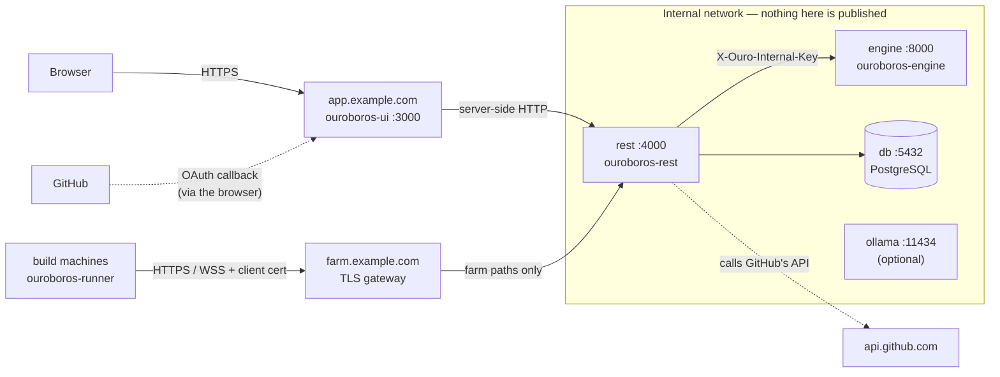

# Hosting Ouroboros

Which hostnames a deployment needs, which services must be reachable from outside and
which must stay on the internal network, and the configuration each container takes.

Everything below uses `example.com` as the placeholder domain. The full variable registry,
with every tuning knob and its reason, is [`docs/ARCHITECTURE.md` § 6.2](docs/ARCHITECTURE.md#62-the-registry).
This document covers only what you have to decide to stand a deployment up.

> **Status.** The single-host production runbook (TLS, backups, upgrades) is issue
> [#58](https://github.com/NobuData/ouroboros/issues/58) and is not written yet. This file
> is derived from the code and the compose files as they stand, not from a deployment that
> has been run in production. Read [Things to verify](#things-to-verify-before-going-live)
> before you rely on it.

---

## 1. The short version

| Hostname (example) | Points at | Exposure | Needed when |
|---|---|---|---|
| `app.example.com` | `ouroboros-ui` :3000 | **Public** (HTTPS) | Always. The only address a person's browser uses |
| `farm.example.com` | TLS gateway → `ouroboros-rest` :4000 (farm paths only) | **Public to build machines** (HTTPS + client certs) | Only if you use the build farm (`ouroboros-runner`) |
| `rest` (internal) | `ouroboros-rest` :4000 | **Internal only** | Always |
| `engine` (internal) | `ouroboros-engine` :8000 | **Internal only** | Always |
| `db` (internal) | PostgreSQL 17 :5432 | **Internal only** | Always |
| `ollama` (internal) | Ollama :11434 | **Internal only** | Only if you run a local model |
| `www.example.com` | `ouroboros-web` :3000 | Public | Only for the marketing site. It is a separate app with no link to the stack |

Two services have no hostname at all:

- **Flyway** (`flyway`) is a one-shot migration job. It runs, migrates the database, and exits.
- **`ouroboros-runner`** runs on your build machines and **listens on nothing**. It dials out
  to `farm.example.com`; nothing ever connects to it.



---

## 2. Why each service is public or internal

### `ouroboros-ui` — public

The browser talks to the UI and **nothing else**. Every call to the API is made by the UI's
Node server, server-side, to the internal REST address. The one exception is the sign-in
family, `/api/auth/*`, which the browser has to travel itself (a click, then GitHub's
redirect back). The UI forwards those requests to REST in
[`ouroboros-ui/proxy.ts`](ouroboros-ui/proxy.ts), so the browser still only ever sees the UI's
origin. That means:

- the **session cookie belongs to `app.example.com`**, and
- the **GitHub OAuth callback URL is on `app.example.com`**:
  `https://app.example.com/api/auth/callback/github`.

### `ouroboros-rest` — internal (plus the farm paths through a gateway)

Because the UI reaches REST server-side, REST does not need a public hostname for the
browser, and GitHub never calls it directly (there are no webhooks). Keep it on the
internal network.

**Never expose `/internal/*`.** REST serves the engine-facing surface (`/internal/runs/*`,
`/internal/llm/invoke`, `/internal/credentials/lease`) on the **same port** as everything
else. It is protected by the shared secret, but it should not be reachable from outside at
all. If REST is ever put behind a public proxy, that proxy must not route `/internal/`.

The build farm is the one outside caller REST has. Runner machines need a small, fixed set of
REST paths over HTTPS with client certificates (see [§ 4](#4-the-build-farm-gateway)). Give
them a dedicated gateway hostname that forwards **only those paths**.

### `ouroboros-engine` — internal

Only REST calls it. Every path but `/healthz` requires `X-Ouro-Internal-Key`, but the
architecture's rule is stronger than that: the engine port is never published
([`docs/ARCHITECTURE.md` § 8](docs/ARCHITECTURE.md#8-architectural-invariants), invariant 3).

### PostgreSQL — internal

Only REST and the Flyway job connect to it. Do not publish 5432.

### Ollama — internal (optional)

Local model providers are reached by the engine's workers at an address REST hands out
(`OURO_LOCAL_PROVIDER_URLS`). Nothing outside needs it.

---

## 3. Configuration per container

Values in `<angle brackets>` are yours to choose. **Generate every secret**, e.g.
`openssl rand -base64 32`. The values in `.env.example` are development placeholders and
must not be deployed.

### 3.1 `db` — PostgreSQL 17

Image: `postgres:17-alpine`. Volume: `/var/lib/postgresql/data`.

| Variable | Value | Notes |
|---|---|---|
| `POSTGRES_USER` | `<db user>` | Read only on the volume's **first** boot |
| `POSTGRES_PASSWORD` | `<db password>` | Secret |
| `POSTGRES_DB` | `ouroboros` | |

### 3.2 `flyway` — migrations (run once per deploy, before REST starts)

Image: `flyway/flyway:13-alpine`, with `ouroboros-db/flyway.toml` and
`ouroboros-db/migrations/` mounted. Follow the `flyway` service in
[`docker-compose.yml`](docker-compose.yml), with two production changes:

- **Do not pass `flyway.seed.toml`.** That file switches on the development seed (demo
  workspaces, people and passwords). Production uses `flyway.toml` alone.
- Point it at the internal database: `-url=jdbc:postgresql://db:5432/ouroboros`,
  `-user=<db user>`, `-password=<db password>`, `-schemas=ouroboros`.

### 3.3 `engine` — `ouroboros-engine`

Build: `ouroboros-engine/Dockerfile` (context `ouroboros-engine/`). Listens on `PORT`
(8000) on all interfaces. Liveness: `GET /healthz` (built into the image's `HEALTHCHECK`).

| Variable | Required | Value | Notes |
|---|:---:|---|---|
| `OURO_ENGINE_SHARED_SECRET` | **yes** | `<engine secret>` | Must equal REST's value. The engine refuses to start without it |
| `OURO_LOG_LEVEL` | no | `info` | `debug`, `info`, `warning`, `error` |
| `PORT` | no | `8000` | Set in the image already |

Leave `OURO_RUN_SIMULATOR_SECRET` and `OURO_REST_URL` **unset**. They exist for the
development-only simulated-run driver, which is not in the production image
([`ouroboros-engine/README.md`](ouroboros-engine/README.md)).

### 3.4 `rest` — `ouroboros-rest`

Build: `ouroboros-rest/Dockerfile` (context: repository root). Listens on `PORT` (4000). The
image sets `NODE_ENV=production`, which makes it bind all interfaces. Health:
`GET /health/live` (process) and `GET /health/ready` (database and engine).

**Required** (REST refuses to start without them):

| Variable | Value | Notes |
|---|---|---|
| `OURO_DATABASE_URL` | `postgresql://<db user>:<db password>@db:5432/ouroboros` | Secret |
| `OURO_ENGINE_URL` | `http://engine:8000` | Internal address |
| `OURO_ENGINE_SHARED_SECRET` | `<engine secret>` | Same value as the engine |
| `OURO_UI_URL` | `https://app.example.com` | Where the browser lands after signing in or out |
| `OURO_REST_URL` | `http://rest:4000` | REST's own address. Also the installer's fallback origin when `OURO_FARM_PUBLIC_URL` is unset, so set that too if you run a farm |
| `BETTER_AUTH_URL` | `https://app.example.com` | The origin sign-in URLs are built from. **The UI's public origin** in this topology (see [Things to verify](#things-to-verify-before-going-live)). Being `https://` is also what gives the session cookie its `__Secure-` prefix |
| `BETTER_AUTH_SECRET` | `<auth secret>` | Signs sessions. Rotating it signs everyone out |
| `OURO_CORS_ORIGINS` | `https://app.example.com` | Comma-separated trusted browser origins; no wildcard |
| `OURO_GITHUB_CLIENT_ID` | `<from your GitHub OAuth App>` | Register the app with callback `https://app.example.com/api/auth/callback/github` |
| `OURO_GITHUB_CLIENT_SECRET` | `<from your GitHub OAuth App>` | Secret |
| `OURO_VAULT_MASTER_KEY` | `<exactly 32 bytes, base64>` | Encrypts stored provider credentials. `openssl rand -base64 32`. **Losing it loses every stored credential**, so back it up separately from the database |

**Build farm** (only if you run `ouroboros-runner`):

| Variable | Value | Notes |
|---|---|---|
| `OURO_FARM_PUBLIC_URL` | `https://farm.example.com` | The address written into the installer. HTTPS only |
| `OURO_FARM_CLIENT_CERT_HEADER` | `x-ouro-client-cert` | Only because the gateway terminates TLS. See [§ 4](#4-the-build-farm-gateway): set it **only** if that header can reach REST through your gateway and nowhere else |
| `OURO_FARM_RELEASES_DIR` | `/runner-releases` | Mount a volume holding `ouroboros-runner` releases (one directory per version) |
| `OURO_FARM_MIN_AGENT_VERSION` | e.g. `0.5.0` | Oldest agent version accepted |
| `OURO_ARTIFACT_DIR` | *(leave unset)* | Where build jobs' uploaded artifacts are kept — test reports, rig captures, serial logs ([#330](https://github.com/NobuData/ouroboros/issues/330)). Unset, it is `/app/.artifacts` in the image, a directory the service user owns; **mount a volume** there, or they are lost with the container. Point it elsewhere only at a directory that user can write. Back it up with the database: the rows point at these files |
| `OURO_ARTIFACT_STORE` | `local` · `s3` | `local` is that volume. A volume is one disk, so **if you run more than one REST replica, use `s3`** — S3 itself, or MinIO — with `OURO_ARTIFACT_S3_ENDPOINT`, `_BUCKET`, `_ACCESS_KEY_ID` and `_SECRET_ACCESS_KEY` (secret). The bucket must exist; REST never creates one |
| `OURO_ARTIFACT_QUOTA_BYTES` · `_MAX_FILE_BYTES` · `_MAX_JOB_BYTES` · `_RETENTION_DAYS` | 10 GiB · 64 MiB · 256 MiB · 30 | Per-workspace quota, per-file and per-job caps, retention. A full quota warns on the job; it never fails the build |

**Optional:**

| Variable | Value | Notes |
|---|---|---|
| `OURO_LOCAL_PROVIDER_URLS` | `ollama=http://ollama:11434` | Only with a local model host. Addresses must be reachable from the engine |
| `OURO_GITHUB_API_BASE_URL` | `https://ghe.example.com/api/v3` | GitHub Enterprise Server only |
| `OURO_RUN_SIMULATOR_SECRET` | *(leave unset)* | Enables the simulated-run principal. Development and test only |

Everything else (poll intervals, sweeps, TTLs, budgets) has a working default. See the
registry in [`docs/ARCHITECTURE.md` § 6.2](docs/ARCHITECTURE.md#62-the-registry).

### 3.5 `ui` — `ouroboros-ui`

Build: `ouroboros-ui/Dockerfile` (context: repository root). Listens on `PORT` (3000) on
all interfaces. The image is built **without** any service address. The address is read at
request time, so one image serves every environment.

| Variable | Required | Value | Notes |
|---|:---:|---|---|
| `OURO_REST_URL` | **yes** | `http://rest:4000` | REST's **internal** address. The UI calls it server-side and never sends it to the browser |
| `PORT` | no | `3000` | Set in the image already |

### 3.6 `ollama` (optional)

Image: `ollama/ollama`, volume `/root/.ollama`. No Ouroboros configuration of its own. Do not
publish its port.

### 3.7 `ouroboros-runner` (on your build machines, not in the stack)

Installed by the one-liner the Build Farm page mints, which points at
`https://farm.example.com/install.sh`. Configured by its service unit, never by a `.env` file:

| Variable | Value |
|---|---|
| `OURO_RUNNER_SERVER` | `https://farm.example.com` |
| `OURO_RUNNER_TOKEN` | A single-use enrollment token minted on the Build Farm page |
| `OURO_RUNNER_STATE_DIR` | `/var/lib/ouroboros-runner` (default) |
| `OURO_RUNNER_SERVER_CA` | Only if `farm.example.com`'s certificate is not signed by a public CA |

---

## 4. The build farm gateway

Runners speak HTTPS and WSS only, and authenticate with a **client certificate** issued by
the farm CA. REST serves plain HTTP, so a TLS-terminating proxy has to sit in front of it and
**forward the client certificate in a header**. If it doesn't, the TLS handshake still
succeeds, REST has no certificate to check, and nothing fails visibly
([`docs/SECURITY_MODEL.md` § 7.6](docs/SECURITY_MODEL.md#76-the-deployment-requirement-that-silently-breaks-mtls)).

Forward **only** these paths to REST:

| Path | Used for |
|---|---|
| `GET /install.sh` | The installer one-liner |
| `/runner/*` | Agent release downloads |
| `/api/v1/farm/registrations*` | Enrollment and certificate renewal |
| `/api/v1/farm/agent` | The agent's WebSocket (needs upgrade headers and a read timeout well above the 10 s heartbeat) |
| `POST /api/v1/farm/jobs/<id>/artifacts` | A finished job's artifact upload ([#330](https://github.com/NobuData/ouroboros/issues/330)). Authenticated by a single-use token from the job's offer. Needs a **body limit above the per-job cap** (nginx's 1 MiB default refuses every real upload), **unbuffered** request streaming, and a read timeout of minutes |

Everything else on this hostname should answer 404. A working gateway is
[`tests/e2e/fixtures/farm-gateway/nginx.conf`](tests/e2e/fixtures/farm-gateway/nginx.conf). In
production, swap its test certificate for a real one for `farm.example.com`:

```nginx
server {
  listen 443 ssl;
  server_name farm.example.com;
  ssl_certificate     /etc/ssl/farm.example.com.pem;
  ssl_certificate_key /etc/ssl/farm.example.com.key;
  ssl_verify_client   optional_no_ca;   # REST verifies the certificate against the farm CA

  # Always overwrite the header, so a client can never supply its own.
  proxy_set_header X-Ouro-Client-Cert $ssl_client_escaped_cert;
  proxy_set_header X-Forwarded-Proto  https;
  proxy_set_header Host               $host;

  location = /install.sh               { proxy_pass http://rest:4000; }
  location /runner/                    { proxy_pass http://rest:4000; }
  location /api/v1/farm/registrations  { proxy_pass http://rest:4000; }
  location = /api/v1/farm/agent {
    proxy_http_version 1.1;
    proxy_set_header   Upgrade    $http_upgrade;
    proxy_set_header   Connection "upgrade";
    proxy_set_header   X-Ouro-Client-Cert $ssl_client_escaped_cert;
    proxy_read_timeout 120s;
    proxy_pass http://rest:4000;
  }
  # Artifact uploads: the per-job cap (256 MiB by default) plus multipart framing.
  location ~ ^/api/v1/farm/jobs/[0-9a-f-]+/artifacts$ {
    client_max_body_size    300m;
    proxy_request_buffering off;
    proxy_read_timeout      900s;
    proxy_pass http://rest:4000;
  }
  location / { return 404; }
}
```

The header name in `proxy_set_header` must match REST's `OURO_FARM_CLIENT_CERT_HEADER`. If
your build machines sit on a known network, restrict `farm.example.com` to it with a firewall
rule as well.

---

## 5. The app host

`app.example.com` is a plain HTTPS reverse proxy to the UI, with nothing path-specific:

```nginx
server {
  listen 443 ssl;
  server_name app.example.com;
  ssl_certificate     /etc/ssl/app.example.com.pem;
  ssl_certificate_key /etc/ssl/app.example.com.key;

  location / {
    proxy_set_header Host              $host;
    proxy_set_header X-Forwarded-Proto https;
    proxy_set_header X-Forwarded-For   $proxy_add_x_forwarded_for;
    proxy_pass http://ui:3000;
  }
}
```

---

## 6. A compose sketch

A starting point for a single host, adapted from [`docker-compose.yml`](docker-compose.yml)
(the development file). Put secrets in an `.env` file next to it that is not committed, or
in your platform's secret store. Only the proxy publishes ports.

```yaml
name: ouroboros

services:
  db:
    image: postgres:17-alpine
    environment:
      POSTGRES_USER: ${OURO_DB_USER}
      POSTGRES_PASSWORD: ${OURO_DB_PASSWORD}
      POSTGRES_DB: ouroboros
    volumes: [ouroboros-db-data:/var/lib/postgresql/data]
    healthcheck:
      test: ["CMD-SHELL", "pg_isready -U ${OURO_DB_USER} -d ouroboros"]
      interval: 2s
      retries: 30
    restart: unless-stopped

  flyway:
    image: flyway/flyway:13-alpine
    depends_on: { db: { condition: service_healthy } }
    volumes:
      - ./ouroboros-db/flyway.toml:/flyway/project/flyway.toml:ro
      - ./ouroboros-db/migrations:/flyway/project/migrations:ro
    command:
      - -workingDirectory=/flyway/project
      - -configFiles=/flyway/project/flyway.toml   # NOT flyway.seed.toml
      - -url=jdbc:postgresql://db:5432/ouroboros
      - -user=${OURO_DB_USER}
      - -password=${OURO_DB_PASSWORD}
      - -schemas=ouroboros
      - migrate
    restart: "no"

  engine:
    build: { context: ./ouroboros-engine }
    environment:
      OURO_ENGINE_SHARED_SECRET: ${OURO_ENGINE_SHARED_SECRET}
      OURO_LOG_LEVEL: info
    restart: unless-stopped

  rest:
    build: { context: ., dockerfile: ouroboros-rest/Dockerfile }
    depends_on:
      db: { condition: service_healthy }
      flyway: { condition: service_completed_successfully }
      engine: { condition: service_healthy }
    environment:
      OURO_DATABASE_URL: postgresql://${OURO_DB_USER}:${OURO_DB_PASSWORD}@db:5432/ouroboros
      OURO_ENGINE_URL: http://engine:8000
      OURO_ENGINE_SHARED_SECRET: ${OURO_ENGINE_SHARED_SECRET}
      OURO_REST_URL: http://rest:4000
      OURO_UI_URL: https://app.example.com
      BETTER_AUTH_URL: https://app.example.com
      BETTER_AUTH_SECRET: ${BETTER_AUTH_SECRET}
      OURO_CORS_ORIGINS: https://app.example.com
      OURO_GITHUB_CLIENT_ID: ${OURO_GITHUB_CLIENT_ID}
      OURO_GITHUB_CLIENT_SECRET: ${OURO_GITHUB_CLIENT_SECRET}
      OURO_VAULT_MASTER_KEY: ${OURO_VAULT_MASTER_KEY}
      # Build farm — remove these four if you run no runners.
      OURO_FARM_PUBLIC_URL: https://farm.example.com
      OURO_FARM_CLIENT_CERT_HEADER: x-ouro-client-cert
      OURO_FARM_RELEASES_DIR: /runner-releases
      OURO_FARM_MIN_AGENT_VERSION: 0.5.0
    volumes:
      - ouroboros-runner-releases:/runner-releases:ro
      # Build artifacts (#330) — OURO_ARTIFACT_DIR's default in the image. Or set OURO_ARTIFACT_STORE=s3.
      - ouroboros-artifacts:/app/.artifacts
    restart: unless-stopped
    # No `ports:` — REST is internal.

  ui:
    build: { context: ., dockerfile: ouroboros-ui/Dockerfile }
    depends_on: { rest: { condition: service_healthy } }
    environment:
      OURO_REST_URL: http://rest:4000
    restart: unless-stopped

  proxy:
    image: nginx:alpine
    depends_on: [ui, rest]
    ports: ["443:443"]
    volumes:
      - ./deploy/nginx.conf:/etc/nginx/nginx.conf:ro   # §§ 4 and 5
      - ./deploy/certs:/etc/ssl:ro
    restart: unless-stopped

volumes:
  ouroboros-db-data:
  ouroboros-runner-releases:
  ouroboros-artifacts:
```

The development `docker-compose.yml` differs on purpose: it publishes REST and the UI on
`127.0.0.1`, applies the demo seed, and uses placeholder secrets. Don't deploy it as is.

---

## Things to verify before going live

1. **`BETTER_AUTH_URL` is the UI's origin in this topology.** The `.env.example` files set it
   to REST's address (`http://localhost:4000`), which works in development because both
   services are on `localhost`. With REST internal, the browser and GitHub's redirect can
   only reach `app.example.com`, and `ouroboros-ui/proxy.ts` is written for exactly that:
   the callback lands on the UI and is forwarded. Confirm a full GitHub sign-in on your
   first deployment, and that the browser holds `__Secure-better-auth.session_token` for
   `app.example.com`.
2. **`/internal/*` is unreachable from outside.** From a machine outside your network,
   `curl https://app.example.com/internal/runs` and the same on `farm.example.com` must not
   reach REST. On `app` it is a UI 404; on `farm` it is the gateway's 404.
3. **The engine and database ports are unreachable from the host's public interfaces.**
4. **The client certificate really arrives.** Enroll one runner and confirm it shows
   **online** on the Build Farm page. A gateway that drops the header fails the certificate
   check, and the runner cannot connect.
5. **No development seed.** `ouroboros.users` should hold only the people who have signed
   in, not `ken@acme-robotics.dev` and the other demo accounts.
