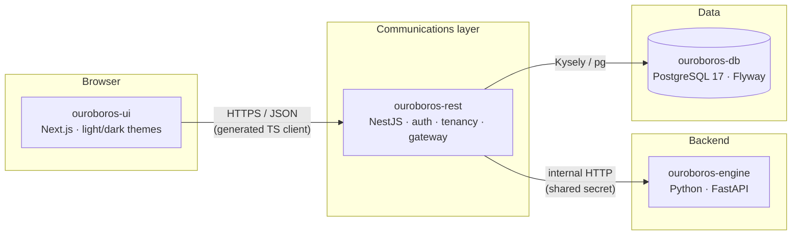

# Ouroboros

**Infinity in Autonomy** — an autonomous software delivery loop: issues in, verified
pull requests out, continuously.

This repository is a monorepo of independent modules. Each one owns its toolchain and
builds on its own; there is no workspace runner between them. See
[`docs/CONVENTIONS.md`](docs/CONVENTIONS.md) for the rules they share and
[`docs/ARCHITECTURE.md`](docs/ARCHITECTURE.md) — landing in
[#12](https://github.com/NobuData/ouroboros/issues/12) — for the system design in depth.

## Module map

| Directory | Purpose | Stack | Port | Epic |
|---|---|---|:---:|:---:|
| [`ouroboros-ui/`](ouroboros-ui) | Product UI — the application users sign into | Next.js (App Router), TypeScript, Yarn | 3000 | [#5](https://github.com/NobuData/ouroboros/issues/5) |
| [`ouroboros-rest/`](ouroboros-rest) | Communications layer — auth, tenancy, gateway | NestJS 11, TypeScript, Kysely, Yarn | 4000 | [#4](https://github.com/NobuData/ouroboros/issues/4) |
| [`ouroboros-engine/`](ouroboros-engine) | Backend work execution | Python 3.12, FastAPI, uv | 8000 | [#6](https://github.com/NobuData/ouroboros/issues/6) |
| [`ouroboros-db/`](ouroboros-db) | Tenancy schema and migrations | PostgreSQL 17, Flyway 11, SQL | 5432 | [#3](https://github.com/NobuData/ouroboros/issues/3) |
| [`ouroboros-web/`](ouroboros-web) | Marketing site — [ouroboros.build](https://ouroboros.build) | Next.js, TypeScript, Yarn | 3000 | — |
| [`docs/`](docs) | Mockups, design system, roadmaps, architecture | Markdown, HTML | — | — |

`ouroboros-web` is the public marketing site and is **not** part of the application
stack — it ships and deploys on its own.

The four application modules are scaffolded by their epics; today each directory holds
the README that defines the contract its scaffold must satisfy.

## Architecture



Only `ouroboros-rest` talks to the database and to the engine. The UI reaches neither
directly — that single boundary is what keeps tenancy enforcement in one auditable
place. The full set of invariants is in
[`docs/CONVENTIONS.md`](docs/CONVENTIONS.md#10-architectural-invariants).

## Repository layout

```
ouroboros/
├── docs/              # mockups, design system, roadmaps, conventions, architecture
├── ouroboros-web/     # marketing site (deployed at ouroboros.build)
├── ouroboros-ui/      # Next.js product UI
├── ouroboros-rest/    # NestJS communications layer
├── ouroboros-engine/  # Python/FastAPI backend
├── ouroboros-db/      # Flyway migrations
├── scripts/           # repo-level tooling
├── .github/           # labels, issue forms, PR template, workflows
├── .editorconfig      # repo-wide editor conventions
└── .gitignore         # repo-wide ignores
```

## Getting started

Each module is built and run on its own — see its README for the specifics:

```bash
# TypeScript modules (ouroboros-ui, ouroboros-rest, ouroboros-web)
yarn install --immutable && yarn dev

# Python module (ouroboros-engine)
uv sync && uv run dev

# Database (ouroboros-db) — from the repo root, once #10 lands
docker compose up db
```

Only `ouroboros-web` is scaffolded today; the other three commands become live as their
scaffolding issues land ([#39](https://github.com/NobuData/ouroboros/issues/39),
[#27](https://github.com/NobuData/ouroboros/issues/27),
[#50](https://github.com/NobuData/ouroboros/issues/50),
[#19](https://github.com/NobuData/ouroboros/issues/19)).

Environment variables are prefixed `OURO_` (except `PORT` and platform standards), are
validated at boot, and are documented in the repo-root `.env.example`
([#10](https://github.com/NobuData/ouroboros/issues/10)).

Repository structure and GitHub configuration can be checked at any time, and the
repo-level tooling has its own tests:

```bash
scripts/verify-layout.sh          # module layout, READMEs, .editorconfig coverage
scripts/verify-github-config.sh   # label definitions, issue forms, PR template
scripts/run-tests.sh              # tests for the tooling in scripts/
```

## Documentation

| Document | What it covers |
|---|---|
| [`docs/CONVENTIONS.md`](docs/CONVENTIONS.md) | Toolchains, env vars, containers, code style, git workflow |
| [`docs/ARCHITECTURE.md`](docs/ARCHITECTURE.md) | System diagram, port map, env registry, module contracts (lands in [#12](https://github.com/NobuData/ouroboros/issues/12)) |
| [`docs/DESIGN_SYSTEM_APP_SHELL.md`](docs/DESIGN_SYSTEM_APP_SHELL.md) | The application shell specification |
| [`docs/mockups/`](docs/mockups) | 22 designed screens plus the design-system stylesheet |
| [`docs/ROADMAP_OUROBOROS_APPLICATION_SCAFFOLDING.md`](docs/ROADMAP_OUROBOROS_APPLICATION_SCAFFOLDING.md) | The plan this repository is executing |

## Contributing

Work is tracked as GitHub issues grouped into epics. File one with the **Feature** or
**Bug** form on the new-issue page, branch `ticket-<number>` from `main`, commit as
`Fix #<number> - <title>`, and open a pull request that closes the issue — the pull
request template carries the checklist. The conventions doc has the details.

Labels are defined in [`.github/labels.yml`](.github/labels.yml) rather than only in
GitHub's settings, so the set is reviewable and can be rebuilt:

```bash
scripts/sync-labels.sh --dry-run   # what would change
scripts/sync-labels.sh             # create what is missing, update what has drifted
```

## License

[Apache License 2.0](LICENSE).
