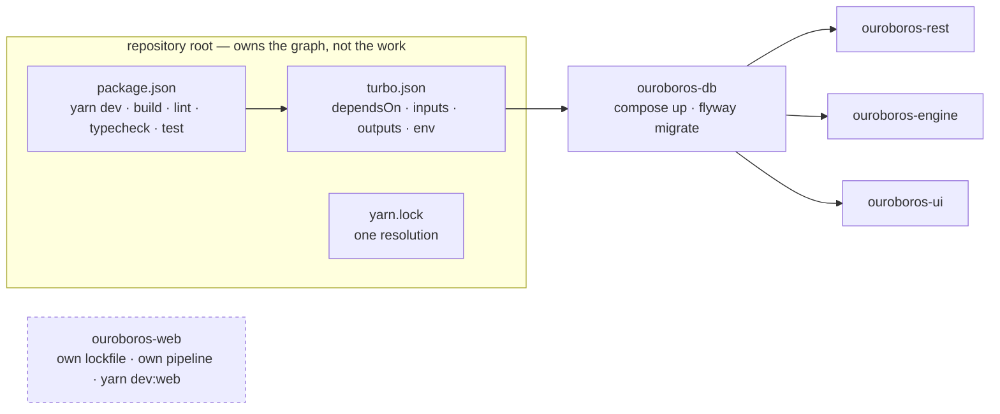

# Decision — the workspace runner

> **Issue:** [#13](https://github.com/NobuData/ouroboros/issues/13) — *Workspace tooling
> evaluation (Turborepo/Nx)* · **Decided:** 2026-08-10 · **Status:** adopted —
> **Turborepo 2.10.9** over Yarn 4 workspaces.

Issue #13 asked for a spike, not a migration: *evaluate Turborepo vs. Nx vs. the status
quo, adopt only if it removes real friction, and write up the decision either way.* This
is that write-up. It records what was compared, what was measured on this checkout, what
was adopted, what the adoption deliberately does **not** cover, and what would reopen the
question.

The rules that follow from it live in
[`CONVENTIONS.md § 1`](CONVENTIONS.md#1-repository-shape); this document is why they say
what they say.

## The friction being solved

Four application modules across three toolchains — Next.js, NestJS, FastAPI/uv, Flyway —
each owning its own build, its own tests and its own container. Before the change, that
independence cost three things:

1. **Two lockfiles for one language.** `ouroboros-ui` and `ouroboros-rest` are both
   TypeScript on Yarn 4, each resolving its own tree. Two resolutions of the same
   dependency graph drift, and drift between the UI and the layer it calls is the
   expensive kind.
2. **Start-up order lived in prose.** The stack only comes up in one order — PostgreSQL,
   then the migrations, then the three services — and that order was a paragraph in a
   README, re-read by a new contributor exactly once.
3. **Nothing knew what had already been done.** Every verb re-ran from scratch on every
   invocation, whether or not its inputs had moved.

Decision D6 — *simple and lightweight* — is what kept a runner out until now, and it is
the thing any adoption has to answer to. A runner that solves the three above and adds a
fourth problem of its own is not worth having.

## What was measured

Timings from this checkout (`ouroboros-ui` scaffolded, `ouroboros-engine` scaffolded with
164 tests, `ouroboros-db` on its shell suite, `ouroboros-rest` still a README), cold means
the local cache was deleted first:

| Verb | Modules running it | Cold | Cached |
|---|:--:|--:|--:|
| `yarn build` | 1 | 2.58 s | 10 ms |
| `yarn typecheck` | 1 | 1.13 s | 8 ms |
| `yarn lint` | 2 | 0.90 s | 8 ms |
| `yarn test` | 3 | 0.88 s | 7 ms |

The honest reading of that table is that **caching is not yet the reason to adopt
anything**. Five and a half seconds saved is not friction; the local cache is 13 MB to
store it in. What the numbers do establish is that the mechanism works and costs nothing
to keep, so it is already in place for when `ouroboros-rest` lands, the UI grows past two
routes, and the suites get slow enough for the table to matter.

The reasons to adopt now are the first two items in the section above — one resolution,
and an ordering that is executable rather than described — and those are worth it at four
modules, not at fourteen.

## The options

### Status quo — per-module scripts

**What it costs to keep:** every verb documented per module and run per module; the
start-up order stays prose; two Yarn resolutions for two TypeScript modules that call
each other.

**What it buys:** nothing to learn, nothing to install, and each module directory lifts
out of the repository unchanged. That last property is real and the adopted option gives
part of it up (see *[What it cost](#what-it-cost)*).

**Verdict:** rejected — but narrowly, and for one reason. The two TypeScript modules
share a dependency graph, and there is no version of "keep it simple" in which resolving
that graph twice is the simple option.

### Turborepo

A task runner over the package manager's own workspaces. `turbo.json` declares what has
to happen before what; hashing the inputs of a task decides whether to run it or replay
it. It has no opinion about how a task is carried out — `next build`, `uv run pytest`, a
shell script — which is exactly the shape of a repository with three toolchains in it.

**What it buys here:**

- `dependsOn` makes the start-up order executable: `yarn dev` brings PostgreSQL up,
  migrates it, and only then starts the three services.
- Content hashing with a strict environment by default — a variable not declared in
  `globalEnv` does not reach the task at all, so a cache hit cannot hide behind a value
  the hash never saw.
- `--filter` and `--affected` for scoping a run, if CI ever wants them.
- Remote caching exists (Vercel-hosted or self-hosted) and is **not** enabled here.

**What it does not buy:** generators beyond a thin Plop wrapper, dependency-boundary
lint rules, or any understanding of Python or SQL beyond "run this script".

### Nx

A build system with a plugin model. Everything Turborepo does, plus inferred targets from
tooling configuration, first-class Next.js and NestJS generators, an
`enforce-module-boundaries` ESLint rule, `nx affected`, and Nx Cloud for remote caching
and distributed task execution.

**Why not, on this repository:**

- **The generators are the main draw, and they generate what already exists.**
  `ouroboros-ui` was scaffolded by `create-next-app` and `ouroboros-engine` by hand
  against a written contract; both are done. Adopting a tool for the scaffolding it would
  have produced is paying afterwards for a service already rendered.
- **The boundary rule has one boundary to enforce, and it is not a TypeScript import.**
  The invariant that matters here — *the UI never touches the database or the engine
  directly* — is a network boundary between a browser bundle and two servers, not an
  import edge between packages. `@nx/enforce-module-boundaries` cannot see it.
  [`ARCHITECTURE.md`](ARCHITECTURE.md) states it and review enforces it.
- **Two of the four modules are not JavaScript.** Python and Flyway reach Nx the same way
  they reach Turborepo — through a shim, or through a community plugin that becomes this
  repository's problem when it lags a release.
- **It is more tool than the problem.** `nx.json` plus per-project configuration, a
  plugin per toolchain and an inference model to understand, against a `turbo.json` whose
  entire content fits on one screen. Against decision D6, that is the whole argument.

**Verdict:** rejected for now, and reconsidered under the triggers below — the case for
Nx grows with the number of *JavaScript* packages, and this repository has two.

## The decision

**Turborepo 2.10.9 over Yarn 4 workspaces**, pinned to exact versions, configured by one
[`turbo.json`](../turbo.json) at the root.



Two commands are the whole of what it buys a developer:

```bash
yarn install    # every workspace, from one lockfile
yarn dev        # PostgreSQL, migrated · engine · rest · UI — in order, in one terminal
```

### Three limits, on purpose

1. **`ouroboros-web` is not a workspace.** The marketing site deploys on its own pipeline
   and wants the same port 3000 the product UI does. It keeps its own lockfile and its own
   `.yarnrc.yml`, `yarn dev` never starts it, and `yarn dev:web` does.
2. **CI does not go through turbo.** Each module's workflow runs that module's verbs from
   inside that module's directory, the way a developer does. A break in the task graph
   must never be the thing that makes a module's checks pass — and a cache hit must never
   be what makes them green.
3. **The non-JavaScript modules get adapters, not ports.** `ouroboros-engine` and
   `ouroboros-db` carry a `package.json` whose scripts are one line each — `uv run dev`,
   `./run.sh`. `pyproject.toml` and `flyway.toml` remain those modules' real manifests,
   and neither adapter carries a version, so [§ 8](CONVENTIONS.md#8-versioning) still has
   one place per module where a version is written down.

### What the evaluation found

Adopting a cache means adopting a way to be wrong: a task can be replayed when it should
have run. This repository had exactly one instance, and it was invisible until it was
looked for.

`ouroboros-db`'s suite is not run by anything inside `ouroboros-db`. Its package script
hands the directory to the repo-root `scripts/run-tests.sh`, and the tests themselves
source `scripts/lib/checks.sh`. A task's hash covers its own package and the global
dependencies — so the runner and the assertion harness could both be rewritten and the
cached pass would still be replayed. Verified by appending a line to `scripts/run-tests.sh`
and re-running `yarn test`: `ouroboros-db:test: cache hit, replaying logs`.

The fix is an explicit boundary in [`turbo.json`](../turbo.json):

```jsonc
"ouroboros-db#test": {
  "dependsOn": ["^build"],
  "inputs": ["$TURBO_DEFAULT$", "$TURBO_ROOT$/scripts/**"]
}
```

`$TURBO_DEFAULT$` keeps the package's own files in the hash — `inputs` replaces the
default set rather than extending it, so omitting it would trade one stale green for a
worse one. `$TURBO_ROOT$` is how an input reaches above its package. After the change the
same probe reports `cache miss, executing`, while `ouroboros-ui` and `ouroboros-engine`
still hit.

The general rule, and what [`verify-workspace.sh`](../scripts/verify-workspace.sh)
enforces: **a script that reads files above its own package declares them, or is not
cached at all.**

## What it does not buy

Two of the three things issue #13 named as evaluation criteria turn out not to be a
runner's job at all. Recording that is half the point of the exercise.

### Shared TypeScript configuration

Bought by **workspaces**, not by the runner. Neither tool shares a `tsconfig.json` by
existing: the mechanism is a base config the modules `extends`, either at the root or as
an internal package, and it is available identically under Turborepo, under Nx, and under
plain Yarn workspaces. It was not set up when this was written because there was one
TypeScript module with a `tsconfig.json`;
[#27](https://github.com/NobuData/ouroboros/issues/27) has since landed the second, and
the two share little — one is a Next.js bundler configuration, the other a decorator-aware
CommonJS one — so there is still nothing a base config would carry that is worth the
indirection. This stays open until there is.

### The generated-client handoff

[#34](https://github.com/NobuData/ouroboros/issues/34) exports `ouroboros-rest/openapi.json`
and [#43](https://github.com/NobuData/ouroboros/issues/43) generates the UI's typed client
from it. The reason a task graph does not help is that **the spec is a committed
artefact**, not a build output: #34 commits it and fails CI when it drifts from the code,
and #43's `yarn api:sync` reads the committed file. Nothing has to be built for the UI to
typecheck, so there is no edge for `dependsOn` to add — and adding one would make the UI's
build depend on a REST build that produces nothing it reads.

What the graph *can* do for that handoff, when #43 lands, is make the drift check cheap
and correct — a task whose inputs name the spec, so it replays until the spec moves:

```jsonc
"ouroboros-ui#api:check": {
  "inputs": ["$TURBO_DEFAULT$", "$TURBO_ROOT$/ouroboros-rest/openapi.json"]
}
```

That is the same boundary rule as the `ouroboros-db#test` fix above, and the same script
enforces it: any UI script that reaches into `../ouroboros-rest` will fail
`verify-workspace.sh` until its inputs say so.

## What it cost

- **A module directory no longer lifts out of the repository on its own.** For
  `ouroboros-ui` and `ouroboros-rest` that now takes the root `package.json`, `yarn.lock`
  and `.yarnrc.yml` with it. `ouroboros-web` is untouched and remains self-contained.
- **Container builds moved their context to the repository root**, because that is where
  the lockfile an immutable install needs now lives — settled by
  [#47](https://github.com/NobuData/ouroboros/issues/47) and written down in
  [`CONVENTIONS.md § 5`](CONVENTIONS.md#5-containers).
- **Two more root files both TypeScript workflows must watch.** `package.json`,
  `yarn.lock`, `turbo.json` and `.yarnrc.yml` can each break a module's build without
  touching that module's directory, so `ci/ui` and `ci/rest` filter on all four.
  `scripts/verify-ci.sh` asserts the routing in both directions — that a change to any of
  the four queues exactly those two workflows, and that a change confined to one module
  still queues only its own.
- **One more dependency at the root**, pinned exactly, and one more file to understand.
  That is the whole of the D6 cost, and it is why nothing beyond the task graph was
  adopted with it.

## When to revisit

Any one of these is reason to reopen the comparison — the first three toward Nx, the last
two toward more Turborepo rather than a different tool:

1. **More than about six JavaScript packages**, particularly shared internal libraries
   with import edges between them. That is where `enforce-module-boundaries` and generated
   scaffolding start paying for themselves, and where a hand-maintained `turbo.json` stops
   being one screen.
2. **A dependency-boundary rule that is a TypeScript import**, rather than the network
   boundary this architecture is built on.
3. **Toolchain plugins earning their keep** — an Nx plugin that owns Next.js or NestJS
   upgrades better than the modules do themselves.
4. **A cold verb passing roughly a minute**, or CI wall-clock dominated by re-running work
   whose inputs have not moved. That is remote caching, not a new runner: turn it on for
   CI first and measure.
5. **A real cross-module build artefact** — a shared package the UI imports, or a client
   generated at build time rather than committed. That is a `dependsOn` edge, which is
   what the graph is already there for.

Until one of those is true, the answer is this document.

## How this stays true

| Check | What it asserts |
|---|---|
| [`verify-workspace.sh`](../scripts/verify-workspace.sh) | The roster is these four modules and `ouroboros-web` is outside it; one lockfile; both versions pinned exactly; every root verb reaches a declared task and every task a verb; nothing Docker-facing is cached; and every script that reads above its package declares it |
| [`verify-ci.sh`](../scripts/verify-ci.sh) | The four workspace-root files route to `ci/ui` and `ci/rest`, and a change confined to one module still runs only that module's workflow |
| [`verify-layout.sh`](../scripts/verify-layout.sh) | The module directories and READMEs the roster is drawn from |

Run them with `scripts/run-tests.sh`, or individually — they read files and start nothing.
