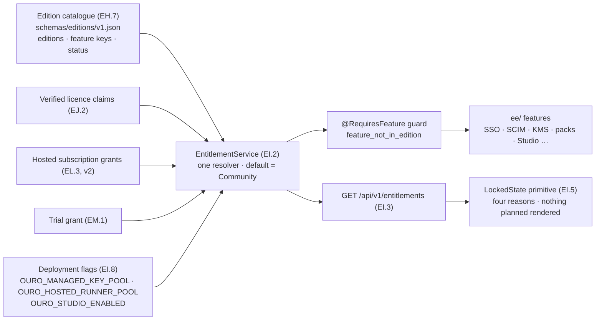
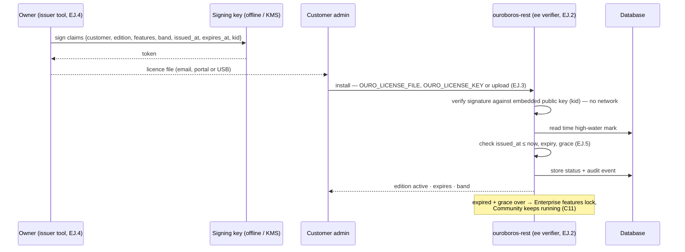
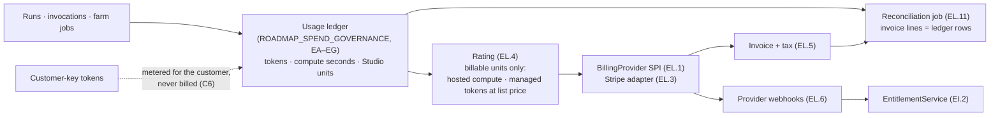
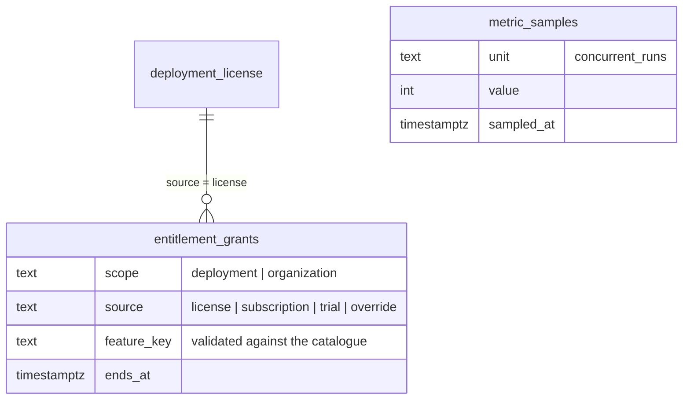
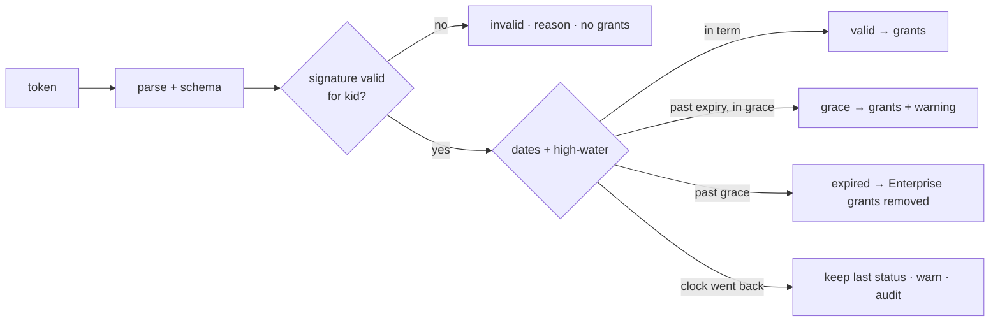
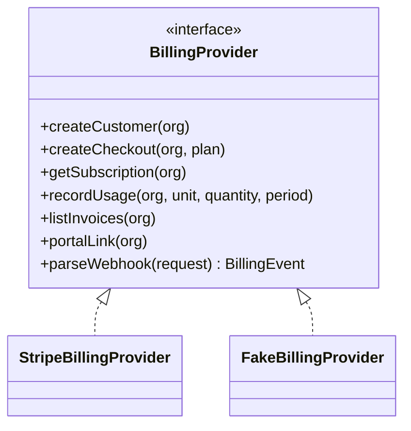
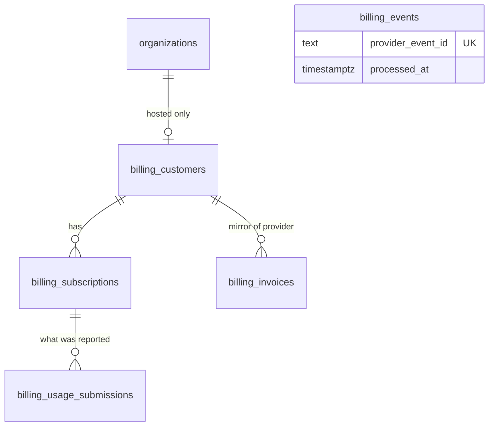
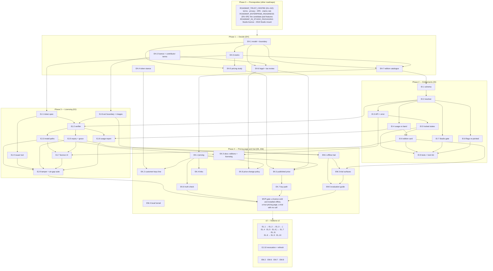

# Roadmap — Editions, Pricing and Billing

## Description

> Editions, pricing and billing: Ouroboros is an Apache-2.0, self-hosted project with no price, plan, entitlement or billing. Decide the business model (the open and paid boundary, the licence metric, whether tokens are ever resold), build an entitlements framework with honest locked states, signed licence keys with offline validation for self-hosted and air-gapped installs, a published pricing page, billing integration for a hosted tier, and a trial path that reaches a first pull request without a sales call, with the Studio plug-in as an entitlement.

## Context & Existing Work (duplicate-avoidance survey)

Surveyed 2026-10-10 against the checkout, `gh issue list -R NobuData/ouroboros`
(read-only) and the web. Nothing in this document is filed, built or decided:
every epic and issue below is **proposed**, and the business-model choices are
the owner's. This roadmap presents them as a decision record with evidence and
a recommendation to validate (§ Infrastructure Options, § Decisions).

**Source of this roadmap:** the competitor gap analysis of 2026-10-10
(`ouroboros-studio/reports/Ouroboros competitor gap analysis.md`, § *P1-5 ·
Editions, pricing and billing*, the commercial-readiness checklist and the
conclusion) and its research note `commercial_readiness_benchmarks.md`. The
report's position statement is the constraint every option here is tested
against: what is hard for model vendors and tracker vendors to copy is
**neutrality** — "a control plane the customer hosts, that routes across
providers the customer chooses, attributes cost per run without selling the
tokens, and gates merges on evidence a third party can read."

**What exists today (verified in the checkout, 2026-10-10):**

- **Licence** — `LICENSE` is Apache License 2.0 and `README.md` § License says
  so. There is no `CONTRIBUTING`, CLA or DCO file at the repository root, and
  no `ee/` or otherwise separately licensed directory.
- **No commercial code** — `ouroboros-rest/src/modules/` has no billing,
  licensing, entitlement, plan or subscription module (70 module directories
  read). `ouroboros-rest/src/modules/pricing/` is the **model** pricing
  service (CH.3, #586 ✅): it prices tokens from the bundled catalogue and has
  nothing to do with what Ouroboros charges.
- **Deployment capability flags** — `OURO_MANAGED_KEY_POOL`,
  `OURO_HOSTED_RUNNER_POOL` and `OURO_MANAGED_KEY_TRIAL_CENTS` (BB.5, #388 ✅,
  decision O6) declare what a deployment may promise in the wizard's Smart
  Defaults card. Both pools default to `false`; "the pools themselves arrive
  in a later release (issue #397)" (`.env.example`). These flags are the only
  thing in the product resembling an entitlement, and they are per deployment,
  not per workspace.
- **Deployment-truth rendering** — Settings decision S6 (BQ.4, #483 ✅): the
  workspace card renders the training-data switch as "off and impossible" on
  a self-hosted install and never as a fake enterprise-plan lock; the
  notifications card has a locked-row pattern (*"connect PagerDuty first"*)
  for a missing prerequisite. There is no lock that means "not in your
  edition", because there are no editions.
- **Marketing site** — `ouroboros-web/app/page.tsx` is a single page. The
  footer **Pricing** link points at `#cta`; the call to action *"Start free —
  no card"* links to `#top`. There is no `/pricing` route.
- **Hosting** — `HOSTING.md` describes a compose stack and says it is "not
  from a deployment that has been run in production"; the production runbook
  is #58 (open). There is no hosted Ouroboros service.
- **Studio plug-in** — its mount points in this repository (#918–#922) are
  open; `OURO_STUDIO_ENABLED` is specified there and not implemented. The
  Studio repository has no licence file (gap analysis, P1-8).

**Issue survey** (`gh issue list --search "<term> in:title" --state all`,
2026-10-10):

| Term | Hits that matter | Reading |
|---|---|---|
| billing, entitlement, licence, trial, stripe, metering, locked | none | Nothing filed. (`license` matches #374 AZ.4, which is dependency-licence scanning — unrelated.) |
| plan | Planning epics only (#268–#293 etc.) | Unrelated: roadmap planning, not price plans. |
| tier, SaaS | #397, #500, #379, #600 | #397 and #500 are the two issues this roadmap must consume; #600 (CJ.3 environment-tier aliases) is unrelated. |
| pricing | #575, #580 ✅, #586 ✅, #598 | Model pricing catalogue — consumed by spend metering, not by this roadmap's price list. |
| subscription | #550 (CB.5 channel digests) | Unrelated. |
| telemetry | #400, #784, #266 | #400 is consumed (trial funnel aggregates); #784 is the Marketplace hub's install telemetry. |

**Overlapping work and dispositions:**

| Existing work | Disposition under this roadmap |
|---|---|
| **#397 BD.2 — Managed keys & hosted runner tier** (open, v2) | **Consumed, not duplicated.** It builds the pools, per-org trial budgets with hard caps at invocation, the BYOK upgrade flow and abuse controls, and states "billing integration is explicitly out of scope; this issue provides the metering that billing would consume." EM.6 binds its trial budget to an entitlement; EL.4 bills what it meters. This roadmap builds no pool. |
| **#500 BT.4 — SaaS governance tier** (open, v2) | **Split by amendment.** Its "deployment-tier framework … with entitlements" and "entitlement gating surfaces" bullets are delivered by EI.1–EI.5 and should be removed from #500 at filing (amendment listed under Totals); region migration, training-data enforcement and compliance packs stay in #500 and become features gated through EI.2. |
| **#400 BD.5 — Opt-in aggregate telemetry** (open, v2) | **Consumed.** EM.4 records the install-to-first-PR funnel **locally only**; any cross-tenant figure (a published "median time to first PR") exists only through #400's consent and cohort rules. |
| **#388 BB.5 ✅ deployment capability flags** | **Re-pointed.** The two pool flags become inputs to the entitlement resolver (EI.8) so that one service answers "what may this deployment promise"; the variables keep their names and defaults. |
| **#483 BQ.4 ✅ deployment truth (S6), the Settings locked-row pattern** | **Generalised.** EI.5 turns the locked row into a primitive with four distinct, truthful reasons; S6's rule ("never a fake plan lock") becomes a lint (EI.9). |
| **#722/#723 enterprise SSO, #497 SCIM, #236 KEK wrappers, #498 policy as code, #501 audit intelligence** (all open, v2) | **Candidate paid features — untouched here.** They are owned by their roadmaps and by `ROADMAP_ENTERPRISE_READINESS.md`; this roadmap only reserves feature keys for them in the catalogue (EH.7) if decision C1 places them in a paid edition. |
| **#237 AF.4 cap enforcement, #92 J.4 priced token accounting, #826 J.6 metered vs unmetered spend, #235 AF.2 chain executor** (open) | **Upstream of billing.** Owned by `ROADMAP_SPEND_GOVERNANCE.md`; EL.4 reads its ledger and never meters on its own. |
| **#396 BD.1 live first-loop experience, `ROADMAP_OOE_LIVE_LOOP.md`** | **Precondition for the trial's claim.** A trial that "reaches a first pull request" needs a loop that opens one. EM builds the trial mechanics; the first-PR milestone lights only when the live loop exists. |
| **Marketplace roadmap 23 (CS–CX, 0 of 37 built)** | **Boundary.** It specifies no price, payment or revenue share, and the research found "no evidence of any coding-agent plugin marketplace paying or charging revenue share". This roadmap adds none. Private registries and federation (CX.1/CX.2) are candidate paid features by catalogue key only. |
| **#57 image publishing, #58 deployment runbook** (open) | **Adjacent.** EJ.6's edition image variants extend whatever #57 publishes; nothing here writes a runbook. |
| **#918–#922 Studio mount amendments** (open) | **Composed.** EI.7 adds the `studio` entitlement beside `OURO_STUDIO_ENABLED`; the mount work stays where it is filed. |
| **`ouroboros-web` SOC 2 / ISO / SSO chips and hero statistics** | **Not this roadmap.** Owned by `ROADMAP_TRUST_CENTRE.md`. EK touches only the Pricing link, the call to action and the new `/pricing` route. |

**Sibling roadmaps being written in parallel.** Drafts of all three were
present in `docs/` when this document was finished (2026-10-10) and their
epic tables were read; their issue bodies were not, none is filed, and they
may still change. References below are by file and epic and must be
reconciled issue by issue before filing:

| Sibling | Epics | What this roadmap needs from it | What it needs from this roadmap |
|---|---|---|---|
| `ROADMAP_SPEND_GOVERNANCE.md` | EA–EG | The attributed usage ledger (EA), the usage read API and export (EF), non-token units — farm compute and Studio units — and rate cards (EG), reconciliation against provider prices (EE). EL.4 turns ledger rows into invoice lines and builds no second meter. | Entitlement keys for any budget feature placed in a paid edition (for example cost centres); the customer-keys statement (EH.4) its reconciliation copy must agree with. |
| `ROADMAP_TRUST_CENTRE.md` | DU–DZ | The legal baseline (DX: terms, privacy, DPA template, subprocessors, licence and trademark notes); the claims guard for `ouroboros-web` (DU); the feature-status page generated from issue state (DV). EK.1 links to the terms; EH.6's commercial agreement is drafted against DX. **Overlaps to settle:** the trademark note (DX and EH.2 — one owner), and shipped/planned status (DV derives it from issue state, EH.7 records it per feature key — one must feed the other). | The pricing page's truth check (EK.6) as one more instance of DU's rule; the `web` label, which both roadmaps propose. |
| `ROADMAP_ENTERPRISE_READINESS.md` | EN–ER | The features most likely to be paid: identity and key custody (EN), access lists (EO), custom roles (EP), the production deployment kit (EQ), high availability (ER). That roadmap states that this one "decides which are paid and adds the entitlement seam". | The resolver (EI.2) those features call, the `ee/` build boundary (EJ.6) they would live behind, the catalogue keys (EH.7) and the downgrade rule each needs (EJ.5). |
| `ROADMAP_26_STUDIO_PACKAGING.md` (Studio repository) | — | The Studio's own licence and whether it is an add-on or an edition feature. | The `studio` entitlement key and mount gate (EI.7). |

Epic letters: the sibling roadmaps hold DU–DZ, EA–EG and EN–ER; this roadmap
uses **EH, EI, EJ, EK, EL, EM**.

**Spelling.** Prose uses *licence* (noun) as the source report does.
Identifiers, file names, variables and API paths use `license`, matching
`LICENSE`, SPDX and the repository's existing code (`OURO_LICENSE_KEY`,
`license.service.ts`).

## Research Notes (sources)

Read on 2026-10-10 unless a date is given. **[first-hand]** = the page or
file was fetched for this roadmap; **[inherited]** = taken from the gap
analysis research note and not re-opened; **[secondary]** = a third-party
summary; **[unverified]** = could not be confirmed.

**Open-core boundaries and licences of comparable self-hosted products**

| Product | Core licence | Paid boundary | Evidence |
|---|---|---|---|
| Coder | AGPL-3.0 (GitHub API, `coder/coder`) **[first-hand]** with a separate `LICENSE.enterprise` covering the `enterprise` directory | Community: free, "unlimited self-hosted workspaces". Premium ("annually per user", price unpublished): audit logging, multi-org RBAC, OIDC group sync, quotas, high availability, workspace proxies, SLA support. AI Premium (custom): unlimited active Coder Agents against "up to 5" | [Coder pricing](https://coder.com/pricing) · [LICENSE.enterprise](https://github.com/coder/coder/blob/main/LICENSE.enterprise) **[first-hand]** |
| OpenHands | MIT at the repository root **[first-hand]** | Local open source: free, single user. Enterprise (custom price): "SaaS or Self-hosted in your VPC", SAML/SSO, "unlimited concurrent convos per user", multi-user. Models "at cost, with no markup"; BYOK on open source and cloud | [OpenHands pricing](https://hub.openhands.dev/pricing) **[first-hand]**. The licence of its enterprise code was **[unverified]**: no `enterprise/` directory was found at the repository root today. |
| GitLab | MIT community edition, proprietary enterprise edition **[secondary, well known; licence files not re-read]** | "Buyer-based open core": the tier follows "who cares most about the feature". Stewardship promise: an open-source feature is not moved to a paid tier; no artificial limits in the open-source codebase | [Tiering guidance](https://handbook.gitlab.com/handbook/product/product-processes/tiering-guidance-for-features/) · [Stewardship](https://handbook.gitlab.com/handbook/company/stewardship/) **[search summary of the handbook pages; pages not opened directly]** |
| Sentry | `FSL-1.1-Apache-2.0` (`getsentry/sentry` `LICENSE.md`) **[first-hand]** | Source-available: every use except one that "undermines its producer"; each version "converts to Apache 2.0 or MIT after two years". Revenue is the hosted service | [fsl.software](https://fsl.software/) **[first-hand]** |
| PostHog | MIT, with `ee/` under its own licence (`LICENSE`) **[first-hand]** | The same-repository `ee/` directory pattern | [PostHog LICENSE](https://github.com/PostHog/posthog/blob/master/LICENSE) |
| n8n | Sustainable Use License; files with `.ee.` in the name need an Enterprise licence (`LICENSE.md`) **[first-hand]** | Source-available core plus licence-key-gated files in the same tree | [n8n LICENSE.md](https://github.com/n8n-io/n8n/blob/master/LICENSE.md) |
| Lago (billing) | AGPL-3.0 (GitHub API) **[first-hand]** | Open-source metering and invoicing, self-hostable | [getlago/lago](https://github.com/getlago/lago) |
| Daytona | **[unverified]** — the public repository listed only a README and assets today and the API reported no licence | Usage-priced sandboxes; Enterprise for "larger limits, SSO, audit logs, or BYOC" | [Daytona pricing](https://www.daytona.io/pricing) **[first-hand]** |

**Relicensing risk.** HashiCorp moved Terraform from MPL to BSL in August
2023 and OpenTofu was forked under the Linux Foundation the same month; Redis
changed licence in 2024, Valkey forked, and Redis 8 returned to AGPLv3 in May
2025; Elastic added AGPL as an option in 2024 after OpenSearch forked. One
study (CHAOSS) found Terraform's relicensing had little effect on its
contributor community, which was mostly the vendor's own staff — the exposure
scales with outside contribution. **[secondary: [The New Stack](https://thenewstack.io/what-happens-to-relicensed-open-source-projects-and-their-forks/), [CHAOSS](https://chaoss.community/?p=6080); primary announcements not re-read]**

**Licence metrics in use**

| Metric | Who uses it | Evidence |
|---|---|---|
| Named or active user seats | Coder Premium ("annually per user"; "only users who have been active in the last 90 days consume license seats"); GitLab (file licence tolerates 10% overage, paid at renewal); Cursor Teams $40/user, Copilot Business $19 and Enterprise $39 per seat **[inherited]**; CodeRabbit charges only "developers who create pull requests" **[inherited]** | [Coder licensing](https://coder.com/docs/admin/licensing) · [GitLab licence file](https://docs.gitlab.com/administration/license_file/) **[first-hand]** |
| Flat workspace fee, seats included | Augment: $20/month and $100/month flat, each "up to 50 seats"; Tembo: $60 (up to 5 users) and $200 (up to 10) | [Augment pricing](https://www.augmentcode.com/pricing) · [Tembo pricing](https://www.tembo.io/pricing) **[first-hand]** |
| Concurrency / active agents | Coder: active Coder Agents "up to 5" against "unlimited"; OpenHands Enterprise: "unlimited concurrent convos per user"; Replit Pro: 10 parallel agents **[inherited]** | [Coder pricing](https://coder.com/pricing) · [OpenHands pricing](https://hub.openhands.dev/pricing) **[first-hand]** |
| Pooled credits, no paid seats | Amp Enterprise: "Pooled credits only, no paid user seats" | [Amp pricing](https://ampcode.com/pricing) **[first-hand]** |
| Compute time | Tembo, Daytona (below); Amp's hosted "orbs" | as below |
| Outcome (per merged change) | Sourcegraph Agentic Batch Changes reportedly bills per merged changeset **[inherited, secondary, not on Sourcegraph's own page]** | [agentpatterns.ai](https://agentpatterns.ai/patterns/agent-design/outcome-pricing-as-scope-signal/) |

No vendor publishes a self-hosted licence price (Coder, OpenHands, Tembo,
Factory, CodeRabbit, Ona are all "custom" or "contact") **[inherited; Coder,
OpenHands and Tembo re-confirmed first-hand]**.

**How keys-first products charge when the customer brings model keys**

| Product | What is still charged | Evidence |
|---|---|---|
| Tembo | Compute: "cloud VM compute still draws from your Tembo allowance"; model usage "is billed by your provider" | [Tembo pricing](https://www.tembo.io/pricing) **[first-hand]** |
| Amp | Nothing per token: "No Amp token fees or limits" on Hobby, Individual and Teams; "or use your own runners for free" on Hobby | [Amp pricing](https://ampcode.com/pricing) **[first-hand]** |
| OpenHands | Nothing on tokens ("at cost, with no markup"); revenue is the Enterprise plan | [OpenHands pricing](https://hub.openhands.dev/pricing) **[first-hand]** |
| Augment (resells tokens) | Provider "public API list price" plus "a flat 40% service fee"; compute carries no fee | [Augment pricing](https://www.augmentcode.com/pricing) **[first-hand]** |
| Factory | "BYOK is free up to an allowance on all Individual plans"; Teams $60/month + $40/seat | [Factory pricing](https://docs.factory.com/pricing.md) **[inherited]** |

**Hosted-runner compute price anchors**

| Source | Rate | Evidence |
|---|---|---|
| Tembo | $0.0403 per vCPU-hour, $0.0130 per GiB-RAM-hour, billed by the second while running | [Tembo pricing](https://www.tembo.io/pricing) **[first-hand]** |
| Daytona | $0.0504 per vCPU-hour, $0.0162 per GiB-hour, storage $0.000108 per GiB-hour (first 5 GiB free), "$200 in free compute", per-second billing | [Daytona pricing](https://www.daytona.io/pricing) **[first-hand]** |
| GitHub Actions hosted runner | Linux 2-core x64 $0.006 per minute (about $0.18 per vCPU-hour) after the January 2026 reduction; a $0.002-per-minute self-hosted-runner charge was announced in December 2025 and postponed | [GitHub Actions runner pricing](https://docs.github.com/en/billing/reference/actions-runner-pricing) **[search summary; the status of the self-hosted charge is unverified]** |

**Cloud-marketplace fees**

| Marketplace | Fee | Evidence |
|---|---|---|
| AWS Marketplace | Public offers: SaaS 3%; server (AMI, container, machine learning) 20%. Private offers: 3% below $1M total contract value, 2% from $1M to below $10M, 1.5% at $10M and above and on all renewals. Channel-partner private offers add 0.5%. Professional services 0.5%. South Korea adds 1%. "Effective as of January 5, 2024" | [AWS Marketplace listing fees](https://docs.aws.amazon.com/marketplace/latest/userguide/listing-fees.html) **[first-hand]** |
| Microsoft commercial marketplace | 3% on standard SaaS offers; 1.5% on qualified private-offer renewals | **[secondary: [cloudmagazin, July 2026](https://www.cloudmagazin.com/en/2026/07/17/cloud-marketplace-when-partners-lose-out-on-margins/); Microsoft's own page not read]** |
| Google Cloud Marketplace | Roughly 1.5%–3% by contract-value tier | **[secondary, same source; unverified against Google]** |

**Billing providers**

| Provider | Fee and shape | Evidence |
|---|---|---|
| Stripe (payments + Billing + Tax) | Cards 2.9% + 30¢ (plus 1.5% international, 1% conversion); Billing 0.7% of billing volume; Tax Basic 0.5% per transaction where registered; Invoicing 0.4% per paid invoice. Stripe closed its acquisition of Metronome (usage metering) on 14 January 2026 | [Stripe pricing](https://stripe.com/pricing) **[first-hand]** · [Stripe newsroom](https://stripe.com/newsroom/news/stripe-completes-metronome-acquisition) **[search summary]** |
| Stripe Managed Payments (merchant of record) | 3.5% per transaction "in addition to Payments fees" | [Stripe pricing](https://stripe.com/pricing) **[first-hand]** |
| Paddle (merchant of record) | "5% + 50¢" per checkout transaction; Paddle registers, collects and remits sales tax and VAT and handles chargebacks | [Paddle pricing](https://www.paddle.com/pricing) **[first-hand]** |
| Lago | AGPL-3.0, self-hostable metering and invoicing; a payment processor is still needed | [getlago/lago](https://github.com/getlago/lago) **[licence first-hand; product capabilities not read]** |

**Offline licence-key mechanisms**

| Mechanism | How it works | Evidence |
|---|---|---|
| Signed token verified locally (Coder) | "Coder license keys are signed JWTs that are validated locally using cryptographic signatures"; "No outbound connection to Coder's servers is required"; delivered as a `.jwt` file or pasted string; seats are users "active in the last 90 days". Its enterprise licence text forbids moving, changing, disabling or circumventing the licence-key functionality | [Coder licensing](https://coder.com/docs/admin/licensing) · [LICENSE.enterprise](https://github.com/coder/coder/blob/main/LICENSE.enterprise) **[first-hand]** |
| Licence file with offline usage report (GitLab) | Upload a file or place it on disk; a banner 15 days before expiry; on expiry "GitLab locks features, like Git pushes and issue creation" (the instance becomes read-only); 10% user overage is accepted and paid at renewal; offline customers email a monthly usage file they "must not open" | [GitLab licence file](https://docs.gitlab.com/administration/license_file/) **[first-hand]** |
| Licensing service with signed files (Keygen) | Ed25519 is "the recommended scheme"; ECDSA P-256 where FIPS 140-3 matters; the verify key is "hard-coded into your application code"; licence files carry `issued` and `expiry` and are rejected when `issued` is in the future (clock set back); default file lifetime 30 days | [Keygen cryptography](https://keygen.sh/docs/api/cryptography/) **[first-hand]** |

**Pricing-change backlash** **[inherited]**: every flat-to-metered transition
in 2025–2026 (Cursor June 2025, Replit mid-2025, GitHub Copilot June 2026)
produced public backlash "centred on unpredictability rather than price
level"; Kiro ships team overage off by default. A price list that can change
needs a stated change policy before it is published (EK.8).

## Infrastructure Options (researched — decisions belong to the owner; pick before filing)

Each table marks one option ⭐ **recommended to validate**. A recommendation
here is the option the evidence favours, not a decision; EH is the epic in
which the owner decides and records it. **No price in this document is
decided.** Figures are market observations with their source, or proposals
labelled as such.

### 1. Business model — where revenue comes from

| Option | What it is | Evidence for | Trade-offs |
|---|---|---|---|
| **A — Open core: Apache-2.0 Community edition, a commercial Enterprise add-on under licence key, and a hosted tier later** ⭐ recommended to validate | The whole product as it ships today stays Apache-2.0 and free. A separately licensed add-on carries organisation-governance features that are **not yet built** (candidates: SAML SSO and SCIM, KMS key custody, compliance packs, high-availability deployment, custom roles, cost-centre chargeback, private marketplace federation, the Studio plug-in). A hosted tier adds compute and convenience revenue when it exists | Coder (AGPL core + `enterprise` directory), GitLab, PostHog and OpenHands all run this shape; it sells into the self-hosted and air-gapped buyers the product is built for; it keeps the neutrality position intact because nothing sold is a token | The features competitors hold back (roles, audit, service accounts) are already in the Apache core, so the paid edition must be built from unshipped work; revenue starts only when one paid feature ships; needs a licence boundary in the repository (option 2) |
| B — Fully open, revenue from support and a hosted service only | No paid code; sell SLAs, onboarding and a managed deployment | Simplest; no licence keys; maximum goodwill | Support-only revenue is thin at small scale; a hosted service does not exist and `HOSTING.md` has never been run in production; nothing to sell an air-gapped buyer except hours |
| C — Hosted-first, self-host as acquisition funnel | Build the SaaS tier (#397, #500) and price it; self-hosting stays free and unsupported | The category's dominant motion; self-serve card revenue | Contradicts the position (the customer hosts the control plane); requires production operations, SOC 2 and billing before the first dollar; furthest from what exists |
| D — Relicense the core as source-available (FSL or BSL) | Block competing hosted offerings; charge for production use above a threshold | Sentry's FSL converts to Apache-2.0 after two years | Published Apache-2.0 versions stay Apache-2.0 for ever; forks follow relicensing (OpenTofu, Valkey, OpenSearch); "open source or source-available licensing with a self-host option is a credible answer to [vendor-continuity] procurement risk" only while it stays credible |
| E — Token resale with a margin | Managed keys with a fee on provider list price | Augment discloses 40%; highest revenue per active user | Directly contradicts "attributes cost per run without selling the tokens"; margin pressure is structural (the research cites Replit gross margins between 36% and −14% by one estimate); Anthropic's February 2026 terms restrict subscription-token passthrough |

### 2. Licence — how the paid boundary is expressed in the code

| Option | What it is | Fit | Trade-offs |
|---|---|---|---|
| **A — Stay Apache-2.0 for everything shipped; add a commercial licence for an `ee/` tree in the same repository** ⭐ recommended to validate | The PostHog/Coder layout: each module gains an `ee/` directory under `LICENSE.enterprise` (source-visible, production use requires a commercial agreement, circumventing the licence check is forbidden by the licence text). Community images are built without `ee/` | No relicensing event; the community edition is a true Apache-2.0 product; auditors and air-gapped buyers can read the paid code | Needs a contributor agreement decision (inbound contributions to `ee/` need rights the owner can sublicense; contributions to the core can stay inbound=outbound Apache-2.0 or DCO); the licence text needs a lawyer; two image variants to build |
| B — Paid code in a private repository | Closed add-on delivered as an image layer or package | Strongest protection | Source not auditable by the buyer — at odds with "evidence a third party can read"; a harder build and release path |
| C — Relicense the core to AGPL-3.0 | Copyleft discourages closed hosted forks | Coder's and Lago's choice | Many enterprises restrict AGPL software; a relicensing event with the risks under 1-D; only binds versions released after the change |
| D — Relicense the core to FSL-1.1-Apache-2.0 | Source-available with a two-year conversion | Sentry's choice; clear text | No longer open source by the OSI definition; the "Apache-2.0" line in the README and the gap analysis's continuity argument both change |

### 3. Licence metric — what a paid licence counts

| Option | What it is | Evidence for | Trade-offs |
|---|---|---|---|
| **A — Concurrent-run bands with unlimited people** ⭐ recommended to validate, weakest evidence of the five | A licence states a band of loops running at once (for example up to 5, 25, 100, unlimited — band edges are a proposal for EH.5 to test); every member, viewer and service account is free | Coder prices "active agents"; OpenHands sells unlimited concurrency; Amp Enterprise has "no paid user seats"; in an orchestrator the work is done by agents, so seats undercount value and a seat charge taxes the reviewers the product wants to add | No vendor publishes a concurrency price, so there is no comparable to anchor on; must be measured honestly as a peak over a window, not an instant; needs a rule that a running loop is never stopped for licence reasons (decision C5) |
| B — Active user seats (90-day activity) | Coder's definition | The metric procurement already understands; anchors exist ($19–$40 per seat for agents, $24–$72 for review tools) | Charges for humans in a product whose point is fewer human hours; discourages inviting reviewers and approvers; "who is a user" needs care for service accounts |
| C — Flat fee per deployment, tiered by seat cap | Augment and Tembo shape | Simple to publish and to buy | Either underprices large installs or needs many tiers; the cap is a seat metric in disguise |
| D — Enrolled runners or runner vCPUs | Counts build-farm capacity | Tracks infrastructure scale | Amp gives own-runner execution away as an acquisition lever; charging for the customer's own hardware is hard to defend; runners also serve non-loop builds |
| E — Outcome: per merged pull request | Charges for results | Matches the product's own unit (cost per merged PR, already in Insights) | One secondary-source example in the category; revenue swings with the customer's review habits; creates an incentive against strict gates |

### 4. Billing provider — for the hosted tier (v2) and for selling licences

| Option | What it is | Fit | Trade-offs |
|---|---|---|---|
| **A — MVP: no billing code; licences sold by invoice. v2: Stripe Billing + Stripe Tax behind a `BillingProvider` SPI** ⭐ recommended to validate | First self-hosted licences are sold on an order form and a manually raised invoice (Stripe Invoicing 0.4% or a bank transfer) and issued with the licence tool (EJ.4). When a hosted tier exists, subscriptions and metered items go through Stripe Billing (0.7% + card fees), tax through Stripe Tax (0.5%) | Matches the report's sequencing ("billing code should wait for a hosted tier"); Stripe's metering is being extended by the Metronome acquisition; the SPI keeps the choice reversible | The owner remains the seller of record and carries tax registration and filing in every jurisdiction that requires it — a professional-advice item (EH.6) |
| B — Merchant of record (Paddle, or Stripe Managed Payments) | The provider is the legal seller and remits tax | Removes most indirect-tax registration work for a small company | Paddle 5% + 50¢; Stripe Managed Payments 3.5% on top of card fees; less control over invoices and enterprise terms; metered billing support must be checked per provider (not verified here) |
| C — Self-hosted metering (Lago) plus a payment processor | Open-source rating and invoicing run by the owner | Fits a self-hosting culture; no percentage on billing volume | Another service to operate before there is revenue; AGPL-3.0 |
| D — Cloud marketplace as the only checkout | List and bill through AWS | Uses committed cloud spend; AWS handles collection | 3% as a SaaS or contract listing but 20% as a container or AMI; listing requirements; not a self-serve card path |

### 5. Licence-key mechanism — offline validation for self-hosted and air-gapped installs

| Option | What it is | Fit | Trade-offs |
|---|---|---|---|
| **A — An Ed25519-signed claims token verified against public keys compiled into the Enterprise build, issued by a small in-house tool** ⭐ recommended to validate | A compact signed document (customer, edition, feature keys, metric band, `issued_at`, `expires_at`, key id) delivered as a file or string; verification is local and needs no network; the signing key lives offline or in a KMS; several public keys ship so keys can rotate | Coder does exactly this with signed JWTs; Keygen recommends Ed25519; nothing phones home, which is the product's standing rule (#400: "self-hosted default: off, nothing sent") | Cannot be revoked without a connection (mitigated by short terms and renewal); the clock can be set back (mitigated by a monotonic high-water mark, not a hard block); FIPS-constrained buyers may require ECDSA P-256 — keep the algorithm a named field |
| B — A licensing service (Keygen, hosted or self-hosted) | Buy issuance, entitlements and offline licence files | Mature; supports machine files and relay for air-gapped sites | A vendor or one more service in the path of every sale; its entitlement model would sit beside EI's |
| C — Online activation with periodic check-in | The install calls a licence server | Enables revocation and usage reporting | Fails air-gapped by construction; contradicts the no-telemetry default — rejected as the primary path, kept as an optional refresh (EJ.10, v2) |
| D — No key: contract only | Paid features are unlocked by configuration; compliance is contractual | Zero engineering; friendliest | No expiry or band in the product; nothing for the entitlement surface to show; weak in an audit |

## Decisions proposed by this roadmap (validate before issue creation)

Every row is a **proposal for the owner to accept, change or reject**. EH.1–EH.4
record the outcome; nothing below is in force.

| # | Proposed decision | Rationale and evidence |
|---|-------------------|------------------------|
| C1 | **Business model = open core** (option 1-A): Community is the Apache-2.0 product as shipped; Enterprise is a licensed add-on; a hosted tier follows as a second revenue line | The shape Coder, GitLab, PostHog and OpenHands use; the only option that sells to an air-gapped buyer and keeps the neutrality position. |
| C2 | **Stewardship promise: nothing that has shipped under Apache-2.0 moves to a paid edition, and the Community edition gets no artificial limits** | GitLab's published promise; Apache-2.0 releases cannot be recalled anyway; the fork record (OpenTofu, Valkey, OpenSearch) is the cost of breaking it. Consequence: the paid edition is built from unshipped work. |
| C3 | **The boundary is buyer-based**: features an individual or a team needs to run loops are Community; features an organisation's security, finance or platform owner asks for are Enterprise. First candidates, all unbuilt: SAML and SCIM (#722, #723, #497), KMS key custody (#236), compliance packs and region migration (#500), high availability, custom roles, cost-centre chargeback, private marketplace federation | GitLab's "who cares most about the feature". **Sub-decision for the owner:** SSO is now a team-tier feature at Cursor, Amp, Claude and ChatGPT Business; charging for basic OIDC sign-in invites the "SSO tax" objection. Proposal: OIDC sign-in in Community, SAML + SCIM + enforcement in Enterprise. |
| C4 | **Licence = Apache-2.0 core + `ee/` under a commercial licence in the same repository** (option 2-A); contributor terms chosen in EH.2 | No relicensing event; paid code stays readable. |
| C5 | **Metric = concurrent-run bands, unlimited people** (option 3-A), measured as the peak over a rolling window; **exceeding a band warns and is settled at renewal, and never stops, queues or slows a loop** | Follows the work, not the head-count; GitLab's 10% overage tolerance is the precedent for settling later. Flagged as the recommendation with the least direct evidence — EH.5 tests it against seats with buyers before it is adopted. |
| C6 | **Tokens are never resold at a margin.** With customer keys Ouroboros charges nothing per token. If a managed key pool ever exists (#397), it is a trial convenience billed at provider list price with the arithmetic shown | The report's position; OpenHands ("at cost, with no markup") and Amp ("no Amp token fees") are the precedents; Augment's disclosed 40% is what this declines. |
| C7 | **Hosted runner compute, if offered, is priced per vCPU-hour and GiB-hour by the second, near the visible market rate** — proposal range **$0.04–$0.06 per vCPU-hour**, to be set against real cost in EL.4 | Tembo $0.0403 and Daytona $0.0504 per vCPU-hour; a self-enrolled runner is never charged (Amp's free own-runner lever). |
| C8 | **One entitlement resolver, default = Community.** Every gate asks one service; with no licence and no subscription the answer is the Community edition, fully working | "Edition and feature flags evaluated in one place" (report). |
| C9 | **Four lock reasons, never conflated**: not in this edition · prerequisite missing · not possible in this deployment · over the licensed band (warning only). A feature that is planned but not shipped is **not rendered at all** — no "coming soon" locks | Extends S6 and MP17 ("the MVP omits the control rather than shipping a dead button"). A lock is a claim that the thing exists. |
| C10 | **Licence keys are signed tokens verified offline** (option 5-A); no outbound call is made for licensing by default | Coder's documented mechanism; the #400 rule. |
| C11 | **Expiry never takes data hostage**: after a grace period the Enterprise features lock; the Community product keeps running, nothing becomes read-only, and export always works | Deliberately unlike GitLab's read-only expiry; the position is that the customer owns the control plane. |
| C12 | **A self-hosted price is published** on the pricing page, with the metric and the bands | "No vendor publishes a self-hosted licence price, which makes a transparent one a differentiator" (report). The number itself comes from EH.5. |
| C13 | **A price-change policy is published before the first price** (notice period, terms honoured to the end of a paid term, no change to what Community includes) | Every repricing in the category produced backlash about unpredictability. |
| C14 | **The trial is self-starting and offline**: an administrator starts one time-boxed Enterprise trial inside the product with no form, card, call or network. Proposal: 30 days (Keygen's default file lifetime; a common trial length — not evidence of an optimum). The Community edition is the free tier and has no time limit | The description's "without a sales call"; an air-gapped evaluator cannot fill in a web form. Accepts that a determined user can restart a trial by resetting a database. |
| C15 | **The Studio plug-in is an entitlement key (`studio`)**, evaluated by the same resolver beside `OURO_STUDIO_ENABLED`. Whether it is an Enterprise feature, a separately priced add-on or part of Community is decided in EH.1 together with `ROADMAP_26_STUDIO_PACKAGING.md` | The description; the Studio repository has no licence yet, so the product decision cannot be made here. |
| C16 | **MVP has no billing code.** Licences are sold by order form and invoice and issued with the tool in EJ.4; Stripe sits behind an SPI in v2 (option 4-A) | The report: "billing code should wait for a hosted tier." |
| C17 | **Tax, the commercial licence text, the order form and export classification get professional review** before the pricing page publishes a price (EH.6); this roadmap budgets the work and does not do it | Not engineering questions, and wrong answers are expensive. |
| C18 | **Labels**: new `editions` (and `web` for `ouroboros-web` work, unless `ROADMAP_TRUST_CENTRE.md` creates it first); **milestones** `Editions MVP` / `Editions v2`; complexity chips XS–L | The repository's label-per-surface convention. |

## Architecture Overview

Planned architecture — none of these components exists today.

**Entitlement evaluation**



**Licence validation (offline)**



**Metering to invoice (hosted tier, v2)**



## MVP Definition

The MVP is **a product that can be sold honestly to a self-hosted buyer**: the
business model decided and written down, one place that answers "is this
feature available here", a licence a buyer can install with no network, and a
pricing page that states the price. It is done when:

1. **The decision record exists** (EH.1–EH.6): the owner has chosen the
   boundary, the licence, the metric and the token stance, each recorded with
   the options rejected and the evidence; the pricing study has tested the
   proposed ranges with buyers; the commercial licence text, order form and
   tax position have had professional review.
2. **The decision is data** (EH.7): one committed edition catalogue lists
   editions, feature keys and each key's status; the product, the pricing page
   and the documentation all read it.
3. **Entitlements are evaluated in one place** (EI.1–EI.4, EI.8): with no
   licence the resolver answers Community and nothing that works today stops
   working (asserted against the existing e2e suite); a gated route answers
   `feature_not_in_edition`; usage against the licensed band is measured and
   never enforced as a stop.
4. **Locks are honest** (EI.5, EI.6, EI.9): the four lock reasons render
   distinctly in both themes; a lint fails the build when a lock names a
   feature the catalogue does not mark shipped.
5. **The Studio plug-in is an entitlement** (EI.7): the `studio` key gates the
   mount together with `OURO_STUDIO_ENABLED`; with the key absent the Studio
   routes are not registered at all.
6. **A licence works offline** (EJ.1–EJ.9): a token issued by the owner's tool
   installs by file, variable or upload on a host with no outbound network,
   verifies against an embedded key, survives restart, shows its expiry and
   band, warns before expiry, locks only Enterprise features after grace, and
   resists the tamper suite (edited claims, wrong key, clock set back).
7. **The pricing page is published and true** (EK.1–EK.8): `/pricing` renders
   editions from the catalogue, the customer-keys line, the self-hosted price
   and metric, the price-change policy and a way to buy without a call; the
   footer link and the call to action go somewhere real; CI fails when the
   page claims something the catalogue does not mark shipped.
8. **A trial starts without a sales call** (EM.1, EM.3–EM.5): an administrator
   starts a time-boxed Enterprise trial inside the product, offline; the
   install-to-first-PR funnel is recorded locally; the evaluation guide
   documents the path as it exists on `main`.

**The first-pull-request claim has a precondition this roadmap does not
deliver.** A trial reaches a first pull request only when a loop can open one
— `ROADMAP_OOE_LIVE_LOOP.md`, #235 and #396. Until then the trial reaches the
simulated first loop the wizard already walks, and the pricing page and the
evaluation guide must say so.

**Explicitly v2 (milestone `Editions v2`):** hosted billing — provider SPI,
subscriptions, metered line items, tax, dunning, the billing surface and
reconciliation (EL.1–EL.8, EL.11); cloud-marketplace listing as a contract
product (EL.9); reseller and integrator terms (EL.10); licence revocation and
optional online refresh (EJ.10); a web-issued trial extension (EM.2); the
hosted trial with managed credit (EM.6), conversion without re-onboarding
(EM.7) and the live first-PR checklist (EM.8).

## Epics, Labels & Milestones

Each epic becomes a parent tracking issue on GitHub at filing; every roadmap
issue below is filed as one of its sub-issues (GitHub Relationships). **None
is filed.**

| Epic | GitHub | Status | Name | Goal | Modules | Milestone |
|------|:------:|:------:|------|------|---------|-----------|
| EH | — | ⚪ Not filed | Business-Model Decision Record | Boundary, licence, metric, token stance, pricing study, legal review, the catalogue as data | ouroboros (docs, schemas) | Editions MVP |
| EI | — | ⚪ Not filed | Entitlements Framework | One resolver, the API and error contract, honest locked states, the Studio entitlement | ouroboros-db, ouroboros-rest, ouroboros-ui, ouroboros-docs | Editions MVP |
| EJ | — | ⚪ Not filed | Self-Hosted Licensing | Signed licence tokens, offline verification, install paths, expiry semantics, the `ee/` build boundary | ouroboros-rest, ouroboros-ui, ouroboros (docs, tools, .github), ouroboros-docs | Editions MVP (EJ.10 v2) |
| EK | — | ⚪ Not filed | Pricing Page & Commercial Statements | `/pricing`, the customer-keys line, the published self-hosted price, the truth check | ouroboros-web, ouroboros-docs | Editions MVP |
| EL | — | ⚪ Not filed | Billing Integration & Channels (v2) | Subscriptions, metered invoices, tax, marketplace listing, reseller terms | ouroboros-db, ouroboros-rest, ouroboros-ui, ouroboros (docs) | Editions v2 |
| EM | — | ⚪ Not filed | Trial Path | Self-starting offline trial, local funnel, evaluation guide; hosted trial and conversion later | ouroboros-rest, ouroboros-ui, ouroboros-web, ouroboros-docs | Editions MVP (EM.2, EM.6–EM.8 v2) |

Issue naming: `<project>: [<epic>.<issue>] <title>`. Labels: the existing set
(`mvp`, `v2`, `rest`, `db`, `ui`, `ci`, `design`, `infra`, `documentation`,
`settings`, `onboarding`, `providers`, `build-farm`, `studio`, `docs-site`)
**plus new `editions`** and **`web`** (decision C18). Milestones **`Editions
MVP`** / **`Editions v2`** created at filing; every issue assigned. Complexity
chips: **XS · S · M · L**.

---

## Epic EH — Business-Model Decision Record (`ouroboros` docs + `schemas`)

The gating epic. It costs no product engineering and blocks everything
commercial. Each record follows the precedent of
[`docs/DECISION_WORKSPACE_TOOLING.md`](DECISION_WORKSPACE_TOOLING.md): the
question, the options with evidence, the choice, what was rejected and why,
and what would reopen it. **The owner makes each choice**; the issues below
produce the record, not the answer.

| Ref | GitHub | Status | Title | Summary | Labels | Parallel | MVP | Complexity | Affected Modules |
|-----|:------:|:------:|-------|---------|--------|:--------:|:---:|:----------:|------------------|
| EH.1 | — | ⚪ Not filed | ouroboros: [EH.1] Decision record — business model and the open and paid boundary | Choose the model and the boundary rule; list every feature by edition | mvp, editions, documentation | Y | Y | M | docs |
| EH.2 | — | ⚪ Not filed | ouroboros: [EH.2] Decision record — licence strategy, contributor terms and trademark | Apache core + commercial `ee/`, or an alternative; CLA or DCO; name use | mvp, editions, documentation | Y | Y | M | docs, repository root |
| EH.3 | — | ⚪ Not filed | ouroboros: [EH.3] Decision record — licence metric and the over-band rule | Concurrent runs, seats or another unit; how it is measured; what happens above it | mvp, editions, documentation | N (after EH.1) | Y | S | docs |
| EH.4 | — | ⚪ Not filed | ouroboros: [EH.4] Decision record — token resale and the customer-keys statement | Whether tokens are ever resold; the public sentence about customer keys | mvp, editions, documentation | Y | Y | S | docs |
| EH.5 | — | ⚪ Not filed | ouroboros: [EH.5] Pricing study — proposed ranges tested with buyers | Interviews and a willingness-to-pay test; a recommended price list | mvp, editions, documentation | N (after EH.1, EH.3) | Y | M | docs |
| EH.6 | — | ⚪ Not filed | ouroboros: [EH.6] Legal and tax review pack | Commercial licence text, order form, tax position, export — reviewed by professionals | mvp, editions, documentation | N (after EH.1, EH.2) | Y | M | docs, repository root |
| EH.7 | — | ⚪ Not filed | ouroboros: [EH.7] Edition catalogue — the decision as data | `schemas/editions/v1.json`: editions, feature keys, status, prices; CI-validated | mvp, editions, ci | N (after EH.1, EH.3) | Y | M | schemas, scripts, .github |

### Issue EH.1 — ouroboros: [EH.1] Decision record — business model and the open and paid boundary

> **GitHub issue:** not filed · **Status:** ⚪ Not filed · **Parent epic:** EH

- **Problem Statement:** "The business model is undecided: an open core, a
  possible SaaS tier sketched in two open issues (#397, #500), and a
  marketplace roadmap with no price" (gap analysis). Ouroboros "gives away
  exactly the features competitors hold back", so where the boundary falls is
  the central packaging decision, and no engineering in this roadmap is safe
  to start before it is made.
- **Solution/Scope:** Write `docs/DECISION_EDITIONS_AND_BUSINESS_MODEL.md`.
  Section 1 presents options 1-A to 1-E from this roadmap with their evidence
  and asks the owner to choose (proposal C1). Section 2 states the boundary
  rule (proposal C3, GitLab's buyer-based test) and the stewardship promise
  (proposal C2), then applies the rule to **every** capability in the gap
  analysis inventory and every open v2 issue likely to be sold: one table,
  one row per feature, columns *feature · issue · shipped? · who asks for it ·
  proposed edition · reason*. Section 3 records the sub-decisions: OIDC
  sign-in free with SAML and SCIM paid, or all SSO paid; the Studio plug-in
  as Enterprise feature, add-on or Community (with
  `ROADMAP_26_STUDIO_PACKAGING.md`); whether support and an SLA are an
  edition feature or a separate contract. Section 4 lists what would reopen
  the decision. Sources: [Coder pricing](https://coder.com/pricing),
  [OpenHands pricing](https://hub.openhands.dev/pricing), GitLab
  [tiering guidance](https://handbook.gitlab.com/handbook/product/product-processes/tiering-guidance-for-features/)
  and [stewardship](https://handbook.gitlab.com/handbook/company/stewardship/).
- **Acceptance Criteria:** The owner's choice is recorded with a date and
  each rejected option has a stated reason; every row of the feature table
  has an edition and cites an issue or "shipped"; no shipped Apache-2.0
  feature is placed in a paid edition unless the record says the promise was
  declined and why; the Studio row agrees with the Studio packaging roadmap;
  the record is linked from `README.md` § Documentation at merge.
- **Parallelism/Dependencies:** Starts immediately. Blocks EH.3, EH.5, EH.6,
  EH.7 and, through them, every other epic. Reads
  `ROADMAP_ENTERPRISE_READINESS.md` (EN–ER) for the candidate paid features.
- **Technical Stack:** Markdown decision record.
- **Documentation:** none — internal-only change (a repository decision
  record; the public statement of editions is EK.5's).
- **Epic:** EH

```
shipped under Apache-2.0 ──▶ Community, permanently (C2)
unbuilt, asked for by an individual or a team ──▶ Community
unbuilt, asked for by security / finance / platform owner ──▶ Enterprise (C3)
        │
        └─ sub-decisions: OIDC free? · Studio where? · support as edition or contract?
```

### Issue EH.2 — ouroboros: [EH.2] Decision record — licence strategy, contributor terms and trademark

> **GitHub issue:** not filed · **Status:** ⚪ Not filed · **Parent epic:** EH

- **Problem Statement:** A paid edition needs code the Apache-2.0 licence
  does not cover, and the repository has no contributor terms at all (no
  `CONTRIBUTING`, CLA or DCO at the root on 2026-10-10). Without them the
  owner may not hold the rights needed to license contributions commercially.
- **Solution/Scope:** Add a licence section to the decision record presenting
  options 2-A to 2-D with the evidence in § Research Notes (Coder AGPL-3.0 +
  `LICENSE.enterprise`; PostHog MIT + `ee/`; n8n Sustainable Use + `.ee.`
  files; Sentry FSL-1.1-Apache-2.0; the relicensing forks). Record the choice
  (proposal C4). Decide contributor terms separately for the core (Apache-2.0
  inbound=outbound, or DCO sign-off) and for `ee/` (a contributor licence
  agreement, or no outside contributions accepted there). Decide the
  trademark position: who may call a fork or a hosted service "Ouroboros".
  Inventory third-party dependencies whose licences constrain commercial
  redistribution of an Enterprise image (the existing licence gate from PR
  verification is a starting list, not an audit).
- **Acceptance Criteria:** The licence choice and both contributor-term
  choices are recorded; a `CONTRIBUTING.md` draft states them in plain words;
  the trademark position is one paragraph a lawyer has seen (EH.6); the
  dependency inventory lists every copyleft or non-commercial licence found
  in the five shipped images, with a disposition each.
- **Parallelism/Dependencies:** Parallel with EH.1. Blocks EH.6 and EJ.6.
- **Technical Stack:** Markdown; a dependency-licence listing per module
  (yarn, pip, Go modules).
- **Documentation:** none — internal-only change; `CONTRIBUTING.md` is a
  repository file, and EK.5 documents the public licence statement.
- **Epic:** EH

```
ouroboros-rest/src/**        Apache-2.0   (LICENSE)            ── Community image
ouroboros-rest/ee/**         commercial   (LICENSE.enterprise) ─┐
ouroboros-ui/ee/**           commercial                         ├─ Enterprise image only
ouroboros-engine/ee/**       commercial                        ─┘
```

### Issue EH.3 — ouroboros: [EH.3] Decision record — licence metric and the over-band rule

> **GitHub issue:** not filed · **Status:** ⚪ Not filed · **Parent epic:** EH

- **Problem Statement:** A licence has to count something. The report names
  seats, runners and concurrent runs; the market shows all three and
  publishes a price for none of them on self-hosted editions.
- **Solution/Scope:** A metric section in the decision record: options 3-A to
  3-E with evidence, the choice (proposal C5), and three definitions precise
  enough to implement in EI.4 — **what is counted** (for concurrent runs: a
  run in a non-terminal executing state; queued, paused-for-a-human and
  dry-run simulator runs are proposed as *not* counted), **over what window**
  (proposal: the 95th-percentile peak over a rolling 30 days, so one burst
  does not set the band), and **what happens above the band** (proposal: a
  warning to administrators and a line in the usage report, settled at
  renewal; never a stop — GitLab accepts 10% overage and bills it at renewal).
  State explicitly what the Community edition is limited to: nothing (C2).
- **Acceptance Criteria:** The three definitions are unambiguous against the
  run state machine as it exists (each run state is listed as counted or
  not); the over-band rule names every user-visible effect; the alternative
  metric the owner would switch to, and the evidence that would trigger the
  switch, are recorded.
- **Parallelism/Dependencies:** Needs EH.1. Blocks EH.5, EH.7, EI.4.
- **Technical Stack:** Markdown.
- **Documentation:** none — internal-only change.
- **Epic:** EH

```
runs executing ─▶ sampled each minute ─▶ 30-day window ─▶ p95 = 7
licence band = 5  ─▶  "above your band" warning + usage-report line
                      loops keep running · nothing queues · settle at renewal
```

### Issue EH.4 — ouroboros: [EH.4] Decision record — token resale and the customer-keys statement

> **GitHub issue:** not filed · **Status:** ⚪ Not filed · **Parent epic:** EH

- **Problem Statement:** Keys-only is shipped as architecture but there is
  "no commercial statement" about it. Tembo, Amp, Factory and OpenHands each
  say in one line what they still charge when the customer brings keys;
  buyers will ask, and the answer decides whether the neutrality position is
  real.
- **Solution/Scope:** A section recording whether tokens are ever resold
  (proposal C6: never at a margin), the single exception if a managed key
  pool is built (#397: trial convenience at provider list price, arithmetic
  shown), and the **approved public sentence** for the pricing page and the
  documentation. Evidence: Augment bills "the provider's public API list
  price" plus "a flat 40% service fee"; OpenHands is "at cost, with no
  markup"; Amp states "No Amp token fees or limits"; Tembo charges compute
  only. Record the related risk from the research: subscription-token
  passthrough is restricted by Anthropic's February 2026 terms, so the
  statement says "API keys", not "your subscription". Agree the wording with
  `ROADMAP_SPEND_GOVERNANCE.md` so reconciliation copy and the pricing page
  say the same thing.
- **Acceptance Criteria:** The record contains the decision, the exception
  and one approved sentence of at most forty words; the sentence names what
  Ouroboros charges for and what it never charges for; the spend-governance
  roadmap's reconciliation wording is cross-referenced.
- **Parallelism/Dependencies:** Parallel with EH.1. Blocks EK.2, EL.4, EM.6.
- **Technical Stack:** Markdown.
- **Documentation:** none — internal-only change (the sentence is published
  by EK.2 and EK.5).
- **Epic:** EH

```
customer key ─▶ provider bills the customer ─▶ Ouroboros meters, charges $0 per token
managed key (trial, #397) ─▶ provider list price × tokens, shown line by line ─▶ no margin
```

### Issue EH.5 — ouroboros: [EH.5] Pricing study — proposed ranges tested with buyers

> **GitHub issue:** not filed · **Status:** ⚪ Not filed · **Parent epic:** EH

- **Problem Statement:** No comparable self-hosted licence price is public,
  so a price cannot be derived from the market; it has to be tested. The
  research itself warns that it has "no reliable data on negotiated
  enterprise discounts or typical ACVs".
- **Solution/Scope:** `docs/PRICING_STUDY.md`. (1) The anchor table
  — what a buyer already pays in the layers around the product: agent seats
  $19–$40 per user per month (Copilot Business, Cursor Teams), review tools
  $24–$72 per user (CodeRabbit), flat team plans $20–$200 per month (Augment,
  Tembo), platform-plus-seat $60 + $40 per seat (Factory), compute
  $0.04–$0.05 per vCPU-hour. (2) **Proposals to test, none decided**: a
  self-serve Team price inside the observed $20–$200 per month flat range if
  the owner wants a middle edition at all; an Enterprise price per
  concurrent-run band for which **no evidence-based range exists** and which
  the study must produce; hosted compute at $0.04–$0.06 per vCPU-hour. (3) A
  method: at least eight structured buyer conversations (platform lead,
  security, procurement), a Van Westendorp or comparable price-sensitivity
  question per band, and the same conversation asked with a per-seat metric
  to test C5. (4) A recommendation with the sample stated honestly.
- **Acceptance Criteria:** The anchor table cites a dated source per row and
  marks inherited or secondary figures; the study states its sample size and
  who was asked; the recommended price list has a low, a proposed and a high
  figure per band; the metric question has an answer or says the sample
  could not settle it; nothing in the study is copied to the catalogue until
  the owner signs it off.
- **Parallelism/Dependencies:** Needs EH.1, EH.3. Blocks EH.7's price fields
  and EK.3.
- **Technical Stack:** Markdown; interviews.
- **Documentation:** none — internal-only change.
- **Epic:** EH

```
anchors (market, dated) ─┐
proposals (labelled)     ├─▶ ≥ 8 buyer conversations ─▶ low / proposed / high per band ─▶ owner signs off
metric A vs metric B     ─┘
```

### Issue EH.6 — ouroboros: [EH.6] Legal and tax review pack

> **GitHub issue:** not filed · **Status:** ⚪ Not filed · **Parent epic:** EH

- **Problem Statement:** A paid licence is a contract. The commercial
  licence text, the order form, tax registration and export classification
  are professional questions this roadmap can prepare but must not answer.
- **Solution/Scope:** Assemble the pack a lawyer and a tax adviser review:
  a draft `LICENSE.enterprise` (modelled on the structure of Coder's —
  production use requires a commercial agreement; the licence-key
  functionality may not be moved, changed, disabled or circumvented); a
  commercial licence agreement and one-page order form (edition, band, term,
  price, support); a trial clause; the trademark paragraph from EH.2; the
  seller-of-record question (option 4-A against 4-B) with the fee evidence
  (Stripe Tax 0.5%; Stripe Managed Payments 3.5% above card fees; Paddle
  5% + 50¢) for the tax adviser; an export-control classification question
  for software that ships cryptography; the price-change policy (C13).
  Drafted against the terms, privacy policy and DPA from
  `ROADMAP_TRUST_CENTRE.md` (DU–DZ) so definitions agree. Record who
  reviewed what, when, and what they changed.
- **Acceptance Criteria:** Each document carries a named professional
  reviewer and a review date, or is marked **not reviewed — not to be used**;
  the seller-of-record decision is recorded with the adviser's reasoning; no
  price is published (EK.3) and no licence is issued to a paying customer
  (EJ.4) while any item is unreviewed.
- **Parallelism/Dependencies:** Needs EH.1, EH.2; depends on the trust-centre
  legal baseline. Blocks EK.3, EK.7, EK.8 and the first paid issuance.
- **Technical Stack:** Documents; external counsel and tax advice (a budget
  line, not engineering time).
- **Documentation:** none — internal-only change; the published terms are
  linked from `/pricing` by EK.1.
- **Epic:** EH

```
draft (this issue) ─▶ counsel ─▶ reviewed LICENSE.enterprise · agreement · order form
                   └▶ tax adviser ─▶ seller of record: owner (Stripe Tax) | merchant of record
gate: unreviewed ⇒ no published price · no paid licence issued
```

### Issue EH.7 — ouroboros: [EH.7] Edition catalogue — the decision as data

> **GitHub issue:** not filed · **Status:** ⚪ Not filed · **Parent epic:** EH

- **Problem Statement:** A decision kept only in prose drifts: the product,
  the pricing page and the documentation would each restate it. The
  repository's habit is one committed, schema-checked artefact (the org
  policy schema, the registry).
- **Solution/Scope:** `schemas/editions/v1.json` plus its JSON Schema.
  Contents: `editions[]` (`community`, `enterprise`, optional `team`,
  `hosted` variants as decided), `features[]` with a stable `key`
  (for example `sso.saml`, `scim`, `kms.kek`, `compliance.packs`,
  `deploy.ha`, `roles.custom`, `spend.cost_centres`,
  `marketplace.federation`, `studio`), a human name, the minimum edition,
  the owning issue, and **`status: shipped | planned`** — the field every
  honesty check reads; `metric` (unit, bands, window); `prices` (empty until
  EH.5 and EH.6 are signed off; each price has `currency`, `amount`,
  `period`, `effective_from`). A `scripts/verify-editions.sh` check in CI:
  schema-valid, keys unique, every `shipped` key names a closed issue, every
  key belongs to exactly one minimum edition, no shipped Community feature
  listed above Community (C2). The catalogue is bundled into the REST image
  and read by `ouroboros-web` and `ouroboros-docs` at build.
- **Acceptance Criteria:** The catalogue reproduces EH.1's feature table row
  for row; the verify script fails on a duplicate key, on a `shipped` key
  whose issue is open, and on a price without an effective date; on the day
  it merges every Enterprise key is `planned`, because none is built.
- **Parallelism/Dependencies:** Needs EH.1, EH.3 (prices later from EH.5).
  Blocks EI.1, EI.2, EK.1, EK.5, EK.6.
- **Technical Stack:** JSON Schema, a shell and Node verify script, the
  existing `ci` workflow conventions.
- **Documentation:** none — internal-only change (EK.5 renders the catalogue
  for readers).
- **Epic:** EH

```json
{ "key": "scim", "name": "SCIM provisioning", "min_edition": "enterprise",
  "issue": 497, "status": "planned" }
```

```
schemas/editions/v1.json ─┬─▶ ouroboros-rest  EntitlementService (EI.2)
                          ├─▶ ouroboros-web   /pricing (EK.1) + truth check (EK.6)
                          └─▶ ouroboros-docs  editions table (EK.5)
```

---

## Epic EI — Entitlements Framework (`ouroboros-db` + `ouroboros-rest` + `ouroboros-ui`)

| Ref | GitHub | Status | Title | Summary | Labels | Parallel | MVP | Complexity | Affected Modules |
|-----|:------:|:------:|-------|---------|--------|:--------:|:---:|:----------:|------------------|
| EI.1 | — | ⚪ Not filed | ouroboros-db: [EI.1] Entitlement schema — deployment edition, grants and usage samples | Tables for the installed licence state, grants and metric samples | mvp, editions, db | N (after EH.7) | Y | S | ouroboros-db |
| EI.2 | — | ⚪ Not filed | ouroboros-rest: [EI.2] Entitlement resolver — one evaluation point | `EntitlementService` + `@RequiresFeature`; default Community | mvp, editions, rest | N (after EI.1) | Y | M | ouroboros-rest |
| EI.3 | — | ⚪ Not filed | ouroboros-rest: [EI.3] Entitlements API and the `feature_not_in_edition` contract | Read API for the UI; one error shape for a gated route | mvp, editions, rest | N (after EI.2) | Y | S | ouroboros-rest, ouroboros-docs |
| EI.4 | — | ⚪ Not filed | ouroboros-rest: [EI.4] Usage against the licensed band — measured, never enforced as a stop | Sample the metric, compute the window peak, warn above band | mvp, editions, rest, runs | N (after EI.2, EH.3) | Y | M | ouroboros-rest, ouroboros-docs |
| EI.5 | — | ⚪ Not filed | ouroboros-ui: [EI.5] Locked-state primitive with four honest reasons | One component for every lock; nothing planned is rendered | mvp, editions, ui, design | N (after EI.3) | Y | M | ouroboros-ui, ouroboros-docs |
| EI.6 | — | ⚪ Not filed | ouroboros-ui: [EI.6] Edition card in Settings | Current edition, what it includes, band usage, expiry | mvp, editions, ui, settings | N (after EI.3, EI.4, EI.5) | Y | M | ouroboros-ui, ouroboros-docs |
| EI.7 | — | ⚪ Not filed | ouroboros-rest: [EI.7] Studio plug-in entitlement and mount gate | The `studio` key gates the mount beside `OURO_STUDIO_ENABLED` | mvp, editions, rest, studio | N (after EI.2, #919) | Y | S | ouroboros-rest, ouroboros-ui, ouroboros-engine, ouroboros-docs |
| EI.8 | — | ⚪ Not filed | ouroboros-rest: [EI.8] Re-point deployment capability flags at the resolver | Pool flags and deployment-truth reads go through one service | mvp, editions, rest, onboarding, settings | Y (after EI.2) | Y | S | ouroboros-rest |
| EI.9 | — | ⚪ Not filed | ouroboros-rest: [EI.9] Entitlement integration tests and the lock-honesty lint | Community-unchanged proof; a lint against false locks | mvp, editions, rest, ui, ci | N (after EI.2–EI.8) | Y | M | ouroboros-rest, ouroboros-ui, .github |

### Issue EI.1 — ouroboros-db: [EI.1] Entitlement schema — deployment edition, grants and usage samples

> **GitHub issue:** not filed · **Status:** ⚪ Not filed · **Parent epic:** EI

- **Problem Statement:** There is nowhere to record which edition a
  deployment runs, what a workspace has been granted, or how usage compares
  with a licensed band.
- **Solution/Scope:** A Flyway migration adding: `deployment_license` (a
  single-row table: the installed token's fingerprint, parsed claims as
  jsonb, `status` CHECK-listed `none|valid|grace|expired|invalid`,
  `installed_by/at`, `time_high_water` for clock-rollback detection — the
  token itself is stored sealed through the existing vault, not in clear);
  `entitlement_grants` (scope `deployment|organization`, organisation FK
  nullable, `source` CHECK-listed `license|subscription|trial|override`,
  `feature_key`, `starts_at`, `ends_at`, provenance) — the row shape that
  lets a hosted subscription (EL.3) and a trial (EM.1) grant features the
  same way a licence does; `metric_samples` (unit, value, sampled at,
  retained per the BQ.3 retention service). Feature keys are validated
  against the bundled catalogue at write time by the service, not by a
  database enum, so a catalogue update needs no migration.
- **Acceptance Criteria:** Migration applies cleanly on the seeded database
  and on an empty one; `deployment_license` cannot hold a second row;
  a grant with `ends_at` in the past is never returned by the active-grants
  view; row-level security follows the tenancy conventions for the
  organisation-scoped table; no seed row exists — a fresh install has no
  licence and no grants.
- **Parallelism/Dependencies:** Needs EH.7. Blocks EI.2, EJ.3, EM.1.
- **Technical Stack:** PostgreSQL 17, Flyway.
- **Documentation:** none — internal-only change (database tables).
- **Epic:** EI



### Issue EI.2 — ouroboros-rest: [EI.2] Entitlement resolver — one evaluation point

> **GitHub issue:** not filed · **Status:** ⚪ Not filed · **Parent epic:** EI

- **Problem Statement:** The report asks for "edition and feature flags
  evaluated in one place". Today the nearest thing is two environment flags
  read by the onboarding module. Without one resolver every paid feature
  would invent its own check.
- **Solution/Scope:** A new `entitlements` module in the Apache-2.0 tree:
  `EntitlementService.resolve(orgId?)` returns
  `{edition, features: Map<key, {available, reason, source, until}>, metric}`
  by composing, in order, the catalogue defaults for Community, active
  deployment grants, active organisation grants and deployment flags (EI.8).
  A `@RequiresFeature('scim')` guard for routes and a `has(key)` call for
  services. **With no licence, no grant and no flag the answer is the
  Community edition and every existing route behaves exactly as today.** A
  key the catalogue marks `planned` resolves to `available: false, reason:
  'not_shipped'` and is filtered out of anything the UI is sent (C9). Cached
  per process with invalidation on grant change, the PolicyResolutionService
  pattern (BQ.2, #481). Every denial is counted by key (a local metric, for
  the owner of the deployment — nothing is transmitted). The licence source
  itself (EJ.2) lives in `ee/`; this service only reads grants.
- **Acceptance Criteria:** Unit tests cover each source and their
  precedence; a route with the guard answers per EI.3 when the key is
  absent and normally when granted; the whole existing REST suite passes
  with no licence installed; resolver latency is bounded by the cache
  (asserted in a spec, the BQ.2 precedent); no route outside `ee/` is
  guarded by an Enterprise key on the day this merges.
- **Parallelism/Dependencies:** Needs EI.1, EH.7. Blocks EI.3–EI.9, EJ.2,
  EL.3, EM.1, and the paid features of `ROADMAP_ENTERPRISE_READINESS.md`.
- **Technical Stack:** NestJS guard and provider; the bundled catalogue.
- **Documentation:** none — internal-only change (EI.3 documents the API).
- **Epic:** EI

```
resolve(org) = catalogue[community] ∪ grants(deployment) ∪ grants(org) ∪ flags
has('scim') ─▶ false · reason not_in_edition      (catalogue: shipped, edition enterprise, no grant)
has('roles.custom') ─▶ hidden · reason not_shipped (catalogue: planned — never rendered as a lock)
```

### Issue EI.3 — ouroboros-rest: [EI.3] Entitlements API and the `feature_not_in_edition` contract

> **GitHub issue:** not filed · **Status:** ⚪ Not filed · **Parent epic:** EI

- **Problem Statement:** The UI needs to know what is available before it
  draws, and an API client that calls a gated route needs an error it can
  act on, distinct from a permission failure.
- **Solution/Scope:** `GET /api/v1/entitlements` (authenticated; any member)
  returning the edition, the list of **shipped** features with `available`
  and a `reason` from the closed set `included | not_in_edition |
  prerequisite_missing | not_possible_in_deployment`, the metric with band
  and current usage, the licence status and expiry date (no token, no
  customer contact details for non-admins). A gated route answers HTTP 403
  with the standard error envelope and `code: "feature_not_in_edition"`,
  `details: {feature, min_edition, docs}` — distinct from the existing role
  and capability denials so the UI can tell "you may not" from "this
  deployment does not have it". OpenAPI updated as an addition (a `0.0.x`
  increment under the `AGENTS.md` semver rule).
- **Acceptance Criteria:** The OpenAPI document describes the endpoint and
  the error; a `planned` key never appears in the response (asserted); a
  non-admin receives no licence holder details; the error is returned by a
  fixture route guarded with a test key; the generated UI schema types
  include the new shapes.
- **Parallelism/Dependencies:** Needs EI.2. Blocks EI.5, EI.6.
- **Technical Stack:** NestJS, OpenAPI.
- **Documentation:** CLI `rest-api.mdx` § Errors (the new code and what it
  means); Administration, new `editions.mdx` § How the product decides what
  is available (stub completed by EK.5). No screenshot.
- **Epic:** EI

```
GET /api/v1/entitlements
{ "edition": "community",
  "features": [ { "key": "audit.export", "available": true, "reason": "included" } ],
  "metric": { "unit": "concurrent_runs", "band": null, "peak_30d": 3 },
  "license": { "status": "none" } }

POST /api/v1/<gated>  ─▶ 403 { "code": "feature_not_in_edition",
                               "details": { "feature": "scim", "min_edition": "enterprise" } }
```

### Issue EI.4 — ouroboros-rest: [EI.4] Usage against the licensed band — measured, never enforced as a stop

> **GitHub issue:** not filed · **Status:** ⚪ Not filed · **Parent epic:** EI

- **Problem Statement:** A licence that states a band needs a measurement
  the customer can see and trust, and the product must never interrupt a
  loop because a counter crossed a line (proposal C5).
- **Solution/Scope:** A scheduled sampler writes the metric defined in EH.3
  to `metric_samples` (for concurrent runs: a count of runs in the counted
  states, once a minute). A pure function computes the window statistic
  (proposal: 95th-percentile over 30 days) and the comparison with the band.
  Above the band: an administrator inbox notice and an audit event, once per
  window, with the numbers; **no dispatch, queue or routing code reads the
  result** — asserted by an architecture test that fails if the dispatch
  modules import the usage service. The Community edition has no band and
  shows the measurement for information only. If EH.3 chooses seats instead,
  the sampler counts users active in the last 90 days (Coder's definition)
  and the rest is unchanged — the unit is data, not code.
- **Acceptance Criteria:** A fixture with a known run history yields the
  expected peak; a band breach raises exactly one notice per window; the
  architecture test proves dispatch never consults usage; samples are purged
  by the retention service; the measurement survives a restart without a gap
  counted as zero load.
- **Parallelism/Dependencies:** Needs EI.2, EH.3. Blocks EI.6, EJ.8. Reads
  run states owned by the run console plane; coordinates with
  `ROADMAP_SPEND_GOVERNANCE.md` so "concurrent runs" has one definition.
- **Technical Stack:** NestJS scheduling, PostgreSQL.
- **Documentation:** Administration `editions.mdx` § How usage is measured
  (the unit, the window, what happens above the band — and that nothing
  stops). No screenshot.
- **Epic:** EI

```
 runs
  8 │        ▂
  6 │   ▂▂  ▂█▂        ▂     p95 (30 d) = 6
  5 │───██──███────────█───  band = 5   ──▶ notice + audit, once per window
  2 │▂▂▂██▂▂███▂▂▂▂▂▂▂▂█▂▂▂               dispatch: unaffected
    └─────────────────────▶ days
```

### Issue EI.5 — ouroboros-ui: [EI.5] Locked-state primitive with four honest reasons

> **GitHub issue:** not filed · **Status:** ⚪ Not filed · **Parent epic:** EI

- **Problem Statement:** The report asks for "honest locked states in the
  UI". The product has one locked-row pattern (a missing prerequisite) and a
  rule against fake plan locks (S6), but no way to say "this exists and your
  edition does not include it" — and, once it can say that, a strong
  temptation to say it about things that do not exist.
- **Solution/Scope:** A `LockedState` primitive in the design system
  (rows, cards and whole-route variants) driven only by `GET
  /api/v1/entitlements`. Four reasons with distinct icon, wording and
  action: **not in this edition** (names the edition that includes it; links
  to the edition card and the documentation; never an in-app purchase
  prompt on a self-hosted install), **prerequisite missing** (the existing
  pattern — "connect PagerDuty first" — migrated onto the primitive),
  **not possible in this deployment** (S6's "off and impossible", for
  example a managed key pool on a self-hosted install), **over the licensed
  band** (information only, links to usage). A feature absent from the API
  response is **not rendered** — the component takes a feature key and
  returns nothing for an unknown one. Copy rules: no countdown pressure, no
  "upgrade" wording for anything the reader cannot buy today, the reason in
  one sentence. Workshop page showing all variants in both themes.
- **Acceptance Criteria:** Each reason renders distinctly in light and dark
  with a screen-reader label stating the reason; the settings notifications
  locked row is re-implemented on the primitive with no visual regression;
  an unknown or `planned` key renders nothing (tested); rem-based type per
  the shell specification; no lock contains a price.
- **Parallelism/Dependencies:** Needs EI.3. Blocks EI.6, EJ.7, EM.3.
- **Technical Stack:** Next.js, the #16 design tokens, the `/workshop`
  conventions.
- **Documentation:** User Guide `finding-your-way.mdx`, new § When something
  is locked (the four reasons and what each means); screenshot ids
  `user-guide.locked.not-in-edition`, `user-guide.locked.prerequisite`.
- **Epic:** EI

```
┌ SCIM provisioning ───────────────────────── 🔒 Enterprise edition ┐
│ Included in the Enterprise edition. This deployment runs          │
│ Community.                          [ See editions ] [ Read docs ] │
└───────────────────────────────────────────────────────────────────┘
┌ Loop failures → PagerDuty ─────────────────── ⛓ Connect PagerDuty ┐
┌ Managed keys ───────────────── ⊘ Not available on self-hosted ────┐
  (planned feature)  →  not rendered
```

### Issue EI.6 — ouroboros-ui: [EI.6] Edition card in Settings

> **GitHub issue:** not filed · **Status:** ⚪ Not filed · **Parent epic:** EI

- **Problem Statement:** An administrator cannot see which edition the
  deployment runs, what it includes, when a licence expires or how usage
  compares with the band.
- **Solution/Scope:** A new **Edition** tab under `/settings` (the S2
  mount-point rule): the edition name with its licence line (*Community —
  Apache-2.0, no licence needed* / *Enterprise — licensed to …, expires …*);
  the included features from the API, grouped, with shipped features only;
  the usage panel from EI.4 (current, window peak, band, a sparkline); the
  licence status with expiry and grace wording (EJ.5 supplies states;
  EJ.7 adds the install action). Visible to every member read-only; licence
  holder details and actions for owner and admin. On Community the card is
  a plain statement, not a sales panel: one link to the editions
  documentation.
- **Acceptance Criteria:** Community, Enterprise-valid, grace and expired
  fixtures each render the right wording in both themes; a viewer sees no
  holder contact details; the card shows no feature the catalogue marks
  planned; the route is registered in `docs-coverage.json`.
- **Parallelism/Dependencies:** Needs EI.3, EI.4, EI.5. Blocks EJ.7, EM.3.
- **Technical Stack:** Next.js, the BS.1 settings frame and PageSubnav.
- **Documentation:** Administration `editions.mdx` § The Edition tab;
  screenshot ids `administration.editions.card-community`,
  `administration.editions.card-enterprise`.
- **Epic:** EI

```
Settings ▸ Edition
┌ Community ─────────────────────────────┐ ┌ Usage (30 days) ──────────────┐
│ Apache-2.0 · no licence needed         │ │ concurrent runs  now 2 · p95 3│
│ Everything on this page is included.   │ │ ▂▃▂▅▃▂▂▃  no band (Community) │
│ Editions explained ↗                   │ └───────────────────────────────┘
└────────────────────────────────────────┘
```

### Issue EI.7 — ouroboros-rest: [EI.7] Studio plug-in entitlement and mount gate

> **GitHub issue:** not filed · **Status:** ⚪ Not filed · **Parent epic:** EI

- **Problem Statement:** The description makes the Studio plug-in an
  entitlement. Its mount is specified behind one environment flag
  (`OURO_STUDIO_ENABLED`, #919, open); a flag alone cannot express "installed
  but not licensed", and the Studio repository has no licence yet.
- **Solution/Scope:** Add the `studio` feature key to the catalogue with the
  edition EH.1 decides (proposal C15). The mount condition becomes
  **package present ∧ `OURO_STUDIO_ENABLED` ∧ `has('studio')`**, applied in
  the three places the Studio amendments define: REST (`StudioModule.forRoot()`,
  #919), the UI route and navigation entry (#918), the engine routers
  (#920). When the key is absent the Studio routes are **not registered** —
  no half-mounted surface; the sidebar entry renders as a `not in this
  edition` lock only if the catalogue marks `studio` shipped, and is omitted
  otherwise. Sub-keys are reserved, not defined, for the Studio's own
  metered actions; their definition belongs to
  `ROADMAP_26_STUDIO_PACKAGING.md`. Amendment comments for #918–#920 are
  listed under Totals.
- **Acceptance Criteria:** A truth table of the three conditions is tested
  (eight rows; only one mounts); with the key absent no `/studio` route
  responds and the OpenAPI document contains no Studio path; the Studio's
  own e2e leg (#922) runs with the key granted by a fixture; the Studio
  packaging roadmap references this key by name.
- **Parallelism/Dependencies:** Needs EI.2 and #919 (the mount must exist
  before it can be gated). Coordinates with `ROADMAP_26_STUDIO_PACKAGING.md`.
- **Technical Stack:** NestJS dynamic module registration, the CP.2
  navigation registry, FastAPI router inclusion.
- **Documentation:** Administration `editions.mdx` § The Studio plug-in
  (the three conditions); `configuration` reference regenerated for
  `OURO_STUDIO_ENABLED` when #919 adds it. No screenshot until the Studio
  ships.
- **Epic:** EI

```
package present │ OURO_STUDIO_ENABLED │ has('studio') │ result
       ✓        │         ✓           │       ✓       │ mounted
       ✓        │         ✓           │       ✗       │ not registered · lock only if catalogue says shipped
     any other combination            │               │ not registered · nothing rendered
```

### Issue EI.8 — ouroboros-rest: [EI.8] Re-point deployment capability flags at the resolver

> **GitHub issue:** not filed · **Status:** ⚪ Not filed · **Parent epic:** EI

- **Problem Statement:** `OURO_MANAGED_KEY_POOL` and
  `OURO_HOSTED_RUNNER_POOL` (BB.5, #388 ✅) are read directly by the
  onboarding defaults service, and the settings workspace card computes
  deployment truth on its own (BQ.4, #483 ✅). Leaving them beside a new
  resolver would give the product two answers to "what may this deployment
  promise".
- **Solution/Scope:** Expose the existing flags through `EntitlementService`
  as features with reason `not_possible_in_deployment` when false
  (`pool.managed_keys`, `pool.hosted_runners`), and move the two readers —
  `onboarding/defaults.service.ts` and the workspace-truth read — onto the
  resolver. Variable names, defaults and boot-time validation are unchanged;
  the wizard's Smart Defaults output is byte-identical for every existing
  fixture. #500's "deployment-tier framework" bullet is satisfied by this
  issue plus EI.2 (amendment under Totals).
- **Acceptance Criteria:** The onboarding certification suite and the
  settings suite pass unchanged; grep-asserted: no module other than
  `entitlements` and `config` reads the two flags; the self-hosted default
  still shows "bring your own keys" and "enroll a runner".
- **Parallelism/Dependencies:** Needs EI.2. Parallel with EI.3–EI.7.
- **Technical Stack:** NestJS; a small refactor with characterisation tests.
- **Documentation:** none — internal-only change (no behaviour a person
  meets changes).
- **Epic:** EI

```
before:  onboarding/defaults.service ──▶ ConfigService.managedKeyPool
after:   onboarding/defaults.service ──▶ EntitlementService.has('pool.managed_keys')
                                              └─▶ ConfigService (unchanged variables)
```

### Issue EI.9 — ouroboros-rest: [EI.9] Entitlement integration tests and the lock-honesty lint

> **GitHub issue:** not filed · **Status:** ⚪ Not filed · **Parent epic:** EI

- **Problem Statement:** Two failures would undo the framework: a Community
  install that loses something it had, and a lock drawn for a feature that
  does not exist. Both need to be impossible to merge, not merely unlikely.
- **Solution/Scope:** (1) An integration suite: Community with no licence
  runs the full existing e2e smoke unchanged; a fixture grant flips a test
  feature on and off across REST and UI; grant expiry is honoured at the
  boundary; precedence between licence, subscription, trial and override is
  exercised. (2) A lint in CI over `ouroboros-ui` and `ouroboros-web`:
  every `LockedState` usage names a literal feature key; the key must exist
  in the catalogue with `status: shipped`; the strings *coming soon*,
  *upgrade to unlock* and similar are refused outside the primitive (the
  `FABRICATED_AGGREGATE` scan from BC.5 is the precedent for scanning copy).
  (3) An architecture assertion that no file outside `ee/` imports the
  licence verifier.
- **Acceptance Criteria:** The suite is green with and without a fixture
  licence; the lint fails on a seeded violation of each rule; the
  architecture assertion fails on a seeded import; all three run in the
  existing per-module CI.
- **Parallelism/Dependencies:** Needs EI.2–EI.8. Closes the epic.
- **Technical Stack:** Jest integration specs, Playwright leg, an ESLint
  rule or node script, `scripts/verify-architecture.sh` extension.
- **Documentation:** none — internal-only change.
- **Epic:** EI

```
ci ─┬─ community-unchanged e2e ............ ✓ nothing lost
    ├─ grant on/off across REST + UI ...... ✓
    ├─ lock lint: key ∈ catalogue ∧ shipped  ✗ fails the build on a false lock
    └─ ee/ boundary: verifier import ....... ✗ fails outside ee/
```

---

## Epic EJ — Self-Hosted Licensing (`ouroboros-rest` + `ouroboros-ui` + tooling)

Proposed mechanism: option 5-A, decision C10. Everything in this epic assumes
EH.2 chose a same-repository `ee/` tree; if the owner chooses otherwise, EJ.6
is rewritten and the rest stands.

| Ref | GitHub | Status | Title | Summary | Labels | Parallel | MVP | Complexity | Affected Modules |
|-----|:------:|:------:|-------|---------|--------|:--------:|:---:|:----------:|------------------|
| EJ.1 | — | ⚪ Not filed | ouroboros: [EJ.1] Licence token format and key-ceremony specification | `docs/LICENSING.md`: claims, signature, key ids, rotation, threat model | mvp, editions, documentation | Y (after EH.3) | Y | M | docs, schemas |
| EJ.2 | — | ⚪ Not filed | ouroboros-rest: [EJ.2] Offline licence verifier | Verify signature and dates locally; grant features to the resolver | mvp, editions, rest | N (after EJ.1, EI.2) | Y | M | ouroboros-rest |
| EJ.3 | — | ⚪ Not filed | ouroboros-rest: [EJ.3] Licence install paths — file, variable and upload | Three ways in, none needing a network; sealed at rest; audited | mvp, editions, rest, infra | N (after EJ.2) | Y | M | ouroboros-rest, .env.example, ouroboros-docs |
| EJ.4 | — | ⚪ Not filed | ouroboros: [EJ.4] Licence issuer tool and signing-key custody | An owner-side CLI that signs tokens; issuance register | mvp, editions, infra | Y (after EJ.1) | Y | M | tools (new, not shipped in images) |
| EJ.5 | — | ⚪ Not filed | ouroboros-rest: [EJ.5] Expiry, grace and downgrade semantics | Warn, grace, lock Enterprise only; never read-only, export always works | mvp, editions, rest | N (after EJ.2) | Y | M | ouroboros-rest, ouroboros-docs |
| EJ.6 | — | ⚪ Not filed | ouroboros: [EJ.6] Edition build boundary — `ee/` layout, boundary lint and image variants | Where paid code lives; Community images contain none of it | mvp, editions, ci, infra | N (after EH.2) | Y | L | all modules, .github, scripts |
| EJ.7 | — | ⚪ Not filed | ouroboros-ui: [EJ.7] Licence install and status UI | Paste or upload, verification result, expiry banners | mvp, editions, ui, settings | N (after EJ.3, EJ.5, EI.6) | Y | M | ouroboros-ui, ouroboros-docs |
| EJ.8 | — | ⚪ Not filed | ouroboros-rest: [EJ.8] Offline usage report for renewal | A readable, signed-by-nobody file the customer chooses to send | mvp, editions, rest | N (after EI.4, EJ.2) | Y | S | ouroboros-rest, ouroboros-ui, ouroboros-docs |
| EJ.9 | — | ⚪ Not filed | ouroboros-rest: [EJ.9] Licensing integration tests and tamper suite | Air-gap proof, forged and edited tokens, clock set back, rotation | mvp, editions, rest, ci | N (after EJ.2–EJ.8) | Y | M | ouroboros-rest, tests, .github |
| EJ.10 | — | ⚪ Not filed | ouroboros-rest: [EJ.10] Revocation list and optional online refresh | Opt-in connected renewal; offline revocation file | v2, editions, rest | N (after EJ.9) | N | M | ouroboros-rest, ouroboros-docs |

### Issue EJ.1 — ouroboros: [EJ.1] Licence token format and key-ceremony specification

> **GitHub issue:** not filed · **Status:** ⚪ Not filed · **Parent epic:** EJ

- **Problem Statement:** A licence token is a security artefact and a
  contract summary at once. Its format, its signing-key custody and its
  failure modes need to be written down and reviewed before any verifier is
  coded, the way `SECURITY_MODEL.md` precedes the vault.
- **Solution/Scope:** `docs/LICENSING.md` and `schemas/license/v1.json`.
  **Claims:** `license_id`, `customer` (name, id), `edition`, `features[]`
  (catalogue keys, or `*` for an edition's full set), `metric` (unit, band),
  `issued_at`, `not_before`, `expires_at`, `grace_days`, `kind`
  (`paid|trial|partner|internal`), `issued_via` (direct or a named
  reseller, for EL.10), `kid`, `alg`. **Signature:** Ed25519 by default
  (Keygen: "the recommended scheme"), with the algorithm a named field so a
  FIPS-constrained buyer can be issued ECDSA P-256; a standard container
  (a JWS, as Coder uses, or PASETO `v4.public`) chosen in the document with
  the reason — no bespoke cryptography. **Keys:** an offline or KMS-held
  signing key, at least two public keys compiled into the Enterprise build
  so rotation never strands an installed licence, a rotation and compromise
  procedure. **Threat model:** edited claims, a key swapped at runtime (the
  verify key is "hard-coded into your application code", never read from a
  file or variable), clock set back, a leaked token (accepted: bounded by
  term), a patched binary (out of scope technically; covered by the licence
  text). States plainly what the mechanism does **not** do: no machine
  binding, no phone-home, no revocation without EJ.10.
- **Acceptance Criteria:** The document specifies every claim with type and
  example; the schema validates the examples; the container choice cites its
  library in Node; the key ceremony names who holds the key and where; the
  threat model lists each threat with *mitigated / accepted / contractual*;
  a reviewer other than the author signs off (the AD.5 review discipline).
- **Parallelism/Dependencies:** Needs EH.3 (the metric claim). Blocks EJ.2,
  EJ.4.
- **Technical Stack:** Markdown, JSON Schema; Ed25519 / ECDSA P-256.
- **Documentation:** none — internal-only change (the reader-facing page is
  EJ.3's and EK.5's).
- **Epic:** EJ

```
header   { alg: "EdDSA", kid: "ouro-2026-1" }
claims   { license_id, customer, edition: "enterprise", features: ["*"],
           metric: { unit: "concurrent_runs", band: 25 },
           issued_at, not_before, expires_at, grace_days: 30, kind: "paid" }
signature  Ed25519(header.claims)   ── verified with a public key compiled into ee/
```

### Issue EJ.2 — ouroboros-rest: [EJ.2] Offline licence verifier

> **GitHub issue:** not filed · **Status:** ⚪ Not filed · **Parent epic:** EJ

- **Problem Statement:** The description requires "signed licence keys with
  offline validation for self-hosted and air-gapped installs". Verification
  must work with no route to the internet, and must not be a function the
  Apache-2.0 core depends on.
- **Solution/Scope:** In `ouroboros-rest/ee/license/`: parse the container,
  select the public key by `kid` from the compiled-in set, verify the
  signature, validate claims against `schemas/license/v1.json`, check
  `not_before ≤ now` and compute status `valid | grace | expired`; detect a
  clock set back by comparing `now` with the stored `time_high_water`
  (advanced on every successful check) — a rollback beyond a tolerance
  produces a **warning status and an audit event, not an immediate lock**
  (clocks drift and VMs restore; the conservative response is to keep the
  last computed status and tell the administrator). On success, write
  deployment grants (`source = license`) for the token's features so that
  `EntitlementService` (Apache tree) reads only grants and never the
  verifier. Verification runs at boot, on install and on a daily timer.
  **No network call exists in this module** (asserted by the same
  network-boundary technique #400 specifies).
- **Acceptance Criteria:** A valid token grants its features; an edited
  claim, a wrong signature, an unknown `kid` and a schema-invalid token each
  yield `invalid` with a specific reason and no grants; the module makes no
  outbound connection (test with egress denied); removing the token removes
  the grants; the Community build contains no file from `ee/license/`.
- **Parallelism/Dependencies:** Needs EJ.1, EI.2. Blocks EJ.3, EJ.5, EJ.8.
- **Technical Stack:** NestJS, Node's built-in `crypto` (Ed25519, ECDSA) or
  the library named in EJ.1.
- **Documentation:** none — internal-only change (EJ.3 documents
  installation and the status values).
- **Epic:** EJ



### Issue EJ.3 — ouroboros-rest: [EJ.3] Licence install paths — file, variable and upload

> **GitHub issue:** not filed · **Status:** ⚪ Not filed · **Parent epic:** EJ

- **Problem Statement:** Operators install configuration three ways in this
  product — a mounted file, an environment variable, the UI — and an
  air-gapped site may allow only the first.
- **Solution/Scope:** `OURO_LICENSE_FILE` (a path, read at boot and on
  change) and `OURO_LICENSE_KEY` (the token inline) added to `.env.example`
  in the module **and** the top-level file (the `AGENTS.md` rule), with the
  variable registry in `ARCHITECTURE.md` § 6.2; `PUT /api/v1/license`
  (owner only, step-up as for other high-stakes settings) and `DELETE`;
  `GET /api/v1/license` (owner and admin: holder, edition, dates, status,
  band; never the token). Precedence stated and tested: an uploaded token
  wins over the variable, which wins over the file, and the status endpoint
  says which source is in force. The token is sealed with the existing vault
  when stored. Every install, replacement and removal is an audit event
  (`license.installed`, `license.removed`, `license.status_changed`) in the
  AD.4 shape and available to the outbound webhook stream. Installing on a
  Community build (no `ee/`) answers with a clear error naming the
  Enterprise image, not a silent success.
- **Acceptance Criteria:** Each path installs a token on a host with egress
  denied; precedence behaves as documented; the token never appears in a
  response, a log line or an audit payload (the `no-secret-responses` lint
  extended to the field); a boot with a malformed variable starts the
  product as Community with the reason logged once, and does not refuse to
  boot; OpenAPI updated as an addition.
- **Parallelism/Dependencies:** Needs EJ.2, EI.1. Blocks EJ.7.
- **Technical Stack:** NestJS, the vault (AD.1), the audit plane.
- **Documentation:** Administration, new `licensing.mdx` (obtain, install by
  file, variable or upload; air-gapped install; status values);
  `deploy/containers.mdx` (the two variables, the Enterprise image);
  configuration reference regenerated (`yarn gen:config-reference`); CLI
  `rest-api.mdx` (the three routes). No screenshot (EJ.7 captures the UI).
- **Epic:** EJ

```
air-gapped host                       connected host
  USB ─▶ /etc/ouroboros/license.jwt     Settings ▸ Edition ▸ Install licence
  OURO_LICENSE_FILE=/etc/…              PUT /api/v1/license   (owner + step-up)
        └────────────┬──────────────────────────┘
                     ▼
        verifier (EJ.2) ─▶ sealed store ─▶ audit: license.installed
```

### Issue EJ.4 — ouroboros: [EJ.4] Licence issuer tool and signing-key custody

> **GitHub issue:** not filed · **Status:** ⚪ Not filed · **Parent epic:** EJ

- **Problem Statement:** Someone has to produce tokens. In the MVP there is
  no billing system (decision C16), so issuance is an owner-side tool run by
  hand after an order form is signed — and the signing key is the most
  sensitive secret the business will hold.
- **Solution/Scope:** A small CLI, `ouro-license` (`issue`, `inspect`,
  `verify`, `rotate-key`), living outside the shipped images — proposal: a
  `tools/license-issuer/` package excluded from every Dockerfile, or a
  private repository; the choice is recorded with the reason. `issue` takes
  a reviewed order (customer, edition, band, term, kind) and writes a token
  plus a line in an **issuance register** (an append-only file or table:
  who issued what to whom, when, under which order). Signing uses a key
  that never sits on a developer laptop in clear: a cloud KMS asymmetric
  key or an offline hardware token, per EJ.1's ceremony. Trial and partner
  kinds have maximum terms enforced by the tool. The tool refuses to issue
  a `paid` licence while EH.6 marks the agreement unreviewed.
- **Acceptance Criteria:** A token issued by the tool verifies in EJ.2 and
  one signed by a different key does not; the register records every
  issuance and the tool cannot issue without writing to it; the private key
  is never written to disk by the tool; `rotate-key` produces a new `kid`
  and the public half in the form EJ.6 compiles in; no shipped image
  contains the tool (asserted by an image-contents check).
- **Parallelism/Dependencies:** Needs EJ.1. Blocks the first sale and EL.8.
- **Technical Stack:** Node CLI; KMS or hardware-backed signing.
- **Documentation:** none — internal-only change (an owner-side tool with a
  README of its own).
- **Epic:** EJ

```
signed order form ─▶ ouro-license issue --customer … --edition enterprise --band 25 --term 12m
                          │  sign via KMS / hardware key (never on disk)
                          ├─▶ license.jwt  ─▶ customer
                          └─▶ issuance register (append-only)
```

### Issue EJ.5 — ouroboros-rest: [EJ.5] Expiry, grace and downgrade semantics

> **GitHub issue:** not filed · **Status:** ⚪ Not filed · **Parent epic:** EJ

- **Problem Statement:** What happens when a licence lapses is the moment a
  customer learns whether the vendor can hold their system hostage. GitLab's
  answer is that the instance becomes read-only; for a control plane the
  customer hosts, that is the wrong answer (proposal C11).
- **Solution/Scope:** Specify and implement the lifecycle: notices to
  administrators at 30, 15 and 7 days before expiry (inbox, email where
  mail is configured, an audit event; GitLab banners at 15 days); a grace
  period from the token's `grace_days` during which everything works and a
  persistent banner states the date; after grace, **Enterprise feature
  grants are removed and nothing else changes** — loops run, data is
  readable and writable, export works, the Community product is whole. For
  each Enterprise feature the catalogue carries a **downgrade rule** that
  its owning issue must implement before the feature can be marked
  `shipped`: what happens to its data and configuration when the grant goes
  (for example SCIM: provisioning stops, existing members stay; SAML: the
  connection is retained and disabled, and an owner recovery sign-in path
  must exist so nobody is locked out). A feature without a downgrade rule
  fails `verify-editions.sh`.
- **Acceptance Criteria:** Time-travel tests walk valid → notices → grace →
  expired and back to valid on renewal with no restart; an expired fixture
  runs the Community e2e smoke green; no code path sets the product
  read-only on licence state (architecture assertion); installing a renewed
  token restores grants without data loss; every `shipped` Enterprise key
  has a downgrade rule.
- **Parallelism/Dependencies:** Needs EJ.2. Blocks EJ.7. Sets a requirement
  on every paid feature in `ROADMAP_ENTERPRISE_READINESS.md`.
- **Technical Stack:** NestJS scheduling, the inbox and mail planes.
- **Documentation:** Administration `licensing.mdx` § When a licence expires
  (the dates, what locks, what never does, how to renew). No screenshot.
- **Epic:** EJ

```
 −30d   −15d   −7d      expiry            + grace_days
───┬──────┬─────┬─────────┬──────────────────┬──────────────▶
 notice notice notice   banner: "in grace"   Enterprise features lock
                        everything works     Community product whole · export works
```

### Issue EJ.6 — ouroboros: [EJ.6] Edition build boundary — `ee/` layout, boundary lint and image variants

> **GitHub issue:** not filed · **Status:** ⚪ Not filed · **Parent epic:** EJ

- **Problem Statement:** If paid code and its licence check sit in
  Apache-2.0 files, anyone may lawfully delete the check. The boundary has
  to be a directory with its own licence, and the Community images must
  provably contain none of it.
- **Solution/Scope:** Per module, an `ee/` directory under
  `LICENSE.enterprise` (text from EH.6) with a header convention; a
  registration seam in each module so the core discovers Enterprise
  providers without importing them (REST: an optional dynamic module; UI:
  an optional route group and slot registry; engine: optional routers — the
  Studio amendments #919/#920 use the same seam). A boundary lint in
  `scripts/verify-architecture.sh`: nothing outside `ee/` imports from
  `ee/`; `ee/` may import the core. Two image variants per affected module,
  built from the same commit — `ouroboros-<module>` (Community, `ee/`
  excluded at build) and `ouroboros-<module>-ee` — with an image-contents
  check that the Community image has no `ee/` path and no Enterprise public
  key. Coordinates with #57 (registry publishing) for names and tags. The
  root `LICENSE` stays Apache-2.0 with a short note naming the `ee/`
  exception, as PostHog's does.
- **Acceptance Criteria:** A seeded import from the core into `ee/` fails
  CI; both variants build from one commit and the Community variant passes
  the full existing suite; the contents check fails on a seeded `ee/` file
  in the Community image; `yarn dev` runs the Community tree by default and
  the Enterprise tree behind one documented switch.
- **Parallelism/Dependencies:** Needs EH.2 (and EH.6 for the final licence
  text; a placeholder marked *not reviewed* is acceptable until then).
  Blocks EJ.2's placement and every paid feature.
- **Technical Stack:** Turbo, Dockerfiles, ESLint import rules, shell
  verification scripts, GitHub Actions.
- **Documentation:** Administration `deploy/containers.mdx` § Community and
  Enterprise images (which to pull, what differs); `editions.mdx` § Where
  the Enterprise code lives. No screenshot.
- **Epic:** EJ

```
ouroboros-rest/
├── src/            Apache-2.0      ──▶ ouroboros-rest       (Community image)
│   └── modules/entitlements/        ◀── reads grants only
└── ee/             LICENSE.enterprise ─▶ ouroboros-rest-ee  (adds ee/)
    └── license/                     ── verifier + public keys
lint: src/** ✗ import ee/**      ee/** ✓ import src/**
```

### Issue EJ.7 — ouroboros-ui: [EJ.7] Licence install and status UI

> **GitHub issue:** not filed · **Status:** ⚪ Not filed · **Parent epic:** EJ

- **Problem Statement:** An owner on a connected install should not need a
  shell to install or renew a licence, and every administrator should see
  an approaching expiry in time to act.
- **Solution/Scope:** On the Edition tab (EI.6): **Install licence** (paste
  or choose a file; owner only, step-up) with a result panel that shows
  what was verified — holder, edition, band, dates — before it is
  committed, and the specific reason on failure; **Replace** and **Remove**
  with a consequence preview listing which features will lock (from the
  catalogue's downgrade rules). Status banners in the shell for grace and
  expired states, visible to administrators only, dismissible per session
  and never blocking. When the source in force is a file or variable, the
  UI says so and explains that it must be changed there. On a Community
  image the action is replaced by one sentence naming the Enterprise image.
  The one-time-secret clipboard discipline from AE.3 applies: the token is
  never shown back.
- **Acceptance Criteria:** Valid, invalid (each reason), grace and expired
  fixtures render in both themes; a non-owner sees status but no actions;
  the remove preview lists exactly the features the API will lock; banners
  meet the shell's content-pane rule and do not shift layout; the Playwright
  leg installs a fixture token and sees an Enterprise test feature unlock.
- **Parallelism/Dependencies:** Needs EJ.3, EJ.5, EI.6.
- **Technical Stack:** Next.js, the settings frame, the shell banner slot.
- **Documentation:** Administration `licensing.mdx` § Installing from the
  Edition tab; screenshot ids `administration.licensing.install`,
  `administration.licensing.verified`, `administration.licensing.grace-banner`.
- **Epic:** EJ

```
┌ Install licence ───────────────────────────────────────────┐
│ [ paste token …                              ] [Choose file]│
│ ✓ Signature valid (key ouro-2026-1)                         │
│   Acme Robotics · Enterprise · up to 25 concurrent runs     │
│   1 Nov 2026 → 31 Oct 2027 · 30 days' grace                 │
│                                   [ Cancel ] [ Install ]    │
└─────────────────────────────────────────────────────────────┘
```

### Issue EJ.8 — ouroboros-rest: [EJ.8] Offline usage report for renewal

> **GitHub issue:** not filed · **Status:** ⚪ Not filed · **Parent epic:** EJ

- **Problem Statement:** With no phone-home, the vendor cannot see usage,
  and a band-based licence is renewed on trust. GitLab solves this with a
  monthly emailed file the customer "must not open" — the opposite of what
  this product stands for.
- **Solution/Scope:** `GET /api/v1/license/usage-report` (owner and admin)
  and a button on the Edition tab produce a **human-readable** JSON and
  text report: licence id, edition, band, the window statistics from EI.4
  by month, and nothing else — no repository names, user identities, issue
  text or model usage (the field list is the documentation, with an audit
  test asserting the payload matches it field for field, the #400
  discipline). The customer reads it and decides whether to send it; the
  product sends nothing. The commercial agreement (EH.6) says when a report
  is requested.
- **Acceptance Criteria:** The payload matches its documented field list
  exactly; no forbidden field class appears (scan test); generation makes
  no network call; generating a report is an audit event.
- **Parallelism/Dependencies:** Needs EI.4, EJ.2.
- **Technical Stack:** NestJS.
- **Documentation:** Administration `licensing.mdx` § The usage report
  (every field, and that nothing is sent automatically). No screenshot.
- **Epic:** EJ

```
license_id: lic_01J…          edition: enterprise     band: 25 concurrent runs
month     p95   max
2026-11    11    19
2026-12    14    27   ← above band on 3 days
(nothing else · you choose whether to send this)
```

### Issue EJ.9 — ouroboros-rest: [EJ.9] Licensing integration tests and tamper suite

> **GitHub issue:** not filed · **Status:** ⚪ Not filed · **Parent epic:** EJ

- **Problem Statement:** "Works air-gapped" and "cannot be forged" are
  claims the pricing page will make; each needs a test that fails when it
  stops being true.
- **Solution/Scope:** A suite run against the Enterprise image in the
  compose e2e stack with **egress denied at the network level**: install by
  each path, restart, verify persistence; tamper cases — one claim edited,
  signature from a foreign key, unknown `kid`, truncated token, algorithm
  field changed (the `alg` confusion class Keygen calls "absolutely
  required" to check); clock set back and forward; key rotation (a token
  under the old key and one under the new both verify); grace and expiry
  walk; Community image refuses install with the right message. Test keys
  are generated in the suite; the production public keys are never used
  with a test private key.
- **Acceptance Criteria:** All cases pass in CI; the egress-denied job
  proves no outbound attempt during any licensing operation; the suite is
  part of the nightly e2e and of the `ee` module's CI.
- **Parallelism/Dependencies:** Needs EJ.2–EJ.8. MVP gate for the epic.
- **Technical Stack:** Jest integration specs, `docker-compose.e2e.yml`
  with an internal-only network, Playwright.
- **Documentation:** none — internal-only change.
- **Epic:** EJ

```
egress: DENY ─▶ install(file|env|upload) ✓ ─▶ restart ✓ ─▶ verify ✓
tamper: claim-edit ✗  foreign-key ✗  unknown-kid ✗  alg-swap ✗  truncated ✗
clock:  −30d → warn, status kept      rotation: old kid ✓ new kid ✓
```

### Issue EJ.10 — ouroboros-rest: [EJ.10] Revocation list and optional online refresh

> **GitHub issue:** not filed · **Status:** ⚪ Not filed · **Parent epic:** EJ

- **Problem Statement:** An offline token cannot be revoked or renewed
  without someone copying a file. Connected customers may prefer automatic
  renewal, and the vendor may need to revoke a leaked token.
- **Solution/Scope:** Two opt-in additions, both off by default. (1) A
  signed **revocation file** the customer may install (same paths as the
  licence), listing revoked licence ids; shipped with each Enterprise
  release as well. (2) An **online refresh**: when an owner enables it, the
  install fetches a renewed token for its licence id from a vendor endpoint
  on a schedule; the request carries the licence id and nothing else, and
  the documentation lists that payload. Requires a small vendor-side
  service, which is the reason this is v2.
- **Acceptance Criteria:** With neither option enabled, behaviour is
  identical to the MVP and the egress-denied suite still passes; a revoked
  id resolves to `invalid` with the reason; the refresh payload matches its
  documentation field for field; failure to reach the endpoint never
  changes licence status.
- **Parallelism/Dependencies:** Needs EJ.9; the vendor endpoint shares
  infrastructure with EL.8.
- **Technical Stack:** NestJS; a minimal vendor-side HTTPS service.
- **Documentation:** Administration `licensing.mdx` § Optional online
  refresh and § Revocation; configuration reference for the new variables.
- **Epic:** EJ

```
default:  no network ─────────────────────────────── (MVP behaviour)
opt-in:   install ──{license_id}──▶ vendor refresh ──▶ renewed token ─▶ verifier
          revocations.jws (file) ─▶ verifier ─▶ invalid: revoked
```

---

## Epic EK — Pricing Page & Commercial Statements (`ouroboros-web` + `ouroboros-docs`)

`ouroboros-web` is a separate application "with no link to the stack"
(`HOSTING.md`). This epic adds one route to it and corrects two links; the
compliance chips and hero statistics on the same page belong to
`ROADMAP_TRUST_CENTRE.md`.

| Ref | GitHub | Status | Title | Summary | Labels | Parallel | MVP | Complexity | Affected Modules |
|-----|:------:|:------:|-------|---------|--------|:--------:|:---:|:----------:|------------------|
| EK.1 | — | ⚪ Not filed | ouroboros-web: [EK.1] `/pricing` route rendered from the edition catalogue | Editions and a comparison table generated from data | mvp, editions, web, design | N (after EH.7) | Y | M | ouroboros-web |
| EK.2 | — | ⚪ Not filed | ouroboros-web: [EK.2] The customer-keys line and "what we charge for" | The approved sentence, placed where a buyer looks first | mvp, editions, web | N (after EH.4, EK.1) | Y | S | ouroboros-web |
| EK.3 | — | ⚪ Not filed | ouroboros-web: [EK.3] Published self-hosted price and metric explainer | The price, the bands, how the metric is counted | mvp, editions, web | N (after EH.5, EH.6, EK.1) | Y | M | ouroboros-web |
| EK.4 | — | ⚪ Not filed | ouroboros-web: [EK.4] Repair the Pricing link and the call to action | Footer link and "Start free" go somewhere real | mvp, editions, web | N (after EK.1) | Y | XS | ouroboros-web |
| EK.5 | — | ⚪ Not filed | ouroboros-docs: [EK.5] Editions and licensing documentation | Editions page generated from the catalogue; licensing guide | mvp, editions, docs-site, documentation | N (after EH.7, EI.3, EJ.3) | Y | M | ouroboros-docs |
| EK.6 | — | ⚪ Not filed | ouroboros-web: [EK.6] Pricing-page truth check in CI | Every claim maps to a shipped catalogue key; prices come from data | mvp, editions, web, ci | N (after EK.1) | Y | S | ouroboros-web, .github, scripts |
| EK.7 | — | ⚪ Not filed | ouroboros-web: [EK.7] Buy and quote path without a sales call | A purchase request that ends in an order form, not a meeting | mvp, editions, web | N (after EH.6, EK.3) | Y | M | ouroboros-web |
| EK.8 | — | ⚪ Not filed | ouroboros-web: [EK.8] Price-change policy and price history | A published promise about how prices change | mvp, editions, web | N (after EH.6, EK.1) | Y | S | ouroboros-web, schemas |

### Issue EK.1 — ouroboros-web: [EK.1] `/pricing` route rendered from the edition catalogue

> **GitHub issue:** not filed · **Status:** ⚪ Not filed · **Parent epic:** EK

- **Problem Statement:** There is no pricing page. The footer's Pricing
  link points at the call-to-action anchor. "A credible 2026 pricing page"
  shows a free tier, a published fee, unit rates, a customer-keys line and
  an enterprise tier (gap analysis).
- **Solution/Scope:** A `/pricing` route in `ouroboros-web` (today a
  single-page app; this is its second route, so the layout, header and
  footer are factored out of `page.tsx`). Content is generated at build
  from `schemas/editions/v1.json`: an edition card per edition (name, who
  it is for, licence, price slot), and a comparison table with **only
  features whose status is `shipped`**. Because no Enterprise feature is
  built on the day this merges, the page's first honest state is a
  Community column that lists the product and an Enterprise column that
  lists nothing yet beyond what EH.1 allows it to say; the layout must hold
  that state without looking broken, and must not fill it with planned
  work. Links to the terms, privacy policy and licence texts
  (`ROADMAP_TRUST_CENTRE.md`, EH.6). Both themes, the brand tokens, no
  tracking scripts.
- **Acceptance Criteria:** The page builds from the catalogue with no
  hand-written feature rows; changing a key's status changes the page with
  no code edit; a catalogue with zero shipped Enterprise features renders a
  deliberate, reviewed state; Lighthouse accessibility passes the site's
  existing bar; the route is in the site's sitemap.
- **Parallelism/Dependencies:** Needs EH.7. Blocks EK.2–EK.4, EK.6–EK.8.
  Coordinates with the trust-centre roadmap, which edits the same site.
- **Technical Stack:** Next.js (App Router) static generation.
- **Documentation:** none — internal-only change to the product
  documentation (the marketing site is not documented in `ouroboros-docs`;
  EK.5 is the documentation counterpart).
- **Epic:** EK

```
/pricing
┌ Community ──────────────┐ ┌ Enterprise ─────────────────┐
│ Free · Apache-2.0       │ │ {price from catalogue | —}  │
│ Self-hosted, no licence │ │ Licensed add-on, self-hosted│
│ Bring your own keys     │ │ Offline licence key         │
└─────────────────────────┘ └─────────────────────────────┘
Compare ─ rows = catalogue.features where status = shipped
```

### Issue EK.2 — ouroboros-web: [EK.2] The customer-keys line and "what we charge for"

> **GitHub issue:** not filed · **Status:** ⚪ Not filed · **Parent epic:** EK

- **Problem Statement:** Tembo, Amp, Factory and OpenHands each state what
  is still charged when the customer brings model keys. Ouroboros, whose
  whole position is neutrality, says nothing.
- **Solution/Scope:** Place EH.4's approved sentence directly under the
  edition cards, followed by a short three-row block: *what you pay your
  model provider* (tokens, directly, at their price), *what you pay
  Ouroboros* (per the decided model — an edition licence; hosted compute
  only if a hosted tier exists), *what Ouroboros never charges* (a fee or
  margin on your tokens). If C6's managed-key exception is adopted, one
  further line describes it and appears **only** when the catalogue marks
  the managed pool shipped. The same sentence is exported as a constant so
  EK.5 and the in-product edition card use identical words.
- **Acceptance Criteria:** The sentence on the page equals EH.4's approved
  text character for character (a test compares them); the managed-key line
  is absent while #397 is open; the block is readable without the table
  below it.
- **Parallelism/Dependencies:** Needs EH.4, EK.1.
- **Technical Stack:** Next.js.
- **Documentation:** none — internal-only change (EK.5 carries the same
  sentence into the documentation).
- **Epic:** EK

```
You pay your model provider ─ tokens, at their price, on your keys
You pay Ouroboros ─────────── the edition licence
Ouroboros never charges ───── a fee or margin on your tokens
```

### Issue EK.3 — ouroboros-web: [EK.3] Published self-hosted price and metric explainer

> **GitHub issue:** not filed · **Status:** ⚪ Not filed · **Parent epic:** EK

- **Problem Statement:** "No vendor publishes a self-hosted licence price,
  which makes a transparent one a differentiator." A published price is
  only an advantage if the buyer can work out their own number from it.
- **Solution/Scope:** Render the price list from the catalogue's `prices`
  (which stay empty until EH.5 and EH.6 are signed off — until then this
  section does not render at all, rather than showing "contact us"): the
  bands, the price per band and period, the currency, the effective date.
  A metric explainer in plain words from EH.3: what counts as a concurrent
  run, how the peak is measured, what happens above the band ("nothing
  stops; we settle at renewal"). A worked example with invented, clearly
  labelled numbers. A statement of what the Community edition is limited
  to: nothing. If the owner decides not to publish the Enterprise price
  after all, this issue is closed as not planned and decision C12 is
  recorded as declined — the page does not ship a half-measure.
- **Acceptance Criteria:** No price appears that is not in the catalogue;
  with an empty `prices` array the section is absent; the explainer's
  definitions match EH.3's text (reviewed against it); every price shows
  its effective date; the worked example is labelled as an example.
- **Parallelism/Dependencies:** Needs EH.5, EH.6, EK.1. Blocks EK.7.
- **Technical Stack:** Next.js.
- **Documentation:** none — internal-only change (EK.5 documents the
  metric for administrators).
- **Epic:** EK

```
Enterprise — self-hosted            (prices: from catalogue · effective {date})
  up to  5 concurrent runs   {amount} / year
  up to 25 concurrent runs   {amount} / year
  up to 100                  {amount} / year      above 100: {amount | talk to us}
How we count: loops executing at once, 95th percentile over 30 days.
Above your band: nothing stops. We settle at renewal.
```

### Issue EK.4 — ouroboros-web: [EK.4] Repair the Pricing link and the call to action

> **GitHub issue:** not filed · **Status:** ⚪ Not filed · **Parent epic:** EK

- **Problem Statement:** `page.tsx` line 559 links **Pricing** to `#cta`
  and line 515 links *"Start free — no card"* to `#top`. Both are promises
  that lead nowhere.
- **Solution/Scope:** Point the footer link at `/pricing`. Point the call
  to action at the self-hosting quick start in the documentation site (the
  real way to start free today) and reword it to match — proposal: *"Start
  free — self-host the Community edition"*; "no card" stays only if it is
  literally true of the target. Add a second, quieter action to `/pricing`.
  A link check over the built site joins the site's CI (also useful to the
  trust-centre roadmap).
- **Acceptance Criteria:** No link on the site resolves to an on-page
  anchor that is not its stated subject; the link check fails on a seeded
  dead link; the call-to-action wording is true of its destination.
- **Parallelism/Dependencies:** Needs EK.1. Coordinates with
  `ROADMAP_TRUST_CENTRE.md` (same file).
- **Technical Stack:** Next.js; a link checker in CI.
- **Documentation:** none — internal-only change.
- **Epic:** EK

```
footer  Pricing  ─ before: #cta      after: /pricing
CTA     Start free ─ before: #top    after: docs ▸ Deploying Ouroboros (quick start)
```

### Issue EK.5 — ouroboros-docs: [EK.5] Editions and licensing documentation

> **GitHub issue:** not filed · **Status:** ⚪ Not filed · **Parent epic:** EK

- **Problem Statement:** An administrator evaluating or operating a
  licensed install needs a reference that is not a marketing page: what
  each edition contains, how the product decides, how licensing works
  offline.
- **Solution/Scope:** Complete Administration `editions.mdx` (stubbed by
  EI.3): the editions, a feature table **generated from the catalogue** by
  a docs build step with a drift check (`yarn check:editions`, the
  `check:config-reference` precedent), the customer-keys sentence, the
  metric, the licence of each part of the repository, the stewardship
  promise if C2 is adopted. Complete `licensing.mdx` (sections contributed
  by EJ.3, EJ.5, EJ.7, EJ.8). Add *Editions* to the Administration index
  and to the glossary. Decision D12 applies: the pages describe only what
  ships on `main`, so the Enterprise table lists shipped features and says
  in one sentence that more are planned without naming dates.
- **Acceptance Criteria:** The feature table cannot be edited by hand
  (generated, drift-checked in `ci/docs`); every screenshot id named by
  EI.5, EI.6 and EJ.7 exists in the manifest in both themes; the pages name
  no feature the catalogue marks planned; `docs-coverage.json` maps the
  Edition tab route to `editions.mdx`.
- **Parallelism/Dependencies:** Needs EH.7, EI.3, EJ.3 (and the screenshots
  from EI.6, EJ.7).
- **Technical Stack:** Docusaurus, the generation and check scripts in
  `ouroboros-docs`.
- **Documentation:** Administration `editions.mdx`, `licensing.mdx`,
  `index.mdx`; User Guide `glossary.mdx` (edition, licence, band);
  screenshot ids as listed in EI.5, EI.6, EJ.7.
- **Epic:** EK

```
schemas/editions/v1.json ─▶ yarn gen:editions ─▶ editions.mdx (table)
                            yarn check:editions ─▶ fails ci/docs when stale
```

### Issue EK.6 — ouroboros-web: [EK.6] Pricing-page truth check in CI

> **GitHub issue:** not filed · **Status:** ⚪ Not filed · **Parent epic:** EK

- **Problem Statement:** The marketing site already shows chips for things
  the product withdrew in writing (`SECURITY_MODEL.md` § 8.3). A pricing
  page is where the next false claim would be most expensive: it describes
  what is being sold.
- **Solution/Scope:** A check in the site's CI: every feature named on
  `/pricing` resolves to a catalogue key with `status: shipped`; every
  price on the page is read from the catalogue (no literal currency amounts
  in the route's source, enforced by a scan); the customer-keys sentence
  equals the approved constant; phrases *coming soon*, *roadmap* and
  *planned* are refused on the page. The check consumes the claims rule
  from `ROADMAP_TRUST_CENTRE.md` if that roadmap defines a shared
  mechanism, and is otherwise self-contained.
- **Acceptance Criteria:** The check fails on a seeded literal price, a
  seeded planned-feature row and a seeded edit to the sentence; it runs on
  every pull request that touches the site or the catalogue.
- **Parallelism/Dependencies:** Needs EK.1.
- **Technical Stack:** A Node script, GitHub Actions path filter covering
  `ouroboros-web/**` and `schemas/editions/**`.
- **Documentation:** none — internal-only change.
- **Epic:** EK

```
/pricing source ─▶ scan ─┬─ feature ∉ catalogue.shipped ─▶ ✗
                         ├─ literal "$" amount ──────────▶ ✗
                         └─ "coming soon" | "planned" ───▶ ✗
```

### Issue EK.7 — ouroboros-web: [EK.7] Buy and quote path without a sales call

> **GitHub issue:** not filed · **Status:** ⚪ Not filed · **Parent epic:** EK

- **Problem Statement:** In the MVP there is no checkout (decision C16).
  Without a designed path, "contact sales" becomes the only way to buy —
  the pattern the description rules out for trials and the research shows
  buyers expect to avoid below the enterprise tier.
- **Solution/Scope:** A purchase request on `/pricing`: the buyer picks an
  edition and band, gives a company name, billing contact and country, and
  receives by email the pre-filled order form and the agreement (EH.6) to
  sign and return — no meeting required. The form posts to a minimal
  endpoint in `ouroboros-web` (a route handler that sends one email through
  a configured mail provider and stores nothing; no CRM, no third-party
  tracking). The owner raises the invoice by hand and issues the licence
  with EJ.4. The page states the real turnaround the owner commits to. A
  "talk to us" link exists for buyers who want a conversation; it is never
  the only option.
- **Acceptance Criteria:** A request reaches the owner's mailbox with every
  field and the pre-filled order form attached; the endpoint persists no
  personal data and the privacy policy describes the email it sends; spam
  protection that needs no third-party tracker; the stated turnaround is a
  value the owner set, not a default.
- **Parallelism/Dependencies:** Needs EH.6, EK.3. Superseded for self-serve
  by EL.8 in v2.
- **Technical Stack:** Next.js route handler; a transactional mail provider
  chosen at implementation.
- **Documentation:** none — internal-only change.
- **Epic:** EK

```
/pricing ▸ Request Enterprise (band 25)
   └─▶ email: order form + agreement (pre-filled) ─▶ buyer signs
        └─▶ owner: invoice (manual) ─▶ ouro-license issue ─▶ licence by email
no meeting on the path · "talk to us" optional
```

### Issue EK.8 — ouroboros-web: [EK.8] Price-change policy and price history

> **GitHub issue:** not filed · **Status:** ⚪ Not filed · **Parent epic:** EK

- **Problem Statement:** Cursor (June 2025), Replit (mid-2025) and GitHub
  Copilot (June 2026) each repriced and each met a backlash "centred on
  unpredictability rather than price level". A first price list published
  without a change policy inherits that risk on day one.
- **Solution/Scope:** A short policy section on `/pricing`, with text
  reviewed in EH.6 (proposal C13): how much notice a price change gets, that
  a paid term is honoured at its price to its end, that what the Community
  edition includes is not reduced (C2), and where changes are announced. A
  **price history** rendered from the catalogue: each price row keeps its
  `effective_from`, and superseded prices remain in the file with
  `effective_to`, so the page can show what changed and when.
  `verify-editions.sh` refuses a price change that is not accompanied by a
  new dated row.
- **Acceptance Criteria:** The policy text equals the reviewed text; a
  catalogue edit that overwrites a price in place fails the verify script;
  the history renders empty-state correctly before any change has happened.
- **Parallelism/Dependencies:** Needs EH.6, EK.1.
- **Technical Stack:** Next.js; catalogue schema fields.
- **Documentation:** none — internal-only change.
- **Epic:** EK

```
prices: [ { band: 25, amount: A, effective_from: 2027-01-01, effective_to: 2028-01-01 },
          { band: 25, amount: B, effective_from: 2028-01-01 } ]
edit in place ─▶ verify-editions.sh ✗      append dated row ─▶ ✓ + history line
```

---

## Epic EL — Billing Integration & Channels (v2 · milestone `Editions v2`)

Nothing in this epic starts before a hosted tier exists to bill (#397, #500,
a production deployment that has actually been run — #58) and the usage
ledger of `ROADMAP_SPEND_GOVERNANCE.md` is in place. Provider choice is
option 4-A, proposed and not decided; the SPI in EL.1 exists so that the
choice is reversible.

| Ref | GitHub | Status | Title | Summary | Labels | Parallel | MVP | Complexity | Affected Modules |
|-----|:------:|:------:|-------|---------|--------|:--------:|:---:|:----------:|------------------|
| EL.1 | — | ⚪ Not filed | ouroboros-rest: [EL.1] `BillingProvider` SPI and provider decision record | The seam, a conformance kit, the provider ADR | v2, editions, rest | Y | N | M | ouroboros-rest, docs |
| EL.2 | — | ⚪ Not filed | ouroboros-db: [EL.2] Billing domain schema | Customers, subscriptions, invoice mirror, provider events | v2, editions, db | N (after EL.1) | N | M | ouroboros-db |
| EL.3 | — | ⚪ Not filed | ouroboros-rest: [EL.3] Subscriptions and checkout — Stripe adapter | Plan purchase and change; subscription state becomes grants | v2, editions, rest | N (after EL.1, EL.2, EI.2) | N | L | ouroboros-rest, ouroboros-docs |
| EL.4 | — | ⚪ Not filed | ouroboros-rest: [EL.4] Metered line items — usage ledger to invoice | Rate billable units from the ledger; never bill customer-key tokens | v2, editions, rest | N (after EL.3, spend ledger) | N | L | ouroboros-rest, ouroboros-docs |
| EL.5 | — | ⚪ Not filed | ouroboros-rest: [EL.5] Tax, invoices and receipts | Tax calculation, compliant invoices, customer tax ids | v2, editions, rest | N (after EL.3, EH.6) | N | M | ouroboros-rest, ouroboros-docs |
| EL.6 | — | ⚪ Not filed | ouroboros-rest: [EL.6] Billing webhooks, dunning and suspension semantics | Idempotent event intake; failed payment never deletes or hides data | v2, editions, rest | N (after EL.3) | N | M | ouroboros-rest, ouroboros-docs |
| EL.7 | — | ⚪ Not filed | ouroboros-ui: [EL.7] Billing surface in Settings | Plan, usage this period, invoices, payment method via the provider portal | v2, editions, ui, settings | N (after EL.3–EL.6) | N | M | ouroboros-ui, ouroboros-docs |
| EL.8 | — | ⚪ Not filed | ouroboros-rest: [EL.8] Self-serve licence purchase and automated issuance | Pay online, receive a self-hosted licence without a person in the loop | v2, editions, rest, web | N (after EL.3, EJ.4) | N | M | vendor service (new), ouroboros-web |
| EL.9 | — | ⚪ Not filed | ouroboros: [EL.9] Cloud-marketplace listing as a contract product | List the licence where the 3% fee applies, not the 20% one | v2, editions, infra, documentation | N (after EL.8, EH.6) | N | M | docs, vendor service |
| EL.10 | — | ⚪ Not filed | ouroboros: [EL.10] Reseller and integrator terms | Partner agreement, partner-issued licences, the `issued_via` claim | v2, editions, documentation | N (after EH.6, EJ.4) | N | M | docs, tools |
| EL.11 | — | ⚪ Not filed | ouroboros-rest: [EL.11] Billing integration tests and invoice reconciliation | Every invoice line traceable to ledger rows, checked nightly | v2, editions, rest, ci | N (after EL.3–EL.6) | N | M | ouroboros-rest, tests |

### Issue EL.1 — ouroboros-rest: [EL.1] `BillingProvider` SPI and provider decision record

> **GitHub issue:** not filed · **Status:** ⚪ Not filed · **Parent epic:** EL

- **Problem Statement:** The provider choice (seller of record with Stripe,
  or a merchant of record) depends on tax advice that does not exist yet,
  and the product's standing pattern for anything pluggable is an SPI with
  a conformance kit (`TicketSourceProvider`, `ModelProviderAdapter`).
- **Solution/Scope:** A `BillingProvider` interface in `ouroboros-rest`:
  customer create and update, checkout session, subscription read and
  change, usage record submission, invoice list, customer portal link,
  webhook verification and normalisation into a closed set of internal
  events. A conformance kit and an in-memory fake used by every test. A
  decision record `docs/DECISION_BILLING_PROVIDER.md` presenting option 4-A
  to 4-D with fees as read on 2026-10-10 (Stripe Billing 0.7% of billing
  volume plus card fees 2.9% + 30¢; Stripe Tax 0.5%; Stripe Managed
  Payments 3.5% above card fees; Paddle 5% + 50¢; Lago AGPL-3.0) — fees to
  be re-read on the day of the decision — and the tax adviser's
  seller-of-record conclusion from EH.6. The billing module is **absent
  from self-hosted behaviour**: with no provider configured, no billing
  route is registered.
- **Acceptance Criteria:** The fake passes the conformance kit; the record
  names the chosen provider, the rejected ones and the fee evidence with a
  date; a self-hosted boot registers no billing route (asserted).
- **Parallelism/Dependencies:** Needs EH.6's seller-of-record conclusion.
  Blocks EL.2–EL.11.
- **Technical Stack:** NestJS, TypeScript interfaces, a conformance suite.
- **Documentation:** none — internal-only change.
- **Epic:** EL



### Issue EL.2 — ouroboros-db: [EL.2] Billing domain schema

> **GitHub issue:** not filed · **Status:** ⚪ Not filed · **Parent epic:** EL

- **Problem Statement:** A hosted tier needs local records of who is
  billed, on what plan and what the provider has said, without becoming a
  second ledger of money.
- **Solution/Scope:** Migration: `billing_customers` (organisation FK,
  provider, provider customer id, billing contact, country, tax id);
  `billing_subscriptions` (plan key from the catalogue, status CHECK-listed,
  period start and end, provider subscription id); `billing_invoices` (a
  **mirror** of provider invoices — number, period, totals, tax, status,
  hosted URL; the provider remains the system of record);
  `billing_events` (provider event id unique, type, received and processed
  timestamps — the idempotency table for EL.6); `billing_usage_submissions`
  (ledger period, unit, quantity, provider record id — what was reported,
  for EL.11). No card data of any kind is stored. Row-level security per
  the tenancy conventions.
- **Acceptance Criteria:** Migrations apply on seeded and empty databases;
  a duplicate provider event id is rejected by constraint; no column can
  hold a card number or CVC (schema review recorded); the tables are absent
  from the self-hosted seed.
- **Parallelism/Dependencies:** Needs EL.1. Blocks EL.3–EL.6, EL.11.
- **Technical Stack:** PostgreSQL 17, Flyway.
- **Documentation:** none — internal-only change.
- **Epic:** EL



### Issue EL.3 — ouroboros-rest: [EL.3] Subscriptions and checkout — Stripe adapter

> **GitHub issue:** not filed · **Status:** ⚪ Not filed · **Parent epic:** EL

- **Problem Statement:** A hosted workspace needs to choose a plan, pay for
  it and have the product reflect that choice, with one source of truth
  for what the plan unlocks.
- **Solution/Scope:** The first real `BillingProvider` (Stripe Billing,
  subject to EL.1's record): plans and prices are **generated from the
  edition catalogue** into the provider (a sync script, so the catalogue
  stays the price list); provider-hosted checkout and customer portal (no
  card form in Ouroboros); subscription create, change and cancel at period
  end. Subscription state is translated into `entitlement_grants` with
  `source = subscription` and the period end as `ends_at`, so EI.2 answers
  for hosted workspaces exactly as it does for licensed installs. Plan
  changes take effect by the rule the price-change policy (EK.8) states.
  Owner-only actions, step-up, audit events for every change.
- **Acceptance Criteria:** A fixture workspace subscribes, upgrades,
  downgrades and cancels against the provider's test mode and the resolver
  reflects each step; prices in the provider equal the catalogue (a check
  fails on drift); no card data transits Ouroboros; every change is
  audited; OpenAPI updated as an addition.
- **Parallelism/Dependencies:** Needs EL.1, EL.2, EI.2, #397 and #500 for a
  tier worth subscribing to.
- **Technical Stack:** NestJS, the Stripe API in test mode.
- **Documentation:** Administration, new `billing.mdx` (hosted deployments
  only: plans, changing plan, cancelling); `deploy/containers.mdx` (the
  provider variables). No self-hosted screenshot.
- **Epic:** EL

```
catalogue.prices ─sync─▶ provider products/prices
workspace ─▶ checkout (provider-hosted) ─▶ subscription.active
   └─▶ webhook (EL.6) ─▶ entitlement_grants{source: subscription, ends_at: period_end}
        └─▶ EntitlementService (EI.2) ─ same answer path as a licence
```

### Issue EL.4 — ouroboros-rest: [EL.4] Metered line items — usage ledger to invoice

> **GitHub issue:** not filed · **Status:** ⚪ Not filed · **Parent epic:** EL

- **Problem Statement:** A hosted tier's variable revenue is compute (and,
  only if decision C6's exception is adopted, managed tokens at list
  price). #397 "provides the metering that billing would consume"; nothing
  turns that metering into an invoice line, and the wrong implementation
  would bill a customer for tokens they bought from their own provider.
- **Solution/Scope:** A rating job that reads the usage ledger owned by
  `ROADMAP_SPEND_GOVERNANCE.md` (EA–EG) — it adds no meter of its own —
  selects **billable** rows only (hosted-runner compute seconds by vCPU and
  memory; managed-pool tokens; Studio units if the Studio packaging roadmap
  makes them billable), applies the catalogue's unit rates, and submits
  aggregated usage per period through the SPI. **A ledger row attributed to
  a customer-owned provider connection is never billable**, enforced in the
  selection query and by a test with a mixed fixture. Compute rate:
  proposal C7 ($0.04–$0.06 per vCPU-hour, against Tembo $0.0403 and Daytona
  $0.0504), set from measured cost before launch. Included allowances and
  overage follow the budgets and default-off overage rules the spend
  roadmap defines (Kiro: team overage "disabled by default"). Each invoice
  line keeps the ledger period and row count it was built from.
- **Acceptance Criteria:** A mixed fixture (customer keys, managed keys,
  hosted and self-enrolled runners) bills only managed tokens and hosted
  compute; self-enrolled runner time is never billed; a re-run of the job
  for a period is idempotent; a line can be traced to its ledger rows;
  overage is off unless the workspace enabled it.
- **Parallelism/Dependencies:** Needs EL.3, EH.4, the spend-governance
  ledger and non-token units, #397.
- **Technical Stack:** NestJS scheduled job, SQL over the ledger.
- **Documentation:** Administration `billing.mdx` § What is metered and
  what never is; User Guide `insights.mdx` cross-link. No screenshot.
- **Epic:** EL

```
ledger rows (period P)
 ├─ tokens · connection = customer key ──────────▶ never billed
 ├─ tokens · connection = managed pool ──────────▶ list price × tokens
 ├─ compute · runner = hosted pool ──────────────▶ vCPU-s × rate + GiB-s × rate
 └─ compute · runner = self-enrolled ────────────▶ never billed
                └─▶ recordUsage(org, unit, qty, P) ─▶ invoice line (keeps ledger refs)
```

### Issue EL.5 — ouroboros-rest: [EL.5] Tax, invoices and receipts

> **GitHub issue:** not filed · **Status:** ⚪ Not filed · **Parent epic:** EL

- **Problem Statement:** Selling software subscriptions across borders
  creates sales-tax and VAT obligations that vary by jurisdiction and by
  whether the buyer is a business. This is a professional-advice matter;
  the engineering is the smaller part.
- **Solution/Scope:** Implement what EH.6's tax advice concludes. If the
  owner is seller of record: provider tax calculation (Stripe Tax 0.5% per
  transaction where registered), collection of country and business tax id
  at checkout with validation, compliant invoice fields, and a list of the
  jurisdictions in which the owner is registered kept as configuration. If
  a merchant of record is chosen: the provider issues invoices and this
  issue reduces to mirroring them. Either way: invoices and receipts
  listed and downloadable through the mirror (EL.2), invoice emails to the
  billing contact, credit notes for refunds. Nothing here sets a tax rate
  by hand.
- **Acceptance Criteria:** Test-mode invoices for a domestic consumer, a
  domestic business and a foreign business carry the treatment the adviser
  specified (the expected results are written by the adviser, not derived
  by the implementer); an invalid tax id is refused with a clear message;
  the tax position document is linked from the decision record with its
  review date.
- **Parallelism/Dependencies:** Needs EL.3, EH.6.
- **Technical Stack:** The provider's tax product; NestJS.
- **Documentation:** Administration `billing.mdx` § Invoices and tax
  (where invoices are, adding a tax id). No screenshot.
- **Epic:** EL

```
checkout ─▶ country + tax id ─▶ provider tax calculation ─▶ invoice (compliant fields)
                                         ▲
                 registered jurisdictions (config, from the tax adviser — EH.6)
```

### Issue EL.6 — ouroboros-rest: [EL.6] Billing webhooks, dunning and suspension semantics

> **GitHub issue:** not filed · **Status:** ⚪ Not filed · **Parent epic:** EL

- **Problem Statement:** Payment state arrives asynchronously, out of
  order and sometimes twice. And a failed card is the hosted equivalent of
  an expired licence: the product must decide what a customer loses, and
  when, before the first failure happens.
- **Solution/Scope:** A provider webhook endpoint with signature
  verification, idempotent processing through `billing_events`, and
  ordering by provider timestamps. A dunning schedule (provider retries
  plus product notices to the owner and billing contact). Suspension
  semantics mirroring decision C11: on final failure the workspace's paid
  grants end and metered hosted resources stop being offered for **new**
  runs (the running stage finishes — the pause-all rule from BR.5); the
  workspace stays readable, its data exportable, and its customer-key
  loops on self-enrolled runners unaffected. Deletion for non-payment, if
  ever, follows the existing delete-workspace recovery window and is a
  separate, explicit, audited step. Reactivation restores grants without
  re-onboarding.
- **Acceptance Criteria:** Replayed and out-of-order events converge on the
  right state; a failed-payment walk produces the notices on schedule and
  ends grants only at the stated point; a suspended fixture can still read
  and export everything; reactivation restores service with history
  intact; no billing event can trigger data deletion.
- **Parallelism/Dependencies:** Needs EL.3. Composes BR.5 (#489 ✅)
  lifecycle semantics.
- **Technical Stack:** NestJS, the existing webhook and outbox discipline.
- **Documentation:** Administration `billing.mdx` § If a payment fails
  (the dates, what stops, what never does). No screenshot.
- **Epic:** EL

```
payment_failed ─▶ retry 1 ─▶ retry 2 ─▶ final failure
   notice           notice      notice     paid grants end · no new hosted runs
                                           read ✓ export ✓ customer-key loops ✓
                                           (deletion: never automatic)
```

### Issue EL.7 — ouroboros-ui: [EL.7] Billing surface in Settings

> **GitHub issue:** not filed · **Status:** ⚪ Not filed · **Parent epic:** EL

- **Problem Statement:** A hosted workspace owner needs to see the plan,
  what the current period is costing, and past invoices — and the screen
  must not exist at all on a self-hosted install.
- **Solution/Scope:** A **Billing** tab under `/settings`, registered only
  when a billing provider is configured: the plan with its catalogue
  description and renewal date; this period's metered usage and projected
  charge, split into *billed by Ouroboros* and *billed by your provider on
  your keys* (the second shown for context and labelled as not billed
  here); invoices with status and download; **Manage payment method** and
  **Change plan** open the provider's hosted portal and checkout. Owner
  only for actions; admins read. No mockup exists for this surface — a
  design issue precedes implementation and adds
  `docs/mockups/` material, following the repository's mockup-first habit.
- **Acceptance Criteria:** The tab is absent on a self-hosted fixture
  (route not registered, not merely hidden); the two-way split of usage is
  present and the customer-key side carries no amount due; both themes;
  the route is added to `docs-coverage.json`; the e2e leg subscribes in
  test mode and sees the plan change.
- **Parallelism/Dependencies:** Needs EL.3–EL.6; a mockup first.
- **Technical Stack:** Next.js, the settings frame.
- **Documentation:** Administration `billing.mdx` § The Billing tab;
  screenshot ids `administration.billing.plan`, `administration.billing.invoices`
  (captured from a hosted-flagged seed).
- **Epic:** EL

```
Settings ▸ Billing                                   (hosted deployments only)
┌ Plan: Team · renews 1 Dec ───────┐ ┌ This period ─────────────────────────┐
│ [Change plan ↗] [Payment ↗]      │ │ Billed by Ouroboros   compute  $… │
└──────────────────────────────────┘ │ On your keys (not billed here) $… │
Invoices  INV-0007 · paid · ⬇        └──────────────────────────────────────┘
```

### Issue EL.8 — ouroboros-rest: [EL.8] Self-serve licence purchase and automated issuance

> **GitHub issue:** not filed · **Status:** ⚪ Not filed · **Parent epic:** EL

- **Problem Statement:** In the MVP a self-hosted licence is bought by
  order form and issued by hand (EK.7, EJ.4). That does not scale past the
  first customers and puts a person between payment and product.
- **Solution/Scope:** A small **vendor-side** service (not part of any
  customer deployment; its home — a new module or a private repository —
  is decided with EJ.4's): checkout for a self-hosted edition and band
  through the billing provider; on payment, the issuer signs a token (the
  same key ceremony; the service holds a KMS signing permission, not the
  key) and delivers it by email and a download link; renewal issues the
  next term's token before expiry; the issuance register records every
  token against its payment. Feeds EJ.10's optional online refresh. EK.7's
  request form remains for buyers who need an order form.
- **Acceptance Criteria:** A test-mode purchase yields a token that
  verifies in an air-gapped Enterprise install; renewal issues a token
  whose term abuts the previous one; every issued token has a register
  entry tied to a payment; the service stores no licence private key.
- **Parallelism/Dependencies:** Needs EL.3 (provider), EJ.4, EH.6.
- **Technical Stack:** A minimal HTTPS service; KMS signing; the provider's
  checkout.
- **Documentation:** Administration `licensing.mdx` § Buying and renewing
  online. No screenshot.
- **Epic:** EL

```
/pricing ▸ Buy Enterprise (band 25) ─▶ provider checkout ─▶ paid
   └─▶ vendor service ─▶ KMS sign ─▶ license.jwt ─▶ email + download
                         └─▶ issuance register ⇄ payment id
```

### Issue EL.9 — ouroboros: [EL.9] Cloud-marketplace listing as a contract product

> **GitHub issue:** not filed · **Status:** ⚪ Not filed · **Parent epic:** EL

- **Problem Statement:** Large buyers spend through committed cloud
  budgets. How a self-hostable product is listed decides the fee: AWS
  charges 3% for a public SaaS listing and 20% for a server product (AMI,
  container, machine learning); private offers are 3% below $1M total
  contract value, 2% to $10M, 1.5% above and on renewals.
- **Solution/Scope:** A decision record and a listing plan, then the
  listing. Choose the product type that sells **the licence as a contract**
  (a SaaS-contract listing with the licence delivered through EL.8, or
  private offers) and confirm with the marketplace that a self-hosted
  licence may be sold under it — **this eligibility is not verified here
  and is the first task**. Implement the marketplace's entitlement or
  fulfilment hand-off against the vendor service so a marketplace purchase
  issues a licence. Record the fee evidence with its date and re-read it
  at decision time; AWS is the only marketplace whose fees were read
  first-hand for this roadmap (Microsoft and Google figures are
  secondary). Seller registration, tax and bank requirements go to EH.6's
  advisers.
- **Acceptance Criteria:** The record states the listing type, the fee
  that applies and written confirmation of eligibility from the
  marketplace; a test purchase through the marketplace's sandbox issues a
  valid licence; the public listing claims only features the catalogue
  marks shipped (EK.6's rule applied to the listing text).
- **Parallelism/Dependencies:** Needs EL.8, EH.6. Later than everything
  else in this roadmap.
- **Technical Stack:** Marketplace seller APIs; the vendor service.
- **Documentation:** Administration `licensing.mdx` § Buying through a
  cloud marketplace (once a listing is live — not before).
- **Epic:** EL

```
AWS Marketplace public offer:   SaaS 3%   |  server (AMI · container) 20%
private offer:  < $1M 3%  ·  $1M–$10M 2%  ·  ≥ $10M 1.5%  ·  renewals 1.5%  ·  via partner +0.5%
buyer ─▶ marketplace contract ─▶ fulfilment hand-off ─▶ vendor service ─▶ licence
```

### Issue EL.10 — ouroboros: [EL.10] Reseller and integrator terms

> **GitHub issue:** not filed · **Status:** ⚪ Not filed · **Parent epic:** EL

- **Problem Statement:** "A partner story … is now expected by large
  buyers"; Cognition's arrangement with Infosys, in which the integrator
  runs the product inside client environments, "suits a self-hosted
  architecture" (research note). There are no partner terms, and "reseller
  programme terms (margins, tiers) are not public" anywhere in the
  category, so there is nothing to copy.
- **Solution/Scope:** A partner agreement template (reviewed under EH.6):
  resale and managed-service rights, who supports the end customer, how
  the price to the partner is set — **no margin figure is proposed here,
  because no evidence for one was found**; the owner sets it. Licensing
  support: the `issued_via` claim names the partner; a partner
  not-for-resale licence kind for demonstrations and delivery teams;
  the issuance register reports by partner. If sold through a marketplace,
  the channel-partner private-offer uplift (AWS: 0.5%) is recorded in the
  agreement's economics.
- **Acceptance Criteria:** The template carries a reviewer and date; a
  partner-kind licence installs and shows the partner's name on the
  Edition tab; a register report lists licences by partner; no partner
  term is published on the site until one partner has signed.
- **Parallelism/Dependencies:** Needs EH.6, EJ.4. Independent of EL.1–EL.8.
- **Technical Stack:** Documents; a claim and a report in the issuer tool.
- **Documentation:** none — internal-only change until a programme is
  public.
- **Epic:** EL

```
owner ─ partner agreement ─▶ integrator ─ resells / operates ─▶ end customer
licence claims: { kind: "paid", issued_via: "partner:<name>" }   register: by partner
```

### Issue EL.11 — ouroboros-rest: [EL.11] Billing integration tests and invoice reconciliation

> **GitHub issue:** not filed · **Status:** ⚪ Not filed · **Parent epic:** EL

- **Problem Statement:** A product whose pitch is cost you can trace cannot
  send an invoice that does not add up from its own ledger.
- **Solution/Scope:** An integration suite against the fake provider and
  the real provider's test mode: subscribe, meter, invoice, fail, recover,
  cancel. A nightly **reconciliation job**: for each closed period,
  invoice metered lines must equal the rated sum of the ledger rows they
  cite, and submitted usage must equal `billing_usage_submissions`; any
  difference raises an owner-visible finding and blocks nothing
  automatically. A standing test that customer-key usage produces no
  billable quantity under any plan.
- **Acceptance Criteria:** The suite is green in CI; a seeded discrepancy
  is detected by reconciliation and reported with the period and the
  difference; the customer-key invariant test fails on a seeded violation.
- **Parallelism/Dependencies:** Needs EL.3–EL.6. v2 gate for the epic.
- **Technical Stack:** Jest integration specs, a scheduled job.
- **Documentation:** none — internal-only change.
- **Epic:** EL

```
period P:  Σ rate × ledger rows  ══?══  invoice metered lines
           usage submitted        ══?══  billing_usage_submissions
difference ─▶ finding (owner-visible) · invariant: customer-key tokens ⇒ 0 billable
```

---

## Epic EM — Trial Path (`ouroboros-rest` + `ouroboros-ui` + `ouroboros-docs`)

The Community edition is the free tier and has no time limit. A *trial* is
therefore a time-boxed look at the Enterprise edition (self-hosted, MVP) or
a metered allowance on a hosted deployment (v2). Whether either "reaches a
first pull request" depends on the live loop, which this roadmap does not
build.

| Ref | GitHub | Status | Title | Summary | Labels | Parallel | MVP | Complexity | Affected Modules |
|-----|:------:|:------:|-------|---------|--------|:--------:|:---:|:----------:|------------------|
| EM.1 | — | ⚪ Not filed | ouroboros-rest: [EM.1] Self-starting offline Enterprise trial | One time-boxed trial grant, started in the product, no network | mvp, editions, rest | N (after EI.2, EJ.6) | Y | M | ouroboros-rest, ouroboros-docs |
| EM.2 | — | ⚪ Not filed | ouroboros-web: [EM.2] Trial extension key without a sales call | An email-verified form that issues a short trial licence | v2, editions, web | N (after EL.8) | N | S | ouroboros-web, vendor service |
| EM.3 | — | ⚪ Not filed | ouroboros-ui: [EM.3] Trial surfaces — start, remaining time, what happens at the end | Start action, an unhurried countdown, the end-of-trial preview | mvp, editions, ui, settings | N (after EM.1, EI.6) | Y | M | ouroboros-ui, ouroboros-docs |
| EM.4 | — | ⚪ Not filed | ouroboros-rest: [EM.4] Time to first pull request — a local funnel | Record install → source → first run → first PR, in the deployment only | mvp, editions, rest, onboarding | Y | Y | M | ouroboros-rest, ouroboros-ui, ouroboros-docs |
| EM.5 | — | ⚪ Not filed | ouroboros-docs: [EM.5] Evaluation guide — from install to a first pull request | The honest path as it exists on `main` | mvp, editions, docs-site, documentation | N (after EM.1, EM.3) | Y | M | ouroboros-docs |
| EM.6 | — | ⚪ Not filed | ouroboros-rest: [EM.6] Hosted trial — managed credit and hosted runner as an entitlement | Bind #397's trial budget to a trial grant; no card | v2, editions, rest, onboarding, providers | N (after #397, EI.2) | N | M | ouroboros-rest, ouroboros-docs |
| EM.7 | — | ⚪ Not filed | ouroboros-rest: [EM.7] Trial-to-paid conversion without re-onboarding | Trial becomes licence or subscription with everything kept | v2, editions, rest | N (after EM.1, EL.3) | N | M | ouroboros-rest, ouroboros-ui, ouroboros-docs |
| EM.8 | — | ⚪ Not filed | ouroboros-ui: [EM.8] First pull request checklist on a live loop | The trial's guided path once a loop can open a PR | v2, editions, ui, onboarding, runs | N (after #396, EM.4) | N | M | ouroboros-ui, ouroboros-docs |

### Issue EM.1 — ouroboros-rest: [EM.1] Self-starting offline Enterprise trial

> **GitHub issue:** not filed · **Status:** ⚪ Not filed · **Parent epic:** EM

- **Problem Statement:** The description requires a trial "without a sales
  call", and decision O6 records that there are "no trial keys" today. An
  evaluator on an air-gapped network cannot request a key from a web form,
  and a form that asks for a work email and promises a call back is a
  sales call with extra steps.
- **Solution/Scope:** In the Enterprise build (`ee/`): `POST
  /api/v1/license/trial` (owner only) creates deployment grants with
  `source = trial` for the Enterprise feature set, ending after the trial
  length (proposal C14: 30 days), **once per deployment** — recorded in
  `deployment_license` so a second start is refused with the date the
  first one ran. No network, no email, no form. During the trial the
  metric is measured and no band applies. At the end the grants lapse by
  EJ.5's rules: Enterprise features lock, the Community product is whole.
  A paid or extension licence installed during or after the trial simply
  replaces the trial grants. Stated and accepted limitation: resetting the
  database restarts the trial; the commercial licence text (EH.6), not the
  code, covers that. On a Community image the route does not exist and the
  UI explains which image to run.
- **Acceptance Criteria:** A trial starts on a host with egress denied; a
  second start is refused; time-travel shows features locking at the end
  with the Community e2e smoke still green; installing a licence mid-trial
  takes over without a gap; the trial start and end are audit events.
- **Parallelism/Dependencies:** Needs EI.2, EJ.5, EJ.6. Blocks EM.3, EM.5.
  Every trial feature must be `shipped` in the catalogue — a trial of
  planned features is not offered.
- **Technical Stack:** NestJS (`ee/`), the grants table.
- **Documentation:** Administration `licensing.mdx` § Trying the Enterprise
  edition (how to start, how long, what happens at the end, one per
  deployment); CLI `rest-api.mdx` (the route). No screenshot (EM.3).
- **Epic:** EM

```
owner ─▶ POST /api/v1/license/trial ─▶ grants{source: trial, ends_at: +30d}  (once per deployment)
day 30 ─▶ grants lapse ─▶ Enterprise features lock · Community whole · data untouched
licence installed any time ─▶ replaces trial grants, no gap
```

### Issue EM.2 — ouroboros-web: [EM.2] Trial extension key without a sales call

> **GitHub issue:** not filed · **Status:** ⚪ Not filed · **Parent epic:** EM

- **Problem Statement:** Thirty days is sometimes not enough for a
  procurement cycle. In the MVP an extension is a trial-kind licence
  issued by hand (EJ.4); a self-serve route removes the person.
- **Solution/Scope:** A form on `/pricing`: email (verified by a link),
  company, the reason in one optional line. The vendor service (EL.8)
  issues a `trial`-kind licence of a fixed short term, limited per verified
  domain within a period, and emails it. No call is scheduled and no
  marketing consent is bundled; the privacy policy describes exactly what
  is kept. Abuse controls: rate limits and a disposable-domain rule that
  errs toward issuing.
- **Acceptance Criteria:** A verified request yields a token that installs
  offline; the per-domain limit holds; the stored data matches the privacy
  policy's description; nothing subscribes the address to marketing.
- **Parallelism/Dependencies:** Needs EL.8 (the vendor service), EM.1.
- **Technical Stack:** Next.js form; the vendor service.
- **Documentation:** Administration `licensing.mdx` § Extending a trial.
- **Epic:** EM

```
/pricing ▸ Extend my trial ─▶ verify email ─▶ vendor service ─▶ trial-kind licence (email)
limits: per verified domain per period · no call · no marketing opt-in
```

### Issue EM.3 — ouroboros-ui: [EM.3] Trial surfaces — start, remaining time, what happens at the end

> **GitHub issue:** not filed · **Status:** ⚪ Not filed · **Parent epic:** EM

- **Problem Statement:** A trial the administrator cannot find, or one
  that ends by surprise, fails both the evaluator and the honesty rule.
- **Solution/Scope:** On the Edition tab (EI.6), Enterprise image only:
  **Start a 30-day trial** with a confirmation that states the length, the
  one-per-deployment rule and exactly what will lock at the end (from the
  catalogue's downgrade rules). During the trial: the edition line reads
  *Enterprise — trial, ends {date}*, a quiet remaining-time indicator
  (dates, not a ticking clock; no modal interruptions), and **What happens
  when the trial ends** as a standing panel listing each feature in use
  and its downgrade behaviour. In the last seven days the administrator
  banner from EJ.7 appears. After the end: the locked states from EI.5,
  with the route to buy (EK.7) and to export. Features an evaluator has
  not configured are not advertised with trial-only badges.
- **Acceptance Criteria:** Not-started, active, last-week and ended
  fixtures render in both themes; the end-of-trial panel lists exactly the
  features the API will lock; no countdown animates; a non-owner cannot
  start a trial; on a Community image the start action is replaced by the
  one-sentence explanation.
- **Parallelism/Dependencies:** Needs EM.1, EI.5, EI.6, EJ.7.
- **Technical Stack:** Next.js, the settings frame.
- **Documentation:** Administration `licensing.mdx` § Trying the Enterprise
  edition; screenshot ids `administration.licensing.trial-start`,
  `administration.licensing.trial-active`.
- **Epic:** EM

```
┌ Enterprise — trial, ends 9 Nov 2026 ──────────────────────────────┐
│ When the trial ends                                                │
│  • SAML sign-in  → connection kept and disabled; owner recovery on │
│  • SCIM          → provisioning stops; members stay                │
│ Everything else keeps working.            [ Request a licence ]    │
└────────────────────────────────────────────────────────────────────┘
```

### Issue EM.4 — ouroboros-rest: [EM.4] Time to first pull request — a local funnel

> **GitHub issue:** not filed · **Status:** ⚪ Not filed · **Parent epic:** EM

- **Problem Statement:** "Time-to-first-PR is the implicit benchmark even
  though no vendor publishes a number" (research note). The owner of a
  deployment cannot see how long their own evaluation took or where it
  stalled, and the vendor must not learn it without consent.
- **Solution/Scope:** Record, **in the deployment's own database only**, a
  small set of first-occurrence milestones per workspace: stack first
  booted, first owner sign-in, source connected, provider key added,
  runner enrolled, first loop queued, first run finished, first pull
  request opened, first pull request merged — most derivable from events
  the onboarding service already tracks (BB.2), the last three from run
  and PR planes when live loops exist. Each milestone carries whether it
  came from a **simulated** or a live run, so a simulated first loop is
  never counted as a first pull request. A read endpoint and a small card
  on the Get Started completion state show the administrator their own
  timeline. **Nothing is transmitted.** A cross-tenant statistic exists
  only through #400's opt-in, cohort and provenance rules.
- **Acceptance Criteria:** Milestones are written once and never moved; a
  simulated run cannot satisfy the first-PR milestone (tested); the
  network-boundary test shows no transmission; the card renders the
  milestones that exist and omits the rest without placeholders.
- **Parallelism/Dependencies:** Parallel with EM.1. Reads onboarding
  (BB.2 ✅), run and PR planes; the PR milestones depend on
  `ROADMAP_OOE_LIVE_LOOP.md`. Feeds #400 and `ROADMAP_PROOF_OF_VALUE.md`.
- **Technical Stack:** NestJS, PostgreSQL.
- **Documentation:** User Guide `getting-started/first-loop.mdx` § Your first loop (the
  timeline card and what "simulated" means); Administration
  `operations.mdx` (that the funnel is local). Screenshot id
  `user-guide.getting-started.timeline`.
- **Epic:** EM

```
booted ─ sign-in ─ source ─ key ─ runner ─ queued ─ run finished ─ PR opened ─ PR merged
  0:00     0:04     0:11    0:19   0:31     0:36   0:41 (simulated)    —           —
stored locally · simulated ≠ first PR · nothing leaves the deployment
```

### Issue EM.5 — ouroboros-docs: [EM.5] Evaluation guide — from install to a first pull request

> **GitHub issue:** not filed · **Status:** ⚪ Not filed · **Parent epic:** EM

- **Problem Statement:** "A credible onboarding path … mirrors the
  incumbents: install GitHub App → select repos → run a template task →
  first PR, with a free tier or trial that needs no sales contact, and
  published quick-start templates." There is no single page that takes an
  evaluator down that path, and the marketing site's "zero configuration"
  line conflicts with a five-container self-hosted setup.
- **Solution/Scope:** A User Guide page, *Evaluating Ouroboros*, written
  from the running build (decision D12): prerequisites stated plainly
  (containers, a GitHub OAuth app, a vault master key, a model provider
  API key, a build machine if the farm is used); the shortest path through
  the existing quick start and the Get Started wizard to the first loop;
  **what the first loop is today** — simulated or live — in one
  unambiguous paragraph that changes when the live loop ships; how to
  start the Enterprise trial and what it adds; a checklist an evaluator
  can hand to a security reviewer (links to the security model and, when
  it exists, the trust centre); how to stop and remove everything. The
  call to action on `ouroboros-web` (EK.4) points here.
- **Acceptance Criteria:** A person who has not used the product follows
  the page on a clean machine to the first loop without another source
  (recorded walkthrough attached to the pull request); every step names a
  label or command that exists on `main`; the page says "simulated" for as
  long as that is true; all screenshots in the manifest, both themes.
- **Parallelism/Dependencies:** Needs EM.1, EM.3; reads EM.4's card.
  Rewritten in one paragraph when `ROADMAP_OOE_LIVE_LOOP.md` lands.
- **Technical Stack:** Docusaurus.
- **Documentation:** User Guide `getting-started/evaluating.mdx` (new);
  Administration `deploy/overview.mdx` cross-link; screenshot ids
  `user-guide.evaluating.first-loop`, plus those of EM.3 and EM.4.
- **Epic:** EM

```
prerequisites ─▶ compose up ─▶ sign in ─▶ wizard ─▶ first loop  [simulated | live — stated]
      └─ optional: start Enterprise trial ─▶ what it adds ─▶ how it ends
      └─ hand to security: security model · (trust centre when it exists)
```

### Issue EM.6 — ouroboros-rest: [EM.6] Hosted trial — managed credit and hosted runner as an entitlement

> **GitHub issue:** not filed · **Status:** ⚪ Not filed · **Parent epic:** EM

- **Problem Statement:** On a hosted deployment the zero-configuration
  trial is #397's managed key pool and first-loop runner pool. #397 builds
  the pools, the budgets and the abuse controls; it does not say how a
  trial relates to plans, and it puts billing out of scope.
- **Solution/Scope:** Model the hosted trial as an entitlement: a new
  workspace on a hosted deployment receives grants with `source = trial`
  for `pool.managed_keys` and `pool.hosted_runners`, carrying the trial
  budget #397 enforces (`OURO_MANAGED_KEY_TRIAL_CENTS`; the mockup's "$5
  trial credit" is a mockup figure, not a decision) and a time limit. No
  card is taken. Exhaustion or expiry produces #397's designed state
  pointing at customer keys and self-enrolled runners — the trial ends
  into a working free product, not a wall. Managed tokens used in the
  trial are accounted at provider list price (C6) and shown. This issue
  adds no pool, meter or cap of its own.
- **Acceptance Criteria:** A hosted-flagged fixture workspace receives the
  trial grants once; #397's cap enforcement is the only enforcement in
  the path (asserted by absence of a second check); exhaustion lands on
  the bring-your-own-keys state with history intact; a self-hosted fixture
  is unchanged.
- **Parallelism/Dependencies:** Needs #397, EI.2, EH.4.
- **Technical Stack:** NestJS; the grants table; #397's budget service.
- **Documentation:** User Guide `getting-started/wizard.mdx` § The right-hand column
  (hosted trial wording); Administration `providers.mdx` § The managed key
  pool (the trial grant). No self-hosted screenshot.
- **Epic:** EM

```
new hosted workspace ─▶ grants{trial: pool.managed_keys, pool.hosted_runners, budget, ends_at}
   └─ #397 enforces the budget at invocation ─▶ exhausted | expired
        └─▶ "bring your own keys · enroll a runner" — product keeps working
```

### Issue EM.7 — ouroboros-rest: [EM.7] Trial-to-paid conversion without re-onboarding

> **GitHub issue:** not filed · **Status:** ⚪ Not filed · **Parent epic:** EM

- **Problem Statement:** #397 states the principle: "the trial exists to
  be outgrown", and the migration "must be clean — no re-onboarding, no
  lost history, no period where both are half-active". The same has to
  hold for a self-hosted trial becoming a licence.
- **Solution/Scope:** Self-hosted: installing a paid licence over a trial
  keeps every Enterprise configuration made during the trial; if the
  licence's features are a subset of the trial's, the downgrade rules
  apply to the difference and the install preview (EJ.7) lists it. Hosted:
  subscribing (EL.3) replaces trial grants with subscription grants in one
  transaction; #397's switch from managed to customer keys preserves
  routing configuration and history. Configuration made under a lapsed
  trial is retained disabled for a stated period so that converting later
  restores it. One conversion audit event ties the trial to what replaced
  it.
- **Acceptance Criteria:** Trial → licence and trial → subscription
  fixtures keep configuration and history with no interval in which a
  feature is both granted and locked; a narrower licence shows the
  difference before install; a conversion after lapse restores retained
  configuration.
- **Parallelism/Dependencies:** Needs EM.1, EJ.3 (self-hosted) and EL.3,
  EM.6 (hosted).
- **Technical Stack:** NestJS; transactional grant replacement.
- **Documentation:** Administration `licensing.mdx` § From trial to
  licence; `billing.mdx` § From trial to plan.
- **Epic:** EM

```
trial grants ──(one transaction)──▶ licence grants | subscription grants
configuration made in trial: kept · narrower licence ⇒ preview lists what locks
lapsed, then converted ⇒ retained configuration restored
```

### Issue EM.8 — ouroboros-ui: [EM.8] First pull request checklist on a live loop

> **GitHub issue:** not filed · **Status:** ⚪ Not filed · **Parent epic:** EM

- **Problem Statement:** The description's target — a trial that reaches a
  first pull request — becomes achievable only when a loop opens a real
  one. When it does, the trial needs a guided path to that moment that is
  measured, not asserted.
- **Solution/Scope:** A checklist on the dashboard for workspaces that
  have not yet merged a loop's pull request, composing #396's live
  first-loop experience and EM.4's milestones: connect, add a key, pick
  the scored safe first issue the wizard already proposes, watch the loop,
  review the pull request against its evidence, merge. Each step is
  checked by a recorded live milestone, never by a click. The elapsed time
  shown is the workspace's own from EM.4. It disappears after the first
  merged pull request and can be dismissed at any time.
- **Acceptance Criteria:** No step can be ticked by a simulated run; the
  checklist completes on a live fixture loop end to end in the e2e suite;
  dismissal is remembered; nothing on it quotes another customer's time.
- **Parallelism/Dependencies:** Needs #396, #235, `ROADMAP_OOE_LIVE_LOOP.md`,
  EM.4.
- **Technical Stack:** Next.js; the dismissible dashboard banner delivered with BC.1 (#390 ✅).
- **Documentation:** User Guide `getting-started/first-loop.mdx` § Your first pull
  request; screenshot id `user-guide.getting-started.first-pr-checklist`.
- **Epic:** EM

```
☑ source connected   ☑ key added   ☑ issue picked   ☐ loop finished (live)
☐ pull request reviewed against evidence   ☐ merged          your time so far: 0:36
```

---

## Work Order (dependency-ordered execution plan)



Ordered checklist (⊕ = parallelisable within its phase):

1. **Phase 0 — Prerequisites from other roadmaps:** the trust-centre legal
   baseline (terms, privacy policy, DPA, the claims rule for
   `ouroboros-web`); the enterprise-readiness list of candidate paid
   features; the Studio's licence decision and #919 for EI.7. None blocks
   EH.1–EH.5, which can start today.
2. **Phase 1 — Decide (EH):** { EH.1 ⊕ EH.2 ⊕ EH.4 } → EH.3 → { EH.5 ⊕ EH.6 ⊕
   EH.7 }. **Nothing in Phases 2–4 is filed until the owner has signed
   EH.1–EH.4**; the issue bodies below change with the choices.
3. **Phase 2 — Entitlements (EI):** EI.1 → EI.2 → { EI.3 ⊕ EI.4 ⊕ EI.7 ⊕ EI.8 }
   → EI.5 → EI.6 → **EI.9**.
4. **Phase 3 — Licensing (EJ):** { EJ.1 ⊕ EJ.6 } → { EJ.2 ⊕ EJ.4 } → { EJ.3 ⊕
   EJ.5 ⊕ EJ.8 } → EJ.7 → **EJ.9**.
5. **Phase 4 — Pricing page and trial (EK, EM):** EK.1 → { EK.2 ⊕ EK.4 ⊕ EK.6
   ⊕ EK.8 } → EK.3 → EK.7; { EM.1 ⊕ EM.4 } → EM.3 → { EM.5 ⊕ EK.5 }. **MVP
   gate:** EJ.9 green, EK.6 green, one licence issued with EJ.4 against a
   reviewed agreement, EM.5 walked by someone new to the product.
6. **v2:** EL.1 → EL.2 → EL.3 → { EL.4 ⊕ EL.5 ⊕ EL.6 } → { EL.7 ⊕ EL.11 };
   EL.8 → { EL.9 ⊕ EL.10 ⊕ EM.2 ⊕ EJ.10 }; EM.6 after #397; EM.7 after EL.3;
   EM.8 after #396.

**What can be done before any code:** EH.1–EH.6 are documents, interviews
and professional review. The report's own judgement is that the decision
record "is the gating item for everything commercial and costs no
engineering".

## Risks

| # | Risk | Why it matters | Mitigation in this roadmap |
|---|------|----------------|----------------------------|
| R1 | **Nothing to sell on day one.** Every candidate Enterprise feature is unbuilt; roles, audit and service accounts — what competitors charge for — are already Apache-2.0 | The framework, the licence and the pricing page could ship with an empty Enterprise column | Stated in the MVP definition; EK.1 must render that state deliberately; the first paid feature is chosen in EH.1 and sequenced with `ROADMAP_ENTERPRISE_READINESS.md`. The owner may prefer to hold EK.3 until one paid feature ships |
| R2 | **The metric recommendation rests on thin evidence.** No vendor publishes a concurrency price; the case for it is argued from Coder, OpenHands and Amp, not measured | A wrong metric is expensive to change after the first contracts | EH.5 tests concurrency against seats with buyers before EH.3 is signed; the metric is data in the catalogue and a claim in the token, so changing it is not a rewrite |
| R3 | **Community goodwill.** Adding `ee/` to an Apache-2.0 repository can read as the first step of a relicensing | The fork record (OpenTofu, Valkey, OpenSearch) | Decision C2's written promise; no shipped feature moves; no artificial limits; the Community image passes the entire existing suite (EI.9, EJ.6) |
| R4 | **The licence check is removable.** Source-visible paid code can be patched | Revenue leakage | Accepted, as Coder accepts it: the licence text forbids circumvention, the buyers in question do not run patched binaries, and heavier protection would cost the auditability the position depends on |
| R5 | **Contributor rights.** With no CLA or DCO, outside contributions could constrain dual licensing | The owner might not hold the rights the commercial licence assumes | EH.2 decides contributor terms before `ee/` accepts any outside contribution |
| R6 | **Tax and legal exposure.** Cross-border software sales, a self-drafted licence, export rules for shipped cryptography | Errors are costly and slow to unwind | EH.6 gates the first published price and the first paid licence on professional review; EL.5 implements only what the adviser concludes |
| R7 | **A lock becomes a claim.** A locked state for an unbuilt feature repeats the marketing-chip problem inside the product | The product's own badge policy calls a pre-audit badge "a false compliance claim" | C9; `status: shipped` in the catalogue; the lint in EI.9 and the truth check in EK.6 |
| R8 | **Expiry behaviour damages trust.** A licence lapse that stops loops or hides data contradicts the position | One incident would outweigh the pricing page | C11 and EJ.5: Community stays whole, nothing goes read-only, an architecture assertion forbids it |
| R9 | **Repricing backlash.** Every flat-to-metered change in the category drew public anger | A first price list is rarely the last | EK.8 publishes the change policy before the first price; prices carry effective dates and history |
| R10 | **The first-PR promise outruns the product.** The trial's stated goal depends on a live loop that is still v2 | A trial page that promises a pull request and delivers a simulation | The MVP definition says so; EM.4 tags simulated milestones; EM.5 states which it is; EM.8 waits for #396 |
| R11 | **Sibling roadmaps drift.** Four documents are being written in parallel and reference each other by epic range | Duplicate or orphaned issues at filing | The dependency table above; reconciliation of refs is the first step under Next Step |
| R12 | **Marketplace eligibility assumed.** Selling a self-hosted licence under a 3% contract listing rather than a 20% server listing is the report's inference | The fee difference is the whole business case for listing | EL.9's first task is written confirmation from the marketplace; nothing else in the roadmap depends on it |
| R13 | **Billing built too early.** Engineering a subscription system before a hosted tier exists | Months of work with no customer | C16; EL is v2 and gated on a hosted tier that has run in production |
| R14 | **Signing-key compromise.** A leaked private key lets anyone mint licences | Every outstanding licence is in doubt | EJ.1's ceremony (offline or KMS-held key, two public keys shipped, rotation procedure); short terms; EJ.10's revocation file |

## Totals

| | Epic | Issues | MVP | v2 |
|---|:---:|:---:|:---:|:---:|
| Epic EH — Business-Model Decision Record | not filed | 7 | 7 | 0 |
| Epic EI — Entitlements Framework | not filed | 9 | 9 | 0 |
| Epic EJ — Self-Hosted Licensing | not filed | 10 | 9 | 1 |
| Epic EK — Pricing Page & Commercial Statements | not filed | 8 | 8 | 0 |
| Epic EL — Billing Integration & Channels | not filed | 11 | 0 | 11 |
| Epic EM — Trial Path | not filed | 8 | 4 | 4 |
| **Total** | **6 epics** | **53** | **37** | **16** |

No issue, label or milestone has been created. At filing, the `editions`
and `web` labels and the `Editions MVP` / `Editions v2` milestones are
created first.

**Amendments to post at filing** (proposed; none posted — this roadmap
changes no existing issue or file):

| To amend | Proposed comment |
|---|---|
| #500 (BT.4 SaaS governance tier) | The "deployment-tier framework … with entitlements" and "entitlement gating surfaces" bullets are delivered by EI.1–EI.5 and EI.8; #500 keeps region migration, training-data governance and compliance packs, each gated through `EntitlementService` under a catalogue key |
| #397 (BD.2 managed keys & hosted runner tier) | Its "billing out of scope" boundary is picked up by EL.4 (ledger to invoice) and its trial budget by EM.6 (trial as an entitlement grant); #397 builds the pools, caps and abuse controls unchanged. Managed tokens are accounted at provider list price if decision C6 is adopted |
| #400 (BD.5 opt-in aggregate telemetry) | EM.4 records the install-to-first-PR funnel locally; a published cross-tenant time-to-first-PR figure is one more aggregate under #400's consent, cohort and provenance rules |
| #388 ✅ (BB.5) / #483 ✅ (BQ.4) | Follow-up, not a reopen: the pool flags and deployment-truth reads move behind `EntitlementService` (EI.8) with identical behaviour |
| #918, #919, #920 (Studio mount) | The mount condition gains `has('studio')` beside `OURO_STUDIO_ENABLED` (EI.7); with the key absent the routes are not registered |
| #722, #723, #497, #236, #498, #501 and Marketplace CX.1/CX.2 | If EH.1 places the feature in a paid edition: implement under the module's `ee/` tree (EJ.6), guard with `@RequiresFeature`, and supply the downgrade rule EJ.5 requires before the catalogue key can be marked `shipped` |
| #57 (image publishing) | Publishes two variants per affected module once EJ.6 lands: Community and `-ee` |
| #58 (deployment runbook) | Gains a section on installing a licence by file on an air-gapped host (EJ.3) |
| `ROADMAP_MOCKUP_17_SETTINGS.md`, `ROADMAP_MOCKUP_13_ONBOARDING.md` | Via `update-roadmap`: cross-references to EI (S6 generalised, locked-row primitive) and EM (O6's "no trial keys" superseded for the Enterprise trial) |

## References

All web sources read 2026-10-10 unless dated otherwise; see § Research Notes
for which were fetched first-hand and which are inherited or secondary.

- **Source report and notes:** `ouroboros-studio/reports/Ouroboros competitor gap analysis.md` (§ P1-5, the commercial-readiness checklist, the conclusion); `ouroboros-studio/research_notes/Ouroboros competitor gap analysis/commercial_readiness_benchmarks.md` (§§ 1, 6, 8) and `own_feature_inventory.md`
- **In-repository:** [`LICENSE`](../LICENSE) · [`README.md`](../README.md) § License · [`HOSTING.md`](../HOSTING.md) · [`docs/SECURITY_MODEL.md`](SECURITY_MODEL.md) § 8.3 (badge policy) · [`docs/CONVENTIONS.md`](CONVENTIONS.md) § 11 · [`ROADMAP_MOCKUP_13_ONBOARDING.md`](ROADMAP_MOCKUP_13_ONBOARDING.md) (O6, BD.2, BD.5) · [`ROADMAP_MOCKUP_17_SETTINGS.md`](ROADMAP_MOCKUP_17_SETTINGS.md) (S6, BT.4) · [`ROADMAP_MOCKUP_23_MARKETPLACE.md`](ROADMAP_MOCKUP_23_MARKETPLACE.md) · `.env.example` (`OURO_MANAGED_KEY_POOL`, `OURO_HOSTED_RUNNER_POOL`) · `ouroboros-web/app/page.tsx`
- **Open-core boundaries and pricing:** [Coder pricing](https://coder.com/pricing) · [OpenHands pricing](https://hub.openhands.dev/pricing) · [Tembo pricing](https://www.tembo.io/pricing) · [Augment pricing](https://www.augmentcode.com/pricing) · [Amp pricing](https://ampcode.com/pricing) · [Daytona pricing](https://www.daytona.io/pricing) · [Factory pricing](https://docs.factory.com/pricing.md) and [organisation plans](https://docs.factory.com/pricing/organizations) (inherited) · [Cursor pricing](https://cursor.com/pricing) (inherited) · [GitHub Copilot plans](https://docs.github.com/en/copilot/get-started/plans) (inherited) · [CodeRabbit pricing](https://www.coderabbit.ai/pricing) (inherited) · [Kiro pricing](https://kiro.dev/pricing/) (inherited)
- **GitLab's model:** [Tiering guidance](https://handbook.gitlab.com/handbook/product/product-processes/tiering-guidance-for-features/) · [Stewardship](https://handbook.gitlab.com/handbook/company/stewardship/) (search summaries; pages not opened directly)
- **Licences:** [`coder/coder`](https://github.com/coder/coder) (AGPL-3.0) and its [`LICENSE.enterprise`](https://github.com/coder/coder/blob/main/LICENSE.enterprise) · [`OpenHands/OpenHands`](https://github.com/OpenHands/OpenHands) (MIT) · [`getsentry/sentry` `LICENSE.md`](https://github.com/getsentry/sentry/blob/master/LICENSE.md) (FSL-1.1-Apache-2.0) · [fsl.software](https://fsl.software/) · [`PostHog/posthog` `LICENSE`](https://github.com/PostHog/posthog/blob/master/LICENSE) · [`n8n-io/n8n` `LICENSE.md`](https://github.com/n8n-io/n8n/blob/master/LICENSE.md) · [`getlago/lago`](https://github.com/getlago/lago) (AGPL-3.0)
- **Relicensing history (secondary):** [The New Stack — relicensed projects and their forks](https://thenewstack.io/what-happens-to-relicensed-open-source-projects-and-their-forks/) · [CHAOSS study](https://chaoss.community/?p=6080)
- **Licence-key mechanisms:** [Coder licensing](https://coder.com/docs/admin/licensing) · [GitLab licence file](https://docs.gitlab.com/administration/license_file/) · [Keygen cryptography](https://keygen.sh/docs/api/cryptography/)
- **Billing providers:** [Stripe pricing](https://stripe.com/pricing) · [Stripe completes Metronome acquisition](https://stripe.com/newsroom/news/stripe-completes-metronome-acquisition) (14 January 2026; search summary) · [Paddle pricing](https://www.paddle.com/pricing)
- **Marketplaces:** [AWS Marketplace listing fees](https://docs.aws.amazon.com/marketplace/latest/userguide/listing-fees.html) (effective 5 January 2024) · [cloudmagazin on marketplace margins, 17 July 2026](https://www.cloudmagazin.com/en/2026/07/17/cloud-marketplace-when-partners-lose-out-on-margins/) (secondary, for Microsoft and Google)
- **Compute anchors:** [Tembo pricing](https://www.tembo.io/pricing) · [Daytona pricing](https://www.daytona.io/pricing) · [GitHub Actions runner pricing](https://docs.github.com/en/billing/reference/actions-runner-pricing) (search summary)
- **Pricing-change backlash (inherited):** [TechCrunch on Cursor, 7 July 2025](https://techcrunch.com/2025/07/07/cursor-apologizes-for-unclear-pricing-changes-that-upset-users/) · [The Register on Replit, 18 September 2025](https://www.theregister.com/2025/09/18/replit_agent3_pricing/) · [The Register on Copilot, 2 June 2026](https://www.theregister.com/ai-and-ml/2026/06/02/github-copilot-users-threaten-exit-as-metered-billing-kicks-in/5249826)

**Not verified — check before relying on it:**

- Daytona's source licence (the public repository showed only a README and
  assets today) and the licence of OpenHands' enterprise code.
- Microsoft's and Google's marketplace fees (one secondary source), and
  whether a self-hosted licence qualifies for AWS's 3% contract listing.
- GitHub Actions runner rates and the status of the postponed self-hosted
  runner charge (search summary, not the page).
- GitLab's handbook wording (search summary) and GitLab's licence files.
- Every figure marked **[inherited]**: Cursor, Copilot, CodeRabbit, Factory,
  Kiro, Devin and Replit prices were read by the gap analysis researcher on
  2026-10-10 and not re-opened; that note itself flags Cursor tier amounts
  and Devin quotas as unconfirmed.
- What Coder does when a licence expires or the seat count is exceeded (not
  stated on the page read), and any vendor's actual self-hosted price.
- Whether merchant-of-record providers support the metered billing EL.4
  needs.
- No buyer has been asked anything: the metric, the bands, the trial length
  and every price range here are proposals without customer evidence.

## UI/UX Shell Compliance

The application shell defined in
[`docs/DESIGN_SYSTEM_APP_SHELL.md`](DESIGN_SYSTEM_APP_SHELL.md) governs every
`ouroboros-ui` issue in this roadmap:

1. **Header and sidebar** — no new top-level navigation entry is added. The
   Edition tab (EI.6, EJ.7, EM.3) and the Billing tab (EL.7) mount under
   **Settings** through the PageSubnav primitive (CP.4); the Billing tab is
   registered only on a deployment with a billing provider.
2. **Content-only scrolling** — licence and trial banners (EJ.7, EM.3) use
   the shell's banner slot and never shift or cover the header or sidebar.
3. **Type scale** — rem-based against the #16 tokens; the `LockedState`
   primitive (EI.5) is checked at the 125% font-scale step.
4. **No mockups exist** for any surface in this roadmap. EI.5, EI.6 and
   EL.7 each begin with a design pass that adds mockup material under
   `docs/mockups/` before implementation, as the repository's other
   surfaces did.

| Issue | Shell note |
|---|---|
| EI.5 | A design-system primitive with a `/workshop` page; replaces the settings locked row without visual regression |
| EI.6, EJ.7, EM.3 | One Settings tab, three issues; the tab's e2e leg asserts the sidebar's Settings entry stays active |
| EL.7 | Route not registered on self-hosted; `docs-coverage.json` entry added with the route |
| EM.8 | Uses the dismissible dashboard banner pattern delivered with the wizard (#390), not a redirect |

## Next Step

**Nothing is filed and nothing is decided.** This document is a proposal
for validation.

1. **The owner reads § Infrastructure Options and § Decisions and answers
   C1–C6** — the business model, the stewardship promise, the boundary
   rule (including the OIDC and Studio sub-decisions), the licence, the
   metric and the token stance. Those six answers change the bodies of
   most issues below EH; C7–C18 follow from them.
2. **Reconcile with the sibling roadmaps** once their files exist:
   replace the epic-range references to `ROADMAP_SPEND_GOVERNANCE.md`
   (EA–EG), `ROADMAP_TRUST_CENTRE.md` (DU–DZ) and
   `ROADMAP_ENTERPRISE_READINESS.md` (EN–ER) with issue refs, and confirm
   that no two documents claim the same work — the entitlement keys for
   paid features, the `web` label and the claims rule for `ouroboros-web`
   are the three overlaps to check.
3. **Engage counsel and a tax adviser** for EH.6. This has the longest
   lead time in the MVP and needs no code.
4. **File with `create-issues`** only after steps 1 and 2: the `editions`
   and `web` labels and the two milestones first, then the six epics, then
   the issues with parent relationships, then the amendment comments
   listed under Totals.

Execution starts at **EH.1**. The critical path to the MVP gate is
EH.1 → EH.3 → EH.7 → EI.1 → EI.2 → EJ.2 → EJ.3 → EJ.7 → **EJ.9**, with the
legal review (EH.6) and the pricing study (EH.5) running beside it and
gating the published price (EK.3) rather than the code.
