# Roadmap — Enterprise Readiness: Identity, Key Custody & Production Deployment

## Description

> Enterprise readiness: identity, key custody and production deployment. Ouroboros's audit log, roles and service accounts are shipped, but single sign-on, SCIM, KMS-backed key custody and a proven production deployment are not, and the hosting guide is not derived from a real deployment. Promote and order the existing identity and custody issues needed for a first enterprise pilot, and add admin allow-lists and policy for models, providers and repositories, custom roles, a production deployment kit (Kubernetes manifests or Helm chart, published images, backup and upgrade procedures tested on a real deployment), and honest high-availability and scale notes.

## Context & Existing Work (duplicate-avoidance survey)

Surveyed 2026-10-10 against `NobuData/ouroboros` (read-only: no issue was
created, edited or commented on while writing this file).

**Where this roadmap comes from.** It is roadmap **P1-6** of the competitor gap
analysis (`ouroboros-studio/reports/Ouroboros competitor gap analysis.md`,
§ "P1-6 · Enterprise readiness"), which names five candidate epics: promotion
and sequencing, allow-lists and admin policy, custom roles, a production
deployment kit, and high-availability and scale notes. They are epics **EN, EO,
EP, EQ, ER** here. The report's priority note is the brief: *"These are
procurement questions, not differentiators, but a self-hosted product that has
never been deployed in production cannot pass a pilot."*

**What makes this roadmap unusual.** Most of the identity and custody work is
already filed. This document does **not** re-specify those issues. It orders
them, proposes their relabelling, lists the amendments each needs
([Existing issues promoted by this roadmap](#existing-issues-promoted-by-this-roadmap)),
and adds new issues only where the survey found nothing filed.

**What is shipped today** (from `docs/SECURITY_MODEL.md`, `HOSTING.md`,
`ouroboros-docs/docs/administration/` and the code, not from roadmaps):

- **Roles and capability** — the BetterAuth organization plugin's `owner`,
  `admin`, `member` plus this service's `viewer`
  (`ouroboros-rest/src/auth/organization.roles.ts`); route authorization is
  `RolesGuard` with `@Roles(...)` on **279** controller sites (grep,
  2026-10-10); `can_approve_loops` is checked on approve, waive, arm and merge
  (`SECURITY_MODEL.md` § 6.8).
- **Service accounts** — hash-only `orb_svc_` tokens, two scopes (`api.read`,
  `farm.submit`), a database CHECK on the scope list (§ 6.8).
- **Audit** — append-only store, filterable viewer, streamed CSV, signed
  webhook streaming with retries and a dead-letter queue, 400-day tier
  (roadmap 17, epics BQ/BR/BS closed).
- **One versioned policy document** — five rules (`auto_merge`,
  `human_review`, `protected_paths`, `spend_guard`, `dry_run_new_repos`) in
  `schemas/org-policy/v1.json`, resolved by `PolicyResolutionService` (#481).
  It carries **no** model, provider, repository or MCP access list.
- **Envelope encryption, custody Mode A only** — a per-workspace
  data-encryption key sealed by a key-encryption key read from
  `OURO_VAULT_MASTER_KEY`. § 3.1: *"There is exactly one answer today, and it
  is not KMS."* The `KeyWrapper` interface and `VaultService.rewrap` exist;
  only `MasterKeyWrapper` implements it.
- **Mail** — an SMTP mailer module (`ouroboros-rest/src/modules/mail/`,
  `OURO_SMTP_URL`, `OURO_MAIL_FROM`) is in the tree. Invitations do not use it:
  § 6.8, *"Invitations send no email until #724."*
- **Deployment** — a compose stack, four application images published to
  `registry.apiome.dev` (login required) tagged `latest` and the full commit
  hash, a guided *Deploying Ouroboros* section on the docs site (#1190,
  closed) and an *Operations* page (#1200, closed). The operations page says of
  its own backup section: *"A full production runbook — TLS, backups and
  upgrades on a single host — has not been written yet."* `HOSTING.md` says it
  is *"derived from the code and the compose files as they stand, not from a
  deployment that has been run in production."*
- **Nothing for Kubernetes** — no Helm chart, manifests, Kustomize base or
  Terraform anywhere in the repository; no stack-level release version (each
  image carries its own commit tag); no image signature or SBOM.
- **Concurrency posture is undocumented** — REST runs in-process schedulers
  and sweepers (`ticket-sources.scheduler.ts`, `lifecycle.scheduler.ts`,
  `routes.scheduler.ts`, `controls.sweeper.ts`, `farm/gateway/presence.sweeper.ts`);
  some writers take `pg_advisory_xact_lock`. `HOSTING.md` § 3.4 mentions more
  than one REST replica in exactly one place (artifact storage must be `s3`).
  Whether two replicas are otherwise safe has not been established by anyone.

**Issue survey.** `gh issue list --search "<term> in:title" --state all`, one
query per term:

| Term | Result | Disposition |
|---|---|---|
| SSO, SAML, OIDC | #699 (epic E, open), #722, #723 (open), #718 (closed) | **Promoted** — #722, #723; #699 stays the parent epic |
| SCIM | #497 (open) | **Ordered, stays v2**, amended |
| KMS, vault | no KMS title; #213 (epic AD, open); KEK wrappers live inside #236 | **Promoted with a split** (decision N2) |
| helm, kubernetes, terraform | none | **New** — EQ.7 |
| backup, upgrade, restore | #1200 (closed, docs guidance); #777 (marketplace, unrelated) | **New** — EQ.5, EQ.6 drills; #1200's page is amended by them |
| runbook | #58 (open) | **Promoted**, amended; EQ.4 derives it from a real deployment |
| high availability, postgres HA, read replica, replica, load test | none | **New** — epic ER |
| scale | only unrelated epics (#641, #505, #764, #607, #242) and #263, #347, #451 | **Adjacent** — #347 (artifact store scale-out) and #263 (cloud auto-scale runners) are cited by ER, not consumed |
| custom role, permission, roles | none for custom roles; #25 is database roles; #714, #493 closed | **New** — epic EP |
| allow-list, allowlist, enforce | none for access lists; #237 (caps), #315 (guardrails), #481 (closed) | **New** — epic EO; #237 and #315 are neighbours |
| data residency, region | none by title; region choice lives in #500 (BT.4, SaaS tier) | **Referenced** — ER.7 is an ADR beside #500, not a replacement |
| air-gap | #803 (marketplace mirror bundles) | **New** — EQ.9 for the application; #803 stays marketplace-only |
| license | #374 (unrelated) | Licence keys belong to `ROADMAP_EDITIONS_AND_BILLING.md` |
| SBOM, cosign | none | **New** — EQ.8 |
| break-glass, session policy, IP allow, domain verification | none by title (domain verification is inside #723) | **New** — EN.2 for enforcement and break-glass; IP allow-listing is listed under [not in this roadmap](#mvp-definition) |
| prometheus, metrics, opentelemetry, observability | none operational (#428, #437 are product metrics; #294 is run observability) | **New** — ER.6 |
| release, semver | #1214 (versioned docs per release, v2) | **New** — EQ.1; #1214 depends on it |
| preflight, doctor | none | **New** — EQ.2 |
| secrets | #319 (secrets scanning, unrelated) | **New** — EQ.10 |
| import/export | #398 (BD.3 config import/export, v2) | **Referenced** by ER.7 |

**Overlapping work and dispositions:**

| Existing work | Disposition under this roadmap |
|---|---|
| Epic E #699 — #722 SSO plugin, #723 SSO UI, #724 invitation email, #725 auth rate limiting and audit events | **Promoted and ordered** (EN.1). Not re-specified. Amendments in the promotion table. |
| #236 AF.3 — three cloud model adapters **and** the KMS / Vault `KeyWrapper` implementations in one issue | **Promoted in part.** The pilot needs the wrappers, not the adapters. Decision N2 proposes splitting the issue; EN.4 adds the operating surface #236 does not specify (custody status, outage behaviour). |
| #497 BT.1 — SCIM and group sync | **Ordered first in v2**, amended: its dependency text still calls SSO *"the unfiled BA-E"* (it is #722), and it predates `@better-auth/scim` (decision N3). |
| #25 row-level security, #38 security baseline hardening | #38 **promoted** (its own words: *"before external exposure"*; a pilot is external exposure). #25 **ordered in v2**. |
| #57 image publishing, #58 deployment runbook | **Promoted**, amended. #57 predates the four images now on `registry.apiome.dev`; #58 predates the docs-site deploy section. Neither is re-specified; EQ.1–EQ.6 build what they do not cover. |
| Roadmap 17 policy document (#480, #481) and its Settings card (#494) | **Extended** — epic EO adds access-list rules as a `v2.json` schema beside `v1.json`, through the same resolver and the same publish flow. No second policy store. |
| Roadmap 17 members, capability, service accounts (#485, #493) | **Extended** — epic EP turns role checks into permission checks; `can_approve_loops` becomes one permission among several, as the report asks. |
| #500 BT.4 SaaS governance tier (region choice, training controls) | **Untouched.** ER.7 is a self-hosted region-move ADR; #500 remains the hosted tier's issue. |
| #1190, #1200 docs-site deploy and operations pages (closed) | **Amended by evidence** — EQ.4, EQ.5, EQ.6 replace hedged guidance with procedures that were run. |
| #347 artifact store scale-out, #263 cloud auto-scale runners | **Adjacent** — cited in ER.1's limits statement as planned work. |
| #803 marketplace air-gapped mirror bundles | **Adjacent** — EQ.9 covers the application images; #803 covers marketplace content. |

**Sibling roadmaps written in parallel** (same gap analysis, not yet filed;
letters reserved so they do not collide):

- `ROADMAP_AGENT_RUNTIME_SECURITY.md` — epics **DM–DT**. Owns sandboxing,
  egress policy and untrusted input. Epic EO's lists say *which* models,
  providers and repositories; DM–DT say *what a running agent may do*.
- `ROADMAP_EDITIONS_AND_BILLING.md` — epics **EH–EM**. Decides which features
  are paid. It **may gate some of this roadmap's features by edition** (the
  market puts SCIM, custom roles and access lists in enterprise tiers). This
  roadmap builds the features and adds no gate of its own (decision N10).
- `ROADMAP_PROTOCOLS_AND_SURFACES.md` — epics **ES–EY**. Owns MCP. EO.6
  reserves the MCP list slot in the policy document and is blocked on it.

Epic letters: this roadmap uses **EN, EO, EP, EQ, ER**.

### Existing issues promoted by this roadmap

"Order" is the position in the [Work Order](#work-order-dependency-ordered-execution-plan).
"Proposed label" follows decision N1. Every amendment is a comment to post at
filing time, by the owner or the `create-issues` pass — **none has been
posted.**

| # | Title | Current labels · milestone | Proposed labels · milestone | Order | Amendment to post |
|---|---|---|---|:---:|---|
| #725 | ouroboros-rest: [E.4] Auth rate limiting & audit events | `v2`, `rest`, `auth` · none | `mvp`, `enterprise`, `rest`, `auth` · `Enterprise Pilot` | 1 | Add `auth.sso_signed_in`, `auth.sso_failed`, `auth.break_glass_used` and `sso.provider_changed` to the event list (EN.2 and #722 emit them). Throttle the SSO callback and the SCIM bearer route when they exist. |
| #38 | ouroboros-rest: [4.12] Security baseline hardening | `v2`, `rest`, `auth` · none | `mvp`, `enterprise`, `rest`, `auth` · `Enterprise Pilot` | 2 | No scope change. State that the header and CORS checks are re-run on the reference deployment (EQ.3) behind its real proxy, not only in CI. |
| #724 | ouroboros-rest: [E.3] Invitation flow with email delivery | `v2`, `ui`, `rest`, `auth` · none | `mvp`, `enterprise`, `ui`, `rest`, `auth` · `Enterprise Pilot` | 3 | Its *"provider selection (TBD in this issue)"* is answerable from the tree: use the shipped SMTP mailer module (`OURO_SMTP_URL`, `OURO_MAIL_FROM`) and record that as the choice (decision N13). Add: when EN.2 enforces SSO, the accept link routes a new user through the workspace's IdP. |
| #722 | ouroboros-rest: [E.1] Enterprise SSO plugin (SAML 2.0 / OIDC) | `v2`, `rest`, `db`, `auth` · none | `mvp`, `enterprise`, `rest`, `db`, `auth` · `Enterprise Pilot` | 4 | Seal OIDC client secrets and any SAML signing key with the AD.1 vault (#222), so they follow custody Mode B or C once #236 lands. Emit the audit events named under #725. Name `defaultRole` for just-in-time members (proposed: `viewer`). Reference EN.3 as the IdP fixture set. |
| #723 | ouroboros-ui: [E.2] SSO sign-in flow & provider admin UI | `v2`, `ui`, `design`, `auth` · none | `mvp`, `enterprise`, `ui`, `design`, `auth` · `Enterprise Pilot` | 5 | The admin screens mount as a tab under `/settings` (roadmap 17 decision S2). Add the enforcement controls EN.2 specifies (require SSO, allowed methods, break-glass owners). The workspace card's `SSO enforced` tag reads EN.2's state. |
| #236 | ouroboros-rest: [AF.3] Cloud adapters & KEK wrappers | `v2`, `rest`, `providers` · `Providers & Keys v2` | **Split** (decision N2). KEK-wrapper half: `mvp`, `enterprise`, `rest`, `providers` · `Enterprise Pilot`. Adapter half: unchanged | 6 | Split into the wrapper half (pilot) and the OpenAI / Gemini / Bedrock adapter half (stays v2). Reconcile the backend list: #236 names AWS KMS, GCP KMS and Vault / OpenBao; `SECURITY_MODEL.md` § 3.3 also names Azure Key Vault. State which ship first (proposed: AWS KMS and Vault / OpenBao transit; GCP KMS and Azure Key Vault follow). Reference EN.4 for status and outage behaviour. |
| #57 | ouroboros: [7.3] Image publishing to GHCR | `v2`, `infra`, `ci` · none | `mvp`, `enterprise`, `infra`, `ci` · `Enterprise Pilot` | 7 | The problem statement is stale: four application images already publish to `registry.apiome.dev` behind a login. Restate the issue as the **move to a registry a customer can pull from without credentials from the maintainer** (decision N9), add `ouroboros-db` to the image list, and adopt EQ.1's release tags beside `latest` and the commit hash. |
| #58 | ouroboros: [7.4] Deployment runbook | `documentation`, `v2` · none | `mvp`, `enterprise`, `documentation`, `infra` · `Enterprise Pilot` | 8 | Its acceptance criterion (*"A clean VM following the doc reaches a working login"*) becomes the first step of EQ.3. The runbook is not done at first login; EQ.4 closes it after the deployment has run. Add the mTLS farm gateway, SMTP and the KMS custody mode to the production checklist. |
| #497 | ouroboros-rest: [BT.1] SCIM provisioning & IdP group sync | `v2`, `rest`, `settings` · `Settings v2` | `v2`, `enterprise`, `rest`, `settings`, `auth` · `Enterprise v2` | 9 (first in v2) | Replace *"the unfiled BA-E enterprise SSO work"* with #722. Add an evaluation step: `@better-auth/scim` against the hand-built NestJS endpoints the issue specifies (decision N3). Group mapping targets built-in roles now and custom roles once EP.4 lands. |
| #25 | ouroboros-db: [3.7] Row-level security & least-privilege roles | `v2`, `db` · none | `v2`, `enterprise`, `db` · `Enterprise v2` | 10 | No scope change. Note that the Helm chart (EQ.7) and the runbook (EQ.4) must carry the two database roles as separate credentials once this lands. |

Ten issues are promoted or ordered: **eight to the pilot** (#236 in part) and
**two kept in v2**. Related issues referenced but not relabelled: #699 (epic
E), #500, #398, #1214, #803, #347, #263, #122.

## Infrastructure Options (researched — pick before filing)

Web sources were read on 2026-10-10. Each is marked **[verified]** (the page
was fetched and says this), **[notes]** (taken from the gap-analysis research
notes, not re-opened) or **[unverified]** (search summary or third-party page
only). The full list is under [References](#references).

### 1. Kubernetes packaging

| Option | What it is | Fit | Trade-offs |
|---|---|---|---|
| **A — One Helm chart, published as an OCI artifact beside the images** ⭐ recommended | `deploy/helm/ouroboros`: Deployments for `ui`, `rest`, `engine`; a pre-upgrade hook Job for `ouroboros-db` (Flyway); Ingress for the app host and a second for the farm gateway with client-certificate pass-through; **external PostgreSQL required**; values for custody mode, artifact store, SMTP | The norm among self-hosted peers: Coder installs with Helm from a chart registry or `oci://ghcr.io/coder/chart/coder` and states *"Coder does not manage a database server for you"* **[verified]**; Sourcegraph calls Kubernetes with Helm *"the most robust, scalable, and vetted self-hosted solution"* and keeps Docker Compose as *"the preferred single-node deployment solution"* **[verified]**; OpenHands Enterprise ships a Helm chart **[unverified — search summary]** | A chart is a second deployment surface to keep in step with compose. Mitigated by one values schema and a CI install on `kind` (EQ.7). |
| B — Plain manifests with Kustomize overlays | `deploy/k8s/base` and overlays | No templating language; readable | No packaged upgrade or rollback, no hook ordering for migrations; every peer checked ships Helm |
| C — Compose only | What exists | Zero new work | Fails the description (*"Kubernetes manifests or Helm chart"*) and most enterprise platform teams |
| D — Operator, or a vendor installer such as Replicated | CRDs and a controller, or a third-party install layer | Day-2 automation; licence delivery | Far too heavy before a first pilot. OpenHands reportedly pulls its chart through the Replicated registry with licence credentials **[unverified]**; that is an editions decision (EH–EM), not this roadmap's. |

### 2. KEK custody backends (ordering only — the wrappers are #236)

| Option | What it is | Fit | Trade-offs |
|---|---|---|---|
| **A — AWS KMS and Vault / OpenBao transit first; GCP KMS and Azure Key Vault after** ⭐ recommended | Two wrappers for the pilot: one cloud, one self-hosted | Covers the commonest cloud and keeps the fully open-source path the security model promises (§ 3.4). Vault transit documents data-key generation and `rewrap` that *"does not reveal the plaintext data"* **[verified]** | A pilot customer on GCP or Azure waits, or uses Vault. Their wrapper is small once the first cloud one exists. |
| B — All four at once | As `SECURITY_MODEL.md` § 3.3 lists them | Complete | Four fixtures and four runbooks before one deployment has used any |
| C — Cloud KMS only | Skip Vault | Less to operate | Breaks the self-hostable promise for operators with no cloud |

Market context: customer-managed keys are an enterprise-tier item — Augment
lists CMEK, OpenAI lists EKM, Devin lists customer-managed keys **[notes]**.
Cursor's enterprise page does not list customer-managed keys **[verified]**.

### 3. SCIM implementation (a question for #497)

| Option | What it is | Fit | Trade-offs |
|---|---|---|---|
| **A — Evaluate `@better-auth/scim` first; fall back to #497's hand-built endpoints** ⭐ recommended | A time-boxed spike inside #497 | The plugin exists and documents an inbound SCIM 2.0 server for users and groups **[verified that the docs pages exist; content read through a search summary]**. One identity library for SSO and SCIM | A security advisory against `@better-auth/scim` (missing owner binding on non-organization providers; reported as GHSA-j8v8-g9cx-5qf4) appeared in search results **[unverified — the advisory itself was not opened]**. The spike must check the fixed version and whether organization-bound connections are affected. |
| B — Hand-built NestJS endpoints, as #497 is written | RFC 7643 / 7644 subset in `ouroboros-rest` | Full control over deactivation semantics and audit | More code to own; quirks of Okta and Entra PATCH handled by hand |

### 4. Role model

| Option | What it is | Fit | Trade-offs |
|---|---|---|---|
| **A — This service's own permission catalogue, enforced by its own guard; custom roles are named sets of those permissions** ⭐ recommended | `@RequirePermission("pr.approve")` replaces `@Roles(...)`; built-in roles become fixed permission sets; custom roles are rows | Matches the code's own stated position: `organization.roles.ts` says a statement added to the plugin's list *"would read like policy and enforce nothing"* because the plugin's endpoints check only its own resources | 279 guard sites to migrate (EP.2) — mechanical, but large |
| B — BetterAuth organization plugin's dynamic access control | Runtime `createRole` on the plugin | Less schema of our own | The plugin's permissions cover its own five resources, not this product's routes; details of the feature come from third-party pages only **[unverified]** |
| C — Policy engine (OPA / Cedar) | External authorization | Powerful | Roadmap 17 already deferred this to BT.2's ADR (#498); nothing here needs it |

Market context: custom roles sit in paid tiers — Coder: *"Custom roles are a
Premium feature"*, configured per organization from a permission picker
**[verified]**; Claude Enterprise lists *"Role-based access with fine grained
permissioning"* **[verified]**; CodeRabbit Enterprise lists custom roles
**[notes]**.

### 5. Access-list representation

| Option | What it is | Fit | Trade-offs |
|---|---|---|---|
| **A — New rules in the existing policy document, as `schemas/org-policy/v2.json`** ⭐ recommended | `model_access`, `provider_access`, `repository_access` (and a reserved `mcp_access`) beside the five core rules; same publish flow, same audit line, same resolver | One policy artifact, one version number, one audit story — roadmap 17's decision S1. The schema file already says a change of grammar *"is a `v2.json` beside it"* | Enforcement points are spread across registry, routing, provider connections and repository enablement (EO.2) |
| B — Separate allow-list tables per plane | Each plane owns its list | Local changes | Recreates the scattered policy roadmap 17 removed |

Market context: Cursor Enterprise lists *"Repository, model, and MCP access
controls"* and its enterprise page says admins can *"whitelist or blocklist
repos, models, and MCP servers"* **[verified]**; Factory Business lists
*"Admin controls for models, autonomy, access, deny lists, and network
policy"* **[verified]**.

### 6. The reference deployment

| Option | What it is | Fit | Trade-offs |
|---|---|---|---|
| **A — The maintainer's own installation: one host, compose, published images, real domain and TLS, real GitHub OAuth app, pointed at `NobuData/ouroboros`** ⭐ recommended for the pilot | The topology `HOSTING.md` and #58 already describe, run for at least 30 days | Smallest thing that makes *"derived from a real deployment"* true; exercises backup, restore and at least two upgrades | Proves the single-host topology only. Says nothing about Kubernetes or HA, and ER.1 must say so. |
| B — Kubernetes from day one | Chart on a managed cluster with managed PostgreSQL | Proves the chart too | Couples the pilot to EQ.7 (L); two unknowns at once |
| C — A design partner's environment | The first customer is the reference | Real constraints | The product meets its first production incident in someone else's network |

### 7. Image distribution and release identity

| Option | What it is | Fit | Trade-offs |
|---|---|---|---|
| **A — Public registry, one stack release version, signed later** ⭐ recommended | GHCR per #57; a release `vX.Y.Z` tags all four images and publishes a manifest of their digests (EQ.1); provenance and SBOM in v2 (EQ.8) | An operator can name what they run with one string; upgrade paths (EQ.6) need that string to exist | Whether the core's images are public is tied to the editions decision (N9, N10) |
| B — Keep `registry.apiome.dev` behind a login | Today's state | Nothing changes | Every evaluator needs credentials *"from whoever provides your Ouroboros images"* (docs site wording) — a sales call before a `docker pull` |
| C — Per-image versions only | Today's commit tags | Already works | *"Which version are you on?"* has four answers |

Self-hosted norms checked: GitLab publishes **required upgrade stops** (for
17.5 and later at `x.2`, `x.5`, `x.8`, `x.11`) and an upgrade-path tool
**[verified]**; Coder documents air-gapped installs — a mirrored image, the
chart from GitHub Releases, telemetry and update checks disabled, an external
PostgreSQL, and *"License keys are validated locally using cryptographic
signatures"* **[verified]**; keyless image provenance through GitHub's
attestation action with Sigstore is common practice **[unverified —
secondary sources]**.

## Decisions proposed by this roadmap (validate before issue creation)

| # | Decision | Rationale |
|---|----------|-----------|
| N1 | **Pilot-required issues take `mvp`, the new label `enterprise` and the milestone `Enterprise Pilot`**; the rest take `v2`, `enterprise` and `Enterprise v2`. Existing issues move from `v2` to `mvp` per the promotion table. | The repository's convention ties the MVP column to the `mvp` label. **Consequence to accept:** the product-wide count of open `mvp` issues rises, so statements such as "20 of 23 screens have every MVP issue closed" need the milestone as qualifier. Alternative: keep `v2` on promoted issues and use the milestone alone. |
| N2 | **Split #236**: KEK wrappers go to the pilot; the three cloud model adapters stay in `Providers & Keys v2`. First backends: AWS KMS and Vault / OpenBao transit (option 2-A). | #236 says the two halves were *"filed together"*; only one of them answers a custody question. |
| N3 | **#497 starts with a time-boxed evaluation of `@better-auth/scim`** (option 3-A) and records the outcome, including the advisory check. | The plugin post-dates #497. Unverified security status makes this a spike, not an adoption. |
| N4 | **The reference deployment is the maintainer's own** (option 6-A), run for at least 30 days, with a public evidence page. | The cheapest honest way to retire `HOSTING.md`'s status caveat. |
| N5 | **Kubernetes packaging is a Helm chart** (option 1-A) with external PostgreSQL required, and it is **v2** unless the first pilot customer runs Kubernetes, in which case EQ.7 is promoted. | The report's MVP list is: SSO, invitation email, KMS custody, published images, a proven runbook. A chart is in the deployment-kit epic but not in that list. |
| N6 | **Access lists (epic EO) are v2, first in the v2 order.** | The report's MVP list omits them and its "later" list does not name them. The research notes put model and repository lists in the minimum credible enterprise offering, so the owner may promote EO.1, EO.2 and EO.4. |
| N7 | **Custom roles use this service's own permission catalogue** (option 4-A); built-in roles keep their names and become fixed sets; `can_approve_loops` becomes the permission `pr.approve`. | Follows the code's own argument about where authorization is enforced. |
| N8 | **Upgrade policy for the pilot:** every release upgrades from the previous release; skipping is unsupported until EQ.6's matrix tests it; migrations are forward-only; rollback is restore. | It is what the operations page already says, turned into a tested promise. Peers publish explicit paths (GitLab). |
| N9 | **Application images move to a registry that needs no maintainer-issued credentials** (GHCR, per #57). | Evaluation without a sales call. Subject to N10. |
| N10 | **This roadmap adds no edition gate.** Features are built ungated; `ROADMAP_EDITIONS_AND_BILLING.md` (EH–EM) decides which are paid and adds the entitlement seam. | Market placement, for that roadmap's use: SSO at team tier (Cursor Teams, Claude Team **[verified]**; Amp Teams, ChatGPT Business **[notes]**); SCIM, audit, access controls and custom roles at enterprise tier (Cursor, Claude **[verified]**). |
| N11 | **The first topology statement says single instance only.** No high-availability claim, in documentation or on the marketing site, until ER.5's failover drill has passed. | "Honest high-availability and scale notes" starts with saying what is not supported. |
| N12 | **SSO enforcement is per workspace, with named break-glass owners** who may still sign in with GitHub, audited each time. | Cursor: *"Admins can enforce SSO, disable local login"* **[verified]**. Enforcement with no break-glass locks a workspace out when its IdP is misconfigured. |
| N13 | **Invitation email uses the shipped SMTP mailer module.** | #724 left the provider open; the module and its variables already exist. |
| N14 | **Labels:** new `enterprise`. **Milestones:** `Enterprise Pilot` and `Enterprise v2`, created at filing. Complexity chips XS–L. | Filing-pass inputs. |

## Architecture Overview

The production topology this roadmap is working toward. Solid boxes exist
today; **dashed boxes are planned by this roadmap or by the issues it
promotes** and do not exist.

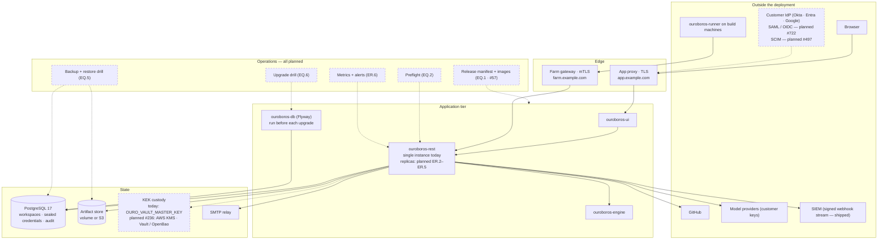

## MVP Definition

The MVP is **the first enterprise pilot being able to start**: a customer's
people sign in through their own identity provider, the key that opens every
credential is not an environment variable, the software arrives as published
images with a version, and the procedures in the runbook were run on a real
deployment before the customer ran them. It is done when:

1. **Single sign-on works and can be required.** #722 and #723 are closed; a
   workspace can require SSO for its domain with named break-glass owners
   (EN.2); the flow passes against a Keycloak fixture in CI and was run by
   hand against at least two commercial IdPs (EN.3).
2. **Invitations arrive by email** (#724) through the shipped SMTP mailer.
3. **Auth surfaces are hardened for exposure** (#725, #38).
4. **Key custody is KMS-backed where the operator chooses it.** The wrapper
   half of #236 is closed for AWS KMS and Vault / OpenBao; the reference
   deployment has been re-wrapped from the environment key to one of them;
   custody mode is visible to an administrator and the behaviour when the KMS
   is unreachable is specified and tested (EN.4).
5. **Images are published under one release version** from a registry that
   needs no maintainer-issued login (#57, EQ.1).
6. **One real deployment exists** (EQ.3): installed from the published
   release by following #58, passing the preflight (EQ.2), run for at least
   30 days, upgraded at least twice (EQ.6), and restored from backup into a
   clean environment with every credential still opening (EQ.5).
7. **The runbook is derived from that deployment** (EQ.4): `HOSTING.md`'s
   status caveat and the operations page's *"has not been written yet"* note
   are removed because they are no longer true, not because they are
   inconvenient.
8. **The limits are stated** (ER.1): one supported topology (single
   instance), the size it was run at, measured restore time, and a plain list
   of what is not supported — high availability, Kubernetes, air-gapped
   install, region moves.
9. **A pilot checklist and shared-responsibility document exist** (EN.5) and
   every line of the checklist points at evidence from items 1–8.

**Explicitly v2 (milestone `Enterprise v2`), in order:** access lists for
models, providers and repositories (epic EO; see decision N6); SCIM and group
sync (#497); custom roles (epic EP); the Helm chart (EQ.7; see decision N5);
signed images and SBOM (EQ.8); row-level security (#25); multi-replica safety,
load baseline and the HA topology (ER.2–ER.5); operational metrics (ER.6);
air-gapped bundle (EQ.9); secrets from files (EQ.10); access-review export
(EN.6); the region-move ADR (ER.7); the MCP list slot (EO.6, blocked on
ES–EY).

**Not in this roadmap at all:** SOC 2 or ISO 27001 (the gap analysis's P0-3
trust-centre roadmap); correcting the marketing site's SSO, SCIM and residency
chips (also P0-3 — this roadmap makes some of them true later, it does not
edit the site); licence keys, pricing and edition gates (EH–EM); agent
sandboxing and egress policy (DM–DT); the hosted SaaS tier and region choice
(#500, #397); IP allow-listing and private networking (not found filed, and
not found on the competitor pages the research notes read; left for a later
pass).

## Epics, Labels & Milestones

Each epic becomes a parent tracking issue on GitHub at filing; every new
issue below is filed as one of its sub-issues. **Nothing in this table is
filed yet.**

| Epic | GitHub | Status | Name | Goal | Modules | Milestone |
|------|:------:|:------:|------|------|---------|-----------|
| EN | — | ⚪ Not filed | Pilot Identity & Custody | Promote and order the filed identity and custody issues; fill the gaps between them (SSO enforcement, IdP fixtures, custody operations, pilot checklist) | ouroboros-rest, ouroboros-ui, ouroboros-docs | Enterprise Pilot |
| EO | — | ⚪ Not filed | Access Lists & Admin Policy | Model, provider and repository allow and deny lists in the policy document, enforced; MCP slot reserved | ouroboros-db, ouroboros-rest, ouroboros-ui | Enterprise v2 |
| EP | — | ⚪ Not filed | Custom Roles | A permission catalogue, a permission guard, and roles beyond the built-in set | ouroboros-db, ouroboros-rest, ouroboros-ui | Enterprise v2 |
| EQ | — | ⚪ Not filed | Production Deployment Kit | Release versions, preflight, a real reference deployment, the runbook derived from it, backup and upgrade drills; then Helm, signing, air-gap | ouroboros, ouroboros-rest, ouroboros-docs, .github | Enterprise Pilot (EQ.1–EQ.6) · Enterprise v2 (EQ.7–EQ.10) |
| ER | — | ⚪ Not filed | High Availability & Scale Notes | Supported topologies and limits, stated from measurement; then the work that would make HA true | ouroboros-rest, ouroboros, ouroboros-docs | Enterprise Pilot (ER.1) · Enterprise v2 (ER.2–ER.7) |

Issue naming: `<project>: [<epic>.<issue>] <title>`. `ouroboros` is the
repository-wide project name, as in #57 and #58. Labels: the existing set
(`mvp`, `v2`, `rest`, `db`, `ui`, `ci`, `infra`, `design`, `auth`, `settings`,
`providers`, `routing`, `registry`, `documentation`, `docs-site`) **plus new
`enterprise`** (decision N14). Complexity chips: **XS · S · M · L**.

---

## Epic EN — Pilot Identity & Custody (`ouroboros-rest` + `ouroboros-ui` + `ouroboros-docs`)

This epic's main content is the [promotion table](#existing-issues-promoted-by-this-roadmap):
#725, #38, #724, #722, #723 and the wrapper half of #236. The six issues below
are the work **nothing filed covers**.

| Ref | GitHub | Status | Title | Summary | Labels | Parallel | MVP | Complexity | Affected Modules |
|-----|:------:|:------:|-------|---------|--------|:--------:|:---:|:----------:|------------------|
| EN.1 | — | ⚪ Not filed | ouroboros: [EN.1] Promotion pass — relabel, milestone & amend the filed identity and custody issues | Apply the promotion table: labels, milestones, the #236 split, ten amendment comments | mvp, enterprise, documentation | N (first) | Y | S | docs (this roadmap), GitHub metadata |
| EN.2 | — | ⚪ Not filed | ouroboros-rest: [EN.2] Sign-in policy — SSO enforcement, allowed methods & break-glass | A workspace can require SSO; named owners keep an audited GitHub sign-in | mvp, enterprise, rest, ui, auth | N (after #722) | Y | M | ouroboros-rest, ouroboros-db, ouroboros-ui, ouroboros-docs |
| EN.3 | — | ⚪ Not filed | ouroboros-rest: [EN.3] IdP conformance fixtures & manual matrix | Keycloak in CI for SAML and OIDC; a recorded manual pass against commercial IdPs | mvp, enterprise, rest, ci, auth | Y (with #723) | Y | M | ouroboros-rest, .github, ouroboros-docs |
| EN.4 | — | ⚪ Not filed | ouroboros-rest: [EN.4] Custody operations — status, re-wrap command & KMS outage behaviour | The operating surface around #236's wrappers | mvp, enterprise, rest, providers | N (after #236 wrappers) | Y | M | ouroboros-rest, ouroboros-ui, ouroboros-docs |
| EN.5 | — | ⚪ Not filed | ouroboros-docs: [EN.5] Enterprise pilot checklist & shared-responsibility document | The procurement answers, each pointing at evidence | mvp, enterprise, documentation, docs-site | N (last in pilot) | Y | M | ouroboros-docs, docs |
| EN.6 | — | ⚪ Not filed | ouroboros-rest: [EN.6] Access-review export | Members, roles, capability, last sign-in and token inventory as a dated export | v2, enterprise, rest, ui, settings | Y | N | S | ouroboros-rest, ouroboros-ui, ouroboros-docs |

### Issue EN.1 — ouroboros: [EN.1] Promotion pass — relabel, milestone & amend the filed identity and custody issues

> **GitHub issue:** not filed · **Status:** ⚪ Proposed · **Parent epic:** EN (not filed)

- **Problem Statement:** Ten filed issues carry the pilot's identity and
  custody work. All are labelled `v2`, six have no milestone, one (#236)
  bundles pilot work with unrelated adapters, and several carry stale text
  (#497 calls SSO unfiled; #57 says only `ouroboros-web` publishes an image;
  #724 leaves the mail provider open although a mailer ships). Nobody reading
  the tracker can see what a pilot needs or in what order.
- **Solution/Scope:** Execute the
  [promotion table](#existing-issues-promoted-by-this-roadmap) once decisions
  N1 and N2 are validated: create the `enterprise` label and both milestones;
  relabel and re-milestone the ten issues; split #236 into a wrapper issue and
  an adapter issue (the original keeps its number for whichever half the
  owner chooses, the other is filed new and cross-linked); post each
  amendment comment verbatim from the table; add `Blocks` / `Depends on`
  relationships matching the Work Order; write the issue numbers back into
  this file. Sources: this roadmap; the gap analysis § P1-6 (*"Most of this
  roadmap is promotion of those issues"*).
- **Acceptance Criteria:**
  - Every row of the promotion table shows its proposed labels and milestone
    on GitHub.
  - #236 is two issues, each with its own acceptance criteria, neither
    having lost a criterion from the original.
  - Each of the ten issues carries its amendment comment and a link to this
    roadmap.
  - A saved search `milestone:"Enterprise Pilot" is:open` lists exactly the
    pilot set.
  - This file's promotion table is updated with any new issue number.
- **Parallelism/Dependencies:** Needs decisions N1, N2, N14. Blocks nothing
  technically, but everything else reads the result. First.
- **Technical Stack:** `gh` CLI, GitHub Relationships; the `create-issues` and
  `update-roadmap` skills.
- **Documentation:** none — internal-only change (tracker metadata and this
  roadmap file).
- **Epic:** EN

```
before                                    after
#722 v2 · no milestone        ─────▶      #722 mvp · enterprise · Enterprise Pilot · order 4
#236 v2 · adapters + wrappers ─────▶      #236  KEK wrappers  · mvp · Enterprise Pilot · order 6
                                          #new  cloud adapters · v2 · Providers & Keys v2
#497 "needs the unfiled BA-E" ─────▶      #497 "needs #722" · v2 · Enterprise v2 · order 9
```

### Issue EN.2 — ouroboros-rest: [EN.2] Sign-in policy — SSO enforcement, allowed methods & break-glass

> **GitHub issue:** not filed · **Status:** ⚪ Proposed · **Parent epic:** EN (not filed)

- **Problem Statement:** #722 makes SSO *possible* for a registered domain.
  Nothing filed makes it *required*. Until it is, a member who leaves the
  company keeps access through the GitHub sign-in the product launched with,
  and the workspace card's `SSO enforced` tag (mockup 17) has no state to
  read. #722 and #723 do not mention enforcement, allowed methods or
  recovery.
- **Solution/Scope:** A per-workspace **sign-in policy**:
  `{require_sso: bool, allowed_methods: ["sso","github"], break_glass_member_ids: [...]}`,
  stored beside the SSO provider registration and changeable only by an
  owner with step-up. When `require_sso` is on: a session for that workspace
  must have been established through the workspace's provider; a GitHub
  session is refused for that workspace with a redirect to the IdP
  (`403 sso_required`), while remaining valid for the person's other
  workspaces; existing non-SSO sessions for the workspace are revoked at the
  moment of enabling. **Break-glass:** at least one and at most three owners
  are named; they may still sign in with GitHub; each use writes
  `auth.break_glass_used` and notifies the other owners through the
  notification routes. Enabling is refused unless a test SSO sign-in by the
  acting owner succeeded in the last 15 minutes and a break-glass owner is
  named. Service-account tokens are unaffected and the page says so. UI: the
  controls on #723's provider tab; the workspace card's tag reads this state.
  Sources: Cursor enterprise page, *"Admins can enforce SSO, disable local
  login"* [verified]; roadmap 17 decision S6 (the tag reflects real state);
  `@better-auth/sso` documents provider-to-organization linking and domain
  verification but no enforcement switch [verified — not found on its page].
- **Acceptance Criteria:**
  - With enforcement on, a GitHub-authenticated member who is not a
    break-glass owner cannot reach any route of that workspace and is sent to
    the IdP.
  - The same person's session in a second, non-enforcing workspace keeps
    working.
  - Enabling revokes existing non-SSO sessions for the workspace within one
    request, including the cookie-cache window stated in
    `docs/ARCHITECTURE.md` § 4.1 (five minutes) — the test asserts the
    documented bound, whichever it is.
  - Enabling without a recent successful test sign-in, or with no
    break-glass owner, is refused with a named reason.
  - A break-glass sign-in succeeds, is audited, and notifies the other
    owners.
  - Removing the last break-glass owner is refused.
  - The workspace card renders `SSO enforced` only when this state is on.
- **Parallelism/Dependencies:** Needs #722 (provider registry), #725 (audit
  events). Parallel with #723's sign-in half; its controls land in #723's
  admin tab. Blocks EN.5.
- **Technical Stack:** NestJS guard on tenant resolution, BetterAuth session
  metadata (sign-in method), PostgreSQL, Flyway.
- **Documentation:** Administration `sign-in-and-workspace.mdx` § Enterprise
  SSO — new *Requiring SSO* and *Break-glass access* sections;
  `roles.mdx` (what an owner may change). Screenshot ids
  `administration.sso.enforcement`, `administration.sso.break-glass`.
- **Epic:** EN

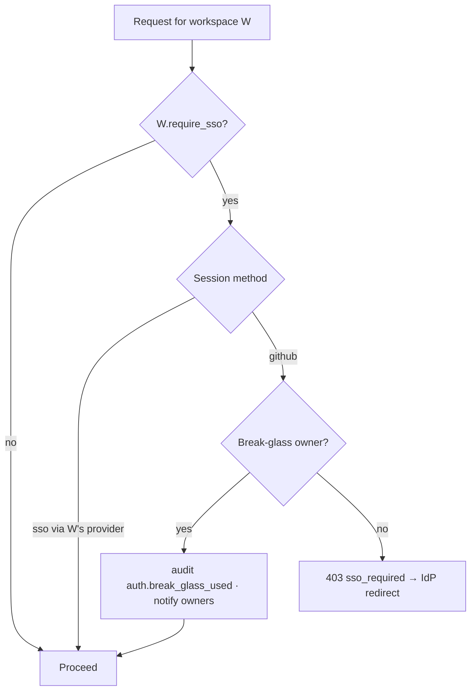

### Issue EN.3 — ouroboros-rest: [EN.3] IdP conformance fixtures & manual matrix

> **GitHub issue:** not filed · **Status:** ⚪ Proposed · **Parent epic:** EN (not filed)

- **Problem Statement:** #722's acceptance is one working redirect. A pilot
  customer brings Okta, Entra ID or Google Workspace, each with its own
  attribute names, NameID formats, clock-skew tolerance and certificate
  rotation behaviour. #497 names Okta and Entra fixtures for SCIM; no issue
  names a fixture for SSO, and no CI job runs an identity provider.
- **Solution/Scope:** (1) **CI fixture:** a Keycloak container in the
  integration suite with one SAML client and one OIDC client, exercising
  sign-in, just-in-time membership, a wrong-audience assertion, an expired
  assertion, a replayed assertion, an unsigned assertion, IdP certificate
  rotation, and a user whose email domain is not the registered one — each
  expected outcome asserted. (2) **Manual matrix:** a checked-in procedure
  and a results table for Okta, Microsoft Entra ID and Google Workspace
  (developer tenants), run once per release that touches `src/auth/`, with
  date, version and tester recorded. (3) **Setup guides** per IdP produced
  from those runs — field names as the IdP's console shows them. Sources:
  `@better-auth/sso` supports OIDC and SAML 2.0 through
  `registerSSOProvider` [verified]; the better-auth snake_case caveat cited
  in #722.
- **Acceptance Criteria:**
  - The Keycloak suite runs in `ci/rest` and fails on any of the seven
    negative cases being accepted.
  - The matrix has a dated row for each of the three commercial IdPs, for
    both protocols where the IdP offers both.
  - Each IdP has a setup guide written from a run, not from the IdP's
    documentation.
  - An IdP that was not run is listed as **not tested**, never as supported.
- **Parallelism/Dependencies:** Needs #722. Parallel with #723 and EN.2.
  Feeds EN.5. #497's Okta and Entra SCIM fixtures should reuse the same
  tenants.
- **Technical Stack:** Keycloak (container), the existing integration
  harness, GitHub Actions service containers.
- **Documentation:** Administration — new `sso-okta.mdx`, `sso-entra.mdx`,
  `sso-google.mdx` under `sign-in-and-workspace`; a *Tested identity
  providers* table on `sign-in-and-workspace.mdx`. Screenshot ids
  `administration.sso.provider-form` (shared with #723).
- **Epic:** EN

```
              SAML   OIDC   last run     release   result
Keycloak (CI)  ✓      ✓     every push   —         automated
Okta           ·      ·     not run      —         NOT TESTED   ◀ the honest default
Entra ID       ·      ·     not run      —         NOT TESTED
Google         ·      ·     not run      —         NOT TESTED
```

### Issue EN.4 — ouroboros-rest: [EN.4] Custody operations — status, re-wrap command & KMS outage behaviour

> **GitHub issue:** not filed · **Status:** ⚪ Proposed · **Parent epic:** EN (not filed)

- **Problem Statement:** #236 delivers the wrappers and per-backend re-wrap
  runbooks. It does not say how an operator *invokes* a re-wrap, how anyone
  *sees* which custody mode a deployment is in, or what the product does when
  the KMS is unreachable — the last being the new failure mode a KMS
  introduces, since `VaultService` deliberately caches no key
  (`SECURITY_MODEL.md` § 2) and therefore calls the wrapper on every unseal.
- **Solution/Scope:** (1) **Configuration:** `OURO_VAULT_WRAPPER`
  (`env-master` · `aws-kms` · `vault-transit`, later others) with the
  per-backend variables; a wrong or incomplete set stops the process at boot,
  naming the variable and printing no value (the Mode A discipline).
  (2) **Operator command:** `yarn vault:rewrap --from <wrapper> --to <wrapper>
  [--org <id>] [--dry-run]`, one workspace per transaction, resumable through
  the `wrapper` column, idempotent, with a count of rows converted and
  remaining; `yarn vault:status` prints rows per wrapper. (3) **Status
  surface:** `GET /api/v1/settings/security` reports the active wrapper and,
  during a migration, the mixed state; the Providers security strip and the
  docs render that state (the AD.5 truth-in-claims rule — "KMS-backed"
  appears only when it is). (4) **Outage behaviour:** a wrapper call has a
  timeout and bounded retries; on failure the caller gets
  `503 custody_unavailable`, no credential operation is half-applied, the
  readiness probe degrades (liveness does not, so the orchestrator does not
  restart a healthy process), and one audit event per outage window is
  written. (5) **Deliberately not done:** no DEK cache is added to ride out
  an outage; the ADR records why and what it costs in KMS calls per run.
  Sources: `SECURITY_MODEL.md` § 2, § 3.5, § 3.6; #236; Vault transit
  `rewrap` [verified].
- **Acceptance Criteria:**
  - A re-wrap interrupted half-way resumes and finishes; running it again
    changes nothing.
  - Credential ciphertext is byte-identical before and after (the existing
    `rewrap` property, asserted through the command).
  - With the KMS endpoint blackholed: credential reads answer
    `503 custody_unavailable` within the timeout; readiness is failing;
    liveness is passing; one audit event exists for the window.
  - Boot with an unknown wrapper, or a known wrapper missing a variable,
    exits non-zero naming the variable.
  - The security strip shows the real mode in each of: Mode A, mid-migration,
    Mode B, Mode C.
  - The number of wrapper calls for one simulated run is measured and
    written into the ADR.
- **Parallelism/Dependencies:** Needs the wrapper half of #236. Blocks EQ.3's
  custody step and EN.5. The `.env.example` change lands in the module and
  the top-level file (AGENTS.md).
- **Technical Stack:** NestJS, the `KeyWrapper` interface, AWS SDK KMS
  client, Vault / OpenBao HTTP API, a CLI entry point in `ouroboros-rest`.
- **Documentation:** Administration `providers.mdx` § Key custody (modes,
  how to tell which you are in); `operations.mdx` — new *Changing key
  custody* and *When the KMS is unreachable*; configuration reference
  regenerated for `OURO_VAULT_WRAPPER` and backend variables;
  `docs/SECURITY_MODEL.md` § 3 status marks. Screenshot id
  `administration.providers.custody-mode`.
- **Epic:** EN

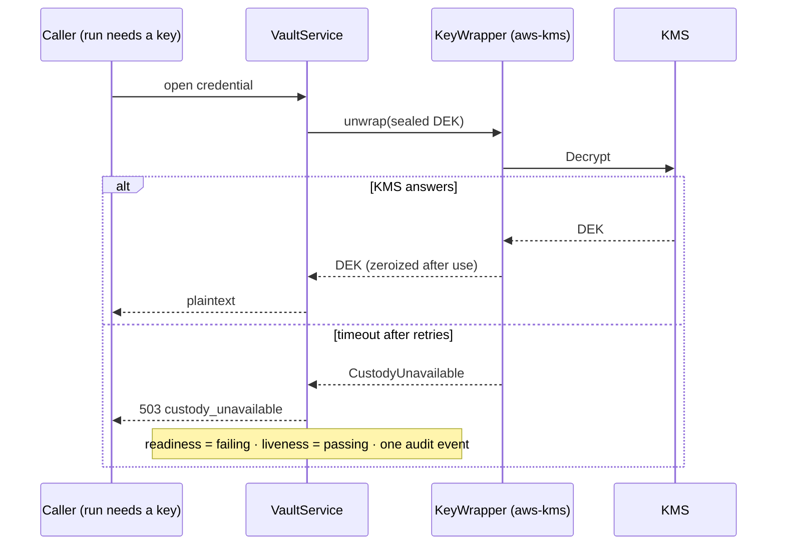

### Issue EN.5 — ouroboros-docs: [EN.5] Enterprise pilot checklist & shared-responsibility document

> **GitHub issue:** not filed · **Status:** ⚪ Proposed · **Parent epic:** EN (not filed)

- **Problem Statement:** A pilot begins with a security questionnaire. Today
  the answers are spread across `SECURITY_MODEL.md`, `HOSTING.md` and the
  docs site, some hedged, and nothing states which party is responsible for
  what in a self-hosted deployment. The gap analysis names a
  *"shared-responsibility document"* among the things that *"make
  self-hosting real"*.
- **Solution/Scope:** Two pages. **(1) Pilot checklist** — one row per
  procurement question with four columns: the question, the answer, its
  status (`Shipped` · `Planned #n` · `Not offered`), and a link to evidence
  (a test, a docs page, a drill record). Rows at minimum: SSO protocols and
  tested IdPs; SSO enforcement; provisioning and deprovisioning; roles and
  custom roles; audit log, retention and SIEM export; key custody modes;
  encryption at rest and in transit; data location; model-provider data flow;
  backup and restore with measured times; upgrade policy; supported
  topologies and limits; vulnerability reporting (links to the trust-centre
  roadmap, P0-3); certifications (**none — stated as none**); support terms
  (EH–EM). **(2) Shared responsibility** — a matrix of who does what:
  the operator (hosting, network, TLS, IdP, KMS, database backups, patching
  the host, provider contracts) and the software (tenant isolation, sealing,
  audit, authorization, migrations). A CI check fails the docs build if a
  checklist row marked `Shipped` links to an open issue. Sources: gap
  analysis, commercial-readiness checklist and "A control plane the customer
  owns end to end"; research note § 3 *"Minimum credible enterprise
  offering"*; `SECURITY_MODEL.md` § 8.3 badge policy.
- **Acceptance Criteria:**
  - Every checklist row has a status and an evidence link, or the words *no
    evidence yet*.
  - No row says `Shipped` for SSO, KMS custody, published images or the
    runbook until the corresponding MVP item is closed.
  - Certifications are stated as absent in plain words.
  - The shared-responsibility matrix covers each service and each state
    store in the architecture diagram.
  - The status check runs in `ci/docs`.
- **Parallelism/Dependencies:** Needs EN.2–EN.4, EQ.3–EQ.6, ER.1 for its
  evidence. Last in the pilot. Coordinates with the P0-3 trust-centre roadmap
  (which owns the public trust page) and with EH–EM (support terms).
- **Technical Stack:** Docusaurus MDX, a small `check:pilot-checklist`
  script beside the existing `check:*` scripts.
- **Documentation:** Administration — new `pilot-checklist.mdx` and
  `shared-responsibility.mdx`; `index.mdx` links both. No screenshots.
- **Epic:** EN

```
Question                    Answer                         Status          Evidence
Single sign-on              SAML 2.0, OIDC                 Planned #722    —
Tested IdPs                 see matrix                     Planned EN.3    —
Key custody                 env key · AWS KMS · Vault      Planned #236    —
Restore time (measured)     —                              Planned EQ.5    no evidence yet
High availability           not supported                  Not offered     ER.1
SOC 2 / ISO 27001           none                           Not offered     SECURITY_MODEL § 8.3
```

### Issue EN.6 — ouroboros-rest: [EN.6] Access-review export

> **GitHub issue:** not filed · **Status:** ⚪ Proposed · **Parent epic:** EN (not filed)

- **Problem Statement:** #497's own problem statement names the access
  review as *"the finding every enterprise security questionnaire asks
  about"*. SCIM fixes offboarding going forward; it does not give a reviewer
  the periodic list of who holds what. The audit CSV is a log of events, not
  a statement of current access.
- **Solution/Scope:** `GET /api/v1/settings/access-review` (owner or admin):
  a dated snapshot as CSV or JSON — each member with role, capabilities,
  sign-in method, last sign-in, provenance (manual, just-in-time SSO, SCIM
  group once #497 lands); each service account with scopes, creator, last
  used, token age; each pending invitation; the workspace's sign-in policy
  (EN.2). The export itself is audited. A Members-card action downloads it.
  Sources: #497 problem statement; roadmap 17 BR.1.
- **Acceptance Criteria:**
  - The export's member count equals the Members card's.
  - A service token older than a configurable age is flagged.
  - Generating the export writes one audit event naming the actor.
  - No secret material appears (the module's secrecy spec is extended).
- **Parallelism/Dependencies:** Needs nothing new; richer after EN.2, #497
  and EP.4. Parallel.
- **Technical Stack:** NestJS, streamed CSV (the BR.2 exporter).
- **Documentation:** Administration `members-and-tokens.mdx` — new
  *Reviewing access*. Screenshot id `administration.members.access-review`.
- **Epic:** EN

```
kind     principal        role     approve  method  last sign-in  provenance
member   ken@acme.dev     owner    yes      sso     2026-10-09    manual
member   maya@acme.dev    admin    yes      sso     2026-10-08    jit-sso
service  devops-bot       —        never    token   2026-10-10    created by ken · token age 212d ⚠
invite   priya@acme.dev   member   —        —       —             pending 2h
```

---

## Epic EO — Access Lists & Admin Policy (`ouroboros-db` + `ouroboros-rest` + `ouroboros-ui`)

Milestone `Enterprise v2`, first in the v2 order (decision N6). Nothing in
this epic exists today: the policy document has five rules and none of them
is an access list.

| Ref | GitHub | Status | Title | Summary | Labels | Parallel | MVP | Complexity | Affected Modules |
|-----|:------:|:------:|-------|---------|--------|:--------:|:---:|:----------:|------------------|
| EO.1 | — | ⚪ Not filed | ouroboros-db: [EO.1] Policy document v2 — access-list rules | `model_access`, `provider_access`, `repository_access` in `schemas/org-policy/v2.json` | v2, enterprise, db, settings | N (first) | N | M | ouroboros-db, schemas |
| EO.2 | — | ⚪ Not filed | ouroboros-rest: [EO.2] Access-list resolution & enforcement points | The resolver answers "is this allowed"; six call sites ask it | v2, enterprise, rest, settings, routing, providers | N (after EO.1) | N | L | ouroboros-rest |
| EO.3 | — | ⚪ Not filed | ouroboros-rest: [EO.3] Impact preview & violation report | What a draft list would block before it is published; what the live list blocked | v2, enterprise, rest, settings | Y (after EO.2) | N | M | ouroboros-rest |
| EO.4 | — | ⚪ Not filed | ouroboros-ui: [EO.4] Access lists card & denial states | The editing surface, and an honest refusal wherever a list bites | v2, enterprise, ui, design, settings | N (after EO.2, EO.3) | N | M | ouroboros-ui, ouroboros-docs |
| EO.5 | — | ⚪ Not filed | ouroboros-rest: [EO.5] Deployment policy ceiling | Operator-set bounds no workspace can loosen | v2, enterprise, rest, settings | Y (after EO.2) | N | M | ouroboros-rest, ouroboros-docs |
| EO.6 | — | ⚪ Not filed | ouroboros-rest: [EO.6] MCP server access list | The reserved `mcp_access` rule, enforced where ES–EY call MCP servers | v2, enterprise, rest, settings | N (after ES–EY) | N | S | ouroboros-rest, ouroboros-ui |

### Issue EO.1 — ouroboros-db: [EO.1] Policy document v2 — access-list rules

> **GitHub issue:** not filed · **Status:** ⚪ Proposed · **Parent epic:** EO (not filed)

- **Problem Statement:** An administrator cannot say "this workspace may use
  only these providers and models" or "agents may never run against this
  repository". The market lists exactly these controls in enterprise tiers.
  The policy document is the place for them, and its schema file states the
  rule for adding grammar: a new `v2.json` beside `v1.json`, because stored
  versions are immutable.
- **Solution/Scope:** `schemas/org-policy/v2.json`: `v1` plus three optional
  rules, each `{enabled, mode: "allow" | "deny", entries: [...]}`.
  **`provider_access`** — entries are provider adapter kinds
  (`anthropic`, `openai-compatible`, `ollama`, …) or specific connection
  ids. **`model_access`** — entries are `{provider, model}` with glob
  matching on the model id (`claude-*`), so a new model release is not
  silently allowed under an allow list nor silently blocked under a deny
  list — the semantics are stated per mode. **`repository_access`** —
  entries are `{source, owner, name}` globs. A reserved **`mcp_access`** key
  is declared with `enabled: false` only (EO.6). Migration: the document
  column accepts either schema version, tagged by `schema_version`; the
  database envelope CHECK admits the new rule ids; a `v1` document is read
  as `v2` with the three rules absent, which means **unrestricted** — the
  default for every existing workspace. Fixtures under
  `schemas/org-policy/fixtures/`. Sources: `schemas/org-policy/v1.json`
  description; roadmap 17 BQ.1; Cursor *"Repository, model, and MCP access
  controls"* and Factory *"Admin controls for models, autonomy, access, deny
  lists"* [verified].
- **Acceptance Criteria:**
  - Every stored `v1` document validates and resolves exactly as before.
  - A `v2` document with each rule in allow and in deny mode round-trips.
  - An empty allow list is rejected at validation unless the publisher
    confirms it (it would block everything) — the flag is in the document.
  - An unknown rule id, or a malformed glob, fails validation naming the
    path.
  - The schema check that guards `v1.json` in CI covers `v2.json`.
- **Parallelism/Dependencies:** Needs #480 (closed). Blocks EO.2–EO.6.
- **Technical Stack:** JSON Schema, PostgreSQL 17, Flyway.
- **Documentation:** none — internal-only change (the schema reaches people
  through EO.4).
- **Epic:** EO

```
document (schema_version 2)
├─ auto_merge · human_review · protected_paths · spend_guard · dry_run_new_repos   ← v1, unchanged
├─ provider_access   {enabled, mode: allow, entries: ["anthropic", "ollama"]}
├─ model_access      {enabled, mode: deny,  entries: [{provider:"*", model:"*-preview"}]}
├─ repository_access {enabled, mode: deny,  entries: [{source:"github", owner:"acme", name:"payments-*"}]}
└─ mcp_access        {enabled: false}                                              ← reserved, EO.6
```

### Issue EO.2 — ouroboros-rest: [EO.2] Access-list resolution & enforcement points

> **GitHub issue:** not filed · **Status:** ⚪ Proposed · **Parent epic:** EO (not filed)

- **Problem Statement:** Roadmap 17's lesson, in its own words: *"A document
  nobody reads is decoration."* A list is real only when every path that
  could use a disallowed provider, model or repository asks the resolver
  first, and when changing the list takes effect on what is already
  configured.
- **Solution/Scope:** `PolicyResolutionService` gains
  `isProviderAllowed`, `isModelAllowed`, `isRepositoryAllowed`, each
  returning a verdict with rule id and policy version (the existing verdict
  shape). **Enforcement points:** (1) provider connection create and enable;
  (2) model discovery and registry — disallowed models are listed as
  blocked, not hidden; (3) routing alias and fallback-chain save — a chain
  naming a blocked model is refused; (4) **route resolution at run time** —
  a blocked hop is skipped with a recorded reason, and a chain with no
  allowed hop fails the stage with `policy_blocked`, never falling through
  to an unlisted default; (5) repository enablement and ticket-source sync;
  (6) run dispatch — a run against a repository blocked after it was queued
  does not start. **Publish-time effect:** publishing a tighter list does
  not delete connections, aliases or enablement rows; it marks them blocked
  and the next resolution honours it. Classification for the existing
  owner-only-loosening rule: adding to an allow list or removing from a deny
  list is *loosening*. Every denial is audited once per (rule, subject,
  actor) per window, not once per request. The invocation path is
  specified-but-`501` today (`SECURITY_MODEL.md` § 4.2); enforcement point 4
  is written against route resolution, which ships, and the invocation
  gateway (#234, #235) must call the same resolver when it exists —
  **amendment to post on #234 and #235.** Sources: #481's delivered note;
  `SECURITY_MODEL.md` § 4.
- **Acceptance Criteria:**
  - One fixture per enforcement point and per mode shows the block and the
    recorded rule id and version.
  - A fallback chain whose only allowed hop is the third resolves to the
    third and records two skipped hops.
  - A chain with no allowed hop fails closed.
  - Tightening a list never deletes a row; loosening it restores the
    blocked rows with no re-entry of credentials.
  - Loosening requires an owner; tightening is admin or owner (the existing
    matrix, extended).
  - A grep-style assertion shows no enforcement point carries its own list
    logic (the #481 pattern).
- **Parallelism/Dependencies:** Needs EO.1, #481 (closed). Blocks EO.3–EO.6.
  Amends #234, #235. Coordinates with DM–DT (runtime policy uses the same
  verdict shape).
- **Technical Stack:** NestJS, the `policies` module, registry, routing,
  provider-connections, tenancy and scheduling modules.
- **Documentation:** Administration `policies.mdx` — new *Access lists*
  (semantics of allow and deny, what tightening does to existing
  configuration, fail-closed chains). API behaviour changes noted on
  `providers.mdx` and `sources.mdx`. No screenshots (EO.4 captures them).
- **Epic:** EO

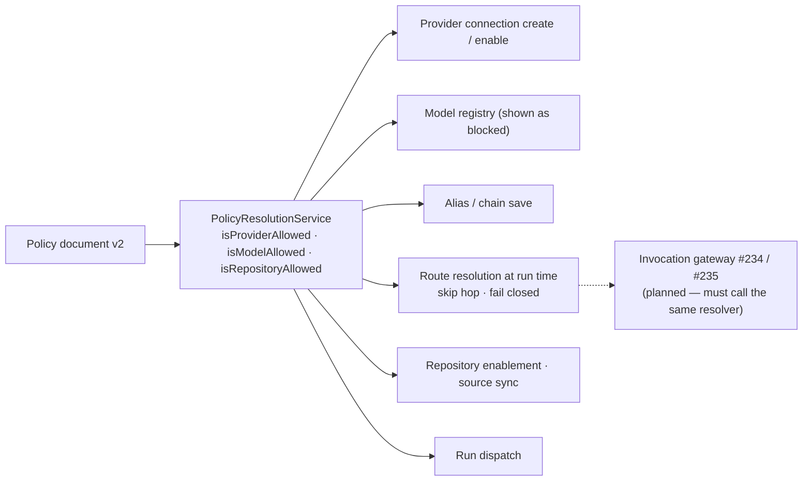

### Issue EO.3 — ouroboros-rest: [EO.3] Impact preview & violation report

> **GitHub issue:** not filed · **Status:** ⚪ Proposed · **Parent epic:** EO (not filed)

- **Problem Statement:** An administrator tightening a model list on a
  Friday needs to know which aliases, workflows and queued runs stop
  working *before* publishing. And after publishing, they need to see what
  the list actually blocked, without reading raw audit rows.
- **Solution/Scope:** Extend the existing `POST /api/v1/policies/preview`:
  for a draft document, return the provider connections, models, aliases,
  chains (and whether each still has an allowed hop), enabled repositories,
  workflows that reference a blocked alias, and queued runs that would be
  affected. Add `GET /api/v1/policies/violations?since=` — denials grouped
  by rule and subject with counts and last actor, read from the audit
  events EO.2 writes. Sources: #481's preview endpoint.
- **Acceptance Criteria:**
  - Preview of a draft that blocks a seeded model lists the seeded alias and
    workflow that use it.
  - Preview changes nothing — asserted by row counts before and after.
  - A chain left with zero allowed hops is flagged as *will fail*, distinct
    from *will skip a hop*.
  - The violation report's counts match the audit store for the same
    window.
- **Parallelism/Dependencies:** Needs EO.2. Parallel with EO.5. Blocks EO.4.
- **Technical Stack:** NestJS, the `policies` and `audit-plane` modules.
- **Documentation:** Administration `policies.mdx` § Access lists —
  *Previewing a change* and *Seeing what was blocked*. No screenshots.
- **Epic:** EO

```
preview(draft: model_access deny "*-preview")
  aliases affected ...... 2   fast-draft (will skip hop 1) · experiments (WILL FAIL: no allowed hop)
  workflows affected .... 3
  queued runs affected .. 1
  repositories .......... 0
```

### Issue EO.4 — ouroboros-ui: [EO.4] Access lists card & denial states

> **GitHub issue:** not filed · **Status:** ⚪ Proposed · **Parent epic:** EO (not filed)

- **Problem Statement:** The lists need an editing surface in the Policies
  section, and every screen where a list bites needs to say so — a model
  that silently disappears from a picker reads as a bug.
- **Solution/Scope:** A fifth card in Settings › Policies, in mockup 17's
  language (switch row, `terms` chips, the `policy vN` tag): three rows —
  Providers, Models, Repositories — each with mode (allow / deny), an entry
  editor (pickers fed by the registry and the enabled-repository list, plus
  free-text globs), and a live count of what matches. Publishing opens the
  existing confirm dialog (BS.4) extended with EO.3's preview. **Denial
  states:** registry and routing pages show a blocked model with a `blocked
  by policy vN` tag and a link to the card; the provider catalog shows a
  blocked adapter as unavailable with the reason; the repository picker
  shows blocked repositories dimmed with the reason; a run that failed with
  `policy_blocked` says which rule. No mockup exists for this card — a
  design note under `docs/design/` is part of the issue. Both themes; app
  shell compliance per `docs/DESIGN_SYSTEM_APP_SHELL.md`. Sources: mockup
  17 policies card; roadmap 17 BS.4.
- **Acceptance Criteria:**
  - An owner can publish each rule in each mode and see `policy vN+1`.
  - The confirm dialog shows EO.3's impact and requires typed confirmation
    when any chain *will fail*.
  - Each denial state renders the rule and version and links to the card.
  - A viewer sees the lists read-only.
  - Both themes; keyboard-operable entry editor.
- **Parallelism/Dependencies:** Needs EO.2, EO.3, #494 (closed). Last in the
  epic's core.
- **Technical Stack:** Next.js, the existing settings frame and policy
  card components.
- **Documentation:** Administration `policies.mdx` § Access lists
  (walk-through); User Guide pages for models and routing gain a *Blocked by
  policy* note. Screenshot ids `administration.policies.access-lists`,
  `administration.policies.access-preview`, `user-guide.models.blocked`.
- **Epic:** EO

```
┌ Access lists ──────────────────────────────────────── policy v9 ┐
│ ◉ Providers     allow   [anthropic] [ollama]            2 of 5   │
│ ◉ Models        deny    [*-preview]                     4 match  │
│ ○ Repositories  —       unrestricted                             │
│                                         Preview impact · Publish │
└──────────────────────────────────────────────────────────────────┘
```

### Issue EO.5 — ouroboros-rest: [EO.5] Deployment policy ceiling

> **GitHub issue:** not filed · **Status:** ⚪ Proposed · **Parent epic:** EO (not filed)

- **Problem Statement:** A self-hosted deployment can hold several
  workspaces. The party running it — a platform or security team — may need
  bounds that no workspace owner can loosen: "no provider outside our
  network", "no preview models anywhere". Workspace-level lists cannot
  express that, because a workspace owner publishes them.
- **Solution/Scope:** An optional deployment-level policy file
  (`OURO_DEPLOYMENT_POLICY_FILE`, the EO.1 access-list grammar only, read at
  boot and validated; a bad file stops the process). The resolver
  intersects: a subject must pass the deployment ceiling **and** the
  workspace list. Verdicts name which layer refused. The Settings card
  renders ceiling entries as locked, with the plain wording *"set by this
  deployment's operator"* — no plan name, no lock-by-edition (the roadmap 17
  S6 rule). The file's hash and load time are reported by the health
  endpoint and written to the audit log at boot. Sources: roadmap 17
  decision S6; Factory Enterprise *"sub-organizations … custom policy"*
  [verified] as the market analogue.
- **Acceptance Criteria:**
  - A workspace allow list that includes a provider the ceiling denies still
    cannot use it; the verdict names the deployment layer.
  - With no file configured, behaviour is identical to EO.2.
  - A malformed file stops boot naming the path and the JSON pointer.
  - The card shows ceiling entries locked and not editable by an owner.
  - Changing the file requires a restart, and the docs say so.
- **Parallelism/Dependencies:** Needs EO.2. Parallel with EO.3. If EH–EM
  later gates this by edition, the gate wraps the loader, not the resolver.
- **Technical Stack:** NestJS config, the policy resolver.
- **Documentation:** Administration `policies.mdx` — *Deployment-wide
  limits*; `deploy/containers.mdx` and the configuration reference for
  `OURO_DEPLOYMENT_POLICY_FILE`. Screenshot id
  `administration.policies.ceiling-locked`.
- **Epic:** EO

```
allowed(subject) = ceiling.allows(subject)  AND  workspace.allows(subject)

deployment file:  provider_access allow [anthropic, ollama]
workspace list:   provider_access allow [anthropic, openai-compatible]
effective:        [anthropic]        openai-compatible → refused by: deployment
```

### Issue EO.6 — ouroboros-rest: [EO.6] MCP server access list

> **GitHub issue:** not filed · **Status:** ⚪ Proposed · **Parent epic:** EO (not filed)

- **Problem Statement:** The gap analysis's P2-9 has workflow stages calling
  *"customer-approved MCP servers under the allow-list from P1-6"*. Ouroboros
  has no MCP client today, so there is nothing to enforce against; the slot
  must exist so that the client is built against it rather than retrofitted.
- **Solution/Scope:** Activate the reserved `mcp_access` rule: entries are
  MCP server identities as `ROADMAP_PROTOCOLS_AND_SURFACES.md` (ES–EY)
  defines them; default for a workspace with the MCP client enabled is
  **allow list, empty** — no server until one is listed (the one rule whose
  default is closed, because it is new surface with no existing
  configuration to break). Resolver method `isMcpServerAllowed`; a row on
  the EO.4 card; preview and ceiling support through EO.3 and EO.5. **This
  issue cannot start until ES–EY define the server identity and the call
  site.** Sources: gap analysis § P2-9; Cursor *"whitelist or blocklist
  repos, models, and MCP servers"* [verified].
- **Acceptance Criteria:**
  - With the MCP client present and no entry, every MCP call is refused
    with the rule id.
  - A listed server is callable; removing it stops calls at the next
    resolution.
  - The card row appears only when the MCP client exists in the build.
- **Parallelism/Dependencies:** Needs EO.2, EO.4 and the MCP client from
  ES–EY. Runtime controls on what an allowed server may do belong to DM–DT.
- **Technical Stack:** NestJS, the policy resolver.
- **Documentation:** Administration `policies.mdx` § Access lists — *MCP
  servers*; written when the client ships, not before. Screenshot id
  `administration.policies.mcp-list`.
- **Epic:** EO

```
stage ──▶ MCP client (ES–EY, planned) ──▶ isMcpServerAllowed(server)? ──no──▶ refuse · rule mcp_access · policy vN
                                                   │ yes
                                                   ▼
                                    runtime controls (DM–DT, planned) ──▶ call
```

---

## Epic EP — Custom Roles (`ouroboros-db` + `ouroboros-rest` + `ouroboros-ui`)

Milestone `Enterprise v2`. Today there are four fixed roles and one
capability; no permission catalogue exists and no role can be defined by an
administrator.

| Ref | GitHub | Status | Title | Summary | Labels | Parallel | MVP | Complexity | Affected Modules |
|-----|:------:|:------:|-------|---------|--------|:--------:|:---:|:----------:|------------------|
| EP.1 | — | ⚪ Not filed | ouroboros-rest: [EP.1] Permission catalogue & built-in role mapping | Name every permission; express the four roles as fixed sets | v2, enterprise, rest, auth, settings | N (first) | N | M | ouroboros-rest, docs |
| EP.2 | — | ⚪ Not filed | ouroboros-rest: [EP.2] Permission guard — migrate the `@Roles()` sites | 279 sites move from role names to permissions with no behaviour change | v2, enterprise, rest, auth | N (after EP.1) | N | L | ouroboros-rest |
| EP.3 | — | ⚪ Not filed | ouroboros-db: [EP.3] Custom role schema | Roles as rows; assignment; constraints | v2, enterprise, db, auth | Y (with EP.2) | N | S | ouroboros-db |
| EP.4 | — | ⚪ Not filed | ouroboros-rest: [EP.4] Custom role management, assignment & escalation guard | Create, edit, assign, delete — without letting anyone grant what they lack | v2, enterprise, rest, auth, settings | N (after EP.2, EP.3) | N | M | ouroboros-rest |
| EP.5 | — | ⚪ Not filed | ouroboros-ui: [EP.5] Roles editor & member assignment | A roles tab; the Members card assigns custom roles | v2, enterprise, ui, design, settings | N (after EP.4) | N | M | ouroboros-ui, ouroboros-docs |
| EP.6 | — | ⚪ Not filed | ouroboros-rest: [EP.6] Service-account scopes from the catalogue | Token scopes become catalogue permissions | v2, enterprise, rest, settings | Y (after EP.2) | N | S | ouroboros-rest, ouroboros-db, ouroboros-ui |

### Issue EP.1 — ouroboros-rest: [EP.1] Permission catalogue & built-in role mapping

> **GitHub issue:** not filed · **Status:** ⚪ Proposed · **Parent epic:** EP (not filed)

- **Problem Statement:** Authorization is written as role names on 279
  controller sites. A custom role cannot be defined against that, because
  there is no vocabulary for *what* a role may do — only *who* may call a
  route. The one finer-grained control, `can_approve_loops`, was added as a
  special case beside the roles.
- **Solution/Scope:** A code-defined catalogue
  (`src/auth/permissions.ts`): `resource.action` strings grouped by plane —
  for example `backlog.read`, `backlog.queue`, `workflow.edit`,
  `workflow.publish`, `routing.edit`, `provider.manage`, `provider.reveal`,
  `farm.manage`, `farm.submit`, `pr.approve`, `pr.merge`, `policy.publish`,
  `policy.loosen`, `member.manage`, `role.manage`, `audit.read`,
  `audit.export`, `workspace.delete`. Each has a one-line description and a
  sensitivity mark (`standard` · `privileged` · `owner-only`). An ADR
  (`docs/DECISION_PERMISSIONS.md`) fixes granularity rules — a permission
  exists only where some route's answer differs by it — and decision N7.
  **Built-in mapping:** `owner`, `admin`, `member`, `viewer` are expressed
  as fixed sets derived from the current `@Roles` usage by a script, and a
  generated table (role × permission) is committed. `can_approve_loops`
  maps to `pr.approve`; because today an explicit capability setting
  survives role changes, the mapping keeps per-member grants and revocations
  as overrides. `owner-only` permissions (`workspace.delete`,
  `policy.loosen`, `role.manage` for privileged permissions) can never be
  placed in a custom role. Sources: `organization.roles.ts` comments;
  `SECURITY_MODEL.md` § 6.8; Coder's permission-picker model [verified].
- **Acceptance Criteria:**
  - Every route in the route table maps to exactly one permission or is
    listed as anonymous, authenticated-only or service-only (the
    `guard.surface.spec.ts` pattern, extended).
  - The generated role × permission table reproduces today's access for
    all four roles, checked against the existing role-matrix tests.
  - The catalogue has no permission that no route checks.
  - The ADR is merged before EP.2 starts.
- **Parallelism/Dependencies:** First in the epic. Blocks EP.2–EP.6.
- **Technical Stack:** TypeScript, a route-table introspection script,
  the existing guard surface spec.
- **Documentation:** none — internal-only change at this step (the
  catalogue reaches people through EP.5; `roles.mdx` is updated there).
- **Epic:** EP

```
            backlog.queue  workflow.publish  provider.reveal  pr.approve  policy.loosen  workspace.delete
owner            ✓               ✓                 ✓              ✓            ✓               ✓
admin            ✓               ✓                 ✓              ✓            ·               ·
member           ✓               ·                 ·              ·            ·               ·
viewer           ·               ·                 ·              ·            ·               ·
sensitivity   standard        standard         privileged     privileged   owner-only      owner-only
(illustrative — the real table is generated from the 279 sites, not written by hand)
```

### Issue EP.2 — ouroboros-rest: [EP.2] Permission guard — migrate the `@Roles()` sites

> **GitHub issue:** not filed · **Status:** ⚪ Proposed · **Parent epic:** EP (not filed)

- **Problem Statement:** Until routes check permissions, a custom role is a
  label. The migration touches every controller, and its only acceptable
  outcome on the day it lands is **no change in who can do what**.
- **Solution/Scope:** `@RequirePermission(...)` and a `PermissionsGuard`
  that resolves the member's effective permissions (built-in set, or custom
  role once EP.4 exists, plus per-member overrides) from the request-scoped
  tenant context — one lookup per request, already loaded with membership.
  Migrate plane by plane in separate pull requests; during the migration
  both decorators are honoured and a lint rule forbids new `@Roles`. The
  `can_approve_loops` check on approve, waive, arm and merge becomes
  `pr.approve` through the same guard; the `403 capability_required` code is
  kept for those routes so clients do not break, and a general
  `403 permission_required` names the permission elsewhere. Service
  accounts keep their own scope check until EP.6. OpenAPI: error-code
  additions only — a `0.0.x` increment per AGENTS.md. Sources: `RolesGuard`
  and `guard.surface.spec.ts`; `SECURITY_MODEL.md` § 6.8.
- **Acceptance Criteria:**
  - A differential test drives every route as each of the four roles
    before and after and finds identical allow / deny answers.
  - Zero `@Roles(` remain in `ouroboros-rest/src`; the lint rule is on.
  - Approve, waive, arm and merge still answer `capability_required` to a
    member without `pr.approve`.
  - No route performs a second membership query for the permission check
    (query-count assertion).
- **Parallelism/Dependencies:** Needs EP.1. Blocks EP.4, EP.6. Parallel
  with EP.3. Conflicts textually with any open pull request touching
  controllers — schedule it in a quiet window.
- **Technical Stack:** NestJS guards and decorators, ESLint custom rule.
- **Documentation:** none — internal-only change (behaviour is identical by
  construction; the one visible addition, `permission_required`, is
  documented with EP.5).
- **Epic:** EP

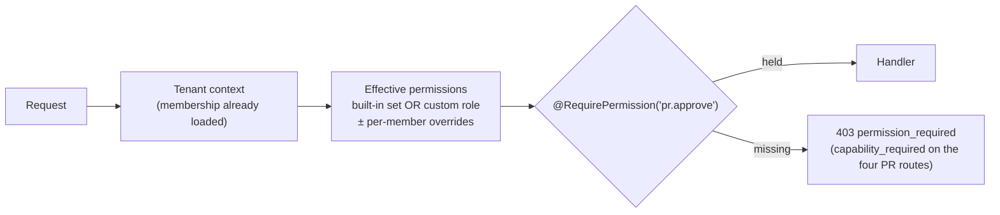

### Issue EP.3 — ouroboros-db: [EP.3] Custom role schema

> **GitHub issue:** not filed · **Status:** ⚪ Proposed · **Parent epic:** EP (not filed)

- **Problem Statement:** A custom role needs somewhere to live that the
  BetterAuth organization plugin's `member.role` column — a word the plugin
  resolves against its own role list — can refer to without the plugin
  misreading it.
- **Solution/Scope:** Migration: `org_roles` (organization FK, `key`
  unique per organization and CHECKed not to collide with `owner`, `admin`,
  `member`, `viewer`; `name`; `description`; `permissions` text array
  CHECKed against a catalogue table seeded from EP.1; `created_by`;
  timestamps; soft-delete). `member_role_assignments` (member FK → role FK,
  at most one custom role per member). The plugin's `member.role` keeps a
  built-in word for every member — the **base role**, which the plugin's
  own endpoints go on checking — and the custom role replaces only this
  service's permission set. `member_permission_overrides` for the
  `pr.approve` grant / revoke that exists today as a capability column,
  migrated in place. A trigger refuses `owner-only` permissions in
  `org_roles.permissions`. Vendor tables are untouched (decision A4 of the
  BetterAuth roadmap). Sources: `organization.roles.ts`; roadmap 01
  decisions A3, A4.
- **Acceptance Criteria:**
  - A role with an unknown permission, or an `owner-only` one, cannot be
    stored.
  - A role key equal to a built-in word cannot be stored.
  - Existing `can_approve_loops` settings survive the migration as
    overrides, row for row.
  - Deleting a role with members is refused at the database.
- **Parallelism/Dependencies:** Needs EP.1 (catalogue). Parallel with EP.2.
  Blocks EP.4.
- **Technical Stack:** PostgreSQL 17, Flyway.
- **Documentation:** none — internal-only change.
- **Epic:** EP

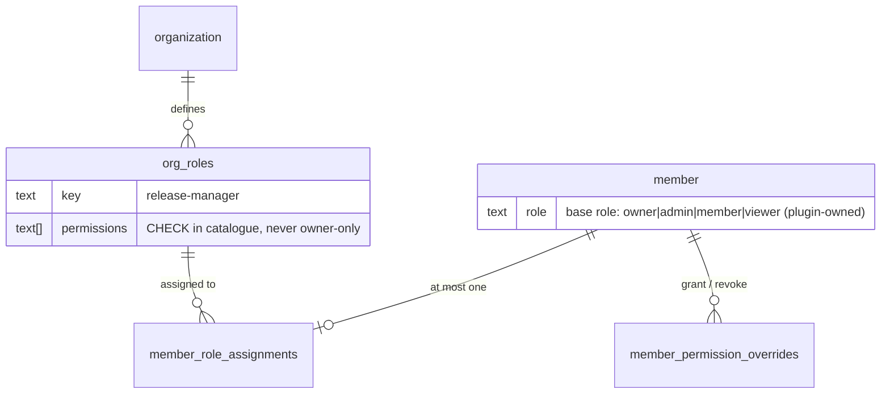

### Issue EP.4 — ouroboros-rest: [EP.4] Custom role management, assignment & escalation guard

> **GitHub issue:** not filed · **Status:** ⚪ Proposed · **Parent epic:** EP (not filed)

- **Problem Statement:** Role management is the classic privilege-escalation
  surface: whoever can edit a role can grant themselves anything it can
  hold. The API has to make that impossible by construction, and has to keep
  working when a role changes under signed-in members.
- **Solution/Scope:** `GET/POST/PATCH/DELETE /api/v1/roles` and
  `PUT /api/v1/members/:id/role`, behind `role.manage`. **Escalation
  guard:** an actor can place in a role, or assign, only permissions they
  themselves hold; `privileged` permissions additionally require an owner
  and step-up; nobody edits a role they are assigned to; `owner-only`
  permissions are refused (database and service both). **Effect timing:**
  permission changes apply at the next request (no session re-issue). A
  role's deletion requires reassigning its members first. A custom role's
  permissions must be a superset of nothing and are **not** bounded by the
  member's base role, but the base role is shown beside it so the plugin's
  own endpoints (invitations, organization settings) remain predictable.
  Every create, edit, assign and delete is audited with a permission diff.
  Group mapping: once #497 lands, an IdP group may map to a custom role key
  — the amendment already listed against #497. Sources: Coder custom roles
  (organization-scoped, permission picker) [verified]; `SECURITY_MODEL.md`
  § 6.2 step-up.
- **Acceptance Criteria:**
  - An admin cannot create or assign a role containing a permission they
    lack; the refusal names the permission.
  - A member holding `role.manage` cannot edit their own role or assign
    themselves another.
  - Adding `pr.approve` to a role takes effect on an already signed-in
    member's next request; removing it likewise.
  - The audit event for an edit lists permissions added and removed.
  - A role with members cannot be deleted; an empty one can.
  - The seeded example role (`release-manager`: `pr.approve`, `pr.merge`,
    `audit.read`) behaves as its permissions say across the affected
    routes.
- **Parallelism/Dependencies:** Needs EP.2, EP.3. Blocks EP.5. Feeds #497's
  group mapping and EN.6's export.
- **Technical Stack:** NestJS, the permission guard, the audit plane.
- **Documentation:** Administration `roles.mdx` (API behaviour:
  escalation rules, effect timing) — full page rewrite lands with EP.5.
- **Epic:** EP

```
actor: admin  (holds: backlog.*, workflow.*, pr.approve · lacks: provider.reveal)

POST /roles {key: "release-manager", permissions: [pr.approve, pr.merge]}     → 201 · audit +2
POST /roles {key: "key-reader",     permissions: [provider.reveal]}           → 403 cannot_grant_unheld: provider.reveal
PUT  /members/<self>/role {role: "release-manager"}                           → 403 self_assignment
```

### Issue EP.5 — ouroboros-ui: [EP.5] Roles editor & member assignment

> **GitHub issue:** not filed · **Status:** ⚪ Proposed · **Parent epic:** EP (not filed)

- **Problem Statement:** Roles need a place to be read and edited by
  someone who did not write them, and the Members card's Role column must
  be able to show and assign a custom role. No mockup covers this.
- **Solution/Scope:** A **Roles** tab under `/settings`: the four built-in
  roles shown read-only with their permission sets (the generated table,
  finally visible), custom roles listed with member counts; an editor with
  the catalogue grouped by plane, descriptions, sensitivity marks, and
  permissions the actor cannot grant shown disabled with the reason. The
  Members card's role cell gains custom roles in its picker and shows
  `base role · custom role`; the **Can approve loops** column stays, now
  derived from `pr.approve` with its source (role or override) on hover.
  Refusals from EP.4 render inline. Design note under `docs/design/`; both
  themes; shell compliance. Sources: mockup 17 members card; roadmap 17
  BS.3.
- **Acceptance Criteria:**
  - An owner creates a role, assigns it, and the assignee's next page load
    reflects it.
  - The built-in roles' permission sets are visible and not editable.
  - A permission the actor cannot grant is disabled with a stated reason,
    not hidden.
  - The Can-approve column agrees with `pr.approve` for every seeded
    member.
  - A viewer cannot open the Roles tab's editor.
- **Parallelism/Dependencies:** Needs EP.4, #493 (closed). Last in the
  epic's core.
- **Technical Stack:** Next.js, the settings frame.
- **Documentation:** Administration `roles.mdx` — rewritten: built-in
  roles as permission sets, creating a custom role, what cannot be granted,
  the `permission_required` error; `members-and-tokens.mdx` (assigning).
  Screenshot ids `administration.roles.list`, `administration.roles.editor`,
  `administration.members.custom-role`.
- **Epic:** EP

```
┌ Roles ───────────────────────────────────────────────┐
│ Built-in   Owner · Admin · Member · Viewer   (fixed) │
│ Custom     release-manager      3 members    Edit    │
│            + New role                                │
├ release-manager ─────────────────────────────────────┤
│ Pull requests  ☑ pr.approve ⚠privileged  ☑ pr.merge  │
│ Audit          ☑ audit.read  ☐ audit.export          │
│ Providers      ☐ provider.reveal  (you do not hold)  │
└──────────────────────────────────────────────────────┘
```

### Issue EP.6 — ouroboros-rest: [EP.6] Service-account scopes from the catalogue

> **GitHub issue:** not filed · **Status:** ⚪ Proposed · **Parent epic:** EP (not filed)

- **Problem Statement:** Service accounts have two scopes (`api.read`,
  `farm.submit`), fixed by a database CHECK. Once people have a permission
  vocabulary, automation having a separate, smaller one is a second system
  to explain — and two scopes will not cover the automation an enterprise
  wants (an export job, a policy-as-code publisher).
- **Solution/Scope:** A service token's scopes become a subset of the
  catalogue marked `service-grantable` in EP.1 (never `owner-only`, never
  `pr.approve` — § 6.8: *"Service accounts never hold it"*, kept as a hard
  rule). `api.read` becomes an alias for the read permissions a viewer
  holds; `farm.submit` maps to the catalogue's `farm.submit`; existing
  tokens keep working unchanged. The scope CHECK is replaced by a foreign
  key to the catalogue plus the grantable flag. The token form lists
  grantable permissions. Sources: `SECURITY_MODEL.md` § 6.8.
- **Acceptance Criteria:**
  - Every existing token authorizes exactly the routes it did before
    (differential test).
  - A token cannot be created with `pr.approve` or an `owner-only`
    permission — refused at the service and at the database.
  - A token with `audit.export` can call the export and nothing else new.
  - `403 service_scope_missing` still names the missing scope.
- **Parallelism/Dependencies:** Needs EP.2. Parallel with EP.3–EP.5.
- **Technical Stack:** NestJS, PostgreSQL, Flyway.
- **Documentation:** Administration `members-and-tokens.mdx` § Service
  accounts (the scope list becomes the grantable-permission list).
  Screenshot id `administration.members.service-scopes`.
- **Epic:** EP

```
today                       after EP.6
scopes ∈ {api.read,         scopes ⊂ catalogue WHERE service_grantable
          farm.submit}      api.read  ≡ viewer's read permissions   (alias, existing tokens unchanged)
(CHECK list)                pr.approve, owner-only  → never grantable
```

---

## Epic EQ — Production Deployment Kit (`ouroboros` + `ouroboros-rest` + `ouroboros-docs` + `.github`)

EQ.1–EQ.6 are the pilot's half, together with promoted #57 and #58. EQ.7–EQ.10
are v2. **None of this exists**: there is no release version, no preflight,
no deployment that has run, no drill, no chart.

| Ref | GitHub | Status | Title | Summary | Labels | Parallel | MVP | Complexity | Affected Modules |
|-----|:------:|:------:|-------|---------|--------|:--------:|:---:|:----------:|------------------|
| EQ.1 | — | ⚪ Not filed | ouroboros: [EQ.1] Release train — stack versions & image tags | One `vX.Y.Z` names a tested set of four images | mvp, enterprise, infra, ci | N (after #57) | Y | M | .github, all modules, ouroboros-docs |
| EQ.2 | — | ⚪ Not filed | ouroboros-rest: [EQ.2] Deployment preflight | The "things to verify" list as a command | mvp, enterprise, rest, infra | Y | Y | M | ouroboros-rest, scripts, ouroboros-docs |
| EQ.3 | — | ⚪ Not filed | ouroboros: [EQ.3] Reference deployment | One real installation, run for 30 days, with an evidence log | mvp, enterprise, infra | N (after #58, EQ.1, EQ.2) | Y | L | docs, ouroboros-docs |
| EQ.4 | — | ⚪ Not filed | ouroboros-docs: [EQ.4] Runbook derived from the reference deployment | Reconcile #58, `HOSTING.md` and the docs site against what happened | mvp, enterprise, documentation, docs-site, infra | N (after EQ.3, EQ.5, EQ.6) | Y | M | ouroboros-docs, HOSTING.md, docs |
| EQ.5 | — | ⚪ Not filed | ouroboros: [EQ.5] Backup & restore drill | Scripted backup; restore into a clean environment; times measured | mvp, enterprise, infra, ci | Y (during EQ.3) | Y | M | scripts, .github, ouroboros-docs |
| EQ.6 | — | ⚪ Not filed | ouroboros: [EQ.6] Upgrade drill & upgrade policy | Release-to-release upgrade tested with data; the policy written down | mvp, enterprise, infra, ci | Y (during EQ.3) | Y | M | .github, scripts, ouroboros-docs |
| EQ.7 | — | ⚪ Not filed | ouroboros: [EQ.7] Helm chart for Kubernetes | A chart, installed on `kind` in CI and once on a real cluster | v2, enterprise, infra, ci | Y (after EQ.1) | N | L | deploy/helm, .github, ouroboros-docs |
| EQ.8 | — | ⚪ Not filed | ouroboros: [EQ.8] Signed images, SBOM & provenance | Verifiable origin for every release image | v2, enterprise, infra, ci | Y (after EQ.1) | N | S | .github, ouroboros-docs |
| EQ.9 | — | ⚪ Not filed | ouroboros: [EQ.9] Air-gapped install bundle & outbound-call inventory | Everything a release needs, as files; a list of what calls out | v2, enterprise, infra | N (after EQ.1, EQ.7) | N | M | scripts, ouroboros-rest, ouroboros-docs |
| EQ.10 | — | ⚪ Not filed | ouroboros-rest: [EQ.10] Secrets from files & external secret stores | `*_FILE` variants for every secret variable | v2, enterprise, rest, infra | Y | N | S | ouroboros-rest, ouroboros-engine, ouroboros-docs |

### Issue EQ.1 — ouroboros: [EQ.1] Release train — stack versions & image tags

> **GitHub issue:** not filed · **Status:** ⚪ Proposed · **Parent epic:** EQ (not filed)

- **Problem Statement:** The four images are tagged `latest` and with their
  own commit hash, and the operations page says *"the four images usually
  carry different commit tags"*. There is no single name for "the version of
  Ouroboros I run". Without one, an upgrade path cannot be stated (EQ.6), a
  backup cannot record what it came from (EQ.5), a chart has no `appVersion`
  (EQ.7), versioned documentation has nothing to version against (#1214),
  and a support conversation starts with four hashes.
- **Solution/Scope:** A **stack release**: a git tag `vX.Y.Z` on `main`
  triggers a workflow that (1) resolves, for each of `ouroboros-db`,
  `ouroboros-rest`, `ouroboros-engine`, `ouroboros-ui` (and the runner
  binary), the image built from the newest commit touching that module at
  or before the tag; (2) re-tags those digests `vX.Y.Z` (no rebuild);
  (3) publishes a **release manifest** (`release.json`: version, date, each
  image's digest and module version, the Flyway schema version, the minimum
  release it upgrades from) as a GitHub release asset; (4) gates on the
  nightly e2e having passed for exactly that set. Module semver (already
  maintained per module) is recorded in the manifest, not replaced. REST and the UI footer report the stack release when the
  deployment was started from one, and `unreleased` otherwise. Versioning
  rule: the stack minor increments when any migration is added. Release
  notes carry an **Operator notes** section (new variables, migrations,
  required actions). Sources: `operations.mdx` § The images; #57; GitLab's
  published upgrade stops as the peer practice a version makes possible
  [verified].
- **Acceptance Criteria:**
  - Tagging `v0.1.0` publishes four images under that tag whose digests
    equal the commit-tagged images named in the manifest.
  - The manifest validates against a committed JSON Schema.
  - A release is refused if the e2e run for that image set is missing or
    red.
  - REST reports the stack release (on its health or version response —
    the exact route is chosen at implementation) on a deployment started
    from the manifest.
  - The compose file on the docs site can be pinned with one variable
    (`OURO_VERSION`) and brings up exactly the manifest's set.
- **Parallelism/Dependencies:** Needs #57 (registry). Blocks EQ.3, EQ.5,
  EQ.6, EQ.7, EQ.8, EQ.9 and unblocks #1214.
- **Technical Stack:** GitHub Actions, `docker buildx imagetools`, JSON
  Schema, the existing per-module CI.
- **Documentation:** Administration `operations.mdx` § The images
  (release tags beside `latest` and commit tags; how to pin);
  `deploy/compose.mdx` and `deploy/containers.mdx` (`OURO_VERSION`); a new
  *Releases* page listing versions and operator notes. No screenshots.
- **Epic:** EQ

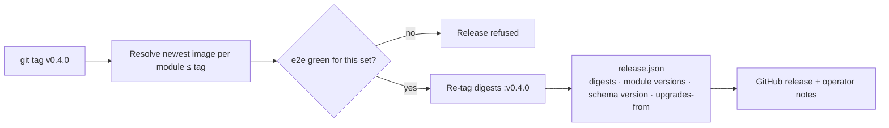

### Issue EQ.2 — ouroboros-rest: [EQ.2] Deployment preflight

> **GitHub issue:** not filed · **Status:** ⚪ Proposed · **Parent epic:** EQ (not filed)

- **Problem Statement:** `HOSTING.md` ends with five *"Things to verify
  before going live"* and the docs site has a go-live checklist. Every item
  is a manual check, and the first one — `BETTER_AUTH_URL` must be the UI's
  origin although `.env.example` sets REST's address — is exactly the kind
  an operator gets wrong and discovers at first sign-in.
- **Solution/Scope:** `yarn preflight` in `ouroboros-rest` (and the same
  entry point in the image: `docker run … ouroboros-rest preflight`), read
  only, exit non-zero on any failure, one line per check with a remedy and
  a docs link. **Configuration checks:** `NODE_ENV=production`;
  `BETTER_AUTH_URL` is HTTPS and equals the configured UI origin; secrets
  are not the `.env.example` values (the committed development master key
  and artifact secret are recognised and refused); custody wrapper
  configuration is complete (EN.4); SMTP reachable when configured;
  artifact store reachable and writable; `OURO_ARTIFACT_STORE=local` with
  more than one replica declared is an error. **Database checks:** reachable;
  schema version equals the release manifest's; **no development seed**
  (the demo accounts named in `HOSTING.md` item 5 are absent). **Topology
  checks** (given `--app-url` and optionally `--farm-url`, run from outside
  the network): `/internal/*` unreachable on both hosts; engine and
  database ports closed; the farm gateway presents and requires client
  certificates. A `--json` output for CI and for EQ.3's evidence log.
  Sources: `HOSTING.md` § Things to verify; `deploy/checklist.mdx`.
- **Acceptance Criteria:**
  - Each of `HOSTING.md`'s five items has a preflight check, and the
    document links to it.
  - Run against the development compose stack, preflight fails with the
    seed, the example master key and the non-HTTPS origin each named.
  - Run against a correctly configured fixture, it exits zero.
  - No check writes to the database or the artifact store beyond a
    temp object it deletes.
  - No output line contains a secret value (the secrecy spec pattern).
- **Parallelism/Dependencies:** None to start; the custody check needs
  EN.4, the manifest check needs EQ.1 (each skipped with a notice until
  then). Parallel. Blocks EQ.3.
- **Technical Stack:** NestJS standalone application context, Node `tls`
  and `net`, the config module's validators.
- **Documentation:** Administration `deploy/checklist.mdx` (each manual
  item gains its preflight line); CLI — new `preflight` page with `flags:`
  front matter (`--app-url`, `--farm-url`, `--json`); `HOSTING.md` § Things
  to verify.
- **Epic:** EQ

```
$ docker run --env-file .env ouroboros-rest:v0.4.0 preflight --app-url https://app.example.com
✓ NODE_ENV is production
✗ BETTER_AUTH_URL is http://rest:4000 — must be the UI origin (https://app.example.com)   → deploy/app-host
✗ OURO_VAULT_MASTER_KEY is the development example value                                  → deploy/checklist#secrets
✓ database reachable · schema V118 matches release v0.4.0
✗ development seed present (ken@acme-robotics.dev)                                        → operations#upgrading
✓ /internal/* unreachable from outside
3 failed · 3 passed
```

### Issue EQ.3 — ouroboros: [EQ.3] Reference deployment

> **GitHub issue:** not filed · **Status:** ⚪ Proposed · **Parent epic:** EQ (not filed)

- **Problem Statement:** `HOSTING.md`: *"not from a deployment that has been
  run in production."* The gap analysis: a self-hosted product *"that has
  never been deployed in production cannot pass a pilot."* No amount of
  documentation work changes that sentence. Only a deployment does.
- **Solution/Scope:** Stand up and operate one real installation (decision
  N4, option 6-A): a single host; the published release (EQ.1) from the
  public registry (#57); a real domain with TLS; a real GitHub OAuth app;
  the farm gateway with mTLS and at least one enrolled runner on a separate
  machine; SMTP; PostgreSQL with backups (EQ.5); custody migrated from the
  environment key to a KMS wrapper (EN.4) during the period; SSO against a
  real IdP once #722 lands; pointed at `NobuData/ouroboros` as its
  workspace. **Duration: at least 30 consecutive days.** **Evidence log**
  (`docs/reference-deployment/LOG.md`, append-only, dated): every install
  step that differed from #58's draft; every preflight run; every incident,
  with cause and fix; every upgrade (at least two, EQ.6); the restore drill
  (EQ.5); resource use at steady state (CPU, memory, database size, artifact
  size, per week); the size it ran at (members, repositories, runs, audit
  rows). Any defect found is filed and linked. **What it is not:** a
  customer deployment, a Kubernetes deployment, or a high-availability
  deployment — the log's first paragraph says so. Because the loop is
  simulated today (the gap analysis's P0-1), "runs" in the log are whatever
  kind the release can execute, labelled as such.
- **Acceptance Criteria:**
  - The deployment was installed by following #58 on a clean host, and the
    deviations are logged.
  - Preflight (EQ.2) passes, and its JSON output is in the log.
  - Thirty consecutive days of operation are recorded, with any downtime
    stated.
  - At least two release upgrades and one full restore are recorded with
    durations.
  - Custody was re-wrapped to a KMS backend on the live deployment with no
    credential lost.
  - Steady-state resource figures and the workload size are recorded.
  - Every incident has a linked issue or a stated reason for none.
- **Parallelism/Dependencies:** Needs #57, #58 (draft), EQ.1, EQ.2. Hosts
  EQ.5 and EQ.6. Custody step needs EN.4 and #236's wrapper half; the SSO
  step needs #722 — both may land during the 30 days. Blocks EQ.4, ER.1,
  EN.5.
- **Technical Stack:** One Linux host (or VM), Docker Compose, a reverse
  proxy (nginx or Traefik, as `SECURITY_MODEL.md` § 7.6 documents), a KMS or
  OpenBao instance, an S3-compatible bucket for backups.
- **Documentation:** Administration — new `reference-deployment.mdx`
  summarising topology, size, duration and findings, linking the log;
  `deploy/overview.mdx` links it as the tested topology. No screenshots.
- **Epic:** EQ

```
day   0    2         8        12        16   18        22            28  30
      ├────┤ install: clean host · follow #58 · preflight (EQ.2)
           ├──────────────────────────────────────────────────────────────┤ steady state · weekly resource record
                     ▲ upgrade 1 (EQ.6)
                              ▲ custody re-wrap to KMS (EN.4)
                                        ├────┤ restore drill (EQ.5)
                                                       ▲ upgrade 2 (EQ.6)
                                                                     ├───┤ runbook reconciliation (EQ.4)
(illustrative schedule — the log records what actually happened and when)
```

### Issue EQ.4 — ouroboros-docs: [EQ.4] Runbook derived from the reference deployment

> **GitHub issue:** not filed · **Status:** ⚪ Proposed · **Parent epic:** EQ (not filed)

- **Problem Statement:** #58 asks for a runbook and accepts it when a clean
  VM reaches a login. Three documents already describe deployment —
  `HOSTING.md`, the docs site's deploy section, and the operations page —
  and two of them carry notes saying they are not derived from practice.
  Writing a fourth from the code would add a fourth hedge.
- **Solution/Scope:** After EQ.3's window: (1) reconcile every statement in
  `HOSTING.md`, `deploy/*.mdx` and `operations.mdx` against the evidence log
  — each deviation logged during install becomes an edit; (2) replace the
  operations page's Backups note and guidance with EQ.5's executed
  procedure and measured times, and its Upgrading section with EQ.6's;
  (3) **remove** `HOSTING.md`'s status caveat and the *"has not been written
  yet"* admonition, replacing them with a dated statement of what was run
  (*"derived from the reference deployment, release vX.Y.Z, 30 days,
  single host"*) and a link to the log; (4) close #58 with
  `docs/DEPLOYMENT.md` as a short index pointing at the site, as #58's own
  Documentation line asks (*"write `docs/DEPLOYMENT.md` so no fact
  contradicts them"*); (5) add an **incident playbook** section from the
  incidents that actually happened, plus the two that can be predicted from
  the design: KMS unreachable (EN.4) and lost master key (unrecoverable —
  stated). Sources: `HOSTING.md` Status; `operations.mdx` § Backups note;
  #58; #1190; #1200.
- **Acceptance Criteria:**
  - Every deviation in the evidence log maps to a documentation change or a
    stated reason for none.
  - The two caveats are gone and a dated provenance statement stands in
    their place.
  - A second person, not the one who ran EQ.3, installs from the runbook on
    a clean host and reaches a passing preflight without asking a question;
    their notes are appended to the log.
  - `HOSTING.md` and the docs site agree on every variable and hostname
    (the existing rule), checked by `check:config-reference`.
  - #58 is closed by this work.
- **Parallelism/Dependencies:** Needs EQ.3, EQ.5, EQ.6. Closes #58. Blocks
  EN.5.
- **Technical Stack:** Docusaurus MDX, Markdown, the existing `check:*`
  scripts.
- **Documentation:** This issue *is* documentation: Administration
  `deploy/overview.mdx`, `compose.mdx`, `containers.mdx`, `app-host.mdx`,
  `farm-gateway.mdx`, `checklist.mdx`, `operations.mdx`; `HOSTING.md`;
  new `docs/DEPLOYMENT.md`. No screenshots.
- **Epic:** EQ

```
HOSTING.md  (today)                                   HOSTING.md  (after EQ.4)
> Status. … not from a deployment that has     ──▶   > Provenance. Derived from the reference deployment:
> been run in production.                             > release vX.Y.Z · single host · 30 days · log → docs/reference-deployment/LOG.md
```

### Issue EQ.5 — ouroboros: [EQ.5] Backup & restore drill

> **GitHub issue:** not filed · **Status:** ⚪ Proposed · **Parent epic:** EQ (not filed)

- **Problem Statement:** The operations page lists three things a backup
  needs — the database, the master key, the artifact store — and says of
  itself that it is guidance. Nobody has restored an Ouroboros deployment.
  The design has a sharp edge that only a drill exposes: a restored database
  without the right key-encryption key opens no credential, and under a KMS
  wrapper the "key" is an access grant, not a file.
- **Solution/Scope:** (1) **Scripts** in `scripts/backup/`: `backup.sh`
  (`pg_dump` custom format, artifact store sync, a manifest recording
  release version, schema version, custody wrapper and key identifier —
  never key material — and checksums); `restore.sh` (refuses a non-empty
  target; restores; runs `ouroboros-db` to the target release; runs a
  verification step). (2) **Verification:** after restore, a command opens
  one sealed value per workspace through `VaultService` (a canary sealed at
  backup time, not a customer credential) and compares row counts for a
  fixed table list against the manifest. (3) **The drill**, run on the
  reference deployment: back up, build a clean host, restore, verify, sign
  in, and record recovery time and the data-loss window implied by the
  backup schedule. Run once per custody mode in use (environment key; KMS).
  (4) **CI:** a nightly job backs up the e2e stack's seeded database,
  restores into an empty PostgreSQL and runs the verification — so a
  migration that breaks restore is caught. (5) **Documented limits:**
  point-in-time recovery is the operator's PostgreSQL feature, described
  not scripted; a restore brings back purged workspaces' rows but, after
  crypto-shredding, not their keys (`SECURITY_MODEL.md` § 2.6) — verified
  in the drill. Sources: `operations.mdx` § Backups; `SECURITY_MODEL.md`
  § 2.6, § 3.2.
- **Acceptance Criteria:**
  - A restore into a clean environment passes verification for every
    workspace, in each custody mode drilled.
  - A restore attempted with the wrong key, or without KMS access, fails
    verification loudly and names the cause.
  - Recovery time and the backup's size are measured and recorded.
  - A workspace purged before the backup's restore stays unreadable after
    it.
  - The nightly CI restore is green and fails when a deliberately broken
    migration is introduced.
  - The backup manifest contains no secret (secrecy check).
- **Parallelism/Dependencies:** Needs EQ.1 (manifest), EQ.3 (somewhere real
  to drill). KMS-mode drill needs EN.4. Parallel with EQ.6. Blocks EQ.4,
  ER.1.
- **Technical Stack:** Bash, `pg_dump` / `pg_restore`, `aws s3 sync` or
  `mc`, a small verification command in `ouroboros-rest`, GitHub Actions.
- **Documentation:** Administration `operations.mdx` § Backups — replaced
  by the executed procedure, the scripts, measured times and the limits;
  CLI — pages for `backup.sh` and `restore.sh` flags.
- **Epic:** EQ

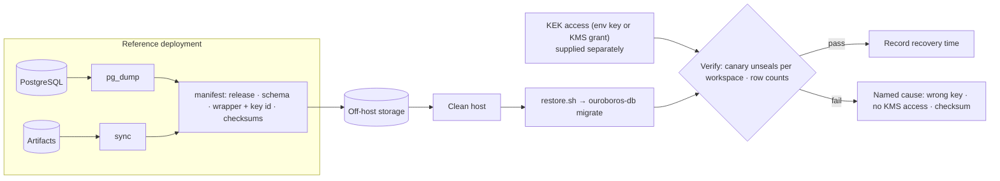

### Issue EQ.6 — ouroboros: [EQ.6] Upgrade drill & upgrade policy

> **GitHub issue:** not filed · **Status:** ⚪ Proposed · **Parent epic:** EQ (not filed)

- **Problem Statement:** The operations page gives an upgrade order and
  says there is no down migration. It gives no policy: which versions
  upgrade to which, whether releases can be skipped, how long the service
  is down, what an operator must read first. CI runs migrations against an
  empty database and a seed; it never upgrades a database that has lived.
- **Solution/Scope:** (1) **Policy** (decision N8), written on the docs
  site: every release upgrades from the immediately preceding release;
  skipping is unsupported until tested and the release manifest's
  `upgrades_from` field is the authority; migrations are forward-only;
  rollback is restore-from-backup to the previous release; the upgrade is
  **stop-the-world** (services stopped during migration) and the docs say
  so until ER proves otherwise; during the pilot only the latest release
  receives fixes. (2) **Upgrade test in CI:** on each release candidate,
  start the previous release from its manifest, load a data fixture larger
  than the seed (many workspaces, sealed credentials, audit rows, runs),
  upgrade by the documented steps, run the e2e smoke and EQ.5's
  verification, and record migration duration. (3) **The drill:** two real
  upgrades of the reference deployment, each logged with downtime measured
  from first service stop to passing health checks. (4) **Migration
  hygiene check:** a CI lint flags migrations likely to lock large tables
  (an index built without `CONCURRENTLY`, a column added with a volatile
  default, a full-table rewrite) for review — advisory, with an allow
  comment. (5) **Operator notes** per release (EQ.1) are required when a
  release adds a migration or a required variable; CI checks the section
  exists. Sources: `operations.mdx` § Upgrading; GitLab upgrade paths
  [verified] as the peer model of stating stops explicitly.
- **Acceptance Criteria:**
  - The policy page exists and matches the manifest's `upgrades_from` for
    every published release.
  - The CI upgrade test runs on every release candidate and blocks the
    release when red.
  - Two reference-deployment upgrades are logged with measured downtime.
  - A release whose notes lack the operator section, while adding a
    migration, fails the release workflow.
  - An attempted skip-upgrade (two releases at once) is either tested and
    declared supported in the manifest, or the docs say unsupported — never
    silent.
- **Parallelism/Dependencies:** Needs EQ.1; drills need EQ.3. Parallel with
  EQ.5. Blocks EQ.4, ER.1. The Helm chart (EQ.7) reuses the same ordering
  as a pre-upgrade hook.
- **Technical Stack:** GitHub Actions, Docker Compose, Flyway, a data
  fixture generator in `ouroboros-db`.
- **Documentation:** Administration `operations.mdx` § Upgrading —
  replaced by the tested procedure and measured downtime; new
  `upgrade-policy.mdx`; `deploy/compose.mdx` § Upgrading aligned.
- **Epic:** EQ

```
            v0.3.0 ──▶ v0.4.0 ──▶ v0.5.0          supported: each arrow (tested in CI with data)
               └──────────────────▶               v0.3.0 → v0.5.0: unsupported until tested and listed in upgrades_from

upgrade = backup → stop ui, rest, engine → pull → run ouroboros-db (exit 0) → start engine, rest, ui → health → verify
rollback = restore backup + run previous release          (no down migrations)
```

### Issue EQ.7 — ouroboros: [EQ.7] Helm chart for Kubernetes

> **GitHub issue:** not filed · **Status:** ⚪ Proposed · **Parent epic:** EQ (not filed)

- **Problem Statement:** The repository has no Kubernetes artefact of any
  kind. Peers that sell self-hosting ship a Helm chart, and an enterprise
  platform team will usually ask for one before reading anything else.
- **Solution/Scope:** `deploy/helm/ouroboros` (decision N5, option 1-A).
  **Workloads:** Deployments for `ui`, `rest`, `engine`, each with the
  probes the images already expose, resource requests, non-root security
  context and read-only root filesystem where the image allows;
  `rest.replicas` fixed at **1** with a schema-enforced refusal of any
  other value until ER.3 lands (and a comment saying why). **Migrations:**
  `ouroboros-db` as a `pre-install,pre-upgrade` hook Job — the documented
  order, enforced. **Dependencies:** PostgreSQL is external and required
  (connection through an existing Secret); no bundled database, with an
  example values file for a throwaway in-cluster PostgreSQL marked
  not-for-production. **Networking:** an Ingress for the app host; a
  separate Ingress or Gateway for the farm paths with client-certificate
  verification and header pass-through, with tested annotations for
  ingress-nginx and a documented pattern for others
  (`SECURITY_MODEL.md` § 7.6 is the requirement); a NetworkPolicy keeping
  `engine` and `/internal/*` unreachable from outside the namespace.
  **Storage:** artifact store `s3` required (a volume is one disk);
  engine clone cache as an `emptyDir` or PVC. **Configuration:** a values
  schema (`values.schema.json`); secrets by reference to existing Secrets
  only; custody wrapper values with workload-identity annotations for AWS
  KMS. **Publishing:** an OCI chart beside the images, `appVersion` equal
  to the stack release. **Tests:** lint, schema validation and template
  snapshots; install and upgrade from the previous chart version on `kind`
  in CI with an external PostgreSQL container and the e2e smoke; one
  recorded install on a managed cluster. **Not included:** Terraform
  modules, an operator, autoscaling. Sources: Coder Kubernetes install
  (Helm, chart registry and OCI, external PostgreSQL) [verified];
  Sourcegraph deployment overview [verified]; `HOSTING.md` § 2–§ 4.
- **Acceptance Criteria:**
  - `helm install` on `kind` with an external PostgreSQL reaches a passing
    preflight (EQ.2) and the e2e smoke.
  - `helm upgrade` from the previous chart version runs the migration hook
    before any application pod of the new version starts.
  - Setting `rest.replicas: 2` fails schema validation with the reason.
  - The farm Ingress delivers the client certificate: a runner enrols and
    shows online.
  - `/internal/*` and the engine are unreachable from outside the
    namespace.
  - No Secret is created from a plaintext value in `values.yaml`.
  - One install on a real managed cluster is logged with deviations.
- **Parallelism/Dependencies:** Needs EQ.1, #57. Parallel with EQ.8.
  Blocks EQ.9, ER.5. Promoted to the pilot if decision N5's condition is
  met.
- **Technical Stack:** Helm 3 (verify Helm 4 compatibility at
  implementation — OpenHands reportedly requires v4 [unverified]),
  `kind`, `chart-testing`, ingress-nginx, GitHub Actions.
- **Documentation:** Administration — new `deploy/kubernetes.mdx`
  (prerequisites, values, the two ingresses, upgrade, what is not
  supported); `deploy/overview.mdx` lists it beside compose;
  configuration reference gains a values table generated from the schema.
- **Epic:** EQ

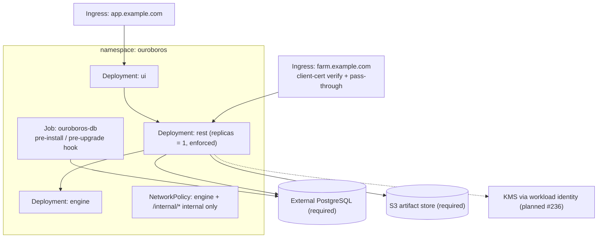

### Issue EQ.8 — ouroboros: [EQ.8] Signed images, SBOM & provenance

> **GitHub issue:** not filed · **Status:** ⚪ Proposed · **Parent epic:** EQ (not filed)

- **Problem Statement:** An operator pulling an Ouroboros image cannot
  verify it was built by this repository's CI, and cannot answer "what is
  in it" for their own vulnerability management. Supply-chain questions
  are standard in vendor security reviews.
- **Solution/Scope:** In the release workflow (EQ.1): build-provenance
  attestation for each image digest, pushed to the registry beside the
  image, keyless (the workflow's OIDC identity — no long-lived signing
  key); an SPDX SBOM generated per image and attached as an attestation;
  the same for the runner binaries beside their existing checksums; the
  Helm chart signed likewise once EQ.7 exists. Attest the **digest**, never
  the tag, and fail the release if attestation fails (no
  `continue-on-error`). A vulnerability scan of each release image with a
  published, dated result and a stated policy for what blocks a release.
  A verification command documented for operators. Sources: GitHub
  artifact attestations with Sigstore, and the digest-not-tag failure
  mode, from secondary sources [unverified — confirm against GitHub's
  documentation at implementation].
- **Acceptance Criteria:**
  - `gh attestation verify` (or the equivalent `cosign` command) succeeds
    for every image in a release manifest and fails for a locally rebuilt
    image.
  - Each release has an SBOM per image retrievable from the registry.
  - A release with a failed attestation step does not publish.
  - The scan result for each release is linked from the release notes.
- **Parallelism/Dependencies:** Needs EQ.1, #57. Parallel with EQ.7.
- **Technical Stack:** GitHub Actions (`attest-build-provenance`,
  `attest-sbom`), Sigstore, Syft or equivalent, Trivy or Grype.
- **Documentation:** Administration `operations.mdx` § The images — new
  *Verifying an image*; the pilot checklist (EN.5) gains its row.
- **Epic:** EQ

```
build ─▶ image@sha256:… ─▶ attest provenance (keyless, workflow identity) ─▶ registry
                        └▶ SBOM (SPDX) ─▶ attest ─▶ registry
operator:  gh attestation verify oci://ghcr.io/nobudata/ouroboros-rest@sha256:… --repo NobuData/ouroboros   → ✓ / ✗
```

### Issue EQ.9 — ouroboros: [EQ.9] Air-gapped install bundle & outbound-call inventory

> **GitHub issue:** not filed · **Status:** ⚪ Proposed · **Parent epic:** EQ (not filed)

- **Problem Statement:** "Runs with no control plane that holds a copy" is
  the product's strongest claim, and its strict form is running with no
  outbound network at all. Nobody has listed what Ouroboros calls out to,
  so the claim cannot be made for a disconnected network, and there is no
  way to carry a release across an air gap.
- **Solution/Scope:** (1) **Outbound-call inventory:** an audited list of
  every destination each service contacts and why (GitHub, configured
  model providers, SearXNG's upstreams, the Ollama model registry, the
  runner release download, the docs registry, any version check), each
  with the variable that disables or redirects it; produced by code review
  **and** by running the e2e suite behind a default-deny egress proxy and
  recording what was attempted. (2) **Bundle:** `ouroboros-vX.Y.Z-bundle`
  — image archives for the manifest's digests, the chart, the compose
  files, runner binaries with checksums, the docs-site image, SBOMs and
  attestations, and a load-and-retag script for a private registry.
  (3) **Offline mode check:** preflight (EQ.2) gains `--offline`, failing
  on any configuration that requires an unlisted destination. Local models
  through Ollama or an OpenAI-compatible endpoint on the internal network
  are the supported provider path; GitHub Enterprise Server as the source
  is **stated as untested** unless tested. Marketplace content is #803's.
  Sources: Coder air-gapped install (custom image, chart from releases,
  telemetry and update checks disabled, offline licence validation)
  [verified]; `HOSTING.md` § 7 (docs site hostable inside a network without
  internet access).
- **Acceptance Criteria:**
  - The inventory lists every destination observed by the egress proxy
    during the e2e run, with no unexplained entry.
  - A stack installed from the bundle on a host with no outbound route
    starts, passes `preflight --offline`, and completes the e2e smoke
    against a local model fixture.
  - Bundle contents match the release manifest by digest.
  - Anything that does not work offline is listed by name.
- **Parallelism/Dependencies:** Needs EQ.1, EQ.2; chart inclusion needs
  EQ.7; attestations need EQ.8. Offline licence validation, if editions
  introduce licence keys, belongs to EH–EM. Egress policy for running
  agents belongs to DM–DT.
- **Technical Stack:** `docker save` / `skopeo`, a forward proxy in
  default-deny mode for the inventory run, Bash.
- **Documentation:** Administration — new `deploy/air-gapped.mdx`
  (bundle, loading, what is unsupported offline) and
  `network-destinations.mdx` (the inventory); CLI `preflight` gains
  `--offline`.
- **Epic:** EQ

```
connected side                         │ air gap │            disconnected side
release manifest ─▶ bundle.tar ────────┼────────▶│ load-and-retag ─▶ private registry ─▶ compose / helm
  images · chart · runner · docs · SBOM│         │ preflight --offline ─▶ ✓ no unlisted destination
```

### Issue EQ.10 — ouroboros-rest: [EQ.10] Secrets from files & external secret stores

> **GitHub issue:** not filed · **Status:** ⚪ Proposed · **Parent epic:** EQ (not filed)

- **Problem Statement:** Every secret is an environment variable. KMS
  custody (#236) removes the most sensitive one from the environment, but
  the database password, the BetterAuth secret, the GitHub OAuth secret,
  the artifact store key and the SMTP credentials remain — visible in
  process listings, orchestrator descriptions and crash dumps. Kubernetes
  and Docker both deliver secrets as mounted files, and external secret
  operators write files.
- **Solution/Scope:** For every variable that holds a secret (the
  list is drawn up from the variable registry, `docs/ARCHITECTURE.md`
  § 6.2, as the issue's first step): accept `<NAME>_FILE`,
  read once at boot, trim a single trailing newline, refuse both forms set
  together, and name the variable (never the value) on error. Applied in
  `ouroboros-rest` and `ouroboros-engine` config loaders and the
  `ouroboros-db` entry point. The chart (EQ.7) mounts Secrets as files by
  default. A short page shows the pattern with Docker secrets and with the
  External Secrets Operator — as configuration examples, not as a tested
  integration unless tested. `.env.example` in each module and at the top
  level documents the `_FILE` form once, generically (AGENTS.md).
- **Acceptance Criteria:**
  - Each secret variable can be supplied by file, verified by a
    table-driven test over that secret list.
  - Setting both forms stops boot naming the variable.
  - A missing or unreadable file stops boot naming the path, not the
    content.
  - The configuration reference marks which variables accept `_FILE`.
- **Parallelism/Dependencies:** None. Parallel. Used by EQ.7.
- **Technical Stack:** NestJS config, the engine's settings loader, the db image's
  shell entry point.
- **Documentation:** Administration `deploy/containers.mdx` — *Supplying
  secrets as files*; configuration reference regenerated
  (`yarn gen:config-reference`).
- **Epic:** EQ

```
OURO_DB_PASSWORD=…                  (today: environment only)
OURO_DB_PASSWORD_FILE=/run/secrets/db_password     (EQ.10: read once at boot)
both set → boot refused: "OURO_DB_PASSWORD and OURO_DB_PASSWORD_FILE are both set"
```

---

## Epic ER — High Availability & Scale Notes (`ouroboros-rest` + `ouroboros` + `ouroboros-docs`)

ER.1 is the pilot's: a statement of what is supported, written from
measurement. ER.2–ER.7 are the v2 work that would let the statement say
more. **High availability is not supported today and nothing here claims
otherwise.**

| Ref | GitHub | Status | Title | Summary | Labels | Parallel | MVP | Complexity | Affected Modules |
|-----|:------:|:------:|-------|---------|--------|:--------:|:---:|:----------:|------------------|
| ER.1 | — | ⚪ Not filed | ouroboros-docs: [ER.1] Supported topologies & limits statement | One topology, the size it was run at, and a list of what is not supported | mvp, enterprise, documentation, docs-site, infra | N (after EQ.3, EQ.5, EQ.6) | Y | S | ouroboros-docs, HOSTING.md |
| ER.2 | — | ⚪ Not filed | ouroboros-rest: [ER.2] Multi-replica safety audit | Find everything that assumes one REST process | v2, enterprise, rest, infra | Y | N | M | ouroboros-rest, ouroboros-engine, docs |
| ER.3 | — | ⚪ Not filed | ouroboros-rest: [ER.3] Replica-safe schedulers & shared state | Fix what ER.2 finds | v2, enterprise, rest, infra | N (after ER.2) | N | L | ouroboros-rest, ouroboros-db |
| ER.4 | — | ⚪ Not filed | ouroboros: [ER.4] Load & soak baseline | Measured limits on stated hardware | v2, enterprise, infra, ci | Y (after EQ.3) | N | M | tests, scripts, ouroboros-docs |
| ER.5 | — | ⚪ Not filed | ouroboros: [ER.5] High-availability reference topology & failover drill | Two replicas, an HA database, failures injected and timed | v2, enterprise, infra | N (after ER.3, ER.4, EQ.7) | N | L | deploy/helm, ouroboros-docs |
| ER.6 | — | ⚪ Not filed | ouroboros-rest: [ER.6] Operational metrics & alert rules | A metrics endpoint and a starter alert set | v2, enterprise, rest, infra | Y | N | M | ouroboros-rest, ouroboros-engine, ouroboros-docs |
| ER.7 | — | ⚪ Not filed | ouroboros: [ER.7] Region tooling ADR — moving a workspace between deployments | Decide whether and how a workspace moves; build nothing yet | v2, enterprise, documentation | Y | N | S | docs |

### Issue ER.1 — ouroboros-docs: [ER.1] Supported topologies & limits statement

> **GitHub issue:** not filed · **Status:** ⚪ Proposed · **Parent epic:** ER (not filed)

- **Problem Statement:** A pilot customer will ask how many users,
  repositories and concurrent runs the product supports, whether it is
  highly available, and what the recovery objectives are. There is no
  answer on file, and the only honest answer available by the end of the
  pilot work is narrow. Narrow and true is what the description asks for.
- **Solution/Scope:** One docs page, written only from EQ.3–EQ.6's
  evidence, with four parts. **Supported:** single host, compose, one
  instance of each service, external or co-located PostgreSQL — the
  reference topology, with the release it was run on. **Observed size:**
  the workload the reference deployment carried (members, repositories,
  runs, runners, audit rows, database and artifact size) and the host it
  ran on, labelled *observed, not a tested maximum*. **Measured
  recovery:** restore time and the data-loss window implied by the backup
  schedule used (EQ.5); upgrade downtime (EQ.6). **Not supported, by
  name:** more than one REST replica (*not yet established as safe* — ER.2);
  high availability and automatic failover; Kubernetes (until EQ.7);
  air-gapped installation (until EQ.9); zero-downtime upgrade; skipping
  releases; moving a workspace between deployments; any uptime commitment.
  Each unsupported line links to the issue that would change it. The same
  facts are placed in `HOSTING.md` and the pilot checklist. **Rule:** a
  line moves from *not supported* to *supported* only by a pull request
  that links a drill record (decision N11). Sources: decision N11;
  `HOSTING.md` § 3.4's single mention of replicas; Coder HA documentation
  as the shape of a real HA statement — shared PostgreSQL endpoint,
  low-latency replicas [verified].
- **Acceptance Criteria:**
  - Every figure on the page links to a dated entry in the evidence log.
  - No figure is presented as a maximum unless ER.4 measured it.
  - Each unsupported item names the issue that would lift it.
  - The marketing site makes no availability or scale claim this page does
    not support (checked at review; the site itself is the P0-3 roadmap's).
  - The page states the date and release it describes.
- **Parallelism/Dependencies:** Needs EQ.3, EQ.5, EQ.6. Blocks EN.5.
  Updated by ER.4 and ER.5.
- **Technical Stack:** Docusaurus MDX.
- **Documentation:** Administration — new `deploy/supported-topologies.mdx`;
  `deploy/overview.mdx` and `HOSTING.md` § 1 link it. No screenshots.
- **Epic:** ER

```
Supported          single host · compose · 1× ui, rest, engine · PostgreSQL 17      release vX.Y.Z · dated
Observed size      (from the evidence log)                                          observed, not a maximum
Restore time       (EQ.5 measurement)            Upgrade downtime (EQ.6 measurement)
Not supported      >1 REST replica (ER.2) · HA / failover (ER.5) · Kubernetes (EQ.7)
                   air-gapped (EQ.9) · zero-downtime upgrade · skipping releases · workspace move (ER.7)
```

### Issue ER.2 — ouroboros-rest: [ER.2] Multi-replica safety audit

> **GitHub issue:** not filed · **Status:** ⚪ Proposed · **Parent epic:** ER (not filed)

- **Problem Statement:** Whether two `ouroboros-rest` processes can run
  against one database is unknown. The code has in-process schedulers and
  sweepers, a WebSocket agent gateway for runners, per-process caches (the
  policy resolver's 30-second cache is one, by its own delivery note) and
  some advisory-locked writers. Any of these may double-fire, race or go
  stale under a second replica. Until someone looks, the only honest
  statement is ER.1's *not established as safe*.
- **Solution/Scope:** A written audit (`docs/DECISION_REPLICA_SAFETY.md`),
  one row per finding, covering: **timers** — every scheduler and sweeper
  (at least `ticket-sources.scheduler.ts`, `lifecycle.scheduler.ts`,
  `routes.scheduler.ts`, `controls.sweeper.ts`,
  `farm/gateway/presence.sweeper.ts`), classified *idempotent under
  duplication* / *needs single owner* / *already locked*; **in-memory
  state** — caches and maps, with the staleness window a second replica
  introduces and whether it matters (a policy cache that lags 30 seconds on
  one replica after a publish on another is a correctness question for a
  tightening change); **connections** — the runner gateway: where presence
  lives, what happens to a job dispatched by replica A to a runner
  connected to replica B, sticky-session needs; **server-sent or streamed
  responses** and anything else pinned to a process; **files** — every
  path written on local disk (artifacts under `local`, the engine's clone
  cache, the runner-releases volume); **the engine** — the same questions
  for `ouroboros-engine`; **the migration job** — safe to run while old
  replicas serve? Then a two-replica experiment: the integration suite and
  the e2e smoke run against two REST processes behind a round-robin proxy,
  failures catalogued. Output: a ranked fix list that becomes ER.3's scope.
  Sources: the files named above; #481's delivered note (cache); 
  `HOSTING.md` § 3.4; `docs/RUNNER_PROTOCOL.md`.
- **Acceptance Criteria:**
  - Every timer, cache, long-lived connection and local file path in
    `ouroboros-rest` and `ouroboros-engine` appears in the audit with a
    classification.
  - The two-replica run's failures are listed, each mapped to a finding or
    marked unexplained.
  - Each *needs single owner* finding has a proposed mechanism.
  - The document states plainly whether two replicas are safe today, and
    if not, the three worst consequences.
- **Parallelism/Dependencies:** None. Parallel with everything; can start
  during the pilot. Blocks ER.3.
- **Technical Stack:** Code review, the integration harness, a local
  round-robin proxy.
- **Documentation:** none — internal-only change (the result reaches
  operators through ER.1's page, updated when ER.3 lands).
- **Epic:** ER

```
finding                               class                 under 2 replicas            fix (→ ER.3)
ticket-sources scheduler              needs single owner?   double sync?                to be determined by audit
policy cache (30 s)                   stale window          tighten lags ≤ 30 s         to be determined
runner gateway presence               process-pinned?       job routed to wrong pod?    to be determined
artifact store = local                local file            split brain                 already documented: use s3
(every cell above is a question the audit answers — none is a finding yet)
```

### Issue ER.3 — ouroboros-rest: [ER.3] Replica-safe schedulers & shared state

> **GitHub issue:** not filed · **Status:** ⚪ Proposed · **Parent epic:** ER (not filed)

- **Problem Statement:** ER.2 will produce a list of things that break
  under a second replica. This issue fixes them. Its scope cannot be fully
  written before the audit; what can be written is the approach and the
  bar.
- **Solution/Scope:** By class of finding. **Single-owner timers:** a
  PostgreSQL-based lease (a `scheduler_leases` row per job with holder,
  expiry and fencing token; or session-level advisory locks where the job
  is short) — no new infrastructure dependency such as Redis unless the
  audit shows PostgreSQL cannot carry it, recorded in the ADR.
  **Duplicate-tolerant work:** make handlers idempotent with a claimed-row
  pattern rather than a leader. **Stale caches:** invalidate across
  replicas with `LISTEN` / `NOTIFY`, or shorten and document the window,
  per cache; for policy tightening the bound must be stated on the policy
  page. **Runner gateway:** per the audit — either presence in the
  database with cross-replica dispatch, or documented sticky routing at the
  gateway. **Graceful shutdown:** a replica draining on `SIGTERM` finishes
  or hands off in-flight work, so a rolling restart loses nothing. If this
  issue's scope exceeds L after ER.2, it is split per class at that point.
  Sources: ER.2's output; the `pg_advisory_xact_lock` usage already in
  `farm/dispatch/job.lifecycle.ts` and the insights rollups as in-repo
  precedent.
- **Acceptance Criteria:**
  - The integration suite and e2e smoke pass against two and three
    replicas behind a round-robin proxy.
  - Each scheduled job runs once per interval across replicas (counted
    over a soak), and resumes within its lease expiry when the holder is
    killed.
  - A policy published on one replica is honoured by the others within the
    documented bound.
  - Killing a replica mid-dispatch loses no job and duplicates none.
  - A rolling restart of all replicas under load completes with no failed
    request beyond the documented class (for example, dropped WebSockets
    that reconnect).
  - Every ER.2 finding is closed or explicitly deferred with a reason.
- **Parallelism/Dependencies:** Needs ER.2. Blocks ER.5; lifts the chart's
  `replicas = 1` restriction (EQ.7).
- **Technical Stack:** PostgreSQL leases and `LISTEN` / `NOTIFY`, NestJS
  lifecycle hooks.
- **Documentation:** Administration `deploy/supported-topologies.mdx`
  (replica support moves, with the drill link); `policies.mdx` (propagation
  bound); `deploy/app-host.mdx` (proxy requirements for the gateway).
- **Epic:** ER

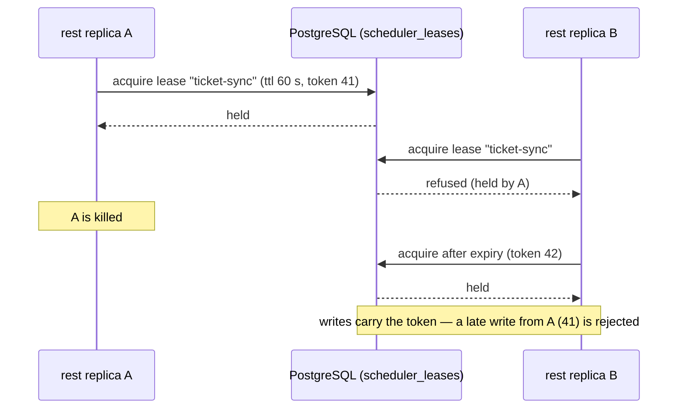

### Issue ER.4 — ouroboros: [ER.4] Load & soak baseline

> **GitHub issue:** not filed · **Status:** ⚪ Proposed · **Parent epic:** ER (not filed)

- **Problem Statement:** ER.1 can report only what the reference deployment
  happened to carry. A buyer sizing a deployment for 300 engineers needs
  limits that were tested, on hardware that is named, with the first thing
  that breaks identified.
- **Solution/Scope:** A repeatable load harness (`tests/load/`): a
  synthetic-tenant generator (workspaces, members, repositories, backlog
  items, workflows, sealed credentials, audit history) and scenario scripts
  for the read-heavy surfaces (dashboard, backlog, audit viewer and
  export), the write paths (ticket sync, policy publish, webhook fan-out),
  run dispatch with simulated runs, and runner connections with job
  streams. Runs at three sizes on a stated host specification, to the
  point of failure, recording throughput, latency percentiles, database
  size and connection count, and **what failed first**. A 72-hour soak at
  the middle size watching memory, connections and table growth against
  the retention sweeps. Results are a dated page; ER.1's *observed* figures
  gain a *tested* column. **Stated limitation:** until the live loop exists
  (the gap analysis's P0-1), run load is simulated runs and the page says
  so in its first line — it measures the control plane, not agent
  execution. Sources: #347 and #263 as the known planned scale work;
  gap analysis § "The control plane is shipped; the executor … is not".
- **Acceptance Criteria:**
  - The harness runs from one command against any deployment URL with a
    service token, and cleans up after itself.
  - Three sizes are run to failure or to a stated ceiling, each with the
    first bottleneck identified.
  - The soak shows flat memory and bounded table growth, or files the
    leak.
  - Results name the host specification, release and date.
  - Every regression-worthy scenario has a small variant in nightly CI
    with a latency budget.
- **Parallelism/Dependencies:** Needs EQ.3 (somewhere to run) and EQ.1.
  Parallel with ER.2. Feeds ER.1 and ER.5.
- **Technical Stack:** k6 or an equivalent scriptable load tool, the
  seed generator in `ouroboros-db`, GitHub Actions for the small variant.
- **Documentation:** Administration — new `deploy/sizing.mdx` (tested
  sizes, hardware, first bottleneck, what was simulated);
  `deploy/supported-topologies.mdx` gains the tested column.
- **Epic:** ER

```
size      workspaces  members  repos  runs/day (simulated)  runners   result          first bottleneck
small     …           …        …      …                     …         to be measured  to be measured
medium    …           …        …      …                     …         to be measured  to be measured   ← 72 h soak here
large     …           …        …      …                     …         to be measured  to be measured
host: (named)   release: vX.Y.Z   date: (dated)        every cell is a measurement this issue produces
```

### Issue ER.5 — ouroboros: [ER.5] High-availability reference topology & failover drill

> **GitHub issue:** not filed · **Status:** ⚪ Proposed · **Parent epic:** ER (not filed)

- **Problem Statement:** After ER.3 the software may tolerate replicas.
  That is not high availability. HA is a topology plus the evidence that it
  survives the loss of each part, with recovery times someone measured.
- **Solution/Scope:** A documented and tested topology on Kubernetes (the
  chart, EQ.7): two or more `rest` and `ui` replicas across zones with
  disruption budgets and anti-affinity; `engine` replicas per ER.2's
  findings; a managed highly available PostgreSQL with a single endpoint;
  S3 artifact store; KMS custody (no environment key in an HA topology);
  the farm gateway load-balanced with whatever stickiness ER.3 requires.
  **Failover drill**, each scenario injected and timed: kill one `rest`
  replica under load; kill the scheduler lease holder; fail over the
  database primary; drop KMS reachability for a period (EN.4's behaviour at
  scale); lose a zone; rolling upgrade under load with the migration hook.
  For each: requests failed, jobs lost or duplicated, time to recover,
  manual steps needed. The result is a page stating **what the topology
  survives and what it does not** — and only then may ER.1's page move
  *high availability* out of the unsupported list (decision N11).
  Zero-downtime upgrade stays unsupported unless the rolling-upgrade
  scenario passes with a migration in the release. Sources: Coder HA
  documentation (HA mode when multiple instances share one PostgreSQL
  endpoint; low latency between replicas and to the database; managed HA
  PostgreSQL recommended) [verified]; Coder pricing places high
  availability in Premium [verified] — a placement question for EH–EM.
- **Acceptance Criteria:**
  - Each drill scenario has a dated record with the four measurements.
  - Loss of one `rest` replica causes no lost or duplicated job.
  - Database failover recovers without manual intervention, within a
    recorded time.
  - The published statement lists at least what is survived, what is not,
    and the recovery times — with no adjective standing in for a number.
  - The chart ships an `values-ha.yaml` reproducing the drilled topology.
- **Parallelism/Dependencies:** Needs ER.3, ER.4, EQ.7, the wrapper half of
  #236, EN.4. Last in the epic.
- **Technical Stack:** Kubernetes (managed), a managed HA PostgreSQL, a
  fault-injection tool or scripted `kubectl` faults, the ER.4 harness for
  load.
- **Documentation:** Administration — new `deploy/high-availability.mdx`;
  `deploy/supported-topologies.mdx` updated by the drill record;
  `deploy/kubernetes.mdx` links the HA values.
- **Epic:** ER

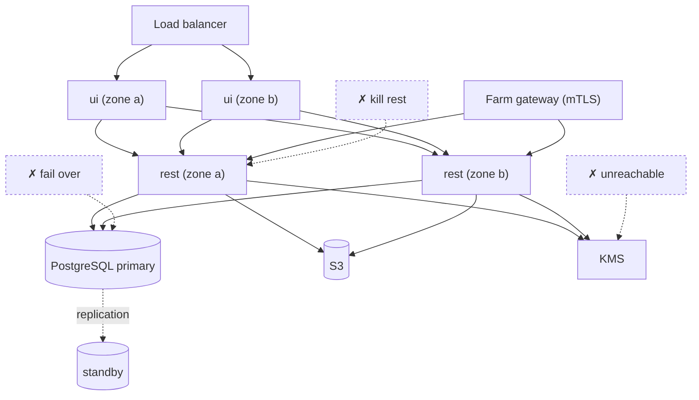

### Issue ER.6 — ouroboros-rest: [ER.6] Operational metrics & alert rules

> **GitHub issue:** not filed · **Status:** ⚪ Proposed · **Parent epic:** ER (not filed)

- **Problem Statement:** The services expose health and readiness probes
  and logs. An operator has no numeric view of the deployment: queue
  depth, scheduler lag, webhook dead letters, KMS latency, database pool
  saturation, runner connections. The survey found no issue for
  operational metrics — the filed "metrics" issues are product analytics.
  Enterprise operators run a monitoring stack and expect something to
  scrape.
- **Solution/Scope:** A Prometheus-format `/metrics` endpoint on
  `ouroboros-rest` and `ouroboros-engine`, on a separate internal port
  (never on the public listener), unauthenticated by default on that port
  with an optional bearer token. Metric families: HTTP (rate, errors,
  duration by route template — never by raw path or tenant id as a label);
  database pool; scheduler runs and lag per job; dispatch queue depth and
  age; runner connections and job states; webhook deliveries, retries and
  dead letters; custody wrapper calls, latency and failures (EN.4); audit
  write failures; process metrics. Cardinality rule: no label carries a
  workspace, user or repository identifier. A starter alert rule file and
  a dashboard definition, both generated from one metrics catalogue so
  they cannot drift from the code. OpenTelemetry tracing is noted as a
  follow-up, not included. Sources: #29 (health endpoints, closed);
  `operations.mdx` § Health checks.
- **Acceptance Criteria:**
  - `/metrics` is unreachable on the public port and through both proxies
    (a preflight check is added to EQ.2).
  - Every metric in the catalogue is emitted and documented; a test fails
    on an undocumented metric.
  - No label value is tenant-identifying (test over a seeded scrape).
  - The alert file loads in Prometheus's rule checker in CI.
  - Each starter alert links to a troubleshooting entry.
- **Parallelism/Dependencies:** None. Parallel. Useful to ER.4 and ER.5,
  not required by them.
- **Technical Stack:** `prom-client` (NestJS), the Python Prometheus
  client (engine), `promtool` in CI.
- **Documentation:** Administration `operations.mdx` — new *Metrics and
  alerts* (endpoint, port, catalogue table generated, starter alerts);
  configuration reference for the metrics port and token variables.
- **Epic:** ER

```
ouro_scheduler_lag_seconds{job="ticket-sync"}          ouro_custody_unwrap_duration_seconds_bucket{wrapper="aws-kms"}
ouro_dispatch_queue_depth                              ouro_webhook_dead_letters_total{family="audit"}
ouro_runner_connections                                ouro_http_request_duration_seconds_bucket{route="/api/v1/policies"}
                     labels: never workspace · user · repository
```

### Issue ER.7 — ouroboros: [ER.7] Region tooling ADR — moving a workspace between deployments

> **GitHub issue:** not filed · **Status:** ⚪ Proposed · **Parent epic:** ER (not filed)

- **Problem Statement:** For a self-hosted deployment, data residency is
  where the operator deployed (`SECURITY_MODEL.md` § 6.7), and the region
  is a read-only label. A customer running one deployment per region will
  eventually ask to move a workspace from one to another. Region *choice*
  in a hosted tier is #500; nothing addresses the self-hosted move, and the
  envelope design makes it non-trivial: a workspace's data-encryption key
  is sealed by one deployment's key-encryption key.
- **Solution/Scope:** A decision record only
  (`docs/DECISION_WORKSPACE_MOVE.md`) — **no implementation in this
  issue.** It answers: is a workspace move supported at all, or is the
  stated answer "deploy per region and do not move"; if supported, the
  mechanism (export a workspace's rows and artifacts, re-wrap its DEK from
  the source wrapper to the destination's through an operator-mediated
  step, import, then crypto-shred at the source); what cannot move
  (sessions, runner enrolments under the source's farm CA, webhook
  delivery state); identity continuity (member ids, audit actor
  references, SSO provider registration); the relationship to #398 (config
  import / export — configuration, not data) and to #500; and what the
  product says about residency meanwhile. If the decision is "supported",
  the ADR ends with a list of issues to file. Sources: `SECURITY_MODEL.md`
  § 2.3 (the binding that makes per-tenant sealing mean something), § 2.6,
  § 6.7, § 7.4; #398; #500; research note: data residency is an
  enterprise-tier lever at Factory and others [notes; Factory Enterprise
  lists data residency — verified].
- **Acceptance Criteria:**
  - The ADR states a decision, not a survey.
  - It addresses DEK re-wrapping across deployments, the farm CA, audit
    continuity and source-side deletion explicitly.
  - If the decision is "not supported", ER.1's page and § 6.7 say so in one
    sentence each.
  - If "supported", follow-up issues are listed with epic references and
    this roadmap is updated.
- **Parallelism/Dependencies:** None. Parallel. Informs #500.
- **Technical Stack:** Markdown.
- **Documentation:** none at this step — internal-only change (an ADR);
  the user-facing sentence lands with whichever outcome is chosen.
- **Epic:** ER

```
deployment EU (KEK-eu)                                   deployment US (KEK-us)
workspace rows + artifacts ──export──▶ bundle ──import──▶ workspace rows + artifacts
DEK sealed by KEK-eu ──unwrap (EU) ─▶ [operator-mediated transfer] ─▶ wrap (US) ──▶ DEK sealed by KEK-us
crypto-shred at source ◀── after verification
does not move: sessions · runner enrolments (source farm CA) · webhook delivery state
(a sketch of the option the ADR evaluates — not a design that has been chosen)
```

---

## Work Order (dependency-ordered execution plan)

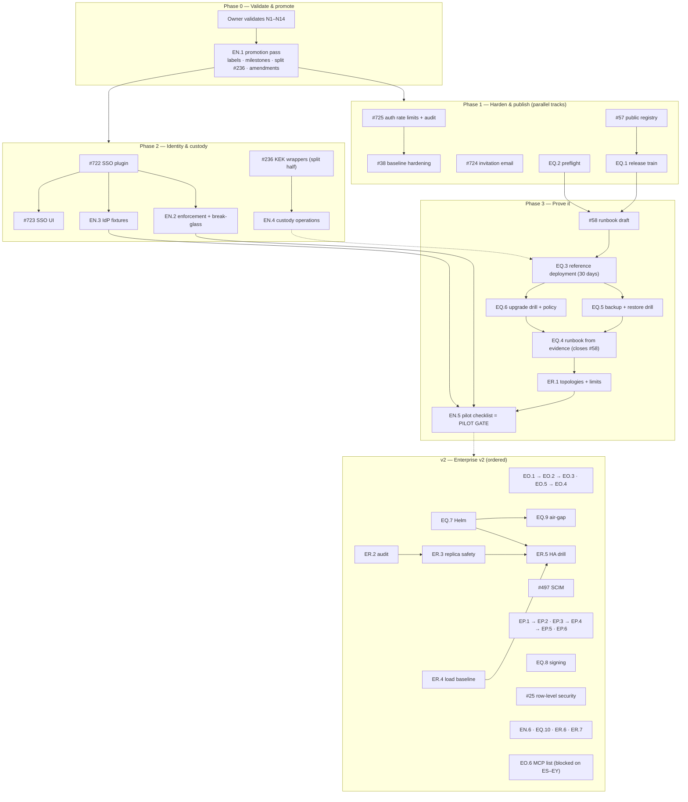

Ordered checklist (⊕ = parallelizable within its phase). Existing issues are
shown by number; new issues by reference.

1. **Phase 0 — Validate and promote:** owner validates decisions N1–N14 →
   **EN.1** (relabel, milestones, split #236, post the ten amendments).
2. **Phase 1 — Harden and publish:** { #725 → #38 } ⊕ #724 ⊕ { #57 → EQ.1 }
   ⊕ EQ.2.
3. **Phase 2 — Identity and custody:** #722 → { #723 ⊕ EN.2 ⊕ EN.3 } ⊕
   { #236 wrapper half → EN.4 }.
4. **Phase 3 — Prove it:** #58 (draft, needs #57, EQ.1, EQ.2) → **EQ.3**
   (30 days; the EN.4 custody step and the #722 SSO step join when ready) →
   { EQ.5 ⊕ EQ.6 } → EQ.4 (closes #58) → ER.1 → **EN.5** *(pilot gate)*.
5. **v2, in this order:** epic EO (EO.1 → EO.2 → { EO.3 ⊕ EO.5 } → EO.4) →
   #497 (SCIM; evaluation first) → epic EP (EP.1 → { EP.2 ⊕ EP.3 } → EP.4 →
   EP.5; EP.6 after EP.2) → EQ.7 ⊕ EQ.8 → #25 → ER.2 → ER.3 → ER.4 → ER.5 →
   EQ.9. Free-standing at any time: EN.6, EQ.10, ER.6, ER.7. Blocked on a
   sibling roadmap: EO.6 (ES–EY).

Two things can start before Phase 0 finishes because they depend on nothing
and change no behaviour: **EQ.2** (preflight) and **ER.2** (replica audit).

**The long pole is EQ.3.** Thirty days is calendar time; it starts only when
a release, a registry and a draft runbook exist. Phases 1 and 3 should be
scheduled so the window opens as early as possible, with identity and
custody steps joining the running deployment rather than preceding it.

## Risks

| # | Risk | Effect | Mitigation |
|---|------|--------|------------|
| R1 | The reference deployment finds serious defects (the stack has never run in production) | The 30-day window restarts or stretches; the pilot date moves | Start EQ.3 as early as Phase 1 allows; treat findings as the point of the exercise; the window counts consecutive days, so fix forward with logged upgrades rather than reinstalling |
| R2 | **The pilot has little to run.** The autonomous loop is simulated today (gap analysis P0-1) | A deployment proven for a control plane with no live executor may not satisfy a pilot customer | This roadmap proves deployability, not the loop. Sequence the pilot itself after P0-1; EQ.3's log labels run types honestly |
| R3 | `@better-auth/sso` does not fit (the snake_case caveat in #722; missing enforcement) | SSO, the first MVP item, slips | EN.3's Keycloak fixture lands with #722 so problems surface in CI; EN.2 is built in this service's guard, not in the plugin |
| R4 | `@better-auth/scim` security status is unverified (an advisory appeared in search results) | Adopting it could import a vulnerability; rejecting it unexamined wastes a library | Decision N3 makes it a time-boxed evaluation with the advisory check as its first step |
| R5 | A KMS becomes a hard runtime dependency (no DEK cache by design) | A KMS outage stops every credential operation | EN.4 specifies and tests the behaviour; the operations page states it; Mode A stays supported; the call count per run is measured before anyone is surprised by it |
| R6 | Relabelling `v2` → `mvp` inflates the product MVP count | Progress statements become misleading | Decision N1 names the alternative (milestone only); either way statements cite the milestone |
| R7 | Splitting #236 loses acceptance criteria | A custody property goes untested | EN.1's criterion: neither half loses a criterion from the original |
| R8 | The permission migration (EP.2) changes access by accident | A security regression across 279 sites | Differential test over every route and role before and after; plane-by-plane pull requests; both decorators honoured during the migration |
| R9 | Access lists strand existing configuration | Publishing a list breaks running workflows on a Friday | EO.3's preview before publish; EO.2 marks rows blocked rather than deleting; chains fail closed with a named rule |
| R10 | Two deployment surfaces (compose and Helm) drift | The chart works in CI and fails for customers | One values schema; chart install and upgrade in CI; chart `appVersion` tied to the release manifest; a real-cluster install recorded |
| R11 | Edition gating lands on features built here (EH–EM) | Rework to add entitlement checks; a feature shipped free is hard to move behind a paywall | Decision N10 flags the placement now; the owner should settle the open-core line for SSO, SCIM, custom roles and access lists **before** these ship |
| R12 | HA is promised before it is proven | A false claim of the kind `SECURITY_MODEL.md` § 8.3 exists to prevent | Decision N11; ER.1's rule that a line moves only with a drill record; the chart refuses `replicas > 1` until ER.3 |
| R13 | Research gaps: several norms rest on research notes or search summaries, not on pages read for this roadmap | A decision is argued from a wrong market fact | Each citation is marked; the unverified list is under References; none of the unverified items is load-bearing for an MVP decision |
| R14 | The marketing site still advertises SSO, SAML, SCIM and EU residency | A pilot customer reads a claim this roadmap has not yet made true | Out of scope here (P0-3), but the pilot checklist (EN.5) is the page a customer should be sent, and it states status per item |

## Totals

New issues proposed by this roadmap (none filed):

| | Epic | Issues | MVP | v2 |
|---|:---:|:---:|:---:|:---:|
| Epic EN — Pilot Identity & Custody | — | 6 | 5 | 1 |
| Epic EO — Access Lists & Admin Policy | — | 6 | 0 | 6 |
| Epic EP — Custom Roles | — | 6 | 0 | 6 |
| Epic EQ — Production Deployment Kit | — | 10 | 6 | 4 |
| Epic ER — High Availability & Scale Notes | — | 7 | 1 | 6 |
| **Total new** | **5 epics** | **35** | **12** | **23** |

Existing issues promoted or ordered (not re-specified):

| | Issues | To `Enterprise Pilot` | Kept in v2 |
|---|:---:|:---:|:---:|
| Epic E (#699): #722, #723, #724, #725 | 4 | 4 | 0 |
| Scaffolding: #25, #38, #57, #58 | 4 | 3 (#38, #57, #58) | 1 (#25) |
| AF.3 #236 (wrapper half; the adapter half stays in `Providers & Keys v2`) | 1 | 1 | — |
| BT.1 #497 | 1 | 0 | 1 |
| **Total existing** | **10** | **8** | **2** |

**Pilot scope: 20 issues** — 12 new and 8 existing. **v2 scope: 25 issues** —
23 new and 2 existing, plus #236's adapter half where it already was.

Amendments to post at filing, beyond the ten in the promotion table:

| Amended | Comment |
|---|---|
| #699 (epic E) | The epic's four issues move to `Enterprise Pilot`; EN.2 and EN.3 are related work under epic EN |
| #234, #235 (invocation gateway, chain executor) | The gateway must call the access-list resolver (EO.2) on every hop; a chain with no allowed hop fails closed |
| #498 (BT.2 policy as code) | The code projection must carry the `v2` access-list rules (EO.1) |
| #500 (BT.4 SaaS governance tier) | ER.7's ADR covers self-hosted workspace moves; region choice remains here |
| #1214 (versioned docs per release) | Depends on EQ.1's stack release version |
| #1190, #1200 (closed docs pages) | Superseded in part by EQ.4, EQ.5, EQ.6 — note on the issues for history, no reopen |
| #803 (marketplace air-gapped bundles) | EQ.9 covers the application's bundle; the two share the load-and-retag pattern |
| #226 (AD.5 security model) | § 3 status marks change with #236 and EN.4; § 6.8 changes with #724, EN.2 and epic EP; additions are listed in § 9 until they ship, per § 10 |

## References

**In-repo sources**

- `docs/SECURITY_MODEL.md` — § 2 envelope encryption, § 3 key custody per
  mode, § 6.7 data location, § 6.8 service accounts and the approval
  capability, § 7.6 the mTLS deployment requirement, § 8.3 badge policy
- `HOSTING.md` — Status, § 3.4, § 7, Things to verify before going live
- `ouroboros-docs/docs/administration/` — `deploy/*.mdx`, `operations.mdx`,
  `roles.mdx`, `policies.mdx`, `members-and-tokens.mdx`,
  `sign-in-and-workspace.mdx`
- `docs/ROADMAP_MOCKUP_17_SETTINGS.md` (policy document, members, audit;
  BT.1), `docs/ROADMAP_MOCKUP_01_BETTERAUTH.md` (epic E),
  `docs/ROADMAP_MOCKUP_07_PROVIDERS_KEYS.md` (AD.1, AF.3)
- `schemas/org-policy/v1.json`; `ouroboros-rest/src/auth/organization.roles.ts`;
  `ouroboros-rest/src/modules/vault/`; `docker-compose.yml`
- Gap analysis: `ouroboros-studio/reports/Ouroboros competitor gap analysis.md`
  — § P1-6, the commercial-readiness checklist, "A control plane the
  customer owns end to end"; research notes `own_feature_inventory.md` and
  `commercial_readiness_benchmarks.md` § 3

**Web sources read for this roadmap (2026-10-10) — verified**

- [Cursor pricing](https://cursor.com/pricing) — Teams: "SAML/OIDC SSO";
  Enterprise: "SCIM seat management", "Audit logs and service accounts",
  "Repository, model, and MCP access controls"
- [Cursor enterprise](https://cursor.com/enterprise) — enforce SSO, disable
  local login, SCIM; allow or block repositories, models and MCP servers;
  no on-premises deployment
- [Claude pricing](https://claude.com/pricing) — SSO on Team; SCIM, audit
  logs, Compliance API and fine-grained role-based access on Enterprise
- [Factory organization plans](https://docs.factory.com/pricing/organizations)
  — Business: SSO, SAML / SCIM, audit logging, admin controls for models,
  autonomy, access, deny lists and network policy; Enterprise: on-premise,
  data residency. Air-gapped is **not** mentioned on this page
- [Coder pricing](https://coder.com/pricing) — Premium text names OIDC
  synchronization, audit logging and high availability (the feature-table
  cells did not load, so per-row tier placement is not confirmed)
- [Coder: install on Kubernetes](https://coder.com/docs/install/kubernetes)
  — Helm, chart registry and OCI, external PostgreSQL
- [Coder: air-gapped deployments](https://coder.com/docs/install/airgap)
- [Coder: high availability](https://coder.com/docs/admin/networking/high-availability)
- [Coder: groups and roles](https://coder.com/docs/admin/users/groups-roles)
  — "Custom roles are a Premium feature"
- [Sourcegraph: deployment overview](https://sourcegraph.com/docs/admin/deploy)
  — Kubernetes with Helm recommended; Docker Compose for a single node
- [GitLab: upgrade paths](https://docs.gitlab.com/update/upgrade_paths/) —
  required upgrade stops
- [Better Auth: SSO plugin](https://better-auth.com/docs/plugins/sso) —
  OIDC and SAML 2.0, organization linking, domain verification,
  `defaultRole`
- [HashiCorp Vault: transit secrets engine](https://developer.hashicorp.com/vault/docs/secrets/transit)
  — data-key generation, rewrap

**Not verified — treat as leads, not facts**

- **ChatGPT Business SSO; OpenAI Enterprise SCIM and EKM; Amp Teams SSO;
  Augment CMEK; Devin customer-managed keys; CodeRabbit custom roles** —
  taken from the research notes, not re-opened.
- **`@better-auth/scim`** — the documentation pages exist
  ([plugin page](https://better-auth.com/docs/plugins/scim)); their content
  and the security advisory reported against the package
  (GHSA-j8v8-g9cx-5qf4) were read only through a search summary.
- **Better Auth dynamic access control** (runtime role creation in the
  organization plugin) — third-party pages only.
- **OpenHands Enterprise** Kubernetes install (Helm chart through the
  Replicated registry, PostgreSQL 16.4 or later, Helm 4) — search summary
  of [its documentation](https://docs.openhands.dev/enterprise/k8s-install);
  the page was not opened.
- **Image signing practice** (GitHub artifact attestations, Sigstore, SBOM
  attestation, digest-not-tag) — secondary sources.
- **Mattermost** Kubernetes and HA packaging — the page returned 404; not
  used.
- **Air-gapped support at coding-agent competitors** — the research notes
  found Factory's claim only in search snippets, and the Factory page read
  here does not mention it.
- **Uptime SLAs, IP allow-listing, private networking** — the research notes
  record these as not found on the pages fetched; nothing here relies on
  them.
- **Whether two REST replicas are safe today** — unknown by inspection;
  that is ER.2's purpose, and this document asserts nothing either way.

## Next Step

1. **Owner validates the decisions**, in particular the six that change
   scope or cost: **N1** (relabel to `mvp` or milestone only), **N2** (split
   #236; which KMS backends first), **N4** (where the reference deployment
   runs and for how long), **N5** (Helm in v2 or in the pilot), **N6**
   (access lists in v2 or in the pilot), and **N10** with risk R11 (settle
   the open-core line with `ROADMAP_EDITIONS_AND_BILLING.md` before these
   features ship).
2. Reconcile epic letters and cross-references with the three sibling
   roadmaps (DM–DT, EH–EM, ES–EY) once all four are written.
3. Run `/create-issues` on this file: create the `enterprise` label and the
   two milestones, file epics EN–ER and their 35 sub-issues, then execute
   **EN.1** — relabel the ten existing issues, split #236 and post the
   amendments — and write the issue numbers back here.
4. Start **EQ.2** and **ER.2** immediately; neither waits on a decision.

Nothing in this document has been filed, posted or changed on GitHub.

