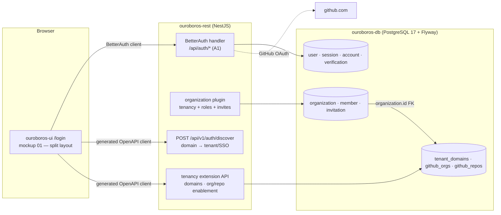
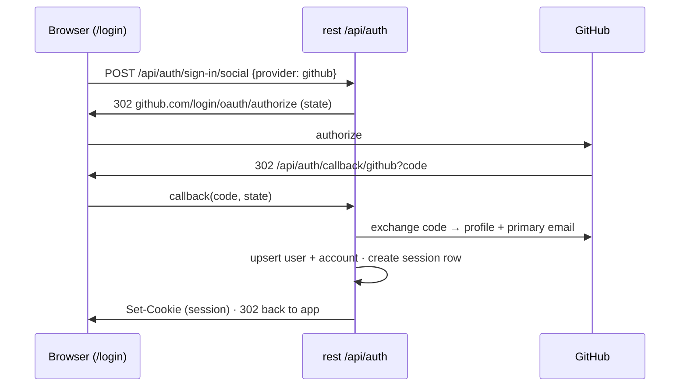
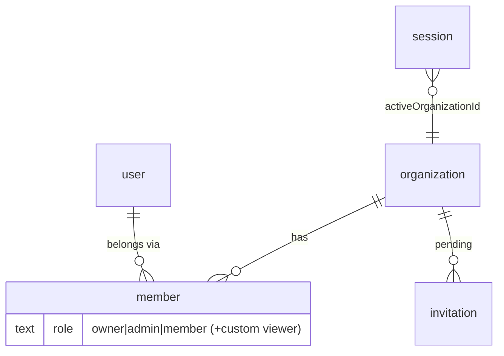
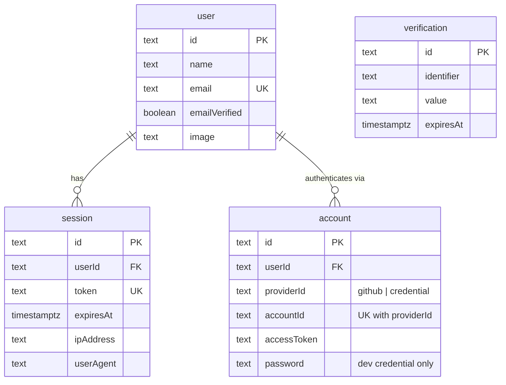
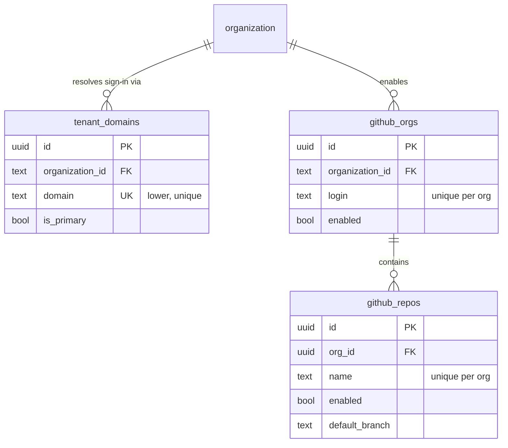
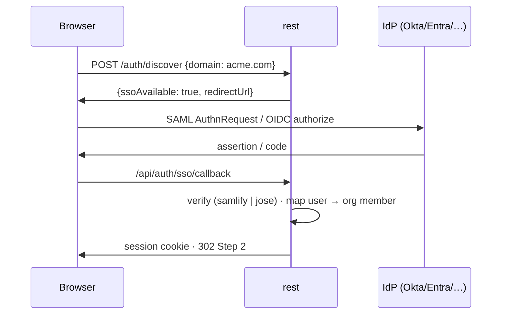
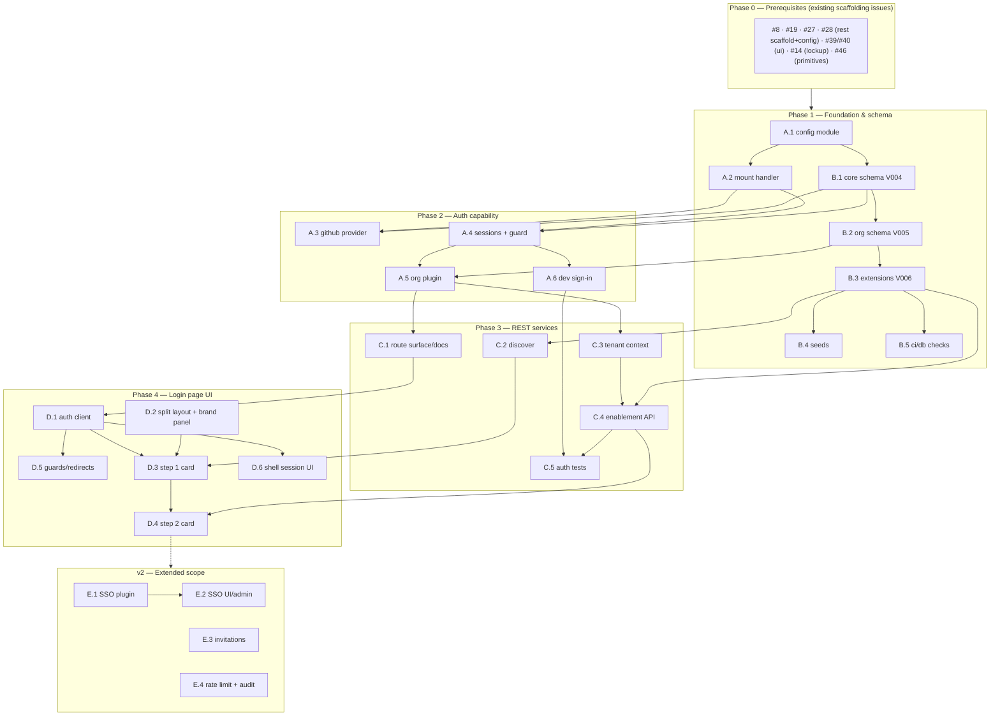

# Roadmap — Login Page (Mockup 01) with BetterAuth

## Description

> Create a roadmap that covers the features for the login page in 01, using BetterAuth
> for the authentication. Make sure to cover database tables and rest services to
> handle login services. Refer to the mockup page in the tickets so that the tickets
> know what to refer to when creating the UI/UX design of the pages.

## Context & Existing Work (duplicate-avoidance survey)

Surveyed 2026-08-08, against the 58 issues filed from
`ROADMAP_OUROBOROS_APPLICATION_SCAFFOLDING.md` (all currently 🟡 Open, none started).

**Design source of truth for every UI ticket in this roadmap:**
[`docs/mockups/01-login.html`](mockups/01-login.html) — the sign-in & tenancy mockup.
Its structure: a **split layout** (55% brand panel with lockup, three brand lines, and
a SOC 2 / SSO / self-hostable trust row · 45% auth panel), a **Step 1 · Sign in card**
("Continue with GitHub" button with GitHub mark SVG, an "or enterprise SSO" divider, a
company-domain field with `acme.ouroboros.dev` placeholder, a "Continue with SSO" ghost
button, SAML 2.0/OIDC explainer, and the "each domain is an isolated tenant" note), and
a **Step 2 · tenancy card** (org rows with monogram avatars, enabled-repo counts, on/off
switches, a `personal` pill, the least-privilege GitHub App note, and the "Enter mission
control →" CTA into mockup 02).

**Overlapping open issues and their disposition** (no scaffolding work has begun, so
superseding is cheap — it is a body edit, not a rework):

| Existing issue | Disposition under this roadmap |
|---|---|
| #33 `ouroboros-rest: [4.7] GitHub OAuth sign-in & sessions` (hand-rolled OAuth + stateless cookie) | **Superseded** by Epic A (BetterAuth GitHub provider + DB-backed sessions). Close or retitle when A.1 lands. |
| #21 `ouroboros-db: [3.3] Users, identities & tenant membership` | **Superseded** by B.1/B.2 — BetterAuth's `user`/`account` tables replace `users`/`user_identities`; membership moves to the organization plugin's `member` table. |
| #20 `ouroboros-db: [3.2] Baseline tenancy schema — tenants & domains` | **Amended** by B.3 — `tenants` is replaced by the org plugin's `organization` table; `tenant_domains` survives as an extension table re-pointed at `organization.id`. |
| #22 `ouroboros-db: [3.4] GitHub org & repo enablement` | **Amended** by B.3 — same shape, FK re-pointed to `organization.id`. |
| #23 `ouroboros-db: [3.5] Dev seed data` | **Amended** by B.4 — seeds must create BetterAuth-shaped users/sessions/orgs. |
| #31 `ouroboros-rest: [4.5] Tenancy module & API` | **Amended** by C.4 — member CRUD and invitations are served by BetterAuth org-plugin endpoints; the custom API keeps domains + org/repo enablement. |
| #32 `ouroboros-rest: [4.6] Tenant-context resolution middleware` | **Amended** by C.3 — the active tenant now comes from the session's `activeOrganizationId`, with `X-Ouro-Tenant` demoted to an override. |
| #37 `ouroboros-rest: [4.11] Integration test harness` | **Extended** by C.5 (auth-flow suites). |
| #38 `ouroboros-rest: [4.12] Security baseline hardening` | **Reduced** by E.4 — DB-backed sessions make the "revocation strategy" work item obsolete; rate limiting moves here. |
| #43 `ouroboros-ui: [5.5] Typed API client` | **Amended** by D.1 — auth routes use the BetterAuth client; the generated OpenAPI client covers everything else. |
| #44 `ouroboros-ui: [5.6] Login & tenancy screen` (single L-sized issue) | **Superseded** — split into D.2–D.5 for real design fidelity to mockup 01. |

Unaffected and still prerequisite: #8 (monorepo layout), #19/#20-baseline (Flyway),
#27/#28 (Nest scaffold + config), #39/#40/#46 (UI scaffold, tokens, primitives),
#14 (brand asset split — the lockup used by the brand panel).

### Decisions proposed by this roadmap (validate before issue creation)

| # | Decision | Rationale |
|---|----------|-----------|
| A1 | **BetterAuth runs inside `ouroboros-rest`** via `@thallesp/nestjs-better-auth`, handler mounted at `/api/auth/*` | Keeps the single-communications-boundary invariant; the community NestJS module gives `AuthGuard`, `@Session()`, `@AllowAnonymous()` decorators. Requires disabling Nest's body parser so BetterAuth reads the raw body. |
| A2 | **Database adapter: BetterAuth's built-in Kysely adapter over the existing pg pool** | The service already uses Kysely + pg (#30, decision D3 of the scaffolding roadmap) — no second ORM enters the stack. |
| A3 | **Flyway stays the only migration authority.** BetterAuth CLI is used as `generate` (SQL output), never `migrate`; generated SQL is hand-ported into versioned Flyway migrations | Preserves the scaffolding roadmap's "Flyway owns DDL" rule. BetterAuth documents this exact workflow for external migration tools. |
| A4 | **BetterAuth tables keep their default (camelCase) column names, quoted, in the `ouroboros` schema** | They are vendor-shaped tables; renaming every column to snake_case fights plugin updates (the SSO plugin has a known snake_case incompatibility, better-auth#5649). House snake_case style applies to *our* extension tables only. |
| A5 | **Tenancy = BetterAuth organization plugin.** `organization`/`member`/`invitation` replace the planned `tenants`/`tenant_members`; `tenant_domains`, `github_orgs`, `github_repos` remain custom extension tables keyed to `organization.id` | Session-integrated `activeOrganizationId`, role model (owner/admin/member + custom roles), invitation lifecycle, and hooks come for free — exactly what mockup 01 step 2 and mockup 17 need. |
| A6 | **Sessions are database-backed** (BetterAuth `session` table) with cookie cache enabled | Real revocation (supersedes the stateless-cookie compromise in #33/#38); the session row also carries `activeOrganizationId`. |
| A7 | **MVP auth method is GitHub social login.** Enterprise SSO (SAML/OIDC via the `@better-auth/sso` plugin) is v2, but the **domain-discovery endpoint and the mockup's SSO form ship in MVP** returning a graceful "SSO not configured for this domain" state | The mockup gives SSO equal visual weight, so the UI must exist; standing up samlify/OIDC provider registration is real scope that doesn't gate the loop. |
| A8 | **Dev sign-in without GitHub credentials: BetterAuth email/password provider enabled only when `NODE_ENV !== 'production'`** | Replaces #33's `OURO_AUTH_DEV_USER` bypass with a mechanism BetterAuth natively supports, still hard-off in production. |
| A9 | Env names: BetterAuth's standard `BETTER_AUTH_SECRET` / `BETTER_AUTH_URL` join the `OURO_*` set in `.env.example` and the #28 zod schema | Fighting a library's canonical env names buys nothing. |

## Architecture Overview



## MVP Definition

The MVP is **mockup 01 working end to end on BetterAuth**. It is done when, against the
compose stack with seeded data:

1. `/login` renders the split layout pixel-faithful to
   [`docs/mockups/01-login.html`](mockups/01-login.html) in **both themes** — brand
   panel (lockup, brand lines, trust row) and auth panel (Step 1 + Step 2 cards).
2. **Continue with GitHub** completes a real BetterAuth GitHub OAuth flow, creating
   `user` + `account` rows and a database-backed session.
3. The **company-domain field** resolves a tenant via `POST /api/v1/auth/discover`,
   and answers gracefully when SSO is not configured (SSO itself is v2).
4. **Step 2** lists the signed-in user's organizations from the org plugin (with
   monograms, enabled-repo counts, and the `personal` pill), lets an owner/admin
   toggle org/repo enablement, sets `activeOrganizationId` on the session, and
   **Enter mission control →** lands on the dashboard.
5. Tenant context in REST resolves from the session's active organization; guards
   enforce org-plugin roles.
6. The auth integration suite (Testcontainers) covers sign-in, session, active-org
   switching, and role enforcement; `ci/rest` and `ci/db` stay green.
7. Dev sign-in (email/password, non-production only) works for local dev and e2e.

**Explicitly v2:** SAML/OIDC enterprise SSO (per-org provider registration + admin UI),
the invitation email flow, auth rate limiting, and auth audit events.

## Epics

| Epic | Name | Goal | Modules |
|------|------|------|---------|
| A | BetterAuth Foundation (`ouroboros-rest`) | Library integration, GitHub provider, sessions, org plugin | ouroboros-rest |
| B | Auth Database (`ouroboros-db`) | BetterAuth core + org schema via Flyway; tenancy reconciliation; seeds | ouroboros-db |
| C | Login REST Services (`ouroboros-rest`) | Discovery endpoint, tenant context from session, enablement API, tests | ouroboros-rest |
| D | Login Page UI (`ouroboros-ui`) | Mockup 01 as a working page: brand panel, Step 1, Step 2, guards | ouroboros-ui |
| E | Enterprise SSO & Hardening | SAML/OIDC SSO, invitations, rate limiting, audit | rest, ui, db |

Issue naming: `<project>: [<epic letter>.<issue>] <title>`. Labels reuse the existing
set (`mvp`, `v2`, `rest`, `db`, `ui`, `ci`, `design`) plus one new label **`auth`**
(create during issue filing). Complexity chips: **XS · S · M · L**.

---

## Epic A — BetterAuth Foundation (`ouroboros-rest`)

| Issue | Title | Summary | Labels | Parallel | MVP | Complexity | Affected Modules |
|-------|-------|---------|--------|:--------:|:---:|:----------:|------------------|
| A.1 | ouroboros-rest: [A.1] BetterAuth installation & configuration module | Library + config file, Kysely adapter over the existing pool, env schema | mvp, auth, rest | N (after #27, #28) | Y | M | ouroboros-rest |
| A.2 | ouroboros-rest: [A.2] Mount BetterAuth handler in NestJS | `@thallesp/nestjs-better-auth`, raw-body bootstrap, `/api/auth/*` | mvp, auth, rest | N (after A.1) | Y | S | ouroboros-rest |
| A.3 | ouroboros-rest: [A.3] GitHub social provider | GitHub OAuth app wiring, profile/email mapping, account linking rules | mvp, auth, rest | N (after A.2, B.1) | Y | M | ouroboros-rest |
| A.4 | ouroboros-rest: [A.4] Session strategy & global auth guard | DB sessions + cookie cache, global `AuthGuard`, `@AllowAnonymous` map | mvp, auth, rest | N (after A.2, B.1) | Y | M | ouroboros-rest |
| A.5 | ouroboros-rest: [A.5] Organization plugin adoption (tenancy backbone) | Org/member/invitation APIs, roles, `activeOrganizationId`, hooks | mvp, auth, rest | N (after A.4, B.2) | Y | L | ouroboros-rest |
| A.6 | ouroboros-rest: [A.6] Dev email/password sign-in (non-production) | Local/e2e auth without GitHub, hard-off in production | mvp, auth, rest | N (after A.4) | Y | S | ouroboros-rest |

### Issue A.1 — ouroboros-rest: [A.1] BetterAuth installation & configuration module

- **Problem Statement:** BetterAuth needs a home in the NestJS service: a standalone
  config (`src/auth/auth.config.ts`, importable by the CLI without booting Nest), the
  database adapter, and validated env — before any provider or route exists.
- **Solution/Scope:** Install `better-auth`; author the config object with the built-in
  Kysely adapter reusing the #30 pg pool (decision A2); extend the #28 zod schema with
  `BETTER_AUTH_SECRET`, `BETTER_AUTH_URL`, `GITHUB_CLIENT_ID/SECRET` (decision A9);
  set `trustedOrigins` from the CORS config; secrets redacted from config logging.
  Keep the config file CLI-loadable (`npx @better-auth/cli generate --config …`) for
  B.1's schema generation. Sources: BetterAuth installation & PostgreSQL adapter docs.
- **Acceptance Criteria:**
  - Service boots with valid env; missing `BETTER_AUTH_SECRET` exits non-zero naming
    the variable.
  - `@better-auth/cli generate` runs against the config file and emits SQL (consumed
    by B.1) without starting the Nest app.
  - No second database pool is created — the adapter shares the `DbModule` pool.
- **Parallelism/Dependencies:** Needs #27, #28. Blocks A.2, B.1.
- **Technical Stack:** better-auth, Kysely adapter, zod, @nestjs/config.
- **Epic:** A

```
src/auth/
├── auth.config.ts   (BetterAuth options — CLI-loadable, no Nest imports)
├── auth.module.ts   (Nest wiring — A.2)
└── plugins/         (organization A.5 · sso E.1)
```

### Issue A.2 — ouroboros-rest: [A.2] Mount BetterAuth handler in NestJS

- **Problem Statement:** BetterAuth serves its own route surface; Nest must hand it the
  raw request stream at `/api/auth/*` without the global prefix, body parser, or
  interceptors mangling it.
- **Solution/Scope:** Adopt `@thallesp/nestjs-better-auth`: import its `AuthModule`
  with the A.1 instance; bootstrap with Nest's body parser disabled (the library
  requires the raw body); exclude `/api/auth/*` from the `/api/v1` global prefix;
  verify graceful-shutdown hooks still drain. Document the route map (sign-in,
  callback, sign-out, session). Source: BetterAuth NestJS integration doc.
- **Acceptance Criteria:**
  - `GET /api/auth/ok` (or equivalent) responds; BetterAuth routes bypass the global
    prefix and versioning.
  - JSON endpoints elsewhere still parse bodies correctly (regression test).
  - `ci/rest` stays green.
- **Parallelism/Dependencies:** Needs A.1. Blocks A.3, A.4.
- **Technical Stack:** @thallesp/nestjs-better-auth (Express adapter).
- **Epic:** A

```
Nest bootstrap ── bodyParser:false ──▶ [AuthModule(@thallesp)] ─▶ /api/auth/* → BetterAuth
                                      └▶ everything else      ─▶ /api/v1/*   → controllers
```

### Issue A.3 — ouroboros-rest: [A.3] GitHub social provider

- **Problem Statement:** Mockup 01's primary action is **Continue with GitHub**
  ([`docs/mockups/01-login.html`](mockups/01-login.html), Step 1 card). The provider
  must be configured with correct profile/email mapping before the UI can offer it.
- **Solution/Scope:** Enable BetterAuth's GitHub provider (client id/secret from A.1
  env); request `user:email` scope so private primary emails resolve; map login,
  display name, and avatar into `user`; set account-linking policy (same verified
  email links to the existing user); document the OAuth App callback URL
  (`${BETTER_AUTH_URL}/api/auth/callback/github`) for dev and prod. Replaces the
  hand-rolled flow in #33.
- **Acceptance Criteria:**
  - Full browser flow against a real GitHub OAuth app lands a DB session; `user` +
    `account` rows created with email, name, avatar.
  - Repeat login with the same GitHub identity reuses the same user row.
  - State/CSRF handling verified (tampered `state` rejected).
- **Parallelism/Dependencies:** Needs A.2, B.1. Blocks D.3, C.5.
- **Technical Stack:** better-auth GitHub provider.
- **Epic:** A



### Issue A.4 — ouroboros-rest: [A.4] Session strategy & global auth guard

- **Problem Statement:** Every non-public route must require a valid session, resolved
  once and injected — and sessions must be revocable (the stateless-cookie compromise
  in #33 is retired by decision A6).
- **Solution/Scope:** Database-backed sessions with BetterAuth's cookie cache (short
  TTL) to avoid a DB hit per request; register the library's `AuthGuard` globally;
  annotate public surface (`/health/*`, `/api/docs`, discovery C.2, auth routes) with
  `@AllowAnonymous()`; expose `@Session()` in controllers; sign-out revokes the
  session row. Session expiry/refresh values documented in `docs/ARCHITECTURE.md`.
- **Acceptance Criteria:**
  - Unauthenticated requests to protected routes get 401; health/docs stay open.
  - Sign-out invalidates the session server-side (subsequent requests 401 even with
    the old cookie).
  - Session lookup adds ≤1 DB query per request with cookie cache enabled (verified
    by query logging in dev).
- **Parallelism/Dependencies:** Needs A.2, B.1. Blocks A.5, A.6, C.3.
- **Technical Stack:** better-auth sessions, @thallesp/nestjs-better-auth guard/decorators.
- **Epic:** A

```
request ─▶ cookie ─▶ [cookie cache fresh?] ──yes──▶ session ─▶ handler
                          └──no──▶ session table lookup ─▶ refresh cache
sign-out ─▶ DELETE session row  (revocation is immediate)
```

### Issue A.5 — ouroboros-rest: [A.5] Organization plugin adoption (tenancy backbone)

- **Problem Statement:** Mockup 01 Step 2 ("Choose where the loop runs") and mockup 17
  (members/roles) need organizations, membership, roles, and an active-org pointer —
  the org plugin provides all four, replacing the custom tables planned in #20/#21
  (decision A5).
- **Solution/Scope:** Enable the organization plugin: default roles owner/admin/member
  mapped to the product's owner/admin/member/viewer expectations (viewer via custom
  access-control roles); `activeOrganizationId` on the session as the tenant pointer;
  creation rules (first sign-in auto-creates a personal org — the `personal` pill in
  mockup 01); `beforeCreateOrganization`/`afterAddMember` hooks reserved for audit
  (E.4). Server API surfaced for org list/create/set-active; invitations exist at the
  API level in MVP (email delivery is E.3).
- **Acceptance Criteria:**
  - A new GitHub sign-in yields a personal organization and membership row.
  - `setActiveOrganization` updates the session row; org list returns memberships
    with roles.
  - Role checks: member-level users denied owner/admin mutations (verified in C.5).
- **Parallelism/Dependencies:** Needs A.4, B.2. Blocks C.3, C.4, D.4.
- **Technical Stack:** better-auth organization plugin (+ access control).
- **Epic:** A



### Issue A.6 — ouroboros-rest: [A.6] Dev email/password sign-in (non-production)

- **Problem Statement:** Local dev and the e2e suite need sign-in without live GitHub
  credentials; #33's ad-hoc `OURO_AUTH_DEV_USER` bypass is replaced by a mechanism
  BetterAuth supports natively (decision A8).
- **Solution/Scope:** Enable `emailAndPassword` only when `NODE_ENV !== 'production'`;
  seed dev users with known passwords (B.4); the login page shows the dev form only in
  dev builds (D.3). Production build provably rejects password sign-in.
- **Acceptance Criteria:**
  - Dev: `signIn.email` with seeded credentials lands a session.
  - Production build: the endpoint returns 404/disabled; config test asserts it.
  - e2e (#56 amendment) uses this path.
- **Parallelism/Dependencies:** Needs A.4, B.4. Feeds C.5 and the e2e gate.
- **Technical Stack:** better-auth emailAndPassword provider.
- **Epic:** A

```
NODE_ENV=development ─▶ [GitHub] + [email/password (seeded)]
NODE_ENV=production  ─▶ [GitHub] only — password route disabled
```

---

## Epic B — Auth Database (`ouroboros-db`)

| Issue | Title | Summary | Labels | Parallel | MVP | Complexity | Affected Modules |
|-------|-------|---------|--------|:--------:|:---:|:----------:|------------------|
| B.1 | ouroboros-db: [B.1] BetterAuth core schema (Flyway V004) | `user`, `session`, `account`, `verification` from generated SQL | mvp, auth, db | N (after #19, A.1) | Y | M | ouroboros-db |
| B.2 | ouroboros-db: [B.2] Organization plugin schema (Flyway V005) | `organization`, `member`, `invitation` + session active-org column | mvp, auth, db | N (after B.1) | Y | M | ouroboros-db |
| B.3 | ouroboros-db: [B.3] Tenancy reconciliation — extension tables re-pointed | `tenant_domains`, `github_orgs`, `github_repos` FK → `organization.id`; retire `tenants`/`tenant_members` plans | mvp, auth, db | N (after B.2) | Y | L | ouroboros-db |
| B.4 | ouroboros-db: [B.4] Auth-aware dev seed data | Seeded users (password + GitHub-shaped), orgs, domains, enablement | mvp, auth, db | N (after B.3) | Y | S | ouroboros-db |
| B.5 | ouroboros-db: [B.5] Auth constraint & drift tests in ci/db | Constraint assertions + BetterAuth-schema drift check | mvp, auth, db, ci | N (after B.3, #24) | Y | S | ouroboros-db, .github |

### Issue B.1 — ouroboros-db: [B.1] BetterAuth core schema (Flyway V004)

- **Problem Statement:** BetterAuth needs its four core tables — but Flyway is the only
  migration authority (decision A3), so the library must never touch DDL at runtime.
- **Solution/Scope:** Run `@better-auth/cli generate` against A.1's config; port the
  emitted SQL into `V004__betterauth_core.sql`: `"user"`, `session`, `account`,
  `verification` with BetterAuth's default camelCase columns, quoted, in the
  `ouroboros` schema (decision A4). Add our own indexes (session token, account
  provider+accountId unique, user email). Note `"user"` is a reserved word — quote it
  everywhere; document that in the migration header and `ouroboros-db/README`.
  Source: BetterAuth database concepts doc (core schema).
- **Acceptance Criteria:**
  - Migration applies and re-validates cleanly on PostgreSQL 17.
  - The running service performs zero DDL (verified: app role lacks CREATE).
  - Uniqueness: `user.email`, `session.token`, `account(providerId, accountId)`.
- **Parallelism/Dependencies:** Needs #19, A.1. Blocks A.3, A.4, B.2.
- **Technical Stack:** @better-auth/cli (generate only), Flyway, PostgreSQL 17.
- **Epic:** B



### Issue B.2 — ouroboros-db: [B.2] Organization plugin schema (Flyway V005)

- **Problem Statement:** The org plugin (A.5) adds tenancy tables and extends
  `session`; that DDL must land as a Flyway migration, not a CLI side effect.
- **Solution/Scope:** `V005__betterauth_organization.sql` from generated SQL:
  `organization` (id, name, slug unique, logo, metadata, createdAt), `member`
  (userId + organizationId unique pair, role), `invitation` (email, inviterId,
  organizationId, role, status, expiresAt), and `ALTER TABLE session ADD
  "activeOrganizationId"`. Metadata JSON carries the `personal` flag rendered by
  mockup 01's pill. Source: BetterAuth organization plugin doc (schema section).
- **Acceptance Criteria:**
  - Applies cleanly after V004; `member(userId, organizationId)` unique enforced.
  - `session."activeOrganizationId"` nullable FK with `ON DELETE SET NULL`.
  - Invitation expiry column present for E.3.
- **Parallelism/Dependencies:** Needs B.1. Blocks A.5, B.3.
- **Technical Stack:** Flyway, PostgreSQL 17.
- **Epic:** B

```
V005: organization ──< member >── user        invitation(status: pending|accepted|…)
      session + activeOrganizationId ─────────────▶ organization.id  (tenant pointer)
```

### Issue B.3 — ouroboros-db: [B.3] Tenancy reconciliation — extension tables re-pointed

- **Problem Statement:** The scaffolding roadmap planned `tenants`/`tenant_domains`/
  `tenant_members` (#20, #21) before BetterAuth was chosen. `organization` + `member`
  now own that ground; the domain and GitHub-enablement tables must attach to
  `organization.id`, and the superseded plans must be retired **before** anything is
  built on them.
- **Solution/Scope:** `V006__tenancy_extensions.sql`: `tenant_domains`
  (organizationId FK, unique lower-cased domain, `is_primary` partial unique index —
  the discovery path for mockup 01's company-domain field), `github_orgs`
  (organizationId FK, login unique per org, enabled, installed_at), `github_repos`
  (org fk, name unique per org, enabled, default_branch) — snake_case per decision A4
  (our tables, our style). Update issues #20/#21/#22 bodies to point here; no
  `tenants`/`tenant_members` tables are ever created.
- **Acceptance Criteria:**
  - Duplicate domain across organizations rejected; domain lookup uses an index.
  - Cascade: delete organization → domains, github_orgs → github_repos.
  - #20/#21/#22 annotated (comment + label) as amended/superseded by this issue.
- **Parallelism/Dependencies:** Needs B.2. Blocks B.4, C.2, C.4.
- **Technical Stack:** Flyway, PostgreSQL 17.
- **Epic:** B



### Issue B.4 — ouroboros-db: [B.4] Auth-aware dev seed data

- **Problem Statement:** The mockup's demo content (orgs `acme-robotics`, `acme-labs`,
  personal `kensuenobu`; repo counts; roles) must exist as BetterAuth-shaped rows for
  the login flow, Step 2, and e2e to be deterministic. Supersedes #23's shape.
- **Solution/Scope:** Rewrite `R__dev_seed.sql` (dev-only guard retained): three users
  with `account` rows — password credentials (A.6, bcrypt/scrypt hashes BetterAuth
  accepts) and one GitHub-shaped account; organizations `acme-robotics` (with domain
  `acme-robotics.dev`, 4 enabled repos incl. `helios-firmware`), `acme-labs` (0
  repos), personal org `kensuenobu` (metadata.personal=true, 2 repos) — mirroring
  mockup 01 Step 2 exactly; memberships across owner/admin/member.
- **Acceptance Criteria:**
  - `docker compose up` yields seeds; migrate twice → no changes.
  - Dev password sign-in works with documented credentials.
  - Step 2 UI (D.4) renders the three org rows from seed data alone.
- **Parallelism/Dependencies:** Needs B.3. Feeds A.6, D.4, e2e.
- **Technical Stack:** Flyway repeatable migration, SQL.
- **Epic:** B

```
R__dev_seed ─▶ acme-robotics (domain, 4 repos ✓) · acme-labs (0) · kensuenobu (personal, 2)
             └▶ users: owner/admin/member + dev passwords + one github account row
```

### Issue B.5 — ouroboros-db: [B.5] Auth constraint & drift tests in ci/db

- **Problem Statement:** Two failure classes need PR-time detection: broken auth
  constraints, and **schema drift** — a BetterAuth upgrade changing its expected
  schema while our Flyway copy stands still.
- **Solution/Scope:** Extend #24's `tests/constraints.sql` with auth assertions
  (unique email, provider+accountId, member pair, domain uniqueness); add a CI step
  running `@better-auth/cli generate` against the current config and diffing the
  output against a committed snapshot — a mismatch fails `ci/db` with "regenerate and
  write a new Flyway migration".
- **Acceptance Criteria:**
  - Green on current schema; red when a constraint is dropped (spot-verified).
  - Bumping the better-auth version with a schema change turns the drift step red.
- **Parallelism/Dependencies:** Needs B.3, #24.
- **Technical Stack:** GitHub Actions, @better-auth/cli, SQL.
- **Epic:** B

```
ci/db: migrate ─▶ validate ─▶ constraints.sql ─▶ [cli generate ⟷ committed snapshot] ─▶ ✓/✗
```

---

## Epic C — Login REST Services (`ouroboros-rest`)

| Issue | Title | Summary | Labels | Parallel | MVP | Complexity | Affected Modules |
|-------|-------|---------|--------|:--------:|:---:|:----------:|------------------|
| C.1 | ouroboros-rest: [C.1] Auth route surface & OpenAPI exposure | Document/expose auth + org endpoints for the UI contract | mvp, auth, rest | N (after A.5) | Y | S | ouroboros-rest |
| C.2 | ouroboros-rest: [C.2] Domain discovery endpoint (`/auth/discover`) | Company-domain field backend: domain → tenant + SSO availability | mvp, auth, rest | N (after B.3) | Y | M | ouroboros-rest |
| C.3 | ouroboros-rest: [C.3] Tenant context from session active organization | Rework #32: `activeOrganizationId` primary, header override, role guards | mvp, auth, rest | N (after A.5) | Y | M | ouroboros-rest |
| C.4 | ouroboros-rest: [C.4] Org & repo enablement API on org-plugin roles | Step 2 toggles: list/enable/disable scoped by member role | mvp, auth, rest | N (after B.3, C.3) | Y | M | ouroboros-rest |
| C.5 | ouroboros-rest: [C.5] Auth integration test suite | Testcontainers coverage of the full auth surface | mvp, auth, rest, ci | N (after A.6, C.4) | Y | M | ouroboros-rest |

### Issue C.1 — ouroboros-rest: [C.1] Auth route surface & OpenAPI exposure

- **Problem Statement:** The UI consumes two contract families — BetterAuth routes
  (via its client) and our `/api/v1` routes (via the generated OpenAPI client, #43).
  Both must be discoverable and documented or the boundary blurs.
- **Solution/Scope:** Enumerate the active BetterAuth/org-plugin endpoints in
  `/api/docs` (BetterAuth's OpenAPI facility or a hand-authored tag section);
  document which client consumes which family (amends #43); wire the D.1 client's
  baseURL/cookie settings; add `GET /api/v1/auth/me`-equivalent guidance (BetterAuth
  `get-session` + org list) so no duplicate endpoint is built.
- **Acceptance Criteria:**
  - `/api/docs` shows the auth surface with request/response shapes.
  - #43's issue body updated: auth routes excluded from codegen, BetterAuth client
    used instead.
  - No hand-rolled `/auth/me` duplicate exists.
- **Parallelism/Dependencies:** Needs A.5. Blocks D.1.
- **Technical Stack:** @nestjs/swagger, better-auth openAPI output.
- **Epic:** C

```
UI ── BetterAuth client ──▶ /api/auth/*        (sign-in, session, org ops)
UI ── generated client  ──▶ /api/v1/*          (discover, enablement, product APIs)
```

### Issue C.2 — ouroboros-rest: [C.2] Domain discovery endpoint (`/auth/discover`)

- **Problem Statement:** Mockup 01's company-domain field
  ([`docs/mockups/01-login.html`](mockups/01-login.html), Step 1 — placeholder
  `acme.ouroboros.dev`) needs a backend: given a domain, is there a tenant, and does
  it have SSO? The endpoint must not leak tenant existence carelessly.
- **Solution/Scope:** `POST /api/v1/auth/discover {domain}` (public,
  `@AllowAnonymous`): normalize + look up `tenant_domains` (B.3); respond
  `{ssoAvailable: false, message}` in MVP (decision A7) with the response shape
  already carrying `{ssoAvailable: true, redirectUrl}` for E.1 to fill; conservative
  anti-enumeration behavior (uniform response timing; no member counts or org names
  for unauthenticated callers — only what the sign-in flow needs); input validation
  and per-IP throttle noted for E.4.
- **Acceptance Criteria:**
  - Known domain → well-formed response; unknown domain → indistinguishable-shape
    "no SSO configured" response.
  - Contract in OpenAPI (C.1) and consumed by D.3 without changes when E.1 lands.
- **Parallelism/Dependencies:** Needs B.3. Blocks D.3; extended by E.1.
- **Technical Stack:** NestJS, Kysely, class-validator.
- **Epic:** C

```
[Company domain: acme.ouroboros.dev] ─▶ POST /auth/discover
   MVP:  { ssoAvailable:false, message:"SSO not configured — use GitHub" }
   v2:   { ssoAvailable:true,  redirectUrl:/api/auth/sso/… }   (E.1 fills)
```

### Issue C.3 — ouroboros-rest: [C.3] Tenant context from session active organization

- **Problem Statement:** #32 planned tenant resolution from an `X-Ouro-Tenant` header
  against custom membership tables. With A.5, the session itself carries
  `activeOrganizationId` — the context middleware must be reworked, not duplicated.
- **Solution/Scope:** Rework the #32 design: primary source = session
  `activeOrganizationId` (set via org-plugin `setActiveOrganization`); `X-Ouro-Tenant`
  demoted to an explicit per-request override (validated against membership);
  `TenantContext` via `AsyncLocalStorage` exposing `@CurrentTenant()` /
  `@CurrentMember()` with the org-plugin role; 404-not-403 on non-membership; hook
  point for RLS GUC (#25) unchanged. Update #32's body to reference this issue.
- **Acceptance Criteria:**
  - Requests with an active org resolve context with role; no active org and no
    header → 400 with a "select organization" code the UI understands.
  - Header override without membership → 404.
  - Role guard matrix verified in C.5.
- **Parallelism/Dependencies:** Needs A.5. Blocks C.4; amends #32.
- **Technical Stack:** NestJS middleware/guards, AsyncLocalStorage.
- **Epic:** C

```
session ─▶ activeOrganizationId ──▶ membership+role ──▶ TenantContext{org, role}
   └─ X-Ouro-Tenant header (override, validated) ──┘        └▶ 404 if not a member
```

### Issue C.4 — ouroboros-rest: [C.4] Org & repo enablement API on org-plugin roles

- **Problem Statement:** Step 2's switches ([`docs/mockups/01-login.html`](mockups/01-login.html)
  — org rows with toggles and repo counts) need endpoints that read/write the B.3
  enablement tables, gated by org-plugin roles.
- **Solution/Scope:** Under the C.3 context: `GET /api/v1/orgs` (the signed-in user's
  organizations with monogram initials, enabled-repo counts, personal flag — the
  exact Step 2 row model), `PATCH /api/v1/orgs/:id/github-orgs/:login`
  (enable/disable, owner/admin only), `GET/PATCH …/repos` (per-repo toggles).
  Uniform error envelope; member/viewer roles get read-only. Amends #31 (which keeps
  domains CRUD and drops member CRUD to the org plugin).
- **Acceptance Criteria:**
  - Seeded data returns the three mockup rows with correct counts.
  - Member-role toggle attempt → 403 with envelope; owner succeeds.
  - OpenAPI documents every endpoint (C.1); consumed unchanged by D.4.
- **Parallelism/Dependencies:** Needs B.3, C.3. Blocks D.4; amends #31.
- **Technical Stack:** NestJS, Kysely, class-validator.
- **Epic:** C

```
GET  /api/v1/orgs                          → [{name, monogram, personal, repoCounts, enabled}]
PATCH /api/v1/orgs/:id/github-orgs/:login  → toggle org   (owner/admin)
PATCH …/github-orgs/:login/repos/:name     → toggle repo  (owner/admin)
```

### Issue C.5 — ouroboros-rest: [C.5] Auth integration test suite

- **Problem Statement:** Session semantics, role gates, active-org switching, and the
  discovery contract are integration-level behavior — unit mocks cannot certify the
  login page's backend.
- **Solution/Scope:** Extend the #37 harness (Testcontainers postgres + Flyway +
  app boot): dev-credential sign-in (A.6), session lifecycle (sign-out revokes),
  GitHub callback with a stubbed GitHub token/profile endpoint, org list /
  set-active / role matrix, enablement toggles per role, discovery known/unknown
  domains. Runs in `ci/rest`.
- **Acceptance Criteria:**
  - Suite green locally and in CI without external credentials.
  - Removing the auth guard or a role check turns it red.
  - Adds ≤ 90s to the #37 runtime budget.
- **Parallelism/Dependencies:** Needs A.6, C.4 (extends #37).
- **Technical Stack:** Jest, Supertest, Testcontainers, GitHub API stub.
- **Epic:** C

```
[testcontainers pg] ─▶ flyway V001–V006 ─▶ app ─▶ suites:
  sign-in · session revoke · github callback (stubbed) · org switch · role matrix · discover
```

---

## Epic D — Login Page UI (`ouroboros-ui`)

Every issue in this epic uses **[`docs/mockups/01-login.html`](mockups/01-login.html)**
(and `docs/mockups/assets/ouroboros.css`) as the design reference — layout, spacing,
type, and copy come from the mockup; colors come from the #16 tokens so both themes
work (the mockup is dark-only; the light rendering follows the token sheet).

| Issue | Title | Summary | Labels | Parallel | MVP | Complexity | Affected Modules |
|-------|-------|---------|--------|:--------:|:---:|:----------:|------------------|
| D.1 | ouroboros-ui: [D.1] BetterAuth client & session store | `createAuthClient`, session hook, org actions, 401 routing | mvp, auth, ui | N (after C.1) | Y | S | ouroboros-ui |
| D.2 | ouroboros-ui: [D.2] Login route & split-layout brand panel | `(auth)/login` route: 55/45 split, lockup, brand lines, trust row | mvp, auth, ui, design | N (after #40, #14) | Y | M | ouroboros-ui |
| D.3 | ouroboros-ui: [D.3] Step 1 card — GitHub sign-in & SSO domain form | Primary GitHub button, or-divider, domain field → discover, dev form | mvp, auth, ui, design | N (after D.1, D.2, C.2) | Y | M | ouroboros-ui |
| D.4 | ouroboros-ui: [D.4] Step 2 card — tenancy & org enablement | Org rows (monograms, counts, switches, personal pill), active-org select, CTA | mvp, auth, ui, design | N (after D.3, C.4) | Y | L | ouroboros-ui |
| D.5 | ouroboros-ui: [D.5] Auth route guards & session-aware redirects | Protect `(app)`, skip login when authed, post-login return-to | mvp, auth, ui | N (after D.1) | Y | S | ouroboros-ui |
| D.6 | ouroboros-ui: [D.6] Signed-in session UI in the app shell | Avatar menu (user, active org, switch org, sign out) in #41's top bar | mvp, auth, ui | N (after D.1, #41) | Y | S | ouroboros-ui |

### Issue D.1 — ouroboros-ui: [D.1] BetterAuth client & session store

- **Problem Statement:** The UI needs a typed client for the auth family of routes
  (sign-in, session, org operations) — separate from the generated OpenAPI client,
  per C.1's contract split (amends #43).
- **Solution/Scope:** `better-auth/client` (`createAuthClient` with the organization
  plugin client): base URL from env, cookies included; a session hook/provider for
  server and client components; org actions (`organization.list`,
  `setActive`); 401s route to `/login` with return-to. Document the two-client rule
  in the UI README.
- **Acceptance Criteria:**
  - `useSession()`-style access works in client components; server components read
    the session via the same package's server helper.
  - Sign-out clears session state and lands on `/login`.
  - Typecheck-clean against the plugin-augmented client types.
- **Parallelism/Dependencies:** Needs C.1. Blocks D.3, D.4, D.5, D.6.
- **Technical Stack:** better-auth client + organization client plugin, Next.js App Router.
- **Epic:** D

```
createAuthClient({plugins:[organizationClient()]})
  ├─ signIn.social({provider:'github'})   ├─ organization.list() / setActive()
  ├─ useSession() / getSession()          └─ signOut() ─▶ /login
```

### Issue D.2 — ouroboros-ui: [D.2] Login route & split-layout brand panel

- **Problem Statement:** The login page's frame — the 55/45 split with the branded
  left panel — is the first thing every user sees and must match
  [`docs/mockups/01-login.html`](mockups/01-login.html) (`.split`, `.panel-brand`)
  in both themes.
- **Solution/Scope:** `(auth)/login` route: split layout collapsing to a column at
  ≤900px (mockup's breakpoint); brand panel with the tagline lockup from #14 (true
  transparency replacing the mockup's `mix-blend-mode: screen` hack), the three
  brand lines ("Point it at your backlog." / "It plans, codes, builds, reviews, and
  merges." / "You watch the loop turn.") with the ink/dim/accent treatment, the
  radial-glow + dot-grid background rebuilt from tokens, and the trust row
  (SOC 2 Type II · SSO/SAML · Self-hostable). Auth panel shell (surface background,
  border) ready to receive D.3/D.4 cards.
- **Acceptance Criteria:**
  - Side-by-side match with the mockup at 1440px and stacked at 900px, both themes.
  - Lockup renders without blend-mode tricks on both grounds.
  - No hex literals — token-driven throughout (#40 rule).
- **Parallelism/Dependencies:** Needs #40 (tokens/styles), #14 (lockup). Blocks D.3, D.4.
- **Technical Stack:** Next.js App Router, CSS (tokens), #46 primitives where they fit.
- **Epic:** D

```
┌────────────────────────────┬──────────────────────┐
│  [lockup 360px]            │      (surface)       │
│  Point it at your backlog. │  ┌ Step 1 card ────┐ │
│  It plans, codes, builds…  │  │   (D.3)         │ │
│  You watch the loop turn.  │  └─────────────────┘ │
│                            │  ┌ Step 2 card ────┐ │
│  SOC2 · SSO/SAML · self-   │  │   (D.4)         │ │
│  hostable                  │  └─────────────────┘ │
└────────────────────────────┴──────────────────────┘
        55%  (bg0 + glows)        45%  (border-left)
```

### Issue D.3 — ouroboros-ui: [D.3] Step 1 card — GitHub sign-in & SSO domain form

- **Problem Statement:** Step 1 of [`docs/mockups/01-login.html`](mockups/01-login.html)
  (eyebrow "Step 1 · Sign in", primary GitHub button with the GitHub mark SVG,
  "or enterprise SSO" divider, company-domain field, ghost "Continue with SSO"
  button, SAML/OIDC explainer, isolated-tenant note) must become a working form.
- **Solution/Scope:** Build the card with #46 primitives: **Continue with GitHub** →
  `signIn.social({provider:'github'})` (A.3) with loading/error states; domain field
  (mono input, placeholder `acme.ouroboros.dev`) → `POST /auth/discover` (C.2) on
  submit — MVP renders the "SSO not configured — use GitHub" state inline and keeps
  the response contract ready for E.2; explainer and tenant-isolation copy verbatim
  from the mockup; dev-only email/password mini-form (A.6) rendered exclusively in
  non-production builds; full keyboard/a11y pass (labels, focus order, error
  announcements).
- **Acceptance Criteria:**
  - GitHub flow from click to authenticated return works against the compose stack.
  - Discover: known seeded domain and unknown domain both render designed states.
  - Card matches the mockup in both themes; dev form absent from production build.
- **Parallelism/Dependencies:** Needs D.1, D.2, C.2 (+A.3, A.6). Blocks D.4.
- **Technical Stack:** Next.js, better-auth client, generated API client, #46 primitives.
- **Epic:** D

```
[ Continue with GitHub ]  ──▶ signIn.social → GitHub → back authenticated
────────── or enterprise SSO ──────────
[ acme.ouroboros.dev      ]  ──▶ POST /auth/discover
[ Continue with SSO (ghost)]      MVP: "SSO not configured — use GitHub"
▸ Each domain is an isolated tenant…
(dev only): [email] [password] [sign in]
```

### Issue D.4 — ouroboros-ui: [D.4] Step 2 card — tenancy & org enablement

- **Problem Statement:** Step 2 of [`docs/mockups/01-login.html`](mockups/01-login.html)
  ("Choose where the loop runs" — org rows with monogram avatars, repo-count lines,
  on/off switches, the `personal` pill, the least-privilege GitHub App note, and the
  "Enter mission control →" CTA) is the tenancy handshake between sign-in and the
  product.
- **Solution/Scope:** Post-auth state of the login page (the mockup's dimmed
  `card.step2` becomes active): render the signed-in user's organizations from
  `GET /api/v1/orgs` (C.4) — monogram (generated initials + the mockup's gradient
  variants), name with enabled check, `N repos enabled · incl. <repo>` line, Switch
  primitive per row (disabled for non-admin roles with tooltip), `personal` pill
  from org metadata; selecting a row sets the active organization
  (`organization.setActive`, C.3); the GitHub App least-privilege note verbatim;
  **Enter mission control →** navigates to the dashboard with the active org set.
  Empty state for a user with no orgs (create-personal-org path, A.5).
- **Acceptance Criteria:**
  - Seeded data reproduces the mockup's three rows exactly (counts, pill, states).
  - Toggle as owner persists and updates counts; as member, switch is disabled.
  - CTA lands on `(app)` dashboard with tenant context resolved (C.3) — verified in
    the e2e amendment.
  - Both themes, keyboard operable, switch state announced to screen readers.
- **Parallelism/Dependencies:** Needs D.3, C.4, A.5, B.4. Feeds the e2e gate.
- **Technical Stack:** Next.js, better-auth org client, generated API client, #46 primitives.
- **Epic:** D

```
After sign-in · Step 2 — Choose where the loop runs
  [AR] acme-robotics ✓        4 repos enabled · incl. helios-firmware   (on)
  [AL] acme-labs              0 repos enabled                           (off)
  [KS] kensuenobu (personal)  2 repos enabled                           (on)
  "Installs as a GitHub App with least-privilege scopes…"
  [ Enter mission control → ]  ─▶ setActive(org) ─▶ /dashboard
```

### Issue D.5 — ouroboros-ui: [D.5] Auth route guards & session-aware redirects

- **Problem Statement:** `(app)` routes must require a session; `/login` must skip
  already-authenticated users (straight to Step 2 or the dashboard); deep links must
  survive the round trip.
- **Solution/Scope:** Next middleware + server-component session checks via D.1:
  unauthenticated `(app)` → `/login?next=…`; authenticated `/login` → Step 2 if no
  active org, else dashboard; post-login honors `next`. No flash of protected
  content (server-side decision).
- **Acceptance Criteria:**
  - Deep link to `/dashboard` while signed out → login → back to `/dashboard`.
  - Signed-in visit to `/login` with an active org → dashboard immediately.
  - No protected content in the HTML stream before the auth check.
- **Parallelism/Dependencies:** Needs D.1; parallel with D.3/D.4.
- **Technical Stack:** Next.js middleware, better-auth server session helper.
- **Epic:** D

```
signed-out ─▶ /dashboard ─▶ 302 /login?next=/dashboard ─▶ auth ─▶ /dashboard
signed-in  ─▶ /login ─▶ active org? ──yes─▶ /dashboard ──no─▶ Step 2
```

### Issue D.6 — ouroboros-ui: [D.6] Signed-in session UI in the app shell

- **Problem Statement:** #41's shell reserves a user/avatar slot; once BetterAuth
  sessions exist, the shell needs the real thing — including the active-org
  indicator, since tenancy is session state now.
- **Solution/Scope:** Avatar menu in the top bar: user name/avatar from the session,
  active organization row with a switch-org submenu (`organization.list` +
  `setActive`, returning through C.3), and sign-out. Matches the shell design
  language (mockups 02–21 chrome); works in both themes.
- **Acceptance Criteria:**
  - Menu reflects the seeded user; switching org updates tenant-scoped screens
    without a full reload.
  - Sign-out → `/login`, session revoked server-side (A.4).
- **Parallelism/Dependencies:** Needs D.1, #41.
- **Technical Stack:** React, better-auth client, #46 primitives.
- **Epic:** D

```
[◐] [⚙] [ (avatar) ▾ ]
            ├─ Ken Suenobu · kensuenobu
            ├─ Active: acme-robotics  ▸ switch… (acme-labs, kensuenobu)
            └─ Sign out
```

---

## Epic E — Enterprise SSO & Hardening (v2)

| Issue | Title | Summary | Labels | Parallel | MVP | Complexity | Affected Modules |
|-------|-------|---------|--------|:--------:|:---:|:----------:|------------------|
| E.1 | ouroboros-rest: [E.1] Enterprise SSO plugin (SAML 2.0 / OIDC) | `@better-auth/sso`: per-org provider registration, domain-driven flow | v2, auth, rest, db | N (after A.5, C.2) | N | L | ouroboros-rest, ouroboros-db |
| E.2 | ouroboros-ui: [E.2] SSO sign-in flow & provider admin UI | "Continue with SSO" live; org-owner IdP configuration screens | v2, auth, ui, design | N (after E.1, D.3) | N | M | ouroboros-ui |
| E.3 | ouroboros-rest: [E.3] Invitation flow with email delivery | Org-plugin invitations end to end: send, accept, expire | v2, auth, rest, ui | N (after A.5) | N | M | ouroboros-rest, ouroboros-ui |
| E.4 | ouroboros-rest: [E.4] Auth rate limiting & audit events | Throttle auth/discovery routes; emit auth events to the audit path | v2, auth, rest | N (after A.4, C.2) | N | M | ouroboros-rest |

### Issue E.1 — ouroboros-rest: [E.1] Enterprise SSO plugin (SAML 2.0 / OIDC)

- **Problem Statement:** The mockup promises enterprise SSO ("SAML 2.0 and OIDC via
  your identity provider — Okta, Entra ID, Google Workspace"); MVP ships the form and
  a graceful decline (C.2) — this issue makes it real.
- **Solution/Scope:** Adopt `@better-auth/sso`: `ssoProvider` table (new Flyway
  migration, generated per A3/A4 conventions) with `organizationId` linkage;
  owner/admin API to register OIDC and SAML providers for their org; C.2's discover
  endpoint upgraded to return `{ssoAvailable: true, redirectUrl}` when the domain's
  org has a provider; sign-in via IdP maps/links users into the org (respecting A.3
  account-linking rules); provider verification flow before activation. Source:
  BetterAuth SSO plugin docs (samlify + jose).
- **Acceptance Criteria:**
  - A test OIDC IdP and a test SAML IdP (e.g. mock-idp container) round-trip to a
    session with correct org membership.
  - Discovery returns the redirect for configured domains; unconfigured domains
    keep the MVP response.
  - Provider misconfiguration fails closed with a designed error, never a stack trace.
- **Parallelism/Dependencies:** Needs A.5, C.2. Blocks E.2.
- **Technical Stack:** @better-auth/sso (samlify, jose), Flyway.
- **Epic:** E



### Issue E.2 — ouroboros-ui: [E.2] SSO sign-in flow & provider admin UI

- **Problem Statement:** With E.1 live, the login page's SSO half activates, and org
  owners need somewhere to configure their IdP.
- **Solution/Scope:** D.3's domain form follows `redirectUrl` when discovery says SSO
  is available (design reference: Step 1 card of
  [`docs/mockups/01-login.html`](mockups/01-login.html)); IdP config screens under
  workspace settings (design reference: mockup 17's settings chrome): provider type,
  metadata upload/URL, attribute mapping, test-connection, activation gate.
- **Acceptance Criteria:**
  - Domain with SSO → redirected sign-in → session (e2e against the mock IdP).
  - Owner can configure, test, and activate a provider without touching the API
    directly; member-role users cannot see the screens.
  - Both themes; designed error states for IdP failures.
- **Parallelism/Dependencies:** Needs E.1, D.3.
- **Technical Stack:** Next.js, better-auth SSO client, #46 primitives.
- **Epic:** E

### Issue E.3 — ouroboros-rest: [E.3] Invitation flow with email delivery

- **Problem Statement:** A.5 exposes invitation records; without delivery and an
  accept surface they are rows, not a feature (mockup 17 shows member management).
- **Solution/Scope:** Email delivery hook on `invitation` creation (provider-agnostic
  mailer interface; dev = console/mailpit), accept/reject pages in the UI honoring
  invitation expiry, role preselection, and the org plugin's accept semantics;
  resend + revoke endpoints for admins.
- **Acceptance Criteria:**
  - Invite → email (captured in mailpit) → accept → member row with the chosen
    role; expired invitations refuse cleanly.
  - Non-admin cannot invite; revoked invitations cannot be accepted.
- **Parallelism/Dependencies:** Needs A.5. Parallel with E.1.
- **Technical Stack:** better-auth org plugin hooks, mailer abstraction, Next.js pages.
- **Epic:** E

```
admin ─▶ invite(email, role) ─▶ hook ─▶ mail ─▶ /invitations/:id accept ─▶ member row
                                              └▶ expired/revoked ─▶ designed refusal
```

### Issue E.4 — ouroboros-rest: [E.4] Auth rate limiting & audit events

- **Problem Statement:** Sign-in and discovery are the abuse surface (credential
  stuffing, domain enumeration); and auth events (sign-in, org switch, enablement
  change) are the first real audit-log content (#26).
- **Solution/Scope:** BetterAuth's rate-limit facility plus `@nestjs/throttler` on
  `/auth/discover`; per-IP and per-identifier budgets with 429 + `Retry-After`;
  auth lifecycle hooks emit `auth.signed_in`, `auth.sign_in_failed`,
  `org.switched`, `org.enablement_changed` to the #26 audit path. Trims #38's scope
  (session revocation already exists via A.4).
- **Acceptance Criteria:**
  - Scripted burst on sign-in and discovery → 429s; normal use unaffected.
  - Audit rows written for the four event types with actor, org, and IP.
  - #38's body updated to remove superseded items.
- **Parallelism/Dependencies:** Needs A.4, C.2; audit path needs #26.
- **Technical Stack:** better-auth rate limiting, @nestjs/throttler, #26 audit table.
- **Epic:** E

```
edge: [throttle /auth/* + /auth/discover] ─▶ 429 Retry-After
hooks: signed_in · sign_in_failed · org.switched · enablement_changed ─▶ audit_events
```

---

## Work Order (dependency-ordered execution plan)



Ordered checklist (⊕ = parallelizable within its phase):

1. **Phase 0 — Prerequisites:** #8 → #19 ⊕ (#27 → #28) ⊕ (#39 → #40) ⊕ #14 ⊕ #46
2. **Phase 1 — Foundation & schema:** A.1 → { A.2 ⊕ (B.1 → B.2 → B.3 → { B.4 ⊕ B.5 }) }
3. **Phase 2 — Auth capability:** { A.3 ⊕ A.4 } → { A.5 ⊕ A.6 }
4. **Phase 3 — REST services:** { C.1 ⊕ C.2 ⊕ C.3 } → C.4 → C.5
5. **Phase 4 — Login page UI:** D.1 → { D.2 ⊕ D.5 ⊕ D.6 } → D.3 → D.4
   *(MVP for this roadmap is complete when D.4 passes against the compose stack —
   feeding the scaffolding roadmap's e2e gate #56, whose login leg switches to this
   flow.)*
6. **v2:** E.1 → E.2; E.3 ⊕ E.4 in any order.

## Totals

| | Issues | MVP | v2 |
|---|:---:|:---:|:---:|
| Epic A — BetterAuth Foundation | 6 | 6 | 0 |
| Epic B — Auth Database | 5 | 5 | 0 |
| Epic C — Login REST Services | 5 | 5 | 0 |
| Epic D — Login Page UI | 6 | 6 | 0 |
| Epic E — SSO & Hardening | 4 | 0 | 4 |
| **Total** | **26** | **22** | **4** |

Plus **11 amendments** to existing issues (#20, #21, #22, #23, #31, #32, #33, #37,
#38, #43, #44) executed during issue filing — comments/label/body edits, not new work.

## References

- [BetterAuth installation](https://better-auth.com/docs/installation) · [PostgreSQL adapter](https://better-auth.com/docs/adapters/postgresql) · [database concepts & core schema](https://better-auth.com/docs/concepts/database)
- [Organization plugin](https://better-auth.com/docs/plugins/organization) (schema, roles, hooks)
- [SSO plugin — SAML 2.0 / OIDC](https://better-auth.com/docs/plugins/sso) · [snake_case caveat better-auth#5649](https://github.com/better-auth/better-auth/issues/5649)
- [NestJS integration (`@thallesp/nestjs-better-auth`)](https://better-auth.com/docs/integrations/nestjs)
- Design source: [`docs/mockups/01-login.html`](mockups/01-login.html), `docs/mockups/assets/ouroboros.css`

## UI/UX Shell Compliance (addendum 2026-08-09)

The application shell defined in
[`docs/DESIGN_SYSTEM_APP_SHELL.md`](DESIGN_SYSTEM_APP_SHELL.md) (implementing
roadmap: [`ROADMAP_UIUX_APP_SHELL.md`](ROADMAP_UIUX_APP_SHELL.md)) governs
every UI issue in this roadmap as follows — with the login/auth screens
themselves rendering **outside** the shell (rule 2):

1. **Header** — application name/brand upper-left, profile & session
   controls upper-right; no navigation links in the header. (This applies
   once the shell mounts, post-login.)
2. **Outside the shell** — login and auth screens render standalone: no
   header navigation, no sidebar; after sign-in the user lands inside the
   shell (Dashboard).
3. Standalone auth pages may scroll normally; once inside the shell, the
   content pane is the sole scroll container.
4. **Type scale** — every UI issue uses rem-based type/spacing against the
   #16 tokens (CQ.1) so the five-step font-size preference (CQ.2) scales the
   whole surface; hard-coded px font sizes are lint-banned. The CQ.2
   font-scale **localStorage mirror** applies on anonymous screens so
   returning users keep their scale pre-login.
5. **Mockup interpretation** —
   [`docs/mockups/01-login.html`](mockups/01-login.html) remains the design
   source for page content and card anatomy; any topbar/nav chrome it
   implies is superseded by the shell spec once the user is inside the
   shell.

Issue-level impact:

| Issue | Amendment |
|---|---|
| D.2 | Renders standalone outside the shell; honors the CQ.2 font-scale local mirror; post-login redirect lands in the shell |
| D.1, D.3, D.4, D.5, D.6 | rem-based type, shell tokens; internal wide/tall regions scroll in their own wrappers |
| #56 | Gains a check that post-login navigation lands inside the shell with the sidebar present, and a font-scale render check on the login screen |

## Next Step

Per the roadmap process, **no GitHub issues have been created yet** — this document is
the validation gate. Review in particular: decisions A1–A9 (especially A5, adopting
the organization plugin as the tenancy backbone, which supersedes parts of the
scaffolding roadmap), the MVP/v2 split for SSO (A7), and the amendment list for the
11 affected existing issues. Once validated, the follow-up pass (`/create-issues
ROADMAP_LOGIN_PAGE_BETTERAUTH.md`) creates the `auth` label, files the 26 issues with
epic parents and relationships, and posts the amendment comments on the affected
scaffolding issues.
