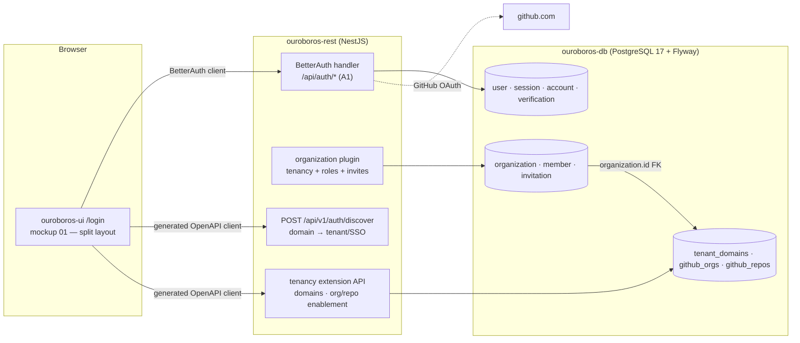
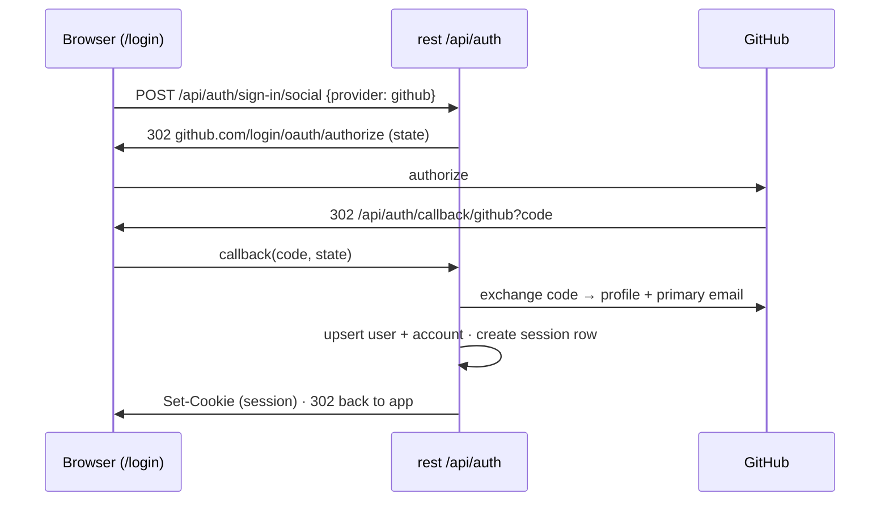
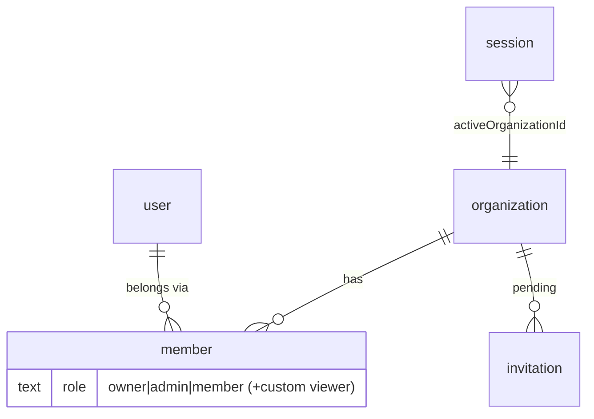
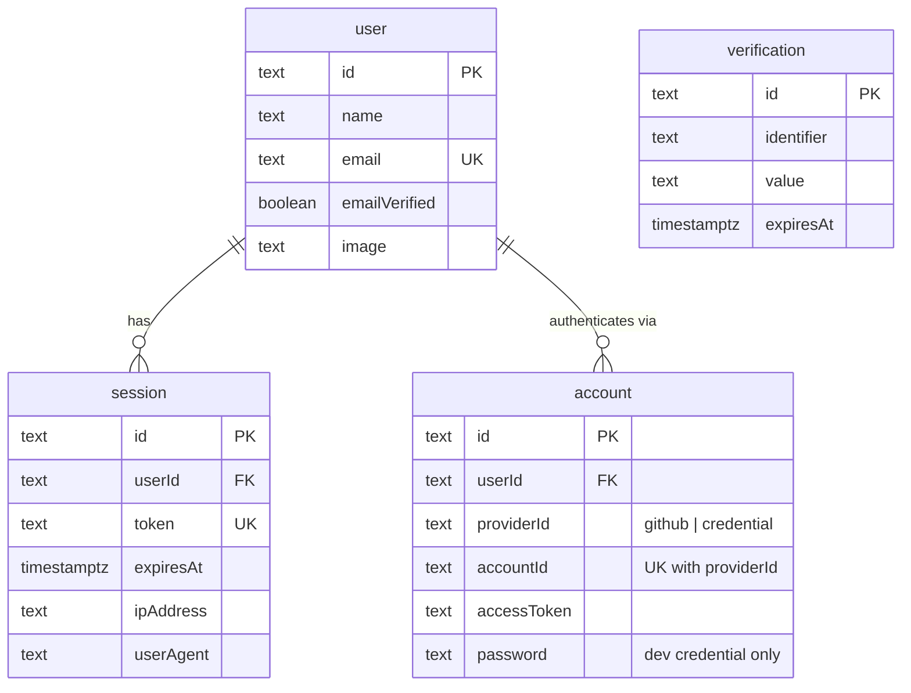
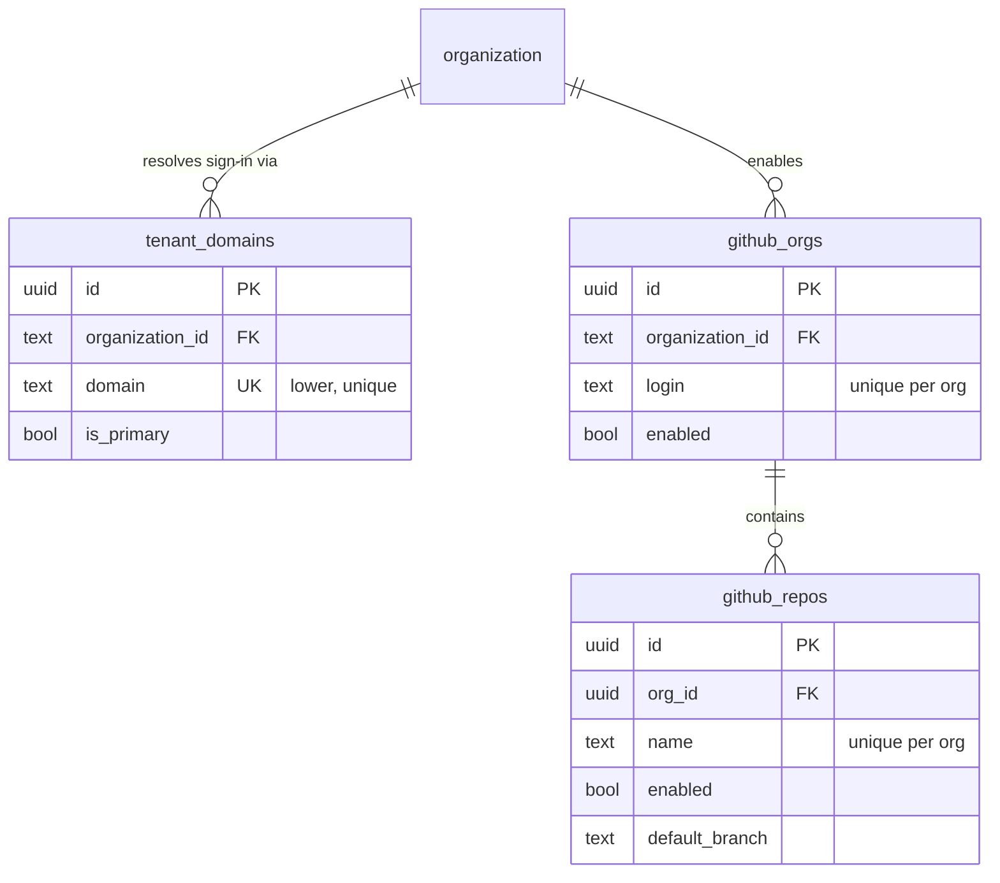
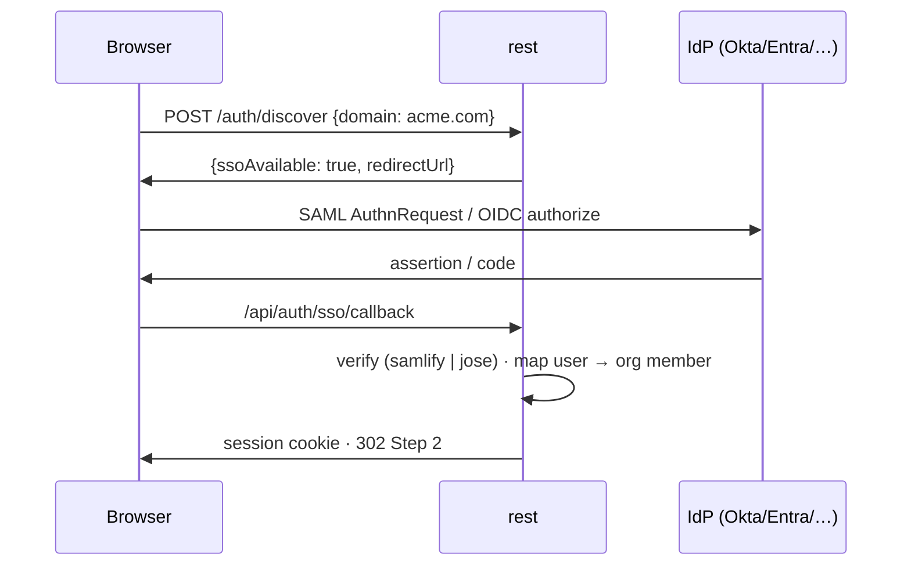
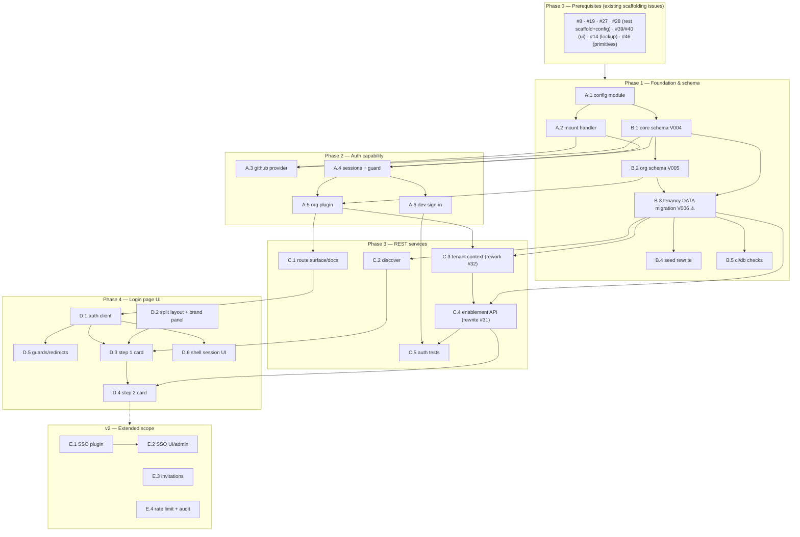

# Roadmap — Login Page (Mockup 01) with BetterAuth

## Description

> Create a roadmap that covers the features for the login page in 01, using BetterAuth
> for the authentication. Make sure to cover database tables and rest services to
> handle login services. Refer to the mockup page in the tickets so that the tickets
> know what to refer to when creating the UI/UX design of the pages.

## Context & Existing Work (duplicate-avoidance survey)

Surveyed 2026-08-08, against the 58 issues filed from
`ROADMAP_OUROBOROS_APPLICATION_SCAFFOLDING.md` — at that time all 🟡 Open, none started.

> **Re-surveyed 2026-08-12 — the original premise no longer holds.** The scaffolding
> roadmap shipped while this document sat unfiled. Of the eleven issues surveyed below,
> **ten are now 🔴 Closed and merged**; only #38 is still open. This roadmap is therefore
> **not greenfield**: every epic below now describes a *fix-forward migration* from
> working, tested, merged code — replacing it, deleting it, or re-pointing it — rather
> than building on empty ground. The verified shipped state is inventoried in
> [What has actually shipped](#what-has-actually-shipped-verified-2026-08-12) below, and
> each issue's Solution/Scope names the specific files it must migrate or delete.

**Design source of truth for every UI ticket in this roadmap:**
[`docs/mockups/01-login.html`](mockups/01-login.html) — the sign-in & tenancy mockup.
Its structure: a **split layout** (55% brand panel with lockup, three brand lines, and
a SOC 2 / SSO / self-hostable trust row · 45% auth panel), a **Step 1 · Sign in card**
("Continue with GitHub" button with GitHub mark SVG, an "or enterprise SSO" divider, a
company-domain field with `acme.ouroboros.dev` placeholder, a "Continue with SSO" ghost
button, SAML 2.0/OIDC explainer, and the "each domain is an isolated tenant" note), and
a **Step 2 · tenancy card** (org rows with monogram avatars, enabled-repo counts, on/off
switches, a `personal` pill, the least-privilege GitHub App note, and the "Enter mission
control →" CTA into mockup 02).

**Overlapping issues and their disposition.** Superseding is no longer a cheap body
edit — ten of these eleven shipped, so each disposition below now costs a migration:

| Existing issue | State | Disposition under this roadmap |
|---|:---:|---|
| #33 `ouroboros-rest: [4.7] GitHub OAuth sign-in & sessions` | 🔴 **Closed** | **Superseded** by Epic A, but it **shipped a complete hand-rolled OAuth implementation** — `oauth.ts` (state + PKCE, signed handshake cookie), `github.ts`, `auth.service.ts` (`resolveUser`, a 3-branch identity model), `session.ts` (stateless signed `ouro_session` cookie, 7-day max age, explicitly *no* sessions table), `signing.ts`, `cookies.ts`, `auth.guard.ts`, `principal.ts`, `public.decorator.ts`, plus a full `.spec.ts` suite and `auth.integration-spec.ts`. A.3 and A.4 have now **migrated off and deleted** every one of them — `principal.ts` is rewritten against BetterAuth's `@Session()` shape and the rest are gone. |
| #21 `ouroboros-db: [3.3] Users, identities & tenant membership` | 🔴 **Closed** | ~~Superseded by B.1/B.2~~ — **shipped as originally specified** (`V002__users_membership.sql`: `users`, `user_identities`, `tenant_members` with a `role in ('owner','admin','member','viewer')` check). B.1/B.2 are a fix-forward migration from these real tables. |
| #20 `ouroboros-db: [3.2] Baseline tenancy schema — tenants & domains` | 🔴 **Closed** | **Amended** by B.3 — `V001__tenants.sql` really created `ouroboros.tenants` and `tenant_domains` (incl. the one-primary-per-tenant partial unique index). `tenants` is *replaced* by the org plugin's `organization`; `tenant_domains` is *re-pointed*, with its existing rows migrated. |
| #22 `ouroboros-db: [3.4] GitHub org & repo enablement` | 🔴 **Closed** | **Amended** by B.3 — `V003__github_enablement.sql` shipped `github_orgs`/`github_repos`; same shape, FK re-pointed to `organization.id` with data migrated. |
| #23 `ouroboros-db: [3.5] Dev seed data` | 🔴 **Closed** | ~~Amended by B.4~~ — **shipped as originally specified** (`R__dev_seed.sql`). B.4 is a rewrite of that one file; its production guard (`${ouro_dev_seed}`, false everywhere but the dev stack), its `5eed…` id convention and its two test files (`tests/seed.sql`, `tests/constraints.sql`) carry over unchanged. |
| #31 `ouroboros-rest: [4.5] Tenancy module & API` | 🔴 **Closed** | **Amended** by C.4 — ✅ **done**. Member CRUD, invitations and workspace CRUD were **deleted** in favour of the org-plugin endpoints; the module keeps domains and org/repo enablement, moved under `/api/v1/orgs/{orgId}/…`, and gains `GET /api/v1/orgs` — Step 2's row model in one request. |
| #32 `ouroboros-rest: [4.6] Tenant-context resolution middleware` | 🔴 **Closed** | **Amended** by C.3 — ✅ **done**. The session's `activeOrganizationId` is primary, `X-Ouro-Tenant` is a validated override against `member`, and `422 tenant_required` became `400 organization_required`. The path parameter, the mismatch rule and the `404` are unchanged. |
| #37 `ouroboros-rest: [4.11] Integration test harness` | 🔴 **Closed** | **Extended** by C.5 (auth-flow suites) — the Testcontainers harness exists and `auth.integration-spec.ts` already uses it. |
| #38 `ouroboros-rest: [4.12] Security baseline hardening` | 🟢 **Open** (`v2`) | **Reduced** by E.4 — the only one still open. DB-backed sessions (A.4) make its "revocation strategy" work item obsolete; rate limiting moves to E.4. Its body is trimmed during filing. |
| #43 `ouroboros-ui: [5.5] Typed API client from OpenAPI` | 🔴 **Closed** | **Amended** by D.1 — the generated client exists (`app/api/session.ts`, `tenants.ts`, `tenant.ts`). Auth routes move to the BetterAuth client; the generated client keeps everything else. |
| #44 `ouroboros-ui: [5.6] Login & tenancy screen` | 🔴 **Closed** | **Superseded** on paper, but it **shipped a substantially complete login page** — `login-screen.tsx` (55/45 split, `LoginScreenState` step union), `brand-panel.tsx`, `sign-in-card.tsx` (**including the full SSO domain form, built deliberately inert**), `workspace-card.tsx`, `enablement-card.tsx`, `enablement-switch.tsx`, `monogram.tsx`, `github-mark.tsx`, `copy.ts`, `view.ts`, `actions.ts`, `app/(auth)/layout.tsx`, `app/(auth)/login/page.tsx`, and 12 test files. D.2–D.5 are therefore **re-wiring and completion**, not construction — see Epic D's revised scope. |

Unaffected and still prerequisite: #8 (monorepo layout), #19 (Flyway scaffold),
#27/#28 (Nest scaffold + config), #39/#40/#46 (UI scaffold, tokens, primitives),
#14 (brand asset split — the lockup used by the brand panel). All are 🔴 Closed.

### What has actually shipped (verified 2026-08-12)

Read from the working tree at `main` (`2593aa1`), not inferred from issue state:

| Layer | Shipped artifacts | Consequence for this roadmap |
|---|---|---|
| **`ouroboros-db`** | `V000__bootstrap`, `V001__tenants`, `V002__users_membership`, `V003__github_enablement`, `R__dev_seed.sql`; `tests/constraints.sql`, `tests/seed.sql`, `tests/lib/assert.sql` | B.1 starts at **V004**. B.3 is a **data migration**, not just DDL — real rows exist in `tenants`, `tenant_members`, `tenant_domains`, `github_orgs`, `github_repos`. |
| **`ouroboros-rest`** | `modules/auth/`, `modules/tenancy/`, `modules/db` (Kysely), `modules/config`, `modules/engine`, `modules/health`, `modules/errors`, `modules/app`; `auth/` (BetterAuth) | **Done.** A.3 deleted `oauth.ts`/`github.ts`; A.4 deleted `session.ts`, `signing.ts`, `cookies.ts`, `auth.guard.ts` and `public.decorator.ts`, and rewrote `principal.ts` against BetterAuth's `@Session()` shape. |
| **env (`.env.example`)** | `OURO_GITHUB_CLIENT_ID`, `OURO_GITHUB_CLIENT_SECRET`, #33's dev-user bypass key, `BETTER_AUTH_SECRET`, `BETTER_AUTH_URL` | A.4 **removed `OURO_SESSION_SECRET`** from the schema, both templates and `docker-compose.yml` along with the signer it belonged to. **A.6 has since removed the dev-user key** from both templates, the #28 zod schema and the compose comments, in the change that delivered its replacement. |
| **`ouroboros-ui`** | `app/login/` (12 components incl. the inert SSO form), `app/(auth)/`, `app/api/{session,tenants,tenant}.ts`, `__tests__/login/` (12 suites) | D.2 is largely **done**; D.3's SSO half is **built and waiting for C.2**; D.4's cards exist and need re-pointing at C.4 — whose contract has now landed, and whose client files C.4 carried across so the module still builds. Epic D shrinks accordingly. |

The single most consequential finding: **`sign-in-card.tsx` already implements the
mockup's entire enterprise-SSO half** — the "or enterprise SSO" divider, the
`Company domain` input with the `acme.ouroboros.dev` placeholder, the ghost
"Continue with SSO" button, the explainer and the isolated-tenant note — rendered
`disabled` behind a single `SSO_UNAVAILABLE` constant, precisely because no discovery
endpoint exists. Decision **A7** (ship the SSO form inert in MVP) is therefore already
satisfied in the UI; what remains is C.2's endpoint and the few lines in D.3 that
un-inert the form.

### Decisions proposed by this roadmap (validate before issue creation)

| # | Decision | Rationale |
|---|----------|-----------|
| A1 | **BetterAuth runs inside `ouroboros-rest`** via `@thallesp/nestjs-better-auth`, handler mounted at `/api/auth/*` | Keeps the single-communications-boundary invariant; the community NestJS module gives `AuthGuard`, `@Session()`, `@AllowAnonymous()` decorators. Requires disabling Nest's body parser so BetterAuth reads the raw body. |
| A2 | **Database adapter: BetterAuth's built-in Kysely adapter over the existing pg pool** | The service already uses Kysely + pg (#30, decision D3 of the scaffolding roadmap) — no second ORM enters the stack. |
| A3 | **Flyway stays the only migration authority.** BetterAuth CLI is used as `generate` (SQL output), never `migrate`; generated SQL is hand-ported into versioned Flyway migrations | Preserves the scaffolding roadmap's "Flyway owns DDL" rule. BetterAuth documents this exact workflow for external migration tools. |
| A4 | **BetterAuth tables keep their default (camelCase) column names, quoted, in the `ouroboros` schema** | They are vendor-shaped tables; renaming every column to snake_case fights plugin updates (the SSO plugin has a known snake_case incompatibility, better-auth#5649). House snake_case style applies to *our* extension tables only. |
| A5 | **Tenancy = BetterAuth organization plugin.** `organization`/`member`/`invitation` replace the planned `tenants`/`tenant_members`; `tenant_domains`, `github_orgs`, `github_repos` remain custom extension tables keyed to `organization.id` | Session-integrated `activeOrganizationId`, role model (owner/admin/member + custom roles), invitation lifecycle, and hooks come for free — exactly what mockup 01 step 2 and mockup 17 need. |
| A6 | **Sessions are database-backed** (BetterAuth `session` table) with cookie cache enabled | Real revocation (supersedes the stateless-cookie compromise in #33/#38); the session row also carries `activeOrganizationId`. |
| A7 | **MVP auth method is GitHub social login.** Enterprise SSO (SAML/OIDC via the `@better-auth/sso` plugin) is v2, but the **domain-discovery endpoint and the mockup's SSO form ship in MVP** returning a graceful "SSO not configured for this domain" state | The mockup gives SSO equal visual weight, so the UI must exist; standing up samlify/OIDC provider registration is real scope that doesn't gate the loop. |
| A8 | **Dev sign-in without GitHub credentials: BetterAuth email/password provider enabled only when `NODE_ENV !== 'production'`** | Replaces #33's dev-user bypass with a mechanism BetterAuth natively supports, still hard-off in production. **Shipped in A.6 · #705.** |
| A9 | Env names: BetterAuth's standard `BETTER_AUTH_SECRET` / `BETTER_AUTH_URL` join the `OURO_*` set in `.env.example` and the #28 zod schema | Fighting a library's canonical env names buys nothing. |

## Architecture Overview



## MVP Definition

The MVP is **mockup 01 working end to end on BetterAuth**. It is done when, against the
compose stack with seeded data:

1. `/login` renders the split layout pixel-faithful to
   [`docs/mockups/01-login.html`](mockups/01-login.html) in **both themes** — brand
   panel (lockup, brand lines, trust row) and auth panel (Step 1 + Step 2 cards).
2. **Continue with GitHub** completes a real BetterAuth GitHub OAuth flow, creating
   `user` + `account` rows and a database-backed session.
3. The **company-domain field** resolves a tenant via `POST /api/v1/auth/discover`,
   and answers gracefully when SSO is not configured (SSO itself is v2).
4. **Step 2** lists the signed-in user's organizations from the org plugin (with
   monograms, enabled-repo counts, and the `personal` pill), lets an owner/admin
   toggle org/repo enablement, sets `activeOrganizationId` on the session, and
   **Enter mission control →** lands on the dashboard.
5. Tenant context in REST resolves from the session's active organization; guards
   enforce org-plugin roles.
6. The auth integration suite (Testcontainers) covers sign-in, session, active-org
   switching, and role enforcement; `ci/rest` and `ci/db` stay green.
7. Dev sign-in (email/password, non-production only) works for local dev and e2e.

**Explicitly v2:** SAML/OIDC enterprise SSO (per-org provider registration + admin UI),
the invitation email flow, auth rate limiting, and auth audit events.

## Epics

| Epic | Name | Goal | Modules |
|------|------|------|---------|
| A · #695 | BetterAuth Foundation (`ouroboros-rest`) | Library integration, GitHub provider, sessions, org plugin | ouroboros-rest |
| B · #696 | Auth Database (`ouroboros-db`) | BetterAuth core + org schema via Flyway; tenancy reconciliation; seeds | ouroboros-db |
| C · #697 | Login REST Services (`ouroboros-rest`) | Discovery endpoint, tenant context from session, enablement API, tests | ouroboros-rest |
| D · #698 | Login Page UI (`ouroboros-ui`) | Mockup 01 as a working page: brand panel, Step 1, Step 2, guards | ouroboros-ui |
| E · #699 | Enterprise SSO & Hardening | SAML/OIDC SSO, invitations, rate limiting, audit | rest, ui, db |

Issue naming: `<project>: [<epic letter>.<issue>] <title>`. Labels reuse the existing
set (`mvp`, `v2`, `rest`, `db`, `ui`, `ci`, `design`) plus one new label **`auth`**
(create during issue filing). Complexity chips: **XS · S · M · L**.

---

## Epic A (#695) — BetterAuth Foundation (`ouroboros-rest`)

> **A.1 · #700 has shipped and has left the table below.** `better-auth` is a dependency of
> `ouroboros-rest`; [`src/auth/`](../ouroboros-rest/src/auth) holds `auth.options.ts` (the
> options, and every decision in them), `auth.factory.ts` (the one place the library is a
> value rather than a type) and `auth.config.ts` (the standalone instance
> `@better-auth/cli` loads). `BETTER_AUTH_SECRET` and `BETTER_AUTH_URL` are in the #28
> schema, both `.env.example` files, `docker-compose.yml` and `turbo.json`'s `globalEnv`;
> the secret is in `redaction.ts`'s classification. The adapter is handed
> `DatabaseService`'s `pg` pool, so the running service still opens exactly one — asserted
> in `auth.options.spec.ts`, not assumed. Its issue section below is kept as the record of
> what was asked for.
>
> Two things it deliberately did **not** do. `OURO_SESSION_SECRET` is still there, because
> the hand-rolled signer it belongs to is still there until **A.4**; and no provider,
> plugin or session strategy is configured, which `auth.options.spec.ts` pins by asserting
> the whole option surface.
>
> **A.2 · #701 has shipped and has left the table below.**
> `@thallesp/nestjs-better-auth` is a dependency of `ouroboros-rest`;
> `src/auth/auth.module.ts` imports its `AuthModule` with the A.1 instance and
> `src/auth/auth.routes.ts` holds the route map for **C.1 · #711** to publish.
> `/api/auth/ok` answers `{"ok": true}` on a running service, outside the `/api/v1`
> prefix and outside URI versioning. The application is created with Nest's body parser
> **off** (`applicationOptions` in `src/application.ts`) and the library re-adds
> `express.json()`/`express.urlencoded()` for every path that is not an auth path — the
> regression that creates is asserted over every operation in `openapi.yaml` that takes a
> request body, and the integration suite's 198 tests exercise the real controllers
> against a real database. Two of the library's defaults are off and both are **A.4's** to
> turn back on: its global `AuthGuard` (this service still runs #33's `SessionGuard`) and
> its CORS policy (`permitBrowserOrigins` already answers that question over the same
> origin list). Its issue section below is kept as the record of what was asked for.
>
> One thing it deliberately did **not** do: no provider, plugin or session strategy was
> configured, so `sign-in/social` answers `PROVIDER_NOT_FOUND` and `get-session` answers
> `null` — **A.3** and **A.4** are what fill the mounted surface in, and both are now
> unblocked.
>
> **A.3 · #702 has shipped and has left the table below.** BetterAuth's GitHub provider is
> configured in [`src/auth/github.provider.ts`](../ouroboros-rest/src/auth/github.provider.ts),
> which is where the four decisions a library cannot make for a service are argued: the
> scopes are `read:user` and `user:email` with `disableDefaultScope` on, so the list is this
> service's rather than a default a library upgrade could widen; `mapProfileToUser` writes
> the name, falling back to the login, and the avatar, because `"user"."name"` is `not null`
> and the library's default would write `""`; and account linking is on but trusts no
> provider *by name*, so a link is authorised by GitHub having **verified** the address —
> the rule #33 enforced by hand — while `requireLocalEmailVerified` is off, because an
> invited stub (#31) has never had the chance to verify anything. The OAuth App's callback
> is `${BETTER_AUTH_URL}/api/auth/callback/github`, composed from the provider id in
> `auth.routes.ts` so it cannot disagree with `account.providerId`.
>
> **And #33's flow is gone**, not flagged off. `oauth.ts`, `github.ts` and their specs are
> deleted; `auth.service.ts` lost `startSignIn`, `completeSignIn` and `resolveUser`;
> `auth.repository.ts` lost `findUserByIdentity`, `createUser`, `refreshProfile` and
> `linkIdentity`; three error codes and their `openapi.yaml` entries went with them. The
> **contract question the issue asked to be decided here** was decided *remove*, not
> *forward*: `GET /api/v1/auth/github{,/callback}` answer `404`, asserted as behaviour, because
> BetterAuth begins a social sign-in with a `POST` answering a URL and there is no honest
> `302` to forward with. Every superseded spec was deleted rather than skipped, and what
> each covered moved somewhere it can still be checked — the provider's values to
> `github.provider.spec.ts`, the identity model to `ouroboros-db/tests/constraints.sql`, and
> "a person who signed in under #33 is the same person" to `auth.integration-spec.ts`, which
> seeds a pre-migration `user_identities` row, runs V004's back-fill and asserts the pair
> `findOAuthUser` reads resolves to the same id.
>
> Two things it deliberately did **not** do. The full browser flow against a real GitHub
> OAuth app stays a manual check — the library is ES-module-only and both Jest runners
> substitute it, so a suite asserting a sign-in would be asserting against a stand-in;
> **C.5 · #715** owns the automated one. And **the login page's GitHub button does not work
> until D.3 · #718** re-points it at `signIn.social`. That gap is the deliberate cost of not
> keeping two sign-in paths alive at once. Its issue section below is kept as the record of
> what was asked for.
>
> **A.4 · #703 has shipped and has left the table below.** Sessions are **rows**:
> `src/auth/session.options.ts` sets `expiresIn` (7 days), `updateAge` (1 day) and
> `cookieCache` (enabled, 5 minutes), so an authenticated request costs **no** query while
> the signed snapshot is fresh, and signing out **deletes the `ouroboros.session` row** —
> revocation is immediate, which closes the revocation half of **#38**. The library's own
> `AuthGuard` is the global guard, registered by `src/auth/auth.module.ts` rather than by the
> library's nested dynamic module, because Nest reaches that one a scan level *after*
> `TenancyModule` — which put `@Roles()` in front of authentication and answered `500`. Every
> `@Public()` was ported to `@AllowAnonymous()` one for one, and the surface is no longer
> maintained by inspection: `guard.surface.spec.ts` walks the running application's whole
> route table with `DiscoveryService` and fails if any route gains or loses its exemption.
> `session.ts`, `signing.ts`, `cookies.ts`, `auth.guard.ts` and `public.decorator.ts` are
> **deleted**; `principal.ts` is rewritten as the typing of BetterAuth's `@Session()` shape
> plus the one `"user"` → `users` adaptation #708 will delete. `POST /api/v1/auth/logout`
> was **kept and re-pointed** rather than removed — unlike #702's sign-in routes there is an
> honest forward, and deleting it would have shrunk the public surface the issue's own
> instruction called the spec.
>
> **The breaking change, stated rather than discovered:** the cookie rename `ouro_session` →
> `better-auth.session_token` **invalidated every session live at the cut-over**. There is no
> way to migrate a stateless signed cookie into a session row. A browser still holding the
> old cookie is answered `401` and told to drop it —
> `src/modules/auth/legacy.cookie.ts`, which is dated for deletion a week after the deploy.
>
> Three things it deliberately did **not** do. **The dev-user bypass is gone**
> and the variable was not: A.4 deleted the guard that read it, and **A.6 · #705** has since
> removed the variable in the change that delivered the development email/password sign-in
> replacing it — so the interval in which local work needed a real GitHub OAuth app is over. **The UI still forwards
> `ouro_session`**, which is **D.5 · #720**'s to re-point, exactly as that issue's body
> predicted. And **the e2e suite's sign-in is parked**: it minted a stateless cookie with
> `issueSession`, which no longer exists, and it cannot mint a row from outside the stack —
> the legs that need one carry `test.fixme`. **A.6 · #705 has since supplied the sign-in a
> script can perform** — `support/session.ts` calls it for real — and **B.4 · #709 has since
> landed the rows it signs in as** (the seeded `"user"` and `account` rows, dev password
> included), so what they now wait on is only a stack whose `ouroboros-rest` is not the
> production image. Every leg that needs no session still runs.
> Its issue section below is kept as the record of what was asked for.

> **A.5 · #704 has shipped and has left the table below.** Tenancy is the organization
> plugin (decision **A5**), registered in `src/auth/auth.factory.ts` from options three new
> modules decide:
> [`organization.roles.ts`](../ouroboros-rest/src/auth/organization.roles.ts) (the role
> model), [`organization.plugin.ts`](../ouroboros-rest/src/auth/organization.plugin.ts)
> (the plugin's options and #725's audit seam) and
> [`active.organization.ts`](../ouroboros-rest/src/auth/active.organization.ts) (the tenant
> pointer, and the personal organization).
>
> **`viewer` is a real access-control role, and the suite asks the library rather than
> assuming** — which is the acceptance criterion that shaped the test architecture.
> `jest.config.mjs` now *converts* `better-auth/plugins/access` and
> `better-auth/plugins/organization/access` instead of replacing them: they are a few dozen
> lines whose only dependency is an error class, so `organization.roles.spec.ts` can assert
> that a viewer is refused `member: ["create"]` by the same code path the running service
> takes. The plugin proper still reaches `better-auth/api` and is still replaced, which is
> why `organization()` is called in `auth.factory.ts` alone and `auth.options.ts` keeps its
> "no `better-auth` value" rule.
>
> **The personal organization hangs off session creation, not user creation**, and that is a
> deliberate departure from this issue's wording. `V004`'s back-fill already wrote a
> `"user"` row for everybody who used Ouroboros before BetterAuth, so a `user.create.after`
> hook would never fire for any of them — they would sign in, find no organization, and need
> a second one-shot back-fill. Evaluated at every sign-in the rule is self-healing, costs one
> indexed lookup for anybody who already belongs somewhere, and still means "first sign-in
> creates a personal organization" for a new person. It also covers **B.3 · #708**'s migrated
> members for free: they arrive holding memberships, so nothing is created for them.
>
> One rule was added that the issue did not ask for and the mockup requires:
> `beforeCreateOrganization` **strips a client-supplied `metadata.personal`**. The plugin's
> create route accepts arbitrary metadata, and that flag is what mockup 01 Step 2 renders as
> the `personal` pill — without the strip, anybody could create a shared workspace wearing
> it. The same hook is #725's seam, which is why the two share it.
>
> The route map grew the six routes the product actually uses; the plugin mounts more than
> thirty, and listing only these is what keeps `auth.routes.ts` a record of what the service
> *does*. Invitations are written but **not delivered** — **E.3 · #724** is the email, and
> there is no `expired` status to wait for: expiry is `expiresAt`, evaluated at accept time.
> Its issue section below is kept as the record of what was asked for.

> **A.6 · #705 has shipped, and Epic A's table is now empty — every issue in it has
> landed.** Development sign-in is BetterAuth's `emailAndPassword` (decision **A8**), decided
> in [`password.provider.ts`](../ouroboros-rest/src/auth/password.provider.ts) and gated on
> `NODE_ENV !== "production"` **and on nothing else**. A second switch would be a second
> thing to get wrong, and this module's Dockerfile already pins `NODE_ENV=production`, so the
> off position is what a deployment inherits.
>
> **The bypass is gone from the repository, not merely unused** — the acceptance criterion
> that shaped most of the diff. The variable left both `.env.example` templates, the #28 zod
> schema, `Configuration`, `AppConfigService` (both the field and the `devUserEmail` accessor
> that guarded it), the redaction rules, `docker-compose.yml`, the Dockerfile, `setup.sh`,
> three READMEs, `ARCHITECTURE.md` and three roadmaps. Grepping for its name returns nothing.
>
> **Two corrections to this issue's own wording**, both recorded because a test written to
> the letter of either would assert something untrue:
>
> * **"the endpoint returns 404/disabled" — it is 400, not 404.** BetterAuth leaves the
>   routes mounted and makes the handlers refuse: `EMAIL_PASSWORD_DISABLED` on sign-in,
>   `EMAIL_PASSWORD_SIGN_UP_DISABLED` on sign-up. `password.provider.spec.ts` therefore
>   asserts the option this service decides rather than a status code the library owns.
> * **"e2e (#56) passes using the new path" — it cannot yet, and not for want of this
>   issue.** The compose stack runs this module's *production* image, which is exactly what
>   the gate turns off. Overriding `NODE_ENV` there does not help: the same variable moves
>   `listenHost` back to loopback, and a container bound to loopback publishes nothing.
>   `tests/e2e/support/session.ts` has been re-pointed at `signIn.email` and is finished —
>   the "one function" it spent two issues predicting — and with **B.4 · #709** since
>   landed, its legs stay parked only on a non-production `rest` for the suite to talk
>   to. Giving it one is a stack decision for **#56** or **C.5 · #715**.
>
> Sign-**up** is enabled in development too, which the issue did not ask for: a developer
> whose database predates #709's seed otherwise has no way into the product at all, and the
> surface is unreachable in production because one flag gates both routes. The password floor
> is twelve characters, above the library's eight, and hashing is deliberately *not*
> overridden — #709's seed has to write hashes the same scrypt verifier accepts.

### Issue A.1 (#700) — ouroboros-rest: [A.1] BetterAuth installation & configuration module

**🔴 Shipped.** Kept as the record of what was asked for; see the note under
[Epic A](#epic-a-695--betterauth-foundation-ouroboros-rest) for what landed, and
`ouroboros-rest/README.md` § BetterAuth for how it is used.

- **Problem Statement:** BetterAuth needs a home in the NestJS service: a standalone
  config (`src/auth/auth.config.ts`, importable by the CLI without booting Nest), the
  database adapter, and validated env — before any provider or route exists.
- **Solution/Scope:** Install `better-auth`; author the config object with the built-in
  Kysely adapter reusing the #30 pg pool (decision A2); extend the #28 zod schema with
  `BETTER_AUTH_SECRET`, `BETTER_AUTH_URL` (decision A9), **reusing the existing
  `OURO_GITHUB_CLIENT_ID`/`OURO_GITHUB_CLIENT_SECRET` keys already in `.env.example`
  rather than introducing a parallel pair**; set `trustedOrigins` from the CORS config;
  secrets redacted from config logging (`redaction.ts` already exists — extend its key
  list, don't fork it). `OURO_SESSION_SECRET` is retained until A.4 deletes the
  hand-rolled signer, then removed from the schema, `.env.example` and the compose
  files in the same change. Keep the config file CLI-loadable
  (`npx @better-auth/cli generate --config …`) for B.1's schema generation.
  Sources: BetterAuth installation & PostgreSQL adapter docs.
- **Acceptance Criteria:**
  - Service boots with valid env; missing `BETTER_AUTH_SECRET` exits non-zero naming
    the variable.
  - `@better-auth/cli generate` runs against the config file and emits SQL (consumed
    by B.1) without starting the Nest app.
  - No second database pool is created — the adapter shares the `DbModule` pool.
  - `BETTER_AUTH_SECRET` and the GitHub secret are redacted in the config dump
    (extends `redaction.spec.ts`).
  - `.env.example`, `docker-compose.yml` and the #28 schema agree on the key set —
    no orphan `OURO_SESSION_SECRET` left once A.4 lands.
- **Parallelism/Dependencies:** Needs #27, #28. Blocks A.2, B.1.
- **Technical Stack:** better-auth, Kysely adapter, zod, @nestjs/config.
- **Epic:** A

```
src/auth/
├── auth.config.ts   (BetterAuth options — CLI-loadable, no Nest imports)
├── auth.module.ts   (Nest wiring — A.2)
└── plugins/         (organization A.5 · sso E.1)
```

### Issue A.2 (#701) — ouroboros-rest: [A.2] Mount BetterAuth handler in NestJS

**🔴 Shipped.** Kept as the record of what was asked for; see the note under
[Epic A](#epic-a-695--betterauth-foundation-ouroboros-rest) for what landed, and
`ouroboros-rest/README.md` § BetterAuth for the route map and the body-parser change.

- **Problem Statement:** BetterAuth serves its own route surface; Nest must hand it the
  raw request stream at `/api/auth/*` without the global prefix, body parser, or
  interceptors mangling it.
- **Solution/Scope:** Adopt `@thallesp/nestjs-better-auth`: import its `AuthModule`
  with the A.1 instance; bootstrap with Nest's body parser disabled (the library
  requires the raw body); exclude `/api/auth/*` from the `/api/v1` global prefix;
  verify graceful-shutdown hooks still drain. Document the route map (sign-in,
  callback, sign-out, session). Source: BetterAuth NestJS integration doc.
- **Acceptance Criteria:**
  - `GET /api/auth/ok` (or equivalent) responds; BetterAuth routes bypass the global
    prefix and versioning.
  - JSON endpoints elsewhere still parse bodies correctly (regression test).
  - `ci/rest` stays green.
- **Parallelism/Dependencies:** Needs A.1. Blocks A.3, A.4.
- **Technical Stack:** @thallesp/nestjs-better-auth (Express adapter).
- **Epic:** A

```
Nest bootstrap ── bodyParser:false ──▶ [AuthModule(@thallesp)] ─▶ /api/auth/* → BetterAuth
                                      └▶ everything else      ─▶ /api/v1/*   → controllers
```

### Issue A.3 (#702) — ouroboros-rest: [A.3] GitHub social provider (retiring the hand-rolled OAuth)

**🔴 Shipped.** Kept as the record of what was asked for; see the note under
[Epic A](#epic-a-695--betterauth-foundation-ouroboros-rest) for what landed, and
`ouroboros-rest/README.md` § Signing in for how it is used.

- **Problem Statement:** Mockup 01's primary action is **Continue with GitHub**
  ([`docs/mockups/01-login.html`](mockups/01-login.html), Step 1 card). A working
  GitHub sign-in **already exists** — #33 shipped `src/modules/auth/oauth.ts`
  (state + PKCE over a signed handshake cookie), `github.ts` (`GithubClient`,
  `GithubProfile`), and `auth.service.ts`'s `resolveUser`, a three-branch identity
  model writing `users` + `user_identities`. This issue is not "add GitHub login";
  it is **replacing a working implementation with the library's**, which means the
  old one must leave and its rows must survive the move.
- **Solution/Scope:** Enable BetterAuth's GitHub provider (client id/secret from A.1
  env); request `user:email` scope so private primary emails resolve; map login,
  display name, and avatar into `user`; set account-linking policy (same verified
  email links to the existing user); document the OAuth App callback URL
  (`${BETTER_AUTH_URL}/api/auth/callback/github`) for dev and prod. **Then retire the
  hand-rolled flow:**
  - **Data:** back-fill `account` from `user_identities` (`GITHUB_PROVIDER` →
    `providerId='github'`, `external_id` → `accountId`) as part of B.1's migration
    chain, so existing sign-ins keep resolving to the same person.
  - **Code:** delete `oauth.ts`, `github.ts`, `signing.ts` and the GitHub branches of
    `auth.service.ts`/`auth.repository.ts`; delete their `.spec.ts` files; leave no
    second sign-in path behind a flag (two OAuth flows in one service is the failure
    mode this issue exists to prevent).
  - **Contract:** `auth.controller.ts`'s existing routes either forward to
    `/api/auth/*` or are removed — decided here, not left to D.3.
- **Acceptance Criteria:**
  - Full browser flow against a real GitHub OAuth app lands a DB session; `user` +
    `account` rows created with email, name, avatar.
  - Repeat login with the same GitHub identity reuses the same user row — **including
    a user who first signed in under the #33 flow** (back-fill verified with a seeded
    pre-migration `user_identities` row).
  - State/CSRF handling verified (tampered `state` rejected).
  - `rg 'oauth\.ts|signing\.ts|GithubClient'` returns no hits outside deleted-file
    history; `ci/rest` green with the old specs removed rather than skipped.
- **Parallelism/Dependencies:** Needs A.2, B.1. Blocks D.3, C.5.
- **Technical Stack:** better-auth GitHub provider; deletions across `src/modules/auth/`.
- **Epic:** A



### Issue A.4 (#703) — ouroboros-rest: [A.4] Session strategy & global auth guard (retiring the stateless cookie)

**🔴 Shipped.** Kept as the record of what was asked for; see the note under
[Epic A](#epic-a-695--betterauth-foundation-ouroboros-rest) for what landed, and
`ouroboros-rest/README.md` § Sessions for the values and the cookies.

- **Problem Statement:** Every non-public route must require a valid session, resolved
  once and injected — and sessions must be revocable. The shipped `session.ts` is
  explicit that they are not: it issues a stateless signed `ouro_session` cookie with a
  seven-day `SESSION_MAX_AGE_SECONDS`, documents "there is no `sessions` table, no store
  to run and nothing to evict", and names #38 as where revocation was deferred to.
  Decision A6 retires that compromise, so this issue **swaps the session mechanism under
  a guard that is already in production use** — every route currently protected by
  `auth.guard.ts` must stay protected across the change.
- **Solution/Scope:** Database-backed sessions with BetterAuth's cookie cache (short
  TTL) to avoid a DB hit per request; register the library's `AuthGuard` globally in
  place of the shipped one; port the existing `@Public()` annotations
  (`public.decorator.ts`) to `@AllowAnonymous()` **one for one — the shipped public
  surface is the spec**; replace `principal.ts`'s `Principal` with the library's
  `@Session()` shape at every call site; sign-out revokes the session row. Delete
  `session.ts`, `signing.ts`, `cookies.ts` and `public.decorator.ts` once ported.
  Cookie rename `ouro_session` → BetterAuth's default **invalidates every live
  session**; that is intended (there is no way to migrate a stateless cookie into a
  session row) and must be called out in the release note. Session expiry/refresh
  values documented in `docs/ARCHITECTURE.md`.
- **Acceptance Criteria:**
  - Unauthenticated requests to protected routes get 401; health/docs stay open.
  - **Every route that `public.decorator.ts` exempted is still exempt, and no route
    that wasn't became public** — asserted by a test enumerating the guard's decisions
    across the full route table, not by inspection.
  - Sign-out invalidates the session server-side (subsequent requests 401 even with
    the old cookie) — the property #38 could not provide.
  - Session lookup adds ≤1 DB query per request with cookie cache enabled (verified
    by query logging in dev).
  - A stale `ouro_session` cookie is rejected cleanly (401 + clear-cookie), not 500.
- **Parallelism/Dependencies:** Needs A.2, B.1. Blocks A.5, A.6, C.3. Closes the
  revocation half of #38.
- **Technical Stack:** better-auth sessions, @thallesp/nestjs-better-auth guard/decorators.
- **Epic:** A

```
request ─▶ cookie ─▶ [cookie cache fresh?] ──yes──▶ session ─▶ handler
                          └──no──▶ session table lookup ─▶ refresh cache
sign-out ─▶ DELETE session row  (revocation is immediate)
```

### Issue A.5 (#704) — ouroboros-rest: [A.5] Organization plugin adoption (tenancy backbone)

**🔴 Shipped.** Kept as the record of what was asked for; see the note under
[Epic A](#epic-a-695--betterauth-foundation-ouroboros-rest) for what landed, and
`ouroboros-rest/README.md` § Tenancy: the organization plugin for how it is used.

- **Problem Statement:** Mockup 01 Step 2 ("Choose where the loop runs") and mockup 17
  (members/roles) need organizations, membership, roles, and an active-org pointer —
  the org plugin provides all four, replacing the custom tables planned in #20/#21
  (decision A5).
- **Solution/Scope:** Enable the organization plugin: default roles owner/admin/member
  mapped to the product's owner/admin/member/viewer expectations (viewer via custom
  access-control roles); `activeOrganizationId` on the session as the tenant pointer;
  creation rules (first sign-in auto-creates a personal org — the `personal` pill in
  mockup 01); `beforeCreateOrganization`/`afterAddMember` hooks reserved for audit
  (E.4). Server API surfaced for org list/create/set-active; invitations exist at the
  API level in MVP (email delivery is E.3).
- **Acceptance Criteria:**
  - A new GitHub sign-in yields a personal organization and membership row.
  - `setActiveOrganization` updates the session row; org list returns memberships
    with roles.
  - Role checks: member-level users denied owner/admin mutations (verified in C.5).
- **Parallelism/Dependencies:** Needs A.4, B.2. Blocks C.3, C.4, D.4.
- **Technical Stack:** better-auth organization plugin (+ access control).
- **Epic:** A



### Issue A.6 (#705) — ouroboros-rest: [A.6] Dev email/password sign-in (replacing the dev-user bypass)

**🔴 Shipped.** Kept as the record of what was asked for; see the note under
[Epic A](#epic-a-695--betterauth-foundation-ouroboros-rest) for what landed, including the
two corrections to the acceptance criteria below.

- **Problem Statement:** Local dev and the e2e suite need sign-in without live GitHub
  credentials. #33's bypass is **live, not hypothetical**: `.env.example` ships
  the dev-user key set to `ken@acme-robotics.dev`, `auth.service.ts` logs when the bypass
  activates, and the closed e2e smoke test (#56) signs in through it. Decision A8
  replaces it with a mechanism BetterAuth supports natively — which means the bypass
  must be **removed in the same change that lands its replacement**, or the two
  coexist and the dev-only escape hatch outlives its guard.
- **Solution/Scope:** Enable `emailAndPassword` only when `NODE_ENV !== 'production'`;
  seed dev users with known passwords (B.4); the login page shows the dev form only in
  dev builds (D.3). Delete the dev-user branch from `auth.service.ts`, the
  key from `.env.example`, the #28 zod schema and the compose files; re-point #56's
  login leg at `signIn.email`. Production build provably rejects password sign-in.
- **Acceptance Criteria:**
  - Dev: `signIn.email` with seeded credentials lands a session.
  - Production build: the endpoint returns 404/disabled; config test asserts it.
  - Grepping the repository for the dev-user variable's name returns nothing — env
    files, compose, docs and specs included.
  - e2e (#56 amendment) passes using the new path, with the old bypass gone rather
    than merely unused.
- **Parallelism/Dependencies:** Needs A.4, B.4. Feeds C.5 and the e2e gate; amends #56.
- **Technical Stack:** better-auth emailAndPassword provider.
- **Epic:** A

```
NODE_ENV=development ─▶ [GitHub] + [email/password (seeded)]
NODE_ENV=production  ─▶ [GitHub] only — password route disabled
```

---

## Epic B (#696) — Auth Database (`ouroboros-db`)

> **B.1 · #706 has shipped and has left the table below.**
> [`ouroboros-db/migrations/V004__betterauth_core.sql`](../ouroboros-db/migrations/V004__betterauth_core.sql)
> is a hand-port of `@better-auth/cli generate` run against A.1's `auth.config.ts`:
> `"user"`, `session`, `account` and `verification` in the `ouroboros` schema, with the
> library's quoted camelCase columns kept exactly as emitted (decision **A4**). Three
> statements are ours and marked so — the schema qualification, the
> `account(providerId, accountId)` unique index the acceptance criteria name, and the
> back-fill.
>
> The back-fill is a **function**, `ouroboros.backfill_betterauth_core()`, called once by
> the migration. It copies `users` → `"user"` and `user_identities` → `account`
> **preserving ids**, so `tenant_members.user_id` and every other key written against
> `users.id` still resolves through **B.3**. Being a function rather than four statements
> makes it idempotent, re-runnable by hand, and callable from `tests/constraints.sql` —
> which is where `ci/db` now asserts the row counts, the preserved ids and the column
> mapping against fixtures rather than trusting them. `emailVerified` is derived rather
> than defaulted: `true` for a person holding a GitHub identity, who proved a verified
> address through #33's flow, and `false` for one who exists only because they were
> invited.
>
> Two mechanical guards landed in `scripts/verify-dev-env.sh`, both in `ci/db`'s first
> step: every migration is grepped for an unquoted `user` in a table position, and the
> whole repository for anything wiring up `@better-auth/cli migrate` — decision **A3**,
> asserted rather than remembered. `users`/`user_identities` are **not** dropped; that is
> **B.3**, so that pointing traffic back at them stays possible until A.3 has been
> exercised. Its issue section below is kept as the record of what was asked for.
>
> One consequence it deliberately did **not** paper over: Flyway applies repeatable
> migrations last, so a database created from empty runs V004 before `R__dev_seed.sql` and
> the back-fill finds nothing to copy. **B.4 · #709 has since taught the seed about these
> tables** — the seed writes the BetterAuth rows directly now, and the hand-run workaround
> is history along with the back-fill function V006 dropped.
>
> **B.2 · #707 has shipped and has left the table below.**
> [`ouroboros-db/migrations/V005__betterauth_organization.sql`](../ouroboros-db/migrations/V005__betterauth_organization.sql)
> is the same hand-port for the organization plugin — `organization`, `member`,
> `invitation` and `session."activeOrganizationId"` — and the port is **checked rather
> than trusted**: re-running `generate` against a database carrying V005 prints *"Your
> schema is already up to date"*.
>
> Four statements are ours and marked so. The `member(organizationId, userId)` unique
> constraint the acceptance criteria name — the successor to `tenant_members`' composite
> primary key, and the thing that makes the plugin's own read-then-write membership check
> hold under two concurrent invitation accepts. A `check ("metadata" is null or "metadata"
> is json)`, which constrains shape rather than vocabulary and so cannot be outdated by a
> library upgrade. And the **foreign key on the tenant pointer**, with the index the
> delete path needs: the library emits a bare `text` column and clears it in application
> code, and the acceptance criterion asks the schema for the rule instead. It is
> `on delete set null` rather than `cascade` — a cascade there would delete the *session
> rows*, so deleting an organization would sign out everybody acting in it.
>
> Two things it deliberately did **not** do, both for the same reason: `member.role` and
> `invitation.status` are **not** CHECK-constrained, unlike V002's `tenant_members.role`.
> Those vocabularies are the plugin's configuration now — **A.5** defines `viewer` in an
> access-control statement — and a check constraint one release out of date would reject a
> value the application had just been configured to write. Both are documented in column
> comments and asserted in `ouroboros-rest`, which is where they are decided. Worth
> knowing for **E.3 · #724**: there is no `expired` status despite this roadmap's diagram
> — expiry is the `expiresAt` timestamp, evaluated at accept time.
>
> `tests/constraints.sql` grew a V005 section covering all of it, and its fixture reset
> grew a fourth delete: `member` and `invitation` cascade from `"user"` as well, so
> clearing the people empties both, but the organizations they named survive. Its issue
> section below is kept as the record of what was asked for.
>
> **B.3 · #708 has shipped and has left the table below — the cut-over is done.**
> [`ouroboros-db/migrations/V006__tenancy_extensions.sql`](../ouroboros-db/migrations/V006__tenancy_extensions.sql)
> moves `tenants` → `organization` and `tenant_members` → `member` with ids preserved as
> text and roles verbatim, re-parents `tenant_domains` and `github_orgs` onto a
> snake_case `organization_id` (decision **A4** — our tables, our style; V001's
> one-primary partial unique index re-scoped with them), and only then drops `tenants`,
> `tenant_members`, `users`, `user_identities` and the V004 back-fill function.
> Everything it assumes is **asserted before anything is written** — an id or slug
> collision with a plugin-minted organization, a role outside the V002 vocabulary, a
> membership whose person the back-fill skipped — so a failed run rolls back whole.
> Its step 0 re-runs V004's back-fill first, which is what carries a development
> database whose seed landed *after* V004 across without hand-holding.
>
> The migration cannot be reverted by redeploying, so `ci/db` now **rehearses it on
> every run** rather than having rehearsed it once: `tests/rehearsal/pre.sql` rebuilds a
> populated V005 database (the pre-migration seed's rows, plus a suspended tenant, a
> `viewer` and an un-accepted invitation — the states the seed never contained) and
> `post.sql` asserts every domain, org and repo still resolves to the same logical
> tenant, by spot value rather than exit code. `R__dev_seed.sql` writes the BetterAuth
> shape now, `tests/constraints.sql` was rebuilt around the surviving schema, and its
> V006 section asserts the four dropped tables **stay** gone — a migration that
> recreated one fails `ci/db`. **C.3 · #713 re-pointed the tenant context** at `organization`
> and `member`, and **C.4 · #714 has since rewritten the rest of `modules/tenancy`** — the
> module names none of the dropped tables now, and `ci/rest`'s integration suites are green
> again.
>
> **B.4 · #709 has shipped and has left the table below — the seed is auth-aware.**
> [`ouroboros-db/migrations/R__dev_seed.sql`](../ouroboros-db/migrations/R__dev_seed.sql)
> now writes mockup 01 Step 2's demo set number for number: three organizations —
> `acme-robotics` with domain `acme-robotics.dev` and four enabled repos incl.
> `helios-firmware`, `acme-labs` with none and its org switch off, personal
> `kensuenobu` (`metadata.personal = true`) with two — six memberships spanning
> owner/admin/member (every organization exactly one owner, and someone for the role
> gate to refuse in each shared workspace), one GitHub-shaped account, and a
> `credential` account per person whose scrypt hash BetterAuth's own verifier accepts,
> behind the documented development password (`ouroboros-db/README.md` § The
> development seed). The three #23 conventions carried over intact — the
> `${ouro_dev_seed}` guard on every statement, the `5eed…` id convention (now
> twenty-six ids), insert-only idempotence — and `tests/seed.sql` /
> `tests/seed.test.sh` grew with the content, including the new rule that the seed may
> hold exactly the three documented password hashes and never a token or the
> plaintext.

> **B.5 · #710 has shipped, and Epic B's table is now empty — every issue in it has
> landed.** The five constraint assertions the issue named were already in
> `tests/constraints.sql`, put there by the migrations that made the rules (#706, #707,
> #708) rather than deferred to this one; what #710 found missing was the surface *no*
> check covered, and it closed that instead. `ouroboros-db/scripts/betterauth-schema.mjs`
> asks BetterAuth's own schema planner what it expects and answers two questions with it:
> `--applied` asserts the schema Flyway actually applied still holds everything the
> library wants, and `--check` asserts the library still wants what
> `ouroboros-db/betterauth-schema.sql` — committed beside the migrations, not among them —
> describes. `ci/db` runs both, and its path filter now carries `ouroboros-rest/src/auth/`
> and that module's `package.json`, because a version bump touches no file under
> `ouroboros-db/` and is exactly what the check exists to catch.
>
> **Two corrections to this issue's own wording**, both recorded because a check written
> to the letter of either would prove less than it appears to:
>
> - **It does not shell out to `@better-auth/cli generate`.** `npx` installs the CLI's own
>   copy of `better-auth` — its latest release carries 1.4.x against this repository's
>   pinned 1.6.26 — so the core tables would be checked against a version the service does
>   not run, and the acceptance criterion *"bumping the better-auth version turns the drift
>   step red"* would quietly stop holding. The two copies already disagree: 1.4.x emits
>   `organization_slug_uidx` and 1.6.26 does not. Importing the planner out of the
>   installed dependency is the same work against the version that actually ships, and
>   `V005`'s note about keeping that index for this check can now be read as settled.
> - **The drift check cannot see indexes**, and no wording in the issue implies it can. The
>   planner plans an index only for a table it is creating or a column it is adding, so one
>   dropped from a table that otherwise still fits is invisible — the check reports
>   "nothing missing" and means it. Every index the snapshot lists is therefore asserted by
>   name in `tests/constraints.sql`, and `tests/betterauth-schema.test.sh` fails if the two
>   lists ever stop agreeing. Spot-verified both ways: dropping `session_userId_idx` leaves
>   the drift check green and turns `constraints.sql` red.

### Issue B.1 (#706) — ouroboros-db: [B.1] BetterAuth core schema (Flyway V004)

**🔴 Shipped.** Kept as the record of what was asked for; see the note under
[Epic B](#epic-b-696--auth-database-ouroboros-db) for what landed, and
`ouroboros-db/README.md` § The two generations of user table for how it is used.

- **Problem Statement:** BetterAuth needs its four core tables — but Flyway is the only
  migration authority (decision A3), so the library must never touch DDL at runtime.
  This lands as **V004**, on top of a schema that is already populated: `V002` shipped
  `users` and `user_identities`, and `R__dev_seed` fills them. BetterAuth's core table
  is `"user"` (singular, reserved, quoted) — so V004 introduces a table whose name
  differs from the shipped one by an `s`, and the two must not both be authoritative.
- **Solution/Scope:** Run `@better-auth/cli generate` against A.1's config; port the
  emitted SQL into `V004__betterauth_core.sql`: `"user"`, `session`, `account`,
  `verification` with BetterAuth's default camelCase columns, quoted, in the
  `ouroboros` schema (decision A4). Add our own indexes (session token, account
  provider+accountId unique, user email). Note `"user"` is a reserved word — quote it
  everywhere; document that in the migration header and `ouroboros-db/README`.
  **Back-fill in the same migration:** copy `users` → `"user"` (id, email, name,
  avatar_url → image) and `user_identities` → `account` (`provider='github'` →
  `providerId`, `external_id` → `accountId`), preserving ids so `tenant_members` and
  every FK written against `users.id` still resolves during the B.3 transition. Drop
  `users`/`user_identities` **in B.3**, not here — V004 must be revertible by
  restoring traffic to the old tables if A.3 stalls.
  Source: BetterAuth database concepts doc (core schema).
- **Acceptance Criteria:**
  - Migration applies and re-validates cleanly on PostgreSQL 17, **against a database
    already carrying V001–V003 data** (not just an empty one).
  - The running service performs zero DDL (verified: app role lacks CREATE).
  - Uniqueness: `user.email`, `session.token`, `account(providerId, accountId)`.
  - Row counts match after back-fill: `count("user") = count(users)` and
    `count(account) = count(user_identities)`; ids preserved.
  - `"user"` is quoted at every occurrence — a `grep` assertion in `ci/db` catches an
    unquoted `user` before PostgreSQL does.
- **Parallelism/Dependencies:** Needs #19, A.1. Blocks A.3, A.4, B.2.
- **Technical Stack:** @better-auth/cli (generate only), Flyway, PostgreSQL 17.
- **Epic:** B



### Issue B.2 (#707) — ouroboros-db: [B.2] Organization plugin schema (Flyway V005)

**🔴 Shipped.** Kept as the record of what was asked for; see the note under
[Epic B](#epic-b-696--auth-database-ouroboros-db) for what landed, and
`ouroboros-db/README.md` § The tenant pointer for the column that matters most.

- **Problem Statement:** The org plugin (A.5) adds tenancy tables and extends
  `session`; that DDL must land as a Flyway migration, not a CLI side effect.
- **Solution/Scope:** `V005__betterauth_organization.sql` from generated SQL:
  `organization` (id, name, slug unique, logo, metadata, createdAt), `member`
  (userId + organizationId unique pair, role), `invitation` (email, inviterId,
  organizationId, role, status, expiresAt), and `ALTER TABLE session ADD
  "activeOrganizationId"`. Metadata JSON carries the `personal` flag rendered by
  mockup 01's pill. Source: BetterAuth organization plugin doc (schema section).
- **Acceptance Criteria:**
  - Applies cleanly after V004; `member(userId, organizationId)` unique enforced.
  - `session."activeOrganizationId"` nullable FK with `ON DELETE SET NULL`.
  - Invitation expiry column present for E.3.
- **Parallelism/Dependencies:** Needs B.1. Blocks A.5, B.3.
- **Technical Stack:** Flyway, PostgreSQL 17.
- **Epic:** B

```
V005: organization ──< member >── user        invitation(status: pending|accepted|…)
      session + activeOrganizationId ─────────────▶ organization.id  (tenant pointer)
```

### Issue B.3 (#708) — ouroboros-db: [B.3] Tenancy data migration — `tenants`→`organization`, extensions re-pointed

**🔴 Shipped.** Kept as the record of what was asked for; see the note under
[Epic B](#epic-b-696--auth-database-ouroboros-db) for what landed, and
`ouroboros-db/tests/rehearsal/` for the standing rehearsal the migration is proven by.

- **Problem Statement:** The scaffolding roadmap **built** `tenants`/`tenant_domains`
  (#20, `V001`), `tenant_members` (#21, `V002`) and `github_orgs`/`github_repos`
  (#22, `V003`) before BetterAuth was chosen — these are real, populated tables with
  real FKs, not plans on paper. `organization` + `member` now own that ground. This is
  consequently the **riskiest issue in the roadmap**: a live data migration that
  re-parents three extension tables and drops two others, with `R__dev_seed`,
  `tests/constraints.sql` and the shipped `modules/tenancy` all reading the old shape.
- **Solution/Scope:** `V006__tenancy_extensions.sql`, in this order:
  1. **Migrate `tenants` → `organization`** — one row each, `slug` from the existing
     tenant slug, `metadata.personal` set from whatever V001 used to mark personal
     tenants; ids preserved where the types allow, mapped in a temp table where not.
  2. **Migrate `tenant_members` → `member`**, carrying the V002 role vocabulary
     (`owner|admin|member|viewer`); `viewer` maps to the A.5 custom access-control
     role, and the mapping is asserted, not assumed.
  3. **Re-point the survivors** — `tenant_domains`, `github_orgs`, `github_repos` get
     an `organization_id` FK (snake_case per decision A4 — our tables, our style),
     back-filled through the id map, old `tenant_id` column dropped once null-free.
     `tenant_domains` keeps V001's one-primary-per-tenant partial unique index,
     re-scoped to `organization_id` — it is the discovery path for mockup 01's
     company-domain field (C.2).
  4. **Drop** `tenants`, `tenant_members`, and (from B.1's back-fill) `users`,
     `user_identities` — last, after every FK has moved.
- **Acceptance Criteria:**
  - Applied against a database seeded with the **pre-migration** `R__dev_seed`, every
    domain, org and repo still resolves to the same logical tenant afterwards
    (row-count and spot-value assertions, not just "migration exited 0").
  - Duplicate domain across organizations rejected; domain lookup uses an index.
  - Cascade: delete organization → domains, github_orgs → github_repos.
  - No table named `tenants`, `tenant_members`, `users` or `user_identities` remains;
    `ci/db` fails if one reappears.
  - `modules/tenancy`'s queries compile against the new shape (C.4 does the rewrite;
    this issue proves the schema supports it).
- **Parallelism/Dependencies:** Needs B.2 **and B.1's back-fill**. Blocks B.4, C.2,
  C.4. Amends #20, #21, #22.
- **Technical Stack:** Flyway, PostgreSQL 17.
- **Epic:** B



### Issue B.4 (#709) — ouroboros-db: [B.4] Auth-aware dev seed data

**🔴 Shipped.** Kept as the record of what was asked for; see the note under
[Epic B](#epic-b-696--auth-database-ouroboros-db) for what landed, and
`ouroboros-db/tests/seed.sql` for the standing assertions the content is proven by.

- **Problem Statement:** The mockup's demo content (orgs `acme-robotics`, `acme-labs`,
  personal `kensuenobu`; repo counts; roles) must exist as BetterAuth-shaped rows for
  the login flow, Step 2, and e2e to be deterministic. Supersedes #23's shape.
- **Solution/Scope:** Rewrite the **existing** `R__dev_seed.sql` in place, preserving
  the three conventions #23 established and that the test suite depends on: the
  production guard `${ouro_dev_seed}` (false everywhere but the dev stack), the
  `5eed…` sentinel-id convention, and compatibility with `tests/seed.sql` +
  `tests/constraints.sql`. Content becomes BetterAuth-shaped: three users with
  `account` rows — password credentials (A.6, hashes in the format BetterAuth's
  verifier accepts) and one GitHub-shaped account; organizations `acme-robotics`
  (with domain `acme-robotics.dev`, 4 enabled repos incl. `helios-firmware`),
  `acme-labs` (0 repos), personal org `kensuenobu` (`metadata.personal=true`, 2 repos)
  — mirroring mockup 01 Step 2 exactly; memberships across owner/admin/member.
- **Acceptance Criteria:**
  - `docker compose up` yields seeds; migrate twice → no changes (repeatable-migration
    idempotence, as today).
  - The `${ouro_dev_seed}` guard still blocks seeding when false — asserted, since
    this rewrite is the moment it could be lost.
  - Dev password sign-in works with documented credentials.
  - Step 2 UI (D.4) renders the three org rows from seed data alone.
  - `tests/seed.sql` and `tests/constraints.sql` pass unmodified or with changes
    limited to the renamed tables.
- **Parallelism/Dependencies:** Needs B.3. Feeds A.6, D.4, e2e. Rewrites #23's file.
- **Technical Stack:** Flyway repeatable migration, SQL.
- **Epic:** B

```
R__dev_seed ─▶ acme-robotics (domain, 4 repos ✓) · acme-labs (0) · kensuenobu (personal, 2)
             └▶ users: owner/admin/member + dev passwords + one github account row
```

### Issue B.5 (#710) — ouroboros-db: [B.5] Auth constraint & drift tests in ci/db

**🔴 Shipped.** Kept as the record of what was asked for; see the note under
[Epic B](#epic-b-696--auth-database-ouroboros-db) for what landed — including the two
places this wording was corrected — and `ouroboros-db/README.md` § The drift check for
how it is used.

- **Problem Statement:** Two failure classes need PR-time detection: broken auth
  constraints, and **schema drift** — a BetterAuth upgrade changing its expected
  schema while our Flyway copy stands still.
- **Solution/Scope:** Extend #24's `tests/constraints.sql` with auth assertions
  (unique email, provider+accountId, member pair, domain uniqueness); add a CI step
  running `@better-auth/cli generate` against the current config and diffing the
  output against a committed snapshot — a mismatch fails `ci/db` with "regenerate and
  write a new Flyway migration".
- **Acceptance Criteria:**
  - Green on current schema; red when a constraint is dropped (spot-verified).
  - Bumping the better-auth version with a schema change turns the drift step red.
- **Parallelism/Dependencies:** Needs B.3, #24.
- **Technical Stack:** GitHub Actions, @better-auth/cli, SQL.
- **Epic:** B

```
ci/db: migrate ─▶ validate ─▶ constraints.sql ─▶ [cli generate ⟷ committed snapshot] ─▶ ✓/✗
```

---

## Epic C (#697) — Login REST Services (`ouroboros-rest`)

> **C.1 · #711 has shipped and has left the table below.** `openapi.yaml` publishes all
> thirteen auth routes — tags `identity` and `organizations` — with their request and
> response shapes, and states the **two-client rule** in its own description: the auth family
> via BetterAuth's client, everything else via the generated one, and the auth family
> excluded from codegen. The same rule is in both READMEs.
> [`src/auth/auth.routes.ts`](../ouroboros-rest/src/auth/auth.routes.ts) is the map the
> document is generated from by hand and checked against by `src/openapi/openapi.spec.ts` —
> which is the only check available for these paths, because Nest's route table cannot see
> them. Its issue section below is kept as the record of what was asked for.
>
> **`GET /api/v1/auth/me` was deleted rather than deprecated**, which is more than the issue
> body asked for and less than it sounds: the route read `tenant_members` and `tenants`, and
> **B.3 · #708 had already dropped both**, so it could only have answered `500`. Its service,
> repository and resource module went with it. What replaces it is three calls —
> `get-session`, `organization/list`, `get-active-member-role` — and `ouroboros-ui`'s
> `app/api/session.ts` composes them through a new `app/api/auth-client.ts`, which is a
> stand-in **D.1 · #716** replaces with `createAuthClient`.
>
> Two things it deliberately did **not** do. The tenant suggestion — *your organisation is
> already on Ouroboros* — has no BetterAuth equivalent and is reported as `null` until
> **C.2 · #712**'s `/auth/discover`; and a workspace's `status` is `active` for every row,
> because an organization has no lifecycle column. **C.4 · #714**'s `GET /api/v1/orgs` has
> since restored the one-call row model — with counts, the monogram, the personal flag and the
> caller's role together — and **D.4 · #719** re-points the screens at it. It restores no
> *lifecycle*: `organization` still has no such column, and #714 declined to invent one rather
> than publish a field that would read `active` for every row forever.
>
> One correction it made to the map: `organization/list` carries **no role**. The plugin's
> adapter discards it, and the map had claimed otherwise — `get-active-member-role` is the
> route that answers it, and it was added.

> **C.2 · #712 has shipped and has left the table below.**
> `POST /api/v1/auth/discover` is live and public, and `openapi.yaml` publishes it under the
> `auth` tag with `DiscoverRequest` and `DiscoverResponse` — `redirectUrl` included, unused,
> so **E.1 · #722** fills a field rather than changing a shape. `ouroboros-ui`'s
> `app/api/schema.d.ts` is regenerated, so **D.3 · #718** can call it today.
>
> **The MVP answer is a constant, and the lookup still runs.** `ssoAvailable` is `false` for
> every domain (decision A7), so the query against `tenant_domains` changes nothing a caller
> can see — which is exactly why it is there: the statement, the index it uses, the
> normalisation that makes it match and the timing floor that hides it are all exercised now,
> while a mistake in any of them is invisible, rather than meeting their first real test on
> the day SSO ships.
>
> **Anti-enumeration is two properties, not a note.** The body is composed without reading
> the lookup, so known and unknown domains answer with identical bytes; and every answer is
> held to a fixed floor, so the difference between an index hit and a miss is not readable
> off a stopwatch. `discovery.integration-spec.ts` asserts both against a migrated
> PostgreSQL — the bytes compared as text, the timing as a median over interleaved samples.
> The floor is not rate limiting and does not pretend to be: per-IP throttling on this route
> is **E.4 · #725**, unchanged.
>
> One thing it had to work around. **B.3 · #708 re-parented `tenant_domains` onto
> `organization_id` and `ouroboros-rest`'s `db/schema.ts` still declares `tenant_id`**, so
> every method on the shipped `tenancy/domains.repository.ts` is scoped by a column that no
> longer exists. Discovery therefore reads the table through a repository of its own that
> names `domain` and nothing else — the one index V006 explicitly preserved for it. **C.4 ·
> #714** is still what reconciles the schema type and the tenancy module; nothing here
> pre-empts it.

> **C.3 · #713 has shipped and has left the table below.** The tenant context reads the
> session first: `TenantResolver` takes the request's *facts* — who is asking, the session's
> `activeOrganizationId`, the headers, the route parameters — and resolves them against
> `organization` and `member` through a repository of its own
> ([`organization.repository.ts`](../ouroboros-rest/src/modules/tenancy/organization.repository.ts)),
> which are the tables #708 moved tenancy into. `X-Ouro-Tenant` still works and is now an
> explicit per-request override rather than the answer; `{tenantId}` in the path still wins
> over both, so **every route that resolved a tenant before this change still resolves the
> same tenant after it**. The sole-membership fallback is gone and lost nothing: #704 stamps
> a person's earliest membership onto their session when it is created, so what used to be
> inferred per request is now decided once, where the person can also change it.
>
> Two answers changed, both deliberately. `422 tenant_required` is **replaced by `400
> organization_required`** — a session acting nowhere is asked to *choose a workspace*, which
> is a thing Step 2 exists to let somebody do, and the same answer covers a deleted workspace
> and a person removed from one, because the remedy is identical. `404` is unchanged for
> anything the *request* named: a workspace that does not exist and one the caller is not in
> stay indistinguishable, which is the rule #32 was written for. No operation in
> `openapi.yaml` can answer the `400` yet — every tenant-scoped one names its workspace in
> its path — and **C.4 · #714** kept it that way: every endpoint it added names a workspace in
> its path except `GET /api/v1/orgs`, which takes no `X-Ouro-Tenant` at all, because *which
> workspaces are yours* is precisely the question somebody in that state is asking.
>
> `ActiveMembership` carries **roles, plural**. `member.role` is un-CHECK-constrained text
> that holds a comma-separated list where the plugin was asked to grant two (V005's own
> column comment), and read as one word `admin,member` would have matched no `@Roles()` at
> all — an administrator locked out of every mutation, with the database showing them as an
> admin. A word this service does not recognise grants nothing rather than being trusted, and
> `KNOWN_ROLES` is asserted against `ORGANIZATION_ROLE_IDS` so the two lists cannot drift.
> The decorators keep their names and signatures: `@CurrentTenant()` hands back an
> `organization` row now, which is what a tenant *is* since #708.
>
> `db/schema.ts` gained `organization` and `member` as **read-only mirrors** and lost
> nothing, so the tenancy module's other repositories still compile against the dropped
> tables — reconciling those was **C.4 · #714**'s, and it has. "Read-only" is a rule rather
> than a type after a type was tried and did not hold: a column of
> `ColumnType<T, never, never>` makes Kysely's `Insertable` resolve to `{}`, which accepts
> every object literal rather than none, so `organization.repository.spec.ts` reads the
> service's own source and fails on a write verb naming either table instead.


> **C.4 · #714 has shipped and has left the table below — `ci/rest` is green again.**
> `modules/tenancy` is rewritten against `organization`, `member` and V006's re-parented
> extension tables, and `db/schema.ts` mirrors five tables where it mirrored nine: `tenants`,
> `tenant_members`, `users` and `user_identities` are gone from it, and
> `tenant_domains`/`github_orgs` hang off `organization_id`.
>
> **`GET /api/v1/orgs` is mockup 01 Step 2's row model in one request** — id, slug, name,
> monogram initials, the `personal` pill, the caller's **roles**, whether any GitHub org is
> switched on, `repoCounts`, the `incl. <repo>` name, and the org logins the switch acts on. It
> replaces four round trips: the plugin's `organization/list` discards the role in its adapter,
> so `ouroboros-ui`'s `app/api/session.ts` has been issuing one `get-active-member-role` per
> workspace, and it knows nothing about enablement at all. Two statements answer a whole page —
> a join for the memberships, one grouped `count(*) filter (…)` for every workspace on it — so a
> hundred rows are not two hundred round trips. It is the only `@TenantOptional()` route in the
> module, because asking somebody to choose a workspace before being told which they have is
> circular; the listing is scoped to the caller, so the exemption is not a way around the rule.
>
> **Everything else moved under it.** `/api/v1/tenants` no longer exists: enablement is
> `…/orgs/{orgId}/github-orgs/{login}` (and `…/repos/{name}`, with a `GET` beside the `PATCH` —
> the only operation that can answer `repo_not_found`, because the `PATCH` creates the row it
> cannot find), and **domains moved with them** to `…/orgs/{orgId}/domains` rather than being
> left under a prefix whose parent resource was gone. Two words called "org" meet on those
> paths and the `github-orgs` segment is what keeps them apart — `orgId` is always the
> workspace, and a repository names its parent `githubOrgId`.
>
> **Member CRUD, invitations and workspace CRUD were deleted rather than re-pointed.** The
> organization plugin serves them (**A.5 · #704**) and applies its own access control, so a
> second write path to `member` would be two role checks free to drift apart. The role matrix
> went from fifteen operations to eleven and the mutation inventory from ten to six;
> `slug_taken`, `member_not_found`, `member_exists` and `last_owner` are gone from the contract,
> and `tenancy.errors.spec.ts` asserts they stay gone in both directions. `TenancyModule` now
> exports nothing at all.
>
> Two things it deleted beyond the issue body, both because V006 had already made them
> unrunnable. `auth/principal.ts`'s `userRow` spelled a session user as a `users` row and had
> nothing left to translate *to*, so the tenant context carries BetterAuth's own `SessionUser`;
> and `auth.integration-spec.ts`'s *a person who first signed in under the #33 flow* seeded four
> dropped tables and called `backfill_betterauth_core()`, which V006 also dropped —
> `ouroboros-db/tests/rehearsal/` is where that migration path is still exercised, against a
> database built to be *before* it.
>
> `ouroboros-ui` was carried across but not re-pointed: `app/api/{tenants,orgs,repos}.ts` follow
> the new paths, `app/api/members.ts` moved to the plugin's `get-full-organization`, and the
> screens are untouched — **D.4 · #719** still owns the cards.

| Issue | Title | Summary | Labels | Parallel | MVP | Complexity | Affected Modules |
|-------|-------|---------|--------|:--------:|:---:|:----------:|------------------|
| C.5 · #715 | ouroboros-rest: [C.5] Auth integration test suite | Testcontainers coverage of the full auth surface | mvp, auth, rest, ci | N (after A.6, C.4) | Y | M | ouroboros-rest |

### Issue C.1 (#711) — ouroboros-rest: [C.1] Auth route surface & OpenAPI exposure

- **Problem Statement:** The UI consumes two contract families — BetterAuth routes
  (via its client) and our `/api/v1` routes (via the generated OpenAPI client, #43).
  Both must be discoverable and documented or the boundary blurs.
- **Solution/Scope:** Enumerate the active BetterAuth/org-plugin endpoints in
  `/api/docs` (BetterAuth's OpenAPI facility or a hand-authored tag section);
  document which client consumes which family (amends #43); wire the D.1 client's
  baseURL/cookie settings; add `GET /api/v1/auth/me`-equivalent guidance (BetterAuth
  `get-session` + org list) so no duplicate endpoint is built.
- **Acceptance Criteria:**
  - `/api/docs` shows the auth surface with request/response shapes.
  - #43's issue body updated: auth routes excluded from codegen, BetterAuth client
    used instead.
  - No hand-rolled `/auth/me` duplicate exists.
- **Parallelism/Dependencies:** Needs A.5. Blocks D.1.
- **Technical Stack:** @nestjs/swagger, better-auth openAPI output.
- **Epic:** C

```
UI ── BetterAuth client ──▶ /api/auth/*        (sign-in, session, org ops)
UI ── generated client  ──▶ /api/v1/*          (discover, enablement, product APIs)
```

### Issue C.2 (#712) — ouroboros-rest: [C.2] Domain discovery endpoint (`/auth/discover`)

- **Problem Statement:** Mockup 01's company-domain field
  ([`docs/mockups/01-login.html`](mockups/01-login.html), Step 1 — placeholder
  `acme.ouroboros.dev`) needs a backend: given a domain, is there a tenant, and does
  it have SSO? The endpoint must not leak tenant existence carelessly.
- **Solution/Scope:** `POST /api/v1/auth/discover {domain}` (public,
  `@AllowAnonymous`): normalize + look up `tenant_domains` (B.3); respond
  `{ssoAvailable: false, message}` in MVP (decision A7) with the response shape
  already carrying `{ssoAvailable: true, redirectUrl}` for E.1 to fill; conservative
  anti-enumeration behavior (uniform response timing; no member counts or org names
  for unauthenticated callers — only what the sign-in flow needs); input validation
  and per-IP throttle noted for E.4.
- **Acceptance Criteria:**
  - Known domain → well-formed response; unknown domain → indistinguishable-shape
    "no SSO configured" response.
  - Contract in OpenAPI (C.1) and consumed by D.3 without changes when E.1 lands.
- **Parallelism/Dependencies:** Needs B.3. Blocks D.3; extended by E.1.
- **Technical Stack:** NestJS, Kysely, class-validator.
- **Epic:** C

```
[Company domain: acme.ouroboros.dev] ─▶ POST /auth/discover
   MVP:  { ssoAvailable:false, message:"SSO not configured — use GitHub" }
   v2:   { ssoAvailable:true,  redirectUrl:/api/auth/sso/… }   (E.1 fills)
```

### Issue C.3 (#713) — ouroboros-rest: [C.3] Tenant context from session active organization

- **Problem Statement:** #32 **shipped** tenant resolution from an `X-Ouro-Tenant`
  header against `tenant_members` — the middleware is live and every tenant-scoped
  route depends on it. With A.5 the session itself carries `activeOrganizationId`, and
  B.3 deletes the table the shipped resolver reads. The middleware must therefore be
  **reworked in place**, with the header path kept working throughout: this is a
  behavioural change to a component in use, not a new one alongside it.
- **Solution/Scope:** Rework the shipped `modules/tenancy` middleware: primary source =
  session `activeOrganizationId` (set via org-plugin `setActiveOrganization`);
  `X-Ouro-Tenant` demoted to an explicit per-request override (validated against
  `member`, not `tenant_members`); `TenantContext` via `AsyncLocalStorage` exposing
  `@CurrentTenant()` / `@CurrentMember()` with the org-plugin role; 404-not-403 on
  non-membership; hook point for RLS GUC (#25) unchanged. **The existing decorators
  keep their names and signatures** where callers already use them — a rename here
  ripples through every controller for no benefit.
- **Acceptance Criteria:**
  - Requests with an active org resolve context with role; no active org and no
    header → 400 with a "select organization" code the UI understands.
  - Header override without membership → 404.
  - **Every route that resolved a tenant before this change still resolves the same
    tenant after it** — the shipped middleware's own spec suite passes, adapted only
    where it names dropped tables.
  - Role guard matrix verified in C.5.
- **Parallelism/Dependencies:** Needs A.5, B.3. Blocks C.4; reworks #32's shipped
  middleware.
- **Technical Stack:** NestJS middleware/guards, AsyncLocalStorage.
- **Epic:** C

```
session ─▶ activeOrganizationId ──▶ membership+role ──▶ TenantContext{org, role}
   └─ X-Ouro-Tenant header (override, validated) ──┘        └▶ 404 if not a member
```

### Issue C.4 (#714) — ouroboros-rest: [C.4] Org & repo enablement API on org-plugin roles

- **Problem Statement:** Step 2's switches ([`docs/mockups/01-login.html`](mockups/01-login.html)
  — org rows with toggles and repo counts) need endpoints that read/write the B.3
  enablement tables, gated by org-plugin roles. #31 **shipped `modules/tenancy`**
  already serving a tenancy API against `tenant_members`; B.3 deletes that table, so
  this issue is the rewrite that keeps the module compiling and its consumers working
  — including `ouroboros-ui`'s shipped `app/api/tenants.ts` and `tenant.ts`.
- **Solution/Scope:** Under the C.3 context: `GET /api/v1/orgs` (the signed-in user's
  organizations with monogram initials, enabled-repo counts, personal flag — the
  exact Step 2 row model), `PATCH /api/v1/orgs/:id/github-orgs/:login`
  (enable/disable, owner/admin only), `GET/PATCH …/repos` (per-repo toggles).
  Uniform error envelope; member/viewer roles get read-only. **Member CRUD and
  invitation endpoints are deleted from `modules/tenancy`** and served by the org
  plugin instead (A.5); the module keeps domains + org/repo enablement. Where the
  shipped route shapes already match, keep the paths so the UI client changes once,
  in D.4, rather than twice.
- **Acceptance Criteria:**
  - Seeded data returns the three mockup rows with correct counts.
  - Member-role toggle attempt → 403 with envelope; owner succeeds.
  - No endpoint in `modules/tenancy` still reads `tenant_members` or `users`.
  - OpenAPI documents every endpoint (C.1); consumed by D.4.
- **Parallelism/Dependencies:** Needs B.3, C.3. Blocks D.4; rewrites #31's shipped
  module.
- **Technical Stack:** NestJS, Kysely, class-validator.
- **Epic:** C

```
GET  /api/v1/orgs                          → [{name, monogram, personal, repoCounts, enabled}]
PATCH /api/v1/orgs/:id/github-orgs/:login  → toggle org   (owner/admin)
PATCH …/github-orgs/:login/repos/:name     → toggle repo  (owner/admin)
```

### Issue C.5 (#715) — ouroboros-rest: [C.5] Auth integration test suite

- **Problem Statement:** Session semantics, role gates, active-org switching, and the
  discovery contract are integration-level behavior — unit mocks cannot certify the
  login page's backend.
- **Solution/Scope:** Extend the #37 harness (Testcontainers postgres + Flyway +
  app boot): dev-credential sign-in (A.6), session lifecycle (sign-out revokes),
  GitHub callback with a stubbed GitHub token/profile endpoint, org list /
  set-active / role matrix, enablement toggles per role, discovery known/unknown
  domains. Runs in `ci/rest`.
- **Acceptance Criteria:**
  - Suite green locally and in CI without external credentials.
  - Removing the auth guard or a role check turns it red.
  - Adds ≤ 90s to the #37 runtime budget.
- **Parallelism/Dependencies:** Needs A.6, C.4 (extends #37).
- **Technical Stack:** Jest, Supertest, Testcontainers, GitHub API stub.
- **Epic:** C

```
[testcontainers pg] ─▶ flyway V001–V006 ─▶ app ─▶ suites:
  sign-in · session revoke · github callback (stubbed) · org switch · role matrix · discover
```

---

## Epic D (#698) — Login Page UI (`ouroboros-ui`)

Every issue in this epic uses **[`docs/mockups/01-login.html`](mockups/01-login.html)**
(and `docs/mockups/assets/ouroboros.css`) as the design reference — layout, spacing,
type, and copy come from the mockup; colors come from the #16 tokens so both themes
work (the mockup is dark-only; the light rendering follows the token sheet).

> **This epic is no longer greenfield.** #44 shipped `ouroboros-ui/app/login/` — a
> working, tested login page: `login-screen.tsx` (the 55/45 split, a `LoginScreenState`
> step union of `sign-in | choose | no-workspace | enable`), `brand-panel.tsx`,
> `sign-in-card.tsx`, `workspace-card.tsx`, `enablement-card.tsx`,
> `enablement-switch.tsx`, `monogram.tsx`, `github-mark.tsx`, `copy.ts`, `view.ts`,
> `actions.ts`, plus `app/(auth)/layout.tsx`, `app/(auth)/login/page.tsx` and 12 test
> suites under `__tests__/login/`. The components already render the mockup's anatomy;
> what they lack is a BetterAuth session behind them and a live endpoint behind the SSO
> form. **Epic D is therefore re-wiring, not construction** — its issues are sized and
> written accordingly, and each one names the files it changes. The rule for this epic:
> *extend and re-point the shipped components; do not rebuild them.* A ticket that
> deletes `login-screen.tsx` to start over has misread its scope.

| Issue | Title | Summary | Labels | Parallel | MVP | Complexity | Affected Modules |
|-------|-------|---------|--------|:--------:|:---:|:----------:|------------------|
| D.1 · #716 | ouroboros-ui: [D.1] BetterAuth client & session store | `createAuthClient`, session hook, org actions, 401 routing; **replaces `app/api/session.ts`** | mvp, auth, ui | N (after C.1) | Y | **M** ⬆ | ouroboros-ui |
| D.2 · #717 | ouroboros-ui: [D.2] Login route & brand panel — mockup-fidelity audit | Audit the **shipped** split/panel against mockup 01, land the light theme, fix divergences | mvp, auth, ui, design | N (after #40, #14) | Y | **S** ⬇ | ouroboros-ui |
| D.3 · #718 | ouroboros-ui: [D.3] Step 1 card — wire GitHub sign-in & activate the shipped SSO form | Re-point button at `signIn.social`; un-inert the **already-built** SSO form onto C.2; dev form | mvp, auth, ui, design | N (after D.1, D.2, C.2) | Y | M | ouroboros-ui |
| D.4 · #719 | ouroboros-ui: [D.4] Step 2 card — re-point tenancy cards at the org API | **Shipped** cards re-sourced from C.4; `ouro_tenant` cookie → `setActive` as authority | mvp, auth, ui, design | N (after D.3, C.4) | Y | **M** ⬇ | ouroboros-ui |
| D.5 · #720 | ouroboros-ui: [D.5] Auth route guards & session-aware redirects | Re-point the **shipped** layout gate + `loginView()` at the new session; middleware decision | mvp, auth, ui | N (after D.1) | Y | S | ouroboros-ui |
| D.6 · #721 | ouroboros-ui: [D.6] Signed-in session UI in the app shell | Avatar menu (user, active org, switch org, sign out) in #41's top bar | mvp, auth, ui | N (after D.1, #41) | Y | S | ouroboros-ui |

### Issue D.1 (#716) — ouroboros-ui: [D.1] BetterAuth client & session store

- **Problem Statement:** The UI needs a typed client for the auth family of routes
  (sign-in, session, org operations) — separate from the generated OpenAPI client,
  per C.1's contract split. #43 shipped that generated client, and `app/api/session.ts`
  is currently how the UI reads a session; this issue **replaces that module** rather
  than adding a second way to ask who is signed in.
- **Solution/Scope:** `better-auth/client` (`createAuthClient` with the organization
  plugin client): base URL from env, cookies included; a session hook/provider for
  server and client components; org actions (`organization.list`,
  `setActive`); 401s route to `/login` with return-to. Replace `app/api/session.ts`
  and update its callers (`login/actions.ts`, `app/(auth)/login/page.tsx`); keep
  `app/api/tenants.ts`/`tenant.ts` on the generated client, re-pointed at C.4's routes
  in D.4. Document the two-client rule in the UI README so the boundary survives
  the next contributor.
- **Acceptance Criteria:**
  - `useSession()`-style access works in client components; server components read
    the session via the same package's server helper.
  - Sign-out clears session state and lands on `/login`.
  - Typecheck-clean against the plugin-augmented client types.
  - `app/api/session.ts` is gone, not merely unused; `__tests__/api/session.test.ts`
    is deleted or rewritten against the new client.
- **Parallelism/Dependencies:** Needs C.1. Blocks D.3, D.4, D.5, D.6. Amends #43.
- **Technical Stack:** better-auth client + organization client plugin, Next.js App Router.
- **Epic:** D

```
createAuthClient({plugins:[organizationClient()]})
  ├─ signIn.social({provider:'github'})   ├─ organization.list() / setActive()
  ├─ useSession() / getSession()          └─ signOut() ─▶ /login
```

### Issue D.2 (#717) — ouroboros-ui: [D.2] Login route & brand panel — mockup-fidelity audit

- **Problem Statement:** The login page's frame — the 55/45 split with the branded
  left panel — **already exists**: `app/(auth)/login/page.tsx` renders
  `login-screen.tsx`, which composes `brand-panel.tsx` inside a `.login__split`, and
  `__tests__/login/brand-panel.test.tsx` + `login-styles.test.ts` guard it. What is
  unverified is *fidelity*: whether the shipped panel matches
  [`docs/mockups/01-login.html`](mockups/01-login.html) (`.split`, `.panel-brand`) at
  both breakpoints and in **both themes**, and whether it obeys the #40 token rule and
  the CQ.1 rem-scale rule. This issue closes that gap rather than building the frame.
- **Solution/Scope:** Audit the shipped route and panel against the mockup and fix
  what diverges — do not re-author. Specifically: confirm the split collapses to a
  column at ≤900px (the mockup's breakpoint); confirm the brand panel uses the #14
  lockup with true transparency rather than the mockup's `mix-blend-mode: screen`
  hack; confirm the three brand lines ("Point it at your backlog." / "It plans, codes,
  builds, reviews, and merges." / "You watch the loop turn.") carry the ink/dim/accent
  treatment; confirm the radial-glow + dot-grid background is token-built; confirm the
  trust row (SOC 2 Type II · SSO/SAML · Self-hostable) is present. Land the light
  theme if the shipped page is dark-only. Extend the existing test files; add new ones
  only for genuinely new assertions.
- **Acceptance Criteria:**
  - Side-by-side match with the mockup at 1440px and stacked at 900px, **both themes**.
  - Lockup renders without blend-mode tricks on both grounds.
  - No hex literals — token-driven throughout (#40 rule); no hard-coded px font sizes
    (CQ.1 rule).
  - A written diff-list of every divergence found and its disposition (fixed, or
    accepted with reason) — this issue's real output is that the page is *known* to
    match, not merely believed to.
- **Parallelism/Dependencies:** Needs #40 (tokens/styles), #14 (lockup). Blocks D.3, D.4.
- **Technical Stack:** Next.js App Router, CSS (tokens), #46 primitives where they fit.
- **Epic:** D

```
┌────────────────────────────┬──────────────────────┐
│  [lockup 360px]            │      (surface)       │
│  Point it at your backlog. │  ┌ Step 1 card ────┐ │
│  It plans, codes, builds…  │  │   (D.3)         │ │
│  You watch the loop turn.  │  └─────────────────┘ │
│                            │  ┌ Step 2 card ────┐ │
│  SOC2 · SSO/SAML · self-   │  │   (D.4)         │ │
│  hostable                  │  └─────────────────┘ │
└────────────────────────────┴──────────────────────┘
        55%  (bg0 + glows)        45%  (border-left)
```

### Issue D.3 (#718) — ouroboros-ui: [D.3] Step 1 card — wire GitHub sign-in & activate the shipped SSO form

- **Problem Statement:** `sign-in-card.tsx` **is already built and tested** — the
  eyebrow, the GitHub mark SVG and button, the "or enterprise SSO" divider, the
  `Company domain` input with the `acme.ouroboros.dev` placeholder, the ghost
  "Continue with SSO" button, the SAML/OIDC explainer and the isolated-tenant note all
  render today. Two things are missing, and both are wiring: the GitHub button goes
  through `githubSignInUrl()` from the #33 flow rather than BetterAuth, and **the whole
  SSO half is deliberately inert** behind a single `SSO_UNAVAILABLE` constant, with the
  component's own comment recording why: *"What does not exist is an endpoint behind
  it."* C.2 is that endpoint. This issue connects both, and adds the dev form.
- **Solution/Scope:** Re-point, then activate:
  - **GitHub:** replace `githubSignInUrl()` with `signIn.social({provider:'github'})`
    (D.1/A.3), keeping the shipped loading/error affordances.
  - **SSO:** remove the `disabled` and the `SSO_UNAVAILABLE` tooltip; submit the
    domain field to `POST /auth/discover` (C.2); render the "SSO not configured — use
    GitHub" state **from the endpoint's response** rather than from a constant, so the
    same component serves E.2 unchanged when `ssoAvailable: true` starts arriving.
    The copy already matches the mockup — keep it verbatim.
  - **Dev form:** email/password mini-form (A.6) rendered exclusively in
    non-production builds.
  - Keep the card a Server Component with Server Action writes if the shipped
    architecture allows it (`page.tsx` documents that there is deliberately *no*
    client component on this screen); introduce one only where the auth client
    genuinely requires it, and say so in the PR.
  - Re-run the a11y pass over the newly-enabled controls (labels, focus order, error
    announcements) — the shipped tests cover the inert state only.
- **Acceptance Criteria:**
  - GitHub flow from click to authenticated return works against the compose stack.
  - Discover: known seeded domain and unknown domain both render designed states,
    driven by the response, not a constant.
  - `SSO_UNAVAILABLE` no longer exists as a hard-coded gate; `sign-in-card.test.tsx`
    updated from "asserts disabled" to "asserts submits".
  - Card matches the mockup in both themes; dev form absent from production build.
- **Parallelism/Dependencies:** Needs D.1, D.2, C.2 (+A.3, A.6). Blocks D.4.
- **Technical Stack:** Next.js, better-auth client, generated API client, #46 primitives.
- **Epic:** D

```
[ Continue with GitHub ]  ──▶ signIn.social → GitHub → back authenticated
────────── or enterprise SSO ──────────
[ acme.ouroboros.dev      ]  ──▶ POST /auth/discover
[ Continue with SSO (ghost)]      MVP: "SSO not configured — use GitHub"
▸ Each domain is an isolated tenant…
(dev only): [email] [password] [sign in]
```

### Issue D.4 (#719) — ouroboros-ui: [D.4] Step 2 card — re-point tenancy cards at the org API

- **Problem Statement:** Step 2 of [`docs/mockups/01-login.html`](mockups/01-login.html)
  ("Choose where the loop runs" — org rows with monogram avatars, repo-count lines,
  on/off switches, the `personal` pill, the least-privilege GitHub App note, and the
  "Enter mission control →" CTA) is the tenancy handshake between sign-in and the
  product.
- **Solution/Scope:** The step-2 cards **exist** — `workspace-card.tsx`,
  `enablement-card.tsx`, `enablement-switch.tsx` and `monogram.tsx` render the org
  rows, switches and pill today, driven by `login-screen.tsx`'s `LoginScreenState`
  union (`choose | no-workspace | enable`) and written through `login/actions.ts`
  Server Actions. The shipped data path reads `app/api/orgs.ts`, `repos.ts`,
  `enablement.ts`, `membership.ts` and resolves the active workspace from an
  `ouro_tenant` **cookie**. This issue **re-points that path at session-carried
  tenancy** and keeps the components:
  - Source org rows from C.4's `GET /api/v1/orgs` (monogram initials, name with
    enabled check, `N repos enabled · incl. <repo>` line, `personal` pill from org
    metadata) — adapting `app/api/orgs.ts`, not replacing the card.
  - Replace the `ouro_tenant` cookie as the authority with
    `organization.setActive` (C.3); the cookie may remain a client-side hint but must
    stop being the thing `actions.ts` validates against — that file's own comment says
    authority is re-derived per action, and the authority is moving.
  - Keep the role gate: Switch disabled for non-admin roles with tooltip, sourced from
    the org-plugin role rather than `tenant_members`.
  - Keep the GitHub App least-privilege note verbatim; **Enter mission control →**
    navigates to the dashboard with the active org set.
  - Empty state for a user with no orgs (create-personal-org path, A.5) — the
    `no-workspace` step already exists for this.
- **Acceptance Criteria:**
  - Seeded data reproduces the mockup's three rows exactly (counts, pill, states).
  - Toggle as owner persists and updates counts; as member, switch is disabled.
  - CTA lands on `(app)` dashboard with tenant context resolved (C.3) — verified in
    the e2e amendment.
  - The 6 shipped step-2 test suites pass, adapted for the new data source rather than
    deleted.
  - Server Actions still re-derive authority from the session, never from the form.
  - Both themes, keyboard operable, switch state announced to screen readers.
- **Parallelism/Dependencies:** Needs D.3, C.4, A.5, B.4. Feeds the e2e gate.
- **Technical Stack:** Next.js, better-auth org client, generated API client, #46 primitives.
- **Epic:** D

```
After sign-in · Step 2 — Choose where the loop runs
  [AR] acme-robotics ✓        4 repos enabled · incl. helios-firmware   (on)
  [AL] acme-labs              0 repos enabled                           (off)
  [KS] kensuenobu (personal)  2 repos enabled                           (on)
  "Installs as a GitHub App with least-privilege scopes…"
  [ Enter mission control → ]  ─▶ setActive(org) ─▶ /dashboard
```

### Issue D.5 (#720) — ouroboros-ui: [D.5] Auth route guards & session-aware redirects

- **Problem Statement:** `(app)` routes must require a session; `/login` must skip
  already-authenticated users (straight to Step 2 or the dashboard); deep links must
  survive the round trip. Part of this ships: `app/(app)/layout.tsx` gates the app
  group and `app/(auth)/login/page.tsx` already redirects an authenticated visitor via
  `currentAccess()` + `loginView()`. Both read the #33 session cookie, so both break
  when A.4 lands — and there is **no `middleware.ts` in the UI at all**, so the gate is
  currently per-layout rather than edge-level.
- **Solution/Scope:** Re-point the shipped gates at D.1's session helper first, so the
  page keeps working across the A.4 cutover; then decide, and record, whether the
  edge-level `middleware.ts` is worth adding on top — the shipped server-component
  gate already produces no flash of protected content, which was this issue's original
  justification for middleware. If it is added: unauthenticated `(app)` →
  `/login?next=…`; authenticated `/login` → Step 2 if no active org, else dashboard;
  post-login honors `next`. Keep `view.ts`'s pure `loginView()` decision function and
  its tests — the redirect logic is already factored the way this issue wanted.
- **Acceptance Criteria:**
  - Deep link to `/dashboard` while signed out → login → back to `/dashboard`.
  - Signed-in visit to `/login` with an active org → dashboard immediately.
  - No protected content in the HTML stream before the auth check.
  - `__tests__/login/view.test.ts` still passes (adapted for the session shape).
  - A one-paragraph note in the PR on the middleware decision and why.
- **Parallelism/Dependencies:** Needs D.1; parallel with D.3/D.4.
- **Technical Stack:** Next.js middleware, better-auth server session helper.
- **Epic:** D

```
signed-out ─▶ /dashboard ─▶ 302 /login?next=/dashboard ─▶ auth ─▶ /dashboard
signed-in  ─▶ /login ─▶ active org? ──yes─▶ /dashboard ──no─▶ Step 2
```

### Issue D.6 (#721) — ouroboros-ui: [D.6] Signed-in session UI in the app shell

- **Problem Statement:** #41's shell reserves a user/avatar slot; once BetterAuth
  sessions exist, the shell needs the real thing — including the active-org
  indicator, since tenancy is session state now.
- **Solution/Scope:** Avatar menu in the top bar: user name/avatar from the session,
  active organization row with a switch-org submenu (`organization.list` +
  `setActive`, returning through C.3), and sign-out. Matches the shell design
  language (mockups 02–21 chrome); works in both themes.
- **Acceptance Criteria:**
  - Menu reflects the seeded user; switching org updates tenant-scoped screens
    without a full reload.
  - Sign-out → `/login`, session revoked server-side (A.4).
- **Parallelism/Dependencies:** Needs D.1, #41.
- **Technical Stack:** React, better-auth client, #46 primitives.
- **Epic:** D

```
[◐] [⚙] [ (avatar) ▾ ]
            ├─ Ken Suenobu · kensuenobu
            ├─ Active: acme-robotics  ▸ switch… (acme-labs, kensuenobu)
            └─ Sign out
```

---

## Epic E (#699) — Enterprise SSO & Hardening (v2)

| Issue | Title | Summary | Labels | Parallel | MVP | Complexity | Affected Modules |
|-------|-------|---------|--------|:--------:|:---:|:----------:|------------------|
| E.1 · #722 | ouroboros-rest: [E.1] Enterprise SSO plugin (SAML 2.0 / OIDC) | `@better-auth/sso`: per-org provider registration, domain-driven flow | v2, auth, rest, db | N (after A.5, C.2) | N | L | ouroboros-rest, ouroboros-db |
| E.2 · #723 | ouroboros-ui: [E.2] SSO sign-in flow & provider admin UI | "Continue with SSO" live; org-owner IdP configuration screens | v2, auth, ui, design | N (after E.1, D.3) | N | M | ouroboros-ui |
| E.3 · #724 | ouroboros-rest: [E.3] Invitation flow with email delivery | Org-plugin invitations end to end: send, accept, expire | v2, auth, rest, ui | N (after A.5) | N | M | ouroboros-rest, ouroboros-ui |
| E.4 · #725 | ouroboros-rest: [E.4] Auth rate limiting & audit events | Throttle auth/discovery routes; emit auth events to the audit path | v2, auth, rest | N (after A.4, C.2) | N | M | ouroboros-rest |

### Issue E.1 (#722) — ouroboros-rest: [E.1] Enterprise SSO plugin (SAML 2.0 / OIDC)

- **Problem Statement:** The mockup promises enterprise SSO ("SAML 2.0 and OIDC via
  your identity provider — Okta, Entra ID, Google Workspace"); MVP ships the form and
  a graceful decline (C.2) — this issue makes it real.
- **Solution/Scope:** Adopt `@better-auth/sso`: `ssoProvider` table (new Flyway
  migration, generated per A3/A4 conventions) with `organizationId` linkage;
  owner/admin API to register OIDC and SAML providers for their org; C.2's discover
  endpoint upgraded to return `{ssoAvailable: true, redirectUrl}` when the domain's
  org has a provider; sign-in via IdP maps/links users into the org (respecting A.3
  account-linking rules); provider verification flow before activation. Source:
  BetterAuth SSO plugin docs (samlify + jose).
- **Acceptance Criteria:**
  - A test OIDC IdP and a test SAML IdP (e.g. mock-idp container) round-trip to a
    session with correct org membership.
  - Discovery returns the redirect for configured domains; unconfigured domains
    keep the MVP response.
  - Provider misconfiguration fails closed with a designed error, never a stack trace.
- **Parallelism/Dependencies:** Needs A.5, C.2. Blocks E.2.
- **Technical Stack:** @better-auth/sso (samlify, jose), Flyway.
- **Epic:** E



### Issue E.2 (#723) — ouroboros-ui: [E.2] SSO sign-in flow & provider admin UI

- **Problem Statement:** With E.1 live, the login page's SSO half activates, and org
  owners need somewhere to configure their IdP.
- **Solution/Scope:** D.3's domain form follows `redirectUrl` when discovery says SSO
  is available (design reference: Step 1 card of
  [`docs/mockups/01-login.html`](mockups/01-login.html)); IdP config screens under
  workspace settings (design reference: mockup 17's settings chrome): provider type,
  metadata upload/URL, attribute mapping, test-connection, activation gate.
- **Acceptance Criteria:**
  - Domain with SSO → redirected sign-in → session (e2e against the mock IdP).
  - Owner can configure, test, and activate a provider without touching the API
    directly; member-role users cannot see the screens.
  - Both themes; designed error states for IdP failures.
- **Parallelism/Dependencies:** Needs E.1, D.3.
- **Technical Stack:** Next.js, better-auth SSO client, #46 primitives.
- **Epic:** E

### Issue E.3 (#724) — ouroboros-rest: [E.3] Invitation flow with email delivery

- **Problem Statement:** A.5 exposes invitation records; without delivery and an
  accept surface they are rows, not a feature (mockup 17 shows member management).
- **Solution/Scope:** Email delivery hook on `invitation` creation (provider-agnostic
  mailer interface; dev = console/mailpit), accept/reject pages in the UI honoring
  invitation expiry, role preselection, and the org plugin's accept semantics;
  resend + revoke endpoints for admins.
- **Acceptance Criteria:**
  - Invite → email (captured in mailpit) → accept → member row with the chosen
    role; expired invitations refuse cleanly.
  - Non-admin cannot invite; revoked invitations cannot be accepted.
- **Parallelism/Dependencies:** Needs A.5. Parallel with E.1.
- **Technical Stack:** better-auth org plugin hooks, mailer abstraction, Next.js pages.
- **Epic:** E

```
admin ─▶ invite(email, role) ─▶ hook ─▶ mail ─▶ /invitations/:id accept ─▶ member row
                                              └▶ expired/revoked ─▶ designed refusal
```

### Issue E.4 (#725) — ouroboros-rest: [E.4] Auth rate limiting & audit events

- **Problem Statement:** Sign-in and discovery are the abuse surface (credential
  stuffing, domain enumeration); and auth events (sign-in, org switch, enablement
  change) are the first real audit-log content (#26).
- **Solution/Scope:** BetterAuth's rate-limit facility plus `@nestjs/throttler` on
  `/auth/discover`; per-IP and per-identifier budgets with 429 + `Retry-After`;
  auth lifecycle hooks emit `auth.signed_in`, `auth.sign_in_failed`,
  `org.switched`, `org.enablement_changed` to the #26 audit path. Trims #38's scope
  (session revocation already exists via A.4).
- **Acceptance Criteria:**
  - Scripted burst on sign-in and discovery → 429s; normal use unaffected.
  - Audit rows written for the four event types with actor, org, and IP.
  - #38's body updated to remove superseded items.
- **Parallelism/Dependencies:** Needs A.4, C.2; audit path needs #26.
- **Technical Stack:** better-auth rate limiting, @nestjs/throttler, #26 audit table.
- **Epic:** E

```
edge: [throttle /auth/* + /auth/discover] ─▶ 429 Retry-After
hooks: signed_in · sign_in_failed · org.switched · enablement_changed ─▶ audit_events
```

---

## Work Order (dependency-ordered execution plan)



Ordered checklist (⊕ = parallelizable within its phase):

1. **Phase 0 — Prerequisites:** #8 → #19 ⊕ (#27 → #28) ⊕ (#39 → #40) ⊕ #14 ⊕ #46
2. **Phase 1 — Foundation & schema:** ~~A.1 #700~~ ⊕ ~~A.2 #701~~ ⊕ ~~B.1 #706~~ ⊕ ~~B.2 #707~~ ⊕ ~~B.3 #708~~ ⊕ ~~B.4 #709~~ ⊕ ~~B.5 #710~~ *(all shipped — **Phase 1 is complete**, and with it Epics A and B)*
   *(**B.3 — the cutover — has shipped.** `tenants`, `tenant_members`, `users` and
   `user_identities` are gone, and `ci/db` rehearses the migration against a populated
   V005 copy on every run rather than trusting the one that was recorded on its PR.
   `modules/tenancy` read the dropped names until **C.3 #713 and C.4 #714 landed**, which
   is the debt those two issues retired: `ci/rest` is green again.)*
3. **Phase 2 — Auth capability:** ~~A.3 #702~~ ⊕ ~~A.4 #703~~ ⊕ ~~A.5 #704~~ ⊕ ~~A.6 #705~~
   *(**Epic A is complete.**)*
   *(**A.6 has shipped.** A.4 deleted the dev-user bypass along with the guard that read
   it; A.6 removed the variable itself and delivered the development email/password sign-in
   that replaces it, so local work needs no GitHub OAuth application. The e2e suite's login
   legs remain parked on two things outside A.6: B.4 #709, which teaches the seed to write
   BetterAuth's `"user"` and `account` rows, and a stack whose `ouroboros-rest` is not the
   production image — the password routes are gated on exactly that.)*
4. **Phase 3 — REST services:** { ~~C.1 #711~~ ⊕ ~~C.2 #712~~ } → ~~C.3 #713~~ → ~~C.4 #714~~ → C.5 #715
   *(C.3 moved after B.3 — it reworked #32's live middleware against tables B.3 creates.
   C.4 has since rewritten the rest of `modules/tenancy` against them, so **C.5 is all that
   is left of this phase** — and it now has a green suite to extend rather than a red one
   to repair.)*
5. **Phase 4 — Login page UI:** D.1 #716 → { D.2 #717 ⊕ D.5 #720 ⊕ D.6 #721 } → D.3 #718 → D.4 #719
   *(MVP for this roadmap is complete when D.4 passes against the compose stack —
   feeding the scaffolding roadmap's e2e gate #56, whose login leg switches from
   the dev-user bypass to A.6's `signIn.email`.)*
6. **v2:** E.1 #722 → E.2 #723; E.3 #724 ⊕ E.4 #725 in any order.

## Totals

| | Issues | MVP | v2 |
|---|:---:|:---:|:---:|
| Epic A — BetterAuth Foundation | 6 | 6 | 0 |
| Epic B — Auth Database | 5 | 5 | 0 |
| Epic C — Login REST Services | 5 | 5 | 0 |
| Epic D — Login Page UI | 6 | 6 | 0 |
| Epic E — SSO & Hardening | 4 | 0 | 4 |
| **Total** | **26** | **22** | **4** |

Plus **11 annotations** to the surveyed issues (#20, #21, #22, #23, #31, #32, #33, #37,
#38, #43, #44) executed during issue filing. Ten of the eleven are 🔴 Closed, so these
are forward-pointer comments plus the `auth` label — **not reopenings**. The single
open one, **#38**, additionally gets its body trimmed: A.4 **has now delivered** the session
revocation it was holding, and rate limiting moves to E.4.

**Complexity re-rated 2026-08-12** against the shipped code — net effect is a wash,
but it moves: Epic A and B got harder (deletions and a live data migration), Epic D
got easier (its components exist).

| Issue | Was | Now | Why |
|---|:---:|:---:|---|
| A.3 · #702 | M | **L** | Also back-fills `user_identities`→`account` and deletes 4 shipped files |
| ~~A.4 · #703~~ | M | **L** | *Shipped.* Swapped the session mechanism under a guard already in production use |
| A.6 · #705 | S | **M** | Must remove a live bypass from env, compose, service and #56's e2e |
| B.1 · #706 | M | **L** | Back-fills two populated tables, not just DDL |
| B.3 · #708 | L | **L ⚠** | Unchanged chip, but re-rated **riskiest issue in the roadmap** — irreversible |
| C.4 · #714 | M | **L** | Rewrites #31's shipped module rather than writing a new one |
| D.1 · #716 | S | **M** | Replaces `app/api/session.ts` and its callers |
| D.2 · #717 | M | **S** | The split layout and brand panel already ship — this is an audit |
| D.4 · #719 | L | **M** | The step-2 cards already ship — this re-points their data source |

## References

- [BetterAuth installation](https://better-auth.com/docs/installation) · [PostgreSQL adapter](https://better-auth.com/docs/adapters/postgresql) · [database concepts & core schema](https://better-auth.com/docs/concepts/database)
- [Organization plugin](https://better-auth.com/docs/plugins/organization) (schema, roles, hooks)
- [SSO plugin — SAML 2.0 / OIDC](https://better-auth.com/docs/plugins/sso) · [snake_case caveat better-auth#5649](https://github.com/better-auth/better-auth/issues/5649)
- [NestJS integration (`@thallesp/nestjs-better-auth`)](https://better-auth.com/docs/integrations/nestjs)
- Design source: [`docs/mockups/01-login.html`](mockups/01-login.html), `docs/mockups/assets/ouroboros.css`

## UI/UX Shell Compliance (addendum 2026-08-09)

The application shell defined in
[`docs/DESIGN_SYSTEM_APP_SHELL.md`](DESIGN_SYSTEM_APP_SHELL.md) (implementing
roadmap: [`ROADMAP_UIUX_APP_SHELL.md`](ROADMAP_UIUX_APP_SHELL.md)) governs
every UI issue in this roadmap as follows — with the login/auth screens
themselves rendering **outside** the shell (rule 2):

1. **Header** — application name/brand upper-left, profile & session
   controls upper-right; no navigation links in the header. (This applies
   once the shell mounts, post-login.)
2. **Outside the shell** — login and auth screens render standalone: no
   header navigation, no sidebar; after sign-in the user lands inside the
   shell (Dashboard).
3. Standalone auth pages may scroll normally; once inside the shell, the
   content pane is the sole scroll container.
4. **Type scale** — every UI issue uses rem-based type/spacing against the
   #16 tokens (CQ.1) so the five-step font-size preference (CQ.2) scales the
   whole surface; hard-coded px font sizes are lint-banned. The CQ.2
   font-scale **localStorage mirror** applies on anonymous screens so
   returning users keep their scale pre-login.
5. **Mockup interpretation** —
   [`docs/mockups/01-login.html`](mockups/01-login.html) remains the design
   source for page content and card anatomy; any topbar/nav chrome it
   implies is superseded by the shell spec once the user is inside the
   shell.

Issue-level impact:

| Issue | Amendment |
|---|---|
| D.2 · #717 | Renders standalone outside the shell; honors the CQ.2 font-scale local mirror; post-login redirect lands in the shell |
| D.1, D.3, D.4, D.5, D.6 | rem-based type, shell tokens; internal wide/tall regions scroll in their own wrappers |
| #56 | Gains a check that post-login navigation lands inside the shell with the sidebar present, and a font-scale render check on the login screen |

## Next Step

**Filed 2026-08-12.** The `auth` label, the 5 epics and all 26 issues now exist in
GitHub, each grouped under its epic's **Child Issues** checklist and carrying a
**Relationships** block (parent epic · depends on · blocks) so the dependency order
below is navigable from any single ticket.

| Epic | Issue | Children |
|---|:---:|---|
| A — BetterAuth Foundation | **#695** | #700 · #701 · #702 · #703 · #704 · #705 |
| B — Auth Database | **#696** | #706 · #707 · #708 · #709 · #710 |
| C — Login REST Services | **#697** | #711 · #712 · #713 · #714 · #715 |
| D — Login Page UI | **#698** | #716 · #717 · #718 · #719 · #720 · #721 |
| E — Enterprise SSO & Hardening (v2) | **#699** | #722 · #723 · #724 · #725 |

**Start here: #715 (C.5), the last of Epic C.** #713 (C.3) and #714 (C.4) have both landed
and `ci/rest` is green again — the tenant context reads the session's active organization,
`modules/tenancy` is rewritten against `organization`/`member`, and `GET /api/v1/orgs` serves
mockup 01 Step 2's row model in one request. **Epics A and B are both complete**: #700 (A.1), #701 (A.2),
#702 (A.3), #703 (A.4), #704 (A.5) and #705 (A.6) **have all landed**, along with
#706 (B.1), #707 (B.2), **#708 (B.3)**, **#709 (B.4)** and now **#710 (B.5)** — BetterAuth
is configured, its handler answers at `/api/auth/*`, its core and organization tables exist
with the shipped identities back-filled into them, its GitHub provider signs people in,
development signs in with a password, and the service now *remembers* people: a session is
a row, the library's guard is what every route sits behind, and signing out revokes.
**#710 (B.5) closed the epic** by making the hand-port checkable rather than trusted:
`ci/db` now asserts both that the applied schema still holds everything BetterAuth expects
and that the library still expects what the committed snapshot describes, and it runs when
`ouroboros-rest/src/auth/` or the `package.json` pinning the library moves — which is the
only way a version bump could ever have reached the check that exists to catch it.

Signing in **without github.com** works again outside production: A.4 deleted the dev-user
bypass with the guard that read it, and **#705 (A.6) has since landed** the email/password
sign-in that replaces it, removing the variable in the same change. **#709 (B.4) has now
landed too**, giving the seeded people a BetterAuth identity to sign in *as* — credential
accounts behind the documented dev password, mockup 01 Step 2's three organizations,
number for number — so the e2e gate now needs only a non-production `ouroboros-rest` to
talk to. `organization`, `member`, `invitation` and the session's tenant
pointer exist, the plugin is enabled with a `viewer` role asserted against the library, and a
first sign-in yields a personal organization. **#708 (B.3) — the cut-over, and the riskiest
step in this roadmap — has now landed too**: `tenants`, `tenant_members`, `users` and
`user_identities` are dropped, the extension tables hang off `organization_id`, and `ci/db`
rehearses the migration against a populated V005 copy on every run. What it knowingly left
behind was the debt this paragraph used to warn about — `modules/tenancy` querying the dropped
tables — and **#713 (C.3) and #714 (C.4) have both landed and retired it**: `ci/rest`'s
integration suite is green. #718 (D.3) makes the login page's button work, and #720 (D.5)
re-points the UI's own gate, which still forwards #33's cookie.

Decisions A1–A9 were re-checked against the shipped code during the 2026-08-12
reconciliation and all nine still hold — but they were **filed without a separate
validation round**, so if one is rejected in review, the issues carrying it are named
in each decision's row and only those bodies change.

### What the 2026-08-12 reconciliation changed

This roadmap was written against a repository where nothing had been built. That is no
longer the case, and the re-survey above rewrote the parts that assumed otherwise. The
three findings that most change how this work should be picked up:

1. **The login page largely exists.** #44 shipped it, including the entire
   enterprise-SSO half of Step 1 — built, tested, and deliberately inert for want of an
   endpoint. Decision **A7** is already honoured in the UI. Epic D is re-wiring work,
   and D.2/D.4 shrank accordingly.
2. **Two epics now delete working code.** A.3 and A.4 **have removed** #33's OAuth and
   session implementation; B.3 drops four populated tables. These are migrations with a
   rollback story, not additions — and B.3 in particular should be rehearsed against a
   seeded copy before it runs anywhere real.
3. **Only #38 is still open.** The other ten surveyed issues are closed and merged, so
   "supersede" now means "migrate off", and the annotations posted during filing are
   forward pointers on closed work — nothing gets reopened.

Decisions A1–A9 were **re-checked against the shipped code and all nine still hold**;
A7 and A8 are now partly satisfied rather than merely planned. If any decision is
rejected in review, the issues that carry it are named in each decision's row — those
bodies change, not the whole document.
