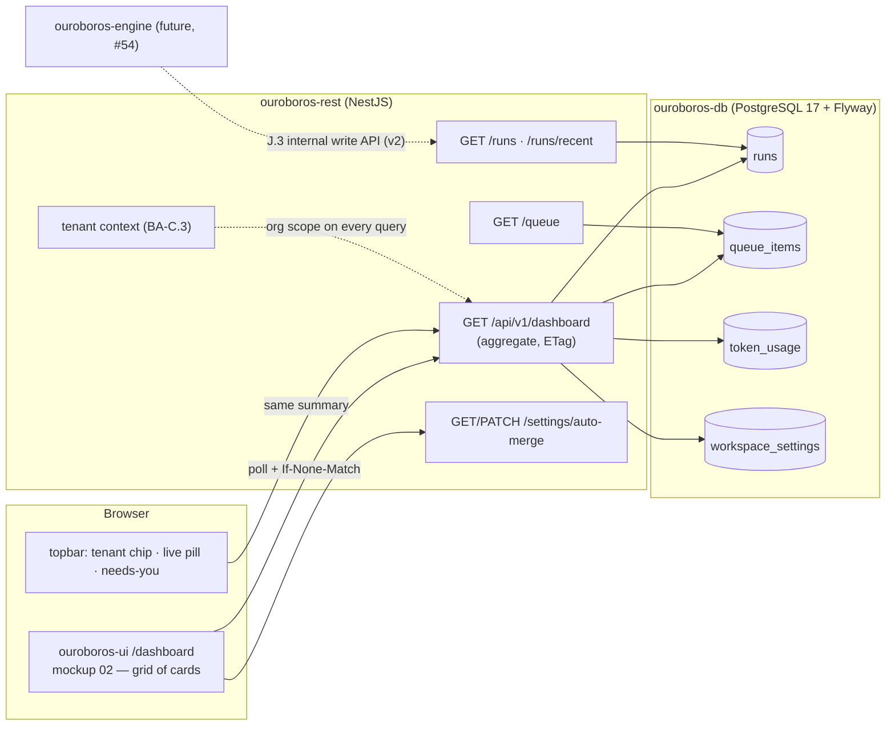
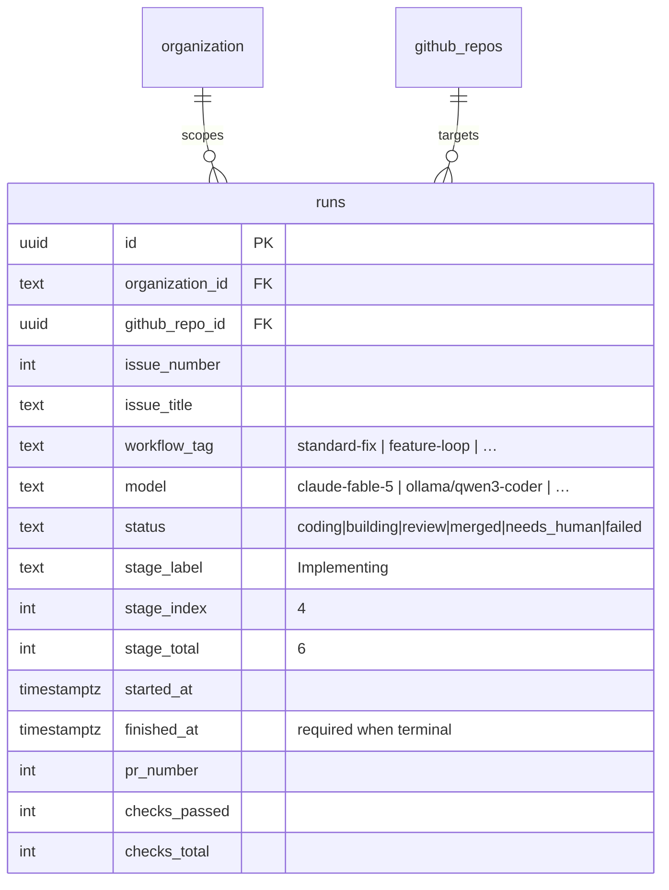
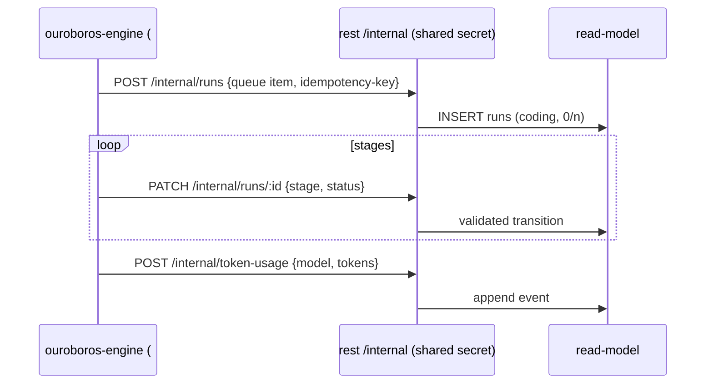
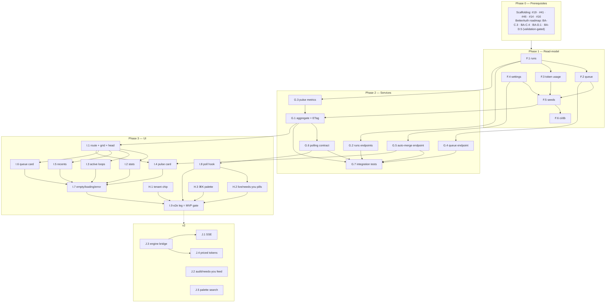

# Roadmap — Dashboard / Mission Control (Mockup 02)

## Description

> Create a roadmap that covers the features for the mockup page 02. Refer to the page
> so that issues can reference the mockup file when creating the UI/UX design of the
> pages.

## Context & Existing Work (duplicate-avoidance survey)

Surveyed 2026-08-08. **All 35 issues (5 epic parents + 30 work issues) were filed from
this roadmap on 2026-08-09** — see the `GitHub` column in every table below. The
`dashboard` label (decision F9) was created during filing, and the amendment comments
on #41, #45, #49 and #56 were posted.

**Design source of truth for every UI ticket in this roadmap:**
[`docs/mockups/02-dashboard.html`](mockups/02-dashboard.html) (with
`docs/mockups/assets/ouroboros.css`) — the Mission Control dashboard. Its anatomy:

- **Topbar** (`.topbar`) — brand mark + wordmark, **tenant chip**
  (`acme-robotics / helios-firmware ▾`), primary nav (Dashboard active), **search
  pill** (`Search… ⌘K`), **live pill** (`● 3 loops live`, pulsing dot), **needs-you
  pill** (`● Needs you · 3` → inbox, warn dot), settings gear, avatar (`KS`).
- **Page head** — eyebrow `Mission Control`, greeting `Good afternoon, Ken — the loop
  is turning.`, activity subline (`3 issues in flight, 12 queued… merged 6 pull
  requests since this morning…`), actions **Edit workflows** (ghost) and **⟳ Pull
  next issue** (primary).
- **Stat row** — four `c-3` stat cards: *Loops live* (accent value, `2 coding · 1 in
  review` delta), *Queued issues* (`est. 9h 40m of autonomous work`), *PRs merged ·
  7d* (`▲ 8 vs last week` up-delta), *Token spend · today* (`4.2M`, `≈ $18.60 across
  4 providers`).
- **Active loops** (`c-8` card) — live-pill header, `Open run console →` link, table:
  Issue (mono `#482` + title, links to run detail) · Workflow tag (`standard-fix`) ·
  Stage (label `Implementing · 4/6` + progress meter) · Model pill
  (`claude-fable-5`, `ollama/qwen3-coder`) · Elapsed (mono) · Status pill
  (`coding`/run, `building`/warn, `review`/ok).
- **Loop pulse** (`c-4` card) — glyph centerpiece (glow), three metric meters:
  *Autonomous merge rate* `92%` (ok), *Avg. cycle time* `14m 20s`, *Human
  interventions* `2 this week` (warn); divider; **Auto-merge when checks pass**
  switch (on).
- **Recently closed by the loop** (`c-7` card) — `All issues →` link, table:
  Issue → PR (`#474 → PR #512`) · Model pill · Cycle (mono) · Checks (`14/14`) ·
  Outcome pill (`merged`/ok, `needs human`/warn).
- **Up next in queue** (`c-5` card) — `Manage queue →` link, five bordered rows:
  mono issue number + title · effort chip (`XS S M L XL` classes) · workflow tag.

**The honesty problem this roadmap must solve:** the dashboard is a *window onto the
loop* — runs, queue, completions, token spend — and the loop engine does not exist
yet (engine execution model is deliberately v2, scaffolding issue #54). The dashboard
therefore ships against a **read-model**: REST-owned tables that the future engine
will feed, populated today by dev seeds (demo parity with the mockup) and rendering
truthful zero/empty states in a fresh workspace. No fabricated numbers outside seeds.

**Overlapping open issues and their disposition:**

| Existing issue | Disposition under this roadmap |
|---|---|
| #45 `ouroboros-ui: [5.7] Dashboard placeholder` (mockup 02 grid + health data + empty states, single M issue) | **Superseded in scope, but 🟢 built as written** — Epic I / #62 (I.1–I.8) is where the real dashboard is specified card by card, and the health-status card idea survives inside I.2 (#81) / I.7 (#86). #45 shipped first because P1 reached it while Epic I's own blockers (#46 primitives, #70 aggregate endpoint) were still open, and a signed-in session had nowhere to land: it is the route at `(app)/dashboard`, the readers behind it (`app/dashboard/data.ts`, `app/api/health.ts`, `app/api/engine.ts`, `app/api/members.ts`), the status logic, and designed empty states where Epic I's cards go. **#80 replaces the page body and inherits all of that.** *Amendment comment posted 2026-08-09; #45 delivered 2026-08-11.* |
| #41 `ouroboros-ui: [5.3] App shell` (top bar with nav, needs-you *placeholder*, gear, avatar) | **Amended/extended** by Epic H / #61 — tenant chip (#77), live & needs-you pills (#78), ⌘K palette (#79) are mockup-02 chrome beyond #41's placeholder scope. *Amendment comment posted 2026-08-09.* |
| #56 `ouroboros: [7.2] End-to-end smoke test` | **Amended** — the dashboard leg upgrades from "shows seeded tenant" to the I.9 (#88) assertions (stats, tables, pulse from seeded read-model). *Amendment comment posted 2026-08-09.* |
| #49 `ouroboros-ui: [5.11] Placeholder routes` (v2) | **Unchanged, load-bearing** — mockup-02 links (`run console →`, `All issues →`, `Manage queue →`, Edit workflows, inbox) land on #49 placeholders until those screens get their own roadmaps. *Note comment posted 2026-08-09.* |
| #54 `ouroboros-engine: [6.5] Task execution skeleton` (v2) | **Unchanged** — J.3 (#91) defines the engine→read-model write path that #54's runs will use. |
| #23 `ouroboros-db: [3.5] Dev seed data` | **Extended** by F.5 (#68) — dashboard read-model seeds join the tenancy/auth seeds. |
| #26 `ouroboros-db: [3.8] Audit log` (v2) | **Unchanged** — J.2 (#90) emits `settings.auto_merge_changed` through it. |
| Login/BetterAuth roadmap (`ROADMAP_LOGIN_PAGE_BETTERAUTH.md`, **still at validation gate — issues not yet filed as of 2026-08-09**) | **Prerequisite** — this roadmap consumes its session/user (greeting, avatar), active organization (tenant context, C.3), enabled-repo list (C.4, feeds the tenant chip), and shell session menu (D.6). Referenced below as *BA-C.3*, *BA-C.4*, *BA-D.1*, *BA-D.6*. |

Epic letters continue the sequence started by the BetterAuth roadmap (A–E): this
roadmap uses **F–J**.

### Decisions proposed by this roadmap (validate before issue creation)

| # | Decision | Rationale |
|---|----------|-----------|
| F1 | **Dashboard read-model tables live in `ouroboros-db`, owned (read/write) by `ouroboros-rest`**: `runs`, `queue_items`, `token_usage`, `workspace_settings` | The dashboard needs real queries against real rows. The engine doesn't exist; when it does (#54), it writes through REST's internal gateway (J.3) — the UI contract never changes. |
| F2 | **One `runs` table covers active loops *and* completions** (lifecycle status: `coding → building → review → merged \| needs_human \| failed`) | "Active loops" = non-terminal rows; "Recently closed" = terminal rows. One source of truth, no sync between two tables. |
| F3 | **Pulse metrics are computed, never stored**: merge rate, avg cycle time, interventions derived from `runs` over a 7-day window; queue estimate from `queue_items.est_minutes` | Stored aggregates drift; the row counts are small for years. Materialize later only if measured slow. |
| F4 | **Live updates: MVP = polling with `ETag`/`If-None-Match` on one summary endpoint; v2 = SSE** via NestJS's native `@Sse()` | Polling one cheap 304-friendly endpoint is simple, proxy-safe, and testable. NestJS supports SSE natively (RxJS Observables) when the loop goes truly live — J.1, no UI rearchitecture. |
| F5 | **One aggregate endpoint feeds the page** (`GET /api/v1/dashboard`) plus per-card endpoints for drill-in reuse | The page paints in one round trip (mockup is a single glance-view); card endpoints (runs, queue, completions) exist for future screens (issues, run console) to reuse. |
| F6 | **Auto-merge toggle is a real workspace setting** (`workspace_settings.auto_merge_on_checks`, org-scoped, owner/admin-writable) — the only *write* on the page | The mockup renders it as a working switch; it's cheap to make true, and future merge logic reads it. |
| F7 | **Greeting/time-of-day is client-rendered from the session user; activity subline is server data** | "Good afternoon, Ken" needs the browser's clock and the BA session name; "merged 6 PRs since this morning" is a query (org-timezone noted in the endpoint contract). |
| F8 | **Model identifiers render as opaque strings** (`claude-fable-5`, `ollama/qwen3-coder`, `copilot/gpt-5-codex`) in the `pill model` treatment | Model routing/registry is mockup 06/21 territory — the dashboard must not invent a model catalog, only display what runs recorded. |
| F9 | **New label `dashboard`**; effort chips adopt the mockup's five-step scale (XS–XL adds XL to the roadmap convention) | Consistent cross-referencing with prior roadmaps; the queue card renders all five chips. |

## Architecture Overview



## MVP Definition

The MVP is **mockup 02 as the real dashboard**, backed by the read-model. It is done
when, against the compose stack:

1. `/dashboard` reproduces [`docs/mockups/02-dashboard.html`](mockups/02-dashboard.html)
   pixel-faithfully in **both themes**: page head, four stat cards, active-loops
   table, loop-pulse card, recently-closed table, up-next queue — with seeded data
   matching the mockup's demo content (`#482` telemetry fix on `claude-fable-5`,
   `92%` merge rate, five queue rows with XS–XL chips, etc.).
2. A **fresh workspace shows truthful zero/empty states** on every card — no
   fabricated numbers; the greeting and health facts still render.
3. The **topbar carries the mockup-02 chrome**: tenant chip with org/repo switcher
   (enabled repos from BA-C.4), live pill and needs-you pill driven by the same
   summary data, search pill opening a basic ⌘K navigation palette.
4. All numbers come from **org-scoped REST endpoints** (aggregate + per-card), with
   the ETag polling loop keeping the page and the topbar pills fresh without reload.
5. The **auto-merge switch reads and writes** `workspace_settings` (owner/admin
   only; member sees it disabled).
6. Integration tests cover the aggregate math (merge rate, deltas, estimates) and
   role gates; the e2e dashboard leg (#56) asserts seeded content.

**Explicitly v2:** SSE push channel, engine→read-model ingestion (the bridge to #54),
provider-priced token accounting, audit events for settings changes, and the
full-content command palette.

## Epics

Each epic is a parent tracking issue on GitHub; every roadmap issue below is filed as
one of its sub-issues (GitHub Relationships).

| Epic | GitHub | Status | Name | Goal | Modules |
|------|:------:|:------:|------|------|---------|
| F | #59 | 🟡 Open | Dashboard Read-Model (`ouroboros-db`) | `runs`, `queue_items`, `token_usage`, `workspace_settings` + seeds & CI | ouroboros-db |
| G | #60 | 🟡 Open | Dashboard REST Services (`ouroboros-rest`) | Aggregate + card endpoints, ETag polling, auto-merge setting, tests | ouroboros-rest |
| H | #61 | 🟡 Open | Mission-Control Shell Chrome (`ouroboros-ui`) | Tenant chip, live/needs-you pills, ⌘K palette — mockup-02 topbar | ouroboros-ui |
| I | #62 | 🟡 Open | Dashboard Page UI (`ouroboros-ui`) | Every card of mockup 02, empty states, polling wiring, e2e | ouroboros-ui |
| J | #63 | 🟡 Open | Live Loop & Extended Scope (v2) | SSE, engine ingestion bridge, priced tokens, audit, full palette | rest, engine, ui |

Issue naming: `<project>: [<epic letter>.<issue>] <title>`. Labels reuse the existing
set (`mvp`, `v2`, `rest`, `db`, `ui`, `ci`, `design`, `engine`) plus new **`dashboard`**
(decision F9; create during issue filing). Complexity chips: **XS · S · M · L**.

---

## Epic F — Dashboard Read-Model (`ouroboros-db`)

| Ref | GitHub | Status | Title | Summary | Labels | Parallel | MVP | Complexity | Affected Modules |
|-------|:------:|:------:|-------|---------|--------|:--------:|:---:|:----------:|------------------|
| F.1 | #64 | 🟢 Done | ouroboros-db: [F.1] Runs table — loop lifecycle read-model | `runs` with stages, model, timing, PR/checks, terminal outcomes | mvp, dashboard, db | N (after #19, BA-B.3) | Y | M | ouroboros-db |
| F.2 | #65 | 🟢 Done | ouroboros-db: [F.2] Queue items table | Ordered per-org issue queue with effort + workflow tag + estimate | mvp, dashboard, db | N (after F.1) | Y | S | ouroboros-db |
| F.3 | #66 | 🟢 Done | ouroboros-db: [F.3] Token usage events table | Append-only usage events (provider, model, tokens, cost) + daily view | mvp, dashboard, db | N (after F.1) | Y | S | ouroboros-db |
| F.4 | #67 | 🟢 Done | ouroboros-db: [F.4] Workspace settings table | Org-scoped typed settings; first column: `auto_merge_on_checks` | mvp, dashboard, db | N (after BA-B.3) | Y | XS | ouroboros-db |
| F.5 | #68 | 🟢 Done | ouroboros-db: [F.5] Dashboard dev seeds — mockup-02 parity | Seed runs/queue/usage/settings reproducing the mockup demo content | mvp, dashboard, db | N (after F.1–F.4) | Y | S | ouroboros-db |
| F.6 | #69 | 🟢 Done | ouroboros-db: [F.6] Read-model constraints in ci/db | Constraint assertions for statuses, ordering, append-only usage | mvp, dashboard, db, ci | N (after F.5, #24) | Y | XS | ouroboros-db, .github |

### Issue F.1 — ouroboros-db: [F.1] Runs table — loop lifecycle read-model

> **GitHub issue:** #64 · **Status:** 🟢 Done · **Parent epic:** #59

> **Shipped.** [`V008__dashboard_runs.sql`](../ouroboros-db/migrations/V008__dashboard_runs.sql)
> creates `ouroboros.runs` with the column set below, both indexes, and its rules as named
> CHECK constraints; the assertions are a new section in
> [`tests/constraints.sql`](../ouroboros-db/tests/constraints.sql), so `ci/db` runs them
> against a database migrated from empty on every pull request. The version number is
> `V008` — the BetterAuth chain ends at `V006` and `V007` is #649's `user_preferences`.
>
> **The terminal rule is a biconditional, not an implication.** The criterion asks that a
> terminal status require `finished_at`; what `runs_terminal_finished_at` enforces is that
> a terminal status require it *and a non-terminal status forbid it*. F2 makes those one
> fact rather than two — the status is what moves a row between the two cards and
> `finished_at` is when that happened — so a `coding` row carrying a finish time is a
> contradiction, and it is the exact shape that would put a live loop in *Recently closed*
> (whose query is `finished_at is not null`). It also earns the completions index: nulls
> are the active rows, so the seven-day window is an index scan on `finished_at` with no
> `status` filter and no sort node. Both plans are asserted, and were checked by hand
> against 60 000 rows.
>
> **Two parents that must agree.** `runs` names an organization *and* a repository, and
> nothing about two foreign keys makes them the same workspace — a mismatch is not a
> broken join, it is one tenant's issue titles rendering on another's dashboard. The
> composite key that would prevent it does not exist, because V003 deliberately hung
> `github_repos` off `github_orgs` rather than storing the workspace twice. So the rule is
> a `before insert or update` trigger, `runs_repo_in_organization`, raising class 23 under
> its own constraint name so callers meet it exactly as they meet every other rule here.
> One consequence worth knowing: it fires ahead of the organization foreign key's own
> check, and subsumes it — every organization the trigger accepts is one that exists.
>
> **`model` and `workflow_tag` are bounded, not enumerated** (decision F8). A CHECK naming
> today's models would be this table inventing the catalog mockups 06/21 own, and would
> reject a run the engine legitimately performed; the constraints assert non-blank and a
> length, and the tests prove an unheard-of identifier stores.
>
> **Not in this ticket, by the roadmap's own split:** no seed rows (F.5, #68 — the runs the
> mockup draws), no Kysely types or endpoints (G.2/G.3, #71/#72), and no `queue_items` or
> usage events (F.2/F.3). `runs` also has no unique key on `(organization_id,
> issue_number)` — deliberately, and asserted: a retried issue is two runs, and the
> completions card is a history rather than a set. That uniqueness belongs to F.2's queue.

- **Problem Statement:** Three of the six dashboard surfaces (stat row, active loops,
  recently closed — see [`docs/mockups/02-dashboard.html`](mockups/02-dashboard.html))
  are views over "a run of the loop against an issue." That entity has no table.
- **Solution/Scope:** `V0xx__dashboard_runs.sql` (number follows the BetterAuth
  migrations): `runs` — id, `organization_id` FK, `github_repo_id` FK (BA-B.3),
  `issue_number`, `issue_title`, `workflow_tag` (text — workflow entities are mockup
  04 territory), `model` (opaque text, decision F8), `status` CHECK
  `coding|building|review|merged|needs_human|failed` (F2: non-terminal = active),
  `stage_label`, `stage_index`, `stage_total`, `started_at`, `finished_at`
  (nullable), `pr_number`, `checks_passed`, `checks_total` (nullable until terminal).
  Indexes: `(organization_id, status)` for active lists, `(organization_id,
  finished_at DESC)` for completions/7-day windows. Constraint: terminal statuses
  require `finished_at`. House snake_case (our table).
- **Acceptance Criteria:**
  - Migration applies/validates cleanly after the BetterAuth chain.
  - Status CHECK rejects unknown values; terminal-requires-`finished_at` enforced.
  - `EXPLAIN` shows index use for the active-loops and 7-day-completions queries.
- **Parallelism/Dependencies:** Needs #19, BA-B.3 (organization + repo tables).
  Blocks F.2, F.3, F.5, G.1–G.3.
- **Technical Stack:** PostgreSQL 17, Flyway.
- **Epic:** F



### Issue F.2 — ouroboros-db: [F.2] Queue items table

> **GitHub issue:** #65 · **Status:** 🟢 Done · **Parent epic:** #59

> **Shipped.** [`V009__dashboard_queue.sql`](../ouroboros-db/migrations/V009__dashboard_queue.sql)
> creates `ouroboros.queue_items` with the column set below, both unique keys and its
> rules as named constraints; the assertions are a new section in
> [`tests/constraints.sql`](../ouroboros-db/tests/constraints.sql), so `ci/db` runs them
> against a database migrated from empty on every pull request. The fixture is mockup
> 02's own card — `#485`–`#491` with one row per effort chip, and estimates that sum to
> the 580 minutes the stat renders as `est. 9h 40m`.
>
> **The position key is `deferrable initially deferred`, and that is the whole of the
> reorder criterion.** The two halves the criterion asks for are in tension: PostgreSQL
> checks a unique index as each row version is written — mid-statement, not at the end of
> it — so under an immediate constraint *every* reorder fails, both the one-row-at-a-time
> form and the single-statement `case` swap. Deferring moves the check to commit, where
> the ordering is valid again, and reordering becomes plain SQL with no ceremony for the
> writer (#73) to know about: no `set constraints`, no shuffle through a temporary
> position. It is asserted from the catalogue as well as exercised, and a duplicate
> position is proved to still be refused by asking for the check early. The natural key
> `(organization_id, issue_number)` is deliberately *not* deferred — a duplicate enqueue
> is something a person can ask for and should be told about at the statement.
>
> **Dense ordering is a convention, not a constraint.** Density is a property of the set
> rather than of any row, so it cannot be a CHECK, and as a constraint trigger over the
> whole queue it would serialise every reorder to buy nothing a reader can see — the card
> is `order by position`, which renders 1, 2, 5 exactly as it renders 1, 2, 3. What a
> reader depends on is that the order is *total*, and that is what is enforced.
>
> **One repo-in-organization rule, now shared.** `queue_items` names the same two parents
> `runs` does and needs the same agreement between them, so V009 generalised V008's
> trigger function into `ouroboros.repo_in_organization()` and re-pointed the `runs`
> trigger at it rather than writing a second copy. The trigger names are unchanged, and
> the error still reports the trigger's own name — `runs_repo_in_organization` for a run,
> `queue_items_repo_in_organization` for a queue item — so nothing downstream moves. Both
> the sharing and the absence of the superseded copy are asserted.
>
> **`est_minutes` is nullable and null means *not estimated*,** which is not zero: an
> unestimated item is an ordinary queue row that adds nothing to the stat, and `sum`
> skips nulls without being asked. It is deliberately not derived from `effort` — the
> chip is a size a person chose, the estimate is minutes something measured, and
> collapsing them would make the stat a restatement of the chips.
>
> **Not in this ticket, by the roadmap's own split:** no seed rows (F.5, #68 — the queue
> the mockup draws), and no writes — reorder and remove are the issues screen's, read by
> #73's `GET /api/v1/queue`. Both of the card's read paths are asserted with `EXPLAIN`
> all the same, since the shape is what that endpoint will be held to.

- **Problem Statement:** "Up next in queue" and the *Queued issues* stat (`est. 9h
  40m of autonomous work`) need an ordered, estimable queue per organization.
- **Solution/Scope:** `queue_items`: id, `organization_id` FK, `github_repo_id` FK,
  `issue_number`, `issue_title`, `effort` CHECK `xs|s|m|l|xl` (the mockup's chip
  scale, decision F9), `workflow_tag`, `position` (unique per org — dense ordering),
  `est_minutes` (nullable int; the stat sums it), `enqueued_at`. Unique
  `(organization_id, issue_number)` — an issue queues once.
- **Acceptance Criteria:**
  - Position uniqueness per org enforced; reorder via position swap works in a
    transaction (G.4 harness).
  - Effort CHECK matches the five mockup chips exactly.
- **Parallelism/Dependencies:** Needs F.1 (same migration series). Blocks F.5, G.4.
- **Technical Stack:** PostgreSQL 17, Flyway.
- **Epic:** F

```
queue_items(org, position ↑) ─▶ #485 M standard-fix · #486 L feature-loop · #488 XS docs-loop
                                 └─ Σ est_minutes ─▶ "est. 9h 40m of autonomous work"
```

### Issue F.3 — ouroboros-db: [F.3] Token usage events table

> **GitHub issue:** #66 · **Status:** 🟢 Done · **Parent epic:** #59

> **Shipped.** [`V010__dashboard_usage.sql`](../ouroboros-db/migrations/V010__dashboard_usage.sql)
> creates `ouroboros.token_usage` with the column set below and the
> `ouroboros.token_usage_daily` rollup over it — this schema's first view. The assertions
> are a new section in
> [`tests/constraints.sql`](../ouroboros-db/tests/constraints.sql), so `ci/db` runs them
> against a database migrated from empty on every pull request. The fixture is the stat
> card itself: a day of spend across the four providers mockup 07 lists, summing to the
> `4.2M` tokens and the `≈ $18.60` the card renders.
>
> **A ledger, not a counter (decision F10).** The cheap shape for one number is one row
> per organization that something increments, and it is wrong twice over: it drifts the
> moment anything is corrected — a re-priced month, a double-counted retry, an invoice
> that disagrees — with no record left to reconcile against, and it has no `run_id`, so it
> cannot answer the question the product is already committed to asking. Per-run cost
> attribution is what mockup 15's insights screen is made of. Spend is therefore stored as
> the events that caused it and every total is an aggregate. The same reasoning makes the
> rollup a plain view rather than a materialized one: a materialized rollup is a stored
> total wearing another hat, stale from the first correction until something refreshes it.
>
> **`cost_cents` is nullable, and null means *unpriced*** — never 0, which would claim the
> call was free. Nothing defaults it, nothing coalesces it, and the view propagates the
> null so the card can render *cost unavailable* rather than an understated total.
> `token_usage_daily.unpriced_events` is how a caller learns the total is a lower bound,
> which is exactly what the mockup's own `≈` is already saying: local inference is
> unpriced until J.4 (#92) lands the rate card. It is stored as `numeric(14,4)` rather
> than integer cents, because per-token rates put a single call well under a cent and
> integer cents would round an afternoon of them to nothing.
>
> **The day is UTC, fixed rather than session-dependent.** `date_trunc('day',
> occurred_at)` on a `timestamptz` resolves in the *session's* time zone, which would make
> the same ledger answer the API server and a psql session differently. The view spells
> the conversion out, and the assertion for it reads the rollup from sessions fourteen
> hours ahead of UTC and eleven behind. Rendering that day in a workspace's own zone is
> G.1's question, not the table's.
>
> **Two indexes, and they are not two copies of one answer.** The BRIN on `occurred_at` is
> the criterion's and the ledger's — append-only, physically ordered by the column being
> indexed, so it stays kilobytes where a b-tree would be gigabytes, and it is what a
> workspace-blind time range (#92's re-pricing pass, any retention work) reads. The b-tree
> on `(organization_id, occurred_at desc)` is the card's, because every product read is
> workspace-scoped and the BRIN would leave the organization to a filter. Inserting 5,000
> events — two orders of magnitude past what the F.5 seed will hold — is asserted to stay
> inside the criterion's one-second budget.
>
> **`run_id` sets null rather than cascading.** Deleting a run does not un-spend the
> money: the event happened and the invoice will say so, and a day's total that shrank
> because a repository was disabled is exactly the drift F10 exists to avoid. What is lost
> is the attribution, which is the thing that genuinely no longer exists. The run and the
> workspace must still agree — a usage row naming one workspace and another's run is one
> tenant's work appearing in another's spend — and since this table reaches a repository
> *through* its run, V009's shared `repo_in_organization()` cannot serve it;
> `ouroboros.run_in_organization()` is its sibling, written generic over the table for the
> same reason.
>
> **The insert-only grant posture is documented in the migration, not granted.** Every
> module still connects as the migration user, so a `grant` naming a role would fail on a
> clean database; per-role least privilege is #25's, and this is the posture it inherits.
> Deliberately *not* a `before update or delete` trigger either: the two mutations this
> table is designed for — #92 filling `cost_cents`, and the `set null` above — would both
> have to be special-cased, at which point the trigger enforces "append-only except where
> we said otherwise", which reads as a guarantee and is not one.
>
> **Not in this ticket, by the roadmap's own split:** no seed rows (F.5, #68) and no
> endpoint (G.1, #70). The card's read is asserted with `EXPLAIN` all the same, since the
> shape is what that endpoint will be held to.

- **Problem Statement:** *Token spend · today* (`4.2M`, `≈ $18.60 across 4
  providers`) needs an append-only usage ledger; per-run cost attribution will matter
  to every future insights screen (mockup 15).
- **Solution/Scope:** `token_usage`: id, `organization_id` FK, `run_id` FK nullable,
  `provider` (text: `anthropic|ollama|copilot|…` — opaque, F8), `model`, `tokens_in`,
  `tokens_out`, `cost_cents` (nullable — priced accounting is J.4), `occurred_at`
  with BRIN index. A `token_usage_daily` view (org, day, provider) powers the stat.
  Insert-only grant posture documented (full enforcement rides #26's role work).
- **Acceptance Criteria:**
  - View returns per-day/org/provider sums matching inserted fixtures.
  - BRIN index present; inserts of seed volume < 1s.
- **Parallelism/Dependencies:** Needs F.1. Blocks F.5, G.1.
- **Technical Stack:** PostgreSQL 17, Flyway.
- **Epic:** F

```
token_usage(append-only) ── group by day/provider ──▶ token_usage_daily
   └▶ today, org ─▶ Σ tokens ─▶ "4.2M" · Σ cost_cents ─▶ "≈ $18.60 across 4 providers"
```

### Issue F.4 — ouroboros-db: [F.4] Workspace settings table

> **GitHub issue:** #67 · **Status:** 🟢 Done · **Parent epic:** #59

> **Shipped.** [`V011__workspace_settings.sql`](../ouroboros-db/migrations/V011__workspace_settings.sql)
> creates `ouroboros.workspace_settings` with the column set below, plus
> `ouroboros.workspace_settings_effective`, the view every reader resolves it through. The
> assertions are a new section in
> [`tests/constraints.sql`](../ouroboros-db/tests/constraints.sql), so `ci/db` runs them
> against a database migrated from empty on every pull request. This is the fourth and last
> table of Epic F's read-model, and the only one behind a *write*.
>
> **Typed columns, not key/value**, as the scope says — restated here because a settings
> table is the classic place that rule gets broken. A `(key, value)` pair buys adding a
> setting without a migration and pays for it with everything that makes a database worth
> having: `auto_merge_on_checks` stops being a boolean and becomes text that is usually
> `'true'`, no CHECK can describe a column whose meaning depends on a sibling row, Kysely
> infers `string` for every setting in the product, and a typo in a key is a silently
> absent setting rather than a compile error.
>
> **Row creation is lazy — the acceptance criterion's open decision, and the argument for
> it is in the migration header.** There is no creation trigger; a workspace with no row is
> at every default, which is the shape `V007` settled for `user_preferences`. A trigger on
> `organization` would write a row recording a choice nobody made — an audit trail whose
> `updated_by` is null and whose `updated_at` is the workspace's creation date asserts
> something that did not happen — would hang product behaviour off a table BetterAuth
> writes, and would still need a backfill, so the "every organization has a row" invariant
> would be maintained in two places from the first day.
>
> **What is new against `V007` is that the default is not left to the API.**
> `workspace_settings_effective` is `organization LEFT JOIN workspace_settings` with the
> defaults coalesced in, so every organization has exactly one row in it whether or not it
> has ever set anything, and *a newly created workspace reads `auto_merge_on_checks =
> false` from the database* rather than from an application's memory of what the default
> was. `is_explicit` is the one column that keeps the two states apart, for onboarding
> (mockup 13) and for audit lines; `updated_at`/`updated_by` pass through unresolved,
> because coalescing them would have to invent a time at which nothing happened. The write
> side is the table, through one `on conflict (organization_id) do update` upsert that
> serves the first write and every later one — which is why the primary key matters beyond
> "one row per organization": it is the arbiter that stops two concurrent PATCHes both
> deciding the row is missing.
>
> **`updated_by` sets null rather than cascading.** Cascade would delete the settings row
> when the person who last touched it left, which does not un-answer the question — it
> silently reverts the workspace's auto-merge posture to `false` because the row the answer
> lived in is gone. A security-relevant setting turning itself off as a side effect of an
> unrelated account deletion, with nothing recording that it happened. It is deliberately
> *not* additionally constrained to a member of the organization: authorization is BA-C.3's
> role guard on G.5, and membership is revocable, so a write-time trigger could assert it
> at the moment of the write but could not maintain it — an ordinary departure would leave
> rows this table considered invalid.
>
> **Not in this ticket, by the roadmap's own split:** no seed rows (F.5, #68 — the
> `auto_merge_on_checks = true` the demo workspace wants) and no endpoint (G.5, #74).

- **Problem Statement:** The loop-pulse card's **Auto-merge when checks pass** switch
  is the page's only write (decision F6); it needs a durable, org-scoped home that
  future settings (mockup 17) can join.
- **Solution/Scope:** `workspace_settings`: `organization_id` PK/FK, typed columns —
  first: `auto_merge_on_checks boolean not null default false` — plus
  `updated_at`/`updated_by`. Typed columns over key/value: the compiler and CHECKs
  stay useful; new settings are additive migrations (house rule).
- **Acceptance Criteria:**
  - One row per org enforced; default false on org creation (trigger or lazy insert
    — decided in-issue).
  - `updated_by` references the BetterAuth `user` table.
- **Parallelism/Dependencies:** Needs BA-B.3. Blocks F.5, G.5.
- **Technical Stack:** PostgreSQL 17, Flyway.
- **Epic:** F

```
workspace_settings: organization_id PK · auto_merge_on_checks bool · updated_by → "user".id
```

### Issue F.5 — ouroboros-db: [F.5] Dashboard dev seeds — mockup-02 parity

> **GitHub issue:** #68 · **Status:** 🟢 Done · **Parent epic:** #59

> **Shipped.** [`R__dev_seed_dashboard.sql`](../ouroboros-db/migrations/R__dev_seed_dashboard.sql)
> is mockup 02 as rows: 53 `runs`, 12 `queue_items`, 12 `token_usage` events and the one
> `workspace_settings` row, all in `acme-robotics`, all behind the same `${ouro_dev_seed}`
> guard the workspace seed carries. The assertions are a new section in
> [`tests/seed.sql`](../ouroboros-db/tests/seed.sql), which `ci/db` already runs against a
> *twice*-migrated seeded database — so idempotency is checked by the same pass that checks
> the content, since every count in it is exact.
>
> **A second file rather than an extension of the first**, because the two answer different
> questions and change on different days: `R__dev_seed.sql` is *who exists* and is read by
> the auth work and by `tests/e2e/support/seed.ts`; this is *what the loop has done*. The
> **name is load-bearing**: Flyway orders repeatable migrations by description, every row
> here finds its parent by natural key, and `dashboard_dev_seed` — the name this ticket's
> diagram suggested — would sort *before* `dev_seed` and seed nothing at all, silently and
> unrecoverably (a repeatable migration re-applies only when its checksum changes).
> `tests/seed.test.sh` asserts the ordering.
>
> **Every number on the card is now a row or an aggregate over rows**, which is what the
> seed costs: the stat row's counts are counts, so 27 merged in seven days means
> twenty-seven runs, and `▲ 8` means nineteen more in the week before that. The visible
> seven — three live loops, four recently closed — are the mockup's, number for number; the
> other forty-six exist so the stats can be computed rather than asserted. The cycle-time
> spread is built to sum so that **14m 20s** is exact over the twenty-nine runs that closed
> this week, and `est_minutes` sums to exactly **580** so the queue reads `est. 9h 40m`.
>
> **Where the mockup's arithmetic does not close, and what was done about it.** *PRs merged
> · 7d* is `27` and *Human interventions* is `2 this week`, which makes the trailing week's
> merge rate `27/29 = 93.1%`; there is **no integer count of closed runs for which 27 merged
> is 92%**, since 92% needs a denominator of 29.35. The seed makes 92% exact over the
> population it can — the whole fourteen days it spans, **46 merged of 50 closed**, with no
> rounding — and both the migration header and this entry state both figures, so **G.1
> (#70) chooses the window against a documented fixture rather than discovering the problem
> against one that will not add up**.
>
> Two smaller decisions worth carrying forward. `cost_cents` is **filled in** for the three
> priced providers and left null for `ollama`, which is what makes the card's `≈ $18.60`
> honest — the total is a lower bound because local inference is unpriced, and
> `token_usage_daily.unpriced_events` is how a reader finds that out; F.3's #92 still owns
> the rate card, and finds nothing here to re-price that it did not write. And one queue
> item carries **no estimate at all**, so the nullable-`est_minutes` path has a fixture
> rather than being a branch nothing exercises.
>
> **`kensuenobu` and `acme-labs` get no dashboard rows**, as specified — and no
> `workspace_settings` row either, which keeps "answered no" and "never asked" apart for
> I.7 (#86) and G.5 (#74). Both read `auto_merge_on_checks = false, is_explicit = false`
> through `workspace_settings_effective`.
>
> **Not in this ticket, by the roadmap's own split:** no endpoint (G.1, #70), no screen
> (I.*), and no e2e leg — `tests/e2e/support/seed.ts` gains dashboard constants when there
> is a dashboard to assert them against.

- **Problem Statement:** Design review and e2e need the dashboard to render exactly
  the mockup's demo content; a fresh workspace must instead show empty states — both
  paths need deterministic data.
- **Solution/Scope:** Extend the repeatable dev seed (BA-B.4, dev-only guard): for
  `acme-robotics` — 3 active runs (`#482` standard-fix/claude-fable-5/coding 4-6,
  `#479` feature-loop/claude-sonnet-5/building 5-7, `#476`
  deps-refresh/ollama-qwen3-coder/review 6-6), 4 terminal runs (`#474→PR#512` merged
  11m 14/14 … `#465→PR#504` needs_human 42m 13/14 — the mockup's recently-closed
  rows), 5 queue items (`#485`–`#491` with the mockup's efforts/tags), token events
  totaling ~4.2M/day across 4 providers, `auto_merge_on_checks = true`. Seed windows
  relative to `now()` so "today"/"7d" math always holds. The seeded personal org
  (`kensuenobu`) gets **no** dashboard rows — it is the empty-state fixture.
- **Acceptance Criteria:**
  - Aggregate endpoint (G.1) over seeds reproduces every mockup number: 3 live
    (2 coding + 1 review… noting the mockup's own `building` row counts as the third),
    12 queued *(seed extends beyond the 5 visible rows)*, 27 merged/7d ▲8, 4.2M
    tokens, 92% merge rate, 2 interventions.
  - Idempotent; switching active org to `kensuenobu` yields all-empty cards.
- **Parallelism/Dependencies:** Needs F.1–F.4. Feeds G.7, I.9, #56.
- **Technical Stack:** Flyway repeatable migration, SQL.
- **Epic:** F

```
acme-robotics seeds ─▶ mockup-02 parity (design review + e2e)
kensuenobu (personal) ─▶ zero rows ─▶ empty-state fixture (I.7)
```

### Issue F.6 — ouroboros-db: [F.6] Read-model constraints in ci/db

> **GitHub issue:** #69 · **Status:** 🟢 Done · **Parent epic:** #59

> **Shipped, and the scope split in two on contact.** Each of F.1–F.4 arrived carrying its
> own section of [`tests/constraints.sql`](../ouroboros-db/tests/constraints.sql), and `ci/db`
> has run that file since #24 — so **all five probes this issue asks for already existed**
> when it came up: the `runs.status` and `queue_items.effort` vocabularies, the
> terminal-requires-`finished_at` rule, position uniqueness per organization (with the
> deferral and the natural key beside it), `token_usage_daily`'s sums against the fixtures,
> and one `workspace_settings` row per workspace. Nothing was added to that file, because a
> probe written to satisfy a checklist that already has one is a second assertion of the
> same rule.
>
> **What was missing is the second acceptance criterion**, and it is the one that gives the
> first its meaning: a green `constraints.sql` does not prove its assertions are
> load-bearing, since a file asserting nothing would be exactly as green.
> [`tests/verify-constraint-probes.sh`](../ouroboros-db/tests/verify-constraint-probes.sh)
> drops each rule in turn and requires the suite to go red **naming the assertion that
> caught it** — a bare non-zero status is also what a mutation that broke on its own
> statement produces. It runs in `ci/db` after the unmutated pass, so the criterion is
> checked on every pull request rather than spot-verified once and trusted thereafter.
>
> **Two of the eight mutations are view rewrites rather than dropped constraints**, because
> the `token_usage_daily` bullet is the one rule of the five that is *arithmetic*: no
> `drop constraint` can falsify a sum. They take the view's current definition from the
> catalogue and swap one expression — `tokens_total`'s sum, and the UTC day the rollup is
> grouped by, which is the mistake V010's own header warns about — so they cannot rot into
> mutating a view this schema no longer has.
>
> **One thing this surfaced and deliberately did not fix.** `constraints.sql` describes
> itself as safe to repeat, and for rows it is. Its *plan* assertions are not: V005's pair
> lookup (`member_organization_user_key`) chooses between two indexes that cost the same at
> fixture size, and the planner changes its answer once autovacuum has recorded those tables
> as empty — so a second run against the same database fails on an assertion no migration
> broke. That predates the read-model and belongs to #707's section, so it is reported
> rather than quietly rewritten here; the probe script is immune to it by construction,
> running every mutation against a copy of a template it migrates for itself.

- **Problem Statement:** Status vocabularies, queue ordering, and append-only usage
  are contracts the UI trusts; PR-time assertions keep them true.
- **Solution/Scope:** Extend #24's `tests/constraints.sql`: status/effort CHECK
  probes, terminal-requires-finished_at, queue position uniqueness, usage-view sums
  against fixtures, settings one-row-per-org.
- **Acceptance Criteria:** Green on current schema; red when any CHECK or unique
  is dropped (spot-verified once).
- **Parallelism/Dependencies:** Needs F.5, #24.
- **Technical Stack:** GitHub Actions, SQL.
- **Epic:** F

```
ci/db: migrate ─▶ validate ─▶ constraints.sql (+F probes) ─▶ ✓/✗
```

---

## Epic G — Dashboard REST Services (`ouroboros-rest`)

| Ref | GitHub | Status | Title | Summary | Labels | Parallel | MVP | Complexity | Affected Modules |
|-------|:------:|:------:|-------|---------|--------|:--------:|:---:|:----------:|------------------|
| G.1 | #70 | 🟢 Done | ouroboros-rest: [G.1] Dashboard aggregate endpoint with ETag | One org-scoped payload: stats, pulse, actives, recents, queue head | mvp, dashboard, rest | N (after F.5, BA-C.3) | Y | L | ouroboros-rest |
| G.2 | #71 | 🟢 Done | ouroboros-rest: [G.2] Runs endpoints (active & recent) | `GET /runs?status=active`, `GET /runs/recent` — card drill-in reuse | mvp, dashboard, rest | N (after F.1, BA-C.3) | Y | S | ouroboros-rest |
| G.3 | #72 | 🟢 Done | ouroboros-rest: [G.3] Pulse metrics computation | Merge rate, avg cycle, interventions over a 7-day window (F3) | mvp, dashboard, rest | N (after F.1) | Y | M | ouroboros-rest |
| G.4 | #73 | 🟢 Done | ouroboros-rest: [G.4] Queue endpoint | Ordered queue with efforts, tags, Σ estimate | mvp, dashboard, rest | N (after F.2, BA-C.3) | Y | S | ouroboros-rest |
| G.5 | #74 | 🟢 Done | ouroboros-rest: [G.5] Auto-merge setting endpoint | `GET/PATCH /settings/auto-merge`, owner/admin-gated | mvp, dashboard, rest | N (after F.4, BA-C.3) | Y | S | ouroboros-rest |
| G.6 | #75 | 🟢 Done | ouroboros-rest: [G.6] Polling contract & cache headers | ETag/304 discipline, poll interval guidance, shared summary for pills | mvp, dashboard, rest | N (after G.1) | Y | S | ouroboros-rest |
| G.7 | #76 | 🟢 Done | ouroboros-rest: [G.7] Dashboard integration tests | Aggregate math, empty-org, role gates, ETag behavior | mvp, dashboard, rest, ci | N (after G.1–G.6) | Y | M | ouroboros-rest |

> **Epic G is complete.** All seven issues have landed: the aggregate and its tag (G.1),
> the three drill-in surfaces (G.2, G.4, G.5), the pulse arithmetic (G.3), the polling
> contract (G.6), and the integration coverage that holds them to each other (G.7). The
> dashboard's REST surface is what Epic I now paints against.

### Issue G.1 — ouroboros-rest: [G.1] Dashboard aggregate endpoint with ETag

> **GitHub issue:** #70 · **Status:** 🟢 Done · **Parent epic:** #60

> **Shipped.** `GET /api/v1/dashboard` — one org-scoped payload carrying the stat row, the
> pulse card, the runs in flight, the runs that have stopped, the head of the queue and the
> page head's subline, in `ouroboros-rest/src/modules/dashboard/`. The read-model V008–V011
> created is mirrored into `db/schema.ts` — four tables and both views — so every statement
> is type-checked against the migrations and the drift check covers them.
>
> **The window question F.5 handed over is answered, and published.** The *autonomous merge
> rate* is measured over **fourteen days** and the other two meters over **seven**, because
> `92%` is exact over the fourteen the seed spans (46 merged of 50 closed) and is not
> reachable over seven at all — 27 merged with 2 interventions is 93.1%, and 92% needs a
> denominator of 29.35. Fourteen days is also the better measurement on its own terms (a
> denominator of twenty-nine moves four points when one run fails) and it reaches over
> exactly the rows the merged delta already compares across, so no number on the page is
> computed from history another number does not already touch. The definition of every
> aggregate — including which statuses are in the denominator, and that the mean cycle time
> covers every run that closed rather than only the merged ones — is in the OpenAPI
> description of the field that carries it. **I.4 (#83) should label the pulse card's merge
> rate for its own window rather than assume the card's `7 days` chip covers all three.**
>
> **`byStatus` is the table, not the subline.** The mockup's `2 coding · 1 in review` is
> drawn over a table holding one `coding`, one `building` and one `review`; F.5 settled that
> in favour of the table, and the payload carries every active status as a key — zeros
> included, in lifecycle order — so I.2 (#81) composes the subline without knowing which
> statuses exist.
>
> **The ETag is derived from a version source, not from the payload.** Four aggregate
> subqueries — a row count and the newest change per source table — plus the calendar day,
> hashed. That is what a `304` costs, and it is the whole reason polling is cheap. The day
> is in the hash because *Token spend · today* and *merged since this morning* are calendar
> facts that change at midnight with no row having moved. What it deliberately does not
> notice is rows aging out of a rolling window on a workspace where nothing is written; G.6
> (#75) is where the poll interval and the rest of the caching policy are settled.
>
> **`unpricedEvents` joins `tokensToday`**, which the ticket's sketch did not name. V010
> makes `cost_cents` nullable so that "nobody has priced this" is not zero, and the
> acceptance criterion here forbids a null in the payload — so the count of unpriced events
> is what carries the card's `≈` and lets I.2 tell a cost of zero from a cost nobody knows.
>
> **Per-row durations are deliberately absent.** *Elapsed* and *Cycle* are computed by the
> client from `startedAt`/`finishedAt`: elapsed moves while nobody is asking, so a value
> computed here would be stale before it was rendered. Aggregates over many rows are
> computed here, because no client can derive them from a card-sized slice.
>
> **`RunSummary` is one shape for both run lists**, which is decision F2 read forwards and
> what G.2 (#71) takes with it, so a card and its drill-in cannot drift apart.
>
> **Not in this ticket, by the roadmap's own split:** no paged runs endpoint (G.2), no queue
> endpoint (G.4), no auto-merge *write* (G.5 — this reads the switch and writes nothing at
> all), no polling contract beyond the tag itself (G.6), and no screen.

- **Problem Statement:** The dashboard is a single glance-view
  ([`docs/mockups/02-dashboard.html`](mockups/02-dashboard.html)); painting it from
  six round trips would tear the page and sextuple the polling cost (decision F5).
- **Solution/Scope:** `GET /api/v1/dashboard` under tenant context (BA-C.3):
  `{stats: {loopsLive{total, byStatus}, queued{count, estMinutes}, merged7d{count,
  deltaVsPrior}, tokensToday{tokens, costCents, providers}}, pulse: {mergeRate,
  avgCycleSeconds, interventions7d, autoMerge}, activeRuns[…top 10],
  recentRuns[…last 8], queueHead[…top 5], activity: {inFlight, queued,
  mergedSinceMorning}}` — the last object feeding the F7 subline. Strong `ETag` from
  a cheap version source (max `updated_at`/count tuple); `If-None-Match` → 304.
  OpenAPI-documented (feeds the #43 generated client).
- **Acceptance Criteria:**
  - Against F.5 seeds, every field matches the mockup's numbers (F.5 list).
  - Empty org → zeros/empty arrays, never nulls that crash cards.
  - Unchanged data + `If-None-Match` → 304 with no body; changed data → 200 + new
    ETag. p95 < 100ms on seed volume.
- **Parallelism/Dependencies:** Needs F.5, BA-C.3. Blocks G.6, I.1–I.6, H.2.
- **Technical Stack:** NestJS, Kysely, @nestjs/swagger.
- **Epic:** G

```
GET /api/v1/dashboard (org from session) ─▶ { stats · pulse · activeRuns · recentRuns · queueHead · activity }
      If-None-Match: "v42" ──unchanged──▶ 304
```

### Issue G.2 — ouroboros-rest: [G.2] Runs endpoints (active & recent)

> **GitHub issue:** #71 · **Status:** 🟢 Done · **Parent epic:** #60

> **Shipped.** `GET /api/v1/runs?status=active|terminal` and `GET /api/v1/runs/{id}`, in
> [`ouroboros-rest/src/modules/runs/`](../ouroboros-rest/src/modules/runs/runs.module.ts) —
> a module of its own rather than more controllers in the dashboard's, which is that
> module's stated design: it exports nothing so its card-sized limits stay its own, and the
> drill-ins publish their own statements over the same rows. What *is* shared is the one
> thing the ticket requires to be: `RunSummary` and its mapper, imported from
> `dashboard/resources.ts` as pure code, so a run row has exactly one shape on the
> aggregate, on these pages, and on the detail.
>
> **The contract test is an equality, not a schema check.** The orderings are stated twice —
> the dashboard repository's card queries and the runs repository's paged ones — because the
> modules share no provider, so `runs.integration-spec.ts` builds one population (eleven
> actives, nine terminals — one more than each slice carries) and requires the aggregate's
> `activeRuns`/`recentRuns` to equal the listings' heads **as JSON**. That also proves the
> slices are *heads* of the listings rather than merely subsets, which is the sketch's `⊂`
> made exact.
>
> **The issue's `GET /runs/recent` became `?status=terminal`** — the issue body itself had
> already moved on from the title's sketch, and one listing with a required family beats two
> routes that differ by a `where`. The family is **required** rather than defaulted because
> the two have different natural orders (lifecycle-then-oldest for active, newest-stopped
> for terminal), and a mixed listing would need an interleaving no screen asks for; a client
> that wants both asks twice, exactly as the two cards do. The repo filter takes
> `github_repos.id` — the value the H.1 focus preference (#77) will hold — not the name,
> which is unique only within one GitHub organisation; a foreign repo id narrows to an
> empty page rather than confirming anything exists.
>
> **The cross-org `404` is an information-flow property, not a check.** `find` is scoped to
> the workspace before it is keyed by the id, so "no such run" and "somebody else's run" are
> one `undefined` from the repository up — nothing downstream *can* leak the difference, and
> the integration suite asserts the two absences answer with the same envelope. Malformed
> ids are the pipe's `422` instead, so a probe cannot read validation as existence.
>
> Proved in `runs.repository.spec.ts` (org predicate on every statement, orderings, the
> filter narrowing page and total alike), `runs.service.spec.ts` (the aggregate's own mapper,
> absence → `run_not_found`), `runs.dto.spec.ts`, `runs.errors.spec.ts` (the code is in the
> specification), and the integration suite above. OpenAPI describes both operations, the
> `RunPage` schema and the `RunId` parameter; `openapi.spec.ts` holds the document to the
> route table in both directions.

- **Problem Statement:** The aggregate carries card-sized slices; the `Open run
  console →` and `All issues →` destinations (and future screens 03/10) need full
  lists with paging.
- **Solution/Scope:** `GET /api/v1/runs?status=active|terminal&page…` and
  `GET /api/v1/runs/:id` under tenant context; DTOs shared with G.1's slices (one
  shape for a run row everywhere); pagination per the #31 convention.
- **Acceptance Criteria:** Org-scoped only (cross-org id → 404); shapes identical to
  aggregate slices (contract test); OpenAPI complete.
- **Parallelism/Dependencies:** Needs F.1, BA-C.3. Parallel with G.1.
- **Technical Stack:** NestJS, Kysely.
- **Epic:** G

```
aggregate.activeRuns (top10) ⊂ GET /runs?status=active (paged)  — same RunRow DTO
```

### Issue G.3 — ouroboros-rest: [G.3] Pulse metrics computation

> **GitHub issue:** #72 · **Status:** 🟢 Done · **Parent epic:** #60

> **Shipped — inside G.1's landing, and this entry is the record of where.** The ticket
> asked for a metrics service consumed by #70, and #70 could not ship without one: the
> pulse computation landed in PR #810 as `dashboard.repository.ts`'s `runStatistics` — one
> statement of filtered aggregates over `runs`, which is this ticket's single-SQL-pass
> criterion, and the repository spec counts the statements to prove it — with the window
> boundaries computed once per request in `windows.ts` and every definition published in
> the OpenAPI description of the field that carries it. No separate module was added
> afterwards, on purpose: a second home for the same four formulas would be a second
> implementation of exactly the thing the #437 amendment exists to make singular.
>
> **Two of the issue's definitions are corrected by the arithmetic.** The merge rate is
> measured over **fourteen days**, not the seven the issue's table says, because the
> mockup's numbers cannot coexist over seven — 92% needs a denominator of 29.35 — and over
> fourteen the seed gives 46 merged of 50 closed, which is 92% exactly (argued in full at
> G.1's entry). The mean cycle time covers **every run that reached a terminal status**,
> not only the merged ones the issue named: the two readings are distinguishable over the
> seed — 14m 20s against 13m 19s — and the mockup's is the one that counts every run,
> which is also the honest measurement, because a run that stopped for a human took the
> time it took. And the question the issue delegated — whether `failed` belongs in the
> denominator — is answered *yes, and `needs_human` too*: the meter asks how often the
> loop finishes the job without us, and excluding either would make it say "of the runs
> that went well, how many went well".
>
> **Every acceptance criterion is proven on `main`.** The seeded numbers — 92%, 860 s
> (14m 20s), 2 interventions, ▲ 8 — are asserted field-for-field in
> `dashboard.integration-spec.ts`; an empty window answers zeros through `rate()`'s guard
> and the mean's `coalesce`, never a division or a `NaN`; and each window edge the issue
> listed has its test — the empty organization, the window of exactly one run, the DST
> matrix in `windows.spec.ts` (including the day whose midnight never happened), and the
> run that closed just outside the boundary, counted in neither week's total.
>
> **The #437 amendment is a hand-off, not a gap.** The pulse card's four numbers become a
> call into BJ.1's windowed metrics service when that service exists; the re-pointing is
> #437's own acceptance criterion ("the dashboard's pulse card reads this service"), #437
> depends on this ticket, and the amendment promises no contract change for the
> dashboard's consumers — so it belongs to the service that will replace this computation,
> not to the ticket that shipped it.

- **Problem Statement:** The pulse card's three meters (92% merge rate, 14m 20s avg
  cycle, 2 interventions) and the stat row's ▲ delta are windowed aggregates that
  must be computed correctly and cheaply (decision F3).
- **Solution/Scope:** A metrics service used by G.1: merge rate = merged / terminal
  (7d, excluding `failed`? — decided in-issue with the definition documented in the
  DTO), avg cycle = mean(`finished_at - started_at`) over merged 7d, interventions =
  `needs_human` count 7d, merged delta = this-7d vs prior-7d. Single SQL pass with
  filtered aggregates; unit-tested date-window edges (empty windows, DST, org with
  one run).
- **Acceptance Criteria:** Seeded numbers match the mockup; empty window → 0% /
  null-safe display values; definitions documented in OpenAPI descriptions.
- **Parallelism/Dependencies:** Needs F.1. Feeds G.1.
- **Technical Stack:** Kysely (filtered aggregates), Jest.
- **Epic:** G

```
runs(7d window) ─▶ merged/terminal ─▶ 92% · avg(finish-start) ─▶ 14m20s · needs_human ─▶ 2
runs(prior 7d)  ─▶ merged count    ─▶ Δ "▲ 8 vs last week"
```

### Issue G.4 — ouroboros-rest: [G.4] Queue endpoint

> **GitHub issue:** #73 · **Status:** 🟢 Done · **Parent epic:** #60

> **Shipped.** `GET /api/v1/queue`, in
> [`ouroboros-rest/src/modules/queue/`](../ouroboros-rest/src/modules/queue/queue.module.ts) —
> a module of its own, per the runs module's argument: the dashboard exports nothing so its
> card-sized limits stay its own, and the drill-ins publish their own statements over the
> same rows. What *is* shared is the one thing the ticket requires to be:
> `QueueItemSummary` and its mapper, imported from `dashboard/resources.ts` as pure code,
> so a queued issue has exactly one shape on the aggregate's `queueHead` and on these pages
> — nulls preserved, because an unsized item is not a zero-minute one.
>
> **The Σ-estimate criterion is met by construction and held by an equality.** The totals
> statement is the dashboard repository's own sentence — `count(*)::int` beside
> `coalesce(sum(est_minutes), 0)::int`, one aggregate pass, so `total` and
> `totalEstMinutes` describe one snapshot — restated rather than shared, because the
> modules share no provider. `queue.integration-spec.ts` is what holds the two
> repositories together: one population (eleven sized items and one unsized) must answer
> the same numbers through `stats.queued` and through this page, and `queueHead` must equal
> the listing's head as JSON over six items, one more than the card draws.
>
> **The order carries no tiebreak, deliberately** — V009 makes `position` unique within the
> workspace, so `position asc` is already total and two rows cannot swap places between
> polls; a tiebreak would be a second opinion about an order the schema settled.
>
> **The issue's "`totalEstMinutes` for the whole queue" is read as the whole *match*.**
> Both totals ignore the window and both respect the `?repo=` filter (`github_repos.id`,
> the value the H.1 focus preference #77 will hold) — a sum over rows the filtered listing
> can never show would make the page disagree with itself, and unfiltered the numbers are
> the stat row's exactly, which is the criterion as written. A foreign repo id narrows to
> an empty page with zero totals rather than confirming anything exists. And BA-C.3, "not
> yet filed" when the issue was written, had long since shipped as the tenancy module's
> tenant context — the guard resolves and membership-checks the session's workspace before
> the handler runs, which is the whole of the org-scoping criterion's plumbing.
>
> **The mutations' absence is in the contract itself.** The operation's description names
> the issues screen (mockup 03) as where reorder, remove and enqueue belong,
> `queue.controller.spec.ts` holds the published path to its one `GET`, and the module
> exports nothing — so the issues screen's writes will publish their own statements rather
> than reach through this surface.
>
> Proved in `queue.repository.spec.ts` (the org predicate on every statement, the totals
> sentence, the filter narrowing page and totals alike), `queue.service.spec.ts` (the
> aggregate's own mapper, the whole-match totals), `queue.dto.spec.ts` (the #31 window by
> extension), `queue.controller.spec.ts` (no writes, and the contract's word for where they
> went), and `queue.integration-spec.ts` (ordering, paging, the two aggregate equalities,
> and isolation over two real workspaces).

- **Problem Statement:** "Up next in queue" and its `Manage queue →` destination need
  the ordered queue with the estimate the stat row displays.
- **Solution/Scope:** `GET /api/v1/queue` (ordered by position, paged) returning
  effort/tag/estimate per row plus `totalEstMinutes`; write operations (reorder,
  remove) are deliberately **out of scope** — they belong to the issues-screen
  roadmap (mockup 03), noted in the OpenAPI description.
- **Acceptance Criteria:** Order stable and matches positions; Σ estimate equals the
  G.1 stat; org-scoped.
- **Parallelism/Dependencies:** Needs F.2, BA-C.3. Parallel with G.2.
- **Technical Stack:** NestJS, Kysely.
- **Epic:** G

```
GET /queue ─▶ [{#485, effort:m, tag:standard-fix}…] + totalEstMinutes (→ "est. 9h 40m")
```

### Issue G.5 — ouroboros-rest: [G.5] Auto-merge setting endpoint

> **GitHub issue:** #74 · **Status:** 🟢 Done · **Parent epic:** #60

> **Shipped.** `GET`/`PATCH /api/v1/settings/auto-merge`, in
> [`ouroboros-rest/src/modules/settings/`](../ouroboros-rest/src/modules/settings/settings.module.ts) —
> a module of its own, per the runs and queue modules' argument sharpened by what this one
> does: the dashboard *reads*, and a module that exists to display numbers should not
> acquire the page's only mutation as a side room. The split is V011's, held as SQL: the
> `GET` reads `workspace_settings_effective` (any member — a viewer is a role that exists
> to be able to look), the `PATCH` upserts `workspace_settings` under
> `@Roles(...ADMINISTRATORS)`, refused by the globally registered roles guard before a body
> is even validated — which is what the ticket's does-not-write criterion means in
> pipeline order. BA-C.3, "not yet filed" when the issue was written, had long since
> shipped as the tenancy module's tenant context and roles guard; this is the first module
> outside `tenancy` to lean on the latter.
>
> **One wording correction the diagram inherits: the refusal's code is `forbidden`, not
> `forbidden_role`.** The API has exactly one `403` and one word for it
> (`tenancy.errors.ts`, documented per-operation in `openapi.yaml`), carrying
> `details.role` and `details.required`; a second code for the same refusal would be drift
> dressed as precision, and a client branching on the envelope already has the role it
> needs in `details`.
>
> **The ETag criterion is met by construction and held by a cycle.** G.1's version
> fingerprint already counts and stamps `workspace_settings`, so a persisted flip bumps
> the aggregate's tag with no new plumbing; `settings.integration-spec.ts` holds the whole
> contract end to end — `200` → `304` on the held tag → `PATCH` → `200` again with a new
> tag and `pulse.autoMerge` carrying the flip.
>
> **Lazy creation is one upsert, and attribution rides it.** A workspace that has never
> chosen has no row and reads `false` with both stamps null — the "never chosen" signal,
> resolved in the database rather than defaulted in code. The first flip creates the row,
> every flip records `updated_by` from the session user, and `updated_at` stays the
> trigger's: nothing in the statement names the column, so the server clock is its only
> writer.
>
> **The audit emission point is a seam, not a log line.** `SettingsAudit.autoMergeChanged`
> receives `settings.auto_merge_changed` fully assembled — workspace, position, actor, and
> the *row's* stamp rather than a second clock — and deliberately does nothing: half an
> audit trail would read as durable and not be. J.2 (#90) replaces a method body rather
> than re-deriving where "it changed" is decided.
>
> **One deviation from the service's usual PATCH grammar, argued in the DTO:**
> `@ValidateIf` rather than `@IsOptional()`, because `@IsOptional()` waves an explicit
> `null` through and the write path would hand a `boolean not null` column the one
> non-boolean the type let past — a `500` where the caller deserved the `422` the contract
> now promises. Absence still means "no change asked", per the preferences surface.
>
> Proved in `settings.repository.spec.ts` (read-the-view-write-the-table, the org key on
> every statement, the single upsert, the untouched trigger column),
> `settings.service.spec.ts` (defaults without a written-on-read row, attribution, the
> audit call on a persisted write and its absence otherwise), `settings.controller.spec.ts`
> (the role metadata on the write and its absence on the read), `settings.dto.spec.ts`
> (the null refusal), `resources.spec.ts` (view row and table row mapping to one resource),
> and `settings.integration-spec.ts` (the four-role matrix over real sessions, lazy
> creation, stamps on every write, the ETag cycle, and isolation over two workspaces).
> The G.7 harness (#76) extends the matrix; the switch's UI is I.4 (#83).

- **Problem Statement:** The pulse card's switch (decision F6) needs read/write with
  role enforcement — the page's only mutation.
- **Solution/Scope:** `GET /api/v1/settings/auto-merge` (any member) and `PATCH`
  (owner/admin via BA-C.3 role guard) on `workspace_settings`; PATCH returns the new
  state; `updated_by` recorded; audit emission stubbed for J.2.
- **Acceptance Criteria:** Member PATCH → 403 envelope; owner PATCH persists and
  reflects in the next aggregate poll (ETag changes); lazy row creation covered.
- **Parallelism/Dependencies:** Needs F.4, BA-C.3. Blocks I.4.
- **Technical Stack:** NestJS, Kysely, class-validator.
- **Epic:** G

```
PATCH /settings/auto-merge {enabled:true}  ─[owner/admin]─▶ workspace_settings · ETag bump
                                            └[member]─▶ 403 {code:"forbidden_role"}
```

### Issue G.6 — ouroboros-rest: [G.6] Polling contract & cache headers

> **GitHub issue:** #75 · **Status:** 🟢 Done · **Parent epic:** #60

> **Shipped.** The contract is written where the ticket asked —
> [`docs/ARCHITECTURE.md` § 5.4](ARCHITECTURE.md#54-the-polling-contract): the header
> exchange G.1 landed, the 15-seconds-visible / paused-hidden cadence, the
> `X-Ouro-Poll-After` backoff hint, and the J.1 SSE upgrade path with polling as the
> transport underneath it. The OpenAPI document (0.22.5) states the hint on both the `200`
> and the `304`, so the I.8 hook reads it from the contract rather than from folklore.
>
> **The backoff hint is a configuration value, not a load detector.** `X-Ouro-Poll-After`
> is sent on every dashboard answer with the value of `OURO_DASHBOARD_POLL_SECONDS`
> (default 15, bounds 1–3600 — an hour is already "never refreshes", so above it the knob
> would be an off switch wearing a number). "The server can slow clients under load" is
> therefore an operator raising one variable and every open dashboard slowing within one
> poll cycle; inventing automatic load detection inside an S ticket would have been
> machinery nobody asked for, and the contract is exactly what lets a future policy set
> the same header from a measurement instead. The hint rides the `304` as well as the
> `200` because a backed-off server answers mostly `304`s — the cheap answer must carry
> the cadence or a slowed client would never hear it change.
>
> **The 304 path was already row-free; what this ticket adds is the *verification* the
> acceptance criterion asked for.** The controller now logs a `debug` line — workspace,
> measured milliseconds, "no rows read and none serialized" — on exactly the branch that
> answers before payload assembly is ever invoked, and the controller spec asserts the
> line and the never-called `read` together, which is the criterion as a test rather than
> a comment. The integration suite asserts the hint and cache headers over a real socket
> on both answers.
>
> **Half of one criterion lands in I.8, structurally.** "Emitted and honored by the #87
> hook" splits across the boundary: emission is here, honoring can only ship with the
> hook itself. The contract § 5.4 and the OpenAPI description state what the hook must do
> — latest value wins, hidden tab paused, refresh on visibility return — so I.8 implements
> against a written contract.
>
> **Not in this ticket:** no generalisation of the tag machinery onto the drill-in
> endpoints (G.2/G.4 stay unconditional until one of them becomes a polled surface — the
> contract names `etag.ts`'s two functions as what they lift that day), no SSE (J.1), and
> the full ETag-cycle matrix stays G.7's.

- **Problem Statement:** The page, the live pill, and the needs-you pill all want
  freshness; without a stated contract each consumer invents its own polling and the
  server pays for it (decision F4).
- **Solution/Scope:** Formalize on G.1: strong ETag, `Cache-Control: private,
  no-cache`, documented poll interval (e.g. 15s active tab / paused hidden tab —
  final values decided in-issue with I.8), 304 fast-path measured; a
  `X-Ouro-Poll-After` hint header the client honors (server can slow clients under
  load). Documented in `docs/ARCHITECTURE.md`; SSE upgrade path noted (J.1).
- **Acceptance Criteria:** 304 path does no row serialization (verified by logging);
  hint header respected by the I.8 hook; contract written down.
- **Parallelism/Dependencies:** Needs G.1. Blocks I.8.
- **Technical Stack:** NestJS interceptors/headers.
- **Epic:** G

```
client ── poll every 15s (visible) ──▶ /dashboard  ── 304 (cheap) │ 200 + ETag
                └── hidden tab: paused          └── X-Ouro-Poll-After: 30 (backoff hint)
```

### Issue G.7 — ouroboros-rest: [G.7] Dashboard integration tests

> **GitHub issue:** #76 · **Status:** 🟢 Done · **Parent epic:** #60

> **Shipped.** The harness gained a third piece — `src/testing/dashboard.fixture.ts`,
> beside #37's `postgres.fixture.ts` and `harness.fixture.ts`. It builds the F.5 population
> (fifty-three runs, twelve queue items, twelve usage events, one settings row) and the
> workspace-with-repository arrangement every one of these suites needs, which four spec
> files had each been writing out for themselves. `mission-control.integration-spec.ts` is
> the new suite on top of it: thirty-seven cases over Epic G's five surfaces at once.
>
> **The suite deliberately asserts nothing a single-endpoint suite already asserts alone.**
> #70, #71, #73 and #74 each ship a suite that holds *it* to *its* ticket; this one holds
> them to **each other**, and every case in it is one no per-endpoint fixture can reach:
> four endpoints agreeing about one population in one breath, two identical organizations,
> a boundary with a row an hour either side of it, the tag moved by each of the four tables
> it fingerprints. Where a figure appears twice it is because two endpoints have to agree
> about it.
>
> **Isolation is seeded symmetrically, and that is the substantive change from the existing
> tests.** Every isolation case before this one was asymmetric — one workspace holds rows,
> the other holds few or none — which catches a query that *lost* its scope and returns
> visibly too much. Two identical populations also catch the scope that was **swapped**,
> where every count is plausible and every row belongs to somebody else; the row-ownership
> assertion compares returned ids against the workspace's own set, read through the suite's
> connection rather than through the API under test.
>
> **The spot-check the criterion asks for, with a correction to how it is worded.** Deleting
> an org-scope predicate outright does not reach the tests: `organizationId` becomes an
> unread parameter and `tsc` refuses the file first (TS6133) — a better failure than the one
> the ticket imagined, and worth recording. The predicate was therefore neutered instead,
> to a well-typed tautology that still names the parameter, which is the silent form the
> criterion is really about. Two mutations, both confirmed red and both reverted:
> `runStatistics` doubled every windowed count (`loopsLive` 3 → 6, `merged7d` 27 → 54), and
> `activeRuns` returned six rows of which three belonged to the neighbour — caught by the
> count assertion and by the id-ownership assertion respectively.
>
> **Runtime is inside the budget by the whole of it.** The integration job goes from 353
> tests to 390; the baseline measured 33.1s and the two runs after the change measured 32.5s
> and 30.5s, so the added cost is smaller than the run-to-run variance. The new suite in
> isolation is 4.0s, against a job whose cost is dominated by the container start and the
> Flyway migration. The criterion allowed sixty seconds.
>
> **Not in this ticket:** no new production code — `dashboard.repository.ts` is byte-for-byte
> what G.1 landed, and the only non-test files touched are this roadmap and the version. The
> role matrix covers `viewer` as well as the three the ticket names, because the table is
> typed `OrganizationRole` and a fifth role should be a compile error rather than a gap.

- **Problem Statement:** Window math, org scoping, role gates, and cache behavior
  are exactly the bugs that reach production silently; the #37 harness must cover
  them.
- **Solution/Scope:** Extend the Testcontainers harness: aggregate over F.5-style
  fixtures (every stat asserted), empty-org zeros, cross-org isolation (two orgs,
  no bleed), auto-merge role matrix, ETag 200→304→change→200 cycle, metric window
  edges (G.3 cases).
- **Acceptance Criteria:** Green in `ci/rest` without external services; deleting
  the org-scope predicate turns isolation tests red; ≤ 60s added runtime.
- **Parallelism/Dependencies:** Needs G.1–G.6 (extends #37, BA-C.5 patterns).
- **Technical Stack:** Jest, Supertest, Testcontainers.
- **Epic:** G

```
fixtures(2 orgs) ─▶ aggregate math ✓ · isolation ✓ · roles ✓ · ETag cycle ✓ · windows ✓
```

---

## Epic H — Mission-Control Shell Chrome (`ouroboros-ui`)

Extends #41's app shell with the topbar elements mockup 02 adds. Design reference for
all three issues: the `.topbar` of
[`docs/mockups/02-dashboard.html`](mockups/02-dashboard.html).

| Ref | GitHub | Status | Title | Summary | Labels | Parallel | MVP | Complexity | Affected Modules |
|-------|:------:|:------:|-------|---------|--------|:--------:|:---:|:----------:|------------------|
| H.1 | #77 | 🟢 Done | ouroboros-ui: [H.1] Tenant chip — org/repo context switcher | `acme-robotics / helios-firmware ▾` chip with switch menu | mvp, dashboard, ui, design | N (after #41, BA-C.4, BA-D.1) | Y | M | ouroboros-ui |
| H.2 | #78 | 🟡 Open | ouroboros-ui: [H.2] Live & needs-you pills with real counts | `● 3 loops live` and `● Needs you · 3` from the shared summary | mvp, dashboard, ui | N (after #41, G.1) | Y | S | ouroboros-ui |
| H.3 | #79 | 🟢 Done | ouroboros-ui: [H.3] Search pill & ⌘K navigation palette | Topbar search affordance opening a basic command palette | mvp, dashboard, ui | N (after #41) | Y | M | ouroboros-ui |

### Issue H.1 — ouroboros-ui: [H.1] Tenant chip — org/repo context switcher

> **GitHub issue:** #77 · **Status:** 🟢 Done · **Parent epic:** #61

> **Shipped 2026-08-14.** The chip earns the caret CP.1 refused to draw it with. #643 shipped
> it as a statement — "a caret on a control that does not open is the kind of lie the design
> system's honesty rule (§ 3.5) is aimed at" — and this issue is the one that opens it:
> [`app/shell/tenant-chip.tsx`](../ouroboros-ui/app/shell/tenant-chip.tsx) is now
> `acme-robotics / helios-firmware ▾` over a menu with two branches (switch workspace, focus
> repository) and the *Workspace settings* row that still waits on #491.
>
> **The two halves are not the same kind of thing, and that is the ticket's one real
> decision.** The workspace is server state — `session."activeOrganizationId"`, written by
> `set-active`, which every Server Component on the route is scoped by (#713) — so switching
> is a browser call followed by `router.refresh()`, which repaints the route's data with no
> navigation and no reload. The focus repository is a **client-side filter preference**, held
> per workspace in `localStorage` by
> [`app/shell/focus-repo.ts`](../ouroboros-ui/app/shell/focus-repo.ts): it narrows what a
> screen *asks for* rather than what it may see, it changes several times an hour, and the
> server does not read it — so a round trip per press would buy nothing. It holds the
> **id and the name**, because G.2/G.4 take `?repo=` as `github_repos.id` (the contract says
> so and names this issue while saying it) and the chip has to paint a word without first
> listing every repository in the workspace on every page load.
>
> **BA-C.4 and BA-D.1 were never blocking, and this is the correction to the dependency
> line.** Both are unfiled entries on a roadmap whose issues do not exist, and the
> capabilities they name are already in the product: organization switching is
> `organization.setActive`, which #645 has been calling from the account menu since it
> landed, and the enabled-repo list is `orgs.list` + `repos.list` composed by
> `readEnablement()` — the same read the login screen's step 2 makes. What this ticket added
> was the *rule* neither read applies: `enabledRepos()` in
> [`app/api/enablement.ts`](../ouroboros-ui/app/api/enablement.ts), which is the module's own
> both-flags rule ("a repository is in scope only when its own `enabled` and its
> organisation's are both true") written down at last, because a focus repository under a
> switched-off organisation is a filter that narrows every listing to nothing.
>
> **The listing is read when the menu opens, not when the page loads.** `readEnablement()` is
> `1 + n` requests, so [`repo-actions.ts`](../ouroboros-ui/app/shell/repo-actions.ts) is
> asked for it on open — and the answer is also what corrects a stored choice that has
> stopped being true: a repository somebody has since disabled goes back to *All repos*
> rather than quietly returning an empty product. The action **takes no arguments**, which is
> the whole of its authorization: the workspace is the caller's own session's, so there is no
> reference in the call for anybody to point somewhere else.
>
> **The truncation rule, stated.** The chip gives way before the session controls do
> (`min-width: 0` against the cluster's `flex: none`, capped at `22rem`); within it the
> organization gives way first — it shrinks at twice the rate and ellipsises, because it is
> the context and the repository is the thing in focus — and neither disappears, both keeping
> a four-character floor. Below 768px the organization is dropped rather than the whole chip:
> the mockup hides it below 1500px, which it could afford because its topbar carried the
> navigation, and § 1.1's header does not — this is the only control in the product that sets
> a focus repository. Nothing is lost to a screen reader, because the button's accessible name
> carries both names at every width, verbatim (WCAG 2.5.3, *Label in Name*).
>
> **Two extractions, because the header now has two menus.**
> [`app/shell/menu.ts`](../ouroboros-ui/app/shell/menu.ts) holds the ARIA menu keyboard as a
> decision — the roving walk, Escape closing the innermost open thing, Right/Left through a
> submenu, Tab as a dismissal — and
> [`switch-workspace.ts`](../ouroboros-ui/app/shell/switch-workspace.ts) holds the one write
> and the one sentence for a refusal. Both are shared with #645's account menu, which loses
> its private copies; `app/shell/focus-trap.ts` is the same argument one layer up.
>
> **Not in this ticket:** nothing sends the filter anywhere yet. The read APIs accept it
> (#71, #73) and the hook that will carry it with each poll is **I.8 (#87)**, which reads the
> store rather than being handed anything by the chip — so H.1 publishes the preference and
> #87 spends it.

- **Problem Statement:** Mockup 02's topbar pins the working context —
  `acme-robotics / helios-firmware ▾` — between brand and nav. The shell (#41) has
  no such control, and every dashboard query depends on that context.
- **Solution/Scope:** Chip per the mockup (`.tenant-chip`: muted org, bright repo,
  caret): current active organization (BA session) and a **focus repo** (client-side
  filter preference, persisted per org; "All repos" default — the dashboard read
  APIs accept an optional repo filter via G.2/G.4 query param). Menu: switch org
  (BA-D.1 `setActive`, page data refetches), pick focus repo from enabled repos
  (BA-C.4), links to workspace settings. Keyboard accessible; truncation rules for
  long names.
- **Acceptance Criteria:**
  - Chip renders active org/repo; switching org repaints dashboard data without
    full reload; focus repo persists across sessions.
  - Matches mockup styling in both themes; nav order (brand → chip → nav) preserved.
  - Amendment posted on #41 pointing here.
- **Parallelism/Dependencies:** Needs #41, BA-C.4, BA-D.1. Parallel with H.2/H.3.
- **Technical Stack:** React, BA org client, #46 primitives.
- **Epic:** H

```
[◎ OUROBOROS] [acme-robotics / helios-firmware ▾] [Dashboard · Issues · …]
                     ├─ switch organization …(BA setActive)
                     ├─ focus repo: All ▸ helios-firmware ▸ …(enabled repos)
                     └─ workspace settings
```

### Issue H.2 — ouroboros-ui: [H.2] Live & needs-you pills with real counts

> **GitHub issue:** #78 · **Status:** 🟡 Open · **Parent epic:** #61

- **Problem Statement:** The mockup's `● 3 loops live` (pulsing accent dot) and
  `● Needs you · 3` (warn dot, links to inbox) are ambient truth about the loop —
  #41 ships only a placeholder.
- **Solution/Scope:** Both pills read the I.8 shared summary (no extra requests —
  decision F4): live = `stats.loopsLive.total` (pill hidden at 0), needs-you =
  `needs_human` active count (pill hidden at 0; links to the #49 inbox placeholder
  until mockup 16 gets a roadmap); pulse/warn dot treatments from the design system;
  `aria-live="polite"` count announcements.
- **Acceptance Criteria:** Seeded org shows `3 loops live` and `Needs you · 1+`
  (per seed terminal rows); empty org shows neither; counts update on the polling
  cadence without reload.
- **Parallelism/Dependencies:** Needs #41, G.1, I.8 (hook). Parallel with H.1.
- **Technical Stack:** React, shared poll hook (I.8).
- **Epic:** H

```
summary.loopsLive=3 ─▶ [● 3 loops live]      summary.needsHuman=0 ─▶ (pill hidden)
```

### Issue H.3 — ouroboros-ui: [H.3] Search pill & ⌘K navigation palette

> **GitHub issue:** #79 · **Status:** 🟢 Done · **Parent epic:** #61

> **Shipped 2026-08-14.** The pill opens the surface it has been promising.
> [`app/shell/command-palette.tsx`](../ouroboros-ui/app/shell/command-palette.tsx) replaces
> the panel CP.1 (#643) put behind it — the one that said *"the navigation palette arrives
> with #79"* — and the pill itself keeps only what it was ever about: where the control sits,
> what its key cap says, and the two modifiers that reach it from anywhere.
>
> **The scope is the issue's own decision, and the palette says so on its face.** Navigation
> only, because content search needs issue and run data that only partly exists — so a line
> under the search box reads *"Screens and commands. Searching issues, runs and the queue
> arrives with #93."* rather than leaving a reader to interpret an empty answer to an issue
> number. That is the honesty rule (§ 3.5) applied to a scope rather than to a control.
>
> **The real work was the seam, not the searching.** A source registers with
> [`registerCommandSource`](../ouroboros-ui/app/shell/command-registry.ts) and has **two
> halves**: `list(context)` answers synchronously from what the shell already knows and is
> filtered by the palette's own matcher; `find(query, context, signal)` answers over the wire,
> is asked only for a non-empty query, is **debounced by the palette** and handed a signal
> that fires when the query moves on. Its results are deliberately *not* re-filtered — a
> source that searched has already decided what matches, and a second opinion from a matcher
> that never saw the data could only remove rows. J.5 (#93) therefore adds one file and edits
> nothing: that is what *"without rework"* has to mean if it is to mean anything.
>
> Nothing in production has a `find` today, which is exactly why
> [`__tests__/shell/use-command-actions.test.tsx`](../ouroboros-ui/__tests__/shell/use-command-actions.test.tsx)
> drives one through a fixture source — the debounce, the abort, the stale answer, the failing
> source. A seam nothing has ever been passed through is a seam that does not work yet and
> nobody has found out.
>
> **An action does something or says why it cannot**, and that is a union rather than an
> assertion, so the compiler holds the rule. It is what lets the ten unbuilt screens be
> *listed* — marked, carrying the note that names the issue building them, and skipped by the
> arrow ring — instead of dropped: answering *Issues* with "no matches" would be a claim that
> there is no such screen, when the truth is that it is not built yet. The rows come from the
> sidebar's own registry (CP.2), so **Settings is a navigation row rather than a command of
> its own** — the scope line's "settings" is an entry in that registry, and a second copy of
> it here would be a row that could disagree with the sidebar.
>
> **The theme row toggles and does not offer *system*.** A command is a thing that happens
> when you press it; the three-way choice is a *setting*, which CP.3's account menu draws as
> three radios because a menu row has room to show which is on. The hint says which palette
> the press lands on, so the row is never ambiguous about what it is about to do.
>
> **It is a combobox, not a menu.** Focus stays in the text box and the highlighted row is
> named by `aria-activedescendant` rather than focused, which is what leaves every other key
> to the query — Home and End included, because in a text box they belong to the text. The
> ring is ↑↓ and Enter, it walks only rows that can be run, and it wraps. Matching is a fuzzy
> subsequence ([`command.ts`](../ouroboros-ui/app/shell/command.ts)): `gtd` reaches *Go to
> Dashboard*, runs and word starts score, **gaps cost** — without that penalty `set` would
> rank *Sign out — end the session* above *Settings*, which is the one ranking a reader would
> call broken — and a label match always outranks a keyword one.
>
> **One change outside this issue's own files**, and it is required rather than incidental:
> `ShellOverlay` gained `initialFocus`. A palette has to open with focus in its box, and the
> box cannot take focus for itself — React runs a child's effects *before* its parent's, so a
> child that focused itself would be recorded as the element Escape has to give focus back to,
> and the pill would never get it. Handing the target up keeps the whole move in one place, in
> the right order. The shortcuts sheet gained the palette's two bindings in the same change,
> which is that sheet's own stated rule.
>
> **Not in this ticket:** nothing searches content, and nothing remembers a selection. Both
> are J.5's, which is where the recent-selections memory belongs too.

- **Problem Statement:** The mockup's `Search… ⌘K` pill promises a command surface;
  a dead control undermines the chrome, but full content search needs data that
  doesn't exist yet.
- **Solution/Scope:** MVP palette (decision: navigation-scope only): pill + `⌘K`/
  `Ctrl+K` opens a modal palette with fuzzy nav actions (screens, settings, theme
  toggle, sign out) built on #46 primitives; extensible action registry so J.5 can
  add content search (issues, runs) without rework; focus trap, full keyboard
  operation.
- **Acceptance Criteria:** ⌘K opens from any screen; typing filters; Enter
  navigates; Esc restores focus; both themes; registry API documented.
- **Parallelism/Dependencies:** Needs #41. Parallel with H.1/H.2; extended by J.5.
- **Technical Stack:** React, #46 primitives (no external palette lib — lightweight
  rule).
- **Epic:** H

```
⌘K ─▶ ┌ Search…──────────────┐
      │ ▸ Go to Dashboard    │  MVP: nav actions registry
      │ ▸ Go to Issues       │  J.5: + issues/runs content search
      │ ▸ Toggle theme       │
      └──────────────────────┘
```

---

## Epic I — Dashboard Page UI (`ouroboros-ui`)

Every issue references [`docs/mockups/02-dashboard.html`](mockups/02-dashboard.html)
as the design source: layout classes (`.grid`, `.c-3/.c-4/.c-5/.c-7/.c-8`), card
anatomy (`.card-head`, `.card-title`, `.card-link`), and component treatments
(`.stat`, `.meter`, `.pill`, `.tag`, `.effort`) — colors via the #16 tokens so both
themes hold.

| Ref | GitHub | Status | Title | Summary | Labels | Parallel | MVP | Complexity | Affected Modules |
|-------|:------:|:------:|-------|---------|--------|:--------:|:---:|:----------:|------------------|
| I.1 | #80 | 🟢 Done | ouroboros-ui: [I.1] Dashboard route, grid & page head | `(app)/dashboard`: 12-col grid, greeting, subline, action buttons | mvp, dashboard, ui, design | N (after #41, G.1, BA-D.5) | Y | M | ouroboros-ui |
| I.2 | #81 | 🟢 Done | ouroboros-ui: [I.2] Stat row — four metric cards | Loops live, queued, merged·7d (▲ delta), token spend | mvp, dashboard, ui, design | N (after I.1) | Y | S | ouroboros-ui |
| I.3 | #82 | 🟢 Done | ouroboros-ui: [I.3] Active loops card | Runs table: stage meters, model pills, elapsed, status pills | mvp, dashboard, ui, design | N (after I.1) | Y | M | ouroboros-ui |
| I.4 | #83 | 🟢 Done | ouroboros-ui: [I.4] Loop pulse card | Glyph, three metric meters, auto-merge switch (wired to G.5) | mvp, dashboard, ui, design | N (after I.1, G.5) | Y | M | ouroboros-ui |
| I.5 | #84 | 🟢 Done | ouroboros-ui: [I.5] Recently-closed card | Issue→PR table with cycle, checks, outcome pills | mvp, dashboard, ui, design | N (after I.1) | Y | S | ouroboros-ui |
| I.6 | #85 | 🟡 Open | ouroboros-ui: [I.6] Up-next queue card | Queue rows with effort chips + workflow tags | mvp, dashboard, ui, design | N (after I.1) | Y | S | ouroboros-ui |
| I.7 | #86 | 🟡 Open | ouroboros-ui: [I.7] Empty, loading & error states | Truthful zero-states, skeletons, poll-failure banner per card | mvp, dashboard, ui, design | N (after I.2–I.6) | Y | M | ouroboros-ui |
| I.8 | #87 | 🟡 Open | ouroboros-ui: [I.8] Polling hook & freshness wiring | Shared ETag-aware poll hook feeding page + topbar pills | mvp, dashboard, ui | N (after G.6) | Y | S | ouroboros-ui |
| I.9 | #88 | 🟡 Open | ouroboros-ui: [I.9] Dashboard e2e leg | #56 amendment: seeded parity + empty-org assertions | mvp, dashboard, ui, ci | N (after I.1–I.8) | Y | S | ouroboros-ui, .github |

### Issue I.1 — ouroboros-ui: [I.1] Dashboard route, grid & page head

> **GitHub issue:** #80 · **Status:** 🟢 Done · **Parent epic:** #62

> **Shipped 2026-08-14.** The frame was already standing, so this issue is almost entirely
> its page head. #45 shipped the route, the twelve-column grid, the column classes, both
> breakpoints and the loading skeleton on 2026-08-11 — the AC anticipated that — and a
> re-reading of `dashboard.css` against the mockup found the grid already at the mockup's own
> widths (`1100px` and `640px`, as `68.75rem` and `40rem`), the stat tiles halving one step
> before the wide pairs stack. Nothing there needed changing, and changing it to look busy
> would have been the wrong kind of work. What #80 adds is the two pieces of page-level truth
> the head carries.
>
> **The greeting is the module's first client component, and decision F7 is the whole reason.**
> A daypart is a fact about the *reader*: "good afternoon" rendered by the server is rendered
> in the server's timezone, which is wrong for half of a workspace spread over two
> hemispheres. [`app/dashboard/greeting.tsx`](../ouroboros-ui/app/dashboard/greeting.tsx)
> reads the browser's clock through the shell's own `useClientValue` (CP.1, #643) rather than
> calling `new Date()` in a render body — React's `useSyncExternalStore` with a server
> snapshot and a client snapshot, so the hydration pass matches by construction and the
> correction lands in the same commit instead of a cascading second render. The server
> snapshot is a *complete* heading (*"Hello, Ken"*) rather than a blank or a skeleton: this is
> the page's `h1`, and a title that appears only after hydration is a page with no outline
> until then.
>
> **The mockup's closing clause is a claim, so it is read from the data.** *"— the loop is
> turning"* is true of a workspace with three runs in flight and false of one with none, so it
> comes from `activity.inFlight`; a workspace with nothing running reads *"the loop is idle"*,
> and an aggregate that could not be read gets **no clause at all** rather than an optimistic
> one. That is the honesty rule (§ 3.5) applied to a sentence rather than to a card.
>
> **Two deviations from the issue body, both deliberate.**
>
> 1. **The subline says "since midnight UTC", not "since this morning".** `mergedSinceMorning`
>    is counted from midnight UTC — the same boundary `stats.tokensToday` uses, so the sentence
>    and the card cannot mean different mornings (#70's own contract note). Thirteen hours away
>    that is not this morning, and the one figure on this page that needs a timezone to be well
>    defined is the last one to round it off. The AC's quoted half — *"3 issues in flight, 12
>    queued behind them"* — is exact against the F.5 seeds.
> 2. **The two actions stay inert rather than linking to #49's placeholders.** #49 has not
>    landed: it is post-MVP and it is nineteen routes rather than these two, and `/issues` and
>    `/workflows` do not exist — `app/shell/nav-modules.ts` marks both `soon` for exactly that
>    reason. Linking them would satisfy this issue's fourth criterion by breaking #49's first
>    one (*no dead nav links*) and by putting a `404` where the design system asks for a label.
>    So both keep #45's treatment — `aria-disabled` with the reason as the tooltip, so the
>    explanation stays in the tab order — and **neither fakes an outcome**, which is the half of
>    the criterion that is about honesty rather than routing. Each `why` becomes an `href` the
>    day #49 lands.
>
> **The aggregate is fetched here, once.**
> [`app/api/dashboard.ts`](../ouroboros-ui/app/api/dashboard.ts) wraps `GET /api/v1/dashboard`
> and joins the four reads #45 already made, so `readDashboard` now issues five in parallel and
> one failed read is still one degraded card — a refused aggregate degrades the page head and
> leaves the stat row and the system card reading. It sends no `If-None-Match`: this is the
> *first* read, made by a Server Component so the page arrives rendered, and the `ETag` loop is
> I.8 (#87)'s. I.2–I.6 each replace one card of the grid from the payload this already holds.
>
> The proving tests are
> [`__tests__/dashboard/view.test.ts`](../ouroboros-ui/__tests__/dashboard/view.test.ts) (the
> sentence, every pluralisation, the three dayparts at their boundaries, the quiet variant and
> the failure),
> [`greeting.test.tsx`](../ouroboros-ui/__tests__/dashboard/greeting.test.tsx) (the browser
> clock, and the server snapshot through React's own server renderer) and
> [`__tests__/api/dashboard.test.ts`](../ouroboros-ui/__tests__/api/dashboard.test.ts) (one
> round trip, no tenant header, no conditional header, `organization_required`).
>
> **Checked against the running stack**, seeds applied: both themes at a wide viewport, the
> page head with the seeded sentence wrapping at its 64ch measure with the two actions holding
> the baseline beside it, and — on the personal workspace, which the F.5 seeds deliberately
> leave empty — the *quiet* subline and *"the loop is idle"* rendering from real zeros rather
> than from a fixture. The failed subline resolves to `--err` in both palettes. **The one
> thing not verified in a browser is the 900px step:** the window would not leave its maximised
> size, so the stacking rests on
> [`dashboard-styles.test.ts`](../ouroboros-ui/__tests__/dashboard/dashboard-styles.test.ts)
> and on the rules being unchanged from the frame #45 shipped and verified. I.9 (#88) is where
> the rendered page is asserted end to end.

- **Problem Statement:** The dashboard needs its frame before cards exist: the
  12-column grid and the page head (eyebrow, greeting, activity subline, two
  actions) per [`docs/mockups/02-dashboard.html`](mockups/02-dashboard.html).
- **Solution/Scope:** Replace the #45 placeholder at `(app)/dashboard`: grid
  container matching the mockup's column classes responsively (c-8/c-4 → stack at
  narrow widths); page head — eyebrow `Mission Control`, client-rendered
  time-of-day greeting with the session user's first name (decision F7), subline
  composed from `activity` (G.1) with correct pluralization and a quiet variant for
  empty orgs; actions **Edit workflows** (ghost → #49 placeholder) and **⟳ Pull next
  issue** (primary → issues placeholder; real behavior belongs to mockup 03's
  roadmap — link, don't fake). Server component fetches the first aggregate; I.8
  keeps it fresh.
- **Acceptance Criteria:**
  - Frame matches the mockup at 1440px; sensible stacking at 900px; both themes.
  - Greeting says the right daypart/name; subline matches seeds exactly
    ("3 issues in flight, 12 queued…").
  - #45 closed/retitled with a pointer here (amendment). **Note:** #45 shipped
    2026-08-11, so this is a replacement of a working page rather than of a stub —
    the route, `app/paths.ts`'s `DASHBOARD_PATH`, the four readers and the system
    card's state logic are all in place and are what I.1 builds on. The `/` →
    `/dashboard` redirect is already there too. What I.1 still adds is this frame's
    own two pieces: the client-rendered greeting (F7) and the activity subline from
    G.1's aggregate.
- **Parallelism/Dependencies:** Needs #41, G.1, BA-D.5 (auth guard). Blocks I.2–I.7.
- **Technical Stack:** Next.js server components, #46 primitives, #16 tokens.
- **Epic:** I

```
[Mission Control]
Good afternoon, Ken — the loop is turning.        [Edit workflows] [⟳ Pull next issue]
3 issues in flight, 12 queued behind them. …merged 6 PRs since this morning…
┌c-3┐┌c-3┐┌c-3┐┌c-3┐ / ┌────c-8────┐┌──c-4──┐ / ┌───c-7───┐┌──c-5──┐
```

### Issue I.2 — ouroboros-ui: [I.2] Stat row — four metric cards

> **GitHub issue:** #81 · **Status:** 🟢 Done · **Parent epic:** #62

> **Shipped 2026-08-14.** The four tiles are now the aggregate's own figures, composed in
> [`app/dashboard/view.ts`](../ouroboros-ui/app/dashboard/view.ts) and drawn by
> [`stat-card.tsx`](../ouroboros-ui/app/dashboard/stat-card.tsx) over the #46 Card. The
> component gained two presentational mappings only — a tone to the class that colours it,
> and the accent on the one figure the mockup accents — and decides nothing else, so every
> sentence on the row is a unit test on a function.
>
> **The formatters are written out rather than delegated to `Intl.NumberFormat`**, which the
> ticket's own problem statement is really about.
> [`app/format.ts`](../ouroboros-ui/app/format.ts) holds compact counts, durations and money;
> `Intl`'s compact notation depends on the ICU data the runtime was built with — a small-icu
> Node and a browser disagree about the same figure, which is a hydration mismatch on a
> server-rendered card — and it cannot be asked for the `1.0M` this design draws, rounding
> `999,950` to `1M`. The AC's two boundaries are cases in
> [`__tests__/format.test.ts`](../ouroboros-ui/__tests__/format.test.ts) along with the rest
> of them: rounding **promotes** a figure over its own unit (`999,950` → `1.0M`, never
> `1000.0k`, and the same carry at `B` and `T`), and a duration drops the part that is zero
> (`580` → `9h 40m`, `60` → `1h`, `59` → `59m`).
>
> **Three decisions worth carrying forward.**
>
> 1. **The seeded organization reads `1 coding · 1 building · 1 in review`, not the mockup's
>    `2 coding · 1 in review`.** That is F.5's own settlement — `byStatus` is the run table's
>    arithmetic, and the mockup's caption disagrees with the table it sits above — and the
>    payload carries every active status as a key so the subline is composed without knowing
>    which statuses exist. A status holding nothing is left out rather than printed as a zero.
>    Every other figure on the row is the mockup's exactly: `12`, `27`, `4.2M`,
>    `est. 9h 40m of autonomous work`, `▲ 8 vs last week`, `≈ $18.60 across 4 providers`.
> 2. **`up` and `down` name goodness, not direction**, which is how the mockups' own
>    stylesheet uses them — mockup 15 draws *"▼ 2m faster"* as `up`. The two happen to agree
>    on this card, and the type is named `DeltaTone` so the next card to use it does not read
>    `up` as *the number went up*. A level week is neither: no arrow, no colour, *"Level with
>    last week"* — not an up week with a zero on it. The arrow is what carries the direction
>    without colour vision.
> 3. **The `≈` is `unpricedEvents`, and a cost of zero is not a cost of nothing.**
>    `costCents` sums only the events that carry a price, so a day of purely unpriced usage
>    sums to zero while having cost something unknown; the line is **hidden** in that state
>    rather than drawn as `$0`, which is this ticket's own criterion and what J.4 (#92) will
>    replace with an explicit *cost unavailable*. A day where every event is priced gets no
>    `≈` at all, because the figure is then exact. The fixture in
>    `__tests__/helpers/dashboard.ts` was corrected to the seed's `unpricedEvents: 3` — the
>    seed leaves `ollama` unpriced, which is exactly what makes the mockup's `≈` honest.
>
> **`readDashboard` went from five reads to three.** The members listing and the enablement
> lists fed #45's stat row, which counted people, organisations and repositories while nothing
> could report on a loop. The row is now the aggregate's four figures, so both reads lost their
> card — and a page that kept making them would pay two round trips per render, and per poll
> once I.8 (#87) lands, to draw nothing. Both operations are untouched and still read by the
> shell. The row therefore **fails as one**, since every figure on it is decision F5's single
> round trip: a refused aggregate leaves four em dashes and the service's reason where #80 had
> a stat row that kept reading. Replacing four repetitions of one sentence with a single
> per-card treatment is I.7 (#86)'s, which is where the empty and error states of every card
> are settled together.
>
> The proving tests are
> [`__tests__/format.test.ts`](../ouroboros-ui/__tests__/format.test.ts) (the boundaries),
> [`view.test.ts`](../ouroboros-ui/__tests__/dashboard/view.test.ts) (every card's sentence,
> the three delta states, the hidden cost line, the empty workspace and the failure) and
> [`dashboard-screen.test.tsx`](../ouroboros-ui/__tests__/dashboard/dashboard-screen.test.tsx)
> (what reaches the DOM, under which accessible names, and which classes carry the hues).
>
> **Checked against the running stack**, seeds applied and the page fetched from `next dev`
> as `ouroboros-rest` served it. On `acme-robotics` the four tiles render `3`, `12`, `27`,
> `4.2M` over `1 coding · 1 building · 1 in review`, `est. 9h 40m of autonomous work`,
> `▲ 8 vs last week` and `≈ $18.60 across 4 providers` — the mockup's row, with
> `dash-stat__value--accent` on the first tile and `dash-stat__delta--up` on the third — and
> the live aggregate's `tokensToday` comes back `{4200000, 1860, 4, unpricedEvents: 3}`,
> which is what the corrected fixture now mirrors. On the personal workspace, which the F.5
> seeds deliberately leave empty, the same row renders four zeros over four sentences and no
> em dash anywhere. **What was not checked in a browser** is the two palettes and the
> viewport steps: every hue on this row is a token (`--accent`, `--ok`, `--err`) that both
> palettes publish contrast for, asserted in
> [`dashboard-styles.test.ts`](../ouroboros-ui/__tests__/dashboard/dashboard-styles.test.ts),
> and the tiles' spans are unchanged from the frame I.1 shipped and verified. I.9 (#88) is
> where the rendered page is asserted end to end.

- **Problem Statement:** The four `c-3` stat cards are the loop's vital signs; the
  mockup gives each an exact anatomy (label / large value / delta line, accent value
  on the first, `▲` up-delta treatment on the third).
- **Solution/Scope:** A `StatCard` composition (#46 Card + typography): *Loops live*
  (accent value, byStatus delta like `2 coding · 1 in review`), *Queued issues*
  (`est. Xh Ym of autonomous work` from `estMinutes`), *PRs merged · 7d* (delta
  `▲/▼ N vs last week`, ok/warn coloring, sign-aware), *Token spend · today*
  (compact tokens `4.2M`, `≈ $X across N providers` — cost line hidden when
  `costCents` null until J.4). Number formatting helpers (compact, duration) shared
  with later cards.
- **Acceptance Criteria:** Seeded org matches mockup values/styling; delta colors
  correct for up/down/zero; formatter unit tests (m/h boundaries, 999k→1.0M).
- **Parallelism/Dependencies:** Needs I.1. Parallel with I.3–I.6.
- **Technical Stack:** React, #46 primitives, Vitest.
- **Epic:** I

```
┌ LOOPS LIVE ┐ ┌ QUEUED ISSUES ┐ ┌ PRS MERGED · 7D ┐ ┌ TOKEN SPEND · TODAY ┐
│     3      │ │      12       │ │       27        │ │        4.2M         │
│ 2 coding · │ │ est. 9h 40m…  │ │ ▲ 8 vs last wk  │ │ ≈ $18.60 across 4…  │
```

### Issue I.3 — ouroboros-ui: [I.3] Active loops card

> **GitHub issue:** #82 · **Status:** 🟢 Done · **Parent epic:** #62

> **Shipped 2026-08-14.** The centrepiece card draws the aggregate's `activeRuns`:
> [`active-loops-card.tsx`](../ouroboros-ui/app/dashboard/active-loops-card.tsx) over the #46
> Table, with every row's arithmetic in
> [`view.ts`](../ouroboros-ui/app/dashboard/view.ts) — `stageCaption`, `stagePercent`,
> `activeLoops`, `moreActiveLoops` — so each of the AC's figures is a unit test on a function
> rather than an assertion about rendered text. The card itself holds two mappings and no
> arithmetic: a status to its pill hue (`coding → run/accent`, `building → warn`,
> `review → ok`) and a status to its meter tone.
>
> **The meter is a new #46 primitive** ([`meter.tsx`](../ouroboros-ui/app/ui/meter.tsx)),
> because the mockups draw one shape for a stage, a merge rate and an intervention budget, and
> I.4 needs three more of them. The fill's width is the one thing on this page that arrives
> inline, as a custom property the sheet reads (`--ou-meter-fill`) rather than as a `width`
> declaration — so the stylesheet still owns the property and the call site contributes only
> the datum. `dashboard-screen.test.tsx` now asserts *that and nothing else* inline, which is a
> tighter rule than the "no `style=` at all" it replaced. Two smaller primitive additions came
> with it: `CardHead`'s `beside` slot (the mockups' `.card-head` is *title · adornment ·
> spacer · link*, and putting the *live* pill in the title would have made the region answer to
> "Active loops live") and a per-`Column` class, which is how the stage column gets the
> mockup's 180px without a page sheet reaching into `.ou-table`.
>
> **`stagePercent` rounds down, and that is the AC's `66% / 71% / 100%`.** Four steps into six
> is 66.67%; a progress bar is a claim about work that has *finished*, so the only honest way
> to round one is towards the work that certainly has — which also keeps `100%` reachable only
> by a run that has actually reached its last step. The mockup hand-draws its third bar at 94%
> for a run at 6/6; the issue's own criterion says 100%, and the arithmetic agrees with the
> issue.
>
> **Elapsed ticks from the origin, not from the figure.** The obvious implementation — take the
> server's `12m 40s` and add a second per tick — cannot satisfy this card's criterion, because
> it drifts on every throttled frame and has no idea what the real elapsed time is.
> [`elapsed.tsx`](../ouroboros-ui/app/dashboard/elapsed.tsx) holds the run's `startedAt` and
> recomputes `now − startedAt` against a clock, so **a poll cannot move it** (the same run
> polls back with the same immutable `startedAt`) and a backgrounded tab catches up rather than
> falling behind. The one moment it could still go backwards is hydration, where two machines
> answer *what time is it* — so the server's own reading is a floor. The clock behind it is
> [`app/shell/clock.ts`](../ouroboros-ui/app/shell/clock.ts): a `useSyncExternalStore` singleton
> quantised to whole seconds, **one interval for the page** rather than one per row, cleared
> when the last row unmounts. `DashboardReadings` gained `readAt` for the same reason the
> greeting reads a browser clock — *now* is an input to this render, taken once in
> [`data.ts`](../ouroboros-ui/app/dashboard/data.ts) so no two cards can disagree about it, and
> so a duration is something a test can pin.
>
> **One deviation from the issue body, and it is #80's deviation again.** The AC asks that rows
> be keyboard navigable and *activate the run link on Enter*; there is no run-detail route to
> activate. Mockup 10's console is not built, #49 (its placeholder) is post-MVP, and #49's own
> first criterion is *no dead nav links* — the sidebar already answers this for nine other
> destinations by labelling rather than linking. So the issue cell is labelled with a tooltip
> naming what is missing, and *Open run console →* and *+N more running →* are inert buttons
> with their reason as the tooltip, which keeps the explanation in the tab order where an
> `href`-less link would take it out. Each becomes an `href` the day #49 lands; none of them
> fakes an outcome meanwhile.
>
> The empty state is deliberately minimal — *Nothing is running right now*, distinguished from
> *the loops could not be read*, which carries the service's reason — because designing every
> card's empty, loading and failure states together is [#86](https://github.com/NobuData/ouroboros/issues/86)'s.
>
> The proving tests are
> [`active-loops-card.test.tsx`](../ouroboros-ui/__tests__/dashboard/active-loops-card.test.tsx)
> (the mockup row by row, the pill classes, the meter widths, the live pill's absence, the
> *+N more* footer, and the four rows a broken payload could produce),
> [`view.test.ts`](../ouroboros-ui/__tests__/dashboard/view.test.ts) (the rounding, the clamps,
> the order, the unreadable timestamp),
> [`elapsed.test.tsx`](../ouroboros-ui/__tests__/dashboard/elapsed.test.tsx) (advances between
> polls; does not move when a poll re-renders it; the server reading as a floor),
> [`clock.test.tsx`](../ouroboros-ui/__tests__/shell/clock.test.tsx) (one interval for many
> readers, cleared at the last, restartable) and
> [`meter.test.tsx`](../ouroboros-ui/__tests__/ui/meter.test.tsx).

- **Problem Statement:** The `c-8` active-loops table is the page's centerpiece —
  issue link, workflow tag, stage label + progress meter, model pill, mono elapsed,
  status pill — all per the mockup's exact treatments.
- **Solution/Scope:** Card with header (title, live pill shown when count > 0,
  `Open run console →` link → #49 placeholder) and #46 Table: issue cell (mono
  number + title, row link), `tag` for workflow, stage cell (small muted
  `label · i/total` over a `meter` at `index/total`%, ok-variant when in review),
  model pill (F8 opaque string), elapsed ticking client-side between polls, status
  pill mapping `coding→run / building→warn / review→ok`. Rows cap at the aggregate's
  10 with a "+N more" footer link.
- **Acceptance Criteria:** Seeded rows reproduce the mockup exactly (widths,
  meters at 66/71/94%, pill classes); elapsed advances between polls without
  jumping backward on refresh; keyboard row navigation.
- **Parallelism/Dependencies:** Needs I.1. Parallel with I.2/I.4–I.6.
- **Technical Stack:** React, #46 Table/Chip/Meter primitives.
- **Epic:** I

```
#482 Fix flaky CAN-bus…  [standard-fix]  Implementing · 4/6 ▓▓▓▓▓░  [claude-fable-5]  12m 40s  (coding)
#479 Add OTA rollback…   [feature-loop]  Build farm · 5/7  ▓▓▓▓▓░  [claude-sonnet-5] 38m 05s  (building)
#476 Bump MQTT client…   [deps-refresh]  Self-review · 6/6 ▓▓▓▓▓▓  [ollama/qwen3-…]  7m 12s   (review)
```

### Issue I.4 — ouroboros-ui: [I.4] Loop pulse card

> **GitHub issue:** #83 · **Status:** 🟢 Done · **Parent epic:** #62

> **Shipped 2026-08-14.** The `c-4` card draws the aggregate's `pulse`:
> [`pulse-card.tsx`](../ouroboros-ui/app/dashboard/pulse-card.tsx), with every figure and every
> width decided in [`view.ts`](../ouroboros-ui/app/dashboard/view.ts) (`pulseMeters`,
> `pulseIsUnmeasured`) so the AC's `92% / 14m 20s / 2 this week` and its `92% / 48% / 8%` are
> unit tests on a function rather than assertions about rendered text.
>
> **Two of the three bars needed a denominator, and both are now written down.** The merge rate
> is a fraction already; a cycle time and an intervention count are not, and the mockup's 48%
> and 8% came from nowhere. `CYCLE_TIME_TARGET_SECONDS` (thirty minutes) and
> `INTERVENTION_BUDGET_7D` (twenty-five) are exported constants that reproduce both widths
> exactly — 860 ÷ 1800 rounds to 48%, 2 ÷ 25 *is* 8% — so a width on this card is arithmetic
> somebody can check rather than a number matched to a screenshot. Both fills round to a whole
> percent: a ratio against a target somebody chose is a gauge rather than a measurement, and it
> keeps the bar and the figure beside it from ever disagreeing.
>
> **Each meter states its own window**, which is what this roadmap asked I.4 for by name. The
> head keeps the mockup's `7 days` tag, and the merge-rate row prints `14 days` beside its
> caption — the window G.1 published it under, because the mockup's own three figures cannot
> all be true of one. The bar's `aria-valuetext` carries the window and the denominator too,
> since the figure beside it is hidden from the accessibility tree: the caption speaks for the
> eye and the bar speaks for the reader, never both.
>
> **The glyph is the #14 asset and nothing else.** `docs/brand/glyph-*.png` is copied to
> `public/brand/` (the copy is held byte-identical by
> [`brand-assets.test.ts`](../ouroboros-ui/__tests__/brand-assets.test.ts)) and both treatments
> are stacked in one grid cell with CSS choosing between them — the shell header's technique and
> the login lockup's, so the right one is painted before any JavaScript runs and the card renders
> identically under both palettes. The mockup's `mix-blend-mode: screen` and its 24px
> `drop-shadow` are both gone: they are one workaround for a crop that still had its background
> attached, `docs/BRAND.md` § Rules bans each of them on this pair by name, and on a light card
> the blend would have erased the mark outright.
>
> **The switch is the page's one write, and it is optimistic with a real rollback.**
> [`auto-merge-switch.tsx`](../ouroboros-ui/app/dashboard/auto-merge-switch.tsx) is a Client
> Component over [`pulse-actions.ts`](../ouroboros-ui/app/dashboard/pulse-actions.ts), the
> Server Action seam every write in this module uses — the browser cannot reach REST. The
> optimistic position is `useOptimistic`'s, so it lives exactly as long as the transition that
> set it: a failed `PATCH` needs no rollback path to remember, because the value expires with
> its own transition and the reason is drawn under the row as an `alert`. A landed write calls
> `router.refresh()` *inside* that transition, which re-renders the route's Server Components
> from a fresh aggregate — the AC's *"verified by the next poll"* until
> [#87](https://github.com/NobuData/ouroboros/issues/87) lands, and I.8's *"refetch triggered by
> the auto-merge PATCH"* in the framework's own words.
>
> **A member sees the switch, disabled, with the reason in its tooltip and its description** —
> § 3.3's permission-limited state, `aria-disabled` rather than `disabled` so the explanation
> keeps its place in the tab order. The gate that *decides* is G.5's: a Server Action is a POST
> endpoint anybody can reach, so the browser's copy of the rule is presentation only, and a
> forged write is answered with the service's `403` in the switch's own words (one sentence,
> written once in `view.ts`, used by both).
>
> **Two things the card does that the issue did not ask for**, both from the honesty rule. A
> workspace where nothing has closed in either window reads all three figures as *floors* rather
> than measurements, so the card says so in a line instead of reporting a 0% merge rate — the
> designed zero state is [#86](https://github.com/NobuData/ouroboros/issues/86)'s, and this is
> the sentence that keeps the meters honest until then. And an aggregate nobody could read draws
> the service's reason with an em dash where the switch would be, rather than a switch defaulted
> to `off`: that would be this card inventing the one fact on the page that changes what the loop
> does without asking a person.
>
> **The system card moved one place along the grid.** The mockup's first row is the loops table
> and the pulse card — `8 + 4` — and the system card is the one card on this grid the mockup does
> not draw (it is #45's), so it now follows the pair it shares a width with. Both `c-4` cards
> therefore pair off at the 68.75rem breakpoint instead of each taking half a row alone.
>
> The proving tests are
> [`pulse-card.test.tsx`](../ouroboros-ui/__tests__/dashboard/pulse-card.test.tsx) (the mockup's
> figures and widths, the tones, the glyph pair under both palettes, the role matrix, the
> unmeasured and unreadable states),
> [`auto-merge-switch.test.tsx`](../ouroboros-ui/__tests__/dashboard/auto-merge-switch.test.tsx)
> (the position before the answer, the refresh after it, the rollback and its alert, a second
> press ignored mid-flight, a change nobody made in this browser),
> [`pulse-actions.test.ts`](../ouroboros-ui/__tests__/dashboard/pulse-actions.test.ts) (the
> refusals as values, the redirect signal travelling),
> [`settings.test.ts`](../ouroboros-ui/__tests__/api/settings.test.ts) and the `pulseMeters`
> cases in [`view.test.ts`](../ouroboros-ui/__tests__/dashboard/view.test.ts).

- **Problem Statement:** The `c-4` pulse card is the qualitative read on the loop —
  glyph centerpiece, three labeled meters with mono values (ok/neutral/warn), and
  the page's only control: the auto-merge switch.
- **Solution/Scope:** Card per the mockup: glyph from #14 (true transparency
  replacing the mockup's `mix-blend-mode` + glow filter, per the #14 asset rules),
  meters for merge rate (ok, value `92%`), avg cycle (neutral, `14m 20s`, width
  scaled against a documented target), interventions (warn, count, width = count
  vs. weekly budget — scale documented in-code), divider, switch row wired to G.5:
  optimistic toggle with rollback on error, disabled + tooltip for member role.
- **Acceptance Criteria:** Seeded card matches mockup values and meter widths;
  owner toggle persists (verify via re-poll); member sees disabled switch; glyph
  renders on both themes without blend tricks.
- **Parallelism/Dependencies:** Needs I.1, G.5 (+#14). Parallel with I.2/I.3/I.5/I.6.
- **Technical Stack:** React, #46 primitives, generated client.
- **Epic:** I

```
      (glyph, glow)
Autonomous merge rate   92% ▓▓▓▓▓▓▓▓▓░ (ok)
Avg. cycle time      14m20s ▓▓▓▓░░░░░░
Human interventions  2 this wk ▓░░░░░░░ (warn)
──────────────────────────────
Auto-merge when checks pass        [on]──▶ PATCH /settings/auto-merge
```

### Issue I.5 — ouroboros-ui: [I.5] Recently-closed card

> **GitHub issue:** #84 · **Status:** 🟢 Done · **Parent epic:** #62

> **Shipped 2026-08-14.** The `c-7` card draws the aggregate's `recentRuns`:
> [`recently-closed-card.tsx`](../ouroboros-ui/app/dashboard/recently-closed-card.tsx), with
> every pair, duration and fraction decided in
> [`view.ts`](../ouroboros-ui/app/dashboard/view.ts) (`recentCompletions`, `issuePair`,
> `cycleTime`, `checksLabel`, `checksShortfall`) so the AC's four seeded rows —
> `11m / 19m / 6m / 42m` over `14/14 · 14/14 · 12/12 · 13/14` — are unit tests on functions
> rather than assertions about rendered text.
>
> **The honest row is drawn exactly like the good ones.** `#465`'s `needs human` keeps the same
> columns, the same type and the same weight as the three that merged; the outcome pill and the
> warn tint on its short check count are the whole of the difference, which is what this
> roadmap asked the card for. The tint is on the **comparison** rather than on the status, so a
> run that merged with a check outstanding is as visible as one that stopped for it — and
> because meaning is never carried in hue alone (§ 3.4), the fraction says `13/14` in figures
> and the cell says *"1 check did not pass."* in its tooltip.
>
> **A cycle is the compact formatter, not the ticking one.** `finishedAt − startedAt` through
> I.2's `durationOfMinutes`, so `11m` rather than `11m 00s`: a duration that has stopped has no
> moving part for a padded zero to keep still. It also needs no clock — both instants are in the
> payload — which is why this card takes no `readAt` where the loops table does.
>
> **`failed` renders in the danger treatment although neither the mockup nor the seed has one**,
> which is the AC that asks for a fixture rather than a screenshot: the status is in the
> contract, the hue is in the design system, and a run that failed is exactly the row this card
> must not quietly drop. `0/0` is drawn as `0/0` rather than as an em dash for the same reason —
> a repository with no checks is a fact, and only a count nobody has taken is an unknown.
>
> **Four rows of the eight the aggregate carries.** The endpoint answers eight so a client that
> expands the card already holds them (`Dashboard.recentRuns`); the mockup draws four, and
> `COMPLETIONS_SHOWN` is that number written down rather than one a payload happens to imply.
> Nothing is re-sorted, so the card and the paged listing behind it cannot disagree about order.
>
> **Neither `All issues →` nor a `needs human` row navigates yet.** The issues screen is mockup
> 03 and the needs-you inbox is mockup 16;
> [#49](https://github.com/NobuData/ouroboros/issues/49) holds both routes and is post-MVP. Each
> is an inert button carrying what is missing — the treatment the sidebar already gives both
> destinations, and #49's own first criterion, *no dead nav links*. The `Review →` control on a
> `needs human` row is that link toward the inbox, labelled rather than pointed at a `404`, and
> it becomes an `href` the day #49 lands.
>
> The empty and failed states are the card's own sentences until
> [#86](https://github.com/NobuData/ouroboros/issues/86) designs every card's together: a
> workspace that has closed nothing reads *"Nothing closed yet"*, and an aggregate nobody could
> read reads the service's reason — never the same thing twice.

- **Problem Statement:** The `c-7` completions table proves the loop ships: Issue→PR
  mono pair, model pill, mono cycle, checks fraction, outcome pill (`merged` ok /
  `needs human` warn).
- **Solution/Scope:** Card with `All issues →` header link (#49 placeholder) and
  table over `recentRuns`: `#474 → PR #512` cell + title, model pill, cycle
  (compact duration), checks `14/14` (warn tint when short of total), outcome pill
  mapping `merged→ok / needs_human→warn / failed→danger` (danger styling exists in
  the design system even though the mockup shows none).
- **Acceptance Criteria:** Seeded four rows match mockup including the 13/14
  needs-human row; `needs human` rows link toward the inbox placeholder; empty
  state defers to I.7.
- **Parallelism/Dependencies:** Needs I.1. Parallel with siblings.
- **Technical Stack:** React, #46 Table/Chip.
- **Epic:** I

```
#474 → PR #512  Debounce e-stop…   [claude-fable-5]    11m  14/14  (merged)
#465 → PR #504  Refactor telemetry…[claude-sonnet-5]   42m  13/14  (needs human)
```

### Issue I.6 — ouroboros-ui: [I.6] Up-next queue card

> **GitHub issue:** #85 · **Status:** 🟡 Open · **Parent epic:** #62

- **Problem Statement:** The `c-5` queue card shows what the loop will do next —
  bordered rows of mono number + title with effort chip and workflow tag.
- **Solution/Scope:** Card with `Manage queue →` link (#49 placeholder) rendering
  `queueHead` (top 5): row per the mockup (`.row.between`, border-bottom, last row
  borderless), effort chip in all five variants (XS–XL, decision F9 — chip variants
  added to #46's Chip if missing), workflow tag. "+N queued" footer when count > 5.
- **Acceptance Criteria:** Seeded five rows match mockup (efforts xs/s/m/l/xl all
  exercised); chip colors per design system in both themes.
- **Parallelism/Dependencies:** Needs I.1 (+#46 chip variants). Parallel with siblings.
- **Technical Stack:** React, #46 primitives.
- **Epic:** I

```
#485 Watchdog reset on I²C bus lockup     [M ] [standard-fix]
#486 Expose battery health over BLE GATT  [L ] [feature-loop]
#488 Typo sweep in operator manual        [XS] [docs-loop]
```

### Issue I.7 — ouroboros-ui: [I.7] Empty, loading & error states

> **GitHub issue:** #86 · **Status:** 🟡 Open · **Parent epic:** #62

- **Problem Statement:** A fresh workspace has no runs, no queue, no usage — the
  dashboard must be truthful and designed at zero (the mockup shows only the busy
  state), and polling failures must degrade gracefully, not blank the page.
- **Solution/Scope:** Per-card empty states in the #46 EmptyState language (active
  loops: "No loops running — pull the next issue to start one"; queue: "Queue is
  empty"; completions: "Nothing closed yet"; stats render zeros with muted deltas;
  pulse meters at zero with a "no data yet" note); first-load skeletons matching
  card geometry (no layout shift); stale-data banner when polls fail (last-updated
  timestamp, retry affordance) while keeping the last good render.
- **Acceptance Criteria:** `kensuenobu` seed org shows all empty states, both
  themes; killing REST mid-session shows the stale banner with data intact;
  skeleton→content swap without shift (verified visually at throttled CPU).
- **Parallelism/Dependencies:** Needs I.2–I.6.
- **Technical Stack:** React, #46 EmptyState/Skeleton.
- **Epic:** I

```
loading ─▶ skeleton cards ─▶ data
data=0  ─▶ designed zero-state per card (never fabricated numbers)
poll ✗  ─▶ [stale since 14:02 · retry] + last good data stays
```

### Issue I.8 — ouroboros-ui: [I.8] Polling hook & freshness wiring

> **GitHub issue:** #87 · **Status:** 🟡 Open · **Parent epic:** #62

- **Problem Statement:** One polling loop must feed the page and the topbar pills
  (H.2) per the G.6 contract — multiple independent pollers would multiply load and
  disagree with each other.
- **Solution/Scope:** `useDashboardSummary()` (context provider at the `(app)`
  layout): interval per G.6, `If-None-Match` handling, pause on hidden tab +
  immediate refresh on visibility return, honors `X-Ouro-Poll-After`, exposes
  `{data, updatedAt, error}`; page cards and H.2 pills consume the same store;
  refetch triggered by org switch (H.1) and auto-merge PATCH (I.4).
- **Acceptance Criteria:** Exactly one request per interval regardless of consumer
  count (network tab verified); hidden tab stops requests; org switch triggers
  immediate refetch; unit tests with mocked timers.
- **Parallelism/Dependencies:** Needs G.6. Blocks H.2; used by I.1–I.7.
- **Technical Stack:** React context, fetch with ETag, Vitest.
- **Epic:** I

```
(app) layout ─ useDashboardSummary() ──┬─▶ dashboard cards (I.2–I.6)
   poll 15s · 304-aware · tab-aware    ├─▶ live pill · needs-you pill (H.2)
                                       └─▶ refetch on org switch / setting PATCH
```

### Issue I.9 — ouroboros-ui: [I.9] Dashboard e2e leg

> **GitHub issue:** #88 · **Status:** 🟡 Open · **Parent epic:** #62

- **Problem Statement:** #56's dashboard assertion ("shows seeded tenant") predates
  the real dashboard; the MVP gate must prove mockup parity and truthful emptiness.
- **Solution/Scope:** Amend the #56 Playwright suite: seeded org — greeting/subline
  text, all four stat values, three active rows with correct pills/meters, pulse
  values, auto-merge toggle round-trip as owner, queue rows/chips; switch to the
  personal org — every empty state present; both themes screenshot-diffed.
- **Acceptance Criteria:** Legs green from cold compose; each fails meaningfully
  when its endpoint is broken (spot-verified); adds ≤ 2 min to the suite.
- **Parallelism/Dependencies:** Needs I.1–I.8, F.5; amends #56.
- **Technical Stack:** Playwright.
- **Epic:** I

```
e2e: seeded org ─▶ stats ✓ tables ✓ pulse ✓ toggle ✓ · switch org ─▶ empties ✓ · themes ✓
```

---

## Epic J — Live Loop & Extended Scope (v2)

| Ref | GitHub | Status | Title | Summary | Labels | Parallel | MVP | Complexity | Affected Modules |
|-------|:------:|:------:|-------|---------|--------|:--------:|:---:|:----------:|------------------|
| J.1 | #89 | 🟡 Open | ouroboros-rest: [J.1] SSE live-update channel | `@Sse()` stream replacing polling when loops are truly live | v2, dashboard, rest, ui | N (after G.6, I.8) | N | M | ouroboros-rest, ouroboros-ui |
| J.2 | #90 | 🟡 Open | ouroboros-rest: [J.2] Settings audit & needs-you routing | Audit events for setting changes; needs-you pill → real inbox feed | v2, dashboard, rest | N (after G.5, #26) | N | S | ouroboros-rest |
| J.3 | #91 | 🟡 Open | ouroboros-engine: [J.3] Engine→read-model ingestion bridge | Internal API for the engine to create/advance runs & usage events | v2, dashboard, engine, rest | N (after #54, G.2) | N | L | ouroboros-engine, ouroboros-rest |
| J.4 | #92 | 🟡 Open | ouroboros-rest: [J.4] Priced token accounting | Provider price tables → real `cost_cents`; currency/rounding rules | v2, dashboard, rest, db | N (after F.3, J.3) | N | M | ouroboros-rest, ouroboros-db |
| J.5 | #93 | 🟡 Open | ouroboros-ui: [J.5] Command palette content search | ⌘K searches issues, runs, queue via G.2/G.4 | v2, dashboard, ui | N (after H.3, G.2) | N | M | ouroboros-ui |

### Issue J.1 — ouroboros-rest: [J.1] SSE live-update channel

> **GitHub issue:** #89 · **Status:** 🟡 Open · **Parent epic:** #63

- **Problem Statement:** Once the engine drives real runs (J.3), 15-second polling
  makes the "live" pill a lie of omission; stage meters should move when stages move.
- **Solution/Scope:** NestJS native `@Sse()` endpoint streaming versioned dashboard
  deltas (RxJS subject fed by the same services G.1 uses); I.8's hook upgrades to
  EventSource-first with automatic fallback to ETag polling (browser reconnect
  semantics are free with EventSource); auth via the session cookie; heartbeat
  comments to defeat proxy idle timeouts. Source: NestJS SSE docs/technique articles.
- **Acceptance Criteria:** Stage advance appears in-page < 2s without a poll tick;
  killing the stream degrades to polling transparently; connection count bounded
  per session.
- **Parallelism/Dependencies:** Needs G.6, I.8; sensible only after J.3.
- **Technical Stack:** NestJS `@Sse()` + RxJS, EventSource.
- **Epic:** J

```
engine event ─▶ run row update ─▶ SSE delta ─▶ hook store ─▶ meter moves (<2s)
                                   └ fallback: ETag polling (I.8 path)
```

### Issue J.2 — ouroboros-rest: [J.2] Settings audit & needs-you routing

> **GitHub issue:** #90 · **Status:** 🟡 Open · **Parent epic:** #63

- **Problem Statement:** Auto-merge changes are exactly what a workspace audit log
  exists for (#26), and the needs-you pill should eventually open a real inbox
  (mockup 16), not a placeholder.
- **Solution/Scope:** Emit `settings.auto_merge_changed` (actor, old→new) through
  the #26 audit path; define the needs-you feed contract (runs in `needs_human` +
  future inbox items) so the pill's link target upgrades when mockup 16's roadmap
  lands.
- **Acceptance Criteria:** Toggle writes an audit row; feed contract documented in
  OpenAPI for the inbox roadmap to implement against.
- **Parallelism/Dependencies:** Needs G.5, #26.
- **Technical Stack:** NestJS interceptor, #26 audit table.
- **Epic:** J

### Issue J.3 — ouroboros-engine: [J.3] Engine→read-model ingestion bridge

> **GitHub issue:** #91 · **Status:** 🟡 Open · **Parent epic:** #63

- **Problem Statement:** The read-model (decision F1) is seeded fiction until the
  engine writes real runs; this is the bridge that makes the dashboard a live
  instrument — and the contract #54's execution skeleton reports into.
- **Solution/Scope:** Internal REST ingestion API (shared-secret path, per the #35
  gateway pattern in reverse): `POST /internal/runs` (create), `PATCH
  /internal/runs/:id` (stage advance, status transitions validated against the F.1
  lifecycle), `POST /internal/token-usage`; idempotency keys on all writes; engine
  client in `ouroboros-engine` with retry; queue consumption semantics (engine
  pulls `queue_items` head → creates run → removes item) documented.
- **Acceptance Criteria:** Simulated engine run (scripted against the internal API)
  walks a run coding→merged and the dashboard reflects every step; invalid
  transitions rejected; duplicate idempotency key is a no-op.
- **Parallelism/Dependencies:** Needs #54, G.2; enables J.1 to matter.
- **Technical Stack:** NestJS, FastAPI client, shared-secret auth (#35 pattern).
- **Epic:** J



### Issue J.4 — ouroboros-rest: [J.4] Priced token accounting

> **GitHub issue:** #92 · **Status:** 🟡 Open · **Parent epic:** #63

- **Problem Statement:** MVP shows token counts and seeded costs; real dollars
  (`≈ $18.60 across 4 providers`) need provider price tables and honest rounding.
- **Solution/Scope:** Price table (provider, model pattern, in/out price per Mtok,
  effective-dated — Flyway migration), pricing service computing `cost_cents` at
  ingestion (J.3) with fallback "unpriced" state the UI renders honestly (`4.2M
  tokens · cost unavailable`), backfill command for repriced windows.
- **Acceptance Criteria:** Known fixture → exact cents; unpriced model → null cost
  rendered as unpriced, never $0; repricing backfill idempotent.
- **Parallelism/Dependencies:** Needs F.3, J.3.
- **Technical Stack:** PostgreSQL, NestJS, Flyway.
- **Epic:** J

```
token_usage × price(provider, model, effective_at) ─▶ cost_cents ─▶ "≈ $18.60"
                          └ no match ─▶ null ─▶ "cost unavailable" (never $0)
```

### Issue J.5 — ouroboros-ui: [J.5] Command palette content search

> **GitHub issue:** #93 · **Status:** 🟡 Open · **Parent epic:** #63

- **Problem Statement:** H.3 ships navigation; the pill's full promise is finding
  *things* — issues, runs, queue items — from anywhere.
- **Solution/Scope:** Extend H.3's action registry with async search sources over
  G.2/G.4 (debounced, org-scoped): run results deep-link to the run console route,
  queue results to the issues screen; grouped results UI per the design system;
  recent-selections memory.
- **Acceptance Criteria:** Typing `482` surfaces the seeded run and navigates;
  sources respect tenant scope; keyboard-only flow intact.
- **Parallelism/Dependencies:** Needs H.3, G.2.
- **Technical Stack:** React, generated client.
- **Epic:** J

---

## Work Order (dependency-ordered execution plan)



Ordered checklist (⊕ = parallelizable within its phase):

1. **Phase 0 — Prerequisites:** scaffolding #19/#41/#46/#14/#16 plus the BetterAuth
   roadmap's C.3, C.4, D.1, D.5 (file and land that roadmap's issues first).
2. **Phase 1 — Read-model:** F.1 → { F.2 ⊕ F.3 } ⊕ F.4 → F.5 → F.6
3. **Phase 2 — Services:** { G.2 ⊕ G.3 ⊕ G.4 ⊕ G.5 } → G.1 → G.6 → G.7
4. **Phase 3 — UI:** I.1 ⊕ I.8 ⊕ { H.1 ⊕ H.3 } → { I.2 ⊕ I.3 ⊕ I.4 ⊕ I.5 ⊕ I.6 } →
   { I.7 ⊕ H.2 } → **I.9 ✅** *(this roadmap's MVP gate, amending #56)*
5. **v2:** J.3 → { J.1 ⊕ J.4 }; J.2 ⊕ J.5 in any order.

## Totals

| | Issues | MVP | v2 |
|---|:---:|:---:|:---:|
| Epic F — Read-Model (db) | 6 | 6 | 0 |
| Epic G — REST Services | 7 | 7 | 0 |
| Epic H — Shell Chrome | 3 | 3 | 0 |
| Epic I — Dashboard Page UI | 9 | 9 | 0 |
| Epic J — Live Loop & Extended | 5 | 0 | 5 |
| **Total** | **30** | **25** | **5** |

GitHub parents: Epic F #59 · Epic G #60 · Epic H #61 · Epic I #62 · Epic J #63.
Work issues #64–#93, each filed as a sub-issue of its epic (GitHub Relationships).

Plus **4 amendments** to existing issues — comments posted and the `dashboard` label
applied on #41, #45, #49 and #56 on 2026-08-09; no new work created.

## References

- Design source: [`docs/mockups/02-dashboard.html`](mockups/02-dashboard.html),
  `docs/mockups/assets/ouroboros.css`, `docs/mockups/README.md`
- Upstream roadmaps: `ROADMAP_OUROBOROS_APPLICATION_SCAFFOLDING.md` (issues filed),
  `ROADMAP_LOGIN_PAGE_BETTERAUTH.md` (validation gate — prerequisite issues BA-C.3/
  C.4/D.1/D.5)
- [NestJS Server-Sent Events](https://docs.nestjs.com/techniques/server-sent-events)
  (native `@Sse()` + RxJS — grounds decisions F4/J.1); implementation notes:
  [SSE in NestJS in depth](https://dev.to/dmitryvz/server-sent-events-in-nestjs-in-depth-38nh)

## UI/UX Shell Compliance (addendum 2026-08-09)

The application shell defined in
[`docs/DESIGN_SYSTEM_APP_SHELL.md`](DESIGN_SYSTEM_APP_SHELL.md) (implementing
roadmap: [`ROADMAP_UIUX_APP_SHELL.md`](ROADMAP_UIUX_APP_SHELL.md)) supersedes
the mockup's top-bar navigation for every UI issue in this roadmap:

1. **Header** — application name/brand upper-left, profile & session controls
   upper-right; no navigation links in the header.
2. **Sidebar navigation** — fixed left rail of icon + name entries from the
   CP.2 module registry. This module is the sidebar's **Dashboard** entry
   (icon `gauge`). Page-level tab sets stay at the top of the content pane
   (CP.4 PageSubnav), sticky within the pane's scroll.
3. **Content-only scrolling** — the content pane is the sole scroll
   container; header and sidebar never scroll; sticky in-page chrome
   (subnavs, dirty-state bars, table headers) sticks within the pane; wide
   content scrolls inside its own wrappers, never at pane level.
4. **Type scale** — every UI issue uses rem-based type/spacing against the
   #16 tokens (CQ.1) so the five-step font-size preference (CQ.2) scales the
   whole surface; hard-coded px font sizes are lint-banned.
5. **Mockup interpretation** —
   [`docs/mockups/02-dashboard.html`](mockups/02-dashboard.html) remains the
   design source for page content and card anatomy; its topbar/nav chrome is
   superseded by the shell spec.

Issue-level impact:

| Issue | Amendment |
|---|---|
| I.1 (#80) | Mounts in the shell content pane; navigation reached via the sidebar registry entry, not a topbar link |
| I.2–I.8 (#81–#87) | rem-based type, shell tokens; internal wide/tall regions scroll in their own wrappers |
| I.9 (#88) | Gains shell assertions: header/sidebar fixed during content scroll, correct sidebar active state, font-scale render check at 125% |

## Next Step

**Issues filed 2026-08-09.** The validation gate is closed: the `dashboard` label was
created, the five epic parents (#59–#63) and thirty work issues (#64–#93) exist with
epic relationships and issue types set, and the amendment comments are posted on #41,
#45, #49 and #56.

Execution follows the work order above, but note the standing prerequisite: this
roadmap's Phase 0 still depends on the **BetterAuth roadmap**
([`ROADMAP_LOGIN_PAGE_BETTERAUTH.md`](ROADMAP_LOGIN_PAGE_BETTERAUTH.md)) whose issues
are **not yet filed**. Its BA-C.3 (tenant context), BA-C.4 (enabled repos), BA-D.1 (org
switching) and BA-D.5 (auth guard) are referenced by name in the filed issues and must
be filed and landed before Epic G can start in earnest.

**BA-B.3 is the exception, and it has landed** — under the mockup-01 roadmap rather than
this one. `organization` exists (`V005`, #707), the extension tables were re-parented onto
it (`V006`, #708), and `github_repos` has been there since `V003` (#22). That is the whole
of what F.1 needed, so **#64 shipped on 2026-08-13** (`V008__dashboard_runs.sql`) and Epic
F is unblocked. **#65 shipped the same day** (`V009__dashboard_queue.sql`), **#66 with
it** (`V010__dashboard_usage.sql`), and **#67 too** (`V011__workspace_settings.sql`) — so
**all four tables of the read-model now exist**, and **#68 filled them the same day**
(`R__dev_seed_dashboard.sql`): mockup 02 as rows, with the personal workspace deliberately
left empty as the zero-state fixture. Each table arrived carrying its own section of
`tests/constraints.sql`, which was most of what F.6 (#69) had left to finish — so **#69
shipped what was genuinely missing** (`tests/verify-constraint-probes.sh`): the proof that
those assertions are load-bearing, dropping each rule in turn and requiring the suite to go
red naming the assertion that caught it, on every pull request rather than once by hand.
**Epic F is complete**, and the seeds are the fixture every Epic G endpoint and Epic I
screen is now measured against — which is what let **G.1 (#70) ship the same day**
(`GET /api/v1/dashboard`). **Epic I is now unblocked at its root**: I.1 (#80) has a payload
to render, and H.2 (#78) has the counts its pills need.

> The question #68 left open, #70 has answered: **the mockup's `27 merged / 7d`, its `2
> interventions` and its `92%` merge rate cannot all be true of one seven-day window.**
> The merge rate is therefore measured over **fourteen** days, where 46 of 50 closed runs
> merged and `92%` is exact with no rounding, while the average cycle time and the
> intervention count keep the seven-day window the card's chip names. The definitions are
> published in the OpenAPI description of each field, so **I.4 (#83) labels the meter for
> the window it is actually measured over** rather than inheriting the chip.

**Epic G is complete as of 2026-08-14.** G.2–G.6 landed behind #70 in order — the runs and
queue listings (#71, #73), the pulse arithmetic (#72), the auto-merge switch (#74) and the
polling contract (#75) — and **G.7 (#76) closed the epic** with the integration coverage
that holds the five surfaces to each other, on a shared F.5 fixture now living in the #37
harness. So **every REST dependency Epic I and Epic H name is landed**: the remaining work
on this roadmap is the shell chrome (H.1–H.3) and the page itself (I.1–I.9), whose gate is
I.9. Nothing in Epic J is MVP.

**Epic H opened the same day.** **H.1 (#77) shipped** — the tenant chip is a control, and the
focus-repo preference it publishes is the `?repo=` filter G.2 and G.4 have been accepting
since they landed. Two of this roadmap's standing prerequisites can be struck with it:
**BA-C.4 (enabled repos) and BA-D.1 (org switching) were never blocking** — both name
capabilities the product already had (`readEnablement()`, `organization.setActive`), and the
only thing genuinely missing was the both-flags rule over the first, which H.1 wrote down.
The remaining unfiled BetterAuth entries are BA-C.3 and BA-D.5, and Epic G shipped without
either. **H.2 (#78) and H.3 (#79) are unblocked and parallel**; the shell keyboard and the
one-write-one-message rules they will meet are now `app/shell/menu.ts`'s and
`app/shell/switch-workspace.ts`'s rather than the account menu's private business. **H.3 (#79)
has since shipped**, so H.2 (#78) is what is left of the shell chrome.

**Epic I opened 2026-08-14 with I.1 (#80).** The third of this roadmap's standing
prerequisites can be struck with it: **BA-D.5 (the auth guard) was never blocking either** —
`requireWorkspace()` has gated every screen in `app/(app)` since #45, called by the page
rather than by the group's layout, which is the framework's own guidance and is why the page
that skipped the check is the page with nothing to draw. Nothing was waiting on a ticket
nobody filed. The frame is now standing with #70's payload behind it, so **I.2–I.6 (#81–#85)
are unblocked and parallel** — each replaces one card of the grid from the aggregate the page
already fetches — and **I.8 (#87)** can wire its `ETag` loop to the read `app/api/dashboard.ts`
already makes. I.7 (#86) follows the cards, and I.9 (#88) remains the epic's gate.
