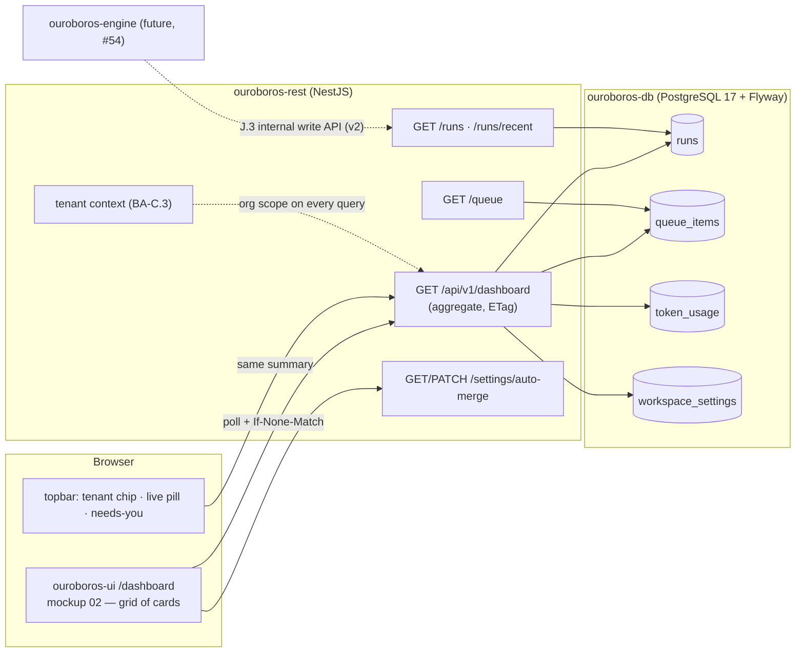
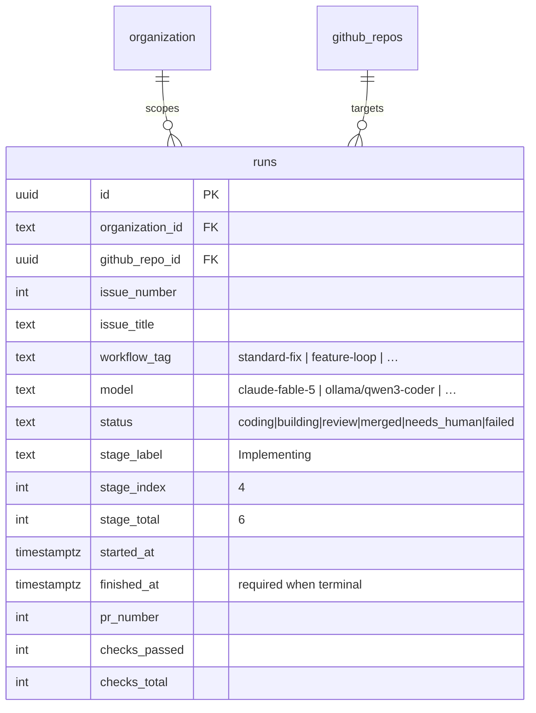
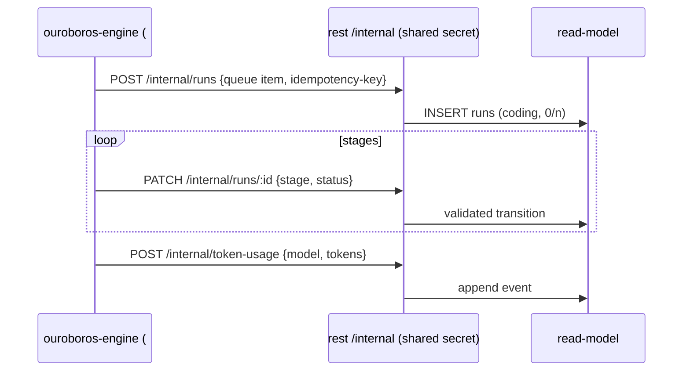
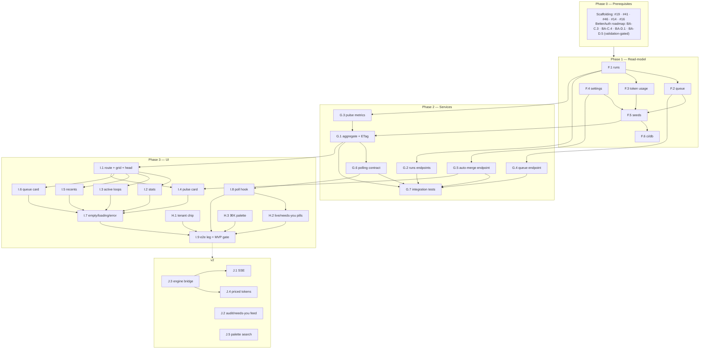

# Roadmap — Dashboard / Mission Control (Mockup 02)

## Description

> Create a roadmap that covers the features for the mockup page 02. Refer to the page
> so that issues can reference the mockup file when creating the UI/UX design of the
> pages.

## Context & Existing Work (duplicate-avoidance survey)

Surveyed 2026-08-08. **All 35 issues (5 epic parents + 30 work issues) were filed from
this roadmap on 2026-08-09** — see the `GitHub` column in every table below. The
`dashboard` label (decision F9) was created during filing, and the amendment comments
on #41, #45, #49 and #56 were posted.

**Design source of truth for every UI ticket in this roadmap:**
[`docs/mockups/02-dashboard.html`](mockups/02-dashboard.html) (with
`docs/mockups/assets/ouroboros.css`) — the Mission Control dashboard. Its anatomy:

- **Topbar** (`.topbar`) — brand mark + wordmark, **tenant chip**
  (`acme-robotics / helios-firmware ▾`), primary nav (Dashboard active), **search
  pill** (`Search… ⌘K`), **live pill** (`● 3 loops live`, pulsing dot), **needs-you
  pill** (`● Needs you · 3` → inbox, warn dot), settings gear, avatar (`KS`).
- **Page head** — eyebrow `Mission Control`, greeting `Good afternoon, Ken — the loop
  is turning.`, activity subline (`3 issues in flight, 12 queued… merged 6 pull
  requests since this morning…`), actions **Edit workflows** (ghost) and **⟳ Pull
  next issue** (primary).
- **Stat row** — four `c-3` stat cards: *Loops live* (accent value, `2 coding · 1 in
  review` delta), *Queued issues* (`est. 9h 40m of autonomous work`), *PRs merged ·
  7d* (`▲ 8 vs last week` up-delta), *Token spend · today* (`4.2M`, `≈ $18.60 across
  4 providers`).
- **Active loops** (`c-8` card) — live-pill header, `Open run console →` link, table:
  Issue (mono `#482` + title, links to run detail) · Workflow tag (`standard-fix`) ·
  Stage (label `Implementing · 4/6` + progress meter) · Model pill
  (`claude-fable-5`, `ollama/qwen3-coder`) · Elapsed (mono) · Status pill
  (`coding`/run, `building`/warn, `review`/ok).
- **Loop pulse** (`c-4` card) — glyph centerpiece (glow), three metric meters:
  *Autonomous merge rate* `92%` (ok), *Avg. cycle time* `14m 20s`, *Human
  interventions* `2 this week` (warn); divider; **Auto-merge when checks pass**
  switch (on).
- **Recently closed by the loop** (`c-7` card) — `All issues →` link, table:
  Issue → PR (`#474 → PR #512`) · Model pill · Cycle (mono) · Checks (`14/14`) ·
  Outcome pill (`merged`/ok, `needs human`/warn).
- **Up next in queue** (`c-5` card) — `Manage queue →` link, five bordered rows:
  mono issue number + title · effort chip (`XS S M L XL` classes) · workflow tag.

**The honesty problem this roadmap must solve:** the dashboard is a *window onto the
loop* — runs, queue, completions, token spend — and the loop engine does not exist
yet (engine execution model is deliberately v2, scaffolding issue #54). The dashboard
therefore ships against a **read-model**: REST-owned tables that the future engine
will feed, populated today by dev seeds (demo parity with the mockup) and rendering
truthful zero/empty states in a fresh workspace. No fabricated numbers outside seeds.

**Overlapping open issues and their disposition:**

| Existing issue | Disposition under this roadmap |
|---|---|
| #45 `ouroboros-ui: [5.7] Dashboard placeholder` (mockup 02 grid + health data + empty states, single M issue) | **Superseded in scope, but 🟢 built as written** — Epic I / #62 (I.1–I.8) is where the real dashboard is specified card by card, and the health-status card idea survives inside I.2 (#81) / I.7 (#86). #45 shipped first because P1 reached it while Epic I's own blockers (#46 primitives, #70 aggregate endpoint) were still open, and a signed-in session had nowhere to land: it is the route at `(app)/dashboard`, the readers behind it (`app/dashboard/data.ts`, `app/api/health.ts`, `app/api/engine.ts`, `app/api/members.ts`), the status logic, and designed empty states where Epic I's cards go. **#80 replaces the page body and inherits all of that.** *Amendment comment posted 2026-08-09; #45 delivered 2026-08-11.* |
| #41 `ouroboros-ui: [5.3] App shell` (top bar with nav, needs-you *placeholder*, gear, avatar) | **Amended/extended** by Epic H / #61 — tenant chip (#77), live & needs-you pills (#78), ⌘K palette (#79) are mockup-02 chrome beyond #41's placeholder scope. *Amendment comment posted 2026-08-09.* |
| #56 `ouroboros: [7.2] End-to-end smoke test` | **Amended** — the dashboard leg upgrades from "shows seeded tenant" to the I.9 (#88) assertions (stats, tables, pulse from seeded read-model). *Amendment comment posted 2026-08-09.* |
| #49 `ouroboros-ui: [5.11] Placeholder routes` (v2) | **Unchanged, load-bearing** — mockup-02 links (`run console →`, `All issues →`, `Manage queue →`, Edit workflows, inbox) land on #49 placeholders until those screens get their own roadmaps. *Note comment posted 2026-08-09.* |
| #54 `ouroboros-engine: [6.5] Task execution skeleton` (v2) | **Unchanged** — J.3 (#91) defines the engine→read-model write path that #54's runs will use. |
| #23 `ouroboros-db: [3.5] Dev seed data` | **Extended** by F.5 (#68) — dashboard read-model seeds join the tenancy/auth seeds. |
| #26 `ouroboros-db: [3.8] Audit log` (v2) | **Unchanged** — J.2 (#90) emits `settings.auto_merge_changed` through it. |
| Login/BetterAuth roadmap (`ROADMAP_LOGIN_PAGE_BETTERAUTH.md`, **still at validation gate — issues not yet filed as of 2026-08-09**) | **Prerequisite** — this roadmap consumes its session/user (greeting, avatar), active organization (tenant context, C.3), enabled-repo list (C.4, feeds the tenant chip), and shell session menu (D.6). Referenced below as *BA-C.3*, *BA-C.4*, *BA-D.1*, *BA-D.6*. |

Epic letters continue the sequence started by the BetterAuth roadmap (A–E): this
roadmap uses **F–J**.

### Decisions proposed by this roadmap (validate before issue creation)

| # | Decision | Rationale |
|---|----------|-----------|
| F1 | **Dashboard read-model tables live in `ouroboros-db`, owned (read/write) by `ouroboros-rest`**: `runs`, `queue_items`, `token_usage`, `workspace_settings` | The dashboard needs real queries against real rows. The engine doesn't exist; when it does (#54), it writes through REST's internal gateway (J.3) — the UI contract never changes. |
| F2 | **One `runs` table covers active loops *and* completions** (lifecycle status: `coding → building → review → merged \| needs_human \| failed`) | "Active loops" = non-terminal rows; "Recently closed" = terminal rows. One source of truth, no sync between two tables. |
| F3 | **Pulse metrics are computed, never stored**: merge rate, avg cycle time, interventions derived from `runs` over a 7-day window; queue estimate from `queue_items.est_minutes` | Stored aggregates drift; the row counts are small for years. Materialize later only if measured slow. |
| F4 | **Live updates: MVP = polling with `ETag`/`If-None-Match` on one summary endpoint; v2 = SSE** via NestJS's native `@Sse()` | Polling one cheap 304-friendly endpoint is simple, proxy-safe, and testable. NestJS supports SSE natively (RxJS Observables) when the loop goes truly live — J.1, no UI rearchitecture. |
| F5 | **One aggregate endpoint feeds the page** (`GET /api/v1/dashboard`) plus per-card endpoints for drill-in reuse | The page paints in one round trip (mockup is a single glance-view); card endpoints (runs, queue, completions) exist for future screens (issues, run console) to reuse. |
| F6 | **Auto-merge toggle is a real workspace setting** (`workspace_settings.auto_merge_on_checks`, org-scoped, owner/admin-writable) — the only *write* on the page | The mockup renders it as a working switch; it's cheap to make true, and future merge logic reads it. |
| F7 | **Greeting/time-of-day is client-rendered from the session user; activity subline is server data** | "Good afternoon, Ken" needs the browser's clock and the BA session name; "merged 6 PRs since this morning" is a query (org-timezone noted in the endpoint contract). |
| F8 | **Model identifiers render as opaque strings** (`claude-fable-5`, `ollama/qwen3-coder`, `copilot/gpt-5-codex`) in the `pill model` treatment | Model routing/registry is mockup 06/21 territory — the dashboard must not invent a model catalog, only display what runs recorded. |
| F9 | **New label `dashboard`**; effort chips adopt the mockup's five-step scale (XS–XL adds XL to the roadmap convention) | Consistent cross-referencing with prior roadmaps; the queue card renders all five chips. |

## Architecture Overview



## MVP Definition

The MVP is **mockup 02 as the real dashboard**, backed by the read-model. It is done
when, against the compose stack:

1. `/dashboard` reproduces [`docs/mockups/02-dashboard.html`](mockups/02-dashboard.html)
   pixel-faithfully in **both themes**: page head, four stat cards, active-loops
   table, loop-pulse card, recently-closed table, up-next queue — with seeded data
   matching the mockup's demo content (`#482` telemetry fix on `claude-fable-5`,
   `92%` merge rate, five queue rows with XS–XL chips, etc.).
2. A **fresh workspace shows truthful zero/empty states** on every card — no
   fabricated numbers; the greeting and health facts still render.
3. The **topbar carries the mockup-02 chrome**: tenant chip with org/repo switcher
   (enabled repos from BA-C.4), live pill and needs-you pill driven by the same
   summary data, search pill opening a basic ⌘K navigation palette.
4. All numbers come from **org-scoped REST endpoints** (aggregate + per-card), with
   the ETag polling loop keeping the page and the topbar pills fresh without reload.
5. The **auto-merge switch reads and writes** `workspace_settings` (owner/admin
   only; member sees it disabled).
6. Integration tests cover the aggregate math (merge rate, deltas, estimates) and
   role gates; the e2e dashboard leg (#56) asserts seeded content.

**Explicitly v2:** SSE push channel, engine→read-model ingestion (the bridge to #54),
provider-priced token accounting, audit events for settings changes, and the
full-content command palette.

## Epics

Each epic is a parent tracking issue on GitHub; every roadmap issue below is filed as
one of its sub-issues (GitHub Relationships).

| Epic | GitHub | Status | Name | Goal | Modules |
|------|:------:|:------:|------|------|---------|
| F | #59 | 🟡 Open | Dashboard Read-Model (`ouroboros-db`) | `runs`, `queue_items`, `token_usage`, `workspace_settings` + seeds & CI | ouroboros-db |
| G | #60 | 🟡 Open | Dashboard REST Services (`ouroboros-rest`) | Aggregate + card endpoints, ETag polling, auto-merge setting, tests | ouroboros-rest |
| H | #61 | 🟡 Open | Mission-Control Shell Chrome (`ouroboros-ui`) | Tenant chip, live/needs-you pills, ⌘K palette — mockup-02 topbar | ouroboros-ui |
| I | #62 | 🟡 Open | Dashboard Page UI (`ouroboros-ui`) | Every card of mockup 02, empty states, polling wiring, e2e | ouroboros-ui |
| J | #63 | 🟡 Open | Live Loop & Extended Scope (v2) | SSE, engine ingestion bridge, priced tokens, audit, full palette | rest, engine, ui |

Issue naming: `<project>: [<epic letter>.<issue>] <title>`. Labels reuse the existing
set (`mvp`, `v2`, `rest`, `db`, `ui`, `ci`, `design`, `engine`) plus new **`dashboard`**
(decision F9; create during issue filing). Complexity chips: **XS · S · M · L**.

---

## Epic F — Dashboard Read-Model (`ouroboros-db`)

| Ref | GitHub | Status | Title | Summary | Labels | Parallel | MVP | Complexity | Affected Modules |
|-------|:------:|:------:|-------|---------|--------|:--------:|:---:|:----------:|------------------|
| F.1 | #64 | 🟡 Open | ouroboros-db: [F.1] Runs table — loop lifecycle read-model | `runs` with stages, model, timing, PR/checks, terminal outcomes | mvp, dashboard, db | N (after #19, BA-B.3) | Y | M | ouroboros-db |
| F.2 | #65 | 🟡 Open | ouroboros-db: [F.2] Queue items table | Ordered per-org issue queue with effort + workflow tag + estimate | mvp, dashboard, db | N (after F.1) | Y | S | ouroboros-db |
| F.3 | #66 | 🟡 Open | ouroboros-db: [F.3] Token usage events table | Append-only usage events (provider, model, tokens, cost) + daily view | mvp, dashboard, db | N (after F.1) | Y | S | ouroboros-db |
| F.4 | #67 | 🟡 Open | ouroboros-db: [F.4] Workspace settings table | Org-scoped typed settings; first column: `auto_merge_on_checks` | mvp, dashboard, db | N (after BA-B.3) | Y | XS | ouroboros-db |
| F.5 | #68 | 🟡 Open | ouroboros-db: [F.5] Dashboard dev seeds — mockup-02 parity | Seed runs/queue/usage/settings reproducing the mockup demo content | mvp, dashboard, db | N (after F.1–F.4) | Y | S | ouroboros-db |
| F.6 | #69 | 🟡 Open | ouroboros-db: [F.6] Read-model constraints in ci/db | Constraint assertions for statuses, ordering, append-only usage | mvp, dashboard, db, ci | N (after F.5, #24) | Y | XS | ouroboros-db, .github |

### Issue F.1 — ouroboros-db: [F.1] Runs table — loop lifecycle read-model

> **GitHub issue:** #64 · **Status:** 🟡 Open · **Parent epic:** #59

- **Problem Statement:** Three of the six dashboard surfaces (stat row, active loops,
  recently closed — see [`docs/mockups/02-dashboard.html`](mockups/02-dashboard.html))
  are views over "a run of the loop against an issue." That entity has no table.
- **Solution/Scope:** `V0xx__dashboard_runs.sql` (number follows the BetterAuth
  migrations): `runs` — id, `organization_id` FK, `github_repo_id` FK (BA-B.3),
  `issue_number`, `issue_title`, `workflow_tag` (text — workflow entities are mockup
  04 territory), `model` (opaque text, decision F8), `status` CHECK
  `coding|building|review|merged|needs_human|failed` (F2: non-terminal = active),
  `stage_label`, `stage_index`, `stage_total`, `started_at`, `finished_at`
  (nullable), `pr_number`, `checks_passed`, `checks_total` (nullable until terminal).
  Indexes: `(organization_id, status)` for active lists, `(organization_id,
  finished_at DESC)` for completions/7-day windows. Constraint: terminal statuses
  require `finished_at`. House snake_case (our table).
- **Acceptance Criteria:**
  - Migration applies/validates cleanly after the BetterAuth chain.
  - Status CHECK rejects unknown values; terminal-requires-`finished_at` enforced.
  - `EXPLAIN` shows index use for the active-loops and 7-day-completions queries.
- **Parallelism/Dependencies:** Needs #19, BA-B.3 (organization + repo tables).
  Blocks F.2, F.3, F.5, G.1–G.3.
- **Technical Stack:** PostgreSQL 17, Flyway.
- **Epic:** F



### Issue F.2 — ouroboros-db: [F.2] Queue items table

> **GitHub issue:** #65 · **Status:** 🟡 Open · **Parent epic:** #59

- **Problem Statement:** "Up next in queue" and the *Queued issues* stat (`est. 9h
  40m of autonomous work`) need an ordered, estimable queue per organization.
- **Solution/Scope:** `queue_items`: id, `organization_id` FK, `github_repo_id` FK,
  `issue_number`, `issue_title`, `effort` CHECK `xs|s|m|l|xl` (the mockup's chip
  scale, decision F9), `workflow_tag`, `position` (unique per org — dense ordering),
  `est_minutes` (nullable int; the stat sums it), `enqueued_at`. Unique
  `(organization_id, issue_number)` — an issue queues once.
- **Acceptance Criteria:**
  - Position uniqueness per org enforced; reorder via position swap works in a
    transaction (G.4 harness).
  - Effort CHECK matches the five mockup chips exactly.
- **Parallelism/Dependencies:** Needs F.1 (same migration series). Blocks F.5, G.4.
- **Technical Stack:** PostgreSQL 17, Flyway.
- **Epic:** F

```
queue_items(org, position ↑) ─▶ #485 M standard-fix · #486 L feature-loop · #488 XS docs-loop
                                 └─ Σ est_minutes ─▶ "est. 9h 40m of autonomous work"
```

### Issue F.3 — ouroboros-db: [F.3] Token usage events table

> **GitHub issue:** #66 · **Status:** 🟡 Open · **Parent epic:** #59

- **Problem Statement:** *Token spend · today* (`4.2M`, `≈ $18.60 across 4
  providers`) needs an append-only usage ledger; per-run cost attribution will matter
  to every future insights screen (mockup 15).
- **Solution/Scope:** `token_usage`: id, `organization_id` FK, `run_id` FK nullable,
  `provider` (text: `anthropic|ollama|copilot|…` — opaque, F8), `model`, `tokens_in`,
  `tokens_out`, `cost_cents` (nullable — priced accounting is J.4), `occurred_at`
  with BRIN index. A `token_usage_daily` view (org, day, provider) powers the stat.
  Insert-only grant posture documented (full enforcement rides #26's role work).
- **Acceptance Criteria:**
  - View returns per-day/org/provider sums matching inserted fixtures.
  - BRIN index present; inserts of seed volume < 1s.
- **Parallelism/Dependencies:** Needs F.1. Blocks F.5, G.1.
- **Technical Stack:** PostgreSQL 17, Flyway.
- **Epic:** F

```
token_usage(append-only) ── group by day/provider ──▶ token_usage_daily
   └▶ today, org ─▶ Σ tokens ─▶ "4.2M" · Σ cost_cents ─▶ "≈ $18.60 across 4 providers"
```

### Issue F.4 — ouroboros-db: [F.4] Workspace settings table

> **GitHub issue:** #67 · **Status:** 🟡 Open · **Parent epic:** #59

- **Problem Statement:** The loop-pulse card's **Auto-merge when checks pass** switch
  is the page's only write (decision F6); it needs a durable, org-scoped home that
  future settings (mockup 17) can join.
- **Solution/Scope:** `workspace_settings`: `organization_id` PK/FK, typed columns —
  first: `auto_merge_on_checks boolean not null default false` — plus
  `updated_at`/`updated_by`. Typed columns over key/value: the compiler and CHECKs
  stay useful; new settings are additive migrations (house rule).
- **Acceptance Criteria:**
  - One row per org enforced; default false on org creation (trigger or lazy insert
    — decided in-issue).
  - `updated_by` references the BetterAuth `user` table.
- **Parallelism/Dependencies:** Needs BA-B.3. Blocks F.5, G.5.
- **Technical Stack:** PostgreSQL 17, Flyway.
- **Epic:** F

```
workspace_settings: organization_id PK · auto_merge_on_checks bool · updated_by → "user".id
```

### Issue F.5 — ouroboros-db: [F.5] Dashboard dev seeds — mockup-02 parity

> **GitHub issue:** #68 · **Status:** 🟡 Open · **Parent epic:** #59

- **Problem Statement:** Design review and e2e need the dashboard to render exactly
  the mockup's demo content; a fresh workspace must instead show empty states — both
  paths need deterministic data.
- **Solution/Scope:** Extend the repeatable dev seed (BA-B.4, dev-only guard): for
  `acme-robotics` — 3 active runs (`#482` standard-fix/claude-fable-5/coding 4-6,
  `#479` feature-loop/claude-sonnet-5/building 5-7, `#476`
  deps-refresh/ollama-qwen3-coder/review 6-6), 4 terminal runs (`#474→PR#512` merged
  11m 14/14 … `#465→PR#504` needs_human 42m 13/14 — the mockup's recently-closed
  rows), 5 queue items (`#485`–`#491` with the mockup's efforts/tags), token events
  totaling ~4.2M/day across 4 providers, `auto_merge_on_checks = true`. Seed windows
  relative to `now()` so "today"/"7d" math always holds. The seeded personal org
  (`kensuenobu`) gets **no** dashboard rows — it is the empty-state fixture.
- **Acceptance Criteria:**
  - Aggregate endpoint (G.1) over seeds reproduces every mockup number: 3 live
    (2 coding + 1 review… noting the mockup's own `building` row counts as the third),
    12 queued *(seed extends beyond the 5 visible rows)*, 27 merged/7d ▲8, 4.2M
    tokens, 92% merge rate, 2 interventions.
  - Idempotent; switching active org to `kensuenobu` yields all-empty cards.
- **Parallelism/Dependencies:** Needs F.1–F.4. Feeds G.7, I.9, #56.
- **Technical Stack:** Flyway repeatable migration, SQL.
- **Epic:** F

```
acme-robotics seeds ─▶ mockup-02 parity (design review + e2e)
kensuenobu (personal) ─▶ zero rows ─▶ empty-state fixture (I.7)
```

### Issue F.6 — ouroboros-db: [F.6] Read-model constraints in ci/db

> **GitHub issue:** #69 · **Status:** 🟡 Open · **Parent epic:** #59

- **Problem Statement:** Status vocabularies, queue ordering, and append-only usage
  are contracts the UI trusts; PR-time assertions keep them true.
- **Solution/Scope:** Extend #24's `tests/constraints.sql`: status/effort CHECK
  probes, terminal-requires-finished_at, queue position uniqueness, usage-view sums
  against fixtures, settings one-row-per-org.
- **Acceptance Criteria:** Green on current schema; red when any CHECK or unique
  is dropped (spot-verified once).
- **Parallelism/Dependencies:** Needs F.5, #24.
- **Technical Stack:** GitHub Actions, SQL.
- **Epic:** F

```
ci/db: migrate ─▶ validate ─▶ constraints.sql (+F probes) ─▶ ✓/✗
```

---

## Epic G — Dashboard REST Services (`ouroboros-rest`)

| Ref | GitHub | Status | Title | Summary | Labels | Parallel | MVP | Complexity | Affected Modules |
|-------|:------:|:------:|-------|---------|--------|:--------:|:---:|:----------:|------------------|
| G.1 | #70 | 🟡 Open | ouroboros-rest: [G.1] Dashboard aggregate endpoint with ETag | One org-scoped payload: stats, pulse, actives, recents, queue head | mvp, dashboard, rest | N (after F.5, BA-C.3) | Y | L | ouroboros-rest |
| G.2 | #71 | 🟡 Open | ouroboros-rest: [G.2] Runs endpoints (active & recent) | `GET /runs?status=active`, `GET /runs/recent` — card drill-in reuse | mvp, dashboard, rest | N (after F.1, BA-C.3) | Y | S | ouroboros-rest |
| G.3 | #72 | 🟡 Open | ouroboros-rest: [G.3] Pulse metrics computation | Merge rate, avg cycle, interventions over a 7-day window (F3) | mvp, dashboard, rest | N (after F.1) | Y | M | ouroboros-rest |
| G.4 | #73 | 🟡 Open | ouroboros-rest: [G.4] Queue endpoint | Ordered queue with efforts, tags, Σ estimate | mvp, dashboard, rest | N (after F.2, BA-C.3) | Y | S | ouroboros-rest |
| G.5 | #74 | 🟡 Open | ouroboros-rest: [G.5] Auto-merge setting endpoint | `GET/PATCH /settings/auto-merge`, owner/admin-gated | mvp, dashboard, rest | N (after F.4, BA-C.3) | Y | S | ouroboros-rest |
| G.6 | #75 | 🟡 Open | ouroboros-rest: [G.6] Polling contract & cache headers | ETag/304 discipline, poll interval guidance, shared summary for pills | mvp, dashboard, rest | N (after G.1) | Y | S | ouroboros-rest |
| G.7 | #76 | 🟡 Open | ouroboros-rest: [G.7] Dashboard integration tests | Aggregate math, empty-org, role gates, ETag behavior | mvp, dashboard, rest, ci | N (after G.1–G.6) | Y | M | ouroboros-rest |

### Issue G.1 — ouroboros-rest: [G.1] Dashboard aggregate endpoint with ETag

> **GitHub issue:** #70 · **Status:** 🟡 Open · **Parent epic:** #60

- **Problem Statement:** The dashboard is a single glance-view
  ([`docs/mockups/02-dashboard.html`](mockups/02-dashboard.html)); painting it from
  six round trips would tear the page and sextuple the polling cost (decision F5).
- **Solution/Scope:** `GET /api/v1/dashboard` under tenant context (BA-C.3):
  `{stats: {loopsLive{total, byStatus}, queued{count, estMinutes}, merged7d{count,
  deltaVsPrior}, tokensToday{tokens, costCents, providers}}, pulse: {mergeRate,
  avgCycleSeconds, interventions7d, autoMerge}, activeRuns[…top 10],
  recentRuns[…last 8], queueHead[…top 5], activity: {inFlight, queued,
  mergedSinceMorning}}` — the last object feeding the F7 subline. Strong `ETag` from
  a cheap version source (max `updated_at`/count tuple); `If-None-Match` → 304.
  OpenAPI-documented (feeds the #43 generated client).
- **Acceptance Criteria:**
  - Against F.5 seeds, every field matches the mockup's numbers (F.5 list).
  - Empty org → zeros/empty arrays, never nulls that crash cards.
  - Unchanged data + `If-None-Match` → 304 with no body; changed data → 200 + new
    ETag. p95 < 100ms on seed volume.
- **Parallelism/Dependencies:** Needs F.5, BA-C.3. Blocks G.6, I.1–I.6, H.2.
- **Technical Stack:** NestJS, Kysely, @nestjs/swagger.
- **Epic:** G

```
GET /api/v1/dashboard (org from session) ─▶ { stats · pulse · activeRuns · recentRuns · queueHead · activity }
      If-None-Match: "v42" ──unchanged──▶ 304
```

### Issue G.2 — ouroboros-rest: [G.2] Runs endpoints (active & recent)

> **GitHub issue:** #71 · **Status:** 🟡 Open · **Parent epic:** #60

- **Problem Statement:** The aggregate carries card-sized slices; the `Open run
  console →` and `All issues →` destinations (and future screens 03/10) need full
  lists with paging.
- **Solution/Scope:** `GET /api/v1/runs?status=active|terminal&page…` and
  `GET /api/v1/runs/:id` under tenant context; DTOs shared with G.1's slices (one
  shape for a run row everywhere); pagination per the #31 convention.
- **Acceptance Criteria:** Org-scoped only (cross-org id → 404); shapes identical to
  aggregate slices (contract test); OpenAPI complete.
- **Parallelism/Dependencies:** Needs F.1, BA-C.3. Parallel with G.1.
- **Technical Stack:** NestJS, Kysely.
- **Epic:** G

```
aggregate.activeRuns (top10) ⊂ GET /runs?status=active (paged)  — same RunRow DTO
```

### Issue G.3 — ouroboros-rest: [G.3] Pulse metrics computation

> **GitHub issue:** #72 · **Status:** 🟡 Open · **Parent epic:** #60

- **Problem Statement:** The pulse card's three meters (92% merge rate, 14m 20s avg
  cycle, 2 interventions) and the stat row's ▲ delta are windowed aggregates that
  must be computed correctly and cheaply (decision F3).
- **Solution/Scope:** A metrics service used by G.1: merge rate = merged / terminal
  (7d, excluding `failed`? — decided in-issue with the definition documented in the
  DTO), avg cycle = mean(`finished_at - started_at`) over merged 7d, interventions =
  `needs_human` count 7d, merged delta = this-7d vs prior-7d. Single SQL pass with
  filtered aggregates; unit-tested date-window edges (empty windows, DST, org with
  one run).
- **Acceptance Criteria:** Seeded numbers match the mockup; empty window → 0% /
  null-safe display values; definitions documented in OpenAPI descriptions.
- **Parallelism/Dependencies:** Needs F.1. Feeds G.1.
- **Technical Stack:** Kysely (filtered aggregates), Jest.
- **Epic:** G

```
runs(7d window) ─▶ merged/terminal ─▶ 92% · avg(finish-start) ─▶ 14m20s · needs_human ─▶ 2
runs(prior 7d)  ─▶ merged count    ─▶ Δ "▲ 8 vs last week"
```

### Issue G.4 — ouroboros-rest: [G.4] Queue endpoint

> **GitHub issue:** #73 · **Status:** 🟡 Open · **Parent epic:** #60

- **Problem Statement:** "Up next in queue" and its `Manage queue →` destination need
  the ordered queue with the estimate the stat row displays.
- **Solution/Scope:** `GET /api/v1/queue` (ordered by position, paged) returning
  effort/tag/estimate per row plus `totalEstMinutes`; write operations (reorder,
  remove) are deliberately **out of scope** — they belong to the issues-screen
  roadmap (mockup 03), noted in the OpenAPI description.
- **Acceptance Criteria:** Order stable and matches positions; Σ estimate equals the
  G.1 stat; org-scoped.
- **Parallelism/Dependencies:** Needs F.2, BA-C.3. Parallel with G.2.
- **Technical Stack:** NestJS, Kysely.
- **Epic:** G

```
GET /queue ─▶ [{#485, effort:m, tag:standard-fix}…] + totalEstMinutes (→ "est. 9h 40m")
```

### Issue G.5 — ouroboros-rest: [G.5] Auto-merge setting endpoint

> **GitHub issue:** #74 · **Status:** 🟡 Open · **Parent epic:** #60

- **Problem Statement:** The pulse card's switch (decision F6) needs read/write with
  role enforcement — the page's only mutation.
- **Solution/Scope:** `GET /api/v1/settings/auto-merge` (any member) and `PATCH`
  (owner/admin via BA-C.3 role guard) on `workspace_settings`; PATCH returns the new
  state; `updated_by` recorded; audit emission stubbed for J.2.
- **Acceptance Criteria:** Member PATCH → 403 envelope; owner PATCH persists and
  reflects in the next aggregate poll (ETag changes); lazy row creation covered.
- **Parallelism/Dependencies:** Needs F.4, BA-C.3. Blocks I.4.
- **Technical Stack:** NestJS, Kysely, class-validator.
- **Epic:** G

```
PATCH /settings/auto-merge {enabled:true}  ─[owner/admin]─▶ workspace_settings · ETag bump
                                            └[member]─▶ 403 {code:"forbidden_role"}
```

### Issue G.6 — ouroboros-rest: [G.6] Polling contract & cache headers

> **GitHub issue:** #75 · **Status:** 🟡 Open · **Parent epic:** #60

- **Problem Statement:** The page, the live pill, and the needs-you pill all want
  freshness; without a stated contract each consumer invents its own polling and the
  server pays for it (decision F4).
- **Solution/Scope:** Formalize on G.1: strong ETag, `Cache-Control: private,
  no-cache`, documented poll interval (e.g. 15s active tab / paused hidden tab —
  final values decided in-issue with I.8), 304 fast-path measured; a
  `X-Ouro-Poll-After` hint header the client honors (server can slow clients under
  load). Documented in `docs/ARCHITECTURE.md`; SSE upgrade path noted (J.1).
- **Acceptance Criteria:** 304 path does no row serialization (verified by logging);
  hint header respected by the I.8 hook; contract written down.
- **Parallelism/Dependencies:** Needs G.1. Blocks I.8.
- **Technical Stack:** NestJS interceptors/headers.
- **Epic:** G

```
client ── poll every 15s (visible) ──▶ /dashboard  ── 304 (cheap) │ 200 + ETag
                └── hidden tab: paused          └── X-Ouro-Poll-After: 30 (backoff hint)
```

### Issue G.7 — ouroboros-rest: [G.7] Dashboard integration tests

> **GitHub issue:** #76 · **Status:** 🟡 Open · **Parent epic:** #60

- **Problem Statement:** Window math, org scoping, role gates, and cache behavior
  are exactly the bugs that reach production silently; the #37 harness must cover
  them.
- **Solution/Scope:** Extend the Testcontainers harness: aggregate over F.5-style
  fixtures (every stat asserted), empty-org zeros, cross-org isolation (two orgs,
  no bleed), auto-merge role matrix, ETag 200→304→change→200 cycle, metric window
  edges (G.3 cases).
- **Acceptance Criteria:** Green in `ci/rest` without external services; deleting
  the org-scope predicate turns isolation tests red; ≤ 60s added runtime.
- **Parallelism/Dependencies:** Needs G.1–G.6 (extends #37, BA-C.5 patterns).
- **Technical Stack:** Jest, Supertest, Testcontainers.
- **Epic:** G

```
fixtures(2 orgs) ─▶ aggregate math ✓ · isolation ✓ · roles ✓ · ETag cycle ✓ · windows ✓
```

---

## Epic H — Mission-Control Shell Chrome (`ouroboros-ui`)

Extends #41's app shell with the topbar elements mockup 02 adds. Design reference for
all three issues: the `.topbar` of
[`docs/mockups/02-dashboard.html`](mockups/02-dashboard.html).

| Ref | GitHub | Status | Title | Summary | Labels | Parallel | MVP | Complexity | Affected Modules |
|-------|:------:|:------:|-------|---------|--------|:--------:|:---:|:----------:|------------------|
| H.1 | #77 | 🟡 Open | ouroboros-ui: [H.1] Tenant chip — org/repo context switcher | `acme-robotics / helios-firmware ▾` chip with switch menu | mvp, dashboard, ui, design | N (after #41, BA-C.4, BA-D.1) | Y | M | ouroboros-ui |
| H.2 | #78 | 🟡 Open | ouroboros-ui: [H.2] Live & needs-you pills with real counts | `● 3 loops live` and `● Needs you · 3` from the shared summary | mvp, dashboard, ui | N (after #41, G.1) | Y | S | ouroboros-ui |
| H.3 | #79 | 🟡 Open | ouroboros-ui: [H.3] Search pill & ⌘K navigation palette | Topbar search affordance opening a basic command palette | mvp, dashboard, ui | N (after #41) | Y | M | ouroboros-ui |

### Issue H.1 — ouroboros-ui: [H.1] Tenant chip — org/repo context switcher

> **GitHub issue:** #77 · **Status:** 🟡 Open · **Parent epic:** #61

- **Problem Statement:** Mockup 02's topbar pins the working context —
  `acme-robotics / helios-firmware ▾` — between brand and nav. The shell (#41) has
  no such control, and every dashboard query depends on that context.
- **Solution/Scope:** Chip per the mockup (`.tenant-chip`: muted org, bright repo,
  caret): current active organization (BA session) and a **focus repo** (client-side
  filter preference, persisted per org; "All repos" default — the dashboard read
  APIs accept an optional repo filter via G.2/G.4 query param). Menu: switch org
  (BA-D.1 `setActive`, page data refetches), pick focus repo from enabled repos
  (BA-C.4), links to workspace settings. Keyboard accessible; truncation rules for
  long names.
- **Acceptance Criteria:**
  - Chip renders active org/repo; switching org repaints dashboard data without
    full reload; focus repo persists across sessions.
  - Matches mockup styling in both themes; nav order (brand → chip → nav) preserved.
  - Amendment posted on #41 pointing here.
- **Parallelism/Dependencies:** Needs #41, BA-C.4, BA-D.1. Parallel with H.2/H.3.
- **Technical Stack:** React, BA org client, #46 primitives.
- **Epic:** H

```
[◎ OUROBOROS] [acme-robotics / helios-firmware ▾] [Dashboard · Issues · …]
                     ├─ switch organization …(BA setActive)
                     ├─ focus repo: All ▸ helios-firmware ▸ …(enabled repos)
                     └─ workspace settings
```

### Issue H.2 — ouroboros-ui: [H.2] Live & needs-you pills with real counts

> **GitHub issue:** #78 · **Status:** 🟡 Open · **Parent epic:** #61

- **Problem Statement:** The mockup's `● 3 loops live` (pulsing accent dot) and
  `● Needs you · 3` (warn dot, links to inbox) are ambient truth about the loop —
  #41 ships only a placeholder.
- **Solution/Scope:** Both pills read the I.8 shared summary (no extra requests —
  decision F4): live = `stats.loopsLive.total` (pill hidden at 0), needs-you =
  `needs_human` active count (pill hidden at 0; links to the #49 inbox placeholder
  until mockup 16 gets a roadmap); pulse/warn dot treatments from the design system;
  `aria-live="polite"` count announcements.
- **Acceptance Criteria:** Seeded org shows `3 loops live` and `Needs you · 1+`
  (per seed terminal rows); empty org shows neither; counts update on the polling
  cadence without reload.
- **Parallelism/Dependencies:** Needs #41, G.1, I.8 (hook). Parallel with H.1.
- **Technical Stack:** React, shared poll hook (I.8).
- **Epic:** H

```
summary.loopsLive=3 ─▶ [● 3 loops live]      summary.needsHuman=0 ─▶ (pill hidden)
```

### Issue H.3 — ouroboros-ui: [H.3] Search pill & ⌘K navigation palette

> **GitHub issue:** #79 · **Status:** 🟡 Open · **Parent epic:** #61

- **Problem Statement:** The mockup's `Search… ⌘K` pill promises a command surface;
  a dead control undermines the chrome, but full content search needs data that
  doesn't exist yet.
- **Solution/Scope:** MVP palette (decision: navigation-scope only): pill + `⌘K`/
  `Ctrl+K` opens a modal palette with fuzzy nav actions (screens, settings, theme
  toggle, sign out) built on #46 primitives; extensible action registry so J.5 can
  add content search (issues, runs) without rework; focus trap, full keyboard
  operation.
- **Acceptance Criteria:** ⌘K opens from any screen; typing filters; Enter
  navigates; Esc restores focus; both themes; registry API documented.
- **Parallelism/Dependencies:** Needs #41. Parallel with H.1/H.2; extended by J.5.
- **Technical Stack:** React, #46 primitives (no external palette lib — lightweight
  rule).
- **Epic:** H

```
⌘K ─▶ ┌ Search…──────────────┐
      │ ▸ Go to Dashboard    │  MVP: nav actions registry
      │ ▸ Go to Issues       │  J.5: + issues/runs content search
      │ ▸ Toggle theme       │
      └──────────────────────┘
```

---

## Epic I — Dashboard Page UI (`ouroboros-ui`)

Every issue references [`docs/mockups/02-dashboard.html`](mockups/02-dashboard.html)
as the design source: layout classes (`.grid`, `.c-3/.c-4/.c-5/.c-7/.c-8`), card
anatomy (`.card-head`, `.card-title`, `.card-link`), and component treatments
(`.stat`, `.meter`, `.pill`, `.tag`, `.effort`) — colors via the #16 tokens so both
themes hold.

| Ref | GitHub | Status | Title | Summary | Labels | Parallel | MVP | Complexity | Affected Modules |
|-------|:------:|:------:|-------|---------|--------|:--------:|:---:|:----------:|------------------|
| I.1 | #80 | 🟡 Open | ouroboros-ui: [I.1] Dashboard route, grid & page head | `(app)/dashboard`: 12-col grid, greeting, subline, action buttons | mvp, dashboard, ui, design | N (after #41, G.1, BA-D.5) | Y | M | ouroboros-ui |
| I.2 | #81 | 🟡 Open | ouroboros-ui: [I.2] Stat row — four metric cards | Loops live, queued, merged·7d (▲ delta), token spend | mvp, dashboard, ui, design | N (after I.1) | Y | S | ouroboros-ui |
| I.3 | #82 | 🟡 Open | ouroboros-ui: [I.3] Active loops card | Runs table: stage meters, model pills, elapsed, status pills | mvp, dashboard, ui, design | N (after I.1) | Y | M | ouroboros-ui |
| I.4 | #83 | 🟡 Open | ouroboros-ui: [I.4] Loop pulse card | Glyph, three metric meters, auto-merge switch (wired to G.5) | mvp, dashboard, ui, design | N (after I.1, G.5) | Y | M | ouroboros-ui |
| I.5 | #84 | 🟡 Open | ouroboros-ui: [I.5] Recently-closed card | Issue→PR table with cycle, checks, outcome pills | mvp, dashboard, ui, design | N (after I.1) | Y | S | ouroboros-ui |
| I.6 | #85 | 🟡 Open | ouroboros-ui: [I.6] Up-next queue card | Queue rows with effort chips + workflow tags | mvp, dashboard, ui, design | N (after I.1) | Y | S | ouroboros-ui |
| I.7 | #86 | 🟡 Open | ouroboros-ui: [I.7] Empty, loading & error states | Truthful zero-states, skeletons, poll-failure banner per card | mvp, dashboard, ui, design | N (after I.2–I.6) | Y | M | ouroboros-ui |
| I.8 | #87 | 🟡 Open | ouroboros-ui: [I.8] Polling hook & freshness wiring | Shared ETag-aware poll hook feeding page + topbar pills | mvp, dashboard, ui | N (after G.6) | Y | S | ouroboros-ui |
| I.9 | #88 | 🟡 Open | ouroboros-ui: [I.9] Dashboard e2e leg | #56 amendment: seeded parity + empty-org assertions | mvp, dashboard, ui, ci | N (after I.1–I.8) | Y | S | ouroboros-ui, .github |

### Issue I.1 — ouroboros-ui: [I.1] Dashboard route, grid & page head

> **GitHub issue:** #80 · **Status:** 🟡 Open · **Parent epic:** #62

- **Problem Statement:** The dashboard needs its frame before cards exist: the
  12-column grid and the page head (eyebrow, greeting, activity subline, two
  actions) per [`docs/mockups/02-dashboard.html`](mockups/02-dashboard.html).
- **Solution/Scope:** Replace the #45 placeholder at `(app)/dashboard`: grid
  container matching the mockup's column classes responsively (c-8/c-4 → stack at
  narrow widths); page head — eyebrow `Mission Control`, client-rendered
  time-of-day greeting with the session user's first name (decision F7), subline
  composed from `activity` (G.1) with correct pluralization and a quiet variant for
  empty orgs; actions **Edit workflows** (ghost → #49 placeholder) and **⟳ Pull next
  issue** (primary → issues placeholder; real behavior belongs to mockup 03's
  roadmap — link, don't fake). Server component fetches the first aggregate; I.8
  keeps it fresh.
- **Acceptance Criteria:**
  - Frame matches the mockup at 1440px; sensible stacking at 900px; both themes.
  - Greeting says the right daypart/name; subline matches seeds exactly
    ("3 issues in flight, 12 queued…").
  - #45 closed/retitled with a pointer here (amendment). **Note:** #45 shipped
    2026-08-11, so this is a replacement of a working page rather than of a stub —
    the route, `app/paths.ts`'s `DASHBOARD_PATH`, the four readers and the system
    card's state logic are all in place and are what I.1 builds on. The `/` →
    `/dashboard` redirect is already there too. What I.1 still adds is this frame's
    own two pieces: the client-rendered greeting (F7) and the activity subline from
    G.1's aggregate.
- **Parallelism/Dependencies:** Needs #41, G.1, BA-D.5 (auth guard). Blocks I.2–I.7.
- **Technical Stack:** Next.js server components, #46 primitives, #16 tokens.
- **Epic:** I

```
[Mission Control]
Good afternoon, Ken — the loop is turning.        [Edit workflows] [⟳ Pull next issue]
3 issues in flight, 12 queued behind them. …merged 6 PRs since this morning…
┌c-3┐┌c-3┐┌c-3┐┌c-3┐ / ┌────c-8────┐┌──c-4──┐ / ┌───c-7───┐┌──c-5──┐
```

### Issue I.2 — ouroboros-ui: [I.2] Stat row — four metric cards

> **GitHub issue:** #81 · **Status:** 🟡 Open · **Parent epic:** #62

- **Problem Statement:** The four `c-3` stat cards are the loop's vital signs; the
  mockup gives each an exact anatomy (label / large value / delta line, accent value
  on the first, `▲` up-delta treatment on the third).
- **Solution/Scope:** A `StatCard` composition (#46 Card + typography): *Loops live*
  (accent value, byStatus delta like `2 coding · 1 in review`), *Queued issues*
  (`est. Xh Ym of autonomous work` from `estMinutes`), *PRs merged · 7d* (delta
  `▲/▼ N vs last week`, ok/warn coloring, sign-aware), *Token spend · today*
  (compact tokens `4.2M`, `≈ $X across N providers` — cost line hidden when
  `costCents` null until J.4). Number formatting helpers (compact, duration) shared
  with later cards.
- **Acceptance Criteria:** Seeded org matches mockup values/styling; delta colors
  correct for up/down/zero; formatter unit tests (m/h boundaries, 999k→1.0M).
- **Parallelism/Dependencies:** Needs I.1. Parallel with I.3–I.6.
- **Technical Stack:** React, #46 primitives, Vitest.
- **Epic:** I

```
┌ LOOPS LIVE ┐ ┌ QUEUED ISSUES ┐ ┌ PRS MERGED · 7D ┐ ┌ TOKEN SPEND · TODAY ┐
│     3      │ │      12       │ │       27        │ │        4.2M         │
│ 2 coding · │ │ est. 9h 40m…  │ │ ▲ 8 vs last wk  │ │ ≈ $18.60 across 4…  │
```

### Issue I.3 — ouroboros-ui: [I.3] Active loops card

> **GitHub issue:** #82 · **Status:** 🟡 Open · **Parent epic:** #62

- **Problem Statement:** The `c-8` active-loops table is the page's centerpiece —
  issue link, workflow tag, stage label + progress meter, model pill, mono elapsed,
  status pill — all per the mockup's exact treatments.
- **Solution/Scope:** Card with header (title, live pill shown when count > 0,
  `Open run console →` link → #49 placeholder) and #46 Table: issue cell (mono
  number + title, row link), `tag` for workflow, stage cell (small muted
  `label · i/total` over a `meter` at `index/total`%, ok-variant when in review),
  model pill (F8 opaque string), elapsed ticking client-side between polls, status
  pill mapping `coding→run / building→warn / review→ok`. Rows cap at the aggregate's
  10 with a "+N more" footer link.
- **Acceptance Criteria:** Seeded rows reproduce the mockup exactly (widths,
  meters at 66/71/94%, pill classes); elapsed advances between polls without
  jumping backward on refresh; keyboard row navigation.
- **Parallelism/Dependencies:** Needs I.1. Parallel with I.2/I.4–I.6.
- **Technical Stack:** React, #46 Table/Chip/Meter primitives.
- **Epic:** I

```
#482 Fix flaky CAN-bus…  [standard-fix]  Implementing · 4/6 ▓▓▓▓▓░  [claude-fable-5]  12m 40s  (coding)
#479 Add OTA rollback…   [feature-loop]  Build farm · 5/7  ▓▓▓▓▓░  [claude-sonnet-5] 38m 05s  (building)
#476 Bump MQTT client…   [deps-refresh]  Self-review · 6/6 ▓▓▓▓▓▓  [ollama/qwen3-…]  7m 12s   (review)
```

### Issue I.4 — ouroboros-ui: [I.4] Loop pulse card

> **GitHub issue:** #83 · **Status:** 🟡 Open · **Parent epic:** #62

- **Problem Statement:** The `c-4` pulse card is the qualitative read on the loop —
  glyph centerpiece, three labeled meters with mono values (ok/neutral/warn), and
  the page's only control: the auto-merge switch.
- **Solution/Scope:** Card per the mockup: glyph from #14 (true transparency
  replacing the mockup's `mix-blend-mode` + glow filter, per the #14 asset rules),
  meters for merge rate (ok, value `92%`), avg cycle (neutral, `14m 20s`, width
  scaled against a documented target), interventions (warn, count, width = count
  vs. weekly budget — scale documented in-code), divider, switch row wired to G.5:
  optimistic toggle with rollback on error, disabled + tooltip for member role.
- **Acceptance Criteria:** Seeded card matches mockup values and meter widths;
  owner toggle persists (verify via re-poll); member sees disabled switch; glyph
  renders on both themes without blend tricks.
- **Parallelism/Dependencies:** Needs I.1, G.5 (+#14). Parallel with I.2/I.3/I.5/I.6.
- **Technical Stack:** React, #46 primitives, generated client.
- **Epic:** I

```
      (glyph, glow)
Autonomous merge rate   92% ▓▓▓▓▓▓▓▓▓░ (ok)
Avg. cycle time      14m20s ▓▓▓▓░░░░░░
Human interventions  2 this wk ▓░░░░░░░ (warn)
──────────────────────────────
Auto-merge when checks pass        [on]──▶ PATCH /settings/auto-merge
```

### Issue I.5 — ouroboros-ui: [I.5] Recently-closed card

> **GitHub issue:** #84 · **Status:** 🟡 Open · **Parent epic:** #62

- **Problem Statement:** The `c-7` completions table proves the loop ships: Issue→PR
  mono pair, model pill, mono cycle, checks fraction, outcome pill (`merged` ok /
  `needs human` warn).
- **Solution/Scope:** Card with `All issues →` header link (#49 placeholder) and
  table over `recentRuns`: `#474 → PR #512` cell + title, model pill, cycle
  (compact duration), checks `14/14` (warn tint when short of total), outcome pill
  mapping `merged→ok / needs_human→warn / failed→danger` (danger styling exists in
  the design system even though the mockup shows none).
- **Acceptance Criteria:** Seeded four rows match mockup including the 13/14
  needs-human row; `needs human` rows link toward the inbox placeholder; empty
  state defers to I.7.
- **Parallelism/Dependencies:** Needs I.1. Parallel with siblings.
- **Technical Stack:** React, #46 Table/Chip.
- **Epic:** I

```
#474 → PR #512  Debounce e-stop…   [claude-fable-5]    11m  14/14  (merged)
#465 → PR #504  Refactor telemetry…[claude-sonnet-5]   42m  13/14  (needs human)
```

### Issue I.6 — ouroboros-ui: [I.6] Up-next queue card

> **GitHub issue:** #85 · **Status:** 🟡 Open · **Parent epic:** #62

- **Problem Statement:** The `c-5` queue card shows what the loop will do next —
  bordered rows of mono number + title with effort chip and workflow tag.
- **Solution/Scope:** Card with `Manage queue →` link (#49 placeholder) rendering
  `queueHead` (top 5): row per the mockup (`.row.between`, border-bottom, last row
  borderless), effort chip in all five variants (XS–XL, decision F9 — chip variants
  added to #46's Chip if missing), workflow tag. "+N queued" footer when count > 5.
- **Acceptance Criteria:** Seeded five rows match mockup (efforts xs/s/m/l/xl all
  exercised); chip colors per design system in both themes.
- **Parallelism/Dependencies:** Needs I.1 (+#46 chip variants). Parallel with siblings.
- **Technical Stack:** React, #46 primitives.
- **Epic:** I

```
#485 Watchdog reset on I²C bus lockup     [M ] [standard-fix]
#486 Expose battery health over BLE GATT  [L ] [feature-loop]
#488 Typo sweep in operator manual        [XS] [docs-loop]
```

### Issue I.7 — ouroboros-ui: [I.7] Empty, loading & error states

> **GitHub issue:** #86 · **Status:** 🟡 Open · **Parent epic:** #62

- **Problem Statement:** A fresh workspace has no runs, no queue, no usage — the
  dashboard must be truthful and designed at zero (the mockup shows only the busy
  state), and polling failures must degrade gracefully, not blank the page.
- **Solution/Scope:** Per-card empty states in the #46 EmptyState language (active
  loops: "No loops running — pull the next issue to start one"; queue: "Queue is
  empty"; completions: "Nothing closed yet"; stats render zeros with muted deltas;
  pulse meters at zero with a "no data yet" note); first-load skeletons matching
  card geometry (no layout shift); stale-data banner when polls fail (last-updated
  timestamp, retry affordance) while keeping the last good render.
- **Acceptance Criteria:** `kensuenobu` seed org shows all empty states, both
  themes; killing REST mid-session shows the stale banner with data intact;
  skeleton→content swap without shift (verified visually at throttled CPU).
- **Parallelism/Dependencies:** Needs I.2–I.6.
- **Technical Stack:** React, #46 EmptyState/Skeleton.
- **Epic:** I

```
loading ─▶ skeleton cards ─▶ data
data=0  ─▶ designed zero-state per card (never fabricated numbers)
poll ✗  ─▶ [stale since 14:02 · retry] + last good data stays
```

### Issue I.8 — ouroboros-ui: [I.8] Polling hook & freshness wiring

> **GitHub issue:** #87 · **Status:** 🟡 Open · **Parent epic:** #62

- **Problem Statement:** One polling loop must feed the page and the topbar pills
  (H.2) per the G.6 contract — multiple independent pollers would multiply load and
  disagree with each other.
- **Solution/Scope:** `useDashboardSummary()` (context provider at the `(app)`
  layout): interval per G.6, `If-None-Match` handling, pause on hidden tab +
  immediate refresh on visibility return, honors `X-Ouro-Poll-After`, exposes
  `{data, updatedAt, error}`; page cards and H.2 pills consume the same store;
  refetch triggered by org switch (H.1) and auto-merge PATCH (I.4).
- **Acceptance Criteria:** Exactly one request per interval regardless of consumer
  count (network tab verified); hidden tab stops requests; org switch triggers
  immediate refetch; unit tests with mocked timers.
- **Parallelism/Dependencies:** Needs G.6. Blocks H.2; used by I.1–I.7.
- **Technical Stack:** React context, fetch with ETag, Vitest.
- **Epic:** I

```
(app) layout ─ useDashboardSummary() ──┬─▶ dashboard cards (I.2–I.6)
   poll 15s · 304-aware · tab-aware    ├─▶ live pill · needs-you pill (H.2)
                                       └─▶ refetch on org switch / setting PATCH
```

### Issue I.9 — ouroboros-ui: [I.9] Dashboard e2e leg

> **GitHub issue:** #88 · **Status:** 🟡 Open · **Parent epic:** #62

- **Problem Statement:** #56's dashboard assertion ("shows seeded tenant") predates
  the real dashboard; the MVP gate must prove mockup parity and truthful emptiness.
- **Solution/Scope:** Amend the #56 Playwright suite: seeded org — greeting/subline
  text, all four stat values, three active rows with correct pills/meters, pulse
  values, auto-merge toggle round-trip as owner, queue rows/chips; switch to the
  personal org — every empty state present; both themes screenshot-diffed.
- **Acceptance Criteria:** Legs green from cold compose; each fails meaningfully
  when its endpoint is broken (spot-verified); adds ≤ 2 min to the suite.
- **Parallelism/Dependencies:** Needs I.1–I.8, F.5; amends #56.
- **Technical Stack:** Playwright.
- **Epic:** I

```
e2e: seeded org ─▶ stats ✓ tables ✓ pulse ✓ toggle ✓ · switch org ─▶ empties ✓ · themes ✓
```

---

## Epic J — Live Loop & Extended Scope (v2)

| Ref | GitHub | Status | Title | Summary | Labels | Parallel | MVP | Complexity | Affected Modules |
|-------|:------:|:------:|-------|---------|--------|:--------:|:---:|:----------:|------------------|
| J.1 | #89 | 🟡 Open | ouroboros-rest: [J.1] SSE live-update channel | `@Sse()` stream replacing polling when loops are truly live | v2, dashboard, rest, ui | N (after G.6, I.8) | N | M | ouroboros-rest, ouroboros-ui |
| J.2 | #90 | 🟡 Open | ouroboros-rest: [J.2] Settings audit & needs-you routing | Audit events for setting changes; needs-you pill → real inbox feed | v2, dashboard, rest | N (after G.5, #26) | N | S | ouroboros-rest |
| J.3 | #91 | 🟡 Open | ouroboros-engine: [J.3] Engine→read-model ingestion bridge | Internal API for the engine to create/advance runs & usage events | v2, dashboard, engine, rest | N (after #54, G.2) | N | L | ouroboros-engine, ouroboros-rest |
| J.4 | #92 | 🟡 Open | ouroboros-rest: [J.4] Priced token accounting | Provider price tables → real `cost_cents`; currency/rounding rules | v2, dashboard, rest, db | N (after F.3, J.3) | N | M | ouroboros-rest, ouroboros-db |
| J.5 | #93 | 🟡 Open | ouroboros-ui: [J.5] Command palette content search | ⌘K searches issues, runs, queue via G.2/G.4 | v2, dashboard, ui | N (after H.3, G.2) | N | M | ouroboros-ui |

### Issue J.1 — ouroboros-rest: [J.1] SSE live-update channel

> **GitHub issue:** #89 · **Status:** 🟡 Open · **Parent epic:** #63

- **Problem Statement:** Once the engine drives real runs (J.3), 15-second polling
  makes the "live" pill a lie of omission; stage meters should move when stages move.
- **Solution/Scope:** NestJS native `@Sse()` endpoint streaming versioned dashboard
  deltas (RxJS subject fed by the same services G.1 uses); I.8's hook upgrades to
  EventSource-first with automatic fallback to ETag polling (browser reconnect
  semantics are free with EventSource); auth via the session cookie; heartbeat
  comments to defeat proxy idle timeouts. Source: NestJS SSE docs/technique articles.
- **Acceptance Criteria:** Stage advance appears in-page < 2s without a poll tick;
  killing the stream degrades to polling transparently; connection count bounded
  per session.
- **Parallelism/Dependencies:** Needs G.6, I.8; sensible only after J.3.
- **Technical Stack:** NestJS `@Sse()` + RxJS, EventSource.
- **Epic:** J

```
engine event ─▶ run row update ─▶ SSE delta ─▶ hook store ─▶ meter moves (<2s)
                                   └ fallback: ETag polling (I.8 path)
```

### Issue J.2 — ouroboros-rest: [J.2] Settings audit & needs-you routing

> **GitHub issue:** #90 · **Status:** 🟡 Open · **Parent epic:** #63

- **Problem Statement:** Auto-merge changes are exactly what a workspace audit log
  exists for (#26), and the needs-you pill should eventually open a real inbox
  (mockup 16), not a placeholder.
- **Solution/Scope:** Emit `settings.auto_merge_changed` (actor, old→new) through
  the #26 audit path; define the needs-you feed contract (runs in `needs_human` +
  future inbox items) so the pill's link target upgrades when mockup 16's roadmap
  lands.
- **Acceptance Criteria:** Toggle writes an audit row; feed contract documented in
  OpenAPI for the inbox roadmap to implement against.
- **Parallelism/Dependencies:** Needs G.5, #26.
- **Technical Stack:** NestJS interceptor, #26 audit table.
- **Epic:** J

### Issue J.3 — ouroboros-engine: [J.3] Engine→read-model ingestion bridge

> **GitHub issue:** #91 · **Status:** 🟡 Open · **Parent epic:** #63

- **Problem Statement:** The read-model (decision F1) is seeded fiction until the
  engine writes real runs; this is the bridge that makes the dashboard a live
  instrument — and the contract #54's execution skeleton reports into.
- **Solution/Scope:** Internal REST ingestion API (shared-secret path, per the #35
  gateway pattern in reverse): `POST /internal/runs` (create), `PATCH
  /internal/runs/:id` (stage advance, status transitions validated against the F.1
  lifecycle), `POST /internal/token-usage`; idempotency keys on all writes; engine
  client in `ouroboros-engine` with retry; queue consumption semantics (engine
  pulls `queue_items` head → creates run → removes item) documented.
- **Acceptance Criteria:** Simulated engine run (scripted against the internal API)
  walks a run coding→merged and the dashboard reflects every step; invalid
  transitions rejected; duplicate idempotency key is a no-op.
- **Parallelism/Dependencies:** Needs #54, G.2; enables J.1 to matter.
- **Technical Stack:** NestJS, FastAPI client, shared-secret auth (#35 pattern).
- **Epic:** J



### Issue J.4 — ouroboros-rest: [J.4] Priced token accounting

> **GitHub issue:** #92 · **Status:** 🟡 Open · **Parent epic:** #63

- **Problem Statement:** MVP shows token counts and seeded costs; real dollars
  (`≈ $18.60 across 4 providers`) need provider price tables and honest rounding.
- **Solution/Scope:** Price table (provider, model pattern, in/out price per Mtok,
  effective-dated — Flyway migration), pricing service computing `cost_cents` at
  ingestion (J.3) with fallback "unpriced" state the UI renders honestly (`4.2M
  tokens · cost unavailable`), backfill command for repriced windows.
- **Acceptance Criteria:** Known fixture → exact cents; unpriced model → null cost
  rendered as unpriced, never $0; repricing backfill idempotent.
- **Parallelism/Dependencies:** Needs F.3, J.3.
- **Technical Stack:** PostgreSQL, NestJS, Flyway.
- **Epic:** J

```
token_usage × price(provider, model, effective_at) ─▶ cost_cents ─▶ "≈ $18.60"
                          └ no match ─▶ null ─▶ "cost unavailable" (never $0)
```

### Issue J.5 — ouroboros-ui: [J.5] Command palette content search

> **GitHub issue:** #93 · **Status:** 🟡 Open · **Parent epic:** #63

- **Problem Statement:** H.3 ships navigation; the pill's full promise is finding
  *things* — issues, runs, queue items — from anywhere.
- **Solution/Scope:** Extend H.3's action registry with async search sources over
  G.2/G.4 (debounced, org-scoped): run results deep-link to the run console route,
  queue results to the issues screen; grouped results UI per the design system;
  recent-selections memory.
- **Acceptance Criteria:** Typing `482` surfaces the seeded run and navigates;
  sources respect tenant scope; keyboard-only flow intact.
- **Parallelism/Dependencies:** Needs H.3, G.2.
- **Technical Stack:** React, generated client.
- **Epic:** J

---

## Work Order (dependency-ordered execution plan)



Ordered checklist (⊕ = parallelizable within its phase):

1. **Phase 0 — Prerequisites:** scaffolding #19/#41/#46/#14/#16 plus the BetterAuth
   roadmap's C.3, C.4, D.1, D.5 (file and land that roadmap's issues first).
2. **Phase 1 — Read-model:** F.1 → { F.2 ⊕ F.3 } ⊕ F.4 → F.5 → F.6
3. **Phase 2 — Services:** { G.2 ⊕ G.3 ⊕ G.4 ⊕ G.5 } → G.1 → G.6 → G.7
4. **Phase 3 — UI:** I.1 ⊕ I.8 ⊕ { H.1 ⊕ H.3 } → { I.2 ⊕ I.3 ⊕ I.4 ⊕ I.5 ⊕ I.6 } →
   { I.7 ⊕ H.2 } → **I.9 ✅** *(this roadmap's MVP gate, amending #56)*
5. **v2:** J.3 → { J.1 ⊕ J.4 }; J.2 ⊕ J.5 in any order.

## Totals

| | Issues | MVP | v2 |
|---|:---:|:---:|:---:|
| Epic F — Read-Model (db) | 6 | 6 | 0 |
| Epic G — REST Services | 7 | 7 | 0 |
| Epic H — Shell Chrome | 3 | 3 | 0 |
| Epic I — Dashboard Page UI | 9 | 9 | 0 |
| Epic J — Live Loop & Extended | 5 | 0 | 5 |
| **Total** | **30** | **25** | **5** |

GitHub parents: Epic F #59 · Epic G #60 · Epic H #61 · Epic I #62 · Epic J #63.
Work issues #64–#93, each filed as a sub-issue of its epic (GitHub Relationships).

Plus **4 amendments** to existing issues — comments posted and the `dashboard` label
applied on #41, #45, #49 and #56 on 2026-08-09; no new work created.

## References

- Design source: [`docs/mockups/02-dashboard.html`](mockups/02-dashboard.html),
  `docs/mockups/assets/ouroboros.css`, `docs/mockups/README.md`
- Upstream roadmaps: `ROADMAP_OUROBOROS_APPLICATION_SCAFFOLDING.md` (issues filed),
  `ROADMAP_LOGIN_PAGE_BETTERAUTH.md` (validation gate — prerequisite issues BA-C.3/
  C.4/D.1/D.5)
- [NestJS Server-Sent Events](https://docs.nestjs.com/techniques/server-sent-events)
  (native `@Sse()` + RxJS — grounds decisions F4/J.1); implementation notes:
  [SSE in NestJS in depth](https://dev.to/dmitryvz/server-sent-events-in-nestjs-in-depth-38nh)

## UI/UX Shell Compliance (addendum 2026-08-09)

The application shell defined in
[`docs/DESIGN_SYSTEM_APP_SHELL.md`](DESIGN_SYSTEM_APP_SHELL.md) (implementing
roadmap: [`ROADMAP_UIUX_APP_SHELL.md`](ROADMAP_UIUX_APP_SHELL.md)) supersedes
the mockup's top-bar navigation for every UI issue in this roadmap:

1. **Header** — application name/brand upper-left, profile & session controls
   upper-right; no navigation links in the header.
2. **Sidebar navigation** — fixed left rail of icon + name entries from the
   CP.2 module registry. This module is the sidebar's **Dashboard** entry
   (icon `gauge`). Page-level tab sets stay at the top of the content pane
   (CP.4 PageSubnav), sticky within the pane's scroll.
3. **Content-only scrolling** — the content pane is the sole scroll
   container; header and sidebar never scroll; sticky in-page chrome
   (subnavs, dirty-state bars, table headers) sticks within the pane; wide
   content scrolls inside its own wrappers, never at pane level.
4. **Type scale** — every UI issue uses rem-based type/spacing against the
   #16 tokens (CQ.1) so the five-step font-size preference (CQ.2) scales the
   whole surface; hard-coded px font sizes are lint-banned.
5. **Mockup interpretation** —
   [`docs/mockups/02-dashboard.html`](mockups/02-dashboard.html) remains the
   design source for page content and card anatomy; its topbar/nav chrome is
   superseded by the shell spec.

Issue-level impact:

| Issue | Amendment |
|---|---|
| I.1 (#80) | Mounts in the shell content pane; navigation reached via the sidebar registry entry, not a topbar link |
| I.2–I.8 (#81–#87) | rem-based type, shell tokens; internal wide/tall regions scroll in their own wrappers |
| I.9 (#88) | Gains shell assertions: header/sidebar fixed during content scroll, correct sidebar active state, font-scale render check at 125% |

## Next Step

**Issues filed 2026-08-09.** The validation gate is closed: the `dashboard` label was
created, the five epic parents (#59–#63) and thirty work issues (#64–#93) exist with
epic relationships and issue types set, and the amendment comments are posted on #41,
#45, #49 and #56.

Execution follows the work order above, but note the standing prerequisite: this
roadmap's Phase 0 still depends on the **BetterAuth roadmap**
([`ROADMAP_LOGIN_PAGE_BETTERAUTH.md`](ROADMAP_LOGIN_PAGE_BETTERAUTH.md)) whose issues
are **not yet filed**. Its BA-B.3 (organization + repo tables), BA-C.3 (tenant
context), BA-C.4 (enabled repos), BA-D.1 (org switching) and BA-D.5 (auth guard) are
referenced by name in the filed issues and must be filed and landed before Epic F can
start in earnest. File that roadmap next, then begin with #64 ([F.1] Runs table).
