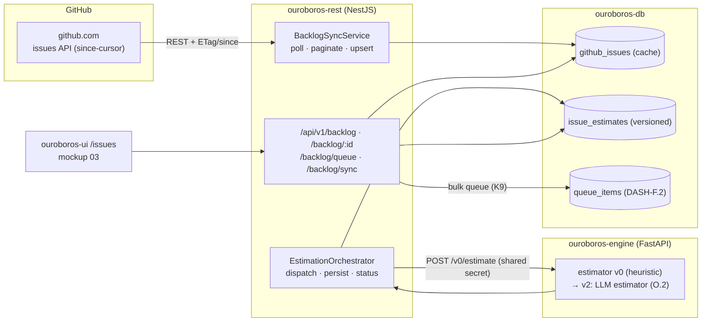
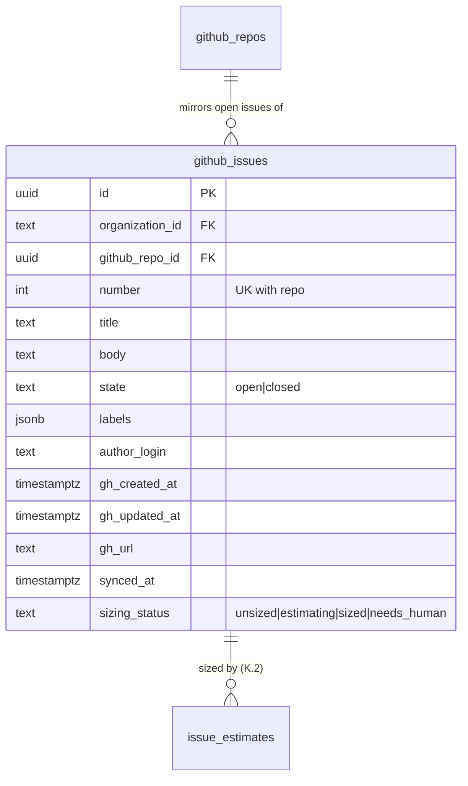
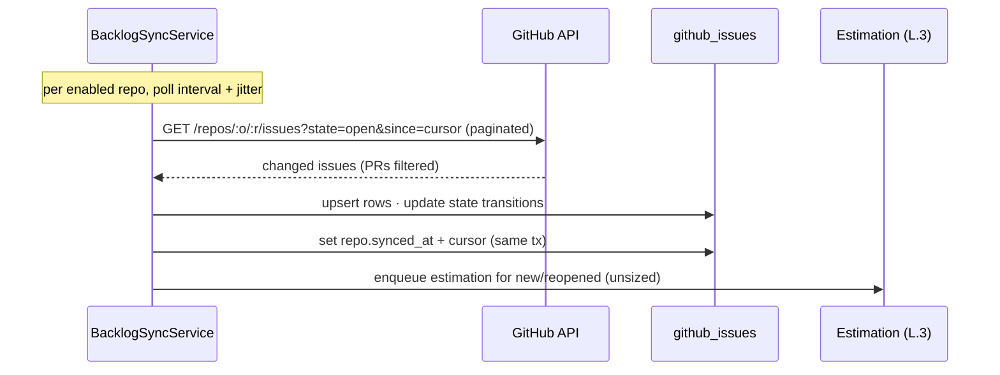
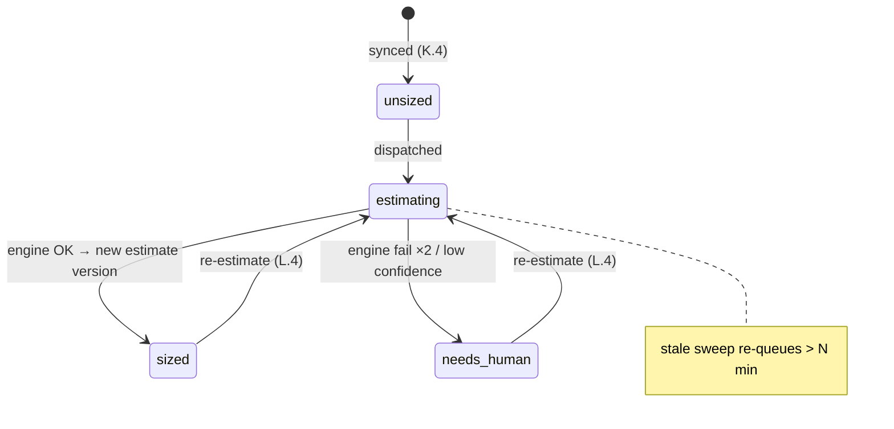
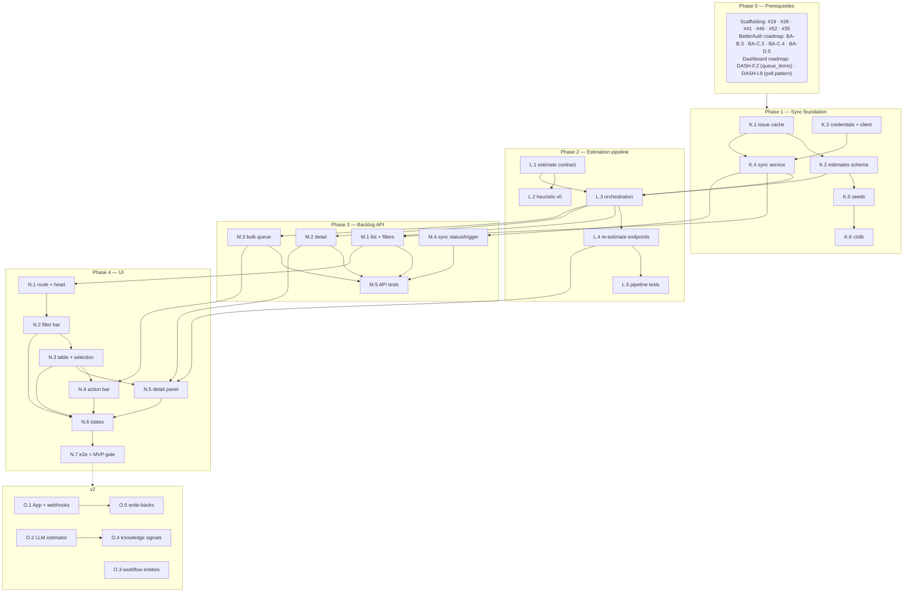

# Roadmap — Issue Intake & Sizing (Mockup 03)

## Description

> Create a roadmap that covers the features for the mockup page 03. Refer to the page
> so that issues can reference the mockup file when creating the UI/UX design of the
> pages.

## Context & Existing Work (duplicate-avoidance survey)

Surveyed 2026-08-08.

**Design source of truth for every UI ticket in this roadmap:**
[`docs/mockups/03-issues.html`](mockups/03-issues.html) (with
`docs/mockups/assets/ouroboros.css`) — Issue Intake & Sizing. Its anatomy:

- **Page head** — eyebrow `Issue Intake`, headline `42 open issues. 38 already
  sized.`, subline "Ouroboros watches the GitHub backlog and continuously estimates
  effort, risk, and routing for every open issue — before you ever ask it to work."
  Actions: **Re-estimate all** (ghost), **Queue 3 selected ⟳** (primary, reflects
  selection count).
- **Filter bar** (`.filter-bar` card) — repository select, label chip-set with
  toggled state (`bug ✓` in `chip-on` treatment; `enhancement`, `tech-debt`,
  `good-first-issue`), state select (`Open ▾`), sort select (`Sort: estimated
  effort ▾`), free-text search (`Filter by title, #number, or label…`).
- **Backlog table** (`c-8` card, title `BACKLOG · AS OUROBOROS SEES IT`, freshness
  tag `synced 40s ago`) — columns: checkbox (`.ckbox`, selected rows get
  `tr.sel` accent-glow treatment) · Issue (mono `#485` + title + label tags) ·
  Effort (chip XS–XL + mono confidence `92%`; unsized rows show `sizing…`) ·
  Suggested workflow (tag: `standard-fix`, `feature-loop`, `docs-loop`,
  `deps-refresh`) · Routed model (pill: `claude-fable-5`, `cursor/composer-2`,
  `copilot/gpt-5-codex`, `ollama/qwen3-coder`…) · Status pill (`sized` neutral,
  `queued` run, `estimating…` warn, `needs human` err).
- **Selection action bar** (`.sel-bar`, glow-bordered card) — `3 issues selected ·
  est. 1h 10m combined autonomous work`, **Assign workflow ▾**, **Queue →
  standard-fix**.
- **Issue detail side panel** (`c-4` card, title `ISSUE DETAIL`, status pill) —
  mono meta line (`#485 · opened 2d ago by field-support`), title, tag row
  (incl. `priority-high`), *body excerpt* (italic, left-ruled blockquote of the
  GitHub issue body), divider, **AI Work Breakdown**: estimated files touched
  (mono file-list), breakdown rows (Est. tokens `~180k`, Est. cycle time
  `12–18 min`, Effort chip + conf), **regression risk** meter (ok/22%) with a
  one-line rationale, suggested workflow + routed model, actions (**Queue for
  loop**, **Re-estimate**, **Open on GitHub ↗**), and the collapsible
  **estimation trace** (`sized by claude-sonnet-5 · 2m ago · 41k tokens`,
  `signals: 3 similar closed issues · driver map · HIL test index`).

**The two hard truths this roadmap must respect:**

1. **The backlog is GitHub's.** This page mirrors real GitHub issues for the
   enabled repos (scaffolding #22 / BA-B.3 enablement tables). That requires a
   GitHub API integration that does not exist yet — sync is the foundation epic.
2. **Sizing is an AI capability, and the AI stack doesn't exist yet.** Model
   routing (mockup 06), providers (mockup 07), and knowledge signals (mockup 14)
   are unbuilt. MVP therefore ships the full **estimation pipeline** (request →
   engine → persisted estimate → UI) with a clearly-labeled **heuristic v0
   estimator** in the engine; the LLM-backed estimator is v2 (O.2), slotting into
   the same contract. Same honesty rule as the dashboard roadmap: seeded parity
   for design review, truthful states everywhere else — `estimating…` and
   `needs human` are real pipeline states, never decoration.

**Overlapping open issues / prior roadmaps and their disposition:**

| Existing work | Disposition under this roadmap |
|---|---|
| Scaffolding #22 `ouroboros-db: [3.4] GitHub org & repo enablement` (amended by BA-B.3) | **Consumed** — sync targets only enabled repos. No change. |
| Scaffolding #35 `[4.9] Engine gateway` / #52 `[6.3] Internal API contract v0` | ✅ **Extended** by L.1 (#105) — `POST /v0/estimate` is the first real engine capability beyond echo, mirrored in the gateway's typed client as `EngineClient.estimate()`. L.3 is the caller that puts it to work. |
| Scaffolding #49 placeholder routes (v2) | **Superseded for `/issues`** — this roadmap builds the real screen; other placeholders unchanged. |
| Dashboard roadmap (`ROADMAP_MOCKUP_02_DASHBOARD.md`, validation gate) — `queue_items` (DASH-F.2), queue endpoint (DASH-G.4), run read-model (DASH-F.1) | **Consumed & extended** — M.3's queue action writes `queue_items`; queue write semantics (deliberately out of DASH-G.4's scope) land **here**. The dashboard's "⟳ Pull next issue" button gains a real target. |
| BetterAuth roadmap (validation gate) — tenant context (BA-C.3), enabled repos (BA-C.4), auth client (BA-D.1) | **Prerequisite** — all backlog queries are org-scoped; the filter bar's repo select reads enabled repos. |
| Mockup 04 (workflows), 06 (routing), 07 (providers), 14 (knowledge) | **Not covered here** — workflow tags and model ids stay opaque strings (decisions K5/K6); trace "signals" are v2 (O.4). |

Epic letters continue the sequence (A–E BetterAuth, F–J dashboard): this roadmap uses
**K–O**.

### Decisions proposed by this roadmap (validate before issue creation)

| # | Decision | Rationale |
|---|----------|-----------|
| K1 | **MVP GitHub access = per-org token** (fine-grained PAT / installation token pasted into workspace settings, encrypted at rest); **GitHub App + webhooks = v2** (O.1) | A token gets the page real data now at 5k req/h; the App install flow (15k req/h, instant webhooks) is real product surface that deserves its own pass. The sync layer hides the difference. |
| K2 | **Sync = incremental polling with a per-repo `since` cursor** (GitHub `updated_at`), full pagination on first import, freshness surfaced honestly ("synced 40s ago") | GitHub's documented incremental pattern; webhooks (O.1) later reduce latency without changing the read-model. |
| K3 | **`github_issues` is a cache, GitHub is the source of truth** — no local edits to issue content, ever; actions that change GitHub (none in MVP) go through the API | Prevents the mirror from becoming a fork. "Open on GitHub ↗" is the escape hatch the panel promises. |
| K4 | **Estimates are versioned rows** (`issue_estimates`, latest-wins) with sizing status on the issue row: `unsized → estimating → sized \| needs_human` | Re-estimation is first-class in the mockup (three separate affordances); versioning gives the trace history and makes O.2's estimator swap auditable. |
| K5 | **Workflow tags remain opaque strings from a fixed built-in set** (`standard-fix`, `feature-loop`, `docs-loop`, `deps-refresh`) until mockup 04's roadmap | The "Assign workflow ▾" menu offers the fixed set; no workflow entities are invented here. |
| K6 | **Routed model = opaque string produced by the estimator** (consistent with dashboard decision F8) | Model routing is mockup 06 territory; the heuristic v0 routes from a config-listed default map. |
| K7 | **Estimation runs through the engine** (REST orchestrates, engine computes) even while the estimator is heuristic | The pipeline shape — queue estimation, engine computes, REST persists, UI polls — is the product architecture; v0 heuristic vs v2 LLM is an engine-internal swap. |
| K8 | **Filters/sort/search are server-side, URL-reflected** (`?repo=&labels=&state=&sort=&q=`) | Backlogs exceed a page; shareable filtered views; the filter bar is a query-string editor. |
| K9 | **Queue writes land here**: bulk queue endpoint creates `queue_items` (DASH-F.2) with assigned workflow tag and est. minutes | The dashboard deliberately shipped queue reads only; the mockup-03 actions are the write side. |
| K10 | **New label `intake`**; heuristic estimates render their provenance (trace says `heuristic-v0`, never a model name it didn't use) | Honesty in the trace is non-negotiable — a fake "sized by claude-sonnet-5" line would be lying UI. |

## Architecture Overview



## MVP Definition

The MVP is **mockup 03 as a working screen over real GitHub data with a live
estimation pipeline**. It is done when, against the compose stack:

1. Enabled repos' open issues **sync from GitHub** (initial import + incremental
   `since` polling), with freshness shown truthfully ("synced 40s ago") and a
   manual re-sync affordance.
2. `/issues` reproduces [`docs/mockups/03-issues.html`](mockups/03-issues.html)
   pixel-faithfully in **both themes**: page head with real counts, filter bar
   (repo/labels/state/sort/search, URL-reflected), backlog table with selection,
   effort+confidence, workflow tags, model pills, and all four status states.
3. Every synced issue flows through the **estimation pipeline**: `estimating…`
   while in flight, then `sized` (effort, confidence, workflow, model, breakdown,
   risk, trace) or `needs human` — produced by the engine's clearly-labeled
   heuristic v0 estimator through the real REST↔engine contract.
4. The **detail panel** renders the selected issue: GitHub body excerpt, work
   breakdown, risk meter, trace with honest provenance (`heuristic-v0`), and
   working actions (Queue for loop, Re-estimate, Open on GitHub ↗).
5. **Selection → queue** works: multi-select, combined estimate in the action
   bar, workflow assignment from the fixed set, bulk queue writing `queue_items`
   — visible on the dashboard's queue card immediately after.
6. **Re-estimate** (single + all) re-runs the pipeline, versioning estimates.
7. Seeds reproduce the mockup's demo rows for design review and e2e; a workspace
   with no enabled repos / no token shows designed guidance states.
8. Integration tests cover sync upsert/cursor logic, estimation lifecycle, filter
   queries, queue writes, and org isolation; the e2e suite gains an issues leg.

**Explicitly v2:** GitHub App + webhooks (O.1), LLM-backed estimator (O.2), real
workflow entities in the assign menu (O.3), knowledge-driven trace signals (O.4),
and issue-content mutations on GitHub (labels/comments — O.5).

## Epics

Each epic is a parent tracking issue on GitHub; every roadmap issue below is filed as
one of its sub-issues (GitHub Relationships).

| Epic | GitHub | Status | Name | Goal | Modules |
|------|:------:|:------:|------|------|---------|
| K | #94 | 🟡 Open | GitHub Backlog Sync (`ouroboros-db` + `ouroboros-rest`) | Token config, issue cache schema, incremental sync, seeds & CI | ouroboros-db, ouroboros-rest |
| L | #95 | 🟡 Open | Estimation Pipeline (`ouroboros-engine` + `ouroboros-rest`) | Estimate contract, heuristic v0, orchestration, versioned persistence | ouroboros-engine, ouroboros-rest |
| M | #96 | 🟡 Open | Backlog REST API (`ouroboros-rest`) | List/detail/filters, queue writes, sync status, tests | ouroboros-rest |
| N | #97 | 🟡 Open | Issue Intake UI (`ouroboros-ui`) | Mockup 03: filter bar, table+selection, action bar, detail panel, e2e | ouroboros-ui |
| O | #98 | 🟡 Open | Live Intake & Extended Scope (v2) | GitHub App + webhooks, LLM estimator, workflow entities, signals | all |

Issue naming: `<project>: [<epic letter>.<issue>] <title>`. Labels reuse the
existing set (`mvp`, `v2`, `rest`, `db`, `engine`, `ui`, `ci`, `design`) plus new
**`intake`** (decision K10; created during issue filing). Complexity chips:
**XS · S · M · L**.

---

## Epic K (#94) — GitHub Backlog Sync (`ouroboros-db` + `ouroboros-rest`)

| Ref | GitHub | Status | Title | Summary | Labels | Parallel | MVP | Complexity | Affected Modules |
|-----|:------:|:------:|-------|---------|--------|:--------:|:---:|:----------:|------------------|
| K.1 | #99 | 🟢 Done | ouroboros-db: [K.1] GitHub issue cache schema | `github_issues` mirror table + labels + sync cursors | mvp, intake, db | N (after #19, BA-B.3) | Y | M | ouroboros-db |
| K.2 | #100 | 🟢 Done | ouroboros-db: [K.2] Issue estimates schema | Versioned `issue_estimates` + sizing status + breakdown/trace jsonb | mvp, intake, db | N (after K.1) | Y | M | ouroboros-db |
| K.3 | #101 | 🟢 Done | ouroboros-rest: [K.3] GitHub credentials & API client | Per-org token (encrypted), Octokit client, rate-limit discipline | mvp, intake, rest | N (after #28, BA-C.3) | Y | M | ouroboros-rest |
| K.4 | #102 | 🟢 Done | ouroboros-rest: [K.4] Backlog sync service | Initial import + incremental `since` polling, upsert, freshness | mvp, intake, rest | N (after K.1, K.3) | Y | L | ouroboros-rest |
| K.5 | #103 | 🟢 Done | ouroboros-db: [K.5] Intake dev seeds — mockup-03 parity | Seeded issues/estimates reproducing the mockup's nine rows | mvp, intake, db | N (after K.2) | Y | S | ouroboros-db |
| K.6 | #104 | 🟢 Done | ouroboros-db: [K.6] Intake constraints in ci/db | Status vocabularies, cursor invariants, estimate versioning checks | mvp, intake, db, ci | N (after K.5, #24) | Y | XS | ouroboros-db, .github |

### Issue K.1 — ouroboros-db: [K.1] GitHub issue cache schema

> **GitHub issue:** #99 · **Status:** 🟢 Done · **Parent epic:** #94

> **Shipped.** [`V014__github_issue_cache.sql`](../ouroboros-db/migrations/V014__github_issue_cache.sql)
> creates `ouroboros.github_issues` with the column set below, the three filter indexes and
> its rules as named CHECK constraints, and adds `issues_synced_at` / `issues_sync_cursor`
> to `github_repos`; the assertions are a new section in
> [`tests/constraints.sql`](../ouroboros-db/tests/constraints.sql), so `ci/db` runs them
> against a database migrated from empty on every pull request. The version is `V014` —
> `V013` is #222's `tenant_keys`.
>
> **Both blockers were already met.** `#19` is the Flyway scaffold, and **BA-B.3** — the
> organization and repo tables — is `organization` (`V005`, #707) plus `github_repos`,
> which has been there since `V003` (#22) and was re-parented by `V006` (#708). This is the
> same finding DASH-F.1 (#64) made under the dashboard roadmap, and it means Epic K did not
> have to wait on the unfiled BetterAuth tail.
>
> **The cache-not-fork posture is the migration's first section** (decision **K3**), above
> the DDL rather than beside a column, because it is the thing a later reader is most
> likely to get wrong: a local table of titles, bodies and labels looks exactly like one a
> user could edit, and the first `update` that sets a title from a form turns the mirror
> into a fork. The shape is deliberately unhelpful to that — no `edited_by`, no
> `local_title`, no dirty flag — and `synced_at` records that a row is a copy taken at a
> moment rather than a document with a history. The rule is about *authorship*, not
> mutability: K.4's sync overwrites GitHub's columns on every poll, and `sizing_status` is
> the one column this product owns.
>
> **`labels` is a checked array of names, not free jsonb.** `jsonb` alone accepts `3`,
> `"bug"` and `[{"name": "bug"}]` — and GitHub's own payload *is* a list of label objects,
> so the wrong one is a single `.map()` away and the GIN index would store it happily.
> `github_issues_labels_shape` requires an array of non-empty strings, at most GitHub's own
> cap of 100, using `jsonb_path_exists` because a CHECK may not contain the subquery
> `jsonb_array_elements` would need. The index is `jsonb_ops` rather than the smaller
> `jsonb_path_ops`: both serve `@>`, only the default serves `?|` and `?&`, and an
> any-of-these-labels chip-set is the read that has not been written yet.
>
> **This migration takes an extension, which is the schema's first** — `pg_trgm`, so the
> filter bar's search box is an index scan. `V001` declined `citext` because
> `create extension` needs rights a managed PostgreSQL may withhold; that argument does not
> reach here on either half, and the header says so. There is no stored form of a title
> that makes `ilike '%watchdog%'` an index scan — a b-tree on `lower(title)` serves a
> prefix and nothing else — and `pg_trgm` has been a **trusted** extension since PostgreSQL
> 13, so any role holding `create` on the database installs it. That was verified rather
> than assumed, with a plain `login` role on the pinned `postgres:17-alpine`. It is created
> through a catalogue guard rather than `if not exists`, which is `V000`'s idiom and for
> `V000`'s reason: `if not exists` raises a NOTICE, and Flyway reports every NOTICE as a
> WARNING.
>
> **`gh_url` is constrained to `https` and a host**, which is a safety rule rather than a
> tidiness rule: the column becomes the `href` of *"Open on GitHub ↗"*, and an `href` is a
> place `javascript:` executes rather than navigates. Refusing it in the column means no
> renderer has to remember to check — and the writer is an HTTP client parsing somebody
> else's JSON. It deliberately does not check that the URL names *this* repository and
> *this* number: GitHub Enterprise Server serves the same issue from another host, and a
> mirror that refused a URL GitHub itself returned would be broken by a rename it has no
> say in.
>
> **The sync cursor lives on `github_repos`** (decision **K2**) — one value per repository
> per poll, not a property of any issue — and both columns are nullable, because nothing
> has synced yet. `github_repos_issues_cursor_after_sync` holds the watermark to *after*
> the sync that produced it, as an implication rather than a biconditional: the other
> direction is legitimate, and is what a first poll of a repository with no issues leaves
> behind. The alternative that was not taken is deriving the watermark as
> `max(gh_updated_at)`, which reads as free and is wrong exactly where it matters — a
> deleted or transferred issue leaves the maximum where it was, and a repository whose poll
> found nothing has no maximum at all.
>
> **One change outside `ouroboros-db`.** `ouroboros-rest`'s `schema.ts` mirrors the
> migrations and `db.integration-spec.ts` fails when it drifts, so the two new
> `github_repos` columns are declared there too (and in the four fixtures that build a
> `GithubRepo`). `github_issues` itself is deliberately *not* mirrored yet — nothing reads
> it until K.4, and `model_prices` set that precedent.
>
> **Not in this ticket, by the roadmap's own split:** no estimates table or `issue_estimates`
> FK (K.2, #100), no sync service and no writer of any kind (K.4, #102), no seed rows (K.5,
> #103), and no probes in `verify-constraint-probes.sh` (K.6, #104, which owns the intake
> half of `ci/db`). There is also no index on `sizing_status` — the reads that filter by it
> are workspace-scoped first, so they enter through the filter index, and the ticket that
> writes that read is the ticket that gives it one.

- **Problem Statement:** The backlog table renders GitHub issues with labels, author,
  and open-date ([`docs/mockups/03-issues.html`](mockups/03-issues.html), issue cell +
  detail panel meta line); no local representation exists.
- **Solution/Scope:** Migration (follows the dashboard series): `github_issues` —
  id, `organization_id` FK, `github_repo_id` FK (BA-B.3), `number`, `title`, `body`
  (text — the detail panel excerpts it), `state` CHECK `open|closed`, `labels` jsonb
  (name array — GitHub's label set, not ours), `author_login`, `gh_created_at`,
  `gh_updated_at`, `gh_url`, `synced_at`; unique `(github_repo_id, number)`;
  `sizing_status` CHECK `unsized|estimating|sized|needs_human` default `unsized`
  (decision K4). Sync cursor lives on `github_repos`: add `issues_synced_at`,
  `issues_sync_cursor` (the `since` watermark, decision K2). Indexes for the M.1
  filter paths (org+repo+state, labels GIN, title trigram or ILIKE-served).
- **Acceptance Criteria:**
  - Migration applies/validates cleanly; unique repo+number holds.
  - Label containment queries and title search use indexes (`EXPLAIN` verified).
  - Cache-not-fork posture documented in the migration header (decision K3).
- **Parallelism/Dependencies:** Needs #19, BA-B.3. Blocks K.2, K.4, K.5.
- **Technical Stack:** PostgreSQL 17, Flyway.
- **Epic:** K



### Issue K.2 — ouroboros-db: [K.2] Issue estimates schema

> **GitHub issue:** #100 · **Status:** 🟢 Done · **Parent epic:** #94

> **Shipped 2026-09-08.**
> [`V026__issue_estimates.sql`](../ouroboros-db/migrations/V026__issue_estimates.sql) creates
> `ouroboros.issue_estimates` with the column set below, its two jsonb grammars, its rules as
> named CHECK constraints and two triggers; the assertions are a new section in
> [`tests/constraints.sql`](../ouroboros-db/tests/constraints.sql), so `ci/db` runs them
> against a database migrated from empty on every pull request. The version is `V026` —
> `V025` is #584's `alias_revisions`. No other module changed.
>
> **The contract's drift check went live on the day this landed, and it is green.**
> [`test_estimation_contract.py`](../ouroboros-engine/tests/test_estimation_contract.py) was
> written to find the migration that creates `issue_estimates` and then assert every column
> and jsonb key it carries as data appears in it. It now finds `V026`, and every name matches
> — `effort`, `confidence`, `suggested_workflow`, `routed_model`, `breakdown` (`files`,
> `est_tokens`, `cycle_min`, `cycle_max`, `est_minutes`), `risk`, `risk_note` and `trace`
> (`estimator`, `sized_at`, `tokens_used`, `signals`) — so L.3 persists a parsed response
> without translating one.
>
> **Latest-wins needed no index, and that was measured rather than assumed.** The ticket
> offers a partial unique index on an `is_latest` flag or a covering index on
> `(github_issue_id, version desc)`; the answer is neither, because the unique key
> `(github_issue_id, version)` **read backwards is** that descending index — same tree, same
> entries, and a second copy would be maintained on every insert for a plan the planner
> already has. `constraints.sql` asserts the plan by name, asserts it contains no `Sort`, and
> asserts the lateral join the backlog table makes over a page of issues reaches *both*
> relations through an index. The flag was also rejected on its own merits: it is derived
> state a writer has to maintain, a partial unique index on it can enforce *at most one*
> latest and nothing about *at least one*, and its failure mode is an issue whose estimates
> all read `false` and whose panel says never sized. `max(version)` cannot desynchronise from
> the rows it is computed over.
>
> **Monotonic is a trigger, because unique alone is not enough.** `unique (github_issue_id,
> version)` accepts 3 and then 2 — two legal rows — and *latest wins* would then return the
> older answer, which is a wrong estimate rather than a missing one.
> `issue_estimate_version_monotonic()` refuses a version that is not above every version the
> issue already has, and the unique key underneath it is what makes that safe under
> concurrency: two writers that both computed `max + 1` cannot both commit. It **enforces
> rather than assigns** — a default would hide the one case a writer must handle. Monotonic,
> not dense: nothing counts these numbers.
>
> **Append-only, on `V024`'s posture and for one reason of its own.** `issue_estimates_no_update`
> refuses a revision from any role including the owner, there is no `updated_at` and no touch
> trigger. The reason of its own is the #435 amendment: BI.4 grades a merged loop against the
> estimate **in force when the work was queued**, and that join only means anything while a
> historical row cannot change underneath it. There is no delete counterpart, for `V022`'s
> reason — the one foreign key cascades, so a delete-refusing trigger would make removing an
> issue fail rather than protect anything.
>
> **Decision K10 is a constraint of its own, not a clause in a shape rule.**
> `issue_estimates_provenance` requires `trace->>'estimator'` to be a non-blank **string**, so
> a rejected write names the decision — and the type check is what separates *no estimator*
> from an estimator called `3`, which `->>` alone would have accepted. It is the third hop
> rather than the only one: the engine's model and the gateway's parser both require it.
>
> **Every bound is the estimation contract's, and never stricter.** A column that refused a
> legal estimate would leave L.3 holding an answer it cannot write and an issue stuck
> mid-pipeline for a reason no log would explain — so `est_minutes` runs to the contract's
> 100 000 even though `queue_items.est_minutes` (`V009`) refuses zero and anything past a
> fortnight, and reconciling the two is M.3's (#112), at the statement that copies one into
> the other. Two things the contract does not say are not added either: `est_minutes` is not
> confined to the cycle range (the ticket's own example is a 12–18 minute cycle beside 23
> estimated minutes), and `est_tokens` — what the *work* will cost — is unrelated to
> `trace.tokens_used`, what *sizing* cost.
>
> **Both jsonb documents are closed grammars**, CHECKed by
> `ouroboros.issue_estimate_breakdown_valid()` and `…_trace_valid()`: exactly five keys and
> exactly four, every count whole and non-negative by regex (jsonb calls `-1` and `1.5`
> numbers too), a cycle range that runs forwards, and a `sized_at` that is an ISO-8601 instant
> **with an offset** — by regex rather than by cast, because `timestamptz` input reads the
> session's `TimeZone` and is not immutable. Underneath them,
> `ouroboros.jsonb_string_list_valid()` and `ouroboros.jsonb_whole_number_valid()` are the two
> shapes both documents share, written once rather than six times.
>
> **Decisions K5 and K6 are structural here too, and M1 is not breached.**
> `suggested_workflow` and `routed_model` get `runs.workflow_tag` and `runs.model`'s treatment
> under **F8** — bounded, non-blank, no vocabulary and no foreign key. M1 says
> `model_aliases.model_id` is the only column where a raw provider model string may live; that
> is a rule about **configuration**, and this column is a **record of a resolution that already
> happened**, which must survive the rename or retirement of what it names.
>
> **The row's tenancy is its issue's.** There is no `organization_id`, as `provider_models`
> (`V017`) has none: an estimate has no meaning apart from an issue, every read enters through
> one, and a second parent would buy a shorter join in exchange for a
> `repo_in_organization`-style trigger that can be got wrong. The workspace cascade reaches it
> through four hops, and a test asserts exactly that.
>
> **What is deliberately not here:** no `draft_id` — that is AK.1's (#272) column and its
> migration, per decision **N3**, and the header names it so a later reader does not read its
> absence as an oversight; no writer of any kind (L.3, #107); no seed rows (K.5, #103); and no
> mutations in `verify-constraint-probes.sh`, which is K.6's (#104) intake half of `ci/db`.
> There is also no constraint tying an estimate's existence to `github_issues.sizing_status`:
> a CHECK cannot see another row, and the pairing is not even one-directional — an issue that
> is `needs_human` because its confidence came in under L.2's floor of 70 has an estimate
> *and* is waiting for a person.

- **Problem Statement:** Everything the mockup calls "AI Work Breakdown" — effort,
  confidence, workflow, model, files, tokens, cycle range, risk, trace — needs a
  home that survives re-estimation (three re-estimate affordances in the mockup).
- **Solution/Scope:** `issue_estimates`: id, `github_issue_id` FK, `version` (unique
  with issue, monotonic), `effort` CHECK `xs|s|m|l|xl`, `confidence` (0–100),
  `suggested_workflow` (opaque tag, decision K5), `routed_model` (opaque, K6),
  `breakdown` jsonb (`files[]`, `est_tokens`, `cycle_min`/`cycle_max` minutes,
  `est_minutes` — the queue estimate M.3/K9 consumes), `risk` CHECK
  `low|medium|high` + `risk_note`, `trace` jsonb (`estimator` — e.g.
  `heuristic-v0`, `sized_at`, `tokens_used`, `signals[]`), `created_at`. A partial
  unique index or `is_latest` flag makes latest-lookup cheap; `sizing_status` on
  the issue row transitions with the pipeline (L.3).
- **Acceptance Criteria:**
  - Two estimates for one issue coexist; latest-wins lookup is a single indexed
    query.
  - Effort/risk CHECKs match the mockup vocabularies; confidence bounds enforced.
  - Trace `estimator` field is non-null (decision K10 — provenance is mandatory).
- **Parallelism/Dependencies:** Needs K.1. Blocks L.3, K.5.
- **Technical Stack:** PostgreSQL 17, Flyway.
- **Epic:** K

```
issue_estimates(issue, version↑) ─ latest ─▶ effort M · conf 92 · standard-fix · claude-fable-5
   breakdown: {files[3], est_tokens:180k, cycle:[12,18], est_minutes:23}
   risk: low "Isolated to the I²C driver path…" · trace: {estimator, signals[]}
```

### Issue K.3 — ouroboros-rest: [K.3] GitHub credentials & API client

> **GitHub issue:** #101 · **Status:** 🟢 Done · **Parent epic:** #94

- **Problem Statement:** Sync needs authenticated GitHub access per organization —
  no credential store or client exists (scaffolding #22 was deliberately data-only).
- **Solution/Scope:** Per decision K1: `github_credentials` columns on the org
  settings surface (token encrypted at rest with a key from config — encryption
  helper reusable later), settings endpoint to set/rotate/clear the token
  (owner/admin), an Octokit-based client wrapper: auth injection, pagination
  helper, rate-limit awareness (read `x-ratelimit-remaining`, back off before
  exhaustion), conditional requests (ETag) where useful, error taxonomy
  (unauthorized / not-found / rate-limited) mapped to the #31 envelope. Token
  never returned by any API after write; masked display (`ghp_…abcd`).
- **Acceptance Criteria:**
  - Token round-trips: set → sync works; clear → sync pauses with a designed
    status; rotate → old token unused.
  - Token absent from all API responses and logs (tested).
  - Rate-limit backoff verified with a mocked 403/`retry-after` response.
- **Parallelism/Dependencies:** Needs #28, BA-C.3. Blocks K.4. Sources: GitHub REST
  docs (rate limits, `since`), Octokit.
- **Technical Stack:** Octokit (@octokit/rest), NestJS, AES-GCM encryption at rest.
- **Epic:** K

```
settings ─▶ store token (encrypted, masked) ─▶ GitHubClient
  ├─ paginate(iterator) · since-cursor · ETag
  └─ rate guard: remaining < floor ─▶ defer next poll (honest "sync paused" state)
```

### Issue K.4 — ouroboros-rest: [K.4] Backlog sync service

> **GitHub issue:** #102 · **Status:** 🟢 Done · **Parent epic:** #94

- **Problem Statement:** The page's headline claim — "Ouroboros watches the GitHub
  backlog" — is this service. It must import enabled repos' open issues, keep them
  fresh, and report freshness truthfully (`synced 40s ago`).
- **Solution/Scope:** `BacklogSyncService`: initial import (paginate all open
  issues; PRs filtered out — the issues API returns both) per enabled repo, then
  scheduled incremental polls (`since` = stored cursor, decision K2) upserting
  changed rows and closing state transitions; new/reopened issues enter
  `unsized` and are handed to the estimation pipeline (L.3) automatically —
  "continuously estimates… before you ever ask" is this handoff; per-repo
  `synced_at` + cursor updates in the same transaction; poll scheduling via Nest
  scheduler with jitter; sync disabled (with status) when no token (K.3) or no
  enabled repos. Manual trigger endpoint lands in M.4.
- **Acceptance Criteria:**
  - Cold import of a live repo lands all open issues (PRs excluded); second poll
    with no changes is O(1) requests and touches no rows.
  - Editing an issue on GitHub appears locally within one poll interval; closing
    it flips `state` (and it leaves the default backlog view).
  - New issue auto-enters the estimation pipeline (verified with L.3).
  - Freshness value is the real `synced_at`, never fabricated.
- **Parallelism/Dependencies:** Needs K.1, K.3. Blocks L.3, M.1, M.4.
- **Technical Stack:** NestJS scheduler, Octokit, Kysely transactions.
- **Epic:** K



### Issue K.5 — ouroboros-db: [K.5] Intake dev seeds — mockup-03 parity

> **GitHub issue:** #103 · **Status:** 🟢 Done · **Parent epic:** #94

> **Shipped.** [`R__dev_seed_intake.sql`](../ouroboros-db/migrations/R__dev_seed_intake.sql)
> is the sixth development seed: the nine mockup-03 issues `#483`–`#491` in
> `acme-robotics / helios-firmware` and the nine `issue_estimates` that size eight of them,
> behind the same `${ouro_dev_seed}` guard every other seed carries. The head counts
> compute to **"9 open issues. 7 already sized."**; `#485` is the detail panel field for
> field — four labels, `field-support`, the body it excerpts, three files, `~180k` tokens,
> a `12–18 min` cycle and `low` risk with the mockup's sentence; `#483` is `estimating`
> with no estimate row and `#490` is `needs_human` at XL/61%. `kensuenobu` gets **zero
> rows**, which is N.6's empty state as data rather than as a screenshot.
> [`tests/seed.sql`](../ouroboros-db/tests/seed.sql) asserts all of it and
> [`tests/seed.test.sh`](../ouroboros-db/tests/seed.test.sh) asserts the file's structure,
> both extended for a sixth seed rather than forked.
>
> **Two things the mockup shows are deliberately not in the database**, because seeding
> them would make a screen render a claim no component produced. `trace.estimator` is
> `heuristic-v0` on every row (decision **K10**) with `tokens_used` `0` and `signals` `[]`
> — the mockup's *"sized by claude-sonnet-5 · 2m ago · 41k tokens"* over three retrieved
> signals describes a knowledge layer that does not exist yet, and those lines are **O.4**'s
> to supply. And the head's *42 open / 38 sized* stays design copy: the counts are
> aggregates M.1 computes, so nine rows honestly count to nine.
>
> **The two mockups disagree about which issues are queued, and the seed follows the rows
> that exist.** `queued` is not a `sizing_status` — it is a presentation over
> `queue_items`, and DASH-F.5 (#68) owns all twelve of those. Six are in this repository
> (`#485`, `#486`, `#488`, `#490`, `#491`, `#494`), so the seeded backlog presents `#485`,
> `#490` and `#491` as queued where mockup 03 draws `#486`, `#488` and `#489` — mockup 02's
> queue card puts `#485` at position 1 while mockup 03's table calls it `sized`, and one
> database cannot make both true. A thirteenth queue row written from the intake seed would
> break *Queued issues* and its `est. 9h 40m` to decorate the backlog, so the ticket's
> *cross-referenced, not duplicated* rule is followed literally and the disagreement is
> written down in the migration's header for **M.1 (#110)** and **N.2 (#118)** to read
> before assuming their query is wrong. Where an issue *is* queued in this repository, its
> estimate's `est_minutes` is the queue row's number, because M.3 (#112) copies one into
> the other.
>
> **Three smaller decisions**, each of them the fixture covering a path it would otherwise
> leave dark — DASH-F.5's argument for its one unestimated queue item. `#487` carries **two
> estimate versions**, an `s`/55% superseded by the mockup's `l`/71%, because against a
> fixture where every issue has exactly one estimate a latest-wins join, a `min(version)`
> join and an arbitrary-row join all pass. `#488`'s breakdown names **no files**, which
> `V026` makes valid on purpose and which the panel has to render. And `#490` is opened by
> **`renovate[bot]`**, so the rule `V028` had just widened is exercised by the data every
> UI test reads rather than only by `tests/constraints.sql`.
>
> **`#483` gets no estimate row**, which is what `estimating` means: `issue_estimates` has
> no partial row, since `effort` and `confidence` are `not null` and an estimate is one
> answer rather than four fields that arrive separately. The mockup draws `standard-fix`
> and `claude-sonnet-5` in that row's workflow and model cells beside a `sizing…` effort;
> those two cells are not storable, and N.2 renders a mid-flight row from what exists.
>
> **The estimates carry a second guard, and it is load-bearing.**
> `issue_estimate_version_monotonic` (`V026`) is a BEFORE INSERT trigger, so it raises
> *before* `on conflict do nothing` can skip a row — a second application of the file would
> fail the migration outright rather than write nothing. Both estimate statements therefore
> carry a `not exists` that is the trigger's own rule evaluated a step earlier, which is
> also what makes the seed *decline* rather than fail on a database somebody has estimated
> by hand. Verified: re-applying the file writes zero rows and raises nothing; re-applying
> it without the guard raises `issue_estimate_version_monotonic`.
>
> **The ticket's own diagram does not add up, and the acceptance criterion is what was
> built.** It reads *"6 sized · 1 estimating · 1 needs_human · (3 queued via DASH seeds)"*,
> which is eleven rows for nine issues however the parenthesis is read. The criterion below
> it — *"9 open issues. 7 already sized."* — is unambiguous and agrees with the mockup: the
> three issues the mockup presents as *queued* are `sized` in the database and queued in
> `queue_items`, so the sized count is seven and the nine partition as **7 sized · 1
> estimating · 1 needs_human**. Noted here rather than silently reconciled, because a
> reader who counts the seeded rows against that diagram should find the arithmetic
> explained instead of assuming the seed is short two rows.

- **Problem Statement:** Design review and e2e need the exact mockup rows without a
  live GitHub token; the seeds are the fixture (same rule as dashboard F.5).
- **Solution/Scope:** Extend the dev seed (dev-only guard): for `acme-robotics /
  helios-firmware` — the nine mockup issues (`#483`–`#491`: titles, label sets,
  authors incl. `field-support`, the `#485` body text used by the detail panel)
  with estimates matching the mockup exactly (`#485` M/92%/standard-fix/
  claude-fable-5 + breakdown files/tokens/cycle/risk-low/trace, `#483` mid-
  `estimating`, `#490` XL/61% `needs_human`, `#486/#488/#489` queued — their
  queue_items already exist in DASH-F.5, cross-referenced not duplicated);
  trace estimator strings say `heuristic-v0` (decision K10) with the mockup's
  signal lines reserved for O.4 seeds. Personal org: zero rows (empty-state
  fixture).
- **Acceptance Criteria:**
  - M.1 list over seeds reproduces the mockup table ordering under
    `sort=effort`; detail panel for `#485` matches the mockup content.
  - Head counts compute to "9 open issues. 7 already sized." *(seed truth —
    the mockup's 42/38 needs no fabrication)*.
  - Idempotent; consistent with DASH-F.5 queue seeds (no double-queue rows).
- **Parallelism/Dependencies:** Needs K.2 (+DASH-F.5 coordination). Feeds M/N
  tests, e2e.
- **Technical Stack:** Flyway repeatable migration, SQL.
- **Epic:** K

```
seeds: 9 issues (#483–#491) ─▶ 6 sized · 1 estimating · 1 needs_human · (3 queued via DASH seeds)
#485 carries full breakdown + body text ─▶ detail-panel fixture
```

### Issue K.6 — ouroboros-db: [K.6] Intake constraints in ci/db

> **GitHub issue:** #104 · **Status:** 🟢 Done · **Parent epic:** #94

> **Shipped 2026-09-09. Epic K is complete.**
> Seven mutations in
> [`tests/verify-constraint-probes.sh`](../ouroboros-db/tests/verify-constraint-probes.sh),
> run by `ci/db`'s *Assert those assertions are load-bearing* step, with their names held
> against the migrations by
> [`tests/constraint-probes.test.sh`](../ouroboros-db/tests/constraint-probes.test.sh)
> (111 → 132 checks). The probe run goes 63 → **77 checks**; no migration changed, and
> `ouroboros-db` carries no version to bump — the schema is versioned by its migrations.
>
> **The scope bullets were already written, and that is the finding.** Every probe this
> ticket asks for was in
> [`tests/constraints.sql`](../ouroboros-db/tests/constraints.sql) before it started: K.1
> (#99) wrote the `sizing_status` vocabulary, the `(github_repo_id, number)` key and the
> five `labels` shape probes into its own section, and K.2 (#100) wrote version
> monotonicity, the unique key beneath it and decision **K10**'s provenance rule into
> its. Both tickets said so at the time and both named the gap they were leaving — *"the
> intake assertions have no such proof yet"* — so what K.6 owed was never a second copy of
> those assertions. It was the half `ci/db` could not answer about itself: a green
> `constraints.sql` proves the schema satisfies its assertions, and a file that asserted
> nothing at all would be exactly as green. This ticket is the *"red when any invariant is
> dropped"* criterion, mechanised for every run rather than spot-verified once.
>
> **Two of the seven are not plain drops, and both say why in place.**
> `issue_estimates_version_monotonic` is a **trigger** — V026 enforces ascent in plpgsql
> because a CHECK cannot see the other rows of its own table — so it is dropped with `drop
> trigger`, and once it is gone the version it refused is refused by the unique key
> underneath instead. That is the weaker rule and the whole reason the trigger exists:
> unique alone accepts 3 then 2, and *latest wins* then returns the estimate that was
> replaced. So that probe's marker is `must_reject`'s *rejected by … rather than …*
> message, as the bundled-price probe's already was. And
> `issue_estimates_issue_version_key` is caught by the **catalogue** assertion rather than
> a behavioural one, because no single session can watch that key refuse anything — the
> race it exists for is two writers that both computed `max(version) + 1`.
>
> **The cursor invariant is here even though the scope list does not name it.** The
> problem statement does — *"status vocabularies, estimate versioning and cursor
> invariants are trusted by the UI"* — and it is the one intake rule whose loss nothing
> else would report: a watermark that precedes the sync that produced it is a `since` the
> poller hands GitHub for a repository it has never read, and what comes back is a backlog
> with a hole in it.
>
> **Runtime: 3.7s added**, measured on the `postgres:17-alpine` image `ci/db` uses — two
> runs each of 20.8s with the intake block against 17.1s without. The criterion is *< 5s*.
> Each mutation is one more copy of a template database and one more run of a suite that
> takes about half a second.
>
> **What is deferred:** the seeded rows K.5 (#103) added are still a population these
> probes do not run against. `ci/db` points `constraints.sql` at a database migrated from
> empty and `registry-invariants.sql` at the seeded one; an intake suite for the seeded
> database would be the same argument CG.5 made, and it belongs to whichever ticket first
> needs an intake read asserted against real rows rather than fixtures — M.1 (#110) is the
> candidate.

- **Problem Statement:** Status vocabularies, estimate versioning, and cursor
  invariants are UI-trusted contracts needing PR-time enforcement.
- **Solution/Scope:** Extend #24's `tests/constraints.sql`: sizing-status CHECK
  probe, estimate version monotonicity + latest uniqueness, repo+number
  uniqueness, non-null trace estimator, labels-jsonb shape probe.
- **Acceptance Criteria:** Green on current schema; red when any invariant drops
  (spot-verified once).
- **Parallelism/Dependencies:** Needs K.5, #24.
- **Technical Stack:** GitHub Actions, SQL.
- **Epic:** K

```
ci/db: migrate ─▶ validate ─▶ constraints.sql (+K probes) ─▶ ✓/✗
```

---

## Epic L (#95) — Estimation Pipeline (`ouroboros-engine` + `ouroboros-rest`)

| Ref | GitHub | Status | Title | Summary | Labels | Parallel | MVP | Complexity | Affected Modules |
|-----|:------:|:------:|-------|---------|--------|:--------:|:---:|:----------:|------------------|
| L.1 | #105 | 🟢 Done | ouroboros-engine: [L.1] Estimation contract (`/v0/estimate`) | Request/response schema for sizing an issue; extends the #52 contract | mvp, intake, engine, rest | N (after #52) | Y | M | ouroboros-engine, ouroboros-rest |
| L.2 | #106 | 🟢 Done | ouroboros-engine: [L.2] Heuristic estimator v0 | Deterministic sizing from labels/title/body signals, honest provenance | mvp, intake, engine | N (after L.1) | Y | M | ouroboros-engine |
| L.3 | #107 | 🟢 Done | ouroboros-rest: [L.3] Estimation orchestration & persistence | Dispatch, status transitions, versioned persistence, failure → needs_human | mvp, intake, rest | N (after L.1, K.2, K.4) | Y | L | ouroboros-rest |
| L.4 | #108 | 🟢 Done | ouroboros-rest: [L.4] Re-estimation endpoints (single & all) | `POST /backlog/:id/estimate`, `POST /backlog/estimate-all` with guards | mvp, intake, rest | N (after L.3) | Y | S | ouroboros-rest |
| L.5 | #109 | 🟢 Done | ouroboros-rest: [L.5] Pipeline integration tests | Lifecycle, failure paths, concurrency, provenance assertions | mvp, intake, rest, ci | N (after L.4) | Y | M | ouroboros-rest |

### Issue L.1 — ouroboros-engine: [L.1] Estimation contract (`/v0/estimate`)

> **GitHub issue:** #105 · **Status:** 🟢 Done · **Parent epic:** #95

> **Shipped 2026-09-08. Epic L is open.**
> [`POST /v0/estimate`](../ouroboros-engine/src/ouroboros_engine/api/estimate.py) over
> [`estimation/contract.py`](../ouroboros-engine/src/ouroboros_engine/estimation/contract.py)
> (the shapes) and
> [`estimation/estimator.py`](../ouroboros-engine/src/ouroboros_engine/estimation/estimator.py)
> (the seam), described in
> [`openapi.yaml`](../ouroboros-engine/openapi.yaml) and mirrored on the other side of the
> gateway as `EngineClient.estimate()`
> ([`engine.contract.ts`](../ouroboros-rest/src/modules/engine/engine.contract.ts)).
> `ouroboros-engine` 0.5.1, `ouroboros-rest` 0.30.18; **109 new tests** in the engine's
> suite (322 → 431) and **30** in the gateway's (69 → 99).
>
> **The response is one version of K.2's row, and a test holds that mapping as data.**
> [`test_estimation_contract.py`](../ouroboros-engine/tests/test_estimation_contract.py)
> lists every column and jsonb key of `issue_estimates` beside the response field that
> carries it, and fails on a drift in either direction — a field added that no column
> stores, a column the estimator owns that nothing answers with. Five columns are mapped to
> nothing on purpose: `id`, `github_issue_id`, `version`, `created_at` and `trace.sized_at`
> are the row writer's, because an estimator does not know which row it was called for,
> cannot know which version its answer will become, and must not own the clock — a timestamp
> in a response body is one two services can disagree about.
>
> **That table was K.2's specification until K.2 landed, and the join was already written.**
> The test looks for the migration that creates `issue_estimates` and asserts every name it
> was written against appears in it; before one existed it asserted the contract against the
> table instead, so a migration renaming `est_minutes` would have been a red build on the day
> it landed rather than a discovery L.3 made. **K.2 (#100) landed on 2026-09-08 and the
> comparison is live and green** — `V026` names every one of them: `effort`, `confidence`,
> `suggested_workflow`, `routed_model`, `breakdown` (`files`, `est_tokens`, `cycle_min`,
> `cycle_max`, `est_minutes`), `risk`, `risk_note`, `trace` (`estimator`, `sized_at`,
> `tokens_used`, `signals`) — and the two CHECK vocabularies, `xs|s|m|l|xl` and
> `low|medium|high`, which the contract enumerates on both sides of the boundary.
>
> **Decisions K5 and K6 are structural rather than remembered.** The request's `context`
> block carries the workflow tags and the model defaults that exist, the engine holds neither
> list, and `honours_context` refuses an answer naming anything outside the offer — a `500`
> and a log line rather than a value that reaches a row. That check is deliberately on the
> engine's side of the gateway: a tag that reached the caller has already been logged,
> measured and very nearly persisted by the time anyone there could reject it. A request
> offering no tags at all is a `422`, because `suggested_workflow` is required and there is
> nothing this service may put in it.
>
> **Decision K10 is enforced at the contract and not only at the column.** `trace.estimator`
> is required and non-empty in the engine's model *and* in the gateway's zod schema, one and
> two hops before the `not null` would catch it.
>
> **The estimator behind it is reached through `app.state`, not imported.** This ticket
> shipped with a `ContractStub` that said in every field that nothing had estimated the
> issue, so the gateway leg, the specification and L.3's persistence were buildable before
> any estimator existed. **L.2 (#106) replaced it on 2026-09-08** — `create_app` now
> installs `HeuristicEstimator` and the stub is gone, which is the swap this seam was built
> for: one line in the factory, no change to the route, the contract or `ouroboros-rest`.
>
> **The 202 escalation is specified as an extension rather than promised as a response.**
> `x-async-escalation` on the operation names the status, the accepted body, the
> `Retry-After` header and the poll route (`/v0/estimate/{estimation_id}`), and the route
> module holds the same four values as constants with a test asserting the two agree — so it
> is checked rather than merely written. It is *not* a documented `202` under `responses`,
> because this build cannot answer one and a `responses` entry is a promise a caller may hold
> it to. The gateway's client is written to match: a `202` fails to parse and becomes a
> `502`, which is the honest answer to a response it does not yet know how to follow, and the
> spec beside it pins where the poll support has to arrive.
>
> **No REST route was added, deliberately.** `EngineClient.estimate()` is a client method
> with no controller beside `engine/status`: the callers are L.3's orchestration and L.4's
> re-estimation endpoints, and a pass-through added before them would be the generic proxy
> the gateway's whole design refuses.

- **Problem Statement:** REST↔engine has only `echo` (#52). Sizing needs a real
  versioned contract carrying enough issue context in and a full estimate out —
  the shape both the heuristic v0 and the future LLM estimator (O.2) honor.
- **Solution/Scope:** `POST /v0/estimate` (shared-secret path per #51): request
  `{issue: {number, title, body, labels[], repo}, context: {workflow_tags[],
  model_defaults}}`; response `{effort, confidence, suggested_workflow,
  routed_model, breakdown: {files[], est_tokens, cycle_min, cycle_max,
  est_minutes}, risk, risk_note, trace: {estimator, tokens_used, signals[]}}` —
  mirroring K.2 exactly; pydantic v2 schemas; error shape per #52; OpenAPI
  committed + drift-checked; async-ready (202/poll noted for O.2's slower LLM
  path, synchronous acceptable for v0).
- **Acceptance Criteria:**
  - Contract round-trips through the #35 gateway pattern; spec committed.
  - Response validates against K.2's column/jsonb shapes 1:1 (contract test).
  - The 202 escalation path is documented even though v0 answers synchronously.
- **Parallelism/Dependencies:** Needs #52. Blocks L.2, L.3.
- **Technical Stack:** FastAPI, pydantic v2.
- **Epic:** L

```
REST ── POST /v0/estimate {issue, context} ──▶ engine
     ◀─ {effort, confidence, workflow, model, breakdown, risk, trace} ──
        (v0: sync · O.2: 202 + poll — same schema)
```

### Issue L.2 — ouroboros-engine: [L.2] Heuristic estimator v0

> **GitHub issue:** #106 · **Status:** 🟢 Done · **Parent epic:** #95

> **Shipped 2026-09-08. Epic L is open.**
>
> `heuristic-v0` is installed and `POST /v0/estimate` answers with a real estimate for every
> issue. `ouroboros-engine` 0.5.2; 288 new tests in the engine's suite, and the seam L.1 left
> is exactly the line that changed — `create_app` installs `HeuristicEstimator` instead of
> the `ContractStub`, which is now gone. Nothing in the route, the contract or
> `ouroboros-rest` moved.
>
> **Two modules, because a heuristic that cannot be argued with is a heuristic nobody
> maintains.** `estimation/signals.py` is the rules — a table and a threshold each, seventeen
> labels, sixteen title words, four body bands, three checklist bands — and
> `estimation/heuristic.py` is the arithmetic over them plus the tables that turn an effort
> into a breakdown and a risk. So a disagreement about whether `tech-debt` really means `m`
> is a one-line diff and a fixture row, not a rewrite. Every rule may **abstain**, and the
> silence is the input confidence is computed from; only the body-length rule always votes,
> which is what guarantees a denominator.
>
> **Effort is the strongest signal, and the hedging goes in confidence.** A heuristic that
> cannot see the code should not size work *below* its loudest signal, so aggregation is a
> maximum rather than a mean — and how much the rules agreed, how far apart they were, and
> what was missing (no description, no label the tables know) is reported separately as a
> number L.3 can act on. The ceiling is 98 rather than 100 on purpose: a rule engine reading
> a label and a character count is never certain, and a round 100 beside a model's estimate
> would be claiming it was.
>
> **`needs_human` is a real outcome, and the floor is published rather than hidden.** The
> contract has no `needs_human` field because the transition is L.3's state machine, so the
> engine exports `NEEDS_HUMAN_CONFIDENCE_FLOOR` (70) as the value the tables are calibrated
> against, `needs_human()` applies it, and an estimate under it carries a `needs-human:` line
> in its own trace. The fixture table has rows on both sides, and the tests that assert the
> table covers every effort, every workflow tag and both sides of the floor fail if a row
> stops doing so.
>
> **Deterministic, and checked three ways.** The same request produces the same bytes; two
> instances agree; and **the same labels in a different order produce the same estimate** —
> which is stronger than the ticket asks and is the one that matters, because K.4's re-sync
> reorders labels and an estimator that answered differently afterwards would version an
> estimate for an issue that had not changed. A fourth test parses both modules' imports and
> fails on `datetime`, `random`, `time`, `uuid`, `os` or `pathlib`, so "no clock, no
> randomness" stays a property rather than a paragraph.
>
> **Provenance is one constant with one reference.** `trace.estimator` is `heuristic-v0`
> unconditionally, `trace.tokens_used` is `0` because nothing was invoked, and a test offers
> the estimator a `model_defaults` map whose values are plausible provenance strings —
> including `heuristic-v0` itself — to show the answer comes out of the caller's map and the
> provenance does not. **The routing amendment's honesty constraint** (Z.4 #197, decision
> M6) is enforced in the same place: the `routed-model` signal says *resolved, not invoked*
> in those words, on every estimate. The amendment's other half is the gateway's and travels
> with L.3 — filling `model_defaults` from `POST /api/v1/routing/simulate` instead of from
> configuration changes nothing here, because the map was always the caller's.
>
> **Calibrated against the mockup, and honest about the part it will not reproduce.** Over
> the mockup's nine issues the estimator matches the design's **effort** on eight and its
> **workflow tag** on all nine; `#488` comes out `xs`/98%/`docs-loop`, the design's own
> numbers, and `#490` comes out `xl` under the floor where the design shows 61% and *needs
> human* — the two the acceptance criteria name. The design's other percentages are
> deliberately not chased: its own trace line says they came from a model that had three
> similar closed issues, a driver map and a HIL test index to read. `files[]` is empty on
> every path, and present as `[]` rather than omitted, because N.5 renders the absence and a
> missing key reads as an older schema.
>
> **The specification's example is now a worked case.** `openapi.yaml`'s response example is
> what the installed estimator really answers for the request example above it, and
> `tests/test_openapi.py` asserts the two agree — so a change to a table in `signals.py` that
> moved the answer would be a red build rather than a document that quietly stopped being
> true.

- **Problem Statement:** MVP needs real estimates without the AI stack (hard truth
  #2). A deterministic heuristic keeps the pipeline honest and the page alive —
  provided it never masquerades as a model.
- **Solution/Scope:** Rule-based estimator behind L.1: effort from signals (label
  hints like `good-first-issue`/`tech-debt`, title verbs, body length/checklist
  count), confidence from signal agreement, workflow from label→tag map
  (`docs`→`docs-loop`, `enhancement`→`feature-loop`, deps patterns→`deps-refresh`,
  default `standard-fix`), routed model resolved out of the caller's own
  `model_defaults` map (K6 — the engine holds no list; trace says *resolved*,
  never *invoked*, per the Z.4 amendment),
  breakdown with conservative ranges and `files[]` empty (v0 cannot know files —
  the UI renders its absence honestly), risk from effort+label heuristics; low-
  confidence (< threshold) returns `needs_human`; trace `estimator:
  "heuristic-v0"` with rule-name signals (decision K10). Unit-tested table of
  fixtures; deterministic (same input → same output).
- **Acceptance Criteria:**
  - Fixture table covers all efforts, all workflows, the needs-human threshold.
  - Determinism verified; provenance always `heuristic-v0`.
  - `#488`-like docs issue → XS/docs-loop; `#490`-like migration → XL/low-conf.
- **Parallelism/Dependencies:** Needs L.1. Replaced (not removed — fallback) by
  O.2.
- **Technical Stack:** Python 3.12, pytest.
- **Epic:** L

```
signals: labels · title verbs · body length ─▶ effort + confidence
label map ─▶ workflow tag · config map ─▶ routed model
conf < floor ─▶ needs_human          trace: {estimator: heuristic-v0, signals: [rules…]}
```

### Issue L.3 — ouroboros-rest: [L.3] Estimation orchestration & persistence

> **GitHub issue:** #107 · **Status:** 🟢 Done · **Parent epic:** #95

> **Shipped 2026-09-10. Epic L is open.**
>
> An issue the sync mirrors now reaches `sized` on its own. `ouroboros-rest` 0.31.0;
> `src/modules/estimation/` is six files and 95 new unit tests beside a 16-case integration
> suite that drives the whole leg — a listening engine, the real `POST /v0/estimate` parse,
> and V026's two document grammars — because every acceptance criterion this ticket has is a
> claim about what PostgreSQL holds afterwards.
>
> **K.4's seam was exactly the right size.** `estimation.intake.ts` said *"L.3 replaces the
> binding in `backlog-sync.module.ts` and changes nothing else"*, and that is the whole of the
> change to that module: one `useExisting` in place of one `useClass`, and the placeholder that
> logged is deleted. The sync still hands over new and reopened issues after its transaction
> commits and still knows nothing about what happens next — which means K.4's fourth acceptance
> criterion, *"a new issue automatically enters the estimation pipeline"*, marked *(verified
> together with #107)*, is now verified.
>
> **The Z.4 amendment's remaining half landed with it** (#197, decision **M6**). `model_defaults`
> is filled from `ResolutionService` — the same method `POST /api/v1/routing/simulate` serves —
> rather than from configuration, and the value is the resolved chain's **first kept hop**: the
> model an executor would actually try, not hop 1 blindly, because a dropped hop carries its
> explanation and naming one would point an estimate at a model that is not going to run. Two
> keys are offered, `default` → `implement` and `docs` → `docs`, which is what the engine's own
> per-tag lookup falls through. Nothing in `ouroboros-engine` changed: the map was always the
> caller's.
>
> **Two failure decisions are worth reading before the code.** First: **a failed estimate
> persists no row.** `issue_estimates` has no nullable effort and no *unknown*, so a row
> invented for an engine that could not answer would put an effort chip on the backlog table
> for an issue nothing sized, and a `trace.estimator` on a record of nothing — decision **K10**
> read backwards. The issue goes to `needs_human` and the failure is named in the service log,
> with the repository, the issue number, both attempts and the reason. Second: **a workspace
> whose routing resolves no model is not dispatched at all.** `routed_model` is `not null`, so
> an installation with no route genuinely has no estimate to store; its issues stay `unsized`,
> which is what they already are, rather than being burned to `needs_human` for a reason that
> has nothing to do with any of them. Seeding default routes still has no service (#205), so
> that is a real state and not a hypothetical one.
>
> **The version is guessed and the database checks it**, exactly as V026 asked for: the write
> computes `max(version) + 1` inside its transaction, and a second writer that got there first
> is a `23505` on `issue_estimates_issue_version_key` that the repository retries with a fresh
> number. No `select … for update` — locking the issue row would serialise the engine call
> behind whoever got there first and would put a lock across a network hop, which is how a
> deadlock is built rather than avoided. The integration suite drives two writes at once and
> asserts both landed, on versions 1 and 2.
>
> **Three loops now, and this one knocks on nothing outside the deployment.** The recovery
> sweep is one indexed query for rows that have been `estimating` longer than
> `OURO_ESTIMATION_STALE_SECONDS`, jittered like the other two, and it exists for `SIGKILL`
> rather than for bugs: every path out of the orchestrator already writes a terminal status,
> including the one where the write itself failed. It is also the one place a misconfiguration
> is reported — a sweep whose every row was already in flight says so, because that means the
> threshold is set below how long an estimate legitimately takes.
>
> **Four new variables**, each with a floor and a ceiling and none with an off value:
> `OURO_ESTIMATION_CONCURRENCY` (4), `OURO_ESTIMATION_CONFIDENCE_FLOOR` (70 — the engine's own
> published number, restated here because the policy is this service's),
> `OURO_ESTIMATION_STALE_SECONDS` (600) and `OURO_ESTIMATION_SWEEP_INTERVAL_SECONDS` (120).
> `issue_estimates` is the twenty-ninth table in `db/schema.ts`, mirrored a release late for
> `github_issues`' reason: K.2 landed the table with no writer, and this is the first thing
> here that writes one.
>
> **What is still ahead of it.** L.4 (#108) is the re-estimation endpoints, and the orchestrator
> is exported with the two methods that ticket needs — `enqueue()` and `estimating()`, the
> latter being the `409` a double-fire answers with, read from the queue rather than from a
> column that may have moved. The workflow tags are a constant in `estimation.context.ts`
> because workflow entities are mockup 04's and no table declares one yet; when that catalog
> lands it replaces the constant and nothing else in the module changes. The planning roadmap's
> amendment (decision **N9**) is satisfied by the same export: AL.5's nightly backlog-health job
> (#281) and the generator's *Auto-size with estimator* toggle (#280) both enqueue **through
> this orchestrator**, so there is one sizer and one queue rather than two.

- **Problem Statement:** Someone must move issues through
  `unsized → estimating → sized|needs_human` — dispatching to the engine,
  persisting versioned results, and surviving failures without stuck states.
- **Solution/Scope:** `EstimationOrchestrator`: in-process work queue (bounded
  concurrency) fed by K.4 (new/reopened) and L.4 (manual); per issue — set
  `estimating`, call the engine client (#35 pattern) with L.1 payload, persist
  a new `issue_estimates` version + flip status on success; engine error/timeout
  → retry once → `needs_human` with a trace noting the failure (never stuck in
  `estimating`; a sweep job re-queues rows stale > N minutes); status
  transitions are the UI's polling signal (M.1 exposes them).
- **Acceptance Criteria:**
  - New synced issue reaches `sized` end-to-end in compose without manual action.
  - Engine down: issues land in `needs_human` with honest trace; recovery sweep
    re-processes stale `estimating` rows.
  - Concurrent estimate of the same issue produces sequential versions, no
    deadlock (harness-verified).
- **Parallelism/Dependencies:** Needs L.1, K.2, K.4. Blocks L.4, M.1 (status
  data).
- **Technical Stack:** NestJS, engine client, Kysely.
- **Epic:** L



### Issue L.4 — ouroboros-rest: [L.4] Re-estimation endpoints (single & all)

> **GitHub issue:** #108 · **Status:** 🟢 Done · **Parent epic:** #95

> **Shipped 2026-09-10. Epic L has one issue left.**
>
> The estimation pipeline has external triggers: `POST /api/v1/backlog/{id}/estimate` (member+)
> and `POST /api/v1/backlog/estimate-all` (admin+), in
> [`ouroboros-rest/src/modules/estimation/`](../ouroboros-rest/src/modules/estimation/) —
> six new files, 66 unit tests across six new suites — plus cases added to the repository's
> and the module's — and twelve integration cases added to L.3's suite.
> `ouroboros-rest` 0.31.2, a patch: the contract gained two operations and two schemas and
> changed none.
>
> **They landed in `estimation/` rather than in `backlog/`**, which is where the path says they
> are. What they *do* is estimation — everything they touch is that module's queue, claim and
> limiter — and what they are *about* is an issue in the backlog, which is where a client looks
> for them; `AuditModule` serves `GET /api/v1/providers/audit` under `ProviderConnectionsModule`'s
> prefix on exactly that argument. Unlike that pair this one carries **no ordering rule**: all
> four paths under `/backlog` are distinguished before any parameter is reached.
>
> **The row is claimed before the work is queued, and that is the ticket's one design
> correction.** L.3's orchestrator claims when the work *starts*, which may be several estimates
> later — so an endpoint that only queued would answer `status: "estimating"` while a client
> re-reading the issue still saw `sized`, and its double-fire `409` would come from one process's
> memory rather than from a column. Claiming at the boundary makes the `202` true when it is sent
> and the refusal a fact any replica can read. The orchestrator's own claim is unconditional and
> idempotent, so doing it twice costs one `UPDATE`, and a process that dies in between leaves a
> row the recovery sweep already exists to find.
>
> **The fan-out's scope and claim are one statement.** `update … where organization_id = $1 and
> sizing_status != 'estimating' returning id` *is* the *"touches only non-`estimating` rows"*
> criterion: two administrators pressing together cannot claim the same issue twice, and the
> count it returns is a fact rather than an estimate of one. A second press finds nothing to take
> and is a `409` — `202 {enqueued: 0}` would report *accepted* for a request that started
> nothing — while a workspace that mirrors **no** issues answers `202` with zeros, because
> *empty* and *busy* are different states and N.1's dialog should be able to say which.
>
> **`{id}` is `github_issues.id`, and the issue's own diagram is where the confusion would come
> from.** It writes `POST /backlog/485/estimate`, where `485` is the issue the mockup draws
> rather than a path segment this service could accept: `github_issues` is unique on
> `(github_repo_id, number)`, so a workspace watching two repositories has two issue `#485`s and
> a number would name neither. A path that is not a uuid is a `422` before a statement is issued,
> and `estimation.dto.spec.ts` holds that case by name.
>
> **The rate limit is a `429` where M.4's re-sync guard (#113) is a `409`, and the difference is
> real rather than a matter of taste.** That guard protects a *shared background loop* the caller
> does not own and refuses somebody who has clicked nothing; this one counts what *this
> workspace* asked for and becomes a `202` by waiting exactly as long as
> `details.retryAfterSeconds` says. Thirty a minute, sliding, per workspace — the quota is the
> workspace's rather than any caller's, so three members share one window. **Every request that
> reaches the operation counts, including the ones refused `409`**, because the hammering caller
> the criterion names is *mostly* collecting conflicts: their second click lands on an issue
> their first one moved into `estimating`.
>
> **Every acceptance criterion is asserted where only that level can see it.** *A new version
> (v+1)* is over the wire against a migrated database and a listening engine — the estimate the
> press produced lands as `v2` beside `v1` rather than over it. So are the role gates, which no
> unit spec can see because none of them goes through the router that reads `@Roles()`, and the
> cross-org `404` against a real row in a second workspace. L.5 (#109) keeps the pipeline's own
> matrix; what this added is the leg that proves the buttons are wired to it.
>
> **What is deferred, and to whom.** N.1 (#115) and N.5 (#119) are the presses: the head's
> *Re-estimate all* has a confirmation contract to render — the dialog's N comes from M.1's
> count, and the answer says how many it actually took — and the panel's *Re-estimate* has a
> `409` carrying the pill it should redraw. Nothing here reserves a budget: full accounting is
> the provider roadmap's (mockup 07), and this counter is deliberately the *simple* one the
> ticket asked for.

- **Problem Statement:** The mockup offers re-estimation in three places (panel
  button, head "Re-estimate all", implicit on stale data); the pipeline needs
  guarded triggers.
- **Solution/Scope:** `POST /api/v1/backlog/:id/estimate` (member+) and
  `POST /api/v1/backlog/estimate-all` (admin+ — it can be expensive; confirmation
  contract documented) enqueueing via L.3; idempotent while already `estimating`
  (409 with current status); rate-limited per org (simple counter — full
  budgets are provider-roadmap territory).
- **Acceptance Criteria:** Single re-estimate versions the estimate; estimate-all
  touches only non-`estimating` rows; double-fire while running → 409; role
  gates verified.
- **Parallelism/Dependencies:** Needs L.3. Blocks N.5/N.1 actions.
- **Technical Stack:** NestJS.
- **Epic:** L

```
panel [Re-estimate] ─▶ POST /backlog/485/estimate ─▶ estimating → sized (v+1)
head [Re-estimate all] ─▶ POST /backlog/estimate-all (admin) ─▶ fan-out via L.3 queue
```

### Issue L.5 — ouroboros-rest: [L.5] Pipeline integration tests

> **GitHub issue:** #109 · **Status:** 🟢 Done · **Parent epic:** #95

> **Shipped 2026-09-10, the same day as L.4, M.1, M.2, M.3 and M.4 — and it closes Epic L.** The
> contract (L.1), the estimator (L.2), the pipeline (L.3), its triggers (L.4) and now its matrix.
>
> [`ouroboros-rest/src/testing/engine.stub.fixture.ts`](../ouroboros-rest/src/testing/engine.stub.fixture.ts)
> is the ticket's substance and
> [`estimation.integration-spec.ts`](../ouroboros-rest/src/modules/estimation/estimation.integration-spec.ts)
> is where it is put to work: 21 new unit cases for the stub itself and nine added to the
> pipeline suite, which is 37 where L.4 left 28. `ouroboros-rest` 0.31.6 — a patch, and the
> contract is untouched: this ticket ships no route, no schema and no line of production code.
>
> **"Contract-faithful" turned out to be the whole ticket.** The stub the pipeline had was a
> listening server that answered whatever a test typed, and that is a hole with a name: *the fake
> was free to be wrong in the same direction as the code*. A body carrying a field `/v0` does not
> publish, or missing one it requires, sailed through a suite that only ever compared it against
> itself — and the first real engine build would have failed in production against a green
> pipeline. So the stub now reads `ouroboros-engine/openapi.yaml`, the same document
> `engine.contract.spec.ts` reads and the one the engine serves verbatim rather than generates,
> and holds itself to it **in both directions**: `Estimate` on the way out, `Error` for a
> failure, `EstimateRequest` on the way in. A test that means to answer off-contract says so;
> one that did not gets a `500` and a line in `violations`, which the suite asserts empty in
> `afterEach` — once, for every case at the same time.
>
> **The acceptance criterion is a mechanism rather than a habit.** *The stub validates its own
> responses against the committed L.1 schema* is checked before a socket exists:
> `startEngineStub()` validates the body it is about to serve and **refuses to start** when it no
> longer satisfies the document. Add a required field to `Estimate` and the pipeline suite does
> not fail twenty assertions — it fails to come up, naming the field. The request half is the
> mirror image and catches the failure this boundary actually has: `estimateRequestBody` is the
> only place `camelCase` becomes `snake_case`, and a key that stopped being translated is a `422`
> here with the field named.
>
> **What the new matrix block adds is the statements no single ticket could own.** L.3 asserted
> provenance on the happy path, because that is the row L.3 wrote. The criterion is *every
> persisted estimate*, and the only honest way to hold a pipeline to that is to drive every path
> that writes one — a first sizing, a re-estimate, an answer under the confidence floor, and a row
> the recovery sweep picked up — and then read `issue_estimates` with **no `where` clause**, in
> the assertion and again as a `count(*)` the server answers. The same argument gives the
> failure log its own case: `issue_estimates` deliberately holds no row for a failure, so the log
> *is* the trace the ticket asks to be honest, and a pipeline that failed silently would satisfy
> every other assertion in the file. Concurrency gets the two shapes a person can produce — two
> presses arriving together on one issue, which must leave one estimate rather than two, and a
> five-issue fan-out against a four-deep pipeline — beside a four-way race on one row where L.3
> had a two-way one.
>
> **The two deletions were performed, not promised.** *Removing the stale sweep turns tests red;
> removing the retry turns tests red — verified once, deliberately* is the one criterion that is
> not a test, and the results are recorded in the suite's own header rather than left as a claim:
> neutering `sweep()` reddens **five** cases, and reducing `MAX_ENGINE_ATTEMPTS` to `1` reddens
> exactly **two** while leaving every recovery case green. That last clause is the one worth
> having. A suite where any deletion reddens everything cannot tell one mechanism from another,
> and a reader learns nothing from its failures. It is also why the attempt counts in that case
> are written as literals: reading `MAX_ENGINE_ATTEMPTS` into the expectation would have made the
> test agree with whatever the constant said, including the `1` it exists to catch.
>
> **Added runtime: 1.5 seconds**, against a budget of sixty — 6.5 s where L.4 left 5.1 s, on a
> container the whole suite already shares. The stub's own 21 cases need no database and live in
> the unit suite, so a developer running `yarn test` on save finds out there that a contract
> changed rather than twenty seconds into a container start.
>
> **What this unblocks.** Nothing was waiting on it — L.5 is the epic's proof rather than its
> prerequisite — but M.5 (#114) inherits the stub, and O.2 (#123) inherits the thing that
> matters: when the LLM estimator replaces `heuristic-v0` behind the same contract, the pipeline's
> suite is already written against the *document* rather than against the rule engine's answers.

- **Problem Statement:** Lifecycle transitions, failure fallbacks, and version
  monotonicity are concurrency-sensitive — exactly what the Testcontainers
  harness exists for.
- **Solution/Scope:** Extend the harness with a stubbed engine (contract-faithful
  fake per L.1): happy path, engine-down → needs_human → recovery, stale-sweep,
  concurrent re-estimates, provenance non-null, estimate-all scope, role gates.
- **Acceptance Criteria:** Green in `ci/rest`; removing the stale sweep or the
  retry turns tests red; ≤ 60s added runtime.
- **Parallelism/Dependencies:** Needs L.4 (extends #37 patterns).
- **Technical Stack:** Jest, Supertest, Testcontainers, engine stub.
- **Epic:** L

```
harness + fake engine ─▶ lifecycle ✓ · failure→needs_human ✓ · sweep ✓ · versions ✓ · roles ✓
```

---

## Epic M (#96) — Backlog REST API (`ouroboros-rest`)

| Ref | GitHub | Status | Title | Summary | Labels | Parallel | MVP | Complexity | Affected Modules |
|-----|:------:|:------:|-------|---------|--------|:--------:|:---:|:----------:|------------------|
| M.1 | #110 | 🟢 Done | ouroboros-rest: [M.1] Backlog list endpoint with filters | Org-scoped list: repo/labels/state/sort/search, paging, head counts | mvp, intake, rest | N (after K.4, L.3) | Y | M | ouroboros-rest |
| M.2 | #111 | 🟢 Done | ouroboros-rest: [M.2] Issue detail endpoint | Full issue + latest estimate + trace for the side panel | mvp, intake, rest | N (after L.3) | Y | S | ouroboros-rest |
| M.3 | #112 | 🟢 Done | ouroboros-rest: [M.3] Bulk queue action | Selection → `queue_items` with workflow tag + combined estimate | mvp, intake, rest | N (after L.3, DASH-F.2) | Y | M | ouroboros-rest |
| M.4 | #113 | 🟢 Done | ouroboros-rest: [M.4] Sync status & manual re-sync | Freshness data + `POST /backlog/sync` trigger with guards | mvp, intake, rest | N (after K.4) | Y | S | ouroboros-rest |
| M.5 | #114 | 🟢 Done | ouroboros-rest: [M.5] Backlog API integration tests | Filter matrix, queue writes, isolation, sync trigger | mvp, intake, rest, ci | N (after M.1–M.4) | Y | M | ouroboros-rest |

### Issue M.1 — ouroboros-rest: [M.1] Backlog list endpoint with filters

> **GitHub issue:** #110 · **Status:** 🟢 Done · **Parent epic:** #96

> **Shipped 2026-09-10, the same day as M.4 and L.4.** Epic M has two tickets left.
>
> [`ouroboros-rest/src/modules/backlog/listing.*`](../ouroboros-rest/src/modules/backlog/) is
> `GET /api/v1/backlog` — six files beside M.4's seven, 88 new unit tests and a 45-case
> integration suite over mockup 03's own nine rows. `ouroboros-rest` 0.31.3 — a patch, because
> the contract gained one operation and four schemas and changed none.
>
> **A second controller under the same prefix**, which is what `backlog.module.ts` said it was
> leaving a name for: one controller is about the *sync* and one is about the *backlog*, and only
> the second grows filters. The listing reads `github_issues` and `issue_estimates` through a
> repository of this module's own rather than through `BacklogSyncModule` or `EstimationModule` —
> those two own *writers*, a poll and a versioned insert, and a screen's read has no business
> entering through either.
>
> **The page head does not move when the filter bar does**, and that is the ticket's one design
> decision that the wording left open. `meta.openCount` and `meta.sizedCount` are scoped by the
> workspace and by `?repo=` and by nothing else, because mockup 03 puts them *above* the
> `.filter-bar` card: the head says how much work is in the backlog and the table says which of it
> you are looking at. Counts that moved as chips were toggled would make *"38 already sized"* a
> statement about the filter, and `state=closed` would leave the head reading *"0 open issues"*
> over a full table. `total` beside them is the filtered count, so a client has both numbers. The
> same argument settles `labelFacets`, and there it is load-bearing rather than tidy: narrowing
> the facets by the chips already on would leave only the labels that co-occur with `bug`, so
> selecting a first chip would delete most of the set it was selected from and a second could
> never be chosen.
>
> **`meta.syncedAt` is M.4's number, lifted rather than re-derived** — exactly the handoff that
> ticket wrote down. A second `max(github_issues.synced_at)` here would have compiled, passed
> every assertion about content, and answered a different question: that column moves when a row
> is *written*, and the tag is about when a poll *ran*.
>
> **`q`'s label half matches a name rather than a substring, and the reason is the plan.** One
> disjunct no index can answer makes the *whole* search a sequential scan, and
> `jsonb_array_elements_text(labels) ilike '%…%'` is a per-row subquery nothing can serve;
> `labels ? 'watchdog'` is the operator V014 chose `jsonb_ops` for. A label name is a short token
> out of the set `labelFacets` just handed the client, so the substring form buys very little and
> costs the query its index.
>
> **The plans are asserted against the statements the service compiles, not against SQL retyped in
> a test.** `listing.integration-spec.ts` builds each read through the recording driver
> `listing.repository.spec.ts` uses, then `EXPLAIN`s that exact statement against a workspace
> holding nine thousand issues — so a plan assertion cannot drift from the query it is about. At
> that volume the repository-scoped listing, the head's counts, the facets and a `#485` search all
> enter through `github_issues_organization_repo_state_idx`, and the chip set enters through the
> GIN index. The one combination PostgreSQL declines to index there is the whole-workspace text
> search: a bitmap over two GIN indexes has a startup cost nine thousand rows do not repay, so it
> reads that workspace's own issues and filters them — the right plan at nine thousand and the
> wrong one at fifty, which is why the suite also asks the question `constraints.sql`'s way, with
> sequential scans off.
>
> **The row is the table's cells and no more** — the ticket's own scope. No body, no author, no
> `gh_url`; those are M.2's, for the one issue somebody clicked rather than for every row of a
> page nobody has. Two fields are carried that no cell prints and both earn it:
> `(github_repo_id, number)` is what makes an issue unique — every repository has its own `#489` —
> so in a listing that names no `repo` the number alone does not identify a row.
>
> `src/testing/intake.fixture.ts` is `R__dev_seed_intake.sql` as a fixture, for
> `dashboard.fixture.ts`'s reason: the development seed is deliberately not applied to the
> integration database, and `truncate` would take it between tests anyway. Nine issues, nine
> estimates and `#487`'s two versions — the smallest population that can tell a latest-wins lateral
> apart from a join that takes an arbitrary row.
>
> What M.1 leaves for **N.1 (#115)**, **N.2 (#116)** and **N.3 (#117)**: the three surfaces they
> render come from one request, so a head that disagreed with its own table would have to be the
> client's doing. `labelFacets` is the chip set as data, `meta` is the head and the freshness tag,
> and `sizingStatus` and `estimate` are deliberately separate answers — `#490` is `needs_human`
> *with* an estimate and `#483` is `estimating` *without* one, which is the pair that stops either
> being derived from the other.
>
> And for **M.5 (#114)**: the filter matrix this ticket's own suite covers is the listing's;
> what M.5 adds beside it is the queue writes and the cross-endpoint agreement, over a fixture
> that now exists.
>
> *(Two corrections to the scope below, both made deliberately and both narrower than they look.
> The paging parameter is `limit`/`offset` rather than the `&page=` written there: this API has one
> pagination convention (#31) and five endpoints already speak it, `page` is recoverable from the
> two at any time, and two dialects in one API are not. And `q` over a **label** is a label name in
> full rather than a substring of one, for the index reason above — the chip set is where a name
> comes from, and the title half is still a substring.)*

- **Problem Statement:** The filter bar and table are a server query
  (decision K8); the page head's counts ("42 open issues. 38 already sized.")
  come from the same source.
- **Solution/Scope:** `GET /api/v1/backlog?repo=&labels=&state=&sort=&q=&page=`
  under tenant context: label AND-filtering (GIN), state default `open`, sorts
  (`effort` — chip order with unsized last, `confidence`, `updated`, `number`),
  `q` over title/`#number`/label; response rows = issue + latest-estimate
  summary + sizing status (the table's exact needs); `meta: {openCount,
  sizedCount, syncedAt}` for head + freshness tag; label facet list for the
  chip-set (distinct labels in scope). OpenAPI documented.
- **Acceptance Criteria:**
  - Seeded queries reproduce the mockup table under `sort=effort`; every filter
    combination indexed (no seq scans on the hot path at seed×1000 volume).
  - `q="#485"` finds exactly one; counts match seeds.
  - Cross-org isolation verified.
- **Parallelism/Dependencies:** Needs K.4, L.3. Blocks N.2, N.3.
- **Technical Stack:** NestJS, Kysely, GIN/trigram indexes.
- **Epic:** M

```
?repo=helios-firmware&labels=bug&state=open&sort=effort&q=watchdog
  ─▶ rows[{issue, effort+conf, workflow, model, status}] + meta{42, 38, syncedAt} + labelFacets[]
```

### Issue M.2 — ouroboros-rest: [M.2] Issue detail endpoint

> **GitHub issue:** #111 · **Status:** 🟢 Done · **Parent epic:** #96

> **Shipped 2026-09-10, the same day as M.4, L.4 and M.1.** Epic M has M.3 (#112) and its
> integration suite M.5 (#114) left.
>
> [`ouroboros-rest/src/modules/backlog/detail.*`](../ouroboros-rest/src/modules/backlog/) is
> `GET /api/v1/backlog/{id}` — five files beside M.1's six, 55 new unit tests and a 19-case
> integration suite over mockup 03's own rows. `ouroboros-rest` 0.31.4 — a patch, because the
> contract gained one operation and six schemas and changed none.
>
> **This ticket and M.1 are two halves of one decision, and M.1's header already wrote it down**:
> a listing row is *"the table's cells and no more"* because the body, the author and the GitHub
> URL are the panel's, and fetching them for every row would make the list pay for a panel most
> rows never open. This pays for it once, for the issue somebody clicked. The panel's issue is
> `BacklogRow` **minus its summary estimate, plus the four fields the panel draws** — an extension
> rather than a restatement, so a field cannot be spelled two ways and a panel head cannot
> disagree with the row it was opened from.
>
> **The estimate and the history come from the same rows**, which is M.1's argument about the page
> head one shape smaller. One statement reads every version of the issue; the estimate in force is
> the highest and the history is all of them, oldest first. Two reads — one for the latest and one
> for the list — would eventually answer a trace naming version 3 over a history that ends at 2,
> because a re-estimation landed between them. It costs one small `jsonb` column per superseded
> version, and no more than that: `trace` has to be read for every version anyway, since that is
> where each history entry's `estimator` lives.
>
> **Latest-wins is computed rather than taken from the statement's order.** Decision **K4** is
> stated once, in `detail.resources.ts`, so a reversed `order by` would break the *history* and not
> silently publish the superseded estimate. The seeded `#487` — two versions whose every visible
> field differs — is the fixture that tells the two readings apart.
>
> **Both statements carry `organization_id`, and the estimates one reaches it through a join**
> because `issue_estimates` has no such column of its own: an issue is its whole tenancy. That is
> deliberately not left to the issue read having found a row first — the two run concurrently, so
> there is no *first*, and a statement whose safety depends on another statement's result is safe
> only while the call order stays what it is today. A cross-workspace id is `404` with the
> caller's own id echoed back, never `403`.
>
> **The refusal is L.4's, not a second definition of one code.** `issue_not_found` already means
> exactly this on `POST /backlog/{id}/estimate`, with the same status, the same `details.issueId`
> and the same argument about `403`; two definitions would be two messages a client renders for one
> condition, drifting on the day one of them is reworded.
>
> **This is the first path under `/backlog` that is a bare parameter**, which turns the order
> `backlog.module.ts` lists its controllers in into a routing rule rather than a preference:
> Express matches in registration order, so `BacklogDetailController` ahead of `BacklogController`
> would turn every `GET /backlog/sync-status` into a request for an issue whose id is the word
> *sync-status*. The controller holding the literal segments is listed first, and
> `detail.integration-spec.ts` asserts the consequence over a real router rather than over the
> list — which is what keeps the guarantee when somebody sorts it.
>
> **Two additions to the ticket's diagram, and one deliberate omission.** The diagram writes
> `trace{estimator, tokensUsed, signals[]}`, and `sizedAt` is published beside them because it is
> the trace line's *2m ago* and it is already in the stored document; `estimate.version` is
> published because it is what lets a client say which history entry it is looking at without
> inferring it from the list's order. The omission is `ghUpdatedAt`: the panel has nowhere to print
> one, and M.1 already refused a timestamp for the same reason.
>
> **`N.5` (#119) is what this unblocks** — and it inherits the no-estimate state as a shape rather
> than as a rule to remember, because an unsized issue answers `estimate: null` and `history: []`
> with every other field still there to draw.

- **Problem Statement:** The side panel needs everything about one issue: GitHub
  content for the excerpt, the full latest estimate, and the trace.
- **Solution/Scope:** `GET /api/v1/backlog/:id`: issue fields (body for the
  excerpt — client truncates, author, opened-ago, gh_url for "Open on GitHub ↗"),
  latest estimate in full (breakdown files/tokens/cycle, risk + note, trace with
  provenance + signals), estimate history summary (versions, for a future
  history view — cheap to include). 404-not-403 across orgs.
- **Acceptance Criteria:** Seeded `#485` returns the mockup panel's every field;
  unsized issue returns issue-only shape the panel can render (N.5's no-estimate
  state).
- **Parallelism/Dependencies:** Needs L.3. Blocks N.5.
- **Technical Stack:** NestJS, Kysely.
- **Epic:** M

```
GET /backlog/:id ─▶ {issue{body, author, gh_url}, estimate{breakdown, risk, trace}, history[versions]}
```

### Issue M.3 — ouroboros-rest: [M.3] Bulk queue action

> **GitHub issue:** #112 · **Status:** 🟢 Done · **Parent epic:** #96

> **Shipped 2026-09-10, the same day as M.4, L.4, M.1 and M.2.** Epic M has its integration suite
> M.5 (#114) left, and nothing else.
>
> [`ouroboros-rest/src/modules/backlog/queue.*`](../ouroboros-rest/src/modules/backlog/) is
> `POST /api/v1/backlog/queue` — six files beside M.2's five, 88 new unit tests and a 24-case
> integration suite over mockup 03's own rows. `ouroboros-rest` 0.31.5 — a patch, because the
> contract gained one operation and two schemas and added one field to two others, and changed
> nothing.
>
> **A fourth controller under the same prefix, and the write side `queue/queue.module.ts` asked
> for.** That module says it in as many words — *"reorder, remove and enqueue are deliberately not
> here: the queue's writes belong to the issues screen (mockup 03)"* — and it exports nothing, so
> this module reaches `queue_items` through a repository of its own exactly as the listing reaches
> `github_issues` through one. It is this module's first *write* to a table it does not own, which
> is the one V009 said it was waiting for. Registration order is not a question here: `queue` is a
> literal segment and `GET /backlog/{id}` is a different method, so M.2's routing rule does not
> reach this route.
>
> **All-or-nothing, and the OpenAPI description says so.** The ticket asked for the decision to be
> *stated* rather than merely implemented, and the reason is worth keeping: a partly-applied bulk
> queue is far worse to reason about than a rejected one — the person pressed *Queue 3 selected*
> and would otherwise be left guessing which of the three took. Every check runs against one read
> of the selection and the inserts are one multi-row statement inside one transaction.
> `queue.integration-spec.ts` proves it the only way it can be proved: by re-parenting a second
> repository onto another workspace's GitHub organisation — the one hole V009's header documents,
> where the shared `repo_in_organization` trigger refuses the next row written against a repo
> while leaving the issues already mirrored under it in place — so the third row of three is
> refused after the first two are written, and neither survives.
>
> **The refusals are ordered, and every one of them is per-issue.** `404` for ids this workspace
> cannot see, then `422` for the issues that are not `sized`, then `409` for the ones the queue
> already holds; one press is refused for one reason at a time, with every offender of *that*
> reason named. `details.issues` carries the id the caller sent, a code for what is wrong with
> that row, and its number and status where this workspace's own row supplied them — a `404`
> deliberately carries neither, because an issue this workspace cannot see has no number this
> request is entitled to learn. That is the ticket's *"so N.4 can name them instead of showing a
> generic failure"*, as a shape rather than as an intention.
>
> **`409` is asked twice, and the second time is the point.** The check before the write is what
> makes the answer per-issue; `queue_items_organization_issue_key` is what makes it *true*.
> `constraints.ts` had already written the argument down — a service that asks whether something
> is taken and then inserts it has a window between the two, and the loser of that race gets a
> `500` with PostgreSQL's own text in it — so a unique violation on that key is caught, the queue
> is re-read, and the same `409` is answered with the row that won.
>
> **The two migrations finally meet, which is what this ticket was left holding.** The intake
> roadmap said reconciling `V026`'s bounds with `V009`'s is M.3's *"at the statement that copies
> one into the other"*, and there turned out to be exactly one real mismatch: titles and workflow
> tags are bounded identically in both tables, the effort scales are the same five values (kept as
> two types on purpose, and mapped here through a `Record` that is exhaustive on both sides, so
> widening either is a compile error at the copy), and `est_minutes` is the one that differs —
> `V026` runs to 100 000 and `V009` refuses zero and anything past a fortnight. Out of range is
> written as `null`, which is that column's own word for *not estimated*; clamping would publish a
> number no estimator produced and would make the *Queued issues* stat wrong in the direction that
> looks fine.
>
> **`queued` is a field beside `sizingStatus`, not a fifth value inside it** — DASH-F.5 said it
> first, *"`queued` is not a `sizing_status`, it is a presentation over `queue_items`"*, and the
> seeded `#490` is why it matters: `needs_human` **and** queued, so one pill field would have to
> drop one of them. The listing decides it from a fifth concurrent read rather than a subquery
> threaded into M.1's three, which is what keeps the plans that ticket pinned at nine thousand
> issues; the panel decides it inside its own single-row statement, where a semi-join is one index
> probe and there is no page for a separate read to run beside. Both match on the **repository as
> well as the number**, because `queue_items` is keyed `(organization_id, issue_number)` and would
> otherwise draw the pill on a second repository's `#485` that is not queued and could not be —
> V009's own instruction, *"`github_repo_id` disambiguates them for display"*. The queue write's
> `409` uses the constraint's own key instead, and refuses a selection containing both.
>
> **Positions are appended, and the retry is V009's design being used rather than worked around.**
> `max(position) + 1` is read inside the transaction, positions are handed out down the request's
> own list so the queue reads the way the person built the selection, and a duplicate position —
> raised at `commit`, because that key is deferrable — is retried, exactly as
> `estimation.repository.ts` retries a version collision. A duplicate *issue number* is not
> retried: that is the caller's request rather than a race, and it would fail identically forever.
>
> **What the mockup's numbers become.** Queueing the three selected rows answers `estMinutes: 125`
> — 45 + 50 + 30 from the seeded estimates — where the action bar draws *est. 1h 10m*, which is
> design copy over a backlog of nine exactly as its *"42 open issues. 38 already sized."* is. The
> integration suite reads the result back through `GET /api/v1/queue` **and** the dashboard
> aggregate and requires all three to agree, which is the cross-roadmap verification against #85:
> the dashboard module exports no provider, so its stat and the queue listing's total are two
> independently-stated sentences, and this ticket adds the third — the one that wrote them.
>
> **What is deferred, and to whom.** The amendments on the ticket are recorded and not
> implemented, which is what they say of themselves: #143's trigger evaluation will fill the
> default workflow by predicate and pin a `workflow_version` on each queue item, with an explicit
> `workflow` still winning; #135 turns the fixed tag set into a real registry; #407/#415 add a
> nullable `playbook_id`. All three are compositions over this endpoint rather than changes to it.
> **N.4 (#118)** is what this unblocks, and **M.5 (#114)** inherits an endpoint with one leg
> already in the integration matrix.
>
> *(Two corrections to the scope below, both narrower than they look. "Flips issue rows to
> `queued` presentation state" is not a write: nothing on `github_issues` moves, and `queued` is
> computed against `queue_items` on every read — a stored flag would be a copy of the queue that
> goes stale the moment a row is dequeued, and DASH-F.5 had already said `queued` is a
> presentation rather than a status. And the `409` is described as "per DASH-F.2's unique
> constraint": it is, and it is also a check before the write — the constraint alone can only say
> that *something* collided, and the per-issue answer the criterion asks for needs the read.)*

- **Problem Statement:** "Queue 3 selected ⟳" / "Queue → standard-fix" / "Queue
  for loop" all write the run queue — the write side the dashboard roadmap
  deliberately left out (decision K9).
- **Solution/Scope:** `POST /api/v1/backlog/queue {issueIds[], workflow?}`
  (member+ role per BA-C.3 policy; workflow from the fixed set K5, default =
  each issue's suggested workflow): validates issues are sized (unsized/
  estimating → 422 listing offenders), creates `queue_items` (DASH-F.2) with
  effort, tag, `est_minutes` from the estimate breakdown, appended positions,
  transactionally; flips issue rows to `queued` presentation state; returns
  created items + combined `estMinutes` (the action bar's "est. 1h 10m
  combined"). Duplicate queueing → 409 per DASH-F.2's unique constraint,
  surfaced per-issue.
- **Acceptance Criteria:**
  - Queueing the three seeded selected issues yields the mockup's combined
    estimate and the items appear on the dashboard queue card (cross-roadmap
    verification).
  - Unsized inclusion → 422 with per-issue codes; double-queue → per-issue 409;
    partial success semantics documented (all-or-nothing chosen and stated).
- **Parallelism/Dependencies:** Needs L.3, DASH-F.2. Blocks N.4.
- **Technical Stack:** NestJS, Kysely transactions.
- **Epic:** M

```
POST /backlog/queue {ids:[485,484,491], workflow:"standard-fix"}
  ─▶ tx: 3 × queue_items(position++, est_minutes) ─▶ {items, estMinutes:70}  → "est. 1h 10m"
```

### Issue M.4 — ouroboros-rest: [M.4] Sync status & manual re-sync

> **GitHub issue:** #113 · **Status:** 🟢 Done · **Parent epic:** #96

> **Shipped 2026-09-10. Epic M is open, and this is its first landed ticket.**
>
> [`ouroboros-rest/src/modules/backlog/`](../ouroboros-rest/src/modules/backlog/) is the
> intake screen's first API surface: `GET /api/v1/backlog/sync-status` and
> `POST /api/v1/backlog/sync` — seven files, 85 new unit tests, and an 8-case integration suite
> that drives both routes over the whole pipeline against a migrated database.
> `ouroboros-rest` 0.31.1 — a patch, because the contract gained two operations and three
> schemas and changed none, which is AGENTS.md's rule for an addition.
>
> **A module of its own rather than a controller in `backlog-sync/`**, which is what that
> module's header asked for: it owns a background loop and exported `BacklogSyncService` and
> `BacklogSyncScheduler` *for this*. `BacklogSyncRepository` joins them as a third export, for
> the stored cursors the status reads. The division is now legible from either side —
> `backlog-sync/` owns a cycle and declares no route, `backlog/` declares routes and owns no
> cycle — and it is where M.1–M.3's controllers land.
>
> **Three sources, and none of them is a status column** — which is the first acceptance
> criterion, *pause reasons derived from actual state, never guessed*, read as a statement
> about provenance. `syncedAt` and `cursor` are columns a poll wrote; `not_configured` is
> whether `github_credentials` has a row; `no_repositories` is how many repositories are
> enabled; `rate_limited` is read from **the same `GithubRateLimiter` the client enforces**,
> which is why K.3 exported it; `unauthorized`, `not_found` and `upstream_error` come from
> `BacklogSyncService.lastCycle()`. There is deliberately no `sync_state` column: a stored
> status is a status that goes stale, and this one changes without anybody writing anything.
>
> **So the question K.4 left open — *whether a pause reason should outlive a restart* — is
> answered no.** A fresh process has attempted nothing and therefore knows nothing about
> `unauthorized`; the two reasons a reader can act on immediately are read from tables and are
> right the moment the service is up. Claiming the others from a stored value would be
> reporting a failure this process never saw, which is guessing by another name.
>
> **The freshness tag is the *oldest* poll, not the newest**, and `null` while any enabled
> repository has never been polled. The tag sits over the whole backlog — *"BACKLOG · AS
> OUROBOROS SEES IT"* — so what it may honestly claim is the freshness of the stalest thing in
> it; taking the newest would let one repository that synced a second ago speak for nine that
> failed an hour ago, which is K.4's one-transaction-per-poll rule broken one level up. Each
> repository carries its own stamp, watermark, reason and last result, so N.3 can be more
> precise than the tag when it wants to be.
>
> **The debounce is two guards, and neither is a `429`.** A cycle in flight is
> `409 backlog_sync_running`, carrying **no** `retryAfterSeconds` — how long a cycle takes is
> not knowable in advance, and `github.errors.ts`' rule is to omit rather than guess; what a
> client watches instead is `running` on the status endpoint. A cycle that started within
> thirty seconds is `409 backlog_sync_too_soon` with the wait in `details.retryAfterSeconds`.
> `429` was rejected for both: it means *you* have done this too often, and this is a guard on
> a loop the caller does not own.
>
> **The minimum interval is measured from the last cycle's start, whoever caused it, and it is
> process-wide** — which is a consequence of the shape K.4 gives us rather than a preference.
> A cycle polls **every** configured workspace, so this is *sync now* rather than *sync mine
> now*, and a per-workspace guard would let ten workspaces start ten whole-installation cycles
> inside one interval. Thirty seconds is a constant rather than a setting, for
> `RATE_LIMIT_FLOOR`'s reason: it bounds a person leaning on the tag to 120 cycles an hour
> against a budget of 5,000, and it is short enough that somebody who has just filed an issue
> is not sent back to waiting out the poll interval. **Narrowing a cycle to one workspace is
> the follow-up**, and it belongs to Q.3 (#140), where the cycle stops being one loop.
>
> **`BacklogSyncScheduler` now enforces non-overlap rather than implying it.** *"A cycle never
> overlaps itself"* was true while the timer was the only caller; with a second caller it is a
> held promise — `tick()` joins a cycle already running, and `runNow()` hands out the right to
> start in one synchronous step, which is what makes *concurrent trigger → 409* a property
> rather than a timing that usually holds.
>
> **Member+ needed a list that did not exist.** `roles.guard.ts` had `ADMINISTRATORS` and the
> guard's own default of *any member, viewer included*; `CONTRIBUTORS` (owner, admin, member)
> is the third, and the trigger is its first use. Reading the status stays every member's — a
> viewer is a role that exists to be able to look — and starting a cycle is not, because it
> spends the workspace's hourly GitHub budget.
>
> **Every acceptance criterion is asserted where only that level can see it.**
> `backlog.integration-spec.ts` drives both routes over the whole pipeline against a migrated
> database and the real Octokit: the trigger runs a cycle and `synced_at` **advances**, a
> member is allowed and a `viewer` is refused `403` on the trigger while still reading the
> status, a stranger gets the same `404` a missing workspace gets, and the immediate repeat
> comes back `409 backlog_sync_too_soon` with its hint. A role gate deleted from the controller
> leaves every unit spec in the module green, which is why it is asserted through the router.
>
> **What is deferred, and to whom.** M.5 (#114) keeps the backlog API's integration matrix,
> and it inherits a trigger that already has one leg there rather than a blank sheet. M.1
> (#110) folds this endpoint's `syncedAt` into its `meta` — one number, from one service — and
> N.3 (#117) and N.6 (#120) render the vocabulary.

- **Problem Statement:** The freshness tag needs data, and users need a manual
  nudge when they just filed an issue on GitHub.
- **Solution/Scope:** Sync status folded into M.1's `meta` plus
  `GET /api/v1/backlog/sync-status` (per-repo cursors, last result, paused
  reason — no token / rate-limited); `POST /api/v1/backlog/sync` (member+)
  triggering an immediate K.4 cycle, debounced (409 while running, min-interval
  guard against hammering the rate limit).
- **Acceptance Criteria:** Status reflects reality (pause reasons honest);
  trigger syncs then updates `syncedAt`; debounce verified.
- **Parallelism/Dependencies:** Needs K.4. Feeds N.3's freshness display.
- **Technical Stack:** NestJS.
- **Epic:** M

```
GET /sync-status ─▶ [{repo, syncedAt, cursor, state: ok|paused(no-token)|rate-limited}]
POST /sync ─▶ 202 (running) │ 409 (already running / too soon)
```

### Issue M.5 — ouroboros-rest: [M.5] Backlog API integration tests

> **GitHub issue:** #114 · **Status:** 🟢 Done · **Parent epic:** #96

> **Shipped 2026-09-11. Epic M is complete.** Two files —
> [`ouroboros-rest/src/testing/volume.fixture.ts`](../ouroboros-rest/src/testing/volume.fixture.ts)
> and
> [`ouroboros-rest/src/modules/backlog/backlog-api.integration-spec.ts`](../ouroboros-rest/src/modules/backlog/backlog-api.integration-spec.ts)
> — 54 cases, **3.8 seconds** against a sixty-second budget. `ouroboros-rest` 0.31.7, a patch:
> nothing under `src/modules` changed and the contract is untouched, which is the shape a
> test-only ticket should have.
>
> **The filter matrix and the isolation sweep are the same thirty cases, and that is the
> ticket's one real decision.** Written as two suites they are thirty cases and thirty more, and
> the second thirty are the ones that quietly stop covering the first thirty's parameters the
> day a case is added to one and not the other. So the arrangement seeds **two** workspaces with
> the *identical* generated population — the same numbers, titles and labels — and every case
> asserts the rows and their order, the two head counts, the chip set, and that **every row id
> returned belongs to the workspace that asked**. The identical seeds are what make that last
> assertion sharp: a number cannot tell one backlog's `#1005` from the other's, and a count
> cannot catch a swap. `github_issues.id` can.
>
> **The expected answer is computed, never recorded.** A matrix written the usual way — a table
> of `{query, expectedNumbers}` — is a second copy of the answer that gets filled in from a run,
> so a wrong answer becomes the expectation and a one-row change to the fixture invalidates every
> cell. `volume.fixture.ts` instead carries the population *and* a plain array-filter restatement
> of the endpoint's rules, and each case derives its expectation by running it. The two agreeing
> is worth something precisely because one is SQL over GIN indexes and a lateral and the other is
> `Array.prototype.filter`.
>
> **The population is arithmetic, and the moduli are the design.** A hundred and twenty issues in
> the primary repository and forty in a second, every attribute a function of the row's index
> through a different modulus — kind by 3, area by 4, state by 4, sizing status by 10, effort by
> 5, the two extra chips by 5 and 7. Co-prime strides are what make `?labels=bug,priority-high`
> one issue in twenty-one rather than one in three, which is the difference an AND written as an
> OR would otherwise hide. Every twentieth issue is estimated twice with **every visible field
> differing between the versions**, so a join that took an arbitrary row answers wrongly about
> half the time rather than never. Two adjacent titles carry `100% duty cycle` and `100 ms`, which
> is the only arrangement from which `q=100%` finding one and not the other means anything.
>
> **Both negative checks were performed deliberately, once, and reverted.** Dropping
> `where organization_id = …` from `BacklogListingRepository.scope` turned **32 of the 54 red**,
> including the foreign-repository cell and the neighbour's own read. Replacing the queue's one
> transaction and multi-row insert with per-row inserts on the plain connection left **20
> orphaned rows** where the rollback case expects zero, and turned that case and only that case
> red. Neither is in the tree; this note is the record that they were run.
>
> *(One correction to the scope below, and it is narrower than it looks. The ticket asks for
> "sync debounce" as one item; it is written here as **two** tests, because the endpoint has two
> guards that answer differently — `backlog_sync_running` for a cycle in flight and
> `backlog_sync_too_soon` with a countdown for the minimum interval — and a single test would
> collect whichever one the race happened to produce. The in-flight case holds GitHub's answer
> open behind a gate so that "a cycle is running" is a fact rather than a timing.)*
>
> What M.5 leaves for **N.1 (#115)**–**N.7 (#121)**: the API under the intake UI is now asserted
> at volume rather than at nine rows, so a UI ticket that finds the wrong rows on screen can
> start from its own component. `volume.fixture.ts` is also the population an e2e leg would seed
> if N.7 wants a backlog that pages.

- **Problem Statement:** The filter matrix, transactional queue writes, and
  org isolation are the regressions users would hit first.
- **Solution/Scope:** Harness suites: filter/sort/search matrix against seeded
  volume, queue action success/422/409/all-or-nothing, detail shapes (sized +
  unsized), sync trigger debounce, isolation (two orgs).
- **Acceptance Criteria:** Green in `ci/rest`; dropping the org predicate or the
  queue transaction turns tests red; ≤ 60s added.
- **Parallelism/Dependencies:** Needs M.1–M.4.
- **Technical Stack:** Jest, Supertest, Testcontainers.
- **Epic:** M

```
suites: filters ✓ · queue tx ✓ · detail ✓ · sync debounce ✓ · isolation ✓
```

---

## Epic N (#97) — Issue Intake UI (`ouroboros-ui`)

Every issue references [`docs/mockups/03-issues.html`](mockups/03-issues.html) as
the design source — layout (`c-8` main column + `c-4` panel), page-specific
treatments (`.ckbox`, `tr.sel`, `.sel-bar` glow, `.panel-body-excerpt`,
`.breakdown-row`, `.file-list`, `.trace`), and the shared design system via the
#16 tokens (both themes; the mockup is dark-only).

| Ref | GitHub | Status | Title | Summary | Labels | Parallel | MVP | Complexity | Affected Modules |
|-----|:------:|:------:|-------|---------|--------|:--------:|:---:|:----------:|------------------|
| N.1 | #115 | 🟢 Done | ouroboros-ui: [N.1] Issues route, page head & counts | `(app)/issues`: head with live counts, Re-estimate all, Queue button | mvp, intake, ui, design | N (after #41, M.1, BA-D.5) | Y | S | ouroboros-ui |
| N.2 | #116 | 🟢 Done | ouroboros-ui: [N.2] Filter bar (URL-reflected) | Repo select, label chips, state, sort, search — server-driven | mvp, intake, ui, design | N (after N.1) | Y | M | ouroboros-ui |
| N.3 | #117 | 🟢 Done | ouroboros-ui: [N.3] Backlog table with selection model | Rows, effort+conf, status pills, checkbox selection, freshness tag | mvp, intake, ui, design | N (after N.1) | Y | L | ouroboros-ui |
| N.4 | #118 | 🟢 Done | ouroboros-ui: [N.4] Selection action bar | Combined estimate, Assign workflow ▾, Queue → workflow | mvp, intake, ui, design | N (after N.3, M.3) | Y | S | ouroboros-ui |
| N.5 | #119 | 🟢 Done | ouroboros-ui: [N.5] Issue detail side panel | Excerpt, breakdown, risk meter, trace, panel actions | mvp, intake, ui, design | N (after N.3, M.2, L.4) | Y | L | ouroboros-ui |
| N.6 | #120 | 🟢 Done | ouroboros-ui: [N.6] Intake empty, loading & guidance states | No-token, no-repos, syncing, unsized, empty-filter states | mvp, intake, ui, design | N (after N.2–N.5) | Y | M | ouroboros-ui |
| N.7 | #121 | 🟡 Open | ouroboros-ui: [N.7] Issues e2e leg | Seeded parity, filter/select/queue/re-estimate flows, both themes | mvp, intake, ui, ci | N (after N.1–N.6) | Y | S | ouroboros-ui, .github |

### Issue N.1 — ouroboros-ui: [N.1] Issues route, page head & counts

> **GitHub issue:** #115 · **Status:** 🟢 Done · **Parent epic:** #97

> **Shipped 2026-09-11, and Epic N has opened.**
> [`ouroboros-ui/app/issues/`](../ouroboros-ui/app/issues/) over
> [`app/(app)/issues/page.tsx`](../ouroboros-ui/app/%28app%29/issues/page.tsx), reading
> `GET /api/v1/backlog` and pressing `POST /api/v1/backlog/estimate-all` and
> `POST /api/v1/backlog/queue` through [`app/api/backlog.ts`](../ouroboros-ui/app/api/backlog.ts).
> `ouroboros-ui` 0.52.0. The sidebar's **Issues** entry stopped being a *soon* row on the same
> commit — #41's amendment, acted on — and #49's `/issues` placeholder is retired without a deletion,
> because it was never built; the scaffolding roadmap's #49 section records it beside `/models`.
>
> **The confirmation counts mirrored issues rather than open ones, and that is the ticket's one
> correction.** The scope asks for a dialog that *"states the scope truthfully"*, and L.4's note says
> its N *"comes from M.1's count"* — but the count M.1 draws in the head is the open count, and that
> is not the set L.4 claims from: `claimBacklog` is `where organization_id = … and sizing_status !=
> 'estimating'`, with no `state` in it. A workspace holding a single closed issue would already see
> the dialog promise less than the press does. So the head reads the listing **once, as
> `state=all&limit=1`**: `meta`'s two counts are scoped by the workspace alone and do not move, and
> `total` becomes every mirrored issue. The seeds cannot tell the two apart — all nine are open —
> which is why `data.test.ts` and `reestimate-all.test.tsx` each hold a nine-open, twelve-mirrored
> case by name. The answer's half of L.4's contract is drawn as written: the press reports how many
> it actually started, and what it left alone.
>
> **Queue N selected ⟳ reads a selection store whose writer has not landed.** N.3's scope names the
> store *"exposed to N.1/N.4"*, so the dependency runs against the order the tickets land in.
> [`app/issues/selection.tsx`](../ouroboros-ui/app/issues/selection.tsx) is a provider around the
> screen, ordered as the selection was built — M.3 hands out queue positions down the list it is
> sent — and the head is its first reader. Until #117 writes to it the count is zero and the button
> is inert, naming #117: *disabled at zero* met honestly rather than with a table stub. The press is
> wired to M.3 with no workflow (*each issue under its own estimate's*), clears the selection when it
> takes, and keeps it on a refusal, because the write is all or nothing.
>
> **The role gates are drawn the way the issue words them.** *Re-estimate all* is
> **admin-visible**: an owner or an admin sees it, and a member sees no control rather than a dead
> one. *Queue* is `member+` and inert for a viewer with the role as its reason — `mayContribute`
> joined `app/api/membership.ts` beside `mayAdminister` as that rule's one home. Both gates are
> presentation; `head-actions.ts` hands the service's `403` back as the same sentences, and refuses a
> forged selection that is not a list of ids before anything is sent.
>
> **Three dashboard controls stopped telling a truth that had expired — asked, and agreed, as in
> scope.** *All issues →* ([#84](https://github.com/NobuData/ouroboros/issues/84)) said *"the
> issues screen is not built yet"*, and is now a link to `/issues`. *Manage queue →* and *+N
> queued* ([#85](https://github.com/NobuData/ouroboros/issues/85)) and the head's *⟳ Pull next
> issue* ([#80](https://github.com/NobuData/ouroboros/issues/80)) stay inert, under one sentence
> (`QUEUEING_SOON`) naming what they actually wait for — the table and the selection bar, #117 and
> #118 — rather than a placeholder #49 will now never build.
>
> Proved by **126 cases in 11 new suites** — `__tests__/issues/` and `__tests__/api/backlog.test.ts`:
> the copy against `docs/mockups/03-issues.html` itself, the seeded *"9 open issues. 7 already
> sized."*, the dialog's scope, the selection's order, both actions' refusals and the
> forged-selection guard, the role gates through the route, the stylesheet's agreements and both
> palettes — with the shell's and the dashboard's own suites updated for a live **Issues** entry. The
> module runs 4,353 cases over 229 files, green. The e2e shell leg's `LIVE_ENTRIES` gained **Issues**
> on this commit rather than one later, which is the gap AA.7 (#206) found **Models** had left.
>
> **What is deferred, and to whom.** The freshness tag, the table and the selection's writer are
> N.3's (#117); the chip set and the URL-reflected filters N.2's (#116); the combined estimate, the
> named offenders and *Queue → workflow* N.4's (#118); a skeleton for this route N.6's (#120) — there
> is no `loading.tsx` yet, deliberately; and the head counts' seeded parity against the composed stack
> N.7's (#121).

- **Problem Statement:** `/issues` currently points at a #49 placeholder; the
  page needs its frame: eyebrow, live-count headline, subline, and the two head
  actions per [`docs/mockups/03-issues.html`](mockups/03-issues.html).
- **Solution/Scope:** Replace the placeholder: head from M.1 `meta` ("`N` open
  issues. `M` already sized."), subline copy verbatim, **Re-estimate all** →
  L.4 (admin-visible, confirm dialog stating scope), **Queue N selected ⟳** →
  reflects the N.3 selection count (disabled at 0, wired to M.3); nav "soon"
  marker removed (amend #41's nav state).
- **Acceptance Criteria:** Counts live from seeds; actions gate by role and
  selection; both themes; #49's `/issues` stub retired (amendment).
- **Parallelism/Dependencies:** Needs #41, M.1, BA-D.5. Blocks N.2–N.6.
- **Technical Stack:** Next.js server components, #46 primitives.
- **Epic:** N

```
[Issue Intake]
9 open issues. 7 already sized.            [Re-estimate all] [Queue 3 selected ⟳]
"Ouroboros watches the GitHub backlog and continuously estimates…"
```

### Issue N.2 — ouroboros-ui: [N.2] Filter bar (URL-reflected)

> **GitHub issue:** #116 · **Status:** 🟢 Done · **Parent epic:** #97

> **Shipped 2026-09-11.** [`app/issues/filter.ts`](../ouroboros-ui/app/issues/filter.ts) reads
> `?repo=&labels=&state=&sort=&q=` into a filter and writes one back;
> [`app/issues/filter-bar.tsx`](../ouroboros-ui/app/issues/filter-bar.tsx) draws mockup 03's
> `.filter-bar` and writes the next address with `router.replace`; the route reads the query on the
> server and [`app/issues/data.ts`](../ouroboros-ui/app/issues/data.ts) asks M.1 with it.
> `ouroboros-ui` 0.53.0.
>
> **Every control round-trips through the address, and the default view has one address.** Defaults
> are never written — `/issues?state=open&sort=effort` is never produced — so `/issues` is the default
> view, the sidebar's link and what **Clear all** goes to. Unknown values fall back rather than fail
> (`?state=archived` is the default state), and a label the address names that the facets no longer
> carry is drawn pressed and last, so it can be pressed off: the alternative was a filter the bar
> could not show and the reader could not remove.
>
> **The head now reads twice, which is the ticket's one consequence for N.1.** M.1 scopes
> `meta.openCount` and `meta.sizedCount` by `repo` and by nothing else in the bar, so the head's
> sentence follows the repository select — the **view** read, M.1 asked with the bar's query one row
> long, which is also where `labelFacets` comes from. But L.4's claim has neither `state` nor `repo`
> in it, so the confirmation's mirrored count cannot come from a filtered `total`: the **scope** read
> — `state=all` and nothing else — stays beside it, exactly as N.1's own handoff note allowed
> (*"moves onto the table's and takes the mirrored count from a `state=all` read beside it"*). The
> enablement list is the third read, for the repository select, since a `<select>` needs its options
> before it is opened and the page arrives rendered. Each degrades alone.
>
> **The repository select is H.1's focus repository seen from the page**, kept in step both ways:
> choosing here publishes to the store the tenant chip draws from, a choice made in the chip is
> followed into the address, and on arrival the address decides — a pasted `?repo=` wins and is
> published to the header under the name the enabled list gives it; a bare `/issues` adopts the
> header's choice and says so in the address, since *"a filter preference … narrowing what a screen
> asks for"* is what the sidebar's **Issues** entry should open onto; a stored choice the workspace no
> longer enables is dropped, as the chip's own menu drops it. `focusArrival` is that table, as a
> function.
>
> **The chip is the design system's tag on a `<button aria-pressed>`**, and the mockup's `chip-on`
> treatment — accent ink, the 35% accent hairline, the accent tint — is keyed on that attribute in the
> token sheet's published accent triple, so both palettes are the sheet's and the treatment cannot
> disagree with what a screen reader is told. The mockup's chip *order* is design copy: M.1's facets
> are ascending by name, and the suite holds the set and the pressed one to the mockup rather than the
> order.
>
> **The search box waits 300 ms and every other control flushes it**, so a chip pressed mid-word asks
> for the word too; `q` is written trimmed, and trailing whitespace does not write again. The text is
> reset from the address only when the address moved by another hand (**Back**, a pasted link) — the
> paired-state shape the registry table keeps for its selection, with the prop-as-last-seen beside
> the value-last-written, which is what stops the bar's own write coming back rendered from erasing
> what was typed since.
>
> **One reading of the shell-compliance line.** *"The bar sticks within the content pane, never at
> window level"* is read as the sibling tickets' boilerplate (N.3's says the same of its table header)
> rather than as a sticky filter bar: the mockup draws `.filter-bar` as a plain card that scrolls, the
> chrome contract allows one `StickyBar` per page and names mockup 03's `.sel-bar` — N.4's — as that
> bar, and N.1's stylesheet suite forbids `position: sticky` in the page's sheet. Nothing here is
> fixed or sticky at any level, which the suite holds.
>
> Proved by **75 new cases in two new suites** — `filter.test.ts` (the copy against the mockup, the
> round trip, the fallbacks, M.1's query, `focusArrival` as a table) and `filter-bar.test.tsx` (every
> control drawn from the address, every press's address, the debounce under fake timers, the flush,
> the reset rule, **Clear all**'s coming and going, both directions of the focus sync, the keyboard,
> both palettes) — with the reader's, the route's, the screen's and the stylesheet's suites extended.
> The module runs 4,436 cases over 231 files, green.
>
> **What is deferred, and to whom.** The rows the view read returns are N.3's (#117), which turns
> `limit: 1` into its page and reads `total` as the page count; a pending state while the address
> moves, and a designed *no issues match* for an over-narrowed filter, are N.6's (#120) — the bar
> today draws the readings and nothing about their age; the composed round trip of a pasted address
> is N.7's (#121).

- **Problem Statement:** The mockup's filter bar (repo, label chips with
  `chip-on` state, state, sort, search) must drive M.1 queries and survive
  reload/share (decision K8).
- **Solution/Scope:** Filter card per the mockup: repo select from enabled repos
  (BA-C.4; syncs with H.1's focus repo), label chip-set from M.1's facets
  (toggle = AND filter), state select (Open default / Closed / All), sort select
  (effort default per mockup, confidence, updated, number), debounced search;
  all state in the URL query (`router.replace`), server components re-query;
  clear-all affordance when any filter active.
- **Acceptance Criteria:** Every control round-trips through the URL (paste URL
  → same view); chip toggle matches the `chip-on` treatment in both themes;
  keyboard operable throughout.
- **Parallelism/Dependencies:** Needs N.1 (+M.1 facets). Blocks N.3 (query
  state).
- **Technical Stack:** Next.js (searchParams), #46 primitives.
- **Epic:** N

```
[helios-firmware ▾] (bug ✓)(enhancement)(tech-debt)(good-first-issue) [Open ▾] [Sort: effort ▾] [search…]
        └──────────────── all state lives in ?repo=&labels=&state=&sort=&q= ────────────────┘
```

### Issue N.3 — ouroboros-ui: [N.3] Backlog table with selection model

> **GitHub issue:** #117 · **Status:** 🟢 Done · **Parent epic:** #97

> **Shipped 2026-09-11.** [`app/issues/backlog-table.tsx`](../ouroboros-ui/app/issues/backlog-table.tsx)
> draws mockup 03's `BACKLOG · AS OUROBOROS SEES IT` card under the filter bar, over
> [`app/issues/table.ts`](../ouroboros-ui/app/issues/table.ts)'s decisions and
> [`app/issues/paging.ts`](../ouroboros-ui/app/issues/paging.ts)'s page; the route reads one page
> (`limit`/`offset` from `&page=`, beside K8's five controls) and the table then polls
> `GET /api/backlog` — a second route handler on this origin,
> [`app/api/backlog/route.ts`](../ouroboros-ui/app/api/backlog/route.ts) — on the DASH-I.8 cadence.
> `ouroboros-ui` 0.54.0.
>
> **The poll is #87's loop, made generic.** *"`estimating…` must actually become `sized` when the
> pipeline finishes, not on a timer"* is the dashboard's poll pointed at a different payload, and the
> interesting code is the loop — the sequence check, the hidden tab, the backoff — not the payload.
> So the loop moved to [`app/poll.ts`](../ouroboros-ui/app/poll.ts) as `createPoll<T>` and the
> answer-to-response translation to
> [`app/api/poll-response.ts`](../ouroboros-ui/app/api/poll-response.ts); the dashboard's three
> modules delegate to both under their old names, and `summary-poll.test.ts` still holds every
> clause. The table's own poll is keyed on the address ([`use-backlog-poll.ts`](../ouroboros-ui/app/issues/use-backlog-poll.ts)):
> a chip press or a page turn is a new loop, and between the address moving and its first answer
> the table draws what the server rendered for the new address. A workspace switch is the same
> signal the dashboard's store hears. The pill that changed is keyed on its status, so a change is
> a remount, and only a row that has been *seen* to change carries the attribute the sheet animates
> under the reduced-motion guard — a fresh page never fades in at once.
>
> **Two selections, one store.** `app/issues/selection.tsx` gained `select`/`deselect` for the
> header's box — the *replace* N.1's handoff said the store lacked — and, beside the checked set,
> `detail`/`inspect` for the row whose panel is open: the ticket's *selected-for-detail ≠
> checkbox-selected*, mirrored from the mockup where `#485` is both. The checked rows wear the
> mockup's `tr.sel` through the primitive's own accent selection; the inspected row lights its number
> in the accent, a quiet mark the mockup never draws alone. The header's box reports the *page's*
> coverage — indeterminate when some of it is selected — and the selection outlives filter and page
> changes, ids off the page included, which is what *survives filter changes* means.
>
> **The #46 Table grew a second shape.** `TableMultiSelection` (`kind: "multi"`) makes the grid
> `aria-multiselectable`, reads `aria-selected` as *checked*, and keeps the keyboard's three verbs
> apart the way the grid pattern does: the arrows, `Home` and `End` move the tab stop (`onCurrent`),
> `Space` checks (`onToggle`), `Enter` and a click that is not on a control activate (`onActivate`).
> A click on the row's own checkbox is the checkbox's, which is the one new rule; the single-select
> shape the registry and the routing matrix use is untouched, and its suite is unchanged.
>
> **Three corrections to the ticket, each narrower than it looks.** The mockup's `#483` shows
> `standard-fix` and `claude-sonnet-5` beside `sizing…`; an issue with no estimate has neither to
> name (`issue_estimates` is one answer, not four fields — the seed's own header says the same), so
> those two cells print the design system's em dash and the effort cell prints the mockup's word.
> M.1's row carries a fifth state the ticket's map of four does not, `unsized`; it is drawn neutral
> under its own word rather than folded into `sized`. And the shell-compliance line asks for both a
> scrolling wrapper and a sticky header, which `app/ui/table.tsx`'s recipe makes exclusive; the
> acceptance criterion names the wrapper, so the wrapper it is.
>
> **The freshness tag is M.4's `POST /api/v1/backlog/sync`, pressed.** `synced 40s ago` is
> `meta.syncedAt` against `app/shell/clock.ts`'s one interval — the reader's clock, ticking, with the
> server's reading as the first paint — and a press is a fourth Server Action in
> `head-actions.ts`: `202` reports *syncing now* and asks the poll at once; `409 running` is reported
> as the thing asked for happening; `409 too soon` says how long to wait; a viewer's tag is inert with
> the role as its reason. `backlog.sync` joined `app/api/backlog.ts` with the two `409` codes, held to
> `openapi.yaml`.
>
> **What the seed cannot make true, said rather than hidden.** The seeded table is the mockup's nine
> rows, but under `sort=effort` — the seed's own note: the mockup's order is hand-laid — and with the
> queue rows DASH-F.5 wrote (`#485`, `#490`, `#491` queued where the mockup draws `sized` and `needs
> human`; `#489` not queued where the mockup draws it so). `table.test.ts` reads the mockup's rows
> and holds the fixture to them one by one, with those two divergences named. The dashboard's
> `QUEUEING_SOON` stopped naming #117 and names #118 alone, and the head's inert-at-zero reason now
> says where a selection is made rather than which ticket builds the table.
>
> Proved by **7 new suites and 9 extended** — `paging.test.ts`, `table.test.ts` (the copy against
> the mockup, the seeded rows against the mockup's, the pill map, the tag, the sync outcomes),
> `backlog-poll.test.ts`, `backlog-table.test.tsx` (row for row, select all/none/one with the count
> in the head, the selection surviving a filter change, the three keyboard verbs, the tag ticking and
> pressable, the flip to `sized` within one poll with the pill marked, a failed poll keeping the rows,
> the three empty states, the footer, both palettes), `poll.test.ts`, `api/backlog-page.test.ts`,
> `api/backlog-route.test.ts` — with the table primitive's, the selection's, the reader's, the route's,
> the screen's, the actions', the resource file's and the stylesheet's suites extended. The module
> runs 4,589 cases over 238 files, green. The flip was also watched on the composed stack, through
> the request the browser's poll makes: the seeded `#483` sits in `estimating` with no queue holding
> it, L.4's stale sweep re-queues it about ten minutes after boot, `heuristic-v0` sizes it, and the
> UI's own `GET /api/backlog` — asked with a session every twenty seconds — answered `sized` on the
> ask after the pipeline finished. What the page does with that answer is the unit suite's, over a
> stubbed reader; the browser leg that watches the pill itself is N.7's.
>
> **What is deferred, and to whom.** The selection bar over this selection is N.4's (#118); the panel
> `inspect` opens is N.5's (#119); the guidance behind *no issues yet* — no token, no enabled
> repository, a paused sync — and a pending state while the address moves are N.6's (#120); the
> composed round trip as a leg, with the flip asserted in Playwright, is N.7's (#121).

- **Problem Statement:** The table is the page's core: dense rows with the
  mockup's exact treatments (selected-row glow, effort+confidence pairing,
  four status pill variants, `sizing…` placeholder) plus a multi-select model
  the action bar and head button consume.
- **Solution/Scope:** #46 Table extended per the mockup: `.ckbox` checkbox
  column (header select-all-visible), `tr.sel` accent treatment on selected
  rows, issue cell (mono number, title, tag row), effort chip + mono conf
  (unsized → `sizing…`), workflow tag, model pill (opaque string, K6), status
  pill map (`sized`/neutral, `queued`/run, `estimating…`/warn, `needs human`/
  err); freshness tag in the card head from M.1 meta (relative time, M.4
  re-sync on click); selection store (URL-independent, survives filter
  changes within the page, exposed to N.1/N.4); row click opens the N.5 panel
  (selected-for-detail ≠ checkbox-selected — mirrors the mockup where `#485`
  is both); pagination footer. Polling keeps statuses fresh (estimating →
  sized transitions animate the pill swap).
- **Acceptance Criteria:**
  - Seeded table matches the mockup row-for-row under default sort (both
    themes, glow treatment included).
  - Select-all/none/individual works; selection persists across filter tweaks;
    count flows to head + action bar.
  - `estimating…` rows flip to `sized` within one poll of pipeline completion
    (compose-verified).
  - Full keyboard support (row focus, space to select, enter for detail).
- **Parallelism/Dependencies:** Needs N.1, N.2, M.1. Blocks N.4, N.5.
- **Technical Stack:** React, #46 Table/Chip/Pill, shared poll pattern (DASH-I.8
  hook family).
- **Epic:** N

```
[✓] #485 Watchdog reset on I²C…  [bug][i2c][watchdog]   M 92%  [standard-fix] [claude-fable-5] (sized)
[✓] #484 Motor PID integral…     [bug][motor-control]   M 88%  [standard-fix] [cursor/composer-2] (sized)
[ ] #483 Telemetry frame drops…  [bug][telemetry]       sizing…[standard-fix] [claude-sonnet-5] (estimating…)
[ ] #490 Migrate build to Zephyr…[tech-debt][zephyr]    XL 61% [deps-refresh] [claude-fable-5] (needs human)
```

### Issue N.4 — ouroboros-ui: [N.4] Selection action bar

> **GitHub issue:** #118 · **Status:** 🟢 Done · **Parent epic:** #97

- **Problem Statement:** The glow-bordered `.sel-bar` summarizes the selection
  ("3 issues selected · est. 1h 10m combined autonomous work") and carries the
  queue actions — it appears only when selection > 0.
- **Solution/Scope:** Bar per the mockup below the table: combined estimate
  summed client-side from selected rows' `est_minutes` (server-confirmed on
  queue), **Assign workflow ▾** menu (fixed set K5 + "use suggested" default),
  **Queue → <workflow>** primary (label reflects choice; suggested-mix shows
  `Queue → suggested`); calls M.3, handles per-issue 422/409 results with a
  designed partial-failure explanation (all-or-nothing per M.3 — the dialog
  names offenders); success clears selection and toasts with a link to the
  dashboard queue card.
- **Acceptance Criteria:** Appears/disappears with selection; combined estimate
  matches seeds ("est. 2h 5m" for the mockup trio — the mockup's *1h 10m* is
  design copy over rows that carry no minutes; the seeds sum `#485`, `#484` and
  `#491` to M.3's 125, corrected by the shipped note below); unsized-in-selection
  surfaces the 422 explanation; queue success visible on the dashboard within
  one poll.
- **Parallelism/Dependencies:** Needs N.3, M.3.
- **Technical Stack:** React, #46 primitives, generated client.
- **Epic:** N

```
┌─(glow)──────────────────────────────────────────────────────────┐
│ 3 issues selected · est. 1h 10m combined     [Assign workflow ▾]│
│                                              [Queue → standard-fix] │
└─────────────────────────────────────────────────────────────────┘
```

### Issue N.5 — ouroboros-ui: [N.5] Issue detail side panel

> **GitHub issue:** #119 · **Status:** 🟢 Done · **Parent epic:** #97

> **Shipped 2026-09-11.** [`app/issues/detail-panel.tsx`](../ouroboros-ui/app/issues/detail-panel.tsx)
> draws mockup 03's `ISSUE DETAIL` card beside the table, over
> [`app/issues/panel.ts`](../ouroboros-ui/app/issues/panel.ts)'s copy and decisions — every word the
> mockup's panel prints, held to the mockup by `panel.test.ts` field for field, and every judgement
> about one issue's sizing story. The screen grew the mockup's grid (`c-8` for the table and the
> selection bar, `c-4` for the panel; one column below the mockup's own break), and the panel is
> always seated, saying how to open a row while none is. `ouroboros-ui` 0.56.0.
>
> **The issue is the store's, and the answer is a poll's.** The row a click or `Enter` opened is
> N.3's `detail`, and what the panel draws about it is the last answer of `GET /api/backlog/{id}`
> ([`app/api/backlog/[id]/route.ts`](../ouroboros-ui/app/api/backlog/[id]/route.ts) over
> [`app/api/backlog-detail.ts`](../ouroboros-ui/app/api/backlog-detail.ts)), a third route handler on
> this origin over M.2's one-issue read, asked on the DASH-I.8 cadence. The loop N.3 keyed on the
> address is now keyed on whatever it asks for
> ([`app/issues/use-keyed-poll.ts`](../ouroboros-ui/app/issues/use-keyed-poll.ts) — the table's hook
> delegates, a `null` key holds no loop) and the server-side translation of a read into the loop's
> four answers is one function both readers share
> ([`app/api/poll-read.ts`](../ouroboros-ui/app/api/poll-read.ts)). Between a row being opened and
> its detail arriving, the head is the row as the table last saw it — N.4's seen rows — over the
> breakdown's skeleton, so the panel opens on the click rather than a round trip later; another row
> is a new loop; closing is a `null` id and no request at all.
>
> **The trace is the trace's, and nothing else.** *sized by heuristic-v0 · 2m ago* is the
> estimator's own name and the instant it sized the issue; tokens appear only when any were spent —
> a rule engine spends none, and `0 tokens` would dress an absence as a measurement — and the version
> only past the first; the signals line is the signals the trace recorded, or *signals: none recorded
> by this estimator*. The mockup's model name and knowledge signals appear nowhere (decision **K10**),
> and `panel.test.ts` asserts the divergence rather than avoiding it. The file list is the same rule:
> a live `heuristic-v0` estimate answers `files: []` because it cannot know files, and the panel draws
> *the file estimate arrives with the full estimator* in the list's place — a real answer, said — while
> any other estimator's `[]` reads *this estimate names no files*.
>
> **Four states, one guard.** `unsized` is the issue's content, *First estimate pending* and a live
> **Re-estimate**; `estimating` is the warn pill, *Sizing now* over the breakdown's skeleton, and both
> writes inert with their reasons; `sized` is the whole panel; `needs_human` is the err pill, the
> estimate that sent it there, and a trace that opens in the error hue with why — *confidence 61% was
> under the floor for a sized estimate*, or that no estimate was produced, in which case the sentence
> stands in the breakdown's place. A `sized` answer carrying no estimate cannot happen through the
> pipeline and is drawn as `unsized` rather than as a breakdown over nothing. The head's pill is the
> table's rule (`queued` first), so the panel and the row it was opened from cannot disagree.
>
> **Three actions, and a press asks every poll now.** **Queue for loop** is N.4's `queueUnder` with
> one id — the contract makes the three queue affordances one write — and a refusal is drawn in the
> bar's own sentence for the issue it names. **Re-estimate** is L.4's single re-estimate through
> `reestimateIssue`, the fifth Server Action: a forged id is refused before a path is built from it,
> a `403` is the role's sentence, a `404` says the issue is gone, a `409` is reported as the thing
> asked for happening, a `429` carries the wait. **Open on GitHub ↗** is the #46 button's link form,
> `target="_blank"` with `rel="noopener noreferrer"`, over `ghUrl` — checked to be a web address at
> the boundary rather than trusted into an `href`, and inert with a reason otherwise. A press that
> took publishes the same *ask again* signal the workspace switch does, so the panel draws the
> `estimating…` the service already wrote, the table's pill follows, and the dashboard's queue card
> hears about a queued issue — without a `router.refresh()`, since everything the panel draws is the
> poll's. The line under the actions clears when the state moves: *sizing again* over a breakdown
> that has already landed would be a sentence about a moment that has passed.
>
> **Two corrections to the ticket, both the seed's.** The seeded `#485` is queued by the dashboard
> seed (DASH-F.5), as N.3's parity suite already records, so its pill reads `queued` and **Queue for
> loop** is inert with *already in the queue* where the mockup draws `sized` and a live button; the
> suite draws the mockup's own state over the same issue unqueued. And the seed writes the mockup's
> three paths for `#485` — its header says so — so the seeded panel draws the list and the *arrives
> with the full estimator* sentence is what a live estimate draws; the criterion below is read that
> way. The `~180k` is the mockup's own spelling of an estimate: compacted without a zero decimal,
> under a tilde.
>
> **Keyboard and width.** `Enter` on a row opens the panel, which follows the table in the document —
> so `Tab` from the row reaches it — and every control in it is a native button, link or disclosure;
> focus is deliberately not moved on open, since a reader arrowing through rows to compare them would
> lose their place on every `Enter`. Below the mockup's break the panel stacks under the table; a long
> path or token wraps inside the column rather than widening it.
>
> Proved by **6 new suites and 4 extended** — `panel.test.ts` (the copy against the mockup's panel,
> the seeded `#485` field for field, the honest divergence in the trace, the excerpt's cut, the
> figures, the reasons, the states), `detail-panel.test.tsx` (no row open; the row's head at once
> and the detail after; the seeded `#485` as the mockup's panel; the four states, one case each; the
> re-estimate round trip through `estimating…` to `v2` with no reload; the single queue and its
> refusals; the GitHub link and the address it refuses; a viewer; the excerpt; a failed poll; both
> palettes), `detail-poll.test.ts`, `api/backlog-detail.test.ts`, `api/backlog-detail-route.test.ts`,
> `api/poll-read.test.ts` — with the resource file's, the actions', the screen's and the stylesheet's
> suites extended. The module runs 4,778 cases over 248 files, green.
>
> **What is deferred, and to whom.** The composed round trip — a `Re-estimate` pressed in a browser
> and the pill watched round — is N.7's (#121), as it was for the table's flip; the guidance behind
> the panel's empty seat and the table's is N.6's (#120); M.2's version list arrives in the answer
> and is drawn by nothing yet, which is the future history view M.2 priced it for; the knowledge
> signals are O.4's (#125), and the estimator that names files O.2's (#123).

- **Problem Statement:** The `c-4` panel is the sizing story for one issue —
  excerpt, breakdown, risk, trace, actions — and must render honestly across
  all sizing states, not just the mockup's happy path.
- **Solution/Scope:** Panel per the mockup, driven by M.2 for the focused row:
  meta line (number, relative opened-ago, author), title, tags; body excerpt in
  the `.panel-body-excerpt` treatment (truncated with expand); **AI Work
  Breakdown** section — file-list (v0 estimator returns none: render "file
  estimate arrives with the full estimator" note, decision honesty), breakdown
  rows (tokens `~180k` formatting, cycle `12–18 min`, effort + conf), risk
  meter (ok/warn/err by level, width by level, rationale line); workflow tag +
  model pill; actions — **Queue for loop** (M.3 single), **Re-estimate** (L.4,
  disabled while `estimating…`), **Open on GitHub ↗** (gh_url, new tab);
  collapsible `.trace` with real provenance (`sized by heuristic-v0 · 2m ago`,
  signal lines from the trace — never a fabricated model name, K10). States:
  unsized (issue content + "first estimate pending"), estimating (skeleton
  breakdown + live flip), needs_human (err pill + failure/low-conf trace).
- **Acceptance Criteria:**
  - Seeded `#485` matches the mockup panel except honest provenance — and
    except its pill, which reads `queued` because the dashboard seed queues it
    (the shipped note above); all four states render designed (storybook-style
    test per state).
  - Re-estimate round-trips: button → `estimating…` → new version rendered.
  - Panel is keyboard-reachable from rows; responsive (stacks below the table
    at narrow widths).
- **Parallelism/Dependencies:** Needs N.3, M.2, L.4.
- **Technical Stack:** React, #46 primitives, generated client.
- **Epic:** N

```
ISSUE DETAIL                                    (sized)
#485 · opened 2d ago by field-support
Watchdog reset on I²C bus lockup   [bug][i2c][watchdog][priority-high]
│ "Unit 07 in the Fremont pilot rebooted 14 times overnight…"
── AI WORK BREAKDOWN ──
Est. tokens ~180k · Est. cycle 12–18 min · Effort [M] conf 92%
Regression risk  low ▓▓░░░░░░░ "Isolated to the I²C driver path…"
[standard-fix] [claude-fable-5]
[Queue for loop] [Re-estimate] [Open on GitHub ↗]
▾ estimation trace — sized by heuristic-v0 · 2m ago · rules: label-map, title-verb
```

### Issue N.6 — ouroboros-ui: [N.6] Intake empty, loading & guidance states

> **GitHub issue:** #120 · **Status:** 🟢 Done · **Parent epic:** #97

> **Shipped 2026-09-11.** Every state the mockup does not show is drawn inside the table card, and
> every one of them is decided from M.4's status rather than guessed.
> [`app/issues/states.ts`](../ouroboros-ui/app/issues/states.ts) is the decision and the copy:
> which of six kinds a page with no rows is in (`guidanceKind`), what sits over the rows
> (`syncBanner`), and every sentence, held by `states.test.ts` to the ticket's own words and to the
> contract's pause vocabulary. [`guidance.tsx`](../ouroboros-ui/app/issues/guidance.tsx) draws the
> kinds as the #46 `EmptyState` with the control a reader of this role can act on;
> [`sync-banner.tsx`](../ouroboros-ui/app/issues/sync-banner.tsx) is the DASH-I.7 box over the
> rows; [`issues-skeleton.tsx`](../ouroboros-ui/app/issues/issues-skeleton.tsx) behind the route's
> new [`loading.tsx`](<../ouroboros-ui/app/(app)/issues/loading.tsx>) is the page's geometry with
> nothing in it. `ouroboros-ui` 0.57.0.
>
> **The status rides the table's poll, which is what makes the states honest over time.**
> `GET /api/v1/backlog/sync-status` is read beside the page for the first paint — the fourth read in
> `app/issues/data.ts`, a `Reading` like the other three — and from then on
> [`app/api/backlog-page.ts`](../ouroboros-ui/app/api/backlog-page.ts) reads the listing and the
> status in one ask, so `GET /api/backlog` answers a `BacklogPage` — the listing and the status
> reading together — rather than a bare listing. A status read once would have been a *sync
> paused* banner that never clears and a *first sync running* that goes on running after the sync
> finished; carried by the poll, the banner clears when the pause does and the first sync's count
> moves as issues arrive. The status failing on its own is a reason inside a page that still has
> its rows, said once by the banner with the way to ask again; the listing failing fails the page,
> as before. The freshness tag reads *syncing…* while the status says a cycle is in flight, since a
> press would only be refused as `backlog_sync_running`.
>
> **Which nothing, in M.4's order.** The filter's doing comes first — a narrowed view of a backlog
> that has open issues is the bar's problem whatever the sync is doing, and its **Clear filters**
> asks the bar to do what its own **Clear all** does through a signal
> ([`clear-filters.ts`](../ouroboros-ui/app/issues/clear-filters.ts)), because only the bar can
> clear the header's focus repository and settle its search box in the right order. Then **no
> token** (*Connect GitHub to watch your backlog*), then **no enabled repository** (*Enable an org
> and repos to begin*, **Choose repos** linking to `/login?workspace=<slug>`, which is sign-in's step
> 2 opened on this workspace), then a **first sync** still running over a backlog never stamped
> (*First sync running*, and over rows *First sync running — 120 open issues so far…* from the
> listing's own `openCount`), then **clear** (*✓ Backlog clear*, in the good hue) — honest only
> over a loop that is running and has synced at least once — and the plain *no issues yet* for a
> pause the banner explains, a loop that never ran, or a status that could not be read. Each
> control respects the role the way the providers page's first-run state does: an owner or admin
> gets the control, a member gets a sentence naming who can act rather than an actionless button.
>
> **The banner says the real reason, once.** The headline is this screen's word for the kind of
> pause — *Sync paused — GitHub's rate limit is reached.* — and the sentence under it is M.4's own,
> read from the same guard the GitHub client enforces, so a rate-limited Jira source will explain
> itself the same way the day the provider-neutral taxonomy lands (the amendment filed with the
> Workflow Studio roadmap asks for exactly that, and nothing here is GitHub-specific but the
> headlines' words). A rate limit's wait counts down against the reader's clock as *Resumes in
> about 20 minutes* rather than the ticket's *Resumes 14:20*, because a clock time formatted on the
> server and again in the browser is a hydration mismatch and a wait is the same number on both
> sides. The one control is **Check again** — the poll asked now, never inert. When the empty
> state *is* the guidance for the pause (no token, no repository), the banner stays away, because
> the same reason twice on one card reads as two problems.
>
> **The skeleton is the page's geometry.** The eyebrow and the subline are drawn as themselves,
> the headline and the two actions as bars; the filter bar's three selects, four chips and search
> box at their own heights; the table as a card head over the seeded nine rows, six cells each —
> checkbox, title line over tags, effort pair, workflow tag, model pill, status pill — from rules in
> `issues.css` that mirror the cells they stand in for (`2.125rem` for the checkbox column, the
> table's own row padding and rule); the panel as its empty seat. Nothing in it is read aloud but
> one *Loading the backlog*. The filter bar navigates inside a transition and says *Updating the
> backlog…* under its row while the address moves — the pending state N.2 left for this ticket.
>
> **Two corrections to the ticket's own wording, argued here rather than worked around.** The
> no-token CTA's destination does not exist: the amendment points it at the ticket-source settings
> surface of #141, which is unbuilt, and the sidebar's **Settings** entry is still a *soon* row for
> the same reason. An admin's **Open settings** is therefore drawn inert with that as its reason —
> the dashboard's treatment for a destination that is not built, and what #49's *no dead nav links*
> asks for — rather than linking somewhere that answers `404`; the day #141 lands, the control
> becomes a link and the reason goes. And the criterion *"the personal-org seed shows the no-repos
> state"* named the wrong state: `R__dev_seed_intake.sql` gives `kensuenobu` **two enabled
> repositories** and no mirrored issue, and no seed writes a token, so M.4 answers `not_configured`
> for it and the honest guidance is *no token*. The criterion is met in the sense it was written for
> — the seed shows designed guidance, not an empty table — and the state it shows is the true one.
>
> **What is deferred, and to whom.** The settings link is #141's, per the amendment. The composed
> leg — the personal workspace's guidance state watched in a browser, both themes — is N.7's
> (#121), which the ticket's own scope names. The head's failed-count line stays the sentence and
> the service's reason N.1 left it as: the DASH-I.7 banner the ticket names is the sync's, and a
> second retry box on the same page for a failed count would be two banners for one read. Four new
> suites (`states`, `sync-banner`, `clear-filters`, `issues-skeleton`), ten extended.

- **Problem Statement:** The mockup shows a full backlog; reality starts with no
  token, no enabled repos, an empty repo, a first sync in progress, or a filter
  that matches nothing — each needs designed guidance, not a blank table.
- **Solution/Scope:** #46 EmptyState variants: **no token** (explains + links to
  the K.3 settings surface, admin-only CTA), **no enabled repos** (links to the
  login/tenancy Step 2 surface), **first sync running** (progress framing from
  M.4 status), **zero issues** ("backlog clear" celebration tone), **no filter
  matches** (clear-filters CTA), table skeletons on first load, stale/sync-
  paused banner reusing the DASH-I.7 pattern.
- **Acceptance Criteria:** Each state reachable and rendered in both themes
  (fixture-driven tests); personal-org seed shows designed guidance rather than
  an empty table (the no-token state, since the seed enables repositories and
  writes no token — see the shipped note); guidance CTAs respect roles.
- **Parallelism/Dependencies:** Needs N.2–N.5 (+M.4 status).
- **Technical Stack:** React, #46 EmptyState/Skeleton.
- **Epic:** N

```
no token ─▶ "Connect GitHub to watch your backlog" [Open settings] (admin)
no repos ─▶ "Enable an org & repos to begin"      [Choose repos]
sync #1  ─▶ "First sync running — 120 issues so far…"
0 match  ─▶ "No issues match these filters"        [Clear filters]
```

### Issue N.7 — ouroboros-ui: [N.7] Issues e2e leg

> **GitHub issue:** #121 · **Status:** 🟡 Open · **Parent epic:** #97

- **Problem Statement:** The intake flow (filter → select → queue → dashboard)
  and the estimation lifecycle are cross-service paths only e2e can certify.
- **Solution/Scope:** Extend the #56 suite: seeded parity (head counts, table
  rows, `#485` panel), filter round-trip via URL, select three → combined
  estimate → queue → assert dashboard queue card gained rows, re-estimate flow
  (estimating → sized), guidance state (personal org), both themes.
- **Acceptance Criteria:** Green from cold compose; each leg fails meaningfully
  when its service breaks (spot-verified); ≤ 2 min added.
- **Parallelism/Dependencies:** Needs N.1–N.6, K.5; amends #56.
- **Technical Stack:** Playwright.
- **Epic:** N

```
e2e: parity ✓ · filters ✓ · select→queue→dashboard ✓ · re-estimate ✓ · guidance ✓ · themes ✓
```

---

## Epic O (#98) — Live Intake & Extended Scope (v2)

| Ref | GitHub | Status | Title | Summary | Labels | Parallel | MVP | Complexity | Affected Modules |
|-----|:------:|:------:|-------|---------|--------|:--------:|:---:|:----------:|------------------|
| O.1 | #122 | 🟡 Open | ouroboros-rest: [O.1] GitHub App & webhook ingestion | App install flow, webhook receiver, near-instant sync | v2, intake, rest, ui | N (after K.4) | N | L | ouroboros-rest, ouroboros-ui |
| O.2 | #123 | 🟡 Open | ouroboros-engine: [O.2] LLM-backed estimator | Real model sizing behind the L.1 contract; heuristic as fallback | v2, intake, engine | N (after L.2, providers roadmap) | N | L | ouroboros-engine |
| O.3 | #124 | 🟡 Open | ouroboros-rest: [O.3] Workflow entities in assign & suggestions | Replace the fixed tag set with mockup-04 workflow objects | v2, intake, rest, ui | N (after mockup-04 roadmap) | N | M | ouroboros-rest, ouroboros-ui |
| O.4 | #125 | 🟡 Open | ouroboros-engine: [O.4] Estimation signals from knowledge | Similar-closed-issues, code map, test index feeding the trace | v2, intake, engine | N (after O.2, mockup-14 roadmap) | N | L | ouroboros-engine |
| O.5 | #126 | 🟡 Open | ouroboros-rest: [O.5] GitHub write-backs | Size labels / intake comments posted back to GitHub, opt-in | v2, intake, rest | N (after O.1) | N | M | ouroboros-rest |

### Issue O.1 — ouroboros-rest: [O.1] GitHub App & webhook ingestion

> **GitHub issue:** #122 · **Status:** 🟡 Open · **Parent epic:** #98

- **Problem Statement:** Token + polling caps freshness at the poll interval and
  rate limits at 5k/h; the mockup's "watches the backlog" ideal is webhook-fast,
  and the login mockup already promises "installs as a GitHub App with
  least-privilege scopes."
- **Solution/Scope:** GitHub App (contents/issues/PR scopes per the mockup-01
  promise): install/callback flow tied to org enablement (upgrades BA-B.3's
  data-only shape), webhook receiver (`issues` events, signature-verified,
  idempotent upserts into K.1), polling demoted to reconciliation sweep;
  installation tokens replace the pasted PAT (15k req/h); settings UI upgrade.
  Source: GitHub Apps/webhooks docs.
- **Acceptance Criteria:** Issue opened on GitHub appears locally < 5s; signature
  verification enforced; PAT path still works as fallback; reconciliation
  catches missed deliveries.
- **Parallelism/Dependencies:** Needs K.4. Enables O.5.
- **Technical Stack:** GitHub App, webhooks, Octokit.
- **Epic:** O

```
GitHub ── issues webhook (signed) ──▶ receiver ─▶ upsert (idempotent) ─▶ UI < 5s
   └── nightly reconcile sweep (K.4 cursor path) covers missed deliveries
```

### Issue O.2 — ouroboros-engine: [O.2] LLM-backed estimator

> **GitHub issue:** #123 · **Status:** 🟡 Open · **Parent epic:** #98

- **Problem Statement:** Heuristic v0 sizes crudely and cannot estimate files;
  the product promise (file-touch prediction, calibrated confidence, real
  routing) needs models — which need the provider stack (mockup 07) first.
- **Solution/Scope:** LLM estimator behind the unchanged L.1 contract: prompt
  over issue content + repo context, structured output validated to the
  schema, per-estimate token accounting into the trace (`sized by <model> ·
  41k tokens` — now true), confidence calibration notes, heuristic v0 retained
  as fallback on provider failure; async 202 path (L.1's escalation) for slow
  models; cost caps per org (provider-roadmap budgets).
- **Acceptance Criteria:** Estimate quality benchmark vs. v0 on a labeled
  fixture set documented; trace provenance names the real model + tokens;
  provider outage degrades to v0 with honest trace.
- **Parallelism/Dependencies:** Needs L.2, provider/routing roadmaps (mockups
  06/07).
- **Technical Stack:** FastAPI, provider clients, structured output.
- **Epic:** O

### Issue O.3 — ouroboros-rest: [O.3] Workflow entities in assign & suggestions

> **GitHub issue:** #124 · **Status:** 🟡 Open · **Parent epic:** #98

- **Problem Statement:** The fixed tag set (K5) becomes real workflow objects
  once mockup 04's roadmap lands; assign menus and suggestions must upgrade
  without breaking stored tags.
- **Solution/Scope:** Map stored opaque tags onto workflow entities (slug
  compatibility), assign menu lists real workflows with descriptions, estimator
  context (L.1 `workflow_tags`) feeds from the registry; migration note for
  renamed workflows.
- **Acceptance Criteria:** Existing queue items/estimates keep resolving; menu
  shows registry workflows; suggestion honors registry availability.
- **Parallelism/Dependencies:** Needs mockup-04 roadmap.
- **Technical Stack:** NestJS, workflow registry.
- **Epic:** O

### Issue O.4 — ouroboros-engine: [O.4] Estimation signals from knowledge

> **GitHub issue:** #125 · **Status:** 🟡 Open · **Parent epic:** #98

- **Problem Statement:** The mockup trace cites `3 similar closed issues ·
  driver map · HIL test index` — retrieval signals that need the knowledge
  layer (mockup 14).
- **Solution/Scope:** Signal providers feeding O.2's prompt + trace: similar
  closed issues (embedding search over synced history), code-map summary, test
  index; each signal listed in the trace with its contribution; graceful
  absence.
- **Acceptance Criteria:** Traces list real retrieved signals; removing the
  knowledge service degrades gracefully; measurable confidence improvement on
  the O.2 benchmark documented.
- **Parallelism/Dependencies:** Needs O.2, mockup-14 roadmap.
- **Technical Stack:** FastAPI, knowledge/retrieval services.
- **Epic:** O

### Issue O.5 — ouroboros-rest: [O.5] GitHub write-backs

> **GitHub issue:** #126 · **Status:** 🟡 Open · **Parent epic:** #98

- **Problem Statement:** Sizing value multiplies if it reaches GitHub — size
  labels or an intake comment on the issue — but writing to customer repos is
  trust-sensitive and strictly opt-in.
- **Solution/Scope:** Opt-in per org (settings): apply `ouro:size/M`-style
  labels and/or a single idempotent intake comment (edited, not re-posted, on
  re-estimate); App permissions from O.1; kill-switch; audit events.
- **Acceptance Criteria:** Opt-out default verified; label/comment idempotency
  on re-estimate; audit rows on every write-back.
- **Parallelism/Dependencies:** Needs O.1 (+#26 audit path).
- **Technical Stack:** Octokit, NestJS.
- **Epic:** O

```
opt-in ─▶ estimate lands ─▶ label ouro:size/M + one intake comment (idempotent edit)
```

---

## Work Order (dependency-ordered execution plan)



Ordered checklist (⊕ = parallelizable within its phase):

1. **Phase 0 — Prerequisites:** scaffolding #19/#28/#41/#46/#52/#35; BetterAuth
   roadmap B.3/C.3/C.4/D.5; dashboard roadmap F.2 + I.8 (file those roadmaps'
   issues first).
2. **Phase 1 — Sync foundation:** { K.1 ⊕ K.3 } → K.2 → K.4 → K.5 → K.6
3. **Phase 2 — Estimation pipeline:** L.1 → { L.2 ⊕ L.3 } → L.4 → L.5
4. **Phase 3 — Backlog API:** { M.1 ⊕ M.2 ⊕ M.3 ⊕ M.4 } → M.5
5. **Phase 4 — UI:** N.1 → N.2 → N.3 → { N.4 ⊕ N.5 } → N.6 → **N.7 ✅**
   *(this roadmap's MVP gate, amending #56)*
6. **v2:** O.1 → O.5; O.2 → O.4; O.3 when mockup-04's roadmap lands.

## Totals

| | Issues | MVP | v2 |
|---|:---:|:---:|:---:|
| Epic K — GitHub Backlog Sync | 6 | 6 | 0 |
| Epic L — Estimation Pipeline | 5 | 5 | 0 |
| Epic M — Backlog REST API | 5 | 5 | 0 |
| Epic N — Issue Intake UI | 7 | 7 | 0 |
| Epic O — Live Intake & Extended | 5 | 0 | 5 |
| **Total** | **28** | **23** | **5** |

GitHub parents: Epic K #94 · Epic L #95 · Epic M #96 · Epic N #97 · Epic O #98.
Work issues #99–#126, each filed as a sub-issue of its epic (GitHub Relationships).

Plus **3 amendments** to existing issues — comments posted and the `intake` label
applied on #41 (nav state), #49 (`/issues` stub retirement) and #56 (e2e leg) on
2026-08-09; no new work created.

## References

- Design source: [`docs/mockups/03-issues.html`](mockups/03-issues.html),
  `docs/mockups/assets/ouroboros.css`, `docs/mockups/README.md`
- Upstream roadmaps: `ROADMAP_OUROBOROS_APPLICATION_SCAFFOLDING.md` (filed),
  `ROADMAP_LOGIN_PAGE_BETTERAUTH.md` and `ROADMAP_MOCKUP_02_DASHBOARD.md`
  (validation gates — prerequisite issues referenced as BA-* / DASH-*)
- [GitHub REST API — issues endpoints](https://docs.github.com/en/rest/issues)
  (grounds K2: `since` incremental sync, pagination, PR filtering) ·
  [GitHub API integration guide (Apps vs tokens, rate limits, webhooks)](https://www.getknit.dev/blog/github-api-integration-guide)
  (grounds K1/O.1: PAT 5k/h vs App 15k/h per installation) ·
  [REST API troubleshooting/pagination](https://docs.github.com/en/rest/using-the-rest-api/troubleshooting-the-rest-api)

## UI/UX Shell Compliance (addendum 2026-08-09)

The application shell defined in
[`docs/DESIGN_SYSTEM_APP_SHELL.md`](DESIGN_SYSTEM_APP_SHELL.md) (implementing
roadmap: [`ROADMAP_UIUX_APP_SHELL.md`](ROADMAP_UIUX_APP_SHELL.md)) supersedes
the mockup's top-bar navigation for every UI issue in this roadmap:

1. **Header** — application name/brand upper-left, profile & session controls
   upper-right; no navigation links in the header.
2. **Sidebar navigation** — fixed left rail of icon + name entries from the
   CP.2 module registry. This module is the sidebar's **Issues** entry (icon
   `circle-dot`). Page-level tab sets stay at the top of the content pane
   (CP.4 PageSubnav), sticky within the pane's scroll.
3. **Content-only scrolling** — the content pane is the sole scroll
   container; header and sidebar never scroll; sticky in-page chrome
   (subnavs, dirty-state bars, table headers) sticks within the pane; wide
   content scrolls inside its own wrappers, never at pane level.
4. **Type scale** — every UI issue uses rem-based type/spacing against the
   #16 tokens (CQ.1) so the five-step font-size preference (CQ.2) scales the
   whole surface; hard-coded px font sizes are lint-banned.
5. **Mockup interpretation** —
   [`docs/mockups/03-issues.html`](mockups/03-issues.html) remains the design
   source for page content and card anatomy; its topbar/nav chrome is
   superseded by the shell spec.

Issue-level impact:

| Issue | Amendment |
|---|---|
| N.1 (#115) | Mounts in the shell content pane; navigation reached via the sidebar registry entry, not a topbar link |
| N.2–N.6 (#116–#120) | rem-based type, shell tokens; internal wide/tall regions scroll in their own wrappers |
| N.7 (#121) | Gains shell assertions: header/sidebar fixed during content scroll, correct sidebar active state, font-scale render check at 125% |

## Next Step

**Issues filed 2026-08-09.** The validation gate is closed: the `intake` label was
created, the five epic parents (#94–#98) and twenty-eight work issues (#99–#126) exist
with epic relationships and issue types set, and the amendment comments are posted on
#41, #49 and #56.

Execution follows the work order above, with two standing prerequisites that are still
unfiled:

- **BetterAuth roadmap** ([`ROADMAP_LOGIN_PAGE_BETTERAUTH.md`](ROADMAP_LOGIN_PAGE_BETTERAUTH.md)) —
  BA-C.3 (tenant context) and BA-D.5 (auth guard) are referenced by name in the filed
  issues and must land before Epic M can be finished. **BA-B.3 and BA-C.4 are struck**:
  BA-B.3 (organization + repo tables) has landed under the mockup-01 roadmap — `V005`
  (#707), `V006` (#708) and `V003` (#22) between them are all of it — and BA-C.4 (enabled
  repos) named a capability the product already had, which the dashboard roadmap's H.1
  (#77) wrote down.
- **Dashboard roadmap** ([`ROADMAP_MOCKUP_02_DASHBOARD.md`](ROADMAP_MOCKUP_02_DASHBOARD.md),
  filed as #59–#93) — DASH-F.2 (#65 `queue_items`) is what M.3 writes into, DASH-F.5
  (#68) shares its queue seeds with K.5, and DASH-I.8 (#87) provides the polling hook
  family N.3 reuses. All three have shipped.

**Epic K opened on 2026-08-18.** **K.1 (#99) shipped**
([`V014__github_issue_cache.sql`](../ouroboros-db/migrations/V014__github_issue_cache.sql)):
`github_issues` is the backlog as rows, and `github_repos` carries the `since` watermark
the poller will write. Nothing writes either yet, which is why every rule a reader depends
on is a database constraint — the vocabularies, the label shape, the `https` URL, the
cursor-after-sync implication — each with a section in `tests/constraints.sql` that `ci/db`
runs against a database migrated from empty.

> The question K.1 leaves for **K.6 (#104)**: `verify-constraint-probes.sh` proves the
> dashboard read-model's assertions are load-bearing by dropping each rule in turn and
> requiring the suite to go red naming it. The intake assertions have no such proof yet —
> that is K.6's *"status vocabularies, cursor invariants"* bullet, and it now has concrete
> constraint names to aim at: `github_issues_sizing_status`, `github_issues_state`,
> `github_issues_labels_shape`, `github_issues_url_https` and
> `github_repos_issues_cursor_after_sync`.

**K.2 (#100) shipped on 2026-09-08.**
[`V026__issue_estimates.sql`](../ouroboros-db/migrations/V026__issue_estimates.sql) is the
*AI Work Breakdown* as versioned latest-wins rows — effort, confidence, the workflow tag and
routed model, two closed jsonb grammars, and the regression risk with the sentence under it.
Re-estimation is the next row rather than an edit (decision **K4**), versions ascend by
trigger because unique alone would let *latest* mean the older answer, and the table is
**append-only** so that a trace stays comparable and BI.4's calibration stays honest.
Latest-wins needed no index of its own: the unique key read backwards **is** the descending
index the ticket asks for, and `constraints.sql` asserts that plan, its lack of a `Sort`, and
the backlog table's lateral join reaching both relations through an index. Decision **K10**
has a constraint of its own. **Epic K's Phase 1 waited on #101** ([K.3] GitHub credentials
& API client), which has always been the other parallelizable entry point — #102's sync
service needs both — and **#103** (K.5's seeds) and **#107** (L.3's persistence) are both
unblocked by this. #101 shipped the same day; see below.

> The question K.2 leaves for **K.6 (#104)**, beside K.1's: the estimate rules have no
> load-bearing proof yet either, and the *"estimate versioning checks"* bullet now has
> concrete names to aim at — `issue_estimates_effort`, `issue_estimates_risk`,
> `issue_estimates_confidence_bounds`, `issue_estimates_provenance`,
> `issue_estimates_breakdown_shape`, `issue_estimates_trace_shape`,
> `issue_estimates_issue_version_key` and the two triggers,
> `issue_estimates_version_monotonic` and `issue_estimates_no_update`.

**K.3 (#101) shipped on 2026-09-08, and Epic K's Phase 1 is complete.**
[`V027__github_credentials.sql`](../ouroboros-db/migrations/V027__github_credentials.sql) is the
per-workspace GitHub token, and [`ouroboros-rest/src/modules/github/`](../ouroboros-rest/src/modules/github/)
is its whole life plus the client every call to GitHub goes through. Decision **K1**: one
personal access token per workspace, set *and rotated* through one `PUT
/api/v1/settings/github-token` because there is one token per workspace and two endpoints would
make a client guess which state it was in, cleared by `DELETE`, and read back only as
`ghp_••••abcd`. **The mask is composed server-side** from the stored ciphertext, so what crosses
the wire cannot be un-masked; the prefix is kept where `provider-connections`' mask drops it,
because a fine-grained `github_pat_` with the wrong repository selected and a classic `ghp_`
missing the `repo` scope fail identically from the sync's side and are fixed in completely
different places. **There is no reveal operation and there will not be one** — nothing copies
this token anywhere, so an endpoint that returned it would exist only to be the way it leaks.

The two amendments on the issue both landed rather than being noted. **The encryption is
AD.1's** (#222, decision **P2**): the vault seals the token under the workspace's own data key,
and `github_credentials` is the **second store registered with the re-encryption sweep** — a
sealed column the sweep cannot see is a rotation that reports success while leaving ciphertext
on a key it then retires. **Octokit lives behind one file** (the mockup-04 amendment, 2026-08-09):
the module is written against a four-member `OctokitLike`, `github.octokit.ts` is the only file
in the service that may import `@octokit/*`, and `.dependency-cruiser.cjs` makes that a failing
build rather than a convention — spot-verified by adding the violation, exactly as AC.1's
provider boundary is. Q.3 (#140) inherits that seam rather than having to cut one.

Two claims are held by tests rather than by inspection, because the issue asked for that.
**The token is absent from every API response and every log line**: `github.secrecy.spec.ts`
drives a real lifecycle against a real vault and greps every response, every audit row and every
`Logger`/`console` sink for any *eight-character run* of the token — a leak that printed thirty
of its characters would not contain the token and would still be a leak. And **the rate guard
backs off before exhaustion**, verified against both mechanisms: a low `x-ratelimit-remaining`
stands the poller down at a floor of fifty of five thousand, and a `403`/`429` carrying
`retry-after` is recorded separately because a secondary limit can arrive with thousands of
requests remaining. Rotating or clearing a token forgets the guard's view of it — the numbers
described the *old* token's window.

> What K.3 leaves for **K.4 (#102)**: the client is a client and not a poller. `pages()` walks
> `Link`-header pagination one page at a time and holds none of them, `since` is an ordinary
> parameter, and a conditional first request that GitHub answers `304` to ends the walk
> immediately and costs nothing from the hourly budget — but *when* to poll, what watermark to
> keep and what to upsert are K.4's. The five failure reasons it will render — `not_configured`,
> `unauthorized`, `not_found`, `rate_limited`, `upstream_error` — are named and mapped onto the
> #31 envelope here, so M.4 (#113) has a vocabulary to store rather than one to invent.

**Epic L opened on 2026-09-08.** **L.1 (#105) shipped**: `POST /v0/estimate` is the
REST↔engine contract for sizing one issue, and the shape it answers is one version of K.2's
row — so L.3 will persist an answer rather than translate one. **L.2 (#106) shipped the same
day**: `heuristic-v0` is installed behind that contract, so the operation returns a real
estimate — effort, confidence, workflow tag, model, breakdown, risk and a trace of the rules
that produced it — for every issue, without an AI stack. `files[]` is empty and says so,
`tokens_used` is `0`, and a confidence under the published floor of 70 carries a
`needs-human:` line for L.3 to act on.

> The thing L.1 left for **K.2 (#100)** has been collected: the contract's shipped test lists
> every column and jsonb key the response was written against and compares them to the
> migration. `V026` landed the same day and the comparison is **live and green** — every name
> matches, so L.3 persists a parsed response rather than translating one, and a later rename
> on either side is a red build in the engine's suite.
>
> And for **L.3 (#107)**: `honours_context` means the orchestration must send the workflow
> tags and the model defaults it has on *every* call, because the engine holds no list of
> either and will refuse to answer out of one it was not given. A `202` from the engine is
> currently a `502` at the gateway — nothing sends one yet, and following it is O.2's (#123)
> change rather than L.3's.


**K.4 (#102) shipped on 2026-09-08, and `github_issues` has a writer.**
[`ouroboros-rest/src/modules/backlog-sync/`](../ouroboros-rest/src/modules/backlog-sync/) is
mockup 03's subline made true: a jittered cycle
(`OURO_BACKLOG_SYNC_INTERVAL_SECONDS`, five minutes by default) walks every enabled repository
of every workspace that has a token, drops pull requests, and writes the rows, the cursor and
the freshness stamp in **one transaction** — so the *"synced 40s ago"* tag can never claim a
sync that partly failed. A repository whose poll failed is not stamped at all, and its stored
`synced_at` goes on saying when the last good poll was.

**The issue's own diagram was wrong in one place, and the fix is worth recording.** It writes
`state=open&since=cursor`, and that pair cannot satisfy the criterion two lines below it —
*"closing it flips `state`"* — because an issue that closes upstream simply leaves an `open`
listing and would sit in this mirror as open forever. So the **initial import** takes
`state=open`, which is what stops a cold start dragging in a decade of closed issues, and every
**incremental poll** takes `state=all` bounded by `since`. A closed issue the mirror has never
seen is still not stored, so `state=all` widens what the sync *learns* without widening what it
*keeps*.

Two decisions carry the acceptance criteria. **The watermark is what the poll saw** — the
greatest `updated_at` GitHub returned, never this host's clock, because a clock-derived
watermark is wrong by however far the machine has drifted and wrong in the direction that loses
issues. And **an unchanged row is not written**: GitHub's `since` is inclusive, so every
incremental poll re-reads the issue sitting exactly on the watermark, and since
`github_issues_touch_updated_at` is unconditional the only way to keep `updated_at` meaning
*"GitHub changed this"* is to issue no statement at all. That is the *"O(1) requests and touches
no rows"* criterion, asserted against a real database rather than approximated.

**V028 is this ticket's one schema change, and it exists because K.4 is the table's first
writer.** `V014` gave `github_issues.author_login` V003's *organisation* login rule, which is
the right rule for `github_orgs.login` and the wrong one for an issue's author: a GitHub App
opens issues under `dependabot[bot]`, `github-actions[bot]`, `renovate[bot]` — brackets
included. Nothing had noticed because nothing had written a row, and the behaviour would have
been Renovate's dependency dashboard and every issue a workflow files **silently missing from
the backlog**, refused one at a time by a CHECK. Widened to the documented suffix and no
further; `github_orgs.login` is deliberately left alone, because an organisation is never a bot.

**Nothing is ever a silent no-op.** No token pauses `not_configured`, a token with nothing
enabled pauses `no_repositories`, a repository the token cannot see pauses `not_found` without
costing its neighbours their poll, and a spent budget pauses the whole *workspace* because the
budget belongs to the token. Five of those six words are K.3's taxonomy, unchanged.

> What K.4 leaves for **L.3 (#107)**: the handoff exists and is a **seam, not a queue**.
> `EstimationIntake` is a Nest token bound in `backlog-sync.module.ts`; new and reopened issues
> are handed to it *after* the transaction commits, with `imported` or `reopened` on each, and
> the placeholder bound today records the handoff and says once in the log that nothing is
> estimating. L.3 replaces one binding and changes nothing else. The rows are `unsized`, which
> is what `sizing_status` already says about them — so the fourth acceptance criterion's
> *"(verified together with #107)"* is exactly what remains.
>
> And for **M.4 (#113)**: `BacklogSyncService.lastCycle()` is the in-memory half of the status
> answer — the pause reasons, per workspace and per repository — and `github_repos.issues_synced_at`
> and `issues_sync_cursor` are the durable half. `BacklogSyncScheduler.tick()` is what a manual
> re-sync drives; the debounce and the `409` are M.4's to add, because they are properties of the
> endpoint rather than of the cycle. Whether a pause reason should outlive a restart is M.4's
> question, and the vocabulary is `sync.report.ts` either way.
>
> And for **Q.3 (#140)**, per the 2026-08-09 amendment on this issue: the GitHub specifics the
> `TicketSourceProvider` SPI will own are already in one file each — the `since` cursor and the
> `state`/`sort` choice in `backlog-sync.service.ts`, pagination and PR filtering in
> `issue.mapping.ts` — so the provider-neutral scheduler inherits a seam rather than having to
> cut one. Every criterion re-asserted through the SPI is asserted here first.

**K.5 (#103) shipped on 2026-09-09, and mockup 03 has a fixture.**
[`R__dev_seed_intake.sql`](../ouroboros-db/migrations/R__dev_seed_intake.sql) is the sixth
development seed: nine mirrored issues and nine estimates in
`acme-robotics / helios-firmware`, so design review, every intake screen and the #121 e2e
leg have the mockup's table without a live GitHub token. The head counts are the seed's own
truth — **"9 open issues. 7 already sized."** — because they are aggregates M.1 computes,
and `kensuenobu` gets zero rows, which is N.6's empty state as data rather than as a
screenshot.

The seed's job turned out to be as much about what it **declines** to write. Decision
**K10** costs the mockup its whole trace line: `estimator` is `heuristic-v0`, `tokens_used`
is `0`, and `signals` is `[]`, because seeding *"3 similar closed issues · driver map · HIL
test index"* would be a screen rendering a provenance no component produced — those are
**O.4**'s. The queue rows stay DASH-F.5's for an arithmetic reason: mockup 02's *Queued
issues* `12` and its `est. 9h 40m` are aggregates over exactly twelve rows, six of them in
this repository, so a thirteenth written from here would break one mockup to decorate
another. The consequence is a disagreement the two mockups already had — mockup 02 queues
`#485` at position 1, mockup 03 calls it `sized` — and the seed follows the rows that exist
and writes the disagreement down.

> What K.5 leaves for **M.1 (#110)** and **N.2 (#118)**: the `queued` pill is a join, not a
> column, and the rows that carry it are not the rows the mockup draws it on — the
> migration's header names them. The sort is safe to build a parity test on: no two seeded
> issues share an `(effort, confidence)` pair, so `sort=effort` is total over the fixture
> and cannot flake on a tie the planner broke. The mockup's own row order is not any of the
> four documented sorts, which is a page laid out by hand rather than a fifth ordering to
> implement. And `meta.syncedAt` has one honest source today —
> `max(github_issues.synced_at)`, one instant across all nine — because
> `github_repos.issues_synced_at` is K.4's to stamp and a seeded poll is a poll that never
> ran.
>
> And for **K.6 (#104)**: the seeded rows are now a second population the intake probes run
> beside their own fixtures — nine issues across all four `sizing_status` transitions it
> asserts, nine estimates across all five efforts and all three risk levels, and one issue
> with two versions for the monotonicity and latest-wins rules to be proved load-bearing
> against.
>
> *(K.6 corrected that last sentence when it landed: they are not a second population yet.
> `ci/db` points `constraints.sql` at a database migrated from empty — that is what makes
> its absolute counts mean anything — and the seeded database gets `seed.sql` and
> `registry-invariants.sql` instead. An intake suite for the seeded rows is a ticket
> nobody has filed; see K.6's own note.)*

**K.6 (#104) shipped on 2026-09-09, and Epic K is complete.**
[`tests/verify-constraint-probes.sh`](../ouroboros-db/tests/verify-constraint-probes.sh)
now drops seven intake rules one at a time — the `sizing_status` vocabulary, the
`(github_repo_id, number)` key K.4's upsert conflicts on, the `labels` array-of-names
shape, the sync cursor that cannot precede its own sync, the estimate-version trigger and
the unique key beneath it, and decision **K10**'s mandatory trace provenance — and requires
`constraints.sql` to go red **naming the assertion that caught it**. 63 → 77 checks in the
probe run, 111 → 132 in the static test that holds those names against the migrations, and
**3.7s** added to a `ci/db` step that took seventeen.

> The question K.1 and K.2 left is answered, and it turned out to be the only thing K.6
> owed: every probe this ticket's scope names was already in `constraints.sql`, written by
> the migration that created the rule. What was missing was the proof that any of them is
> load-bearing — a file that asserted nothing would be exactly as green — which is the
> criterion this mechanises for every run rather than spot-verifying once.
>
> What K.6 leaves for **M.1 (#110)**, if it wants it: the seeded intake rows have no live
> suite of their own. CG.5 (#583) made the argument for one on the registry side and
> `registry-invariants.sql` is the shape it took — a fragment included by `constraints.sql`
> *and* pointed at the seeded database on its own — so an intake equivalent is a known
> pattern rather than a design question, and the ticket that first asserts an intake read
> against real rows is the one that should carry it.

**Epic M opened on 2026-09-10, and it opened out of order.** **M.4 (#113) shipped** —
[`ouroboros-rest/src/modules/backlog/`](../ouroboros-rest/src/modules/backlog/) is the intake
screen's first API surface, and it is the one ticket in Epic M that needed only K.4 rather than
M.1's listing or L.3's estimates. `GET /api/v1/backlog/sync-status` answers *how fresh* and,
when there is no such number, *why not*; `POST /api/v1/backlog/sync` (owner, admin or member)
drives one cycle at once, refusing a concurrent one and a repeat inside thirty seconds, each
with its own `409` and its own next move. Nothing about the state is stored: the freshness
stamp and watermark are columns a poll wrote, *no token* and *no enabled repository* are read
from tables, the rate limit is read from the guard the client enforces, and the rest is the
last cycle's report — so a pause reason does not survive a restart, which is the honest answer
to the question K.4 left open.

> What M.4 leaves for **M.1 (#110)**: `SyncStatusService.status()` already computes the number
> the freshness tag renders, so `meta.syncedAt` is a field lifted from one service rather than
> a second query over `github_repos` — and the tag beside the listing and the tag from
> `/backlog/sync-status` then cannot disagree. `BacklogModule` is where M.1's controller goes;
> the routes it adds share the prefix and shadow nothing, because `sync-status` and `sync` are
> literal segments.
>
> And for **M.5 (#114)**: the backlog API's integration matrix is still its own, and it
> inherits one leg of it rather than a blank sheet. `backlog.integration-spec.ts` already
> drives both routes against a migrated database — freshness advancing after a trigger, the
> role gate through the router, the debounce as a `409` off the wire — so what M.5 adds is the
> filter matrix, the queue writes and the isolation cases, beside a file that shows how a
> process-wide in-memory guard is arranged for rather than waited out.
>
> And for **N.3 (#117)** and **N.6 (#120)**: the vocabulary they render is
> `sync.report.ts`'s six words, unchanged, plus `state`/`pause` split so a card can say
> *paused* without knowing every reason this service can give. `running` is what makes a busy
> trigger renderable rather than a click that is about to be refused, and
> `retryAfterSeconds` is the countdown for the one pause that ends by itself.

**L.4 (#108) shipped the same day, and Epic L has one issue left.** The pipeline has external
triggers: `POST /api/v1/backlog/{id}/estimate` for the panel's button and
`POST /api/v1/backlog/estimate-all` for the head's, member+ and admin+ respectively, because a
fan-out spends the workspace's engine quota in one press. Both answer `202` and both are
guarded four ways — a per-workspace rate limit, a workspace-scoped read, a `409` for an issue
already in flight, and a claim that happens *before* the work is queued so the status the answer
carries is true when it is sent. The fan-out's scope and its claim are one statement, which is
the whole of *touches only non-`estimating` rows*.

> What L.4 leaves for **L.5 (#109)**: the pipeline's matrix is still its own, and the harness it
> extends now has twelve HTTP cases in it as well as sixteen driven from the injector — a second
> workspace, three roles, a stranded row and a rate limit are all arranged in
> `estimation.integration-spec.ts` rather than waiting to be invented. What that file does *not*
> cover is the engine-down and stale-sweep matrix seen from the endpoints, which is where a
> re-estimate that fails differs from a poll's that does: a person is watching.
>
> And for **N.1 (#115)** and **N.5 (#119)**: the confirmation contract is two halves. The dialog
> says *"this re-estimates N issues"* from M.1's own count, and the `202` says how many it
> actually took — `enqueued` can be smaller, and that is the honest shape of a second press. The
> panel's button has a `409` carrying `details.status`, which is the pill to redraw rather than a
> failure to report.
>
> *(N.1 collected its half with one correction: M.1's count is `total` read as `state=all`, not the
> head's open count, because this claim has no `state` in it — see N.1's own note.)*

**N.1 (#115) shipped on 2026-09-11, and Epic N has opened.** `/issues` is a real screen: the page
head reads *"9 open issues. 7 already sized."* off the seeds through M.1's `meta`, **Re-estimate
all** confirms with the mirrored count and reports what actually started, and **Queue N selected ⟳**
reads a selection store the table has not yet arrived to write. The sidebar's **Issues** entry is a
link, and the dashboard's *All issues →* with it.

> What N.1 leaves for **N.2 (#116)** and **N.3 (#117)**: the page's one read is
> `app/issues/data.ts`'s `state=all&limit=1` listing, asked for the head alone. The filter bar's
> query and the table's page are a different question — `total` describes the filter there — so the
> head either keeps its own read or moves onto the table's and takes the mirrored count from a
> `state=all` read beside it; both keep the confirmation's scope honest, and a `total` read under a
> filter would not. `IssueSelectionProvider` already wraps the screen's `<main>`, so the table mounts
> inside it and calls `toggle`; select-all needs a replace the store does not have yet, and adding
> it is N.3's.
>
> And for **N.4 (#118)**: the selection bar's *Queue → workflow* is the same M.3 write with a
> `workflow`, and `backlog.queue` already takes one. The designed offender list (*"#483 is still being
> sized"*) is still owed — the head reports M.3's own sentence, which names the problem and not the
> issue.
>
> And for **N.6 (#120)**: the head's failed-count state is a sentence and the service's reason rather
> than the DASH-I.7 banner with a retry, and the route has no skeleton. Both are N.6's by name.

**N.2 (#116) shipped on 2026-09-11.** The filter bar is a query-string editor: every control in
`?repo=&labels=&state=&sort=&q=`, read on the server and written with `router.replace`, the chip set
from M.1's facets, the repository select kept in step with H.1's focus repository both ways, and the
search debounced. The head reads twice now — the view, asked with the bar's query, for its counts and
the chip set; the scope, `state=all`, for the confirmation's mirrored count.

> What N.2 leaves for **N.3 (#117)**: `app/issues/data.ts`'s view read is M.1 asked with
> `filterQuery(filter)` and `limit: 1`, so the table is that read with its page — `limit`/`offset`
> are the #31 convention, and `total` under the bar's query is the page-count number. The bar passes
> `scroll: false` to every replace, so the pane stays put as the rows change; a page control that
> wanted the pane at the top would say otherwise. `IssueSelectionProvider` still wraps the screen, and
> the selection is URL-independent by design: a chip press does not clear it.
>
> And for **N.6 (#120)**: the bar draws its readings with nothing about their age — no pending state
> while the address moves, and the failed chip set and repository list are a sentence under the row
> rather than the DASH-I.7 banner. An over-narrowed filter's *no issues match* state has nowhere to
> draw until the table exists, and belongs beside it.

**N.3 (#117) shipped on 2026-09-11.** The backlog table is the page's core: the seeded nine drawn
under `sort=effort` with the mockup's treatments, a checkbox column writing the selection store the
head reads, the freshness tag pressing M.4's sync, a pagination footer riding `&page=` beside K8's
five controls, and a poll — #87's loop made generic, over a second route handler on this origin —
that turns `estimating…` into `sized` when the pipeline does, watched on the composed stack.

> What N.3 leaves for **N.4 (#118)**: `useIssueSelection()` now carries `select`, `deselect` and
> `clear` beside `toggle`, and the rows on screen are the table's — the combined estimate the bar sums
> needs `est_minutes`, which M.1's row does not carry (`BacklogEstimate` is the four cells), so the
> bar either reads it from M.2 per selected issue or asks M.1 for a fifth field. The page's one
> `StickyBar` slot is still the bar's.
>
> And for **N.5 (#119)**: `inspect(id)` and `detail` are on the same store — a row's click or `Enter`
> sets it, and the table lights the inspected row's number; the panel reads `detail` and asks M.2.
> The mockup's `c-4` column beside the table is not laid out yet: the card is full-width under the bar,
> and the grid that splits it is the panel's to add.
>
> And for **N.6 (#120)**: *no issues yet* is one sentence over a workspace that mirrors nothing, and a
> failed page is `EmptyState` plus the service's reason; the poll's failure is a line under the rows
> it left in place. The tag reads *never synced* over a `null` stamp with nothing about why.
>
> And for **N.7 (#121)**: the flip is asserted in the unit suite over a stubbed reader and was
> watched by hand on the composed stack through `GET /api/backlog` — the sweep re-queues the seeded
> `#483` about ten minutes after boot, past the suite's budget — so a leg that wants the pill itself
> to move inside the budget triggers `POST /api/v1/backlog/{id}/estimate` on a sized row and watches
> it go round, knowing that re-estimate rewrites the seed's parity for the rest of the stack's life.

**N.4 (#118) shipped on 2026-09-11.** The selection action bar is where a selection becomes work:
mockup 03's `.sel-bar` in the page's one `StickyBar` slot, under the table and only while something
is ticked — the count and the combined estimate, **Assign workflow ▾** over the fixed set behind
*use suggested*, **Queue → workflow** reflecting the choice, a dialog that names every issue a
refusal is about, and a toast linking to the dashboard's queue card.

> **M.1 grew a fifth field, which was the fork N.3 left open.** The bar sums `est_minutes`
> client-side and the listing row did not carry it; the choice was a panel read per selected issue
> or one more number on the row, and the row won. `BacklogEstimate.estMinutes` (`ouroboros-rest`
> 0.31.8, an additive 0.0.x change) is read out of the breakdown inside the same lateral, the way
> the queue write reads it for the copy, so the listing, the panel and the queue row cannot disagree
> about one issue; V026's grammar makes it present on every estimate, so it is required rather than
> nullable. The rest of the breakdown stays the panel's. A bar that fetched a panel per row to add
> three integers would have paid the panel's price for the listing's job.
>
> **The estimate is a preview, the service's is the truth — and the mockup's number is design
> copy.** The seeds carry 45, 50 and 30 minutes for `#485`, `#484` and `#491`, and M.3's own note
> records that it answers 125 for that selection, so the seeded bar reads *est. 2h 5m combined
> autonomous work* where the mockup and the ticket's criterion say *1h 10m*: the sentence is the
> mockup's and the figure is the service's, exactly as the head's nine and seven are. The criterion
> above is corrected to say so. The toast prints the write's own `estMinutes`, summed over the rows
> it created, never the preview. (On the seeds themselves the mockup's trio is a `409` — `#485` and
> `#491` are already queued by DASH-F.5 — which is the dialog's own demonstration; `#484`, `#489`
> and `#487` are the unqueued sized rows a success is shown with.)
>
> **The selection outlives its page, so the bar sums the rows as last seen.**
> `app/issues/seen-rows.ts` is a store the table publishes every listing to and the bar subscribes
> to through `useSyncExternalStore` — the shape `app/poll.ts` keeps, chosen because the rows arrive
> in an effect and `react-hooks` refuses a `setState` there. It merges by the fields the bar reads
> and hands back the same map when a listing repeated itself, so a poll that changed nothing wakes
> nobody. A selected issue on a page the table is no longer drawing is summed from its last sighting;
> one with no estimate is counted apart — *· 1 issue not sized yet* — before the press is refused for
> it. The store rides on `useIssueSelection()` beside `detail`, for the reason `detail` does.
>
> **A refusal names its issues and nothing else.** `queueUnder` — the fourth Server Action, which
> the head's `queueSelected` now goes through — refuses a forged selection or a workflow outside the
> set before anything is sent, sends the workflow or no key at all (the contract's *use suggested*),
> and answers a refusal with the sentence and `details.issues` read defensively out of an open map.
> The bar opens the shell's overlay under *Nothing was queued*, one sentence per issue from its code
> and status — *"#483 is still being sized."*, *"#490 needs a human before it can be queued."*,
> *"#484 is already in the queue."*, a `404` named from the seen rows since the entry carries no
> number — the all-or-nothing note for the rest of the selection, and **Deselect N issues** so the
> reader drops exactly what was named and presses again. A refusal naming none is a line in the bar,
> as the head's are. No code is ever printed, and a refusal clears nothing.
>
> **The dashboard's three inert controls parted ways.** *Manage queue →* and *+N queued →* link
> to `/issues` now that the bar fills the queue, and the issues screen's toast links back to the
> card's heading through one fragment `app/paths.ts` owns — the round trip is two links that name
> each other. *⟳ Pull next issue* stays inert and names what it actually waits for — the engine
> pulling the queue head into a run, J.3 (#91) — since one sentence for three controls stopped being
> true the moment this landed. The e2e locator for the footer moved from button to link with it.
>
> **Placement.** Below the table as the mockup and the ticket draw it, in the `StickyBar` primitive
> with its `asking` rim: the bar is the last thing on the page, so the primitive's stickiness is
> moot there and its published height offsets nothing this page anchors; the slot is kept for the
> day N.5's grid or a footer moves it. Both palettes are the token sheet's, the menu is
> `app/shell/menu.ts`'s keyboard, and the dialog is the overlay's — Escape, the focus return, the
> trap.
>
> **What is deferred, and to whom.** The workflow registry behind the menu is P.4's (#135), per the
> ticket's amendment — the four tags are typed against the contract's enum until then, so the day
> the enum moves is a compile error here. The composed round trip — select three, queue, assert the
> dashboard's card gained rows — is N.7's (#121): the round trip was verified in the unit suites over
> the replaced hop, and *visible within one poll* is the dashboard's own poll's doing. The detail
> panel's **Queue for loop** (N.5, #119) is the same Server Action with one id. Four new suites, ten
> extended, four REST specs extended; `ouroboros-ui` 0.55.0, `ouroboros-rest` 0.31.8.
