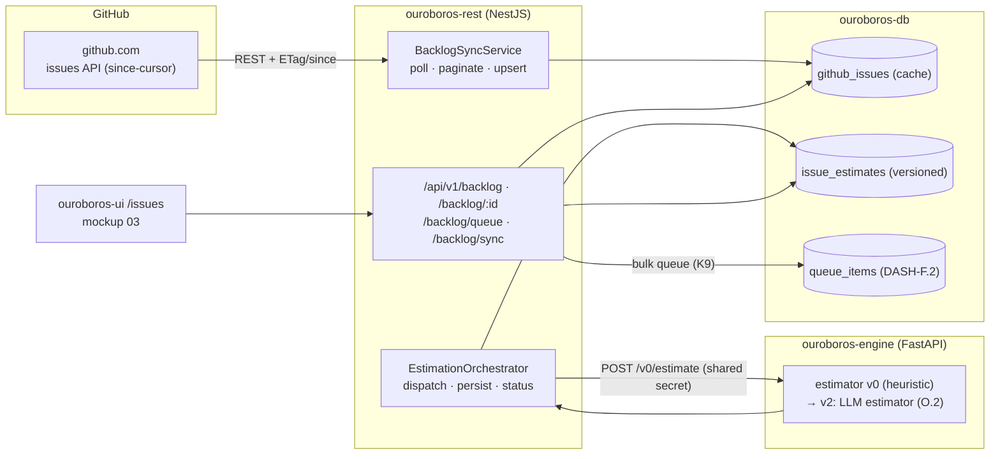
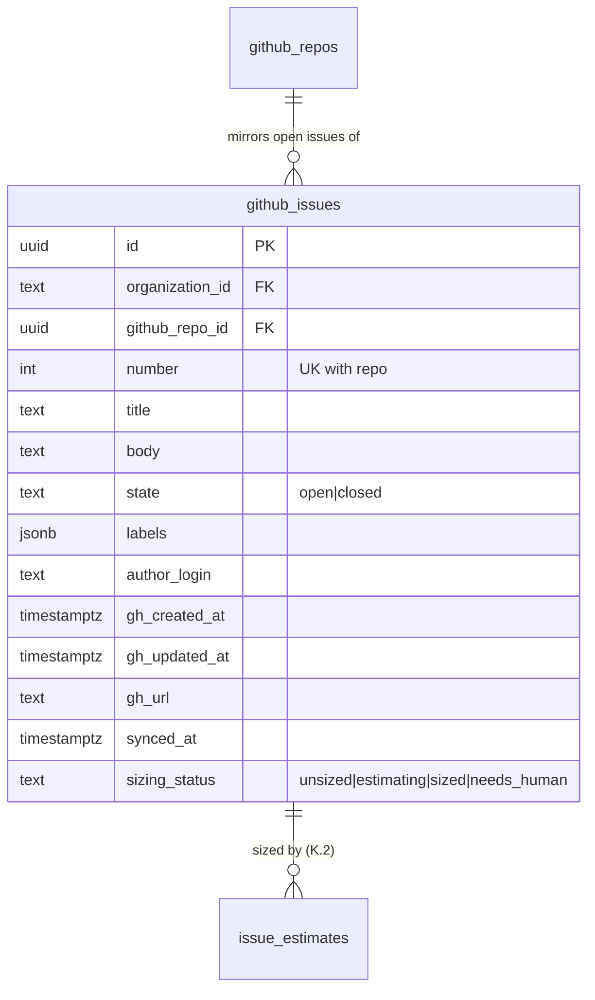
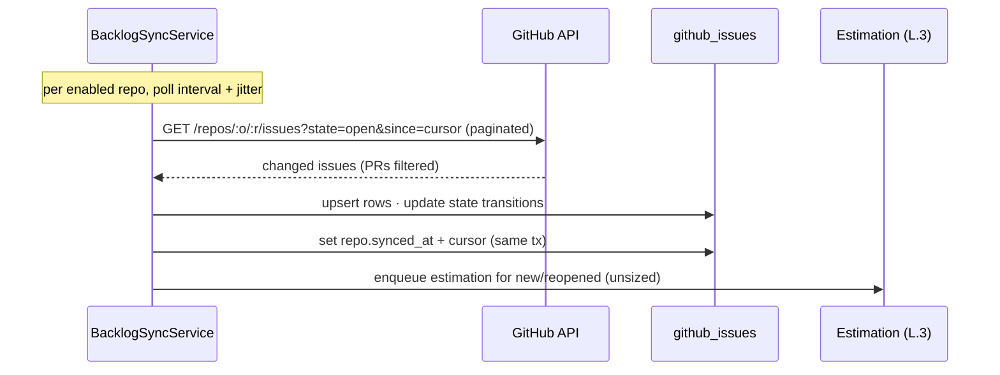
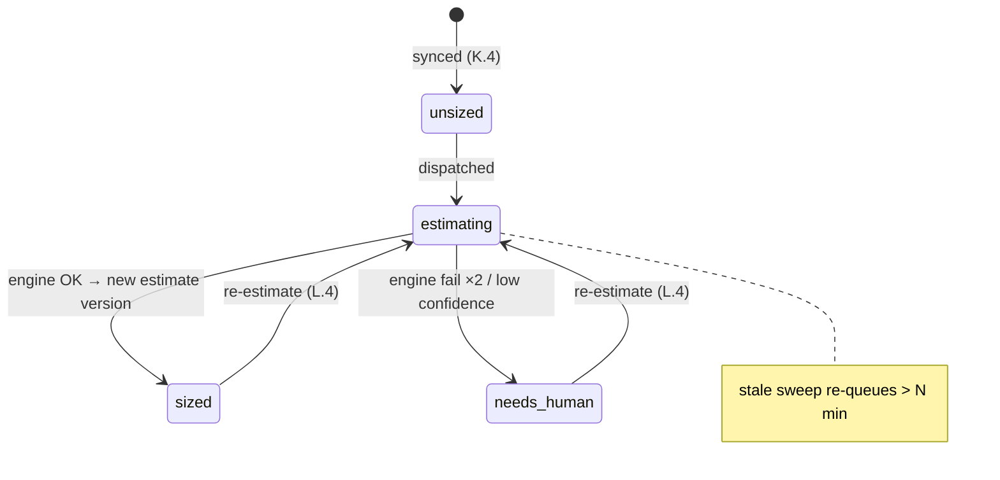
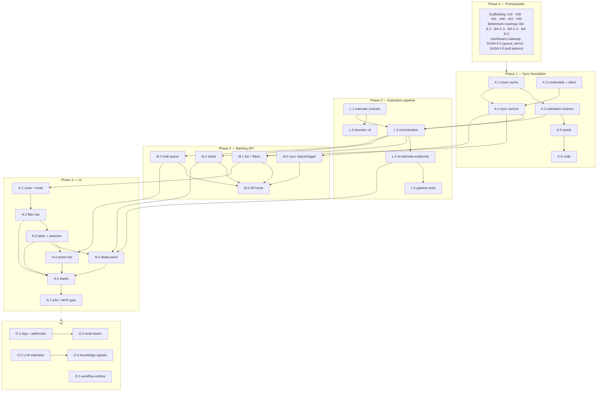

# Roadmap — Issue Intake & Sizing (Mockup 03)

## Description

> Create a roadmap that covers the features for the mockup page 03. Refer to the page
> so that issues can reference the mockup file when creating the UI/UX design of the
> pages.

## Context & Existing Work (duplicate-avoidance survey)

Surveyed 2026-08-08.

**Design source of truth for every UI ticket in this roadmap:**
[`docs/mockups/03-issues.html`](mockups/03-issues.html) (with
`docs/mockups/assets/ouroboros.css`) — Issue Intake & Sizing. Its anatomy:

- **Page head** — eyebrow `Issue Intake`, headline `42 open issues. 38 already
  sized.`, subline "Ouroboros watches the GitHub backlog and continuously estimates
  effort, risk, and routing for every open issue — before you ever ask it to work."
  Actions: **Re-estimate all** (ghost), **Queue 3 selected ⟳** (primary, reflects
  selection count).
- **Filter bar** (`.filter-bar` card) — repository select, label chip-set with
  toggled state (`bug ✓` in `chip-on` treatment; `enhancement`, `tech-debt`,
  `good-first-issue`), state select (`Open ▾`), sort select (`Sort: estimated
  effort ▾`), free-text search (`Filter by title, #number, or label…`).
- **Backlog table** (`c-8` card, title `BACKLOG · AS OUROBOROS SEES IT`, freshness
  tag `synced 40s ago`) — columns: checkbox (`.ckbox`, selected rows get
  `tr.sel` accent-glow treatment) · Issue (mono `#485` + title + label tags) ·
  Effort (chip XS–XL + mono confidence `92%`; unsized rows show `sizing…`) ·
  Suggested workflow (tag: `standard-fix`, `feature-loop`, `docs-loop`,
  `deps-refresh`) · Routed model (pill: `claude-fable-5`, `cursor/composer-2`,
  `copilot/gpt-5-codex`, `ollama/qwen3-coder`…) · Status pill (`sized` neutral,
  `queued` run, `estimating…` warn, `needs human` err).
- **Selection action bar** (`.sel-bar`, glow-bordered card) — `3 issues selected ·
  est. 1h 10m combined autonomous work`, **Assign workflow ▾**, **Queue →
  standard-fix**.
- **Issue detail side panel** (`c-4` card, title `ISSUE DETAIL`, status pill) —
  mono meta line (`#485 · opened 2d ago by field-support`), title, tag row
  (incl. `priority-high`), *body excerpt* (italic, left-ruled blockquote of the
  GitHub issue body), divider, **AI Work Breakdown**: estimated files touched
  (mono file-list), breakdown rows (Est. tokens `~180k`, Est. cycle time
  `12–18 min`, Effort chip + conf), **regression risk** meter (ok/22%) with a
  one-line rationale, suggested workflow + routed model, actions (**Queue for
  loop**, **Re-estimate**, **Open on GitHub ↗**), and the collapsible
  **estimation trace** (`sized by claude-sonnet-5 · 2m ago · 41k tokens`,
  `signals: 3 similar closed issues · driver map · HIL test index`).

**The two hard truths this roadmap must respect:**

1. **The backlog is GitHub's.** This page mirrors real GitHub issues for the
   enabled repos (scaffolding #22 / BA-B.3 enablement tables). That requires a
   GitHub API integration that does not exist yet — sync is the foundation epic.
2. **Sizing is an AI capability, and the AI stack doesn't exist yet.** Model
   routing (mockup 06), providers (mockup 07), and knowledge signals (mockup 14)
   are unbuilt. MVP therefore ships the full **estimation pipeline** (request →
   engine → persisted estimate → UI) with a clearly-labeled **heuristic v0
   estimator** in the engine; the LLM-backed estimator is v2 (O.2), slotting into
   the same contract. Same honesty rule as the dashboard roadmap: seeded parity
   for design review, truthful states everywhere else — `estimating…` and
   `needs human` are real pipeline states, never decoration.

**Overlapping open issues / prior roadmaps and their disposition:**

| Existing work | Disposition under this roadmap |
|---|---|
| Scaffolding #22 `ouroboros-db: [3.4] GitHub org & repo enablement` (amended by BA-B.3) | **Consumed** — sync targets only enabled repos. No change. |
| Scaffolding #35 `[4.9] Engine gateway` / #52 `[6.3] Internal API contract v0` | **Extended** by L.1/L.3 — the estimation contract is the first real engine capability beyond echo. |
| Scaffolding #49 placeholder routes (v2) | **Superseded for `/issues`** — this roadmap builds the real screen; other placeholders unchanged. |
| Dashboard roadmap (`ROADMAP_MOCKUP_02_DASHBOARD.md`, validation gate) — `queue_items` (DASH-F.2), queue endpoint (DASH-G.4), run read-model (DASH-F.1) | **Consumed & extended** — M.3's queue action writes `queue_items`; queue write semantics (deliberately out of DASH-G.4's scope) land **here**. The dashboard's "⟳ Pull next issue" button gains a real target. |
| BetterAuth roadmap (validation gate) — tenant context (BA-C.3), enabled repos (BA-C.4), auth client (BA-D.1) | **Prerequisite** — all backlog queries are org-scoped; the filter bar's repo select reads enabled repos. |
| Mockup 04 (workflows), 06 (routing), 07 (providers), 14 (knowledge) | **Not covered here** — workflow tags and model ids stay opaque strings (decisions K5/K6); trace "signals" are v2 (O.4). |

Epic letters continue the sequence (A–E BetterAuth, F–J dashboard): this roadmap uses
**K–O**.

### Decisions proposed by this roadmap (validate before issue creation)

| # | Decision | Rationale |
|---|----------|-----------|
| K1 | **MVP GitHub access = per-org token** (fine-grained PAT / installation token pasted into workspace settings, encrypted at rest); **GitHub App + webhooks = v2** (O.1) | A token gets the page real data now at 5k req/h; the App install flow (15k req/h, instant webhooks) is real product surface that deserves its own pass. The sync layer hides the difference. |
| K2 | **Sync = incremental polling with a per-repo `since` cursor** (GitHub `updated_at`), full pagination on first import, freshness surfaced honestly ("synced 40s ago") | GitHub's documented incremental pattern; webhooks (O.1) later reduce latency without changing the read-model. |
| K3 | **`github_issues` is a cache, GitHub is the source of truth** — no local edits to issue content, ever; actions that change GitHub (none in MVP) go through the API | Prevents the mirror from becoming a fork. "Open on GitHub ↗" is the escape hatch the panel promises. |
| K4 | **Estimates are versioned rows** (`issue_estimates`, latest-wins) with sizing status on the issue row: `unsized → estimating → sized \| needs_human` | Re-estimation is first-class in the mockup (three separate affordances); versioning gives the trace history and makes O.2's estimator swap auditable. |
| K5 | **Workflow tags remain opaque strings from a fixed built-in set** (`standard-fix`, `feature-loop`, `docs-loop`, `deps-refresh`) until mockup 04's roadmap | The "Assign workflow ▾" menu offers the fixed set; no workflow entities are invented here. |
| K6 | **Routed model = opaque string produced by the estimator** (consistent with dashboard decision F8) | Model routing is mockup 06 territory; the heuristic v0 routes from a config-listed default map. |
| K7 | **Estimation runs through the engine** (REST orchestrates, engine computes) even while the estimator is heuristic | The pipeline shape — queue estimation, engine computes, REST persists, UI polls — is the product architecture; v0 heuristic vs v2 LLM is an engine-internal swap. |
| K8 | **Filters/sort/search are server-side, URL-reflected** (`?repo=&labels=&state=&sort=&q=`) | Backlogs exceed a page; shareable filtered views; the filter bar is a query-string editor. |
| K9 | **Queue writes land here**: bulk queue endpoint creates `queue_items` (DASH-F.2) with assigned workflow tag and est. minutes | The dashboard deliberately shipped queue reads only; the mockup-03 actions are the write side. |
| K10 | **New label `intake`**; heuristic estimates render their provenance (trace says `heuristic-v0`, never a model name it didn't use) | Honesty in the trace is non-negotiable — a fake "sized by claude-sonnet-5" line would be lying UI. |

## Architecture Overview



## MVP Definition

The MVP is **mockup 03 as a working screen over real GitHub data with a live
estimation pipeline**. It is done when, against the compose stack:

1. Enabled repos' open issues **sync from GitHub** (initial import + incremental
   `since` polling), with freshness shown truthfully ("synced 40s ago") and a
   manual re-sync affordance.
2. `/issues` reproduces [`docs/mockups/03-issues.html`](mockups/03-issues.html)
   pixel-faithfully in **both themes**: page head with real counts, filter bar
   (repo/labels/state/sort/search, URL-reflected), backlog table with selection,
   effort+confidence, workflow tags, model pills, and all four status states.
3. Every synced issue flows through the **estimation pipeline**: `estimating…`
   while in flight, then `sized` (effort, confidence, workflow, model, breakdown,
   risk, trace) or `needs human` — produced by the engine's clearly-labeled
   heuristic v0 estimator through the real REST↔engine contract.
4. The **detail panel** renders the selected issue: GitHub body excerpt, work
   breakdown, risk meter, trace with honest provenance (`heuristic-v0`), and
   working actions (Queue for loop, Re-estimate, Open on GitHub ↗).
5. **Selection → queue** works: multi-select, combined estimate in the action
   bar, workflow assignment from the fixed set, bulk queue writing `queue_items`
   — visible on the dashboard's queue card immediately after.
6. **Re-estimate** (single + all) re-runs the pipeline, versioning estimates.
7. Seeds reproduce the mockup's demo rows for design review and e2e; a workspace
   with no enabled repos / no token shows designed guidance states.
8. Integration tests cover sync upsert/cursor logic, estimation lifecycle, filter
   queries, queue writes, and org isolation; the e2e suite gains an issues leg.

**Explicitly v2:** GitHub App + webhooks (O.1), LLM-backed estimator (O.2), real
workflow entities in the assign menu (O.3), knowledge-driven trace signals (O.4),
and issue-content mutations on GitHub (labels/comments — O.5).

## Epics

| Epic | Name | Goal | Modules |
|------|------|------|---------|
| K | GitHub Backlog Sync (`ouroboros-db` + `ouroboros-rest`) | Token config, issue cache schema, incremental sync, seeds & CI | ouroboros-db, ouroboros-rest |
| L | Estimation Pipeline (`ouroboros-engine` + `ouroboros-rest`) | Estimate contract, heuristic v0, orchestration, versioned persistence | ouroboros-engine, ouroboros-rest |
| M | Backlog REST API (`ouroboros-rest`) | List/detail/filters, queue writes, sync status, tests | ouroboros-rest |
| N | Issue Intake UI (`ouroboros-ui`) | Mockup 03: filter bar, table+selection, action bar, detail panel, e2e | ouroboros-ui |
| O | Live Intake & Extended Scope (v2) | GitHub App + webhooks, LLM estimator, workflow entities, signals | all |

Issue naming: `<project>: [<epic letter>.<issue>] <title>`. Labels reuse the
existing set (`mvp`, `v2`, `rest`, `db`, `engine`, `ui`, `ci`, `design`) plus new
**`intake`** (decision K10; create during issue filing). Complexity chips:
**XS · S · M · L**.

---

## Epic K — GitHub Backlog Sync (`ouroboros-db` + `ouroboros-rest`)

| Issue | Title | Summary | Labels | Parallel | MVP | Complexity | Affected Modules |
|-------|-------|---------|--------|:--------:|:---:|:----------:|------------------|
| K.1 | ouroboros-db: [K.1] GitHub issue cache schema | `github_issues` mirror table + labels + sync cursors | mvp, intake, db | N (after #19, BA-B.3) | Y | M | ouroboros-db |
| K.2 | ouroboros-db: [K.2] Issue estimates schema | Versioned `issue_estimates` + sizing status + breakdown/trace jsonb | mvp, intake, db | N (after K.1) | Y | M | ouroboros-db |
| K.3 | ouroboros-rest: [K.3] GitHub credentials & API client | Per-org token (encrypted), Octokit client, rate-limit discipline | mvp, intake, rest | N (after #28, BA-C.3) | Y | M | ouroboros-rest |
| K.4 | ouroboros-rest: [K.4] Backlog sync service | Initial import + incremental `since` polling, upsert, freshness | mvp, intake, rest | N (after K.1, K.3) | Y | L | ouroboros-rest |
| K.5 | ouroboros-db: [K.5] Intake dev seeds — mockup-03 parity | Seeded issues/estimates reproducing the mockup's nine rows | mvp, intake, db | N (after K.2) | Y | S | ouroboros-db |
| K.6 | ouroboros-db: [K.6] Intake constraints in ci/db | Status vocabularies, cursor invariants, estimate versioning checks | mvp, intake, db, ci | N (after K.5, #24) | Y | XS | ouroboros-db, .github |

### Issue K.1 — ouroboros-db: [K.1] GitHub issue cache schema

- **Problem Statement:** The backlog table renders GitHub issues with labels, author,
  and open-date ([`docs/mockups/03-issues.html`](mockups/03-issues.html), issue cell +
  detail panel meta line); no local representation exists.
- **Solution/Scope:** Migration (follows the dashboard series): `github_issues` —
  id, `organization_id` FK, `github_repo_id` FK (BA-B.3), `number`, `title`, `body`
  (text — the detail panel excerpts it), `state` CHECK `open|closed`, `labels` jsonb
  (name array — GitHub's label set, not ours), `author_login`, `gh_created_at`,
  `gh_updated_at`, `gh_url`, `synced_at`; unique `(github_repo_id, number)`;
  `sizing_status` CHECK `unsized|estimating|sized|needs_human` default `unsized`
  (decision K4). Sync cursor lives on `github_repos`: add `issues_synced_at`,
  `issues_sync_cursor` (the `since` watermark, decision K2). Indexes for the M.1
  filter paths (org+repo+state, labels GIN, title trigram or ILIKE-served).
- **Acceptance Criteria:**
  - Migration applies/validates cleanly; unique repo+number holds.
  - Label containment queries and title search use indexes (`EXPLAIN` verified).
  - Cache-not-fork posture documented in the migration header (decision K3).
- **Parallelism/Dependencies:** Needs #19, BA-B.3. Blocks K.2, K.4, K.5.
- **Technical Stack:** PostgreSQL 17, Flyway.
- **Epic:** K



### Issue K.2 — ouroboros-db: [K.2] Issue estimates schema

- **Problem Statement:** Everything the mockup calls "AI Work Breakdown" — effort,
  confidence, workflow, model, files, tokens, cycle range, risk, trace — needs a
  home that survives re-estimation (three re-estimate affordances in the mockup).
- **Solution/Scope:** `issue_estimates`: id, `github_issue_id` FK, `version` (unique
  with issue, monotonic), `effort` CHECK `xs|s|m|l|xl`, `confidence` (0–100),
  `suggested_workflow` (opaque tag, decision K5), `routed_model` (opaque, K6),
  `breakdown` jsonb (`files[]`, `est_tokens`, `cycle_min`/`cycle_max` minutes,
  `est_minutes` — the queue estimate M.3/K9 consumes), `risk` CHECK
  `low|medium|high` + `risk_note`, `trace` jsonb (`estimator` — e.g.
  `heuristic-v0`, `sized_at`, `tokens_used`, `signals[]`), `created_at`. A partial
  unique index or `is_latest` flag makes latest-lookup cheap; `sizing_status` on
  the issue row transitions with the pipeline (L.3).
- **Acceptance Criteria:**
  - Two estimates for one issue coexist; latest-wins lookup is a single indexed
    query.
  - Effort/risk CHECKs match the mockup vocabularies; confidence bounds enforced.
  - Trace `estimator` field is non-null (decision K10 — provenance is mandatory).
- **Parallelism/Dependencies:** Needs K.1. Blocks L.3, K.5.
- **Technical Stack:** PostgreSQL 17, Flyway.
- **Epic:** K

```
issue_estimates(issue, version↑) ─ latest ─▶ effort M · conf 92 · standard-fix · claude-fable-5
   breakdown: {files[3], est_tokens:180k, cycle:[12,18], est_minutes:23}
   risk: low "Isolated to the I²C driver path…" · trace: {estimator, signals[]}
```

### Issue K.3 — ouroboros-rest: [K.3] GitHub credentials & API client

- **Problem Statement:** Sync needs authenticated GitHub access per organization —
  no credential store or client exists (scaffolding #22 was deliberately data-only).
- **Solution/Scope:** Per decision K1: `github_credentials` columns on the org
  settings surface (token encrypted at rest with a key from config — encryption
  helper reusable later), settings endpoint to set/rotate/clear the token
  (owner/admin), an Octokit-based client wrapper: auth injection, pagination
  helper, rate-limit awareness (read `x-ratelimit-remaining`, back off before
  exhaustion), conditional requests (ETag) where useful, error taxonomy
  (unauthorized / not-found / rate-limited) mapped to the #31 envelope. Token
  never returned by any API after write; masked display (`ghp_…abcd`).
- **Acceptance Criteria:**
  - Token round-trips: set → sync works; clear → sync pauses with a designed
    status; rotate → old token unused.
  - Token absent from all API responses and logs (tested).
  - Rate-limit backoff verified with a mocked 403/`retry-after` response.
- **Parallelism/Dependencies:** Needs #28, BA-C.3. Blocks K.4. Sources: GitHub REST
  docs (rate limits, `since`), Octokit.
- **Technical Stack:** Octokit (@octokit/rest), NestJS, AES-GCM encryption at rest.
- **Epic:** K

```
settings ─▶ store token (encrypted, masked) ─▶ GitHubClient
  ├─ paginate(iterator) · since-cursor · ETag
  └─ rate guard: remaining < floor ─▶ defer next poll (honest "sync paused" state)
```

### Issue K.4 — ouroboros-rest: [K.4] Backlog sync service

- **Problem Statement:** The page's headline claim — "Ouroboros watches the GitHub
  backlog" — is this service. It must import enabled repos' open issues, keep them
  fresh, and report freshness truthfully (`synced 40s ago`).
- **Solution/Scope:** `BacklogSyncService`: initial import (paginate all open
  issues; PRs filtered out — the issues API returns both) per enabled repo, then
  scheduled incremental polls (`since` = stored cursor, decision K2) upserting
  changed rows and closing state transitions; new/reopened issues enter
  `unsized` and are handed to the estimation pipeline (L.3) automatically —
  "continuously estimates… before you ever ask" is this handoff; per-repo
  `synced_at` + cursor updates in the same transaction; poll scheduling via Nest
  scheduler with jitter; sync disabled (with status) when no token (K.3) or no
  enabled repos. Manual trigger endpoint lands in M.4.
- **Acceptance Criteria:**
  - Cold import of a live repo lands all open issues (PRs excluded); second poll
    with no changes is O(1) requests and touches no rows.
  - Editing an issue on GitHub appears locally within one poll interval; closing
    it flips `state` (and it leaves the default backlog view).
  - New issue auto-enters the estimation pipeline (verified with L.3).
  - Freshness value is the real `synced_at`, never fabricated.
- **Parallelism/Dependencies:** Needs K.1, K.3. Blocks L.3, M.1, M.4.
- **Technical Stack:** NestJS scheduler, Octokit, Kysely transactions.
- **Epic:** K



### Issue K.5 — ouroboros-db: [K.5] Intake dev seeds — mockup-03 parity

- **Problem Statement:** Design review and e2e need the exact mockup rows without a
  live GitHub token; the seeds are the fixture (same rule as dashboard F.5).
- **Solution/Scope:** Extend the dev seed (dev-only guard): for `acme-robotics /
  helios-firmware` — the nine mockup issues (`#483`–`#491`: titles, label sets,
  authors incl. `field-support`, the `#485` body text used by the detail panel)
  with estimates matching the mockup exactly (`#485` M/92%/standard-fix/
  claude-fable-5 + breakdown files/tokens/cycle/risk-low/trace, `#483` mid-
  `estimating`, `#490` XL/61% `needs_human`, `#486/#488/#489` queued — their
  queue_items already exist in DASH-F.5, cross-referenced not duplicated);
  trace estimator strings say `heuristic-v0` (decision K10) with the mockup's
  signal lines reserved for O.4 seeds. Personal org: zero rows (empty-state
  fixture).
- **Acceptance Criteria:**
  - M.1 list over seeds reproduces the mockup table ordering under
    `sort=effort`; detail panel for `#485` matches the mockup content.
  - Head counts compute to "9 open issues. 7 already sized." *(seed truth —
    the mockup's 42/38 needs no fabrication)*.
  - Idempotent; consistent with DASH-F.5 queue seeds (no double-queue rows).
- **Parallelism/Dependencies:** Needs K.2 (+DASH-F.5 coordination). Feeds M/N
  tests, e2e.
- **Technical Stack:** Flyway repeatable migration, SQL.
- **Epic:** K

```
seeds: 9 issues (#483–#491) ─▶ 6 sized · 1 estimating · 1 needs_human · (3 queued via DASH seeds)
#485 carries full breakdown + body text ─▶ detail-panel fixture
```

### Issue K.6 — ouroboros-db: [K.6] Intake constraints in ci/db

- **Problem Statement:** Status vocabularies, estimate versioning, and cursor
  invariants are UI-trusted contracts needing PR-time enforcement.
- **Solution/Scope:** Extend #24's `tests/constraints.sql`: sizing-status CHECK
  probe, estimate version monotonicity + latest uniqueness, repo+number
  uniqueness, non-null trace estimator, labels-jsonb shape probe.
- **Acceptance Criteria:** Green on current schema; red when any invariant drops
  (spot-verified once).
- **Parallelism/Dependencies:** Needs K.5, #24.
- **Technical Stack:** GitHub Actions, SQL.
- **Epic:** K

```
ci/db: migrate ─▶ validate ─▶ constraints.sql (+K probes) ─▶ ✓/✗
```

---

## Epic L — Estimation Pipeline (`ouroboros-engine` + `ouroboros-rest`)

| Issue | Title | Summary | Labels | Parallel | MVP | Complexity | Affected Modules |
|-------|-------|---------|--------|:--------:|:---:|:----------:|------------------|
| L.1 | ouroboros-engine: [L.1] Estimation contract (`/v0/estimate`) | Request/response schema for sizing an issue; extends the #52 contract | mvp, intake, engine, rest | N (after #52) | Y | M | ouroboros-engine, ouroboros-rest |
| L.2 | ouroboros-engine: [L.2] Heuristic estimator v0 | Deterministic sizing from labels/title/body signals, honest provenance | mvp, intake, engine | N (after L.1) | Y | M | ouroboros-engine |
| L.3 | ouroboros-rest: [L.3] Estimation orchestration & persistence | Dispatch, status transitions, versioned persistence, failure → needs_human | mvp, intake, rest | N (after L.1, K.2, K.4) | Y | L | ouroboros-rest |
| L.4 | ouroboros-rest: [L.4] Re-estimation endpoints (single & all) | `POST /backlog/:id/estimate`, `POST /backlog/estimate-all` with guards | mvp, intake, rest | N (after L.3) | Y | S | ouroboros-rest |
| L.5 | ouroboros-rest: [L.5] Pipeline integration tests | Lifecycle, failure paths, concurrency, provenance assertions | mvp, intake, rest, ci | N (after L.4) | Y | M | ouroboros-rest |

### Issue L.1 — ouroboros-engine: [L.1] Estimation contract (`/v0/estimate`)

- **Problem Statement:** REST↔engine has only `echo` (#52). Sizing needs a real
  versioned contract carrying enough issue context in and a full estimate out —
  the shape both the heuristic v0 and the future LLM estimator (O.2) honor.
- **Solution/Scope:** `POST /v0/estimate` (shared-secret path per #51): request
  `{issue: {number, title, body, labels[], repo}, context: {workflow_tags[],
  model_defaults}}`; response `{effort, confidence, suggested_workflow,
  routed_model, breakdown: {files[], est_tokens, cycle_min, cycle_max,
  est_minutes}, risk, risk_note, trace: {estimator, tokens_used, signals[]}}` —
  mirroring K.2 exactly; pydantic v2 schemas; error shape per #52; OpenAPI
  committed + drift-checked; async-ready (202/poll noted for O.2's slower LLM
  path, synchronous acceptable for v0).
- **Acceptance Criteria:**
  - Contract round-trips through the #35 gateway pattern; spec committed.
  - Response validates against K.2's column/jsonb shapes 1:1 (contract test).
  - The 202 escalation path is documented even though v0 answers synchronously.
- **Parallelism/Dependencies:** Needs #52. Blocks L.2, L.3.
- **Technical Stack:** FastAPI, pydantic v2.
- **Epic:** L

```
REST ── POST /v0/estimate {issue, context} ──▶ engine
     ◀─ {effort, confidence, workflow, model, breakdown, risk, trace} ──
        (v0: sync · O.2: 202 + poll — same schema)
```

### Issue L.2 — ouroboros-engine: [L.2] Heuristic estimator v0

- **Problem Statement:** MVP needs real estimates without the AI stack (hard truth
  #2). A deterministic heuristic keeps the pipeline honest and the page alive —
  provided it never masquerades as a model.
- **Solution/Scope:** Rule-based estimator behind L.1: effort from signals (label
  hints like `good-first-issue`/`tech-debt`, title verbs, body length/checklist
  count), confidence from signal agreement, workflow from label→tag map
  (`docs`→`docs-loop`, `enhancement`→`feature-loop`, deps patterns→`deps-refresh`,
  default `standard-fix`), routed model from a config-listed default map (K6),
  breakdown with conservative ranges and `files[]` empty (v0 cannot know files —
  the UI renders its absence honestly), risk from effort+label heuristics; low-
  confidence (< threshold) returns `needs_human`; trace `estimator:
  "heuristic-v0"` with rule-name signals (decision K10). Unit-tested table of
  fixtures; deterministic (same input → same output).
- **Acceptance Criteria:**
  - Fixture table covers all efforts, all workflows, the needs-human threshold.
  - Determinism verified; provenance always `heuristic-v0`.
  - `#488`-like docs issue → XS/docs-loop; `#490`-like migration → XL/low-conf.
- **Parallelism/Dependencies:** Needs L.1. Replaced (not removed — fallback) by
  O.2.
- **Technical Stack:** Python 3.12, pytest.
- **Epic:** L

```
signals: labels · title verbs · body length ─▶ effort + confidence
label map ─▶ workflow tag · config map ─▶ routed model
conf < floor ─▶ needs_human          trace: {estimator: heuristic-v0, signals: [rules…]}
```

### Issue L.3 — ouroboros-rest: [L.3] Estimation orchestration & persistence

- **Problem Statement:** Someone must move issues through
  `unsized → estimating → sized|needs_human` — dispatching to the engine,
  persisting versioned results, and surviving failures without stuck states.
- **Solution/Scope:** `EstimationOrchestrator`: in-process work queue (bounded
  concurrency) fed by K.4 (new/reopened) and L.4 (manual); per issue — set
  `estimating`, call the engine client (#35 pattern) with L.1 payload, persist
  a new `issue_estimates` version + flip status on success; engine error/timeout
  → retry once → `needs_human` with a trace noting the failure (never stuck in
  `estimating`; a sweep job re-queues rows stale > N minutes); status
  transitions are the UI's polling signal (M.1 exposes them).
- **Acceptance Criteria:**
  - New synced issue reaches `sized` end-to-end in compose without manual action.
  - Engine down: issues land in `needs_human` with honest trace; recovery sweep
    re-processes stale `estimating` rows.
  - Concurrent estimate of the same issue produces sequential versions, no
    deadlock (harness-verified).
- **Parallelism/Dependencies:** Needs L.1, K.2, K.4. Blocks L.4, M.1 (status
  data).
- **Technical Stack:** NestJS, engine client, Kysely.
- **Epic:** L



### Issue L.4 — ouroboros-rest: [L.4] Re-estimation endpoints (single & all)

- **Problem Statement:** The mockup offers re-estimation in three places (panel
  button, head "Re-estimate all", implicit on stale data); the pipeline needs
  guarded triggers.
- **Solution/Scope:** `POST /api/v1/backlog/:id/estimate` (member+) and
  `POST /api/v1/backlog/estimate-all` (admin+ — it can be expensive; confirmation
  contract documented) enqueueing via L.3; idempotent while already `estimating`
  (409 with current status); rate-limited per org (simple counter — full
  budgets are provider-roadmap territory).
- **Acceptance Criteria:** Single re-estimate versions the estimate; estimate-all
  touches only non-`estimating` rows; double-fire while running → 409; role
  gates verified.
- **Parallelism/Dependencies:** Needs L.3. Blocks N.5/N.1 actions.
- **Technical Stack:** NestJS.
- **Epic:** L

```
panel [Re-estimate] ─▶ POST /backlog/485/estimate ─▶ estimating → sized (v+1)
head [Re-estimate all] ─▶ POST /backlog/estimate-all (admin) ─▶ fan-out via L.3 queue
```

### Issue L.5 — ouroboros-rest: [L.5] Pipeline integration tests

- **Problem Statement:** Lifecycle transitions, failure fallbacks, and version
  monotonicity are concurrency-sensitive — exactly what the Testcontainers
  harness exists for.
- **Solution/Scope:** Extend the harness with a stubbed engine (contract-faithful
  fake per L.1): happy path, engine-down → needs_human → recovery, stale-sweep,
  concurrent re-estimates, provenance non-null, estimate-all scope, role gates.
- **Acceptance Criteria:** Green in `ci/rest`; removing the stale sweep or the
  retry turns tests red; ≤ 60s added runtime.
- **Parallelism/Dependencies:** Needs L.4 (extends #37 patterns).
- **Technical Stack:** Jest, Supertest, Testcontainers, engine stub.
- **Epic:** L

```
harness + fake engine ─▶ lifecycle ✓ · failure→needs_human ✓ · sweep ✓ · versions ✓ · roles ✓
```

---

## Epic M — Backlog REST API (`ouroboros-rest`)

| Issue | Title | Summary | Labels | Parallel | MVP | Complexity | Affected Modules |
|-------|-------|---------|--------|:--------:|:---:|:----------:|------------------|
| M.1 | ouroboros-rest: [M.1] Backlog list endpoint with filters | Org-scoped list: repo/labels/state/sort/search, paging, head counts | mvp, intake, rest | N (after K.4, L.3) | Y | M | ouroboros-rest |
| M.2 | ouroboros-rest: [M.2] Issue detail endpoint | Full issue + latest estimate + trace for the side panel | mvp, intake, rest | N (after L.3) | Y | S | ouroboros-rest |
| M.3 | ouroboros-rest: [M.3] Bulk queue action | Selection → `queue_items` with workflow tag + combined estimate | mvp, intake, rest | N (after L.3, DASH-F.2) | Y | M | ouroboros-rest |
| M.4 | ouroboros-rest: [M.4] Sync status & manual re-sync | Freshness data + `POST /backlog/sync` trigger with guards | mvp, intake, rest | N (after K.4) | Y | S | ouroboros-rest |
| M.5 | ouroboros-rest: [M.5] Backlog API integration tests | Filter matrix, queue writes, isolation, sync trigger | mvp, intake, rest, ci | N (after M.1–M.4) | Y | M | ouroboros-rest |

### Issue M.1 — ouroboros-rest: [M.1] Backlog list endpoint with filters

- **Problem Statement:** The filter bar and table are a server query
  (decision K8); the page head's counts ("42 open issues. 38 already sized.")
  come from the same source.
- **Solution/Scope:** `GET /api/v1/backlog?repo=&labels=&state=&sort=&q=&page=`
  under tenant context: label AND-filtering (GIN), state default `open`, sorts
  (`effort` — chip order with unsized last, `confidence`, `updated`, `number`),
  `q` over title/`#number`/label; response rows = issue + latest-estimate
  summary + sizing status (the table's exact needs); `meta: {openCount,
  sizedCount, syncedAt}` for head + freshness tag; label facet list for the
  chip-set (distinct labels in scope). OpenAPI documented.
- **Acceptance Criteria:**
  - Seeded queries reproduce the mockup table under `sort=effort`; every filter
    combination indexed (no seq scans on the hot path at seed×1000 volume).
  - `q="#485"` finds exactly one; counts match seeds.
  - Cross-org isolation verified.
- **Parallelism/Dependencies:** Needs K.4, L.3. Blocks N.2, N.3.
- **Technical Stack:** NestJS, Kysely, GIN/trigram indexes.
- **Epic:** M

```
?repo=helios-firmware&labels=bug&state=open&sort=effort&q=watchdog
  ─▶ rows[{issue, effort+conf, workflow, model, status}] + meta{42, 38, syncedAt} + labelFacets[]
```

### Issue M.2 — ouroboros-rest: [M.2] Issue detail endpoint

- **Problem Statement:** The side panel needs everything about one issue: GitHub
  content for the excerpt, the full latest estimate, and the trace.
- **Solution/Scope:** `GET /api/v1/backlog/:id`: issue fields (body for the
  excerpt — client truncates, author, opened-ago, gh_url for "Open on GitHub ↗"),
  latest estimate in full (breakdown files/tokens/cycle, risk + note, trace with
  provenance + signals), estimate history summary (versions, for a future
  history view — cheap to include). 404-not-403 across orgs.
- **Acceptance Criteria:** Seeded `#485` returns the mockup panel's every field;
  unsized issue returns issue-only shape the panel can render (N.5's no-estimate
  state).
- **Parallelism/Dependencies:** Needs L.3. Blocks N.5.
- **Technical Stack:** NestJS, Kysely.
- **Epic:** M

```
GET /backlog/:id ─▶ {issue{body, author, gh_url}, estimate{breakdown, risk, trace}, history[versions]}
```

### Issue M.3 — ouroboros-rest: [M.3] Bulk queue action

- **Problem Statement:** "Queue 3 selected ⟳" / "Queue → standard-fix" / "Queue
  for loop" all write the run queue — the write side the dashboard roadmap
  deliberately left out (decision K9).
- **Solution/Scope:** `POST /api/v1/backlog/queue {issueIds[], workflow?}`
  (member+ role per BA-C.3 policy; workflow from the fixed set K5, default =
  each issue's suggested workflow): validates issues are sized (unsized/
  estimating → 422 listing offenders), creates `queue_items` (DASH-F.2) with
  effort, tag, `est_minutes` from the estimate breakdown, appended positions,
  transactionally; flips issue rows to `queued` presentation state; returns
  created items + combined `estMinutes` (the action bar's "est. 1h 10m
  combined"). Duplicate queueing → 409 per DASH-F.2's unique constraint,
  surfaced per-issue.
- **Acceptance Criteria:**
  - Queueing the three seeded selected issues yields the mockup's combined
    estimate and the items appear on the dashboard queue card (cross-roadmap
    verification).
  - Unsized inclusion → 422 with per-issue codes; double-queue → per-issue 409;
    partial success semantics documented (all-or-nothing chosen and stated).
- **Parallelism/Dependencies:** Needs L.3, DASH-F.2. Blocks N.4.
- **Technical Stack:** NestJS, Kysely transactions.
- **Epic:** M

```
POST /backlog/queue {ids:[485,484,491], workflow:"standard-fix"}
  ─▶ tx: 3 × queue_items(position++, est_minutes) ─▶ {items, estMinutes:70}  → "est. 1h 10m"
```

### Issue M.4 — ouroboros-rest: [M.4] Sync status & manual re-sync

- **Problem Statement:** The freshness tag needs data, and users need a manual
  nudge when they just filed an issue on GitHub.
- **Solution/Scope:** Sync status folded into M.1's `meta` plus
  `GET /api/v1/backlog/sync-status` (per-repo cursors, last result, paused
  reason — no token / rate-limited); `POST /api/v1/backlog/sync` (member+)
  triggering an immediate K.4 cycle, debounced (409 while running, min-interval
  guard against hammering the rate limit).
- **Acceptance Criteria:** Status reflects reality (pause reasons honest);
  trigger syncs then updates `syncedAt`; debounce verified.
- **Parallelism/Dependencies:** Needs K.4. Feeds N.3's freshness display.
- **Technical Stack:** NestJS.
- **Epic:** M

```
GET /sync-status ─▶ [{repo, syncedAt, cursor, state: ok|paused(no-token)|rate-limited}]
POST /sync ─▶ 202 (running) │ 409 (already running / too soon)
```

### Issue M.5 — ouroboros-rest: [M.5] Backlog API integration tests

- **Problem Statement:** The filter matrix, transactional queue writes, and
  org isolation are the regressions users would hit first.
- **Solution/Scope:** Harness suites: filter/sort/search matrix against seeded
  volume, queue action success/422/409/all-or-nothing, detail shapes (sized +
  unsized), sync trigger debounce, isolation (two orgs).
- **Acceptance Criteria:** Green in `ci/rest`; dropping the org predicate or the
  queue transaction turns tests red; ≤ 60s added.
- **Parallelism/Dependencies:** Needs M.1–M.4.
- **Technical Stack:** Jest, Supertest, Testcontainers.
- **Epic:** M

```
suites: filters ✓ · queue tx ✓ · detail ✓ · sync debounce ✓ · isolation ✓
```

---

## Epic N — Issue Intake UI (`ouroboros-ui`)

Every issue references [`docs/mockups/03-issues.html`](mockups/03-issues.html) as
the design source — layout (`c-8` main column + `c-4` panel), page-specific
treatments (`.ckbox`, `tr.sel`, `.sel-bar` glow, `.panel-body-excerpt`,
`.breakdown-row`, `.file-list`, `.trace`), and the shared design system via the
#16 tokens (both themes; the mockup is dark-only).

| Issue | Title | Summary | Labels | Parallel | MVP | Complexity | Affected Modules |
|-------|-------|---------|--------|:--------:|:---:|:----------:|------------------|
| N.1 | ouroboros-ui: [N.1] Issues route, page head & counts | `(app)/issues`: head with live counts, Re-estimate all, Queue button | mvp, intake, ui, design | N (after #41, M.1, BA-D.5) | Y | S | ouroboros-ui |
| N.2 | ouroboros-ui: [N.2] Filter bar (URL-reflected) | Repo select, label chips, state, sort, search — server-driven | mvp, intake, ui, design | N (after N.1) | Y | M | ouroboros-ui |
| N.3 | ouroboros-ui: [N.3] Backlog table with selection model | Rows, effort+conf, status pills, checkbox selection, freshness tag | mvp, intake, ui, design | N (after N.1) | Y | L | ouroboros-ui |
| N.4 | ouroboros-ui: [N.4] Selection action bar | Combined estimate, Assign workflow ▾, Queue → workflow | mvp, intake, ui, design | N (after N.3, M.3) | Y | S | ouroboros-ui |
| N.5 | ouroboros-ui: [N.5] Issue detail side panel | Excerpt, breakdown, risk meter, trace, panel actions | mvp, intake, ui, design | N (after N.3, M.2, L.4) | Y | L | ouroboros-ui |
| N.6 | ouroboros-ui: [N.6] Intake empty, loading & guidance states | No-token, no-repos, syncing, unsized, empty-filter states | mvp, intake, ui, design | N (after N.2–N.5) | Y | M | ouroboros-ui |
| N.7 | ouroboros-ui: [N.7] Issues e2e leg | Seeded parity, filter/select/queue/re-estimate flows, both themes | mvp, intake, ui, ci | N (after N.1–N.6) | Y | S | ouroboros-ui, .github |

### Issue N.1 — ouroboros-ui: [N.1] Issues route, page head & counts

- **Problem Statement:** `/issues` currently points at a #49 placeholder; the
  page needs its frame: eyebrow, live-count headline, subline, and the two head
  actions per [`docs/mockups/03-issues.html`](mockups/03-issues.html).
- **Solution/Scope:** Replace the placeholder: head from M.1 `meta` ("`N` open
  issues. `M` already sized."), subline copy verbatim, **Re-estimate all** →
  L.4 (admin-visible, confirm dialog stating scope), **Queue N selected ⟳** →
  reflects the N.3 selection count (disabled at 0, wired to M.3); nav "soon"
  marker removed (amend #41's nav state).
- **Acceptance Criteria:** Counts live from seeds; actions gate by role and
  selection; both themes; #49's `/issues` stub retired (amendment).
- **Parallelism/Dependencies:** Needs #41, M.1, BA-D.5. Blocks N.2–N.6.
- **Technical Stack:** Next.js server components, #46 primitives.
- **Epic:** N

```
[Issue Intake]
9 open issues. 7 already sized.            [Re-estimate all] [Queue 3 selected ⟳]
"Ouroboros watches the GitHub backlog and continuously estimates…"
```

### Issue N.2 — ouroboros-ui: [N.2] Filter bar (URL-reflected)

- **Problem Statement:** The mockup's filter bar (repo, label chips with
  `chip-on` state, state, sort, search) must drive M.1 queries and survive
  reload/share (decision K8).
- **Solution/Scope:** Filter card per the mockup: repo select from enabled repos
  (BA-C.4; syncs with H.1's focus repo), label chip-set from M.1's facets
  (toggle = AND filter), state select (Open default / Closed / All), sort select
  (effort default per mockup, confidence, updated, number), debounced search;
  all state in the URL query (`router.replace`), server components re-query;
  clear-all affordance when any filter active.
- **Acceptance Criteria:** Every control round-trips through the URL (paste URL
  → same view); chip toggle matches the `chip-on` treatment in both themes;
  keyboard operable throughout.
- **Parallelism/Dependencies:** Needs N.1 (+M.1 facets). Blocks N.3 (query
  state).
- **Technical Stack:** Next.js (searchParams), #46 primitives.
- **Epic:** N

```
[helios-firmware ▾] (bug ✓)(enhancement)(tech-debt)(good-first-issue) [Open ▾] [Sort: effort ▾] [search…]
        └──────────────── all state lives in ?repo=&labels=&state=&sort=&q= ────────────────┘
```

### Issue N.3 — ouroboros-ui: [N.3] Backlog table with selection model

- **Problem Statement:** The table is the page's core: dense rows with the
  mockup's exact treatments (selected-row glow, effort+confidence pairing,
  four status pill variants, `sizing…` placeholder) plus a multi-select model
  the action bar and head button consume.
- **Solution/Scope:** #46 Table extended per the mockup: `.ckbox` checkbox
  column (header select-all-visible), `tr.sel` accent treatment on selected
  rows, issue cell (mono number, title, tag row), effort chip + mono conf
  (unsized → `sizing…`), workflow tag, model pill (opaque string, K6), status
  pill map (`sized`/neutral, `queued`/run, `estimating…`/warn, `needs human`/
  err); freshness tag in the card head from M.1 meta (relative time, M.4
  re-sync on click); selection store (URL-independent, survives filter
  changes within the page, exposed to N.1/N.4); row click opens the N.5 panel
  (selected-for-detail ≠ checkbox-selected — mirrors the mockup where `#485`
  is both); pagination footer. Polling keeps statuses fresh (estimating →
  sized transitions animate the pill swap).
- **Acceptance Criteria:**
  - Seeded table matches the mockup row-for-row under default sort (both
    themes, glow treatment included).
  - Select-all/none/individual works; selection persists across filter tweaks;
    count flows to head + action bar.
  - `estimating…` rows flip to `sized` within one poll of pipeline completion
    (compose-verified).
  - Full keyboard support (row focus, space to select, enter for detail).
- **Parallelism/Dependencies:** Needs N.1, N.2, M.1. Blocks N.4, N.5.
- **Technical Stack:** React, #46 Table/Chip/Pill, shared poll pattern (DASH-I.8
  hook family).
- **Epic:** N

```
[✓] #485 Watchdog reset on I²C…  [bug][i2c][watchdog]   M 92%  [standard-fix] [claude-fable-5] (sized)
[✓] #484 Motor PID integral…     [bug][motor-control]   M 88%  [standard-fix] [cursor/composer-2] (sized)
[ ] #483 Telemetry frame drops…  [bug][telemetry]       sizing…[standard-fix] [claude-sonnet-5] (estimating…)
[ ] #490 Migrate build to Zephyr…[tech-debt][zephyr]    XL 61% [deps-refresh] [claude-fable-5] (needs human)
```

### Issue N.4 — ouroboros-ui: [N.4] Selection action bar

- **Problem Statement:** The glow-bordered `.sel-bar` summarizes the selection
  ("3 issues selected · est. 1h 10m combined autonomous work") and carries the
  queue actions — it appears only when selection > 0.
- **Solution/Scope:** Bar per the mockup below the table: combined estimate
  summed client-side from selected rows' `est_minutes` (server-confirmed on
  queue), **Assign workflow ▾** menu (fixed set K5 + "use suggested" default),
  **Queue → <workflow>** primary (label reflects choice; suggested-mix shows
  `Queue → suggested`); calls M.3, handles per-issue 422/409 results with a
  designed partial-failure explanation (all-or-nothing per M.3 — the dialog
  names offenders); success clears selection and toasts with a link to the
  dashboard queue card.
- **Acceptance Criteria:** Appears/disappears with selection; combined estimate
  matches seeds ("est. 1h 10m" for the mockup trio); unsized-in-selection
  surfaces the 422 explanation; queue success visible on the dashboard within
  one poll.
- **Parallelism/Dependencies:** Needs N.3, M.3.
- **Technical Stack:** React, #46 primitives, generated client.
- **Epic:** N

```
┌─(glow)──────────────────────────────────────────────────────────┐
│ 3 issues selected · est. 1h 10m combined     [Assign workflow ▾]│
│                                              [Queue → standard-fix] │
└─────────────────────────────────────────────────────────────────┘
```

### Issue N.5 — ouroboros-ui: [N.5] Issue detail side panel

- **Problem Statement:** The `c-4` panel is the sizing story for one issue —
  excerpt, breakdown, risk, trace, actions — and must render honestly across
  all sizing states, not just the mockup's happy path.
- **Solution/Scope:** Panel per the mockup, driven by M.2 for the focused row:
  meta line (number, relative opened-ago, author), title, tags; body excerpt in
  the `.panel-body-excerpt` treatment (truncated with expand); **AI Work
  Breakdown** section — file-list (v0 estimator returns none: render "file
  estimate arrives with the full estimator" note, decision honesty), breakdown
  rows (tokens `~180k` formatting, cycle `12–18 min`, effort + conf), risk
  meter (ok/warn/err by level, width by level, rationale line); workflow tag +
  model pill; actions — **Queue for loop** (M.3 single), **Re-estimate** (L.4,
  disabled while `estimating…`), **Open on GitHub ↗** (gh_url, new tab);
  collapsible `.trace` with real provenance (`sized by heuristic-v0 · 2m ago`,
  signal lines from the trace — never a fabricated model name, K10). States:
  unsized (issue content + "first estimate pending"), estimating (skeleton
  breakdown + live flip), needs_human (err pill + failure/low-conf trace).
- **Acceptance Criteria:**
  - Seeded `#485` matches the mockup panel except honest provenance; all four
    states render designed (storybook-style test per state).
  - Re-estimate round-trips: button → `estimating…` → new version rendered.
  - Panel is keyboard-reachable from rows; responsive (stacks below the table
    at narrow widths).
- **Parallelism/Dependencies:** Needs N.3, M.2, L.4.
- **Technical Stack:** React, #46 primitives, generated client.
- **Epic:** N

```
ISSUE DETAIL                                    (sized)
#485 · opened 2d ago by field-support
Watchdog reset on I²C bus lockup   [bug][i2c][watchdog][priority-high]
│ "Unit 07 in the Fremont pilot rebooted 14 times overnight…"
── AI WORK BREAKDOWN ──
Est. tokens ~180k · Est. cycle 12–18 min · Effort [M] conf 92%
Regression risk  low ▓▓░░░░░░░ "Isolated to the I²C driver path…"
[standard-fix] [claude-fable-5]
[Queue for loop] [Re-estimate] [Open on GitHub ↗]
▾ estimation trace — sized by heuristic-v0 · 2m ago · rules: label-map, title-verb
```

### Issue N.6 — ouroboros-ui: [N.6] Intake empty, loading & guidance states

- **Problem Statement:** The mockup shows a full backlog; reality starts with no
  token, no enabled repos, an empty repo, a first sync in progress, or a filter
  that matches nothing — each needs designed guidance, not a blank table.
- **Solution/Scope:** #46 EmptyState variants: **no token** (explains + links to
  the K.3 settings surface, admin-only CTA), **no enabled repos** (links to the
  login/tenancy Step 2 surface), **first sync running** (progress framing from
  M.4 status), **zero issues** ("backlog clear" celebration tone), **no filter
  matches** (clear-filters CTA), table skeletons on first load, stale/sync-
  paused banner reusing the DASH-I.7 pattern.
- **Acceptance Criteria:** Each state reachable and rendered in both themes
  (fixture-driven tests); personal-org seed shows the no-repos state; guidance
  CTAs respect roles.
- **Parallelism/Dependencies:** Needs N.2–N.5 (+M.4 status).
- **Technical Stack:** React, #46 EmptyState/Skeleton.
- **Epic:** N

```
no token ─▶ "Connect GitHub to watch your backlog" [Open settings] (admin)
no repos ─▶ "Enable an org & repos to begin"      [Choose repos]
sync #1  ─▶ "First sync running — 120 issues so far…"
0 match  ─▶ "No issues match these filters"        [Clear filters]
```

### Issue N.7 — ouroboros-ui: [N.7] Issues e2e leg

- **Problem Statement:** The intake flow (filter → select → queue → dashboard)
  and the estimation lifecycle are cross-service paths only e2e can certify.
- **Solution/Scope:** Extend the #56 suite: seeded parity (head counts, table
  rows, `#485` panel), filter round-trip via URL, select three → combined
  estimate → queue → assert dashboard queue card gained rows, re-estimate flow
  (estimating → sized), guidance state (personal org), both themes.
- **Acceptance Criteria:** Green from cold compose; each leg fails meaningfully
  when its service breaks (spot-verified); ≤ 2 min added.
- **Parallelism/Dependencies:** Needs N.1–N.6, K.5; amends #56.
- **Technical Stack:** Playwright.
- **Epic:** N

```
e2e: parity ✓ · filters ✓ · select→queue→dashboard ✓ · re-estimate ✓ · guidance ✓ · themes ✓
```

---

## Epic O — Live Intake & Extended Scope (v2)

| Issue | Title | Summary | Labels | Parallel | MVP | Complexity | Affected Modules |
|-------|-------|---------|--------|:--------:|:---:|:----------:|------------------|
| O.1 | ouroboros-rest: [O.1] GitHub App & webhook ingestion | App install flow, webhook receiver, near-instant sync | v2, intake, rest, ui | N (after K.4) | N | L | ouroboros-rest, ouroboros-ui |
| O.2 | ouroboros-engine: [O.2] LLM-backed estimator | Real model sizing behind the L.1 contract; heuristic as fallback | v2, intake, engine | N (after L.2, providers roadmap) | N | L | ouroboros-engine |
| O.3 | ouroboros-rest: [O.3] Workflow entities in assign & suggestions | Replace the fixed tag set with mockup-04 workflow objects | v2, intake, rest, ui | N (after mockup-04 roadmap) | N | M | ouroboros-rest, ouroboros-ui |
| O.4 | ouroboros-engine: [O.4] Estimation signals from knowledge | Similar-closed-issues, code map, test index feeding the trace | v2, intake, engine | N (after O.2, mockup-14 roadmap) | N | L | ouroboros-engine |
| O.5 | ouroboros-rest: [O.5] GitHub write-backs | Size labels / intake comments posted back to GitHub, opt-in | v2, intake, rest | N (after O.1) | N | M | ouroboros-rest |

### Issue O.1 — ouroboros-rest: [O.1] GitHub App & webhook ingestion

- **Problem Statement:** Token + polling caps freshness at the poll interval and
  rate limits at 5k/h; the mockup's "watches the backlog" ideal is webhook-fast,
  and the login mockup already promises "installs as a GitHub App with
  least-privilege scopes."
- **Solution/Scope:** GitHub App (contents/issues/PR scopes per the mockup-01
  promise): install/callback flow tied to org enablement (upgrades BA-B.3's
  data-only shape), webhook receiver (`issues` events, signature-verified,
  idempotent upserts into K.1), polling demoted to reconciliation sweep;
  installation tokens replace the pasted PAT (15k req/h); settings UI upgrade.
  Source: GitHub Apps/webhooks docs.
- **Acceptance Criteria:** Issue opened on GitHub appears locally < 5s; signature
  verification enforced; PAT path still works as fallback; reconciliation
  catches missed deliveries.
- **Parallelism/Dependencies:** Needs K.4. Enables O.5.
- **Technical Stack:** GitHub App, webhooks, Octokit.
- **Epic:** O

```
GitHub ── issues webhook (signed) ──▶ receiver ─▶ upsert (idempotent) ─▶ UI < 5s
   └── nightly reconcile sweep (K.4 cursor path) covers missed deliveries
```

### Issue O.2 — ouroboros-engine: [O.2] LLM-backed estimator

- **Problem Statement:** Heuristic v0 sizes crudely and cannot estimate files;
  the product promise (file-touch prediction, calibrated confidence, real
  routing) needs models — which need the provider stack (mockup 07) first.
- **Solution/Scope:** LLM estimator behind the unchanged L.1 contract: prompt
  over issue content + repo context, structured output validated to the
  schema, per-estimate token accounting into the trace (`sized by <model> ·
  41k tokens` — now true), confidence calibration notes, heuristic v0 retained
  as fallback on provider failure; async 202 path (L.1's escalation) for slow
  models; cost caps per org (provider-roadmap budgets).
- **Acceptance Criteria:** Estimate quality benchmark vs. v0 on a labeled
  fixture set documented; trace provenance names the real model + tokens;
  provider outage degrades to v0 with honest trace.
- **Parallelism/Dependencies:** Needs L.2, provider/routing roadmaps (mockups
  06/07).
- **Technical Stack:** FastAPI, provider clients, structured output.
- **Epic:** O

### Issue O.3 — ouroboros-rest: [O.3] Workflow entities in assign & suggestions

- **Problem Statement:** The fixed tag set (K5) becomes real workflow objects
  once mockup 04's roadmap lands; assign menus and suggestions must upgrade
  without breaking stored tags.
- **Solution/Scope:** Map stored opaque tags onto workflow entities (slug
  compatibility), assign menu lists real workflows with descriptions, estimator
  context (L.1 `workflow_tags`) feeds from the registry; migration note for
  renamed workflows.
- **Acceptance Criteria:** Existing queue items/estimates keep resolving; menu
  shows registry workflows; suggestion honors registry availability.
- **Parallelism/Dependencies:** Needs mockup-04 roadmap.
- **Technical Stack:** NestJS, workflow registry.
- **Epic:** O

### Issue O.4 — ouroboros-engine: [O.4] Estimation signals from knowledge

- **Problem Statement:** The mockup trace cites `3 similar closed issues ·
  driver map · HIL test index` — retrieval signals that need the knowledge
  layer (mockup 14).
- **Solution/Scope:** Signal providers feeding O.2's prompt + trace: similar
  closed issues (embedding search over synced history), code-map summary, test
  index; each signal listed in the trace with its contribution; graceful
  absence.
- **Acceptance Criteria:** Traces list real retrieved signals; removing the
  knowledge service degrades gracefully; measurable confidence improvement on
  the O.2 benchmark documented.
- **Parallelism/Dependencies:** Needs O.2, mockup-14 roadmap.
- **Technical Stack:** FastAPI, knowledge/retrieval services.
- **Epic:** O

### Issue O.5 — ouroboros-rest: [O.5] GitHub write-backs

- **Problem Statement:** Sizing value multiplies if it reaches GitHub — size
  labels or an intake comment on the issue — but writing to customer repos is
  trust-sensitive and strictly opt-in.
- **Solution/Scope:** Opt-in per org (settings): apply `ouro:size/M`-style
  labels and/or a single idempotent intake comment (edited, not re-posted, on
  re-estimate); App permissions from O.1; kill-switch; audit events.
- **Acceptance Criteria:** Opt-out default verified; label/comment idempotency
  on re-estimate; audit rows on every write-back.
- **Parallelism/Dependencies:** Needs O.1 (+#26 audit path).
- **Technical Stack:** Octokit, NestJS.
- **Epic:** O

```
opt-in ─▶ estimate lands ─▶ label ouro:size/M + one intake comment (idempotent edit)
```

---

## Work Order (dependency-ordered execution plan)



Ordered checklist (⊕ = parallelizable within its phase):

1. **Phase 0 — Prerequisites:** scaffolding #19/#28/#41/#46/#52/#35; BetterAuth
   roadmap B.3/C.3/C.4/D.5; dashboard roadmap F.2 + I.8 (file those roadmaps'
   issues first).
2. **Phase 1 — Sync foundation:** { K.1 ⊕ K.3 } → K.2 → K.4 → K.5 → K.6
3. **Phase 2 — Estimation pipeline:** L.1 → { L.2 ⊕ L.3 } → L.4 → L.5
4. **Phase 3 — Backlog API:** { M.1 ⊕ M.2 ⊕ M.3 ⊕ M.4 } → M.5
5. **Phase 4 — UI:** N.1 → N.2 → N.3 → { N.4 ⊕ N.5 } → N.6 → **N.7 ✅**
   *(this roadmap's MVP gate, amending #56)*
6. **v2:** O.1 → O.5; O.2 → O.4; O.3 when mockup-04's roadmap lands.

## Totals

| | Issues | MVP | v2 |
|---|:---:|:---:|:---:|
| Epic K — GitHub Backlog Sync | 6 | 6 | 0 |
| Epic L — Estimation Pipeline | 5 | 5 | 0 |
| Epic M — Backlog REST API | 5 | 5 | 0 |
| Epic N — Issue Intake UI | 7 | 7 | 0 |
| Epic O — Live Intake & Extended | 5 | 0 | 5 |
| **Total** | **28** | **23** | **5** |

Plus **3 amendments** to existing issues (#41 nav state, #49 `/issues` stub
retirement, #56 e2e leg) executed during issue filing.

## References

- Design source: [`docs/mockups/03-issues.html`](mockups/03-issues.html),
  `docs/mockups/assets/ouroboros.css`, `docs/mockups/README.md`
- Upstream roadmaps: `ROADMAP_OUROBOROS_APPLICATION_SCAFFOLDING.md` (filed),
  `ROADMAP_LOGIN_PAGE_BETTERAUTH.md` and `ROADMAP_MOCKUP_02_DASHBOARD.md`
  (validation gates — prerequisite issues referenced as BA-* / DASH-*)
- [GitHub REST API — issues endpoints](https://docs.github.com/en/rest/issues)
  (grounds K2: `since` incremental sync, pagination, PR filtering) ·
  [GitHub API integration guide (Apps vs tokens, rate limits, webhooks)](https://www.getknit.dev/blog/github-api-integration-guide)
  (grounds K1/O.1: PAT 5k/h vs App 15k/h per installation) ·
  [REST API troubleshooting/pagination](https://docs.github.com/en/rest/using-the-rest-api/troubleshooting-the-rest-api)

## UI/UX Shell Compliance (addendum 2026-08-09)

The application shell defined in
[`docs/DESIGN_SYSTEM_APP_SHELL.md`](DESIGN_SYSTEM_APP_SHELL.md) (implementing
roadmap: [`ROADMAP_UIUX_APP_SHELL.md`](ROADMAP_UIUX_APP_SHELL.md)) supersedes
the mockup's top-bar navigation for every UI issue in this roadmap:

1. **Header** — application name/brand upper-left, profile & session controls
   upper-right; no navigation links in the header.
2. **Sidebar navigation** — fixed left rail of icon + name entries from the
   CP.2 module registry. This module is the sidebar's **Issues** entry (icon
   `circle-dot`). Page-level tab sets stay at the top of the content pane
   (CP.4 PageSubnav), sticky within the pane's scroll.
3. **Content-only scrolling** — the content pane is the sole scroll
   container; header and sidebar never scroll; sticky in-page chrome
   (subnavs, dirty-state bars, table headers) sticks within the pane; wide
   content scrolls inside its own wrappers, never at pane level.
4. **Type scale** — every UI issue uses rem-based type/spacing against the
   #16 tokens (CQ.1) so the five-step font-size preference (CQ.2) scales the
   whole surface; hard-coded px font sizes are lint-banned.
5. **Mockup interpretation** —
   [`docs/mockups/03-issues.html`](mockups/03-issues.html) remains the design
   source for page content and card anatomy; its topbar/nav chrome is
   superseded by the shell spec.

Issue-level impact:

| Issue | Amendment |
|---|---|
| N.1 | Mounts in the shell content pane; navigation reached via the sidebar registry entry, not a topbar link |
| N.2, N.3, N.4, N.5, N.6 | rem-based type, shell tokens; internal wide/tall regions scroll in their own wrappers |
| N.7 | Gains shell assertions: header/sidebar fixed during content scroll, correct sidebar active state, font-scale render check at 125% |

## Next Step

Per the roadmap process, **no GitHub issues have been created yet** — this
document is the validation gate. Review in particular: decisions K1–K10
(especially K1 token-first GitHub access with the App deferred to O.1, K7
estimation-through-the-engine even while heuristic, and K10's provenance-honesty
rule), the queue-write ownership (K9 — this roadmap owns what the dashboard
roadmap deliberately left out), and the prerequisite chain (BetterAuth and
dashboard roadmaps should be filed first). Once validated, the follow-up pass
(`/create-issues ROADMAP_MOCKUP_03_ISSUE_INTAKE.md`) creates the `intake` label,
files the 28 issues with epic parents and relationships, and posts the amendment
comments on #41, #49, and #56.
