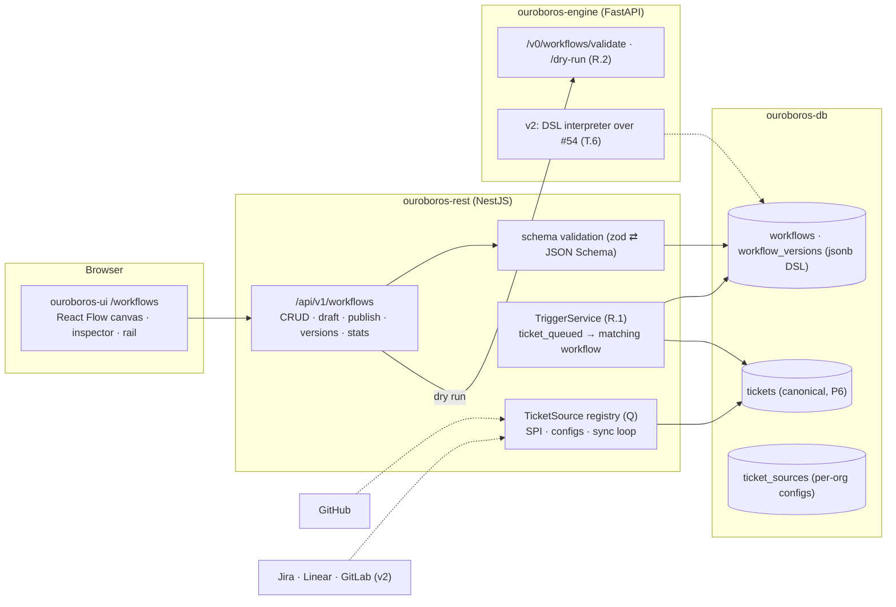
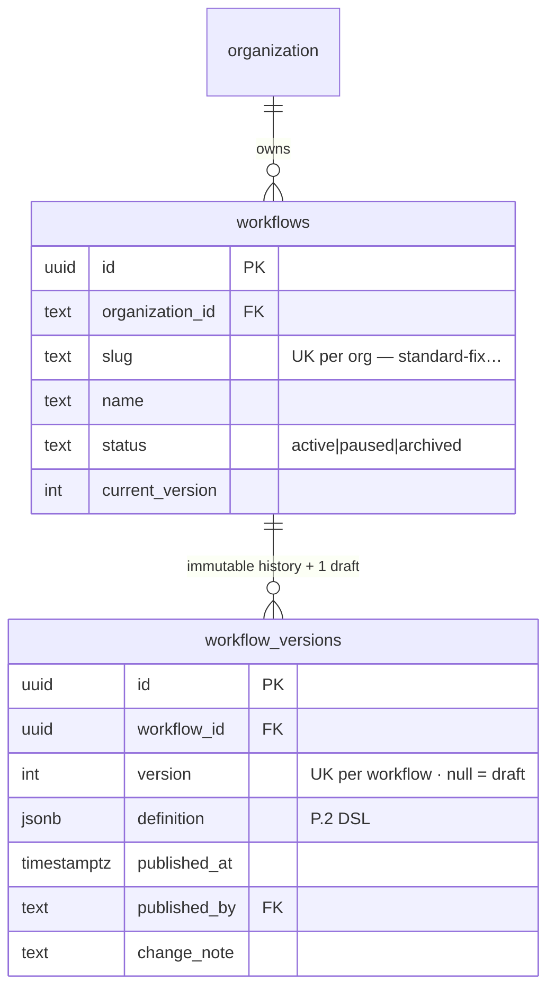
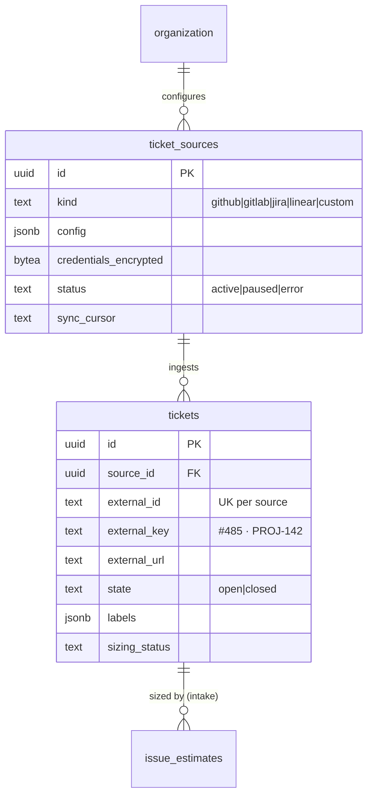
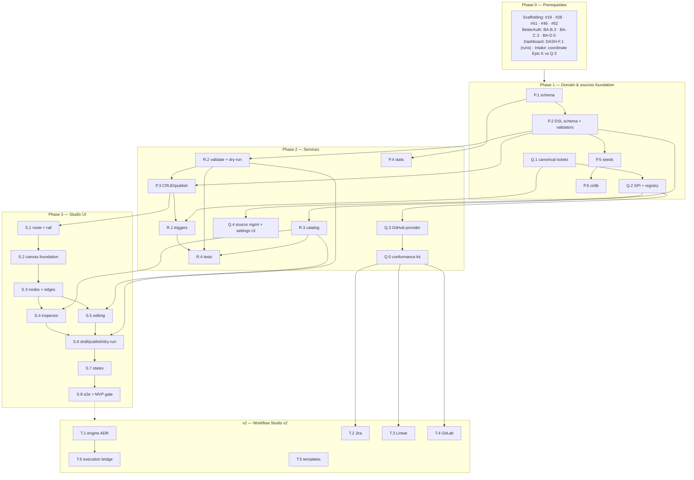

# Roadmap — Workflow Studio / Visual Builder (Mockup 04)

## Description

> Create a roadmap that covers the features for the mockup page 04. Any additional
> tech infrastructure that is required to implement the functionality in these mockup
> pages should be researched and offered as options for implementing in the roadmap.
> The roamdap should include MVP and v2 options, as well as the labels, milestones,
> and the like, for the tickets to be created. Any ticket sources that are used by
> Ouroboros for ingesting should be pluggable, which includes sources like Jira,
> Linear, GitHub, GitLab, and other bug reporting/issue recording sites. Refer to the
> page so that issues can reference the mockup file when creating the UI/UX design of
> the pages.

## Context & Existing Work (duplicate-avoidance survey)

Surveyed 2026-08-08.

**Design source of truth for every UI ticket in this roadmap:**
[`docs/mockups/04-workflow-builder.html`](mockups/04-workflow-builder.html) (with
`docs/mockups/assets/ouroboros.css`) — the Workflow Studio. Its anatomy:

- **Page head** — eyebrow `Workflow Studio`, h1 = active workflow name
  (`standard-fix`), subline `Runs when a sized issue with effort ≤ M is queued. Last
  edited 2h ago · v14 · used by 61% of runs.`; segmented control **Visual** (on) /
  **Code** (→ mockup 05) / **Copilot** (→ mockup 20); actions **Browse templates**
  (→ mockup 13), **Dry run with issue #485**, **Publish v15** (primary).
- **Left rail** (`.wf-list`) — workflow items with name + caption
  (`6 stages · auto-merge`, `needs review`, `paused` with err dot on `hotfix-p0`),
  active item in accent-gradient treatment, dashed **+ New workflow** tile.
- **Center canvas** (`.canvas-card` → `.stage`, 830×800 dot-grid) — an SVG edge
  layer and absolutely-positioned nodes:
  - Node types with distinct treatments: **trigger** (accent top border — `Issue
    queued`, chip `effort ≤ M`), **llm** (violet — `Analyze`, `Plan`, `Split`,
    `Implement`, `Review`, chips like `skill:repo-map`, `claude-sonnet-5`,
    `prompt template`, `routed by task`, `creates linked issues`), **infra**
    (warn — `Build farm · pool A` with runner chip, `Test` with
    `twister –p native_sim`), **flow/decision** (octagonal clip-path —
    `Effort re-check`, `Gate / Checks green?` chip `required checks: 14`),
    **term** (ok — `Open PR & auto-merge` chip `squash · delete branch`; mini
    pill variant `Back to queue`).
  - Edge classes: executed/**active** path (accent glow), plain edges, and the
    dashed **loop** edge — "the ouroboros: gate fail loops back to implement".
  - Edge labels: `≤ M ↓` (accent), `> M ↘` (warn), `pass →` (ok), `fail ↺` (err).
  - Selected node (`Implement`) carries the `.sel` glow ring.
  - **Canvas toolbar**: zoom −/100%/+, **Auto-layout**, **Add stage ▾**, hint
    `⌥ drag to pan · double-click edge to add stage`.
- **Right inspector** (sticky `.inspector`, bound to the selected node) — type line
  (`◆ Implement`), title, description; **Mode** segment (Direct prompt / **Skill**);
  Skill select (`zephyr-conventions`) with load-into-context hint; **Prompt
  template** code block with `{{issue.title}}` / `{{plan}}` variables; **Model
  routing** radios (*Inherit route for task "implement"* (recommended) with model
  pill / *Pin model ▾*); **Limits** (Max retries `2`, Token budget `400k`);
  **Permissions** toggles (*May push fixup commits* on, *May touch CI config* off);
  footer **Delete stage** / **Apply**.

**Overlapping work and dispositions:**

| Existing work | Disposition under this roadmap |
|---|---|
| Intake roadmap (`ROADMAP_MOCKUP_03_ISSUE_INTAKE.md`, filed #99–#126) — decision K5 fixed workflow-tag set; O.3 "workflow entities" (v2, #124) | **Superseded/landed here** — Epic P creates real workflow entities; #124's scope (assign menus + estimator context reading the registry) is folded into P.4/T.6, and amendment comments are posted on #112, #118 and #124. Stored opaque tags remain valid slugs. |
| Intake roadmap Epic K — GitHub-specific cache & sync (K.1 #99, K.3 #101, K.4 #102) | **Resolved at filing 2026-08-09: Epic K is filed but unbuilt** (no migration or service code in the repository). Q.1 (#138) therefore **replaces** #99, and Q.3 (#140) **implements** #101/#102 SPI-first as the first `TicketSourceProvider`. No acceptance criterion is dropped — each is re-asserted through the SPI and enforced by the conformance kit (#142). Coordination comments posted on all three. **Overtaken by events, 2026-09-08.** Epic K was executed ticket by ticket instead: `#99` landed `V014`'s `github_issues`, `#100` landed `V026`, and `#101` landed `V027` plus `ouroboros-rest/src/modules/github/`. So Q.1 generalizes a shipped table rather than replacing an unwritten one, and Q.3 **refactors** the shipped GitHub client and sync behind the SPI rather than writing them — a smaller change than either, because #101 landed the Octokit boundary this roadmap's decision **P5** asked for (the module is written against a four-member `OctokitLike`, one file may import the SDK, and `.dependency-cruiser.cjs` fails the build otherwise) and `#102` landed the sync with GitHub's specifics already separated per file. |
| Dashboard roadmap — `runs.workflow_tag` (DASH-F.1), queue actions (INTAKE-M.3) | **Consumed** — P.4's usage stats join `runs`; trigger predicates (R.1) evaluate queue events. |
| Scaffolding #49 placeholder routes (v2) | **Superseded for `/workflows`** — this roadmap builds the real screen. |
| Scaffolding #54 engine task skeleton (v2), DASH-J.3 ingestion bridge (v2) | **Consumed by T.6** — actual workflow *execution* bridges through them; MVP here is authoring + validation + dry-run, not running loops. |
| Mockups 05 (code view), 20 (copilot), 13 (templates/onboarding) | **Out of scope** — the segmented control and template button link to placeholders; P.2's DSL is designed so mockup 05's YAML view is a projection, not a rewrite. |
| BetterAuth roadmap (validation gate) — tenant context, roles, settings surfaces | **Prerequisite** (BA-C.3, BA-C.4, BA-D.5). |

Epic letters continue the sequence (A–E, F–J, K–O): this roadmap uses **P–T**.

## Infrastructure Options (researched — pick before filing)

The mockup demands three pieces of infrastructure the codebase lacks. Options below
were researched 2026-08-08; each has a recommendation, but all are open until this
document is validated.

### 1. Canvas / node-editor library (Epic S)

| Option | What it is | Fit | Trade-offs |
|---|---|---|---|
| **A — React Flow (`@xyflow/react`)** ⭐ recommended | MIT-licensed node-based UI library (xyflow), custom nodes/edges as React components, built-in pan/zoom/selection, works with ELK/Dagre layout engines; used in production by Stripe, Typeform | Custom node components can reproduce the mockup's five node treatments and edge classes exactly; controlled-state mode fits our versioned-document model | One more dependency (~50kB gz); "lightweight rule" exception must be a conscious decision |
| B — Rete.js | Visual-programming framework with dataflow/control-flow processing built in | Brings graph *processing* we don't need client-side (the engine owns execution) | Heavier abstraction; less natural in idiomatic React |
| C — Custom SVG editor | The mockup is literally absolute-positioned divs + SVG paths | Zero dependencies; pixel-perfect by construction | Pan/zoom/drag/connect/selection/a11y all hand-built — weeks of undifferentiated work, the classic build-a-bad-React-Flow trap |

### 2. Workflow definition storage & DSL (Epic P)

| Option | Shape | Fit | Trade-offs |
|---|---|---|---|
| **A — Canonical JSON document per version + thin metadata columns** ⭐ recommended | `workflow_versions.definition jsonb` validated against a published JSON Schema; queryable metadata (name, version, status, stage_count) as columns | One artifact to version/diff/publish; mockup 05's code view = YAML projection of the same document; schema validation shared by REST (zod) and engine (pydantic) | Cross-stage queries need jsonb operators (acceptable at this scale) |
| B — Fully normalized tables (stages, edges, configs) | Relational rows per node/edge | Referential integrity in the DB | Publish/versioning becomes multi-table snapshotting; painful diffing; code view needs assembly |
| C — Hybrid (document + generated projection tables) | JSON canonical + materialized rows for queries | Best of both | Premature — adopt only if metrics show jsonb pain |

### 3. Workflow execution engine (v2 — T.1/T.6; MVP ships authoring + dry-run only)

| Option | What it is | Fit | Trade-offs |
|---|---|---|---|
| **A — Custom asyncio state machine in `ouroboros-engine`** ⭐ recommended MVP path | Interpret the P.2 DSL directly over the #54 task skeleton; journal transitions into the DASH read-model via J.3 | No new infrastructure; the DSL is small (5 node types); aligns with "simple, lightweight, modular" | Durability/replay is ours to build; revisit at scale |
| B — Temporal | Battle-tested durable execution (deterministic replay, timers, retries); 2026 wave added LLM streams + OpenAI Agents SDK integration | Strongest durability story for long-running loops | Heavy operational footprint (server + DB + workers) — contradicts the brief today; strongest v2 candidate |
| C — Hatchet / Inngest / Restate | Lighter durable-execution/queueing platforms (Hatchet: Postgres-backed task orchestration; Inngest: event-driven steps, TS-first) | Hatchet's Postgres core fits our stack | Younger ecosystems; Inngest is TS-first while our engine is Python |

**T.1 is the decision issue**: build the custom interpreter (A) for first execution,
and write the ADR on graduating to Temporal (B) with explicit triggers (run volume,
crash-recovery incidents, multi-day loops).

### 4. Pluggable ticket sources (Epic Q — per the description, mandatory design)

One `TicketSourceProvider` SPI; every source is a plugin conforming to it:

| Provider | API surface | Auth | Change detection | Status |
|---|---|---|---|---|
| **GitHub** | REST (issues, labels) | PAT now → GitHub App (INTAKE-O.1) | `since` cursor → webhooks | **MVP (Q.3)** — refactor of INTAKE-K.3/K.4 |
| GitLab | REST v4 (issues) | PAT / OAuth app | `updated_after` cursor → webhooks | v2 (T.4) |
| Jira | REST v3 (search/JQL) | API token / OAuth 2.0 (3LO) | JQL `updated >=` cursor → webhooks | v2 (T.2) |
| Linear | GraphQL | API key / OAuth | `updatedAt` filter → webhooks | v2 (T.3) |
| Others (Azure Boards, Bugzilla, …) | — | — | — | SPI conformance kit (Q.5) makes them community-addable |

## Decisions proposed by this roadmap (validate before issue creation)

| # | Decision | Rationale |
|---|----------|-----------|
| P1 | **Workflows are org-scoped entities with immutable published versions** (`v14` → publish → `v15`); drafts are mutable, published versions never change | The mockup's publish button, version chip, and "last edited" all imply draft/publish; runs must pin the exact version they executed. |
| P2 | **Canvas = React Flow** (infrastructure option 1-A) — a documented exception to the no-framework rule | Hand-building pan/zoom/drag/connect is weeks of undifferentiated work; MIT license; custom nodes keep pixel fidelity. |
| P3 | **DSL = canonical JSON document** (option 2-A) with a published JSON Schema; five node types (`trigger`, `llm`, `infra`, `flow`, `term`) + typed edges (`default`, `branch`, `loop`) | Matches the mockup's exact vocabulary; schema-shared validation; YAML projection ready for mockup 05. |
| P4 | **MVP = authoring, validation, dry-run; execution = v2** (T.6 over #54 + DASH-J.3; engine choice per option 3) | The loop engine doesn't exist; an editor that publishes validated, versioned, dry-runnable definitions is honest and complete on its own. |
| P5 | **Ticket sources are pluggable from day one**: canonical ticket model + `TicketSourceProvider` SPI; GitHub is the first provider; Jira/Linear/GitLab are v2 plugins behind the same interface | Explicit requirement of this roadmap's description; prevents GitHub-shaped assumptions from calcifying in the intake stack. |
| P6 | **Canonical ticket model** (`source_kind`, `external_id`, `external_url`, title, body, labels, state, author, timestamps) replaces GitHub-specific columns as the intake read-model; providers map into it | The trigger node says `Issue queued`, not `GitHub issue queued`; estimates/queue/runs reference canonical tickets. |
| P7 | **Stage model/skill/prompt references are validated strings, not foreign keys** — model routing inherits by task name (mockup's "Inherit route for task"), pinning stores an opaque model id (consistent with DASH-F8) | Model registry (mockup 06/21) and skills (mockup 14) don't exist; the inspector renders what's stored and flags unknown references at validation, not save. |
| P8 | **Trigger predicates are structured, not free-code**: `{event: "ticket_queued", conditions: {effort_lte: "m", labels?, source?}}` | Matches the mockup chip (`effort ≤ M`); evaluable by R.1 today and by the execution engine later; code-view still renders it readably. |
| P9 | **Permissions toggles are enforced declarations**: stored on the stage, exported to the run context; execution-time enforcement lands with T.6 and is documented as such in the inspector | Storing intent now keeps published v-N definitions forward-compatible with enforcement; the UI must not imply enforcement that doesn't exist yet (honesty rule). |
| P10 | **Labels**: new `workflow` and `sources`; **Milestones**: `Workflow Studio MVP` and `Workflow Studio v2` (created at filing, all issues assigned); effort chips XS–XL | The description explicitly requests labels + milestones for the filing pass. |

## Architecture Overview



## MVP Definition

The MVP is **mockup 04 as a working authoring studio over versioned, validated,
dry-runnable workflow definitions, with intake re-founded on pluggable ticket
sources**. It is done when, against the compose stack:

1. `/workflows` reproduces
   [`docs/mockups/04-workflow-builder.html`](mockups/04-workflow-builder.html)
   pixel-faithfully in **both themes**: rail (five seeded workflows + New tile),
   canvas (all five node treatments, edge classes incl. the dashed loop-back, edge
   labels, selection glow), toolbar (zoom, auto-layout, add stage), sticky
   inspector with every section of the mockup.
2. Editing works end to end: select node → inspector edits (mode, skill, prompt
   template with variable chips, routing inherit/pin, limits, permissions) →
   Apply → draft saved; add/connect/delete stages; auto-layout untangles a graph.
3. **Publish** creates an immutable version (`v14 → v15`) after server + engine
   validation both pass; invalid graphs (unreachable stages, missing terminal,
   unknown skill/model references, malformed predicates) are rejected with
   designed, node-anchored errors.
4. **Dry run** sends the draft + a chosen sized ticket (e.g. `#485`) through the
   engine's simulator: trigger predicate evaluated, stage order walked, branch/
   loop edges explained — no LLM calls, results rendered on the canvas (path
   highlight per the mockup's active-edge treatment).
5. The **pluggable source layer** exists: canonical `tickets` model, provider SPI
   + registry, GitHub as the first conforming provider (intake features keep
   working), per-org source configuration surface, and a conformance kit proving
   a second provider can be added without touching core intake code.
6. Workflow **usage stats** are real (`used by 61% of runs` from the runs
   read-model; `0 runs` shown honestly); rail captions (stages count,
   auto-merge/needs-review/paused) derive from definitions + status.
7. Seeds provide the five mockup workflows (standard-fix's full 12-node graph
   exactly); integration tests cover versioning, validation, trigger matching,
   provider conformance; the e2e suite gains a studio leg.

**Explicitly v2 (milestone `Workflow Studio v2`):** actual execution (T.6 +
engine-choice ADR T.1), Jira/Linear/GitLab providers (T.2–T.4), template library
(T.5), code view (mockup 05 roadmap), copilot (mockup 20 roadmap).

## Epics, Labels & Milestones

Each epic is a parent tracking issue on GitHub; every roadmap issue below is filed as
one of its sub-issues (GitHub Relationships).

| Epic | GitHub | Status | Name | Goal | Modules | Milestone |
|------|:------:|:------:|------|------|---------|-----------|
| P | #127 | 🟡 Open | Workflow Domain & Versioning | Entities, JSON-Schema DSL, CRUD/publish API, stats, seeds | ouroboros-db, ouroboros-rest | Workflow Studio MVP |
| Q | #128 | 🟡 Open | Pluggable Ticket Sources | Canonical ticket model, provider SPI/registry, GitHub provider, config surface, conformance kit | ouroboros-db, ouroboros-rest, ouroboros-ui | Workflow Studio MVP |
| R | #129 | 🟡 Open | Validation, Triggers & Dry-Run | Stage catalog, engine validate/simulate, trigger matching | ouroboros-engine, ouroboros-rest | Workflow Studio MVP |
| S | #130 | 🟡 Open | Studio UI | Rail, canvas, inspector, editing, publish, states, e2e | ouroboros-ui | Workflow Studio MVP |
| T | #131 | 🟡 Open | Execution & Extended Sources (v2) | Engine ADR + execution bridge, Jira/Linear/GitLab, templates | all | Workflow Studio v2 |

Issue naming: `<project>: [<epic letter>.<issue>] <title>`. Labels: existing set
(`mvp`, `v2`, `rest`, `db`, `engine`, `ui`, `ci`, `design`, `intake`) **plus new
`workflow` and `sources`** (decision P10, created during filing). Milestones
**`Workflow Studio MVP`** and **`Workflow Studio v2`** created during filing; every
issue below is assigned to its epic's milestone. Complexity chips: **XS · S · M · L**.

---

## Epic P (#127) — Workflow Domain & Versioning (`ouroboros-db` + `ouroboros-rest`)

| Ref | GitHub | Status | Title | Summary | Labels | Parallel | MVP | Complexity | Affected Modules |
|-----|:------:|:------:|-------|---------|--------|:--------:|:---:|:----------:|------------------|
| P.1 | #132 | 🟢 Done | ouroboros-db: [P.1] Workflow & version schema | `workflows` + immutable `workflow_versions` (jsonb definition) | mvp, workflow, db | N (after #19, BA-B.3) | Y | M | ouroboros-db |
| P.2 | #133 | 🟢 Done | ouroboros-rest: [P.2] Workflow DSL JSON Schema & shared validation | Published schema for nodes/edges/predicates; zod + pydantic parity | mvp, workflow, rest, engine | N (after P.1) | Y | L | ouroboros-rest, ouroboros-engine |
| P.3 | #134 | 🟢 Done | ouroboros-rest: [P.3] Workflow CRUD, draft & publish API | List/create/rename/pause, draft save, publish with validation gate | mvp, workflow, rest | N (after P.2) | Y | L | ouroboros-rest |
| P.4 | #135 | 🟢 Done | ouroboros-rest: [P.4] Workflow usage & rail stats | `used by N% of runs`, stage counts, terminal-behavior captions | mvp, workflow, rest | N (after P.1, DASH-F.1) | Y | S | ouroboros-rest |
| P.5 | #136 | 🟢 Done | ouroboros-db: [P.5] Studio dev seeds — mockup-04 parity | Five workflows incl. standard-fix's full graph at v14 | mvp, workflow, db | N (after P.2) | Y | M | ouroboros-db |
| P.6 | #137 | 🟢 Done | ouroboros-db: [P.6] Workflow constraints in ci/db | Version immutability, status vocab, definition-schema drift check | mvp, workflow, db, ci | N (after P.5, #24) | Y | XS | ouroboros-db, .github |

### Issue P.1 — ouroboros-db: [P.1] Workflow & version schema

> **GitHub issue:** #132 · **Status:** 🟢 Done · **Parent epic:** #127

- **Problem Statement:** Workflows exist only as opaque tags (intake decision K5);
  the studio needs real org-scoped entities with immutable version history
  (mockup: `v14`, publish `v15`).
- **Solution/Scope:** Migration: `workflows` — id, `organization_id` FK, `slug`
  (unique per org; existing tags `standard-fix` etc. remain valid slugs), `name`,
  `status` CHECK `active|paused|archived`, `current_version` FK-ish int,
  timestamps; `workflow_versions` — workflow FK, `version` int (unique per
  workflow), `definition` jsonb (P.2 schema), `published_at`, `published_by` →
  `"user".id`, `change_note`; one mutable **draft** row per workflow holding
  work-in-progress. Published rows are immutable (trigger-enforced).
- **Decided in-issue and shipped as `V029__workflows_versions.sql`:** the draft is
  the row with `version is null` rather than an `is_draft` flag — a draft has no
  number because publishing is what confers one, and one column cannot disagree
  with itself; *at most one draft* is the partial unique index
  `workflow_versions_one_draft_idx`. **Publishing promotes the draft in place** to
  version N+1, so *a draft exists* ⟺ *there are unpublished changes*, which is what
  the mockup's **Publish v15** button and *Last edited 2h ago* are honest about.
  Versions are **dense from 1** (unlike `issue_estimates.version`, which need only
  ascend) because the number is read by a person as `v14` and a gap would have no
  explanation. `current_version` is a **pointer, not a cache** of `max(version)` —
  held to a real published version of its own workflow by the composite key
  `workflows_current_version_fk`, which leaves a rollback to an earlier version
  representable without rewriting history.
- **Acceptance Criteria:**
  - Publishing creates version N+1; any UPDATE on a published row is rejected by
    trigger (tested).
  - Slug uniqueness per org; runs/queue tags resolve against slugs.
  - Draft coexists with published versions; one draft max per workflow.
- **Parallelism/Dependencies:** Needs #19, BA-B.3. Blocks P.2, P.5.
- **Technical Stack:** PostgreSQL 17, Flyway.
- **Epic:** P



### Issue P.2 — ouroboros-rest: [P.2] Workflow DSL JSON Schema & shared validation

> **GitHub issue:** #133 · **Status:** 🟢 Done · **Parent epic:** #127

> **Amended by CH.6 (#589), 2026-09-14.** `llm` routing pins a model registry alias —
> `pinned_model: {alias: "coder-max"}` — never a raw model id; a string there is
> `config.routing_raw_model`, `reference.unknown_model` became `reference.unknown_alias`, and
> publishing refuses a pin the workspace's registry does not hold (docs/WORKFLOW_DSL.md §8.3).
> Amended in place on the 1.x line, with zod and pydantic parity kept by `expected.json`.

- **Problem Statement:** The canvas, the code view (mockup 05, future), the
  validator, and the future interpreter must agree on one definition language —
  the DSL is the product's most durable contract (decision P3).
- **Solution/Scope:** Author `docs/WORKFLOW_DSL.md` + a versioned JSON Schema
  (`$id`-stamped, committed): document root `{dsl_version, trigger, nodes[],
  edges[]}`; node `{id, type: trigger|llm|infra|flow|term, title, position{x,y},
  config}` with per-type config schemas — llm: `{mode: prompt|skill, skill?,
  prompt_template, routing: {inherit_task} | {pinned_model}, limits: {max_retries,
  token_budget}, permissions: {push_fixup, touch_ci}}` (the inspector's exact
  field set); flow: `{kind: decision|gate, predicate}` (P8 structured predicates);
  infra: `{runner_pool?, command?}`; term: `{action: open_pr_automerge |
  back_to_queue | needs_review, options}`; edge `{from, to, kind:
  default|branch|loop, label?, condition?}`. Structural rules (exactly one
  trigger, ≥1 term, all nodes reachable, branch edges carry conditions, loop
  edges must target upstream nodes) expressed as post-schema validators.
  Implement zod validation in REST and pydantic in engine **generated/checked
  against the same schema file** (CI parity test).
- **Acceptance Criteria:**
  - The seeded standard-fix graph validates; each documented invalid case fails
    with a node/edge-anchored error code.
  - REST and engine validators agree on a golden fixture set (parity test in CI).
  - `docs/WORKFLOW_DSL.md` renders the schema with examples; YAML projection
    round-trips losslessly (fixture proof for mockup 05).
- **Decided in-issue and shipped as `schemas/workflow-dsl/v1.json`,
  `docs/WORKFLOW_DSL.md`, `ouroboros-rest/src/modules/workflows/` and
  `ouroboros-engine/src/ouroboros_engine/workflows/`:** the contract lives in a new
  top-level `schemas/` directory because it belongs to **neither** module — putting it
  inside one would make the other reach across a boundary for it, and putting it in
  `docs/` would make a runtime contract documentation. Both `ci/rest` and `ci/engine`
  watch `schemas/**` (`verify-ci.sh` asserts the routing), because an edit that ran only
  one half is precisely how two implementations of one contract stop agreeing.

  Seven choices the issue left open are decided here:

  * **The trigger predicate lives at the document root, and the trigger node's config is
    closed and empty.** The issue lists `trigger` as a root member *and* `trigger` as a
    node type, and gives per-type config schemas for the other four only — so the node
    carries what the canvas draws and the root carries what P8 structures. One home for
    the predicate, and the node's `effort ≤ M` chip renders the root's condition.
  * **Predicates are a flat, closed, discriminated grammar** (`always`, `effort`,
    `labels`, `source`, `checks`) shared by a flow node's predicate and a branch or loop
    edge's condition, so R.2's simulator needs one evaluator. There is deliberately no
    `all`/`any` composition: recursion would have to be written three times — schema, zod,
    pydantic — and kept anchoring-identical in all three, and the canvas draws branches
    rather than boolean trees.
  * **The structural rules are deliberately *not* expressed in the published schema**, as
    the issue's own "post-schema validators" says. JSON Schema describes values; *every
    node is reachable from the trigger* is not a property of a value, and a contract that
    half-expressed it would be one two implementations could read two ways. The
    conformance suites therefore compare the schema against the **schema stage** alone,
    and `SCHEMA_STAGE_CODES` / `STRUCTURAL_STAGE_CODES` partition the vocabulary so a code
    added to neither is a red check rather than a silent reclassification.
  * **The parity contract is `(valid, code, path, node, edge)` and not the message.** Each
    validator renders its own prose in its own idiom; a contract over English sentences is
    one nobody can translate. What both suites *do* assert is that every diagnostic carries
    one. The ordering is part of the contract too — document order, numeric path segments
    compared as numbers — because two validators agreeing on a set but not a sequence are
    still two a client can tell apart.
  * **The discriminated dispatch is hand-written on both sides.** zod anchors an unknown
    discriminator at the discriminator and pydantic at the object, with the matched tag
    prepended to every path beneath it; since the anchor is half of what the two have to
    agree on, both validate the skeleton first and dispatch on the tag themselves. A dozen
    lines each, against a contract whose anchoring would otherwise depend on which library
    read the document.
  * **Decision P7's catalogue is supplied by the caller**, exactly as
    `EstimationContext` is (K5/K6): neither validator holds a list of skills or models, so
    neither can invent one, and a caller that supplies none gets no reference warnings —
    the honest answer to *is this reference known?* while nothing in the system knows.
  * **pydantic runs in strict mode, with one relaxation.** Lax mode would accept `"12"`
    where the document says a number and zod would not; the relaxation is the reverse
    case — JSON's `2.0` *is* an integer, JavaScript cannot tell it from `2`, and Python's
    `json` module makes it a float.

  The golden set is 38 documents — four valid, 34 each breaking exactly one rule — and 40
  recorded cases over them, checked for completeness in both directions: every fixture on
  disk has a case, and every code either validator can emit has a case behind it. The YAML
  projection of each valid document is committed beside it, so a change that silently
  reformats mockup 05's code view is a diff a reviewer sees.
- **Parallelism/Dependencies:** Needs P.1. Blocks P.3, R.2, R.3, S.2.
- **Technical Stack:** JSON Schema 2020-12, zod, pydantic v2.
- **Epic:** P

```
definition.json ─▶ JSON Schema (committed, $id: dsl/v1)
   ├─ REST: zod validate (save/publish)      ├─ structural: 1 trigger · reachable · terms
   ├─ engine: pydantic validate (dry-run)    └─ parity CI: same fixtures, same verdicts
   └─ YAML projection ⇄ lossless (mockup 05 ready)
```

### Issue P.3 — ouroboros-rest: [P.3] Workflow CRUD, draft & publish API

> **GitHub issue:** #134 · **Status:** 🟢 Done · **Parent epic:** #127

- **Problem Statement:** The rail, canvas, and publish button need the full
  lifecycle: list, create, rename, pause, draft-save, validate, publish, version
  history.
- **Solution/Scope:** Under tenant context (BA-C.3): `GET /api/v1/workflows`
  (rail payload incl. P.4 captions), `POST` (create from blank or template stub),
  `GET /:id` (+`?version=`), `PATCH /:id` (name/status — pause shows the
  mockup's err-dot state), `PUT /:id/draft` (autosave debounced; last-writer
  guard via `If-Match` draft etag), `POST /:id/publish` (runs P.2 zod + R.2
  engine validation; both green → new immutable version + `change_note`;
  member=read, admin+=write per BA role policy), `GET /:id/versions`. Uniform
  error envelope; OpenAPI complete (feeds the generated client).
- **Acceptance Criteria:**
  - Full lifecycle in the harness: create → draft edits → publish v1 → edit →
    publish v2 → history lists both; pause flips rail state.
  - Publish with a validation failure returns node-anchored errors and creates
    nothing.
  - Concurrent draft writes: stale `If-Match` → 409 (no silent clobber).
- **Parallelism/Dependencies:** Needs P.2 (+R.2 for the engine gate). Blocks S.1,
  S.6.
- **Technical Stack:** NestJS, Kysely, class-validator.
- **Epic:** P

```
rail GET /workflows ─▶ [{slug, name, status, caption "6 stages · auto-merge", usage%}]
draft PUT (etag) ─▶ autosave · publish POST ─▶ [zod ✓][engine ✓] ─▶ v15 (immutable)
```

- **Decided in-issue and shipped as `ouroboros-rest/src/modules/workflows/{slug,draft.etag,
  publish.gate,workflows.repository,workflows.resources,workflows.dto,workflows.errors,
  workflows.service,workflows.controller}.ts`, the seven operations in `openapi.yaml`, and
  `EngineClient.validateWorkflow`:**

  * **The rail is P.4's answer, served rather than recomposed.** `GET /api/v1/workflows`
    returns `WorkflowStatsService`'s entries verbatim, which is what that module's export was
    for — one derivation of *how many stages does this workflow have*. It is a named array
    rather than a page: the rail is a workspace's whole set and every `usagePercent` is a
    fraction of one denominator measured over all of them.
  * **Publishing copies the draft rather than promoting it.** V029 permits both; copying is
    what leaves the canvas with a draft to autosave into and an etag that did not move, so
    *edit → publish → edit again* needs no round trip to re-create a draft. `POST` creates a
    workflow **and** its draft in one transaction for the same reason: a workflow with no
    draft is a state this API otherwise never produces.
  * **The draft etag is a digest of the draft's identity and its document, not its
    `updated_at`.** A `timestamptz` reaches this service as a `Date`, whose resolution is a
    millisecond — two autosaves that close together would share a stamp, and so an etag, and
    one edit would be lost silently. Hashing the document makes *stale* mean *the document you
    edited is not the document that is stored*, which is what a person means by it.
  * **"There is no draft" is a state with an etag of its own** (`none`), so a client's first
    write is the same three lines as its hundredth: read, edit, `If-Match`. Two writers who
    both hold it do not both create a draft — `workflow_versions_one_draft_idx` refuses the
    second, reported as the same `409`.
  * **A missing `If-Match` is a `400 workflow_draft_etag_required`, not a conflict and not a
    default.** Forgetting the guard and losing a race are different mistakes; a client that
    could opt out by omitting a header would opt out by accident. `*` is the only opt-out and
    has to be typed.
  * **The guard is checked against a `for update` read inside the write's own transaction**, so
    two autosaves a millisecond apart are separated by PostgreSQL rather than by luck: the
    second blocks, re-reads what the first committed, and is told.
  * **The publish gate runs before a transaction is opened.** *Creates nothing* is then
    structural rather than an ordering somebody keeps — there is no unit of work to roll back.
    The engine leg is a network call with a five-second deadline and holding a pooled
    connection across it would put the engine's latency into this service's connection budget;
    what replaces the transaction's protection is a re-check inside it that the draft is still
    the one that was validated, so what becomes immutable is what passed.
  * **zod first, and a document it refuses never reaches the engine.** The common failure — a
    canvas somebody is still building — costs no hop, and a list of findings never says the
    same thing twice in two vocabularies. Findings carry `source` (`dsl` or `engine`), the
    validator's own `code`, and an anchor (`node`, `edge`, `path`) so the canvas can select the
    offending node.
  * **R.2 (#144) has not landed, so the engine leg tolerates exactly one status.** A `404`
    means *this engine build predates the route* and the publish proceeds on the zod verdict,
    logged at `warn`; an engine that is down, refusing, or off-contract is still
    `502 engine_unavailable` and the publish is refused. What a `404` costs is a **redundant**
    check — `dsl.parity.spec.ts` holds the two validators to one verdict over every committed
    fixture — and `engine.contract.spec.ts` carries a tripwire that goes red the day the engine
    publishes the operation, so the tolerance and the test are replaced together. **Retired by
    R.2 (#144):** the engine publishes the route, and a `404` is now `engine_unavailable` like
    any other refusal.
  * **The slug cannot be changed, and `archived` is the only delete.** The slug is the bridge a
    stored `runs.workflow_tag` resolves through (decision **F8**, V029), so renaming it would
    silently re-point every closed run that carried it; a hard `DELETE` would have to mean
    destroying that provenance. `PATCH` therefore carries `name` and `status` and nothing else,
    and a body with neither answers with the workflow as it stands.
  * **A slug is derived from the title only as a convenience.** A name holding no ASCII letter
    or digit yields none and answers `422 workflow_slug_required` rather than inventing
    `workflow-1` — an identifier with no relationship to what somebody typed is worse than
    asking them for one.
  * **Reading is every member's including a `viewer`; every write is `owner` or `admin`.**
    `CONTRIBUTORS` was rejected: a `member` is somebody who works here, and publishing changes
    what every future run of the workspace does.
  * **A history page carries no documents.** A definition holds up to 20 000 characters of
    prompt per model stage, so twenty versions would move megabytes to render a list of dates;
    one document is read by number through `?version=`. `isCurrent` is measured against
    `current_version` rather than `max(version)`, because V029's pointer is a pointer.
  * **The version numbering race is surfaced, not retried.** V029's trigger and unique key both
    refuse a publisher that lost, and the loser's definition may no longer be the one they
    meant to publish on top of — `409 workflow_publish_conflict` is the answer that says so.
  * **`200` on publish, not `201`.** A version has no URL of its own: it is read back through
    `GET …/{id}?version=15`, so a `201` would owe a `Location` naming nothing new.

  OpenAPI additions only, so a patch bump (0.34.0 → 0.34.1) per `AGENTS.md`, and one resync of
  `ouroboros-ui`'s generated client.

### Issue P.4 — ouroboros-rest: [P.4] Workflow usage & rail stats

> **GitHub issue:** #135 · **Status:** 🟢 Done · **Parent epic:** #127

- **Problem Statement:** The head's `used by 61% of runs` and the rail captions
  (`6 stages · auto-merge`, `needs review`, `paused`) must be computed truth,
  not stored strings.
- **Solution/Scope:** Stats service: usage% = runs with this slug / all runs
  (windowed 30d, from DASH-F.1; `0 runs` rendered honestly), stage count from the
  current version's definition, terminal caption derived from the term node's
  action (`auto-merge` / `needs review`), paused from status. Amends intake
  surfaces (INTAKE-O.3 scope): assign-workflow menus and estimator context list
  registry workflows.
- **Acceptance Criteria:** Seeded stats match the mockup captions; an org with no
  runs shows `no runs yet`; intake assign menu lists registry entries (amendment
  verified).
- **Parallelism/Dependencies:** Needs P.1, DASH-F.1. Feeds S.1; amends
  INTAKE-M.3/L contexts.
- **Technical Stack:** NestJS, Kysely.
- **Epic:** P
- **Decided in-issue and shipped as `ouroboros-rest/src/modules/workflows/{stats.captions,
  stats.repository,stats.resources,stats.service,registry.service,workflows.module}.ts`,
  plus the `workflows`/`workflow_versions` mirror in `modules/db/schema.ts`:**

  * **A stage is a node — `nodes.length` of the version `current_version` points at.** The
    issue's own diagram says so (`nodes.count = 6`), mockup 20's draft panel counts the same
    way (`01 trigger` … `09 open PR`, captioned *9 stages*), and the canvas's **Add stage ▾**
    and the inspector's **Delete stage** both act on a node. **The mockup contradicts itself
    here and P.5 owns the resolution:** its rail caption reads `6 stages` beside a canvas of
    twelve nodes, six being what the *primary path* holds once the trigger, the two forks, the
    two terminals and the `> M` branch's `split` are left out. That reading was rejected — it
    needs a privileged terminal to walk towards, it changes when an author adds an unrelated
    branch, and it would make mockup 20's own `9 stages` wrong — so **#136's seed decides which
    number the seeded `standard-fix` renders**, and the caption is honest about whatever
    document is published. Every other mockup caption is reproduced exactly. **#136 decided,
    2026-09-12:** the twelve-node canvas is seeded and the rail reads `12 stages · auto-merge`,
    with the six-stage document the mockup's string was written for kept as that workflow's
    v13. The head's `used by 61% of runs` was not decidable the same way — it reads `used by
    42% of runs`, and no integer count of the seeded runs rounds to 61%. See P.5.
  * **A workflow with no version in force reads `not published`, never `0 stages`.** That is
    the state **+ New workflow** leaves behind, and zero would be a number about a document
    nobody published. The join to `workflow_versions` is therefore a `left join`: such a
    workflow still belongs on the rail.
  * **The terminal caption is resolved by precedence** — `open_pr_automerge` → `needs_review`
    → `back_to_queue` — because a definition may legally end in several places and the
    mockup's `standard-fix` (which ends at both *Open PR & auto-merge* and *Back to queue*)
    reads `auto-merge`. The caption answers *what does this do when it works?*, and precedence
    beats a graph walk for the same reason as above.
  * **`paused` replaces the behaviour rather than joining it** (`5 stages · paused`), which is
    the mockup's own choice on `hotfix-p0`: a paused workflow's terminal behaviour is not what
    a reader needs to know about it. The err-dot is the same fact drawn twice.
  * **The window is 30 rolling days on `runs.started_at`**, and both halves of the share come
    from **one** statement grouped by tag. `finished_at` is null while a loop is in flight, so
    windowing on it would leave every live run out of *used by N% of runs*; and two statements
    would put a run that started on the boundary inside one number and outside the other.
    The denominator is **every** run in the window, including tags that resolve to no workflow
    — a run performed under a since-renamed workflow is still a run the workspace performed.
  * **`usagePercent` is `null` for a workspace with no runs, not `0`** — the honesty rule as a
    return type, so no client can compose its own subline out of the number. `no runs yet`
    ships beside it, and a workflow that ran but rounds to nothing reads `used by <1% of runs`
    rather than a `0%` that contradicts its own run count.
  * **The two derived facts are computed in PostgreSQL, the policy in TypeScript.** A
    definition holds up to 20 000 characters of prompt per model stage, so fetching documents
    to count nodes would move megabytes to produce two integers. Every jsonb expression is
    guarded by `jsonb_typeof`, because `workflow_versions_definition_object` promises an
    *object* and no more — one unreadable draft must not be a `500` for the whole rail.
  * **No controller.** `GET /api/v1/workflows` is P.3's (#134); this module exports
    `WorkflowStatsService` and `WorkflowRegistryService` in `PricingModule`'s pattern, so
    there is one derivation of *how many stages does this workflow have* and the rail and the
    page head cannot disagree.
  * **The amendment (absorbed #124) is the registry, active-only.** `paused` and `archived`
    are off the assign vocabulary — offering a switched-off workflow is offering to queue work
    onto nothing. `POST /api/v1/backlog/queue` now validates `workflow` for *shape* in the
    body (a slug, `workflows_slug_format` mirrored) and for *existence* in the service
    (`422 queue_workflow_unknown`, carrying `details.offered` so a stale menu redraws itself),
    and `estimation.context.ts` fills `workflowTags` from the registry — the move that file
    predicted in as many words. The published `QueueSelection.workflow` enum becomes a
    pattern, which is the OpenAPI minor bump (0.32.0 → 0.33.0) and one resync of the UI's
    generated client.
  * **A workspace with no workflows is offered decision K5's four**, as
    `BOOTSTRAP_WORKFLOW_SLUGS`, and `offered()` publishes which of the two answers it gave.
    V029's tables still have no writer — P.3 is the create and #136 the seed — and an empty
    vocabulary would take a *shipped* intake pipeline offline
    (`issue_estimates.suggested_workflow` is `not null`, and the engine refuses an estimate
    naming anything outside the offered set). It is a fallback for the empty registry and for
    no other case: a workspace with one workflow is offered that one and nothing beside it.
  * **One bound arrived with the registry that a constant of four never reached.** The
    engine's estimation contract *refuses* a request offering more than 64 workflow tags
    (`MAX_WORKFLOW_TAGS`), so `estimation.context.ts` mirrors the number and cuts the list —
    keeping the rail's order, so adding a workflow does not change which 64 are offered — and
    warns, because the alternative is a `422` from the engine and no estimate at all for that
    workspace. Slug *length* needs no care: 64 characters on both sides. The queue write is
    unaffected; it validates one slug against the whole vocabulary.
  * **`ouroboros-ui`'s assign menu still holds the four as a fallback**, and swapping them for
    a read of P.3's listing is S.1's (#147) — there is no endpoint to read yet. Its
    compile-time guarantee necessarily weakened with the enum; what its suite now asserts is
    that every row it offers is a slug the contract's published shape accepts.

```
definition ─▶ stages:nodes.count · term:auto-merge   runs(30d, started_at) ─▶ 61% │ "no runs yet"
status=paused ─▶ rail err-dot + "N stages · paused"  no version in force ─▶ "not published"
registry(active) ─▶ assign menu · estimator tags ─▶ 422 queue_workflow_unknown {offered}
```

### Issue P.5 — ouroboros-db: [P.5] Studio dev seeds — mockup-04 parity

> **GitHub issue:** #136 · **Status:** 🟢 Done · **Parent epic:** #127

- **Problem Statement:** Design review and e2e need the mockup's exact studio
  state: five workflows, and standard-fix's complete 12-node graph at v14 with
  a selected Implement node worth of config.
- **Solution/Scope:** Extend the dev seed: workflows `standard-fix` (v14, active,
  the full mockup graph — trigger/analyze/decision/plan/split/back-to-queue/
  implement/build/test/review/gate/terminal with positions, chips, edge kinds
  incl. the loop edge, Implement configured exactly as the inspector shows),
  `feature-loop` (7 stages), `deps-refresh` (5, term=needs_review), `docs-loop`
  (4), `hotfix-p0` (5, paused); version history depth ≥2 for standard-fix
  (publish provenance). Personal org: none (empty-state fixture).
- **Acceptance Criteria:** Studio renders the mockup graph from seeds alone
  (positions included); P.4 captions match; dry-run of seeded `#485` (intake
  seeds) walks the expected path.
- **Inherited from P.4 (#135), 2026-09-12 — `standard-fix`'s stage count is this
  ticket's to settle.** A stage is a **node** (`nodes.length` of the version in
  force), which is what the P.4 issue's diagram states and what mockup 20 counts.
  The mockup-04 rail's `6 stages` was written against a canvas of six work stages
  on the primary path and the canvas it sits beside now has twelve nodes, so
  seeding the full twelve-node graph makes the rail read `12 stages · auto-merge`
  rather than the mockup's string. Either is defensible and the seed decides:
  seed the twelve-node canvas and accept the caption the document earns, or seed
  the six-stage graph the caption was written for. The other four workflows'
  captions (`7`, `5 · needs review`, `4`, `5 · paused`) are node counts already
  and need no such choice.
- **Settled 2026-09-12 — the twelve-node canvas, and `12 stages · auto-merge`.**
  The seed takes the graph this ticket asks for and the caption it earns; the
  six-stage document the mockup's string was written for is `standard-fix` **v13**,
  which is where a document that is no longer in force belongs. The head's
  `used by 61% of runs` was settled the other way and could not be: it reads
  `used by 42% of runs`, 22 of the dashboard seed's 53, and no integer count of
  those runs rounds to 61%.
- **Parallelism/Dependencies:** Needs P.2 (+INTAKE-K.5 coordination). Feeds
  R/S tests, e2e.
- **Technical Stack:** Flyway repeatable migration, SQL/JSON.
- **Epic:** P
- **Decided in-issue and shipped as
  `ouroboros-db/migrations/R__dev_seed_workflows.sql`, its sections in
  `ouroboros-db/tests/{seed.sql,seed.test.sh}`, and
  `ouroboros-rest/src/modules/workflows/dsl.seed.spec.ts`:**

  * **A stage is a node, and the seeded `standard-fix` renders `12 stages · auto-merge`.**
    This is P.4's open question settled, in the direction the ticket asks for: the twelve-node
    canvas is seeded, positions included, and the caption is honest about the document in
    force. The six-stage document the mockup's `6 stages` was written for is not discarded —
    it is **v13**, and every version before it, which is where a document that is no longer in
    force belongs. The other four captions are the mockup's exactly.
  * **`v14` is fourteen rows, and that is what makes *version history depth ≥ 2* free.**
    `workflow_version_next` holds versions dense from 1, so there is no such thing as a
    workflow *at* v14 with two rows behind it. What the seed refuses to do is invent thirteen
    graphs: v1–v13 are one six-node predecessor, each version raising the implement stage's
    token budget by 20k, and every change note names the number its own document carries —
    which `tests/seed.sql` asserts, so a note cannot come to describe a change that was not
    made.
  * **`standard-fix` carries a draft, because the mockup's page head does.**
    `WorkflowDraft.updatedAt` is *"the mockup's Last edited, or null when there is no draft"*,
    so *Last edited 2h ago* beside **Publish v15** is the head of a workflow with one open.
    Its document is v14's, which is exactly what P.3's start-editing leaves behind, so the
    canvas renders the mockup's graph whether the studio opens the draft or the version in
    force. The other four have none, which puts both sides of
    `workflow_versions_one_draft_idx` in one workspace.
  * **The head reads `used by 42% of runs`, and the seed does not fake 61%.** Twenty-two of
    the dashboard seed's fifty-three runs in the window carry this slug. 61% is not reachable
    by retagging either — 61% of 53 is 32.33, and 32 runs give 60% while 33 give 62% — so the
    mockup's string would need a different number of runs, which is mockup 02's figure and
    four of its cards' arithmetic. `tests/seed.sql` asserts 22 of 53, so an edit to either
    seed that moves the subline fails a test rather than a design review. The design wants
    amending, as ROADMAP-06's two spend figures did.
  * **The rail's order is `created_at`, so the dates are the order.** P.4 lists `order by
    created_at asc, slug asc`, and an alphabetical seed would have put `deps-refresh` at the
    top of the studio. The five are 120, 96, 72, 54 and 27 days old, and each one's
    `created_at` is the instant its own v1 was published.
  * **Three statements, and the one `update` in any seed in this module.** The two tables
    reference each other — `workflows.current_version` names a `workflow_versions` row — so a
    workflow cannot arrive with its pointer set. The entities land first, the history second,
    and the pointer third, guarded by `is distinct from` so a second application does not even
    move `updated_at` through the touch trigger. One consequence is stated rather than left to
    be found: `workflows.updated_at` is the moment the seed applied, while `created_at` is in
    the fiction.
  * **`on conflict do nothing` is not enough, for R__dev_seed_intake.sql's reason.**
    `workflow_version_next` is a BEFORE trigger, so a second application raises — *"the next
    version of workflow … is v2, not v1"* — before PostgreSQL looks at the conflicting key.
    The versions insert therefore carries a `not exists` guard phrased as *a version at or
    above this one already exists*, which also makes it **converge**: a history somebody
    truncated to v5 is rebuilt from v6 rather than failing on the first row offered. Verified
    both ways against a throwaway `postgres:17-alpine`.
  * **v14 is the committed fixture, and the copy is closed from the other side.** A Flyway
    migration is SQL and cannot read a file, so
    `schemas/workflow-dsl/fixtures/valid/standard-fix.json` is written out in the seed —
    and `dsl.seed.spec.ts` runs P.2's **real** validator over every document in the file and
    compares that one against the fixture. Edit either and the suite names the other. No
    second implementation of the grammar was written for this ticket, which is decision P3's
    whole point; re-recording the four new documents in `fixtures/expected.json` was rejected
    for the opposite reason — that file is the frozen parity contract two services assert
    against, and a seed is not a rule.
  * **The rules JSON Schema cannot state are asserted in SQL.** *"Every node is reachable from
    the trigger"* is not a property of a value, so `tests/seed.sql` walks every one of the
    nineteen stored definitions with a recursive CTE: one trigger, somewhere to end, every
    stage reached, nothing returning to a trigger, nothing leaving a terminal. It runs in
    `ci/db` today through #24's existing step.
  * **The `#485` dry run is a walk, not a list.** The acceptance criterion is asserted by
    following every edge whose condition holds for the seeded ticket — the effort predicates
    against the estimate in force, the check predicates on the happy path — and requiring
    *one* path, which is the graph being deterministic for that ticket, and that it be
    `issue-queued → analyze → effort-recheck → plan → implement → build → test → review →
    checks-green → open-pr`. A static list of ten ids would still pass with an edge deleted.
  * **What #137 inherits.** Validating the seeded definitions against the committed schema in
    `ci/db` is still P.6's; what it no longer has to invent is where the documents are or what
    they must satisfy — `dsl.seed.spec.ts` is the extraction and the verdict, and
    `tests/seed.sql` the structural half.

```
seeds: standard-fix v14 (12 nodes · 12 edges · loop-back) + 4 more workflows
       └▶ canvas parity · rail parity · dry-run fixture
```

### Issue P.6 — ouroboros-db: [P.6] Workflow constraints in ci/db

> **GitHub issue:** #137 · **Status:** 🟢 Done · **Parent epic:** #127

- **Problem Statement:** Version immutability and definition validity are the
  contracts everything downstream trusts.
- **Solution/Scope:** Extend #24 `tests/constraints.sql`: immutability trigger
  probe, status vocab, version uniqueness/monotonicity, one-draft rule; CI step
  validating every seeded definition against the committed JSON Schema (drift
  check — schema change without migration fails).
- **Acceptance Criteria:** Green on current schema; red on immutability breach or
  schema drift (spot-verified).
- **Unblocked 2026-09-12 by P.5 (#136), which also narrowed it.** The seeded definitions
  exist, and two of the things this ticket was going to have to build already do:
  `ouroboros-rest/src/modules/workflows/dsl.seed.spec.ts` lifts every document out of
  `R__dev_seed_workflows.sql` and runs P.2's real validator over it — schema, structure and
  the fixture-parity check on `standard-fix` v14 — and `ouroboros-db/tests/seed.sql` asserts
  the structural rules in SQL against the seeded rows. What is left for P.6 is the
  `constraints.sql` probes (immutability, status vocabulary, version uniqueness and density,
  the one-draft rule) and the `ci/db` **step** that makes the schema check a gate on a
  migration change rather than a rest-suite assertion.
- **Landed 2026-09-13.** The four probes already stood in V029's section of `constraints.sql`
  (#132); P.6 made them a gate. `verify-constraint-probes.sh` drops each rule in turn — the
  immutability trigger, `workflows_status_valid`, the numbering trigger,
  `workflow_versions_workflow_version_key` (with `cascade`, since the current-version pointer's
  key stands on it) and the one-draft index — and requires the suite to go red naming its own
  assertion. The version key gained a catalogue probe, because the numbering trigger pre-empts
  it in any single session. The drift check is `ouroboros-db/scripts/workflow-dsl-drift.mjs`
  over `tests/lib/seeded-definitions.sql`: the **stored** rows of the seeded database, v2–v13
  included, validated with ajv against `v1.json` in a `ci/db` step of its own. `db.yml` now
  watches `schemas/workflow-dsl/v1.json`, so a schema-only change runs it. The drift red is a
  standing assertion in `tests/workflow-dsl-drift.test.sh`, which tightens a copy of the schema
  and requires the fixtures to fail against it.
- **Parallelism/Dependencies:** Needs P.5, #24.
- **Technical Stack:** GitHub Actions, SQL, ajv (schema check).
- **Epic:** P

```
ci/db: migrate ─▶ constraints (+P probes) ─▶ seeds ⊨ JSON Schema ─▶ ✓/✗
```

---

## Epic Q (#128) — Pluggable Ticket Sources (`ouroboros-db` + `ouroboros-rest` + `ouroboros-ui`)

The description's explicit requirement: intake sources must be pluggable — GitHub,
GitLab, Jira, Linear, and other trackers behind one interface. MVP ships the
abstraction + GitHub; T.2–T.4 add providers without core changes.

| Ref | GitHub | Status | Title | Summary | Labels | Parallel | MVP | Complexity | Affected Modules |
|-----|:------:|:------:|-------|---------|--------|:--------:|:---:|:----------:|------------------|
| Q.1 | #138 | 🟢 Done | ouroboros-db: [Q.1] Canonical ticket model | Source-agnostic `tickets` + `ticket_sources` schema (P6) | mvp, sources, intake, db | N (after #19, BA-B.3) | Y | M | ouroboros-db |
| Q.2 | #139 | 🟢 Done | ouroboros-rest: [Q.2] TicketSourceProvider SPI & registry | Provider interface, lifecycle, capability flags, secret handling | mvp, sources, rest | N (after Q.1) | Y | L | ouroboros-rest |
| Q.3 | #140 | 🟡 Open | ouroboros-rest: [Q.3] GitHub provider (first conforming plugin) | INTAKE-K.3/K.4 behavior behind the SPI (both shipped 2026-09-08 — a refactor); cursor sync; PR filtering | mvp, sources, intake, rest | N (after Q.2) | Y | M | ouroboros-rest |
| Q.4 | #141 | 🟢 Done | ouroboros-rest: [Q.4] Source management API & settings UI | Add/configure/pause sources per org; masked credentials; status | mvp, sources, rest, ui | N (after Q.2, BA-C.3) | Y | M | ouroboros-rest, ouroboros-ui |
| Q.5 | #142 | 🟢 Done | ouroboros-rest: [Q.5] Provider conformance kit | Contract test suite + in-memory fake provider proving pluggability | mvp, sources, rest, ci | N (after Q.3) | Y | M | ouroboros-rest |

### Issue Q.1 — ouroboros-db: [Q.1] Canonical ticket model

> **GitHub issue:** #138 · **Status:** 🟢 Done · **Parent epic:** #128

- **Problem Statement:** The intake schema (INTAKE-K.1) is GitHub-shaped
  (`github_issues`, repo FK, `gh_*` columns); a Jira ticket has no repo and no
  `#number`. The workflow trigger says `Issue queued` — source-neutral by design.
- **Solution/Scope:** Migration (coordinated with INTAKE-K.1 — if that epic is
  unbuilt, this replaces it; if built, this is its generalizing migration):
  `ticket_sources` — id, `organization_id` FK, `kind` CHECK
  `github|gitlab|jira|linear|custom`, `display_name`, `config` jsonb
  (non-secret: base URL, project keys, repo list), `credentials_encrypted`,
  `status` CHECK `active|paused|error`, `sync_cursor` text, `synced_at`;
  `tickets` — id, `organization_id` FK, `source_id` FK, `external_id` (unique
  per source — `485`, `PROJ-142`, Linear UUID), `external_key` (display form:
  `#485`, `PROJ-142`), `external_url`, `title`, `body`, `state` CHECK
  `open|closed`, `labels` jsonb, `author`, `source_created_at`,
  `source_updated_at`, `synced_at`, `sizing_status` (intake K.4 vocabulary).
  Estimates/queue/runs re-point at `tickets.id`. GitHub's repo linkage moves
  into `config`/ticket `meta` jsonb (repo remains queryable for GitHub-kind
  sources).
- **Acceptance Criteria:**
  - Unique (source, external_id); two sources can hold the same external key.
  - Intake queries (filters/search) work unchanged over the canonical model.
  - A Jira-shaped row (no repo, `PROJ-142` key) round-trips the full intake
    read path in tests.
- **Parallelism/Dependencies:** Needs #19, BA-B.3. Blocks Q.2, Q.3.
- **Technical Stack:** PostgreSQL 17, Flyway.
- **Epic:** Q



### Issue Q.2 — ouroboros-rest: [Q.2] TicketSourceProvider SPI & registry

> **GitHub issue:** #139 · **Status:** 🟢 Done · **Parent epic:** #128

- **Problem Statement:** Pluggability is an interface discipline: core intake
  must depend only on a contract every tracker can implement.
- **Solution/Scope:** Define the SPI (TypeScript interface + docs):
  `capabilities()` (webhooks? labels? bidirectional?), `validateConfig(config,
  creds)`, `fullSync(ctx)` / `incrementalSync(ctx, cursor) → {tickets[],
  nextCursor}` (canonical-model mapped), `mapTicket(raw)`, optional
  `webhookHandler(payload, sig)` (T providers), error taxonomy
  (auth/rate-limit/not-found → provider-neutral codes feeding source `status`).
  Registry: providers register by `kind`; the sync scheduler (generalized from
  INTAKE-K.4) iterates active sources, calls the SPI, upserts canonical
  tickets, hands new/updated rows to the estimation pipeline (INTAKE-L.3) —
  core code contains **zero** provider-specific branches (lint-guarded import
  boundary). Credential encryption helper shared (AES-GCM, key from config).
- **Acceptance Criteria:**
  - Core sync loop compiles against the SPI only (dependency-cruiser/lint rule
    enforced in CI).
  - Provider errors map to source status with honest UI-facing reasons.
  - SPI documented in `docs/TICKET_SOURCES.md` with a "write a provider"
    walkthrough.
- **Parallelism/Dependencies:** Needs Q.1. Blocks Q.3, Q.4, Q.5, T.2–T.4.
- **Technical Stack:** NestJS DI (provider tokens), TypeScript.
- **Epic:** Q

```
interface TicketSourceProvider {
  kind · capabilities() · validateConfig() · fullSync() · incrementalSync(cursor)
  mapTicket(raw → canonical) · webhookHandler?(payload)
}
scheduler ─▶ for source in active: provider(kind).incrementalSync ─▶ upsert tickets ─▶ estimation
```

  *(Landed 2026-09-12 as `ouroboros-rest/src/modules/ticket-sources/` and
  `docs/TICKET_SOURCES.md`. Five choices the issue left open were decided here.*

  * *`TicketPage` carries a third member, `hasMore`. The issue sketches
    `{tickets[], nextCursor}`, and with only those two the loop would have to read the
    cursor to know whether to come back — which the fourth acceptance criterion forbids.
    A provider answers the question instead; page size is its business.*
  * *The four error classes are the issue's four exactly. No `network` — every tracker
    here is somebody else's service, so a closed socket and a `503` are one sentence to
    the reader — and no `config`, because a base URL pointing at a web page and a
    mistyped project key produce the same `404` and the row cannot tell them apart.
    `validateConfig` can, and it runs while somebody is looking at the form.*
  * *`V031` adds `ticket_sources.status_reason`, which `V030` deliberately left out and
    named this ticket as the one that adds it. The second acceptance criterion needs the
    sentence stored somewhere, and widening `status` past three words would have made
    every reader re-derive the loop's own filter from a longer list.*
  * ***No `configSchema()`.*** *Q.4's criterion is that its form renders from a
    provider-declared schema, so that member is Q.4's to add in
    `providers/provider.config.ts`'s dialect. A dialect invented here with no form
    rendering it would be a dialect nothing had checked.*
  * ***The estimation handoff is a port bound to a placeholder that logs.*** *The
    pipeline exists and is keyed on `github_issues.id`; handing it a `tickets.id` would
    be a log full of misses rather than work. Re-pointing `issue_estimates` is the
    cut-over, which is Q.3's — the ticket that changes the writer. `ticket.intake.ts`
    carries the argument, and Q.3 changes one `provide`.*

  *The credential helper the scope asks for is `VaultService` (AD.1, #222) rather than a
  new one: the issue asks for a shared AES-GCM helper keyed from typed config, and that
  is what AD.1 built — so a second would have been a second thing to rotate. Two lint
  rules landed in `.dependency-cruiser.cjs` and `ticket-sources/boundary.spec.ts` watches
  both fail on trees built to break them. The loop makes no outbound request in this
  release: `TICKET_SOURCE_PROVIDERS` is bound to an empty list until Q.3, so every source
  is skipped with a reason and its row left alone.)*

### Issue Q.3 — ouroboros-rest: [Q.3] GitHub provider (first conforming plugin)

> **GitHub issue:** #140 · **Status:** 🟡 Open · **Parent epic:** #128

- **Problem Statement:** GitHub intake (INTAKE-K.3/K.4 behavior) must become the
  proof that the SPI works — same features, provider-shaped.
- **Solution/Scope:** Implement `GithubTicketSourceProvider`: Octokit client,
  PAT auth from encrypted creds, enabled-repo scoping from source config
  (bridging BA-B.3 enablement), `since`-cursor incremental sync, PR filtering,
  label/author mapping into the canonical model, rate-limit backoff surfaced as
  source status; repo metadata into ticket `meta`. Coordinate with the intake
  roadmap at filing: if K.3/K.4 are built, this refactors them; if not, this
  implements them SPI-first (single source of truth for that decision at filing
  time).
- **Acceptance Criteria:** Intake MVP criteria (INTAKE roadmap §1–2) hold when
  running through the SPI; conformance kit (Q.5) passes; no Octokit import
  outside the provider module.
- **Parallelism/Dependencies:** Needs Q.2. Blocks Q.5; supersedes/implements
  INTAKE-K.3/K.4.
- **Technical Stack:** Octokit, NestJS.
- **Epic:** Q

```
GithubProvider: PAT → enabled repos → issues?since=cursor (PRs filtered) → canonical tickets
   rate-limit ─▶ backoff + source.status="error: rate limited until …" (honest)
```

### Issue Q.4 — ouroboros-rest: [Q.4] Source management API & settings UI

> **GitHub issue:** #141 · **Status:** 🟢 Done · **Parent epic:** #128

- **Problem Statement:** Orgs need to add and manage sources — the pluggable
  layer's user-facing face (and the home the intake "no token" guidance state
  links to).
- **Solution/Scope:** API under tenant context: `GET/POST /api/v1/sources`,
  `PATCH /:id` (config/pause), `POST /:id/credentials` (write-only, masked
  echoes), `POST /:id/test` (provider `validateConfig` round-trip), `POST
  /:id/sync` (manual trigger, debounced), `GET /:id/status`; owner/admin gated.
  Settings UI section (workspace settings surface, design language per mockup
  17's chrome): source list with kind badges + status dots, add-source flow
  (kind picker showing MVP GitHub + "coming soon" tiles for Jira/Linear/GitLab
  — honest v2 labeling), config/credential forms per provider (schema-driven),
  test-connection affordance. Amends INTAKE-N.6's no-token guidance target.
- **Acceptance Criteria:** Add GitHub source → test → sync → tickets appear;
  credentials never echoed; member sees read-only; provider form renders from
  provider-declared config schema (no hardcoded GitHub form).
- **Parallelism/Dependencies:** Needs Q.2, BA-C.3/D.5. UI after #46.
- **Technical Stack:** NestJS, React, #46 primitives.
- **Epic:** Q

```
Settings ▸ Ticket sources
  [GH ●active  acme-robotics · 2 repos · synced 40s ago]  [test][sync][pause]
  [+ Add source: GitHub | Jira (soon) | Linear (soon) | GitLab (soon)]
```

### Issue Q.5 — ouroboros-rest: [Q.5] Provider conformance kit

> **GitHub issue:** #142 · **Status:** 🟢 Done · **Parent epic:** #128

- **Problem Statement:** "Pluggable" is a claim until a second implementation
  passes the same tests; the kit is the contract's teeth — and the on-ramp for
  T.2–T.4 and community providers.
- **Solution/Scope:** Reusable contract-test suite parameterized by provider:
  config validation, full + incremental sync semantics (cursor monotonicity,
  idempotent re-sync), canonical mapping completeness, error taxonomy, webhook
  handler shape (if capable); an `InMemoryTicketSourceProvider` fake (fixture-
  driven) that passes the kit and powers core-intake tests without network;
  CI runs the kit against GitHub (recorded fixtures) + the fake.
- **Acceptance Criteria:** Kit green for both providers; deliberately breaking a
  mapping fails the kit; core intake harness runs entirely on the fake (no
  Octokit in those tests).
- **Parallelism/Dependencies:** Needs Q.3. Gate for T.2–T.4.
- **Technical Stack:** Jest, recorded fixtures.
- **Epic:** Q

```
conformance(provider) ─▶ config ✓ · sync/cursor ✓ · mapping ✓ · errors ✓ · webhook ✓
  passes: GithubProvider · InMemoryProvider  →  T.2–T.4 must pass the same kit
```

---

## Epic R (#129) — Validation, Triggers & Dry-Run (`ouroboros-engine` + `ouroboros-rest`)

| Ref | GitHub | Status | Title | Summary | Labels | Parallel | MVP | Complexity | Affected Modules |
|-----|:------:|:------:|-------|---------|--------|:--------:|:---:|:----------:|------------------|
| R.1 | #143 | 🟢 Done | ouroboros-rest: [R.1] Trigger evaluation service | `ticket_queued` events matched to workflows via P8 predicates | mvp, workflow, rest | N (after P.3, Q.1) | Y | M | ouroboros-rest |
| R.2 | #144 | 🟢 Done | ouroboros-engine: [R.2] Definition validation & dry-run simulator | `/v0/workflows/validate` + `/dry-run`: walk the graph, no LLM calls | mvp, workflow, engine | N (after P.2, #52) | Y | L | ouroboros-engine |
| R.3 | #145 | 🟢 Done | ouroboros-rest: [R.3] Stage catalog endpoint | Node-type registry (config schemas, defaults) driving Add-stage & inspector | mvp, workflow, rest | N (after P.2) | Y | S | ouroboros-rest |
| R.4 | #146 | 🟢 Done | ouroboros-rest: [R.4] Studio integration tests | Publish gate, trigger matrix, dry-run contract, catalog | mvp, workflow, rest, ci | N (after R.1–R.3) | Y | M | ouroboros-rest |

### Issue R.1 — ouroboros-rest: [R.1] Trigger evaluation service

> **GitHub issue:** #143 · **Status:** 🟢 Done · **Parent epic:** #129

- **Problem Statement:** "Runs when a sized issue with effort ≤ M is queued" must
  be a real evaluation: when a ticket is queued (INTAKE-M.3), which workflow
  claims it?
- **Solution/Scope:** `TriggerService`: on queue events, evaluate active
  workflows' trigger predicates (P8: effort ≤, labels, source kind) against the
  canonical ticket + latest estimate; explicit workflow assignment (the intake
  action bar's choice) wins; predicate match fills the default; ambiguity
  (multiple matches) resolved by documented precedence (explicit > most-specific
  predicate > alphabetical) surfaced in the dry-run explanation; result stored
  on the queue item (`workflow_slug` + `workflow_version` pin). No execution —
  the pin is what T.6 will run.
- **Acceptance Criteria:** Matrix tests: effort boundaries, label conditions,
  paused workflows never match, explicit assignment wins, precedence documented
  + tested; queue items carry version pins.
- **Parallelism/Dependencies:** Needs P.3, Q.1 (+INTAKE-M.3 amendment: queue
  writes call this service).
- **Technical Stack:** NestJS, Kysely.
- **Epic:** R

```
ticket_queued(#485, effort M) ─▶ predicates: standard-fix(≤M ✓) feature-loop(>M ✗) hotfix(paused ✗)
   ─▶ pin {workflow: standard-fix, version: 14} on queue item
```

- **Decided in-issue and shipped as `ouroboros-rest/src/modules/workflows/trigger.{evaluation,
  repository,service}.ts`, `ouroboros-db/migrations/V032__queue_items_workflow_pin.sql`, and the
  queue write's call to it in `backlog/queue.service.ts`:**

  * **The pin is `(workflow_tag, workflow_version)`, plus `workflow_pin_reason`.** The issue's
    `workflow_slug` is the column the queue already had: V029 bounded slugs to what a tag holds
    and P.4 made every new tag a slug, so a second column held equal to the first by a CHECK was
    declined. A null reason marks a row queued before R.1.
  * **The resolution order is recorded per row**: `explicit`, then `predicate` (one match),
    `most_specific` (strictly the most constraints), `alphabetical` (code-point order among the
    tied), and `suggested` (nothing matched — the estimate's suggestion, the queue's behaviour
    before R.1). Specificity counts `effort_lte`, `source` and each distinct label once, so a
    catch-all scores 0 and still beats the suggestion. Documented in `docs/WORKFLOW_DSL.md` §3.
  * **Candidates are active workflows with a published version.** Paused and archived never
    match; a draft-only workflow has nothing to pin, so an explicit choice of one pins
    `version: null`, as does a bootstrap workspace's fallback. "Explicit wins" is among offered
    workflows — a paused slug is still `422 queue_workflow_unknown`.
  * **Ticket facts come from the `github_issues` row** (`source: github`, its labels) and the
    estimate in force, because the queue write is still keyed on GitHub's cache. The evaluator
    takes the canonical `{source, labels, effort}` shape, so the `tickets` cut-over changes only
    the caller.
  * **Matching mirrors the engine's `evaluate_trigger`** — ANDed, effort by rank with an unsized
    ticket satisfying none, all labels compared exactly, source by equality — asserted as a
    25-case effort matrix plus label and source matrices in `trigger.evaluation.spec.ts`.
  * **One org-scoped read per queue write**, selecting only `definition -> 'trigger'`, after every
    refusal and outside the insert's transaction: the pin is a snapshot of what was in force when
    the button was pressed, and T.6 re-checks status and version when it claims an item. A stored
    trigger that fails the DSL schema is skipped with a warning rather than failing the write.
  * **The pin is on the wire** as `workflowVersion` + `workflowPinReason` on `QueueItemSummary`
    (`POST /backlog/queue`, `GET /queue`, `GET /dashboard`). `ouroboros-rest` 0.34.8,
    `ouroboros-ui` 0.58.2 (schema sync only).

### Issue R.2 — ouroboros-engine: [R.2] Definition validation & dry-run simulator

> **GitHub issue:** #144 · **Status:** 🟢 Done · **Parent epic:** #129

- **Problem Statement:** Publish needs a second, execution-side opinion, and the
  head's "Dry run with issue #485" needs a real simulator — the engine must
  understand the DSL before it ever executes it.
- **Solution/Scope:** Extend the internal API (#52 pattern, shared-secret):
  `POST /v0/workflows/validate` (pydantic + structural rules per P.2; returns
  node-anchored findings) and `POST /v0/workflows/dry-run` `{definition,
  ticket}`: evaluate the trigger predicate, walk the graph deterministically
  (decisions take both branches with explanations, gates annotated with their
  requirements, loop edges reported with max-retry bounds), **zero LLM/provider
  calls**; returns ordered walk + per-node verdicts + path segments for canvas
  highlighting. OpenAPI committed + drift-checked.
- **Acceptance Criteria:** Seeded standard-fix + seeded `#485` yields the
  mockup's active path (trigger→analyze→decision→plan→implement…); invalid
  fixtures return anchored findings; determinism (same input → same walk);
  parity with REST-side zod verdicts (P.2 CI).
- **Parallelism/Dependencies:** Needs P.2, #52. Blocks P.3 (publish gate), S.6.
- **Technical Stack:** FastAPI, pydantic v2, graph walk (pure Python).
- **Epic:** R

```
POST /v0/workflows/dry-run {definition, ticket:#485}
 ─▶ trigger ✓ (M ≤ M) ─▶ walk: analyze → decision[≤M↓ | >M↘ explained] → plan → implement
 ─▶ {steps[], findings[], highlight_path[]}   (no LLM calls — simulator only)
```

- **Decided in-issue and shipped as `ouroboros-engine/src/ouroboros_engine/workflows/{contract,
  predicates,simulate}.py`, `api/workflows.py`, the two operations in
  `ouroboros-engine/openapi.yaml`, and the retirement of P.3's `404` tolerance in
  `ouroboros-rest`:**

  * **A finding is P.2's diagnostic, renamed at one boundary.** `code` and `path` are the DSL's,
    the node anchor travels as `node_id` — the issue's name, and the one `engine.contract.ts`
    already parsed — and an absent anchor is omitted rather than sent as `null`. Decision
    **P7**'s warnings are not findings: neither request carries a catalogue, and a gate that had
    to filter by severity would be a gate that forgot to.
  * **An invalid definition is a `200` carrying findings, not a `422`.** The request carried a
    definition, so the findings are the answer; `422` is kept for a request that is not one. The
    dry run answers the same findings and walks nothing.
  * **The ticket is sent, never fetched** — `{external_key, source, labels, estimate: {effort} |
    null}`, which is what the trigger's conditions and the predicates read plus the key every
    explanation names. A simulator that looked a ticket up would be making provider calls.
    *Unsized* is `null`, and satisfies no effort comparison.
  * **One evaluator, as P.2 intended.** The trigger's `effort_lte`, `labels` and `source` are
    rewritten into the `effort`, `labels` (`all`) and `source` (`in`) predicates they mean, and a
    parametrised suite asserts both readings agree for every input.
  * **The walk is breadth-first from the trigger, each stage's edges in document order.** A
    `default` edge is taken, a `branch` edge when its condition holds, and a stage two taken edges
    reach is walked once with both edges highlighted. A trigger that does not fire is the only
    step. Forks report every branch with the reason it was or was not taken.
  * **Where the issue was silent — past a gate, around a loop — the simulator states its
    assumption.** Check results come from a run, so a `checks` predicate is evaluated on the green
    path and marked `assumed: true`; that is what carries `#485` past `checks-green` to `open-pr`.
    A loop is reported with outcome `loop` and never walked; its bound is the `limits.max_retries`
    of the model stage it returns to (`2` for `implement`), and `null` for a stage declaring none.
  * **Per-node verdicts** are `matched`/`not_matched` for the trigger, `reached`, `halted` (reached,
    and no edge out is taken), `ended` for a terminal, and `not_reached` — each with a sentence
    naming the edge that did or did not bring the walk there.
  * **Zero calls is asserted twice.** Statically, no module the dry run executes imports the
    control-plane client, the estimator, a socket, an HTTP library or `subprocess`; at runtime,
    spies on `ControlPlaneClient`, `socket` and the installed estimator fail the request if
    touched. Determinism is asserted in-process and across interpreters with different
    `PYTHONHASHSEED`s.
  * **P.3's `404` tolerance is retired**, as its tripwire asked: `EngineClient.validateWorkflow`
    answers findings or throws `engine_unavailable`, the gate has no un-seconded path, and the
    integration stub publishes the route. `ouroboros-engine` 0.6.1, `ouroboros-rest` 0.34.4.

### Issue R.3 — ouroboros-rest: [R.3] Stage catalog endpoint

> **GitHub issue:** #145 · **Status:** 🟢 Done · **Parent epic:** #129

- **Problem Statement:** "Add stage ▾" and the inspector need to know what node
  types exist, their config schemas, and their defaults — hardcoding that in the
  UI forks the DSL.
- **Solution/Scope:** `GET /api/v1/workflows/catalog`: node types with display
  metadata (glyph, treatment class per the mockup's five), config JSON Schemas
  (from P.2, the inspector renders forms from these), defaults per type, known
  skill names + task-route names as *suggestions* (validated strings per P7,
  sourced from config until mockups 06/14 land).
- **Acceptance Criteria:** Catalog serves everything S.4/S.5 render; adding a
  node type in P.2 appears in the UI with zero UI changes (fixture proof).
- **Parallelism/Dependencies:** Needs P.2. Blocks S.4, S.5.
- **Technical Stack:** NestJS.
- **Epic:** R

```
GET /catalog ─▶ [{type: llm, glyph: ◆, class: model, config_schema, defaults},
                 {type: flow, glyph: ◇, …}, …] ─▶ Add-stage menu + inspector forms
```

- **Decided in-issue and shipped as `ouroboros-rest/src/modules/workflows/catalog.{schema,
  presentation,repository,resources,service}.ts`, `GET /api/v1/workflows/catalog` in
  `openapi.yaml`, and `OURO_WORKFLOW_SKILL_SUGGESTIONS`:**

  * **The config schemas are `v1.json` itself.** The service reads the published schema at
    boot — the file `dsl.conformance.spec.ts` compiles — and finds each type's config through the
    node's own `allOf` dispatch rather than by name. Each is served self-contained: the
    definition plus a `$defs` of exactly what it reaches, under the published names, so every
    `$ref` resolves unchanged. The suite asserts identity with the parsed file and agreement with
    `v1.json`'s definitions over every golden fixture's configs. The container now carries
    `/app/schemas/workflow-dsl/v1.json`, one file, admitted by name.
  * **The classes are the mockup's, not the diagram's.** Mockup 04 draws `.node.trigger ▸`,
    `.node.llm ◆`, `.node.infra ▣`, `.node.flow ◇` and `.node.term ●`; the diagram above
    abbreviates two classes and draws the terminal as `■`. The presentation suite reads the
    mockup. Fields are camelCase like the rest of the API (`configSchema`, `taskRoutes`).
  * **A new node type needs no UI change**, proven with a synthetic `sandbox` type added to a
    clone of the schema: it is served with its config schema, a neutral `□` presentation named
    for itself, and an empty config. The presentation suite goes red for a *committed* type
    without a glyph, so the placeholder never ships.
  * **Defaults decide only the obvious.** A model stage is dropped with the inspector's mode and
    limits, and without `prompt_template`, `routing` or `permissions` — decision **P9** forbids
    defaulting the last. Every other type's defaults validate, and a document of dropped
    defaults publishes.
  * **Task routes are registry data** (the M3 amendment): the session workspace's `task_kinds`,
    matrix order. **Skills are configuration** until #410. Both are suggestions: a draft and a
    publish naming unknown names succeed, and `toDslCatalogue(suggestions)` turns them into the
    P7 catalogue whose misses are warnings. An empty list is *nothing to suggest* and is left
    out of that catalogue. The marketplace section (mockup 23) waits for #798's data.
  * `ouroboros-rest` 0.34.5.

### Issue R.4 — ouroboros-rest: [R.4] Studio integration tests

> **GitHub issue:** #146 · **Status:** 🟢 Done · **Parent epic:** #129

- **Problem Statement:** Publish gating, trigger precedence, and dry-run
  contracts are cross-service behavior needing harness coverage.
- **Solution/Scope:** Testcontainers suites (engine stubbed per its contract):
  publish happy/invalid/concurrent-draft paths, trigger matrix (R.1 cases),
  dry-run request/response fidelity, catalog-driven form schema resolution,
  org isolation on all workflow routes.
- **Acceptance Criteria:** Green in `ci/rest`; removing the engine gate from
  publish turns tests red; ≤ 60s added.
- **Parallelism/Dependencies:** Needs R.1–R.3.
- **Technical Stack:** Jest, Supertest, Testcontainers.
- **Epic:** R

```
suites: publish gate ✓ · trigger matrix ✓ · dry-run contract ✓ · catalog ✓ · isolation ✓
```

- **Decided in-issue and shipped as `ouroboros-rest/src/modules/workflows/studio.integration-spec.ts`,
  `catalog.synthetic.integration-spec.ts`, `src/testing/workflow.fixture.ts`, and the engine stub's
  two new routes:**

  * **Dry-run fidelity is held at the contract, not at a caller.** Nothing in `ouroboros-rest`
    calls `POST /v0/workflows/dry-run` yet — S.6 (#152) adds that call — so the stub publishes the
    route, holds requests to `WorkflowDryRunRequest` and answers to `WorkflowDryRun`, and answers
    by default with **the example the engine's own document commits to**, read from
    `ouroboros-engine/openapi.yaml` rather than typed. The suite proves what REST *holds* fits what
    the engine *takes*: the seeded `#485` is exactly the example's ticket, a stored canvas and that
    ticket are a request the contract accepts, and REST's `triggerMatches` agrees with the
    example's trigger verdict.
  * **The engine can say no.** `respondToValidation` scripts findings or a failure under the same
    contract check, so an engine finding is a `422` carrying `source: "engine"` and the node anchor,
    an engine failure is `502 engine_unavailable`, and both write nothing — counted in
    `workflow_versions`. Those are the cases that go red when the gate's engine leg is removed.
  * **The trigger matrix is twenty cases through `POST /backlog/queue`**, each asserted on the
    response and on the stored `queue_items` row: every effort bound, required and exact labels,
    both sources, paused, archived and draft-only workflows, explicit choice, most-specific,
    alphabetical (in code points — `fix-b` before `fixa`), repeated labels buying nothing, and the
    pin naming the version in force. An unsized ticket and a non-GitHub source cannot reach the
    queue write, so those stay in `trigger.evaluation.spec.ts`.
  * **Isolation is enumerated from the route table.** Every `/api/v1/workflows` route has a case,
    and a route without one fails the suite; every case also asserts the other workspace's rows are
    byte-for-byte unchanged.
  * **The synthetic node type is served by a running application**, through a `providers` seam on
    `ApiHarness.start` that overrides `PUBLISHED_DSL_SCHEMA` and changes nothing else. It is offered
    last with the neutral presentation, and its config schema — not its defaults — is what asks for
    the required `image`.
  * **Spot-verified by deliberate breakage, once each, then restored.** Removing the gate's engine
    leg reddens exactly the four engine-dependent publish cases while the DSL-refused case stays
    green. Dropping the workspace predicate from `WorkflowsRepository.find` reddens the four
    `:id` routes that resolve through it (`PATCH` stays green: `rename` carries its own); from the
    catalog read, `catalog` and `code-symbols`; from the stats rail, the rail and create; from the
    trigger read, the queue suite's cross-workspace case.
  * **`ci/rest` now watches `ouroboros-engine/openapi.yaml`**, because the stub validates against it:
    a contract change that ran only `ci/engine` would otherwise leave the stub unchecked.
    The two new suites add 45 cases and about 12 s to `yarn test:integration` (147.6 s → 159.2 s).
    `ouroboros-rest` 0.34.11.

---

## Epic S (#130) — Studio UI (`ouroboros-ui`)

Every issue references
[`docs/mockups/04-workflow-builder.html`](mockups/04-workflow-builder.html) as the
design source — the `.studio` grid (220px rail / canvas / 300px inspector,
stacking below 1100px), node/edge/inspector treatments, and the shared design
system via the #16 tokens (both themes; the mockup is dark-only).

| Ref | GitHub | Status | Title | Summary | Labels | Parallel | MVP | Complexity | Affected Modules |
|-----|:------:|:------:|-------|---------|--------|:--------:|:---:|:----------:|------------------|
| S.1 | #147 | 🟢 Done | ouroboros-ui: [S.1] Studio route, page head & workflow rail | `(app)/workflows`: head, seg control, actions, rail with states | mvp, workflow, ui, design | N (after #41, P.3, BA-D.5) | Y | M | ouroboros-ui |
| S.2 | #148 | 🟢 Done | ouroboros-ui: [S.2] Canvas foundation on React Flow | Themed React Flow: dot-grid, pan/zoom, controlled graph state | mvp, workflow, ui, design | N (after P.2, S.1) | Y | L | ouroboros-ui |
| S.3 | #149 | 🟢 Done | ouroboros-ui: [S.3] Node & edge components | Five node treatments, mini/term variants, edge classes + labels | mvp, workflow, ui, design | N (after S.2) | Y | L | ouroboros-ui |
| S.4 | #150 | 🟡 Open | ouroboros-ui: [S.4] Inspector panel | Catalog-schema-driven forms: mode, skill, prompt, routing, limits, permissions | mvp, workflow, ui, design | N (after S.3, R.3) | Y | L | ouroboros-ui |
| S.5 | #151 | 🟡 Open | ouroboros-ui: [S.5] Canvas editing operations | Add/connect/delete stages, edge editing, auto-layout, toolbar | mvp, workflow, ui | N (after S.3, R.3) | Y | M | ouroboros-ui |
| S.6 | #152 | 🟡 Open | ouroboros-ui: [S.6] Draft, publish & dry-run flows | Autosave, publish dialog with validation findings, dry-run overlay | mvp, workflow, ui | N (after S.4, S.5, R.2) | Y | M | ouroboros-ui |
| S.7 | #153 | 🟡 Open | ouroboros-ui: [S.7] Studio states & guards | Empty org, paused/err rail states, read-only member view, load/error | mvp, workflow, ui, design | N (after S.1–S.6) | Y | S | ouroboros-ui |
| S.8 | #154 | 🟡 Open | ouroboros-ui: [S.8] Studio e2e leg | Seeded parity, edit→publish→version, dry-run highlight, themes | mvp, workflow, ui, ci | N (after S.1–S.7) | Y | S | ouroboros-ui, .github |

### Issue S.1 — ouroboros-ui: [S.1] Studio route, page head & workflow rail

> **GitHub issue:** #147 · **Status:** 🟢 Done · **Parent epic:** #130

- **Problem Statement:** The studio frame — head (name, subline with trigger
  summary/last-edited/version/usage), segmented Visual/Code/Copilot control,
  action buttons, and the workflow rail — is the entry to everything else.
- **Solution/Scope:** Replace the #49 `/workflows` placeholder: head bound to the
  selected workflow (subline composes trigger predicate in words + P.4 stats),
  seg control (Visual on; Code/Copilot as disabled "soon" targets until their
  roadmaps — honest labeling), **Browse templates** → onboarding placeholder,
  **Dry run** → S.6 flow, **Publish vN+1** (admin+); rail per the mockup
  (active-item gradient, captions from P.4, paused err-dot, dashed **+ New
  workflow** → create dialog with slug/name); URL routes
  `/workflows/:slug`.
- **Acceptance Criteria:** Seeded rail matches the mockup five + states; head
  values real; role-gated actions; both themes; #49 stub retired (amendment).
- **Parallelism/Dependencies:** Needs #41, P.3, BA-D.5. Blocks S.2–S.7.
- **Technical Stack:** Next.js, #46 primitives.
- **Epic:** S

```
[Workflow Studio]  standard-fix        (Visual|Code·soon|Copilot·soon)
"Runs when a sized issue with effort ≤ M is queued · v14 · used by 61% of runs"
rail: ▌standard-fix 6·auto-merge │ feature-loop │ deps-refresh │ docs-loop │ hotfix-p0 ● │ +New
```

- **Decided in-issue and shipped 2026-09-13 as `ouroboros-ui/app/(app)/workflows/{page,
  loading}.tsx`, `app/(app)/workflows/[slug]/page.tsx`, `app/api/workflows.ts`,
  `app/workflows/{view,states,data,create,create-actions}.ts`,
  `app/workflows/{studio-frame,studio-subnav,studio-screen,studio-skeleton,studio-banner,
  workflow-rail,new-workflow}.tsx` and `app/workflows/workflows.css` (`ouroboros-ui` 0.59.0):**

  * **Two routes, one screen.** `/workflows` opens on the rail's first entry, the way the
    mockup opens on `standard-fix`; `/workflows/:slug` is the same screen opened on a named
    workflow, which is what the rail links to. A redirect from the landing to the first
    workflow's URL was rejected: it would cost a second round of reads on the product's
    most-pressed sidebar entry for a URL the rail already offers.
  * **The slug is resolved against the rail, not sent to the service.** `GET /workflows/{id}`
    takes an id and the URL carries a slug; the rail is the bridge, so a slug the workspace
    does not have costs no request and draws the studio's own *No such workflow* state beside
    the rail — not `notFound()`, whose boundary would replace the pane with a page that has no
    rail on it, which is exactly what a reader who followed a stale link needs next.
  * **The trigger sentence is composed on every render and stored nowhere.** `view.ts`'s
    `triggerSentence` reads the definition's root `trigger` defensively (a draft is stored
    unvalidated, so `{}` has to render) and writes *Runs when a sized issue with effort ≤ M
    is queued*; the version in force is described first, the draft only when nothing is in
    force, and a document with no trigger says so rather than claiming a predicate. Every other
    head value is served: `currentVersion`, P.4's `usageCaption`, and `draft.updatedAt` as
    *Last edited*, measured against the instant the page was read.
  * **The segmented control is the CP.4 `PageSubnav`**, per the shell addendum, with Visual
    live and Code / Copilot as `SubnavSoon` naming #169 and #565 — the ticket's own honesty
    obligation, and the two amendments recorded on it.
  * **Browse templates, Dry run and Publish vN+1 are drawn and inert, each with the issue
    it waits for as its reason** (#159, #152, #152). There is no onboarding placeholder route
    to send Browse templates to — #49's placeholders were never pages — so the honest
    rendering is the product's one way of switching a control off. *Dry run* drops the
    mockup's `#485`: a number this page did not compute is not one it may print. Publish is
    drawn for `owner`/`admin` and nobody else; a member is told so once, by role.
  * **The rail is served, never recomposed.** Names and captions are printed as P.4 composed
    them — so the seeded rail reads `12 stages · auto-merge` and `used by 42% of runs`, the
    two strings P.5 recorded as diverging from the mockup — with the selected entry carrying
    `aria-current` and the accent gradient, and the paused one its err-dot beside a caption
    that already says *paused*.
  * **The create dialog takes a name and a slug, and the slug follows the name.** The service's
    derivation is restated client-side so the slug box shows what would be derived until the
    reader edits it (emptying it hands it back); collisions are caught live against the rail
    and `409 workflow_slug_taken` lands under the same box; the slug is always sent because it
    was shown, and it is the one thing `PATCH` cannot change. On success the page lands on
    `/workflows/<slug>` as the service stored it.
  * **The dashboard's *Edit workflows* became a link and the sidebar's row went live on the
    same commit**, for the reason #200 gave for Models: a route that exists and a navigation
    that still refuses to point at it is the same dead end from the other side.
  * **What this ticket deliberately left where it was:** the intake assign menu still lists
    the built-in four (`app/issues/bar.ts`). The #118 amendment row below assigns the swap to
    S.1, but this issue's own scope does not name it, and it is a change to another surface
    with its own suites; it remains an open UI-only change now that the endpoint exists.

### Issue S.2 — ouroboros-ui: [S.2] Canvas foundation on React Flow

> **GitHub issue:** #148 · **Status:** 🟢 Done · **Parent epic:** #130

- **Problem Statement:** The canvas needs pan/zoom/drag/selection over a
  controlled graph bound to the draft definition — the React Flow adoption
  (decision P2) happens here.
- **Solution/Scope:** `@xyflow/react` integration: token-themed container
  reproducing the `.stage` dot-grid over `--inset`, controlled
  nodes/edges state mapped 1:1 to the P.2 document (positions round-trip),
  pan (`⌥`-drag per the mockup hint + space-drag), zoom control wired to the
  toolbar (−/100%/+ presets), viewport persistence per workflow,
  selection model (single node → inspector; edge selectable), keyboard
  navigation baseline; bundle impact measured and documented (the P2 exception
  record).
- **Acceptance Criteria:** Seeded graph renders at mockup positions; drag
  updates the draft (autosave via S.6); zoom/pan smooth at 60fps on the seeded
  graph; both themes.
- **Parallelism/Dependencies:** Needs P.2, S.1. Blocks S.3, S.5.
- **Technical Stack:** @xyflow/react (MIT), Next.js client components.
- **Epic:** S

```
definition.nodes/edges ⇄ ReactFlow(controlled) — positions round-trip to the draft
dot-grid bg · ⌥-drag pan · zoom −/100%/+ · selection → inspector
```

- **Decided in-issue and shipped 2026-09-13 as `ouroboros-ui/app/workflows/canvas/{graph,
  viewport,view}.ts`, `{stage-node,studio-canvas}.tsx` and `canvas.css`, mounted by
  `studio-screen.tsx` in the seat S.1 reserved, with `scripts/route-weight.mjs` as the
  measurement (`ouroboros-ui` 0.61.0, `@xyflow/react` 12.11.6, MIT):**

  * **Decision P2 is taken, and its cost is the record.** `README.md` § *The canvas is React
    Flow, and that is a recorded exception* carries the measurement: the studio route grows from
    60.7 kB to 120.5 kB gzipped (**+59.8 kB**, 192.9 kB uncompressed), almost all of it one
    chunk — the library with its `d3-zoom`/`d3-drag`/`zustand` — that only the two studio routes
    load. Next 16 prints no size table, so `scripts/route-weight.mjs` reads the build's own
    client-reference manifest and gzips what the route names; it re-measures the delta on
    demand and is what mockup 05's C1 (CodeMirror) will use. The roadmap's ~50 kB estimate was
    about right.
  * **The graph is controlled, and the projection is a pure module.** `graph.ts` turns the P.2
    document into nodes and edges and turns positions back (`withPositions`), so *positions
    round-trip* is an identity a unit test holds — the seeded document through the projection
    and back **is** the seeded document — rather than a claim about a rendered page. A move is
    written back when it **settles** (a drag ends, an arrow key lands), never on the way, and as
    whole pixels, because a document holding `305.6000000000001` is noise in every diff and in
    mockup 05's code view.
  * **The document is read defensively and drawn as far as it can be.** A draft is stored
    unvalidated, so `{}`, a node with no position, an edge naming a deleted stage and a `nodes`
    that is not an array all open: the node is placed at the origin, the edge is not drawn, and
    the publish gate is what names the fault. A canvas that refused a half-built document would
    be the one place it could not be repaired.
  * **One node type, four sides, and the loop arcs.** Every stage is one component with a
    connection point per side; which side an edge uses is decided from where the two stages sit
    (the dominant axis), so the mockup's snake — right along a row, down, left back along the
    next — reads as drawn without the document carrying a side per edge. A **loop** prefers the
    vertical axis: the gate's *fail ↺* leaves its top and lands on implement's bottom, as the
    mockup draws the ouroboros, rather than sharing the gate's right side with *pass →*.
  * **A plain drag selects; ⌥, space, the middle and the right button pan.** The mockup's hint
    is *⌥ drag to pan*, so the left drag is the rubber band; space is React Flow's own default
    and every other canvas's; the wheel and pinch zoom. **−/+** climb a ladder of presets
    (50 · 75 · 100 · 125 · 150 · 200) rather than multiply by a factor, so a press from 100%
    lands on a number a reader would name, and **100%** returns to *home* — the origin at actual
    size, where the mockup's picture is — rather than resetting the zoom about wherever the
    reader panned to, so one press always brings the picture back.
  * **The viewport is the reader's, per workflow, in the browser.** Two people opening
    `standard-fix` see the same picture (the document carries the positions); each keeps their
    own place, in `localStorage` under the workflow's **id** through the same guarded accessor
    the theme uses. It is applied in `onInit` rather than as `defaultViewport`, so the server
    and the browser render one transform and hydration has nothing to disagree about; a key
    that cannot be parsed, or a zoom outside the range, opens at home.
  * **Selection is reported, and said out loud.** One stage or one edge is handed to whoever
    mounts the canvas — S.4's inspector binding and S.5's edge editing — and the toolbar prints
    the selection with the issue that edits it, which is also the one confirmation a keyboard
    reader gets. React Flow's keyboard model is left on and named in the hint: Tab reaches each
    stage and each edge, Enter selects, the arrows move, Escape clears.
  * **Nothing the canvas cannot keep is offered.** Connecting is off, the delete key is unbound,
    **Auto-layout** and **Add stage ▾** are inert naming #151, and a move is followed by *Moved,
    not saved — autosave arrives with #152* — the honesty rule as a status line, because a page
    that let a reader arrange twelve stages and reload would have lied by omission. The mockup's
    *double-click edge to add stage* is not in the hint until it works.
  * **Both themes from tokens, held to the library's own sheet.** Only `base.css` is imported,
    never `style.css`, and every `--xy-*-default` it names is redefined on a token; the styles
    suite reads the library's sheet and requires the list to match, so an upgrade that adds a
    colour goes red rather than grey. `colorMode` is never set. The stage node is the mockup's
    box and no more — the five treatments, the chips and the `.sel` glow are S.3's, and the
    component is what S.3 replaces.
  * **The suites render the real library.** jsdom measures nothing, so the shim React Flow's
    testing guide gives (`__tests__/helpers/react-flow.ts`) stands in, and the suites open on
    the committed `fixtures/valid/standard-fix.json` — the seed's own document — so *renders at
    the mockup's positions* is asserted against the seed. That file joins `ci/ui`'s path filter,
    with `verify-ci.sh` routing it (the memory's three edits). A drag through the library's own
    handling is asserted to hand the document up once, at the end, and never mid-gesture. What
    no suite can prove is a pixel: the picture and the 18px lattice were checked in Chrome in
    both palettes, and the 60fps criterion measured there as main-thread cost per event —
    under 2 ms at p95 for wheel zoom and for a button-drag pan over the seeded graph, against a
    16.7 ms frame.
  * **What this ticket left where it was:** the canvas's own document is held by the canvas.
    S.4 and S.6 will lift the draft and the selection into a client component that holds
    canvas and inspector together; the two callbacks (`onDefinitionChange`,
    `onSelectionChange`) are the seam, and a new document is a new mount (the screen keys the
    canvas by workflow id; S.6 keys by the draft's etag when it reloads one).

### Issue S.3 — ouroboros-ui: [S.3] Node & edge components

> **GitHub issue:** #149 · **Status:** 🟢 Done · **Parent epic:** #130

- **Problem Statement:** The mockup's visual language — five node treatments,
  octagonal flow nodes, mini term pill, four edge classes with labeled pills —
  is the studio's identity and must be custom React Flow components, not
  defaults.
- **Solution/Scope:** Custom node components per type (trigger accent-top, llm
  violet, infra warn, flow octagon clip-path, term ok + mini pill variant):
  type line with glyph, title, chip row (config-derived chips — skill, model,
  predicate, runner, checks); `.sel` glow ring on selection; custom edges:
  default/active/loop (dashed accent-deep with drop-shadow) with marker
  variants and pill edge-labels (acc/warn/ok/err) positioned along paths;
  execution-path highlight mode (consumed by dry-run S.6). All colors via
  tokens.
- **Acceptance Criteria:** Side-by-side parity with the mockup canvas in both
  themes (screenshot test); chips derive from config (edit skill → chip
  updates); loop edge renders dashed with glow.
- **Parallelism/Dependencies:** Needs S.2. Blocks S.4 (selection), S.6
  (highlight).
- **Technical Stack:** React Flow custom nodes/edges, CSS tokens.
- **Epic:** S

```
[▸ TRIGGER  Issue queued  (effort ≤ M)]──accent──▶[◆ ANALYZE …]──▶[◇ decision]
                                                        ╰┄┄fail ↺ loop (dashed)┄┄╯
```

- **Decided in-issue and shipped 2026-09-14 as `ouroboros-ui/app/workflows/canvas/{treatment.ts,
  stage-edge.tsx}`, a rewritten `stage-node.tsx`, `graph.ts`'s highlight mode and the treatments
  in `canvas.css`, with the studio's first e2e leg, `tests/e2e/specs/studio.spec.ts` (leg 12)
  (`ouroboros-ui` 0.62.0, `ouroboros-e2e` 0.9.0):**

  * **Chips are derived on every render and stored nowhere.** A stage now carries its `config`
    exactly as the document holds it, and the node computes its chip row from it each time it
    draws (`treatment.ts`'s `stageChips`): `skill:<name>` or `prompt template`, the pinned alias
    or `routed by task`, the command and `runner <pool>`, the predicate, `squash · delete branch`.
    The trigger node reads the document's root trigger, where the DSL keeps the predicate (§ 3).
    Editing a stage's config *is* editing its chip — `stage-node.test.tsx` hands React Flow the
    same document with one config field changed and nothing else, and the chip follows — which is
    the property S.4's inspector relies on.
  * **Where a chip and the mockup disagree, the document wins.** Model stages print their
    registry alias (`coder-std`, `coder-max`) where the mockup prints model ids, because the alias
    is what the document holds and resolving it is the route's (CH.6, #589). The gate prints
    `required checks: 3` where the mockup prints `14`, because the seed's predicate names three
    checks and § 5 records the fourteen as a repository's count. The decision prints its
    predicate (`effort ≤ M`) and *Split* its prompt and route where the mockup prints sentences
    (*re-estimate after scope*, *creates linked issues*) that are in no document. And the test
    stage prints `runner pool-a` beside its command, because the seed names both. A chip invented
    to match the picture would be a chip no edit could change.
  * **The type line prints what a stage is for.** The glyph is the type's (`▸ ◆ ▣ ◇ ●`); the word
    is *Trigger* or *Terminal* from the type, *Decision* or *Gate* from a flow node's `kind`, and a
    model or infra stage's id (`analyze` → *Analyze*), because the id is the one place the
    document names such a stage's role — and the seed's ids are the mockup's words. Accessible
    names keep the type's word (*Model stage: Code the change*). The mini pill is the
    `back_to_queue` terminal: the one that hands a ticket back rather than ending a run, with
    nothing to chip.
  * **The five treatments are one custom property each.** `--studio-node-hue` draws the rail and
    the type line; hover lifts the rim and keeps the rail; the trigger adds the accent top rule;
    the flow node is clipped to the mockup's octagon at a spacing step so the cut scales with the
    box. The `.sel` ring is the mockup's — accent rim, a 3px ring in the accent tint, the accent's
    glow — and a selected octagon, which clips its own box-shadow, wears it as drop-shadows on
    React Flow's unclipped wrapper. The chip row may run into the box's trailing padding, as the
    mockup's does, so `skill:zephyr-conventions` prints whole at the mockup's width.
  * **One edge component, the mockup's three arrowheads.** Plain; the **loop**, dashed `7 6` in
    accent-deep under a glow in the accent tint; and the **active** path in the accent under the
    accent's glow — a loop the path takes stays dashed. The markers are defined once per canvas
    and filled from tokens, because the library's markers colour themselves through an attribute
    the token sheet cannot switch.
  * **A label's tone comes from its condition, never its text.** Checks passed are ok and failed
    err; an effort within its bound is the accent and past it warn; a loop whose condition says
    neither is err; anything else is neutral. The pill is HTML in React Flow's label layer — a rem
    type size and a true pill radius, which an SVG rectangle cannot have at every font size — set
    above a row's edge, beside a column's and on a curve, as the mockup sets them, and hidden from
    the accessibility tree because the edge's name already carries the label.
  * **S.2's side rule gained one case, for the mockup's `> M ↘`.** A branch that changes rows now
    prefers the vertical axis, as a loop already did: the decision's *> M ↘* leaves its bottom and
    lands on the split's top, where the dominant axis had sent it out of the decision's left side
    and back across the edge from analyze — the one place the first recording of the parity pair
    did not read as the mockup. A branch along its own row (*pass →*) is unchanged.
  * **Highlight mode takes the dry run's own `highlight_path`.** `StudioCanvas`'s `highlight` is a
    list of `{from, to}` — the engine's `EdgeRef` — laid over the edges at render (`withHighlight`)
    and never stored in them, so S.6 hands the answer through and clears it with `null` without
    remounting under a reader. It is exercised by `MOCKUP_ACTIVE_PATH`, the mockup's four accent
    edges, which is also S.6's criterion for `#485`.
  * **The screenshot criterion started the studio's e2e leg rather than waiting for S.8.** Leg 12
    signs in, opens `standard-fix`, and holds the twelve stages to their treatments, type lines and
    chips; asks the browser for what jsdom cannot compute — both flow nodes' clip-path, the pill's
    176 × 44, the loop's dash, glow and computed accent-deep in each palette, the `.sel` shadows —
    and diffs the canvas with *Implement* selected in both palettes
    (`studio-canvas-{light,dark}-chromium-linux.png`, the canvas region alone so the head's
    relative time is never in the frame). `verify-failure-modes.sh` registers its `db` pair.
  * **What this ticket left where it was:** the baselines draw **no accent path**, because nothing
    on the page draws one until S.6's dry run; S.6 re-records the pair with the walk drawn, and
    S.8 (#154) extends the leg with editing, publish, the member view and the font-scale check.
    The provenance chip (`⊞ slug@version` and its `modified` variant — mockup 23's amendment to
    this ticket) is #798's: that issue amends S.3 and depends on it, and the stamp it reads (#777)
    has not landed. Printing a pinned alias's model id on its chip is a route read this canvas
    does not make.

### Issue S.4 — ouroboros-ui: [S.4] Inspector panel

> **GitHub issue:** #150 · **Status:** 🟡 Open · **Parent epic:** #130

- **Problem Statement:** The sticky inspector is where stages are actually
  configured — every section of the mockup (mode, skill, prompt template,
  routing, limits, permissions) bound to the selected node's config.
- **Solution/Scope:** Panel driven by R.3 catalog schemas (schema-driven forms —
  a new node type gets a form for free): type/title/description header; llm
  form per the mockup (mode seg Direct-prompt/Skill, skill select with hint,
  prompt-template editor with `{{variable}}` highlighting + variable palette,
  routing radios inherit-task (with resolved model pill) / pin-model,
  limits numeric pair with unit parsing (`400k`), permissions toggles with the
  P9 "declared, enforced at execution" honesty note); flow form (predicate
  builder per P8), infra form (runner pool, command), term form (action +
  options); footer Delete stage / **Apply** (updates draft node; dirty-state
  indicator); unknown skill/model references flagged inline (P7).
- **Acceptance Criteria:** Seeded Implement node renders the mockup panel
  exactly; Apply round-trips into the draft + chips (S.3); every node type has
  a working form; keyboard/a11y complete.
- **Parallelism/Dependencies:** Needs S.3, R.3.
- **Technical Stack:** React, #46 primitives, schema-driven forms.
- **Epic:** S

```
◆ IMPLEMENT — Code the change
Mode (Direct prompt | ●Skill) · Skill [zephyr-conventions ▾]
Prompt template [{{issue.title}} {{plan}} …] · Routing (●inherit "implement" → claude-fable-5 | pin ▾)
Limits [retries 2][budget 400k] · Permissions [fixup ✓][CI ✗]   [Delete] [Apply]
```

### Issue S.5 — ouroboros-ui: [S.5] Canvas editing operations

> **GitHub issue:** #151 · **Status:** 🟡 Open · **Parent epic:** #130

- **Problem Statement:** The toolbar promises editing: Add stage ▾, connect
  nodes, double-click-edge insertion, auto-layout — the difference between a
  viewer and a builder.
- **Solution/Scope:** Add-stage menu from the R.3 catalog (drops a defaulted
  node at viewport center), connect-by-drag with DSL-rule feedback (illegal
  connections rejected inline — e.g. second trigger), edge kind/label editing
  (branch conditions per P8), double-click edge → insert-stage-between,
  delete via inspector/keyboard with confirm, **Auto-layout** via
  dagre/ELK (layered left-to-right preserving the mockup's flow direction),
  undo/redo (bounded history on the draft).
- **Acceptance Criteria:** Build docs-loop from blank to publishable using only
  the canvas + inspector (scripted test); illegal edits blocked with visible
  reasons; auto-layout of the seeded graph stays readable (no overlaps);
  undo/redo across add/move/delete.
- **Parallelism/Dependencies:** Needs S.3, R.3.
- **Technical Stack:** React Flow, dagre or elkjs.
- **Epic:** S

```
[Add stage ▾ catalog] · drag-connect (rules enforced) · dblclick edge → insert
[Auto-layout] dagre LR · undo/redo on draft
```

### Issue S.6 — ouroboros-ui: [S.6] Draft, publish & dry-run flows

> **GitHub issue:** #152 · **Status:** 🟡 Open · **Parent epic:** #130

- **Problem Statement:** Edits must persist safely (autosave, conflict-aware),
  publishing must gate on validation with designed feedback, and dry-run must
  bring the R.2 simulation onto the canvas.
- **Solution/Scope:** Autosave (debounced PUT with etag; conflict → reload
  dialog per P.3 409), draft/published indicator in the head (`v14 · draft
  edits`), **Publish** dialog (change note, validation run, findings listed
  and clicking one selects the offending node, success → version bump toast),
  **Dry run** flow (ticket picker defaulting to a seeded sized ticket, calls
  R.2, renders the walk: active-path highlight per the mockup's accent edges,
  step list side-sheet with branch explanations, loop-bound notes; clears on
  edit).
- **Acceptance Criteria:** Edit → close tab → reopen: draft intact; publish with
  invalid graph anchors errors to nodes; dry-run of seeded standard-fix +
  `#485` highlights the mockup's exact active path in both themes.
- **Parallelism/Dependencies:** Needs S.4, S.5, R.2, P.3.
- **Technical Stack:** React, generated client.
- **Epic:** S

```
draft: autosave(etag) ─▶ "v14 · draft edits"
publish ─▶ [zod+engine findings → click = select node] ─▶ v15 ✓
dry-run(#485) ─▶ canvas highlight: trigger→analyze→decision→plan→implement · side-sheet steps
```

### Issue S.7 — ouroboros-ui: [S.7] Studio states & guards

> **GitHub issue:** #153 · **Status:** 🟡 Open · **Parent epic:** #130

- **Problem Statement:** The mockup shows a populated studio; reality includes a
  fresh org (no workflows), paused/error workflows, members without edit
  rights, and load/error conditions.
- **Solution/Scope:** Empty state ("No workflows yet — start from a template or
  blank" with role-aware CTAs), rail paused/err states per the mockup's
  hotfix-p0 row, member read-only mode (canvas navigable, inspector disabled
  with explanation, no publish), skeletons for rail/canvas, API-error banner
  reusing the DASH-I.7 stale pattern.
- **Acceptance Criteria:** Personal-org seed shows the empty state; member-role
  session gets read-only (verified); all states themed.
- **Parallelism/Dependencies:** Needs S.1–S.6.
- **Technical Stack:** React, #46 EmptyState/Skeleton.
- **Epic:** S

```
no workflows ─▶ [Start blank] [Browse templates] (admin) · member ─▶ read-only canvas
```

### Issue S.8 — ouroboros-ui: [S.8] Studio e2e leg

> **GitHub issue:** #154 · **Status:** 🟡 Open · **Parent epic:** #130

- **Problem Statement:** The authoring loop (edit → publish → version → dry-run)
  spans UI, REST, engine, and DB — only e2e certifies it.
- **Solution/Scope:** Extend #56: seeded parity (rail, canvas, inspector for
  Implement), edit-a-chip → Apply → chip updates, publish flow (findings on a
  sabotaged draft, success on repair), dry-run highlight assertion, member
  read-only, both themes screenshot-diffed.
- **Acceptance Criteria:** Green from cold compose; each leg fails meaningfully
  when its service breaks (spot-verified); ≤ 2.5 min added.
- **Parallelism/Dependencies:** Needs S.1–S.7, P.5; amends #56.
- **Technical Stack:** Playwright.
- **Epic:** S

```
e2e: parity ✓ · edit→apply ✓ · publish gate ✓ · dry-run path ✓ · read-only ✓ · themes ✓
```

---

## Epic T (#131) — Execution & Extended Sources (v2 · milestone `Workflow Studio v2`)

| Ref | GitHub | Status | Title | Summary | Labels | Parallel | MVP | Complexity | Affected Modules |
|-----|:------:|:------:|-------|---------|--------|:--------:|:---:|:----------:|------------------|
| T.1 | #155 | 🟡 Open | ouroboros-engine: [T.1] Execution engine ADR (custom vs Temporal vs Hatchet) | Decide the durable-execution strategy with explicit graduation triggers | v2, workflow, engine | Y | N | M | docs, ouroboros-engine |
| T.2 | #156 | 🟡 Open | ouroboros-rest: [T.2] Jira ticket-source provider | REST v3/JQL sync + webhooks behind the Q.2 SPI | v2, sources, rest | N (after Q.5) | N | L | ouroboros-rest |
| T.3 | #157 | 🟡 Open | ouroboros-rest: [T.3] Linear ticket-source provider | GraphQL sync + webhooks behind the Q.2 SPI | v2, sources, rest | N (after Q.5) | N | M | ouroboros-rest |
| T.4 | #158 | 🟡 Open | ouroboros-rest: [T.4] GitLab ticket-source provider | REST v4 sync + webhooks behind the Q.2 SPI | v2, sources, rest | N (after Q.5) | N | M | ouroboros-rest |
| T.5 | #159 | 🟡 Open | ouroboros-ui: [T.5] Workflow template library | Curated starter workflows; "Browse templates" made real | v2, workflow, ui | N (after P.3) | N | M | ouroboros-ui, ouroboros-rest |
| T.6 | #160 | 🟡 Open | ouroboros-engine: [T.6] Workflow execution bridge | Interpret published definitions over #54; runs feed DASH-J.3 | v2, workflow, engine, rest | N (after T.1, #54, DASH-J.3) | N | L | ouroboros-engine, ouroboros-rest |

### Issue T.1 — ouroboros-engine: [T.1] Execution engine ADR

> **GitHub issue:** #155 · **Status:** 🟡 Open · **Parent epic:** #131

- **Problem Statement:** Infrastructure option 3 must become a decision with
  teeth before T.6 builds on it — custom asyncio interpreter vs Temporal vs
  Hatchet/Inngest-class platforms.
- **Solution/Scope:** ADR in `docs/`: evaluate against our constraints (Python
  engine, Postgres-only infra, "simple/lightweight", long-running LLM stages,
  crash recovery, human-gate pauses); prototype the riskiest path (resume after
  engine restart mid-stage) on option A; define graduation triggers to Temporal
  (run volume, multi-day loops, recovery incidents). Sources: Temporal/Hatchet/
  Inngest comparisons (see References).
- **Acceptance Criteria:** ADR merged with a decision + triggers; restart
  prototype results recorded; T.6 scoped accordingly.
- **Parallelism/Dependencies:** None (parallel with all v2). Blocks T.6.
- **Technical Stack:** ADR, asyncio prototype.
- **Epic:** T

### Issue T.2 — ouroboros-rest: [T.2] Jira ticket-source provider

> **GitHub issue:** #156 · **Status:** 🟡 Open · **Parent epic:** #131

- **Problem Statement:** Jira is the largest enterprise tracker; the SPI's first
  external proof beyond GitHub-shaped data (no repos, project keys, custom
  states).
- **Solution/Scope:** `JiraTicketSourceProvider`: REST v3 with JQL incremental
  sync (`updated >= cursor`), API-token auth (OAuth 3LO noted), project-key
  scoping in config, status-category → open/closed mapping, labels/components →
  canonical labels, webhook handler (jira:issue_updated) where available;
  passes the Q.5 kit; settings form schema (base URL, project keys, token).
- **Acceptance Criteria:** Conformance kit green (recorded fixtures);
  `PROJ-142`-keyed tickets flow through intake sizing + queueing end to end;
  status mapping table documented.
- **Parallelism/Dependencies:** Needs Q.5. Parallel with T.3/T.4.
- **Technical Stack:** Jira REST v3, JQL, webhooks.
- **Epic:** T

```
JQL "project in (…) AND updated >= cursor" ─▶ mapTicket(status-category→open|closed) ─▶ canonical
```

### Issue T.3 — ouroboros-rest: [T.3] Linear ticket-source provider

> **GitHub issue:** #157 · **Status:** 🟡 Open · **Parent epic:** #131

- **Problem Statement:** Linear is the modern-team tracker; GraphQL pagination
  and workflow-state mapping exercise SPI corners REST providers don't.
- **Solution/Scope:** `LinearTicketSourceProvider`: GraphQL issues query with
  `updatedAt` filter + cursor pagination, API-key auth (OAuth noted), team
  scoping, state-type (`unstarted/started/completed/canceled`) → open/closed
  mapping, webhook handler; passes the Q.5 kit; settings form schema.
- **Acceptance Criteria:** Kit green; Linear-identified tickets (UUID id,
  `ENG-123` key) round-trip intake; team scoping honored.
- **Parallelism/Dependencies:** Needs Q.5. Parallel with T.2/T.4.
- **Technical Stack:** Linear GraphQL API, webhooks.
- **Epic:** T

### Issue T.4 — ouroboros-rest: [T.4] GitLab ticket-source provider

> **GitHub issue:** #158 · **Status:** 🟡 Open · **Parent epic:** #131

- **Problem Statement:** GitLab covers self-hosted enterprises; closest to
  GitHub in shape but with instance-URL config and different pagination.
- **Solution/Scope:** `GitlabTicketSourceProvider`: REST v4 project issues with
  `updated_after` cursor, PAT auth, instance base-URL in config (self-hosted),
  label/state mapping, webhook handler; passes the Q.5 kit; settings form
  schema.
- **Acceptance Criteria:** Kit green; self-hosted base URL exercised in
  fixtures; tickets flow end to end.
- **Parallelism/Dependencies:** Needs Q.5. Parallel with T.2/T.3.
- **Technical Stack:** GitLab REST v4, webhooks.
- **Epic:** T

### Issue T.5 — ouroboros-ui: [T.5] Workflow template library

> **GitHub issue:** #159 · **Status:** 🟡 Open · **Parent epic:** #131

- **Problem Statement:** "Browse templates" and the onboarding flow (mockup 13)
  promise starters; blank-canvas cold starts waste the DSL's leverage.
- **Solution/Scope:** Curated template set (the four seeded archetypes +
  annotated variants) served from the registry, gallery UI (cards with mini
  graph previews), create-from-template flow, template provenance kept on the
  workflow.
- **Acceptance Criteria:** Create-from-template yields a valid draft; gallery
  themed; templates validate against the current DSL schema in CI.
- **Parallelism/Dependencies:** Needs P.3. Coordinates with mockup-13's roadmap.
- **Technical Stack:** React, #46 primitives.
- **Epic:** T

### Issue T.6 — ouroboros-engine: [T.6] Workflow execution bridge

> **GitHub issue:** #160 · **Status:** 🟡 Open · **Parent epic:** #131

- **Problem Statement:** The studio authors definitions; the loop must run them
  — interpreting published versions over the #54 task skeleton, journaling into
  the dashboard read-model (DASH-J.3), honoring pins (R.1), budgets, and
  permissions (P9 enforcement debt).
- **Solution/Scope:** Per the T.1 ADR: DSL interpreter (stage dispatch by node
  type, decision/gate evaluation, loop edges with retry bounds from limits,
  permission enforcement at the tool boundary), queue consumption (pinned
  workflow+version), run/stage journaling via DASH-J.3, human-gate terminal
  (`needs_review` → inbox), crash-resume per the ADR's mechanism. LLM stages
  execute against the provider stack (mockups 06/07 roadmaps) — sequenced
  after those exist.
- **Acceptance Criteria:** Seeded docs-loop executes a real ticket end to end
  in a sandbox repo (with provider stack present); dashboard reflects stages
  live; kill-and-resume mid-stage recovers per ADR; permission toggles
  provably enforced.
- **Parallelism/Dependencies:** Needs T.1, #54, DASH-J.3, provider roadmaps.
- **Technical Stack:** Per ADR (asyncio interpreter or Temporal), FastAPI.
- **Epic:** T

```
queue item (pin: standard-fix@v14) ─▶ interpreter: trigger✓ → stages → gate → PR
   └▶ journal every transition ─▶ DASH read-model ─▶ dashboard live
```

---

## Work Order (dependency-ordered execution plan)



Ordered checklist (⊕ = parallelizable within its phase):

1. **Phase 0 — Prerequisites:** scaffolding #19/#28/#41/#46/#52; BA-B.3/C.3/D.5;
   DASH-F.1; **filing-time decision:** intake Epic K built → Q.3 refactors it;
   unbuilt → Q.3 implements it SPI-first.
2. **Phase 1 — Foundation:** { P.1 → P.2 } ⊕ { Q.1 → Q.2 } → P.5 → P.6
3. **Phase 2 — Services:** { P.3 (after R.2) ⊕ P.4 ⊕ R.2 ⊕ R.3 ⊕ Q.3 ⊕ Q.4 } →
   { R.1 ⊕ Q.5 } → R.4
4. **Phase 3 — Studio UI:** S.1 → S.2 → S.3 → { S.4 ⊕ S.5 } → S.6 → S.7 →
   **S.8 ✅** *(MVP gate, amending #56)*
5. **v2:** T.1 → T.6 (after #54, DASH-J.3, provider roadmaps); Q.5 → { T.2 ⊕ T.3
   ⊕ T.4 }; T.5 anytime after P.3.

## Totals

| | Issues | MVP | v2 |
|---|:---:|:---:|:---:|
| Epic P — Workflow Domain & Versioning | 6 | 6 | 0 |
| Epic Q — Pluggable Ticket Sources | 5 | 5 | 0 |
| Epic R — Validation, Triggers & Dry-Run | 4 | 4 | 0 |
| Epic S — Studio UI | 8 | 8 | 0 |
| Epic T — Execution & Extended Sources | 6 | 0 | 6 |
| **Total** | **29** | **23** | **6** |

GitHub parents: Epic P #127 · Epic Q #128 · Epic R #129 · Epic S #130 · Epic T #131.
Work issues #132–#160, each filed as a sub-issue of its epic (GitHub Relationships)
and assigned to its epic's milestone.

Plus **10 amendments** — comments posted and the `workflow` / `sources` labels applied
on 2026-08-09; no new work created:

| Issue | Amendment |
|---|---|
| #49 | `/workflows` placeholder retired by S.1 (#147). **Retired 2026-09-13**: `app/(app)/workflows/page.tsx` and `app/(app)/workflows/[slug]/page.tsx` are the studio, the sidebar's **Workflows** row is a link, and the dashboard's *Edit workflows* links there too |
| #56 | e2e suite gains the studio leg S.8 (#154) |
| #64 | DASH-F.1 `runs` gains P.4 (#135) as a consumer — no schema change |
| #99 | INTAKE-K.1 `github_issues` **replaced** by the canonical ticket model Q.1 (#138) — **overtaken 2026-09-08**: `#99` shipped `V014`, so Q.1 became the *generalizing* migration the issue's own scope anticipated for that case. Landed 2026-09-12 as `V030`, and **additively**: `ticket_sources` and `tickets` are created with every constraint the canonical model needs, and `github_issues` is left exactly as it was found. The cut-over — the sync writing `tickets`, `issue_estimates` re-pointing at `tickets.id`, `github_issues` retiring — belongs to Q.2 (#139) and Q.3 (#140), which are the tickets that change the *writer* |
| #101 | INTAKE-K.3 credentials/client **implemented SPI-first** by Q.3 (#140) — **overtaken 2026-09-08**: Epic K was built after all (`#99`, `#100`, `#101` all shipped), so Q.3 *refactors* the GitHub client behind the SPI rather than writing it. The boundary the amendment asked for landed with #101: `github.octokit.ts` is the only file that may import `@octokit/*`, lint-enforced |
| #102 | INTAKE-K.4 sync **generalized** into the Q.2 provider loop (#139) + Q.3 (#140) — **overtaken 2026-09-08**: `#102` shipped, so Q.2's scheduler generalizes a working loop and Q.3 *moves* GitHub's specifics rather than writing them. They are already one file each: the `since` cursor and the `state`/`sort` choice in `backlog-sync.service.ts`, pagination and PR filtering in `issue.mapping.ts`, and the estimation handoff behind an injectable token. **Q.2 landed 2026-09-12** and the generalized loop is `ouroboros-rest/src/modules/ticket-sources/`, beside `backlog-sync/` rather than in place of it: the two coexist for one release, the new one writing `tickets` and reaching nothing until a provider is registered, and Q.3 is what retires the GitHub-specific one |
| #112 | INTAKE-M.3 queue write calls the trigger service R.1 (#143). **Landed 2026-09-12 for P.4's half**: the body holds `workflow` to a *slug* and `queue.service.ts` holds it to the workspace's registry (`422 queue_workflow_unknown`), replacing decision K5's `@IsIn`. Stored tags keep resolving. **R.1's half landed 2026-09-13** (#143): with no explicit `workflow` each issue is claimed by trigger, falling back to its estimate's suggestion, and every new row carries `workflow_version` + `workflow_pin_reason` (V032) |
| #118 | INTAKE-N.4 assign menu reads the workflow registry P.4 (#135). **Half landed 2026-09-12**: the REST vocabulary *is* the registry, so what the menu must list is defined and enforced. The UI list is still the built-in four as a fallback — swapping it for a read of P.3's `GET /api/v1/workflows` is S.1's (#147). **That endpoint exists as of 2026-09-12** (#134), so the swap is now a UI change with nothing left to wait for. **S.1 landed 2026-09-13 without it**: the studio reads the rail through `app/api/workflows.ts`, which is the read the menu would share, but the menu's built-in four stand and the swap stays an open UI-only change — see S.1's shipped notes |
| #120 | INTAKE-N.6 no-token guidance retargets the sources settings surface Q.4 (#141) |
| #124 | INTAKE-O.3 **superseded** — scope absorbed by P.1/P.4 (#132/#135); recommend closing. **Absorbed 2026-09-12**: `WorkflowRegistryService` is the registry both surfaces read — the assign vocabulary and `estimation.context.ts`'s `workflowTags`. A workspace with no workflow entities is still offered K5's four (`BOOTSTRAP_WORKFLOW_SLUGS`), because V029's tables have no writer until P.3/#136 and an empty vocabulary would take the shipped intake pipeline offline |

## References

- Design source: [`docs/mockups/04-workflow-builder.html`](mockups/04-workflow-builder.html),
  `docs/mockups/assets/ouroboros.css`; adjacent mockups 05/13/20 (linked, out of
  scope)
- Upstream roadmaps: scaffolding (filed), `ROADMAP_LOGIN_PAGE_BETTERAUTH.md`,
  `ROADMAP_MOCKUP_02_DASHBOARD.md`, `ROADMAP_MOCKUP_03_ISSUE_INTAKE.md`
  (validation gates)
- Canvas research: [React Flow / xyflow](https://reactflow.dev/) ·
  [xyflow GitHub (MIT)](https://github.com/xyflow/xyflow) ·
  [node-based UI landscape](https://github.com/xyflow/awesome-node-based-uis) ·
  [React Flow overview](https://www.synergycodes.com/blog/react-flow-everything-you-need-to-know)
- Execution research: [Temporal alternatives for durable execution & AI agents](https://www.zenml.io/blog/temporal-alternatives) ·
  [Temporal/Inngest/Restate for durable multi-step pipelines](https://www.spheron.network/blog/ai-agent-workflow-orchestration-temporal-inngest-restate-gpu-cloud/) ·
  [agentic vs deterministic orchestration](https://liviaerxin.github.io/blog/agentic-vs-deterministic-orchestration) ·
  [durable execution guide](https://blog.eduonix.com/2026/07/durable-execution-workflow-orchestration-guide/)
- Ticket sources: GitHub REST (issues), GitLab REST v4, Jira REST v3 (JQL),
  Linear GraphQL — per-provider docs consulted at implementation time via the
  Q.5 conformance kit

## UI/UX Shell Compliance (addendum 2026-08-09)

The application shell defined in
[`docs/DESIGN_SYSTEM_APP_SHELL.md`](DESIGN_SYSTEM_APP_SHELL.md) (implementing
roadmap: [`ROADMAP_UIUX_APP_SHELL.md`](ROADMAP_UIUX_APP_SHELL.md)) supersedes
the mockup's top-bar navigation for every UI issue in this roadmap:

1. **Header** — application name/brand upper-left, profile & session controls
   upper-right; no navigation links in the header.
2. **Sidebar navigation** — fixed left rail of icon + name entries from the
   CP.2 module registry. This module is the sidebar's **Workflows** entry
   (icon `workflow`); the builder is its landing surface. Page-level tab sets
   stay at the top of the content pane (CP.4 PageSubnav), sticky within the
   pane's scroll.
3. **Content-only scrolling** — the content pane is the sole scroll
   container; header and sidebar never scroll; sticky in-page chrome
   (subnavs, dirty-state bars, table headers) sticks within the pane; wide
   content scrolls inside its own wrappers, never at pane level.
4. **Type scale** — every UI issue uses rem-based type/spacing against the
   #16 tokens (CQ.1) so the five-step font-size preference (CQ.2) scales the
   whole surface; hard-coded px font sizes are lint-banned.
5. **Mockup interpretation** —
   [`docs/mockups/04-workflow-builder.html`](mockups/04-workflow-builder.html)
   remains the design source for page content and card anatomy; its
   topbar/nav chrome is superseded by the shell spec.

Issue-level impact:

| Issue | Amendment |
|---|---|
| S.1 (#147) | Mounts in the shell content pane; navigation reached via the sidebar registry entry, not a topbar link; subnav renders as PageSubnav, sticky in-pane |
| S.2–S.7 (#148–#153) | rem-based type, shell tokens; internal wide/tall regions scroll in their own wrappers |
| S.8 (#154) | Gains shell assertions: header/sidebar fixed during content scroll, correct sidebar active state, font-scale render check at 125% |

## Next Step

**Issues filed 2026-08-09.** The validation gate is closed. Created during filing: the
`workflow` and `sources` labels, the **`Workflow Studio MVP`** and **`Workflow Studio
v2`** milestones, the five epic parents (#127–#131) and twenty-nine work issues
(#132–#160) with epic relationships, issue types and milestone assignments, plus the
ten amendment comments listed above.

**The filing-time coordination call was made and recorded.** The intake roadmap's
Epic K is filed (#99–#104) but **unbuilt** — no migration or service code exists in
the repository. Therefore:

- **Q.1 (#138) replaces #99** rather than generalizing a shipped `github_issues` table.
  *(Superseded 2026-09-08: `#99` shipped `V014`'s `github_issues`, so Q.1 generalized it
  instead — see the coordination row above. `V030` landed 2026-09-12 creating
  `ticket_sources` and `tickets` alongside the shipped table rather than in place of it,
  because moving intake onto them means changing the sync, which is Q.2's and Q.3's.)*
- **Q.3 (#140) implements #101/#102 SPI-first** rather than refactoring built code.
  *(Superseded 2026-09-08: #101 and #102 both shipped, so Q.3 refactors them behind the SPI.
  The seams it needs already exist — the Octokit boundary from #101, and #102's per-file
  separation of GitHub's specifics — see the coordination rows above.)*

Coordination comments are posted on all three intake issues; none of their acceptance
criteria are dropped — they are re-asserted through the SPI and enforced by the
conformance kit (#142).

The three infrastructure choices stand as validated: canvas = React Flow (P2,
implemented in #148 with its bundle cost recorded), DSL = canonical JSON document (P3,
#133), and execution deferred to the T.1 ADR (#155) rather than pre-decided.

Standing prerequisites, still unfiled: the **BetterAuth roadmap**
([`ROADMAP_LOGIN_PAGE_BETTERAUTH.md`](ROADMAP_LOGIN_PAGE_BETTERAUTH.md)) — BA-B.3,
BA-C.3, BA-C.4 and BA-D.5 are referenced by name throughout. The dashboard roadmap is
filed (#59–#93) and supplies DASH-F.1 (#64) for P.4's statistics and DASH-J.3 (#91)
for T.6's journaling.

Execution follows the work order above: begin with **#132** ([P.1] workflow schema)
and **#138** ([Q.1] canonical ticket model) — the two parallelizable entry points of
Phase 1.
