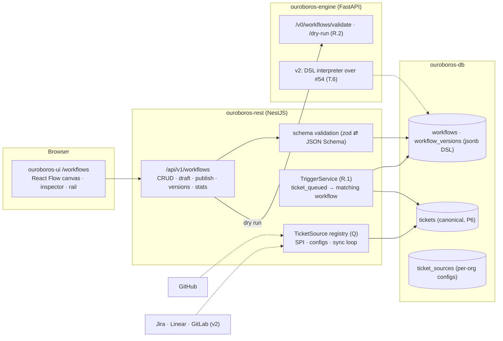
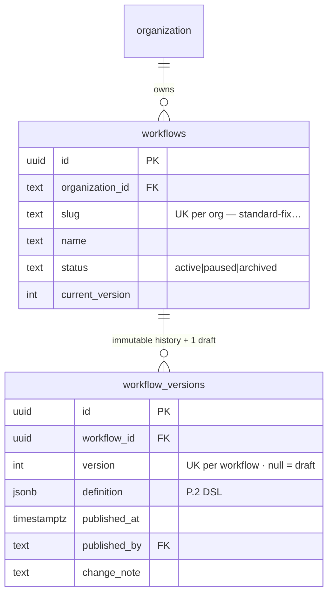
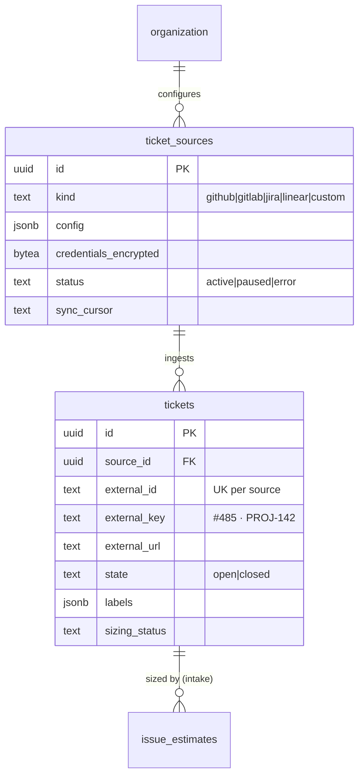
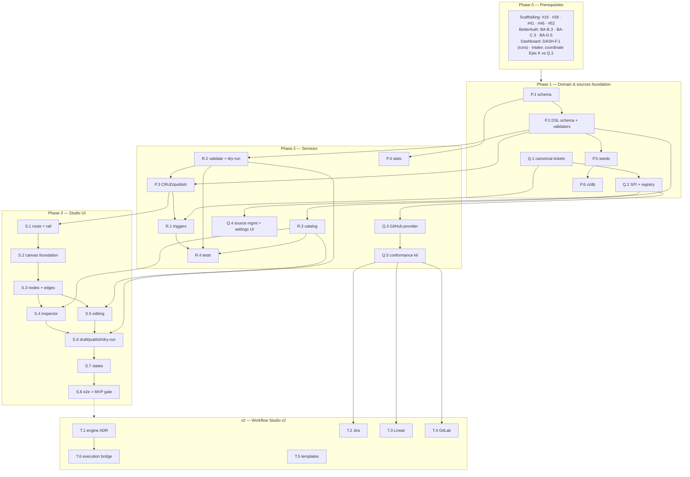

# Roadmap — Workflow Studio / Visual Builder (Mockup 04)

## Description

> Create a roadmap that covers the features for the mockup page 04. Any additional
> tech infrastructure that is required to implement the functionality in these mockup
> pages should be researched and offered as options for implementing in the roadmap.
> The roamdap should include MVP and v2 options, as well as the labels, milestones,
> and the like, for the tickets to be created. Any ticket sources that are used by
> Ouroboros for ingesting should be pluggable, which includes sources like Jira,
> Linear, GitHub, GitLab, and other bug reporting/issue recording sites. Refer to the
> page so that issues can reference the mockup file when creating the UI/UX design of
> the pages.

## Context & Existing Work (duplicate-avoidance survey)

Surveyed 2026-08-08.

**Design source of truth for every UI ticket in this roadmap:**
[`docs/mockups/04-workflow-builder.html`](mockups/04-workflow-builder.html) (with
`docs/mockups/assets/ouroboros.css`) — the Workflow Studio. Its anatomy:

- **Page head** — eyebrow `Workflow Studio`, h1 = active workflow name
  (`standard-fix`), subline `Runs when a sized issue with effort ≤ M is queued. Last
  edited 2h ago · v14 · used by 61% of runs.`; segmented control **Visual** (on) /
  **Code** (→ mockup 05) / **Copilot** (→ mockup 20); actions **Browse templates**
  (→ mockup 13), **Dry run with issue #485**, **Publish v15** (primary).
- **Left rail** (`.wf-list`) — workflow items with name + caption
  (`6 stages · auto-merge`, `needs review`, `paused` with err dot on `hotfix-p0`),
  active item in accent-gradient treatment, dashed **+ New workflow** tile.
- **Center canvas** (`.canvas-card` → `.stage`, 830×800 dot-grid) — an SVG edge
  layer and absolutely-positioned nodes:
  - Node types with distinct treatments: **trigger** (accent top border — `Issue
    queued`, chip `effort ≤ M`), **llm** (violet — `Analyze`, `Plan`, `Split`,
    `Implement`, `Review`, chips like `skill:repo-map`, `claude-sonnet-5`,
    `prompt template`, `routed by task`, `creates linked issues`), **infra**
    (warn — `Build farm · pool A` with runner chip, `Test` with
    `twister –p native_sim`), **flow/decision** (octagonal clip-path —
    `Effort re-check`, `Gate / Checks green?` chip `required checks: 14`),
    **term** (ok — `Open PR & auto-merge` chip `squash · delete branch`; mini
    pill variant `Back to queue`).
  - Edge classes: executed/**active** path (accent glow), plain edges, and the
    dashed **loop** edge — "the ouroboros: gate fail loops back to implement".
  - Edge labels: `≤ M ↓` (accent), `> M ↘` (warn), `pass →` (ok), `fail ↺` (err).
  - Selected node (`Implement`) carries the `.sel` glow ring.
  - **Canvas toolbar**: zoom −/100%/+, **Auto-layout**, **Add stage ▾**, hint
    `⌥ drag to pan · double-click edge to add stage`.
- **Right inspector** (sticky `.inspector`, bound to the selected node) — type line
  (`◆ Implement`), title, description; **Mode** segment (Direct prompt / **Skill**);
  Skill select (`zephyr-conventions`) with load-into-context hint; **Prompt
  template** code block with `{{issue.title}}` / `{{plan}}` variables; **Model
  routing** radios (*Inherit route for task "implement"* (recommended) with model
  pill / *Pin model ▾*); **Limits** (Max retries `2`, Token budget `400k`);
  **Permissions** toggles (*May push fixup commits* on, *May touch CI config* off);
  footer **Delete stage** / **Apply**.

**Overlapping work and dispositions:**

| Existing work | Disposition under this roadmap |
|---|---|
| Intake roadmap (`ROADMAP_MOCKUP_03_ISSUE_INTAKE.md`, validation gate) — decision K5 fixed workflow-tag set; O.3 "workflow entities" (v2) | **Superseded/landed here** — Epic P creates real workflow entities; O.3's scope (assign menus + estimator context reading the registry) is folded into P.4/T.6 amendments. Stored opaque tags remain valid slugs. |
| Intake roadmap Epic K — GitHub-specific sync (K.3 credentials/client, K.4 sync service) | **Refactored behind the provider SPI** by Q.3 — same behavior, now the first `TicketSourceProvider`. If Epic K has not been built when this roadmap starts, Q.3 *is* its implementation (coordinate at filing time). |
| Dashboard roadmap — `runs.workflow_tag` (DASH-F.1), queue actions (INTAKE-M.3) | **Consumed** — P.4's usage stats join `runs`; trigger predicates (R.1) evaluate queue events. |
| Scaffolding #49 placeholder routes (v2) | **Superseded for `/workflows`** — this roadmap builds the real screen. |
| Scaffolding #54 engine task skeleton (v2), DASH-J.3 ingestion bridge (v2) | **Consumed by T.6** — actual workflow *execution* bridges through them; MVP here is authoring + validation + dry-run, not running loops. |
| Mockups 05 (code view), 20 (copilot), 13 (templates/onboarding) | **Out of scope** — the segmented control and template button link to placeholders; P.2's DSL is designed so mockup 05's YAML view is a projection, not a rewrite. |
| BetterAuth roadmap (validation gate) — tenant context, roles, settings surfaces | **Prerequisite** (BA-C.3, BA-C.4, BA-D.5). |

Epic letters continue the sequence (A–E, F–J, K–O): this roadmap uses **P–T**.

## Infrastructure Options (researched — pick before filing)

The mockup demands three pieces of infrastructure the codebase lacks. Options below
were researched 2026-08-08; each has a recommendation, but all are open until this
document is validated.

### 1. Canvas / node-editor library (Epic S)

| Option | What it is | Fit | Trade-offs |
|---|---|---|---|
| **A — React Flow (`@xyflow/react`)** ⭐ recommended | MIT-licensed node-based UI library (xyflow), custom nodes/edges as React components, built-in pan/zoom/selection, works with ELK/Dagre layout engines; used in production by Stripe, Typeform | Custom node components can reproduce the mockup's five node treatments and edge classes exactly; controlled-state mode fits our versioned-document model | One more dependency (~50kB gz); "lightweight rule" exception must be a conscious decision |
| B — Rete.js | Visual-programming framework with dataflow/control-flow processing built in | Brings graph *processing* we don't need client-side (the engine owns execution) | Heavier abstraction; less natural in idiomatic React |
| C — Custom SVG editor | The mockup is literally absolute-positioned divs + SVG paths | Zero dependencies; pixel-perfect by construction | Pan/zoom/drag/connect/selection/a11y all hand-built — weeks of undifferentiated work, the classic build-a-bad-React-Flow trap |

### 2. Workflow definition storage & DSL (Epic P)

| Option | Shape | Fit | Trade-offs |
|---|---|---|---|
| **A — Canonical JSON document per version + thin metadata columns** ⭐ recommended | `workflow_versions.definition jsonb` validated against a published JSON Schema; queryable metadata (name, version, status, stage_count) as columns | One artifact to version/diff/publish; mockup 05's code view = YAML projection of the same document; schema validation shared by REST (zod) and engine (pydantic) | Cross-stage queries need jsonb operators (acceptable at this scale) |
| B — Fully normalized tables (stages, edges, configs) | Relational rows per node/edge | Referential integrity in the DB | Publish/versioning becomes multi-table snapshotting; painful diffing; code view needs assembly |
| C — Hybrid (document + generated projection tables) | JSON canonical + materialized rows for queries | Best of both | Premature — adopt only if metrics show jsonb pain |

### 3. Workflow execution engine (v2 — T.1/T.6; MVP ships authoring + dry-run only)

| Option | What it is | Fit | Trade-offs |
|---|---|---|---|
| **A — Custom asyncio state machine in `ouroboros-engine`** ⭐ recommended MVP path | Interpret the P.2 DSL directly over the #54 task skeleton; journal transitions into the DASH read-model via J.3 | No new infrastructure; the DSL is small (5 node types); aligns with "simple, lightweight, modular" | Durability/replay is ours to build; revisit at scale |
| B — Temporal | Battle-tested durable execution (deterministic replay, timers, retries); 2026 wave added LLM streams + OpenAI Agents SDK integration | Strongest durability story for long-running loops | Heavy operational footprint (server + DB + workers) — contradicts the brief today; strongest v2 candidate |
| C — Hatchet / Inngest / Restate | Lighter durable-execution/queueing platforms (Hatchet: Postgres-backed task orchestration; Inngest: event-driven steps, TS-first) | Hatchet's Postgres core fits our stack | Younger ecosystems; Inngest is TS-first while our engine is Python |

**T.1 is the decision issue**: build the custom interpreter (A) for first execution,
and write the ADR on graduating to Temporal (B) with explicit triggers (run volume,
crash-recovery incidents, multi-day loops).

### 4. Pluggable ticket sources (Epic Q — per the description, mandatory design)

One `TicketSourceProvider` SPI; every source is a plugin conforming to it:

| Provider | API surface | Auth | Change detection | Status |
|---|---|---|---|---|
| **GitHub** | REST (issues, labels) | PAT now → GitHub App (INTAKE-O.1) | `since` cursor → webhooks | **MVP (Q.3)** — refactor of INTAKE-K.3/K.4 |
| GitLab | REST v4 (issues) | PAT / OAuth app | `updated_after` cursor → webhooks | v2 (T.4) |
| Jira | REST v3 (search/JQL) | API token / OAuth 2.0 (3LO) | JQL `updated >=` cursor → webhooks | v2 (T.2) |
| Linear | GraphQL | API key / OAuth | `updatedAt` filter → webhooks | v2 (T.3) |
| Others (Azure Boards, Bugzilla, …) | — | — | — | SPI conformance kit (Q.5) makes them community-addable |

## Decisions proposed by this roadmap (validate before issue creation)

| # | Decision | Rationale |
|---|----------|-----------|
| P1 | **Workflows are org-scoped entities with immutable published versions** (`v14` → publish → `v15`); drafts are mutable, published versions never change | The mockup's publish button, version chip, and "last edited" all imply draft/publish; runs must pin the exact version they executed. |
| P2 | **Canvas = React Flow** (infrastructure option 1-A) — a documented exception to the no-framework rule | Hand-building pan/zoom/drag/connect is weeks of undifferentiated work; MIT license; custom nodes keep pixel fidelity. |
| P3 | **DSL = canonical JSON document** (option 2-A) with a published JSON Schema; five node types (`trigger`, `llm`, `infra`, `flow`, `term`) + typed edges (`default`, `branch`, `loop`) | Matches the mockup's exact vocabulary; schema-shared validation; YAML projection ready for mockup 05. |
| P4 | **MVP = authoring, validation, dry-run; execution = v2** (T.6 over #54 + DASH-J.3; engine choice per option 3) | The loop engine doesn't exist; an editor that publishes validated, versioned, dry-runnable definitions is honest and complete on its own. |
| P5 | **Ticket sources are pluggable from day one**: canonical ticket model + `TicketSourceProvider` SPI; GitHub is the first provider; Jira/Linear/GitLab are v2 plugins behind the same interface | Explicit requirement of this roadmap's description; prevents GitHub-shaped assumptions from calcifying in the intake stack. |
| P6 | **Canonical ticket model** (`source_kind`, `external_id`, `external_url`, title, body, labels, state, author, timestamps) replaces GitHub-specific columns as the intake read-model; providers map into it | The trigger node says `Issue queued`, not `GitHub issue queued`; estimates/queue/runs reference canonical tickets. |
| P7 | **Stage model/skill/prompt references are validated strings, not foreign keys** — model routing inherits by task name (mockup's "Inherit route for task"), pinning stores an opaque model id (consistent with DASH-F8) | Model registry (mockup 06/21) and skills (mockup 14) don't exist; the inspector renders what's stored and flags unknown references at validation, not save. |
| P8 | **Trigger predicates are structured, not free-code**: `{event: "ticket_queued", conditions: {effort_lte: "m", labels?, source?}}` | Matches the mockup chip (`effort ≤ M`); evaluable by R.1 today and by the execution engine later; code-view still renders it readably. |
| P9 | **Permissions toggles are enforced declarations**: stored on the stage, exported to the run context; execution-time enforcement lands with T.6 and is documented as such in the inspector | Storing intent now keeps published v-N definitions forward-compatible with enforcement; the UI must not imply enforcement that doesn't exist yet (honesty rule). |
| P10 | **Labels**: new `workflow` and `sources`; **Milestones**: `Workflow Studio MVP` and `Workflow Studio v2` (created at filing, all issues assigned); effort chips XS–XL | The description explicitly requests labels + milestones for the filing pass. |

## Architecture Overview



## MVP Definition

The MVP is **mockup 04 as a working authoring studio over versioned, validated,
dry-runnable workflow definitions, with intake re-founded on pluggable ticket
sources**. It is done when, against the compose stack:

1. `/workflows` reproduces
   [`docs/mockups/04-workflow-builder.html`](mockups/04-workflow-builder.html)
   pixel-faithfully in **both themes**: rail (five seeded workflows + New tile),
   canvas (all five node treatments, edge classes incl. the dashed loop-back, edge
   labels, selection glow), toolbar (zoom, auto-layout, add stage), sticky
   inspector with every section of the mockup.
2. Editing works end to end: select node → inspector edits (mode, skill, prompt
   template with variable chips, routing inherit/pin, limits, permissions) →
   Apply → draft saved; add/connect/delete stages; auto-layout untangles a graph.
3. **Publish** creates an immutable version (`v14 → v15`) after server + engine
   validation both pass; invalid graphs (unreachable stages, missing terminal,
   unknown skill/model references, malformed predicates) are rejected with
   designed, node-anchored errors.
4. **Dry run** sends the draft + a chosen sized ticket (e.g. `#485`) through the
   engine's simulator: trigger predicate evaluated, stage order walked, branch/
   loop edges explained — no LLM calls, results rendered on the canvas (path
   highlight per the mockup's active-edge treatment).
5. The **pluggable source layer** exists: canonical `tickets` model, provider SPI
   + registry, GitHub as the first conforming provider (intake features keep
   working), per-org source configuration surface, and a conformance kit proving
   a second provider can be added without touching core intake code.
6. Workflow **usage stats** are real (`used by 61% of runs` from the runs
   read-model; `0 runs` shown honestly); rail captions (stages count,
   auto-merge/needs-review/paused) derive from definitions + status.
7. Seeds provide the five mockup workflows (standard-fix's full 12-node graph
   exactly); integration tests cover versioning, validation, trigger matching,
   provider conformance; the e2e suite gains a studio leg.

**Explicitly v2 (milestone `Workflow Studio v2`):** actual execution (T.6 +
engine-choice ADR T.1), Jira/Linear/GitLab providers (T.2–T.4), template library
(T.5), code view (mockup 05 roadmap), copilot (mockup 20 roadmap).

## Epics, Labels & Milestones

| Epic | Name | Goal | Modules | Milestone |
|------|------|------|---------|-----------|
| P | Workflow Domain & Versioning | Entities, JSON-Schema DSL, CRUD/publish API, stats, seeds | ouroboros-db, ouroboros-rest | Workflow Studio MVP |
| Q | Pluggable Ticket Sources | Canonical ticket model, provider SPI/registry, GitHub provider, config surface, conformance kit | ouroboros-db, ouroboros-rest, ouroboros-ui | Workflow Studio MVP |
| R | Validation, Triggers & Dry-Run | Stage catalog, engine validate/simulate, trigger matching | ouroboros-engine, ouroboros-rest | Workflow Studio MVP |
| S | Studio UI | Rail, canvas, inspector, editing, publish, states, e2e | ouroboros-ui | Workflow Studio MVP |
| T | Execution & Extended Sources (v2) | Engine ADR + execution bridge, Jira/Linear/GitLab, templates | all | Workflow Studio v2 |

Issue naming: `<project>: [<epic letter>.<issue>] <title>`. Labels: existing set
(`mvp`, `v2`, `rest`, `db`, `engine`, `ui`, `ci`, `design`, `intake`) **plus new
`workflow` and `sources`** (decision P10). Milestones **`Workflow Studio MVP`** and
**`Workflow Studio v2`** created at filing; every issue below is assigned to its
epic's milestone. Complexity chips: **XS · S · M · L**.

---

## Epic P — Workflow Domain & Versioning (`ouroboros-db` + `ouroboros-rest`)

| Issue | Title | Summary | Labels | Parallel | MVP | Complexity | Affected Modules |
|-------|-------|---------|--------|:--------:|:---:|:----------:|------------------|
| P.1 | ouroboros-db: [P.1] Workflow & version schema | `workflows` + immutable `workflow_versions` (jsonb definition) | mvp, workflow, db | N (after #19, BA-B.3) | Y | M | ouroboros-db |
| P.2 | ouroboros-rest: [P.2] Workflow DSL JSON Schema & shared validation | Published schema for nodes/edges/predicates; zod + pydantic parity | mvp, workflow, rest, engine | N (after P.1) | Y | L | ouroboros-rest, ouroboros-engine |
| P.3 | ouroboros-rest: [P.3] Workflow CRUD, draft & publish API | List/create/rename/pause, draft save, publish with validation gate | mvp, workflow, rest | N (after P.2) | Y | L | ouroboros-rest |
| P.4 | ouroboros-rest: [P.4] Workflow usage & rail stats | `used by N% of runs`, stage counts, terminal-behavior captions | mvp, workflow, rest | N (after P.1, DASH-F.1) | Y | S | ouroboros-rest |
| P.5 | ouroboros-db: [P.5] Studio dev seeds — mockup-04 parity | Five workflows incl. standard-fix's full graph at v14 | mvp, workflow, db | N (after P.2) | Y | M | ouroboros-db |
| P.6 | ouroboros-db: [P.6] Workflow constraints in ci/db | Version immutability, status vocab, definition-schema drift check | mvp, workflow, db, ci | N (after P.5, #24) | Y | XS | ouroboros-db, .github |

### Issue P.1 — ouroboros-db: [P.1] Workflow & version schema

- **Problem Statement:** Workflows exist only as opaque tags (intake decision K5);
  the studio needs real org-scoped entities with immutable version history
  (mockup: `v14`, publish `v15`).
- **Solution/Scope:** Migration: `workflows` — id, `organization_id` FK, `slug`
  (unique per org; existing tags `standard-fix` etc. remain valid slugs), `name`,
  `status` CHECK `active|paused|archived`, `current_version` FK-ish int,
  timestamps; `workflow_versions` — workflow FK, `version` int (unique per
  workflow), `definition` jsonb (P.2 schema), `published_at`, `published_by` →
  `"user".id`, `change_note`; one mutable **draft** row per workflow
  (`version = null` variant or `is_draft` flag — decided in-issue) holding
  work-in-progress. Published rows are immutable (trigger-enforced).
- **Acceptance Criteria:**
  - Publishing creates version N+1; any UPDATE on a published row is rejected by
    trigger (tested).
  - Slug uniqueness per org; runs/queue tags resolve against slugs.
  - Draft coexists with published versions; one draft max per workflow.
- **Parallelism/Dependencies:** Needs #19, BA-B.3. Blocks P.2, P.5.
- **Technical Stack:** PostgreSQL 17, Flyway.
- **Epic:** P



### Issue P.2 — ouroboros-rest: [P.2] Workflow DSL JSON Schema & shared validation

- **Problem Statement:** The canvas, the code view (mockup 05, future), the
  validator, and the future interpreter must agree on one definition language —
  the DSL is the product's most durable contract (decision P3).
- **Solution/Scope:** Author `docs/WORKFLOW_DSL.md` + a versioned JSON Schema
  (`$id`-stamped, committed): document root `{dsl_version, trigger, nodes[],
  edges[]}`; node `{id, type: trigger|llm|infra|flow|term, title, position{x,y},
  config}` with per-type config schemas — llm: `{mode: prompt|skill, skill?,
  prompt_template, routing: {inherit_task} | {pinned_model}, limits: {max_retries,
  token_budget}, permissions: {push_fixup, touch_ci}}` (the inspector's exact
  field set); flow: `{kind: decision|gate, predicate}` (P8 structured predicates);
  infra: `{runner_pool?, command?}`; term: `{action: open_pr_automerge |
  back_to_queue | needs_review, options}`; edge `{from, to, kind:
  default|branch|loop, label?, condition?}`. Structural rules (exactly one
  trigger, ≥1 term, all nodes reachable, branch edges carry conditions, loop
  edges must target upstream nodes) expressed as post-schema validators.
  Implement zod validation in REST and pydantic in engine **generated/checked
  against the same schema file** (CI parity test).
- **Acceptance Criteria:**
  - The seeded standard-fix graph validates; each documented invalid case fails
    with a node/edge-anchored error code.
  - REST and engine validators agree on a golden fixture set (parity test in CI).
  - `docs/WORKFLOW_DSL.md` renders the schema with examples; YAML projection
    round-trips losslessly (fixture proof for mockup 05).
- **Parallelism/Dependencies:** Needs P.1. Blocks P.3, R.2, R.3, S.2.
- **Technical Stack:** JSON Schema 2020-12, zod, pydantic v2.
- **Epic:** P

```
definition.json ─▶ JSON Schema (committed, $id: dsl/v1)
   ├─ REST: zod validate (save/publish)      ├─ structural: 1 trigger · reachable · terms
   ├─ engine: pydantic validate (dry-run)    └─ parity CI: same fixtures, same verdicts
   └─ YAML projection ⇄ lossless (mockup 05 ready)
```

### Issue P.3 — ouroboros-rest: [P.3] Workflow CRUD, draft & publish API

- **Problem Statement:** The rail, canvas, and publish button need the full
  lifecycle: list, create, rename, pause, draft-save, validate, publish, version
  history.
- **Solution/Scope:** Under tenant context (BA-C.3): `GET /api/v1/workflows`
  (rail payload incl. P.4 captions), `POST` (create from blank or template stub),
  `GET /:id` (+`?version=`), `PATCH /:id` (name/status — pause shows the
  mockup's err-dot state), `PUT /:id/draft` (autosave debounced; last-writer
  guard via `If-Match` draft etag), `POST /:id/publish` (runs P.2 zod + R.2
  engine validation; both green → new immutable version + `change_note`;
  member=read, admin+=write per BA role policy), `GET /:id/versions`. Uniform
  error envelope; OpenAPI complete (feeds the generated client).
- **Acceptance Criteria:**
  - Full lifecycle in the harness: create → draft edits → publish v1 → edit →
    publish v2 → history lists both; pause flips rail state.
  - Publish with a validation failure returns node-anchored errors and creates
    nothing.
  - Concurrent draft writes: stale `If-Match` → 409 (no silent clobber).
- **Parallelism/Dependencies:** Needs P.2 (+R.2 for the engine gate). Blocks S.1,
  S.6.
- **Technical Stack:** NestJS, Kysely, class-validator.
- **Epic:** P

```
rail GET /workflows ─▶ [{slug, name, status, caption "6 stages · auto-merge", usage%}]
draft PUT (etag) ─▶ autosave · publish POST ─▶ [zod ✓][engine ✓] ─▶ v15 (immutable)
```

### Issue P.4 — ouroboros-rest: [P.4] Workflow usage & rail stats

- **Problem Statement:** The head's `used by 61% of runs` and the rail captions
  (`6 stages · auto-merge`, `needs review`, `paused`) must be computed truth,
  not stored strings.
- **Solution/Scope:** Stats service: usage% = runs with this slug / all runs
  (windowed 30d, from DASH-F.1; `0 runs` rendered honestly), stage count from the
  current version's definition, terminal caption derived from the term node's
  action (`auto-merge` / `needs review`), paused from status. Amends intake
  surfaces (INTAKE-O.3 scope): assign-workflow menus and estimator context list
  registry workflows.
- **Acceptance Criteria:** Seeded stats match the mockup captions; an org with no
  runs shows `no runs yet`; intake assign menu lists registry entries (amendment
  verified).
- **Parallelism/Dependencies:** Needs P.1, DASH-F.1. Feeds S.1; amends
  INTAKE-M.3/L contexts.
- **Technical Stack:** NestJS, Kysely.
- **Epic:** P

```
definition ─▶ stages:6 · term:auto-merge     runs(30d) ─▶ usage 61% │ "no runs yet"
status=paused ─▶ rail err-dot caption
```

### Issue P.5 — ouroboros-db: [P.5] Studio dev seeds — mockup-04 parity

- **Problem Statement:** Design review and e2e need the mockup's exact studio
  state: five workflows, and standard-fix's complete 12-node graph at v14 with
  a selected Implement node worth of config.
- **Solution/Scope:** Extend the dev seed: workflows `standard-fix` (v14, active,
  the full mockup graph — trigger/analyze/decision/plan/split/back-to-queue/
  implement/build/test/review/gate/terminal with positions, chips, edge kinds
  incl. the loop edge, Implement configured exactly as the inspector shows),
  `feature-loop` (7 stages), `deps-refresh` (5, term=needs_review), `docs-loop`
  (4), `hotfix-p0` (5, paused); version history depth ≥2 for standard-fix
  (publish provenance). Personal org: none (empty-state fixture).
- **Acceptance Criteria:** Studio renders the mockup graph from seeds alone
  (positions included); P.4 captions match; dry-run of seeded `#485` (intake
  seeds) walks the expected path.
- **Parallelism/Dependencies:** Needs P.2 (+INTAKE-K.5 coordination). Feeds
  R/S tests, e2e.
- **Technical Stack:** Flyway repeatable migration, SQL/JSON.
- **Epic:** P

```
seeds: standard-fix v14 (12 nodes · 12 edges · loop-back) + 4 more workflows
       └▶ canvas parity · rail parity · dry-run fixture
```

### Issue P.6 — ouroboros-db: [P.6] Workflow constraints in ci/db

- **Problem Statement:** Version immutability and definition validity are the
  contracts everything downstream trusts.
- **Solution/Scope:** Extend #24 `tests/constraints.sql`: immutability trigger
  probe, status vocab, version uniqueness/monotonicity, one-draft rule; CI step
  validating every seeded definition against the committed JSON Schema (drift
  check — schema change without migration fails).
- **Acceptance Criteria:** Green on current schema; red on immutability breach or
  schema drift (spot-verified).
- **Parallelism/Dependencies:** Needs P.5, #24.
- **Technical Stack:** GitHub Actions, SQL, ajv (schema check).
- **Epic:** P

```
ci/db: migrate ─▶ constraints (+P probes) ─▶ seeds ⊨ JSON Schema ─▶ ✓/✗
```

---

## Epic Q — Pluggable Ticket Sources (`ouroboros-db` + `ouroboros-rest` + `ouroboros-ui`)

The description's explicit requirement: intake sources must be pluggable — GitHub,
GitLab, Jira, Linear, and other trackers behind one interface. MVP ships the
abstraction + GitHub; T.2–T.4 add providers without core changes.

| Issue | Title | Summary | Labels | Parallel | MVP | Complexity | Affected Modules |
|-------|-------|---------|--------|:--------:|:---:|:----------:|------------------|
| Q.1 | ouroboros-db: [Q.1] Canonical ticket model | Source-agnostic `tickets` + `ticket_sources` schema (P6) | mvp, sources, intake, db | N (after #19, BA-B.3) | Y | M | ouroboros-db |
| Q.2 | ouroboros-rest: [Q.2] TicketSourceProvider SPI & registry | Provider interface, lifecycle, capability flags, secret handling | mvp, sources, rest | N (after Q.1) | Y | L | ouroboros-rest |
| Q.3 | ouroboros-rest: [Q.3] GitHub provider (first conforming plugin) | INTAKE-K.3/K.4 behavior behind the SPI; cursor sync; PR filtering | mvp, sources, intake, rest | N (after Q.2) | Y | M | ouroboros-rest |
| Q.4 | ouroboros-rest: [Q.4] Source management API & settings UI | Add/configure/pause sources per org; masked credentials; status | mvp, sources, rest, ui | N (after Q.2, BA-C.3) | Y | M | ouroboros-rest, ouroboros-ui |
| Q.5 | ouroboros-rest: [Q.5] Provider conformance kit | Contract test suite + in-memory fake provider proving pluggability | mvp, sources, rest, ci | N (after Q.3) | Y | M | ouroboros-rest |

### Issue Q.1 — ouroboros-db: [Q.1] Canonical ticket model

- **Problem Statement:** The intake schema (INTAKE-K.1) is GitHub-shaped
  (`github_issues`, repo FK, `gh_*` columns); a Jira ticket has no repo and no
  `#number`. The workflow trigger says `Issue queued` — source-neutral by design.
- **Solution/Scope:** Migration (coordinated with INTAKE-K.1 — if that epic is
  unbuilt, this replaces it; if built, this is its generalizing migration):
  `ticket_sources` — id, `organization_id` FK, `kind` CHECK
  `github|gitlab|jira|linear|custom`, `display_name`, `config` jsonb
  (non-secret: base URL, project keys, repo list), `credentials_encrypted`,
  `status` CHECK `active|paused|error`, `sync_cursor` text, `synced_at`;
  `tickets` — id, `organization_id` FK, `source_id` FK, `external_id` (unique
  per source — `485`, `PROJ-142`, Linear UUID), `external_key` (display form:
  `#485`, `PROJ-142`), `external_url`, `title`, `body`, `state` CHECK
  `open|closed`, `labels` jsonb, `author`, `source_created_at`,
  `source_updated_at`, `synced_at`, `sizing_status` (intake K.4 vocabulary).
  Estimates/queue/runs re-point at `tickets.id`. GitHub's repo linkage moves
  into `config`/ticket `meta` jsonb (repo remains queryable for GitHub-kind
  sources).
- **Acceptance Criteria:**
  - Unique (source, external_id); two sources can hold the same external key.
  - Intake queries (filters/search) work unchanged over the canonical model.
  - A Jira-shaped row (no repo, `PROJ-142` key) round-trips the full intake
    read path in tests.
- **Parallelism/Dependencies:** Needs #19, BA-B.3. Blocks Q.2, Q.3.
- **Technical Stack:** PostgreSQL 17, Flyway.
- **Epic:** Q



### Issue Q.2 — ouroboros-rest: [Q.2] TicketSourceProvider SPI & registry

- **Problem Statement:** Pluggability is an interface discipline: core intake
  must depend only on a contract every tracker can implement.
- **Solution/Scope:** Define the SPI (TypeScript interface + docs):
  `capabilities()` (webhooks? labels? bidirectional?), `validateConfig(config,
  creds)`, `fullSync(ctx)` / `incrementalSync(ctx, cursor) → {tickets[],
  nextCursor}` (canonical-model mapped), `mapTicket(raw)`, optional
  `webhookHandler(payload, sig)` (T providers), error taxonomy
  (auth/rate-limit/not-found → provider-neutral codes feeding source `status`).
  Registry: providers register by `kind`; the sync scheduler (generalized from
  INTAKE-K.4) iterates active sources, calls the SPI, upserts canonical
  tickets, hands new/updated rows to the estimation pipeline (INTAKE-L.3) —
  core code contains **zero** provider-specific branches (lint-guarded import
  boundary). Credential encryption helper shared (AES-GCM, key from config).
- **Acceptance Criteria:**
  - Core sync loop compiles against the SPI only (dependency-cruiser/lint rule
    enforced in CI).
  - Provider errors map to source status with honest UI-facing reasons.
  - SPI documented in `docs/TICKET_SOURCES.md` with a "write a provider"
    walkthrough.
- **Parallelism/Dependencies:** Needs Q.1. Blocks Q.3, Q.4, Q.5, T.2–T.4.
- **Technical Stack:** NestJS DI (provider tokens), TypeScript.
- **Epic:** Q

```
interface TicketSourceProvider {
  kind · capabilities() · validateConfig() · fullSync() · incrementalSync(cursor)
  mapTicket(raw → canonical) · webhookHandler?(payload)
}
scheduler ─▶ for source in active: provider(kind).incrementalSync ─▶ upsert tickets ─▶ estimation
```

### Issue Q.3 — ouroboros-rest: [Q.3] GitHub provider (first conforming plugin)

- **Problem Statement:** GitHub intake (INTAKE-K.3/K.4 behavior) must become the
  proof that the SPI works — same features, provider-shaped.
- **Solution/Scope:** Implement `GithubTicketSourceProvider`: Octokit client,
  PAT auth from encrypted creds, enabled-repo scoping from source config
  (bridging BA-B.3 enablement), `since`-cursor incremental sync, PR filtering,
  label/author mapping into the canonical model, rate-limit backoff surfaced as
  source status; repo metadata into ticket `meta`. Coordinate with the intake
  roadmap at filing: if K.3/K.4 are built, this refactors them; if not, this
  implements them SPI-first (single source of truth for that decision at filing
  time).
- **Acceptance Criteria:** Intake MVP criteria (INTAKE roadmap §1–2) hold when
  running through the SPI; conformance kit (Q.5) passes; no Octokit import
  outside the provider module.
- **Parallelism/Dependencies:** Needs Q.2. Blocks Q.5; supersedes/implements
  INTAKE-K.3/K.4.
- **Technical Stack:** Octokit, NestJS.
- **Epic:** Q

```
GithubProvider: PAT → enabled repos → issues?since=cursor (PRs filtered) → canonical tickets
   rate-limit ─▶ backoff + source.status="error: rate limited until …" (honest)
```

### Issue Q.4 — ouroboros-rest: [Q.4] Source management API & settings UI

- **Problem Statement:** Orgs need to add and manage sources — the pluggable
  layer's user-facing face (and the home the intake "no token" guidance state
  links to).
- **Solution/Scope:** API under tenant context: `GET/POST /api/v1/sources`,
  `PATCH /:id` (config/pause), `POST /:id/credentials` (write-only, masked
  echoes), `POST /:id/test` (provider `validateConfig` round-trip), `POST
  /:id/sync` (manual trigger, debounced), `GET /:id/status`; owner/admin gated.
  Settings UI section (workspace settings surface, design language per mockup
  17's chrome): source list with kind badges + status dots, add-source flow
  (kind picker showing MVP GitHub + "coming soon" tiles for Jira/Linear/GitLab
  — honest v2 labeling), config/credential forms per provider (schema-driven),
  test-connection affordance. Amends INTAKE-N.6's no-token guidance target.
- **Acceptance Criteria:** Add GitHub source → test → sync → tickets appear;
  credentials never echoed; member sees read-only; provider form renders from
  provider-declared config schema (no hardcoded GitHub form).
- **Parallelism/Dependencies:** Needs Q.2, BA-C.3/D.5. UI after #46.
- **Technical Stack:** NestJS, React, #46 primitives.
- **Epic:** Q

```
Settings ▸ Ticket sources
  [GH ●active  acme-robotics · 2 repos · synced 40s ago]  [test][sync][pause]
  [+ Add source: GitHub | Jira (soon) | Linear (soon) | GitLab (soon)]
```

### Issue Q.5 — ouroboros-rest: [Q.5] Provider conformance kit

- **Problem Statement:** "Pluggable" is a claim until a second implementation
  passes the same tests; the kit is the contract's teeth — and the on-ramp for
  T.2–T.4 and community providers.
- **Solution/Scope:** Reusable contract-test suite parameterized by provider:
  config validation, full + incremental sync semantics (cursor monotonicity,
  idempotent re-sync), canonical mapping completeness, error taxonomy, webhook
  handler shape (if capable); an `InMemoryTicketSourceProvider` fake (fixture-
  driven) that passes the kit and powers core-intake tests without network;
  CI runs the kit against GitHub (recorded fixtures) + the fake.
- **Acceptance Criteria:** Kit green for both providers; deliberately breaking a
  mapping fails the kit; core intake harness runs entirely on the fake (no
  Octokit in those tests).
- **Parallelism/Dependencies:** Needs Q.3. Gate for T.2–T.4.
- **Technical Stack:** Jest, recorded fixtures.
- **Epic:** Q

```
conformance(provider) ─▶ config ✓ · sync/cursor ✓ · mapping ✓ · errors ✓ · webhook ✓
  passes: GithubProvider · InMemoryProvider  →  T.2–T.4 must pass the same kit
```

---

## Epic R — Validation, Triggers & Dry-Run (`ouroboros-engine` + `ouroboros-rest`)

| Issue | Title | Summary | Labels | Parallel | MVP | Complexity | Affected Modules |
|-------|-------|---------|--------|:--------:|:---:|:----------:|------------------|
| R.1 | ouroboros-rest: [R.1] Trigger evaluation service | `ticket_queued` events matched to workflows via P8 predicates | mvp, workflow, rest | N (after P.3, Q.1) | Y | M | ouroboros-rest |
| R.2 | ouroboros-engine: [R.2] Definition validation & dry-run simulator | `/v0/workflows/validate` + `/dry-run`: walk the graph, no LLM calls | mvp, workflow, engine | N (after P.2, #52) | Y | L | ouroboros-engine |
| R.3 | ouroboros-rest: [R.3] Stage catalog endpoint | Node-type registry (config schemas, defaults) driving Add-stage & inspector | mvp, workflow, rest | N (after P.2) | Y | S | ouroboros-rest |
| R.4 | ouroboros-rest: [R.4] Studio integration tests | Publish gate, trigger matrix, dry-run contract, catalog | mvp, workflow, rest, ci | N (after R.1–R.3) | Y | M | ouroboros-rest |

### Issue R.1 — ouroboros-rest: [R.1] Trigger evaluation service

- **Problem Statement:** "Runs when a sized issue with effort ≤ M is queued" must
  be a real evaluation: when a ticket is queued (INTAKE-M.3), which workflow
  claims it?
- **Solution/Scope:** `TriggerService`: on queue events, evaluate active
  workflows' trigger predicates (P8: effort ≤, labels, source kind) against the
  canonical ticket + latest estimate; explicit workflow assignment (the intake
  action bar's choice) wins; predicate match fills the default; ambiguity
  (multiple matches) resolved by documented precedence (explicit > most-specific
  predicate > alphabetical) surfaced in the dry-run explanation; result stored
  on the queue item (`workflow_slug` + `workflow_version` pin). No execution —
  the pin is what T.6 will run.
- **Acceptance Criteria:** Matrix tests: effort boundaries, label conditions,
  paused workflows never match, explicit assignment wins, precedence documented
  + tested; queue items carry version pins.
- **Parallelism/Dependencies:** Needs P.3, Q.1 (+INTAKE-M.3 amendment: queue
  writes call this service).
- **Technical Stack:** NestJS, Kysely.
- **Epic:** R

```
ticket_queued(#485, effort M) ─▶ predicates: standard-fix(≤M ✓) feature-loop(>M ✗) hotfix(paused ✗)
   ─▶ pin {workflow: standard-fix, version: 14} on queue item
```

### Issue R.2 — ouroboros-engine: [R.2] Definition validation & dry-run simulator

- **Problem Statement:** Publish needs a second, execution-side opinion, and the
  head's "Dry run with issue #485" needs a real simulator — the engine must
  understand the DSL before it ever executes it.
- **Solution/Scope:** Extend the internal API (#52 pattern, shared-secret):
  `POST /v0/workflows/validate` (pydantic + structural rules per P.2; returns
  node-anchored findings) and `POST /v0/workflows/dry-run` `{definition,
  ticket}`: evaluate the trigger predicate, walk the graph deterministically
  (decisions take both branches with explanations, gates annotated with their
  requirements, loop edges reported with max-retry bounds), **zero LLM/provider
  calls**; returns ordered walk + per-node verdicts + path segments for canvas
  highlighting. OpenAPI committed + drift-checked.
- **Acceptance Criteria:** Seeded standard-fix + seeded `#485` yields the
  mockup's active path (trigger→analyze→decision→plan→implement…); invalid
  fixtures return anchored findings; determinism (same input → same walk);
  parity with REST-side zod verdicts (P.2 CI).
- **Parallelism/Dependencies:** Needs P.2, #52. Blocks P.3 (publish gate), S.6.
- **Technical Stack:** FastAPI, pydantic v2, graph walk (pure Python).
- **Epic:** R

```
POST /v0/workflows/dry-run {definition, ticket:#485}
 ─▶ trigger ✓ (M ≤ M) ─▶ walk: analyze → decision[≤M↓ | >M↘ explained] → plan → implement
 ─▶ {steps[], findings[], highlight_path[]}   (no LLM calls — simulator only)
```

### Issue R.3 — ouroboros-rest: [R.3] Stage catalog endpoint

- **Problem Statement:** "Add stage ▾" and the inspector need to know what node
  types exist, their config schemas, and their defaults — hardcoding that in the
  UI forks the DSL.
- **Solution/Scope:** `GET /api/v1/workflows/catalog`: node types with display
  metadata (glyph, treatment class per the mockup's five), config JSON Schemas
  (from P.2, the inspector renders forms from these), defaults per type, known
  skill names + task-route names as *suggestions* (validated strings per P7,
  sourced from config until mockups 06/14 land).
- **Acceptance Criteria:** Catalog serves everything S.4/S.5 render; adding a
  node type in P.2 appears in the UI with zero UI changes (fixture proof).
- **Parallelism/Dependencies:** Needs P.2. Blocks S.4, S.5.
- **Technical Stack:** NestJS.
- **Epic:** R

```
GET /catalog ─▶ [{type: llm, glyph: ◆, class: model, config_schema, defaults},
                 {type: flow, glyph: ◇, …}, …] ─▶ Add-stage menu + inspector forms
```

### Issue R.4 — ouroboros-rest: [R.4] Studio integration tests

- **Problem Statement:** Publish gating, trigger precedence, and dry-run
  contracts are cross-service behavior needing harness coverage.
- **Solution/Scope:** Testcontainers suites (engine stubbed per its contract):
  publish happy/invalid/concurrent-draft paths, trigger matrix (R.1 cases),
  dry-run request/response fidelity, catalog-driven form schema resolution,
  org isolation on all workflow routes.
- **Acceptance Criteria:** Green in `ci/rest`; removing the engine gate from
  publish turns tests red; ≤ 60s added.
- **Parallelism/Dependencies:** Needs R.1–R.3.
- **Technical Stack:** Jest, Supertest, Testcontainers.
- **Epic:** R

```
suites: publish gate ✓ · trigger matrix ✓ · dry-run contract ✓ · catalog ✓ · isolation ✓
```

---

## Epic S — Studio UI (`ouroboros-ui`)

Every issue references
[`docs/mockups/04-workflow-builder.html`](mockups/04-workflow-builder.html) as the
design source — the `.studio` grid (220px rail / canvas / 300px inspector,
stacking below 1100px), node/edge/inspector treatments, and the shared design
system via the #16 tokens (both themes; the mockup is dark-only).

| Issue | Title | Summary | Labels | Parallel | MVP | Complexity | Affected Modules |
|-------|-------|---------|--------|:--------:|:---:|:----------:|------------------|
| S.1 | ouroboros-ui: [S.1] Studio route, page head & workflow rail | `(app)/workflows`: head, seg control, actions, rail with states | mvp, workflow, ui, design | N (after #41, P.3, BA-D.5) | Y | M | ouroboros-ui |
| S.2 | ouroboros-ui: [S.2] Canvas foundation on React Flow | Themed React Flow: dot-grid, pan/zoom, controlled graph state | mvp, workflow, ui, design | N (after P.2, S.1) | Y | L | ouroboros-ui |
| S.3 | ouroboros-ui: [S.3] Node & edge components | Five node treatments, mini/term variants, edge classes + labels | mvp, workflow, ui, design | N (after S.2) | Y | L | ouroboros-ui |
| S.4 | ouroboros-ui: [S.4] Inspector panel | Catalog-schema-driven forms: mode, skill, prompt, routing, limits, permissions | mvp, workflow, ui, design | N (after S.3, R.3) | Y | L | ouroboros-ui |
| S.5 | ouroboros-ui: [S.5] Canvas editing operations | Add/connect/delete stages, edge editing, auto-layout, toolbar | mvp, workflow, ui | N (after S.3, R.3) | Y | M | ouroboros-ui |
| S.6 | ouroboros-ui: [S.6] Draft, publish & dry-run flows | Autosave, publish dialog with validation findings, dry-run overlay | mvp, workflow, ui | N (after S.4, S.5, R.2) | Y | M | ouroboros-ui |
| S.7 | ouroboros-ui: [S.7] Studio states & guards | Empty org, paused/err rail states, read-only member view, load/error | mvp, workflow, ui, design | N (after S.1–S.6) | Y | S | ouroboros-ui |
| S.8 | ouroboros-ui: [S.8] Studio e2e leg | Seeded parity, edit→publish→version, dry-run highlight, themes | mvp, workflow, ui, ci | N (after S.1–S.7) | Y | S | ouroboros-ui, .github |

### Issue S.1 — ouroboros-ui: [S.1] Studio route, page head & workflow rail

- **Problem Statement:** The studio frame — head (name, subline with trigger
  summary/last-edited/version/usage), segmented Visual/Code/Copilot control,
  action buttons, and the workflow rail — is the entry to everything else.
- **Solution/Scope:** Replace the #49 `/workflows` placeholder: head bound to the
  selected workflow (subline composes trigger predicate in words + P.4 stats),
  seg control (Visual on; Code/Copilot as disabled "soon" targets until their
  roadmaps — honest labeling), **Browse templates** → onboarding placeholder,
  **Dry run** → S.6 flow, **Publish vN+1** (admin+); rail per the mockup
  (active-item gradient, captions from P.4, paused err-dot, dashed **+ New
  workflow** → create dialog with slug/name); URL routes
  `/workflows/:slug`.
- **Acceptance Criteria:** Seeded rail matches the mockup five + states; head
  values real; role-gated actions; both themes; #49 stub retired (amendment).
- **Parallelism/Dependencies:** Needs #41, P.3, BA-D.5. Blocks S.2–S.7.
- **Technical Stack:** Next.js, #46 primitives.
- **Epic:** S

```
[Workflow Studio]  standard-fix        (Visual|Code·soon|Copilot·soon)
"Runs when a sized issue with effort ≤ M is queued · v14 · used by 61% of runs"
rail: ▌standard-fix 6·auto-merge │ feature-loop │ deps-refresh │ docs-loop │ hotfix-p0 ● │ +New
```

### Issue S.2 — ouroboros-ui: [S.2] Canvas foundation on React Flow

- **Problem Statement:** The canvas needs pan/zoom/drag/selection over a
  controlled graph bound to the draft definition — the React Flow adoption
  (decision P2) happens here.
- **Solution/Scope:** `@xyflow/react` integration: token-themed container
  reproducing the `.stage` dot-grid over `--inset`, controlled
  nodes/edges state mapped 1:1 to the P.2 document (positions round-trip),
  pan (`⌥`-drag per the mockup hint + space-drag), zoom control wired to the
  toolbar (−/100%/+ presets), viewport persistence per workflow,
  selection model (single node → inspector; edge selectable), keyboard
  navigation baseline; bundle impact measured and documented (the P2 exception
  record).
- **Acceptance Criteria:** Seeded graph renders at mockup positions; drag
  updates the draft (autosave via S.6); zoom/pan smooth at 60fps on the seeded
  graph; both themes.
- **Parallelism/Dependencies:** Needs P.2, S.1. Blocks S.3, S.5.
- **Technical Stack:** @xyflow/react (MIT), Next.js client components.
- **Epic:** S

```
definition.nodes/edges ⇄ ReactFlow(controlled) — positions round-trip to the draft
dot-grid bg · ⌥-drag pan · zoom −/100%/+ · selection → inspector
```

### Issue S.3 — ouroboros-ui: [S.3] Node & edge components

- **Problem Statement:** The mockup's visual language — five node treatments,
  octagonal flow nodes, mini term pill, four edge classes with labeled pills —
  is the studio's identity and must be custom React Flow components, not
  defaults.
- **Solution/Scope:** Custom node components per type (trigger accent-top, llm
  violet, infra warn, flow octagon clip-path, term ok + mini pill variant):
  type line with glyph, title, chip row (config-derived chips — skill, model,
  predicate, runner, checks); `.sel` glow ring on selection; custom edges:
  default/active/loop (dashed accent-deep with drop-shadow) with marker
  variants and pill edge-labels (acc/warn/ok/err) positioned along paths;
  execution-path highlight mode (consumed by dry-run S.6). All colors via
  tokens.
- **Acceptance Criteria:** Side-by-side parity with the mockup canvas in both
  themes (screenshot test); chips derive from config (edit skill → chip
  updates); loop edge renders dashed with glow.
- **Parallelism/Dependencies:** Needs S.2. Blocks S.4 (selection), S.6
  (highlight).
- **Technical Stack:** React Flow custom nodes/edges, CSS tokens.
- **Epic:** S

```
[▸ TRIGGER  Issue queued  (effort ≤ M)]──accent──▶[◆ ANALYZE …]──▶[◇ decision]
                                                        ╰┄┄fail ↺ loop (dashed)┄┄╯
```

### Issue S.4 — ouroboros-ui: [S.4] Inspector panel

- **Problem Statement:** The sticky inspector is where stages are actually
  configured — every section of the mockup (mode, skill, prompt template,
  routing, limits, permissions) bound to the selected node's config.
- **Solution/Scope:** Panel driven by R.3 catalog schemas (schema-driven forms —
  a new node type gets a form for free): type/title/description header; llm
  form per the mockup (mode seg Direct-prompt/Skill, skill select with hint,
  prompt-template editor with `{{variable}}` highlighting + variable palette,
  routing radios inherit-task (with resolved model pill) / pin-model,
  limits numeric pair with unit parsing (`400k`), permissions toggles with the
  P9 "declared, enforced at execution" honesty note); flow form (predicate
  builder per P8), infra form (runner pool, command), term form (action +
  options); footer Delete stage / **Apply** (updates draft node; dirty-state
  indicator); unknown skill/model references flagged inline (P7).
- **Acceptance Criteria:** Seeded Implement node renders the mockup panel
  exactly; Apply round-trips into the draft + chips (S.3); every node type has
  a working form; keyboard/a11y complete.
- **Parallelism/Dependencies:** Needs S.3, R.3.
- **Technical Stack:** React, #46 primitives, schema-driven forms.
- **Epic:** S

```
◆ IMPLEMENT — Code the change
Mode (Direct prompt | ●Skill) · Skill [zephyr-conventions ▾]
Prompt template [{{issue.title}} {{plan}} …] · Routing (●inherit "implement" → claude-fable-5 | pin ▾)
Limits [retries 2][budget 400k] · Permissions [fixup ✓][CI ✗]   [Delete] [Apply]
```

### Issue S.5 — ouroboros-ui: [S.5] Canvas editing operations

- **Problem Statement:** The toolbar promises editing: Add stage ▾, connect
  nodes, double-click-edge insertion, auto-layout — the difference between a
  viewer and a builder.
- **Solution/Scope:** Add-stage menu from the R.3 catalog (drops a defaulted
  node at viewport center), connect-by-drag with DSL-rule feedback (illegal
  connections rejected inline — e.g. second trigger), edge kind/label editing
  (branch conditions per P8), double-click edge → insert-stage-between,
  delete via inspector/keyboard with confirm, **Auto-layout** via
  dagre/ELK (layered left-to-right preserving the mockup's flow direction),
  undo/redo (bounded history on the draft).
- **Acceptance Criteria:** Build docs-loop from blank to publishable using only
  the canvas + inspector (scripted test); illegal edits blocked with visible
  reasons; auto-layout of the seeded graph stays readable (no overlaps);
  undo/redo across add/move/delete.
- **Parallelism/Dependencies:** Needs S.3, R.3.
- **Technical Stack:** React Flow, dagre or elkjs.
- **Epic:** S

```
[Add stage ▾ catalog] · drag-connect (rules enforced) · dblclick edge → insert
[Auto-layout] dagre LR · undo/redo on draft
```

### Issue S.6 — ouroboros-ui: [S.6] Draft, publish & dry-run flows

- **Problem Statement:** Edits must persist safely (autosave, conflict-aware),
  publishing must gate on validation with designed feedback, and dry-run must
  bring the R.2 simulation onto the canvas.
- **Solution/Scope:** Autosave (debounced PUT with etag; conflict → reload
  dialog per P.3 409), draft/published indicator in the head (`v14 · draft
  edits`), **Publish** dialog (change note, validation run, findings listed
  and clicking one selects the offending node, success → version bump toast),
  **Dry run** flow (ticket picker defaulting to a seeded sized ticket, calls
  R.2, renders the walk: active-path highlight per the mockup's accent edges,
  step list side-sheet with branch explanations, loop-bound notes; clears on
  edit).
- **Acceptance Criteria:** Edit → close tab → reopen: draft intact; publish with
  invalid graph anchors errors to nodes; dry-run of seeded standard-fix +
  `#485` highlights the mockup's exact active path in both themes.
- **Parallelism/Dependencies:** Needs S.4, S.5, R.2, P.3.
- **Technical Stack:** React, generated client.
- **Epic:** S

```
draft: autosave(etag) ─▶ "v14 · draft edits"
publish ─▶ [zod+engine findings → click = select node] ─▶ v15 ✓
dry-run(#485) ─▶ canvas highlight: trigger→analyze→decision→plan→implement · side-sheet steps
```

### Issue S.7 — ouroboros-ui: [S.7] Studio states & guards

- **Problem Statement:** The mockup shows a populated studio; reality includes a
  fresh org (no workflows), paused/error workflows, members without edit
  rights, and load/error conditions.
- **Solution/Scope:** Empty state ("No workflows yet — start from a template or
  blank" with role-aware CTAs), rail paused/err states per the mockup's
  hotfix-p0 row, member read-only mode (canvas navigable, inspector disabled
  with explanation, no publish), skeletons for rail/canvas, API-error banner
  reusing the DASH-I.7 stale pattern.
- **Acceptance Criteria:** Personal-org seed shows the empty state; member-role
  session gets read-only (verified); all states themed.
- **Parallelism/Dependencies:** Needs S.1–S.6.
- **Technical Stack:** React, #46 EmptyState/Skeleton.
- **Epic:** S

```
no workflows ─▶ [Start blank] [Browse templates] (admin) · member ─▶ read-only canvas
```

### Issue S.8 — ouroboros-ui: [S.8] Studio e2e leg

- **Problem Statement:** The authoring loop (edit → publish → version → dry-run)
  spans UI, REST, engine, and DB — only e2e certifies it.
- **Solution/Scope:** Extend #56: seeded parity (rail, canvas, inspector for
  Implement), edit-a-chip → Apply → chip updates, publish flow (findings on a
  sabotaged draft, success on repair), dry-run highlight assertion, member
  read-only, both themes screenshot-diffed.
- **Acceptance Criteria:** Green from cold compose; each leg fails meaningfully
  when its service breaks (spot-verified); ≤ 2.5 min added.
- **Parallelism/Dependencies:** Needs S.1–S.7, P.5; amends #56.
- **Technical Stack:** Playwright.
- **Epic:** S

```
e2e: parity ✓ · edit→apply ✓ · publish gate ✓ · dry-run path ✓ · read-only ✓ · themes ✓
```

---

## Epic T — Execution & Extended Sources (v2 · milestone `Workflow Studio v2`)

| Issue | Title | Summary | Labels | Parallel | MVP | Complexity | Affected Modules |
|-------|-------|---------|--------|:--------:|:---:|:----------:|------------------|
| T.1 | ouroboros-engine: [T.1] Execution engine ADR (custom vs Temporal vs Hatchet) | Decide the durable-execution strategy with explicit graduation triggers | v2, workflow, engine | Y | N | M | docs, ouroboros-engine |
| T.2 | ouroboros-rest: [T.2] Jira ticket-source provider | REST v3/JQL sync + webhooks behind the Q.2 SPI | v2, sources, rest | N (after Q.5) | N | L | ouroboros-rest |
| T.3 | ouroboros-rest: [T.3] Linear ticket-source provider | GraphQL sync + webhooks behind the Q.2 SPI | v2, sources, rest | N (after Q.5) | N | M | ouroboros-rest |
| T.4 | ouroboros-rest: [T.4] GitLab ticket-source provider | REST v4 sync + webhooks behind the Q.2 SPI | v2, sources, rest | N (after Q.5) | N | M | ouroboros-rest |
| T.5 | ouroboros-ui: [T.5] Workflow template library | Curated starter workflows; "Browse templates" made real | v2, workflow, ui | N (after P.3) | N | M | ouroboros-ui, ouroboros-rest |
| T.6 | ouroboros-engine: [T.6] Workflow execution bridge | Interpret published definitions over #54; runs feed DASH-J.3 | v2, workflow, engine, rest | N (after T.1, #54, DASH-J.3) | N | L | ouroboros-engine, ouroboros-rest |

### Issue T.1 — ouroboros-engine: [T.1] Execution engine ADR

- **Problem Statement:** Infrastructure option 3 must become a decision with
  teeth before T.6 builds on it — custom asyncio interpreter vs Temporal vs
  Hatchet/Inngest-class platforms.
- **Solution/Scope:** ADR in `docs/`: evaluate against our constraints (Python
  engine, Postgres-only infra, "simple/lightweight", long-running LLM stages,
  crash recovery, human-gate pauses); prototype the riskiest path (resume after
  engine restart mid-stage) on option A; define graduation triggers to Temporal
  (run volume, multi-day loops, recovery incidents). Sources: Temporal/Hatchet/
  Inngest comparisons (see References).
- **Acceptance Criteria:** ADR merged with a decision + triggers; restart
  prototype results recorded; T.6 scoped accordingly.
- **Parallelism/Dependencies:** None (parallel with all v2). Blocks T.6.
- **Technical Stack:** ADR, asyncio prototype.
- **Epic:** T

### Issue T.2 — ouroboros-rest: [T.2] Jira ticket-source provider

- **Problem Statement:** Jira is the largest enterprise tracker; the SPI's first
  external proof beyond GitHub-shaped data (no repos, project keys, custom
  states).
- **Solution/Scope:** `JiraTicketSourceProvider`: REST v3 with JQL incremental
  sync (`updated >= cursor`), API-token auth (OAuth 3LO noted), project-key
  scoping in config, status-category → open/closed mapping, labels/components →
  canonical labels, webhook handler (jira:issue_updated) where available;
  passes the Q.5 kit; settings form schema (base URL, project keys, token).
- **Acceptance Criteria:** Conformance kit green (recorded fixtures);
  `PROJ-142`-keyed tickets flow through intake sizing + queueing end to end;
  status mapping table documented.
- **Parallelism/Dependencies:** Needs Q.5. Parallel with T.3/T.4.
- **Technical Stack:** Jira REST v3, JQL, webhooks.
- **Epic:** T

```
JQL "project in (…) AND updated >= cursor" ─▶ mapTicket(status-category→open|closed) ─▶ canonical
```

### Issue T.3 — ouroboros-rest: [T.3] Linear ticket-source provider

- **Problem Statement:** Linear is the modern-team tracker; GraphQL pagination
  and workflow-state mapping exercise SPI corners REST providers don't.
- **Solution/Scope:** `LinearTicketSourceProvider`: GraphQL issues query with
  `updatedAt` filter + cursor pagination, API-key auth (OAuth noted), team
  scoping, state-type (`unstarted/started/completed/canceled`) → open/closed
  mapping, webhook handler; passes the Q.5 kit; settings form schema.
- **Acceptance Criteria:** Kit green; Linear-identified tickets (UUID id,
  `ENG-123` key) round-trip intake; team scoping honored.
- **Parallelism/Dependencies:** Needs Q.5. Parallel with T.2/T.4.
- **Technical Stack:** Linear GraphQL API, webhooks.
- **Epic:** T

### Issue T.4 — ouroboros-rest: [T.4] GitLab ticket-source provider

- **Problem Statement:** GitLab covers self-hosted enterprises; closest to
  GitHub in shape but with instance-URL config and different pagination.
- **Solution/Scope:** `GitlabTicketSourceProvider`: REST v4 project issues with
  `updated_after` cursor, PAT auth, instance base-URL in config (self-hosted),
  label/state mapping, webhook handler; passes the Q.5 kit; settings form
  schema.
- **Acceptance Criteria:** Kit green; self-hosted base URL exercised in
  fixtures; tickets flow end to end.
- **Parallelism/Dependencies:** Needs Q.5. Parallel with T.2/T.3.
- **Technical Stack:** GitLab REST v4, webhooks.
- **Epic:** T

### Issue T.5 — ouroboros-ui: [T.5] Workflow template library

- **Problem Statement:** "Browse templates" and the onboarding flow (mockup 13)
  promise starters; blank-canvas cold starts waste the DSL's leverage.
- **Solution/Scope:** Curated template set (the four seeded archetypes +
  annotated variants) served from the registry, gallery UI (cards with mini
  graph previews), create-from-template flow, template provenance kept on the
  workflow.
- **Acceptance Criteria:** Create-from-template yields a valid draft; gallery
  themed; templates validate against the current DSL schema in CI.
- **Parallelism/Dependencies:** Needs P.3. Coordinates with mockup-13's roadmap.
- **Technical Stack:** React, #46 primitives.
- **Epic:** T

### Issue T.6 — ouroboros-engine: [T.6] Workflow execution bridge

- **Problem Statement:** The studio authors definitions; the loop must run them
  — interpreting published versions over the #54 task skeleton, journaling into
  the dashboard read-model (DASH-J.3), honoring pins (R.1), budgets, and
  permissions (P9 enforcement debt).
- **Solution/Scope:** Per the T.1 ADR: DSL interpreter (stage dispatch by node
  type, decision/gate evaluation, loop edges with retry bounds from limits,
  permission enforcement at the tool boundary), queue consumption (pinned
  workflow+version), run/stage journaling via DASH-J.3, human-gate terminal
  (`needs_review` → inbox), crash-resume per the ADR's mechanism. LLM stages
  execute against the provider stack (mockups 06/07 roadmaps) — sequenced
  after those exist.
- **Acceptance Criteria:** Seeded docs-loop executes a real ticket end to end
  in a sandbox repo (with provider stack present); dashboard reflects stages
  live; kill-and-resume mid-stage recovers per ADR; permission toggles
  provably enforced.
- **Parallelism/Dependencies:** Needs T.1, #54, DASH-J.3, provider roadmaps.
- **Technical Stack:** Per ADR (asyncio interpreter or Temporal), FastAPI.
- **Epic:** T

```
queue item (pin: standard-fix@v14) ─▶ interpreter: trigger✓ → stages → gate → PR
   └▶ journal every transition ─▶ DASH read-model ─▶ dashboard live
```

---

## Work Order (dependency-ordered execution plan)



Ordered checklist (⊕ = parallelizable within its phase):

1. **Phase 0 — Prerequisites:** scaffolding #19/#28/#41/#46/#52; BA-B.3/C.3/D.5;
   DASH-F.1; **filing-time decision:** intake Epic K built → Q.3 refactors it;
   unbuilt → Q.3 implements it SPI-first.
2. **Phase 1 — Foundation:** { P.1 → P.2 } ⊕ { Q.1 → Q.2 } → P.5 → P.6
3. **Phase 2 — Services:** { P.3 (after R.2) ⊕ P.4 ⊕ R.2 ⊕ R.3 ⊕ Q.3 ⊕ Q.4 } →
   { R.1 ⊕ Q.5 } → R.4
4. **Phase 3 — Studio UI:** S.1 → S.2 → S.3 → { S.4 ⊕ S.5 } → S.6 → S.7 →
   **S.8 ✅** *(MVP gate, amending #56)*
5. **v2:** T.1 → T.6 (after #54, DASH-J.3, provider roadmaps); Q.5 → { T.2 ⊕ T.3
   ⊕ T.4 }; T.5 anytime after P.3.

## Totals

| | Issues | MVP | v2 |
|---|:---:|:---:|:---:|
| Epic P — Workflow Domain & Versioning | 6 | 6 | 0 |
| Epic Q — Pluggable Ticket Sources | 5 | 5 | 0 |
| Epic R — Validation, Triggers & Dry-Run | 4 | 4 | 0 |
| Epic S — Studio UI | 8 | 8 | 0 |
| Epic T — Execution & Extended Sources | 6 | 0 | 6 |
| **Total** | **29** | **23** | **6** |

Plus amendments executed at filing: #49 (`/workflows` stub retired), #56 (studio
e2e leg), INTAKE-K.3/K.4 coordination note, INTAKE-M.3 (trigger-service call),
INTAKE-O.3 (folded into P.4/T.6), DASH-F.1 consumers.

## References

- Design source: [`docs/mockups/04-workflow-builder.html`](mockups/04-workflow-builder.html),
  `docs/mockups/assets/ouroboros.css`; adjacent mockups 05/13/20 (linked, out of
  scope)
- Upstream roadmaps: scaffolding (filed), `ROADMAP_LOGIN_PAGE_BETTERAUTH.md`,
  `ROADMAP_MOCKUP_02_DASHBOARD.md`, `ROADMAP_MOCKUP_03_ISSUE_INTAKE.md`
  (validation gates)
- Canvas research: [React Flow / xyflow](https://reactflow.dev/) ·
  [xyflow GitHub (MIT)](https://github.com/xyflow/xyflow) ·
  [node-based UI landscape](https://github.com/xyflow/awesome-node-based-uis) ·
  [React Flow overview](https://www.synergycodes.com/blog/react-flow-everything-you-need-to-know)
- Execution research: [Temporal alternatives for durable execution & AI agents](https://www.zenml.io/blog/temporal-alternatives) ·
  [Temporal/Inngest/Restate for durable multi-step pipelines](https://www.spheron.network/blog/ai-agent-workflow-orchestration-temporal-inngest-restate-gpu-cloud/) ·
  [agentic vs deterministic orchestration](https://liviaerxin.github.io/blog/agentic-vs-deterministic-orchestration) ·
  [durable execution guide](https://blog.eduonix.com/2026/07/durable-execution-workflow-orchestration-guide/)
- Ticket sources: GitHub REST (issues), GitLab REST v4, Jira REST v3 (JQL),
  Linear GraphQL — per-provider docs consulted at implementation time via the
  Q.5 conformance kit

## UI/UX Shell Compliance (addendum 2026-08-09)

The application shell defined in
[`docs/DESIGN_SYSTEM_APP_SHELL.md`](DESIGN_SYSTEM_APP_SHELL.md) (implementing
roadmap: [`ROADMAP_UIUX_APP_SHELL.md`](ROADMAP_UIUX_APP_SHELL.md)) supersedes
the mockup's top-bar navigation for every UI issue in this roadmap:

1. **Header** — application name/brand upper-left, profile & session controls
   upper-right; no navigation links in the header.
2. **Sidebar navigation** — fixed left rail of icon + name entries from the
   CP.2 module registry. This module is the sidebar's **Workflows** entry
   (icon `workflow`); the builder is its landing surface. Page-level tab sets
   stay at the top of the content pane (CP.4 PageSubnav), sticky within the
   pane's scroll.
3. **Content-only scrolling** — the content pane is the sole scroll
   container; header and sidebar never scroll; sticky in-page chrome
   (subnavs, dirty-state bars, table headers) sticks within the pane; wide
   content scrolls inside its own wrappers, never at pane level.
4. **Type scale** — every UI issue uses rem-based type/spacing against the
   #16 tokens (CQ.1) so the five-step font-size preference (CQ.2) scales the
   whole surface; hard-coded px font sizes are lint-banned.
5. **Mockup interpretation** —
   [`docs/mockups/04-workflow-builder.html`](mockups/04-workflow-builder.html)
   remains the design source for page content and card anatomy; its
   topbar/nav chrome is superseded by the shell spec.

Issue-level impact:

| Issue | Amendment |
|---|---|
| S.1 | Mounts in the shell content pane; navigation reached via the sidebar registry entry, not a topbar link; subnav renders as PageSubnav, sticky in-pane |
| S.2, S.3, S.4, S.5, S.6, S.7 | rem-based type, shell tokens; internal wide/tall regions scroll in their own wrappers |
| S.8 | Gains shell assertions: header/sidebar fixed during content scroll, correct sidebar active state, font-scale render check at 125% |

## Next Step

Per the roadmap process, **no GitHub issues have been created yet** — this
document is the validation gate. Review in particular: the three infrastructure
choices (canvas P2 = React Flow, DSL P3 = canonical JSON, execution option 3
deferred to the T.1 ADR), the pluggable-sources design (P5/P6 — canonical
tickets + SPI, with the filing-time coordination call on intake Epic K), and the
MVP boundary (authoring/validation/dry-run in, execution out — P4). Once
validated, the follow-up pass (`/create-issues
ROADMAP_MOCKUP_04_WORKFLOW_BUILDER.md`) creates the `workflow` and `sources`
labels **and the `Workflow Studio MVP` / `Workflow Studio v2` milestones**, files
the 29 issues with epic parents, relationships, and milestone assignments, and
posts the amendment comments listed above.
