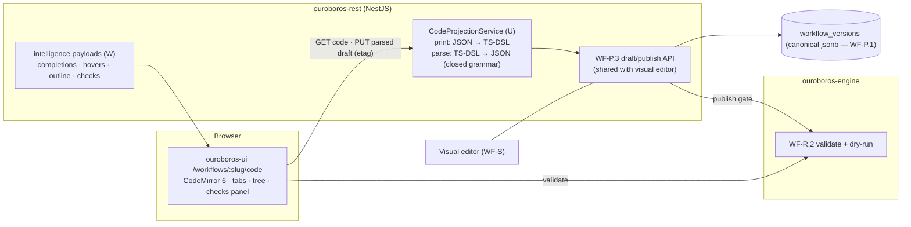
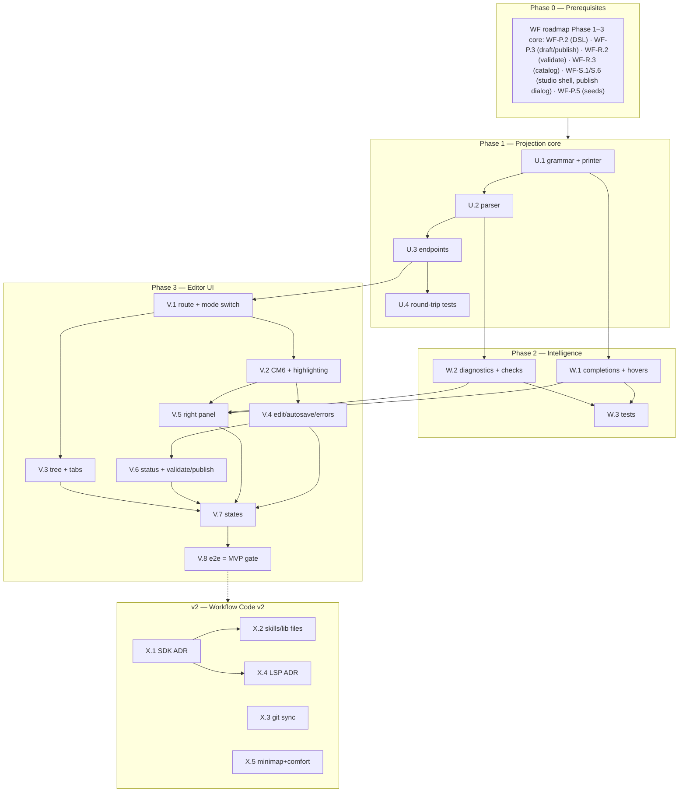

# Roadmap — Workflow as Code (Mockup 05)

## Description

> Create a roadmap that covers the features for the mockup page 05. Any additional
> tech infrastructure that is required to implement the functionality in these mockup
> pages should be researched and offered as options for implementing in the roadmap.
> The roamdap should include MVP and v2 options, as well as the labels, milestones,
> and the like, for the tickets to be created. Any ticket sources that are used by
> Ouroboros for ingesting should be pluggable, which includes sources like Jira,
> Linear, GitHub, GitLab, and other bug reporting/issue recording sites. Refer to the
> page so that issues can reference the mockup file when creating the UI/UX design of
> the pages.

## Context & Existing Work (duplicate-avoidance survey)

Surveyed 2026-08-08.

**Design source of truth for every UI ticket in this roadmap:**
[`docs/mockups/05-workflow-code.html`](mockups/05-workflow-code.html) (with
`docs/mockups/assets/ouroboros.css`) — Workflow as Code. Its anatomy:

- **Page head** — eyebrow `Workflow Studio`, h1 `standard-fix.loop.ts`, subline
  *"The same loop as the visual canvas — every graph compiles to this typed DSL and
  back, losslessly."*; segmented control Visual / **Code** (on) / Copilot; actions
  **Validate** (ghost), **Publish v15** (primary).
- **IDE frame** (`.ide` card):
  - **File tree** (`.ft`, header `Explorer · helios-firmware`) — `workflows/` with
    five `.loop.ts` files (active row in accent inset treatment), `skills/` with
    three `.skill.md` files, `lib/` (`estimate.ts`, `routing.ts`), and
    `ouroboros.config.ts`.
  - **Editor** (`.ed`) — tab strip (`standard-fix.loop.ts` with modified-dot,
    `routing.ts`, `ouroboros.config.ts`), line-numbered code with current-line
    highlight (`Ln 24`) and blinking caret, syntax-colored **TypeScript DSL**:
    `defineLoop("standard-fix", {trigger: {on: "issue.queued", when: (i) =>
    i.effort.lte(effort.M)}, stages: [analyze({skill: repoMap, model:
    route.task("analyze")}), recheckEffort({escalate}), plan({template:
    "attack-plan@v3"}), implement({skill, model, retries: 2, tokenBudget:
    400_000}), build({farm: "pool-a", cache: "ccache"}), test({cmd, flakes}),
    review({template: "self-review@v2"}), gate({require: [...], onFail:
    "implement"}) // the loop bites its tail, openPr({merge: "auto-squash",
    deleteBranch: true})]})` plus a comment block stating the round-trip promise;
    **minimap** strip.
  - **Right panel** (`.rp`) — **Loop Checks** (✓ graph acyclic except declared
    gate loop; ✓ all task routes resolve, with sub-note; ⚠ `pool-a has 1 runner
    offline — builds may queue`), **Types** hover-doc card (`route.task(name:
    TaskKind): ModelRoute` + doc line), **Outline** (numbered stage rows with the
    accent `⟲ gate — back-edge → 04` loopback row).
  - **Status bar** — `⟲ synced with visual editor` (accent), `v15 draft`, right
    cluster `TypeScript 5.9 · LSP ready · Ln 24, Col 18 · UTF-8`.

**Relationship to the Workflow Studio roadmap (mockup 04).** This page is the
second face of the same entity. `ROADMAP_MOCKUP_04_WORKFLOW_BUILDER.md`
(validation gate; referenced as **WF-**) established the canonical JSON DSL
(WF-P.2), draft/publish lifecycle (WF-P.3), engine validation + dry-run (WF-R.2),
and the stage catalog (WF-R.3). This roadmap adds the **code projection**: a
deterministic, lossless TypeScript-DSL rendering of the canonical document, an
editor for it, and the parse-back path. Nothing here forks the definition model.

**Overlapping work and dispositions:**

| Existing work | Disposition under this roadmap |
|---|---|
| WF-P.2 DSL JSON Schema (canonical document, YAML projection fixture) | **Extended** — U.1/U.2 add the TS-DSL projection as the *primary* code surface (the mockup shows TS, not YAML); the YAML fixture remains an internal proof. |
| WF-P.3 draft/publish API, WF-S.6 publish dialog | **Reused** — Validate/Publish here call the same endpoints; publishing from either editor writes the same version ("Publishing writes v15 for both editors"). |
| WF-R.2 engine validation, WF-R.3 catalog | **Consumed** — Loop Checks renders WF-R.2 findings; completions/hover derive from WF-P.2 schema + WF-R.3 catalog. |
| WF-S.1 segmented control (Code marked "soon") | **Amended** — the Code segment goes live, preserving the shared draft across mode switches. |
| Pluggable ticket sources requirement (description boilerplate) | **Already satisfied** by WF Epic Q (canonical tickets + `TicketSourceProvider` SPI; Jira/Linear/GitLab as WF-T.2–T.4). This page consumes nothing source-specific; no new source work is created here. |
| Mockup 14 skills (`.skill.md`), mockup 06 routing (`lib/routing.ts`), mockup 20 copilot | **Out of scope** — the file tree's `skills/` and `lib/` entries are honest v2 (X.2); Copilot segment stays a "soon" target. |
| Scaffolding #56 e2e | **Amended** — gains a code-view leg (V.8). |

Epic letters continue the sequence (…K–O, P–T): this roadmap uses **U–X**.

## Infrastructure Options (researched — pick before filing)

### 1. Embedded code editor (Epic V)

| Option | What it is | Fit | Trade-offs |
|---|---|---|---|
| **A — CodeMirror 6** ⭐ recommended | Modular MIT editor; tree-shakeable (~50kB base, ~150kB configured vs Monaco's 2–5MB); extension system for custom languages, completions, lint, decorations; Replit's editor bet | Matches the "lightweight" rule; our DSL is small — we need custom completions/diagnostics more than full TS IntelliSense; token-driven theming reproduces the mockup skin exactly | TS-grade IntelliSense and a minimap are not built in — both must be scoped deliberately (W.1, X.4) |
| B — Monaco Editor | VS Code's editor; bundled TS worker gives real IntelliSense, hovers, diagnostics out of the box | The mockup literally says "TypeScript 5.9 · LSP ready" — Monaco delivers that feel with least effort | 2–5MB gzipped; core components not replaceable; heavyweight against the brief; theming to our tokens is coarser |
| C — Textarea + highlight overlay (e.g. Shiki) | Read-mostly viewer with a plain edit fallback | Trivial weight | Not an editor experience; the mockup's tabs/caret/diagnostics/outline demand more |

### 2. Code surface language & round-trip strategy (Epic U)

| Option | Shape | Fit | Trade-offs |
|---|---|---|---|
| **A — Constrained TS-DSL projection** ⭐ recommended | Deterministic printer renders canonical JSON → the mockup's `defineLoop` TypeScript; parser accepts a *closed grammar* (stage calls, option literals, a fixed predicate-expression form for `when:`) — not arbitrary TS execution | Lossless round-trip is provable (print∘parse = id); predicates map 1:1 onto WF-P8 structured predicates; no sandbox/security surface; works server-side with the TypeScript compiler API | Arbitrary user code (`lib/estimate.ts`, custom helpers) is rejected in MVP — honest error, X.1 territory |
| B — Real executable SDK (`@ouroboros/sdk` npm package, evaluated) | User TS runs (sandboxed) to produce the definition | Maximum expressive power; `lib/` files become real | Requires a sandboxed TS runtime, supply-chain and determinism problems, publish-time evaluation — heavyweight; v2 evaluation at best (X.1) |
| C — Show YAML/JSON directly | Render the canonical document | Zero parsing work | Contradicts the mockup's explicit TS surface; weakest editing story |

### 3. Editor language intelligence (Epic W)

| Option | What it is | Fit | Trade-offs |
|---|---|---|---|
| **A — Schema-driven client intelligence** ⭐ recommended MVP | CodeMirror completion/hover/lint sources generated from the WF-P.2 JSON Schema + WF-R.3 catalog (stage names, option keys, model routes, skill names) + validation findings mapped to ranges | Covers everything the mockup shows (hover-doc for `route.task`, checks panel, inline diagnostics) without a language server | Not full TS type inference — fine for a closed grammar |
| B — Monaco TS worker + generated `.d.ts` | Ship SDK type definitions to Monaco's TS service | True "TypeScript 5.9" behavior | Only with editor option 1-B; bundle cost |
| C — Server-side LSP over WebSocket | Real LSP (`typescript-language-server`) against the virtual project | The status bar's "LSP ready" literally | New infra (per-session server processes); v2 ADR (X.4) |

## Decisions proposed by this roadmap (validate before issue creation)

| # | Decision | Rationale |
|---|----------|-----------|
| C1 | **Editor = CodeMirror 6** (option 1-A); bundle impact documented like WF-P2's React Flow exception | Lightweight rule; custom DSL needs custom tooling either way. |
| C2 | **Code surface = constrained TS-DSL projection** (option 2-A): deterministic printer + closed-grammar parser over the canonical JSON; `print(parse(code))` and `parse(print(doc))` proven by property tests | The mockup's round-trip promise ("compiles to this typed DSL and back, losslessly") becomes a tested invariant, not a hope. |
| C3 | **One draft, two editors**: code and visual edit the same WF-P.3 draft (same etag discipline); mode switch never converts or loses state | "⟲ synced with visual editor" is the product promise; divergent drafts would be lying UI. |
| C4 | **Unparseable edits never destroy the draft**: parse errors keep the code buffer client-side with anchored diagnostics; the stored draft updates only on successful parse | A typo must not corrupt the canonical document mid-keystroke. |
| C5 | **Intelligence = schema-driven** (option 3-A) in MVP; the status bar says `DSL analyzer` instead of the mockup's `LSP ready` until X.4 lands | Honesty rule: don't claim LSP that isn't there. |
| C6 | **File tree is registry-backed and honest**: `workflows/*.loop.ts` from real workflows; `ouroboros.config.ts` as a read-only projection of org workflow config; `skills/` and `lib/` appear only when their subsystems exist (X.2) | The mockup's tree is aspirational; MVP shows what's real. |
| C7 | **Loop Checks = WF-R.2 findings + resolvable-reference checks**; infra-status lines (pool-a runner offline) appear only when the build-farm subsystem (mockup 08) exists — omitted in MVP, not faked | Same honesty rule as intake provenance (INTAKE-K10). |
| C8 | **Labels**: new `code-view`, reusing `workflow`; **Milestones**: `Workflow Code MVP` / `Workflow Code v2` created at filing | Description requires labels + milestones for the filing pass. |
| C9 | **Minimap is v2** (X.5) — CodeMirror has no built-in minimap; MVP ships without one rather than a fake gradient | The mockup's minimap is decorative; an honest editor beats a painted one. |

## Architecture Overview



## MVP Definition

The MVP is **mockup 05 as a working second editor over the same workflow drafts**.
It is done when, against the compose stack:

1. `/workflows/:slug/code` reproduces
   [`docs/mockups/05-workflow-code.html`](mockups/05-workflow-code.html)
   pixel-faithfully in **both themes**: IDE frame (registry-backed file tree,
   tabs, line-numbered themed editor with current-line treatment), right panel
   (Loop Checks, Types hover-doc, Outline with the accent back-edge row), status
   bar (sync state, draft version, cursor position — `DSL analyzer` per C5).
2. The seeded `standard-fix` draft renders as the mockup's exact TypeScript DSL
   (line-for-line parity fixture), and **round-trip is proven**: edit in code →
   switch to Visual → the graph reflects it; move a node in Visual → switch to
   Code → the projection reflects it; property tests pin `parse ∘ print = id`.
3. **Editing works**: typing with syntax highlighting, schema-driven completions
   (stage names, option keys, route/skill suggestions), hover docs (the
   `route.task` card), inline diagnostics; parse errors anchor to lines and
   never corrupt the stored draft (C4); autosave on successful parse with etag
   conflict handling.
4. **Validate** runs the shared zod + engine validation and fills Loop Checks
   (acyclic-except-declared-loop, routes resolve, unknown references); the
   **Outline** lists stages with the `⟲ back-edge → NN` loopback row and
   click-to-jump.
5. **Publish v15** from the code view runs the same WF-P.3 gate and bumps the
   same version the visual editor sees; the modified-dot and `vN draft` states
   are truthful.
6. Tabs cover the open workflow files (multiple workflows editable in one
   session); `ouroboros.config.ts` renders read-only (C6).
7. Integration tests cover projection round-trips, parse-failure safety, and
   shared-draft concurrency; the e2e suite gains a code-view leg (cross-editor
   round-trip included).

**Explicitly v2 (milestone `Workflow Code v2`):** arbitrary-TS SDK evaluation
(X.1), `skills/` + `lib/` tree sections (X.2), git-backed workflow-as-code sync
into the customer repo (X.3), real LSP/Monaco ADR (X.4), minimap (X.5).

## Epics, Labels & Milestones

Each epic is a parent tracking issue on GitHub; every roadmap issue below is filed as
one of its sub-issues (GitHub Relationships).

| Epic | GitHub | Status | Name | Goal | Modules | Milestone |
|------|:------:|:------:|------|------|---------|-----------|
| U | #161 | 🟡 Open | Code Projection & Round-Trip | TS-DSL grammar, printer, parser, code endpoints, property tests | ouroboros-rest | Workflow Code MVP |
| V | #162 | 🟡 Open | Code Editor UI | IDE frame: tree, tabs, CodeMirror editor, right panel, status bar, flows | ouroboros-ui | Workflow Code MVP |
| W | #163 | 🟡 Open | Editor Intelligence | Completions, hovers, diagnostics mapping, checks & outline payloads | ouroboros-rest, ouroboros-ui | Workflow Code MVP |
| X | #164 | 🟡 Open | Extended Code Experience (v2) | SDK evaluation ADR, skills/lib files, git sync, LSP ADR, minimap | all | Workflow Code v2 |

Issue naming: `<project>: [<epic letter>.<issue>] <title>`. Labels: existing set
(`mvp`, `v2`, `rest`, `ui`, `ci`, `design`, `workflow`) **plus new `code-view`**
(decision C8, created during filing). Milestones **`Workflow Code MVP`** and
**`Workflow Code v2`** created during filing; every issue is assigned to its epic's
milestone. Complexity
chips: **XS · S · M · L**.

---

## Epic U (#161) — Code Projection & Round-Trip (`ouroboros-rest`)

| Ref | GitHub | Status | Title | Summary | Labels | Parallel | MVP | Complexity | Affected Modules |
|-----|:------:|:------:|-------|---------|--------|:--------:|:---:|:----------:|------------------|
| U.1 | #165 | 🟡 Open | ouroboros-rest: [U.1] TS-DSL grammar spec & deterministic printer | Closed grammar doc + canonical JSON → TypeScript projection | mvp, workflow, code-view, rest | N (after WF-P.2) | Y | L | ouroboros-rest, docs |
| U.2 | #166 | 🟡 Open | ouroboros-rest: [U.2] TS-DSL parser (closed grammar) | TypeScript compiler API parse back to canonical JSON; anchored errors | mvp, workflow, code-view, rest | N (after U.1) | Y | L | ouroboros-rest |
| U.3 | #167 | 🟡 Open | ouroboros-rest: [U.3] Code view & save endpoints | `GET /code`, `PUT /code` (parse→draft, etag), tree/tabs payloads | mvp, workflow, code-view, rest | N (after U.2, WF-P.3) | Y | M | ouroboros-rest |
| U.4 | #168 | 🟡 Open | ouroboros-rest: [U.4] Round-trip property & parity tests | `parse∘print = id`, mockup-parity fixture, cross-editor concurrency | mvp, workflow, code-view, rest, ci | N (after U.3) | Y | M | ouroboros-rest |

### Issue U.1 — ouroboros-rest: [U.1] TS-DSL grammar spec & deterministic printer

> **GitHub issue:** #165 · **Status:** 🟡 Open · **Parent epic:** #161

- **Problem Statement:** The code view's language must be specified before
  anything renders it: which TypeScript forms are legal, how every canonical-
  JSON construct prints, and how the mockup's idioms (stage calls, `route.task`,
  `effort.M`, `gate.onFail`, `// the loop bites its tail`-style trailing
  comments) map onto WF-P.2 (source: mockup 05 code listing, WF-P.2 schema).
- **Solution/Scope:** `docs/WORKFLOW_CODE_DSL.md`: the closed grammar — module
  header (fixed imports), `defineLoop(slug, {trigger, stages})`; trigger
  `{on: "<event>", when: <predicate-expr>}` where predicate expressions are the
  bijective rendering of WF-P8 structured predicates (`i.effort.lte(effort.M)`
  ⇄ `{effort_lte: "m"}`); one stage-call form per node type with option keys
  mirroring catalog config schemas (`retries`, `tokenBudget` with `400_000`
  numeric-literal style, `farm`, `cmd`, `template: "attack-plan@v3"`,
  `onFail` back-edges); stable formatting rules (indent, ordering, trailing
  commas, generated round-trip comment block). Implement the **printer**:
  canonical JSON → formatted TS, deterministic (same doc → byte-identical
  output), edge kinds and node positions preserved via structured trivia
  (position metadata comment or sidecar — decided in-issue, losslessness is the
  requirement).
- **Acceptance Criteria:**
  - Seeded standard-fix prints to the mockup listing (modulo the C5 status-bar
    honesty note) — committed golden fixture.
  - Printer determinism: repeated prints byte-identical; all five seeded
    workflows print and re-parse (with U.2).
  - Grammar doc covers every node type + predicate form with examples.
- **Parallelism/Dependencies:** Needs WF-P.2. Blocks U.2, U.3, V.4.
- **Technical Stack:** TypeScript compiler API (printer/AST), docs.
- **Epic:** U

```
canonical JSON (WF-P.2) ──print──▶ defineLoop("standard-fix", { trigger, stages[…] })
   determinism: print(doc) ≡ print(doc)      positions/trivia carried losslessly
```

### Issue U.2 — ouroboros-rest: [U.2] TS-DSL parser (closed grammar)

> **GitHub issue:** #166 · **Status:** 🟡 Open · **Parent epic:** #161

- **Problem Statement:** Edits must travel back: parse the constrained TS into
  canonical JSON with precise, line-anchored errors — and reject everything
  outside the grammar honestly (decision C2: no arbitrary TS execution).
- **Solution/Scope:** Parser on the TypeScript compiler API: `ts.createSourceFile`
  → AST walk accepting only the U.1 grammar; predicate expressions parsed
  bijectively into WF-P8 structures; out-of-grammar constructs (function calls
  we don't know, imports beyond the fixed set, statements outside `defineLoop`)
  produce anchored `code_out_of_grammar` errors with a "supported in the full
  SDK (v2)" pointer (X.1); structural validation deferred to the shared WF-P.2
  validators (parser's job is shape, not semantics); error recovery good enough
  to report multiple issues per parse.
- **Acceptance Criteria:**
  - Golden fixtures: every printed seed parses back to a deep-equal document.
  - Error fixtures: unknown stage call, malformed predicate, stray statement —
    each anchored to line/col with the documented code.
  - No `eval`/module execution anywhere in the path (static analysis only).
- **Parallelism/Dependencies:** Needs U.1. Blocks U.3, W.2.
- **Technical Stack:** TypeScript compiler API (AST, no emit/exec).
- **Epic:** U

```
TS text ─ ts.createSourceFile ─▶ AST walk (closed grammar) ─▶ canonical JSON
   └ out-of-grammar ─▶ [{line, col, code: "code_out_of_grammar", hint: "full SDK is v2"}]
```

### Issue U.3 — ouroboros-rest: [U.3] Code view & save endpoints

> **GitHub issue:** #167 · **Status:** 🟡 Open · **Parent epic:** #161

- **Problem Statement:** The editor needs endpoints: fetch the projection (and
  the virtual file tree), save parsed edits into the shared draft, and keep the
  two-editor etag discipline (decision C3).
- **Solution/Scope:** Under tenant context: `GET /api/v1/workflows/:slug/code`
  (`?version=` for published reads; returns text + draft etag + outline/check
  payload refs), `PUT /api/v1/workflows/:slug/code` (body = text; server parses
  (U.2) → updates the WF-P.3 draft under `If-Match`; parse failure → 422 with
  anchored errors, draft untouched per C4), `GET /api/v1/workflows/code-tree`
  (registry-backed tree per C6: workflows/*.loop.ts + read-only
  `ouroboros.config.ts` projection). Role gates mirror WF-P.3 (member read,
  admin+ write).
- **Acceptance Criteria:**
  - GET→edit→PUT→GET round-trip stable; stale etag → 409 naming the other
    editor's change; 422 leaves the draft byte-identical (verified).
  - Config file returns read-only flag; PUT against it → 405.
  - OpenAPI complete (feeds the generated client).
- **Parallelism/Dependencies:** Needs U.2, WF-P.3. Blocks V.1, V.6.
- **Technical Stack:** NestJS, Kysely.
- **Epic:** U

```
GET /workflows/standard-fix/code ─▶ {text, etag, readOnly:false}
PUT (If-Match) ─ parse ✓ ─▶ draft updated (shared with visual) │ parse ✗ ─▶ 422 anchored, draft intact
```

### Issue U.4 — ouroboros-rest: [U.4] Round-trip property & parity tests

> **GitHub issue:** #168 · **Status:** 🟡 Open · **Parent epic:** #161

- **Problem Statement:** "Losslessly" is the page's headline claim; only
  property tests and cross-editor concurrency tests make it durable.
- **Solution/Scope:** Test suites: property-based round-trip
  (`parse(print(doc)) deep-equals doc`) over generated documents spanning the
  grammar (all node types, predicate forms, loop edges, position trivia);
  mockup-parity golden fixture (U.1) in CI; cross-editor concurrency in the
  harness (visual PUT then stale code PUT → 409; interleaved saves converge);
  fuzz corpus for the parser (no crashes, always anchored errors).
- **Acceptance Criteria:** Properties hold over ≥1k generated docs in CI
  (bounded seed for determinism); parity fixture byte-exact; fuzz run clean;
  suite ≤ 60s.
- **Parallelism/Dependencies:** Needs U.3.
- **Technical Stack:** Jest, fast-check (property testing), Testcontainers.
- **Epic:** U

```
∀ doc ∈ gen(DSL): parse(print(doc)) ≡ doc     golden: print(standard-fix) ≡ mockup listing
fuzz(parser) ─▶ never crashes · always anchored
```

---

## Epic V (#162) — Code Editor UI (`ouroboros-ui`)

Every issue references
[`docs/mockups/05-workflow-code.html`](mockups/05-workflow-code.html) as the
design source — the `.ide` frame (tree/editor/right-panel, tree+panel hidden
below 1000px), tab/line/status treatments, and the shared design system via the
#16 tokens (both themes; the mockup is dark-only).

| Ref | GitHub | Status | Title | Summary | Labels | Parallel | MVP | Complexity | Affected Modules |
|-----|:------:|:------:|-------|---------|--------|:--------:|:---:|:----------:|------------------|
| V.1 | #169 | 🟡 Open | ouroboros-ui: [V.1] Code route, head & mode switching | `/workflows/:slug/code`, seg control live, shared-draft state | mvp, workflow, code-view, ui | N (after WF-S.1, U.3) | Y | M | ouroboros-ui |
| V.2 | #170 | 🟡 Open | ouroboros-ui: [V.2] CodeMirror foundation & DSL highlighting | Themed CM6, custom language package, line/current-line/caret parity | mvp, workflow, code-view, ui, design | N (after V.1) | Y | L | ouroboros-ui |
| V.3 | #171 | 🟡 Open | ouroboros-ui: [V.3] File tree & tab strip | Registry-backed explorer, open tabs with modified-dots, read-only files | mvp, workflow, code-view, ui, design | N (after V.1, U.3) | Y | M | ouroboros-ui |
| V.4 | #172 | 🟡 Open | ouroboros-ui: [V.4] Edit, autosave & parse-error surfaces | Debounced parse/save, anchored 422 rendering, etag conflicts | mvp, workflow, code-view, ui | N (after V.2, U.3) | Y | M | ouroboros-ui |
| V.5 | #173 | 🟡 Open | ouroboros-ui: [V.5] Right panel — checks, types, outline | Loop Checks, hover-doc card, outline with back-edge + jump | mvp, workflow, code-view, ui, design | N (after V.2, W.1, W.2) | Y | M | ouroboros-ui |
| V.6 | #174 | 🟡 Open | ouroboros-ui: [V.6] Status bar & validate/publish flows | Sync/draft/cursor status, Validate action, shared publish dialog | mvp, workflow, code-view, ui | N (after V.4, WF-S.6) | Y | S | ouroboros-ui |
| V.7 | #175 | 🟡 Open | ouroboros-ui: [V.7] Code-view states & guards | Read-only member mode, empty org, load/error, narrow-viewport | mvp, workflow, code-view, ui, design | N (after V.1–V.6) | Y | S | ouroboros-ui |
| V.8 | #176 | 🟡 Open | ouroboros-ui: [V.8] Code-view e2e leg | Parity, edit→visual round-trip, publish, diagnostics, themes | mvp, workflow, code-view, ui, ci | N (after V.1–V.7) | Y | S | ouroboros-ui, .github |

### Issue V.1 — ouroboros-ui: [V.1] Code route, head & mode switching

> **GitHub issue:** #169 · **Status:** 🟡 Open · **Parent epic:** #162

- **Problem Statement:** The Code segment (a "soon" stub after WF-S.1) must go
  live: route, head (filename h1, round-trip subline, Validate/Publish), and
  loss-free switching between Visual and Code over the same draft (C3).
- **Solution/Scope:** `/workflows/:slug/code` route sharing the studio layout;
  head per the mockup (h1 = `<slug>.loop.ts`, subline verbatim, seg control
  with Visual/Code live and Copilot "soon"); mode switch preserves the draft
  (both editors read WF-P.3 state; unsaved code buffer prompts per C4 before
  leaving); Publish button opens the shared WF-S.6 dialog. Amends WF-S.1's seg
  control.
- **Acceptance Criteria:** Visual→Code→Visual retains all edits (e2e-backed);
  deep link to the code route works; role gates match the visual editor; both
  themes.
- **Parallelism/Dependencies:** Needs WF-S.1, U.3. Blocks V.2–V.7.
- **Technical Stack:** Next.js, shared studio state.
- **Epic:** V

```
[Workflow Studio]  standard-fix.loop.ts     (Visual | ●Code | Copilot·soon)
"The same loop as the visual canvas — …losslessly."   [Validate] [Publish v15]
```

### Issue V.2 — ouroboros-ui: [V.2] CodeMirror foundation & DSL highlighting

> **GitHub issue:** #170 · **Status:** 🟡 Open · **Parent epic:** #162

- **Problem Statement:** The editor itself — CodeMirror 6 themed to the design
  system with a custom language package for the U.1 grammar — is the page's
  centerpiece (decision C1).
- **Solution/Scope:** CM6 integration: custom Lezer-based (or stream-parser)
  highlighting for the DSL's token classes mapped to the mockup's palette
  (`c-kw`/`c-str`/`c-num`/`c-fn`/`c-cm` → tokens), line numbers in the `.ln
  .no` treatment, current-line highlight + accent gutter per `.ln.cur`, themed
  selection/caret (the mockup's glow caret), token-driven theme for **both**
  color schemes, bundle impact measured and documented (C1 exception record);
  read-only mode variant (config file, member role).
- **Acceptance Criteria:** Seeded projection renders with mockup-parity
  coloring in both themes (screenshot test); typing at 60fps on the seeded
  file; documented bundle delta.
- **Parallelism/Dependencies:** Needs V.1, U.1 (grammar). Blocks V.4, V.5.
- **Technical Stack:** @codemirror/* (MIT), Lezer, CSS tokens.
- **Epic:** V

```
CM6 + dsl-language-package ─▶ keywords/strings/nums/fns/comments → token palette
line gutter · cur-line accent inset · glow caret · light+dark themes
```

### Issue V.3 — ouroboros-ui: [V.3] File tree & tab strip

> **GitHub issue:** #171 · **Status:** 🟡 Open · **Parent epic:** #162

- **Problem Statement:** The explorer and tabs organize the virtual project —
  registry-backed and honest (C6), with the mockup's active-row and
  modified-dot treatments.
- **Solution/Scope:** Tree from U.3's payload: `workflows/` group (`.loop.ts`
  per workflow, active row in the accent inset treatment, paused workflows
  with their err dot), `ouroboros.config.ts` (read-only badge); `skills/` and
  `lib/` sections appear only when X.2 lands (no placeholder rows). Tab strip:
  open files with modified-dot (unsaved parse-pending buffer), close buttons,
  active-tab accent top-border per the mockup; tab state per session;
  keyboard navigation (tree arrows, ⌘W-style close).
- **Acceptance Criteria:** Tree mirrors the seeded registry; switching files
  preserves per-file buffers; modified-dot truthful (clears on successful
  save); both themes.
- **Parallelism/Dependencies:** Needs V.1, U.3.
- **Technical Stack:** React, #46 primitives.
- **Epic:** V

```
Explorer · helios-firmware          [●standard-fix.loop.ts ×][routing… ] tabs
▾ workflows/  standard-fix.loop.ts ◀ active-inset
              hotfix-p0.loop.ts ●err
  ouroboros.config.ts 🔒
```

### Issue V.4 — ouroboros-ui: [V.4] Edit, autosave & parse-error surfaces

> **GitHub issue:** #172 · **Status:** 🟡 Open · **Parent epic:** #162

- **Problem Statement:** The editing loop must be safe: debounced parse+save on
  the U.3 contract, 422s rendered as anchored diagnostics, etag conflicts
  resolved without data loss (C4).
- **Solution/Scope:** Save pipeline: debounce → PUT → on 200 clear modified-dot
  + update etag; on 422 render squiggles/gutter markers + a diagnostics strip
  (count + first message, click-to-jump), buffer stays local, draft server-side
  untouched; on 409 conflict dialog (reload theirs / keep mine as local buffer
  diff); offline/error retry with stale banner (DASH-I.7 pattern); explicit
  save (⌘S) forces the cycle.
- **Acceptance Criteria:** Typo → anchored diagnostic, visual editor still
  shows the last good draft; fix → save clears; concurrent visual edit → 409
  flow verified; no lost keystrokes across the cycle (test with scripted
  typing).
- **Parallelism/Dependencies:** Needs V.2, U.3.
- **Technical Stack:** CM6 lint/decorations, generated client.
- **Epic:** V

```
type ─ debounce ─ PUT ─▶ 200 ✓ (dot clears) │ 422 ▶ squiggles + strip (draft safe) │ 409 ▶ conflict dialog
```

### Issue V.5 — ouroboros-ui: [V.5] Right panel — checks, types, outline

> **GitHub issue:** #173 · **Status:** 🟡 Open · **Parent epic:** #162

- **Problem Statement:** The right panel is the page's understanding surface:
  Loop Checks, the Types hover-doc card, and the Outline with its accent
  loopback row.
- **Solution/Scope:** Panel per the mockup: **Loop Checks** from W.2 payloads
  (ok/warn/err rows with sub-notes; C7 scope — validation + reference checks
  only in MVP), **Types** card showing the W.1 hover-doc for the symbol at the
  cursor (`route.task` signature style: fn/type/doc token colors), **Outline**
  from the parsed document (numbered stages, `⟲` loopback rows in accent with
  `back-edge → NN` note, click scrolls the editor to the stage); panel hidden
  below 1000px per the mockup's responsive rule (content reachable via a
  toggle).
- **Acceptance Criteria:** Seeded file reproduces the mockup panel (minus the
  C7-omitted infra line); outline jump accurate; hover-doc follows cursor;
  both themes.
- **Parallelism/Dependencies:** Needs V.2, W.1, W.2.
- **Technical Stack:** React, CM6 cursor integration.
- **Epic:** V

```
LOOP CHECKS  ✓ acyclic except declared gate loop · ✓ routes resolve
TYPES        route.task(name: TaskKind): ModelRoute — "Resolves the model…"
OUTLINE      01▸analyze … 08⟲gate back-edge→04 · 09▸openPr   (click = jump)
```

### Issue V.6 — ouroboros-ui: [V.6] Status bar & validate/publish flows

> **GitHub issue:** #174 · **Status:** 🟡 Open · **Parent epic:** #162

- **Problem Statement:** The status bar states the editor's truth (sync, draft
  version, cursor), and Validate/Publish must run the shared pipelines.
- **Solution/Scope:** Status bar per the mockup: `⟲ synced with visual editor`
  (accent; degrades honestly to `saving…`/`parse error`/`conflict`), `vN
  draft`, right cluster (cursor Ln/Col, `UTF-8`, `DSL analyzer` per C5);
  **Validate** button → WF-R.2 + zod run, results into Loop Checks + inline
  diagnostics; **Publish** → shared WF-S.6 dialog (findings anchored back into
  the code view on failure).
- **Acceptance Criteria:** Status transitions truthful across the V.4 states;
  Validate populates checks without publishing; publish from code bumps the
  version visible in the visual head.
- **Parallelism/Dependencies:** Needs V.4, WF-S.6, WF-R.2.
- **Technical Stack:** React, generated client.
- **Epic:** V

```
⟲ synced with visual editor · v15 draft            DSL analyzer · Ln 24, Col 18 · UTF-8
[Validate] ─▶ checks+diagnostics    [Publish v15] ─▶ shared WF-S.6 gate
```

### Issue V.7 — ouroboros-ui: [V.7] Code-view states & guards

> **GitHub issue:** #175 · **Status:** 🟡 Open · **Parent epic:** #162

- **Problem Statement:** Members without edit rights, empty orgs, load
  failures, and narrow viewports all need designed handling the mockup doesn't
  show.
- **Solution/Scope:** Member read-only (editor in read-only CM6 mode with
  explanation banner, no save/publish), empty-org state (mirrors WF-S.7 with a
  code-flavored line), skeletons (tree/editor), API-error banner, narrow
  viewport (<1000px): tree/panel collapse to toggles per the mockup's media
  rule.
- **Acceptance Criteria:** All states reachable and themed; member session
  verified read-only; viewport collapse keeps the editor usable.
- **Parallelism/Dependencies:** Needs V.1–V.6.
- **Technical Stack:** React, #46 EmptyState/Skeleton.
- **Epic:** V

### Issue V.8 — ouroboros-ui: [V.8] Code-view e2e leg

> **GitHub issue:** #176 · **Status:** 🟡 Open · **Parent epic:** #162

- **Problem Statement:** The cross-editor round-trip is the page's core claim —
  only e2e across UI/REST/engine/DB certifies it.
- **Solution/Scope:** Extend #56: parity (seeded file vs golden), edit a token
  budget in code → switch to Visual → inspector shows it → move a node →
  back to Code → projection updated; sabotage → anchored diagnostic → repair →
  publish v-bump verified in both editors; member read-only; both themes
  screenshot-diffed.
- **Acceptance Criteria:** Green from cold compose; each leg fails meaningfully
  when its layer breaks (spot-verified); ≤ 2 min added.
- **Parallelism/Dependencies:** Needs V.1–V.7, WF-P.5 seeds; amends #56.
- **Technical Stack:** Playwright.
- **Epic:** V

```
e2e: parity ✓ · code→visual→code round-trip ✓ · publish ✓ · diagnostics ✓ · read-only ✓ · themes ✓
```

---

## Epic W (#163) — Editor Intelligence (`ouroboros-rest` + `ouroboros-ui`)

| Ref | GitHub | Status | Title | Summary | Labels | Parallel | MVP | Complexity | Affected Modules |
|-----|:------:|:------:|-------|---------|--------|:--------:|:---:|:----------:|------------------|
| W.1 | #177 | 🟡 Open | ouroboros-ui: [W.1] Schema-driven completions & hover docs | CM6 sources from WF-P.2 schema + WF-R.3 catalog; the Types card data | mvp, workflow, code-view, ui | N (after U.1, WF-R.3) | Y | M | ouroboros-ui, ouroboros-rest |
| W.2 | #178 | 🟡 Open | ouroboros-rest: [W.2] Diagnostics & Loop Checks payload | Map validation findings to code ranges; checks panel contract | mvp, workflow, code-view, rest | N (after U.2, WF-R.2) | Y | M | ouroboros-rest |
| W.3 | #179 | 🟡 Open | ouroboros-rest: [W.3] Intelligence integration tests | Completion/hover/diagnostic fixtures, range-mapping accuracy | mvp, workflow, code-view, rest, ci | N (after W.1, W.2) | Y | S | ouroboros-rest |

### Issue W.1 — ouroboros-ui: [W.1] Schema-driven completions & hover docs

> **GitHub issue:** #177 · **Status:** 🟡 Open · **Parent epic:** #163

- **Problem Statement:** The mockup promises editor intelligence (completions
  implied, the `route.task` hover-doc explicit); MVP delivers it from what we
  already know statically (decision C5), not a language server.
- **Solution/Scope:** Generate CM6 completion sources from the U.1 grammar +
  WF-R.3 catalog: stage functions with option-key completions per node type,
  enum values (`effort.M`, flake policies, merge modes), known route-task
  names/skill names as suggestions (validated strings per WF-P7); hover
  provider serving signature + doc cards (the `.hover-doc` treatment) for DSL
  symbols from a generated symbol table (REST endpoint or build-time artifact
  — decided in-issue); context-aware (inside `implement({…})` → its options).
- **Acceptance Criteria:** Completion fixtures: trigger block, each stage's
  options, predicate forms; hover on `route.task` reproduces the mockup card;
  unknown-symbol hover shows nothing (no fabricated docs).
- **Parallelism/Dependencies:** Needs U.1, WF-R.3. Feeds V.5.
- **Technical Stack:** CM6 autocomplete/hover, generated symbol table.
- **Epic:** W

```
catalog+schema ─▶ symbol table ─▶ completions (stages · options · enums · routes · skills)
cursor@route.task ─▶ hover-doc {sig, doc}  — nothing invented beyond the schema
```

### Issue W.2 — ouroboros-rest: [W.2] Diagnostics & Loop Checks payload

> **GitHub issue:** #178 · **Status:** 🟡 Open · **Parent epic:** #163

- **Problem Statement:** Validation findings (WF-R.2/zod, node-anchored) and
  parse errors (U.2, line-anchored) must unify into one diagnostics contract
  the editor and the checks panel both consume — including mapping node ids to
  code ranges.
- **Solution/Scope:** Range mapping: the U.1 printer emits a node→line-span map
  alongside the text (part of the GET payload); diagnostics service merges
  parse errors (already ranged) + validation findings (node-anchored → spans)
  + reference checks (unknown skill/route) into
  `{severity, range, code, message, note?}`; Loop Checks panel payload
  derives ok/warn/err summary rows (C7 scope: validation + references in MVP;
  infra-status rows join when mockup 08's subsystem exists). OpenAPI
  documented.
- **Acceptance Criteria:** Sabotaged fixtures map to correct lines (golden
  ranges); checks rows match the mockup's first two entries for a clean seed;
  no infra rows in MVP (honesty verified).
- **Parallelism/Dependencies:** Needs U.2, WF-R.2. Feeds V.4, V.5.
- **Technical Stack:** NestJS.
- **Epic:** W

```
parse errors ∪ validation findings ∪ reference checks ─▶ [{severity, range, code, msg}]
   ├▶ editor squiggles (V.4)        └▶ Loop Checks rows (V.5)
node→span map: printer emits {nodeId: [lineStart, lineEnd]} with every GET
```

### Issue W.3 — ouroboros-rest: [W.3] Intelligence integration tests

> **GitHub issue:** #179 · **Status:** 🟡 Open · **Parent epic:** #163

- **Problem Statement:** Range mapping and completion contexts drift silently
  as the grammar evolves; fixtures keep them honest.
- **Solution/Scope:** Harness suites: node→span accuracy across all seeds
  (edit-shift regression cases), diagnostics merge ordering/severity, checks
  summary derivation, completion-context fixtures (server-side symbol table
  correctness).
- **Acceptance Criteria:** Green in `ci/rest`; grammar changes without fixture
  updates fail loudly; ≤ 30s added.
- **Parallelism/Dependencies:** Needs W.1, W.2.
- **Technical Stack:** Jest, Testcontainers.
- **Epic:** W

```
suites: span map ✓ · merged diagnostics ✓ · checks rows ✓ · symbol table ✓
```

---

## Epic X (#164) — Extended Code Experience (v2 · milestone `Workflow Code v2`)

| Ref | GitHub | Status | Title | Summary | Labels | Parallel | MVP | Complexity | Affected Modules |
|-----|:------:|:------:|-------|---------|--------|:--------:|:---:|:----------:|------------------|
| X.1 | #180 | 🟡 Open | ouroboros-rest: [X.1] Full SDK evaluation ADR & prototype | Arbitrary TS (`lib/`, helpers) via sandboxed evaluation — decide | v2, workflow, code-view, rest, engine | Y | N | L | ouroboros-rest, docs |
| X.2 | #181 | 🟡 Open | ouroboros-ui: [X.2] Skills & lib tree sections | `.skill.md` and `lib/*.ts` files once knowledge/routing subsystems exist | v2, workflow, code-view, ui | N (after mockup-14/06 roadmaps) | N | M | ouroboros-ui, ouroboros-rest |
| X.3 | #182 | 🟡 Open | ouroboros-rest: [X.3] Git-backed workflow-as-code sync | Mirror `.loop.ts` files into the customer repo via PRs; bidirectional | v2, workflow, code-view, rest | N (after U.4, WF-Q/GitHub provider) | N | L | ouroboros-rest |
| X.4 | #183 | 🟡 Open | ouroboros-ui: [X.4] Real language-server ADR (LSP/Monaco) | Evaluate true TS intelligence vs schema-driven; decide with triggers | v2, workflow, code-view, ui | Y | N | M | ouroboros-ui, docs |
| X.5 | #184 | 🟡 Open | ouroboros-ui: [X.5] Minimap & editor comfort features | Minimap extension, multi-cursor, search/replace, folding | v2, workflow, code-view, ui | N (after V.2) | N | S | ouroboros-ui |

### Issue X.1 — ouroboros-rest: [X.1] Full SDK evaluation ADR & prototype

> **GitHub issue:** #180 · **Status:** 🟡 Open · **Parent epic:** #164

- **Problem Statement:** The closed grammar (C2) rejects real code — the
  mockup's `lib/estimate.ts` and computed helpers imply a future where
  workflows are genuine programs. That needs a sandboxed, deterministic
  evaluation story or a principled "never".
- **Solution/Scope:** ADR: evaluate isolated-vm/worker sandboxing, determinism
  requirements (same source → same definition), supply-chain rules (no npm
  imports vs allow-listed), publish-time-only evaluation, and how evaluated
  output still lands in canonical JSON; prototype the riskiest path; define
  graduation criteria from the closed grammar. Publishing a real
  `@ouroboros/sdk` types package (even before evaluation) considered as a
  midpoint.
- **Acceptance Criteria:** ADR merged with decision + criteria; prototype
  results recorded; U.2's `code_out_of_grammar` hint updated to match the
  decision.
- **Parallelism/Dependencies:** Independent. Informs X.2/X.3 scope.
- **Technical Stack:** ADR, isolated-vm prototype.
- **Epic:** X

### Issue X.2 — ouroboros-ui: [X.2] Skills & lib tree sections

> **GitHub issue:** #181 · **Status:** 🟡 Open · **Parent epic:** #164

- **Problem Statement:** The mockup tree shows `skills/*.skill.md` and
  `lib/*.ts`; those become real when the knowledge (mockup 14) and routing
  (mockup 06) subsystems exist (decision C6 kept them out of MVP).
- **Solution/Scope:** Tree sections backed by their registries: skills as
  editable markdown (with the skill-loading hint from WF-S.4's inspector),
  `lib/routing.ts` as a read-only projection of model routing until X.1
  decides on real code; tab/editor support for markdown.
- **Acceptance Criteria:** Sections appear only with their subsystems; skill
  edits round-trip to the knowledge registry; no orphan placeholder rows.
- **Parallelism/Dependencies:** Needs mockup-14/06 roadmaps; X.1 for `lib/`.
- **Technical Stack:** React, CM6 markdown.
- **Epic:** X

### Issue X.3 — ouroboros-rest: [X.3] Git-backed workflow-as-code sync

> **GitHub issue:** #182 · **Status:** 🟡 Open · **Parent epic:** #164

- **Problem Statement:** The explorer header says `helios-firmware` — the
  natural endgame is workflow files living *in the customer repo* (review via
  PRs, history via git), not only in our registry.
- **Solution/Scope:** Opt-in per org: mirror published `.loop.ts` projections
  into a repo path (`.ouroboros/workflows/`) via PRs (GitHub provider
  first, SPI-shaped for others per WF-Q); inbound sync parses merged changes
  through U.2 + the WF-P.3 publish gate (a merged PR = a publish); conflict
  policy (registry wins vs repo wins) explicit in settings; audit events.
- **Acceptance Criteria:** Publish → PR opens with the projection; merging an
  edited `.loop.ts` PR publishes a new version (gates enforced); divergence
  surfaced, never silently resolved.
- **Parallelism/Dependencies:** Needs U.4, WF-Q.3 (+INTAKE-O.1 App for write
  scope).
- **Technical Stack:** Octokit, WF-Q SPI.
- **Epic:** X

```
publish v16 ─▶ PR: .ouroboros/workflows/standard-fix.loop.ts │ merge edited PR ─▶ parse+gate ─▶ v17
```

### Issue X.4 — ouroboros-ui: [X.4] Real language-server ADR (LSP/Monaco)

> **GitHub issue:** #183 · **Status:** 🟡 Open · **Parent epic:** #164

- **Problem Statement:** If X.1 admits real TS, schema-driven intelligence
  (C5) stops being enough; the "LSP ready" status line needs a real decision.
- **Solution/Scope:** ADR: Monaco+TS-worker (with generated `.d.ts`) vs
  server-side `typescript-language-server` over WebSocket vs staying
  schema-driven; measure bundle/infra cost against editing reality; decide
  with triggers tied to X.1's outcome.
- **Acceptance Criteria:** ADR merged; status-bar wording updated to match
  whatever ships.
- **Parallelism/Dependencies:** Independent; informed by X.1.
- **Technical Stack:** ADR.
- **Epic:** X

### Issue X.5 — ouroboros-ui: [X.5] Minimap & editor comfort features

> **GitHub issue:** #184 · **Status:** 🟡 Open · **Parent epic:** #164

- **Problem Statement:** The mockup shows a minimap (decision C9 deferred it);
  growing files also want search/replace, folding, multi-cursor.
- **Solution/Scope:** CM6 minimap extension (or maintained equivalent),
  search/replace panel themed to the design system, code folding on stage
  blocks, multi-cursor; each measured against bundle budget.
- **Acceptance Criteria:** Minimap reflects real code density (unlike the
  mockup's painted gradient); features themed both schemes.
- **Parallelism/Dependencies:** Needs V.2.
- **Technical Stack:** CM6 extensions.
- **Epic:** X

---

## Work Order (dependency-ordered execution plan)



Ordered checklist (⊕ = parallelizable within its phase):

1. **Phase 0 — Prerequisites:** WF-P.2/P.3/P.5, WF-R.2/R.3, WF-S.1/S.6 (the
   mockup-04 roadmap's MVP core — file and land it first).
2. **Phase 1 — Projection core:** U.1 → U.2 → U.3 → U.4
3. **Phase 2 — Intelligence:** { W.1 ⊕ W.2 } → W.3 *(overlaps Phase 1 tail)*
4. **Phase 3 — Editor UI:** V.1 → { V.2 ⊕ V.3 } → { V.4 ⊕ V.5 } → V.6 → V.7 →
   **V.8 ✅** *(MVP gate, amending #56)*
5. **v2:** X.1 → { X.2 ⊕ X.4 }; X.3 ⊕ X.5 in any order.

## Totals

| | Issues | MVP | v2 |
|---|:---:|:---:|:---:|
| Epic U — Code Projection & Round-Trip | 4 | 4 | 0 |
| Epic V — Code Editor UI | 8 | 8 | 0 |
| Epic W — Editor Intelligence | 3 | 3 | 0 |
| Epic X — Extended Code Experience | 5 | 0 | 5 |
| **Total** | **20** | **15** | **5** |

GitHub parents: Epic U #161 · Epic V #162 · Epic W #163 · Epic X #164.
Work issues #165–#184, each filed as a sub-issue of its epic (GitHub Relationships)
and assigned to its epic's milestone.

Plus **2 amendments** — comments posted and the `code-view` label applied on
2026-08-09; no new work created:

| Issue | Amendment |
|---|---|
| #147 | WF-S.1's segmented control: the **Code** segment goes live via V.1 (#169), sharing one draft (C3) |
| #56 | e2e suite gains the code-view leg V.8 (#176), including the both-directions cross-editor round-trip |

## References

- Design source: [`docs/mockups/05-workflow-code.html`](mockups/05-workflow-code.html),
  `docs/mockups/assets/ouroboros.css`; adjacent mockups 04/20 (linked)
- Upstream roadmaps: `ROADMAP_MOCKUP_04_WORKFLOW_BUILDER.md` (prerequisite —
  WF-*), scaffolding (filed), BetterAuth / dashboard / intake roadmaps
  (validation gates)
- Editor research: [CodeMirror vs Monaco comprehensive comparison](https://agenthicks.com/research/codemirror-vs-monaco-editor-comparison) ·
  [npm-compare: codemirror vs monaco-editor](https://npm-compare.com/codemirror,monaco-editor) ·
  [Replit — Betting on CodeMirror](https://blog.replit.com/codemirror) ·
  [Monaco vs CodeMirror 6 vs Sandpack 2026](https://www.pkgpulse.com/guides/monaco-editor-vs-codemirror-6-vs-sandpack-in-browser-2026) ·
  [build-a-code-editor trade-offs](https://www.techinterview.org/post/3233475355/build-code-editor-codemirror-monaco-tradeoffs/)
- Parsing: TypeScript compiler API (static AST only — no evaluation in MVP per C2)

## UI/UX Shell Compliance (addendum 2026-08-09)

The application shell defined in
[`docs/DESIGN_SYSTEM_APP_SHELL.md`](DESIGN_SYSTEM_APP_SHELL.md) (implementing
roadmap: [`ROADMAP_UIUX_APP_SHELL.md`](ROADMAP_UIUX_APP_SHELL.md)) supersedes
the mockup's top-bar navigation for every UI issue in this roadmap:

1. **Header** — application name/brand upper-left, profile & session controls
   upper-right; no navigation links in the header.
2. **Sidebar navigation** — fixed left rail of icon + name entries from the
   CP.2 module registry. This surface lives under the sidebar's **Workflows**
   entry (icon `workflow`) as the code-view tab — no separate sidebar entry;
   the Workflows entry stays active here. Page-level tab sets stay at the top
   of the content pane (CP.4 PageSubnav), sticky within the pane's scroll.
3. **Content-only scrolling** — the content pane is the sole scroll
   container; header and sidebar never scroll; sticky in-page chrome
   (subnavs, dirty-state bars, table headers) sticks within the pane; wide
   content scrolls inside its own wrappers, never at pane level.
4. **Type scale** — every UI issue uses rem-based type/spacing against the
   #16 tokens (CQ.1) so the five-step font-size preference (CQ.2) scales the
   whole surface; hard-coded px font sizes are lint-banned.
5. **Mockup interpretation** —
   [`docs/mockups/05-workflow-code.html`](mockups/05-workflow-code.html)
   remains the design source for page content and card anatomy; its
   topbar/nav chrome is superseded by the shell spec.

Issue-level impact:

| Issue | Amendment |
|---|---|
| V.1 (#169) | Mounts in the shell content pane; navigation reached via the sidebar registry entry, not a topbar link; subnav renders as PageSubnav, sticky in-pane |
| V.2–V.7 (#170–#175) | rem-based type, shell tokens; internal wide/tall regions scroll in their own wrappers |
| V.8 (#176) | Gains shell assertions: header/sidebar fixed during content scroll, correct sidebar active state, font-scale render check at 125% |

## Next Step

**Issues filed 2026-08-09.** The validation gate is closed. Created during filing: the
`code-view` label, the **`Workflow Code MVP`** and **`Workflow Code v2`** milestones,
the four epic parents (#161–#164) and twenty work issues (#165–#184) with epic
relationships, issue types and milestone assignments, plus the two amendment comments
on #147 and #56.

The three decisions worth re-reading before work starts, all now recorded in the filed
issues:

- **C1 — CodeMirror 6 over Monaco** (#170). The trade is explicit: Monaco would give
  the mockup's "TypeScript 5.9 · LSP ready" feel almost for free at 2–5MB, but our
  surface is a closed grammar needing custom tooling either way. Bundle delta is
  measured and recorded, as the React Flow adoption (#148) was.
- **C2 — constrained TS-DSL projection** (#165/#166), with losslessness proven by
  property tests (#168) rather than asserted. Arbitrary TypeScript is deferred to the
  #180 ADR, and #166's out-of-grammar error points there rather than dead-ending.
- **C3 — one draft, two editors** (#167/#169), with C4's corollary: an unparseable
  edit never touches the stored draft.

Three honesty adjustments are carried into the issues and should survive review: the
status bar reads **`DSL analyzer`**, not `LSP ready` (#174, revisited by #183); the
Loop Checks panel **omits** the mockup's build-farm warning rather than faking it
(#173/#178); and the minimap ships in #184 as a real one rather than as the mockup's
painted gradient.

**Hard prerequisite:** the mockup-04 roadmap's MVP core must land first — WF-P.2
(#133 DSL schema), WF-P.3 (#134 draft/publish), WF-P.5 (#136 seeds), WF-R.2 (#144
validation), WF-R.3 (#145 catalog), WF-S.1 (#147 studio shell) and WF-S.6 (#152
publish dialog). That roadmap in turn still waits on the unfiled BetterAuth roadmap.

Once those are in place, begin with **#165** ([U.1] grammar spec and printer) — the
load-bearing document the parser, completions and span map all inherit from.
