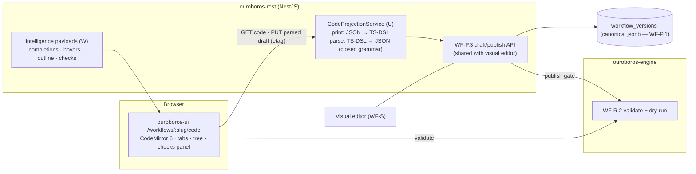
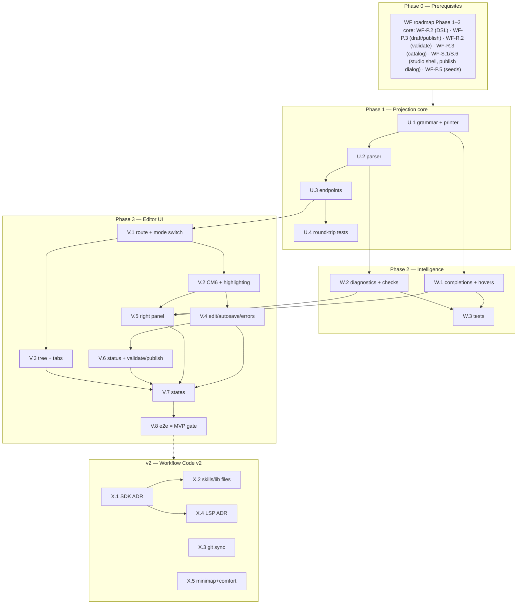

# Roadmap — Workflow as Code (Mockup 05)

## Description

> Create a roadmap that covers the features for the mockup page 05. Any additional
> tech infrastructure that is required to implement the functionality in these mockup
> pages should be researched and offered as options for implementing in the roadmap.
> The roamdap should include MVP and v2 options, as well as the labels, milestones,
> and the like, for the tickets to be created. Any ticket sources that are used by
> Ouroboros for ingesting should be pluggable, which includes sources like Jira,
> Linear, GitHub, GitLab, and other bug reporting/issue recording sites. Refer to the
> page so that issues can reference the mockup file when creating the UI/UX design of
> the pages.

## Context & Existing Work (duplicate-avoidance survey)

Surveyed 2026-08-08.

**Design source of truth for every UI ticket in this roadmap:**
[`docs/mockups/05-workflow-code.html`](mockups/05-workflow-code.html) (with
`docs/mockups/assets/ouroboros.css`) — Workflow as Code. Its anatomy:

- **Page head** — eyebrow `Workflow Studio`, h1 `standard-fix.loop.ts`, subline
  *"The same loop as the visual canvas — every graph compiles to this typed DSL and
  back, losslessly."*; segmented control Visual / **Code** (on) / Copilot; actions
  **Validate** (ghost), **Publish v15** (primary).
- **IDE frame** (`.ide` card):
  - **File tree** (`.ft`, header `Explorer · helios-firmware`) — `workflows/` with
    five `.loop.ts` files (active row in accent inset treatment), `skills/` with
    three `.skill.md` files, `lib/` (`estimate.ts`, `routing.ts`), and
    `ouroboros.config.ts`.
  - **Editor** (`.ed`) — tab strip (`standard-fix.loop.ts` with modified-dot,
    `routing.ts`, `ouroboros.config.ts`), line-numbered code with current-line
    highlight (`Ln 24`) and blinking caret, syntax-colored **TypeScript DSL**:
    `defineLoop("standard-fix", {trigger: {on: "issue.queued", when: (i) =>
    i.effort.lte(effort.M)}, stages: [analyze({skill: repoMap, model:
    route.task("analyze")}), recheckEffort({escalate}), plan({template:
    "attack-plan@v3"}), implement({skill, model, retries: 2, tokenBudget:
    400_000}), build({farm: "pool-a", cache: "ccache"}), test({cmd, flakes}),
    review({template: "self-review@v2"}), gate({require: [...], onFail:
    "implement"}) // the loop bites its tail, openPr({merge: "auto-squash",
    deleteBranch: true})]})` plus a comment block stating the round-trip promise;
    **minimap** strip.
  - **Right panel** (`.rp`) — **Loop Checks** (✓ graph acyclic except declared
    gate loop; ✓ all task routes resolve, with sub-note; ⚠ `pool-a has 1 runner
    offline — builds may queue`), **Types** hover-doc card (`route.task(name:
    TaskKind): ModelRoute` + doc line), **Outline** (numbered stage rows with the
    accent `⟲ gate — back-edge → 04` loopback row).
  - **Status bar** — `⟲ synced with visual editor` (accent), `v15 draft`, right
    cluster `TypeScript 5.9 · LSP ready · Ln 24, Col 18 · UTF-8`.

**Relationship to the Workflow Studio roadmap (mockup 04).** This page is the
second face of the same entity. `ROADMAP_MOCKUP_04_WORKFLOW_BUILDER.md`
(validation gate; referenced as **WF-**) established the canonical JSON DSL
(WF-P.2), draft/publish lifecycle (WF-P.3), engine validation + dry-run (WF-R.2),
and the stage catalog (WF-R.3). This roadmap adds the **code projection**: a
deterministic, lossless TypeScript-DSL rendering of the canonical document, an
editor for it, and the parse-back path. Nothing here forks the definition model.

**Overlapping work and dispositions:**

| Existing work | Disposition under this roadmap |
|---|---|
| WF-P.2 DSL JSON Schema (canonical document, YAML projection fixture) | **Extended** — U.1/U.2 add the TS-DSL projection as the *primary* code surface (the mockup shows TS, not YAML); the YAML fixture remains an internal proof. |
| WF-P.3 draft/publish API, WF-S.6 publish dialog | **Reused** — Validate/Publish here call the same endpoints; publishing from either editor writes the same version ("Publishing writes v15 for both editors"). |
| WF-R.2 engine validation, WF-R.3 catalog | **Consumed** — Loop Checks renders WF-R.2 findings; completions/hover derive from WF-P.2 schema + WF-R.3 catalog. |
| WF-S.1 segmented control (Code marked "soon") | **Amended** — the Code segment goes live, preserving the shared draft across mode switches. |
| Pluggable ticket sources requirement (description boilerplate) | **Already satisfied** by WF Epic Q (canonical tickets + `TicketSourceProvider` SPI; Jira/Linear/GitLab as WF-T.2–T.4). This page consumes nothing source-specific; no new source work is created here. |
| Mockup 14 skills (`.skill.md`), mockup 06 routing (`lib/routing.ts`), mockup 20 copilot | **Out of scope** — the file tree's `skills/` and `lib/` entries are honest v2 (X.2); Copilot segment stays a "soon" target. |
| Scaffolding #56 e2e | **Amended** — gains a code-view leg (V.8). |

Epic letters continue the sequence (…K–O, P–T): this roadmap uses **U–X**.

## Infrastructure Options (researched — pick before filing)

### 1. Embedded code editor (Epic V)

| Option | What it is | Fit | Trade-offs |
|---|---|---|---|
| **A — CodeMirror 6** ⭐ recommended | Modular MIT editor; tree-shakeable (~50kB base, ~150kB configured vs Monaco's 2–5MB); extension system for custom languages, completions, lint, decorations; Replit's editor bet | Matches the "lightweight" rule; our DSL is small — we need custom completions/diagnostics more than full TS IntelliSense; token-driven theming reproduces the mockup skin exactly | TS-grade IntelliSense and a minimap are not built in — both must be scoped deliberately (W.1, X.4) |
| B — Monaco Editor | VS Code's editor; bundled TS worker gives real IntelliSense, hovers, diagnostics out of the box | The mockup literally says "TypeScript 5.9 · LSP ready" — Monaco delivers that feel with least effort | 2–5MB gzipped; core components not replaceable; heavyweight against the brief; theming to our tokens is coarser |
| C — Textarea + highlight overlay (e.g. Shiki) | Read-mostly viewer with a plain edit fallback | Trivial weight | Not an editor experience; the mockup's tabs/caret/diagnostics/outline demand more |

### 2. Code surface language & round-trip strategy (Epic U)

| Option | Shape | Fit | Trade-offs |
|---|---|---|---|
| **A — Constrained TS-DSL projection** ⭐ recommended | Deterministic printer renders canonical JSON → the mockup's `defineLoop` TypeScript; parser accepts a *closed grammar* (stage calls, option literals, a fixed predicate-expression form for `when:`) — not arbitrary TS execution | Lossless round-trip is provable (print∘parse = id); predicates map 1:1 onto WF-P8 structured predicates; no sandbox/security surface; works server-side with the TypeScript compiler API | Arbitrary user code (`lib/estimate.ts`, custom helpers) is rejected in MVP — honest error, X.1 territory |
| B — Real executable SDK (`@ouroboros/sdk` npm package, evaluated) | User TS runs (sandboxed) to produce the definition | Maximum expressive power; `lib/` files become real | Requires a sandboxed TS runtime, supply-chain and determinism problems, publish-time evaluation — heavyweight; v2 evaluation at best (X.1) |
| C — Show YAML/JSON directly | Render the canonical document | Zero parsing work | Contradicts the mockup's explicit TS surface; weakest editing story |

### 3. Editor language intelligence (Epic W)

| Option | What it is | Fit | Trade-offs |
|---|---|---|---|
| **A — Schema-driven client intelligence** ⭐ recommended MVP | CodeMirror completion/hover/lint sources generated from the WF-P.2 JSON Schema + WF-R.3 catalog (stage names, option keys, model routes, skill names) + validation findings mapped to ranges | Covers everything the mockup shows (hover-doc for `route.task`, checks panel, inline diagnostics) without a language server | Not full TS type inference — fine for a closed grammar |
| B — Monaco TS worker + generated `.d.ts` | Ship SDK type definitions to Monaco's TS service | True "TypeScript 5.9" behavior | Only with editor option 1-B; bundle cost |
| C — Server-side LSP over WebSocket | Real LSP (`typescript-language-server`) against the virtual project | The status bar's "LSP ready" literally | New infra (per-session server processes); v2 ADR (X.4) |

## Decisions proposed by this roadmap (validate before issue creation)

| # | Decision | Rationale |
|---|----------|-----------|
| C1 | **Editor = CodeMirror 6** (option 1-A); bundle impact documented like WF-P2's React Flow exception | Lightweight rule; custom DSL needs custom tooling either way. |
| C2 | **Code surface = constrained TS-DSL projection** (option 2-A): deterministic printer + closed-grammar parser over the canonical JSON; `print(parse(code))` and `parse(print(doc))` proven by property tests | The mockup's round-trip promise ("compiles to this typed DSL and back, losslessly") becomes a tested invariant, not a hope. |
| C3 | **One draft, two editors**: code and visual edit the same WF-P.3 draft (same etag discipline); mode switch never converts or loses state | "⟲ synced with visual editor" is the product promise; divergent drafts would be lying UI. |
| C4 | **Unparseable edits never destroy the draft**: parse errors keep the code buffer client-side with anchored diagnostics; the stored draft updates only on successful parse | A typo must not corrupt the canonical document mid-keystroke. |
| C5 | **Intelligence = schema-driven** (option 3-A) in MVP; the status bar says `DSL analyzer` instead of the mockup's `LSP ready` until X.4 lands | Honesty rule: don't claim LSP that isn't there. |
| C6 | **File tree is registry-backed and honest**: `workflows/*.loop.ts` from real workflows; `ouroboros.config.ts` as a read-only projection of org workflow config; `skills/` and `lib/` appear only when their subsystems exist (X.2) | The mockup's tree is aspirational; MVP shows what's real. |
| C7 | **Loop Checks = WF-R.2 findings + resolvable-reference checks**; infra-status lines (pool-a runner offline) appear only when the build-farm subsystem (mockup 08) exists — omitted in MVP, not faked | Same honesty rule as intake provenance (INTAKE-K10). |
| C8 | **Labels**: new `code-view`, reusing `workflow`; **Milestones**: `Workflow Code MVP` / `Workflow Code v2` created at filing | Description requires labels + milestones for the filing pass. |
| C9 | **Minimap is v2** (X.5) — CodeMirror has no built-in minimap; MVP ships without one rather than a fake gradient | The mockup's minimap is decorative; an honest editor beats a painted one. |

## Architecture Overview



## MVP Definition

The MVP is **mockup 05 as a working second editor over the same workflow drafts**.
It is done when, against the compose stack:

1. `/workflows/:slug/code` reproduces
   [`docs/mockups/05-workflow-code.html`](mockups/05-workflow-code.html)
   pixel-faithfully in **both themes**: IDE frame (registry-backed file tree,
   tabs, line-numbered themed editor with current-line treatment), right panel
   (Loop Checks, Types hover-doc, Outline with the accent back-edge row), status
   bar (sync state, draft version, cursor position — `DSL analyzer` per C5).
2. The seeded `standard-fix` draft renders as the mockup's exact TypeScript DSL
   (line-for-line parity fixture), and **round-trip is proven**: edit in code →
   switch to Visual → the graph reflects it; move a node in Visual → switch to
   Code → the projection reflects it; property tests pin `parse ∘ print = id`.
3. **Editing works**: typing with syntax highlighting, schema-driven completions
   (stage names, option keys, route/skill suggestions), hover docs (the
   `route.task` card), inline diagnostics; parse errors anchor to lines and
   never corrupt the stored draft (C4); autosave on successful parse with etag
   conflict handling.
4. **Validate** runs the shared zod + engine validation and fills Loop Checks
   (acyclic-except-declared-loop, routes resolve, unknown references); the
   **Outline** lists stages with the `⟲ back-edge → NN` loopback row and
   click-to-jump.
5. **Publish v15** from the code view runs the same WF-P.3 gate and bumps the
   same version the visual editor sees; the modified-dot and `vN draft` states
   are truthful.
6. Tabs cover the open workflow files (multiple workflows editable in one
   session); `ouroboros.config.ts` renders read-only (C6).
7. Integration tests cover projection round-trips, parse-failure safety, and
   shared-draft concurrency; the e2e suite gains a code-view leg (cross-editor
   round-trip included).

**Explicitly v2 (milestone `Workflow Code v2`):** arbitrary-TS SDK evaluation
(X.1), `skills/` + `lib/` tree sections (X.2), git-backed workflow-as-code sync
into the customer repo (X.3), real LSP/Monaco ADR (X.4), minimap (X.5).

## Epics, Labels & Milestones

Each epic is a parent tracking issue on GitHub; every roadmap issue below is filed as
one of its sub-issues (GitHub Relationships).

| Epic | GitHub | Status | Name | Goal | Modules | Milestone |
|------|:------:|:------:|------|------|---------|-----------|
| U | #161 | 🟡 Open | Code Projection & Round-Trip | TS-DSL grammar, printer, parser, code endpoints, property tests | ouroboros-rest | Workflow Code MVP |
| V | #162 | 🟡 Open | Code Editor UI | IDE frame: tree, tabs, CodeMirror editor, right panel, status bar, flows | ouroboros-ui | Workflow Code MVP |
| W | #163 | 🟡 Open | Editor Intelligence | Completions, hovers, diagnostics mapping, checks & outline payloads | ouroboros-rest, ouroboros-ui | Workflow Code MVP |
| X | #164 | 🟡 Open | Extended Code Experience (v2) | SDK evaluation ADR, skills/lib files, git sync, LSP ADR, minimap | all | Workflow Code v2 |

Issue naming: `<project>: [<epic letter>.<issue>] <title>`. Labels: existing set
(`mvp`, `v2`, `rest`, `ui`, `ci`, `design`, `workflow`) **plus new `code-view`**
(decision C8, created during filing). Milestones **`Workflow Code MVP`** and
**`Workflow Code v2`** created during filing; every issue is assigned to its epic's
milestone. Complexity
chips: **XS · S · M · L**.

---

## Epic U (#161) — Code Projection & Round-Trip (`ouroboros-rest`)

| Ref | GitHub | Status | Title | Summary | Labels | Parallel | MVP | Complexity | Affected Modules |
|-----|:------:|:------:|-------|---------|--------|:--------:|:---:|:----------:|------------------|
| U.1 | #165 | 🟢 Done | ouroboros-rest: [U.1] TS-DSL grammar spec & deterministic printer | Closed grammar doc + canonical JSON → TypeScript projection | mvp, workflow, code-view, rest | N (after WF-P.2) | Y | L | ouroboros-rest, docs |
| U.2 | #166 | 🟢 Done | ouroboros-rest: [U.2] TS-DSL parser (closed grammar) | TypeScript compiler API parse back to canonical JSON; anchored errors | mvp, workflow, code-view, rest | N (after U.1) | Y | L | ouroboros-rest |
| U.3 | #167 | 🟢 Done | ouroboros-rest: [U.3] Code view & save endpoints | `GET /code`, `PUT /code` (parse→draft, etag), tree/tabs payloads | mvp, workflow, code-view, rest | N (after U.2, WF-P.3) | Y | M | ouroboros-rest |
| U.4 | #168 | 🟢 Done | ouroboros-rest: [U.4] Round-trip property & parity tests | `parse∘print = id`, mockup-parity fixture, cross-editor concurrency | mvp, workflow, code-view, rest, ci | N (after U.3) | Y | M | ouroboros-rest |

### Issue U.1 — ouroboros-rest: [U.1] TS-DSL grammar spec & deterministic printer

> **GitHub issue:** #165 · **Status:** 🟢 Done · **Parent epic:** #161

- **Problem Statement:** The code view's language must be specified before
  anything renders it: which TypeScript forms are legal, how every canonical-
  JSON construct prints, and how the mockup's idioms (stage calls, `route.task`,
  `effort.M`, `gate.onFail`, `// the loop bites its tail`-style trailing
  comments) map onto WF-P.2 (source: mockup 05 code listing, WF-P.2 schema).
- **Solution/Scope:** `docs/WORKFLOW_CODE_DSL.md`: the closed grammar — module
  header (fixed imports), `defineLoop(slug, {trigger, stages})`; trigger
  `{on: "<event>", when: <predicate-expr>}` where predicate expressions are the
  bijective rendering of WF-P8 structured predicates (`i.effort.lte(effort.M)`
  ⇄ `{effort_lte: "m"}`); one stage-call form per node type with option keys
  mirroring catalog config schemas (`retries`, `tokenBudget` with `400_000`
  numeric-literal style, `farm`, `cmd`, `template: "attack-plan@v3"`,
  `onFail` back-edges); stable formatting rules (indent, ordering, trailing
  commas, generated round-trip comment block). Implement the **printer**:
  canonical JSON → formatted TS, deterministic (same doc → byte-identical
  output), edge kinds and node positions preserved via structured trivia
  (position metadata comment or sidecar — decided in-issue, losslessness is the
  requirement).
- **Acceptance Criteria:**
  - Seeded standard-fix prints to the mockup listing (modulo the C5 status-bar
    honesty note) — committed golden fixture.
  - Printer determinism: repeated prints byte-identical; all five seeded
    workflows print and re-parse (with U.2).
  - Grammar doc covers every node type + predicate form with examples.
- **Parallelism/Dependencies:** Needs WF-P.2. Blocks U.2, U.3, V.4.
- **Technical Stack:** TypeScript compiler API (printer/AST), docs.
- **Epic:** U
- **Delivered (2026-09-13):** the grammar is
  [`WORKFLOW_CODE_DSL.md`](WORKFLOW_CODE_DSL.md) and the printer is
  `ouroboros-rest/src/modules/workflows/code.printer.ts`. Two decisions were taken in-issue.
  **Stage calls are named by node type, with the id as the first argument**
  (`llm("analyze", {…})`), so the grammar stays closed. **Positions, edge labels and edge order
  ride in a trailing `// @ouroboros/layout v1` comment block** rather than a sidecar. The mockup's
  listing can't be printed losslessly from the seeded `standard-fix` (nine calls for twelve
  nodes, `cache`/`flakes`/`template` values DSL v1 has no field for, task routes where the
  seed pins models), so the committed golden file is the real print
  (`schemas/workflow-dsl/fixtures/code/standard-fix.loop.ts`). The mockup's idioms are kept, and
  §10 of the grammar lists every line that differs and why. U.4's *mockup-parity fixture* is
  that golden. `ts.createPrinter` could not produce the format, so the compiler API checks every
  print instead.

```
canonical JSON (WF-P.2) ──print──▶ defineLoop("standard-fix", { trigger, stages[…] })
   determinism: print(doc) ≡ print(doc)      positions/trivia carried losslessly
```

### Issue U.2 — ouroboros-rest: [U.2] TS-DSL parser (closed grammar)

> **GitHub issue:** #166 · **Status:** 🟢 Done · **Parent epic:** #161

- **Problem Statement:** Edits must travel back: parse the constrained TS into
  canonical JSON with precise, line-anchored errors — and reject everything
  outside the grammar honestly (decision C2: no arbitrary TS execution).
- **Solution/Scope:** Parser on the TypeScript compiler API: `ts.createSourceFile`
  → AST walk accepting only the U.1 grammar; predicate expressions parsed
  bijectively into WF-P8 structures; out-of-grammar constructs (function calls
  we don't know, imports beyond the fixed set, statements outside `defineLoop`)
  produce anchored `code_out_of_grammar` errors with a "supported in the full
  SDK (v2)" pointer (X.1); structural validation deferred to the shared WF-P.2
  validators (parser's job is shape, not semantics); error recovery good enough
  to report multiple issues per parse.
- **Acceptance Criteria:**
  - Golden fixtures: every printed seed parses back to a deep-equal document.
  - Error fixtures: unknown stage call, malformed predicate, stray statement —
    each anchored to line/col with the documented code.
  - No `eval`/module execution anywhere in the path (static analysis only).
- **Parallelism/Dependencies:** Needs U.1. Blocks U.3, W.2.
- **Technical Stack:** TypeScript compiler API (AST, no emit/exec).
- **Epic:** U
- **Delivered (2026-09-13):** `parseWorkflowCode` in
  `ouroboros-rest/src/modules/workflows/code.parser.ts`, specified in
  [`WORKFLOW_CODE_DSL.md` §13](WORKFLOW_CODE_DSL.md#13-reading-a-file-back). Each error carries
  one of three codes and a 1-based line and column range: `code_syntax_error`,
  `code_out_of_grammar` (with the full-SDK pointer to X.1), or `code_layout_invalid`. The error
  fixtures are `schemas/workflow-dsl/fixtures/code-invalid/`. Three decisions were taken in-issue.
  **Non-canonical spellings of the same document are accepted and normalised**, such as
  formatting, key order, `next: ["a"]`, and a `when` in place of a named `require`. **Stale layout
  lines are ignored, but a stage with no position is an error**, because a position has no default
  that wouldn't be invented. **`typescript` moved to `ouroboros-rest`'s runtime dependencies**,
  because U.3's `PUT /code` runs the parser in the served image. No evaluation is checked by
  `code.parser.static.spec.ts`, which scans the parser's module graph, and by `no-eval` and
  `no-new-func` lint rules over `code.*.ts`.

```
TS text ─ ts.createSourceFile ─▶ AST walk (closed grammar) ─▶ canonical JSON
   └ out-of-grammar ─▶ [{line, col, code: "code_out_of_grammar", hint: "full SDK is v2"}]
```

### Issue U.3 — ouroboros-rest: [U.3] Code view & save endpoints

> **GitHub issue:** #167 · **Status:** 🟢 Done · **Parent epic:** #161

- **Problem Statement:** The editor needs endpoints: fetch the projection (and
  the virtual file tree), save parsed edits into the shared draft, and keep the
  two-editor etag discipline (decision C3).
- **Solution/Scope:** Under tenant context: `GET /api/v1/workflows/:slug/code`
  (`?version=` for published reads; returns text + draft etag + outline/check
  payload refs), `PUT /api/v1/workflows/:slug/code` (body = text; server parses
  (U.2) → updates the WF-P.3 draft under `If-Match`; parse failure → 422 with
  anchored errors, draft untouched per C4), `GET /api/v1/workflows/code-tree`
  (registry-backed tree per C6: workflows/*.loop.ts + read-only
  `ouroboros.config.ts` projection). Role gates mirror WF-P.3 (member read,
  admin+ write).
- **Acceptance Criteria:**
  - GET→edit→PUT→GET round-trip stable; stale etag → 409 naming the other
    editor's change; 422 leaves the draft byte-identical (verified).
  - Config file returns read-only flag; PUT against it → 405.
  - OpenAPI complete (feeds the generated client).
- **Parallelism/Dependencies:** Needs U.2, WF-P.3. Blocks V.1, V.6.
- **Technical Stack:** NestJS, Kysely.
- **Epic:** U
- **Delivered (2026-09-13):** `GET` and `PUT /api/v1/workflows/{slug}/code`,
  `GET /api/v1/workflows/code-tree`, and `GET`/`PUT /api/v1/workflows/code-config`
  (`ouroboros-rest/src/modules/workflows/code.service.ts`). Both editors save through one guarded
  write (`WorkflowsService.writeGuarded`), and V033 adds `workflow_versions.edited_in` so a stale
  save's `409` names the editor whose change it lost to. A file that does not read is refused before
  any transaction opens, and `code.integration-spec.ts` compares the stored draft row before and
  after. Six decisions were taken in-issue. **A document is shown as code only when
  `parse(print(doc))` is `doc`**: drafts are not validated and the printer takes valid documents, so
  a draft with no faithful file, such as the blank canvas, is `409 workflow_code_unprojectable` with
  the validator's findings, while a structurally invalid graph that round-trips still opens. **The
  `409` names the editor from a stored column**, since an etag records that a draft moved but not
  what moved it. **`ouroboros.config.ts` is the registry**, each rail workflow's slug, name, status
  and version in force, read at `code-config`, where a `PUT` is `405` with `Allow: GET`. **The tree
  is a flat list of files**, so no `skills/` or `lib/` row can exist until a file under it does.
  **`outlineRef` and `checksRef` were `null`** until W.2 (#178), which points `checksRef` at
  `…/code/checks` and keeps `outlineRef` `null`. **The body is
  JSON `{text}`**, and a file whose `defineLoop` names another slug is a `422` anchored at the slug
  (`code_slug_mismatch`). A workflow with no draft opens on the version in force.

```
GET /workflows/standard-fix/code ─▶ {text, etag, readOnly:false}
PUT (If-Match) ─ parse ✓ ─▶ draft updated (shared with visual) │ parse ✗ ─▶ 422 anchored, draft intact
```

### Issue U.4 — ouroboros-rest: [U.4] Round-trip property & parity tests

> **GitHub issue:** #168 · **Status:** 🟢 Done · **Parent epic:** #161

- **Problem Statement:** "Losslessly" is the page's headline claim; only
  property tests and cross-editor concurrency tests make it durable.
- **Solution/Scope:** Test suites: property-based round-trip
  (`parse(print(doc)) deep-equals doc`) over generated documents spanning the
  grammar (all node types, predicate forms, loop edges, position trivia);
  mockup-parity golden fixture (U.1) in CI; cross-editor concurrency in the
  harness (visual PUT then stale code PUT → 409; interleaved saves converge);
  fuzz corpus for the parser (no crashes, always anchored errors).
- **Acceptance Criteria:** Properties hold over ≥1k generated docs in CI
  (bounded seed for determinism); parity fixture byte-exact; fuzz run clean;
  suite ≤ 60s.
- **Parallelism/Dependencies:** Needs U.3.
- **Technical Stack:** Jest, fast-check (property testing), Testcontainers.
- **Epic:** U
- **Delivered (2026-09-14):** four suites in `ouroboros-rest`, all run by `ci/rest`: the three unit
  suites in `yarn test`, and the editor cases in `yarn test:integration`.
  `code.roundtrip.spec.ts` checks `parse(print(doc))` against `doc` over 1000 documents that
  `code.arbitrary.fixture.ts` generates from the fixed seed `168`. It also checks the compiler's
  own reading of each print against the document's graph, and that printing is deterministic
  whatever order the keys arrive in. The run fails unless it reaches every entry of
  `GRAMMAR_FEATURES`:
  - all eight stage callees and §6's fifteen predicate forms;
  - every edge spelling: `next` single and list, `branches`, `onFail` shorthand and list, and
    entries with and without `when`;
  - a loop pointing two or more stages upstream;
  - every trigger condition, and labels;
  - negative-zero and fractional positions, and reordered node and edge lists;
  - strings carrying quotes, `${`, line separators and lone surrogates.

  `code.parser.fuzz.spec.ts` parses 2,800 texts: mutations of every committed `.loop.ts` and of
  generated prints, token soup, and arbitrary code points. None crashes, and every error carries a
  documented code and a range inside the text. Every text that reads as a valid document survives
  a second round trip. `code.parity.spec.ts` takes over the byte-exact golden check from
  `code.seed.spec.ts`, and reads mockup 05's listing out of its HTML to check
  [§10](WORKFLOW_CODE_DSL.md#10-against-mockup-05) against it line by line.
  `code.integration-spec.ts` gains four cross-editor cases:
  - a visual `PUT` then a stale code `PUT` is `409`, and the reloaded code editor keeps both edits;
  - saves alternating between the editors converge on one document with every edit in it;
  - of two saves racing on one etag, exactly one is written, and the loser is told which editor
    won;
  - a `422` in the code editor moves neither the draft row nor the canvas's etag.

  **Runtimes.** Inside the full parallel unit run the three unit suites take 12s (round trip), 20s
  (fuzz) and 13s (parity); on their own the three finish in about 11s together.
  `code.integration-spec.ts` takes 11.5s. **Both deliberate printer bugs were caught.** An `onFail`
  shorthand that swallowed named failures failed the property, and a formatting change failed only
  parity. Three decisions were taken in-issue.
  **Generated documents are valid by construction** (a spine, with skip edges down it and loop edges
  back up it) rather than filtered, because the printer takes only valid documents. **"The committed
  listing" is U.1's golden file.** The mockup's 32 lines are checked against it through §10 rather
  than byte for byte, which only a lossy printer could satisfy. **An empty stage list is not
  generated**, because no valid document has one. A file with `stages: []` is left to the fuzzer and
  the validator. fast-check `^4.10.0` is a new development dependency, and `ouroboros-rest` is now
  0.35.1.

```
∀ doc ∈ gen(DSL): parse(print(doc)) ≡ doc     golden: print(standard-fix) ≡ mockup listing
fuzz(parser) ─▶ never crashes · always anchored
```

---

## Epic V (#162) — Code Editor UI (`ouroboros-ui`)

Every issue references
[`docs/mockups/05-workflow-code.html`](mockups/05-workflow-code.html) as the
design source — the `.ide` frame (tree/editor/right-panel, tree+panel hidden
below 1000px), tab/line/status treatments, and the shared design system via the
#16 tokens (both themes; the mockup is dark-only).

| Ref | GitHub | Status | Title | Summary | Labels | Parallel | MVP | Complexity | Affected Modules |
|-----|:------:|:------:|-------|---------|--------|:--------:|:---:|:----------:|------------------|
| V.1 | #169 | 🟢 Done | ouroboros-ui: [V.1] Code route, head & mode switching | `/workflows/:slug/code`, seg control live, shared-draft state | mvp, workflow, code-view, ui | N (after WF-S.1, U.3) | Y | M | ouroboros-ui |
| V.2 | #170 | 🟢 Done | ouroboros-ui: [V.2] CodeMirror foundation & DSL highlighting | Themed CM6, custom language package, line/current-line/caret parity | mvp, workflow, code-view, ui, design | N (after V.1) | Y | L | ouroboros-ui |
| V.3 | #171 | 🟢 Done | ouroboros-ui: [V.3] File tree & tab strip | Registry-backed explorer, open tabs with modified-dots, read-only files | mvp, workflow, code-view, ui, design | N (after V.1, U.3) | Y | M | ouroboros-ui |
| V.4 | #172 | 🟢 Done | ouroboros-ui: [V.4] Edit, autosave & parse-error surfaces | Debounced parse/save, anchored 422 rendering, etag conflicts | mvp, workflow, code-view, ui | N (after V.2, U.3) | Y | M | ouroboros-ui |
| V.5 | #173 | 🟢 Done | ouroboros-ui: [V.5] Right panel — checks, types, outline | Loop Checks, hover-doc card, outline with back-edge + jump | mvp, workflow, code-view, ui, design | N (after V.2, W.1, W.2) | Y | M | ouroboros-ui |
| V.6 | #174 | 🟢 Done | ouroboros-ui: [V.6] Status bar & validate/publish flows | Sync/draft/cursor status, Validate action, shared publish dialog | mvp, workflow, code-view, ui | N (after V.4, WF-S.6) | Y | S | ouroboros-ui, ouroboros-rest |
| V.7 | #175 | 🟢 Done | ouroboros-ui: [V.7] Code-view states & guards | Read-only member mode, empty org, load/error, narrow-viewport | mvp, workflow, code-view, ui, design | N (after V.1–V.6) | Y | S | ouroboros-ui |
| V.8 | #176 | 🟢 Done | ouroboros-ui: [V.8] Code-view e2e leg | Parity, edit→visual round-trip, publish, diagnostics, themes | mvp, workflow, code-view, ui, ci | N (after V.1–V.7) | Y | S | ouroboros-ui, .github |

### Issue V.1 — ouroboros-ui: [V.1] Code route, head & mode switching

> **GitHub issue:** #169 · **Status:** 🟢 Done · **Parent epic:** #162

- **Problem Statement:** The Code segment (a "soon" stub after WF-S.1) must go
  live: route, head (filename h1, round-trip subline, Validate/Publish), and
  loss-free switching between Visual and Code over the same draft (C3).
- **Solution/Scope:** `/workflows/:slug/code` route sharing the studio layout;
  head per the mockup (h1 = `<slug>.loop.ts`, subline verbatim, seg control
  with Visual/Code live and Copilot "soon"); mode switch preserves the draft
  (both editors read WF-P.3 state; unsaved code buffer prompts per C4 before
  leaving); Publish button opens the shared WF-S.6 dialog. Amends WF-S.1's seg
  control.
- **Acceptance Criteria:** Visual→Code→Visual retains all edits (e2e-backed);
  deep link to the code route works; role gates match the visual editor; both
  themes.
- **Parallelism/Dependencies:** Needs WF-S.1, U.3. Blocks V.2–V.7.
- **Technical Stack:** Next.js, shared studio state.
- **Epic:** V
- **Delivered (2026-09-14):** `/workflows/[slug]/code` in `ouroboros-ui`
  (`app/(app)/workflows/[slug]/code/`, with `app/workflows/code/code-{data,view,screen,skeleton}`).
  It shares the studio frame and carries mockup 05's head: `standard-fix.loop.ts`, the subline
  verbatim, **Validate** and **Publish v15**. S.1's segmented control is amended, with Visual and
  Code live and Copilot `soon`. Under the head is U.3's file, read-only as numbered text.
  Five decisions were taken in-issue.
  - **The shared state is the draft slot, not a client store.** Both routes read it when they
    render. `staleTimes.dynamic` is 0 and `cacheComponents` is off, so no route is kept stale,
    and C3 needs no synchronisation. The one piece of client state is the guard mounted by the
    `[slug]` layout (`app/workflows/mode-guard.tsx`). An editor registers a buffer that has not
    parsed through `useUnsavedBuffer`, and a plain press on the other segment prompts before
    discarding it (`mode-switch.ts`). V.4 (#172) is the first real caller, so this issue proves
    the prompt with a stand-in editor.
  - **Publish is inert, naming #152, so "Publish opens the shared dialog" lands with V.6
    (#174).** The dialog does not exist yet and sits behind #150 and #151. Asked on 2026-09-14,
    the choice was to draw Publish as S.1 does, since V.6 already owns wiring the dialog and
    depends on S.6. **Validate** is inert too, naming #174.
  - **The file is read before the editor exists.** A deep link therefore shows the real draft,
    and U.3's `409 workflow_code_unprojectable` gets its designed state now: the findings and a
    link to Visual, with no retry.
  - **Code with no workflow selected is `SubnavInert`**, a new CP.4 sibling of `SubnavSoon`. It
    is inert with its reason, but carries no *soon* mark, because the surface is built.
  - **`workflows.code()` restores `outlineRef: null`.** openapi-fetch's `Readable` drops a
    response property whose only type is `null`.

  Two things are left to later issues. The browser-level backing of Visual → Code → Visual is
  V.8's (#176). Canvas moves are still unsaved on any navigation until S.6's autosave (#152),
  as the canvas toolbar says. `ouroboros-ui` is now 0.63.0.

```
[Workflow Studio]  standard-fix.loop.ts     (Visual | ●Code | Copilot·soon)
"The same loop as the visual canvas — …losslessly."   [Validate] [Publish v15]
```

### Issue V.2 — ouroboros-ui: [V.2] CodeMirror foundation & DSL highlighting

> **GitHub issue:** #170 · **Status:** 🟢 Done · **Parent epic:** #162

- **Problem Statement:** The editor itself — CodeMirror 6 themed to the design
  system with a custom language package for the U.1 grammar — is the page's
  centerpiece (decision C1).
- **Solution/Scope:** CM6 integration: custom Lezer-based (or stream-parser)
  highlighting for the DSL's token classes mapped to the mockup's palette
  (`c-kw`/`c-str`/`c-num`/`c-fn`/`c-cm` → tokens), line numbers in the `.ln
  .no` treatment, current-line highlight + accent gutter per `.ln.cur`, themed
  selection/caret (the mockup's glow caret), token-driven theme for **both**
  color schemes, bundle impact measured and documented (C1 exception record);
  read-only mode variant (config file, member role).
- **Acceptance Criteria:** Seeded projection renders with mockup-parity
  coloring in both themes (screenshot test); typing at 60fps on the seeded
  file; documented bundle delta.
- **Parallelism/Dependencies:** Needs V.1, U.1 (grammar). Blocks V.4, V.5.
- **Technical Stack:** @codemirror/* (MIT), Lezer, CSS tokens.
- **Epic:** V
- **Delivered (2026-09-15):** CodeMirror 6 in `ouroboros-ui`
  (`app/workflows/code/code-editor{.tsx,.css,-extensions.ts}`, `dsl-language.ts`). It replaces
  V.1's numbered listing in the code view's file card. Four decisions were taken in-issue.
  - **Decision C1 is taken, and its cost is the record.** The code route's weight goes from 61.1 kB
    to 159.0 kB gzipped (**+97.9 kB**), almost all of it one chunk only that route loads.
    `ouroboros-ui`'s README § *The editor is CodeMirror 6, and that is a recorded exception* has
    the table and the browser measurement: no dropped frame over 200 keystrokes on the seeded
    file.
  - **A stream parser, not a Lezer grammar.** It emits the five classes, and callees are names
    followed by `(`. A generated tree would have no reader, since the parse that refuses a file
    is the service's (V.4).
  - **The extensions are listed, not `basicSetup`.** Only what is mounted can draw a colour, and
    `code-editor-styles.test.ts` reads CodeMirror's base theme and holds every colour rule to a
    token override or an unmounted extension. **W.1's `dslIntelligence(table)` is not mounted
    yet**, despite W.1's note above: no page reads the symbol table. It joins the extension list
    when one does.
  - **Editable for a role that may publish, read-only otherwise.** A member, or a file the service
    marks `readOnly`, gets the variant with no caret, current line, history or keymap. Typed
    changes stay in the tab, and the card says *Edits are not saved yet — saving arrives with
    #172*.

  The screenshot pair is e2e leg 13 (`tests/e2e/specs/code-editor.spec.ts`). Its baselines are
  recorded against the compose stack. `ouroboros-ui` is now 0.67.0, with
  `@codemirror/language`, `@codemirror/commands` and `@lezer/highlight` as new direct
  dependencies.

```
CM6 + dsl-language-package ─▶ keywords/strings/nums/fns/comments → token palette
line gutter · cur-line accent inset · glow caret · light+dark themes
```

### Issue V.3 — ouroboros-ui: [V.3] File tree & tab strip

> **GitHub issue:** #171 · **Status:** 🟢 Done · **Parent epic:** #162

- **Problem Statement:** The explorer and tabs organize the virtual project —
  registry-backed and honest (C6), with the mockup's active-row and
  modified-dot treatments.
- **Solution/Scope:** Tree from U.3's payload: `workflows/` group (`.loop.ts`
  per workflow, active row in the accent inset treatment, paused workflows
  with their err dot), `ouroboros.config.ts` (read-only badge); `skills/` and
  `lib/` sections appear only when X.2 lands (no placeholder rows). Tab strip:
  open files with modified-dot (unsaved parse-pending buffer), close buttons,
  active-tab accent top-border per the mockup; tab state per session;
  keyboard navigation (tree arrows, ⌘W-style close).
- **Acceptance Criteria:** Tree mirrors the seeded registry; switching files
  preserves per-file buffers; modified-dot truthful (clears on successful
  save); both themes.
- **Parallelism/Dependencies:** Needs V.1, U.3.
- **Technical Stack:** React, #46 primitives.
- **Epic:** V
- **Delivered (2026-09-15):** The code view's workbench in `ouroboros-ui`
  (`app/workflows/code/code-workbench{.tsx,.css}`, with `code-tree.ts`, `code-tabs.ts` and
  `code-session.ts`). It replaces V.1's file card with mockup 05's `.ide` frame: the explorer and
  the tab strip over the open file. Four decisions were taken in-issue.
  - **The tree groups what U.3 serves, and draws nothing else (C6).** Directories come only from
    the `path`s of `GET …/code-tree`, so `skills/` and `lib/` cannot be drawn until X.2 (#181)
    serves a file under them. The head names the workspace (`Explorer · Acme Robotics`), not the
    mockup's `helios-firmware`: that is a repository, and the files belong to the workspace.
  - **A workflow's file is its route; the configuration opens in place.** Opening another
    workflow navigates to `/workflows/<slug>/code`, so a deep link and the page head always match
    the pane. `ouroboros.config.ts` has no route. It is read with the page and opens in the
    read-only editor variant.
  - **Tabs and buffers are one session per workspace, in `sessionStorage`.** A module-level store
    outlives the navigation between workflows, so an edit survives a detour, and a reload too.
    Storage that refuses degrades to memory. The modified-dot is exactly *a buffer that differs
    from what it was typed over*. The edit sets it, and typing the text back, a read that caught
    up or `markSaved` clears it. `markSaved` is the call V.4 (#172) makes on a successful save.
    Closing a tab keeps its buffer, because discarding an edit is V.4's decision.
  - **Keyboard: the WAI-ARIA tree and tabs patterns, with Alt+W to close.** ⌘W and Ctrl+W belong
    to the browser. Delete closes the focused tab. The pointer's close button is hidden from
    assistive technology, and the tab names both shortcuts in `aria-keyshortcuts`.

  `CodeEditor` now reports edits through `onChange` and takes a new `text` in place instead of
  rebuilding on each keystroke. The explorer is hidden below 1000px, as in the mockup. The browser
  leg is V.8's (#176). `ouroboros-ui` is now 0.68.0.

```
Explorer · helios-firmware          [●standard-fix.loop.ts ×][routing… ] tabs
▾ workflows/  standard-fix.loop.ts ◀ active-inset
              hotfix-p0.loop.ts ●err
  ouroboros.config.ts 🔒
```

### Issue V.4 — ouroboros-ui: [V.4] Edit, autosave & parse-error surfaces

> **GitHub issue:** #172 · **Status:** 🟢 Done · **Parent epic:** #162

- **Problem Statement:** The editing loop must be safe: debounced parse+save on
  the U.3 contract, 422s rendered as anchored diagnostics, etag conflicts
  resolved without data loss (C4).
- **Solution/Scope:** Save pipeline: debounce → PUT → on 200 clear modified-dot
  + update etag; on 422 render squiggles/gutter markers + a diagnostics strip
  (count + first message, click-to-jump), buffer stays local, draft server-side
  untouched; on 409 conflict dialog (reload theirs / keep mine as local buffer
  diff); offline/error retry with stale banner (DASH-I.7 pattern); explicit
  save (⌘S) forces the cycle.
- **Acceptance Criteria:** Typo → anchored diagnostic, visual editor still
  shows the last good draft; fix → save clears; concurrent visual edit → 409
  flow verified; no lost keystrokes across the cycle (test with scripted
  typing).
- **Parallelism/Dependencies:** Needs V.2, U.3.
- **Technical Stack:** CM6 lint/decorations, generated client.
- **Epic:** V
- **Delivered (2026-09-15):** The code editor's save loop in `ouroboros-ui`
  (`app/workflows/code/use-code-save.ts`, with `code-save.ts`, `code-diagnostics.ts`, `code-diff.ts`,
  `code-save-surfaces.tsx`, `code-save.css` and the `saveCode` Server Action in `code-actions.ts`) on
  U.3's `PUT …/{slug}/code`. Five decisions were taken in-issue.
  - **Serial writes, the latest text always pending — no keystroke is lost.** One write is in flight
    at most; what is typed meanwhile is written next under the etag the first was answered with. A
    `200`'s canonical text never replaces the editor's, and `markSaved` measures the dot from the text
    *sent*, so it stays up for anything typed during the flight. Verified with scripted typing, one
    character at a time, during an in-flight request.
  - **A `422` keeps going; a `409` stops.** A file that does not parse draws its
    `details.diagnostics` with `@codemirror/lint` (new direct dependency) as squiggles, gutter markers
    and a hover card, plus a strip with the count and the first message, which jumps to its place. The
    ranges count the text sent, and are carried past anything typed since. The next edit is the next
    attempt. A conflict opens a dialog naming the other editor: *Keep mine* or *Reload theirs*.
    Escape keeps mine.
  - **Each buffer keeps the etag it was typed under, and a moved draft is *diverged*.** *Keep mine*
    re-reads the page. The route keys the workbench by the file's etag, so a fresh read starts a fresh
    loop. A buffer whose base is neither the text read nor typed under the etag read is not saved. A
    panel shows a line diff with *Save mine over theirs* and *Reload theirs*. The same check covers a
    buffer an earlier page left in `sessionStorage` over a draft that has since moved.
  - **Failures say the real reason and retry.** DASH-I.7's `RetryBanner` over the editor reads
    *offline* first, then the service's sentence, then *could not be reached*. Retries run at 2 s,
    doubling to 30 s, at once on `online`, and on **Retry**. A `403` and the other final refusals are
    not retried on their own.
  - **The mode guard's first real caller, and its discard is now true.** While the file does not
    parse, `useUnsavedBuffer` holds it. `UnsavedBuffer` gains an optional `discard`, which the guard
    calls on confirm, so the prompt's *discards it* drops the session's buffer. **⌘S / Ctrl+S** forces
    a cycle.

  `ActionOutcome`/`attempt` moved from `draft-actions.ts` to a shared `action-outcome.ts`. The code
  editor's sheet re-colours the lint and tooltip themes on tokens, and its styles test now reads those
  themes too. The status bar's `⟲ synced` states are V.6's (#174) and the browser leg is V.8's (#176).
  `ouroboros-ui` is now 0.70.0.

```
type ─ debounce ─ PUT ─▶ 200 ✓ (dot clears) │ 422 ▶ squiggles + strip (draft safe) │ 409 ▶ conflict dialog
```

### Issue V.5 — ouroboros-ui: [V.5] Right panel — checks, types, outline

> **GitHub issue:** #173 · **Status:** 🟢 Done · **Parent epic:** #162

- **Problem Statement:** The right panel is the page's understanding surface:
  Loop Checks, the Types hover-doc card, and the Outline with its accent
  loopback row.
- **Solution/Scope:** Panel per the mockup: **Loop Checks** from W.2 payloads
  (ok/warn/err rows with sub-notes; C7 scope — validation + reference checks
  only in MVP), **Types** card showing the W.1 hover-doc for the symbol at the
  cursor (`route.task` signature style: fn/type/doc token colors), **Outline**
  from the parsed document (numbered stages, `⟲` loopback rows in accent with
  `back-edge → NN` note, click scrolls the editor to the stage); panel hidden
  below 1000px per the mockup's responsive rule (content reachable via a
  toggle).
- **Acceptance Criteria:** Seeded file reproduces the mockup panel (minus the
  C7-omitted infra line); outline jump accurate; hover-doc follows cursor;
  both themes.
- **Parallelism/Dependencies:** Needs V.2, W.1, W.2.
- **Technical Stack:** React, CM6 cursor integration.
- **Epic:** V
- **Delivered (2026-09-15):** The right panel in `ouroboros-ui`: `app/workflows/code/code-panel.ts`
  (every decision, pure), `code-panel-view.tsx` and `code-panel.css`, mounted by the workbench beside
  the route's file. The route reads `GET …/{slug}/code/checks` and `GET …/code-symbols` beside the
  file (`workflows.codeChecks`, `workflows.codeSymbols`), each its own degraded region. Four decisions
  were taken in-issue.
  - **No infra row, verified twice (C7).** The panel draws only the row ids it knows (`graph`,
    `references`), so an infra row is dropped even if a service ever sends one. The suite injects
    mockup 05's own *pool-a has 1 runner offline* row, read out of the mockup's HTML, and asserts it
    never renders.
  - **The outline is the file's `spans`, not a second parser.** One row per stage call, numbered in
    node order; a stage whose call declares `onFail` at the option depth is the `⟲` row, noted
    `back-edge → NN`. For the seed that is `11 ⟲ checks-green  back-edge → 07`, not the mockup's
    `08 ⟲ gate → 04`: the seed has twelve stages (`WORKFLOW_CODE_DSL.md` §10). The span map is kept with
    the text it counts (the read's, then each save's) and a jump is placed through the same text
    difference as a diagnostic, so it stays on the stage after lines are typed above it.
  - **Jumps work in the read-only editor.** `CodeEditor`'s `reveal` no longer skips the read-only
    variant, so a member can be taken to a stage. `onCursor` is new, and the Types card is `hoverAt` at
    the cursor. An unknown symbol, a string or a comment draws no card.
  - **Rows read before a save say so.** The checks carry the etag they were derived from; once a save
    moves the draft, a note says they predate it rather than re-deriving them client-side.
  Below 1000px the panel is hidden per the mockup and a **Checks & outline** disclosure toggle shows it
  as a row under the editor. W.1's `dslIntelligence` (completions and the editor's hover tooltip) is
  still not mounted in the editor; this issue mounts only the card.

```
LOOP CHECKS  ✓ acyclic except declared gate loop · ✓ routes resolve
TYPES        route.task(name: TaskKind): ModelRoute — "Resolves the model…"
OUTLINE      01▸analyze … 08⟲gate back-edge→04 · 09▸openPr   (click = jump)
```

### Issue V.6 — ouroboros-ui: [V.6] Status bar & validate/publish flows

> **GitHub issue:** #174 · **Status:** 🟢 Done · **Parent epic:** #162

- **Problem Statement:** The status bar states the editor's truth (sync, draft
  version, cursor), and Validate/Publish must run the shared pipelines.
- **Solution/Scope:** Status bar per the mockup: `⟲ synced with visual editor`
  (accent; degrades honestly to `saving…`/`parse error`/`conflict`), `vN
  draft`, right cluster (cursor Ln/Col, `UTF-8`, `DSL analyzer` per C5);
  **Validate** button → WF-R.2 + zod run, results into Loop Checks + inline
  diagnostics; **Publish** → shared WF-S.6 dialog (findings anchored back into
  the code view on failure).
- **Acceptance Criteria:** Status transitions truthful across the V.4 states;
  Validate populates checks without publishing; publish from code bumps the
  version visible in the visual head.
- **Parallelism/Dependencies:** Needs V.4, WF-S.6, WF-R.2.
- **Technical Stack:** React, generated client.
- **Epic:** V
- **Delivered (2026-09-15):** The status bar and both head actions, in `ouroboros-ui`:
  - `app/workflows/code/code-status.ts` with `code-status-bar.tsx` and `.css`;
  - `code-flows.ts`, `code-flows-context.ts`, `code-flows-session.tsx`, `code-flows-view.tsx` and
    `code-flows.css`;
  - `code-findings.ts`;
  - a `validateCode` Server Action;
  - one new REST route.

  Four decisions were taken in-issue.
  - **Validate got its own route, because none existed.** Engine validation ran only inside publish
    or a dry run, and a dry run needs an issue. Asked on 2026-09-15, the choice was
    `POST /api/v1/workflows/{slug}/code/validate` in `ouroboros-rest`. It is an additive contract
    change, so `ouroboros-rest` and both OpenAPI documents went to 0.35.6. The route runs
    `publish.gate.ts` itself (zod, registry, engine) over the stored draft and writes nothing.
    Registry and engine findings are placed on their stages' lines by the new `placeFindings`, and
    the Loop Checks rows are derived from the merged stream. It is every member's, like a dry run. An
    engine that cannot answer is a `502`, never a pass.
  - **The strip has a fifth state.** V.4's `failed` (a write waiting for its retry) reads *not
    saved*, because calling it *synced* would be the optimistic reading the issue forbids. A kept
    text beside a moved draft reads *conflict*. A file printed from the version in force with nothing
    written reads `v14 in force`, not `v15 draft`.
  - **Publish failures are anchored client-side, through the span map.** The dialog's `FindingList`
    reads a definition holding only the file's stage ids in node order. Selecting a finding puts the
    editor's cursor on the stage, and every finding is drawn on its stage's lines as the service
    places Validate's.
  - **Findings are drawn only over the draft they were found in.** After a later save the editor
    drops them and the panel says its rows predate the save. A parse error from the page's own save
    always takes precedence.

  The visual head reflects a code-view publish because the success refreshes the route and both
  heads read the rail. The two inert `…_SOON` reasons are retired. `ouroboros-ui` is now 0.74.0.

```
⟲ synced with visual editor · v15 draft            DSL analyzer · Ln 24, Col 18 · UTF-8
[Validate] ─▶ checks+diagnostics    [Publish v15] ─▶ shared WF-S.6 gate
```

### Issue V.7 — ouroboros-ui: [V.7] Code-view states & guards

> **GitHub issue:** #175 · **Status:** 🟢 Done · **Parent epic:** #162

- **Problem Statement:** Members without edit rights, empty orgs, load
  failures, and narrow viewports all need designed handling the mockup doesn't
  show.
- **Solution/Scope:** Member read-only (editor in read-only CM6 mode with
  explanation banner, no save/publish), empty-org state (mirrors WF-S.7 with a
  code-flavored line), skeletons (tree/editor), API-error banner, narrow
  viewport (<1000px): tree/panel collapse to toggles per the mockup's media
  rule.
- **Acceptance Criteria:** All states reachable and themed; member session
  verified read-only; viewport collapse keeps the editor usable.
- **Parallelism/Dependencies:** Needs V.1–V.6.
- **Technical Stack:** React, #46 EmptyState/Skeleton.
- **Epic:** V
- **Delivered (2026-09-15):** The code view's states in `ouroboros-ui`, in `app/workflows/code/`
  (`code-screen.tsx`, `code-view.ts`, `code-skeleton.tsx`, `code-workbench.{tsx,css}`, the new
  `code-toggle.tsx`) and the new shared `app/workflows/empty-workspace-actions.tsx`. Four decisions
  were taken in-issue.
  - **The empty workspace is S.7's seat, drawn by one component on both tabs.** It has the same title
    (*No workflows yet — start from a template or blank*), and the same role-aware **Start blank** and
    inert **Browse templates** for an owner or admin. A member gets no buttons and a note naming who
    can create one. The development-seed note is shared too. The code view adds one mono line of its
    own: *There is no workflows/\*.loop.ts to open*. Its owner note points at the canvas rather than a
    rail, because this tab has no rail. The personal-org seed opens on it.
  - **Member read-only and the API-error banner were built by V.1–V.6.** They are the shared
    `StudioReadOnlyNote`, the read-only CodeMirror variant, the disabled save loop, the role-gated
    Publish and `StudioFailedBanner` with the service's reason. V.7 verifies them at screen level
    rather than rebuilding them. The shared note is kept over the issue diagram's illustrative
    *You have read access…* sentence, so the reason a member reads is word for word the visual
    editor's. ⌘S writes nothing for a member, and the explorer, tabs and right panel stay navigable.
  - **The skeleton is drawn on the workbench's own layout classes.** The row of toggles, the explorer
    track (directory, five seeded files, config), one open tab, the source line and the editor's well
    are all the workbench's classes. The well is held by a style test to the editor's `70vh` bound.
    The panel track (two checks, twelve outline rows) and the status bar follow the same rule. So the
    tracks, strips and floors are the loaded ones, including the 1000px collapse. Only the bars are
    the skeleton's.
  - **Below 1000px, a row of toggles opens the card.** **Explorer** shows the tree as a bounded
    full-width row above the editor. **Checks & outline** is V.5's toggle, moved here from over the
    file, and shows the panel under the editor. The explorer toggle is drawn in every state that has
    a workbench, so a missing or unprojectable file can still be left by the tree. Both toggles share
    `CodeToggle`.

  The browser leg is V.8's (#176). `ouroboros-ui` is now 0.75.0.

### Issue V.8 — ouroboros-ui: [V.8] Code-view e2e leg

> **GitHub issue:** #176 · **Status:** 🟢 Done · **Parent epic:** #162

> **Shipped.** Leg 13 of #56's suite, extended in `tests/e2e/specs/code-editor.spec.ts` with
> `tests/e2e/support/code.ts`: seven tests beside #170's. Parity holds the editor's lines equal to
> U.1's golden `standard-fix.loop.ts`, read from the fixture, under mockup 05's subline and over a
> synced status bar. The round-trip is one test, both ways: `tokenBudget: 400_000` retyped as
> `500_000` is *Implement*'s `500k` on the Visual tab, and *Implement* nudged there is the file's
> `// node implement …` line back on the Code tab, with the budget edit intact. The publish leg types
> `coder-maxx` over *Implement*'s route — S.8's refusal, reached through the file — and requires the
> finding's jump to land on `Ln 71` and its error mark on that stage's lines only; the line typed back
> publishes, and the version moves by exactly one in the code view, after a reload and on Visual. A
> member gets the note, no **Publish**, a read-only file and the route's `403`; the workbench is
> diffed in both palettes with `vN draft` masked; the shell assertions and 125% complete it. The
> whole-file cases run in a 4200px-tall window because CodeMirror draws only lines near its viewport.
> `openPublish` and `expectPublished` moved into `support/studio.ts`, and `verify-failure-modes.sh`
> gains an `engine` pair. `ouroboros-e2e` is 0.13.0.
>
> **Not run at the ticket:** the machine that wrote it had no Docker access, so the leg was linted
> and type-checked only. The cold-stack run, the recording of the two new `code-workbench-*`
> baselines, the ≤ 2-minute measurement and the per-layer failure-mode spot-verify are owed to the
> first `workflow_dispatch` run of `e2e.yml` on this branch.

- **Problem Statement:** The cross-editor round-trip is the page's core claim —
  only e2e across UI/REST/engine/DB certifies it.
- **Solution/Scope:** Extend #56: parity (seeded file vs golden), edit a token
  budget in code → switch to Visual → inspector shows it → move a node →
  back to Code → projection updated; sabotage → anchored diagnostic → repair →
  publish v-bump verified in both editors; member read-only; both themes
  screenshot-diffed.
- **Acceptance Criteria:** Green from cold compose; each leg fails meaningfully
  when its layer breaks (spot-verified); ≤ 2 min added.
- **Parallelism/Dependencies:** Needs V.1–V.7, WF-P.5 seeds; amends #56.
- **Technical Stack:** Playwright.
- **Epic:** V

```
e2e: parity ✓ · code→visual→code round-trip ✓ · publish ✓ · diagnostics ✓ · read-only ✓ · themes ✓
```

---

## Epic W (#163) — Editor Intelligence (`ouroboros-rest` + `ouroboros-ui`)

| Ref | GitHub | Status | Title | Summary | Labels | Parallel | MVP | Complexity | Affected Modules |
|-----|:------:|:------:|-------|---------|--------|:--------:|:---:|:----------:|------------------|
| W.1 | #177 | 🟢 Done | ouroboros-ui: [W.1] Schema-driven completions & hover docs | CM6 sources from WF-P.2 schema + WF-R.3 catalog; the Types card data | mvp, workflow, code-view, ui | N (after U.1, WF-R.3) | Y | M | ouroboros-ui, ouroboros-rest |
| W.2 | #178 | 🟢 Done | ouroboros-rest: [W.2] Diagnostics & Loop Checks payload | Map validation findings to code ranges; checks panel contract | mvp, workflow, code-view, rest | N (after U.2, WF-R.2) | Y | M | ouroboros-rest |
| W.3 | #179 | 🟢 Done | ouroboros-rest: [W.3] Intelligence integration tests | Completion/hover/diagnostic fixtures, range-mapping accuracy | mvp, workflow, code-view, rest, ci | N (after W.1, W.2) | Y | S | ouroboros-rest |

### Issue W.1 — ouroboros-ui: [W.1] Schema-driven completions & hover docs

> **GitHub issue:** #177 · **Status:** 🟢 Done · **Parent epic:** #163

- **Problem Statement:** The mockup promises editor intelligence (completions
  implied, the `route.task` hover-doc explicit); MVP delivers it from what we
  already know statically (decision C5), not a language server.
- **Solution/Scope:** Generate CM6 completion sources from the U.1 grammar +
  WF-R.3 catalog: stage functions with option-key completions per node type,
  enum values (`effort.M`, flake policies, merge modes), known route-task
  names/skill names as suggestions (validated strings per WF-P7); hover
  provider serving signature + doc cards (the `.hover-doc` treatment) for DSL
  symbols from a generated symbol table (REST endpoint or build-time artifact
  — decided in-issue); context-aware (inside `implement({…})` → its options).
- **Acceptance Criteria:** Completion fixtures: trigger block, each stage's
  options, predicate forms; hover on `route.task` reproduces the mockup card;
  unknown-symbol hover shows nothing (no fabricated docs).
- **Parallelism/Dependencies:** Needs U.1, WF-R.3. Feeds V.5.
- **Technical Stack:** CM6 autocomplete/hover, generated symbol table.
- **Epic:** W
- **Delivered (2026-09-13):** `GET /api/v1/workflows/code-symbols` serves the symbol table. It is
  built at boot from `code.grammar.ts` and `v1.json` and merged per request with the stage catalog's
  suggestions (`ouroboros-rest/src/modules/workflows/code.symbols.ts`). The CodeMirror completion
  and hover sources and `HoverDocCard` are in `ouroboros-ui/app/workflows/code/`. Three decisions
  were taken in-issue. **The table is a REST endpoint, not a build artifact**, because task routes
  are per workspace and are read beside the catalog's. **The `route.task` card keeps the mockup's
  signature and first sentence only.** Its *"Falls back to the tenant default chain."* describes a
  fallback routing does not have (an unrouted task kind is `route_not_found`), and the doc is now
  `inherit_task`'s `description` in `v1.json`. **The UI pieces ship unmounted**: V.2 (#170) mounts
  `dslIntelligence(table)` in the editor and V.5 (#173) the card. The golden table is
  `schemas/workflow-dsl/fixtures/code-symbols/table.json`.

```
catalog+schema ─▶ symbol table ─▶ completions (stages · options · enums · routes · skills)
cursor@route.task ─▶ hover-doc {sig, doc}  — nothing invented beyond the schema
```

### Issue W.2 — ouroboros-rest: [W.2] Diagnostics & Loop Checks payload

> **GitHub issue:** #178 · **Status:** 🟢 Done · **Parent epic:** #163

- **Problem Statement:** Validation findings (WF-R.2/zod, node-anchored) and
  parse errors (U.2, line-anchored) must unify into one diagnostics contract
  the editor and the checks panel both consume — including mapping node ids to
  code ranges.
- **Solution/Scope:** Range mapping: the U.1 printer emits a node→line-span map
  alongside the text (part of the GET payload); diagnostics service merges
  parse errors (already ranged) + validation findings (node-anchored → spans)
  + reference checks (unknown skill/route) into
  `{severity, range, code, message, note?}`; Loop Checks panel payload
  derives ok/warn/err summary rows (C7 scope: validation + references in MVP;
  infra-status rows join when mockup 08's subsystem exists). OpenAPI
  documented.
- **Acceptance Criteria:** Sabotaged fixtures map to correct lines (golden
  ranges); checks rows match the mockup's first two entries for a clean seed;
  no infra rows in MVP (honesty verified).
- **Parallelism/Dependencies:** Needs U.2, WF-R.2. Feeds V.4, V.5.
- **Technical Stack:** NestJS.
- **Epic:** W
- **Delivered (2026-09-13):** `GET` and `PUT /api/v1/workflows/{slug}/code` carry `spans`, the
  printer's node→line-span map, and `diagnostics`, one stream of `{severity, range, code, message,
  note?, node?}` (`ouroboros-rest/src/modules/workflows/code.diagnostics.ts`). A refused save's
  `422` carries its parse errors in the same shape as `details.diagnostics`.
  `GET /api/v1/workflows/{slug}/code/checks` serves the Loop Checks rows (`code.checks.ts`), and
  `checksRef` points there. Five decisions were taken in-issue. **References are checked against
  the workspace's real task kinds**, so the development seed shows `⚠ 1 reference does not resolve`
  for `standard-fix`'s `route.task("split")`: the seeded routing matrix has no `split` kind. A golden
  suite gives the seed a matrix that routes it and reproduces the mockup's two ✓ rows, read out of
  the mockup's HTML. **The acyclicity row is checked**: nothing looked for a cycle of `next` and
  `branches` edges, so `graph.undeclared_cycle` is a new code-view warning, kept out of the shared
  validator and the engine's parity fixtures because it changes no publish. **Findings come from
  the in-process validator**, which `expected.json` holds in parity with the engine, so opening a
  file makes no engine call. **The span map stays an array** of `{node, startLine, endLine}` rather
  than an object keyed by id, since a draft that still round-trips may repeat an id. **`outlineRef`
  stays `null`**: no outline payload is scoped here, and `spans` is what the outline's jump needs.
  The `references` row appears only when task routes were checked or a reference failed, and no
  infra row can be built (C7). **`ci/rest` now watches `docs/mockups/05-workflow-code.html`**, the
  file and not the directory, because the Loop Checks suite reads the mockup's rows at test time
  (`rest.yml`, with `scripts/verify-ci.sh` routing it).

```
parse errors ∪ validation findings ∪ reference checks ─▶ [{severity, range, code, msg}]
   ├▶ editor squiggles (V.4)        └▶ Loop Checks rows (V.5)
node→span map: printer emits {nodeId: [lineStart, lineEnd]} with every GET
```

### Issue W.3 — ouroboros-rest: [W.3] Intelligence integration tests

> **GitHub issue:** #179 · **Status:** 🟢 Done · **Parent epic:** #163

- **Problem Statement:** Range mapping and completion contexts drift silently
  as the grammar evolves; fixtures keep them honest.
- **Solution/Scope:** Harness suites: node→span accuracy across all seeds
  (edit-shift regression cases), diagnostics merge ordering/severity, checks
  summary derivation, completion-context fixtures (server-side symbol table
  correctness).
- **Acceptance Criteria:** Green in `ci/rest`; grammar changes without fixture
  updates fail loudly; ≤ 30s added.
- **Parallelism/Dependencies:** Needs W.1, W.2.
- **Technical Stack:** Jest, Testcontainers.
- **Epic:** W
- **Delivered (2026-09-14):** four golden files under
  `schemas/workflow-dsl/fixtures/code-intelligence/`, and two suites in `ouroboros-rest` that hold
  the code view to them. `code.intelligence.spec.ts` runs in `yarn test` and
  `code.intelligence.integration-spec.ts` in `yarn test:integration`. `ci/rest` runs both, and it
  already watches `schemas/**`. The shared helpers are `code.intelligence.fixture.ts`, and
  `src/testing/golden.fixture.ts` compares or rewrites a golden.
  - **Node→span accuracy.** `spans.json` records the printer's span map for all six seeded
    documents: the five workflows, and standard-fix's v1 read as its published version. Every span
    is also held to the lines the TypeScript compiler finds its stage call on (`stageCallsOf`),
    which shares none of the printer's arithmetic. There are 67 edit-shift cases. Each drops or
    adds a stage's description, or grows or shrinks a model stage's prompt. Every span and finding
    below the edit must move by exactly that many lines: in the functions, and in what `PUT /code`
    answers for the five drafts.
  - **Diagnostics merge.** `diagnostics.json` records every seed's stream in a development workspace
    and in an unconfigured one. It also records two sabotaged standard-fix saves, the `422` for
    `code-invalid/three-mistakes.loop.ts`, and all three sources merged. The first sabotage
    interleaves reference warnings and an undeclared cycle by position, with a tie on `analyze`
    broken by code. The second is three validation errors of two rules. The merged stream must be
    the same whatever order its sources arrive in. Messages are left out, as
    `code-invalid/expected.json` leaves them out: they are prose, and drift in them is not the
    silent kind.
  - **Checks summary derivation.** `checks.json` records the rows for each of those cases, and
    every row is held to its diagnostics and to C7. Only `graph` and `references` can appear, in
    that order, and no row mentions pools, runners or the build farm.
  - **Completion contexts per stage type.** `contexts.json` records 462 contexts: every word a seed
    writes where the symbol table offers something, as `line:column scope label`.
    `completionContextsOf` walks the compiler's tree and names each scope the way `ouroboros-ui`'s
    `context.ts` does. That was checked once, locally, against `completionPlace` itself for all 462;
    the comparison is not committed, since `ci/ui` does not watch this directory. Every stage callee
    is written by a seed, and every word inside its calls is offered. The one exception is a skill
    or task-route name the workspace does not suggest, and it must coincide exactly with a reference
    warning on that stage: standard-fix's `split`, in the seeded workspace.
  - **Loud failures, spot-verified.** A printer that wrote one more line above the stages failed 16
    of 174 unit tests and 4 of 8 integration tests. Each message names the golden, the case and
    `OURO_UPDATE_GOLDENS=1 yarn jest src/modules/workflows/code.intelligence.spec.ts`. A span map one
    line off with the text unchanged failed 84 of 174, starting with the compiler check for every
    seed, so regenerating the goldens would not hide it. That second run found a flaw first: the
    edit-shift cases located stages through the span map, so a drifted map broke the suite at
    collection instead of failing its assertions. They now locate stages with the compiler. The
    update variable is refused where `CI` is set.
  - **Runtimes.** On its own the unit suite takes about 3s. The integration suite takes 8.5s, with
    the container start shared across the run.

  Three decisions were taken in-issue. **The goldens sit with the other DSL fixtures** under
  `schemas/`, beside `code-symbols/`, rather than inside `ouroboros-rest`. `ci/rest` already runs on
  a change there, and `ci/engine` runs as it does for every fixture. **"Seeded" means read from the
  seed files.** The task kinds come from `R__dev_seed_routing.sql` (`seededTaskKinds`, which
  `code.checks.spec.ts` now reads too) and the skills from the suggestion line `.env.example`
  documents. The integration suite covers only that workspace, because skill suggestions are
  process-wide configuration. **A schema error cannot stand in for a graph error in a sabotage
  case.** It stops the validator before the graph rules run, so the second sabotage joins
  `analyze` to itself instead. `ouroboros-rest` is 0.35.2.

```
suites: span map ✓ · merged diagnostics ✓ · checks rows ✓ · symbol table ✓
```

---

## Epic X (#164) — Extended Code Experience (v2 · milestone `Workflow Code v2`)

| Ref | GitHub | Status | Title | Summary | Labels | Parallel | MVP | Complexity | Affected Modules |
|-----|:------:|:------:|-------|---------|--------|:--------:|:---:|:----------:|------------------|
| X.1 | #180 | 🟡 Open | ouroboros-rest: [X.1] Full SDK evaluation ADR & prototype | Arbitrary TS (`lib/`, helpers) via sandboxed evaluation — decide | v2, workflow, code-view, rest, engine | Y | N | L | ouroboros-rest, docs |
| X.2 | #181 | 🟡 Open | ouroboros-ui: [X.2] Skills & lib tree sections | `.skill.md` and `lib/*.ts` files once knowledge/routing subsystems exist | v2, workflow, code-view, ui | N (after mockup-14/06 roadmaps) | N | M | ouroboros-ui, ouroboros-rest |
| X.3 | #182 | 🟡 Open | ouroboros-rest: [X.3] Git-backed workflow-as-code sync | Mirror `.loop.ts` files into the customer repo via PRs; bidirectional | v2, workflow, code-view, rest | N (after U.4, WF-Q/GitHub provider) | N | L | ouroboros-rest |
| X.4 | #183 | 🟡 Open | ouroboros-ui: [X.4] Real language-server ADR (LSP/Monaco) | Evaluate true TS intelligence vs schema-driven; decide with triggers | v2, workflow, code-view, ui | Y | N | M | ouroboros-ui, docs |
| X.5 | #184 | 🟡 Open | ouroboros-ui: [X.5] Minimap & editor comfort features | Minimap extension, multi-cursor, search/replace, folding | v2, workflow, code-view, ui | N (after V.2) | N | S | ouroboros-ui |

### Issue X.1 — ouroboros-rest: [X.1] Full SDK evaluation ADR & prototype

> **GitHub issue:** #180 · **Status:** 🟡 Open · **Parent epic:** #164

- **Problem Statement:** The closed grammar (C2) rejects real code — the
  mockup's `lib/estimate.ts` and computed helpers imply a future where
  workflows are genuine programs. That needs a sandboxed, deterministic
  evaluation story or a principled "never".
- **Solution/Scope:** ADR: evaluate isolated-vm/worker sandboxing, determinism
  requirements (same source → same definition), supply-chain rules (no npm
  imports vs allow-listed), publish-time-only evaluation, and how evaluated
  output still lands in canonical JSON; prototype the riskiest path; define
  graduation criteria from the closed grammar. Publishing a real
  `@ouroboros/sdk` types package (even before evaluation) considered as a
  midpoint.
- **Acceptance Criteria:** ADR merged with decision + criteria; prototype
  results recorded; U.2's `code_out_of_grammar` hint updated to match the
  decision.
- **Parallelism/Dependencies:** Independent. Informs X.2/X.3 scope.
- **Technical Stack:** ADR, isolated-vm prototype.
- **Epic:** X

### Issue X.2 — ouroboros-ui: [X.2] Skills & lib tree sections

> **GitHub issue:** #181 · **Status:** 🟡 Open · **Parent epic:** #164

- **Problem Statement:** The mockup tree shows `skills/*.skill.md` and
  `lib/*.ts`; those become real when the knowledge (mockup 14) and routing
  (mockup 06) subsystems exist (decision C6 kept them out of MVP).
- **Solution/Scope:** Tree sections backed by their registries: skills as
  editable markdown (with the skill-loading hint from WF-S.4's inspector),
  `lib/routing.ts` as a read-only projection of model routing until X.1
  decides on real code; tab/editor support for markdown.
- **Acceptance Criteria:** Sections appear only with their subsystems; skill
  edits round-trip to the knowledge registry; no orphan placeholder rows.
- **Parallelism/Dependencies:** Needs mockup-14/06 roadmaps; X.1 for `lib/`.
- **Technical Stack:** React, CM6 markdown.
- **Epic:** X

### Issue X.3 — ouroboros-rest: [X.3] Git-backed workflow-as-code sync

> **GitHub issue:** #182 · **Status:** 🟡 Open · **Parent epic:** #164

- **Problem Statement:** The explorer header says `helios-firmware` — the
  natural endgame is workflow files living *in the customer repo* (review via
  PRs, history via git), not only in our registry.
- **Solution/Scope:** Opt-in per org: mirror published `.loop.ts` projections
  into a repo path (`.ouroboros/workflows/`) via PRs (GitHub provider
  first, SPI-shaped for others per WF-Q); inbound sync parses merged changes
  through U.2 + the WF-P.3 publish gate (a merged PR = a publish); conflict
  policy (registry wins vs repo wins) explicit in settings; audit events.
- **Acceptance Criteria:** Publish → PR opens with the projection; merging an
  edited `.loop.ts` PR publishes a new version (gates enforced); divergence
  surfaced, never silently resolved.
- **Parallelism/Dependencies:** Needs U.4, WF-Q.3 (+INTAKE-O.1 App for write
  scope).
- **Technical Stack:** Octokit, WF-Q SPI.
- **Epic:** X

```
publish v16 ─▶ PR: .ouroboros/workflows/standard-fix.loop.ts │ merge edited PR ─▶ parse+gate ─▶ v17
```

### Issue X.4 — ouroboros-ui: [X.4] Real language-server ADR (LSP/Monaco)

> **GitHub issue:** #183 · **Status:** 🟡 Open · **Parent epic:** #164

- **Problem Statement:** If X.1 admits real TS, schema-driven intelligence
  (C5) stops being enough; the "LSP ready" status line needs a real decision.
- **Solution/Scope:** ADR: Monaco+TS-worker (with generated `.d.ts`) vs
  server-side `typescript-language-server` over WebSocket vs staying
  schema-driven; measure bundle/infra cost against editing reality; decide
  with triggers tied to X.1's outcome.
- **Acceptance Criteria:** ADR merged; status-bar wording updated to match
  whatever ships.
- **Parallelism/Dependencies:** Independent; informed by X.1.
- **Technical Stack:** ADR.
- **Epic:** X

### Issue X.5 — ouroboros-ui: [X.5] Minimap & editor comfort features

> **GitHub issue:** #184 · **Status:** 🟡 Open · **Parent epic:** #164

- **Problem Statement:** The mockup shows a minimap (decision C9 deferred it);
  growing files also want search/replace, folding, multi-cursor.
- **Solution/Scope:** CM6 minimap extension (or maintained equivalent),
  search/replace panel themed to the design system, code folding on stage
  blocks, multi-cursor; each measured against bundle budget.
- **Acceptance Criteria:** Minimap reflects real code density (unlike the
  mockup's painted gradient); features themed both schemes.
- **Parallelism/Dependencies:** Needs V.2.
- **Technical Stack:** CM6 extensions.
- **Epic:** X

---

## Work Order (dependency-ordered execution plan)



Ordered checklist (⊕ = parallelizable within its phase):

1. **Phase 0 — Prerequisites:** WF-P.2/P.3/P.5, WF-R.2/R.3, WF-S.1/S.6 (the
   mockup-04 roadmap's MVP core — file and land it first).
2. **Phase 1 — Projection core:** U.1 → U.2 → U.3 → U.4
3. **Phase 2 — Intelligence:** { W.1 ⊕ W.2 } → W.3 *(overlaps Phase 1 tail)*
4. **Phase 3 — Editor UI:** V.1 → { V.2 ⊕ V.3 } → { V.4 ⊕ V.5 } → V.6 → V.7 →
   **V.8 ✅** *(MVP gate, amending #56)*
5. **v2:** X.1 → { X.2 ⊕ X.4 }; X.3 ⊕ X.5 in any order.

## Totals

| | Issues | MVP | v2 |
|---|:---:|:---:|:---:|
| Epic U — Code Projection & Round-Trip | 4 | 4 | 0 |
| Epic V — Code Editor UI | 8 | 8 | 0 |
| Epic W — Editor Intelligence | 3 | 3 | 0 |
| Epic X — Extended Code Experience | 5 | 0 | 5 |
| **Total** | **20** | **15** | **5** |

GitHub parents: Epic U #161 · Epic V #162 · Epic W #163 · Epic X #164.
Work issues #165–#184, each filed as a sub-issue of its epic (GitHub Relationships)
and assigned to its epic's milestone.

Plus **2 amendments** — comments posted and the `code-view` label applied on
2026-08-09; no new work created:

| Issue | Amendment |
|---|---|
| #147 | WF-S.1's segmented control: the **Code** segment goes live via V.1 (#169), sharing one draft (C3) |
| #56 | e2e suite gains the code-view leg V.8 (#176), including the both-directions cross-editor round-trip |

## References

- Design source: [`docs/mockups/05-workflow-code.html`](mockups/05-workflow-code.html),
  `docs/mockups/assets/ouroboros.css`; adjacent mockups 04/20 (linked)
- Upstream roadmaps: `ROADMAP_MOCKUP_04_WORKFLOW_BUILDER.md` (prerequisite —
  WF-*), scaffolding (filed), BetterAuth / dashboard / intake roadmaps
  (validation gates)
- Editor research: [CodeMirror vs Monaco comprehensive comparison](https://agenthicks.com/research/codemirror-vs-monaco-editor-comparison) ·
  [npm-compare: codemirror vs monaco-editor](https://npm-compare.com/codemirror,monaco-editor) ·
  [Replit — Betting on CodeMirror](https://blog.replit.com/codemirror) ·
  [Monaco vs CodeMirror 6 vs Sandpack 2026](https://www.pkgpulse.com/guides/monaco-editor-vs-codemirror-6-vs-sandpack-in-browser-2026) ·
  [build-a-code-editor trade-offs](https://www.techinterview.org/post/3233475355/build-code-editor-codemirror-monaco-tradeoffs/)
- Parsing: TypeScript compiler API (static AST only — no evaluation in MVP per C2)

## UI/UX Shell Compliance (addendum 2026-08-09)

The application shell defined in
[`docs/DESIGN_SYSTEM_APP_SHELL.md`](DESIGN_SYSTEM_APP_SHELL.md) (implementing
roadmap: [`ROADMAP_UIUX_APP_SHELL.md`](ROADMAP_UIUX_APP_SHELL.md)) supersedes
the mockup's top-bar navigation for every UI issue in this roadmap:

1. **Header** — application name/brand upper-left, profile & session controls
   upper-right; no navigation links in the header.
2. **Sidebar navigation** — fixed left rail of icon + name entries from the
   CP.2 module registry. This surface lives under the sidebar's **Workflows**
   entry (icon `workflow`) as the code-view tab — no separate sidebar entry;
   the Workflows entry stays active here. Page-level tab sets stay at the top
   of the content pane (CP.4 PageSubnav), sticky within the pane's scroll.
3. **Content-only scrolling** — the content pane is the sole scroll
   container; header and sidebar never scroll; sticky in-page chrome
   (subnavs, dirty-state bars, table headers) sticks within the pane; wide
   content scrolls inside its own wrappers, never at pane level.
4. **Type scale** — every UI issue uses rem-based type/spacing against the
   #16 tokens (CQ.1) so the five-step font-size preference (CQ.2) scales the
   whole surface; hard-coded px font sizes are lint-banned.
5. **Mockup interpretation** —
   [`docs/mockups/05-workflow-code.html`](mockups/05-workflow-code.html)
   remains the design source for page content and card anatomy; its
   topbar/nav chrome is superseded by the shell spec.

Issue-level impact:

| Issue | Amendment |
|---|---|
| V.1 (#169) | Mounts in the shell content pane; navigation reached via the sidebar registry entry, not a topbar link; subnav renders as PageSubnav, sticky in-pane |
| V.2–V.7 (#170–#175) | rem-based type, shell tokens; internal wide/tall regions scroll in their own wrappers |
| V.8 (#176) | Gains shell assertions: header/sidebar fixed during content scroll, correct sidebar active state, font-scale render check at 125% |

## Next Step

**Issues filed 2026-08-09.** The validation gate is closed. Created during filing: the
`code-view` label, the **`Workflow Code MVP`** and **`Workflow Code v2`** milestones,
the four epic parents (#161–#164) and twenty work issues (#165–#184) with epic
relationships, issue types and milestone assignments, plus the two amendment comments
on #147 and #56.

The three decisions worth re-reading before work starts, all now recorded in the filed
issues:

- **C1 — CodeMirror 6 over Monaco** (#170). The trade is explicit: Monaco would give
  the mockup's "TypeScript 5.9 · LSP ready" feel almost for free at 2–5MB, but our
  surface is a closed grammar needing custom tooling either way. Bundle delta is
  measured and recorded, as the React Flow adoption (#148) was.
- **C2 — constrained TS-DSL projection** (#165/#166), with losslessness proven by
  property tests (#168) rather than asserted. Arbitrary TypeScript is deferred to the
  #180 ADR, and #166's out-of-grammar error points there rather than dead-ending.
- **C3 — one draft, two editors** (#167/#169), with C4's corollary: an unparseable
  edit never touches the stored draft.

Three honesty adjustments are carried into the issues and should survive review: the
status bar reads **`DSL analyzer`**, not `LSP ready` (#174, revisited by #183); the
Loop Checks panel **omits** the mockup's build-farm warning rather than faking it
(#173/#178); and the minimap ships in #184 as a real one rather than as the mockup's
painted gradient.

**Hard prerequisite:** the mockup-04 roadmap's MVP core must land first — WF-P.2
(#133 DSL schema), WF-P.3 (#134 draft/publish), WF-P.5 (#136 seeds), WF-R.2 (#144
validation), WF-R.3 (#145 catalog), WF-S.1 (#147 studio shell) and WF-S.6 (#152
publish dialog). That roadmap in turn still waits on the unfiled BetterAuth roadmap.

Once those are in place, begin with **#165** ([U.1] grammar spec and printer) — the
load-bearing document the parser, completions and span map all inherit from.
