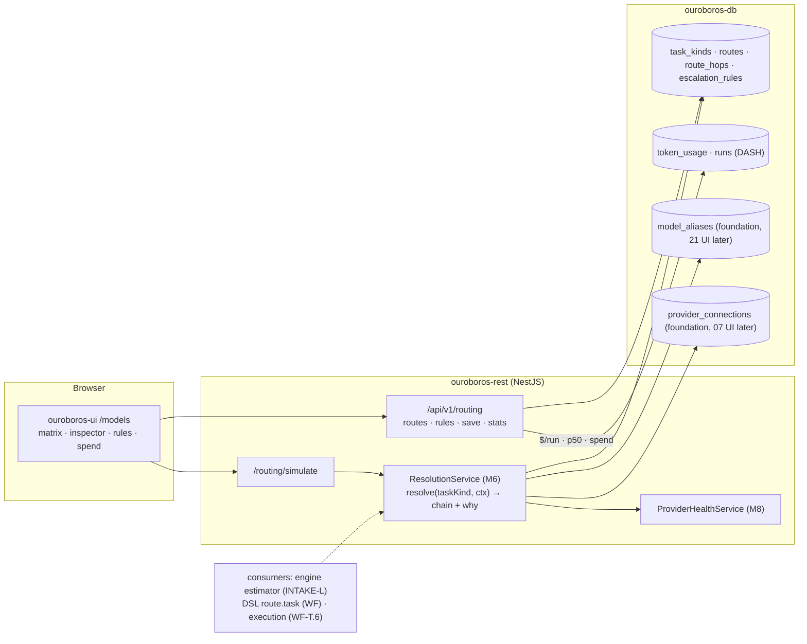
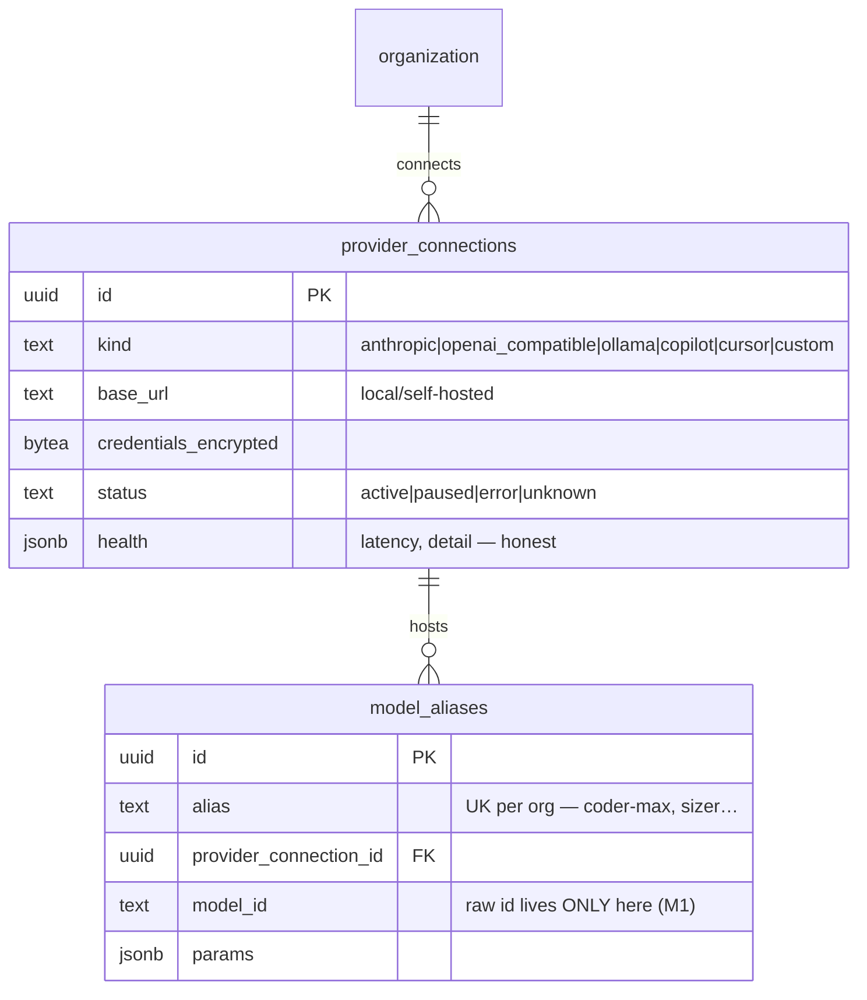
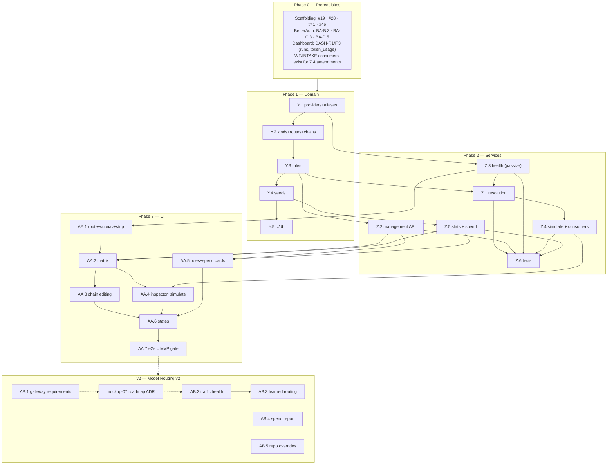

# Roadmap — Model Routing (Mockup 06)

## Description

> Create a roadmap that covers the features for the mockup page 06. Any additional
> tech infrastructure that is required to implement the functionality in these mockup
> pages should be researched and offered as options for implementing in the roadmap.
> The roamdap should include MVP and v2 options, as well as the labels, milestones,
> and the like, for the tickets to be created. Any ticket sources that are used by
> Ouroboros for ingesting should be pluggable, which includes sources like Jira,
> Linear, GitHub, GitLab, and other bug reporting/issue recording sites. Refer to the
> page so that issues can reference the mockup file when creating the UI/UX design of
> the pages.

## Context & Existing Work (duplicate-avoidance survey)

Surveyed 2026-08-08.

**Design source of truth for every UI ticket in this roadmap:**
[`docs/mockups/06-model-routing.html`](mockups/06-model-routing.html) (with
`docs/mockups/assets/ouroboros.css`) — Model Routing. Its anatomy:

- **Page head** — eyebrow `Models`, h1 *"Route every kind of work to the model that
  earns it."*, subline: each task kind resolves to a **primary model with ordered
  fallbacks and escalation rules**; routes point at **named registry aliases, never
  raw model ids**; the loop *"degrades gracefully when a provider stumbles — and
  never silently below the floor you set."* Actions: **Simulate routing** (ghost),
  **Save routes** (primary).
- **Subnav** (violet `--model` active treatment) — **Routing** (this page) / Model
  registry (→ mockup 21) / Providers & keys (→ mockup 07) / Spend (stub).
- **Provider health strip** (`.phealth`) — chips: `Anthropic ● 42ms`, `Cursor ●`,
  `GitHub Copilot ⚠ degraded · elevated latency` (warn treatment),
  `OpenAI-compatible ● vLLM local`, `Ollama ● workstation · 3 models`.
- **Routing matrix** (`c-8` card, tag `8 task kinds`, hint *"drag ⠿ to reorder
  fallback chains"*) — rows per task kind (`analyze`, `estimate`, `plan`,
  `implement` — selected with violet inset, `test-gen`, `review`, `docs`,
  `commit-msg`), each with: drag handle, task name + description + route tag
  (`implement-primary`), **Primary model** (alias pill + resolution line
  `claude-fable-5 · Anthropic`), **Fallback** (dim alias pill + resolution),
  **Escalation** (`effort ≥ L → coder-max (max thinking)`, `always second vote:
  second-opinion`, or `—`), **$/run avg** and **p50 latency** (mono numerics).
- **Route inspector** (right card, `ROUTE — implement-primary`) — numbered
  fallback **chain** (1 `coder-max → claude-fable-5 · Anthropic` ok-dot, *"Primary
  · API key valid, 42ms to us-east"*; 2 `coder-fallback → gpt-5-codex · GitHub
  Copilot` warn-dot, *"Fallback on 5xx / timeouts"*; 3 `local-docs →
  qwen3-coder:32b · Ollama`, *"Offline mode — keeps the loop turning without a
  network"*); toggles **Allow fallback to local models** (on) and **Fail run
  instead of degrading below fallback 2** (off); field **Max cost per run**
  `$2.50`; footnote *"Aliases resolve in the Model registry — routes never name
  raw models."*
- **Escalation rules** card (`3 active`) — switchable rules: `effort ≥ L →
  implement uses coder-max (max thinking)`, `security label → review adds
  second-opinion vote`, `docs-only diff → everything routes local`; **+ Add
  rule**.
- **Spend by provider · 30d** card — metered rows (Anthropic `$412.80` full bar,
  GitHub Copilot `$96.40`, Cursor `$54.10`, Local (vLLM + Ollama) `$0.00`
  ok-meter), footnote *"Local models served 31% of all tokens."*, `Full report →`
  stub.

**Scope boundaries.** The subnav names three sibling surfaces this roadmap does
*not* build: the full **Model registry** UI (mockup 21), **Providers & keys**
(mockup 07), and the **Spend report**. But routing cannot exist without minimal
provider and alias *data*: this roadmap lays those foundations (schema + seeds +
minimal service) explicitly marked as shared ground the 07/21 roadmaps will build
their UIs on.

**Overlapping work and dispositions:**

| Existing work | Disposition under this roadmap |
|---|---|
| Opaque model strings everywhere (DASH-F8, INTAKE-K6, WF-P7 — `routed by task`, pinned ids) | **Given real semantics** — `route.task("implement")` (WF DSL), estimator routing (INTAKE-L.2 config map), and run/`token_usage` model fields resolve through this roadmap's alias+route layer. Amendments listed per issue. |
| Dashboard `token_usage` (DASH-F.3) + priced accounting (DASH-J.4, v2) | **Consumed** — $/run, p50, and the spend card aggregate from it; pricing honesty rules carry over (unpriced ≠ $0, except genuinely-free local providers priced at zero by their price rows). |
| Engine estimation/execution (INTAKE-L, WF-T.6, DASH-J.3) | **Consumers** — the resolution service is the contract they call; MVP ships resolution + simulation, actual LLM invocation arrives with the provider stack (mockup 07 roadmap). |
| WF-R.3 catalog (`route-task names as suggestions`) | **Upgraded** — task kinds become registry data served to the catalog. |
| Mockups 07 (providers & keys UI), 21 (registry UI), spend report | **Out of scope** — subnav targets are placeholders; foundations only (decision M2). |
| Pluggable ticket sources requirement (description boilerplate) | **Already satisfied** by WF Epic Q (SPI + canonical tickets; Jira/Linear/GitLab as WF-T.2–T.4). Nothing source-specific here; noted, not duplicated. |
| Scaffolding #49 `/models` placeholder, #56 e2e | **Superseded for `/models`**; #56 gains a routing leg. |

Epic letters continue the sequence (…P–T, U–X): this roadmap uses **Y, Z, AA, AB**.

## Infrastructure Options (researched — pick before filing)

### 1. Routing/gateway layer (who owns resolution and, later, invocation)

| Option | What it is | Fit | Trade-offs |
|---|---|---|---|
| **A — Custom routing service in `ouroboros-rest` + engine-side invocation later** ⭐ recommended | Routes, aliases, escalation rules, floors, and cost caps as first-class product entities; resolution is a pure function over our schema; the provider-invocation layer (mockup 07 roadmap) executes the resolved chain | Routing *is* the product here (mockup's alias/floor/escalation semantics are richer than any gateway's config); no extra infra; keeps the self-hostable promise | We own retry/fallback execution semantics when invocation lands — mitigated by option B underneath |
| B — LiteLLM (self-hosted proxy) as the invocation substrate | OSS proxy: 100+ providers behind one OpenAI-compatible API, router with retries/cooldowns/fallbacks, model-group aliases | Strong candidate **under** option A for the 07 roadmap: our resolution emits an ordered concrete chain, LiteLLM executes provider calls; self-hostable; ~8ms P95 overhead | Its alias/fallback semantics don't match ours 1:1 (known alias-fallback bug class) — reason to keep routing decisions ours and use it as a dumb executor; decision deferred to the 07 roadmap ADR (AB.1) |
| C — Hosted gateways (OpenRouter, Portkey) | Hosted aggregation/observability (OpenRouter ~100–150ms added; Portkey <1ms + guardrails) | Instant multi-model access | Conflicts with the self-hostable + local-models (Ollama/vLLM) promise as the *primary* path; per-token markup; possible as an optional *provider*, not the gateway |

### 2. Provider health checking (the strip's truth source)

| Option | What it is | Fit | Trade-offs |
|---|---|---|---|
| **A — Passive-first: config/key validation + cheap reachability, "unknown" as a first-class state** ⭐ recommended MVP | Local providers (Ollama `/api/tags`, vLLM `/v1/models`): real reachability + model list; cloud providers: key-validation calls (models-list endpoints) on a slow cadence; latency shown only where measured; degraded state derived from real traffic errors once invocation exists | Honest without burning tokens; the mockup's `42ms` / `degraded · elevated latency` become real as traffic arrives | The strip is sparser than the mockup until invocation lands (honesty rule) |
| B — Active synthetic probes | Scheduled tiny completions per provider | Real end-to-end latency now | Costs real money continuously; rejected for MVP |

## Decisions proposed by this roadmap (validate before issue creation)

| # | Decision | Rationale |
|---|----------|-----------|
| M1 | **Aliases are the only thing routes may name** (`coder-max`, `sizer`, `local-docs` → concrete model+provider in the registry); raw model ids are invalid in routes | The mockup states it twice; aliases are the indirection that makes registry swaps (mockup 21) safe. |
| M2 | **Minimal registry & provider foundations land here** (schema + seeds + resolution internals); their full management UIs belong to mockups 21/07 | Routing is unbuildable without the data; building two more UIs here would swallow those roadmaps. |
| M3 | **Task kinds are registry data** (the mockup's 8 seeded: analyze, estimate, plan, implement, test-gen, review, docs, commit-msg), org-extensible later | WF-R.3 catalog, the estimator, and the DSL all reference them; hardcoding forks the vocabulary. |
| M4 | **A route = ordered alias chain (primary + fallbacks) + policy** (allow-local, floor index for "fail instead of degrading", max cost per run) | Exactly the inspector's model; the floor rule is the mockup's "never silently below the floor you set." |
| M5 | **Escalation rules are structured predicates → route modifications** (`{when: {effort_gte|label|diff_kind}, then: {use_alias|add_vote|route_local, options}}`), reusing the WF-P8 predicate grammar | The three mockup rules all fit; free-text rules would be unenforceable. |
| M6 | **Resolution is a pure, versioned function** — `resolve(taskKind, ctx) → ordered concrete chain + explanations`, health-aware, rule-applied, floor-enforced; **Simulate routing** is the same function exposed | One code path for simulation today and execution (07/WF-T.6) tomorrow; explanations make the inspector and simulator honest. |
| M7 | **$/run, p50, and spend are computed from `token_usage` + runs** (DASH-F.3/F.1); no data → em-dash, never a fabricated number; local providers show $0.00 only via real zero-price rows | Same honesty rule as the dashboard; the mockup's numbers become seed-truth. |
| M8 | **MVP health = passive-first** (option 2-A) with `unknown` rendered honestly; traffic-derived degradation arrives with invocation | No fake green dots, no synthetic spend. |
| M9 | **Invocation-gateway choice (LiteLLM-under-custom vs pure-custom) is the 07 roadmap's ADR (AB.1 here drafts the requirements)** | This roadmap must not preempt the provider stack's core decision; it must hand over crisp requirements (chain execution, per-hop errors, usage capture). |
| M10 | **Labels**: new `routing` (reusing `models`-adjacent labels not needed); **Milestones**: `Model Routing MVP` / `Model Routing v2` created at filing | Description requires labels + milestones for the filing pass. |

## Architecture Overview



## MVP Definition

The MVP is **mockup 06 as the real routing control plane**: routes are data,
resolution is a tested function, and everything rendered is either real or
honestly absent. It is done when, against the compose stack:

1. `/models` reproduces
   [`docs/mockups/06-model-routing.html`](mockups/06-model-routing.html)
   pixel-faithfully in **both themes**: subnav (violet active treatment; registry/
   providers/spend as honest placeholders), provider health strip, the 8-row
   routing matrix with selection, the route inspector (chain, toggles, max-cost),
   the escalation-rules card, and the spend card.
2. **Foundations exist**: provider connections and model aliases as seeded schema
   (Anthropic, GitHub Copilot, Cursor, OpenAI-compatible/vLLM, Ollama; the six
   mockup aliases) with minimal internal services — full management UIs
   deferred to the 07/21 roadmaps.
3. **Routes are editable and saved**: fallback chains reorderable (drag ⠿),
   aliases swappable from the registry list, policy toggles + max-cost persisted;
   Save routes writes versioned route configuration under role gates
   (owner/admin edit, member read).
4. **Escalation rules** CRUD with the three seeded mockup rules as structured
   predicates; enable/disable switches persist; + Add rule offers the M5 shapes.
5. **Resolution + Simulate** work: `resolve("implement", {effort: "l", labels})`
   returns the concrete ordered chain with explanations (rule applied, health
   considered, floor enforced, cost cap noted); the Simulate panel renders it;
   the engine estimator (INTAKE-L.2's config map) is amended to call resolution.
6. **Stats are honest**: $/run avg and p50 per task kind computed from seeded
   usage/runs (em-dash when absent); spend card aggregates 30d by provider with
   the local-token share line; health strip shows real states incl. `unknown`
   (M8).
7. Integration tests cover resolution (health/floor/rules/cost matrices),
   save/reorder, rule evaluation, stats math, isolation; the e2e suite gains a
   routing leg.

**Explicitly v2 (milestone `Model Routing v2`):** the invocation-gateway ADR
handoff (AB.1), traffic-derived health + latency (AB.2), learned/cost-optimized
routing suggestions (AB.3), full spend report surface (AB.4), per-repo route
overrides (AB.5).

## Epics, Labels & Milestones

Each epic is a parent tracking issue on GitHub; every roadmap issue below is filed as
one of its sub-issues (GitHub Relationships).

| Epic | GitHub | Status | Name | Goal | Modules | Milestone |
|------|:------:|:------:|------|------|---------|-----------|
| Y | #185 | 🟡 Open | Routing Domain & Foundations | Providers/aliases/task-kinds/routes/rules schema, seeds, CI | ouroboros-db, ouroboros-rest | Model Routing MVP |
| Z | #186 | 🟡 Open | Resolution & Routing Services | Resolution engine, simulate, health, stats/spend, save APIs, tests | ouroboros-rest, ouroboros-engine | Model Routing MVP |
| AA | #187 | 🟡 Open | Routing UI | Subnav, health strip, matrix, inspector, rules, spend, states, e2e | ouroboros-ui | Model Routing MVP |
| AB | #188 | 🟡 Open | Extended Routing (v2) | Gateway ADR handoff, live health, learned routing, spend report, overrides | all | Model Routing v2 |

Issue naming: `<project>: [<epic>.<issue>] <title>`. Labels: existing set (`mvp`,
`v2`, `rest`, `db`, `engine`, `ui`, `ci`, `design`) **plus new `routing`**
(decision M10). Milestones **`Model Routing MVP`** / **`Model Routing v2`**
created at filing; every issue assigned. Complexity chips: **XS · S · M · L**.

---

## Epic Y (#185) — Routing Domain & Foundations (`ouroboros-db` + `ouroboros-rest`)

| Ref | GitHub | Status | Title | Summary | Labels | Parallel | MVP | Complexity | Affected Modules |
|-----|:------:|:------:|-------|---------|--------|:--------:|:---:|:----------:|------------------|
| Y.1 | #189 | 🟢 Done | ouroboros-db: [Y.1] Provider connections & model alias foundations | `provider_connections` + `model_aliases` schema (07/21 build UIs later) | mvp, routing, db | N (after #19, BA-B.3) | Y | M | ouroboros-db |
| Y.2 | #190 | 🟡 Open | ouroboros-db: [Y.2] Task kinds, routes & fallback chains | `task_kinds`, `routes`, ordered `route_hops`, policy columns | mvp, routing, db | N (after Y.1) | Y | M | ouroboros-db |
| Y.3 | #191 | 🟡 Open | ouroboros-db: [Y.3] Escalation rules schema | Structured predicate → modification rules (M5), enable flags | mvp, routing, db | N (after Y.2) | Y | S | ouroboros-db |
| Y.4 | #192 | 🟡 Open | ouroboros-db: [Y.4] Routing dev seeds — mockup-06 parity | 5 providers, 6 aliases, 8 task kinds, routes, 3 rules, usage stats | mvp, routing, db | N (after Y.3) | Y | M | ouroboros-db |
| Y.5 | #193 | 🟡 Open | ouroboros-db: [Y.5] Routing constraints in ci/db | Alias-only routes, hop ordering, predicate shapes, vocab checks | mvp, routing, db, ci | N (after Y.4, #24) | Y | XS | ouroboros-db, .github |

### Issue Y.1 — ouroboros-db: [Y.1] Provider connections & model alias foundations

> **GitHub issue:** #189 · **Status:** 🟢 Done · **Parent epic:** #185

> **Shipped 2026-08-22.**
> [`ouroboros-db/migrations/V015__provider_connections_model_aliases.sql`](../ouroboros-db/migrations/V015__provider_connections_model_aliases.sql)
> and [`ouroboros-rest/src/modules/registry/`](../ouroboros-rest/src/modules/registry).
> The migration header opens by naming this the **07/21 shared foundation** and decision
> **M2**, and the two table comments carry the same sentence into the catalogue —
> `tests/constraints.sql` asserts they do, so the criterion is checked rather than
> reviewed.
>
> **`credentials_encrypted` is envelope-only, which is a stronger guarantee than "the
> service always encrypts".** The column accepts an `ouro.v1.<version>.<nonce>.<ciphertext>`
> value or null and nothing else, so a plaintext key cannot be stored by a migration, a
> fixture, a hand-written `update` or a service that forgot to seal — the service is one
> writer, and the CHECK is every writer. It is `text` rather than the ticket's `bytea`
> because AD.1's helper produces that envelope *string*, and the key version in its middle
> field is what makes rotation additive; a `bytea` column would be a second encoding and a
> second place the version could be lost. Null stays legitimate: a local provider needs no
> credential.
>
> **The tenancy rule is a composite foreign key rather than a trigger.** V008–V014 met the
> same shape and answered it with `ouroboros.repo_in_organization()`, because `github_repos`
> has no unique key on `(organization_id, id)` to reference. This migration creates both
> tables, so it declares one — and `model_aliases_provider_fk` is therefore referential,
> carries the **restrict** the ticket asks for, and needs no plpgsql beside it. The
> interaction worth knowing is written into the header and asserted: deleting a *workspace*
> still works, because both cascades are queued as after-triggers of the same statement and
> run before the referential check the connection delete appends.
>
> **`health` cannot claim a measurement that did not happen** (decision M8). It defaults to
> `{}`, content requires a `last_checked_at`, and a `latency_ms` must be a non-negative JSON
> number — a string `"42ms"` and an explicit JSON `null` are both refused. There is
> deliberately no defaulted `0ms`, which is not "unknown" but a very good latency. `status`
> is deliberately *not* tied to `last_checked_at`: `paused` is operator intent rather than a
> conclusion, and the transitions between the other three are Z.3's (#196).
>
> **`ouroboros-rest/src/modules/registry/` is the accessor and declares no controller.**
> `resolve`, `list` and `dependentAliases`, and nothing that writes — Z.2 (#195) is what
> puts the alias list on a route, and `registry.module.spec.ts` fails if a controller
> appears here first. *Credentials never in logs or responses* is two probes rather than
> inspection: the repository's suite compiles every read statement and asserts the SQL names
> neither the column nor a `select *`, and the integration suite puts a real ciphertext on a
> row and looks for it in every answer and every log sink. The designed refusal mockup 07
> will need ships with it — a `409 provider_connection_in_use` naming the aliases in the
> way, built from a real foreign-key violation in the integration suite rather than from a
> hand-written error.
>
> **It also registers the vault's first secret store.** `VAULT_SECRET_STORES` had been an
> empty array since AD.1 (#222) because no migration declared an encrypted column. V015's
> is the first, and the store lands with the *migration* rather than with AD.2's (#223)
> credential lifecycle for a reason: a sealed column the re-encryption sweep cannot see is a
> rotation that reports success while leaving ciphertext on the key version it then retires.


- **Problem Statement:** Routes point at aliases; aliases resolve to models on
  provider connections. Neither exists — and mockups 07/21 own their UIs, so the
  *data* foundation must land here without swallowing those roadmaps
  (decision M2).
- **Solution/Scope:** Migration: `provider_connections` — id, `organization_id`
  FK, `kind` CHECK `anthropic|openai_compatible|ollama|copilot|cursor|custom`,
  `display_name`, `base_url` (local/self-hosted kinds), `credentials_encrypted`
  (nullable — local providers may need none; reusing the Q-epic encryption
  helper), `status` CHECK `active|paused|error|unknown`, `last_checked_at`,
  `health` jsonb (latency, detail — honest per M8); `model_aliases` — id,
  `organization_id` FK, `alias` (unique per org: `coder-max`, `sizer`,
  `local-docs`…), `provider_connection_id` FK, `model_id` (raw provider model
  string — the *only* place raw ids live, M1), `params` jsonb (thinking budget,
  temperature defaults), timestamps. Minimal internal accessor services (no
  management UI here).
- **Acceptance Criteria:**
  - Alias uniqueness per org; alias → provider+model resolution is one indexed
    query; credentials never in logs/responses.
  - Deleting a provider with dependent aliases is blocked (FK restrict) with a
    clear error — routes must never dangle.
  - Schema documented as the 07/21 shared foundation in the migration header.
- **Parallelism/Dependencies:** Needs #19, BA-B.3. Blocks Y.2, Z.2, Z.3.
- **Technical Stack:** PostgreSQL 17, Flyway, AES-GCM helper.
- **Epic:** Y



### Issue Y.2 — ouroboros-db: [Y.2] Task kinds, routes & fallback chains

> **GitHub issue:** #190 · **Status:** 🟡 Open · **Parent epic:** #185


- **Problem Statement:** The matrix's rows — task kind → primary + ordered
  fallbacks + policy — need relational truth with ordering integrity
  (decision M4).
- **Solution/Scope:** Migration: `task_kinds` — id, `organization_id` FK, `name`
  (unique per org; seeded eight per M3), `description`, `sort_order` (matrix
  row order, drag-reorderable); `routes` — id, `task_kind_id` FK (one active
  route per kind), `tag` (`implement-primary`), `allow_local_fallback` bool,
  `floor_hop_index` (nullable — "fail instead of degrading below hop N"),
  `max_cost_cents_per_run` (nullable), `updated_by/at`; `route_hops` — route
  FK, `position` (unique per route, dense), `model_alias_id` FK, `note`
  (nullable — the hop-meta line). Alias-only constraint: hops reference
  `model_aliases` FK — raw ids impossible by construction (M1).
- **Acceptance Criteria:**
  - One route per task kind enforced; hop positions dense+unique (reorder in a
    transaction verified).
  - Deleting an alias referenced by hops blocked with a designed error.
  - Floor index validated ≤ chain length.
- **Parallelism/Dependencies:** Needs Y.1. Blocks Y.3, Y.4, Z.1.
- **Technical Stack:** PostgreSQL 17, Flyway.
- **Epic:** Y

```
task_kinds(8, ordered) ─1:1─ routes{allow_local, floor_hop, max_cost}
routes ─1:N─ route_hops(position↑) ──FK──▶ model_aliases   (raw ids unreachable)
```

### Issue Y.3 — ouroboros-db: [Y.3] Escalation rules schema

> **GitHub issue:** #191 · **Status:** 🟡 Open · **Parent epic:** #185


- **Problem Statement:** The three mockup rules must be structured, evaluable
  data (decision M5), not display strings.
- **Solution/Scope:** `escalation_rules` — id, `organization_id` FK, `enabled`
  bool, `sort_order`, `when` jsonb (WF-P8 predicate grammar: `effort_gte`,
  `label`, `diff_kind`), `then` jsonb (CHECK-validated shapes: `{use_alias:
  {task_kind, alias, params?}}` — "(max thinking)" as params; `{add_vote:
  {task_kind, alias}}`; `{route_local: {}}`), `display` (generated summary
  string for UI, derived server-side not hand-written), timestamps.
- **Acceptance Criteria:** The three mockup rules serialize/round-trip; malformed
  `then` shapes rejected; display strings regenerate deterministically from
  structure.
- **Parallelism/Dependencies:** Needs Y.2. Blocks Y.4, Z.1.
- **Technical Stack:** PostgreSQL 17, Flyway.
- **Epic:** Y

```
{when: {effort_gte: "l"}, then: {use_alias: {task_kind: "implement", alias: "coder-max",
 params: {thinking: "max"}}}}  ─▶ display: "effort ≥ L → implement uses coder-max (max thinking)"
```

### Issue Y.4 — ouroboros-db: [Y.4] Routing dev seeds — mockup-06 parity

> **GitHub issue:** #192 · **Status:** 🟡 Open · **Parent epic:** #185


- **Problem Statement:** Design review and e2e need the mockup's exact routing
  state — and the stats columns need seeded usage to compute from (M7).
- **Solution/Scope:** Extend the dev seed: five provider connections (Anthropic,
  GitHub Copilot, Cursor, OpenAI-compatible `vLLM local`, Ollama `workstation`)
  with honest seeded health snapshots (Copilot degraded); six aliases
  (`coder-max`→claude-fable-5, `coder-std`→claude-sonnet-5,
  `sizer`→claude-haiku-4-5, `coder-fallback`→gpt-5-codex,
  `local-docs`→qwen3-coder:32b, `local-free`→llama-4-maverick); eight task
  kinds with the mockup's routes/chains (implement: coder-max → coder-fallback
  → local-docs with hop notes) and policies (allow-local on, floor off,
  $2.50 cap); three escalation rules; `token_usage`/run rows shaped so $/run
  and p50 compute to the mockup's figures and spend lands at
  $412.80/$96.40/$54.10/$0.00 with 31% local token share (extends DASH-F.5
  windows-relative style; zero-price rows for local providers). Personal org:
  empty (foundation-guidance fixture).
- **Acceptance Criteria:** Matrix, inspector, rules, spend, and health strip
  render the mockup from seeds alone; stats recompute stably relative to
  `now()`; idempotent; coordinated with DASH/INTAKE seeds (no conflicting
  usage rows).
- **Parallelism/Dependencies:** Needs Y.3 (+DASH-F.3 coordination). Feeds Z/AA
  tests, e2e.
- **Technical Stack:** Flyway repeatable migration, SQL.
- **Epic:** Y

```
seeds: 5 providers · 6 aliases · 8 kinds · chains+policies · 3 rules
       usage rows ⇒ $/run · p50 · spend(30d) · 31% local — all computed, none stored
```

### Issue Y.5 — ouroboros-db: [Y.5] Routing constraints in ci/db

> **GitHub issue:** #193 · **Status:** 🟡 Open · **Parent epic:** #185


- **Problem Statement:** Alias-only routing, hop ordering, and predicate shapes
  are the invariants resolution trusts.
- **Solution/Scope:** Extend #24 `tests/constraints.sql`: hop position
  density/uniqueness, one-route-per-kind, FK restrict probes (alias/provider
  deletion), rule `then`-shape checks, provider kind/status vocab, floor-index
  bound.
- **Acceptance Criteria:** Green on current schema; red when any invariant
  drops (spot-verified once).
- **Parallelism/Dependencies:** Needs Y.4, #24.
- **Technical Stack:** GitHub Actions, SQL.
- **Epic:** Y

```
ci/db: migrate ─▶ constraints (+Y probes) ─▶ ✓/✗
```

---

## Epic Z (#186) — Resolution & Routing Services (`ouroboros-rest` + `ouroboros-engine`)

| Ref | GitHub | Status | Title | Summary | Labels | Parallel | MVP | Complexity | Affected Modules |
|-----|:------:|:------:|-------|---------|--------|:--------:|:---:|:----------:|------------------|
| Z.1 | #194 | 🟡 Open | ouroboros-rest: [Z.1] Resolution engine (`resolve` + explanations) | Pure health/rule/floor/cost-aware chain resolution (M6) | mvp, routing, rest | N (after Y.3, Z.3) | Y | L | ouroboros-rest |
| Z.2 | #195 | 🟡 Open | ouroboros-rest: [Z.2] Routing management API | Matrix read, chain reorder, policy save, rules CRUD, versioned saves | mvp, routing, rest | N (after Y.3, BA-C.3) | Y | M | ouroboros-rest |
| Z.3 | #196 | 🟡 Open | ouroboros-rest: [Z.3] Provider health service (passive-first) | Local reachability + key validation + `unknown`; strip payload | mvp, routing, rest | N (after Y.1) | Y | M | ouroboros-rest |
| Z.4 | #197 | 🟡 Open | ouroboros-rest: [Z.4] Simulate endpoint & consumer contract | `/routing/simulate`; engine estimator + WF catalog amendments | mvp, routing, rest, engine | N (after Z.1) | Y | M | ouroboros-rest, ouroboros-engine |
| Z.5 | #198 | 🟡 Open | ouroboros-rest: [Z.5] Route stats & spend aggregation | $/run avg, p50, 30d spend by provider, local-token share | mvp, routing, rest | N (after Y.4, DASH-F.3) | Y | M | ouroboros-rest |
| Z.6 | #199 | 🟡 Open | ouroboros-rest: [Z.6] Routing integration tests | Resolution matrices, save/reorder, rules, stats, isolation | mvp, routing, rest, ci | N (after Z.1–Z.5) | Y | M | ouroboros-rest |

### Issue Z.1 — ouroboros-rest: [Z.1] Resolution engine (`resolve` + explanations)

> **GitHub issue:** #194 · **Status:** 🟡 Open · **Parent epic:** #186


- **Problem Statement:** The product promise — degrade gracefully, never below
  the floor, apply escalation, respect cost caps — must be one pure, testable
  function used by simulation now and execution later (decision M6).
- **Solution/Scope:** `ResolutionService.resolve(taskKind, ctx {effort?,
  labels?, diff_kind?, repo?}) → Resolution`: load route + hops + aliases +
  provider snapshots; apply enabled escalation rules in order (M5 semantics:
  `use_alias` swaps/prepends primary with params, `add_vote` appends a vote
  requirement, `route_local` filters to local-provider aliases); drop hops on
  paused/error providers *unless* that would break the floor — floor violation
  → `fail_run` resolution with reason; enforce `allow_local_fallback`; annotate
  each hop kept/dropped with a machine-readable + human explanation; attach
  `max_cost_cents` for the executor. Deterministic given inputs; versioned
  result shape (consumers pin `resolution_version`).
- **Acceptance Criteria:**
  - Matrix tests: every mockup rule, floor breach → fail-with-reason, local
    disallowed → local hops dropped-with-reason, all-providers-down →
    fail_run, cost cap attached.
  - Determinism verified; explanations render the inspector/simulate stories
    without post-processing.
- **Parallelism/Dependencies:** Needs Y.3, Z.3. Blocks Z.4.
- **Technical Stack:** NestJS, Kysely (pure service + snapshot inputs).
- **Epic:** Z

```
resolve("implement", {effort:"l"}) ─▶
  rules: effort≥L → coder-max(max thinking)   [applied]
  1 coder-max → claude-fable-5 · Anthropic     [kept · healthy]
  2 coder-fallback → gpt-5-codex · Copilot     [kept · degraded — after primary]
  3 local-docs → qwen3-coder:32b · Ollama      [kept · allow_local=on]
  floor: none · max_cost: 250¢ · version: r1
```

### Issue Z.2 — ouroboros-rest: [Z.2] Routing management API

> **GitHub issue:** #195 · **Status:** 🟡 Open · **Parent epic:** #186


- **Problem Statement:** The matrix, inspector, and rules card need read/write
  APIs with the mockup's editing semantics (drag-reorder, toggles, cost field,
  Save routes).
- **Solution/Scope:** Under tenant context: `GET /api/v1/routing` (matrix
  payload: kinds, routes, chains with alias resolutions, stats refs, rules);
  `PUT /api/v1/routing/routes/:taskKind` (chain order, alias swaps, policy
  toggles, max cost — validated against Y.2 constraints); `POST/PATCH/DELETE
  /api/v1/routing/rules` (M5 shapes; display strings server-generated);
  save semantics: explicit **Save routes** commits a batch as a
  `route_revisions` row (who/when/diff jsonb — cheap audit trail, feeds #26
  later); alias list endpoint for swap menus (registry read — foundation
  scope). Owner/admin write, member read.
- **Acceptance Criteria:** Reorder/swap/policy round-trips; invalid states
  (empty chain, floor > length, unknown alias) → 422 envelope; revision rows
  record diffs; role gates enforced.
- **Parallelism/Dependencies:** Needs Y.3, BA-C.3. Feeds AA.2–AA.4.
- **Technical Stack:** NestJS, Kysely, class-validator.
- **Epic:** Z

```
GET /routing ─▶ {kinds[8], chains, policies, rules[3], statsRef}
PUT /routes/implement {hops:[…], floor:2, maxCost:250} ─▶ revision recorded
```

### Issue Z.3 — ouroboros-rest: [Z.3] Provider health service (passive-first)

> **GitHub issue:** #196 · **Status:** 🟡 Open · **Parent epic:** #186


- **Problem Statement:** The health strip and resolution need provider states —
  honest ones (decision M8): real checks where cheap, `unknown` where not.
- **Solution/Scope:** Scheduled checks per provider kind: Ollama (`/api/tags` →
  reachable + model count — the mockup's `workstation · 3 models`), vLLM/
  OpenAI-compatible (`/v1/models`), Anthropic/OpenAI-style key validation
  (models-list, slow cadence, jittered), Copilot/Cursor: `unknown` until
  invocation traffic exists (documented); measured latency stored only for
  performed checks; status transitions update `provider_connections.health`;
  strip payload endpoint. Degraded-from-traffic is AB.2's upgrade — the shape
  accommodates it.
- **Acceptance Criteria:** Local providers reflect reachability within one
  cycle (compose-verified by stopping Ollama stub); cloud shows
  validated/unknown truthfully; no synthetic completions anywhere; strip
  payload matches seeded states.
- **Parallelism/Dependencies:** Needs Y.1. Feeds Z.1, AA.1.
- **Technical Stack:** NestJS scheduler, undici.
- **Epic:** Z

```
ollama /api/tags ─▶ ● reachable · 3 models     anthropic key-check ─▶ ● valid · 42ms
copilot ─▶ ◌ unknown (until traffic — AB.2)     stopped vllm ─▶ ⚠ unreachable
```

### Issue Z.4 — ouroboros-rest: [Z.4] Simulate endpoint & consumer contract

> **GitHub issue:** #197 · **Status:** 🟡 Open · **Parent epic:** #186


- **Problem Statement:** "Simulate routing" must expose the resolution function,
  and the existing consumers of opaque model strings must start asking it.
- **Solution/Scope:** `POST /api/v1/routing/simulate {taskKind, ctx}` → the
  Z.1 Resolution with explanations (member-readable); internal consumer
  contract: engine estimation (INTAKE-L.2's `model_defaults` config map →
  amended to a resolution call via the gateway pattern, its
  `routed_model` output becomes the resolved primary's alias+resolution),
  WF-R.3 catalog serves task-kind names from Y.2 data (amendment), DSL
  `route.task(name)` validation checks the registry. OpenAPI documented.
- **Acceptance Criteria:** Simulate returns chain+why for all seeded kinds and
  rule-triggering contexts; estimator amendment lands (its trace stays honest
  — resolution used, not invocation); WF catalog lists registry kinds.
- **Parallelism/Dependencies:** Needs Z.1. Amends INTAKE-L.2, WF-R.3.
- **Technical Stack:** NestJS, engine client.
- **Epic:** Z

```
POST /routing/simulate {taskKind:"review", ctx:{labels:["security"]}}
 ─▶ chain + "rule applied: security label → adds second-opinion vote"
consumers: estimator (INTAKE-L.2) · WF catalog kinds · DSL route.task validation
```

### Issue Z.5 — ouroboros-rest: [Z.5] Route stats & spend aggregation

> **GitHub issue:** #198 · **Status:** 🟡 Open · **Parent epic:** #186


- **Problem Statement:** $/run avg, p50 latency, the spend card, and the
  local-token share must be computed from usage truth (decision M7).
- **Solution/Scope:** Stats service over `token_usage` + `runs` (DASH-F.3/F.1):
  per task kind — $/run avg (priced usage attributed to runs by task; window
  30d), p50 latency (stage timing where recorded; em-dash otherwise); spend by
  provider 30d with meters + local share (`tokens on zero-priced local
  providers / all tokens`); missing pricing → "unpriced" per DASH-J.4 honesty;
  cache with short TTL. Folded into the `GET /routing` payload + a spend
  endpoint for the AB.4 report later.
- **Acceptance Criteria:** Seeded numbers reproduce the mockup figures; empty
  org → em-dashes and zero-states, never `$0.00` for unpriced; p50 absent
  where timings don't exist.
- **Parallelism/Dependencies:** Needs Y.4, DASH-F.3. Feeds AA.2, AA.5.
- **Technical Stack:** NestJS, Kysely (filtered aggregates).
- **Epic:** Z

```
usage×runs (30d) ─▶ per-kind {$/run avg | —} {p50 | —}
by-provider ─▶ $412.80 · $96.40 · $54.10 · $0.00(zero-priced) · local share 31%
```

### Issue Z.6 — ouroboros-rest: [Z.6] Routing integration tests

> **GitHub issue:** #199 · **Status:** 🟡 Open · **Parent epic:** #186


- **Problem Statement:** Resolution matrices, revisioned saves, and stats math
  are regression-prone cross-table logic.
- **Solution/Scope:** Testcontainers suites: Z.1 matrices (rules × health ×
  floor × local-policy × cost), save/reorder transactionality + revision
  diffs, rule CRUD shape validation, stats fixtures (incl. unpriced and
  empty-window cases), health-state fixtures, org isolation across all
  routing routes.
- **Acceptance Criteria:** Green in `ci/rest`; removing floor enforcement or
  the alias FK turns tests red; ≤ 75s added.
- **Parallelism/Dependencies:** Needs Z.1–Z.5.
- **Technical Stack:** Jest, Supertest, Testcontainers.
- **Epic:** Z

```
suites: resolve matrix ✓ · saves+revisions ✓ · rules ✓ · stats honesty ✓ · isolation ✓
```

---

## Epic AA (#187) — Routing UI (`ouroboros-ui`)

Every issue references
[`docs/mockups/06-model-routing.html`](mockups/06-model-routing.html) as the
design source — subnav treatment, `.phealth` strip, matrix/inspector/rules/spend
cards — via the #16 tokens (both themes; the mockup is dark-only).

| Ref | GitHub | Status | Title | Summary | Labels | Parallel | MVP | Complexity | Affected Modules |
|-----|:------:|:------:|-------|---------|--------|:--------:|:---:|:----------:|------------------|
| AA.1 | #200 | 🟡 Open | ouroboros-ui: [AA.1] Models route, subnav & provider health strip | `/models` head, violet subnav, honest health chips | mvp, routing, ui, design | N (after #41, Z.3, BA-D.5) | Y | M | ouroboros-ui |
| AA.2 | #201 | 🟡 Open | ouroboros-ui: [AA.2] Routing matrix table | 8-kind matrix: alias cells, escalation summaries, stats, selection | mvp, routing, ui, design | N (after AA.1, Z.2, Z.5) | Y | L | ouroboros-ui |
| AA.3 | #202 | 🟡 Open | ouroboros-ui: [AA.3] Chain editing & drag-reorder | ⠿ reorder, alias swap menus, unsaved-state + Save routes flow | mvp, routing, ui | N (after AA.2) | Y | M | ouroboros-ui |
| AA.4 | #203 | 🟡 Open | ouroboros-ui: [AA.4] Route inspector & simulate panel | Chain hops with health, policy toggles, max cost, simulate results | mvp, routing, ui, design | N (after AA.2, Z.4) | Y | M | ouroboros-ui |
| AA.5 | #204 | 🟡 Open | ouroboros-ui: [AA.5] Escalation rules & spend cards | Rule rows + switches + add-rule builder; spend meters + local share | mvp, routing, ui, design | N (after AA.1, Z.2, Z.5) | Y | M | ouroboros-ui |
| AA.6 | #205 | 🟡 Open | ouroboros-ui: [AA.6] Routing states & guards | Empty foundations guidance, member read-only, load/error states | mvp, routing, ui, design | N (after AA.2–AA.5) | Y | S | ouroboros-ui |
| AA.7 | #206 | 🟡 Open | ouroboros-ui: [AA.7] Routing e2e leg | Parity, reorder→save, rule toggle, simulate, honesty states, themes | mvp, routing, ui, ci | N (after AA.1–AA.6) | Y | S | ouroboros-ui, .github |

### Issue AA.1 — ouroboros-ui: [AA.1] Models route, subnav & provider health strip

> **GitHub issue:** #200 · **Status:** 🟡 Open · **Parent epic:** #187


- **Problem Statement:** The page frame: head with the routing promise copy,
  the violet-treatment subnav (three sibling tabs honestly stubbed), and the
  health strip fed by Z.3.
- **Solution/Scope:** Replace the #49 `/models` placeholder: head per the
  mockup (Simulate routing → AA.4 panel; Save routes → AA.3 flow, disabled
  clean); subnav with Routing active (`--model` glow underline), Model
  registry / Providers & keys / Spend as "soon" targets (their roadmaps);
  health strip chips per provider (ok/warn/unknown dot states, name, meta —
  latency only where measured, `unknown` styled honestly), hover detail
  (last-checked, reason).
- **Acceptance Criteria:** Seeded strip matches the mockup incl. the degraded
  Copilot chip; unknown states render distinctly (not fake-green); both
  themes; #49 stub retired (amendment).
- **Parallelism/Dependencies:** Needs #41, Z.3, BA-D.5. Blocks AA.2–AA.6.
- **Technical Stack:** Next.js, #46 primitives.
- **Epic:** AA

```
[Models] Route every kind of work to the model that earns it.  [Simulate routing][Save routes]
Routing | Model registry·soon | Providers & keys·soon | Spend·soon
(● Anthropic 42ms)(● Cursor)(⚠ Copilot degraded)(● vLLM local)(● Ollama · 3 models)
```

### Issue AA.2 — ouroboros-ui: [AA.2] Routing matrix table

> **GitHub issue:** #201 · **Status:** 🟡 Open · **Parent epic:** #187


- **Problem Statement:** The matrix is the page's core: dense rows pairing task
  identity, alias cells with resolution lines, escalation summaries, and
  honest stats — with the violet selection treatment driving the inspector.
- **Solution/Scope:** #46 Table per the mockup: drag-handle column (AA.3),
  task cell (mono name, description, route tag), primary/fallback alias
  cells (`pill model` + dim variant, `alias-res` resolution line), escalation
  column (server-generated rule summaries touching this kind; em-dash
  otherwise), $/run and p50 mono numerics (em-dash when absent per M7); row
  selection (violet inset per `.selected`) syncs the inspector; keyboard row
  navigation.
- **Acceptance Criteria:** Seeded matrix matches the mockup row-for-row in
  both themes; selection drives the inspector; stats honesty rendered
  (empty-usage org shows em-dashes).
- **Parallelism/Dependencies:** Needs AA.1, Z.2, Z.5. Blocks AA.3, AA.4.
- **Technical Stack:** React, #46 Table/Chip.
- **Epic:** AA

```
⠿ implement  Write the change… [implement-primary] │ (coder-max) claude-fable-5·Anthropic │
  (coder-fallback dim) gpt-5-codex·Copilot │ — │ $0.87 │ 41.0s   ◀ selected (violet inset)
```

### Issue AA.3 — ouroboros-ui: [AA.3] Chain editing & drag-reorder

> **GitHub issue:** #202 · **Status:** 🟡 Open · **Parent epic:** #187


- **Problem Statement:** "drag ⠿ to reorder fallback chains" plus alias swaps
  and policy edits — with an explicit Save routes commit, not silent
  mutation.
- **Solution/Scope:** Drag-reorder of hops (within a route; a11y alternative:
  keyboard move actions), alias swap menu per hop (registry list from Z.2
  with resolution preview), add/remove hop, edits accumulate client-side
  with a dirty-state bar ("2 routes changed · Save / Discard"); **Save
  routes** commits the batch (Z.2 revision), errors mapped per route;
  member role sees no handles (read-only).
- **Acceptance Criteria:** Reorder+swap+save round-trips and re-renders
  resolution lines; discard restores; invalid states blocked inline;
  keyboard path complete.
- **Parallelism/Dependencies:** Needs AA.2.
- **Technical Stack:** React (dnd via @dnd-kit or hand-rolled — decided
  in-issue), #46 primitives.
- **Epic:** AA

```
⠿ drag hop 2 ↔ 3 ─▶ dirty bar: "1 route changed  [Save routes][Discard]"
alias swap ▾ ─▶ registry list + "→ resolves: claude-sonnet-5 · Anthropic"
```

### Issue AA.4 — ouroboros-ui: [AA.4] Route inspector & simulate panel

> **GitHub issue:** #203 · **Status:** 🟡 Open · **Parent epic:** #187


- **Problem Statement:** The inspector tells one route's full story — chain
  hops with health and meta, the three policy controls — and Simulate must
  show resolution *with reasons*.
- **Solution/Scope:** Inspector card per the mockup: numbered rail chain
  (alias pill, resolution arrow line, health dot with title, hop-meta),
  policy toggles (allow-local, floor — rendered as the mockup's "fail run
  instead of degrading below fallback N") and max-cost field (currency
  parsing), registry footnote linking the future 21 surface; **Simulate
  panel** (sheet from the head button or inspector): context inputs (task
  kind, effort, labels, diff-kind), calls Z.4, renders kept/dropped hops
  with explanations and applied rules (the Z.1 story verbatim).
- **Acceptance Criteria:** Seeded implement route reproduces the mockup
  inspector; toggling floor + simulating a dead-primary scenario shows
  fail-with-reason; policy edits join the AA.3 dirty batch; both themes.
- **Parallelism/Dependencies:** Needs AA.2, Z.4.
- **Technical Stack:** React, #46 primitives.
- **Epic:** AA

```
ROUTE — implement-primary
① coder-max → claude-fable-5·Anthropic ● "Primary · key valid · 42ms"
② coder-fallback → gpt-5-codex·Copilot ⚠ "Fallback on 5xx/timeouts"
③ local-docs → qwen3-coder:32b·Ollama ● "Offline mode…"
[allow local ✓][floor: off][max $2.50]     Simulate ▸ kept/dropped + why
```

### Issue AA.5 — ouroboros-ui: [AA.5] Escalation rules & spend cards

> **GitHub issue:** #204 · **Status:** 🟡 Open · **Parent epic:** #187


- **Problem Statement:** The rules card (three switchable rules + Add rule)
  and the spend card (metered providers + local share) complete the right
  column.
- **Solution/Scope:** Rules card: server-generated display strings with
  alias names in the violet treatment, enable switches (persist via Z.2),
  **+ Add rule** builder dialog composing M5 shapes from selects (predicate
  → action → target), delete with confirm; spend card: metered rows from
  Z.5 (widths relative to max, ok-meter for local), local-share footnote,
  `Full report →` as an honest "soon" (AB.4).
- **Acceptance Criteria:** Seeded cards match the mockup; toggling a rule
  changes the next simulate result (verified); builder produces valid
  structures only; unpriced states render honestly.
- **Parallelism/Dependencies:** Needs AA.1, Z.2, Z.5.
- **Technical Stack:** React, #46 primitives.
- **Epic:** AA

```
ESCALATION RULES (3 active)  [rule ⇄ switch]…  [+ Add rule → when ▾ then ▾ target ▾]
SPEND · 30D  Anthropic ▓▓▓▓▓ $412.80 … Local ▓ $0.00 · "Local served 31% of tokens"
```

### Issue AA.6 — ouroboros-ui: [AA.6] Routing states & guards

> **GitHub issue:** #205 · **Status:** 🟡 Open · **Parent epic:** #187


- **Problem Statement:** A fresh org has no providers, no aliases, no routes —
  the page must guide, not blank; members must get read-only.
- **Solution/Scope:** Guidance states: no providers ("Connect a provider —
  arriving with Providers & keys" honest pointer + seeded-dev note), no
  routes (offer default-route bootstrap from the seeded template), member
  read-only across matrix/inspector/rules, skeletons + error banner
  (DASH-I.7 pattern), empty-usage stats em-dashes.
- **Acceptance Criteria:** Personal-org seed walks the guidance path; member
  session verified read-only; all states themed.
- **Parallelism/Dependencies:** Needs AA.2–AA.5.
- **Technical Stack:** React, #46 EmptyState/Skeleton.
- **Epic:** AA

### Issue AA.7 — ouroboros-ui: [AA.7] Routing e2e leg

> **GitHub issue:** #206 · **Status:** 🟡 Open · **Parent epic:** #187


- **Problem Statement:** Chain editing, rule effects, and simulation honesty
  span all services — e2e certifies them.
- **Solution/Scope:** Extend #56: seeded parity (strip, matrix, inspector,
  rules, spend), reorder → save → matrix re-renders resolutions, rule toggle
  → simulate output changes, floor + simulate fail-with-reason, member
  read-only, both themes screenshot-diffed.
- **Acceptance Criteria:** Green from cold compose; each leg fails
  meaningfully when its service breaks (spot-verified); ≤ 2 min added.
- **Parallelism/Dependencies:** Needs AA.1–AA.6, Y.4; amends #56.
- **Technical Stack:** Playwright.
- **Epic:** AA

```
e2e: parity ✓ · reorder→save ✓ · rule→simulate ✓ · floor fail ✓ · read-only ✓ · themes ✓
```

---

## Epic AB (#188) — Extended Routing (v2 · milestone `Model Routing v2`)

| Ref | GitHub | Status | Title | Summary | Labels | Parallel | MVP | Complexity | Affected Modules |
|-----|:------:|:------:|-------|---------|--------|:--------:|:---:|:----------:|------------------|
| AB.1 | #207 | 🟡 Open | ouroboros-rest: [AB.1] Invocation-gateway requirements handoff | Requirements doc for the 07 roadmap's ADR (LiteLLM-under-custom vs pure custom) | v2, routing, rest, engine | Y | N | S | docs |
| AB.2 | #208 | 🟡 Open | ouroboros-rest: [AB.2] Traffic-derived health & latency | Degraded/latency states from real invocation telemetry | v2, routing, rest | N (after 07-roadmap invocation) | N | M | ouroboros-rest |
| AB.3 | #209 | 🟡 Open | ouroboros-rest: [AB.3] Learned routing suggestions | Cost/quality-informed route suggestions from run outcomes | v2, routing, rest, engine | N (after AB.2) | N | L | ouroboros-rest, ouroboros-engine |
| AB.4 | #210 | 🟡 Open | ouroboros-ui: [AB.4] Full spend report surface | The subnav's Spend tab: drill-down by provider/model/task/repo | v2, routing, ui | N (after Z.5, DASH-J.4) | N | M | ouroboros-ui, ouroboros-rest |
| AB.5 | #211 | 🟡 Open | ouroboros-rest: [AB.5] Per-repo route overrides | Repo-scoped route/policy overrides layered over org routes | v2, routing, rest, ui | N (after Z.1) | N | M | ouroboros-rest, ouroboros-ui |

### Issue AB.1 — ouroboros-rest: [AB.1] Invocation-gateway requirements handoff

> **GitHub issue:** #207 · **Status:** 🟡 Open · **Parent epic:** #188


- **Problem Statement:** Resolution emits chains; something must *execute* them
  against providers (mockup 07 territory). That roadmap's ADR needs crisp
  requirements from routing's side now, or invocation will re-invent routing
  semantics (decision M9).
- **Solution/Scope:** Requirements doc: execute ordered concrete chains with
  per-hop error taxonomy (what counts as "5xx/timeouts" → next hop), floor
  abort semantics, per-run cost-cap enforcement with usage capture into
  `token_usage`, vote-execution (add_vote rules), streaming, local-provider
  parity; evaluation notes on LiteLLM-under-custom (option 1-B — dumb
  executor, our decisions) vs pure custom; explicit non-goals (gateway must
  not own aliases/rules).
- **Acceptance Criteria:** Doc merged; 07 roadmap's ADR issue references it as
  input; resolution's contract versioning confirmed sufficient for both
  candidate executors.
- **Parallelism/Dependencies:** Independent; input to the mockup-07 roadmap.
- **Technical Stack:** Docs.
- **Epic:** AB

### Issue AB.2 — ouroboros-rest: [AB.2] Traffic-derived health & latency

> **GitHub issue:** #208 · **Status:** 🟡 Open · **Parent epic:** #188


- **Problem Statement:** Passive health (M8) can't see what the mockup's
  `degraded · elevated latency` implies — real per-provider error/latency
  windows from live traffic.
- **Solution/Scope:** Invocation telemetry (per-hop outcomes from the executor)
  aggregated into provider health windows (error rate, p50/p95), degraded
  thresholds, strip + inspector upgrades, resolution's health snapshots
  consuming it; `unknown` states retire for providers with traffic.
- **Acceptance Criteria:** Synthetic failure injection flips a provider to
  degraded within a window; resolution demotes accordingly; strip shows
  measured latency.
- **Parallelism/Dependencies:** Needs the 07 roadmap's invocation layer.
- **Technical Stack:** NestJS, telemetry aggregation.
- **Epic:** AB

### Issue AB.3 — ouroboros-rest: [AB.3] Learned routing suggestions

> **GitHub issue:** #209 · **Status:** 🟡 Open · **Parent epic:** #188


- **Problem Statement:** With outcomes flowing (merge rates, retries, cost per
  task kind × alias), the system can *suggest* cheaper/better routes — the
  optimization the page's headline implies.
- **Solution/Scope:** Analysis job correlating run outcomes with routes;
  suggestion objects ("docs on local-docs matches coder-std quality at $0 —
  consider swapping") surfaced in the matrix as dismissible hints; never
  auto-applied (suggest-only); methodology documented.
- **Acceptance Criteria:** Suggestions computed from fixture histories with
  documented thresholds; UI hints dismiss/persist; no auto-mutation.
- **Parallelism/Dependencies:** Needs AB.2.
- **Technical Stack:** NestJS/engine analysis, fixtures.
- **Epic:** AB

### Issue AB.4 — ouroboros-ui: [AB.4] Full spend report surface

> **GitHub issue:** #210 · **Status:** 🟡 Open · **Parent epic:** #188


- **Problem Statement:** The subnav's Spend tab and the card's "Full report →"
  promise drill-down the MVP card doesn't attempt.
- **Solution/Scope:** Spend tab: time-windowed breakdowns by provider / model /
  task kind / repo, priced-vs-unpriced visibility, export (CSV), budget-line
  affordances (caps visualization from route policies); consumes Z.5 + DASH-
  J.4 pricing.
- **Acceptance Criteria:** Report reconciles with the card totals; unpriced
  clearly separated; export correct.
- **Parallelism/Dependencies:** Needs Z.5, DASH-J.4.
- **Technical Stack:** React, dataviz per the design system.
- **Epic:** AB

### Issue AB.5 — ouroboros-rest: [AB.5] Per-repo route overrides

> **GitHub issue:** #211 · **Status:** 🟡 Open · **Parent epic:** #188


- **Problem Statement:** Org-wide routes are the MVP simplification; real
  tenants will want `helios-firmware` routed differently from a docs repo.
- **Solution/Scope:** Override layer: repo-scoped route/policy deltas resolved
  over org routes (explicit precedence, inspector shows inheritance), UI
  affordance in the matrix (repo filter context from the tenant chip),
  resolution ctx gains `repo`.
- **Acceptance Criteria:** Override resolves correctly with provenance shown;
  removing an override falls back cleanly; isolation preserved.
- **Parallelism/Dependencies:** Needs Z.1.
- **Technical Stack:** NestJS, React.
- **Epic:** AB

---

## Work Order (dependency-ordered execution plan)



Ordered checklist (⊕ = parallelizable within its phase):

1. **Phase 0 — Prerequisites:** scaffolding #19/#28/#41/#46; BA-B.3/C.3/D.5;
   DASH-F.1/F.3; INTAKE-L.2 + WF-R.3 present for the Z.4 amendments.
2. **Phase 1 — Domain:** Y.1 → Y.2 → Y.3 → Y.4 → Y.5
3. **Phase 2 — Services:** { Z.2 ⊕ Z.3 ⊕ Z.5 } → Z.1 → Z.4 → Z.6
4. **Phase 3 — UI:** AA.1 → AA.2 → { AA.3 ⊕ AA.4 ⊕ AA.5 } → AA.6 →
   **AA.7 ✅** *(MVP gate, amending #56)*
5. **v2:** AB.1 now (feeds the 07 roadmap) → after invocation exists: AB.2 →
   AB.3; AB.4 ⊕ AB.5 anytime after their dependencies.

## Totals

| | Issues | MVP | v2 |
|---|:---:|:---:|:---:|
| Epic Y — Routing Domain & Foundations | 5 | 5 | 0 |
| Epic Z — Resolution & Routing Services | 6 | 6 | 0 |
| Epic AA — Routing UI | 7 | 7 | 0 |
| Epic AB — Extended Routing | 5 | 0 | 5 |
| **Total** | **23** | **18** | **5** |

Filed as **#185–#188** (epic parents) and **#189–#211** (23 work issues).

Plus **4 amendments** — comments posted and the `routing` label applied on
2026-08-09; no new work created:

| Issue | Amendment |
|---|---|
| #49 | The `/models` placeholder is superseded and retired by AA.1 (#200) |
| #56 | The e2e suite gains the routing leg AA.7 (#206), including the rule-toggle → simulate assertion and shell checks |
| #106 | INTAKE-L.2's estimator drops its `model_defaults` map and resolves via routing (Z.4, #197) — trace says *resolved*, never *invoked* |
| #145 | WF-R.3's stage catalog serves task-kind names from the Y.2 (#190) registry; DSL `route.task` validates against it |

## References

- Design source: [`docs/mockups/06-model-routing.html`](mockups/06-model-routing.html),
  `docs/mockups/assets/ouroboros.css`; sibling mockups 07/21 (foundations shared,
  UIs deferred)
- Upstream roadmaps: scaffolding (filed); BetterAuth, dashboard, intake,
  workflow-builder, workflow-code (validation gates)
- Gateway research: [LiteLLM router — load balancing & fallbacks](https://docs.litellm.ai/docs/routing) ·
  [LiteLLM fallbacks / reliability](https://docs.litellm.ai/docs/proxy/reliability) ·
  [alias-fallback bug class (litellm#15493)](https://github.com/BerriAI/litellm/issues/15493) ·
  [LiteLLM vs Portkey vs OpenRouter 2026](https://www.requesty.ai/blog/litellm-vs-portkey-vs-openrouter-best-llm-gateway-2026) ·
  [LLM gateways compared 2026](https://wavect.io/blog/llm-gateway-router-comparison-2026/) ·
  [gateway decision guide (latency, cost, self-hosting)](https://dibi8.com/resources/llm-frameworks/llm-gateway-portkey-litellm-openrouter-comparison-2026/)

## UI/UX Shell Compliance (addendum 2026-08-09)

The application shell defined in
[`docs/DESIGN_SYSTEM_APP_SHELL.md`](DESIGN_SYSTEM_APP_SHELL.md) (implementing
roadmap: [`ROADMAP_UIUX_APP_SHELL.md`](ROADMAP_UIUX_APP_SHELL.md)) supersedes
the mockup's top-bar navigation chrome for every UI issue in this roadmap:

1. **Header** — application name/brand upper-left (with the tenant chip),
   profile & session controls upper-right; no navigation links in the header.
2. **Sidebar navigation** — fixed left rail of icon + name entries
   (registry-driven); this surface is reached via the **Models** entry.
   The Models tab set (Routing / Model registry / Providers & keys / Spend)
   stays at the top of the content pane.
3. **Content-only scrolling** — the content pane is the sole scroll
   container; header and sidebar never scroll; wide content (tables, gantts,
   matrices) scrolls inside its own wrappers, never the pane.
4. **Type scale** — all type and spacing rem-based against the #16 tokens so
   the five-step font-size preference (App Shell CQ.2) scales every surface;
   no hard-coded px text (lint-enforced by CQ.1).
5. **Mockup interpretation** —
   [`docs/mockups/06-model-routing.html`](mockups/06-model-routing.html)
   remains the design source for page content and card anatomy; its
   `.topbar`/`.nav` chrome is superseded by the shell spec.

Issue-level impact:

| Issue | Amendment |
|---|---|
| AA.1 (#200) | Mounts in the shell content pane; navigation via the sidebar **Models** entry (CP.2 registry), not a topbar link; the in-page subnav (if any) renders via the CP.4 PageSubnav primitive (sticky within the pane scroll) |
| AA.2–AA.6 (#201–#205) | rem-based type (CQ.1 tokens); sticky elements (table headers, dirty-state bars) stick within the content pane (CP.4); component/state/a11y standards per spec §3 |
| AA.7 (#206) | Gains shell assertions: header/sidebar fixed while this page scrolls, correct sidebar active state (**Models** stays active on sub-routes), and a font-scale (125%) render check |

## Next Step

**Issues filed 2026-08-09.** The validation gate is closed. Created during filing:
the `routing` label, the **`Model Routing MVP`** and **`Model Routing v2`**
milestones, the four epic parents (#185–#188) and twenty-three work issues
(#189–#211) with epic relationships, issue types and milestone assignments, plus
the four amendment comments on #49, #56, #106 and #145.

The decisions worth re-reading before work starts, all now recorded in the filed
issues:

- **M1 — aliases are the only thing routes may name** (#189/#190). Raw provider
  model ids live in exactly one column, and hops reference aliases by FK, so the
  rule holds by construction rather than by review.
- **M2 — the foundation boundary** (#189). Provider and alias *schema* land here;
  their management UIs stay with mockups 07 and 21. The migration header says so,
  so the next roadmap to touch these tables knows what it inherited.
- **M6 — resolution as one pure, versioned function** (#194), exposed unchanged as
  **Simulate routing** (#197). The simulator cannot drift from execution because
  it is the same code path.
- **M9 — the gateway decision stays with the 07 roadmap** (#207 drafts the
  requirements). Routing hands over an executor contract; it does not pick the
  executor.

Three honesty stances are carried into the issues and should survive review: stats
are **computed** from `token_usage` and `runs` with an em-dash where data is absent
(#198), health is **passive-first** with `unknown` as a rendered state rather than a
green dot the system has not earned (#196), and the local `$0.00` comes from real
zero-price rows, never from unpriced usage rounded down (#192/#198).

**Prerequisites:** scaffolding #19/#28/#41/#46 and DASH-F.1 (#64) / DASH-F.3 (#66)
are filed; the BetterAuth roadmap (BA-B.3, BA-C.3, BA-D.5) is **not yet filed** and
gates Y.1, Z.2 and AA.1. INTAKE-L.2 (#106) and WF-R.3 (#145) must exist for the Z.4
amendments.

**#189** ([Y.1] provider connections and model alias foundations) has landed — the
table pair everything else in this roadmap resolves through, plus the internal
accessors Y.2, Z.1, Z.2 and Z.3 consume. Its BA-B.3 dependency was satisfied ahead of
the BetterAuth roadmap being filed: V005 and V006 already own `organization`, so both
tables hang off it today. Next is **#190** ([Y.2] task kinds, routes and fallback
chains), whose alias foreign key is what makes decision **M1** structural rather than
conventional.
