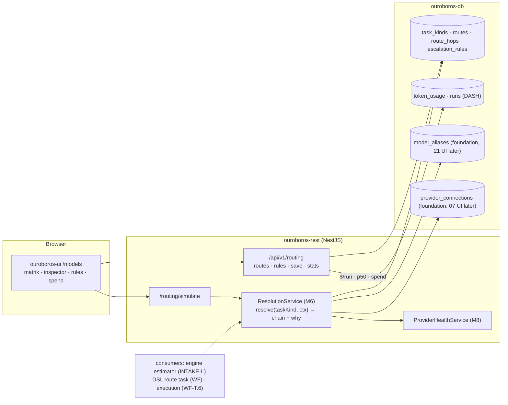
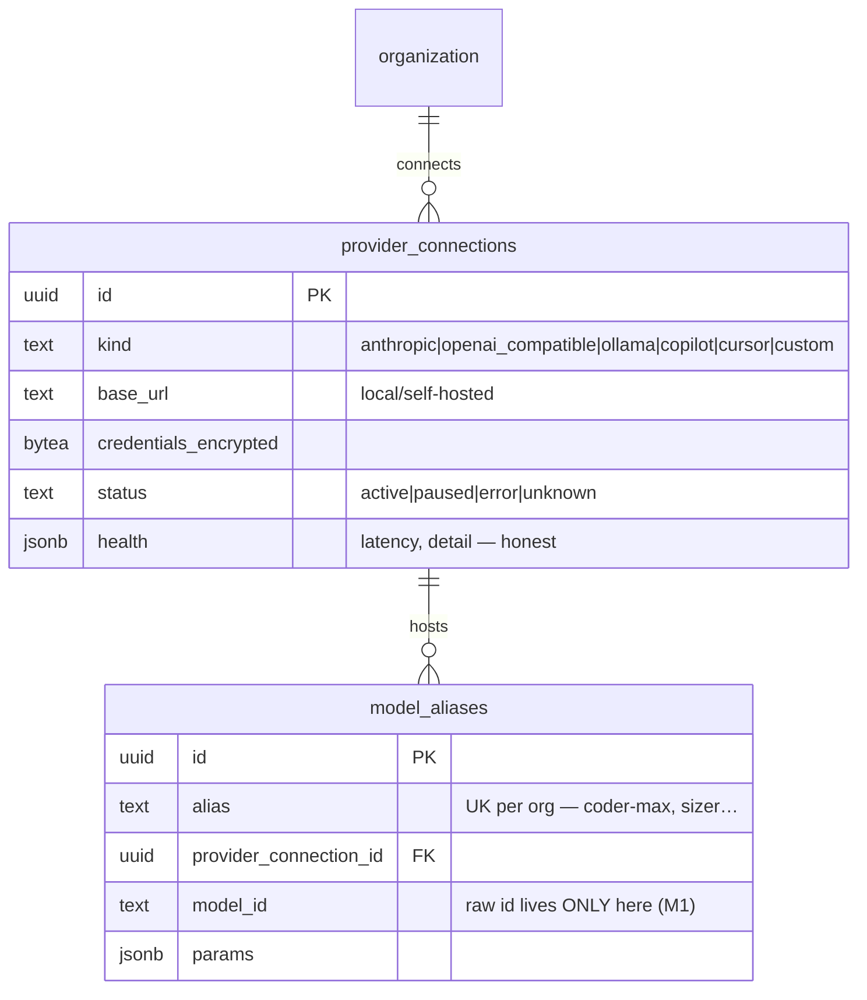
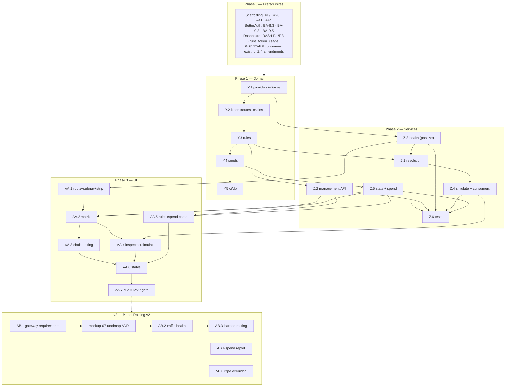

# Roadmap — Model Routing (Mockup 06)

## Description

> Create a roadmap that covers the features for the mockup page 06. Any additional
> tech infrastructure that is required to implement the functionality in these mockup
> pages should be researched and offered as options for implementing in the roadmap.
> The roamdap should include MVP and v2 options, as well as the labels, milestones,
> and the like, for the tickets to be created. Any ticket sources that are used by
> Ouroboros for ingesting should be pluggable, which includes sources like Jira,
> Linear, GitHub, GitLab, and other bug reporting/issue recording sites. Refer to the
> page so that issues can reference the mockup file when creating the UI/UX design of
> the pages.

## Context & Existing Work (duplicate-avoidance survey)

Surveyed 2026-08-08.

**Design source of truth for every UI ticket in this roadmap:**
[`docs/mockups/06-model-routing.html`](mockups/06-model-routing.html) (with
`docs/mockups/assets/ouroboros.css`) — Model Routing. Its anatomy:

- **Page head** — eyebrow `Models`, h1 *"Route every kind of work to the model that
  earns it."*, subline: each task kind resolves to a **primary model with ordered
  fallbacks and escalation rules**; routes point at **named registry aliases, never
  raw model ids**; the loop *"degrades gracefully when a provider stumbles — and
  never silently below the floor you set."* Actions: **Simulate routing** (ghost),
  **Save routes** (primary).
- **Subnav** (violet `--model` active treatment) — **Routing** (this page) / Model
  registry (→ mockup 21) / Providers & keys (→ mockup 07) / Spend (stub).
- **Provider health strip** (`.phealth`) — chips: `Anthropic ● 42ms`, `Cursor ●`,
  `GitHub Copilot ⚠ degraded · elevated latency` (warn treatment),
  `OpenAI-compatible ● vLLM local`, `Ollama ● workstation · 3 models`.
- **Routing matrix** (`c-8` card, tag `8 task kinds`, hint *"drag ⠿ to reorder
  fallback chains"*) — rows per task kind (`analyze`, `estimate`, `plan`,
  `implement` — selected with violet inset, `test-gen`, `review`, `docs`,
  `commit-msg`), each with: drag handle, task name + description + route tag
  (`implement-primary`), **Primary model** (alias pill + resolution line
  `claude-fable-5 · Anthropic`), **Fallback** (dim alias pill + resolution),
  **Escalation** (`effort ≥ L → coder-max (max thinking)`, `always second vote:
  second-opinion`, or `—`), **$/run avg** and **p50 latency** (mono numerics).
- **Route inspector** (right card, `ROUTE — implement-primary`) — numbered
  fallback **chain** (1 `coder-max → claude-fable-5 · Anthropic` ok-dot, *"Primary
  · API key valid, 42ms to us-east"*; 2 `coder-fallback → gpt-5-codex · GitHub
  Copilot` warn-dot, *"Fallback on 5xx / timeouts"*; 3 `local-docs →
  qwen3-coder:32b · Ollama`, *"Offline mode — keeps the loop turning without a
  network"*); toggles **Allow fallback to local models** (on) and **Fail run
  instead of degrading below fallback 2** (off); field **Max cost per run**
  `$2.50`; footnote *"Aliases resolve in the Model registry — routes never name
  raw models."*
- **Escalation rules** card (`3 active`) — switchable rules: `effort ≥ L →
  implement uses coder-max (max thinking)`, `security label → review adds
  second-opinion vote`, `docs-only diff → everything routes local`; **+ Add
  rule**.
- **Spend by provider · 30d** card — metered rows (Anthropic `$412.80` full bar,
  GitHub Copilot `$96.40`, Cursor `$54.10`, Local (vLLM + Ollama) `$0.00`
  ok-meter), footnote *"Local models served 31% of all tokens."*, `Full report →`
  stub.

**Scope boundaries.** The subnav names three sibling surfaces this roadmap does
*not* build: the full **Model registry** UI (mockup 21), **Providers & keys**
(mockup 07), and the **Spend report**. But routing cannot exist without minimal
provider and alias *data*: this roadmap lays those foundations (schema + seeds +
minimal service) explicitly marked as shared ground the 07/21 roadmaps will build
their UIs on.

**Overlapping work and dispositions:**

| Existing work | Disposition under this roadmap |
|---|---|
| Opaque model strings everywhere (DASH-F8, INTAKE-K6, WF-P7 — `routed by task`, pinned ids) | **Given real semantics** — `route.task("implement")` (WF DSL), estimator routing (INTAKE-L.2 config map), and run/`token_usage` model fields resolve through this roadmap's alias+route layer. Amendments listed per issue. |
| Dashboard `token_usage` (DASH-F.3) + priced accounting (DASH-J.4, v2) | **Consumed** — $/run, p50, and the spend card aggregate from it; pricing honesty rules carry over (unpriced ≠ $0, except genuinely-free local providers priced at zero by their price rows). |
| Engine estimation/execution (INTAKE-L, WF-T.6, DASH-J.3) | **Consumers** — the resolution service is the contract they call; MVP ships resolution + simulation, actual LLM invocation arrives with the provider stack (mockup 07 roadmap). |
| WF-R.3 catalog (`route-task names as suggestions`) | **Upgraded** — task kinds become registry data served to the catalog. |
| Mockups 07 (providers & keys UI), 21 (registry UI), spend report | **Out of scope** — subnav targets are placeholders; foundations only (decision M2). |
| Pluggable ticket sources requirement (description boilerplate) | **Already satisfied** by WF Epic Q (SPI + canonical tickets; Jira/Linear/GitLab as WF-T.2–T.4). Nothing source-specific here; noted, not duplicated. |
| Scaffolding #49 `/models` placeholder, #56 e2e | **Superseded for `/models`**; #56 gains a routing leg. |

Epic letters continue the sequence (…P–T, U–X): this roadmap uses **Y, Z, AA, AB**.

## Infrastructure Options (researched — pick before filing)

### 1. Routing/gateway layer (who owns resolution and, later, invocation)

| Option | What it is | Fit | Trade-offs |
|---|---|---|---|
| **A — Custom routing service in `ouroboros-rest` + engine-side invocation later** ⭐ recommended | Routes, aliases, escalation rules, floors, and cost caps as first-class product entities; resolution is a pure function over our schema; the provider-invocation layer (mockup 07 roadmap) executes the resolved chain | Routing *is* the product here (mockup's alias/floor/escalation semantics are richer than any gateway's config); no extra infra; keeps the self-hostable promise | We own retry/fallback execution semantics when invocation lands — mitigated by option B underneath |
| B — LiteLLM (self-hosted proxy) as the invocation substrate | OSS proxy: 100+ providers behind one OpenAI-compatible API, router with retries/cooldowns/fallbacks, model-group aliases | Strong candidate **under** option A for the 07 roadmap: our resolution emits an ordered concrete chain, LiteLLM executes provider calls; self-hostable; ~8ms P95 overhead | Its alias/fallback semantics don't match ours 1:1 (known alias-fallback bug class) — reason to keep routing decisions ours and use it as a dumb executor; decision deferred to the 07 roadmap ADR (AB.1) |
| C — Hosted gateways (OpenRouter, Portkey) | Hosted aggregation/observability (OpenRouter ~100–150ms added; Portkey <1ms + guardrails) | Instant multi-model access | Conflicts with the self-hostable + local-models (Ollama/vLLM) promise as the *primary* path; per-token markup; possible as an optional *provider*, not the gateway |

### 2. Provider health checking (the strip's truth source)

| Option | What it is | Fit | Trade-offs |
|---|---|---|---|
| **A — Passive-first: config/key validation + cheap reachability, "unknown" as a first-class state** ⭐ recommended MVP | Local providers (Ollama `/api/tags`, vLLM `/v1/models`): real reachability + model list; cloud providers: key-validation calls (models-list endpoints) on a slow cadence; latency shown only where measured; degraded state derived from real traffic errors once invocation exists | Honest without burning tokens; the mockup's `42ms` / `degraded · elevated latency` become real as traffic arrives | The strip is sparser than the mockup until invocation lands (honesty rule) |
| B — Active synthetic probes | Scheduled tiny completions per provider | Real end-to-end latency now | Costs real money continuously; rejected for MVP |

## Decisions proposed by this roadmap (validate before issue creation)

| # | Decision | Rationale |
|---|----------|-----------|
| M1 | **Aliases are the only thing routes may name** (`coder-max`, `sizer`, `local-docs` → concrete model+provider in the registry); raw model ids are invalid in routes | The mockup states it twice; aliases are the indirection that makes registry swaps (mockup 21) safe. |
| M2 | **Minimal registry & provider foundations land here** (schema + seeds + resolution internals); their full management UIs belong to mockups 21/07 | Routing is unbuildable without the data; building two more UIs here would swallow those roadmaps. |
| M3 | **Task kinds are registry data** (the mockup's 8 seeded: analyze, estimate, plan, implement, test-gen, review, docs, commit-msg), org-extensible later | WF-R.3 catalog, the estimator, and the DSL all reference them; hardcoding forks the vocabulary. |
| M4 | **A route = ordered alias chain (primary + fallbacks) + policy** (allow-local, floor index for "fail instead of degrading", max cost per run) | Exactly the inspector's model; the floor rule is the mockup's "never silently below the floor you set." |
| M5 | **Escalation rules are structured predicates → route modifications** (`{when: {effort_gte|label|diff_kind}, then: {use_alias|add_vote|route_local, options}}`), reusing the WF-P8 predicate grammar | The three mockup rules all fit; free-text rules would be unenforceable. |
| M6 | **Resolution is a pure, versioned function** — `resolve(taskKind, ctx) → ordered concrete chain + explanations`, health-aware, rule-applied, floor-enforced; **Simulate routing** is the same function exposed | One code path for simulation today and execution (07/WF-T.6) tomorrow; explanations make the inspector and simulator honest. |
| M7 | **$/run, p50, and spend are computed from `token_usage` + runs** (DASH-F.3/F.1); no data → em-dash, never a fabricated number; local providers show $0.00 only via real zero-price rows | Same honesty rule as the dashboard; the mockup's numbers become seed-truth. |
| M8 | **MVP health = passive-first** (option 2-A) with `unknown` rendered honestly; traffic-derived degradation arrives with invocation | No fake green dots, no synthetic spend. |
| M9 | **Invocation-gateway choice (LiteLLM-under-custom vs pure-custom) is the 07 roadmap's ADR (AB.1 here drafts the requirements)** | This roadmap must not preempt the provider stack's core decision; it must hand over crisp requirements (chain execution, per-hop errors, usage capture). |
| M10 | **Labels**: new `routing` (reusing `models`-adjacent labels not needed); **Milestones**: `Model Routing MVP` / `Model Routing v2` created at filing | Description requires labels + milestones for the filing pass. |

## Architecture Overview



## MVP Definition

The MVP is **mockup 06 as the real routing control plane**: routes are data,
resolution is a tested function, and everything rendered is either real or
honestly absent. It is done when, against the compose stack:

1. `/models` reproduces
   [`docs/mockups/06-model-routing.html`](mockups/06-model-routing.html)
   pixel-faithfully in **both themes**: subnav (violet active treatment; registry/
   providers/spend as honest placeholders), provider health strip, the 8-row
   routing matrix with selection, the route inspector (chain, toggles, max-cost),
   the escalation-rules card, and the spend card.
2. **Foundations exist**: provider connections and model aliases as seeded schema
   (Anthropic, GitHub Copilot, Cursor, OpenAI-compatible/vLLM, Ollama; the six
   mockup aliases) with minimal internal services — full management UIs
   deferred to the 07/21 roadmaps.
3. **Routes are editable and saved**: fallback chains reorderable (drag ⠿),
   aliases swappable from the registry list, policy toggles + max-cost persisted;
   Save routes writes versioned route configuration under role gates
   (owner/admin edit, member read).
4. **Escalation rules** CRUD with the three seeded mockup rules as structured
   predicates; enable/disable switches persist; + Add rule offers the M5 shapes.
5. **Resolution + Simulate** work: `resolve("implement", {effort: "l", labels})`
   returns the concrete ordered chain with explanations (rule applied, health
   considered, floor enforced, cost cap noted); the Simulate panel renders it;
   the engine estimator (INTAKE-L.2's config map) is amended to call resolution.
6. **Stats are honest**: $/run avg and p50 per task kind computed from seeded
   usage/runs (em-dash when absent); spend card aggregates 30d by provider with
   the local-token share line; health strip shows real states incl. `unknown`
   (M8).
7. Integration tests cover resolution (health/floor/rules/cost matrices),
   save/reorder, rule evaluation, stats math, isolation; the e2e suite gains a
   routing leg.

**Explicitly v2 (milestone `Model Routing v2`):** the invocation-gateway ADR
handoff (AB.1), traffic-derived health + latency (AB.2), learned/cost-optimized
routing suggestions (AB.3), full spend report surface (AB.4), per-repo route
overrides (AB.5).

## Epics, Labels & Milestones

Each epic is a parent tracking issue on GitHub; every roadmap issue below is filed as
one of its sub-issues (GitHub Relationships).

| Epic | GitHub | Status | Name | Goal | Modules | Milestone |
|------|:------:|:------:|------|------|---------|-----------|
| Y | #185 | 🟡 Open | Routing Domain & Foundations | Providers/aliases/task-kinds/routes/rules schema, seeds, CI | ouroboros-db, ouroboros-rest | Model Routing MVP |
| Z | #186 | 🟡 Open | Resolution & Routing Services | Resolution engine, simulate, health, stats/spend, save APIs, tests | ouroboros-rest, ouroboros-engine | Model Routing MVP |
| AA | #187 | 🟡 Open | Routing UI | Subnav, health strip, matrix, inspector, rules, spend, states, e2e | ouroboros-ui | Model Routing MVP |
| AB | #188 | 🟡 Open | Extended Routing (v2) | Gateway ADR handoff, live health, learned routing, spend report, overrides | all | Model Routing v2 |

Issue naming: `<project>: [<epic>.<issue>] <title>`. Labels: existing set (`mvp`,
`v2`, `rest`, `db`, `engine`, `ui`, `ci`, `design`) **plus new `routing`**
(decision M10). Milestones **`Model Routing MVP`** / **`Model Routing v2`**
created at filing; every issue assigned. Complexity chips: **XS · S · M · L**.

---

## Epic Y (#185) — Routing Domain & Foundations (`ouroboros-db` + `ouroboros-rest`)

| Ref | GitHub | Status | Title | Summary | Labels | Parallel | MVP | Complexity | Affected Modules |
|-----|:------:|:------:|-------|---------|--------|:--------:|:---:|:----------:|------------------|
| Y.1 | #189 | 🟢 Done | ouroboros-db: [Y.1] Provider connections & model alias foundations | `provider_connections` + `model_aliases` schema (07/21 build UIs later) | mvp, routing, db | N (after #19, BA-B.3) | Y | M | ouroboros-db |
| Y.2 | #190 | 🟢 Done | ouroboros-db: [Y.2] Task kinds, routes & fallback chains | `task_kinds`, `routes`, ordered `route_hops`, policy columns | mvp, routing, db | N (after Y.1) | Y | M | ouroboros-db |
| Y.3 | #191 | 🟢 Done | ouroboros-db: [Y.3] Escalation rules schema | Structured predicate → modification rules (M5), enable flags | mvp, routing, db | N (after Y.2) | Y | S | ouroboros-db |
| Y.4 | #192 | 🟢 Done | ouroboros-db: [Y.4] Routing dev seeds — mockup-06 parity | 5 providers, 7 aliases, 8 task kinds, routes, 3 rules, usage stats | mvp, routing, db | N (after Y.3) | Y | M | ouroboros-db |
| Y.5 | #193 | 🟢 Done | ouroboros-db: [Y.5] Routing constraints in ci/db | Alias-only routes, hop ordering, predicate shapes, vocab checks | mvp, routing, db, ci | N (after Y.4, #24) | Y | XS | ouroboros-db, .github |

### Issue Y.1 — ouroboros-db: [Y.1] Provider connections & model alias foundations

> **GitHub issue:** #189 · **Status:** 🟢 Done · **Parent epic:** #185

> **Shipped 2026-08-22.**
> [`ouroboros-db/migrations/V015__provider_connections_model_aliases.sql`](../ouroboros-db/migrations/V015__provider_connections_model_aliases.sql)
> and [`ouroboros-rest/src/modules/registry/`](../ouroboros-rest/src/modules/registry).
> The migration header opens by naming this the **07/21 shared foundation** and decision
> **M2**, and the two table comments carry the same sentence into the catalogue —
> `tests/constraints.sql` asserts they do, so the criterion is checked rather than
> reviewed.
>
> **`credentials_encrypted` is envelope-only, which is a stronger guarantee than "the
> service always encrypts".** The column accepts an `ouro.v1.<version>.<nonce>.<ciphertext>`
> value or null and nothing else, so a plaintext key cannot be stored by a migration, a
> fixture, a hand-written `update` or a service that forgot to seal — the service is one
> writer, and the CHECK is every writer. It is `text` rather than the ticket's `bytea`
> because AD.1's helper produces that envelope *string*, and the key version in its middle
> field is what makes rotation additive; a `bytea` column would be a second encoding and a
> second place the version could be lost. Null stays legitimate: a local provider needs no
> credential.
>
> **The tenancy rule is a composite foreign key rather than a trigger.** V008–V014 met the
> same shape and answered it with `ouroboros.repo_in_organization()`, because `github_repos`
> has no unique key on `(organization_id, id)` to reference. This migration creates both
> tables, so it declares one — and `model_aliases_provider_fk` is therefore referential,
> carries the **restrict** the ticket asks for, and needs no plpgsql beside it. The
> interaction worth knowing is written into the header and asserted: deleting a *workspace*
> still works, because both cascades are queued as after-triggers of the same statement and
> run before the referential check the connection delete appends.
>
> **`health` cannot claim a measurement that did not happen** (decision M8). It defaults to
> `{}`, content requires a `last_checked_at`, and a `latency_ms` must be a non-negative JSON
> number — a string `"42ms"` and an explicit JSON `null` are both refused. There is
> deliberately no defaulted `0ms`, which is not "unknown" but a very good latency. `status`
> is deliberately *not* tied to `last_checked_at`: `paused` is operator intent rather than a
> conclusion, and the transitions between the other three are Z.3's (#196).
>
> **`ouroboros-rest/src/modules/registry/` is the accessor and declares no controller.**
> `resolve`, `list` and `dependentAliases`, and nothing that writes — Z.2 (#195) is what
> puts the alias list on a route, and `registry.module.spec.ts` fails if a controller
> appears here first. *Credentials never in logs or responses* is two probes rather than
> inspection: the repository's suite compiles every read statement and asserts the SQL names
> neither the column nor a `select *`, and the integration suite puts a real ciphertext on a
> row and looks for it in every answer and every log sink. The designed refusal mockup 07
> will need ships with it — a `409 provider_connection_in_use` naming the aliases in the
> way, built from a real foreign-key violation in the integration suite rather than from a
> hand-written error.
>
> **It also registers the vault's first secret store.** `VAULT_SECRET_STORES` had been an
> empty array since AD.1 (#222) because no migration declared an encrypted column. V015's
> is the first, and the store lands with the *migration* rather than with AD.2's (#223)
> credential lifecycle for a reason: a sealed column the re-encryption sweep cannot see is a
> rotation that reports success while leaving ciphertext on the key version it then retires.


- **Problem Statement:** Routes point at aliases; aliases resolve to models on
  provider connections. Neither exists — and mockups 07/21 own their UIs, so the
  *data* foundation must land here without swallowing those roadmaps
  (decision M2).
- **Solution/Scope:** Migration: `provider_connections` — id, `organization_id`
  FK, `kind` CHECK `anthropic|openai_compatible|ollama|copilot|cursor|custom`,
  `display_name`, `base_url` (local/self-hosted kinds), `credentials_encrypted`
  (nullable — local providers may need none; reusing the Q-epic encryption
  helper), `status` CHECK `active|paused|error|unknown`, `last_checked_at`,
  `health` jsonb (latency, detail — honest per M8); `model_aliases` — id,
  `organization_id` FK, `alias` (unique per org: `coder-max`, `sizer`,
  `local-docs`…), `provider_connection_id` FK, `model_id` (raw provider model
  string — the *only* place raw ids live, M1), `params` jsonb (thinking budget,
  temperature defaults), timestamps. Minimal internal accessor services (no
  management UI here).
- **Acceptance Criteria:**
  - Alias uniqueness per org; alias → provider+model resolution is one indexed
    query; credentials never in logs/responses.
  - Deleting a provider with dependent aliases is blocked (FK restrict) with a
    clear error — routes must never dangle.
  - Schema documented as the 07/21 shared foundation in the migration header.
- **Parallelism/Dependencies:** Needs #19, BA-B.3. Blocks Y.2, Z.2, Z.3.
- **Technical Stack:** PostgreSQL 17, Flyway, AES-GCM helper.
- **Epic:** Y



### Issue Y.2 — ouroboros-db: [Y.2] Task kinds, routes & fallback chains

> **GitHub issue:** #190 · **Status:** 🟢 Done · **Parent epic:** #185

> **Shipped 2026-08-22.**
> [`ouroboros-db/migrations/V016__task_kinds_routes_hops.sql`](../ouroboros-db/migrations/V016__task_kinds_routes_hops.sql),
> with its section in
> [`ouroboros-db/tests/constraints.sql`](../ouroboros-db/tests/constraints.sql).
>
> **Decision M1 stopped being a statement and became structural.** V015 could only *say*
> that a raw provider model string lives in one column, because the rule is about tables it
> did not create. A hop names a `model_aliases` row by id, and there is no `model_id`,
> `model` or `model_name` column anywhere in `task_kinds`, `routes` or `route_hops` — so a
> raw model cannot enter a route by a migration, a seed or a service that had one in hand
> and no alias for it. The criterion is asserted from `information_schema` rather than by
> reading the migration, so a `model` column added later is caught rather than reviewed.
>
> **Ordering is enforced, not conventional, and that is the whole of decision M4's second
> half.** Hop positions are unique *and* dense from 1 — the second by a deferred constraint
> trigger, because density is a property of a set rather than of any row. V009 declined the
> same rule for `queue_items.position` and was right to: the queue is rendered `order by
> position`, so 1, 2, 5 draws exactly like 1, 2, 3 and nothing a reader saw depended on the
> numbers. Here something does. `floor_hop_index` is a rule about a hop *number*, the
> inspector prints those numbers in its rail, and *"fail instead of degrading below fallback
> 2"* is a statement about position 3 — so a chain that numbers itself approximately makes
> the page's promise never to degrade below the floor unkeepable.
>
> **The reorder Z.2 inherits is written into the header rather than left to be invented.**
> Both ordering rules are `deferrable initially deferred`, so a drag-reorder is plain SQL —
> a one-statement `case` swap, a two-statement move, or a whole-chain `delete`/`insert`
> rewrite, none of them needing `set constraints` or a shuffle through a temporary position.
> `constraints.sql` performs all three and re-asserts uniqueness and density afterwards, and
> proves deferred is not unenforced by asking for each check early with
> `set constraints … immediate`.
>
> **The floor is held to a hop that exists, from both sides.** Half the rule is a CHECK — the
> chain starts at hop 1, so a floor below it is not a floor — and half cannot be, because the
> chain's length lives in another table and changes when a *hop* is written. So the same
> constraint trigger holds it, attached to `routes` and `route_hops` both: raising a floor
> past the end is refused, and so is deleting the hop that a valid floor was counting. A
> route with no chain at all is refused for the same reason, at the end of its own
> transaction: an empty chain is a matrix row with no primary model, which resolution cannot
> answer and the inspector cannot draw.
>
> **Money is integer cents.** `max_cost_cents_per_run` is an `integer` and `$2.50` is `250`,
> in the same unit `token_usage.cost_cents` and `model_prices` already keep — a cap compared
> against a running total to abort a run is arithmetic, and binary floating point is the
> wrong type to abort on. The column's declared type is asserted from the catalogue, because
> the failure it guards against is a later `alter … type numeric` no fixture would notice.
>
> **`restrict` on the alias, and a refusal that can name the routes it protected.** A cascade
> would silently *shorten* chains — hop 2 removed from every route that named a retired
> alias, the rest left at 1 and 3 — and the first anybody would know of it is a run degrading
> past a floor that no longer counts the hops it was written against. `route_hops_alias_idx`
> is what makes *"which routes depend on this alias"* one indexed read, which is what a
> designed refusal has to say out loud; the surface that offers the delete is mockup 21's
> (decision **M2**), and it inherits the read rather than the endpoint. Deleting a
> *workspace* still works, asserted rather than argued, for V015's reason.
>
> Tenancy is composite foreign keys the whole way down, which required one `alter table` on
> V015's `model_aliases` to declare the `(organization_id, id)` key a hop's reference points
> at. It adds no rule — `id` is already the primary key — and it is what keeps *"this hop's
> alias belongs to this hop's workspace"* referential rather than a trigger.
>
> Deliberately **not** here: seed rows (Y.4, #192), the Kysely mirror in `ouroboros-rest`
> (grown by the ticket that first reads these tables, as `github_issues` was), and any write
> surface at all — Z.2 (#195) owns the editor.


- **Problem Statement:** The matrix's rows — task kind → primary + ordered
  fallbacks + policy — need relational truth with ordering integrity
  (decision M4).
- **Solution/Scope:** Migration: `task_kinds` — id, `organization_id` FK, `name`
  (unique per org; seeded eight per M3), `description`, `sort_order` (matrix
  row order, drag-reorderable); `routes` — id, `task_kind_id` FK (one active
  route per kind), `tag` (`implement-primary`), `allow_local_fallback` bool,
  `floor_hop_index` (nullable — "fail instead of degrading below hop N"),
  `max_cost_cents_per_run` (nullable), `updated_by/at`; `route_hops` — route
  FK, `position` (unique per route, dense), `model_alias_id` FK, `note`
  (nullable — the hop-meta line). Alias-only constraint: hops reference
  `model_aliases` FK — raw ids impossible by construction (M1).
- **Acceptance Criteria:**
  - One route per task kind enforced; hop positions dense+unique (reorder in a
    transaction verified).
  - Deleting an alias referenced by hops blocked with a designed error.
  - Floor index validated ≤ chain length.
- **Parallelism/Dependencies:** Needs Y.1. Blocks Y.3, Y.4, Z.1.
- **Technical Stack:** PostgreSQL 17, Flyway.
- **Epic:** Y

```
task_kinds(8, ordered) ─1:1─ routes{allow_local, floor_hop, max_cost}
routes ─1:N─ route_hops(position↑) ──FK──▶ model_aliases   (raw ids unreachable)
```

### Issue Y.3 — ouroboros-db: [Y.3] Escalation rules schema

> **GitHub issue:** #191 · **Status:** 🟢 Done · **Parent epic:** #185

> **Shipped 2026-08-23.**
> [`ouroboros-db/migrations/V018__escalation_rules.sql`](../ouroboros-db/migrations/V018__escalation_rules.sql),
> with its section in
> [`ouroboros-db/tests/constraints.sql`](../ouroboros-db/tests/constraints.sql).
>
> **The sentence is derived from the rule, which is what stops it from lying.** `display` is
> a **stored generated column** over `"when"` and `"then"`, so PostgreSQL itself refuses a
> statement that supplies one — *"hand-written display text is rejected on write"* as a
> property of the column rather than a rule in a service — and it recomputes on every write
> that touches the structure, so an edited rule cannot keep the sentence it used to have.
> The derivation is `immutable` and reads no table, which is what makes it deterministic:
> the same rule renders the same sentence in every workspace and every session. It renders
> in the *grammar's* key order too, not the document's — jsonb stores `label` before
> `effort_gte`, and the sentence still leads with the effort.
>
> **The grammar is a pair of domains, not a pair of table CHECKs, and the reason is that
> generated column.** A stored generated column is computed *before* any `CHECK` on the row
> is evaluated, so a table CHECK would leave the derivation looking at a structure nothing
> had validated yet — and it would have to carry a second, weaker copy of the grammar to
> defend itself. A domain moves the check to the value's coercion, before the row exists at
> all, so `escalation_rule_display()` can be written for structures that are inside the
> grammar by construction. A domain constraint is still a CHECK constraint: an unknown
> action key is refused by name, `escalation_rule_then_shape`.
>
> **`"when"` reuses WF-P8 rather than paralleling it**, and that is asserted rather than
> asserted-in-prose: `tests/constraints.sql` reads the five effort sizes out of
> `queue_items_effort` in the catalogue and requires every one of them to be a size a rule
> may name, so widening one of the two vocabularies without the other is what goes red. A
> condition key routing has no context for — WF's own `source`, for instance — is refused
> rather than stored and never evaluated. `diff_kind`'s vocabulary is one value, `docs_only`,
> which is honest: a diff classification nothing computes is a rule that can never fire.
>
> **The reference this schema cannot declare is held anyway, in both directions.** A rule's
> task kind and alias are *names inside a jsonb document*, so no foreign key can reach them;
> `escalation_rule_targets_exist()` is a **deferred** constraint trigger on
> `escalation_rules`, `task_kinds` and `model_aliases`, so writing a rule that names an
> unknown kind or alias is refused **at write time**, and so is retiring or renaming the
> kind or alias a rule already names. Deferral is what keeps the legitimate transactions
> ordinary: a seed may write rules before the aliases they name, and *"rename this alias and
> update the rules that use it"* is one transaction with no ceremony in it. The lookup is by
> `(organization_id, name)`, so a rule can no more reach another workspace's alias than a
> hop can.
>
> **The mockup's `(max thinking)` is `params`, not prose** — the same shape
> `model_aliases.params` already holds, so Z.1 merges the rule's over the alias's instead of
> parsing a phrase. All three mockup rules round-trip, and their sentences are asserted
> character for character.
>
> **What Y.4 (#192) inherits:** rule 2 names the alias `second-opinion`, so the seed lands
> that alias alongside its six — the scope line below now says seven. Mockup 21's CG.4
> (#582) already *extends* the shared seed rather than owning that row, so it keeps its
> `gpt5-experiments` addition and loses only the line item it was going to duplicate.
>
> **Deliberately not here:** seed rows (Y.4), any write surface (Z.2, #195), the evaluation
> itself (Z.1, #194), and the `ci/db` probes that drop these rules to watch the assertions go
> red — Y.5 (#193) names *"rule `then`-shape checks"* in its own scope and owns them.


- **Problem Statement:** The three mockup rules must be structured, evaluable
  data (decision M5), not display strings.
- **Solution/Scope:** `escalation_rules` — id, `organization_id` FK, `enabled`
  bool, `sort_order`, `when` jsonb (WF-P8 predicate grammar: `effort_gte`,
  `label`, `diff_kind`), `then` jsonb (CHECK-validated shapes: `{use_alias:
  {task_kind, alias, params?}}` — "(max thinking)" as params; `{add_vote:
  {task_kind, alias}}`; `{route_local: {}}`), `display` (generated summary
  string for UI, derived server-side not hand-written), timestamps.
- **Acceptance Criteria:** The three mockup rules serialize/round-trip; malformed
  `then` shapes rejected; display strings regenerate deterministically from
  structure.
- **Parallelism/Dependencies:** Needs Y.2. Blocks Y.4, Z.1.
- **Technical Stack:** PostgreSQL 17, Flyway.
- **Epic:** Y

```
{when: {effort_gte: "l"}, then: {use_alias: {task_kind: "implement", alias: "coder-max",
 params: {thinking: "max"}}}}  ─▶ display: "effort ≥ L → implement uses coder-max (max thinking)"
```

### Issue Y.4 — ouroboros-db: [Y.4] Routing dev seeds — mockup-06 parity

> **GitHub issue:** #192 · **Status:** 🟢 Done · **Parent epic:** #185

> **What landed, and the three things it had to settle first.**
>
> [`migrations/R__dev_seed_routing.sql`](../ouroboros-db/migrations/R__dev_seed_routing.sql)
> is mockup 06 as rows — seven aliases, eight task kinds in matrix order, their eight routes
> and seventeen ordered hops, the three escalation rules, and **370 routed calls** every
> number on the screen is aggregated out of. Every figure the design renders computes:
> `$0.04 / $0.01 / $0.31 / $0.87 / $0.12 / $0.22 / $0.00 / $0.00` and
> `3.1s / 1.2s / 9.8s / 41.0s / 17.4s / 12.6s / 6.3s / 0.8s`, Anthropic's `$412.80`, the
> local `$0.00`, and the *31%* local token share — exactly, with no rounding anywhere. Each
> kind's calls are spread as a **symmetric arithmetic sequence** around its figure, so the
> mean is the centre and the median is the row sitting at it.
>
> **Extended, not forked, by CG.4 (#582, 2026-08-24).** Mockup 21's registry is drawn over
> these rows, and its superset lives in this same file rather than beside it: an eighth
> alias — the unbound `gpt5-experiments`, disabled as `V019` requires — `params` and
> `restrictions` on all eight (the "seven aliases, `params` `{}` throughout" above is now
> history), the one `model_prices` override `V012`'s header left to a seed, and run #482's
> `resolution_snapshots` row (`V024`), derived hop by hop from the chain, aliases and
> connections seeded here. The header's argument that `params` had to stay `{}` for the
> effort ≥ L rule's sake was withdrawn there: the rule's params are policy merged *over* the
> alias's at resolution, and `tests/seed.sql` asserts the merge keeps the alias's budget.
> Nothing mockup 06 renders moved; `Used by` on mockup 21 is computed from these chains, and
> where the two drawings disagree the matrix wins — see CG.4's note in
> [`ROADMAP_MOCKUP_21_MODEL_REGISTRY.md`](ROADMAP_MOCKUP_21_MODEL_REGISTRY.md).
>
> **Decision M7 needed two columns that did not exist, so `V020` adds them.** A
> `token_usage` row knew which *model* it paid for and never which *kind of work* it was
> doing, and it recorded a cost without a duration — so a per-kind average had nothing to
> group by and a per-kind median nothing to take the median of. `task_kind` and `latency_ms`
> land on the ledger rather than on `runs`, because a run is a **loop** and mockup 02's
> *Loops live* and *Avg. cycle time* are counts over the fifty-three DASH-F.5 seeded; one
> run per model call would have moved every figure on the dashboard. Both are nullable and
> null is the load-bearing state — an aggregate over none is null, which is the em-dash
> rather than a `$0.00` nobody measured — and `task_kind` is deliberately **text with no
> foreign key**, on decision **F8**'s precedent, so retiring a kind cannot rewrite the
> history routed under it.
>
> **The health strip was seeded against the wrong screen and is corrected here.** AC.6
> (#221) landed the five connections with `health` holding mockup 07's *Test connection*
> replies — `38ms`, `51ms`, `503 upstream · retrying`. That note is a probe somebody just
> clicked; `health` is the stored snapshot mockup 06's `.phealth` strip prints, which V015's
> own header spells out chip for chip. The rows now carry `{"latency_ms": 42}`, an **empty**
> document for Cursor (nothing was measured, said by leaving the key out rather than by a
> zero — decision **M8**), `elevated latency` for Copilot, and no latency on either local
> connection, which is Z.3's `reportsLatency` judgement seeded ahead of Z.3.
>
> **Two of the spend card's figures are not reachable by any seed, and the design should be
> amended to the ones that are.** *Spend by provider · 30d* asks for `$96.40` of Copilot and
> `$54.10` of Cursor; mockup 07's cards pin the same rows' calendar month at `$76.00` and
> `$64.10`. Thirty days is a **superset** of month-to-date, so a 30-day total can never be
> less than the month total inside it — Cursor's figure is `$10.00` below one, and no
> arrangement of rows can produce it. Copilot's would need spend dated before the month
> began, in a window that is twenty-nine days wide on the 2nd and **empty** on the 31st,
> which would make a rendered figure depend on the date. Anthropic's `$412.80` and the local
> `$0.00` land exactly; the other two land on mockup 07's. Z.5 (#198) should be written
> against `$412.80 / $76.00 / $64.10 / $0.00`.
>
> **Zero-priced and unpriced now both exist in one workspace**, which is what makes DASH-J.4
> (#92)'s rule testable rather than promised: the two local kinds carry `cost_cents = 0` —
> calls that were priced, at nothing — beside the earlier seeds' `null` Ollama rows, which
> say *nobody priced this*. A re-pricing pass must fill the nulls and leave the zeros alone.
> The vLLM card's *no metered spend* is therefore a metered zero now rather than an absence,
> because mockup 06's `commit-msg` row prints `$0.00` and M7 permits only one source for it.
>
> **What this seed does not write:** a `runs` row, a `provider_connections` row (AC.6 owns
> those five and this ticket only corrected their `health`), and any figure the screen
> renders — `tests/seed.test.sh` asserts the file carries none of the sixteen as a literal,
> and `tests/seed.sql` computes all of them back. **The personal workspace stays empty**, which
> is AA.6's guidance fixture and the only place M7's em-dash can actually be observed.
>
> **Deliberately not here:** the `ci/db` probes over the routing invariants — Y.5 (#193) owns
> them — and the stats service itself (Z.5, #198), which this seed exists to give a fixture.


- **Problem Statement:** Design review and e2e need the mockup's exact routing
  state — and the stats columns need seeded usage to compute from (M7).
- **Solution/Scope:** Extend the dev seed: five provider connections (Anthropic,
  GitHub Copilot, Cursor, OpenAI-compatible `vLLM local`, Ollama `workstation`)
  with honest seeded health snapshots (Copilot degraded); seven aliases
  (`coder-max`→claude-fable-5, `coder-std`→claude-sonnet-5,
  `sizer`→claude-haiku-4-5, `coder-fallback`→gpt-5-codex,
  `local-docs`→qwen3-coder:32b, `local-free`→llama-4-maverick, and
  `second-opinion`→composer-2, which the review escalation rule names — Y.3); eight task
  kinds with the mockup's routes/chains (implement: coder-max → coder-fallback
  → local-docs with hop notes) and policies (allow-local on, floor off,
  $2.50 cap); three escalation rules; `token_usage`/run rows shaped so $/run
  and p50 compute to the mockup's figures and spend lands at
  $412.80/$96.40/$54.10/$0.00 with 31% local token share (extends DASH-F.5
  windows-relative style; zero-price rows for local providers). Personal org:
  empty (foundation-guidance fixture).
- **Acceptance Criteria:** Matrix, inspector, rules, spend, and health strip
  render the mockup from seeds alone; stats recompute stably relative to
  `now()`; idempotent; coordinated with DASH/INTAKE seeds (no conflicting
  usage rows).
- **Parallelism/Dependencies:** Needs Y.3 (+DASH-F.3 coordination). Feeds Z/AA
  tests, e2e.
- **Technical Stack:** Flyway repeatable migration, SQL.
- **Epic:** Y

```
seeds: 5 providers · 7 aliases · 8 kinds · chains+policies · 3 rules
       usage rows ⇒ $/run · p50 · spend(30d) · 31% local — all computed, none stored
```

### Issue Y.5 — ouroboros-db: [Y.5] Routing constraints in ci/db

> **GitHub issue:** #193 · **Status:** 🟢 Done · **Parent epic:** #185

> **Shipped 2026-08-24.**
> [`ouroboros-db/tests/verify-constraint-probes.sh`](../ouroboros-db/tests/verify-constraint-probes.sh),
> [`ouroboros-db/tests/constraints.sql`](../ouroboros-db/tests/constraints.sql) and
> [`ouroboros-db/tests/lib/assert.sql`](../ouroboros-db/tests/lib/assert.sql). No new `ci/db`
> step and no new migration: the ticket's scope is a suite that already runs on every pull
> request touching this module.
>
> **All six scope bullets were already asserted, and that is the finding rather than a
> shortcut.** `constraints.sql` carries the rule *a migration that adds a rule adds its
> assertion here in the same change*, and Y.1 (#189), Y.2 (#190) and Y.3 (#191) each kept it:
> hop position uniqueness and density, one route per task kind, both `restrict` foreign keys,
> the `then`-shape checks, the provider `kind`/`status` vocabularies and the floor-index bound
> are all probed by the section belonging to the migration that introduced them. Scattering a
> second copy of them into a section of this ticket's own would have produced two statements
> of each rule that can disagree. So the work went where the gap actually was — this ticket's
> **second** acceptance criterion, which nothing in the repository answered for routing.
>
> **Eight mutations, one per invariant, and two of them are relaxations rather than drops.**
> `verify-constraint-probes.sh` already existed for the dashboard read-model (#69) and the
> provider cards (#221); it now drops `route_hops_route_position_key`, `routes_task_kind_key`,
> `escalation_rule_then_shape` and `provider_connections_kind`, and **re-adds**
> `route_hops_alias_fk` and `model_aliases_provider_fk` as `on delete cascade`. The
> re-add is the point: `restrict` → `cascade` is the refactor that really happens, it leaves
> the constraint's name exactly where it was, and both fail **open** — the delete succeeds and
> takes the dependent rows with it, so a provider removed on mockup 07 empties chains drawn on
> mockup 06 and an alias retired on mockup 21 shortens every chain that named it, past the
> floor those chains were written against. A mutation that merely dropped either would have
> been caught by the cross-workspace probes hundreds of assertions earlier and never reached
> the deletion rule it was aimed at.
>
> **The two chain rules are rewritten rather than dropped, for the reason `token_usage_daily`
> is.** `route_chain_intact()` carries three rules in one constraint trigger — never empty,
> dense from 1, floor inside the chain — so a `drop trigger` falsifies all three at once and
> the assertion that notices is whichever comes first in the file, not the one whose invariant
> was removed. A new `rewrite_chain_rule` helper, the sibling of the existing `rewrite_view`,
> swaps a single test in that function for `false` and leaves the rest as V016 wrote it; it
> reads the definition back from the catalogue and raises if the expression it aims at is not
> there, so it cannot rot into mutating nothing. Verified: the density rewrite is caught by
> *"removing a hop from the middle of a chain leaves a gap"* and the floor rewrite by *"a floor
> past the end of the chain can never fire"* — each probe answering for its own rule.
>
> **`must_reject` now names the constraint when a statement is *accepted*, not only when the
> wrong rule fires.** That is the third acceptance criterion — *"failures name the invariant,
> not just the SQL error"* — and it was the one line of the suite where the information was
> already in hand and thrown away: the helper takes the expected constraint name, checked it
> on the rejection path, and dropped it on the acceptance path. A dropped rule now reports
> both halves — `a task kind has exactly one route (statement was accepted — routes_task_kind_key
> did not fire)` — and seven of the eight new probes match on the whole line, constraint name
> included, which is what proves each is watching the object its label names.
>
> **One section was added to `constraints.sql`, and it is a backstop rather than new
> coverage.** Every invariant above is behavioural, and a behavioural probe has one failure
> mode invisible from the outside: it can go **vacuous**, because it depends on a fixture, and
> a fixture is a live thing a later ticket can rename or delete out from under it. The foot of
> the file now enumerates the invariants Z.1 (#194) is *written against* rather than re-checks
> and asks the catalogue for each by name — asserting the **shape** where the shape is the
> rule, so a foreign key is checked for `restrict` rather than for existing. It deliberately
> asserts no rule *body* — no CHECK expression, no trigger source — because those are
> legitimately rewritten and a test that pins a rule's wording fails on the refactor rather
> than on the regression. It reads no rows and costs nothing measurable. One behavioural probe
> was added beside it: the position key reached by `insert` as well as by `update`, which is
> the verb a whole-chain rewrite actually uses.
>
> **The runtime criterion, measured.** `constraints.sql` goes 437 ms → 441 ms — the new
> section is catalogue reads — and the probe step 9 s → 13 s locally, which is eight more
> copies of a template database and eight more runs of a suite that takes under half a second.
> The whole live pass was rehearsed against the pinned `postgres:17-alpine`: migrate, validate,
> `constraints.sql` with both alias-warning branches, all 43 probe checks, the alias-reference
> guard, the seeded database and the V006 rehearsal.
>
> **Deliberately not here:** any new rule. This ticket asserts what the schema already
> enforces and proves those assertions load-bearing; a routing invariant that turns out to be
> missing belongs to the migration that should have had it, not to a test file.


- **Problem Statement:** Alias-only routing, hop ordering, and predicate shapes
  are the invariants resolution trusts.
- **Solution/Scope:** Extend #24 `tests/constraints.sql`: hop position
  density/uniqueness, one-route-per-kind, FK restrict probes (alias/provider
  deletion), rule `then`-shape checks, provider kind/status vocab, floor-index
  bound.
- **Acceptance Criteria:** Green on current schema; red when any invariant
  drops (spot-verified once).
- **Parallelism/Dependencies:** Needs Y.4, #24.
- **Technical Stack:** GitHub Actions, SQL.
- **Epic:** Y

```
ci/db: migrate ─▶ constraints (+Y probes) ─▶ ✓/✗
```

---

## Epic Z (#186) — Resolution & Routing Services (`ouroboros-rest` + `ouroboros-engine`)

| Ref | GitHub | Status | Title | Summary | Labels | Parallel | MVP | Complexity | Affected Modules |
|-----|:------:|:------:|-------|---------|--------|:--------:|:---:|:----------:|------------------|
| Z.1 | #194 | 🟢 Done | ouroboros-rest: [Z.1] Resolution engine (`resolve` + explanations) | Pure health/rule/floor/cost-aware chain resolution (M6) | mvp, routing, rest | N (after Y.3, Z.3) | Y | L | ouroboros-rest |
| Z.2 | #195 | 🟢 Done | ouroboros-rest: [Z.2] Routing management API | Matrix read, chain reorder, policy save, rules CRUD, versioned saves | mvp, routing, rest | N (after Y.3, BA-C.3) | Y | M | ouroboros-rest |
| Z.3 | #196 | 🟢 Done | ouroboros-rest: [Z.3] Provider health service (passive-first) | Local reachability + key validation + `unknown`; strip payload | mvp, routing, rest | N (after Y.1) | Y | M | ouroboros-rest |
| Z.4 | #197 | 🟢 Done | ouroboros-rest: [Z.4] Simulate endpoint & consumer contract | `/routing/simulate` shipped; the two consumer amendments wait on #106 and #145 | mvp, routing, rest, engine | N (after Z.1) | Y | M | ouroboros-rest |
| Z.5 | #198 | 🟢 Done | ouroboros-rest: [Z.5] Route stats & spend aggregation | $/run avg, p50, 30d spend by provider, local-token share | mvp, routing, rest | N (after Y.4, DASH-F.3) | Y | M | ouroboros-rest |
| Z.6 | #199 | 🟢 Done | ouroboros-rest: [Z.6] Routing integration tests | Resolution matrices, save/reorder, rules, stats, isolation | mvp, routing, rest, ci | N (after Z.1–Z.5) | Y | M | ouroboros-rest |

### Issue Z.1 — ouroboros-rest: [Z.1] Resolution engine (`resolve` + explanations)

> **GitHub issue:** #194 · **Status:** 🟢 Done · **Parent epic:** #186

> **Shipped 2026-08-23.**
> [`ouroboros-rest/src/modules/routing/`](../ouroboros-rest/src/modules/routing/), with V016's
> and V018's four tables added to
> [`db/schema.ts`](../ouroboros-rest/src/modules/db/schema.ts). No endpoint, no OpenAPI change:
> `ResolutionService` is exported for Z.4 (#197) to serve, and the module declares no
> controller — asserted, so a route added here fails a test rather than a review.
>
> **The purity rule is a probe rather than a promise.** `resolve()` takes six values — a route,
> its hops, the workspace's aliases, its enabled rules, a health snapshot and a context — and
> answers synchronously. `resolve.spec.ts` reads the seven files the pure core is built out of
> and fails on `fetch(`, `node:http`, `Date.now`, `new Date(` or `Math.random`, and on an import
> of `db.service`, `@nestjs/common` or the repository. That is what makes the acceptance matrix
> a *table of inputs* — rules × health × floor × local policy × cost — rather than a set of
> scenarios to stage, and it is what will keep **Simulate routing** from becoming a second
> implementation: it is this function, minus the network call, because the function has no
> network call to remove.
>
> **Three readings the ticket left open, settled here and worth knowing about.**
>
> *The floor is measured against `route_hops.position`, never against the resolved index.* An
> operator sets *"fail instead of degrading below fallback 2"* while looking at the chain the
> inspector drew, so the number refers to that chain's numbering. A `use_alias` rule that
> prepends a primary shifts every resolved index by one; if the floor followed the resolved
> index it would quietly become one hop shallower whenever a rule fired, which is a policy
> changing itself. A prepended hop therefore carries **no** stored position and sits above the
> whole configured chain.
>
> *`use_alias` swaps or prepends, and never truncates.* V018 calls it *"swap the primary model
> for one task kind"* and the ticket says *"swaps or prepends"* — three cases of one rule: the
> alias is already the primary and only its params move (the mockup's own case), the alias is
> elsewhere in the chain and moves to the front, or it is not in the chain and is prepended.
> Substituting hop 1 and discarding it would quietly reduce the number of providers a run can
> survive the loss of, which is the opposite of what a rule asking for a *better primary* means.
>
> *`allow_local_fallback` off drops **every** local hop, including a primary.* The switch reads
> *Allow fallback to local models* and the ticket's step 4 says *local hops*; the two readings
> differ only on a chain like `docs-primary`, whose hop 1 is Ollama. The ticket's reading ships:
> the switch is a statement about which providers this route may use at all, the dropped primary
> carries a sentence saying so, and the policy is echoed on the resolution so a client can render
> the switch beside the consequence. Z.2 (#195) should keep the label honest when it writes the
> control.
>
> **The failure has two codes, because *the floor stopped this* and *nothing was usable* send an
> operator to different places.** A breach is *the floor is why nothing is usable* — a hop the
> run could otherwise have degraded to exists, and the policy forbade it. With no such hop the
> chain simply has nothing left, and the resolution says `no_eligible_hop` instead. Telling
> somebody the floor stopped a run when no floor was involved would send them to change a switch
> that was never the problem.
>
> **An unbound alias is a dropped hop, not a missing one — and that is a seam rather than
> CH.6.** `registry/`'s alias read inner-joins the connection, which is right for a registry and
> wrong for a chain: a three-hop chain that arrived as two would be exactly the silence this
> ticket exists to remove. So this module has its own left-joined statement and drops the hop
> with `alias_unbound` and a sentence. CH.6 (#589) still owns the fuller semantics — the
> `model_aliases.enabled` switch is deliberately **not** read here — and now has somewhere to
> put them.
>
> **`display` is reported, never recomposed.** Decision **M5** end to end: the sentence in a
> resolution's rule record is the generated column PostgreSQL derived from `"when"` and
> `"then"`, so the explanation panel and the rules card cannot print two sentences for one rule.
> `routing.integration-spec.ts` asserts it by inserting a rule *without* a display and reading
> the one the database wrote.
>
> **Rules that matched and did nothing are listed too.** *My rule matched and nothing happened*
> is the 3am question, and a `rules` array holding only the applied ones has no answer to it — so
> a rule for another task kind, or one naming an alias this workspace has not bound, arrives with
> `applied: false` and a reason.
>
> `resolution_version` is `r1`, and what a bump means is written into `resolution.ts`: adding a
> drop code is not one, because an unrecognised code still arrives with a sentence and a
> `kept`/`dropped` decision; renaming a field, removing one, or changing what one means is.
> 172 unit tests across ten suites and 11 integration ones against a real migrated database — the
> deferred `route_chain_intact()` trigger included, which is why the fixture writes a route and
> its chain in one transaction.


- **Problem Statement:** The product promise — degrade gracefully, never below
  the floor, apply escalation, respect cost caps — must be one pure, testable
  function used by simulation now and execution later (decision M6).
- **Solution/Scope:** `ResolutionService.resolve(taskKind, ctx {effort?,
  labels?, diff_kind?, repo?}) → Resolution`: load route + hops + aliases +
  provider snapshots; apply enabled escalation rules in order (M5 semantics:
  `use_alias` swaps/prepends primary with params, `add_vote` appends a vote
  requirement, `route_local` filters to local-provider aliases); drop hops on
  paused/error providers *unless* that would break the floor — floor violation
  → `fail_run` resolution with reason; enforce `allow_local_fallback`; annotate
  each hop kept/dropped with a machine-readable + human explanation; attach
  `max_cost_cents` for the executor. Deterministic given inputs; versioned
  result shape (consumers pin `resolution_version`).
- **Acceptance Criteria:**
  - Matrix tests: every mockup rule, floor breach → fail-with-reason, local
    disallowed → local hops dropped-with-reason, all-providers-down →
    fail_run, cost cap attached.
  - Determinism verified; explanations render the inspector/simulate stories
    without post-processing.
- **Parallelism/Dependencies:** Needs Y.3, Z.3. Blocks Z.4.
- **Technical Stack:** NestJS, Kysely (pure service + snapshot inputs).
- **Epic:** Z

```
resolve("implement", {effort:"l"}) ─▶
  rules: effort≥L → coder-max(max thinking)   [applied]
  1 coder-max → claude-fable-5 · Anthropic     [kept · healthy]
  2 coder-fallback → gpt-5-codex · Copilot     [kept · degraded — after primary]
  3 local-docs → qwen3-coder:32b · Ollama      [kept · allow_local=on]
  floor: none · max_cost: 250¢ · version: r1
```

### Issue Z.2 — ouroboros-rest: [Z.2] Routing management API

> **GitHub issue:** #195 · **Status:** 🟢 Done · **Parent epic:** #186

> **Shipped 2026-08-24.**
> [`ouroboros-rest/src/modules/routing/`](../ouroboros-rest/src/modules/routing/) — seven new
> files beside Z.1's engine, one migration
> ([`V021__route_revisions.sql`](../ouroboros-db/migrations/V021__route_revisions.sql)) and
> seven operations in `openapi.yaml`. `management.*` is the editor, `routing.controller.ts` is
> the surface, and `routing.repository.ts` still contains no write — its own spec compiles every
> statement in it and asserts that, so decision **M2**'s split survives the ticket that finally
> used it.
>
> **The batch is an endpoint, and the ticket implied it rather than named it.** The scope names
> `PUT /api/v1/routing/routes/:taskKind`; the save semantics beside it describe *"an explicit
> batch commit"* whose *"per-route errors map back to their route"*, and the acceptance criteria
> ask that *"a batch save is atomic"*. One route per request cannot be any of those. So
> **`PUT /api/v1/routing/routes`** is what **Save routes** presses — the whole staged matrix, one
> transaction, one revision — and the per-kind `PUT` is a **batch of one**, built in the
> controller and handed to the same service method. Two paths and one implementation, so they
> cannot come to disagree about validation, about atomicity, or about what gets recorded.
>
> **`route_revisions` did not exist, and V016 had already said where it would go.** No Y ticket
> owned it — *"when versioned route configuration arrives it is history in a table of its own,
> where a superseded revision cannot be mistaken for a route that is merely switched off"* — so
> `V021` is this ticket's. Three facts and no more: an `actor` (`on delete set null`, because
> deleting the person must not delete the record of what they changed), a stamp, and a `diff`
> whose shape is CHECKed, so the audit log (#26) is not left reading a union of whatever four
> services happened to write. It is **history rather than versions**: what changed, keyed by
> column name, with hops named by alias — a uuid is a lookup into a row that may since have been
> repointed, which is exactly the interval somebody reading a revision is asking about.
>
> **A save that changed nothing writes no revision**, and `revisionId` is `null`. The criterion
> reads *"every save writes a `route_revisions` row whose diff reflects exactly what changed"*,
> and a save that changed nothing has nothing for a diff to reflect; V021 makes the reading
> structural rather than a habit by requiring `routes` and every `changes` to be non-empty, so an
> empty revision is unstorable even by a caller that tried. An audit trail whose rows mostly say
> *somebody pressed Save and nothing moved* is one nobody reads to the end.
>
> **The diff drives the write rather than describing it afterwards.** The obvious arrangement —
> apply the body, then record what was applied — is a second computation over the same inputs,
> so a route can be written one way and reported another, invisibly until an audit. Here the
> comparison happens once: a route with no entry has no statement run against it, and a route
> with an entry is written *and* recorded from the same object.
>
> **Nothing is written when anything is wrong, so atomicity is a write that never started.**
> Every refusal — unknown kind, kind with no route, a kind named twice, an unbound alias name, a
> floor deeper than the chain that arrived with it — is decided before the transaction opens. The
> `422` is keyed by **task kind** (`route_save_invalid`), which is the ticket's *"per-route errors
> map back to their route"* as a shape rather than a convention.
>
> **The empty chain is the DTO's `422` and not the service's**, deliberately: it is a fact about
> the request rather than about the workspace, `route_chain_intact()` refuses an empty chain
> whoever sends it, and the answer names `hops` before a statement is issued. And *unknown task
> kind* is a `422` here rather than Z.1's `404`, because the batch names its kinds in a **body**
> and one implementation must answer both paths alike.
>
> **The rule grammar is asked of the database, which is what V018 asked for in as many words** —
> *"reachable on its own so Z.2's API validates a submitted rule with this definition instead of a
> TypeScript copy of it"*. `escalation_rule_when_valid()` and `escalation_rule_then_valid()` are
> called in one round trip, so a client that got both halves wrong is told both. The names inside
> `then` are then pre-flighted against the workspace's kinds and aliases — a pre-flight over the
> deferred trigger V018 attaches to three tables — and that trigger's own refusal is recognised,
> so the race a pre-flight cannot close answers the same `422` rather than a `500`.
>
> **`display` is refused in three places and none is redundant**: the DTO declares no such
> property under a `forbidNonWhitelisted` pipe, the insert type is `ColumnType<string, never,
> never>` so naming it does not compile, and the column is `generated always … stored`. Decision
> **M5** end to end.
>
> **The rules card is not part of the staged batch.** Its switches commit immediately, one
> request each, which is why `diff.routes` is a name that does not lie about half its contents —
> and why a rule write is a `PATCH` rather than a `PUT`: the affordance on a rule row is a switch,
> and turning one off must not require resending a predicate from a stale copy.
>
> **`stats` ships present and null.** The matrix's `$/run avg` and `p50 latency` are Z.5's
> (#198), and decision **M7** says a figure the product cannot compute is one it does not print.
> Publishing the field now is what lets AA.2 render the em-dash today and the real number later
> with no contract change; `0` appears nowhere as a stand-in for *unmeasured*.
>
> **Deliberately not here:** `/routing/simulate` (Z.4, #197), the stats themselves (Z.5, #198),
> alias CRUD (CH.1, #584 — this ticket serves the *list*, which is M2's foundation scope; CH.1
> landed 2026-08-24 at `/api/v1/registry/aliases`, and the amendment stands as: the swap menus
> keep `GET /routing/aliases`, the registry page reads CH.1's list, which carries the row
> itself and what references it), and
> any surface that reads `route_revisions` back — #26 owns that, and this ticket's job was to
> give it something to read.
>
> 137 unit tests across eight new suites and 25 integration ones against a real migrated
> database, including the deferred chain rewrite, the generated sentence coming back from
> PostgreSQL rather than from a fixture, and one workspace failing to reach another's routes.


- **Problem Statement:** The matrix, inspector, and rules card need read/write
  APIs with the mockup's editing semantics (drag-reorder, toggles, cost field,
  Save routes).
- **Solution/Scope:** Under tenant context: `GET /api/v1/routing` (matrix
  payload: kinds, routes, chains with alias resolutions, stats refs, rules);
  `PUT /api/v1/routing/routes` (**the batch Save routes presses** — one
  transaction, one revision; the wording below implied it and the shipped note
  above records the correction) and `PUT /api/v1/routing/routes/:taskKind` (the
  same operation addressed at one row — chain order, alias swaps, policy
  toggles, max cost, validated against Y.2 constraints); `POST/PATCH/DELETE
  /api/v1/routing/rules` (M5 shapes; display strings server-generated);
  save semantics: explicit **Save routes** commits a batch as a
  `route_revisions` row (who/when/diff jsonb — cheap audit trail, feeds #26
  later; the table is **V021**, added by this ticket, because no Y issue owned
  it); alias list endpoint for swap menus (registry read — foundation
  scope). Owner/admin write, member read.
- **Acceptance Criteria:** Reorder/swap/policy round-trips; invalid states
  (empty chain, floor > length, unknown alias) → 422 envelope; revision rows
  record diffs; role gates enforced.
- **Parallelism/Dependencies:** Needs Y.3, BA-C.3. Feeds AA.2–AA.4.
- **Technical Stack:** NestJS, Kysely, class-validator.
- **Epic:** Z

```
GET /routing        ─▶ {kinds[8], chains, policies, rules[3], stats(null until Z.5)}
PUT /routes         {routes:[…]}                      ─▶ one transaction, one revision
PUT /routes/implement {hops:[…], floor:2, maxCost:250} ─▶ a batch of one, same code path
                                                          422 · details.routes keyed by kind
```

### Issue Z.3 — ouroboros-rest: [Z.3] Provider health service (passive-first)

> **GitHub issue:** #196 · **Status:** 🟢 Done · **Parent epic:** #186

> **Shipped 2026-08-23.**
> [`ouroboros-rest/src/modules/provider-health/`](../ouroboros-rest/src/modules/provider-health/),
> `GET /api/v1/routing/providers` in
> [`ouroboros-rest/openapi.yaml`](../ouroboros-rest/openapi.yaml), and the two cadence
> variables in [`.env.example`](../.env.example).
>
> **Option 2-B is refused as code rather than as a comment.** The tempting health strip fires
> a one-token completion at every provider every minute — real latency, every dot green, and a
> bill that grows forever to decorate a status bar. What ships instead is a frozen table of
> *listing* routes, and the non-goal is asserted in two halves that cover each other:
> `checks.spec.ts` proves no entry in that table names a generation route, and
> `probe.client.spec.ts` drives every entry through the client and proves a `GET` with no
> body. The integration suite then sweeps all five kinds against real loopback servers and
> reads the record of what they were actually sent. There is no parameter anywhere in the
> module for a method, a body or a model.
>
> **The service writes only states it observed, and that is what makes `unknown` real.** A
> check that ran writes `active` or `error`. A check that could not run — a kind with nothing
> cheap to ask, a row with no address, a cloud connection whose key has not been entered, a
> credential this deployment cannot open — writes *nothing at all*, and the row keeps whatever
> it had. Copilot and Cursor therefore stay at V015's default rather than being overwritten
> with a state nobody measured, Y.4's seeded chips survive a sweep instead of being flattened
> by one, and a `paused` row never leaves the database: the sweep's `where` clause excludes it,
> so there is no code path on which an operator's intent is reached and then discarded.
>
> **A latency appears only where a check measured one**, and one measured latency is
> deliberately discarded. There is no default and no zero — on a strip somebody reads
> reliability from, `0ms` is an excellent latency for a provider nothing has ever called. The
> discarded one is the local daemon's: it is measured, and it is dominated by the loopback
> interface, so a chip printing an unvarying `0ms` beside Anthropic's real `42ms` would teach
> its reader to ignore both. That judgement lives on the check rather than in the writer, as
> `ProviderCheck.reportsLatency`, so it is one line to revisit when AB.2 makes every hop's
> latency mean something.
>
> **AB.2's reservation is kept by the writer, not by a comment.** The probe owns `check`,
> `latency_ms`, `models` and `detail`; `traffic` is reserved for #208's error-rate and p95
> windows and needs no migration, because jsonb has no columns to add. What makes that true is
> that this service *merges* — everything it does not own is copied through untouched — so a
> traffic window written by #208 is still there after the next sweep sixty seconds later. Both
> the unit suite and the integration suite assert it, because the person who would otherwise
> discover it is that ticket's author, six months from now, with no idea why their window keeps
> vanishing.
>
> **The cadence is jittered including the first cycle**, which is the half that matters.
> Ouroboros is self-hosted: a hundred installations checking on a whole-minute boundary are a
> hundred requests arriving at a vendor's endpoint in the same second, from addresses that look
> unrelated to each other and coordinated to the vendor. Jittering only *subsequent* delays
> would leave a fleet restarted together — a rolled deployment, a host reboot — converged for
> the rest of its life. The cost is one cycle of honest `unknown` chips after a cold start,
> which is what a page should show before anything has been checked.
>
> **This is the first periodic work in `ouroboros-rest`**, and `vault.rotation.ts`'s header
> said so: no scheduler anywhere, and acquiring one was larger than that ticket. Z.3 acquires
> it. The sweep is a self-rescheduling timeout on `SchedulerRegistry` rather than an
> `@Interval`, because a decorator fixes its period when the class is defined and this one has
> to differ on every tick; it never overlaps itself, a failed cycle is logged and the loop
> continues, and shutdown clears the timer.
>
> **It is also the first module here to hold a plaintext provider credential**, for the length
> of one probe. `RegistryModule` makes a point of importing no vault — a resolution carries an
> address and never a key — and this module is the different case, so the import is a visible
> statement with a reviewer attached to it. The sweep's own read reports the sealed column as a
> *boolean*; one method selects the ciphertext, for one row, selecting nothing beside it. A
> credential the vault cannot open is this deployment's fault rather than Anthropic's, so it is
> logged for an operator and the row is left alone — recording `error` would put our own fault
> on somebody else's chip.
>
> **The strip payload is a read and only a read.** A *check now* button would let anybody with
> a session make this service issue outbound requests at whatever rate they can click, against
> a vendor's rate limit and signed with the workspace's own credential. `GET
> /api/v1/routing/providers` lives under `routing/` rather than on `/api/v1/providers`, which
> is mockup 07's collection root (decision **M2**), and serves `meta` — the composed chip line
> — beside the facts, so the strip and the route inspector cannot draw two different sentences
> from one row.
>
> Deliberately **not** here: traffic-derived `degraded` (AB.2, #208 — the state the mockup's
> Copilot chip shows, which no free check can produce), any write surface over
> `provider_connections` (mockup 07), and the resolution that consumes these snapshots (Z.1,
> #194 — this ticket exports them as pure inputs and resolves nothing).


- **Problem Statement:** The health strip and resolution need provider states —
  honest ones (decision M8): real checks where cheap, `unknown` where not.
- **Solution/Scope:** Scheduled checks per provider kind: Ollama (`/api/tags` →
  reachable + model count — the mockup's `workstation · 3 models`), vLLM/
  OpenAI-compatible (`/v1/models`), Anthropic/OpenAI-style key validation
  (models-list, slow cadence, jittered), Copilot/Cursor: `unknown` until
  invocation traffic exists (documented); measured latency stored only for
  performed checks; status transitions update `provider_connections.health`;
  strip payload endpoint. Degraded-from-traffic is AB.2's upgrade — the shape
  accommodates it.
- **Acceptance Criteria:** Local providers reflect reachability within one
  cycle (compose-verified by stopping Ollama stub); cloud shows
  validated/unknown truthfully; no synthetic completions anywhere; strip
  payload matches seeded states.
- **Parallelism/Dependencies:** Needs Y.1. Feeds Z.1, AA.1.
- **Technical Stack:** NestJS scheduler, undici.
- **Epic:** Z

```
ollama /api/tags ─▶ ● reachable · 3 models     anthropic key-check ─▶ ● valid · 42ms
copilot ─▶ ◌ unknown (until traffic — AB.2)     stopped vllm ─▶ ⚠ unreachable
```

### Issue Z.4 — ouroboros-rest: [Z.4] Simulate endpoint & consumer contract

> **GitHub issue:** #197 · **Status:** 🟢 Done · **Parent epic:** #186

> **Shipped 2026-08-24 — the endpoint. The two consumer amendments did not land, and could
> not: neither consumer exists yet.**
> [`ouroboros-rest/src/modules/routing/simulate.controller.ts`](../ouroboros-rest/src/modules/routing/simulate.controller.ts)
> and [`simulate.dto.ts`](../ouroboros-rest/src/modules/routing/simulate.dto.ts), with
> `POST /api/v1/routing/simulate` and nine schemas in
> [`ouroboros-rest/openapi.yaml`](../ouroboros-rest/openapi.yaml) (0.30.7 → 0.30.8, an
> addition). No migration, no new dependency, and no change to `resolve()` — which is the
> point of it.
>
> **The honesty criterion is the dependency list, not a comment.** *"Simulation calls the same
> `ResolutionService` as execution will — verified structurally"* cannot be satisfied by a test
> that mocks a service and watches it be called; that proves the handler calls *something*.
> What proves it calls the only thing is that `SimulateController` injects exactly one token,
> so there is nowhere for a second answer to live, and `simulate.controller.spec.ts` reads
> `design:paramtypes` and asserts `[ResolutionService]`. A repository added here to make the
> panel faster fails that test. The `Resolution` is served **unchanged** for the same reason —
> it is already the versioned published shape, and a resource mapper between the two would be
> a second description of one contract.
>
> **A `fail_run` is a `200`, and the OpenAPI documents both answers.** The keyed `examples` map
> carries a resolved chain with a rule applied and a floor breach with its reason, because the
> two are the same status and a document that showed only one would teach a client to treat the
> other as an error. The suite that holds every example to its schema read only the singular
> `example` form, so it was widened to read both — an example the harness skips is an example
> nobody validates, which is the one thing that suite exists to prevent.
>
> **A context is closed at V018's three conditions.** `ctx` accepts `effort`, `labels`,
> `diffKind` and the carried-but-unread `repo`, and a fifth fact is a `422` naming it: a
> predicate grammar the database closes means an invented condition could never be read by any
> rule, and being told beats believing it was honoured. `null` is refused everywhere in `ctx`
> for the sharper version of the same reason — an absent fact is *unknown* and has a documented
> path through `context.ts`; a `null` is a client saying something a context cannot mean.
>
> **What is not here, and why.** The estimator amendment (#106) and the WF catalog and
> `route.task` validation (#145) are unbuilt because their consumers are unbuilt: there is no
> estimator in `ouroboros-engine` and no workflow module in `ouroboros-rest`, and each sits
> behind its own unlanded chain — #105 → #106, and #133 → #145. The Prerequisites note below
> already said so (*"INTAKE-L.2 (#106) and WF-R.3 (#145) must exist for the Z.4 amendments"*);
> what this ticket adds is that the thing they were waiting for now exists. The two amendment
> rows are unchanged and still open against those issues.

- **Problem Statement:** "Simulate routing" must expose the resolution function,
  and the existing consumers of opaque model strings must start asking it.
- **Solution/Scope:** `POST /api/v1/routing/simulate {taskKind, ctx}` → the
  Z.1 Resolution with explanations (member-readable); internal consumer
  contract: engine estimation (INTAKE-L.2's `model_defaults` config map →
  amended to a resolution call via the gateway pattern, its
  `routed_model` output becomes the resolved primary's alias+resolution),
  WF-R.3 catalog serves task-kind names from Y.2 data (amendment), DSL
  `route.task(name)` validation checks the registry. OpenAPI documented.
- **Acceptance Criteria:** Simulate returns chain+why for all seeded kinds and
  rule-triggering contexts; estimator amendment lands (its trace stays honest
  — resolution used, not invocation); WF catalog lists registry kinds.
  *Met for the endpoint; the last two travel with #106 and #145 — see the
  shipped note above.*
- **Parallelism/Dependencies:** Needs Z.1. Amends INTAKE-L.2, WF-R.3.
- **Technical Stack:** NestJS, engine client.
- **Epic:** Z

```
POST /routing/simulate {taskKind:"review", ctx:{labels:["security"]}}
 ─▶ chain + "rule applied: security label → adds second-opinion vote"
consumers: estimator (INTAKE-L.2) · WF catalog kinds · DSL route.task validation
```

### Issue Z.5 — ouroboros-rest: [Z.5] Route stats & spend aggregation

> **GitHub issue:** #198 · **Status:** 🟢 Done · **Parent epic:** #186

> **Shipped 2026-08-24.**
> [`ouroboros-rest/src/modules/routing/stats.window.ts`](../ouroboros-rest/src/modules/routing/stats.window.ts),
> [`stats.repository.ts`](../ouroboros-rest/src/modules/routing/stats.repository.ts),
> [`stats.ts`](../ouroboros-rest/src/modules/routing/stats.ts),
> [`stats.cache.ts`](../ouroboros-rest/src/modules/routing/stats.cache.ts) and
> [`stats.service.ts`](../ouroboros-rest/src/modules/routing/stats.service.ts), with
> `GET /api/v1/routing/spend`, a `spend` member on the matrix payload and three new schemas in
> [`ouroboros-rest/openapi.yaml`](../ouroboros-rest/openapi.yaml) (0.30.8 → 0.30.9, an
> addition). **No migration**: V020 (#192) already carried `task_kind` and `latency_ms`, and
> this ticket is the read that migration was written for — its header states both aggregates
> verbatim, and `stats.repository.ts` issues them unchanged.
>
> **Two statements and one boundary, which is the whole of why the four figures agree.** The
> matrix's `$/run avg`, its `p50 latency`, the spend meters and the local-token share are four
> claims about one thirty days, so `stats.window.ts` computes that window **once per read** from
> one `now` and hands it to both statements as a parameter. `now()` written into the SQL would
> have let two aggregates measure two nearly-identical spans, putting a call on the boundary
> inside one figure and outside the next — an inconsistency nothing downstream could detect.
> It is also the acceptance criterion *"window arithmetic is relative to `now()`"*: *30d* is
> `now − 30 × 24h`, not the calendar month, so the card reads the same way on the 1st as on the
> 28th.
>
> **`0` and `null` are kept apart structurally, not by a convention.** `sum` and `avg` skip
> nulls rather than propagate them, which is what makes the ledger's two populations separable
> in one pass: a provider whose calls were **priced at nothing** sums to `0.0000`, and one whose
> calls are **unpriced** sums to null. Nothing in the statements is `coalesce`d —
> `stats.repository.spec.ts` asserts the absence over both, because a `coalesce(sum(…), 0)` is
> the single edit that would turn every unknown on this page into a fabricated `$0.00` and it is
> the kind of edit that looks like a tidy-up. Three counts travel beside every figure
> (`pricedCalls`, `unpricedCalls`, `timedCalls`) so a `0` can be believed: an average of zero
> over fifteen priced calls is money, and an absent average over fifteen unpriced ones is an
> unknown, and neither is inferable from the figure alone.
>
> **The local row carries both states at once, which is the criterion made visible.** vLLM and
> Ollama are folded into the mockup's one *Local (vLLM + Ollama)* line — server-side, because the
> meters are widths relative to the largest row and a client that merged afterwards would be
> rescaling numbers it had already been given. The seeded workspace's local row is `$0.00` from
> 260 calls priced at nothing **and** five calls nobody has priced, side by side in one payload.
>
> **What the seeds actually produce, and where the mockup does not close.** Against Y.4's ledger
> the eight per-kind pairs land exactly — `$0.87` / 41.0s for `implement`, down to `$0.00` /
> 0.8s for `commit-msg` — as do Anthropic's `$412.80`, the local `$0.00` and the footnote's
> **31%**, with no rounding. Copilot reads `$76.00` and Cursor `$64.10` rather than the card's
> `$96.40` and `$54.10`, which is #192's own finding restated: a thirty-day window contains the
> calendar month it is asked to be smaller than, so mockup 06's two figures are unreachable from
> any ledger that also satisfies mockup 07's. **The design should be amended to the reachable
> reading before AA.5 (#204) or AA.7 (#206) writes a parity assertion against either.**
>
> **The cache is thirty seconds, and the number is argued rather than picked.** `ouroboros-ui`'s
> `DEFAULT_POLL_SECONDS` is fifteen, so a TTL at the poll interval would re-aggregate on
> essentially every poll — the criterion's second half failed by a hair — and a TTL of minutes
> would hide a run that has just finished. Twice the poll interval is the smallest number that
> satisfies both, and `stats.cache.spec.ts` asserts the bound with fake timers rather than
> claiming it in a comment. A cached snapshot keeps the `until` it was measured at: refreshing
> that label on the way out would make a stale answer claim to be fresh.
>
> **One reading the ticket left open, settled here.** *"$/run"* is the average cost of one
> **routed call** of that kind, not a sum grouped by run — because the ledger's grain is the
> call and Y.4 leaves `run_id` null throughout, for the reason its own header gives: a `runs` row
> is a *loop* and a task kind is a step inside one, so inventing a mapping from 370 synthetic
> calls onto 53 loops would be a fixture nothing renders. V020's header states `avg(cost_cents)`
> as the read its columns exist for, and that is the read.
>
> **`isLocalProvider` widened from `ProviderConnectionKind` to `string`**, which is the one
> change outside the new files. `token_usage.provider` is plain text with no reference to V015's
> column — decision **F8**, so retiring a connection cannot rewrite the ledger that recorded
> spending through it — so a kind that column no longer admits is a real value here. The honest
> answer for it is the one `locality.ts` already argues for `custom`: not local, because *we do
> not know what this is* must not promise the network is unnecessary.

- **Problem Statement:** $/run avg, p50 latency, the spend card, and the
  local-token share must be computed from usage truth (decision M7).
- **Solution/Scope:** Stats service over `token_usage` + `runs` (DASH-F.3/F.1):
  per task kind — $/run avg (priced usage attributed to runs by task; window
  30d), p50 latency (stage timing where recorded; em-dash otherwise); spend by
  provider 30d with meters + local share (`tokens on zero-priced local
  providers / all tokens`); missing pricing → "unpriced" per DASH-J.4 honesty;
  cache with short TTL. Folded into the `GET /routing` payload + a spend
  endpoint for the AB.4 report later.
- **Acceptance Criteria:** Seeded numbers reproduce the mockup figures; empty
  org → em-dashes and zero-states, never `$0.00` for unpriced; p50 absent
  where timings don't exist. *Met, with two figures reproducing the seed
  rather than the card — see the shipped note above, and #192's header for
  why no ledger can produce mockup 06's `$96.40` and `$54.10`.*
- **Parallelism/Dependencies:** Needs Y.4, DASH-F.3. Feeds AA.2, AA.5.
- **Technical Stack:** NestJS, Kysely (filtered aggregates).
- **Epic:** Z

```
usage×runs (30d) ─▶ per-kind {$/run avg | —} {p50 | —}
by-provider ─▶ $412.80 · $96.40 · $54.10 · $0.00(zero-priced) · local share 31%
```

### Issue Z.6 — ouroboros-rest: [Z.6] Routing integration tests

> **GitHub issue:** #199 · **Status:** 🟢 Done · **Parent epic:** #186

> **Shipped 2026-08-24.** Four Testcontainers suites in `ci/rest` —
> [`matrix.integration-spec.ts`](../ouroboros-rest/src/modules/routing/matrix.integration-spec.ts),
> [`persistence.integration-spec.ts`](../ouroboros-rest/src/modules/routing/persistence.integration-spec.ts),
> [`isolation.integration-spec.ts`](../ouroboros-rest/src/modules/routing/isolation.integration-spec.ts)
> and [`honesty.integration-spec.ts`](../ouroboros-rest/src/modules/routing/honesty.integration-spec.ts),
> over a shared
> [`workspace.fixture.ts`](../ouroboros-rest/src/modules/routing/workspace.fixture.ts) — plus
> Z.3's loopback provider stub lifted into
> [`provider.stub.fixture.ts`](../ouroboros-rest/src/modules/provider-health/provider.stub.fixture.ts)
> so two suites can make opposite claims about the same code. **No production code changed**, which
> is the point: 60 tests were added and every one of them passed against `main` unmodified.
>
> **The matrix is asserted as invariants, not as 480 expected chains.** `rules × health × floor ×
> allow_local_fallback × cost cap` is 480 cells; they are resolved once in `beforeAll` — twice each,
> for determinism — and the assertions are mockup 06's headline promises restated as properties that
> must hold in *every* cell: the floor is never crossed by a kept hop, a breach refuses rather than
> degrades, a route with local off never runs local, a `route_local` rule never leaves a cloud hop
> running, an unusable provider is never kept and an **unchecked** one is never dropped. A failure
> names the cell — `rules=none health=cloud-down floor=2 local=on cost=250` — so a regression reports
> the one combination that broke. An expected-chain-per-cell table would have been written by
> somebody who already knew which cells were interesting, which is the bug class this ticket exists
> to catch.
>
> **The isolation census is read out of the running application, so the coverage claim cannot go
> stale.** The criterion is *every routing endpoint, not a sample*, and a hand-maintained list
> satisfies it exactly once. `SwaggerModule.createDocument` is asked what this Nest routes under
> `/api/v1/routing` and the probe table is held to that set **in both directions** — verified by
> adding an endpoint and watching the census fail by name. `routing/providers` is in the census
> although `provider-health` serves it: it is a routing endpoint from every angle a client can see,
> and a neighbouring module is exactly what a hand-written audit forgets. Naming a workspace one is
> not in answers `404 tenant_not_found` on all ten, never `403` — the whole list asserted, because
> one endpoint disagreeing with the other nine *is* the leak.
>
> **All four red-criteria were spot-verified by mutation, not asserted.**
> `position > floorHopIndex` → `position > Number.MAX_SAFE_INTEGER` fails *the floor is never
> crossed* on the first cell. `route_hops_alias_fk` re-declared `on delete cascade` — the refactor
> that really happens, since it keeps the constraint's name and fails open — fails the retire
> refusal; re-declared without its `organization_id` half, it fails the cross-workspace hop. Both
> em-dash paths in `stats.ts` set to `0` fail the honesty suite, and they fail it as *two rows that
> must differ now agree* rather than as a literal that stopped matching, which is the reading a
> reviewer can act on.
>
> **A resolution contacts nothing, and the whole matrix is the evidence.** The bench's two local
> connections point at listening loopback stubs that answer `200` to anything and record what they
> were asked; after 960 resolutions across every health state, both recorded nothing. Z.3 proves the
> *sweep* issues only listings; this is the same promise from routing's side — the passive-first
> design would be worth little if a routing decision put an outbound request on the path of every
> run.
>
> **Added runtime: 10.4s** (76.7s → 87.2s for the module's integration suite), against a budget of
> 75s.


- **Problem Statement:** Resolution matrices, revisioned saves, and stats math
  are regression-prone cross-table logic.
- **Solution/Scope:** Testcontainers suites: Z.1 matrices (rules × health ×
  floor × local-policy × cost), save/reorder transactionality + revision
  diffs, rule CRUD shape validation, stats fixtures (incl. unpriced and
  empty-window cases), health-state fixtures, org isolation across all
  routing routes.
- **Acceptance Criteria:** Green in `ci/rest`; removing floor enforcement or
  the alias FK turns tests red; ≤ 75s added.
- **Parallelism/Dependencies:** Needs Z.1–Z.5.
- **Technical Stack:** Jest, Supertest, Testcontainers.
- **Epic:** Z

```
suites: resolve matrix ✓ · saves+revisions ✓ · rules ✓ · stats honesty ✓ · isolation ✓
```

---

## Epic AA (#187) — Routing UI (`ouroboros-ui`)

Every issue references
[`docs/mockups/06-model-routing.html`](mockups/06-model-routing.html) as the
design source — subnav treatment, `.phealth` strip, matrix/inspector/rules/spend
cards — via the #16 tokens (both themes; the mockup is dark-only).

| Ref | GitHub | Status | Title | Summary | Labels | Parallel | MVP | Complexity | Affected Modules |
|-----|:------:|:------:|-------|---------|--------|:--------:|:---:|:----------:|------------------|
| AA.1 | #200 | 🟢 Done | ouroboros-ui: [AA.1] Models route, subnav & provider health strip | `/models` head, violet subnav, honest health chips | mvp, routing, ui, design | N (after #41, Z.3, BA-D.5) | Y | M | ouroboros-ui |
| AA.2 | #201 | 🟢 Done | ouroboros-ui: [AA.2] Routing matrix table | 8-kind matrix: alias cells, escalation summaries, stats, selection | mvp, routing, ui, design | N (after AA.1, Z.2, Z.5) | Y | L | ouroboros-ui |
| AA.3 | #202 | 🟡 Open | ouroboros-ui: [AA.3] Chain editing & drag-reorder | ⠿ reorder, alias swap menus, unsaved-state + Save routes flow | mvp, routing, ui | N (after AA.2) | Y | M | ouroboros-ui |
| AA.4 | #203 | 🟡 Open | ouroboros-ui: [AA.4] Route inspector & simulate panel | Chain hops with health, policy toggles, max cost, simulate results | mvp, routing, ui, design | N (after AA.2, Z.4) | Y | M | ouroboros-ui |
| AA.5 | #204 | 🟢 Done | ouroboros-ui: [AA.5] Escalation rules & spend cards | Rule rows + switches + add-rule builder; spend meters + local share | mvp, routing, ui, design | N (after AA.1, Z.2, Z.5) | Y | M | ouroboros-ui |
| AA.6 | #205 | 🟡 Open | ouroboros-ui: [AA.6] Routing states & guards | Empty foundations guidance, member read-only, load/error states | mvp, routing, ui, design | N (after AA.2–AA.5) | Y | S | ouroboros-ui |
| AA.7 | #206 | 🟡 Open | ouroboros-ui: [AA.7] Routing e2e leg | Parity, reorder→save, rule toggle, simulate, honesty states, themes | mvp, routing, ui, ci | N (after AA.1–AA.6) | Y | S | ouroboros-ui, .github |

### Issue AA.1 — ouroboros-ui: [AA.1] Models route, subnav & provider health strip

> **GitHub issue:** #200 · **Status:** 🟢 Done · **Parent epic:** #187

> **Shipped 2026-08-24.**
> [`ouroboros-ui/app/models/`](../ouroboros-ui/app/models/) over
> [`app/(app)/models/page.tsx`](../ouroboros-ui/app/%28app%29/models/page.tsx), reading
> `GET /api/v1/routing/providers` through
> [`app/api/routing.ts`](../ouroboros-ui/app/api/routing.ts). The sidebar's **Models** entry
> stops being a *soon* row on the same commit, which is what actually retires #49's placeholder:
> a route that exists and a navigation that still refuses to point at it is the same dead end
> from the other side.
>
> **The strip renders four statuses, and `unknown` is separable from healthy without colour
> vision.** Decision **M8** asks that a state nobody measured never render as green; a hue alone
> cannot carry that, because the two palettes differ in lightness as much as in hue and a grey
> dot beside a green one is a grey dot only to some readers. So an unknown chip differs from a
> healthy one **three times over and not once by hue**: a ring rather than a disc, a dashed
> boundary rather than a solid one, and the word *unknown* where a healthy chip says nothing
> visibly. The word is `sr-only` on the healthy chip rather than absent — the mockup draws a
> bare `Anthropic ●`, and four chips announcing *healthy* would drown the one that is not — so
> every chip carries its state in words wherever a reader is listening rather than looking.
>
> **A failed check is drawn in `--err`, not the mockup's amber, and this is the ticket's one
> deliberate divergence.** The mockup's Copilot chip reads *degraded · elevated latency* in the
> warn treatment. `degraded` is a traffic-derived state **AB.2** (#208) introduces and no check
> this product performs can produce; V015 defines the state the seed actually holds — `error` —
> as *the last check failed, and `health` says how*. Drawing a failed check in the amber reserved
> for *needs attention* would under-report every real outage on the strip, and printing the nicer
> word would name a state the database does not have. The chip keeps the mockup's **shape** — a
> tinted ground, a coloured boundary, the reason in the meta line — and takes the hue the data
> earns. `--warn` is left free for AB.2 to spend on the state it introduces.
>
> **A latency that was not measured survives as an absence all the way to the DOM.** `latencyMs`
> and `models` are `null` exactly when no check produced them and nothing supplies a default, so
> `0ms` — an excellent latency for a provider nothing has ever called — appears nowhere. The
> chip's meta is the line the **service composed**, rendered rather than re-derived: the contract
> serves it precisely so the strip and the route inspector cannot draw two different sentences
> from one row, and a client that recomposed would be the second sentence it exists to prevent.
>
> **Two chips therefore do not match the mockup, and the difference is upstream of this
> ticket.** Mockup 06 draws `Ollama ● workstation · 3 models` and `OpenAI-compatible ● vLLM
> local`; `chipMeta` (Z.3, `provider-health/resources.ts`) prepends the connection's **host**,
> and Y.4's seed sets that host to `ken-station.local` and `10.0.4.20`, so the served lines are
> `ken-station.local · 3 models · workstation` and `10.0.4.20 · vLLM local`. Z.3's own unit specs
> use a row whose host happens to *be* `workstation`, which is why the gap was invisible until a
> page rendered the seed. Nothing in the UI can close it honestly — the composition rule is the
> service's — so it is recorded here for **Y.4/Z.3** to settle before AA.7's parity leg is
> written, and the seeded display names (`Anthropic Claude`, `Ollama · workstation`) are drawn as
> the workspace set them rather than shortened to the mockup's, because the name is what makes
> two Ollama daemons tellable apart.
>
> **Save routes is disabled by a rule rather than by an attribute.** `saveRoutesReason(pending)`
> is the whole of it, and `pending` is carried on the readings as a figure — structurally zero
> today, because nothing on this page can change a route until AA.2 (#201) and AA.3 (#202) land.
> A save button that is always enabled teaches nothing about whether there is anything to save;
> one hard-coded to *disabled* teaches that the page is broken. The screen is driven through both
> branches in its own suite, so the control enables itself when AA.3 supplies a number and
> nothing here has to be remembered.
>
> **The three sibling tabs are the `PageSubnav` primitive's problem, not this page's.** Mockups
> 06, 07, 17 and 21 all have tabs pointing at surfaces other roadmaps own, so **`SubnavSoon`**
> joins CP.4 rather than being hand-rolled here and then hand-rolled three more times. It draws
> the sidebar's own answer — a `<span>` rather than an `<a>`, out of the tab order, carrying the
> issue or mockup that owns the surface as its tooltip — and its `note` is *required*, so an
> unreachable tab cannot exist in this product without saying what is missing.
>
> **`Reading<T>` and `attempt()` moved to
> [`app/api/reading.ts`](../ouroboros-ui/app/api/reading.ts)**, shared with the dashboard. The
> rule they carry — one failed read is one degraded region, never a blank page, and *only* an
> `ApiError` is caught so a `401`'s redirect signal keeps travelling — is the rule this page
> needed second, and two readers deciding separately what counts as a catchable failure is how
> one of them ends up swallowing a navigation to the login screen.
>
> **113 tests across seven suites**, including the seeded strip chip-for-chip, both palettes
> rendering byte-identical markup (the palette is CSS's business, so nothing on this page picks a
> hue in JavaScript), and the stylesheet's own agreements — that every hue is a published token,
> that the unknown treatment's three signals are all non-colour, and that `--warn` appears
> nowhere in the error tone.
>
> Deliberately **not** here: the matrix (AA.2, #201), chain editing (AA.3, #202), the inspector
> and simulate panel (AA.4, #203), the rules and spend cards (AA.5, #204), and the guidance,
> skeleton and read-only states (AA.6, #205) — the space they will fill carries an empty state
> naming them rather than a placeholder table of numbers nobody computed, which would be the one
> dishonest thing on a page built to be honest.


- **Problem Statement:** The page frame: head with the routing promise copy,
  the violet-treatment subnav (three sibling tabs honestly stubbed), and the
  health strip fed by Z.3.
- **Solution/Scope:** Replace the #49 `/models` placeholder: head per the
  mockup (Simulate routing → AA.4 panel; Save routes → AA.3 flow, disabled
  clean); subnav with Routing active (`--model` glow underline), Model
  registry / Providers & keys / Spend as "soon" targets (their roadmaps);
  health strip chips per provider (ok/warn/unknown dot states, name, meta —
  latency only where measured, `unknown` styled honestly), hover detail
  (last-checked, reason).
- **Acceptance Criteria:** Seeded strip matches the mockup incl. the degraded
  Copilot chip; unknown states render distinctly (not fake-green); both
  themes; #49 stub retired (amendment).
- **Parallelism/Dependencies:** Needs #41, Z.3, BA-D.5. Blocks AA.2–AA.6.
- **Technical Stack:** Next.js, #46 primitives.
- **Epic:** AA

```
[Models] Route every kind of work to the model that earns it.  [Simulate routing][Save routes]
Routing | Model registry·soon | Providers & keys·soon | Spend·soon
(● Anthropic 42ms)(● Cursor)(⚠ Copilot degraded)(● vLLM local)(● Ollama · 3 models)
```

### Issue AA.2 — ouroboros-ui: [AA.2] Routing matrix table

> **GitHub issue:** #201 · **Status:** 🟢 Done · **Parent epic:** #187

> **Shipped 2026-08-24.** The eight-kind matrix and the seat its inspector takes, in
> [`app/models/routing-matrix.tsx`](../ouroboros-ui/app/models/routing-matrix.tsx) over the
> decisions in [`app/models/matrix.ts`](../ouroboros-ui/app/models/matrix.ts), read through
> `GET /api/v1/routing` ([`app/api/routing.ts`](../ouroboros-ui/app/api/routing.ts)). The
> `/models` placeholder card AA.1 left for it is gone.
>
> **Selectable rows are a #46 primitive, not this page's markup.**
> [`Table`](../ouroboros-ui/app/ui/table.tsx) gained a `selection` prop, because all three ways
> a selectable table goes wrong go wrong at the call site: `aria-selected` on a `<tr>` inside a
> plain `<table>` is not valid ARIA, so declaring the selection declares `role="grid"` and the
> two cannot be set apart; the rows carry a **roving tabindex** so a page with eight rows has
> one tab stop rather than eight; and the arrow keys, `Home` and `End` are the primitive's
> rather than something each screen re-derives. Rows are the focusable unit, not cells — no
> cell holds an independent control until AA.3's handles and swap menus, and that is the ticket
> that adds the second axis.
>
> **The selection is client state with a URL as its record, not a URL as its source.**
> `history.replaceState` rather than `router.replace`: the router would re-render the route,
> and the route re-reads the matrix — so arrowing down eight rows would be eight fetches of a
> matrix nobody changed. `replaceState` rather than `pushState` so **Back** keeps meaning *the
> page I came from* rather than *the row above*. The **initial** selection is read server-side
> out of `searchParams`, which is what makes a selected route survive a reload with the right
> row already selected on the first paint — and is why nothing here needs `useSearchParams` or
> the Suspense boundary that hook would require.
>
> **A workspace-wide escalation rule is left to the rules card.** `use_alias` and `add_vote`
> both name a `task_kind` and are drawn on that kind's row; `route_local` names none — the
> service's own `targetTaskKind()` returns null, meaning *every* kind — and eight copies of one
> sentence would drown the two summaries that really are per-row and leave the em-dash meaning
> nothing. Disabled rules are excluded for the same reason the column exists: it describes what
> routing *does*. Every sentence in it is the database's generated `display`, never composed
> client-side, which is what makes *the matrix and the rules card cannot disagree* a property
> of V018 rather than a promise two components make separately.
>
> **M7 is the ordinary case here, not an edge one.** Half the matrix's cells can legitimately be
> empty, so the em-dash is styled as a normal state and the two numeric columns share one width
> rule — alignment holds whether a cell has `$0.87` or `—`. A *measured* zero stays a figure:
> `$0.00` on the two local kinds is fifteen calls that were priced, at nothing, and it is a
> different fact from the null. [`latencyOfMs`](../ouroboros-ui/app/format.ts) is a third
> duration formatter rather than a reuse of the two beside it — a measurement held still is not
> a queue estimate and not a running clock — and it rounds in whole milliseconds, because
> `(3150 / 1000).toFixed(1)` is `3.1`.
>
> **Two divergences from mockup 06, both upstream.** The resolution lines read
> `claude-fable-5 · Anthropic Claude` rather than `· Anthropic`, because they print the
> connection's `displayName` and #221 seeds the longer names — the same divergence the health
> strip's `meta` already carries, and for the same reason: shortening it here would be a second
> opinion about what a provider is called. And the `effort ≥ L` summary lands on `implement`
> rather than the mockup's `plan`, which Y.3 (#191) settled in the schema's favour and
> `R__dev_seed_routing.sql` records.
>
> **The drag handle is drawn and inert, and says so.** The column is part of the row's rhythm,
> so growing it later would re-flow every width on the page; but it carries no `cursor: grab`,
> is out of the accessibility tree, and both it and the card head name #202. The inspector's
> seat is the same treatment: it holds the real selection and the real route tag, and says
> plainly that the chain and the policy switches are #203's.
>
> **120 tests added** across the pure decisions, the render, the primitive, the formatter, the
> API client and the two stylesheets; 2,618 pass in `ouroboros-ui`.


- **Problem Statement:** The matrix is the page's core: dense rows pairing task
  identity, alias cells with resolution lines, escalation summaries, and
  honest stats — with the violet selection treatment driving the inspector.
- **Solution/Scope:** #46 Table per the mockup: drag-handle column (AA.3),
  task cell (mono name, description, route tag), primary/fallback alias
  cells (`pill model` + dim variant, `alias-res` resolution line), escalation
  column (server-generated rule summaries touching this kind; em-dash
  otherwise), $/run and p50 mono numerics (em-dash when absent per M7); row
  selection (violet inset per `.selected`) syncs the inspector; keyboard row
  navigation.
- **Acceptance Criteria:** Seeded matrix matches the mockup row-for-row in
  both themes; selection drives the inspector; stats honesty rendered
  (empty-usage org shows em-dashes).
- **Parallelism/Dependencies:** Needs AA.1, Z.2, Z.5. Blocks AA.3, AA.4.
- **Technical Stack:** React, #46 Table/Chip.
- **Epic:** AA

```
⠿ implement  Write the change… [implement-primary] │ (coder-max) claude-fable-5·Anthropic │
  (coder-fallback dim) gpt-5-codex·Copilot │ — │ $0.87 │ 41.0s   ◀ selected (violet inset)
```

### Issue AA.3 — ouroboros-ui: [AA.3] Chain editing & drag-reorder

> **GitHub issue:** #202 · **Status:** 🟡 Open · **Parent epic:** #187


- **Problem Statement:** "drag ⠿ to reorder fallback chains" plus alias swaps
  and policy edits — with an explicit Save routes commit, not silent
  mutation.
- **Solution/Scope:** Drag-reorder of hops (within a route; a11y alternative:
  keyboard move actions), alias swap menu per hop (registry list from Z.2
  with resolution preview), add/remove hop, edits accumulate client-side
  with a dirty-state bar ("2 routes changed · Save / Discard"); **Save
  routes** commits the batch (Z.2 revision), errors mapped per route;
  member role sees no handles (read-only).
- **Acceptance Criteria:** Reorder+swap+save round-trips and re-renders
  resolution lines; discard restores; invalid states blocked inline;
  keyboard path complete.
- **Parallelism/Dependencies:** Needs AA.2.
- **Technical Stack:** React (dnd via @dnd-kit or hand-rolled — decided
  in-issue), #46 primitives.
- **Epic:** AA

```
⠿ drag hop 2 ↔ 3 ─▶ dirty bar: "1 route changed  [Save routes][Discard]"
alias swap ▾ ─▶ registry list + "→ resolves: claude-sonnet-5 · Anthropic"
```

### Issue AA.4 — ouroboros-ui: [AA.4] Route inspector & simulate panel

> **GitHub issue:** #203 · **Status:** 🟡 Open · **Parent epic:** #187


- **Problem Statement:** The inspector tells one route's full story — chain
  hops with health and meta, the three policy controls — and Simulate must
  show resolution *with reasons*.
- **Solution/Scope:** Inspector card per the mockup: numbered rail chain
  (alias pill, resolution arrow line, health dot with title, hop-meta),
  policy toggles (allow-local, floor — rendered as the mockup's "fail run
  instead of degrading below fallback N") and max-cost field (currency
  parsing), registry footnote linking the future 21 surface; **Simulate
  panel** (sheet from the head button or inspector): context inputs (task
  kind, effort, labels, diff-kind), calls Z.4, renders kept/dropped hops
  with explanations and applied rules (the Z.1 story verbatim).
- **Acceptance Criteria:** Seeded implement route reproduces the mockup
  inspector; toggling floor + simulating a dead-primary scenario shows
  fail-with-reason; policy edits join the AA.3 dirty batch; both themes.
- **Parallelism/Dependencies:** Needs AA.2, Z.4.
- **Technical Stack:** React, #46 primitives.
- **Epic:** AA

```
ROUTE — implement-primary
① coder-max → claude-fable-5·Anthropic ● "Primary · key valid · 42ms"
② coder-fallback → gpt-5-codex·Copilot ⚠ "Fallback on 5xx/timeouts"
③ local-docs → qwen3-coder:32b·Ollama ● "Offline mode…"
[allow local ✓][floor: off][max $2.50]     Simulate ▸ kept/dropped + why
```

### Issue AA.5 — ouroboros-ui: [AA.5] Escalation rules & spend cards

> **GitHub issue:** #204 · **Status:** 🟢 Done · **Parent epic:** #187

> **Shipped 2026-08-24.** The right column's two remaining cards, in
> [`app/models/rules-card.tsx`](../ouroboros-ui/app/models/rules-card.tsx) and
> [`app/models/rule-builder.tsx`](../ouroboros-ui/app/models/rule-builder.tsx) over the decisions
> in [`app/models/rules.ts`](../ouroboros-ui/app/models/rules.ts), and
> [`app/models/spend-card.tsx`](../ouroboros-ui/app/models/spend-card.tsx) over
> [`app/models/spend.ts`](../ouroboros-ui/app/models/spend.ts) — both read off the matrix payload
> the page already held, and the three writes through
> [`app/models/rule-actions.ts`](../ouroboros-ui/app/models/rule-actions.ts) onto Z.2's
> `POST`/`PATCH`/`DELETE /api/v1/routing/rules`. The grid moved into
> [`app/models/models-grid.tsx`](../ouroboros-ui/app/models/models-grid.tsx) so the two places
> that draw it cannot disagree about it, and the right column is a flex column rather than three
> grid items, because three `span 4` cards would each take the next grid row.
>
> **Verified end to end against the live stack, not assumed from the switch.** With the seeded
> workspace, `POST /api/v1/routing/simulate {taskKind: implement, ctx: {effort: l}}` answered
> `rules: [effort ≥ L → … · use_alias_params_merged]`; the first rule's switch was pressed on the
> card, the row read `enabled = false`, and the same request answered `rules: []`. The matrix's
> `implement` escalation cell became an em-dash on the same refresh, which is the *card and matrix
> agree* criterion seen from the other side: both print the one payload's `display`. The builder
> then wrote `{label: security-review} → {add_vote: review, second-opinion}` from its selects and
> the card printed the server's `security-review label → review adds second-opinion vote`; the
> delete asked, removed it, and the count followed the read.
>
> **The sentence is never composed, and the violet alias is a derivation over it.** Mockup 06 draws
> the alias name inside each sentence in the model hue, and the sentence is one string this
> application may not assemble. `ruleSegments` takes the alias the rule's `then` names — a fact of
> the structure — and finds it after the verb V018 puts in front of it (`uses`, `adds`), so a task
> kind spelt like the alias cannot be the match; the segments concatenate back to `display`
> character for character, and a sentence the database has since learned to render differently is
> drawn in one piece rather than guessed at.
>
> **Invalid structures are unreachable rather than refused.** The builder's draft is one value per
> select, and `composeRule` is total over every cell of predicates × actions × thinking choices —
> `rules.test.ts` walks the grid and asserts each produces a document with `when` and `then` and
> nothing else. The two things a draft can be missing — a GitHub label, and a workspace with
> nothing to name — are a `reason` the submit control carries, never a refusal after the press.
> There is no preview sentence, deliberately: the only way to produce one honestly would be to
> reproduce V018's derivation client-side, which is exactly the second rendering the ticket forbids.
> The registry list is read in the press that opens the dialog, on the audit sheet's argument.
>
> **A member sees no switch, no builder and no delete — absent, not disabled.** The opposite of
> the dashboard's read-only switch, and the difference is what the card is for: a rule's position
> is already in the sentence's treatment and the count, so a member is shown the word *off* beside a
> suspended rule and nothing that looks like a control they cannot use. The gate that enforces is
> the service's; a member who reaches an action anyway gets its `403`, turned into the card's own
> sentence.
>
> **The spend card keeps two zeros apart.** `spendCents: 0` prints `$0.00`; `spendCents: null`
> prints the word *unpriced* — not in the mono face, dashed-underlined, with a dashed track where
> the meter would be — so it is distinguishable from a figure without colour vision. The seeded
> local row carries both facts and prints both: `$0.00 · 5 unpriced calls`. The meters are the
> service's widths, floored at a 2% sliver so the ok-meter treatment is visible on a row that cost
> nothing (the contract names the sliver as the card's); the footnote is `<1%` rather than `0%` for
> a share too small to round, and absent for a window with no tokens. An empty workspace gets a
> sentence, not four rows of `$0.00`. **Full report →** is a `Button` with a `reason` naming AB.4
> (#210), in the same words the Spend tab uses.
>
> **Three divergences from mockup 06, all upstream.** Copilot reads `$76.00` and Cursor `$64.10`
> rather than `$96.40` and `$54.10` — Z.5's finding, restated in the fixtures rather than papered
> over, and the reason AA.7 (#206) must not assert the mockup's two figures. The local row is
> *Local (Ollama + OpenAI-compatible)* rather than *Local (vLLM + Ollama)*: the ledger records a
> provider **kind**, not the product behind it, and naming the row after one OpenAI-compatible
> endpoint would be a claim the data does not make. And the row is named from the kinds in the
> service's own order.


- **Problem Statement:** The rules card (three switchable rules + Add rule)
  and the spend card (metered providers + local share) complete the right
  column.
- **Solution/Scope:** Rules card: server-generated display strings with
  alias names in the violet treatment, enable switches (persist via Z.2),
  **+ Add rule** builder dialog composing M5 shapes from selects (predicate
  → action → target), delete with confirm; spend card: metered rows from
  Z.5 (widths relative to max, ok-meter for local), local-share footnote,
  `Full report →` as an honest "soon" (AB.4).
- **Acceptance Criteria:** Seeded cards match the mockup; toggling a rule
  changes the next simulate result (verified); builder produces valid
  structures only; unpriced states render honestly.
- **Parallelism/Dependencies:** Needs AA.1, Z.2, Z.5.
- **Technical Stack:** React, #46 primitives.
- **Epic:** AA

```
ESCALATION RULES (3 active)  [rule ⇄ switch]…  [+ Add rule → when ▾ then ▾ target ▾]
SPEND · 30D  Anthropic ▓▓▓▓▓ $412.80 … Local ▓ $0.00 · "Local served 31% of tokens"
```

### Issue AA.6 — ouroboros-ui: [AA.6] Routing states & guards

> **GitHub issue:** #205 · **Status:** 🟡 Open · **Parent epic:** #187


- **Problem Statement:** A fresh org has no providers, no aliases, no routes —
  the page must guide, not blank; members must get read-only.
- **Solution/Scope:** Guidance states: no providers ("Connect a provider —
  arriving with Providers & keys" honest pointer + seeded-dev note), no
  routes (offer default-route bootstrap from the seeded template), member
  read-only across matrix/inspector/rules, skeletons + error banner
  (DASH-I.7 pattern), empty-usage stats em-dashes.
- **Acceptance Criteria:** Personal-org seed walks the guidance path; member
  session verified read-only; all states themed.
- **Parallelism/Dependencies:** Needs AA.2–AA.5.
- **Technical Stack:** React, #46 EmptyState/Skeleton.
- **Epic:** AA

### Issue AA.7 — ouroboros-ui: [AA.7] Routing e2e leg

> **GitHub issue:** #206 · **Status:** 🟡 Open · **Parent epic:** #187


- **Problem Statement:** Chain editing, rule effects, and simulation honesty
  span all services — e2e certifies them.
- **Solution/Scope:** Extend #56: seeded parity (strip, matrix, inspector,
  rules, spend), reorder → save → matrix re-renders resolutions, rule toggle
  → simulate output changes, floor + simulate fail-with-reason, member
  read-only, both themes screenshot-diffed.
- **Acceptance Criteria:** Green from cold compose; each leg fails
  meaningfully when its service breaks (spot-verified); ≤ 2 min added.
- **Parallelism/Dependencies:** Needs AA.1–AA.6, Y.4; amends #56.
- **Technical Stack:** Playwright.
- **Epic:** AA

```
e2e: parity ✓ · reorder→save ✓ · rule→simulate ✓ · floor fail ✓ · read-only ✓ · themes ✓
```

---

## Epic AB (#188) — Extended Routing (v2 · milestone `Model Routing v2`)

| Ref | GitHub | Status | Title | Summary | Labels | Parallel | MVP | Complexity | Affected Modules |
|-----|:------:|:------:|-------|---------|--------|:--------:|:---:|:----------:|------------------|
| AB.1 | #207 | 🟡 Open | ouroboros-rest: [AB.1] Invocation-gateway requirements handoff | Requirements doc for the 07 roadmap's ADR (LiteLLM-under-custom vs pure custom) | v2, routing, rest, engine | Y | N | S | docs |
| AB.2 | #208 | 🟡 Open | ouroboros-rest: [AB.2] Traffic-derived health & latency | Degraded/latency states from real invocation telemetry | v2, routing, rest | N (after 07-roadmap invocation) | N | M | ouroboros-rest |
| AB.3 | #209 | 🟡 Open | ouroboros-rest: [AB.3] Learned routing suggestions | Cost/quality-informed route suggestions from run outcomes | v2, routing, rest, engine | N (after AB.2) | N | L | ouroboros-rest, ouroboros-engine |
| AB.4 | #210 | 🟡 Open | ouroboros-ui: [AB.4] Full spend report surface | The subnav's Spend tab: drill-down by provider/model/task/repo | v2, routing, ui | N (after Z.5, DASH-J.4) | N | M | ouroboros-ui, ouroboros-rest |
| AB.5 | #211 | 🟡 Open | ouroboros-rest: [AB.5] Per-repo route overrides | Repo-scoped route/policy overrides layered over org routes | v2, routing, rest, ui | N (after Z.1) | N | M | ouroboros-rest, ouroboros-ui |

### Issue AB.1 — ouroboros-rest: [AB.1] Invocation-gateway requirements handoff

> **GitHub issue:** #207 · **Status:** 🟡 Open · **Parent epic:** #188


- **Problem Statement:** Resolution emits chains; something must *execute* them
  against providers (mockup 07 territory). That roadmap's ADR needs crisp
  requirements from routing's side now, or invocation will re-invent routing
  semantics (decision M9).
- **Solution/Scope:** Requirements doc: execute ordered concrete chains with
  per-hop error taxonomy (what counts as "5xx/timeouts" → next hop), floor
  abort semantics, per-run cost-cap enforcement with usage capture into
  `token_usage`, vote-execution (add_vote rules), streaming, local-provider
  parity; evaluation notes on LiteLLM-under-custom (option 1-B — dumb
  executor, our decisions) vs pure custom; explicit non-goals (gateway must
  not own aliases/rules).
- **Acceptance Criteria:** Doc merged; 07 roadmap's ADR issue references it as
  input; resolution's contract versioning confirmed sufficient for both
  candidate executors.
- **Parallelism/Dependencies:** Independent; input to the mockup-07 roadmap.
- **Technical Stack:** Docs.
- **Epic:** AB

### Issue AB.2 — ouroboros-rest: [AB.2] Traffic-derived health & latency

> **GitHub issue:** #208 · **Status:** 🟡 Open · **Parent epic:** #188


- **Problem Statement:** Passive health (M8) can't see what the mockup's
  `degraded · elevated latency` implies — real per-provider error/latency
  windows from live traffic.
- **Solution/Scope:** Invocation telemetry (per-hop outcomes from the executor)
  aggregated into provider health windows (error rate, p50/p95), degraded
  thresholds, strip + inspector upgrades, resolution's health snapshots
  consuming it; `unknown` states retire for providers with traffic.
- **Acceptance Criteria:** Synthetic failure injection flips a provider to
  degraded within a window; resolution demotes accordingly; strip shows
  measured latency.
- **Parallelism/Dependencies:** Needs the 07 roadmap's invocation layer.
- **Technical Stack:** NestJS, telemetry aggregation.
- **Epic:** AB

### Issue AB.3 — ouroboros-rest: [AB.3] Learned routing suggestions

> **GitHub issue:** #209 · **Status:** 🟡 Open · **Parent epic:** #188


- **Problem Statement:** With outcomes flowing (merge rates, retries, cost per
  task kind × alias), the system can *suggest* cheaper/better routes — the
  optimization the page's headline implies.
- **Solution/Scope:** Analysis job correlating run outcomes with routes;
  suggestion objects ("docs on local-docs matches coder-std quality at $0 —
  consider swapping") surfaced in the matrix as dismissible hints; never
  auto-applied (suggest-only); methodology documented.
- **Acceptance Criteria:** Suggestions computed from fixture histories with
  documented thresholds; UI hints dismiss/persist; no auto-mutation.
- **Parallelism/Dependencies:** Needs AB.2.
- **Technical Stack:** NestJS/engine analysis, fixtures.
- **Epic:** AB

### Issue AB.4 — ouroboros-ui: [AB.4] Full spend report surface

> **GitHub issue:** #210 · **Status:** 🟡 Open · **Parent epic:** #188


- **Problem Statement:** The subnav's Spend tab and the card's "Full report →"
  promise drill-down the MVP card doesn't attempt.
- **Solution/Scope:** Spend tab: time-windowed breakdowns by provider / model /
  task kind / repo, priced-vs-unpriced visibility, export (CSV), budget-line
  affordances (caps visualization from route policies); consumes Z.5 + DASH-
  J.4 pricing.
- **Acceptance Criteria:** Report reconciles with the card totals; unpriced
  clearly separated; export correct.
- **Parallelism/Dependencies:** Needs Z.5, DASH-J.4.
- **Technical Stack:** React, dataviz per the design system.
- **Epic:** AB

### Issue AB.5 — ouroboros-rest: [AB.5] Per-repo route overrides

> **GitHub issue:** #211 · **Status:** 🟡 Open · **Parent epic:** #188


- **Problem Statement:** Org-wide routes are the MVP simplification; real
  tenants will want `helios-firmware` routed differently from a docs repo.
- **Solution/Scope:** Override layer: repo-scoped route/policy deltas resolved
  over org routes (explicit precedence, inspector shows inheritance), UI
  affordance in the matrix (repo filter context from the tenant chip),
  resolution ctx gains `repo`.
- **Acceptance Criteria:** Override resolves correctly with provenance shown;
  removing an override falls back cleanly; isolation preserved.
- **Parallelism/Dependencies:** Needs Z.1.
- **Technical Stack:** NestJS, React.
- **Epic:** AB

---

## Work Order (dependency-ordered execution plan)



Ordered checklist (⊕ = parallelizable within its phase):

1. **Phase 0 — Prerequisites:** scaffolding #19/#28/#41/#46; BA-B.3/C.3/D.5;
   DASH-F.1/F.3; INTAKE-L.2 + WF-R.3 present for the Z.4 amendments.
2. **Phase 1 — Domain:** Y.1 → Y.2 → Y.3 → Y.4 → Y.5
3. **Phase 2 — Services:** { Z.2 ⊕ Z.3 ⊕ Z.5 } → Z.1 → Z.4 → Z.6
4. **Phase 3 — UI:** AA.1 → AA.2 → { AA.3 ⊕ AA.4 ⊕ AA.5 } → AA.6 →
   **AA.7 ✅** *(MVP gate, amending #56)*
5. **v2:** AB.1 now (feeds the 07 roadmap) → after invocation exists: AB.2 →
   AB.3; AB.4 ⊕ AB.5 anytime after their dependencies.

## Totals

| | Issues | MVP | v2 |
|---|:---:|:---:|:---:|
| Epic Y — Routing Domain & Foundations | 5 | 5 | 0 |
| Epic Z — Resolution & Routing Services | 6 | 6 | 0 |
| Epic AA — Routing UI | 7 | 7 | 0 |
| Epic AB — Extended Routing | 5 | 0 | 5 |
| **Total** | **23** | **18** | **5** |

Filed as **#185–#188** (epic parents) and **#189–#211** (23 work issues).

Plus **4 amendments** — comments posted and the `routing` label applied on
2026-08-09; no new work created:

| Issue | Amendment |
|---|---|
| #49 | The `/models` placeholder is superseded and **retired** by AA.1 (#200) — landed 2026-08-24; #49's own scope note in `ROADMAP_OUROBOROS_APPLICATION_SCAFFOLDING.md` records it |
| #56 | The e2e suite gains the routing leg AA.7 (#206), including the rule-toggle → simulate assertion and shell checks |
| #106 | INTAKE-L.2's estimator drops its `model_defaults` map and resolves via routing (Z.4, #197) — trace says *resolved*, never *invoked*. **Still open**: Z.4 landed the endpoint on 2026-08-24 and this amendment waits on the estimator itself, which is #105 → #106 |
| #145 | WF-R.3's stage catalog serves task-kind names from the Y.2 (#190) registry; DSL `route.task` validates against it. **Still open**: waits on the workflow module, which is #133 → #145 |

## References

- Design source: [`docs/mockups/06-model-routing.html`](mockups/06-model-routing.html),
  `docs/mockups/assets/ouroboros.css`; sibling mockups 07/21 (foundations shared,
  UIs deferred)
- Upstream roadmaps: scaffolding (filed); BetterAuth, dashboard, intake,
  workflow-builder, workflow-code (validation gates)
- Gateway research: [LiteLLM router — load balancing & fallbacks](https://docs.litellm.ai/docs/routing) ·
  [LiteLLM fallbacks / reliability](https://docs.litellm.ai/docs/proxy/reliability) ·
  [alias-fallback bug class (litellm#15493)](https://github.com/BerriAI/litellm/issues/15493) ·
  [LiteLLM vs Portkey vs OpenRouter 2026](https://www.requesty.ai/blog/litellm-vs-portkey-vs-openrouter-best-llm-gateway-2026) ·
  [LLM gateways compared 2026](https://wavect.io/blog/llm-gateway-router-comparison-2026/) ·
  [gateway decision guide (latency, cost, self-hosting)](https://dibi8.com/resources/llm-frameworks/llm-gateway-portkey-litellm-openrouter-comparison-2026/)

## UI/UX Shell Compliance (addendum 2026-08-09)

The application shell defined in
[`docs/DESIGN_SYSTEM_APP_SHELL.md`](DESIGN_SYSTEM_APP_SHELL.md) (implementing
roadmap: [`ROADMAP_UIUX_APP_SHELL.md`](ROADMAP_UIUX_APP_SHELL.md)) supersedes
the mockup's top-bar navigation chrome for every UI issue in this roadmap:

1. **Header** — application name/brand upper-left (with the tenant chip),
   profile & session controls upper-right; no navigation links in the header.
2. **Sidebar navigation** — fixed left rail of icon + name entries
   (registry-driven); this surface is reached via the **Models** entry.
   The Models tab set (Routing / Model registry / Providers & keys / Spend)
   stays at the top of the content pane.
3. **Content-only scrolling** — the content pane is the sole scroll
   container; header and sidebar never scroll; wide content (tables, gantts,
   matrices) scrolls inside its own wrappers, never the pane.
4. **Type scale** — all type and spacing rem-based against the #16 tokens so
   the five-step font-size preference (App Shell CQ.2) scales every surface;
   no hard-coded px text (lint-enforced by CQ.1).
5. **Mockup interpretation** —
   [`docs/mockups/06-model-routing.html`](mockups/06-model-routing.html)
   remains the design source for page content and card anatomy; its
   `.topbar`/`.nav` chrome is superseded by the shell spec.

Issue-level impact:

| Issue | Amendment |
|---|---|
| AA.1 (#200) | Mounts in the shell content pane; navigation via the sidebar **Models** entry (CP.2 registry), not a topbar link; the in-page subnav (if any) renders via the CP.4 PageSubnav primitive (sticky within the pane scroll) |
| AA.2–AA.6 (#201–#205) | rem-based type (CQ.1 tokens); sticky elements (table headers, dirty-state bars) stick within the content pane (CP.4); component/state/a11y standards per spec §3 |
| AA.7 (#206) | Gains shell assertions: header/sidebar fixed while this page scrolls, correct sidebar active state (**Models** stays active on sub-routes), and a font-scale (125%) render check |

## Next Step

**Issues filed 2026-08-09.** The validation gate is closed. Created during filing:
the `routing` label, the **`Model Routing MVP`** and **`Model Routing v2`**
milestones, the four epic parents (#185–#188) and twenty-three work issues
(#189–#211) with epic relationships, issue types and milestone assignments, plus
the four amendment comments on #49, #56, #106 and #145.

The decisions worth re-reading before work starts, all now recorded in the filed
issues:

- **M1 — aliases are the only thing routes may name** (#189/#190). Raw provider
  model ids live in exactly one column, and hops reference aliases by FK, so the
  rule holds by construction rather than by review.
- **M2 — the foundation boundary** (#189). Provider and alias *schema* land here;
  their management UIs stay with mockups 07 and 21. The migration header says so,
  so the next roadmap to touch these tables knows what it inherited.
- **M6 — resolution as one pure, versioned function** (#194), exposed unchanged as
  **Simulate routing** (#197). The simulator cannot drift from execution because
  it is the same code path.
- **M9 — the gateway decision stays with the 07 roadmap** (#207 drafts the
  requirements). Routing hands over an executor contract; it does not pick the
  executor.

Three honesty stances are carried into the issues and should survive review: stats
are **computed** from `token_usage` and `runs` with an em-dash where data is absent
(#198), health is **passive-first** with `unknown` as a rendered state rather than a
green dot the system has not earned (#196), and the local `$0.00` comes from real
zero-price rows, never from unpriced usage rounded down (#192/#198).

**Prerequisites:** scaffolding #19/#28/#41/#46 and DASH-F.1 (#64) / DASH-F.3 (#66)
are filed; the BetterAuth roadmap (BA-B.3, BA-C.3, BA-D.5) is **not yet filed** and
gates Y.1, Z.2 and AA.1. INTAKE-L.2 (#106) and WF-R.3 (#145) must exist for the Z.4
amendments — they still do not, and Z.4 shipped its endpoint without them on
2026-08-24 rather than waiting behind two other roadmaps.

**#189** ([Y.1] provider connections and model alias foundations) has landed — the
table pair everything else in this roadmap resolves through, plus the internal
accessors Y.2, Z.1, Z.2 and Z.3 consume. Its BA-B.3 dependency was satisfied ahead of
the BetterAuth roadmap being filed: V005 and V006 already own `organization`, so both
tables hang off it today.

**#190** ([Y.2] task kinds, routes and fallback chains) has landed on top of it, and
decision **M1** is now structural: a hop names an alias by foreign key, and no column in
the three routing tables can hold a raw provider model string. Decision **M4**'s ordering
half is enforced rather than conventional — hop positions unique *and* dense from 1, with
the reorder transaction written into the migration header so Z.2 inherits it instead of
inventing one.

**#191** ([Y.3] escalation rules) has landed beside it, and decision **M5** is now a schema
rather than an intention: a rule is a WF-P8 predicate and one of three route modifications,
and the sentence the card prints is *generated from that pair* by an immutable function —
so it cannot be hand-written, cannot drift, and renders identically everywhere. The names a
rule uses are held to the workspace's own task kinds and aliases by a deferred constraint
trigger, in both directions, because a reference inside a jsonb document is one no foreign
key can reach.

**#192** ([Y.4] the seeds) has landed and closes epic Y's data half: the matrix, the chains
and those three rules now hold the mockup's exact state, and every number on the screen is
an aggregate over 370 seeded calls rather than a value anybody stored. It carried one
migration with it — `V020`, the `task_kind` and `latency_ms` decision **M7** turned out to
need — corrected AC.6's health snapshots to the strip they are rendered by, and found two
figures on the spend card that no seed can produce, because a thirty-day window contains the
calendar month it is asked to be smaller than. See its issue section above. Z.5 (#198) now
has the fixture it was waiting on.

**#193** ([Y.5] the `ci/db` probes) has landed and **epic Y is complete**. The finding is worth
carrying forward: all six of its scope bullets were already asserted in `constraints.sql`,
because Y.1, Y.2 and Y.3 each kept that file's rule that a migration adds its assertion in the
same change — so the work went to the criterion nothing answered, which is whether those
assertions are *load-bearing*. `verify-constraint-probes.sh` now drops or relaxes eight routing
invariants one at a time and requires the suite to go red naming the guarantee that
disappeared; the two `restrict` foreign keys are re-added as `cascade` rather than dropped,
because that is the refactor that really happens and it is the one that fails **open**. See its
issue section above. Next in epic Z are **#197** ([Z.4] simulate) and **#198** ([Z.5] the
stats).

**#194** ([Z.1] the resolution engine) has landed, and decision **M6** is now a function rather
than an intention: one pure, versioned `resolve(taskKind, ctx)` that takes a health snapshot as
an *input* and answers with an ordered chain in which every hop kept, every hop dropped, every
rule applied and the floor's own decision carries a code and a sentence. Three readings the
ticket left open are settled in its issue section above — the floor is measured against stored
hop positions, `use_alias` never truncates a chain, and `allow_local_fallback` off drops a local
primary too — and each of them is a sentence Z.2 (#195) and AA.4 (#203) will render rather than
compose. Next in epic Z is **#197** ([Z.4] simulate), which now has the contract it exposes
unchanged, and **#195** ([Z.2] the management API), which is the write half of the same tables.

**#195** ([Z.2] the management API) has landed, and mockup 06's staged editing model is now an
API shape rather than a description of one: `PUT /api/v1/routing/routes` is what **Save routes**
presses — the whole matrix, one transaction, one `route_revisions` row — and the per-kind `PUT`
is a batch of one through the same code path. It carried a migration with it, **`V021`**, the
table V016 had already named the reason for; its diff is CHECKed rather than trusted, so the
audit log (#26) has one shape to read, and a save that moved nothing is unstorable rather than
merely unwritten. Two readings the ticket left open are settled in its issue section above — the
batch is an endpoint, and a no-op save writes no revision. A rule's grammar is now asked of
V018's own functions rather than of a TypeScript copy of them, which is what that migration
exposed them for. Next in epic Z are **#197** ([Z.4] simulate) and **#198** ([Z.5] the stats),
which is what the matrix's two null columns are waiting on — and AA.2 (#201), AA.3 (#202) and
AA.5 (#204) now have the contract they were blocked by.

**#200** ([AA.1] the Models route, tab set and health strip) has landed, and `/models` is a page
in the product rather than a promise in the sidebar: the **Models** entry is a link, #49's
placeholder for it is retired, and the routing frame AA.2–AA.6 build into is mounted in the
shell's content pane with its tab set sticky inside the pane's own scroll. The one region drawing
data is the strip, and it is where this ticket's arguments are: `unknown` is separable from
healthy by a ring, a dashed boundary and a word rather than by a hue; an unmeasured latency
survives as an absence rather than as `0ms`; and **Save routes** is disabled by a rule over a
staged-change count rather than by an attribute, so AA.3 (#202) enables it by supplying a number.

Two things it corrects are worth reading before the next AA ticket is written. The mockup's amber
*degraded* Copilot chip is drawn in `--err` instead, because `degraded` is AB.2 (#208)'s
traffic-derived state and the seed holds `error`, which V015 defines as *the last check failed* —
the argument is in the issue section above, and `--warn` is left free for AB.2. And **the seeded
strip does not match the mockup in two chips, for a reason upstream of the UI**: Z.3's `chipMeta`
prepends the connection host, which Y.4's seed sets to `ken-station.local` and `10.0.4.20`, so
the served lines carry an address mockup 06 does not draw. Z.3's unit specs use a row whose host
is literally `workstation` and therefore never saw it. **Y.4/Z.3 should settle which of the two
is wrong before AA.7 (#206) writes a parity assertion against either.**

CP.4 gained a primitive on the way through: **`SubnavSoon`**, the tab whose surface is not built
yet, because mockups 07, 17 and 21 all have the same three-tabs-point-elsewhere problem and four
hand-rolled versions of it is the drift `PageSubnav` was extracted to stop. `Reading<T>` and
`attempt()` moved to `app/api/reading.ts` for the same reason, now that two screens are built on
*one failed read is one degraded region*.

Next in epic AA is **#201** ([AA.2] the routing matrix), which has both the frame it mounts in
and — since #195 — the contract it reads; its two stats columns stay em-dashes until **#198**
([Z.5]) lands.

**#197** ([Z.4] simulate) has landed as an endpoint, and decision **M6** is now reachable over
HTTP without becoming a second implementation on the way: `POST /api/v1/routing/simulate` calls
`ResolutionService.resolve` and returns what it answered, unchanged. The structural criterion is
kept structurally — `SimulateController` injects exactly one token, so there is nowhere for a
second answer to live, and the spec reads the constructor's parameter types rather than trusting
a comment. `fail_run` arrives as a `200` with a reason, and the OpenAPI documents both that and a
resolved chain as keyed examples; the suite that validates every documented example was widened
to read the plural form, because an example a harness skips is an example nobody checks.

**Its two consumer amendments did not land, and the roadmap already knew why.** The Prerequisites
note says INTAKE-L.2 (#106) and WF-R.3 (#145) must exist for them, and neither does — there is no
estimator in `ouroboros-engine` and no workflow module in `ouroboros-rest`, and each sits behind
its own unlanded chain (#105 → #106, #133 → #145). Shipping the endpoint without them is the
right half to ship first: the amendments are consumers *of* this contract, so every one of them
is now unblocked on the routing side and blocked only on its own ticket. The two amendment rows
stay open and now say what they wait on.

Next in epic Z is **#198** ([Z.5] the stats), and AA.4 (#203) — the inspector and simulate panel —
now has the endpoint it renders, sentences included, with no story assembly left for the client.

**#198** ([Z.5] the stats) has landed and **epic Z's service half is complete** — only Z.6 (#199),
its integration suite, is left. Decision **M7** is now arithmetic rather than an intention: the
matrix's `$/run avg` and `p50 latency`, the **Spend by provider · 30d** meters and the *"Local
models served 31% of all tokens"* footnote are four aggregates over `token_usage`, measured
against **one** thirty-day boundary computed per read — because they are four claims about the
same days, and two statements each asking the database for `now()` would eventually put a call on
the boundary inside one figure and outside the next. It carried no migration: V020 had already
added `task_kind` and `latency_ms` for exactly this, and its header states both aggregates
verbatim.

**The honesty rule is enforced by the shape of the answer rather than by care.** `sum` and `avg`
skip nulls, so a provider priced at nothing sums to `0` and one nobody has priced sums to null —
and nothing anywhere in the two statements is `coalesce`d, which the repository's own spec
asserts, because `coalesce(sum(…), 0)` is the single edit that turns every unknown on this page
into a plausible `$0.00`. Three counts ride beside every figure so a zero can be believed. The
seeded local row is the criterion made visible: `$0.00` from 260 calls priced at nothing, beside
five calls nobody has priced, in one row of one payload.

**Two of the card's figures are the mockup's problem and not the ledger's, and it is worth
settling before AA.5 (#204) draws them.** Anthropic's `$412.80`, the local `$0.00` and the 31%
share reproduce exactly. Copilot reads `$76.00` and Cursor `$64.10`, because a thirty-day window
contains the calendar month it is asked to be smaller than — #192 found this and said so, and
this ticket confirms it against the running aggregate. **The design should be amended to the
reachable reading**; AA.7 (#206) must not write a parity assertion against `$96.40`.

Next in epic Z is **#199** ([Z.6] the integration suite), which now has all five services to
exercise — and AA.2 (#201) and AA.5 (#204) have the numbers they were blocked on: the matrix's two
columns are no longer em-dashes by construction, and the spend card arrives in the same payload
rather than behind a second request.

**#199** ([Z.6] the integration suite) has landed and **epic Z is complete.** It added no
production code at all — 60 tests, every one green against `main` unmodified — which is the honest
outcome for an insurance ticket and is also what makes the four *turns-red* criteria the real
deliverable. Each was verified by mutation rather than asserted: neutering the floor comparison,
re-declaring `route_hops_alias_fk` as a cascade, dropping its `organization_id` half, and setting
both em-dash paths in `stats.ts` to `0`. All four are caught, and three of them are caught by a
suite that names the cell or the constraint rather than a line number.

**The two ideas worth carrying into the next test ticket are the invariant matrix and the census.**
The resolution suite asserts 480 cells against mockup 06's promises rather than against 480
expected chains, because an expected-value table is written by somebody who already knows which
cells are interesting — and a routing bug is precisely the one that returns a *different
valid-looking chain*. The isolation suite reads its endpoint list out of `SwaggerModule`, so
*covers every routing endpoint* stays true after the next endpoint is added rather than being true
on the day it was written; adding one and watching the census fail by name is how that was
confirmed. `routing/providers` is in that census even though `provider-health` serves it.

Epic AA is now the only thing between mockup 06 and a page: **#201** ([AA.2] the matrix table) is
next, and every service claim it renders — the chains, the two stats columns, the health states,
the spend card — is now covered by a suite that fails when the claim stops being true.

**#201** ([AA.2] the routing matrix) has landed, and `/models` is a page rather than a frame. The
table is the page — everything else on the surface explains or edits what it shows — and the two
things it had to get right were the two the ticket named: **density** and **honesty**. Neither is
decided in the component. Every cell arrives already formed from a pure module, so *which hop is
the primary*, *what a resolution line says when its alias has no provider*, *which rules touch a
row* and *what a cell prints when nobody measured the number* are each a unit test on a small
object rather than an assertion about rendered text.

**Three decisions are worth carrying into AA.3 and AA.4.** Selectable rows went into the #46
`Table` rather than into this screen, because everything that goes wrong with one goes wrong at the
call site — invalid `aria-selected`, eight tab stops, no arrow keys — and the same argument put the
scroll wrapper there in the first place. The selection is client state with the URL as its
*record*: `history.replaceState`, so a keystroke costs no round trip, with the initial value read
server-side out of `searchParams` so the first paint is already correct. And a rule that names no
task kind is the rules card's rather than eight copies of one matrix cell, which is what keeps the
em-dash in that column meaning exactly *no rule names this kind*.

Next in epic AA are **#202** ([AA.3] chain editing and drag-reorder), which wires the handle column
this ticket drew and supplies the non-zero `pending` that enables **Save routes**, and **#203**
([AA.4] the route inspector), which fills the seat beside the matrix — the selection, its URL and
its announcement are already there for it.

**#204** ([AA.5] the escalation rules and spend cards) has landed, and the right column is
complete but for the inspector. The two cards are two different ways to lie, and each is stopped in
a pure module: the rules card prints only the database's `display` and decides only which run of it
is the alias — from the rule's structure, not the text — and the builder composes structure from
selects with a composer that is total over every value they can hold, so an invalid rule is
unreachable rather than refused. The spend card keeps `spendCents: 0` and `spendCents: null` apart
as `$0.00` and the word *unpriced*, distinguishable by shape and not only hue, and the seeded local
row prints both facts at once.

**Two decisions are worth carrying into AA.6 and AA.7.** A member is shown **absence**, not a
disabled control — no switch, builder or delete — because a rule's position is already in the
sentence's treatment and the count, and a control somebody cannot use is not a way to show it; AA.6's
read-only pass should hold the matrix and the inspector to the same rule where it fits, and to the
dashboard's disabled-with-reason rule where a position has no other carrier. And the ticket's
end-to-end criterion was met literally rather than inferred: the rule was switched off on the card,
the row read `enabled = false`, and the next `simulate` answered `rules: []` where it had answered
one applied rule — the sequence AA.7's e2e leg should script, against `$76.00` and `$64.10` rather
than the mockup's two figures.

Next in epic AA are **#202**, **#203** and **#205** ([AA.6] the states and guards), which now has a
right column to draw its skeletons and its read-only pass over.
