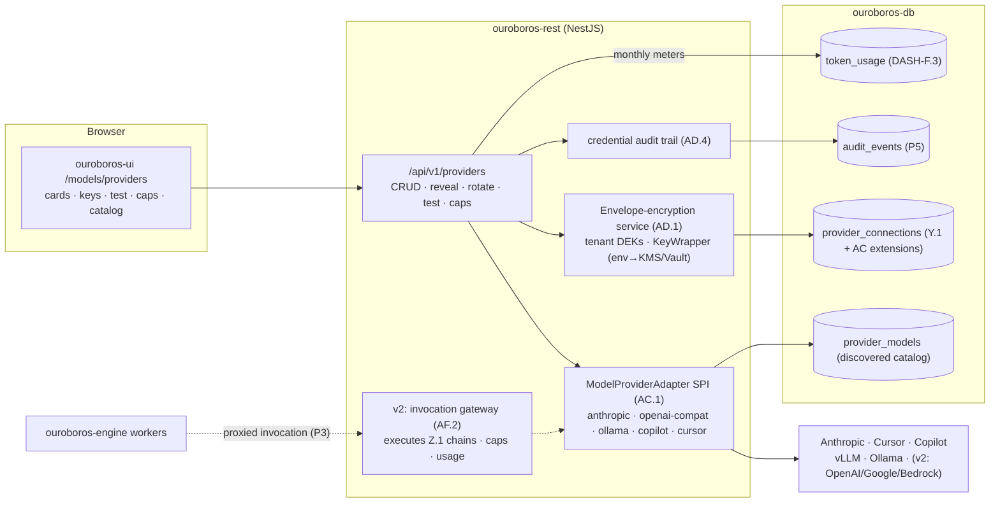
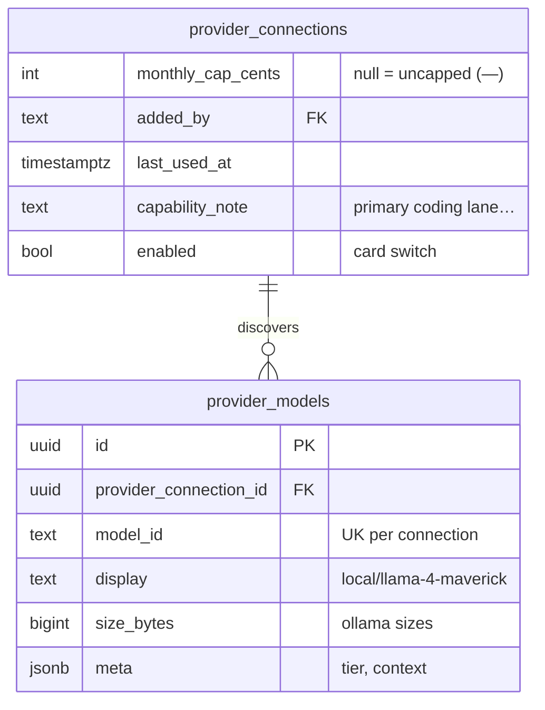
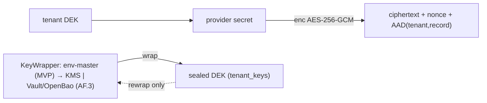
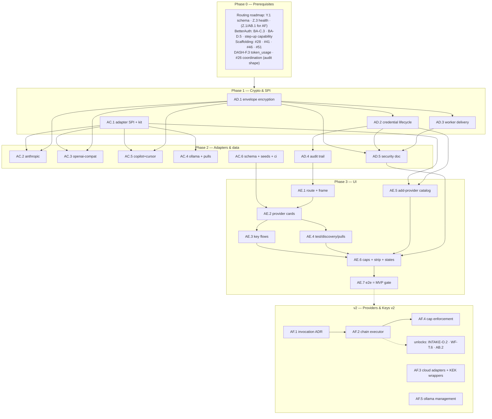

# Roadmap — Providers & Keys (Mockup 07)

## Description

> Create a roadmap that covers the features for the mockup page 07. Any additional
> tech infrastructure that is required to implement the functionality in these mockup
> pages should be researched and offered as options for implementing in the roadmap.
> The roamdap should include MVP and v2 options, as well as the labels, milestones,
> and the like, for the tickets to be created. Any ticket sources that are used by
> Ouroboros for ingesting should be pluggable, which includes sources like Jira,
> Linear, GitHub, GitLab, and other bug reporting/issue recording sites. Refer to the
> page so that issues can reference the mockup file when creating the UI/UX design of
> the pages. Be very specific when creating the roadmap, as the options in the
> roadmap for the functionality needs to be complete and very thorough.

## Context & Existing Work (duplicate-avoidance survey)

Surveyed 2026-08-08.

**Design source of truth for every UI ticket in this roadmap:**
[`docs/mockups/07-providers.html`](mockups/07-providers.html) (with
`docs/mockups/assets/ouroboros.css`) — Providers & Keys. Its anatomy:

- **Page head** — eyebrow `Models`, h1 `Providers & keys`, subline: *"Credentials
  live in acme-robotics' encrypted vault, scoped to this tenant. Keys never leave
  the control plane — workers only ever see short-lived tokens."* Actions:
  **Audit log** (ghost), **+ Add provider** (primary).
- **Subnav** — Routing (→ mockup 06) / Model registry (→ 21) / **Providers &
  keys** (active, accent underline) / Spend (stub).
- **Five provider cards** (`c-6 .provider`), each with: monogram (per-provider
  tinted `AN`/`CU`/`GH`/`VL`/`OL`), name + capability line, status pill
  (`connected` ok / `degraded upstream` warn), enable **switch**; masked
  **key row** (`sk-ant-api03-••••••••••••Xq4A` + **Reveal** + **Rotate**; vLLM
  variant has a **Base URL** field + optional key; Ollama variant has a **Host**
  field); **meta row** (`Added by Ken · 2026-06-12 · last used 3m ago`);
  **Models available** chips (Anthropic: four `claude-*` pills + `priority tier`;
  Cursor: `cursor/composer-2`; Copilot: `copilot/gpt-5-codex`; vLLM:
  `local/llama-4-maverick`, `local/deepseek-v3.2`) — Ollama instead shows a
  **Detected models pull-list** (`qwen3-coder:32b · 19 GB`, `llama4:scout ·
  63 GB`, `phi4:14b · 9.1 GB`, each with **Pull latest**); **monthly spend
  meter** (`This month $412.80 of $600 cap` 69%; Copilot warn-meter `$76.00 of
  $95 cap · 4 seats`; locals `$0.00 · no metered spend` / `2.1M tokens on-box`);
  **card foot**: **Test connection** + live result note (`✓ 200 · 38ms` ok /
  `△ 503 upstream · retrying` warn) + **Monthly cap** field (`$600`, `—` for
  locals).
- **Add-provider card** (dashed) — *"Connect OpenAI, Google, Bedrock, or any
  OpenAI-compatible endpoint"* + **Browse catalog**.
- **Security strip** (`c-12`) — shield glyph, copy: *"Keys are sealed per-tenant
  with **envelope encryption** (AES-256-GCM, KMS-backed). Workers receive
  scoped, 15-minute tokens — never your raw key."*, tags `SOC 2 Type II` /
  `ISO 27001`, **Read the security model ↗**.

**Overlapping work and dispositions:**

| Existing work | Disposition under this roadmap |
|---|---|
| Routing roadmap Y.1 (`provider_connections` + `model_aliases` schema foundation, "07/21 build UIs later"); Z.3 passive health | **Built upon** — this roadmap is the promised provider UI + the adapter framework; Y.1's schema is extended (caps, meta, discovery), never forked. Z.3's health service gains adapter-backed test/discovery calls. |
| Routing roadmap AB.1 (invocation-gateway requirements handoff, "the 07 roadmap's ADR") | **Landed here** — AF.1 is that ADR (LiteLLM-under-custom vs pure custom adapters); AF.2 implements the chain executor against it. |
| Routing roadmap Z.5 (spend aggregation), DASH-F.3 `token_usage`, DASH-J.4 pricing | **Consumed** — the cards' monthly meters aggregate calendar-month spend per provider from the same truth; caps stored here feed enforcement (AF.4). |
| WF Epic Q ticket-source SPI (pluggability precedent) | **Pattern reused** — the `ModelProviderAdapter` SPI (AC.1) mirrors Q.2's discipline: core code depends on the interface only, conformance kit gates new adapters. The description's pluggable-ticket-sources requirement itself remains satisfied by WF-Q (Jira/Linear/GitLab as WF-T.2–T.4); nothing source-related is duplicated here. |
| Scaffolding #26 audit log (v2), BA roadmap encryption helper (AES-GCM), #22/BA-B.3 GitHub org data | **Coordinated** — credential operations require an audit trail from day one (AD.4): it early-adopts #26's `audit_events` shape (filing-time coordination). BA's helper is superseded by the AD.1 envelope-encryption service (one migration path for Q.1/K.3 credentials too). |
| Mockup 21 (model registry UI), Spend tab | **Out of scope** — discovery *feeds* the registry data (aliases resolve against discovered models), but the registry management UI stays with mockup 21's roadmap; Spend stays with AB.4. |
| Scaffolding #49 placeholder, #56 e2e, AA.1 subnav ("Providers & keys · soon") | **Superseded/amended** — the Providers tab goes live (AA.1 amendment); #56 gains a providers leg. |

Epic letters continue the sequence (…Y, Z, AA, AB): this roadmap uses
**AC, AD, AE, AF**.

## Infrastructure Options (researched — thorough, pick before filing)

### 1. Secrets encryption backend (the "encrypted vault" of the subline)

| Option | Architecture | Fit | Trade-offs |
|---|---|---|---|
| **A — Application-level envelope encryption, pluggable KEK backend, env-key default** ⭐ recommended MVP | Per-tenant **DEK** (AES-256-GCM) encrypts credentials; DEKs sealed by a **KEK** behind a `KeyWrapper` interface; default wrapper = master key from `OURO_VAULT_MASTER_KEY` (env/file); KMS/Vault wrappers plug in without data migration (re-wrap DEKs only) | Matches the mockup's copy (envelope encryption, AES-256-GCM) while staying self-hostable with zero extra infra; per-tenant DEKs give crypto-shredding (delete tenant = destroy DEK); rotation = re-wrap, not re-encrypt | Master key custody is the operator's problem in the default; documented honestly in the security model (AD.5) |
| B — Cloud KMS as KEK (AWS KMS / GCP KMS / Azure Key Vault) | KEK never leaves the HSM; DEK generation via `GenerateDataKey`-style read-only APIs | The mockup's "KMS-backed" literally; strongest custody for cloud deployments | Cloud dependency violates self-hostable as the *only* path — hence a wrapper, not the core (AF.3 ships these wrappers) |
| C — HashiCorp Vault / OpenBao transit engine | Transit produces DEK/EDK pairs; KEK lives in Vault; client-side AES-256-GCM | Best self-hosted KMS-equivalent; multi-cloud portable; OpenBao keeps it fully OSS | Operating Vault/OpenBao is real work; right as an optional wrapper (AF.3), wrong as a hard dependency |
| D — pgcrypto in PostgreSQL | Encrypt/decrypt in SQL | No app changes | Keys transit the DB process and logs; weakest isolation — **rejected** |

### 2. Worker credential delivery (how the engine gets to providers)

| Option | Architecture | Fit | Trade-offs |
|---|---|---|---|
| **A — Control-plane proxied invocation** ⭐ recommended | Workers never hold provider keys: the engine calls the invocation gateway in `ouroboros-rest`; REST decrypts, calls the provider, streams back; per-run scoping + cost caps enforced at the single choke point | The subline's "keys never leave the control plane" made literal — stronger than the mockup's own 15-minute-token claim; one place for AB.1's per-hop errors, usage capture, cap enforcement | REST is on the token hot path (streaming throughput engineering); acceptable at MVP scale, measured before AF.2 finalizes |
| B — Short-lived credential leases | Engine requests a lease (`POST /internal/credentials/lease {provider, run}` → decrypted key material, 15-min TTL, scoped, audited); engine calls providers directly | Matches the mockup copy exactly; keeps REST off the streaming path | Raw keys do reach workers (briefly); revocation is TTL-bounded, not immediate; more audit surface |
| C — Vault dynamic secrets / STS-style broker | Vault issues true short-lived provider tokens where providers support them | Ideal custody | Almost no LLM providers support derived short-lived keys today; only workable generically via option C's own proxy — collapses into A |

**Recommendation:** A as the default path (honest copy adjustment: "workers never
see keys at all"), with B's lease API specified as the documented escape hatch
for future high-throughput local-provider paths (engine→Ollama on the same box
gains nothing from proxying — lease scoped to local providers only).

### 3. Provider adapter framework (the pluggability of *model* providers)

One `ModelProviderAdapter` SPI, mirroring the ticket-source SPI (WF-Q.2):

| Adapter | Auth | Discovery | Test | Extras | Status |
|---|---|---|---|---|---|
| Anthropic | API key | `/v1/models` | models-list + latency | priority-tier detection | **MVP (AC.2)** |
| OpenAI-compatible (vLLM, LM Studio, llama.cpp, TGI…) | base URL + optional key | `/v1/models` | same | self-hosted base-URL validation | **MVP (AC.3)** |
| Ollama | host URL | `/api/tags` (names + sizes) | version ping | **`/api/pull` model pulls**, on-box token counting | **MVP (AC.4)** |
| GitHub Copilot | GitHub token (org-billed) | fixed catalog | token + entitlement check (seats) | upstream-degraded detection | **MVP (AC.5)** |
| Cursor | API key | fixed catalog | key check | — | **MVP (AC.5)** |
| OpenAI · Google Gemini · AWS Bedrock | key / cloud creds | per-API | per-API | Bedrock = SigV4 + region | v2 (AF.3) — the add-card's catalog promise |

### 4. Invocation gateway (executes routing's resolved chains — the AB.1 ADR)

| Option | What it is | Fit | Trade-offs |
|---|---|---|---|
| **A — Custom executor over the adapter SPI** ⭐ ADR-favored | Chain executor in REST (per option 2-A): walks the Z.1 resolution hop-by-hop, per-hop error taxonomy (5xx/timeout→next, 4xx-auth→mark provider error, floor abort), streams, captures `token_usage` per hop, enforces caps | Adapters already exist for discovery/test — invocation completes them; our semantics (floor, votes, caps) implemented exactly; no infra | We own retries/streaming plumbing; SSE/stream pass-through engineering |
| B — LiteLLM proxy as executor under our resolution | Self-hosted LiteLLM given the *already-resolved* concrete chain (its router/alias logic unused) | 100+ providers for free; battle-tested streaming | Second service to operate; our per-hop semantics must map onto its fallback config (known alias/fallback mismatch class); usage capture via callbacks — indirection |
| C — Hosted gateway (OpenRouter/Portkey) | Hosted aggregation | Zero setup | Keys and traffic leave the tenant; breaks the page's core privacy promise as default — optional *adapter* at most |

The ADR (AF.1) decides A vs B with the AB.1 requirements doc as input; both
preserve the adapter SPI as the provider boundary.

## Decisions proposed by this roadmap (validate before issue creation)

| # | Decision | Rationale |
|---|----------|-----------|
| P1 | **`ModelProviderAdapter` SPI with per-kind adapters** (capabilities: auth mode, discovery, test, pull, invocation-later); core code imports the interface only (lint-guarded, conformance kit like Q.5) | The add-card promises a growing catalog; pluggability must be structural, mirroring the proven ticket-source pattern. |
| P2 | **Secrets = option 1-A**: per-tenant DEKs (AES-256-GCM) + pluggable KEK wrapper, env-master default; KMS/Vault wrappers v2 (AF.3) | Envelope encryption per the mockup, self-hostable by default, upgradeable without re-encrypting data. |
| P3 | **Workers get proxied invocation, not keys** (option 2-A), with a scoped lease API specified for local providers only | Stronger than the mockup's copy; the security-strip text is updated to the truth (honesty rule — AD.5 owns the wording). |
| P4 | **Reveal is a privileged, audited, re-authenticated action**; keys render masked-suffix only (`••••Xq4A`), never full in list payloads; Rotate = new secret verified by a live test before the old is retired | The key row's affordances must not become an exfiltration UI. |
| P5 | **Every credential operation is audited from day one** (add/reveal/rotate/enable/disable/cap-change/test), early-adopting #26's `audit_events` shape; the head's Audit log button shows this trail | Key custody without an audit trail fails the page's own security posture; filing-time coordination with #26. |
| P6 | **Discovery feeds the registry**: adapter discovery upserts a `provider_models` catalog (available models per connection — the chips and pull-list); mockup 21's registry UI consumes it; aliases (Y.1) validate against it | "Models available" must be discovered truth, not typed strings; the routing footnote "aliases resolve in the registry" gets its data layer. |
| P7 | **Caps are calendar-month, stored per connection, warning-first**: meters + threshold warnings in MVP; hard enforcement lands with invocation (AF.4) and is labeled "warning only" until then | The mockup shows caps today; enforcement without an invocation path would be fiction — label the truth. |
| P8 | **Spend meters follow the established honesty rules** (M7/DASH-J.4): priced spend only, `no metered spend`/`tokens on-box` for locals, em-dash for unknowns; Copilot seat count from adapter entitlement data, omitted if unavailable | No fabricated dollars. |
| P9 | **Test connection is user-initiated and cheap** (models-list/ping per adapter — no completions); result note shows real status + latency and updates Z.3 health snapshots | Live-feeling without synthetic spend; the `△ 503 upstream · retrying` state comes from real responses. |
| P10 | **Labels**: new `providers`, reusing `routing`/`security`-adjacent existing labels; **Milestones**: `Providers & Keys MVP` / `Providers & Keys v2` created at filing | Description requires labels + milestones for the filing pass. |

## Architecture Overview



## MVP Definition

The MVP is **mockup 07 as the real credential and provider control plane**. It is
done when, against the compose stack:

1. `/models/providers` reproduces
   [`docs/mockups/07-providers.html`](mockups/07-providers.html) pixel-faithfully
   in **both themes**: subnav with Providers active, the five seeded provider
   cards with every element (monograms, status pills, switches, key rows,
   meta rows, model chips / Ollama pull-list, spend meters, card feet), the
   dashed add-provider card, and the security strip (with P3-truthful copy).
2. **The adapter framework is real**: five conforming adapters (Anthropic,
   OpenAI-compatible, Ollama, Copilot, Cursor) behind the SPI, each passing the
   conformance kit; adding a connection renders a schema-driven form from the
   adapter's declared config.
3. **Credential lifecycle works end to end**: add (validated by a live test) →
   masked display → Reveal (re-auth + audit) → Rotate (verify-then-retire) →
   disable/enable switch → delete (blocked while aliases depend on it); all
   sealed by the AD.1 envelope-encryption service; every operation lands in the
   audit trail visible behind the head's Audit log button.
4. **Discovery is live**: Anthropic/vLLM model lists and Ollama tags (with
   sizes) populate `provider_models` and render as the cards' chips/pull-list;
   **Pull latest** triggers a real Ollama pull with honest progress; discovered
   models are what mockup 21's registry and Y.1 aliases validate against.
5. **Test connection** returns real status + latency per adapter (`✓ 200 ·
   38ms` / `△ 503 upstream · retrying`) and feeds the Z.3 health snapshots the
   routing strip shows.
6. **Caps & meters**: monthly caps stored per connection; calendar-month spend
   meters from `token_usage` (P8 honesty); threshold warnings (the Copilot
   warn-meter) — labeled warning-only until AF.4.
7. Integration tests cover the crypto service (round-trip, re-wrap, tamper),
   lifecycle + audit, adapter conformance (recorded fixtures), discovery
   upserts, cap math, isolation; the e2e suite gains a providers leg.

**Explicitly v2 (milestone `Providers & Keys v2`):** the invocation-gateway ADR
+ chain executor (AF.1/AF.2 — the unlock for the LLM estimator INTAKE-O.2 and
execution WF-T.6), OpenAI/Google/Bedrock adapters + KMS/Vault KEK wrappers
(AF.3), hard cap enforcement + alerts (AF.4), Ollama pull queue/progress
management (AF.5).

## Epics, Labels & Milestones

| Epic | Name | Goal | Modules | Milestone |
|------|------|------|---------|-----------|
| AC | Provider Adapter Framework | SPI, five adapters, discovery catalog, schema extensions, seeds, CI | ouroboros-rest, ouroboros-db | Providers & Keys MVP |
| AD | Vault, Secrets & Audit | Envelope encryption, key lifecycle, worker credential model, audit, security doc | ouroboros-rest, ouroboros-db, docs | Providers & Keys MVP |
| AE | Providers UI | Cards, key flows, test/discovery UX, caps, add-provider catalog, states, e2e | ouroboros-ui | Providers & Keys MVP |
| AF | Invocation & Extended Providers (v2) | Gateway ADR + executor, cloud adapters, KMS/Vault wrappers, cap enforcement | all | Providers & Keys v2 |

Issue naming: `<project>: [<epic>.<issue>] <title>`. Labels: existing set (`mvp`,
`v2`, `rest`, `db`, `ui`, `ci`, `design`, `routing`) **plus new `providers`**
(decision P10). Milestones **`Providers & Keys MVP`** / **`Providers & Keys v2`**
created at filing; every issue assigned. Complexity chips: **XS · S · M · L**.

---

## Epic AC — Provider Adapter Framework (`ouroboros-rest` + `ouroboros-db`)

| Issue | Title | Summary | Labels | Parallel | MVP | Complexity | Affected Modules |
|-------|-------|---------|--------|:--------:|:---:|:----------:|------------------|
| AC.1 | ouroboros-rest: [AC.1] ModelProviderAdapter SPI & registry | Interface, capability flags, config schemas, lint boundary | mvp, providers, rest | N (after Y.1) | Y | L | ouroboros-rest |
| AC.2 | ouroboros-rest: [AC.2] Anthropic adapter | Key auth, models discovery, test, priority-tier detection | mvp, providers, rest | N (after AC.1, AD.1) | Y | S | ouroboros-rest |
| AC.3 | ouroboros-rest: [AC.3] OpenAI-compatible adapter (vLLM et al.) | Base-URL + optional key, `/v1/models` discovery, test | mvp, providers, rest | N (after AC.1, AD.1) | Y | S | ouroboros-rest |
| AC.4 | ouroboros-rest: [AC.4] Ollama adapter with model pulls | Host config, `/api/tags` discovery with sizes, `/api/pull` | mvp, providers, rest | N (after AC.1) | Y | M | ouroboros-rest |
| AC.5 | ouroboros-rest: [AC.5] Copilot & Cursor adapters | Token/key auth, fixed catalogs, entitlement checks | mvp, providers, rest | N (after AC.1, AD.1) | Y | M | ouroboros-rest |
| AC.6 | ouroboros-db: [AC.6] Schema extensions, discovered-models catalog & seeds | Y.1 extensions (caps, meta), `provider_models`, mockup-parity seeds, CI | mvp, providers, db, ci | N (after Y.1) | Y | M | ouroboros-db, .github |

### Issue AC.1 — ouroboros-rest: [AC.1] ModelProviderAdapter SPI & registry

- **Problem Statement:** Five provider kinds ship in MVP and the add-card
  promises more (OpenAI, Google, Bedrock, any OpenAI-compatible endpoint); a
  hard-coded provider switch would calcify immediately (decision P1).
- **Solution/Scope:** Define the SPI (TypeScript interface + docs):
  `kind`, `configSchema()` (JSON Schema driving AE.5's forms — base URL? key?
  host? region?), `capabilities()` (`discovery`, `pull`, `entitlements`,
  `invocation` — reserved for AF.2), `validate(config, secret)` (live check →
  status + latency + detail), `discoverModels(conn)` → normalized model list
  (id, display, context, size where known), `pullModel?(conn, id)` (Ollama-class),
  error taxonomy (auth/network/upstream/rate → provider-neutral codes feeding
  status pills and Z.3 health). Registry by `kind` with DI tokens;
  dependency-cruiser rule: core services import the SPI only. Conformance kit
  (mirroring Q.5): recorded-fixture suites every adapter must pass + an
  in-memory fake adapter powering core tests. `docs/MODEL_PROVIDERS.md` with a
  "write an adapter" walkthrough.
- **Acceptance Criteria:**
  - Kit green for the fake adapter; lint boundary fails on a direct provider
    import outside adapters.
  - Config schemas render AE.5's forms with zero UI special-casing (fixture
    proof).
  - Error taxonomy mapped to the card status pills 1:1.
- **Parallelism/Dependencies:** Needs Y.1. Blocks AC.2–AC.6, AD.2, AF.
- **Technical Stack:** NestJS DI, JSON Schema, dependency-cruiser.
- **Epic:** AC

```
interface ModelProviderAdapter {
  kind · configSchema() · capabilities() · validate() → {status, latencyMs, detail}
  discoverModels() → NormalizedModel[] · pullModel?() · (invoke? — reserved AF.2)
}
core ──imports──▶ SPI only   adapters/{anthropic,openai_compat,ollama,copilot,cursor}
```

### Issue AC.2 — ouroboros-rest: [AC.2] Anthropic adapter

- **Problem Statement:** The primary coding lane: key-authed, discoverable,
  testable — the first real conforming adapter.
- **Solution/Scope:** `validate`: models-list call with the sealed key (via
  AD.1), returning status + latency (the `✓ 200 · 38ms` note); `discoverModels`:
  `/v1/models` normalized (the four seeded `claude-*` chips); priority-tier
  detection from response headers/entitlement where exposed (the `priority
  tier` pill; omitted when unknown — P8); error mapping (401 → auth-error pill,
  429 → rate-limited, 5xx → upstream). Recorded fixtures for the kit.
- **Acceptance Criteria:** Kit green; discovery upserts the four models into
  `provider_models`; invalid key → designed auth-error state, never a stack
  trace; tier pill only on real signal.
- **Parallelism/Dependencies:** Needs AC.1, AD.1. Parallel with AC.3–AC.5.
- **Technical Stack:** Anthropic API, undici.
- **Epic:** AC

```
validate(key) ─▶ GET /v1/models ─▶ {200, 38ms} ─▶ "✓ 200 · 38ms" · discover ─▶ 4 chips
```

### Issue AC.3 — ouroboros-rest: [AC.3] OpenAI-compatible adapter (vLLM et al.)

- **Problem Statement:** The self-hosted lane (vLLM, and by extension LM
  Studio, llama.cpp servers, TGI): base-URL-configured, key-optional — the
  adapter that makes "any OpenAI-compatible endpoint" true.
- **Solution/Scope:** Config schema: `base_url` (validated http(s), private
  ranges allowed — SSRF policy: explicit allow of RFC-1918 for this adapter
  kind with documented reasoning, deny-by-default redirects), optional
  `api_key`; `validate`: `GET {base}/v1/models`; `discoverModels`: same call
  normalized with `local/` display prefix (the mockup's
  `local/llama-4-maverick` chips); capability line free-text (`self-hosted ·
  A100 ×2`) stored as connection metadata.
- **Acceptance Criteria:** Kit green against a vLLM fixture and a generic
  OpenAI-compatible fixture; unreachable base URL → designed network-error
  state; SSRF policy tested (no redirect following, scheme allow-list).
- **Parallelism/Dependencies:** Needs AC.1, AD.1. Parallel with siblings.
- **Technical Stack:** OpenAI-compatible REST, undici.
- **Epic:** AC

```
{base_url: http://10.0.4.20:8000/v1, key?} ─▶ /v1/models ─▶ local/llama-4-maverick · local/deepseek-v3.2
```

### Issue AC.4 — ouroboros-rest: [AC.4] Ollama adapter with model pulls

- **Problem Statement:** The zero-cost lane is also the most interactive card:
  detected models with sizes and a real **Pull latest** action.
- **Solution/Scope:** Config schema: `host` (same SSRF policy as AC.3);
  `validate`: `/api/version` ping (the `✓ 200 · 4ms` note); `discoverModels`:
  `/api/tags` with size normalization (`19 GB` tags); `pullModel`: `/api/pull`
  with **streamed progress** surfaced through a pull-status endpoint
  (AE.4 renders it; long pulls survive page reloads via server-side tracking);
  concurrent-pull limit (one per connection, queued — full queue mgmt is
  AF.5); on-box token counting noted from usage rows (the `2.1M tokens
  on-box` line comes from `token_usage`, not the adapter).
- **Acceptance Criteria:** Kit green (fixtures incl. streamed pull chunks);
  pull of a small model against a real Ollama in compose completes with
  progress states; second pull while one runs → queued state; sizes match
  `/api/tags` truth.
- **Parallelism/Dependencies:** Needs AC.1 (no secret required — host only).
  Parallel with siblings.
- **Technical Stack:** Ollama REST API, streamed responses.
- **Epic:** AC

```
/api/tags ─▶ [qwen3-coder:32b · 19 GB]…   Pull latest ─▶ /api/pull (stream) ─▶ progress → done
```

### Issue AC.5 — ouroboros-rest: [AC.5] Copilot & Cursor adapters

- **Problem Statement:** The org-billed (Copilot) and key-authed (Cursor)
  lanes: fixed model catalogs, entitlement-aware, degraded-state honest.
- **Solution/Scope:** Copilot: GitHub token auth (`ghu_…`), entitlement check
  (seat count for the `· 4 seats` cap note — omitted when the API doesn't
  expose it, P8), fixed catalog (`copilot/gpt-5-codex`), upstream-degraded
  detection (5xx/latency from validate → the warn pill + `△ 503 upstream ·
  retrying` note with bounded auto-retry); Cursor: API key validate, fixed
  catalog (`cursor/composer-2`). Both: recorded fixtures for the kit;
  capability lines (`billed through GitHub org acme-robotics`) as metadata.
- **Acceptance Criteria:** Kit green; Copilot degraded fixture drives the warn
  pill end to end; seats rendered only from real entitlement data; fixed
  catalogs land in `provider_models` like discovered ones.
- **Parallelism/Dependencies:** Needs AC.1, AD.1. Parallel with siblings.
- **Technical Stack:** GitHub/Cursor APIs, undici.
- **Epic:** AC

```
copilot: token → entitlement {seats: 4} · validate 503 ─▶ (degraded upstream) + "△ 503 · retrying"
cursor:  key → ok · catalog [cursor/composer-2]
```

### Issue AC.6 — ouroboros-db: [AC.6] Schema extensions, discovered-models catalog & seeds

- **Problem Statement:** Y.1's foundation lacks what the cards show: caps, meta
  (added-by, last-used), capability lines — and discovery needs a catalog
  table the registry (21) will consume (decision P6).
- **Solution/Scope:** Migration extending Y.1: `provider_connections` +=
  `monthly_cap_cents` (nullable), `added_by` → `"user".id`, `last_used_at`
  (maintained by invocation later; seeded now), `capability_note`,
  `enabled` bool (the card switch — distinct from health `status`);
  `provider_models` — id, `provider_connection_id` FK, `model_id`, `display`,
  `size_bytes` (nullable), `meta` jsonb (context length, tier), `discovered_at`,
  unique (connection, model_id); alias validation hook: Y.1 aliases FK-check
  against `provider_models` (soft in MVP — warn on unknown, enforce once
  discovery is universal). Seeds: the five mockup connections with masked-real
  secrets (dev values), caps ($600/$120/$95/—/—), meta rows, discovered models
  incl. Ollama sizes, spend rows shaped for the calendar-month meters
  ($412.80/$64.10/$76.00/$0/$0 — coordinated with Y.4/DASH seeds); ci/db
  constraint probes (cap non-negative, unique models, enabled/status vocab).
- **Acceptance Criteria:** Cards render entirely from seeds; alias-to-unknown-
  model warning fires on a fixture; constraints red/green verified; personal
  org empty (guidance fixture).
- **Parallelism/Dependencies:** Needs Y.1 (+Y.4/DASH-F.5 coordination). Feeds
  everything.
- **Technical Stack:** PostgreSQL 17, Flyway.
- **Epic:** AC



---

## Epic AD — Vault, Secrets & Audit (`ouroboros-rest` + `ouroboros-db` + docs)

| Issue | Title | Summary | Labels | Parallel | MVP | Complexity | Affected Modules |
|-------|-------|---------|--------|:--------:|:---:|:----------:|------------------|
| AD.1 | ouroboros-rest: [AD.1] Envelope-encryption service (tenant DEKs + KeyWrapper) | AES-256-GCM DEK per tenant, pluggable KEK, migration of existing secrets | mvp, providers, rest, db | N (after #28) | Y | L | ouroboros-rest, ouroboros-db |
| AD.2 | ouroboros-rest: [AD.2] Credential lifecycle API | Add/reveal/rotate/enable/delete with re-auth, verify-then-retire | mvp, providers, rest | N (after AD.1, AC.1) | Y | M | ouroboros-rest |
| AD.3 | ouroboros-rest: [AD.3] Worker credential delivery (proxied + scoped lease spec) | P3: proxy contract for AF.2; lease API for local providers | mvp, providers, rest | N (after AD.1) | Y | M | ouroboros-rest, ouroboros-engine |
| AD.4 | ouroboros-rest: [AD.4] Credential audit trail & Audit log surface | Every operation audited (#26-shaped); head-button trail view | mvp, providers, rest, ui | N (after AD.2) | Y | M | ouroboros-rest, ouroboros-ui |
| AD.5 | ouroboros: [AD.5] Security model documentation | `docs/SECURITY_MODEL.md`: crypto, custody, honest claims; strip copy | mvp, providers, documentation | N (after AD.1–AD.3) | Y | S | docs |

### Issue AD.1 — ouroboros-rest: [AD.1] Envelope-encryption service (tenant DEKs + KeyWrapper)

- **Problem Statement:** Three roadmaps now store encrypted credentials
  (BA helper, Q.1 sources, Y.1 providers) with a shared ad-hoc AES-GCM helper;
  the mockup promises real envelope encryption with per-tenant sealing
  (decision P2) — one service must own it.
- **Solution/Scope:** `VaultService` (option 1-A): per-tenant DEK (AES-256-GCM,
  96-bit nonces, AAD = tenant + record id — swap-prevention), DEKs stored
  sealed by the `KeyWrapper` interface (`wrap/unwrap/rewrap`); default wrapper:
  master key from `OURO_VAULT_MASTER_KEY` (32-byte, boot-validated);
  `tenant_keys` table (org FK, sealed DEK, version, rotated_at); DEK rotation
  (new version, lazy re-encrypt on write, background sweep) and KEK re-wrap
  (AF.3 path) supported from day one; migration: existing Q.1/K.3/Y.1
  ciphertexts re-sealed through the service (one-time job); decrypted material
  lives only in request scope, zeroized best-effort, never logged (lint +
  redaction tests).
- **Acceptance Criteria:**
  - Round-trip + tamper tests (bit-flip → auth failure); AAD binding verified
    (cross-tenant ciphertext swap fails).
  - DEK rotation leaves old data readable, new writes on the new version;
    re-wrap changes no data ciphertexts.
  - Migration job converts existing dev-seed secrets; boot fails cleanly on a
    bad master key.
- **Parallelism/Dependencies:** Needs #28. Blocks AC.2/3/5, AD.2, AD.3;
  supersedes the BA/Q ad-hoc helper (amendment).
- **Technical Stack:** Node crypto (AES-256-GCM), Flyway, NestJS.
- **Epic:** AD



### Issue AD.2 — ouroboros-rest: [AD.2] Credential lifecycle API

- **Problem Statement:** The key row's affordances — masked display, Reveal,
  Rotate — plus add/enable/delete must be safe by construction (decision P4).
- **Solution/Scope:** Under tenant context, owner/admin gated: `POST
  /api/v1/providers` (adapter-schema-validated config + secret; **live
  validate before persist** — a bad key is never stored silently); list/read
  return masked suffix only (`••••Xq4A`, server-computed); `POST
  /:id/reveal` — **step-up re-auth** (fresh session check / password or
  provider re-confirm per BA capabilities), short-lived response, audited;
  `POST /:id/rotate` — accept new secret → adapter validate → swap atomically
  → old retired (verify-then-retire; failed validation leaves the old active);
  `PATCH /:id` (enable/disable switch, cap, capability note); `DELETE` blocked
  while Y.1 aliases reference the connection (409 naming them). Rate limits on
  reveal attempts.
- **Acceptance Criteria:**
  - Full lifecycle in the harness; masked-only in every list payload (contract
    test greps for secret material).
  - Rotate with an invalid new key → old key still live, error designed.
  - Reveal without step-up → 401 challenge; with → audited value; delete-with-
    dependents → 409 listing aliases.
- **Parallelism/Dependencies:** Needs AD.1, AC.1. Feeds AE.2/AE.3.
- **Technical Stack:** NestJS, class-validator, BA step-up.
- **Epic:** AD

```
add ─▶ validate live ─▶ seal ─▶ store        reveal ─▶ step-up ─▶ audited value (TTL display)
rotate ─▶ validate new ─▶ atomic swap ─▶ retire old     delete ─▶ 409 while aliases depend
```

### Issue AD.3 — ouroboros-rest: [AD.3] Worker credential delivery (proxied + scoped lease spec)

- **Problem Statement:** The engine will need provider access (estimator O.2,
  execution WF-T.6); decision P3 says workers get a proxy, not keys — the
  contract must exist before AF.2 builds the executor on it.
- **Solution/Scope:** Contract-first: internal proxied-invocation surface spec
  (`POST /internal/llm/invoke {connection|alias, payload, run_ctx}` — request/
  stream shapes, per-run scoping, error taxonomy hooks for AB.1 semantics;
  implementation lands with AF.2); implemented now: the **scoped lease API**
  for local-provider exceptions (`POST /internal/credentials/lease {provider,
  run}` → local-provider connection details only — base URL/host, never cloud
  keys; TTL'd, audited, shared-secret path per #51); engine client stubs for
  both; lint rule: no other internal path returns secret material.
- **Acceptance Criteria:** Lease returns local connections only (cloud-provider
  lease → 403 by policy, tested); lease events audited; proxy contract
  committed to OpenAPI (internal) and referenced by AF.1/AF.2; engine stub
  compiles against both.
- **Parallelism/Dependencies:** Needs AD.1 (+#51 pattern). Feeds AF.2; spec
  input to AF.1.
- **Technical Stack:** NestJS, FastAPI client stub.
- **Epic:** AD

```
engine ──POST /internal/llm/invoke (contract now, impl AF.2)──▶ REST ─▶ provider  (keys never leave)
engine ──lease {ollama, run}──▶ {host, ttl 15m} ✓ audited      lease {anthropic} ─▶ 403 policy
```

### Issue AD.4 — ouroboros-rest: [AD.4] Credential audit trail & Audit log surface

- **Problem Statement:** Reveal/rotate/cap changes without an audit trail
  would fail the page's own security posture (decision P5); the head button
  needs a real destination.
- **Solution/Scope:** Audit events (early-adopting #26's `audit_events` shape;
  filing-time coordination — if #26 is unbuilt this lands its table):
  `provider.added|revealed|rotated|enabled|disabled|cap_changed|deleted|
  tested`, `credential.lease_granted` — actor, connection, IP, detail (never
  secret material); append-only grant posture; `GET /api/v1/providers/audit`
  (filterable, org-scoped); minimal trail UI (sheet from the Audit log
  button: timestamped rows, actor, action — full audit UI remains mockup 17
  territory).
- **Acceptance Criteria:** Every AD.2 operation writes exactly one event
  (harness-verified); events carry no secret material (grep test); trail
  sheet renders seeded history; append-only enforced.
- **Parallelism/Dependencies:** Needs AD.2 (+#26 coordination). Feeds AE.1.
- **Technical Stack:** NestJS interceptor, PostgreSQL.
- **Epic:** AD

```
rotate by Ken ─▶ audit_events {provider.rotated, actor, conn, ip, at}  (no secrets)
[Audit log] ─▶ sheet: "2026-08-08 14:02 · Ken · rotated Anthropic key"
```

### Issue AD.5 — ouroboros: [AD.5] Security model documentation

- **Problem Statement:** The strip links "Read the security model ↗" and makes
  compliance-flavored claims (SOC 2, ISO 27001); the document must exist and
  the claims must be honest.
- **Solution/Scope:** `docs/SECURITY_MODEL.md`: envelope-encryption design
  (AD.1 diagrams), custody model per deployment (env-master vs KMS/Vault
  AF.3), worker delivery truth (P3 — proxied; lease scope), audit guarantees,
  threat notes (SSRF policy, reveal step-up, rotation); **strip copy
  corrected to truth**: compliance badges rendered only when certifications
  exist — replaced in MVP with "self-hosted: your keys never leave your
  deployment" framing (product decision recorded); linked from the strip and
  README.
- **Acceptance Criteria:** Doc renders with diagrams; every claim in the UI
  strip traces to a doc section; no unearned compliance badges (honesty
  verified in AE.6 review).
- **Parallelism/Dependencies:** Needs AD.1–AD.3.
- **Technical Stack:** Markdown, Mermaid.
- **Epic:** AD

```
strip claim ──traces to──▶ SECURITY_MODEL.md section   badges: only what is certified (none faked)
```

---

## Epic AE — Providers UI (`ouroboros-ui`)

Every issue references
[`docs/mockups/07-providers.html`](mockups/07-providers.html) as the design
source — provider-card anatomy, monogram tints, key-row/pull-list/security-strip
treatments — via the #16 tokens (both themes; the mockup is dark-only).

| Issue | Title | Summary | Labels | Parallel | MVP | Complexity | Affected Modules |
|-------|-------|---------|--------|:--------:|:---:|:----------:|------------------|
| AE.1 | ouroboros-ui: [AE.1] Providers route, subnav & page frame | `/models/providers`, head + Audit log sheet, subnav live | mvp, providers, ui, design | N (after AA.1, AD.4, BA-D.5) | Y | S | ouroboros-ui |
| AE.2 | ouroboros-ui: [AE.2] Provider cards | Card grid: monograms, pills, switches, meta, chips, meters, feet | mvp, providers, ui, design | N (after AE.1, AC.6) | Y | L | ouroboros-ui |
| AE.3 | ouroboros-ui: [AE.3] Key management flows | Masked row, Reveal step-up, Rotate verify-then-retire, delete guard | mvp, providers, ui | N (after AE.2, AD.2) | Y | M | ouroboros-ui |
| AE.4 | ouroboros-ui: [AE.4] Test, discovery & Ollama pulls UX | Live test notes, chip refresh, pull-list with streamed progress | mvp, providers, ui | N (after AE.2, AC.4) | Y | M | ouroboros-ui |
| AE.5 | ouroboros-ui: [AE.5] Add-provider flow & catalog | Dashed card → kind catalog → schema-driven form → validated add | mvp, providers, ui, design | N (after AE.1, AC.1, AD.2) | Y | M | ouroboros-ui |
| AE.6 | ouroboros-ui: [AE.6] Caps, security strip & states | Cap fields + warn meters, truthful strip, empty/read-only/error states | mvp, providers, ui, design | N (after AE.2–AE.5, AD.5) | Y | M | ouroboros-ui |
| AE.7 | ouroboros-ui: [AE.7] Providers e2e leg | Parity, add→test→rotate→audit flow, pull progress, themes | mvp, providers, ui, ci | N (after AE.1–AE.6) | Y | S | ouroboros-ui, .github |

### Issue AE.1 — ouroboros-ui: [AE.1] Providers route, subnav & page frame

- **Problem Statement:** The page frame: head with the vault subline (AD.5
  truth), Audit log and + Add provider actions, and the shared Models subnav
  with the Providers tab going live.
- **Solution/Scope:** `/models/providers` route in the Models section; head per
  the mockup (subline text from the AD.5-approved copy); **Audit log** →
  AD.4's trail sheet; **+ Add provider** → AE.5 flow; subnav amendment (AA.1):
  Providers active with accent underline, Registry/Spend still honest stubs.
- **Acceptance Criteria:** Route + head + working actions; subnav states
  correct from both directions (06 ⇄ 07); both themes; AA.1 amendment posted.
- **Parallelism/Dependencies:** Needs AA.1, AD.4, BA-D.5. Blocks AE.2–AE.6.
- **Technical Stack:** Next.js, #46 primitives.
- **Epic:** AE

```
[Models] Providers & keys                    [Audit log] [+ Add provider]
Routing | Model registry·soon | ●Providers & keys | Spend·soon
```

### Issue AE.2 — ouroboros-ui: [AE.2] Provider cards

- **Problem Statement:** The five cards are the page: dense, per-adapter
  composition (key-auth vs base-URL vs host layouts) with live status, spend,
  and models — schema-driven so AF.3's new adapters get cards for free.
- **Solution/Scope:** `ProviderCard` composition from adapter config schemas +
  connection data: monogram (kind-tinted per the mockup's five), name +
  capability line, status pill (ok/warn/error from adapter taxonomy), enable
  switch (persists; disabled connections dim and drop from routing health),
  key row variant by auth mode (masked input / base-URL field / host field),
  meta row (added-by from `"user"`, relative last-used, em-dash before first
  use), models chips from `provider_models` (+ tier pill on real signal) or
  Ollama pull-list slot (AE.4), monthly meter (calendar-month spend of cap,
  warn variant ≥ 80%, locals' `no metered spend` / `on-box tokens` lines per
  P8), card foot (Test connection + note slot + cap field). Responsive two-
  column → single.
- **Acceptance Criteria:** Seeded grid reproduces all five mockup cards
  element-for-element in both themes (screenshot test); switch/enable
  round-trips; meter math matches seeds; a sixth fake-adapter connection
  renders correctly with zero card-code changes (schema-driven proof).
- **Parallelism/Dependencies:** Needs AE.1, AC.6. Blocks AE.3, AE.4, AE.6.
- **Technical Stack:** React, #46 primitives, schema-driven composition.
- **Epic:** AE

```
[AN] Anthropic Claude · api.anthropic.com · primary coding lane   (connected) [switch]
[sk-ant-••••Xq4A][Reveal][Rotate]   Added by Ken · 2026-06-12 · last used 3m ago
MODELS: (claude-fable-5)(claude-opus-5)(claude-sonnet-5)(claude-haiku-4-5)(priority tier)
This month $412.80 of $600 ▓▓▓▓▓▓▓░░░   [Test connection] ✓ 200 · 38ms   cap [$600]
```

### Issue AE.3 — ouroboros-ui: [AE.3] Key management flows

- **Problem Statement:** Reveal and Rotate are security-critical UX: step-up
  re-auth, time-boxed display, verify-then-retire — with the safety rails of
  AD.2 made visible.
- **Solution/Scope:** **Reveal**: click → step-up dialog (BA re-auth) → value
  shown in-place with countdown auto-mask (copy button, no clipboard
  persistence claims), audited-notice line; **Rotate**: dialog (new secret
  input → live validate with spinner → success swaps atomically; failure
  explains and leaves the old key active — state machine rendered honestly);
  base-URL/host edits validate-on-save the same way; **delete** (card
  overflow menu) with the dependency guard (409 → dialog listing dependent
  aliases, link to routing); disable-switch confirm when aliases depend.
- **Acceptance Criteria:** Reveal without recent auth → challenge; revealed
  value auto-masks on timer/navigation; rotate-fail path leaves old key
  working (e2e-verified); delete guard renders alias names; member role sees
  none of these affordances.
- **Parallelism/Dependencies:** Needs AE.2, AD.2.
- **Technical Stack:** React, #46 primitives, BA step-up client.
- **Epic:** AE

```
[Reveal] ─▶ step-up ─▶ sk-ant-api03-… (auto-mask 30s · audited)
[Rotate] ─▶ new key ─▶ validating… ─▶ ✓ swapped │ ✗ "old key still active" (explained)
```

### Issue AE.4 — ouroboros-ui: [AE.4] Test, discovery & Ollama pulls UX

- **Problem Statement:** Test connection, model-chip refresh, and the Ollama
  pull-list with real streamed progress are the page's live surfaces.
- **Solution/Scope:** **Test connection**: button → adapter validate → note
  renders real result (`✓ 200 · 38ms` ok / `△ 503 upstream · retrying` warn
  with bounded auto-retry indicator / `✗ auth failed` err), updates the
  status pill + Z.3 snapshot; **discovery refresh**: chips re-fetch on demand
  + after test (new/removed models animate in/out; removed-but-aliased models
  flagged); **Ollama pull-list**: rows per detected model (mono name, size
  tag, Pull latest) with streamed progress bar during pulls (survives reload
  via AC.4 status endpoint), queued state for concurrent requests, completion
  refreshes the list.
- **Acceptance Criteria:** Stopping the compose Ollama flips test note +
  pill honestly; pull of a small model shows progress → done in e2e;
  removed-model-with-alias warning renders; all states themed.
- **Parallelism/Dependencies:** Needs AE.2, AC.4 (+Z.3).
- **Technical Stack:** React, streamed status polling.
- **Epic:** AE

```
[Test connection] ─▶ ✓ 200 · 4ms       qwen3-coder:32b [19 GB][Pull latest ▶ ▓▓▓░ 61%]
                                        llama4:scout   [63 GB][queued…]
```

### Issue AE.5 — ouroboros-ui: [AE.5] Add-provider flow & catalog

- **Problem Statement:** The dashed card promises a catalog ("OpenAI, Google,
  Bedrock, or any OpenAI-compatible endpoint"); adding must be schema-driven
  so new adapters appear without UI work (decision P1).
- **Solution/Scope:** Flow: dashed card / head button → catalog dialog (kind
  tiles from the adapter registry: five live + honest `coming soon` tiles for
  AF.3 kinds), pick → form rendered from `configSchema()` (key/base-URL/host
  fields, capability note), submit → AD.2 add (live validation inline;
  failure keeps the form with the adapter's designed error) → card appears;
  duplicate-connection warning (same kind + endpoint).
- **Acceptance Criteria:** Add-vLLM and add-Anthropic paths e2e; bad key never
  creates a card; catalog tiles derive from the registry (fake adapter shows
  up unbidden — proof); soon-tiles clearly non-interactive.
- **Parallelism/Dependencies:** Needs AE.1, AC.1, AD.2.
- **Technical Stack:** React, schema-driven forms (shared with WF-S.4
  machinery).
- **Epic:** AE

```
[+] ─▶ catalog: (Anthropic)(OpenAI-compat)(Ollama)(Copilot)(Cursor)(OpenAI·soon)(Google·soon)(Bedrock·soon)
  ─▶ schema form ─▶ live validate ─▶ card appears (never an untested key)
```

### Issue AE.6 — ouroboros-ui: [AE.6] Caps, security strip & states

- **Problem Statement:** Cap editing with warning semantics (P7), the
  truth-corrected security strip (AD.5), and the page's empty/read-only/error
  states complete the surface.
- **Solution/Scope:** Cap field: currency parsing, `—` = uncapped, save via
  AD.2 PATCH; meter warn state ≥ 80% (the Copilot card), "warning only —
  enforcement arrives with invocation" tooltip (P7 honesty); security strip
  per AD.5's approved copy + doc link (badges only as earned); states: empty
  org guidance ("Connect your first provider" with role-aware CTA), member
  read-only (cards visible, all controls disabled with explanation), load
  skeletons, error banner (DASH-I.7 pattern), disabled-connection dimming.
- **Acceptance Criteria:** Cap edit round-trips and re-renders meters;
  strip copy matches AD.5 verbatim (no unearned badges — reviewed); personal
  org shows guidance; member session verified read-only; all themed.
- **Parallelism/Dependencies:** Needs AE.2–AE.5, AD.5.
- **Technical Stack:** React, #46 primitives.
- **Epic:** AE

```
cap [$95] ─▶ meter warn ▓▓▓▓▓▓▓▓░ 80% · ⓘ "warning only until invocation lands"
◈ "Keys sealed per-tenant with envelope encryption (AES-256-GCM). Workers never see keys."
```

### Issue AE.7 — ouroboros-ui: [AE.7] Providers e2e leg

- **Problem Statement:** The credential lifecycle spans UI, REST, crypto, and
  adapters — only e2e certifies the whole chain.
- **Solution/Scope:** Extend #56: seeded parity (five cards, strip), add-vLLM
  flow (catalog → form → validate → card), test-connection truth (stop a
  compose provider → warn/err note), reveal step-up + auto-mask, rotate
  verify-then-retire (fail + success paths), Ollama pull progress, cap edit +
  warn meter, audit sheet shows the session's operations, member read-only,
  both themes screenshot-diffed.
- **Acceptance Criteria:** Green from cold compose; each leg fails
  meaningfully when its layer breaks (spot-verified); ≤ 2.5 min added.
- **Parallelism/Dependencies:** Needs AE.1–AE.6, AC.6 seeds; amends #56.
- **Technical Stack:** Playwright.
- **Epic:** AE

```
e2e: parity ✓ · add ✓ · test truth ✓ · reveal/rotate ✓ · pull ✓ · caps ✓ · audit ✓ · themes ✓
```

---

## Epic AF — Invocation & Extended Providers (v2 · milestone `Providers & Keys v2`)

| Issue | Title | Summary | Labels | Parallel | MVP | Complexity | Affected Modules |
|-------|-------|---------|--------|:--------:|:---:|:----------:|------------------|
| AF.1 | ouroboros-rest: [AF.1] Invocation gateway ADR | Decide custom-executor vs LiteLLM-under-custom (AB.1 input) | v2, providers, routing, rest | Y | N | M | docs |
| AF.2 | ouroboros-rest: [AF.2] Chain executor implementation | Execute Z.1 resolutions: per-hop errors, streaming, usage, caps | v2, providers, routing, rest, engine | N (after AF.1, AD.3) | N | L | ouroboros-rest, ouroboros-engine |
| AF.3 | ouroboros-rest: [AF.3] Cloud adapters & KEK wrappers | OpenAI/Google/Bedrock adapters; KMS + Vault/OpenBao wrappers | v2, providers, rest | N (after AC.1, AD.1) | N | L | ouroboros-rest |
| AF.4 | ouroboros-rest: [AF.4] Cap enforcement & spend alerts | Hard caps at invocation, threshold alerts, needs-you surfacing | v2, providers, rest, ui | N (after AF.2) | N | M | ouroboros-rest, ouroboros-ui |
| AF.5 | ouroboros-ui: [AF.5] Ollama pull queue & model management | Pull queue, disk awareness, remove models, schedule refresh | v2, providers, ui | N (after AC.4) | N | M | ouroboros-ui, ouroboros-rest |

### Issue AF.1 — ouroboros-rest: [AF.1] Invocation gateway ADR

- **Problem Statement:** Everything AI-real (LLM estimator INTAKE-O.2,
  execution WF-T.6, traffic health AB.2) waits on invocation; the AB.1
  requirements doc + AD.3 contract need a decided architecture
  (infrastructure option 4).
- **Solution/Scope:** ADR: custom executor over the adapter SPI (4-A) vs
  self-hosted LiteLLM under our resolution (4-B); evaluate against AB.1's
  requirements (per-hop taxonomy, floor abort, cost caps, vote execution,
  streaming, local parity, usage capture) + P3 proxying + throughput
  measurements; prototype the riskiest path (streaming pass-through under
  load); decision with graduation triggers.
- **Acceptance Criteria:** ADR merged referencing AB.1 + AD.3; prototype
  results recorded; AF.2 scoped to the decision.
- **Parallelism/Dependencies:** Independent (AB.1, AD.3 as inputs). Blocks
  AF.2.
- **Technical Stack:** ADR, streaming prototype.
- **Epic:** AF

### Issue AF.2 — ouroboros-rest: [AF.2] Chain executor implementation

- **Problem Statement:** The AD.3 proxy contract must become a working
  executor of Z.1 resolutions — the single choke point where keys stay
  sealed, hops fail over, caps enforce, and usage lands.
- **Solution/Scope:** Per the ADR: implement `POST /internal/llm/invoke`
  (chain from resolution, streaming responses to the engine, per-hop error
  taxonomy driving failover exactly as routing explanations promised, floor
  abort → run failure with reason, per-run + per-provider cap checks
  pre-flight and running, `token_usage` rows per hop with model/provider
  attribution, `last_used_at` maintenance); adapter SPI gains `invoke()`
  implementations for the five MVP adapters; AB.2's telemetry emitted.
- **Acceptance Criteria:** Chain with a dead primary fails over per
  resolution; floor abort verified; cap breach blocks pre-flight with a
  designed error; usage rows reconcile with provider-reported counts on
  fixtures; streaming latency overhead measured & documented.
- **Parallelism/Dependencies:** Needs AF.1, AD.3, Z.1. Unlocks INTAKE-O.2,
  WF-T.6, AB.2.
- **Technical Stack:** Per ADR (NestJS streaming or LiteLLM), adapter SPI.
- **Epic:** AF

```
engine ─▶ /internal/llm/invoke {resolution r1, payload}
  hop1 Anthropic ✗ timeout ─▶ hop2 Copilot ✓ stream ─▶ usage rows/hop ─▶ engine
  floor breach │ cap breach ─▶ designed failure (reason from resolution/caps)
```

### Issue AF.3 — ouroboros-rest: [AF.3] Cloud adapters & KEK wrappers

- **Problem Statement:** The add-card's catalog promise (OpenAI, Google,
  Bedrock) and the security strip's "KMS-backed" option need their v2
  implementations on the frames built for them.
- **Solution/Scope:** Adapters: OpenAI (key, `/v1/models`), Google Gemini
  (key, models API), AWS Bedrock (SigV4 + region config schema, model list
  per region) — each passing the conformance kit, catalog tiles activating
  automatically; KEK wrappers: AWS KMS, GCP KMS, and Vault/OpenBao transit
  implementations of `KeyWrapper` with re-wrap migration runbooks
  (`docs/SECURITY_MODEL.md` updated per deployment mode).
- **Acceptance Criteria:** Kit green for all three adapters (recorded
  fixtures); KEK re-wrap from env-master to each backend leaves all
  ciphertexts readable (migration test); catalog tiles flip from soon → live
  without UI changes.
- **Parallelism/Dependencies:** Needs AC.1, AD.1.
- **Technical Stack:** Provider APIs, AWS SDK (SigV4), Vault/OpenBao transit.
- **Epic:** AF

### Issue AF.4 — ouroboros-rest: [AF.4] Cap enforcement & spend alerts

- **Problem Statement:** P7 shipped caps as warnings; with invocation live,
  caps must actually stop spend — and people must hear about it before it
  happens.
- **Solution/Scope:** Enforcement in AF.2's pre-flight (monthly cap reached →
  provider excluded from chains with a resolution explanation; org-wide
  behavior per route floor semantics), threshold alerts (80/95/100% →
  needs-you/inbox surfacing + audit events), meter states upgraded (blocked
  state on the card), cap-change audit already in place (AD.4).
- **Acceptance Criteria:** Fixture spend at 100% blocks invocation with a
  designed failure naming the cap; alert events at thresholds fire once each;
  card shows blocked state; warning-only tooltip removed (truth updated).
- **Parallelism/Dependencies:** Needs AF.2.
- **Technical Stack:** NestJS, alert events.
- **Epic:** AF

### Issue AF.5 — ouroboros-ui: [AF.5] Ollama pull queue & model management

- **Problem Statement:** One-at-a-time pulls (AC.4) suffice for MVP; real
  local-model management wants queues, disk awareness, and removal.
- **Solution/Scope:** Pull queue UI (ordered, cancellable), disk-usage
  awareness from the host (total model footprint vs available where the API
  exposes it), model removal (`/api/delete` with alias-dependency guard),
  scheduled discovery refresh, multi-host support notes (several Ollama
  connections).
- **Acceptance Criteria:** Queue processes sequentially with cancel; removal
  guarded like connection deletion; disk figures only when real (honesty).
- **Parallelism/Dependencies:** Needs AC.4.
- **Technical Stack:** React, Ollama API.
- **Epic:** AF

---

## Work Order (dependency-ordered execution plan)



Ordered checklist (⊕ = parallelizable within its phase):

1. **Phase 0 — Prerequisites:** routing Y.1/Z.3 (Z.1 + AB.1 before AF);
   BA-C.3/D.5 + step-up; #28/#41/#46/#51; DASH-F.3; #26 audit-shape
   coordination.
2. **Phase 1 — Crypto & SPI:** { AD.1 ⊕ AC.1 } → { AD.2 ⊕ AD.3 }
3. **Phase 2 — Adapters & data:** { AC.2 ⊕ AC.3 ⊕ AC.4 ⊕ AC.5 ⊕ AC.6 } →
   { AD.4 ⊕ AD.5 }
4. **Phase 3 — UI:** AE.1 → AE.2 → { AE.3 ⊕ AE.4 ⊕ AE.5 } → AE.6 →
   **AE.7 ✅** *(MVP gate, amending #56)*
5. **v2:** AF.1 → AF.2 → AF.4; AF.3 ⊕ AF.5 in parallel. AF.2 is the unlock
   for the LLM estimator (INTAKE-O.2), workflow execution (WF-T.6), and
   traffic health (AB.2).

## Totals

| | Issues | MVP | v2 |
|---|:---:|:---:|:---:|
| Epic AC — Provider Adapter Framework | 6 | 6 | 0 |
| Epic AD — Vault, Secrets & Audit | 5 | 5 | 0 |
| Epic AE — Providers UI | 7 | 7 | 0 |
| Epic AF — Invocation & Extended | 5 | 0 | 5 |
| **Total** | **23** | **18** | **5** |

Plus amendments executed at filing: AA.1 (Providers subnav tab live), #56
(providers e2e leg), #26 (audit-shape early adoption), BA/Q.1/K.3 encryption
helper superseded by AD.1, Y.1 schema extension note.

## References

- Design source: [`docs/mockups/07-providers.html`](mockups/07-providers.html),
  `docs/mockups/assets/ouroboros.css`; sibling mockups 06/21
- Upstream roadmaps: scaffolding (filed); BetterAuth, dashboard, intake,
  workflow-builder, workflow-code, model-routing (validation gates —
  especially `ROADMAP_MOCKUP_06_MODEL_ROUTING.md` Y.1/Z.3/AB.1)
- Secrets research: [Vault transit envelope encryption](https://developer.hashicorp.com/vault/docs/secrets/transit/envelope-encryption) ·
  [transit secrets engine](https://developer.hashicorp.com/vault/docs/secrets/transit) ·
  [AWS KMS vs Vault introduction](https://blog.gitguardian.com/talking-about-data-security-an-introduction-to-aws-kms-and-hashicorp-vault/) ·
  [go-kms-wrapping (pluggable KEK pattern)](https://github.com/hashicorp/go-kms-wrapping) ·
  [key-management practices 2026](https://oneuptime.com/blog/post/2026-01-30-key-management-practices/view) ·
  [credential injection for AI agents (token vault + KMS)](https://agentgateway.dev/blog/2026-08-03-protecting-token-vault-kms-credential-injection/)
- Gateway research: carried from the routing roadmap (LiteLLM router docs,
  gateway comparisons — see `ROADMAP_MOCKUP_06_MODEL_ROUTING.md` references)

## UI/UX Shell Compliance (addendum 2026-08-09)

The application shell defined in
[`docs/DESIGN_SYSTEM_APP_SHELL.md`](DESIGN_SYSTEM_APP_SHELL.md) (implementing
roadmap: [`ROADMAP_UIUX_APP_SHELL.md`](ROADMAP_UIUX_APP_SHELL.md)) supersedes
the mockup's top-bar navigation chrome for every UI issue in this roadmap:

1. **Header** — application name/brand upper-left (with the tenant chip),
   profile & session controls upper-right; no navigation links in the header.
2. **Sidebar navigation** — fixed left rail of icon + name entries
   (registry-driven); this surface is reached via the **Models** entry.
   The Models tab set (Routing / Model registry / Providers & keys / Spend)
   stays at the top of the content pane.
3. **Content-only scrolling** — the content pane is the sole scroll
   container; header and sidebar never scroll; wide content (tables, gantts,
   matrices) scrolls inside its own wrappers, never the pane.
4. **Type scale** — all type and spacing rem-based against the #16 tokens so
   the five-step font-size preference (App Shell CQ.2) scales every surface;
   no hard-coded px text (lint-enforced by CQ.1).
5. **Mockup interpretation** —
   [`docs/mockups/07-providers.html`](mockups/07-providers.html) remains the
   design source for page content and card anatomy; its `.topbar`/`.nav`
   chrome is superseded by the shell spec.

Issue-level impact:

| Issue | Amendment |
|---|---|
| AE.1 | Mounts in the shell content pane; navigation via the sidebar **Models** entry (CP.2 registry), not a topbar link; the in-page subnav (if any) renders via the CP.4 PageSubnav primitive (sticky within the pane scroll) |
| AE.2, AE.3, AE.4, AE.5, AE.6 | rem-based type (CQ.1 tokens); sticky elements (table headers, dirty-state bars) stick within the content pane (CP.4); component/state/a11y standards per spec §3 |
| AE.7 | Gains shell assertions: header/sidebar fixed while this page scrolls, correct sidebar active state (**Models** stays active on sub-routes), and a font-scale (125%) render check |

## Next Step

Per the roadmap process, **no GitHub issues have been created yet** — this
document is the validation gate. Review in particular: the secrets architecture
(P2 — env-master default with pluggable KEK, versus requiring KMS/Vault from
day one), the worker-credential stance (P3 — proxied invocation over the
mockup's 15-minute-token wording, with the local-provider lease exception), the
audit-from-day-one coordination with #26 (P5), the discovery-feeds-registry
contract with mockup 21 (P6), and the cap honesty (P7 — warning-only until
AF.2/AF.4). Once validated, the follow-up pass (`/create-issues
ROADMAP_MOCKUP_07_PROVIDERS_KEYS.md`) creates the `providers` label **and the
`Providers & Keys MVP` / `Providers & Keys v2` milestones**, files the 23 issues
with epic parents, relationships, and milestone assignments, and posts the
amendment comments listed above.
