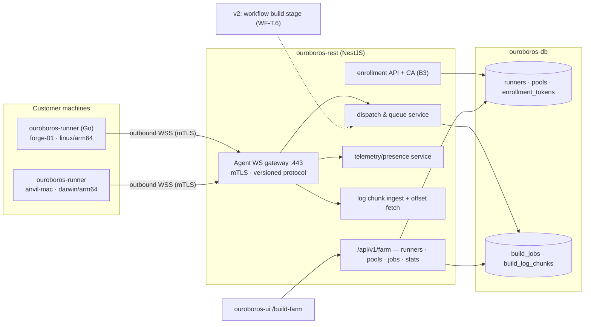
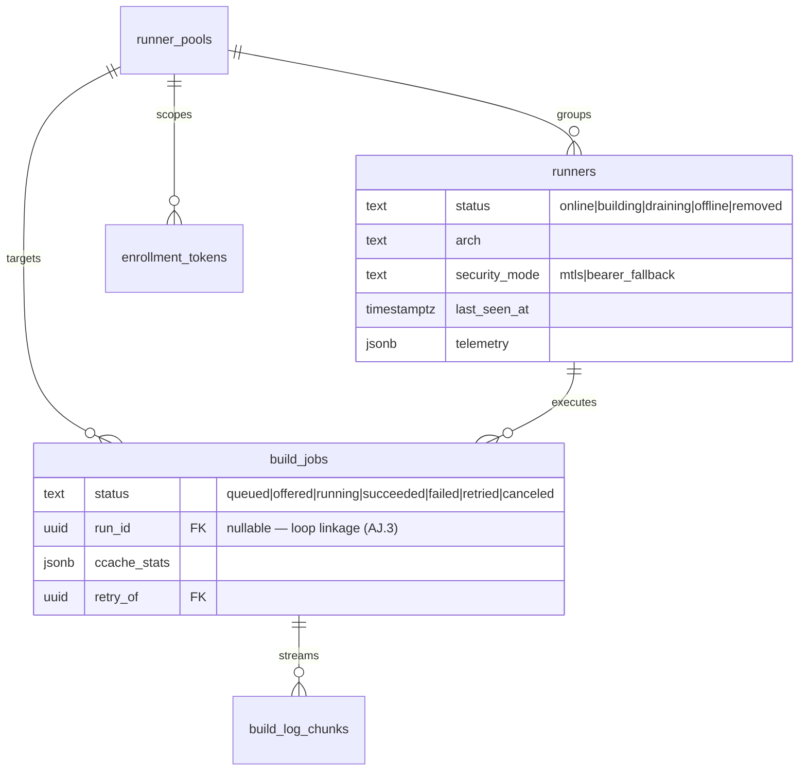
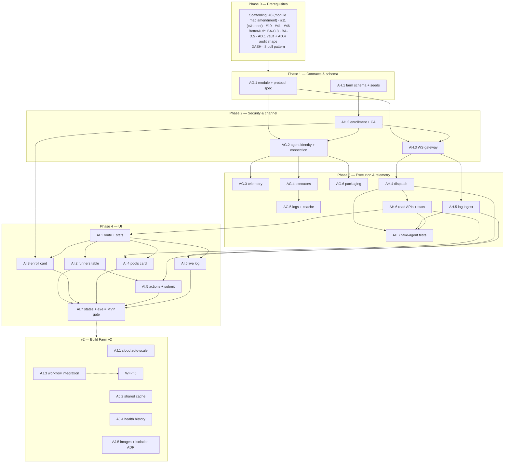

# Roadmap — Build Farm (Mockup 08)

## Description

> Create a roadmap that covers the features for the mockup page 08. Any additional
> tech infrastructure that is required to implement the functionality in these mockup
> pages should be researched and offered as options for implementing in the roadmap.
> The roamdap should include MVP and v2 options, as well as the labels, milestones,
> and the like, for the tickets to be created. Any ticket sources that are used by
> Ouroboros for ingesting should be pluggable, which includes sources like Jira,
> Linear, GitHub, GitLab, and other bug reporting/issue recording sites. Refer to the
> page so that issues can reference the mockup file when creating the UI/UX design of
> the pages. Be very specific when creating the roadmap, as the options in the
> roadmap for the functionality needs to be complete and very thorough.

## Context & Existing Work (duplicate-avoidance survey)

Surveyed 2026-08-08.

**Design source of truth for every UI ticket in this roadmap:**
[`docs/mockups/08-build-farm.html`](mockups/08-build-farm.html) (with
`docs/mockups/assets/ouroboros.css`) — the Build Farm. Its anatomy:

- **Page head** — eyebrow `Build Farm`, h1 `5 runners. 2 pools. 78% cache hits.`,
  subline: *"The Ouroboros server dispatches builds to your own machines over an
  **outbound-only agent connection** — your hardware, your network, **no inbound
  ports**."* Actions: **✦ Build Analyzer** (→ mockup 18), **Pool settings**,
  **+ Enroll runner** (primary).
- **Stat row** — *Runners online* `4/5` (`forge-03 offline · 2h`), *Builds today*
  `23` (`19 clean · 3 retried · 1 failed`), *Avg build time* `4m 12s`
  (`▼ 38s vs last week`), *Cache hit rate* `78%` with meter
  (`ccache · shared per pool`).
- **Runners table** (`c-8`, live pill `1 building`, `Health history →` link) —
  columns: Runner (mono name + arch line: `forge-01 linux/arm64`, `anvil-mac
  darwin/arm64`, `bigiron linux/x86_64`), Pool tag, Status pill (`building`
  pulse / `idle` / `draining` warn / `offline` err + `last seen 2h ago`),
  Current job (link → run detail: `#479 zephyr build · helios-firmware`,
  `#472 HIL test rig · finishing`), CPU meter + pct (warn at 82%), RAM
  (`14.2/32 GB`), Queue depth (`q:2`), Uptime (`41d`), actions `⋯` menu.
  Offline rows dimmed.
- **Enroll-a-runner card** — copy: run on any machine that can reach
  `ouroboros.acme.dev:443`, no inbound ports; the one-liner
  `curl -fsSL https://get.ouroboros.dev | sh -s -- --tenant acme-robotics
  --pool pool-a --token orb_enroll_••••`; *"The agent connects outbound over
  mTLS and registers itself."*; **Copy command**.
- **Pools card** (`Configure →`) — `pool-a` (*firmware builds · zephyr-sdk 0.17
  image · 3 runners*) with a **sub-toggle** *"Auto-scale to cloud when queue >
  5 / keep builds on-prem"* (off) and a pool-enabled switch; `pool-b`
  (*HIL & macOS jobs · 2 runners*).
- **Live log card** (`c-12`) — `LIVE — forge-01 · #479 Add OTA rollback on
  failed checksum`, building pill, elapsed `3m 41s`, **Full log ↗** (→ mockup
  10); streamed build output: `west build` invocation, ccache line
  (`hit 78.4% (412/525 objects)`), compile progress lines, the memory-region
  table, and an accent last line with a blinking cursor.

**What this page demands that nothing else has:** a **runner agent** — a daemon
on customer machines holding an outbound connection to the control plane — plus
enrollment security, job dispatch, telemetry, and log streaming. This is a **new
repo module** (`ouroboros-runner`), which amends the monorepo scaffolding
(#8 layout, #11 CI, #12 architecture docs, compose profiles).

**Overlapping work and dispositions:**

| Existing work | Disposition under this roadmap |
|---|---|
| WF-DSL `build({farm: "pool-a", cache: "ccache"})` stage; WF-T.6 execution (v2); DASH-J.3 run journaling | **Consumed later** — the workflow build stage dispatches farm jobs when execution lands (AJ.3). MVP farm jobs are user/API-submitted verification builds (decision B6 honesty). |
| Mockup 05 Loop Checks warn line (`pool-a has 1 runner offline`) — deferred by code-view C7 | **Enabled** — once this farm exists, W.2's checks payload may include real runner-pool status (amendment noted). |
| Scaffolding #8/#11/#12 (monorepo layout, CI, architecture doc), 7.1 compose | **Amended** — new `ouroboros-runner/` module (Go), `ci/runner` workflow, port/module map updates, dev-compose runner profile. |
| Routing/providers crypto (AD.1 envelope encryption), audit (AD.4/#26 shape) | **Reused** — enrollment tokens sealed by AD.1's vault service; enroll/drain/remove operations audited in the same shape. |
| DASH read-model (`runs`), INTAKE tickets | **Linked** — farm `build_jobs` reference runs/tickets when triggered by loops (AJ.3); MVP keeps a nullable linkage. |
| Mockup 18 (Build Analyzer), `Health history →` | **Out of scope** — head button and link are honest "soon" targets; AJ.4 lays the telemetry retention they need. |
| Pluggable ticket sources requirement (description boilerplate) | **Already satisfied** by WF Epic Q (SPI; Jira/Linear/GitLab as WF-T.2–T.4). Nothing source-specific here; noted, not duplicated. |
| Scaffolding #49 `/build-farm` placeholder, #56 e2e | **Superseded for `/build-farm`**; #56 gains a farm leg. |

Epic letters continue the sequence (…AC–AF): this roadmap uses **AG, AH, AI, AJ**.

## Infrastructure Options (researched — thorough, pick before filing)

### 1. Agent ↔ control-plane transport

| Option | Architecture | Fit | Trade-offs |
|---|---|---|---|
| **A — WebSocket over TLS 443, agent-initiated** ⭐ recommended | Agent dials out to `wss://…/agent` (the GitHub-Actions-runner pattern: outbound-only on 443, registration tokens); persistent duplex channel for dispatch, heartbeats, log chunks; versioned message protocol; reconnect with backoff + resumable state | Matches the subline literally (outbound-only, no inbound ports); proxy/firewall-friendly; NestJS has first-class WS gateways; one connection carries everything | Head-of-line blocking on one socket (mitigate: bounded log chunking); connection-state bookkeeping on the server |
| B — gRPC bidirectional streaming | HTTP/2 streams, protobuf typing | Strong contracts, efficient | Corporate proxies still mangle HTTP/2/gRPC more than WSS; second server stack in NestJS; Go client fine but server cost real |
| C — HTTPS long-poll + chunked upload | Agent polls for jobs, POSTs results/logs | Simplest possible; survives anything | Latency for dispatch + live logs; 3 request patterns instead of 1 protocol — more surface, not less |
| D — Message broker (NATS/MQTT) | Agents subscribe to a broker | Clean fan-out at fleet scale | New always-on infrastructure — contradicts the lightweight rule at MVP scale |

### 2. Agent implementation

| Option | What | Fit | Trade-offs |
|---|---|---|---|
| **A — Go, single static binary** ⭐ recommended | New `ouroboros-runner/` module; cross-compiled `linux/arm64`, `linux/x86_64`, `darwin/arm64` (exactly the mockup's arch set); ~10MB binary, no runtime deps; the pattern of GitHub's runner tooling (Runner Scale Set Client is Go) and Buildkite's agent | `curl \| sh` install is honest with a static binary; trivial daemonization (systemd/launchd); goroutines fit heartbeat+job+logs | Fourth language in the monorepo (Go joins TS/Python/SQL) — CI + conventions amendments (#8/#11) |
| B — Rust | Same static-binary story | Comparable | Slower iteration for this team profile; no advantage that pays here |
| C — Python (share engine toolchain) | uv-managed agent | Language reuse | Needs an interpreter on customer machines — kills the one-liner install promise |
| D — Node | — | — | Same runtime objection |

### 3. Enrollment & channel security (the mockup says mTLS)

| Option | Architecture | Fit | Trade-offs |
|---|---|---|---|
| **A — Short-lived enrollment token → control-plane CA issues per-runner client cert → mTLS channel** ⭐ recommended | `orb_enroll_…` token (scoped: tenant+pool, TTL, single/multi-use, sealed via AD.1) bootstraps registration; REST's embedded CA signs a per-runner cert (identity = runner id + tenant); agent stores key locally (0600), presents it for the WSS channel (mTLS terminated at the app or a TLS-proxy sidecar); rotation + revocation (CRL check at connect) | Delivers the mockup's mTLS claim for real; runner identity is cryptographic, not a bearer string; revocation = cert kill | An embedded CA is real responsibility (key custody via AD.1 KEK; documented in SECURITY_MODEL.md); TLS termination must pass client certs through (deployment note for reverse proxies) |
| B — Bearer runner-token over TLS 1.3 | Enrollment token exchanges for a long-lived per-runner secret | Much simpler; revocable server-side | Not mTLS — the UI copy would need weakening (honesty cost); token theft = impersonation until revoked |
| C — SPIFFE/SPIRE | Standard workload identity | Industrial-strength | Whole new infrastructure; wildly over-scale for MVP |

**Recommendation:** A, with B documented as the degraded mode behind badly-behaved
TLS-stripping proxies (explicit, logged, surfaced in the runner row).

### 4. Job execution on the runner

| Option | What | Fit | Trade-offs |
|---|---|---|---|
| **A — Per-pool executor kind: `container` \| `shell`** ⭐ recommended | pool-a-style pools run jobs in a pinned container image (`zephyr-sdk 0.17 image` — docker/podman required on the runner); pool-b-style pools (HIL rigs, macOS) run in a bare working directory with an allow-listed command environment | The mockup shows both worlds explicitly; per-pool choice keeps each honest | Two execution paths to test; shell pools need clear security framing (the runner runs what the tenant configures — documented trust model) |
| B — Containers only | Uniform sandbox | Simplest security story | Excludes macOS/HIL — half the mockup's fleet |
| C — MicroVMs (Firecracker) | Strongest isolation | Overkill; Linux-only; heavy ops | v2 candidate for untrusted-code scenarios, noted in AJ |

### 5. Build cache (the `78% · ccache · shared per pool` claim)

| Option | What | Fit | Trade-offs |
|---|---|---|---|
| **A — Runner-local ccache + honest stats reporting** ⭐ recommended MVP | Agent configures `CCACHE_DIR` per pool workspace, parses `ccache -s`/build-output stats, reports hit rates; "shared per pool" is true per-runner-persistent (Buildkite-style long-lived agents keep caches naturally); cross-runner sharing is the operator's NFS if they have it | Real hit rates with zero new infra; long-lived agents make caches effective | "Shared per pool" is per-runner in MVP — stat label says what's true (`ccache · per-runner`) until AJ.2 |
| B — Remote shared cache (sccache/S3-or-Redis, ccache remote storage) | True pool-wide sharing | The mockup's claim fully | New storage infra + cache-poisoning surface — v2 (AJ.2) |

### 6. Log transport & storage

| Option | What | Fit | Trade-offs |
|---|---|---|---|
| **A — Chunked append over the agent WS → Postgres chunk table (capped) → UI incremental fetch by offset** ⭐ recommended MVP | Bounded chunks (≤32KB, throttled), `build_log_chunks` with per-job byte caps + retention sweep; UI polls `?after=offset` on the DASH-I.8 cadence (SSE upgrade rides DASH-J.1) | One store (Postgres), simple resume, honest live-ness at poll cadence | Not sub-second "live"; DB growth managed by caps/retention |
| B — Object storage (S3/MinIO) for chunks | Cheap at scale | Right at fleet scale | New infra dependency now — v2 migration path documented |
| C — Direct runner→browser streaming | True realtime | Violates outbound-only (browser can't reach the runner) — **rejected** |

## Decisions proposed by this roadmap (validate before issue creation)

| # | Decision | Rationale |
|---|----------|-----------|
| B1 | **New module `ouroboros-runner/` (Go, static binary)**, joining the monorepo with its own conventions + `ci/runner` workflow; scaffolding #8/#11/#12 amended | Options 2-A; the one-liner install and three mockup architectures demand it. |
| B2 | **Transport = agent-initiated WebSocket over TLS 443** with a versioned message protocol (option 1-A); every message type documented in `docs/RUNNER_PROTOCOL.md` | Outbound-only is the page's core promise. |
| B3 | **Security = enrollment-token → control-plane CA → per-runner mTLS** (option 3-A), tokens sealed via AD.1, all lifecycle ops audited (AD.4 shape); bearer fallback exists but is visibly degraded | The mockup's mTLS claim made real; honesty when proxies force the fallback. |
| B4 | **Pools own executor kind (`container` \| `shell`) and an optional pinned image** (option 4-A); pool config carries env allow-list, workspace policy, concurrency per runner | pool-a vs pool-b are different execution worlds by design. |
| B5 | **Cache = local ccache with honest stats** (option 5-A); the stat label reads `ccache · per-runner` until remote sharing (AJ.2) makes `shared per pool` true | No claim ships before its mechanism. |
| B6 | **MVP jobs are API/UI-submitted builds** (per-repo build commands + pool verification jobs), not loop-driven: the farm is fully real, loop integration arrives with execution (AJ.3 + WF-T.6); `build_jobs.run_id` nullable from day one | The loop engine is v2 elsewhere; a farm that can only pretend to build would violate the honesty rule. |
| B7 | **Telemetry is push-based on the agent channel** (heartbeat @10s: CPU, RAM, queue depth, uptime, job progress); presence = missed-heartbeat threshold; `last seen` truthful; stats row computed from `build_jobs` history | The runners table is a live view, not a poll of dead rows. |
| B8 | **Live log = chunked WS → Postgres → offset fetch** (option 6-A) with per-job caps + retention; `Full log ↗` targets mockup 10's future surface but works standalone | Real streaming at honest cadence without new infra. |
| B9 | **Auto-scale-to-cloud is a stored preference labeled "arrives with cloud runners (v2)"** — the toggle persists but is explicitly inert (AJ.1 activates it) | The mockup shows the toggle off; storing intent + labeling truth beats hiding or faking it. |
| B10 | **Labels**: new `build-farm`; **Milestones**: `Build Farm MVP` / `Build Farm v2` created at filing; complexity chips XS–L | Description requires labels + milestones for the filing pass. |

## Architecture Overview



## MVP Definition

The MVP is **mockup 08 as a real, self-hosted build farm**: an installable agent,
secure enrollment, live telemetry, dispatchable builds, and streaming logs — with
loop integration explicitly deferred. It is done when, against the compose stack
(plus at least one real enrolled runner):

1. `/build-farm` reproduces
   [`docs/mockups/08-build-farm.html`](mockups/08-build-farm.html)
   pixel-faithfully in **both themes**: stat row, runners table with all five
   status archetypes, enroll card with a working copy-able command, pools card
   (incl. the B9-labeled auto-scale toggle), and the live log card.
2. **The agent is real**: `curl -fsSL …/install.sh | sh -s -- --tenant …
   --pool … --token …` installs the static Go binary on linux/arm64,
   linux/x86_64, and darwin/arm64, enrolls via a scoped token, receives an
   mTLS identity, connects outbound-only, survives restarts and reconnects
   with backoff.
3. **Telemetry is live**: heartbeats drive status pills (building/idle/
   draining/offline with truthful `last seen`), CPU/RAM meters, queue depth,
   and uptime; killing a runner flips it offline within the threshold.
4. **Builds run**: a build job (per-repo command in a pool's executor —
   container image or shell) can be submitted via API/UI, gets dispatched to
   an eligible runner, streams chunked logs to the live card (ccache stats
   parsed and reported per B5), and lands terminal states that feed the stat
   row (`19 clean · 3 retried · 1 failed` semantics).
5. **Lifecycle management works**: drain (finish current, accept none),
   un-drain, remove (guarded), enrollment-token minting/revocation
   (owner/admin, audited), pool enable/disable and pool CRUD with executor
   config.
6. Integration tests cover the protocol (contract-tested against a fake
   agent), enrollment/mTLS issuance, dispatch eligibility, presence
   transitions, log chunk caps, stats math, isolation; the e2e suite gains a
   farm leg using a containerized runner.
7. Seeds provide the mockup's fleet for design review (five runners, two
   pools, historical jobs shaping every stat) — clearly dev-only, since real
   runners are live entities.

**Explicitly v2 (milestone `Build Farm v2`):** cloud auto-scale runners (AJ.1),
remote shared cache (AJ.2), workflow build-stage integration (AJ.3), health
history + Build Analyzer telemetry foundation (AJ.4), pool image registry &
microVM isolation evaluation (AJ.5).

## Epics, Labels & Milestones

Each epic is a parent tracking issue on GitHub; every roadmap issue below is filed as
one of its sub-issues (GitHub Relationships).

| Epic | GitHub | Status | Name | Goal | Modules | Milestone |
|------|:------:|:------:|------|------|---------|-----------|
| AG | #239 | 🟡 Open | Runner Agent (`ouroboros-runner`) | Go agent: protocol, executors, telemetry, logs, packaging, CI | ouroboros-runner (new) | Build Farm MVP |
| AH | #240 | 🟡 Open | Farm Control Plane | Schema, enrollment/CA, WS gateway, dispatch, telemetry, logs, stats | ouroboros-rest, ouroboros-db | Build Farm MVP |
| AI | #241 | 🟡 Open | Build Farm UI | Stats, runners table, enroll/pools cards, live log, states, e2e | ouroboros-ui | Build Farm MVP |
| AJ | #242 | 🟡 Open | Scale & Loop Integration (v2) | Cloud auto-scale, shared cache, workflow builds, health history | all | Build Farm v2 |

Issue naming: `<project>: [<epic>.<issue>] <title>`. Labels: existing set (`mvp`,
`v2`, `rest`, `db`, `ui`, `ci`, `design`, `infra`) **plus new `build-farm`**
(decision B10). Milestones **`Build Farm MVP`** / **`Build Farm v2`** created at
filing; every issue assigned. Complexity chips: **XS · S · M · L**.

---

## Epic AG (#239) — Runner Agent (`ouroboros-runner`, new Go module)

| Ref | GitHub | Status | Title | Summary | Labels | Parallel | MVP | Complexity | Affected Modules |
|-----|:------:|:------:|-------|---------|--------|:--------:|:---:|:----------:|------------------|
| AG.1 | #243 | 🟡 Open | ouroboros-runner: [AG.1] Module scaffold & agent protocol spec | Go module, conventions, `docs/RUNNER_PROTOCOL.md`, ci/runner | mvp, build-farm, infra, ci | N (after #8) | Y | M | ouroboros-runner, .github, docs |
| AG.2 | #244 | 🟡 Open | ouroboros-runner: [AG.2] Enrollment, identity & connection loop | Token bootstrap, mTLS cert, outbound WSS, reconnect/backoff | mvp, build-farm | N (after AG.1, AH.2) | Y | L | ouroboros-runner |
| AG.3 | #245 | 🟡 Open | ouroboros-runner: [AG.3] Telemetry & presence reporting | Heartbeats: CPU/RAM/queue/uptime/job progress | mvp, build-farm | N (after AG.2) | Y | S | ouroboros-runner |
| AG.4 | #246 | 🟡 Open | ouroboros-runner: [AG.4] Job executors (container & shell) | Per-pool executor kinds, workspace lifecycle, cancellation | mvp, build-farm | N (after AG.2) | Y | L | ouroboros-runner |
| AG.5 | #247 | 🟡 Open | ouroboros-runner: [AG.5] Log shipping & ccache stats | Bounded chunk streaming, ccache stat parsing, truncation honesty | mvp, build-farm | N (after AG.4) | Y | M | ouroboros-runner |
| AG.6 | #248 | 🟡 Open | ouroboros-runner: [AG.6] Packaging, install script & daemonization | Cross-compiled releases, `install.sh`, systemd/launchd units | mvp, build-farm, infra | N (after AG.2) | Y | M | ouroboros-runner, .github |

### Issue AG.1 — ouroboros-runner: [AG.1] Module scaffold & agent protocol spec

> **GitHub issue:** #243 · **Status:** 🟡 Open · **Parent epic:** #239


- **Problem Statement:** The agent is a new module in a new language (decision
  B1); before any code, the module needs conventions and the wire protocol
  needs a written contract both sides implement against (decision B2).
- **Solution/Scope:** `ouroboros-runner/` scaffold: Go 1.24+, module layout
  (`cmd/ouroboros-runner`, `internal/{conn,exec,telemetry,logship}`),
  golangci-lint, `go test`, Makefile; `ci/runner` workflow (path-filtered per
  #11's pattern: lint → test → cross-compile matrix); **`docs/RUNNER_PROTOCOL.md`**:
  versioned message envelope (`{v, type, id, payload}`), message types
  (`hello/ack`, `heartbeat`, `job.offer/accept/decline`, `job.start/progress/
  finish`, `log.chunk`, `drain/undrain`, `bye`), reconnect + resume semantics
  (undelivered terminal states re-sent with idempotency ids), version
  negotiation (server may refuse ancient agents — the GitHub-runner
  minimum-version pattern). Scaffolding amendments filed: #8 (module map +
  Go conventions), #12 (architecture doc).
- **Acceptance Criteria:**
  - `ci/runner` green on the scaffold across the three target platforms
    (build only for cross targets).
  - Protocol doc covers every message with schema + example; both AG.2 and
    AH.3 implement from it (drift caught by shared golden fixtures).
  - Amendments posted on #8/#11/#12.
- **Parallelism/Dependencies:** Needs #8. Blocks all AG/AH protocol work.
- **Technical Stack:** Go, golangci-lint, GitHub Actions matrix.
- **Epic:** AG

```
docs/RUNNER_PROTOCOL.md (v1)
  hello → ack(session) · heartbeat(10s) · job.offer ⇄ accept/decline
  job.start/progress/finish(idempotent) · log.chunk(≤32KB, throttled) · drain/bye
```

### Issue AG.2 — ouroboros-runner: [AG.2] Enrollment, identity & connection loop

> **GitHub issue:** #244 · **Status:** 🟡 Open · **Parent epic:** #239


- **Problem Statement:** The one-liner's promise — token in, registered
  mTLS-identified runner out, outbound-only forever after (decision B3).
- **Solution/Scope:** Enrollment: `--tenant --pool --token` → HTTPS
  registration call → receives runner id + client cert/key (stored 0600 in the
  agent state dir) + server CA pin; connection loop: outbound WSS with client
  cert, `hello` handshake (agent version, arch, hostname, capabilities:
  docker present?), exponential backoff + jitter reconnect, session resume
  (idempotent re-delivery per protocol), clean `bye` on SIGTERM; cert renewal
  before expiry over the established channel; bearer-fallback mode (B3) only
  on explicit flag, reported in `hello` so the server can surface degraded
  security in the runner row.
- **Acceptance Criteria:**
  - Enroll → connect → heartbeat against the AH gateway in compose; token
    single-use enforcement observed (second use fails).
  - Kill/restart the agent: reconnects with backoff, resumes cleanly, no
    duplicate terminal states (idempotency verified).
  - Cert renewal exercised with a short-TTL test cert; revoked cert →
    connection refused + clear agent log.
- **Parallelism/Dependencies:** Needs AG.1, AH.2. Blocks AG.3–AG.5.
- **Technical Stack:** Go (crypto/tls, gorilla/nhooyr websocket), state dir.
- **Epic:** AG

```
enroll(token) ─▶ {runner_id, cert, ca_pin} ─▶ wss:// (mTLS, outbound) ─▶ hello/ack
   ↺ reconnect: backoff+jitter · resume(session) · renewal before expiry
```

### Issue AG.3 — ouroboros-runner: [AG.3] Telemetry & presence reporting

> **GitHub issue:** #245 · **Status:** 🟡 Open · **Parent epic:** #239


- **Problem Statement:** The runners table's live columns — CPU, RAM, queue,
  uptime, status — come from agent truth (decision B7).
- **Solution/Scope:** Heartbeat every 10s (configurable): CPU percent
  (short-window average), RAM used/total, agent uptime, queue depth (accepted-
  not-started), current-job progress marker; gopsutil-class collection across
  the three platforms; jittered send; suppressed fields degrade to `null`
  (never fabricated — e.g., containers without full metrics access).
- **Acceptance Criteria:** Heartbeats visible server-side within one interval;
  metric parity spot-checked against `top` on each platform; null-field
  handling rendered as em-dash downstream.
- **Parallelism/Dependencies:** Needs AG.2.
- **Technical Stack:** Go, gopsutil.
- **Epic:** AG

```
heartbeat{cpu: 82, ram: [14.2, 32], q: 2, up: 41d, job: {id, phase}} @10s ± jitter
```

### Issue AG.4 — ouroboros-runner: [AG.4] Job executors (container & shell)

> **GitHub issue:** #246 · **Status:** 🟡 Open · **Parent epic:** #239


- **Problem Statement:** pool-a builds run in a pinned SDK image; pool-b runs
  bare on HIL/macOS rigs — one agent, two executor kinds (decision B4).
- **Solution/Scope:** Job payload: `{job_id, executor: container|shell,
  image?, workdir policy, command, env (allow-listed), timeouts, cache:
  {ccache_dir}}`; container executor: docker/podman detection, image
  pull-if-missing (progress reported), workspace mount, resource limits,
  exit-code capture; shell executor: dedicated workspace dir per job,
  environment scrubbing to the allow-list, no shell-expansion of server data
  (argv-exec), documented trust model (the tenant's own machine runs the
  tenant's own command); both: cancellation (SIGTERM→KILL grace), artifact-
  free MVP (logs only), cleanup policy (keep-workspace-on-failure flag),
  concurrent-job cap per runner (default 1, pool-configurable).
- **Acceptance Criteria:**
  - Container job runs in compose against a small image; shell job runs on a
    bare runner; both capture exit codes + durations.
  - Cancellation mid-build terminates the process tree within grace.
  - Missing docker on a shell-only runner declines container offers
    (capability honesty from `hello`).
- **Parallelism/Dependencies:** Needs AG.2. Blocks AG.5.
- **Technical Stack:** Go, docker/podman CLI or API, os/exec.
- **Epic:** AG

```
job.offer{executor: container, image: zephyr-sdk:0.17} ─▶ accept ─▶ pull? ─▶ run ─▶ finish{exit, 4m12s}
job.offer{executor: shell} on runner without docker ─▶ accept (capability match)
```

### Issue AG.5 — ouroboros-runner: [AG.5] Log shipping & ccache stats

> **GitHub issue:** #247 · **Status:** 🟡 Open · **Parent epic:** #239


- **Problem Statement:** The live log card and the cache stat need agent-side
  truth: bounded streaming and parsed ccache numbers (decisions B5/B8).
- **Solution/Scope:** Stdout/stderr multiplexed into ordered chunks (≤32KB,
  min-interval throttle, backpressure-aware — drop-to-summary mode if the
  channel stalls, with an explicit `[… N bytes elided]` marker, never silent
  loss); per-job byte cap honored agent-side too; ccache integration: set
  `CCACHE_DIR` per pool workspace, run `ccache -s --json` (or parse text)
  post-build, attach `{hits, misses, hit_rate}` to `job.finish`; absent
  ccache → stats omitted (null, not zero).
- **Acceptance Criteria:** A noisy build streams without unbounded memory;
  elision markers appear under forced backpressure; ccache stats match a
  manual `ccache -s` run; no-ccache builds report null cleanly.
- **Parallelism/Dependencies:** Needs AG.4.
- **Technical Stack:** Go, ccache CLI.
- **Epic:** AG

```
stdout ─▶ chunker(≤32KB, throttled, ordered) ─▶ log.chunk*
job.finish += {ccache: {hit_rate: 78.4, hits: 412, misses: 113} | null}
```

### Issue AG.6 — ouroboros-runner: [AG.6] Packaging, install script & daemonization

> **GitHub issue:** #248 · **Status:** 🟡 Open · **Parent epic:** #239


- **Problem Statement:** `curl -fsSL https://get.ouroboros.dev | sh` with
  tenant/pool/token flags must produce a running, persistent agent on all
  three platforms.
- **Solution/Scope:** Release pipeline (extends `ci/runner`): cross-compiled,
  versioned, checksummed binaries (linux/arm64, linux/x86_64, darwin/arm64)
  published as GitHub release artifacts; `install.sh`: platform detection,
  checksum verification, install to `/usr/local/bin` + state dir creation,
  flag pass-through to enrollment, daemon setup (systemd unit on Linux,
  launchd plist on macOS) with restart-on-failure; `--uninstall`; the
  server-rendered enroll command (AI.3) pins the exact script URL + version;
  self-hosted deployments serve the script from their own origin
  (no hard dependency on a public domain — configurable base, honesty about
  the mockup's `get.ouroboros.dev`).
- **Acceptance Criteria:** Fresh Linux VM and macOS machine: one-liner →
  enrolled, running, survives reboot; checksums verified; uninstall clean;
  script passes shellcheck.
- **Parallelism/Dependencies:** Needs AG.2 (+release infra from #11 patterns).
- **Technical Stack:** Go releases, shell, systemd/launchd.
- **Epic:** AG

```
install.sh: detect platform ─▶ fetch+verify binary ─▶ enroll(flags) ─▶ systemd/launchd unit ─▶ running
```

---

## Epic AH (#240) — Farm Control Plane (`ouroboros-rest` + `ouroboros-db`)

| Ref | GitHub | Status | Title | Summary | Labels | Parallel | MVP | Complexity | Affected Modules |
|-----|:------:|:------:|-------|---------|--------|:--------:|:---:|:----------:|------------------|
| AH.1 | #249 | 🟡 Open | ouroboros-db: [AH.1] Farm schema — runners, pools, jobs, tokens, logs | Full relational model + seeds + ci/db probes | mvp, build-farm, db, ci | N (after #19, BA-B.3) | Y | L | ouroboros-db, .github |
| AH.2 | #250 | 🟡 Open | ouroboros-rest: [AH.2] Enrollment API & runner CA | Scoped tokens (AD.1-sealed), cert issuance/renewal/revocation, audit | mvp, build-farm, rest | N (after AH.1, AD.1) | Y | L | ouroboros-rest |
| AH.3 | #251 | 🟡 Open | ouroboros-rest: [AH.3] Agent WebSocket gateway | Protocol server: sessions, presence, heartbeat ingest, resume | mvp, build-farm, rest | N (after AG.1, AH.2) | Y | L | ouroboros-rest |
| AH.4 | #252 | 🟡 Open | ouroboros-rest: [AH.4] Build job dispatch & queueing | Submission API, eligibility (pool/executor/capacity), offers, retries | mvp, build-farm, rest | N (after AH.3) | Y | M | ouroboros-rest |
| AH.5 | #253 | 🟡 Open | ouroboros-rest: [AH.5] Log ingest & retrieval | Chunk persistence with caps/retention, offset fetch for the UI | mvp, build-farm, rest | N (after AH.3) | Y | M | ouroboros-rest |
| AH.6 | #254 | 🟡 Open | ouroboros-rest: [AH.6] Farm read APIs & stats | Runners/pools/jobs payloads, stat-row math, lifecycle actions | mvp, build-farm, rest | N (after AH.4) | Y | M | ouroboros-rest |
| AH.7 | #255 | 🟡 Open | ouroboros-rest: [AH.7] Farm integration tests (fake agent) | Protocol contract, dispatch matrix, presence, caps, isolation | mvp, build-farm, rest, ci | N (after AH.4–AH.6) | Y | M | ouroboros-rest |

### Issue AH.1 — ouroboros-db: [AH.1] Farm schema — runners, pools, jobs, tokens, logs

> **GitHub issue:** #249 · **Status:** 🟡 Open · **Parent epic:** #240


- **Problem Statement:** Every farm surface needs relational truth: fleets,
  pools with executor config, job lifecycle, enrollment tokens, log chunks.
- **Solution/Scope:** Migration: `runner_pools` — id, org FK, `name` (unique
  per org), `description`, `executor` CHECK `container|shell`, `image`
  (nullable, container pools), `env_allowlist` jsonb, `max_concurrency` per
  runner, `enabled`, `autoscale_pref` jsonb (B9 stored-inert);
  `runners` — id, org FK, pool FK, `name` (unique per org), `arch`
  (`linux/arm64|linux/x86_64|darwin/arm64`), `status` CHECK
  `online|building|draining|offline|removed`, `last_seen_at`, `agent_version`,
  `capabilities` jsonb, `security_mode` CHECK `mtls|bearer_fallback` (B3
  visibility), `enrolled_at/by`, `cert_serial`, `uptime_seconds`, live
  telemetry snapshot jsonb; `enrollment_tokens` — org FK, pool FK, sealed
  token (AD.1), TTL, `max_uses/uses`, revoked, created_by;
  `build_jobs` — id, org FK, pool FK, runner FK (nullable until assigned),
  `run_id` FK nullable (B6 — future loop linkage), repo ref, command/image
  snapshot, `status` CHECK `queued|offered|running|succeeded|failed|retried|
  canceled`, timings, exit code, `ccache_stats` jsonb (nullable),
  `retry_of` self-FK; `build_log_chunks` — job FK, `seq`, `byte_start`,
  content (bytea), with per-job byte-cap trigger + retention sweep metadata.
  Indexes for presence sweeps, queue depth, stats windows. Seeds: the mockup
  fleet (five runners incl. offline forge-03 at `last_seen -2h`, two pools
  with the mockup meta), historical jobs shaping every stat (23 today: 19/3/1;
  avg 4m12s with prior-week delta; 78% cache), a live `#479` job with log
  chunks matching the mockup listing. ci/db probes (status vocab, cap
  trigger, unique names, token TTL).
- **Acceptance Criteria:** Migration applies cleanly; cap trigger truncates
  with marker metadata; seeds render the whole page; probes red/green
  verified.
- **Parallelism/Dependencies:** Needs #19, BA-B.3 (+AD.1 for sealing). Blocks
  everything AH.
- **Technical Stack:** PostgreSQL 17, Flyway.
- **Epic:** AH



### Issue AH.2 — ouroboros-rest: [AH.2] Enrollment API & runner CA

> **GitHub issue:** #250 · **Status:** 🟡 Open · **Parent epic:** #240


- **Problem Statement:** Decision B3's chain — scoped token → registration →
  per-runner client cert — plus lifecycle (renewal, revocation) and audit.
- **Solution/Scope:** Token minting API (owner/admin: pool scope, TTL,
  max-uses; sealed via AD.1; masked display after creation; revocation);
  registration endpoint (token validation → runner row → CSR-less server-side
  keypair or agent-CSR flow, decided in-issue → cert signed by the **farm
  CA** (CA key sealed via AD.1 KEK, documented in `SECURITY_MODEL.md`
  amendment); renewal over the authenticated channel; revocation list checked
  at gateway handshake; every operation audited (AD.4 shape:
  `runner.enrolled|token_minted|token_revoked|cert_renewed|removed`);
  bearer-fallback registration gated by an org setting, marked in
  `security_mode`.
- **Acceptance Criteria:** Token TTL/uses enforced; revoked cert refused at
  handshake (test); CA key never leaves the vault service (grep/lint);
  audit rows complete; fallback visibly flagged.
- **Parallelism/Dependencies:** Needs AH.1, AD.1. Blocks AG.2, AH.3.
- **Technical Stack:** NestJS, node:crypto X.509 (or smallstep lib), AD.1.
- **Epic:** AH

```
mint(pool-a, ttl 24h, uses 5) ─▶ orb_enroll_…(sealed, audited)
register(token) ─▶ runner row + cert{CN: runner_id, O: tenant} ─▶ mTLS thereafter
```

### Issue AH.3 — ouroboros-rest: [AH.3] Agent WebSocket gateway

> **GitHub issue:** #251 · **Status:** 🟡 Open · **Parent epic:** #240


- **Problem Statement:** The server half of the AG.1 protocol: sessions,
  presence, heartbeat ingest, resumable delivery — the farm's nervous system.
- **Solution/Scope:** NestJS WS gateway on the agent path (mTLS client-cert
  verification, deployment notes for proxy pass-through per B3): `hello`
  validation (version floor, capability capture), session registry
  (connection ↔ runner row), heartbeat ingest → telemetry snapshot + presence
  (missed-N-heartbeats → offline with truthful `last_seen_at`), ordered
  delivery with resume (undelivered `job.offer`/acks re-sent on reconnect,
  idempotency ids honored), drain/undrain push, protocol golden-fixture
  tests shared with AG.1, connection metrics (for AJ.4).
- **Acceptance Criteria:** Fake-agent contract suite passes both directions;
  presence flips at the documented threshold and recovers; resume delivers
  exactly-once semantics for terminal messages; version-floor refusal path
  tested.
- **Parallelism/Dependencies:** Needs AG.1 (spec), AH.2. Blocks AH.4, AH.5.
- **Technical Stack:** NestJS WS (ws), protocol fixtures.
- **Epic:** AH

```
wss handshake (client cert ⊨ CA, not revoked) ─▶ hello{v, arch, caps} ─▶ ack{session}
heartbeat ─▶ telemetry + presence   missed×3 ─▶ offline (last_seen honest)
```

### Issue AH.4 — ouroboros-rest: [AH.4] Build job dispatch & queueing

> **GitHub issue:** #252 · **Status:** 🟡 Open · **Parent epic:** #240


- **Problem Statement:** Jobs must find eligible runners (pool, executor
  capability, capacity), be offered, tracked through the lifecycle, and
  retried per policy — the `q:2` depths and `3 retried` stat come from here.
- **Solution/Scope:** Submission API (`POST /api/v1/farm/jobs` — pool, repo
  ref, command or pool-default; member+ role; B6 scope: user/API-submitted)
  and internal submission surface (AJ.3's future entry point); dispatch
  service: eligibility (pool match, executor capability from `hello`,
  concurrency cap, not draining), offer → accept/decline → assignment,
  queue-depth accounting per runner, timeout/lost-runner requeue (once, then
  failed), retry policy (`retried` = auto-retry on infra-classed failures,
  bounded), cancellation API; job state machine mirrors AH.1 vocab with
  transition validation.
- **Acceptance Criteria:** Dispatch matrix in the harness (capability,
  drain, capacity, offline); runner death mid-job → requeue-once → second
  failure terminal; cancel propagates to the agent; queue depths accurate
  under concurrent submission.
- **Parallelism/Dependencies:** Needs AH.3. Blocks AH.6, AI.5.
- **Technical Stack:** NestJS, Kysely transactions.
- **Epic:** AH

```
submit(pool-a, west build…) ─▶ eligible: forge-01(q:2)❌cap, forge-02(idle)✓ ─▶ offer ─▶ running
runner lost ─▶ requeue(once) ─▶ retried │ failed    drain: finish current, no offers
```

### Issue AH.5 — ouroboros-rest: [AH.5] Log ingest & retrieval

> **GitHub issue:** #253 · **Status:** 🟡 Open · **Parent epic:** #240


- **Problem Statement:** Chunked agent logs must persist within caps and
  reach the UI incrementally (decision B8).
- **Solution/Scope:** Chunk ingest on the gateway path (seq-ordered append,
  byte-cap enforcement with elision marker coordination per AG.5, per-org
  rate guard); retrieval API: `GET /api/v1/farm/jobs/:id/log?after=<offset>`
  (returns new bytes + next offset + live flag) on the DASH-I.8 poll cadence;
  retention sweep (terminal jobs: keep N days / M bytes per org, policy
  documented); `Full log ↗` payload shape ready for mockup 10's future
  surface.
- **Acceptance Criteria:** Ordered reassembly under out-of-order arrival;
  offset fetch resumes exactly; caps + retention verified; live flag
  truthful.
- **Parallelism/Dependencies:** Needs AH.3. Feeds AI.6.
- **Technical Stack:** NestJS, Kysely, bytea handling.
- **Epic:** AH

```
log.chunk(seq, bytes) ─▶ append(cap-aware) ─▶ GET ?after=18122 ─▶ {bytes, next: 24576, live: true}
```

### Issue AH.6 — ouroboros-rest: [AH.6] Farm read APIs & stats

> **GitHub issue:** #254 · **Status:** 🟡 Open · **Parent epic:** #240


- **Problem Statement:** The page's read surfaces — runners table, pools,
  stat row, enroll-command rendering — plus lifecycle actions (drain,
  remove, pool CRUD).
- **Solution/Scope:** `GET /api/v1/farm` (runners with live telemetry +
  security-mode flags, pools with meta/counts, current live job ref);
  stat-row service: runners online x/y + most-recent-offline note, builds
  today (clean/retried/failed split), avg build time with prior-week delta,
  cache hit rate (weighted from `ccache_stats`, label per B5, em-dash when
  no data); lifecycle: drain/undrain (push via AH.3), remove (guarded:
  offline or drained only), pool CRUD + enable/disable + autoscale_pref
  storage (B9); enroll-command endpoint (renders the exact one-liner with a
  freshly minted token, server-origin-aware per AG.6). Role gates: member
  read, admin+ mutate.
- **Acceptance Criteria:** Seeded payloads reproduce every mockup number;
  stats windows verified (day boundary, empty org → zeros/em-dashes);
  drain round-trips to a live fake agent; remove guard enforced.
- **Parallelism/Dependencies:** Needs AH.4 (+AH.1 seeds). Feeds AI.*.
- **Technical Stack:** NestJS, Kysely.
- **Epic:** AH

```
GET /farm ─▶ {stats{4/5, 23(19·3·1), 4m12s ▼38s, 78%}, runners[5], pools[2], live: #479}
POST /runners/:id/drain ─▶ push drain ─▶ status: draining
```

### Issue AH.7 — ouroboros-rest: [AH.7] Farm integration tests (fake agent)

> **GitHub issue:** #255 · **Status:** 🟡 Open · **Parent epic:** #240


- **Problem Statement:** Protocol, dispatch, presence, and caps are
  distributed-systems behavior — the harness needs a scriptable fake agent.
- **Solution/Scope:** `FakeAgent` (TS, protocol-conformant, scriptable
  scenarios): full-lifecycle suites (enroll → connect → heartbeat → job →
  logs → finish), presence transitions, resume/idempotency, dispatch matrix,
  log caps/ordering, token lifecycle, org isolation across all farm routes;
  golden protocol fixtures shared with the Go agent's tests (cross-language
  drift guard).
- **Acceptance Criteria:** Green in `ci/rest`; protocol fixture drift between
  Go and TS fails CI; ≤ 90s added.
- **Parallelism/Dependencies:** Needs AH.4–AH.6.
- **Technical Stack:** Jest, ws, Testcontainers.
- **Epic:** AH

```
FakeAgent scripts: happy ✓ · lost-runner requeue ✓ · resume ✓ · caps ✓ · isolation ✓
golden fixtures ⇄ Go agent tests (one protocol, two implementations)
```

---

## Epic AI (#241) — Build Farm UI (`ouroboros-ui`)

Every issue references
[`docs/mockups/08-build-farm.html`](mockups/08-build-farm.html) as the design
source — stat row, runners table, enroll/pools cards, live log treatments — via
the #16 tokens (both themes; the mockup is dark-only).

| Ref | GitHub | Status | Title | Summary | Labels | Parallel | MVP | Complexity | Affected Modules |
|-----|:------:|:------:|-------|---------|--------|:--------:|:---:|:----------:|------------------|
| AI.1 | #256 | 🟡 Open | ouroboros-ui: [AI.1] Build Farm route, head & stat row | `/build-farm` frame, live stats, honest head actions | mvp, build-farm, ui, design | N (after #41, AH.6, BA-D.5) | Y | S | ouroboros-ui |
| AI.2 | #257 | 🟡 Open | ouroboros-ui: [AI.2] Runners table (live) | Five status archetypes, telemetry cells, live refresh | mvp, build-farm, ui, design | N (after AI.1) | Y | L | ouroboros-ui |
| AI.3 | #258 | 🟡 Open | ouroboros-ui: [AI.3] Enroll-runner card & token flow | Command rendering with minted token, copy, token management | mvp, build-farm, ui | N (after AI.1, AH.2) | Y | M | ouroboros-ui |
| AI.4 | #259 | 🟡 Open | ouroboros-ui: [AI.4] Pools card & configuration | Pool rows, executor config sheet, honest auto-scale toggle | mvp, build-farm, ui, design | N (after AI.1, AH.6) | Y | M | ouroboros-ui |
| AI.5 | #260 | 🟡 Open | ouroboros-ui: [AI.5] Runner actions & job submission | Drain/undrain/remove menu; submit-build flow | mvp, build-farm, ui | N (after AI.2, AH.4) | Y | M | ouroboros-ui |
| AI.6 | #261 | 🟡 Open | ouroboros-ui: [AI.6] Live log card | Offset-streamed log, ANSI-safe rendering, cursor, full-log path | mvp, build-farm, ui, design | N (after AI.1, AH.5) | Y | M | ouroboros-ui |
| AI.7 | #262 | 🟡 Open | ouroboros-ui: [AI.7] Farm states & e2e leg | Empty/no-runners guidance, read-only, themes, e2e | mvp, build-farm, ui, ci | N (after AI.1–AI.6) | Y | M | ouroboros-ui, .github |

### Issue AI.1 — ouroboros-ui: [AI.1] Build Farm route, head & stat row

> **GitHub issue:** #256 · **Status:** 🟡 Open · **Parent epic:** #241


- **Problem Statement:** The frame: headline composed from live counts
  (`5 runners. 2 pools. 78% cache hits.`), the outbound-only subline, and
  honest head actions.
- **Solution/Scope:** Replace the #49 placeholder: head with computed
  headline (real counts; cache label per B5), **✦ Build Analyzer** as honest
  "soon" (mockup 18), **Pool settings** → AI.4 sheet, **+ Enroll runner** →
  AI.3; stat row via the shared StatCard composition (DASH-I.2): runners
  online with offline note, builds today with clean/retried/failed delta,
  avg build time with ▼ delta (down-is-good coloring), cache hit rate with
  inline meter + honest label; polling via the I.8 pattern.
- **Acceptance Criteria:** Seeded stats reproduce the mockup; empty org shows
  zeros/em-dashes; both themes; #49 stub retired (amendment).
- **Parallelism/Dependencies:** Needs #41, AH.6, BA-D.5. Blocks AI.2–AI.6.
- **Technical Stack:** Next.js, #46 primitives, I.8 poll hook family.
- **Epic:** AI

```
[Build Farm] 5 runners. 2 pools. 78% cache hits.   [✦ Analyzer·soon][Pool settings][+ Enroll]
(4/5 online · forge-03 2h)(23 · 19/3/1)(4m12s ▼38s)(78% ▓▓▓ · ccache · per-runner)
```

### Issue AI.2 — ouroboros-ui: [AI.2] Runners table (live)

> **GitHub issue:** #257 · **Status:** 🟡 Open · **Parent epic:** #241


- **Problem Statement:** The fleet view: five status archetypes with live
  telemetry cells, updating on the poll cadence without jank.
- **Solution/Scope:** #46 Table per the mockup: runner cell (mono name + arch
  line), pool tag, status pill mapping
  (building/pulse · idle · draining/warn · offline/err + relative last-seen;
  `bearer_fallback` runners get a subtle shield-warning affix per B3),
  current-job cell (link — target honest: run detail when it exists, job
  sheet meanwhile), CPU cell (meter + pct, warn ≥ 80), RAM mono
  (`14.2/32 GB` formatting), queue depth (`q:N`), uptime (compact), overflow
  `⋯` → AI.5 menu; offline rows dimmed per the mockup; stable sort (pool,
  name) with status grouping option; smooth value transitions (no full-row
  re-render flicker).
- **Acceptance Criteria:** Seeded table matches the mockup row-for-row in
  both themes; killing the compose fake runner flips its row within the
  presence threshold; telemetry nulls render em-dash; keyboard navigation.
- **Parallelism/Dependencies:** Needs AI.1. Blocks AI.5.
- **Technical Stack:** React, #46 Table/Meter/Pill.
- **Epic:** AI

```
forge-01 linux/arm64 [pool-a] (●building) #479 zephyr build ▓▓▓▓░ 82% 14.2/32GB q:2 41d ⋯
forge-03 linux/arm64 [pool-a] (●offline · last seen 2h)  —  —  —  q:0  —  ⋯   (dimmed)
```

### Issue AI.3 — ouroboros-ui: [AI.3] Enroll-runner card & token flow

> **GitHub issue:** #258 · **Status:** 🟡 Open · **Parent epic:** #241


- **Problem Statement:** The enroll card must render a *working* command —
  which means minting a real scoped token behind an admin action, not
  printing a placeholder.
- **Solution/Scope:** Card per the mockup: explainer with the deployment's
  real host, command block rendered from AH.6's endpoint (pool selector;
  token minted on demand with TTL/uses shown; masked in the visible block,
  full value only in the copy payload with a "copied — treat as a secret"
  toast), **Copy command**, token-management link (list/revoke active
  enrollment tokens — small sheet); mTLS note verbatim; member role sees
  the card without mint/copy (read-only explainer).
- **Acceptance Criteria:** Copied command enrolls a real agent against
  compose; token appears in the management sheet and revokes; masked
  rendering verified (no secret in DOM until copy); admin-gated.
- **Parallelism/Dependencies:** Needs AI.1, AH.2/AH.6.
- **Technical Stack:** React, clipboard API.
- **Epic:** AI

```
[pool-a ▾]  curl -fsSL https://<host>/install.sh | sh -s -- --tenant acme --pool pool-a --token orb_••••
[Copy command] → full token in clipboard only · [Manage tokens →]
```

### Issue AI.4 — ouroboros-ui: [AI.4] Pools card & configuration

> **GitHub issue:** #259 · **Status:** 🟡 Open · **Parent epic:** #241


- **Problem Statement:** Pools carry the executor policy (B4) and the
  honestly-inert auto-scale preference (B9); the card + a config sheet make
  them manageable.
- **Solution/Scope:** Card per the mockup: pool rows (mono name, meta line
  composed from executor/image/runner-count truth), enable switch, the
  auto-scale sub-toggle rendered with its stored value **plus the explicit
  `arrives with cloud runners (v2)` affix** (B9 honesty); `Configure →` sheet:
  pool CRUD (name, description, executor kind, image for container pools,
  env allow-list editor, per-runner concurrency), delete guarded (empty
  pools only); admin-gated writes.
- **Acceptance Criteria:** Seeded rows match the mockup meta; toggle persists
  + shows the v2 affix; executor edits round-trip and affect the next
  dispatch (harness-verified via AH.4); member read-only.
- **Parallelism/Dependencies:** Needs AI.1, AH.6.
- **Technical Stack:** React, #46 primitives.
- **Epic:** AI

```
pool-a  firmware builds · container: zephyr-sdk 0.17 · 3 runners        [enabled ✓]
  [ ] Auto-scale to cloud when queue > 5 — arrives with cloud runners (v2)
```

### Issue AI.5 — ouroboros-ui: [AI.5] Runner actions & job submission

> **GitHub issue:** #260 · **Status:** 🟡 Open · **Parent epic:** #241


- **Problem Statement:** The `⋯` menu (drain/undrain/remove) and a
  submit-build flow make the farm operable — and give MVP its honest
  workload source (B6).
- **Solution/Scope:** Row menu: **Drain** (confirm → status flips, current
  job continues), **Undrain**, **Remove** (guarded: offline/drained only;
  confirm names consequences; audited), **View details** (side sheet:
  telemetry history snapshot, security mode, agent version, cert serial /
  renewal date); **Submit build** (head-adjacent or pool row action):
  dialog — pool, repo ref, command (pool default prefilled), submit →
  AH.4 → toast linking the live log card; visible queue position on the
  affected runner rows.
- **Acceptance Criteria:** Drain/undrain round-trip against the fake agent
  in e2e; remove guard blocks online runners with explanation; submitted
  build reaches `running` and appears in the live card; all actions
  admin-gated + audited.
- **Parallelism/Dependencies:** Needs AI.2, AH.4.
- **Technical Stack:** React, #46 primitives.
- **Epic:** AI

```
⋯ ─▶ [Drain][Remove(guarded)][View details]      [Submit build] ─▶ pool ▾ · cmd ─▶ q:+1 ─▶ LIVE card
```

### Issue AI.6 — ouroboros-ui: [AI.6] Live log card

> **GitHub issue:** #261 · **Status:** 🟡 Open · **Parent epic:** #241


- **Problem Statement:** The `c-12` live card: streamed output with the
  mockup's treatments (code block, accent last line, blinking cursor),
  driven by offset fetches (B8).
- **Solution/Scope:** Card bound to the most recent running job (or a
  selected job): header (runner · job title, building pill, live elapsed,
  **Full log ↗** — job sheet standalone until mockup 10 exists), log pane:
  offset-append rendering (no full re-paint), ANSI-safe sanitization,
  auto-scroll with scroll-lock-on-user-scroll, elision markers rendered
  distinctly, the blinking cursor only while `live: true`, terminal state
  swaps pill + freezes cursor honestly; empty state when nothing runs
  ("No builds running — submit one or wait for the loop").
- **Acceptance Criteria:** Streaming a compose build appends smoothly (no
  flicker, bounded DOM); cursor/live semantics truthful; scroll-lock
  behavior correct; both themes.
- **Parallelism/Dependencies:** Needs AI.1, AH.5.
- **Technical Stack:** React, virtualized log pane.
- **Epic:** AI

```
LIVE — forge-01 · #479 …  (●building) 3m41s              [Full log ↗]
$ west build -b helios_mainboard app …
[6/7] Linking zephyr.elf …▊        (cursor blinks only while live)
```

### Issue AI.7 — ouroboros-ui: [AI.7] Farm states & e2e leg

> **GitHub issue:** #262 · **Status:** 🟡 Open · **Parent epic:** #241


- **Problem Statement:** Fresh orgs have no runners; members are read-only;
  and the whole agent↔UI chain needs end-to-end certification.
- **Solution/Scope:** States: no-runners guidance (enroll-first framing with
  the AI.3 card promoted), no-pools bootstrap (create-pool CTA), member
  read-only across actions, skeletons + error banner (DASH-I.7 pattern),
  offline-heavy fleet warning strip; e2e (extends #56): seeded parity,
  containerized real runner — enroll via copied command → row appears →
  submit build → live log streams → job terminal → stats update; drain
  round-trip; token revoke; member read-only; both themes screenshot-diffed.
- **Acceptance Criteria:** All states themed; e2e green from cold compose
  (runner container included); each leg fails meaningfully when its layer
  breaks; ≤ 3 min added.
- **Parallelism/Dependencies:** Needs AI.1–AI.6, AH.1 seeds; amends #56.
- **Technical Stack:** React, Playwright, compose runner container.
- **Epic:** AI

```
e2e: enroll ✓ · presence ✓ · build+log stream ✓ · drain ✓ · stats ✓ · read-only ✓ · themes ✓
```

---

## Epic AJ (#242) — Scale & Loop Integration (v2 · milestone `Build Farm v2`)

| Ref | GitHub | Status | Title | Summary | Labels | Parallel | MVP | Complexity | Affected Modules |
|-----|:------:|:------:|-------|---------|--------|:--------:|:---:|:----------:|------------------|
| AJ.1 | #263 | 🟡 Open | ouroboros-rest: [AJ.1] Cloud auto-scale runners | Activate B9: ephemeral cloud runners when queue exceeds threshold | v2, build-farm, rest, infra | N (after AH.4) | N | L | ouroboros-rest, ouroboros-runner |
| AJ.2 | #264 | 🟡 Open | ouroboros-runner: [AJ.2] Remote shared build cache | sccache/ccache remote storage — make `shared per pool` true | v2, build-farm | N (after AG.5) | N | M | ouroboros-runner, ouroboros-rest |
| AJ.3 | #265 | 🟡 Open | ouroboros-rest: [AJ.3] Workflow build-stage integration | WF `build({farm})` dispatches farm jobs; run linkage + gates | v2, build-farm, workflow, rest, engine | N (after WF-T.6, AH.4) | N | M | ouroboros-rest, ouroboros-engine |
| AJ.4 | #266 | 🟡 Open | ouroboros-rest: [AJ.4] Health history & analyzer telemetry foundation | Telemetry retention + history API (mockup 18 / `Health history →`) | v2, build-farm, rest | N (after AH.3) | N | M | ouroboros-rest, ouroboros-db |
| AJ.5 | #267 | 🟡 Open | ouroboros-runner: [AJ.5] Pool image registry & isolation evaluation | Managed pool images; microVM/untrusted-code ADR | v2, build-farm, infra | N (after AG.4) | N | M | ouroboros-runner, docs |

### Issue AJ.1 — ouroboros-rest: [AJ.1] Cloud auto-scale runners

> **GitHub issue:** #263 · **Status:** 🟡 Open · **Parent epic:** #242


- **Problem Statement:** The stored-inert toggle (B9) promises burst capacity
  when the on-prem queue exceeds its threshold — ephemeral cloud runners
  that enroll, build, and evaporate.
- **Solution/Scope:** Provider abstraction for ephemeral capacity (the
  runner-scale-set pattern): provision (cloud VM/container with the AG.6
  binary + single-use token baked), auto-enroll into the pool, drain +
  destroy on idle timeout; queue-threshold controller honoring the stored
  preference; cost visibility hooks; on-prem-first scheduling preserved
  (`keep builds on-prem` semantics — cloud only above threshold); toggle
  affix flips from "arrives v2" to live.
- **Acceptance Criteria:** Synthetic queue burst provisions, builds, and
  reaps a cloud runner (one provider implemented, others SPI-shaped);
  threshold honored; costs surfaced; toggle truth updated.
- **Parallelism/Dependencies:** Needs AH.4, AG.6.
- **Technical Stack:** Cloud SDK (first provider), NestJS controller.
- **Epic:** AJ

### Issue AJ.2 — ouroboros-runner: [AJ.2] Remote shared build cache

> **GitHub issue:** #264 · **Status:** 🟡 Open · **Parent epic:** #242


- **Problem Statement:** B5 shipped per-runner caches with an honest label;
  pool-wide sharing (the mockup's literal claim) needs remote storage.
- **Solution/Scope:** Options implemented behind pool config: ccache remote
  storage (HTTP/Redis) or sccache with S3/MinIO; integrity protections
  (per-pool namespaces, size caps); stat label upgrades to
  `ccache · shared per pool` only for pools with sharing enabled; hit-rate
  attribution (local vs remote hits) in job stats.
- **Acceptance Criteria:** Two runners share hits demonstrably (cold runner
  benefits from warm pool cache); poisoning surface documented + namespaced;
  labels truthful per pool.
- **Parallelism/Dependencies:** Needs AG.5.
- **Technical Stack:** ccache remote / sccache, MinIO.
- **Epic:** AJ

### Issue AJ.3 — ouroboros-rest: [AJ.3] Workflow build-stage integration

> **GitHub issue:** #265 · **Status:** 🟡 Open · **Parent epic:** #242


- **Problem Statement:** The point of the farm: the loop's
  `build({farm: "pool-a"})` stage (WF DSL) dispatching real builds and
  gating on results — connecting execution (WF-T.6) to the farm.
- **Solution/Scope:** Internal dispatch surface for the executor: workflow
  build stage → farm job (pool from stage config, `run_id` linkage filled),
  stage progress from job lifecycle, gate consumption of exit/ccache
  results, log linkage into the run console (mockup 10 surface), failure
  → loop's gate-fail path (the ouroboros edge); dashboard build-stage
  fidelity (DASH `building` status now backed by real jobs).
- **Acceptance Criteria:** A workflow dry-run names its target pool; a real
  executed run (with WF-T.6 present) builds on the farm with run-linked
  jobs and honest stage progress; gate fail loops per the workflow
  definition.
- **Parallelism/Dependencies:** Needs WF-T.6, AH.4.
- **Technical Stack:** NestJS, engine executor integration.
- **Epic:** AJ

```
run #479 · stage build ─▶ farm job(pool-a, run_id) ─▶ finish{exit 0, ccache 78%} ─▶ gate ✓
```

### Issue AJ.4 — ouroboros-rest: [AJ.4] Health history & analyzer telemetry foundation

> **GitHub issue:** #266 · **Status:** 🟡 Open · **Parent epic:** #242


- **Problem Statement:** `Health history →` and mockup 18's Build Analyzer
  need retained time-series telemetry MVP deliberately didn't keep.
- **Solution/Scope:** Telemetry retention (downsampled runner metrics:
  raw@10s → 1m/1h rollups with retention tiers), job-duration/cache-trend
  series, history API (runner timeline: status transitions, load, jobs),
  minimal history sheet from the table link; analyzer-grade export shape
  documented for mockup 18's roadmap.
- **Acceptance Criteria:** Rollups verified against raw windows; history
  sheet renders a seeded fortnight; retention sweeps bounded; export shape
  documented.
- **Parallelism/Dependencies:** Needs AH.3.
- **Technical Stack:** PostgreSQL (rollup tables), NestJS.
- **Epic:** AJ

### Issue AJ.5 — ouroboros-runner: [AJ.5] Pool image registry & isolation evaluation

> **GitHub issue:** #267 · **Status:** 🟡 Open · **Parent epic:** #242


- **Problem Statement:** Container pools pin images informally (a string);
  managed images (versioning, provenance) and an isolation posture for
  less-trusted workloads need deliberate treatment.
- **Solution/Scope:** Pool image management (referenced registries, digest
  pinning, update flow with dry-run builds), plus an ADR evaluating
  stronger isolation (microVMs/Firecracker, gVisor) against the trust model
  (B4's "tenant's machine, tenant's command" holds until multi-party
  scenarios); recommendations with triggers.
- **Acceptance Criteria:** Digest-pinned pools verifiable; update flow
  gated by a passing dry-run build; ADR merged with triggers.
- **Parallelism/Dependencies:** Needs AG.4.
- **Technical Stack:** OCI registries, ADR.
- **Epic:** AJ

---

## Work Order (dependency-ordered execution plan)



Ordered checklist (⊕ = parallelizable within its phase):

1. **Phase 0 — Prerequisites:** #8/#11 amendments (new Go module), #19,
   #41/#46, BA-C.3/D.5, AD.1 + AD.4 (vault + audit), DASH-I.8.
2. **Phase 1 — Contracts & schema:** AG.1 ⊕ AH.1
3. **Phase 2 — Security & channel:** AH.2 → { AG.2 ⊕ AH.3 }
4. **Phase 3 — Execution & telemetry:** { AG.3 ⊕ AG.4 ⊕ AG.6 ⊕ AH.4 ⊕ AH.5 }
   → { AG.5 ⊕ AH.6 } → AH.7
5. **Phase 4 — UI:** AI.1 → { AI.2 ⊕ AI.3 ⊕ AI.4 ⊕ AI.6 } → AI.5 →
   **AI.7 ✅** *(MVP gate, amending #56)*
6. **v2:** AJ.3 with WF-T.6; AJ.1/AJ.2/AJ.4/AJ.5 in any order after their
   dependencies.

## Totals

| | Issues | MVP | v2 |
|---|:---:|:---:|:---:|
| Epic AG — Runner Agent | 6 | 6 | 0 |
| Epic AH — Farm Control Plane | 7 | 7 | 0 |
| Epic AI — Build Farm UI | 7 | 7 | 0 |
| Epic AJ — Scale & Loop Integration | 5 | 0 | 5 |
| **Total** | **25** | **20** | **5** |

Filed as **#239–#242** (epic parents) and **#243–#267** (25 work issues).

Plus **8 amendments** — comments posted and the `build-farm` label applied on
2026-08-09; no new work created:

| Issue | Amendment |
|---|---|
| #8 | New `ouroboros-runner/` Go module joins the monorepo layout and language conventions (AG.1, #243) |
| #11 | Fifth path-filtered workflow `ci/runner` — lint, test, cross-compile matrix (#243), plus the release job (#248) |
| #12 | Architecture doc gains a component that runs on customer hardware, an outbound-only transport, a second protocol surface, and a farm CA |
| #55 | Dev compose gains a runner profile; #262's e2e needs a containerized real runner |
| #49 | `/build-farm` placeholder superseded and retired by AI.1 (#256) |
| #56 | The e2e suite gains the farm leg AI.7 (#262) — the first leg crossing a language and network boundary |
| #178 | Code-view C7's blocker clears: real pool status becomes available (#254/#251); no scope change, recorded for revisit |
| #226 | `SECURITY_MODEL.md` gains a farm-CA section — key custody, enrollment chain, revocation, the TLS pass-through requirement, and the visible bearer fallback |

## References

- Design source: [`docs/mockups/08-build-farm.html`](mockups/08-build-farm.html),
  `docs/mockups/assets/ouroboros.css`; adjacent mockups 10 (run detail), 18
  (Build Analyzer)
- Upstream roadmaps: scaffolding (filed); BetterAuth, dashboard, intake,
  workflow-builder/code, routing, providers (validation gates — especially
  AD.1 vault + AD.4 audit)
- Runner-architecture research:
  [zero-trust self-hosted runners (outbound-only, reverse-tunnel patterns)](https://instatunnel.substack.com/p/zero-trust-cicd-building-secure-self) ·
  [self-hosted runner landscape & GitHub 2026 changes](https://northflank.com/blog/github-pricing-change-self-hosted-alternatives-github-actions) ·
  [Buildkite vs GitHub Actions architecture (SaaS control plane / your data plane; long-lived agents keep caches)](https://theartofcto.com/insights/buildkite-vs-github-actions-cto-guide) ·
  [the exodus to hybrid CI (agent model)](https://www.blacksmith.sh/blog/the-exodus-from-github-actions-to-buildkite)
- Precedents in-repo: GitHub-Actions-style registration tokens; Buildkite-style
  long-lived agents; Go runner tooling (Runner Scale Set Client pattern)

## UI/UX Shell Compliance (addendum 2026-08-09)

The application shell defined in
[`docs/DESIGN_SYSTEM_APP_SHELL.md`](DESIGN_SYSTEM_APP_SHELL.md) (implementing
roadmap: [`ROADMAP_UIUX_APP_SHELL.md`](ROADMAP_UIUX_APP_SHELL.md)) supersedes
the mockup's top-bar navigation for every UI issue in this roadmap:

1. **Header** — application name/brand upper-left, profile & session controls
   upper-right; no navigation links in the header.
2. **Sidebar navigation** — fixed left rail of icon + name entries from the
   CP.2 module registry. This module is the sidebar's **Build Farm** entry
   (icon `server`). Page-level tab sets stay at the top of the content pane
   (CP.4 PageSubnav), sticky within the pane's scroll.
3. **Content-only scrolling** — the content pane is the sole scroll
   container; header and sidebar never scroll; sticky in-page chrome
   (subnavs, dirty-state bars, table headers) sticks within the pane; wide
   content scrolls inside its own wrappers, never at pane level.
4. **Type scale** — every UI issue uses rem-based type/spacing against the
   #16 tokens (CQ.1) so the five-step font-size preference (CQ.2) scales the
   whole surface; hard-coded px font sizes are lint-banned.
5. **Mockup interpretation** —
   [`docs/mockups/08-build-farm.html`](mockups/08-build-farm.html) remains
   the design source for page content and card anatomy; its topbar/nav
   chrome is superseded by the shell spec.

Issue-level impact:

| Issue | Amendment |
|---|---|
| AI.1 (#256) | Mounts in the shell content pane; navigation reached via the sidebar registry entry, not a topbar link |
| AI.2–AI.6 (#257–#261) | rem-based type, shell tokens; internal wide/tall regions (gantt, matrices, long lists) scroll in their own wrappers |
| AI.7 (#262) | Gains shell assertions: header/sidebar fixed during content scroll, correct sidebar active state, font-scale render check at 125% |

## Next Step

**Issues filed 2026-08-09.** The validation gate is closed. Created during filing:
the `build-farm` label, the **`Build Farm MVP`** and **`Build Farm v2`** milestones,
the four epic parents (#239–#242) and twenty-five work issues (#243–#267) with epic
relationships, issue types and milestone assignments, plus the eight amendment
comments on #8, #11, #12, #55, #49, #56, #178 and #226.

The decisions worth re-reading before work starts, all now recorded in the filed
issues:

- **B1 — a fourth language, deliberately** (#243). Go earns its place through one
  requirement: `curl | sh` is only honest if the artifact has no runtime dependency.
  Python or Node would turn the one-liner into a prerequisites checklist on customer
  hardware.
- **B2/B3 — outbound-only, with cryptographic identity** (#244, #250, #251). The
  agent dials and never listens; a scoped token bootstraps a per-runner certificate
  from a real farm CA whose key is sealed by the vault (#222). The bearer fallback
  exists for certificate-stripping proxies and is **visible** in the fleet table
  (#257) rather than silently weaker.
- **B4 — two executor worlds** (#246). Containers for build pools, bare shell for HIL
  rigs and macOS, with the trust model — *the tenant's machine runs the tenant's
  command* — written down rather than implied, and revisited by #267 for the day it
  stops holding.
- **B6 — the MVP builds for real, from API and UI submissions** (#260). Loop
  integration waits for #265, which waits for WF-T.6 (#160), which waits for the
  providers roadmap's chain executor (#235). `build_jobs.run_id` has been nullable
  since #249 precisely so that lands as a fill-in, not a migration.

Three honesty stances are carried into the issues and should survive review: the
cache stat reads **`ccache · per-runner`** until #264 makes sharing real (#247,
#256); the auto-scale toggle **persists a preference nothing acts on**, with a
visible *"arrives with cloud runners (v2)"* affix until #263 (#259); and an offline
runner's stale telemetry renders as **em-dashes**, never as last-known values
(#245, #257).

**Prerequisites:** scaffolding #8/#11/#12/#19/#41/#46/#55 are filed and amended
above; #222 (vault) and #225 (audit shape) come from the providers roadmap; the
**BetterAuth roadmap is still unfiled** and gates BA-B.3 (#249) and BA-D.5 (#256).

Once those are in place, begin with **#243** ([AG.1] module scaffold and protocol
spec) and **#249** ([AH.1] farm schema) — the two independent Phase 1 foundations.
Note that **#265** ([AJ.3] workflow build-stage integration) is the point of the
whole roadmap: it is what turns `build({farm: "pool-a"})` from a DSL string into a
real build, and it sits behind the longest dependency chain in the product.
