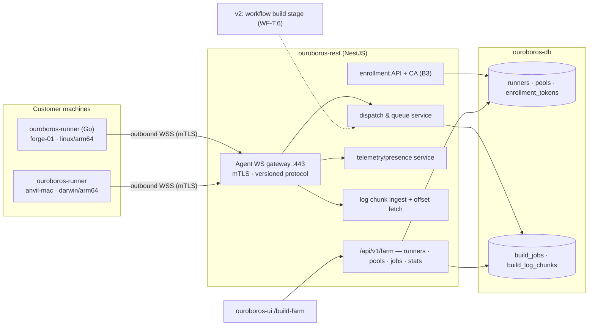
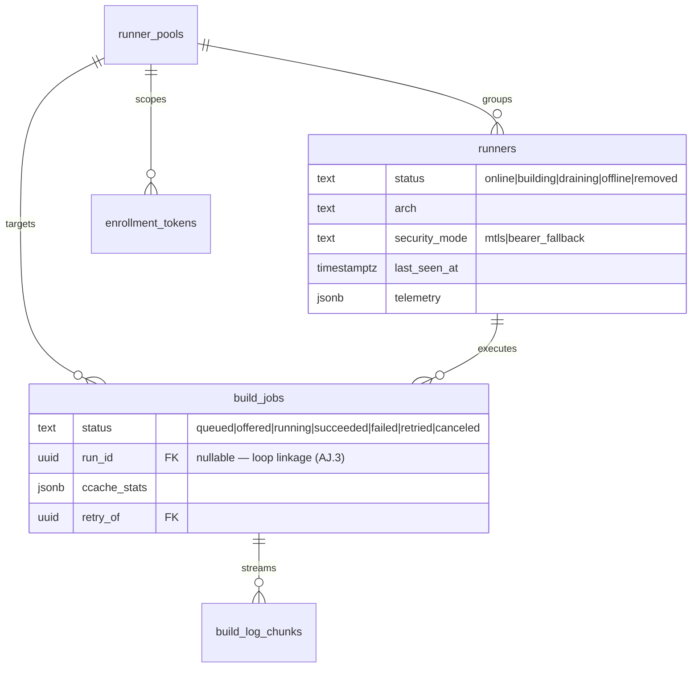
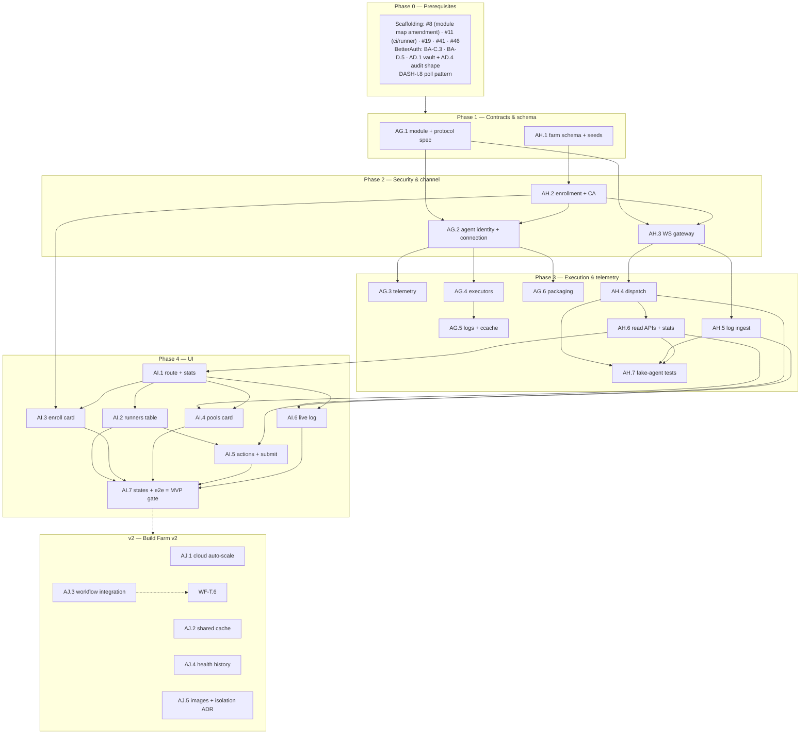

# Roadmap — Build Farm (Mockup 08)

## Description

> Create a roadmap that covers the features for the mockup page 08. Any additional
> tech infrastructure that is required to implement the functionality in these mockup
> pages should be researched and offered as options for implementing in the roadmap.
> The roamdap should include MVP and v2 options, as well as the labels, milestones,
> and the like, for the tickets to be created. Any ticket sources that are used by
> Ouroboros for ingesting should be pluggable, which includes sources like Jira,
> Linear, GitHub, GitLab, and other bug reporting/issue recording sites. Refer to the
> page so that issues can reference the mockup file when creating the UI/UX design of
> the pages. Be very specific when creating the roadmap, as the options in the
> roadmap for the functionality needs to be complete and very thorough.

## Context & Existing Work (duplicate-avoidance survey)

Surveyed 2026-08-08.

**Design source of truth for every UI ticket in this roadmap:**
[`docs/mockups/08-build-farm.html`](mockups/08-build-farm.html) (with
`docs/mockups/assets/ouroboros.css`) — the Build Farm. Its anatomy:

- **Page head** — eyebrow `Build Farm`, h1 `5 runners. 2 pools. 78% cache hits.`,
  subline: *"The Ouroboros server dispatches builds to your own machines over an
  **outbound-only agent connection** — your hardware, your network, **no inbound
  ports**."* Actions: **✦ Build Analyzer** (→ mockup 18), **Pool settings**,
  **+ Enroll runner** (primary).
- **Stat row** — *Runners online* `4/5` (`forge-03 offline · 2h`), *Builds today*
  `23` (`19 clean · 3 retried · 1 failed`), *Avg build time* `4m 12s`
  (`▼ 38s vs last week`), *Cache hit rate* `78%` with meter
  (`ccache · shared per pool`).
- **Runners table** (`c-8`, live pill `1 building`, `Health history →` link) —
  columns: Runner (mono name + arch line: `forge-01 linux/arm64`, `anvil-mac
  darwin/arm64`, `bigiron linux/x86_64`), Pool tag, Status pill (`building`
  pulse / `idle` / `draining` warn / `offline` err + `last seen 2h ago`),
  Current job (link → run detail: `#479 zephyr build · helios-firmware`,
  `#472 HIL test rig · finishing`), CPU meter + pct (warn at 82%), RAM
  (`14.2/32 GB`), Queue depth (`q:2`), Uptime (`41d`), actions `⋯` menu.
  Offline rows dimmed.
- **Enroll-a-runner card** — copy: run on any machine that can reach
  `ouroboros.acme.dev:443`, no inbound ports; the one-liner
  `curl -fsSL https://get.ouroboros.dev | sh -s -- --tenant acme-robotics
  --pool pool-a --token orb_enroll_••••`; *"The agent connects outbound over
  mTLS and registers itself."*; **Copy command**.
- **Pools card** (`Configure →`) — `pool-a` (*firmware builds · zephyr-sdk 0.17
  image · 3 runners*) with a **sub-toggle** *"Auto-scale to cloud when queue >
  5 / keep builds on-prem"* (off) and a pool-enabled switch; `pool-b`
  (*HIL & macOS jobs · 2 runners*).
- **Live log card** (`c-12`) — `LIVE — forge-01 · #479 Add OTA rollback on
  failed checksum`, building pill, elapsed `3m 41s`, **Full log ↗** (→ mockup
  10); streamed build output: `west build` invocation, ccache line
  (`hit 78.4% (412/525 objects)`), compile progress lines, the memory-region
  table, and an accent last line with a blinking cursor.

**What this page demands that nothing else has:** a **runner agent** — a daemon
on customer machines holding an outbound connection to the control plane — plus
enrollment security, job dispatch, telemetry, and log streaming. This is a **new
repo module** (`ouroboros-runner`), which amends the monorepo scaffolding
(#8 layout, #11 CI, #12 architecture docs, compose profiles).

**Overlapping work and dispositions:**

| Existing work | Disposition under this roadmap |
|---|---|
| WF-DSL `build({farm: "pool-a", cache: "ccache"})` stage; WF-T.6 execution (v2); DASH-J.3 run journaling | **Consumed later** — the workflow build stage dispatches farm jobs when execution lands (AJ.3). MVP farm jobs are user/API-submitted verification builds (decision B6 honesty). |
| Mockup 05 Loop Checks warn line (`pool-a has 1 runner offline`) — deferred by code-view C7 | **Enabled** — once this farm exists, W.2's checks payload may include real runner-pool status (amendment noted). |
| Scaffolding #8/#11/#12 (monorepo layout, CI, architecture doc), 7.1 compose | **Amended** — new `ouroboros-runner/` module (Go), `ci/runner` workflow, port/module map updates, dev-compose runner profile. |
| Routing/providers crypto (AD.1 envelope encryption), audit (AD.4/#26 shape) | **Reused** — enrollment tokens sealed by AD.1's vault service; enroll/drain/remove operations audited in the same shape. |
| DASH read-model (`runs`), INTAKE tickets | **Linked** — farm `build_jobs` reference runs/tickets when triggered by loops (AJ.3); MVP keeps a nullable linkage. |
| Mockup 18 (Build Analyzer), `Health history →` | **Out of scope** — head button and link are honest "soon" targets; AJ.4 lays the telemetry retention they need. |
| Pluggable ticket sources requirement (description boilerplate) | **Already satisfied** by WF Epic Q (SPI; Jira/Linear/GitLab as WF-T.2–T.4). Nothing source-specific here; noted, not duplicated. |
| Scaffolding #49 `/build-farm` placeholder, #56 e2e | **Superseded for `/build-farm`**; #56 gains a farm leg. |

Epic letters continue the sequence (…AC–AF): this roadmap uses **AG, AH, AI, AJ**.

## Infrastructure Options (researched — thorough, pick before filing)

### 1. Agent ↔ control-plane transport

| Option | Architecture | Fit | Trade-offs |
|---|---|---|---|
| **A — WebSocket over TLS 443, agent-initiated** ⭐ recommended | Agent dials out to `wss://…/agent` (the GitHub-Actions-runner pattern: outbound-only on 443, registration tokens); persistent duplex channel for dispatch, heartbeats, log chunks; versioned message protocol; reconnect with backoff + resumable state | Matches the subline literally (outbound-only, no inbound ports); proxy/firewall-friendly; NestJS has first-class WS gateways; one connection carries everything | Head-of-line blocking on one socket (mitigate: bounded log chunking); connection-state bookkeeping on the server |
| B — gRPC bidirectional streaming | HTTP/2 streams, protobuf typing | Strong contracts, efficient | Corporate proxies still mangle HTTP/2/gRPC more than WSS; second server stack in NestJS; Go client fine but server cost real |
| C — HTTPS long-poll + chunked upload | Agent polls for jobs, POSTs results/logs | Simplest possible; survives anything | Latency for dispatch + live logs; 3 request patterns instead of 1 protocol — more surface, not less |
| D — Message broker (NATS/MQTT) | Agents subscribe to a broker | Clean fan-out at fleet scale | New always-on infrastructure — contradicts the lightweight rule at MVP scale |

### 2. Agent implementation

| Option | What | Fit | Trade-offs |
|---|---|---|---|
| **A — Go, single static binary** ⭐ recommended | New `ouroboros-runner/` module; cross-compiled `linux/arm64`, `linux/x86_64`, `darwin/arm64` (exactly the mockup's arch set); ~10MB binary, no runtime deps; the pattern of GitHub's runner tooling (Runner Scale Set Client is Go) and Buildkite's agent | `curl \| sh` install is honest with a static binary; trivial daemonization (systemd/launchd); goroutines fit heartbeat+job+logs | Fourth language in the monorepo (Go joins TS/Python/SQL) — CI + conventions amendments (#8/#11) |
| B — Rust | Same static-binary story | Comparable | Slower iteration for this team profile; no advantage that pays here |
| C — Python (share engine toolchain) | uv-managed agent | Language reuse | Needs an interpreter on customer machines — kills the one-liner install promise |
| D — Node | — | — | Same runtime objection |

### 3. Enrollment & channel security (the mockup says mTLS)

| Option | Architecture | Fit | Trade-offs |
|---|---|---|---|
| **A — Short-lived enrollment token → control-plane CA issues per-runner client cert → mTLS channel** ⭐ recommended | `orb_enroll_…` token (scoped: tenant+pool, TTL, single/multi-use, sealed via AD.1) bootstraps registration; REST's embedded CA signs a per-runner cert (identity = runner id + tenant); agent stores key locally (0600), presents it for the WSS channel (mTLS terminated at the app or a TLS-proxy sidecar); rotation + revocation (CRL check at connect) | Delivers the mockup's mTLS claim for real; runner identity is cryptographic, not a bearer string; revocation = cert kill | An embedded CA is real responsibility (key custody via AD.1 KEK; documented in SECURITY_MODEL.md); TLS termination must pass client certs through (deployment note for reverse proxies) |
| B — Bearer runner-token over TLS 1.3 | Enrollment token exchanges for a long-lived per-runner secret | Much simpler; revocable server-side | Not mTLS — the UI copy would need weakening (honesty cost); token theft = impersonation until revoked |
| C — SPIFFE/SPIRE | Standard workload identity | Industrial-strength | Whole new infrastructure; wildly over-scale for MVP |

**Recommendation:** A, with B documented as the degraded mode behind badly-behaved
TLS-stripping proxies (explicit, logged, surfaced in the runner row).

### 4. Job execution on the runner

| Option | What | Fit | Trade-offs |
|---|---|---|---|
| **A — Per-pool executor kind: `container` \| `shell`** ⭐ recommended | pool-a-style pools run jobs in a pinned container image (`zephyr-sdk 0.17 image` — docker/podman required on the runner); pool-b-style pools (HIL rigs, macOS) run in a bare working directory with an allow-listed command environment | The mockup shows both worlds explicitly; per-pool choice keeps each honest | Two execution paths to test; shell pools need clear security framing (the runner runs what the tenant configures — documented trust model) |
| B — Containers only | Uniform sandbox | Simplest security story | Excludes macOS/HIL — half the mockup's fleet |
| C — MicroVMs (Firecracker) | Strongest isolation | Overkill; Linux-only; heavy ops | v2 candidate for untrusted-code scenarios, noted in AJ |

### 5. Build cache (the `78% · ccache · shared per pool` claim)

| Option | What | Fit | Trade-offs |
|---|---|---|---|
| **A — Runner-local ccache + honest stats reporting** ⭐ recommended MVP | Agent configures `CCACHE_DIR` per pool workspace, parses `ccache -s`/build-output stats, reports hit rates; "shared per pool" is true per-runner-persistent (Buildkite-style long-lived agents keep caches naturally); cross-runner sharing is the operator's NFS if they have it | Real hit rates with zero new infra; long-lived agents make caches effective | "Shared per pool" is per-runner in MVP — stat label says what's true (`ccache · per-runner`) until AJ.2 |
| B — Remote shared cache (sccache/S3-or-Redis, ccache remote storage) | True pool-wide sharing | The mockup's claim fully | New storage infra + cache-poisoning surface — v2 (AJ.2) |

### 6. Log transport & storage

| Option | What | Fit | Trade-offs |
|---|---|---|---|
| **A — Chunked append over the agent WS → Postgres chunk table (capped) → UI incremental fetch by offset** ⭐ recommended MVP | Bounded chunks (≤32KB, throttled), `build_log_chunks` with per-job byte caps + retention sweep; UI polls `?after=offset` on the DASH-I.8 cadence (SSE upgrade rides DASH-J.1) | One store (Postgres), simple resume, honest live-ness at poll cadence | Not sub-second "live"; DB growth managed by caps/retention |
| B — Object storage (S3/MinIO) for chunks | Cheap at scale | Right at fleet scale | New infra dependency now — v2 migration path documented |
| C — Direct runner→browser streaming | True realtime | Violates outbound-only (browser can't reach the runner) — **rejected** |

## Decisions proposed by this roadmap (validate before issue creation)

| # | Decision | Rationale |
|---|----------|-----------|
| B1 | **New module `ouroboros-runner/` (Go, static binary)**, joining the monorepo with its own conventions + `ci/runner` workflow; scaffolding #8/#11/#12 amended | Options 2-A; the one-liner install and three mockup architectures demand it. |
| B2 | **Transport = agent-initiated WebSocket over TLS 443** with a versioned message protocol (option 1-A); every message type documented in `docs/RUNNER_PROTOCOL.md` | Outbound-only is the page's core promise. |
| B3 | **Security = enrollment-token → control-plane CA → per-runner mTLS** (option 3-A), tokens sealed via AD.1, all lifecycle ops audited (AD.4 shape); bearer fallback exists but is visibly degraded | The mockup's mTLS claim made real; honesty when proxies force the fallback. |
| B4 | **Pools own executor kind (`container` \| `shell`) and an optional pinned image** (option 4-A); pool config carries env allow-list, workspace policy, concurrency per runner | pool-a vs pool-b are different execution worlds by design. |
| B5 | **Cache = local ccache with honest stats** (option 5-A); the stat label reads `ccache · per-runner` until remote sharing (AJ.2) makes `shared per pool` true | No claim ships before its mechanism. |
| B6 | **MVP jobs are API/UI-submitted builds** (per-repo build commands + pool verification jobs), not loop-driven: the farm is fully real, loop integration arrives with execution (AJ.3 + WF-T.6); `build_jobs.run_id` nullable from day one | The loop engine is v2 elsewhere; a farm that can only pretend to build would violate the honesty rule. |
| B7 | **Telemetry is push-based on the agent channel** (heartbeat @10s: CPU, RAM, queue depth, uptime, job progress); presence = missed-heartbeat threshold; `last seen` truthful; stats row computed from `build_jobs` history | The runners table is a live view, not a poll of dead rows. |
| B8 | **Live log = chunked WS → Postgres → offset fetch** (option 6-A) with per-job caps + retention; `Full log ↗` targets mockup 10's future surface but works standalone | Real streaming at honest cadence without new infra. |
| B9 | **Auto-scale-to-cloud is a stored preference labeled "arrives with cloud runners (v2)"** — the toggle persists but is explicitly inert (AJ.1 activates it) | The mockup shows the toggle off; storing intent + labeling truth beats hiding or faking it. |
| B10 | **Labels**: new `build-farm`; **Milestones**: `Build Farm MVP` / `Build Farm v2` created at filing; complexity chips XS–L | Description requires labels + milestones for the filing pass. |

## Architecture Overview



## MVP Definition

The MVP is **mockup 08 as a real, self-hosted build farm**: an installable agent,
secure enrollment, live telemetry, dispatchable builds, and streaming logs — with
loop integration explicitly deferred. It is done when, against the compose stack
(plus at least one real enrolled runner):

1. `/build-farm` reproduces
   [`docs/mockups/08-build-farm.html`](mockups/08-build-farm.html)
   pixel-faithfully in **both themes**: stat row, runners table with all five
   status archetypes, enroll card with a working copy-able command, pools card
   (incl. the B9-labeled auto-scale toggle), and the live log card.
2. **The agent is real**: `curl -fsSL …/install.sh | sh -s -- --tenant …
   --pool … --token …` installs the static Go binary on linux/arm64,
   linux/x86_64, and darwin/arm64, enrolls via a scoped token, receives an
   mTLS identity, connects outbound-only, survives restarts and reconnects
   with backoff.
3. **Telemetry is live**: heartbeats drive status pills (building/idle/
   draining/offline with truthful `last seen`), CPU/RAM meters, queue depth,
   and uptime; killing a runner flips it offline within the threshold.
4. **Builds run**: a build job (per-repo command in a pool's executor —
   container image or shell) can be submitted via API/UI, gets dispatched to
   an eligible runner, streams chunked logs to the live card (ccache stats
   parsed and reported per B5), and lands terminal states that feed the stat
   row (`19 clean · 3 retried · 1 failed` semantics).
5. **Lifecycle management works**: drain (finish current, accept none),
   un-drain, remove (guarded), enrollment-token minting/revocation
   (owner/admin, audited), pool enable/disable and pool CRUD with executor
   config.
6. Integration tests cover the protocol (contract-tested against a fake
   agent), enrollment/mTLS issuance, dispatch eligibility, presence
   transitions, log chunk caps, stats math, isolation; the e2e suite gains a
   farm leg using a containerized runner.
7. Seeds provide the mockup's fleet for design review (five runners, two
   pools, historical jobs shaping every stat) — clearly dev-only, since real
   runners are live entities.

**Explicitly v2 (milestone `Build Farm v2`):** cloud auto-scale runners (AJ.1),
remote shared cache (AJ.2), workflow build-stage integration (AJ.3), health
history + Build Analyzer telemetry foundation (AJ.4), pool image registry &
microVM isolation evaluation (AJ.5).

## Epics, Labels & Milestones

Each epic is a parent tracking issue on GitHub; every roadmap issue below is filed as
one of its sub-issues (GitHub Relationships).

| Epic | GitHub | Status | Name | Goal | Modules | Milestone |
|------|:------:|:------:|------|------|---------|-----------|
| AG | #239 | 🟡 Open | Runner Agent (`ouroboros-runner`) | Go agent: protocol, executors, telemetry, logs, packaging, CI | ouroboros-runner (new) | Build Farm MVP |
| AH | #240 | 🟡 Open | Farm Control Plane | Schema, enrollment/CA, WS gateway, dispatch, telemetry, logs, stats | ouroboros-rest, ouroboros-db | Build Farm MVP |
| AI | #241 | 🟡 Open | Build Farm UI | Stats, runners table, enroll/pools cards, live log, states, e2e | ouroboros-ui | Build Farm MVP |
| AJ | #242 | 🟡 Open | Scale & Loop Integration (v2) | Cloud auto-scale, shared cache, workflow builds, health history | all | Build Farm v2 |

Issue naming: `<project>: [<epic>.<issue>] <title>`. Labels: existing set (`mvp`,
`v2`, `rest`, `db`, `ui`, `ci`, `design`, `infra`) **plus new `build-farm`**
(decision B10). Milestones **`Build Farm MVP`** / **`Build Farm v2`** created at
filing; every issue assigned. Complexity chips: **XS · S · M · L**.

---

## Epic AG (#239) — Runner Agent (`ouroboros-runner`, new Go module)

| Ref | GitHub | Status | Title | Summary | Labels | Parallel | MVP | Complexity | Affected Modules |
|-----|:------:|:------:|-------|---------|--------|:--------:|:---:|:----------:|------------------|
| AG.1 | #243 | 🟢 Done | ouroboros-runner: [AG.1] Module scaffold & agent protocol spec | Go module, conventions, `docs/RUNNER_PROTOCOL.md`, ci/runner | mvp, build-farm, infra, ci | N (after #8) | Y | M | ouroboros-runner, .github, docs |
| AG.2 | #244 | 🟢 Done | ouroboros-runner: [AG.2] Enrollment, identity & connection loop | Token bootstrap, mTLS cert, outbound WSS, reconnect/backoff | mvp, build-farm | N (after AG.1, AH.2) | Y | L | ouroboros-runner |
| AG.3 | #245 | 🟢 Done | ouroboros-runner: [AG.3] Telemetry & presence reporting | Heartbeats: CPU/RAM/queue/uptime/job progress | mvp, build-farm | N (after AG.2) | Y | S | ouroboros-runner |
| AG.4 | #246 | 🟢 Done | ouroboros-runner: [AG.4] Job executors (container & shell) | Per-pool executor kinds, workspace lifecycle, cancellation | mvp, build-farm | N (after AG.2) | Y | L | ouroboros-runner |
| AG.5 | #247 | 🟢 Done | ouroboros-runner: [AG.5] Log shipping & ccache stats | Bounded chunk streaming, ccache stat parsing, truncation honesty | mvp, build-farm | N (after AG.4) | Y | M | ouroboros-runner |
| AG.6 | #248 | 🟢 Done | ouroboros-runner: [AG.6] Packaging, install script & daemonization | Cross-compiled releases, `install.sh`, systemd/launchd units | mvp, build-farm, infra | N (after AG.2) | Y | M | ouroboros-runner, .github |

### Issue AG.1 — ouroboros-runner: [AG.1] Module scaffold & agent protocol spec

> **GitHub issue:** #243 · **Status:** 🟢 Done · **Parent epic:** #239


- **Problem Statement:** The agent is a new module in a new language (decision
  B1); before any code, the module needs conventions and the wire protocol
  needs a written contract both sides implement against (decision B2).
- **Solution/Scope:** `ouroboros-runner/` scaffold: Go 1.24+, module layout
  (`cmd/ouroboros-runner`, `internal/{conn,exec,telemetry,logship}`),
  golangci-lint, `go test`, Makefile; `ci/runner` workflow (path-filtered per
  #11's pattern: lint → test → cross-compile matrix); **`docs/RUNNER_PROTOCOL.md`**:
  versioned message envelope (`{v, type, id, payload}`), message types
  (`hello/ack`, `heartbeat`, `job.offer/accept/decline`, `job.start/progress/
  finish`, `log.chunk`, `drain/undrain`, `bye`), reconnect + resume semantics
  (undelivered terminal states re-sent with idempotency ids), version
  negotiation (server may refuse ancient agents — the GitHub-runner
  minimum-version pattern). Scaffolding amendments filed: #8 (module map +
  Go conventions), #12 (architecture doc).
- **Acceptance Criteria:**
  - `ci/runner` green on the scaffold across the three target platforms
    (build only for cross targets).
  - Protocol doc covers every message with schema + example; both AG.2 and
    AH.3 implement from it (drift caught by shared golden fixtures).
  - Amendments posted on #8/#11/#12.
- **Parallelism/Dependencies:** Needs #8. Blocks all AG/AH protocol work.
- **Technical Stack:** Go, golangci-lint, GitHub Actions matrix.
- **Epic:** AG

```
docs/RUNNER_PROTOCOL.md (v1)
  hello → ack(session) · heartbeat(10s) · job.offer ⇄ accept/decline
  job.start/progress/finish(idempotent) · log.chunk(≤32KB, throttled) · drain/bye
```

- **Delivered:** [`docs/RUNNER_PROTOCOL.md`](RUNNER_PROTOCOL.md) — **fifteen** message
  types, each with a field contract and a worked example; the frozen `{v, type, id,
  payload}` envelope; version negotiation and the refusal path; resume and idempotency.
  Two messages the issue's table did not name are there because the rows that did name
  them require them: **`refuse`** is how a version-floor rejection is carried, and
  **`receipt`** is how an agent learns it may stop re-sending — without it, resume is
  hope rather than a protocol.
  [`schemas/runner-protocol/`](../schemas/runner-protocol) holds the schema (with the
  ceilings published as *numbers*, so both implementations build their boundary cases
  from one source) and the fixtures: 21 valid, 25 invalid, four session transcripts, and
  `expected.json` — the verdict every implementation reproduces.
  [`ouroboros-runner/`](../ouroboros-runner) is the Go scaffold with a dependency-free
  protocol codec, the two halves of resume, and `ouroboros-runner hello`, which prints
  and validates the frame this machine would send.
  `ci/runner` → `cross/runner` runs the module's own Makefile verbs and builds all three
  architectures. [`scripts/verify-runner-protocol.sh`](../scripts/verify-runner-protocol.sh)
  is what makes drift fail CI: every type described three times, every documented example
  byte-identical to its fixture, every fixture asserted against, every limit agreeing.
  The TypeScript halves (#251, #255) assert against the same bytes when they land.

### Issue AG.2 — ouroboros-runner: [AG.2] Enrollment, identity & connection loop

> **GitHub issue:** #244 · **Status:** 🟢 Done · **Parent epic:** #239


- **Problem Statement:** The one-liner's promise — token in, registered
  mTLS-identified runner out, outbound-only forever after (decision B3).
- **Solution/Scope:** Enrollment: `--tenant --pool --token` → HTTPS
  registration call → receives runner id + client cert/key (stored 0600 in the
  agent state dir) + server CA pin; connection loop: outbound WSS with client
  cert, `hello` handshake (agent version, arch, hostname, capabilities:
  docker present?), exponential backoff + jitter reconnect, session resume
  (idempotent re-delivery per protocol), clean `bye` on SIGTERM; cert renewal
  before expiry over the established channel; bearer-fallback mode (B3) only
  on explicit flag, reported in `hello` so the server can surface degraded
  security in the runner row.
- **Acceptance Criteria:**
  - Enroll → connect → heartbeat against the AH gateway in compose; token
    single-use enforcement observed (second use fails).
  - Kill/restart the agent: reconnects with backoff, resumes cleanly, no
    duplicate terminal states (idempotency verified).
  - Cert renewal exercised with a short-TTL test cert; revoked cert →
    connection refused + clear agent log.
- **Delivered:** [`ouroboros-runner`](../ouroboros-runner/README.md) `enroll` and `run` — the
  agent's half of decision **B3**. **Enrollment follows the CSR decision AH.2 made**, not the
  issue's older *"receives … key"*: the agent generates a P-256 key, sends only a PKCS#10
  request, verifies what comes back (over its own key, chained to the returned CA for
  clientAuth, naming the runner and serial the response names, the CA's fingerprint recomputed)
  and writes certificate and key to **one `0600` file** in a `0700` state directory, in one
  atomic rename — so a crash mid-renewal cannot leave a key beside a certificate that is not its
  own. The token is spent once; the agent refuses to enrol into an already-enrolled directory
  *before* presenting it. **The connection is `wss://…/api/v1/farm/agent`, outbound on 443, and
  nothing listens** — asserted twice: `nolisten_test.go` walks the command's whole dependency
  closure for any listener or listening import, and the end-to-end suite reads a running agent's
  sockets out of `/proc` (or `lsof`) and requires an established connection and no `LISTEN`.
  **The WebSocket client is written, not imported** (`internal/ws`), keeping the module's
  no-dependency rule. Reconnection is exponential backoff with **full jitter**, held to a
  simulated thousand-agent fleet; a gateway's `reconnect_after_ms`/`retry_after_ms` is a floor,
  spread past. **Resume is durable**: terminal frames are persisted to an outbox named by their
  monotonic ULID before a socket sees them and re-sent byte for byte after every reconnect or
  restart, so a `job.finish` dropped mid-delivery — or held by an agent killed with SIGKILL — is
  recorded once and answered `duplicate` the second time. Renewal runs at `renewAfter` over mTLS
  with the certificate being replaced; a revoked certificate — refused by TLS alert,
  `farm_identity_refused` or `refuse identity.*` — ends the agent with one `level=ERROR` line
  saying what to do, and exit 1. SIGTERM becomes `bye {shutdown, "SIGTERM received"}`. **The bearer
  fallback needs `--bearer-fallback` at enrollment and at every start**, travels only in the
  upgrade's `Authorization` header, and is reported in a new optional `hello.security_mode` —
  a minor `v1` change with its fixtures, parity cases and prose. **The gateway (AH.3, #251) does
  not exist yet**, so the suites run against `internal/farmtest`, an in-process farm holding the
  control plane's certificate shape, status codes and error codes and judging every frame by the
  published contract; enrollment, single-use refusal, renewal through a certificate-forwarding
  proxy and revocation were also exercised against the real AH.2 routes. The compose leg of the
  first criterion is AH.3's to close.
- **Parallelism/Dependencies:** Needs AG.1, AH.2. Blocks AG.3–AG.5.
- **Technical Stack:** Go (crypto/tls, gorilla/nhooyr websocket), state dir.
- **Epic:** AG

```
enroll(token) ─▶ {runner_id, cert, ca_pin} ─▶ wss:// (mTLS, outbound) ─▶ hello/ack
   ↺ reconnect: backoff+jitter · resume(session) · renewal before expiry
```

### Issue AG.3 — ouroboros-runner: [AG.3] Telemetry & presence reporting

> **GitHub issue:** #245 · **Status:** 🟢 Done · **Parent epic:** #239


- **Problem Statement:** The runners table's live columns — CPU, RAM, queue,
  uptime, status — come from agent truth (decision B7).
- **Solution/Scope:** Heartbeat every 10s (configurable): CPU percent
  (short-window average), RAM used/total, agent uptime, queue depth (accepted-
  not-started), current-job progress marker; gopsutil-class collection across
  the three platforms; jittered send; suppressed fields degrade to `null`
  (never fabricated — e.g., containers without full metrics access).
- **Acceptance Criteria:** Heartbeats visible server-side within one interval;
  metric parity spot-checked against `top` on each platform; null-field
  handling rendered as em-dash downstream.
- **Parallelism/Dependencies:** Needs AG.2.
- **Technical Stack:** Go, gopsutil.
- **Epic:** AG

```
heartbeat{cpu: 82, ram: [14.2, 32], q: 2, up: 41d, job: {id, phase}} @10s ± jitter
```

- **Delivered:** the moving half of `heartbeat`, in `ouroboros-runner`'s `internal/telemetry`
  and `internal/agent`. **Collection is standard-library only**, keeping the module's
  no-dependency rule rather than adding gopsutil: Linux reads `/proc/stat` and `/proc/meminfo`;
  macOS reads memory in-process through `syscall.Sysctl` page counts and the CPU from
  `/usr/bin/top -l 2 -n 0` (macOS publishes CPU ticks only through a Mach call Go reaches only
  through cgo, which would break the cgo-free cross-compile). A background `Monitor` averages
  **CPU over a 5 s window** — never one instantaneous sample — and reads memory in use as
  total − available (the page cache is not pressure). **A measurement that cannot be taken is
  `null`**, never 0 and never carried forward: every pass replaces every value, a sample older
  than three windows vouches for nothing, and a failure is logged **once when it starts and once
  when it clears**. That needed the contract to allow it: `cpu_pct`, `memory_used_mb` and
  `memory_total_mb` became nullable inside line 1 (still required — null, not absent), with a
  `valid/heartbeat-unmeasured.json` fixture and a `heartbeat-cpu-missing` parity case, and the
  gateway (AH.3) now **leaves an unmeasured metric out of `runners.telemetry`** — the shape V040
  already reads as the em-dash — rather than refusing the frame. **Queue depth is pinned to
  accepted-not-started** in the document and the schema (the protocol had said "including the
  running one"; the mockup's `q:2` and the dev seed agree with the issue), counted by a
  `Workload` ledger the executors (AG.4) drive, which also gives `busy` and `job {phase, pct}`.
  Send timing was already jittered (#244); a fleet-spread test now holds the real draw to it.
  `ouroboros-runner heartbeat` prints the frame this machine would send, measured now — the
  instrument for the parity spot-check against `top`. Done on linux/x86_64 (idle and at half
  load, matching `top` to the tenth) and on the linux/arm64 build under qemu user-mode emulation;
  **darwin/arm64 still needs a Mac**, its parsers being tested against recorded output only. Also
  exercised live against AH.3 on a throwaway PostgreSQL 17: the first beat reached
  `runners.telemetry` within a second of `run`, and an agent with `/proc/stat` hidden stored no
  `cpu_pct` key — which is how a busy-loop on an instantly failing reading was found and fixed.

### Issue AG.4 — ouroboros-runner: [AG.4] Job executors (container & shell)

> **GitHub issue:** #246 · **Status:** 🟢 Done · **Parent epic:** #239


- **Problem Statement:** pool-a builds run in a pinned SDK image; pool-b runs
  bare on HIL/macOS rigs — one agent, two executor kinds (decision B4).
- **Solution/Scope:** Job payload: `{job_id, executor: container|shell,
  image?, workdir policy, command, env (allow-listed), timeouts, cache:
  {ccache_dir}}`; container executor: docker/podman detection, image
  pull-if-missing (progress reported), workspace mount, resource limits,
  exit-code capture; shell executor: dedicated workspace dir per job,
  environment scrubbing to the allow-list, no shell-expansion of server data
  (argv-exec), documented trust model (the tenant's own machine runs the
  tenant's own command); both: cancellation (SIGTERM→KILL grace), artifact-
  free MVP (logs only), cleanup policy (keep-workspace-on-failure flag),
  concurrent-job cap per runner (default 1, pool-configurable).
- **Acceptance Criteria:**
  - Container job runs in compose against a small image; shell job runs on a
    bare runner; both capture exit codes + durations.
  - Cancellation mid-build terminates the process tree within grace.
  - Missing docker on a shell-only runner declines container offers
    (capability honesty from `hello`).
- **Parallelism/Dependencies:** Needs AG.2. Blocks AG.5.
- **Technical Stack:** Go, docker/podman CLI or API, os/exec.
- **Epic:** AG

```
job.offer{executor: container, image: zephyr-sdk:0.17} ─▶ accept ─▶ pull? ─▶ run ─▶ finish{exit, 4m12s}
job.offer{executor: shell} on runner without docker ─▶ accept (capability match)
```

- **Delivered:** both executor worlds in `ouroboros-runner`'s new `internal/exec`, driven by the
  agent's offer handling. **Container** jobs run through the **Docker Engine API** on the very
  socket the hello's `docker` probe found (Docker, or Podman's compatible API — no CLI needed, so
  the capability and the executor are one fact): pull-if-missing with `job.progress` in the
  `prepare` phase (bytes across layers, before `job.start`), the workspace bind-mounted at the
  offer's `workdir`, the command as an exec-form CMD, an init as PID 1, and each job's share of
  the machine (cores and memory ÷ the pool's cap). **Shell** jobs run argv-exec only, in a fresh
  `<state-dir>/work/<job>` with `workdir` resolved inside it (a `..` is refused), and with an
  environment that is **exactly the pool's allow-list and nothing inherited** — no PATH unless
  the pool allows one. **Cancellation** is SIGTERM → 10 s → SIGKILL to the whole **process
  group** (the daemon's `stop` for a container), and the group is swept after a normal exit too;
  it is driven by `timeout_s` (`timed_out`) and by the agent's own SIGTERM (`cancelled`, sent
  before the bye). **Capability honesty:** no daemon, `--no-shell`, a `repository` this build
  cannot check out yet, or no room under the cap is a decline at once (`unsupported_executor` /
  `busy`), and `agent.New` refuses a hello whose capabilities disagree with its executors.
  `--keep-workspace-on-failure` keeps a failed, timed-out or errored job's workspace; the
  default cleans up, read-only trees included. The pool's policy needed the contract: an
  optional **`ack.pool {max_concurrency, env_allowlist}`** inside line 1, with
  `valid/ack-without-pool.json` and an `ack-pool-concurrency-range` parity case, which the
  gateway (AH.3) fills from `runner_pools` at every hello — absent means the column defaults,
  one job and no variables. The trust model — the tenant's machine runs the tenant's command —
  is written in the package doc and the module README. Tested against real processes (a job
  printing its environment, metacharacter argv, a TERM-ignoring tree checked gone within the
  grace), a fake Engine API, and — behind `make test-docker` — rootless Docker with `busybox`.
  Not here, by design: a wire `job.cancel` (AH.4, #252), an offer's attempt number (always 1
  until dispatch retries exist — both have since landed with AH.4), source checkout, and log
  shipping (AG.5, #247 — which has since landed too).

### Issue AG.5 — ouroboros-runner: [AG.5] Log shipping & ccache stats

> **GitHub issue:** #247 · **Status:** 🟢 Done · **Parent epic:** #239


- **Problem Statement:** The live log card and the cache stat need agent-side
  truth: bounded streaming and parsed ccache numbers (decisions B5/B8).
- **Solution/Scope:** Stdout/stderr multiplexed into ordered chunks (≤32KB,
  min-interval throttle, backpressure-aware — drop-to-summary mode if the
  channel stalls, with an explicit `[… N bytes elided]` marker, never silent
  loss); per-job byte cap honored agent-side too; ccache integration: set
  `CCACHE_DIR` per pool workspace, run `ccache -s --json` (or parse text)
  post-build, attach `{hits, misses, hit_rate}` to `job.finish`; absent
  ccache → stats omitted (null, not zero).
- **Acceptance Criteria:** A noisy build streams without unbounded memory;
  elision markers appear under forced backpressure; ccache stats match a
  manual `ccache -s` run; no-ccache builds report null cleanly.
- **Parallelism/Dependencies:** Needs AG.4.
- **Technical Stack:** Go, ccache CLI.
- **Epic:** AG

```
stdout ─▶ chunker(≤32KB, throttled, ordered) ─▶ log.chunk*
job.finish += {ccache: {hit_rate: 78.4, hits: 412, misses: 113} | null}
```

- **Delivered:** [`internal/logship/`](../ouroboros-runner/internal/logship) — the chunker, the
  throttle, the agent's own cap and the ccache statistics — wired into `internal/agent` and a log
  channel of the session's own. **Output is shipped as it is written**: the command's two streams
  multiplexed into ordered `log.chunk` frames, one stream each, at most eight every 250 ms inside
  `ack.limits`'s byte rate, which every ack re-tunes. **A `seq` is spent only when the session
  takes the frame**, so a socket with no room costs an elision and never a gap — and `seq` stays
  contiguous across a reconnect, which is what makes a gap mean a lost frame. **Nothing blocks the
  build**: writing never blocks or fails, output waits in a 256 KiB buffer, and past it the log
  goes into *summary mode* — counted, not kept — until the backlog drains; the count is then
  reported as `dropped_bytes` on the next chunk, exactly where the hole is. **The marker is data**:
  the agent writes no `[… N bytes elided]` text into the stream, because AH.5's gateway places
  every hole by position and the console (AI.6) draws one marker for each — the issue's marker,
  rendered once rather than twice. The agent also caps a job's output itself
  (`--log-cap-bytes` / `OURO_RUNNER_LOG_CAP_BYTES`, 64 MiB, V040's own default and range), keeping
  the head of the log; the rest is the tail AH.5 folds into one marker with its own cap. The
  invariant, tested everywhere: **`log.bytes` + `log.dropped_bytes` is everything the build
  printed**. **ccache** (decision **B5**): each pool gets `<state-dir>/cache/<pool>/ccache`, kept
  across its jobs and never shared with another pool's — a container job sees it at
  `/ouroboros-cache`, the only host directory it sees besides its workspace — and each job gets its
  own `CCACHE_STATSLOG`, so `job.finish.ccache` is **that build's** hit rate and not the cache's
  running total, even with several of a pool's jobs at once. A build that ran no ccache reports
  **null**, never 0%. Tests: 40 in `internal/logship` — including a seeded property test and a fuzz
  target on the invariant, and a **measured** memory bound (a real 200 MiB shell job streamed
  through a stalled, a throttled and a fast session peaks ~3 MiB above baseline) — 6 through the
  whole agent against the in-process farm (order, forced backpressure, the cap, ccache per pool,
  `seq` across a reconnect), 3 in `internal/exec` for the cache mount plus a real-daemon one, 2 in
  `cmd` for the flag, and `make test-ccache` against real ccache 4.7.5 and 4.11.2, whose fixtures
  are committed. Agent 0.7.0.

### Issue AG.6 — ouroboros-runner: [AG.6] Packaging, install script & daemonization

> **GitHub issue:** #248 · **Status:** 🟢 Done · **Parent epic:** #239


- **Problem Statement:** `curl -fsSL https://get.ouroboros.dev | sh` with
  tenant/pool/token flags must produce a running, persistent agent on all
  three platforms.
- **Solution/Scope:** Release pipeline (extends `ci/runner`): cross-compiled,
  versioned, checksummed binaries (linux/arm64, linux/x86_64, darwin/arm64)
  published as GitHub release artifacts; `install.sh`: platform detection,
  checksum verification, install to `/usr/local/bin` + state dir creation,
  flag pass-through to enrollment, daemon setup (systemd unit on Linux,
  launchd plist on macOS) with restart-on-failure; `--uninstall`; the
  server-rendered enroll command (AI.3) pins the exact script URL + version;
  self-hosted deployments serve the script from their own origin
  (no hard dependency on a public domain — configurable base, honesty about
  the mockup's `get.ouroboros.dev`).
- **Acceptance Criteria:** Fresh Linux VM and macOS machine: one-liner →
  enrolled, running, survives reboot; checksums verified; uninstall clean;
  script passes shellcheck.
- **Parallelism/Dependencies:** Needs AG.2 (+release infra from #11 patterns).
- **Technical Stack:** Go releases, shell, systemd/launchd.
- **Epic:** AG
- **Delivered:** `ouroboros-runner/install.sh` (POSIX `sh`, shellcheck-clean) and a
  `make release` verb that writes `dist/<version>/` — the three binaries, the installer with its
  `DEFAULT_VERSION` filled in, and a `SHA256SUMS` over the four. `ci/runner` gains
  **`package/runner`** (`make release` + `sha256sum -c` on every event, read-only) and
  **`release/runner`** (the GitHub release `ouroboros-runner-v<VERSION>`, from a push to `main`
  only, behind `ci`, every `cross` target and the package; it publishes the packaged bytes, never
  replaces a release, and is the **one job in the repository with `contents: write`**, granted
  to the job — `verify-ci.sh` asserts it is the only grant). shellcheck is pinned to a release
  and its SHA-256. **The origin is the deployment's own**: `ouroboros-rest` serves
  `GET /install.sh[?version=]` with `DEFAULT_SERVER` filled in from `OURO_FARM_PUBLIC_URL`
  (falling back to an https `OURO_REST_URL`) and `GET /runner/<version>/<file>` unchanged from
  `OURO_FARM_RELEASES_DIR` — allow-listed names, SemVer versions, no path from the request — so
  the one-liner carries no `--server`, pins a version, and needs no public host
  (`get.ouroboros.dev` stays design shorthand). The installer detects linux/x86_64,
  linux/arm64 and darwin/arm64 (Rosetta counts as arm64), **verifies the SHA-256 before
  running anything** and checks the binary's reported version, installs to `/usr/local/bin`,
  enrols with the flags passed through (the token via a private file into
  `OURO_RUNNER_TOKEN`, on no command line), and installs a **systemd unit**
  (`Restart=on-failure`, a start limit so a permanent refusal is not retried forever,
  `KillMode=mixed`) or a **launchd daemon** (`KeepAlive` on unsuccessful exit, `HOME`/`PATH`
  for Docker Desktop), running as the invoking account. A re-run is an upgrade that spends no
  token and keeps the installed CA; a run that fails after stopping the agent starts it again.
  `--uninstall` removes the binary, the unit or plist, `/etc/ouroboros-runner` and the macOS
  logs, and the state directory only on a yes or `--purge`. Verified end to end on a real
  systemd Debian 12 machine against a live REST: install, enrolment, reboot survival,
  restart after SIGKILL (with session resume), a tampered binary aborting with nothing
  installed, upgrade, and a clean uninstall. **macOS was not exercised on real hardware** — the
  plist is covered by the installer's suite (`tests/install.test.sh`, 211 checks under `sh`,
  `dash`, `bash` and busybox) and awaits a Mac.

```
install.sh: detect platform ─▶ fetch+verify binary ─▶ enroll(flags) ─▶ systemd/launchd unit ─▶ running
```

---

## Epic AH (#240) — Farm Control Plane (`ouroboros-rest` + `ouroboros-db`)

| Ref | GitHub | Status | Title | Summary | Labels | Parallel | MVP | Complexity | Affected Modules |
|-----|:------:|:------:|-------|---------|--------|:--------:|:---:|:----------:|------------------|
| AH.1 | #249 | 🟢 Done | ouroboros-db: [AH.1] Farm schema — runners, pools, jobs, tokens, logs | Full relational model + seeds + ci/db probes | mvp, build-farm, db, ci | N (after #19, BA-B.3) | Y | L | ouroboros-db, .github |
| AH.2 | #250 | 🟢 Done | ouroboros-rest: [AH.2] Enrollment API & runner CA | Scoped tokens (AD.1-sealed), cert issuance/renewal/revocation, audit | mvp, build-farm, rest | N (after AH.1, AD.1) | Y | L | ouroboros-rest |
| AH.3 | #251 | 🟢 Done | ouroboros-rest: [AH.3] Agent WebSocket gateway | Protocol server: sessions, presence, heartbeat ingest, resume | mvp, build-farm, rest | N (after AG.1, AH.2) | Y | L | ouroboros-rest |
| AH.4 | #252 | 🟢 Done | ouroboros-rest: [AH.4] Build job dispatch & queueing | Submission API, eligibility (pool/executor/capacity), offers, retries | mvp, build-farm, rest | N (after AH.3) | Y | M | ouroboros-rest |
| AH.5 | #253 | 🟢 Done | ouroboros-rest: [AH.5] Log ingest & retrieval | Chunk persistence with caps/retention, offset fetch for the UI | mvp, build-farm, rest | N (after AH.3) | Y | M | ouroboros-rest |
| AH.6 | #254 | 🟢 Done | ouroboros-rest: [AH.6] Farm read APIs & stats | Runners/pools/jobs payloads, stat-row math, lifecycle actions | mvp, build-farm, rest | N (after AH.4) | Y | M | ouroboros-rest |
| AH.7 | #255 | 🟢 Done | ouroboros-rest: [AH.7] Farm integration tests (fake agent) | Protocol contract, dispatch matrix, presence, caps, isolation | mvp, build-farm, rest, ci | N (after AH.4–AH.6) | Y | M | ouroboros-rest |

### Issue AH.1 — ouroboros-db: [AH.1] Farm schema — runners, pools, jobs, tokens, logs

> **GitHub issue:** #249 · **Status:** 🟢 Done · **Parent epic:** #240


- **Problem Statement:** Every farm surface needs relational truth: fleets,
  pools with executor config, job lifecycle, enrollment tokens, log chunks.
- **Solution/Scope:** Migration: `runner_pools` — id, org FK, `name` (unique
  per org), `description`, `executor` CHECK `container|shell`, `image`
  (nullable, container pools), `env_allowlist` jsonb, `max_concurrency` per
  runner, `enabled`, `autoscale_pref` jsonb (B9 stored-inert);
  `runners` — id, org FK, pool FK, `name` (unique per org), `arch`
  (`linux/arm64|linux/x86_64|darwin/arm64`), `status` CHECK
  `online|building|draining|offline|removed`, `last_seen_at`, `agent_version`,
  `capabilities` jsonb, `security_mode` CHECK `mtls|bearer_fallback` (B3
  visibility), `enrolled_at/by`, `cert_serial`, `uptime_seconds`, live
  telemetry snapshot jsonb; `enrollment_tokens` — org FK, pool FK, sealed
  token (AD.1), TTL, `max_uses/uses`, revoked, created_by;
  `build_jobs` — id, org FK, pool FK, runner FK (nullable until assigned),
  `run_id` FK nullable (B6 — future loop linkage), repo ref, command/image
  snapshot, `status` CHECK `queued|offered|running|succeeded|failed|retried|
  canceled`, timings, exit code, `ccache_stats` jsonb (nullable),
  `retry_of` self-FK; `build_log_chunks` — job FK, `seq`, `byte_start`,
  content (bytea), with per-job byte-cap trigger + retention sweep metadata.
  Indexes for presence sweeps, queue depth, stats windows. Seeds: the mockup
  fleet (five runners incl. offline forge-03 at `last_seen -2h`, two pools
  with the mockup meta), historical jobs shaping every stat (23 today: 19/3/1;
  avg 4m12s with prior-week delta; 78% cache), a live `#479` job with log
  chunks matching the mockup listing. ci/db probes (status vocab, cap
  trigger, unique names, token TTL).
- **Acceptance Criteria:** Migration applies cleanly; cap trigger truncates
  with marker metadata; seeds render the whole page; probes red/green
  verified.
- **Delivered:** [`V040__farm_schema.sql`](../ouroboros-db/migrations/V040__farm_schema.sql) —
  the six tables and the rules that make them honest. `runners` holds **live state**, so
  observation and intent are two columns: `status` is what the fleet last saw and
  `desired_state` is what an operator decided, with `runners_draining_is_intended` and
  `runners_removed_is_intended` stopping either from contradicting the other — which is what
  makes *"who drained this?"* answerable and a drained machine distinguishable from a dead one.
  `build_jobs.run_id` is **nullable** (B6), composite with `organization_id` so AJ.3 (#265)
  inherits tenancy rather than remembering it. The per-job log cap is
  `build_log_chunk_cap()`, a BEFORE INSERT trigger that locks the job row, assigns `byte_start`
  from its running total, clamps the chunk that crosses the cap and writes the **elision
  marker** AI.6 (#261) renders — with every byte refused afterwards counted onto
  `build_jobs.log_dropped_bytes`, because past the cap there is no row to put a second marker
  on. Tenancy throughout is **composite foreign keys**, so a job on another workspace's runner
  is a row PostgreSQL refuses; the one join that cannot be spelled that way, a repository, is a
  trigger on V008's pattern. Two amendments landed with it: pool `tags`, GIN-indexed, so
  #776's `pool tagged: hil — available` is a live resolution rather than decoration, and
  `runner_pool_windows`, the time-windowed pool assignment #514 composes through the farm's own
  APIs.
  [`R__dev_seed_farm.sql`](../ouroboros-db/migrations/R__dev_seed_farm.sql) is **mockup 08 as
  rows**: two pools, six runners — the mockup's five plus a `removed` sixth that every count of
  the fleet has to exclude — forty-eight builds and the five chunks of the LIVE card's log.
  Every figure the page prints is **computed**: `23` today, `19 clean · 3 retried · 1 failed`,
  `4m 12s` from a 252-second mean, `▼ 38s` from the prior week's 290, and `78%` from Σ hits over
  Σ objects. Each has a near miss built to catch a nearly-right query — 28 counted by
  `queued_at`, 43 without the day window, 74% without it on the cache, 54% if a missing ccache
  summary is read as 0%, six runners if `removed` is not excluded. `run_id` is null on every
  row, because a seeded loop-linked job would be a state the product cannot reach.
  [`tests/constraints.sql`](../ouroboros-db/tests/constraints.sql) gains the section that asks
  the cap trigger to prove it truncates — a cap nothing exceeds and a cap that does not exist
  look identical — plus the EXPLAIN assertions for the presence sweep, per-runner queue depth
  and the stat row's windows. [`tests/seed.sql`](../ouroboros-db/tests/seed.sql) asserts every
  rendered figure and every near miss, and
  [`tests/verify-constraint-probes.sh`](../ouroboros-db/tests/verify-constraint-probes.sh) adds
  thirteen probes, one per rule, including the `drop trigger` that removes the cap.
- **Parallelism/Dependencies:** Needs #19, BA-B.3 (+AD.1 for sealing). Blocks
  everything AH.
- **Technical Stack:** PostgreSQL 17, Flyway.
- **Epic:** AH



### Issue AH.2 — ouroboros-rest: [AH.2] Enrollment API & runner CA

> **GitHub issue:** #250 · **Status:** 🟢 Done · **Parent epic:** #240


- **Problem Statement:** Decision B3's chain — scoped token → registration →
  per-runner client cert — plus lifecycle (renewal, revocation) and audit.
- **Solution/Scope:** Token minting API (owner/admin: pool scope, TTL,
  max-uses; sealed via AD.1; masked display after creation; revocation);
  registration endpoint (token validation → runner row → CSR-less server-side
  keypair or agent-CSR flow, decided in-issue → cert signed by the **farm
  CA** (CA key sealed via AD.1 KEK, documented in `SECURITY_MODEL.md`
  amendment); renewal over the authenticated channel; revocation list checked
  at gateway handshake; every operation audited (AD.4 shape:
  `runner.enrolled|token_minted|token_revoked|cert_renewed|removed`);
  bearer-fallback registration gated by an org setting, marked in
  `security_mode`.
- **Acceptance Criteria:** Token TTL/uses enforced; revoked cert refused at
  handshake (test); CA key never leaves the vault service (grep/lint);
  audit rows complete; fallback visibly flagged.
- **Delivered:** [`src/modules/farm/`](../ouroboros-rest/src/modules/farm/) and
  [`V041__farm_certificate_authority.sql`](../ouroboros-db/migrations/V041__farm_certificate_authority.sql)
  — decision **B3**'s chain, end to end. Seven routes: mint, list and revoke a scoped token;
  read the CA; revoke a runner's certificate; and the two the agent calls, which are the only
  unsessioned routes this service has grown since AD.3's.
  **The keypair question is decided: the runner generates its own and sends a PKCS#10 request**
  ([`x509/csr.ts`](../ouroboros-rest/src/modules/farm/x509/csr.ts) carries the argument), so no
  runner private key has ever existed inside Ouroboros — there is no backup, log or column from
  which one could be recovered. The cost is reading a structure an unauthenticated caller
  composed, and it is bounded: `x509/reader.ts` is a bounds-checked, DER-strict, depth-limited
  structural walk that decodes no values, and the key and the self-signature are parsed and
  verified by the platform's own C. **The CSR's subject is discarded** — the certificate's
  subject is composed from the runner row and the token's workspace, so a request claiming
  somebody else's name is signed with its correct one rather than refused.
  **The CA key never leaves**, and four different things hold that: `farm_authorities_key_sealed`
  means a row with a plaintext key cannot exist whoever the writer is; `ouroboros/no-ca-key-escape`
  refuses the *name* anywhere but `farm.authority.ts`; `farm.secrecy.spec.ts` reads that file's
  source and holds it to having no logger, no cache and no getter; and the same suite plus
  `farm.integration-spec.ts` grep a full lifecycle's payloads — while asserting the key *is* in
  the database, sealed, so the claim is about the API rather than about there being nothing to
  leak. It is unwrapped for one signature and zeroized in a `finally`.
  **Six ways a token can fail answer one `401` with no details**; which of the six goes to the
  AD.4 trail, under `runner.token_minted`, `runner.token_revoked`, `runner.enrolled`,
  `runner.cert_renewed` and `runner.cert_revoked`. **Revocation is the boundary**: checked at
  every handshake by `RunnerIdentityService` — exported so AH.3 (#251) calls it rather than
  writing a second one — and final, because renewal is authenticated by the certificate being
  replaced and the request has no token field. A renewal supersedes and issues in one
  transaction, and `runner_certificates_live_idx` makes two live certificates for one runner a
  row PostgreSQL refuses. **The bearer fallback is off by default** behind
  `workspace_settings.runner_bearer_fallback`, recorded in `security_mode`, and refused with a
  code that says so rather than the opaque one — an agent behind a stripping proxy has to be
  able to tell that from a dead token.
  [`docs/SECURITY_MODEL.md` § 7](SECURITY_MODEL.md#7-the-build-farms-certificate-authority) is
  the amendment #226 filed, with the custody model, the CSR decision, and **the deployment
  requirement that fails quietly**: a TLS-terminating proxy that does not pass the client
  certificate through leaves the handshake succeeding and the identity check with nothing to
  check. `OURO_FARM_CLIENT_CERT_HEADER` is unset by default, because a certificate is public and
  a header trusted unconditionally is an impersonation of any runner whose certificate anybody
  has seen.
- **Parallelism/Dependencies:** Needs AH.1, AD.1. Blocks AG.2, AH.3.
- **Technical Stack:** NestJS, node:crypto X.509 (or smallstep lib), AD.1.
- **Epic:** AH

```
mint(pool-a, ttl 24h, uses 5) ─▶ orb_enroll_…(sealed, audited)
register(token) ─▶ runner row + cert{CN: runner_id, O: tenant} ─▶ mTLS thereafter
```

### Issue AH.3 — ouroboros-rest: [AH.3] Agent WebSocket gateway

> **GitHub issue:** #251 · **Status:** 🟢 Done · **Parent epic:** #240


- **Problem Statement:** The server half of the AG.1 protocol: sessions,
  presence, heartbeat ingest, resumable delivery — the farm's nervous system.
- **Solution/Scope:** NestJS WS gateway on the agent path (mTLS client-cert
  verification, deployment notes for proxy pass-through per B3): `hello`
  validation (version floor, capability capture), session registry
  (connection ↔ runner row), heartbeat ingest → telemetry snapshot + presence
  (missed-N-heartbeats → offline with truthful `last_seen_at`), ordered
  delivery with resume (undelivered `job.offer`/acks re-sent on reconnect,
  idempotency ids honored), drain/undrain push, protocol golden-fixture
  tests shared with AG.1, connection metrics (for AJ.4).
- **Acceptance Criteria:** Fake-agent contract suite passes both directions;
  presence flips at the documented threshold and recovers; resume delivers
  exactly-once semantics for terminal messages; version-floor refusal path
  tested.
- **Delivered:** [`src/modules/farm/gateway/`](../ouroboros-rest/src/modules/farm/gateway),
  [`src/modules/farm/protocol/`](../ouroboros-rest/src/modules/farm/protocol) and
  [`V042__farm_gateway.sql`](../ouroboros-db/migrations/V042__farm_gateway.sql) —
  `wss://…/api/v1/farm/agent`, the server half of AG.1's contract. **The codec is a table-for-table
  port of the Go agent's**, held to the same `expected.json` case by case and to every session
  transcript, with the two over-limit cases built from `$defs/limits`; `ci/rest` now watches
  `schemas/runner-protocol/**` beside `ci/runner`, so a fixture edit runs both halves and drift
  fails the half that drifted. **The upgrade is refused before any socket exists**, in the
  service's own error envelope and with AH.2's two codes: a certificate checked by
  `RunnerIdentityService` — the revocation check AH.2 exported for exactly this — answers
  `401 farm_identity_refused` when it is revoked, and a connection with no certificate answers
  `401 farm_client_certificate_required` rather than being accepted as ordinary TLS; the first
  such refusal per process is logged naming which deployment mistake it most likely is, and every
  one is counted. The bearer fallback authenticates by opening each eligible runner's sealed
  secret in constant time. **`hello`** is held to two floors — the protocol line, and a new
  `OURO_FARM_MIN_AGENT_VERSION` build floor compared by SemVer precedence — each refused with
  `version.below_minimum` and a sentence naming it; a `hello` written in a newer line is still read
  far enough to refuse it or answer it in a line both ends speak; its `security_mode` is held to
  the transport; and hostname (a new `runners.hostname`), architecture, version and capabilities
  are recorded, with the executors dispatch reads derived once and `supportsExecutor` exported for
  AH.4. **Presence**: a heartbeat writes the snapshot, uptime, pill and `last_seen_at` ← that beat;
  a sweep flips a runner `offline` after **3 × 10 s + 2 s = 32 s** of silence (at most 37 s behind
  a dead machine) and never writes `last_seen_at`; a `hello` recovers it at once and a `bye` takes
  it offline deliberately. **Exactly-once**: `runner_terminal_frames` records each `job.finish` by
  its envelope id in the transaction that applies it, before the receipt — record, then answer —
  keyed per runner and not per session, append-only, and a re-send or a race loses to its primary
  key and is answered `duplicate: true`. **Sessions** carry an ordered outbox: receipts until
  written, offers until answered or expired, drains; a `hello.resume` inside the five-minute window
  gets `resumed: true` and everything still owed, in order. **Drain/undrain** write `desired_state`
  first and push second; a heartbeat reconciles the agent against the intent, so a drain issued on
  another replica, or while the runner was away, still reaches it. `GatewayMetrics.snapshot()` is
  the plain-JSON shape AJ.4 retains. The fake agent that drives the integration suite replays
  `enroll`, `resume` and `drain` against the running gateway, and `refuse` against one configured
  with a floor, judging every gateway frame as the Go agent does; three mutation spot checks
  (idempotency, `last_seen_at`, revocation) each turned it red. It is a Nest provider on the HTTP
  server's `upgrade` event rather than a `@WebSocketGateway` — `agent.gateway.ts` says why.
- **Parallelism/Dependencies:** Needs AG.1 (spec), AH.2. Blocks AH.4, AH.5.
- **Technical Stack:** NestJS WS (ws), protocol fixtures.
- **Epic:** AH

```
wss handshake (client cert ⊨ CA, not revoked) ─▶ hello{v, arch, caps} ─▶ ack{session}
heartbeat ─▶ telemetry + presence   missed×3 ─▶ offline (last_seen honest)
```

### Issue AH.4 — ouroboros-rest: [AH.4] Build job dispatch & queueing

> **GitHub issue:** #252 · **Status:** 🟢 Done · **Parent epic:** #240


- **Problem Statement:** Jobs must find eligible runners (pool, executor
  capability, capacity), be offered, tracked through the lifecycle, and
  retried per policy — the `q:2` depths and `3 retried` stat come from here.
- **Solution/Scope:** Submission API (`POST /api/v1/farm/jobs` — pool, repo
  ref, command or pool-default; member+ role; B6 scope: user/API-submitted)
  and internal submission surface (AJ.3's future entry point); dispatch
  service: eligibility (pool match, executor capability from `hello`,
  concurrency cap, not draining), offer → accept/decline → assignment,
  queue-depth accounting per runner, timeout/lost-runner requeue (once, then
  failed), retry policy (`retried` = auto-retry on infra-classed failures,
  bounded), cancellation API; job state machine mirrors AH.1 vocab with
  transition validation.
- **Acceptance Criteria:** Dispatch matrix in the harness (capability,
  drain, capacity, offline); runner death mid-job → requeue-once → second
  failure terminal; cancel propagates to the agent; queue depths accurate
  under concurrent submission.
- **Parallelism/Dependencies:** Needs AH.3. Blocks AH.6, AI.5.
- **Technical Stack:** NestJS, Kysely transactions.
- **Epic:** AH

```
submit(pool-a, west build…) ─▶ eligible: forge-01(q:2)❌cap, forge-02(idle)✓ ─▶ offer ─▶ running
runner lost ─▶ requeue(once) ─▶ retried │ failed    drain: finish current, no offers
```

- **Delivered:** [`src/modules/farm/dispatch/`](../ouroboros-rest/src/modules/farm/dispatch),
  [`V043__farm_dispatch.sql`](../ouroboros-db/migrations/V043__farm_dispatch.sql) and a
  `job.cancel` in the runner protocol, both halves. **Submission** is
  `POST /api/v1/farm/jobs` (member+, decision **B6**): pool, `owner/name`, ref, the exact commit —
  an offer pins it, so a moving ref cannot change what was built — and the command as **argv**,
  or the pool's new `default_command` (pool-a's is its one build command; pool-b, which runs two
  kinds of job, has none and answers `farm_command_required`). The pool's executor, image and
  the command are snapshotted onto the job, the command stored as the canonical rendering of the
  argv (`command.ts`, whose reader refuses anything its writer could not have produced, so no free
  text is ever split). **The internal surface for AJ.3 (#265)** is
  `FarmJobsService.submitForRun(org, runId, request)` — the same path with `run_id` set,
  exported and documented, called by nothing yet. **The state machine** (`job.states.ts`) keeps
  V040's seven statuses and splits `queued` into *waiting* and *accepted* by whether a runner holds
  it, so a runner's queue depth is its accepted-not-started jobs — the agent's own `q:N`, which the
  suite holds equal under six concurrent submissions — and every writer holds its move to the
  transition table, an illegal one throwing `InvalidJobTransitionError`. **Eligibility** is one
  statement: the job's pool (or a `runner_pool_windows` row covering now), `desired_state
  active`, a live status, the executor among those the `hello` reported — a container job is
  never offered to a machine without docker — and room under the pool's `max_concurrency`; then
  a socket held by this process. **Placement** locks the runner row and re-counts under the lock,
  so two dispatchers never over-fill one runner (a mutation dropping the re-count turned the
  suite red). **Offer → accept / decline**: a decline returns the job to the queue and cools that
  runner off for it for 30 s; an unanswered offer is taken back after `offer_ack_ms` plus a grace.
  **Retries are the farm's, never the build's**: an `errored` finish or a runner lost mid-build
  makes the attempt `retried` and a new job with `retry_of`, offered with a new optional
  `job.offer.attempt` the agent echoes; a second is `failed`; a non-zero exit or a timeout is
  `failed` and never retried. The `errored` retry is created inside the gateway's terminal-ledger
  transaction (`job.lifecycle.ts`), so a receipted retry always has its successor. **A lost
  runner** is one offline past the five-minute resume window — one that resumes inside it keeps
  its job. **Cancellation** (`POST /api/v1/farm/jobs/:id/cancel`) ends the job at once and sends
  `job.cancel {operator}` to the runner holding it; the Go agent (0.6.0) now runs each job under
  its own context and stops only that one, reporting `cancelled`, and ignores a cancel for a job
  it does not hold. A runner that accepts, starts or reports a job no longer its own is sent
  `job.cancel {reassigned}`, once per session. **The two amendments are seams**: a
  `FARM_DISPATCH_GATE` asked once per workspace per pass before anything is offered (open until
  #489's `org_state`), and `JobCompletions`, announced off the completing path for #510's counter.
  Verified by 20 fake-agent integration cases (the dispatch matrix, retry, lost runners, cancel,
  concurrency, isolation), seven mutation spot checks that each turned it red, and the Go agent's cancel tests under
  `-race`. **Known limit:** today's agent still declines any offer naming a repository (source
  checkout is unassigned), so real runners queue submitted builds rather than run them.

### Issue AH.5 — ouroboros-rest: [AH.5] Log ingest & retrieval

> **GitHub issue:** #253 · **Status:** 🟢 Done · **Parent epic:** #240


- **Problem Statement:** Chunked agent logs must persist within caps and
  reach the UI incrementally (decision B8).
- **Solution/Scope:** Chunk ingest on the gateway path (seq-ordered append,
  byte-cap enforcement with elision marker coordination per AG.5, per-org
  rate guard); retrieval API: `GET /api/v1/farm/jobs/:id/log?after=<offset>`
  (returns new bytes + next offset + live flag) on the DASH-I.8 poll cadence;
  retention sweep (terminal jobs: keep N days / M bytes per org, policy
  documented); `Full log ↗` payload shape ready for mockup 10's future
  surface.
- **Acceptance Criteria:** Ordered reassembly under out-of-order arrival;
  offset fetch resumes exactly; caps + retention verified; live flag
  truthful.
- **Parallelism/Dependencies:** Needs AH.3. Feeds AI.6.
- **Technical Stack:** NestJS, Kysely, bytea handling.
- **Epic:** AH

```
log.chunk(seq, bytes) ─▶ append(cap-aware) ─▶ GET ?after=18122 ─▶ {bytes, next: 24576, live: true}
```

- **Delivered:** [`src/modules/farm/logs/`](../ouroboros-rest/src/modules/farm/logs) and
  [`V044__farm_log_ingest.sql`](../ouroboros-db/migrations/V044__farm_log_ingest.sql). **Ingest**
  hears `log.chunk` through the gateway's listeners, as dispatch does. It stores chunks **in `seq`
  order**, because V040's cap trigger assigns offsets at insert time and offsets already given to
  a reader must never move. A chunk that overtook a gap is held, for at most 10 s or 64 chunks or
  until the job finishes, and a gap never filled is recorded as lost chunks where it was. A
  per-workspace **rate guard** (2 MiB/s, 8 MiB burst) refuses a runaway's excess, and marks it on
  the next stored chunk. **One honest marker**: elision is data, never text in the stream, kept
  by position. Before a chunk is V044's `elided_bytes`/`missing_chunks`. After the last stored
  byte is `build_jobs.log_dropped_bytes`, widened to carry the agent's own tail drops (its
  `job.finish.log.dropped_bytes` less what it had already placed, split by the new
  `log_agent_dropped_bytes`) beside the cap's, so where the two caps meet the card draws one
  marker. **Retrieval** is `GET /api/v1/farm/jobs/:id/log?after=` for every member:
  `{bytes, nextOffset, end, live, elisions, tail, retained, pollAfter}`, at most 256 KiB, UTF-8
  text ending on a character boundary so successive polls concatenate exactly. It sends the
  polling contract's `Cache-Control` and `X-Ouro-Poll-After` (2 s live, 15 s done). **`live` is
  the job's state**, never chunk recency. The same resource paged from `after=0` is mockup 10's
  **Full log**. **A finished job's log is final**: the agent's `job.finish` is accounted on a new
  gateway hook, `AgentSessions.onTerminal`, awaited *before* the ledger marks the job finished,
  and chunks are written only while the job is live — found when the full suite, under load, read
  a log between the two. **Retention**: thirty days per chunk (`retain_until`, written at ingest) and a
  per-workspace budget, `OURO_FARM_LOG_BUDGET_BYTES` (2 GiB), oldest finished logs first.
  Logs are removed whole and only when finished, leaving a `log_swept_at` tombstone
  (`retained: false`), at most 200 jobs per rule per run, with tombstone counts logged. The
  policy is a `FARM_LOG_RETENTION` seam for #482. **Verification**: 90 unit tests (and four for the gateway hook); 12
  fake-agent integration cases (out-of-order reassembly, exact resume across splits inside
  ✓/é/𝄞/—, the cap and the agent's tail as one figure, `live`, a cancelled build's log closed, a
  lost frame, the rate guard across two workspaces, age and budget retention, isolation, bad
  offsets); seven mutation spot
  checks that each turned them red. Not here: tail reads for #510, and the agent's shipper
  (AG.5, #247), which has since landed — so a finished job's log is the build's output, with the
  two caps rendered as one marker.

### Issue AH.6 — ouroboros-rest: [AH.6] Farm read APIs & stats

> **GitHub issue:** #254 · **Status:** 🟢 Done · **Parent epic:** #240


- **Problem Statement:** The page's read surfaces — runners table, pools,
  stat row, enroll-command rendering — plus lifecycle actions (drain,
  remove, pool CRUD).
- **Solution/Scope:** `GET /api/v1/farm` (runners with live telemetry +
  security-mode flags, pools with meta/counts, current live job ref);
  stat-row service: runners online x/y + most-recent-offline note, builds
  today (clean/retried/failed split), avg build time with prior-week delta,
  cache hit rate (weighted from `ccache_stats`, label per B5, em-dash when
  no data); lifecycle: drain/undrain (push via AH.3), remove (guarded:
  offline or drained only), pool CRUD + enable/disable + autoscale_pref
  storage (B9); enroll-command endpoint (renders the exact one-liner with a
  freshly minted token, server-origin-aware per AG.6). Role gates: member
  read, admin+ mutate.
- **Acceptance Criteria:** Seeded payloads reproduce every mockup number;
  stats windows verified (day boundary, empty org → zeros/em-dashes);
  drain round-trips to a live fake agent; remove guard enforced.
- **Parallelism/Dependencies:** Needs AH.4 (+AH.1 seeds). Feeds AI.*.
- **Technical Stack:** NestJS, Kysely.
- **Epic:** AH

```
GET /farm ─▶ {stats{4/5, 23(19·3·1), 4m12s ▼38s, 78%}, runners[5], pools[2], live: #479}
POST /runners/:id/drain ─▶ push drain ─▶ status: draining
```

- **Delivered:** [`src/modules/farm/fleet/`](../ouroboros-rest/src/modules/farm/fleet), plus the
  enroll command on AH.2's controller. **`GET /api/v1/farm`** is the page in one observation —
  four statements over one set of boundaries, because `4/5` counts the rows in the table beside
  it and a pool's `3 runners` partitions the same set. **The windows have edges.** They are
  computed once per request (`fleet.policy.ts`): *today* is a calendar day in **UTC**, through
  the same `startOfDay` the dashboard uses so two pages mean one day, and the payload publishes
  the `since` instant and the zone rather than leaving *today* a word; *last week* is the seven
  whole days **before** today, stepped back from the day boundary rather than from `now`, so the
  two windows are adjacent and disjoint and today's builds are never on both sides of their own
  comparison. **`null` is not `0`** (`fleet.stats.ts`): a count of nothing is zero, an average of
  nothing is null — `0m 00s` is not a fast farm and `0%` is not a cache that missed — and
  `deltaVsLastWeek` is **absent** when either window is empty rather than claiming a comparison
  nobody made. That is also why the repository returns sums and counts separately and
  `coalesce(avg(…), 0)` appears nowhere: the zero the database would supply is the value the
  issue refuses. **The cache label is composed from B5**, not written out — `ccache · per-runner`
  until AJ.2 (#264), and `grep CACHE_SHARING` is that whole edit. **Lifecycle**: drain and undrain
  go through AH.3's `RunnerControl`, so the intent is written first and the push is an
  optimisation of it; the **pill stays the agent's**, which is what keeps *who drained bigiron?*
  answerable (`runner.drained`). Removal is **guarded to offline or drained**, checked for a
  readable error and applied again in the `update`'s `where` because a machine can heartbeat back
  to `online` in between; it revokes the certificate through `RegistrationService` — newly
  exported, and the header argues why that export bypasses nothing. **Pool CRUD** with the card's
  switch, and `autoscale_pref` stored, inert and returned unchanged (B9). **The enroll command**
  renders this deployment's own origin, a pinned release and a live token, every value
  shell-quoted; it is the second place in the product a token value reaches a response, and
  `farm.resources.ts`' greppable claim was amended to say so. **Verification**: 118 unit tests and
  49 integration cases — every mockup number against real rows, a build two minutes either side
  of midnight, an empty organization, the delta's absence, a drain round-tripped to a live fake
  agent and the pill following its heartbeat, the removal guard, `autoscale_pref`'s round trip, an
  enroll command whose token is **spent against the real registration route**, the member/admin
  split on all seven mutations, and isolation on every route; five mutation spot checks each
  turned them red. Not here: a runner's health history (AJ.4, #266) and the auto-scale the
  preference describes (AJ.1, #263).

### Issue AH.7 — ouroboros-rest: [AH.7] Farm integration tests (fake agent)

> **GitHub issue:** #255 · **Status:** 🟢 Done · **Parent epic:** #240


- **Problem Statement:** Protocol, dispatch, presence, and caps are
  distributed-systems behavior — the harness needs a scriptable fake agent.
- **Solution/Scope:** `FakeAgent` (TS, protocol-conformant, scriptable
  scenarios): full-lifecycle suites (enroll → connect → heartbeat → job →
  logs → finish), presence transitions, resume/idempotency, dispatch matrix,
  log caps/ordering, token lifecycle, org isolation across all farm routes;
  golden protocol fixtures shared with the Go agent's tests (cross-language
  drift guard).
- **Acceptance Criteria:** Green in `ci/rest`; protocol fixture drift between
  Go and TS fails CI; ≤ 90s added.
- **Parallelism/Dependencies:** Needs AH.4–AH.6.
- **Technical Stack:** Jest, ws, Testcontainers.
- **Epic:** AH

```
FakeAgent scripts: happy ✓ · lost-runner requeue ✓ · resume ✓ · caps ✓ · isolation ✓
golden fixtures ⇄ Go agent tests (one protocol, two implementations)
```

- **Delivered:** the **scripted peer** and the two suites that need one nobody owned.
  [`gateway/fake.agent.fixture.ts`](../ouroboros-rest/src/modules/farm/gateway/fake.agent.fixture.ts)
  grew from AH.3's handshake-only stand-in into the misbehaving agent this issue names —
  `hello`/`heartbeat`/`accept`/`decline`/`start`/`progress`/`chunk`/`stream`/`finish`, and beside
  them `drop`, `reconnect`, `bye` and a `terminal` that hands back the frame *unsent* so a suite
  can deliver the same bytes twice. Every one of them builds its frame from a file under
  `schemas/runner-protocol/fixtures/` through one private helper, so no frame is ever typed from
  what its author remembered the protocol to be. Two of the issue's scripted misbehaviours got no
  method: a **wedged** peer is the existing `quiet`, and a peer that **outruns the log cap** is a
  `log.chunk` run AH.5's suite already builds and asserts far more precisely — the elision at its
  exact offset, the cap and the agent's own tail as one figure. Shipping an unused helper and a
  weaker second copy of that assertion would have been worse than shipping neither.
  [`farm.lifecycle.integration-spec.ts`](../ouroboros-rest/src/modules/farm/farm.lifecycle.integration-spec.ts)
  is the chain with no seams in it — a token minted over HTTP, spent over HTTP, the certificate it
  issued presented on a real socket, a build submitted by a person, offered, accepted, **streamed**
  and finished, then read back as a row, a log and the stat row. The five module suites each reach
  for the seam beside them (dispatch inserts the log it never streams; logs insert the job nothing
  dispatched), and every one of those is a place two modules can pass their own suites and still
  disagree. What it adds is the crossings: a runner killed mid-job requeues once, fails terminally,
  and **the dead attempt's log is still readable**; a terminal frame re-sent after a real reconnect
  applies once **and does not append the output twice**; a declined offer is run to completion by
  somebody else.
  [`farm.isolation.integration-spec.ts`](../ouroboros-rest/src/modules/farm/farm.isolation.integration-spec.ts)
  settles *every* route rather than a sample: it walks AH.2's own `routeTable` — the enumeration
  `guard.surface` uses to ask what a **stranger** gets — and asks what a **neighbour** gets, a
  signed-in administrator of another workspace, which is the more dangerous caller because every
  guard before the query admits them. Its first test compares the written-down claims against what
  the router registered, so a farm route added without one **fails rather than going uncovered**;
  that caught five routes the per-feature blocks had never touched, the authority and the three
  token routes among them. Each refusal is asserted **with the row afterwards**, since a `404`
  served after the delete would satisfy a status-only check. The unsessioned four are a different
  claim and are written as one: the credential decides the workspace, and a tenant header naming
  another cannot move it.
- **Not built, because it already existed:** the issue asks for *golden protocol fixtures shared
  with the Go agent's tests* as a new drift guard. AG.1 and AH.3 had already built it, and
  verifying that before adding machinery is the work this bullet records.
  `protocol.spec.ts` holds the TypeScript constants, `MESSAGE_TYPES` and the diagnostic codes to
  `v1.json` directly, and `schemas/runner-protocol/**` is in `rest.yml`'s path filter as well as
  `runner.yml`'s — so changing one side's limit or type list already fails `ci/rest`, and changing
  a fixture already runs both halves. Adding the symmetric checks to
  `scripts/verify-runner-protocol.sh` would have been a second copy of a live assertion, bought by
  making `ci/runner` run on every edit to a REST file. **≤ 90s: the two new suites add ~5s**
  (isolation 23 tests in ~2.0s, lifecycle 5 in ~3.2s) on top of a container this pipeline already
  starts.

---

## Epic AI (#241) — Build Farm UI (`ouroboros-ui`)

Every issue references
[`docs/mockups/08-build-farm.html`](mockups/08-build-farm.html) as the design
source — stat row, runners table, enroll/pools cards, live log treatments — via
the #16 tokens (both themes; the mockup is dark-only).

| Ref | GitHub | Status | Title | Summary | Labels | Parallel | MVP | Complexity | Affected Modules |
|-----|:------:|:------:|-------|---------|--------|:--------:|:---:|:----------:|------------------|
| AI.1 | #256 | 🟢 Done | ouroboros-ui: [AI.1] Build Farm route, head & stat row | `/build-farm` frame, live stats, honest head actions | mvp, build-farm, ui, design | N (after #41, AH.6, BA-D.5) | Y | S | ouroboros-ui |
| AI.2 | #257 | 🟢 Done | ouroboros-ui: [AI.2] Runners table (live) | Five status archetypes, telemetry cells, live refresh | mvp, build-farm, ui, design | N (after AI.1) | Y | L | ouroboros-ui |
| AI.3 | #258 | 🟢 Done | ouroboros-ui: [AI.3] Enroll-runner card & token flow | Command rendering with minted token, copy, token management | mvp, build-farm, ui | N (after AI.1, AH.2) | Y | M | ouroboros-ui |
| AI.4 | #259 | 🟢 Done | ouroboros-ui: [AI.4] Pools card & configuration | Pool rows, executor config sheet, honest auto-scale toggle | mvp, build-farm, ui, design | N (after AI.1, AH.6) | Y | M | ouroboros-ui |
| AI.5 | #260 | 🟡 Open | ouroboros-ui: [AI.5] Runner actions & job submission | Drain/undrain/remove menu; submit-build flow | mvp, build-farm, ui | N (after AI.2, AH.4) | Y | M | ouroboros-ui |
| AI.6 | #261 | 🟢 Done | ouroboros-ui: [AI.6] Live log card | Offset-streamed log, ANSI-safe rendering, cursor, full-log path | mvp, build-farm, ui, design | N (after AI.1, AH.5) | Y | M | ouroboros-ui |
| AI.7 | #262 | 🟡 Open | ouroboros-ui: [AI.7] Farm states & e2e leg | Empty/no-runners guidance, read-only, themes, e2e | mvp, build-farm, ui, ci | N (after AI.1–AI.6) | Y | M | ouroboros-ui, .github |

### Issue AI.1 — ouroboros-ui: [AI.1] Build Farm route, head & stat row

> **GitHub issue:** #256 · **Status:** 🟢 Done · **Parent epic:** #241


- **Problem Statement:** The frame: headline composed from live counts
  (`5 runners. 2 pools. 78% cache hits.`), the outbound-only subline, and
  honest head actions.
- **Solution/Scope:** Replace the #49 placeholder: head with computed
  headline (real counts; cache label per B5), **✦ Build Analyzer** as honest
  "soon" (mockup 18), **Pool settings** → AI.4 sheet, **+ Enroll runner** →
  AI.3; stat row via the shared StatCard composition (DASH-I.2): runners
  online with offline note, builds today with clean/retried/failed delta,
  avg build time with ▼ delta (down-is-good coloring), cache hit rate with
  inline meter + honest label; polling via the I.8 pattern.
- **Acceptance Criteria:** Seeded stats reproduce the mockup; empty org shows
  zeros/em-dashes; both themes; #49 stub retired (amendment).
- **Parallelism/Dependencies:** Needs #41, AH.6, BA-D.5. Blocks AI.2–AI.6.
- **Technical Stack:** Next.js, #46 primitives, I.8 poll hook family.
- **Epic:** AI

```
[Build Farm] 5 runners. 2 pools. 78% cache hits.   [✦ Analyzer·soon][Pool settings][+ Enroll]
(4/5 online · forge-03 2h)(23 · 19/3/1)(4m12s ▼38s)(78% ▓▓▓ · ccache · per-runner)
```

- **Delivered (2026-09-19):** `ouroboros-ui` 0.81.0 — `app/(app)/build-farm/page.tsx` and
  [`app/farm/`](../ouroboros-ui/app/farm) (`view.ts`, `data.ts`, `farm-poll.ts`, `farm-store.tsx`,
  `farm-head.tsx`, `farm-stat-row.tsx`, `farm-banner.tsx`, `farm-screen.tsx`, `farm.css`),
  `app/api/farm.ts` with the poll's reader and route handler (`app/api/farm-page.ts`,
  `app/api/farm/route.ts`), and the sidebar's **Build Farm** entry turned from *soon* into a link
  (`BUILD_FARM_PATH`). Decisions taken in-issue:
  - **The #49 placeholder needed no deletion** — it was never built; the route replaces the *soon*
    row directly.
  - **The headline degrades clause by clause**: `1 runner.` in the singular, *No runners yet.* /
    *No pools yet.* rather than a bare zero, and *No cache data today.* rather than `0%` (B5: a
    missing summary is *not measured*). The runner count is `stats.runnersOnline.total`, the first
    tile's denominator, so the heading and the `4/5` under it cannot disagree. With nothing read at
    all it is *Runners. Pools. Cache hits.* — nothing claimed — and the banner says why, once.
  - **`null` is not `0`, to the glass**: `0/0` and `0` are genuine counts; the average and the cache
    rate are em dashes over nothing, the cache tile then draws **no meter** (an empty bar is a
    picture of `0%`), and the delta line is **absent** when `deltaVsLastWeek` is null. A real
    comparison that came out level reads *Level with last week* — never `▼ 0s`.
  - **Down is good**: `▼` takes the tile's `up` (good-news) tone and `▲` its `down` tone.
  - **The cache label is rendered from the payload**, which composes it from B5, so #264 is no edit
    in the UI.
  - **The split line always prints its three parts** once there is a build; `canceled` — counted by
    AH.6 and absent from the mockup — joins it only when non-zero, so the seeded day reads exactly as
    the mockup does and the line still adds up.
  - **All three head actions are honest *soon* controls**: inert, marked, tooltip naming the issue —
    **✦ Build Analyzer** → #516 (the amendment on #256 makes it a link to `/analyzer` on the commit
    that builds that route; #516 is still open, so it navigates nowhere), **Pool settings** → #259,
    **+ Enroll runner** → #258. Both of the latter depend on this issue and do not exist yet. No role
    is decided on the page for that reason; **BA-D.5 is still unfiled**, and the admin gate arrives
    with the flows it guards, through the existing `requireWorkspace` + `mayAdminister`.
  - **One poll per screen, at the fleet's cadence**: the page is one observation, so
    `farm-store.tsx` provides it once and every region — this issue's two and AI.2–AI.6's — reads
    `useFarm()`. AH.6's `X-Ouro-Poll-After: 10` is carried through `farm.observe()` →
    `readFarmPage()` → `/api/farm`, so the interval stays the server's. A failed refresh keeps the
    last page under the DASH-I.7 banner, whose retry is the poll asking now.
  - **The StatCard moved to `app/ui`** (`stat-card.tsx`, `.ou-stat`): this row is its second caller,
    which is the threshold `dashboard.css` states for a rule to become the design system's. It gained
    the two shapes mockup 08 adds — a quieter suffix on the figure (`/5`) and a slot for the meter —
    and the dashboard's `StatCard` is now a placement over it.
  - The e2e `shell-nav` roster gains **Build Farm**; the full farm leg is AI.7 (#262). A loading
    skeleton is left to AI.7's states with it.

### Issue AI.2 — ouroboros-ui: [AI.2] Runners table (live)

> **GitHub issue:** #257 · **Status:** 🟢 Done · **Parent epic:** #241


- **Problem Statement:** The fleet view: five status archetypes with live
  telemetry cells, updating on the poll cadence without jank.
- **Solution/Scope:** #46 Table per the mockup: runner cell (mono name + arch
  line), pool tag, status pill mapping
  (building/pulse · idle · draining/warn · offline/err + relative last-seen;
  `bearer_fallback` runners get a subtle shield-warning affix per B3),
  current-job cell (link — target honest: run detail when it exists, job
  sheet meanwhile), CPU cell (meter + pct, warn ≥ 80), RAM mono
  (`14.2/32 GB` formatting), queue depth (`q:N`), uptime (compact), overflow
  `⋯` → AI.5 menu; offline rows dimmed per the mockup; stable sort (pool,
  name) with status grouping option; smooth value transitions (no full-row
  re-render flicker).
- **Acceptance Criteria:** Seeded table matches the mockup row-for-row in
  both themes; killing the compose fake runner flips its row within the
  presence threshold; telemetry nulls render em-dash; keyboard navigation.
- **Parallelism/Dependencies:** Needs AI.1. Blocks AI.5.
- **Technical Stack:** React, #46 Table/Meter/Pill.
- **Epic:** AI

```
forge-01 linux/arm64 [pool-a] (●building) #479 zephyr build ▓▓▓▓░ 82% 14.2/32GB q:2 41d ⋯
forge-03 linux/arm64 [pool-a] (●offline · last seen 2h)  —  —  —  q:0  —  ⋯   (dimmed)
```

- **Delivered (2026-09-19):** `ouroboros-ui` 0.82.0 — [`app/farm/`](../ouroboros-ui/app/farm)
  gains `runners.ts` (every judgement, pure, over flat rows), `runners-card.tsx`,
  `runner-cells.tsx` and `job-sheet.tsx`, mounted in `farm-screen.tsx`'s grid at the mockup's `c-8`
  and reading the one `useFarm()` store, so the rows and the `4/5` above them are one answer.
  Decisions taken in-issue:
  - **Stale data is not rendered as current, whatever the payload carries.** V040 already clears an
    offline runner's snapshot; the view does not rely on it — a row the fleet cannot vouch for draws
    an em dash in every *agent-reported* cell (CPU, RAM, uptime), is dimmed by ink (the mockup's
    `tr.offline`, not an opacity) and says `last seen 2h ago`. What the *control plane* knows stays:
    `q:0` is its own count, and so is a `running` job.
  - **`null` is an em dash with no meter** — an empty bar is a picture of `0%` — beside the metrics
    the platform could report; a measured `0%` keeps its meter.
  - **`last seen 2h ago` and the tile's `offline · 2h` are one rule**: the backlog's `age()` moved to
    `app/format.ts` as `ageOfSeconds` (its second caller), which is also how AH.6 composes the note.
    It is measured from the store's `dataAt`, so a server render and its hydration agree.
  - **CPU tones:** `warn` at ≥ 80 (the AC), and — to match the mockup's `3%`/`6%` rows against its
    `54%` — `ok` under 50 and the plain accent between. Decided on the figure *drawn*: `79.6` reads
    `80%` and warns.
  - **RAM is decimal gigabytes** (the seed's `32000000000` is the mockup's `32`): one decimal under
    100 GB — `5.0`, never `5`, so the column holds its width — and whole numbers from there
    (`88/256 GB`).
  - **The default order is pool, then name** (a total order over facts that do not move on a
    heartbeat), and **Group by status** is the opt-in — and is exactly the mockup's row order
    (building · idle · idle · draining · offline). The service orders by name; the table sorts.
  - **The current-job cell opens a job sheet, not a page.** `/runs/:id` is #309 and is not built,
    and `RunnerJobRef` carries no run until #300 — so the amendment's link lands on the commit that
    makes both true, and until then the sheet lists what the page already knows and says the
    console is coming. It is held by the *job's* id, so it closes when the build ends. **The
    mockup's `· helios-firmware` is not drawn**: the job reference carries no repository
    (`· finishing` is derived from `draining`). Widening AH.6's payload is left to whoever needs it.
  - **`bearer_fallback` (B3)** is a small shield in the warning ink beside the name — tooltip,
    visually hidden sentence and row announcement all say it in words. In the seed that runner is
    `anvil-mac`, not the issue diagram's `bigiron`.
  - **No flicker, verified at both levels** (`__tests__/farm/runners-live.test.tsx`): a
    `MutationObserver` over the table body sees no element added or removed and no mutation outside
    the row that moved, and a spied `Meter` shows one CPU cell rendering rather than four (cells are
    memoised over the flat row's primitives). The meter's fill now eases to its new width in
    `app/ui/ui.css`, inside the reduced-motion guard. Checked against a real stack as well: three
    heartbeats changed two text nodes and two custom properties; stopping one runner's heartbeats
    flipped **the same row element** to dimmed em dashes in 37 s (the presence threshold plus one
    poll), with the tile reading `3/5 · forge-02 offline · 37s` beside `last seen 37s ago`.
  - **Keyboard:** the design system's selectable grid — one tab stop, `↑ ↓ Home End`, the landing row
    announced from a polite region (which also covers a pointer). A selection whose runner has left
    the fleet is dropped, or no row would hold the tab stop.
  - **`Health history →` (#266) and each row's `⋯` (#260) are inert *soon* controls**; the `⋯` is out
    of the tab order (a control that acts for nobody is no loss to a keyboard), the job cell is in it.
  - **A defect found on the way, fixed in the primitive:** `.ou-table-scroll` is now
    `position: relative`. `.sr-only` text is absolutely positioned, and a hidden heading over the
    last column of a table wider than its wrapper sat outside the wrapper's clip and widened the
    *document* — the page scrolled sideways past the shell at narrow widths. The routing matrix's
    hidden *Edit* heading had the same exposure.
  - The empty-fleet guidance and the e2e leg stay with AI.7 (#262); this draws one honest line.

### Issue AI.3 — ouroboros-ui: [AI.3] Enroll-runner card & token flow

> **GitHub issue:** #258 · **Status:** 🟢 Done · **Parent epic:** #241


- **Problem Statement:** The enroll card must render a *working* command —
  which means minting a real scoped token behind an admin action, not
  printing a placeholder.
- **Solution/Scope:** Card per the mockup: explainer with the deployment's
  real host, command block rendered from AH.6's endpoint (pool selector;
  token minted on demand with TTL/uses shown; masked in the visible block,
  full value only in the copy payload with a "copied — treat as a secret"
  toast), **Copy command**, token-management link (list/revoke active
  enrollment tokens — small sheet); mTLS note verbatim; member role sees
  the card without mint/copy (read-only explainer).
- **Acceptance Criteria:** Copied command enrolls a real agent against
  compose; token appears in the management sheet and revokes; masked
  rendering verified (no secret in DOM until copy); admin-gated.
- **Parallelism/Dependencies:** Needs AI.1, AH.2/AH.6.
- **Technical Stack:** React, clipboard API.
- **Epic:** AI

```
[pool-a ▾]  curl -fsSL https://<host>/install.sh | sh -s -- --tenant acme --pool pool-a --token orb_••••
[Copy command] → full token in clipboard only · [Manage tokens →]
```

- **Delivered (2026-09-19):** `ouroboros-ui` 0.83.0 — [`app/farm/`](../ouroboros-ui/app/farm)
  gains `enroll.ts` (every judgement, pure), `enroll-actions.ts` (the Server Actions),
  `token-data.ts`, `clipboard.ts`, `enroll-card.tsx` (mounted in `farm-screen.tsx`'s grid at the
  mockup's `c-4`), `token-list.tsx`, `token-sheet.tsx` and the settings tab's screen and skeleton;
  `app/api/farm.ts` gains `enrollCommand()`, `tokens()`, `revokeToken()` and `pools()`.
  Decisions taken in-issue:
  - **The mint is the copy** (decided with the owner). AH.6's enroll-command read mints on every
    call and is the *only* read that knows the deployment's origin and pinned version — and it is
    `403` for a member. Minting on card open would leave a live token behind every admin page
    view, which is the failure this issue names; so nothing is minted to draw the card. At rest
    the block is the command's **shape** (`<this deployment>/install.sh`, the workspace, the chosen
    pool, `orb_enroll_••••`) and the explainer says *this deployment*; one press of **Copy command**
    mints one single-use, day-long token. From then on the explainer names the real `host:443`
    and the block is the service's own command, masked. A reader who may not mint never learns the
    host from this card, because the read that knows it is one they may not make.
  - **The value is never in the DOM and never in React state.** The Server Action answers the
    command twice — whole, and **masked on the server** (`maskedCommand`) — and the whole one goes
    from the action's promise into the clipboard write and nowhere else; what the card keeps is a
    type with no field for it. The mask **fails closed**: no `--token` flag, or a token-shaped value
    before it, and the command is withheld (the origin and version are still said). Verified by
    inspection in a real browser against a real REST, not only in jsdom: after a copy the 87-character
    value was in the clipboard and in the action's response, and in **no** markup, attribute, form
    value, storage or URL — nor was its 12-character tail.
  - **The clipboard write is asked for inside the press**: a `ClipboardItem` over the mint's promise
    where the engine has one (the only form Safari accepts), `writeText` after the wait elsewhere.
  - **A blocked copy leaves nothing live** — not in the issue, and the misuse worth guarding: if the
    browser refuses the clipboard after the mint took, the value is lost and the token is not, so it
    is revoked at once and the card says so (or points at *Manage tokens* if that fails too).
  - **The toast** is *Copied — treat this as a secret.*, in a status region, until dismissed — and
    a test holds it to saying nothing about the clipboard's lifetime.
  - **`expires in 24h · 1 of 1 use left`** at mint time. `ageOfSeconds` would call a fresh day-long
    token `1d` and its next second `23h`; the second day is said in hours, so it reads `24h`. The
    enroll-command read always mints single-use with the default TTL, so the diagram's `4 of 5` is
    a rack token minted elsewhere — the list draws those too.
  - **Token management is one list mounted twice** (decided with the owner, reconciling the issue's
    *sheet* with its amendment's *settings tab*, decision S2): *Manage tokens →* opens it as a sheet
    on `/build-farm`, and `/settings/farm-tokens` mounts it as the settings section's second live
    tab, **Farm tokens**. Every token is listed, newest first — expired, spent and revoked ones
    dimmed, because *how many machines did this let in* is the incident's question — and **Revoke**
    is offered where it changes something. The rows say `4 of 5 uses left` rather than the diagram's
    `4/5 uses`, which reads as *four used* as easily as *four left*. A list rather than a table: it
    is drawn at a sheet's measure and at a page's, and wraps instead of scrolling.
  - **Names are decoration.** A token carries a pool id and a user id; the listing joins the pools'
    and the members' names (`token-data.ts`). Either read failing leaves an em dash or no name —
    never *deleted pool* or *a former member* over something merely not read.
  - **+ Enroll runner acts** — AI.1's *soon* note named this issue. It moves focus to the card's
    pool selector (focus, because the pane is the scroll container); for a reader who may not mint
    it is inert with the reason. The admin gate AI.1 deferred arrives here through `mayAdminister`,
    handed to the screen as a boolean; the gates that **decide** — and the audit — are the service's.
  - **Checked against a real stack:** page loads minted nothing (token count unchanged); two copies
    wrote two `runner.token_minted` audit rows and the sheet's revoke one `runner.token_revoked`; the
    revoked token then answered `401 farm_enrollment_refused` at `POST /farm/registrations`; both
    palettes; no sideways overflow at 600/900/1200/1440 px; the command's type scales ×1.25 at the
    125% step. **The copied command enrolling a real agent is AI.7's (#262)**, as this issue says.

### Issue AI.4 — ouroboros-ui: [AI.4] Pools card & configuration

> **GitHub issue:** #259 · **Status:** 🟢 Done · **Parent epic:** #241


- **Problem Statement:** Pools carry the executor policy (B4) and the
  honestly-inert auto-scale preference (B9); the card + a config sheet make
  them manageable.
- **Solution/Scope:** Card per the mockup: pool rows (mono name, meta line
  composed from executor/image/runner-count truth), enable switch, the
  auto-scale sub-toggle rendered with its stored value **plus the explicit
  `arrives with cloud runners (v2)` affix** (B9 honesty); `Configure →` sheet:
  pool CRUD (name, description, executor kind, image for container pools,
  env allow-list editor, per-runner concurrency), delete guarded (empty
  pools only); admin-gated writes.
- **Acceptance Criteria:** Seeded rows match the mockup meta; toggle persists
  + shows the v2 affix; executor edits round-trip and affect the next
  dispatch (harness-verified via AH.4); member read-only.
- **Parallelism/Dependencies:** Needs AI.1, AH.6.
- **Technical Stack:** React, #46 primitives.
- **Epic:** AI

```
pool-a  firmware builds · container: zephyr-sdk 0.17 · 3 runners        [enabled ✓]
  [ ] Auto-scale to cloud when queue > 5 — arrives with cloud runners (v2)
```

- **Delivered (2026-09-20):** `ouroboros-ui` 0.84.0 — [`app/farm/`](../ouroboros-ui/app/farm)
  gains `pools.ts` (every judgement, pure), `pool-actions.ts` (the Server Actions),
  `pool-store.tsx`, `pools-card.tsx` (mounted under the enroll card in the mockup's `c-4 col`,
  now `farm__side`), `pool-sheet.tsx` and `pool-form.tsx`; `app/api/farm.ts` gains `createPool()`,
  `updatePool()` and `deletePool()`, and `farm-store.tsx` a `refresh()`. No API or schema change —
  every write is AH.6's (#254). Decisions taken in-issue:
  - **The meta line is the mockup's wording** (decided with the owner). The issue's acceptance
    criterion names the mockup — `firmware builds · zephyr-sdk 0.17 image · 3 runners`,
    `HIL & macOS jobs · 2 runners` — and its own diagram words it differently
    (`· container: zephyr-sdk 0.17 ·`, `· shell ·`). The mockup won: a container pool says its image
    as `<name> <tag> image` (last path segment of `ghcr.io/acme-robotics/zephyr-sdk:0.17`; the tag
    looked for there only, so a registry port is not one; a digest dropped, for AJ.5), and a shell
    pool has no executor part. Composed from the description, the image and the **live** count —
    never a stored string — so it moves with every poll.
  - **The auto-scale sub-toggle is drawn only where a `queue_threshold` is stored** (decided with
    the owner). Mockup and diagram draw it under `pool-a` alone, and the seed explains why:
    `pool-a` stores `{enabled: false, queue_threshold: 5}` and `pool-b` stores `{}`. The sentence is
    *when queue > N*, so a pool with no `N` has none to compose and **no default is invented**; a
    press sends the whole stored preference back with `enabled` flipped, so the threshold and any
    `max_runners` survive. Setting a first preference on a pool is an API write until AJ.1 (#263)
    owns the rest.
  - **The affix is text, in the switch's description too.** `— arrives with cloud runners (v2)` is
    a line in the well, in the muted ink (a step stronger than *keep builds on-prem* above it), and
    the switch's `aria-describedby` — so it is read with the control and never found by hovering.
    It stays whichever way the switch stands: stored is still not active.
  - **One sheet, a picker inside it, two doors** (decided with the owner). `Configure →` sits on the
    card rather than on a row and the scope includes create, so the sheet carries a select — every
    pool, then `+ New pool` — over a form remounted per pool. **Pool settings** in the head (AI.1's
    *soon* named this issue) opens the same sheet, for every member.
  - **A save names only what differs.** AH.6's audit row lists the columns that moved, so a save
    naming all six fields would record a rename as a change to the allow-list. An executor flip to
    `shell` sends `image: null` beside it — the pair the service checks against the merged row —
    and the image field is drawn for a container pool only, keeping what was typed across a flip
    and back. With nothing changed **Save** is inert and says so.
  - **The form's bounds restate `fleet.dto.ts`'s**, plus one guard of its own: a pasted
    `NAME=value` in the allow-list is refused, because the list names what a build *may* carry.
  - **Delete is guarded twice.** A pool with runners draws `Delete — blocked: 3 runners`, inert,
    with the reason; an empty one asks first (**Keep it** takes focus). The service counts more —
    retired machines and builds — and its `409 farm_pool_in_use` is said with its own counts.
    Both refusals offer what the reader usually meant: disable the pool.
  - **A write is seen before the page catches up** — not in the issue, and what makes the switches
    believable. The pools are the farm page's one observation, up to ten seconds old; a switch
    that snapped back until the next poll would read as a failed write. Each switch moves when
    pressed, the write's **answer** stands in for the page's copy, and the store asks for a fresh
    page at once — which supersedes any ask in the air, so the first page confirmed after a write
    was read after it, and wins. A refused flip goes back on its own with the reason under the row.
  - **Focus is never left on the page behind** — found in a real browser, not in jsdom. Asking
    before a delete, and a create or delete remounting the form, each unmount the control that was
    pressed; the browser then hands focus to `<body>`, outside the dialog, where Escape closes
    nothing. Focus is rescued to **Keep it**, back to **Delete**, or to the picker — and only ever
    rescued: a reader typing in a field is left where they are.
  - **Member read-only**: every switch in its real position, `aria-disabled`, with the reason; the
    sheet opens with genuinely `disabled` fields, inert **Save**/**Delete** and no `+ New pool`.
    Presentation only — the gates that decide, and the audit, are the service's.
  - **Verified through AH.4's harness** (`dispatch.integration-spec.ts`, four cases sending the
    sheet's own bodies): an executor edit to `shell` gets the **next** build offered to the
    docker-less runner that was refused the one before, which keeps its `container` snapshot and
    still waits; the reverse flip makes the next build need a daemon; a saved allow-list is the
    agent's next `ack.pool.env_allowlist` (what AG.4 enforces); and an auto-scale preference
    switched on with `queue_threshold: 1` over three queued builds leaves no runner, no token and
    no placement — inert.
  - **Checked against a real stack** (36 headless checks): the seeded lines verbatim; both
    switches persisting across a reload with the threshold kept; the affix visible and no `title`
    anywhere; create → executor and allow-list edits → delete of a `pool-c` round-tripping through
    REST; a taken name refused under its field; a member session inert throughout; both palettes;
    no sideways overflow at 600/900/1200/1440 px, nor with the sheet open at 600; type ×1.25 at the
    125% step.

### Issue AI.5 — ouroboros-ui: [AI.5] Runner actions & job submission

> **GitHub issue:** #260 · **Status:** 🟡 Open · **Parent epic:** #241


- **Problem Statement:** The `⋯` menu (drain/undrain/remove) and a
  submit-build flow make the farm operable — and give MVP its honest
  workload source (B6).
- **Solution/Scope:** Row menu: **Drain** (confirm → status flips, current
  job continues), **Undrain**, **Remove** (guarded: offline/drained only;
  confirm names consequences; audited), **View details** (side sheet:
  telemetry history snapshot, security mode, agent version, cert serial /
  renewal date); **Submit build** (head-adjacent or pool row action):
  dialog — pool, repo ref, command (pool default prefilled), submit →
  AH.4 → toast linking the live log card; visible queue position on the
  affected runner rows.
- **Acceptance Criteria:** Drain/undrain round-trip against the fake agent
  in e2e; remove guard blocks online runners with explanation; submitted
  build reaches `running` and appears in the live card; all actions
  admin-gated + audited.
- **Parallelism/Dependencies:** Needs AI.2, AH.4.
- **Technical Stack:** React, #46 primitives.
- **Epic:** AI

```
⋯ ─▶ [Drain][Remove(guarded)][View details]      [Submit build] ─▶ pool ▾ · cmd ─▶ q:+1 ─▶ LIVE card
```

### Issue AI.6 — ouroboros-ui: [AI.6] Live log card

> **GitHub issue:** #261 · **Status:** 🟢 Done · **Parent epic:** #241


- **Problem Statement:** The `c-12` live card: streamed output with the
  mockup's treatments (code block, accent last line, blinking cursor),
  driven by offset fetches (B8).
- **Solution/Scope:** Card bound to the most recent running job (or a
  selected job): header (runner · job title, building pill, live elapsed,
  **Full log ↗** — job sheet standalone until mockup 10 exists), log pane:
  offset-append rendering (no full re-paint), ANSI-safe sanitization,
  auto-scroll with scroll-lock-on-user-scroll, elision markers rendered
  distinctly, the blinking cursor only while `live: true`, terminal state
  swaps pill + freezes cursor honestly; empty state when nothing runs
  ("No builds running — submit one or wait for the loop").
- **Acceptance Criteria:** Streaming a compose build appends smoothly (no
  flicker, bounded DOM); cursor/live semantics truthful; scroll-lock
  behavior correct; both themes.
- **Parallelism/Dependencies:** Needs AI.1, AH.5.
- **Technical Stack:** React, virtualized log pane.
- **Epic:** AI
- **Delivered (2026-09-20):** `ouroboros-ui` 0.85.0 — [`app/farm/`](../ouroboros-ui/app/farm)
  gains `live.ts` (every judgement, pure), `log-text.ts` (the sanitizer), `log-buffer.ts` (pages →
  rows), `log-poll.ts` and `log-stream.ts` (the offset loop, over `app/poll.ts`'s),
  `use-log-stream.ts`, `log-pane.tsx` + `log-pane.css` (the virtualized pane), `live-card.tsx`
  (mounted in the mockup's `c-12`), `log-sheet.tsx` and `selection-store.tsx`; `app/api/farm.ts`
  gains `log()`, read for the browser by `app/api/farm-log.ts` behind
  `GET /api/farm/jobs/{id}/log?after=`. No API or schema change — the read is AH.5's (#253).
  Decisions taken in-issue:
  - **Two loops, two cadences.** The farm's page says *which* build (ten seconds); the log says
    what it printed and whether it is over (two). The cursor, the pill and the elapsed time are
    bound to the **log's** `live` — a page up to ten seconds old still naming a build is not
    evidence that it runs — and the cursor does not blink before a page has said `live: true`.
  - **The card holds a build that has ended.** *Bound to the most recent running job* and *a
    terminal state swaps the pill and freezes the cursor* cannot both hold for a card that lets go
    the moment `live` goes null on the page. So: the reader's selection first; else the page's
    newest build **if it started after the one held**; else what is held. A finished build stays,
    truthfully finished, until a newer one starts. A workspace switch lets go of it.
  - **"Selected from the table" is the table's selection.** The runners grid already had one
    (AI.2); it moved to `selection-store.tsx` on gaining a second reader. Selecting a runner that
    is building puts its build on the card; the job cell still opens AI.2's job sheet.
  - **Exact resume is by construction.** The offset moves only when a page is folded, and a page
    that does not start where the last ended — a superseded ask's answer, another job's — is
    dropped. While `nextOffset < end` the next page is asked for at once rather than on the timer.
  - **A long log is joined at its tail** — not in the issue, and what makes the first paint of a
    twenty-minute build useful: a first page leaving more than 512 KiB unread is set aside and the
    stream jumps to the last 512 KiB, leaving out the line it lands in and saying that earlier
    output exists. `Full log ↗` never jumps.
  - **Bounded twice.** The buffer holds 5,000 rows (100,000 in the sheet) and breaks a line over
    2,000 characters, never inside an escape; the pane renders the rows in view plus thirty either
    side. Geometry is three unitless custom properties turned into rem and ch by the sheet; the one
    length read back is a measured row, so the 125% step stays right.
  - **Scroll lock keeps the reader's place against both movements**: new output, and old rows
    leaving the head of the bounded buffer (the scroller is moved back by the height that left, and
    the window is kept in reading-order coordinates so there is no frame of the wrong rows).
  - **A scroll is honoured before the browser reports it** — found by reasoning about a real
    browser, not in jsdom. A page can land between a wheel moving the scroller and the `scroll`
    event that says so; pinning to the tail then would yank the reader back mid-gesture. The pane
    remembers where it put the scroller, and one that is no longer there is left for its event.
  - **Sanitizing is stateful across pages.** The open line is held raw, because an escape sequence
    or a `\r\n` can be split between two pages; a closed line is stored clean. `\r` rewrites the
    line; an unterminated OSC costs the rest of its line and no more.
  - **A hole is placed by bytes.** AH.5's markers are stream offsets and a page is a string, so
    positions are mapped by UTF-8 weight — with U+FFFD read as one byte or three according to which
    accounts for the page's length — and a hole mid-line breaks the line: the text either side was
    never one line. The tail is one marker under the text.
  - **The header claims what the log supports.** The resource says *that* a job is over, not how
    or when, so the pill swaps to a neutral **finished** and the elapsed time stops only at an end
    the card **witnessed** (heard running within 12 s of heard finished); an end behind a hidden
    tab draws `—`. A verdict and a finish time belong on the resource when the run console
    (mockup 10) needs them.
  - **`Full log ↗` opens the whole log**, in a sheet, from `after=0`, in the same pane — AH.5
    defines Full log as exactly that paging. The sheet stays on the build it was opened for, reads
    only while open, and the shell's overlay took a `wide` measure for it.
  - **The pane has its own sheet.** `farm.css` promises the page neither scrolls nor animates by
    itself; the pane is the issue's two exceptions, made once, where `log-pane-styles.test.ts`
    holds the scroller to *its own wrapper* and the blink to *live, and not reduced-motion*.
  - **Verified in a real browser** against an isolated stack (throwaway PostgreSQL 17, REST, a
    production build of the UI, headless Chromium), with chunks appended to `#479`'s log by SQL as
    ingest would — real ANSI colour in them: 571 animation frames sampled while streaming, every
    one at the tail and none blank; 46 nodes in the DOM at the 5,000-row bound; a locked reader's
    first line unmoved while 480 rows left the head; a wheel scroll mid-flood never pulled back;
    the elision in the warning ink between dashed rules; no sideways overflow of the document at
    1440, 900 and 600 px (the pane scrolls 42 px sideways inside itself at 600); a measured 25 px
    row at 125%; and on `status = succeeded` the pill swapped, the cursor's computed
    `animation-name` went to `none`, and the elapsed time held.
  - **Found, not fixed here — the dev seed stores `#479`'s chunks out of reading order.**
    `R__dev_seed_farm.sql` inserts the five chunks in one `insert … select` with no `order by`, and
    V040's cap trigger assigns `byte_start` in the order rows reach it: on a fresh PostgreSQL 17,
    `seq` 3 took offset 0, `seq` 2 took 196 and `seq` 1 took 333, so the seeded LIVE card reads
    *Memory region… → [598/638]… → $ west build…*. The card and **Full log ↗** draw exactly what
    AH.5 serves; the fix is `order by seed.number, seed.seq` in `ouroboros-db`, which is its own
    change with its own probes.

```
LIVE — forge-01 · #479 …  (●building) 3m41s              [Full log ↗]
$ west build -b helios_mainboard app …
[6/7] Linking zephyr.elf …▊        (cursor blinks only while live)
```

### Issue AI.7 — ouroboros-ui: [AI.7] Farm states & e2e leg

> **GitHub issue:** #262 · **Status:** 🟡 Open · **Parent epic:** #241


- **Problem Statement:** Fresh orgs have no runners; members are read-only;
  and the whole agent↔UI chain needs end-to-end certification.
- **Solution/Scope:** States: no-runners guidance (enroll-first framing with
  the AI.3 card promoted), no-pools bootstrap (create-pool CTA), member
  read-only across actions, skeletons + error banner (DASH-I.7 pattern),
  offline-heavy fleet warning strip; e2e (extends #56): seeded parity,
  containerized real runner — enroll via copied command → row appears →
  submit build → live log streams → job terminal → stats update; drain
  round-trip; token revoke; member read-only; both themes screenshot-diffed.
- **Acceptance Criteria:** All states themed; e2e green from cold compose
  (runner container included); each leg fails meaningfully when its layer
  breaks; ≤ 3 min added.
- **Parallelism/Dependencies:** Needs AI.1–AI.6, AH.1 seeds; amends #56.
- **Technical Stack:** React, Playwright, compose runner container.
- **Epic:** AI

```
e2e: enroll ✓ · presence ✓ · build+log stream ✓ · drain ✓ · stats ✓ · read-only ✓ · themes ✓
```

---

## Epic AJ (#242) — Scale & Loop Integration (v2 · milestone `Build Farm v2`)

| Ref | GitHub | Status | Title | Summary | Labels | Parallel | MVP | Complexity | Affected Modules |
|-----|:------:|:------:|-------|---------|--------|:--------:|:---:|:----------:|------------------|
| AJ.1 | #263 | 🟡 Open | ouroboros-rest: [AJ.1] Cloud auto-scale runners | Activate B9: ephemeral cloud runners when queue exceeds threshold | v2, build-farm, rest, infra | N (after AH.4) | N | L | ouroboros-rest, ouroboros-runner |
| AJ.2 | #264 | 🟡 Open | ouroboros-runner: [AJ.2] Remote shared build cache | sccache/ccache remote storage — make `shared per pool` true | v2, build-farm | N (after AG.5) | N | M | ouroboros-runner, ouroboros-rest |
| AJ.3 | #265 | 🟡 Open | ouroboros-rest: [AJ.3] Workflow build-stage integration | WF `build({farm})` dispatches farm jobs; run linkage + gates | v2, build-farm, workflow, rest, engine | N (after WF-T.6, AH.4) | N | M | ouroboros-rest, ouroboros-engine |
| AJ.4 | #266 | 🟡 Open | ouroboros-rest: [AJ.4] Health history & analyzer telemetry foundation | Telemetry retention + history API (mockup 18 / `Health history →`) | v2, build-farm, rest | N (after AH.3) | N | M | ouroboros-rest, ouroboros-db |
| AJ.5 | #267 | 🟡 Open | ouroboros-runner: [AJ.5] Pool image registry & isolation evaluation | Managed pool images; microVM/untrusted-code ADR | v2, build-farm, infra | N (after AG.4) | N | M | ouroboros-runner, docs |

### Issue AJ.1 — ouroboros-rest: [AJ.1] Cloud auto-scale runners

> **GitHub issue:** #263 · **Status:** 🟡 Open · **Parent epic:** #242


- **Problem Statement:** The stored-inert toggle (B9) promises burst capacity
  when the on-prem queue exceeds its threshold — ephemeral cloud runners
  that enroll, build, and evaporate.
- **Solution/Scope:** Provider abstraction for ephemeral capacity (the
  runner-scale-set pattern): provision (cloud VM/container with the AG.6
  binary + single-use token baked), auto-enroll into the pool, drain +
  destroy on idle timeout; queue-threshold controller honoring the stored
  preference; cost visibility hooks; on-prem-first scheduling preserved
  (`keep builds on-prem` semantics — cloud only above threshold); toggle
  affix flips from "arrives v2" to live.
- **Acceptance Criteria:** Synthetic queue burst provisions, builds, and
  reaps a cloud runner (one provider implemented, others SPI-shaped);
  threshold honored; costs surfaced; toggle truth updated.
- **Parallelism/Dependencies:** Needs AH.4, AG.6.
- **Technical Stack:** Cloud SDK (first provider), NestJS controller.
- **Epic:** AJ

### Issue AJ.2 — ouroboros-runner: [AJ.2] Remote shared build cache

> **GitHub issue:** #264 · **Status:** 🟡 Open · **Parent epic:** #242


- **Problem Statement:** B5 shipped per-runner caches with an honest label;
  pool-wide sharing (the mockup's literal claim) needs remote storage.
- **Solution/Scope:** Options implemented behind pool config: ccache remote
  storage (HTTP/Redis) or sccache with S3/MinIO; integrity protections
  (per-pool namespaces, size caps); stat label upgrades to
  `ccache · shared per pool` only for pools with sharing enabled; hit-rate
  attribution (local vs remote hits) in job stats.
- **Acceptance Criteria:** Two runners share hits demonstrably (cold runner
  benefits from warm pool cache); poisoning surface documented + namespaced;
  labels truthful per pool.
- **Parallelism/Dependencies:** Needs AG.5.
- **Technical Stack:** ccache remote / sccache, MinIO.
- **Epic:** AJ

### Issue AJ.3 — ouroboros-rest: [AJ.3] Workflow build-stage integration

> **GitHub issue:** #265 · **Status:** 🟡 Open · **Parent epic:** #242


- **Problem Statement:** The point of the farm: the loop's
  `build({farm: "pool-a"})` stage (WF DSL) dispatching real builds and
  gating on results — connecting execution (WF-T.6) to the farm.
- **Solution/Scope:** Internal dispatch surface for the executor: workflow
  build stage → farm job (pool from stage config, `run_id` linkage filled),
  stage progress from job lifecycle, gate consumption of exit/ccache
  results, log linkage into the run console (mockup 10 surface), failure
  → loop's gate-fail path (the ouroboros edge); dashboard build-stage
  fidelity (DASH `building` status now backed by real jobs).
- **Acceptance Criteria:** A workflow dry-run names its target pool; a real
  executed run (with WF-T.6 present) builds on the farm with run-linked
  jobs and honest stage progress; gate fail loops per the workflow
  definition.
- **Parallelism/Dependencies:** Needs WF-T.6, AH.4.
- **Technical Stack:** NestJS, engine executor integration.
- **Epic:** AJ

```
run #479 · stage build ─▶ farm job(pool-a, run_id) ─▶ finish{exit 0, ccache 78%} ─▶ gate ✓
```

### Issue AJ.4 — ouroboros-rest: [AJ.4] Health history & analyzer telemetry foundation

> **GitHub issue:** #266 · **Status:** 🟡 Open · **Parent epic:** #242


- **Problem Statement:** `Health history →` and mockup 18's Build Analyzer
  need retained time-series telemetry MVP deliberately didn't keep.
- **Solution/Scope:** Telemetry retention (downsampled runner metrics:
  raw@10s → 1m/1h rollups with retention tiers), job-duration/cache-trend
  series, history API (runner timeline: status transitions, load, jobs),
  minimal history sheet from the table link; analyzer-grade export shape
  documented for mockup 18's roadmap.
- **Acceptance Criteria:** Rollups verified against raw windows; history
  sheet renders a seeded fortnight; retention sweeps bounded; export shape
  documented.
- **Parallelism/Dependencies:** Needs AH.3.
- **Technical Stack:** PostgreSQL (rollup tables), NestJS.
- **Epic:** AJ

### Issue AJ.5 — ouroboros-runner: [AJ.5] Pool image registry & isolation evaluation

> **GitHub issue:** #267 · **Status:** 🟡 Open · **Parent epic:** #242


- **Problem Statement:** Container pools pin images informally (a string);
  managed images (versioning, provenance) and an isolation posture for
  less-trusted workloads need deliberate treatment.
- **Solution/Scope:** Pool image management (referenced registries, digest
  pinning, update flow with dry-run builds), plus an ADR evaluating
  stronger isolation (microVMs/Firecracker, gVisor) against the trust model
  (B4's "tenant's machine, tenant's command" holds until multi-party
  scenarios); recommendations with triggers.
- **Acceptance Criteria:** Digest-pinned pools verifiable; update flow
  gated by a passing dry-run build; ADR merged with triggers.
- **Parallelism/Dependencies:** Needs AG.4.
- **Technical Stack:** OCI registries, ADR.
- **Epic:** AJ

---

## Work Order (dependency-ordered execution plan)



Ordered checklist (⊕ = parallelizable within its phase):

1. **Phase 0 — Prerequisites:** #8/#11 amendments (new Go module), #19,
   #41/#46, BA-C.3/D.5, AD.1 + AD.4 (vault + audit), DASH-I.8.
2. **Phase 1 — Contracts & schema:** AG.1 ⊕ AH.1
3. **Phase 2 — Security & channel:** AH.2 → { AG.2 ⊕ AH.3 }
4. **Phase 3 — Execution & telemetry:** { AG.3 ⊕ AG.4 ⊕ AG.6 ⊕ AH.4 ⊕ AH.5 }
   → { AG.5 ⊕ AH.6 } → AH.7
5. **Phase 4 — UI:** AI.1 → { AI.2 ⊕ AI.3 ⊕ AI.4 ⊕ AI.6 } → AI.5 →
   **AI.7 ✅** *(MVP gate, amending #56)*
6. **v2:** AJ.3 with WF-T.6; AJ.1/AJ.2/AJ.4/AJ.5 in any order after their
   dependencies.

## Totals

| | Issues | MVP | v2 |
|---|:---:|:---:|:---:|
| Epic AG — Runner Agent | 6 | 6 | 0 |
| Epic AH — Farm Control Plane | 7 | 7 | 0 |
| Epic AI — Build Farm UI | 7 | 7 | 0 |
| Epic AJ — Scale & Loop Integration | 5 | 0 | 5 |
| **Total** | **25** | **20** | **5** |

Filed as **#239–#242** (epic parents) and **#243–#267** (25 work issues).

Plus **8 amendments** — comments posted and the `build-farm` label applied on
2026-08-09; no new work created:

| Issue | Amendment |
|---|---|
| #8 | New `ouroboros-runner/` Go module joins the monorepo layout and language conventions (AG.1, #243) |
| #11 | Fifth path-filtered workflow `ci/runner` — lint, test, cross-compile matrix (#243), plus the release job (#248) |
| #12 | Architecture doc gains a component that runs on customer hardware, an outbound-only transport, a second protocol surface, and a farm CA |
| #55 | Dev compose gains a runner profile; #262's e2e needs a containerized real runner |
| #49 | `/build-farm` placeholder superseded and retired by AI.1 (#256) |
| #56 | The e2e suite gains the farm leg AI.7 (#262) — the first leg crossing a language and network boundary |
| #178 | Code-view C7's blocker clears: real pool status becomes available (#254/#251); no scope change, recorded for revisit |
| #226 | `SECURITY_MODEL.md` gains a farm-CA section — key custody, enrollment chain, revocation, the TLS pass-through requirement, and the visible bearer fallback |

## References

- Design source: [`docs/mockups/08-build-farm.html`](mockups/08-build-farm.html),
  `docs/mockups/assets/ouroboros.css`; adjacent mockups 10 (run detail), 18
  (Build Analyzer)
- Upstream roadmaps: scaffolding (filed); BetterAuth, dashboard, intake,
  workflow-builder/code, routing, providers (validation gates — especially
  AD.1 vault + AD.4 audit)
- Runner-architecture research:
  [zero-trust self-hosted runners (outbound-only, reverse-tunnel patterns)](https://instatunnel.substack.com/p/zero-trust-cicd-building-secure-self) ·
  [self-hosted runner landscape & GitHub 2026 changes](https://northflank.com/blog/github-pricing-change-self-hosted-alternatives-github-actions) ·
  [Buildkite vs GitHub Actions architecture (SaaS control plane / your data plane; long-lived agents keep caches)](https://theartofcto.com/insights/buildkite-vs-github-actions-cto-guide) ·
  [the exodus to hybrid CI (agent model)](https://www.blacksmith.sh/blog/the-exodus-from-github-actions-to-buildkite)
- Precedents in-repo: GitHub-Actions-style registration tokens; Buildkite-style
  long-lived agents; Go runner tooling (Runner Scale Set Client pattern)

## UI/UX Shell Compliance (addendum 2026-08-09)

The application shell defined in
[`docs/DESIGN_SYSTEM_APP_SHELL.md`](DESIGN_SYSTEM_APP_SHELL.md) (implementing
roadmap: [`ROADMAP_UIUX_APP_SHELL.md`](ROADMAP_UIUX_APP_SHELL.md)) supersedes
the mockup's top-bar navigation for every UI issue in this roadmap:

1. **Header** — application name/brand upper-left, profile & session controls
   upper-right; no navigation links in the header.
2. **Sidebar navigation** — fixed left rail of icon + name entries from the
   CP.2 module registry. This module is the sidebar's **Build Farm** entry
   (icon `server`). Page-level tab sets stay at the top of the content pane
   (CP.4 PageSubnav), sticky within the pane's scroll.
3. **Content-only scrolling** — the content pane is the sole scroll
   container; header and sidebar never scroll; sticky in-page chrome
   (subnavs, dirty-state bars, table headers) sticks within the pane; wide
   content scrolls inside its own wrappers, never at pane level.
4. **Type scale** — every UI issue uses rem-based type/spacing against the
   #16 tokens (CQ.1) so the five-step font-size preference (CQ.2) scales the
   whole surface; hard-coded px font sizes are lint-banned.
5. **Mockup interpretation** —
   [`docs/mockups/08-build-farm.html`](mockups/08-build-farm.html) remains
   the design source for page content and card anatomy; its topbar/nav
   chrome is superseded by the shell spec.

Issue-level impact:

| Issue | Amendment |
|---|---|
| AI.1 (#256) | Mounts in the shell content pane; navigation reached via the sidebar registry entry, not a topbar link |
| AI.2–AI.6 (#257–#261) | rem-based type, shell tokens; internal wide/tall regions (gantt, matrices, long lists) scroll in their own wrappers |
| AI.7 (#262) | Gains shell assertions: header/sidebar fixed during content scroll, correct sidebar active state, font-scale render check at 125% |

## Next Step

**Issues filed 2026-08-09.** The validation gate is closed. Created during filing:
the `build-farm` label, the **`Build Farm MVP`** and **`Build Farm v2`** milestones,
the four epic parents (#239–#242) and twenty-five work issues (#243–#267) with epic
relationships, issue types and milestone assignments, plus the eight amendment
comments on #8, #11, #12, #55, #49, #56, #178 and #226.

The decisions worth re-reading before work starts, all now recorded in the filed
issues:

- **B1 — a fourth language, deliberately** (#243). Go earns its place through one
  requirement: `curl | sh` is only honest if the artifact has no runtime dependency.
  Python or Node would turn the one-liner into a prerequisites checklist on customer
  hardware.
- **B2/B3 — outbound-only, with cryptographic identity** (#244, #250, #251). The
  agent dials and never listens; a scoped token bootstraps a per-runner certificate
  from a real farm CA whose key is sealed by the vault (#222). The bearer fallback
  exists for certificate-stripping proxies and is **visible** in the fleet table
  (#257) rather than silently weaker.
- **B4 — two executor worlds** (#246). Containers for build pools, bare shell for HIL
  rigs and macOS, with the trust model — *the tenant's machine runs the tenant's
  command* — written down rather than implied, and revisited by #267 for the day it
  stops holding.
- **B6 — the MVP builds for real, from API and UI submissions** (#260). Loop
  integration waits for #265, which waits for WF-T.6 (#160), which waits for the
  providers roadmap's chain executor (#235). `build_jobs.run_id` has been nullable
  since #249 precisely so that lands as a fill-in, not a migration.

Three honesty stances are carried into the issues and should survive review: the
cache stat reads **`ccache · per-runner`** until #264 makes sharing real (#247,
#256); the auto-scale toggle **persists a preference nothing acts on**, with a
visible *"arrives with cloud runners (v2)"* affix until #263 (#259); and an offline
runner's stale telemetry renders as **em-dashes**, never as last-known values
(#245, #257).

**Prerequisites:** scaffolding #8/#11/#12/#19/#41/#46/#55 are filed and amended
above; #222 (vault) and #225 (audit shape) come from the providers roadmap; the
**BetterAuth roadmap is still unfiled** and gates BA-B.3 (#249) and BA-D.5 (#256).

Once those are in place, begin with **#243** ([AG.1] module scaffold and protocol
spec) and **#249** ([AH.1] farm schema) — the two independent Phase 1 foundations.
Note that **#265** ([AJ.3] workflow build-stage integration) is the point of the
whole roadmap: it is what turns `build({farm: "pool-a"})` from a DSL string into a
real build, and it sits behind the longest dependency chain in the product.
