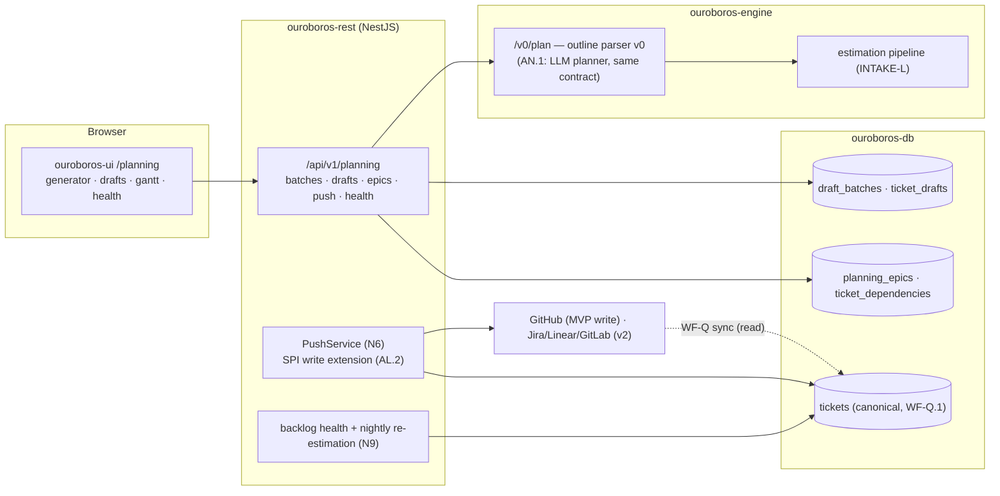
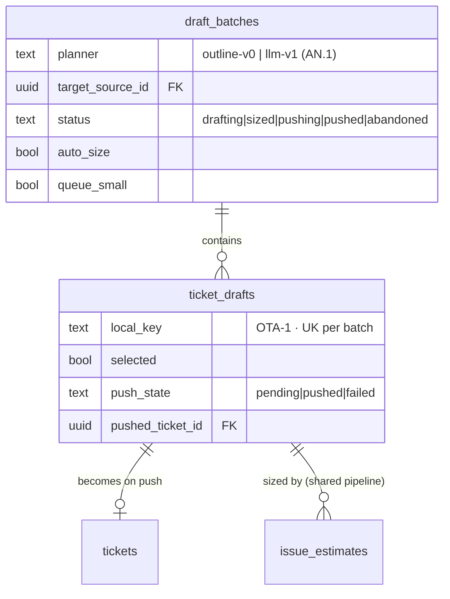
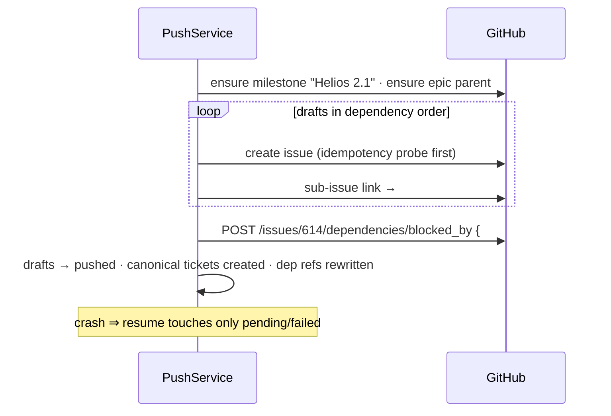
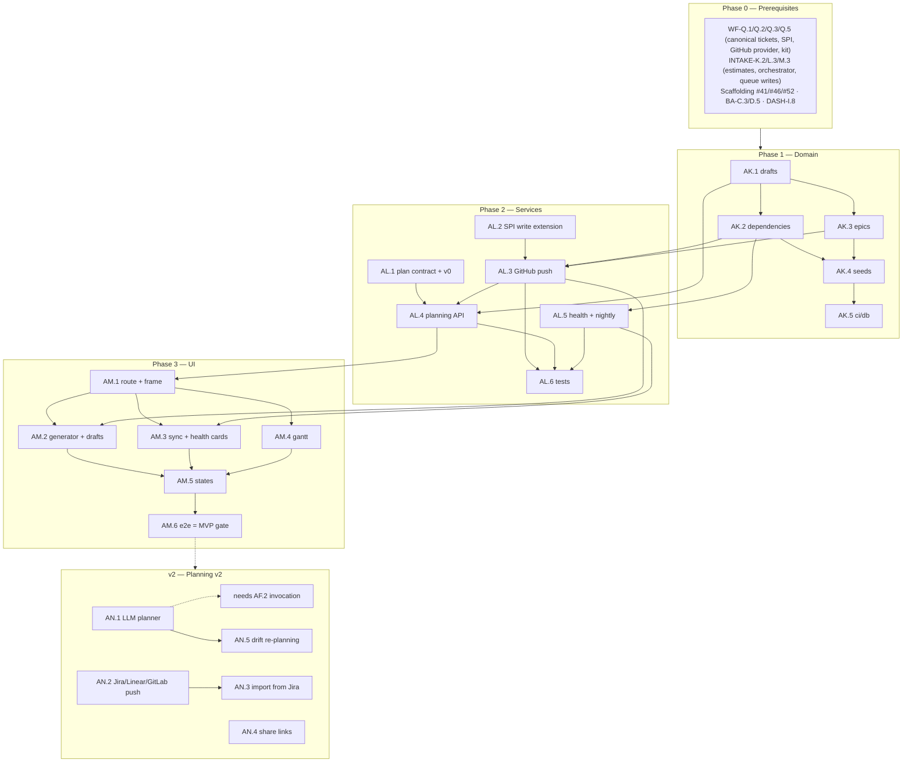

# Roadmap — Planning: Roadmaps & Ticket Generation (Mockup 09)

## Description

> Create a roadmap that covers the features for the mockup page 09. Any additional
> tech infrastructure that is required to implement the functionality in these mockup
> pages should be researched and offered as options for implementing in the roadmap.
> The roamdap should include MVP and v2 options, as well as the labels, milestones,
> and the like, for the tickets to be created. Any ticket sources that are used by
> Ouroboros for ingesting should be pluggable, which includes sources like Jira,
> Linear, GitHub, GitLab, and other bug reporting/issue recording sites. Refer to the
> page so that issues can reference the mockup file when creating the UI/UX design of
> the pages. Be very specific when creating the roadmap, as the options in the
> roadmap for the functionality needs to be complete and very thorough.

## Context & Existing Work (duplicate-avoidance survey)

Surveyed 2026-08-08.

**Design source of truth for every UI ticket in this roadmap:**
[`docs/mockups/09-planning.html`](mockups/09-planning.html) (with
`docs/mockups/assets/ouroboros.css`) — Planning. Its anatomy:

- **Page head** — eyebrow `Planning`, h1 *"Describe the work. Ouroboros writes the
  tickets."*, subline: *"Draft epics and tickets straight into GitHub Issues, Jira,
  or Linear — sized by the estimator, wired with dependencies, and queued for the
  loop the moment you approve them."* Actions: **Import from Jira** (ghost),
  **New roadmap** (primary).
- **Generate Tickets card** (`c-7`, tag `estimator v3`) — prompt textarea labeled
  *"Describe the outcome, not the tasks"* (seeded with the OTA power-loss
  narrative); **target-tracker segmented control** with tinted monograms
  (`GH GitHub Issues` selected · `JI Jira` · `LN Linear`); **Milestone: Helios
  2.1 ▾** selector; toggles **Auto-size with estimator** (on) and **Queue XS/S
  tickets immediately** (off); **Draft tickets ⟳**; divider; **DRAFT — 6
  TICKETS** with `✓ all sized` pill and six `draft-row`s (checkbox, mono id
  `OTA-1…6`, title, dependency note `blocks OTA-3`, effort chip L/M/XS,
  workflow tag `feature-loop`/`hil-verify`/`docs-loop`); footer `est. total ~3
  days of loop time · $14 est. spend`, **Regenerate**, **Push 6 tickets to
  GitHub →**.
- **Tracker Sync card** (tag `every 60s`) — rows: `GitHub Issues · two-way sync ·
  42 issues` (ok dot), `Jira · ACME workspace · epics mirror milestones` (ok),
  `Linear · acme-labs · not connected` (idle dot + **connect ↗**).
- **Backlog Health card** (tag `42 open`) — meters: Sized `38/42` (ok), Blocked
  `4` (warn), Stale > 30d `6` (err); footnote *"Estimator re-runs nightly on
  unsized issues."*
- **Roadmap card** (`c-12`, `ROADMAP — HELIOS 2.1`, tag `Q3–Q4 2026`,
  **Share ↗**) — a pure-CSS-grid **gantt**: month columns Jul–Dec 2026 with
  rules, a glowing **TODAY** marker (Aug 8 ≈ 26% into Aug), five epic lanes as
  tinted bars with progress fills and chips (`OTA hardening · 12 issues · 8
  done` accent w/ 60% progress; `BLE provisioning v2 · 9 · 2` violet; `Motor
  control refactor · 14 · 0` warn; `Fleet telemetry dashboard · 7 · 0` ok;
  `Zephyr 4.2 migration · unscoped` dashed-neutral, label affix `proposed`);
  footnote *"Bars are epics; Ouroboros keeps them in sync with the trackers and
  re-plans when reality drifts."*

**This page is where the pluggable-sources requirement becomes bidirectional.**
Everything so far ingests tickets (WF Epic Q SPI: read/sync). Mockup 09 *writes*:
drafted tickets pushed to GitHub/Jira/Linear with dependencies, epics mirrored to
milestones, two-way sync. This roadmap therefore extends the `TicketSourceProvider`
SPI with **write capabilities** — the second half of the pluggability contract.

**Overlapping work and dispositions:**

| Existing work | Disposition under this roadmap |
|---|---|
| WF Epic Q — `TicketSourceProvider` SPI (read/sync), Q.5 conformance kit; WF-T.2–T.4 Jira/Linear/GitLab providers (v2) | **Extended** — AL.2 adds the write-capability SPI surface (`createTicket`, `linkDependency`, `ensureEpic/Milestone`) + kit cases; GitHub write ships MVP (AL.3); Jira/Linear write rides their v2 providers (AN.2). |
| INTAKE roadmap — canonical tickets (Q.1), estimator pipeline (L.1–L.4, heuristic v0), queue writes (M.3), nightly stale sweep (L.3) | **Consumed & extended** — drafts are sized by the same estimation pipeline (no second sizer); "Queue XS/S immediately" calls M.3 semantics post-push; backlog health computes over canonical tickets; the nightly unsized re-run formalizes L.3's sweep (AL.5). |
| INTAKE-O.5 GitHub write-backs (labels/comments, v2) | **Adjacent, not duplicated** — O.5 annotates *existing* tickets; this roadmap *creates* tickets/epics/dependencies. Both use the same write-capable SPI (AL.2 supersedes O.5's ad-hoc write path; amendment). |
| Workflow tags (WF-P/K5 fixed set), estimator context | **Consumed** — draft rows carry suggested workflow tags from the estimator; registry workflows when WF-P.4 lands. |
| DASH read-model (`est_minutes`), token pricing (DASH-J.4) | **Consumed** — `~3 days of loop time · $14 est. spend` aggregates draft estimates; spend figure only when priced (honesty). |
| Scaffolding #1–#7 epic-parent pattern (our own repo uses sub-issues + relationships) | **Precedent** — GitHub's native sub-issues + `blocked_by` dependencies (GA: REST `/issues/:n/dependencies/blocked_by`, GraphQL `AddBlockedBy`, CLI flags as of 2026) are the primary GitHub mapping (decision N4). |
| Mockups 22 (research), 13 (onboarding), Share targets | **Out of scope** — share links (AN.4), Import from Jira (AN.3) are v2; research page is its own roadmap. |
| Scaffolding #49 `/planning` placeholder, #56 e2e | **Superseded for `/planning`**; #56 gains a planning leg. |
| Pluggable ticket sources requirement (description boilerplate) | **Directly advanced here** — the write-side SPI extension is this roadmap's core; read-side remains WF-Q. |

Epic letters continue the sequence (…AG–AJ): this roadmap uses **AK, AL, AM, AN**.

## Infrastructure Options (researched — thorough, pick before filing)

### 1. Ticket generation engine (the "Draft tickets ⟳" brain)

| Option | What it is | Fit | Trade-offs |
|---|---|---|---|
| **A — Structured outline parser (planner v0) + versioned generation contract, LLM planner as a drop-in v2** ⭐ recommended | MVP: the prompt box accepts an outcome narrative **plus an optional structured outline** (markdown bullets/numbered lists → deterministic ticket splits with `blocks:` annotations); the engine's `/v0/plan` contract carries `{narrative, outline?, context}` → `{drafts[], dependencies[]}`; drafts always flow through the **existing estimator pipeline** for sizing (INTAKE-L). The LLM planner (AN.1) implements the same contract once invocation (AF.2) exists | Honest without the provider stack: outline-mode is genuinely useful (deterministic, reviewable), and the pipeline/UI/push plumbing is identical for v2; sizing is real today via heuristic v0 | Narrative-only input without an outline produces a single draft + a "add an outline or wait for the full planner" hint — the mockup's magic is explicitly staged |
| B — LLM planner in MVP | Outcome → decomposed tickets via completion | The mockup's promise directly | Hard-blocks this page on the providers v2 epic (AF.2); violates the incremental honesty pattern used everywhere else |
| C — Template library (pre-canned decompositions) | Pick "OTA feature" template → stock tickets | Demo-friendly | Fake generality; templates belong to onboarding (mockup 13), not here |

### 2. Tracker write mapping (per-provider dependency & epic semantics)

| Tracker | Create ticket | Dependencies | Epic/milestone mapping | Status |
|---|---|---|---|---|
| **GitHub Issues** | REST create issue | **Native dependencies** (`/issues/:n/dependencies/blocked_by`, GraphQL `AddBlockedBy`) ⭐ primary; body-marker fallback (`Blocks #N`) for GHES versions without it | Milestone = native milestone; epic = parent issue + sub-issue links (the pattern this repo itself uses) | **MVP (AL.3)** |
| Jira | REST v3 create | Issue links type `Blocks` | Epic = native Epic (or parent link); "epics mirror milestones" per the mockup | v2 (AN.2, over WF-T.2) |
| Linear | GraphQL `issueCreate` | Native relations (`blocks`) | Project/milestone mapping | v2 (AN.2, over WF-T.3) |
| GitLab | REST create | Issue links (`blocks`, Premium) / body fallback | Milestone + epic (Premium) | v2 (AN.2, over WF-T.4) |

### 3. Gantt/roadmap rendering

| Option | What it is | Fit | Trade-offs |
|---|---|---|---|
| **A — Custom CSS-grid gantt component** ⭐ recommended | The mockup *is* a CSS grid (month columns × lanes, tinted bars, today marker); build it as a token-driven React component with month scaling, bar drag/resize (month-granular MVP), progress fills | Pixel-fidelity by construction; zero dependencies (lightweight rule); print/share-friendly | Interactions are ours to build — scoped to month-granular drag/resize, not day-level scheduling |
| B — Gantt library (frappe-gantt, vis-timeline, dhtmlx) | Ready-made timeline widgets | Faster rich interactions | Theming fights the design system; dhtmlx commercial; day-granular power the mockup doesn't ask for |
| C — SVG timeline (d3-style) | Hand-rolled SVG | Flexible | More work than grid for the same look |

### 4. Two-way sync & drift policy

| Option | Policy | Fit | Trade-offs |
|---|---|---|---|
| **A — Tracker-owns-content, Ouroboros-owns-planning-metadata** ⭐ recommended | Post-push, the tracker is the source of truth for title/body/state (existing K3 cache-not-fork rule via WF-Q sync); Ouroboros owns sizing, workflow tags, epic membership, and lane dates; epic progress (`12 issues · 8 done`) is *computed* from synced ticket states; "re-plans when reality drifts" = v2 (AN.5) suggestions, never silent mutation | One ownership rule, no merge conflicts by construction; consistent with every prior honesty decision | Lane dates are planning intent, not tracker truth — labeled as such in the UI |
| B — Full bidirectional field merge | Both sides editable everywhere | Maximal flexibility | Conflict-resolution machinery for little gain — rejected |

## Decisions proposed by this roadmap (validate before issue creation)

| # | Decision | Rationale |
|---|----------|-----------|
| N1 | **Drafts are first-class, org-scoped entities** (`ticket_drafts` in a `draft_batches` container) that exist *before* any tracker knows them; push converts drafts → canonical tickets + tracker records atomically per batch | The review-before-push flow (checkboxes, regenerate) is the page's safety promise. |
| N2 | **Generation = option 1-A**: versioned `/v0/plan` engine contract, outline-parser v0 now, LLM planner (AN.1) later behind the same contract; provenance recorded (`planner: outline-v0`) per the intake honesty rule (K10) | The page ships real value without waiting on the provider stack; no fake magic. |
| N3 | **Sizing reuses the intake estimation pipeline** — drafts enter L.3's orchestrator (estimator v0 today, O.2's LLM later); the card's `estimator v3` tag renders the *actual* estimator version | One sizer in the product; `✓ all sized` means what it says. |
| N4 | **Dependencies are canonical**: `ticket_dependencies` (blocks/blocked-by) on canonical tickets *and* drafts; GitHub push uses **native issue dependencies** + sub-issue epic linking (option 2 table), with body-marker fallback where the API is absent | GitHub shipped native dependencies (2025-08) and CLI/GraphQL support (2026); INTAKE's "Blocked" health metric gains real data. |
| N5 | **Epics/lanes are planning entities** (`planning_epics`: name, tint, date range month-granular, status `active|proposed|done`, tracker mirror refs); progress chips computed from linked ticket states (option 4-A ownership split) | Bars must be truth: `12 issues · 8 done` from sync, dates from planning intent. |
| N6 | **Push is per-batch, idempotent, and resumable**: each draft carries push state (`pending|pushed|failed` + tracker ref); partial failures resume without duplicating issues (idempotency keys = batch + draft id) | Pushing 6 tickets that half-fail must never create 9 issues. |
| N7 | **"Queue XS/S immediately" composes existing semantics**: post-push, matching tickets flow through INTAKE-M.3's queue write (sized-only rule enforced; the R.1 trigger pins workflows) — no second queue path | The toggle is composition, not new machinery. |
| N8 | **Tracker-sync card = read+write status of WF-Q sources** (sync cadence, direction badges, counts, connect CTA for unconnected kinds); the `every 60s` cadence is the sources' real poll config | One sources subsystem, two views (settings Q.4 + this card). |
| N9 | **Backlog health = computed metrics over canonical tickets** (sized x/y, blocked via N4 deps, stale >30d on `source_updated_at`); nightly unsized re-estimation formalized as a scheduled job (extends INTAKE-L.3's sweep) | The card's footnote becomes a real cron, not copy. |
| N10 | **Cost/duration footer follows pricing honesty** (DASH-J.4/M7): `~N days of loop time` from summed `est_minutes`; `$ est. spend` only when priced rates exist, else omitted | No fabricated dollars. |
| N11 | **Labels**: new `planning`; **Milestones**: `Planning MVP` / `Planning v2` created at filing; complexity chips XS–L | Description requires labels + milestones for the filing pass. |

## Architecture Overview



## MVP Definition

The MVP is **mockup 09 as a working planning surface**: drafts are real entities,
sized by the real estimator, pushed to GitHub with real dependencies and epics,
tracked on a real gantt. It is done when, against the compose stack:

1. `/planning` reproduces
   [`docs/mockups/09-planning.html`](mockups/09-planning.html) pixel-faithfully
   in **both themes**: generator card (prompt, tracker segment with GitHub
   selected and Jira/Linear rendered honestly per connection state, milestone
   selector, both toggles, draft rows, footer), tracker-sync card, backlog-health
   card, and the gantt roadmap card with the TODAY marker.
2. **Draft generation works** (planner v0): an outline-bearing description
   yields a draft batch — ids, titles, `blocks` dependencies, workflow-tag
   suggestions — each sized by the estimation pipeline (`✓ all sized` truthful,
   `estimator` tag shows the real version); Regenerate re-plans the batch;
   checkbox selection controls inclusion; narrative-only input degrades honestly
   (single draft + guidance toward the outline or the v2 planner).
3. **Push to GitHub works end to end**: selected drafts become real GitHub
   issues in the chosen milestone, wired with **native blocked-by
   dependencies** and linked to the epic's parent issue (sub-issues); the batch
   is idempotent and resumable (N6); pushed tickets appear in the intake
   backlog via normal WF-Q sync; per-draft push states rendered.
4. **"Queue XS/S immediately"** queues matching pushed tickets through the
   existing intake path (N7), visible on the dashboard queue card.
5. **Epics & the gantt are real**: create/edit planning epics (name, tint,
   month-granular range, proposed flag), link tickets (drafts inherit their
   batch's epic), progress chips computed from synced states; the gantt
   renders the mockup's five-lane parity from seeds, supports month-granular
   bar drag/resize, and marks today truthfully.
6. **Backlog health is live**: sized/blocked/stale meters computed from
   canonical tickets (blocked from N4 dependencies), and the nightly unsized
   re-estimation job runs (N9).
7. Integration tests cover generation contract + sizing flow, push idempotency
   (incl. partial-failure resume against a fake tracker), dependency mapping,
   epic progress math, health metrics, isolation; the e2e suite gains a
   planning leg.

**Explicitly v2 (milestone `Planning v2`):** the LLM planner behind the same
contract (AN.1), Jira/Linear/GitLab push + epic mirroring (AN.2), Import from
Jira (AN.3), shareable roadmap links (AN.4), drift detection & re-planning
suggestions (AN.5).

## Epics, Labels & Milestones

| Epic | Name | Goal | Modules | Milestone |
|------|------|------|---------|-----------|
| AK | Planning Domain | Draft batches/tickets, dependencies, epics, schema + seeds + CI | ouroboros-db | Planning MVP |
| AL | Generation, Sizing & Push | `/v0/plan` v0, estimator wiring, SPI write extension, GitHub push, health | ouroboros-rest, ouroboros-engine | Planning MVP |
| AM | Planning UI | Generator card, sync/health cards, gantt, states, e2e | ouroboros-ui | Planning MVP |
| AN | Intelligent Planning (v2) | LLM planner, multi-tracker push, import, sharing, drift re-planning | all | Planning v2 |

Issue naming: `<project>: [<epic>.<issue>] <title>`. Labels: existing set (`mvp`,
`v2`, `rest`, `db`, `engine`, `ui`, `ci`, `design`, `sources`, `intake`) **plus
new `planning`** (decision N11). Milestones **`Planning MVP`** / **`Planning v2`**
created at filing; every issue assigned. Complexity chips: **XS · S · M · L**.

---

## Epic AK — Planning Domain (`ouroboros-db`)

| Issue | Title | Summary | Labels | Parallel | MVP | Complexity | Affected Modules |
|-------|-------|---------|--------|:--------:|:---:|:----------:|------------------|
| AK.1 | ouroboros-db: [AK.1] Draft batches & ticket drafts schema | Pre-push draft entities with generation provenance & push state | mvp, planning, db | N (after WF-Q.1) | Y | M | ouroboros-db |
| AK.2 | ouroboros-db: [AK.2] Ticket dependencies schema | Canonical + draft `blocks` relations (N4), health-metric feeds | mvp, planning, db | N (after AK.1) | Y | S | ouroboros-db |
| AK.3 | ouroboros-db: [AK.3] Planning epics & tracker mirrors | Lanes: tint, month range, status, mirror refs, ticket links | mvp, planning, db | N (after AK.1) | Y | M | ouroboros-db |
| AK.4 | ouroboros-db: [AK.4] Planning dev seeds — mockup-09 parity | Batch OTA-1…6, five epics, health-shaping tickets | mvp, planning, db | N (after AK.2, AK.3) | Y | S | ouroboros-db |
| AK.5 | ouroboros-db: [AK.5] Planning constraints in ci/db | Dependency acyclicity probe, push-state vocab, range checks | mvp, planning, db, ci | N (after AK.4, #24) | Y | XS | ouroboros-db, .github |

### Issue AK.1 — ouroboros-db: [AK.1] Draft batches & ticket drafts schema

- **Problem Statement:** Drafts exist before any tracker knows them (decision
  N1) — with generation provenance, sizing, selection, and push lifecycle per
  draft.
- **Solution/Scope:** Migration: `draft_batches` — id, org FK, `source_prompt`
  text, `outline` text nullable, `planner` (`outline-v0`… — N2 provenance),
  `target_source_id` FK (WF-Q source), `target_milestone` text nullable,
  `epic_id` FK nullable (AK.3), `auto_size` bool, `queue_small` bool, status
  `drafting|sized|pushing|pushed|abandoned`, created_by/at; `ticket_drafts` —
  batch FK, `local_key` (`OTA-1`), `title`, `body` text, `selected` bool,
  `suggested_workflow` tag, estimate linkage (reuses `issue_estimates` via a
  nullable `draft_id` column added there — one sizer, N3), `push_state` CHECK
  `pending|pushed|failed`, `pushed_ticket_id` FK nullable (canonical ticket
  after push), `push_error` jsonb, unique (batch, local_key).
- **Acceptance Criteria:** Batch + drafts round-trip; estimate rows attach to
  drafts through the shared pipeline; push-state transitions constrained;
  regeneration replaces unselected drafts without orphaning estimates.
- **Parallelism/Dependencies:** Needs WF-Q.1 (+INTAKE-K.2 amendment for the
  `draft_id` column). Blocks AK.2–AK.4, AL.*.
- **Technical Stack:** PostgreSQL 17, Flyway.
- **Epic:** AK



### Issue AK.2 — ouroboros-db: [AK.2] Ticket dependencies schema

- **Problem Statement:** `blocks OTA-3` on drafts and the Blocked health
  metric on the live backlog need one dependency model spanning both worlds
  (decision N4).
- **Solution/Scope:** `ticket_dependencies` — org FK, `blocker` + `blocked`
  polymorphic refs (draft-or-ticket via paired nullable FKs + CHECK exactly-
  one-kind each), `origin` CHECK `planned|synced` (planned = authored here;
  synced = mirrored from tracker natives), unique pair, no self-reference;
  push migrates draft-refs → ticket-refs in the same transaction; acyclicity
  enforced service-side (AL.4) with a ci/db probe for stored cycles.
- **Acceptance Criteria:** Draft→draft, draft→ticket, ticket→ticket pairs all
  representable; push rewrites refs atomically; cycle fixture rejected.
- **Parallelism/Dependencies:** Needs AK.1. Feeds AL.3/AL.5, AM.2.
- **Technical Stack:** PostgreSQL 17, Flyway.
- **Epic:** AK

```
ticket_dependencies: (blocker: draft|ticket) ─blocks─▶ (blocked: draft|ticket)
push: OTA-1(draft)→OTA-3(draft) ⇒ #612(ticket)→#614(ticket) · origin: planned
```

### Issue AK.3 — ouroboros-db: [AK.3] Planning epics & tracker mirrors

- **Problem Statement:** The gantt's lanes — tinted, month-ranged,
  proposed-or-active, progress-computed, tracker-mirrored — need their entity
  (decision N5).
- **Solution/Scope:** `planning_epics` — id, org FK, `name`, `tint` CHECK
  (`accent|model|warn|ok|neutral` — the mockup's five), `start_month`/
  `end_month` (date, month-granular; nullable pair for unscoped), `status`
  CHECK `active|proposed|done|unscoped`, `sort_order`, `roadmap_name`
  (`Helios 2.1`) + `roadmap_window` text; `epic_tickets` join (epic FK,
  ticket FK, unique) — progress chips computed via ticket `state`, never
  stored; `epic_mirrors` (epic FK, source FK, kind `milestone|parent_issue|
  jira_epic`, external ref) for N5's mirror bookkeeping (GitHub parent-issue
  MVP).
- **Acceptance Criteria:** Five mockup lanes representable incl. the
  dashed-unscoped case; progress computed from joined states matches
  fixtures; mirror rows round-trip.
- **Parallelism/Dependencies:** Needs AK.1. Feeds AL.3, AM.4.
- **Technical Stack:** PostgreSQL 17, Flyway.
- **Epic:** AK

```
planning_epics{tint, Jul→Sep, active, "Helios 2.1"} ──< epic_tickets >── tickets
  progress chip = count(done)/count(*)   mirrors: GH parent issue #600 · milestone "Helios 2.1"
```

### Issue AK.4 — ouroboros-db: [AK.4] Planning dev seeds — mockup-09 parity

- **Problem Statement:** Design review and e2e need the mockup's exact
  planning state without live generation or push.
- **Solution/Scope:** Extend the dev seed: the OTA draft batch (six drafts
  with the mockup's ids/titles/deps/efforts/tags, all sized via seeded
  estimate rows, `est_minutes` summing to ~3 loop-days), five planning epics
  with the mockup tints/ranges/statuses and ticket links shaping the chips
  (12·8, 9·2, 14·0, 7·0, unscoped), health-shaping canonical tickets
  (38/42 sized, 4 blocked via AK.2 rows, 6 stale via aged
  `source_updated_at`) — coordinated with INTAKE-K.5 counts; tracker-sync
  card states derive from seeded WF-Q sources (GitHub connected two-way,
  Jira connected, Linear absent). Personal org: empty.
- **Acceptance Criteria:** All four cards + gantt render the mockup from
  seeds; totals recompute stably relative to `now()` (today marker lands in
  Aug); idempotent; no conflicts with INTAKE/DASH seeds.
- **Parallelism/Dependencies:** Needs AK.2, AK.3 (+INTAKE-K.5 coordination).
- **Technical Stack:** Flyway repeatable migration, SQL.
- **Epic:** AK

```
seeds: OTA batch (6 sized drafts + deps) · 5 epics (tints, ranges, chip math)
       backlog: 42 open ⇒ 38 sized · 4 blocked · 6 stale · sources: GH✓ JI✓ LN∅
```

### Issue AK.5 — ouroboros-db: [AK.5] Planning constraints in ci/db

- **Problem Statement:** Dependency acyclicity, push-state transitions, and
  month-range sanity are contracts the UI and push service trust.
- **Solution/Scope:** Extend #24 probes: stored-cycle detection (recursive
  CTE), exactly-one-kind dependency refs, push-state vocab, epic range
  ordering (start ≤ end, both-or-neither), tint/status vocabs, unique
  batch-local keys.
- **Acceptance Criteria:** Green on seeds; red on a planted cycle and a
  reversed range (spot-verified).
- **Parallelism/Dependencies:** Needs AK.4, #24.
- **Technical Stack:** GitHub Actions, SQL.
- **Epic:** AK

```
ci/db: migrate ─▶ constraints (+AK probes: acyclic ✓ · refs ✓ · ranges ✓) ─▶ ✓/✗
```

---

## Epic AL — Generation, Sizing & Push (`ouroboros-rest` + `ouroboros-engine`)

| Issue | Title | Summary | Labels | Parallel | MVP | Complexity | Affected Modules |
|-------|-------|---------|--------|:--------:|:---:|:----------:|------------------|
| AL.1 | ouroboros-engine: [AL.1] Plan contract & outline parser v0 | `/v0/plan`: narrative+outline → drafts+deps, versioned, provenance | mvp, planning, engine | N (after #52) | Y | M | ouroboros-engine |
| AL.2 | ouroboros-rest: [AL.2] Write-capability SPI extension | `createTicket`/`linkDependency`/`ensureEpic` + conformance kit cases | mvp, planning, sources, rest | N (after WF-Q.2) | Y | M | ouroboros-rest |
| AL.3 | ouroboros-rest: [AL.3] GitHub push service (batch, idempotent) | Drafts → issues + native deps + sub-issue epics + milestone | mvp, planning, sources, rest | N (after AL.2, AK.2, AK.3) | Y | L | ouroboros-rest |
| AL.4 | ouroboros-rest: [AL.4] Planning API — batches, drafts, epics | Generate/regenerate/select/push endpoints; epic CRUD; queue-small | mvp, planning, rest | N (after AL.1, AK.1) | Y | L | ouroboros-rest |
| AL.5 | ouroboros-rest: [AL.5] Backlog health & nightly re-estimation | Sized/blocked/stale metrics; scheduled unsized re-runs | mvp, planning, rest, intake | N (after AK.2, INTAKE-L.3) | Y | S | ouroboros-rest |
| AL.6 | ouroboros-rest: [AL.6] Planning integration tests | Contract, push idempotency/resume, dep mapping, health, isolation | mvp, planning, rest, ci | N (after AL.3–AL.5) | Y | M | ouroboros-rest |

### Issue AL.1 — ouroboros-engine: [AL.1] Plan contract & outline parser v0

- **Problem Statement:** Generation needs a versioned engine contract today
  and a seamless LLM upgrade later (decision N2) — the planner v0 must be
  deterministic, honest, and genuinely useful.
- **Solution/Scope:** `POST /v0/plan` (shared-secret path, #52 pattern):
  request `{narrative, outline?, context: {workflow_tags, milestone,
  local_key_prefix}}`; response `{drafts: [{local_key, title, body,
  suggested_workflow, dependencies: [local_key]}], planner: "outline-v0",
  notes[]}`; parser v0: markdown outline → tickets (bullet = ticket; nested
  bullets = body detail; `blocks:`/`after:` annotations and ordering
  heuristics → dependencies; tag hints from bracketed markers `[docs]`);
  narrative-only input → one draft + a `notes` entry recommending an outline
  (rendered by AM.2 as guidance); pydantic schemas; OpenAPI committed +
  drift-checked; deterministic (same input → same batch).
- **Acceptance Criteria:** The mockup's OTA outcome *with an outline fixture*
  yields six drafts with the mockup's dependency shape; determinism verified;
  provenance always `outline-v0`; narrative-only degradation tested.
- **Parallelism/Dependencies:** Needs #52. Blocks AL.4; AN.1 implements the
  same contract.
- **Technical Stack:** FastAPI, pydantic v2, markdown parsing.
- **Epic:** AL

```
/v0/plan {narrative, outline: "- Partition table… blocks: OTA-3\n- …"}
  ─▶ {drafts[6]{local_key, deps}, planner: outline-v0}   (AN.1: llm-v1, same shape)
```

### Issue AL.2 — ouroboros-rest: [AL.2] Write-capability SPI extension

- **Problem Statement:** The pluggable-source SPI reads; planning writes. The
  extension must keep the pluggability discipline: capability-flagged,
  conformance-tested, core-code provider-blind (the description's
  requirement, made bidirectional).
- **Solution/Scope:** Extend `TicketSourceProvider` (WF-Q.2):
  `capabilities().write` block (`createTicket?`, `nativeDependencies?`,
  `epicMapping: parent_issue|epic|project|none`, `milestones?`);
  methods `createTicket(conn, draft) → {external_id, external_key, url}`,
  `linkDependency(conn, blocker, blocked)` (native or documented fallback),
  `ensureMilestone(conn, name)`, `ensureEpicContainer(conn, epic) →
  mirror ref`, `attachToEpic(conn, ticket, mirror)`; error taxonomy
  extended (permission, validation, rate); conformance kit (WF-Q.5) gains
  write suites (create/dedupe/link/rollback fixtures) — the in-memory fake
  implements them for core tests; INTAKE-O.5 amendment: its write-backs
  adopt this surface.
- **Acceptance Criteria:** Kit write-suites pass for the fake; lint boundary
  still holds; capability flags gate UI affordances (a read-only source
  renders push-disabled honestly); O.5 amendment posted.
- **Parallelism/Dependencies:** Needs WF-Q.2/Q.5. Blocks AL.3, AN.2.
- **Technical Stack:** TypeScript SPI, Jest kit.
- **Epic:** AL

```
capabilities().write = {createTicket ✓, nativeDependencies ✓, epicMapping: parent_issue, milestones ✓}
core PushService ──SPI only──▶ provider.createTicket / linkDependency / ensureEpicContainer
```

### Issue AL.3 — ouroboros-rest: [AL.3] GitHub push service (batch, idempotent)

- **Problem Statement:** "Push 6 tickets to GitHub →" must create real
  issues, real native dependencies, real epic/milestone wiring — and survive
  partial failure without duplicates (decision N6).
- **Solution/Scope:** GitHub provider write implementation (over WF-Q.3):
  create issue (title/body + a discreet provenance footer), milestone
  ensure-and-assign, **native dependencies** via
  `/issues/:n/dependencies/blocked_by` (GraphQL `AddBlockedBy` alternate;
  body-marker fallback behind a capability probe for older GHES —
  option 2 table), epic wiring: `ensureEpicContainer` = parent tracking
  issue (the pattern of this repo), `attachToEpic` = sub-issue link;
  `PushService`: per-batch orchestration in dependency order (blockers
  first), idempotency (search-by-marker + batch/draft key before create),
  per-draft state transitions, resume endpoint re-runs only
  `pending|failed`, canonical-ticket creation on success (WF-Q sync then
  adopts them), draft→ticket dependency ref rewrite (AK.2), rate-limit
  respect (K.3 discipline).
- **Acceptance Criteria:**
  - Six-draft batch lands as six issues + five native dependency links + one
    parent epic issue + milestone (recorded-fixture and live-sandbox
    verified).
  - Kill the push mid-batch → resume completes without duplicates
    (idempotency proof).
  - Fallback path exercised against a no-dependencies fixture; capability
    honesty (UI told which mode ran).
- **Parallelism/Dependencies:** Needs AL.2, AK.2, AK.3, WF-Q.3. Blocks AL.4
  push routes, AM.2.
- **Technical Stack:** Octokit (REST + GraphQL), Kysely transactions.
- **Epic:** AL



### Issue AL.4 — ouroboros-rest: [AL.4] Planning API — batches, drafts, epics

- **Problem Statement:** The UI needs the full surface: generate, regenerate,
  select, push, epic CRUD, milestone listing, and the queue-small
  composition.
- **Solution/Scope:** Under tenant context: `POST /api/v1/planning/batches`
  (prompt/outline/target/toggles → AL.1 → drafts persisted → auto-size
  dispatch via INTAKE-L.3 when enabled); `POST /:batch/regenerate`
  (replaces unpushed drafts, preserves selections by local_key);
  `PATCH /:batch/drafts/:key` (select/edit title/body — edits mark
  provenance `edited`); `POST /:batch/push` (AL.3; role admin+;
  member can draft, not push — documented policy) + `GET push status`;
  dependency acyclicity validation on all writes (AK.2 service-side);
  `queue_small` post-push hook → INTAKE-M.3 for pushed XS/S (N7);
  epic CRUD (`/api/v1/planning/epics`: create/edit ranges months, tint,
  status, link/unlink tickets, reorder) + roadmap read payload (lanes +
  computed chips); milestone list per source (provider passthrough);
  batch cost/duration summary (N10 honesty). OpenAPI complete.
- **Acceptance Criteria:** Full flow in the harness (generate → size →
  select → push → queue-small); cycle-introducing edit → 422 naming the
  cycle; role matrix enforced; summary omits `$` when unpriced.
- **Parallelism/Dependencies:** Needs AL.1, AK.1–AK.3 (+AL.3 for push).
  Feeds AM.*.
- **Technical Stack:** NestJS, Kysely, class-validator.
- **Epic:** AL

```
POST /batches {prompt, outline, target: gh, autoSize: true} ─▶ 6 drafts (sizing…)
PATCH drafts/OTA-4 {selected: false} · POST push ─▶ 5 issues · queue_small ─▶ M.3(XS/S)
```

### Issue AL.5 — ouroboros-rest: [AL.5] Backlog health & nightly re-estimation

- **Problem Statement:** The health card's three meters and its footnote
  promise (nightly re-runs on unsized issues) must be computed truth
  (decision N9).
- **Solution/Scope:** Health service over canonical tickets: sized x/y
  (estimate presence via the shared pipeline), blocked (open tickets with
  unresolved blockers via AK.2, `origin` both kinds), stale (>30d
  `source_updated_at`, threshold configurable); payload for AM.3; nightly
  scheduled job: enqueue estimation for open unsized tickets (bounded
  batch, INTAKE-L.3 orchestrator, jittered off-peak) — formalizing and
  amending L.3's sweep note; job observability (last run, counts) surfaced
  in the card's tooltip.
- **Acceptance Criteria:** Seeded metrics reproduce 38/42 · 4 · 6; nightly
  job processes a seeded unsized backlog within bounds; metrics recompute
  after sync-state changes; empty org → zeros.
- **Parallelism/Dependencies:** Needs AK.2, INTAKE-L.3 (amendment).
- **Technical Stack:** NestJS scheduler, Kysely.
- **Epic:** AL

```
health: sized 38/42 · blocked 4 (dep-derived) · stale 6 (>30d)
nightly 02:00±jitter ─▶ unsized open tickets ─▶ L.3 orchestrator (bounded batch)
```

### Issue AL.6 — ouroboros-rest: [AL.6] Planning integration tests

- **Problem Statement:** Push idempotency, dependency ordering, and the
  generate→size→queue composition are exactly where silent corruption
  would live.
- **Solution/Scope:** Harness suites (fake tracker via the AL.2 kit fake +
  recorded GitHub fixtures): contract round-trip (AL.1 stub), batch
  lifecycle, push happy/partial-failure/resume/duplicate-probe, dependency
  order + fallback mode, epic mirror wiring, queue-small composition,
  health math (incl. blocked via synced deps), role matrix, org isolation.
- **Acceptance Criteria:** Green in `ci/rest`; removing the idempotency
  probe or the dependency ordering turns tests red; ≤ 75s added.
- **Parallelism/Dependencies:** Needs AL.3–AL.5.
- **Technical Stack:** Jest, Supertest, Testcontainers.
- **Epic:** AL

```
suites: plan ✓ · lifecycle ✓ · push resume ✓ · dep order+fallback ✓ · queue-small ✓ · health ✓
```

---

## Epic AM — Planning UI (`ouroboros-ui`)

Every issue references
[`docs/mockups/09-planning.html`](mockups/09-planning.html) as the design
source — generator/draft-row/sync-row treatments, the CSS-grid gantt spec, and
the shared design system via the #16 tokens (both themes; the mockup is
dark-only).

| Issue | Title | Summary | Labels | Parallel | MVP | Complexity | Affected Modules |
|-------|-------|---------|--------|:--------:|:---:|:----------:|------------------|
| AM.1 | ouroboros-ui: [AM.1] Planning route, head & page frame | `/planning` frame, honest head actions, layout | mvp, planning, ui, design | N (after #41, AL.4, BA-D.5) | Y | S | ouroboros-ui |
| AM.2 | ouroboros-ui: [AM.2] Generator card & draft flow | Prompt/outline, tracker segment, toggles, draft rows, push flow | mvp, planning, ui, design | N (after AM.1, AL.4, AL.3) | Y | L | ouroboros-ui |
| AM.3 | ouroboros-ui: [AM.3] Tracker-sync & backlog-health cards | Source status rows + connect CTA; three health meters | mvp, planning, ui, design | N (after AM.1, AL.5) | Y | M | ouroboros-ui |
| AM.4 | ouroboros-ui: [AM.4] Roadmap gantt component | Custom CSS-grid gantt: lanes, tints, today, drag/resize, editor | mvp, planning, ui, design | N (after AM.1, AL.4) | Y | L | ouroboros-ui |
| AM.5 | ouroboros-ui: [AM.5] Planning states & guards | Empty org, no-writable-source, member limits, load/error | mvp, planning, ui, design | N (after AM.2–AM.4) | Y | S | ouroboros-ui |
| AM.6 | ouroboros-ui: [AM.6] Planning e2e leg | Generate→size→select→push→queue chain; gantt edits; themes | mvp, planning, ui, ci | N (after AM.1–AM.5) | Y | M | ouroboros-ui, .github |

### Issue AM.1 — ouroboros-ui: [AM.1] Planning route, head & page frame

- **Problem Statement:** The frame: headline copy, honest head actions
  (Import from Jira is v2; New roadmap targets the gantt editor), and the
  7/5 + full-width layout.
- **Solution/Scope:** Replace the #49 placeholder: head per the mockup;
  **Import from Jira** rendered as honest "soon" (AN.3); **New roadmap** →
  AM.4's roadmap/epic editor (creates the first epic + names the roadmap);
  grid scaffolding for the three regions; nav "soon" marker removed.
- **Acceptance Criteria:** Frame + actions correct; both themes; #49 stub
  retired (amendment).
- **Parallelism/Dependencies:** Needs #41, AL.4, BA-D.5. Blocks AM.2–AM.5.
- **Technical Stack:** Next.js, #46 primitives.
- **Epic:** AM

```
[Planning] Describe the work. Ouroboros writes the tickets.  [Import from Jira·soon][New roadmap]
```

### Issue AM.2 — ouroboros-ui: [AM.2] Generator card & draft flow

- **Problem Statement:** The page's centerpiece: prompt + outline entry,
  tracker/milestone/toggle controls, the sized draft list with dependency
  notes, and the push flow with per-draft truth.
- **Solution/Scope:** Card per the mockup: labeled textarea (+ an outline
  affordance — collapsible structured-outline field with syntax hints,
  surfacing AL.1's v0 reality; the `estimator vN` tag from real pipeline
  version); tracker segment from writable sources (capability-gated per
  AL.2 — unconnected kinds disabled with tooltip; monogram tints per the
  mockup); milestone selector (per-source list; create-new inline);
  Auto-size and Queue-XS/S toggles (wired to batch flags; queue toggle
  carries the N7 explanation); **Draft tickets ⟳** → batch creation with
  sizing progress (`sizing…` per row → `✓ all sized` only when true);
  draft rows per the mockup (checkbox, mono local key, editable title,
  dependency note, effort chip, workflow tag) + inline edit affordances;
  footer (est. total from real minutes, `$` only when priced per N10;
  **Regenerate** with selection preservation; **Push N tickets to
  <tracker> →** reflecting selection count) → push progress states
  per draft (`pushed ✓ #612` links, `failed` with reason + **Resume
  push**); narrative-only guidance note (AL.1's `notes`) rendered as
  designed hint.
- **Acceptance Criteria:** Seeded batch reproduces the mockup card; full
  generate→size→select→push flow works against compose (sandbox repo);
  partial-failure resume exercised in e2e; footer honesty verified; both
  themes; keyboard/a11y complete.
- **Parallelism/Dependencies:** Needs AM.1, AL.4, AL.3.
- **Technical Stack:** React, #46 primitives, generated client.
- **Epic:** AM

```
[outline ▾]…  (GH●|JI|LN) [Milestone ▾] [auto-size ✓][queue XS/S ✗]  [Draft tickets ⟳]
☑ OTA-1 Partition table… blocks OTA-3 [L][feature-loop]
est. ~3 days · $14   [Regenerate] [Push 6 tickets to GitHub →] ─▶ ✓#612 ✓#613 ✗retry…
```

### Issue AM.3 — ouroboros-ui: [AM.3] Tracker-sync & backlog-health cards

- **Problem Statement:** The side column's two cards: source connection
  truth (read+write view of WF-Q sources per N8) and the computed health
  meters.
- **Solution/Scope:** Tracker-sync card: rows from source status (monogram
  tint by kind, name + config context, sub-line composing direction/counts
  truthfully — `two-way sync · 42 issues` only when write capability is
  live, else `read sync · N issues`; the `every 60s` tag from real poll
  config), status dot (ok/idle/error), **connect ↗** → Q.4 settings for
  absent kinds; backlog-health card: three meters (ok/warn/err per the
  mockup) from AL.5 with drill-hints (blocked → filtered backlog link;
  stale → filtered link), nightly-job footnote with last-run tooltip.
- **Acceptance Criteria:** Seeded cards match the mockup; Linear row shows
  connect CTA; direction labels truthful per capability; meters link into
  filtered intake views; both themes.
- **Parallelism/Dependencies:** Needs AM.1, AL.5 (+Q.4 target).
- **Technical Stack:** React, #46 primitives.
- **Epic:** AM

```
[GH] GitHub Issues — two-way sync · 42 issues ●    [JI] Jira · ACME — epics mirror milestones ●
[LN] Linear · acme-labs — not connected ◌ [connect ↗]
Sized ▓▓▓▓▓▓▓▓▓░ 38/42 · Blocked ▓ 4 · Stale >30d ▓ 6 · "re-runs nightly (02:14 ✓)"
```

### Issue AM.4 — ouroboros-ui: [AM.4] Roadmap gantt component

- **Problem Statement:** The roadmap card is a bespoke CSS-grid gantt
  (option 3-A): month columns, tinted lanes with progress and chips, a
  truthful TODAY marker, and month-granular editing.
- **Solution/Scope:** `RoadmapGantt` component: month-column grid computed
  from the roadmap window (horizontal scroll per the mockup), column rules
  + labels, TODAY marker positioned by real date (fractional within
  month), lane labels + bars from AK.3 epics (five tint classes incl.
  dashed-neutral for unscoped, progress fill from computed done-fraction,
  chip `N issues · M done` — `unscoped` chip for rangeless), bar
  interactions: drag (move) and edge-resize (extend/shrink) snapping to
  months → AL.4 PATCH with optimistic update; click → epic editor sheet
  (name, tint, status/proposed, range, linked-ticket management, mirror
  info); **New roadmap**/lane-add flow; **Share ↗** honest "soon" (AN.4);
  reduced-motion + keyboard alternatives for drag (month steppers);
  footnote line verbatim with the drift claim softened to current truth
  ("kept in sync with trackers" — re-planning arrives AN.5).
- **Acceptance Criteria:** Seeded gantt matches the mockup (bars, tints,
  chips, TODAY at Aug 8 position); drag/resize round-trips and snaps;
  editor round-trips; progress chips recompute after a synced state
  change (harness-verified); both themes; keyboard path complete.
- **Parallelism/Dependencies:** Needs AM.1, AL.4.
- **Technical Stack:** React, CSS grid (no gantt library — option 3-A).
- **Epic:** AM

```
        Jul    Aug    Sep    Oct    Nov    Dec
OTA hardening   [▓▓▓▓▓▓░░░ OTA hardening · 12 issues · 8 done]
BLE prov v2            [ BLE provisioning v2 · 9 · 2 ]
Zephyr 4.2 (proposed)                    [╌ unscoped ╌]
                 ║TODAY (Aug 8)     drag/resize ⇒ month-snap PATCH
```

### Issue AM.5 — ouroboros-ui: [AM.5] Planning states & guards

- **Problem Statement:** No writable source, no epics, member-role limits,
  and load/error conditions need designed handling.
- **Solution/Scope:** States: no writable source (generator renders with
  push disabled + "connect a tracker" CTA → Q.4), no roadmap/epics (gantt
  empty state with New-roadmap CTA), member role (draft/edit allowed,
  push + epic mutations disabled with explanation per AL.4 policy),
  sizing-pipeline degraded (drafts show `sizing…` with the L.3 stale-sweep
  note), skeletons + error banner (DASH-I.7 pattern).
- **Acceptance Criteria:** All states reachable/themed; personal-org seed
  walks the guidance path; member session verified.
- **Parallelism/Dependencies:** Needs AM.2–AM.4.
- **Technical Stack:** React, #46 EmptyState/Skeleton.
- **Epic:** AM

### Issue AM.6 — ouroboros-ui: [AM.6] Planning e2e leg

- **Problem Statement:** The generate→size→push→queue chain crosses UI,
  REST, engine, GitHub, and the intake pipeline — the fullest end-to-end
  path yet.
- **Solution/Scope:** Extend #56: seeded parity (all cards + gantt);
  outline generate → sized drafts → deselect one → push to the sandbox
  repo → issues + native deps + epic parent verified via API → tickets
  appear in intake backlog → queue-small lands XS/S on the dashboard
  queue; push-resume leg (induced failure); gantt drag + editor
  round-trip; health meters shift after a dependency add; member limits;
  both themes screenshot-diffed.
- **Acceptance Criteria:** Green from cold compose (sandbox tracker
  fixture); each leg fails meaningfully when its layer breaks; ≤ 3 min
  added.
- **Parallelism/Dependencies:** Needs AM.1–AM.5, AK.4; amends #56.
- **Technical Stack:** Playwright.
- **Epic:** AM

```
e2e: parity ✓ · generate→size ✓ · push+deps+epic ✓ · sync-back ✓ · queue-small ✓ · gantt ✓
```

---

## Epic AN — Intelligent Planning (v2 · milestone `Planning v2`)

| Issue | Title | Summary | Labels | Parallel | MVP | Complexity | Affected Modules |
|-------|-------|---------|--------|:--------:|:---:|:----------:|------------------|
| AN.1 | ouroboros-engine: [AN.1] LLM planner (outcome → tickets) | Real decomposition behind the AL.1 contract; provenance honest | v2, planning, engine | N (after AL.1, AF.2) | N | L | ouroboros-engine |
| AN.2 | ouroboros-rest: [AN.2] Jira, Linear & GitLab push | Write capabilities on the v2 providers; epic mirroring per tracker | v2, planning, sources, rest | N (after AL.2, WF-T.2–T.4) | N | L | ouroboros-rest |
| AN.3 | ouroboros-rest: [AN.3] Import from Jira | Bulk import → canonical tickets + epic reconstruction | v2, planning, sources, rest | N (after AN.2) | N | M | ouroboros-rest, ouroboros-ui |
| AN.4 | ouroboros-ui: [AN.4] Shareable roadmap links | Read-only public/tenant-scoped gantt shares | v2, planning, ui | N (after AM.4) | N | M | ouroboros-ui, ouroboros-rest |
| AN.5 | ouroboros-rest: [AN.5] Drift detection & re-planning suggestions | Reality-vs-plan analysis; suggested range shifts, never silent | v2, planning, rest, engine | N (after AM.4, AN.1) | N | L | ouroboros-rest, ouroboros-engine |

### Issue AN.1 — ouroboros-engine: [AN.1] LLM planner (outcome → tickets)

- **Problem Statement:** The page's headline magic — narrative → decomposed,
  dependency-wired tickets — needs the invocation stack (AF.2) and lands
  behind the unchanged AL.1 contract (decision N2).
- **Solution/Scope:** LLM planner implementing `/v0/plan`: structured-output
  decomposition (titles, bodies with acceptance criteria, dependency graph,
  workflow-tag suggestions), routed via the `plan` task kind (Z.1),
  provenance `llm-v1 · <model>` + token accounting in `notes`, outline-v0
  retained as fallback (provider outage → honest degradation), quality
  benchmark vs outline-v0 on fixture narratives documented; cost surfaced
  per batch.
- **Acceptance Criteria:** The mockup's narrative (no outline) yields a
  six-draft-class batch with sensible deps; fallback verified; provenance/
  cost honest; benchmark recorded.
- **Parallelism/Dependencies:** Needs AL.1, AF.2 (+Z.1 routing).
- **Technical Stack:** FastAPI, structured output, invocation gateway.
- **Epic:** AN

### Issue AN.2 — ouroboros-rest: [AN.2] Jira, Linear & GitLab push

- **Problem Statement:** The tracker segment promises Jira and Linear as
  push targets; their write capabilities ride the v2 read providers
  (WF-T.2–T.4) plus the AL.2 surface.
- **Solution/Scope:** Write implementations per the option-2 mapping table:
  Jira (create + `Blocks` links + Epic mapping — "epics mirror milestones"
  semantics configurable per source), Linear (GraphQL create + relations +
  project mapping), GitLab (create + links with body fallback on
  non-Premium); conformance write-suites green for each; segment buttons
  activate by capability.
- **Acceptance Criteria:** Kit green ×3 (recorded fixtures); a Jira push
  reproduces the batch with links + epic; capability gating flips the UI
  without changes.
- **Parallelism/Dependencies:** Needs AL.2, WF-T.2–T.4.
- **Technical Stack:** Jira REST v3, Linear GraphQL, GitLab REST.
- **Epic:** AN

### Issue AN.3 — ouroboros-rest: [AN.3] Import from Jira

- **Problem Statement:** The head's ghost button: adopt an existing Jira
  backlog — tickets, epics, links — into the canonical model.
- **Solution/Scope:** Bulk import flow over the Jira provider: scoped JQL
  selection, canonical ticket creation (dedupe vs already-synced), epic
  reconstruction into `planning_epics` (+mirrors), dependency import from
  issue links, progress/summary UI with dry-run preview; idempotent
  re-import.
- **Acceptance Criteria:** Fixture workspace imports with epics + deps
  intact; re-import is a no-op; dry-run matches actual.
- **Parallelism/Dependencies:** Needs AN.2.
- **Technical Stack:** Jira REST/JQL, NestJS.
- **Epic:** AN

### Issue AN.4 — ouroboros-ui: [AN.4] Shareable roadmap links

- **Problem Statement:** `Share ↗` implies stakeholders without logins can
  see the roadmap.
- **Solution/Scope:** Share tokens per roadmap (revocable, expiring,
  read-only render of the gantt + epic summaries; no ticket contents
  beyond counts unless opted), tenant-scoped share (any member) vs public
  link (opt-in, watermarked), audit events on creation/revocation.
- **Acceptance Criteria:** Shared view renders without a session and leaks
  nothing beyond the opted scope (contract test); revocation immediate;
  audited.
- **Parallelism/Dependencies:** Needs AM.4 (+AD.4 audit shape).
- **Technical Stack:** Next.js public route, signed tokens.
- **Epic:** AN

### Issue AN.5 — ouroboros-rest: [AN.5] Drift detection & re-planning suggestions

- **Problem Statement:** "Re-plans when reality drifts" — the footnote's
  boldest claim: compare plan (lane ranges) against reality (velocity,
  remaining estimates) and *suggest* shifts.
- **Solution/Scope:** Drift analysis job: per-epic projected completion
  (remaining `est_minutes` vs observed loop throughput from the runs
  read-model), drift threshold → suggestion objects ("Motor control
  refactor projects 5 weeks past its lane — extend to Nov or split
  scope"), rendered as dismissible gantt annotations; optional LLM
  narrative (AN.1 stack) for split-scope proposals; **never silent
  mutation** (suggest-apply-dismiss lifecycle, audited on apply);
  methodology documented.
- **Acceptance Criteria:** Fixture histories produce documented
  suggestions; apply shifts the lane with provenance; dismiss persists;
  no automatic changes ever (verified).
- **Parallelism/Dependencies:** Needs AM.4, DASH read-model; AN.1 for
  narratives.
- **Technical Stack:** NestJS analysis job, engine narratives.
- **Epic:** AN

```
velocity(runs) × remaining(est) ─▶ projection > lane end + threshold
  ─▶ suggestion chip on bar: "projects 5w late — extend │ split │ dismiss"  (never auto)
```

---

## Work Order (dependency-ordered execution plan)



Ordered checklist (⊕ = parallelizable within its phase):

1. **Phase 0 — Prerequisites:** WF-Q.1/Q.2/Q.3/Q.5; INTAKE-K.2/L.3/M.3;
   #41/#46/#52; BA-C.3/D.5; DASH-I.8.
2. **Phase 1 — Domain:** AK.1 → { AK.2 ⊕ AK.3 } → AK.4 → AK.5
3. **Phase 2 — Services:** { AL.1 ⊕ AL.2 } → { AL.3 ⊕ AL.5 } → AL.4 → AL.6
4. **Phase 3 — UI:** AM.1 → { AM.2 ⊕ AM.3 ⊕ AM.4 } → AM.5 → **AM.6 ✅**
   *(MVP gate, amending #56)*
5. **v2:** AN.1 (after AF.2) → AN.5; AN.2 → AN.3; AN.4 anytime after AM.4.

## Totals

| | Issues | MVP | v2 |
|---|:---:|:---:|:---:|
| Epic AK — Planning Domain | 5 | 5 | 0 |
| Epic AL — Generation, Sizing & Push | 6 | 6 | 0 |
| Epic AM — Planning UI | 6 | 6 | 0 |
| Epic AN — Intelligent Planning | 5 | 0 | 5 |
| **Total** | **22** | **17** | **5** |

Plus amendments executed at filing: INTAKE-K.2 (`draft_id` on estimates),
INTAKE-L.3 (nightly job formalized), INTAKE-O.5 (adopts the AL.2 write
surface), WF-Q.5 (kit write-suites), #49 (`/planning` stub retired), #56
(planning e2e leg).

## References

- Design source: [`docs/mockups/09-planning.html`](mockups/09-planning.html),
  `docs/mockups/assets/ouroboros.css`
- Upstream roadmaps: scaffolding (filed); BetterAuth, dashboard, intake,
  workflow-builder/code, routing, providers, build-farm (validation gates —
  especially WF-Q SPI and INTAKE estimation/queue)
- Tracker write research:
  [GitHub — dependencies on issues (GA changelog)](https://github.blog/changelog/2025-08-21-dependencies-on-issues/) ·
  [manage sub-issues, types & dependencies from GitHub CLI (2026)](https://github.blog/changelog/2026-06-10-manage-sub-issues-types-and-dependencies-from-github-cli/) ·
  [Issues 2.0 API surface (types, sub-issues, relationships)](https://github.com/cli/cli/pull/13057) ·
  [about issues (sub-issues & dependencies docs)](https://docs.github.com/en/issues/tracking-your-work-with-issues/learning-about-issues/about-issues) ·
  single-parent limitation noted in
  [community discussion #196996](https://github.com/orgs/community/discussions/196996)
- Jira REST v3 (issue links `Blocks`, epics), Linear GraphQL (relations),
  GitLab issue links — consulted at implementation via the conformance kit

## UI/UX Shell Compliance (addendum 2026-08-09)

The application shell defined in
[`docs/DESIGN_SYSTEM_APP_SHELL.md`](DESIGN_SYSTEM_APP_SHELL.md) (implementing
roadmap: [`ROADMAP_UIUX_APP_SHELL.md`](ROADMAP_UIUX_APP_SHELL.md)) supersedes
the mockup's top-bar navigation for every UI issue in this roadmap:

1. **Header** — application name/brand upper-left, profile & session controls
   upper-right; no navigation links in the header.
2. **Sidebar navigation** — fixed left rail of icon + name entries from the
   CP.2 module registry. This module is the sidebar's **Planning** entry
   (icon `calendar-range`). Page-level tab sets stay at the top of the
   content pane (CP.4 PageSubnav), sticky within the pane's scroll.
3. **Content-only scrolling** — the content pane is the sole scroll
   container; header and sidebar never scroll; sticky in-page chrome
   (subnavs, dirty-state bars, table headers) sticks within the pane; wide
   content scrolls inside its own wrappers, never at pane level.
4. **Type scale** — every UI issue uses rem-based type/spacing against the
   #16 tokens (CQ.1) so the five-step font-size preference (CQ.2) scales the
   whole surface; hard-coded px font sizes are lint-banned.
5. **Mockup interpretation** —
   [`docs/mockups/09-planning.html`](mockups/09-planning.html) remains the
   design source for page content and card anatomy; its topbar/nav chrome is
   superseded by the shell spec.

Issue-level impact:

| Issue | Amendment |
|---|---|
| AM.1 | Mounts in the shell content pane; navigation reached via the sidebar registry entry, not a topbar link |
| AM.2, AM.3, AM.4, AM.5 | rem-based type, shell tokens; internal wide/tall regions (gantt, matrices, long lists) scroll in their own wrappers |
| AM.6 | Gains shell assertions: header/sidebar fixed during content scroll, correct sidebar active state, font-scale render check at 125% |

## Next Step

Per the roadmap process, **no GitHub issues have been created yet** — this
document is the validation gate. Review in particular: the staged-generation
strategy (N2 — outline-parser v0 now, LLM planner behind the same contract
when invocation exists, no fake magic in between), the write-side SPI
extension (AL.2 — the pluggable-sources requirement made bidirectional, with
GitHub-native dependencies as the first mapping), the push idempotency
contract (N6), the ownership split for two-way sync (option 4-A — tracker
owns content, Ouroboros owns planning metadata, progress always computed),
and the custom CSS-grid gantt choice (option 3-A). Once validated, the
follow-up pass (`/create-issues ROADMAP_MOCKUP_09_PLANNING.md`) creates the
`planning` label **and the `Planning MVP` / `Planning v2` milestones**, files
the 22 issues with epic parents, relationships, and milestone assignments,
and posts the amendment comments listed above.
