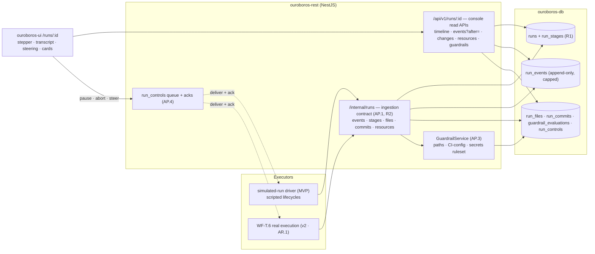
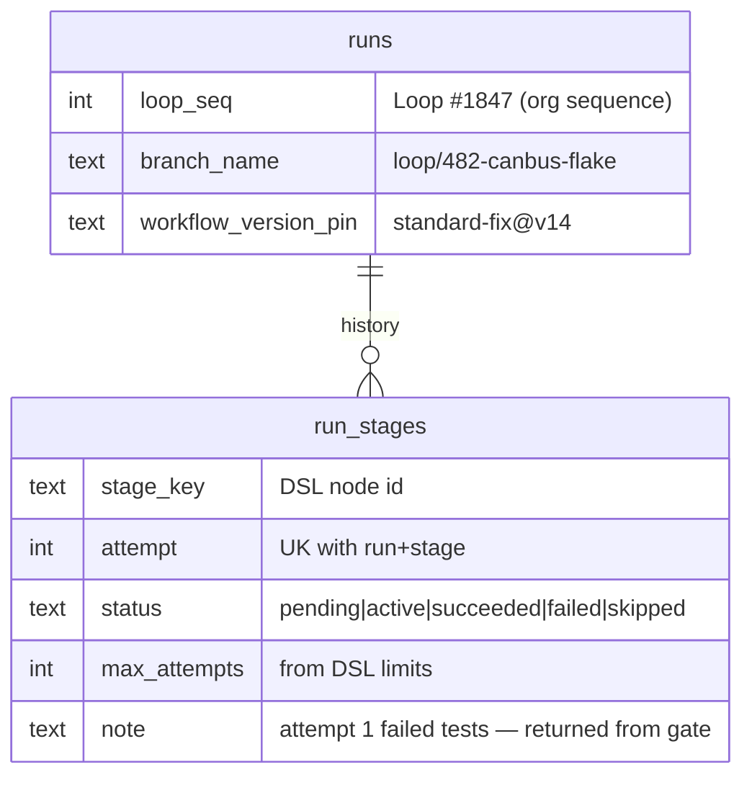
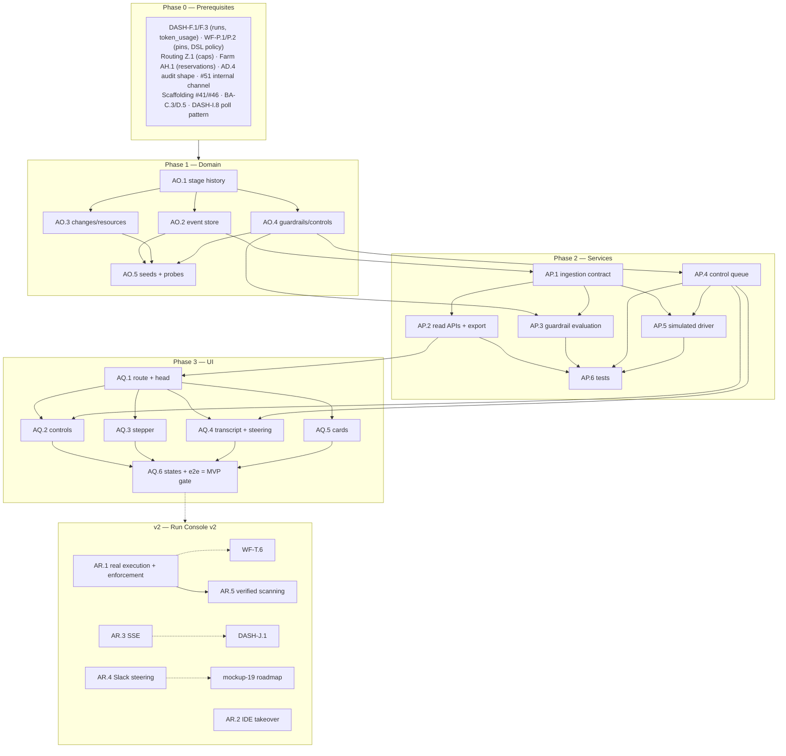

# Roadmap — Run Console (Mockup 10)

## Description

> Create a roadmap that covers the features for the mockup page 10. Any additional
> tech infrastructure that is required to implement the functionality in these mockup
> pages should be researched and offered as options for implementing in the roadmap.
> The roamdap should include MVP and v2 options, as well as the labels, milestones,
> and the like, for the tickets to be created. Any ticket sources that are used by
> Ouroboros for ingesting should be pluggable, which includes sources like Jira,
> Linear, GitHub, GitLab, and other bug reporting/issue recording sites. Refer to the
> page so that issues can reference the mockup file when creating the UI/UX design of
> the pages. Be very specific when creating the roadmap, as the options in the
> roadmap for the functionality needs to be complete and very thorough.

## Context & Existing Work (duplicate-avoidance survey)

Surveyed 2026-08-08.

**Design source of truth for every UI ticket in this roadmap:**
[`docs/mockups/10-run-detail.html`](mockups/10-run-detail.html) (with
`docs/mockups/assets/ouroboros.css`) — the Run Console. Its anatomy:

- **Page head** — eyebrow `Run Console · Loop #1847`, h1 `#482 — Fix flaky
  CAN-bus telemetry test`, meta row (`coding` pulse pill, `standard-fix v14`
  tag, `claude-fable-5` model pill, `elapsed 12m 40s`, `branch
  loop/482-canbus-flake`). Actions: **Pause loop**, **Take over in IDE**,
  **Abort run** (danger).
- **Stage timeline** (`c-12` stepper) — nodes Queued ✓ `0m 04s` → Analyze ✓
  `1m 12s` → Plan ✓ `2m 05s` → **Implement ● active, `attempt 2/3`** with a
  warn note *"attempt 1 failed tests — loop returned from gate ↺"* → Build ○ →
  Test ○ → Review ○ → Open PR ○; glowing done-segments.
- **Agent transcript** (`c-7`, `streaming` pill, **Raw JSONL ↗**) — timestamped
  entries with actor chips: `PLAN` (root-cause note), `TOOL` + tag
  (`read_file` path, `edit_file` with a **diff block** — del/add/ctx line
  treatments, `run_tests` with command + warn result `2 passed, 1 flaked →
  retrying`), `CLAUDE-FABLE-5` (model reasoning paragraphs), `GATE` (warn:
  *"test flake reproduced — returning to implement (attempt 2) ↺"*), and a
  **live entry** (accent left-border, `running… 47/63 cases`, pulsing meter).
  Below: the **steering input** (*"Steer the loop — e.g. 'prefer a fix inside
  the ISR; do not touch the test timeouts'"* + Send) with the caption
  *"Steering nudges the current attempt without pausing it. Works from the
  Slack thread too."*
- **Changes so far** card — file rows with `+38 −12` counts (3 files), commit
  rows (`a41c9e2 · can: replace telemetry k_fifo with k_msgq + frame seq`),
  `will squash on merge` tag.
- **Resources** card — Tokens `212k / 400k budget` meter, Est. cost `$1.14 /
  $2.50 cap` meter, Build farm `forge-02 reserved` (idle dot), Wall clock.
- **Guardrails** card (`clean` pill) — ✓ *Diff confined to allowed paths*, ✓
  *No CI config touched*, ✓ *Secrets scan clean*, ○ *Human review not required
  (auto-merge eligible)*; footer `Policy: standard-fix v14 · tenant
  acme-robotics`.

**The dependency truth.** This console observes an *executing* loop — and
execution itself is deliberately v2 elsewhere (WF-T.6 over #54, gated on the
invocation stack AF.2). The honest MVP (the pattern of every prior roadmap):
build the **run observability plane** — the event store, stage/attempt model,
changes/resources/guardrails data, control contract, and the full console UI —
proven end-to-end against **simulated runs driven through the real ingestion
API**, so that when execution lands it plugs into a finished console rather
than a mockup. Guardrail *evaluation* (paths, CI-config, secrets patterns) runs
genuinely on reported diffs even for simulated runs.

**Overlapping work and dispositions:**

| Existing work | Disposition under this roadmap |
|---|---|
| DASH-F.1 `runs` (single current-stage columns), DASH-J.3 engine→read-model ingestion bridge (v2, defined but unbuilt) | **Extended/absorbed** — AO.1 adds the stage-history/attempt model; **AP.1 owns the run-event ingestion contract**, absorbing DASH-J.3's scope where unbuilt (filing-time coordination, same rule as Q.3↔K.3/K.4). Dashboard stage display upgrades to read from stage history. |
| WF-P.9 (permissions stored as declarations, enforcement deferred), WF-P.2 DSL (limits: retries, token budget) | **Partially redeemed** — AO.4/AP.3 *evaluate* guardrails (allowed paths, CI-config, secrets, review-required) against reported changes and render verdicts; hard enforcement still lands with execution (AR.1). Timeline `attempt 2/3` reads the DSL's retry limit. |
| Routing Z.1 (max-cost per run), DASH-F.3 `token_usage`, DASH-J.4 pricing | **Consumed** — the Resources card computes tokens-vs-budget and cost-vs-cap from real accounting (honesty rules carry: unpriced ≠ $0). |
| Build-farm AH (jobs, reservations) | **Consumed** — `forge-02 reserved` reads a real reservation/job link when present; absent otherwise. |
| Workflow versions (WF-P.1 pins), R.1 trigger pins | **Consumed** — head tags and the Guardrails policy footer render the pinned `standard-fix v14`. |
| Mockups 11 (test results), 12 (PR verification), 19 (ChatOps/Slack), IDE integrations | **Out of scope** — `run_tests` results deep-link later (11); Slack steering is 19's roadmap (the caption's claim is softened until then, AR.4); Take-over-in-IDE deep integration is AR.2 (MVP ships the honest branch-handoff dialog). |
| Pluggable ticket sources requirement (description boilerplate) | **Already satisfied** by WF Epic Q (read) + AL.2 (write); the console links the run's ticket via its canonical `external_key`/URL regardless of tracker. Nothing duplicated. |
| DASH-J.1 SSE (v2), AH.5 offset-fetch log pattern, code-view diff tokens | **Patterns reused** — transcript streaming = offset fetch MVP with the SSE upgrade path; diff rendering reuses the token palette. |
| Scaffolding #49 run-detail links, #56 e2e | **Superseded for the run route**; #56 gains a console leg. |

Epic letters continue the sequence (…AK–AN): this roadmap uses **AO, AP, AQ, AR**.

## Infrastructure Options (researched — thorough, pick before filing)

### 1. Transcript event storage & export

| Option | What it is | Fit | Trade-offs |
|---|---|---|---|
| **A — Postgres append-only `run_events` (typed columns + JSONB payload) with per-run caps, JSONL export generated on demand** ⭐ recommended | One store (consistent with AH.5 logs); typed actor/kind columns make the console query cheap; `Raw JSONL ↗` is a streamed projection of the same rows | Single source of truth, transactional with run state; retention/caps managed like build logs | Very long runs bounded by caps (elision markers, same honesty as AG.5) |
| B — Object storage JSONL as primary + DB index | Cheap unbounded transcripts | Scales further | New infra now; two stores to keep consistent — v2 migration path documented |
| C — Dedicated event store (Kafka/NATS + sink) | Streaming-native | Fleet scale someday | Heavy infra against the lightweight rule — rejected for now |

### 2. Live streaming to the console

| Option | What it is | Fit | Trade-offs |
|---|---|---|---|
| **A — Offset-based incremental fetch on the shared poll cadence (DASH-I.8/AH.5 pattern), SSE upgrade slot reserved (DASH-J.1)** ⭐ recommended MVP | `GET /runs/:id/events?after=<seq>` returns new entries + live flag; the live entry's progress meter updates per poll; one pattern across logs/transcripts | Honest liveness at poll cadence, zero new infra, proven pattern ×3 | Sub-second immediacy waits for SSE (AR.3 rides DASH-J.1) |
| B — SSE now | True push | The `streaming` pill literally | Builds DASH-J.1 early just for this page; poll-first keeps sequencing clean |
| C — WebSocket | Bidirectional | Steering could ride it | Steering is a plain POST; WS adds surface without need |

### 3. Guardrail secrets scanning

| Option | What it is | Fit | Trade-offs |
|---|---|---|---|
| **A — Embedded regex ruleset (gitleaks-class patterns: ~150 well-known secret formats + keyword proximity), run on reported diff hunks server-side** ⭐ recommended MVP | Milliseconds per diff, no external binary, deterministic verdicts for the Guardrails card; ruleset versioned in-repo | Real detection for the common catastrophes (cloud keys, tokens, private keys) with zero infra | Entropy-only secrets slip regexes (~70% recall class); stated in the card's tooltip — honesty |
| B — TruffleHog-class verified scanning | 700+ detectors, live-credential verification | Strongest truth ("this key works") | External binary + outbound verification calls from the control plane; right as the AR.1 upgrade for pre-merge enforcement |
| C — External service (GitGuardian etc.) | Managed governance | Enterprise later | Cost + data egress; contradicts self-hosted default |

### 4. Control delivery (pause / abort / steer)

| Option | Semantics | Fit | Trade-offs |
|---|---|---|---|
| **A — Control-queue rows + engine acknowledgment over the internal API (at-least-once, idempotent, TTL'd)** ⭐ recommended | `run_controls` (kind, payload, state `pending|delivered|acked|expired`); engine polls/receives on its channel, acks with effect (`paused`, `aborted`, `steering applied to attempt N`); UI shows delivery state honestly (`sent → acknowledged`) | Works identically for simulated and real executors; no lost controls; the steering caption's "without pausing" is engine-side semantics the contract carries | Acks require executor cooperation — simulated runs ack via the driver; real acks land with AR.1 |
| B — Direct synchronous RPC to the engine | Simple | Immediate feedback | Fails exactly when you need abort most (engine busy/stuck); no audit trail |

## Decisions proposed by this roadmap (validate before issue creation)

| # | Decision | Rationale |
|---|----------|-----------|
| R1 | **Stage history becomes first-class**: `run_stages` (per stage × attempt: status, timings, notes) extends DASH-F.1's current-stage columns; the loop-return note (`attempt 1 failed tests ↺`) is a stage-transition record, not copy | The stepper, attempt chips, and gate-return notes must be queryable truth; the dashboard's stage display upgrades to the same source. |
| R2 | **AP.1 owns the run ingestion contract** (events, stage transitions, files/commits, resources, farm links), absorbing DASH-J.3's unbuilt scope — one internal API for simulated drivers now and WF-T.6 later | Two ingestion contracts would fork the read-model; filing-time coordination note included. |
| R3 | **Transcript = typed append-only events** (option 1-A): actors `plan|tool|model|gate|user|system`, tool tags, diff payloads, results; per-run caps with elision markers; `Raw JSONL ↗` streams the projection | The mockup's transcript is the product's flight recorder — typed for the console, exportable for tooling. |
| R4 | **Model reasoning appears only as reported** — entries carry provenance (model id, attempt); simulated-run seeds label themselves `simulated` in the JSONL and UI watermark | The transcript must never fabricate model thoughts; the honesty rule applied to its most sensitive surface. |
| R5 | **Guardrails are evaluated server-side on every reported change-set** (allowed-paths from WF stage permissions, CI-config detection, secrets ruleset option 3-A, review-required from workflow policy + routing votes); verdicts stored per evaluation; **enforcement** (blocking) remains execution-side and lands with AR.1 | The card shows real verdicts today; the P9 debt gets its evaluation half paid without pretending to block. |
| R6 | **Controls ride a durable queue with acks** (option 4-A); Abort requires typed confirmation + audit; Pause/Abort/steer all audited (AD.4 shape) with actor identity | Run control is the highest-stakes button row in the product. |
| R7 | **"Take over in IDE" MVP = pause + branch handoff dialog** (branch name, fetch/checkout commands, run context links), deep IDE protocol integration deferred (AR.2) | Honest, immediately useful; no fake IDE magic. |
| R8 | **Resources compute from existing accounting**: tokens vs the stage's DSL budget, cost vs the route's cap (unpriced → count-only per M7/N10), farm reservation from AH links, wall clock from stage history | No new counters — the console reads the systems that already own these numbers. |
| R9 | **Steering caption tells today's truth**: "Works from the Slack thread too" renders only when the ChatOps integration (mockup 19) exists — AR.4 flips it | No promised channels that don't exist. |
| R10 | **Labels**: new `runs`; **Milestones**: `Run Console MVP` / `Run Console v2` created at filing; complexity chips XS–L | Description requires labels + milestones for the filing pass. |

## Architecture Overview



## MVP Definition

The MVP is **mockup 10 as a fully working observability console over the run
ingestion contract**, proven by simulated runs end to end. It is done when,
against the compose stack:

1. `/runs/:id` reproduces
   [`docs/mockups/10-run-detail.html`](mockups/10-run-detail.html)
   pixel-faithfully in **both themes**: head + meta row, the stage stepper
   with done/active/pending states, attempt chips and gate-return notes, the
   transcript with all actor treatments (incl. diff blocks and the live
   entry), the steering input, and the three right-column cards.
2. **The ingestion contract is real** (R2): a scripted simulated-run driver
   walks a run through the full lifecycle — stage transitions with attempts
   and a gate return, transcript events of every kind, file/commit reports,
   token/cost accounting, a farm reservation link — via the same internal API
   real execution will use; the console reflects each step at poll cadence.
3. **Guardrails evaluate genuinely** (R5): reported diffs are checked against
   the pinned workflow's allowed paths and permissions, CI-config detection,
   and the embedded secrets ruleset; verdicts render with evidence
   (offending path/rule) on failure; the review-required row reflects policy
   truth.
4. **Controls work** (R6): Pause/Resume and Abort (typed confirmation)
   deliver through the durable queue and show acknowledgment states; Steer
   appends a user event, delivers to the executor, and renders in the
   transcript; Take-over shows the R7 branch-handoff dialog; all audited.
5. **Cards are computed truth** (R8): changes from reported files/commits
   (squash tag from workflow terminal config), resources from
   `token_usage`/budgets/caps/reservations/wall-clock, guardrails from
   evaluations — em-dashes wherever data is absent.
6. **Raw JSONL export** streams the transcript (R3), watermarked `simulated`
   for driver runs (R4).
7. Integration tests cover ingestion (ordering, idempotency, caps), guardrail
   rule matrices, control delivery/ack/expiry, resource math, isolation; the
   e2e suite gains a console leg driving a simulated run live.

**Explicitly v2 (milestone `Run Console v2`):** real-execution integration +
guardrail enforcement (AR.1), IDE take-over protocol (AR.2), SSE live
transcript (AR.3), Slack-thread steering with mockup 19 (AR.4), verified
secrets scanning + policy escalation (AR.5).

## Epics, Labels & Milestones

Each epic is a parent tracking issue on GitHub; every roadmap issue below is filed as
one of its sub-issues (GitHub Relationships).

| Epic | GitHub | Status | Name | Goal | Modules | Milestone |
|------|:------:|:------:|------|------|---------|-----------|
| AO | #294 | 🟡 Open | Run Observability Domain | Stage history, event store, changes/guardrails/controls schema, seeds | ouroboros-db | Run Console MVP |
| AP | #295 | 🟡 Open | Run Services & Contracts | Ingestion API, streaming reads, guardrail evaluation, control queue, simulator | ouroboros-rest, ouroboros-engine | Run Console MVP |
| AQ | #296 | 🟡 Open | Run Console UI | Head/controls, stepper, transcript + steering, cards, states, e2e | ouroboros-ui | Run Console MVP |
| AR | #297 | 🟡 Open | Live Execution & Extended (v2) | Real-run integration, IDE takeover, SSE, Slack steering, verified scanning | all | Run Console v2 |

Issue naming: `<project>: [<epic>.<issue>] <title>`. Labels: existing set (`mvp`,
`v2`, `rest`, `db`, `engine`, `ui`, `ci`, `design`, `workflow`) **plus new
`runs`** (decision R10, created at filing). Milestones **`Run Console MVP`** /
**`Run Console v2`** created at filing; every issue assigned. Complexity chips:
**XS · S · M · L**.

---

## Epic AO (#294) — Run Observability Domain (`ouroboros-db`)

| Ref | GitHub | Status | Title | Summary | Labels | Parallel | MVP | Complexity | Affected Modules |
|-----|:------:|:------:|-------|---------|--------|:--------:|:---:|:----------:|------------------|
| AO.1 | #298 | 🟢 Done | ouroboros-db: [AO.1] Stage history & attempts schema | `run_stages` per stage×attempt; DASH-F.1 extension (R1) | mvp, runs, db | N (after DASH-F.1) | Y | M | ouroboros-db |
| AO.2 | #299 | 🟢 Done | ouroboros-db: [AO.2] Run event store | Append-only typed `run_events` with caps + JSONL projection shape | mvp, runs, db | N (after AO.1) | Y | M | ouroboros-db |
| AO.3 | #300 | 🟢 Done | ouroboros-db: [AO.3] Changes, resources & farm-link schema | `run_files`, `run_commits`, resource snapshots, reservation refs | mvp, runs, db | N (after AO.1) | Y | S | ouroboros-db |
| AO.4 | #301 | 🟢 Done | ouroboros-db: [AO.4] Guardrail evaluations & control queue schema | Verdict rows with evidence; durable `run_controls` (R5/R6) | mvp, runs, db | N (after AO.1) | Y | M | ouroboros-db |
| AO.5 | #302 | 🟢 Done | ouroboros-db: [AO.5] Console dev seeds — mockup-10 parity + ci probes | The #482 run mid-flight, full transcript, cards; constraint probes | mvp, runs, db, ci | N (after AO.2–AO.4, #24) | Y | M | ouroboros-db, .github |

### Issue AO.1 — ouroboros-db: [AO.1] Stage history & attempts schema

> **GitHub issue:** #298 · **Status:** 🟢 Done · **Parent epic:** #294

- **Problem Statement:** The stepper needs per-stage truth (durations,
  attempts, gate-return notes) that DASH-F.1's current-stage columns cannot
  hold (decision R1).
- **Solution/Scope:** Migration: `run_stages` — run FK, `stage_key` (DSL node
  id), `stage_label`, `position`, `attempt` (≥1), `status` CHECK
  `pending|active|succeeded|failed|skipped`, `started_at/finished_at`,
  `note` (the warn-note text, machine-composed from transitions),
  `max_attempts` (from the DSL limits at pin time), unique (run, stage_key,
  attempt); `runs` gains `loop_seq` (the `Loop #1847` counter, org-scoped
  sequence), `branch_name`, `workflow_version_pin` columns; DASH read paths
  amended to derive current-stage from the newest active row (amendment).
- **Acceptance Criteria:** The mockup timeline (3 done, active attempt 2/3
  with a prior failed attempt, 4 pending) is representable; durations
  computed; dashboard amendment verified against existing seeds.
- **Parallelism/Dependencies:** Needs DASH-F.1. Blocks AO.2–AO.5, AP.1.
- **Technical Stack:** PostgreSQL 17, Flyway.
- **Epic:** AO



### Issue AO.2 — ouroboros-db: [AO.2] Run event store

> **GitHub issue:** #299 · **Status:** 🟢 Done · **Parent epic:** #294

- **Problem Statement:** The transcript is the flight recorder (decision R3):
  ordered, typed, capped, exportable.
- **Solution/Scope:** `run_events` — run FK, `seq` (dense per run), `ts`,
  `actor` CHECK `plan|tool|model|gate|user|system`, `stage_key` +
  `attempt` refs, `tool_tag` nullable (`read_file|edit_file|run_tests|…`),
  `model_id` nullable (provenance per R4), `body` text, `payload` jsonb
  (diff hunks `{ctx|del|add}` lines, test results, progress fractions),
  `simulated` bool (R4 watermark); per-run event/byte caps via trigger with
  elision-marker rows (AG.5 pattern); BRIN on ts; JSONL projection shape
  documented in the migration header (one row ↔ one JSONL line).
- **Acceptance Criteria:** Every mockup entry type round-trips; cap trigger
  inserts elision markers; seq density enforced; projection fixture matches
  the documented JSONL shape byte-for-byte.
- **Parallelism/Dependencies:** Needs AO.1. Blocks AP.1/AP.2, AO.5.
- **Technical Stack:** PostgreSQL 17, Flyway.
- **Epic:** AO

```
run_events(seq↑): {ts, actor: tool, tool_tag: edit_file, payload: {file, hunks[{del|add|ctx}]}}
                  {actor: model, model_id: claude-fable-5, body: "The buffer uses…"}
                  {actor: gate, body: "flake reproduced — returning ↺", stage, attempt}
```

### Issue AO.3 — ouroboros-db: [AO.3] Changes, resources & farm-link schema

> **GitHub issue:** #300 · **Status:** 🟢 Done · **Parent epic:** #294

- **Problem Statement:** The right column's Changes and Resources cards need
  their own truth: cumulative file stats, commits, resource snapshots, and
  the farm reservation link.
- **Solution/Scope:** `run_files` — run FK, `path`, `additions`, `deletions`
  (cumulative, upserted per report), unique (run, path); `run_commits` —
  run FK, `sha`, `message`, `seq`; `runs` gains `merge_strategy` snapshot
  (the `will squash on merge` tag from the pinned terminal config) and
  `reserved_build_job_id` FK nullable (AH linkage); resource truth stays in
  its owning systems (R8 — `token_usage` per run, route cap, DSL budget
  pinned on the stage rows) with no duplicate counters.
- **Acceptance Criteria:** Mockup card contents representable (3 files with
  counts, 2 commits, squash tag, reservation); upsert semantics verified;
  no stored aggregates that could drift.
- **Parallelism/Dependencies:** Needs AO.1. Feeds AP.1, AQ.4.
- **Technical Stack:** PostgreSQL 17, Flyway.
- **Epic:** AO

```
run_files: telemetry_buf.c +38 −12 (upsert per report)   run_commits: a41c9e2 "can: …"
runs.merge_strategy: auto-squash (pin snapshot) · reserved_build_job_id → AH.build_jobs
```

### Issue AO.4 — ouroboros-db: [AO.4] Guardrail evaluations & control queue schema

> **GitHub issue:** #301 · **Status:** 🟢 Done · **Parent epic:** #294

- **Problem Statement:** Guardrail verdicts need evidence-bearing rows
  (decision R5); controls need a durable, ack-tracked queue (decision R6).
- **Solution/Scope:** `guardrail_evaluations` — run FK, `check` CHECK
  `allowed_paths|ci_config|secrets|review_required`, `verdict` CHECK
  `pass|fail|not_applicable|pending`, `evidence` jsonb (offending path,
  matched rule id — never the secret value itself), `evaluated_at`,
  `ruleset_version`; latest-per-check view; `run_controls` — run FK,
  `kind` CHECK `pause|resume|abort|steer`, `payload` (steer text), `state`
  CHECK `pending|delivered|acked|expired|rejected`, `requested_by`,
  timestamps, TTL, `ack_detail`; audit linkage (AD.4 events on every
  control).
- **Acceptance Criteria:** Evidence never contains secret material (CHECK +
  test); control state machine constrained; TTL expiry sweep-able;
  latest-verdict view correct under re-evaluation.
- **Parallelism/Dependencies:** Needs AO.1. Feeds AP.3/AP.4, AQ.5.
- **Technical Stack:** PostgreSQL 17, Flyway.
- **Epic:** AO

```
guardrail_evaluations: {check: secrets, verdict: pass, ruleset: v3}
run_controls: {kind: steer, payload: "prefer a fix inside the ISR…", state: pending→delivered→acked}
```

### Issue AO.5 — ouroboros-db: [AO.5] Console dev seeds — mockup-10 parity + ci probes

> **GitHub issue:** #302 · **Status:** 🟢 Done · **Parent epic:** #294

- **Problem Statement:** Design review needs the exact mid-flight state of
  `#482` — transcript, timeline, cards — without running the simulator.
- **Solution/Scope:** Extend the dev seed (coordinated with DASH-F.5's
  `#482` active run): loop_seq 1847, branch, v14 pin; stage history (Queued/
  Analyze/Plan done with mockup durations, Implement attempt 1 failed +
  attempt 2 active, rest pending); the full nine-entry transcript incl. both
  diff payloads, the gate return, and the live `run_tests` entry at 47/63
  (`simulated: true` per R4); three run_files + two commits + squash
  strategy; token rows summing to 212k against the 400k pinned budget and
  $1.14 vs $2.50 cap; forge-02 reservation (AH seeds); four guardrail
  verdicts (three pass, review not-applicable). ci/db probes: event seq
  density, verdict/control vocabs, evidence-no-secrets, stage uniqueness.
- **Acceptance Criteria:** Console renders the mockup from seeds alone;
  JSONL export watermarked; probes red/green verified; recompute-stable
  relative to `now()`.
- **Parallelism/Dependencies:** Needs AO.2–AO.4 (+DASH-F.5/AH.1 coordination).
- **Technical Stack:** Flyway repeatable migration, SQL.
- **Epic:** AO

```
seed: run #482 @ 12m40s — stages(3✓ · impl 2/3 · 4○) · 9 transcript entries · 3 files/2 commits
      212k/400k · $1.14/$2.50 · forge-02 · guardrails 3✓ 1○ · simulated watermark
```

> **Delivered as `R__dev_seed_run_console.sql`, and three things it had to coordinate.**
> The scope above says *coordinated with DASH-F.5 and AH.1*, and coordination turned out to
> mean three edits to seeds those issues already shipped. Each is commented where it happens
> and each is recorded here, because two of them are places where **two mockups disagree about
> the same row** and a fixture can only be one of them.
>
> 1. **`#482` keeps six stages, not eight.** The stepper on mockup 10 draws eight nodes —
>    Queued, Analyze, Plan, Implement, Build, Test, Review, Open PR — and the scope bullet
>    above lists all eight. Mockup 02 draws the same run as `Implementing · 4/6`, and DASH-F.5
>    seeded `standard-fix` as six stages to match it, which `tests/seed.sql` asserts against
>    `runs_with_stage` for all fifty-three runs (the amendment on #64). Adding `test` and
>    `open-pr` would have made the dashboard row read `4/8`. **Mockup 02 wins**: the stage
>    history is untouched, and mockup 10's stepper renders the six stages the pinned workflow
>    actually has. Reconciling the two pages is a workflow-definition question rather than a
>    seed one, and it belongs wherever `standard-fix`'s node list is next revisited.
> 2. **`forge-02` moves from `q:0` to `q:1`.** Mockup 10's Resources card says *forge-02
>    reserved*; mockup 08 draws `forge-02` idle with an empty queue and no current job. A
>    reservation `runs.reserved_build_job_id` can point at is a `build_jobs` row, and any
>    non-terminal one on that runner is counted by the queue depth its own heartbeat reports.
>    **Mockup 10 wins here**, because the alternative — pointing the reservation at a job that
>    had already finished — would have made the card true by means of a row that is not a
>    reservation. `#483` is queued on `forge-02`, on the loop's branch, and the runner's
>    `queue_depth` telemetry moves with it. It is also the first seeded job with a `run_id`,
>    which narrows AH.1's *"no seeded job is attributed to a loop run"* (decision **B6**) to
>    dispatched jobs — a reservation is not a dispatch, and AJ.3 (#265) still owns the rest.
> 3. **`#482`'s token spend was re-split, and the day's total did not move.** DASH-F.5's
>    ledger attributed 900 000 tokens and $5.40 to this run, from before it had a Resources
>    card; mockup 10 says `212k` and `$1.14`, and mockup 02 says the day is `4.2M ≈ $18.60
>    across 4 providers`. The `claude-fable-5` event keeps the remainder (688 000 tokens,
>    $4.26) and gives up its attribution, and the run's four rows carry the rest — so both
>    pages are right and neither number was invented to make the other work.
>
> **The probes are eleven**, in `tests/verify-constraint-probes.sh`, and the five aimed at
> vocabularies are **widenings rather than drops**. That is the distinction AO.5 adds to a file
> that had only ever dropped rules: a `must_reject` aimed at a word still outside a set keeps
> passing when the set *grows*, so a sixth control state or a fifth guardrail check ships with
> nothing drawing it. `tests/constraints.sql` reads each accepted set out of `pg_constraint`
> and requires a fixture to have written every value of it, which turns the ticket that widens
> a vocabulary red instead of the report that renders a blank cell.

---

## Epic AP (#295) — Run Services & Contracts (`ouroboros-rest` + `ouroboros-engine`)

| Ref | GitHub | Status | Title | Summary | Labels | Parallel | MVP | Complexity | Affected Modules |
|-----|:------:|:------:|-------|---------|--------|:--------:|:---:|:----------:|------------------|
| AP.1 | #303 | 🟢 Done | ouroboros-rest: [AP.1] Run ingestion contract & API | Events/stages/files/commits/resources ingest (absorbs DASH-J.3) | mvp, runs, rest, engine | N (after AO.2, #51) | Y | L | ouroboros-rest |
| AP.2 | #304 | 🟢 Done | ouroboros-rest: [AP.2] Console read APIs & JSONL export | Timeline, offset event stream, cards payloads, export | mvp, runs, rest | N (after AP.1) | Y | M | ouroboros-rest |
| AP.3 | #305 | 🟢 Done | ouroboros-rest: [AP.3] Guardrail evaluation service | Paths/CI-config/secrets/review checks on reported change-sets | mvp, runs, rest | N (after AO.4, WF-P.2) | Y | L | ouroboros-rest |
| AP.4 | #306 | 🟢 Done | ouroboros-rest: [AP.4] Control queue & delivery | Pause/resume/abort/steer with acks, TTLs, audit (R6) | mvp, runs, rest, engine | N (after AO.4, #51) | Y | M | ouroboros-rest, ouroboros-engine |
| AP.5 | #307 | 🟢 Done | ouroboros-engine: [AP.5] Simulated-run driver | Scripted lifecycles through the real contract, incl. control acks | mvp, runs, engine | N (after AP.1, AP.4) | Y | M | ouroboros-engine |
| AP.6 | #308 | 🟢 Done | ouroboros-rest: [AP.6] Console integration tests | Ingestion ordering/idempotency, guardrail matrix, controls, isolation | mvp, runs, rest, ci | N (after AP.2–AP.5) | Y | M | ouroboros-rest |

### Issue AP.1 — ouroboros-rest: [AP.1] Run ingestion contract & API

> **GitHub issue:** #303 · **Status:** 🟢 Done · **Parent epic:** #295

- **Problem Statement:** One internal contract must carry everything an
  executor reports (decision R2) — for the simulator today and WF-T.6
  tomorrow — absorbing DASH-J.3's unbuilt scope.
- **Solution/Scope:** Internal API (shared-secret per #51/AD.3 patterns):
  `POST /internal/runs` (create with pin snapshot, loop_seq assignment),
  `POST /internal/runs/:id/stage-transitions` (validated against the R1
  state machine + DSL attempt limits; gate-return composes the note),
  `POST /internal/runs/:id/events` (batched, seq-assigned, capped),
  `PUT /internal/runs/:id/files` (cumulative upserts) +
  `POST …/commits`, `POST …/resources` (token/cost deltas → `token_usage`
  attribution, reservation links); idempotency keys on all writes; every
  change-set report triggers AP.3 evaluation; OpenAPI (internal) committed;
  DASH-J.3 amendment: its scope is delivered here (filing-time note).
- **Acceptance Criteria:** Simulator lifecycle lands correctly (ordering
  under interleaving, duplicate-key no-ops); invalid stage transitions
  rejected with reasons; dashboard read-model reflects ingested runs
  (cross-roadmap verification).
- **Parallelism/Dependencies:** Needs AO.2, #51. Blocks AP.2/AP.3/AP.5.
- **Technical Stack:** NestJS, Kysely transactions.
- **Epic:** AP

```
executor ─▶ POST stage-transitions {implement, attempt:2, from: gate-fail} ─▶ note composed
         ─▶ POST events[batch] ─▶ seq assigned · caps enforced
         ─▶ PUT files ─▶ upsert + guardrail evaluation queued (AP.3)
```

> **Delivered as `src/modules/ingest/`, `V049__run_ingest_receipts.sql` and eight operations in
> `openapi.internal.yaml`, and four decisions the scope above left open.**
>
> 1. **Idempotency is a receipt, not a natural key.** Every other table in this schema makes a
>    redelivery collide with itself — V040's log chunks on `(job_id, seq)`, V048's controls on
>    `(run_id, idempotency_key)` — and four of AP.1's six operations cannot: opening a run has
>    no natural identity, a stage transition *moves* a row that already exists, an event batch
>    is numbered by the server, and a change-set report is idempotent in its rows and
>    emphatically not in the evaluation it triggers. So `run_ingest_receipts` records the
>    **request**: the operation, the key, a digest of the body and the answer. The digest is
>    the part that is not obvious and is not optional — without it a key reused for a different
>    report would be answered with the earlier report's result, and the caller would be told its
>    report landed when it had not.
> 2. **`simulated` needed a second principal, because it could not be a field.** The criterion
>    is that the watermark follows the principal and cannot be cleared by a client claim, and on
>    a shared-secret channel the only thing a caller proves is *which secret it holds*. So
>    `OURO_RUN_SIMULATOR_SECRET` is a second accepted value of `X-Ouro-Internal-Key`; the guard
>    records which one it admitted and the run's flag follows. The variable is optional — unset
>    is a deployment that runs no simulator — and `configuration.ts` refuses a deployment that
>    sets it equal to `OURO_ENGINE_SHARED_SECRET`, because two principals presenting one proof
>    are one principal. AP.5's driver is what presents it.
> 3. **Guardrail evaluation is triggered here and answered by AP.3.** A change-set report writes
>    the four checks as `pending` — V048's own word for *"a check that has been scheduled and has
>    not answered"* — carrying the report's `change_set_seq`, which V049 allocates and V048
>    deliberately does not. AP.3 substitutes one binding (`GUARDRAIL_SCHEDULER`) and nothing in
>    the service moves: the trigger point, the transaction and the *no files, no evaluation* rule
>    are AP.1's. Writing nothing until AP.3 would have made this ticket's criterion untestable
>    and left `change_set_seq` with no writer.
> 4. **A run's `status` is not moved by this contract, and that is deliberate.** None of the six
>    operations the issue specifies carries one. What *closes* a run is a terminal node's action
>    (WF-T.6) or a control (AP.4) — inferring it from stage rows would be this service guessing
>    at a workflow's semantics, and it would be wrong for every document whose last node is
>    `needs_review`.
>
> **One tension is named rather than papered over.** V008 gave a run an `integer`
> `issue_number`; V030 made a ticket's identity `text`, because Jira's is `PROJ-142` and
> Linear's is a uuid. A run opened for such a ticket has nowhere to put its identity, and
> hashing one would produce a number the console renders and no tracker recognises — so the
> contract answers `409 ticket_not_numbered` and says what it would take to widen it. Every
> other source-neutral part of V030's model is used: a run is opened for a **ticket**, named by
> its source and its canonical `external_key`, and the workspace is resolved from that row
> rather than claimed by the caller.

### Issue AP.2 — ouroboros-rest: [AP.2] Console read APIs & JSONL export

> **GitHub issue:** #304 · **Status:** 🟢 Done · **Parent epic:** #295

- **Problem Statement:** The console needs shaped reads: the timeline, the
  incremental transcript, card payloads, and the raw export.
- **Solution/Scope:** Under tenant context: `GET /api/v1/runs/:id` (head
  meta + stage timeline from R1 history + card payloads: changes, resources
  computed per R8, latest guardrail verdicts); `GET /api/v1/runs/:id/events
  ?after=<seq>` (typed entries + live flag + poll-after hint — option 2-A);
  `GET /api/v1/runs/:id/transcript.jsonl` (streamed projection, simulated
  watermark line, member-readable); 404-not-403 cross-org; OpenAPI complete
  (generated client).
- **Acceptance Criteria:** Seeded payloads reproduce every mockup element;
  offset resume exact under concurrent ingest; export matches the AO.2
  projection fixture; resource math verified (unpriced case → count-only).
- **Parallelism/Dependencies:** Needs AP.1. Feeds AQ.*.
- **Technical Stack:** NestJS, Kysely, streamed responses.
- **Epic:** AP

```
GET /runs/:id ─▶ {head, timeline[stages×attempts], changes, resources, guardrails}
GET /runs/:id/events?after=7 ─▶ {entries[2], live: true, pollAfter: 5}
GET /runs/:id/transcript.jsonl ─▶ streamed · "# simulated run" watermark
```

> **Delivered in `src/modules/runs/` (`console.*.ts`, `run.spend.ts`). Five decisions the scope
> above left open:**
>
> 1. **`GET /runs/:id` changed shape, and the run row is still in it.** It used to answer a bare
>    `RunSummary` (#71). It now answers the console page, with that same row carried whole as
>    `run` beside `head`, `timeline`, `changes`, `resources` and `guardrails`, so a run still has
>    one shape everywhere. The response change is breaking: ouroboros-rest goes to 0.37.0. Every
>    figure the mockup draws is stated server-side, down to durations, totals, `elapsedSeconds`
>    to an `asOf` anchor, and the Guardrails pill (`clean`, `violations`, `pending` or
>    `unevaluated`).
> 2. **Which budget and which cap (R8).** Tokens are the run's whole `token_usage` against the
>    `token_budget` of the **model stage that started most recently**, so a run sitting in
>    *Build* still reads against *Implement*'s `400k`. Cost is measured against the cap of the
>    route that stage **inherits** (`routing.inherit_task` in the pinned document → task kind →
>    `routes.max_cost_cents_per_run`). A stage that pins a model has no route, so it has no cap.
>    An unpriced ledger answers `costCents: null` with the token count and `unpricedEvents`,
>    never `"0"`. The sum is one shared statement (`run.spend.ts`) that AP.1's resources receipt
>    now also calls.
> 3. **The cursor is bounded by `runs.event_seq`.** The tail reads the run first and pages
>    `after < seq ≤ event_seq`. V046 allocates `seq` under the run lock and moves `event_seq` in
>    the same transaction, so a page never sees an entry whose predecessor is still in flight.
>    A cursor past the end is `422 run_events_cursor_out_of_range` with `latestSeq`.
>    `pollAfter` is 5 s while live and the shared dashboard cadence once terminal, following the
>    build log's split.
> 4. **The export writes the view's bytes.** `transcript.jsonl` streams
>    `ouroboros.run_events_jsonl` in batches of 500, bounded by `event_seq` at request time, and
>    adds exactly one line: `# simulated run` when `runs.simulated`. It is served as
>    `application/x-ndjson`, `inline; filename="loop-<n>.jsonl"`. The integration suite
>    compares it to the golden lines in `tests/lib/run-events-jsonl.sql`, read from that file.
> 5. **Absent is absent, null is null.** A missing relationship is an omitted field (`farm`,
>    `returnedFrom`, `evidence`, `repository`). A nullable scalar is `null`. A transcript entry
>    omits null fields, as its JSONL line does.

### Issue AP.3 — ouroboros-rest: [AP.3] Guardrail evaluation service

> **GitHub issue:** #305 · **Status:** 🟢 Done · **Parent epic:** #295

- **Problem Statement:** The Guardrails card must be computed truth
  (decision R5): four checks against the pinned workflow policy and the
  reported change-set, with evidence.
- **Solution/Scope:** `GuardrailService` triggered per change-report:
  **allowed-paths** (stage permissions/plan file-list from the pinned DSL —
  glob match on `run_files` paths), **ci-config** (pattern set:
  `.github/workflows/**`, CI files registry — flags when the stage's
  `touch_ci` permission is false), **secrets** (embedded ruleset per option
  3-A: ~150 gitleaks-class patterns + keyword proximity, run over reported
  diff hunks; ruleset versioned + documented; recall limits stated in the
  card tooltip), **review-required** (workflow terminal policy + routing
  vote rules → required/not-required with the auto-merge-eligible caption);
  evidence rows (path, rule id, line ref — never the secret value);
  re-evaluation supersedes (latest-per-check view); failure verdicts flag
  the run (`needs_human` interplay documented — full enforcement AR.1).
- **Acceptance Criteria:** Rule matrix fixtures (each check × pass/fail/n-a);
  a seeded diff with a planted AWS-key pattern fails `secrets` with rule-id
  evidence and no secret text stored; CI-file touch flags correctly;
  performance ≤ 50ms per typical change-set.
- **Parallelism/Dependencies:** Needs AO.4, WF-P.2 (policy source). Feeds
  AQ.5.
- **Technical Stack:** NestJS, embedded regex ruleset (versioned), glob
  matching.
- **Epic:** AP

```
change-set ─▶ paths ⊨ allowed globs ✓ · ci-config ∉ diff ✓ · secrets ruleset v3 ✓
policy(standard-fix@v14) ─▶ review_required: no (auto-merge eligible)
fail ─▶ {verdict: fail, evidence: {path, rule: aws-access-key-id}}  (no secret stored)
```

> **Delivered as `src/modules/guardrails/`, bound to AP.1's `GUARDRAIL_SCHEDULER`, and four
> decisions the scope above left open.**
>
> 1. **The plan is the path scope.** The DSL's stage `permissions` carry `push_fixup` and
>    `touch_ci` but no path globs, so `allowed_paths` is judged against the run's plan —
>    `issue_estimates.breakdown.files` on the mirrored issue — with each declared file widened to
>    its directory (`drivers/can/a.c` admits `drivers/can/**`; a root file admits only itself),
>    plus the CI registry when the stage may touch CI. No plan is `not_applicable`, not a pass.
> 2. **Hunks ride on the change-set report and are stored nowhere.** `PUT …/files` gained an
>    optional per-file `hunks: [{newStart, lines: [{kind, text}]}]` (additive, 0.35.32); only
>    `add` lines are scanned, a finding is `{path, line, rule_id}`, and every evidence string is
>    screened against V048's constraints before it is written. A report with no hunks is
>    `not_applicable` for secrets — a scan that did not happen draws no tick.
> 3. **`review_required` has three answers.** Auto-merge terminal and no matching `add_vote`
>    rule → `not_applicable` (the mockup's `○`); a terminal that routes to a person → `pass`;
>    a matching vote rule under an auto-merge terminal, or an unreadable pin → `fail`.
> 4. **`needs_human` is a flag, not a transition.** A fail is returned as `guardrailFailures` and
>    `needsHuman: true` on the change-set answer; `runs.status` is untouched and nothing stops —
>    enforcement is AR.1 (#315). The recall limit is `SECRETS_RULESET_DISCLOSURE`, for AQ.5's
>    tooltip.
>
> The amendments filed on #305 — protected paths (#380/#481), single-use exceptions
> (#459/#461) and marketplace grants (#769) — join this evaluation from their own tickets; none of
> their tables exists yet.

### Issue AP.4 — ouroboros-rest: [AP.4] Control queue & delivery

> **GitHub issue:** #306 · **Status:** 🟢 Done · **Parent epic:** #295

- **Problem Statement:** Pause/abort/steer must survive executor hiccups,
  prove delivery, and leave an audit trail (decision R6).
- **Solution/Scope:** Public API: `POST /api/v1/runs/:id/controls`
  (kind+payload; role policy: member may steer, admin+ may pause/abort;
  abort requires typed confirmation client-side + server re-check); queue
  semantics per option 4-A (pending → delivered on executor fetch/push →
  acked with effect detail; TTL expiry with UI-visible outcome; duplicate
  suppression for pause/abort); engine-side contract (fetch/ack endpoints
  on the internal channel + steer-injection semantics documented:
  steering appends to the current attempt's context without pausing);
  user steer event mirrored into the transcript (actor `user`); audits on
  every control (actor, run, kind).
- **Acceptance Criteria:** Full lifecycle against the simulator (steer
  reflected in transcript + acked with "applied to attempt 2"); abort
  mid-stage terminates the simulated lifecycle; expiry path rendered; role
  matrix + audit rows verified.
- **Parallelism/Dependencies:** Needs AO.4, #51. Blocks AP.5 acks, AQ.2/AQ.3.
- **Technical Stack:** NestJS, engine contract endpoints.
- **Epic:** AP

```
POST controls {steer: "prefer ISR fix"} ─▶ pending ─▶ delivered ─▶ acked("applied to attempt 2")
POST controls {abort} (typed confirm, admin+) ─▶ … ─▶ run: canceled · audited
```

> **Delivered as `src/modules/controls/` over V048's `run_controls`, with `V050`, and five
> decisions the scope above left open.**
>
> 1. **`canceled` is a new terminal run status (V050).** None of V008's three was true of an
>    abort: `failed` would draw a person's decision as the agent's failure. An acked abort sets
>    `status = canceled` and `finished_at`, and leaves `branch_name` alone. It counts in the
>    merge-rate window like every other terminal status. The UI's status maps gained it
>    (neutral tone).
> 2. **The typed confirmation is the loop number.** `confirmation` must equal `runs.loop_seq`
>    (a leading `#` and whitespace are forgiven), re-checked on the locked row. The role is
>    checked before anything is read: steer is member+, pause/resume/abort admin+, and a
>    refusal is the existing `403 forbidden`.
> 3. **A refusal is a row.** A control against a finished run is written `rejected` with a
>    displayable reason, so it is audited and the chip can say why. `expired` stays a separate
>    state. The listing, the fetch and the ack sweep their own run first; a jittered loop
>    (`OURO_RUN_CONTROL_SWEEP_SECONDS`) sweeps the rest. TTLs: `OURO_RUN_CONTROL_TTL_SECONDS`
>    (120) and `OURO_RUN_STEER_TTL_SECONDS` (300).
> 4. **Duplicates collapse two ways.** A second pause/abort while one is pending or delivered
>    answers with that one, and a retry under the same `idempotencyKey` answers with the
>    control the key named (`409 control_key_reused` for a different body).
> 5. **The engine side is a contract, not a loop.** `POST /internal/runs/:id/controls/fetch`
>    and `…/controls/:controlId/ack` are published in `openapi.internal.yaml` with each kind's
>    semantics, and `ouroboros-engine`'s control-plane client mirrors them. The loop that
>    honours them is AP.5's (#307) and AR.1's (#315).
>
> The #412 amendment's *remember this* flag is `run_controls.remember` (V050): steer-only and
> frozen at insert, waiting for BF.3 (#412) to read it. The chat-ops path (#537/#549) will
> submit through the same service.

### Issue AP.5 — ouroboros-engine: [AP.5] Simulated-run driver

> **GitHub issue:** #307 · **Status:** 🟢 Done · **Parent epic:** #295

- **Problem Statement:** The MVP's proof: scripted lifecycles exercising the
  entire contract — including control acknowledgment — so the console is
  end-to-end real before execution exists.
- **Solution/Scope:** Engine-side driver (dev/test tooling, #51 channel):
  scenario scripts (happy path; gate-return with attempt 2 — the mockup's
  story; guardrail-violation scenario; abort/pause/steer-responsive
  scenario) emitting realistic cadence (configurable time compression);
  control fetch/ack loop honoring pause/abort/steer semantics; `simulated`
  flags on everything (R4); CLI/endpoint to launch scenarios in dev &
  e2e; explicitly excluded from production builds.
- **Acceptance Criteria:** The mockup scenario replays end-to-end in compose
  with the console live; steer mid-scenario alters a scripted branch
  (visible ack + transcript); production build excludes the driver
  (verified).
- **Parallelism/Dependencies:** Needs AP.1, AP.4. Feeds AQ e2e.
- **Technical Stack:** FastAPI (dev router), scenario scripts.
- **Epic:** AP

```
scenario "482-gate-return" ─▶ queued→analyze→plan→implement(1)→gate↺→implement(2)→…
  · emits events/files/resources at compressed cadence · acks controls · simulated: true
```

> **Delivered as `ouroboros-engine/src/ouroboros_simulator/` (the driver, not in the wheel), the
> run-ingestion mirror `ouroboros_engine/control_plane/ingest.py` (production, for AR.1 too), and
> one seed row. Five decisions the scope above left open:**
>
> 1. **The driver is a package beside the engine, not inside it.** `pyproject.toml` builds the
>    wheel from `src/ouroboros_engine` alone and the image installs that wheel, so the image
>    cannot carry `ouroboros_simulator`. `tests/test_simulator_packaging.py` builds the wheel
>    with hatchling and reads it: no driver file, no command for it, and the only mention is
>    `main.py`'s guarded `importlib` of `/dev`, which also fails closed in a build without it.
> 2. **One client, two transports.** Every request is built by the production
>    `ControlPlaneClient`, which now mirrors all six ingestion operations, and the driver adds
>    only a `urllib` transport that retries `502`/`503`/`504` with the same idempotency key. It
>    presents `OURO_RUN_SIMULATOR_SECRET`, refuses a value equal to the executor's, and stops
>    before writing anything if the opened run comes back without `simulated: true`.
> 3. **Launching.** `uv run python -m ouroboros_simulator <scenario> [--speed N]` runs from the
>    host against `OURO_REST_URL` (compose publishes REST on `:4000`). A development engine with
>    the simulator secret set also serves `GET /dev/scenarios`, `POST /dev/simulations` and
>    `GET /dev/simulations/{id}` behind the internal key. `--speed` divides every scripted
>    duration; timestamps stay real.
> 4. **`#482` needed a ticket.** The console run was seeded straight into `runs`, and `POST
>    /internal/runs` opens a run for a *ticket*. `R__dev_seed_ticket_planning.sql` now mirrors
>    `#482` (`5eed0030…`), **closed**, so mockup 09's open-ticket figures do not move. Without a
>    plan on the mirrored issue, `allowed_paths` is `not_applicable`, so `guardrail-violation`
>    fails `ci_config` (a `.github/workflows/` edit under `touch_ci: false`) and `secrets` (a
>    planted AWS key id, assembled at run time and sent only in hunks).
> 5. **"Merged" is the terminal stage, not a status.** The ingestion contract has no operation
>    that moves `runs.status` (AP.1 decision 4), so `happy-path` and `482-gate-return` end with
>    `open-pr` succeeded and a transcript line. Only an acknowledged abort closes a run
>    (`canceled`). A steer is read at scripted branch points (`482-gate-return` attempt 2 and
>    `control-responsive`'s survey) and changes the edit, the change-set and the commit.

### Issue AP.6 — ouroboros-rest: [AP.6] Console integration tests

> **GitHub issue:** #308 · **Status:** 🟢 Done · **Parent epic:** #295

- **Problem Statement:** Ingestion ordering, guardrail matrices, and control
  semantics are the console's correctness core.
- **Solution/Scope:** Harness suites: ingestion (interleaved batches,
  idempotency, cap/elision, invalid transitions), guardrail matrix (AP.3
  fixtures), control lifecycle (deliver/ack/expiry/role/audit), read APIs
  (offset resume, export fidelity, resource math incl. unpriced), org
  isolation everywhere.
- **Acceptance Criteria:** Green in `ci/rest`; removing idempotency or the
  transition validator turns tests red; ≤ 90s added.
- **Parallelism/Dependencies:** Needs AP.2–AP.5.
- **Technical Stack:** Jest, Supertest, Testcontainers.
- **Epic:** AP

```
suites: ingest ✓ · guardrails ✓ · controls ✓ · reads/export ✓ · isolation ✓
```

> **Delivered as four suites beside AP.1–AP.4's own (`ouroboros-rest/src/modules/runs/console.*`)
> and additions to the ingest and guardrail suites. Four decisions the scope above left open:**
>
> 1. **Mutation checks are one named test per mechanism** (`console.mutation.integration-spec.ts`):
>    `idempotency: …`, `transition validator: …`, `evidence constraint: …`. Each was demonstrated
>    at review: disabling the receipt ledger, making `canTransition()` answer `true`, and dropping
>    V048's nine `guardrail_evaluations_evidence_*` CHECKs each turned exactly its own test red.
> 2. **"Every route" is checked, not listed.** The isolation suite holds its route table equal to
>    the route table the running application registers under `/api/v1/runs` and `/internal/runs`.
>    Public routes answer another org's run `404 run_not_found`. The internal principals are
>    fleet-wide and carry no org, so internal routes are isolated by the *references* they accept
>    (another org's repository, build job or control → `404`), and the run-id-only ones are
>    asserted to `404` a run nobody has.
> 3. **Fixtures are parsed out of `10-run-detail.html` at test time** (`console.mockup.fixture.ts`),
>    and `ci/rest` now runs on an edit to that file. One disagreement is pinned both ways rather
>    than hidden: the stepper after the active node, where mockup 01's `Implementing · 4/6` (which
>    the shared dev seed follows) and mockup 10's `Implement … Open PR` differ.
> 4. **The guardrail matrix runs end to end for the nine cells `standard-fix` can reach**; the
>    cells that need `touch_ci: true` or another review policy stay in `guardrails.checks.spec.ts`.

---

## Epic AQ (#296) — Run Console UI (`ouroboros-ui`)

Every issue references
[`docs/mockups/10-run-detail.html`](mockups/10-run-detail.html) as the design
source — stepper/transcript/card treatments, actor chips, diff line classes —
via the #16 tokens (both themes; the mockup is dark-only).

| Ref | GitHub | Status | Title | Summary | Labels | Parallel | MVP | Complexity | Affected Modules |
|-----|:------:|:------:|-------|---------|--------|:--------:|:---:|:----------:|------------------|
| AQ.1 | #309 | 🟢 Done | ouroboros-ui: [AQ.1] Run route, head & meta row | `/runs/:id` frame, live meta, links from dashboard/farm | mvp, runs, ui, design | N (after #41, AP.2, BA-D.5) | Y | S | ouroboros-ui |
| AQ.2 | #310 | 🟢 Done | ouroboros-ui: [AQ.2] Run controls (pause · abort · take-over) | Action row with confirmation, ack states, branch-handoff dialog | mvp, runs, ui | N (after AQ.1, AP.4) | Y | M | ouroboros-ui |
| AQ.3 | #311 | 🟢 Done | ouroboros-ui: [AQ.3] Stage timeline stepper | Done/active/pending nodes, attempt chips, gate-return notes | mvp, runs, ui, design | N (after AQ.1) | Y | M | ouroboros-ui |
| AQ.4 | #312 | 🟢 Done | ouroboros-ui: [AQ.4] Agent transcript & steering | Streaming entries, actor chips, diff blocks, live entry, steer input | mvp, runs, ui, design | N (after AQ.1, AP.4) | Y | L | ouroboros-ui |
| AQ.5 | #313 | 🟢 Done | ouroboros-ui: [AQ.5] Changes, resources & guardrails cards | The three right-column cards from computed payloads | mvp, runs, ui, design | N (after AQ.1) | Y | M | ouroboros-ui |
| AQ.6 | #314 | 🟢 Done | ouroboros-ui: [AQ.6] Console states & e2e leg | Terminal/queued/error states, watermark, themes, simulated e2e | mvp, runs, ui, ci | N (after AQ.2–AQ.5) | Y | M | ouroboros-ui, .github |

### Issue AQ.1 — ouroboros-ui: [AQ.1] Run route, head & meta row

> **GitHub issue:** #309 · **Status:** 🟢 Done · **Parent epic:** #296

- **Problem Statement:** The console's frame: loop-numbered eyebrow, ticket
  headline, live meta row — and the incoming links (dashboard active-loops
  rows, farm current-job cells) finally landing somewhere real.
- **Solution/Scope:** `/runs/:id` route: eyebrow (`Run Console · Loop
  #NNNN`), h1 from the canonical ticket (`external_key — title`, linked to
  its tracker URL), meta row (status pill by run state, workflow-pin tag,
  model pill from the active stage's resolution, ticking elapsed, mono
  branch with copy affordance); polling via the I.8 pattern; upstream link
  amendments (DASH-I.3, AI.2's job cells) target this route; `simulated`
  watermark banner when flagged (R4).
- **Acceptance Criteria:** Seeded head matches the mockup; elapsed ticks
  without drift on refresh; dashboard/farm links navigate here
  (amendments verified); watermark shows on seeds; both themes.
- **Parallelism/Dependencies:** Needs #41, AP.2, BA-D.5. Blocks AQ.2–AQ.5.
- **Technical Stack:** Next.js, #46 primitives, I.8 poll hook family.
- **Epic:** AQ

```
Run Console · Loop #1847
#482 — Fix flaky CAN-bus telemetry test          [Pause loop][Take over in IDE][Abort run]
(●coding)(standard-fix v14)(claude-fable-5) elapsed 12m 41s · loop/482-canbus-flake ⧉
```

> **Delivered as `ouroboros-ui/app/runs/` and `/runs/[id]`, plus one additive contract field.
> Three decisions the scope above left open:**
>
> 1. **The headline links to GitHub only.** Runs are keyed on `github_repo_id` + `issue_number`,
>    and `RunConsole` (#304) carries the repository as GitHub names it but no ticket
>    `external_key` or tracker URL — so the link is `github.com/{owner}/{name}/issues/{n}`,
>    plain text when `head.repository` is omitted. The non-GitHub-tracker criterion needs the
>    contract to carry the canonical ticket's URL and is left for that change.
> 2. **The farm link needed the job's run.** `RunnerJobRef` gained a nullable `runId`
>    (`build_jobs.run_id`), ouroboros-rest **0.37.2** (additive). A cell with a run links to
>    `/runs/:id?from=build-farm`; a hand-submitted build (decision B6) keeps the job sheet.
> 3. **The contextual origin is `?from=`.** Links carry the originating sidebar entry's id; the
>    page reads it against an allow-list and publishes it with `setNavOrigin`, and the sidebar
>    lights that entry only while no route matches. Elapsed reuses the dashboard's anchored
>    `Elapsed` (`now − startedAt`, floored at the server's figure).

### Issue AQ.2 — ouroboros-ui: [AQ.2] Run controls (pause · abort · take-over)

> **GitHub issue:** #310 · **Status:** 🟢 Done · **Parent epic:** #296

- **Problem Statement:** The head's three actions carry real consequences —
  ack-visible delivery, typed-confirmation abort, and the honest take-over
  handoff (decisions R6/R7).
- **Solution/Scope:** **Pause loop** (→ Resume when paused): control POST
  with inline state (`sending → sent → acknowledged` chip; expiry rendered
  as "no response — run may be between stages"); **Abort run**: danger
  dialog (type the loop number, consequence text: branch preserved, run
  marked canceled), admin+ only; **Take over in IDE**: dialog per R7 —
  pauses the loop, shows branch + copy-able `git fetch/switch` commands,
  links (ticket, transcript export), note that deep IDE integration is
  arriving (AR.2); member role: steer-only (buttons hidden per AP.4
  policy).
- **Acceptance Criteria:** Full pause→ack and abort flows against the
  simulator in e2e; ack/expiry states truthful; abort confirmation gates;
  role visibility verified; both themes.
- **Parallelism/Dependencies:** Needs AQ.1, AP.4.
- **Technical Stack:** React, #46 primitives.
- **Epic:** AQ

```
[Abort run] ─▶ "Type 1847 to confirm — branch loop/482-… is preserved" ─▶ acked · canceled
[Take over] ─▶ paused ✓ · git fetch origin loop/482-canbus-flake … ⧉ · "deep IDE integration soon"
```

> **Delivered as `ouroboros-ui/app/runs/run-controls.tsx` and its two dialogs, plus e2e leg 17.
> Four decisions the scope above left open:**
>
> 1. **Paused is read from the queue.** `RunConsole` carries no paused flag, so the loop is
>    paused exactly when the newest *acknowledged* pause-or-resume is a pause
>    (`app/runs/controls.ts`). The chips poll `GET /api/runs/:id/controls` every 2 s while a
>    control is `pending`/`delivered` and at the shared 15 s otherwise.
> 2. **Pause and Abort share the queue's collapse.** A pending pause-or-resume disables the
>    toggle and a pending abort the abort button; a synchronous guard makes a double click one
>    submission even before React re-renders. The service collapses repeats anyway.
> 3. **The JSONL link needs a hop.** The browser cannot reach `ouroboros-rest`, so
>    `/api/runs/:id/transcript.jsonl` streams AP.2's export through the visitor's session.
> 4. **Role gating reads today's membership roles** (`mayAdminister`: owner/admin) in place of
>    the unfiled BA-C.3; the service's `403` is the policy. The e2e leg runs the real
>    `control-responsive` driver on the host through `uv` against a stack whose `rest` is given
>    a simulator secret by `docker-compose.e2e.yml`.

### Issue AQ.3 — ouroboros-ui: [AQ.3] Stage timeline stepper

> **GitHub issue:** #311 · **Status:** 🟢 Done · **Parent epic:** #296

- **Problem Statement:** The stepper renders stage history with the mockup's
  exact states — done glow, pulsing active node, attempt caption, warn
  note — from the R1 model.
- **Solution/Scope:** `RunStepper` component: nodes per pinned-workflow
  stage order (✓/●/○ with the mockup treatments incl. the pulse
  animation), done captions = durations, active caption = `attempt N/M`
  (from history vs `max_attempts`), warn note rendered from the
  transition-composed `note` (gate-return story), done-segments with glow
  gradient; horizontal scroll on narrow; failed-terminal styling (err node)
  for aborted/failed runs; node click → filters the transcript to that
  stage (AQ.4 integration); reduced-motion variant.
- **Acceptance Criteria:** Seeded stepper matches the mockup exactly;
  stage transitions animate on poll updates (simulator-verified); note
  wraps correctly; keyboard focus order along the steps; both themes.
- **Parallelism/Dependencies:** Needs AQ.1.
- **Technical Stack:** React, CSS (token-driven).
- **Epic:** AQ

```
✓Queued 0m04s ══ ✓Analyze 1m12s ══ ✓Plan 2m05s ══ ●Implement attempt 2/3 ── ○Build ── ○Test…
                                    └ ⚠ "attempt 1 failed tests — loop returned from gate ↺"
```

> **Delivered as `ouroboros-ui/app/runs/stepper.ts` + `run-stepper.tsx`, and e2e leg 17's second
> test. Four decisions the scope above left open:**
>
> 1. **Two treatments the mockup does not draw.** `failed` (`✕`, err) for a failed attempt and
>    for the stage a failed/canceled run stopped on (captioned `canceled` after an abort), and
>    `skipped` (`–`, dashed) for a branch not taken. A `needs_human` run keeps its active node,
>    unpulsed.
> 2. **The filter is `?stage=<stageKey>`**, set with `history.replaceState` (Back leaves the page
>    rather than stepping through clicks) and validated against the run's stages. The transcript
>    that consumes it is #312; until then the pressed node is the whole of the filter.
> 3. **The note is printed verbatim** from `timeline.stages[].note`; the component writes no
>    sentence of its own (asserted by a test that removes the stored note).
> 4. **#335's amendment (Test node → `/runs/:id/tests`) is left to #335**, which makes that route
>    real; linking it now would be a link to a page that does not exist.

### Issue AQ.4 — ouroboros-ui: [AQ.4] Agent transcript & steering

> **GitHub issue:** #312 · **Status:** 🟢 Done · **Parent epic:** #296

- **Problem Statement:** The transcript is the page's soul: typed entries
  with actor chips, inline diffs, the live tail — plus the steering input
  that talks back.
- **Solution/Scope:** `Transcript` component over the offset stream:
  entry renderer per actor (chip treatments: PLAN faint, TOOL accent +
  tag, model violet with model id, GATE warn, USER for steer entries,
  SYSTEM), diff blocks from payload hunks (del/add/ctx line classes —
  token palette shared with the code view), tool results (mono, warn/ok
  coloring), the live entry (accent border, progress meter pulsing only
  while live), elision markers rendered distinctly; auto-scroll with
  user-scroll lock (AI.6 pattern); stage-filter integration (AQ.3);
  `streaming` pill truthful to the live flag; **Raw JSONL ↗** → AP.2
  export; **steering input** per the mockup (placeholder verbatim, Send →
  AP.4 steer control, optimistic user entry + ack chip, disabled with
  reason on terminal runs); caption per R9 (Slack line appears only when
  mockup 19's integration exists).
- **Acceptance Criteria:** Seeded transcript reproduces all nine mockup
  entries (both themes, screenshot test); simulator streaming appends
  smoothly (bounded DOM, no flicker); steer round-trip visible (entry +
  ack); caption honesty verified; keyboard/a11y (entries navigable,
  input labeled).
- **Parallelism/Dependencies:** Needs AQ.1, AP.4.
- **Technical Stack:** React, virtualized list, token-driven diff styles.
- **Epic:** AQ

```
14:07:48 [GATE] test flake reproduced — returning to implement (attempt 2) ↺
14:12:19 [TOOL run_tests] running… 47/63 ▓▓▓▓░ (live)
[ Steer the loop — e.g. "prefer a fix inside the ISR…" ] [Send] → USER entry + acked ✓
```

> **Delivered as `ouroboros-ui/app/runs/transcript*.ts(x)` + `steer-box.tsx`, and e2e leg 17's
> transcript tests. Five decisions the scope above left open:**
>
> 1. **Bounded, not virtualized row-by-row.** Entries are variable-height (a diff is tall), so the
>    farm log's fixed-row window does not apply; the stream holds the newest 500 entries, says
>    how many earlier ones left (*Raw JSONL has all of them*), memoises each entry, and relies on
>    the browser's scroll anchoring to keep a scrolled-up reader in place as the head trims.
> 2. **The live entry is the newest one whose payload says `state: "running"`.** An older
>    running entry is history; the meter pulses only while the page's `live` is true.
> 3. **Steering reuses #310's Server Action**, now accepting `steer` (text trimmed, 1–4096) for
>    owner/admin/member (`mayContribute`); the optimistic `USER` entry is replaced by the
>    service's mirror (matched by text after the cursor it was sent at), and the chip moves with
>    it. Viewers and terminal runs get a disabled box with the reason printed.
> 4. **R9's caption** is *"Steering nudges the current attempt without pausing it."* — no Slack
>    sentence until #318.
> 5. **The screenshot test** is the card at parity with the seed in both palettes, timestamps
>    masked (the seed dates them from `now()`).

### Issue AQ.5 — ouroboros-ui: [AQ.5] Changes, resources & guardrails cards

> **GitHub issue:** #313 · **Status:** 🟢 Done · **Parent epic:** #296

- **Problem Statement:** The right column's three cards — cumulative
  changes, resource meters, guardrail verdicts — from computed payloads
  with the established honesty rules.
- **Solution/Scope:** **Changes**: file rows (mono path, +/− counts, ok/err
  coloring), commit rows (accent sha → tracker commit URL when linkable,
  message), merge-strategy tag from the pin; **Resources**: tokens meter
  (used/budget from R8; budget absent → count-only), cost meter (priced
  only; unpriced → `— · N tokens` per M7), farm row (reservation with
  runner name + status dot when linked; absent → row omitted), wall
  clock; **Guardrails**: verdict rows (✓/✗/○ marks + dot colors),
  evidence expansion on failures (path/rule id), header pill
  (`clean`/`violations` computed), review-required row with the
  auto-merge caption, policy footer (pin + tenant), secrets-recall
  tooltip (AP.3 honesty).
- **Acceptance Criteria:** Seeded cards match the mockup; a
  guardrail-violation scenario renders evidence + err pill; unpriced and
  budget-less renders verified; both themes.
- **Parallelism/Dependencies:** Needs AQ.1 (+AP.3 payloads).
- **Technical Stack:** React, #46 primitives.
- **Epic:** AQ

```
CHANGES 3 files  drivers/can/telemetry_buf.c +38 −12 …  a41c9e2 · [will squash on merge]
RESOURCES  212k/400k ▓▓▓▓▓░ · $1.14/$2.50 ▓▓▓▓░ · forge-02 reserved ◌ · 12m 40s
GUARDRAILS (clean)  ✓ paths ✓ no CI ✓ secrets ○ review not required — policy v14
```

> **Delivered as `ouroboros-ui/app/runs/cards.ts` + `changes-card.tsx`, `resources-card.tsx`,
> `guardrails-card.tsx`, and e2e leg 17's right-column test. Five decisions the scope above left
> open:**
>
> 1. **The body is mockup 10's 12-column grid.** The transcript is its c-7 and the three cards its
>    c-5 column, on `minmax(0, 1fr)` tracks so no path can widen a column; below 68.75rem (the
>    dashboard's wide step) the column drops under the transcript. #312's transcript baselines were
>    re-recorded at the narrower width.
> 2. **Commit links go through a source builder.** `commitUrl` builds GitHub, GitLab (subgroups,
>    self-managed base) and Bitbucket URLs from the full sha, and is unlinked for a non-hex sha, an
>    unbuildable source or a non-`http(s)` base. The contract names the repository only as GitHub
>    names it, so a real run links to GitHub today; the others wait for a contract that carries the
>    source, as AQ.1's headline does.
> 3. **The pill is computed on the card**, by the service's own rule applied to the rows drawn
>    (`fail` → violations, else `pending`, else `clean`; none → *not evaluated*), so it can never
>    disagree with them. The file-count tag is likewise summed from the rows, not read from `totals`.
> 4. **Evidence is a disclosure on any row that carries it** — open on a failure, closed otherwise
>    (a `not_applicable` row's *why*). A priced cost with unpriced calls says *lower bound — N calls
>    unpriced*; the farm row names the job (`job #12 reserved`) until a runner takes it.
> 5. **The wall clock is the head's anchored elapsed** (`ElapsedFigure`, shared), so the two tick
>    together rather than differing by a poll.

### Issue AQ.6 — ouroboros-ui: [AQ.6] Console states & e2e leg

> **GitHub issue:** #314 · **Status:** 🟢 Done · **Parent epic:** #296

- **Problem Statement:** Runs end (merged/failed/canceled), queue, and
  error; and the whole console must certify end-to-end against a live
  simulated run.
- **Solution/Scope:** States: terminal renders (frozen elapsed, outcome
  pill, steering disabled with reason, PR link on merged), queued state
  (pre-first-stage), ingest-lag banner (stale events with last-updated,
  DASH-I.7 pattern), simulated watermark, member view, load skeletons;
  e2e (extends #56): seeded parity screenshots; live scenario — launch
  the AP.5 gate-return scenario → watch stepper transitions → steer
  mid-attempt (entry + ack) → guardrail verdicts render → pause/resume →
  abort second scenario with typed confirm → terminal state; JSONL
  export download; both themes.
- **Acceptance Criteria:** All states themed; e2e green from cold compose;
  each leg fails meaningfully when its layer breaks; ≤ 3 min added.
- **Parallelism/Dependencies:** Needs AQ.2–AQ.5, AO.5, AP.5; amends #56.
- **Technical Stack:** React, Playwright.
- **Epic:** AQ

```
e2e: parity ✓ · live scenario (stepper·transcript·steer·guardrails) ✓ · pause/abort ✓ · export ✓
```

> **Delivered as `ouroboros-ui/app/runs/states.ts` + `ingest-lag-banner.tsx`, `run-missing.tsx`, the
> whole-page `run-skeleton.tsx`, and e2e leg 18 (`tests/e2e/specs/run-console.spec.ts`). Five
> decisions the scope above left open:**
>
> 1. **Ingest lag is two minutes of no activity on a live, started run.** Activity is the newest of
>    a transcript entry, a stage attempt starting or finishing, a commit, and the run's start
>    (`INGEST_LAG_AFTER_SECONDS = 120`). The banner is DASH-I.7's box and names the last-updated
>    time; it cannot tell *paused* or *thinking* from *stalled*, so its reason names all three. A
>    queued or ended run never gets it, and a failed refresh's banner takes its slot.
> 2. **Queued is live with no attempt started** (or no stage reported). The stepper already drew
>    that as all pending; the transcript now says the run is queued instead of that nothing was
>    written.
> 3. **Only a merged run links its pull request** (`PR #512 ↗`, GitHub's pull page from
>    `head.repository` and `run.prNumber`) — a failed or canceled run that opened one does not.
>    The frozen elapsed, the outcome pill, the closed steering and the quiet `streaming` pill were
>    already true of a finished run (#309, #312) and are asserted here.
> 4. **A missing run is the console's own not-found page**, inside the shell, which cannot say
>    whether the run is absent or another workspace's because the service answers both the same.
>    The skeleton now covers the stepper, the transcript and the three cards (its head bars also
>    moved under the eyebrow, where #309 had put them beside it).
> 5. **The layer breakages are spot checks, the automated pair is `db`** — the routing pair's
>    reasoning. Ingestion, control delivery and guardrail evaluation were each stubbed in
>    `ouroboros-rest`; the live test went red naming the layer every time, and the seeded parity
>    and shell tests stayed green (tests/e2e/README.md records the table). The leg adds about
>    45 s to the suite.

---

## Epic AR (#297) — Live Execution & Extended (v2 · milestone `Run Console v2`)

| Ref | GitHub | Status | Title | Summary | Labels | Parallel | MVP | Complexity | Affected Modules |
|-----|:------:|:------:|-------|---------|--------|:--------:|:---:|:----------:|------------------|
| AR.1 | #315 | 🟡 Open | ouroboros-engine: [AR.1] Real-execution integration & guardrail enforcement | WF-T.6 reports through AP.1; guardrail fails block; caps enforced | v2, runs, workflow, engine, rest | N (after WF-T.6, AP.1) | N | L | ouroboros-engine, ouroboros-rest |
| AR.2 | #316 | 🟡 Open | ouroboros-ui: [AR.2] IDE take-over protocol | Deep hand-off: editor deep links, context transfer, resume-from-IDE | v2, runs, ui | N (after AQ.2) | N | L | ouroboros-ui, ouroboros-rest |
| AR.3 | #317 | 🟡 Open | ouroboros-rest: [AR.3] SSE live transcript | Push streaming over DASH-J.1's channel; poll fallback retained | v2, runs, rest, ui | N (after DASH-J.1, AP.2) | N | M | ouroboros-rest, ouroboros-ui |
| AR.4 | #318 | 🟡 Open | ouroboros-rest: [AR.4] Slack-thread steering | Mockup-19 tie-in: steer/pause from the run's Slack thread | v2, runs, rest | N (after mockup-19 roadmap, AP.4) | N | M | ouroboros-rest |
| AR.5 | #319 | 🟡 Open | ouroboros-rest: [AR.5] Verified secrets scanning & policy escalation | TruffleHog-class verification; enforcement policies per tenant | v2, runs, rest | N (after AP.3, AR.1) | N | M | ouroboros-rest |

### Issue AR.1 — ouroboros-engine: [AR.1] Real-execution integration & guardrail enforcement

> **GitHub issue:** #315 · **Status:** 🟡 Open · **Parent epic:** #297

- **Problem Statement:** When WF-T.6's executor exists, it must report
  through AP.1 — and guardrails graduate from verdicts to enforcement
  (closing WF-P.9's debt).
- **Solution/Scope:** Executor instrumentation: stage transitions, tool/
  model/gate events (real reasoning provenance per R4), file/commit/
  resource reports at tool boundaries; control honoring (pause between
  tool calls, abort cleanup, steer context-injection per AP.4 semantics);
  **enforcement**: guardrail-fail → stage halt + `needs_human` routing
  (policy-configurable per check), budget/cap breaches abort per route
  policy; simulated driver retained for tests; `simulated` watermark
  drops for real runs.
- **Acceptance Criteria:** A real docs-loop run (sandbox repo) streams a
  faithful transcript; planted guardrail violation halts the stage with
  the verdict as reason; steer alters a real attempt (verified via
  transcript); controls acked by the real executor.
- **Parallelism/Dependencies:** Needs WF-T.6, AP.1/AP.3/AP.4.
- **Technical Stack:** Engine executor hooks, AP contracts.
- **Epic:** AR

### Issue AR.2 — ouroboros-ui: [AR.2] IDE take-over protocol

> **GitHub issue:** #316 · **Status:** 🟡 Open · **Parent epic:** #297

- **Problem Statement:** R7's handoff dialog is honest but manual; the
  promise is a seamless jump into the editor with context.
- **Solution/Scope:** Deep-link handoff (`vscode://`/JetBrains protocols +
  configurable editor), context bundle (branch checkout, run summary as a
  workspace note, transcript link), takeover state on the run
  (`taken_over` — loop paused, badge on dashboards), resume-from-IDE flow
  (release back to the loop with a re-plan of remaining stages), ADR on
  a future IDE extension.
- **Acceptance Criteria:** VS Code handoff opens the branch with context;
  takeover state visible everywhere the run appears; resume re-enters the
  loop cleanly; ADR merged.
- **Parallelism/Dependencies:** Needs AQ.2 (+AR.1 for resume semantics).
- **Technical Stack:** Editor URI protocols, React.
- **Epic:** AR

### Issue AR.3 — ouroboros-rest: [AR.3] SSE live transcript

> **GitHub issue:** #317 · **Status:** 🟡 Open · **Parent epic:** #297

- **Problem Statement:** Poll-cadence liveness undersells a streaming
  transcript once runs are real; DASH-J.1's SSE channel is the upgrade
  slot (option 2-A's reserved path).
- **Solution/Scope:** Transcript deltas over the SSE channel (event seq
  resume on reconnect, heartbeats), AQ.4's hook upgrades EventSource-first
  with automatic poll fallback; per-run subscription scoping; load-shed
  guard (fall back to polling under connection pressure).
- **Acceptance Criteria:** Entries appear < 1s from ingest; reconnect
  resumes without gaps or duplicates; fallback transparent.
- **Parallelism/Dependencies:** Needs DASH-J.1, AP.2.
- **Technical Stack:** NestJS `@Sse()`, EventSource.
- **Epic:** AR

### Issue AR.4 — ouroboros-rest: [AR.4] Slack-thread steering

> **GitHub issue:** #318 · **Status:** 🟡 Open · **Parent epic:** #297

- **Problem Statement:** The steering caption's Slack claim (R9-deferred)
  — steer, pause, and status from the run's thread — lands with mockup
  19's ChatOps roadmap.
- **Solution/Scope:** With the 19 integration: run threads mirror key
  events (stage transitions, gate returns, needs-human), thread replies
  parse to steer controls (identity-mapped, permission-checked), `/ouro
  pause|abort` commands, caption flip in AQ.4; loop-prevention (bot
  echoes).
- **Acceptance Criteria:** Thread reply lands as an acked steer with
  correct actor; permissions honored; caption truthful.
- **Parallelism/Dependencies:** Needs mockup-19 roadmap, AP.4.
- **Technical Stack:** Slack API (via 19's integration), NestJS.
- **Epic:** AR

### Issue AR.5 — ouroboros-rest: [AR.5] Verified secrets scanning & policy escalation

> **GitHub issue:** #319 · **Status:** 🟡 Open · **Parent epic:** #297

- **Problem Statement:** Regex verdicts (option 3-A) catch formats, not
  live credentials; enforcement-grade scanning wants verification and
  tenant policy.
- **Solution/Scope:** TruffleHog-class verified scanning as an escalation
  tier (on guardrail-fail or pre-merge: verify candidate credentials
  read-only; verified-live → hard block + rotation guidance), tenant
  policy matrix (which checks block vs warn per workflow), ruleset update
  cadence, evidence hygiene preserved (never store values).
- **Acceptance Criteria:** Planted live-format test credential escalates
  correctly (fixture verifier); policy matrix drives block/warn per
  config; evidence hygiene tests hold.
- **Parallelism/Dependencies:** Needs AP.3, AR.1.
- **Technical Stack:** Verifier integration, policy config.
- **Epic:** AR

---

## Work Order (dependency-ordered execution plan)



Ordered checklist (⊕ = parallelizable within its phase):

1. **Phase 0 — Prerequisites:** DASH-F.1/F.3, WF-P.1/P.2, Routing Z.1, Farm
   AH.1, AD.4, #51, #41/#46, BA-C.3/D.5, DASH-I.8.
2. **Phase 1 — Domain:** AO.1 → { AO.2 ⊕ AO.3 ⊕ AO.4 } → AO.5
3. **Phase 2 — Services:** AP.1 → { AP.2 ⊕ AP.3 ⊕ AP.4 } → AP.5 → AP.6
4. **Phase 3 — UI:** AQ.1 → { AQ.2 ⊕ AQ.3 ⊕ AQ.4 ⊕ AQ.5 } → **AQ.6 ✅**
   *(MVP gate, amending #56)*
5. **v2:** AR.1 with WF-T.6 → AR.5; AR.2 after AQ.2; AR.3 after DASH-J.1;
   AR.4 with mockup 19's roadmap.

## Totals

| | Issues | MVP | v2 |
|---|:---:|:---:|:---:|
| Epic AO — Run Observability Domain | 5 | 5 | 0 |
| Epic AP — Run Services & Contracts | 6 | 6 | 0 |
| Epic AQ — Run Console UI | 6 | 6 | 0 |
| Epic AR — Live Execution & Extended | 5 | 0 | 5 |
| **Total** | **22** | **17** | **5** |

Amendment comments posted at filing:

| Issue | Amendment |
|---|---|
| #91 (DASH-J.3) | Ingestion scope absorbed by **#303** (decision R2); disposition — close as superseded, or retain as the dashboard-side verification ticket |
| #64 (DASH-F.1) | Stage reads move to `run_stages` (**#298**); legacy columns retained through the migration, removal deferred — **the schema half is delivered by AO.1 (#298)**: `ouroboros.runs_with_stage` is `runs` with the three stage columns answered from history where a run has any, so the four DASH reads (`dashboard.activeRuns`, `dashboard.recentRuns`, `runs.list`, `runs.find`) move onto it by changing one word, and `tests/seed.sql` asserts the derived meter equals the stored one for all fifty-three seeded runs |
| #82 (DASH-I.3) | Active-loop rows now target the real console route (**#309**) |
| #257 (AI.2) | Farm current-job cells link to **#309**; the reservation link is rendered by **#313**, omitted when absent — **the schema half is delivered by AO.3 (#300)**: `runs.reserved_build_job_id` is a nullable composite reference onto `build_jobs (id, organization_id)`, so the *forge-02 reserved* row is a join through the farm's own rows and its absence is an omitted row rather than a placeholder |
| #253 (AH.5) | Pattern-reuse note — the offset-fetch log pattern carries the run transcript (**#304**), caps/elision follow AG.5 — **the store half is delivered by AO.2 (#299)**, with the one departure the medium forces: a log can be clamped mid-line, but half an event is not an event, so an entry past `runs.event_cap`/`event_byte_cap` is refused **whole** and the figures live in a `system` elision-marker *row* of the transcript rather than on the parent as `build_jobs.log_dropped_bytes` does |
| #133 (WF-P.2) | Stage permissions become *evaluated* in **#305**; DSL limits snapshot onto stage rows in **#298**; enforcement stays deferred to **#315** — **the storage half is delivered by AO.4 (#301)**: `guardrail_evaluations` is where an `allowed_paths` verdict is kept, with `policy_ref` naming the pinned workflow version the permission was read from, so a verdict is answerable for the policy it applied rather than for whatever the workflow says today |
| #589 (CH.6) | The **resolution-snapshot contract** is the stored truth behind the stage model pill and the transcript's routing hops (**#304**, **#312**): `GET /api/v1/registry/resolutions/latest` reads it and `routing/snapshot.ts` is what the executor writes; every dropped hop keeps Z.1's code and sentence, `alias_disabled` included |
| #49 | The `/runs/:id` placeholder is retired by **#309** |
| #56 | The smoke suite gains the console e2e leg (**#314**), the MVP gate |

**Reference correction made at filing.** This roadmap cites the permissions debt
as *WF-P.9*; no P.9 issue exists. The `permissions: {push_fixup, touch_ci}` and
`limits: {max_retries, token_budget}` declarations live in **WF-P.2 (#133)**, so
the amendment was posted there. Every other reference in this document resolved
as written.

## References

- Design source: [`docs/mockups/10-run-detail.html`](mockups/10-run-detail.html),
  `docs/mockups/assets/ouroboros.css`; adjacent mockups 11/12/19
- Upstream roadmaps: scaffolding (filed); BetterAuth, dashboard, intake,
  workflow-builder/code, routing, providers, build-farm, planning
  (validation gates — especially DASH-F.1/J.3, WF-P.2/P.9, AH, AD.4)
- Secrets-scanning research:
  [gitleaks alternatives 2026 (rulesets, recall)](https://www.aikido.dev/blog/gitleaks-alternatives) ·
  [gitleaks vs TruffleHog benchmarks](https://appsecsanta.com/secret-scanning-tools/gitleaks-vs-trufflehog) ·
  [layered scanning strategy (pre-commit regex + verified history scans)](https://devsecops.ae/secrets-scanners-comparison-2026/) ·
  [secret-scanning tooling landscape](https://safeguard.sh/resources/blog/best-secrets-detection-tools-2026)
- Patterns in-repo: AH.5 offset log fetch, AG.5 chunk caps/elision, DASH-I.8
  polling, AD.4 audit shape, code-view diff tokens

## UI/UX Shell Compliance (addendum 2026-08-09)

The application shell defined in
[`docs/DESIGN_SYSTEM_APP_SHELL.md`](DESIGN_SYSTEM_APP_SHELL.md) (implementing
roadmap: [`ROADMAP_UIUX_APP_SHELL.md`](ROADMAP_UIUX_APP_SHELL.md)) supersedes
the mockup's top-bar navigation for every UI issue in this roadmap:

1. **Header** — application name/brand upper-left, profile & session controls
   upper-right; no navigation links in the header.
2. **Sidebar navigation** — fixed left rail of icon + name entries from the
   CP.2 module registry. This is a **contextual surface** with no dedicated
   sidebar entry: run views open from Dashboard, Issues, Workflows, and
   Research links, render in the content pane, and keep the originating
   module's sidebar entry active. Page-level tab sets stay at the top of
   the content pane (CP.4 PageSubnav), sticky within the pane's scroll.
3. **Content-only scrolling** — the content pane is the sole scroll
   container; header and sidebar never scroll; sticky in-page chrome
   (subnavs, toolbars, table headers) sticks within the pane; wide content
   (logs, diffs, matrices) scrolls inside its own wrappers, never at pane
   level.
4. **Type scale** — every UI issue uses rem-based type/spacing against the
   #16 tokens (CQ.1) so the five-step font-size preference (CQ.2) scales the
   whole surface; hard-coded px font sizes are lint-banned.
5. **Mockup interpretation** —
   [`docs/mockups/10-run-detail.html`](mockups/10-run-detail.html) remains
   the design source for page content and card anatomy; its topbar/nav
   chrome is superseded by the shell spec.

Issue-level impact:

| Issue | Amendment |
|---|---|
| AQ.1 (#309) | Mounts in the shell content pane as a contextual route (no sidebar entry); breadcrumbs/back affordances orient the user; any streaming log/transcript regions scroll in their own wrappers within the pane |
| AQ.2–AQ.5 (#310–#313) | rem-based type, shell tokens; internal wide/tall regions scroll in their own wrappers |
| AQ.6 (#314) | Gains shell assertions: header/sidebar fixed during content scroll, correct sidebar active state, font-scale render check at 125% |

## Next Step

**Issues filed 2026-08-09.** The validation gate is closed. Created during filing:
the `runs` label, the **`Run Console MVP`** and **`Run Console v2`** milestones, the
four epic parents (#294–#297) and twenty-two work issues (#298–#319) with epic
relationships, issue types and milestone assignments, plus the eight amendment
comments listed above.

The decisions worth re-reading before work starts, all now recorded in the filed
issues:

- **R2 — one ingestion contract, built before the executor exists** (#303). The
  console is proven end-to-end against the *real* contract by a simulated-run driver
  (#307), so when WF-T.6 (#160) lands it plugs into a finished page rather than a
  mockup. That is why the driver exercises interleaving, idempotency and control acks
  rather than a happy path — the bet is settled at #315, and the simulator is what
  makes it safe.
- **R3 / R4 — the transcript is a flight recorder, and it never invents** (#299).
  Typed events with provenance, `simulated` set from the ingesting principal rather
  than a client claim, and caps that insert **elision markers** instead of truncating
  silently. Model reasoning is the most sensitive surface in the product; this is the
  issue that keeps it checkable.
- **R5 — genuine evaluation now, enforcement later, limits stated** (#305). Four
  guardrail checks run for real against reported diffs with evidence that carries a
  path and a rule id and **never the matched value**. The regex ruleset's ~70 % recall
  class is stated in the card's tooltip — a tick that implied more would be the one
  lie on this page that could hurt someone. Blocking arrives with #315; verification
  with #319.
- **R6 — controls are durable and their delivery is visible** (#306, #310). Abort is
  needed exactly when an executor is wedged, which is when a synchronous RPC fails. So
  controls are rows with acks, and the UI distinguishes *acknowledged* from *sent* from
  *expired* rather than rendering all three as success.
- **R7 / R9 — two captions that tell today's truth** (#310, #312). Take-over pauses and
  hands over the branch instead of faking IDE magic (#316 makes it real), and the
  steering caption does not mention Slack until #318 makes that true.

**Prerequisites.** DASH-F.1/F.3/F.5 (#64, #66, #68), WF-P.1/P.2 (#132, #133), Z.1
(#194), AH.1/AH.5 (#249, #253), AD.4 (#225), #24/#41/#46/#51/#52/#56, DASH-I.7/I.8
(#86, #87) and AI.6 (#261) are all filed. Two external gates remain: the **BetterAuth
roadmap is unfiled** (BA-C.3/BA-D.5 gate role visibility on #309/#310), and the
**app-shell roadmap is unfiled** (CP.2 registry, CQ.1/CQ.2 type scale). AR.4 (#318)
additionally waits on the **mockup-19 ChatOps roadmap**, also unfiled.

**#298** ([AO.1] stage history), **#299** ([AO.2] the run event store), **#300**
([AO.3] changes, resources and the farm link) and **#301** ([AO.4] guardrails and the control
queue) are **done** — `run_stages`, the `runs` columns the
console's page head reads, the two views the stage meter is derived through, `run_events` (the
typed, capped, append-only transcript with its JSONL projection specified to the byte), the
Changes card's two tables beside the merge snapshot and the farm reservation, with the Resources
card's numbers deliberately left in the systems that own them (decision **R8**), and both of
AO.4's tables: `guardrail_evaluations`, whose `evidence` is closed by CHECK to a key set with no
field a matched value could be placed in and whose every string is refused an unbroken
twenty-character alphanumeric run (decision **R5**), and `run_controls`, whose state machine,
terminal immutability, TTL and audit row are all the database's rather than a service's
(decision **R6**) — and **#302** ([AO.5] the console seeds), which makes `#482` render the
mockup from a fresh compose stack with no simulator running: the nine-entry transcript
watermarked `simulated` by the same trigger a driver would raise it with (decision **R4**),
the Changes and Resources cards summed rather than stored (**R8**), the `forge-02`
reservation, the four guardrail verdicts, and eleven `ci/db` probes that hold the run
console's six vocabularies to *covered* rather than merely *closed*. **Epic AO is complete.**
Next is **#303** ([AP.1] the ingestion contract), which
is the piece with reach beyond this roadmap: it is the one door every executor,
simulated or real, reports through, and #91's unbuilt scope is delivered inside it.
The MVP closed at **#314**, the e2e leg that drives a live simulated run — **the Run Console MVP
is complete**; what remains is Epic AR's v2 (#315–#319).
