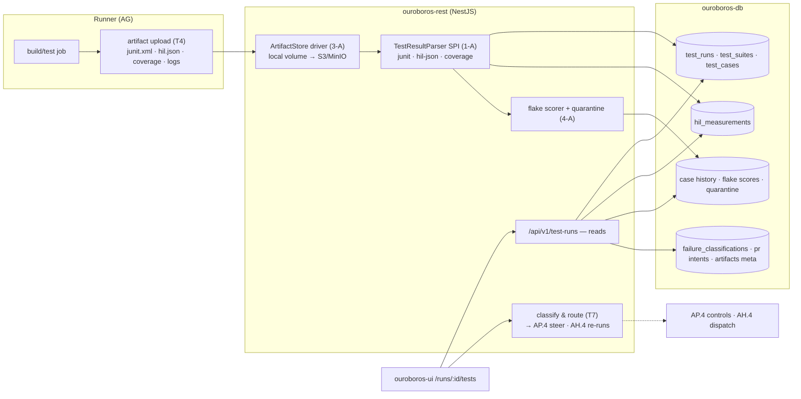
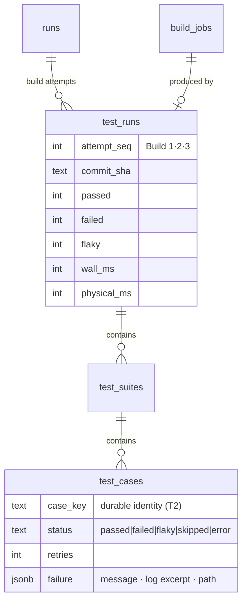
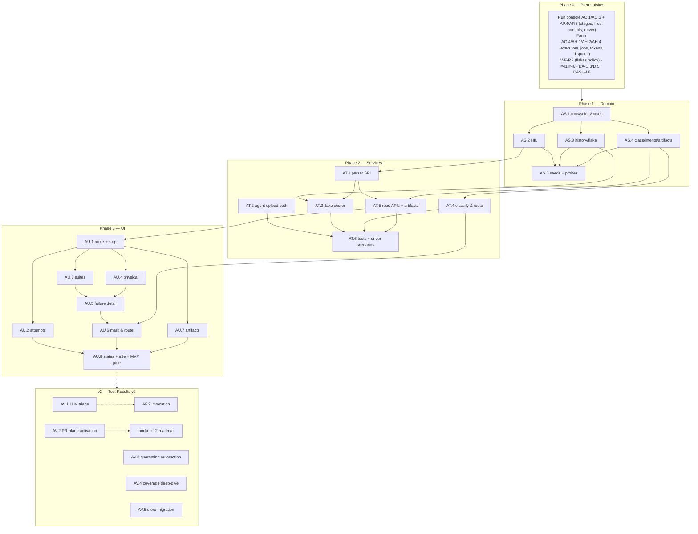

# Roadmap — Test Results (Mockup 11)

## Description

> Create a roadmap that covers the features for the mockup page 11. Any additional
> tech infrastructure that is required to implement the functionality in these mockup
> pages should be researched and offered as options for implementing in the roadmap.
> The roamdap should include MVP and v2 options, as well as the labels, milestones,
> and the like, for the tickets to be created. Any ticket sources that are used by
> Ouroboros for ingesting should be pluggable, which includes sources like Jira,
> Linear, GitHub, GitLab, and other bug reporting/issue recording sites. Refer to the
> page so that issues can reference the mockup file when creating the UI/UX design of
> the pages. Be very specific when creating the roadmap, as the options in the
> roadmap for the functionality needs to be complete and very thorough.

## Context & Existing Work (duplicate-avoidance survey)

Surveyed 2026-08-08.

**Design source of truth for every UI ticket in this roadmap:**
[`docs/mockups/11-test-results.html`](mockups/11-test-results.html) (with
`docs/mockups/assets/ouroboros.css`) — Test Results. Its anatomy:

- **Page head** — eyebrow `Test Results · Run #1847 · Build 3`, h1 `#482 — Fix
  flaky CAN-bus telemetry test`, meta row (`standard-fix v14` tag, `61/63
  passed` warn pill, `build 3 of loop #1847`, `forge-01 + rig helios-rig-02 ·
  6m 12s`). Actions: **Re-run failed (2)**, **Re-run full suite**, **Send
  failures back to loop ⟳** (primary).
- **Summary strip** (five stats) — *Total tests* `63 · across 5 suites`,
  *Passed* `61 · ▲ 12 vs build 2`, *Failed* `1 · motor overshoot · HIL`,
  *Flaky* `1 · passed on retry 2/3 · quarantine watching` (links → insights),
  *Wall time* `6m 12s · 4m sim · 2m 12s physical`.
- **Build attempts timeline** (`c-12`) — cards Build 1 (err, `49/63 · 14
  failed ✗`, `13:52:41 · a3f19c2`) → Build 2 (warn, `61/63 · 2 failed`) →
  Build 3 (live, pulsing `running re-run of failed set`) → **Next** (dashed
  future: *"Publish to PR #514 when green · auto · gated on 63/63"*).
- **Suites card** (tag `twister · zephyr 4.1`) — rows (name · platform tag ·
  meter · count): `unit · drivers` native_sim 24/24, `telemetry integration`
  qemu 18/19 (err, selected), `motor control` 12/12, `OTA update` 6/6,
  `PHYSICAL · HIL rig` rig:helios-rig-02 1/2 (warn).
- **Physical tests card** (`RIG HELIOS-RIG-02`, `rig online` pill, `bench: CAN
  bus + motor + power-cycler`) — `ptest` rows: name + pass/FAIL pill, a
  what-it-did line (*"power-cycler kills 24V rail at 40/60/80% of OTA
  write"*), a **measured line with limits** (*"overshoot 2.4% vs limit 2.0%"*
  — the selected failure; *"0 reordered frames in 10⁶ (was 37 in build 1)"*).
- **Failure detail card** — test path
  `tests/hil/test_estop_release.py::overshoot_under_load`, rig log block
  (three trials, settle time, `AssertionError: max overshoot 2.4% > limit
  2.0%`), **AI Triage** paragraph (*k_msgq change added ~0.4ms latency →
  delayed PID velocity sample → product bug, confidence 84%*) with model pill
  + triage timestamp.
- **Mark & Route card** — classify radios (**Product bug** selected with `AI
  pick · 84%` affix, *Test needs update*, *Flake — retry*, *Infra — rig
  issue*); **correction note** textarea (*"Keep k_msgq, but move PID velocity
  sampling off the telemetry path"*) with hint *"Injected into attempt 4's
  planning context."*; toggles **Block PR #514 until green** (on) and **Auto
  re-run physical suite after fix** (on); actions **Queue correction round →
  attempt 4** (primary), **Waive & annotate PR**.
- **Artifacts card** (`retained 30d`) — `junit-build3.xml`,
  `rig-capture-estop.csv · 2.1 MB`, `serial-console.log`, `coverage 87.4%
  (+0.6%)`, each with open affordance.

**The dependency truth.** Test results are produced by builds on the farm
(AG/AH) inside a run's Test stage (AO/AP). The AI-triage narrative is
model-generated — gated on the invocation stack like every AI feature. The
honest MVP: a **test-results plane** — ingestion (JUnit XML + structured HIL
measurements + coverage) from farm jobs, the suite/case/attempt model, flake
detection from retry truth, classification & routing wired to the real run
controls (correction → attempt context via AP.4), artifact storage with
retention — fully proven via the simulated-run driver and real farm builds,
with **heuristic triage hints** (deterministic signals, honestly labeled) and
the LLM triage narrative as the v2 drop-in.

**Overlapping work and dispositions:**

| Existing work | Disposition under this roadmap |
|---|---|
| Farm AG.4/AG.5/AH.4/AH.5 (executors, job finish, log chunks) | **Extended** — AT.2 adds the agent-side artifact/result upload path (JUnit XML, HIL result JSON, coverage files attached to `build_jobs`); AH.1's `build_jobs` gains result linkage. |
| Run console AO/AP (stage history, ingestion contract, control queue AP.4, simulated driver AP.5) | **Consumed & extended** — build attempts map to Test/Build stage attempts; "Send failures back / Queue correction round" composes AP.4 steer + stage-retry semantics; the AP.5 driver gains test-result scenarios. |
| DASH-F.1 runs (`checks_passed/total`), INTAKE tickets | **Consumed** — head counts reconcile with run check counts; the ticket headline links via the canonical ticket (any tracker — pluggability requirement already satisfied by WF-Q read + AL.2 write; nothing source-specific here, noted not duplicated). |
| WF DSL `test({cmd, flakes: "retry-once"})` (P.2) | **Consumed** — retry policy read from the pinned stage config; flake detection interprets retries against it. |
| Mockup 12 (PR verification — `Publish to PR #514`, Block-PR toggle, Waive & annotate) | **Boundary** — PR entities/gating land with mockup 12's roadmap; here the toggles/actions store **gating intents** on the run (consumed by 12) and the Waive action stores a waiver record; both labeled with their activation point (decision T8). |
| Mockup 15 (insights — `quarantine watching` link) | **Boundary** — flake history/quarantine *data* lands here (AT.3); analytics UI is 15's. Link targets the placeholder until then. |
| INTAKE-O.5 / AL.2 write surface | **Reused** — "Waive & annotate PR" and failure→ticket annotations ride the write-capable SPI where they touch trackers (v2, AV.2). |
| Scaffolding #49 placeholder (`/tests` route), #56 e2e | **Superseded for the test-results route**; #56 gains a leg. |

Epic letters continue the sequence (…AO–AR): this roadmap uses **AS, AT, AU, AV**.

## Infrastructure Options (researched — thorough, pick before filing)

### 1. Test-result ingestion formats

| Option | What it is | Fit | Trade-offs |
|---|---|---|---|
| **A — JUnit XML as the canonical interchange + a parser SPI for other formats** ⭐ recommended | JUnit XML is the lingua franca (twister, pytest `--junitxml`, ctest, Playwright all emit it; rerun/flaky markers included by modern emitters); a small `TestResultParser` SPI (format detection → normalized suites/cases/retries) admits TAP, ctest JSON, pytest-json later without core changes | One canonical model, many emitters; the mockup's `junit-build3.xml` artifact is literally this | JUnit XML loses some framework-specific detail (captured via parser-specific `meta` jsonb) |
| B — Framework-native adapters only | Deep per-framework ingestion | Richer detail | N frameworks × maintenance; wrong first move |
| C — Require our own reporter plugin | Custom emitters per framework | Full control | Adoption tax on every tenant repo — rejected for MVP |

### 2. Physical/HIL measurement results

| Option | What it is | Fit | Trade-offs |
|---|---|---|---|
| **A — Structured HIL result JSON (versioned schema: name, procedure, trials, measurements with units + limits, verdict)** ⭐ recommended | The measured-vs-limit lines (`412ms (limit 500ms)`, `2.4% vs 2.0%`) demand structure JUnit can't carry; a documented `ouro-hil-results.json` schema uploaded alongside JUnit from rig jobs | Purpose-built for the card; limits/deltas render from data, not prose | Tenant rigs must emit the schema (helper lib + examples shipped; JUnit-only rigs degrade to plain case rows — honesty) |
| B — Overload JUnit properties | Stuff measurements into `<properties>` | No new schema | Fragile, unit-less, limit-less — rejected as primary |

### 3. Artifact storage

| Option | What it is | Fit | Trade-offs |
|---|---|---|---|
| **A — Storage-driver interface with local-volume default, S3/MinIO driver as config** ⭐ recommended | Artifacts (junit XML, rig CSV 2.1MB, serial logs, coverage) stored via a `ArtifactStore` interface; default = REST-mounted volume with per-org quotas + the mockup's 30d retention sweep; S3-compatible driver selectable by config (MinIO in compose optional) | Self-hosted single-node honest; cloud deployments flip a config; retention is policy from day one | Local default doesn't scale horizontally — stated; driver swap is data-migration tooling (AV.5) |
| B — S3/MinIO required | Object storage always | Scales now | New mandatory infra against the lightweight rule |
| C — Postgres bytea | One store | Simple | 2.1MB CSVs × retention in the DB — wrong tool (log chunks stay capped; artifacts don't) |

### 4. Flake detection & quarantine

| Option | What it is | Fit | Trade-offs |
|---|---|---|---|
| **A — Deterministic retry-truth + cross-build history scoring, quarantine as a watched list** ⭐ recommended MVP | Pass-on-retry within a build = flaky occurrence (the industry's first-class signal); per-case history (case identity across builds/runs) accumulates a flake score; threshold → `quarantine: watching` state (soft signal — failures of quarantined cases don't block, per merge-queue best practice, activated with PR gating in mockup 12); nightly scorer emits candidates | Real signals, no ML required; the mockup's `passed on retry 2/3 · quarantine watching` is exactly this | Root-cause clustering and auto-quarantine policy are v2 (AV.3) |
| B — AI/statistical flake classification | ML over failure fingerprints | Stronger clustering | Needs history volume + the AI stack; layered on A later, not instead of it |

### 5. Triage intelligence

| Option | What it is | Fit | Trade-offs |
|---|---|---|---|
| **A — Heuristic triage hints in MVP (labeled), LLM triage narrative as the v2 drop-in behind one contract** ⭐ recommended | Deterministic signals pre-select the classify radio: pass-on-retry → *Flake*; rig-offline/infra error codes → *Infra*; new-failure-after-diff-touching-related-paths → *Product bug (heuristic)*; hint chip says `heuristic` with its rule. The AI-triage card section renders only when the LLM triage (AV.1, over AF.2 invocation + run context) exists — same `/v0/triage` contract shape defined now | No fabricated model reasoning (the transcript honesty rule R4 applied here); the radio's `AI pick · 84%` affix appears only when real | The mockup's triage paragraph is empty-slotted in MVP (designed "triage arrives with the provider stack" note) |
| B — LLM triage in MVP | The mockup literally | Blocks on providers-v2 | Violates the staged-honesty pattern used everywhere |

## Decisions proposed by this roadmap (validate before issue creation)

| # | Decision | Rationale |
|---|----------|-----------|
| T1 | **Test results attach to build attempts**: `test_runs` (one per build attempt: run FK, build_job FK, attempt seq, totals, wall/sim/physical split) → `test_suites` → `test_cases` (status `passed|failed|flaky|skipped|error`, retries, duration, failure payload) | The attempts timeline, suites card, and head counts are one relational story; DASH check counts reconcile from it. |
| T2 | **Case identity is durable** (`suite + classname + name` key per repo) so history, flake scores, and quarantine survive across builds/runs | Flake detection (option 4-A) and the insights boundary both need stable identity. |
| T3 | **Ingestion = JUnit XML canonical + parser SPI + HIL JSON schema + coverage summary** (options 1-A/2-A), uploaded from farm jobs via the new agent artifact path | One pipeline for sim suites, rig measurements, and coverage; every mockup number derives from parsed truth. |
| T4 | **Agent artifact upload extends the AG protocol**: bounded multipart upload over an authenticated job-scoped HTTP path (not the WS channel), quota-checked, stored via the `ArtifactStore` driver (option 3-A) | 2.1MB CSVs don't belong on the control WebSocket; job-scoped tokens keep it outbound-only and tenant-safe. |
| T5 | **Flake truth is retry-derived and policy-aware**: the pinned DSL `flakes:` policy tells the parser which retries were sanctioned; pass-on-retry marks `flaky` occurrences feeding the history scorer + `watching` quarantine state | The Flaky stat and quarantine link are computed, never editorial. |
| T6 | **Re-run actions dispatch real farm jobs** (failed-set or full suite) as new build attempts through AH.4, linked to the same run stage; "Send failures back to loop" composes an AP.4 steer + stage-retry (correction note → attempt planning context) | The three head actions are compositions over existing machinery, not new paths. |
| T7 | **Classification is recorded state** (`failure_classifications`: case occurrence FK, class, note, actor `human|heuristic|model`, confidence) driving routing: product-bug → correction round; test-update → annotated steer; flake → retry + history mark; infra → rig flag + farm health note | The Mark & Route card writes durable, audited decisions the loop consumes. |
| T8 | **PR-facing controls store intents** (`block_pr_until_green`, waiver records with author+reason) consumed when mockup 12's PR plane lands; UI labels their activation point honestly | The toggles exist and persist today without pretending a PR gate exists. |
| T9 | **Coverage is a parsed summary** (percent + delta vs previous attempt) from uploaded reports (lcov/cobertura detection); deep coverage UI deferred (AV.4) | The artifacts row's `87.4% (+0.6%)` is real math from real files. |
| T10 | **Labels**: new `tests`; **Milestones**: `Test Results MVP` / `Test Results v2` created at filing; complexity chips XS–L | Description requires labels + milestones for the filing pass. |

## Architecture Overview



## MVP Definition

The MVP is **mockup 11 as the real test-results plane**: parsed truth from farm
jobs, retry-derived flake state, working classification and routing into the
loop, stored artifacts — with AI triage honestly slotted for v2. It is done
when, against the compose stack:

1. `/runs/:id/tests` (build-attempt scoped) reproduces
   [`docs/mockups/11-test-results.html`](mockups/11-test-results.html)
   pixel-faithfully in **both themes**: head + meta, the five-stat summary
   strip, the attempts timeline (err/warn/live/future states), suites card
   with selection, physical-tests card with measured-vs-limit lines, failure
   detail (log + the honest triage slot), Mark & Route, and artifacts.
2. **Ingestion works end to end**: a farm job uploads JUnit XML + HIL JSON +
   coverage + raw artifacts through the job-scoped path (T4); parsing
   populates suites/cases/retries/measurements; every stat on the page
   derives from parsed rows (deltas vs the prior attempt included).
3. **Flake truth is live** (T5): sanctioned-retry passes mark `flaky`
   occurrences, feed per-case history + scores, and surface the
   `quarantine watching` state; the nightly scorer emits candidates.
4. **Classification & routing work** (T6/T7): heuristic hints pre-select
   honestly; a human classification + correction note dispatches a real
   correction round (AP.4 steer with the note in attempt context +
   stage-retry) — verified via the simulated driver; re-run failed/full
   dispatch real farm jobs as new attempts; infra classification flags the
   rig's runner.
5. **PR intents persist** (T8): block-until-green and waiver records store
   with actor/reason, labeled with their mockup-12 activation.
6. **Artifacts are stored and served** (option 3-A): quota-checked uploads,
   30d retention sweep, download/open links, coverage summary + delta (T9).
7. Integration tests cover parser fixtures (twister/pytest/rig JSON,
   malformed inputs), flake scoring, routing compositions, quota/retention,
   isolation; the e2e leg drives a simulated run with a failing HIL case
   through classify → correction → re-run → green.

**Explicitly v2 (milestone `Test Results v2`):** LLM triage narrative +
AI-pick affix (AV.1), PR-plane activation of gating/waivers with mockup 12
(AV.2), quarantine automation + insights feed (AV.3), coverage deep-dive
(AV.4), artifact store migration tooling (AV.5).

## Epics, Labels & Milestones

Each epic is a parent tracking issue on GitHub; every roadmap issue below is filed as
one of its sub-issues (GitHub Relationships).

| Epic | GitHub | Status | Name | Goal | Modules | Milestone |
|------|:------:|:------:|------|------|---------|-----------|
| AS | #320 | 🟡 Open | Test Results Domain | Runs/suites/cases/HIL/history/classification schema, seeds, CI | ouroboros-db | Test Results MVP |
| AT | #321 | 🟡 Open | Ingestion & Routing Services | Upload path, parser SPI, flake scorer, classify/route, reads | ouroboros-rest, ouroboros-runner, ouroboros-engine | Test Results MVP |
| AU | #322 | 🟡 Open | Test Results UI | All eight page regions, states, e2e | ouroboros-ui | Test Results MVP |
| AV | #323 | 🟡 Open | Intelligent Triage & Extended (v2) | LLM triage, PR gating activation, quarantine automation, coverage | all | Test Results v2 |

Issue naming: `<project>: [<epic>.<issue>] <title>`. Labels: existing set (`mvp`,
`v2`, `rest`, `db`, `ui`, `engine`, `ci`, `design`, `infra`, `sources`, `runs`,
`build-farm`) **plus new `tests`** (decision T10, created at filing). Milestones
**`Test Results MVP`** / **`Test Results v2`** created at filing; every issue
assigned. Complexity chips: **XS · S · M · L**.

---

## Epic AS (#320) — Test Results Domain (`ouroboros-db`)

| Ref | GitHub | Status | Title | Summary | Labels | Parallel | MVP | Complexity | Affected Modules |
|-----|:------:|:------:|-------|---------|--------|:--------:|:---:|:----------:|------------------|
| AS.1 | #324 | 🟡 Open | ouroboros-db: [AS.1] Test runs, suites & cases schema | Per-attempt results tree with retry truth (T1/T2) | mvp, tests, db | N (after AO.1, AH.1) | Y | M | ouroboros-db |
| AS.2 | #325 | 🟡 Open | ouroboros-db: [AS.2] HIL measurements schema | Structured trials/measurements/limits for physical tests | mvp, tests, db | N (after AS.1) | Y | S | ouroboros-db |
| AS.3 | #326 | 🟡 Open | ouroboros-db: [AS.3] Case history, flake scores & quarantine | Durable case identity, occurrence history, watching states | mvp, tests, db | N (after AS.1) | Y | M | ouroboros-db |
| AS.4 | #327 | 🟡 Open | ouroboros-db: [AS.4] Classifications, PR intents & artifacts meta | Mark-&-route records, gating intents, artifact registry | mvp, tests, db | N (after AS.1) | Y | M | ouroboros-db |
| AS.5 | #328 | 🟡 Open | ouroboros-db: [AS.5] Test-results seeds — mockup-11 parity + probes | Build 1→3 story, suites, HIL rows, flake case; ci checks | mvp, tests, db, ci | N (after AS.2–AS.4, #24) | Y | M | ouroboros-db, .github |

### Issue AS.1 — ouroboros-db: [AS.1] Test runs, suites & cases schema

> **GitHub issue:** #324 · **Status:** 🟡 Open · **Parent epic:** #320

- **Problem Statement:** Every number on the page hangs off a results tree
  scoped to a build attempt (decision T1) with durable case identity
  (decision T2).
- **Solution/Scope:** Migration: `test_runs` — id, org FK, run FK (AO),
  `build_job_id` FK (AH), `attempt_seq` (the Build 1/2/3 ordinal per run),
  `commit_sha`, totals (total/passed/failed/flaky/skipped — derived but
  denormalized per attempt for cheap strips, recomputed on parse), wall/sim/
  physical duration split, `status` CHECK `running|complete|error`,
  `started_at`; `test_suites` — test_run FK, `name`, `platform` tag
  (`native_sim|qemu_cortex_m3|rig:*`), `kind` CHECK `sim|physical`, counts;
  `test_cases` — suite FK, `case_key` (T2 durable identity: suite+classname+
  name per repo), `name`, `status` CHECK `passed|failed|flaky|skipped|error`,
  `retries` int, `retry_outcomes` jsonb, `duration_ms`, `failure` jsonb
  (message, log excerpt, path), `meta` jsonb (parser-specific). Indexes for
  attempt timelines and case-history joins.
- **Acceptance Criteria:** The mockup's three-build story representable;
  totals recompute equals stored; case_key stable across attempts (fixture);
  DASH `checks_passed/total` reconciliation query documented.
- **Parallelism/Dependencies:** Needs AO.1, AH.1. Blocks AS.2–AS.5, AT.*.
- **Technical Stack:** PostgreSQL 17, Flyway.
- **Epic:** AS



### Issue AS.2 — ouroboros-db: [AS.2] HIL measurements schema

> **GitHub issue:** #325 · **Status:** 🟡 Open · **Parent epic:** #320

- **Problem Statement:** Physical tests carry structure JUnit can't: a
  procedure line, trials, measured values with units against limits
  (option 2-A).
- **Solution/Scope:** `hil_measurements` — test_case FK, `procedure` text
  (the what-it-did line), `trials` jsonb (ordered trial records), and
  measurement rows: `metric` (`overshoot_pct`, `fallback_ms`…), `value`
  numeric, `unit`, `limit_value` + `limit_kind` CHECK `max|min`, `verdict`
  CHECK `pass|fail`, `context` (the `(was 37 in build 1)` comparative,
  machine-composed where prior data exists); rig identity on the suite
  (`rig:helios-rig-02` platform + bench description in suite meta).
- **Acceptance Criteria:** All four mockup physical rows representable with
  limits and comparatives; verdict derivable from value-vs-limit (CHECK
  consistency test); JUnit-only physical suites degrade to plain cases.
- **Parallelism/Dependencies:** Needs AS.1. Feeds AT.1 parser, AU.4.
- **Technical Stack:** PostgreSQL 17, Flyway.
- **Epic:** AS

```
hil: {procedure: "power-cycler kills 24V rail at 40/60/80%…",
      measurements: [{metric: slot_b_fallback, value: 412, unit: ms, limit: 500 max → pass}]}
```

### Issue AS.3 — ouroboros-db: [AS.3] Case history, flake scores & quarantine

> **GitHub issue:** #326 · **Status:** 🟡 Open · **Parent epic:** #320

- **Problem Statement:** Flake truth needs memory: per-case occurrence
  history across builds/runs, a score, and the `watching` state
  (option 4-A, decision T5).
- **Solution/Scope:** `test_case_history` — org FK, repo ref, `case_key`,
  occurrence rows (test_run FK, status, retries, pass-on-retry flag, at);
  `flake_scores` — case_key scoped, `score` (windowed occurrence math,
  formula documented), `state` CHECK `healthy|watching|quarantined`
  (`quarantined` reserved for AV.3/mockup-12 activation — storable now,
  soft-signal semantics documented), `last_scored_at`; nightly-scorer
  bookkeeping table.
- **Acceptance Criteria:** Pass-on-retry occurrences accumulate; score
  formula reproducible from fixtures; state transitions constrained;
  the mockup's `watching` case representable.
- **Parallelism/Dependencies:** Needs AS.1. Feeds AT.3, AU.2, mockup-15
  boundary.
- **Technical Stack:** PostgreSQL 17, Flyway.
- **Epic:** AS

```
history(case_key) ─▶ occurrences[{build, pass_on_retry: true}…] ─▶ score 0.42 ─▶ state: watching
```

### Issue AS.4 — ouroboros-db: [AS.4] Classifications, PR intents & artifacts meta

> **GitHub issue:** #327 · **Status:** 🟡 Open · **Parent epic:** #320

- **Problem Statement:** Mark & Route writes durable decisions (T7), PR
  toggles store intents (T8), and artifacts need a registry with retention
  (option 3-A).
- **Solution/Scope:** `failure_classifications` — test_case occurrence FK,
  `class` CHECK `product_bug|test_update|flake_retry|infra_rig`, `note`
  text (the correction note), `actor` CHECK `human|heuristic|model`,
  `confidence` nullable (0–100, model/heuristic only), `routed` jsonb
  (what was dispatched: control id, re-run job id), created_by/at;
  `run_pr_intents` — run FK, `block_until_green` bool, `auto_rerun_physical`
  bool, waiver rows (author, reason, case refs, at) — activation point
  documented (T8); `test_artifacts` — test_run FK, `name`, `kind` CHECK
  `junit|hil|coverage|log|capture|other`, `size_bytes`, `storage_ref`
  (driver + key), `retained_until`, checksum; retention sweep metadata.
- **Acceptance Criteria:** Classification rows capture the full card
  (radio + note + toggles + routing result); waivers auditable; artifact
  rows drive the retention sweep; vocabs constrained.
- **Parallelism/Dependencies:** Needs AS.1. Feeds AT.4/AT.5, AU.5/AU.6.
- **Technical Stack:** PostgreSQL 17, Flyway.
- **Epic:** AS

```
classification: {class: product_bug, actor: human, note: "Keep k_msgq, but move PID…",
                 routed: {control: steer#88, stage_retry: attempt 4}}
pr_intents: {block_until_green: true, waivers: []}   artifacts: junit-build3.xml → local:… (30d)
```

### Issue AS.5 — ouroboros-db: [AS.5] Test-results seeds — mockup-11 parity + probes

> **GitHub issue:** #328 · **Status:** 🟡 Open · **Parent epic:** #320

- **Problem Statement:** Design review needs the exact Build 1→3 story with
  every card populated, without running the pipeline.
- **Solution/Scope:** Extend the dev seed (coordinated with AO.5's `#482`
  run + AH.1 jobs): three `test_runs` (49/63 · 14 failed at a3f19c2 →
  61/63 · 2 failed → build 3 running the failed set at f42b9a0), five
  suites with mockup counts/platforms, the failing HIL case with full
  measurements + three-trial log payload, the flaky telemetry case
  (pass on retry 2/3, history + `watching` score), four artifacts with
  sizes + coverage summary (87.4%, +0.6 vs build 2), a heuristic-hint
  classification precursor, PR intents (block on, auto-rerun on); ci/db
  probes (status vocabs, verdict consistency, case_key stability,
  retention dates).
- **Acceptance Criteria:** Page renders the mockup from seeds alone;
  totals/deltas recompute; probes red/green verified; consistent with
  AO.5/AH.1/DASH seeds (one `#482` universe).
- **Parallelism/Dependencies:** Needs AS.2–AS.4 (+AO.5/AH.1 coordination).
- **Technical Stack:** Flyway repeatable migration, SQL.
- **Epic:** AS

```
seeds: build1 49/63 ✗ → build2 61/63 → build3 live · 5 suites · HIL fail (2.4%>2.0%)
       flaky case (retry 2/3, watching) · 4 artifacts · coverage 87.4% +0.6
```

---

## Epic AT (#321) — Ingestion & Routing Services (`ouroboros-rest` + `ouroboros-runner` + `ouroboros-engine`)

| Ref | GitHub | Status | Title | Summary | Labels | Parallel | MVP | Complexity | Affected Modules |
|-----|:------:|:------:|-------|---------|--------|:--------:|:---:|:----------:|------------------|
| AT.1 | #329 | 🟡 Open | ouroboros-rest: [AT.1] Result parser SPI (JUnit · HIL · coverage) | Format detection, normalized tree, retry/flake extraction | mvp, tests, rest | N (after AS.2) | Y | L | ouroboros-rest |
| AT.2 | #330 | 🟡 Open | ouroboros-runner: [AT.2] Job artifact & result upload | Job-scoped multipart upload path, quotas, store driver (T4) | mvp, tests, build-farm | N (after AG.4, AH.2) | Y | M | ouroboros-runner, ouroboros-rest |
| AT.3 | #331 | 🟡 Open | ouroboros-rest: [AT.3] Flake scorer & quarantine service | Retry-truth marking, history scoring, nightly candidates | mvp, tests, rest | N (after AS.3, AT.1) | Y | M | ouroboros-rest |
| AT.4 | #332 | 🟡 Open | ouroboros-rest: [AT.4] Classification & routing service | Heuristic hints, classify API, correction/re-run dispatch (T6/T7) | mvp, tests, rest, runs | N (after AS.4, AP.4, AH.4) | Y | L | ouroboros-rest |
| AT.5 | #333 | 🟡 Open | ouroboros-rest: [AT.5] Test-results read APIs & artifact serving | Page payloads, attempt timelines, artifact downloads, retention | mvp, tests, rest | N (after AT.1, AS.4) | Y | M | ouroboros-rest |
| AT.6 | #334 | 🟡 Open | ouroboros-rest: [AT.6] Test-plane integration tests & driver scenarios | Parser fixtures, routing compositions, AP.5 test scenarios | mvp, tests, rest, ci | N (after AT.2–AT.5, AP.5) | Y | M | ouroboros-rest, ouroboros-engine |

### Issue AT.1 — ouroboros-rest: [AT.1] Result parser SPI (JUnit · HIL · coverage)

> **GitHub issue:** #329 · **Status:** 🟡 Open · **Parent epic:** #321

- **Problem Statement:** Uploaded files must become the AS tree — with retry
  truth, HIL structure, and coverage summaries — via a format-pluggable
  parser (option 1-A).
- **Solution/Scope:** `TestResultParser` SPI (detect → parse → normalized
  suites/cases): JUnit XML parser (testsuites/testsuite/testcase, rerun/
  flaky markers per modern emitters, twister property conventions,
  platform extraction), HIL JSON parser (the 2-A schema, versioned,
  validation errors surfaced as ingest warnings), coverage parser (lcov +
  cobertura detection → percent; delta computed against the prior
  attempt); parse orchestration per completed upload set (idempotent —
  re-parse replaces the attempt's tree transactionally); malformed-input
  taxonomy (partial results kept, warnings attached to the test_run);
  retry policy from the pinned DSL `flakes:` config interpreted during
  case normalization (T5 pre-marking).
- **Acceptance Criteria:** Fixture matrix (twister XML incl. reruns,
  pytest XML, HIL JSON valid/invalid, lcov + cobertura, truncated XML)
  parses to golden trees; re-parse idempotent; warnings surface; a
  new-format stub parser registers without core changes (SPI proof).
- **Parallelism/Dependencies:** Needs AS.2. Blocks AT.3/AT.5.
- **Technical Stack:** NestJS, fast XML parsing, SPI registry.
- **Epic:** AT

```
uploads{junit.xml, hil.json, lcov.info} ─▶ detect ─▶ parse ─▶ normalized tree
  junit rerun markers + DSL flakes:"retry-once" ─▶ case.status: flaky (sanctioned)
  re-parse(attempt) ─▶ transactional replace (idempotent)
```

### Issue AT.2 — ouroboros-runner: [AT.2] Job artifact & result upload

> **GitHub issue:** #330 · **Status:** 🟡 Open · **Parent epic:** #321

- **Problem Statement:** Results live on the runner when a job finishes;
  they must reach the store safely (decision T4) without abusing the
  control WebSocket.
- **Solution/Scope:** Agent-side: post-job artifact collection (configured
  globs per pool/job: `junit*.xml`, `ouro-hil-results.json`, coverage
  files, declared extras like rig CSVs/serial logs), bounded multipart
  upload to a **job-scoped HTTPS path** (single-use upload token minted
  with the job offer, outbound-only, checksummed, per-file + per-job size
  caps with honest truncation manifests); REST-side: token validation,
  quota enforcement (org policy), `ArtifactStore` driver write (local
  volume default; S3/MinIO driver behind config — option 3-A), artifact
  registry rows, parse trigger (AT.1) on manifest completion; AG protocol
  doc + AH.2 amendments (upload token in job lifecycle).
- **Acceptance Criteria:** A compose farm job uploads the fixture set →
  parsed page renders; oversize file → truncation manifest, never silent
  drop; token single-use + job-scoped (cross-job replay fails); quota
  breach → designed job warning; driver swap (local→MinIO) via config
  passes the same suite.
- **Parallelism/Dependencies:** Needs AG.4, AH.2. Blocks the e2e chain.
- **Technical Stack:** Go (multipart, checksums), NestJS, storage drivers.
- **Epic:** AT

```
job finish ─▶ collect globs ─▶ POST /internal/jobs/:id/artifacts (single-use token)
  ─▶ quota ✓ · checksum ✓ ─▶ ArtifactStore(local|s3) ─▶ manifest complete ─▶ parse (AT.1)
```

### Issue AT.3 — ouroboros-rest: [AT.3] Flake scorer & quarantine service

> **GitHub issue:** #331 · **Status:** 🟡 Open · **Parent epic:** #321

- **Problem Statement:** Flake state must be computed truth (T5): occurrence
  marking at parse time, history accumulation, scoring, and the `watching`
  list the mockup links to.
- **Solution/Scope:** Parse-time hook: sanctioned pass-on-retry → `flaky`
  case status + history occurrence; scorer: windowed score per case_key
  (formula: weighted recent occurrences / runs observed, documented +
  versioned), thresholds → `healthy|watching` transitions (`quarantined`
  storage-ready, activation with AV.3/mockup-12); nightly job (bounded,
  jittered) re-scores active cases and emits a candidates list (payload
  for the future insights page); read API for flake/quarantine state per
  case + org summary.
- **Acceptance Criteria:** Fixture histories score reproducibly; the
  seeded telemetry case lands `watching`; nightly job bounded + observable;
  state API feeds AU.2's stat link.
- **Parallelism/Dependencies:** Needs AS.3, AT.1.
- **Technical Stack:** NestJS scheduler, Kysely.
- **Epic:** AT

```
parse ─▶ pass-on-retry ─▶ occurrence ─▶ score(window) ─▶ watching (threshold doc'd)
nightly ─▶ re-score ─▶ candidates[] (insights boundary)
```

### Issue AT.4 — ouroboros-rest: [AT.4] Classification & routing service

> **GitHub issue:** #332 · **Status:** 🟡 Open · **Parent epic:** #321

- **Problem Statement:** Mark & Route must do real things (T6/T7): honest
  hints, recorded decisions, and dispatch into the loop and the farm.
- **Solution/Scope:** **Heuristic hints** (option 5-A): rule evaluation per
  failed case (pass-on-retry pattern → flake; rig/infra error taxonomy →
  infra; failure novelty vs prior attempt + diff-path overlap (AO.3
  files) → product-bug hint) returning `{suggested_class, rule,
  confidence: null}` labeled `heuristic`; **classify API**:
  `POST /api/v1/test-runs/:id/cases/:caseId/classify` (class, note,
  toggles; role member+; audited) persisting T7 rows; **routing**:
  product-bug/test-update → compose AP.4 steer (note injected into next
  attempt's planning context) + stage-retry request ("Queue correction
  round → attempt N+1"); flake → sanctioned re-run of the case set +
  history mark; infra → rig-runner flag (AH health note) + optional
  requeue; **re-run APIs**: failed-set / full-suite → AH.4 dispatch as a
  new attempt (T6), gated on runner availability with honest queue
  states; waive → T8 waiver record (+ PR annotation deferred to AV.2).
  The `/v0/triage` contract shape (request: failure context; response:
  narrative, class, confidence, provenance) committed now for AV.1.
- **Acceptance Criteria:** Hint matrix fixtures; classify→correction round
  reaches the simulated driver (steer content verified in transcript;
  attempt increments); re-run failed dispatches a farm job with only the
  failed set; infra path flags the runner; all decisions audited;
  triage contract committed + drift-checked.
- **Parallelism/Dependencies:** Needs AS.4, AP.4, AH.4. Blocks AU.6.
- **Technical Stack:** NestJS, AP/AH clients.
- **Epic:** AT

```
hint: {product_bug, rule: "new-failure ∩ diff-paths", heuristic}
classify(product_bug, note) ─▶ steer{note → attempt 4 context} + stage-retry ─▶ routed ✓
re-run failed(2) ─▶ AH.4 job {suite filter} ─▶ Build 4 attempt
```

### Issue AT.5 — ouroboros-rest: [AT.5] Test-results read APIs & artifact serving

> **GitHub issue:** #333 · **Status:** 🟡 Open · **Parent epic:** #321

- **Problem Statement:** The page needs shaped reads — attempt timeline,
  suite/case trees, HIL rows, failure payloads, artifact links — plus
  safe artifact downloads and the retention sweep.
- **Solution/Scope:** Under tenant context: `GET /api/v1/runs/:id/test-runs`
  (attempts timeline + head/strip aggregates + next-step projection from
  PR intents/gates per T8 labeling), `GET /api/v1/test-runs/:id` (suites,
  cases, HIL measurements, flake states, classifications, artifacts,
  coverage + delta), failure payload endpoint (log excerpt), artifact
  download (driver-streamed, auth-checked, content-disposition; text
  artifacts previewable inline); retention sweep job (30d default, org
  policy; sweeps storage + rows with tombstones so the card can say
  `expired`); 404-not-403; OpenAPI complete.
- **Acceptance Criteria:** Seeded payloads reproduce every mockup number
  (incl. `▲ 12 vs build 2` and the wall-time split); downloads stream
  with correct types; expired artifacts render tombstones; sweep
  verified.
- **Parallelism/Dependencies:** Needs AT.1, AS.4. Feeds AU.*.
- **Technical Stack:** NestJS, storage drivers, scheduler.
- **Epic:** AT

```
GET /runs/:id/test-runs ─▶ {attempts[3+next], strip{63, 61 ▲12, 1, 1, 6m12s split}}
GET /test-runs/:id ─▶ {suites[5], hil[4], failure, flake, classifications, artifacts[4], coverage}
```

### Issue AT.6 — ouroboros-rest: [AT.6] Test-plane integration tests & driver scenarios

> **GitHub issue:** #334 · **Status:** 🟡 Open · **Parent epic:** #321

- **Problem Statement:** The parse→score→classify→route chain and the
  upload path are the correctness core; the simulated driver needs
  test-stage scenarios to certify them end to end.
- **Solution/Scope:** Harness suites: parser matrix (AT.1 fixtures),
  upload lifecycle (token scope, quotas, truncation, driver swap), flake
  scoring windows, hint matrix, routing compositions (steer content,
  attempt increments, farm dispatch filters), retention, isolation;
  AP.5 driver extension: a "failing-HIL" scenario (build 1 mass-fail →
  build 2 partial → classify → correction → build 3 green) emitting
  uploads through AT.2's path.
- **Acceptance Criteria:** Green in `ci/rest`; removing idempotent
  re-parse or the token scope check turns tests red; driver scenario
  replays for AU.8's e2e; ≤ 100s added.
- **Parallelism/Dependencies:** Needs AT.2–AT.5, AP.5.
- **Technical Stack:** Jest, Testcontainers, driver scenarios.
- **Epic:** AT

```
suites: parse ✓ · upload ✓ · flake ✓ · hints ✓ · route ✓ · retention ✓ · isolation ✓
driver: fail→classify→correct→green scenario for e2e
```

---

## Epic AU (#322) — Test Results UI (`ouroboros-ui`)

Every issue references
[`docs/mockups/11-test-results.html`](mockups/11-test-results.html) as the
design source — attempt/suite/ptest/radio/artifact treatments — via the #16
tokens (both themes; the mockup is dark-only).

| Ref | GitHub | Status | Title | Summary | Labels | Parallel | MVP | Complexity | Affected Modules |
|-----|:------:|:------:|-------|---------|--------|:--------:|:---:|:----------:|------------------|
| AU.1 | #335 | 🟡 Open | ouroboros-ui: [AU.1] Test-results route, head & summary strip | Attempt-scoped route, actions, five stat cards | mvp, tests, ui, design | N (after #41, AT.5, BA-D.5) | Y | M | ouroboros-ui |
| AU.2 | #336 | 🟡 Open | ouroboros-ui: [AU.2] Build attempts timeline | err/warn/live/future attempt cards with arrows | mvp, tests, ui, design | N (after AU.1) | Y | S | ouroboros-ui |
| AU.3 | #337 | 🟡 Open | ouroboros-ui: [AU.3] Suites card | Platform-tagged suite rows, meters, selection → filtering | mvp, tests, ui, design | N (after AU.1) | Y | M | ouroboros-ui |
| AU.4 | #338 | 🟡 Open | ouroboros-ui: [AU.4] Physical tests card | HIL rows: procedure, measured-vs-limit, selection sync | mvp, tests, ui, design | N (after AU.1) | Y | M | ouroboros-ui |
| AU.5 | #339 | 🟡 Open | ouroboros-ui: [AU.5] Failure detail card | Test path, rig log block, honest triage slot | mvp, tests, ui, design | N (after AU.3/AU.4) | Y | M | ouroboros-ui |
| AU.6 | #340 | 🟡 Open | ouroboros-ui: [AU.6] Mark & Route card | Classify radios with hints, note, toggles, routing actions | mvp, tests, ui | N (after AU.5, AT.4) | Y | L | ouroboros-ui |
| AU.7 | #341 | 🟡 Open | ouroboros-ui: [AU.7] Artifacts card & downloads | Artifact rows, sizes, coverage delta, tombstones | mvp, tests, ui | N (after AU.1, AT.5) | Y | S | ouroboros-ui |
| AU.8 | #342 | 🟡 Open | ouroboros-ui: [AU.8] Test-results states & e2e leg | Running/empty/error states, themes, full-chain e2e | mvp, tests, ui, ci | N (after AU.2–AU.7) | Y | M | ouroboros-ui, .github |

### Issue AU.1 — ouroboros-ui: [AU.1] Test-results route, head & summary strip

> **GitHub issue:** #335 · **Status:** 🟡 Open · **Parent epic:** #322

- **Problem Statement:** The frame: attempt-scoped route reachable from the
  run console's Test stage and the farm's job rows, the head actions, and
  the five-stat strip.
- **Solution/Scope:** `/runs/:id/tests` (attempt selector defaulting to
  latest): eyebrow composes run + attempt, h1 from the canonical ticket
  (tracker-agnostic link), meta row (pin tag, pass-ratio pill with
  ok/warn/err coloring, attempt ordinal, runner+rig+duration line);
  actions **Re-run failed (N)** / **Re-run full suite** (AT.4 dispatch,
  disabled with reason when no eligible runner — honest queue state) and
  **Send failures back to loop ⟳** (scrolls/focuses AU.6 with the failed
  set staged); strip via the shared StatCard family (deltas vs prior
  attempt, flaky stat linking to the insights placeholder with the
  `watching` count, wall-time split line); run-console cross-links
  (AO/AQ amendments: Test stage node + `Full log` targets land here).
- **Acceptance Criteria:** Seeded head/strip match the mockup; attempt
  switch re-renders; action gating honest; links from console/farm
  verified; both themes.
- **Parallelism/Dependencies:** Needs #41, AT.5, BA-D.5. Blocks AU.2–AU.7.
- **Technical Stack:** Next.js, #46 primitives, I.8 poll family.
- **Epic:** AU

```
Test Results · Run #1847 · Build 3
#482 — Fix flaky CAN-bus telemetry test   [Re-run failed (2)][Re-run full suite][Send failures ⟳]
(63)(61 ▲12)(1 · motor overshoot)(1 flaky · watching↗)(6m12s · 4m sim + 2m12s physical)
```

### Issue AU.2 — ouroboros-ui: [AU.2] Build attempts timeline

> **GitHub issue:** #336 · **Status:** 🟡 Open · **Parent epic:** #322

- **Problem Statement:** The attempts strip tells the loop's convergence
  story — err → warn → live → gated future — and switches the page's
  attempt scope.
- **Solution/Scope:** `AttemptsTimeline`: cards per test_run (label,
  result line with counts + status coloring, meta ts + sha linking to
  the tracker commit), arrows, live card (pulse dot, current activity
  from status), the **future card** composed from PR intents + gate
  config (T8 labeling: `Publish to PR #514 when green` only when the
  PR linkage exists — otherwise `auto · gated on 63/63` with the
  mockup-12 activation note); click = switch attempt scope; horizontal
  scroll.
- **Acceptance Criteria:** Seeded strip matches the mockup incl. the
  future card's honest variant; attempt switching syncs all cards;
  live card updates on poll; both themes.
- **Parallelism/Dependencies:** Needs AU.1.
- **Technical Stack:** React, #46 primitives.
- **Epic:** AU

```
[Build 1 · 49/63 ✗ err] → [Build 2 · 61/63 warn] → [Build 3 ●running failed set] → [Next ╌ gated 63/63]
```

### Issue AU.3 — ouroboros-ui: [AU.3] Suites card

> **GitHub issue:** #337 · **Status:** 🟡 Open · **Parent epic:** #322

- **Problem Statement:** The suite grid — name, platform tag, meter,
  count, selection — is the page's navigation spine into cases.
- **Solution/Scope:** Suite rows per the mockup's grid (meter coloring by
  status, count coloring, `PHYSICAL` prefix for rig suites), selection
  (accent inset) filtering the failure/physical cards to that suite's
  scope; keyboard navigation; suite drill (expand to case list with
  status/duration/retry chips — the flaky case shows `retry 2/3`);
  platform tags link nowhere yet (honest).
- **Acceptance Criteria:** Seeded five rows match; selection sync with
  AU.4/AU.5 verified; case drill renders retries; both themes.
- **Parallelism/Dependencies:** Needs AU.1. Blocks AU.5 sync.
- **Technical Stack:** React, #46 primitives.
- **Epic:** AU

```
unit · drivers [native_sim] ▓▓▓▓▓ 24/24 · telemetry integration [qemu] ▓▓▓▓░ 18/19 ◀ sel
PHYSICAL · HIL rig [rig:helios-rig-02] ▓▓░░ 1/2
```

### Issue AU.4 — ouroboros-ui: [AU.4] Physical tests card

> **GitHub issue:** #338 · **Status:** 🟡 Open · **Parent epic:** #322

- **Problem Statement:** HIL rows carry the page's most distinctive
  content: procedure prose, measured values against limits, comparatives
  — with the failing row's err treatment.
- **Solution/Scope:** `ptest` rows from HIL measurements (name +
  pass/FAIL pill, procedure line, measured line composing
  value/unit/limit with err coloring on breach and the comparative
  context when present), rig header (online pill from farm runner
  presence when the rig maps to a runner; omitted otherwise — honesty),
  bench description from suite meta, selection sync (failing row ↔
  failure detail card), JUnit-degraded physical suites render plain
  case rows with a "structured measurements need the HIL schema" hint.
- **Acceptance Criteria:** Seeded four rows match the mockup exactly
  (incl. `(was 37 in build 1)`); rig pill truthful; degraded mode
  renders; both themes.
- **Parallelism/Dependencies:** Needs AU.1 (+AU.3 sync).
- **Technical Stack:** React, #46 primitives.
- **Epic:** AU

```
Motor overshoot on e-stop release                    (FAIL)
dyno bench releases e-stop under 2 Nm load, 3 trials
measured: overshoot 2.4% vs limit 2.0%   ◀ selected · syncs failure detail
```

### Issue AU.5 — ouroboros-ui: [AU.5] Failure detail card

> **GitHub issue:** #339 · **Status:** 🟡 Open · **Parent epic:** #322

- **Problem Statement:** The selected failure's full story: test path,
  the rig/assert log block, and the triage slot — honest until AV.1.
- **Solution/Scope:** Card bound to the selected failed case: mono path
  line (scrollable), log block from the failure payload (trial lines,
  err-colored assertion, code-block treatment), **triage section**:
  MVP renders the heuristic hint (rule + suggested class, `heuristic`
  chip) when present and a designed *"AI triage arrives with the
  provider stack"* slot for the narrative (option 5-A); when AV.1
  lands, the model paragraph + pill + timestamp render per the mockup;
  multi-failure pager (`1 of N`).
- **Acceptance Criteria:** Seeded card matches the mockup minus the
  honest triage slot (screenshot); hint chip renders its rule; pager
  works with multiple failures (fixture); both themes.
- **Parallelism/Dependencies:** Needs AU.3/AU.4 selection.
- **Technical Stack:** React, #46 primitives.
- **Epic:** AU

```
tests/hil/test_estop_release.py::overshoot_under_load        (1 of 1)
[rig] trial 2: peak 1228.8 rpm → overshoot 2.4% … E AssertionError: 2.4% > 2.0%
TRIAGE  [heuristic · new-failure ∩ diff-paths → product bug]  · "AI narrative arrives with providers"
```

### Issue AU.6 — ouroboros-ui: [AU.6] Mark & Route card

> **GitHub issue:** #340 · **Status:** 🟡 Open · **Parent epic:** #322

- **Problem Statement:** The decision surface: classify with honest
  hints, write the correction, set intents, and dispatch the routing
  actions (T6/T7/T8).
- **Solution/Scope:** Card per the mockup: radio rows (four classes;
  hint pre-selection with the `heuristic` affix — the `AI pick · N%`
  affix reserved for AV.1), correction-note textarea with the
  injected-into-attempt hint, toggles (block-PR with its T8 activation
  tooltip, auto-rerun-physical), **Queue correction round → attempt
  N+1** (calls AT.4; success shows the routed receipt — control id,
  attempt link) and **Waive & annotate PR** (waiver dialog: reason
  required; annotation deferred note per AV.2); role gates (member
  classify, admin waive — per AT.4 policy); state after routing
  (card shows the recorded classification + routed status, re-classify
  affordance).
- **Acceptance Criteria:** Full classify→route flow against the driver
  scenario in e2e (steer text verified in the console transcript,
  attempt increments); waiver records with reason; toggles persist;
  affixes honest; both themes.
- **Parallelism/Dependencies:** Needs AU.5, AT.4.
- **Technical Stack:** React, #46 primitives.
- **Epic:** AU

```
(●) Product bug [heuristic]   ( ) Test needs update  ( ) Flake — retry  ( ) Infra — rig
[Keep k_msgq, but move PID velocity sampling…]  "→ attempt 4's planning context"
[block PR ✓·activates with PR plane][auto re-run ✓]  [Queue correction → attempt 4][Waive…]
```

### Issue AU.7 — ouroboros-ui: [AU.7] Artifacts card & downloads

> **GitHub issue:** #341 · **Status:** 🟡 Open · **Parent epic:** #322

- **Problem Statement:** The artifacts row list with sizes, the coverage
  delta line, retention labeling, and safe open/download.
- **Solution/Scope:** Rows from the registry (name, size when notable,
  open affordance → AT.5 download/preview: text artifacts inline
  viewer, binaries download), coverage row rendering percent + ok/err
  delta, `retained 30d` tag from real policy, tombstone rows for
  expired artifacts, upload-truncation manifests surfaced.
- **Acceptance Criteria:** Seeded rows match; preview/download round-trip
  in e2e; tombstone + truncation states render; both themes.
- **Parallelism/Dependencies:** Needs AU.1, AT.5.
- **Technical Stack:** React, #46 primitives.
- **Epic:** AU

```
junit-build3.xml ↗ · rig-capture-estop.csv 2.1MB ↗ · serial-console.log ↗ · coverage 87.4% (+0.6%) ↗
```

### Issue AU.8 — ouroboros-ui: [AU.8] Test-results states & e2e leg

> **GitHub issue:** #342 · **Status:** 🟡 Open · **Parent epic:** #322

- **Problem Statement:** Running/no-results/error states, and the full
  chain — upload → parse → classify → correction → re-run → green —
  needs end-to-end certification.
- **Solution/Scope:** States: build-running (live strip + partial
  results as they parse), no-test-stage runs (guidance), parse-warning
  banner (malformed uploads), ingest-lag banner (DASH-I.7 pattern),
  member view, skeletons; e2e (extends #56): seeded parity screenshots;
  live scenario — AT.6's failing-HIL driver + a real farm job upload →
  strip/suites/HIL render → classify product-bug with note → correction
  round dispatched (verify steer in console transcript) → re-run failed
  via farm → green attempt appears → artifacts download; both themes.
- **Acceptance Criteria:** All states themed; e2e green from cold
  compose; each leg fails meaningfully when its layer breaks; ≤ 3 min
  added.
- **Parallelism/Dependencies:** Needs AU.2–AU.7, AS.5, AT.6; amends #56.
- **Technical Stack:** React, Playwright.
- **Epic:** AU

```
e2e: parity ✓ · upload→parse ✓ · classify→correction→transcript ✓ · re-run→green ✓ · artifacts ✓
```

---

## Epic AV (#323) — Intelligent Triage & Extended (v2 · milestone `Test Results v2`)

| Ref | GitHub | Status | Title | Summary | Labels | Parallel | MVP | Complexity | Affected Modules |
|-----|:------:|:------:|-------|---------|--------|:--------:|:---:|:----------:|------------------|
| AV.1 | #343 | 🟡 Open | ouroboros-engine: [AV.1] LLM failure triage | `/v0/triage` narrative + class + confidence; AI-pick affix goes live | v2, tests, engine | N (after AT.4, AF.2) | N | L | ouroboros-engine, ouroboros-rest |
| AV.2 | #344 | 🟡 Open | ouroboros-rest: [AV.2] PR-plane activation (gating, waivers, annotations) | Block-until-green enforced; waive annotates the PR (mockup 12 tie) | v2, tests, rest | N (after mockup-12 roadmap, AS.4) | N | M | ouroboros-rest |
| AV.3 | #345 | 🟡 Open | ouroboros-rest: [AV.3] Quarantine automation & insights feed | Auto-quarantine policy, soft-signal semantics, analytics export | v2, tests, rest | N (after AT.3) | N | M | ouroboros-rest |
| AV.4 | #346 | 🟡 Open | ouroboros-ui: [AV.4] Coverage deep-dive | Per-file coverage, diff coverage, trend lines | v2, tests, ui | N (after AT.1 coverage) | N | M | ouroboros-ui, ouroboros-rest |
| AV.5 | #347 | 🟡 Open | ouroboros-rest: [AV.5] Artifact store migration & scale-out | Local→S3 migration tooling, dedup, larger retention tiers | v2, tests, rest | N (after AT.2) | N | S | ouroboros-rest |

### Issue AV.1 — ouroboros-engine: [AV.1] LLM failure triage

> **GitHub issue:** #343 · **Status:** 🟡 Open · **Parent epic:** #323

- **Problem Statement:** The mockup's triage paragraph — causal narrative
  linking the diff to the regression, class pick, confidence — needs the
  invocation stack and lands behind the contract AT.4 committed.
- **Solution/Scope:** `/v0/triage` implementation: context assembly
  (failure payload, HIL measurements, diff summary from AO.3, prior-
  attempt outcomes, flake history), routed via a `triage` task kind,
  structured output (narrative, class, confidence, cited evidence),
  provenance + token accounting; heuristic fallback on provider failure;
  radio affix flips to `AI pick · N%` (AU.6) and the AU.5 narrative slot
  fills; quality benchmark vs heuristic hints on labeled fixtures.
- **Acceptance Criteria:** Seeded scenario produces a mockup-class
  narrative citing the diff; confidence calibrated note documented;
  fallback honest; affixes truthful.
- **Parallelism/Dependencies:** Needs AT.4 contract, AF.2 (+Z.1 routing).
- **Technical Stack:** FastAPI, structured output.
- **Epic:** AV

### Issue AV.2 — ouroboros-rest: [AV.2] PR-plane activation (gating, waivers, annotations)

> **GitHub issue:** #344 · **Status:** 🟡 Open · **Parent epic:** #323

- **Problem Statement:** T8's stored intents become enforcement when the
  PR plane (mockup 12) exists: block-until-green gates the publish,
  waivers annotate the PR.
- **Solution/Scope:** With the 12 roadmap: gate evaluation consumes
  `run_pr_intents` + test totals (+ quarantine soft-signals per AV.3);
  waive → PR annotation via the write-capable SPI (check summary +
  waiver reason + author); future-card copy upgrades (`Publish to PR
  #514 when green` live); toggles' activation tooltips drop.
- **Acceptance Criteria:** Red suite blocks publish; waiver publishes
  with annotation; quarantined-only failures pass per policy; UI copy
  truthful.
- **Parallelism/Dependencies:** Needs mockup-12 roadmap, AS.4, AL.2.
- **Technical Stack:** NestJS, SPI write surface.
- **Epic:** AV

### Issue AV.3 — ouroboros-rest: [AV.3] Quarantine automation & insights feed

> **GitHub issue:** #345 · **Status:** 🟡 Open · **Parent epic:** #323

- **Problem Statement:** `watching` is manual-adjacent; real quarantine
  needs policy (auto-quarantine thresholds, soft-signal merge semantics)
  and the analytics surface (mockup 15) needs a feed.
- **Solution/Scope:** Policy config (score thresholds, auto-quarantine
  on/off per org, notification via needs-you), soft-signal semantics
  (quarantined failures don't block gates, reported distinctly),
  un-quarantine flow (N green runs), insights export (case histories,
  scores, trends) for the 15 roadmap; audit on state changes.
- **Acceptance Criteria:** Auto-quarantine fires per policy with
  notification; soft-signal behavior verified against AV.2 gates;
  un-quarantine on sustained green; export documented.
- **Parallelism/Dependencies:** Needs AT.3 (+AV.2 for gate semantics).
- **Technical Stack:** NestJS, policy config.
- **Epic:** AV

### Issue AV.4 — ouroboros-ui: [AV.4] Coverage deep-dive

> **GitHub issue:** #346 · **Status:** 🟡 Open · **Parent epic:** #323

- **Problem Statement:** The summary percent undersells coverage: per-file
  breakdowns, diff coverage (did the change's lines get tested?), trends.
- **Solution/Scope:** Coverage detail surface: per-file table from parsed
  reports, diff-coverage computation against the run's changed files
  (AO.3), attempt-over-attempt trend, thresholds as advisory
  annotations; links from the artifacts row.
- **Acceptance Criteria:** Per-file + diff coverage correct on fixtures;
  trend renders across seeded attempts; advisory-only (no fake gates).
- **Parallelism/Dependencies:** Needs AT.1 coverage parsing, AO.3.
- **Technical Stack:** React, lcov detail parsing.
- **Epic:** AV

### Issue AV.5 — ouroboros-rest: [AV.5] Artifact store migration & scale-out

> **GitHub issue:** #347 · **Status:** 🟡 Open · **Parent epic:** #323

- **Problem Statement:** The local-volume default (option 3-A) needs a
  clean growth path: driver migration, dedup, tiered retention.
- **Solution/Scope:** Migration tooling (local→S3 driver with verify +
  cutover), content-hash dedup across attempts, retention tiers per
  artifact kind (junit longer than captures), quota reporting per org.
- **Acceptance Criteria:** Migration verified checksummed; dedup
  measurable on fixture sets; tiered sweeps correct.
- **Parallelism/Dependencies:** Needs AT.2.
- **Technical Stack:** Storage drivers, migration jobs.
- **Epic:** AV

---

## Work Order (dependency-ordered execution plan)



Ordered checklist (⊕ = parallelizable within its phase):

1. **Phase 0 — Prerequisites:** AO.1/AO.3, AP.4/AP.5, AG.4, AH.1/AH.2/AH.4,
   WF-P.2, #41/#46, BA-C.3/D.5, DASH-I.8.
2. **Phase 1 — Domain:** AS.1 → { AS.2 ⊕ AS.3 ⊕ AS.4 } → AS.5
3. **Phase 2 — Services:** { AT.1 ⊕ AT.2 } → { AT.3 ⊕ AT.4 ⊕ AT.5 } → AT.6
4. **Phase 3 — UI:** AU.1 → { AU.2 ⊕ AU.3 ⊕ AU.4 ⊕ AU.7 } → AU.5 → AU.6 →
   **AU.8 ✅** *(MVP gate, amending #56)*
5. **v2:** AV.1 after AF.2; AV.2 with mockup 12; AV.3–AV.5 after their
   dependencies.

## Totals

| | Issues | MVP | v2 |
|---|:---:|:---:|:---:|
| Epic AS — Test Results Domain | 5 | 5 | 0 |
| Epic AT — Ingestion & Routing Services | 6 | 6 | 0 |
| Epic AU — Test Results UI | 8 | 8 | 0 |
| Epic AV — Intelligent Triage & Extended | 5 | 0 | 5 |
| **Total** | **24** | **19** | **5** |

Amendment comments posted at filing:

| Issue | Amendment |
|---|---|
| #243 (AG.1) | The agent protocol gains the post-job artifact upload path (**#330**) — job-scoped HTTPS, **not** the control WebSocket (T4) |
| #250 (AH.2) | The job offer mints the single-use, job-scoped upload token; quota breach warns rather than failing the job |
| #249 (AH.1) | `build_jobs` gains test-result linkage (**#324**) and artifact attachment (**#330**); rig↔runner linkage feeds **#338**'s online pill and **#332**'s infra flag |
| #311 (AQ.3) | The run console's Test stage node links to **#335**; correction rounds appear in that console's transcript |
| #307 (AP.5) | The simulated driver gains the `failing-HIL` scenario (**#334**), emitting through the real upload path |
| #64 (DASH-F.1) | Check counts reconcile with parsed test totals (**#324**), stored-equals-recomputed asserted |
| #49 | The `/tests` placeholder is retired by **#335** |
| #56 | The smoke suite gains the test-results e2e leg (**#342**), the MVP gate |

**Reference note.** Every cross-roadmap reference in this document resolved as
written: AO.1 → #298, AO.3 → #300, AO.5 → #302, AP.4 → #306, AP.5 → #307,
AG.4 → #246, AH.1 → #249, AH.2 → #250, AH.4 → #252, WF-P.2 → #133,
DASH-F.1 → #64, DASH-I.7/I.8 → #86/#87, AF.2 → #235, Z.1 → #194, AL.2 → #278.
Four referenced roadmaps remain **unfiled** and gate work here: BetterAuth
(BA-C.3/BA-D.5 gate role visibility on AU.1/AU.6), the app shell (CP.2 registry,
CQ.1/CQ.2 type scale), mockup 12 (PR verification — gates AV.2), and mockup 15
(insights — consumes AV.3's feed).

## References

- Design source: [`docs/mockups/11-test-results.html`](mockups/11-test-results.html),
  `docs/mockups/assets/ouroboros.css`; adjacent mockups 10/12/15
- Upstream roadmaps: scaffolding (filed); BetterAuth, dashboard, intake,
  workflow-builder/code, routing, providers, build-farm, planning,
  run-console (validation gates — especially AO/AP and AG/AH)
- Flake & test-analytics research:
  [flaky-test quarantine practice (soft signals, gated auto-retry)](https://tenki.cloud/blog/flaky-test-quarantine-github-actions) ·
  [pass-on-retry as a first-class flake signal; JUnit rerun markers](https://articles.mergify.com/how-to-get-rid-of-flaky-tests-lethal-tools/) ·
  [detection architecture: score from pass/fail history, nightly candidates](https://qaskills.sh/blog/ai-flaky-test-detection-guide) ·
  [test-analytics platform landscape 2026](https://qualflare.com/blog/best-flaky-test-debugging-tools/)
- Formats: JUnit XML (twister/pytest emitters), lcov/cobertura coverage,
  the `ouro-hil-results.json` schema defined in AT.1/AS.2

## UI/UX Shell Compliance (addendum 2026-08-09)

The application shell defined in
[`docs/DESIGN_SYSTEM_APP_SHELL.md`](DESIGN_SYSTEM_APP_SHELL.md) (implementing
roadmap: [`ROADMAP_UIUX_APP_SHELL.md`](ROADMAP_UIUX_APP_SHELL.md)) supersedes
the mockup's top-bar navigation for every UI issue in this roadmap:

1. **Header** — application name/brand upper-left, profile & session controls
   upper-right; no navigation links in the header.
2. **Sidebar navigation** — fixed left rail of icon + name entries from the
   CP.2 module registry. This is a **contextual surface** with no dedicated
   sidebar entry: test-result views open from runs, PR checks, and
   Insights, render in the content pane, and keep the originating module's
   sidebar entry active. Page-level tab sets stay at the top of the content
   pane (CP.4 PageSubnav), sticky within the pane's scroll.
3. **Content-only scrolling** — the content pane is the sole scroll
   container; header and sidebar never scroll; sticky in-page chrome
   (subnavs, toolbars, table headers) sticks within the pane; wide content
   (logs, diffs, matrices) scrolls inside its own wrappers, never at pane
   level.
4. **Type scale** — every UI issue uses rem-based type/spacing against the
   #16 tokens (CQ.1) so the five-step font-size preference (CQ.2) scales the
   whole surface; hard-coded px font sizes are lint-banned.
5. **Mockup interpretation** —
   [`docs/mockups/11-test-results.html`](mockups/11-test-results.html)
   remains the design source for page content and card anatomy; its
   topbar/nav chrome is superseded by the shell spec.

Issue-level impact:

| Issue | Amendment |
|---|---|
| AU.1 (#335) | Mounts in the shell content pane as a contextual route (no sidebar entry); wide result tables scroll in their own wrappers |
| AU.2–AU.7 (#336–#341) | rem-based type, shell tokens; internal wide/tall regions scroll in their own wrappers |
| AU.8 (#342) | Gains shell assertions: header/sidebar fixed during content scroll, correct sidebar active state, font-scale render check at 125% |

## Next Step

**Issues filed 2026-08-09.** The validation gate is closed. Created during filing:
the `tests` label, the **`Test Results MVP`** and **`Test Results v2`** milestones,
the four epic parents (#320–#323) and twenty-four work issues (#324–#347) with epic
relationships, issue types and milestone assignments, plus the eight amendment
comments listed above.

The decisions worth re-reading before work starts, all now recorded in the filed
issues:

- **T3 / option 1-A — one canonical format, many emitters** (#329). JUnit XML is the
  interchange because twister, pytest, ctest and Playwright all already emit it; a
  parser SPI admits TAP or ctest JSON later **without core changes**, proven by adding
  a stub parser in the test suite rather than asserted. Physical measurements get their
  own versioned schema because JUnit cannot express a value, a unit and a limit — and
  rigs that emit only JUnit **degrade to plain case rows** rather than having numbers
  invented for them.
- **T4 — artifacts do not ride the control channel** (#330). A 2.1 MB rig capture on
  the agent WebSocket would degrade the connection that decides whether a runner looks
  alive. Job-scoped HTTPS, a single-use token minted with the job offer, and a
  **truncation manifest** rather than a silently shorter artifact list.
- **T5 / option 4-A — flake truth is retry-derived and policy-aware** (#331). Pass-on-retry
  is a fact, not an inference — but only when the pinned DSL's `flakes:` policy sanctioned
  that retry. The score formula is documented and `formula_version`-stamped, so a
  `watching` badge is defensible and a later re-tuning does not silently reinterpret
  history. `quarantined` is storable now and **nothing writes it** in the MVP.
- **T6 / T7 — the actions compose over machinery that already exists** (#332). *Queue
  correction round* is an AP.4 steer (#306) carrying the note into the next attempt's
  planning context plus a stage retry; *Re-run failed* is an AH.4 dispatch (#252)
  filtered to the failed set. Building either separately would fork the control path.
  The card proves it with a **routed receipt** — control id and target attempt — not a
  toast.
- **Option 5-A — heuristic hints now, the narrative slot honestly empty** (#332, #339,
  #340). The MVP's triage is deterministic rules with `confidence: null` and a stated
  rule; the schema (#327) *rejects* a confidence value from a heuristic actor, and no
  `AI pick · N%` affix can render until #343 makes it true. This is the run console's
  transcript honesty rule applied to the surface most able to mislead.
- **T8 — PR controls store intents** (#327, #336, #340). The toggles persist and the UI
  labels their activation point; #344 turns them into enforcement when mockup 12's PR
  plane lands. And quarantined failures, when that happens, **do not block and are still
  reported distinctly** — hiding failures is the one bad default this feature is closest
  to.

**Prerequisites.** AO.1/AO.3 (#298, #300), AP.4/AP.5 (#306, #307), AG.4 (#246),
AH.1/AH.2/AH.4 (#249, #250, #252), WF-P.2 (#133), #16/#24/#37/#41/#46/#56 and
DASH-I.7/I.8 (#86, #87) are all filed. Four external gates remain unfiled: **BetterAuth**
(role visibility on #335/#340), the **app shell** (CP.2 registry, CQ type scale),
**mockup 12** (gates #344), and **mockup 15** (consumes #345's feed). #343 additionally
needs **AF.2** (#235), itself behind the AF.1 ADR (#234).

Once those are in place, begin with **#324** ([AS.1] the results tree) — it blocks every
other issue here — and **#329** ([AT.1] the parser), since every number on the page is its
output. **#330** ([AT.2] the upload path) is the piece with reach beyond this roadmap: it
adds the farm's first artifact channel and the `ArtifactStore` interface other surfaces
will want. The MVP closes at **#342**, the e2e leg that follows an artifact off a runner
all the way to a decision that changes what an agent does next.
