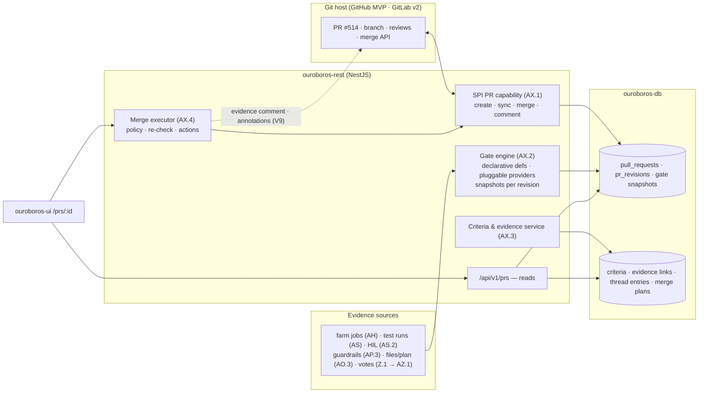
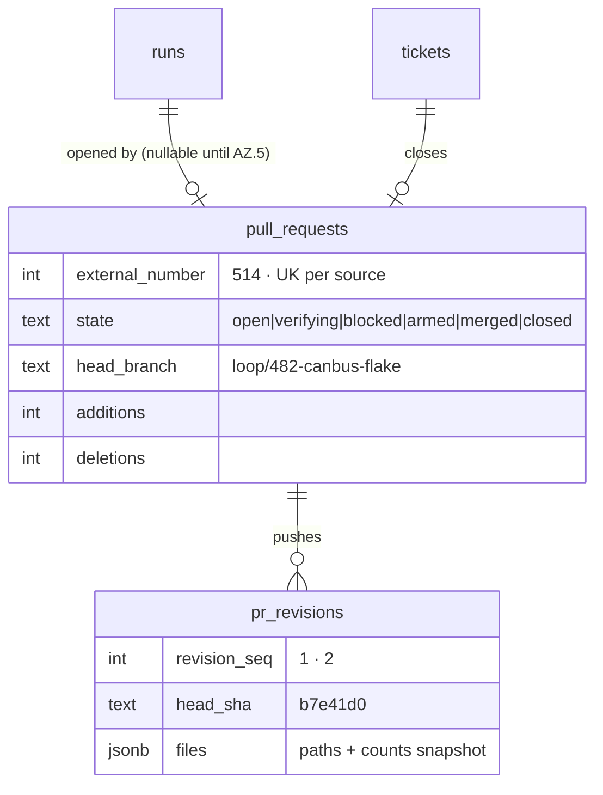
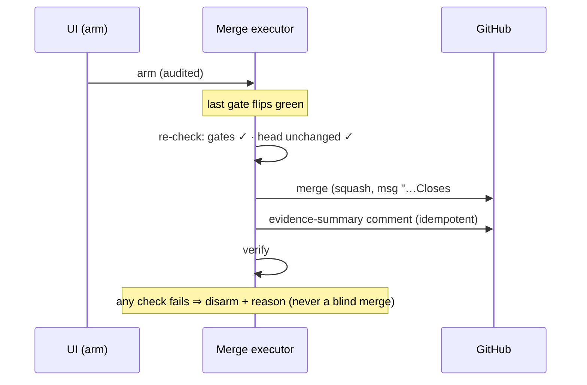
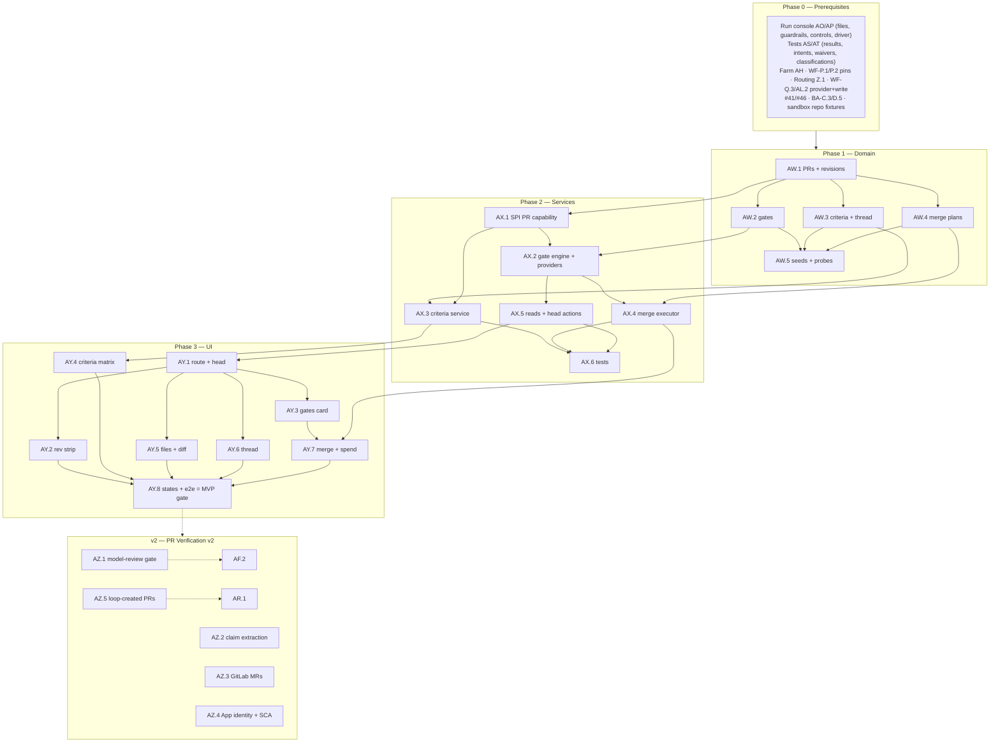

# Roadmap — PR Verification (Mockup 12)

## Description

> Create a roadmap that covers the features for the mockup page 12. Any additional
> tech infrastructure that is required to implement the functionality in these mockup
> pages should be researched and offered as options for implementing in the roadmap.
> The roamdap should include MVP and v2 options, as well as the labels, milestones,
> and the like, for the tickets to be created. Any ticket sources that are used by
> Ouroboros for ingesting should be pluggable, which includes sources like Jira,
> Linear, GitHub, GitLab, and other bug reporting/issue recording sites. Refer to the
> page so that issues can reference the mockup file when creating the UI/UX design of
> the pages. Be very specific when creating the roadmap, as the options in the
> roadmap for the functionality needs to be complete and very thorough.

## Context & Existing Work (duplicate-avoidance survey)

Surveyed 2026-08-08.

**Design source of truth for every UI ticket in this roadmap:**
[`docs/mockups/12-pr-verification.html`](mockups/12-pr-verification.html) (with
`docs/mockups/assets/ouroboros.css`) — PR Verification. Its anatomy:

- **Page head** — eyebrow `PR Verification · PR #514 · Revision 2`, h1 `can: fix
  flaky telemetry frame order under ISR load`, meta row (`loop #1847 · issue
  #482` tag, `verifying — 5 of 7 gates green` warn pill, `loop/482-canbus-flake
  → main`, `+68 −15 · 3 files`). Actions: **Request human review**, **Return to
  loop** (danger), **Merge when all gates green** (primary).
- **Revision cycle strip** — `publish → verify → correct → re-publish`: Revision
  1 (err: *blocked: HIL overshoot fail ✗* · `3f9c2ae · 2 gates red`) → Correction
  round · attempt 4 (*PID sampling moved off telemetry path* + model pill) →
  **Revision 2 (live)** (*pushed, re-verification running* · `b7e41d0 · 5/7
  gates green · second-model review voting`) → Auto-merge (squash) ghosted (*on
  all gates green · policy: standard-fix*).
- **Verification gates card** (`5 / 7 green`, `Run console →`) — gate rows
  (mark · name · evidence · link): **Build** ✓ (`forge-01 · zephyr.elf · FLASH
  43.5%`), **Test suite** ✓ (`63/63 after attempt 4` → test results),
  **Physical HIL** ✓ (`overshoot 1.7% ≤ 2.0% · rig helios-rig-02`),
  **Diff-vs-plan conformance** ✓ (`all hunks map to planned files · 0
  out-of-scope edits`), **Secrets & license scan** ✓ (`clean`), **Second-model
  review** (pending gradient row, `cursor/composer-2 voting…`, `in progress`
  pill), **Human approval** ○ (`not required by policy` · `auto-merge
  eligible` tag).
- **Acceptance criteria matrix** (`DOES THE PR DO WHAT THE TICKET SAYS?`,
  `Issue #482 →`) — quoted claims mapped to mono evidence (test names with
  frame counts, HIL measurements with rev-1 comparatives, hunk refs
  `telemetry_buf.c:41–66`, static-allocation analysis) with `✓ verified`
  pills and one **`waived · annotated on PR`** warn row (*rig runs at 22°C
  only — thermal chamber not in bench*).
- **Changed files card** (`+68 −15`, `Full diff on GitHub ↗`) — file rows with
  add/del counts + proportional mini-meters, and a diff excerpt with `@@`
  header + del/add/ctx treatments.
- **Review thread card** (`3 entries · 0 open`) — `claude-fable-5 ·
  self-review` (resolved), `cursor/composer-2 · second opinion · rev 1` with
  `was blocking` pill + reply *"Addressed in attempt 4"* (resolved),
  `ouroboros policy bot · policy` (*auto-merge eligible: standard-fix — no
  human review required for effort ≤ M with all gates green*).
- **Merge plan card** (`Edit policy →`) — Strategy `squash · delete branch`;
  commit-message preview (`fix(can): … Closes #482.`); toggles **Close issue
  #482 on merge** (on), **Comment evidence summary on GitHub PR** (on),
  **Back-annotate roadmap (OTA hardening)** (off); footer *"Merges as
  `ouroboros-app[bot]` · co-authored-by Ken"*.
- **Spend card** — Loop total `284k tokens · $1.52`, Verification `41k ·
  $0.19`, *within $2.50 cap*, `Routing →`.

**The dependency truth.** This page closes the loop: it is where the AS/AV
roadmap's PR intents activate, where run/test/farm/guardrail evidence
aggregates into gates, and where merges actually execute on the git host.
Loop-*created* PRs need execution (v2 elsewhere); but the PR plane itself —
records, revisions, gate aggregation from real subsystems, criteria/evidence
tracking, and a real merge executor against GitHub — is fully buildable and
provable now with sandbox-repo PRs and the simulated-run universe. The two
AI gates (second-model review, claim extraction) follow the established
staging: contracts + honest pending/absent states now, LLM implementations
behind them when invocation lands.

**Overlapping work and dispositions:**

| Existing work | Disposition under this roadmap |
|---|---|
| Test-results roadmap AS.4/AV.2 (PR intents, waivers, "activation with mockup 12") | **Activated here** — AX.2's gate engine consumes `run_pr_intents` + test totals; waivers render in the criteria matrix and annotate the PR (AX.4); AV.2's scope is delivered by this roadmap (filing-time coordination, same rule as AP.1↔DASH-J.3). |
| Run console AO/AP (stage history, files/commits, guardrail evaluations, controls) | **Consumed** — diff-vs-plan conformance evaluates AO.3 files against the plan; secrets gate reads AP.3 verdicts; "Return to loop" composes AP.4 (steer + stage retry); revision↔attempt mapping reads AO.1. |
| Farm AH (build jobs), routing Z.1 (votes, caps), DASH-F.3/J.4 (usage, pricing) | **Consumed** — Build gate evidence from `build_jobs`; the second-model-review gate slot comes from routing `add_vote` rules; the Spend card aggregates run-attributed usage under the cap. |
| WF-P.2 DSL (`gate.require`, terminal `openPr` config), WF-P.1 pins | **Consumed** — gate *definitions* derive from the pinned workflow policy (which gates exist, auto-merge eligibility, squash strategy). |
| WF-Q SPI + AL.2 write extension (ticket sources pluggable — the description's requirement) | **Extended** — AX.1 adds the **git-host PR capability** to the provider SPI (`createPR/getPR/mergePR/commentPR/prEvents`); GitHub ships MVP, GitLab MRs v2 (AZ.3). Ticket-side pluggability remains WF-Q's; issue-close-on-merge rides the canonical ticket regardless of tracker. |
| INTAKE-O.1 GitHub App (v2) | **Boundary** — MVP merges/comments as the configured token identity, labeled truthfully; the `ouroboros-app[bot]` identity arrives with the App (AZ.4). |
| Planning AK.3 epics ("Back-annotate roadmap") | **Consumed** — the toggle posts merge-progress annotations to the linked planning epic (internal, real in MVP). |
| Mockups 10/11 links (`Run console →`, `test results →`), #49/#56 | **Wired** — gate links target the real pages; #49's PR stubs retired; #56 gains a PR leg. |

Epic letters continue the sequence (…AS–AV): this roadmap uses **AW, AX, AY, AZ**.

## Infrastructure Options (researched — thorough, pick before filing)

### 1. Git-host PR integration (the SPI's third capability family)

| Option | What it is | Fit | Trade-offs |
|---|---|---|---|
| **A — Provider-SPI PR capability: `createPR`, `getPR`, `listRevisions`, `mergePR(strategy)`, `commentPR`, `requestReview`, webhook/poll `prEvents`** ⭐ recommended | GitHub implementation MVP (REST: pulls, merges with `squash` + branch delete, reviews, issue-close via message keywords); capability-flagged like read (WF-Q.2) and write (AL.2) families; GitLab MR mapping v2 (AZ.3) | One pluggability discipline across tickets *and* PRs; conformance-kit write suites extend naturally | PR semantics differ per host (GitLab approvals ≠ GitHub reviews) — capability flags + per-host mapping tables, the established pattern |
| B — GitHub-only PR module outside the SPI | Faster to write | Simple | Forks the pluggability contract the description demands — rejected |
| C — Git-level merges (we push merge commits ourselves) | Host-independent | No host API needed | Bypasses branch protection, host merge queues, and audit trails — rejected |

### 2. Gate aggregation model

| Option | What it is | Fit | Trade-offs |
|---|---|---|---|
| **A — Declarative gate definitions (from pinned workflow policy + org config) evaluated by pluggable gate providers, results snapshotted per revision** ⭐ recommended | Each gate = `{key, source, requirement}`; providers: farm-build, test-suite, HIL, diff-vs-plan, secrets+license, model-review (contract slot), human-approval; the engine evaluates on evidence events and snapshots verdict+evidence per revision; "all gates green" is a computed, auditable state | The mockup's 7 rows are data; new gate kinds (coverage, custom) plug in; revision history keeps rev-1's red gates inspectable | Gate providers must be idempotent re-evaluators — a discipline, not a cost |
| B — Hardcoded seven gates | Matches the mockup exactly | Fast | The workflow DSL already lets tenants vary gates — hardcoding contradicts it |
| C — Delegate to GitHub Checks entirely | Host-native | Reuses CI UX | Our gates (HIL, diff-vs-plan, votes) aren't host checks; we *publish* summaries to host checks instead (part of option A's comment/annotation surface) |

### 3. Secrets & license gate composition

| Option | What it is | Fit | Trade-offs |
|---|---|---|---|
| **A — Compose AP.3's secrets verdicts + a lightweight license layer: SPDX-header check on changed files + manifest-delta license lookup (registry metadata / SPDX list) for dependency changes** ⭐ recommended MVP | Secrets already evaluated (run console); license MVP: changed-file SPDX headers against org allow-list + lockfile-diff license resolution; policy config (allow/deny lists) | Real, fast, diff-scoped; catches the common regressions (new GPL dep, wrong header) without a scanner fleet | Full-text license detection (ScanCode-class) and transitive-tree audits are v2 (AZ.4); stated in the gate's evidence line |
| B — ScanCode/FOSSology full scanning | Deep detection | Strongest compliance | Heavy runtime per PR; belongs in the v2 tier for orgs that need it |
| C — Commercial SCA (FOSSA/Black Duck) | Managed | Enterprise | Cost + egress; optional integration later, never the default |

### 4. Acceptance-criteria mapping intelligence

| Option | What it is | Fit | Trade-offs |
|---|---|---|---|
| **A — Criteria as first-class records with deterministic evidence links now; LLM claim-extraction + auto-mapping behind a committed contract (v2)** ⭐ recommended | Criteria sourced from: planning drafts (AL.1 bodies carry acceptance criteria), manual authoring on the ticket, or (v2) `/v0/extract-criteria` over the ticket body; evidence links are typed refs (test case, HIL measurement, hunk range, analysis note) resolved against real rows; verified/waived states with waiver plumbing from AS.4 | The matrix renders real claims→evidence today (seeded/authored), and the AI upgrade slots in without reshaping anything | MVP matrices need authored criteria where planning didn't produce them — an honest editorial step, labeled |
| B — LLM extraction in MVP | The mockup's magic | Blocks on invocation | Violates the staging pattern used by every sibling roadmap |

## Decisions proposed by this roadmap (validate before issue creation)

| # | Decision | Rationale |
|---|----------|-----------|
| V1 | **PRs are first-class records** (`pull_requests`: provider ref, run/ticket links, branch/base, counts, state) with **revisions** (`pr_revisions`: head sha, pushed-at, attempt link, gate snapshot) — synced from the git host via the SPI PR capability | The revision strip, gate history, and "Revision 2" scoping all need relational truth mirroring the host (host-owns-content, our-plane-owns-verification — the K3/N-option-4A ownership rule again). |
| V2 | **Gate definitions are declarative, providers pluggable, results snapshotted per revision** (option 2-A); definitions derive from the pinned workflow policy + org config; the two AI-dependent gates (second-model review) render honest pending/absent states until AZ.1 | "5 of 7 green" must be computed, auditable, and tenant-shaped. |
| V3 | **The merge executor is real and policy-driven**: strategy from the pinned terminal config (squash + delete branch), gate-green precondition re-checked server-side at merge time, commit message from a deterministic template (`Closes #N`), issue-close + evidence-comment + epic back-annotation as configured actions; merges/comments as the configured token identity with truthful attribution (the `[bot]` identity arrives with the GitHub App, AZ.4) | "Merge when all gates green" is the product's highest-trust button; TOCTOU-safe re-checks and honest identity are non-negotiable. |
| V4 | **Revision ↔ attempt mapping is explicit**: pushes to the PR branch map to run attempts (AO.1) via commit shas; the correction-round step in the strip reads the AS/AT classification that caused it | The strip's narrative (blocked → correction → re-verify) is joined truth, not prose. |
| V5 | **"Return to loop" composes existing machinery**: AP.4 steer (with selected gate failures as context) + stage retry; "Request human review" flips the human-approval gate to required + notifies (needs-you surface) | No new control paths; the head's three actions are compositions. |
| V6 | **Criteria matrix = option 4-A**: typed claims with typed evidence refs, verified/waived lifecycle (waivers from AS.4 render here and annotate the PR via the SPI comment surface) | Evidence must resolve to real rows; waivers must reach the host. |
| V7 | **Secrets & license gate = option 3-A composition**, with the license layer's scope stated in its evidence line (`headers + manifest delta`) | Real coverage, honestly bounded. |
| V8 | **Spend card aggregates run-attributed usage** (loop total vs verification-tagged usage) under the routing cap, with pricing honesty (M7/N10) | Existing accounting, new grouping — no new counters. |
| V9 | **Host publishing is part of the plane**: gate summaries + evidence comments + criteria/waiver annotations publish to the PR (idempotent edit-not-repost, the O.5 discipline) so reviewers living on GitHub see what Ouroboros knows | The page must not be a silo; the host PR is the shared artifact. |
| V10 | **Labels**: new `pr`; **Milestones**: `PR Verification MVP` / `PR Verification v2` created at filing; complexity chips XS–L | Description requires labels + milestones for the filing pass. |

## Architecture Overview



## MVP Definition

The MVP is **mockup 12 as the real verification-and-merge plane** over GitHub
PRs, fed by the existing evidence systems and proven end-to-end in a sandbox
repo. It is done when, against the compose stack:

1. `/prs/:id` reproduces
   [`docs/mockups/12-pr-verification.html`](mockups/12-pr-verification.html)
   pixel-faithfully in **both themes**: head + meta, the revision-cycle strip
   (err/plain/live/ghosted steps), the gates card with all row states (incl.
   the honest pending/absent second-model slot), the criteria matrix with
   verified + waived rows, changed files + diff excerpt, the review thread,
   the merge plan, and the spend card.
2. **PR records sync from GitHub** (V1): a PR opened on the sandbox repo
   (fixture branch) appears with revisions tracked per push, file counts,
   and run/ticket linkage; host-owns-content discipline holds.
3. **Gates compute from real evidence** (V2): build (farm job), test suite
   (AS totals + intents), HIL (measurements vs limits), diff-vs-plan (AO.3
   files vs plan file-list), secrets+license (AP.3 verdicts + the option
   3-A license layer), human-approval (policy + request flow); each verdict
   snapshotted per revision with evidence lines and working links;
   second-model review renders its policy-aware pending/absent state.
4. **The criteria matrix works** (V6): claims (plan-sourced or authored)
   with typed evidence links resolving to real tests/measurements/hunks;
   waivers render and annotate the host PR.
5. **The merge executor executes** (V3): gates-green precondition re-checked
   server-side, squash merge with template message (`Closes #N`), branch
   delete, issue close verified on the tracker, evidence-summary comment
   posted (V9), epic back-annotation when toggled; truthful merge identity
   labeling; all audited.
6. **Head actions compose** (V5): Return-to-loop dispatches the steer+retry
   against the simulated driver; Request-human-review flips the gate and
   surfaces a needs-you item; Merge-when-green arms an auto-merge intent
   that fires when the last gate flips (verified via a staged gate).
7. Integration tests cover PR sync, gate provider matrix + snapshots,
   TOCTOU merge re-check, publish idempotency, criteria/waiver flows,
   isolation; the e2e leg runs sandbox-PR → gates → waive → arm → green →
   merged → issue closed → comment posted.

**Explicitly v2 (milestone `PR Verification v2`):** the second-model review
gate live over invocation + routing votes (AZ.1), LLM claim extraction +
auto-evidence mapping (AZ.2), GitLab MR support (AZ.3), GitHub-App bot
identity + deep license/SCA scanning (AZ.4), loop-created PRs end-to-end with
execution (AZ.5).

## Epics, Labels & Milestones

Each epic is a parent tracking issue on GitHub; every roadmap issue below is filed as
one of its sub-issues (GitHub Relationships).

| Epic | GitHub | Status | Name | Goal | Modules | Milestone |
|------|:------:|:------:|------|------|---------|-----------|
| AW | #348 | 🟡 Open | PR Domain | PRs, revisions, gate snapshots, criteria, thread, merge plans, seeds | ouroboros-db | PR Verification MVP |
| AX | #349 | 🟡 Open | PR Services | SPI PR capability, gate engine, criteria service, merge executor, reads | ouroboros-rest | PR Verification MVP |
| AY | #350 | 🟡 Open | PR Verification UI | All eight page regions, states, e2e | ouroboros-ui | PR Verification MVP |
| AZ | #351 | 🟡 Open | Intelligent Verification (v2) | Model-review gate, claim extraction, GitLab, App identity + SCA, loop PRs | all | PR Verification v2 |

Issue naming: `<project>: [<epic>.<issue>] <title>`. Labels: existing set (`mvp`,
`v2`, `rest`, `db`, `ui`, `engine`, `ci`, `design`, `sources`, `runs`, `routing`,
`workflow`, `intake`) **plus new `pr`** (decision V10, created at filing).
Milestones **`PR Verification MVP`** / **`PR Verification v2`** created at filing;
every issue assigned. Complexity chips: **XS · S · M · L**.

---

## Epic AW (#348) — PR Domain (`ouroboros-db`)

| Ref | GitHub | Status | Title | Summary | Labels | Parallel | MVP | Complexity | Affected Modules |
|-----|:------:|:------:|-------|---------|--------|:--------:|:---:|:----------:|------------------|
| AW.1 | #352 | 🟡 Open | ouroboros-db: [AW.1] Pull requests & revisions schema | Host-mirrored PRs with revision history + attempt links (V1/V4) | mvp, pr, db | N (after AO.1, WF-Q.1) | Y | M | ouroboros-db |
| AW.2 | #353 | 🟡 Open | ouroboros-db: [AW.2] Gate definitions & revision snapshots | Declarative gates, provider results, evidence refs (V2) | mvp, pr, db | N (after AW.1) | Y | M | ouroboros-db |
| AW.3 | #354 | 🟡 Open | ouroboros-db: [AW.3] Criteria, evidence links & review thread | Claims with typed evidence, waiver render refs, thread entries | mvp, pr, db | N (after AW.1) | Y | M | ouroboros-db |
| AW.4 | #355 | 🟡 Open | ouroboros-db: [AW.4] Merge plans & auto-merge intents | Policy snapshot, action toggles, armed-intent state, audit refs | mvp, pr, db | N (after AW.1) | Y | S | ouroboros-db |
| AW.5 | #356 | 🟡 Open | ouroboros-db: [AW.5] PR seeds — mockup-12 parity + probes | The #514 story across two revisions; ci constraint checks | mvp, pr, db, ci | N (after AW.2–AW.4, #24) | Y | M | ouroboros-db, .github |

### Issue AW.1 — ouroboros-db: [AW.1] Pull requests & revisions schema

> **GitHub issue:** #352 · **Status:** 🟡 Open · **Parent epic:** #348

- **Problem Statement:** The page scopes everything to a PR and a revision;
  neither exists as an entity (decision V1), and revisions must map to run
  attempts (V4).
- **Solution/Scope:** Migration: `pull_requests` — id, org FK, `source_id` FK
  (the git-host provider connection), `external_number` (514),
  `external_url`, `title`, `state` CHECK
  `open|verifying|blocked|armed|merged|closed`, `head_branch`, `base_branch`,
  `run_id` FK nullable, `ticket_id` FK nullable (canonical — tracker-
  agnostic), additions/deletions/files counts, `merged_at/by`, unique
  (source, external_number); `pr_revisions` — pr FK, `revision_seq`,
  `head_sha`, `pushed_at`, `run_stage_attempt` link (AO.1 — V4's mapping),
  `files` jsonb snapshot (paths + counts for the changed-files card),
  `diff_excerpt` text (bounded, for the card's sample); state machine
  constraints (merged is terminal).
- **Acceptance Criteria:** The two-revision #514 story representable; state
  transitions constrained; attempt mapping joins to AO.1 rows; host-content
  fields documented as sync-owned (never locally edited).
- **Parallelism/Dependencies:** Needs AO.1, WF-Q.1. Blocks AW.2–AW.5, AX.*.
- **Technical Stack:** PostgreSQL 17, Flyway.
- **Epic:** AW



### Issue AW.2 — ouroboros-db: [AW.2] Gate definitions & revision snapshots

> **GitHub issue:** #353 · **Status:** 🟡 Open · **Parent epic:** #348

- **Problem Statement:** "5 of 7 green" must be declarative, provider-fed,
  and historically inspectable per revision (decision V2).
- **Solution/Scope:** `pr_gate_definitions` — pr FK, `gate_key` CHECK-listed
  (`build|test_suite|physical_hil|diff_vs_plan|secrets_license|
  model_review|human_approval` + `custom:*` escape), `source` (policy pin /
  org config provenance), `required` bool, `sort_order`;
  `pr_gate_results` — definition FK, revision FK, `verdict` CHECK
  `green|red|pending|waived|not_required|unavailable` (`unavailable` = the
  honest AI-slot state), `evidence` text (the row's mono line), `evidence_ref`
  jsonb (typed link: build_job/test_run/measurement/evaluation/vote),
  `evaluated_at`; latest-per-revision view; aggregate state function
  (`x of y green`) documented.
- **Acceptance Criteria:** The mockup's seven rows + rev-1's two-red state
  representable; aggregate math reproducible; `unavailable` distinct from
  `pending` (honesty vocabulary); evidence refs resolve in fixtures.
- **Parallelism/Dependencies:** Needs AW.1. Feeds AX.2, AY.3.
- **Technical Stack:** PostgreSQL 17, Flyway.
- **Epic:** AW

```
defs(policy standard-fix@v14): build · test_suite · physical_hil · diff_vs_plan ·
  secrets_license · model_review(required by security-label vote rule) · human_approval(not required)
results(rev2): 5×green · model_review: pending│unavailable · human: not_required
```

### Issue AW.3 — ouroboros-db: [AW.3] Criteria, evidence links & review thread

> **GitHub issue:** #354 · **Status:** 🟡 Open · **Parent epic:** #348

- **Problem Statement:** The criteria matrix and the review thread need
  durable rows: quoted claims with typed evidence, and thread entries with
  blocking/resolution lifecycle.
- **Solution/Scope:** `pr_criteria` — pr FK, `claim` text, `source` CHECK
  `plan|manual|extracted` (V6 provenance; `extracted` reserved for AZ.2),
  `status` CHECK `unverified|verified|waived`, `waiver_ref` (AS.4 waiver FK),
  `sort_order`; `pr_criteria_evidence` — criterion FK, `kind` CHECK
  `test_case|hil_measurement|hunk|analysis_note|build_artifact`, typed ref
  columns + display text (the mono evidence line), resolution-checked at
  write; `pr_thread_entries` — pr FK, revision FK, `author_kind` CHECK
  `model|policy_bot|human` + author id/name, `tag`
  (`self-review|second opinion|policy`), `body`, `blocking` bool,
  `resolved` bool + resolution reply text, ts (model entries reserved for
  AZ.1/AZ.5 — MVP rows come from policy bot + humans + seeds).
- **Acceptance Criteria:** All mockup matrix rows + thread entries
  representable incl. the was-blocking→resolved arc; evidence refs validate
  against their tables; provenance vocabularies constrained.
- **Parallelism/Dependencies:** Needs AW.1 (+AS.4 waivers). Feeds AX.3,
  AY.4/AY.6.
- **Technical Stack:** PostgreSQL 17, Flyway.
- **Epic:** AW

```
criterion: {"Telemetry frames must arrive in ISR order under load", source: plan,
  evidence: [{test_case: test_frame_order_under_load, "10⁶ frames, 0 reordered"},
             {hunk: telemetry_buf.c:41–66}], status: verified}
thread: {cursor/composer-2, second opinion·rev1, blocking→resolved "Addressed in attempt 4"}
```

### Issue AW.4 — ouroboros-db: [AW.4] Merge plans & auto-merge intents

> **GitHub issue:** #355 · **Status:** 🟡 Open · **Parent epic:** #348

- **Problem Statement:** The merge card's policy snapshot, action toggles,
  and the armed "merge when green" state need durable, auditable rows
  (decision V3).
- **Solution/Scope:** `pr_merge_plans` — pr FK (1:1), `strategy` CHECK
  `squash|merge|rebase` + `delete_branch` bool (from the pinned terminal
  config, editable per org policy), `commit_message` text (template-
  generated, editable), toggles (`close_ticket`, `comment_evidence`,
  `back_annotate_epic` + epic FK), `armed` bool + `armed_by/at` (the
  merge-when-green intent), `merged_result` jsonb (sha, identity used,
  actions executed); audit linkage on arm/edit/merge.
- **Acceptance Criteria:** Plan round-trips; arming recorded with actor;
  merged_result captures the executed actions; identity field never claims
  `[bot]` when token-based (V3 honesty).
- **Parallelism/Dependencies:** Needs AW.1. Feeds AX.4, AY.7.
- **Technical Stack:** PostgreSQL 17, Flyway.
- **Epic:** AW

```
plan: {squash+delete, msg: "fix(can): … Closes #482.", close_ticket ✓, comment ✓, epic ✗}
armed by Ken @14:35 ─▶ merged_result: {sha, identity: "pat:ken-token", actions: [closed #482, commented]}
```

### Issue AW.5 — ouroboros-db: [AW.5] PR seeds — mockup-12 parity + probes

> **GitHub issue:** #356 · **Status:** 🟡 Open · **Parent epic:** #348

- **Problem Statement:** Design review needs #514's full two-revision story
  with every card populated, coherent with the `#482` universe.
- **Solution/Scope:** Extend the dev seed (coordinated with AO.5/AS.5):
  PR #514 (title, branch→main, +68/−15, 3 files, state `verifying`),
  revision 1 (3f9c2ae, blocked, gate snapshot with HIL red + 2 red) and
  revision 2 (b7e41d0, live, 5/7 with model_review pending-or-unavailable),
  gate definitions from the standard-fix pin, five criteria rows (four
  verified with typed evidence, one waived via the AS.4 thermal waiver),
  three thread entries (seeded model rows flagged `simulated` per the R4
  discipline), merge plan (squash, template message, toggles per mockup),
  spend attribution rows (284k/$1.52 loop, 41k/$0.19 verification);
  ci/db probes (state machines, verdict vocab, evidence resolution,
  1:1 plan).
- **Acceptance Criteria:** Page renders the mockup from seeds; aggregate
  5/7 computes; probes red/green verified; one coherent #482 story across
  AO/AS/AW seeds.
- **Parallelism/Dependencies:** Needs AW.2–AW.4 (+AO.5/AS.5 coordination).
- **Technical Stack:** Flyway repeatable migration, SQL.
- **Epic:** AW

```
seeds: PR#514 rev1(blocked: HIL 2.4%) → correction(attempt 4) → rev2(5/7, voting slot)
       criteria 4✓+1 waived · thread 3 · plan squash · spend 284k/$1.52 + 41k/$0.19
```

---

## Epic AX (#349) — PR Services (`ouroboros-rest`)

| Ref | GitHub | Status | Title | Summary | Labels | Parallel | MVP | Complexity | Affected Modules |
|-----|:------:|:------:|-------|---------|--------|:--------:|:---:|:----------:|------------------|
| AX.1 | #357 | 🟡 Open | ouroboros-rest: [AX.1] SPI PR capability & GitHub implementation | create/sync/merge/comment/review-request + PR event ingestion | mvp, pr, sources, rest | N (after AL.2, WF-Q.3) | Y | L | ouroboros-rest |
| AX.2 | #358 | 🟡 Open | ouroboros-rest: [AX.2] Gate engine & providers | Declarative defs from policy; six MVP providers; revision snapshots | mvp, pr, rest | N (after AW.2, AX.1) | Y | L | ouroboros-rest |
| AX.3 | #359 | 🟡 Open | ouroboros-rest: [AX.3] Criteria & evidence service | Claims CRUD, typed evidence resolution, waiver render + host annotation | mvp, pr, rest | N (after AW.3, AX.1) | Y | M | ouroboros-rest |
| AX.4 | #360 | 🟡 Open | ouroboros-rest: [AX.4] Merge executor & host publishing | Armed intents, TOCTOU re-check, actions, evidence comments (V3/V9) | mvp, pr, rest | N (after AX.2, AW.4) | Y | L | ouroboros-rest |
| AX.5 | #361 | 🟡 Open | ouroboros-rest: [AX.5] PR read APIs & head actions | Page payloads; return-to-loop + request-review compositions (V5) | mvp, pr, rest, runs | N (after AX.2, AP.4) | Y | M | ouroboros-rest |
| AX.6 | #362 | 🟡 Open | ouroboros-rest: [AX.6] PR-plane integration tests | Sync, gate matrix, merge safety, publishing idempotency, isolation | mvp, pr, rest, ci | N (after AX.3–AX.5) | Y | M | ouroboros-rest |

### Issue AX.1 — ouroboros-rest: [AX.1] SPI PR capability & GitHub implementation

> **GitHub issue:** #357 · **Status:** 🟡 Open · **Parent epic:** #349

- **Problem Statement:** The provider SPI reads tickets (WF-Q) and writes
  them (AL.2); the PR plane needs its third capability family (option 1-A),
  keeping the description's pluggability discipline on the git-host side.
- **Solution/Scope:** SPI extension: `capabilities().pr`
  (`create?, merge_strategies[], reviews?, events: webhook|poll`); methods
  `createPR(conn, branch, base, title, body)`, `getPR/syncPR` (state,
  counts, pushes → revision detection by head-sha change),
  `mergePR(strategy, message, deleteBranch)`, `commentPR` (idempotent
  edit-not-repost marker discipline), `requestReview(user)`,
  `prEvents` (poll cursor MVP per K2's pattern; webhook slot with
  INTAKE-O.1); GitHub implementation over the existing provider (Octokit
  pulls/merges/issues APIs; issue-close via `Closes #N` keywords verified
  post-merge); conformance-kit PR suites + fake-provider implementation;
  revision sync writes AW.1 rows with file snapshots.
- **Acceptance Criteria:** Sandbox round-trip: create branch+PR → push →
  revision 2 detected with counts; merge with squash+delete verified;
  comment idempotency (edit on re-publish); kit green for GitHub + fake;
  lint boundary holds (no Octokit outside providers).
- **Parallelism/Dependencies:** Needs AL.2, WF-Q.3. Blocks AX.2–AX.5;
  AZ.3 implements GitLab against the same suites.
- **Technical Stack:** Octokit, SPI registry, conformance kit.
- **Epic:** AX

```
capabilities().pr = {create ✓, merge: [squash, merge], reviews ✓, events: poll}
push b7e41d0 ─▶ syncPR ─▶ revision_seq 2 {files snapshot, +68 −15}
mergePR(squash, msg, deleteBranch) ─▶ merged · closes #482 verified
```

### Issue AX.2 — ouroboros-rest: [AX.2] Gate engine & providers

> **GitHub issue:** #358 · **Status:** 🟡 Open · **Parent epic:** #349

- **Problem Statement:** Seven gates, each a different evidence system,
  must evaluate declaratively and snapshot per revision (decision V2).
- **Solution/Scope:** Gate engine: definition materialization at PR
  creation/sync (pinned workflow policy → gate set; routing vote rules →
  model_review requirement; org config overrides); evaluation triggers
  (evidence events: test_run parsed, job finished, guardrail evaluated,
  revision pushed → re-evaluate affected gates); **providers**: build
  (latest attempt's build job success + artifact evidence line),
  test_suite (AS totals + block-until-green intent, `63/63 after attempt
  4`), physical_hil (failing-measurement check, evidence with limits),
  diff_vs_plan (revision file snapshot ⊆ plan file-list from AO/plan
  context; out-of-scope count), secrets_license (AP.3 secrets verdicts +
  the V7 license layer: SPDX-header check on changed files vs org
  allow-list + manifest-delta license resolution), human_approval
  (required flag + approval records; request flow in AX.5),
  model_review (contract slot: renders `unavailable — arrives with the
  provider stack` or `pending` when AZ.1 is live; policy-aware);
  snapshot writes + aggregate state (`verifying|blocked|armed-ready`);
  idempotent re-evaluation.
- **Acceptance Criteria:** Provider matrix fixtures (each gate ×
  green/red/pending/waived/not_required/unavailable); revision push
  re-evaluates and re-snapshots; aggregate flips drive PR state; license
  fixtures (bad header, GPL manifest delta) go red with evidence;
  evaluation idempotent.
- **Parallelism/Dependencies:** Needs AW.2, AX.1 (+AS/AP/AH evidence
  systems). Blocks AX.4/AX.5.
- **Technical Stack:** NestJS, provider registry, SPDX license list data.
- **Epic:** AX

```
event: test_run(rev2) parsed ─▶ re-eval test_suite ─▶ green "63/63 after attempt 4"
diff_vs_plan: files(rev2) ⊆ plan.files ─▶ green "0 out-of-scope edits"
secrets_license: AP.3 ✓ + headers ✓ + manifest Δ ∅ ─▶ green "clean (headers + manifest delta)"
aggregate: 5/7 green · model_review unavailable→pending(AZ.1) ─▶ state: verifying
```

### Issue AX.3 — ouroboros-rest: [AX.3] Criteria & evidence service

> **GitHub issue:** #359 · **Status:** 🟡 Open · **Parent epic:** #349

- **Problem Statement:** The matrix needs claims CRUD with typed evidence
  that resolves, waiver rendering, and host annotation (V6/V9).
- **Solution/Scope:** APIs: criteria CRUD (plan-sourced import from the
  run's planning context where present; manual authoring member+;
  `extracted` reserved), evidence attach (typed refs validated against
  their tables — test case by key, HIL measurement, hunk range vs the
  revision snapshot, analysis note), verify/unverify transitions
  (evidence-required rule), waive flow (reason → AS.4 waiver + status
  `waived` + host annotation via `commentPR`: criterion, reason, author —
  the mockup's `waived · annotated on PR`); matrix payload with
  evidence-line composition; audit on status changes.
- **Acceptance Criteria:** Full lifecycle in the harness; dangling
  evidence rejected; waive posts the idempotent annotation (sandbox
  verified); plan-sourced import works from seeded planning context.
- **Parallelism/Dependencies:** Needs AW.3, AX.1.
- **Technical Stack:** NestJS, Kysely.
- **Epic:** AX

```
POST criteria {claim, source: manual} ─▶ attach evidence {test_case, hunk} ─▶ verified
waive {reason: "thermal chamber not in bench"} ─▶ AS.4 waiver + PR annotation (idempotent)
```

### Issue AX.4 — ouroboros-rest: [AX.4] Merge executor & host publishing

> **GitHub issue:** #360 · **Status:** 🟡 Open · **Parent epic:** #349

- **Problem Statement:** The primary button: armed auto-merge that fires
  safely when the last gate flips, executes the plan's actions, and
  publishes evidence — the product's moment of truth (V3/V9).
- **Solution/Scope:** Arm/disarm API (role admin+ or policy-eligible
  member; audited); the executor: on gate-aggregate green (event-driven) or
  direct merge call — **server-side re-check inside a short transaction**
  (gates green? revision unchanged since arm? host mergeable?) → SPI merge
  (strategy/message/delete from the plan) → post-merge actions: verify
  ticket close (or close via SPI when keywords unsupported), evidence-
  summary comment (gate table + criteria matrix + spend, idempotent
  edit-marker), epic back-annotation (AK.3 note) when toggled, run/PR
  state finalization, DASH read-model outcome update; failure paths
  (host conflict, branch protection, gate flip mid-merge) → disarm with
  designed reasons; identity truthfulness (V3) in the merged-as label.
- **Acceptance Criteria:** Armed PR merges when the staged last gate
  flips (e2e); TOCTOU test (gate goes red between arm and fire → no
  merge, reason recorded); actions verified on the sandbox (closed
  ticket, comment content, epic note); conflict path disarms cleanly;
  all audited.
- **Parallelism/Dependencies:** Needs AX.2, AW.4, AX.1.
- **Technical Stack:** NestJS, SPI PR capability, transactions.
- **Epic:** AX



### Issue AX.5 — ouroboros-rest: [AX.5] PR read APIs & head actions

> **GitHub issue:** #361 · **Status:** 🟡 Open · **Parent epic:** #349

- **Problem Statement:** The page needs shaped reads (strip, gates,
  matrix, files, thread, plan, spend) and the two composed head actions
  (V5).
- **Solution/Scope:** `GET /api/v1/prs` (list for nav/inbox surfaces) and
  `GET /api/v1/prs/:id` (full payload: revisions with gate snapshots,
  current gates + aggregate, criteria matrix, file rows + diff excerpt,
  thread, merge plan + armed state, spend rollup per V8 from run-
  attributed usage split loop/verification vs cap); **Return to loop**:
  composes AP.4 steer (selected red-gate evidence as context) + stage
  retry, links the resulting attempt to the next revision expectation;
  **Request human review**: flips human_approval to required, creates
  the approval record slot + needs-you notification + optional host
  `requestReview`; approval API (approve/decline with note → gate
  re-eval); 404-not-403; OpenAPI complete.
- **Acceptance Criteria:** Seeded payload reproduces every mockup element;
  return-to-loop reaches the simulated driver (steer content = gate
  evidence, verified in transcript); request-review flips the gate +
  notifies; spend math honest (unpriced → token-only).
- **Parallelism/Dependencies:** Needs AX.2, AP.4. Feeds AY.*.
- **Technical Stack:** NestJS, Kysely.
- **Epic:** AX

```
GET /prs/514 ─▶ {revisions[2+ghost], gates{5/7}, criteria[5], files[3], thread[3], plan, spend}
POST /prs/514/return-to-loop {gates: [physical_hil]} ─▶ steer+retry ─▶ attempt N+1 expected
POST /prs/514/request-review ─▶ human_approval: required · needs-you
```

### Issue AX.6 — ouroboros-rest: [AX.6] PR-plane integration tests

> **GitHub issue:** #362 · **Status:** 🟡 Open · **Parent epic:** #349

- **Problem Statement:** Merge safety, gate re-evaluation, and host
  publishing are the highest-stakes logic in the product.
- **Solution/Scope:** Harness suites (fake provider + recorded GitHub
  fixtures): PR sync/revision detection, gate provider matrix +
  snapshot history, TOCTOU merge scenarios (gate flip, head moved,
  host conflict), publish idempotency (comments/annotations edited not
  duplicated), criteria/waiver lifecycle, head-action compositions,
  role gates, org isolation.
- **Acceptance Criteria:** Green in `ci/rest`; removing the merge
  re-check or the idempotency marker turns tests red; ≤ 100s added.
- **Parallelism/Dependencies:** Needs AX.3–AX.5.
- **Technical Stack:** Jest, Testcontainers, recorded fixtures.
- **Epic:** AX

```
suites: sync ✓ · gates+snapshots ✓ · TOCTOU ✓ · publish idempotent ✓ · criteria ✓ · isolation ✓
```

---

## Epic AY (#350) — PR Verification UI (`ouroboros-ui`)

Every issue references
[`docs/mockups/12-pr-verification.html`](mockups/12-pr-verification.html) as
the design source — rev-strip/gate/crit/file/thread/kv treatments — via the
#16 tokens (both themes; the mockup is dark-only).

| Ref | GitHub | Status | Title | Summary | Labels | Parallel | MVP | Complexity | Affected Modules |
|-----|:------:|:------:|-------|---------|--------|:--------:|:---:|:----------:|------------------|
| AY.1 | #363 | 🟡 Open | ouroboros-ui: [AY.1] PR route, head & actions | `/prs/:id` frame, meta, the three composed actions | mvp, pr, ui, design | N (after #41, AX.5, BA-D.5) | Y | M | ouroboros-ui |
| AY.2 | #364 | 🟡 Open | ouroboros-ui: [AY.2] Revision cycle strip | err/plain/live/ghosted steps with real joins (V4) | mvp, pr, ui, design | N (after AY.1) | Y | S | ouroboros-ui |
| AY.3 | #365 | 🟡 Open | ouroboros-ui: [AY.3] Verification gates card | Seven-row gate list with all verdict states + links | mvp, pr, ui, design | N (after AY.1) | Y | M | ouroboros-ui |
| AY.4 | #366 | 🟡 Open | ouroboros-ui: [AY.4] Acceptance criteria matrix | Claims → evidence grid, verified/waived, authoring flow | mvp, pr, ui, design | N (after AY.1, AX.3) | Y | M | ouroboros-ui |
| AY.5 | #367 | 🟡 Open | ouroboros-ui: [AY.5] Changed files & diff excerpt | File rows with proportional meters, diff block, host link | mvp, pr, ui, design | N (after AY.1) | Y | S | ouroboros-ui |
| AY.6 | #368 | 🟡 Open | ouroboros-ui: [AY.6] Review thread card | Author-kinded entries, blocking arcs, resolution states | mvp, pr, ui, design | N (after AY.1) | Y | S | ouroboros-ui |
| AY.7 | #369 | 🟡 Open | ouroboros-ui: [AY.7] Merge plan & spend cards | Plan editing, arm flow, truthful identity, spend rollup | mvp, pr, ui | N (after AY.3, AX.4) | Y | M | ouroboros-ui |
| AY.8 | #370 | 🟡 Open | ouroboros-ui: [AY.8] PR states & e2e leg | Merged/blocked/conflict states, themes, sandbox e2e | mvp, pr, ui, ci | N (after AY.2–AY.7) | Y | M | ouroboros-ui, .github |

### Issue AY.1 — ouroboros-ui: [AY.1] PR route, head & actions

> **GitHub issue:** #363 · **Status:** 🟡 Open · **Parent epic:** #350

- **Problem Statement:** The frame: PR-scoped route reachable from runs,
  test results, and the dashboard's recently-closed rows; the meta row;
  and the three high-stakes actions.
- **Solution/Scope:** `/prs/:id`: eyebrow (PR number + revision), h1 =
  host PR title, meta (run+ticket tag linking both, aggregate pill
  ok/warn/err by state, branch→base, counts); **Request human review**
  (AX.5; state-aware — shows `review requested` after), **Return to
  loop** (danger dialog: pick red/any gates as context → dispatch;
  receipt links the console), **Merge when all gates green** (arm flow →
  AY.7); links from AQ/AU/DASH rows land here (amendments); polling via
  I.8.
- **Acceptance Criteria:** Seeded head matches; actions role-gated and
  state-aware; inbound links verified; both themes.
- **Parallelism/Dependencies:** Needs #41, AX.5, BA-D.5. Blocks AY.2–AY.7.
- **Technical Stack:** Next.js, #46 primitives.
- **Epic:** AY

```
PR Verification · PR #514 · Revision 2
can: fix flaky telemetry frame order under ISR load
(loop #1847 · issue #482)(verifying — 5 of 7)(loop/482… → main)(+68 −15 · 3 files)
[Request human review][Return to loop][Merge when all gates green]
```

### Issue AY.2 — ouroboros-ui: [AY.2] Revision cycle strip

> **GitHub issue:** #364 · **Status:** 🟡 Open · **Parent epic:** #350

- **Problem Statement:** The strip narrates the loop's convergence — and
  every step must be a join, not prose (V4).
- **Solution/Scope:** Steps from revisions + linked attempts: revision
  steps (err/live treatments by gate snapshot, label composing ts +
  blocking reason from the red gates, meta sha + snapshot summary),
  correction step (from the AS/AT classification that bridged rev 1→2:
  note + model pill when provenance exists), ghosted future step from
  the merge plan (strategy + policy name; upgrades to `armed` styling
  when armed); horizontal scroll; step click scopes the gates card to
  that revision's snapshot.
- **Acceptance Criteria:** Seeded strip matches the mockup; rev-1 click
  shows its 2-red snapshot; armed state re-styles the ghost; both
  themes.
- **Parallelism/Dependencies:** Needs AY.1.
- **Technical Stack:** React, #46 primitives.
- **Epic:** AY

```
[Rev 1 err · blocked: HIL overshoot ✗ · 3f9c2ae] → [Correction · attempt 4 · claude-fable-5]
→ [●Rev 2 · re-verifying · 5/7] → [╌ Auto-merge (squash) · on green · standard-fix]
```

### Issue AY.3 — ouroboros-ui: [AY.3] Verification gates card

> **GitHub issue:** #365 · **Status:** 🟡 Open · **Parent epic:** #350

- **Problem Statement:** The seven-row gate list with every verdict
  treatment — including the pending gradient row and the honest
  `unavailable` state — plus working evidence links.
- **Solution/Scope:** Gate rows from the scoped snapshot (mark ✓/✗/○/dot-
  pulse by verdict, name coloring, mono evidence line, link routing:
  build → farm job sheet, test → AU page, HIL → AU physical card,
  diff-vs-plan → AY.5 with out-of-scope highlighting, secrets/license →
  evidence sheet, model_review → `unavailable — arrives with the
  provider stack` note or live vote state (AZ.1), human → request/
  approve affordances per role); aggregate pill sync; waived rows with
  waiver popover; per-revision scoping from AY.2.
- **Acceptance Criteria:** Seeded card matches the mockup incl. the
  pending row treatment; every link lands; `unavailable` renders
  distinctly from `pending` (honesty visible); both themes.
- **Parallelism/Dependencies:** Needs AY.1 (+AY.2 scoping).
- **Technical Stack:** React, #46 primitives.
- **Epic:** AY

```
✓ Build         forge-01 · zephyr.elf · FLASH 43.5%        view →
● Second-model review   cursor/composer-2 voting…          (in progress)   ← or "unavailable · AZ.1"
○ Human approval        not required by policy             [auto-merge eligible]
```

### Issue AY.4 — ouroboros-ui: [AY.4] Acceptance criteria matrix

> **GitHub issue:** #366 · **Status:** 🟡 Open · **Parent epic:** #350

- **Problem Statement:** The matrix — quoted claims, mono evidence with
  hunk accents, verified/waived pills — plus the authoring and waive
  flows (V6).
- **Solution/Scope:** Grid per the mockup (responsive collapse per its
  media rule): claim cell (quote treatment), evidence cell (composed
  lines, hunk refs linking AY.5's diff scroll, test refs linking AU),
  status pill; authoring: add-claim (manual; plan-import button when
  planning context exists), attach-evidence picker (typed: tests from
  the run's results, measurements, hunks from the revision snapshot),
  verify action (evidence-required), waive dialog (reason → AX.3 flow;
  renders the `waived · annotated on PR` pill with the host-comment
  link); `extracted` rows reserved-labeled for AZ.2.
- **Acceptance Criteria:** Seeded matrix matches; authoring round-trip;
  waive posts + renders the annotation link (sandbox e2e); evidence
  links navigate; both themes.
- **Parallelism/Dependencies:** Needs AY.1, AX.3.
- **Technical Stack:** React, #46 primitives.
- **Epic:** AY

```
"Flake must not reappear across temperature range"
  rig runs at 22°C only — thermal chamber not in bench     (waived · annotated on PR ↗)
[+ Add claim] [Import from plan]  evidence picker: tests · measurements · hunks
```

### Issue AY.5 — ouroboros-ui: [AY.5] Changed files & diff excerpt

> **GitHub issue:** #367 · **Status:** 🟡 Open · **Parent epic:** #350

- **Problem Statement:** File rows with proportional add/del meters and
  the diff excerpt block — the revision's material truth.
- **Solution/Scope:** Rows from the revision snapshot (mono path, +/-
  counts, tri-segment meter proportional to counts), diff excerpt
  (bounded, `@@` header + del/add/ctx treatments from the shared token
  palette; per-file expansion within the stored bound; "full diff on
  GitHub ↗" host link), out-of-scope highlighting when the diff-vs-plan
  gate flags paths (err tint + explanation).
- **Acceptance Criteria:** Seeded card matches incl. meter proportions;
  out-of-scope fixture renders flagged; excerpt bound honest ("excerpt —
  full diff on host"); both themes.
- **Parallelism/Dependencies:** Needs AY.1.
- **Technical Stack:** React, shared diff styles.
- **Epic:** AY

```
drivers/can/telemetry_buf.c  +38 −12  [▮add▮del░rest]
@@ telemetry_buf.c:41 @@ … − k_fifo_put(…) + k_msgq_put(…)   Full diff on GitHub ↗
```

### Issue AY.6 — ouroboros-ui: [AY.6] Review thread card

> **GitHub issue:** #368 · **Status:** 🟡 Open · **Parent epic:** #350

- **Problem Statement:** The thread's three author kinds, the blocking→
  resolved arc, and honest provenance (model entries only when real —
  seeds watermarked).
- **Solution/Scope:** Entries from AW.3 (author mono + kind tag, ts,
  body, blocking left-border treatment, reply + resolve lines,
  `was blocking` pill), open-count header math, human reply/resolve
  affordances (member+; writes thread rows + optional host comment
  mirror), simulated watermark on seeded model rows; empty state
  ("No review entries yet").
- **Acceptance Criteria:** Seeded thread matches incl. the arc; human
  reply round-trips; watermark renders; both themes.
- **Parallelism/Dependencies:** Needs AY.1.
- **Technical Stack:** React, #46 primitives.
- **Epic:** AY

```
cursor/composer-2 [second opinion · rev 1] (was blocking) 14:12:44
  "PID velocity sample now lags…" ↳ "Addressed in attempt 4" · ✓ resolved
```

### Issue AY.7 — ouroboros-ui: [AY.7] Merge plan & spend cards

> **GitHub issue:** #369 · **Status:** 🟡 Open · **Parent epic:** #350

- **Problem Statement:** The merge card's plan editing, the arm flow with
  its safety story, truthful identity, and the spend rollup.
- **Solution/Scope:** Merge plan: strategy tag (policy-sourced; edit via
  policy link when permitted), commit-message preview (editable
  textarea over the template, `Closes #N` preserved-or-warned), the
  three toggles (epic picker for back-annotate), identity footer
  truthful per V3 (`merges as <token identity>` with the App upgrade
  note; co-author line from the approving/arming user); **arm flow**:
  primary button → confirmation stating the exact conditions ("merges
  automatically when Second-model review turns green; re-checked at
  merge time") → armed state styling + disarm affordance; direct-merge
  variant when already all-green; **spend card**: loop vs verification
  rows + cap line from AX.5's rollup (pricing honesty).
- **Acceptance Criteria:** Plan edits round-trip; arm → staged gate
  flip → merged (e2e) with receipt (sha, executed actions); identity
  label truthful; spend matches seeds; both themes.
- **Parallelism/Dependencies:** Needs AY.3, AX.4.
- **Technical Stack:** React, #46 primitives.
- **Epic:** AY

```
Strategy [squash · delete branch] · msg preview [fix(can): … Closes #482.]
[close #482 ✓][evidence comment ✓][back-annotate ▾ off]
"Merges as pat:ken-token (bot identity arrives with the GitHub App) · co-authored-by Ken"
[Merge when all gates green] ─▶ armed ● (disarm) ─▶ merged ✓ receipt
```

### Issue AY.8 — ouroboros-ui: [AY.8] PR states & e2e leg

> **GitHub issue:** #370 · **Status:** 🟡 Open · **Parent epic:** #350

- **Problem Statement:** Merged/blocked/conflict/closed states, and the
  full sandbox chain needs end-to-end certification.
- **Solution/Scope:** States: merged (frozen head, receipt banner, host
  links), blocked (red-gate emphasis + return-to-loop promoted),
  host-conflict (disarmed reason banner), closed-without-merge, sync-lag
  (DASH-I.7 pattern), member read-only variants, skeletons; e2e
  (extends #56): seeded parity screenshots; live chain — sandbox branch
  + PR → sync appears → gates evaluate (seeded evidence) → waive the
  thermal criterion (annotation verified on host) → arm → flip the
  staged last gate → merged (squash verified, ticket closed, evidence
  comment content asserted, epic note when toggled) → merged state
  renders; TOCTOU leg (gate red between arm and flip → disarmed with
  reason); both themes.
- **Acceptance Criteria:** All states themed; e2e green from cold
  compose (sandbox fixtures); each leg fails meaningfully when its
  layer breaks; ≤ 3 min added.
- **Parallelism/Dependencies:** Needs AY.2–AY.7, AW.5, AX.6; amends #56.
- **Technical Stack:** React, Playwright.
- **Epic:** AY

```
e2e: sync ✓ · gates ✓ · waive+annotate ✓ · arm→flip→merge ✓ · actions ✓ · TOCTOU ✓ · themes ✓
```

---

## Epic AZ (#351) — Intelligent Verification (v2 · milestone `PR Verification v2`)

| Ref | GitHub | Status | Title | Summary | Labels | Parallel | MVP | Complexity | Affected Modules |
|-----|:------:|:------:|-------|---------|--------|:--------:|:---:|:----------:|------------------|
| AZ.1 | #371 | 🟡 Open | ouroboros-engine: [AZ.1] Second-model review gate | Real vote via routing `add_vote` + invocation; thread entries live | v2, pr, engine, routing | N (after AX.2, AF.2) | N | L | ouroboros-engine, ouroboros-rest |
| AZ.2 | #372 | 🟡 Open | ouroboros-engine: [AZ.2] Claim extraction & auto-evidence mapping | `/v0/extract-criteria` + evidence suggestion over run context | v2, pr, engine | N (after AX.3, AF.2) | N | L | ouroboros-engine, ouroboros-rest |
| AZ.3 | #373 | 🟡 Open | ouroboros-rest: [AZ.3] GitLab merge-request support | MR mapping for the SPI PR capability; approvals model | v2, pr, sources, rest | N (after AX.1, WF-T.4) | N | M | ouroboros-rest |
| AZ.4 | #374 | 🟡 Open | ouroboros-rest: [AZ.4] App merge identity & deep license scanning | `ouroboros-app[bot]` merges; ScanCode-class + SCA tier | v2, pr, rest | N (after INTAKE-O.1, AX.2) | N | M | ouroboros-rest |
| AZ.5 | #375 | 🟡 Open | ouroboros-engine: [AZ.5] Loop-created PRs end-to-end | Execution opens PRs via the SPI; full autonomous publish cycle | v2, pr, workflow, engine | N (after AR.1, AX.1) | N | M | ouroboros-engine, ouroboros-rest |

### Issue AZ.1 — ouroboros-engine: [AZ.1] Second-model review gate

> **GitHub issue:** #371 · **Status:** 🟡 Open · **Parent epic:** #351

- **Problem Statement:** The pending gate row and the thread's
  second-opinion entries are model work — real once invocation exists,
  wired through routing's `add_vote` rules.
- **Solution/Scope:** Review-vote execution: diff + criteria + plan
  context → structured review (verdict, blocking findings, comments)
  from the vote-designated alias (Z.1 resolution); gate provider
  consumes votes (majority/required semantics from policy); thread
  entries written with real provenance; blocking findings feed
  return-to-loop context; re-vote on new revisions; token accounting
  tagged `verification` (the spend card's split).
- **Acceptance Criteria:** Seeded scenario yields a vote + thread entry
  + gate flip; blocking finding round-trips to a correction; provenance/
  cost honest; `unavailable` state retired.
- **Parallelism/Dependencies:** Needs AX.2, AF.2 (+Z.1 votes).
- **Technical Stack:** FastAPI, structured output, invocation gateway.
- **Epic:** AZ

### Issue AZ.2 — ouroboros-engine: [AZ.2] Claim extraction & auto-evidence mapping

> **GitHub issue:** #372 · **Status:** 🟡 Open · **Parent epic:** #351

- **Problem Statement:** MVP criteria are plan-sourced or hand-authored;
  the mockup's ideal extracts claims from the ticket and maps evidence
  automatically.
- **Solution/Scope:** `/v0/extract-criteria` (ticket body + plan →
  candidate claims, `extracted` provenance, human-confirm flow) and
  evidence suggestion (map claims to test cases/measurements/hunks with
  confidence; suggest-only, confirm-to-verify); benchmark vs authored
  fixtures; honest confidence display.
- **Acceptance Criteria:** Extraction on the seeded ticket yields
  mockup-class claims for confirmation; suggestions link real rows;
  nothing auto-verifies without confirmation.
- **Parallelism/Dependencies:** Needs AX.3, AF.2.
- **Technical Stack:** FastAPI, structured output.
- **Epic:** AZ

### Issue AZ.3 — ouroboros-rest: [AZ.3] GitLab merge-request support

> **GitHub issue:** #373 · **Status:** 🟡 Open · **Parent epic:** #351

- **Problem Statement:** The pluggability promise on the PR side: GitLab
  MRs behind the same capability, mapped honestly (approvals ≠ reviews,
  squash options differ).
- **Solution/Scope:** GitLab implementation of the AX.1 capability over
  the WF-T.4 provider: MR create/sync/merge (squash + remove-source),
  notes as comments, approvals mapping for human/model gates, event
  polling; conformance PR suites green; capability-flag differences
  surfaced in the UI (strategy lists per host).
- **Acceptance Criteria:** Kit green (recorded fixtures); sandbox GitLab
  MR walks the e2e chain; mapping table documented.
- **Parallelism/Dependencies:** Needs AX.1, WF-T.4.
- **Technical Stack:** GitLab REST v4.
- **Epic:** AZ

### Issue AZ.4 — ouroboros-rest: [AZ.4] App merge identity & deep license scanning

> **GitHub issue:** #374 · **Status:** 🟡 Open · **Parent epic:** #351

- **Problem Statement:** Two truth upgrades: merges as `ouroboros-app[bot]`
  (with the GitHub App) and license coverage beyond headers+manifest
  deltas.
- **Solution/Scope:** App-identity merge/comment paths (INTAKE-O.1
  installation tokens; identity footer upgrade); license tier: full-text
  detection on changed files (ScanCode-class engine or embedded matcher
  against the SPDX corpus), transitive manifest audits as a policy-
  gated deep scan, org policy matrix (deny/allow/review lists),
  evidence-line upgrades.
- **Acceptance Criteria:** Merges attribute to the bot; full-text fixture
  (embedded license text, no header) detected; deep-scan policy gates
  correctly; footers truthful.
- **Parallelism/Dependencies:** Needs INTAKE-O.1, AX.2.
- **Technical Stack:** GitHub App tokens, license detection engine.
- **Epic:** AZ

### Issue AZ.5 — ouroboros-engine: [AZ.5] Loop-created PRs end-to-end

> **GitHub issue:** #375 · **Status:** 🟡 Open · **Parent epic:** #351

- **Problem Statement:** The autonomous publish cycle: execution's
  `openPr` terminal stage creates the PR through the SPI, verification
  runs, and auto-merge completes — the ouroboros closing its own loop.
- **Solution/Scope:** Executor terminal-stage implementation (AR.1):
  branch push → `createPR` (body from run summary + criteria import) →
  PR↔run linkage → gate evaluation on real evidence → policy auto-arm
  when eligible → merge → run outcome `merged` (dashboard truth);
  revision pushes from correction rounds map automatically (V4);
  the full mockup narrative becomes a live path.
- **Acceptance Criteria:** A real docs-loop run publishes, verifies,
  and auto-merges a sandbox PR end-to-end with no human touch; every
  page in the chain (console → tests → PR) shows the same story;
  dashboard outcome truthful.
- **Parallelism/Dependencies:** Needs AR.1, AX.1/AX.4.
- **Technical Stack:** Engine executor, SPI PR capability.
- **Epic:** AZ

---

## Work Order (dependency-ordered execution plan)



Ordered checklist (⊕ = parallelizable within its phase):

1. **Phase 0 — Prerequisites:** AO/AP, AS/AT, AH, WF-P.1/P.2, Z.1,
   WF-Q.3 + AL.2, #41/#46, BA-C.3/D.5, sandbox repo.
2. **Phase 1 — Domain:** AW.1 → { AW.2 ⊕ AW.3 ⊕ AW.4 } → AW.5
3. **Phase 2 — Services:** AX.1 → { AX.2 ⊕ AX.3 } → { AX.4 ⊕ AX.5 } → AX.6
4. **Phase 3 — UI:** AY.1 → { AY.2 ⊕ AY.3 ⊕ AY.4 ⊕ AY.5 ⊕ AY.6 } → AY.7 →
   **AY.8 ✅** *(MVP gate, amending #56)*
5. **v2:** AZ.1/AZ.2 after AF.2; AZ.3 after WF-T.4; AZ.4 after INTAKE-O.1;
   AZ.5 after AR.1 — the autonomous publish cycle.

## Totals

| | Issues | MVP | v2 |
|---|:---:|:---:|:---:|
| Epic AW — PR Domain | 5 | 5 | 0 |
| Epic AX — PR Services | 6 | 6 | 0 |
| Epic AY — PR Verification UI | 8 | 8 | 0 |
| Epic AZ — Intelligent Verification | 5 | 0 | 5 |
| **Total** | **24** | **19** | **5** |

Amendment comments posted at filing:

| Issue | Amendment |
|---|---|
| #344 (AV.2) | PR-plane activation scope is delivered by **#358/#359/#360**; disposition — close as superseded, or retain as the test-results-side verification ticket |
| #327 (AS.4) | `run_pr_intents` and waivers are consumed here — gating in **#358/#360**, waiver rendering and host annotation in **#354/#359/#366** |
| #340 (AU.6) | The Block-PR toggle's activation point is now filed (**#360**); the tooltip stays until it ships, tracked by #344 |
| #309 (AQ.1) | The run console links to `/prs/:id` (**#363**); *Return to loop* (**#361**) arrives back in its transcript as an AP.4 steer |
| #335 (AU.1) | Test results link to the PR page, and the PR's gate and criteria evidence links point back here (**#365**, **#366**) |
| #142 (WF-Q.5) | The conformance kit gains PR-capability suites plus a fake provider (**#357**); **#373** implements GitLab against the same suites |
| #49 | The PR placeholder is retired by **#363** |
| #56 | The smoke suite gains the PR e2e leg (**#370**), the MVP gate — including the TOCTOU assertion |

**Reference note.** Every cross-roadmap reference in this document resolved as
written: AO.1 → #298, AO.3 → #300, AO.5 → #302, AP.3 → #305, AP.4 → #306,
AS.1/AS.2/AS.4/AS.5 → #324/#325/#327/#328, AT.4 → #332, AU.1/AU.4/AU.6 → #335/#338/#340,
AV.2 → #344, AR.1 → #315, WF-Q.1/Q.3/Q.5 → #138/#140/#142, WF-T.4 → #158,
AL.2 → #278, AK.3 → #274, WF-P.1/P.2 → #132/#133, Z.1 → #194, AH.1/AH.4 → #249/#252,
AD.4 → #225, AF.2 → #235, INTAKE-O.1 → #122, DASH-I.7/I.8 → #86/#87.
Two roadmaps remain **unfiled** and gate work here: BetterAuth (BA-C.3/BA-D.5 gate
role visibility on AY.1/AY.7) and the app shell (CP.2 registry, CQ.1/CQ.2 type scale).

## References

- Design source: [`docs/mockups/12-pr-verification.html`](mockups/12-pr-verification.html),
  `docs/mockups/assets/ouroboros.css`; adjacent mockups 10/11
- Upstream roadmaps: scaffolding (filed); BetterAuth, dashboard, intake,
  workflow-builder/code, routing, providers, build-farm, planning,
  run-console, test-results (validation gates — especially AS.4/AV.2
  intents, AO/AP evidence + controls, AX's provider lineage WF-Q/AL.2)
- License research: [license-compliance tooling landscape 2026](https://appsecsanta.com/sca-tools/open-source-license-compliance) ·
  [ScanCode & source-scanning tools](https://www.omgwiki.org/dido/doku.php?id=dido%3Apublic%3Ara%3Axapend%3Axapend.e_tools%3Alicense-scan) ·
  [SPDX license list](https://spdx.org/licenses/) ·
  [compliance tools compared](https://safeguard.sh/resources/blog/best-license-compliance-tools-2026)
- Host APIs: GitHub pulls/merges/reviews REST (MVP), GitLab MR API (AZ.3)

## UI/UX Shell Compliance (addendum 2026-08-09)

The application shell defined in
[`docs/DESIGN_SYSTEM_APP_SHELL.md`](DESIGN_SYSTEM_APP_SHELL.md) (implementing
roadmap: [`ROADMAP_UIUX_APP_SHELL.md`](ROADMAP_UIUX_APP_SHELL.md)) supersedes
the mockup's top-bar navigation for every UI issue in this roadmap:

1. **Header** — application name/brand upper-left, profile & session controls
   upper-right; no navigation links in the header.
2. **Sidebar navigation** — fixed left rail of icon + name entries from the
   CP.2 module registry. This is a **contextual surface** with no dedicated
   sidebar entry: verification views open from runs, PRs, and the inbox,
   render in the content pane, and keep the originating module's sidebar
   entry active. Page-level tab sets stay at the top of the content pane
   (CP.4 PageSubnav), sticky within the pane's scroll.
3. **Content-only scrolling** — the content pane is the sole scroll
   container; header and sidebar never scroll; sticky in-page chrome
   (subnavs, toolbars, table headers) sticks within the pane; wide content
   (logs, diffs, matrices) scrolls inside its own wrappers, never at pane
   level.
4. **Type scale** — every UI issue uses rem-based type/spacing against the
   #16 tokens (CQ.1) so the five-step font-size preference (CQ.2) scales the
   whole surface; hard-coded px font sizes are lint-banned.
5. **Mockup interpretation** —
   [`docs/mockups/12-pr-verification.html`](mockups/12-pr-verification.html)
   remains the design source for page content and card anatomy; its
   topbar/nav chrome is superseded by the shell spec.

Issue-level impact:

| Issue | Amendment |
|---|---|
| AY.1 (#363) | Mounts in the shell content pane as a contextual route (no sidebar entry); diff/check regions scroll in their own wrappers |
| AY.2–AY.7 (#364–#369) | rem-based type, shell tokens; internal wide/tall regions scroll in their own wrappers |
| AY.8 (#370) | Gains shell assertions: header/sidebar fixed during content scroll, correct sidebar active state, font-scale render check at 125% |

## Next Step

**Issues filed 2026-08-09.** The validation gate is closed. Created during filing:
the `pr` label, the **`PR Verification MVP`** and **`PR Verification v2`** milestones,
the four epic parents (#348–#351) and twenty-four work issues (#352–#375) with epic
relationships, issue types and milestone assignments, plus the eight amendment
comments listed above.

The decisions worth re-reading before work starts, all now recorded in the filed
issues:

- **Option 1-A — PR operations join the pluggability discipline** (#357). Reading
  tickets (WF-Q) and writing them (#278) already ride one SPI; PR create/sync/merge/
  comment is its **third capability family**, conformance-tested with a fake provider,
  and #373 proves it by adding GitLab against the same suites with none skipped. The
  rejected alternative worth remembering is option 1-C: merging at the git level
  ourselves would be host-independent and would bypass branch protection, host merge
  queues and the audit trail — a product selling *verified* merges must not merge
  around the host's own verification.
- **V2 — gates are declarative, and `unavailable` is a real verdict** (#353, #358,
  #365). Definitions come from the pinned policy because the DSL already lets tenants
  vary them; results snapshot per revision so revision 1's two-red state stays
  inspectable. And the vocabulary distinguishes *pending* from *unavailable* — the
  second-model row has no provider until #371, and rendering it as a spinner would
  leave someone waiting for a review that is never going to run.
- **V3 — the merge executor's safety story** (#360). The danger is not the merge, it
  is the gap between arming and firing: a gate can go red, a commit can land, the host
  can conflict. A **transactional re-check** guards every merge — human-armed or
  policy-armed (#375) — and any failure disarms with a stated reason. The TOCTOU test
  is the most important assertion in the roadmap, and #370's e2e leg runs it.
- **V3 — identity is permanent** (#355, #369). The mockup promises `ouroboros-app[bot]`.
  Until the GitHub App lands (#374), merges happen as a configured token belonging to
  a real person, and that attribution lives in a git history forever. The schema
  *forbids* claiming a bot identity while token-based; the footer says who really
  merged.
- **V6 / V9 — evidence must resolve, and waivers must leave the building** (#354,
  #359, #366). Typed evidence refs are validated at write, so a claim always points at
  a test, a measurement or a hunk that exists. And waiving annotates the **host PR** —
  a waiver visible only inside Ouroboros lets a reviewer on GitHub merge believing
  every criterion was met.
- **Option 4-A — criteria are authored now, extracted later** (#359, #372). The MVP's
  editorial step is honest friction. When extraction arrives, the boundary is sharp:
  the model **suggests**, a human **confirms**, and no code path auto-verifies — a model
  that both invents a claim and decides it is satisfied would turn an audit into
  self-grading.

**Prerequisites.** AO/AP (#298–#307), AS/AT (#324–#334), AH (#249, #252), WF-P.1/P.2
(#132, #133), Z.1 (#194), WF-Q.3 + AL.2 (#140, #278), the conformance kit (#142),
AD.4 (#225), AK.3 (#274) and #16/#24/#37/#41/#46/#56 are all filed. Two external
gates remain unfiled: **BetterAuth** (role visibility on #363/#369) and the **app
shell** (CP.2 registry, CQ type scale). #371 and #372 additionally need **AF.2**
(#235), itself behind the AF.1 ADR (#234); #375 needs **AR.1** (#315).

Once those are in place, begin with **#352** ([AW.1] PRs and revisions) — it blocks
every other issue here — and **#357** ([AX.1] the SPI PR capability), the piece with
reach beyond this roadmap. The MVP closes at **#370**, the e2e leg that merges code.

And then **#375** ([AZ.5] loop-created PRs end to end) is where this whole sequence of
roadmaps arrives: execution opens the PR, verification runs on evidence the same run
produced, policy arms the merge, the re-check passes, and it lands — with the run
console, test results and PR pages all telling one story about one piece of work. The
loop closes itself.
