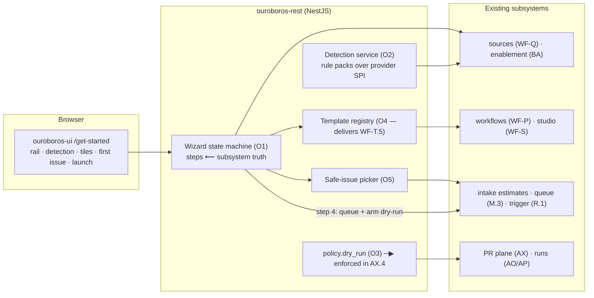
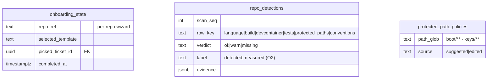
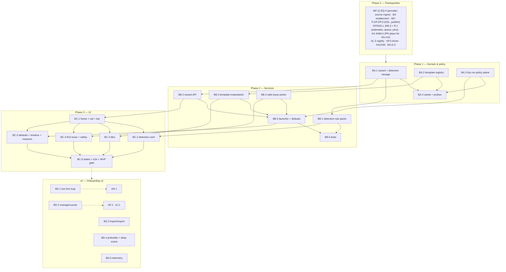

# Roadmap — Get Started / Onboarding (Mockup 13)

## Description

> Create a roadmap that covers the features for the mockup page 13. Any additional
> tech infrastructure that is required to implement the functionality in these mockup
> pages should be researched and offered as options for implementing in the roadmap.
> The roamdap should include MVP and v2 options, as well as the labels, milestones,
> and the like, for the tickets to be created. Any ticket sources that are used by
> Ouroboros for ingesting should be pluggable, which includes sources like Jira,
> Linear, GitHub, GitLab, and other bug reporting/issue recording sites. Refer to the
> page so that issues can reference the mockup file when creating the UI/UX design of
> the pages. Be very specific when creating the roadmap, as the options in the
> roadmap for the functionality needs to be complete and very thorough.

## Context & Existing Work (duplicate-avoidance survey)

Surveyed 2026-08-09.

**Design source of truth for every UI ticket in this roadmap:**
[`docs/mockups/13-onboarding.html`](mockups/13-onboarding.html) (with
`docs/mockups/assets/ouroboros.css`) — Get Started. Its anatomy:

- **Page head** — eyebrow `Get Started`, h1 *"Your first loop in about 4
  minutes."*, subline: *"Ouroboros starts in **dry-run**: it opens draft PRs and
  never merges until you say so. Nothing here is irreversible."* Corner link:
  *"I've done this before — import config ↗"*.
- **Step rail** — four steps with done/active/todo treatments: **1 Connect
  GitHub** (done: `acme-robotics · GitHub App installed · least-privilege`),
  **2 Pick a repo** (done: `helios-firmware · auto-detected below`), **3 Choose
  a starting workflow** (active), **4 Run your first loop** (todo).
- **"We already figured this out"** card (`✓ step 2 done`, `scanned in 38s`) —
  detection rows: Language (`C 92% · Zephyr RTOS 4.1`), Build (`west + twister
  (found west.yml)`), Devcontainer (`found .devcontainer.json → env ready in
  38s (snapshotted)`), Tests (`5 suites, 63 tests`), Protected paths
  (`boot/, keys/ suggested · edit`), and a warn row: Conventions (*"No
  CONTRIBUTING.md — we'll learn your conventions from merged PRs instead."*).
- **Workflow template tiles** (`step 3 · you are here`, `Open Workflow Studio
  →`) — **Quick fixes** (selected: *"Small bugs and cleanups, fully
  hands-off"*, stage dots, XS/S/M chips, caption *"recommended first workflow —
  92% of teams start here"*), **Feature builder** (*"Plans bigger changes, asks
  before merging"*, M/L), **Docs & chores** (*"Docs, typos, dep bumps on your
  cheapest model"*, XS/S), **Deep refactor** (locked at 45% opacity, `unlock
  after 10 merged loops` tag, L/XL). Footer: *"All templates are editable later
  in the Workflow Studio — visually or as code."*
- **Your First Issue** card (`step 4 preview`) — *"We picked a safe one:"* —
  `#488 · Typo sweep in operator manual + pairing guide · XS · docs-loop · no
  code paths touched · est. 4 min · est. $0.03`; *"or pick your own ▾"*;
  safety rows: dry-run **draft** PR never merges · approve everything from the
  Needs-you inbox · flip to auto-merge in Settings → Policies.
- **Smart Defaults** card (`zero config`) — managed keys with `$5 trial
  credit` (BYOK anytime → providers), hosted runner for first loops (enroll
  your own farm later), estimator pre-sizes the backlog overnight, Slack
  optional (dim tick).
- **What Happens Next** card — mono timeline: `0:00 loop starts on #488` →
  `~1 min draft plan posted to the issue` → `~3 min draft PR opens with
  passing checks` → (warn) `you review` → (ok) `merge`; footer *"Average
  first-loop time across teams: 4m 10s."*
- **Reassure strip** — *"Nothing is written to main. The app can be
  uninstalled in one click. Your keys never leave the tenant vault."*
- **Action bar** (glow) — `Step 3 of 4` · Back · **Run my first loop →**.

**What this page really is:** a guided composition over almost every subsystem
already roadmapped — sources (step 1), enablement (step 2), workflow templates
(step 3), intake/queue + run launch (step 4) — plus three genuinely new
capabilities: **repo auto-detection**, the **dry-run policy plane**, and the
**onboarding wizard state machine** itself. The honest MVP builds those three
for real, wires the compositions, and stages the SaaS-only promises (managed
keys, hosted runners, first-loop live progress) per deployment reality.

**Overlapping work and dispositions:**

| Existing work | Disposition under this roadmap |
|---|---|
| BA roadmap step-2 tenancy (org/repo enablement), WF-Q.4 source management, INTAKE-O.1 GitHub App (v2) | **Composed** — wizard steps 1–2 orchestrate existing connect/enable surfaces; the step-1 result line renders App vs PAT truthfully (App copy activates with O.1). |
| WF-T.5 workflow template library (v2 of the workflow roadmap) | **Scope delivered here** (BB.3) — the four tiles are the template registry + create-from-template flow; filing-time coordination (same rule as AV.2↔mockup-12). |
| WF-P (workflows, DSL), WF-S (studio) | **Consumed** — tiles instantiate registry workflows; "editable later in the Studio" links are real. |
| INTAKE (sized backlog, queue M.3), AL.5 nightly estimator | **Consumed** — the safe-first-issue picker scores the sized backlog; "estimator pre-sizes overnight" renders the real AL.5 job's status. |
| PR plane AX.4 (merge executor), AW.4 merge plans | **Extended** — the **dry-run policy** (BA.3) is enforced there: draft PRs, auto-merge disabled org-wide until flipped; the reassure strip's "nothing written to main" becomes policy truth. |
| Run console AO/AP (+AP.5 driver), execution AR.1/WF-T.6 (v2) | **Boundary** — step 4 queues + arms dry-run today; the live first-loop timeline activates with execution (BD.1); dev/e2e uses the simulated driver honestly watermarked. |
| Providers AE/AD (BYOK, vault), farm AI (enroll) | **Composed** — smart-defaults rows deep-link; managed-keys/hosted-runner rows render **only** in deployments that have them (BD.2), self-hosted shows BYOK/enroll-first guidance instead. |
| Mockup 17 settings (import config, policies), mockup 19 Slack, mockup 16 inbox | **Boundaries** — import-config is BD.3; Slack row dim-optional links 19's future; safety rows link the inbox surface when it exists (placeholder until then). |
| Pluggable ticket sources requirement (description boilerplate) | **Already satisfied** by WF-Q (read) + AL.2 (write) + AX.1 (PRs); the wizard's step 1 is source-kind-agnostic by construction (GitHub first, others as their providers land). Nothing duplicated. |
| Scaffolding #49, #56 | **Superseded for the get-started route**; #56 gains an onboarding leg. |

Epic letters continue the sequence (…AW–AZ): this roadmap uses **BA', BB, BC,
BD** — written as **BA, BB, BC, BD** (note: the BetterAuth roadmap used
`BA-` as a *roadmap prefix*; epic ids here are unambiguous in context and
issue titles carry the full `[BA.n]` form only within this roadmap's scope).

## Infrastructure Options (researched — thorough, pick before filing)

### 1. Repo auto-detection engine

| Option | What it is | Fit | Trade-offs |
|---|---|---|---|
| **A — API-based file probes + languages endpoint, rule-pack detectors, no clone** ⭐ recommended MVP | Detection via the provider SPI: languages stats (GitHub languages API → `C 92%`), targeted file probes (`west.yml`, `CMakeLists`, `package.json`, `Cargo.toml`, `.devcontainer.json`, `CONTRIBUTING.md`, test-dir globs), rule packs per ecosystem (versioned, declarative: probe → conclusion) producing the six detection rows with evidence | Fast (seconds), token-cheap, works through the existing provider connection; rule packs extensible like every SPI in this codebase | Depth-limited (can't count tests precisely without running them — counts labeled `detected` vs `measured`); deep scans are option B's tier |
| B — Shallow clone + full scan | Clone into a sandbox, walk the tree, parse manifests | Precise counts, convention mining | Needs compute + storage per onboarding; the farm/execution can host this later (BD.4's deep-scan tier) |
| C — LLM repo analysis | Model reads the tree | Rich narrative | Blocks on invocation; layered later for conventions learning, never the primary detector |

### 2. Devcontainer environment snapshot

| Option | What it is | Fit | Trade-offs |
|---|---|---|---|
| **A — Detect + validate now; prebuild snapshot with the farm (v2)** ⭐ recommended | MVP: detect `.devcontainer.json`, parse/validate (image, features), render `found → ready` with the *detection* truth; v2 (BD.4): prebuild the devcontainer image via a farm job (the devcontainers/ci pattern — build once, push to a registry, reuse) so "env ready in 38s (snapshotted)" becomes measured truth | Honest staging; prebuilds are exactly what the farm's container pools want to consume for execution | The mockup's `38s (snapshotted)` renders as `detected` until BD.4 measures it |
| B — Prebuild in MVP | Real snapshots now | The mockup literally | Requires farm container pools + registry push as an onboarding dependency — too heavy for the wizard's critical path |

### 3. Wizard state & resumability

| Option | What it is | Fit | Trade-offs |
|---|---|---|---|
| **A — Server-persisted wizard state machine (per org), steps derived from subsystem truth** ⭐ recommended | `onboarding_state` rows: step statuses *computed* from reality (source connected? repo enabled? workflow created? first run queued?) + wizard-local choices (selected template, picked issue); resume from any device; dismiss/complete states; re-enterable for new repos | Steps can never lie (a disconnected source un-does step 1 visibly); survives refresh/multi-tab | Slightly more backend than localStorage — worth it for truth |
| B — Client-side wizard state | localStorage steps | Trivial | Steps drift from reality; wrong for a first-impressions surface |

### 4. Safe-first-issue selection

| Option | What it is | Fit | Trade-offs |
|---|---|---|---|
| **A — Deterministic safety scoring over the sized backlog** ⭐ recommended | Score = effort (XS best) × workflow suggestion (docs-loop best) × path risk (estimate breakdown files ∩ protected paths = ∅; docs-only globs best) × freshness; top pick rendered with its *why* (`no code paths touched`), est. minutes from the estimate, cost only when priced (the mockup's `$0.03` renders when pricing exists — N10 honesty) | Composes intake truth; explainable pick; no AI dependency | Cold backlogs (nothing sized) fall back to "estimator is sizing — check back shortly" with the AL.5 job status |
| B — LLM pick | Model chooses | Narrative flair | Unneeded — the deterministic score is the explainable, honest choice |

## Decisions proposed by this roadmap (validate before issue creation)

| # | Decision | Rationale |
|---|----------|-----------|
| O1 | **The wizard is a server-persisted state machine whose step states derive from subsystem truth** (option 3-A); steps 1–2 orchestrate existing connect/enable flows rather than duplicating them | The rail must never show a green check that reality contradicts. |
| O2 | **Repo detection = rule-pack probes over the provider SPI** (option 1-A): versioned detectors emitting `{row, verdict, evidence, confidence}`; `detected` vs `measured` labeling; the conventions warn-row's "learn from merged PRs" claim links the knowledge roadmap (mockup 14) as its future | Real detection in seconds, honestly bounded. |
| O3 | **Dry-run is a first-class org policy** (`policy.dry_run`): ON by default at onboarding; enforced in the PR plane (draft PRs, auto-merge hard-disabled, merge button relabeled) and surfaced everywhere merge could happen; flipping it is an audited Settings action | The page's core safety promise ("never merges until you say so") must be mechanism, not copy. |
| O4 | **The four tiles are registry templates** (delivering WF-T.5): `quick-fixes`, `feature-builder` (with an ask-you human-gate stage), `docs-chores`, `deep-refactor`; selection instantiates a real workflow (visible in the Studio); the locked tier's `unlock after 10 merged loops` computes from the runs read-model (merged count), config-overridable | Templates are product data, not wizard art; the unlock is computed truth. |
| O5 | **The first-issue pick = deterministic safety score** (option 4-A) with its reasoning rendered; "or pick your own" opens the intake backlog filtered to safe candidates | Explainable, honest, no fabricated estimates. |
| O6 | **Smart-defaults rows are deployment-aware**: managed-keys and hosted-runner rows render only when the deployment declares those pools (BD.2's SaaS tier); self-hosted default shows BYOK-first and enroll-first guidance with the same reassuring tone | No promised infrastructure that a self-hosted install doesn't have — the strongest honesty rule on this page. |
| O7 | **Step 4 launches what exists**: queue the pick with the chosen workflow (INTAKE-M.3 + R.1 pin) + dry-run armed; the live timeline card renders projections labeled as such, and flips to live run telemetry when execution (AR.1) exists (BD.1); dev/e2e drive it with the simulated driver, watermarked | The wizard completes truthfully today and gets its aha-moment upgrade without reshaping. |
| O8 | **Aggregate claims render only from real telemetry**: `92% of teams start here` and `average first-loop time 4m 10s` are cross-tenant stats that don't exist — MVP omits them (tile captions keep the qualitative line); BD.5 adds opt-in product telemetry if ever wanted | No invented social proof. |
| O9 | **The reassure strip's claims each trace to mechanism**: draft-only (O3), one-click uninstall (source disconnect + App uninstall path), vault (AD.1) — copy locked to what's true per deployment | Same discipline as AD.5's security copy. |
| O10 | **Labels**: new `onboarding`; **Milestones**: `Onboarding MVP` / `Onboarding v2` created at filing; complexity chips XS–L | Description requires labels + milestones for the filing pass. |

## Architecture Overview



## MVP Definition

The MVP is **mockup 13 as a working, truthful onboarding wizard**: real
detection, real templates, real dry-run policy, real queue launch — with
SaaS-only promises and live-loop magic staged honestly. It is done when,
against the compose stack:

1. `/get-started` reproduces
   [`docs/mockups/13-onboarding.html`](mockups/13-onboarding.html)
   pixel-faithfully in **both themes**: step rail with derived states,
   detection card, template tiles (incl. the locked tier), first-issue card
   with safety rows, smart-defaults (deployment-aware variant), timeline
   (projection-labeled), reassure strip (O9 copy), and the glow action bar.
2. **Steps 1–2 orchestrate reality** (O1): connecting a source and enabling
   a repo through the wizard completes the real flows; the rail's checkmarks
   derive from subsystem truth and regress honestly if reality changes;
   resume works across devices.
3. **Detection runs for real** (O2): a scanned repo yields the six rows from
   rule-pack probes (languages, build files, devcontainer parse, test-glob
   counts labeled `detected`, protected-path suggestions persisted as
   editable policy, conventions presence check) with evidence and scan
   duration; re-scan on demand.
4. **Template selection creates a real workflow** (O4): tiles from the
   registry; selecting Quick-fixes instantiates it (visible/editable in the
   Studio); the locked tile computes its unlock condition from merged-run
   counts.
5. **The first-issue pick is scored and explained** (O5): a safe pick with
   reasoning, estimate-derived minutes, priced-only cost; "pick your own"
   filters the backlog; cold-backlog fallback honest.
6. **Dry-run policy is mechanism** (O3): ON at onboarding completion;
   PR-plane enforcement verified (draft PR, auto-merge disabled, labels
   changed); Settings flip audited.
7. **Step 4 completes truthfully** (O7): the pick queues with the chosen
   workflow pinned, dry-run armed, and the completion state links the
   queue/dashboard; the timeline card labels its projections; in dev/e2e
   the simulated driver walks the queued issue to a draft-PR state to prove
   the chain.
8. Integration tests cover the state machine (derivation + regression),
   detection rule packs (fixture repos), template instantiation, picker
   scoring, dry-run enforcement, isolation; the e2e leg runs the full
   wizard cold → queued + dry-run verified.

**Explicitly v2 (milestone `Onboarding v2`):** live first-loop progress over
execution (BD.1), managed-keys/hosted-runner SaaS tier (BD.2), config
import/export (BD.3), devcontainer prebuild snapshots + deep repo scans
(BD.4), opt-in aggregate telemetry for the social-proof lines (BD.5).

## Epics, Labels & Milestones

Each epic is a parent tracking issue on GitHub; every roadmap issue below is filed as
one of its sub-issues (GitHub Relationships).

| Epic | GitHub | Status | Name | Goal | Modules | Milestone |
|------|:------:|:------:|------|------|---------|-----------|
| BA | #376 | 🟡 Open | Onboarding Domain & Policy | Wizard state, detection storage, template registry, dry-run policy, seeds | ouroboros-db, ouroboros-rest | Onboarding MVP |
| BB | #377 | 🟡 Open | Detection & Orchestration Services | Rule-pack detection, wizard API, template instantiation, picker, launch | ouroboros-rest | Onboarding MVP |
| BC | #378 | 🟡 Open | Onboarding UI | Wizard frame, all cards, deployment-aware variants, states, e2e | ouroboros-ui | Onboarding MVP |
| BD | #379 | 🟡 Open | First-Loop Magic & SaaS Tier (v2) | Live progress, managed pools, import/export, prebuilds, telemetry | all | Onboarding v2 |

Issue naming: `<project>: [<epic>.<issue>] <title>`. Labels: existing set (`mvp`,
`v2`, `rest`, `db`, `ui`, `ci`, `design`, `workflow`, `intake`, `pr`) **plus new
`onboarding`** (decision O10). Milestones **`Onboarding MVP`** / **`Onboarding
v2`** created at filing; every issue assigned. Complexity chips: **XS · S · M · L**.

---

## Epic BA (#376) — Onboarding Domain & Policy (`ouroboros-db` + `ouroboros-rest`)

| Ref | GitHub | Status | Title | Summary | Labels | Parallel | MVP | Complexity | Affected Modules |
|-----|:------:|:------:|-------|---------|--------|:--------:|:---:|:----------:|------------------|
| BA.1 | #380 | 🟡 Open | ouroboros-db: [BA.1] Wizard state & detection storage | `onboarding_state`, detection results with evidence, protected paths | mvp, onboarding, db | N (after WF-Q.1) | Y | M | ouroboros-db |
| BA.2 | #381 | 🟡 Open | ouroboros-db: [BA.2] Workflow template registry schema | Templates with definitions, tiers, unlock rules (delivers WF-T.5 data) | mvp, onboarding, workflow, db | N (after WF-P.1) | Y | S | ouroboros-db |
| BA.3 | #382 | 🟡 Open | ouroboros-rest: [BA.3] Dry-run policy plane | `policy.dry_run` storage + PR-plane enforcement + audited flip | mvp, onboarding, pr, rest | N (after AX.4, AW.4) | Y | M | ouroboros-rest, ouroboros-db |
| BA.4 | #383 | 🟡 Open | ouroboros-db: [BA.4] Onboarding seeds — mockup-13 parity + probes | Mid-wizard state, detection rows, four templates, safe pick | mvp, onboarding, db, ci | N (after BA.1–BA.3, #24) | Y | S | ouroboros-db, .github |

### Issue BA.1 — ouroboros-db: [BA.1] Wizard state & detection storage

> **GitHub issue:** #380 · **Status:** 🟡 Open · **Parent epic:** #376

- **Problem Statement:** The wizard needs persistence that mixes derived
  step truth with wizard-local choices (decision O1), and detection results
  need evidence-bearing rows (O2).
- **Solution/Scope:** Migration: `onboarding_state` — org FK, `repo_ref`
  (the wizard is re-enterable per repo), wizard-local fields
  (`selected_template`, `picked_ticket_id` FK, `dismissed`, `completed_at`),
  timestamps — step statuses are **not** stored (computed from subsystem
  truth per O1; the derivation contract documented in the migration
  header); `repo_detections` — org FK, repo_ref, `scan_seq`, `row_key`
  CHECK (`language|build|devcontainer|tests|protected_paths|conventions` +
  `custom:*`), `verdict` CHECK `ok|warn|missing`, `value` text (the display
  line), `evidence` jsonb (probe hits, API payload refs), `label` CHECK
  `detected|measured` (O2 honesty), `scanned_at`, scan duration on the
  scan row; `protected_path_policies` — org FK, repo_ref, path globs,
  `source` CHECK `suggested|edited`, consumed by the run-console guardrail
  path checks (AP.3 amendment: protected paths join allowed-path
  evaluation).
- **Acceptance Criteria:** Wizard state round-trips per repo; detection
  scans version by seq (re-scan history); protected paths flow into AP.3
  evaluation (cross-plane fixture); derivation contract documented.
- **Parallelism/Dependencies:** Needs WF-Q.1. Blocks BB.1/BB.2, BA.4.
- **Technical Stack:** PostgreSQL 17, Flyway.
- **Epic:** BA



### Issue BA.2 — ouroboros-db: [BA.2] Workflow template registry schema

> **GitHub issue:** #381 · **Status:** 🟡 Open · **Parent epic:** #376


- **Problem Statement:** The tiles are product data (decision O4) — template
  definitions with tiers and computed unlock rules — delivering WF-T.5's
  data layer.
- **Solution/Scope:** `workflow_templates` — `slug` (`quick-fixes`,
  `feature-builder`, `docs-chores`, `deep-refactor`), `name`, `description`,
  `stage_dots` display data, `effort_range` (chips), `caption`,
  `definition` jsonb (a WF-P.2 DSL document; feature-builder includes the
  ask-you human-gate stage; docs-chores routes the cheapest lane via
  task-kind hints), `tier` CHECK `starter|advanced`, `unlock_rule` jsonb
  (`{merged_loops_gte: 10}` — evaluated, config-overridable), `sort_order`,
  versioned (template updates don't mutate instantiated workflows);
  global + org-overridable rows; ci validation: every template definition
  validates against the current DSL schema (WF-P.6's pattern).
- **Acceptance Criteria:** Four seeded templates validate; instantiation
  provenance representable (workflow row records template slug+version);
  unlock rule evaluable from fixtures; org override shadows global.
- **Parallelism/Dependencies:** Needs WF-P.1/P.2. Blocks BB.3; WF-T.5
  coordination note.
- **Technical Stack:** PostgreSQL 17, Flyway, ajv (ci validation).
- **Epic:** BA

```
templates: quick-fixes(starter) · feature-builder(starter, ask-you gate) ·
           docs-chores(starter, cheap lane) · deep-refactor(advanced, {merged_loops_gte: 10})
instantiate ─▶ workflows row {template: quick-fixes@v3}  (editable in the Studio)
```

### Issue BA.3 — ouroboros-rest: [BA.3] Dry-run policy plane

> **GitHub issue:** #382 · **Status:** 🟡 Open · **Parent epic:** #376


- **Problem Statement:** "Starts in dry-run: draft PRs, never merges" must
  be enforced mechanism (decision O3), not onboarding copy.
- **Solution/Scope:** Org policy storage (`org_policies.dry_run` bool,
  default true, set true at wizard completion if unset); **enforcement**:
  AX.1 `createPR` forced to draft while active; AX.4 arming/merging
  hard-blocked with a designed reason (`dry-run policy active`); AW.4
  plans render the state; merge-button relabeling contract for AY.7
  (`Dry-run — review the draft PR`); workflow terminal `auto-merge`
  configs overridden (not mutated) while active; **flip flow**: Settings
  action (owner/admin, audited AD.4 shape, confirmation stating
  consequences); policy read API for every consuming surface; amendments:
  AX.4/AY.7 (enforcement + labels), settings surface link.
- **Acceptance Criteria:** With dry-run ON: PR created as draft (sandbox
  verified), arm attempt → designed refusal, workflow auto-merge
  overridden visibly; flip → audited + surfaces update; default-ON at
  onboarding completion verified.
- **Parallelism/Dependencies:** Needs AX.4, AW.4. Blocks BC.4's safety
  truth; amends AX/AY.
- **Technical Stack:** NestJS, Kysely, audit shape.
- **Epic:** BA

```
policy.dry_run = true ─▶ createPR(draft) · arm ─▶ ✗ "dry-run policy active" · buttons relabeled
Settings flip (owner, audited, confirm) ─▶ enforcement lifts everywhere at once
```

### Issue BA.4 — ouroboros-db: [BA.4] Onboarding seeds — mockup-13 parity + probes

> **GitHub issue:** #383 · **Status:** 🟡 Open · **Parent epic:** #376


- **Problem Statement:** Design review needs the mockup's exact mid-wizard
  moment (steps 1–2 done, 3 active) with every card populated.
- **Solution/Scope:** Extend the dev seed: onboarding state for
  `helios-firmware` (steps 1–2 satisfied by existing source/enablement
  seeds; quick-fixes selected; `#488` picked), a detection scan with the
  six mockup rows (evidence payloads, 38s duration, `detected` labels,
  conventions warn), protected-path suggestions (`boot/`, `keys/`), the
  four templates (BA.2 seeds incl. the locked tier with a seeded
  merged-count below 10), dry-run ON; ci/db probes (row-key/verdict/label
  vocabs, template DSL validation, unlock-rule shape).
- **Acceptance Criteria:** Page renders the mockup from seeds; step rail
  derives correctly from the seeded subsystem truth; probes red/green
  verified; coherent with the INTAKE `#488` row.
- **Parallelism/Dependencies:** Needs BA.1–BA.3 (+INTAKE-K.5 coordination).
- **Technical Stack:** Flyway repeatable migration, SQL.
- **Epic:** BA

```
seeds: steps 1–2 ✓ (derived) · scan(6 rows, 38s, detected) · quick-fixes selected ·
       #488 picked · deep-refactor locked (3 < 10 merged) · dry_run: true
```

---

## Epic BB (#377) — Detection & Orchestration Services (`ouroboros-rest`)

| Ref | GitHub | Status | Title | Summary | Labels | Parallel | MVP | Complexity | Affected Modules |
|-----|:------:|:------:|-------|---------|--------|:--------:|:---:|:----------:|------------------|
| BB.1 | #384 | 🟡 Open | ouroboros-rest: [BB.1] Repo detection service (rule packs) | Probe-based detectors over the provider SPI; six MVP rows | mvp, onboarding, rest | N (after BA.1, WF-Q.3) | Y | L | ouroboros-rest |
| BB.2 | #385 | 🟡 Open | ouroboros-rest: [BB.2] Wizard orchestration API | Derived steps, resume, choices, completion; import-skip hook | mvp, onboarding, rest | N (after BA.1) | Y | M | ouroboros-rest |
| BB.3 | #386 | 🟡 Open | ouroboros-rest: [BB.3] Template instantiation service | Tiles payload, unlock evaluation, create-from-template (WF-T.5) | mvp, onboarding, workflow, rest | N (after BA.2, WF-P.3) | Y | M | ouroboros-rest |
| BB.4 | #387 | 🟡 Open | ouroboros-rest: [BB.4] Safe-first-issue picker | Deterministic scoring with rendered reasoning (O5) | mvp, onboarding, intake, rest | N (after INTAKE-L.3) | Y | M | ouroboros-rest |
| BB.5 | #388 | 🟡 Open | ouroboros-rest: [BB.5] First-run launcher & smart defaults | Queue+pin+dry-run launch; deployment-aware defaults payload | mvp, onboarding, rest | N (after BB.2–BB.4, BA.3) | Y | M | ouroboros-rest |
| BB.6 | #389 | 🟡 Open | ouroboros-rest: [BB.6] Onboarding integration tests | State derivation, rule packs, instantiation, picker, launch | mvp, onboarding, rest, ci | N (after BB.1–BB.5) | Y | M | ouroboros-rest |

### Issue BB.1 — ouroboros-rest: [BB.1] Repo detection service (rule packs)

> **GitHub issue:** #384 · **Status:** 🟡 Open · **Parent epic:** #377


- **Problem Statement:** The "we already figured this out" card must be
  computed in seconds from real repo signals (decision O2, option 1-A).
- **Solution/Scope:** `RepoDetectionService`: scan orchestration (bounded
  probe budget, duration recorded), **rule packs** (versioned, declarative
  detectors): *language* (provider languages API → primary + share; RTOS/
  framework hints from probe hits like `west.yml` → `Zephyr RTOS`),
  *build* (manifest probe table: west/cmake/npm/cargo/uv/gradle… →
  build+test tool conclusion with the found-file evidence), *devcontainer*
  (probe + JSON parse: image/features summary; `detected` label per
  option 2-A — prebuild measurement is BD.4), *tests* (test-dir globs +
  suite-file counting per ecosystem → `N suites, M tests (detected)`;
  reconciled to `measured` automatically once AS results exist for the
  repo — cross-plane upgrade), *protected paths* (heuristic pack:
  bootloader/keys/secrets/infra glob suggestions → BA.1 policy rows),
  *conventions* (CONTRIBUTING/CODEOWNERS/commit-convention probes; the
  warn row's "learn from merged PRs" renders as the knowledge-roadmap
  future); rate-limit-respectful (K.3 discipline); re-scan endpoint
  (debounced); pack registry extensible (`custom:*` rows).
- **Acceptance Criteria:** Fixture repos (zephyr-like, node, python,
  empty) produce golden row sets with evidence; scan under 60s budget;
  tests row flips `detected→measured` when AS data exists (fixture);
  suggestions persist as editable policy; pack addition needs no core
  change (proof).
- **Parallelism/Dependencies:** Needs BA.1, WF-Q.3. Feeds BC.2.
- **Technical Stack:** NestJS, provider SPI probes, rule-pack registry.
- **Epic:** BB

```
scan(helios-firmware): languages ─▶ C 92% · probes {west.yml ✓, .devcontainer.json ✓,
  CONTRIBUTING.md ✗} ─▶ rows[6] + evidence · 38s recorded · suggestions → protected paths
```

### Issue BB.2 — ouroboros-rest: [BB.2] Wizard orchestration API

> **GitHub issue:** #385 · **Status:** 🟡 Open · **Parent epic:** #377


- **Problem Statement:** The rail's truth-derived steps, resumable
  choices, and completion semantics need one orchestration surface
  (decision O1).
- **Solution/Scope:** `GET /api/v1/onboarding` (per active repo context:
  derived step states — source connected (WF-Q), repo enabled (BA
  enablement), workflow instantiated (BB.3 provenance), first run
  queued/launched — plus wizard-local choices and card payload refs);
  `PATCH` choices (template pick, issue pick, dismiss);
  `POST /complete-step` guards (can't complete 3 without a real
  instantiation); import-skip hook (`I've done this before` → marks the
  wizard bypassed, links the settings surface; config import itself is
  BD.3); regression handling (source disconnected → step 1 reverts,
  notified); nav integration contract (the wizard surfaces for fresh
  orgs, dismissible).
- **Acceptance Criteria:** Derivation matrix tested (each subsystem state
  × step); disconnect regression flips the rail; resume across sessions;
  guards enforced; fresh-org surfacing rule verified.
- **Parallelism/Dependencies:** Needs BA.1. Feeds BC.1.
- **Technical Stack:** NestJS, Kysely.
- **Epic:** BB

```
GET /onboarding ─▶ {steps: [done(derived), done(derived), active, todo], choices, refs}
source disconnected ─▶ step1: todo (rail regresses honestly)
```

### Issue BB.3 — ouroboros-rest: [BB.3] Template instantiation service

> **GitHub issue:** #386 · **Status:** 🟡 Open · **Parent epic:** #377


- **Problem Statement:** Tile selection must create a real, Studio-editable
  workflow with provenance, and the locked tier must compute (decision O4)
  — WF-T.5's service layer.
- **Solution/Scope:** Tiles payload (templates + unlock evaluation:
  merged-run count from the DASH read-model vs rule; locked tiles carry
  their computed progress `3 of 10 merged loops`); instantiation:
  template definition → WF-P.3 create+publish v1 (validation gates run;
  slug collision → suffix flow), provenance recorded; re-selection
  switches the wizard's active choice without deleting instantiated
  workflows (they're real entities); caption honesty per O8 (qualitative
  captions; no invented percentages); Studio deep-link.
- **Acceptance Criteria:** Selecting quick-fixes yields a valid published
  workflow visible in the Studio (cross-plane fixture); locked tile
  progress computes; captions contain no fabricated stats; WF-T.5
  coordination amendment posted.
- **Parallelism/Dependencies:** Needs BA.2, WF-P.3. Feeds BC.3.
- **Technical Stack:** NestJS, WF services.
- **Epic:** BB

```
tiles: quick-fixes(recommended) · … · deep-refactor(locked: 3/10 merged)
select ─▶ WF-P.3 create+publish {template: quick-fixes@v3} ─▶ editable in Studio
```

### Issue BB.4 — ouroboros-rest: [BB.4] Safe-first-issue picker

> **GitHub issue:** #387 · **Status:** 🟡 Open · **Parent epic:** #377


- **Problem Statement:** "We picked a safe one" must be a scored,
  explained selection over the sized backlog (decision O5).
- **Solution/Scope:** Scoring function (documented weights): effort rank
  (XS≫S≫M), suggested-workflow safety (docs-loop ≫ standard-fix ≫
  feature), path risk (estimate breakdown files vs protected paths +
  docs-glob classification → the `no code paths touched` reason),
  recency/freshness; top pick + reasoning payload (score components →
  display line), est. minutes from the estimate, cost only when priced;
  alternatives endpoint (`or pick your own` → backlog filtered to
  safety-ranked candidates); cold states (no sized issues → AL.5 status
  passthrough; no issues at all → planning-page pointer).
- **Acceptance Criteria:** Seeded backlog picks `#488` with the mockup's
  reasoning; weight changes reorder predictably (fixtures); cold states
  render honestly; cost omitted when unpriced.
- **Parallelism/Dependencies:** Needs INTAKE-L.3 (+BA.1 protected paths).
  Feeds BC.4.
- **Technical Stack:** NestJS, Kysely.
- **Epic:** BB

```
score(#488) = XS ⊕ docs-loop ⊕ paths ∩ protected = ∅ ⊕ fresh ─▶ top pick
reason: "no code paths touched · est. 4 min" (+ "$0.03" only when priced)
```

### Issue BB.5 — ouroboros-rest: [BB.5] First-run launcher & smart defaults

> **GitHub issue:** #388 · **Status:** 🟡 Open · **Parent epic:** #377


- **Problem Statement:** "Run my first loop" must do everything real
  (queue, pin, arm dry-run) and the defaults card must tell each
  deployment its own truth (decisions O6/O7).
- **Solution/Scope:** **Launcher**: validation (steps 1–3 satisfied) →
  INTAKE-M.3 queue write with the instantiated workflow pinned (R.1) →
  dry-run confirmation (BA.3 active) → wizard completion + receipt
  (queue position, dashboard/console links; projection timeline data
  labeled per O7); execution-aware: when AR.1 exists, the receipt carries
  the live run ref (BD.1's upgrade slot); **smart defaults payload**:
  deployment capability flags (managed key pool? hosted runner pool? —
  declared by deployment config, both absent in self-hosted default) →
  row set selection (SaaS rows vs BYOK/enroll-first rows), estimator row
  from AL.5's real job status, Slack row dim-linked to the 19 future;
  reassure-strip payload per O9 (claims ↔ mechanisms, per deployment).
- **Acceptance Criteria:** Launch queues + pins + confirms dry-run
  (visible on dashboard queue); guards block early launch; self-hosted
  payload contains no managed-pool rows (O6 verified); estimator row
  reflects the real nightly job; receipt links correct.
- **Parallelism/Dependencies:** Needs BB.2–BB.4, BA.3. Feeds BC.5.
- **Technical Stack:** NestJS, INTAKE/R.1 composition.
- **Epic:** BB

```
launch ─▶ guards ✓ ─▶ queue(#488, pin: quick-fixes@v1) · dry-run ✓ ─▶ receipt {q:1, links}
defaults(self-hosted): [BYOK → providers][enroll farm → build-farm][estimator: 02:14 ✓][Slack ◌]
```

### Issue BB.6 — ouroboros-rest: [BB.6] Onboarding integration tests

> **GitHub issue:** #389 · **Status:** 🟡 Open · **Parent epic:** #377


- **Problem Statement:** Truth-derivation, detection packs, and the launch
  composition are cross-plane logic needing harness certification.
- **Solution/Scope:** Suites: step derivation matrix + regression,
  detection golden fixtures (four repo archetypes) + re-scan versioning +
  detected→measured upgrade, instantiation (validity, provenance,
  collision), picker weights + cold states, launcher guards + composition
  + dry-run enforcement round-trip (PR-plane fixture), deployment-flag
  payload variants, isolation.
- **Acceptance Criteria:** Green in `ci/rest`; removing a guard or a rule
  pack turns fixtures red; ≤ 75s added.
- **Parallelism/Dependencies:** Needs BB.1–BB.5.
- **Technical Stack:** Jest, Testcontainers.
- **Epic:** BB

```
suites: steps ✓ · detection ✓ · templates ✓ · picker ✓ · launch+dry-run ✓ · variants ✓
```

---

## Epic BC (#378) — Onboarding UI (`ouroboros-ui`)

Every issue references
[`docs/mockups/13-onboarding.html`](mockups/13-onboarding.html) as the design
source — steprail/detect/tile/safety/timeline/action-bar treatments — via the
#16 tokens (both themes; the mockup is dark-only).

| Ref | GitHub | Status | Title | Summary | Labels | Parallel | MVP | Complexity | Affected Modules |
|-----|:------:|:------:|-------|---------|--------|:--------:|:---:|:----------:|------------------|
| BC.1 | #390 | 🟡 Open | ouroboros-ui: [BC.1] Wizard route, step rail & action bar | `/get-started` frame, derived rail, glow bar, nav surfacing | mvp, onboarding, ui, design | N (after #41, BB.2, BA-D.5) | Y | M | ouroboros-ui |
| BC.2 | #391 | 🟡 Open | ouroboros-ui: [BC.2] Detection card | Six evidence rows, warn variant, re-scan, protected-path edit | mvp, onboarding, ui, design | N (after BC.1, BB.1) | Y | M | ouroboros-ui |
| BC.3 | #392 | 🟡 Open | ouroboros-ui: [BC.3] Template tiles | Selection/locked treatments, stage dots, instantiation flow | mvp, onboarding, ui, design | N (after BC.1, BB.3) | Y | M | ouroboros-ui |
| BC.4 | #393 | 🟡 Open | ouroboros-ui: [BC.4] First-issue & safety card | Scored pick with reasoning, own-pick flow, safety truth rows | mvp, onboarding, ui, design | N (after BC.1, BB.4, BA.3) | Y | M | ouroboros-ui |
| BC.5 | #394 | 🟡 Open | ouroboros-ui: [BC.5] Defaults, timeline & reassure cards | Deployment-aware defaults, projection timeline, O9 strip | mvp, onboarding, ui, design | N (after BC.1, BB.5) | Y | M | ouroboros-ui |
| BC.6 | #395 | 🟡 Open | ouroboros-ui: [BC.6] Wizard states & e2e leg | Steps 1–2 flows, regression, completion, themes, full e2e | mvp, onboarding, ui, ci | N (after BC.2–BC.5) | Y | M | ouroboros-ui, .github |

### Issue BC.1 — ouroboros-ui: [BC.1] Wizard route, step rail & action bar

> **GitHub issue:** #390 · **Status:** 🟡 Open · **Parent epic:** #378


- **Problem Statement:** The wizard frame: the four-step rail with derived
  states, the head's dry-run promise, the import-skip link, and the glow
  action bar with step-aware actions.
- **Solution/Scope:** `/get-started`: head per the mockup (subline
  rendered from the O9-approved copy set), import link → BB.2's skip hook
  (+ settings pointer; import itself labeled BD.3); rail from derived
  states (done/active/todo treatments incl. result lines composed from
  subsystem truth — the step-1 line says App vs token truthfully),
  responsive collapse per the mockup's media rule; action bar (step
  counter, Back navigation, primary action per step: connect → enable →
  continue → **Run my first loop**, disabled-with-reason until guards
  pass); fresh-org surfacing (nav banner/redirect rule, dismissible per
  BB.2).
- **Acceptance Criteria:** Rail states derive live (disconnect regresses
  visibly); actions gate per step; both themes; #49 stub retired
  (amendment).
- **Parallelism/Dependencies:** Needs #41, BB.2, BA-D.5. Blocks BC.2–BC.5.
- **Technical Stack:** Next.js, #46 primitives.
- **Epic:** BC

```
[✓ Connect GitHub · acme-robotics · token (App arrives with O.1)] [✓ Pick a repo] [● Choose workflow] [○ Run]
Step 3 of 4                                   [Back] [Run my first loop →](gated)
```

### Issue BC.2 — ouroboros-ui: [BC.2] Detection card

> **GitHub issue:** #391 · **Status:** 🟡 Open · **Parent epic:** #378


- **Problem Statement:** The detection rows with their evidence, the warn
  variant, `detected/measured` labeling, re-scan, and protected-path
  editing.
- **Solution/Scope:** Card per the mockup: rows from the latest scan
  (check/warn marks, label column, mono value lines with dim evidence
  affixes and the honesty label chip where `detected`), scan-duration
  tag, re-scan affordance (debounced, progress state), protected-paths
  row's `edit` → inline glob editor (persists BA.1 policy; consumed-by-
  guardrails note), conventions warn row with the knowledge-roadmap
  future phrased honestly; evidence popovers (probe hits).
- **Acceptance Criteria:** Seeded card matches the mockup (+label chips);
  re-scan round-trips; glob edits persist and reach AP.3 fixtures;
  evidence popovers render; both themes.
- **Parallelism/Dependencies:** Needs BC.1, BB.1.
- **Technical Stack:** React, #46 primitives.
- **Epic:** BC

```
✓ Build        west + twister (found west.yml) [detected]
! Conventions  No CONTRIBUTING.md — conventions learning arrives with Knowledge
✓ Protected    boot/, keys/ suggested · [edit globs] → guardrails
```

### Issue BC.3 — ouroboros-ui: [BC.3] Template tiles

> **GitHub issue:** #392 · **Status:** 🟡 Open · **Parent epic:** #378


- **Problem Statement:** The tile grid — selection glow, stage dots,
  effort chips, the locked tier with computed progress — driving real
  instantiation.
- **Solution/Scope:** Tiles from BB.3 (name/desc/dots/chips/caption;
  selected treatment; locked treatment with the computed unlock line
  `3 of 10 merged loops` replacing the static tag), select → instantiate
  flow (progress → success links the Studio; validation failure surfaces
  designed error), re-select confirm (previous workflow remains, noted),
  Studio link per tile footer; caption honesty (O8: no invented
  percentages — qualitative captions).
- **Acceptance Criteria:** Seeded grid matches (locked progress
  variant); selection creates + links the workflow (e2e); captions
  contain no fabricated stats (review gate); both themes; keyboard
  selection.
- **Parallelism/Dependencies:** Needs BC.1, BB.3.
- **Technical Stack:** React, #46 primitives.
- **Epic:** BC

```
[✓ Quick fixes ●analyze→●plan→●code→●build→●test→●PR  XS S M  "recommended first workflow"]
[🔒 Deep refactor · unlock: 3 of 10 merged loops]
```

### Issue BC.4 — ouroboros-ui: [BC.4] First-issue & safety card

> **GitHub issue:** #393 · **Status:** 🟡 Open · **Parent epic:** #378


- **Problem Statement:** The scored pick with its reasoning, the own-pick
  path, and safety rows that state mechanism truth (O3/O5/O9).
- **Solution/Scope:** Pick row from BB.4 (mono key, title, effort chip,
  workflow tag, reasoning line — cost only when priced), refresh-pick
  affordance, `or pick your own` → intake backlog in a safety-ranked
  sheet (select swaps the pick); safety rows bound to mechanisms:
  dry-run row reflects BA.3 state (linked), inbox row links the
  needs-you surface (placeholder-honest until 16), policy row links
  Settings; cold states (sizing-in-progress with AL.5 status; empty
  backlog → planning pointer).
- **Acceptance Criteria:** Seeded card matches; own-pick swap works;
  safety rows reflect live policy (flip dry-run in Settings → row
  updates); cold states render; both themes.
- **Parallelism/Dependencies:** Needs BC.1, BB.4, BA.3.
- **Technical Stack:** React, #46 primitives.
- **Epic:** BC

```
#488 Typo sweep… [XS][docs-loop] "no code paths touched · est. 4 min"  [↻ another][pick your own ▾]
✓ Dry-run active: draft PRs only (policy) · ✓ approve from Needs-you · ✓ flip in Settings → Policies
```

### Issue BC.5 — ouroboros-ui: [BC.5] Defaults, timeline & reassure cards

> **GitHub issue:** #394 · **Status:** 🟡 Open · **Parent epic:** #378


- **Problem Statement:** The right column's three cards — deployment-aware
  defaults, the projection-labeled timeline, and the mechanism-traced
  reassure strip.
- **Solution/Scope:** Defaults card from BB.5's payload (row sets per
  deployment flags; each row deep-links its subsystem; estimator row
  shows the real job's last run; Slack dim row honest); timeline card:
  projection rows labeled (`projected` chip; times from template stage
  estimates where derivable, generic otherwise), the you-review/merge
  rows reflecting dry-run truth, **no fabricated averages** (O8 — the
  `4m 10s` line renders only with BD.5 telemetry); live-upgrade slot
  (BD.1: rows flip to real run telemetry); reassure strip from the O9
  copy set (per-deployment claims).
- **Acceptance Criteria:** Self-hosted render shows BYOK/enroll rows and
  no trial-credit copy (verified); timeline labeled projected; no
  average-claim line in MVP; strip claims trace to mechanisms (review
  gate); both themes.
- **Parallelism/Dependencies:** Needs BC.1, BB.5.
- **Technical Stack:** React, #46 primitives.
- **Epic:** BC

```
SMART DEFAULTS (self-hosted): ✓ Bring your own keys → Providers · ✓ Enroll a runner → Build Farm
WHAT HAPPENS NEXT [projected]: 0:00 loop starts → ~1min plan → ~3min draft PR → you review → merge
◈ "Draft-only until you flip auto-merge · uninstall in one click · keys sealed in the tenant vault"
```

### Issue BC.6 — ouroboros-ui: [BC.6] Wizard states & e2e leg

> **GitHub issue:** #395 · **Status:** 🟡 Open · **Parent epic:** #378


- **Problem Statement:** Steps 1–2's orchestrated flows, regression
  states, completion, and the full cold-start chain need certification.
- **Solution/Scope:** Step-1/2 embedded flows (source connect via Q.4's
  machinery in wizard framing; repo enable via the enablement surface),
  regression banners (disconnected source), completion state (receipt
  card with queue/dashboard links; re-enter for another repo),
  dismissed-wizard behavior, skeletons/errors; e2e (extends #56): cold
  org → connect (sandbox) → pick repo → scan renders detection → select
  quick-fixes (workflow appears in Studio) → pick verified → launch →
  queue + dry-run verified (dashboard + a sandbox draft-PR via the
  simulated driver, watermarked) → completion receipt; regression leg
  (disconnect → rail reverts); both themes screenshot-diffed.
- **Acceptance Criteria:** All states themed; e2e green from cold
  compose; each leg fails meaningfully when its layer breaks; ≤ 3 min
  added.
- **Parallelism/Dependencies:** Needs BC.2–BC.5, BA.4; amends #56.
- **Technical Stack:** React, Playwright.
- **Epic:** BC

```
e2e: connect ✓ · scan ✓ · template→Studio ✓ · pick ✓ · launch→queue+dry-run ✓ · regression ✓
```

---

## Epic BD (#379) — First-Loop Magic & SaaS Tier (v2 · milestone `Onboarding v2`)

| Ref | GitHub | Status | Title | Summary | Labels | Parallel | MVP | Complexity | Affected Modules |
|-----|:------:|:------:|-------|---------|--------|:--------:|:---:|:----------:|------------------|
| BD.1 | #396 | 🟡 Open | ouroboros-ui: [BD.1] Live first-loop experience | Timeline flips to real run telemetry; guided first review | v2, onboarding, runs, ui | N (after AR.1, BB.5) | N | M | ouroboros-ui, ouroboros-rest |
| BD.2 | #397 | 🟡 Open | ouroboros-rest: [BD.2] Managed keys & hosted runner tier | Deployment pools: trial-credit keys, hosted first-loop runners | v2, onboarding, providers, build-farm | N (after AF.2, AJ.1) | N | L | ouroboros-rest |
| BD.3 | #398 | 🟡 Open | ouroboros-rest: [BD.3] Config import/export | Org config bundles: sources, workflows, routes, policies | v2, onboarding, rest | N (after BB.2) | N | M | ouroboros-rest, ouroboros-ui |
| BD.4 | #399 | 🟡 Open | ouroboros-rest: [BD.4] Devcontainer prebuilds & deep scans | Farm-built env snapshots; clone-based detection tier | v2, onboarding, build-farm | N (after AG.4/AJ.5, BB.1) | N | L | ouroboros-rest, ouroboros-runner |
| BD.5 | #400 | 🟡 Open | ouroboros-rest: [BD.5] Opt-in aggregate telemetry | Cross-tenant stats behind consent; social-proof lines go live | v2, onboarding, rest | N (after BB.3/BB.5) | N | M | ouroboros-rest |

### Issue BD.1 — ouroboros-ui: [BD.1] Live first-loop experience

> **GitHub issue:** #396 · **Status:** 🟡 Open · **Parent epic:** #379


- **Problem Statement:** The wizard's aha moment — watching the first loop
  actually run — activates when execution exists (O7's upgrade slot).
- **Solution/Scope:** With AR.1: launch returns a live run ref; the
  timeline card flips to real telemetry (stage transitions streamed via
  the console's data plane, `projected` chips dropped), a guided first-
  review flow (draft PR opens → walk the user to the diff/checks →
  celebrate the dry-run review), first-merge guidance (flip-policy
  pointer when they're ready); completion metrics recorded (feeds BD.5
  if consented).
- **Acceptance Criteria:** A real docs-loop first run renders live in the
  wizard; guided review reaches the sandbox draft PR; projection labels
  gone; graceful fallback if the run stalls (honest states).
- **Parallelism/Dependencies:** Needs AR.1, BB.5.
- **Technical Stack:** React, run-console data plane.
- **Epic:** BD

### Issue BD.2 — ouroboros-rest: [BD.2] Managed keys & hosted runner tier

> **GitHub issue:** #397 · **Status:** 🟡 Open · **Parent epic:** #379


- **Problem Statement:** The mockup's zero-config promises (managed keys
  with trial credit, hosted first-loop runners) are SaaS-deployment
  infrastructure (O6 kept them out of self-hosted MVP).
- **Solution/Scope:** Deployment pool framework: managed provider
  connections (pooled keys behind the AF.2 gateway, per-org trial
  budgets with hard caps + honest meters, upgrade-to-BYOK flow) and
  hosted runner pools (AJ.1's ephemeral machinery reserved for
  first-loops with quotas); deployment capability declaration
  (BB.5's flags go live), billing hooks out of scope (documented
  boundary); abuse controls.
- **Acceptance Criteria:** SaaS-flagged deployment renders the mockup's
  rows truthfully; trial caps enforce at invocation; BYOK upgrade
  migrates cleanly; self-hosted stays unchanged.
- **Parallelism/Dependencies:** Needs AF.2, AJ.1.
- **Technical Stack:** Provider/farm pool config, quotas.
- **Epic:** BD

### Issue BD.3 — ouroboros-rest: [BD.3] Config import/export

> **GitHub issue:** #398 · **Status:** 🟡 Open · **Parent epic:** #379


- **Problem Statement:** "I've done this before — import config" deserves
  a real bundle: reproducing a tuned org in minutes.
- **Solution/Scope:** Export: org config bundle (sources sans secrets,
  workflows/templates, routes/aliases (ids only), policies, protected
  paths) as versioned JSON; import: validation + dry-run preview +
  selective apply + secret re-entry prompts; wizard integration (import
  path satisfies steps where applicable); audit.
- **Acceptance Criteria:** Round-trip org→bundle→new-org reproduces
  config (fixtures); secrets never exported (grep test); preview
  matches apply.
- **Parallelism/Dependencies:** Needs BB.2 (+subsystem read surfaces).
- **Technical Stack:** NestJS, versioned bundle schema.
- **Epic:** BD

### Issue BD.4 — ouroboros-rest: [BD.4] Devcontainer prebuilds & deep scans

> **GitHub issue:** #399 · **Status:** 🟡 Open · **Parent epic:** #379


- **Problem Statement:** `env ready in 38s (snapshotted)` and precise
  test counts want the option-B tier: farm-built prebuilds and
  clone-based scans.
- **Solution/Scope:** Prebuild jobs (devcontainers/ci pattern: build the
  devcontainer via a farm container job, push to the pool registry
  (AJ.5), measure ready-time → the row flips to `measured` with the
  real duration; execution consumes the snapshot); deep-scan tier
  (shallow clone in a farm job → precise test enumeration, convention
  mining hooks for the knowledge roadmap); scheduling (on onboarding +
  devcontainer changes).
- **Acceptance Criteria:** Prebuilt env measured + reused by a
  subsequent job (cold-start delta demonstrated); tests row `measured`
  from enumeration; rows honest throughout.
- **Parallelism/Dependencies:** Needs AG.4/AJ.5, BB.1.
- **Technical Stack:** Farm jobs, devcontainer CLI, registry.
- **Epic:** BD

### Issue BD.5 — ouroboros-rest: [BD.5] Opt-in aggregate telemetry

> **GitHub issue:** #400 · **Status:** 🟡 Open · **Parent epic:** #379


- **Problem Statement:** The social-proof lines (`92% of teams`,
  `average 4m 10s`) need consented, aggregated truth or permanent
  omission (O8).
- **Solution/Scope:** Opt-in telemetry (org-level consent, documented
  payload: anonymized template picks, first-loop durations), aggregation
  service, the UI lines render only above a minimum cohort size with
  provenance tooltips; self-hosted default: off, nothing sent (verified).
- **Acceptance Criteria:** Lines appear only with consent + cohort
  thresholds; payload matches documentation (audit); opt-out clean.
- **Parallelism/Dependencies:** Needs BB.3/BB.5.
- **Technical Stack:** NestJS, consented aggregation.
- **Epic:** BD

---

## Work Order (dependency-ordered execution plan)



Ordered checklist (⊕ = parallelizable within its phase):

1. **Phase 0 — Prerequisites:** WF-Q.3 (#140)/Q.4 (#141), BA enablement,
   WF-P.1–P.3 (#132–#134), INTAKE-L.3 (#107)/M.3 (#112) + R.1 (#143),
   AX.4 (#360)/AW.4 (#355), AL.5 (#281), AP.5 (#307), #41/#46, BA-D.5.
2. **Phase 1 — Domain & policy:** { BA.1 (#380) ⊕ BA.2 (#381) ⊕ BA.3 (#382) } → BA.4 (#383)
3. **Phase 2 — Services:** { BB.1 (#384) ⊕ BB.2 (#385) ⊕ BB.3 (#386) ⊕ BB.4 (#387) } → BB.5 (#388) → BB.6 (#389)
4. **Phase 3 — UI:** BC.1 (#390) → { BC.2 (#391) ⊕ BC.3 (#392) ⊕ BC.4 (#393) ⊕ BC.5 (#394) } → **BC.6 (#395) ✅**
   *(MVP gate, amending #56)*
5. **v2:** BD.1 (#396) after AR.1 (#315); BD.2 (#397) after AF.2 (#235) + AJ.1
   (#263); BD.3–BD.5 (#398–#400) after their dependencies.

## Totals

| | Epic | Issues | MVP | v2 |
|---|:---:|:---:|:---:|:---:|
| Epic BA — Onboarding Domain & Policy | #376 | 4 | 4 | 0 |
| Epic BB — Detection & Orchestration | #377 | 6 | 6 | 0 |
| Epic BC — Onboarding UI | #378 | 6 | 6 | 0 |
| Epic BD — First-Loop Magic & SaaS Tier | #379 | 5 | 0 | 5 |
| **Total** | **4 epics** | **21** | **16** | **5** |

Issues **#380–#400**, filed 2026-08-09 as sub-issues of their epics, with the
`onboarding` label and the `Onboarding MVP` / `Onboarding v2` milestones.

Amendments posted at filing:

| Amended | Comment |
|---|---|
| WF-T.5 (#159) | template scope delivered by BA.2 (#381) + BB.3 (#386) + BC.3 (#392) — coordination |
| AX.4 (#360) | dry-run enforcement in the merge executor (arm + execution re-check, auto-merge override) |
| AY.7 (#369) | merge affordance relabelling under dry-run |
| AP.3 (#305) | protected paths join guardrail path evaluation |
| WF-S.1 (#147) | "Browse templates" goes live; instantiation provenance in the Studio |
| #49 | `/get-started` stub retired by BC.1 (#390) |
| #56 | onboarding e2e leg + standalone-chrome/font-scale assertions (BC.6, #395) |

## References

- Design source: [`docs/mockups/13-onboarding.html`](mockups/13-onboarding.html),
  `docs/mockups/assets/ouroboros.css`; adjacent mockups 01/03/04/07/08/16/17
- Upstream roadmaps: scaffolding (filed); BetterAuth, dashboard, intake,
  workflow-builder/code, routing, providers, build-farm, planning,
  run-console, test-results, pr-verification (validation gates)
- Devcontainer research:
  [prebuild dev containers with CI (build once, push, reuse)](https://devcontainer.community/20250303-prebuild-devcontainer/) ·
  [dev containers as onboarding infrastructure](https://viprasol.com/blog/devcontainers/) ·
  [devcontainer spec & supporting tools](https://github.com/devcontainers/spec/blob/main/docs/specs/supporting-tools.md) ·
  [prebuild workspaces (DevPod pattern)](https://devpod.sh/docs/developing-in-workspaces/prebuild-a-workspace)
- Detection precedents: GitHub languages API, manifest-probe heuristics
  (ecosystem rule packs defined in BB.1)

## UI/UX Shell Compliance (addendum 2026-08-09)

The application shell defined in
[`docs/DESIGN_SYSTEM_APP_SHELL.md`](DESIGN_SYSTEM_APP_SHELL.md) (implementing
roadmap: [`ROADMAP_UIUX_APP_SHELL.md`](ROADMAP_UIUX_APP_SHELL.md)) supersedes
the mockup's top-bar navigation chrome for every UI issue in this roadmap:

1. **Header** — application name/brand upper-left (with the tenant chip),
   profile & session controls upper-right; no navigation links in the header.
2. **Sidebar navigation** — the onboarding wizard runs **standalone, outside
   the shell** (pre-workspace, like login): no shell header or sidebar
   renders on the wizard screens; the shell appears once a workspace exists.
   Spec §3 component standards and the font-scale preference (honored via
   the localStorage mirror) still apply to the standalone screens.
3. **Content-only scrolling** — the wizard viewport follows the same
   one-scroll-container rule standalone: only the step content scrolls,
   never the page chrome (step rail and action bar stay fixed).
4. **Type scale** — all type and spacing rem-based against the #16 tokens so
   the five-step font-size preference (App Shell CQ.2) scales every surface;
   no hard-coded px text (lint-enforced by CQ.1).
5. **Mockup interpretation** —
   [`docs/mockups/13-onboarding.html`](mockups/13-onboarding.html) remains
   the design source for page content and card anatomy; its `.topbar`/`.nav`
   chrome is superseded by the shell spec.

Issue-level impact:

| Issue | Amendment |
|---|---|
| BC.1 | #390 | 🟡 Open | `/get-started` renders standalone outside the shell (pre-workspace, like login; the shell appears once a workspace exists); any in-page tabs/sticky chrome via the CP.4 primitives (sticky within its scroll container) |
| BC.2–BC.5, BD.1 | rem-based type (CQ.1 tokens); sticky elements stick within the scroll container (CP.4); component/state/a11y standards per spec §3 |
| BC.6 | #395 | 🟡 Open | Gains shell assertions: chrome fixed while content scrolls, a standalone chrome check (no shell header/sidebar pre-workspace), and a font-scale (125%) render check |

## Next Step

**Filed 2026-08-09.** The `onboarding` label and the `Onboarding MVP` /
`Onboarding v2` milestones were created, the four epics (#376–#379) and 21
issues (#380–#400) were filed with parent relationships and milestone
assignments, and the seven amendment comments were posted.

Execution begins at **Phase 1**: BA.1 (#380) ⊕ BA.2 (#381) ⊕ BA.3 (#382) are
independent and unblock everything else — #380 is the widest blocker, and
#382 (the dry-run policy plane) is the one whose absence would make the
page's central promise untrue, so neither should trail the UI work.

The decisions this roadmap locked in, restated as the review criteria for
the work as it lands: the truth-derived wizard (**O1** — step states computed
from subsystem reality, never stored checkmarks), the detection staging
(**O2** — `detected` vs `measured` labelling, prebuilds deferred to BD.4/#399),
dry-run as enforced mechanism rather than copy (**O3**), the template-registry
delivery of WF-T.5 (**O4**), deployment-aware smart defaults (**O6** — no
managed-pool promises on self-hosted installs), and the social-proof omission
(**O8** — no invented percentages until consented telemetry exists in
BD.5/#400).
