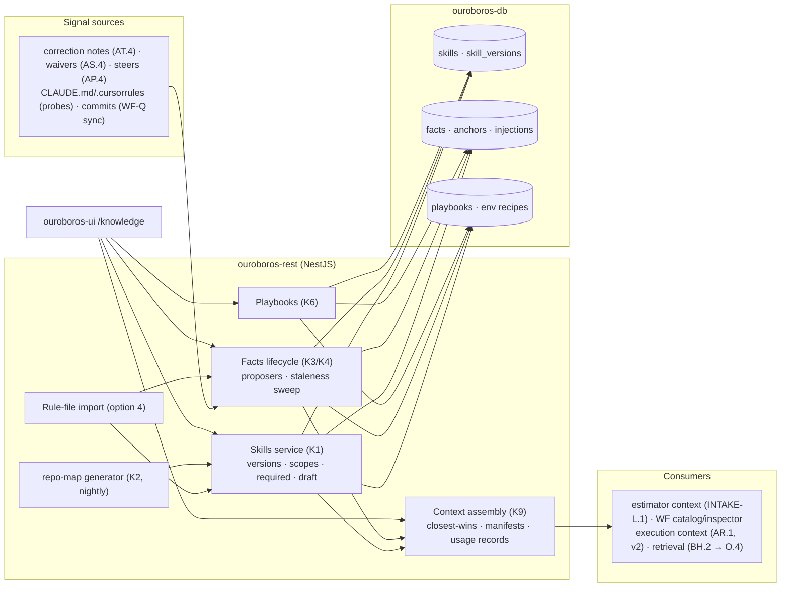
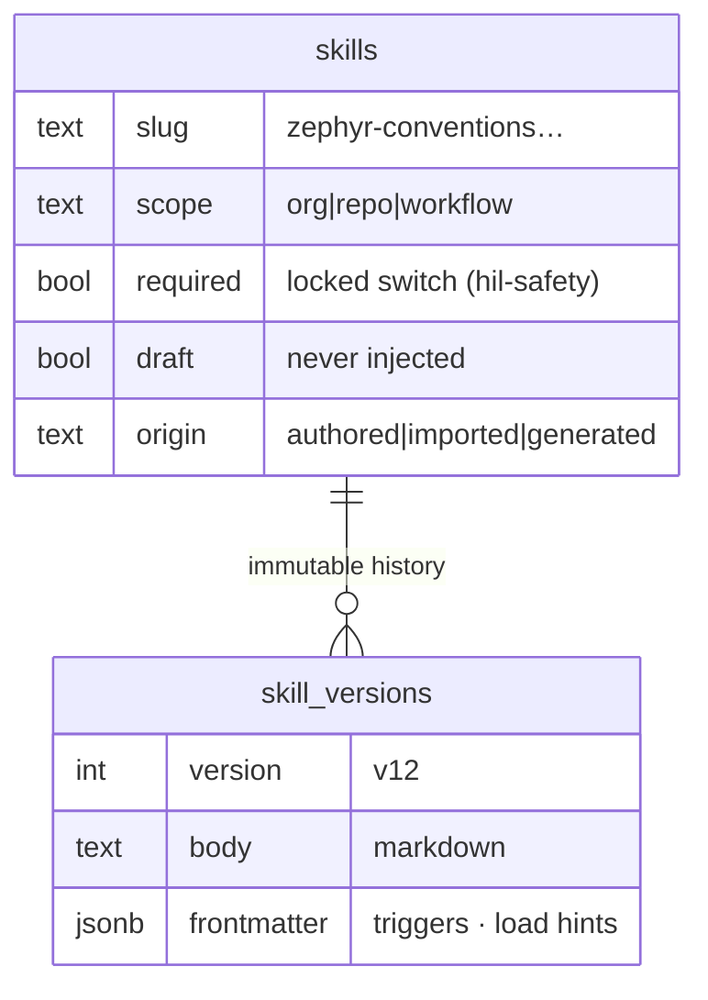
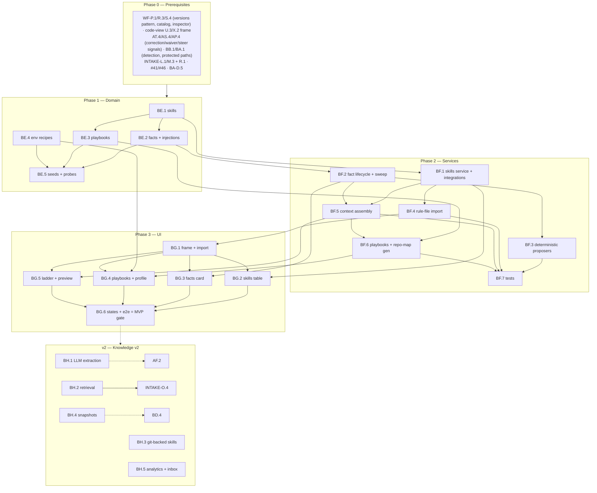

# Roadmap — Knowledge (Mockup 14)

## Description

> Create a roadmap that covers the features for the mockup page 14. Any additional
> tech infrastructure that is required to implement the functionality in these mockup
> pages should be researched and offered as options for implementing in the roadmap.
> The roamdap should include MVP and v2 options, as well as the labels, milestones,
> and the like, for the tickets to be created. Any ticket sources that are used by
> Ouroboros for ingesting should be pluggable, which includes sources like Jira,
> Linear, GitHub, GitLab, and other bug reporting/issue recording sites. Refer to the
> page so that issues can reference the mockup file when creating the UI/UX design of
> the pages. Be very specific when creating the roadmap, as the options in the
> roadmap for the functionality needs to be complete and very thorough.

## Context & Existing Work (duplicate-avoidance survey)

Surveyed 2026-08-09.

**Design source of truth for every UI ticket in this roadmap:**
[`docs/mockups/14-knowledge.html`](mockups/14-knowledge.html) (with
`docs/mockups/assets/ouroboros.css`) — Knowledge. Its anatomy:

- **Page head** — eyebrow `Knowledge`, h1 *"Teach the loop once. Every run
  remembers."*, subline: *"Skills you write, facts the loop learns (and you
  approve), and playbooks you can aim at any issue. Scoped per repo or
  org-wide."* Actions: **Import CLAUDE.md / .cursorrules** (ghost), **+ New
  skill** (primary → the code editor).
- **Skills card** (`6 active`, `Open in editor →`) — table: skill (mono name +
  description), Scope tag (`repo`/`org-wide`), Used by (`61% of runs`, `every
  run`, `every PR`, `physical tests`, `—`), Updated (`v12 · 2d ago`;
  `auto-generated nightly` tag on `repo-map`; warn tag `required — cannot
  disable` on `hil-safety` with a **locked switch**), enable switches; a
  **draft row** (`power-budget-checks · draft` warn pill, tinted). Caption:
  *"Skills are markdown with frontmatter — edit in the Workflow Studio
  editor."*
- **Learned by the loop card** (`2 awaiting review`, `Review all →` inbox) —
  fact rows: text with `code` spans (*"CI needs `west update` before first
  build of the day"*), provenance line (*"from build-farm failure pattern ·
  confirmed by Ken, 6w ago"*, *"from PR #498 review cycle"*, *"observed in
  loop #1847"*), status cluster (`✓ confirmed · used 48×`; `awaiting review`
  + **Confirm**/**Reject**; an **expired** strikethrough row — *"expired on
  Zephyr 4.1 migration · was used 31×"* + **Re-learn**). Foot: *"Confirmed
  facts are injected into every run's context. Facts expire when the code
  that taught them changes."*
- **Playbooks card** (`3 recipes`) — rows (`Flaky test hunt · run 9×`, `CVE
  bump · run 14×`, `New driver bring-up · run 3×`, each with a description +
  **Run on issue… ▾**) and a dashed **+ New playbook from a past run…** tile.
- **Repo Profile card** (`detected` pill) — profile rows (Language `C 92% ·
  CMake`, Platform `Zephyr RTOS 4.1`, Build `west + twister`, Devcontainer ✓,
  Protected paths `boot/ keys/ · edit`); an **Environment** code block (west
  init/update, SDK install, ccache config); **warm snapshot** rows (`boots in
  38s (vs 6m cold)`, `Re-snapshot nightly` toggle, **Rebuild snapshot now**).
- **Scope card** — ladder: Org `acme-robotics · 3 skills` ↓ **Repo
  `helios-firmware · 4 skills + 5 facts` (current)** ↓ Workflow `overrides ·
  1`; caption *"Closest scope wins on conflict."*

**The dependency truth.** Knowledge is the context layer every AI feature
wants: the estimator's signals (INTAKE-O.4), the DSL's `skill:` references
(WF-P7 validated strings), the code-view's `skills/` tree (X.2), execution's
context assembly (WF-T.6/AR.1), and the onboarding conventions promise (O2).
The honest MVP: skills, facts, playbooks, scoping, and **context assembly**
as real, deterministic machinery — with the "learned by the loop" magic
staged: deterministic proposers now (correction notes, waiver reasons,
imported rule files), LLM extraction behind a committed contract when
invocation lands.

**Overlapping work and dispositions:**

| Existing work | Disposition under this roadmap |
|---|---|
| WF-P7 (skill/prompt references as validated strings), WF-R.3 catalog (skill-name suggestions "from config until mockup 14"), WF-S.4 inspector skill select | **Made real** — the catalog and inspector read the skills registry; unknown-reference validation upgrades from config lists to registry truth (amendments). |
| Code-view X.2 (`skills/*.skill.md` tree section, v2 there) | **Scope delivered here** (BG coordination) — skills edit as markdown in the code-view frame once BF.1 exists; filing-time coordination note. |
| INTAKE-O.4 (estimation signals from knowledge, v2 there) | **Enabled** — BH.2 delivers the retrieval layer O.4 consumes; contract committed here. |
| Run console AP.4 steer + AT.4 correction notes, AS.4 waivers | **Consumed** — the deterministic fact proposers (BF.3) promote correction notes and waiver reasons into fact candidates with real provenance. |
| Onboarding BB.1 detection (+ conventions warn-row promise), BA.1 protected paths, BD.4 prebuilds | **Composed** — the Repo Profile card renders BB.1/BA.1 truth; the environment recipe is new (BE.4); snapshot rows activate with BD.4 (labeled until then); the "learn conventions from merged PRs" promise is BH.1. |
| Execution context (WF-T.6/AR.1), estimator context (INTAKE-L.1) | **Contract consumers** — BF.5's context-assembly manifest is what they inject; estimator context amended to include confirmed facts now. |
| Needs-you inbox (mockup 16) | **Boundary** — `Review all →` targets the inbox surface; awaiting-review facts are a needs-you feed item (contract noted for 16's roadmap). |
| Pluggable ticket sources requirement (description boilerplate) | **Already satisfied** by WF-Q/AL.2/AX.1; fact provenance references canonical tickets/PRs regardless of tracker. Nothing duplicated. |
| Scaffolding #49 `/knowledge` placeholder, #56 e2e | **Superseded for `/knowledge`**; #56 gains a knowledge leg. |

Epic letters continue the sequence (…BA–BD): this roadmap uses **BE, BF, BG,
BH**.

## Infrastructure Options (researched — thorough, pick before filing)

### 1. Skills storage & versioning

| Option | What it is | Fit | Trade-offs |
|---|---|---|---|
| **A — DB-stored markdown + frontmatter with immutable versions (the WF-P.1 pattern)** ⭐ recommended | `skills` + `skill_versions` (markdown body, YAML frontmatter parsed to typed columns: scope, required, draft, triggers); versioning/publish semantics mirror workflows; edited in the code-view frame (X.2 coordination) | One authoring model across workflows and skills; instant availability to context assembly; the caption's "markdown with frontmatter" literally | Git-backed skills (in-repo `.ouroboros/skills/`) is the X.3-style v2 (BH.3) — the same projection discipline |
| B — Git-backed from day one | Skills live in the tenant repo | Reviewable via PRs | Couples the knowledge MVP to write-scoped git flows; right as v2, wrong as the foundation |
| C — Object storage docs | Blob per skill | Simple | No versioning/typing without rebuilding what the DB gives free |

### 2. Fact expiry anchoring ("facts expire when the code that taught them changes")

| Option | What it is | Fit | Trade-offs |
|---|---|---|---|
| **A — Path-anchor + commit-polling staleness** ⭐ recommended MVP | Facts carry optional anchors (file paths/globs, dependency names, platform versions); the sync layer's commit awareness (WF-Q polling) flags facts whose anchors changed → `stale — re-review` state (human confirms/expires; the mockup's Zephyr-4.1 expiry is an anchor on a platform version) | Deterministic, explainable staleness; no embeddings needed; the expired row's story reproducible | Anchor-less facts never auto-expire (age-based review nudges cover them); semantic drift detection is option B's tier |
| B — Content-hash / embedding drift | Hash or embed anchored content; re-check on change | Finer-grained | Needs content access per check + the embedding stack — layered in BH.2, not the foundation |

### 3. Learning extraction (how facts get proposed)

| Option | What it is | Fit | Trade-offs |
|---|---|---|---|
| **A — Deterministic proposers now, LLM extraction behind a contract (v2)** ⭐ recommended | MVP proposers with real provenance: correction notes (AT.4 — *"Keep k_msgq…"* → the mockup's `k_msgq over k_fifo` candidate), waiver reasons (AS.4), steering messages (AP.4), imported rule-file bullets (option 4); each lands `awaiting review`, never auto-confirmed; `/v0/learn` contract committed for BH.1 (PR-review-cycle + run-observation extraction) | The card's review workflow is fully real with honest sources; the AI upgrade is a proposer swap | MVP provenance lines say `from correction note (run #1847)` — the mockup's `from PR #498 review cycle` phrasing arrives with BH.1 |
| B — LLM extraction in MVP | The mockup's magic | Blocks on invocation | Violates the staging pattern (and R4-style provenance honesty) |

### 4. Rule-file import (CLAUDE.md / .cursorrules / AGENTS.md / copilot-instructions)

| Option | What it is | Fit | Trade-offs |
|---|---|---|---|
| **A — Deterministic parser: sectioned markdown → skill drafts, bullets → fact candidates, all `awaiting review`** ⭐ recommended | Probe the repo (BB.1's machinery) for `CLAUDE.md`, `AGENTS.md`, `.cursorrules`, `.github/copilot-instructions.md`; split by heading into skill drafts (frontmatter synthesized: scope=repo, provenance=import), promote short imperative bullets to fact candidates; nothing auto-enables | Real import in minutes; respects the review gate; the head button works day one | Semantic restructuring (merging duplicates across files) is BH.1 polish |
| B — LLM-restructured import | Cleaner output | Blocks on invocation; layered later |

### 5. Context assembly & usage accounting

| Option | What it is | Fit | Trade-offs |
|---|---|---|---|
| **A — Manifest-based assembly with per-run injection records** ⭐ recommended | `ContextAssembly(scope: org→repo→workflow, consumer: estimator\|run-stage)` resolves enabled skills (closest-scope-wins overrides, required always-on) + confirmed facts → a versioned manifest; consumers record injections → usage stats (`used 48×`, `61% of runs`) are counted truth | One resolution path for every consumer; the Scope ladder and Used-by columns are computed; preview-what-injects is free | Token budgeting per manifest (trim policies) documented; enforced fully at execution (AR.1) |
| B — Ad-hoc per-consumer assembly | Each consumer picks | Flexible | Scope rules would fork — rejected |

## Decisions proposed by this roadmap (validate before issue creation)

| # | Decision | Rationale |
|---|----------|-----------|
| K1 | **Skills = DB markdown+frontmatter with immutable versions** (option 1-A), scoped `org|repo|workflow`, flags `required` (locked switch — cannot disable; guardrail-class skills like `hil-safety`) and `draft` (never injected); edited in the code-view frame (X.2 scope delivered, coordination) | One authoring/versioning model with workflows; the table's every column becomes data. |
| K2 | **`repo-map` is a generated skill**: a nightly job builds the module/ownership map deterministically (tree API + CODEOWNERS + BB.1 detection) into a new skill version tagged `auto-generated` — editable-by-fork only | The mockup's `auto-generated nightly` row is a real generator, not hand-maintained fiction. |
| K3 | **Facts have a full lifecycle**: `proposed → confirmed | rejected`, `confirmed → stale → expired | re-confirmed`, `expired → re-learn (re-proposed)`; provenance typed (proposer kind + source refs to runs/PRs/tickets/imports); only `confirmed` injects; every transition audited | The card's states are a state machine; "you approve" is the gate. |
| K4 | **Expiry = path/version anchors + staleness flags** (option 2-A), human-confirmed; `used N×` from injection records (option 5-A) | Deterministic, explainable expiry; counted truth. |
| K5 | **Proposers are deterministic in MVP** (option 3-A) with honest provenance; the `/v0/learn` extraction contract is committed now for BH.1 | The review workflow ships real; the magic upgrades without reshape. |
| K6 | **Playbooks = named run recipes**: workflow ref (pinned) + skill overrides + a steering/context preset + optional issue filter; **create-from-past-run** copies a run's pin + injected manifest + steer notes; **run-on-issue** composes queue+pin (M.3/R.1) with the playbook context attached; run counts from real launches | "Aim a recipe at any issue" is composition over existing machinery. |
| K7 | **The Repo Profile card composes** BB.1 detection + BA.1 protected paths + a new **environment recipe** (BE.4: ordered setup commands, versioned, consumed by farm/execution envs); snapshot rows render BD.4 truth when it exists, `prebuilds arrive with the build farm tier` label until then | One detection truth (no second scanner); the env recipe is the new real thing. |
| K8 | **Scope resolution is closest-wins with required-skill override** (workflow > repo > org; `required` skills cannot be overridden off), implemented once in the assembly service and rendered by the ladder | The ladder's caption is the resolution algorithm. |
| K9 | **Context assembly is the committed contract** (option 5-A): estimator context amended to include confirmed facts now; execution (AR.1) and the LLM stack consume the same manifests later; manifest previews visible in the UI | Knowledge only matters if it reaches the loop — the contract is the point. |
| K10 | **Labels**: new `knowledge`; **Milestones**: `Knowledge MVP` / `Knowledge v2` created at filing; complexity chips XS–L | Description requires labels + milestones for the filing pass. |

## Architecture Overview



## MVP Definition

The MVP is **mockup 14 as the real knowledge layer**: authored and generated
skills, a fully-lifecycle'd fact store with deterministic learning signals,
playbooks that launch real queued runs, and a context-assembly contract the
loop's consumers actually use. It is done when, against the compose stack:

1. `/knowledge` reproduces
   [`docs/mockups/14-knowledge.html`](mockups/14-knowledge.html)
   pixel-faithfully in **both themes**: skills table (all row states incl.
   locked-required and draft), facts card (confirmed/awaiting/expired with
   working Confirm/Reject/Re-learn), playbooks card, repo profile (with the
   K7-honest snapshot rows), and the scope ladder.
2. **Skills are real** (K1): create (markdown+frontmatter, validated), edit
   in the code-view frame, version on publish, scope + enable per the
   ladder, `required` locked, `draft` never injected; the WF catalog and
   inspector read the registry (amendments verified); `repo-map`
   regenerates nightly from real tree/CODEOWNERS data (K2).
3. **Facts live their lifecycle** (K3/K4): manual + proposer-fed candidates
   (correction notes, waivers, steers, imports — real provenance) await
   review; Confirm injects, Reject records; anchor-staleness flags fire on
   a seeded anchor change; expiry preserves history (`was used 31×`);
   Re-learn re-proposes; usage counts from injection records.
4. **Import works** (option 4): a repo with CLAUDE.md/.cursorrules yields
   skill drafts + fact candidates, all awaiting review, nothing
   auto-enabled.
5. **Playbooks launch** (K6): create-from-past-run captures pin + manifest +
   steers; Run-on-issue queues with the playbook context attached (visible
   in the queue/console context preview); run counts increment from real
   launches.
6. **Context assembly is consumed** (K8/K9): the resolution service
   (closest-wins, required-override) produces manifests; the estimator's
   context includes confirmed facts (INTAKE-L.1 amendment verified);
   manifest preview renders per scope; every injection recorded.
7. Integration tests cover versioning/locks, lifecycle transitions +
   staleness sweep, proposers, import parsing, assembly resolution matrix,
   playbook composition, isolation; the e2e leg walks author → import →
   confirm → inject-preview → playbook-launch.

**Explicitly v2 (milestone `Knowledge v2`):** LLM fact extraction from PR
review cycles + run observations via `/v0/learn` (BH.1), the embedding
retrieval layer feeding estimation signals (BH.2 → INTAKE-O.4), git-backed
skills sync (BH.3), warm-snapshot activation with BD.4 (BH.4), knowledge
analytics + inbox deep-integration (BH.5).

## Epics, Labels & Milestones

Each epic is a parent tracking issue on GitHub; every roadmap issue below is filed as
one of its sub-issues (GitHub Relationships).

| Epic | GitHub | Status | Name | Goal | Modules | Milestone |
|------|:------:|:------:|------|------|---------|-----------|
| BE | #401 | 🟡 Open | Knowledge Domain | Skills/facts/playbooks/env-recipe schema, injection records, seeds | ouroboros-db | Knowledge MVP |
| BF | #402 | 🟡 Open | Knowledge Services | Skills+generator, fact lifecycle+proposers, import, assembly, playbooks | ouroboros-rest | Knowledge MVP |
| BG | #403 | 🟡 Open | Knowledge UI | All five page regions, states, e2e | ouroboros-ui | Knowledge MVP |
| BH | #404 | 🟡 Open | Learned Intelligence (v2) | LLM extraction, retrieval, git-backed skills, snapshots, analytics | all | Knowledge v2 |

Issue naming: `<project>: [<epic>.<issue>] <title>`. Labels: existing set (`mvp`,
`v2`, `rest`, `db`, `ui`, `ci`, `design`, `workflow`, `intake`, `runs`) **plus
new `knowledge`** (decision K10). Milestones **`Knowledge MVP`** / **`Knowledge
v2`** created at filing; every issue assigned. Complexity chips: **XS · S · M · L**.

---

## Epic BE (#401) — Knowledge Domain (`ouroboros-db`)

| Ref | GitHub | Status | Title | Summary | Labels | Parallel | MVP | Complexity | Affected Modules |
|-----|:------:|:------:|-------|---------|--------|:--------:|:---:|:----------:|------------------|
| BE.1 | #405 | 🟡 Open | ouroboros-db: [BE.1] Skills & versions schema | Markdown+frontmatter skills, scopes, required/draft flags (K1) | mvp, knowledge, db | N (after WF-P.1, BA-B.3) | Y | M | ouroboros-db |
| BE.2 | #406 | 🟡 Open | ouroboros-db: [BE.2] Facts, anchors & injection records | Lifecycle states, typed provenance, expiry anchors, usage (K3/K4) | mvp, knowledge, db | N (after BE.1) | Y | M | ouroboros-db |
| BE.3 | #407 | 🟡 Open | ouroboros-db: [BE.3] Playbooks schema | Recipes: pins, skill overrides, context presets, run counts (K6) | mvp, knowledge, db | N (after BE.1, WF-P.1) | Y | S | ouroboros-db |
| BE.4 | #408 | 🟡 Open | ouroboros-db: [BE.4] Environment recipes | Ordered setup commands per repo, versioned, consumer-ready (K7) | mvp, knowledge, db | N (after BA.1) | Y | S | ouroboros-db |
| BE.5 | #409 | 🟡 Open | ouroboros-db: [BE.5] Knowledge seeds — mockup-14 parity + probes | Six skills, five facts, three playbooks, profile; ci checks | mvp, knowledge, db, ci | N (after BE.2–BE.4, #24) | Y | M | ouroboros-db, .github |

### Issue BE.1 — ouroboros-db: [BE.1] Skills & versions schema

> **GitHub issue:** #405 · **Status:** 🟡 Open · **Parent epic:** #401

- **Problem Statement:** Skills need the workflow-grade storage model
  (decision K1): scoped, versioned markdown with typed frontmatter and the
  locked/draft flags the table renders.
- **Solution/Scope:** Migration: `skills` — id, org FK, `slug` (unique per
  org), `name`, `description`, `scope` CHECK `org|repo|workflow` +
  scope-ref columns (repo_ref nullable, workflow FK nullable), `enabled`
  bool, `required` bool (locked: enable cannot be turned off — CHECK
  `NOT (required AND NOT enabled)`), `draft` bool, `origin` CHECK
  `authored|imported|generated` (K2's repo-map = `generated`),
  `current_version`; `skill_versions` — skill FK, `version`, `body`
  markdown, `frontmatter` jsonb (parsed: triggers, load hints),
  `published_at/by`, `change_note`, immutable (trigger-enforced, WF-P.1
  pattern); usage linkage via BE.2's injection records (no stored
  percentages).
- **Acceptance Criteria:** All six mockup rows representable (incl. locked
  hil-safety and the draft row); version immutability enforced; required-
  implies-enabled CHECK holds; generated-origin rows flagged.
- **Parallelism/Dependencies:** Needs WF-P.1 (pattern + workflow FK),
  BA-B.3. Blocks BE.2/BE.3/BE.5, BF.1.
- **Technical Stack:** PostgreSQL 17, Flyway.
- **Epic:** BE



### Issue BE.2 — ouroboros-db: [BE.2] Facts, anchors & injection records

> **GitHub issue:** #406 · **Status:** 🟡 Open · **Parent epic:** #401

- **Problem Statement:** Facts need the K3 lifecycle, typed provenance,
  K4 expiry anchors, and counted usage — the card's every state as data.
- **Solution/Scope:** Migration: `facts` — id, org FK, repo_ref nullable
  (scope), `text` (with inline-code preserved), `status` CHECK
  `proposed|confirmed|rejected|stale|expired`, `proposer` CHECK
  `manual|correction_note|waiver|steer|import|llm` (llm reserved BH.1),
  `provenance` jsonb (typed refs: run/PR/ticket/import-file + display
  line), `confirmed_by/at`, `expired_reason`, `previous_use_count` (the
  `was used 31×` snapshot at expiry), timestamps; `fact_anchors` — fact
  FK, `kind` CHECK `path_glob|dependency|platform_version`, `value`,
  `last_checked_at`; `context_injections` — consumer CHECK
  `estimator|run_stage|playbook`, run/estimate refs, injected skill-
  version + fact id arrays (the manifest record), at — usage counts and
  `61% of runs` derive from here; transition audit rows.
- **Acceptance Criteria:** All five mockup fact rows representable
  (states, provenance lines, counts); transitions constrained (no
  proposed→expired); anchors queryable for the staleness sweep;
  injection-derived counts match fixtures.
- **Parallelism/Dependencies:** Needs BE.1. Blocks BF.2/BF.5, BE.5.
- **Technical Stack:** PostgreSQL 17, Flyway.
- **Epic:** BE

```
fact{k_msgq over k_fifo, proposed, proposer: correction_note, prov: {run: 1847, pr: 514}}
anchors: {platform_version: zephyr-4.0} ─▶ staleness sweep ─▶ stale → expired{was used 31×}
context_injections ─▶ used 48× · zephyr-conventions in 61% of runs (counted, not stored)
```

### Issue BE.3 — ouroboros-db: [BE.3] Playbooks schema

> **GitHub issue:** #407 · **Status:** 🟡 Open · **Parent epic:** #401

- **Problem Statement:** Playbooks are recipes (decision K6): a pinned
  workflow + skill overrides + a context preset, with real run counts.
- **Solution/Scope:** `playbooks` — id, org FK, `name`, `description`,
  `workflow_id` FK + pinned version, `skill_overrides` jsonb (enable/
  disable deltas vs assembly), `context_preset` jsonb (steer notes,
  extra facts refs), `source_run_id` FK nullable (create-from-run
  provenance), `issue_filter` jsonb nullable, timestamps; run linkage:
  queue items/runs launched via a playbook carry `playbook_id` (INTAKE
  queue amendment) — counts derive.
- **Acceptance Criteria:** Three mockup playbooks representable with
  counts derivable; provenance to a source run; override shapes
  validated.
- **Parallelism/Dependencies:** Needs BE.1, WF-P.1. Blocks BF.6.
- **Technical Stack:** PostgreSQL 17, Flyway.
- **Epic:** BE

```
playbook{Flaky test hunt, workflow: standard-fix@v14, preset: {steer: "focus flakiest…"},
         source_run: 1791} ─▶ launches carry playbook_id ─▶ "run 9×" derived
```

### Issue BE.4 — ouroboros-db: [BE.4] Environment recipes

> **GitHub issue:** #408 · **Status:** 🟡 Open · **Parent epic:** #401

- **Problem Statement:** The profile card's Environment block — ordered,
  versioned setup commands — is new truth the farm/execution envs will
  consume (decision K7).
- **Solution/Scope:** `env_recipes` — org FK, repo_ref, `version`,
  `commands` jsonb (ordered, each with an optional comment), `source`
  CHECK `detected|edited` (BB.1 detection can seed a first draft from
  ecosystem packs), `updated_by/at`; consumer contract documented
  (farm container-pool setup, BD.4 prebuild input, AR.1 workspace
  prep); snapshot state lives with BD.4 (no duplicate rows here —
  the card reads BD.4's measurement when present).
- **Acceptance Criteria:** The mockup's four-command recipe round-trips
  ordered; versioning on edit; consumer contract documented; no
  snapshot fields duplicated.
- **Parallelism/Dependencies:** Needs BA.1. Feeds BG.4, BD.4 (input).
- **Technical Stack:** PostgreSQL 17, Flyway.
- **Epic:** BE

```
env_recipe(helios-firmware, v3): [west init -m …, west update --narrow…,
  zephyr-sdk-install 0.17.2…, ccache --set-config=max_size=8G]  → farm/prebuild consumers
```

### Issue BE.5 — ouroboros-db: [BE.5] Knowledge seeds — mockup-14 parity + probes

> **GitHub issue:** #409 · **Status:** 🟡 Open · **Parent epic:** #401

- **Problem Statement:** Design review needs the mockup's exact knowledge
  state without running proposers or generators.
- **Solution/Scope:** Extend the dev seed: six skills (mockup rows:
  scopes, versions/ages, hil-safety required+locked, repo-map generated
  with a seeded nightly version, power-budget-checks draft), five facts
  (two confirmed with injection records shaping `48×`/`12×`, two
  proposed with correction-note/observation provenance, one expired
  with the Zephyr anchor story), three playbooks with launch-derived
  counts, the env recipe, injection records shaping `61% of runs`/
  `every run` columns; ci/db probes (state machines, required CHECK,
  version immutability, injection shapes).
- **Acceptance Criteria:** Page renders the mockup from seeds; used-by
  columns compute; probes red/green verified; coherent with the #482/
  #514 universe (fact provenance refs resolve).
- **Parallelism/Dependencies:** Needs BE.2–BE.4 (+AO.5/AW.5 coordination).
- **Technical Stack:** Flyway repeatable migration, SQL.
- **Epic:** BE

```
seeds: 6 skills (locked · generated · draft) · 5 facts (2✓·2?·1 expired) · 3 playbooks ·
       env recipe · injections ⇒ 48× · 61% · every run
```

---

## Epic BF (#402) — Knowledge Services (`ouroboros-rest`)

| Ref | GitHub | Status | Title | Summary | Labels | Parallel | MVP | Complexity | Affected Modules |
|-----|:------:|:------:|-------|---------|--------|:--------:|:---:|:----------:|------------------|
| BF.1 | #410 | 🟡 Open | ouroboros-rest: [BF.1] Skills service & registry integration | CRUD/versions/locks; WF catalog + inspector + code-view wiring | mvp, knowledge, workflow, rest | N (after BE.1, WF-R.3) | Y | M | ouroboros-rest |
| BF.2 | #411 | 🟡 Open | ouroboros-rest: [BF.2] Fact lifecycle & staleness sweep | Transitions, anchors, sweep, audit; inbox feed contract | mvp, knowledge, rest | N (after BE.2) | Y | M | ouroboros-rest |
| BF.3 | #412 | 🟡 Open | ouroboros-rest: [BF.3] Deterministic fact proposers | Correction/waiver/steer promotion with provenance (K5) | mvp, knowledge, runs, rest | N (after BF.2, AT.4) | Y | M | ouroboros-rest |
| BF.4 | #413 | 🟡 Open | ouroboros-rest: [BF.4] Rule-file import service | CLAUDE.md/.cursorrules/AGENTS.md → drafts + candidates | mvp, knowledge, rest | N (after BF.1, BB.1) | Y | M | ouroboros-rest |
| BF.5 | #414 | 🟡 Open | ouroboros-rest: [BF.5] Context assembly & manifests | Closest-wins resolution, previews, injection recording (K8/K9) | mvp, knowledge, rest, intake | N (after BF.1, BF.2) | Y | L | ouroboros-rest |
| BF.6 | #415 | 🟡 Open | ouroboros-rest: [BF.6] Playbooks & repo-map generator | Create-from-run, run-on-issue; nightly repo-map (K2/K6) | mvp, knowledge, rest | N (after BE.3, BF.5) | Y | M | ouroboros-rest |
| BF.7 | #416 | 🟡 Open | ouroboros-rest: [BF.7] Knowledge integration tests | Lifecycle, proposers, import, assembly matrix, playbooks | mvp, knowledge, rest, ci | N (after BF.1–BF.6) | Y | M | ouroboros-rest |

### Issue BF.1 — ouroboros-rest: [BF.1] Skills service & registry integration

> **GitHub issue:** #410 · **Status:** 🟡 Open · **Parent epic:** #402

- **Problem Statement:** Skills need CRUD/versioning with the K1 flags —
  and the three surfaces already pointing at skills (WF catalog,
  inspector, code-view tree) must start reading the registry.
- **Solution/Scope:** APIs: create (frontmatter validated — schema:
  name/description/scope/triggers), draft-save/publish (immutable
  versions, WF-P.3 semantics), enable/disable (required-lock 403 with
  the designed reason), scope moves (org↔repo↔workflow with conflict
  preview), delete guarded (referenced-by-workflows check via WF-P7
  refs); used-by stats endpoint (injection-derived); **integrations**:
  WF-R.3 catalog serves registry skill names (amendment), WF-S.4
  inspector select + unknown-reference validation reads the registry
  (amendment), code-view tree section serves `skills/*.skill.md`
  documents (X.2 scope — editing through the U.3-style document API,
  coordination); role gates (member read, admin+ write; required-flag
  changes owner-only).
- **Acceptance Criteria:** Full lifecycle in the harness; required
  disable → 403 designed; catalog/inspector fixtures read registry
  truth; code-view edits round-trip a skill version; delete guard
  names referencing workflows.
- **Parallelism/Dependencies:** Needs BE.1, WF-R.3. Blocks BF.4/BF.5;
  amends WF-R.3/S.4, X.2.
- **Technical Stack:** NestJS, Kysely, frontmatter parsing.
- **Epic:** BF

```
publish(zephyr-conventions v13) ─▶ immutable · catalog/inspector read registry
disable(hil-safety) ─▶ 403 "required by policy — cannot disable"
code-view: skills/zephyr-conventions.skill.md ⇄ BF.1 document API
```

### Issue BF.2 — ouroboros-rest: [BF.2] Fact lifecycle & staleness sweep

> **GitHub issue:** #411 · **Status:** 🟡 Open · **Parent epic:** #402

- **Problem Statement:** The K3 state machine with K4 staleness — plus
  the review-surface contracts (Confirm/Reject here, `Review all` in
  the future inbox).
- **Solution/Scope:** APIs: propose (manual + proposer entry), confirm/
  reject (member+ with actor recorded), re-learn (expired → new
  proposed row linked), anchor CRUD; **staleness sweep**: nightly +
  sync-triggered (WF-Q commit awareness → anchors matching changed
  paths/dependency manifests/platform markers → `stale` + review
  nudge); expiry (stale → expired with reason + use-count snapshot;
  manual expire allowed); audit on every transition; **inbox feed
  contract**: awaiting-review facts exposed as needs-you items
  (payload documented for mockup 16's roadmap; the count joins the
  needs-you pill's feed contract from DASH-J.2).
- **Acceptance Criteria:** Transition matrix enforced; seeded anchor
  change flags the right fact; expiry preserves the count snapshot;
  re-learn links lineage; feed payload documented + served.
- **Parallelism/Dependencies:** Needs BE.2. Blocks BF.3; feeds mockup-16.
- **Technical Stack:** NestJS scheduler, Kysely.
- **Epic:** BF

```
sync: zephyr 4.0→4.1 marker changed ─▶ anchor hit ─▶ confirmed→stale ─▶ human: expire
expired{reason: "Zephyr 4.1 migration", was_used: 31} · [Re-learn] ─▶ proposed(linked)
```

### Issue BF.3 — ouroboros-rest: [BF.3] Deterministic fact proposers

> **GitHub issue:** #412 · **Status:** 🟡 Open · **Parent epic:** #402

- **Problem Statement:** "Learned by the loop" starts honest (K5):
  promote the correction notes, waiver reasons, and steering messages
  the loop already generates — with their real provenance.
- **Solution/Scope:** Proposer registry (versioned rules): correction-
  note proposer (AT.4 classifications with notes → candidate text
  normalization: imperative extraction, code-span preservation;
  provenance `{run, pr?, classification}`), waiver proposer (AS.4
  reasons → environment/limitation facts), steer proposer (AP.4 user
  steers marked "remember this" — an explicit flag added to the steer
  payload, amendment); dedupe vs existing facts (normalized-text
  match); all land `proposed`, never auto-confirm (K3); `/v0/learn`
  contract committed (request: source bundle; response: candidates +
  provenance) for BH.1's LLM proposer behind the same registry.
- **Acceptance Criteria:** Seeded correction note yields the mockup's
  `k_msgq` candidate with resolvable provenance; dedupe suppresses
  repeats; nothing auto-confirms; contract committed + drift-checked.
- **Parallelism/Dependencies:** Needs BF.2, AT.4 (+AP.4 flag amendment).
- **Technical Stack:** NestJS, proposer registry.
- **Epic:** BF

```
AT.4 note "Keep k_msgq, but move PID sampling…" ─▶ proposer ─▶
  fact candidate {text, proposer: correction_note, prov: {run 1847, class: product_bug}} · awaiting review
```

### Issue BF.4 — ouroboros-rest: [BF.4] Rule-file import service

> **GitHub issue:** #413 · **Status:** 🟡 Open · **Parent epic:** #402

- **Problem Statement:** The head's import button: existing agent rule
  files become reviewable knowledge in minutes (option 4).
- **Solution/Scope:** Import flow: probe the enabled repo (BB.1
  machinery) for `CLAUDE.md`, `AGENTS.md`, `.cursorrules`,
  `.github/copilot-instructions.md`; parser: heading-sectioned blocks →
  skill drafts (`origin: imported`, frontmatter synthesized, draft
  flag on), imperative bullets → fact candidates (`proposer: import`,
  provenance = file+section); preview-before-apply (counts + samples);
  idempotent re-import (dedupe vs prior imports); nothing auto-enables
  (K3/K1 draft gates).
- **Acceptance Criteria:** Fixture CLAUDE.md yields drafts + candidates
  matching goldens; preview matches apply; re-import no-ops; all
  imported items gated.
- **Parallelism/Dependencies:** Needs BF.1, BB.1.
- **Technical Stack:** NestJS, markdown parsing.
- **Epic:** BF

```
import(helios-firmware): CLAUDE.md(3 sections) + .cursorrules(12 bullets)
 ─▶ preview {3 skill drafts, 9 fact candidates (3 deduped)} ─▶ apply ─▶ all awaiting review
```

### Issue BF.5 — ouroboros-rest: [BF.5] Context assembly & manifests

> **GitHub issue:** #414 · **Status:** 🟡 Open · **Parent epic:** #402

- **Problem Statement:** The point of the page (K9): one resolution
  service turning scoped knowledge into the manifests every consumer
  injects — with previews and counted usage.
- **Solution/Scope:** `ContextAssemblyService.assemble(scope: {org,
  repo?, workflow?}, consumer)` → manifest {skill versions (enabled,
  non-draft, closest-wins overrides per K8, required always-in),
  confirmed facts (scope-filtered), token-size estimate + trim policy
  (priority: required > workflow-scope > repo > org; trims recorded
  honestly in the manifest)}; injection recording API (consumers post
  what they actually used → BE.2 records); **consumer wiring now**:
  INTAKE-L.1 estimator context amended to carry the manifest's facts
  (its `context` field), WF dry-run context preview (R.2 amendment
  optional); preview endpoint for the UI (what-would-inject per
  scope); the AR.1 execution contract documented (manifest per stage
  per the stage's skill config).
- **Acceptance Criteria:** Resolution matrix (scope × overrides ×
  required × draft) fixtures; estimator requests carry facts
  (cross-plane fixture); trim policy deterministic + recorded;
  preview matches assembly; injections recorded per consumer.
- **Parallelism/Dependencies:** Needs BF.1, BF.2. Blocks BF.6; amends
  INTAKE-L.1.
- **Technical Stack:** NestJS, Kysely.
- **Epic:** BF

```
assemble({org, repo: helios, workflow: standard-fix}, run_stage)
 ─▶ {skills: [hil-safety(required), zephyr-conventions@v12, …], facts: [confirmed×5],
     est_tokens: 6.2k, trimmed: []} ─▶ consumer posts injection record ─▶ counts
```

### Issue BF.6 — ouroboros-rest: [BF.6] Playbooks & repo-map generator

> **GitHub issue:** #415 · **Status:** 🟡 Open · **Parent epic:** #402

- **Problem Statement:** Playbooks must compose real launches (K6), and
  `repo-map` must regenerate nightly from real repo data (K2).
- **Solution/Scope:** **Playbooks**: CRUD; create-from-run (copy the
  run's workflow pin + injected manifest as overrides + steer notes →
  preset; provenance recorded); run-on-issue (ticket picker → INTAKE-
  M.3 queue + R.1 pin override + preset attached; the queued item and
  future run carry `playbook_id`); counts endpoint; **repo-map
  generator**: nightly job per enabled repo — tree API walk (bounded)
  + CODEOWNERS parse + BB.1 detection → structured module/ownership
  markdown → new `generated` skill version (diff-aware: no change, no
  version); manual regenerate endpoint.
- **Acceptance Criteria:** Create-from-seeded-run captures pin+preset;
  run-on-issue queues with context attached (visible via preview);
  counts derive; nightly generator produces a stable map on fixtures
  (idempotent when unchanged) and versions on change.
- **Parallelism/Dependencies:** Needs BE.3, BF.5 (+INTAKE-M.3
  amendment: `playbook_id`).
- **Technical Stack:** NestJS scheduler, provider tree API.
- **Epic:** BF

```
create-from-run(#1791) ─▶ playbook{pin, overrides, steers} · run-on-issue(#485) ─▶ queue+pin+preset
nightly: tree+CODEOWNERS ─▶ repo-map v(n+1) only on change · tagged auto-generated
```

### Issue BF.7 — ouroboros-rest: [BF.7] Knowledge integration tests

> **GitHub issue:** #416 · **Status:** 🟡 Open · **Parent epic:** #402

- **Problem Statement:** Lifecycle, resolution, and cross-plane wiring
  are the regression surface.
- **Solution/Scope:** Harness suites: skill lifecycle + locks +
  registry integrations, fact transition matrix + staleness sweep +
  proposers + dedupe, import goldens + idempotency, assembly matrix +
  trim + injection records + estimator wiring, playbook composition +
  counts, generator idempotency, isolation.
- **Acceptance Criteria:** Green in `ci/rest`; removing the required-
  lock or closest-wins turns fixtures red; ≤ 90s added.
- **Parallelism/Dependencies:** Needs BF.1–BF.6.
- **Technical Stack:** Jest, Testcontainers.
- **Epic:** BF

```
suites: skills ✓ · facts ✓ · proposers ✓ · import ✓ · assembly ✓ · playbooks ✓ · generator ✓
```

---

## Epic BG (#403) — Knowledge UI (`ouroboros-ui`)

Every issue references
[`docs/mockups/14-knowledge.html`](mockups/14-knowledge.html) as the design
source — skill-table/fact/playbook/profile/scope treatments — via the #16
tokens (both themes; the mockup is dark-only).

| Ref | GitHub | Status | Title | Summary | Labels | Parallel | MVP | Complexity | Affected Modules |
|-----|:------:|:------:|-------|---------|--------|:--------:|:---:|:----------:|------------------|
| BG.1 | #417 | 🟡 Open | ouroboros-ui: [BG.1] Knowledge route, head & import flow | `/knowledge` frame, New-skill flow, import preview/apply | mvp, knowledge, ui, design | N (after #41, BF.4, BA-D.5) | Y | M | ouroboros-ui |
| BG.2 | #418 | 🟡 Open | ouroboros-ui: [BG.2] Skills table | All row states, locked/draft treatments, editor links, stats | mvp, knowledge, ui, design | N (after BG.1, BF.1) | Y | M | ouroboros-ui |
| BG.3 | #419 | 🟡 Open | ouroboros-ui: [BG.3] Learned-facts card | Lifecycle rows, Confirm/Reject/Re-learn, provenance popovers | mvp, knowledge, ui, design | N (after BG.1, BF.2/BF.3) | Y | M | ouroboros-ui |
| BG.4 | #420 | 🟡 Open | ouroboros-ui: [BG.4] Playbooks & repo-profile cards | Recipes + run-on-issue; profile + env recipe + honest snapshot | mvp, knowledge, ui, design | N (after BG.1, BF.6, BE.4) | Y | M | ouroboros-ui |
| BG.5 | #421 | 🟡 Open | ouroboros-ui: [BG.5] Scope ladder & manifest preview | The ladder with live counts; what-would-inject preview | mvp, knowledge, ui, design | N (after BG.1, BF.5) | Y | S | ouroboros-ui |
| BG.6 | #422 | 🟡 Open | ouroboros-ui: [BG.6] Knowledge states & e2e leg | Empty/cold states, themes, full author→inject→launch e2e | mvp, knowledge, ui, ci | N (after BG.2–BG.5) | Y | M | ouroboros-ui, .github |

### Issue BG.1 — ouroboros-ui: [BG.1] Knowledge route, head & import flow

> **GitHub issue:** #417 · **Status:** 🟡 Open · **Parent epic:** #403

- **Problem Statement:** The frame: headline copy, the New-skill entry
  (into the code-view editing frame), and the working import flow with
  preview.
- **Solution/Scope:** `/knowledge`: head per the mockup; **+ New skill**
  → create dialog (slug/name/scope) → opens the code-view frame on the
  new draft (X.2 wiring); **Import CLAUDE.md / .cursorrules** → BF.4
  flow (probe results → preview sheet with counts/samples → apply →
  toast linking the review states); nav "soon" marker removed.
- **Acceptance Criteria:** Both head actions round-trip (import against
  the fixture repo in e2e); frame themed; #49 stub retired (amendment).
- **Parallelism/Dependencies:** Needs #41, BF.4, BA-D.5. Blocks BG.2–BG.5.
- **Technical Stack:** Next.js, #46 primitives.
- **Epic:** BG

```
[Knowledge] Teach the loop once. Every run remembers.
[Import CLAUDE.md/.cursorrules ─▶ preview {3 skills · 9 facts} ─▶ apply] [+ New skill ─▶ editor]
```

### Issue BG.2 — ouroboros-ui: [BG.2] Skills table

> **GitHub issue:** #418 · **Status:** 🟡 Open · **Parent epic:** #403

- **Problem Statement:** The table's five columns with every state:
  scopes, injection-derived used-by, version/age, the auto-generated
  tag, the required-locked switch, the tinted draft row.
- **Solution/Scope:** Table per the mockup: name+description cell, scope
  tag, used-by (computed lines: `61% of runs`/`every run`/`—` from
  stats; tooltips explain the window), updated cell (version + relative
  age; `auto-generated nightly` tag with last-run tooltip + regenerate
  action for generated skills; the warn `required — cannot disable`
  tag), switches (locked treatment + 403-reason tooltip for required;
  draft rows tinted with the draft pill; toggling records); row →
  editor (code-view frame); caption link.
- **Acceptance Criteria:** Seeded table matches all six rows exactly;
  locked switch inert with reason; regenerate round-trips; stats
  tooltips truthful; both themes; keyboard operable.
- **Parallelism/Dependencies:** Needs BG.1, BF.1.
- **Technical Stack:** React, #46 Table/Switch.
- **Epic:** BG

```
zephyr-conventions  Kconfig… [repo] 61% of runs  v12 · 2d  [on]
hil-safety          HIL interlocks… [repo] physical tests  (required — cannot disable) [🔒on]
power-budget-checks (draft) … [repo] — v1 · 20m [off]   ← tinted row
```

### Issue BG.3 — ouroboros-ui: [BG.3] Learned-facts card

> **GitHub issue:** #419 · **Status:** 🟡 Open · **Parent epic:** #403

- **Problem Statement:** The fact lifecycle surface: confirmed rows with
  counts, awaiting rows with working Confirm/Reject, the expired
  strikethrough with Re-learn — provenance honest throughout.
- **Solution/Scope:** Card per the mockup: fact rows (text with code
  spans, provenance line from typed refs — linking runs/PRs/tickets/
  import files; MVP proposer phrasings per K5, the review-cycle
  phrasing arriving with BH.1), status clusters (confirmed pill +
  used-count with injection tooltip; awaiting pill + Confirm/Reject
  actions with actor recording; stale variant with the anchor-change
  reason; expired strikethrough + reason + was-used + Re-learn),
  header count + `Review all →` (inbox placeholder-honest), add-fact
  affordance (manual authoring with anchor editor); card foot verbatim.
- **Acceptance Criteria:** Seeded rows match (incl. expired treatment);
  Confirm/Reject round-trip with audit; provenance links resolve;
  Re-learn creates the linked proposal; both themes.
- **Parallelism/Dependencies:** Needs BG.1, BF.2/BF.3.
- **Technical Stack:** React, #46 primitives.
- **Epic:** BG

```
"Team prefers k_msgq over k_fifo in ISR paths"  from correction note · run #1847 ↗
  (awaiting review) [Confirm][Reject]
"Zephyr 4.0 needs CONFIG_LEGACY_TIMER" ~~struck~~ expired on Zephyr 4.1 · was used 31× [Re-learn]
```

### Issue BG.4 — ouroboros-ui: [BG.4] Playbooks & repo-profile cards

> **GitHub issue:** #420 · **Status:** 🟡 Open · **Parent epic:** #403

- **Problem Statement:** Recipes with real launches, and the profile
  card composing detection + protected paths + the env recipe + the
  K7-honest snapshot rows.
- **Solution/Scope:** **Playbooks**: rows (name + derived run count,
  description, **Run on issue… ▾** → safety-ranked ticket picker →
  BF.6 launch → receipt linking the queue), **+ New playbook from a
  past run** → run picker (recent terminal runs) → preset editor →
  save; **Repo profile**: rows from BB.1/BA.1 truth (edit links to
  their owners), Environment block from BE.4 (edit-in-place with
  version note), snapshot rows: BD.4-present → measured truth
  (`boots in 38s (vs 6m cold)` + nightly toggle + rebuild action);
  absent → `prebuilds arrive with the build-farm tier` honest row
  (no fake 38s).
- **Acceptance Criteria:** Run-on-issue queues (visible on dashboard)
  and increments the count; create-from-run captures the seeded run;
  profile matches detection truth; snapshot honesty variant verified
  in the self-hosted default; both themes.
- **Parallelism/Dependencies:** Needs BG.1, BF.6, BE.4.
- **Technical Stack:** React, #46 primitives.
- **Epic:** BG

```
Flaky test hunt (run 9×) [Run on issue… ▾ → #483 → queued ✓]
ENV: west init… · ccache… [edit v3]   snapshot: "prebuilds arrive with BD.4" │ "38s ✓ (vs 6m)"
```

### Issue BG.5 — ouroboros-ui: [BG.5] Scope ladder & manifest preview

> **GitHub issue:** #421 · **Status:** 🟡 Open · **Parent epic:** #403

- **Problem Statement:** The ladder with live counts and the assembly's
  most valuable UI: what-would-inject.
- **Solution/Scope:** Ladder per the mockup (org/repo/workflow steps,
  current-scope highlight from the tenant chip context, counts from
  registry truth), caption verbatim; **manifest preview** (ladder-
  adjacent action): BF.5 preview per scope+consumer — skill list
  (required badged), fact list, token estimate, trim indicators —
  the transparency surface for "injected into every run's context".
- **Acceptance Criteria:** Counts live; preview matches assembly
  fixtures (incl. a workflow-override case + a trim case rendered
  honestly); both themes.
- **Parallelism/Dependencies:** Needs BG.1, BF.5.
- **Technical Stack:** React, #46 primitives.
- **Epic:** BG

```
Org acme-robotics · 3 skills ↓ [Repo helios-firmware · 4 skills + 5 facts] ↓ Workflow · 1 override
[Preview injection ▾] ─▶ hil-safety(required) · zephyr-conventions@v12 · 5 facts · ~6.2k tokens
```

### Issue BG.6 — ouroboros-ui: [BG.6] Knowledge states & e2e leg

> **GitHub issue:** #422 · **Status:** 🟡 Open · **Parent epic:** #403

- **Problem Statement:** Cold orgs (no skills/facts), generator-pending
  states, and the full knowledge chain need certification.
- **Solution/Scope:** States: empty skills (author/import CTAs), empty
  facts ("the loop proposes as it works" + manual add), repo-map
  pending first generation, member read-only variants, skeletons/
  errors; e2e (extends #56): import fixture → review states → confirm
  a fact → manifest preview shows it → estimator context carries it
  (API assertion) → create playbook from seeded run → run-on-issue →
  queue verified; skill toggle → preview updates; both themes
  screenshot-diffed.
- **Acceptance Criteria:** All states themed; e2e green from cold
  compose; each leg fails meaningfully when its layer breaks; ≤ 2.5
  min added.
- **Parallelism/Dependencies:** Needs BG.2–BG.5, BE.5; amends #56.
- **Technical Stack:** React, Playwright.
- **Epic:** BG

```
e2e: import ✓ · confirm→inject ✓ · estimator carries fact ✓ · playbook launch ✓ · themes ✓
```

---

## Epic BH (#404) — Learned Intelligence (v2 · milestone `Knowledge v2`)

| Ref | GitHub | Status | Title | Summary | Labels | Parallel | MVP | Complexity | Affected Modules |
|-----|:------:|:------:|-------|---------|--------|:--------:|:---:|:----------:|------------------|
| BH.1 | #423 | 🟡 Open | ouroboros-engine: [BH.1] LLM fact extraction (`/v0/learn`) | PR-review-cycle + run-observation proposers behind the contract | v2, knowledge, engine | N (after BF.3, AF.2) | N | L | ouroboros-engine, ouroboros-rest |
| BH.2 | #424 | 🟡 Open | ouroboros-rest: [BH.2] Retrieval layer (embeddings) | Semantic search over knowledge + history; feeds INTAKE-O.4 | v2, knowledge, rest, engine | N (after BF.5, AF.2) | N | L | ouroboros-rest, ouroboros-engine |
| BH.3 | #425 | 🟡 Open | ouroboros-rest: [BH.3] Git-backed skills sync | `.ouroboros/skills/` in-repo projection (X.3 pattern) | v2, knowledge, rest | N (after BF.1, X.3) | N | M | ouroboros-rest |
| BH.4 | #426 | 🟡 Open | ouroboros-rest: [BH.4] Warm-snapshot activation | BD.4 prebuilds wired to the profile card; measured boots | v2, knowledge, build-farm | N (after BD.4, BE.4) | N | S | ouroboros-rest, ouroboros-ui |
| BH.5 | #427 | 🟡 Open | ouroboros-rest: [BH.5] Knowledge analytics & inbox integration | Fact ROI, skill effectiveness, needs-you deep flows | v2, knowledge, rest, ui | N (after BF.5, mockup-16) | N | M | ouroboros-rest, ouroboros-ui |

### Issue BH.1 — ouroboros-engine: [BH.1] LLM fact extraction (`/v0/learn`)

> **GitHub issue:** #423 · **Status:** 🟡 Open · **Parent epic:** #404

- **Problem Statement:** The mockup's provenance ("from PR #498 review
  cycle", "observed in loop #1847") implies extraction from rich
  sources — the LLM proposer behind BF.3's contract.
- **Solution/Scope:** `/v0/learn` implementation: source bundles (PR
  review threads + resolutions, run transcripts, merged-diff patterns)
  → candidate facts with confidence + typed provenance; routed via a
  `learn` task kind; dedupe vs existing knowledge (BH.2 retrieval);
  scheduled post-merge + post-run triggers; all candidates still gate
  through review (K3); provenance phrasing upgrade in the UI; cost
  accounting.
- **Acceptance Criteria:** Seeded PR-cycle fixture yields mockup-class
  candidates with resolvable provenance; dedupe works; nothing
  auto-confirms; benchmark vs deterministic proposers documented.
- **Parallelism/Dependencies:** Needs BF.3 contract, AF.2 (+Z.1).
- **Technical Stack:** FastAPI, structured output.
- **Epic:** BH

### Issue BH.2 — ouroboros-rest: [BH.2] Retrieval layer (embeddings)

> **GitHub issue:** #424 · **Status:** 🟡 Open · **Parent epic:** #404

- **Problem Statement:** Similar-closed-issues, code-map lookups, and
  fact dedupe want semantic retrieval — the layer INTAKE-O.4's
  estimation signals were promised.
- **Solution/Scope:** Embedding pipeline (pgvector storage; embedding
  model via the provider stack with local-model support per the
  self-hosted promise), indexed corpora (facts, skills, closed
  tickets, run summaries), retrieval API (scoped, filtered), O.4
  contract delivery (signals: similar closed issues with outcomes),
  BH.1 dedupe backend; index maintenance (incremental, staleness-
  aware).
- **Acceptance Criteria:** Similar-issue retrieval quality on labeled
  fixtures documented; scoped isolation enforced; local-embedding
  path works offline; O.4 contract satisfied.
- **Parallelism/Dependencies:** Needs BF.5, AF.2 (embedding calls).
- **Technical Stack:** pgvector, provider stack.
- **Epic:** BH

### Issue BH.3 — ouroboros-rest: [BH.3] Git-backed skills sync

> **GitHub issue:** #425 · **Status:** 🟡 Open · **Parent epic:** #404

- **Problem Statement:** Teams that review everything in git want
  skills in-repo (`.ouroboros/skills/`) — the X.3 projection pattern
  applied to knowledge.
- **Solution/Scope:** Opt-in per repo: skill versions project to
  markdown files via PRs; merged edits parse back through BF.1
  publish (frontmatter validation gate); conflict policy explicit;
  provenance preserved; generated skills excluded (or projected
  read-only).
- **Acceptance Criteria:** Round-trip publish→PR→merge→version;
  divergence surfaced never silently resolved; generated exclusion
  holds.
- **Parallelism/Dependencies:** Needs BF.1, X.3 machinery.
- **Technical Stack:** SPI PR capability, projection discipline.
- **Epic:** BH

### Issue BH.4 — ouroboros-rest: [BH.4] Warm-snapshot activation

> **GitHub issue:** #426 · **Status:** 🟡 Open · **Parent epic:** #404

- **Problem Statement:** The profile card's snapshot rows (`38s vs 6m
  cold`, nightly re-snapshot, rebuild-now) activate when BD.4's
  prebuilds exist.
- **Solution/Scope:** Wire BD.4 measurements + schedules to the card
  (measured boot times, nightly toggle → prebuild schedule, rebuild-
  now → farm job with progress), env-recipe changes trigger
  re-snapshot suggestions; honesty labels drop.
- **Acceptance Criteria:** Card shows measured truth; toggle/rebuild
  round-trip to farm jobs; recipe-change nudge fires.
- **Parallelism/Dependencies:** Needs BD.4, BE.4.
- **Technical Stack:** Farm jobs, React.
- **Epic:** BH

### Issue BH.5 — ouroboros-rest: [BH.5] Knowledge analytics & inbox integration

> **GitHub issue:** #427 · **Status:** 🟡 Open · **Parent epic:** #404

- **Problem Statement:** Which knowledge pays for itself — and the
  review workflow's real home (the needs-you inbox) once mockup 16
  lands.
- **Solution/Scope:** Analytics: fact ROI (injections × downstream
  outcomes), skill effectiveness (runs-with vs runs-without outcome
  deltas, honestly caveated as observational), staleness/coverage
  reports; inbox deep-integration (review flows in 16's surface,
  count feeds, batch confirm); export for insights (15).
- **Acceptance Criteria:** Metrics reproducible from fixtures with
  documented caveats; inbox flows round-trip; no causal claims
  beyond the data.
- **Parallelism/Dependencies:** Needs BF.5, mockup-16 roadmap.
- **Technical Stack:** NestJS analytics, React.
- **Epic:** BH

---

## Work Order (dependency-ordered execution plan)



Ordered checklist (⊕ = parallelizable within its phase):

1. **Phase 0 — Prerequisites:** WF-P.1 (#132)/R.3 (#145)/S.4 (#150), the
   U.3 (#167)/X.2 (#181) frame, AT.4 (#332)/AS.4 (#327)/AP.4 (#306),
   BB.1 (#384)/BA.1 (#380), INTAKE-L.1 (#105)/M.3 (#112) + R.1 (#143),
   #41/#46, BA-D.5.
2. **Phase 1 — Domain:** BE.1 (#405) → { BE.2 (#406) ⊕ BE.3 (#407) } ⊕ BE.4 (#408) → BE.5 (#409)
3. **Phase 2 — Services:** { BF.1 (#410) ⊕ BF.2 (#411) } → { BF.3 (#412) ⊕ BF.4 (#413) ⊕ BF.5 (#414) } →
   BF.6 (#415) → BF.7 (#416)
4. **Phase 3 — UI:** BG.1 (#417) → { BG.2 (#418) ⊕ BG.3 (#419) ⊕ BG.4 (#420) ⊕ BG.5 (#421) } → **BG.6 (#422) ✅**
   *(MVP gate, amending #56)*
5. **v2:** BH.1 (#423)/BH.2 (#424) after AF.2 (#235); BH.3 (#425) after X.3
   (#182); BH.4 (#426) after BD.4 (#399); BH.5 (#427) with mockup 16.

## Totals

| | Epic | Issues | MVP | v2 |
|---|:---:|:---:|:---:|:---:|
| Epic BE — Knowledge Domain | #401 | 5 | 5 | 0 |
| Epic BF — Knowledge Services | #402 | 7 | 7 | 0 |
| Epic BG — Knowledge UI | #403 | 6 | 6 | 0 |
| Epic BH — Learned Intelligence | #404 | 5 | 0 | 5 |
| **Total** | **4 epics** | **23** | **18** | **5** |

Issues **#405–#427**, filed 2026-08-09 as sub-issues of their epics, with the
`knowledge` label and the `Knowledge MVP` / `Knowledge v2` milestones.

Amendments posted at filing:

| Amended | Comment |
|---|---|
| WF-R.3 (#145) | the stage catalog serves registry skills instead of a config list |
| WF-S.4 (#150) | inspector select + unknown-reference validation read the registry (P7's design unchanged — references stay validated strings) |
| X.2 (#181) | the `skills/` tree gets real documents; scope delivered by BE.1 (#405) + BF.1 (#410) |
| INTAKE-L.1 (#105) | estimator context carries confirmed facts and posts an injection record |
| INTAKE-M.3 (#112) | queue items carry `playbook_id` — the preset reaches the run and `run 9×` derives |
| AP.4 (#306) | steers gain an explicit remember-this flag |
| DASH-J.2 (#90) | the needs-you feed gains fact reviews (contract for mockup 16) |
| #49 | `/knowledge` stub retired by BG.1 (#417) |
| #56 | knowledge e2e leg, including the estimator-context assertion (BG.6, #422) |

## References

- Design source: [`docs/mockups/14-knowledge.html`](mockups/14-knowledge.html),
  `docs/mockups/assets/ouroboros.css`; adjacent mockups 05/13/16
- Upstream roadmaps: scaffolding (filed); all prior mockup roadmaps
  (validation gates — especially WF-P/R/S, code-view U/X, run-console AP,
  test-results AT/AS, onboarding BA/BB)
- Memory & knowledge research:
  [persistent codebase memory for coding agents (hash-on-ingest, prune-stale, usage-weighted)](https://www.cognee.ai/blog/guides/ai-coding-agent-persistent-codebase-memory) ·
  [agent memory staleness as an open problem](https://mem0.ai/blog/state-of-ai-agent-memory-2026) ·
  [persistent memory layer patterns](https://www.cognee.ai/blog/guides/building-an-ai-agent-best-persistent-memory-layer) ·
  [self-evolving skills for coding agents (CODESKILL)](https://arxiv.org/pdf/2605.25430) ·
  AGENTS.md/rule-file conventions (import targets in BF.4)

## UI/UX Shell Compliance (addendum 2026-08-09)

The application shell defined in
[`docs/DESIGN_SYSTEM_APP_SHELL.md`](DESIGN_SYSTEM_APP_SHELL.md) (implementing
roadmap: [`ROADMAP_UIUX_APP_SHELL.md`](ROADMAP_UIUX_APP_SHELL.md)) supersedes
the mockup's top-bar navigation chrome for every UI issue in this roadmap:

1. **Header** — application name/brand upper-left (with the tenant chip),
   profile & session controls upper-right; no navigation links in the header.
2. **Sidebar navigation** — fixed left rail of icon + name entries
   (registry-driven); this surface is reached via the **Knowledge** entry.
3. **Content-only scrolling** — the content pane is the sole scroll
   container; header and sidebar never scroll; wide content scrolls inside
   its own wrappers, never the pane.
4. **Type scale** — all type and spacing rem-based against the #16 tokens so
   the five-step font-size preference (App Shell CQ.2) scales every surface;
   no hard-coded px text (lint-enforced by CQ.1).
5. **Mockup interpretation** —
   [`docs/mockups/14-knowledge.html`](mockups/14-knowledge.html) remains the
   design source for page content and card anatomy; its `.topbar`/`.nav`
   chrome is superseded by the shell spec.

Issue-level impact:

| Issue | Amendment |
|---|---|
| BG.1 | #417 | 🟡 Open | Mounts in the shell content pane; navigation via the sidebar **Knowledge** entry (CP.2 registry), not a topbar link; in-page subnavs via the CP.4 PageSubnav primitive (sticky within the pane scroll) |
| BG.2–BG.5 | rem-based type (CQ.1 tokens); sticky elements stick within the content pane (CP.4); component/state/a11y standards per spec §3 |
| BG.6 | #422 | 🟡 Open | Gains shell assertions: header/sidebar fixed while this page scrolls, correct sidebar active state, and a font-scale (125%) render check |

## Next Step

**Filed 2026-08-09.** The `knowledge` label and the `Knowledge MVP` /
`Knowledge v2` milestones were created, the four epics (#401–#404) and 23
issues (#405–#427) were filed with parent relationships and milestone
assignments, and the nine amendment comments were posted.

Execution begins at **Phase 1**, and BE.1 (#405) is the single widest
blocker — skills storage gates the services epic entirely. Within Phase 2,
BF.5 (#414) is the keystone rather than BF.1: context assembly is what makes
knowledge reach the loop, and the estimator wiring in that issue is the only
MVP proof that the contract works before execution exists.

The decisions this roadmap locked in, restated as the review criteria for the
work as it lands: the skills storage model (**K1** — DB versions now,
git-backed in BH.3/#425), the fact lifecycle and anchor expiry (**K3**/**K4** —
deterministic staleness, human-gated confirmation, `used N×` counted from
injection records and never stored), the learning staging (**K5** —
correction-note/waiver/steer/import proposers with honest provenance now,
`/v0/learn` extraction in BH.1/#423, and **no proposer may auto-confirm**),
the context-assembly contract (**K9** — closest-scope-wins implemented once,
the estimator consuming facts immediately), and the snapshot honesty
(**K7** — no fabricated `38s` until BD.4/#399 measures one).
