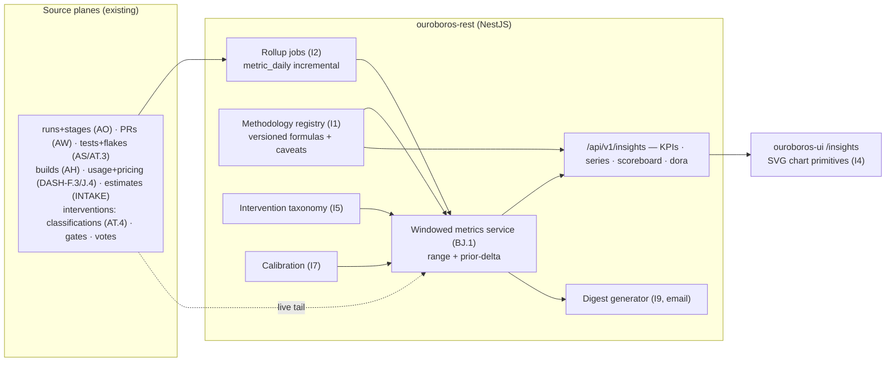
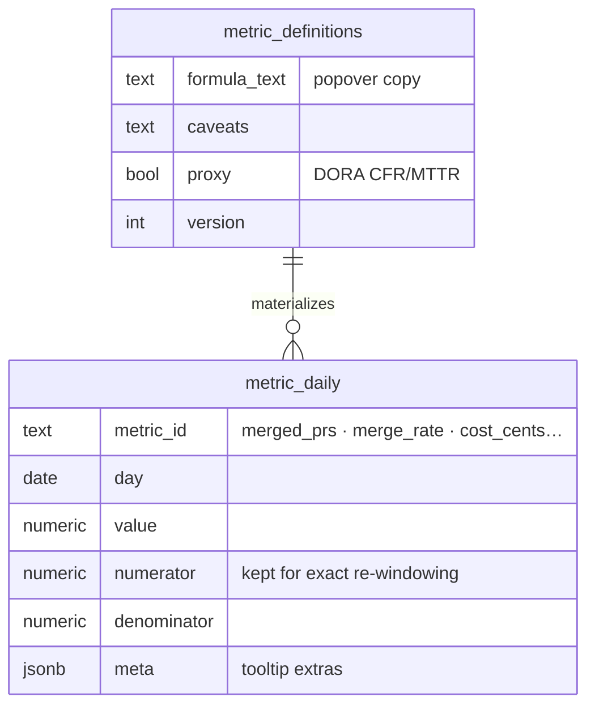
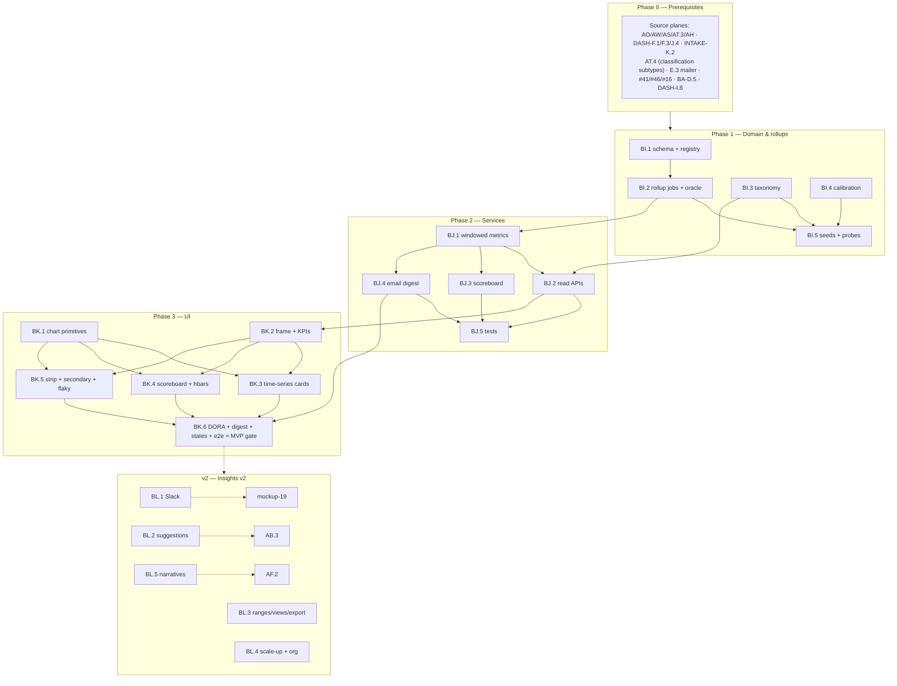

# Roadmap — Insights (Mockup 15)

## Description

> Create a roadmap that covers the features for the mockup page 15. Any additional
> tech infrastructure that is required to implement the functionality in these mockup
> pages should be researched and offered as options for implementing in the roadmap.
> The roamdap should include MVP and v2 options, as well as the labels, milestones,
> and the like, for the tickets to be created. Any ticket sources that are used by
> Ouroboros for ingesting should be pluggable, which includes sources like Jira,
> Linear, GitHub, GitLab, and other bug reporting/issue recording sites. Refer to the
> page so that issues can reference the mockup file when creating the UI/UX design of
> the pages. Be very specific when creating the roadmap, as the options in the
> roadmap for the functionality needs to be complete and very thorough.

## Context & Existing Work (duplicate-avoidance survey)

Surveyed 2026-08-09.

**Design source of truth for every UI ticket in this roadmap:**
[`docs/mockups/15-insights.html`](mockups/15-insights.html) (with
`docs/mockups/assets/ouroboros.css`) — Insights. Its anatomy:

- **Page head** — eyebrow `Insights`, h1 `27 PRs merged this week. 2 needed a
  human.`, subline *"Every loop measured: what merged untouched, what it cost,
  where humans still step in."*; a **time-range segment** (7d / **30d** / 90d /
  custom); actions **✦ Build Analyzer** (→ mockup 18), **Email weekly digest**,
  **Send to Slack**.
- **KPI row** (five stats) — *Autonomous merge rate* `92% · ▲ 3pts vs prior
  30d`, *Merged w/o human edits* `78% · of all merged PRs`, *Median cycle*
  `14m 20s · ▼ 2m faster`, *Cost per merged PR* `$1.87 · ▼ $0.41`, *Human
  interventions* `2/wk · ▼ 5`.
- **Merged PRs per day · 30d** (`c-8`) — SVG line+area chart with horizontal
  gridlines, sparse x-ticks, endpoint dot + direct label `6`, a static
  crosshair with a tooltip card (`Aug 4 — 6 merged · $9.12 · 1 intervention`).
- **Where loops still need humans** (`c-4`, `30d · 20 total`) — labeled hbars:
  `Flaky env / rig 8`, `Ambiguous ticket 5`, `Policy gate (refactor) 4`,
  `Model disagreement 2`, `Other 1`; insight line *"Fix the top row and
  interventions drop ~40%."*
- **Cycle time by stage · median** (`c-4`) — hbars: Analyze 1m, Plan 2m,
  **Implement 6m 04s** (dominant), Build 2m, Test 2m 40s, Verify 40s; line
  *"Implement dominates the loop — the other five stages sum to 8m 20s."*
- **Model scoreboard** (`c-8`, `Routing rules →`) — table: task · model pill ·
  merge-untouched % meter · $/success · trend arrow; an inline **suggestion
  row** (*"fable stays primary; consider dropping fallback to
  ollama/qwen3-coder for XS issues (would save ~$14/mo)"* + `Apply in Models
  →`).
- **Flaky tests** (`c-4`, `14d window`) — rows with mono test paths, state
  pills (`fixed` — *fixed by loop #1847*; `quarantined` — `4.1% rising on
  hil-rig-02`; `watching` — `1.2% under threshold`), CSS-bar sparklines;
  footer `Open playbook: Flaky test hunt →`.
- **Build & test performance · 30d strip** (`c-12`) — Builds `412`, Build
  success `91.5% (377 ✓ / 35 ✗)`, Test cases run `26.4k`, Test pass rate
  `98.9%`, Tokens `126M`, Total cost `$563.20`; scope tag `helios-firmware ·
  all workflows`.
- **Builds per day — succeeded vs failed** (`c-4`) — stacked vertical bars
  with a failure segment, a data note (`18 · 2 failed`), legend; line
  *"Failures cluster on deps-refresh days — the analyzer noticed too."*
- **Test failures by suite · 30d** (`c-4`) — hbars (telemetry integration 14
  … unit · drivers 1); *"33 failing cases — 0.12% of everything that ran."*
- **Time to completion by effort** (`c-4`) — hbars XS 6m → XL 2h 10m;
  *"Estimator calibration: 89% of issues land within their predicted band."*
- **Tokens by stage · 30d** (`c-6`) — violet hbars (implement 71M → docs 3M);
  *"≈ 4.6M tokens per merged PR · 31% served by local models at $0."*
- **Daily cost · all providers** (`c-6`) — SVG line+area with a dashed `$20
  budget` guide, a labeled spike (`$31.40 — Zephyr migration spike`),
  endpoint `$18.60`; *"Projected month: $571 of $600 cap · alerts fire at
  90%."*
- **Delivery health · DORA-ish** (`c-12`) — four cells with sparklines:
  Deploy frequency `4.2/day ▲`, Lead time `3h 10m ▼`, Change failure rate
  `3.1% —`, MTTR `22m ▼`; caption *"Computed from your GitHub + build farm
  events, not self-reported."*

**What this page really is:** the aggregation layer over data planes that all
already exist in prior roadmaps — runs & stages (AO), PRs & merges (AW), test
results & flake history (AS/AT.3), builds (AH), token usage & pricing
(DASH-F.3/J.4), estimates (INTAKE), interventions (needs-human + AT.4
classifications + guardrails + policy gates). The new work: a **windowed
metrics service with prior-period deltas and honest formulas**, an
**intervention-cause taxonomy**, **estimator calibration**, **chart
components**, and **digests**. Every number must be a documented computation
over those planes — this page inherits every honesty rule at once.

**Overlapping work and dispositions:**

| Existing work | Disposition under this roadmap |
|---|---|
| DASH roadmap (F.1 runs, F.3 usage, G.3 pulse metrics, J.4 pricing) | **Consumed & generalized** — G.3's 7-day pulse math becomes a special case of BJ.1's windowed metrics service (amendment: dashboard reads the shared service); pricing honesty (unpriced ≠ $0) carries everywhere. |
| Test results AT.3 (flake scores, quarantine, "insights feed" noted), AV.3 export | **Consumed** — the flaky-tests card renders AT.3's states/history; AV.3's export lands here as the consumer (coordination). |
| PR plane AW/AX (merged, untouched-by-human detection via revision authorship), run console AO (stage timings, interventions), AT.4 classifications, guardrail/policy gates | **Consumed** — KPI formulas defined over these rows; "merged w/o human edits" = merged PRs whose revisions carry no human pushes/edits (definition documented, BI.2). |
| Routing AB.3 (learned routing suggestions, v2 there) | **Surfaced here** — the scoreboard's suggestion row renders AB.3 output when it exists; honest absence otherwise (BK.4). The scoreboard's aggregation itself is MVP (BJ.3). |
| AB.4 spend report (v2 of routing) | **Adjacent** — the daily-cost chart + projection here are loop-scoped analytics; AB.4 remains the deep financial drill-down (boundary noted, shared series endpoints). |
| BetterAuth E.3 mailer abstraction | **Reused** — the email digest rides the same mailer interface (dev = mailpit). |
| Mockup 19 Slack, mockup 18 Build Analyzer, mockup 16 inbox | **Boundaries** — Send-to-Slack is v2 with 19 (BL.1); the Analyzer button is an honest "soon"; the analyzer cross-line ("noticed too") renders only when 18 exists. |
| INTAKE estimates (cycle bands), AL.5 nightly | **Consumed** — calibration (89% within band) computes estimates-vs-actuals (BI.4). |
| Pluggable ticket sources requirement (description boilerplate) | **Already satisfied** by WF-Q/AL.2/AX.1 — lead-time and throughput metrics compute over canonical tickets/PRs regardless of tracker. Nothing duplicated. |
| Scaffolding #49 `/insights` placeholder, #56 e2e; dataviz guidance in-repo | **Superseded for `/insights`**; #56 gains an insights leg. Chart implementation issues note the repo's dataviz guidance *and* that the mockup's SVG treatments are the binding design. |

Epic letters continue the sequence (…BE–BH): this roadmap uses **BI, BJ, BK,
BL**.

## Infrastructure Options (researched — thorough, pick before filing)

### 1. Aggregation & rollup strategy

| Option | What it is | Fit | Trade-offs |
|---|---|---|---|
| **A — Plain-Postgres rollup tables (daily grain) maintained by incremental jobs, window queries over them + live tail** ⭐ recommended MVP | Nightly+hourly incremental jobs fill `metric_daily` rollups (org × repo × metric × day) from the source planes; range queries = rollup scan + a small live-tail union for today; formulas versioned in a methodology registry | Zero new extensions (works on stock Postgres 17 — the compose promise); volumes here are small for years (hundreds of runs/day, not millions of rows/sec); deltas = two window scans | Rollup-refresh code is ours; acceptable at this scale |
| B — TimescaleDB continuous aggregates | Hypertables + incremental auto-refreshing materialized views; real-time mode unions the live tail automatically | The textbook tool if event volume grows 100× | A Postgres extension dependency in every deployment for data volumes that don't need it yet — documented as the BL.4 graduation path with triggers |
| C — On-the-fly SQL only | Compute everything per request | Simplest | KPI row = ~15 heavy scans per page view per range; deltas double it — fine for tiny orgs, degrades badly; rejected as the default (kept as the correctness oracle in tests) |
| D — External OLAP (ClickHouse/DuckDB sidecar) | Dedicated analytics store | Massive scale | New infrastructure against the lightweight rule — out of scope until B's triggers fire |

### 2. Charting implementation

| Option | What it is | Fit | Trade-offs |
|---|---|---|---|
| **A — Custom token-driven SVG components (line/area, hbars, sparklines, stacked vbars)** ⭐ recommended | The mockup's charts *are* hand-authored SVG + CSS bars; build them as React components (path generation from series data, gridlines, direct labels, crosshair+tooltip, budget guides) styled by the #16 tokens; a11y per the mockup's `role="img"` + labels | Pixel-fidelity by construction; ~zero dependencies; four primitives cover all eleven visuals | Interactions scoped deliberately (hover crosshair, range switch — not pan/zoom) |
| B — Charting library (Recharts/visx/ECharts) | Ready-made axes/interactions | Faster rich interactivity | Theming fights the design system; bundle weight; the mockup needs none of the extra power |
| C — uPlot/lightweight canvas | Fast big-series rendering | 10k+ point series | Our series are ≤ 90 points; SVG is clearer and printable |

### 3. Intervention-cause taxonomy (the "why humans stepped in" bars)

| Option | What it is | Fit | Trade-offs |
|---|---|---|---|
| **A — Deterministic mapping from existing records + reviewable overrides** ⭐ recommended | Every intervention event (run → needs_human, human classification, waiver, policy-gate stop, guardrail fail, vote disagreement) maps by rule to a cause: infra/rig (AT.4 `infra_rig` + rig-offline guardrails), ambiguous ticket (correction notes flagged `unclear-requirements` + a classification subtype added), policy gate (WF human-gate stages + review-required), model disagreement (AZ.1 blocking votes), other; humans can re-categorize (audited); the "fix the top row" line = computed share, phrased conservatively | Causes trace to rows; the ~40% insight is arithmetic (8/20), not narrative | Requires a small subtype addition to AT.4's classification vocabulary (amendment); LLM-assisted cause narratives are BL.5 |
| B — LLM cause classification | Model reads the run story | Richer causes | Staged later per the universal pattern; never replaces the deterministic floor |

### 4. DORA-ish formulas (honesty-critical)

| Metric | MVP formula (documented in-product) | Notes |
|---|---|---|
| Deploy frequency | merged loop-PRs/day (proxy: merge = deploy) | Proxy stated in the methodology popover; real deploy events are a future integration |
| Lead time | median(ticket ready→merge) over canonical tickets | Tracker-agnostic via WF-Q |
| Change failure rate | merged PRs followed within N days by a revert commit (sync-detected `Revert "…"` / `revert:` patterns) or a fix-classified loop on the same paths | Proxy definition; labeled `proxy` in the UI |
| MTTR | median(needs_human/failure detected → resolving merge) for failure-classified loops | Loop-scoped recovery, stated as such |

All four render with a **methodology popover** (formula + window + caveats) —
the mockup's *"computed from your GitHub + build farm events, not
self-reported"* made literal.

## Decisions proposed by this roadmap (validate before issue creation)

| # | Decision | Rationale |
|---|----------|-----------|
| I1 | **One windowed metrics service** (BJ.1) computes every number on the page from versioned formula definitions (a methodology registry: id, formula description, source planes, caveats); the dashboard's G.3 pulse math is amended to consume it | Two implementations of "merge rate" would eventually disagree; the registry powers the popovers. |
| I2 | **Rollups = option 1-A** (plain-Postgres daily grain + live tail), with option-C on-the-fly SQL kept as the test oracle and TimescaleDB as the documented graduation path (BL.4) | Stock-Postgres deployments stay simple; correctness is provable against the oracle. |
| I3 | **Time ranges are first-class** (7d/30d/90d now; custom = BL.3): every endpoint takes a range + computes the prior-period delta; week-boundary and timezone rules documented once | Deltas (`▲ 3pts vs prior 30d`) are half the page. |
| I4 | **Charts = custom SVG components** (option 2-A): four primitives (TimeSeries, HBars, Sparkline, StackedVBars) shared across the page, token-themed, a11y-labeled; implementation follows the mockup's treatments (and the repo's dataviz guidance where the mockup is silent) | Pixel fidelity + lightweight rule. |
| I5 | **Intervention causes = deterministic taxonomy** (option 3-A) with human re-categorization; insight lines are computed arithmetic phrased conservatively | The bars and the "~40%" line must be auditable. |
| I6 | **"Merged w/o human edits" has one definition**: merged PRs whose revisions contain no human-authored pushes and no human-edited files after the loop's last revision (authorship from host sync); definition in the registry + popover | The page's most quotable number needs the least ambiguity. |
| I7 | **Estimator calibration is real** (BI.4): each merged loop joins its estimate band (cycle_min/max) vs actual; `89% within band` computes; feeds INTAKE's estimator improvement loop | Closes the loop on sizing honesty. |
| I8 | **Money follows the pricing rules** (M7/N10/DASH-J.4): cost KPIs/charts render priced usage only, token counts always; projection = linear-to-date with the method stated; budget guide + `alerts fire at 90%` reflect the real provider-cap config (AE/AF.4) — the alert claim renders only when cap alerts exist (AF.4), else the guide shows without the claim | No fabricated dollars, no promised alerts that don't exist. |
| I9 | **Digest = email MVP over the E.3 mailer** (weekly KPI + highlights render of this page's registry data, per-user subscribe, dev=mailpit); **Send to Slack = v2** with mockup 19 (BL.1) — the button renders honest-absent until then | One real channel now; the other when its integration exists. |
| I10 | **Cross-surface lines render only when their source exists**: scoreboard suggestion row (AB.3), analyzer correlation line (mockup 18), flaky playbook link (BF.6 — exists) — each honesty-gated | The mockup's connective tissue arrives with its organs. |
| I11 | **Labels**: new `insights`; **Milestones**: `Insights MVP` / `Insights v2` created at filing; complexity chips XS–L | Description requires labels + milestones for the filing pass. |

## Architecture Overview



## MVP Definition

The MVP is **mockup 15 as the real analytics surface**: every number a
documented computation over the existing planes, every chart a token-driven
component, every honesty rule inherited. It is done when, against the compose
stack:

1. `/insights` reproduces
   [`docs/mockups/15-insights.html`](mockups/15-insights.html)
   pixel-faithfully in **both themes**: KPI row with deltas, both SVG
   time-series charts (crosshair tooltip, budget guide, spike label), all
   four hbar cards, the stacked build bars, the model scoreboard, the flaky
   card with sparklines, the performance strip, and the DORA strip with
   methodology popovers.
2. **The metrics service is the single truth** (I1/I2): all page numbers
   computed from rollups+live-tail with range + prior-delta; every metric's
   registry entry (formula, sources, caveats) drives its popover; the
   dashboard's pulse card reads the same service (amendment verified);
   rollup outputs equal the on-the-fly oracle on fixtures.
3. **Ranges work** (I3): 7d/30d/90d switch re-renders everything with
   correct deltas; custom is an honest "soon" (BL.3).
4. **Interventions are categorized** (I5): the bars derive from mapped
   events; re-categorization round-trips (audited); the top-row insight
   line is computed arithmetic.
5. **The scoreboard aggregates truthfully** (BJ.3): merge-untouched % per
   task×model from I6's definition, $/success priced-only, trend vs prior
   window; the suggestion row renders only with AB.3 present (I10).
6. **Calibration computes** (I7): the `N% within predicted band` line from
   estimate-vs-actual joins; feeds an intake-visible report.
7. **The email digest sends** (I9): weekly KPI + highlights per subscriber
   through the mailer (mailpit-verified); Slack renders honest-absent.
8. Integration tests cover rollup-vs-oracle equality, delta windows,
   taxonomy mapping, I6/DORA formula fixtures, calibration joins, digest
   rendering, isolation; the e2e leg verifies seeded parity + range
   switching + popovers + digest.

**Explicitly v2 (milestone `Insights v2`):** Slack digest + channel sends
with mockup 19 (BL.1), the AB.3 suggestion surface + apply-flow deep-link
(BL.2), custom ranges/saved views/CSV export (BL.3), TimescaleDB graduation
+ org-level cross-repo rollups (BL.4), LLM insight narratives + anomaly
annotations (BL.5).

## Epics, Labels & Milestones

| Epic | Name | Goal | Modules | Milestone |
|------|------|------|---------|-----------|
| BI | Metrics Domain & Rollups | Rollup tables, methodology registry, taxonomy, calibration, seeds | ouroboros-db, ouroboros-rest | Insights MVP |
| BJ | Analytics Services | Windowed metrics, series/scoreboard/DORA endpoints, digests, tests | ouroboros-rest | Insights MVP |
| BK | Insights UI | Chart primitives + all eleven visuals, popovers, states, e2e | ouroboros-ui | Insights MVP |
| BL | Deep Analytics (v2) | Slack, suggestions surface, custom ranges/export, scale-up, narratives | all | Insights v2 |

Issue naming: `<project>: [<epic>.<issue>] <title>`. Labels: existing set (`mvp`,
`v2`, `rest`, `db`, `ui`, `ci`, `design`, `tests`, `routing`, `runs`) **plus new
`insights`** (decision I11). Milestones **`Insights MVP`** / **`Insights v2`**
created at filing; every issue assigned. Complexity chips: **XS · S · M · L**.

---

## Epic BI — Metrics Domain & Rollups (`ouroboros-db` + `ouroboros-rest`)

| Issue | Title | Summary | Labels | Parallel | MVP | Complexity | Affected Modules |
|-------|-------|---------|--------|:--------:|:---:|:----------:|------------------|
| BI.1 | ouroboros-db: [BI.1] Metric rollup schema & methodology registry | `metric_daily` grain + versioned formula registry (I1/I2) | mvp, insights, db | N (after DASH-F.1/F.3, AO/AW/AS) | Y | M | ouroboros-db |
| BI.2 | ouroboros-rest: [BI.2] Rollup jobs & source-plane extractors | Incremental daily fills per metric family; oracle parity | mvp, insights, rest | N (after BI.1) | Y | L | ouroboros-rest |
| BI.3 | ouroboros-db: [BI.3] Intervention-cause taxonomy | Cause mapping rules + override rows (I5); AT.4 subtype amendment | mvp, insights, db | N (after AT.4, AO.4) | Y | M | ouroboros-db, ouroboros-rest |
| BI.4 | ouroboros-rest: [BI.4] Estimator calibration records | Estimate-band vs actual joins; within-band computation (I7) | mvp, insights, rest, intake | N (after INTAKE-K.2, AO.1) | Y | S | ouroboros-rest, ouroboros-db |
| BI.5 | ouroboros-db: [BI.5] Insights seeds — mockup-15 parity + probes | 30d of rollup history shaping every visual; ci checks | mvp, insights, db, ci | N (after BI.1–BI.4, #24) | Y | M | ouroboros-db, .github |

### Issue BI.1 — ouroboros-db: [BI.1] Metric rollup schema & methodology registry

- **Problem Statement:** Every page number needs a queryable daily grain and
  a formula that can be shown to the user (decisions I1/I2).
- **Solution/Scope:** Migration: `metric_daily` — org FK, repo_ref nullable
  (org-level rows for cross-repo later), `metric_id`, `day` date, `value`
  numeric, `numerator`/`denominator` nullable (rate metrics keep components
  so re-windowing is exact — 30d merge rate ≠ average of daily rates),
  `meta` jsonb (per-day extras: the tooltip's `$9.12 · 1 intervention`),
  unique (org, repo, metric, day), BRIN on day; `metric_definitions` —
  `metric_id`, `title`, `formula_text` (the popover copy), `source_planes`,
  `caveats`, `unit` CHECK (`count|pct|duration_ms|cents|tokens`),
  `version`, `proxy` bool (DORA CFR/MTTR flags); rollup-job bookkeeping
  (per metric family: last-filled day, backfill cursors).
- **Acceptance Criteria:** Rate metrics re-window exactly from components
  (fixture: 30d from daily rows equals oracle); registry rows drive
  popovers; unique/grain constraints hold; backfill bookkeeping supports
  restart.
- **Parallelism/Dependencies:** Needs the source planes (DASH-F.1/F.3, AO,
  AW, AS). Blocks BI.2/BI.5, BJ.1.
- **Technical Stack:** PostgreSQL 17, Flyway.
- **Epic:** BI



### Issue BI.2 — ouroboros-rest: [BI.2] Rollup jobs & source-plane extractors

- **Problem Statement:** The daily grain must fill incrementally from every
  source plane — correctly, restartably, and provably equal to on-the-fly
  computation (I2's oracle rule).
- **Solution/Scope:** Extractor per metric family (versioned with its
  registry entry): throughput (merged PRs/day from AW), merge rate +
  untouched rate (I6's authorship definition over revisions), cycle/stage
  medians (AO stage history; medians stored per day via component
  percentiles — method documented), cost/tokens (DASH-F.3 + J.4, priced
  vs unpriced kept separate), builds (AH jobs: totals + failures), tests
  (AS: cases run, failures by suite — suite-dimension rows), interventions
  (BI.3 mapped causes/day), effort-completion (merged loops joined to
  estimate efforts), DORA family (the option-4 formulas incl.
  revert-detection extractor over synced commits); scheduler: hourly
  incremental (today) + nightly consolidation + bounded backfill;
  **oracle parity suite**: every extractor has an on-the-fly SQL twin,
  CI-compared on fixtures.
- **Acceptance Criteria:** Parity green across families; incremental
  re-runs idempotent; restart mid-backfill resumes; revert-detection
  fixture catches `Revert "…"`/`revert:` patterns; median method
  documented + stable.
- **Parallelism/Dependencies:** Needs BI.1 (+ all source planes). Blocks
  BJ.1.
- **Technical Stack:** NestJS scheduler, Kysely, SQL.
- **Epic:** BI

```
hourly: today's tail per family ─▶ upsert metric_daily
nightly: consolidate + backfill cursor ─▶ parity(CI): rollup ≡ oracle ✓
```

### Issue BI.3 — ouroboros-db: [BI.3] Intervention-cause taxonomy

- **Problem Statement:** The "where loops still need humans" bars need
  every intervention mapped to a cause deterministically, with human
  correction (decision I5).
- **Solution/Scope:** Migration + service: `intervention_events` — org FK,
  run FK, `detected_at`, `source` CHECK (`needs_human_run|classification|
  waiver|policy_gate|guardrail|vote_block`), source refs, `cause` CHECK
  (`infra_rig|ambiguous_ticket|policy_gate|model_disagreement|other`),
  `cause_origin` CHECK `rule|human` + rule id, override audit; mapping
  rules (versioned): AT.4 `infra_rig` class → infra; AT.4 subtype
  `unclear_requirements` (vocabulary amendment to AT.4's classification
  shape) → ambiguous; WF human-gate stage stops + review-required →
  policy; AZ.1 blocking votes → disagreement; residue → other;
  re-categorize API (member+, audited); event creation hooks on the
  source planes (idempotent).
- **Acceptance Criteria:** Mapping matrix fixtures (each source × cause);
  overrides persist + audit; the seeded 20 events land 8/5/4/2/1; AT.4
  subtype amendment posted; idempotent hook replay.
- **Parallelism/Dependencies:** Needs AT.4, AO.4 (+WF gates, AZ.1 when
  present). Feeds BI.2, BJ.2.
- **Technical Stack:** PostgreSQL 17, Flyway, NestJS.
- **Epic:** BI

```
needs_human(run#1832) + AT.4{infra_rig} ─rule─▶ cause: infra_rig
human re-categorize ─▶ cause: ambiguous_ticket (origin: human, audited)
```

### Issue BI.4 — ouroboros-rest: [BI.4] Estimator calibration records

- **Problem Statement:** `89% of issues land within their predicted band`
  must join predictions to outcomes (decision I7).
- **Solution/Scope:** `estimate_outcomes` — merged-loop rows joining the
  ticket's governing estimate (cycle_min/max, effort) to actuals (run
  duration issue→merge per the lead-time definition), `within_band` bool,
  deviation; fill job on merge events; calibration metrics (within-band %
  by window/effort, band-bias direction) registered in BI.1; report
  endpoint consumed here and by an INTAKE surface note (amendment:
  estimator issues can cite calibration).
- **Acceptance Criteria:** Joins correct on fixtures (multiple estimate
  versions → governing = at-queue-time); within-band math matches oracle;
  effort-sliced report renders.
- **Parallelism/Dependencies:** Needs INTAKE-K.2, AO.1, AW merges.
- **Technical Stack:** NestJS, Kysely.
- **Epic:** BI

```
merge(#514) ─▶ join estimate@queue-time {12–18m} vs actual 14m20s ─▶ within_band ✓
window: 89% within band · L-effort bias: +12% over
```

### Issue BI.5 — ouroboros-db: [BI.5] Insights seeds — mockup-15 parity + probes

- **Problem Statement:** Eleven visuals need 30 days of coherent seeded
  history that also reconciles with every other roadmap's seeds.
- **Solution/Scope:** Extend the dev seed: 30d of `metric_daily` across all
  families shaped to the mockup (throughput ending at 6 with the Aug-4
  meta row, cost curve with the $31.40 spike + $18.60 endpoint, KPI
  values + prior-window deltas, stage medians, tokens by stage,
  builds 412/377/35, suites 14/9/6/3/1, effort ladder, DORA cells),
  20 intervention events (8/5/4/2/1), calibration rows (89%), scoreboard
  aggregates (84/61/96/91%, $/success), flaky-card states referencing
  AT.3 seeds; all windows relative to `now()`; ci/db probes (grain
  uniqueness, component-consistency `value = num/den`, taxonomy vocab,
  meta shapes).
- **Acceptance Criteria:** Page renders the mockup from seeds; range
  switches produce coherent alternate windows; parity with source-plane
  seeds where they overlap (builds ↔ AH counts documented); probes
  red/green verified.
- **Parallelism/Dependencies:** Needs BI.1–BI.4 (+cross-roadmap seed
  coordination). Feeds BJ/BK tests, e2e.
- **Technical Stack:** Flyway repeatable migration, SQL.
- **Epic:** BI

```
seeds: 30d × all families ─▶ every mockup number reproduced · Aug-4 tooltip meta ·
       20 interventions (8/5/4/2/1) · calibration 89% · scoreboard rows
```

---

## Epic BJ — Analytics Services (`ouroboros-rest`)

| Issue | Title | Summary | Labels | Parallel | MVP | Complexity | Affected Modules |
|-------|-------|---------|--------|:--------:|:---:|:----------:|------------------|
| BJ.1 | ouroboros-rest: [BJ.1] Windowed metrics service | Range + prior-delta over rollups + live tail; registry-driven (I1–I3) | mvp, insights, rest | N (after BI.2) | Y | L | ouroboros-rest |
| BJ.2 | ouroboros-rest: [BJ.2] Insights read APIs | KPIs, series, hbar sets, scoreboard, flaky, DORA payloads | mvp, insights, rest | N (after BJ.1, BI.3) | Y | M | ouroboros-rest |
| BJ.3 | ouroboros-rest: [BJ.3] Model scoreboard aggregation | Task×model outcomes: untouched %, $/success, trends (I6) | mvp, insights, rest, routing | N (after BJ.1, AW) | Y | M | ouroboros-rest |
| BJ.4 | ouroboros-rest: [BJ.4] Email digest generation | Weekly registry-rendered digest per subscriber (I9) | mvp, insights, rest | N (after BJ.1, BA-E.3 mailer) | Y | M | ouroboros-rest |
| BJ.5 | ouroboros-rest: [BJ.5] Insights integration tests | Parity, deltas, taxonomy, scoreboard, digest, isolation | mvp, insights, rest, ci | N (after BJ.2–BJ.4) | Y | M | ouroboros-rest |

### Issue BJ.1 — ouroboros-rest: [BJ.1] Windowed metrics service

- **Problem Statement:** One service must answer "metric X over range R with
  prior-period delta" for every consumer — the page, the digest, and the
  dashboard's amended pulse card (decisions I1–I3).
- **Solution/Scope:** `MetricsService.window(metricId, {org, repo?, range})`
  → `{value, components, prior, delta, series?, methodology}`: rollup scan
  + today's live-tail union (bounded), rate recomposition from components
  (exact re-windowing), prior-window computation (calendar rules + tz
  documented once), series extraction for charts (daily points + meta);
  registry integration (methodology payload per I1); caching (short TTL,
  range-keyed); DASH-G.3 amendment: the pulse card's four numbers call
  this service (one truth); performance budget (KPI row ≤ 150ms warm on
  seed volume).
- **Acceptance Criteria:** Window matrix fixtures (7/30/90d × boundary
  cases × tz); delta math vs oracle; recomposition exactness; dashboard
  amendment verified; budget met.
- **Parallelism/Dependencies:** Needs BI.2. Blocks BJ.2–BJ.4.
- **Technical Stack:** NestJS, Kysely.
- **Epic:** BJ

```
window(merge_rate, 30d) ─▶ {value: 92%, prior: 89%, delta: +3pts,
  methodology: {formula, caveats}, series: [30 pts]}   (rollups + live tail, exact)
```

### Issue BJ.2 — ouroboros-rest: [BJ.2] Insights read APIs

- **Problem Statement:** The page needs shaped payloads for eleven visuals
  plus the head's composed sentence.
- **Solution/Scope:** `GET /api/v1/insights?range=` → {head (weekly merges +
  interventions sentence data), kpis[5] (with deltas + methodology refs),
  charts: throughput series (+meta for the tooltip), cost series (+budget
  guide from provider caps, projection per I8, alert-claim flag per AF.4
  presence), hbars: interventions (BI.3 + computed insight line), stage
  medians (+the sums line), suite failures, effort completion (+BI.4
  line), tokens-by-stage (+per-PR + local-share lines), builds-per-day
  stacked series (+cluster note only when the correlation source exists —
  I10), flaky card (AT.3 states + history sparklines + fixed-by refs),
  scoreboard (BJ.3), dora[4] (+proxy flags + sparkline series)};
  range-validated; 404-not-403; OpenAPI complete.
- **Acceptance Criteria:** Seeded payload reproduces every mockup number
  and line; honesty gates verified (no alert claim without AF.4, no
  cluster note without 18, unpriced → token-only); popover payloads
  complete.
- **Parallelism/Dependencies:** Needs BJ.1, BI.3/BI.4. Feeds BK.*.
- **Technical Stack:** NestJS.
- **Epic:** BJ

```
GET /insights?range=30d ─▶ {kpis[5]+deltas, series{throughput, cost+guide},
  hbars{interventions 8/5/4/2/1 + "top row ⇒ −40%"}, scoreboard, dora+proxy flags}
```

### Issue BJ.3 — ouroboros-rest: [BJ.3] Model scoreboard aggregation

- **Problem Statement:** Task×model outcome quality — merge-untouched %,
  $/success, trend — is the routing feedback loop's read side (I6).
- **Solution/Scope:** Aggregation over runs+PRs+usage: group by task kind ×
  resolved model (stage resolutions from AO/routing pins), untouched %
  per I6's definition, $/success = priced usage attributed to the task's
  stages / merged count (unpriced → token display), trend = vs prior
  window (▲/▼/—), fallback-role annotation (from resolution hop
  position); minimum-sample threshold (rows below N render with a
  low-sample badge, not silently); suggestion-row slot: AB.3 payload
  passthrough when present, absent otherwise (I10); registry entries for
  the definitions.
- **Acceptance Criteria:** Seeded rows reproduce the mockup (incl.
  fallback annotation + $0.00 local row); low-sample badge fires on a
  sparse fixture; suggestion slot honesty verified both ways.
- **Parallelism/Dependencies:** Needs BJ.1, AW, routing pins. Feeds BK.4.
- **Technical Stack:** NestJS, Kysely.
- **Epic:** BJ

```
implement × claude-fable-5 ─▶ untouched 84% · $0.87/success · ▲
implement(fallback) × gpt-5-codex ─▶ 61% · $0.94 · ▼   (+ AB.3 suggestion when live)
```

### Issue BJ.4 — ouroboros-rest: [BJ.4] Email digest generation

- **Problem Statement:** "Email weekly digest" must produce a real,
  subscriber-scoped weekly render of this page's truth (decision I9).
- **Solution/Scope:** Digest pipeline: weekly schedule per org (config),
  per-user subscriptions (opt-in, managed in the page head + settings
  contract), content assembly from BJ.1/BJ.2 (KPI row + deltas, top
  intervention cause, flaky movers, cost summary — all registry-sourced,
  honesty rules inherited), HTML email render (token-consistent light
  template + plain-text alt), delivery via the E.3 mailer abstraction
  (dev = mailpit), unsubscribe links, send audit; Slack path explicitly
  BL.1.
- **Acceptance Criteria:** Weekly run produces mailpit-visible digests
  matching seeded numbers; subscribe/unsubscribe round-trips; unpriced
  orgs get token-only cost lines; renders in major clients (fixture
  screenshots).
- **Parallelism/Dependencies:** Needs BJ.1, the E.3 mailer.
- **Technical Stack:** NestJS scheduler, MJML-or-hand template, mailer.
- **Epic:** BJ

```
weekly ─▶ assemble(range: 7d) ─▶ HTML+text digest ─▶ mailer ─▶ subscriber inboxes
"27 merged · 92% autonomous (▲3) · top cause: flaky rig (8) · $118 this week"
```

### Issue BJ.5 — ouroboros-rest: [BJ.5] Insights integration tests

- **Problem Statement:** Formula drift is this page's failure mode; the
  oracle discipline needs harness enforcement.
- **Solution/Scope:** Suites: rollup-oracle parity across families,
  window/delta matrix, taxonomy mapping + overrides, I6 authorship
  fixtures (human-push PR excluded from untouched), DORA formula fixtures
  (revert detection, MTTR joins), scoreboard thresholds, calibration
  joins, digest golden render, honesty gates (alert claim, suggestion
  slot, cluster note), org isolation.
- **Acceptance Criteria:** Green in `ci/rest`; a formula change without a
  registry version bump fails; ≤ 100s added.
- **Parallelism/Dependencies:** Needs BJ.2–BJ.4.
- **Technical Stack:** Jest, Testcontainers.
- **Epic:** BJ

```
suites: parity ✓ · windows ✓ · taxonomy ✓ · untouched-def ✓ · dora ✓ · digest ✓ · gates ✓
```

---

## Epic BK — Insights UI (`ouroboros-ui`)

Every issue references
[`docs/mockups/15-insights.html`](mockups/15-insights.html) as the design
source — its SVG chart treatments, hbar/spark/vbar patterns, and card
anatomy — via the #16 tokens (both themes; the mockup is dark-only). Chart
implementation additionally follows the repo's dataviz guidance where the
mockup is silent; the mockup remains binding where they differ.

| Issue | Title | Summary | Labels | Parallel | MVP | Complexity | Affected Modules |
|-------|-------|---------|--------|:--------:|:---:|:----------:|------------------|
| BK.1 | ouroboros-ui: [BK.1] Chart primitives (SVG) | TimeSeries, HBars, Sparkline, StackedVBars — token-driven (I4) | mvp, insights, ui, design | N (after #46, #16) | Y | L | ouroboros-ui |
| BK.2 | ouroboros-ui: [BK.2] Insights route, head, range & KPI row | Frame, composed headline, range segment, five KPI cards | mvp, insights, ui, design | N (after #41, BJ.2, BA-D.5) | Y | M | ouroboros-ui |
| BK.3 | ouroboros-ui: [BK.3] Time-series cards (throughput & cost) | Line/area charts with tooltip, guide, spike label, projections | mvp, insights, ui, design | N (after BK.1, BK.2) | Y | M | ouroboros-ui |
| BK.4 | ouroboros-ui: [BK.4] Scoreboard & intervention/stage cards | Table + meters + suggestion slot; two hbar cards + insight lines | mvp, insights, ui, design | N (after BK.1, BJ.3) | Y | M | ouroboros-ui |
| BK.5 | ouroboros-ui: [BK.5] Performance strip, secondary charts & flaky card | Strip, stacked vbars, suite/effort/token hbars, flaky sparklines | mvp, insights, ui, design | N (after BK.1, BK.2) | Y | M | ouroboros-ui |
| BK.6 | ouroboros-ui: [BK.6] DORA strip, digest controls, states & e2e | Methodology popovers, subscribe flow, cold states, themes, e2e | mvp, insights, ui, ci | N (after BK.3–BK.5, BJ.4) | Y | M | ouroboros-ui, .github |

### Issue BK.1 — ouroboros-ui: [BK.1] Chart primitives (SVG)

- **Problem Statement:** Eleven visuals reduce to four primitives — built
  once, token-themed, accessible, matching the mockup's hand-authored
  treatments (decision I4).
- **Solution/Scope:** Components: **TimeSeries** (line+area path generation
  from daily series, horizontal gridlines, sparse x-ticks, endpoint
  dot+direct label, optional dashed guide line + label, optional annotated
  point (spike label), hover crosshair + tooltip card (the `.tip`
  treatment) with per-point meta, `role="img"` + descriptive labels,
  reduced-motion safe); **HBars** (label/bar/value grid per `.hbar`,
  top/dim emphasis variants, tok hue variant, effort-chip label support);
  **Sparkline** (CSS-bar strip per `.spark`, dim variant); **StackedVBars**
  (success/fail segments per `.vb`, hot emphasis, floating data note,
  legend); all colors/typography from tokens; overflow-scroll wrappers per
  the mockup; unit formatting shared (durations, $, tokens, %).
- **Acceptance Criteria:** Storybook-style fixture renders match the
  mockup's charts pixel-close in both themes (screenshot suite); tooltip
  keyboard access (focusable points); no chart library in the bundle;
  formatter unit tests.
- **Parallelism/Dependencies:** Needs #46/#16. Blocks BK.3–BK.6.
- **Technical Stack:** React, SVG, CSS tokens.
- **Epic:** BK

```
<TimeSeries series guide={{y:20,label:"$20 budget"}} annotate={spike} tooltip=meta/>
<HBars rows variant="tok"/> <Sparkline pts dim/> <StackedVBars days legend note/>
```

### Issue BK.2 — ouroboros-ui: [BK.2] Insights route, head, range & KPI row

- **Problem Statement:** The frame: a headline composed from live weekly
  data, the range segment driving everything, and five delta-bearing KPI
  cards.
- **Solution/Scope:** `/insights`: head (sentence composed from BJ.2's
  head payload with correct pluralization), range segment (7d/30d/90d
  active states per the mockup; custom → honest "soon" tooltip, BL.3),
  action row (**✦ Build Analyzer** honest-soon; **Email weekly digest** →
  BK.6's subscribe flow; **Send to Slack** honest-absent per I9); KPI
  cards via the StatCard family (delta coloring by direction-goodness,
  methodology popover on the label — the I1 registry payload); range in
  the URL; polling via I.8.
- **Acceptance Criteria:** Seeded head/KPIs match; range switch re-renders
  all consumers (URL round-trip); popovers render formulas + caveats;
  honesty states verified; both themes; #49 stub retired (amendment).
- **Parallelism/Dependencies:** Needs #41, BJ.2, BA-D.5. Blocks BK.3–BK.6.
- **Technical Stack:** Next.js, #46 primitives.
- **Epic:** BK

```
27 PRs merged this week. 2 needed a human.   (7d|●30d|90d|custom·soon)
[92% ▲3pts ⓘ][78% ⓘ][14m20s ▼2m ⓘ][$1.87 ▼$0.41 ⓘ][2/wk ▼5 ⓘ]
```

### Issue BK.3 — ouroboros-ui: [BK.3] Time-series cards (throughput & cost)

- **Problem Statement:** The two SVG time-series cards with their
  distinctive furniture: crosshair tooltip with meta, the budget guide,
  the spike annotation, and the projection line.
- **Solution/Scope:** Throughput card (TimeSeries over the merged-PRs
  series; hover tooltip composing the meta — `Aug 4 — 6 merged · $9.12 ·
  1 intervention`, cost omitted when unpriced; range-labeled tag); cost
  card (TimeSeries with the budget guide from real provider caps —
  absent when uncapped, spike annotation from the series' max-outlier
  meta (labeled from real events when attributable, plain value
  otherwise — no invented "Zephyr migration" stories), endpoint label,
  projection footer per I8 with method tooltip, the alerts claim only
  with AF.4).
- **Acceptance Criteria:** Seeded charts match the mockup (both themes);
  tooltip meta honesty (unpriced variant); guide/claim absence variants
  verified; spike label uses seeded attribution.
- **Parallelism/Dependencies:** Needs BK.1, BK.2.
- **Technical Stack:** React, TimeSeries primitive.
- **Epic:** BK

```
[throughput ── crosshair: "Aug 4 — 6 merged · $9.12 · 1 intervention"]
[cost ── $20 budget ╌╌ · spike "$31.40 — deps-refresh day" · "$571 of $600 proj." (+alerts iff AF.4)]
```

### Issue BK.4 — ouroboros-ui: [BK.4] Scoreboard & intervention/stage cards

- **Problem Statement:** The scoreboard table with its suggestion slot,
  and the two explanatory hbar cards with computed insight lines.
- **Solution/Scope:** Scoreboard: #46 Table (task cell with fallback
  affix, model pill, untouched-% meter+number, $/success mono (token-only
  variant), trend arrow colored by direction, low-sample badges),
  suggestion row (inset band rendering AB.3 payload + `Apply in Models →`
  deep-link when present; absent otherwise — no fabricated advice),
  `Routing rules →` link; interventions card (HBars 8/5/4/2/1 with
  top/dim emphasis, re-categorize affordance on rows (BI.3, member+),
  computed insight line); stage-medians card (HBars with the dominant-
  stage emphasis + the sums line computed).
- **Acceptance Criteria:** Seeded cards match; re-categorization
  round-trips and re-renders the bars; suggestion honesty both ways;
  insight lines are computed strings (fixture-verified).
- **Parallelism/Dependencies:** Needs BK.1, BJ.3, BI.3.
- **Technical Stack:** React, #46 Table, HBars.
- **Epic:** BK

```
implement [claude-fable-5] ▓▓▓▓▓ 84% · $0.87 · ▲
└ suggestion (iff AB.3): "drop fallback to qwen3 for XS — saves ~$14/mo" [Apply →]
Flaky env/rig ▓▓▓▓▓ 8 … "Fix the top row and interventions drop ~40%." (=8/20)
```

### Issue BK.5 — ouroboros-ui: [BK.5] Performance strip, secondary charts & flaky card

- **Problem Statement:** The wide stat strip, the stacked build bars, the
  three remaining hbar cards, and the flaky-tests card with its history
  sparklines.
- **Solution/Scope:** Performance strip (bordered `ms` cells from BJ.2:
  builds, success split with err coloring, cases, pass rate, tokens,
  cost — token-only variant; scope tag from context); builds StackedVBars
  (with the data note + legend; the deps-refresh cluster line **only**
  when the mockup-18 correlation source exists — I10, else omitted);
  suite-failures HBars (+ computed share line); effort-completion HBars
  (effort chips as labels + the BI.4 calibration line); tokens-by-stage
  HBars (tok variant + per-PR and local-share lines from real
  attribution); flaky card (AT.3 rows: mono paths, state pills, history
  sparklines from occurrence data, context lines — `fixed by loop #1847`
  linking the run, `rising on hil-rig-02` from rig attribution;
  `Open playbook →` linking BF.6's playbook when present).
- **Acceptance Criteria:** Seeded cards match; honesty gates verified
  (cluster line absent, token-only variants); flaky links resolve;
  both themes.
- **Parallelism/Dependencies:** Needs BK.1, BK.2 (+AT.3, BF.6 links).
- **Technical Stack:** React, chart primitives.
- **Epic:** BK

```
[412 builds · 91.5% (377✓/35✗) · 26.4k cases · 98.9% · 126M tok · $563.20]
[stacked vbars + legend]  [suites 14/9/6/3/1]  [XS 6m → XL 2h10m · "89% within band"]
flaky: test_estop_release.py (quarantined) ▂▃▅▇ 4.1% rising on hil-rig-02
```

### Issue BK.6 — ouroboros-ui: [BK.6] DORA strip, digest controls, states & e2e

- **Problem Statement:** The DORA cells with proxy-honest popovers, the
  digest subscribe flow, cold-workspace states, and the page's e2e
  certification.
- **Solution/Scope:** DORA strip (four cells: value + delta + Sparkline;
  methodology popover per cell rendering formula/caveats/`proxy` badge
  where flagged — CFR/MTTR; the caption line verbatim); digest flow
  (head button → subscribe sheet: weekly toggle, preview render, mailpit
  note in dev; unsubscribe path); states: cold workspace (no merges yet →
  designed zero-states per card with "the loop hasn't run enough to
  measure" framing, never fake curves), low-sample badges, rollup-lag
  banner (last-filled indicator, DASH-I.7 pattern), member view
  (re-categorize hidden), skeletons; e2e (extends #56): seeded parity
  screenshots (all eleven visuals, both themes), range switch coherence,
  popover content, re-categorize round-trip, digest subscribe →
  scheduled render → mailpit assertion, honesty-gate variants (suggestion
  absent, alerts claim absent).
- **Acceptance Criteria:** All states themed; proxy badges render; e2e
  green from cold compose; each leg fails meaningfully when its layer
  breaks; ≤ 3 min added.
- **Parallelism/Dependencies:** Needs BK.3–BK.5, BJ.4, BI.5; amends #56.
- **Technical Stack:** React, Playwright.
- **Epic:** BK

```
[4.2/day ▲ ▂▃▅] [3h10m ▼] [3.1% — (proxy ⓘ)] [22m ▼ (proxy ⓘ)]
"Computed from your GitHub + build farm events, not self-reported."
e2e: parity ✓ · ranges ✓ · popovers ✓ · digest→mailpit ✓ · honesty variants ✓
```

---

## Epic BL — Deep Analytics (v2 · milestone `Insights v2`)

| Issue | Title | Summary | Labels | Parallel | MVP | Complexity | Affected Modules |
|-------|-------|---------|--------|:--------:|:---:|:----------:|------------------|
| BL.1 | ouroboros-rest: [BL.1] Slack digest & sends | Digest + on-demand sends via mockup 19's integration | v2, insights, rest | N (after BJ.4, mockup-19) | N | M | ouroboros-rest |
| BL.2 | ouroboros-ui: [BL.2] Routing-suggestion surface & apply flow | AB.3 suggestions live in the scoreboard with guided apply | v2, insights, routing, ui | N (after AB.3, BK.4) | N | S | ouroboros-ui |
| BL.3 | ouroboros-rest: [BL.3] Custom ranges, saved views & export | Date-picker ranges, saved configurations, CSV export | v2, insights, rest, ui | N (after BJ.1) | N | M | ouroboros-rest, ouroboros-ui |
| BL.4 | ouroboros-rest: [BL.4] Scale-up & org-level analytics | TimescaleDB graduation ADR + cross-repo/org rollups | v2, insights, rest, db | N (after BI.2) | N | L | ouroboros-rest, ouroboros-db |
| BL.5 | ouroboros-engine: [BL.5] Insight narratives & anomaly notes | LLM-composed insight lines + anomaly annotations, honesty-gated | v2, insights, engine | N (after BJ.2, AF.2) | N | M | ouroboros-engine, ouroboros-rest |

### Issue BL.1 — ouroboros-rest: [BL.1] Slack digest & sends

- **Problem Statement:** "Send to Slack" and channel digests activate with
  mockup 19's integration (I9's deferral).
- **Solution/Scope:** With 19: channel-configured weekly digests (Block
  Kit render of the BJ.4 assembly), on-demand "send this view" (range +
  KPI snapshot), per-channel subscriptions, delivery audit; the head
  button goes live.
- **Acceptance Criteria:** Digest lands in a test workspace matching the
  email content; on-demand send round-trips; button honesty flips.
- **Parallelism/Dependencies:** Needs BJ.4, mockup-19 roadmap.
- **Technical Stack:** Slack Block Kit via 19's integration.
- **Epic:** BL

### Issue BL.2 — ouroboros-ui: [BL.2] Routing-suggestion surface & apply flow

- **Problem Statement:** The scoreboard's suggestion row goes live when
  AB.3 computes suggestions — with a guided apply.
- **Solution/Scope:** Render AB.3 payloads (saving estimate, evidence
  ref), guided apply (deep-link into the routing matrix with the
  suggested change staged — never auto-applied, per AB.3's suggest-only
  rule), dismiss persistence, outcome tracking (did the applied change
  improve the metric — closing the loop).
- **Acceptance Criteria:** Suggestion → staged routing edit → user saves
  in Models; dismissals persist; outcome deltas tracked honestly.
- **Parallelism/Dependencies:** Needs AB.3, BK.4.
- **Technical Stack:** React, routing deep-links.
- **Epic:** BL

### Issue BL.3 — ouroboros-rest: [BL.3] Custom ranges, saved views & export

- **Problem Statement:** The `custom` segment, plus the analyst
  workflows: saved configurations and data export.
- **Solution/Scope:** Custom date-picker ranges (bounded by retention),
  saved views (range + visible cards + filters, per user), CSV export
  per card/series (registry-labeled columns incl. methodology version),
  shareable view links (org-scoped).
- **Acceptance Criteria:** Custom ranges compute exact deltas; saved
  views round-trip; exports match on-screen data + carry formula
  versions.
- **Parallelism/Dependencies:** Needs BJ.1.
- **Technical Stack:** NestJS, React.
- **Epic:** BL

### Issue BL.4 — ouroboros-rest: [BL.4] Scale-up & org-level analytics

- **Problem Statement:** Option 1-B's graduation path (event volume) and
  the org/cross-repo dimension the schema reserved.
- **Solution/Scope:** ADR with measured triggers (rollup-job duration,
  live-tail latency) for TimescaleDB continuous-aggregate adoption
  (migration plan: hypertable conversion, cagg definitions mirroring
  the registry); org-level rollups (repo=null rows filled, tenant-chip
  "all repos" scope, per-repo comparison views); retention tiers.
- **Acceptance Criteria:** ADR merged with triggers; org scope renders
  cross-repo truth; migration rehearsed on a fixture volume.
- **Parallelism/Dependencies:** Needs BI.2.
- **Technical Stack:** ADR, TimescaleDB (conditional).
- **Epic:** BL

### Issue BL.5 — ouroboros-engine: [BL.5] Insight narratives & anomaly notes

- **Problem Statement:** The mockup's connective prose ("failures cluster
  on deps-refresh days") at its best is generated insight — honesty-gated
  LLM narrative over real correlations.
- **Solution/Scope:** Anomaly detection (deterministic: outlier days,
  metric shifts) feeding an LLM narrative composer (`/v0/narrate-insight`
  over AF.2; cites the rows it read; provenance-labeled `AI note`),
  dismissible annotations on charts; never replaces computed lines;
  correlation claims restricted to computed correlations.
- **Acceptance Criteria:** Seeded anomaly yields a cited, labeled note;
  no narrative without a computed basis; dismissals persist.
- **Parallelism/Dependencies:** Needs BJ.2, AF.2.
- **Technical Stack:** FastAPI, structured output.
- **Epic:** BL

---

## Work Order (dependency-ordered execution plan)



Ordered checklist (⊕ = parallelizable within its phase):

1. **Phase 0 — Prerequisites:** AO/AW/AS/AT.3/AH, DASH-F.1/F.3/J.4,
   INTAKE-K.2, AT.4, E.3 mailer, #41/#46/#16, BA-D.5, DASH-I.8.
2. **Phase 1 — Domain & rollups:** BI.1 → BI.2 ⊕ { BI.3 ⊕ BI.4 } → BI.5
3. **Phase 2 — Services:** BJ.1 → { BJ.2 ⊕ BJ.3 ⊕ BJ.4 } → BJ.5
4. **Phase 3 — UI:** BK.1 ⊕ BK.2 → { BK.3 ⊕ BK.4 ⊕ BK.5 } → **BK.6 ✅**
   *(MVP gate, amending #56)*
5. **v2:** BL.1 with 19; BL.2 with AB.3; BL.5 with AF.2; BL.3/BL.4 after
   their dependencies.

## Totals

| | Issues | MVP | v2 |
|---|:---:|:---:|:---:|
| Epic BI — Metrics Domain & Rollups | 5 | 5 | 0 |
| Epic BJ — Analytics Services | 5 | 5 | 0 |
| Epic BK — Insights UI | 6 | 6 | 0 |
| Epic BL — Deep Analytics | 5 | 0 | 5 |
| **Total** | **21** | **16** | **5** |

Plus amendments executed at filing: DASH-G.3 (pulse reads the shared
metrics service), AT.4 (classification subtype vocabulary), AT.3/AV.3
(insights-feed consumer landed), INTAKE (calibration citation), #49
(`/insights` stub retired), #56 (insights e2e leg).

## References

- Design source: [`docs/mockups/15-insights.html`](mockups/15-insights.html),
  `docs/mockups/assets/ouroboros.css`; adjacent mockups 06/14/16/18
- Upstream roadmaps: scaffolding (filed); all prior mockup roadmaps
  (validation gates — this page aggregates their data planes)
- Rollup research:
  [continuous aggregates — incremental materialized views](https://www.tigerdata.com/learn/continuous-aggregates-timescaledb) ·
  [real-time vs materialized-only trade-offs](https://dev.to/philip_mcclarence_2ef9475/timescaledb-continuous-aggregates-real-time-vs-materialized-only-4k75) ·
  [rollup design for fast dashboards](https://stackharbor.com/en/knowledge-base/timescaledb-continuous-aggregates-strategy/) ·
  [materialized views → continuous aggregates](https://hackernoon.com/from-materialized-views-to-continuous-aggregates-enhancing-postgresql-with-real-time-analytics)
  — grounding option 1 (plain-Postgres now, Timescale as the measured
  graduation path)
- DORA formulas: defined transparently in option 4's table (proxy-labeled)

## UI/UX Shell Compliance (addendum 2026-08-09)

The application shell defined in
[`docs/DESIGN_SYSTEM_APP_SHELL.md`](DESIGN_SYSTEM_APP_SHELL.md) (implementing
roadmap: [`ROADMAP_UIUX_APP_SHELL.md`](ROADMAP_UIUX_APP_SHELL.md)) supersedes
the mockup's top-bar navigation chrome for every UI issue in this roadmap:

1. **Header** — application name/brand upper-left (with the tenant chip),
   profile & session controls upper-right; no navigation links in the header.
2. **Sidebar navigation** — fixed left rail of icon + name entries
   (registry-driven); this surface is reached via the **Insights** entry.
3. **Content-only scrolling** — the content pane is the sole scroll
   container; header and sidebar never scroll; wide content scrolls inside
   its own wrappers, never the pane.
4. **Type scale** — all type and spacing rem-based against the #16 tokens so
   the five-step font-size preference (App Shell CQ.2) scales every surface;
   no hard-coded px text (lint-enforced by CQ.1).
5. **Mockup interpretation** —
   [`docs/mockups/15-insights.html`](mockups/15-insights.html) remains the
   design source for page content and card anatomy; its `.topbar`/`.nav`
   chrome is superseded by the shell spec.

Issue-level impact:

| Issue | Amendment |
|---|---|
| BK.2 | Mounts in the shell content pane; navigation via the sidebar **Insights** entry (CP.2 registry), not a topbar link; in-page subnavs via the CP.4 PageSubnav primitive (sticky within the pane scroll) |
| BK.1, BK.3–BK.5, BL.2 | rem-based type (CQ.1 tokens); sticky elements stick within the content pane (CP.4); component/state/a11y standards per spec §3 |
| BK.6 | Gains shell assertions: header/sidebar fixed while this page scrolls, correct sidebar active state, and a font-scale (125%) render check |

## Next Step

Per the roadmap process, **no GitHub issues have been created yet** — this
document is the validation gate. Review in particular: the single-truth
metrics service + methodology registry (I1 — including the dashboard
amendment), the plain-Postgres rollup strategy with the on-the-fly oracle
(I2), the one-definition rule for "merged w/o human edits" (I6), the
proxy-labeled DORA formulas (option 4), the deterministic intervention
taxonomy (I5), and the page's many honesty gates (I8 alerts claim, I9
Slack, I10 suggestion/cluster lines, no invented spike stories). Once
validated, the follow-up pass (`/create-issues
ROADMAP_MOCKUP_15_INSIGHTS.md`) creates the `insights` label **and the
`Insights MVP` / `Insights v2` milestones**, files the 21 issues with epic
parents, relationships, and milestone assignments, and posts the amendment
comments listed above.
