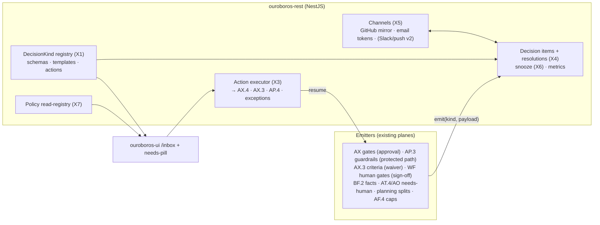
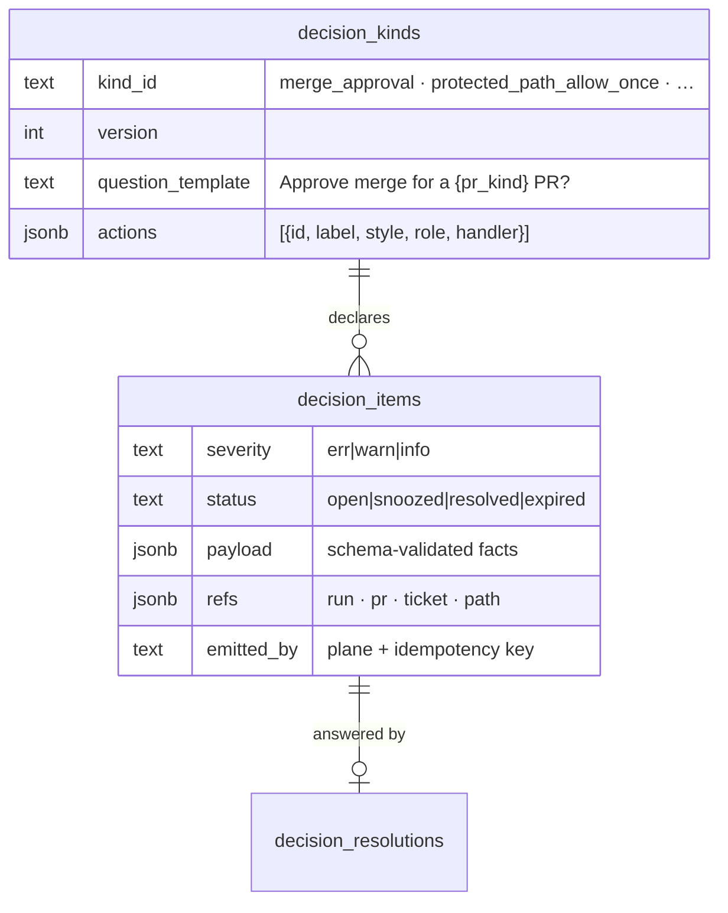
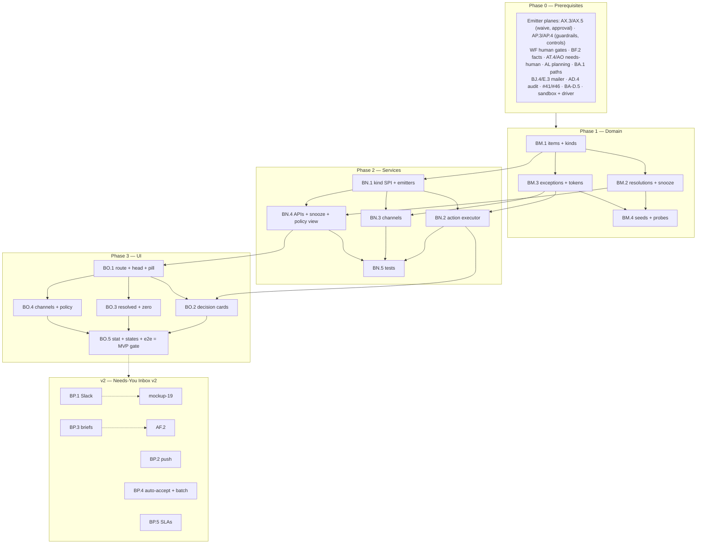

# Roadmap — Needs-You Inbox (Mockup 16)

## Description

> Create a roadmap that covers the features for the mockup page 16. Any additional
> tech infrastructure that is required to implement the functionality in these mockup
> pages should be researched and offered as options for implementing in the roadmap.
> The roamdap should include MVP and v2 options, as well as the labels, milestones,
> and the like, for the tickets to be created. Any ticket sources that are used by
> Ouroboros for ingesting should be pluggable, which includes sources like Jira,
> Linear, GitHub, GitLab, and other bug reporting/issue recording sites. Refer to the
> page so that issues can reference the mockup file when creating the UI/UX design of
> the pages. Be very specific when creating the roadmap, as the options in the
> roadmap for the functionality needs to be complete and very thorough.

## Context & Existing Work (duplicate-avoidance survey)

Surveyed 2026-08-09.

**Design source of truth for every UI ticket in this roadmap:**
[`docs/mockups/16-inbox.html`](mockups/16-inbox.html) (with
`docs/mockups/assets/ouroboros.css`) — the Needs-You inbox. Its anatomy:

- **Topbar** — the needs-pill lights up (warn border + glow) on this page.
- **Page head** — eyebrow `Needs You`, h1 `3 decisions. About 90 seconds of
  your time.`, subline: *"Everything the loops are blocked on, newest first.
  Answer here, from Slack, or from your phone — the loop resumes instantly."*
  Actions: **Snooze all 1h**, **Notification settings**.
- **Decision cards** (left-border severity err/warn, question + age, ref tags
  linking loops/PRs/issues, a `why` paragraph, action rows):
  1. **Approve merge for a refactor PR?** (err, 8m) — refs `loop #1843 · PR
     #509 · issue #465 · refactor`; why: *"Policy: anything labeled refactor
     needs a human. 14/14 checks green, verification matrix all ✓, +214 −180
     across 6 files."* Actions: **Approve & merge** (primary), Open PR
     verification →, **Return to loop with note**.
  2. **Allow a one-time edit to a protected path?** (warn, 21m) — refs `loop
     #1851 · issue #479 · boot/rollback_flag.c`; why: 3-line diff to a
     protected path. Actions: **Allow once**, View diff →, **Deny**, `Edit
     protected paths →`.
  3. **Waive a claim the bench can't verify?** (warn, 34m) — refs `PR #514 ·
     verification`; why: the thermal-chamber claim; *"Waiving annotates the PR
     publicly."* Actions: **Waive & annotate**, **Require bench upgrade**, See
     evidence →.
- **Resolved today · 5** (collapsible) — compact rows: *"Split `#490` into 6
  tickets — approved · 09:12"*, *"Estimator re-size `#486` L→M —
  **auto-accepted by policy** · 08:47"*.
- **Empty-state preview** — dashed card with the dimmed glyph: *"Inbox zero.
  The loop is turning on its own. You'll be pinged only when policy says
  so."*
- **Answer From Anywhere** card (`Chat Ops →`) — channel rows: Slack
  `#ouroboros-loops` (*approve with a button, right in the thread* · ✓
  connected), Email digest (daily · 09:00, toggle on), Mobile push (critical
  only, toggle off), GitHub (*every decision is mirrored as a PR comment* ·
  ✓).
- **What Needs A Human** card (`Edit policies →`) — rule rows: `refactor
  label → human review`, `protected paths → allow-once`, `unverifiable
  claims → explicit waiver`, `spend > $2.50/run → approval`, `effort XL+ →
  plan sign-off`; caption *"Everything else merges itself when gates are
  green."*
- **Stat card** — `This week · 11 decisions · median answer time 41s · loops
  never waited longer than 6m`.

**What this page really is:** the unification point. Nearly every prior
roadmap emitted "a human must decide" moments and noted an inbox contract:
human-approval gates (AX.5), waivers (AS.4/AY.4), guardrail/protected-path
stops (AP.3 + BA.1), fact reviews (BF.2), needs-human runs (DASH-H.2/J.2),
cap approvals (AF.4), plan sign-offs (WF human-gate stages), split/re-size
approvals (planning/intake). The new work: a **typed decision-item model with
a pluggable kind registry**, **action execution that composes the real
machinery** (including a genuine allow-once exception mechanism), **channel
delivery** (GitHub mirroring + email answer links now; Slack/push staged),
and the **policy read-registry**.

**Overlapping work and dispositions:**

| Existing work | Disposition under this roadmap |
|---|---|
| DASH-H.2 needs-you pill + DASH-J.2 feed contract ("upgrades when mockup 16 lands") | **Delivered** — the pill's count and link consume this inbox's feed; J.2's contract lands here (filing-time coordination). |
| AX.5 request-human-review + approval API; AX.3/AY.4 waive flows | **Composed** — merge-approval and claim-waiver decision kinds wrap those APIs; the waiver card's "Require bench upgrade" records a bench-gap ticket draft (planning compose). |
| AP.3 guardrails + BA.1 protected paths; AP.4 steer | **Extended** — the allow-once decision kind introduces scoped path exceptions (run+path+TTL) consumed by AP.3's evaluation (amendment); "Return to loop with note" composes AP.4. |
| BF.2 fact-review feed contract; AV.3/AT.3 quarantine notifications; AF.4 cap alerts | **Consumed** — each registers a decision kind (fact review joins as a low-severity kind; cap approval per AF.4 when it exists). |
| WF human-gate stages (`ask you`, plan sign-off), AB.1/routing vote blocks | **Consumed** — plan-sign-off and gate-stage kinds; the policy card reads these configs. |
| BJ.4 email digest + E.3 mailer | **Extended** — the inbox daily digest rides the same mailer; per-user notification prefs live here (settings surface contract with 17). |
| Mockup 19 ChatOps (Slack), AR.4 Slack steering | **Boundary** — Slack answering is v2 with 19; the channel row renders connection truth (absent until then). Mobile push is v2 (web-push option). |
| Pluggable ticket sources requirement (description boilerplate) | **Already satisfied** by WF-Q/AL.2/AX.1 — decision refs use canonical tickets/PRs; GitHub mirroring rides the SPI comment surface (GitLab mirroring follows its provider). Nothing duplicated. |
| Scaffolding #49 inbox placeholder, #56 e2e; BC.4/BG.3 "Review all →" targets | **Superseded for the inbox route**; #56 gains an inbox leg; the placeholder links across BC/BG/AY go live (amendments). |

Epic letters continue the sequence (…BI–BL): this roadmap uses **BM, BN, BO,
BP**.

## Infrastructure Options (researched — thorough, pick before filing)

### 1. Decision-item architecture

| Option | What it is | Fit | Trade-offs |
|---|---|---|---|
| **A — Typed decision items + a pluggable `DecisionKind` registry** ⭐ recommended | Each kind declares: payload schema, severity, question/why templates (data-composed, not free prose), ref shape, **actions** (id, label, style, required role, handler binding, consequence text), resolution semantics (what "answered" means + which subsystem call executes); providers register kinds the way sources/adapters/parsers do everywhere else in this codebase | The card UI renders any kind from its declaration; new subsystems add kinds without touching the inbox core (the ninth SPI in this architecture — proven pattern) | Kind schemas must be versioned (open items survive deploys) |
| B — Per-source inbox sections | Each subsystem renders its own card style | Less abstraction | The unified queue, snooze, metrics, and channels would fork per source — rejected |
| C — Generic task/todo table | One flat "task" row | Trivial | Actions become untyped links; the page's promise (answer *here*, loop resumes) dies — rejected |

### 2. Action execution & the allow-once mechanism

| Option | What it is | Fit | Trade-offs |
|---|---|---|---|
| **A — Actions bind to existing subsystem operations; allow-once = scoped guardrail exceptions** ⭐ recommended | Every button calls the machinery that already exists (AX.4 approve/merge, AX.3 waive, AP.4 steer/resume, deny→abort-or-return); the one genuinely new mechanism: `guardrail_exceptions` (run + path glob + granted-by + TTL + single-use) consumed by AP.3's allowed-path evaluation, audited, visible in the run console | "The loop resumes instantly" is composition, not new control paths (the T6/N7 discipline); exceptions are narrow, expiring, and auditable | Each kind's handler is a small adapter — the registry's cost |
| B — Inbox-owned workflow engine | The inbox executes its own state machines | Self-contained | Duplicates the control planes — rejected |

### 3. Answer channels & link security

| Option | What it is | Fit | Trade-offs |
|---|---|---|---|
| **A — GitHub mirror (SPI comments, idempotent) + email with signed single-action tokens; Slack/push staged** ⭐ recommended | GitHub: each decision mirrors as a PR/issue comment (edit-not-repost) with deep links; email digest/instant mails carry **signed, single-use, short-TTL action tokens** (per-action, per-user, revoked on resolution; sensitive kinds — merge approval — require a session confirm step after the link, the one-click-token phishing lesson) | Two real channels at MVP; token design follows current practice (unique, time-boxed, tied to request + approver, never sufficient alone for merge-class actions) | Slack buttons (mockup 19) and mobile push (web-push/PWA evaluation) are v2 — channel rows render truth until then |
| B — Full multi-channel at MVP | Everything the card shows | The mockup literally | Slack/push infrastructure doesn't exist yet — staging per the universal pattern |
| C — In-app only | No channels | Simplest | The page's core promise is answer-from-anywhere — rejected |

### 4. The policy read-registry ("what needs a human")

| Option | What it is | Fit | Trade-offs |
|---|---|---|---|
| **A — Composed read-view over the real configs** ⭐ recommended MVP | The card's rows derive from where the rules actually live: workflow policies (human gates, review-required), BA.1 protected paths, routing caps (AF.4), org policies (refactor-label rule — a new org policy row consumed by the AX gate engine, amendment), effort thresholds (plan sign-off config); each row links its editing surface (settings/17) | One truth per rule; the card can never drift from enforcement | A unified policy-authoring UI is mockup 17's scope (boundary), not this page's |
| B — A new central rule engine | All human-gate rules move here | Clean in theory | Rips enforcement out of five subsystems — rejected |

## Decisions proposed by this roadmap (validate before issue creation)

| # | Decision | Rationale |
|---|----------|-----------|
| X1 | **Decision items are typed, registry-declared, and versioned** (option 1-A): MVP kinds = `merge_approval`, `protected_path_allow_once`, `claim_waiver`, `plan_sign_off`, `fact_review`, `run_needs_human` (triage/return), `split_approval` + `resize_review` (planning/intake), `spend_approval` (registered, activates with AF.4) | Every kind's machinery exists (or is honesty-gated); the registry is how the next subsystem joins. |
| X2 | **Questions and whys are data-composed** from the item's payload (templates with typed slots — counts, paths, policy names), never free-written by the emitter | The cards must stay truthful and consistent; emitters supply facts, the kind renders prose. |
| X3 | **Actions execute the owning subsystem** (option 2-A); the new allow-once mechanism is a scoped, TTL'd, single-use guardrail exception consumed by AP.3 (amendment) and surfaced in the run console | Composition over duplication; exceptions are the narrowest possible grant. |
| X4 | **Resolution is first-class**: resolved items keep actor, action, channel, latency; `auto-accepted by policy` is a real resolution class (policy auto-resolvers — e.g., the re-size rule — recorded with the policy ref, never silent) | The resolved list and the stat card are computed truth (`median 41s`, `max wait 6m` from item spans joined to run blocking). |
| X5 | **Channels ship in truth order** (option 3-A): in-app + GitHub mirroring + email (digest + instant for err-severity) at MVP with signed action tokens (sensitive kinds require session confirm); Slack = v2 with 19; mobile push = v2 (web-push ADR); each channel row renders its real state | Answer-from-anywhere grows honestly; no fake ✓ connected. |
| X6 | **Snooze is per-item + all, TTL'd, and visible** (snoozed items dim + count separately; the pill excludes snoozed; expiry re-surfaces with age preserved) | The head button becomes mechanism with honest pill math. |
| X7 | **The policy card is a composed read-view** (option 4-A) with per-row edit links; the `refactor label → human review` rule becomes a real org policy consumed by the AX gate engine (amendment) | The card and enforcement share one source; the caption ("everything else merges itself") is the dry-run/policy truth. |
| X8 | **The head's time estimate is computed** (`~90 seconds` from per-kind median answer times), and the empty state is the real zero-state (the mockup's preview card is the actual design) | No invented ergonomics claims. |
| X9 | **Every decision and resolution is audited** (AD.4 shape) and mirrored per X5; item feeds power the pill (DASH-J.2 delivered) and the shell | One event stream, many surfaces. |
| X10 | **Labels**: new `inbox`; **Milestones**: `Needs-You Inbox MVP` / `Needs-You Inbox v2` created at filing; complexity chips XS–L | Description requires labels + milestones for the filing pass. |

## Architecture Overview



## MVP Definition

The MVP is **mockup 16 as the real decision inbox**: typed items from every
live emitter, actions that resume loops through the real machinery, two
honest channels, computed metrics. It is done when, against the compose
stack:

1. `/inbox` reproduces [`docs/mockups/16-inbox.html`](mockups/16-inbox.html)
   pixel-faithfully in **both themes**: lit needs-pill, computed head
   sentence, severity-bordered decision cards with refs/why/actions, the
   collapsible resolved list (incl. an auto-accepted row), the true empty
   state, and the three side cards (channels in truth state, composed
   policy rows, computed stat card).
2. **The kind registry runs** (X1/X2): all MVP kinds emit real items from
   their planes (seeded + live via the simulated driver); cards render
   from kind declarations; a fixture kind added in tests renders with zero
   inbox-core changes.
3. **Actions resume loops** (X3): Approve & merge executes the AX.4 path;
   Allow-once grants a scoped exception, AP.3 re-evaluates, and the run
   resumes (driver-verified); Deny and Return-with-note compose AP.4;
   Waive & annotate executes AX.3 (host annotation verified); every action
   role-gated + audited (X9).
4. **Resolution truth** (X4): resolved-today lists real resolutions with
   times; policy auto-resolutions record their policy ref; the stat card
   computes decisions/week, median answer time, and max loop wait from
   real spans.
5. **Channels are honest** (X5): GitHub mirroring posts/edits decision
   comments with deep links (sandbox verified); the email digest + instant
   err-mails carry signed single-use action tokens (sensitive kinds
   session-confirm; token revocation on resolution tested); Slack/push
   rows render their true unavailable/off states.
6. **Snooze works** (X6): per-item and all-1h with visible dimming, pill
   exclusion, and re-surface on expiry.
7. **The policy card composes** (X7): five rows derive from live configs
   (including the new refactor-label org policy enforced by the gate
   engine — cross-plane verified); edit links land on their owners.
8. Integration tests cover registry rendering, every action handler,
   exception scoping/TTL/single-use, token security (expiry, single-use,
   revocation, confirm-step), snooze math, metrics, isolation; the e2e leg
   answers all three mockup decisions end to end.

**Explicitly v2 (milestone `Needs-You Inbox v2`):** Slack answering with
mockup 19 (BP.1), mobile/web push (BP.2), LLM decision briefs (BP.3),
auto-accept policy authoring + batch answering (BP.4), SLA alerts +
escalation chains (BP.5).

## Epics, Labels & Milestones

Each epic is a parent tracking issue on GitHub; every roadmap issue below is filed as
one of its sub-issues (GitHub Relationships).

| Epic | GitHub | Status | Name | Goal | Modules | Milestone |
|------|:------:|:------:|------|------|---------|-----------|
| BM | #453 | 🟡 Open | Decision Domain | Items, kinds registry schema, resolutions, snooze, exceptions, seeds | ouroboros-db | Needs-You Inbox MVP |
| BN | #454 | 🟡 Open | Decision Services | Kind SPI + emitters, action executor, channels, policy view, metrics | ouroboros-rest | Needs-You Inbox MVP |
| BO | #455 | 🟡 Open | Inbox UI | Cards, resolved, side cards, empty state, pill wiring, e2e | ouroboros-ui | Needs-You Inbox MVP |
| BP | #456 | 🟡 Open | Answer Anywhere & Automation (v2) | Slack, push, briefs, auto-accept authoring, SLAs | all | Needs-You Inbox v2 |

Issue naming: `<project>: [<epic>.<issue>] <title>`. Labels: existing set (`mvp`,
`v2`, `rest`, `db`, `ui`, `ci`, `design`, `runs`, `pr`, `knowledge`) **plus new
`inbox`** (decision X10). Milestones **`Needs-You Inbox MVP`** / **`Needs-You
Inbox v2`** created at filing; every issue assigned. Complexity chips:
**XS · S · M · L**.

---

## Epic BM (#453) — Decision Domain (`ouroboros-db`)

| Ref | GitHub | Status | Title | Summary | Labels | Parallel | MVP | Complexity | Affected Modules |
|-----|:------:|:------:|-------|---------|--------|:--------:|:---:|:----------:|------------------|
| BM.1 | #457 | 🟡 Open | ouroboros-db: [BM.1] Decision items & kind registry schema | Typed items, versioned kind declarations, refs, severity (X1/X2) | mvp, inbox, db | N (after AO.1, AW.1, BE.2) | Y | M | ouroboros-db |
| BM.2 | #458 | 🟡 Open | ouroboros-db: [BM.2] Resolutions, snooze & metrics spans | Actor/action/channel/latency, auto-accept class, snooze TTLs (X4/X6) | mvp, inbox, db | N (after BM.1) | Y | S | ouroboros-db |
| BM.3 | #459 | 🟡 Open | ouroboros-db: [BM.3] Guardrail exceptions & action tokens | Scoped allow-once grants; signed channel-token storage (X3/X5) | mvp, inbox, db | N (after BM.1, AO.4) | Y | M | ouroboros-db |
| BM.4 | #460 | 🟡 Open | ouroboros-db: [BM.4] Inbox seeds — mockup-16 parity + probes | Three open decisions, five resolutions, policy rows; ci checks | mvp, inbox, db, ci | N (after BM.2/BM.3, #24) | Y | S | ouroboros-db, .github |

### Issue BM.1 — ouroboros-db: [BM.1] Decision items & kind registry schema

> **GitHub issue:** #457 · **Status:** 🟡 Open · **Parent epic:** #453

- **Problem Statement:** The unified queue needs typed items whose shape,
  prose, and actions come from versioned kind declarations (X1/X2).
- **Solution/Scope:** Migration: `decision_kinds` — `kind_id` (the X1 set +
  `custom:*`), `version`, `severity_default` CHECK `err|warn|info`,
  `question_template` + `why_template` (slotted, X2), `payload_schema`
  jsonb, `actions` jsonb (id/label/style/role/consequence/handler-binding),
  `resolution_semantics`; `decision_items` — org FK, kind+version,
  `payload` jsonb (schema-validated), `severity`, `status` CHECK
  `open|snoozed|resolved|expired`, `refs` jsonb (typed: run/PR/ticket/
  path — canonical, tracker-agnostic), `emitted_by` (plane + source ref,
  idempotency key — emitters can't double-file), `created_at`;
  indexes for the queue (org+status+created desc) and pill counts.
- **Acceptance Criteria:** The three mockup cards representable from kind
  declarations + payloads (template rendering fixture); idempotent
  emission; refs resolve; open items survive a kind-version bump
  (versioned render).
- **Parallelism/Dependencies:** Needs AO.1/AW.1/BE.2 (ref targets). Blocks
  BM.2–BM.4, BN.*.
- **Technical Stack:** PostgreSQL 17, Flyway.
- **Epic:** BM



### Issue BM.2 — ouroboros-db: [BM.2] Resolutions, snooze & metrics spans

> **GitHub issue:** #458 · **Status:** 🟡 Open · **Parent epic:** #453

- **Problem Statement:** Resolution truth (X4) and snooze mechanics (X6)
  need rows the resolved list, pill math, and stat card compute from.
- **Solution/Scope:** `decision_resolutions` — item FK (1:1), `action_id`,
  `resolver` CHECK `human|policy` + actor/user FK or policy ref,
  `channel` CHECK `web|email|github|slack|push|api`, `note` nullable,
  `resolved_at`, `answer_latency` (computed span), `loop_wait` (blocking
  span joined from the run's blocked interval where applicable);
  snooze columns on items (`snoozed_until`, snoozed_by, snooze audit);
  weekly-metric views (decision count, median latency, max loop wait —
  registered in BI.1's registry for the insights plane, amendment).
- **Acceptance Criteria:** The mockup's resolved rows (human + policy
  classes) representable; latency/wait math from fixtures; snooze expiry
  re-opens with original age preserved; metrics views match oracle.
- **Parallelism/Dependencies:** Needs BM.1. Feeds BN.4/BN.5, BO.3/BO.5.
- **Technical Stack:** PostgreSQL 17, Flyway.
- **Epic:** BM

```
resolution{split_approval#490, action: approve, resolver: human(Ken), channel: web,
           latency: 38s, loop_wait: 2m10s}
resolution{resize#486, resolver: policy(auto_accept_resize), channel: api} → "auto-accepted"
```

### Issue BM.3 — ouroboros-db: [BM.3] Guardrail exceptions & action tokens

> **GitHub issue:** #459 · **Status:** 🟡 Open · **Parent epic:** #453

- **Problem Statement:** Allow-once needs a real grant object (X3), and
  email answering needs signed single-use tokens with revocation (X5).
- **Solution/Scope:** `guardrail_exceptions` — org FK, run FK, `path_glob`,
  `granted_by`, `granted_via` (decision item FK), `expires_at` (TTL),
  `used_at` nullable (single-use consumption recorded by AP.3's
  evaluation — amendment), audit refs; `action_tokens` — decision item
  FK, `action_id`, `user` FK, token hash (never plaintext), `expires_at`
  (short TTL), `used_at`, `revoked_at` (auto-revoke on item resolution),
  `requires_confirm` bool (sensitive kinds per X5); constraint: one
  active token per item×action×user.
- **Acceptance Criteria:** Exception scoping enforced (run+glob, TTL,
  single-use consumption test); token uniqueness/expiry/revocation
  constraints hold; plaintext never stored (hash-only, grep test).
- **Parallelism/Dependencies:** Needs BM.1, AO.4 (guardrail linkage).
  Feeds BN.2/BN.3.
- **Technical Stack:** PostgreSQL 17, Flyway.
- **Epic:** BM

```
exception{run#1851, boot/rollback_flag.c, TTL 2h, single-use} ─▶ AP.3 consumes → used_at set
action_token{item, allow_once, ken, hash, TTL 48h, requires_confirm: false} · merge kinds: confirm ✓
```

### Issue BM.4 — ouroboros-db: [BM.4] Inbox seeds — mockup-16 parity + probes

> **GitHub issue:** #460 · **Status:** 🟡 Open · **Parent epic:** #453

- **Problem Statement:** Design review needs the mockup's exact inbox
  moment, coherent with the seeded #482/#514/#509 universe.
- **Solution/Scope:** Extend the dev seed: the three open decisions
  (merge_approval on the seeded refactor PR #509 with payload facts
  14/14 · +214/−180 · 6 files; allow-once on run #1851's protected-path
  stop; claim_waiver on PR #514's thermal criterion — reusing AW.5's
  waiver context), ages 8/21/34m relative; five resolutions today (incl.
  the split approval and the policy auto-accepted re-size), weekly
  metric shape (11 · 41s · 6m); the refactor-label org policy row;
  ci/db probes (kind/status/severity vocab, idempotency keys, token
  constraints, resolution 1:1).
- **Acceptance Criteria:** Page renders the mockup from seeds (head
  sentence computes ~90s per X8); refs resolve into the shared
  universe; probes red/green verified.
- **Parallelism/Dependencies:** Needs BM.2/BM.3 (+AW.5/AO.5 coordination).
- **Technical Stack:** Flyway repeatable migration, SQL.
- **Epic:** BM

```
seeds: 3 open (err 8m · warn 21m · warn 34m) + 5 resolved (1 policy-auto) + week{11, 41s, 6m}
```

---

## Epic BN (#454) — Decision Services (`ouroboros-rest`)

| Ref | GitHub | Status | Title | Summary | Labels | Parallel | MVP | Complexity | Affected Modules |
|-----|:------:|:------:|-------|---------|--------|:--------:|:---:|:----------:|------------------|
| BN.1 | #461 | 🟡 Open | ouroboros-rest: [BN.1] DecisionKind SPI & emitter wiring | Registry service + the eight MVP kinds wired to their planes | mvp, inbox, rest | N (after BM.1) | Y | L | ouroboros-rest |
| BN.2 | #462 | 🟡 Open | ouroboros-rest: [BN.2] Action executor & allow-once exceptions | Handler bindings to AX/AP/planning; exception grants (X3) | mvp, inbox, rest, runs, pr | N (after BN.1, BM.3) | Y | L | ouroboros-rest |
| BN.3 | #463 | 🟡 Open | ouroboros-rest: [BN.3] Channels — GitHub mirror & email tokens | Idempotent mirroring; digest + instant mails with signed tokens | mvp, inbox, rest, sources | N (after BN.1, BM.3, BJ.4) | Y | M | ouroboros-rest |
| BN.4 | #464 | 🟡 Open | ouroboros-rest: [BN.4] Inbox APIs, snooze & policy read-view | Queue/resolved/stat payloads, snooze, composed policy rows (X6/X7) | mvp, inbox, rest | N (after BN.1, BM.2) | Y | M | ouroboros-rest |
| BN.5 | #465 | 🟡 Open | ouroboros-rest: [BN.5] Inbox integration tests | Registry, handlers, exceptions, tokens, channels, metrics | mvp, inbox, rest, ci | N (after BN.2–BN.4) | Y | M | ouroboros-rest |

### Issue BN.1 — ouroboros-rest: [BN.1] DecisionKind SPI & emitter wiring

> **GitHub issue:** #461 · **Status:** 🟡 Open · **Parent epic:** #454

- **Problem Statement:** The registry (X1) and the emitters: every plane
  that blocks on a human must file a typed item exactly once.
- **Solution/Scope:** `DecisionKindRegistry` (declarations from BM.1,
  template rendering per X2, payload validation); emitter wiring per MVP
  kind: `merge_approval` (AX.5 request-review + the X7 refactor-label
  policy hook in the gate engine — amendment), `protected_path_allow_once`
  (AP.3 protected-path verdicts raise items with diff context),
  `claim_waiver` (AX.3 unverifiable-claim flow), `plan_sign_off` (WF
  human-gate stage entries), `fact_review` (BF.2 feed — info severity),
  `run_needs_human` (AO/AT.4 terminal needs-human), `split_approval` +
  `resize_review` (planning/intake events), `spend_approval` (registered;
  activates with AF.4 — honest absence); emission idempotency (plane
  keys); item lifecycle sync (source resolved elsewhere — e.g., PR merged
  directly — auto-resolves the item with `resolver: policy(source)`);
  feed endpoints for the pill (DASH-J.2 delivered).
- **Acceptance Criteria:** Each kind emits from its plane in the harness
  (driver-backed where live); double-emission no-ops; out-of-band source
  resolution closes items; a fixture kind registers without core changes;
  pill feed counts match.
- **Parallelism/Dependencies:** Needs BM.1 (+the emitter planes). Blocks
  BN.2–BN.4.
- **Technical Stack:** NestJS DI registry, plane hooks.
- **Epic:** BN

```
AP.3 verdict{protected path, run#1851} ─▶ emit(protected_path_allow_once,
  {path, diff_lines: 3, run}, key: run+path) ─▶ item (warn) · pill +1
PR#509 merged out-of-band ─▶ item auto-resolved (resolver: policy(source_resolved))
```

### Issue BN.2 — ouroboros-rest: [BN.2] Action executor & allow-once exceptions

> **GitHub issue:** #462 · **Status:** 🟡 Open · **Parent epic:** #454

- **Problem Statement:** Buttons must execute the owning machinery and
  resume the loop (X3) — with the allow-once grant as the one new
  mechanism.
- **Solution/Scope:** `POST /api/v1/inbox/items/:id/actions/:actionId`
  (+note where the action takes one): handler bindings — approve&merge →
  AX.5 approval + AX.4 flow (gate flips, merge per plan); return-with-
  note → AP.4 steer + stage retry; allow-once → BM.3 exception grant →
  AP.3 re-evaluation trigger → AP.4 resume (the run continues,
  driver-verified); deny → AP.4 return-with-reason; waive&annotate →
  AX.3 (host comment); require-bench-upgrade → planning draft compose
  (AL batch with the bench-gap context) + item resolved with the ref;
  sign-off/split/resize approvals → their plane calls; role enforcement
  per action declaration; concurrency guard (first resolution wins,
  second answer → 409 with the outcome); resolution rows (X4) + audit
  (X9) + channel echo (BN.3 updates mirrors).
- **Acceptance Criteria:** Every MVP action round-trips in the harness
  (allow-once: exception granted → AP.3 passes → run resumes — full
  driver chain); race test (two answerers → one resolution + designed
  409); role matrix; audits complete.
- **Parallelism/Dependencies:** Needs BN.1, BM.3 (+AX/AP/AL planes).
  Blocks BO.2.
- **Technical Stack:** NestJS, plane clients.
- **Epic:** BN

```
action(allow_once) ─▶ exception{run, glob, TTL, single-use} ─▶ AP.3 re-eval ✓ ─▶ AP.4 resume
action(approve_merge) ─▶ AX.5 approve ─▶ gate green ─▶ AX.4 merges (armed) ─▶ resolved{41s}
```

### Issue BN.3 — ouroboros-rest: [BN.3] Channels — GitHub mirror & email tokens

> **GitHub issue:** #463 · **Status:** 🟡 Open · **Parent epic:** #454

- **Problem Statement:** Answer-from-anywhere starts with two real
  channels (X5): host mirroring and secure email actions.
- **Solution/Scope:** **GitHub mirror**: decision items with PR/issue refs
  post an idempotent comment (question + why + deep links + status;
  edited on resolution to show the outcome + actor — the "every decision
  is mirrored" row made real via the SPI comment surface); **email**:
  daily digest (BJ.4 pipeline: open decisions + resolved summary,
  per-user prefs + time) and instant sends for err-severity; mails carry
  BM.3 signed tokens per action (GET → confirm page rendering the card;
  sensitive kinds require an authenticated session confirm — the
  phishing-hardening rule; non-sensitive one-click with immediate
  receipt); token lifecycle (single-use, TTL, revoke-on-resolution);
  notification preferences model (per-user: digest on/time, instant
  threshold, per-kind mutes — the settings contract with 17); channel
  rows payload (truth states: Slack absent until 19, push off until
  BP.2).
- **Acceptance Criteria:** Mirror comment posts + edits on resolution
  (sandbox); digest + instant mails in mailpit with working token links
  (expired/used/revoked paths render designed errors; merge-class link
  → session confirm); prefs round-trip; channel truth states verified.
- **Parallelism/Dependencies:** Needs BN.1, BM.3, BJ.4 mailer path.
- **Technical Stack:** SPI comments, mailer, signed tokens (HMAC).
- **Epic:** BN

```
item ─▶ PR#509 comment "⚠ Needs you: approve merge… [Answer →]" ─edit on resolve─▶ "✓ approved by Ken"
email [Allow once] link ─▶ token ✓ ─▶ receipt · [Approve & merge] link ─▶ session confirm ─▶ done
```

### Issue BN.4 — ouroboros-rest: [BN.4] Inbox APIs, snooze & policy read-view

> **GitHub issue:** #464 · **Status:** 🟡 Open · **Parent epic:** #454

- **Problem Statement:** The page's reads (queue, resolved, stats, head
  math), snooze mechanics, and the composed policy card.
- **Solution/Scope:** `GET /api/v1/inbox` (open items newest-first with
  rendered prose + actions per role, snoozed section, computed head
  data — count + X8 time estimate from per-kind medians), `GET
  /resolved?day=` (rows with resolver class), `GET /stats` (BM.2 views:
  week count, median latency, max wait), snooze APIs (item + all, TTL,
  un-snooze; pill exclusion), **policy read-view** (X7): composed rows
  from workflow policies, BA.1 paths, the refactor org policy, cap
  config, effort thresholds — each with source + edit-surface link;
  the caption's "everything else merges itself" derived from dry-run/
  policy state (BA.3 aware); pill feed (count excludes snoozed;
  DASH-H.2 amendment verified); OpenAPI complete.
- **Acceptance Criteria:** Seeded payloads reproduce the mockup incl.
  the computed ~90s; snooze math + pill exclusion verified; policy rows
  derive live (flipping dry-run changes the caption truthfully); stats
  match views.
- **Parallelism/Dependencies:** Needs BN.1, BM.2. Feeds BO.*.
- **Technical Stack:** NestJS, Kysely.
- **Epic:** BN

```
GET /inbox ─▶ {head: {3, ~90s}, items[3]{prose, refs, actions(role)}, snoozed[]}
policy rows: refactor→human (org policy) · protected→allow-once (BA.1) · … each [edit →]
```

### Issue BN.5 — ouroboros-rest: [BN.5] Inbox integration tests

> **GitHub issue:** #465 · **Status:** 🟡 Open · **Parent epic:** #454

- **Problem Statement:** The inbox touches every plane; its correctness
  core is handlers, races, and token security.
- **Solution/Scope:** Harness suites: registry rendering matrix, emitter
  idempotency + out-of-band resolution, every action handler (driver-
  backed chains), resolution races, exception scope/TTL/single-use,
  token security matrix (expiry/reuse/revocation/confirm-gating/
  cross-user), mirror idempotency, digest/instant content, snooze/pill
  math, policy-row derivation, metrics, isolation.
- **Acceptance Criteria:** Green in `ci/rest`; removing the confirm gate
  or the single-use check turns tests red; ≤ 100s added.
- **Parallelism/Dependencies:** Needs BN.2–BN.4.
- **Technical Stack:** Jest, Testcontainers.
- **Epic:** BN

```
suites: kinds ✓ · emitters ✓ · handlers ✓ · races ✓ · exceptions ✓ · tokens ✓ · channels ✓
```

---

## Epic BO (#455) — Inbox UI (`ouroboros-ui`)

Every issue references [`docs/mockups/16-inbox.html`](mockups/16-inbox.html)
as the design source — decision-card/resolved/chan/rule treatments, the lit
needs-pill, the zero-card — via the #16 tokens (both themes; the mockup is
dark-only).

| Ref | GitHub | Status | Title | Summary | Labels | Parallel | MVP | Complexity | Affected Modules |
|-----|:------:|:------:|-------|---------|--------|:--------:|:---:|:----------:|------------------|
| BO.1 | #466 | 🟡 Open | ouroboros-ui: [BO.1] Inbox route, head & pill wiring | `/inbox`, computed head, snooze-all, lit pill states | mvp, inbox, ui, design | N (after #41, BN.4, BA-D.5) | Y | S | ouroboros-ui |
| BO.2 | #467 | 🟡 Open | ouroboros-ui: [BO.2] Decision cards | Kind-templated cards: severity, refs, why, action rows | mvp, inbox, ui, design | N (after BO.1, BN.2) | Y | L | ouroboros-ui |
| BO.3 | #468 | 🟡 Open | ouroboros-ui: [BO.3] Resolved list & empty state | Collapsible resolved rows, auto-accept class, the zero card | mvp, inbox, ui, design | N (after BO.1) | Y | S | ouroboros-ui |
| BO.4 | #469 | 🟡 Open | ouroboros-ui: [BO.4] Channels & policy cards | Truth-state channel rows + prefs; composed policy rows | mvp, inbox, ui, design | N (after BO.1, BN.3/BN.4) | Y | M | ouroboros-ui |
| BO.5 | #470 | 🟡 Open | ouroboros-ui: [BO.5] Stat card, states & e2e leg | Computed weekly stat; snoozed/error states; full e2e | mvp, inbox, ui, ci | N (after BO.2–BO.4) | Y | M | ouroboros-ui, .github |

### Issue BO.1 — ouroboros-ui: [BO.1] Inbox route, head & pill wiring

> **GitHub issue:** #466 · **Status:** 🟡 Open · **Parent epic:** #455

- **Problem Statement:** The frame: computed head sentence, snooze-all,
  and the shell pill lighting up on-page with truthful counts.
- **Solution/Scope:** `/inbox`: head (count + X8 time estimate composed
  with pluralization; zero-state variant swaps the sentence), **Snooze
  all 1h** (confirm → BN.4; disabled at zero), **Notification settings**
  → the prefs surface (BO.4 sheet + 17 contract); needs-pill amendments:
  lit treatment on this route (the mockup's warn glow), count excludes
  snoozed (H.2 amendment), navigates here (placeholder retirements
  across BC.4/BG.3/AY surfaces); polling via I.8.
- **Acceptance Criteria:** Head computes from seeds (`3 decisions · ~90
  seconds`); pill lit + accurate; snooze-all round-trips; inbound links
  land (amendments verified); both themes.
- **Parallelism/Dependencies:** Needs #41, BN.4, BA-D.5. Blocks BO.2–BO.5.
- **Technical Stack:** Next.js, #46 primitives, I.8 poll family.
- **Epic:** BO

```
[Needs You] 3 decisions. About 90 seconds of your time.   [Snooze all 1h][Notification settings]
topbar: [● Needs you · 3] ← lit (warn glow) on this page · excludes snoozed
```

### Issue BO.2 — ouroboros-ui: [BO.2] Decision cards

> **GitHub issue:** #467 · **Status:** 🟡 Open · **Parent epic:** #455

- **Problem Statement:** The heart of the page: severity-bordered cards
  rendered entirely from kind declarations — question, age, refs, why,
  and working action rows.
- **Solution/Scope:** `DecisionCard` (kind-generic per X1): severity
  left-border + dot, question (template-rendered), live age, ref tags
  (typed links: run console, PR verification, intake, path chip),
  why paragraph (template + payload facts, mono spans), action row from
  declarations (primary/ghost styles, role-gating hides or disables
  with reason, consequence confirms for destructive/public actions —
  "waiving annotates the PR publicly" as the confirm body,
  note-taking actions open an inline note field), in-flight/optimistic
  states (`answering… → resolved` with the receipt: what executed,
  links), race handling (409 → "answered by Priya 10s ago" state),
  per-item snooze affordance; the three mockup kinds pixel-matched;
  fixture-kind render test (registry generality proof).
- **Acceptance Criteria:** Seeded cards match the mockup exactly (both
  themes); all actions round-trip in e2e (allow-once resumes the driver
  run; approve merges the sandbox PR; waive annotates); race state
  renders; keyboard/a11y complete (cards focusable, actions labeled).
- **Parallelism/Dependencies:** Needs BO.1, BN.2.
- **Technical Stack:** React, #46 primitives.
- **Epic:** BO

```
▌⚠ Allow a one-time edit to a protected path?                    21m
▌ [loop #1851][issue #479][boot/rollback_flag.c]
▌ "The OTA rollback fix wants to add one line to boot/rollback_flag.c…"
▌ [Allow once] [View diff →] [Deny] Edit protected paths →
   └ answering… ─▶ ✓ exception granted · loop resumed (run console →)
```

### Issue BO.3 — ouroboros-ui: [BO.3] Resolved list & empty state

> **GitHub issue:** #468 · **Status:** 🟡 Open · **Parent epic:** #455

- **Problem Statement:** The collapsible resolved-today list (with the
  policy auto-accept class rendered distinctly) and the true zero
  state.
- **Solution/Scope:** Resolved section (collapsible header with count,
  compact rows: tick, composed summary, resolver affix — `approved` vs
  `auto-accepted by policy` with the policy-ref tooltip, mono time;
  day pager for history), the zero card (dimmed glyph — the #14 asset
  with true transparency replacing the mockup's blend-mode, the two
  lines verbatim) shown as the real empty state (X8) and *not*
  previewed below content when items exist (the mockup shows both for
  demonstration; the live page shows one — noted design decision).
- **Acceptance Criteria:** Seeded rows match; auto-accept tooltip shows
  the policy; zero state renders when all items resolve in e2e;
  collapse persists; both themes.
- **Parallelism/Dependencies:** Needs BO.1.
- **Technical Stack:** React, #46 primitives.
- **Epic:** BO

```
▾ Resolved today · 5
✓ Split #490 into 6 tickets — approved            09:12
✓ Estimator re-size #486 L→M — auto-accepted ⓘ    08:47
(zero) ◎ "Inbox zero. The loop is turning on its own."
```

### Issue BO.4 — ouroboros-ui: [BO.4] Channels & policy cards

> **GitHub issue:** #469 · **Status:** 🟡 Open · **Parent epic:** #455

- **Problem Statement:** The side cards: channel rows in truth state
  with working prefs, and the composed policy read-view.
- **Solution/Scope:** **Channels card**: rows per BN.3's payload — Slack
  (absent/`arrives with Chat Ops` until 19; connected state + channel
  name after), Email digest (toggle + time editor → prefs), Mobile
  push (off + `arrives later` until BP.2), GitHub mirror (✓ from real
  mirroring config; row explains the comment behavior); `Chat Ops →`
  honest-soon link; prefs sheet (digest time, instant threshold,
  per-kind mutes); **policy card**: BN.4's composed rows (mono
  rule → outcome, source tooltip, per-row edit link to the owning
  surface), the derived caption (dry-run-aware phrasing), `Edit
  policies →` to settings.
- **Acceptance Criteria:** Truth states verified (self-hosted default:
  Slack absent, push off); prefs round-trip (digest time change →
  next send honors it in test); policy rows derive live; both themes.
- **Parallelism/Dependencies:** Needs BO.1, BN.3/BN.4.
- **Technical Stack:** React, #46 primitives.
- **Epic:** BO

```
ANSWER FROM ANYWHERE   Slack — arrives with Chat Ops · Email digest [on · 09:00 ▾]
Mobile push — arrives later · GitHub — ✓ mirrored as PR comments
WHAT NEEDS A HUMAN   refactor label → human review ⓘ [edit →] … (5 rows, live-derived)
```

### Issue BO.5 — ouroboros-ui: [BO.5] Stat card, states & e2e leg

> **GitHub issue:** #470 · **Status:** 🟡 Open · **Parent epic:** #455

- **Problem Statement:** The computed weekly stat, snoozed/error states,
  and the full answer-everything e2e.
- **Solution/Scope:** Stat card (BM.2 views: count, median latency, max
  wait — em-dashes on cold orgs), snoozed section (dimmed items +
  un-snooze + expiry countdown), error/lag states (DASH-I.7 pattern),
  member-role variants (actions gated per declaration), skeletons; e2e
  (extends #56): seeded parity (all cards, both themes) → answer all
  three (approve→sandbox merge verified; allow-once→driver run
  resumes; waive→host annotation) → resolved rows appear → zero state
  renders → pill drops to 0; snooze leg (item dims, pill excludes,
  expiry re-surfaces); email leg (digest in mailpit, token link
  answers a low-severity item, merge-class link demands session
  confirm); race leg (concurrent answer → 409 state).
- **Acceptance Criteria:** All states themed; e2e green from cold
  compose; each leg fails meaningfully when its layer breaks; ≤ 3 min
  added.
- **Parallelism/Dependencies:** Needs BO.2–BO.4, BM.4; amends #56.
- **Technical Stack:** React, Playwright.
- **Epic:** BO

```
e2e: parity ✓ · approve→merge ✓ · allow-once→resume ✓ · waive→annotate ✓ ·
     zero-state ✓ · snooze ✓ · email tokens ✓ · race ✓
```

---

## Epic BP (#456) — Answer Anywhere & Automation (v2 · milestone `Needs-You Inbox v2`)

| Ref | GitHub | Status | Title | Summary | Labels | Parallel | MVP | Complexity | Affected Modules |
|-----|:------:|:------:|-------|---------|--------|:--------:|:---:|:----------:|------------------|
| BP.1 | #471 | 🟡 Open | ouroboros-rest: [BP.1] Slack answering | Decision threads with action buttons via mockup 19's integration | v2, inbox, rest | N (after BN.1, mockup-19) | N | L | ouroboros-rest |
| BP.2 | #472 | 🟡 Open | ouroboros-ui: [BP.2] Mobile & web push | Web-push/PWA ADR + critical-only pushes with deep links | v2, inbox, ui, rest | N (after BN.3) | N | M | ouroboros-ui, ouroboros-rest |
| BP.3 | #473 | 🟡 Open | ouroboros-engine: [BP.3] Decision briefs | LLM-composed context summaries on cards, provenance-labeled | v2, inbox, engine | N (after BN.1, AF.2) | N | M | ouroboros-engine, ouroboros-rest |
| BP.4 | #474 | 🟡 Open | ouroboros-rest: [BP.4] Auto-accept policy authoring & batch answers | User-authored auto-resolvers + multi-select answering | v2, inbox, rest, ui | N (after BN.2, BN.4) | N | M | ouroboros-rest, ouroboros-ui |
| BP.5 | #475 | 🟡 Open | ouroboros-rest: [BP.5] SLA alerts & escalation chains | Wait thresholds → escalating notifications → delegates | v2, inbox, rest | N (after BN.3, BM.2) | N | M | ouroboros-rest |

### Issue BP.1 — ouroboros-rest: [BP.1] Slack answering

> **GitHub issue:** #471 · **Status:** 🟡 Open · **Parent epic:** #456

- **Problem Statement:** "Approve with a button, right in the thread" —
  the channel card's Slack row goes live with mockup 19's integration.
- **Solution/Scope:** With 19: decision items post to the configured
  channel as Block Kit messages (question/why/refs/action buttons),
  button interactions map to BN.2 handlers (Slack identity → user
  mapping, permission-checked; sensitive kinds deep-link to the
  session-confirm page per X5's rule), resolution edits the message
  (outcome + actor), thread continuity with AR.4's run threads;
  channel row flips to connected truth.
- **Acceptance Criteria:** Test-workspace round-trip (button → resolved
  → message edited); identity/permission mapping enforced;
  merge-class buttons confirm-gated; mirrors stay consistent.
- **Parallelism/Dependencies:** Needs BN.1/BN.2, mockup-19 roadmap.
- **Technical Stack:** Slack Block Kit + interactions via 19.
- **Epic:** BP

### Issue BP.2 — ouroboros-ui: [BP.2] Mobile & web push

> **GitHub issue:** #472 · **Status:** 🟡 Open · **Parent epic:** #456

- **Problem Statement:** "From your phone" needs a push channel — with
  an honest platform decision (web push/PWA vs native).
- **Solution/Scope:** ADR (web-push + PWA install vs native wrappers;
  self-hosted constraints — VAPID keys per deployment), implementation
  per ADR: subscription management in prefs, critical-only default
  (err severity), pushes carry deep links (session-gated actions —
  no one-tap merges), delivery/read receipts; the channel row goes
  live.
- **Acceptance Criteria:** Push received on a test device for an err
  item; deep link lands on the card; critical-only threshold honored;
  ADR merged.
- **Parallelism/Dependencies:** Needs BN.3 prefs.
- **Technical Stack:** Web Push (VAPID), service worker.
- **Epic:** BP

### Issue BP.3 — ouroboros-engine: [BP.3] Decision briefs

> **GitHub issue:** #473 · **Status:** 🟡 Open · **Parent epic:** #456

- **Problem Statement:** Cards show facts; a busy owner wants the
  30-second brief — LLM-composed context with provenance.
- **Solution/Scope:** `/v0/brief-decision` over AF.2: item payload +
  linked context (run transcript tail, PR evidence, criteria) →
  a labeled `AI brief` paragraph (cited refs, no new claims),
  rendered collapsed on cards; per-kind enablement; cost accounting;
  the X2 fact-composed prose remains primary (briefs augment, never
  replace).
- **Acceptance Criteria:** Seeded item yields a cited brief; label +
  provenance verified; disabled kinds render without; facts-first
  layout preserved.
- **Parallelism/Dependencies:** Needs BN.1, AF.2.
- **Technical Stack:** FastAPI, structured output.
- **Epic:** BP

### Issue BP.4 — ouroboros-rest: [BP.4] Auto-accept policy authoring & batch answers

> **GitHub issue:** #474 · **Status:** 🟡 Open · **Parent epic:** #456

- **Problem Statement:** The resolved list's `auto-accepted by policy`
  class deserves user authoring (which decisions self-resolve), plus
  batch answering for repetitive kinds.
- **Solution/Scope:** Auto-resolver authoring (per kind: condition
  builder over payload fields — e.g., resize within one band →
  auto-accept; scoped, audited, kill-switch; every auto-resolution
  records its rule per X4), batch answering (multi-select same-kind
  items → one action with per-item results), policy-card integration
  (authored rules join the read-view).
- **Acceptance Criteria:** Authored rule auto-resolves matching items
  with recorded provenance; kill-switch immediate; batch partial
  results designed; nothing sensitive auto-resolvable (merge-class
  excluded by design).
- **Parallelism/Dependencies:** Needs BN.2, BN.4.
- **Technical Stack:** NestJS, condition builder.
- **Epic:** BP

### Issue BP.5 — ouroboros-rest: [BP.5] SLA alerts & escalation chains

> **GitHub issue:** #475 · **Status:** 🟡 Open · **Parent epic:** #456

- **Problem Statement:** "Loops never waited longer than 6m" is an
  outcome to *protect*: wait thresholds, escalating notifications,
  and delegates.
- **Solution/Scope:** Per-kind SLA config (warn/critical wait
  thresholds), escalation chains (notify → re-notify via stronger
  channel → delegate user/role), out-of-office delegation, SLA
  breach metrics joining the BI registry; escalations audited.
- **Acceptance Criteria:** Threshold breach escalates per chain in
  test; delegation answers with correct attribution; metrics
  register.
- **Parallelism/Dependencies:** Needs BN.3, BM.2.
- **Technical Stack:** NestJS scheduler.
- **Epic:** BP

---

## Work Order (dependency-ordered execution plan)



Ordered checklist (⊕ = parallelizable within its phase):

1. **Phase 0 — Prerequisites:** AX.3 (#359)/AX.5 (#361)/AX.4 (#360)/AX.2
   (#358), AP.3 (#305)/AP.4 (#306)/AP.5 (#307), WF gates (#133/#145), BF.2
   (#411), AT.4 (#332)/AO (#298–#302), AL.4 (#280), BA.1 (#380)/BA.3
   (#382), BJ.4 (#440) + E.3 mailer, AD.4 (#225), #41/#46/#16/#87,
   BA-D.5 (**BetterAuth roadmap not yet filed**), driver + PR sandbox.
2. **Phase 1 — Domain:** BM.1 (#457) → { BM.2 (#458) ⊕ BM.3 (#459) } → BM.4 (#460)
3. **Phase 2 — Services:** BN.1 (#461) → { BN.2 (#462) ⊕ BN.3 (#463) ⊕ BN.4 (#464) } → BN.5 (#465)
4. **Phase 3 — UI:** BO.1 (#466) → { BO.2 (#467) ⊕ BO.3 (#468) ⊕ BO.4 (#469) } → **BO.5 (#470) ✅**
   *(MVP gate, amending #56)*
5. **v2:** BP.1 (#471) with mockup 19; BP.3 (#473) with AF.2 (#235);
   BP.2 (#472)/BP.4 (#474)/BP.5 (#475) after their dependencies.

## Totals

| | Epic | Issues | MVP | v2 |
|---|:---:|:---:|:---:|:---:|
| Epic BM — Decision Domain | #453 | 4 | 4 | 0 |
| Epic BN — Decision Services | #454 | 5 | 5 | 0 |
| Epic BO — Inbox UI | #455 | 5 | 5 | 0 |
| Epic BP — Answer Anywhere & Automation | #456 | 5 | 0 | 5 |
| **Total** | **4 epics** | **19** | **14** | **5** |

Issues **#457–#475**, filed 2026-08-09 as sub-issues of their epics, with the
new `inbox` label and the `Needs-You Inbox MVP` / `Needs-You Inbox v2`
milestones.

Amendments posted at filing:

| Amended | Comment |
|---|---|
| DASH-H.2 (#78) | the pill's count comes from the decision-item feed (#461/#464) and **excludes snoozed items**; the pill navigates to `/inbox` |
| DASH-J.2 (#90) | the needs-you routing contract is **delivered** — typed items, per-plane idempotency, out-of-band auto-resolution |
| AP.3 (#305) | guardrail evaluation consults and **consumes** scoped single-use exceptions (#459), and emits `protected_path_allow_once` items keyed on run+path |
| AX.2 gate engine (#358) | the `refactor label → human review` org policy becomes real, is named in the card's `why`, and derives into the policy read-view |
| BI.1 (#432) | decision metrics (count, median answer latency, max loop wait, auto-accept share, per-kind medians) join the methodology registry |
| BF.2 (#411) | `fact_review` is a registered decision kind at `info` severity, auto-resolving when the fact is reviewed elsewhere |
| BC.4 (#393), BG.3 (#419), AY.4 (#366) | the "review it in your inbox" links go live and deep-link to the item |
| #49 | `/inbox` stub retired by BO.1 (#466) |
| #56 | inbox e2e leg — answer all three decisions, verify merge/resume/annotate, plus snooze, email-token and race legs (BO.5, #470) |

## References

- Design source: [`docs/mockups/16-inbox.html`](mockups/16-inbox.html),
  `docs/mockups/assets/ouroboros.css`; adjacent mockups 10/12/17/19
- Upstream roadmaps: scaffolding (filed); all prior mockup roadmaps
  (validation gates — this page unifies their human-gate contracts)
- Action-link security research:
  [one-click approval link patterns (unique, time-boxed tokens)](https://docs.gravityflow.io/one-click-approval-links/) ·
  [actionable-message security requirements (sender verification, signed cards)](https://learn.microsoft.com/en-us/outlook/actionable-messages/security-requirements) ·
  [token-based email approval design](https://numinolabs.com/technology-insights/email-approval-in-workflow/) ·
  [AiTM/link-phishing lessons — why merge-class actions require session confirm](https://www.microsoft.com/en-us/security/blog/2026/05/04/breaking-the-code-multi-stage-code-of-conduct-phishing-campaign-leads-to-aitm-token-compromise/)

## UI/UX Shell Compliance (addendum 2026-08-09)

The application shell defined in
[`docs/DESIGN_SYSTEM_APP_SHELL.md`](DESIGN_SYSTEM_APP_SHELL.md) (implementing
roadmap: [`ROADMAP_UIUX_APP_SHELL.md`](ROADMAP_UIUX_APP_SHELL.md)) supersedes
the mockup's top-bar navigation chrome for every UI issue in this roadmap:

1. **Header** — application name/brand upper-left (with the tenant chip),
   profile & session controls upper-right; no navigation links in the header.
2. **Sidebar navigation** — fixed left rail of icon + name entries
   (registry-driven); this surface is reached via the **Needs You** entry,
   which sits in the secondary (bottom) group of the rail.
3. **Content-only scrolling** — the content pane is the sole scroll
   container; header and sidebar never scroll; wide content scrolls inside
   its own wrappers, never the pane.
4. **Type scale** — all type and spacing rem-based against the #16 tokens so
   the five-step font-size preference (App Shell CQ.2) scales every surface;
   no hard-coded px text (lint-enforced by CQ.1).
5. **Mockup interpretation** —
   [`docs/mockups/16-inbox.html`](mockups/16-inbox.html) remains the design
   source for page content and card anatomy; its `.topbar`/`.nav` chrome is
   superseded by the shell spec.

Issue-level impact:

| Issue | Amendment |
|---|---|
| BO.1 (#466) | Mounts in the shell content pane; navigation via the sidebar **Needs You** entry (CP.2 registry), not a topbar link; the sidebar entry's live count badge is fed by this roadmap's inbox counts via the CP.2 badge slot; in-page subnavs via the CP.4 PageSubnav primitive (sticky within the pane scroll) |
| BO.2–BO.4 (#467–#469), BP.2 (#472) | rem-based type (CQ.1 tokens); sticky elements stick within the content pane (CP.4); component/state/a11y standards per spec §3 |
| BO.5 (#470) | Gains shell assertions: header/sidebar fixed while this page scrolls, correct sidebar active state, and a font-scale (125%) render check |

## Next Step

**Filed 2026-08-09.** The `inbox` label and the `Needs-You Inbox MVP` /
`Needs-You Inbox v2` milestones were created; the four epics (#453–#456) and
nineteen issues (#457–#475) are on GitHub with parent relationships,
milestones, labels and types set, and the amendment comments above are
posted.

Execution starts at **BM.1 (#457)** — the kind registry and item schema block
everything else. The critical path to the MVP gate is
#457 → #461 → #464 → #466 → #467 → **#470**.

Two dependencies remain unfiled and are called out in the issues that need
them: **BA-D.5** (role gating — the BetterAuth roadmap) and the **mockup-19
ChatOps roadmap** (BP.1's Slack integration). Neither blocks the MVP; the
channel card renders Slack's absence honestly until 19 lands.
