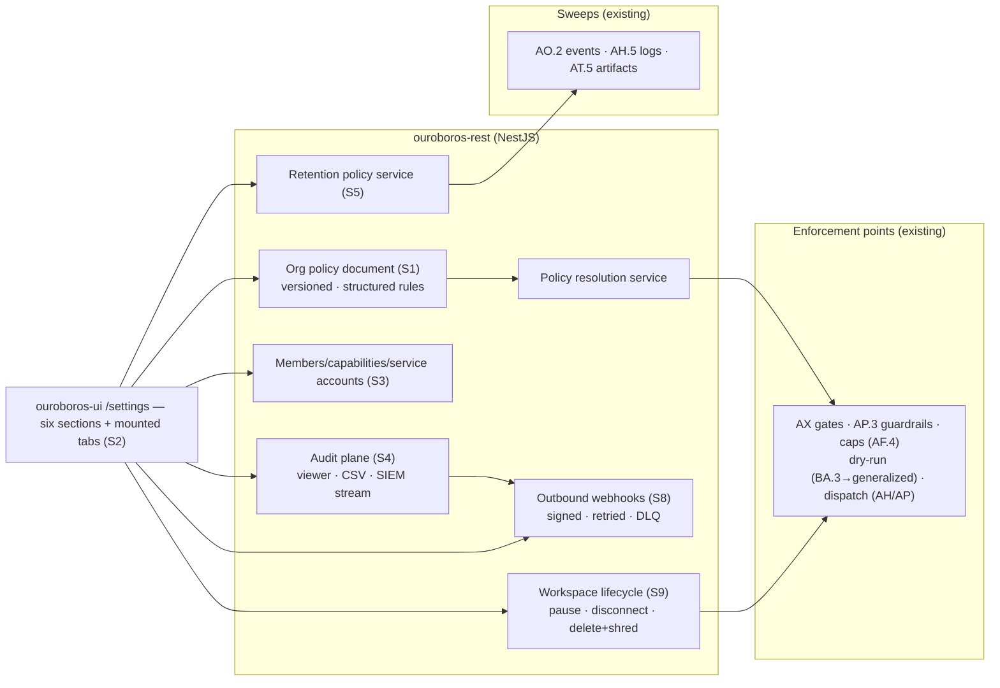
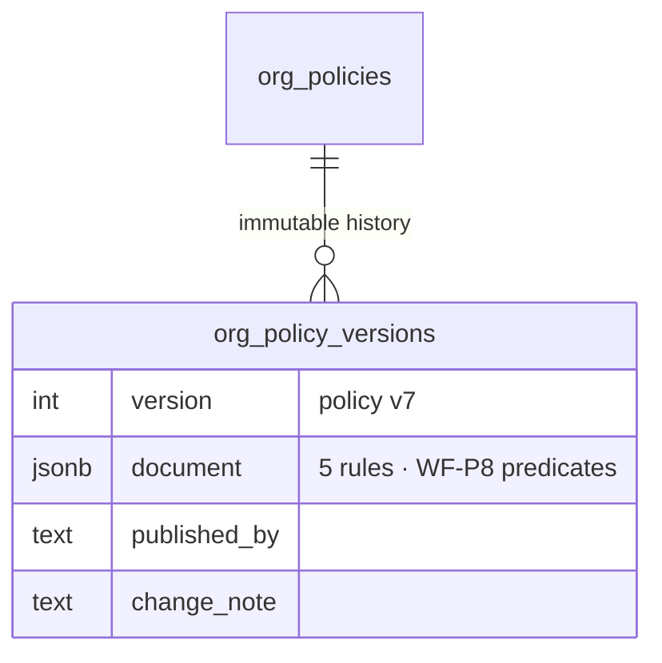
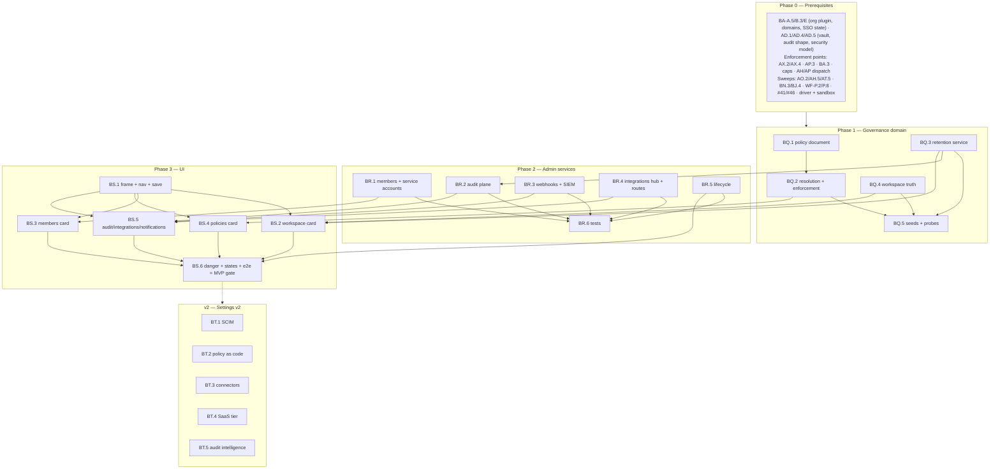

# Roadmap — Workspace Settings (Mockup 17)

## Description

> Create a roadmap that covers the features for the mockup page 17. Any additional
> tech infrastructure that is required to implement the functionality in these mockup
> pages should be researched and offered as options for implementing in the roadmap.
> The roamdap should include MVP and v2 options, as well as the labels, milestones,
> and the like, for the tickets to be created. Any ticket sources that are used by
> Ouroboros for ingesting should be pluggable, which includes sources like Jira,
> Linear, GitHub, GitLab, and other bug reporting/issue recording sites. Refer to the
> page so that issues can reference the mockup file when creating the UI/UX design of
> the pages. Be very specific when creating the roadmap, as the options in the
> roadmap for the functionality needs to be complete and very thorough.

## Context & Existing Work (duplicate-avoidance survey)

Surveyed 2026-08-09.

**Design source of truth for every UI ticket in this roadmap:**
[`docs/mockups/17-settings.html`](mockups/17-settings.html) (with
`docs/mockups/assets/ouroboros.css`) — Workspace Settings. Its anatomy:

- **Page head** — eyebrow `Settings · acme-robotics`, h1 `Workspace settings`,
  subline *"Who can do what, what merges on its own, and where the record
  lives."* Actions: **Export audit CSV**, **Save changes** (primary).
- **Section nav** (accent-underline tabs) — Workspace · Members · Policies ·
  Integrations · Audit · Danger zone.
- **Workspace card** (`c-5`) — name (`acme-robotics`), tenant domain
  (`acme.ouroboros.dev` + `SSO enforced` tag), data region select (`EU-West
  (Frankfurt)`), data retention select (`30 days` — *transcripts, logs,
  artifacts*), a **locked switch** *"Allow Ouroboros to train on this tenant's
  data — off, locked by enterprise plan."*
- **Members & Roles card** (`c-7`, `+ Invite member`) — table (avatar+name
  with `you` tag, Role `Owner|Maintainer|Viewer|Service`, **Can approve
  loops** ✓/—, Last active), a `devops-bot` **service account** row, a
  dimmed **pending invite** row (`priya@acme.dev · invited 2h ago · Resend`);
  footer *"Roles sync from Okta group `ouroboros-*` nightly ✓ · Owner >
  Maintainer (approve/merge) > Viewer (read-only)."*
- **Autonomy Policies card** (`c-7`, tag `policy v7`) — switch rows with
  structured **terms** chips: *Auto-merge when all gates green* (`effort ≤ M`,
  `non-refactor`), *Human review required* (`label:refactor`, `OR effort ≥
  L`), *Protected paths need allow-once* (`boot/`, `keys/`, `.github/`),
  *Spend guard* (`pause loop at $2.50/run`, `monthly cap $600/provider`),
  *Dry-run mode for new repos* (`first 10 loops open draft PRs`); footer
  *"Policies are versioned — changes appear in the audit log."* + **Edit as
  code →**.
- **Audit Log card** (`c-5`, `today`) — mono rows (`14:31 ouroboros-app[bot]
  pushed PR #514 rev 2`, `14:12 Ken rotated Anthropic API key`, `13:48 Ken
  enabled auto-merge (policy v7)`, `13:22 Maya approved waiver on PR #509`,
  `12:04 system runner forge-03 marked offline`); footer `retained 400d`,
  **Stream to SIEM ✓ (webhook)**, **Export CSV**.
- **Integrations card** (`c-7`, `4 connected`) — grid tiles: GitHub
  (`connected · app v2.4`), Slack (`#ouroboros-loops`), Jira (`ACME
  workspace`), Linear (off · Connect), MS Teams (off), **Webhooks (`2
  active`)**, Datadog (off), PagerDuty (off).
- **Notifications card** (`c-5`) — org-level switch rows: *Needs-you
  decisions → Slack DM*, *Daily digest 09:00 → email*, *Loop failures →
  PagerDuty* (**locked: connect PagerDuty first**), *Weekly insights report →
  #eng-leads*.
- **Danger zone** (`c-12`, err styling) — *Pause all loops* (switch;
  *"queued issues stay queued; running loops finish their stage"*),
  *Disconnect GitHub App* (*"open PRs remain, loops stop"*), *Delete
  workspace* (*"type the workspace name to confirm · 30-day recovery
  window"*).

**What this page really is:** the administration hub — and the *authoring*
side of contracts many roadmaps deferred here: the inbox's policy read-view
(X7 "edit links land on their owners"), scattered retention knobs
(AO.2/AH.5/AT.5/AD.4), BA.3's dry-run boolean (generalized to
first-N-loops-per-repo), the audit trail every plane already emits (AD.4
shape / #26), notification prefs (BN.3's settings contract), and connection
statuses from every provider family. The genuinely new work: the **unified
versioned policy document**, **service accounts**, **outbound webhooks**,
the **retention policy service**, and **workspace lifecycle** (pause-all /
disconnect / delete-with-recovery).

**Overlapping work and dispositions:**

| Existing work | Disposition under this roadmap |
|---|---|
| Inbox X7 policy read-view (+ the refactor-label org policy), BA.3 dry-run plane, AF.4 caps, BA.1 protected paths, WF policies | **Unified** — BQ.1's versioned policy document becomes the single authoring source; enforcement points (AX gate engine, AP.3, routing/provider caps, dry-run) read it (amendments); BA.3's boolean generalizes to the per-repo first-N rule; the inbox card reads the same document (one truth). |
| Scaffolding #26 audit log (v2) + AD.4 audit shape (adopted by ~10 roadmaps) | **Delivered** — #26's scope lands here: the viewer, retention, CSV export, SIEM webhook streaming (filing-time coordination; AD.4's shape is the schema). |
| BA roadmap (org plugin roles owner/admin/member/viewer, invitations A.5/E.3, SSO E.1/E.2, step-up) | **Composed & extended** — the members card surfaces org-plugin truth; role display maps (`admin→Maintainer`, `member/viewer→Viewer` per decision S3); **can-approve-loops** is a new per-member capability; service accounts are new; Okta group sync is v2 (SCIM, BT.1) with the footer line honesty-gated. |
| AD.1 vault (DEK-per-tenant), AD.4/AD.5 | **Consumed** — delete-workspace's recovery window ends in crypto-shredding (DEK destruction); the training-data switch follows AD.5's truth-in-claims rule. |
| Retention knobs: AO.2 events, AH.5 logs, AT.5 artifacts, audit 400d | **Unified** — BQ.3's retention policy service becomes the single config those sweeps read (amendments). |
| BN.3 notification prefs (per-user), BJ.4 digests | **Extended** — org-level routes (weekly report → channel, failures → pager) layer above; per-user prefs stay in the inbox surface. |
| Provider families: WF-Q sources (GitHub/Jira/Linear/GitLab), AC adapters, mockup 19 Slack, farm | **Composed** — the integrations grid is a status hub over their real connection states (Connect buttons deep-link to the owning surfaces); Teams/Datadog/PagerDuty are new v2 connector kinds; **outbound webhooks are MVP-new** (BR.3). |
| Onboarding BD.3 config import/export | **Adjacent** — the head's Save model is this page's own; import/export remains BD.3 (link noted). |
| Pluggable ticket sources requirement (description boilerplate) | **Already satisfied** by WF-Q/AL.2/AX.1 — the integrations grid renders those pluggable connections; nothing duplicated. |
| Scaffolding #49 settings placeholder, #56 e2e; Q.4/AE/AI settings surfaces | **Superseded for the settings route** — existing settings sections (sources Q.4, providers AE, farm tokens) mount under this page's nav as their own tabs (amendments); #56 gains a settings leg. |

Epic letters continue the sequence (…BM–BP): this roadmap uses **BQ, BR, BS,
BT**.

## Infrastructure Options (researched — thorough, pick before filing)

### 1. Policy representation & versioning

| Option | What it is | Fit | Trade-offs |
|---|---|---|---|
| **A — One versioned org-policy document (structured conditions, immutable versions — the WF-P.1 pattern), enforcement points read the pinned-latest** ⭐ recommended | `org_policies` + `org_policy_versions` (jsonb document: the five mockup policies as typed rules reusing the WF-P8 predicate grammar — `effort_lte`, `label`, path globs, spend thresholds, first-N counters); publish bumps `policy vN`; every enforcement point (AX gates, AP.3, caps, dry-run) resolves through one policy service; changes audited; "Edit as code" = a YAML/TS projection later (BT.2, the U-epic discipline) | The card's `policy v7` tag, the audit line `enabled auto-merge (policy v7)`, and the inbox read-view all become one artifact; conditions are evaluable, not prose | Migrating the scattered configs (BA.3 boolean, X7's refactor rule, cap locations) into the document is real coordination work — listed per amendment |
| B — Keep per-plane configs + a settings façade | Each plane owns its knob; the card writes through | Less migration | The version tag and single audit story die; drift returns — rejected |
| C — Full policy engine (OPA/Cedar) | External policy language | Industrial-strength | Heavy dependency for five rules; the structured-predicate document can graduate later (noted in BT.2's ADR) |

### 2. Members, roles & service accounts

| Option | What it is | Fit | Trade-offs |
|---|---|---|---|
| **A — BA org-plugin roles as truth + display mapping + a per-member `can_approve_loops` capability + first-class service accounts** ⭐ recommended | Roles stay in the BetterAuth org plugin (owner/admin/member/viewer); the UI maps display names (`Maintainer`=admin etc., S3); `can_approve_loops` is a capability column consumed by the inbox/PR action role-checks (amendment); service accounts = non-human members with scoped API tokens (AD.1-sealed, rotatable, audited) for automation like `devops-bot` | No second membership system; the mockup's columns become real data; service tokens reuse the vault discipline | IdP group sync (the Okta footer) is genuinely v2 — SCIM `/Users`+`/Groups` endpoints + group→role mapping (BT.1); the footer renders honesty-gated until then |
| B — New role system in settings | Custom roles now | Flexible | Forks BA's enforcement — rejected |

### 3. Audit surface & SIEM streaming

| Option | What it is | Fit | Trade-offs |
|---|---|---|---|
| **A — AD.4-shaped store as the single log + viewer/filter/CSV + signed outbound webhook streaming** ⭐ recommended MVP | The audit table every plane already writes becomes queryable (filters: actor/plane/time), CSV export (streamed, bounded), and a SIEM route: audit events fan out to configured webhook endpoints (HMAC-signed, at-least-once with retries + DLQ rows, delivery status visible) — the generic webhook machinery (BR.3) reused | One log, three consumption modes; webhook-based SIEM works with every collector (Splunk HEC, Datadog logs, custom) without vendor SDKs | Vendor-native connectors (Datadog/PagerDuty tiles) are v2 sugar over the same stream (BT.3); 400d retention = an audit-class retention tier (BQ.3) |
| B — Vendor SDK integrations first | Direct Datadog/Splunk clients | Turnkey per vendor | N vendors × maintenance before the generic path exists — inverted priority |

### 4. Workspace lifecycle (danger zone)

| Option | What it is | Fit | Trade-offs |
|---|---|---|---|
| **A — Pause-all as a first-class org state; delete = soft-delete → 30d recovery → crypto-shred** ⭐ recommended | `org_state: active|paused|pending_delete`: pause gates dispatch (queue holds, running loops finish their stage — the AP/AH dispatch checks read it, amendments) and is visible everywhere (banner); delete requires typed confirm + owner + step-up → `pending_delete` (all access frozen except owner recovery, scheduled purge at day 30) → purge = data deletion + **AD.1 DEK destruction** (crypto-shredding makes residual backups unreadable); disconnect-App composes the source-disconnect flow with consequence preview | The mockup's promises (`finish their stage`, `30-day recovery`) become mechanism; crypto-shredding is the honest deletion story for backups | Recovery-window semantics (what stays readable to whom) must be specified precisely — BR.6's core |

## Decisions proposed by this roadmap (validate before issue creation)

| # | Decision | Rationale |
|---|----------|-----------|
| S1 | **One versioned policy document** (option 1-A): the five mockup policies as structured rules (WF-P8 predicate reuse), immutable versions (`policy v7`), a policy-resolution service every enforcement point consumes; migration amendments for BA.3 / X7 / caps / protected paths | The authoring surface the whole codebase deferred here; versioned, auditable, evaluable. |
| S2 | **The settings page is the mount point for existing admin surfaces**: sources (Q.4), providers (AE), farm tokens (AI.3), knowledge/env — join the section nav as tabs; this roadmap builds the six mockup sections + the frame | One admin home; no duplicated surfaces. |
| S3 | **Roles: BA truth + display mapping + capabilities** (option 2-A): `Maintainer` displays admin; `can_approve_loops` is a real capability checked by inbox/PR actions; service accounts with sealed, scoped tokens | The members table's every column is enforceable data. |
| S4 | **The audit plane lands here** (option 3-A, delivering #26): viewer + filters + CSV + signed webhook streaming with delivery status; audit-class retention (400d default) | Ten roadmaps emit AD.4 events; this is their home. |
| S5 | **Retention is one policy service** (BQ.3): per-class tiers (transcripts/logs/artifacts 30d default; audit 400d) that the existing sweeps (AO.2, AH.5, AT.5) read via amendment; the workspace card's select writes it | Scattered knobs become one governed dial. |
| S6 | **Deployment-truth rendering**: data region renders the deployment's real region (read-only on self-hosted single-region; region *choice* is SaaS v2), the training-data switch renders the truthful state (self-hosted: off-and-impossible with plain wording; never a fake enterprise-plan lock), the SSO-enforced tag reflects BA-E state | The workspace card must not cosplay a SaaS control plane on a self-hosted install. |
| S7 | **Save model = explicit batch with dirty state** (the AA.3 discipline): field edits accumulate, Save commits atomically per section with per-field validation errors; switches with immediate side-effects (pause-all) act immediately with confirms instead | The head's Save button is real semantics, not decoration. |
| S8 | **Outbound webhooks are an MVP integration kind** (BR.3): org-configured endpoints subscribing to typed event families (audit, decisions, runs, PRs), HMAC-signed, retried with DLQ + delivery log — the substrate SIEM streaming and future connectors ride | The `Webhooks · 2 active` tile is the extensibility story; everything else composes it. |
| S9 | **Danger-zone semantics per option 4-A**: pause-all honored by dispatch within one poll (running stages finish), disconnect previews consequences, delete = typed confirm + step-up → recovery window → purge + DEK destruction; all owner-only + audited | The page's highest-stakes controls get the AQ.2-class safety treatment. |
| S10 | **Integration tiles render connection truth** from their owning planes; Connect buttons deep-link (Linear → its provider surface, Slack → 19 when it exists, Teams/Datadog/PagerDuty honest v2 tiles); the notifications card's locked row pattern (`connect PagerDuty first`) generalizes | No fake ✓s; the grid is a status hub, not a second config store. |
| S11 | **Labels**: new `settings`; **Milestones**: `Settings MVP` / `Settings v2` created at filing; complexity chips XS–L | Description requires labels + milestones for the filing pass. |

## Architecture Overview



## MVP Definition

The MVP is **mockup 17 as the real administration hub**: one versioned policy
document driving every enforcement point, the audit plane delivered, members
and lifecycle as mechanism. It is done when, against the compose stack:

1. `/settings` reproduces
   [`docs/mockups/17-settings.html`](mockups/17-settings.html)
   pixel-faithfully in **both themes**: section nav (+ mounted existing tabs
   per S2), workspace card (deployment-truth variants per S6), members
   table (all row classes), the policies card with terms chips + `policy vN`
   tag, the audit card, the integrations grid (truth states), the
   notifications card (locked-row pattern), and the danger zone.
2. **The policy document governs** (S1): the five policies exist as
   structured rules; toggling/editing produces `policy vN+1` (audited);
   enforcement verified end-to-end per rule — auto-merge conditions gate
   AX.4, review-required feeds the gate engine, protected paths feed AP.3,
   spend guard feeds cap checks, dry-run-for-new-repos counts first-N loops
   per repo (BA.3 generalized); the inbox policy card reads the same
   document.
3. **Members are enforceable data** (S3): role display mapping, invite/
   resend/revoke (BA compose), `can_approve_loops` checked by inbox/PR
   actions (cross-plane verified), service accounts with sealed scoped
   tokens (create/rotate/revoke, audited), last-active truth.
4. **The audit plane works** (S4): filterable viewer over the AD.4 store,
   streamed CSV export, SIEM webhook streaming (signed, retried, delivery
   status + DLQ visible), 400d audit retention tier.
5. **Retention unifies** (S5): the card's selector writes per-class tiers;
   the three sweeps consume them (amendments verified by fixture).
6. **Webhooks ship** (S8): endpoint CRUD with secrets, event-family
   subscriptions, test-delivery, signed payloads, delivery log — `2 active`
   derived.
7. **The danger zone is mechanism** (S9): pause-all holds dispatch within a
   poll while running stages finish (driver-verified) with a global banner;
   disconnect previews + executes; delete walks typed-confirm + step-up →
   `pending_delete` (access frozen, recovery works) → scheduled purge +
   DEK destruction (rehearsed on a fixture tenant).
8. Integration tests cover policy versioning/enforcement per rule,
   capability checks, service tokens, audit filters/stream/DLQ, retention
   propagation, webhook signing/retry, lifecycle states; the e2e leg edits
   a policy → sees enforcement + audit + version bump, pauses/resumes, and
   exercises export.

**Explicitly v2 (milestone `Settings v2`):** SCIM/Okta group→role sync
(BT.1), policy edit-as-code projection + engine ADR (BT.2), Teams/Datadog/
PagerDuty connectors over the webhook substrate (BT.3), SaaS governance tier
(region choice, training-data controls, compliance packs) (BT.4), audit
enrichment + anomaly alerts (BT.5).

## Epics, Labels & Milestones

| Epic | Name | Goal | Modules | Milestone |
|------|------|------|---------|-----------|
| BQ | Policy & Governance Domain | Policy document + resolution, retention service, workspace config, seeds | ouroboros-db, ouroboros-rest | Settings MVP |
| BR | Admin Services | Members/capabilities/service accounts, audit plane, webhooks, lifecycle | ouroboros-rest | Settings MVP |
| BS | Settings UI | Frame + six sections + mounted tabs, states, e2e | ouroboros-ui | Settings MVP |
| BT | Enterprise Governance (v2) | SCIM, policy-as-code, connectors, SaaS tier, audit intelligence | all | Settings v2 |

Issue naming: `<project>: [<epic>.<issue>] <title>`. Labels: existing set (`mvp`,
`v2`, `rest`, `db`, `ui`, `ci`, `design`, `inbox`, `pr`, `providers`) **plus new
`settings`** (decision S11). Milestones **`Settings MVP`** / **`Settings v2`**
created at filing; every issue assigned. Complexity chips: **XS · S · M · L**.

---

## Epic BQ — Policy & Governance Domain (`ouroboros-db` + `ouroboros-rest`)

| Issue | Title | Summary | Labels | Parallel | MVP | Complexity | Affected Modules |
|-------|-------|---------|--------|:--------:|:---:|:----------:|------------------|
| BQ.1 | ouroboros-db: [BQ.1] Versioned org-policy document schema | `org_policies` + immutable versions; the five rules as structured data | mvp, settings, db | N (after WF-P.2, BA-B.3) | Y | M | ouroboros-db |
| BQ.2 | ouroboros-rest: [BQ.2] Policy resolution & enforcement wiring | One resolver; AX/AP.3/caps/dry-run consume it (amendments) | mvp, settings, rest, pr, runs | N (after BQ.1, AX.2, AP.3, BA.3) | Y | L | ouroboros-rest |
| BQ.3 | ouroboros-rest: [BQ.3] Retention policy service | Per-class tiers; the three sweeps + audit consume (S5) | mvp, settings, rest | N (after AO.2/AH.5/AT.5) | Y | M | ouroboros-rest, ouroboros-db |
| BQ.4 | ouroboros-rest: [BQ.4] Workspace config & deployment truth | Name/domain edit, region/training truth rendering (S6) | mvp, settings, rest | N (after BA-B.3, AD.5) | Y | S | ouroboros-rest |
| BQ.5 | ouroboros-db: [BQ.5] Settings seeds — mockup-17 parity + probes | Policy v7, members, audit rows, webhooks, tiers; ci checks | mvp, settings, db, ci | N (after BQ.1–BQ.4, #24) | Y | S | ouroboros-db, .github |

### Issue BQ.1 — ouroboros-db: [BQ.1] Versioned org-policy document schema

- **Problem Statement:** Five autonomy policies live scattered across
  planes; the card demands one versioned artifact (`policy v7`) with
  structured, evaluable terms (decision S1).
- **Solution/Scope:** Migration: `org_policies` — org FK (1:1),
  `current_version`; `org_policy_versions` — policy FK, `version`,
  `document` jsonb (schema-validated: per-rule `{rule_id CHECK-listed:
  auto_merge|human_review|protected_paths|spend_guard|dry_run_new_repos +
  custom:*, enabled, conditions}` — conditions reuse the WF-P8 predicate
  grammar (`effort_lte`, `label`, `path_globs[]`, `per_run_cap_cents`,
  `monthly_cap_cents`, `first_n_loops`)), `published_by/at`, `change_note`,
  immutable (trigger, WF-P.1 pattern); a committed JSON Schema (ci-checked
  like WF-P.6); migration mapping documented per absorbed config (BA.3
  boolean → `dry_run_new_repos`, X7 refactor rule → `human_review`
  conditions, BA.1 globs referenced, cap values mirrored from provider
  config with the precedence rule stated).
- **Acceptance Criteria:** The five mockup rules round-trip with their
  exact terms; version immutability enforced; schema validation red on
  malformed conditions; absorption mapping documented per plane.
- **Parallelism/Dependencies:** Needs WF-P.2 (predicates), BA-B.3. Blocks
  BQ.2, BQ.5.
- **Technical Stack:** PostgreSQL 17, Flyway, JSON Schema.
- **Epic:** BQ



```
document.human_review = {enabled: true, conditions: {any: [{label: "refactor"}, {effort_gte: "l"}]}}
document.dry_run_new_repos = {enabled: true, first_n_loops: 10}
```

### Issue BQ.2 — ouroboros-rest: [BQ.2] Policy resolution & enforcement wiring

- **Problem Statement:** A document nobody reads is decoration; every
  enforcement point must consume one resolver — the migration this
  codebase deferred here.
- **Solution/Scope:** `PolicyResolutionService` (current-version cache,
  rule evaluation with run/PR/repo context per the P8 evaluators);
  **wiring amendments**: AX gate engine reads `auto_merge` conditions
  (eligibility) + `human_review` (the gate's required flag — replacing
  the X7 org-policy row), AP.3 reads `protected_paths` globs (BA.1 rows
  become the document's referenced set, one editing path), cap checks
  (AF.4 pre-flight + Z.1 attach) read `spend_guard`, the dry-run plane
  generalizes to per-repo first-N counters (BA.3 amendment: repo loop
  counts vs `first_n_loops`, org-wide boolean retained as the stricter
  override); publish flow (draft edit → validate → publish vN+1, audited,
  admin+ with owner-only for loosening rules — tightening/loosening
  classified per rule); the inbox read-view (BN.4) re-pointed at the
  resolver.
- **Acceptance Criteria:** Per-rule enforcement e2e fixtures (toggle
  human-review off → refactor PR auto-merges in sandbox; protected-path
  edit gates; spend guard pauses at the configured cap; a new repo's
  11th loop exits dry-run); publish audits with version; loosening
  requires owner (matrix); inbox card renders the same document.
- **Parallelism/Dependencies:** Needs BQ.1, AX.2, AP.3, BA.3, AF.4-shape.
  Blocks BS.4.
- **Technical Stack:** NestJS, plane amendments.
- **Epic:** BQ

```
resolve(auto_merge, {pr}) ─▶ conditions {effort ≤ M ∧ ¬refactor} ─▶ eligible ✓
publish v8 (owner, loosening) ─▶ audit "enabled auto-merge (policy v8)" · enforcement flips
```

### Issue BQ.3 — ouroboros-rest: [BQ.3] Retention policy service

- **Problem Statement:** Four retention knobs exist in four sweeps; the
  workspace card's selector must govern them all (decision S5).
- **Solution/Scope:** `retention_policies` — org FK, `data_class` CHECK
  `transcripts|build_logs|artifacts|audit` (+`custom:*`), `days`,
  bounds per class (audit floor 90d, others min 7d), defaults (30/30/30/
  400); service API the sweeps consume (AO.2 event caps, AH.5 log
  retention, AT.5 artifact sweep, audit purge — amendments replacing
  their hardcoded values); change audit + a "takes effect at next sweep"
  honesty note; the card's single select maps to the three loop-data
  classes with an advanced per-class editor.
- **Acceptance Criteria:** Changing the tier changes the next sweep's
  cutoff (fixture per sweep); bounds enforced; audit rows on change;
  defaults match current behavior (no surprise deletions on migration).
- **Parallelism/Dependencies:** Needs the sweep owners (AO.2/AH.5/AT.5).
  Feeds BS.2, BR.2.
- **Technical Stack:** NestJS, Kysely.
- **Epic:** BQ

```
retention{transcripts: 30d, build_logs: 30d, artifacts: 30d, audit: 400d}
 ─▶ AO.2 · AH.5 · AT.5 · audit sweeps read one service (amendments)
```

### Issue BQ.4 — ouroboros-rest: [BQ.4] Workspace config & deployment truth

- **Problem Statement:** Name/domain editing composes existing planes;
  region and training-data must render deployment truth, never SaaS
  cosplay (decision S6).
- **Solution/Scope:** Workspace API: name edit (org plugin), tenant
  domain management (BA-B.3 domains surface with SSO-enforced state from
  BA-E), region payload (deployment-declared: self-hosted → the
  configured region/`self-hosted` read-only; multi-region choice = BT.4),
  training-data payload (self-hosted: `off — this deployment never
  trains on your data` plain truth; SaaS plan-locks arrive with BT.4;
  the switch is display-state driven, no dead toggles), data-residency
  notes linked to AD.5's security model.
- **Acceptance Criteria:** Self-hosted render verified (read-only region,
  truthful training line); name/domain edits round-trip with validation;
  SSO tag reflects BA-E state.
- **Parallelism/Dependencies:** Needs BA-B.3, AD.5. Feeds BS.2.
- **Technical Stack:** NestJS.
- **Epic:** BQ

```
self-hosted: region "self-hosted (single region)" ro · training "off — never trains" (no fake lock)
```

### Issue BQ.5 — ouroboros-db: [BQ.5] Settings seeds — mockup-17 parity + probes

- **Problem Statement:** Design review needs the mockup's exact admin
  state, coherent with the seeded universe.
- **Solution/Scope:** Extend the dev seed: policy document at v7 with the
  five mockup rules/terms (+ a v6 history row), members matching the
  table (Ken owner-you, Maya admin/Maintainer with approve ✓, Jorge
  viewer, `devops-bot` service account, Priya pending invite 2h),
  today's five audit rows (reusing real seeded events where they exist —
  the AD.4 rotate/waiver rows), two active webhooks (one SIEM-tagged),
  retention tiers (30/400), integration states derived from seeded
  connections (GitHub/Jira ✓, Linear absent), notification routes
  (Slack-DM row honesty-gated absent, digest on, PagerDuty locked,
  weekly report configured); ci/db probes (document schema, version
  immutability, capability columns, retention bounds, webhook secret
  hashing).
- **Acceptance Criteria:** Page renders the mockup from seeds (with the
  S6/S10 honesty variants); probes red/green verified; audit rows
  resolve into the shared universe.
- **Parallelism/Dependencies:** Needs BQ.1–BQ.4 (+BR schemas). Feeds
  BS/e2e.
- **Technical Stack:** Flyway repeatable migration, SQL.
- **Epic:** BQ

```
seeds: policy v7(+v6) · 5 members (owner/admin/viewer/service/pending) ·
       audit today ×5 · webhooks ×2 · retention 30/400 · integ truth states
```

---

## Epic BR — Admin Services (`ouroboros-rest`)

| Issue | Title | Summary | Labels | Parallel | MVP | Complexity | Affected Modules |
|-------|-------|---------|--------|:--------:|:---:|:----------:|------------------|
| BR.1 | ouroboros-rest: [BR.1] Members, capabilities & service accounts | Role mapping, invites, `can_approve_loops`, sealed service tokens | mvp, settings, rest | N (after BA-A.5, AD.1) | Y | L | ouroboros-rest, ouroboros-db |
| BR.2 | ouroboros-rest: [BR.2] Audit plane — viewer, export & retention | Filterable queries, streamed CSV, 400d tier (delivers #26) | mvp, settings, rest | N (after AD.4 shape, BQ.3) | Y | M | ouroboros-rest |
| BR.3 | ouroboros-rest: [BR.3] Outbound webhooks & SIEM streaming | Endpoint CRUD, signed deliveries, retries+DLQ, audit fan-out | mvp, settings, rest | N (after AD.4, AD.1) | Y | L | ouroboros-rest, ouroboros-db |
| BR.4 | ouroboros-rest: [BR.4] Integrations status hub & org notification routes | Composed connection truth; org-level routes (weekly report etc.) | mvp, settings, rest | N (after BN.3, BJ.4) | Y | M | ouroboros-rest |
| BR.5 | ouroboros-rest: [BR.5] Workspace lifecycle — pause, disconnect, delete | Org states, dispatch gating, recovery window, DEK shred (S9) | mvp, settings, rest | N (after AD.1, AP/AH dispatch) | Y | L | ouroboros-rest |
| BR.6 | ouroboros-rest: [BR.6] Settings integration tests | Policy enforcement, capabilities, audit/webhooks, lifecycle | mvp, settings, rest, ci | N (after BR.1–BR.5, BQ.2) | Y | M | ouroboros-rest |

### Issue BR.1 — ouroboros-rest: [BR.1] Members, capabilities & service accounts

- **Problem Statement:** The members card needs enforceable columns
  (decision S3): display-mapped roles, the approve-loops capability, and
  service accounts.
- **Solution/Scope:** Member APIs over the BA org plugin (list with
  display mapping + last-active from session data, invite/resend/revoke
  composing BA invitations, role changes with owner-protection);
  `member_capabilities` (`can_approve_loops` bool per member, default by
  role — owner/admin true; consumed by the inbox action role-checks and
  AX approval APIs, amendments); **service accounts**: `service_accounts`
  (org FK, name, created_by, scopes jsonb — API surface allow-list),
  sealed tokens (AD.1; masked display, rotate/revoke, last-used),
  authenticated via a token guard parallel to sessions (audited as
  `service:devops-bot` actors — the audit card's bot rows); role display
  documentation (`Owner > Maintainer (approve/merge) > Viewer`); the
  Okta footer line renders only with BT.1 (honesty).
- **Acceptance Criteria:** Capability flips change inbox/AX behavior
  (cross-plane fixture); service token lifecycle (create→use→rotate→
  revoke) with audit actors; invite flows compose BA; owner-protection
  holds; footer absent until SCIM.
- **Parallelism/Dependencies:** Needs BA-A.5, AD.1. Feeds BS.3.
- **Technical Stack:** NestJS, BA org plugin, vault.
- **Epic:** BR

```
capabilities{maya: can_approve_loops ✓} ─▶ inbox approve action allowed
service_account devops-bot {scopes: [farm.submit, api.read]} · token orb_svc_•••• (sealed, audited)
```

### Issue BR.2 — ouroboros-rest: [BR.2] Audit plane — viewer, export & retention

- **Problem Statement:** Every plane writes AD.4-shaped events; #26's
  deferred scope — the queryable, exportable, retained log — lands here
  (decision S4).
- **Solution/Scope:** Audit query API (org-scoped filters: time range,
  actor kind human/bot/system, plane/action prefix, ref search;
  keyset-paged), the card's today-view payload (compact rows composing
  actor+event lines from typed events), streamed CSV export (bounded
  ranges, audited itself), retention integration (BQ.3 audit tier, purge
  sweep with tombstone counts), coordination note: #26's table shape =
  the AD.4 store (filing-time reconciliation if scaffolding #26 remains
  open).
- **Acceptance Criteria:** Filters correct on seeded history; CSV
  round-trips (content = view); export audited; purge honors the tier;
  #26 coordination posted.
- **Parallelism/Dependencies:** Needs the AD.4 store, BQ.3. Feeds BS.5,
  BR.3.
- **Technical Stack:** NestJS, Kysely, streamed responses.
- **Epic:** BR

```
GET /audit?from&actor=human&q=policy ─▶ rows · GET /audit/export.csv (streamed, audited)
purge: audit > 400d ─▶ tombstone counts (never silent)
```

### Issue BR.3 — ouroboros-rest: [BR.3] Outbound webhooks & SIEM streaming

- **Problem Statement:** The extensibility substrate (decision S8): signed
  event delivery to customer endpoints — and the SIEM row is its first
  consumer.
- **Solution/Scope:** `webhook_endpoints` — org FK, url (SSRF policy:
  https required, deny internal ranges by default with an explicit
  self-hosted override), secret (AD.1-sealed; HMAC-SHA256 signatures +
  timestamp header, replay window), `event_families` jsonb (subscriptions:
  `audit.*`, `decision.*`, `run.*`, `pr.*` — family registry versioned),
  active flag; delivery pipeline: outbox rows per matching event →
  at-least-once delivery with exponential retries → DLQ state after N
  (visible, redeliverable); delivery log (status, latency, response code,
  bounded body capture); test-delivery endpoint (`ping` event);
  SIEM = an endpoint subscribed to `audit.*` (the card's row + ✓ derived
  from delivery health); management APIs (owner/admin, audited).
- **Acceptance Criteria:** Signed deliveries verify against a fixture
  receiver (signature, timestamp, replay rejection); retry→DLQ→redeliver
  lifecycle; SSRF policy tested; family filtering exact; `2 active`
  derives; secrets never echoed.
- **Parallelism/Dependencies:** Needs AD.4 events, AD.1. Feeds BS.5/BS.6,
  BT.3.
- **Technical Stack:** NestJS, outbox pattern, HMAC.
- **Epic:** BR

```
event(audit.provider.rotated) ─▶ outbox ─▶ POST https://siem.acme.dev/hook
  headers{X-Ouro-Signature: hmac, X-Ouro-Timestamp} · fail ×5 ─▶ DLQ (redeliver ▸)
```

### Issue BR.4 — ouroboros-rest: [BR.4] Integrations status hub & org notification routes

- **Problem Statement:** The integrations grid is a truth composition
  (S10), and the notifications card adds *org-level* routes above BN.3's
  per-user prefs.
- **Solution/Scope:** **Status hub API**: tiles composed from owning
  planes (GitHub source + App state, Jira/Linear provider connections,
  Slack (19-gated), farm, webhooks count, Teams/Datadog/PagerDuty as
  registered-but-unavailable kinds with v2 labels) — each tile: state,
  context line, deep-link target; **org notification routes**:
  `notification_routes` (route kind CHECK `needs_you_dm|daily_digest|
  loop_failures|weekly_insights` + custom, channel binding (email now;
  Slack/pager gated on their integrations — the locked-row rule), config
  (time, target), enabled) — daily digest binds BJ.4/BN.3 org-side,
  weekly insights binds BJ.4's weekly to a channel target (email list
  MVP; `#eng-leads` with 19), loop-failures registers for the PagerDuty
  connector (BT.3); route evaluation wired into the digest/notification
  senders (amendments).
- **Acceptance Criteria:** Tiles derive truth (seeded variants incl.
  absent Slack); routes round-trip and drive real sends (digest time
  honored); gated routes locked with reasons; deep-links land.
- **Parallelism/Dependencies:** Needs BN.3, BJ.4 (+plane statuses).
  Feeds BS.5/BS.6.
- **Technical Stack:** NestJS.
- **Epic:** BR

```
tiles: [GH ✓ app-or-token truth][Jira ✓ ACME][Linear — connect →][Webhooks ✓ 2][PagerDuty — v2]
routes: daily_digest{09:00, email} ✓ · loop_failures{pagerduty} 🔒 "connect PagerDuty first"
```

### Issue BR.5 — ouroboros-rest: [BR.5] Workspace lifecycle — pause, disconnect, delete

- **Problem Statement:** The danger zone's three operations must be exact
  mechanism (decision S9): graceful pause, consequence-previewed
  disconnect, and recoverable-then-shredded deletion.
- **Solution/Scope:** `org_state` (`active|paused|pending_delete`):
  **pause-all** (owner/admin, confirm) — dispatch points (AH.4 offers,
  AP stage advancement, queue pulls) check state (amendments): running
  stages finish, nothing new starts; global banner payload; resume
  audited; **disconnect App/source** — consequence preview (open PRs
  remain, sync stops, loops halt) → source disconnect flow + pause
  semantics; **delete** — owner + typed workspace name + BA step-up →
  `pending_delete`: sessions revoked except owner, all surfaces frozen
  behind a recovery screen, scheduled purge at +30d (job: data deletion
  across planes + **AD.1 DEK destruction** — crypto-shredding documented
  in AD.5's model), recovery action restores `active` (audited); purge
  rehearsal harness (fixture tenant end-to-end).
- **Acceptance Criteria:** Pause: driver run finishes its stage, next
  stage holds, queue frozen, banner shows; resume clean; delete walks
  the full path on a fixture tenant (recovery at day N works; purge
  destroys DEK → sealed data unreadable — verified); every transition
  audited + webhook-emitted.
- **Parallelism/Dependencies:** Needs AD.1, AP/AH dispatch points.
  Feeds BS.6.
- **Technical Stack:** NestJS, scheduled jobs, vault.
- **Epic:** BR

```
pause ─▶ org_state: paused ─▶ dispatch checks hold (stages finish) · banner everywhere
delete "acme-robotics" + step-up ─▶ pending_delete (30d recovery) ─▶ purge + DEK destroyed 🔥
```

### Issue BR.6 — ouroboros-rest: [BR.6] Settings integration tests

- **Problem Statement:** Policy enforcement, capability checks, webhook
  security, and lifecycle transitions are the platform's governance core.
- **Solution/Scope:** Harness suites: per-rule policy enforcement
  round-trips (BQ.2 fixtures), version/audit coupling, capability
  matrices, service-token auth + scoping, audit filters/export/purge,
  webhook signing/replay/SSRF/DLQ, route evaluation, org-state gating
  across dispatch points, delete/recovery/purge rehearsal, isolation.
- **Acceptance Criteria:** Green in `ci/rest`; removing a dispatch
  state-check or the HMAC verification turns tests red; ≤ 120s added.
- **Parallelism/Dependencies:** Needs BR.1–BR.5, BQ.2.
- **Technical Stack:** Jest, Testcontainers, fixture receiver.
- **Epic:** BR

```
suites: policy ✓ · capabilities ✓ · tokens ✓ · audit ✓ · webhooks ✓ · lifecycle ✓
```

---

## Epic BS — Settings UI (`ouroboros-ui`)

Every issue references
[`docs/mockups/17-settings.html`](mockups/17-settings.html) as the design
source — section-nav/switch-row/policy-row/member/audit/integ/danger
treatments — via the #16 tokens (both themes; the mockup is dark-only).

| Issue | Title | Summary | Labels | Parallel | MVP | Complexity | Affected Modules |
|-------|-------|---------|--------|:--------:|:---:|:----------:|------------------|
| BS.1 | ouroboros-ui: [BS.1] Settings frame, section nav & save model | Route, tabs (+mounted existing surfaces), dirty-state Save (S7) | mvp, settings, ui, design | N (after #41, BA-D.5) | Y | M | ouroboros-ui |
| BS.2 | ouroboros-ui: [BS.2] Workspace card | Name/domain/region/retention/training — deployment-truth variants | mvp, settings, ui, design | N (after BS.1, BQ.3/BQ.4) | Y | S | ouroboros-ui |
| BS.3 | ouroboros-ui: [BS.3] Members & roles card | Table with all row classes, invites, capabilities, service accounts | mvp, settings, ui, design | N (after BS.1, BR.1) | Y | M | ouroboros-ui |
| BS.4 | ouroboros-ui: [BS.4] Autonomy policies card | Rule rows with terms chips, editing, version tag, publish flow | mvp, settings, ui, design | N (after BS.1, BQ.2) | Y | L | ouroboros-ui |
| BS.5 | ouroboros-ui: [BS.5] Audit, integrations & notifications cards | Viewer + export + SIEM row; truth-state grid; org routes | mvp, settings, ui, design | N (after BS.1, BR.2–BR.4) | Y | M | ouroboros-ui |
| BS.6 | ouroboros-ui: [BS.6] Danger zone, states & e2e leg | Lifecycle flows with safety UX; banners; full e2e | mvp, settings, ui, ci | N (after BS.2–BS.5, BR.5) | Y | M | ouroboros-ui, .github |

### Issue BS.1 — ouroboros-ui: [BS.1] Settings frame, section nav & save model

- **Problem Statement:** The frame: section nav with anchor tabs (plus
  the S2-mounted existing admin surfaces), and the explicit Save model
  (S7).
- **Solution/Scope:** `/settings`: head (org-composed eyebrow, Export-
  audit shortcut → BS.5, **Save changes** with dirty-state count +
  per-section commit + validation error routing), section nav (the six
  mockup anchors + mounted tabs: Sources (Q.4), Providers (AE), Farm
  tokens (AI.3), Knowledge/env — amendments relocating their nav
  entries), scroll-spy active states, role gating (viewer read-only
  everywhere, admin/owner per section); gear-link target (the shell's
  gear lands here — #41 amendment).
- **Acceptance Criteria:** Nav + anchors work with mounted tabs; dirty
  Save commits atomically with field-level errors; role variants; both
  themes; #49 stub retired (amendment).
- **Parallelism/Dependencies:** Needs #41, BA-D.5. Blocks BS.2–BS.6.
- **Technical Stack:** Next.js, #46 primitives.
- **Epic:** BS

```
Workspace · Members · Policies · Integrations · Audit · Danger zone │ Sources · Providers · Farm
[Save changes (3)] ─▶ per-section atomic commit · field errors inline
```

### Issue BS.2 — ouroboros-ui: [BS.2] Workspace card

- **Problem Statement:** The workspace card with S6's deployment-truth
  variants — no SaaS cosplay.
- **Solution/Scope:** Fields per the mockup (name, domain with the
  SSO-state tag from BA-E, region — read-only truthful on self-hosted,
  retention select → BQ.3 with the advanced per-class editor + the
  affected-classes hint, training-data row rendered per BQ.4's payload:
  self-hosted plain truth line, no fake lock); Save-model integration;
  domain-edit consequence note (sign-in resolution).
- **Acceptance Criteria:** Self-hosted variant matches S6 (screenshot);
  retention edit propagates (harness fixture); SSO tag truthful; both
  themes.
- **Parallelism/Dependencies:** Needs BS.1, BQ.3/BQ.4.
- **Technical Stack:** React, #46 primitives.
- **Epic:** BS

```
Tenant domain [acme.ouroboros.dev] (SSO enforced ✓BA-E)
Data region: self-hosted (read-only) · Retention [30 days ▾ · advanced]
Training: "off — this deployment never trains on your data"
```

### Issue BS.3 — ouroboros-ui: [BS.3] Members & roles card

- **Problem Statement:** The members table with every row class — you-tag,
  approve capability, service account, pending invite — and the
  management flows.
- **Solution/Scope:** Table per the mockup (mini-avatars incl. the svc
  variant, display-mapped roles, capability column as an editable
  toggle for admin+ (consequence tooltip), relative last-active,
  pending rows dimmed with Resend/revoke), **+ Invite member** (email +
  role dialog → BA flow), role-change and remove menus
  (owner-protection surfaced), **service accounts** section (create
  with scope picker → one-time token display (AE.3's clipboard
  discipline), rotate/revoke, last-used); the role-hierarchy footer;
  the Okta line only with BT.1 (honesty).
- **Acceptance Criteria:** Seeded table matches; capability toggle
  round-trips to inbox behavior (e2e); invite/resend flows; service
  token one-time display + rotate; footer honesty; both themes.
- **Parallelism/Dependencies:** Needs BS.1, BR.1.
- **Technical Stack:** React, #46 primitives.
- **Epic:** BS

```
[KS] Ken S (you)  Owner   ✓   now
[⚙] devops-bot   Service  —   41s  [rotate·revoke]
[P] priya@…      Maintainer  invited 2h [Resend]   [+ Invite member]
```

### Issue BS.4 — ouroboros-ui: [BS.4] Autonomy policies card

- **Problem Statement:** The governance centerpiece: five rule rows with
  structured terms chips, editable conditions, and the versioned publish
  flow.
- **Solution/Scope:** Rows per the mockup (switch + what/why + terms
  chips rendered from the document's conditions); editing: chip-level
  condition editors per rule type (effort selects, label inputs, glob
  editor shared with BA.1's surface, currency fields, first-N stepper) —
  structured forms, not free text; the `policy vN` tag + version history
  popover (change notes, diffs); publish flow (dirty rules → Save →
  validation → confirm summarizing tightening/loosening per BQ.2's
  classification → vN+1 toast + audit link); owner-gating on loosening
  rendered (admin sees why); **Edit as code →** honest-soon (BT.2);
  the footer's versioning line verbatim.
- **Acceptance Criteria:** Seeded card matches (chips exact); each
  rule's edit → publish → enforcement round-trip in e2e (at least
  auto-merge + protected paths against sandbox/driver); loosening
  confirm + owner gate; history popover renders v6→v7; both themes.
- **Parallelism/Dependencies:** Needs BS.1, BQ.2.
- **Technical Stack:** React, #46 primitives, structured editors.
- **Epic:** BS

```
[on] Auto-merge when all gates green   (effort ≤ M ▾)(non-refactor ▾)
[on] Spend guard                        (pause at $2.50 ▾)($600/provider ▾)
policy v7 ⓘ history · [Save] ─▶ "loosens human-review — owner confirm" ─▶ v8 ✓ audited
```

### Issue BS.5 — ouroboros-ui: [BS.5] Audit, integrations & notifications cards

- **Problem Statement:** The record surfaces: the audit viewer with
  export + SIEM status, the truth-state integrations grid, and org
  notification routes with the locked-row pattern.
- **Solution/Scope:** **Audit card**: today rows per the mockup (mono
  time/actor/event composed from typed events; actor coloring for
  bots), filter expansion (time/actor/plane + search), retained tag
  from BQ.3, **Stream to SIEM** row (webhook state ✓/DLQ-warn with
  delivery-log sheet), **Export CSV** (range dialog → streamed
  download); **integrations grid**: tiles from BR.4 (truth states,
  context lines, Connect deep-links, v2 tiles labeled honestly),
  webhook tile → management sheet (endpoint CRUD, families, test-ping,
  delivery log); **notifications card**: org routes per the mockup
  (locked rows with connect-first reasons, digest-time editor, weekly
  target editor — email-list MVP wording until 19).
- **Acceptance Criteria:** Seeded audit rows match; filters + CSV
  round-trip; SIEM sheet shows deliveries (fixture receiver in e2e);
  grid truth variants; locked-row reasons; webhook test-ping visible;
  both themes.
- **Parallelism/Dependencies:** Needs BS.1, BR.2–BR.4.
- **Technical Stack:** React, #46 primitives.
- **Epic:** BS

```
14:12 Ken rotated Anthropic API key · [filters ▾][Export CSV][SIEM ✓ · deliveries →]
[GH ✓][Slack — with Chat Ops][Jira ✓][Webhooks ✓2 → manage] [PagerDuty — v2]
Loop failures → PagerDuty 🔒 "connect PagerDuty first"
```

### Issue BS.6 — ouroboros-ui: [BS.6] Danger zone, states & e2e leg

- **Problem Statement:** The danger zone's safety UX, the global paused
  banner, and the page's end-to-end certification.
- **Solution/Scope:** Danger card per the mockup: **Pause all loops**
  (switch scale treatment; confirm stating semantics; global banner
  across the app while paused + resume path), **Disconnect** (consequence
  preview dialog from BR.5 → typed confirm), **Delete workspace**
  (owner-only: typed name + BA step-up + consequence list → pending-
  delete screen with the recovery countdown + restore action);
  states: viewer read-only page, paused banner, pending-delete lockout
  screen, load/error (DASH-I.7 pattern); e2e (extends #56): policy
  edit→publish→enforcement (protected-path gate flips against the
  driver), capability toggle→inbox behavior, retention change fixture,
  webhook create→test-ping→delivery log, audit filter+CSV, pause-all →
  driver stage finishes then holds → banner → resume; delete rehearsal
  on a fixture org (recovery restore verified; purge asserted in
  harness not e2e); both themes screenshot-diffed.
- **Acceptance Criteria:** All flows safety-gated as specified; banner
  app-wide; e2e green from cold compose; each leg fails meaningfully
  when its layer breaks; ≤ 3 min added.
- **Parallelism/Dependencies:** Needs BS.2–BS.5, BR.5, BQ.5; amends #56.
- **Technical Stack:** React, Playwright.
- **Epic:** BS

```
[Pause all loops] ─▶ confirm ─▶ banner "⏸ all loops paused — stages finishing" ─▶ resume
[Delete acme-robotics…] ─▶ type name + step-up ─▶ pending-delete (29d 23h to recover) [Restore]
```

---

## Epic BT — Enterprise Governance (v2 · milestone `Settings v2`)

| Issue | Title | Summary | Labels | Parallel | MVP | Complexity | Affected Modules |
|-------|-------|---------|--------|:--------:|:---:|:----------:|------------------|
| BT.1 | ouroboros-rest: [BT.1] SCIM provisioning & IdP group sync | `/Users`+`/Groups` endpoints, Okta group→role mapping, nightly recon | v2, settings, rest | N (after BR.1, BA-E) | N | L | ouroboros-rest |
| BT.2 | ouroboros-rest: [BT.2] Policy as code & engine ADR | YAML/TS projection of the policy document; OPA/Cedar evaluation | v2, settings, rest | N (after BQ.1/BQ.2) | N | M | ouroboros-rest, docs |
| BT.3 | ouroboros-rest: [BT.3] Teams, Datadog & PagerDuty connectors | Vendor connectors over the webhook/notification substrate | v2, settings, rest | N (after BR.3/BR.4) | N | L | ouroboros-rest |
| BT.4 | ouroboros-rest: [BT.4] SaaS governance tier | Region choice, training-data controls, plan locks, compliance packs | v2, settings, rest | N (after BQ.4) | N | L | ouroboros-rest |
| BT.5 | ouroboros-rest: [BT.5] Audit intelligence | Anomaly alerts, session-context enrichment, compliance reports | v2, settings, rest, engine | N (after BR.2, AF.2) | N | M | ouroboros-rest, ouroboros-engine |

### Issue BT.1 — ouroboros-rest: [BT.1] SCIM provisioning & IdP group sync

- **Problem Statement:** The members footer's promise — roles synced from
  Okta groups — is enterprise table stakes: SCIM `/Users` + `/Groups`
  with group→role mapping and automatic offboarding.
- **Solution/Scope:** SCIM 2.0 server endpoints (RFC 7643/7644 subset:
  Users CRUD, Groups + membership), bearer-token auth per IdP
  connection, group→role mapping config (`ouroboros-*` pattern →
  role/capability assignments), deactivation = immediate access
  revocation with history preserved (the audit-trail rule), nightly
  reconciliation sweep + drift report, conflict policy (SCIM-managed
  members lock manual role edits with provenance); Okta + Entra
  verified; the members footer goes truthful.
- **Acceptance Criteria:** Okta fixture round-trip (assign → member;
  group move → role change; deactivate → sessions revoked, rows
  preserved); recon report on drift; managed-member edit locks; footer
  renders sync state.
- **Parallelism/Dependencies:** Needs BR.1, BA-E SSO.
- **Technical Stack:** SCIM 2.0, NestJS.
- **Epic:** BT

### Issue BT.2 — ouroboros-rest: [BT.2] Policy as code & engine ADR

- **Problem Statement:** "Edit as code" and the growth path beyond five
  rules: a code projection (the U-epic round-trip discipline) and a
  decision on graduating to a policy engine.
- **Solution/Scope:** YAML projection of the policy document (lossless
  round-trip, property-tested per U.4's pattern; edited in the
  code-view frame), publish gates shared; ADR: structured-predicate
  document vs OPA/Cedar (evaluation latency, audit story, tenant
  authoring) with graduation triggers.
- **Acceptance Criteria:** Round-trip proofs; code edits publish through
  the same gates; ADR merged with triggers.
- **Parallelism/Dependencies:** Needs BQ.1/BQ.2 (+U machinery patterns).
- **Technical Stack:** YAML projection, ADR.
- **Epic:** BT

### Issue BT.3 — ouroboros-rest: [BT.3] Teams, Datadog & PagerDuty connectors

- **Problem Statement:** The grid's v2 tiles: vendor-native delivery over
  the substrate that already exists.
- **Solution/Scope:** Connector kinds over BR.3/BR.4: MS Teams (incoming
  webhooks/adaptive cards for decisions + digests), Datadog (events/logs
  intake from the audit stream + metric forwarding from the BI registry),
  PagerDuty (Events API v2 for loop-failure routes — the locked
  notification row activates); per-connector config sheets, health
  states, the notification-route bindings unlock.
- **Acceptance Criteria:** Each connector round-trips against vendor
  sandboxes/fixtures; locked rows unlock truthfully; tiles report
  health.
- **Parallelism/Dependencies:** Needs BR.3/BR.4.
- **Technical Stack:** Vendor APIs over the webhook substrate.
- **Epic:** BT

### Issue BT.4 — ouroboros-rest: [BT.4] SaaS governance tier

- **Problem Statement:** The mockup's enterprise-flavored controls
  (region choice, training locks, plan gating) belong to a managed
  deployment tier (S6 kept them honest on self-hosted).
- **Solution/Scope:** Deployment-tier framework: region selection with
  migration tooling, training-data governance (real controls + plan
  locks with truthful copy), plan/entitlement gating surfaces,
  compliance packs (SOC2-style evidence exports composing the audit
  plane), residency documentation; self-hosted remains untouched.
- **Acceptance Criteria:** SaaS-flagged deployments render the mockup's
  controls truthfully; entitlement locks enforce; evidence exports
  reproducible; self-hosted unchanged.
- **Parallelism/Dependencies:** Needs BQ.4 (+BD.2's tier framework).
- **Technical Stack:** Deployment config, compliance tooling.
- **Epic:** BT

### Issue BT.5 — ouroboros-rest: [BT.5] Audit intelligence

- **Problem Statement:** 400 days of audit is a haystack; enterprises
  want anomaly surfacing and compliance-shaped reports.
- **Solution/Scope:** Deterministic anomaly rules (off-hours admin
  actions, burst reveals, policy loosening cadence) → alert routes;
  session-context enrichment (IP/device chains); compliance report
  templates (access reviews, key-rotation evidence); optional LLM
  summaries over AF.2 (provenance-labeled, deterministic rules remain
  the floor).
- **Acceptance Criteria:** Rule alerts fire on fixtures; reports
  reproducible; LLM notes labeled + optional.
- **Parallelism/Dependencies:** Needs BR.2 (+AF.2 for summaries).
- **Technical Stack:** NestJS rules, report generation.
- **Epic:** BT

---

## Work Order (dependency-ordered execution plan)



Ordered checklist (⊕ = parallelizable within its phase):

1. **Phase 0 — Prerequisites:** BA-A.5/B.3/E, AD.1/AD.4/AD.5, AX.2/AX.4,
   AP.3, BA.3, caps, AH/AP dispatch, AO.2/AH.5/AT.5 sweeps, BN.3/BJ.4,
   WF-P.2/P.8, #41/#46, driver + sandbox.
2. **Phase 1 — Governance domain:** BQ.1 → BQ.2 ⊕ { BQ.3 ⊕ BQ.4 } → BQ.5
3. **Phase 2 — Admin services:** { BR.1 ⊕ BR.2 ⊕ BR.3 ⊕ BR.4 ⊕ BR.5 } →
   BR.6
4. **Phase 3 — UI:** BS.1 → { BS.2 ⊕ BS.3 ⊕ BS.4 ⊕ BS.5 } → **BS.6 ✅**
   *(MVP gate, amending #56)*
5. **v2:** BT.1–BT.5 after their dependencies.

## Totals

| | Issues | MVP | v2 |
|---|:---:|:---:|:---:|
| Epic BQ — Policy & Governance Domain | 5 | 5 | 0 |
| Epic BR — Admin Services | 6 | 6 | 0 |
| Epic BS — Settings UI | 6 | 6 | 0 |
| Epic BT — Enterprise Governance | 5 | 0 | 5 |
| **Total** | **22** | **17** | **5** |

Plus amendments executed at filing: #26 (audit scope delivered — filing
coordination), BA.3 (dry-run generalized), X7/BN.4 (policy read-view →
document), BA.1 (protected paths join the document), AF.4/Z.1 (spend guard
reads policy), AO.2/AH.5/AT.5 (retention service), AH.4/AP (org-state
dispatch checks), inbox/AX (capability checks), Q.4/AE/AI.3 (surfaces mount
as tabs), #41 (gear target), #49 (settings stub retired), #56 (settings e2e
leg).

## References

- Design source: [`docs/mockups/17-settings.html`](mockups/17-settings.html),
  `docs/mockups/assets/ouroboros.css`; adjacent mockups 05/07/16/19
- Upstream roadmaps: scaffolding (filed); all prior mockup roadmaps
  (validation gates — this page is their administration home)
- Provisioning & governance research:
  [SCIM provisioning for SaaS vendors (Users/Groups, group→role mapping)](https://ssojet.com/blog/okta-scim-provisioning-saas-vendors) ·
  [SCIM offboarding & audit-trail preservation](https://www.authgear.com/post/what-is-scim-provisioning/) ·
  [Okta SCIM integration patterns](https://www.scalekit.com/blog/scim-implementation-using-okta) ·
  [role mapping via SCIM multi-valued attributes (RFC 7643)](https://securityboulevard.com/2026/07/scim-provisioning-with-okta-step-by-step-integration-guide/)
- In-repo precedents: WF-P.1 versioning, WF-P8 predicates, AD.1 vault +
  crypto-shredding, AD.4 audit shape, BR.3's outbox/HMAC per the AL.2/AX.1
  SPI discipline

## UI/UX Shell Compliance (addendum 2026-08-09)

The application shell defined in
[`docs/DESIGN_SYSTEM_APP_SHELL.md`](DESIGN_SYSTEM_APP_SHELL.md) (implementing
roadmap: [`ROADMAP_UIUX_APP_SHELL.md`](ROADMAP_UIUX_APP_SHELL.md)) supersedes
the mockup's top-bar navigation chrome for every UI issue in this roadmap:

1. **Header** — application name/brand upper-left (with the tenant chip),
   profile & session controls upper-right; no navigation links in the header.
2. **Sidebar navigation** — fixed left rail of icon + name entries
   (registry-driven); this surface is reached via the **Settings** entry,
   which sits in the secondary (bottom) group of the rail.
3. **Content-only scrolling** — the content pane is the sole scroll
   container; header and sidebar never scroll; wide content scrolls inside
   its own wrappers, never the pane.
4. **Type scale** — all type and spacing rem-based against the #16 tokens so
   the five-step font-size preference (App Shell CQ.2) scales every surface;
   no hard-coded px text (lint-enforced by CQ.1).
5. **Mockup interpretation** —
   [`docs/mockups/17-settings.html`](mockups/17-settings.html) remains the
   design source for page content and card anatomy; its `.topbar`/`.nav`
   chrome is superseded by the shell spec.

Issue-level impact:

| Issue | Amendment |
|---|---|
| BS.1 | Mounts in the shell content pane; navigation via the sidebar **Settings** entry (CP.2 registry), not a topbar link; in-page subnavs via the CP.4 PageSubnav primitive (sticky within the pane scroll) |
| BS.2–BS.5 | rem-based type (CQ.1 tokens); sticky elements stick within the content pane (CP.4); component/state/a11y standards per spec §3 |
| BS.2 | Gains the **font-size preference control** (App Shell CQ.2 — five steps 87.5–150%, rendered beside the theme control with a live preview) |
| BS.6 | Gains shell assertions: header/sidebar fixed while this page scrolls, correct sidebar active state, and a font-scale (125%) render check |

## Next Step

Per the roadmap process, **no GitHub issues have been created yet** — this
document is the validation gate. Review in particular: the unified policy
document (S1 — the largest cross-plane migration in the series, with the
per-plane absorption amendments), the audit-plane delivery (S4 — closing
#26's long deferral), the deployment-truth rules for the workspace card
(S6), the danger-zone semantics (S9 — graceful pause, recovery window,
DEK-destruction deletion), and the webhook substrate (S8) that SIEM and
the v2 connectors ride. Once validated, the follow-up pass
(`/create-issues ROADMAP_MOCKUP_17_SETTINGS.md`) creates the `settings`
label **and the `Settings MVP` / `Settings v2` milestones**, files the 22
issues with epic parents, relationships, and milestone assignments, and
posts the amendment comments listed above.
