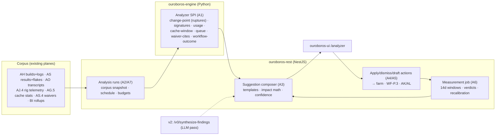
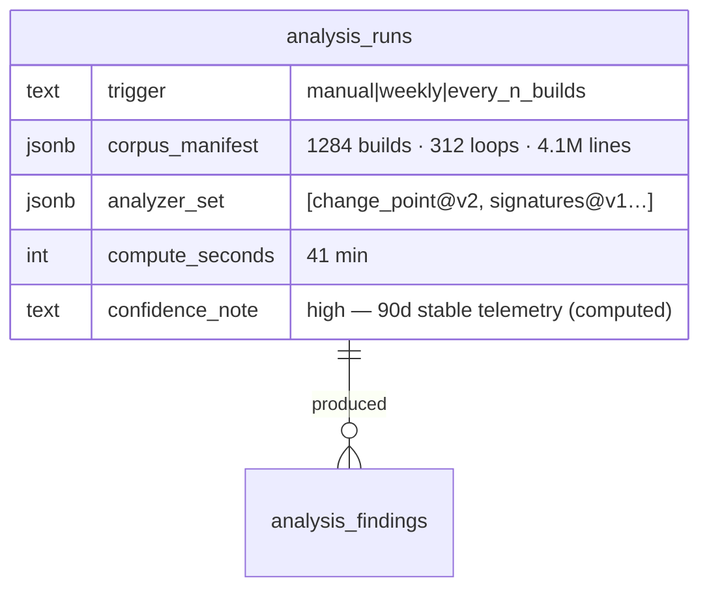
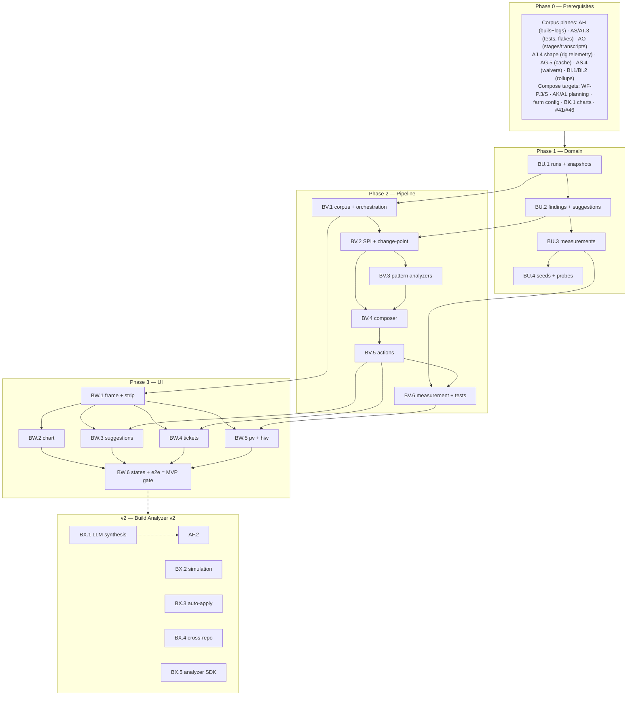

# Roadmap — Build Analyzer (Mockup 18)

## Description

> Create a roadmap that covers the features for the mockup page 18. Any additional
> tech infrastructure that is required to implement the functionality in these mockup
> pages should be researched and offered as options for implementing in the roadmap.
> The roamdap should include MVP and v2 options, as well as the labels, milestones,
> and the like, for the tickets to be created. Any ticket sources that are used by
> Ouroboros for ingesting should be pluggable, which includes sources like Jira,
> Linear, GitHub, GitLab, and other bug reporting/issue recording sites. Refer to the
> page so that issues can reference the mockup file when creating the UI/UX design of
> the pages. Be very specific when creating the roadmap, as the options in the
> roadmap for the functionality needs to be complete and very thorough.

## Context & Existing Work (duplicate-avoidance survey)

Surveyed 2026-08-09.

**Design source of truth for every UI ticket in this roadmap:**
[`docs/mockups/18-build-analyzer.html`](mockups/18-build-analyzer.html) (with
`docs/mockups/assets/ouroboros.css`) — the Build Analyzer. Its anatomy:

- **Page head** — eyebrow `Build Analyzer · Helios-Firmware`, h1 *"Your last
  1,284 builds have opinions."*, subline: *"The analyzer reads every build,
  test run, and loop transcript in your history, finds the patterns humans
  miss, and drafts the fixes — processes, workflows, even tickets."* Actions:
  **Schedule: weekly + every 50 builds ▾**, **Run analysis now ⟳**.
- **Meta strip** (`c-12`) — `Corpus 1,284 builds · 312 loops · 90 days · 4.1M
  log lines · 62 HIL sessions` · `Analyzed by` model pill · `Last run 2h ago ·
  41 min · $2.86` · `Confidence: high — 90d of stable telemetry`.
- **Build duration chart** (90 days) — SVG line/area with **three annotated
  change-point chips** (`May 18 · Zephyr 4.1 migration +1m 30s` warn, `Jul 30
  · twister suite growth +40s` warn, `Jun 22 · ccache enabled −2m 10s` ok),
  dashed change-point verticals, endpoint label `4m 12s`; caption *"The
  analyzer attributes every shift in the curve to a merge, a config change,
  or infrastructure drift."*
- **Suggested build-process changes** (`4 open`) — suggestion rows: title
  (*"Split the test gate: native_sim every build, QEMU + HIL only before
  merge"*), mono **Evidence** line (*"qemu_cortex_m3 caught 0 unique failures
  in 214 builds; HIL caught 9 — all at merge gates"*), impact pill (`−3m 40s
  per loop`), `conf 91%`, **Apply / Details / Dismiss**; one row carries
  `needs a spike` + **Draft spike ticket**.
- **Suggested workflow changes** (`Open workflow studio →`) — *"standard-fix:
  run self-review BEFORE the build stage"* (evidence: 34% of failed builds…;
  **Draft as v16 →**, **Simulate on last 50 loops**) and *"Loops touching
  drivers/can/: add a flake-retry-under-load test stage"* (3.1× flake
  likelihood, 21 cases).
- **Drafted tickets — from patterns, not people** — checkbox rows `BA-1…BA-4`
  (fixture-timeout refactor M, ccache bump XS with an upstream-issue
  signature match, thermal-chamber rig upgrade L citing 3 waivers, dead
  Kconfig cleanup S citing 0/1,284 usage), `est. total ~1.5 days of loop
  time`, **Push 4 tickets to backlog →**, **Edit drafts**.
- **Predicted vs Measured** (`applied earlier`) — *Test-suite split (applied
  Jul 2): predicted −3m 40s / measured −3m 55s ✓*; *ccache warm-up: predicted
  −1m 50s / measured −1m 12s* (warn) with note *"under-delivered — analyzer
  revised its cache model"*; caption *"Every applied suggestion is
  re-measured for 14 days. The analyzer's model retrains on its own misses."*
- **How It Works** — `01 INGEST` (build logs, test results, loop transcripts,
  rig telemetry) → `02 CORRELATE` (change-points ↔ merges, configs, infra
  events) → `03 SYNTHESIZE` (process changes, workflow drafts, tickets — with
  evidence); footer *"Runs on your build farm's data. Nothing leaves the
  tenant."*

**What this page really is:** an analysis pipeline over data planes that all
exist — farm builds/logs (AH), test results + flake history (AS/AT.3), run
transcripts (AO), rig telemetry (AJ.4), cache stats (AG.5), waivers (AS.4),
rollups (BI) — plus **actions that compose existing machinery** (workflow
drafts via WF-P.3, ticket drafts via the planning batch/push pipeline
AK/AL.3, pool config via AH). The honesty staging that governed fifteen
roadmaps applies to its most ambitious page: **deterministic statistical
analyzers first** (change-point detection, signature clustering, usage/
correlation analysis — all computable), templated suggestion composition
with computed impact estimates, and the **LLM synthesis pass as the v2
upgrade** behind a committed contract. The meta strip renders its true
analyzer provenance (`deterministic analyzers vN` until the LLM pass exists
— never a model pill it didn't use, the K10/R4 rule).

**Overlapping work and dispositions:**

| Existing work | Disposition under this roadmap |
|---|---|
| Farm AJ.4 (health history & *analyzer telemetry foundation* — v2 there) | **Consumed & delivered** — AJ.4's retained telemetry/export shape is this roadmap's corpus input (filing-time coordination: if unbuilt, BV.1 specifies the read shape it must produce). |
| BI rollups + BK.1 chart primitives (insights) | **Consumed** — duration series and windows read the BI grain (build-duration metric family added, amendment); the chart extends BK.1's TimeSeries with change-point annotations; BK.5's "failures cluster on deps-refresh days" honesty gate now has its source (amendment: the insights line renders). |
| Planning AK/AL (draft batches, estimator sizing, push pipeline) | **Composed** — drafted tickets are AK draft batches (`planner: analyzer-vN` provenance) sized by the estimator and pushed via AL.3; no second drafting pipeline. |
| WF-P.3/S (workflow versions, studio), WF-R.2 dry-run | **Composed** — "Draft as v16" creates a real draft via P.3 (change-note citing the finding) opened in the studio; "Simulate on last 50 loops" is v2 (BX.2) over the dry-run machinery. |
| AH pools/config, AJ.1 scheduling | **Composed** — pool-move suggestions apply through farm config APIs (time-windowed assignment is new farm config, amendment); ccache re-warm applies as a farm job hook. |
| AS.4 waivers, AT.3 flake history, AG.5 cache stats | **Corpus inputs** — waiver-cites, flake correlation, and cache-window analyzers read them. |
| Insights BL.5 (anomaly narratives), routing AB.3 (suggestion pattern) | **Pattern kin** — the suggest-apply-dismiss-measure lifecycle matches AB.3's suggest-only discipline; BL.5's narrative slot may reuse BX.1's synthesis. |
| AF.2 invocation (v2 of providers) | **Gate** for the LLM synthesis pass (BX.1) and analysis-cost accounting (`$2.86` renders only when LLM analysis exists; deterministic runs show compute time only). |
| Pluggable ticket sources requirement (description boilerplate) | **Already satisfied** — drafted tickets push through the write-capable SPI (AL.3: GitHub now, Jira/Linear/GitLab via their providers). Nothing duplicated. |
| Scaffolding #49, #56; AI.1/BK.2 "✦ Build Analyzer" honest-soon buttons | **Superseded for the analyzer route** — the farm and insights head buttons go live (amendments); #56 gains an analyzer leg. |

Epic letters continue the sequence (…BQ–BT): this roadmap uses **BU, BV, BW,
BX**.

## Infrastructure Options (researched — thorough, pick before filing)

### 1. Change-point detection & statistical core

| Option | What it is | Fit | Trade-offs |
|---|---|---|---|
| **A — `ruptures` (PELT/BinSeg) in the engine over daily medians + deterministic attribution windows** ⭐ recommended | The engine is Python: `ruptures` is the standard offline change-point library (PELT for unknown change-point counts); detect on the BI daily-median series, then attribute each change-point to candidates within a ±3-day window (merges from AW, config/policy/env-recipe versions, farm infra events) ranked by proximity + magnitude correlation; the chart's chips = detected points + top attribution + measured delta | Deterministic, explainable, reproducible — every chip traces to a detection and a candidate list; scipy/numpy already fit the engine toolchain | Attribution is candidate-ranking, not proof — rendered as `attributed to` with the candidate list in Details (honesty) |
| B — LLM reads the curve | Model eyeballs the series | Narrative flair | Non-reproducible statistics — rejected as the core (BX.1 may *narrate* detections, never produce them) |
| C — Hosted anomaly services | Vendor detection | Turnkey | Data egress violates "nothing leaves the tenant" — rejected |

### 2. Log-signature clustering (fixture timeouts, cache-miss signatures)

| Option | What it is | Fit | Trade-offs |
|---|---|---|---|
| **A — Deterministic signature extraction (normalize → template-hash → cluster counts)** ⭐ recommended MVP | Failure lines from AS payloads + AH log tails normalized (strip timestamps/ids/paths→placeholders), template-hashed (drain-style log templating), clustered by hash; clusters ranked by frequency/recency; evidence = `7.2% of OTA suite failures share one fixture timeout signature (31 builds)` computed | Runs on-tenant, fast, explainable; the BA-1/BA-2-class evidence is exactly cluster math | Semantic matching to *upstream issues* (the ccache #1412 link) needs knowledge/LLM — that enrichment is BX.1; MVP renders the signature cluster without the upstream citation |
| B — Embedding clustering | Vector similarity | Catches paraphrase variants | Needs the embedding stack (BH.2) — layered later, not the floor |

### 3. Suggestion synthesis & impact estimation

| Option | What it is | Fit | Trade-offs |
|---|---|---|---|
| **A — Typed finding→suggestion templates with computed impact math; LLM synthesis pass v2 behind a contract** ⭐ recommended | Each analyzer emits typed findings; a suggestion composer maps finding types to templated titles/evidence lines (slot-filled from the finding's numbers) and computes impact estimates from measured data (e.g., test-gate split saving = measured QEMU stage time × frequency); confidence = documented per-analyzer scoring (sample size, effect size, stability); `/v0/synthesize-findings` contract committed for BX.1 (novel cross-plane suggestions, richer prose, upstream-issue matching) | Every MVP suggestion is auditable arithmetic; the v2 pass adds creativity without replacing the floor (the option-3-A pattern from tests/planning) | MVP suggestion breadth = the analyzer set (six families below); genuinely novel insights wait for BX.1 |
| B — LLM synthesis in MVP | The mockup's full magic | Blocks on AF.2; unverifiable impact claims — rejected as the floor |

### 4. Outcome measurement (predicted vs measured)

| Option | What it is | Fit | Trade-offs |
|---|---|---|---|
| **A — Applied-suggestion measurement windows over the BI rollups (14d), automatic verdicts, calibration feedback** ⭐ recommended | Applying a suggestion records its predicted impact + target metric + baseline window; a measurement job compares the 14-day post-apply window (confound annotations: other change-points inside the window flagged); verdict `delivered|under|over`; per-analyzer calibration factors updated from misses (the "retrains on its own misses" line as deterministic recalibration — documented formula, not ML mystique) | The card's rows are joins; calibration is transparent arithmetic | Attribution confounds are flagged, not solved — stated in the note line |

## Decisions proposed by this roadmap (validate before issue creation)

| # | Decision | Rationale |
|---|----------|-----------|
| A1 | **The analyzer is a pipeline of typed, versioned, deterministic analyzers** (SPI — the tenth in this architecture) running in the engine: change-point/attribution, log-signature clustering, config-usage (dead Kconfig), cache-window, queue/idle correlation, waiver-cites, workflow-outcome correlation (the six-plus MVP families) | Every mockup finding maps to one; new analyzers register without core changes; reproducible runs (same corpus → same findings). |
| A2 | **Corpus assembly is bounded, snapshotted, and on-tenant**: an analysis run records its corpus window + counts (the meta strip is the snapshot record); readers stream from AH/AS/AO/AJ.4/BI within budgets | `1,284 builds · 4.1M log lines` is the run's real manifest; "nothing leaves the tenant" is architecture (engine-local analysis), stated in AD.5's model. |
| A3 | **Provenance honesty**: the meta strip's `Analyzed by` renders `deterministic analyzers vN` (with the analyzer list) until BX.1; cost renders compute-duration only until LLM spend exists; confidence = the documented per-analyzer scoring, with the corpus-stability note computed | No borrowed model pills (K10/R4 applied to the flagship AI page). |
| A4 | **Suggestions live a lifecycle**: `open → applied | dismissed | drafted`; **Apply composes the owning plane** (farm config, workflow draft via P.3, job hooks) with a consequence preview; dismissals persist with reasons; applications record predicted impact for A6 | The AB.3 suggest-only discipline: the analyzer never mutates anything itself. |
| A5 | **Drafted tickets ride the planning pipeline**: analyzer findings → an AK draft batch (`planner: analyzer-vN`, evidence in bodies), estimator-sized, edited/pushed via the AM.2-class flow to any writable tracker | "From patterns, not people" reuses the entire drafting/push machinery — and inherits its pluggable-tracker reach. |
| A6 | **Every application is measured** (option 4-A): 14-day windows, confound flags, delivered/under/over verdicts, transparent recalibration | The predicted-vs-measured card is the analyzer's own accountability loop. |
| A7 | **Scheduling = weekly + every-N-builds + manual**, per-org config with run budgets (corpus caps, compute time), concurrent-run guard | The head's schedule button is real config. |
| A8 | **The duration chart extends BK.1's TimeSeries** with change-point annotation chips (warn/ok by delta direction) and detection verticals; chips open the finding's Details (candidates, windows) | One chart system; annotations are findings, not art. |
| A9 | **Cross-surface honesty gates flip**: the farm (AI.1) and insights (BK.2) analyzer buttons go live; BK.5's deps-refresh cluster line renders from the cache-window analyzer's finding | The connective tissue arrives with its organ, as promised. |
| A10 | **Labels**: new `analyzer`; **Milestones**: `Build Analyzer MVP` / `Build Analyzer v2` created at filing; complexity chips XS–L | Description requires labels + milestones for the filing pass. |

## Architecture Overview



## MVP Definition

The MVP is **mockup 18 as a real, deterministic analysis engine with
composed actions and self-measurement** — the LLM pass staged behind its
contract. It is done when, against the compose stack:

1. `/analyzer` reproduces
   [`docs/mockups/18-build-analyzer.html`](mockups/18-build-analyzer.html)
   pixel-faithfully in **both themes**: head + schedule control, the meta
   strip (A3-honest provenance), the annotated duration chart, both
   suggestion cards, the drafted-tickets card, predicted-vs-measured, and
   how-it-works.
2. **Analysis runs are real** (A1/A2): manual + scheduled runs assemble a
   snapshotted corpus (counts = the strip), execute the analyzer set in
   the engine within budgets, and persist typed findings with evidence
   refs; identical corpus → identical findings (reproducibility test).
3. **The chart detects and attributes** (option 1-A): change-points on the
   seeded 90-day series land where the mockup's chips sit, each with a
   ranked attribution candidate list and measured delta; chips open
   Details.
4. **Suggestions are auditable** (option 3-A): the seeded corpus yields
   the mockup's suggestion classes from their analyzers (test-gate split
   from unique-failure attribution, ccache re-warm from cache windows,
   pool move from queue correlation, link-time growth flagged
   `needs a spike`, self-review reorder + drivers/can flake stage from
   workflow-outcome correlation) — every number in every evidence line
   computed; confidence per the documented scoring.
5. **Actions compose** (A4/A5): Apply walks a consequence preview into the
   owning plane (pool config change verified on the farm; workflow
   suggestion → real P.3 draft opened in the studio with the finding in
   its change note); Dismiss persists; **Draft/Push tickets** creates an
   analyzer-provenance planning batch, estimator-sized, pushed to the
   sandbox tracker (`~1.5 days` from real estimates).
6. **Measurement closes the loop** (A6): applied suggestions get 14-day
   windows, verdicts, confound flags, and transparent recalibration;
   the card renders the seeded pair (delivered ✓ / under-delivered with
   the revision note).
7. Cross-surface gates flip (A9): farm + insights buttons live; BK.5's
   cluster line renders from the finding.
8. Integration tests cover corpus assembly/budgets, each analyzer's golden
   fixtures, composer math, action compositions, measurement/calibration,
   schedule guards, isolation; the e2e leg runs analysis → applies one
   suggestion → drafts+pushes tickets → sees measurement scaffolding.

**Explicitly v2 (milestone `Build Analyzer v2`):** the LLM synthesis pass +
upstream-issue matching + model-pill provenance (BX.1), workflow simulation
on historical loops (BX.2), auto-apply policies for high-confidence
suggestions (BX.3), cross-repo/org analysis (BX.4), custom analyzer SDK
(BX.5).

## Epics, Labels & Milestones

| Epic | Name | Goal | Modules | Milestone |
|------|------|------|---------|-----------|
| BU | Analysis Domain | Runs/corpus snapshots, findings/suggestions, measurements, seeds | ouroboros-db | Build Analyzer MVP |
| BV | Analyzers & Pipeline | Corpus readers, the analyzer SPI + six families, composer, actions, measurement | ouroboros-engine, ouroboros-rest | Build Analyzer MVP |
| BW | Analyzer UI | All seven page regions, apply flows, states, e2e | ouroboros-ui | Build Analyzer MVP |
| BX | Synthesis & Scale (v2) | LLM pass, simulation, auto-apply, cross-repo, analyzer SDK | all | Build Analyzer v2 |

Issue naming: `<project>: [<epic>.<issue>] <title>`. Labels: existing set (`mvp`,
`v2`, `rest`, `db`, `engine`, `ui`, `ci`, `design`, `build-farm`, `tests`,
`workflow`, `planning`) **plus new `analyzer`** (decision A10). Milestones
**`Build Analyzer MVP`** / **`Build Analyzer v2`** created at filing; every
issue assigned. Complexity chips: **XS · S · M · L**.

---

## Epic BU — Analysis Domain (`ouroboros-db`)

| Issue | Title | Summary | Labels | Parallel | MVP | Complexity | Affected Modules |
|-------|-------|---------|--------|:--------:|:---:|:----------:|------------------|
| BU.1 | ouroboros-db: [BU.1] Analysis runs & corpus snapshots | Run records, schedules, budgets, the meta-strip manifest (A2/A7) | mvp, analyzer, db | N (after AH.1, AS.1, AO.1, BI.1) | Y | M | ouroboros-db |
| BU.2 | ouroboros-db: [BU.2] Findings & suggestions schema | Typed findings, evidence refs, suggestion lifecycle, confidence (A1/A4) | mvp, analyzer, db | N (after BU.1) | Y | M | ouroboros-db |
| BU.3 | ouroboros-db: [BU.3] Application measurements & calibration | Predicted/measured windows, verdicts, confounds, factors (A6) | mvp, analyzer, db | N (after BU.2) | Y | S | ouroboros-db |
| BU.4 | ouroboros-db: [BU.4] Analyzer seeds — mockup-18 parity + probes | 90d corpus stats, findings, suggestions, measurements; ci checks | mvp, analyzer, db, ci | N (after BU.3, #24) | Y | M | ouroboros-db, .github |

### Issue BU.1 — ouroboros-db: [BU.1] Analysis runs & corpus snapshots

- **Problem Statement:** Every analysis needs a durable record of what it
  read, when, under what budget — the meta strip is a snapshot manifest
  (decisions A2/A7).
- **Solution/Scope:** Migration: `analysis_runs` — org FK, repo_ref,
  `trigger` CHECK `manual|weekly|every_n_builds`, `status` CHECK
  `running|complete|failed|budget_exceeded`, corpus manifest jsonb
  (window, builds/loops/log-lines/HIL counts — computed at assembly),
  `analyzer_set` (versioned list — A3 provenance), timing/compute cost,
  `confidence_note` (computed corpus-stability summary), started/finished;
  `analysis_schedules` — org/repo config (weekly day/time, every-N
  threshold + build counter, budgets: corpus caps + compute ceiling,
  enabled); concurrent-run guard constraint.
- **Acceptance Criteria:** The mockup's meta strip representable as a run
  row; schedule config round-trips; one-running-per-repo enforced;
  budget-exceeded state distinct.
- **Parallelism/Dependencies:** Needs the corpus planes (AH.1, AS.1, AO.1,
  BI.1). Blocks BU.2–BU.4, BV.*.
- **Technical Stack:** PostgreSQL 17, Flyway.
- **Epic:** BU



### Issue BU.2 — ouroboros-db: [BU.2] Findings & suggestions schema

- **Problem Statement:** Typed findings with resolvable evidence, and
  suggestions with the A4 lifecycle — the page's two suggestion cards and
  the chart's chips as data.
- **Solution/Scope:** `analysis_findings` — run FK, `analyzer` +
  version, `finding_type` CHECK (`change_point|log_signature|
  config_usage|cache_window|queue_correlation|waiver_cite|
  workflow_outcome` + `custom:*`), `data` jsonb (typed per analyzer:
  change-point {date, delta, attribution candidates[]}; signature
  {template, count, share, sample refs}; …), `evidence_refs` jsonb
  (resolvable: build ids, test-run ids, waiver ids, merge shas),
  `confidence` (0–100, per-analyzer scoring documented);
  `analysis_suggestions` — finding FK(s) (composite suggestions
  reference several), `kind` CHECK `build_process|workflow|ticket_draft`,
  `title`/`evidence_line` (composer-templated — stored for stability),
  `impact` jsonb (estimate + unit + basis), `status` CHECK
  `open|applied|dismissed|drafted`, `action_binding` jsonb (which plane,
  what change), `needs_spike` bool, resolution actor/at/reason,
  `draft_batch_id` FK nullable (A5 planning linkage).
- **Acceptance Criteria:** Every mockup suggestion + chip representable
  with resolvable evidence; lifecycle transitions constrained; composite
  finding references work; confidence bounds.
- **Parallelism/Dependencies:** Needs BU.1. Blocks BU.3/BU.4, BV.3–BV.5.
- **Technical Stack:** PostgreSQL 17, Flyway.
- **Epic:** BU

```
finding{change_point, data: {date: Jun 22, delta: −130s,
  candidates: [{merge: "enable ccache", score: .94}, …]}, conf: 92}
suggestion{build_process, "Re-warm ccache after deps-refresh merges",
  impact: {−110s, on: "20% of builds", basis: "14 windows measured"}, status: open}
```

### Issue BU.3 — ouroboros-db: [BU.3] Application measurements & calibration

- **Problem Statement:** The predicted-vs-measured card and the
  recalibration loop need rows (decision A6).
- **Solution/Scope:** `suggestion_measurements` — suggestion FK,
  `applied_at`, `target_metric` (BI metric id), `baseline` jsonb (window
  + value), `predicted` jsonb, `measurement_window` (14d), `measured`
  jsonb (filled by the job), `verdict` CHECK
  `pending|delivered|under|over|confounded`, `confounds` jsonb (other
  change-points/applies in-window), `note` (the revision line —
  composed); `analyzer_calibration` — analyzer + impact-class,
  `factor` (transparent multiplier), history (updated-from measurement
  refs, formula documented).
- **Acceptance Criteria:** The two mockup rows representable (delivered ✓,
  under + note); verdict math reproducible; calibration updates trace to
  measurements.
- **Parallelism/Dependencies:** Needs BU.2. Feeds BV.6, BW.5.
- **Technical Stack:** PostgreSQL 17, Flyway.
- **Epic:** BU

```
measurement{test-gate split, predicted: −220s, measured: −235s, verdict: delivered}
measurement{ccache warm, predicted: −110s, measured: −72s, verdict: under}
 ─▶ calibration{cache_window, factor: 0.65, from: [measurement#2]}
```

### Issue BU.4 — ouroboros-db: [BU.4] Analyzer seeds — mockup-18 parity + probes

- **Problem Statement:** Design review needs the mockup's full analysis
  state over the shared seeded universe — including a 90-day duration
  series with the three change-points *planted in the corpus*.
- **Solution/Scope:** Extend the dev seed: build-duration daily rollups
  shaped with the three shifts (May-18 +90s, Jun-22 −130s, Jul-30 +40s)
  + attribution anchors (seeded merges/config-version rows at those
  dates), a completed analysis run (manifest = the strip numbers,
  `deterministic analyzers v1` provenance per A3), findings for every
  mockup item (six families exercised), the six suggestions with exact
  evidence lines/impacts/confidences (+ the spike flag), the BA-1…BA-4
  draft batch (analyzer provenance, estimator-sized to ~1.5 days), two
  measurements (the card's pair), schedule config (weekly + every-50);
  ci/db probes (type vocabs, lifecycle, evidence resolvability,
  measurement verdicts).
- **Acceptance Criteria:** Page renders the mockup from seeds; the
  analyzers, run live on the seeded corpus (BV fixtures), *reproduce*
  the seeded findings (the deepest parity test in the series); probes
  red/green verified.
- **Parallelism/Dependencies:** Needs BU.3 (+AH/AS/AW/BI seed
  coordination). Feeds BV/BW tests, e2e.
- **Technical Stack:** Flyway repeatable migration, SQL.
- **Epic:** BU

```
seeds: 90d series w/ 3 planted shifts + attribution anchors · run manifest ·
       6 suggestions · BA-1..4 batch · 2 measurements · schedule weekly+50
```

---

## Epic BV — Analyzers & Pipeline (`ouroboros-engine` + `ouroboros-rest`)

| Issue | Title | Summary | Labels | Parallel | MVP | Complexity | Affected Modules |
|-------|-------|---------|--------|:--------:|:---:|:----------:|------------------|
| BV.1 | ouroboros-rest: [BV.1] Corpus assembly & run orchestration | Bounded readers, snapshots, budgets, schedule triggers (A2/A7) | mvp, analyzer, rest | N (after BU.1, AJ.4-shape) | Y | L | ouroboros-rest |
| BV.2 | ouroboros-engine: [BV.2] Analyzer SPI & statistical core | The engine-side SPI + change-point (ruptures) + attribution | mvp, analyzer, engine | N (after BU.2, #52) | Y | L | ouroboros-engine |
| BV.3 | ouroboros-engine: [BV.3] Pattern analyzers | Signatures, config-usage, cache-window, queue, waiver-cites, workflow-outcome | mvp, analyzer, engine | N (after BV.2) | Y | L | ouroboros-engine |
| BV.4 | ouroboros-rest: [BV.4] Suggestion composer | Templates, impact math, confidence scoring, `/v0/synthesize` contract | mvp, analyzer, rest | N (after BV.2/BV.3) | Y | M | ouroboros-rest |
| BV.5 | ouroboros-rest: [BV.5] Actions — apply, dismiss, draft & push | Plane compositions with previews; planning-batch drafting (A4/A5) | mvp, analyzer, rest, workflow, planning | N (after BV.4, WF-P.3, AK/AL) | Y | L | ouroboros-rest |
| BV.6 | ouroboros-rest: [BV.6] Measurement job & calibration | 14d windows, verdicts, confounds, recalibration (A6); tests | mvp, analyzer, rest, ci | N (after BU.3, BV.5, BI.2) | Y | M | ouroboros-rest |

### Issue BV.1 — ouroboros-rest: [BV.1] Corpus assembly & run orchestration

- **Problem Statement:** Analysis must read four planes within budgets,
  snapshot what it read, and run on schedule (A2/A7).
- **Solution/Scope:** Run orchestrator: trigger handling (manual API —
  admin+, weekly cron, every-N build counter hook on AH job completion),
  concurrent-run guard, corpus assembly (streamed bounded readers:
  AH builds+log tails (sampled beyond caps, sampling recorded in the
  manifest), AS test runs + failure payloads, AO stage timings +
  transcript stats, AJ.4 telemetry exports (or its specified shape if
  unbuilt — coordination), AG.5 cache stats, AS.4 waivers, BI series),
  manifest computation (the strip counts), engine dispatch (internal
  contract per #52: corpus refs + budgets → findings), status/progress
  API, failure/budget-exceeded honesty (partial-corpus runs labeled);
  build-duration metric family added to BI (amendment).
- **Acceptance Criteria:** Seeded corpus assembles to the mockup manifest;
  budgets enforce with recorded sampling; every-50 trigger fires on the
  counter; concurrent guard holds; partial runs labeled.
- **Parallelism/Dependencies:** Needs BU.1 (+corpus planes). Blocks BV.2
  dispatch, BW.1.
- **Technical Stack:** NestJS scheduler, streamed readers.
- **Epic:** BV

```
trigger(every_50: counter=50) ─▶ assemble{1284 builds, 4.1M lines (sampled: no)} ─▶
  engine dispatch {corpus refs, budgets} ─▶ findings ─▶ run complete {41 min}
```

### Issue BV.2 — ouroboros-engine: [BV.2] Analyzer SPI & statistical core

- **Problem Statement:** The engine-side framework (A1) and the flagship
  analyzer: change-point detection with attribution (option 1-A).
- **Solution/Scope:** Python `Analyzer` SPI (id, version, corpus
  requirements, `analyze(corpus) → findings[]`, deterministic-seed
  discipline); registry + execution harness (per-analyzer time budgets,
  isolation — one analyzer's failure doesn't kill the run, recorded);
  **change-point analyzer**: `ruptures` PELT over daily medians (penalty
  tuning documented; min-segment guards), per-segment medians → deltas,
  attribution: candidate events in ±3d windows (merges from corpus,
  config/policy/env versions, farm events) scored by proximity ×
  plausibility priors (documented), findings with candidate lists;
  reproducibility (fixed seeds, versioned params).
- **Acceptance Criteria:** Planted-shift fixtures detect at the right
  dates with correct deltas; attribution ranks the planted anchors
  first; identical corpus → identical findings; analyzer failure
  isolation verified.
- **Parallelism/Dependencies:** Needs BU.2, #52. Blocks BV.3.
- **Technical Stack:** Python, ruptures, numpy/scipy, pytest.
- **Epic:** BV

```
PELT(daily medians, pen=tuned) ─▶ segments [May18 +90s][Jun22 −130s][Jul30 +40s]
attribution(Jun22): [{merge "enable ccache" d=0, .94}, {config Δ d=1, .31}] ─▶ finding
```

### Issue BV.3 — ouroboros-engine: [BV.3] Pattern analyzers

- **Problem Statement:** The remaining five MVP families — each mockup
  evidence line's generator.
- **Solution/Scope:** **log_signature** (option 2-A: normalize →
  drain-style template hash → clusters with share/recency + sample
  refs — BA-1's fixture-timeout class); **config_usage** (build config
  option extraction across the corpus → never-set/never-varied options
  + drift warnings — BA-4); **cache_window** (hit-rate time series
  around merge classes → the deps-refresh drop pattern with occurrence
  counts — the re-warm suggestion + BK.5's cluster line);
  **queue_correlation** (per-pool queue-depth windows × runner
  idle overlap → the pool-move finding with day-counts);
  **waiver_cite** (AS.4 waiver reason clustering → recurring-gap
  findings — BA-3's thermal chamber); **workflow_outcome**
  (stage-outcome correlations: failed-build defects flagged by later
  review (34%-class), path-touch × subsequent-flake likelihood
  (3.1×-class, with case counts)); unique-failure attribution across
  platforms (the test-gate split's `0 unique in 214` evidence); each
  deterministic, sampled-aware, golden-fixtured.
- **Acceptance Criteria:** Each analyzer reproduces its mockup evidence
  numbers on the seeded corpus (goldens); determinism; runtime within
  budgets on fixture volume.
- **Parallelism/Dependencies:** Needs BV.2.
- **Technical Stack:** Python, numpy/pandas-class tooling.
- **Epic:** BV

```
signatures: normalize→hash ─▶ cluster{fixture-timeout, 31 builds, 7.2% of OTA fails}
config_usage: 12 options ∀1284 builds unset ─▶ finding (+4 drift warnings)
workflow_outcome: P(flake ≤7d | touched drivers/can) = 3.1× baseline (21 cases)
```

### Issue BV.4 — ouroboros-rest: [BV.4] Suggestion composer

- **Problem Statement:** Findings become suggestions through typed
  templates with computed impact and documented confidence (option
  3-A) — never free prose.
- **Solution/Scope:** Composer registry (finding-type → suggestion
  template: title/evidence-line slots, impact formula over the
  finding's measured data + calibration factors (BU.3), action binding
  (which plane, what change payload), spike-flag rules (impact basis
  uncertain → `needs_spike`)); confidence scoring per analyzer
  (sample size × effect size × stability — formula in the registry,
  rendered in Details); composition run persists suggestions (stable
  across re-runs via finding identity — re-analysis updates, not
  duplicates); `/v0/synthesize-findings` contract committed for BX.1
  (input: findings + corpus refs; output: additional suggestions +
  enrichments with provenance) — the v2 slot.
- **Acceptance Criteria:** Seeded findings compose to the mockup's exact
  titles/evidence/impacts/confidences; calibration factors alter
  impact math (fixture); re-run stability; contract committed +
  drift-checked.
- **Parallelism/Dependencies:** Needs BV.2/BV.3. Blocks BV.5, BW.3.
- **Technical Stack:** NestJS, template registry.
- **Epic:** BV

```
finding(cache_window) × calibration(0.65 → post-BU.3) ─▶
  "Re-warm ccache…" impact: −1m 50s×0.65-adjusted basis · conf 88 (n=14, effect .6, stable)
```

### Issue BV.5 — ouroboros-rest: [BV.5] Actions — apply, dismiss, draft & push

- **Problem Statement:** Apply/Dismiss/Draft must compose the owning
  planes with previews (A4/A5) — the analyzer never mutates directly.
- **Solution/Scope:** Action APIs (admin+ for applies): **apply** per
  binding kind — farm config changes (pool assignment windows — new
  farm config surface, amendment; job hooks like post-merge cache
  re-warm), workflow suggestions → WF-P.3 draft creation (nodes/edges
  delta from the binding, change-note citing the finding, opened in
  the studio — publish stays human), test-gate policy changes →
  workflow/policy deltas likewise; consequence preview per binding
  (what will change, where); **dismiss** (reason, persists across
  re-runs via finding identity); **draft tickets** → AK batch
  (`planner: analyzer-vN`, evidence lines into bodies, refs attached)
  → estimator sizing → the standard edit/push flow (AL.3/AM.2-class,
  any writable tracker); spike-flagged suggestions draft spike
  tickets; application records baseline+prediction for BV.6; all
  audited.
- **Acceptance Criteria:** Each binding kind round-trips (pool window
  visible in farm config; workflow draft opens in the studio with the
  citation; batch pushes to sandbox sized ~1.5 days); previews match
  effects; dismissal survives re-analysis; audits complete.
- **Parallelism/Dependencies:** Needs BV.4, WF-P.3, AK/AL (+farm config
  amendment). Blocks BW.3/BW.4.
- **Technical Stack:** NestJS, plane clients.
- **Epic:** BV

```
apply(pool-move) ─▶ preview "forge-02 → pool-a 14:00–16:00 UTC" ─▶ farm config + baseline recorded
draft(BA-1..4) ─▶ AK batch(analyzer-v1) ─▶ sized ─▶ push → sandbox tracker ✓
```

### Issue BV.6 — ouroboros-rest: [BV.6] Measurement job & calibration

- **Problem Statement:** The accountability loop (A6): measure every
  application for 14 days, verdict it, recalibrate transparently —
  plus the epic's test coverage.
- **Solution/Scope:** Measurement job (daily): open measurements →
  compare target-metric windows (BI service) vs baseline+prediction,
  confound detection (other change-points/applies in-window →
  `confounded` flag + note), verdicts at window close, note
  composition (the "under-delivered — revised" line from verdict +
  calibration delta); calibration updates (documented formula:
  weighted measured/predicted ratios per analyzer/impact-class);
  **test suite** for the epic: corpus budgets, analyzer goldens
  (via engine fixtures), composer math, action compositions
  (driver/sandbox), measurement/calibration matrices, schedule
  triggers, isolation.
- **Acceptance Criteria:** Seeded measurements verdict correctly;
  confound fixture flags; calibration math reproducible; suite green
  in CI ≤ 120s added.
- **Parallelism/Dependencies:** Needs BU.3, BV.5, BI.2.
- **Technical Stack:** NestJS scheduler, Jest, engine pytest goldens.
- **Epic:** BV

```
day 14: measured −72s vs predicted −110s ─▶ under · note composed · calibration 0.65
confound: second apply in window ─▶ verdict: confounded (flagged, never silently counted)
```

---

## Epic BW — Analyzer UI (`ouroboros-ui`)

Every issue references
[`docs/mockups/18-build-analyzer.html`](mockups/18-build-analyzer.html) as
the design source — meta-strip/sugg/ticket/pv/hiw treatments and the
annotated chart — via the #16 tokens (both themes; the mockup is dark-only).

| Issue | Title | Summary | Labels | Parallel | MVP | Complexity | Affected Modules |
|-------|-------|---------|--------|:--------:|:---:|:----------:|------------------|
| BW.1 | ouroboros-ui: [BW.1] Analyzer route, head, schedule & meta strip | Frame, run-now with progress, schedule editor, honest provenance | mvp, analyzer, ui, design | N (after #41, BV.1, BA-D.5) | Y | M | ouroboros-ui |
| BW.2 | ouroboros-ui: [BW.2] Annotated duration chart | BK.1 TimeSeries + change-point chips/verticals + Details | mvp, analyzer, ui, design | N (after BW.1, BK.1) | Y | M | ouroboros-ui |
| BW.3 | ouroboros-ui: [BW.3] Suggestion cards & apply flows | Process + workflow suggestions, previews, dismiss, spike flow | mvp, analyzer, ui, design | N (after BW.1, BV.5) | Y | L | ouroboros-ui |
| BW.4 | ouroboros-ui: [BW.4] Drafted-tickets card | Checkbox drafts, evidence, edit, push-to-backlog flow | mvp, analyzer, ui | N (after BW.1, BV.5) | Y | M | ouroboros-ui |
| BW.5 | ouroboros-ui: [BW.5] Predicted-vs-measured & how-it-works cards | Verdict rows + notes; the three-step explainer with A2 truth | mvp, analyzer, ui, design | N (after BW.1, BV.6) | Y | S | ouroboros-ui |
| BW.6 | ouroboros-ui: [BW.6] Analyzer states & e2e leg | Cold/insufficient-corpus/running states; full-chain e2e | mvp, analyzer, ui, ci | N (after BW.2–BW.5) | Y | M | ouroboros-ui, .github |

### Issue BW.1 — ouroboros-ui: [BW.1] Analyzer route, head, schedule & meta strip

- **Problem Statement:** The frame: the corpus-composed headline, real
  run/schedule controls, and the A3-honest meta strip.
- **Solution/Scope:** `/analyzer` (repo-scoped via the tenant chip):
  head (headline composes the corpus build count), **Run analysis now**
  (progress states from BV.1: assembling → analyzing (per-analyzer
  ticks) → composing; concurrent-guard message), **Schedule** editor
  (weekly picker + every-N stepper + budgets, from BU.1 config); meta
  strip per the mockup with A3 truth (`Analyzed by deterministic
  analyzers v1` + analyzer list popover until BX.1; duration; cost line
  = compute time, `$` only when LLM spend exists; confidence tag +
  computed basis popover); inbound buttons live (AI.1/BK.2 amendments).
- **Acceptance Criteria:** Seeded strip matches with honest provenance
  (screenshot); run-now streams progress against compose; schedule
  round-trips; farm/insights buttons land here; both themes.
- **Parallelism/Dependencies:** Needs #41, BV.1, BA-D.5. Blocks BW.2–BW.5.
- **Technical Stack:** Next.js, #46 primitives, I.8 poll family.
- **Epic:** BW

```
Your last 1,284 builds have opinions.   [Schedule: weekly + every 50 ▾][Run analysis now ⟳]
Corpus 1,284 builds · … · Analyzed by [deterministic analyzers v1 ⓘ] · Last run 2h · 41 min
```

### Issue BW.2 — ouroboros-ui: [BW.2] Annotated duration chart

- **Problem Statement:** The chart with detection verticals and
  attributed chips — findings rendered, not drawn (A8).
- **Solution/Scope:** BK.1 TimeSeries extension: annotation layer
  (dashed verticals at detected points, chip badges warn/ok by delta
  sign with attributed-event text + delta, collision layout), endpoint
  label, y-axis durations; chip click → finding Details sheet
  (candidate list with scores, window, evidence refs resolving to
  merges/config versions); caption truth (the attribution wording
  reflects candidate-ranking honesty — `attributed to (top candidate)`
  in Details); range fixed 90d MVP.
- **Acceptance Criteria:** Seeded chart matches the mockup (chips at the
  planted points, correct tints); Details lists ranked candidates;
  both themes; a11y labels describe the change-points.
- **Parallelism/Dependencies:** Needs BW.1, BK.1.
- **Technical Stack:** React, TimeSeries extension.
- **Epic:** BW

```
──┊──────╔ May 18 · Zephyr 4.1 migration +1m 30s ╗───┊(Jun 22 −2m 10s ok)───┊──── 4m 12s●
chip → Details: candidates [{merge zephyr-4.1 bump, .91}, {config Δ, .22}] · window ±3d
```

### Issue BW.3 — ouroboros-ui: [BW.3] Suggestion cards & apply flows

- **Problem Statement:** The two suggestion cards with their full
  lifecycle UX: evidence, impact, confidence, apply-with-preview,
  dismiss, spike drafting, workflow drafting.
- **Solution/Scope:** Suggestion rows per the mockup (title, mono
  evidence line, impact pill, conf affix with the scoring popover,
  spike pill where flagged); **Apply** → consequence-preview dialog
  (binding-specific: pool window, workflow delta summary, hook
  description) → execute → applied state (measurement-pending note +
  link to BW.5); **Details** → finding sheet (data, evidence refs
  resolving into farm/tests/waivers surfaces, calibration basis);
  **Dismiss** (reason optional, persists); **Draft as v16 →** →
  workflow draft created + studio deep-link; **Simulate on last 50
  loops** honest-soon (BX.2); **Draft spike ticket** → single-draft
  planning flow; role gating (member read + dismiss-suggest only).
- **Acceptance Criteria:** Seeded cards match; apply flows round-trip
  (pool config + workflow draft verified in e2e); dismiss persists
  across a re-run; details evidence resolves; both themes.
- **Parallelism/Dependencies:** Needs BW.1, BV.5.
- **Technical Stack:** React, #46 primitives.
- **Epic:** BW

```
Split the test gate… [−3m 40s/loop] conf 91% ⓘ  [Apply ▸ preview][Details][Dismiss]
standard-fix: self-review BEFORE build … [Draft as v16 → studio][Simulate — arrives with BX.2]
```

### Issue BW.4 — ouroboros-ui: [BW.4] Drafted-tickets card

- **Problem Statement:** The analyzer's ticket drafts riding the
  planning flow: selection, evidence, editing, sized total, push.
- **Solution/Scope:** Ticket rows per the mockup (checkbox, mono BA-id
  (batch local keys), title, effort chip from real sizing, mono
  evidence line with resolvable refs), **Edit drafts** → the planning
  batch editor (AM.2 surface) scoped to this batch, est-total from
  real `est_minutes` (cost per N10 honesty), **Push N tickets to
  backlog →** → AL.3 push flow with per-draft states + tracker links;
  pushed tickets then visible in intake (cross-link toast).
- **Acceptance Criteria:** Seeded card matches; deselect + push lands
  N−1 on the sandbox tracker with evidence in bodies; totals honest;
  batch edit round-trips; both themes.
- **Parallelism/Dependencies:** Needs BW.1, BV.5 (+AM.2 surface).
- **Technical Stack:** React, planning components.
- **Epic:** BW

```
☑ BA-2 Bump ccache 4.9→4.11 [XS] "cache-miss signature in 118 builds ↗"
est. ~1.5 days · [Push 4 tickets to backlog →] ─▶ ✓#621 ✓#622 … (intake syncs)
```

### Issue BW.5 — ouroboros-ui: [BW.5] Predicted-vs-measured & how-it-works cards

- **Problem Statement:** The accountability card (verdict rows, notes,
  the re-measure caption) and the truthful explainer.
- **Solution/Scope:** PV rows from BU.3 (name + applied date, predicted/
  measured mono lines with verdict coloring, confound flags rendered
  distinctly, the composed note line), pending-measurement state
  (day-N-of-14 progress), the caption verbatim (with `retrains` →
  the transparent-recalibration popover showing the formula);
  how-it-works card (three steps verbatim; the ingest line reflects
  the real corpus classes; the tenant-locality footer traces to A2/
  AD.5).
- **Acceptance Criteria:** Seeded pair matches (✓ + under with note);
  pending state renders; recalibration popover shows real factors;
  both themes.
- **Parallelism/Dependencies:** Needs BW.1, BV.6.
- **Technical Stack:** React, #46 primitives.
- **Epic:** BW

```
Test-suite split (Jul 2): predicted −3m40s / measured −3m55s ✓
ccache warm-up: −1m50s / −1m12s ⚠ "under-delivered — cache model factor → 0.65 ⓘ"
```

### Issue BW.6 — ouroboros-ui: [BW.6] Analyzer states & e2e leg

- **Problem Statement:** Cold repos (no corpus), insufficient history,
  running states, and the full-chain certification.
- **Solution/Scope:** States: insufficient corpus (<N builds → "the
  analyzer needs more history" with the count + what it reads),
  never-run (explainer + run CTA), running (progress card), failed/
  budget-exceeded (honest partials), member view, skeletons; e2e
  (extends #56): seeded parity (all cards, both themes) → run analysis
  on the seeded corpus → findings reproduce → apply the pool-move
  (farm config asserted) → draft-as-v16 (studio draft asserted) →
  push 4 tickets (sandbox + intake sync asserted) → dismiss persists
  across re-run → measurement scaffolding appears; provenance honesty
  asserted (no model pill).
- **Acceptance Criteria:** All states themed; e2e green from cold
  compose; each leg fails meaningfully when its layer breaks; ≤ 3 min
  added.
- **Parallelism/Dependencies:** Needs BW.2–BW.5, BU.4; amends #56.
- **Technical Stack:** React, Playwright.
- **Epic:** BW

```
e2e: run→findings ✓ · apply→farm ✓ · draft→studio ✓ · push→tracker ✓ · dismiss-persist ✓
```

---

## Epic BX — Synthesis & Scale (v2 · milestone `Build Analyzer v2`)

| Issue | Title | Summary | Labels | Parallel | MVP | Complexity | Affected Modules |
|-------|-------|---------|--------|:--------:|:---:|:----------:|------------------|
| BX.1 | ouroboros-engine: [BX.1] LLM synthesis pass | `/v0/synthesize-findings`: novel suggestions, upstream matching, prose | v2, analyzer, engine | N (after BV.4, AF.2) | N | L | ouroboros-engine, ouroboros-rest |
| BX.2 | ouroboros-engine: [BX.2] Workflow simulation on historical loops | "Simulate on last 50 loops" — counterfactual replay evaluation | v2, analyzer, workflow, engine | N (after BV.3, WF-R.2) | N | L | ouroboros-engine |
| BX.3 | ouroboros-rest: [BX.3] Auto-apply policies | High-confidence classes auto-apply under policy, measured + reversible | v2, analyzer, rest | N (after BV.5/BV.6, BQ.2) | N | M | ouroboros-rest |
| BX.4 | ouroboros-rest: [BX.4] Cross-repo & org-level analysis | Fleet-wide patterns; shared-infra findings | v2, analyzer, rest | N (after BV.1, BL.4) | N | M | ouroboros-rest, ouroboros-engine |
| BX.5 | ouroboros-engine: [BX.5] Custom analyzer SDK | Tenant-authored analyzers on the SPI with sandbox + budgets | v2, analyzer, engine | N (after BV.2) | N | M | ouroboros-engine, docs |

### Issue BX.1 — ouroboros-engine: [BX.1] LLM synthesis pass

- **Problem Statement:** The deterministic floor finds what its analyzers
  encode; the synthesis pass adds cross-plane creativity — novel
  suggestions, upstream-issue matching (the ccache #1412 citation),
  richer evidence prose — behind the committed contract.
- **Solution/Scope:** `/v0/synthesize-findings` implementation over AF.2
  (routed `analyze` task kind): findings + corpus samples → additional
  suggestion candidates (composer-validated: impact claims must cite
  computable bases or carry `unquantified` flags), signature→upstream
  matching (knowledge/retrieval BH.2 + web-less tenant mode honesty),
  evidence-prose enrichment (never altering numbers); provenance flips
  (the meta strip's model pill + real cost line); deterministic floor
  always runs first (LLM adds, never replaces); cost budgets per run.
- **Acceptance Criteria:** Seeded corpus yields validated novel
  candidates with honest impact flags; the ccache upstream citation
  reproduces with its match basis; provenance/cost truthful; floor
  unchanged when the pass is disabled.
- **Parallelism/Dependencies:** Needs BV.4, AF.2 (+BH.2 for matching).
- **Technical Stack:** FastAPI, structured output.
- **Epic:** BX

### Issue BX.2 — ouroboros-engine: [BX.2] Workflow simulation on historical loops

- **Problem Statement:** "Simulate on last 50 loops" — estimate a
  workflow change's effect by replaying history against the modified
  definition.
- **Solution/Scope:** Counterfactual evaluator: for reorder/add-stage
  suggestions, replay recorded loop traces (AO stages + AS outcomes)
  against the modified DSL (WF-R.2 walk semantics + outcome mapping
  rules — e.g., would the earlier review have flagged the defect the
  later one did), producing per-loop counterfactual outcomes + summary
  (caught-earlier counts, time deltas) with documented model
  assumptions (rendered — this is estimation, not measurement);
  results attach to the suggestion's Details.
- **Acceptance Criteria:** The seeded self-review-reorder suggestion
  simulates over seeded loops with reproducible summaries; assumptions
  rendered; button goes live.
- **Parallelism/Dependencies:** Needs BV.3, WF-R.2.
- **Technical Stack:** Python replay over trace fixtures.
- **Epic:** BX

### Issue BX.3 — ouroboros-rest: [BX.3] Auto-apply policies

- **Problem Statement:** Mature tenants may want high-confidence,
  low-risk suggestion classes applied automatically — under policy,
  measured, reversible.
- **Solution/Scope:** Policy-document extension (BQ.1 rule class):
  auto-apply criteria (suggestion kind allow-list — infra-config only;
  confidence floor; impact ceiling), reversal bindings required
  (every auto-applied change knows its undo), auto-applications
  audited + inbox-notified (info decision), auto-reversal on
  `under|confounded` verdicts per policy; merge/workflow classes
  excluded by design.
- **Acceptance Criteria:** Policy-gated auto-apply fires on a fixture,
  measures, and auto-reverses on an under verdict; exclusions hold;
  audit + notification complete.
- **Parallelism/Dependencies:** Needs BV.5/BV.6, BQ.2.
- **Technical Stack:** NestJS, policy integration.
- **Epic:** BX

### Issue BX.4 — ouroboros-rest: [BX.4] Cross-repo & org-level analysis

- **Problem Statement:** Patterns that span repos (shared runners,
  common deps, org-wide flake classes) are invisible per-repo.
- **Solution/Scope:** Org-scoped runs (corpus across enabled repos,
  BL.4's org rollups), fleet analyzers (shared-infra contention,
  cross-repo signature matches, dependency-class correlations),
  per-repo attribution in findings, org-level analyzer surface
  scope.
- **Acceptance Criteria:** Two-repo fixture yields a shared-runner
  finding attributing both; per-repo views filter correctly;
  isolation preserved at the org boundary.
- **Parallelism/Dependencies:** Needs BV.1, BL.4.
- **Technical Stack:** NestJS, engine analyzers.
- **Epic:** BX

### Issue BX.5 — ouroboros-engine: [BX.5] Custom analyzer SDK

- **Problem Statement:** Tenants have domain patterns no built-in
  analyzer encodes; the SPI deserves a safe authoring surface.
- **Solution/Scope:** Documented analyzer SDK (the BV.2 SPI as a
  public contract: corpus schemas, finding shapes, determinism
  rules), sandboxed execution (restricted runtime, time/memory
  budgets, no network per A2), packaging/registration flow,
  example analyzers, review guidance; findings from custom
  analyzers labeled with their origin.
- **Acceptance Criteria:** An example custom analyzer registers,
  runs sandboxed within budgets, and renders labeled findings;
  sandbox escapes blocked (test suite); docs complete.
- **Parallelism/Dependencies:** Needs BV.2.
- **Technical Stack:** Python sandboxing, docs.
- **Epic:** BX

---

## Work Order (dependency-ordered execution plan)



Ordered checklist (⊕ = parallelizable within its phase):

1. **Phase 0 — Prerequisites:** AH, AS/AT.3, AO, AJ.4 shape, AG.5, AS.4,
   BI.1/BI.2, WF-P.3/S, AK/AL, farm config, BK.1, #41/#46.
2. **Phase 1 — Domain:** BU.1 → BU.2 → BU.3 → BU.4
3. **Phase 2 — Pipeline:** BV.1 ⊕ (→) BV.2 → BV.3 → BV.4 → BV.5 → BV.6
4. **Phase 3 — UI:** BW.1 → { BW.2 ⊕ BW.3 ⊕ BW.4 ⊕ BW.5 } → **BW.6 ✅**
   *(MVP gate, amending #56)*
5. **v2:** BX.1 after AF.2; BX.2–BX.5 after their dependencies.

## Totals

| | Issues | MVP | v2 |
|---|:---:|:---:|:---:|
| Epic BU — Analysis Domain | 4 | 4 | 0 |
| Epic BV — Analyzers & Pipeline | 6 | 6 | 0 |
| Epic BW — Analyzer UI | 6 | 6 | 0 |
| Epic BX — Synthesis & Scale | 5 | 0 | 5 |
| **Total** | **21** | **16** | **5** |

Plus amendments executed at filing: AJ.4 (corpus-shape delivery
coordination), BI (build-duration metric family), BK.5 (cluster-line
honesty gate flips), AI.1/BK.2 (analyzer buttons live), farm config
(time-windowed pool assignment), AK planner vocabulary (`analyzer-vN`),
#49 (analyzer stub retired), #56 (analyzer e2e leg).

## References

- Design source: [`docs/mockups/18-build-analyzer.html`](mockups/18-build-analyzer.html),
  `docs/mockups/assets/ouroboros.css`; adjacent mockups 08/11/15
- Upstream roadmaps: scaffolding (filed); all prior mockup roadmaps
  (validation gates — this page analyzes their data planes and composes
  their actions)
- Statistical research:
  [ruptures — change-point detection in Python (PELT/BinSeg)](https://github.com/deepcharles/ruptures) ·
  [ruptures paper](https://arxiv.org/pdf/1801.00826) ·
  [change-point detection patterns in practice](https://forecastegy.com/posts/change-point-detection-time-series-python/) ·
  [drift detection with ruptures](https://medium.com/sdg-group/detecting-data-drift-in-time-series-with-ruptures-58a4afbffa5e)
- In-repo precedents: AB.3's suggest-only lifecycle, option-3-A staging
  (deterministic floor + LLM contract), K10/R4 provenance honesty, the
  planning batch/push pipeline (A5's composition)

## UI/UX Shell Compliance (addendum 2026-08-09)

The application shell defined in
[`docs/DESIGN_SYSTEM_APP_SHELL.md`](DESIGN_SYSTEM_APP_SHELL.md) (implementing
roadmap: [`ROADMAP_UIUX_APP_SHELL.md`](ROADMAP_UIUX_APP_SHELL.md)) supersedes
the mockup's top-bar navigation for every UI issue in this roadmap:

1. **Header** — application name/brand upper-left, profile & session controls
   upper-right; no navigation links in the header.
2. **Sidebar navigation** — fixed left rail of icon + name entries from the
   CP.2 module registry. This surface lives under the sidebar's **Build
   Farm** entry (icon `server`) as the analyzer surface; the Build Farm
   entry stays active here. Page-level tab sets stay at the top of the
   content pane (CP.4 PageSubnav), sticky within the pane's scroll.
3. **Content-only scrolling** — the content pane is the sole scroll
   container; header and sidebar never scroll; sticky in-page chrome
   (subnavs, dirty-state bars, table headers) sticks within the pane; wide
   content scrolls inside its own wrappers, never at pane level.
4. **Type scale** — every UI issue uses rem-based type/spacing against the
   #16 tokens (CQ.1) so the five-step font-size preference (CQ.2) scales the
   whole surface; hard-coded px font sizes are lint-banned.
5. **Mockup interpretation** —
   [`docs/mockups/18-build-analyzer.html`](mockups/18-build-analyzer.html)
   remains the design source for page content and card anatomy; its
   topbar/nav chrome is superseded by the shell spec.

Issue-level impact:

| Issue | Amendment |
|---|---|
| BW.1 | Mounts in the shell content pane; navigation reached via the sidebar registry entry, not a topbar link |
| BW.2, BW.3, BW.4, BW.5 | rem-based type, shell tokens; internal wide/tall regions (gantt, matrices, long lists) scroll in their own wrappers |
| BW.6 | Gains shell assertions: header/sidebar fixed during content scroll, correct sidebar active state, font-scale render check at 125% |

## Next Step

Per the roadmap process, **no GitHub issues have been created yet** — this
document is the validation gate. Review in particular: the
deterministic-first architecture (A1 — six analyzer families whose golden
fixtures must *reproduce* the seeded mockup numbers, the deepest parity
bar in the series), the provenance honesty on the flagship AI page (A3 —
no model pill until BX.1 earns it), the composition rule for every action
(A4/A5 — farm config, studio drafts, planning batches; the analyzer never
mutates directly), and the self-measurement loop (A6 — 14-day windows,
confound flags, transparent recalibration). Once validated, the follow-up
pass (`/create-issues ROADMAP_MOCKUP_18_BUILD_ANALYZER.md`) creates the
`analyzer` label **and the `Build Analyzer MVP` / `Build Analyzer v2`
milestones**, files the 21 issues with epic parents, relationships, and
milestone assignments, and posts the amendment comments listed above.
