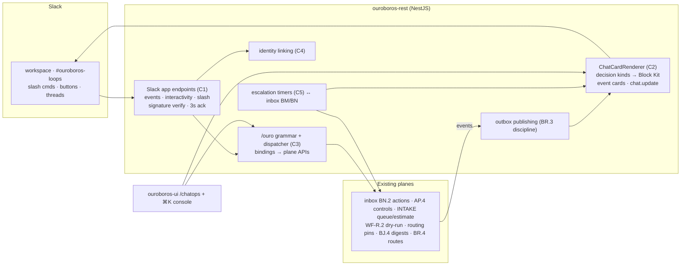
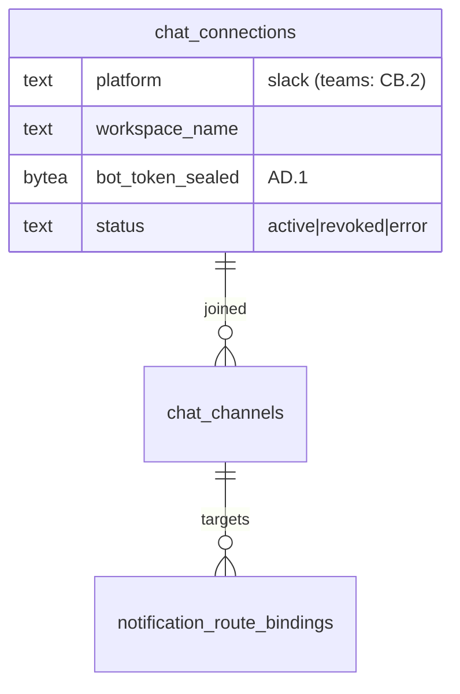
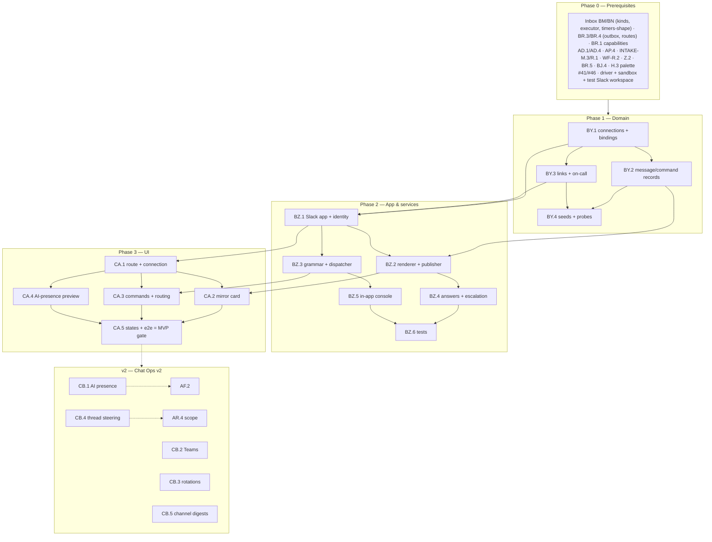

# Roadmap — Chat Ops (Mockup 19)

## Description

> Create a roadmap that covers the features for the mockup page 19. Any additional
> tech infrastructure that is required to implement the functionality in these mockup
> pages should be researched and offered as options for implementing in the roadmap.
> The roamdap should include MVP and v2 options, as well as the labels, milestones,
> and the like, for the tickets to be created. Any ticket sources that are used by
> Ouroboros for ingesting should be pluggable, which includes sources like Jira,
> Linear, GitHub, GitLab, and other bug reporting/issue recording sites. Refer to the
> page so that issues can reference the mockup file when creating the UI/UX design of
> the pages. Be very specific when creating the roadmap, as the options in the
> roadmap for the functionality needs to be complete and very thorough.

## Context & Existing Work (duplicate-avoidance survey)

Surveyed 2026-08-09.

**Design source of truth for every UI ticket in this roadmap:**
[`docs/mockups/19-chatops.html`](mockups/19-chatops.html) (with
`docs/mockups/assets/ouroboros.css`) — Chat Ops. Its anatomy:

- **Page head** — eyebrow `Chat Ops`, h1 *"The loop reports where your team
  already lives."*, subline: *"Finished loops announce themselves. Blocked
  builds ask their question in-channel and wait. Every control in this app is
  also a command — or a sentence."* Actions: **+ Add channel ▾**, **Open
  #ouroboros-loops ↗**.
- **Channel card** (`c-7`) — header `#ouroboros-loops · Slack` with a
  Slack/Teams segment + `24 members · Ouroboros app v2.4`; a message
  **stream**: a **completion rich card** (ok border: *"✓ Loop #1846 finished —
  PR #512 merged"*, issue line, mono stats `14/14 checks · 11m cycle · $0.94 ·
  claude-fable-5`, View PR / Run console buttons), a **blocking-question card**
  (warn border + glow: *"⏸ Build paused — a question for you"*, the
  protected-path ask with **Allow once / Deny / View diff** buttons and the
  line *"paused 4m · escalates to the Needs-you inbox in 26m"*), a **system
  line** (*"✓ Maya Chen answered: allow once — loop #1851 resumed (14:11)"*),
  **`/ouro status`** command + boxed one-line reply (`3 loops live · 12
  queued · farm 4/5 online · spend today $18.60 · needs-you: 3`),
  **`/ouro dry-run #486 feature-loop`** + reply (→ Copilot link), a
  **build-green accent card** (*"⟳ Loop #1847 build 3 green — 63/63 ·
  publishing PR #514 rev 2"*); a composer (`Message #ouroboros-loops — or
  /ouro …`).
- **Commands card** — ten `/ouro` commands with arg hints and one-line
  purposes (`status`, `queue #485 [workflow]`, `pause loop 1847 / resume`,
  `abort loop 1847`, `answer q-231 allow`, `dry-run #486 [workflow]`,
  `route implement claude-fable-5`, `explain pr 514`, `estimate #490`,
  `pause all`); caption *"Identical in Slack, Teams, and the in-app console.
  Tab-completion everywhere."*
- **What Gets Published Where** — route rows with switches: *Loop finished
  (merged)* → `#ouroboros-loops`, *Blocking questions* → `#ouroboros-loops +
  DM on-call`, *Build failures* → `#helios-alerts`, *Weekly insights report* →
  `#eng-leads`, *Every stage transition* (noisy, off by default); **Manage in
  Settings →**.
- **AI Presence card** — a mini-thread: Ken asks *"why did #479 take 38
  minutes?"*; the bot answers with a computed attribution (*"11 of those
  minutes were queue time on pool-a…"*) plus the Analyzer's runner-rebalance
  suggestion with **Apply**; system line *"✓ applied · policy-checked ·
  audit-logged"*; caption *"Anything the UI can do, a sentence can do. Same
  permissions, same audit trail."*

**What this page really is:** the delivery point for every deferred
Slack/chat contract in the series — inbox button-answering (BP.1), insights
digests/sends (BL.1), run-thread steering (AR.4), the channel-truth rows
(BN.3/BO.4), the `#eng-leads` route binding (BR.4), and every "Send to
Slack" honest-absent button. The new work: the **Slack app itself** (install,
events, interactivity, slash commands), a **typed message-card renderer**
over the decision-kind registry, the **`/ouro` command surface** composing
plane APIs under the same permissions, **escalation timers**, and the
**in-app command console**. The natural-language AI presence follows the
universal staging: deterministic commands ship in MVP; the sentence
interface is the v2 pass behind a contract.

**Overlapping work and dispositions:**

| Existing work | Disposition under this roadmap |
|---|---|
| Inbox BP.1 (Slack answering, v2 there), BM/BN decision kinds + action executor + tokens | **Delivered here** — interactive question cards render decision kinds via Block Kit; buttons map to BN.2 handlers with identity/permission checks; the X5 rule holds (merge-class actions deep-link to session confirm); filing-time coordination (BP.1's scope lands here). |
| Insights BL.1 (Slack digest/sends, v2 there), BJ.4 digest assembly | **Delivered here** — weekly digests render via the card renderer to bound channels; the insights "Send to Slack" button goes live (amendments). |
| Run console AR.4 (Slack-thread steering, v2 there), AP.4 controls | **Delivered here** — run event cards thread per loop; thread replies parse to steers; `/ouro pause|abort loop N` compose AP.4 (coordination). |
| Settings BR.3/BR.4 (webhook substrate, notification routes, integrations grid), BO.4 channel rows | **Composed** — the routing card edits BR.4 bindings with channel targets; the Slack tile/rows flip to connected truth; event fan-out reuses the outbox discipline. |
| BR.1 capabilities (`can_approve_loops`), AD.1 vault, AD.4 audit | **Consumed** — command/button permission checks map Slack identity → member → capabilities; bot tokens sealed; every chat action audited with channel provenance. |
| Onboarding BC.5 Slack row, dashboards' honest-absent buttons | **Flipped** — the Slack "arrives with Chat Ops" labels across BC/BO/BK go live (amendments). |
| WF-R.2 dry-run, INTAKE-L/M (estimate, queue), Z.1/AA routing pins, BM.1 question ids | **Composed** — `/ouro dry-run`, `estimate`, `queue`, `route`, `answer` are thin command bindings over existing APIs. |
| Analyzer BV.5 suggestions, AF.2 invocation | **v2 tie** — the AI-presence thread (NL questions, suggestion applies-by-sentence) is CB.1 behind a contract; `explain pr` likewise. |
| H.3 ⌘K palette (action registry) | **Extended** — the in-app command console mounts the `/ouro` grammar in the palette (the caption's third surface). |
| Pluggable ticket sources requirement (description boilerplate) | **Already satisfied** by WF-Q/AL.2/AX.1 — `/ouro queue`/`estimate` operate on canonical tickets regardless of tracker. Nothing duplicated. |
| Mockup 20 (Copilot), MS Teams | **Boundaries** — the dry-run reply's Copilot link targets 20's future surface; Teams is CB.2 (the segment renders honestly). |
| Scaffolding #49, #56 | **Superseded for the chatops route**; #56 gains a chatops leg. |

Epic letters continue the sequence (…BU–BX): this roadmap uses **BY, BZ, CA,
CB**.

## Infrastructure Options (researched — thorough, pick before filing)

### 1. Slack integration architecture

| Option | What it is | Fit | Trade-offs |
|---|---|---|---|
| **A — First-party Slack app: OAuth v2 install per workspace, Events API + interactivity + slash endpoints on `ouroboros-rest`, signing-secret verification, sealed bot tokens** ⭐ recommended | Standard current practice: HTTPS endpoints verify `x-slack-signature`/timestamp (replay-windowed), ack within 3s then process async (the outbox/queue discipline BR.3 already has), Block Kit for rich cards, `chat.update` for resolution edits, bot + minimal scopes; multi-workspace-ready install rows (one per org MVP); tokens sealed via AD.1 | Full control of cards/commands/threads; self-hostable (each deployment registers its own Slack app — documented setup, config-driven credentials) | Slack app registration is per-deployment operator work (setup guide required — the honest self-hosted cost) |
| B — Socket Mode | WebSocket instead of public endpoints | No inbound URLs (nice for dev) | Per-workspace socket management at scale; MVP supports it as a dev-mode option, HTTPS primary |
| C — Incoming webhooks only | Post-only messages | Trivial | No buttons, no commands, no threads — fails the page's core promise; rejected |

### 2. Message rendering & event publishing

| Option | What it is | Fit | Trade-offs |
|---|---|---|---|
| **A — Typed card renderer over the existing registries + the BR.3 outbox** ⭐ recommended | One `ChatCardRenderer`: decision kinds (BM.1 declarations) → interactive Block Kit; event families (run finished, build green/failed, digest) → typed cards; publishes ride an outbox (retry, dedupe, `chat.update` on state change — the resolution edit); message records kept (channel, ts, kind, refs) powering edits + the page's mirror | The X2 discipline extends to chat: emitters supply facts, kinds render prose; one renderer for Slack now, Teams adapter later (CB.2) | Card fidelity per platform varies — renderer is capability-aware (the SPI habit) |
| B — Per-feature ad-hoc messages | Each plane posts its own | Fast start | Ten formats, no edits, no mirror — rejected |

### 3. Command surface

| Option | What it is | Fit | Trade-offs |
|---|---|---|---|
| **A — One versioned `/ouro` grammar + dispatcher with per-command plane bindings, shared across Slack, Teams (later), and the in-app console** ⭐ recommended | Grammar registry (command, args schema, completion hints, required capability, binding to a plane API, response template); parser (deterministic, arg validation with helpful errors); the same registry drives Slack slash handling, the ⌘K console mount, and future Teams; LLM-dependent commands (`explain`) registered with honest `arrives with AI presence` replies until CB.1 | "Identical in Slack, Teams, and the in-app console" becomes one registry; permissions are the member's, never the bot's | Slack's 3s ack window → immediate ack + async result post (documented pattern) |
| B — Slack-only commands | Bolt-style handlers inline | Simple | The three-surface promise dies — rejected |

### 4. Identity & permission mapping

| Option | What it is | Fit | Trade-offs |
|---|---|---|---|
| **A — Explicit account linking (Slack user ↔ member) with verified linking flow; unlinked users get read-only + a link prompt** ⭐ recommended | Link flow (deep link → session → confirm), mapping rows, per-action checks against BR.1 capabilities/roles; sensitive actions keep the X5 session-confirm rule; on-call DM routing reads the mapping | "Same permissions, same audit trail" is literal — the actor is the human, audited with channel provenance | Email-match auto-linking offered as an assist, never silent (confirm required) |

## Decisions proposed by this roadmap (validate before issue creation)

| # | Decision | Rationale |
|---|----------|-----------|
| C1 | **Slack app per option 1-A**: per-deployment app registration (setup guide), OAuth install per org, signature-verified endpoints, sealed tokens, 3s-ack + async processing, Socket Mode as a dev convenience | Self-hostable, standard, complete (cards + commands + threads). |
| C2 | **One typed card renderer + message records** (option 2-A): decision kinds render interactive cards (buttons = BN.2 actions, identity-checked; resolution → `chat.update` to the outcome state — the mockup's system line); event cards for completions/build-green/failures; publishing rides the outbox with dedupe | The inbox's kind registry becomes the chat vocabulary; mirrors and edits come free from records. |
| C3 | **The `/ouro` grammar is one versioned registry** (option 3-A) mounted in Slack and the ⌘K console (H.3 extension) — the deterministic ten minus `explain` (honest v2 reply); every command is a thin binding over an existing plane API with the member's permissions | Command parity across surfaces; no new control paths (the X3 rule again). |
| C4 | **Identity = explicit linking** (option 4-A); unlinked interaction → read-only + link prompt; merge-class buttons session-confirm (X5); every chat action audits the human actor + channel | The caption's "same permissions, same audit trail" as mechanism. |
| C5 | **Escalation timers are inbox mechanics**: a question card unanswered for its kind's window escalates (BM item priority bump + configured DM/on-call route + card annotation) — the mockup's `escalates in 26m` line is computed from the timer | Chat and inbox are one decision system with two faces. |
| C6 | **Routing = BR.4 bindings with channel targets**: the page's route rows edit the same notification-route rows Settings owns (channel pickers from the connected workspace; DM-on-call needs an on-call assignment — MVP: a designated member per org, rotations CB.3); stage-transition route exists but defaults off (noise honesty) | One routing truth with two surfaces (Settings + here). |
| C7 | **The page's channel card is a truthful mirror**: it renders the org's real published-message + command records in the mockup's chat styling (labeled `mirror of #ouroboros-loops`), not a fake Slack screenshot; **Open ↗** deep-links the real channel | The page must not counterfeit Slack; the mirror is our own record, honestly framed. |
| C8 | **AI presence is v2 behind a contract** (CB.1): `/v0/chat-answer` (NL question + org context → grounded answer citing computed sources + optional suggestion refs with Apply bindings); MVP renders the card as a designed preview labeled `arrives with AI presence`; the mockup's apply-by-sentence keeps the suggest-confirm discipline (never silent mutation) | The universal staging on the most conversational surface. |
| C9 | **Every deferred Slack contract lands or flips here**: BP.1 (answering), BL.1 (digests/sends), AR.4 (thread steering), BN.3/BO.4/BC.5/BK.2 truth rows/buttons — all amendments executed at filing | This roadmap is the integration's single home; scattered deliveries would fork it. |
| C10 | **Labels**: new `chatops`; **Milestones**: `Chat Ops MVP` / `Chat Ops v2` created at filing; complexity chips XS–L | Description requires labels + milestones for the filing pass. |

## Architecture Overview



## MVP Definition

The MVP is **mockup 19 as a real Slack integration**: cards that answer,
commands that act, routes that publish, timers that escalate — with the
sentence interface staged. It is done when, against the compose stack (plus a
test Slack workspace):

1. `/chatops` reproduces
   [`docs/mockups/19-chatops.html`](mockups/19-chatops.html) pixel-faithfully
   in **both themes**: head + add-channel/open actions, the **truthful
   mirror** channel card (C7) rendering real records in the mockup's chat
   styling (all message archetypes), the commands card (from the registry),
   the routing card, and the AI-presence card as its honest C8 preview.
2. **The Slack app installs and publishes** (C1/C2): per-org OAuth install
   (setup guide verified), event cards post to bound channels (completion,
   build-green, build-failure archetypes with working link buttons),
   resolution edits via `chat.update`, outbox retries/dedupe proven.
3. **Question cards answer** (C2/C4/C9): decision items with chat routes
   render interactive cards; a linked, capable user's button answers through
   BN.2 (the mockup's allow-once flow verified end-to-end: card → exception →
   loop resumes → card updates + system line); unlinked users get the link
   prompt; merge-class buttons session-confirm; everything audited with
   channel provenance.
4. **The `/ouro` commands work** (C3): the nine deterministic commands
   compose their planes in Slack *and* the ⌘K console (status one-liner from
   the dashboard summary; queue/pause/resume/abort/answer/dry-run/route/
   estimate/pause-all with permission checks, helpful arg errors, and honest
   async result posts); `explain` replies with its v2 label; completion
   hints served.
5. **Routing binds** (C6): the route rows edit BR.4 bindings with real
   channel pickers; blocking questions DM the designated on-call; stage
   transitions default off; Settings and this page show one truth.
6. **Escalation runs** (C5): an unanswered question card escalates on its
   timer (inbox priority + DM + card annotation), with the countdown line
   computed.
7. Integration tests cover signature verification/replay, ack-then-async,
   renderer goldens per kind, command matrix + permissions + linking,
   escalation, outbox semantics, isolation; the e2e leg (Slack fixture
   harness) walks install → publish → button-answer → command → escalation.

**Explicitly v2 (milestone `Chat Ops v2`):** the NL AI presence + `explain
pr` + apply-by-sentence (CB.1), MS Teams (CB.2), on-call rotations + DM
policies (CB.3), full run-thread steering continuity (CB.4 with AR.4),
channel-scoped digests/subscriptions expansion (CB.5).

## Epics, Labels & Milestones

| Epic | Name | Goal | Modules | Milestone |
|------|------|------|---------|-----------|
| BY | Chat Domain | Connections, channel bindings, message/command records, links, seeds | ouroboros-db | Chat Ops MVP |
| BZ | Slack App & Command Services | App endpoints, renderer, publisher, grammar/dispatcher, escalation, console | ouroboros-rest, ouroboros-ui | Chat Ops MVP |
| CA | Chat Ops UI | Mirror card, commands/routing/presence cards, states, e2e | ouroboros-ui | Chat Ops MVP |
| CB | Sentence Interface & Platforms (v2) | AI presence, Teams, rotations, thread steering, digest expansion | all | Chat Ops v2 |

Issue naming: `<project>: [<epic>.<issue>] <title>`. Labels: existing set (`mvp`,
`v2`, `rest`, `db`, `ui`, `ci`, `design`, `inbox`, `settings`, `runs`) **plus
new `chatops`** (decision C10). Milestones **`Chat Ops MVP`** / **`Chat Ops
v2`** created at filing; every issue assigned. Complexity chips:
**XS · S · M · L**.

---

## Epic BY — Chat Domain (`ouroboros-db`)

| Issue | Title | Summary | Labels | Parallel | MVP | Complexity | Affected Modules |
|-------|-------|---------|--------|:--------:|:---:|:----------:|------------------|
| BY.1 | ouroboros-db: [BY.1] Chat connections & channel bindings | Workspace installs (sealed tokens), channels, route targets | mvp, chatops, db | N (after AD.1, BR.4) | Y | M | ouroboros-db |
| BY.2 | ouroboros-db: [BY.2] Message & command records | Published cards (for edits + mirror), command invocations, links | mvp, chatops, db | N (after BY.1, BM.1) | Y | M | ouroboros-db |
| BY.3 | ouroboros-db: [BY.3] Identity links & on-call | Slack↔member mappings, link states, designated on-call | mvp, chatops, db | N (after BY.1, BR.1) | Y | S | ouroboros-db |
| BY.4 | ouroboros-db: [BY.4] Chat seeds — mockup-19 parity + probes | The six-message stream, bindings, links; ci checks | mvp, chatops, db, ci | N (after BY.2/BY.3, #24) | Y | S | ouroboros-db, .github |

### Issue BY.1 — ouroboros-db: [BY.1] Chat connections & channel bindings

- **Problem Statement:** Installs, channels, and route targets need durable
  rows — the substrate for publishing and the Settings/`#eng-leads`
  bindings (C1/C6).
- **Solution/Scope:** Migration: `chat_connections` — org FK, `platform`
  CHECK `slack|teams` (teams reserved CB.2), workspace id/name, bot token
  sealed (AD.1), app/install metadata (scopes, app version), `status`
  CHECK `active|revoked|error`, installed_by/at; `chat_channels` —
  connection FK, channel id/name, joined state, purpose tag;
  BR.4 amendment columns: notification-route bindings gain
  `chat_channel_id` targets (+ `dm_on_call` flag); constraint: one active
  Slack connection per org (MVP).
- **Acceptance Criteria:** Install rows round-trip with sealed tokens
  (never echoed); channel bindings join BR.4 routes; revocation state
  distinct; teams rows storable-but-inert.
- **Parallelism/Dependencies:** Needs AD.1, BR.4. Blocks BY.2–BY.4, BZ.*.
- **Technical Stack:** PostgreSQL 17, Flyway.
- **Epic:** BY



### Issue BY.2 — ouroboros-db: [BY.2] Message & command records

- **Problem Statement:** Edits (`chat.update`), the page's truthful mirror
  (C7), and command auditing all need records of what was said and asked.
- **Solution/Scope:** `chat_messages` — channel FK, platform ts/id,
  `kind` CHECK (`decision_card|event_card|command_reply|system_line`),
  `card_kind` nullable (BM.1 kind id for decision cards), `refs` jsonb
  (run/PR/item ids), `state` (current card state for edits: open/
  resolved+outcome), `payload_digest` (rendered-content hash for dedupe),
  posted/edited at; `chat_commands` — connection FK, channel, invoker
  link FK, `command` + args, `outcome` CHECK
  `ok|error|denied|unlinked|async_pending`, result ref, ts; retention via
  BQ.3 (chat-class tier).
- **Acceptance Criteria:** The mockup's six stream archetypes
  representable; dedupe digest prevents double-posts; command outcomes
  cover the matrix; mirror queries efficient (channel+ts index).
- **Parallelism/Dependencies:** Needs BY.1, BM.1. Feeds BZ.2/BZ.3, CA.2.
- **Technical Stack:** PostgreSQL 17, Flyway.
- **Epic:** BY

```
chat_messages{decision_card, card_kind: protected_path_allow_once, state: resolved(allow),
  refs: {item, run 1851}, ts} ─▶ chat.update target + mirror row
chat_commands{/ouro status, invoker: ken-link, outcome: ok}
```

### Issue BY.3 — ouroboros-db: [BY.3] Identity links & on-call

- **Problem Statement:** "Same permissions" needs the Slack-user↔member
  mapping (C4), and DM-on-call needs a designee (C6).
- **Solution/Scope:** `chat_identity_links` — connection FK, platform user
  id, member/user FK, `state` CHECK `linked|pending|revoked`, linked_at,
  verified-via; unique platform-user per connection; `on_call_assignments`
  — org FK, member FK, `scope` (default `decisions`), active (single
  designee MVP; rotations CB.3); audit refs on link/unlink.
- **Acceptance Criteria:** Link lifecycle constrained; unlinked lookups
  cheap (the read-only path); on-call resolves to a DM-able linked
  member; unlink revokes cleanly.
- **Parallelism/Dependencies:** Needs BY.1, BR.1. Feeds BZ.1/BZ.4.
- **Technical Stack:** PostgreSQL 17, Flyway.
- **Epic:** BY

```
link{U024AB, → maya (member, can_approve ✓), linked} ─▶ button press acts as Maya
on_call{ken} ─▶ blocking questions DM Ken (rotations: CB.3)
```

### Issue BY.4 — ouroboros-db: [BY.4] Chat seeds — mockup-19 parity + probes

- **Problem Statement:** Design review needs the mockup's exact stream and
  configuration over the shared universe.
- **Solution/Scope:** Extend the dev seed: an active connection
  (`acme-robotics` workspace, app v2.4 metadata), channels
  (`#ouroboros-loops` 24-member metadata, `#helios-alerts`, `#eng-leads`),
  the six-message stream as records (completion #1846/PR#512 resolved
  state, the allow-once question card resolved by Maya with the system
  line, Ken's two commands + replies, the build-green card — all ref-
  resolving into the seeded universe), route bindings per the mockup
  (+ stage-transitions off), identity links (Ken, Maya), on-call (Ken);
  ci/db probes (platform/state vocabs, dedupe digest, unique links).
- **Acceptance Criteria:** The mirror renders the mockup stream from
  seeds; refs resolve (PR #512, run #1851, the inbox item); probes
  red/green verified.
- **Parallelism/Dependencies:** Needs BY.2/BY.3 (+BM.4/AO.5 coordination).
- **Technical Stack:** Flyway repeatable migration, SQL.
- **Epic:** BY

```
seeds: connection(app v2.4) · 3 channels · 6-message stream (refs live) ·
       routes per mockup · links {ken, maya} · on-call ken
```

---

## Epic BZ — Slack App & Command Services (`ouroboros-rest` + `ouroboros-ui`)

| Issue | Title | Summary | Labels | Parallel | MVP | Complexity | Affected Modules |
|-------|-------|---------|--------|:--------:|:---:|:----------:|------------------|
| BZ.1 | ouroboros-rest: [BZ.1] Slack app — install, endpoints & identity | OAuth install, signature-verified events/interactivity/slash, linking | mvp, chatops, rest | N (after BY.1/BY.3) | Y | L | ouroboros-rest |
| BZ.2 | ouroboros-rest: [BZ.2] Card renderer & event publisher | Block Kit kinds, outbox publishing, chat.update lifecycle | mvp, chatops, rest, inbox | N (after BY.2, BN.1, BR.3) | Y | L | ouroboros-rest |
| BZ.3 | ouroboros-rest: [BZ.3] `/ouro` grammar & dispatcher | The command registry + nine bindings; console mount contract | mvp, chatops, rest | N (after BZ.1, plane APIs) | Y | L | ouroboros-rest |
| BZ.4 | ouroboros-rest: [BZ.4] Interactive answers & escalation | Button→BN.2 flows, session-confirm gating, timers (C5) | mvp, chatops, rest, inbox | N (after BZ.2, BN.2) | Y | M | ouroboros-rest |
| BZ.5 | ouroboros-ui: [BZ.5] In-app command console | The `/ouro` surface in ⌘K (H.3 extension) with completions | mvp, chatops, ui | N (after BZ.3, H.3) | Y | M | ouroboros-ui |
| BZ.6 | ouroboros-rest: [BZ.6] ChatOps integration tests | Signatures, renderer goldens, command matrix, escalation | mvp, chatops, rest, ci | N (after BZ.1–BZ.5) | Y | M | ouroboros-rest |

### Issue BZ.1 — ouroboros-rest: [BZ.1] Slack app — install, endpoints & identity

- **Problem Statement:** The foundation (C1/C4): a per-deployment Slack app
  with verified endpoints, org installs, and the linking flow.
- **Solution/Scope:** Endpoints: OAuth v2 install/callback (org-scoped,
  admin+; token sealed → BY.1 row; scope set documented: `chat:write`,
  `commands`, `channels:read`, `im:write`), Events API (URL verification
  handshake, event dedupe), interactivity + slash (all with
  `x-slack-signature` verification, timestamp replay window, raw-body
  discipline, 3s-ack + async queue); Socket Mode dev option; **linking
  flow**: `/ouro link` or button → signed deep link → session → confirm →
  BY.3 row (email-match assist with explicit confirm, never silent);
  unlink; per-deployment app-registration setup guide
  (`docs/CHATOPS_SETUP.md` — manifest template, required scopes, URLs);
  connection status API for the settings tile + BO.4 rows (truth flips).
- **Acceptance Criteria:** Install round-trips against a test workspace;
  signature/replay matrix (tampered → 401, stale → rejected); handshake
  passes; linking verified both paths; setup guide walkthrough
  reproduces a working app; truth rows flip (amendments verified).
- **Parallelism/Dependencies:** Needs BY.1/BY.3. Blocks BZ.2–BZ.4.
- **Technical Stack:** Slack OAuth/Events/interactivity, HMAC verification.
- **Epic:** BZ

```
install(org) ─▶ OAuth ─▶ token sealed · channels listed
POST /slack/interactivity ─▶ verify sig+ts ─▶ ack ≤3s ─▶ async handle
/ouro link ─▶ deep link → session confirm ─▶ U024AB ↔ maya
```

### Issue BZ.2 — ouroboros-rest: [BZ.2] Card renderer & event publisher

- **Problem Statement:** Typed cards with edit lifecycles (C2): decision
  kinds and event families rendered once, published reliably, updated on
  resolution.
- **Solution/Scope:** `ChatCardRenderer`: decision-kind → Block Kit
  (question headline, fact lines from the X2 templates, action buttons
  carrying signed action payloads, the escalation countdown line from
  C5 timers; resolved state renders the outcome + actor — the system-
  line archetype), event cards (completion: ok headline + stats line
  (pricing honesty — cost only when priced) + link buttons; build-green
  accent; build-failure err; digest render for BL.1's delivery),
  goldens per archetype; **publisher**: BR.4 route evaluation → outbox
  rows → Slack posts (retry/backoff, dedupe by digest, rate-limit
  respect), `chat.update` on decision resolution/state change (BN.1
  lifecycle hook), message records (BY.2) with mirror payloads;
  BL.1/insights-send delivery lands here (coordination).
- **Acceptance Criteria:** Golden Block Kit per archetype matches the
  mockup's content model; publish→resolve→update verified in the test
  workspace; dedupe under retry; digest posts render; honesty rules
  hold (unpriced stats lines).
- **Parallelism/Dependencies:** Needs BY.2, BN.1, BR.3/BR.4. Blocks BZ.4,
  CA.2.
- **Technical Stack:** Block Kit, outbox, Slack Web API.
- **Epic:** BZ

```
item(protected_path) + route ─▶ outbox ─▶ Block Kit card {⏸ headline, facts, [Allow once][Deny][View diff],
  "paused 4m · escalates in 26m"} ─▶ resolved ─▶ chat.update → "✓ Maya answered: allow once…"
```

### Issue BZ.3 — ouroboros-rest: [BZ.3] `/ouro` grammar & dispatcher

- **Problem Statement:** One versioned command registry (C3) binding nine
  deterministic commands to their planes — identically for Slack and the
  console.
- **Solution/Scope:** Grammar registry (command id, arg schema + parser,
  completion hints, required capability/role, plane binding, reply
  template): `status` (dashboard summary → the one-line boxed reply),
  `queue <ticket> [workflow]` (INTAKE-M.3 + R.1), `pause|resume loop <n>`
  + `abort loop <n>` (AP.4 with confirm semantics — abort requires an
  explicit `confirm` arg mirroring the typed-confirm rule), `answer
  <q-id> <action>` (BN.2 by item short-id — ids rendered on cards),
  `dry-run <ticket> [workflow]` (WF-R.2 with async result post +
  Copilot-placeholder link), `route <task> <alias>` (Z.2 pin update,
  admin+), `estimate <ticket>` (INTAKE estimate read/trigger),
  `pause all` (BR.5 org pause, owner/admin + confirm arg); `explain pr
  <n>` registered with the honest CB.1 reply; dispatcher: parse →
  identity (BY.3; unlinked → link prompt) → capability check → bind →
  ack + async result; errors helpful (`unknown workflow — try:
  standard-fix, …`); completion-hint endpoint (Slack + console); audit
  per invocation (BY.2 + AD.4).
- **Acceptance Criteria:** Command matrix in the harness (each command ×
  ok/denied/unlinked/bad-args); abort/pause-all confirm semantics;
  async results post; hints served; registry versioned (adding a
  command = registry entry only).
- **Parallelism/Dependencies:** Needs BZ.1 (+plane APIs). Blocks BZ.5.
- **Technical Stack:** NestJS, grammar registry.
- **Epic:** BZ

```
/ouro queue #485 standard-fix ─▶ link ✓ · member ✓ ─▶ M.3+R.1 ─▶ "queued at position 2 (pinned standard-fix@v14)"
/ouro abort loop 1847 ─▶ "add 'confirm' to abort — this stops the loop and cleans up"
```

### Issue BZ.4 — ouroboros-rest: [BZ.4] Interactive answers & escalation

- **Problem Statement:** The page's soul: buttons that resume loops (via
  the inbox executor) and timers that escalate honestly (C4/C5).
- **Solution/Scope:** Interactivity handling: button payloads (signed,
  item+action) → identity → capability → **BN.2 execution** (the same
  handlers; race → card updates to the answered-by state); merge-class
  actions → session-confirm deep link (X5; the card explains); results →
  `chat.update` + system-line record; **escalation**: per-kind timer
  config (default window; the card's countdown line computed), expiry →
  inbox priority bump + on-call DM (BY.3) + card annotation
  (`escalated`), timer cancellation on resolution; DM delivery for
  the blocking-questions route's `+ DM on-call` binding.
- **Acceptance Criteria:** The allow-once chain end-to-end in the test
  workspace (button → exception → driver run resumes → card updated +
  system line); race renders answered-by; merge-class confirm path;
  escalation fires on a short-window fixture (DM + annotation + inbox
  bump); timers cancel on answer.
- **Parallelism/Dependencies:** Needs BZ.2, BN.2 (+BM timers). Delivers
  BP.1's scope (coordination).
- **Technical Stack:** Slack interactivity, BN.2 composition.
- **Epic:** BZ

```
[Allow once] ─▶ maya-link ✓ capable ✓ ─▶ BN.2 exception ─▶ loop resumes ─▶
  chat.update: "✓ Maya Chen answered: allow once — loop #1851 resumed"
unanswered 30m ─▶ escalate: inbox ↑ + DM on-call + card "⚠ escalated"
```

### Issue BZ.5 — ouroboros-ui: [BZ.5] In-app command console

- **Problem Statement:** The caption's third surface: the same grammar in
  the app, mounted in the ⌘K palette (C3).
- **Solution/Scope:** H.3 extension: `/ouro ` prefix in the palette enters
  command mode (registry-driven completions for commands/args — tickets,
  loop ids, workflows, aliases from their planes), inline execution with
  the same dispatcher (session identity — no linking needed in-app),
  result rendering (the one-line replies, async results as toasts with
  links), history recall, permission-aware hints (denied commands shown
  with reasons); parity tests against the Slack path (same registry,
  same outcomes).
- **Acceptance Criteria:** All nine commands round-trip in the console
  with completions; parity fixtures (console result ≡ Slack result);
  keyboard-complete; both themes.
- **Parallelism/Dependencies:** Needs BZ.3, H.3.
- **Technical Stack:** React, palette extension.
- **Epic:** BZ

```
⌘K → "/ouro sta…" ─▶ [status] ─▶ "3 loops live · 12 queued · farm 4/5 · $18.60 · needs-you: 3"
"/ouro queue #4…" ─▶ completions: #485 #486 #488 (sized tickets)
```

### Issue BZ.6 — ouroboros-rest: [BZ.6] ChatOps integration tests

- **Problem Statement:** Signatures, renderer fidelity, command
  permissions, and escalation are the integration's correctness core.
- **Solution/Scope:** Harness suites (Slack fixture receiver/emitter):
  signature/replay/handshake matrix, ack-timing, renderer goldens per
  archetype + update lifecycle, command matrix (×identity×capability×
  args), interactive-answer chains (driver-backed), escalation timers,
  outbox retry/dedupe/rate-limit, linking lifecycle, isolation
  (cross-org channel bleed).
- **Acceptance Criteria:** Green in `ci/rest`; removing signature
  verification or the capability check turns tests red; ≤ 120s added.
- **Parallelism/Dependencies:** Needs BZ.1–BZ.5.
- **Technical Stack:** Jest, Slack fixture harness.
- **Epic:** BZ

```
suites: sig ✓ · renderer ✓ · commands ✓ · answers ✓ · escalation ✓ · outbox ✓ · isolation ✓
```

---

## Epic CA — Chat Ops UI (`ouroboros-ui`)

Every issue references
[`docs/mockups/19-chatops.html`](mockups/19-chatops.html) as the design
source — chan-head/msg/rich-card/sys-line/cmd-row/route-row treatments — via
the #16 tokens (both themes; the mockup is dark-only).

| Issue | Title | Summary | Labels | Parallel | MVP | Complexity | Affected Modules |
|-------|-------|---------|--------|:--------:|:---:|:----------:|------------------|
| CA.1 | ouroboros-ui: [CA.1] ChatOps route, head & connection flow | Frame, add-channel, open-channel, install/setup states | mvp, chatops, ui, design | N (after #41, BZ.1, BA-D.5) | Y | M | ouroboros-ui |
| CA.2 | ouroboros-ui: [CA.2] Channel mirror card | The truthful stream (C7): all archetypes + composer console | mvp, chatops, ui, design | N (after CA.1, BZ.2) | Y | L | ouroboros-ui |
| CA.3 | ouroboros-ui: [CA.3] Commands & routing cards | Registry-driven command list; BR.4 binding editors | mvp, chatops, ui, design | N (after CA.1, BZ.3, BR.4) | Y | M | ouroboros-ui |
| CA.4 | ouroboros-ui: [CA.4] AI-presence card & honest preview | The C8 designed preview + the CB.1 activation slot | mvp, chatops, ui, design | N (after CA.1) | Y | S | ouroboros-ui |
| CA.5 | ouroboros-ui: [CA.5] ChatOps states & e2e leg | No-connection/unlinked/error states; full-chain e2e | mvp, chatops, ui, ci | N (after CA.2–CA.4) | Y | M | ouroboros-ui, .github |

### Issue CA.1 — ouroboros-ui: [CA.1] ChatOps route, head & connection flow

- **Problem Statement:** The frame plus the real install/connect journey —
  this page doubles as the Slack integration's home surface.
- **Solution/Scope:** `/chatops`: head per the mockup; **+ Add channel ▾**
  (channel picker from the connected workspace → join+bind flow);
  **Open #ouroboros-loops ↗** (real Slack deep link); no-connection
  state = the install journey (setup-guide link for the per-deployment
  app, install button → OAuth, post-install channel binding); connection
  health strip (app version, workspace, status from BZ.1); Settings
  tile/BO.4 rows cross-link (amendments live).
- **Acceptance Criteria:** Install → bind → open journey works against the
  test workspace; no-connection state honest (setup guide + install);
  health truthful; both themes; #49 stub retired (amendment).
- **Parallelism/Dependencies:** Needs #41, BZ.1, BA-D.5. Blocks CA.2–CA.4.
- **Technical Stack:** Next.js, #46 primitives.
- **Epic:** CA

```
[Chat Ops] The loop reports where your team already lives.  [+ Add channel ▾][Open #ouroboros-loops ↗]
(no connection) ─▶ "Register your Slack app (guide) → Install → bind channels"
```

### Issue CA.2 — ouroboros-ui: [CA.2] Channel mirror card

- **Problem Statement:** The centerpiece: the mockup's chat stream rendered
  from real records (C7) — labeled a mirror, never a counterfeit — plus a
  working composer console.
- **Solution/Scope:** Mirror card: header (channel name, platform tag, the
  Slack/Teams segment — Teams disabled with its CB.2 label, member count
  + app version from connection truth, a `mirror` label with tooltip),
  stream from BY.2 records (all archetypes in the mockup's treatments:
  ok/warn/accent rich cards with their real buttons deep-linking in-app
  surfaces, resolved-question cards showing outcome state, system lines,
  command/reply pairs with the boxed mono reply), live updates on the
  poll cadence, day pagination; **composer**: an in-app `/ouro` input
  (dispatcher-backed — commands execute; plain text disabled with
  `messages live in Slack — commands work here` honesty), send states.
- **Acceptance Criteria:** Seeded stream matches the mockup pixel-close
  (both themes, screenshot); live publish (test workspace) appears in
  the mirror within a poll; composer executes `/ouro status` inline;
  plain-text honesty; refs deep-link correctly.
- **Parallelism/Dependencies:** Needs CA.1, BZ.2 (+BZ.3 composer).
- **Technical Stack:** React, #46 primitives, I.8 poll family.
- **Epic:** CA

```
#ouroboros-loops [Slack][Teams·CB.2] · 24 members · app v2.4 · (mirror ⓘ)
[✓ Loop #1846 finished — PR #512 merged …][⏸ question card · resolved by Maya]
[/ouro status] ─▶ 3 loops live · 12 queued · …          [Message — /ouro only here ⓘ] [Send]
```

### Issue CA.3 — ouroboros-ui: [CA.3] Commands & routing cards

- **Problem Statement:** The command reference (registry-driven, never
  hand-maintained) and the routing card editing the BR.4 bindings.
- **Solution/Scope:** **Commands card**: rows generated from the BZ.3
  registry (code + arg hints + purpose; v2-labeled rows for `explain`;
  per-role availability dimming), the tri-surface caption with Teams
  honestly qualified; try-it affordance (row click prefills the CA.2
  composer); **routing card**: route rows from BR.4 with channel-picker
  editors, the DM-on-call affix (designee shown, rotations CB.3-labeled),
  the noisy stage-transition row default-off with its warning, switch
  persistence, **Manage in Settings →**.
- **Acceptance Criteria:** Command rows derive from the registry (adding
  a fixture command appears unbidden); routing edits round-trip and
  drive real publishes (fixture); v2 labels honest; both themes.
- **Parallelism/Dependencies:** Needs CA.1, BZ.3, BR.4.
- **Technical Stack:** React, #46 primitives.
- **Epic:** CA

```
/ouro answer q-231 allow — answer a blocking question   (from the registry)
Blocking questions → [#ouroboros-loops ▾] + DM on-call (Ken · rotations arrive CB.3) [on]
```

### Issue CA.4 — ouroboros-ui: [CA.4] AI-presence card & honest preview

- **Problem Statement:** The sentence interface is v2 (C8); the card must
  show the design without faking the capability.
- **Solution/Scope:** The mini-thread rendered as a **designed preview**
  (the mockup's exchange, watermarked `preview — arrives with AI
  presence (CB.1)`; the caption reframed to the commitment: *"when it
  lands: same permissions, same audit trail"*); the activation slot
  (CB.1 flips it to a live thread surface with real grounded answers);
  a pointer to what works today (the deterministic commands card).
- **Acceptance Criteria:** Preview watermark unmistakable (no live-
  looking controls; Apply disabled with the label); flips cleanly when
  CB.1 lands (slot contract documented); both themes.
- **Parallelism/Dependencies:** Needs CA.1.
- **Technical Stack:** React, #46 primitives.
- **Epic:** CA

```
AI PRESENCE — preview · arrives with CB.1
"why did #479 take 38 minutes?" → (designed answer + Apply·disabled)
today: the /ouro commands ↓ work everywhere
```

### Issue CA.5 — ouroboros-ui: [CA.5] ChatOps states & e2e leg

- **Problem Statement:** Connection-less, unlinked, and error states —
  and the full install→publish→answer→command chain certification.
- **Solution/Scope:** States: no-connection journey (CA.1), unlinked-user
  guidance (the mirror shows a link banner when the viewer lacks a
  Slack link — affects nothing in-app but explains Slack-side
  read-only), publish-error/DLQ banner (outbox health), revoked-app
  state, member/viewer variants, skeletons; e2e (extends #56, Slack
  fixture harness): install → bind → seeded parity screenshots → live
  event publish → mirror updates → button-answer chain (fixture
  interactivity → driver resumes → card updates) → `/ouro status` +
  `queue` in both surfaces (parity assert) → escalation fixture →
  routing edit round-trip; both themes.
- **Acceptance Criteria:** All states themed; e2e green from cold
  compose; each leg fails meaningfully when its layer breaks; ≤ 3 min
  added.
- **Parallelism/Dependencies:** Needs CA.2–CA.4, BY.4, BZ.6 harness;
  amends #56.
- **Technical Stack:** React, Playwright, Slack fixtures.
- **Epic:** CA

```
e2e: install ✓ · publish→mirror ✓ · button→resume→update ✓ · command parity ✓ · escalation ✓
```

---

## Epic CB — Sentence Interface & Platforms (v2 · milestone `Chat Ops v2`)

| Issue | Title | Summary | Labels | Parallel | MVP | Complexity | Affected Modules |
|-------|-------|---------|--------|:--------:|:---:|:----------:|------------------|
| CB.1 | ouroboros-engine: [CB.1] AI presence (`/v0/chat-answer`) | Grounded NL answers + suggest-confirm applies; `explain pr` | v2, chatops, engine | N (after BZ.3, AF.2) | N | L | ouroboros-engine, ouroboros-rest |
| CB.2 | ouroboros-rest: [CB.2] MS Teams integration | Teams app: adaptive cards, commands, the platform adapter | v2, chatops, rest | N (after BZ.2/BZ.3) | N | L | ouroboros-rest |
| CB.3 | ouroboros-rest: [CB.3] On-call rotations & DM policies | Schedules, handoffs, escalation-chain integration | v2, chatops, rest | N (after BY.3, BP.5-shape) | N | M | ouroboros-rest |
| CB.4 | ouroboros-rest: [CB.4] Run-thread steering continuity | Per-loop threads, reply-to-steer, transcript mirroring (AR.4) | v2, chatops, runs, rest | N (after BZ.2, AP.4) | N | M | ouroboros-rest |
| CB.5 | ouroboros-rest: [CB.5] Channel digests & subscriptions | Per-channel digest schedules, subscribe commands, quiet hours | v2, chatops, rest | N (after BZ.2, BJ.4) | N | S | ouroboros-rest |

### Issue CB.1 — ouroboros-engine: [CB.1] AI presence (`/v0/chat-answer`)

- **Problem Statement:** "Anything the UI can do, a sentence can do" — the
  NL layer over the deterministic surface, grounded and permission-equal.
- **Solution/Scope:** `/v0/chat-answer` over AF.2 (routed task kind):
  NL question → tool-calling over **read** APIs (metrics, runs, analyzer
  findings — the mockup's queue-time attribution is a BI/BV lookup, cited),
  answer composition with source citations; **action suggestions** only as
  refs to existing suggestion/command objects with confirm buttons (the
  suggest-confirm rule — a sentence never mutates directly; the Apply
  button is the same BV.5/BZ.4 machinery, policy-checked + audited as the
  mockup's system line promises); `explain pr <n>` (AW evidence → plain-
  language summary, provenance-labeled); Slack mention + thread support;
  the CA.4 preview flips live; cost accounting per answer.
- **Acceptance Criteria:** The mockup's exchange reproduces on seeds
  (attribution cited to the queue-correlation finding; Apply routes
  through the real suggestion with confirm); no direct mutations from
  NL (verified); provenance + cost honest; unanswerable questions
  degrade gracefully ("here's what I can compute…").
- **Parallelism/Dependencies:** Needs BZ.3, AF.2 (+BV findings, BI).
- **Technical Stack:** FastAPI, tool-calling, structured output.
- **Epic:** CB

### Issue CB.2 — ouroboros-rest: [CB.2] MS Teams integration

- **Problem Statement:** The header segment's second platform: the same
  cards and commands on Teams.
- **Solution/Scope:** Platform adapter behind the renderer/dispatcher
  (the C2/C3 registries gain a Teams backend): Teams app (bot framework,
  adaptive cards mapping the Block Kit card model, messaging extensions/
  commands), install + identity linking parity, capability-aware
  rendering differences documented; the segment goes live.
- **Acceptance Criteria:** Card + command parity suite passes on Teams
  fixtures; install journey documented; the mirror renders Teams
  channels; segment truthful.
- **Parallelism/Dependencies:** Needs BZ.2/BZ.3.
- **Technical Stack:** Teams bot framework, adaptive cards.
- **Epic:** CB

### Issue CB.3 — ouroboros-rest: [CB.3] On-call rotations & DM policies

- **Problem Statement:** The single designee (BY.3) scales to rotations —
  schedules, handoffs, and escalation-chain alignment.
- **Solution/Scope:** Rotation schedules (members, cadence, handoff
  time), override/swap flows, DM routing reads the active on-call,
  escalation chains (BP.5's shape) integrate rotations, calendar-view
  admin surface, handoff notifications.
- **Acceptance Criteria:** Rotation resolves correctly across handoffs
  (fixtures incl. timezone edges); overrides audited; escalations DM
  the right human.
- **Parallelism/Dependencies:** Needs BY.3 (+BP.5 shape).
- **Technical Stack:** NestJS scheduler.
- **Epic:** CB

### Issue CB.4 — ouroboros-rest: [CB.4] Run-thread steering continuity

- **Problem Statement:** AR.4's full scope: each loop's chat presence as
  a coherent thread — events threaded, replies steering.
- **Solution/Scope:** Per-run thread anchoring (first event card anchors;
  subsequent events thread), reply-to-steer parsing (thread replies →
  AP.4 steers with identity/permission checks + ack reactions), key
  transcript moments mirrored (gate returns, needs-human), loop-
  prevention (bot echoes), the run console's steering caption flips
  (R9 honesty completed).
- **Acceptance Criteria:** A run's lifecycle threads coherently in the
  test workspace; replies steer (verified in the transcript); caption
  flips; echo-loops impossible (test).
- **Parallelism/Dependencies:** Needs BZ.2, AP.4 (delivers AR.4 —
  coordination).
- **Technical Stack:** Slack threads, AP.4 composition.
- **Epic:** CB

### Issue CB.5 — ouroboros-rest: [CB.5] Channel digests & subscriptions

- **Problem Statement:** Beyond the fixed routes: per-channel digest
  schedules and self-serve subscriptions.
- **Solution/Scope:** `/ouro subscribe <family> [cadence]` command,
  per-channel digest configs (BJ.4 assemblies rendered via the card
  renderer), quiet hours, unsubscribe, channel-scoped filtering
  (repo focus).
- **Acceptance Criteria:** Subscribe → scheduled digest lands per
  cadence; quiet hours honored; filters correct.
- **Parallelism/Dependencies:** Needs BZ.2, BJ.4.
- **Technical Stack:** NestJS scheduler, renderer.
- **Epic:** CB

---

## Work Order (dependency-ordered execution plan)



Ordered checklist (⊕ = parallelizable within its phase):

1. **Phase 0 — Prerequisites:** BM/BN, BR.3/BR.4, BR.1, AD.1/AD.4, AP.4,
   INTAKE-M.3/R.1, WF-R.2, Z.2, BR.5, BJ.4, H.3, #41/#46, driver +
   sandbox + test workspace.
2. **Phase 1 — Domain:** BY.1 → { BY.2 ⊕ BY.3 } → BY.4
3. **Phase 2 — App & services:** BZ.1 → { BZ.2 ⊕ BZ.3 } → { BZ.4 ⊕ BZ.5 }
   → BZ.6
4. **Phase 3 — UI:** CA.1 → { CA.2 ⊕ CA.3 ⊕ CA.4 } → **CA.5 ✅**
   *(MVP gate, amending #56)*
5. **v2:** CB.1 after AF.2; CB.2–CB.5 after their dependencies.

## Totals

| | Issues | MVP | v2 |
|---|:---:|:---:|:---:|
| Epic BY — Chat Domain | 4 | 4 | 0 |
| Epic BZ — Slack App & Command Services | 6 | 6 | 0 |
| Epic CA — Chat Ops UI | 5 | 5 | 0 |
| Epic CB — Sentence Interface & Platforms | 5 | 5 | 0* |
| **Total** | **20** | **15** | **5** |

*CB rows are v2 (the table's MVP column reads N for all five).

Plus amendments executed at filing: BP.1/BL.1/AR.4 (scopes delivered —
coordination), BN.3/BO.4/BC.5/BK.2 (Slack truth rows/buttons flip), BR.4
(channel-target bindings), settings integrations tile, H.3 (console mount),
R9 caption (with CB.4), #49 (chatops stub retired), #56 (chatops e2e leg).

## References

- Design source: [`docs/mockups/19-chatops.html`](mockups/19-chatops.html),
  `docs/mockups/assets/ouroboros.css`; adjacent mockups 10/16/17/18/20
- Upstream roadmaps: scaffolding (filed); all prior mockup roadmaps
  (validation gates — this page delivers their chat contracts)
- Slack research:
  [verifying requests from Slack (signature + timestamp)](https://api.slack.com/authentication/verifying-requests-from-slack) ·
  [slash commands (3s ack, async responses)](https://api.slack.com/interactivity/slash-commands) ·
  [Block Kit bot patterns](https://xebia.com/blog/using-block-kit-to-build-a-slack-bot/) ·
  [Slack integration patterns for alerts & workflows](https://www.glukhov.org/app-architecture/integration-patterns/slack/)
- In-repo precedents: BM/BN decision kinds + X2/X3/X5 rules, BR.3 outbox +
  HMAC discipline, the C3 registry habit, option-staging for the NL pass

## UI/UX Shell Compliance (addendum 2026-08-09)

The application shell defined in
[`docs/DESIGN_SYSTEM_APP_SHELL.md`](DESIGN_SYSTEM_APP_SHELL.md) (implementing
roadmap: [`ROADMAP_UIUX_APP_SHELL.md`](ROADMAP_UIUX_APP_SHELL.md)) supersedes
the mockup's top-bar navigation for every UI issue in this roadmap:

1. **Header** — application name/brand upper-left, profile & session controls
   upper-right; no navigation links in the header.
2. **Sidebar navigation** — fixed left rail of icon + name entries from the
   CP.2 module registry. ChatOps is primarily an **external surface**
   (Slack); its in-app pieces — the command-console mount in the ⌘K
   palette and any settings/config cards — follow the shell rules but add
   no sidebar entry. Page-level tab sets stay at the top of the content
   pane (CP.4 PageSubnav), sticky within the pane's scroll.
3. **Content-only scrolling** — the content pane is the sole scroll
   container; header and sidebar never scroll; sticky in-page chrome
   (subnavs, toolbars, table headers) sticks within the pane; wide content
   (logs, diffs, matrices) scrolls inside its own wrappers, never at pane
   level.
4. **Type scale** — every UI issue uses rem-based type/spacing against the
   #16 tokens (CQ.1) so the five-step font-size preference (CQ.2) scales the
   whole surface; hard-coded px font sizes are lint-banned.
5. **Mockup interpretation** —
   [`docs/mockups/19-chatops.html`](mockups/19-chatops.html) remains the
   design source for page content and card anatomy; its topbar/nav chrome
   is superseded by the shell spec.

Issue-level impact:

| Issue | Amendment |
|---|---|
| CA.1 | In-app surfaces (palette console mount, settings cards) render inside the shell (palette portals over the content pane and locks its scroll); no sidebar entry is added |
| CA.2, CA.3, CA.4 | rem-based type, shell tokens; internal wide/tall regions scroll in their own wrappers |
| CA.5 | Gains shell assertions: header/sidebar fixed during content scroll, correct sidebar active state, font-scale render check at 125% |

## Next Step

Per the roadmap process, **no GitHub issues have been created yet** — this
document is the validation gate. Review in particular: the per-deployment
Slack-app model (C1 — self-hosted operators register their own app via the
setup guide), the single card-renderer/command-registry architecture
(C2/C3 — the inbox's kind registry becomes the chat vocabulary; one grammar
across Slack, the console, and future Teams), the identity/permission rule
(C4 — explicit linking, session-confirm on merge-class actions), the
truthful-mirror decision (C7 — the page renders our records, never a
counterfeit Slack), the AI-presence staging (C8), and the consolidation
rule (C9 — every deferred Slack contract lands or flips here). Once
validated, the follow-up pass (`/create-issues
ROADMAP_MOCKUP_19_CHATOPS.md`) creates the `chatops` label **and the
`Chat Ops MVP` / `Chat Ops v2` milestones**, files the 20 issues with epic
parents, relationships, and milestone assignments, and posts the amendment
comments listed above.
