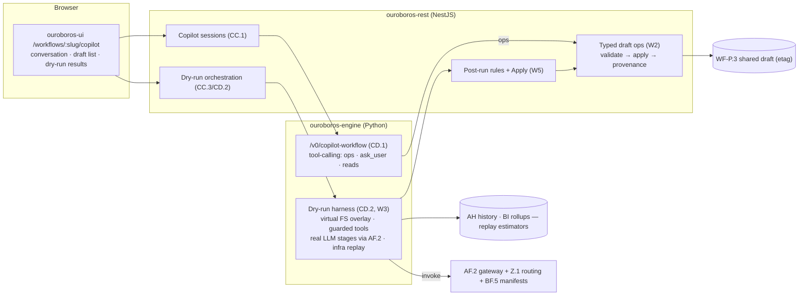
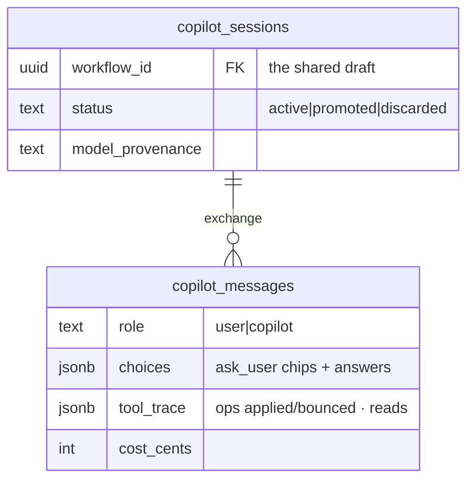
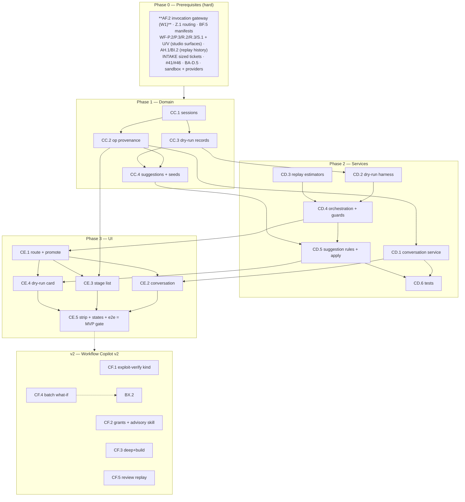

# Roadmap — Workflow Copilot & Dry Run (Mockup 20)

## Description

> Create a roadmap that covers the features for the mockup page 20. Any additional
> tech infrastructure that is required to implement the functionality in these mockup
> pages should be researched and offered as options for implementing in the roadmap.
> The roamdap should include MVP and v2 options, as well as the labels, milestones,
> and the like, for the tickets to be created. Any ticket sources that are used by
> Ouroboros for ingesting should be pluggable, which includes sources like Jira,
> Linear, GitHub, GitLab, and other bug reporting/issue recording sites. Refer to the
> page so that issues can reference the mockup file when creating the UI/UX design of
> the pages. Be very specific when creating the roadmap, as the options in the
> roadmap for the functionality needs to be complete and very thorough.

## Context & Existing Work (duplicate-avoidance survey)

Surveyed 2026-08-09.

**Design source of truth for every UI ticket in this roadmap:**
[`docs/mockups/20-workflow-copilot.html`](mockups/20-workflow-copilot.html)
(with `docs/mockups/assets/ouroboros.css`) — Workflow Copilot & Dry Run. Its
anatomy:

- **Page head** — eyebrow `Workflow Studio · Copilot`, h1 *"Describe the
  workflow. Watch it build. Test it before it touches anything."*, subline:
  *"The third way to edit workflows — same graph as the canvas and the code,
  driven by conversation. Every draft can dry-run against a real issue
  first."* Segment: Visual / Code / **Copilot** (on). Actions: **Discard
  draft**, **Promote draft → security-patch v1** (primary).
- **Conversation card** (`c-5`) — head (model pill, `draft: security-patch`
  tag); the exchange: Ken's brief (*"security patches: always a second
  model's review, never auto-merge, prove the CVE is actually fixed"*),
  Copilot's reply (drafted **security-patch**, the invented **exploit-verify**
  stage explained, plus **two inline choice-chip questions** — trigger
  `label:security ✓` vs `CVE pattern in title`; *"May it read the GitHub
  Advisory DB?"* Yes ✓/No), Ken's refinement (*"label security. yes. also cap
  spend at $5 a run."*), Copilot adding the spend guard + proposing a dry run
  on `#489` (*"no CVE — a useful edge case"*), `dry run #489`, and the result
  summary (*"2m 41s, $0.31, zero side effects — two improvement suggestions
  below the results →"*); composer with the refine placeholder; caption
  *"Copilot edits compile to the same graph as the canvas and the code editor
  — nothing is a special case."*
- **Draft stage list** (`c-7`, `DRAFT — SECURITY-PATCH · UNPUBLISHED`,
  `View as code →`) — nine numbered stage rows with glyphs, config tags
  (trigger `label:security`; analyze `skill:advisory-db` + model; plan;
  implement `routed by task`; build `pool-a`; test `twister full`;
  **exploit-verify** `reruns CVE PoC · sandboxed` + warn pill `added by
  copilot`; review ×2 with two model tags; open PR `never auto-merge`), each
  with an `edit` link to the canvas; footer `9 stages · spend cap $5/run ·
  draft not yet runnable on real issues`.
- **Dry run card** — header (`DRY RUN — #489 …`, pill `simulated — no writes
  · no PRs · no merges`, `2m 41s · $0.31`); per-stage result rows (analyze ✓
  *mapped 4 files · advisory DB skipped (no CVE on this issue)*; plan ✓ *3
  steps · would touch drivers/can/arbitration.c*; implement ✓ `simulated`
  *diff drafted +41 −9 (below) · 84k tokens*; build ✓ `replayed from history`
  *est. 4m 02s (214 similar builds, ±20s)*; **exploit-verify ⏸ skipped** *no
  PoC exists: stage had nothing to do*; review ×2 ✓ *both approve · 1 style
  nit*; open PR ○ *would open DRAFT PR · not merged (policy)*); the
  **simulated diff block** (`@@ … simulated diff (never written to repo) @@`
  with the backoff patch); two **AI suggestion callouts** (glowing accent
  cards: *"Make exploit-verify conditional — add `when: issue.cve != null`"*
  conf 93% with Apply/Explain/Ignore; *"Pin the pr-etiquette skill to both
  reviewers"* — 6/10 replayed pairs disagreed — conf 81%); footer **Re-run
  dry run**, **Dry-run another issue ▾**, `history: 1 dry run · draft v0.3
  (2 copilot edits applied)`.
- **Safety strip** — three columns: *Simulated writes* (diffs drafted in
  memory — repo untouched), *Replayed infra* (build/test estimated from your
  history, farm idle), *Real models* (*"prompts & routing exercised for real
  — that's what you're testing"*).

**The dependency milestone this page marks.** Every prior roadmap staged its
LLM features behind the invocation gateway (AF.2). This page *is* the LLM
feature — a conversational author and a dry run that exercises real models.
There is no honest non-AI MVP that preserves its essence (mockups 04/05
already deliver the non-AI studio surfaces). This roadmap therefore is the
first to declare **AF.2 as a hard MVP prerequisite**, and spends its staging
budget inside the feature instead: typed-operation editing (never free-form
mutation), a guard-railed simulation harness, deterministic post-run
suggestions with LLM enrichment, and v2 for the genuinely heavy new surfaces
(the sandboxed PoC-runner stage kind, advisory-DB grants, real-build mode).

**Overlapping work and dispositions:**

| Existing work | Disposition under this roadmap |
|---|---|
| WF-P.2/P.3 (DSL schema, shared drafts, publish), WF-S.1/S.6 (studio shell, seg control — Copilot "soon"), U/V/W (code view) | **Composed** — copilot edits are typed DSL operations applied to the *same* P.3 draft under the same etag discipline; the seg's Copilot goes live (amendment); `View as code →` and `edit` links land on the real surfaces; promote = the shared publish gate (validation + engine). |
| WF-R.2 deterministic dry-run (walk + explanations) | **Kept & layered** — R.2 remains the fast pre-check (runs before every deep dry run; structural failures stop early); the deep dry run is the new layer. |
| AF.2 invocation gateway (providers v2), Z.1 routing resolution | **Hard prerequisite** — LLM stages invoke through AF.2 with real routing (the safety strip's "real models" column); dry-run spend rides the same accounting (`$0.31` real). |
| AH build history + BI rollups | **Consumed** — the infra-replay estimator (`est. 4m 02s (214 similar builds, ±20s)`) is similar-build statistics over farm history. |
| AP.5 simulated driver, AO run plane | **Distinct** — AP.5 is scripted lifecycle simulation for testing; this harness runs *real models with virtualized writes*. Dry runs record into their own domain (CC.3), not the run read-model (no fake runs on dashboards — honesty). |
| Knowledge BF (skills, context assembly) | **Consumed** — dry-run LLM stages inject real manifests (BF.5); the pr-etiquette suggestion references a real skill; `skill:advisory-db` renders as an unresolved-reference warning until CF.2 creates it (WF-P7 validation honesty). |
| INTAKE (sized tickets), `/ouro dry-run` (BZ.3) | **Composed** — dry-run issue pickers use canonical tickets (tracker-pluggability inherited — the description's requirement, already satisfied by WF-Q); the chatops command's async result links here (amendment: the Copilot-link reply goes live). |
| BX.2 (simulate on last 50 loops), BQ policies | **Boundaries** — batch what-if simulation stays BX.2 (shared harness noted); the `never auto-merge` and `$5/run` guards compile into the draft's policy-relevant config, enforced by the existing planes on promote. |
| Scaffolding #49, #56 | **Superseded for the copilot route**; #56 gains a copilot leg. |

Epic letters continue the sequence (…BY–CB): this roadmap uses **CC, CD, CE,
CF**.

## Infrastructure Options (researched — thorough, pick before filing)

### 1. Copilot editing architecture

| Option | What it is | Fit | Trade-offs |
|---|---|---|---|
| **A — Tool-calling LLM emitting typed DSL operations** ⭐ recommended | `/v0/copilot-workflow` runs a tool-calling loop whose tools are **typed draft operations** (`add_stage`, `set_stage_config`, `add_edge`, `set_trigger`, `set_guard`, `remove_stage`) validated against WF-P.2 before application, plus `ask_user(question, options[])` (the choice chips) and read tools (catalog, skills, current draft); every applied op is recorded (the `2 copilot edits applied` provenance and the `added by copilot` pill) | The caption's promise — "nothing is a special case" — enforced structurally: the model can only produce the same operations the canvas produces; invalid ops bounce with validator feedback for self-correction | The op vocabulary must cover the DSL (kept in lockstep with WF-P.2 via shared schema tests) |
| B — LLM writes the DSL JSON document | Single-shot document generation, diffed + validated | Simpler loop | Whole-document rewrites make provenance and minimal-diff review hard; validator errors are harder to self-correct — rejected as primary (kept as a bulk-bootstrap fallback inside A) |
| C — LLM writes the U-grammar TypeScript | Reuses the U.2 parser | One more surface exercised | Indirection adds failure modes without adding capability — rejected |

### 2. Deep dry-run execution harness

| Option | What it is | Fit | Trade-offs |
|---|---|---|---|
| **A — Hybrid harness: real LLM stages over a virtualized workspace + history-replayed infra + hard tool-boundary guards** ⭐ recommended | LLM stages (analyze/plan/implement/review) run genuinely through AF.2 with knowledge manifests, but their tools are virtualized: reads served lazily from the provider API over a pinned commit (cached), writes land in an **in-memory overlay** (the simulated diff — never the repo); infra stages (build/test) are **replayed**: similar-build estimators over AH history (pool + config-class matching, sample count + spread reported); guard rails at the tool boundary: no SPI writes, no farm dispatch, no PR capability, spend capped per dry run; conditional stages evaluate honestly (the skipped exploit-verify row) | Exactly the safety strip's three columns; tests what matters (prompts, routing, plans) without side effects; cheap enough to iterate (`$0.31`) | Build/test results are estimates, labeled as such (`replayed from history`); full-fidelity builds are the CF.3 opt-in |
| B — Real execution on a throwaway branch | Actual farm builds, draft PRs | Highest fidelity | Slow, costs farm time, leaves artifacts — the v2 `deep+build` mode (CF.3), not the default |
| C — LLM-simulated environment (ToolEmu-style) | A model predicts tool results | No infra at all | Predicted build outcomes would be fabricated numbers — violates the honesty spine; rejected for infra (the deterministic replay is strictly better here) |

### 3. Workspace snapshot strategy

| Option | What it is | Fit | Trade-offs |
|---|---|---|---|
| **A — Lazy provider-API file fetch over a pinned commit + LRU cache** ⭐ recommended MVP | The virtual FS resolves reads on demand from the git host at the dry run's pinned sha; caches per repo+sha; overlay holds writes | No clone infrastructure; fast start; token-cheap for the few files a dry run touches | Deep tree operations (large refactors) page a lot — the CF.3/BD.4 clone tier covers them |
| B — Shallow clone per dry run | Full local tree | Complete | Clone latency + storage per run; deferred to the deep tier |

### 4. Post-run suggestion generation

| Option | What it is | Fit | Trade-offs |
|---|---|---|---|
| **A — Deterministic outcome rules first + LLM enrichment in the same conversation** ⭐ recommended | Rule pack over dry-run results: stage-skipped-with-nothing-to-do → conditional-`when` suggestion (the mockup's 93% card is literally this rule); reviewer-pair disagreement stats (when replay data exists) → shared-skill suggestion; budget-near-cap → cap warning; each rule's suggestion carries its computed evidence; the copilot may add LLM suggestions, provenance-labeled, applied via the same typed ops with Apply/Ignore | The flagship suggestions are auditable arithmetic; LLM adds breadth with the same confirm discipline (AB.3/BX rules) | Confidence figures per the documented scoring (rule strength × sample), never invented |

## Decisions proposed by this roadmap (validate before issue creation)

| # | Decision | Rationale |
|---|----------|-----------|
| W1 | **AF.2 is a hard MVP prerequisite** — the first roadmap in the series to require the invocation gateway for its MVP; the page ships whole or not at all (the non-AI studio already exists in 04/05) | An honest reading of what this page is; staging happens inside the feature, not by hollowing it. |
| W2 | **Copilot edits = typed operations on the shared draft** (option 1-A): validated ops, etag discipline, per-op provenance (`added by copilot`, `draft v0.3 · 2 copilot edits applied`), choice-chips via an `ask_user` tool | "Same graph, nothing special-cased" as architecture; the canvas/code surfaces see copilot edits instantly. |
| W3 | **The deep dry run = option 2-A**: real LLM stages (AF.2 + Z.1 routing + BF.5 manifests), virtualized writes (in-memory overlay, the `never written to repo` diff), replayed infra (similar-build estimators with sample counts), tool-boundary guards (no SPI writes/farm/PR capabilities, per-run spend cap), R.2 as the structural pre-check | The safety strip's three claims as mechanism; every result row's `how` label (`simulated`/`replayed from history`/`skipped`) is the harness's truth. |
| W4 | **Dry runs are their own domain** — records (per-stage results, overlay diffs, costs, history) live in copilot/dry-run tables, never the run read-model; dashboards/insights unaffected | No fake runs anywhere; the `history: 1 dry run` line is this domain's data. |
| W5 | **Suggestions = deterministic rules + LLM enrichment** (option 4-A), applied only via the typed ops with explicit Apply (the suggest-confirm spine); Explain renders the rule/evidence | The two mockup callouts are one rule-derived and one replay-stat-derived — both computable. |
| W6 | **Promote = the shared publish gate**: `Promote draft → <name> v1` runs P.3's zod + R.2 engine validation; the security-critical configs the conversation set (never-auto-merge, $5 cap) compile into the DSL/policy-relevant config the existing enforcement planes honor; Discard confirms with the conversation preserved | The conversation's promises become enforceable data on promote, not chat memories. |
| W7 | **Unresolved references render honestly**: `skill:advisory-db` (not yet a skill) and the `exploit-verify` stage kind (not yet in the catalog) carry unresolved-reference warnings per WF-P7; the copilot tells the user what exists vs what it invented (the stage kind lands CF.1/CF.2) | The copilot may *propose* novel stages; the system must not pretend they're executable until their kinds exist. |
| W8 | **Dry-run issue pickers rank by usefulness** (the `#489 — a useful edge case` recommendation): a deterministic edge-case scorer (trigger-mismatch dimensions, e.g. security workflow × no-CVE issue) feeding the copilot's proposal | The mockup's smartest small moment, computable. |
| W9 | **Cross-surface amendments**: WF-S.1's Copilot segment live; `/ouro dry-run`'s reply links here (BZ.3); V.1's mode-switch preserves the copilot conversation context | The third editing surface joins the other two coherently. |
| W10 | **Labels**: new `copilot`; **Milestones**: `Workflow Copilot MVP` / `Workflow Copilot v2` created at filing; complexity chips XS–L | Description requires labels + milestones for the filing pass. |

## Architecture Overview



## MVP Definition

The MVP is **mockup 20 whole**: conversational authoring over the shared
draft, a guard-railed deep dry run with real models, rule-grounded
suggestions, and the promote gate — with AF.2 as its stated prerequisite. It
is done when, against the compose stack (with the provider gateway live):

1. `/workflows/:slug/copilot` reproduces
   [`docs/mockups/20-workflow-copilot.html`](mockups/20-workflow-copilot.html)
   pixel-faithfully in **both themes**: head + live segment, the
   conversation card (bubbles, choice chips, composer), the draft stage
   list (glyphs, tags, provenance pills, edit links), the dry-run card
   (result rows with `how` labels, the simulated diff, suggestion
   callouts, history footer), and the safety strip.
2. **Conversation authors the draft** (W2): the mockup's brief produces a
   multi-stage draft via typed ops (visible immediately in the canvas and
   code views — one-draft proof); choice chips round-trip as `ask_user`
   answers; refinements (spend cap) land as ops; provenance counts and
   the `added by copilot` pill render; invalid model proposals
   self-correct against validator feedback (fixture).
3. **The deep dry run runs real models safely** (W3/W4): a chosen sized
   ticket runs the draft — R.2 pre-check, then LLM stages invoking
   through AF.2 with real routing + knowledge manifests over the virtual
   workspace (reads lazy-fetched at a pinned sha; writes in the overlay,
   rendered as the `never written to repo` diff); infra stages replayed
   with sample-count estimates; conditional/empty stages skip with
   reasons; guards provably block SPI writes/farm/PRs (test suite); cost
   + duration accounted (`$0.31`-class truth); results recorded in the
   dry-run domain only.
4. **Suggestions ground and apply** (W5): the skipped-stage rule yields
   the conditional-`when` card with computed confidence; Apply mutates
   the draft via ops (v0.3 → v0.4); Explain shows the rule + evidence;
   LLM-enriched suggestions are provenance-labeled.
5. **Promote and discard work** (W6): promote runs the shared gate and
   publishes v1 with the conversation-set guards compiled; unresolved
   references (W7) warn honestly and block-or-flag per validation
   policy; discard confirms.
6. **The pickers are smart and honest** (W8): dry-run-another-issue
   ranks edge cases with reasons; `/ouro dry-run` links land here (W9).
7. Integration tests cover the op vocabulary vs DSL parity, session
   flows, harness guards (the security-critical suite), overlay/diff
   fidelity, estimator math, suggestion rules, promote gating; the e2e
   leg walks brief → chips → dry run → suggestion apply → promote.

**Explicitly v2 (milestone `Workflow Copilot v2`):** the `exploit-verify`
stage kind + sandboxed PoC runner (CF.1), advisory-DB/knowledge access
grants as first-class conversation permissions (CF.2), the `deep+build`
real-infra mode (CF.3), batch what-if dry runs shared with BX.2 (CF.4),
review-replay statistics powering the reviewer-disagreement suggestion
class (CF.5).

## Epics, Labels & Milestones

| Epic | Name | Goal | Modules | Milestone |
|------|------|------|---------|-----------|
| CC | Copilot Domain | Sessions/messages, op provenance, dry-run records, suggestions, seeds | ouroboros-db | Workflow Copilot MVP |
| CD | Copilot & Dry-Run Services | Conversation service, typed ops, the harness, estimators, rules | ouroboros-engine, ouroboros-rest | Workflow Copilot MVP |
| CE | Copilot UI | Conversation, draft list, dry-run results, safety strip, e2e | ouroboros-ui | Workflow Copilot MVP |
| CF | Advanced Verification (v2) | PoC-runner stage kind, access grants, deep+build, batch what-if | all | Workflow Copilot v2 |

Issue naming: `<project>: [<epic>.<issue>] <title>`. Labels: existing set (`mvp`,
`v2`, `rest`, `db`, `engine`, `ui`, `ci`, `design`, `workflow`) **plus new
`copilot`** (decision W10). Milestones **`Workflow Copilot MVP`** /
**`Workflow Copilot v2`** created at filing; every issue assigned. Complexity
chips: **XS · S · M · L**.

---

## Epic CC — Copilot Domain (`ouroboros-db`)

| Issue | Title | Summary | Labels | Parallel | MVP | Complexity | Affected Modules |
|-------|-------|---------|--------|:--------:|:---:|:----------:|------------------|
| CC.1 | ouroboros-db: [CC.1] Copilot sessions & messages | Typed conversation records: bubbles, chips, tool traces | mvp, copilot, db | N (after WF-P.1) | Y | M | ouroboros-db |
| CC.2 | ouroboros-db: [CC.2] Draft-operation provenance | Applied ops per draft: actor, source, versions (`v0.3`) | mvp, copilot, db | N (after CC.1, WF-P.1) | Y | S | ouroboros-db |
| CC.3 | ouroboros-db: [CC.3] Dry-run records | Per-stage results, overlay diffs, costs, history — own domain (W4) | mvp, copilot, db | N (after CC.1) | Y | M | ouroboros-db |
| CC.4 | ouroboros-db: [CC.4] Suggestions & seeds — mockup-20 parity | Rule/LLM suggestion rows; the full seeded exchange; ci probes | mvp, copilot, db, ci | N (after CC.2/CC.3, #24) | Y | M | ouroboros-db, .github |

### Issue CC.1 — ouroboros-db: [CC.1] Copilot sessions & messages

- **Problem Statement:** The conversation is a durable artifact — bubbles,
  choice questions with answers, and the tool activity behind each reply.
- **Solution/Scope:** Migration: `copilot_sessions` — org FK, workflow FK
  (the draft it edits), `status` CHECK `active|promoted|discarded`,
  model provenance (resolved alias per exchange), created_by/at;
  `copilot_messages` — session FK, seq, `role` CHECK `user|copilot`,
  `body` text, `choices` jsonb nullable (`ask_user` questions: prompt,
  options, selected, answered_at — the chip rows), `tool_trace` jsonb
  (ops proposed/applied/bounced, reads performed — the audit substrate),
  token/cost accounting per exchange, ts; retention via BQ.3
  (chat-class tier).
- **Acceptance Criteria:** The mockup's six-message exchange representable
  (incl. both chip sets with selections); tool traces capture op
  outcomes; session↔draft linkage enforced (one active session per
  draft).
- **Parallelism/Dependencies:** Needs WF-P.1. Blocks CC.2–CC.4, CD.1.
- **Technical Stack:** PostgreSQL 17, Flyway.
- **Epic:** CC



### Issue CC.2 — ouroboros-db: [CC.2] Draft-operation provenance

- **Problem Statement:** `draft v0.3 (2 copilot edits applied)` and the
  `added by copilot` pill need per-op provenance on the shared draft
  (W2) — visible to all three editing surfaces.
- **Solution/Scope:** `draft_operations` — workflow FK, `draft_rev` (the
  v0.N counter, incremented per applied op batch), `op` jsonb (typed:
  kind + params, WF-P.2-validated shape), `actor` CHECK
  `canvas|code|copilot|suggestion` + user/session refs, applied_at;
  node-level provenance projection (which stages carry copilot origin —
  the pill's source; cleared on human edit); WF-P.1 amendment: the
  draft row carries `draft_rev` + a provenance summary the canvas/code
  surfaces read.
- **Acceptance Criteria:** Op history replays to the current draft
  (consistency check); rev counts match applied batches; pill
  provenance flips on human edit; all three actors record.
- **Parallelism/Dependencies:** Needs CC.1, WF-P.1 (amendment). Feeds
  CD.1, CE.3.
- **Technical Stack:** PostgreSQL 17, Flyway.
- **Epic:** CC

```
ops: [{add_stage exploit-verify, actor: copilot, rev 0.2},
      {set_guard spend_cap 500¢, actor: copilot, rev 0.3}]
stage.exploit-verify.provenance = copilot ─▶ "added by copilot" pill
```

### Issue CC.3 — ouroboros-db: [CC.3] Dry-run records

- **Problem Statement:** Dry runs need their own domain (W4): per-stage
  results with `how` labels, overlay diffs, costs, and history — never
  touching the run read-model.
- **Solution/Scope:** `dry_runs` — session FK nullable (also startable
  from the studio), workflow FK + draft_rev, ticket FK (canonical —
  tracker-agnostic), pinned sha, `status` CHECK
  `precheck|running|complete|failed|budget_stopped`, totals (duration,
  cost, tokens), guard-audit summary (what was blocked — should be
  empty), started/finished; `dry_run_stages` — dry_run FK, stage key,
  `verdict` CHECK `ok|skipped|failed|not_reached`, `how` CHECK
  `llm|replayed|deterministic|skipped`, `note` (composed result line),
  metrics jsonb (tokens, est. duration + sample count + spread for
  replays, files touched); `dry_run_artifacts` — overlay diffs (bounded,
  the simulated-diff block), plan/review excerpts; per-draft history
  (the footer line).
- **Acceptance Criteria:** The mockup's seven result rows + diff
  representable with exact `how`/note composition; history per draft;
  budget-stopped state distinct; zero coupling to `runs` (schema
  isolation verified).
- **Parallelism/Dependencies:** Needs CC.1. Blocks CC.4, CD.2.
- **Technical Stack:** PostgreSQL 17, Flyway.
- **Epic:** CC

```
dry_run{#489, sha: b7e…, 2m41s, $0.31, guards: clean}
  stages: analyze{llm, "mapped 4 files · advisory skipped (no CVE)"} ·
          build{replayed, est 4m02s (n=214, ±20s)} · exploit-verify{skipped, "no PoC"}
  artifacts: overlay diff drivers/can/arbitration.c +41 −9
```

### Issue CC.4 — ouroboros-db: [CC.4] Suggestions & seeds — mockup-20 parity

- **Problem Statement:** Suggestion rows with rule/LLM provenance, and
  the full seeded page state over the shared universe.
- **Solution/Scope:** `dry_run_suggestions` — dry_run FK, `source` CHECK
  `rule|llm` + rule id/provenance, `title`, `body` (evidence-composed),
  `proposed_ops` jsonb (the typed ops Apply executes), `confidence` +
  scoring basis, `status` CHECK `open|applied|ignored`, resolution refs;
  **seeds**: the security-patch session (six messages, chips answered),
  the nine-stage draft at v0.3 with copilot provenance (+ the
  unresolved-reference warnings for `advisory-db`/`exploit-verify` per
  W7), the completed dry run on the seeded `#489` (rows, diff, costs),
  the two suggestions (rule-derived conditional-`when` at 93%, the
  replay-stat reviewer card at 81% marked `source: rule` with its CF.5
  data seeded as historical), history line; ci probes (vocab, op-shape
  validation, suggestion ops validity).
- **Acceptance Criteria:** Page renders the mockup from seeds (incl. W7
  warnings); suggestion `proposed_ops` validate against the draft;
  probes red/green verified; coherent with INTAKE's `#489`.
- **Parallelism/Dependencies:** Needs CC.2/CC.3 (+INTAKE-K.5
  coordination).
- **Technical Stack:** Flyway repeatable migration, SQL.
- **Epic:** CC

```
seeds: session(6 msgs, chips ✓) · draft v0.3 (9 stages, 2 copilot ops, W7 warnings) ·
       dry run #489 (7 rows + diff + $0.31) · 2 suggestions (93%/81%, ops attached)
```

---

## Epic CD — Copilot & Dry-Run Services (`ouroboros-engine` + `ouroboros-rest`)

| Issue | Title | Summary | Labels | Parallel | MVP | Complexity | Affected Modules |
|-------|-------|---------|--------|:--------:|:---:|:----------:|------------------|
| CD.1 | ouroboros-engine: [CD.1] Copilot conversation service | `/v0/copilot-workflow`: tool-calling ops + ask_user + reads (W2) | mvp, copilot, engine, rest | N (after CC.2, WF-P.2, AF.2) | Y | L | ouroboros-engine, ouroboros-rest |
| CD.2 | ouroboros-engine: [CD.2] Deep dry-run harness | Virtual FS, guarded tools, real LLM stages, conditional logic (W3) | mvp, copilot, engine | N (after CC.3, AF.2, BF.5) | Y | L | ouroboros-engine |
| CD.3 | ouroboros-rest: [CD.3] Infra replay estimators | Similar-build/test statistics with sample counts + spread | mvp, copilot, rest | N (after AH.1, BI.2) | Y | M | ouroboros-rest |
| CD.4 | ouroboros-rest: [CD.4] Dry-run orchestration & guards | Pre-check, budget caps, guard enforcement audit, records | mvp, copilot, rest | N (after CD.2/CD.3, WF-R.2) | Y | M | ouroboros-rest |
| CD.5 | ouroboros-rest: [CD.5] Suggestion rules & apply flow | Deterministic post-run rules, edge-case picker, op application | mvp, copilot, rest | N (after CD.4, CC.4) | Y | M | ouroboros-rest |
| CD.6 | ouroboros-rest: [CD.6] Copilot integration tests | Op parity, harness guards, estimator math, promote gate | mvp, copilot, rest, ci | N (after CD.1–CD.5) | Y | M | ouroboros-rest |

### Issue CD.1 — ouroboros-engine: [CD.1] Copilot conversation service

- **Problem Statement:** The conversational author (W2): a tool-calling
  loop whose only write path is typed, validated draft operations.
- **Solution/Scope:** `/v0/copilot-workflow` (routed task kind, AF.2):
  system context (DSL schema, stage catalog WF-R.3, skills registry
  BF.1, current draft, org policies for guard vocabulary); tools:
  the op set (validated REST-side against WF-P.2 before application —
  bounced ops return validator messages for self-correction, bounded
  retries), `ask_user(prompt, options)` (returns as chips; answers
  re-enter the loop), reads (draft state, ticket lookups for dry-run
  proposals via the W8 scorer), `propose_dry_run(ticket, reason)`;
  REST-side session orchestration (message persistence, op application
  under the P.3 etag, provenance CC.2, cost accounting per exchange);
  novel-reference behavior per W7 (the copilot may add stages/skills
  that don't resolve — it must say so, and the draft carries warnings);
  conversation continuity across surface switches (W9).
- **Acceptance Criteria:** The mockup brief reproduces a security-patch-
  class draft via ops (fixture: op sequence validates + applies);
  bounced-op self-correction verified; chips round-trip; W7 phrasing
  present when inventing; cost per exchange recorded; etag conflicts
  (canvas edit mid-conversation) surface gracefully.
- **Parallelism/Dependencies:** Needs CC.2, WF-P.2, **AF.2**. Blocks
  CD.5, CE.2.
- **Technical Stack:** FastAPI tool-calling, NestJS orchestration.
- **Epic:** CD

```
"security patches: second review, never auto-merge, prove the CVE fixed"
 ─▶ ops: add_stage(review×2) · set_terminal(never_auto_merge) · add_stage(exploit-verify*) …
 ─▶ ask_user("What triggers it?", [label:security, CVE pattern])   *unresolved kind — said so
```

### Issue CD.2 — ouroboros-engine: [CD.2] Deep dry-run harness

- **Problem Statement:** The page's crown jewel (W3): real models,
  virtual writes, replayed infra, provable guards.
- **Solution/Scope:** Harness in the engine: **virtual workspace**
  (lazy provider-API reads at the pinned sha with LRU cache — option
  3-A; in-memory overlay for writes; diff extraction for artifacts);
  **guarded tool set** (read_file/edit_file/search over the virtual FS;
  run_tests/build → replay stubs; *no* network/SPI/farm/PR tools —
  allow-list enforcement + an audit trail asserting zero blocked-call
  leaks); **stage execution**: LLM stages via AF.2 with Z.1 routing +
  BF.5 manifests (real prompts/skills — the point), per-stage token/
  cost caps (the dry-run budget), conditional evaluation (predicates
  over the ticket → the skipped-with-reason rows), unresolved-kind
  stages auto-skip with the W7 warning; review stages produce verdict
  + notes (`both approve · 1 style nit`); result composition (the
  note lines per row) deterministic from stage outputs.
- **Acceptance Criteria:** The seeded `#489` dry run reproduces the
  mockup's rows/diff-shape/costs-class against live providers (compose
  + gateway); the guard suite is exhaustive (every forbidden tool
  provably absent/blocked, overlay never flushes); conditional skips
  correct; budget-stop mid-run clean.
- **Parallelism/Dependencies:** Needs CC.3, **AF.2**, BF.5 (+CD.3
  stubs). Blocks CD.4.
- **Technical Stack:** Python virtual FS, AF.2 client, guard framework.
- **Epic:** CD

```
implement(stage) ─▶ tools{read_file: lazy@sha, edit_file: overlay} ─▶ diff +41 −9 (memory)
build(stage) ─▶ replay stub ─▶ CD.3 estimate · exploit-verify ─▶ predicate false ─▶ skipped("no PoC")
guards: farm ∅ · SPI-write ∅ · PR ∅ — audited clean
```

### Issue CD.3 — ouroboros-rest: [CD.3] Infra replay estimators

- **Problem Statement:** `est. 4m 02s (214 similar builds, ±20s)` —
  honest infra estimates from farm history.
- **Solution/Scope:** Estimator service: similarity classing (repo +
  pool + executor + config-class from AH job snapshots), windowed
  statistics (median + spread + sample count — all reported; below a
  sample floor → `insufficient history` honesty instead of a number),
  test-duration estimators likewise (AS wall-time by suite set); cache
  hit-probability context (AG.5 stats) as a range note; the harness's
  replay stubs consume it; registered formulas (BI registry style) for
  the Details popover.
- **Acceptance Criteria:** Seeded history reproduces the mockup estimate
  (n=214, ±20s); sample-floor fixture renders the honest fallback;
  formulas documented.
- **Parallelism/Dependencies:** Needs AH.1, BI.2. Feeds CD.2.
- **Technical Stack:** NestJS, Kysely statistics.
- **Epic:** CD

```
estimate(build, pool-a, config-class X) ─▶ {median: 242s, spread: ±20s, n: 214}
n < 12 ─▶ "insufficient history — first real build will measure"
```

### Issue CD.4 — ouroboros-rest: [CD.4] Dry-run orchestration & guards

- **Problem Statement:** The run lifecycle around the harness: pre-check,
  budgets, guard audit, records, and the API surface.
- **Solution/Scope:** `POST /api/v1/workflows/:slug/dry-runs` (ticket +
  draft rev; member+): WF-R.2 structural pre-check first (failures
  return anchored findings without invoking anything), budget
  computation (org dry-run cap + the draft's spend guard if tighter),
  harness dispatch + streamed progress (stage-by-stage status for the
  UI), record persistence (CC.3) with the guard-audit summary,
  cancellation; re-run + another-issue endpoints (the W8 edge-case
  scorer: rank sized tickets by trigger-dimension mismatch coverage
  with reasons); history API per draft; the safety-strip payload
  (each column traced to its mechanism — the CE.5 truth source).
- **Acceptance Criteria:** Full lifecycle in the harness (pre-check
  fail-fast, progress stream, budget stop, cancel); guard-audit
  summary empty on clean runs and populated on injected-violation
  fixtures (which also fail the run); the edge-case picker ranks the
  seeded `#489`-class mismatch first with its reason.
- **Parallelism/Dependencies:** Needs CD.2/CD.3, WF-R.2. Blocks CD.5,
  CE.4.
- **Technical Stack:** NestJS, engine client.
- **Epic:** CD

```
POST dry-runs{#489, v0.3} ─▶ R.2 ✓ ─▶ budget min($org, $5 guard) ─▶ harness ─▶ record + audit: clean
picker: #489 (security×no-CVE — exercises the conditional path) · #491 (has-CVE-like labels)…
```

### Issue CD.5 — ouroboros-rest: [CD.5] Suggestion rules & apply flow

- **Problem Statement:** Post-run intelligence (W5): deterministic rules
  over outcomes, LLM enrichment through the conversation, and Apply as
  typed ops.
- **Solution/Scope:** Rule pack (versioned): skipped-with-nothing-to-do →
  conditional-`when` suggestion (op: set stage predicate; confidence
  from rule strength — the 93% class), budget-proximity → cap-raise
  warning, unresolved-reference persistence → resolve-or-remove
  suggestion, replay-disagreement (consumes CF.5 data when present —
  the 81% card renders only with its data, W-honesty); LLM enrichment:
  the copilot receives dry-run results in-conversation and may propose
  additional suggestions (source-labeled, ops-validated); **Apply** →
  op application (CC.2 provenance `suggestion`, draft rev bump) +
  suggestion resolution; Explain → rule + evidence payload; Ignore
  persists.
- **Acceptance Criteria:** The seeded skipped stage yields the exact
  conditional suggestion with valid ops; Apply bumps v0.3→v0.4 and the
  next dry run honors the predicate; the replay-stat card absent
  without its data (honesty fixture); LLM suggestions labeled.
- **Parallelism/Dependencies:** Needs CD.4, CC.4. Feeds CE.4.
- **Technical Stack:** NestJS rule pack, CD.1 loop.
- **Epic:** CD

```
rule(skipped, nothing-to-do) ─▶ suggest{ops: [set_predicate(exploit-verify,
  {cve_present})], conf: 93 (rule: deterministic-skip)} ─▶ Apply ─▶ v0.4 ─▶ re-run: skips cleanly
```

### Issue CD.6 — ouroboros-rest: [CD.6] Copilot integration tests

- **Problem Statement:** Op-DSL parity, harness guards, and the
  promote gate are the safety core of a page that writes workflows by
  conversation.
- **Solution/Scope:** Suites: op vocabulary ⊇ DSL coverage (schema
  parity test — a DSL construct without an op fails CI), session flows
  (chips, bounced-op correction, etag conflicts), the guard suite
  (exhaustive forbidden-tool matrix), overlay fidelity (diff ≡ overlay
  state), estimator math + floors, rule matrix + honest absences,
  promote gate (validation + guard compilation into the published
  version), discard, isolation.
- **Acceptance Criteria:** Green in `ci/rest` (+engine goldens);
  removing a guard or the op validator turns tests red; ≤ 120s added.
- **Parallelism/Dependencies:** Needs CD.1–CD.5.
- **Technical Stack:** Jest, Testcontainers, engine pytest.
- **Epic:** CD

```
suites: op⊇DSL ✓ · session ✓ · guards(exhaustive) ✓ · overlay ✓ · estimators ✓ · promote ✓
```

---

## Epic CE — Copilot UI (`ouroboros-ui`)

Every issue references
[`docs/mockups/20-workflow-copilot.html`](mockups/20-workflow-copilot.html)
as the design source — bubble/chip/stage-row/res-row/suggest/safe-col
treatments — via the #16 tokens (both themes; the mockup is dark-only).

| Issue | Title | Summary | Labels | Parallel | MVP | Complexity | Affected Modules |
|-------|-------|---------|--------|:--------:|:---:|:----------:|------------------|
| CE.1 | ouroboros-ui: [CE.1] Copilot route, head & promote/discard | Third-surface frame, live segment, the promote gate flow | mvp, copilot, ui, design | N (after WF-S.1, CD.4, BA-D.5) | Y | M | ouroboros-ui |
| CE.2 | ouroboros-ui: [CE.2] Conversation card | Bubbles, choice chips, composer, streaming replies | mvp, copilot, ui, design | N (after CE.1, CD.1) | Y | L | ouroboros-ui |
| CE.3 | ouroboros-ui: [CE.3] Draft stage list | Numbered rows, tags, provenance pills, W7 warnings, edit links | mvp, copilot, ui, design | N (after CE.1, CC.2) | Y | M | ouroboros-ui |
| CE.4 | ouroboros-ui: [CE.4] Dry-run card | Result rows, simulated diff, suggestion callouts, pickers | mvp, copilot, ui, design | N (after CE.1, CD.4/CD.5) | Y | L | ouroboros-ui |
| CE.5 | ouroboros-ui: [CE.5] Safety strip, states & e2e leg | Mechanism-traced strip; cold/error states; the full-chain e2e | mvp, copilot, ui, ci | N (after CE.2–CE.4) | Y | M | ouroboros-ui, .github |

### Issue CE.1 — ouroboros-ui: [CE.1] Copilot route, head & promote/discard

- **Problem Statement:** The third surface joins the studio: the live
  segment (W9), the draft-named promote action, and discard.
- **Solution/Scope:** `/workflows/:slug/copilot`: head per the mockup
  (subline verbatim), the segment with all three surfaces live
  (WF-S.1/V.1 amendments — mode switches preserve the conversation
  and draft context), **Promote draft → <name> v1** (the shared
  publish dialog with the conversation-set guards summarized in the
  confirm — W6; validation findings anchor back into the stage list),
  **Discard draft** (confirm; conversation preserved read-only);
  new-workflow entry (a copilot session can start from blank via the
  rail's + flow — amendment).
- **Acceptance Criteria:** Segment round-trips all three surfaces with
  state; promote publishes v1 with guards compiled (verified against
  the policy planes); discard preserves the transcript; both themes;
  #49 stub retired (amendment).
- **Parallelism/Dependencies:** Needs WF-S.1, CD.4, BA-D.5. Blocks
  CE.2–CE.5.
- **Technical Stack:** Next.js, studio shell.
- **Epic:** CE

```
(Visual|Code|●Copilot)   [Discard draft][Promote draft → security-patch v1]
promote ─▶ "publishes v1 · never-auto-merge + $5/run guard compiled" ─▶ shared gate ─▶ v1 ✓
```

### Issue CE.2 — ouroboros-ui: [CE.2] Conversation card

- **Problem Statement:** The conversation surface: bubbles with the
  mockup's treatments, working choice chips, streamed replies, and the
  composer.
- **Solution/Scope:** Chat card per the mockup (user right-aligned
  raised bubbles, copilot inset bubbles with accent meta, mono meta
  lines), streaming reply rendering (token stream from CD.1 with
  op-application markers — "adding stage… ✓" inline affordances),
  **choice chips** (selectable rows inside bubbles; selection posts
  the answer and re-enters the loop; answered state per the mockup's
  ✓ chips), composer (placeholder verbatim; disabled-with-reason
  during runs), error states (bounced-op retries surfaced briefly,
  provider failures honest), cost affix per exchange (subtle,
  N10 honesty), session scroll/history.
- **Acceptance Criteria:** The seeded exchange renders pixel-close
  (both themes); live conversation streams with op markers; chips
  round-trip; provider-outage state designed; keyboard/a11y complete.
- **Parallelism/Dependencies:** Needs CE.1, CD.1.
- **Technical Stack:** React, streaming client.
- **Epic:** CE

```
[Ken] "Create a workflow for security patches…"
[Copilot] "Drafted security-patch — 8 stages…"  ① (label:security ✓)(CVE pattern)
          ② (Yes ✓)(No)          └ applying ops… ✓ draft v0.2
```

### Issue CE.3 — ouroboros-ui: [CE.3] Draft stage list

- **Problem Statement:** The live draft rendered as the mockup's stage
  rows — with provenance pills, W7 unresolved-reference warnings, and
  the cross-surface edit links.
- **Solution/Scope:** Stage rows from the shared draft (numbered, glyph
  by kind, name, config tags composed from stage config — skill/model/
  pool/policy tags; the `never auto-merge`/spend-cap footer from the
  compiled guards), provenance pills (`added by copilot` per CC.2,
  cleared on human edit), **W7 warnings** (unresolved skill/kind tags
  in warn treatment with explain popovers — "this skill doesn't exist
  yet"), `edit` links → canvas focused on the node, `View as code →`;
  live updates as ops apply (the watch-it-build moment: rows appear/
  change during CE.2 streaming); footer status line (stages count,
  guards, runnable-state honesty).
- **Acceptance Criteria:** Seeded list matches the mockup incl. the
  warn pill + W7 popovers; live op application animates rows in;
  edit links land focused; both themes.
- **Parallelism/Dependencies:** Needs CE.1, CC.2 (+draft reads).
- **Technical Stack:** React, #46 primitives.
- **Epic:** CE

```
07 ⌖ exploit-verify [reruns CVE PoC][sandboxed⚠ kind not in catalog ⓘ][added by copilot]  edit
9 stages · spend cap $5/run · draft not yet runnable on real issues
```

### Issue CE.4 — ouroboros-ui: [CE.4] Dry-run card

- **Problem Statement:** The results surface: per-stage rows with their
  `how` truth, the simulated diff, the glowing suggestion callouts,
  and the run controls.
- **Solution/Scope:** Card per the mockup: header (title from the
  ticket, the simulated pill verbatim, duration + cost), result rows
  (verdict marks, stage names, `how` labels (`simulated`/`replayed
  from history`/`skipped` with warn coloring), composed notes with
  estimate provenance popovers (n + spread from CD.3)), live progress
  (rows fill as the harness streams), the diff block (bounded, shared
  diff tokens, the never-written header line), **suggestion callouts**
  (the `.suggest` glow treatment: body with code spans, confidence +
  scoring popover, **Apply to draft** (op preview → apply → rev bump
  toast) / Explain (rule + evidence sheet) / Ignore), footer
  (**Re-run**, **Dry-run another issue ▾** with the W8-ranked picker
  + reasons, the history line from CC.3).
- **Acceptance Criteria:** Seeded card matches the mockup (both
  themes); a live dry run streams rows → diff → suggestions; Apply
  round-trips (rev bump + next-run behavior verified in e2e); picker
  reasons render; estimate popovers show n/spread.
- **Parallelism/Dependencies:** Needs CE.1, CD.4/CD.5.
- **Technical Stack:** React, streaming, shared diff styles.
- **Epic:** CE

```
✓ build (replayed from history)  est. 4m 02s ⓘ(n=214, ±20s)
⏸ exploit-verify (skipped)       no PoC exists: stage had nothing to do
✦ Make exploit-verify conditional … 93% ⓘ  [Apply to draft][Explain][Ignore]
[Re-run dry run][Dry-run another issue ▾ → #491 "has CVE-like labels — exercises the PoC path"]
```

### Issue CE.5 — ouroboros-ui: [CE.5] Safety strip, states & e2e leg

- **Problem Statement:** The safety strip must trace to mechanism, cold
  states must guide, and the whole conversational chain needs
  certification.
- **Solution/Scope:** Safety strip from CD.4's payload (three columns
  verbatim, each with a popover tracing its mechanism — overlay,
  estimators, gateway; the strip renders only claims the harness
  enforces); states: no-session (start-conversation framing with
  example briefs), gateway-unavailable (the page's honest hard-
  prerequisite state: "the Copilot needs the provider gateway" with
  status), dry-run-in-progress, budget-stopped, member read-only
  (conversation visible, ops/promote gated), skeletons; e2e (extends
  #56, live gateway): brief → draft builds (stage rows appear) →
  chips answered → dry run on `#489` → rows/diff/suggestions →
  Apply → re-run honors the predicate → promote → v1 published with
  guards (policy-plane assertion) → canvas/code show the same graph
  (tri-surface assertion); both themes screenshot-diffed.
- **Acceptance Criteria:** Strip claims trace (review gate); all states
  themed; e2e green from cold compose + gateway; each leg fails
  meaningfully when its layer breaks; ≤ 4 min added.
- **Parallelism/Dependencies:** Needs CE.2–CE.4, CC.4; amends #56.
- **Technical Stack:** React, Playwright.
- **Epic:** CE

```
e2e: brief→draft ✓ · chips ✓ · dry-run(rows·diff·suggestions) ✓ · apply→re-run ✓ ·
     promote(guards compiled) ✓ · tri-surface parity ✓
```

---

## Epic CF — Advanced Verification (v2 · milestone `Workflow Copilot v2`)

| Issue | Title | Summary | Labels | Parallel | MVP | Complexity | Affected Modules |
|-------|-------|---------|--------|:--------:|:---:|:----------:|------------------|
| CF.1 | ouroboros-engine: [CF.1] `exploit-verify` stage kind & sandboxed PoC runner | The invented stage becomes real: isolated CVE-PoC execution | v2, copilot, workflow, engine | N (after WF-P.2, AG.4/AJ.5) | N | L | ouroboros-engine, ouroboros-runner |
| CF.2 | ouroboros-rest: [CF.2] Conversation access grants & advisory-DB skill | First-class permission asks; the advisory-db skill lands | v2, copilot, knowledge, rest | N (after CD.1, BF.1) | N | M | ouroboros-rest |
| CF.3 | ouroboros-rest: [CF.3] Deep+build dry-run mode | Opt-in real farm builds on throwaway branches | v2, copilot, build-farm, rest | N (after CD.4, AH.4) | N | M | ouroboros-rest, ouroboros-engine |
| CF.4 | ouroboros-engine: [CF.4] Batch what-if dry runs | Draft × N historical/sized issues; shared with BX.2 | v2, copilot, engine | N (after CD.2, BX.2-shape) | N | M | ouroboros-engine |
| CF.5 | ouroboros-rest: [CF.5] Review-replay statistics | Reviewer-pair disagreement data; the 81% suggestion class earns its basis | v2, copilot, rest | N (after CD.2, AS/AW history) | N | M | ouroboros-rest |

### Issue CF.1 — ouroboros-engine: [CF.1] `exploit-verify` stage kind & sandboxed PoC runner

- **Problem Statement:** The copilot invented a stage the mockup treats
  as real: re-running a CVE's proof-of-concept against the patched
  build — a heavy, security-sensitive new stage kind (W7 kept it
  honest until now).
- **Solution/Scope:** New DSL stage kind (WF-P.2 addition + catalog):
  `exploit_verify` (PoC source config, sandbox policy, verdict
  semantics); execution: isolated sandbox (farm container pools with
  the AJ.5 isolation posture — network-less, resource-capped,
  throwaway) running the PoC against the built artifact, verdict +
  evidence attached to PR verification (an AX.2 gate provider);
  PoC sourcing rules (issue attachments/advisory refs, human-approved
  before first run — a BM decision kind); the dry-run harness gains
  an honest simulation mode for it (predicate + PoC-presence checks
  without execution).
- **Acceptance Criteria:** A fixture CVE PoC runs sandboxed against a
  patched/unpatched pair with correct verdicts; isolation suite
  (no network, no escape); the gate provider surfaces evidence;
  W7 warnings retire for this kind.
- **Parallelism/Dependencies:** Needs WF-P.2, AG.4/AJ.5.
- **Technical Stack:** Sandboxed containers, gate provider.
- **Epic:** CF

### Issue CF.2 — ouroboros-rest: [CF.2] Conversation access grants & advisory-DB skill

- **Problem Statement:** *"May it read the GitHub Advisory DB?"* — the
  chip implies a permission system for conversation-granted
  capabilities, and the `advisory-db` skill must exist.
- **Solution/Scope:** Access-grant framework: copilot `ask_user`
  permission questions become recorded grants (scoped to the
  workflow/session, revocable, audited — the AD.4 shape), consumed by
  stage tools (the advisory lookup allowed only under grant);
  the `advisory-db` skill (BF.1 registry: advisory-lookup guidance +
  the tool wiring), retrieval through the provider connection (rate-
  respectful); W7 warnings retire for the seeded reference.
- **Acceptance Criteria:** Grant round-trips from a chip answer
  (recorded, revocable); ungrated lookups blocked; the skill resolves;
  audits complete.
- **Parallelism/Dependencies:** Needs CD.1, BF.1.
- **Technical Stack:** NestJS grants, knowledge registry.
- **Epic:** CF

### Issue CF.3 — ouroboros-rest: [CF.3] Deep+build dry-run mode

- **Problem Statement:** Replay estimates satisfy iteration; release
  confidence sometimes wants the real thing — option 2-B as an
  explicit opt-in.
- **Solution/Scope:** `deep+build` mode: the overlay diff lands on a
  throwaway branch (never the base), real farm build/test jobs run
  (AH.4 dispatch, cost/time real), results replace estimates in the
  rows (`how: built`), branch + artifacts cleaned per retention;
  still no PRs/merges (the guard spine holds); mode gating
  (admin+, budget-aware confirm).
- **Acceptance Criteria:** A deep+build run produces real build rows
  with the branch cleaned after; guards still block PR/merge; cost
  attributed to dry-run accounting.
- **Parallelism/Dependencies:** Needs CD.4, AH.4.
- **Technical Stack:** Farm dispatch, branch lifecycle.
- **Epic:** CF

### Issue CF.4 — ouroboros-engine: [CF.4] Batch what-if dry runs

- **Problem Statement:** One issue proves a path; fifty prove a
  distribution — the BX.2 promise from the copilot's side.
- **Solution/Scope:** Batch harness (shared machinery with BX.2's
  counterfactual replay): draft × a ticket set (historical or sized),
  bounded concurrency + budget, aggregate report (path coverage,
  skip rates, cost distribution, estimator confidence), conversation
  summary ("in 50 issues: 12 would skip exploit-verify, est. spend
  $9–$14"); coordination note with BX.2 (one engine, two entries).
- **Acceptance Criteria:** A 10-ticket batch aggregates correctly on
  fixtures; budget bounds hold; the conversation summary cites the
  aggregates.
- **Parallelism/Dependencies:** Needs CD.2 (+BX.2 shape).
- **Technical Stack:** Python batch orchestration.
- **Epic:** CF

### Issue CF.5 — ouroboros-rest: [CF.5] Review-replay statistics

- **Problem Statement:** The 81% suggestion ("6 of 10 replayed review
  pairs disagreed") needs its data source: replaying review pairs
  over history.
- **Solution/Scope:** Review-replay job: sample historical diffs
  (AW/AS), run the draft's reviewer configuration against them
  (budgeted), record agreement/disagreement classes (style vs
  substance), feed the CD.5 rule with real bases; scheduling
  (on-demand from the conversation, budget-gated).
- **Acceptance Criteria:** A replay set produces the disagreement
  stats reproducibly; the suggestion class renders only with data
  (the CD.5 honesty fixture flips); costs accounted.
- **Parallelism/Dependencies:** Needs CD.2, AW/AS history.
- **Technical Stack:** Engine replay, NestJS stats.
- **Epic:** CF

---

## Work Order (dependency-ordered execution plan)



Ordered checklist (⊕ = parallelizable within its phase):

1. **Phase 0 — Prerequisites:** **AF.2 (hard, W1)**, Z.1, BF.5,
   WF-P.2/P.3/R.2/R.3/S.1 + U/V, AH.1/BI.2, INTAKE, #41/#46, BA-D.5.
2. **Phase 1 — Domain:** CC.1 → { CC.2 ⊕ CC.3 } → CC.4
3. **Phase 2 — Services:** { CD.1 ⊕ CD.2 ⊕ CD.3 } → CD.4 → CD.5 → CD.6
4. **Phase 3 — UI:** CE.1 → { CE.2 ⊕ CE.3 ⊕ CE.4 } → **CE.5 ✅**
   *(MVP gate, amending #56)*
5. **v2:** CF.1–CF.5 after their dependencies (CF.4 coordinated with
   BX.2).

## Totals

| | Issues | MVP | v2 |
|---|:---:|:---:|:---:|
| Epic CC — Copilot Domain | 4 | 4 | 0 |
| Epic CD — Copilot & Dry-Run Services | 6 | 6 | 0 |
| Epic CE — Copilot UI | 5 | 5 | 0 |
| Epic CF — Advanced Verification | 5 | 0 | 5 |
| **Total** | **20** | **15** | **5** |

Plus amendments executed at filing: WF-S.1/V.1 (Copilot segment live,
context-preserving switches), WF-P.1 (draft_rev + provenance), BZ.3
(`/ouro dry-run` links here), the studio rail (+ new-workflow copilot
entry), #49 (copilot stub retired), #56 (copilot e2e leg).

## References

- Design source: [`docs/mockups/20-workflow-copilot.html`](mockups/20-workflow-copilot.html),
  `docs/mockups/assets/ouroboros.css`; adjacent mockups 04/05/19
- Upstream roadmaps: scaffolding (filed); all prior mockup roadmaps
  (validation gates — especially WF-P/R/S/U, providers AF.2, knowledge
  BF, farm AH, insights BI)
- Sandbox & simulation research:
  [sandboxing LLM coding agents (isolation boundaries)](https://virtuslab.com/blog/ai/sandboxing-llm-coding-agents-part1) ·
  [agent execution sandboxes](https://www.augmentcode.com/guides/agent-execution-sandbox) ·
  [sandboxes for deep agents (filesystem isolation)](https://docs.langchain.com/oss/python/deepagents/sandboxes) ·
  ToolEmu-class simulated-tool findings (why infra replay beats LLM-predicted
  results for numbers — surveyed via
  [agentic-AI foundations](https://arxiv.org/pdf/2606.24937))
- In-repo precedents: WF-P.2 validators (the op vocabulary's contract),
  U.4 property-testing discipline, AB.3/BX suggest-confirm, N10/M7 cost
  honesty, W7 ← WF-P7 unresolved references

## UI/UX Shell Compliance (addendum 2026-08-09)

The application shell defined in
[`docs/DESIGN_SYSTEM_APP_SHELL.md`](DESIGN_SYSTEM_APP_SHELL.md) (implementing
roadmap: [`ROADMAP_UIUX_APP_SHELL.md`](ROADMAP_UIUX_APP_SHELL.md)) supersedes
the mockup's top-bar navigation for every UI issue in this roadmap:

1. **Header** — application name/brand upper-left, profile & session controls
   upper-right; no navigation links in the header.
2. **Sidebar navigation** — fixed left rail of icon + name entries from the
   CP.2 module registry. This surface lives under the sidebar's **Workflows**
   entry (icon `workflow`) as the copilot surface; the Workflows entry stays
   active here. Page-level tab sets stay at the top of the content pane
   (CP.4 PageSubnav), sticky within the pane's scroll.
3. **Content-only scrolling** — the content pane is the sole scroll
   container; header and sidebar never scroll; sticky in-page chrome
   (subnavs, dirty-state bars, table headers) sticks within the pane; wide
   content scrolls inside its own wrappers, never at pane level.
4. **Type scale** — every UI issue uses rem-based type/spacing against the
   #16 tokens (CQ.1) so the five-step font-size preference (CQ.2) scales the
   whole surface; hard-coded px font sizes are lint-banned.
5. **Mockup interpretation** —
   [`docs/mockups/20-workflow-copilot.html`](mockups/20-workflow-copilot.html)
   remains the design source for page content and card anatomy; its
   topbar/nav chrome is superseded by the shell spec.

Issue-level impact:

| Issue | Amendment |
|---|---|
| CE.1 | Mounts in the shell content pane; navigation reached via the sidebar **Workflows** entry, not a topbar link; the Workflows subnav renders as PageSubnav, sticky in-pane |
| CE.2, CE.3, CE.4 | rem-based type, shell tokens; internal wide/tall regions scroll in their own wrappers |
| CE.5 | Gains shell assertions: header/sidebar fixed during content scroll, correct sidebar active state, font-scale render check at 125% |

## Next Step

Per the roadmap process, **no GitHub issues have been created yet** — this
document is the validation gate. Review in particular: the hard-prerequisite
declaration (W1 — the first roadmap gated on AF.2 for its MVP, with the
reasoning stated), the typed-operation architecture (W2 — the copilot can
only produce what the canvas produces), the harness's three-way honesty
(W3 — real models, virtual writes, replayed infra with sample counts), the
dry-run domain isolation (W4 — no fake runs on any dashboard), the
suggestion grounding (W5), and the unresolved-reference discipline (W7 —
the copilot may invent, the system must say so, and CF.1/CF.2 make the
inventions real). Once validated, the follow-up pass (`/create-issues
ROADMAP_MOCKUP_20_WORKFLOW_COPILOT.md`) creates the `copilot` label **and
the `Workflow Copilot MVP` / `Workflow Copilot v2` milestones**, files the
20 issues with epic parents, relationships, and milestone assignments, and
posts the amendment comments listed above.
