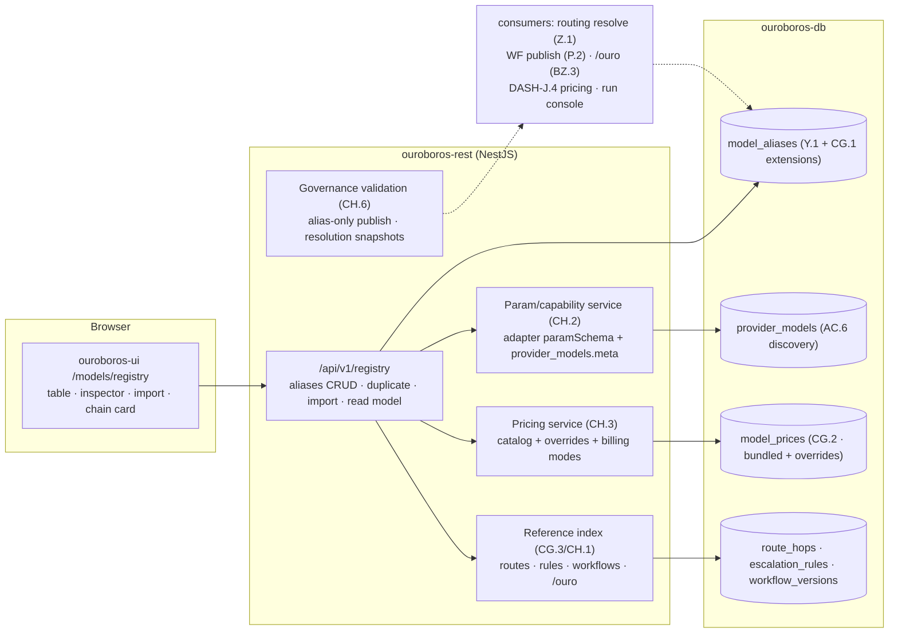
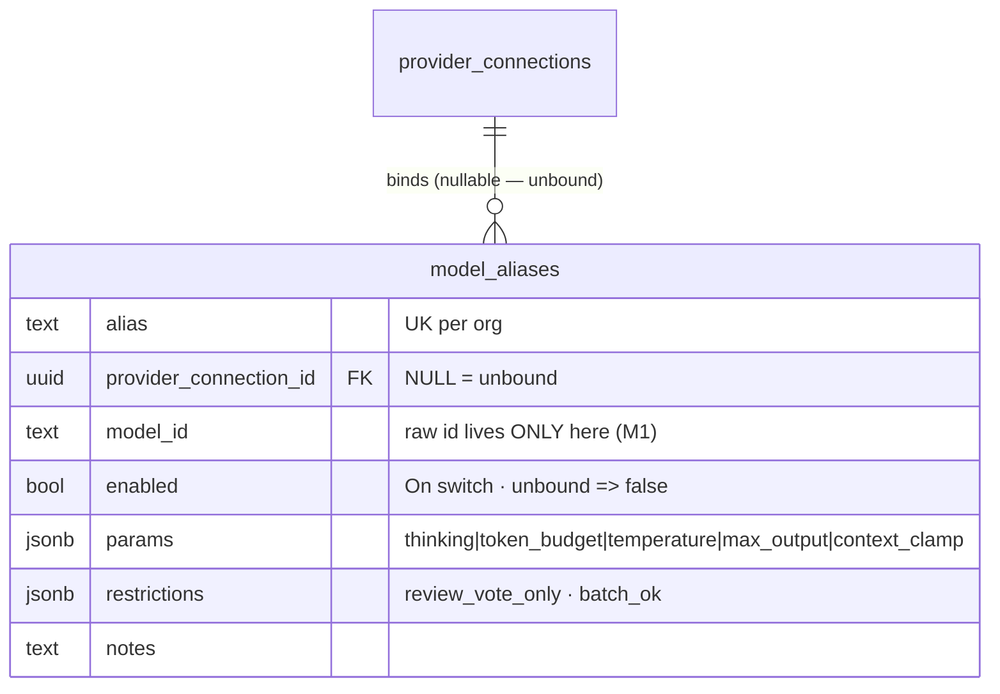
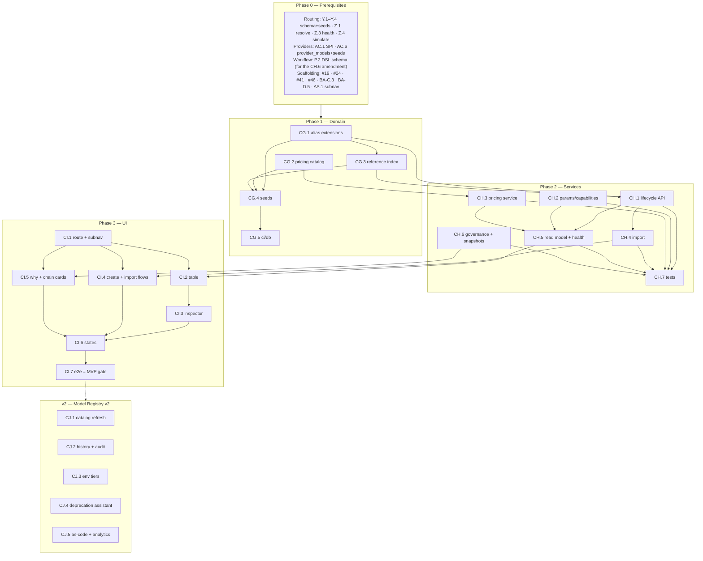

# Roadmap — Model Registry (Mockup 21)

## Description

> Create a roadmap that covers the features for the mockup page 21. Any additional
> tech infrastructure that is required to implement the functionality in these mockup
> pages should be researched and offered as options for implementing in the roadmap.
> The roamdap should include MVP and v2 options, as well as the labels, milestones,
> and the like, for the tickets to be created. Any ticket sources that are used by
> Ouroboros for ingesting should be pluggable, which includes sources like Jira,
> Linear, GitHub, GitLab, and other bug reporting/issue recording sites. Refer to the
> page so that issues can reference the mockup file when creating the UI/UX design of
> the pages. Be very specific when creating the roadmap, as the options in the
> roadmap for the functionality needs to be complete and very thorough.

## Context & Existing Work (duplicate-avoidance survey)

Surveyed 2026-08-09.

**Design source of truth for every UI ticket in this roadmap:**
[`docs/mockups/21-model-registry.html`](mockups/21-model-registry.html) (with
`docs/mockups/assets/ouroboros.css`) — Model Registry. Its anatomy:

- **Page head** — eyebrow `Models`, h1 *"Every model gets a name. Every route
  points at the name."*, subline: *"Registry aliases bind a provider key to a
  model id. Workflows and routing only ever see the alias — swap the provider
  behind it and nothing else changes. That's the point of bring-your-own-key."*
  Actions: **Import from provider ▾** (ghost dropdown), **+ New alias**
  (primary).
- **Subnav** — Routing (→ mockup 06) / **Model registry** (active, accent
  underline) / Providers & keys (→ mockup 07) / Spend (stub).
- **Allowed-models table** (`c-12` card, `ALLOWED MODELS · 8 ALIASES`,
  `Manage providers →` link to 07). Columns: **Alias** (accent-tinted mono
  `.pill.alias`), **Provider** (tinted monogram `AN`/`GH`/`CU`/`OL`/`VL` +
  name — color classes match 07), **Model** (mono raw id — the only place raw
  ids render), **Params** (chips: `max thinking` + `400k budget`, `std
  thinking`, `temp 0` + `8k out`, `review vote only`, `ctx 32k`, `batch ok`,
  or `—`), **Health** (`● ok` / `⚠ degraded` warn note / err note `no key —
  connect a provider` with a **Fix in Providers →** ghost button on the
  orphan row), **$ per 1M in·out** (mono: `$15 · $75`, `$3 · $15`, `$1 · $5`,
  `seat-based`, `usage-based`, `$0`, `—`), **Used by** (`4 routes` … `0
  routes`), **On** (enable switch; off + dimmed row for the orphan).
  Eight rows: `coder-max` (Anthropic · claude-fable-5, **selected**, accent
  inset), `coder-std` (Anthropic · claude-sonnet-5), `sizer` (Anthropic ·
  claude-haiku-4-5), `coder-fallback` (GitHub Copilot · gpt-5-codex,
  degraded), `second-opinion` (Cursor · composer-2), `local-docs` (Ollama ·
  qwen3-coder:32b), `local-free` (OpenAI-compatible · vLLM ·
  llama-4-maverick), `gpt5-experiments` (**no provider** · gpt-5.2-preview,
  dim, switch off). Caption: *"Aliases are unique per workspace. Deleting one
  is blocked while any route or workflow references it."*
- **Inspector** (`EDIT — CODER-MAX` card, alias pill echo) — fields: **Alias**
  (mono input, hint *"unique · referenced by routes, workflows, and /ouro
  commands"*), **Provider** (select `Anthropic — key sk-ant-…Xq4A`, hint
  *"from Providers & keys"*), **Model** (select `claude-fable-5`, hint
  *"listed live from the provider"*), **Thinking** (`max`) + **Token budget**
  (`400k`) row, **Temperature** (`0.2`); **Used by** chip list
  (`implement-primary`, `plan-primary`, `review-primary`,
  `escalation:effort≥L`); foot: **Save alias** (primary), **Duplicate**
  (ghost), **Remove** (danger, blocked state) + mono why-line *"blocked — 4
  routes reference this alias"*.
- **Why aliases — the BYOK point** card — three ✓ rows: **Swap providers,
  keep everything** (*"Point coder-max at Bedrock tomorrow; zero workflow or
  route edits."*), **Same model, different keys** (*"coder-max (prod key,
  $600 cap) vs coder-max-dev (dev key, $50 cap)."*), **Governance** (*"Routes
  and workflows may ONLY reference registry aliases — raw model strings are
  rejected at publish time."*).
- **Resolution chain** card (tag `run #482`) — dotted-rail hops:
  `route.task("implement")` → `route implement-primary` → `alias coder-max`
  (accent) → `provider Anthropic (key …Xq4A)` → `model claude-fable-5`
  (violet) with `● resolved · 42ms`; caption *"Every hop is inspectable in
  the run console transcript."*

**Scope boundaries.** The registry is the middle tab of the Models triptych:
routing (06) consumes aliases, providers (07) supplies the connections and
discovered models the registry binds to. This roadmap builds the **registry
management surface and the alias truth services** on the foundations those two
roadmaps laid — it does not re-build routing, provider CRUD, key custody, or
the Spend tab.

**Overlapping work and dispositions:**

| Existing work | Disposition under this roadmap |
|---|---|
| Routing Y.1 (`model_aliases` schema foundation — "07/21 build UIs later"; alias uniqueness per org, params jsonb, raw `model_id` lives only here) | **Built upon, never forked** — CG.1 extends it (enabled switch, nullable binding for the orphan state, structured params/restrictions). This roadmap is the promised registry UI. |
| Routing Y.2 (`route_hops` FK → `model_aliases`, alias deletion blocked by FK), Y.3 (escalation rules `use_alias`/`add_vote` targets) | **Consumed** — they are two of the four reference kinds behind `Used by` counts and delete guards (CG.3). |
| Routing Z.1 resolution (pure `resolve()` + explanations), Z.4 simulate, M1 alias-only rule | **Consumed + amended** — CH.6 adds disabled/unbound-alias semantics to resolution (dropped hops with explanations) and defines the persisted resolution snapshot the chain card and run console share. |
| Routing Z.2 ("alias list endpoint for swap menus — registry read, foundation scope") | **Superseded** — CH.1's full lifecycle API replaces the minimal read (amendment posted at filing). |
| Routing Z.3 provider health, AA.1 subnav ("Model registry · soon") | **Consumed / amended** — alias health derives from provider health + binding state (CH.5, no alias-level probes); the Registry tab goes live (CI.1 amendment, mirroring AE.1's). |
| Providers AC.1 adapter SPI, AC.6 `provider_models` discovered catalog + P6 ("discovery feeds the registry") + soft alias-validation hook | **Consumed + extended** — the inspector's live model list and the import wizard read `provider_models`; CH.2 extends the SPI with per-model param/capability schemas; the AC.6 unknown-model warning gets its UI surface (CI.2/CI.3). |
| Providers AD.2 (provider delete blocked while aliases depend, 409 naming aliases) | **Mirrored** — the registry enforces the same discipline in the other direction (alias delete blocked while routes/workflows/rules/commands reference it). |
| Dashboard DASH-F.3 `token_usage`, DASH-J.4 (v2 "priced token accounting — provider price tables") | **Foundation landed here** — the `$ per 1M in·out` column needs a pricing catalog *now*; CG.2/CH.3 build it as the shared price-table layer J.4 and Z.5/AB.4 consume (filing-time coordination so J.4 doesn't re-invent it). |
| Workflow-builder P.2 (DSL JSON Schema, zod+pydantic parity, publish validation) | **Amended** — the governance card's "raw model strings are rejected at publish time" lands as a P.2 schema amendment: `llm` nodes reference registry aliases structurally (CH.6), which also makes workflow references queryable for CG.3. |
| ChatOps BZ.3 (`/ouro route <task> <alias>` binding, alias completions) | **Consumed** — the inspector hint "referenced by … /ouro commands"; chat route pins are the fourth reference kind (CG.3, soft until BZ.3 exists). |
| Run console roadmap (stage model pill "from the active stage's resolution") | **Coordinated** — CH.6's persisted resolution snapshot is the shared truth the chain card renders and the run console transcript inspects. |
| Pluggable ticket sources requirement (description boilerplate) | **Already satisfied** by WF Epic Q (ticket-source SPI + canonical tickets; Jira/Linear/GitLab as WF-T.2–T.4). Nothing source-specific belongs in the registry; noted, not duplicated. |
| Scaffolding #49 `/models` placeholder routes, #56 e2e | **Superseded for the registry route**; #56 gains a registry leg (CI.7). |

Epic letters continue the sequence (…CC–CF): this roadmap uses
**CG, CH, CI, CJ**.

## Infrastructure Options (researched — thorough, pick before filing)

### 1. Model pricing truth source (the `$ per 1M in·out` column)

The mockup prices seven of eight rows. Fabricating those numbers violates the
established honesty rules (M7, P8, DASH-J.4); typing them by hand per org makes
the column empty everywhere real. Researched options:

| Option | What it is | Fit | Trade-offs |
|---|---|---|---|
| **A — Bundled open-catalog snapshot + org overrides** ⭐ recommended MVP | Vendor a versioned snapshot of [LiteLLM's `model_prices_and_context_window.json`](https://github.com/BerriAI/litellm/blob/main/model_prices_and_context_window.json) (MIT, community-maintained, 100+ providers: per-token in/out costs, context windows, capability flags) imported into a `model_prices` table at migration time; org-level override rows always win; per-provider **billing-mode** metadata (`token` / `seat` / `usage` / `free`) covers the mockup's `seat-based`/`usage-based`/`$0` rows that per-token catalogs cannot | Self-hostable and air-gap-safe (no runtime network dependency); provenance recorded per row (`source: bundled@<version> \| override`); the same snapshot carries context/capability fields option 2-B wants — one import, two consumers | Snapshot ages between releases — mitigated by CJ.1's refresher and by overrides; unknown models render `—`, never a stale guess presented as current (row shows its snapshot version on hover) |
| B — Live catalog APIs | Query at runtime: the hosted [LiteLLM Model Catalog API](https://github.com/BerriAI/litellm/discussions/21029) (`api.litellm.ai`, 2,500+ models), [OpenRouter's models API](https://openrouter.ai/docs) (pricing per model), [models.dev](https://models.dev) (open model capability/pricing database) | Always current; zero snapshot maintenance | Runtime external dependency breaks the self-hosted/air-gapped promise as the *only* path; third-party availability on a page-render path — **v2 refresher source** (CJ.1 pulls from these to propose snapshot updates), not the MVP truth |
| C — Manual org price tables only | What DASH-J.4 sketched minimally: admins type prices per model | No external data at all | Every org hand-maintains a price list; the column is empty for most rows in practice — kept as the **override mechanism inside A** (same table, `source: override`), not the whole answer |

### 2. Params & capability validation (what the inspector may edit per alias)

The inspector edits thinking level, token budget, and temperature; the table
chips also show `ctx 32k`, `8k out`, `review vote only`, `batch ok`. Free-form
jsonb would let chips lie (a thinking budget on a model without thinking).

| Option | What it is | Fit | Trade-offs |
|---|---|---|---|
| **A — Adapter-declared param schemas + discovered metadata** ⭐ recommended | Extend the `ModelProviderAdapter` SPI (AC.1) with `paramSchema(modelId)` → JSON Schema of tunables the adapter supports (thinking levels, budget ranges, temperature bounds, max output) merged with `provider_models.meta` (context length, tier); the inspector renders fields from the schema exactly as AE.5 renders connection forms — zero UI special-casing; restriction flags (`review_vote_only`, `batch_ok`) are registry-level policy, adapter-independent | The SPI already drives schema-generated forms (P1 discipline); params validate server-side against the same schema; new adapters bring param support for free | Unbound aliases (no provider) get the generic schema (name + model id only) until bound — honest, since nothing can validate them |
| B — Central static capability dataset | The bundled option-1-A snapshot already carries `max_output_tokens`, `supports_reasoning`-class flags per model ([models.dev](https://models.dev) is an alternative source) | Fills gaps where a connection is missing or an adapter is silent — enriches A for unbound aliases and fixed-catalog adapters (Copilot/Cursor) | Static data can lag providers; used as **fallback enrichment inside A**, clearly lower-precedence than live adapter/discovery truth |
| C — Free-form jsonb, no validation | Y.1's raw `params` column as-is | Zero work | Chips and saved params can contradict model reality; **rejected** |

### 3. Import from provider (bulk alias creation)

| Option | What it is | Fit | Trade-offs |
|---|---|---|---|
| **A — Wizard over discovered models** ⭐ recommended | The head's **Import from provider ▾** menu lists connections (from 07); picking one opens a wizard over its `provider_models` rows: multi-select models, naming-template suggestions (`<model-shortname>`, prefix/suffix rules), per-row collision detection (alias exists / model already bound), preview table, then batch create — never invents a model discovery didn't report (P6) | Curated vocabulary stays curated: humans pick names; discovery supplies truth; skip-existing keeps re-runs idempotent | A few clicks slower than import-all — intended friction |
| B — One-click import-all with generated names | Every discovered model becomes an alias automatically | Fast initial fill | Floods the registry with never-routed aliases and machine names, destroying the "every model gets a *name*" curation premise — offered only as a "select all" affordance inside A, not a separate path |
| C — Registry-as-code import/export | Aliases as reviewable JSON/YAML documents (GitOps-style) | Right for fleet/config-management users | Not what the mockup shows; **v2** (CJ.5) |

### 4. Reference tracking (`Used by`, delete guards, governance)

| Option | What it is | Fit | Trade-offs |
|---|---|---|---|
| **A — Computed reference index (view + service)** ⭐ recommended | One SQL view/service unioning the four reference kinds: `route_hops` (Y.2 FK), `escalation_rules` `use_alias`/`add_vote` targets (Y.3 jsonb), workflow-version `llm` nodes (queryable once CH.6's P.2 amendment makes alias refs structural), chat route pins (BZ.3, when present); `Used by` counts and the inspector chip list computed at read; delete/rename guards query it in-transaction | Never drifts; one definition of "referenced" shared by the table, inspector, guards, and 07's mirrored provider-delete guard | Read-time cost — trivial at this scale, indexed jsonb paths for workflow refs |
| B — Materialized counters maintained by triggers | Counts stored on the alias row | O(1) reads | Drift risk across four writers, trigger sprawl across jsonb columns; **rejected** at this scale |

## Decisions proposed by this roadmap (validate before issue creation)

| # | Decision | Rationale |
|---|----------|-----------|
| R1 | **The registry is the management surface over Y.1's `model_aliases` — extended, never forked**: CG.1 adds `enabled` (the On switch), a **nullable** provider binding + `model_ref` for unbound aliases, structured params/restrictions, and notes | One alias table serves routing, providers, and the registry; two tables would fork the vocabulary the whole product hangs on. |
| R2 | **Alias states are `active`, `disabled`, `unbound`** — `unbound` = no provider connection (the `gpt5-experiments` row: created ahead of a key, switch off, `Fix in Providers →`); disabled/unbound aliases resolve as **dropped hops with explanations**, never silent failures (Z.1 amendment, CH.6) | The mockup renders the orphan state as a first-class row with a designed fix path; resolution honesty (M6) must extend to it. |
| R3 | **Params are validated, structured, and capability-checked** (option 2-A): `thinking`, `token_budget`, `temperature`, `max_output`, `context_clamp` validated against the adapter/metadata schema; **restriction flags** (`review_vote_only`, `batch_ok`) are registry policy; table chips are **server-derived from structure** (like Y.3's display strings), never hand-written | Chips must not lie; server derivation keeps table, inspector, and resolution reading one truth. |
| R4 | **Pricing = bundled catalog snapshot + org overrides + billing modes** (option 1-A): `model_prices` with provenance; `$ per 1M in·out` renders priced rows, `seat-based`/`usage-based` from billing mode, `$0` only via real zero-price rows, `—` for unknown/unbound; **this lands the price-table layer DASH-J.4 consumes** (filing-time coordination) | The honesty rules (M7/P8) forbid fabricated dollars; J.4 and Z.5/AB.4 need the same tables — build once. |
| R5 | **`Used by` and every guard read one computed reference index** (option 4-A) across routes, escalation rules, workflow versions, and /ouro pins; **delete and rename are blocked while referenced** (409/422 naming the referrers); **Duplicate** copies binding + params to `<alias>-copy` (uniqueness-suffixed), enabled off | The caption and the inspector's blocked Remove state are the contract; rename is delete-shaped for referrers (aliases are referenced by name in workflow documents). |
| R6 | **Governance is enforced at publish/save time everywhere models are named**: WF P.2 schema amendment — `llm` nodes carry `{alias: <registry-name>}`, raw model strings fail validation with a designed error; route saves already alias-only (M1/Y.2); /ouro `route` validates via CH.1; the registry is the single model vocabulary | The why-card's third promise is a system property, not copy; it also makes option 4-A's workflow references queryable. |
| R7 | **Import never invents models** (option 3-A): the wizard operates on `provider_models` discovery truth only; unbound aliases are the one deliberate exception (explicitly created ahead of a key, marked `unbound`) | P6's "discovered truth, not typed strings" extended to bulk creation. |
| R8 | **Alias health is derived, never probed**: provider health (Z.3) + binding state + the AC.6 model-missing-from-discovery warning compose the Health cell (`ok` / `degraded` / `no key — connect a provider` / `model not in discovery`); no alias-level synthetic calls | Honesty without token spend (M8 discipline); the orphan row's err state is a binding fact, not a network fact. |
| R9 | **The resolution-chain card renders persisted resolution snapshots**: CH.6 defines the per-run snapshot contract (Z.1 output stored at execution time; run-console coordination); until execution exists (AF.2/WF-T.6), the card renders a **Simulate-driven preview explicitly labeled** `simulated — live runs arrive with invocation`, seeded run #482 as fixture data | "Every hop is inspectable in the run console transcript" requires stored truth; pre-invocation, a labeled simulation is honest — a fake "run #482" is not. |
| R10 | **Route `/models/registry`; labels**: existing set + new **`registry`**; **Milestones**: `Model Registry MVP` / `Model Registry v2` created at filing | Sibling of `/models` (06) and `/models/providers` (07); description requires labels + milestones for the filing pass. |

## Architecture Overview



## MVP Definition

The MVP is **mockup 21 as the real model vocabulary of the product**: every
alias a governed, priced, health-aware binding that routing, workflows, and
commands resolve through. It is done when, against the compose stack:

1. `/models/registry` reproduces
   [`docs/mockups/21-model-registry.html`](mockups/21-model-registry.html)
   pixel-faithfully in **both themes**: subnav with Model registry active
   (Routing and Providers live cross-links, Spend an honest stub), the
   eight-row allowed-models table with every column and state (selection
   inset, dimmed unbound row with `Fix in Providers →`, switches), the
   inspector, the why-aliases card, and the resolution-chain card.
2. **Alias lifecycle works end to end**: create (+ New alias), edit, rebind
   provider/model (the BYOK swap — with live model lists from discovery),
   duplicate, enable/disable, delete — with rename/delete guards naming
   referrers, uniqueness per workspace, and role gates (owner/admin write,
   member read).
3. **Params are real**: capability-schema-driven fields per bound model,
   server-validated, chips derived from structure; restriction flags stored
   and served to resolution.
4. **Pricing is honest**: the bundled catalog + overrides render the mockup's
   column exactly from seeds (`$15 · $75` … `seat-based` … `$0` … `—`), with
   provenance visible and no fabricated numbers anywhere.
5. **References and governance hold**: `Used by` counts computed from the
   reference index; deleting/renaming a referenced alias is blocked with a
   designed error naming referrers; workflow publish rejects raw model
   strings (P.2 amendment live); disabled/unbound aliases produce explained
   dropped hops in resolution and simulate.
6. **Import from provider** creates aliases from discovered models via the
   wizard (preview, collisions, skip-existing), and the unbound path (create
   ahead of a key) renders the orphan row with its fix affordance.
7. **The chain card is truthful**: seeded snapshot for run #482 renders the
   five-hop chain; live mode clearly labeled simulated until invocation
   lands.
8. Integration tests cover lifecycle + guards, param validation, pricing
   resolution, reference index, import, governance rejection, isolation; the
   e2e suite gains a registry leg.

**Explicitly v2 (milestone `Model Registry v2`):** pricing catalog
auto-refresh + drift alerts (CJ.1), alias change history & audit surface
(CJ.2), environment-tier aliases (CJ.3), model deprecation watch & migration
assistant (CJ.4), registry-as-code export/import + per-alias spend analytics
(CJ.5).

## Epics, Labels & Milestones

Each epic is a parent tracking issue on GitHub; every roadmap issue below is filed as
one of its sub-issues (GitHub Relationships).

| Epic | GitHub | Status | Name | Goal | Modules | Milestone |
|------|:------:|:------:|------|------|---------|-----------|
| CG | #575 | 🟡 Open | Registry Domain & Pricing Foundations | Alias extensions, pricing catalog, reference index, seeds, CI | ouroboros-db | Model Registry MVP |
| CH | #576 | 🟡 Open | Registry Services | Lifecycle API, params/capabilities, pricing, import, read model, governance, tests | ouroboros-rest, ouroboros-engine | Model Registry MVP |
| CI | #577 | 🟡 Open | Registry UI | Route/subnav, table, inspector, flows, cards, states, e2e | ouroboros-ui | Model Registry MVP |
| CJ | #578 | 🟡 Open | Extended Registry (v2) | Catalog refresh, history/audit, env tiers, deprecation assistant, as-code + analytics | all | Model Registry v2 |

Issue naming: `<project>: [<epic>.<issue>] <title>`. Labels: existing set
(`mvp`, `v2`, `rest`, `db`, `ui`, `ci`, `design`, `routing`, `providers`)
**plus new `registry`** (decision R10). Milestones **`Model Registry MVP`** /
**`Model Registry v2`** created at filing; every issue assigned. Complexity
chips: **XS · S · M · L**.

---

## Epic CG (#575) — Registry Domain & Pricing Foundations (`ouroboros-db`)

| Ref | GitHub | Status | Title | Summary | Labels | Parallel | MVP | Complexity | Affected Modules |
|-----|:------:|:------:|-------|---------|--------|:--------:|:---:|:----------:|------------------|
| CG.1 | #579 | 🟡 Open | ouroboros-db: [CG.1] Alias lifecycle, binding & params extensions | `enabled`, nullable binding (unbound state), structured params/restrictions over Y.1 | mvp, registry, db | N (after Y.1, AC.6) | Y | M | ouroboros-db |
| CG.2 | #580 | 🟡 Open | ouroboros-db: [CG.2] Model pricing catalog — schema & bundled snapshot | `model_prices` (catalog + overrides + billing modes), snapshot import job | mvp, registry, db | N (after #19) | Y | M | ouroboros-db |
| CG.3 | #581 | 🟡 Open | ouroboros-db: [CG.3] Alias reference index | One view/query for used-by counts + delete/rename guards across four kinds | mvp, registry, db | N (after Y.2, Y.3) | Y | M | ouroboros-db |
| CG.4 | #582 | 🟡 Open | ouroboros-db: [CG.4] Registry dev seeds — mockup-21 parity | 8 aliases (adds second-opinion + unbound gpt5-experiments), params, prices, run #482 snapshot | mvp, registry, db | N (after CG.1–CG.3, Y.4) | Y | M | ouroboros-db |
| CG.5 | #583 | 🟡 Open | ouroboros-db: [CG.5] Registry constraints in ci/db | State/binding invariants, price provenance, params shapes, reference probes | mvp, registry, db, ci | N (after CG.4, #24) | Y | XS | ouroboros-db, .github |

### Issue CG.1 — ouroboros-db: [CG.1] Alias lifecycle, binding & params extensions

> **GitHub issue:** #579 · **Status:** 🟡 Open · **Parent epic:** #575

- **Problem Statement:** Y.1's `model_aliases` was a foundation: alias, FK to a
  provider connection, raw `model_id`, loose `params` jsonb. The mockup needs
  what it lacks — an enable switch, the **unbound** state (a row with *no*
  provider), and params that can't lie (decisions R1–R3).
- **Solution/Scope:** Migration extending Y.1 (never forking it):
  `model_aliases` += `enabled` bool (the On switch — distinct from provider
  health), `provider_connection_id` **made nullable** (NULL = unbound; CHECK:
  unbound ⇒ `enabled = false` — an unbound alias can never be switched on),
  `params` constrained to validated shapes (`thinking` enum, `token_budget`
  int, `temperature` numeric bounds, `max_output`, `context_clamp` — CHECK on
  known keys; semantic validation is CH.2's), `restrictions` jsonb
  (`review_vote_only`, `batch_ok` flags), `notes` text (nullable),
  `updated_by/at`. Rename remains allowed at the DB layer (guards are
  service-level, CH.1, because workflow references are by-name in jsonb
  documents, not FKs). Index for the one-query table read.
- **Acceptance Criteria:**
  - Unbound row representable exactly as the mockup's `gpt5-experiments`
    (model id present, no connection, disabled); enabling it fails at CHECK.
  - Y.2's `route_hops` FK and AD.2's provider-delete guard still hold
    unchanged (regression-verified).
  - Params CHECK rejects unknown keys; existing Y.4-seeded aliases migrate
    cleanly into the structured shapes.
- **Parallelism/Dependencies:** Needs Y.1 (+AC.6 coordination). Blocks CG.3,
  CG.4, CH.1.
- **Technical Stack:** PostgreSQL 17, Flyway.
- **Epic:** CG



### Issue CG.2 — ouroboros-db: [CG.2] Model pricing catalog — schema & bundled snapshot

> **GitHub issue:** #580 · **Status:** 🟡 Open · **Parent epic:** #575

- **Problem Statement:** The `$ per 1M in·out` column needs a truth source
  that is self-hostable, provenance-honest, and covers non-token billing
  (decision R4, infrastructure option 1-A) — and DASH-J.4's "provider price
  tables" should be *these* tables, not a parallel invention.
- **Solution/Scope:** Migration: `model_prices` — id, `match_provider_kind`
  (AC.1 kinds + `*`), `match_model` (exact id or documented glob),
  `billing_mode` CHECK `token|seat|usage|free`, `input_cents_per_1m` /
  `output_cents_per_1m` (nullable — required iff `token`), `source` CHECK
  `bundled|override`, `catalog_version` (bundled rows), `organization_id` FK
  (NULL for bundled rows, set for org overrides), `effective_at`, unique
  (org, provider kind, model, source). **Bundled snapshot import**: a
  repeatable migration/boot job loads a vendored, versioned extract of
  LiteLLM's `model_prices_and_context_window.json` (pinned commit recorded;
  transform script + provenance documented in the migration header), mapping
  per-token costs to per-1M cents; capability fields (context, max output,
  reasoning flags) retained in a `meta` jsonb for CH.2's option 2-B
  enrichment. Precedence documented: org override > bundled; billing-mode
  rows for Copilot (`seat`), Cursor (`usage`), local kinds (`free`).
- **Acceptance Criteria:**
  - Import is idempotent and versioned; re-running with a newer snapshot
    updates bundled rows only, never overrides.
  - Lookup for (provider kind, model) resolves precedence in one indexed
    query; unknown model → no row (renders `—`, never $0).
  - `free` requires zero/NULL amounts; `token` requires both amounts
    (CHECK-enforced).
- **Parallelism/Dependencies:** Needs #19. Blocks CG.4, CH.3. Coordinates
  DASH-J.4 (consumes these tables — amendment at filing).
- **Technical Stack:** PostgreSQL 17, Flyway, snapshot transform script
  (Node).
- **Epic:** CG

```
lookup(anthropic, claude-fable-5):
  override(org)? ─▶ use it        else bundled@2026-08 ─▶ {token, 1500¢, 7500¢}
lookup(copilot, gpt-5-codex) ─▶ {seat} ─▶ renders "seat-based"
lookup(_, gpt-5.2-preview·unbound) ─▶ ∅ ─▶ renders "—"   (never $0)
```

### Issue CG.3 — ouroboros-db: [CG.3] Alias reference index

> **GitHub issue:** #581 · **Status:** 🟡 Open · **Parent epic:** #575

- **Problem Statement:** `Used by` counts, the inspector's chip list, the
  blocked Remove state, and rename safety all need one answer to "what
  references this alias?" across four different storage shapes (decision R5,
  option 4-A).
- **Solution/Scope:** `alias_references` view (+ service query contract)
  unioning: **routes** — `route_hops` rows (Y.2 FK) labeled with their route
  tag (`implement-primary`); **escalation rules** — Y.3 `then` jsonb
  `use_alias`/`add_vote` targets (indexed jsonb path), labeled
  `escalation:<display>` (the mockup's `escalation:effort≥L` chip);
  **workflow versions** — `llm`-node alias refs in `workflow_versions.
  definition` (queryable once CH.6's P.2 amendment lands; expression index;
  drafts and published both count — published block harder); **chat pins** —
  BZ.3 route-pin storage when present (view degrades gracefully while absent,
  documented). Output shape: (alias_id, kind, ref_label, blocking bool).
  Guard helper: in-transaction count for delete/rename paths.
- **Acceptance Criteria:**
  - Seeded `coder-max` returns the mockup's four chips exactly; counts match
    the table column for all eight aliases.
  - A workflow-version fixture referencing an alias by name is found via the
    expression index (plan-verified, no seq scan).
  - Missing optional sources (chat pins) yield zero rows, not errors.
- **Parallelism/Dependencies:** Needs Y.2, Y.3 (+WF P.2 amendment for the
  workflow leg, CH.6). Blocks CG.4, CH.1, CH.5.
- **Technical Stack:** PostgreSQL 17 (views, jsonb expression indexes),
  Flyway.
- **Epic:** CG

```
alias_references(coder-max) ─▶
  route:implement-primary · route:plan-primary · route:review-primary
  escalation:"effort ≥ L → implement uses coder-max"        Σ blocking = 4
delete(coder-max) ─▶ 409 naming the four   ·   delete(gpt5-experiments) ─▶ ok (0 refs)
```

### Issue CG.4 — ouroboros-db: [CG.4] Registry dev seeds — mockup-21 parity

> **GitHub issue:** #582 · **Status:** 🟡 Open · **Parent epic:** #575

- **Problem Statement:** Design review and e2e need the mockup's exact
  registry state — which is a superset of Y.4's six aliases — plus pricing
  rows and the run #482 resolution snapshot (R9's fixture).
- **Solution/Scope:** Extend the dev seed (coordinated with Y.4/AC.6, no
  duplicate rows): **+2 aliases** — `second-opinion` (Cursor connection →
  `composer-2`, restriction `review_vote_only`, referenced by the Y.4
  security-label escalation rule so its `1 route` count is real) and
  `gpt5-experiments` (unbound, `gpt-5.2-preview`, disabled); structured
  params for all eight per the mockup chips (`max thinking`+`400k`, `std
  thinking`, `temp 0`+`8k out`, `ctx 32k`, `batch ok`); pricing: bundled
  snapshot covers the Anthropic trio ($15·$75 / $3·$15 / $1·$5) and
  zero-price local rows; billing-mode rows for Copilot (`seat`) and Cursor
  (`usage`); a persisted **resolution snapshot** for seeded run #482
  matching the chain card verbatim (CH.6 shape). Personal org: empty
  registry (guidance fixture).
- **Acceptance Criteria:** Table, inspector, and chain card render the mockup
  from seeds alone (all eight rows, every column value); `Used by` counts
  computed — not stored — and match; idempotent; Y.4/AC.6 seeds unaffected
  (cross-roadmap seed test still green).
- **Parallelism/Dependencies:** Needs CG.1–CG.3, Y.4, AC.6. Feeds CH/CI
  tests, e2e.
- **Technical Stack:** Flyway repeatable migration, SQL.
- **Epic:** CG

```
seeds: 8 aliases (6 from Y.4 + second-opinion + unbound gpt5-experiments)
       params chips · prices {3×token, seat, usage, 2×free, ∅}
       run #482 snapshot: task→route→alias→provider(…Xq4A)→model · 42ms
```

### Issue CG.5 — ouroboros-db: [CG.5] Registry constraints in ci/db

> **GitHub issue:** #583 · **Status:** 🟡 Open · **Parent epic:** #575

- **Problem Statement:** The unbound/enabled invariant, params shapes, price
  provenance, and reference integrity are what every service above trusts.
- **Solution/Scope:** Extend #24 `tests/constraints.sql`: unbound ⇒ disabled
  CHECK probe, params/restrictions shape rejection, price billing-mode/amount
  coherence, bundled-vs-override uniqueness, alias-uniqueness per org,
  reference-view row shapes, FK-restrict probes (provider deletion with
  aliases, alias deletion with hops).
- **Acceptance Criteria:** Green on current schema; red when any invariant
  drops (spot-verified once).
- **Parallelism/Dependencies:** Needs CG.4, #24.
- **Technical Stack:** GitHub Actions, SQL.
- **Epic:** CG

```
ci/db: migrate ─▶ constraints (+CG probes) ─▶ ✓/✗
```

---

## Epic CH (#576) — Registry Services (`ouroboros-rest` + `ouroboros-engine`)

| Ref | GitHub | Status | Title | Summary | Labels | Parallel | MVP | Complexity | Affected Modules |
|-----|:------:|:------:|-------|---------|--------|:--------:|:---:|:----------:|------------------|
| CH.1 | #584 | 🟡 Open | ouroboros-rest: [CH.1] Alias lifecycle API | CRUD, rebind, duplicate, enable/disable, guarded rename/delete; supersedes Z.2's alias list | mvp, registry, rest | N (after CG.1, CG.3, BA-C.3) | Y | L | ouroboros-rest |
| CH.2 | #585 | 🟡 Open | ouroboros-rest: [CH.2] Param & capability service | Adapter `paramSchema` SPI extension + metadata merge → inspector form schema, chip derivation | mvp, registry, rest, providers | N (after AC.1, AC.6) | Y | M | ouroboros-rest |
| CH.3 | #586 | 🟡 Open | ouroboros-rest: [CH.3] Pricing service | Catalog + override resolution, billing modes, provenance; feeds DASH-J.4/Z.5 | mvp, registry, rest | N (after CG.2) | Y | M | ouroboros-rest |
| CH.4 | #587 | 🟡 Open | ouroboros-rest: [CH.4] Import from provider | Wizard API over discovery: candidates, naming, collisions, preview, batch create | mvp, registry, rest, providers | N (after CH.1, AC.6) | Y | M | ouroboros-rest |
| CH.5 | #588 | 🟡 Open | ouroboros-rest: [CH.5] Registry read model & alias health | One table payload: bindings, chips, health derivation, prices, used-by | mvp, registry, rest, routing | N (after CH.1–CH.3, Z.3) | Y | M | ouroboros-rest |
| CH.6 | #589 | 🟡 Open | ouroboros-rest: [CH.6] Governance & resolution-snapshot contract | Raw-model rejection at publish (P.2 amendment), Z.1 disabled/unbound semantics, persisted snapshots | mvp, registry, rest, routing, engine | N (after Z.1, WF P.2) | Y | M | ouroboros-rest, ouroboros-engine |
| CH.7 | #590 | 🟡 Open | ouroboros-rest: [CH.7] Registry integration tests | Lifecycle+guards, params, pricing, import, governance, isolation | mvp, registry, rest, ci | N (after CH.1–CH.6) | Y | M | ouroboros-rest |

### Issue CH.1 — ouroboros-rest: [CH.1] Alias lifecycle API

> **GitHub issue:** #584 · **Status:** 🟡 Open · **Parent epic:** #576

- **Problem Statement:** The inspector's whole surface — create, edit, rebind,
  duplicate, enable/disable, remove — plus the guards that make the caption
  true ("deleting one is blocked while any route or workflow references it")
  need a complete API; Z.2's minimal alias-list read was a placeholder for
  exactly this (decisions R1, R2, R5).
- **Solution/Scope:** Under tenant context, owner/admin write, member read:
  `GET /api/v1/registry/aliases` (list — the CH.5 read model), `POST` (create:
  bound — connection + model, validated against `provider_models` with the
  AC.6 soft-warning surfaced; or unbound — model id only, `enabled` forced
  false), `PATCH /:id` (edit params/restrictions/notes; **rebind** provider
  and/or model — the BYOK swap, live-validated, referrers untouched by
  design; enable/disable — enabling an unbound alias → 422 with the fix-in-
  providers pointer), **rename** (guard: referenced aliases → 422 naming
  referrers and kinds — by-name workflow refs make rename delete-shaped, R5;
  unreferenced renames allowed), `POST /:id/duplicate` (`<alias>-copy`
  uniqueness-suffixed, enabled off, binding + params copied), `DELETE`
  (reference guard → 409 with the CG.3 referrer list; unreferenced deletes
  audited-logged). Model lists for the inspector's select come live from
  `provider_models` per connection (`listed live from the provider`).
  Registry writes emit a lightweight revision record (who/when/diff — CJ.2
  expands this into a surface). OpenAPI documented; Z.2 amendment posted
  (swap menus consume this API).
- **Acceptance Criteria:**
  - Full lifecycle round-trips in the harness; uniqueness violation → 422
    designed error.
  - Rebinding `coder-max` to a different connection leaves all four
    references intact and resolution pointing at the new binding (the BYOK
    story, test-verified).
  - Delete/rename of referenced aliases blocked naming referrers; duplicate
    yields disabled `-copy`; enable-unbound → 422 with pointer; member
    writes → 403.
- **Parallelism/Dependencies:** Needs CG.1, CG.3, BA-C.3. Blocks CH.4, CH.5,
  CI.3, CI.4.
- **Technical Stack:** NestJS, Kysely, class-validator.
- **Epic:** CH

```
PATCH /aliases/coder-max {connection: bedrock-conn}   ─▶ 4 refs untouched · resolution now → Bedrock
DELETE /aliases/coder-max ─▶ 409 {refs: [route:implement-primary, …, escalation:…]}
POST /aliases {alias: gpt5-experiments, model: gpt-5.2-preview}  ─▶ unbound · disabled
POST /aliases/coder-max/duplicate ─▶ coder-max-copy (off)
```

### Issue CH.2 — ouroboros-rest: [CH.2] Param & capability service

> **GitHub issue:** #585 · **Status:** 🟡 Open · **Parent epic:** #576

- **Problem Statement:** The inspector must offer only tunables the bound
  model actually supports, and the table's chips must derive from validated
  structure (decision R3, option 2-A).
- **Solution/Scope:** SPI extension (AC.1 amendment): `paramSchema(modelId)` →
  JSON Schema fragment per adapter (Anthropic: thinking levels + budget
  bounds + max output; OpenAI-compatible/Ollama: temperature, context clamp,
  max output; Copilot/Cursor fixed catalogs: minimal set), merged with
  `provider_models.meta` (context length) and CG.2 `meta` enrichment
  (option 2-B fallback for unbound/fixed-catalog models); registry-level
  restriction flags appended adapter-independently. Endpoints: `GET
  /api/v1/registry/param-schema?connection&model` (drives CI.3's fields —
  zero UI special-casing, the AE.5 discipline) and server-side validation on
  every CH.1 write; **chip derivation**: deterministic params/restrictions →
  display chips (`max thinking`, `400k budget`, `temp 0`, `8k out`, `ctx
  32k`, `review vote only`, `batch ok`) generated server-side and served in
  the read model.
- **Acceptance Criteria:**
  - Schema for claude-fable-5 offers thinking+budget; a temperature of 3.0
    or a thinking budget on a non-thinking model → 422 with field errors.
  - Unbound alias → generic schema (model id only) — honest.
  - Chips regenerate deterministically from structure; all eight mockup rows
    reproduce exactly from seeds; fake-adapter schema renders fields with no
    UI changes (fixture proof).
- **Parallelism/Dependencies:** Needs AC.1 (amendment), AC.6. Feeds CH.1
  validation, CH.5, CI.3.
- **Technical Stack:** NestJS, JSON Schema (ajv), adapter SPI.
- **Epic:** CH

```
paramSchema(anthropic, claude-fable-5) ─▶ {thinking: [std,max], budget: ≤1M, temp: 0–1, max_out}
params {thinking: max, budget: 400k} ─▶ chips: (max thinking)(400k budget)   [server-derived]
params {thinking: max} on qwen3-coder ─▶ 422 "model does not support thinking"
```

### Issue CH.3 — ouroboros-rest: [CH.3] Pricing service

> **GitHub issue:** #586 · **Status:** 🟡 Open · **Parent epic:** #576

- **Problem Statement:** The `$ per 1M in·out` cell has four honest shapes —
  priced, billing-mode word, `$0`, `—` — and downstream accounting
  (DASH-J.4, Z.5 spend, AB.4) needs the same resolution (decision R4).
- **Solution/Scope:** `PricingService.resolve(connectionKind, modelId, org)` →
  `{billing_mode, input_cents_per_1m?, output_cents_per_1m?, source,
  catalog_version?}` with override-over-bundled precedence (CG.2); render
  rules codified: `token` → `$X · $Y` per 1M formatting, `seat` →
  `seat-based`, `usage` → `usage-based`, `free` → `$0`, no row → `—`;
  provenance served (the UI shows source + snapshot version on hover);
  override CRUD endpoints (owner/admin) for org price corrections — the
  option-1-C path folded in; short-TTL cache. Exposed internally for
  DASH-J.4's `cost_cents` computation and Z.5/AB.4 (amendment comments at
  filing: consume, don't re-invent).
- **Acceptance Criteria:** All eight seeded rows resolve to the mockup's
  exact renderings; override beats bundled (test); unknown model → `—`
  shape, never `$0`; provenance present on every priced answer.
- **Parallelism/Dependencies:** Needs CG.2. Feeds CH.5, DASH-J.4, Z.5.
- **Technical Stack:** NestJS, Kysely.
- **Epic:** CH

```
resolve(anthropic, claude-fable-5) ─▶ {token, 1500¢, 7500¢, bundled@2026-08} ─▶ "$15 · $75"
resolve(copilot, gpt-5-codex) ─▶ {seat} ─▶ "seat-based"        resolve(∅) ─▶ "—"
override PUT {anthropic, claude-fable-5, 1200¢/6000¢} ─▶ wins over bundled (provenance: override)
```

### Issue CH.4 — ouroboros-rest: [CH.4] Import from provider

> **GitHub issue:** #587 · **Status:** 🟡 Open · **Parent epic:** #576

- **Problem Statement:** The head's **Import from provider ▾** must bulk-create
  curated aliases from discovery truth — never from typed model strings
  (decision R7, option 3-A).
- **Solution/Scope:** `GET /api/v1/registry/import/:connectionId/candidates` —
  discovered `provider_models` rows annotated: already-aliased (by which
  alias), name suggestion (template: short model name, collision-suffixed),
  price preview (CH.3), capability summary (CH.2); `POST
  /api/v1/registry/import` — batch `{connectionId, items: [{modelId, alias,
  params?}]}` validated as one transaction (per-item collision/validation
  errors returned itemized — partial-failure design: nothing commits unless
  all valid, mirroring route-save semantics); skip-existing idempotency;
  created aliases enabled by default (bound + healthy provider) — deliberate
  contrast with duplicate's off-default, documented. Ollama/vLLM connections
  import with `free` pricing visible in preview.
- **Acceptance Criteria:** Candidates for the seeded Anthropic connection
  mark the three aliased models and suggest names for the rest; batch with
  one colliding name → 422 itemized, nothing created; re-import → skips
  cleanly; imported alias appears in routing's swap menus immediately.
- **Parallelism/Dependencies:** Needs CH.1, AC.6. Feeds CI.4.
- **Technical Stack:** NestJS, Kysely.
- **Epic:** CH

```
candidates(anthropic) ─▶ [claude-fable-5 ✓aliased:coder-max] [claude-opus-5 → "opus-5" · $10·$50]
import {items: [opus-5, haiku-tiny]} ─▶ tx: validate all ─▶ create all │ 422 itemized, create none
```

### Issue CH.5 — ouroboros-rest: [CH.5] Registry read model & alias health

> **GitHub issue:** #588 · **Status:** 🟡 Open · **Parent epic:** #576

- **Problem Statement:** The table renders eight columns spanning five
  subsystems (bindings, params, provider health, pricing, references) — one
  composed payload keeps the page honest and fast; alias health must be
  derived, never probed (decision R8).
- **Solution/Scope:** `GET /api/v1/registry` → per alias: binding (provider
  kind/name/monogram key, masked key suffix for the inspector's provider
  line), model id, server-derived chips (CH.2), **health cell** — derivation
  order: unbound → `no_key` (err + fix pointer), provider disabled/error →
  mapped state, Z.3 provider health → `ok`/`degraded` (+ note), AC.6
  discovery mismatch (bound model no longer in `provider_models`) →
  `model_missing` warning; pricing shape (CH.3), used-by count + chip refs
  (CG.3), enabled. Member-readable. One query per subsystem, composed;
  payload feeds the table, the inspector prefill, and routing's swap menus
  (Z.2 amendment).
- **Acceptance Criteria:** Seeded payload reproduces every cell of the
  mockup's eight rows including the degraded Copilot note and the orphan's
  err state; stopping the compose Ollama flips `local-docs` health within
  one Z.3 cycle (no synthetic calls made — verified by adapter-call
  counting); discovery-mismatch fixture renders its warning.
- **Parallelism/Dependencies:** Needs CH.1–CH.3, Z.3, CG.3. Feeds CI.2, CI.3.
- **Technical Stack:** NestJS, Kysely.
- **Epic:** CH

```
health(alias) := unbound? no_key("connect a provider")
              : provider.status err? error : z3.degraded? degraded(note)
              : model ∉ discovery? model_missing : ok
row(coder-fallback) ─▶ {GH copilot · gpt-5-codex · ⚠ degraded · seat-based · 2 routes · on}
```

### Issue CH.6 — ouroboros-rest: [CH.6] Governance & resolution-snapshot contract

> **GitHub issue:** #589 · **Status:** 🟡 Open · **Parent epic:** #576

- **Problem Statement:** Two promises remain unowned: *"raw model strings are
  rejected at publish time"* (why-card) and *"every hop is inspectable in the
  run console transcript"* (chain card) — plus resolution must understand
  disabled/unbound aliases (decisions R2, R6, R9).
- **Solution/Scope:** Three coordinated changes: **(1) WF P.2 amendment** —
  the DSL JSON Schema's `llm` node model field becomes `{alias: <string>}`;
  publish validation resolves it against the registry (unknown/raw string →
  designed publish error with suggestions; zod + pydantic parity per P.2),
  making refs structural for CG.3's expression index; existing seeded
  workflows migrated. **(2) Z.1 amendment** — resolution treats
  `enabled=false` and unbound aliases as dropped hops with explanations
  (`"alias disabled by Ken 2026-08-01"`, `"alias unbound — no provider"`),
  floor semantics unchanged; simulate surfaces them. **(3) Resolution
  snapshot contract** — versioned persisted shape (run id, task kind, hop
  chain with alias/provider-key-suffix/model/health-at-time, rule
  applications, timings) written at execution time (executor AF.2/WF-T.6 —
  contract now, fixture-seeded via CG.4), read endpoint `GET
  /api/v1/registry/resolutions/latest?alias=` for the chain card + run
  console (coordination comment on the run-console roadmap).
- **Acceptance Criteria:** Publishing a workflow with `model:
  "claude-fable-5"` fails with the designed error naming the alias
  alternative; disabling `coder-std` then simulating shows the dropped-hop
  explanation; the seeded run #482 snapshot round-trips through the read
  endpoint matching the mockup card verbatim; snapshot shape documented in
  OpenAPI + consumed-by notes.
- **Parallelism/Dependencies:** Needs Z.1, WF P.2 (amendments). Feeds CI.5,
  CG.3's workflow leg, run-console + AF.2 coordination.
- **Technical Stack:** NestJS, zod/pydantic, Kysely.
- **Epic:** CH

```
publish {llm: {model: "claude-fable-5"}} ─▶ ✗ "raw model ids are not allowed —
   reference a registry alias (did you mean coder-max?)"
resolve(implement) with coder-std disabled ─▶ hop dropped: "alias disabled" · floor honored
snapshot(run#482): task→route→alias coder-max→Anthropic(…Xq4A)→claude-fable-5 · 42ms  [persisted]
```

### Issue CH.7 — ouroboros-rest: [CH.7] Registry integration tests

> **GitHub issue:** #590 · **Status:** 🟡 Open · **Parent epic:** #576

- **Problem Statement:** Guards, rebind semantics, pricing precedence, and
  governance rejection are cross-table logic that regressions will find
  before users do — unless tests find them first.
- **Solution/Scope:** Testcontainers suites: lifecycle matrix (create
  bound/unbound × rebind × duplicate × enable/disable × rename/delete
  guarded and unguarded), param validation against adapter fixtures, pricing
  precedence (bundled/override/billing-mode/unknown), import transactionality
  (all-or-nothing, itemized errors, idempotent re-runs), reference-index
  correctness across all four kinds (chat-pin absence included), governance
  (publish rejection, dropped-hop explanations), read-model composition
  (health derivation states), org isolation across every registry route.
- **Acceptance Criteria:** Green in `ci/rest`; removing the unbound CHECK,
  the delete guard, or pricing precedence turns tests red (spot-verified);
  ≤ 75s added.
- **Parallelism/Dependencies:** Needs CH.1–CH.6.
- **Technical Stack:** Jest, Supertest, Testcontainers.
- **Epic:** CH

```
suites: lifecycle+guards ✓ · params ✓ · pricing ✓ · import tx ✓ · refs ✓ · governance ✓ · isolation ✓
```

---

## Epic CI (#577) — Registry UI (`ouroboros-ui`)

Every issue references
[`docs/mockups/21-model-registry.html`](mockups/21-model-registry.html) as the
design source — the `.pill.alias` accent treatment, provider monograms
(shared with 07), table selection/dim states, inspector field stack, why-card
rows, and chain-rail hops — via the #16 tokens (both themes; the mockup is
dark-only).

| Ref | GitHub | Status | Title | Summary | Labels | Parallel | MVP | Complexity | Affected Modules |
|-----|:------:|:------:|-------|---------|--------|:--------:|:---:|:----------:|------------------|
| CI.1 | #591 | 🟡 Open | ouroboros-ui: [CI.1] Registry route, subnav & page frame | `/models/registry`, head + actions, subnav tab live (AA.1/AE.1 amendment) | mvp, registry, ui, design | N (after #41, AA.1, BA-D.5) | Y | S | ouroboros-ui |
| CI.2 | #592 | 🟡 Open | ouroboros-ui: [CI.2] Allowed-models table | 8-column table: alias pills, monograms, chips, health states, prices, switches | mvp, registry, ui, design | N (after CI.1, CH.5) | Y | L | ouroboros-ui |
| CI.3 | #593 | 🟡 Open | ouroboros-ui: [CI.3] Alias inspector | Schema-driven edit, rebind selects, used-by chips, save/duplicate/blocked remove | mvp, registry, ui, design | N (after CI.2, CH.1, CH.2) | Y | L | ouroboros-ui |
| CI.4 | #594 | 🟡 Open | ouroboros-ui: [CI.4] New-alias & import flows | Create dialog (bound/unbound) + import wizard with preview | mvp, registry, ui | N (after CI.1, CH.1, CH.4) | Y | M | ouroboros-ui |
| CI.5 | #595 | 🟡 Open | ouroboros-ui: [CI.5] Why-aliases & resolution-chain cards | BYOK explainer; chain card from snapshots, simulated-mode labeling | mvp, registry, ui, design | N (after CI.1, CH.6) | Y | M | ouroboros-ui |
| CI.6 | #596 | 🟡 Open | ouroboros-ui: [CI.6] Registry states & guards | Empty org, member read-only, load/error, unbound guidance | mvp, registry, ui, design | N (after CI.2–CI.5) | Y | S | ouroboros-ui |
| CI.7 | #597 | 🟡 Open | ouroboros-ui: [CI.7] Registry e2e leg | Parity, lifecycle, rebind BYOK, import, guards, governance, themes | mvp, registry, ui, ci | N (after CI.1–CI.6) | Y | S | ouroboros-ui, .github |

### Issue CI.1 — ouroboros-ui: [CI.1] Registry route, subnav & page frame

> **GitHub issue:** #591 · **Status:** 🟡 Open · **Parent epic:** #577

- **Problem Statement:** The page frame: the naming-promise head copy, the two
  head actions, and the shared Models subnav with the Registry tab going
  live from both directions (decision R10).
- **Solution/Scope:** `/models/registry` route in the Models section
  (replacing the #49 stub): head per the mockup (eyebrow, h1, BYOK subline);
  **Import from provider ▾** — dropdown listing connected providers (from
  07's data; disabled with a hint when none) opening CI.4's wizard; **+ New
  alias** → CI.4's create dialog; subnav amendment (AA.1 + AE.1 mirror):
  Model registry active with accent underline, Routing and Providers & keys
  as live cross-links, Spend still an honest stub (AB.4).
- **Acceptance Criteria:** Route + head + working action entry points; subnav
  states correct from all three directions (06 ⇄ 21 ⇄ 07); both themes;
  AA.1/#49 amendments posted.
- **Parallelism/Dependencies:** Needs #41, AA.1, BA-D.5. Blocks CI.2–CI.6.
- **Technical Stack:** Next.js, #46 primitives.
- **Epic:** CI

```
[Models] Every model gets a name. Every route points at the name.
                                   [Import from provider ▾] [+ New alias]
Routing | ●Model registry | Providers & keys | Spend·soon
```

### Issue CI.2 — ouroboros-ui: [CI.2] Allowed-models table

> **GitHub issue:** #592 · **Status:** 🟡 Open · **Parent epic:** #577

- **Problem Statement:** The table is the page's core: eight dense columns
  where every cell is a different subsystem's truth — pills, monograms,
  derived chips, health states with an embedded fix action, price shapes,
  reference counts, and switches — plus selection driving the inspector.
- **Solution/Scope:** #46 Table from the CH.5 payload: alias cell
  (`.pill.alias` accent treatment), provider cell (tinted monogram + name —
  monogram component shared with AE.2; `no provider` faint for unbound),
  model cell (mono), params cell (server-derived chips, `—` when none),
  health cell (ok dot / warn dot + note / err dot + `no key — connect a
  provider` note **with the `Fix in Providers →` ghost button** linking to
  `/models/providers`; `model_missing` warning state), price cell (CH.3
  shapes, provenance tooltip), used-by cell (`N routes`, links selection),
  **On switch** per row (CH.1 enable/disable; unbound switch disabled with
  explanatory tooltip; disabling a referenced alias → confirm dialog naming
  consequences — dropped hops); row selection (accent inset per `.selected`)
  syncs the inspector; unbound row dimmed (`.dim`, health cell exempt per
  the mockup's `no-dim`); keyboard row navigation; caption line under the
  table verbatim.
- **Acceptance Criteria:** Seeded table matches the mockup row-for-row,
  cell-for-cell in both themes (screenshot test); switch round-trips;
  disable-referenced confirm shows referrers; Fix in Providers navigates;
  selection drives CI.3.
- **Parallelism/Dependencies:** Needs CI.1, CH.5. Blocks CI.3, CI.6.
- **Technical Stack:** React, #46 Table/Chip/Switch.
- **Epic:** CI

```
(coder-max)|[AN]Anthropic|claude-fable-5|(max thinking)(400k budget)|● ok|$15·$75|4 routes|[on]  ◀ selected
(gpt5-experiments dim)|no provider|gpt-5.2-preview|—|✗ no key [Fix in Providers →]|—|0 routes|[off·ⓘ]
```

### Issue CI.3 — ouroboros-ui: [CI.3] Alias inspector

> **GitHub issue:** #593 · **Status:** 🟡 Open · **Parent epic:** #577

- **Problem Statement:** The inspector is where BYOK becomes tangible: rename
  with guard awareness, rebind provider/model from live lists, edit only the
  params the model supports, see who depends on this name, and hit the
  blocked Remove state the caption promised.
- **Solution/Scope:** Inspector card synced to selection (`EDIT — <ALIAS>`,
  pill echo): **Alias** field (uniqueness + rename-guard feedback inline —
  referenced aliases show the why before save fails); **Provider** select
  (connections with masked key suffix per the mockup, `from Providers &
  keys` hint link); **Model** select (live `provider_models` list for the
  chosen connection, `listed live from the provider` hint; unbound → free
  model-id input with unbound notice); **param fields rendered from CH.2's
  schema** (thinking select, budget, temperature — fields appear/disappear
  by capability, the AE.5 schema-driven discipline; restriction toggles);
  **Used by** chip list (CG.3 refs — route tags + escalation chips, each
  navigating to its surface); foot: **Save alias** (dirty-state aware,
  server errors mapped per field), **Duplicate** (CH.1 → selects the new
  `-copy` row), **Remove** — enabled when unreferenced, **blocked state with
  the mono why-line** (`blocked — 4 routes reference this alias`) when not;
  unbound aliases add a `Fix in Providers →` banner.
- **Acceptance Criteria:** Seeded `coder-max` reproduces the mockup inspector
  exactly (fields, hints, four chips, blocked foot); rebinding to another
  seeded connection updates the table row live (BYOK e2e story); param
  fields change when switching to a non-thinking model; Remove on
  `gpt5-experiments` works, on `coder-max` shows the blocked why; both
  themes.
- **Parallelism/Dependencies:** Needs CI.2, CH.1, CH.2.
- **Technical Stack:** React, #46 primitives, schema-driven forms (WF-S.4/
  AE.5 machinery).
- **Epic:** CI

```
EDIT — CODER-MAX   (coder-max)
alias [coder-max] · provider [Anthropic — key sk-ant-…Xq4A ▾] · model [claude-fable-5 ▾ live]
thinking [max ▾] budget [400k] · temp [0.2]
USED BY (implement-primary)(plan-primary)(review-primary)(escalation:effort≥L)
[Save alias][Duplicate][Remove·blocked] "blocked — 4 routes reference this alias"
```

### Issue CI.4 — ouroboros-ui: [CI.4] New-alias & import flows

> **GitHub issue:** #594 · **Status:** 🟡 Open · **Parent epic:** #577

- **Problem Statement:** Two creation paths: a single curated alias (+ New
  alias — including the create-ahead-of-a-key unbound path the orphan row
  implies) and bulk import from a provider's discovered models (R7).
- **Solution/Scope:** **Create dialog**: alias name (live uniqueness check),
  mode toggle — *bind now* (provider select → live model list → param
  fields from CH.2) or *bind later* (model id input, unbound notice: "will
  stay disabled until a provider is connected" + providers link); create →
  row appears, selected. **Import wizard** (from the head dropdown): steps —
  connection (pre-picked from the menu) → candidate table (CH.4: model,
  suggested-name input per row, price preview, already-aliased rows marked
  and pre-deselected, select-all affordance) → preview summary → create;
  itemized 422s map to rows inline; empty-discovery state honest ("no
  models discovered — test the connection in Providers"). Both flows
  role-gated.
- **Acceptance Criteria:** Bound create with live model list e2e; unbound
  create renders the orphan-row state exactly; import of two models from
  the seeded Anthropic connection lands both with suggested names; name
  collision in the wizard blocks with an inline row error, nothing created;
  member sees neither entry point active.
- **Parallelism/Dependencies:** Needs CI.1, CH.1, CH.4.
- **Technical Stack:** React, #46 dialog/stepper primitives.
- **Epic:** CI

```
[+ New alias] ─▶ name [opus-5] · (●bind now ○bind later)
   bind now: provider ▾ → model ▾(live) → params        bind later: model id + "stays disabled" note
[Import ▾ Anthropic] ─▶ ☑ claude-opus-5 [opus-5·$10·$50] ☐ claude-fable-5 (aliased: coder-max)
   ─▶ preview 1 alias ─▶ create ─▶ row appears
```

### Issue CI.5 — ouroboros-ui: [CI.5] Why-aliases & resolution-chain cards

> **GitHub issue:** #595 · **Status:** 🟡 Open · **Parent epic:** #577

- **Problem Statement:** The right column carries the page's argument: the
  three-row BYOK explainer, and the chain card proving aliases resolve —
  which must be truthful about whether it shows a real run or a simulation
  (decision R9).
- **Solution/Scope:** **Why-aliases card**: the three ✓ rows verbatim (copy
  reviewed once against shipped behavior — the governance row may only
  claim publish-time rejection after CH.6 lands, sequencing noted);
  **Resolution-chain card**: renders a CH.6 snapshot — dotted-rail hops
  (`route.task(…)` → route → alias accent → provider + key suffix → model
  violet + `● resolved · Nms`), run-number tag linking toward the run
  console (honest stub until that roadmap ships its route); source
  selection: latest persisted snapshot touching the selected alias, else
  **simulate-driven preview labeled** `simulated — live runs arrive with
  invocation` (Z.4 call for the selected alias's primary task kind); failed/
  degraded resolutions render their explanation states (dropped hops), not
  only the happy path; caption verbatim.
- **Acceptance Criteria:** Seeded run #482 reproduces the mockup card
  verbatim for `coder-max`; selecting an alias with no snapshot shows the
  labeled simulated chain; disabling an alias then viewing shows the
  dropped-hop story; both themes.
- **Parallelism/Dependencies:** Needs CI.1, CH.6 (+Z.4 for simulate mode).
- **Technical Stack:** React, #46 primitives.
- **Epic:** CI

```
RESOLUTION CHAIN                        (run #482)
● route.task("implement") → route implement-primary → alias coder-max
  → provider Anthropic (key …Xq4A) → model claude-fable-5 ● resolved · 42ms
no snapshot ─▶ same rail + tag: (simulated — live runs arrive with invocation)
```

### Issue CI.6 — ouroboros-ui: [CI.6] Registry states & guards

> **GitHub issue:** #596 · **Status:** 🟡 Open · **Parent epic:** #577

- **Problem Statement:** A fresh org has an empty registry; a member must
  browse without touching; errors and loading must not blank the densest
  table in the product.
- **Solution/Scope:** Empty state: "Name your first model" guidance — + New
  alias CTA plus the two feeder paths (connect a provider → import;
  role-aware); no-providers-yet variant pointing to `/models/providers`;
  member read-only (switches, inspector inputs, and both creation entry
  points disabled with explanation; table and cards fully readable);
  skeleton rows + error banner (DASH-I.7 pattern); unbound-alias guidance
  reused from CI.2/CI.3 verified coherent end to end.
- **Acceptance Criteria:** Personal-org seed walks empty → import → populated;
  member session verified read-only across every affordance; all states
  themed.
- **Parallelism/Dependencies:** Needs CI.2–CI.5.
- **Technical Stack:** React, #46 EmptyState/Skeleton.
- **Epic:** CI

### Issue CI.7 — ouroboros-ui: [CI.7] Registry e2e leg

> **GitHub issue:** #597 · **Status:** 🟡 Open · **Parent epic:** #577

- **Problem Statement:** The registry's promises — BYOK rebind without
  breakage, guards that block, governance that rejects — span db, services,
  and three sibling surfaces; only e2e certifies them together.
- **Solution/Scope:** Extend #56: seeded parity (table, inspector, both
  cards), create → edit params → rebind provider (routing matrix re-renders
  the resolution line — cross-surface BYOK proof) → duplicate → delete-
  guard (409 dialog) → delete the copy; import wizard flow; unbound create
  → Fix in Providers navigation; disable-referenced confirm → simulate
  shows dropped hop; workflow-publish rejection of a raw model string
  (CH.6); member read-only; both themes screenshot-diffed.
- **Acceptance Criteria:** Green from cold compose; each leg fails
  meaningfully when its layer breaks (spot-verified); ≤ 2.5 min added.
- **Parallelism/Dependencies:** Needs CI.1–CI.6, CG.4; amends #56.
- **Technical Stack:** Playwright.
- **Epic:** CI

```
e2e: parity ✓ · lifecycle ✓ · rebind→routing re-renders ✓ · import ✓ · guards ✓
     governance reject ✓ · unbound path ✓ · read-only ✓ · themes ✓
```

---

## Epic CJ (#578) — Extended Registry (v2 · milestone `Model Registry v2`)

| Ref | GitHub | Status | Title | Summary | Labels | Parallel | MVP | Complexity | Affected Modules |
|-----|:------:|:------:|-------|---------|--------|:--------:|:---:|:----------:|------------------|
| CJ.1 | #598 | 🟡 Open | ouroboros-rest: [CJ.1] Pricing catalog refresh & drift alerts | Scheduled snapshot refresh from live catalogs; price-change review queue | v2, registry, rest | N (after CG.2, CH.3) | N | M | ouroboros-rest, ouroboros-db |
| CJ.2 | #599 | 🟡 Open | ouroboros-rest: [CJ.2] Alias change history & audit surface | Revision timeline per alias; #26 audit events; inspector History tab | v2, registry, rest, ui | N (after CH.1, #26) | N | M | ouroboros-rest, ouroboros-ui |
| CJ.3 | #600 | 🟡 Open | ouroboros-rest: [CJ.3] Environment-tier aliases | First-class prod/dev bindings per alias (same model, different keys/caps) | v2, registry, rest, ui | N (after CH.1, AD.2) | N | L | ouroboros-rest, ouroboros-ui, ouroboros-db |
| CJ.4 | #601 | 🟡 Open | ouroboros-rest: [CJ.4] Model deprecation watch & migration assistant | Discovery-diff deprecation detection; guided rebind with simulate-diff | v2, registry, rest, ui | N (after CH.4, Z.4) | N | L | ouroboros-rest, ouroboros-ui |
| CJ.5 | #602 | 🟡 Open | ouroboros-rest: [CJ.5] Registry as code & per-alias analytics | Export/import JSON/YAML (GitOps); per-alias spend/usage panels | v2, registry, rest, ui | N (after CH.1, Z.5) | N | M | ouroboros-rest, ouroboros-ui |

### Issue CJ.1 — ouroboros-rest: [CJ.1] Pricing catalog refresh & drift alerts

> **GitHub issue:** #598 · **Status:** 🟡 Open · **Parent epic:** #578

- **Problem Statement:** The bundled snapshot (R4) ages between releases;
  option 1-B's live sources exist precisely to keep it current — as a
  refresher, not a render-path dependency.
- **Solution/Scope:** Scheduled (and on-demand) fetch from configured live
  sources (LiteLLM catalog API, OpenRouter models API — pluggable fetcher
  per source, disabled by default for air-gapped deployments); diff against
  bundled rows → **proposed updates** in a review queue (owner/admin
  approves; approval writes override-tier rows, provenance
  `refresh@<date>`); drift alerts when a price used by recent spend
  computation changed materially (threshold configurable) — surfaced via
  the needs-you/inbox machinery; never silent mutation of pricing truth.
- **Acceptance Criteria:** Fixture drift produces a reviewable diff; approval
  updates resolution provenance; air-gapped mode (no sources) documented
  and inert; alerts fire once per change.
- **Parallelism/Dependencies:** Needs CG.2, CH.3.
- **Technical Stack:** NestJS scheduler, undici, fixtures.
- **Epic:** CJ

### Issue CJ.2 — ouroboros-rest: [CJ.2] Alias change history & audit surface

> **GitHub issue:** #599 · **Status:** 🟡 Open · **Parent epic:** #578

- **Problem Statement:** CH.1's lightweight revision records answer *that*
  something changed; operators of a BYOK vocabulary need *who rebound
  coder-max to what, when* — auditable and visible.
- **Solution/Scope:** Promote revisions to the #26 `audit_events` shape
  (`alias.created|renamed|rebound|params_changed|enabled|disabled|
  duplicated|deleted|imported`, actor, before/after diff — coordinated with
  AD.4's provider events); inspector **History** tab (timeline rows,
  rebind diffs rendered as `provider/model → provider/model`); org-level
  registry audit filter in the (mockup 17) audit surface when it exists.
- **Acceptance Criteria:** Every CH.1 write lands exactly one event
  (harness); rebind history renders the swap story; append-only enforced.
- **Parallelism/Dependencies:** Needs CH.1, #26 (+AD.4 coordination).
- **Technical Stack:** NestJS interceptor, PostgreSQL, React.
- **Epic:** CJ

### Issue CJ.3 — ouroboros-rest: [CJ.3] Environment-tier aliases

> **GitHub issue:** #600 · **Status:** 🟡 Open · **Parent epic:** #578

- **Problem Statement:** The why-card's second promise — *"coder-max (prod
  key, $600 cap) vs coder-max-dev (dev key, $50 cap)"* — is a naming
  convention in MVP; making tiers first-class removes the foot-gun of
  routing prod work at a dev key.
- **Solution/Scope:** Per-alias **environment bindings**: one alias may carry
  multiple (environment → provider connection) bindings (`prod` default,
  org-defined tiers); resolution context gains `environment` (default
  prod; dry-runs/dev loops select dev), falling back to prod with an
  explanation when a tier is unbound; inspector grows a bindings section
  (per-tier provider select + inherited cap display from 07's connections);
  reference semantics unchanged (references are to the alias, tiers are
  resolution detail); migration path from `-dev`-suffixed aliases
  (detection + merge assistant).
- **Acceptance Criteria:** Same alias resolves through different keys by
  environment (test matrix incl. fallback-with-explanation); caps enforced
  per connection as before; merge assistant converts a seeded `-dev` pair.
- **Parallelism/Dependencies:** Needs CH.1, AD.2 (+Z.1 ctx amendment).
- **Technical Stack:** NestJS, Kysely, React.
- **Epic:** CJ

```
coder-max: {prod → Anthropic key …Xq4A ($600 cap), dev → Anthropic key …9fB1 ($50 cap)}
resolve(implement, env=dev) ─▶ same alias · dev key   env tier unbound ─▶ prod + explanation
```

### Issue CJ.4 — ouroboros-rest: [CJ.4] Model deprecation watch & migration assistant

> **GitHub issue:** #601 · **Status:** 🟡 Open · **Parent epic:** #578

- **Problem Statement:** Providers retire models; today that surfaces only as
  the CH.5 `model_missing` warning after the fact. The registry — the one
  place every model binding lives — should see it coming and walk the
  operator through the swap.
- **Solution/Scope:** **Watch**: discovery diffs (AC.6 refreshes) +
  catalog-snapshot deprecation metadata (where the CG.2 source carries
  end-of-life fields) → alias-level advisories (`model deprecated —
  retiring 2026-10-01`) on the table and inbox; **assistant**: guided
  rebind flow — suggested successor models (same provider family, from
  discovery + catalog metadata), **simulate-diff** (Z.4 runs before/after
  chains side by side for every task kind touching the alias), staged
  apply (rebind is one CH.1 PATCH; nothing auto-applies), post-rebind
  advisory clears.
- **Acceptance Criteria:** Removing a bound model from a discovery fixture
  raises the advisory; assistant proposes successors and renders the
  simulate-diff; apply rebinding clears the advisory; nothing mutates
  without explicit confirmation.
- **Parallelism/Dependencies:** Needs CH.4, Z.4 (+CH.5 warning states).
- **Technical Stack:** NestJS, React.
- **Epic:** CJ

### Issue CJ.5 — ouroboros-rest: [CJ.5] Registry as code & per-alias analytics

> **GitHub issue:** #602 · **Status:** 🟡 Open · **Parent epic:** #578

- **Problem Statement:** Fleet operators want the vocabulary reviewable in
  git (option 3-C), and the table's `Used by` count begs the next question —
  what does each alias *cost*?
- **Solution/Scope:** **As-code**: `GET/PUT /api/v1/registry/export`
  (versioned JSON/YAML document: aliases, bindings by provider-kind+name
  reference, params, restrictions — no secrets ever; import = dry-run diff
  → apply with the same guards as CH.1; documented for CI usage);
  **analytics**: per-alias panel (spend + tokens 30d from `token_usage`
  attribution once invocation records per-hop usage (AF.2), runs served,
  fallback-rate when this alias was primary) — honest em-dashes
  pre-invocation; feeds AB.4's spend drill-down by-model dimension.
- **Acceptance Criteria:** Export→wipe→import round-trips the seeded
  registry (bindings re-resolved by provider reference, unbound rows
  preserved); import diff blocks on guard violations; analytics render
  seeded figures and em-dash honestly when usage is absent.
- **Parallelism/Dependencies:** Needs CH.1 (+Z.5/AF.2 for analytics truth).
- **Technical Stack:** NestJS, YAML/JSON schema, React.
- **Epic:** CJ

---

## Work Order (dependency-ordered execution plan)



Ordered checklist (⊕ = parallelizable within its phase):

1. **Phase 0 — Prerequisites:** routing Y.1–Y.4 (#189–#192) / Z.1 (#194) /
   Z.3 (#196) / Z.4 (#197); providers AC.1 (#216) / AC.6 (#221); workflow P.2
   (#133); scaffolding #19/#24/#41/#46; BA-C.3/D.5 (unfiled); AA.1 (#200)
   subnav in place to amend.
2. **Phase 1 — Domain:** { CG.1 (#579) ⊕ CG.2 (#580) } → CG.3 (#581) →
   CG.4 (#582) → CG.5 (#583)
3. **Phase 2 — Services:** { CH.1 (#584) ⊕ CH.2 (#585) ⊕ CH.3 (#586) ⊕
   CH.6 (#589) } → { CH.4 (#587) ⊕ CH.5 (#588) } → CH.7 (#590)
4. **Phase 3 — UI:** CI.1 (#591) → CI.2 (#592) → { CI.3 (#593) ⊕ CI.4 (#594)
   ⊕ CI.5 (#595) } → CI.6 (#596) → **CI.7 (#597) ✅** *(MVP gate,
   amending #56)*
5. **v2:** CJ.1 (#598) ⊕ CJ.2 (#599) ⊕ CJ.3 (#600) ⊕ CJ.4 (#601) ⊕
   CJ.5 (#602) as their dependencies allow (CJ.5's analytics truth and CJ.3's
   full value arrive with invocation AF.2, #235).

## Totals

| | Epic | Issues | MVP | v2 |
|---|:---:|:---:|:---:|:---:|
| Epic CG — Registry Domain & Pricing Foundations | #575 | 5 | 5 | 0 |
| Epic CH — Registry Services | #576 | 7 | 7 | 0 |
| Epic CI — Registry UI | #577 | 7 | 7 | 0 |
| Epic CJ — Extended Registry | #578 | 5 | 0 | 5 |
| **Total** | **4 epics** | **24** | **19** | **5** |

Issues **#579–#602**, filed 2026-08-09 as sub-issues of their epics
(#575–#578), with the new `registry` label and the `Model Registry MVP` /
`Model Registry v2` milestones.

Amendments posted at filing:

| Amended | Comment |
|---|---|
| AA.1 (#200) | The **Model registry** subnav tab goes live with CI.1 (#591), mirroring AE.1's change; Spend stays an honest stub until AB.4 (#210) |
| AE.1 (#227) | Registry becomes a working cross-link in the shared subnav; the AE.2 (#228) provider monograms are **reused** by the registry table (#592), not re-implemented |
| Z.2 (#195) | **The minimal alias-list read is superseded by CH.1 (#584)**; routing's swap menus consume CH.5's (#588) composed read model |
| Z.1 (#194) | Resolution gains **disabled/unbound dropped hops with explanations** (CH.6, #589); floor semantics unchanged; simulate surfaces them |
| WF-P.2 (#133) | **`llm` nodes go alias-only** — raw model strings fail publish validation with a designed error; the side effect is that workflow references become structural, which is what CG.3's (#581) index needs |
| AC.1 (#216) | The SPI gains **`paramSchema(modelId)`** (CH.2, #585); the inspector renders fields from it with zero UI special-casing; restriction flags stay adapter-independent |
| Y.4 (#192) | Seeds **extended, not forked** — `second-opinion` and the unbound `gpt5-experiments` join the shared universe, plus params, prices and the run #482 snapshot (CG.4, #582) |
| AC.6 (#221) | P6's "discovery feeds the registry" is claimed: import (#587), the inspector's live model list (#593), param metadata (#585), and the `model not in discovery` health state (#588) |
| DASH-J.4 (#92) | **The "provider price tables" are being built here** — consume CG.2 (#580) + CH.3 (#586) rather than re-inventing them |
| Z.5 (#198) | Spend prices through CH.3 (#586), so route spend, dashboard accounting and the registry column agree — including non-token billing modes |
| AB.4 (#210) | Same pricing layer; the by-model drill-down should read CJ.5's (#602) per-alias attribution when it lands; Spend remains a stub in CI.1 until this ships |
| AP.2 (#304) | The **resolution-snapshot contract** (CH.6, #589) is offered as the shared truth behind the console's read APIs |
| AQ.4 (#312) | The stage model pill's "active stage's resolution" now has a defined persisted artifact; registry and transcript read one snapshot |
| AF.2 (#235) | Declared the **writer** of resolution snapshots and the source of per-hop usage attribution (CJ.5); dropped-hop explanations carry into run records |
| BZ.3 (#537) | `/ouro route` validates aliases through CH.1 (#584); chat route pins are the fourth reference kind in CG.3 (#581), zero rows until that storage exists |
| AD.2 (#223) | The registry **mirrors** this guard in the other direction; the nullable binding for unbound aliases leaves AD.2 unaffected, regression-verified in CG.1 (#579) |
| #49 | The `/models/registry` placeholder is retired by CI.1 (#591) |
| #56 | Gains the registry e2e leg (CI.7, #597) — the MVP gate |

## References

- Design source:
  [`docs/mockups/21-model-registry.html`](mockups/21-model-registry.html),
  `docs/mockups/assets/ouroboros.css`; sibling mockups 06 (routing) / 07
  (providers & keys) whose roadmaps laid the foundations this one builds on
- Upstream roadmaps: `ROADMAP_MOCKUP_06_MODEL_ROUTING.md` (Y.1/Y.2/Y.3 schema,
  Z.1 resolution, Z.2 alias read, Z.3 health, Z.4 simulate, M1 alias-only
  rule), `ROADMAP_MOCKUP_07_PROVIDERS_KEYS.md` (AC.1 SPI, AC.6
  `provider_models` + P6 discovery-feeds-registry, AD.2 delete guards),
  `ROADMAP_MOCKUP_04_WORKFLOW_BUILDER.md` (P.2 DSL schema),
  `ROADMAP_MOCKUP_02_DASHBOARD.md` (F.3 `token_usage`, J.4 priced
  accounting), `ROADMAP_MOCKUP_19_CHATOPS.md` (BZ.3 `/ouro route` binding),
  run-console roadmap (transcript coordination)
- Pricing-catalog research:
  [LiteLLM `model_prices_and_context_window.json`](https://github.com/BerriAI/litellm/blob/main/model_prices_and_context_window.json)
  (MIT, 100+ providers — the bundled-snapshot source) ·
  [LiteLLM Model Catalog API](https://github.com/BerriAI/litellm/discussions/21029)
  (hosted, 2,500+ models — CJ.1 refresh source) ·
  [LiteLLM custom pricing](https://docs.litellm.ai/docs/proxy/custom_pricing)
  (per-model override precedent) ·
  [models.dev](https://models.dev) (open model capability/pricing database) ·
  [OpenRouter models API](https://openrouter.ai/docs) (per-model pricing
  metadata — alternate refresh source)

## UI/UX Shell Compliance (addendum 2026-08-09)

The application shell defined in
[`docs/DESIGN_SYSTEM_APP_SHELL.md`](DESIGN_SYSTEM_APP_SHELL.md) (implementing
roadmap: [`ROADMAP_UIUX_APP_SHELL.md`](ROADMAP_UIUX_APP_SHELL.md)) supersedes
the mockup's top-bar navigation for every UI issue in this roadmap:

1. **Header** — application name/brand upper-left, profile & session controls
   upper-right; no navigation links in the header.
2. **Sidebar navigation** — fixed left rail of icon + name entries from the
   CP.2 module registry. This surface lives under the sidebar's **Models**
   entry (icon `cpu`) as the Model registry tab of the Models subnav.
   Page-level tab sets stay at the top of the content pane (CP.4 PageSubnav),
   sticky within the pane's scroll.
3. **Content-only scrolling** — the content pane is the sole scroll
   container; header and sidebar never scroll; sticky in-page chrome
   (subnavs, dirty-state bars, table headers) sticks within the pane; wide
   content scrolls inside its own wrappers, never at pane level.
4. **Type scale** — every UI issue uses rem-based type/spacing against the
   #16 tokens (CQ.1) so the five-step font-size preference (CQ.2) scales the
   whole surface; hard-coded px font sizes are lint-banned.
5. **Mockup interpretation** —
   [`docs/mockups/21-model-registry.html`](mockups/21-model-registry.html)
   remains the design source for page content and card anatomy; its
   topbar/nav chrome is superseded by the shell spec.

Issue-level impact:

| Issue | GitHub | Status | Amendment |
|---|:---:|:---:|---|
| CI.1 | #591 | 🟡 Open | Mounts in the shell content pane; navigation reached via the sidebar **Models** entry, not a topbar link; the Models subnav renders as PageSubnav, sticky in-pane |
| CI.2, CI.3, CI.4, CI.5, CI.6 | #592, #593, #594, #595, #596 | 🟡 Open | rem-based type, shell tokens; internal wide/tall regions scroll in their own wrappers |
| CI.7 | #597 | 🟡 Open | Gains shell assertions: header/sidebar fixed during content scroll, correct sidebar active state, font-scale render check at 125% |

## Next Step

**Filed 2026-08-09.** The `registry` label and the `Model Registry MVP` /
`Model Registry v2` milestones were created; the four epics (#575–#578) and
twenty-four issues (#579–#602) are on GitHub with parent relationships,
milestones, labels and types set, and the eighteen amendment comments listed
above are posted.

**Before starting, note two breaking coordination points** that are cheaper
now than later:

1. **WF-P.2 (#133) goes alias-only** (R6/CH.6, #589). Every `llm` node in the
   workflow DSL references a registry alias; raw model strings fail publish
   validation. This is a schema break, and it is far cheaper before workflows
   proliferate — it is also what makes workflow references queryable for
   CG.3 (#581).
2. **DASH-J.4 (#92) should not build its own price tables** — CG.2 (#580) and
   CH.3 (#586) are that layer (R4), together with Z.5 (#198) and AB.4 (#210).

Execution starts at **CG.1 (#579)** — the alias extensions block the domain,
and CG.2 (#580) can run beside them. The critical path to the MVP gate is
#579 → #581 → #584 → #588 → #591 → #592 → #593 → #596 → **#597**, with
pricing (#580 → #586), capabilities (#585) and governance (#589) joining at
#588, and the seeds (#582) feeding every parity fixture.

The deepest risk here is **CG.3 / CH.1 (#581, #584)**: the reference index is
what makes `Used by`, the blocked Remove and the rename guard true, and a
reference kind it silently misses does not fail loudly — it returns a smaller
number and lets a referenced alias disappear. #590's rule that removing the
delete guard, the rename guard or the unbound CHECK must turn the suite red
is what keeps that honest after the first refactor.
