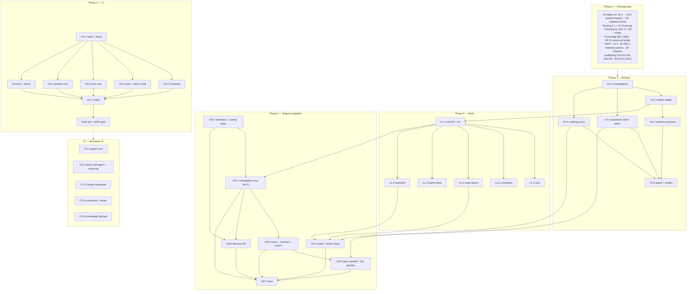

# Roadmap — Research (Mockup 22)

## Description

> Create a roadmap that covers the features for the mockup page 22. Any additional
> tech infrastructure that is required to implement the functionality in these mockup
> pages should be researched and offered as options for implementing in the roadmap.
> The roamdap should include MVP and v2 options, as well as the labels, milestones,
> and the like, for the tickets to be created. Any ticket sources that are used by
> Ouroboros for ingesting should be pluggable, which includes sources like Jira,
> Linear, GitHub, GitLab, and other bug reporting/issue recording sites. Refer to the
> page so that issues can reference the mockup file when creating the UI/UX design of
> the pages. Be very specific when creating the roadmap, as the options in the
> roadmap for the functionality needs to be complete and very thorough.

## Context & Existing Work (duplicate-avoidance survey)

Surveyed 2026-08-09.

**Design source of truth for every UI ticket in this roadmap:**
[`docs/mockups/22-research.html`](mockups/22-research.html) (with
`docs/mockups/assets/ouroboros.css`) — Research. Its anatomy:

- **Page head** — eyebrow `Research`, h1 *"Ask a hard question. Get an
  evidenced answer — and the tickets to act on it."*, subline: the same loop
  that handles the build runs investigations — *root-cause briefs for bug
  fixes, forensics on regressions, product roadmaps and improvement
  proposals, and project & competitive gap analysis* — with full research
  tools, **every claim cited**, every finding one click from a drafted
  ticket. Actions: **Research library** (ghost), **New investigation**
  (primary).
- **Investigation composer** (`c-7`, `START AN INVESTIGATION`, pill
  `researcher: sonnet-long-ctx` — a **registry alias**, mockup 21) — prompt
  textarea (*"Ask like you'd ask a principal engineer"*; seeded with the
  docking-gap question), **kind segmented control** (`Bug root cause` /
  `Regression forensics` / `Roadmap & improvements` / `Gap analysis` —
  selected), **Depth: Deep dive ▾** button, toggleable **tool chips** (Web
  search ✓ / Competitor tracker ✓ / Codebase mining ✓ / Issue & PR history ✓
  / Build & test telemetry ✓ / Docs, standards & papers — off), deliverable
  line (*"cited research brief → capability matrix → drafted epics & tickets
  in Planning"* linking mockup 09), scope estimate `est. 40–60 sources ·
  ~$6`, **Start investigation ⟳**.
- **Research tools card** (side, `6 connected`) — six `.tool-row`s with
  glyph, name, mono sub, health dot: **Web search & page reader** (*search
  API + full-page extraction, robots-aware*), **Competitor tracker** (*4
  rivals watched · release notes, changelogs, filings*), **Codebase & git
  mining** (*blame, bisect, dependency graph over helios-firmware*),
  **Issue & PR history index** (*3,412 issues · support tickets · churn
  interviews*), **Build & test telemetry** (*HIL bench measurements, fleet
  metrics warehouse*), **Docs, standards & papers** (*datasheets, RFCs,
  arXiv — PDF reader with citations*) — the last **idle with an `enable`
  button** (not yet connected).
- **Regression watch card** (`nightly vs. v2.0.4 baseline`) — three rows:
  err `Hover drift +14% in gusts` (*bisected → a41f2c9 · fix loop running ·
  #512*, pill `fixing` pulse), warn `Boot time +230 ms since v2.1.0-rc1`
  (*bisected → 7c03d1e · fix ticket drafted · #517*, pill `queued`), ok
  `Battery est. error regression` (*root-caused, fixed & merged · PR #641*,
  pill `✓ merged`). Caption: *"Watch compares every nightly HIL run to the
  last release baseline; any drift opens a forensics investigation
  automatically."*
- **Featured investigation** (`c-12`, kind chip `gap analysis`, `RS-127 —
  AUTONOMOUS DOCKING VS. THE FIELD`, tag `44 sources · deep dive`, pill
  `✓ brief ready`, **Export brief ↗**, **Draft epic from gaps →** to
  Planning) — **capability matrix** (`Capability × Helios (us) / Skylink /
  AeroMesh / Novum × Gap`; cell states `● shipping` / `◐ partial` / `○ none`
  / `? unknown`; severity chips `HIGH`/`MED`/`WIP`/`LEAD`); **brief
  excerpt** with inline citation superscripts (`[07] [12] [31] [git]`) and a
  code ref (`dock_ctrl.c:214`, *"unchanged in 14 months"*); **sources card**
  (`SOURCES — 44 CITED`, `all ↗`) — numbered citations with title + URL,
  including **internal URIs** (`issue-index://support/churn-2026-q2`,
  `helios-firmware @ 8c1b2e4 · src/dock/dock_ctrl.c`); **Proposed from
  gaps** chips (`EPIC · Docking parity`, `DOCK-1 wind-feedforward MPC`,
  `DOCK-2 re-planned retry`, `+3 more`, effort `L`).
- **Pipeline card** (`c-12`, kind chip `roadmap`, `RS-124 — FROM BRIEF TO
  ROADMAP TO ISSUES`, chips **`skill · create-roadmap` → `skill ·
  create-issues`** (the product's packaged procedures — mockup 14), **Open
  ROADMAP.md ↗**) — **step 1**: Rendered/Raw segmented view of a rendered
  `ROADMAP.md` (`docs/ROADMAP.md · committed 8c1b2e4 · generated from the
  RS-124 brief`; milestone sections `M1 · DOCKING PARITY — TARGET OCT 15` /
  `M2 · FLEET RELIABILITY`, checkbox items with issue numbers, `MVP` flags,
  effort chips) + **Suggested changes — 2 open** (*"applying re-runs
  create-roadmap"*): a human suggestion (KS avatar: pull #744 into the M1
  MVP set) and an AI suggestion (AI avatar: split #745), each **Apply ⟳** /
  **Dismiss**; **step 2**: `CREATE-ISSUES → GITHUB` (`6 issues · 2
  milestones · synced`) — issues grouped under milestone heads (`◆ M1 ·
  Docking parity · due Oct 15 · 1/3 done`) with due dates, estimates
  (`est 3.0 loop-days · $11`), effort chips, complexity chips
  (`cx:high|med|low`), status pills (`✓ merged` / `loop live` pulse /
  `queued`). Caption: *"create-issues writes the issue numbers, MVP flags,
  and descriptions back into ROADMAP.md — the file and the tracker never
  drift. Dates, estimates, effort, and complexity come from the estimator
  during issue creation."*
- **Investigations card** (`4 active · 23 this quarter`, **History**) —
  rows `RS-118` (kind `bug fix`, altimeter spikes below −10 °C, *18
  sources*, pill `fix loop live`, `open run →` mockup 10), `RS-121`
  (`regression`, motor PID overshoot v2.0.4 → v2.1.0-rc1, *bisect + HIL
  replay*, `queued`, `evidence →` mockup 11), `RS-124` (`roadmap`, Q4
  improvements from support tickets + churn interviews, *312 tickets
  clustered into 7 themes · 312 sources*, `✓ issues filed`, `to roadmap →`
  mockup 09), `RS-127` (`gap analysis`, *44 sources*, `✓ brief ready`,
  `brief ↑`). Closing line: *"Every investigation ends the same way the
  build loop does: with evidence — and, when you approve, with tickets the
  loop picks up next."*

**Scope boundaries.** Research is a consumer of nearly every plane built so
far: it *reads* through tools, *reasons* through the model stack, and *acts*
through Planning. This roadmap builds the investigation engine, the pluggable
research-tool layer, the regression watch, and the brief→roadmap→issues
pipeline — it does not rebuild ticket drafting/push (09), skills storage
(14), test telemetry (11/08), metric rollups (15), or model invocation (07).

**Overlapping work and dispositions:**

| Existing work | Disposition under this roadmap |
|---|---|
| WF Epic Q ticket-source SPI (canonical tickets; Jira/Linear/GitLab as WF-T.2–T.4) | **The pluggability requirement lands where it matters**: the Issue & PR history tool (CL.5) reads **canonical tickets only** — whatever tracker fed them (Jira, Linear, GitHub, GitLab, or any future source adapter) is invisible to research. Nothing source-specific is added here. |
| Providers AF.1/AF.2 (invocation-gateway ADR + chain executor — "the unlock for INTAKE-O.2, WF-T.6, AB.2") | **First consumer** — the researcher loop executes resolved chains through AF.2. This roadmap **pulls AF.1/AF.2 forward into its Phase 0 prerequisites** (decision V4 — explicit validation point: research without an LLM is an empty page). |
| Routing M3/Y.2 task kinds, registry aliases (21, CH.3 pricing) | **Consumed + amended** — new `research`-family task kinds registered so the composer's `researcher: sonnet-long-ctx` pill is a real resolved alias; scope/cost estimates price tool budgets through CH.3 (V5). |
| Planning N1/AL.3/AL.4 (draft batches, idempotent GitHub push, estimator sizing via INTAKE-L.3) | **The action path** — "Draft epic from gaps" and create-issues both produce Planning draft batches and push through AL.3; estimates/dates/effort/complexity on filed issues come from the same estimator (N3). No second push path (CM.5). |
| Knowledge BE.1/BF (skills registry: versioned markdown+frontmatter, `origin: generated`), K5 `/v0/learn` | **Consumed** — `create-roadmap` and `create-issues` are **skills in the registry** invoked by the pipeline (the mockup's skill chips); v2's brief→facts flywheel (CO.5) feeds K3 fact proposals. |
| Test results AS/AT (case history, nightly flake scorer), Build farm AJ.4 (telemetry retention), AH dispatch; Insights BI.1/BI.2/BJ.1 (metric rollups, windowed metrics) | **Consumed** — regression-watch baselines compare nightly measurement windows over these planes (V6); the Build & test telemetry tool (CL.6) queries them read-only. Bisect orchestration dispatches build-farm jobs (CM.4). |
| Build analyzer BU–BX (findings/suggestions over the runs corpus, measurement windows) | **Adjacent, not duplicated** — the analyzer improves *the loop itself* from run history; research investigates *the product* on demand. Regression watch's change-point mechanics cite BI windows the same way 18 does; forensics briefs link analyzer findings when relevant. |
| Run console (10), Test results (11), PR verification (12) | **Link targets** — investigation rows link `open run →` / `evidence →`; fix loops spawned from watch land in those surfaces. |
| Intake INTAKE-L.3/O.2 (estimation orchestrator, LLM estimator) | **Consumed** — pipeline issue sizing is N3's single sizer; nothing re-estimated here. |
| ChatOps BY–CB, Inbox BM–BP | **Coordinated** — watch alerts and brief-ready events surface through the inbox/needs-you machinery; a `/ouro research` command is a v2 grammar entry (noted for BZ.3, not built here). |
| Mockup 09's gantt/planning surfaces, 14's knowledge UI, 15's insights | **Out of scope** — this page links to them; their roadmaps own them. |
| Scaffolding #49 placeholder routes, #56 e2e, #54 engine task skeleton | **Superseded for `/research`**; #56 gains a research leg; the engine investigation loop builds on #54's queue/worker model. |

Epic letters continue the sequence (…CG–CJ): this roadmap uses
**CK, CL, CM, CN, CO** (five epics — the workflow-builder precedent for a
surface this large).

## Infrastructure Options (researched — thorough, pick before filing)

### 1. Web search & page extraction (the first tool chip)

| Option | What it is | Fit | Trade-offs |
|---|---|---|---|
| **A — Pluggable search/extract adapters, self-host default (SearXNG + built-in robots-aware fetcher)** ⭐ recommended | Search and extraction behind the research-tool SPI (option 3): default deployment ships a [SearXNG](https://github.com/searxng/searxng) container in compose (self-hosted metasearch, JSON API — no key, no per-query cost) plus our own fetcher/extractor (robots.txt-aware, rate-limited, redirect-bounded, readability-style article extraction, content hashed & archived for citations); hosted providers are alternate adapter configs | Keeps the self-hostable promise (the same posture as SearXNG-backed local agent stacks); the mockup's "robots-aware" sub is a real property; citation archival is ours regardless of provider | Self-host search quality < specialized AI-search APIs; mitigated by the adapter seam — orgs paste a key to upgrade |
| B — Hosted AI-search APIs as the default | [Brave Search API](https://brave.com/learn/best-search-api-2026/) (lowest latency ~669 ms, top of the [8-API agentic-search benchmark](https://aimultiple.com/agentic-search)), [Tavily](https://codenote.net/en/posts/tavily-alternatives-cost-comparison-search-extract-api/) (LLM-optimized answers+citations), [Firecrawl](https://www.firecrawl.dev/blog/best-web-search-apis) (best deep-content extraction; search+extract combined), Exa | Best relevance/latency out of the box; benchmark shows the top four statistically indistinguishable | Per-query cost + external dependency as the *default* violates self-hosting; keys/quotas per org — **offered as first-class adapter configs** (Brave, Tavily, Firecrawl day-one schemas), not the default |
| C — No web tool in MVP | Internal-only research | Zero new infra | Guts gap analysis and the featured investigation; the page's premise dies — **rejected** |

### 2. Competitor tracker (watching rivals' release notes, changelogs, filings)

| Option | What it is | Fit | Trade-offs |
|---|---|---|---|
| **A — Built-in watch registry + scheduled diffing (changedetection-style), feed cited like any source** ⭐ recommended | Per-org **competitor registry** (rival → watched URLs: release-notes pages, changelogs, GitHub releases via API, RSS/Atom, filings pages) with scheduled robots-aware snapshots, CSS/XPath-scoped diffing, and a change feed stored as citable source records — the pattern proven by [changedetection.io](https://github.com/dgtlmoon/changedetection.io) (30k-star self-hosted change monitoring) | The researcher cites *archived diffs with retrieval dates*, not live pages that may change; the card's `4 rivals watched · release notes, changelogs, filings` is registry truth; no external service | JS-heavy pages need a render tier (deferred to v2 with a bounded headless fetcher); filings ingestion (EDGAR-class) is v2 (CO.3) |
| B — Embed/integrate changedetection.io itself | Run the existing tool alongside, consume its API | Battle-tested watch engine for free | Second app to operate + per-org multi-tenancy is foreign to it; its notification model duplicates ours — pattern borrowed instead (A) |
| C — Manual competitor notes only | Humans paste rival updates | No infra | Not a tracker; the tool chip would be fiction — **rejected** |

### 3. Research-tool pluggability (the SPI everything above sits behind)

One `ResearchToolAdapter` SPI, third application of the proven pattern
(ticket sources WF-Q.2, model providers AC.1):

| Tool | Kind | Backing | Status |
|---|---|---|---|
| Web search & page reader | `search+fetch` | SearXNG default / Brave / Tavily / Firecrawl configs (option 1) | **MVP (CL.2)** |
| Competitor tracker | `watch+query` | built-in watch registry + diff feed (option 2) | **MVP (CL.3)** |
| Codebase & git mining | `query` | repo clones: blame, log, dependency graph; bisect execution via build farm | **MVP (CL.4)** |
| Issue & PR history index | `query` | canonical tickets (WF-Q SPI — **tracker-agnostic**), PR history, imported docs | **MVP (CL.5)** |
| Build & test telemetry | `query` | AS/AT case history, AJ.4 telemetry, BI rollups — read-only | **MVP (CL.6)** |
| Docs, standards & papers | `search+fetch` | PDF pipeline (option 4) | **v2 (CO.1)** — the mockup itself shows it idle/`enable` |

Adapters declare `kind`, `configSchema()`, `capabilities()`, `healthCheck()`,
and typed operations (`search`, `fetch`, `query`) that **must return source
records** (the citation contract, decision V3). Conformance kit + fake
adapter; core code imports the interface only (lint-guarded).

### 4. PDF & paper reading (the sixth tool — v2, per the mockup's own idle state)

| Option | What it is | Fit | Trade-offs |
|---|---|---|---|
| **A — Docling for layout/content + GROBID for scholarly citation structure** ⭐ recommended v2 | [Docling](https://github.com/docling-project/docling) (open-source PDF→structured Markdown/JSON, tables, OCR) for datasheets/RFCs/general PDFs; [GROBID](https://grobid.readthedocs.io/en/latest/Introduction/) (the scholarly-PDF standard — powers S2ORC; ~0.87–0.90 F1 reference extraction) for papers: header/reference/citation-context extraction so paper citations resolve to *their* sources | Each tool at what it's best at (the [docling-vs-GROBID comparison](https://github.com/docling-project/docling/discussions/622) supports the split); both self-hostable containers | Two services to operate — why this is v2, matching the mockup's disconnected state |
| B — LLM-only PDF reading (send pages to the model) | No parse infra; multimodal models read pages | Zero setup | Expensive per page, no structural citation anchors, context limits on long specs — acceptable *fallback inside A*, not the plan |

### 5. Investigation orchestration (how the researcher actually runs)

| Option | What it is | Fit | Trade-offs |
|---|---|---|---|
| **A — Custom engine loop over the adapter SPIs + AF.2 invocation, versioned `/v0/investigate` contract** ⭐ recommended | The investigation runs as an engine task (#54 queue/worker): plan → iterate (tool calls through the research-tool SPI, every result logged as a source record) → synthesize (LLM through AF.2 using the routed `research` alias) → brief with claim→citation links; depth presets bound iterations/sources/spend; checkpointed so long investigations survive worker restarts; provenance versioned (`researcher: loop-v1 · alias`) per the N2/K5 honesty discipline | One orchestration idiom with the rest of the product (engine tasks + versioned contracts); citation capture is structural (tools *return* source records) rather than post-hoc parsing; deterministic tools (git, telemetry, tickets) work even when synthesis is unavailable | We own the agent loop's quality — mitigated by depth bounds, checkpoints, and the tool contract keeping each step small |
| B — Adopt an agent framework (LangGraph-class) inside the engine | Framework-managed graph/state | Checkpointing for free | A second orchestration idiom + heavyweight dependency for one loop; the SPI boundary does the useful part — **rejected** |
| C — Defer all LLM synthesis to v2, deterministic reports only | Regression watch + telemetry summaries without a researcher | No AF.2 dependency | Three of four investigation kinds become fiction; recorded as the fallback stance if validation rejects pulling AF.2 forward (V4) |

## Decisions proposed by this roadmap (validate before issue creation)

| # | Decision | Rationale |
|---|----------|-----------|
| V1 | **Investigations are first-class org entities** (`RS-###` per-org sequence): kind (`bug_root_cause` / `regression_forensics` / `roadmap_improvements` / `gap_analysis` — a registry, org-extensible later), question, depth preset, tool selection, status (`queued → running → brief_ready → issues_filed \| failed`), full provenance (researcher version, alias, spend, source count) | Every card on the page is a view over this entity; the closing line's lifecycle is a state machine. |
| V2 | **Research tools are a pluggable SPI** (option 3), third application of the Q.2/AC.1 pattern, with conformance kit and lint boundary; the Issue & PR history tool consumes **canonical tickets only** — tracker pluggability (Jira/Linear/GitHub/GitLab/…) stays in the source SPI where it lives | The description's pluggability requirement, honored structurally and without duplicating WF-Q. |
| V3 | **Citation is a contract, not a feature**: every tool operation returns source records (kind, title, locator — URL or internal URI `issue-index://…`, `git://repo@sha/path`, `telemetry://…`; retrieved_at; content hash; archived excerpt); briefs store claim→citation links; **a claim without a citation cannot render as a finding** | "Every claim cited" is the page's core promise; archival makes citations stable while the web moves. |
| V4 | **The researcher is LLM-backed in MVP, and this roadmap pulls AF.1/AF.2 (invocation gateway) forward into its prerequisites** — the first consumer of the provider stack's v2 tier; fallback stance recorded (option 5-C: deterministic-only MVP) if validation disagrees | INTAKE-O.2/WF-T.6/AB.2 all wait on AF.2 anyway; a Research page without research is an empty shell. **Explicit validation point.** |
| V5 | **Scope/cost estimates are computed, never invented**: depth preset × enabled tools × routed alias pricing (registry CH.3) → `est. 40–60 sources · ~$6` ranges; unpriced aliases → source range only, no dollar figure (M7/P8 honesty); actual spend recorded per investigation and reconciled against the estimate | The composer's estimate line and the honesty rules. |
| V6 | **Regression watch is deterministic**: per-release baselines over nightly measurement windows (AS/AT case history, AJ.4 telemetry, BI rollups); drift beyond thresholds → watch item; **bisect orchestration** dispatches build-farm jobs (git bisect over AH dispatch, HIL replay where configured) to isolate the commit; then **auto-opens a forensics investigation** and drafts the fix ticket via Planning (N1 drafts). Policy: auto-draft is default; auto-file+queue is an explicit org opt-in ("when you approve" is the page's own gate) | The card's `bisected → a41f2c9 · fix loop running` chain, composed from existing planes plus one new orchestrator — no LLM required for detection or bisection. |
| V7 | **Capability matrices are structured, citation-backed data**: capabilities × competitors × status (`shipping/partial/none/unknown/wip`) × gap severity (`HIGH/MED/LOW/WIP/LEAD`), every non-`unknown` cell carrying ≥1 citation; `unknown` is a first-class honest state; **Draft epic from gaps** maps HIGH/MED rows → a Planning draft batch (epic + tickets, gap provenance recorded) | The matrix must be evidence, not vibes; the handoff is composition over AL.4. |
| V8 | **The brief→roadmap→issues pipeline composes existing subsystems**: roadmap docs are versioned product entities **projected to `ROADMAP.md` and committed to the repo via PR** (not direct push — review is the repo's gate); `create-roadmap`/`create-issues` are **skills** (Knowledge registry, K1) executed by the loop; create-issues files through Planning's idempotent push (AL.3) and **writes issue numbers/MVP flags back** into the doc entity → re-projected → PR update; suggested changes are entities whose **Apply re-runs the skill** with the suggestion appended to its input; estimates on filed issues come from the one sizer (N3) | The mockup's caption ("the file and the tracker never drift") demands one owner for the doc↔tracker loop; skills make the procedure inspectable and org-customizable. |
| V9 | **The competitor tracker is a built-in watch registry** (option 2-A): rivals + watched sources, scheduled robots-aware snapshots + scoped diffs archived as citable source records; JS-rendered pages and filings ingestion are v2 (CO.3) | Cited archived diffs beat live-page links; self-hosted like everything else. |
| V10 | **Kinds share one engine, differ by playbook**: each investigation kind is a configuration (tool defaults, synthesis template, deliverable set — brief / brief+matrix / brief+roadmap-doc / brief+fix-draft), not a separate code path; kind playbooks versioned with the contract | Four kinds ship without four engines; org-extensible kinds later inherit the machinery. |
| V11 | **Research library = the investigations list + History in MVP** (filterable by kind/status/quarter, `23 this quarter` computed); a richer library surface (cross-links, tags, brief search) is v2 (CO.4) | The head button gets an honest destination without a second surface. |
| V12 | **Route `/research`; labels**: existing set + new **`research`**; **Milestones**: `Research MVP` / `Research v2` created at filing | Description requires labels + milestones for the filing pass. |

## Architecture Overview

```mermaid
flowchart LR
    subgraph Browser
        UI22["ouroboros-ui /research<br/>composer · tools · watch · briefs · pipeline"]
    end
    subgraph "ouroboros-rest (NestJS)"
        RAPI["/api/v1/research<br/>investigations · briefs · watch · pipeline"]
        SPI["ResearchToolAdapter SPI (CL.1)<br/>web · competitor · code · tickets · telemetry"]
        WATCH["Regression watch service (CM.4)<br/>baselines · drift · bisect orchestration"]
        PIPE["Roadmap-doc pipeline (CM.5)<br/>skills · suggestions · writeback · PR"]
    end
    subgraph "ouroboros-engine (FastAPI)"
        INV["/v0/investigate (CM.1)<br/>plan → tools → synthesize → brief"]
    end
    subgraph "ouroboros-db"
        RS[("investigations · briefs · claims")]
        SRC[("source_records (citation ledger)")]
        MTX[("capability matrices · competitor watches")]
        RW[("baselines · watch items")]
        RD[("roadmap docs · suggested changes")]
    end
    PLANES["consumers/providers:<br/>AF.2 invocation · routing research kinds<br/>Planning drafts+push · Knowledge skills<br/>AS/AT · AJ.4 · BI rollups · WF-Q tickets"]
    UI22 --> RAPI
    RAPI --> RS & RW & RD
    RAPI --> SPI --> SRC
    INV --> SPI
    RAPI <--> INV
    WATCH --> RW
    PIPE --> RD
    INV -.LLM via AF.2.-> PLANES
    WATCH & PIPE -.-> PLANES
    MTX --- RS
```

## MVP Definition

The MVP is **mockup 22 as a working investigation loop**: ask, evidence,
brief, tickets. It is done when, against the compose stack (with AF.2 from
the providers v2 tier — decision V4):

1. `/research` reproduces
   [`docs/mockups/22-research.html`](mockups/22-research.html)
   pixel-faithfully in **both themes**: head, composer (kind segments, depth
   menu, tool chips, computed estimate line, resolved researcher-alias
   pill), tools card (five connected + the honest idle sixth), regression
   watch card, the featured-brief card (matrix, brief with citation
   superscripts, sources, proposed-from-gaps), the pipeline card (rendered/
   raw doc, suggested changes, milestone-grouped issues), and the
   investigations list.
2. **An investigation actually runs end to end**: composer → engine loop
   iterates the enabled tools (every operation logged as an archived source
   record) → LLM synthesis through the routed `research` alias → brief with
   claim→citation links → status `brief_ready`; checkpointed, cancellable,
   depth-bounded; live progress visible (source count ticking).
3. **All five MVP tools work behind the SPI** with health honest in the
   tools card, and the sixth renders idle with a designed enable-path
   pointing at its v2 arrival; the Issue & PR history tool proves
   tracker-pluggability by serving canonical tickets regardless of source
   adapter.
4. **Citations hold**: brief text renders superscript refs; the sources
   panel lists numbered records (external URLs and internal URIs);
   `all ↗` shows the full ledger; export produces the brief + sources
   (Markdown) faithfully; claims without citations do not render as
   findings.
5. **Gap analysis is structured**: the matrix renders from data with
   citation-backed cells and honest `? unknown`; **Draft epic from gaps**
   creates a Planning draft batch (provenance: investigation + gap rows)
   and navigates to Planning for review/push.
6. **Regression watch is live**: seeded baselines + nightly comparison
   produce the three-state rows; a synthetic drift fixture triggers watch
   item → bisect job orchestration → auto-opened forensics investigation →
   drafted fix ticket (auto-draft default; auto-file opt-in verified).
7. **The pipeline closes the loop**: a roadmap-kind investigation's brief →
   `create-roadmap` skill run → versioned doc entity → rendered/raw views +
   repo PR; suggested changes (human + AI-authored) Apply→re-run and
   Dismiss; `create-issues` → Planning push → issue numbers/MVP flags
   written back into the doc (file and tracker verified drift-free);
   estimates/dates/effort/complexity on filed issues from the N3 sizer.
8. **Costs are honest**: composer estimates computed per V5; per-
   investigation actual spend recorded and shown; no dollar figures where
   pricing is absent.
9. Integration tests cover the tool SPI conformance, citation ledger,
   investigation lifecycle (checkpoint/resume/cancel), watch→bisect→
   forensics chain, matrix integrity, pipeline writeback idempotency, org
   isolation; the e2e suite gains a research leg.

**Explicitly v2 (milestone `Research v2`):** the Docs/standards/papers tool
(CO.1 — Docling+GROBID), multi-agent deep research + theme clustering at
scale (CO.2 — the `312 tickets clustered into 7 themes` upgrade), competitor
tracker expansion (CO.3 — JS rendering, filings, auto-discovery, matrix
refresh alerts), scheduled/continuous investigations + full research library
(CO.4), and the brief→Knowledge facts flywheel (CO.5).

## Epics, Labels & Milestones

Each epic is a parent tracking issue on GitHub; every roadmap issue below is filed as
one of its sub-issues (GitHub Relationships).

| Epic | GitHub | Status | Name | Goal | Modules | Milestone |
|------|:------:|:------:|------|------|---------|-----------|
| CK | #603 | 🟡 Open | Research Domain | Investigations, citation ledger, matrices, watch, roadmap docs, seeds, CI | ouroboros-db | Research MVP |
| CL | #604 | 🟡 Open | Research Tool SPI & Tools | SPI + conformance kit, five MVP tool adapters | ouroboros-rest, ouroboros-engine | Research MVP |
| CM | #605 | 🟡 Open | Investigation Engine & Pipeline | `/v0/investigate` loop, briefs/matrices, estimates, watch+bisect, pipeline, API, tests | ouroboros-engine, ouroboros-rest | Research MVP |
| CN | #606 | 🟡 Open | Research UI | All seven page regions, states, e2e | ouroboros-ui | Research MVP |
| CO | #607 | 🟡 Open | Research at Scale (v2) | Papers tool, deep multi-agent research, tracker expansion, library, knowledge flywheel | all | Research v2 |

Issue naming: `<project>: [<epic>.<issue>] <title>`. Labels: existing set
(`mvp`, `v2`, `rest`, `db`, `engine`, `ui`, `ci`, `design`, `planning`,
`knowledge`, `routing`, `providers`) **plus new `research`** (decision V12).
Milestones **`Research MVP`** / **`Research v2`** created at filing; every
issue assigned. Complexity chips: **XS · S · M · L**.

---

## Epic CK (#603) — Research Domain (`ouroboros-db`)

| Ref | GitHub | Status | Title | Summary | Labels | Parallel | MVP | Complexity | Affected Modules |
|-----|:------:|:------:|-------|---------|--------|:--------:|:---:|:----------:|------------------|
| CK.1 | #608 | 🟡 Open | ouroboros-db: [CK.1] Investigations & kind registry schema | RS-### entities: kind, depth, tools, status, provenance, spend | mvp, research, db | N (after #19, BA-B.3) | Y | M | ouroboros-db |
| CK.2 | #609 | 🟡 Open | ouroboros-db: [CK.2] Citation ledger — source records & claims | Archived sources (external+internal URIs), claim→citation links | mvp, research, db | N (after CK.1) | Y | M | ouroboros-db |
| CK.3 | #610 | 🟡 Open | ouroboros-db: [CK.3] Capability matrices & competitor watch schema | Matrix cells with citations; rival registry, watched sources, diffs | mvp, research, db | N (after CK.2) | Y | M | ouroboros-db |
| CK.4 | #611 | 🟡 Open | ouroboros-db: [CK.4] Regression baselines & watch items | Release baselines, metric windows, drift states, bisect results | mvp, research, db | N (after CK.1, AS.1) | Y | M | ouroboros-db |
| CK.5 | #612 | 🟡 Open | ouroboros-db: [CK.5] Roadmap docs & suggested changes | Versioned doc entities, projection state, writeback refs, suggestions | mvp, research, db | N (after CK.1, AK.1) | Y | M | ouroboros-db |
| CK.6 | #613 | 🟡 Open | ouroboros-db: [CK.6] Research dev seeds — mockup-22 parity + probes | RS-118/121/124/127, 44-source ledger, matrix, watch rows, doc; ci checks | mvp, research, db, ci | N (after CK.2–CK.5, #24) | Y | M | ouroboros-db, .github |

### Issue CK.1 — ouroboros-db: [CK.1] Investigations & kind registry schema

> **GitHub issue:** #608 · **Status:** 🟡 Open · **Parent epic:** #603

- **Problem Statement:** Everything on the page hangs off an investigation
  entity that doesn't exist — with a per-org human id (`RS-127`), a kind, a
  depth, a tool selection, and a lifecycle (decision V1, V10).
- **Solution/Scope:** Migration: `investigation_kinds` — id, org FK, `slug`
  CHECK-seeded (`bug_root_cause|regression_forensics|roadmap_improvements|
  gap_analysis`), display, tint key, `playbook` jsonb (default tools,
  synthesis template ref, deliverable set — versioned, V10);
  `investigations` — id, org FK, `seq` (per-org monotonic → `RS-###`),
  `kind_id` FK, `question` text, `depth` CHECK `quick|standard|deep_dive`,
  `tools_enabled` jsonb (adapter slugs), `status` CHECK `queued|running|
  brief_ready|issues_filed|failed|cancelled`, `estimate` jsonb (source
  range, cost range — V5), `actuals` jsonb (sources used, spend cents,
  duration), `provenance` jsonb (`researcher` version, alias, resolution
  ref), `origin` CHECK `user|regression_watch|scheduled` (V6 auto-opens;
  CO.4 scheduled), engine task ref, timestamps, `created_by`.
- **Acceptance Criteria:**
  - Per-org sequence yields gapless display ids under concurrent creates
    (advisory-lock or sequence-per-org verified).
  - Kind playbooks round-trip; unknown tool slugs rejected at write.
  - Status transitions constrained (no `brief_ready` without a brief row —
    deferred FK checked in CK.2's tests).
- **Parallelism/Dependencies:** Needs #19, BA-B.3. Blocks CK.2–CK.5, CM.1.
- **Technical Stack:** PostgreSQL 17, Flyway.
- **Epic:** CK

```
investigations{RS-127, gap_analysis, deep_dive, tools:[web,competitor,code,tickets,telemetry],
  status: brief_ready, estimate:{sources:40–60, cost:~600¢}, actuals:{44, 612¢},
  provenance:{loop-v1, alias: researcher-long-ctx}, origin: user}
```

### Issue CK.2 — ouroboros-db: [CK.2] Citation ledger — source records & claims

> **GitHub issue:** #609 · **Status:** 🟡 Open · **Parent epic:** #603

- **Problem Statement:** "Every claim cited" needs storage where citations
  are archived facts, stable while the web moves — and where a brief's
  claims link to them structurally (decision V3).
- **Solution/Scope:** Migration: `source_records` — id, `investigation_id`
  FK, `tool_slug`, `kind` CHECK `web|competitor_diff|code|ticket|telemetry|
  doc`, `title`, `locator` (URL or internal URI: `issue-index://…`,
  `git://repo@sha/path#L214`, `telemetry://metric/window`), `retrieved_at`,
  `content_hash`, `excerpt` (bounded archived extract), `meta` jsonb,
  `cite_no` (per-investigation dense number → `[07]`; symbolic keys like
  `[git]` supported via `cite_key` nullable); `briefs` — investigation FK
  (1:1 current + versions), `body` (structured: paragraphs with claim
  spans), `deliverables` jsonb refs; `brief_claims` — brief FK, claim span
  ref, ≥1 `source_record` FK (junction) — **CHECK-discipline: a finding
  claim row must have at least one citation link** (enforced in service +
  probed in CI).
- **Acceptance Criteria:** Cite numbering dense and stable per
  investigation; internal URI kinds validated by pattern; excerpt bounds
  enforced; a brief with an uncited finding claim fails the write path
  (service test); ledger listing reproduces the mockup's five sample
  citations from seeds.
- **Parallelism/Dependencies:** Needs CK.1. Blocks CK.3, CK.6, CM.1, CM.2.
- **Technical Stack:** PostgreSQL 17, Flyway.
- **Epic:** CK

```
source_records: [07]{web, "Skylink S4 teardown", https://…, hash, excerpt}
                [19]{ticket, "Churn interviews Q2", issue-index://support/churn-2026-q2}
                [git]{code, "dock_ctrl.c blame", git://helios-firmware@8c1b2e4/src/dock/dock_ctrl.c}
brief_claims: "gap is control, not sensors" ──▶ {[07],[12],[31],[git]}   (≥1 enforced)
```

### Issue CK.3 — ouroboros-db: [CK.3] Capability matrices & competitor watch schema

> **GitHub issue:** #610 · **Status:** 🟡 Open · **Parent epic:** #603

- **Problem Statement:** The featured card's matrix and the tracker's rival
  registry are structured evidence, not markup (decisions V7, V9).
- **Solution/Scope:** Migration: `competitors` — org FK, name, meta;
  `competitor_watches` — competitor FK, `source_kind` CHECK `release_notes|
  changelog|github_releases|rss|filings|page`, `url`, `selector` (scoped
  diff region, nullable), `cadence`, `last_snapshot_at`, `enabled`;
  `competitor_snapshots` — watch FK, `content_hash`, archived content ref,
  `diff` (vs previous, nullable), `taken_at` — snapshots/diffs are
  citable (CK.2 `competitor_diff` records point here);
  `capability_matrices` — investigation FK, title; `matrix_rows` —
  capability label, sort; `matrix_cells` — row FK, `subject` (`us` or
  competitor FK), `status` CHECK `shipping|partial|none|unknown|wip`,
  `note` (`◐ in flight`, `◐ beta`), citation links (junction to
  `source_records`; **CHECK-discipline: non-`unknown` cells require ≥1**,
  service-enforced); `row_gap` severity CHECK `high|med|low|wip|lead`
  computed-then-stored with derivation note.
- **Acceptance Criteria:** The RS-127 matrix round-trips exactly (5
  capabilities × 4 subjects × severities); uncited non-unknown cell
  rejected in the service path; watch cadence/enabled vocab enforced;
  snapshot diffs reference archived content.
- **Parallelism/Dependencies:** Needs CK.2. Blocks CK.6, CL.3, CM.2.
- **Technical Stack:** PostgreSQL 17, Flyway.
- **Epic:** CK

```
matrix "docking vs field": row "Docking in >8 m/s gusts"
  us: ◐partial[cite] · skylink: ●shipping[07][12] · aeromesh: ◐partial[cite] · novum: ○none[cite]
  gap: HIGH   |   "Recovery beacon BLE" ─▶ us ●shipping · … ─▶ LEAD
watch: skylink/release_notes url+selector ─▶ snapshots{hash, diff} ─▶ citable
```

### Issue CK.4 — ouroboros-db: [CK.4] Regression baselines & watch items

> **GitHub issue:** #611 · **Status:** 🟡 Open · **Parent epic:** #603

- **Problem Statement:** "Nightly vs. v2.0.4 baseline" needs per-release
  metric baselines, drift states, and bisect outcomes as data — the card's
  three rows and their lifecycle (decision V6).
- **Solution/Scope:** Migration: `regression_baselines` — org FK, repo ref,
  `release_tag` (`v2.0.4`), `metric_key` (BI metric id or AS/AT case
  metric), `window` jsonb (baseline stats), `captured_at`;
  `regression_watch_items` — baseline FK, `current` jsonb (latest window),
  `drift` (signed magnitude + unit — `+14%`, `+230 ms`), `severity` CHECK
  `err|warn|ok`, `status` CHECK `detected|bisecting|bisected|
  investigation_open|fix_drafted|fix_running|fixed_merged|dismissed`,
  `bisect_result` jsonb (culprit sha, job refs, confidence),
  `investigation_id` FK (the auto-opened forensics, nullable),
  `fix_ticket_ref` (canonical ticket/draft ref, nullable), timestamps.
  Thresholds config per metric (org-level jsonb, defaulted).
- **Acceptance Criteria:** The card's three rows representable exactly
  (fixing/queued/merged states with their refs); status transitions
  constrained; drift stored with units; dismissal audited (who/when).
- **Parallelism/Dependencies:** Needs CK.1, AS.1 (case/metric identity).
  Blocks CK.6, CM.4.
- **Technical Stack:** PostgreSQL 17, Flyway.
- **Epic:** CK

```
baseline{v2.0.4, hover_drift_gusts, window} × nightly ─▶ item{+14%, err,
  bisected→a41f2c9, investigation RS-13x, fix #512, status: fix_running}
```

### Issue CK.5 — ouroboros-db: [CK.5] Roadmap docs & suggested changes

> **GitHub issue:** #612 · **Status:** 🟡 Open · **Parent epic:** #603

- **Problem Statement:** The pipeline card's `ROADMAP.md` is a versioned
  product entity projected to a file — with writeback state and a
  suggestion queue (decision V8).
- **Solution/Scope:** Migration: `roadmap_docs` — org FK,
  `investigation_id` FK (nullable — docs can exist without an
  investigation later), title, `current_version`; `roadmap_doc_versions` —
  doc FK, version, `structure` jsonb (milestones: name, target date;
  items: title, draft/ticket ref, mvp flag, effort, checked state),
  `markdown` (the projection — regenerated, never hand-authored),
  `generated_by` (skill run ref), `repo_projection` jsonb (path, PR ref,
  committed sha, state CHECK `pending|pr_open|committed|drift_detected`),
  immutable versions (WF-P.1 trigger pattern); `doc_suggestions` — doc FK,
  `author_kind` CHECK `user|ai`, author ref, text, optional structured
  hint jsonb, `status` CHECK `open|applied|dismissed`, `applied_version`
  FK nullable; writeback refs: items link Planning drafts (AK.1) →
  canonical tickets after push (issue numbers/MVP flags mirrored into the
  next version — the no-drift caption).
- **Acceptance Criteria:** RS-124's doc (2 milestones, 6 items, MVP flags,
  one checked) round-trips; versions immutable; suggestion transitions
  audited; projection state machine constrained.
- **Parallelism/Dependencies:** Needs CK.1, AK.1. Blocks CK.6, CM.5.
- **Technical Stack:** PostgreSQL 17, Flyway.
- **Epic:** CK

```
roadmap_doc v3 {M1[#742✓ MVP L, #743 MVP M, #744 M] M2[#745 M, #746 S, #747 XS]}
  repo_projection: docs/ROADMAP.md · pr #88 · committed 8c1b2e4
suggestions: {user KS: "pull #744 into M1 MVP", open} {ai: "split #745", open}
apply ─▶ re-run create-roadmap ─▶ v4 (suggestion → applied@v4)
```

### Issue CK.6 — ouroboros-db: [CK.6] Research dev seeds — mockup-22 parity + probes

> **GitHub issue:** #613 · **Status:** 🟡 Open · **Parent epic:** #603

- **Problem Statement:** Design review and e2e need the page's full state:
  four investigations, a 44-record ledger, the matrix, watch rows, and the
  pipeline doc.
- **Solution/Scope:** Extend the dev seed: kinds (the four, with playbooks);
  investigations RS-118 (bug, 18 sources, `fix loop live` via a seeded run
  ref), RS-121 (regression, 9 sources, queued), RS-124 (roadmap, 312
  sources — ledger rows summarized: full 312 seeded as compact ticket-kind
  records, `✓ issues_filed`), RS-127 (gap, 44 sources incl. the five
  featured citations verbatim, `✓ brief_ready`, deep dive); RS-127 brief
  body with claim links; the capability matrix; competitor registry (4
  rivals + watches + one archived diff); regression baselines (v2.0.4) +
  three watch items in their exact states (#512 fixing / #517 queued / PR
  #641 merged — refs into DASH/run seeds where they exist); RS-124 roadmap
  doc v-current + 2 open suggestions + milestone-grouped issue rows
  (coordinated with Planning/intake seeds for ticket refs, estimator
  fields); quarter counter shaping (`4 active · 23 this quarter`,
  relative-to-`now()` like DASH-F.5). Personal org: empty (guidance
  fixture). ci/db probes: citation-discipline, matrix cell citations,
  watch-status vocab, doc immutability, seq gaplessness.
- **Acceptance Criteria:** Every page region renders the mockup from seeds
  alone; counts computed not stored; idempotent; cross-roadmap seed suite
  stays green; probes red/green verified once.
- **Parallelism/Dependencies:** Needs CK.2–CK.5, #24 (+Y.4/AK.4/AS
  coordination). Feeds CL/CM/CN tests, e2e.
- **Technical Stack:** Flyway repeatable migration, SQL.
- **Epic:** CK

```
seeds: 4 kinds · RS-118/121/124/127 · ledger(44 + 312 compact) · matrix 5×4
       4 rivals+watches · baseline+3 watch items · doc v-cur + 2 suggestions
```

---

## Epic CL (#604) — Research Tool SPI & Tools (`ouroboros-rest` + `ouroboros-engine`)

| Ref | GitHub | Status | Title | Summary | Labels | Parallel | MVP | Complexity | Affected Modules |
|-----|:------:|:------:|-------|---------|--------|:--------:|:---:|:----------:|------------------|
| CL.1 | #614 | 🟡 Open | ouroboros-rest: [CL.1] ResearchToolAdapter SPI & conformance kit | Interface, capability/config schemas, source-record contract, registry, lint | mvp, research, rest | N (after CK.2) | Y | L | ouroboros-rest |
| CL.2 | #615 | 🟡 Open | ouroboros-rest: [CL.2] Web search & page reader tool | SearXNG default + Brave/Tavily/Firecrawl configs; robots-aware fetch/extract/archive | mvp, research, rest | N (after CL.1) | Y | L | ouroboros-rest |
| CL.3 | #616 | 🟡 Open | ouroboros-rest: [CL.3] Competitor tracker tool | Rival registry CRUD, scheduled snapshots+diffs, citable change feed | mvp, research, rest | N (after CL.1, CK.3) | Y | M | ouroboros-rest |
| CL.4 | #617 | 🟡 Open | ouroboros-engine: [CL.4] Codebase & git mining tool | Blame/log/dep-graph queries over repo clones; bisect execution primitive | mvp, research, engine | N (after CL.1, #54) | Y | M | ouroboros-engine, ouroboros-rest |
| CL.5 | #618 | 🟡 Open | ouroboros-rest: [CL.5] Issue & PR history index tool | Canonical tickets (tracker-agnostic via WF-Q), PRs, imported docs; query ops | mvp, research, rest | N (after CL.1, WF-Q) | Y | M | ouroboros-rest |
| CL.6 | #619 | 🟡 Open | ouroboros-rest: [CL.6] Build & test telemetry tool | Read-only queries over AS/AT history, AJ.4 telemetry, BI rollups | mvp, research, rest | N (after CL.1, BI.2) | Y | M | ouroboros-rest |

### Issue CL.1 — ouroboros-rest: [CL.1] ResearchToolAdapter SPI & conformance kit

> **GitHub issue:** #614 · **Status:** 🟡 Open · **Parent epic:** #604

- **Problem Statement:** Six tools ship across MVP+v2 and orgs will want
  more (internal wikis, vendor portals, data lakes); pluggability must be
  structural — the third application of the proven SPI discipline
  (decision V2), with the citation contract baked into the interface
  (V3).
- **Solution/Scope:** Define the SPI: `slug`, `displayMeta()` (name, glyph,
  sub-line template), `configSchema()` (JSON Schema — org-level config:
  keys, endpoints, scope), `capabilities()` (`search`, `fetch`, `query`,
  `watch`), `healthCheck()` → status for the tools card, and typed
  operations — `search(q, opts)`, `fetch(locator)`, `query(structured)` —
  **every operation returns `SourceRecord[]`** (CK.2 shape: title,
  locator, retrieved_at, content, excerpt candidates) alongside its
  payload; error taxonomy (auth/network/robots-denied/rate/upstream);
  budget hooks (per-investigation operation/token budgets enforced by the
  caller, reported by the adapter). Registry by slug with DI tokens;
  dependency-cruiser boundary (core imports the interface only);
  conformance kit: recorded-fixture suites + an in-memory fake tool
  powering engine-loop tests; `docs/RESEARCH_TOOLS.md` walkthrough.
  Engine access: the investigation loop calls tools through an internal
  REST surface (`/internal/research/tools/:slug/:op`) so adapters and
  credentials stay in the control plane (the AD.3/P3 posture).
- **Acceptance Criteria:** Kit green for the fake tool; lint boundary
  fails on direct tool imports; an operation that returns data without
  source records fails conformance; health states map to the tools-card
  dots 1:1; internal surface enforces org scoping.
- **Parallelism/Dependencies:** Needs CK.2. Blocks CL.2–CL.6, CM.1.
- **Technical Stack:** NestJS DI, JSON Schema, dependency-cruiser.
- **Epic:** CL

```
interface ResearchToolAdapter {
  slug · displayMeta() · configSchema() · capabilities() · healthCheck()
  search()/fetch()/query() ─▶ {payload, sources: SourceRecord[]}   // citations structural
}
engine ──/internal/research/tools/web/search──▶ REST(adapter) ─▶ results + ledger rows
```

### Issue CL.2 — ouroboros-rest: [CL.2] Web search & page reader tool

> **GitHub issue:** #615 · **Status:** 🟡 Open · **Parent epic:** #604

- **Problem Statement:** The first chip: search the web, read pages fully,
  archive what was read — robots-aware, self-hostable by default,
  upgradeable to hosted AI-search providers (infrastructure option 1-A).
- **Solution/Scope:** Adapter with **provider sub-configs**: default
  `searxng` (compose ships the container; JSON API; result normalization),
  plus `brave`, `tavily`, `firecrawl` schemas (key + options) selectable
  per org; **fetch/extract pipeline** owned by us regardless of provider:
  robots.txt check (cached per host, denial recorded honestly as a
  skipped-source note), rate limits per host, redirect bounds, size caps,
  readability-style main-content extraction, full-content archival
  (hash + stored extract feeding CK.2 records), non-HTML content-type
  handling (PDF deferred to CO.1 with a designed "papers tool arrives in
  v2" skip note). Search ops return result records; fetch ops return
  archived page records.
- **Acceptance Criteria:** Compose stack searches via SearXNG and fetches/
  archives a fixture site end to end; robots-denied fixture skips with the
  designed note (never silently); provider swap to a recorded-fixture
  Brave/Tavily config changes only config (conformance-verified); every
  op's sources land in the ledger.
- **Parallelism/Dependencies:** Needs CL.1. Parallel with CL.3–CL.6.
- **Technical Stack:** SearXNG container, undici, readability extraction,
  robots-parser.
- **Epic:** CL

```
search("skylink gust docking") ─via searxng|brave|tavily─▶ results[] + source stubs
fetch(url) ─▶ robots ok? ─▶ extract main content ─▶ archive{hash, excerpt} ─▶ [07]
robots denied ─▶ skipped-source note (recorded, honest)
```

### Issue CL.3 — ouroboros-rest: [CL.3] Competitor tracker tool

> **GitHub issue:** #616 · **Status:** 🟡 Open · **Parent epic:** #604

- **Problem Statement:** "4 rivals watched · release notes, changelogs,
  filings" — a watch registry with scheduled, scoped, archived diffing the
  researcher can cite (decisions V9, option 2-A).
- **Solution/Scope:** Rival + watch CRUD (owner/admin; the card's sub-line
  computed from registry counts); scheduler: per-watch cadence snapshots
  via CL.2's fetch pipeline (robots-aware, archived), `github_releases`
  kind via the GitHub API, `rss` kind via feed parsing; scoped diffing
  (selector-bounded text diff; change → `competitor_snapshots.diff` +
  citable `competitor_diff` source record); adapter `query` ops for the
  loop (`changes(rival, window)`, `latest(rival, source_kind)`); change
  feed endpoint for v2 alerting (CO.3). JS-rendered pages: detected and
  marked `needs render tier — v2` honestly.
- **Acceptance Criteria:** Seeded watches snapshot+diff a fixture
  changelog across two runs producing one citable diff; GitHub-releases
  and RSS kinds green on fixtures; cadence respected with jitter; the
  loop cites a diff record end to end (CM.1 test).
- **Parallelism/Dependencies:** Needs CL.1, CK.3. Parallel with siblings.
- **Technical Stack:** NestJS scheduler, CL.2 fetch pipeline, fast-diff,
  feed parser.
- **Epic:** CL

```
skylink: {release_notes url+selector @6h · github_releases · rss}
snapshot t1 ─▶ t2 diff: "+ gust-adaptive final approach" ─▶ source_record [12] (citable)
query changes(skylink, 90d) ─▶ [diff records]
```

### Issue CL.4 — ouroboros-engine: [CL.4] Codebase & git mining tool

> **GitHub issue:** #617 · **Status:** 🟡 Open · **Parent epic:** #604

- **Problem Statement:** "blame, bisect, dependency graph over
  helios-firmware" — deterministic code archaeology the researcher and the
  regression watch both need (V6 uses the bisect primitive).
- **Solution/Scope:** Engine-side tool (repo clones live with the engine's
  workers; #54 task model): `query` ops — `blame(path, range)` (the
  `dock_ctrl.c:214 · unchanged in 14 months` fact), `history(path|symbol,
  window)`, `changed_between(ref_a, ref_b, scope)` (regression-forensics
  staple), `dep_graph(module)` (language-aware where BB.1 detection knows
  the stack; honest `unsupported` otherwise); **bisect execution
  primitive**: `bisect(good, bad, test_ref)` orchestrating build-farm jobs
  (AH dispatch) per step with bounded steps and checkpointing — exposed to
  CM.4 (watch) and as a researcher op; results returned as source records
  (`git://` and `bisect://` locators with job refs).
- **Acceptance Criteria:** Blame/history/changed-between green on a seeded
  fixture repo; dep-graph for a supported stack renders module edges;
  bisect over a scripted-failure fixture isolates the planted culprit in
  ≤ log₂(n)+1 farm jobs; every op returns citable records.
- **Parallelism/Dependencies:** Needs CL.1, #54 (+AH dispatch for bisect).
  Feeds CM.1, CM.4.
- **Technical Stack:** FastAPI, GitPython/plumbing, farm dispatch client.
- **Epic:** CL

```
blame(src/dock/dock_ctrl.c) ─▶ [git]{gains last tuned 14mo ago @8c1b2e4}
bisect(v2.0.4, nightly, hil:hover_drift) ─▶ farm jobs ×9 ─▶ culprit a41f2c9 (jobs cited)
```

### Issue CL.5 — ouroboros-rest: [CL.5] Issue & PR history index tool

> **GitHub issue:** #618 · **Status:** 🟡 Open · **Parent epic:** #604

- **Problem Statement:** "3,412 issues · support tickets · churn
  interviews" — the org's institutional memory, **tracker-agnostic**: this
  is where the description's pluggable-sources requirement is honored
  (decision V2).
- **Solution/Scope:** Adapter over **canonical tickets** (WF-Q store — fed
  by GitHub today, Jira/Linear/GitLab as their source adapters land;
  research code never sees tracker specifics), PR history (#22/BA-B.3
  GitHub data), and **imported document sets** (the `churn interviews`
  class: a light `document_imports` table — org FK, set name, items with
  text + meta, `issue-index://` addressable; CSV/Markdown import
  endpoint, owner-gated) — full-text search (PostgreSQL FTS; embedding
  retrieval is CO.2's upgrade), `query` ops: `search(q, filters)`,
  `get(ref)`, `aggregate(group_by, window)` (counts for roadmap-kind
  investigations); sub-line counts computed live.
- **Acceptance Criteria:** FTS over seeded tickets+imports returns ranked
  hits as `issue-index://` records; a ticket sourced from a fixture
  second-tracker adapter is indistinguishable in results
  (pluggability proof); churn-interview import round-trips and is
  citable (`[19]`); aggregates power a seeded theme count.
- **Parallelism/Dependencies:** Needs CL.1, WF-Q store. Parallel with
  siblings.
- **Technical Stack:** NestJS, PostgreSQL FTS, Kysely.
- **Epic:** CL

```
search("docking abort churn") ─▶ [{ticket #498…}, {issue-index://support/churn-2026-q2}]
   ↑ canonical store ← github | jira | linear | gitlab adapters (WF-Q — invisible here)
import churn-2026-q2.csv ─▶ 14 docs · citable · counted in the card sub-line
```

### Issue CL.6 — ouroboros-rest: [CL.6] Build & test telemetry tool

> **GitHub issue:** #619 · **Status:** 🟡 Open · **Parent epic:** #604

- **Problem Statement:** "HIL bench measurements, fleet metrics warehouse"
  — the loop must query what the product already measures, read-only, with
  windows it can cite (V6's data plane shared with the watch).
- **Solution/Scope:** Adapter over existing planes (no new collection):
  `query` ops — `metric_window(metric_key, window)` (BI.1/BJ.1 windowed
  metrics), `case_history(case_id|suite, window)` (AS/AT), `run_series
  (repo, kind, window)` (runs/token_usage), `compare(metric, window_a,
  window_b)` (the baseline-vs-nightly shape CM.4 also uses); results as
  `telemetry://` source records with the query + window embedded (a cited
  number is reproducible); org scoping enforced; honest `no data` results
  (never zero-filled).
- **Acceptance Criteria:** Seeded queries reproduce known BI/AS figures;
  compare returns signed deltas with units; empty windows → designed
  no-data records; every result citable and re-runnable from its locator.
- **Parallelism/Dependencies:** Needs CL.1, BI.2/BJ.1, AS/AT stores.
  Parallel with siblings.
- **Technical Stack:** NestJS, Kysely over BI/AS/AT schemas.
- **Epic:** CL

```
compare(hover_drift_gusts, baseline:v2.0.4, nightly) ─▶ {+14%, unit:%, n, windows}
  ─▶ telemetry://hover_drift_gusts/v2.0.4-vs-2026-08-08 (reproducible citation)
```

---

## Epic CM (#605) — Investigation Engine & Pipeline (`ouroboros-engine` + `ouroboros-rest`)

| Ref | GitHub | Status | Title | Summary | Labels | Parallel | MVP | Complexity | Affected Modules |
|-----|:------:|:------:|-------|---------|--------|:--------:|:---:|:----------:|------------------|
| CM.1 | #620 | 🟡 Open | ouroboros-engine: [CM.1] Investigation loop & `/v0/investigate` contract | Plan→tools→synthesize→brief; checkpoints, budgets, citations; AF.2 LLM | mvp, research, engine, providers | N (after CL.1, AF.2, CK.2) | Y | L | ouroboros-engine, ouroboros-rest |
| CM.2 | #621 | 🟡 Open | ouroboros-rest: [CM.2] Brief composition, matrices & export | Claim-linked briefs, matrix builder, source panels, Markdown export | mvp, research, rest | N (after CM.1, CK.3) | Y | M | ouroboros-rest |
| CM.3 | #622 | 🟡 Open | ouroboros-rest: [CM.3] Scope & cost estimation + research routing | Depth×tools×alias-pricing estimates; `research` task kinds registered | mvp, research, rest, routing | N (after CK.1, CH.3) | Y | M | ouroboros-rest |
| CM.4 | #623 | 🟡 Open | ouroboros-rest: [CM.4] Regression watch service & bisect orchestration | Baseline capture, nightly compare, drift→bisect→forensics→draft chain | mvp, research, rest, engine | N (after CK.4, CL.4, CL.6) | Y | L | ouroboros-rest, ouroboros-engine |
| CM.5 | #624 | 🟡 Open | ouroboros-rest: [CM.5] Gaps→Planning handoff & roadmap-doc pipeline | Draft batches from gaps; create-roadmap/create-issues skill runs, suggestions, writeback, repo PR | mvp, research, rest, planning, knowledge | N (after CM.2, CK.5, AL.4, BE.1) | Y | L | ouroboros-rest, ouroboros-engine |
| CM.6 | #625 | 🟡 Open | ouroboros-rest: [CM.6] Investigation lifecycle API | Start/cancel/list/detail/history/library payloads; progress stream | mvp, research, rest | N (after CM.1, CM.3) | Y | M | ouroboros-rest |
| CM.7 | #626 | 🟡 Open | ouroboros-rest: [CM.7] Research integration tests | Loop, citations, watch chain, pipeline writeback, estimates, isolation | mvp, research, rest, engine, ci | N (after CM.1–CM.6) | Y | M | ouroboros-rest, ouroboros-engine |

### Issue CM.1 — ouroboros-engine: [CM.1] Investigation loop & `/v0/investigate` contract

> **GitHub issue:** #620 · **Status:** 🟡 Open · **Parent epic:** #605

- **Problem Statement:** The product promise — a principal-engineer-grade
  investigation with every claim cited — needs one orchestrated loop:
  versioned contract, bounded, checkpointed, honest about what it used
  (decisions V1, V3, V4; infrastructure option 5-A).
- **Solution/Scope:** `/v0/investigate` (engine, #54 task model): input
  {investigation id, kind playbook, question, tools, depth budget}; loop —
  **plan** (kind-templated decomposition into research questions),
  **iterate** (tool operations via the CL.1 internal surface; every
  operation's source records land in the CK.2 ledger as they arrive —
  progress is visible mid-run), **synthesize** (LLM calls through **AF.2**
  with the routed `research` alias from CM.3; claim-generation prompt
  requires citation keys from the gathered ledger; uncited candidate
  claims are demoted to open questions, never findings), **deliver**
  (brief + kind deliverables per playbook — matrix rows for gap analysis,
  fix-draft input for forensics, roadmap-doc input for roadmap kind).
  Depth presets bound iterations/sources/spend (`quick|standard|
  deep_dive`); checkpoints after each iteration (worker restart resumes);
  cancel honored between operations; actuals (sources, spend from AF.2
  usage rows, duration) written back; provenance versioned
  (`loop-v1 · alias · resolution ref`). Failure taxonomy (tool exhaustion,
  budget hit, synthesis failure) → designed `failed` states with partials
  preserved.
- **Acceptance Criteria:**
  - A fixture gap-analysis investigation (recorded tool fixtures + LLM
    fixture) produces a brief whose every finding claim links ≥1 ledger
    record; the demotion path verified (uncited → open question).
  - Kill-and-resume mid-loop continues from the checkpoint without
    duplicate ledger rows; cancel leaves a designed partial state.
  - Budget breach stops cleanly with actuals recorded; spend reconciles
    with AF.2 usage rows.
- **Parallelism/Dependencies:** Needs CL.1 (+at least the fake tool),
  AF.2, CK.2, CM.3 routing. Blocks CM.2, CM.6.
- **Technical Stack:** FastAPI, #54 queue/worker, AF.2 client, pydantic
  contract.
- **Epic:** CM

```
plan(question) ─▶ [q1 sensors, q2 control, q3 recovery]
iterate: web.search→[07][12] · code.blame→[git] · tickets.search→[19] · telemetry.compare→[…]
synthesize(AF.2, alias) ─▶ claims{text, cites[]} — uncited ─▶ open questions
deliver ─▶ brief + matrix rows · actuals{44 src, 612¢} · checkpoint each step
```

### Issue CM.2 — ouroboros-rest: [CM.2] Brief composition, matrices & export

> **GitHub issue:** #621 · **Status:** 🟡 Open · **Parent epic:** #605

- **Problem Statement:** Briefs must render with superscript citations, the
  matrix must build from cited cells, and **Export brief ↗** must produce
  a faithful artifact (decisions V3, V7).
- **Solution/Scope:** Brief read model: structured body → renderable
  paragraphs with claim spans + cite superscripts (`[07][12]`, symbolic
  `[git]`), code refs rendered mono with repo links; sources panel payload
  (numbered ledger, `all ↗` full listing with archived excerpts +
  retrieved-at); matrix builder service (gap-analysis deliverable → CK.3
  rows/cells with citation junctions; severity derivation documented:
  us-vs-best-rival distance, `LEAD` when we lead, `WIP` when in flight);
  **export**: Markdown document (brief + matrix table + numbered source
  list with locators + provenance footer) downloadable and
  engine-consumable (CM.5 feeds it to create-roadmap); proposed-from-gaps
  summary (epic name + top ticket stubs + effort roll-up) computed for the
  card chips.
- **Acceptance Criteria:** Seeded RS-127 renders the mockup's brief excerpt
  and matrix exactly; export round-trips citations (numbers stable);
  severity derivations reproduce the seeded chips; matrix service rejects
  uncited non-unknown cells (V7 discipline).
- **Parallelism/Dependencies:** Needs CM.1, CK.3. Feeds CN.4, CM.5.
- **Technical Stack:** NestJS, Kysely, Markdown generation.
- **Epic:** CM

```
brief ─▶ "…not sensors[07] … MPC in the final 2 m[12][31] … dock_ctrl.c:214[git]"
matrix(gap rows) ─▶ cells+cites ─▶ severities {HIGH,HIGH,MED,WIP,LEAD}
export.md: brief + matrix + 44 numbered sources + provenance
```

### Issue CM.3 — ouroboros-rest: [CM.3] Scope & cost estimation + research routing

> **GitHub issue:** #622 · **Status:** 🟡 Open · **Parent epic:** #605

- **Problem Statement:** `est. 40–60 sources · ~$6` must be computed
  before start (decision V5), and the composer's `researcher:
  sonnet-long-ctx` pill must be a real routed alias — which means routing
  needs `research` task kinds (V4 amendment).
- **Solution/Scope:** **Routing amendment**: register `research` task-kind
  family (`research` synthesis + `research-plan` sizing kind) in the Y.2
  registry with seeded routes (amendment to Y.4 seeds; org-editable like
  all kinds per M3); the composer resolves via Z.1 and renders the
  primary alias. **Estimator**: per depth preset × enabled tools →
  operation budget → source-count range (calibrated constants per tool,
  documented) and cost range (planned synthesis calls × alias pricing via
  registry CH.3 + priced tool configs where hosted providers charge —
  provider cost metadata in adapter config); honesty: unpriced alias →
  source range only, dollar omitted; estimates stored on the
  investigation and later reconciled against actuals (the calibration
  loop documented; recalibration itself is deterministic arithmetic per
  the BX precedent).
- **Acceptance Criteria:** Seeded deep-dive with five tools reproduces
  `40–60 · ~$6`; disabling tools narrows the range; unpriced-alias org
  shows no dollars; resolution renders the seeded alias pill; kind
  registration visible in routing's matrix (amendment verified).
- **Parallelism/Dependencies:** Needs CK.1, CH.3, Z.1 (+Y.2/Y.4
  amendments). Feeds CM.1, CM.6, CN.2.
- **Technical Stack:** NestJS, routing/pricing clients.
- **Epic:** CM

```
estimate(deep_dive, 5 tools, alias@$3·$15/1M) ─▶ {sources: 40–60, cost: ~600¢}
route.task("research") ─▶ alias researcher-long-ctx ─▶ composer pill (resolved, real)
```

### Issue CM.4 — ouroboros-rest: [CM.4] Regression watch service & bisect orchestration

> **GitHub issue:** #623 · **Status:** 🟡 Open · **Parent epic:** #605

- **Problem Statement:** The watch card's promise — every nightly compared
  to the release baseline, any drift bisected and turned into a forensics
  investigation with a drafted fix — is a deterministic chain across four
  planes that no one currently orchestrates (decision V6).
- **Solution/Scope:** **Baseline capture**: on release tag (or manual
  capture), snapshot configured metric windows (CL.6 planes) into CK.4
  baselines; **nightly comparison job**: current windows vs baseline per
  metric, thresholds (org config, defaulted per metric class) → watch
  items with signed drift + severity; **bisect orchestration**: on
  detection (auto per policy), invoke CL.4's bisect primitive (good =
  baseline ref, bad = nightly, test = the metric's replay/HIL job where
  configured; skipped honestly where no replayable test exists — item
  stays `detected` with a "needs repro" note); **forensics handoff**:
  bisected items auto-open a `regression_forensics` investigation
  (origin: `regression_watch`, context pre-seeded: drift, culprit,
  windows) and draft the fix ticket via Planning (N1 draft with repro
  notes; auto-file+queue only under the org opt-in — V6 policy);
  lifecycle sync: watch item status follows the fix's journey
  (drafted → loop live → merged) via run/PR refs; inbox events at
  detection and bisection (BM coordination). All states honest — no
  fabricated confidence.
- **Acceptance Criteria:** Synthetic drift fixture walks
  detect → bisect (planted culprit found) → investigation opened → draft
  created, with the card states matching each stage; non-replayable
  metric stops at `detected + needs repro`; thresholds configurable;
  opt-in auto-file verified gated; merged fix flips the row to
  `✓ merged` via refs.
- **Parallelism/Dependencies:** Needs CK.4, CL.4, CL.6 (+AL.4 drafts,
  inbox events). Feeds CN.3.
- **Technical Stack:** NestJS scheduler, engine bisect client, Planning
  client.
- **Epic:** CM

```
nightly ─▶ compare(hover_drift, v2.0.4) ─▶ +14% > threshold ─▶ item(err)
 ─▶ bisect(farm ×9) ─▶ a41f2c9 ─▶ open RS-1xx forensics ─▶ draft fix (N1)
 ─▶ [opt-in] file+queue ─▶ pill: fixing ─▶ PR merged ─▶ ✓
```

### Issue CM.5 — ouroboros-rest: [CM.5] Gaps→Planning handoff & roadmap-doc pipeline

> **GitHub issue:** #624 · **Status:** 🟡 Open · **Parent epic:** #605

- **Problem Statement:** The page's two action paths — **Draft epic from
  gaps** and the RS-124 brief→ROADMAP.md→issues pipeline with suggested
  changes and drift-free writeback — must compose Planning, Knowledge
  skills, and the estimator without inventing a second push path
  (decisions V7, V8).
- **Solution/Scope:** **Gaps handoff**: `POST /research/:id/draft-epic` —
  HIGH/MED matrix rows → AL.4 draft batch (epic + per-gap ticket drafts
  carrying gap+citation provenance; effort seeds from the brief's closure
  estimate), response navigates to Planning for review/size/push (nothing
  auto-files). **Roadmap-doc pipeline**: `create-roadmap` and
  `create-issues` registered as **skills** (BE.1, `origin: generated`,
  org-forkable — their bodies are the procedure prompts; amendment to
  BE.5 seeds); pipeline service — run create-roadmap (engine skill
  execution over the brief export) → CK.5 doc version + `ROADMAP.md`
  projection → **repo PR** (GitHub contents+PR API; state machine
  `pending → pr_open → committed`; direct-commit is an org opt-in
  recorded as a decision default-off); **suggestions**: CRUD
  (author_kind user via UI, `ai` from the estimator/analyzer surfaces),
  **Apply** re-runs create-roadmap with the suggestion appended to the
  skill input → new doc version (suggestion → `applied@vN`), Dismiss
  audited; **create-issues**: doc items → AL.4 drafts (sized by N3's
  orchestrator: dates, loop-day estimates, effort, complexity) → AL.3
  idempotent push (milestones created/mapped per doc milestones with due
  dates) → **writeback**: issue numbers, MVP flags, states mirrored into
  a new doc version and the PR updated — drift detector (doc vs tracker
  divergence → `drift_detected` + suggestion auto-raised, never silent
  rewrite).
- **Acceptance Criteria:** Gap handoff creates the seeded batch shape
  (epic + 5 drafts + provenance) and Planning renders it; pipeline
  fixture: brief → doc v1 → PR open → apply human suggestion → v2 (re-run
  verified) → create-issues files 6 issues under 2 milestones with
  estimator fields → writeback v3 matches tracker exactly (drift check
  green); re-running create-issues is idempotent (no duplicate issues);
  drift injected in the tracker raises the suggestion.
- **Parallelism/Dependencies:** Needs CM.2, CK.5, AL.3/AL.4, BE.1 (+N3
  sizing, BE.5 seed amendment). Feeds CN.5.
- **Technical Stack:** NestJS, engine skill execution, GitHub API,
  Planning client.
- **Epic:** CM

```
gaps(HIGH×2, MED×1) ─▶ AL.4 batch{EPIC docking-parity, DOCK-1…5} ─▶ Planning review
brief ─create-roadmap─▶ doc v1 ─▶ PR #88 · suggestions{KS, AI} ─apply─▶ v2
 ─create-issues─▶ size(N3) ─▶ push(AL.3) ─▶ #742–747 ─writeback─▶ v3 ≡ tracker ✓
```

### Issue CM.6 — ouroboros-rest: [CM.6] Investigation lifecycle API

> **GitHub issue:** #625 · **Status:** 🟡 Open · **Parent epic:** #605

- **Problem Statement:** The composer, the investigations card, History,
  and the library button need the full lifecycle surface with live
  progress (decisions V1, V11).
- **Solution/Scope:** Under tenant context: `POST /api/v1/research`
  (validated composer payload → estimate check → engine dispatch;
  member-start allowed, org-configurable), `POST /:id/cancel`, `GET
  /api/v1/research` (list: active + filters kind/status/quarter; counts
  `4 active · 23 this quarter` computed), `GET /:id` (detail: brief ref,
  deliverables, ledger summary, actuals, links — run refs for
  `open run →`), history/library = the filtered list (V11), progress
  stream (SSE per DASH-J.1 pattern: status, iteration, source count
  ticking, spend-so-far); role gates (cancel = starter/admin); OpenAPI.
- **Acceptance Criteria:** Start→progress→brief_ready observable over SSE
  with source count increasing; cancel mid-run lands the designed
  partial state; list reproduces seeded counts/rows; filters compose;
  isolation enforced.
- **Parallelism/Dependencies:** Needs CM.1, CM.3. Feeds CN.2, CN.6.
- **Technical Stack:** NestJS, SSE, Kysely.
- **Epic:** CM

```
POST /research {question, kind, depth, tools} ─▶ {RS-128, estimate} ─▶ SSE: running·12 src·$1.40 → brief_ready
GET /research?quarter=current ─▶ {active: 4, quarter: 23, rows[]}
```

### Issue CM.7 — ouroboros-rest: [CM.7] Research integration tests

> **GitHub issue:** #626 · **Status:** 🟡 Open · **Parent epic:** #605

- **Problem Statement:** The loop's citation discipline, the watch chain,
  and pipeline idempotency are the page's promises — cross-plane logic
  only harness tests certify.
- **Solution/Scope:** Testcontainers suites: SPI conformance (fake + one
  real adapter fixture per kind), loop lifecycle (checkpoint/resume/
  cancel/budget/failure taxonomy), citation discipline (uncited-claim
  demotion, ledger integrity, export stability), watch chain
  (detect→bisect→open→draft, needs-repro path, opt-in gating), matrix
  discipline (uncited-cell rejection), pipeline (re-run idempotency,
  writeback equivalence, drift detection, suggestion apply), estimates
  honesty (priced/unpriced), org isolation across all research routes.
- **Acceptance Criteria:** Green in `ci/rest` + `ci/engine`; removing
  the citation junction check or push idempotency key turns tests red
  (spot-verified); ≤ 2 min added.
- **Parallelism/Dependencies:** Needs CM.1–CM.6.
- **Technical Stack:** Jest/Supertest/Testcontainers, pytest.
- **Epic:** CM

```
suites: SPI ✓ · loop ✓ · citations ✓ · watch chain ✓ · matrix ✓ · pipeline ✓ · estimates ✓ · isolation ✓
```

---

## Epic CN (#606) — Research UI (`ouroboros-ui`)

Every issue references
[`docs/mockups/22-research.html`](mockups/22-research.html) as the design
source — the segmented kind control, `src-chip` toggles, `tool-row`/`inv-row`
anatomy, kind-chip hues, capability/`gap-sev` treatments, `cite` rows,
`skill-chip`s, `md-render` preview, `sugg` rows, and milestone-grouped
`iss-row`s — via the #16 tokens (both themes; the mockup is dark-only).

| Ref | GitHub | Status | Title | Summary | Labels | Parallel | MVP | Complexity | Affected Modules |
|-----|:------:|:------:|-------|---------|--------|:--------:|:---:|:----------:|------------------|
| CN.1 | #627 | 🟡 Open | ouroboros-ui: [CN.1] Research route, head & page frame | `/research`, head copy, library/new actions, layout | mvp, research, ui, design | N (after #41, BA-D.5) | Y | S | ouroboros-ui |
| CN.2 | #628 | 🟡 Open | ouroboros-ui: [CN.2] Investigation composer | Question, kind segments, depth, tool chips, estimate, start + progress | mvp, research, ui, design | N (after CN.1, CM.3, CM.6) | Y | L | ouroboros-ui |
| CN.3 | #629 | 🟡 Open | ouroboros-ui: [CN.3] Research tools & regression watch cards | Tool rows with health + enable; watch rows with lifecycle pills | mvp, research, ui, design | N (after CN.1, CL.1, CM.4) | Y | M | ouroboros-ui |
| CN.4 | #630 | 🟡 Open | ouroboros-ui: [CN.4] Investigation brief view | Matrix, cited brief, sources panel, export, draft-epic action | mvp, research, ui, design | N (after CN.1, CM.2) | Y | L | ouroboros-ui |
| CN.5 | #631 | 🟡 Open | ouroboros-ui: [CN.5] Roadmap pipeline card | Rendered/raw doc, suggestions apply/dismiss, milestone-grouped issues | mvp, research, ui, design | N (after CN.1, CM.5) | Y | L | ouroboros-ui |
| CN.6 | #632 | 🟡 Open | ouroboros-ui: [CN.6] Investigations list, history & library | Active rows, kind chips, links; filterable history/library view | mvp, research, ui | N (after CN.1, CM.6) | Y | M | ouroboros-ui |
| CN.7 | #633 | 🟡 Open | ouroboros-ui: [CN.7] Research states & guards | Empty org, AF.2-absent honesty, member gates, load/error | mvp, research, ui, design | N (after CN.2–CN.6) | Y | S | ouroboros-ui |
| CN.8 | #634 | 🟡 Open | ouroboros-ui: [CN.8] Research e2e leg | Parity, run-to-brief, watch chain, pipeline, gaps→planning, themes | mvp, research, ui, ci | N (after CN.1–CN.7) | Y | M | ouroboros-ui, .github |

### Issue CN.1 — ouroboros-ui: [CN.1] Research route, head & page frame

> **GitHub issue:** #627 · **Status:** 🟡 Open · **Parent epic:** #606

- **Problem Statement:** The page frame: the evidenced-answer head copy, the
  two head actions, and the top-nav Research entry going live.
- **Solution/Scope:** `/research` route (replacing the #49 stub; top-nav
  amendment — Research between Planning and Insights per the mockup's nav);
  head per the mockup; **Research library** → CN.6's library view; **New
  investigation** → focuses the composer (scroll+highlight); grid frame for
  the seven regions.
- **Acceptance Criteria:** Route + head + nav active state; both themes; #49
  amendment posted.
- **Parallelism/Dependencies:** Needs #41, BA-D.5. Blocks CN.2–CN.7.
- **Technical Stack:** Next.js, #46 primitives.
- **Epic:** CN

```
[Research] Ask a hard question. Get an evidenced answer — and the tickets to act on it.
                                            [Research library] [New investigation]
```

### Issue CN.2 — ouroboros-ui: [CN.2] Investigation composer

> **GitHub issue:** #628 · **Status:** 🟡 Open · **Parent epic:** #606

- **Problem Statement:** The composer is the product's front door: a
  question, a kind, a depth, a tool mix — with a computed estimate and a
  resolved researcher pill, then live progress once started.
- **Solution/Scope:** Composer card per the mockup: textarea with the
  principal-engineer label; **kind segmented control** (four kinds from the
  registry, `sel` treatment); **Depth** menu (`quick|standard|deep dive` —
  each showing its budget summary); **tool chips** (`src-chip` on/off from
  connected tools; disconnected tools render as the tools-card's idle state
  — not toggleable, tooltip pointing at enable); deliverable line per kind
  playbook (linking Planning); **estimate line** live-updating on
  kind/depth/tool changes (CM.3; source range always, dollars only when
  priced); researcher pill from resolution (CM.3); **Start investigation**
  → CM.6 POST → in-place progress state (status, ticking source count,
  spend-so-far via SSE) with cancel; completion navigates to the brief
  (CN.4).
- **Acceptance Criteria:** Seeded composer matches the mockup (kind
  selected, five chips on, estimate `40–60 · ~$6`); toggling tools/depth
  re-estimates; unpriced org shows no dollars; start→progress→brief_ready
  flows live in e2e; member gating per org config; both themes.
- **Parallelism/Dependencies:** Needs CN.1, CM.3, CM.6.
- **Technical Stack:** React, #46 primitives, SSE client.
- **Epic:** CN

```
[question textarea]
(Bug root cause)(Regression forensics)(Roadmap & improvements)(●Gap analysis)  [Depth: Deep dive ▾]
Tools: (✓Web)(✓Competitor)(✓Codebase)(✓Issues&PRs)(✓Telemetry)(·Docs — enable→)
est. 40–60 sources · ~$6                                  [Start investigation ⟳]
 ─▶ running · 12 sources · $1.40 · [cancel]
```

### Issue CN.3 — ouroboros-ui: [CN.3] Research tools & regression watch cards

> **GitHub issue:** #629 · **Status:** 🟡 Open · **Parent epic:** #606

- **Problem Statement:** The side column: tool health truth and the watch's
  three-state lifecycle rows — both honest surfaces over CL/CM services.
- **Solution/Scope:** **Tools card**: rows from the adapter registry
  (glyph, name, computed sub-line — counts live: rivals watched, indexed
  issues; health dot from `healthCheck()`; idle tools with **enable** →
  config sheet from `configSchema()` (AE.5 schema-driven forms) for
  connectable MVP tools, honest `arrives in v2` note for the papers tool);
  count tag (`N connected`). **Watch card**: baseline tag (`nightly vs.
  <release> baseline`), rows per watch item (severity dot, drift title,
  sub-line composing bisect ref + fix journey with links to run/PR
  surfaces, lifecycle pill `fixing pulse|queued|✓ merged`), dismiss action
  (audited), caption verbatim; empty states (no baselines yet → capture
  CTA, owner-gated).
- **Acceptance Criteria:** Seeded cards match the mockup rows exactly incl.
  the idle sixth tool; stopping a compose-backed tool flips its dot within
  a health cycle; watch rows link correctly (#512 run, PR #641); enable
  flow connects a fixture tool; both themes.
- **Parallelism/Dependencies:** Needs CN.1, CL.1 (+adapters), CM.4.
- **Technical Stack:** React, #46 primitives.
- **Epic:** CN

```
RESEARCH TOOLS (6 connected)   ◍ Web search ● · ⌖ Competitor (4 rivals) ● · … · § Papers ◌ [enable]
REGRESSION WATCH (nightly vs v2.0.4)
 ● Hover drift +14% — bisected a41f2c9 · fix #512   (fixing)
 ⚠ Boot +230ms — bisected 7c03d1e · drafted #517    (queued)
 ● Battery est. — fixed & merged PR #641            (✓ merged)
```

### Issue CN.4 — ouroboros-ui: [CN.4] Investigation brief view

> **GitHub issue:** #630 · **Status:** 🟡 Open · **Parent epic:** #606

- **Problem Statement:** The featured card is the deliverable made visible:
  a cited brief, a structured matrix, the sources ledger, and the actions
  that turn evidence into work.
- **Solution/Scope:** Brief card (featured on the page for the latest
  `brief_ready`; same component serves CN.6 detail views): head (kind
  chip hue per kind, `RS-### — TITLE`, source/depth tag, status pill,
  **Export brief ↗** → CM.2 Markdown download, **Draft epic from gaps →**
  on gap kind → CM.5 handoff → navigate to Planning); **capability
  matrix** (#46 Table: `cap` glyph states, `us` column accent, `gap-sev`
  chips; cell hover → its citations); **brief body** (claim spans with
  superscript cite refs — click scrolls/highlights the source; code refs
  mono); **sources panel** (numbered `cite` rows: title + locator;
  `all ↗` → full-ledger sheet with excerpts + retrieved-at);
  **proposed-from-gaps** chip row (epic + ticket stubs + effort);
  non-gap kinds render their deliverable variants (forensics: culprit +
  draft ref; roadmap: pipeline link; bug: fix-draft ref) per playbook.
- **Acceptance Criteria:** Seeded RS-127 reproduces the mockup card
  element-for-element in both themes (screenshot test); cite click
  highlights `[07]`'s row; export downloads the CM.2 artifact; draft-epic
  navigates with the batch created; matrix hover shows cell citations.
- **Parallelism/Dependencies:** Needs CN.1, CM.2 (+CM.5 for the action).
- **Technical Stack:** React, #46 Table + primitives.
- **Epic:** CN

```
(gap analysis) RS-127 — AUTONOMOUS DOCKING VS. THE FIELD  [44 sources·deep dive] (✓ brief ready)
matrix: gusts ◐|●|◐|○ → HIGH …   brief: "…not sensors[07] …MPC[12][31] …dock_ctrl.c:214[git]"
SOURCES — 44 CITED: [07][12][19][31][git] · all ↗       [Export ↗][Draft epic from gaps →]
```

### Issue CN.5 — ouroboros-ui: [CN.5] Roadmap pipeline card

> **GitHub issue:** #631 · **Status:** 🟡 Open · **Parent epic:** #606

- **Problem Statement:** The two-step pipeline — skill-generated doc with a
  suggestion loop, then tracker truth grouped by milestone — is the page's
  proof that research becomes work without drift.
- **Solution/Scope:** Pipeline card (rendered for roadmap-kind
  investigations with a doc): head (kind chip, `RS-### — FROM BRIEF TO
  ROADMAP TO ISSUES`, the two `skill-chip`s linking their Knowledge
  registry entries, **Open ROADMAP.md ↗** → the repo PR/file); **step 1**:
  Rendered/Raw segmented view (`md-render` component: meta line with path +
  committed sha, milestone `h2`s, checkbox items with `inum`/MVP/effort;
  Raw = the projected markdown, read-only); **Suggested changes** rows
  (`sugg`: user avatar / AI badge, text with inline refs, **Apply ⟳**
  (confirm → CM.5 re-run → doc version bumps, visible progress) /
  **Dismiss**; the "applying re-runs create-roadmap" note); **step 2**:
  sync tag (`6 issues · 2 milestones · synced` — or the drift state with
  its auto-raised suggestion), milestone heads (`◆ name · due · x/y done`)
  and `iss-row`s (number, title, due, `est N loop-days · $`, effort, `cx:`
  chip, status pill from ticket/run truth); caption verbatim (estimator
  attribution).
- **Acceptance Criteria:** Seeded RS-124 reproduces both steps exactly in
  both themes; Apply on the human suggestion re-runs and re-renders v-next
  (e2e with fixture skill run); Rendered/Raw toggle; drift fixture shows
  the drift state + suggestion; status pills track seeded ticket states.
- **Parallelism/Dependencies:** Needs CN.1, CM.5.
- **Technical Stack:** React, #46 primitives.
- **Epic:** CN

```
(roadmap) RS-124  [skill·create-roadmap]→[skill·create-issues]   [Open ROADMAP.md ↗]
1· ROADMAP.MD (Rendered|Raw)  M1 [x]#742 MVP L · [ ]#743 MVP M …  SUGGESTED — 2 open [Apply ⟳][Dismiss]
2· GITHUB (6 issues · 2 milestones · synced)  ◆M1 due Oct 15 · #742 ✓merged · #743 loop live …
```

### Issue CN.6 — ouroboros-ui: [CN.6] Investigations list, history & library

> **GitHub issue:** #632 · **Status:** 🟡 Open · **Parent epic:** #606

- **Problem Statement:** The active list with its cross-plane links, plus
  History and the head's Research library, complete the surface
  (decision V11).
- **Solution/Scope:** Investigations card: count tag (computed), **History**
  toggle → filterable view (kind, status, quarter; the library the head
  button also opens); `inv-row`s (RS id, kind chip hue, question + summary
  sub-line from deliverable state, source count, status pill incl. live
  pulse states from SSE, contextual link — `open run →` / `evidence →` /
  `to roadmap →` / `brief ↑` per deliverable refs); row click → detail
  (CN.4 component full-width); closing caption verbatim.
- **Acceptance Criteria:** Seeded four rows match the mockup (chips, pills,
  links); a live investigation's row pulses and updates; filters compose
  in the history view; links navigate to their surfaces; both themes.
- **Parallelism/Dependencies:** Needs CN.1, CM.6.
- **Technical Stack:** React, #46 primitives, SSE client.
- **Epic:** CN

### Issue CN.7 — ouroboros-ui: [CN.7] Research states & guards

> **GitHub issue:** #633 · **Status:** 🟡 Open · **Parent epic:** #606

- **Problem Statement:** A fresh org has no tools configured, no
  investigations, no baselines — and a deployment without the invocation
  gateway must degrade honestly, not pretend (V4's honesty edge).
- **Solution/Scope:** Empty states: no investigations ("Ask your first
  question" with composer focus), no tools connected (tools card CTAs,
  composer chips disabled with pointers), no baselines (watch capture
  CTA); **AF.2-absent state** (deployment/config detection): composer
  start disabled with the designed explanation ("research needs the
  invocation gateway — see Providers"), deterministic surfaces (watch
  detection/bisect, tools card) stay live — the V4 fallback rendered
  honestly; member gates per org config; skeletons + error banner
  (DASH-I.7); load/cancel/failed investigation states designed
  (partials visible with their ledger).
- **Acceptance Criteria:** Personal-org walks the guidance path; AF.2-off
  fixture shows the honest degraded page with watch still functioning;
  failed investigation renders partials + reason; all states themed.
- **Parallelism/Dependencies:** Needs CN.2–CN.6.
- **Technical Stack:** React, #46 EmptyState/Skeleton.
- **Epic:** CN

### Issue CN.8 — ouroboros-ui: [CN.8] Research e2e leg

> **GitHub issue:** #634 · **Status:** 🟡 Open · **Parent epic:** #606

- **Problem Statement:** Ask→evidence→brief→tickets spans the engine, five
  tools, three sibling planes, and the repo — only e2e certifies the loop
  end to end.
- **Solution/Scope:** Extend #56: seeded parity (all seven regions); run a
  fixture-backed investigation (start → progress ticks → brief with
  citations → cite-click highlight → export); gaps→Planning handoff
  (batch appears in Planning); watch chain on the synthetic-drift fixture
  (row appears → bisected → forensics investigation opens → draft
  exists); pipeline apply-suggestion re-run + writeback equivalence
  check; tool enable flow; cancel path; member/AF.2-absent guards; both
  themes screenshot-diffed.
- **Acceptance Criteria:** Green from cold compose; each leg fails
  meaningfully when its layer breaks (spot-verified); ≤ 3 min added
  (the longest leg in the suite — budgeted, fixture-backed synthesis).
- **Parallelism/Dependencies:** Needs CN.1–CN.7, CK.6; amends #56.
- **Technical Stack:** Playwright.
- **Epic:** CN

```
e2e: parity ✓ · investigate→brief ✓ · citations ✓ · gaps→planning ✓ · watch chain ✓
     pipeline apply+writeback ✓ · guards ✓ · themes ✓
```

---

## Epic CO (#607) — Research at Scale (v2 · milestone `Research v2`)

| Ref | GitHub | Status | Title | Summary | Labels | Parallel | MVP | Complexity | Affected Modules |
|-----|:------:|:------:|-------|---------|--------|:--------:|:---:|:----------:|------------------|
| CO.1 | #635 | 🟡 Open | ouroboros-rest: [CO.1] Docs, standards & papers tool | Docling+GROBID PDF pipeline; datasheets/RFCs/arXiv with citation anchors | v2, research, rest, engine | N (after CL.1) | N | L | ouroboros-rest, ouroboros-engine |
| CO.2 | #636 | 🟡 Open | ouroboros-engine: [CO.2] Deep multi-agent research & theme clustering | Parallel sub-investigations, verification passes; embedding clustering at scale | v2, research, engine | N (after CM.1) | N | L | ouroboros-engine |
| CO.3 | #637 | 🟡 Open | ouroboros-rest: [CO.3] Competitor tracker expansion | Render tier, filings ingestion, watch auto-discovery, matrix refresh alerts | v2, research, rest | N (after CL.3) | N | M | ouroboros-rest |
| CO.4 | #638 | 🟡 Open | ouroboros-rest: [CO.4] Scheduled investigations & research library | Recurring/triggered investigations; library with tags, search, cross-links | v2, research, rest, ui | N (after CM.6) | N | M | ouroboros-rest, ouroboros-ui |
| CO.5 | #639 | 🟡 Open | ouroboros-rest: [CO.5] Brief→Knowledge flywheel | Findings proposed as facts (K3 lifecycle); skill improvement suggestions | v2, research, rest, knowledge | N (after CM.2, BF facts) | N | M | ouroboros-rest |

### Issue CO.1 — ouroboros-rest: [CO.1] Docs, standards & papers tool

> **GitHub issue:** #635 · **Status:** 🟡 Open · **Parent epic:** #607

- **Problem Statement:** The sixth chip — datasheets, RFCs, arXiv — needs a
  real PDF pipeline with citation anchors; the mockup itself ships it
  disconnected (infrastructure option 4-A).
- **Solution/Scope:** Adapter + engine workers: [Docling](https://github.com/docling-project/docling)
  for general PDFs (datasheets, specs — structured Markdown/JSON, tables,
  OCR), [GROBID](https://grobid.readthedocs.io/en/latest/Introduction/)
  for scholarly papers (header/reference/citation-context extraction —
  paper claims resolve to *their* references); arXiv/RFC fetchers;
  page/section-anchored source records (`doc://sha/page/section`); both
  containers optional in compose (tool stays idle without them — the
  enable flow from CN.3 activates); LLM-page-read fallback (option 4-B)
  for unparseable documents, marked as such.
- **Acceptance Criteria:** Kit green (paper + datasheet fixtures);
  the `[31]` paper-class citation resolves to a section anchor; GROBID
  reference extraction feeds nested citations; disabled deployment keeps
  the honest idle state.
- **Parallelism/Dependencies:** Needs CL.1 (+compose additions).
- **Technical Stack:** Docling, GROBID, FastAPI workers.
- **Epic:** CO

### Issue CO.2 — ouroboros-engine: [CO.2] Deep multi-agent research & theme clustering

> **GitHub issue:** #636 · **Status:** 🟡 Open · **Parent epic:** #607

- **Problem Statement:** Deep dives serialize today; RS-124's `312 tickets
  clustered into 7 themes` needs retrieval + clustering machinery beyond
  FTS; and findings deserve adversarial verification before they become
  epics.
- **Solution/Scope:** Loop upgrades behind the same `/v0/investigate`
  contract: **parallel sub-investigations** (plan fans out research
  questions to bounded parallel workers, ledger merged with dedup);
  **verification pass** (claims re-checked against sources by a separate
  verification call — failed verification demotes to open question,
  logged); **theme clustering** (embedding index over the CL.5 corpus —
  provider-routed embedding alias; deterministic clustering with labeled
  themes, cluster membership citable) powering roadmap-kind
  investigations at the 312-ticket scale; depth preset `deep_dive` gains
  the parallel budget; costs estimated/recorded per V5.
- **Acceptance Criteria:** Parallel fixture completes with merged deduped
  ledger; verification demotes a planted unsupported claim; clustering
  reproduces stable labeled themes on the seeded corpus; contract
  version bumps cleanly (`loop-v2`).
- **Parallelism/Dependencies:** Needs CM.1 (+embedding-capable provider
  config).
- **Technical Stack:** FastAPI workers, pgvector (or equivalent — decided
  in-issue), AF.2.
- **Epic:** CO

### Issue CO.3 — ouroboros-rest: [CO.3] Competitor tracker expansion

> **GitHub issue:** #637 · **Status:** 🟡 Open · **Parent epic:** #607

- **Problem Statement:** MVP watches static pages, releases, and feeds;
  real rivals ship JS-rendered changelogs, regulatory filings, and pages
  nobody thought to watch.
- **Solution/Scope:** Bounded headless render tier for JS pages (opt-in
  per watch, resource-capped); filings ingestion (EDGAR-class fetchers
  where applicable); **watch auto-discovery** (suggest watchable URLs
  from a rival's domain — releases, blog, docs — human-approved);
  **matrix refresh alerts**: competitor diffs matched against existing
  capability-matrix subjects → "Skylink shipped X — your matrix may be
  stale" inbox suggestion linking a re-run.
- **Acceptance Criteria:** JS fixture diffs via the render tier within
  caps; discovery proposes and never auto-adds; a diff touching a matrix
  subject raises exactly one refresh suggestion.
- **Parallelism/Dependencies:** Needs CL.3 (+inbox events).
- **Technical Stack:** Playwright-core render tier, NestJS.
- **Epic:** CO

### Issue CO.4 — ouroboros-rest: [CO.4] Scheduled investigations & research library

> **GitHub issue:** #638 · **Status:** 🟡 Open · **Parent epic:** #607

- **Problem Statement:** Investigations are one-shot; the quarterly
  roadmap review and the competitor sweep want cadence — and 23-a-quarter
  wants a real library (V11's deferral).
- **Solution/Scope:** Scheduled/triggered investigations (cron-style per
  kind with template questions; triggers from events — e.g. release
  tagged → gap re-check; origin `scheduled`, budget-capped, results into
  the same lifecycle with inbox notification); **library surface**: tags,
  full-text brief search, kind/date facets, cross-links (investigation ↔
  tickets ↔ runs ↔ docs), pin/star, compare view for successive briefs
  of the same question.
- **Acceptance Criteria:** A scheduled fixture fires once per cadence
  with budget honored; library search finds seeded briefs; cross-links
  navigate; compare renders two versions side by side.
- **Parallelism/Dependencies:** Needs CM.6 (+inbox).
- **Technical Stack:** NestJS scheduler, React.
- **Epic:** CO

### Issue CO.5 — ouroboros-rest: [CO.5] Brief→Knowledge flywheel

> **GitHub issue:** #639 · **Status:** 🟡 Open · **Parent epic:** #607

- **Problem Statement:** Investigations learn facts (`gains last tuned 14
  months ago`, `Skylink uses wind-feedforward MPC`) that die in briefs;
  Knowledge (14) has the fact lifecycle they should enter.
- **Solution/Scope:** Post-brief extraction: candidate facts from
  high-confidence cited claims → K3 **proposals** (proposer:
  `investigation`, provenance: investigation + citations; never
  auto-confirmed — the human gate holds); skill feedback: pipeline
  outcomes (suggestion patterns, drift causes) → improvement suggestions
  on the create-roadmap/create-issues skills (BF surfaces); dedup
  against existing facts.
- **Acceptance Criteria:** A seeded brief yields proposals with
  investigation provenance rendered in Knowledge's review card; no
  auto-confirm path exists; duplicates suppressed.
- **Parallelism/Dependencies:** Needs CM.2, BF fact services.
- **Technical Stack:** NestJS, Knowledge client.
- **Epic:** CO

---

## Work Order (dependency-ordered execution plan)



Ordered checklist (⊕ = parallelizable within its phase):

1. **Phase 0 — Prerequisites:** **AF.1 (#234) → AF.2 (#235)** (the
   pulled-forward gate — V4); routing Z.1 (#194) + registry CH.3 (#586);
   Planning AL.3 (#279) / AL.4 (#280) + the sizer (#107/#123); Knowledge
   BE.1 (#405); WF-Q store (#138/#139); AS/AT (#324/#326) + AJ.4 (#266) +
   BI.2/BJ.1 (#433/#437); AH dispatch (#253); #19/#24/#41/#46/#54;
   BA-B.3/C.3/D.5 (unfiled).
2. **Phase 1 — Domain:** CK.1 (#608) → { CK.2 (#609) ⊕ CK.4 (#611) ⊕
   CK.5 (#612) } → CK.3 (#610) → CK.6 (#613)
3. **Phase 2 — Tools:** CL.1 (#614) → { CL.2 (#615) ⊕ CL.3 (#616) ⊕
   CL.4 (#617) ⊕ CL.5 (#618) ⊕ CL.6 (#619) }
4. **Phase 3 — Engine & pipeline:** CM.3 (#622) → CM.1 (#620) →
   { CM.2 (#621) ⊕ CM.4 (#623) ⊕ CM.6 (#625) } → CM.5 (#624) → CM.7 (#626)
5. **Phase 4 — UI:** CN.1 (#627) → { CN.2 (#628) ⊕ CN.3 (#629) ⊕
   CN.4 (#630) ⊕ CN.5 (#631) ⊕ CN.6 (#632) } → CN.7 (#633) →
   **CN.8 (#634) ✅** *(MVP gate, amending #56)*
6. **v2:** CO.1 (#635) ⊕ CO.3 (#637) ⊕ CO.4 (#638) ⊕ CO.5 (#639);
   CO.2 (#636) after CM.1 bedding-in.

## Totals

| | Epic | Issues | MVP | v2 |
|---|:---:|:---:|:---:|:---:|
| Epic CK — Research Domain | #603 | 6 | 6 | 0 |
| Epic CL — Research Tool SPI & Tools | #604 | 6 | 6 | 0 |
| Epic CM — Investigation Engine & Pipeline | #605 | 7 | 7 | 0 |
| Epic CN — Research UI | #606 | 8 | 8 | 0 |
| Epic CO — Research at Scale | #607 | 5 | 0 | 5 |
| **Total** | **5 epics** | **32** | **27** | **5** |

Issues **#608–#639**, filed 2026-08-09 as sub-issues of their epics
(#603–#607), with the new `research` label and the `Research MVP` /
`Research v2` milestones.

Amendments posted at filing:

| Amended | Comment |
|---|---|
| AF.2 (#235) | **Declared a hard MVP prerequisite** (V4) — CM.1 (#620) is the gateway's first consumer, synthesizing through the routed `research` alias and reconciling spend against its usage rows; the deterministic-only fallback is recorded, and CN.7 (#633) renders an honest gateway-absent page |
| AF.1 (#234) | The ADR now gates a second surface; the pull-forward and its fallback stance are noted |
| Y.2 (#190) | A **`research` task-kind family** (`research`, `research-plan`) joins the registry (CM.3, #622) — which is what makes the composer's alias pill a real resolution and puts research spend under normal routing rules |
| Y.4 (#192) | Seeded research routes so the alias pill resolves from seeds; coordinated with CK.6 (#613) so the shared seed universe stays coherent |
| AL.4 (#280) | Draft batches gain **research provenance** (investigation, gap row, citations) from both the gaps hand-off and the pipeline (CM.5, #624); neither path files anything |
| AL.3 (#279) | The pipeline files **through this service and no other path** (V8) — plus milestone mapping and the writeback step; re-runs must stay idempotent (asserted red-when-removed in CM.7, #626) |
| BE.5 (#409) | **`create-roadmap` and `create-issues` seeded as skills** (`origin: generated`, org-forkable) — the mockup's skill chips, and what makes "applying re-runs create-roadmap" literally true |
| Q.2 (#139) | The pluggable-sources requirement is honoured **here, not in research** — CL.5 (#618) reads canonical tickets only, with a second-tracker fixture as its pluggability proof; the research tool SPI (#614) is this pattern's third application |
| AJ.4 (#266) | Read-only research consumer (CL.6, #619) with `telemetry://` reproducible citations; the same `compare` operation backs the regression watch |
| BI.2 (#433) | Windowed metrics consumed read-only; baselines are captured from these windows, and empty windows must return no-data rather than zero |
| AS.1 (#324) | Case/metric identity keys the regression baselines (CK.4, #611); flake context (#326) consulted so a flaky metric is not read as drift |
| BM.1 (#457) | Three new decision kinds requested: **drift detected**, **bisect complete**, **brief ready** (plus scheduled results and matrix-staleness alerts in v2) |
| BZ.3 (#537) | A **`/ouro research`** grammar entry recorded as a v2 addition — nothing required now; it would call the CM.6 (#625) lifecycle |
| CH.3 (#586) | Research consumes the pricing service for the composer's estimate line, carrying the honesty rule over: **unpriced alias ⇒ no dollar figure anywhere** |
| #49 | The `/research` placeholder is retired by CN.1 (#627) |
| #56 | Gains the research e2e leg (CN.8, #634) — the MVP gate, budgeted at ≤ 3 min |

## References

- Design source:
  [`docs/mockups/22-research.html`](mockups/22-research.html),
  `docs/mockups/assets/ouroboros.css`; linked surfaces: mockups 09
  (Planning), 10 (run), 11 (tests), 14 (Knowledge skills), 21 (registry
  alias pill)
- Upstream roadmaps (validation gates): providers 07 (AF.1/AF.2 —
  prerequisite), routing 06 (Z.1, task kinds), registry 21 (CH.3 pricing),
  planning 09 (N1/N3/AL.3/AL.4), knowledge 14 (K1/K3/BE.1), tests 11
  (AS/AT), build farm 08 (AH/AJ.4), insights 15 (BI/BJ), workflow builder
  04 (WF-Q SPI)
- Web-search research:
  [Brave — best search APIs for AI 2026](https://brave.com/learn/best-search-api-2026/) ·
  [agentic-search benchmark of 8 APIs](https://aimultiple.com/agentic-search) ·
  [Firecrawl — best web search APIs](https://www.firecrawl.dev/blog/best-web-search-apis) ·
  [Firecrawl — AI search engines for agents](https://www.firecrawl.dev/blog/best-ai-search-engines-agents) ·
  [Tavily alternatives & cost comparison](https://codenote.net/en/posts/tavily-alternatives-cost-comparison-search-extract-api/) ·
  [Brave API alternatives](https://geekflare.com/guides/brave-search-api-alternatives/) ·
  [fully-local web search with SearXNG](https://ai-box.eu/en/ai-pipeline-en/fully-local-web-search-how-i-wean-my-hermes-agent-off-the-cloud-drip/2454/)
- Competitor-tracking research:
  [changedetection.io (self-hosted change monitoring, 30k★)](https://github.com/dgtlmoon/changedetection.io) ·
  [self-hosted monitoring overview](https://www.xda-developers.com/self-hosted-tool-perfect-for-monitoring-website-changes-price-drops/)
- PDF/paper research:
  [GROBID documentation](https://grobid.readthedocs.io/en/latest/Introduction/) ·
  [Docling](https://github.com/docling-project/docling) ·
  [docling vs GROBID discussion](https://github.com/docling-project/docling/discussions/622)

## UI/UX Shell Compliance (addendum 2026-08-09)

The application shell defined in
[`docs/DESIGN_SYSTEM_APP_SHELL.md`](DESIGN_SYSTEM_APP_SHELL.md) (implementing
roadmap: [`ROADMAP_UIUX_APP_SHELL.md`](ROADMAP_UIUX_APP_SHELL.md)) supersedes
the mockup's top-bar navigation for every UI issue in this roadmap:

1. **Header** — application name/brand upper-left, profile & session controls
   upper-right; no navigation links in the header.
2. **Sidebar navigation** — fixed left rail of icon + name entries from the
   CP.2 module registry. This module is the sidebar's **Research** entry
   (icon `telescope`). Page-level tab sets stay at the top of the content
   pane (CP.4 PageSubnav), sticky within the pane's scroll.
3. **Content-only scrolling** — the content pane is the sole scroll
   container; header and sidebar never scroll; sticky in-page chrome
   (subnavs, dirty-state bars, table headers) sticks within the pane; wide
   content scrolls inside its own wrappers, never at pane level.
4. **Type scale** — every UI issue uses rem-based type/spacing against the
   #16 tokens (CQ.1) so the five-step font-size preference (CQ.2) scales the
   whole surface; hard-coded px font sizes are lint-banned.
5. **Mockup interpretation** —
   [`docs/mockups/22-research.html`](mockups/22-research.html) remains the
   design source for page content and card anatomy; its topbar/nav chrome is
   superseded by the shell spec.

Issue-level impact:

| Issue | GitHub | Status | Amendment |
|---|:---:|:---:|---|
| CN.1 | #627 | 🟡 Open | Mounts in the shell content pane; navigation reached via the sidebar **Research** entry (icon `telescope`), not a topbar link |
| CN.2, CN.3, CN.4, CN.5, CN.6, CN.7 | #628, #629, #630, #631, #632, #633 | 🟡 Open | rem-based type, shell tokens; internal wide/tall regions (matrices, documents, long lists) scroll in their own wrappers |
| CN.8 | #634 | 🟡 Open | Gains shell assertions: header/sidebar fixed during content scroll, correct sidebar active state, font-scale render check at 125% |

## Next Step

**Filed 2026-08-09.** The `research` label and the `Research MVP` /
`Research v2` milestones were created; the five epics (#603–#607) and
thirty-two issues (#608–#639) are on GitHub with parent relationships,
milestones, labels and types set, and the sixteen amendment comments above
are posted.

**Before starting: AF.2 (#235) is a hard prerequisite** — decision V4, now
stated as an amendment on that issue. Phases 1 and 2 (the domain and the
tools) can proceed without it, and the regression watch (#623) never needs a
model at all — but nothing in the investigation loop can be verified until
the invocation gateway is live, and the e2e leg (#634) needs a configured
gateway that fixtures can stand in for only at the synthesis boundary. If the
pull-forward is rejected, the recorded fallback is a deterministic-only MVP:
watch, bisect and tools, with the three LLM-backed kinds deferred.

Execution starts at **CK.1 (#608)** — the investigation entity blocks the
domain — with CM.3 (#622) first in the services phase, because CM.1 needs the
routed alias before it can synthesize anything. The critical path to the MVP
gate is #608 → #609 → #614 → #622 → #620 → #621 → #624 → #627 → #631 →
#633 → **#634**, with the tools (#615–#619) fanning out after #614, the watch
chain (#611 → #623) running in parallel, and the seeds (#613) feeding every
parity fixture.

The deepest risk here is **CL.1 / CM.1 (#614, #620)**: the citation contract.
If an adapter can return an answer without source records, or if the demotion
path stops turning uncited claims into open questions, the page keeps
rendering confident briefs — and nothing goes red. #626's rule that removing
the citation junction check must turn the suite red is the mechanism that
keeps "every claim cited" true after the first refactor.

The second risk is **CM.5 (#624)**: the no-drift promise depends on there
being exactly one push path and one owner of the document↔tracker round trip.
The moment a second writer appears, the caption stops being true.
