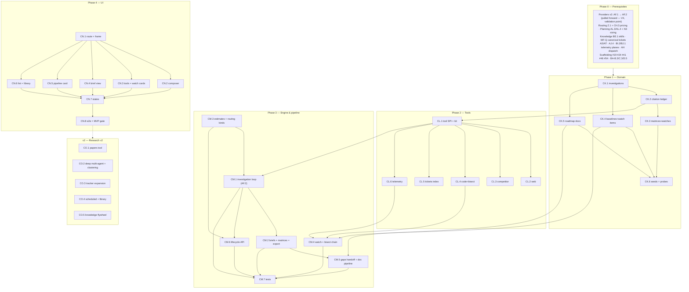

# Roadmap — Research (Mockup 22)

## Description

> Create a roadmap that covers the features for the mockup page 22. Any additional
> tech infrastructure that is required to implement the functionality in these mockup
> pages should be researched and offered as options for implementing in the roadmap.
> The roamdap should include MVP and v2 options, as well as the labels, milestones,
> and the like, for the tickets to be created. Any ticket sources that are used by
> Ouroboros for ingesting should be pluggable, which includes sources like Jira,
> Linear, GitHub, GitLab, and other bug reporting/issue recording sites. Refer to the
> page so that issues can reference the mockup file when creating the UI/UX design of
> the pages. Be very specific when creating the roadmap, as the options in the
> roadmap for the functionality needs to be complete and very thorough.

## Context & Existing Work (duplicate-avoidance survey)

Surveyed 2026-08-09.

**Design source of truth for every UI ticket in this roadmap:**
[`docs/mockups/22-research.html`](mockups/22-research.html) (with
`docs/mockups/assets/ouroboros.css`) — Research. Its anatomy:

- **Page head** — eyebrow `Research`, h1 *"Ask a hard question. Get an
  evidenced answer — and the tickets to act on it."*, subline: the same loop
  that handles the build runs investigations — *root-cause briefs for bug
  fixes, forensics on regressions, product roadmaps and improvement
  proposals, and project & competitive gap analysis* — with full research
  tools, **every claim cited**, every finding one click from a drafted
  ticket. Actions: **Research library** (ghost), **New investigation**
  (primary).
- **Investigation composer** (`c-7`, `START AN INVESTIGATION`, pill
  `researcher: sonnet-long-ctx` — a **registry alias**, mockup 21) — prompt
  textarea (*"Ask like you'd ask a principal engineer"*; seeded with the
  docking-gap question), **kind segmented control** (`Bug root cause` /
  `Regression forensics` / `Roadmap & improvements` / `Gap analysis` —
  selected), **Depth: Deep dive ▾** button, toggleable **tool chips** (Web
  search ✓ / Competitor tracker ✓ / Codebase mining ✓ / Issue & PR history ✓
  / Build & test telemetry ✓ / Docs, standards & papers — off), deliverable
  line (*"cited research brief → capability matrix → drafted epics & tickets
  in Planning"* linking mockup 09), scope estimate `est. 40–60 sources ·
  ~$6`, **Start investigation ⟳**.
- **Research tools card** (side, `6 connected`) — six `.tool-row`s with
  glyph, name, mono sub, health dot: **Web search & page reader** (*search
  API + full-page extraction, robots-aware*), **Competitor tracker** (*4
  rivals watched · release notes, changelogs, filings*), **Codebase & git
  mining** (*blame, bisect, dependency graph over helios-firmware*),
  **Issue & PR history index** (*3,412 issues · support tickets · churn
  interviews*), **Build & test telemetry** (*HIL bench measurements, fleet
  metrics warehouse*), **Docs, standards & papers** (*datasheets, RFCs,
  arXiv — PDF reader with citations*) — the last **idle with an `enable`
  button** (not yet connected).
- **Regression watch card** (`nightly vs. v2.0.4 baseline`) — three rows:
  err `Hover drift +14% in gusts` (*bisected → a41f2c9 · fix loop running ·
  #512*, pill `fixing` pulse), warn `Boot time +230 ms since v2.1.0-rc1`
  (*bisected → 7c03d1e · fix ticket drafted · #517*, pill `queued`), ok
  `Battery est. error regression` (*root-caused, fixed & merged · PR #641*,
  pill `✓ merged`). Caption: *"Watch compares every nightly HIL run to the
  last release baseline; any drift opens a forensics investigation
  automatically."*
- **Featured investigation** (`c-12`, kind chip `gap analysis`, `RS-127 —
  AUTONOMOUS DOCKING VS. THE FIELD`, tag `44 sources · deep dive`, pill
  `✓ brief ready`, **Export brief ↗**, **Draft epic from gaps →** to
  Planning) — **capability matrix** (`Capability × Helios (us) / Skylink /
  AeroMesh / Novum × Gap`; cell states `● shipping` / `◐ partial` / `○ none`
  / `? unknown`; severity chips `HIGH`/`MED`/`WIP`/`LEAD`); **brief
  excerpt** with inline citation superscripts (`[07] [12] [31] [git]`) and a
  code ref (`dock_ctrl.c:214`, *"unchanged in 14 months"*); **sources card**
  (`SOURCES — 44 CITED`, `all ↗`) — numbered citations with title + URL,
  including **internal URIs** (`issue-index://support/churn-2026-q2`,
  `helios-firmware @ 8c1b2e4 · src/dock/dock_ctrl.c`); **Proposed from
  gaps** chips (`EPIC · Docking parity`, `DOCK-1 wind-feedforward MPC`,
  `DOCK-2 re-planned retry`, `+3 more`, effort `L`).
- **Pipeline card** (`c-12`, kind chip `roadmap`, `RS-124 — FROM BRIEF TO
  ROADMAP TO ISSUES`, chips **`skill · create-roadmap` → `skill ·
  create-issues`** (the product's packaged procedures — mockup 14), **Open
  ROADMAP.md ↗**) — **step 1**: Rendered/Raw segmented view of a rendered
  `ROADMAP.md` (`docs/ROADMAP.md · committed 8c1b2e4 · generated from the
  RS-124 brief`; milestone sections `M1 · DOCKING PARITY — TARGET OCT 15` /
  `M2 · FLEET RELIABILITY`, checkbox items with issue numbers, `MVP` flags,
  effort chips) + **Suggested changes — 2 open** (*"applying re-runs
  create-roadmap"*): a human suggestion (KS avatar: pull #744 into the M1
  MVP set) and an AI suggestion (AI avatar: split #745), each **Apply ⟳** /
  **Dismiss**; **step 2**: `CREATE-ISSUES → GITHUB` (`6 issues · 2
  milestones · synced`) — issues grouped under milestone heads (`◆ M1 ·
  Docking parity · due Oct 15 · 1/3 done`) with due dates, estimates
  (`est 3.0 loop-days · $11`), effort chips, complexity chips
  (`cx:high|med|low`), status pills (`✓ merged` / `loop live` pulse /
  `queued`). Caption: *"create-issues writes the issue numbers, MVP flags,
  and descriptions back into ROADMAP.md — the file and the tracker never
  drift. Dates, estimates, effort, and complexity come from the estimator
  during issue creation."*
- **Investigations card** (`4 active · 23 this quarter`, **History**) —
  rows `RS-118` (kind `bug fix`, altimeter spikes below −10 °C, *18
  sources*, pill `fix loop live`, `open run →` mockup 10), `RS-121`
  (`regression`, motor PID overshoot v2.0.4 → v2.1.0-rc1, *bisect + HIL
  replay*, `queued`, `evidence →` mockup 11), `RS-124` (`roadmap`, Q4
  improvements from support tickets + churn interviews, *312 tickets
  clustered into 7 themes · 312 sources*, `✓ issues filed`, `to roadmap →`
  mockup 09), `RS-127` (`gap analysis`, *44 sources*, `✓ brief ready`,
  `brief ↑`). Closing line: *"Every investigation ends the same way the
  build loop does: with evidence — and, when you approve, with tickets the
  loop picks up next."*

**Scope boundaries.** Research is a consumer of nearly every plane built so
far: it *reads* through tools, *reasons* through the model stack, and *acts*
through Planning. This roadmap builds the investigation engine, the pluggable
research-tool layer, the regression watch, and the brief→roadmap→issues
pipeline — it does not rebuild ticket drafting/push (09), skills storage
(14), test telemetry (11/08), metric rollups (15), or model invocation (07).

**Overlapping work and dispositions:**

| Existing work | Disposition under this roadmap |
|---|---|
| WF Epic Q ticket-source SPI (canonical tickets; Jira/Linear/GitLab as WF-T.2–T.4) | **The pluggability requirement lands where it matters**: the Issue & PR history tool (CL.5) reads **canonical tickets only** — whatever tracker fed them (Jira, Linear, GitHub, GitLab, or any future source adapter) is invisible to research. Nothing source-specific is added here. |
| Providers AF.1/AF.2 (invocation-gateway ADR + chain executor — "the unlock for INTAKE-O.2, WF-T.6, AB.2") | **First consumer** — the researcher loop executes resolved chains through AF.2. This roadmap **pulls AF.1/AF.2 forward into its Phase 0 prerequisites** (decision V4 — explicit validation point: research without an LLM is an empty page). |
| Routing M3/Y.2 task kinds, registry aliases (21, CH.3 pricing) | **Consumed + amended** — new `research`-family task kinds registered so the composer's `researcher: sonnet-long-ctx` pill is a real resolved alias; scope/cost estimates price tool budgets through CH.3 (V5). |
| Planning N1/AL.3/AL.4 (draft batches, idempotent GitHub push, estimator sizing via INTAKE-L.3) | **The action path** — "Draft epic from gaps" and create-issues both produce Planning draft batches and push through AL.3; estimates/dates/effort/complexity on filed issues come from the same estimator (N3). No second push path (CM.5). |
| Knowledge BE.1/BF (skills registry: versioned markdown+frontmatter, `origin: generated`), K5 `/v0/learn` | **Consumed** — `create-roadmap` and `create-issues` are **skills in the registry** invoked by the pipeline (the mockup's skill chips); v2's brief→facts flywheel (CO.5) feeds K3 fact proposals. |
| Test results AS/AT (case history, nightly flake scorer), Build farm AJ.4 (telemetry retention), AH dispatch; Insights BI.1/BI.2/BJ.1 (metric rollups, windowed metrics) | **Consumed** — regression-watch baselines compare nightly measurement windows over these planes (V6); the Build & test telemetry tool (CL.6) queries them read-only. Bisect orchestration dispatches build-farm jobs (CM.4). |
| Build analyzer BU–BX (findings/suggestions over the runs corpus, measurement windows) | **Adjacent, not duplicated** — the analyzer improves *the loop itself* from run history; research investigates *the product* on demand. Regression watch's change-point mechanics cite BI windows the same way 18 does; forensics briefs link analyzer findings when relevant. |
| Run console (10), Test results (11), PR verification (12) | **Link targets** — investigation rows link `open run →` / `evidence →`; fix loops spawned from watch land in those surfaces. |
| Intake INTAKE-L.3/O.2 (estimation orchestrator, LLM estimator) | **Consumed** — pipeline issue sizing is N3's single sizer; nothing re-estimated here. |
| ChatOps BY–CB, Inbox BM–BP | **Coordinated** — watch alerts and brief-ready events surface through the inbox/needs-you machinery; a `/ouro research` command is a v2 grammar entry (noted for BZ.3, not built here). |
| Mockup 09's gantt/planning surfaces, 14's knowledge UI, 15's insights | **Out of scope** — this page links to them; their roadmaps own them. |
| Scaffolding #49 placeholder routes, #56 e2e, #54 engine task skeleton | **Superseded for `/research`**; #56 gains a research leg; the engine investigation loop builds on #54's queue/worker model. |

Epic letters continue the sequence (…CG–CJ): this roadmap uses
**CK, CL, CM, CN, CO** (five epics — the workflow-builder precedent for a
surface this large).

## Infrastructure Options (researched — thorough, pick before filing)

### 1. Web search & page extraction (the first tool chip)

| Option | What it is | Fit | Trade-offs |
|---|---|---|---|
| **A — Pluggable search/extract adapters, self-host default (SearXNG + built-in robots-aware fetcher)** ⭐ recommended | Search and extraction behind the research-tool SPI (option 3): default deployment ships a [SearXNG](https://github.com/searxng/searxng) container in compose (self-hosted metasearch, JSON API — no key, no per-query cost) plus our own fetcher/extractor (robots.txt-aware, rate-limited, redirect-bounded, readability-style article extraction, content hashed & archived for citations); hosted providers are alternate adapter configs | Keeps the self-hostable promise (the same posture as SearXNG-backed local agent stacks); the mockup's "robots-aware" sub is a real property; citation archival is ours regardless of provider | Self-host search quality < specialized AI-search APIs; mitigated by the adapter seam — orgs paste a key to upgrade |
| B — Hosted AI-search APIs as the default | [Brave Search API](https://brave.com/learn/best-search-api-2026/) (lowest latency ~669 ms, top of the [8-API agentic-search benchmark](https://aimultiple.com/agentic-search)), [Tavily](https://codenote.net/en/posts/tavily-alternatives-cost-comparison-search-extract-api/) (LLM-optimized answers+citations), [Firecrawl](https://www.firecrawl.dev/blog/best-web-search-apis) (best deep-content extraction; search+extract combined), Exa | Best relevance/latency out of the box; benchmark shows the top four statistically indistinguishable | Per-query cost + external dependency as the *default* violates self-hosting; keys/quotas per org — **offered as first-class adapter configs** (Brave, Tavily, Firecrawl day-one schemas), not the default |
| C — No web tool in MVP | Internal-only research | Zero new infra | Guts gap analysis and the featured investigation; the page's premise dies — **rejected** |

### 2. Competitor tracker (watching rivals' release notes, changelogs, filings)

| Option | What it is | Fit | Trade-offs |
|---|---|---|---|
| **A — Built-in watch registry + scheduled diffing (changedetection-style), feed cited like any source** ⭐ recommended | Per-org **competitor registry** (rival → watched URLs: release-notes pages, changelogs, GitHub releases via API, RSS/Atom, filings pages) with scheduled robots-aware snapshots, CSS/XPath-scoped diffing, and a change feed stored as citable source records — the pattern proven by [changedetection.io](https://github.com/dgtlmoon/changedetection.io) (30k-star self-hosted change monitoring) | The researcher cites *archived diffs with retrieval dates*, not live pages that may change; the card's `4 rivals watched · release notes, changelogs, filings` is registry truth; no external service | JS-heavy pages need a render tier (deferred to v2 with a bounded headless fetcher); filings ingestion (EDGAR-class) is v2 (CO.3) |
| B — Embed/integrate changedetection.io itself | Run the existing tool alongside, consume its API | Battle-tested watch engine for free | Second app to operate + per-org multi-tenancy is foreign to it; its notification model duplicates ours — pattern borrowed instead (A) |
| C — Manual competitor notes only | Humans paste rival updates | No infra | Not a tracker; the tool chip would be fiction — **rejected** |

### 3. Research-tool pluggability (the SPI everything above sits behind)

One `ResearchToolAdapter` SPI, third application of the proven pattern
(ticket sources WF-Q.2, model providers AC.1):

| Tool | Kind | Backing | Status |
|---|---|---|---|
| Web search & page reader | `search+fetch` | SearXNG default / Brave / Tavily / Firecrawl configs (option 1) | **MVP (CL.2)** |
| Competitor tracker | `watch+query` | built-in watch registry + diff feed (option 2) | **MVP (CL.3)** |
| Codebase & git mining | `query` | repo clones: blame, log, dependency graph; bisect execution via build farm | **MVP (CL.4)** |
| Issue & PR history index | `query` | canonical tickets (WF-Q SPI — **tracker-agnostic**), PR history, imported docs | **MVP (CL.5)** |
| Build & test telemetry | `query` | AS/AT case history, AJ.4 telemetry, BI rollups — read-only | **MVP (CL.6)** |
| Docs, standards & papers | `search+fetch` | PDF pipeline (option 4) | **v2 (CO.1)** — the mockup itself shows it idle/`enable` |

Adapters declare `kind`, `configSchema()`, `capabilities()`, `healthCheck()`,
and typed operations (`search`, `fetch`, `query`) that **must return source
records** (the citation contract, decision V3). Conformance kit + fake
adapter; core code imports the interface only (lint-guarded).

### 4. PDF & paper reading (the sixth tool — v2, per the mockup's own idle state)

| Option | What it is | Fit | Trade-offs |
|---|---|---|---|
| **A — Docling for layout/content + GROBID for scholarly citation structure** ⭐ recommended v2 | [Docling](https://github.com/docling-project/docling) (open-source PDF→structured Markdown/JSON, tables, OCR) for datasheets/RFCs/general PDFs; [GROBID](https://grobid.readthedocs.io/en/latest/Introduction/) (the scholarly-PDF standard — powers S2ORC; ~0.87–0.90 F1 reference extraction) for papers: header/reference/citation-context extraction so paper citations resolve to *their* sources | Each tool at what it's best at (the [docling-vs-GROBID comparison](https://github.com/docling-project/docling/discussions/622) supports the split); both self-hostable containers | Two services to operate — why this is v2, matching the mockup's disconnected state |
| B — LLM-only PDF reading (send pages to the model) | No parse infra; multimodal models read pages | Zero setup | Expensive per page, no structural citation anchors, context limits on long specs — acceptable *fallback inside A*, not the plan |

### 5. Investigation orchestration (how the researcher actually runs)

| Option | What it is | Fit | Trade-offs |
|---|---|---|---|
| **A — Custom engine loop over the adapter SPIs + AF.2 invocation, versioned `/v0/investigate` contract** ⭐ recommended | The investigation runs as an engine task (#54 queue/worker): plan → iterate (tool calls through the research-tool SPI, every result logged as a source record) → synthesize (LLM through AF.2 using the routed `research` alias) → brief with claim→citation links; depth presets bound iterations/sources/spend; checkpointed so long investigations survive worker restarts; provenance versioned (`researcher: loop-v1 · alias`) per the N2/K5 honesty discipline | One orchestration idiom with the rest of the product (engine tasks + versioned contracts); citation capture is structural (tools *return* source records) rather than post-hoc parsing; deterministic tools (git, telemetry, tickets) work even when synthesis is unavailable | We own the agent loop's quality — mitigated by depth bounds, checkpoints, and the tool contract keeping each step small |
| B — Adopt an agent framework (LangGraph-class) inside the engine | Framework-managed graph/state | Checkpointing for free | A second orchestration idiom + heavyweight dependency for one loop; the SPI boundary does the useful part — **rejected** |
| C — Defer all LLM synthesis to v2, deterministic reports only | Regression watch + telemetry summaries without a researcher | No AF.2 dependency | Three of four investigation kinds become fiction; recorded as the fallback stance if validation rejects pulling AF.2 forward (V4) |

## Decisions proposed by this roadmap (validate before issue creation)

| # | Decision | Rationale |
|---|----------|-----------|
| V1 | **Investigations are first-class org entities** (`RS-###` per-org sequence): kind (`bug_root_cause` / `regression_forensics` / `roadmap_improvements` / `gap_analysis` — a registry, org-extensible later), question, depth preset, tool selection, status (`queued → running → brief_ready → issues_filed \| failed`), full provenance (researcher version, alias, spend, source count) | Every card on the page is a view over this entity; the closing line's lifecycle is a state machine. |
| V2 | **Research tools are a pluggable SPI** (option 3), third application of the Q.2/AC.1 pattern, with conformance kit and lint boundary; the Issue & PR history tool consumes **canonical tickets only** — tracker pluggability (Jira/Linear/GitHub/GitLab/…) stays in the source SPI where it lives | The description's pluggability requirement, honored structurally and without duplicating WF-Q. |
| V3 | **Citation is a contract, not a feature**: every tool operation returns source records (kind, title, locator — URL or internal URI `issue-index://…`, `git://repo@sha/path`, `telemetry://…`; retrieved_at; content hash; archived excerpt); briefs store claim→citation links; **a claim without a citation cannot render as a finding** | "Every claim cited" is the page's core promise; archival makes citations stable while the web moves. |
| V4 | **The researcher is LLM-backed in MVP, and this roadmap pulls AF.1/AF.2 (invocation gateway) forward into its prerequisites** — the first consumer of the provider stack's v2 tier; fallback stance recorded (option 5-C: deterministic-only MVP) if validation disagrees | INTAKE-O.2/WF-T.6/AB.2 all wait on AF.2 anyway; a Research page without research is an empty shell. **Explicit validation point.** |
| V5 | **Scope/cost estimates are computed, never invented**: depth preset × enabled tools × routed alias pricing (registry CH.3) → `est. 40–60 sources · ~$6` ranges; unpriced aliases → source range only, no dollar figure (M7/P8 honesty); actual spend recorded per investigation and reconciled against the estimate | The composer's estimate line and the honesty rules. |
| V6 | **Regression watch is deterministic**: per-release baselines over nightly measurement windows (AS/AT case history, AJ.4 telemetry, BI rollups); drift beyond thresholds → watch item; **bisect orchestration** dispatches build-farm jobs (git bisect over AH dispatch, HIL replay where configured) to isolate the commit; then **auto-opens a forensics investigation** and drafts the fix ticket via Planning (N1 drafts). Policy: auto-draft is default; auto-file+queue is an explicit org opt-in ("when you approve" is the page's own gate) | The card's `bisected → a41f2c9 · fix loop running` chain, composed from existing planes plus one new orchestrator — no LLM required for detection or bisection. |
| V7 | **Capability matrices are structured, citation-backed data**: capabilities × competitors × status (`shipping/partial/none/unknown/wip`) × gap severity (`HIGH/MED/LOW/WIP/LEAD`), every non-`unknown` cell carrying ≥1 citation; `unknown` is a first-class honest state; **Draft epic from gaps** maps HIGH/MED rows → a Planning draft batch (epic + tickets, gap provenance recorded) | The matrix must be evidence, not vibes; the handoff is composition over AL.4. |
| V8 | **The brief→roadmap→issues pipeline composes existing subsystems**: roadmap docs are versioned product entities **projected to `ROADMAP.md` and committed to the repo via PR** (not direct push — review is the repo's gate); `create-roadmap`/`create-issues` are **skills** (Knowledge registry, K1) executed by the loop; create-issues files through Planning's idempotent push (AL.3) and **writes issue numbers/MVP flags back** into the doc entity → re-projected → PR update; suggested changes are entities whose **Apply re-runs the skill** with the suggestion appended to its input; estimates on filed issues come from the one sizer (N3) | The mockup's caption ("the file and the tracker never drift") demands one owner for the doc↔tracker loop; skills make the procedure inspectable and org-customizable. |
| V9 | **The competitor tracker is a built-in watch registry** (option 2-A): rivals + watched sources, scheduled robots-aware snapshots + scoped diffs archived as citable source records; JS-rendered pages and filings ingestion are v2 (CO.3) | Cited archived diffs beat live-page links; self-hosted like everything else. |
| V10 | **Kinds share one engine, differ by playbook**: each investigation kind is a configuration (tool defaults, synthesis template, deliverable set — brief / brief+matrix / brief+roadmap-doc / brief+fix-draft), not a separate code path; kind playbooks versioned with the contract | Four kinds ship without four engines; org-extensible kinds later inherit the machinery. |
| V11 | **Research library = the investigations list + History in MVP** (filterable by kind/status/quarter, `23 this quarter` computed); a richer library surface (cross-links, tags, brief search) is v2 (CO.4) | The head button gets an honest destination without a second surface. |
| V12 | **Route `/research`; labels**: existing set + new **`research`**; **Milestones**: `Research MVP` / `Research v2` created at filing | Description requires labels + milestones for the filing pass. |

## Architecture Overview

```mermaid
flowchart LR
    subgraph Browser
        UI22["ouroboros-ui /research<br/>composer · tools · watch · briefs · pipeline"]
    end
    subgraph "ouroboros-rest (NestJS)"
        RAPI["/api/v1/research<br/>investigations · briefs · watch · pipeline"]
        SPI["ResearchToolAdapter SPI (CL.1)<br/>web · competitor · code · tickets · telemetry"]
        WATCH["Regression watch service (CM.4)<br/>baselines · drift · bisect orchestration"]
        PIPE["Roadmap-doc pipeline (CM.5)<br/>skills · suggestions · writeback · PR"]
    end
    subgraph "ouroboros-engine (FastAPI)"
        INV["/v0/investigate (CM.1)<br/>plan → tools → synthesize → brief"]
    end
    subgraph "ouroboros-db"
        RS[("investigations · briefs · claims")]
        SRC[("source_records (citation ledger)")]
        MTX[("capability matrices · competitor watches")]
        RW[("baselines · watch items")]
        RD[("roadmap docs · suggested changes")]
    end
    PLANES["consumers/providers:<br/>AF.2 invocation · routing research kinds<br/>Planning drafts+push · Knowledge skills<br/>AS/AT · AJ.4 · BI rollups · WF-Q tickets"]
    UI22 --> RAPI
    RAPI --> RS & RW & RD
    RAPI --> SPI --> SRC
    INV --> SPI
    RAPI <--> INV
    WATCH --> RW
    PIPE --> RD
    INV -.LLM via AF.2.-> PLANES
    WATCH & PIPE -.-> PLANES
    MTX --- RS
```

## MVP Definition

The MVP is **mockup 22 as a working investigation loop**: ask, evidence,
brief, tickets. It is done when, against the compose stack (with AF.2 from
the providers v2 tier — decision V4):

1. `/research` reproduces
   [`docs/mockups/22-research.html`](mockups/22-research.html)
   pixel-faithfully in **both themes**: head, composer (kind segments, depth
   menu, tool chips, computed estimate line, resolved researcher-alias
   pill), tools card (five connected + the honest idle sixth), regression
   watch card, the featured-brief card (matrix, brief with citation
   superscripts, sources, proposed-from-gaps), the pipeline card (rendered/
   raw doc, suggested changes, milestone-grouped issues), and the
   investigations list.
2. **An investigation actually runs end to end**: composer → engine loop
   iterates the enabled tools (every operation logged as an archived source
   record) → LLM synthesis through the routed `research` alias → brief with
   claim→citation links → status `brief_ready`; checkpointed, cancellable,
   depth-bounded; live progress visible (source count ticking).
3. **All five MVP tools work behind the SPI** with health honest in the
   tools card, and the sixth renders idle with a designed enable-path
   pointing at its v2 arrival; the Issue & PR history tool proves
   tracker-pluggability by serving canonical tickets regardless of source
   adapter.
4. **Citations hold**: brief text renders superscript refs; the sources
   panel lists numbered records (external URLs and internal URIs);
   `all ↗` shows the full ledger; export produces the brief + sources
   (Markdown) faithfully; claims without citations do not render as
   findings.
5. **Gap analysis is structured**: the matrix renders from data with
   citation-backed cells and honest `? unknown`; **Draft epic from gaps**
   creates a Planning draft batch (provenance: investigation + gap rows)
   and navigates to Planning for review/push.
6. **Regression watch is live**: seeded baselines + nightly comparison
   produce the three-state rows; a synthetic drift fixture triggers watch
   item → bisect job orchestration → auto-opened forensics investigation →
   drafted fix ticket (auto-draft default; auto-file opt-in verified).
7. **The pipeline closes the loop**: a roadmap-kind investigation's brief →
   `create-roadmap` skill run → versioned doc entity → rendered/raw views +
   repo PR; suggested changes (human + AI-authored) Apply→re-run and
   Dismiss; `create-issues` → Planning push → issue numbers/MVP flags
   written back into the doc (file and tracker verified drift-free);
   estimates/dates/effort/complexity on filed issues from the N3 sizer.
8. **Costs are honest**: composer estimates computed per V5; per-
   investigation actual spend recorded and shown; no dollar figures where
   pricing is absent.
9. Integration tests cover the tool SPI conformance, citation ledger,
   investigation lifecycle (checkpoint/resume/cancel), watch→bisect→
   forensics chain, matrix integrity, pipeline writeback idempotency, org
   isolation; the e2e suite gains a research leg.

**Explicitly v2 (milestone `Research v2`):** the Docs/standards/papers tool
(CO.1 — Docling+GROBID), multi-agent deep research + theme clustering at
scale (CO.2 — the `312 tickets clustered into 7 themes` upgrade), competitor
tracker expansion (CO.3 — JS rendering, filings, auto-discovery, matrix
refresh alerts), scheduled/continuous investigations + full research library
(CO.4), and the brief→Knowledge facts flywheel (CO.5).

## Epics, Labels & Milestones

Each epic is a parent tracking issue on GitHub; every roadmap issue below is filed as
one of its sub-issues (GitHub Relationships).

| Epic | GitHub | Status | Name | Goal | Modules | Milestone |
|------|:------:|:------:|------|------|---------|-----------|
| CK | #603 | 🟡 Open | Research Domain | Investigations, citation ledger, matrices, watch, roadmap docs, seeds, CI | ouroboros-db | Research MVP |
| CL | #604 | 🟡 Open | Research Tool SPI & Tools | SPI + conformance kit, five MVP tool adapters | ouroboros-rest, ouroboros-engine | Research MVP |
| CM | #605 | 🟡 Open | Investigation Engine & Pipeline | `/v0/investigate` loop, briefs/matrices, estimates, watch+bisect, pipeline, API, tests | ouroboros-engine, ouroboros-rest | Research MVP |
| CN | #606 | 🟡 Open | Research UI | All seven page regions, states, e2e | ouroboros-ui | Research MVP |
| CO | #607 | 🟡 Open | Research at Scale (v2) | Papers tool, deep multi-agent research, tracker expansion, library, knowledge flywheel | all | Research v2 |

Issue naming: `<project>: [<epic>.<issue>] <title>`. Labels: existing set
(`mvp`, `v2`, `rest`, `db`, `engine`, `ui`, `ci`, `design`, `planning`,
`knowledge`, `routing`, `providers`) **plus new `research`** (decision V12).
Milestones **`Research MVP`** / **`Research v2`** created at filing; every
issue assigned. Complexity chips: **XS · S · M · L**.

---

## Epic CK (#603) — Research Domain (`ouroboros-db`)

| Ref | GitHub | Status | Title | Summary | Labels | Parallel | MVP | Complexity | Affected Modules |
|-----|:------:|:------:|-------|---------|--------|:--------:|:---:|:----------:|------------------|
| CK.1 | #608 ✅ | 🟢 Done | ouroboros-db: [CK.1] Investigations & kind registry schema | RS-### entities: kind, depth, tools, status, provenance, spend | mvp, research, db | N (after #19, BA-B.3) | Y | M | ouroboros-db |
| CK.2 | #609 ✅ | 🟢 Done | ouroboros-db: [CK.2] Citation ledger — source records & claims | Archived sources (external+internal URIs), claim→citation links | mvp, research, db | N (after CK.1) | Y | M | ouroboros-db |
| CK.3 | #610 ✅ | 🟢 Done | ouroboros-db: [CK.3] Capability matrices & competitor watch schema | Matrix cells with citations; rival registry, watched sources, diffs | mvp, research, db | N (after CK.2) | Y | M | ouroboros-db |
| CK.4 | #611 ✅ | 🟢 Done | ouroboros-db: [CK.4] Regression baselines & watch items | Release baselines, metric windows, drift states, bisect results | mvp, research, db | N (after CK.1, AS.1) | Y | M | ouroboros-db |
| CK.5 | #612 ✅ | 🟢 Done | ouroboros-db: [CK.5] Roadmap docs & suggested changes | Versioned doc entities, projection state, writeback refs, suggestions | mvp, research, db | N (after CK.1, AK.1) | Y | M | ouroboros-db |
| CK.6 | #613 ✅ | 🟢 Done | ouroboros-db: [CK.6] Research dev seeds — mockup-22 parity + probes | RS-118/121/124/127, 44-source ledger, matrix, watch rows, doc; ci checks | mvp, research, db, ci | N (after CK.2–CK.5, #24) | Y | M | ouroboros-db, .github |

### Issue CK.1 — ouroboros-db: [CK.1] Investigations & kind registry schema

> **GitHub issue:** #608 ✅ · **Status:** 🟢 Done · **Parent epic:** #603
>
> **Delivered (#608, `V106__investigations.sql` — no REST/UI change):** `research_tools` registers the six adapter slugs (`web`, `competitor`, `code`, `tickets`, `telemetry`, `docs`) installation-wide, so an unknown slug in `tools_enabled` or a playbook's `default_tools` is refused at write (and a slug still in use cannot be deleted or renamed); CL.1's SPI registers further adapters as rows. `investigation_kinds` is per workspace — `slug`, `display_name`, `tint_key` (`bug`/`reg`/`road`/`gap`, the mockup's chip classes) and a `playbook` of exactly `{version, default_tools, synthesis_template, deliverables}` (deliverables ⊆ `brief|matrix|roadmap_doc|fix_draft`, always with `brief`), whose version must rise with any change; an `after insert` trigger on `organization` seeds the four built-ins into every workspace, and the migration back-fills existing ones. `investigations` carries `seq` + generated `display_id` (`RS-001`…, wider past 999), the kind by composite key (same workspace), `question`, `depth`, `tools_enabled` (non-empty), `status` with transitions enforced by `investigations_status_transition` (workspace, seq, kind and origin immutable), `estimate` `{sources, cost_cents|null}` and `actuals` `{sources_used, spend_cents|null, duration_ms}` independently nullable, `provenance` `{researcher, alias, resolution_ref}` required from `running` and `actuals` from `brief_ready`, `origin`, `engine_task_ref`, `created_by`, and the three indexes. **Sequence mechanism: a per-workspace counter row** (`investigation_seq_counters`) bumped by `insert … on conflict do update` — concurrent creates serialise on it, a rollback returns its number, a deleted number is never reused; a supplied `seq` (CK.6's seed) is kept and raises the counter. Proven by `tests/verify-investigation-seq.sh` (new `ci/db` step: serialise, rollback, a lock-free `max + 1` probe that must collide, cross-workspace, and a 6×10 burst with rollbacks committing exactly 1…42); single-session rules in `constraints.sql`'s V106 section. *"`brief_ready` requires a brief"* stays with CK.2 (#609).

- **Problem Statement:** Everything on the page hangs off an investigation
  entity that doesn't exist — with a per-org human id (`RS-127`), a kind, a
  depth, a tool selection, and a lifecycle (decision V1, V10).
- **Solution/Scope:** Migration: `investigation_kinds` — id, org FK, `slug`
  CHECK-seeded (`bug_root_cause|regression_forensics|roadmap_improvements|
  gap_analysis`), display, tint key, `playbook` jsonb (default tools,
  synthesis template ref, deliverable set — versioned, V10);
  `investigations` — id, org FK, `seq` (per-org monotonic → `RS-###`),
  `kind_id` FK, `question` text, `depth` CHECK `quick|standard|deep_dive`,
  `tools_enabled` jsonb (adapter slugs), `status` CHECK `queued|running|
  brief_ready|issues_filed|failed|cancelled`, `estimate` jsonb (source
  range, cost range — V5), `actuals` jsonb (sources used, spend cents,
  duration), `provenance` jsonb (`researcher` version, alias, resolution
  ref), `origin` CHECK `user|regression_watch|scheduled` (V6 auto-opens;
  CO.4 scheduled), engine task ref, timestamps, `created_by`.
- **Acceptance Criteria:**
  - Per-org sequence yields gapless display ids under concurrent creates
    (advisory-lock or sequence-per-org verified).
  - Kind playbooks round-trip; unknown tool slugs rejected at write.
  - Status transitions constrained (no `brief_ready` without a brief row —
    deferred FK checked in CK.2's tests).
- **Parallelism/Dependencies:** Needs #19, BA-B.3. Blocks CK.2–CK.5, CM.1.
- **Technical Stack:** PostgreSQL 17, Flyway.
- **Epic:** CK

```
investigations{RS-127, gap_analysis, deep_dive, tools:[web,competitor,code,tickets,telemetry],
  status: brief_ready, estimate:{sources:40–60, cost:~600¢}, actuals:{44, 612¢},
  provenance:{loop-v1, alias: researcher-long-ctx}, origin: user}
```

### Issue CK.2 — ouroboros-db: [CK.2] Citation ledger — source records & claims

> **GitHub issue:** #609 ✅ · **Status:** 🟢 Done · **Parent epic:** #603
>
> **Delivered (#609, `V108__citation_ledger.sql` + `R__dev_seed_research.sql` — no REST/UI change):** `source_records` — investigation FK, `tool_slug` (FK to `research_tools`), `kind` `web|competitor_diff|code|ticket|telemetry|doc`, `title`, `locator` validated per kind by `source_locator_valid()` (`http(s)` URLs for web/competitor_diff/doc; `issue-index://<index>/<key>` or a URL for ticket; `git://<repo>[/<repo>]@<sha 7–40>[/<path>][#L<n>[-L<m>]]` for code, no `.`/`..`/empty segments; `telemetry://<metric>/<window>` with `<n>h|d|w` or `<date>..<date>`), `retrieved_at`, `content_hash` (`sha256:<hex>`), `excerpt` (≤ 4 KiB, non-blank), `meta` (object ≤ 8 KiB), **`cite_no` dense per investigation** — allocated by the definer `source_records_allocate_cite_no()` from a `source_cite_counters` row (a supplied number must be exactly the next; rollbacks leave no gap) — and `cite_key` (symbolic, letter-first, unique per investigation); records are never updated, so numbers are stable. Per-investigation caps: 1 000 records, 2 MiB of excerpts. Indexes: (investigation, cite_no) unique, (investigation, kind), content_hash. `briefs` — versioned with no gap (`briefs_version_next`), structured `body` `{paragraphs: [{spans: [{text} | {text, claim}]}]}`, `deliverables` `{matrix|draft_batch|roadmap_doc|fix_draft: ref}`. `brief_claims` — span ref present in the brief body, `finding|open_question`, text. `brief_claim_sources` — many-to-many, composite keys keep a claim, its brief and its sources in one investigation. All four are append-only (no update/delete for the app; update refused for anyone). **Discipline as deferred constraint triggers:** `brief_claims_finding_cited` (a finding needs ≥ 1 link at commit; removing the last link fails too) and `investigations_brief_exists` (CK.1's *brief_ready requires a brief*). The seed writes RS-127 (acme-robotics, gap analysis, deep dive, `brief_ready`) with a dense 1…44 ledger — the five featured citations verbatim (`[git]` = #44 with `cite_key` `git`), the other 39 labelled placeholders for CK.6 — and brief v1's four findings cited `[07]` · `[12][31]` · `[git]` · `[19]`. Tests: `constraints.sql` V108 section; `seed.sql` reads the panel back verbatim; `seed.test.sh` registers the seed. CK.6's ci/db probe for the discipline builds on the trigger.

- **Problem Statement:** "Every claim cited" needs storage where citations
  are archived facts, stable while the web moves — and where a brief's
  claims link to them structurally (decision V3).
- **Solution/Scope:** Migration: `source_records` — id, `investigation_id`
  FK, `tool_slug`, `kind` CHECK `web|competitor_diff|code|ticket|telemetry|
  doc`, `title`, `locator` (URL or internal URI: `issue-index://…`,
  `git://repo@sha/path#L214`, `telemetry://metric/window`), `retrieved_at`,
  `content_hash`, `excerpt` (bounded archived extract), `meta` jsonb,
  `cite_no` (per-investigation dense number → `[07]`; symbolic keys like
  `[git]` supported via `cite_key` nullable); `briefs` — investigation FK
  (1:1 current + versions), `body` (structured: paragraphs with claim
  spans), `deliverables` jsonb refs; `brief_claims` — brief FK, claim span
  ref, ≥1 `source_record` FK (junction) — **CHECK-discipline: a finding
  claim row must have at least one citation link** (enforced in service +
  probed in CI).
- **Acceptance Criteria:** Cite numbering dense and stable per
  investigation; internal URI kinds validated by pattern; excerpt bounds
  enforced; a brief with an uncited finding claim fails the write path
  (service test); ledger listing reproduces the mockup's five sample
  citations from seeds.
- **Parallelism/Dependencies:** Needs CK.1. Blocks CK.3, CK.6, CM.1, CM.2.
- **Technical Stack:** PostgreSQL 17, Flyway.
- **Epic:** CK

```
source_records: [07]{web, "Skylink S4 teardown", https://…, hash, excerpt}
                [19]{ticket, "Churn interviews Q2", issue-index://support/churn-2026-q2}
                [git]{code, "dock_ctrl.c blame", git://helios-firmware@8c1b2e4/src/dock/dock_ctrl.c}
brief_claims: "gap is control, not sensors" ──▶ {[07],[12],[31],[git]}   (≥1 enforced)
```

### Issue CK.3 — ouroboros-db: [CK.3] Capability matrices & competitor watch schema

> **GitHub issue:** #610 ✅ · **Status:** 🟢 Done · **Parent epic:** #603
>
> **Delivered (#610, `V112__capability_matrices_competitor_watches.sql` — no REST/UI change, no seed; CK.6 #613 seeds the matrix and registry):** `competitors` (workspace FK, `name` unique case-insensitively, `meta` `{site, aliases, notes}` checked by `competitor_meta_valid()`); `competitor_watches` (`source_kind` `release_notes|changelog|github_releases|rss|filings|page`, `http(s)` `url`, nullable `selector`, `cadence` `hourly|daily|weekly`, `last_snapshot_at` moved by each snapshot, `enabled`, `render_required`; one watch per rival/kind/url/selector; a scheduler due-index); `competitor_snapshots` (linear chain per watch via `previous_id` — one first, one successor, same watch, later `taken_at` — `sha256:` `content_hash`, `content_ref`, `diff` ≤ 64 KiB present **exactly when the hash changed**; never updated). `source_records.snapshot_id` makes a `competitor_diff` source cite the snapshot carrying the diff (required for that kind only, same workspace, diff present). `capability_matrices` (one per investigation, `us_label`, ordered `rivals` columns of the workspace's competitors), `matrix_rows` (`capability`, `sort_order`, `gap_severity` `high|med|low|wip|lead` with a required `severity_derivation` that must change with it), `matrix_cells` (one per row × subject, `competitor_id` null = us, `status` `shipping|partial|none|unknown|wip`, `note`), `matrix_cell_sources` (composite keys — a cell cites its own investigation's sources). **Deferred constraint triggers:** `matrix_cells_cited` (non-`unknown` needs ≥ 1 citation at commit; losing the last fails) and `matrix_rows_complete` (a cell for us and every rival — no blanks). Cited snapshots and rivals named by a matrix cannot be deleted (deferred FKs, so a workspace delete still cascades). The `competitor_tracker_summary` view computes `4 rivals watched · release notes, changelogs, filings` from enabled, fetchable watches. The matrix follows the mockup HTML (`Visual-inertial approach (no beacon)`, `OTA resilience (A/B + rollback)`, …), whose rows differ from the issue's ASCII sketch. Tests: `constraints.sql` V112 section — RS-127's 5 × 4 matrix round-trips exactly, two snapshots of a fixture page yield one diff cited by a `competitor_diff` source, and every vocabulary and refusal.

- **Problem Statement:** The featured card's matrix and the tracker's rival
  registry are structured evidence, not markup (decisions V7, V9).
- **Solution/Scope:** Migration: `competitors` — org FK, name, meta;
  `competitor_watches` — competitor FK, `source_kind` CHECK `release_notes|
  changelog|github_releases|rss|filings|page`, `url`, `selector` (scoped
  diff region, nullable), `cadence`, `last_snapshot_at`, `enabled`;
  `competitor_snapshots` — watch FK, `content_hash`, archived content ref,
  `diff` (vs previous, nullable), `taken_at` — snapshots/diffs are
  citable (CK.2 `competitor_diff` records point here);
  `capability_matrices` — investigation FK, title; `matrix_rows` —
  capability label, sort; `matrix_cells` — row FK, `subject` (`us` or
  competitor FK), `status` CHECK `shipping|partial|none|unknown|wip`,
  `note` (`◐ in flight`, `◐ beta`), citation links (junction to
  `source_records`; **CHECK-discipline: non-`unknown` cells require ≥1**,
  service-enforced); `row_gap` severity CHECK `high|med|low|wip|lead`
  computed-then-stored with derivation note.
- **Acceptance Criteria:** The RS-127 matrix round-trips exactly (5
  capabilities × 4 subjects × severities); uncited non-unknown cell
  rejected in the service path; watch cadence/enabled vocab enforced;
  snapshot diffs reference archived content.
- **Parallelism/Dependencies:** Needs CK.2. Blocks CK.6, CL.3, CM.2.
- **Technical Stack:** PostgreSQL 17, Flyway.
- **Epic:** CK

```
matrix "docking vs field": row "Docking in >8 m/s gusts"
  us: ◐partial[cite] · skylink: ●shipping[07][12] · aeromesh: ◐partial[cite] · novum: ○none[cite]
  gap: HIGH   |   "Recovery beacon BLE" ─▶ us ●shipping · … ─▶ LEAD
watch: skylink/release_notes url+selector ─▶ snapshots{hash, diff} ─▶ citable
```

### Issue CK.4 — ouroboros-db: [CK.4] Regression baselines & watch items

> **GitHub issue:** #611 ✅ · **Status:** 🟢 Done · **Parent epic:** #603
>
> **Delivered (#611, `V115__regression_baselines_watch_items.sql` — no REST/UI change, no seed; CK.6 #613 seeds the card):** `regression_baselines` — one per workspace, `repo_ref`, `release_tag` and `metric_key` (a BI metric id held to `metric_definitions`, or a case metric `<case_key>:<measurement>`), `metric_class` `timing|accuracy|resource|rate`, the release's `window` as statistics `{n, median, spread, spread_kind iqr|stddev|mad, unit, from, to}`, `captured_via` `release|manual` (+ `captured_by`); never edited; indexed `(organization_id, repo_ref, metric_key, captured_at desc)`. `regression_watch_items` — the `current` window (same unit), **signed drift + unit** (`drift_value`, `drift_unit` `%` or the baseline's unit, generated `drift_display` `+14%` / `+230 ms`), `severity` `err|warn|ok`, `status` `detected → bisecting → bisected → investigation_open → fix_drafted → fix_running → fixed_merged | dismissed` (plus `detected → investigation_open`, `bisecting → detected` when there is no repro, `fix_running → fix_drafted` when the loop fails); an item opens `detected`; `bisected` needs a `bisect_result` `{culprit_sha (40-hex), farm_job_ids (the workspace's build jobs), steps, confidence_basis {method, inputs}}`, `investigation_open` a `regression_watch`-origin investigation of the workspace, the fix states a `fix_ticket_ref` `{kind ticket|draft, id, key}` (key = external_key / local_key), `fixed_merged` a `pr_ref` `{pull_request_id, key #n}`, `dismissed` who/when/why; bisect result and investigation kept once recorded; terminal states final; `detected` + `note` `needs repro` is the honest rest; one open item per baseline; indexed `(organization_id, severity, status)`. `regression_watch_settings.thresholds` `{classes, metrics}` over `regression_threshold_defaults()` (timing 5/15 %, accuracy 5/10 %, resource 10/25 %, rate 2/5 % lower-is-worse; × 2 spreads; 5 or 10 samples), read by `regression_threshold(org, metric_key, class)`. `investigations` gains `(id, organization_id)` unique. Tests: `constraints.sql` V115 section — the card's three rows round-trip (`err | +14% | v2.0.4 | a41f2c9 | #512 | fix_running`, `warn | +230 ms | v2.1.0-rc1 | 7c03d1e | #517 | fix_drafted`, `ok | … | #641 | fixed_merged`), needs-repro rest, dismissal, threshold overrides and every refusal by name.

- **Problem Statement:** "Nightly vs. v2.0.4 baseline" needs per-release
  metric baselines, drift states, and bisect outcomes as data — the card's
  three rows and their lifecycle (decision V6).
- **Solution/Scope:** Migration: `regression_baselines` — org FK, repo ref,
  `release_tag` (`v2.0.4`), `metric_key` (BI metric id or AS/AT case
  metric), `window` jsonb (baseline stats), `captured_at`;
  `regression_watch_items` — baseline FK, `current` jsonb (latest window),
  `drift` (signed magnitude + unit — `+14%`, `+230 ms`), `severity` CHECK
  `err|warn|ok`, `status` CHECK `detected|bisecting|bisected|
  investigation_open|fix_drafted|fix_running|fixed_merged|dismissed`,
  `bisect_result` jsonb (culprit sha, job refs, confidence),
  `investigation_id` FK (the auto-opened forensics, nullable),
  `fix_ticket_ref` (canonical ticket/draft ref, nullable), timestamps.
  Thresholds config per metric (org-level jsonb, defaulted).
- **Acceptance Criteria:** The card's three rows representable exactly
  (fixing/queued/merged states with their refs); status transitions
  constrained; drift stored with units; dismissal audited (who/when).
- **Parallelism/Dependencies:** Needs CK.1, AS.1 (case/metric identity).
  Blocks CK.6, CM.4.
- **Technical Stack:** PostgreSQL 17, Flyway.
- **Documentation:** None — not user-visible: database tables; the watch card they feed is CN.3's and CM.4's to document.
- **Epic:** CK

```
baseline{v2.0.4, hover_drift_gusts, window} × nightly ─▶ item{+14%, err,
  bisected→a41f2c9, investigation RS-13x, fix #512, status: fix_running}
```

### Issue CK.5 — ouroboros-db: [CK.5] Roadmap docs & suggested changes

> **GitHub issue:** #612 ✅ · **Status:** 🟢 Done · **Parent epic:** #603
>
> **Delivered (#612, `V113__roadmap_docs_suggestions.sql` — no REST/UI change, no seed; CK.6 #613 seeds RS-124's doc):** `roadmap_docs` (workspace, nullable `investigation_id` of the same workspace — set null on delete, one doc per investigation — `title`, `current_version` advanced by each new version). `roadmap_doc_versions` dense from 1, **immutable** for every role except `repo_projection` (the WF-P.1 pattern): `structure` `{milestones: [{key, name, target_date, items: [{key, title, draft_id, ticket_id, ticket_key, mvp, effort, checked}]}]}` shape-checked (real dates, effort `xs…xl`, unique keys, `ticket_key` exactly with `ticket_id`), item refs checked at write — drafts (AK.1 `ticket_drafts`) and tickets of the doc's workspace, `ticket_key` = the ticket's `external_key` — so an item keeps its draft link after the push; `markdown` (projection, ≤ 512 KiB), `generated_by`; `repo_projection` `{state, path, pr_ref, committed_sha, observed_sha}` shaped per state, with transitions `pending → pr_open | committed`, `pr_open → committed | pending`, `committed → drift_detected`, `drift_detected → pr_open | committed`, path fixed. `doc_suggestions` — `author_kind` `user|ai` (person or agent), `text`, optional `hint`, `open → applied` (version produced after it, who, when) or `open → dismissed` (who, when), terminal, never edited; `(doc_id, status)` index. Tests: `constraints.sql` V113 section — RS-124's doc round-trips (2 milestones with target dates, 6 items, MVP flags, #742 checked), v1 names drafts and v2 names tickets too, apply ⟳ writes v3 and leaves v2 untouched.

- **Problem Statement:** The pipeline card's `ROADMAP.md` is a versioned
  product entity projected to a file — with writeback state and a
  suggestion queue (decision V8).
- **Solution/Scope:** Migration: `roadmap_docs` — org FK,
  `investigation_id` FK (nullable — docs can exist without an
  investigation later), title, `current_version`; `roadmap_doc_versions` —
  doc FK, version, `structure` jsonb (milestones: name, target date;
  items: title, draft/ticket ref, mvp flag, effort, checked state),
  `markdown` (the projection — regenerated, never hand-authored),
  `generated_by` (skill run ref), `repo_projection` jsonb (path, PR ref,
  committed sha, state CHECK `pending|pr_open|committed|drift_detected`),
  immutable versions (WF-P.1 trigger pattern); `doc_suggestions` — doc FK,
  `author_kind` CHECK `user|ai`, author ref, text, optional structured
  hint jsonb, `status` CHECK `open|applied|dismissed`, `applied_version`
  FK nullable; writeback refs: items link Planning drafts (AK.1) →
  canonical tickets after push (issue numbers/MVP flags mirrored into the
  next version — the no-drift caption).
- **Acceptance Criteria:** RS-124's doc (2 milestones, 6 items, MVP flags,
  one checked) round-trips; versions immutable; suggestion transitions
  audited; projection state machine constrained.
- **Parallelism/Dependencies:** Needs CK.1, AK.1. Blocks CK.6, CM.5.
- **Technical Stack:** PostgreSQL 17, Flyway.
- **Epic:** CK

```
roadmap_doc v3 {M1[#742✓ MVP L, #743 MVP M, #744 M] M2[#745 M, #746 S, #747 XS]}
  repo_projection: docs/ROADMAP.md · pr #88 · committed 8c1b2e4
suggestions: {user KS: "pull #744 into M1 MVP", open} {ai: "split #745", open}
apply ─▶ re-run create-roadmap ─▶ v4 (suggestion → applied@v4)
```

### Issue CK.6 — ouroboros-db: [CK.6] Research dev seeds — mockup-22 parity + probes

> **GitHub issue:** #613 ✅ · **Status:** 🟢 Done · **Parent epic:** #603
>
> **Delivered (#613 — `R__dev_seed_workspace_research.sql`, RS-127's full ledger in `R__dev_seed_research.sql`, `tests/research-invariants.sql` + `verify-research-invariants.sh` in ci/db; no migration, no REST/UI change):** RS-127's 39 placeholder sources replaced by its real reading (spec sheets, reviews, papers, fleet telemetry, tickets, code history; the five featured verbatim). RS-101…RS-127 dense — RS-105…127 inside the current quarter as fractions of it from `now()`, RS-101…104 before it — so `23 this quarter` holds on any day; **`4 active` counts not `failed`/`cancelled`** (the nineteen others were superseded or failed) — CM.6 (#625) owns the definition. RS-118 (`bug_root_cause`, `brief_ready`, 18 sources, `fix_draft` deliverable: a Planning draft with a −12 °C repro test for #498), RS-121 (`regression_forensics`, `queued`, 9 sources, source 1 the test-results seed's failing HIL overshoot measurement and its run — `evidence →`), RS-124 (`roadmap_improvements`, `issues_filed`, **312 compact ticket-kind sources** over seven themes, deliverables the pushed create-issues batch and the roadmap doc). RS-127's matrix 5 × 4 with severities + derivations, every cell but the one `? unknown` citing RS-127's ledger (`◐ beta`, `◐ in flight` as notes). Four rivals with release-notes / changelog / filings watches (`competitor_tracker_summary` reads `4 rivals watched · release notes, changelogs, filings`) and Skylink's archived snapshot pair carrying the 6.2 diff. Regression watch: baselines `v2.0.4` (boot time `v2.1.0-rc1`, as its row says) over HIL case metrics and three items walked through V115 — `+14%` `fix_running` #512 (bisected `a41f2c9`), `+230 ms` `fix_drafted` #517 (`7c03d1e`), `fixed_merged` PR #641 — bisects over the farm seed's jobs. RS-124's ROADMAP.md v1 (two milestones, six items, MVP flags, #742 checked, target dates the quarter's 15th and 51st day, markdown projection) committed at `8c1b2e4`, two open suggestions (Ken's, the AI's). Canonical tickets #742…#747 (#742 closed) with estimates (effort, risk as `cx:`, cycle time), #498, #512, #517, #639 — mockup 09's GitHub counts now 55 open / 45 sized. Personal workspace empty. **Not seeded:** `fix loop live` (RS-118) and `loop live` (#743) — the workspace's three live loops are mockup 02's (`3 loops live`); mockup 22's issue #512 shares GitHub's number space with mockup 02's merged PR #512. `tests/seed.sql` reads every region back, computed; **ci/db probes** — `finding_cited`, `matrix_cell_cited`, `watch_vocabulary`, `watch_transitions`, `doc_version_immutable`, `investigation_seq_dense`, `source_locator_valid` — asked of the seeded rows and of the write each refuses, each verified red when its rule is removed (gaplessness under concurrency stays `verify-investigation-seq.sh`'s).

- **Problem Statement:** Design review and e2e need the page's full state:
  four investigations, a 44-record ledger, the matrix, watch rows, and the
  pipeline doc.
- **Solution/Scope:** Extend the dev seed: kinds (the four, with playbooks);
  investigations RS-118 (bug, 18 sources, `fix loop live` via a seeded run
  ref), RS-121 (regression, 9 sources, queued), RS-124 (roadmap, 312
  sources — ledger rows summarized: full 312 seeded as compact ticket-kind
  records, `✓ issues_filed`), RS-127 (gap, 44 sources incl. the five
  featured citations verbatim, `✓ brief_ready`, deep dive); RS-127 brief
  body with claim links; the capability matrix; competitor registry (4
  rivals + watches + one archived diff); regression baselines (v2.0.4) +
  three watch items in their exact states (#512 fixing / #517 queued / PR
  #641 merged — refs into DASH/run seeds where they exist); RS-124 roadmap
  doc v-current + 2 open suggestions + milestone-grouped issue rows
  (coordinated with Planning/intake seeds for ticket refs, estimator
  fields); quarter counter shaping (`4 active · 23 this quarter`,
  relative-to-`now()` like DASH-F.5). Personal org: empty (guidance
  fixture). ci/db probes: citation-discipline, matrix cell citations,
  watch-status vocab, doc immutability, seq gaplessness.
- **Acceptance Criteria:** Every page region renders the mockup from seeds
  alone; counts computed not stored; idempotent; cross-roadmap seed suite
  stays green; probes red/green verified once.
- **Parallelism/Dependencies:** Needs CK.2–CK.5, #24 (+Y.4/AK.4/AS
  coordination). Feeds CL/CM/CN tests, e2e.
- **Technical Stack:** Flyway repeatable migration, SQL.
- **Documentation:** None — not user-visible: development seed data; the Research pages' screenshots are captured from it, but the seed itself has no page.
- **Epic:** CK

```
seeds: 4 kinds · RS-118/121/124/127 · ledger(44 + 312 compact) · matrix 5×4
       4 rivals+watches · baseline+3 watch items · doc v-cur + 2 suggestions
```

---

## Epic CL (#604) — Research Tool SPI & Tools (`ouroboros-rest` + `ouroboros-engine`)

| Ref | GitHub | Status | Title | Summary | Labels | Parallel | MVP | Complexity | Affected Modules |
|-----|:------:|:------:|-------|---------|--------|:--------:|:---:|:----------:|------------------|
| CL.1 | #614 ✅ | 🟢 Done | ouroboros-rest: [CL.1] ResearchToolAdapter SPI & conformance kit | Interface, capability/config schemas, source-record contract, registry, lint | mvp, research, rest | N (after CK.2) | Y | L | ouroboros-rest |
| CL.2 | #615 ✅ | 🟢 Done | ouroboros-rest: [CL.2] Web search & page reader tool | SearXNG default + Brave/Tavily/Firecrawl configs; robots-aware fetch/extract/archive | mvp, research, rest | N (after CL.1) | Y | L | ouroboros-rest |
| CL.3 | #616 ✅ | 🟢 Done | ouroboros-rest: [CL.3] Competitor tracker tool | Rival registry CRUD, scheduled snapshots+diffs, citable change feed | mvp, research, rest | N (after CL.1, CK.3) | Y | M | ouroboros-rest |
| CL.4 | #617 ✅ | 🟢 Done | ouroboros-engine: [CL.4] Codebase & git mining tool | Blame/log/dep-graph queries over repo clones; bisect execution primitive | mvp, research, engine | N (after CL.1, #54) | Y | M | ouroboros-engine, ouroboros-rest |
| CL.5 | #618 ✅ | 🟢 Done | ouroboros-rest: [CL.5] Issue & PR history index tool | Canonical tickets (tracker-agnostic via WF-Q), PRs, imported docs; query ops | mvp, research, rest | N (after CL.1, WF-Q) | Y | M | ouroboros-rest |
| CL.6 | #619 ✅ | 🟢 Done | ouroboros-rest: [CL.6] Build & test telemetry tool | Read-only queries over AS/AT history, AJ.4 telemetry, BI rollups | mvp, research, rest | N (after CL.1, BI.2) | Y | M | ouroboros-rest |

### Issue CL.1 — ouroboros-rest: [CL.1] ResearchToolAdapter SPI & conformance kit

> **GitHub issue:** #614 ✅ · **Status:** 🟢 Done · **Parent epic:** #604
>
> **Delivered (#614 — `ouroboros-rest` 0.40.8, `ouroboros-engine` 0.7.17, `docs/RESEARCH_TOOLS.md`):** `src/modules/research/tools/` — `ResearchToolAdapter` (`slug`, `displayMeta()` with a `{slot}` sub-line template, `counts()`, `configSchema()` in the ticket-source form dialect, `capabilities()` `{search, fetch, query, watch}`, `healthCheck()`), operations gated by capability sub-interfaces and each returning `{payload, sources: SourceRecord[], usage}` in V108's shape (`snapshotId` for `competitor_diff`, V112). Citation contract in `research-tool.citations.ts` (locators validated as `source_locator_valid()`, byte bounds, jsonb-text meta size); **a non-null payload with no sources fails** — in the kit and at run time. Error taxonomy `auth|network|robots_denied|rate_limited|upstream|unsupported` → surface states `reconnect|retrying|skipped_source|backing_off|retrying|not_supported`. Health `healthy|degraded|down|not_configured` → dots `ok|warn|err|idle` 1:1. Registry by slug (`RESEARCH_TOOL_ADAPTERS`, refuses duplicate slugs and flag/member mismatches at boot), ships **empty** (`501 research_tool_not_registered` until CL.2–CL.6). Two dependency-cruiser rules (`research-tool-core-imports-the-spi-only`, `research-tool-core-tests-run-on-the-fake`) with a boundary spec that watches them fail. Conformance kit + in-memory fake (green) + a kit spec proving every rule refuses a broken adapter. **Internal surface** `POST /internal/research/tools/:slug/:op` `{investigation, input, budget}`: workspace resolved from the investigation, checks investigation → running → tool enabled → registered → operation/input → budget → configured, settings/credential via the `ResearchToolSettings` seam (none until #629), result held to the contract, sources archived into `source_records` (dedup on locator + hash) and answered with cite numbers and the budget left; covered by the `no-secret-in-internal-response` lint; published in `openapi.internal.yaml` and mirrored in the engine's `control_plane.RESEARCH_TOOL_PATH`.

- **Problem Statement:** Six tools ship across MVP+v2 and orgs will want
  more (internal wikis, vendor portals, data lakes); pluggability must be
  structural — the third application of the proven SPI discipline
  (decision V2), with the citation contract baked into the interface
  (V3).
- **Solution/Scope:** Define the SPI: `slug`, `displayMeta()` (name, glyph,
  sub-line template), `configSchema()` (JSON Schema — org-level config:
  keys, endpoints, scope), `capabilities()` (`search`, `fetch`, `query`,
  `watch`), `healthCheck()` → status for the tools card, and typed
  operations — `search(q, opts)`, `fetch(locator)`, `query(structured)` —
  **every operation returns `SourceRecord[]`** (CK.2 shape: title,
  locator, retrieved_at, content, excerpt candidates) alongside its
  payload; error taxonomy (auth/network/robots-denied/rate/upstream);
  budget hooks (per-investigation operation/token budgets enforced by the
  caller, reported by the adapter). Registry by slug with DI tokens;
  dependency-cruiser boundary (core imports the interface only);
  conformance kit: recorded-fixture suites + an in-memory fake tool
  powering engine-loop tests; `docs/RESEARCH_TOOLS.md` walkthrough.
  Engine access: the investigation loop calls tools through an internal
  REST surface (`/internal/research/tools/:slug/:op`) so adapters and
  credentials stay in the control plane (the AD.3/P3 posture).
- **Acceptance Criteria:** Kit green for the fake tool; lint boundary
  fails on direct tool imports; an operation that returns data without
  source records fails conformance; health states map to the tools-card
  dots 1:1; internal surface enforces org scoping.
- **Parallelism/Dependencies:** Needs CK.2. Blocks CL.2–CL.6, CM.1.
- **Technical Stack:** NestJS DI, JSON Schema, dependency-cruiser.
- **Epic:** CL

```
interface ResearchToolAdapter {
  slug · displayMeta() · configSchema() · capabilities() · healthCheck()
  search()/fetch()/query() ─▶ {payload, sources: SourceRecord[]}   // citations structural
}
engine ──/internal/research/tools/web/search──▶ REST(adapter) ─▶ results + ledger rows
```

### Issue CL.2 — ouroboros-rest: [CL.2] Web search & page reader tool

> **GitHub issue:** #615 ✅ · **Status:** 🟢 Done · **Parent epic:** #604
>
> **Delivered (#615 — `ouroboros-rest` 0.41.0, `V116__source_skips.sql`, `ouroboros-docs` 0.2.0):** `src/modules/research/tools/adapters/web/` registers `web` — the first adapter. **Providers as configuration** (`web.providers.ts`): `searxng` (default; `GET /search?format=json`, health `/healthz`, unpriced), `brave` (`X-Subscription-Token`, 0.5¢/search), `tavily` (bearer, 0.8¢, advanced ×2), `firecrawl` (bearer, unpriced — credits per result); one `configSchema()` (provider, SearXNG URL, sealed API key, SafeSearch, Tavily depth); the conformance kit runs once per provider over recorded answers on the same class. **Reader** (ours, whichever provider): RFC 9309 robots.txt (agent `OuroborosResearch`, longest match, allow on ties, `*`/`$`; cached per origin 24 h; 4xx = allow all, 5xx/unreachable = disallow all, re-asked after 5 min), per-host serialised pacing at `OURO_RESEARCH_HOST_INTERVAL_MS` or the crawl-delay (≤ 30 s), manual redirects re-checked hop by hop (`…_MAX_REDIRECTS`), byte cap and timeout, `Retry-After` on 429, the webhook SSRF policy with connections pinned to the approved address (literals included; `…_INTERNAL_ALLOWLIST`), dependency-free main-content extraction (`main-content-v1`), charset decoding. Fetch archives `{sha256 of every byte read, ≤ 4 KiB excerpt}` at the final URL with status/type/bytes/truncated/redirects meta; search returns one `web` source per hit. **Skips recorded, never silent:** a fetch failing `robots_denied` or `unsupported` (PDF → *papers tool arrives in v2*; non-text types) is written to `source_skips` (V116) and answered `200` with `skipped` instead of a 502 — the internal contract's breaking change, hence 0.41.0. **Health** separates `misconfigured: …` from `unreachable: …` (and `slow: …` past 2 s) and never spends money. **Estimate:** the optional SPI member `operationPriceCents(config)` and `RegistryToolPricing` bind #622's `ResearchToolPricing` seam (every web op priced at the search price — an upper bound). Compose ships `searxng` (`searxng/searxng:2026.9.29-896ec8d3a`, `ouroboros-rest/searxng/settings.yml`, loopback 8888, `OURO_SEARXNG_SECRET`); six `OURO_RESEARCH_*` variables. Docs: `administration/research.mdx`, `user-guide/research.mdx` § Research tools, `deploy/containers.mdx` + `compose.mdx`. Workspace settings still answer *nothing configured* until #629; `web` requires no setting, so until then every investigation that enables it searches the deployment's SearXNG.

- **Problem Statement:** The first chip: search the web, read pages fully,
  archive what was read — robots-aware, self-hostable by default,
  upgradeable to hosted AI-search providers (infrastructure option 1-A).
- **Solution/Scope:** Adapter with **provider sub-configs**: default
  `searxng` (compose ships the container; JSON API; result normalization),
  plus `brave`, `tavily`, `firecrawl` schemas (key + options) selectable
  per org; **fetch/extract pipeline** owned by us regardless of provider:
  robots.txt check (cached per host, denial recorded honestly as a
  skipped-source note), rate limits per host, redirect bounds, size caps,
  readability-style main-content extraction, full-content archival
  (hash + stored extract feeding CK.2 records), non-HTML content-type
  handling (PDF deferred to CO.1 with a designed "papers tool arrives in
  v2" skip note). Search ops return result records; fetch ops return
  archived page records.
- **Acceptance Criteria:** Compose stack searches via SearXNG and fetches/
  archives a fixture site end to end; robots-denied fixture skips with the
  designed note (never silently); provider swap to a recorded-fixture
  Brave/Tavily config changes only config (conformance-verified); every
  op's sources land in the ledger.
- **Parallelism/Dependencies:** Needs CL.1. Parallel with CL.3–CL.6.
- **Technical Stack:** SearXNG container, undici, readability extraction,
  robots-parser.
- **Documentation:** administration/research.mdx (search providers, politeness, variables via .env.example); deploy/containers.mdx + compose.mdx (the searxng container); user-guide/research.mdx § Research tools
- **Epic:** CL

```
search("skylink gust docking") ─via searxng|brave|tavily─▶ results[] + source stubs
fetch(url) ─▶ robots ok? ─▶ extract main content ─▶ archive{hash, excerpt} ─▶ [07]
robots denied ─▶ skipped-source note (recorded, honest)
```

### Issue CL.3 — ouroboros-rest: [CL.3] Competitor tracker tool

> **GitHub issue:** #616 ✅ · **Status:** 🟢 Done · **Parent epic:** #604
>
> **Delivered (#616 — `ouroboros-rest` 0.41.1, `V117__competitor_watch_checks.sql`, `ouroboros-docs` 0.2.1):** **Registry** (`research/competitors/`): rival + watch CRUD for owner/admin at `/api/v1/research/competitors[/{id}[/watches[/{watchId}]]]` (kind/URL/selector fixed once created; ≤ 25 watches per rival; cited rivals/watches answer `409 competitor_cited`; `renderRequired: false` re-queues a marked page), `GET` with the registry's summary (`competitor_tracker_summary`), and the **change feed** `GET /api/v1/research/competitor-changes` (`competitor`, `sourceKind`, `since`, `before` cursor) for CO.3's alerts. **Scheduler**: per-watch `next_check_at` (cadence ± 25 % jitter; failures retried within the hour), claimed in one statement with `for update skip locked` and a 15-minute lease, at most `OURO_RESEARCH_WATCH_BATCH` per `OURO_RESEARCH_WATCH_TICK_MS` tick (jittered, never at boot; `0` off) — no stampede on restart. **Snapshots** through CL.2's shared `PageFetcher` (robots, pacing, caps, SSRF) — `release_notes`/`changelog`/`page` scoped by a CSS-subset selector (type, class, id, attribute tests, descendant/child, lists; XPath and pseudo-classes refused at save) or the main content; `github_releases` via K.3's client and the workspace token; `rss` (RSS 2.0 / Atom via `saxes`); `filings` registered, counted and noted as v2. Text normalised and hashed; unchanged → nothing written; changed → snapshot + `+`/`-` line diff (≤ 64 KiB) + archived text in `competitor_snapshot_contents` (sha256 must match). JS-rendered pages (empty region + app shell / noscript plea / scripts without text) → `render_required` with *needs the render tier, arriving in v2*. **Adapter** `competitor` (`⌖`, `{watched} · {kinds}` from the registry; the SPI now allows phrase slots and passes the workspace to `healthCheck`): `query` `changes(rival, windowDays)` / `latest(rival, sourceKind)` → `competitor_diff` sources naming the snapshot (excerpt = the diff); health ages each readable watch against two cadences. The end-to-end citation through the loop stays with #626. Not done here: auditing registry edits, and the `user-guide.research.watch` screenshot (no UI until CN.3).

- **Problem Statement:** "4 rivals watched · release notes, changelogs,
  filings" — a watch registry with scheduled, scoped, archived diffing the
  researcher can cite (decisions V9, option 2-A).
- **Solution/Scope:** Rival + watch CRUD (owner/admin; the card's sub-line
  computed from registry counts); scheduler: per-watch cadence snapshots
  via CL.2's fetch pipeline (robots-aware, archived), `github_releases`
  kind via the GitHub API, `rss` kind via feed parsing; scoped diffing
  (selector-bounded text diff; change → `competitor_snapshots.diff` +
  citable `competitor_diff` source record); adapter `query` ops for the
  loop (`changes(rival, window)`, `latest(rival, source_kind)`); change
  feed endpoint for v2 alerting (CO.3). JS-rendered pages: detected and
  marked `needs render tier — v2` honestly.
- **Acceptance Criteria:** Seeded watches snapshot+diff a fixture
  changelog across two runs producing one citable diff; GitHub-releases
  and RSS kinds green on fixtures; cadence respected with jitter; the
  loop cites a diff record end to end (CM.1 test).
- **Parallelism/Dependencies:** Needs CL.1, CK.3. Parallel with siblings.
- **Technical Stack:** NestJS scheduler, CL.2 fetch pipeline, fast-diff,
  feed parser.
- **Documentation:** user-guide/research.mdx (competitor watch: rivals, watches, source kinds, cadence); administration/research.mdx (Owner/Admin, GitHub token); new user-guide.research.watch
- **Epic:** CL

```
skylink: {release_notes url+selector @6h · github_releases · rss}
snapshot t1 ─▶ t2 diff: "+ gust-adaptive final approach" ─▶ source_record [12] (citable)
query changes(skylink, 90d) ─▶ [diff records]
```

### Issue CL.4 — ouroboros-engine: [CL.4] Codebase & git mining tool

> **GitHub issue:** #617 ✅ · **Status:** 🟢 Done · **Parent epic:** #604
>
> **Delivered (#617 — `ouroboros-engine` 0.7.19, `ouroboros-rest` 0.41.2, `V118__code_bisects.sql`, `ouroboros-docs` 0.2.2):** Decisions chosen by the user: git runs **in the engine** (REST proxies, token per call), bisect is orchestrated **in REST** over a DB checkpoint (not waiting on #54), `bisect://` is a V108 widening, `dep_graph` covers C/C++, Python and JS/TS. **Engine** `ouroboros_engine/code/` — bare clones per workspace and repository under `OURO_ENGINE_CLONE_DIR` (dulwich 1.2, no git binary; `…_REFRESH_SECONDS`, `…_TIMEOUT_SECONDS`; https remotes only; token used for one fetch, never written; stale-on-failed-refresh; per-clone thread + `flock` lock), a `ReadOnlyRepo` view operations get (structural + byte-fingerprint tests that nothing writes), and `POST /v0/code/{blame,history,changed-between,dep-graph,bisect-commits}` with `code_*` refusals. `blame` measures *unchanged in N months* to the read commit's date (re-runnable); `history` path or pickaxe symbol over a first-parent window; `changed_between` commits + files by churn; `dep_graph` → `unsupported` with its reason, never empty; `bisect-commits` the first-parent line and ⌊log₂ n⌋+1. Image creates `/var/lib/ouroboros-engine/clones` for the compose volume `ouroboros-engine-clones`. **REST** `research/code/` (`CodeModule`): `CodeWorkspace` (enabled repos, bare-name resolution, detection's stack, token per call), `CodeReader`, `CodeBisectService` + `CodeBisectScheduler` (`JobCompletions` + `OURO_RESEARCH_BISECT_TICK_MS` resume; follows `retry_of`; honest `inconclusive` / `failed` / `canceled`; same question → same bisect), `code.sources.ts`; adapter `code` (`⌥`, *blame, bisect, dependency graph over {repos}*; query ops `blame`, `history`, `changed_between`, `dep_graph`, `bisect`, `bisect_status`, `bisect_cancel`); `EngineClient.code()`; `OURO_RESEARCH_CODE_TIMEOUT_MS`. **DB** V118: `code_bisects` (line, `lo..hi` checkpoint, bound ≤ 32) and `code_bisect_steps` (same-workspace jobs, `code_bisect_steps_guard`), `source_locator_valid()` accepts `bisect://owner/name@<culprit>?jobs=<uuid,…>`. Docs: `user-guide/research.mdx` § Code & git mining, `administration/research.mdx` § Code & git mining, `deploy/containers.mdx` + `compose.mdx` (the engine's clone volume).

- **Problem Statement:** "blame, bisect, dependency graph over
  helios-firmware" — deterministic code archaeology the researcher and the
  regression watch both need (V6 uses the bisect primitive).
- **Solution/Scope:** Engine-side tool (repo clones live with the engine's
  workers; #54 task model): `query` ops — `blame(path, range)` (the
  `dock_ctrl.c:214 · unchanged in 14 months` fact), `history(path|symbol,
  window)`, `changed_between(ref_a, ref_b, scope)` (regression-forensics
  staple), `dep_graph(module)` (language-aware where BB.1 detection knows
  the stack; honest `unsupported` otherwise); **bisect execution
  primitive**: `bisect(good, bad, test_ref)` orchestrating build-farm jobs
  (AH dispatch) per step with bounded steps and checkpointing — exposed to
  CM.4 (watch) and as a researcher op; results returned as source records
  (`git://` and `bisect://` locators with job refs).
- **Acceptance Criteria:** Blame/history/changed-between green on a seeded
  fixture repo; dep-graph for a supported stack renders module edges;
  bisect over a scripted-failure fixture isolates the planted culprit in
  ≤ log₂(n)+1 farm jobs; every op returns citable records.
- **Parallelism/Dependencies:** Needs CL.1, #54 (+AH dispatch for bisect).
  Feeds CM.1, CM.4.
- **Technical Stack:** FastAPI, GitPython/plumbing, farm dispatch client.
- **Documentation:** user-guide/research.mdx § Research tools (code & git tool); administration/research.mdx + deploy/containers.mdx (engine clone storage, variables)
- **Epic:** CL

```
blame(src/dock/dock_ctrl.c) ─▶ [git]{gains last tuned 14mo ago @8c1b2e4}
bisect(v2.0.4, nightly, hil:hover_drift) ─▶ farm jobs ×9 ─▶ culprit a41f2c9 (jobs cited)
```

### Issue CL.5 — ouroboros-rest: [CL.5] Issue & PR history index tool

> **GitHub issue:** #618 ✅ · **Status:** 🟢 Done · **Parent epic:** #604
>
> **Delivered (#618 — `ouroboros-rest` 0.41.3, `V119__history_index.sql`, `ouroboros-docs` 0.2.3):** Decisions chosen by the user: an imported set has a **collection and a name** (`issue-index://support/churn-2026-q2` cites the set, `…/<key>` a document); the seed's 312 support tickets are **canonical tickets of a second, `custom`-kind source** named `Support`; `aggregate` groups by **label, period, kind, repo or set** (no `component` — canonical tickets have none); the latency budget is a **tool-level constant** (500 ms, a statement timeout). **DB** — `document_imports` + `document_import_items` (≤ 2 000 documents of ≤ 64 KiB, never updated, owner's workspace by composite key); `history_index_document(title, body)` (title A, body B, English) behind GIN indexes on `tickets`, `pull_requests` and the items; `history_index_entries`, the corpus as one view — ticket locators are `issue-index://<slug of the source's name>/<external_id>`, PRs `…/pull/<n>` — which **never reads `ticket_sources.kind`**. **REST** `research/history/` — `HistoryIndexRepository` (every read names the workspace; search = any term, every-term matches first, `ts_rank_cd`, `ts_headline` excerpts; `get` by locator; `aggregate` with the leading buckets' newest entries as evidence; all under the budget), `document-import.parse.ts` (CSV per RFC 4180; Markdown, one document per `##`), and `/api/v1/research/document-imports` (members read, **owner** imports and removes; `document_import_not_found` · `_exists` · `_invalid` · `_title_required`). **Tool** `adapters/tickets/` — slug `tickets`, glyph `▤`, `query` ops `search` / `get` / `aggregate`, every hit, entry and cited bucket a `ticket` source; sub-line `{issues} · {prs} · {imports}` counted from the view; a cancelled statement is `upstream` naming the budget. **Seed** — the `Support` source (paused; 312 closed `SUP-3001…` tickets labelled by theme, at RS-124's cited locators) and the `support/churn-2026-q2` import (14 interviews, 9 labelled `docking` — mockup 22's `[19]`). **Tests** — unit: parser, citations, tool (over an in-memory index), conformance kit, service, DTO, controller, OpenAPI contract; `history-index.integration-spec.ts`: ranked hits, **a ticket ingested through Q.5's in-memory provider by the real sync loop is indistinguishable from a GitHub-shaped one**, the churn import round-trips over HTTP and is cited at the mockup's locator, the 7-theme count over 312 tickets, sub-line = corpus, cross-workspace returns nothing, search over 3 412 tickets inside 500 ms and cancelled under a 1 ms budget; `constraints.sql` V119 and `seed.sql` read the same back. Not built here: embedding retrieval and clustering (#636), the import screen (Research page), per-workspace tool settings (#629 — until it binds a store the internal surface answers `research_tool_not_configured`).

- **Problem Statement:** "3,412 issues · support tickets · churn
  interviews" — the org's institutional memory, **tracker-agnostic**: this
  is where the description's pluggable-sources requirement is honored
  (decision V2).
- **Solution/Scope:** Adapter over **canonical tickets** (WF-Q store — fed
  by GitHub today, Jira/Linear/GitLab as their source adapters land;
  research code never sees tracker specifics), PR history (#22/BA-B.3
  GitHub data), and **imported document sets** (the `churn interviews`
  class: a light `document_imports` table — org FK, set name, items with
  text + meta, `issue-index://` addressable; CSV/Markdown import
  endpoint, owner-gated) — full-text search (PostgreSQL FTS; embedding
  retrieval is CO.2's upgrade), `query` ops: `search(q, filters)`,
  `get(ref)`, `aggregate(group_by, window)` (counts for roadmap-kind
  investigations); sub-line counts computed live.
- **Acceptance Criteria:** FTS over seeded tickets+imports returns ranked
  hits as `issue-index://` records; a ticket sourced from a fixture
  second-tracker adapter is indistinguishable in results
  (pluggability proof); churn-interview import round-trips and is
  citable (`[19]`); aggregates power a seeded theme count.
- **Parallelism/Dependencies:** Needs CL.1, WF-Q store. Parallel with
  siblings.
- **Technical Stack:** NestJS, PostgreSQL FTS, Kysely.
- **Documentation:** user-guide/research.mdx § Research tools (issue & PR history tool); administration/research.mdx (importing document sets, owner-only)
- **Epic:** CL

```
search("docking abort churn") ─▶ [{ticket #498…}, {issue-index://support/churn-2026-q2}]
   ↑ canonical store ← github | jira | linear | gitlab adapters (WF-Q — invisible here)
import churn-2026-q2.csv ─▶ 14 docs · citable · counted in the card sub-line
```

### Issue CL.6 — ouroboros-rest: [CL.6] Build & test telemetry tool

> **GitHub issue:** #619 ✅ · **Status:** 🟢 Done · **Parent epic:** #604

> **Delivered (#619 — `ouroboros-rest` 0.41.6, `V122__telemetry_locators.sql`, `ouroboros-docs` 0.2.6):** Two choices were the user's. **The locator rule is widened** (V122 + `research-tool.citations.ts`, as #617 did for `bisect://`): a telemetry window may be `baseline:<release tag>`, a locator may compare `<a>-vs-<b>`, and a percent-encoded query string carries what narrows the reading — everything V108 accepted still is. **The tool is built over the planes that exist**; #266 (AJ.4 farm telemetry) is still open (v2), so a runner's health history is not read and no operation pretends to. **Adapter** `telemetry` (`∿`, sub-line `{measurements} · {metrics} · {cases}` — computed, e.g. *8 HIL measurements · 24 insights metrics · 63 test cases*, not the mockup's *fleet metrics warehouse*, which no plane holds): `query` ops `metric_window(metric, window?, repo?, dimension?)`, `compare(metric, windowA, windowB)`, `case_history(case | suite, window?)`, `run_series(kind: runs | tokens, window?)`, and **`fetch(locator)` re-runs a citation**. A `metric` is V115's `metric_key` — an insights metric id or `<case key>:<measurement>`. **Reads:** the insights plane through a new `MetricsService.span()` (the Insights page's composition over explicit days, so a figure matches the page digit for digit), and `research/telemetry/TelemetryRepository` — HIL measurements, case history + flake scores (the scorer's *current* verdict, said so), runs, token usage, regression baselines. **Windows:** `7d`/`36h`/`2w`, a date range, or a baseline; **a relative window is resolved once and cited absolute**, which is what makes a locator re-runnable (day grain for insights, `[from, to)` instants elsewhere). **A reading** is `ok` {value, unit, n, basis `samples|denominator|days|baseline`, median, spread (`iqr`)} or **`no_data` {window searched, reason}** — a shape with no number in it; a sum over days that recorded nothing is no data, not the 0 the insights composition gives. A no-data result is still cited. **`compare`** returns both readings, the signed `delta` (`b − a`) with its unit, `deltaPct` and a display (`+14% (+4.34 cm)`; percentage metrics move in `pts`); an empty side or two units ⇒ no delta. **Citations:** one `telemetry` source per result — `telemetry://metric/<id>/<window>`, `telemetry://case/<key>/<measurement>/<a>-vs-<b>`, `telemetry://history/{case/<key>|suite}/<window>`, `telemetry://runs/<kind>/<window>` — whose `contentHash` is the result's digest with no clock in it. **Read-only and scoped:** every statement is a `select` naming the workspace (enumerated in `telemetry.repository.spec.ts`); another workspace's key, repository or locator answers `no_data`. One optional setting (`windowDays` 7/30/90 — the SPI requires a field); no credential. **Tests:** unit suites for stats, windows, locators (write/read inverses, every locator V122-valid), readings, the repository and the tool; the conformance kit; `telemetry.integration-spec.ts` on PostgreSQL — the tool's merge rate equals `MetricsService.window()`'s, `+14%` against a stored baseline, the no-data record, every citation valid under the database's own `source_locator_valid()` and re-run to the same digest, cross-workspace nothing, and every plane byte-identical after every operation; `constraints.sql` V122. On the seeded stack: merge rate 91.84 % (n = 98) as Insights shows, overshoot median 2.4 % (n = 4); `compare(hover_drift_cm, baseline:v2.0.4, 7d)` is honestly *no data* — the seed stores the baseline and the watch item, not the nightly measurements behind them. **For #623:** call the same `compare`; `TelemetryModule` exports `TelemetryRepository`. Docs: `user-guide/research.mdx` § Build & test telemetry, `administration/research.mdx` § Build & test telemetry, `docs/RESEARCH_TOOLS.md`.

- **Problem Statement:** "HIL bench measurements, fleet metrics warehouse"
  — the loop must query what the product already measures, read-only, with
  windows it can cite (V6's data plane shared with the watch).
- **Solution/Scope:** Adapter over existing planes (no new collection):
  `query` ops — `metric_window(metric_key, window)` (BI.1/BJ.1 windowed
  metrics), `case_history(case_id|suite, window)` (AS/AT), `run_series
  (repo, kind, window)` (runs/token_usage), `compare(metric, window_a,
  window_b)` (the baseline-vs-nightly shape CM.4 also uses); results as
  `telemetry://` source records with the query + window embedded (a cited
  number is reproducible); org scoping enforced; honest `no data` results
  (never zero-filled).
- **Acceptance Criteria:** Seeded queries reproduce known BI/AS figures;
  compare returns signed deltas with units; empty windows → designed
  no-data records; every result citable and re-runnable from its locator.
- **Parallelism/Dependencies:** Needs CL.1, BI.2/BJ.1, AS/AT stores.
  Parallel with siblings.
- **Technical Stack:** NestJS, Kysely over BI/AS/AT schemas.
- **Documentation:** user-guide/research.mdx § Research tools (the telemetry tool: what it cites, no configuration)
- **Epic:** CL

```
compare(hover_drift_gusts, baseline:v2.0.4, nightly) ─▶ {+14%, unit:%, n, windows}
  ─▶ telemetry://hover_drift_gusts/v2.0.4-vs-2026-08-08 (reproducible citation)
```

---

## Epic CM (#605) — Investigation Engine & Pipeline (`ouroboros-engine` + `ouroboros-rest`)

| Ref | GitHub | Status | Title | Summary | Labels | Parallel | MVP | Complexity | Affected Modules |
|-----|:------:|:------:|-------|---------|--------|:--------:|:---:|:----------:|------------------|
| CM.1 | #620 ✅ | 🟢 Done | ouroboros-engine: [CM.1] Investigation loop & `/v0/investigate` contract | Plan→tools→synthesize→brief; checkpoints, budgets, citations; AF.2 LLM | mvp, research, engine, providers | N (after CL.1, AF.2, CK.2) | Y | L | ouroboros-engine, ouroboros-rest |
| CM.2 | #621 ✅ | 🟢 Done | ouroboros-rest: [CM.2] Brief composition, matrices & export | Claim-linked briefs, matrix builder, source panels, Markdown export | mvp, research, rest | N (after CM.1, CK.3) | Y | M | ouroboros-rest |
| CM.3 | #622 ✅ | 🟢 Done | ouroboros-rest: [CM.3] Scope & cost estimation + research routing | Depth×tools×alias-pricing estimates; `research` task kinds registered | mvp, research, rest, routing | N (after CK.1, CH.3) | Y | M | ouroboros-rest |
| CM.4 | #623 ✅ | 🟢 Done | ouroboros-rest: [CM.4] Regression watch service & bisect orchestration | Baseline capture, nightly compare, drift→bisect→forensics→draft chain | mvp, research, rest, engine | N (after CK.4, CL.4, CL.6) | Y | L | ouroboros-rest, ouroboros-engine |
| CM.5 | #624 ✅ | 🟢 Done | ouroboros-rest: [CM.5] Gaps→Planning handoff & roadmap-doc pipeline | Draft batches from gaps; create-roadmap/create-issues skill runs, suggestions, writeback, repo PR | mvp, research, rest, planning, knowledge | N (after CM.2, CK.5, AL.4, BE.1) | Y | L | ouroboros-rest, ouroboros-engine |
| CM.6 | #625 ✅ | 🟢 Done | ouroboros-rest: [CM.6] Investigation lifecycle API | Start/cancel/list/detail/history/library payloads; progress stream | mvp, research, rest | N (after CM.1, CM.3) | Y | M | ouroboros-rest |
| CM.7 | #626 ✅ | 🟢 Done | ouroboros-rest: [CM.7] Research integration tests | Loop, citations, watch chain, pipeline writeback, estimates, isolation | mvp, research, rest, engine, ci | N (after CM.1–CM.6) | Y | M | ouroboros-rest, ouroboros-engine |

### Issue CM.1 — ouroboros-engine: [CM.1] Investigation loop & `/v0/investigate` contract

> **GitHub issue:** #620 ✅ · **Status:** 🟢 Done · **Parent epic:** #605

- **Problem Statement:** The product promise — a principal-engineer-grade
  investigation with every claim cited — needs one orchestrated loop:
  versioned contract, bounded, checkpointed, honest about what it used
  (decisions V1, V3, V4; infrastructure option 5-A).
- **Solution/Scope:** `/v0/investigate` (engine, #54 task model): input
  {investigation id, kind playbook, question, tools, depth budget}; loop —
  **plan** (kind-templated decomposition into research questions),
  **iterate** (tool operations via the CL.1 internal surface; every
  operation's source records land in the CK.2 ledger as they arrive —
  progress is visible mid-run), **synthesize** (LLM calls through **AF.2**
  with the routed `research` alias from CM.3; claim-generation prompt
  requires citation keys from the gathered ledger; uncited candidate
  claims are demoted to open questions, never findings), **deliver**
  (brief + kind deliverables per playbook — matrix rows for gap analysis,
  fix-draft input for forensics, roadmap-doc input for roadmap kind).
  Depth presets bound iterations/sources/spend (`quick|standard|
  deep_dive`); checkpoints after each iteration (worker restart resumes);
  cancel honored between operations; actuals (sources, spend from AF.2
  usage rows, duration) written back; provenance versioned
  (`loop-v1 · alias · resolution ref`). Failure taxonomy (tool exhaustion,
  budget hit, synthesis failure) → designed `failed` states with partials
  preserved.
- **Acceptance Criteria:**
  - A fixture gap-analysis investigation (recorded tool fixtures + LLM
    fixture) produces a brief whose every finding claim links ≥1 ledger
    record; the demotion path verified (uncited → open question).
  - Kill-and-resume mid-loop continues from the checkpoint without
    duplicate ledger rows; cancel leaves a designed partial state.
  - Budget breach stops cleanly with actuals recorded; spend reconciles
    with AF.2 usage rows.
- **Parallelism/Dependencies:** Needs CL.1 (+at least the fake tool),
  AF.2, CK.2, CM.3 routing. Blocks CM.2, CM.6.
- **Technical Stack:** FastAPI, #54 queue/worker, AF.2 client, pydantic
  contract.
- **Documentation:** None — not user-visible: an internal engine contract (`/v0/investigate`) behind the composer; the depth presets a person chooses are CN.2's to document.
- **Epic:** CM

> **Delivered (#620 — `ouroboros-engine` 0.7.20, `ouroboros-rest` 0.41.4, `V120__investigation_loop.sql`, `ouroboros-docs` 0.2.4):** Three prerequisites were still open, and the user chose how to proceed on each: **AF.2 (#235) — build to the contract** (the loop calls `/internal/llm/invoke` exactly as the copilot does; until #235 lands a live investigation ends `failed: synthesis_failure`, and the suites run on a recorded model); **#54 — a minimal in-engine runner** (daemon threads, at most four; idempotent submit); **loop state — a new migration and internal routes**. **Engine** `ouroboros_engine/investigation/`: `POST /v0/investigate` → `202`; `loop-v1` = plan → iterate (model-chosen tool operations through CL.1's surface, one digest call per operation that archived something new) → synthesize (1/2/4 passes) → deliver; **the citation gate** (`claims.py`) resolves cite keys against the ledger and demotes an uncited candidate to an open question, deliverable items included (an uncited matrix cell becomes `unknown`); four synthesis templates, no code path per kind (asserted structurally and by fixture over all four kinds); a checkpoint after **every** step, carrying the chosen-but-unrun operations, so a resume repeats at most the operation in flight; each checkpoint's answer is the cancel check; failures `tool_exhaustion | budget_breach | synthesis_failure | engine_error`, each keeping the ledger, checkpoint and usage. **REST** `research/loop/` (`InvestigationLoopModule`): `/internal/research/investigations/:id/{start,checkpoint,brief,finish}` behind the internal key; `start` records provenance (`loop-v1 · alias · resolution_ref`) and bumps the attempt on resume, which makes a replaced worker's writes `409 investigation_checkpoint_stale`; `brief` re-enforces the citation rule against **this investigation's** ledger (`brief_claim_uncited`, `brief_source_unknown`) and writes brief, claims, links and deliverable inputs in one transaction; actuals are computed in the ending transaction (ledger row count, `investigation_spend_cents()` over the usage rows), then reconciled with the estimate. `InvestigationDispatchService` (exported for CM.6) builds the engine request — budget = the scope estimate's operations and sources, spend ceiling = 1.5 × the stored estimate's upper bound, aliases from `research` and `research-plan` — plus `requestCancel` and the resume pass (`OURO_RESEARCH_INVESTIGATION_TICK_MS`; a run silent for ten minutes is re-submitted, failed as `engine_error` after three attempts). **DB** V120: `investigation_loops`, `investigation_usage`, `investigation_deliverable_inputs`, `brief_claims.demoted`. Left to later tickets: the public start/cancel routes (CM.6 #625), the matrix, roadmap-doc and fix-draft *builders* over the stored inputs (CM.2 #621, CM.5 #624, CM.4 #623), and a machine-readable `query` schema per tool — today the model is told only which operations a tool declares. Docs: `administration/research.mdx` § Investigations after a restart.

```
plan(question) ─▶ [q1 sensors, q2 control, q3 recovery]
iterate: web.search→[07][12] · code.blame→[git] · tickets.search→[19] · telemetry.compare→[…]
synthesize(AF.2, alias) ─▶ claims{text, cites[]} — uncited ─▶ open questions
deliver ─▶ brief + matrix rows · actuals{44 src, 612¢} · checkpoint each step
```

### Issue CM.2 — ouroboros-rest: [CM.2] Brief composition, matrices & export

> **GitHub issue:** #621 ✅ · **Status:** 🟢 Done · **Parent epic:** #605
>
> **Delivered (#621 — `ouroboros-rest` 0.41.7, `ouroboros-engine` 0.7.22, `ouroboros-ui` 0.145.1 (generated API types only), `ouroboros-docs` 0.2.7; no migration):** Two choices were the user's. **Severity takes the proposed gap as a second input, clamped** — RS-127's rows one and three have the same cells (`partial · shipping · partial · none`) and different chips, so distance alone cannot reproduce them. **Proposed-from-gaps reads the matrix input** — the `gap_analysis@1` template now also asks for an `epic` and `tickets` (`{key, title, effort, capability, cites}`), stored in the existing `investigation_deliverable_inputs`; no new table. **REST** `research/briefs/` (`BriefsModule`): `GET /api/v1/research/investigations/{investigationId}/brief` (paragraphs of spans — each claim span typed `finding`/`open_question` with `demoted`, followed by its cites; `segments` split a span into prose and **code references**, recognised only for a file one of the span's own `code` sources cites and linked to that file at the cited commit; the sources panel = the records the brief's claims cite; the matrix; the proposal), `…/sources` (**the full ledger** behind `all ↗`, excerpts and `retrievedAt`, readable before the brief exists) and `…/brief/export` (`text/markdown` attachment `RS-127-brief.md`). Every member reads; another workspace's investigation is `404`. **One label function** (`citeLabel`: the stored `cite_no` zero-padded to two digits, or the `cite_key`) names a citation in the body, the panel, a matrix cell, the ledger and the export, and everything is rendered from one composed `BriefDocument` — so numbers cannot differ between surfaces or between reads. **Matrix builder** (`MatrixBuilderService.build`, exported; called by the loop's delivery when a `matrix` input was stored, best-effort — a refused matrix is logged and the brief stands): parses the input (`matrix_input_invalid`), refuses a row without exactly one cell per column (`matrix_row_incomplete`), **an uncited non-`unknown` cell (`matrix_cell_uncited`)** and a source outside the investigation's ledger (`matrix_source_unknown`); `beta` → `partial` + note, `in_flight` → `wip` + note; rivals found in the registry by name or alias, added when new; matrix, rows, cells and links written in one transaction under V112's deferred triggers; idempotent (one matrix per investigation). **The severity rule** (`matrix.severity.ts`): standing `none` 0 · `partial`/`wip` 1 · `shipping` 2, unknown rivals left out; ours `wip` → `wip`; ours or every rival unknown → `low`; distance below 0 → `lead`, 0 → `low`, 1 → `med` (or `high` when proposed), 2 → `high`; a proposal the cells do not support is clamped and the derivation says so. The derivation stored beside each severity names every input (`Helios: partial · best rival: shipping (Skylink) · rivals: 1 shipping, 1 partial, 1 none · proposed: high · one step behind the best rival, proposed high → high`). **Proposed from gaps** (`proposeFromGaps`, and `BriefsService.proposed` for #624): stubs of rows whose **stored** severity is `high`/`med`, in the investigation's order; `top` two + `more`; effort rolled up by points (`xs` 1 · `s` 2 · `m` 3 · `l` 5 · `xl` 8 → up to 1/3/8/20, else `xl`, never below the largest stub). **Export** (`exportBrief`, and `BriefsService.export` for #624): body with markers inline and code in backticks, open questions under their own heading, the matrix as a table with cited cells and each derivation, the proposal, **every source as ``- [07] Title — `locator` — retrieved <ISO>``**, and a provenance footer dated by the brief (two exports are byte-identical); `readBriefExport` reads markers and sources back, and the suites hold the pair to a round trip. **Seed:** RS-127 gains its matrix input, written from the seeded matrix rows so the two cannot drift — proposed gaps `high · high · med · wip · lead`, epic `Docking parity`, `DOCK-1 wind-feedforward MPC`, `DOCK-2 re-planned retry`, three more, `m m m l s` → `L`. **Not built here:** a brief version is not re-minted to carry a `deliverables.matrix` ref (the matrix is found by its investigation, as the seed's is); there is no route to trigger a rebuild; the UI card is #630 and the draft-epic action #624. Verified on PostgreSQL 17: `briefs.integration-spec.ts` (11 cases) and the real seeded RS-127 read through the service — the mockup's excerpt, five panel rows, 5 × 4 matrix and chip row, 44 sources, 34 markers all resolving. Docs: `user-guide/research.mdx` § Reading a brief.

- **Problem Statement:** Briefs must render with superscript citations, the
  matrix must build from cited cells, and **Export brief ↗** must produce
  a faithful artifact (decisions V3, V7).
- **Solution/Scope:** Brief read model: structured body → renderable
  paragraphs with claim spans + cite superscripts (`[07][12]`, symbolic
  `[git]`), code refs rendered mono with repo links; sources panel payload
  (numbered ledger, `all ↗` full listing with archived excerpts +
  retrieved-at); matrix builder service (gap-analysis deliverable → CK.3
  rows/cells with citation junctions; severity derivation documented:
  us-vs-best-rival distance, `LEAD` when we lead, `WIP` when in flight);
  **export**: Markdown document (brief + matrix table + numbered source
  list with locators + provenance footer) downloadable and
  engine-consumable (CM.5 feeds it to create-roadmap); proposed-from-gaps
  summary (epic name + top ticket stubs + effort roll-up) computed for the
  card chips.
- **Acceptance Criteria:** Seeded RS-127 renders the mockup's brief excerpt
  and matrix exactly; export round-trips citations (numbers stable);
  severity derivations reproduce the seeded chips; matrix service rejects
  uncited non-unknown cells (V7 discipline).
- **Parallelism/Dependencies:** Needs CM.1, CK.3. Feeds CN.4, CM.5.
- **Technical Stack:** NestJS, Kysely, Markdown generation.
- **Documentation:** user-guide/research.mdx § Reading a brief (cites, findings vs open questions, sources panel, Markdown export)
- **Epic:** CM

```
brief ─▶ "…not sensors[07] … MPC in the final 2 m[12][31] … dock_ctrl.c:214[git]"
matrix(gap rows) ─▶ cells+cites ─▶ severities {HIGH,HIGH,MED,WIP,LEAD}
export.md: brief + matrix + 44 numbered sources + provenance
```

### Issue CM.3 — ouroboros-rest: [CM.3] Scope & cost estimation + research routing

> **GitHub issue:** #622 ✅ · **Status:** 🟢 Done · **Parent epic:** #605
>
> **Delivered (#622 — `ouroboros-rest` 0.40.7, `V109__investigation_estimate_outcomes.sql`, Y.4 seed amendment):** **Routing:** the dev routing seed registers the `research-plan` (sort 9, `researchplan-primary`: `sizer` → `local-free`) and `research` (sort 10, `research-primary`: `researcher-long-ctx` → `coder-std`) task kinds, and a ninth alias `researcher-long-ctx` bound to Anthropic's `claude-sonnet-4-6` — the catalog's `$3 · $15` / 1M, 1M-context model, so the diagram's price is real rather than an override (the mockup's pill text `sonnet-long-ctx` is the drawing's; the alias is the issue's and RS-127's `researcher-long-ctx`). Both kinds render in routing's matrix with em-dash cost/latency (no usage — M7). **Estimator:** new `ResearchModule` — `estimate.calibration.ts` (version 1: rounds quick 1 / standard 2 / deep dive 4; per-round ops web 3, competitor/code/tickets/docs 2, telemetry 1; 1–1.5 sources per op; a 20k-in/1.5k-out digest call per source plus 1/2/4 synthesis passes of 120k/8k) and a pure `estimateInvestigation()` with exact `bigint` arithmetic; deep dive × five tools × `$3 · $15` = 40 ops → **40–60 sources, 522–687¢ → `est. 40–60 sources · ~$6`**. Unpriced researcher (no row, seat or usage price, no route, nothing kept) → `costCents: null`, no hosted cost, no `$` in the label. Hosted tool costs enter through the injectable `ResearchToolPricing` seam (default: none configured; CL.2 #615 binds its provider cost metadata). **Endpoint:** `POST /api/v1/research/estimates` `{kind, depth, tools?}` answers the estimate, the operation breakdown, the researcher (first kept hop of `resolve("research")`) and the composer's `label`; `404 investigation_kind_not_found`, `422 research_tool_unknown` / `research_tools_required`. **Storage & reconciliation:** V109 adds `investigations.estimate_calibration_version` (paired with `estimate`) and `investigation_estimate_outcomes` filled by the idempotent `record_investigation_estimate_outcome(org, investigation)` with generated `sources_within_estimate` / `cost_within_estimate`; `ResearchEstimateService.storeEstimate` (queued only) and `reconcile` are the contract CM.6/CM.1 call. RS-127's seed carries the estimate and its outcome (44 sources, 612¢ — both inside).

- **Problem Statement:** `est. 40–60 sources · ~$6` must be computed
  before start (decision V5), and the composer's `researcher:
  sonnet-long-ctx` pill must be a real routed alias — which means routing
  needs `research` task kinds (V4 amendment).
- **Solution/Scope:** **Routing amendment**: register `research` task-kind
  family (`research` synthesis + `research-plan` sizing kind) in the Y.2
  registry with seeded routes (amendment to Y.4 seeds; org-editable like
  all kinds per M3); the composer resolves via Z.1 and renders the
  primary alias. **Estimator**: per depth preset × enabled tools →
  operation budget → source-count range (calibrated constants per tool,
  documented) and cost range (planned synthesis calls × alias pricing via
  registry CH.3 + priced tool configs where hosted providers charge —
  provider cost metadata in adapter config); honesty: unpriced alias →
  source range only, dollar omitted; estimates stored on the
  investigation and later reconciled against actuals (the calibration
  loop documented; recalibration itself is deterministic arithmetic per
  the BX precedent).
- **Acceptance Criteria:** Seeded deep-dive with five tools reproduces
  `40–60 · ~$6`; disabling tools narrows the range; unpriced-alias org
  shows no dollars; resolution renders the seeded alias pill; kind
  registration visible in routing's matrix (amendment verified).
- **Parallelism/Dependencies:** Needs CK.1, CH.3, Z.1 (+Y.2/Y.4
  amendments). Feeds CM.1, CM.6, CN.2.
- **Technical Stack:** NestJS, routing/pricing clients.
- **Epic:** CM

```
estimate(deep_dive, 5 tools, alias@$3·$15/1M) ─▶ {sources: 40–60, cost: ~600¢}
route.task("research") ─▶ alias researcher-long-ctx ─▶ composer pill (resolved, real)
```

### Issue CM.4 — ouroboros-rest: [CM.4] Regression watch service & bisect orchestration

> **GitHub issue:** #623 ✅ · **Status:** 🟢 Done · **Parent epic:** #605
>
> **Delivered (#623 — `ouroboros-rest` 0.41.9, `V124__regression_watch_config.sql`, `ouroboros-engine` 0.7.24 (the internal-path mirror only), `ouroboros-ui` 0.145.3 (generated API types only), `ouroboros-docs` 0.2.9):** Three choices were the user's. **Configuration extends `regression_watch_settings`** (V124): `metrics` — the watched metrics, each with its window and its **replayable test** (`replay: {pool, command}` or null) — `auto_bisect` (default on), `auto_file` (default **off**), `fix_source_id`, `last_compared_at`; plus `regression_watch_items.bisect_id` and the version-1 declarations of the two reserved inbox kinds. **A release is announced, not noticed**: `POST /internal/research/regression-watch/releases` (internal key) captures for every workspace watching the repository, and `POST /api/v1/research/regression-watch/baselines` captures by hand — nothing in REST receives a GitHub tag event, so "on release tag" still needs a sender (a CI step). **The forensics investigation is opened and dispatched best-effort**: one that cannot be dispatched stays queued with its evidence. **Module** `research/watch/` (`RegressionWatchModule`): `evaluateDrift` (enough samples → clear of `min_spread_multiple ×` the baseline's spread → worse direction → `warn_pct`/`err_pct`; a timing drifts in its own unit, a percentage metric in points, anything else in percent); capture and compare read through CL.6's telemetry tool (`metric_window`, `compare(baseline:<tag>, <n>d)`); one open item per baseline, refreshed nightly, `severity: ok` once the drift is gone; the chain `advance()` — `CodeBisectService.start` (good = release tag, bad = the metric's `nightly_ref`, test = its replay) → `bisect_result` → a `regression_forensics` investigation (`origin: regression_watch`) whose ledger is seeded with the `telemetry://` comparison and the `bisect://` source naming every farm job → one Planning draft (`BatchesService.compose`, planner `regression-watch-v1`) with the drift, culprit, jobs and repro → the fix followed through its pushed ticket, run and merged pull request. **Honest stops:** no replay test, a bisect that cannot start for a permanent reason, or one that ends without a culprit leave the item `detected` with a `needs repro` note. **Auto-file is gated**: the push and the queue write are reached only with `auto_file`, and a change to either policy is audited (`regression_watch.policy_updated`, webhook registry v8). **Inbox:** `regression_drift_detected` at detection and `bisect_complete` at bisection, one each (keyed per item and stage), settling themselves when the item moves on, with **Dismiss drift** bound for the inbox. **Routes:** `GET …/regression-watch` (the card: `detail` and `pill` derived from the item's state), `GET/PUT …/settings`, `POST …/baselines`, `POST …/comparisons`, `POST …/items/{id}/dismiss`. **Schedule:** `OURO_RESEARCH_REGRESSION_TICK_MS` (default 5 min) — the comparison once per UTC day per workspace, then one step per open item. **Verified on PostgreSQL 17:** a synthetic drift walks detect → bisect (planted culprit, real `build_jobs`) → investigation → draft → ticket → merged PR, with the card matching each stage. Not done here: the card UI and its screenshot (CN.3 #629), a Settings control, AS.3 flake context in the judgement (a flaky metric is held off only by the spread and sample gates), and a "start a bisect by hand" route for workspaces with `auto_bisect` off. Docs: `user-guide/research.mdx` § Regression watch, `administration/research.mdx` § Regression watch.

- **Problem Statement:** The watch card's promise — every nightly compared
  to the release baseline, any drift bisected and turned into a forensics
  investigation with a drafted fix — is a deterministic chain across four
  planes that no one currently orchestrates (decision V6).
- **Solution/Scope:** **Baseline capture**: on release tag (or manual
  capture), snapshot configured metric windows (CL.6 planes) into CK.4
  baselines; **nightly comparison job**: current windows vs baseline per
  metric, thresholds (org config, defaulted per metric class) → watch
  items with signed drift + severity; **bisect orchestration**: on
  detection (auto per policy), invoke CL.4's bisect primitive (good =
  baseline ref, bad = nightly, test = the metric's replay/HIL job where
  configured; skipped honestly where no replayable test exists — item
  stays `detected` with a "needs repro" note); **forensics handoff**:
  bisected items auto-open a `regression_forensics` investigation
  (origin: `regression_watch`, context pre-seeded: drift, culprit,
  windows) and draft the fix ticket via Planning (N1 draft with repro
  notes; auto-file+queue only under the org opt-in — V6 policy);
  lifecycle sync: watch item status follows the fix's journey
  (drafted → loop live → merged) via run/PR refs; inbox events at
  detection and bisection (BM coordination). All states honest — no
  fabricated confidence.
- **Acceptance Criteria:** Synthetic drift fixture walks
  detect → bisect (planted culprit found) → investigation opened → draft
  created, with the card states matching each stage; non-replayable
  metric stops at `detected + needs repro`; thresholds configurable;
  opt-in auto-file verified gated; merged fix flips the row to
  `✓ merged` via refs.
- **Parallelism/Dependencies:** Needs CK.4, CL.4, CL.6 (+AL.4 drafts,
  inbox events). Feeds CN.3.
- **Technical Stack:** NestJS scheduler, engine bisect client, Planning
  client.
- **Documentation:** user-guide/research.mdx § Regression watch (baselines, drift, bisect); administration/research.mdx (thresholds, auto-bisect policy, variables via .env.example + gen:config-reference); recapture user-guide.research.watch
- **Epic:** CM

```
nightly ─▶ compare(hover_drift, v2.0.4) ─▶ +14% > threshold ─▶ item(err)
 ─▶ bisect(farm ×9) ─▶ a41f2c9 ─▶ open RS-1xx forensics ─▶ draft fix (N1)
 ─▶ [opt-in] file+queue ─▶ pill: fixing ─▶ PR merged ─▶ ✓
```

### Issue CM.5 — ouroboros-rest: [CM.5] Gaps→Planning handoff & roadmap-doc pipeline

> **GitHub issue:** #624 ✅ · **Status:** 🟢 Done · **Parent epic:** #605
>
> **Delivered (#624 — `ouroboros-rest` 0.41.10, `ouroboros-engine` 0.7.25, `V125__research_planning_handoff.sql`, `ouroboros-ui` 0.145.4, `ouroboros-docs` 0.2.10):** Four choices were the user's. **A new engine route runs a skill, built to contract** — `POST /v0/skills/run` sends the skill version's body as the system prompt with a fixed output rule appended, validates the answer (`roadmap` or `issue_bodies`), re-asks once and never repairs; models go through `/internal/llm/invoke`, so until AF.2 (#235) a live run answers `502 skill_model_failed · gateway_unavailable` and the suites use a scripted model. **The two skills are seeded and created on first use** — `create-roadmap` and `create-issues` are registry rows (`origin: generated`, org-wide, loaded only by their own name); the dev seed holds the same bodies `ouroboros-rest` ships (`pipeline.skills.ts`, compared by a spec), a workspace without them gets them in one transaction, and the pipeline runs whatever version the workspace has **published** — so "forkable" is publishing your own version. **One batch, a milestone per draft** — V125 adds `ticket_drafts.milestone_name/milestone_due/labels`, push ensures a draft's own milestone once per run and `ensureMilestone` takes a due date sent only when the milestone is created. **Drift is checked by a route and a scheduler tick** (`OURO_RESEARCH_ROADMAP_TICK_MS`, default 15 min). **REST** `research/pipeline/` (`RoadmapPipelineModule`), routes under `/api/v1/research/investigations/{investigationId}` as #625 placed them: `POST …/draft-epic` (the brief's `proposed` → a `proposed` Planning epic and a `research-gaps-v1` batch of one draft per stub, each with V125 `research_provenance` `{investigation, gap capability + severity, effort seed, cited source_records}` and the same in its body; nothing filed; a second call answers the same batch); `POST …/roadmap` (create-roadmap over the brief export → `roadmap_doc_versions` v1, the Markdown rendered by one pure function); `GET …/roadmap` (the card: projection, milestones, each item's issue and the estimator's effort · complexity · loop-days, the suggestion queue); `POST …/roadmap/suggestions`, `…/suggestions/{id}/apply` (**a re-run**: the skill is given the version before it and every applied suggestion, the answer is merged **by item key** so a surviving item keeps its draft and issue, and the suggestion is settled `applied@vN+1` in the version's own transaction) and `…/dismiss` (audited `roadmap.suggestion_dismissed`); `POST …/roadmap/issues` (create-issues, re-entrant — `sizing` → push → **writeback** of newly filed items' issue numbers, MVP label and done state into a new version; one batch per document, so filing again files nothing and writes no version; the investigation becomes `issues_filed`); `POST …/roadmap/drift-check` (settles the projection, compares title · done · MVP with the tracker mirror and the repository's file with the projection, moves `committed → drift_detected` and raises **one** `drift-detector` suggestion — no version written, no file edited); `GET/PUT /api/v1/research/roadmap-settings` (`directCommit`, default off, audited `roadmap.policy_updated`, ignored under dry-run). **Projection:** a version is stored before the repository is touched, committed to `ouroboros/roadmap-<id>` and proposed as one pull request that later versions update (a draft under dry-run); an unreachable repository leaves it `pending` with the reason. **Provider SPI:** a repository-document family on the GitHub provider (`defaultBranch`, `fileAt`, `commitFile` — idempotent by content, creates the branch — and `updatePR`). **Planning:** `BatchesService.compose` takes an epic and per-draft milestone, labels and provenance; `PlanningDraft` answers `milestone`, `labels` and `research`; a pushed ticket's mirror row carries its labels. **UI:** only the Knowledge table's rule — `auto-generated nightly`, its regenerate and its overwrite warning are now shown for a generated skill of a repository, not for the pipeline's two. **Left to later tickets:** the cards and buttons (#630, #631); editing issues already filed (push is create-only, so a post-filing re-run changes the document and the drift check reports it); filing items that join a roadmap after its batch was composed (answered as `undrafted`); a brief version is not re-minted to carry `deliverables.roadmap_doc`, so the lifecycle row's `to roadmap →` link still reads only seeded briefs. Verified on PostgreSQL 17: `pipeline.integration-spec.ts` (8 cases — the acceptance flow end to end over HTTP), `constraints.sql` § V125. Docs: `user-guide/research.mdx` § Draft epic from gaps and § From a brief to a roadmap to issues, `user-guide/planning.mdx` § Batches drafted from research, `user-guide/knowledge.mdx` § The roadmap pipeline's skills, `administration/research.mdx` § Roadmap pipeline; screenshot `user-guide.knowledge` recaptured.

- **Problem Statement:** The page's two action paths — **Draft epic from
  gaps** and the RS-124 brief→ROADMAP.md→issues pipeline with suggested
  changes and drift-free writeback — must compose Planning, Knowledge
  skills, and the estimator without inventing a second push path
  (decisions V7, V8).
- **Solution/Scope:** **Gaps handoff**: `POST /research/:id/draft-epic` —
  HIGH/MED matrix rows → AL.4 draft batch (epic + per-gap ticket drafts
  carrying gap+citation provenance; effort seeds from the brief's closure
  estimate), response navigates to Planning for review/size/push (nothing
  auto-files). **Roadmap-doc pipeline**: `create-roadmap` and
  `create-issues` registered as **skills** (BE.1, `origin: generated`,
  org-forkable — their bodies are the procedure prompts; amendment to
  BE.5 seeds); pipeline service — run create-roadmap (engine skill
  execution over the brief export) → CK.5 doc version + `ROADMAP.md`
  projection → **repo PR** (GitHub contents+PR API; state machine
  `pending → pr_open → committed`; direct-commit is an org opt-in
  recorded as a decision default-off); **suggestions**: CRUD
  (author_kind user via UI, `ai` from the estimator/analyzer surfaces),
  **Apply** re-runs create-roadmap with the suggestion appended to the
  skill input → new doc version (suggestion → `applied@vN`), Dismiss
  audited; **create-issues**: doc items → AL.4 drafts (sized by N3's
  orchestrator: dates, loop-day estimates, effort, complexity) → AL.3
  idempotent push (milestones created/mapped per doc milestones with due
  dates) → **writeback**: issue numbers, MVP flags, states mirrored into
  a new doc version and the PR updated — drift detector (doc vs tracker
  divergence → `drift_detected` + suggestion auto-raised, never silent
  rewrite).
- **Acceptance Criteria:** Gap handoff creates the seeded batch shape
  (epic + 5 drafts + provenance) and Planning renders it; pipeline
  fixture: brief → doc v1 → PR open → apply human suggestion → v2 (re-run
  verified) → create-issues files 6 issues under 2 milestones with
  estimator fields → writeback v3 matches tracker exactly (drift check
  green); re-running create-issues is idempotent (no duplicate issues);
  drift injected in the tracker raises the suggestion.
- **Parallelism/Dependencies:** Needs CM.2, CK.5, AL.3/AL.4, BE.1 (+N3
  sizing, BE.5 seed amendment). Feeds CN.5.
- **Technical Stack:** NestJS, engine skill execution, GitHub API,
  Planning client.
- **Documentation:** user-guide/research.mdx (Draft epic from gaps →); planning.mdx § Drafting tickets (research-origin batches); knowledge.mdx § Skills (the two generated skills); recapture user-guide.planning if seeded
- **Epic:** CM

```
gaps(HIGH×2, MED×1) ─▶ AL.4 batch{EPIC docking-parity, DOCK-1…5} ─▶ Planning review
brief ─create-roadmap─▶ doc v1 ─▶ PR #88 · suggestions{KS, AI} ─apply─▶ v2
 ─create-issues─▶ size(N3) ─▶ push(AL.3) ─▶ #742–747 ─writeback─▶ v3 ≡ tracker ✓
```

### Issue CM.6 — ouroboros-rest: [CM.6] Investigation lifecycle API

> **GitHub issue:** #625 ✅ · **Status:** 🟢 Done · **Parent epic:** #605
>
> **Delivered (#625 — `ouroboros-rest` 0.41.8, `V123__research_start_role.sql`, `ouroboros-ui` 0.145.2 (generated API types only), `ouroboros-docs` 0.2.8):** Four choices were the user's. **Routes live under `/api/v1/research/investigations`**, beside CM.2's brief routes — the issue's literal `/research/:id` would have swallowed `/research/competitors`, `/research/document-imports` and `/research/estimates`. **The starter role is a `workspace_settings` column** (V123, `research_start_role`: `member` default | `admin`), read through `workspace_settings_effective` and changed at `GET/PATCH /api/v1/research/settings` (owners and admins); a viewer never starts. **`active` = not `failed` or `cancelled`**, workspace-wide — the seed's working definition, now CM.6's. **A refused start leaves nothing queued**: no researcher → `409` before a row exists; a dispatch the engine refuses → the new row is cancelled and the refusal answered. **Module** `research/lifecycle/` (`InvestigationLifecycleModule`, exporting `InvestigationLifecycleService`): `POST …/investigations` (estimate → insert queued with the estimate → `InvestigationDispatchService.dispatch`), `GET …/investigations` (`kind`, `status` incl. `active`, `quarter` = `current` | `YYYY-Qn`, paged; `counts.active` and `counts.thisQuarter` computed in one statement over the whole workspace, the quarter a real UTC calendar window from the request clock), `GET …/{id}` (row + estimate, actuals, provenance, progress, brief reference, deliverables, ledger by tool, links, failure, `mayCancel`), `POST …/{id}/cancel` (starter or owner/admin; `cancelled` at once when queued, `cancelling` while a worker stops; ledger, checkpoint and actuals kept), `GET …/{id}/progress` (SSE: `progress` on each change — status, round, source count, spend so far, cancel requested — then `done`, and the stream closes). **Derived, never stored:** the pill (`fix loop live` when the brief's `fix_draft` was pushed as a ticket whose pull request has a run in flight; `cancelling`) and the row's link, the first of run → roadmap → brief → evidence (evidence = the test run named by the first ledger record's `meta.test_run_id`). **Progress is a database poll per subscriber** (1 s; keep-alive comments), framed as the copilot stream is — DASH-J.1 (#89) is still open, so there is no shared channel to publish on; any number of subscribers on any instance may watch. **Verified on PostgreSQL 17:** the seeded workspace reads `4 active · 23 this quarter` with RS-127 `✓ brief ready · brief ↑`, RS-124 `✓ issues filed · to roadmap →`, RS-121 `queued · evidence →` and RS-118 `✓ brief ready · brief ↑` — **not** the mockup's `fix loop live · open run →`, because the seed deliberately has no run on RS-118's fix (#613); the rule that would show it is covered by unit tests only. Left to later tickets: the composer and the list UI (#628, #632), a Settings control for the starter role, a `summary` sub-line per row (the mockup's are hand-written; rows carry `deliverables` on the detail instead), and moving the stream onto #89's channel. Docs: `user-guide/research.mdx` § Who can start / cancel an investigation, `administration/research.mdx` § Who may start an investigation, `cli/rest-api.mdx` § List investigations and read a brief.

- **Problem Statement:** The composer, the investigations card, History,
  and the library button need the full lifecycle surface with live
  progress (decisions V1, V11).
- **Solution/Scope:** Under tenant context: `POST /api/v1/research`
  (validated composer payload → estimate check → engine dispatch;
  member-start allowed, org-configurable), `POST /:id/cancel`, `GET
  /api/v1/research` (list: active + filters kind/status/quarter; counts
  `4 active · 23 this quarter` computed), `GET /:id` (detail: brief ref,
  deliverables, ledger summary, actuals, links — run refs for
  `open run →`), history/library = the filtered list (V11), progress
  stream (SSE per DASH-J.1 pattern: status, iteration, source count
  ticking, spend-so-far); role gates (cancel = starter/admin); OpenAPI.
- **Acceptance Criteria:** Start→progress→brief_ready observable over SSE
  with source count increasing; cancel mid-run lands the designed
  partial state; list reproduces seeded counts/rows; filters compose;
  isolation enforced.
- **Parallelism/Dependencies:** Needs CM.1, CM.3. Feeds CN.2, CN.6.
- **Technical Stack:** NestJS, SSE, Kysely.
- **Documentation:** user-guide/research.mdx (who may start/cancel); cli/rest-api.mdx recipe for GET /api/v1/research and one brief
- **Epic:** CM

```
POST /research {question, kind, depth, tools} ─▶ {RS-128, estimate} ─▶ SSE: running·12 src·$1.40 → brief_ready
GET /research?quarter=current ─▶ {active: 4, quarter: 23, rows[]}
```

### Issue CM.7 — ouroboros-rest: [CM.7] Research integration tests

> **GitHub issue:** #626 ✅ · **Status:** 🟢 Done · **Parent epic:** #605
>
> **Delivered (#626 — `ouroboros-rest` 0.41.11, `ouroboros-engine` 0.7.26, no migration; the research seed amended):** Four certification suites in `ouroboros-rest/src/modules/research/certification/`, run by `ci/rest`'s integration step **over the development seeds** — applied to the harness's database the way the registry's certification applies its own (each `R__*.sql` as one transaction, in Flyway's description order; `certification.fixture.ts`), every row found by its natural key (`RS-127`, `acme-robotics`, a status), never a literal id. **Citations** (`citations.certification`): every finding of RS-127's brief cites its own ledger (and in the rows: no finding without a junction row, no junction row outside the ledger, cite numbers dense from 1); a planted uncited finding is `422 brief_claim_uncited` and kept only as a demoted open question; the export is byte-identical twice and keeps every number when the ledger grows; every seeded matrix severity reproduces from the stored input (`planMatrix`, deterministic — the seed's *derivations* are the mockup's hand-written sentences, so only severities are compared); an uncited `shipping` cell is `matrix_cell_uncited` and builds nothing; RS-127's deep dive is priced from the catalog to the figure the seed stored, and with the researcher repointed to an unpriced model the estimate, the start, the list row and the detail carry **no dollar figure anywhere** (`moneyMentions()` walks the payload — any `$`/`¢`/`USD` string, any number under a money key; the one figure left is the measured `spendCents = 0`), and the detector is itself tested. **SPI and loop** (`loop.certification`): the real route, invoker, repository and loop service with the engine played by Supertest — the in-memory fake (under a `research_tools` row the suite adds and removes), `web` and `code` over their recorded fixtures, `competitor`/`tickets`/`telemetry` the real adapters over the seed's rows (resolved lazily, since adapters are built before the application) — each answers and the ledger numbers it; a payload with no source record is `502 research_tool_contract_violation` and archives nothing; a record fetched again is `deduplicated` with the same number; each of the four failure reasons and a cancel (honoured at the next checkpoint, then `finish: cancelled`) keep ledger, checkpoint and usage with actuals. **Watch & pipeline** (`pipeline.certification`): a scheduler pass over the seeded watch moves none of its rows and files nothing; `autoFile` is off and the drafted fix waits; RS-124's document is identical to its tracker and file; `create-issues` run again files nothing (no skill run, no push, no version); a tracker-side close raises exactly one `drift-detector` suggestion, a second check none, nothing rewritten; applying it is a genuine re-run (the skill is shown `previous` and the suggestion; v1 untouched); and the **push idempotency key**: a process killed between the tracker's answer and the record, then a resume, files six issues, not seven. **Isolation** (`isolation.certification`): every `/api/v1/research/**` and `/internal/research/**` route the router registers has a case (the first test diffs the table against the router): the other workspace is `404` on every id-bearing route and reads collections holding none of the seed's ids; a viewer cannot start, draft, suggest or check; a member cannot cancel what they did not start nor write a repository, a tracker, a policy, a rival or a watch; an import is an owner's; internal routes are `401` without the key, a session being no key. Tool-configuration and price-affecting routes do not exist yet (#629). **Engine** (`tests/test_investigation_lifecycle.py`, with `archive_attempts`, `answered` and `checkpoint_phases` counters on `FakeControl`): a checkpoint after every step in phase order; a resumed attempt repeats at most the operation in flight (every re-archived locator from one answer, none thrice) and the ledger holds each record once; every failure reason keeps ledger, checkpoint and reconciled usage and publishes nothing; a cancel is a designed partial; no finding is ever delivered uncited. **Red when removed, spot-verified:** the engine's demotion (`claims.py` publishing the uncited candidate as a finding) → 9 of 14 lifecycle cases red; REST's junction check (`investigation-loop.service.ts` never throwing `brief_claim_uncited`) → the planted-finding case red; the push key (`github.write.ts` skipping `findByMarker`) → the crash-and-resume case red. **Runtime:** the four REST suites run in ~17 s together on PostgreSQL 17; the engine cases in well under a second. **Seed amendment:** RS-124's six drafts now carry what `create-issues` writes — `research_provenance` (origin `roadmap`, the item's key and effort), the item's milestone with its due date, and `mvp` as a label — because a re-run finds its drafts by that provenance and the seed had none (it predated V125); `tests/seed.sql` asserts it. **Also here:** the 20 REST files `ci/rest` was failing lint on (prettier, plus two `any` casts in `decisions.integration-spec.ts`) are fixed, since green in `ci/rest` was unreachable with the integration step skipped behind a red lint. Not built: an engine-against-REST run (the engine has no integration tier and `rest.yml` installs no Python; the contract is mirrored by `test_control_plane_contract.py`); the detect→bisect chain over the seed (no scripted nightly reading in the seed — certified from scripted telemetry in `watch.integration-spec.ts`).

- **Problem Statement:** The loop's citation discipline, the watch chain,
  and pipeline idempotency are the page's promises — cross-plane logic
  only harness tests certify.
- **Solution/Scope:** Testcontainers suites: SPI conformance (fake + one
  real adapter fixture per kind), loop lifecycle (checkpoint/resume/
  cancel/budget/failure taxonomy), citation discipline (uncited-claim
  demotion, ledger integrity, export stability), watch chain
  (detect→bisect→open→draft, needs-repro path, opt-in gating), matrix
  discipline (uncited-cell rejection), pipeline (re-run idempotency,
  writeback equivalence, drift detection, suggestion apply), estimates
  honesty (priced/unpriced), org isolation across all research routes.
- **Acceptance Criteria:** Green in `ci/rest` + `ci/engine`; removing
  the citation junction check or push idempotency key turns tests red
  (spot-verified); ≤ 2 min added.
- **Parallelism/Dependencies:** Needs CM.1–CM.6.
- **Technical Stack:** Jest/Supertest/Testcontainers, pytest.
- **Documentation:** None — not user-visible: integration suites in ci/rest and ci/engine.
- **Epic:** CM

```
suites: SPI ✓ · loop ✓ · citations ✓ · watch chain ✓ · matrix ✓ · pipeline ✓ · estimates ✓ · isolation ✓
```

---

## Epic CN (#606) — Research UI (`ouroboros-ui`)

Every issue references
[`docs/mockups/22-research.html`](mockups/22-research.html) as the design
source — the segmented kind control, `src-chip` toggles, `tool-row`/`inv-row`
anatomy, kind-chip hues, capability/`gap-sev` treatments, `cite` rows,
`skill-chip`s, `md-render` preview, `sugg` rows, and milestone-grouped
`iss-row`s — via the #16 tokens (both themes; the mockup is dark-only).

| Ref | GitHub | Status | Title | Summary | Labels | Parallel | MVP | Complexity | Affected Modules |
|-----|:------:|:------:|-------|---------|--------|:--------:|:---:|:----------:|------------------|
| CN.1 | #627 ✅ | 🟢 Done | ouroboros-ui: [CN.1] Research route, head & page frame | `/research`, head copy, library/new actions, layout | mvp, research, ui, design | N (after #41, BA-D.5) | Y | S | ouroboros-ui |
| CN.2 | #628 ✅ | 🟢 Done | ouroboros-ui: [CN.2] Investigation composer | Question, kind segments, depth, tool chips, estimate, start + progress | mvp, research, ui, design | N (after CN.1, CM.3, CM.6) | Y | L | ouroboros-ui |
| CN.3 | #629 | 🟡 Open | ouroboros-ui: [CN.3] Research tools & regression watch cards | Tool rows with health + enable; watch rows with lifecycle pills | mvp, research, ui, design | N (after CN.1, CL.1, CM.4) | Y | M | ouroboros-ui |
| CN.4 | #630 ✅ | 🟢 Done | ouroboros-ui: [CN.4] Investigation brief view | Matrix, cited brief, sources panel, export, draft-epic action | mvp, research, ui, design | N (after CN.1, CM.2) | Y | L | ouroboros-ui |
| CN.5 | #631 | 🟡 Open | ouroboros-ui: [CN.5] Roadmap pipeline card | Rendered/raw doc, suggestions apply/dismiss, milestone-grouped issues | mvp, research, ui, design | N (after CN.1, CM.5) | Y | L | ouroboros-ui |
| CN.6 | #632 ✅ | 🟢 Done | ouroboros-ui: [CN.6] Investigations list, history & library | Active rows, kind chips, links; filterable history/library view | mvp, research, ui | N (after CN.1, CM.6) | Y | M | ouroboros-ui |
| CN.7 | #633 | 🟡 Open | ouroboros-ui: [CN.7] Research states & guards | Empty org, AF.2-absent honesty, member gates, load/error | mvp, research, ui, design | N (after CN.2–CN.6) | Y | S | ouroboros-ui |
| CN.8 | #634 | 🟡 Open | ouroboros-ui: [CN.8] Research e2e leg | Parity, run-to-brief, watch chain, pipeline, gaps→planning, themes | mvp, research, ui, ci | N (after CN.1–CN.7) | Y | M | ouroboros-ui, .github |

### Issue CN.1 — ouroboros-ui: [CN.1] Research route, head & page frame

> **GitHub issue:** #627 ✅ · **Status:** 🟢 Done · **Parent epic:** #606

> **Delivered (#627 — `ouroboros-ui` 0.145.0, `ouroboros-docs` 0.2.5; no REST or DB change):** `/research` (`app/(app)/research/page.tsx` → `app/research/`) in the shell's content pane, the sidebar's **Research** entry live — the last *soon* row, so every seeded entry now has a screen — and the #49 placeholder retired (never built, nothing to delete). **Head** verbatim in the issue's wording (the build, em-dashed kinds — the mockup HTML says *your build* and uses a colon). Three choices were the user's: **the six regions are labelled seats** (`ResearchSeat` — title, one line naming the issue that fills it; ids `composer`, `tools`, `watch`, `brief`, `pipeline`, `investigations`; CN.2–CN.6 render their card inside the seat), **Research library → `/research?view=library`** (`RESEARCH_LIBRARY_PATH`; lands on, focuses and rings the investigations seat — CN.6 draws the filtered list at the same address), and **a `viewer` cannot start** (**New investigation** inert with its reason; `mayContribute`; the full role pass stays #633). **New investigation** scrolls to, focuses and rings the composer seat, no modal; the ring lasts until focus leaves the seat. **Grid** per the mockup HTML — composer `c-7` beside a `c-5` side column (tools over watch), then brief, pipeline and investigations at `c-12` (the issue's ASCII sketch stacks all four on the left) — stacking below 68.75rem. **Shell:** `claimPaneLanding()` (`app/shell/pane-anchor.ts`) — `PaneRestoration` resets the pane to its top on a route without a fragment, in an effect that at hydration runs *after* the page's, so a query-addressed landing was undone; a screen holding a claim keeps its landing, released on cleanup. Tests: `__tests__/research/` (view, screen, route, style suite), the shell suites re-pointed at a staged unbuilt entry. Verified in headless Chromium on the seeded stack: both themes, 125 % font scale, 1100/760/420 px, viewer. Docs: `user-guide/research.mdx` (the page existed since #615 — rewritten opening, **The page**, the four kinds), `finding-your-way.mdx`, new `user-guide.research`, recaptured `user-guide.shell` + `user-guide.command-palette`, coverage `/research`. `tests/e2e/specs/shell-nav.spec.ts` roster gains Research (not run; the roster was already missing Workflows, Needs You and Settings).

- **Problem Statement:** The page frame: the evidenced-answer head copy, the
  two head actions, and the top-nav Research entry going live.
- **Solution/Scope:** `/research` route (replacing the #49 stub; top-nav
  amendment — Research between Planning and Insights per the mockup's nav);
  head per the mockup; **Research library** → CN.6's library view; **New
  investigation** → focuses the composer (scroll+highlight); grid frame for
  the seven regions.
- **Acceptance Criteria:** Route + head + nav active state; both themes; #49
  amendment posted.
- **Parallelism/Dependencies:** Needs #41, BA-D.5. Blocks CN.2–CN.7.
- **Technical Stack:** Next.js, #46 primitives.
- **Documentation:** create user-guide/research.mdx (route, head, kinds); finding-your-way.mdx drops the Research soon marker; new user-guide.research, recapture user-guide.shell + command-palette; coverage /research
- **Epic:** CN

```
[Research] Ask a hard question. Get an evidenced answer — and the tickets to act on it.
                                            [Research library] [New investigation]
```

### Issue CN.2 — ouroboros-ui: [CN.2] Investigation composer

> **GitHub issue:** #628 ✅ · **Status:** 🟢 Done · **Parent epic:** #606
>
> **Delivered (#628 — `ouroboros-ui` 0.146.0, `ouroboros-rest` 0.41.12, `ouroboros-docs` 0.2.11; no DB change):** Mockup 22's **START AN INVESTIGATION** card in its seat (`app/research/composer-card.tsx` and its pieces), the product's front door, honest first. Three choices were the user's: **the kinds and the tools are read from two new REST routes** — `GET /api/v1/research/kinds` (the workspace's `investigation_kinds`: slug, label, hue key, playbook defaults and deliverables, in the mockup's order) and `GET /api/v1/research/tools` (every `research_tools` slug, *connected* when CL.1's registry holds an adapter for it, named and glyphed by the adapter; `docs` idle) — reusable by CN.3 and CN.6, rather than constants in the page; **a finished run lands on the Featured brief seat** (`View brief ↑`, the frame's own landing, so CN.4 swaps the card in with no address invented here); and **the e2e leg is CN.7's** (#633), because a live loop on the stack ends `failed: synthesis_failure` until AF.2 (#235), so `brief_ready` cannot be reached live. **The card:** the question (label *Ask like you'd ask a principal engineer* verbatim, the issue's example as placeholder); the kind as a radio-group segmented control in each kind's hue (`tint_key` → tokens), opening on gap analysis, a chosen kind turning on its playbook's defaults; **Depth** as a listbox menu whose three options each print *that depth's* estimate line — one server action asks all three depths at once, so switching depth never waits; the tool chips (`aria-pressed`, ✓/·), the idle sixth chip a **link to `#tools`** with a tooltip naming the tool and where to enable it — not a toggle that refuses; the deliverable line composed from the playbook's deliverables, ending in Planning; the estimate line, **the service's `label` verbatim** (re-read on every kind, depth or tool change, kept and dimmed while a newer ask is in flight, never a `$` the service did not send — the card composes no dollar figure of its own but a run's *measured* spend, omitted entirely when `null`); the researcher pill from the estimate's resolved alias (`resolving…`, `none routed`); **Start** inert with its reason in a fixed order — the gate (viewer, or `research_start_role = admin` for a member, decided on the server from `GET /research/settings` and given to the head and the card alike), the blank question, no tool on, no researcher routed, the estimate pending or unreadable. **Starting** posts to CM.6 and the card becomes the progress surface in place: status pill (pulse while live), `12 sources · $1.40`, `round 2 of 4`, the estimate it started under, **Cancel** (inert with who may for anyone else) — fed by an `EventSource` on `/api/research/investigations/:id/progress`, a new pass-through that streams the service's SSE over the visitor's session and hands the browser's abort to the service, closed on `done`/`error` (the service's `event: error` carries data; the browser's does not); on `done` the detail is read once for the failure reason; cancelled = partial state kept (sources, spend, *Start another*). Unreadable catalogs = *The composer could not be read* + Reload; a workspace with no kinds says so. **Tests:** `composer.test.ts` (rules), `composer-card.test.tsx` (29 cases: the seeded mockup, re-estimates on tool/depth/kind, unpriced = no `$` anywhere incl. the open menu, every inert reason, start → ticking → cancel → partial, brief ready → landing, failed with reason, both palettes), `progress.test.ts`, `research-screen`/`page` updated, `api/research`, `api/research-progress`; REST `catalog.*.spec.ts`, repository/module specs, the isolation certification gains both routes. Docs: `user-guide/research.mdx` § Starting an investigation, new `user-guide.research.composer`, recaptured `user-guide.research`. Not here: live `brief_ready` (AF.2), the tools card's enable flow the idle chip points at (CN.3), the brief card the landing opens (CN.4), a Settings control for the starter role.

- **Problem Statement:** The composer is the product's front door: a
  question, a kind, a depth, a tool mix — with a computed estimate and a
  resolved researcher pill, then live progress once started.
- **Solution/Scope:** Composer card per the mockup: textarea with the
  principal-engineer label; **kind segmented control** (four kinds from the
  registry, `sel` treatment); **Depth** menu (`quick|standard|deep dive` —
  each showing its budget summary); **tool chips** (`src-chip` on/off from
  connected tools; disconnected tools render as the tools-card's idle state
  — not toggleable, tooltip pointing at enable); deliverable line per kind
  playbook (linking Planning); **estimate line** live-updating on
  kind/depth/tool changes (CM.3; source range always, dollars only when
  priced); researcher pill from resolution (CM.3); **Start investigation**
  → CM.6 POST → in-place progress state (status, ticking source count,
  spend-so-far via SSE) with cancel; completion navigates to the brief
  (CN.4).
- **Acceptance Criteria:** Seeded composer matches the mockup (kind
  selected, five chips on, estimate `40–60 · ~$6`); toggling tools/depth
  re-estimates; unpriced org shows no dollars; start→progress→brief_ready
  flows live in e2e; member gating per org config; both themes.
- **Parallelism/Dependencies:** Needs CN.1, CM.3, CM.6.
- **Technical Stack:** React, #46 primitives, SSE client.
- **Documentation:** user-guide/research.mdx § Starting an investigation (question, kinds, depth, tool chips, estimate line); new user-guide.research.composer
- **Epic:** CN

```
[question textarea]
(Bug root cause)(Regression forensics)(Roadmap & improvements)(●Gap analysis)  [Depth: Deep dive ▾]
Tools: (✓Web)(✓Competitor)(✓Codebase)(✓Issues&PRs)(✓Telemetry)(·Docs — enable→)
est. 40–60 sources · ~$6                                  [Start investigation ⟳]
 ─▶ running · 12 sources · $1.40 · [cancel]
```

### Issue CN.3 — ouroboros-ui: [CN.3] Research tools & regression watch cards

> **GitHub issue:** #629 · **Status:** 🟡 Open · **Parent epic:** #606

- **Problem Statement:** The side column: tool health truth and the watch's
  three-state lifecycle rows — both honest surfaces over CL/CM services.
- **Solution/Scope:** **Tools card**: rows from the adapter registry
  (glyph, name, computed sub-line — counts live: rivals watched, indexed
  issues; health dot from `healthCheck()`; idle tools with **enable** →
  config sheet from `configSchema()` (AE.5 schema-driven forms) for
  connectable MVP tools, honest `arrives in v2` note for the papers tool);
  count tag (`N connected`). **Watch card**: baseline tag (`nightly vs.
  <release> baseline`), rows per watch item (severity dot, drift title,
  sub-line composing bisect ref + fix journey with links to run/PR
  surfaces, lifecycle pill `fixing pulse|queued|✓ merged`), dismiss action
  (audited), caption verbatim; empty states (no baselines yet → capture
  CTA, owner-gated).
- **Acceptance Criteria:** Seeded cards match the mockup rows exactly incl.
  the idle sixth tool; stopping a compose-backed tool flips its dot within
  a health cycle; watch rows link correctly (#512 run, PR #641); enable
  flow connects a fixture tool; both themes.
- **Parallelism/Dependencies:** Needs CN.1, CL.1 (+adapters), CM.4.
- **Technical Stack:** React, #46 primitives.
- **Documentation:** user-guide/research.mdx § Research tools and § Regression watch; administration/research.mdx (enabling tools, who may); new user-guide.research.tools, user-guide.research.watch
- **Epic:** CN

```
RESEARCH TOOLS (6 connected)   ◍ Web search ● · ⌖ Competitor (4 rivals) ● · … · § Papers ◌ [enable]
REGRESSION WATCH (nightly vs v2.0.4)
 ● Hover drift +14% — bisected a41f2c9 · fix #512   (fixing)
 ⚠ Boot +230ms — bisected 7c03d1e · drafted #517    (queued)
 ● Battery est. — fixed & merged PR #641            (✓ merged)
```

### Issue CN.4 — ouroboros-ui: [CN.4] Investigation brief view

> **GitHub issue:** #630 ✅ · **Status:** 🟢 Done · **Parent epic:** #606
>
> **Delivered (#630 — `ouroboros-ui` 0.147.0, `ouroboros-docs` 0.2.12; no REST or DB change):** Mockup 22's featured investigation card in the **Featured brief** seat (`app/research/brief-card.tsx` and its pieces), the deliverable made visible. Two choices were the user's: **the tracker is asked for only when ambiguous** — **Draft epic from gaps →** posts CM.5's hand-off without a target, and only on the service's `roadmap_target_required` opens a dialog listing the workspace's ticket sources (the sources facade), posting the pick; and **the kind variants come from what the API has, with no REST change** — a **Led to:** strip from the lifecycle detail's `deliverables` and `links` (`fix draft` → Planning, `drafted tickets` → `/planning?batch=…`, `roadmap document` → lands on the pipeline seat until CN.5 mounts its card, `open run →`/`evidence →` → their consoles lit under a new `research` run origin, and a forensics brief's `culprit · …` from its ledger's `bisect://` record). **Which brief is featured** is the newest `brief_ready`, then the newest `issues_filed` (`brief-data.ts`, one list row per status, then the brief and the detail together); none yet says *No brief yet*. **The card:** head with the kind chip (hue from `tintKey`), `RS-127 — AUTONOMOUS DOCKING VS. THE FIELD` (the matrix's title; the question for other kinds), `44 sources · deep dive`, the status pill, **Export brief ↗** (a download link to a new pass-through `/api/research/investigations/:id/brief/export` streaming CM.2's Markdown with the service's own `Content-Disposition` and the safety headers) and **Draft epic from gaps →** (shown only when the brief proposes tickets; inert with its reason for a viewer; navigates to the batch's `href`); the **matrix** on the #46 Table (our column first and accented, each cell a face whose **hover or focus reveals its citations in the flow** — in the flow, because the primitive's scroll wrapper would clip a floating tooltip — each cite a press; `? unknown` an inert, dimmed face whose note says *did not find out*; gap chips in the mockup's four hues with the derivation as tooltip); the **text** with every marker a link that scrolls to and lights the panel's row (a cell's record no claim cites opens the ledger sheet on it), code references mono and linked to the file at its commit, **open questions in their own inset block** with *open question* / *demoted* marks; the **sources panel** (`SOURCES — 44 CITED`, title + locator — a link where one opens) and **`all ↗`** opening the whole ledger as a wide sheet (read on open, excerpts, retrieval times in UTC, cited records marked, Escape closes); **Proposed from gaps** chips verbatim (`EPIC · Docking parity`, two stubs, `+3 more`, `L`). The composer's **View brief ↑** now also re-reads the page so the new brief is the one featured. **Tests:** `brief.test.ts` (rules), `brief-card.test.tsx` (26 cases: the seeded head/matrix/text/sources/proposals, marker → scroll + light, cell tooltip → ledger on an un-panelled record, `? unknown`, `all ↗` with 44 rows and excerpts, open questions distinct, draft epic → navigate, the tracker dialog, refusals, viewer inert, the three kind variants, none-yet and unreadable states, both palettes), `brief-export.test.ts`, `research.test.ts` (brief/sources/investigations/draftEpic), the screen and page suites updated. Docs: `user-guide/research.mdx` § Reading a brief rewritten for the card (the card, markers on the card, the sheet, the matrix on the card, drafting from the card, exporting from the card), `planning.mdx` § Batches drafted from research cross-link; new `user-guide.research.brief` and `user-guide.research.matrix`, recaptured `user-guide.research`. Not here: an investigation opened by row from the list (CN.6 reuses `BriefCard`), the pipeline card the roadmap chip lands on (CN.5), exact deep links for a fix draft (Planning opens batches, not drafts) and a service-side culprit field, the e2e leg (CN.7).

- **Problem Statement:** The featured card is the deliverable made visible:
  a cited brief, a structured matrix, the sources ledger, and the actions
  that turn evidence into work.
- **Solution/Scope:** Brief card (featured on the page for the latest
  `brief_ready`; same component serves CN.6 detail views): head (kind
  chip hue per kind, `RS-### — TITLE`, source/depth tag, status pill,
  **Export brief ↗** → CM.2 Markdown download, **Draft epic from gaps →**
  on gap kind → CM.5 handoff → navigate to Planning); **capability
  matrix** (#46 Table: `cap` glyph states, `us` column accent, `gap-sev`
  chips; cell hover → its citations); **brief body** (claim spans with
  superscript cite refs — click scrolls/highlights the source; code refs
  mono); **sources panel** (numbered `cite` rows: title + locator;
  `all ↗` → full-ledger sheet with excerpts + retrieved-at);
  **proposed-from-gaps** chip row (epic + ticket stubs + effort);
  non-gap kinds render their deliverable variants (forensics: culprit +
  draft ref; roadmap: pipeline link; bug: fix-draft ref) per playbook.
- **Acceptance Criteria:** Seeded RS-127 reproduces the mockup card
  element-for-element in both themes (screenshot test); cite click
  highlights `[07]`'s row; export downloads the CM.2 artifact; draft-epic
  navigates with the batch created; matrix hover shows cell citations.
- **Parallelism/Dependencies:** Needs CN.1, CM.2 (+CM.5 for the action).
- **Technical Stack:** React, #46 Table + primitives.
- **Documentation:** user-guide/research.mdx § Reading a brief (matrix, citations, sources, Export brief ↗, Draft epic from gaps →); new user-guide.research.brief, user-guide.research.matrix
- **Epic:** CN

```
(gap analysis) RS-127 — AUTONOMOUS DOCKING VS. THE FIELD  [44 sources·deep dive] (✓ brief ready)
matrix: gusts ◐|●|◐|○ → HIGH …   brief: "…not sensors[07] …MPC[12][31] …dock_ctrl.c:214[git]"
SOURCES — 44 CITED: [07][12][19][31][git] · all ↗       [Export ↗][Draft epic from gaps →]
```

### Issue CN.5 — ouroboros-ui: [CN.5] Roadmap pipeline card

> **GitHub issue:** #631 · **Status:** 🟡 Open · **Parent epic:** #606

- **Problem Statement:** The two-step pipeline — skill-generated doc with a
  suggestion loop, then tracker truth grouped by milestone — is the page's
  proof that research becomes work without drift.
- **Solution/Scope:** Pipeline card (rendered for roadmap-kind
  investigations with a doc): head (kind chip, `RS-### — FROM BRIEF TO
  ROADMAP TO ISSUES`, the two `skill-chip`s linking their Knowledge
  registry entries, **Open ROADMAP.md ↗** → the repo PR/file); **step 1**:
  Rendered/Raw segmented view (`md-render` component: meta line with path +
  committed sha, milestone `h2`s, checkbox items with `inum`/MVP/effort;
  Raw = the projected markdown, read-only); **Suggested changes** rows
  (`sugg`: user avatar / AI badge, text with inline refs, **Apply ⟳**
  (confirm → CM.5 re-run → doc version bumps, visible progress) /
  **Dismiss**; the "applying re-runs create-roadmap" note); **step 2**:
  sync tag (`6 issues · 2 milestones · synced` — or the drift state with
  its auto-raised suggestion), milestone heads (`◆ name · due · x/y done`)
  and `iss-row`s (number, title, due, `est N loop-days · $`, effort, `cx:`
  chip, status pill from ticket/run truth); caption verbatim (estimator
  attribution).
- **Acceptance Criteria:** Seeded RS-124 reproduces both steps exactly in
  both themes; Apply on the human suggestion re-runs and re-renders v-next
  (e2e with fixture skill run); Rendered/Raw toggle; drift fixture shows
  the drift state + suggestion; status pills track seeded ticket states.
- **Parallelism/Dependencies:** Needs CN.1, CM.5.
- **Technical Stack:** React, #46 primitives.
- **Documentation:** user-guide/research.mdx § From brief to roadmap (pipeline card); planning.mdx § The roadmap and knowledge.mdx § Skills cross-links; new user-guide.research.pipeline
- **Epic:** CN

```
(roadmap) RS-124  [skill·create-roadmap]→[skill·create-issues]   [Open ROADMAP.md ↗]
1· ROADMAP.MD (Rendered|Raw)  M1 [x]#742 MVP L · [ ]#743 MVP M …  SUGGESTED — 2 open [Apply ⟳][Dismiss]
2· GITHUB (6 issues · 2 milestones · synced)  ◆M1 due Oct 15 · #742 ✓merged · #743 loop live …
```

### Issue CN.6 — ouroboros-ui: [CN.6] Investigations list, history & library

> **GitHub issue:** #632 ✅ · **Status:** 🟢 Done · **Parent epic:** #606
>
> **Delivered (#632 — `ouroboros-ui` 0.148.0, `ouroboros-docs` 0.2.13; no REST or DB change):** Mockup 22's **INVESTIGATIONS** card in the last seat (`app/research/investigations-card.tsx`, `investigations-row.tsx`, the rules in `investigations.ts`, the reads in `investigations-data.ts` / `investigations-actions.ts`), built on CM.6's list route and CN.4's brief card, no decisions asked. **The card:** `4 active · 23 this quarter` from the service's own counts (the quarter a real UTC calendar window the service counts over); the rows — `RS-###` mono, the kind chip in its hue, the question as the row's open control over a sub-line of what is measured (`44 sources · deep dive` — the mockup's sub-lines are hand-written and the service composes none), the status pill in the service's words with the pulse dot on its `live` flag (`fix loop live` pulses on the service's word alone), and **the one contextual link** the service derived: `open run →` and `evidence →` to their consoles under a new `research` run origin, `to roadmap →` landing on the pipeline seat (until CN.5), `brief ↑` landing on the Featured brief seat for the featured row and opening any other; the closing caption verbatim. **Live rows are live:** each queued/running row follows its progress stream (`watchInvestigation`), ticking sources and pill; `done` re-reads the list for the service's derived pill and link; where the runtime has no `EventSource` the watcher is silent rather than failing. **History / Research library = one view** (decision V11): the toggle and the head button show every investigation with three composing facets — kind (the composer's catalog), status (Active + the six), quarter (This quarter + the last eight) — **written into the address** (`?view=library&kind=&status=&quarter=`, `replaceState` so Back leaves the page) and read back by the page on load; twenty-five rows a page with **Show more**. **A row opens full-width** in the card: `BriefCard` for one with a brief, its progress and an honest *No brief yet* for one without, `← All investigations` back, `?open=<id>` in the address and honoured on load. Unreadable list = title + Reload; empty = *No investigation yet* / *No investigation matches these filters*. Long lists page rather than scroll in a nested box — the frame's sheet promises no scroll container of its own. **Tests:** `investigations.test.ts` (rules), `investigations-card.test.tsx` (18 cases: the seeded four rows element by element, every link's surface, open → brief card / progress / refusal / from the address, History ↔ Active, facets composing into the address, the choices, Show more, a live row ticking and the re-read on done, finished rows not streamed, unreadable and empty), `view.test.ts` (facets, open, the address round-trip), the screen and page suites extended. Docs: `user-guide/research.mdx` § Investigations and the library, new `user-guide.research.library`. Not here: the mockup's hand-written sub-lines (no service field), a nested scroll box, the e2e leg (CN.7), the v2 library (#638).

- **Problem Statement:** The active list with its cross-plane links, plus
  History and the head's Research library, complete the surface
  (decision V11).
- **Solution/Scope:** Investigations card: count tag (computed), **History**
  toggle → filterable view (kind, status, quarter; the library the head
  button also opens); `inv-row`s (RS id, kind chip hue, question + summary
  sub-line from deliverable state, source count, status pill incl. live
  pulse states from SSE, contextual link — `open run →` / `evidence →` /
  `to roadmap →` / `brief ↑` per deliverable refs); row click → detail
  (CN.4 component full-width); closing caption verbatim.
- **Acceptance Criteria:** Seeded four rows match the mockup (chips, pills,
  links); a live investigation's row pulses and updates; filters compose
  in the history view; links navigate to their surfaces; both themes.
- **Parallelism/Dependencies:** Needs CN.1, CM.6.
- **Technical Stack:** React, #46 primitives, SSE client.
- **Documentation:** user-guide/research.mdx § Investigations and the library (rows, status pills, History, filters, contextual links); new user-guide.research.library
- **Epic:** CN

### Issue CN.7 — ouroboros-ui: [CN.7] Research states & guards

> **GitHub issue:** #633 · **Status:** 🟡 Open · **Parent epic:** #606

- **Problem Statement:** A fresh org has no tools configured, no
  investigations, no baselines — and a deployment without the invocation
  gateway must degrade honestly, not pretend (V4's honesty edge).
- **Solution/Scope:** Empty states: no investigations ("Ask your first
  question" with composer focus), no tools connected (tools card CTAs,
  composer chips disabled with pointers), no baselines (watch capture
  CTA); **AF.2-absent state** (deployment/config detection): composer
  start disabled with the designed explanation ("research needs the
  invocation gateway — see Providers"), deterministic surfaces (watch
  detection/bisect, tools card) stay live — the V4 fallback rendered
  honestly; member gates per org config; skeletons + error banner
  (DASH-I.7); load/cancel/failed investigation states designed
  (partials visible with their ledger).
- **Acceptance Criteria:** Personal-org walks the guidance path; AF.2-off
  fixture shows the honest degraded page with watch still functioning;
  failed investigation renders partials + reason; all states themed.
- **Parallelism/Dependencies:** Needs CN.2–CN.6.
- **Technical Stack:** React, #46 EmptyState/Skeleton.
- **Documentation:** user-guide/research.mdx § What can go wrong (empty states, gateway-absent state, role gates); new user-guide.research.empty
- **Epic:** CN

### Issue CN.8 — ouroboros-ui: [CN.8] Research e2e leg

> **GitHub issue:** #634 · **Status:** 🟡 Open · **Parent epic:** #606

- **Problem Statement:** Ask→evidence→brief→tickets spans the engine, five
  tools, three sibling planes, and the repo — only e2e certifies the loop
  end to end.
- **Solution/Scope:** Extend #56: seeded parity (all seven regions); run a
  fixture-backed investigation (start → progress ticks → brief with
  citations → cite-click highlight → export); gaps→Planning handoff
  (batch appears in Planning); watch chain on the synthetic-drift fixture
  (row appears → bisected → forensics investigation opens → draft
  exists); pipeline apply-suggestion re-run + writeback equivalence
  check; tool enable flow; cancel path; member/AF.2-absent guards; both
  themes screenshot-diffed.
- **Acceptance Criteria:** Green from cold compose; each leg fails
  meaningfully when its layer breaks (spot-verified); ≤ 3 min added
  (the longest leg in the suite — budgeted, fixture-backed synthesis).
- **Parallelism/Dependencies:** Needs CN.1–CN.7, CK.6; amends #56.
- **Technical Stack:** Playwright.
- **Documentation:** None — not user-visible: an end-to-end test leg; the screens it exercises are documented by CN.1–CN.7.
- **Epic:** CN

```
e2e: parity ✓ · investigate→brief ✓ · citations ✓ · gaps→planning ✓ · watch chain ✓
     pipeline apply+writeback ✓ · guards ✓ · themes ✓
```

---

## Epic CO (#607) — Research at Scale (v2 · milestone `Research v2`)

| Ref | GitHub | Status | Title | Summary | Labels | Parallel | MVP | Complexity | Affected Modules |
|-----|:------:|:------:|-------|---------|--------|:--------:|:---:|:----------:|------------------|
| CO.1 | #635 | 🟡 Open | ouroboros-rest: [CO.1] Docs, standards & papers tool | Docling+GROBID PDF pipeline; datasheets/RFCs/arXiv with citation anchors | v2, research, rest, engine | N (after CL.1) | N | L | ouroboros-rest, ouroboros-engine |
| CO.2 | #636 | 🟡 Open | ouroboros-engine: [CO.2] Deep multi-agent research & theme clustering | Parallel sub-investigations, verification passes; embedding clustering at scale | v2, research, engine | N (after CM.1) | N | L | ouroboros-engine |
| CO.3 | #637 | 🟡 Open | ouroboros-rest: [CO.3] Competitor tracker expansion | Render tier, filings ingestion, watch auto-discovery, matrix refresh alerts | v2, research, rest | N (after CL.3) | N | M | ouroboros-rest |
| CO.4 | #638 | 🟡 Open | ouroboros-rest: [CO.4] Scheduled investigations & research library | Recurring/triggered investigations; library with tags, search, cross-links | v2, research, rest, ui | N (after CM.6) | N | M | ouroboros-rest, ouroboros-ui |
| CO.5 | #639 | 🟡 Open | ouroboros-rest: [CO.5] Brief→Knowledge flywheel | Findings proposed as facts (K3 lifecycle); skill improvement suggestions | v2, research, rest, knowledge | N (after CM.2, BF facts) | N | M | ouroboros-rest |

### Issue CO.1 — ouroboros-rest: [CO.1] Docs, standards & papers tool

> **GitHub issue:** #635 · **Status:** 🟡 Open · **Parent epic:** #607

- **Problem Statement:** The sixth chip — datasheets, RFCs, arXiv — needs a
  real PDF pipeline with citation anchors; the mockup itself ships it
  disconnected (infrastructure option 4-A).
- **Solution/Scope:** Adapter + engine workers: [Docling](https://github.com/docling-project/docling)
  for general PDFs (datasheets, specs — structured Markdown/JSON, tables,
  OCR), [GROBID](https://grobid.readthedocs.io/en/latest/Introduction/)
  for scholarly papers (header/reference/citation-context extraction —
  paper claims resolve to *their* references); arXiv/RFC fetchers;
  page/section-anchored source records (`doc://sha/page/section`); both
  containers optional in compose (tool stays idle without them — the
  enable flow from CN.3 activates); LLM-page-read fallback (option 4-B)
  for unparseable documents, marked as such.
- **Acceptance Criteria:** Kit green (paper + datasheet fixtures);
  the `[31]` paper-class citation resolves to a section anchor; GROBID
  reference extraction feeds nested citations; disabled deployment keeps
  the honest idle state.
- **Parallelism/Dependencies:** Needs CL.1 (+compose additions).
- **Technical Stack:** Docling, GROBID, FastAPI workers.
- **Documentation:** user-guide/research.mdx § Research tools (papers tool live); administration/research.mdx + deploy/containers.mdx (Docling/GROBID services, variables); recapture user-guide.research.tools
- **Epic:** CO

### Issue CO.2 — ouroboros-engine: [CO.2] Deep multi-agent research & theme clustering

> **GitHub issue:** #636 · **Status:** 🟡 Open · **Parent epic:** #607

- **Problem Statement:** Deep dives serialize today; RS-124's `312 tickets
  clustered into 7 themes` needs retrieval + clustering machinery beyond
  FTS; and findings deserve adversarial verification before they become
  epics.
- **Solution/Scope:** Loop upgrades behind the same `/v0/investigate`
  contract: **parallel sub-investigations** (plan fans out research
  questions to bounded parallel workers, ledger merged with dedup);
  **verification pass** (claims re-checked against sources by a separate
  verification call — failed verification demotes to open question,
  logged); **theme clustering** (embedding index over the CL.5 corpus —
  provider-routed embedding alias; deterministic clustering with labeled
  themes, cluster membership citable) powering roadmap-kind
  investigations at the 312-ticket scale; depth preset `deep_dive` gains
  the parallel budget; costs estimated/recorded per V5.
- **Acceptance Criteria:** Parallel fixture completes with merged deduped
  ledger; verification demotes a planted unsupported claim; clustering
  reproduces stable labeled themes on the seeded corpus; contract
  version bumps cleanly (`loop-v2`).
- **Parallelism/Dependencies:** Needs CM.1 (+embedding-capable provider
  config).
- **Technical Stack:** FastAPI workers, pgvector (or equivalent — decided
  in-issue), AF.2.
- **Documentation:** user-guide/research.mdx § Reading a brief (verification → open questions, themes, budget); recapture user-guide.research.brief
- **Epic:** CO

### Issue CO.3 — ouroboros-rest: [CO.3] Competitor tracker expansion

> **GitHub issue:** #637 · **Status:** 🟡 Open · **Parent epic:** #607

- **Problem Statement:** MVP watches static pages, releases, and feeds;
  real rivals ship JS-rendered changelogs, regulatory filings, and pages
  nobody thought to watch.
- **Solution/Scope:** Bounded headless render tier for JS pages (opt-in
  per watch, resource-capped); filings ingestion (EDGAR-class fetchers
  where applicable); **watch auto-discovery** (suggest watchable URLs
  from a rival's domain — releases, blog, docs — human-approved);
  **matrix refresh alerts**: competitor diffs matched against existing
  capability-matrix subjects → "Skylink shipped X — your matrix may be
  stale" inbox suggestion linking a re-run.
- **Acceptance Criteria:** JS fixture diffs via the render tier within
  caps; discovery proposes and never auto-adds; a diff touching a matrix
  subject raises exactly one refresh suggestion.
- **Parallelism/Dependencies:** Needs CL.3 (+inbox events).
- **Technical Stack:** Playwright-core render tier, NestJS.
- **Documentation:** user-guide/research.mdx (render_required opt-in, filings, watch auto-discovery); administration/research.mdx (render tier caps via .env.example); new user-guide.research.watch-discovery
- **Epic:** CO

### Issue CO.4 — ouroboros-rest: [CO.4] Scheduled investigations & research library

> **GitHub issue:** #638 · **Status:** 🟡 Open · **Parent epic:** #607

- **Problem Statement:** Investigations are one-shot; the quarterly
  roadmap review and the competitor sweep want cadence — and 23-a-quarter
  wants a real library (V11's deferral).
- **Solution/Scope:** Scheduled/triggered investigations (cron-style per
  kind with template questions; triggers from events — e.g. release
  tagged → gap re-check; origin `scheduled`, budget-capped, results into
  the same lifecycle with inbox notification); **library surface**: tags,
  full-text brief search, kind/date facets, cross-links (investigation ↔
  tickets ↔ runs ↔ docs), pin/star, compare view for successive briefs
  of the same question.
- **Acceptance Criteria:** A scheduled fixture fires once per cadence
  with budget honored; library search finds seeded briefs; cross-links
  navigate; compare renders two versions side by side.
- **Parallelism/Dependencies:** Needs CM.6 (+inbox).
- **Technical Stack:** NestJS scheduler, React.
- **Documentation:** user-guide/research.mdx (scheduled/triggered investigations, library search/tags/compare); administration/research.mdx (schedules, triggers, caps); new user-guide.research.compare, recapture user-guide.research.library
- **Epic:** CO

### Issue CO.5 — ouroboros-rest: [CO.5] Brief→Knowledge flywheel

> **GitHub issue:** #639 · **Status:** 🟡 Open · **Parent epic:** #607

- **Problem Statement:** Investigations learn facts (`gains last tuned 14
  months ago`, `Skylink uses wind-feedforward MPC`) that die in briefs;
  Knowledge (14) has the fact lifecycle they should enter.
- **Solution/Scope:** Post-brief extraction: candidate facts from
  high-confidence cited claims → K3 **proposals** (proposer:
  `investigation`, provenance: investigation + citations; never
  auto-confirmed — the human gate holds); skill feedback: pipeline
  outcomes (suggestion patterns, drift causes) → improvement suggestions
  on the create-roadmap/create-issues skills (BF surfaces); dedup
  against existing facts.
- **Acceptance Criteria:** A seeded brief yields proposals with
  investigation provenance rendered in Knowledge's review card; no
  auto-confirm path exists; duplicates suppressed.
- **Parallelism/Dependencies:** Needs CM.2, BF fact services.
- **Technical Stack:** NestJS, Knowledge client.
- **Documentation:** user-guide/research.mdx (After the brief); knowledge.mdx § Learned by the loop (proposer: investigation); inbox.mdx (review card); recapture user-guide.knowledge.fact
- **Epic:** CO

---

## Work Order (dependency-ordered execution plan)


```mermaid
flowchart TB
    subgraph P0["Phase 0 — Prerequisites"]
        PRE["Providers v2: AF.1 → AF.2 (pulled forward — V4, validation point)<br/>Routing Z.1 + CH.3 pricing · Planning AL.3/AL.4 + N3 sizing<br/>Knowledge BE.1 skills · WF-Q canonical tickets<br/>AS/AT · AJ.4 · BI.2/BJ.1 telemetry planes · AH dispatch<br/>Scaffolding #19 #24 #41 #46 #54 · BA-B.3/C.3/D.5"]
    end
    subgraph P1["Phase 1 — Domain"]
        CK1["CK.1 investigations"] --> CK2["CK.2 citation ledger"] --> CK3["CK.3 matrices+watches"]
        CK1 --> CK4["CK.4 baselines+watch items"]
        CK1 --> CK5["CK.5 roadmap docs"]
        CK3 & CK4 & CK5 --> CK6["CK.6 seeds + probes"]
    end
    subgraph P2["Phase 2 — Tools"]
        CK2 --> CL1["CL.1 tool SPI + kit"]
        CL1 --> CL2["CL.2 web"] & CL3["CL.3 competitor"] & CL4["CL.4 code+bisect"] & CL5["CL.5 tickets index"] & CL6["CL.6 telemetry"]
    end
    subgraph P3["Phase 3 — Engine & pipeline"]
        CL1 --> CM1["CM.1 investigation loop (AF.2)"]
        CM3["CM.3 estimates + routing kinds"] --> CM1
        CM1 --> CM2["CM.2 briefs + matrices + export"]
        CK4 & CL4 & CL6 --> CM4["CM.4 watch + bisect chain"]
        CM2 & CK5 --> CM5["CM.5 gaps handoff + doc pipeline"]
        CM1 & CM3 --> CM6["CM.6 lifecycle API"]
        CM1 & CM2 & CM4 & CM5 & CM6 --> CM7["CM.7 tests"]
    end
    subgraph P4["Phase 4 — UI"]
        CN1["CN.1 route + frame"] --> CN2["CN.2 composer"] & CN3["CN.3 tools + watch cards"] & CN4["CN.4 brief view"] & CN5["CN.5 pipeline card"] & CN6["CN.6 list + library"]
        CN2 & CN3 & CN4 & CN5 & CN6 --> CN7["CN.7 states"] --> CN8["CN.8 e2e = MVP gate"]
    end
    subgraph V2["v2 — Research v2"]
        CO1["CO.1 papers tool"]
        CO2["CO.2 deep multi-agent + clustering"]
        CO3["CO.3 tracker expansion"]
        CO4["CO.4 scheduled + library"]
        CO5["CO.5 knowledge flywheel"]
    end
    P0 --> P1
    CN8 -.-> V2
```

Ordered checklist (⊕ = parallelizable within its phase):

1. **Phase 0 — Prerequisites:** **AF.1 (#234) → AF.2 (#235)** (the
   pulled-forward gate — V4); routing Z.1 (#194) + registry CH.3 (#586);
   Planning AL.3 (#279) / AL.4 (#280) + the sizer (#107/#123); Knowledge
   BE.1 (#405); WF-Q store (#138/#139); AS/AT (#324/#326) + AJ.4 (#266) +
   BI.2/BJ.1 (#433/#437); AH dispatch (#253); #19/#24/#41/#46/#54;
   BA-B.3/C.3/D.5 (unfiled).
2. **Phase 1 — Domain:** CK.1 (#608) ✅ → { CK.2 (#609) ✅ ⊕ CK.4 (#611) ⊕
   CK.5 (#612) ✅ } → CK.3 (#610) ✅ → CK.6 (#613)
3. **Phase 2 — Tools:** CL.1 (#614) ✅ → { CL.2 (#615) ⊕ CL.3 (#616) ⊕
   CL.4 (#617) ⊕ CL.5 (#618) ⊕ CL.6 (#619) ✅ }
4. **Phase 3 — Engine & pipeline:** CM.3 (#622) ✅ → CM.1 (#620) ✅ →
   { CM.2 (#621) ✅ ⊕ CM.4 (#623) ✅ ⊕ CM.6 (#625) ✅ } → CM.5 (#624) ✅ → CM.7 (#626) ✅
5. **Phase 4 — UI:** CN.1 (#627) ✅ → { CN.2 (#628) ⊕ CN.3 (#629) ⊕
   CN.4 (#630) ⊕ CN.5 (#631) ⊕ CN.6 (#632) } → CN.7 (#633) →
   **CN.8 (#634) ✅** *(MVP gate, amending #56)*
6. **v2:** CO.1 (#635) ⊕ CO.3 (#637) ⊕ CO.4 (#638) ⊕ CO.5 (#639);
   CO.2 (#636) after CM.1 bedding-in.

## Totals

| | Epic | Issues | MVP | v2 |
|---|:---:|:---:|:---:|:---:|
| Epic CK — Research Domain | #603 | 6 | 6 | 0 |
| Epic CL — Research Tool SPI & Tools | #604 | 6 | 6 | 0 |
| Epic CM — Investigation Engine & Pipeline | #605 | 7 | 7 | 0 |
| Epic CN — Research UI | #606 | 8 | 8 | 0 |
| Epic CO — Research at Scale | #607 | 5 | 0 | 5 |
| **Total** | **5 epics** | **32** | **27** | **5** |

Issues **#608–#639**, filed 2026-08-09 as sub-issues of their epics
(#603–#607), with the new `research` label and the `Research MVP` /
`Research v2` milestones.

Amendments posted at filing:

| Amended | Comment |
|---|---|
| AF.2 (#235) | **Declared a hard MVP prerequisite** (V4) — CM.1 (#620) is the gateway's first consumer, synthesizing through the routed `research` alias and reconciling spend against its usage rows; the deterministic-only fallback is recorded, and CN.7 (#633) renders an honest gateway-absent page |
| AF.1 (#234) | The ADR now gates a second surface; the pull-forward and its fallback stance are noted |
| Y.2 (#190) | A **`research` task-kind family** (`research`, `research-plan`) joins the registry (CM.3, #622) — which is what makes the composer's alias pill a real resolution and puts research spend under normal routing rules |
| Y.4 (#192) | Seeded research routes so the alias pill resolves from seeds; coordinated with CK.6 (#613) so the shared seed universe stays coherent |
| AL.4 (#280) | Draft batches gain **research provenance** (investigation, gap row, citations) from both the gaps hand-off and the pipeline (CM.5, #624); neither path files anything |
| AL.3 (#279) | The pipeline files **through this service and no other path** (V8) — plus milestone mapping and the writeback step; re-runs must stay idempotent (asserted red-when-removed in CM.7, #626) |
| BE.5 (#409) | **`create-roadmap` and `create-issues` seeded as skills** (`origin: generated`, org-forkable) — the mockup's skill chips, and what makes "applying re-runs create-roadmap" literally true |
| Q.2 (#139) | The pluggable-sources requirement is honoured **here, not in research** — CL.5 (#618) reads canonical tickets only, with a second-tracker fixture as its pluggability proof; the research tool SPI (#614) is this pattern's third application |
| AJ.4 (#266) | Read-only research consumer (CL.6, #619) with `telemetry://` reproducible citations; the same `compare` operation backs the regression watch |
| BI.2 (#433) | Windowed metrics consumed read-only; baselines are captured from these windows, and empty windows must return no-data rather than zero |
| AS.1 (#324) | Case/metric identity keys the regression baselines (CK.4, #611); flake context (#326) consulted so a flaky metric is not read as drift |
| BM.1 (#457) | Three new decision kinds requested: **drift detected**, **bisect complete**, **brief ready** (plus scheduled results and matrix-staleness alerts in v2) |
| BZ.3 (#537) | A **`/ouro research`** grammar entry recorded as a v2 addition — nothing required now; it would call the CM.6 (#625) lifecycle |
| CH.3 (#586) | Research consumes the pricing service for the composer's estimate line, carrying the honesty rule over: **unpriced alias ⇒ no dollar figure anywhere** |
| #49 | The `/research` placeholder is retired by CN.1 (#627) |
| #56 | Gains the research e2e leg (CN.8, #634) — the MVP gate, budgeted at ≤ 3 min |

## References

- Design source:
  [`docs/mockups/22-research.html`](mockups/22-research.html),
  `docs/mockups/assets/ouroboros.css`; linked surfaces: mockups 09
  (Planning), 10 (run), 11 (tests), 14 (Knowledge skills), 21 (registry
  alias pill)
- Upstream roadmaps (validation gates): providers 07 (AF.1/AF.2 —
  prerequisite), routing 06 (Z.1, task kinds), registry 21 (CH.3 pricing),
  planning 09 (N1/N3/AL.3/AL.4), knowledge 14 (K1/K3/BE.1), tests 11
  (AS/AT), build farm 08 (AH/AJ.4), insights 15 (BI/BJ), workflow builder
  04 (WF-Q SPI)
- Web-search research:
  [Brave — best search APIs for AI 2026](https://brave.com/learn/best-search-api-2026/) ·
  [agentic-search benchmark of 8 APIs](https://aimultiple.com/agentic-search) ·
  [Firecrawl — best web search APIs](https://www.firecrawl.dev/blog/best-web-search-apis) ·
  [Firecrawl — AI search engines for agents](https://www.firecrawl.dev/blog/best-ai-search-engines-agents) ·
  [Tavily alternatives & cost comparison](https://codenote.net/en/posts/tavily-alternatives-cost-comparison-search-extract-api/) ·
  [Brave API alternatives](https://geekflare.com/guides/brave-search-api-alternatives/) ·
  [fully-local web search with SearXNG](https://ai-box.eu/en/ai-pipeline-en/fully-local-web-search-how-i-wean-my-hermes-agent-off-the-cloud-drip/2454/)
- Competitor-tracking research:
  [changedetection.io (self-hosted change monitoring, 30k★)](https://github.com/dgtlmoon/changedetection.io) ·
  [self-hosted monitoring overview](https://www.xda-developers.com/self-hosted-tool-perfect-for-monitoring-website-changes-price-drops/)
- PDF/paper research:
  [GROBID documentation](https://grobid.readthedocs.io/en/latest/Introduction/) ·
  [Docling](https://github.com/docling-project/docling) ·
  [docling vs GROBID discussion](https://github.com/docling-project/docling/discussions/622)

## UI/UX Shell Compliance (addendum 2026-08-09)

The application shell defined in
[`docs/DESIGN_SYSTEM_APP_SHELL.md`](DESIGN_SYSTEM_APP_SHELL.md) (implementing
roadmap: [`ROADMAP_UIUX_APP_SHELL.md`](ROADMAP_UIUX_APP_SHELL.md)) supersedes
the mockup's top-bar navigation for every UI issue in this roadmap:

1. **Header** — application name/brand upper-left, profile & session controls
   upper-right; no navigation links in the header.
2. **Sidebar navigation** — fixed left rail of icon + name entries from the
   CP.2 module registry. This module is the sidebar's **Research** entry
   (icon `telescope`). Page-level tab sets stay at the top of the content
   pane (CP.4 PageSubnav), sticky within the pane's scroll.
3. **Content-only scrolling** — the content pane is the sole scroll
   container; header and sidebar never scroll; sticky in-page chrome
   (subnavs, dirty-state bars, table headers) sticks within the pane; wide
   content scrolls inside its own wrappers, never at pane level.
4. **Type scale** — every UI issue uses rem-based type/spacing against the
   #16 tokens (CQ.1) so the five-step font-size preference (CQ.2) scales the
   whole surface; hard-coded px font sizes are lint-banned.
5. **Mockup interpretation** —
   [`docs/mockups/22-research.html`](mockups/22-research.html) remains the
   design source for page content and card anatomy; its topbar/nav chrome is
   superseded by the shell spec.

Issue-level impact:

| Issue | GitHub | Status | Amendment |
|---|:---:|:---:|---|
| CN.1 | #627 ✅ | 🟢 Done | Mounts in the shell content pane; navigation reached via the sidebar **Research** entry (icon `telescope`), not a topbar link |
| CN.2, CN.3, CN.4, CN.5, CN.6, CN.7 | #628, #629, #630, #631, #632, #633 | 🟡 Open | rem-based type, shell tokens; internal wide/tall regions (matrices, documents, long lists) scroll in their own wrappers |
| CN.8 | #634 | 🟡 Open | Gains shell assertions: header/sidebar fixed during content scroll, correct sidebar active state, font-scale render check at 125% |

## Next Step

**Filed 2026-08-09.** The `research` label and the `Research MVP` /
`Research v2` milestones were created; the five epics (#603–#607) and
thirty-two issues (#608–#639) are on GitHub with parent relationships,
milestones, labels and types set, and the sixteen amendment comments above
are posted.

**Before starting: AF.2 (#235) is a hard prerequisite** — decision V4, now
stated as an amendment on that issue. Phases 1 and 2 (the domain and the
tools) can proceed without it, and the regression watch (#623) never needs a
model at all — but nothing in the investigation loop can be verified until
the invocation gateway is live, and the e2e leg (#634) needs a configured
gateway that fixtures can stand in for only at the synthesis boundary. If the
pull-forward is rejected, the recorded fallback is a deterministic-only MVP:
watch, bisect and tools, with the three LLM-backed kinds deferred.

Execution starts at **CK.1 (#608)** — the investigation entity blocks the
domain — with CM.3 (#622) first in the services phase, because CM.1 needs the
routed alias before it can synthesize anything. The critical path to the MVP
gate is #608 → #609 → #614 → #622 → #620 → #621 → #624 → #627 → #631 →
#633 → **#634**, with the tools (#615–#619) fanning out after #614, the watch
chain (#611 → #623) running in parallel, and the seeds (#613) feeding every
parity fixture.

The deepest risk here is **CL.1 / CM.1 (#614, #620)**: the citation contract.
If an adapter can return an answer without source records, or if the demotion
path stops turning uncited claims into open questions, the page keeps
rendering confident briefs — and nothing goes red. #626's rule that removing
the citation junction check must turn the suite red is the mechanism that
keeps "every claim cited" true after the first refactor.

The second risk is **CM.5 (#624)**: the no-drift promise depends on there
being exactly one push path and one owner of the document↔tracker round trip.
The moment a second writer appears, the caption stops being true.
