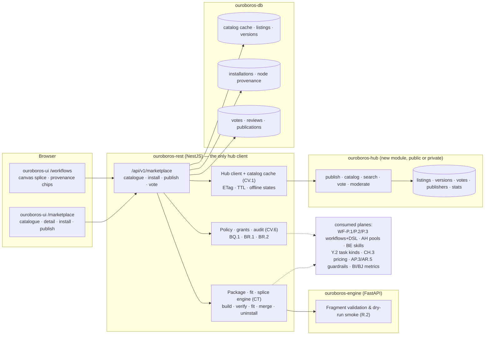
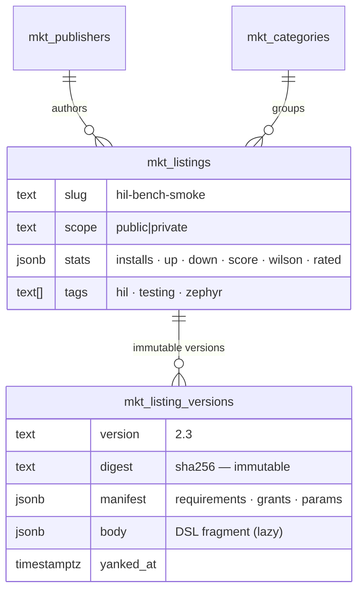
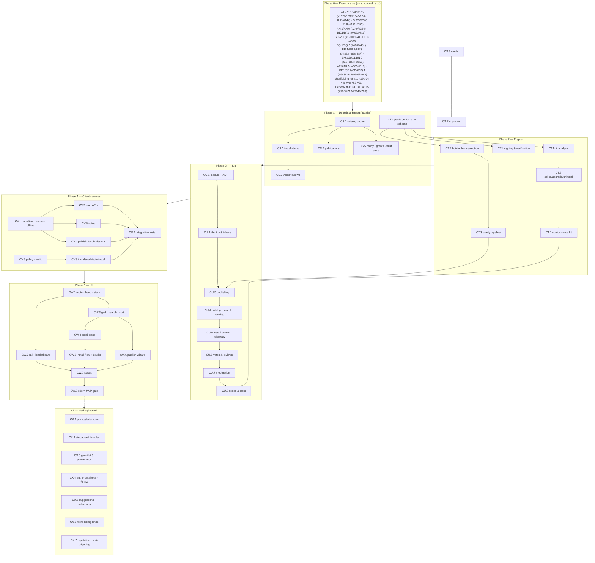

# Roadmap — Snippet Marketplace (Mockup 23)

## Description

> Create a roadmap that implements the functionality outlined in
> `docs/mockups/23-marketplace.html` called
> `docs/ROADMAP_MOCKUP_23_MARKETPLACE.md`.
>
> The marketplace is where users can contribute workflow snippets that can be
> dropped into a workflow when processing a job within Ouroboros. User
> workflows are given a name, description, and ranking based on usage from
> other users giving a thumbs up or down, along with the name of the
> contributor.

## Context & Existing Work (duplicate-avoidance survey)

Surveyed 2026-08-13.

**Design source of truth for every UI ticket in this roadmap:**
[`docs/mockups/23-marketplace.html`](mockups/23-marketplace.html) (with
`docs/mockups/assets/ouroboros.css`) — Snippet Marketplace. Its anatomy:

- **Page head** — eyebrow `Marketplace`, h1 *"Snippets other teams already got
  right."*, subline: *community-contributed workflow snippets — one or more
  stages you drop straight into a workflow; every snippet carries its author,
  what it needs to run, and a ranking built from thumbs up and down cast by the
  workspaces actually running it*. Actions: **Open workflow studio** (ghost,
  → mockup 04), **My contributions** (ghost), **Publish a snippet** (primary).
- **Stats strip** (four tiles) — `PUBLISHED SNIPPETS 412` (+37 this month),
  `INSTALLED HERE 14` (across 5 workflows), `VOTES CAST (30D) 9.4k` (88% thumbs
  up), `YOUR SNIPPETS 3` (1.9k installs · 92%).
- **Left rail** — **Category** list with counts (All 412, Testing & QA 96,
  Build & CI 74, Code review 61, Security 44, Release & docs 40, Notifications
  30, Data & migrations 27, Hardware / HIL 18, Planning 22); **Filter**
  switches (*Compatible with* `standard-fix` — **on**, *Verified contributors*,
  *Rated 90% or better*, *Hide installed*); **Top contributors** leaderboard
  (Ana Silveira 18.2k, Marcus Vogel 12.7k, Priya Raghavan 9.6k, Tomás Nkemelu
  7.1k, Ken Suenobu *(you)* 1.9k) with the caption *"Points are installs
  weighted by thumbs-up rate over the trailing 90 days."*
- **Search & sort bar** — query pill (`hil OR bench`, `9 results`) and a
  segmented sort (**Top rated** selected / Most installed / Trending / Newest).
- **Catalogue grid** — snippet cards, each carrying: mono **name** + **version**
  (`hil-bench-smoke` `v2.3`), an optional badge (`TRENDING` / `INSTALLED` /
  `BETA`), a **description**, the **contributor** (avatar, name, org — or
  `✦ verified`, or `· solo contributor`), the **ranking row** (score `96%`, a
  green/red proportion bar, `▲ 1,156` / `▼ 48`), **tags** (`hil`, `testing`,
  `zephyr`, `3 stages`), and a footer of actions (`Insert into workflow ▾` /
  `Update to v4.0` / `Preview`) plus `3,142 installs`. Six seeded cards:
  `hil-bench-smoke v2.3` (96%, trending, selected), `secrets-scan-gate v4.0`
  (98%, installed, update available, verified publisher), `flaky-test-quarantine
  v1.8` (94%), `bench-power-budget-check v1.1` (84%, beta),
  `evidence-matrix-builder v3.2` (92%, verified), `commit-message-rewrite v1.2`
  (**71% — 604 up / 247 down**, the deliberately divisive listing). A dashed
  **Publish a snippet** card: *"Select stages on the canvas, give them a name and
  description, declare what they need (skills, runner tags, model routes), and
  publish. Your name rides along; the ranking is whatever other workspaces vote
  it."* → **Start from selection →**.
- **Detail panel** (right, sticky) — `SNIPPET DETAIL` + `TRENDING`, title
  `hil-bench-smoke v2.3`, summary; the ranking row (`96%`, `1,204 votes`) and
  the **vote controls** (`▲ Helpful` cast / `▼ Not helpful`, *You voted*);
  **Stages inserted** — a three-step chain preview (`▣ INFRA Reserve bench
  runner` *waits for a free runner tagged `hil`, max 12 min* → `▣ INFRA Flash &
  run smoke suite` *west flash · twister –p helios_rev_c –t smoke* → `◆ LLM
  Summarize bench evidence` *turns measured-vs-expected readings into the PR
  comment table*); **Requires** — `RUNNER pool tagged: hil` (`available`),
  `SKILL zephyr-conventions` (`installed`), `ROUTE task: test-triage`,
  `GRANTS comment on PR` + `read build artifacts`, `COST ~$0.11 & ~2 min added
  per run`; **Fits your workflow** — *`standard-fix` — drops in between `Test`
  and `Review`. No conflicts found.* / *"Inserting creates draft v15; nothing
  runs until you publish it."*; **Versions** (v2.3 bench timeout configurable ·
  3 weeks ago, v2.2 retries a flashing failure once · Jun 2026, v2.0 evidence
  table format · May 2026); **Reviews (312)** — three reviews each with a ▲/▼
  tick, avatar, name, age and text (including a critical one: *"Assumes one
  bench per pool — with two runners the reservation can double-book"*);
  **Contributor** card (Priya Raghavan · acme-robotics · 7 snippets · 9.6k pts ·
  94% avg, **Follow**); footer **Fork** / **Insert into standard-fix**.
- **Studio integration** (already in the mockups) —
  [`04-workflow-builder.html`](mockups/04-workflow-builder.html) gained a
  `⊞ Marketplace` head action, an `Insert snippet from marketplace ▾` canvas
  toolbar action, and a **provenance chip** on the Test node
  (`⊞ flaky-test-quarantine v1.8`);
  [`20-workflow-copilot.html`](mockups/20-workflow-copilot.html) gained a
  dry-run suggestion proposing `hil-bench-smoke v2.3` with its rating and
  install count. Every app-shell screen carries the sidebar **Marketplace**
  entry.

**Scope boundaries.** The marketplace is a *distribution and trust* plane over
work that already exists: it does not define stages (WF-P.2 DSL), does not
execute anything (WF-T.6 / AF.2), does not own workflows (WF-P.1/P.3), does not
store skills (BE.1), and does not size or price models (CH.3, L.3). It adds:
a package format for a spliceable stage subgraph, a catalog that spans
deployments, ranking from thumbs up/down, an install path that writes a
workflow **draft**, and the safety machinery that makes installing a stranger's
stages a decision a workspace can actually make.

**Overlapping work and dispositions:**

| Existing work | Disposition under this roadmap |
|---|---|
| WF-P.1 (#132) workflows + immutable versions, WF-P.3 (#134) draft/publish API | **Consumed, never bypassed** — an install writes into the workflow's **draft** and publishing stays WF-P.3's single path (decision MP7). The version-immutability pattern is reused for snippet versions (MP4). |
| WF-P.2 (#133) DSL JSON Schema, R.2 (#144) validation & dry-run simulator | **The package's inner language** — a snippet body *is* a `{nodes[], edges[]}` fragment of the same DSL, validated by the same zod/pydantic pair; CT.1 adds a *fragment* profile (inlet/outlet contract) rather than a second language. Publish-time smoke uses R.2. |
| WF-R.3 (#145) stage catalog endpoint, S.5 (#151) canvas editing operations, S.3 (#149) node components | **Amended, not duplicated** — the catalog gains a marketplace section; S.5 gains the splice operation and a multi-select→package hand-off; S.3 renders the provenance chip. UI work lands in CW.5. |
| WF-T.5 (#159) workflow template library, delivered by onboarding BA.2 (#381) / BB.3 (#386) | **Adjacent and kept separate** (MP15) — templates are *whole workflows* you start from; snippets are *fragments* you splice in. Shared machinery is the DSL and validation, not the registry. Publishing whole workflows as a listing kind is v2 (CX.6). |
| Knowledge BE.1 (#405) skills & versions, BF.1 (#410) skills service | **Referenced as a requirement** — a snippet declares `skill: zephyr-conventions`; the fit report resolves it against the org's registry and links to Knowledge when it is missing. **Bundling** skills inside a package is v2 (CX.6). |
| Build farm AH.1 (#249) runner/pool schema, AH.6 (#254) farm read APIs | **Consumed read-only** — `RUNNER pool tagged: hil · available` is a live check against pool tags, not a claim in the manifest. Pool **tags** may need the AH.1 amendment noted below. |
| Routing Y.2 (#190) task kinds, Z.1 (#194) resolution, registry CG.3 (#581) alias reference index, CH.3 (#586) pricing | **Consumed** — a snippet requires a *task kind* (`test-triage`), never a model or an alias, so it stays portable across workspaces; the cost figure prices the routed alias through CH.3 with the standing honesty rule (no price ⇒ no dollar figure). |
| Settings BQ.1 (#480) versioned policy doc, BQ.2 (#481) enforcement, BR.1 (#485) capabilities, BR.2 (#486) audit plane | **Extended with a `marketplace` policy section** (MP6) — install-requires-admin, forbidden grants, verified-only, private-only, telemetry opt-in; every install/publish/vote emits audit events through BR.2. No second policy store. |
| Run guardrails AP.3 (#305), AR.5 (#319) secrets scanning | **The enforcement floor** — declared grants are mapped onto existing guardrail evaluations so a grant is *enforced at run time*, not merely displayed at install (MP6). |
| PR plane AX.1 (#357) / AX.5 (#361) | **Grant target** — `comment on PR` resolves to the existing PR capability; a snippet cannot invent a capability the platform does not already have. |
| Copilot CD.5 (#563) suggestion rules, CE.3 (#567) draft stage list | **v2 tie-in (CX.5)** — the mockup-20 suggestion that proposes a marketplace snippet is a new suggestion rule over CD.5; nothing in the MVP depends on it. |
| Inbox BM.1 (#457) decision kinds, BN.1 (#461) emitter SPI | **Two new decision kinds requested** — *install awaiting admin approval* and *installed snippet yanked upstream*; emitted through BN.1, not a second notification path. |
| Insights BI.1 (#432) / BJ.1 (#437) rollups | **Source for measured cost/time** — the "~$0.11 & ~2 min added per run" figure is computed from run/stage metrics for stages carrying a snippet provenance stamp, then aggregated for the hub under MP13. |
| Providers AD.1 (#222) envelope encryption, AD.4 (#225) credential audit | **Untouched** — a snippet never carries, requests or reaches a credential; `secrets access` is a grant that does not exist (MP6). |
| Shell CP.2 (#644) module registry, CP.4 (#646) in-pane chrome, CQ.1 (#648) rem scale | **Consumed** — the sidebar **Marketplace** entry is a registry entry (lucide `blocks`), added by CW.1. |
| Scaffolding #8 (module map), #11 (path-filtered CI), #12 (architecture doc), #55 (compose), #56 (e2e), #49 (placeholder routes) | **Amended by the new module** — `ouroboros-hub` follows the `ouroboros-runner` precedent (AG.1, #243): conventions, CI job, compose service, architecture entry. #49's `/marketplace` placeholder is retired by CW.1; #56 gains the marketplace leg. |
| BetterAuth B.3 (#708) tenancy, C.3 (#713) tenant context, C.4 (#714) enablement, D.5 (#720) guards | **Standing prerequisites** — org scoping for installs, votes and publications; the hub's notion of "one workspace, one vote" is an org identity minted from this plane (MP10). |

**Nothing in the repository implements any of this today.** `marketplace` and
`snippet` appear only in the mockup set and its README; the sole prior mention
of the idea is `MARKET-ANALYSIS.md`'s note that competitors ship an
"Actions-marketplace pattern" while Ouroboros had only the template gallery.
This roadmap is therefore additive, and its principal risk is not duplication —
it is trust (see **Next Step**).

Epic letters continue the sequence (…CP–CR): this roadmap uses
**CS, CT, CU, CV, CW, CX** — six epics, because one of them is a new module.

## Infrastructure Options (researched — thorough, pick before filing)

### 1. Where the public catalog lives (the load-bearing choice)

| Option | What it is | Fit | Trade-offs |
|---|---|---|---|
| **A — `ouroboros-hub`, a new small service (NestJS + its own PostgreSQL schema), hosted by Ouroboros and self-hostable** ⭐ recommended | A sixth module following the `ouroboros-runner` precedent (AG.1, #243): publish/catalog/search/vote/review/moderation APIs over its own Flyway-migrated schema; deployments reach it **only** through `ouroboros-rest` (never the browser); the same binary runs as a *private* registry inside an enterprise | The mockup's live numbers (installs, 1,204 votes, leaderboard points, trending) are all **writes from many deployments** — they need a writable central store; a private deployment mode is what makes the feature usable in an air-gapped shop | A new deployable to run, secure and moderate; needs its own abuse story from day one. Mitigated by reusing the Nest/Kysely/Flyway/OpenAPI shape the team already runs |
| B — Git-backed signed index (Homebrew-tap / Krew / [Backstage software-templates](https://github.com/backstage/software-templates) pattern) | Listings are files in a public repo; publishing is a pull request; deployments pull the index periodically | Zero new service, review-by-PR is a real moderation model, works offline after a clone | **Votes, reviews, install counts and trending cannot exist** — the page's ranking is its point. Recorded as the fallback if hosting a service is rejected, with thumbs degraded to GitHub reactions |
| C — OCI artifacts + registry ([ORAS](https://docs.sigstore.dev/cosign/signing/other_types/) / Artifact-Hub shape) | Packages pushed as OCI artifacts to GHCR with [cosign](https://github.com/sigstore/cosign) signatures; an index service handles discovery | Strongest distribution + supply-chain story; reuses container infrastructure | Still needs a metadata service for search/votes (i.e. option A anyway); adds a registry dependency for a 20 KB JSON document. **Its signing half is adopted** (option 4) without its distribution half |
| D — Single-deployment marketplace only (org ↔ org inside one install) | No public catalog; sharing is between organizations in one deployment | Trivial; no hosting, no moderation, no abuse surface | Contradicts the mockup (contributors from `driftwave-labs`, `northwind-embedded`, 12,608 installs). **Kept as the private scope of option A**, not as the whole feature |

### 2. Package format & distribution

| Option | What it is | Fit | Trade-offs |
|---|---|---|---|
| **A — Manifest + DSL subgraph, one signed JSON document (`.ouro-snippet.json`), content-addressed** ⭐ recommended | `{manifest, body:{nodes[], edges[]}, params[], requirements, grants}` where `body` validates against the WF-P.2 schema's *fragment* profile; digest = SHA-256 over canonical JSON | Nothing executable ships (decision MP1); the existing validator is the security boundary; diffable in review and in the install dialog | Needs a canonicalisation rule so digests are stable (JCS) |
| B — Tarball with files (README.md, icon, examples) | npm-shaped package | Room for docs and assets | Opens a file-extraction attack surface for a payload that is one JSON document; assets can be manifest fields instead |
| C — Single YAML blueprint with typed inputs ([Home Assistant blueprints](https://www.home-assistant.io/docs/blueprint/)) | Human-authored YAML, inputs filled at install | Lovely authoring story, proven at community scale | Hand-authoring is not how snippets are made here — they are *selected on a canvas* (the mockup's own publish path). **Its typed-input idea is adopted** as `params[]` |

### 3. Ranking from thumbs up / down

| Option | What it is | Fit | Trade-offs |
|---|---|---|---|
| **A — Display the raw rate, sort by the Wilson lower bound** ⭐ recommended | Cards show `96%` + `▲1,156 ▼48` (exactly the mockup); **Top rated** sorts by the lower bound of the 95% Wilson score interval ([Evan Miller, *How Not To Sort By Average Rating*](https://www.evanmiller.org/how-not-to-sort-by-average-rating.html)); below a minimum vote count the score renders as *"not enough votes yet"* instead of a flattering 100% | Keeps the honest, legible number on the card and a defensible order in the list; the 84%-with-212-votes beta card correctly sits below the 92%-with-2k card | Two numbers exist (displayed vs. sorting) — documented in the UI's own tooltip |
| B — Raw percentage sort | What the card already shows | Zero explanation needed | A single 1/1 thumbs-up ranks first, forever — the exact failure the reference paper names |
| C — Bayesian average toward a prior | Smooths small samples toward the catalog mean | Also defensible; common in review sites | Harder to explain on a page whose whole promise is legible evidence; kept as the tie-break inside a category |
| D — Time-decayed velocity | Hacker-News-style gravity over votes+installs | Exactly what **Trending** should be | Wrong for *Top rated* — adopted for the Trending sort only |

### 4. Signing, provenance & integrity

| Option | What it is | Fit | Trade-offs |
|---|---|---|---|
| **A — Hub-signed version manifests (Ed25519) + digest pinning, verified client-side before splice** ⭐ recommended for MVP | The hub signs each immutable version manifest; its public key is served at a well-known URL and pinned in the deployment's trust store with rotation support; the client verifies signature + digest, and installs pin `(slug, version, digest)` | One trust root to operate, works for private registries, verifiable offline once the key is cached | Trusts the hub itself; a hub compromise is a catalog compromise — bounded by immutability + transparency of digests |
| B — Sigstore keyless (Fulcio/Rekor) publisher signatures | Publishers sign with OIDC identity; signatures logged in a public transparency log | The 2026 baseline for artifact provenance; would let a workspace verify *the author*, not just the hub | Needs publisher tooling and an internet-reachable log — **v2 (CX.3)**, alongside the [n8n rule that verified nodes must be published from CI with provenance](https://docs.n8n.io/integrations/creating-nodes/build/reference/verification-guidelines/) |
| C — Digests only, no signatures | Content addressing alone | Cheapest | A hub that can serve a listing can serve a different one under the same name; not acceptable for a plane that adds stages to your build |

### 5. Insertion, drift & upgrades

| Option | What it is | Fit | Trade-offs |
|---|---|---|---|
| **A — Managed-by-default with detach, upgrades as a 3-way merge** ⭐ recommended | Inserted nodes are stamped `snippet: slug@version` and marked `managed`; local edits flip them to `modified`; **Update to v4.0** computes a 3-way merge (original version ⟂ local ⟂ incoming) and shows the diff; **Fork** copies the subgraph and drops the link | Makes the mockup's `Update to v4.0` and the provenance chip honest; nobody's local edit is silently overwritten | A merge implementation and its conflict UI |
| B — Replace-only upgrade | Uninstall + reinstall | Trivial | Destroys local edits — and the first thing anyone does is change a timeout |
| C — Copy on insert, no link | Snippets are one-shot pastes | Simplest of all | Kills updates, install counts per version, and the yank/takedown path |

### 6. Review & trust model (what "verified" is allowed to mean)

| Option | What it is | Fit | Trade-offs |
|---|---|---|---|
| **A — Automated publish-time checks + identity verification + workspace-side policy gates** ⭐ recommended | Every version passes secret scanning, static lints, DSL validation, license presence and a dry-run smoke before it lists; `✦ verified` means **identity/ownership verified** (GitHub org ownership or DNS TXT) and the UI says exactly that; the workspace decides the rest through grants consent and org policy | Honest about what the badge proves. [Marketplace badges that look like safety claims but only verify domain ownership are precisely how VS Code users got burned](https://www.wiz.io/blog/supply-chain-risk-in-vscode-extension-marketplaces) — and 2026 saw [sleeper extensions](https://www.darkreading.com/application-security/fresh-glassworm-vs-code-extensions-supply-chain) and a [compromised 2.2M-install extension](https://www.stepsecurity.io/blog/nx-console-vs-code-extension-compromised) | Automated checks cannot catch intent; mitigated by grants, the mandatory install diff, and yank/takedown |
| B — Human review before every listing | Curated store | Highest assurance | Does not scale to a community catalog and stalls the contribution loop the page is selling |
| C — No review | Publish freely | Fastest | Unacceptable for content that adds shell commands to other people's build farms |

### 7. Catalog search on the hub

| Option | Fit | Trade-offs |
|---|---|---|
| **A — PostgreSQL FTS (`tsvector`) + `pg_trgm` fuzzy + faceted counts** ⭐ recommended | At a few thousand listings this is exact, transactional with the catalog, and needs no second datastore; supports the mockup's `hil OR bench` query syntax and category facets | Relevance tuning is manual |
| B — Meilisearch / Typesense sidecar | Better relevance and typo tolerance out of the box | A second stateful service for a catalog smaller than most blogs — **the v2 upgrade path if search quality complaints appear** |

## Decisions proposed by this roadmap (validate before issue creation)

| # | Decision | Rationale |
|---|----------|-----------|
| MP1 | **A snippet is declarative data, never code**: the package body is a `{nodes[], edges[]}` fragment of the WF-P.2 DSL (#133) plus a typed parameter list; no scripts, no plugins, no runtime dependencies. Shell strings inside `infra` stages are *data* that the install dialog always shows in full | The one property that makes a community catalog defensible: the thing you install is the thing the existing validator already understands. |
| MP2 | **The public catalog is a separate service, `ouroboros-hub`** (option 1-A, `ouroboros-runner` precedent), and **`ouroboros-rest` is its only client** — the browser never talks to the hub | Preserves the architecture's single-boundary invariant; keeps org identity, policy and audit on the product side where they are enforced. |
| MP3 | **Every snippet is a single-inlet / single-outlet subgraph** (a *splice*): it is inserted onto an existing edge, and packages that cannot be reduced to one entry and one exit are rejected at publish | Makes *"drops in between Test and Review"* a computed statement rather than a hope, and makes uninstall reversible. Multi-terminal packages are a v2 question. |
| MP4 | **Versions are immutable and content-addressed**; installs pin `(slug, version, digest)`; **nothing auto-updates** — `Update to v4.0` is always an explicit, diffed action | The WF-P.1 immutability pattern, applied across a trust boundary. A supply chain that can mutate a version in place is the [Nx-console failure mode](https://www.stepsecurity.io/blog/nx-console-vs-code-extension-compromised). |
| MP5 | **Requirements are declared and machine-checked, never prose**: runner **pool tags** (AH.1, #249), skills (BE.1, #405), **task kinds** (Y.2, #190 — never a model or an alias), `dsl_version`, product version floor. The detail panel's `Requires` rows are live resolutions against this workspace, and an unmet requirement blocks install with a named remedy | Portability across workspaces, and the difference between "available ✓" being true and being decorative. |
| MP6 | **Grants are an explicit consent contract, enforced at run time**: the grant vocabulary is closed (`comment_on_pr`, `read_build_artifacts`, `run_shell_on_runner`, `touch_ci_config`, `network_egress`, `open_issues`) and maps onto existing guardrail evaluations (AP.3 #305, AR.5 #319, AX.1 #357). **There is no credential grant.** Org policy (BQ.1, #480) may forbid grants outright, require admin approval, or require verified publishers | Displaying permissions without enforcing them is theatre; a closed vocabulary is what lets policy reason about a stranger's stages. |
| MP7 | **Install writes a workflow *draft*, never a published version** — *"Inserting creates draft v15; nothing runs until you publish it"* — and publishing stays the single WF-P.3 path (#134) with its full validation gate | One publish path, one validator, one audit trail; the marketplace cannot become a second way to change what runs. |
| MP8 | **Inserted stages carry provenance and a lifecycle**: `snippet: hil-bench-smoke@2.3` stamped on every inserted node, state `managed → modified → detached`; upgrade is a 3-way merge (option 5-A); **Fork** copies and unlinks; uninstall is a planned removal that refuses to strand edges | The mockup's provenance chip and `Update to v4.0` both become truthful, and local edits are never silently lost. |
| MP9 | **Ranking: show the rate, sort by the bound** — cards display `96% · ▲1,156 ▼48`; **Top rated** sorts by the Wilson 95% lower bound; **Trending** by time-decayed install+vote velocity; **Most installed** by raw count; below `MIN_VOTES` (proposed: 10) the card shows *"not enough votes yet"* rather than a percentage | Legible on the card, defensible in the list — and no 1-of-1 listing ever leads the catalog. |
| MP10 | **Vote integrity: one vote per workspace, and only after a verified install** — votes are org-scoped (not per user), changeable and retractable, recorded against the version voted on; reviews require the same eligibility; publishers cannot vote on their own listings; per-org and per-IP rate limits plus coordinated-voting detection on the hub | The thumbs are the product's only quality signal; an unverified thumb is worth nothing, and "verified install" is this domain's *verified purchase*. |
| MP11 | **`✦ verified` means identity verified, not safe** — awarded for proven GitHub-org ownership or DNS TXT control of the claimed domain, and the UI states that in words next to the badge | The badge misread as a safety guarantee is the documented VS Code marketplace failure; the honesty is cheap and the alternative is a lie. |
| MP12 | **Publish-time safety pipeline is mandatory**: secret/credential scanning of every string (prompt templates included), static lints (banned command patterns, unbounded egress, absolute host paths), SPDX license required, DSL fragment validation, and an R.2 dry-run smoke on a reference workflow. Failure blocks listing with the reason shown to the author | The author's laptop is not a trust boundary; the pipeline is. |
| MP13 | **Telemetry is opt-in, aggregate and k-anonymous**: install counts come from install resolutions deduped per org; `~$0.11 & ~2 min added per run` is **measured** from opt-in aggregates (n ≥ 20 workspaces) and otherwise labeled *author estimate* or priced from CH.3 (#586). Repo names, workflow names, prompts, issue text and identities never leave the deployment | A marketplace that quietly ships your build metadata home would be the last thing this product does. |
| MP14 | **Two catalog scopes from day one — `public` (hub) and `private` (this deployment)** — an enterprise can run the whole feature internally, and every screen has an honest hub-unreachable state. Federation and mirrors are v2 (CX.1/CX.2) | Self-hosting is the product's posture; a feature that only works with the vendor's cloud would be the first exception. |
| MP15 | **Snippets do not replace templates or skills**: workflow templates (BA.2, #381) remain whole-workflow starts, skills (BE.1, #405) remain context. Publishing workflows, skills and playbooks as additional listing kinds is v2 (CX.6) | Three registries with three lifecycles beats one registry with three exceptions. |
| MP16 | **Route `/marketplace`**; sidebar entry after **Workflows** (lucide `blocks`, CP.2 registry, #644); new label **`marketplace`**; milestones **`Marketplace MVP`** / **`Marketplace v2`** created at filing | Matches the shipped mockups and the repository's label-per-surface convention. |
| MP17 | **`Follow` is v2 (CX.4) and the MVP omits the control** rather than shipping a dead button; the same rule applies to any mockup affordance whose backing service is v2 | The repository's standing honesty rule for mockup affordances. |

## Architecture Overview



## MVP Definition

The MVP is **mockup 23 as a working distribution loop**: browse, judge,
install into a draft, run it, vote on it, publish your own. It is done when,
against the compose stack (with a dev `ouroboros-hub` instance seeded to the
mockup's catalogue):

1. `/marketplace` reproduces
   [`docs/mockups/23-marketplace.html`](mockups/23-marketplace.html)
   pixel-faithfully in **both themes**: head and stats strip, category rail
   with counts, filter switches, contributor leaderboard, search + sort bar,
   the six-card catalogue with badges/ranking/tags/actions, the publish card,
   and the full detail panel (chain preview, requires, fit, versions, reviews,
   contributor).
2. **Ranking is real**: the displayed percentage and vote counts come from hub
   data; `Top rated` orders by the Wilson lower bound, `Trending` by decayed
   velocity, `Most installed` by count; a listing under the vote threshold
   renders *"not enough votes yet"*; the 71% listing sorts where its bound puts
   it, not where its percentage would.
3. **An install actually installs**: `Insert into workflow ▾` → fit report →
   grants consent → splice into the target workflow's **draft**, with the
   inserted nodes stamped and visible in the Studio canvas (mockup 04's
   provenance chip), the draft opening at v_next, and nothing running until a
   human publishes.
4. **Fit is computed, not claimed**: runner pool tags, skills, task kinds,
   `dsl_version` and product floor resolved live; `available` / `installed` /
   missing states are true; conflicts (duplicate stage ids, unreachable
   insertion point, forbidden grant) block the install with a named remedy;
   the insertion-point proposal names the real edge (`between Test and
   Review`).
5. **Upgrade and removal hold**: `Update to v4.0` shows a 3-way diff against
   local edits and applies to the draft; a `modified` stage is never silently
   overwritten; `Fork` detaches; uninstall removes the subgraph and re-links the
   edge, refusing when the graph would be stranded.
6. **Publishing works from the canvas**: select stages → package built with
   requirements inferred and org-specifics stripped (repo names, aliases,
   absolute paths become parameters or requirements) → safety pipeline (secret
   scan, lints, license, DSL validation, R.2 dry-run smoke) → submission →
   listing appears with your contributor name; failures explain themselves;
   **My contributions** shows submission state.
7. **Votes and reviews are eligible-only**: a workspace can vote exactly once
   per listing, only after an install of it, changeable and retractable, with
   the cast state rendered (`You voted`); a review carries the same eligibility;
   an attempt to vote twice, vote without an install, or vote on your own
   listing fails closed.
8. **Trust machinery is on**: version manifests are signed and verified before
   splice; digests pinned; a yanked or taken-down version raises a decision item
   in the Needs-You inbox for every workspace that has it installed, without
   mutating their workflow; `✦ verified` is awarded by ownership proof and
   labeled as identity-only in the UI.
9. **Policy and audit apply**: org policy can require admin approval for
   installs, forbid grants, restrict to verified publishers, or set the catalog
   to private-only; every install, update, uninstall, publish, vote and policy
   change is an audit event (BR.2) with actor, listing, version and digest.
10. **The hub can be absent**: with the hub unreachable or disabled, the page
    renders an honest offline state, the private catalog still lists, installed
    snippets keep working, and nothing blocks the Studio.
11. Integration tests cover package/schema conformance, splice and 3-way-merge
    properties (including "uninstall restores the original graph"), fit
    resolution, grants enforcement, vote eligibility and one-vote-per-org,
    ranking maths, signature verification and rejection of a tampered digest,
    policy gates, and org isolation of installs/votes; the e2e suite gains a
    marketplace leg.

**Explicitly v2 (milestone `Marketplace v2`):** private/enterprise federation
and mirrors (CX.1/CX.2), the automated quality gauntlet and its badges (CX.3),
author analytics + `Follow` + notifications (CX.4), Copilot/Analyzer snippet
suggestions and curated collections (CX.5), additional listing kinds — whole
workflows, skills, playbooks, snippet dependencies (CX.6), and reputation-
weighted votes with brigading defence (CX.7).

## Epics, Labels & Milestones

Each epic is a parent tracking issue on GitHub; every roadmap issue below is
filed as one of its sub-issues (GitHub Relationships). **Filed 2026-08-13** —
issues #765–#808 under epics #759–#764.

| Epic | GitHub | Status | Name | Goal | Modules | Milestone |
|------|:------:|:------:|------|------|---------|-----------|
| CS | #759 | 🟡 Open | Marketplace Domain | Catalog cache, installations & provenance, votes/reviews, publications, policy & trust store, seeds, CI probes | ouroboros-db | Marketplace MVP |
| CT | #760 | 🟡 Open | Package, Safety & Splice Engine | Package format, builder from selection, safety pipeline, signing/verification, fit analysis, splice/upgrade/uninstall planner, conformance kit | ouroboros-rest, ouroboros-engine | Marketplace MVP |
| CU | #761 | 🟡 Open | Marketplace Hub Service | New `ouroboros-hub` module: publishing, catalog & search, ranking, votes/reviews, telemetry, moderation, seeds & tests | ouroboros-hub | Marketplace MVP |
| CV | #762 | 🟡 Open | Marketplace Client Services | Hub client & cache, catalogue APIs, install/update/uninstall, publish & submissions, votes, policy/audit, integration tests | ouroboros-rest | Marketplace MVP |
| CW | #763 | 🟡 Open | Marketplace UI | Route & stats, rail & leaderboard, catalogue grid, detail panel, install flow + Studio integration, publish wizard, states, e2e | ouroboros-ui | Marketplace MVP |
| CX | #764 | 🟡 Open | Marketplace at Scale (v2) | Federation, mirrors, quality gauntlet, author analytics, suggestions & collections, more listing kinds, anti-abuse | all | Marketplace v2 |

Issue naming: `<project>: [<epic>.<issue>] <title>`. Labels: existing set
(`mvp`, `v2`, `db`, `rest`, `ui`, `engine`, `ci`, `design`, `infra`,
`workflow`, `knowledge`, `routing`, `build-farm`, `settings`) **plus new
`marketplace`** (MP16) — proposed definition for `.github/labels.yml`:

```yaml
- name: "marketplace"
  color: "0e7490"
  description: "Snippet Marketplace (mockup 23) — packages, hub, ranking, install & publish"
```

Milestones **`Marketplace MVP`** / **`Marketplace v2`** created at filing;
every issue assigned. Complexity chips: **XS · S · M · L**.

---

## Epic CS (#759) — Marketplace Domain (`ouroboros-db`)

| Ref | GitHub | Status | Title | Summary | Labels | Parallel | MVP | Complexity | Affected Modules |
|-----|:------:|:------:|-------|---------|--------|:--------:|:---:|:----------:|------------------|
| CS.1 | #765 | 🟡 Open | ouroboros-db: [CS.1] Listing catalog cache & version schema | Cached listings/versions/publishers with digests, stats, categories | mvp, marketplace, db | N (after #19, BA-B.3) | Y | M | ouroboros-db |
| CS.2 | #766 | 🟡 Open | ouroboros-db: [CS.2] Installations, node provenance & drift state | Installs pinned to (slug, version, digest); node id map; managed/modified/detached | mvp, marketplace, db, workflow | N (after CS.1, WF-P.1) | Y | M | ouroboros-db |
| CS.3 | #767 | 🟡 Open | ouroboros-db: [CS.3] Votes, reviews & eligibility mirror | One vote per org per listing, version voted, review text, retraction history | mvp, marketplace, db | N (after CS.1, CS.2) | Y | S | ouroboros-db |
| CS.4 | #768 | 🟡 Open | ouroboros-db: [CS.4] Publications & submission records | This org's packages, submission state, safety report, hub listing refs | mvp, marketplace, db | N (after CS.1) | Y | S | ouroboros-db |
| CS.5 | #769 | 🟡 Open | ouroboros-db: [CS.5] Marketplace policy, grant vocabulary & trust store | Policy section, closed grant vocab, hub keys/pins, publisher & listing blocklists | mvp, marketplace, db, settings | N (after CS.1, BQ.1) | Y | M | ouroboros-db |
| CS.6 | #770 | 🟡 Open | ouroboros-db: [CS.6] Marketplace dev seeds — mockup-23 parity | Six listings, 14 installs, votes/reviews, leaderboard, one update-available | mvp, marketplace, db | N (after CS.2–CS.5, WF-P.5) | Y | M | ouroboros-db |
| CS.7 | #771 | 🟡 Open | ouroboros-db: [CS.7] Marketplace constraints in ci/db | Digest immutability, one-vote-per-org, provenance integrity, grant vocab drift | mvp, marketplace, db, ci | N (after CS.6, #24) | Y | S | ouroboros-db, .github |

### Issue CS.1 — ouroboros-db: [CS.1] Listing catalog cache & version schema

> **GitHub issue:** #765 · **Status:** 🟡 Open · **Parent epic:** #759

- **Problem Statement:** Every card, filter, sort and count on the page reads
  from a catalog this deployment does not have. The hub is the source of truth
  (MP2), but the product needs a local, queryable, **cached** projection so the
  page renders (and installed snippets stay inspectable) when the hub is slow,
  disabled or unreachable (MP14).
- **Solution/Scope:** Migration: `mkt_publishers` — `hub_publisher_id`,
  `display_name`, `org_handle` (nullable — `· solo contributor`), `verified`
  bool + `verified_method` CHECK `github_org|dns_txt|none` (MP11),
  `points_90d` int, `snippet_count`, `avg_score_pct`, `synced_at`;
  `mkt_listings` — `slug` (unique per `scope`), `scope` CHECK `public|private`
  (MP14), `name`, `summary`, `description`, `category` FK, `tags` text[],
  `publisher_id` FK, `latest_version`, `license_spdx`, `badges` jsonb
  (`trending|beta|deprecated`), `stats` jsonb (`installs`, `votes_up`,
  `votes_down`, `score_pct`, `wilson_lb`, `rated` bool — false below
  `MIN_VOTES`, MP9), `stage_count`, `first_published_at`, `synced_at`,
  `etag`; `mkt_categories` — slug, display, sort (the mockup's ten);
  `mkt_listing_versions` — listing FK, `version` semver, `digest` (sha256 over
  the canonical package, MP4), `manifest` jsonb (requirements, grants, params,
  chain summary), `body` jsonb (the DSL fragment — cached lazily on first
  detail/install), `changelog`, `published_at`, `yanked_at`, `signature`,
  `signing_key_id`; unique `(listing_id, version)`, and an
  **immutability trigger**: once `digest` is set, `digest`/`body`/`manifest`
  may never change (a version that "changes" is a new version).
- **Acceptance Criteria:**
  - The six mockup listings and their versions round-trip, including the 71%
    listing's vote split and the `beta`/`trending` badges.
  - Updating a cached row's digest is rejected by trigger (tested); re-sync of
    an unchanged listing is a no-op (`etag` short-circuit).
  - `scope='private'` rows exist without any hub reference (offline-only
    catalog proves out).
  - Category counts derive from listings, never stored as text.
- **Parallelism/Dependencies:** Needs #19, BA-B.3 (#708). Blocks CS.2–CS.6,
  CV.1, CV.2.
- **Technical Stack:** PostgreSQL 17, Flyway.
- **Epic:** CS



### Issue CS.2 — ouroboros-db: [CS.2] Installations, node provenance & drift state

> **GitHub issue:** #766 · **Status:** 🟡 Open · **Parent epic:** #759

- **Problem Statement:** `INSTALLED HERE 14 · across 5 workflows`, the
  `Update to v4.0` button, the Studio's provenance chip and every honest
  uninstall need a record of *what was spliced where, from which version, and
  whether anyone has edited it since* (MP4, MP8).
- **Solution/Scope:** Migration: `mkt_installations` — org FK, `listing_id` FK,
  `version` + `digest` (pinned copy — survives a yank), `workflow_id` FK
  (WF-P.1), `installed_into_version` int (the draft that received it),
  `node_map` jsonb (package node id → workflow node id, plus the spliced edge
  and the restored-edge plan), `param_bindings` jsonb, `granted` text[] (the
  consented grants, MP6), `state` CHECK `managed|modified|detached|removed`,
  `installed_by` → `"user".id`, `installed_at`, `removed_at`,
  `source_digest_body` jsonb (the exact fragment as installed — the *base* side
  of the future 3-way merge), `audit_ref`; partial unique index preventing two
  live installations of the same listing into the same workflow unless
  `allow_multiple` is set on the manifest.
- **Acceptance Criteria:**
  - The seeded workspace shows 14 installations across 5 workflows, one of
    which (`secrets-scan-gate`) has a newer version available (computed from
    CS.1, not stored).
  - A node edited in the Studio flips the installation to `modified` (service
    concern, but the state vocabulary and transition constraints are enforced
    here).
  - `removed` installations retain their `node_map` for audit; re-install
    creates a new row rather than resurrecting one.
  - Deleting a workflow cascades installations without orphaning votes (CS.3
    references the listing, not the install).
- **Parallelism/Dependencies:** Needs CS.1, WF-P.1 (#132). Blocks CS.3, CS.6,
  CT.6, CV.3.
- **Technical Stack:** PostgreSQL 17, Flyway.
- **Epic:** CS

```
installation{hil-bench-smoke@2.3 sha256:9f1c…}
  ├─ workflow standard-fix · into draft v15
  ├─ node_map {reserve→n_8f2, flash→n_a31, summarize→n_c07}
  ├─ spliced edge  test──review   (restore plan on uninstall)
  ├─ granted [comment_on_pr, read_build_artifacts]
  └─ state managed ──(edit)──▶ modified ──(fork)──▶ detached
```

### Issue CS.3 — ouroboros-db: [CS.3] Votes, reviews & eligibility mirror

> **GitHub issue:** #767 · **Status:** 🟡 Open · **Parent epic:** #759

- **Problem Statement:** The thumbs are the product's only quality signal, so
  the rule *one workspace, one vote, only after installing* has to be a
  constraint, not a convention (MP10) — and the panel's `You voted` state must
  be readable locally without a hub round trip.
- **Solution/Scope:** Migration: `mkt_votes` — org FK, `listing_id` FK,
  `value` CHECK `up|down`, `version_voted` (the version in use when cast),
  `installation_id` FK (the eligibility proof — NOT NULL), `cast_by`,
  `cast_at`, `updated_at`, `retracted_at`; **unique `(organization_id,
  listing_id) WHERE retracted_at IS NULL`** — the one-vote rule as an index;
  `mkt_vote_history` (append-only: every change/retraction, for the hub's
  anti-manipulation review); `mkt_reviews` — vote FK (1:1, reviews inherit
  eligibility), `body` text (bounded), `moderation_state` CHECK
  `published|pending|removed`, `hub_review_id`, timestamps. Reviews *displayed*
  on the detail panel come from the hub (other workspaces'); this table is this
  workspace's own contributions plus their sync state.
- **Acceptance Criteria:**
  - Second vote by the same org fails on the unique index; retract-then-vote
    succeeds and appends to history.
  - A vote without an installation reference cannot be inserted (NOT NULL +
    FK), which is the schema half of MP10.
  - The mockup's cast state (`▲ Helpful` + *You voted*) is derivable from one
    row.
- **Parallelism/Dependencies:** Needs CS.1, CS.2. Blocks CS.6, CV.5.
- **Technical Stack:** PostgreSQL 17, Flyway.
- **Epic:** CS

```
UNIQUE(org, listing) WHERE NOT retracted   ─▶ one workspace, one vote
vote.installation_id NOT NULL              ─▶ no install, no thumb
vote_history: up(2.2) → down(2.3) → up(2.3) ─▶ hub sees the pattern, not just the state
```

### Issue CS.4 — ouroboros-db: [CS.4] Publications & submission records

> **GitHub issue:** #768 · **Status:** 🟡 Open · **Parent epic:** #759

- **Problem Statement:** `YOUR SNIPPETS 3 · 1.9k installs · 92%` and **My
  contributions** need the publishing side: what this workspace packaged, what
  the safety pipeline said, where the submission got to, and which hub listing
  it became.
- **Solution/Scope:** Migration: `mkt_publications` — org FK, `slug`, `name`,
  `summary`, `description`, `category`, `tags`, `license_spdx`,
  `source_workflow_id` + `source_node_ids` jsonb (what was selected on the
  canvas), `package` jsonb (the built package, CT.2), `digest`,
  `version` semver, `state` CHECK `draft|checking|failed|submitted|listed|
  rejected|yanked`, `safety_report` jsonb (CT.3 findings — each with severity,
  rule id, locator), `hub_listing_id`/`hub_version_id`, `submitted_by`,
  timestamps; unique `(organization_id, slug, version)`.
- **Acceptance Criteria:** A failed safety check stores its findings and can be
  re-submitted after a fix (new digest, same slug); `listed` rows link to the
  cached listing (CS.1) so *your* snippet and *a* snippet are the same object on
  the page; three seeded publications reproduce the stats tile.
- **Parallelism/Dependencies:** Needs CS.1. Blocks CS.6, CV.4.
- **Technical Stack:** PostgreSQL 17, Flyway.
- **Epic:** CS

```
publication draft ─▶ checking ─(safety findings)─▶ failed ⤾ fix ⤿
                                └─ pass ─▶ submitted ─▶ listed(hub) ─▶ (yanked)
```

### Issue CS.5 — ouroboros-db: [CS.5] Marketplace policy, grant vocabulary & trust store

> **GitHub issue:** #769 · **Status:** 🟡 Open · **Parent epic:** #759

- **Problem Statement:** Installing a stranger's stages is a governance
  decision. The grant vocabulary must be closed and stored (MP6), the org's
  marketplace policy must live in the existing versioned policy document (MP6,
  BQ.1) rather than a new settings island, and the hub's signing keys need a
  pinned trust store (MP12).
- **Solution/Scope:** (a) `mkt_grants` — seeded vocabulary rows
  (`comment_on_pr`, `read_build_artifacts`, `run_shell_on_runner`,
  `touch_ci_config`, `network_egress`, `open_issues`) with display copy, risk
  tier and the **guardrail id each maps onto** (AP.3 #305 / AR.5 #319 / AX.1
  #357); a package requesting an unknown grant is invalid. (b) A `marketplace`
  section registered in the BQ.1 policy document schema:
  `{enabled, scopes:[public|private], install_requires_admin, forbidden_grants[],
  require_verified_publisher, min_score_pct, min_votes, telemetry_optin,
  blocked_publishers[], blocked_listings[]}` — versioned and diffable like every
  other policy. (c) `mkt_trusted_keys` — `key_id`, `algo` (`ed25519`),
  `public_key`, `scope` (hub url), `valid_from/until`, `revoked_at`, plus a
  bundled default for the public hub (rotation = a new row, never an edit).
- **Acceptance Criteria:** Grant vocabulary is seed-driven and CI-checked
  against the package schema's enum (drift fails); policy section validates and
  round-trips through BQ.1's versioning; a revoked key stops verifying without
  deleting history; the "private-only" posture is expressible in one policy
  field.
- **Parallelism/Dependencies:** Needs CS.1, BQ.1 (#480). Blocks CS.6, CT.4,
  CV.6.
- **Technical Stack:** PostgreSQL 17, Flyway.
- **Epic:** CS

```
grant vocab (closed)                     policy(marketplace)            trust store
 comment_on_pr      → AX.1 capability     install_requires_admin: true   key ed25519 #k3
 read_build_artifacts→ AH artifacts read   forbidden_grants: [touch_ci]   valid 2026-01→
 run_shell_on_runner → AP.3 guardrail      require_verified: false        rotate = new row
 touch_ci_config    → AR.5 path policy     scopes: [public, private]
```

### Issue CS.6 — ouroboros-db: [CS.6] Marketplace dev seeds — mockup-23 parity

> **GitHub issue:** #770 · **Status:** 🟡 Open · **Parent epic:** #759

- **Problem Statement:** Design review, integration tests and the e2e leg all
  need the mockup's exact catalogue state — including the awkward rows (the 71%
  listing, the beta, the installed-with-update, the *you* leaderboard entry).
- **Solution/Scope:** Extend the dev seed with: ten categories and their counts;
  five publishers (Ana Silveira `✦ verified` via `github_org`, Marcus Vogel ·
  driftwave-labs, Priya Raghavan · acme-robotics, Tomás Nkemelu ·
  northwind-embedded, Jae-won Han · solo, plus the seeded `KS` user as the
  fifth leaderboard row); the six listings with their exact stats
  (96/1156/48, 98/3341/69, 94/2687/173, 84/212/40, 92/1904/165, 71/604/247) and
  version histories (`hil-bench-smoke` 2.0/2.2/2.3 with the mockup's changelog
  lines); `hil-bench-smoke`'s **real three-stage fragment** (reserve → flash →
  summarize) validating against the WF-P.2 fragment schema and spliceable into
  the seeded `standard-fix` (WF-P.5, #136) between `Test` and `Review`; 14
  installations across 5 workflows including `secrets-scan-gate@3.9` with 4.0
  available; this org's vote on `hil-bench-smoke` (up) and three seeded reviews
  (two up, one down — the double-booking critique); three publications by this
  org; the marketplace policy section at defaults; a `private`-scope listing so
  the offline path has data.
- **Acceptance Criteria:** `/marketplace` renders the mockup from seeds alone
  (counts, sorts, badges, leaderboard and detail panel included); the seeded
  fragment installs into `standard-fix` in a test without hand-written JSON;
  the personal org seeds empty (empty-state fixture).
- **Parallelism/Dependencies:** Needs CS.2–CS.5, WF-P.5 (#136), BE.5 (#409) for
  the referenced skill, AH seeds for the `hil` pool tag. Feeds every CV/CW test.
- **Technical Stack:** Flyway repeatable migration, SQL/JSON.
- **Epic:** CS

```
seeds ─▶ 6 listings · 10 categories · 5 publishers · 14 installs · 1 update-available
      ─▶ 1 own vote · 3 reviews · 3 publications · 1 private listing · policy defaults
      └▶ hil-bench-smoke@2.3 body ⊨ WF-P.2 fragment schema ⊨ splices into standard-fix
```

### Issue CS.7 — ouroboros-db: [CS.7] Marketplace constraints in ci/db

> **GitHub issue:** #771 · **Status:** 🟡 Open · **Parent epic:** #759

- **Problem Statement:** Four invariants carry this plane: versions are
  immutable, one workspace votes once, an install always knows exactly which
  nodes it owns, and the grant vocabulary cannot drift from the package schema.
- **Solution/Scope:** Extend #24 `tests/constraints.sql` with probes for: digest
  immutability trigger; the partial unique vote index (including the
  retract-then-revote path); `mkt_votes.installation_id` NOT NULL; installation
  `node_map` referential sanity (every mapped workflow node exists in the target
  workflow's draft); grant-vocabulary ↔ package-schema enum parity; policy
  section validity against the BQ.1 schema; seeded fragment validity against the
  committed package schema (ajv, mirroring WF-P.6's drift check).
- **Acceptance Criteria:** Green on the current schema; **red** when any probe's
  guard is removed — each verified by deliberately breaking it once in review.
- **Parallelism/Dependencies:** Needs CS.6, #24. Blocks nothing; gates the epic.
- **Technical Stack:** GitHub Actions, SQL, ajv.
- **Epic:** CS

```
ci/db: migrate ─▶ constraints (+CS probes) ─▶ seeds ⊨ package schema ─▶ ✓/✗
```

---

## Epic CT (#760) — Package, Safety & Splice Engine (`ouroboros-rest` + `ouroboros-engine`)

| Ref | GitHub | Status | Title | Summary | Labels | Parallel | MVP | Complexity | Affected Modules |
|-----|:------:|:------:|-------|---------|--------|:--------:|:---:|:----------:|------------------|
| CT.1 | #772 | 🟡 Open | ouroboros-rest: [CT.1] Snippet package format & fragment schema | `docs/SNIPPET_PACKAGE.md` + JSON Schema; zod/pydantic parity; inlet/outlet contract | mvp, marketplace, rest, engine, workflow | N (after WF-P.2) | Y | L | ouroboros-rest, ouroboros-engine |
| CT.2 | #773 | 🟡 Open | ouroboros-rest: [CT.2] Package builder from canvas selection | Subgraph extraction, parameterization, requirement & grant inference | mvp, marketplace, rest, workflow | N (after CT.1) | Y | L | ouroboros-rest |
| CT.3 | #774 | 🟡 Open | ouroboros-rest: [CT.3] Publish-time safety pipeline | Secret scan, static lints, license, DSL validation, R.2 dry-run smoke | mvp, marketplace, rest, engine | N (after CT.2) | Y | L | ouroboros-rest, ouroboros-engine |
| CT.4 | #775 | 🟡 Open | ouroboros-rest: [CT.4] Manifest signing, digests & verification | Canonical JSON digests, Ed25519 verify, key pinning & rotation | mvp, marketplace, rest | N (after CT.1, CS.5) | Y | M | ouroboros-rest |
| CT.5 | #776 | 🟡 Open | ouroboros-rest: [CT.5] Fit & compatibility analyzer | Requirement resolution, conflict detection, insertion-point proposal, cost estimate | mvp, marketplace, rest, workflow | N (after CT.1, CS.1) | Y | L | ouroboros-rest |
| CT.6 | #777 | 🟡 Open | ouroboros-rest: [CT.6] Splice, upgrade & uninstall planner | Edge splice + id remap, 3-way merge upgrade, fork, reversible removal | mvp, marketplace, rest, workflow | N (after CT.5, CS.2) | Y | L | ouroboros-rest |
| CT.7 | #778 | 🟡 Open | ouroboros-rest: [CT.7] Package & splice conformance kit | Golden packages, property tests, adversarial fixtures shared with the hub | mvp, marketplace, rest, ci | N (after CT.6) | Y | M | ouroboros-rest, ouroboros-engine |

### Issue CT.1 — ouroboros-rest: [CT.1] Snippet package format & fragment schema

> **GitHub issue:** #772 · **Status:** 🟡 Open · **Parent epic:** #760

- **Problem Statement:** A snippet must be one document that the product, the
  hub, the author and a reviewer all read the same way — and it must be
  *inert*: data the existing DSL validator understands, never code (MP1, MP3).
- **Solution/Scope:** Author **`docs/SNIPPET_PACKAGE.md`** and a versioned
  JSON Schema (`$id`-stamped, committed alongside the DSL schema):
  `{package_version, manifest, body, params[]}` where
  **manifest** = `{slug, name, summary, description, category, tags[],
  license_spdx, publisher, version, dsl_version, product_min, requirements:
  {runner_tags[], skills[], task_kinds[], stage_kinds[]}, grants[] (closed
  vocab, CS.5), estimates:{added_cost_cents?, added_seconds?}, chain_summary[]
  (the detail panel's step list), allow_multiple}`;
  **body** = `{nodes[], edges[]}` validated against a new **fragment profile**
  of the WF-P.2 schema (#133): no `trigger` node, no `term` node, exactly one
  **inlet** (a node with no in-edge inside the fragment) and one **outlet**
  (no out-edge), all node ids package-local (`$1`, `$2` — remapped at splice),
  every referenced skill/task kind/pool tag also declared in `requirements`
  (cross-check, not duplication); **params** = typed, prompted values bound at
  install (`{key, type: string|int|duration|enum|pool_tag|skill, label, help,
  default?, required}`) with `{{param.x}}` interpolation permitted **only** in
  declared positions. Implement zod validation in REST and pydantic in the
  engine generated/checked against the same file (the WF-P.2 parity-test
  pattern).
- **Acceptance Criteria:**
  - The seeded `hil-bench-smoke` package validates; each documented invalid
    case (two inlets, a `term` node, an undeclared skill reference, a param
    interpolated into a node id, an unknown grant) fails with a stable,
    locator-anchored error code.
  - REST and engine validators agree on a golden fixture set (CI parity test).
  - `docs/SNIPPET_PACKAGE.md` renders the schema with a complete worked example
    and states the inertness property in the first paragraph.
- **Parallelism/Dependencies:** Needs WF-P.2 (#133). Blocks CT.2–CT.6, CU.3.
- **Technical Stack:** JSON Schema 2020-12, zod, pydantic v2.
- **Epic:** CT

```
package.json ─▶ schema (committed, $id: snippet/v1)
  manifest{slug,version,requirements,grants,params,estimates,chain_summary}
  body{nodes,edges} ⊨ WF-P.2 *fragment profile*   (1 inlet ▸ … ▸ 1 outlet, no trigger/term)
  params[] ─▶ {{param.bench_timeout}} bound at install, never at publish
```

### Issue CT.2 — ouroboros-rest: [CT.2] Package builder from canvas selection

> **GitHub issue:** #773 · **Status:** 🟡 Open · **Parent epic:** #760

- **Problem Statement:** The publish card promises *"select stages on the
  canvas … declare what they need … and publish"*. Between selection and
  package sits the work nobody wants to do by hand: proving the selection is
  spliceable, inferring requirements, and **stripping this workspace out of it**
  (repo names, absolute paths, pinned aliases, org-specific pool names).
- **Solution/Scope:** `POST /api/v1/marketplace/packages:build` taking
  `{workflow_id, node_ids[], version_source}`: (a) extract the induced subgraph
  and verify the fragment contract (exactly one inlet/outlet, no dangling
  branch edges, no `trigger`/`term`), returning a precise reason when it fails
  ("selection has two entry points: Build, Review"); (b) remap ids to
  package-local; (c) **infer requirements** — skills referenced by `llm` stages,
  task kinds from routing config (a *pinned alias* is rewritten to its task kind
  and flagged for author review — MP5), pool tags from `infra` stages, stage
  kinds used, `dsl_version`; (d) **infer grants** from stage configuration (PR
  comment action ⇒ `comment_on_pr`; shell command on a runner ⇒
  `run_shell_on_runner`; CI-path writes ⇒ `touch_ci_config`); (e) **propose
  parameters** for values that look workspace-specific (timeouts, board/platform
  strings, pool names, repo-relative paths) so the author can promote them with
  one click; (f) compute `chain_summary` and the author's `estimates` seeded
  from measured stage history (BI/BJ) when available, otherwise blank.
- **Acceptance Criteria:**
  - Selecting the seeded Test→Review stages of a fixture workflow produces a
    package that validates (CT.1) and re-splices into a *different* workflow.
  - A selection with two entry points is rejected with both node names.
  - Every inferred requirement/grant is shown with its evidence ("because stage
    *Flash* runs a shell command on a runner"); nothing is inferred silently.
  - No repo name, absolute host path, workflow id, alias id or org id survives
    into the built package (asserted by a scanner in CT.3 and re-asserted here).
- **Parallelism/Dependencies:** Needs CT.1, WF-P.1/P.3 (#132/#134). Blocks
  CT.3, CV.4, CW.6.
- **Technical Stack:** NestJS, Kysely, zod.
- **Epic:** CT

```
selection {n_a31, n_c07, n_8f2} ─▶ induced subgraph ─▶ inlet/outlet check ✓
  ├─ requirements  skills[zephyr-conventions] · task_kinds[test-triage] · runner_tags[hil]
  ├─ grants        run_shell_on_runner (Flash) · comment_on_pr (Summarize)
  ├─ params        bench_timeout=12m · platform=helios_rev_c   ← proposed, author confirms
  └─ scrubbed      repo · abs paths · alias ids · org ids  ──▶ package
```

### Issue CT.3 — ouroboros-rest: [CT.3] Publish-time safety pipeline

> **GitHub issue:** #774 · **Status:** 🟡 Open · **Parent epic:** #760

- **Problem Statement:** The author's laptop is not a trust boundary (MP12).
  Everything published has to survive an automated pass that catches the three
  things that actually go wrong: a secret in a prompt, a command that does
  something else, and a package that does not run.
- **Solution/Scope:** A pipeline run on every submission, its report stored on
  the publication (CS.4) and shown to the author: **(1) secret scan** — the
  guardrail plane's scanner (AR.5, #319) over every string in the package,
  prompt templates and params included, with entropy + known-token patterns;
  **(2) static lints** — banned/suspicious command patterns (`curl … | sh`,
  base64-decoded execution, writes outside the workspace, unbounded network
  egress not matching a declared `network_egress` grant), absolute host paths,
  credential-shaped params, oversized prompt bodies, non-declared grant
  behaviour; **(3) license** — SPDX identifier required and on the allow-list;
  **(4) schema** — CT.1 validation, fragment contract, requirement
  cross-checks; **(5) smoke** — an R.2 (#144) dry-run of a reference workflow
  with the fragment spliced in, proving it validates and simulates end to end;
  **(6) metadata hygiene** — name/slug shape, description minimum, tags
  vocabulary, no contact-info-in-description. Findings are typed
  `{rule_id, severity: block|warn, locator, message, remedy}`; any `block` fails
  the submission.
- **Acceptance Criteria:**
  - A package with a token in a prompt template is blocked, with the locator
    pointing at the field and the token redacted in the report.
  - `curl … | sh` in an infra command is blocked; the same command with an
    explicit `network_egress` grant is a `warn` and lists on the detail panel's
    grant row.
  - A fragment that fails R.2 simulation blocks with the simulator's own error.
  - Re-submission after a fix passes; the report history is retained.
- **Parallelism/Dependencies:** Needs CT.2, R.2 (#144), AR.5 (#319). Blocks
  CU.3 (the hub re-runs the same kit), CV.4.
- **Technical Stack:** NestJS, the existing scanner, engine dry-run client.
- **Epic:** CT

```
submit ─▶ [secrets][lints][license][schema][R.2 smoke][hygiene] ─▶ report
           any block ⇒ failed (author sees rule_id · locator · remedy)
           warns ⇒ listed, shown on the detail panel
```

### Issue CT.4 — ouroboros-rest: [CT.4] Manifest signing, digests & verification

> **GitHub issue:** #775 · **Status:** 🟡 Open · **Parent epic:** #760

- **Problem Statement:** A catalog that can serve a different body under the
  same name is not a catalog you install from (MP4, MP12). Digests and
  signatures are what make "version 2.3" mean one exact document.
- **Solution/Scope:** Canonical JSON (JCS) serialization + SHA-256 digest as the
  version's identity; **verification on the client side of every fetch**:
  digest recompute + Ed25519 signature check against the pinned trusted keys
  (CS.5) before a package may be spliced, previewed as trusted, or cached as
  a body; key rotation (multiple valid keys, `valid_from/until`, revocation
  honoured immediately); explicit failure modes — `digest_mismatch`,
  `unknown_key`, `revoked_key`, `unsigned_private_scope` (private-scope
  listings from this deployment are signed by the deployment's own key or
  marked trusted-by-origin, decided in-issue). Verification failures are loud:
  the install is refused, an audit event is written, and a decision item is
  raised.
- **Acceptance Criteria:**
  - A tampered body (one character in a command) fails verification and cannot
    be installed — the property test that must stay red when the check is
    removed.
  - Rotation: a version signed by the retired key still verifies while that key
    is within validity, and stops on revocation.
  - Digest computation is stable across key order, whitespace and unicode
    normalisation (JCS fixtures).
- **Parallelism/Dependencies:** Needs CT.1, CS.5. Blocks CT.6, CV.1, CV.3.
- **Technical Stack:** NestJS, node crypto (Ed25519), JCS canonicalisation.
- **Epic:** CT

```
fetch version ─▶ recompute sha256(JCS(package)) == digest ?
              ─▶ verify ed25519(sig, digest, key#k3 ∈ trust store, not revoked) ?
              ─▶ ✓ splice allowed   ✗ refuse + audit + inbox decision item
```

### Issue CT.5 — ouroboros-rest: [CT.5] Fit & compatibility analyzer

> **GitHub issue:** #776 · **Status:** 🟡 Open · **Parent epic:** #760

- **Problem Statement:** The detail panel makes four claims — *pool tagged hil:
  available*, *skill installed*, *drops in between Test and Review*, *no
  conflicts found* — and the rail offers a *Compatible with `standard-fix`*
  filter. All five must be computed against this workspace right now (MP5).
- **Solution/Scope:** A `fit(listing_version, workflow?)` service returning a
  typed report: **requirements** — each resolved against its plane (runner pool
  tags via AH.6 #254, skills via BF.1 #410, task kinds via Y.2 #190 /
  resolution Z.1 #194, `dsl_version` and product floor) with status
  `satisfied|missing|degraded` and a **named remedy** (link to Knowledge for a
  missing skill, to Build Farm to tag a pool, to Routing for an unmapped task
  kind); **grants** — checked against org policy (CS.5) → `allowed|
  needs_admin|forbidden`; **conflicts** — duplicate slug already installed in
  this workflow (unless `allow_multiple`), stage-id collisions, a required
  stage kind the deployment disables, a fragment that would create a cycle;
  **insertion points** — candidate edges ranked with a human phrase
  ("between Test and Review"), derived from the fragment's declared position
  hints (`after_kind: infra_test`) and graph analysis, with an explicit
  `none_found` state; **cost/time** — measured aggregate if present (MP13),
  else priced from CH.3 (#586) against the resolved alias, else omitted (never
  invented). The same service backs the rail's compatibility filter in bulk
  (batched, cached per workflow version).
- **Acceptance Criteria:**
  - Against the seeds, `hil-bench-smoke` reports every row exactly as the
    mockup, including the proposed insertion point.
  - Removing the `hil` tag from every pool flips the row to `missing` with the
    Build Farm remedy; deleting the skill flips its row; neither crashes the
    page.
  - A forbidden grant yields `forbidden` and the install button becomes an
    explanation, not a dead end.
  - Bulk fit for 412 listings against one workflow answers within budget
    (target < 300 ms warm, measured).
- **Parallelism/Dependencies:** Needs CT.1, CS.1, AH.6 (#254), BF.1 (#410),
  Z.1 (#194), CH.3 (#586). Blocks CT.6, CV.2, CV.3, CW.4.
- **Technical Stack:** NestJS, Kysely.
- **Epic:** CT

```
fit(hil-bench-smoke@2.3, standard-fix)
  runner  pool tag hil        ▸ satisfied (pool-a, 2 online)
  skill   zephyr-conventions  ▸ satisfied (v12 enabled)
  route   task test-triage    ▸ satisfied (→ alias reviewer-fast)
  grants  comment_on_pr, read_build_artifacts ▸ allowed (policy: needs_admin=false)
  insert  edge Test──Review   ▸ "between Test and Review"   conflicts: none
  cost    measured ~$0.11 · ~2 min (n=37 workspaces)        [else: author estimate]
```

### Issue CT.6 — ouroboros-rest: [CT.6] Splice, upgrade & uninstall planner

> **GitHub issue:** #777 · **Status:** 🟡 Open · **Parent epic:** #760

- **Problem Statement:** *"Inserting creates draft v15"*, *`Update to v4.0`*,
  **Fork** and uninstall are all graph surgery on someone's live workflow. Each
  needs a *plan* that can be shown, applied atomically, and undone (MP7, MP8).
- **Solution/Scope:** **Splice**: given a target workflow draft and an edge,
  remap package node ids to fresh workflow ids, place nodes with a layout that
  does not overlap existing ones, rewrite the chosen edge into
  `from → inlet … outlet → to`, bind params, stamp every inserted node with
  `provenance: {listing_slug, version, digest, installation_id}`, and write the
  draft through WF-P.3 (#134) — never a published version. **Upgrade**: 3-way
  merge with base = the installed fragment as installed (CS.2
  `source_digest_body`), local = the current nodes, incoming = the new version;
  auto-apply when local is unmodified, otherwise produce a field-level diff with
  per-node `keep local | take incoming` choices and a conflict list; a merge is
  never applied partially. **Fork**: copy the subgraph, drop the provenance
  link, set the installation `detached`. **Uninstall**: remove the inserted
  nodes and restore the original edge from the stored plan; refuse (with the
  reason) when a human has since attached edges to the interior of the fragment,
  offering `detach instead`. Every operation is a dry-runnable plan object with
  the same shape the UI renders.
- **Acceptance Criteria:**
  - Property: `install → uninstall` restores the workflow draft to a graph
    equal (modulo node ids and layout) to the original — asserted over generated
    graphs.
  - Upgrade with a locally edited timeout offers a diff and, on `keep local`,
    preserves the edit while taking the rest.
  - Splice never touches a published version; the resulting draft validates
    under WF-P.2 (structural rules included) or the whole operation aborts.
  - Uninstall of a fragment with a human-added interior edge refuses with a
    named node and offers detach.
- **Parallelism/Dependencies:** Needs CT.5, CS.2, WF-P.3 (#134). Blocks CV.3,
  CW.5, CT.7.
- **Technical Stack:** NestJS, graph utilities, WF DSL validators.
- **Epic:** CT

```
splice   from──▶to            ⇒  from──▶inlet ▸ … ▸ outlet──▶to   (+provenance stamps)
upgrade  base ⟂ local ⟂ incoming ⇒ auto | field diff (keep local / take incoming)
fork     copy subgraph, drop link            uninstall  remove ▸ restore from──▶to
                                              refuse if interior edges added ⇒ detach
```

### Issue CT.7 — ouroboros-rest: [CT.7] Package & splice conformance kit

> **GitHub issue:** #778 · **Status:** 🟡 Open · **Parent epic:** #760

- **Problem Statement:** Two independent implementations read packages (the
  product and the hub) and three operations mutate graphs. Without a shared
  fixture corpus, they will drift — and the drift will be discovered by a user
  whose workflow was rearranged.
- **Solution/Scope:** A committed conformance corpus: ~30 **golden packages**
  (valid: minimal one-stage, the three-stage HIL fragment, parameterized,
  branchy-but-single-outlet; invalid: two inlets, trigger inside, cyclic,
  undeclared skill, unknown grant, param in a forbidden position, oversized) —
  each with expected verdicts; **adversarial fixtures** (tampered digest,
  signature by an unknown key, yanked version, package claiming a stage kind
  that does not exist, 5 MB description, unicode-normalisation digest attack);
  **splice property tests** (install/uninstall round-trip, id-collision
  avoidance, layout non-overlap, merge idempotence, merge associativity on
  disjoint edits). Exported as a package the hub's CI (CU.8) consumes so both
  sides assert the same verdicts.
- **Acceptance Criteria:** Corpus runs in REST and hub CI with identical
  verdicts; a deliberate one-line weakening of the fragment contract turns the
  suite red; property tests run with a fixed seed and a documented shrink case.
- **Parallelism/Dependencies:** Needs CT.6. Feeds CU.8, CV.7.
- **Technical Stack:** Vitest/Jest, fast-check (property testing).
- **Epic:** CT

```
corpus/ valid(12) invalid(11) adversarial(7) ─▶ same verdicts in REST + hub CI
props/  install∘uninstall = id · merge idempotent · no id collisions · no overlap
```

---

## Epic CU (#761) — Marketplace Hub Service (`ouroboros-hub`, new module)

| Ref | GitHub | Status | Title | Summary | Labels | Parallel | MVP | Complexity | Affected Modules |
|-----|:------:|:------:|-------|---------|--------|:--------:|:---:|:----------:|------------------|
| CU.1 | #779 | 🟡 Open | ouroboros-hub: [CU.1] Module scaffold, ADR & deployment | New Nest module, Flyway schema, compose service, `ci/hub`, OpenAPI, ADR | mvp, marketplace, infra, ci | N (after #8, #11, #55) | Y | L | ouroboros-hub, .github, docs |
| CU.2 | #780 | 🟡 Open | ouroboros-hub: [CU.2] Publisher identity, tokens & verification | GitHub OAuth accounts, workspace publish tokens, ownership verification | mvp, marketplace, rest | N (after CU.1) | Y | L | ouroboros-hub |
| CU.3 | #781 | 🟡 Open | ouroboros-hub: [CU.3] Listing & version publishing API | Submit, immutable versions, changelog, signing, yank & deprecate | mvp, marketplace, rest | N (after CU.2, CT.1, CT.3) | Y | L | ouroboros-hub |
| CU.4 | #782 | 🟡 Open | ouroboros-hub: [CU.4] Catalog, search, facets & ranking | FTS + facets, Wilson/trending/installed/newest sorts, honest unrated state | mvp, marketplace, rest | N (after CU.3) | Y | L | ouroboros-hub |
| CU.5 | #783 | 🟡 Open | ouroboros-hub: [CU.5] Votes & reviews API | Eligibility, one-vote-per-workspace, retraction, review moderation queue | mvp, marketplace, rest | N (after CU.4) | Y | M | ouroboros-hub |
| CU.6 | #784 | 🟡 Open | ouroboros-hub: [CU.6] Install resolution, counts & opt-in telemetry | Deduped install counts, k-anonymous cost/time aggregates, leaderboard points | mvp, marketplace, rest | N (after CU.4) | Y | M | ouroboros-hub |
| CU.7 | #785 | 🟡 Open | ouroboros-hub: [CU.7] Moderation, takedown, abuse reports & rate limits | Staff queue, yank/unlist propagation, reports, per-org & per-IP limits | mvp, marketplace, rest | N (after CU.3, CU.5) | Y | M | ouroboros-hub |
| CU.8 | #786 | 🟡 Open | ouroboros-hub: [CU.8] Hub seeds, conformance & integration tests | Mockup-parity dataset, CT.7 corpus in hub CI, lifecycle tests | mvp, marketplace, ci | N (after CU.3–CU.7) | Y | M | ouroboros-hub, .github |

### Issue CU.1 — ouroboros-hub: [CU.1] Module scaffold, ADR & deployment

> **GitHub issue:** #779 · **Status:** 🟡 Open · **Parent epic:** #761

- **Problem Statement:** The catalog spans deployments, so it cannot live in a
  tenant-scoped service; and it is internet-facing with a different threat
  model, so it should not live inside the one process that holds every
  workspace's tenancy rules (MP2). That is a module decision, and it comes
  first, in writing.
- **Solution/Scope:** **ADR `docs/DECISION_MARKETPLACE_HUB.md`** recording
  option 1-A vs. B/C/D, the rejected "hub as a deployment profile of
  `ouroboros-rest`" alternative, the private-registry mode (MP14), and the
  operational commitments (moderation, key custody, uptime posture, data
  retention). Then the module: `ouroboros-hub/` scaffold on the
  `ouroboros-rest` shape (NestJS, TypeScript strict, Yarn 4, Kysely, its own
  Flyway migrations under `ouroboros-hub/db/`), health/readiness, OpenAPI
  document, uniform error envelope (ARCHITECTURE §5.3), structured logging,
  configuration through the `OURO_*` registry (`OURO_HUB_URL`,
  `OURO_HUB_DB_URL`, `OURO_HUB_SIGNING_KEY`, `OURO_HUB_MODE=public|private`);
  `ci/hub` path-filtered workflow (#11 pattern: lint → typecheck → test →
  build → migrate-check); a compose service for local development with its own
  database; amendments filed on #8 (module map), #12 (architecture doc — the
  fifth box and the new trust boundary), #55 (compose), CONVENTIONS §1.
- **Acceptance Criteria:**
  - `yarn dev` brings the hub up alongside the stack; `/healthz` green; its
    port is **not** published to the host in the full-stack compose (only
    `ouroboros-rest` reaches it in development, mirroring the engine rule).
  - `ci/hub` green on the scaffold; migrate-check runs against a throwaway
    database.
  - ADR merged before CU.2 starts; ARCHITECTURE.md's module table, port map and
    trust-boundary table include the hub.
- **Parallelism/Dependencies:** Needs #8, #11, #55. Blocks all CU work.
- **Technical Stack:** NestJS, Kysely, PostgreSQL 17, Flyway, Docker, GitHub
  Actions.
- **Epic:** CU

```
ouroboros-hub/  src/{listings,versions,publishers,votes,search,moderation}
                db/migrations  ·  openapi.json  ·  Dockerfile
compose: hub(:4100, internal) + hub-db   ci/hub: lint▸typecheck▸test▸build▸migrate
trust boundary #4: rest ──HTTPS+token──▶ hub   (browser never)
```

### Issue CU.2 — ouroboros-hub: [CU.2] Publisher identity, tokens & verification

> **GitHub issue:** #780 · **Status:** 🟡 Open · **Parent epic:** #761

- **Problem Statement:** Every card carries a human name, and one carries
  `✦ verified`. Both need an identity model that spans deployments — and the
  badge needs to mean exactly one provable thing (MP11).
- **Solution/Scope:** Hub schema + API: `publishers` (GitHub OAuth sign-in on
  the hub: `display_name`, `github_login`, `avatar_ref`, `org_handle`,
  `contact_email` private, `created_at`, `suspended_at`);
  `publisher_verifications` — `method` CHECK `github_org|dns_txt`, `subject`
  (org login or domain), `evidence` (org membership check or TXT record value),
  `verified_at`, `revalidate_after` (periodic re-check; expiry drops the badge);
  `publish_tokens` — scoped, hashed, per publisher **and** bound to a workspace
  identity minted by `ouroboros-rest` (an opaque, stable, non-reversible org id
  — never the org name), `last_used_at`, revocable. Endpoints: OAuth callback,
  token issue/revoke/list, verification start/complete/status, publisher
  profile read (public projection: name, org, verified, points, snippet count,
  average score).
- **Acceptance Criteria:**
  - A publisher can prove a GitHub org and receives the badge; removing them
    from the org drops it at the next revalidation (tested with a stub).
  - Verification never asserts anything about code safety; the public projection
    exposes `verified_method` so the UI can say what was proven (MP11).
  - Tokens are stored hashed, shown once, and revocation is immediate.
  - The workspace identity cannot be reversed into an org name or URL
    (documented and asserted).
- **Parallelism/Dependencies:** Needs CU.1, BA-C.3 (#713) for the workspace
  identity source. Blocks CU.3, CU.5, CU.6.
- **Technical Stack:** NestJS, GitHub OAuth, Kysely.
- **Epic:** CU

```
publisher(GitHub OAuth) ─▶ verification{github_org: NobuData | dns_txt: acme.dev}
                        └▶ ✦ verified  = "identity/ownership proven"  (NOT "safe")
publish_token(hashed) ⟷ workspace_id(opaque, from rest) ─▶ publish · vote eligibility
```

### Issue CU.3 — ouroboros-hub: [CU.3] Listing & version publishing API

> **GitHub issue:** #781 · **Status:** 🟡 Open · **Parent epic:** #761

- **Problem Statement:** Publishing is where the catalog's integrity is either
  established or lost: slug ownership, immutable versions, a signature, and a
  way to withdraw something that turned out to be wrong (MP4, MP12).
- **Solution/Scope:** `POST /listings` (claim a slug — first publisher owns it,
  reserved-word and typosquat checks against existing slugs by edit distance),
  `POST /listings/:slug/versions` (accepts the CT.1 package; **re-runs the CT.3
  safety kit server-side** — the client's pass is not evidence; computes the
  canonical digest; signs the manifest with the hub key; stores immutably;
  rejects a semver that already exists), `PATCH /listings/:slug` (description,
  category, tags — metadata only, never body), `POST
  /listings/:slug/versions/:v:yank` (withdraw: stays resolvable for pinned
  installs, disappears from search, marks installed copies as *yanked upstream*
  for CV.1 to surface), `POST /listings/:slug:deprecate` (with a successor
  pointer), `GET /listings/:slug/versions`. Publishing requires a valid token
  (CU.2) and honours the publisher's suspension state.
- **Acceptance Criteria:**
  - Re-publishing an existing `(slug, version)` is rejected; a changed body
    requires a new version.
  - The stored signature verifies with the published key (CT.4 verifies it
    end-to-end in CV.7).
  - A yanked version still resolves by digest for a workspace that has it
    pinned, and is absent from every search and sort.
  - A slug within edit-distance 1 of a popular listing is flagged for review
    (CU.7) rather than auto-listed.
- **Parallelism/Dependencies:** Needs CU.2, CT.1, CT.3. Blocks CU.4, CU.7,
  CV.4.
- **Technical Stack:** NestJS, Kysely, node crypto.
- **Epic:** CU

```
POST /listings/hil-bench-smoke/versions  {package}
  ─▶ safety kit (server-side, CT.3)  ─▶ digest = sha256(JCS(pkg))
  ─▶ sign(ed25519, key#k3)           ─▶ immutable row v2.3
yank(v2.2) ─▶ hidden from search · still resolvable by digest · installs warned
```

### Issue CU.4 — ouroboros-hub: [CU.4] Catalog, search, facets & ranking

> **GitHub issue:** #782 · **Status:** 🟡 Open · **Parent epic:** #761

- **Problem Statement:** The grid, the four sorts, the ten category counts, the
  `hil OR bench` query and `9 results` are one endpoint — and the sort order is
  the decision that determines whether the catalog is worth browsing (MP9).
- **Solution/Scope:** `GET /catalog` with `q` (FTS over name/summary/
  description/tags with `AND`/`OR`/quoted-phrase support, `pg_trgm` fuzzy
  fallback for near-miss slugs), `category`, `tags[]`, `verified_only`,
  `min_score`, `has_badge`, cursor pagination, and `sort` ∈
  `top_rated|most_installed|trending|newest`; **facet counts** returned with
  every query (the rail's numbers are the current query's facets, not a static
  list). Ranking: `wilson_lb = WilsonLowerBound(up, down, z=1.96)` maintained
  incrementally on vote writes; `trending = Σ(installs_i + 2·votes_i)·
  e^(−Δt/τ)` over a 14-day half-life (τ documented and configurable);
  `rated = (up+down) ≥ MIN_VOTES` — unrated listings return `score_pct: null`
  so the client renders *"not enough votes yet"* rather than a number; badges
  (`trending`, `beta` from a manifest flag, `deprecated`) computed here.
  `GET /listings/:slug` returns the detail payload (versions, chain summary,
  requirements, grants, publisher projection, review page 1).
- **Acceptance Criteria:**
  - The seeded catalogue reproduces the mockup's grid under `top_rated`; the
    84%/212-vote beta ranks below the 92%/2k listing (the Wilson property, in a
    test with the numbers written out).
  - `hil OR bench` returns the mockup's result count against the seed corpus;
    facet counts sum consistently with the result set.
  - A 1-up/0-down listing never appears above an established one and renders
    unrated.
  - p95 latency for a facet+sort query over 10k synthetic listings within
    budget (measured, recorded in the issue).
- **Parallelism/Dependencies:** Needs CU.3. Blocks CU.5, CU.6, CV.2.
- **Technical Stack:** NestJS, PostgreSQL FTS + `pg_trgm`, Kysely.
- **Epic:** CU

```
top_rated     ▸ wilson_lb(up,down)      96%(1156/48)=0.949  84%(212/40)=0.789
most_installed▸ installs                trending ▸ Σ(inst+2·votes)·e^(−Δt/τ), τ=14d
newest        ▸ first_published_at      unrated  ▸ (up+down)<10 ⇒ score_pct: null
facets        ▸ counts for the *current* query, not a static rail
```

### Issue CU.5 — ouroboros-hub: [CU.5] Votes & reviews API

> **GitHub issue:** #783 · **Status:** 🟡 Open · **Parent epic:** #761

- **Problem Statement:** *"a ranking built from thumbs up and down cast by the
  workspaces actually running it"* is the description's core promise. It holds
  only if a thumb costs something: an install, one per workspace, and no
  self-voting (MP10).
- **Solution/Scope:** `PUT /listings/:slug/vote` `{value, version, workspace}`
  — eligibility check (the workspace must have a recorded install resolution for
  this listing, CU.6), idempotent upsert, one row per `(workspace, listing)`,
  change and retract supported, self-vote by the owning publisher rejected;
  `DELETE …/vote`; `POST …/reviews` (text tied to the vote, length-bounded,
  moderation state `pending` for new publishers or flagged content, otherwise
  `published`), `GET …/reviews` (paged, most-helpful-first with the same Wilson
  logic on review helpfulness, `▲/▼` tick from the associated vote — exactly the
  mockup's rows); vote-integrity hooks: per-workspace and per-IP rate limits,
  velocity anomaly flags (many votes for one listing from a narrow window or a
  single ASN) written to the moderation queue rather than silently dropped.
  Stat recomputation on every write (score, wilson, rated, publisher points).
- **Acceptance Criteria:**
  - Voting without an install → 403 with a machine-readable reason; second vote
    → the same row updated, not a duplicate; retract then re-vote works and is
    fully recorded.
  - A publisher voting on their own listing → 403.
  - A review cannot exist without an eligible vote; removal by moderation hides
    the text but keeps the vote.
  - A synthetic brigade (50 votes, one ASN, 5 minutes) raises a queue item and
    the affected listing's stats are marked `under_review` (surfaced honestly by
    the client).
- **Parallelism/Dependencies:** Needs CU.4, CU.2, CU.6 (install records).
  Blocks CU.7, CV.5.
- **Technical Stack:** NestJS, Kysely, rate limiting.
- **Epic:** CU

```
PUT /vote {up, v2.3, ws#7f3}
  eligibility: install(ws#7f3, hil-bench-smoke) ? ✓ : 403 no_install
  self-vote?  publisher(ws) == listing.publisher ? 403
  upsert one row per (ws, listing) ─▶ recompute score · wilson · rated · points
```

### Issue CU.6 — ouroboros-hub: [CU.6] Install resolution, counts & opt-in telemetry

> **GitHub issue:** #784 · **Status:** 🟡 Open · **Parent epic:** #761

- **Problem Statement:** `3,142 installs`, `INSTALLED HERE 14`, the leaderboard
  points and `~$0.11 & ~2 min added per run` are four different numbers with
  four different honesty requirements — and one of them involves data leaving a
  customer's deployment (MP13).
- **Solution/Scope:** `POST /listings/:slug/versions/:v:resolve` — the hub's
  record that a workspace fetched a version for installation: deduped per
  `(workspace, listing)` for the headline count, per `(workspace, listing,
  version)` for version adoption; this record is also the **vote eligibility
  proof** (CU.5). Separately, an **opt-in** `POST /telemetry/snippet-runs`
  accepting only `{listing, version, runs, added_seconds_p50, added_cost_cents_p50,
  failures}` from a workspace that has enabled `telemetry_optin` (CS.5) —
  no repo, workflow, issue, prompt or identity fields exist in the schema at
  all; aggregates published only at **n ≥ 20 workspaces** (k-anonymity), and
  the detail payload labels the figure `measured (n=37)` or falls back to
  `author estimate` / omits it. Leaderboard points: installs weighted by
  thumbs-up rate over a trailing 90 days — the mockup's own caption, computed
  here, with the formula documented in the API docs.
- **Acceptance Criteria:**
  - Install counts do not inflate on re-install or on upgrade (dedupe proven).
  - With telemetry off everywhere, cost/time renders as author estimate or is
    absent — never zero, never invented.
  - Below the k-threshold, no aggregate is returned (tested at n = 19 and 20).
  - Leaderboard order matches the seeded points; the formula in the docs
    reproduces the numbers by hand.
- **Parallelism/Dependencies:** Needs CU.4. Blocks CU.5, CU.7, CV.2, CV.3.
- **Technical Stack:** NestJS, Kysely.
- **Epic:** CU

```
resolve(ws, listing, v)  ─▶ install record  ─▶ counts (dedup) · eligibility · adoption
telemetry (opt-in only)  ─▶ {listing, version, runs, p50 secs, p50 cents, failures}
                            n≥20 ⇒ "measured (n=37)"   n<20 ⇒ author estimate | nothing
points_90d = Σ installs × thumbs-up-rate   (the leaderboard caption, computed)
```

### Issue CU.7 — ouroboros-hub: [CU.7] Moderation, takedown, abuse reports & rate limits

> **GitHub issue:** #785 · **Status:** 🟡 Open · **Parent epic:** #761

- **Problem Statement:** A public catalog acquires spam, typosquats, licence
  complaints and — eventually — something malicious that passed the automated
  checks. Without a queue and a withdrawal path on day one, the only tool is a
  database edit (option 6-A's cost of doing business).
- **Solution/Scope:** Moderation queue fed by: safety-kit warnings, typosquat
  flags (CU.3), vote-anomaly flags (CU.5), review reports and listing reports
  (`POST /reports` from any authenticated workspace, with reason vocabulary:
  malicious, broken, spam, licence, impersonation, other); staff actions —
  `unlist`, `yank version`, `suspend publisher`, `remove review`, `clear flag`
  — each requiring a reason, recorded immutably, and **propagated to installed
  copies as a warning, never as a mutation** (MP4/MP8: a workspace's workflow is
  never edited by the hub); global rate limits (publish, vote, report, search)
  per token/workspace/IP; a public `GET /advisories` feed of yanks and
  takedowns that CV.1 polls so an affected workspace hears about it even if it
  never opens the page.
- **Acceptance Criteria:**
  - Every staff action is reversible-in-record (append-only log with reason and
    actor) and reflected in the catalog within one sync interval.
  - A takedown of an installed version raises a decision item in every affected
    workspace (BM/BN path, via CV.1) and changes no workflow.
  - Rate limits return `429` with `Retry-After` and are covered by tests.
  - The reason vocabulary is closed and documented; free text is bounded and
    never rendered as HTML.
- **Parallelism/Dependencies:** Needs CU.3, CU.5, CU.6. Blocks CU.8, CV.1.
- **Technical Stack:** NestJS, Kysely.
- **Epic:** CU

```
queue ← safety warns · typosquat · vote anomalies · reports
staff ─▶ unlist | yank | suspend | remove review   (reason required, append-only)
advisories feed ─▶ CV.1 poll ─▶ inbox decision item "installed version yanked"
                                (warning only — no workflow is ever mutated)
```

### Issue CU.8 — ouroboros-hub: [CU.8] Hub seeds, conformance & integration tests

> **GitHub issue:** #786 · **Status:** 🟡 Open · **Parent epic:** #761

- **Problem Statement:** The product's tests need a hub that behaves like the
  real one, and both sides must agree about packages — or the mockup renders
  from seeds that the live service could never produce.
- **Solution/Scope:** A seeded dev/test dataset mirroring CS.6 from the *hub*
  side (six listings with full version histories, five publishers with one
  verified, 312 reviews on the featured listing, vote distributions matching the
  card numbers, install records that make this workspace's vote eligible);
  the CT.7 conformance corpus wired into `ci/hub` so publish verdicts match the
  product's; integration tests over the full lifecycle — publish → list →
  search/sort → resolve → vote → review → yank → advisory — plus eligibility,
  rate-limit, k-anonymity and self-vote paths; a `hub-fixture` mode used by the
  product's e2e leg (CW.8) so tests do not depend on the public service.
- **Acceptance Criteria:** `ci/hub` green including the shared corpus; the
  product's e2e can run entirely against the fixture hub; the seeded catalogue
  is byte-identical in meaning to CS.6 (a drift check compares the two seed
  manifests).
- **Parallelism/Dependencies:** Needs CU.3–CU.7, CT.7, CS.6. Feeds CV.7, CW.8.
- **Technical Stack:** NestJS testing, Vitest/Jest, Docker.
- **Epic:** CU

```
hub seeds ⟷ product seeds (drift-checked)   corpus(CT.7) ⊨ same verdicts both sides
lifecycle: publish▸list▸search▸resolve▸vote▸review▸yank▸advisory   + abuse paths
```

---

## Epic CV (#762) — Marketplace Client Services (`ouroboros-rest`)

| Ref | GitHub | Status | Title | Summary | Labels | Parallel | MVP | Complexity | Affected Modules |
|-----|:------:|:------:|-------|---------|--------|:--------:|:---:|:----------:|------------------|
| CV.1 | #787 | 🟡 Open | ouroboros-rest: [CV.1] Hub client, catalog sync & offline mode | Typed client, ETag/TTL cache, advisories poll, degraded states | mvp, marketplace, rest | N (after CS.1, CU.4, CT.4) | Y | L | ouroboros-rest |
| CV.2 | #788 | 🟡 Open | ouroboros-rest: [CV.2] Catalogue, detail & stats read APIs | Grid/facets/leaderboard/stat-strip payloads with fit annotations | mvp, marketplace, rest | N (after CV.1, CT.5) | Y | M | ouroboros-rest |
| CV.3 | #789 | 🟡 Open | ouroboros-rest: [CV.3] Install, update & uninstall API | Policy gate, grants consent, splice into draft, update diff, removal | mvp, marketplace, rest, workflow | N (after CT.6, CV.1, CS.5) | Y | L | ouroboros-rest |
| CV.4 | #790 | 🟡 Open | ouroboros-rest: [CV.4] Publish & submission API | Build from selection, safety report, submit, my-contributions | mvp, marketplace, rest | N (after CT.3, CU.3) | Y | M | ouroboros-rest |
| CV.5 | #791 | 🟡 Open | ouroboros-rest: [CV.5] Vote & review API | Eligibility, one-vote-per-org, cast state, review submission | mvp, marketplace, rest | N (after CV.1, CS.3, CU.5) | Y | S | ouroboros-rest |
| CV.6 | #792 | 🟡 Open | ouroboros-rest: [CV.6] Marketplace policy, capabilities & audit wiring | Policy section enforcement, admin approval decisions, audit events | mvp, marketplace, rest, settings | N (after CS.5, BQ.2, BR.2) | Y | M | ouroboros-rest |
| CV.7 | #793 | 🟡 Open | ouroboros-rest: [CV.7] Marketplace integration tests | Lifecycle, tamper, policy, isolation, offline and conformance suites | mvp, marketplace, rest, ci | N (after CV.1–CV.6) | Y | M | ouroboros-rest |

### Issue CV.1 — ouroboros-rest: [CV.1] Hub client, catalog sync & offline mode

> **GitHub issue:** #787 · **Status:** 🟡 Open · **Parent epic:** #762

- **Problem Statement:** `ouroboros-rest` is the hub's only client (MP2). It has
  to be fast (the grid is a browse surface), honest when the hub is unreachable
  (MP14), and safe about what it caches (verified bodies only, MP12).
- **Solution/Scope:** A generated-or-typed hub client with: request signing with
  the deployment's publish/read token, timeouts and circuit breaking,
  **ETag/TTL caching** into `mkt_listings`/`mkt_listing_versions` (CS.1) with a
  background refresh (catalog pages: minutes; a pinned version body: forever,
  it is immutable), **verification before cache** (CT.4 — an unverifiable body
  is never stored), an **advisories poller** (CU.7) that raises a Needs-You
  decision item when an installed version is yanked or taken down, and explicit
  degraded modes: `hub_disabled` (policy), `hub_unreachable`, `hub_degraded`
  (stale cache age surfaced), `private_only`. Private-scope listings resolve
  from the local catalog with no hub call at all.
- **Acceptance Criteria:**
  - With the hub stopped, `/api/v1/marketplace/catalog` returns cached listings
    with an explicit `stale_since`; installed snippets and their details still
    resolve; nothing 500s.
  - A body whose digest or signature fails verification is never written to the
    cache, and the failure is audited.
  - Repeat catalogue requests within the TTL make no hub call (asserted);
    ETag revalidation avoids re-download of unchanged pages.
  - A yanked installed version produces exactly one decision item per workspace,
    not one per poll.
- **Parallelism/Dependencies:** Needs CS.1, CT.4, CU.4, CU.7, BM.1/BN.1
  (#457/#461) for the decision kinds. Blocks CV.2–CV.5.
- **Technical Stack:** NestJS, undici/fetch, Kysely.
- **Epic:** CV

```
rest ──token──▶ hub  (ETag · TTL · circuit breaker)
   verify(digest+sig) ─▶ cache   |   fail ─▶ refuse + audit
   hub down ⇒ stale_since=2h · installed still resolve · page renders honestly
   advisories ─▶ inbox: "hil-bench-smoke v2.3 yanked upstream" (no workflow change)
```

### Issue CV.2 — ouroboros-rest: [CV.2] Catalogue, detail & stats read APIs

> **GitHub issue:** #788 · **Status:** 🟡 Open · **Parent epic:** #762

- **Problem Statement:** The page needs five payloads — grid, facets/rail,
  leaderboard, stat strip, detail — and every one of them mixes hub data with
  *this workspace's* truth (installed? update available? compatible with
  `standard-fix`? did we vote?).
- **Solution/Scope:** Under tenant context (BA-C.3): `GET
  /api/v1/marketplace/catalog` (query, category, tags, sort, `compatible_with`,
  `verified_only`, `min_score`, `hide_installed`, cursor) returning listing
  cards **annotated** with `installed{version, update_available}`,
  `voted{value}`, `fit_summary` (CT.5, batched) and `rated`; `GET
  /marketplace/listings/:slug` (detail: versions, chain summary, requirements
  resolved into the mockup's `Requires` rows, grants with policy verdicts, fit
  report against a chosen workflow, reviews page, publisher projection);
  `GET /marketplace/stats` (the four tiles: published count from the hub,
  installed-here and workflow spread from CS.2, votes-cast window, this org's
  publications with their aggregate); `GET /marketplace/contributors` (the
  leaderboard, with *this* workspace's own row always included even when
  outside the top five — the mockup's `(you)` row).
- **Acceptance Criteria:**
  - Every number on the seeded page comes from this API — no client-side
    arithmetic over stats.
  - `compatible_with=standard-fix` filters by real fit, and the filter's
    behaviour with a hub-stale cache is documented and tested.
  - `hide_installed` and `installed` annotations agree; a listing installed in
    one workflow and not another annotates per the current context.
  - OpenAPI complete; the generated UI client compiles.
- **Parallelism/Dependencies:** Needs CV.1, CT.5, CS.2/CS.3. Blocks CW.1–CW.4.
- **Technical Stack:** NestJS, Kysely, class-validator.
- **Epic:** CV

```
GET /catalog?sort=top_rated&compatible_with=standard-fix
 [{slug, name, version, score{pct,up,down,rated}, installs, badges, tags,
   publisher{name,org,verified}, installed{v3.9, update:true}, voted{up}, fit{ok}}]
GET /stats ─▶ {published 412(+37), installed_here 14/5wf, votes30d 9.4k/88%, mine 3}
```

### Issue CV.3 — ouroboros-rest: [CV.3] Install, update & uninstall API

> **GitHub issue:** #789 · **Status:** 🟡 Open · **Parent epic:** #762

- **Problem Statement:** This is the endpoint that changes someone's workflow.
  It must refuse more often than it accepts: unmet requirements, forbidden or
  unconsented grants, unverifiable package, non-admin actor under policy, no
  valid insertion point (MP5, MP6, MP7).
- **Solution/Scope:** `POST /marketplace/install` `{slug, version, workflow_id,
  edge_id | auto, params, consent:{grants[], digest}}`: verify (CT.4) → fit
  (CT.5) → **policy gate** (CS.5/CV.6: enabled? scope allowed? verified
  required? grants forbidden? admin required → return `202` with a Needs-You
  decision item instead of installing) → grants consent match (the consented
  set must equal the manifest's, and the consent must reference the digest the
  user was shown) → splice plan (CT.6) → apply to the workflow **draft** through
  WF-P.3 → record installation (CS.2) → resolve on the hub (CU.6) → audit.
  `POST /marketplace/install/:id:update` `{to_version, resolutions[]}` returning
  the 3-way diff for preview and applying on confirmation;
  `POST …:fork`; `DELETE /marketplace/install/:id` (uninstall with the restore
  plan, refusal reasons surfaced); `GET /marketplace/install/:id/plan` for
  preview without mutation.
- **Acceptance Criteria:**
  - Happy path: seeded `hil-bench-smoke` installs into `standard-fix`, creating
    draft v15 containing three stamped nodes on the Test→Review edge; the
    published v14 is untouched.
  - Consent mismatch (grants list altered, or digest changed since the dialog)
    → 409, nothing applied.
  - Policy `install_requires_admin` → no mutation, a decision item, and an
    approve path that completes the same install atomically.
  - Uninstall restores the graph; a second uninstall is a no-op, not an error.
  - Every outcome (including refusals) writes exactly one audit event with
    listing, version, digest and actor.
- **Parallelism/Dependencies:** Needs CT.6, CV.1, CS.5, CV.6, WF-P.3 (#134).
  Blocks CW.5, CV.7.
- **Technical Stack:** NestJS, Kysely, transactional apply.
- **Epic:** CV

```
install ─▶ verify ▸ fit ▸ policy ▸ consent(digest) ▸ splice-plan ▸ draft(WF-P.3)
        ─▶ installation row ▸ hub resolve ▸ audit          (any step ✗ ⇒ nothing changes)
update  ─▶ 3-way diff preview ─▶ apply resolutions ─▶ draft
uninstall ─▶ restore plan ─▶ draft   (refuse ⇒ reason + "detach instead")
```

### Issue CV.4 — ouroboros-rest: [CV.4] Publish & submission API

> **GitHub issue:** #790 · **Status:** 🟡 Open · **Parent epic:** #762

- **Problem Statement:** The publish card's promise has to survive contact with
  a real selection: build, check, explain what it found, submit, and then tell
  the author where the submission got to.
- **Solution/Scope:** `POST /marketplace/publications` (build from selection —
  CT.2 — into a `draft` publication with inferred requirements/grants/params
  returned for author review), `PATCH …/:id` (name, slug, summary, description,
  category, tags, license, param promotion/labels, version bump),
  `POST …/:id:check` (CT.3 pipeline; report stored and returned),
  `POST …/:id:submit` (blocked when the last check failed or is stale relative
  to the current digest; pushes to the hub with the deployment's publish token,
  records the hub refs), `GET /marketplace/publications` (My contributions:
  state, findings, installs and score for listed ones), `POST …/:id:yank`.
  Publisher display name comes from the hub account (CU.2) and is shown to the
  author before submission — *"this is the name that rides along"*.
- **Acceptance Criteria:**
  - A selection from the seeded `standard-fix` publishes end to end against the
    fixture hub and appears in the catalogue with the contributor's name.
  - A stale check (package edited after checking) blocks submission with a
    precise message.
  - Findings render with rule id, locator and remedy; a blocked finding cannot
    be overridden by the author.
  - Only workspace admins (BR.1 capability) may submit; the capability is
    checked server-side.
- **Parallelism/Dependencies:** Needs CT.2, CT.3, CU.3, CS.4, BR.1 (#485).
  Blocks CW.6.
- **Technical Stack:** NestJS, Kysely.
- **Epic:** CV

```
build(selection) ─▶ draft{inferred reqs/grants/params}  ─▶ author edits
check ─▶ report{block×0, warn×2}  ─▶ submit ─▶ hub listing  ─▶ My contributions
```

### Issue CV.5 — ouroboros-rest: [CV.5] Vote & review API

> **GitHub issue:** #791 · **Status:** 🟡 Open · **Parent epic:** #762

- **Problem Statement:** The vote buttons are one click, but the rules behind
  them (installed, once, changeable, not your own) are the reason the number on
  the card means anything (MP10).
- **Solution/Scope:** `PUT /marketplace/listings/:slug/vote` `{value}` —
  local eligibility check (an installation exists, CS.2), local upsert (CS.3),
  hub call (CU.5), with the local row marked `pending_sync` and reconciled on
  failure so a hub outage never silently discards a vote; `DELETE …/vote`
  (retract); `POST …/reviews` `{body}` (requires the vote; length-bounded;
  returns moderation state honestly — *pending review* is shown, not hidden);
  `GET …/reviews` (paged, from cache); the cast state (`You voted`) served from
  the local row. Votes are org-scoped and any workspace member with write
  capability may cast on the workspace's behalf — the audit records who.
- **Acceptance Criteria:**
  - Voting with no install → 409 with a message the UI can render ("install it
    first to vote").
  - A second vote replaces the first; retraction removes it from the hub and
    locally; both are audited with the actor.
  - Hub unreachable → the local vote is stored `pending_sync`, retried, and the
    UI shows it as not yet counted.
  - Reviews without a vote are refused server-side even if the client asks.
- **Parallelism/Dependencies:** Needs CV.1, CS.3, CU.5. Blocks CW.4.
- **Technical Stack:** NestJS, Kysely.
- **Epic:** CV

```
PUT /vote{up} ─▶ installed? ✓ ─▶ local upsert ─▶ hub PUT ─▶ synced
                            ✗ ─▶ 409 "install it first to vote"
hub down ─▶ pending_sync (retry) ─▶ UI: "your vote will count once the hub is reachable"
```

### Issue CV.6 — ouroboros-rest: [CV.6] Marketplace policy, capabilities & audit wiring

> **GitHub issue:** #792 · **Status:** 🟡 Open · **Parent epic:** #762

- **Problem Statement:** Installing third-party stages is exactly the kind of
  act the workspace's existing governance was built for — it should arrive
  there, not next to it (MP6).
- **Solution/Scope:** Register the `marketplace` policy section with BQ.1/BQ.2
  (#480/#481) including its defaults and validation; enforce it in one place
  (a guard consumed by CV.3/CV.4/CV.5) covering: feature enabled, allowed
  scopes, `install_requires_admin` (→ BM/BN decision item with an approve action
  that completes the install, BN.2 #462), forbidden grants, verified-publisher
  requirement, score/vote floors, blocked publishers/listings, telemetry opt-in
  (the only switch that permits CU.6 telemetry); map marketplace actions onto
  BR.1 capabilities (#485: `marketplace.install`, `marketplace.publish`,
  `marketplace.vote`, `marketplace.policy`); emit audit events (BR.2 #486) for
  install/update/uninstall/fork/publish/submit/vote/retract/policy-change/
  verification-failure, each with listing, version, digest, grants and actor,
  and ensure they stream through BR.3 (#487) like every other audit event; add
  the two decision kinds to BM.1 (#457).
- **Acceptance Criteria:**
  - Policy changes take effect without restart and are versioned/diffable like
    every other section.
  - A forbidden grant blocks install *server-side* even if the UI offers it.
  - Every listed action appears in the audit viewer with a stable event type;
    an install and its approval correlate by a shared reference.
  - Telemetry cannot be sent while the policy switch is off (asserted at the
    client boundary).
- **Parallelism/Dependencies:** Needs CS.5, BQ.2 (#481), BR.1/BR.2/BR.3
  (#485/#486/#487), BM.1/BN.1/BN.2 (#457/#461/#462). Blocks CV.3, CV.7.
- **Technical Stack:** NestJS, Kysely.
- **Epic:** CV

```
policy(marketplace) ─▶ guard ─▶ install | publish | vote
   install_requires_admin ⇒ decision item ─▶ approve ─▶ same install, one audit chain
audit: install(slug@v, digest, grants, actor) · vote · publish · policy_change
```

### Issue CV.7 — ouroboros-rest: [CV.7] Marketplace integration tests

> **GitHub issue:** #793 · **Status:** 🟡 Open · **Parent epic:** #762

- **Problem Statement:** The properties that make this plane safe are the ones
  that silently rot: verification, one-vote-per-org, grants enforcement,
  draft-only writes, org isolation.
- **Solution/Scope:** Suites against the fixture hub (CU.8): full lifecycle
  (browse → detail → install → draft assertion → publish workflow version → run
  provenance visible → update → uninstall); **tamper** (mutated body, wrong
  key, revoked key, yanked version — each must refuse and audit); **policy**
  (admin-required approval path, forbidden grant, verified-only, private-only);
  **votes** (eligibility, once, retract, pending-sync reconciliation,
  self-vote); **isolation** (org A's installs/votes/publications invisible to
  org B, including in stats and My contributions); **offline** (hub stopped mid
  suite: catalog stale, installs from cache-pinned bodies still verify, votes
  queue); **conformance** (CT.7 corpus verdicts equal on both sides). Each
  suite names the invariant it defends and is expected to go red when the guard
  is removed (spot-verified in review).
- **Acceptance Criteria:** All suites green in `ci/rest`; the removal of any of
  the five named guards turns exactly one suite red; runtime within the CI
  budget with the fixture hub containerised.
- **Parallelism/Dependencies:** Needs CV.1–CV.6, CU.8, CT.7. Gates the epic.
- **Technical Stack:** Jest/Vitest, supertest, Testcontainers.
- **Epic:** CV

```
suites: lifecycle · tamper · policy · votes · isolation · offline · conformance
each ⊢ "remove the guard ⇒ this suite is red"   (verified once, in review)
```

---

## Epic CW (#763) — Marketplace UI (`ouroboros-ui`)

Every issue here builds against
[`docs/mockups/23-marketplace.html`](mockups/23-marketplace.html) inside the
application shell (see the compliance addendum), with rem-based type against
the #16 tokens and both themes.

| Ref | GitHub | Status | Title | Summary | Labels | Parallel | MVP | Complexity | Affected Modules |
|-----|:------:|:------:|-------|---------|--------|:--------:|:---:|:----------:|------------------|
| CW.1 | #794 | 🟡 Open | ouroboros-ui: [CW.1] Marketplace route, head, stats strip & shell entry | `/marketplace`, page head actions, four stat tiles, sidebar registry entry | mvp, marketplace, ui, design | N (after CP.2, CV.2) | Y | M | ouroboros-ui |
| CW.2 | #795 | 🟡 Open | ouroboros-ui: [CW.2] Category rail, filters & contributor leaderboard | Categories with live facet counts, four filter switches, leaderboard incl. `(you)` | mvp, marketplace, ui, design | N (after CW.1) | Y | M | ouroboros-ui |
| CW.3 | #796 | 🟡 Open | ouroboros-ui: [CW.3] Catalogue grid, search & sort | Snippet cards with ranking bar, badges, actions; search pill; four sorts; publish card | mvp, marketplace, ui, design | N (after CW.1) | Y | L | ouroboros-ui |
| CW.4 | #797 | 🟡 Open | ouroboros-ui: [CW.4] Snippet detail panel | Chain preview, requires, fit, versions, reviews, contributor, vote controls | mvp, marketplace, ui, design | N (after CW.3, CV.5) | Y | L | ouroboros-ui |
| CW.5 | #798 | 🟡 Open | ouroboros-ui: [CW.5] Install flow & Studio integration | Consent + fit dialog, insertion picker, update diff, provenance chips, Studio entry points | mvp, marketplace, ui, workflow, design | N (after CW.4, CV.3, S.5) | Y | L | ouroboros-ui |
| CW.6 | #799 | 🟡 Open | ouroboros-ui: [CW.6] Publish wizard from canvas selection | Selection → metadata → requirements/params → safety report → submit | mvp, marketplace, ui, design | N (after CW.3, CV.4) | Y | L | ouroboros-ui |
| CW.7 | #800 | 🟡 Open | ouroboros-ui: [CW.7] Marketplace states & guards | Offline/stale, unrated, empty, policy-blocked, non-admin, incompatible, yanked | mvp, marketplace, ui, design | N (after CW.2–CW.6) | Y | M | ouroboros-ui |
| CW.8 | #801 | 🟡 Open | ouroboros-ui: [CW.8] Marketplace e2e leg | browse → install → draft → publish → vote, plus shell assertions | mvp, marketplace, ui, ci | N (after CW.7, CU.8) | Y | M | ouroboros-ui, tests/e2e |

### Issue CW.1 — ouroboros-ui: [CW.1] Marketplace route, head, stats strip & shell entry

> **GitHub issue:** #794 · **Status:** 🟡 Open · **Parent epic:** #763

- **Problem Statement:** The surface needs its route, its place in the shell,
  and the four numbers that frame it — replacing the #49 placeholder.
- **Solution/Scope:** `/marketplace` route in the shell content pane; page head
  (eyebrow, h1 *"Snippets other teams already got right."*, subline, actions
  **Open workflow studio** → `/workflows`, **My contributions**, **Publish a
  snippet**); the four stat tiles from `GET /marketplace/stats` with their
  deltas (`+37 this month`, `across 5 workflows`, `88% thumbs up`, `1.9k
  installs · 92%`), each rendering an honest empty variant (`no snippets
  installed yet`); register the sidebar entry in the CP.2 module registry
  (#644) — id `marketplace`, lucide `blocks`, label **Marketplace**, sorted
  between Workflows and Models, matching the shipped mockups; retire #49's
  placeholder.
- **Acceptance Criteria:** Route renders in both themes at the mockup's fidelity
  (spacing, tile type scale, action order); sidebar entry present with correct
  active state and rail-mode tooltip; stat tiles show real API data and their
  empty variants; no numbers hard-coded in the component.
- **Parallelism/Dependencies:** Needs CP.2 (#644), CP.4 (#646), CQ.1 (#648),
  CV.2, #46. Blocks CW.2–CW.6.
- **Technical Stack:** Next.js App Router, TypeScript, generated API client.
- **Epic:** CW

```
/marketplace ─ head[Open studio · My contributions · Publish a snippet]
 tiles: 412(+37) · 14(5 wf) · 9.4k(88%) · 3(1.9k·92%)     sidebar: ⊞ Marketplace
```

### Issue CW.2 — ouroboros-ui: [CW.2] Category rail, filters & contributor leaderboard

> **GitHub issue:** #795 · **Status:** 🟡 Open · **Parent epic:** #763

- **Problem Statement:** The rail is three components that all have to stay true
  to the current query: counts that move with facets, switches that mean
  something, and a leaderboard whose caption explains its own arithmetic.
- **Solution/Scope:** Category list bound to facet counts (URL-reflected
  selection, `All snippets` default); the four filter switches — **Compatible
  with `<current workflow>`** (the workflow name comes from context, not a
  constant), **Verified contributors**, **Rated 90% or better**, **Hide
  installed** — each reflected in the URL and each explaining itself on hover
  (the verified switch says *identity verified, not audited*, MP11); the
  leaderboard with rank, avatar, name, points, this workspace's row always
  present and marked `(you)`, and the caption verbatim from the mockup.
- **Acceptance Criteria:** Counts change with the query and never disagree with
  the grid; every filter round-trips through the URL and back; the verified
  switch's copy states what the badge proves; leaderboard renders the seeded
  five including `(you)` outside the top five.
- **Parallelism/Dependencies:** Needs CW.1, CV.2. Feeds CW.7.
- **Technical Stack:** Next.js, TypeScript.
- **Epic:** CW

```
rail: categories(facets) · switches(URL-reflected) · leaderboard(+you)
"Compatible with standard-fix" ─▶ fit filter (CT.5), not a tag match
```

### Issue CW.3 — ouroboros-ui: [CW.3] Catalogue grid, search & sort

> **GitHub issue:** #796 · **Status:** 🟡 Open · **Parent epic:** #763

- **Problem Statement:** The card is the product's argument: name, version,
  what it does, who wrote it, how it is rated, and what you can do about it —
  in one glance, at six per screen.
- **Solution/Scope:** The search pill (query with `AND`/`OR`, result count),
  the four-way sort segment (URL-reflected, `Top rated` default), and the card
  grid: mono name + version, badge (`TRENDING`/`INSTALLED`/`BETA`/`DEPRECATED`),
  description clamp, contributor row (avatar initials, name, org or
  `✦ verified` — with a tooltip stating what verification proves — or
  `· solo contributor`), the **ranking row** (score, two-tone proportion bar,
  `▲ up` / `▼ down`) with the **unrated variant** (*"not enough votes yet"* and
  a neutral bar), tags including the `N stages` chip, and the action footer
  (`Insert into workflow ▾` / `Update to vX` when an update is available /
  `Preview`) plus the install count; the dashed **Publish a snippet** card with
  its copy and `Start from selection →`; skeleton loading and infinite/cursor
  paging.
- **Acceptance Criteria:** The six seeded cards render pixel-faithfully in both
  themes, including the 71% card's red-weighted bar and the beta badge; sort and
  query are URL-reflected and shareable; an unrated listing never displays a
  percentage; keyboard navigation reaches every action and the grid is
  announced as a list with names.
- **Parallelism/Dependencies:** Needs CW.1, CV.2. Blocks CW.4, CW.6.
- **Technical Stack:** Next.js, TypeScript, CSS modules/tokens.
- **Epic:** CW

```
card: name v2.3 [TRENDING] · desc · PR Priya Raghavan · acme-robotics
      96% ▓▓▓▓▓▓▓▓▓░ ▲1,156 ▼48 · [hil][testing][zephyr][3 stages]
      [Insert into workflow ▾][Preview]                    3,142 installs
unrated: "not enough votes yet"  ·  installed: [Update to v4.0]
```

### Issue CW.4 — ouroboros-ui: [CW.4] Snippet detail panel

> **GitHub issue:** #797 · **Status:** 🟡 Open · **Parent epic:** #763

- **Problem Statement:** The detail panel is where a workspace decides whether
  to trust a stranger's stages: what it will insert, what it needs, what it may
  do, what changed, and what other people say.
- **Solution/Scope:** Sticky panel with: title/version/badge and summary; the
  ranking row with total votes and the **vote controls** (`▲ Helpful` /
  `▼ Not helpful` with cast state, retract on re-click, the eligibility message
  when not installed — *"install it first to vote"*); **Stages inserted** — the
  chain preview rendering each step's kind glyph, title and sub-line from the
  manifest's `chain_summary` (typed by stage kind, matching the canvas
  palette); **Requires** — a row per requirement with its live status pill
  (`available` / `installed` / missing with its remedy link) plus the grants row
  (each grant with its plain-language meaning and policy verdict) and the cost
  row labeled **measured (n)** or **author estimate** or absent; **Fits your
  workflow** — the target workflow, the proposed insertion point, conflicts, and
  the *"Inserting creates draft vN; nothing runs until you publish it"* line;
  **Versions** with changelog lines and dates; **Reviews** paged with ▲/▼ tick,
  author, age, body, and a *pending review* state for your own; **Contributor**
  card (name, org, snippet count, points, average) — **without `Follow`**
  (MP17); footer **Fork** / **Insert into `<workflow>`**.
- **Acceptance Criteria:** The seeded `hil-bench-smoke` panel matches the mockup
  region for region in both themes, including the critical review; requirement
  states change with the environment (removing the pool tag flips the row live);
  vote controls reflect cast/pending/ineligible states; the cost row never shows
  a dollar figure without a source label; the panel scrolls within its own
  container, never the page.
- **Parallelism/Dependencies:** Needs CW.3, CV.2, CV.5. Blocks CW.5.
- **Technical Stack:** Next.js, TypeScript.
- **Epic:** CW

```
detail: 96% (1,204 votes) [▲ Helpful cast][▼ Not helpful]  "You voted"
 stages ▣ Reserve ▸ ▣ Flash & run ▸ ◆ Summarize
 requires runner:hil ✓ · skill ✓ · route test-triage · grants(2) · cost measured(n=37)
 fits standard-fix ▸ between Test and Review · draft v15 · no conflicts
 versions 2.3/2.2/2.0 · reviews(312) ▲▲▼ · contributor(no Follow — v2)
```

### Issue CW.5 — ouroboros-ui: [CW.5] Install flow & Studio integration

> **GitHub issue:** #798 · **Status:** 🟡 Open · **Parent epic:** #763

- **Problem Statement:** `Insert into workflow ▾` has to become an informed
  decision and then a visible change — in the Studio, where the stages actually
  land (mockup 04's toolbar action and provenance chip).
- **Solution/Scope:** The install dialog: target workflow picker (defaulting to
  the current context), fit report, **grants consent** (each grant, its
  meaning, its policy verdict; consent bound to the shown digest — MP6),
  parameter form (typed inputs from `params[]` with help text), insertion-point
  choice (proposed edge preselected, alternatives listed, `none available`
  explained), and the *"creates draft vN"* confirmation → success state linking
  straight into the Studio at the new draft. The **update** dialog: version
  diff, changelog, and the 3-way merge view with per-node `keep local / take
  incoming` when the stage is `modified`. **Uninstall/fork** confirmations with
  their consequences. Studio side (mockup 04): the `⊞ Marketplace` head action,
  the canvas toolbar's `Insert snippet from marketplace ▾` (opening the panel
  scoped to compatible listings, S.5 #151 splice op), the node **provenance
  chip** (`⊞ flaky-test-quarantine v1.8`, S.3 #149) with a hover card and a
  `modified` variant, and an update-available banner on the workflow head.
- **Acceptance Criteria:** Install from the page and from the canvas produce the
  same draft; the provenance chip renders on every inserted node and survives a
  reload; a `modified` stage shows the modified variant and its upgrade offers
  the merge view; refusals (forbidden grant, admin required, no insertion point)
  render as explanations with the next action, never as a dead button;
  admin-required installs show the pending decision and resolve when approved.
- **Parallelism/Dependencies:** Needs CW.4, CV.3, S.3 (#149), S.5 (#151), S.6
  (#152). Blocks CW.7, CW.8.
- **Technical Stack:** Next.js, TypeScript, React Flow (Studio side).
- **Epic:** CW

```
[Insert into workflow ▾] ─▶ target · fit · grants consent(digest) · params · edge
                         ─▶ "creates draft v15" ─▶ open Studio at draft
canvas: [Insert snippet from marketplace ▾] · node chip ⊞ slug@v (modified variant)
update: changelog ─ diff ─ per-node keep local | take incoming
```

### Issue CW.6 — ouroboros-ui: [CW.6] Publish wizard from canvas selection

> **GitHub issue:** #799 · **Status:** 🟡 Open · **Parent epic:** #763

- **Problem Statement:** *"Select stages on the canvas … and publish"* is four
  screens of work: prove the selection is spliceable, name the thing, confirm
  what was inferred, and face the safety report.
- **Solution/Scope:** Entry points: the publish card's `Start from selection →`
  and a Studio selection action. Steps: **(1) Selection** — the extracted chain
  preview with the inlet/outlet check and a precise error when it fails;
  **(2) Details** — name, slug (availability-checked), summary, description,
  category, tags, SPDX license, version; **(3) Requirements & parameters** —
  the inferred lists with their evidence ("because *Flash* runs a shell command
  on a runner"), each editable, plus proposed parameters to promote (with
  defaults and help text) and the author's cost/time estimate; **(4) Safety** —
  the check report with blocks and warnings, each showing rule, locator and
  remedy, re-runnable after fixes; **(5) Submit** — the contributor name that
  will appear, the licence acknowledgement, and the destination (public hub or
  private catalog). Then **My contributions**: submission states, findings, and
  live stats for listed snippets.
- **Acceptance Criteria:** A seeded selection publishes end to end against the
  fixture hub; a two-inlet selection fails at step 1 with both node names; a
  block finding prevents submission and points at the field; the author sees the
  exact display name and scope before submitting; My contributions matches the
  stat tile.
- **Parallelism/Dependencies:** Needs CW.3, CV.4, S.5 (#151) multi-select.
  Blocks CW.7.
- **Technical Stack:** Next.js, TypeScript.
- **Epic:** CW

```
① selection ⊨ 1 inlet/1 outlet   ② details(name·slug·licence)   ③ reqs·grants·params
④ safety report(block/warn + remedy)   ⑤ submit → "published as Ken Suenobu · acme-robotics"
```

### Issue CW.7 — ouroboros-ui: [CW.7] Marketplace states & guards

> **GitHub issue:** #800 · **Status:** 🟡 Open · **Parent epic:** #763

- **Problem Statement:** Most of this surface's honesty lives in its unhappy
  states: the hub is down, the catalog is stale, the listing is unrated, the
  policy forbids it, you are not an admin, the version was yanked.
- **Solution/Scope:** Designed states for: `hub_unreachable` / `hub_disabled` /
  `private_only` (page still renders from cache with `stale since …` and
  installed snippets fully usable); empty catalog and empty search; unrated
  listings; **policy-blocked** install (which policy, who can change it);
  **non-admin** actor (what to ask for, and the pending-approval state);
  **incompatible** listing (which requirement, with its remedy link);
  **yanked/deprecated installed** version (banner + inbox link, with the
  reassurance that nothing changed in the workflow); vote states (ineligible,
  pending sync, under review); loading skeletons for grid, panel and dialogs;
  error envelopes rendered from the API's typed reasons rather than generic
  toasts; reduced-motion and keyboard/screen-reader passes over the grid,
  dialogs and the merge view.
- **Acceptance Criteria:** Every state is reachable in Storybook/fixtures and
  screenshotted in both themes; the offline path is exercised with the hub
  stopped; no state renders a dead control; axe passes on grid, panel, install
  dialog and publish wizard.
- **Parallelism/Dependencies:** Needs CW.2–CW.6. Blocks CW.8.
- **Technical Stack:** Next.js, TypeScript, Storybook, axe.
- **Epic:** CW

```
states: hub down(stale) · disabled · private-only · empty · unrated · blocked(policy)
        non-admin(pending) · incompatible(remedy) · yanked(banner+inbox) · vote:ineligible
```

### Issue CW.8 — ouroboros-ui: [CW.8] Marketplace e2e leg

> **GitHub issue:** #801 · **Status:** 🟡 Open · **Parent epic:** #763

- **Problem Statement:** The MVP gate: the loop the description asks for —
  contribute a snippet, find someone else's, drop it into a workflow, rate it —
  has to work end to end against a running stack.
- **Solution/Scope:** Extend #56's suite with a marketplace leg against the
  fixture hub (CU.8): sign in → `/marketplace` → filter by category and
  `Compatible with standard-fix` → sort `Top rated` → open the detail panel →
  install into `standard-fix` (grants consent, insertion point) → assert draft
  v15 in the Studio with three provenance-chipped nodes and the published v14
  untouched → publish that draft → vote `▲ Helpful` and assert the cast state →
  select stages on the canvas → publish a snippet through the wizard → assert it
  appears in **My contributions** and in the catalogue under this contributor →
  uninstall and assert the graph is restored. Shell assertions: header/sidebar
  fixed while the pane scrolls, correct sidebar active state, 125% font-scale
  render. Budget ≤ 4 minutes.
- **Acceptance Criteria:** Green in CI headless with the fixture hub
  containerised; deterministic (no sleeps on hub sync — explicit waits on the
  API's own states); failure output names the step.
- **Parallelism/Dependencies:** Needs CW.7, CU.8, CV.7, #56. **This is the MVP
  gate.**
- **Technical Stack:** Playwright, Docker Compose.
- **Epic:** CW

```
e2e: browse▸filter▸sort▸detail▸install(consent)▸draft v15✓▸publish▸vote✓
     ▸select▸publish snippet▸My contributions✓▸uninstall▸graph restored✓
```

---

## Epic CX (#764) — Marketplace at Scale (v2 · milestone `Marketplace v2`)

| Ref | GitHub | Status | Title | Summary | Labels | Parallel | MVP | Complexity | Affected Modules |
|-----|:------:|:------:|-------|---------|--------|:--------:|:---:|:----------:|------------------|
| CX.1 | #802 | 🟡 Open | ouroboros-hub: [CX.1] Private registries & federation | Self-hosted hub mode, upstream allow-lists, pull-through mirroring | v2, marketplace, rest, infra | Y | N | L | ouroboros-hub, ouroboros-rest |
| CX.2 | #803 | 🟡 Open | ouroboros-rest: [CX.2] Air-gapped mirror bundles | Signed catalog export/import, offline install, bundle verification | v2, marketplace, rest | Y | N | M | ouroboros-rest, ouroboros-hub |
| CX.3 | #804 | 🟡 Open | ouroboros-hub: [CX.3] Quality gauntlet, provenance & badges | Reference dry-run scoring, Sigstore/CI provenance, earned badges | v2, marketplace, engine, rest | Y | N | L | ouroboros-hub, ouroboros-engine |
| CX.4 | #805 | 🟡 Open | ouroboros-hub: [CX.4] Author analytics, follows & notifications | Per-listing adoption funnels, version uptake, Follow + notifications | v2, marketplace, rest, ui | Y | N | M | ouroboros-hub, ouroboros-ui |
| CX.5 | #806 | 🟡 Open | ouroboros-rest: [CX.5] Snippet suggestions & curated collections | Copilot/Analyzer suggestion rules, staff picks, collections | v2, marketplace, copilot, analyzer | Y | N | M | ouroboros-rest, ouroboros-ui |
| CX.6 | #807 | 🟡 Open | ouroboros-rest: [CX.6] Additional listing kinds & dependencies | Whole workflows, skills, playbooks; snippet-depends-on-snippet | v2, marketplace, workflow, knowledge | Y | N | L | ouroboros-rest, ouroboros-hub |
| CX.7 | #808 | 🟡 Open | ouroboros-hub: [CX.7] Reputation, weighted votes & anti-brigading | Trust-weighted ranking, coordinated-voting defence, decay | v2, marketplace, rest | Y | N | M | ouroboros-hub |

### Issue CX.1 — ouroboros-hub: [CX.1] Private registries & federation

> **GitHub issue:** #802 · **Status:** 🟡 Open · **Parent epic:** #764

- **Problem Statement:** An enterprise wants its own catalog with its own rules,
  and often wants the public one visible through it rather than beside it.
- **Solution/Scope:** `OURO_HUB_MODE=private` as a supported deployment (own
  keys, own publishers, own moderation); upstream configuration with an
  allow-list of listings/publishers; **pull-through mirroring** (fetch, verify
  upstream signature, re-sign under the private key with the upstream provenance
  preserved and displayed); scope precedence rules when a slug exists in both;
  admin UI for the upstream policy.
- **Acceptance Criteria:** A private hub serves a mirrored public listing with
  both provenances shown; blocking a publisher upstream removes their listings
  downstream at the next sync; no upstream call is made for private-only slugs.
- **Parallelism/Dependencies:** Needs CU.7, CV.1. — **Epic:** CX
- **Technical Stack:** NestJS, Kysely.

### Issue CX.2 — ouroboros-rest: [CX.2] Air-gapped mirror bundles

> **GitHub issue:** #803 · **Status:** 🟡 Open · **Parent epic:** #764

- **Problem Statement:** Some of the deployments that most want vetted snippets
  are the ones with no route to the internet at all.
- **Solution/Scope:** `ouro-marketplace-bundle` export from a connected
  deployment or the hub (selected listings + versions + signatures + publisher
  projections, one signed archive with a manifest and a bundle digest); import
  on the air-gapped side with full verification, conflict handling and an
  audit trail; installs proceed entirely from the imported bundle; bundle
  staleness surfaced on the page.
- **Acceptance Criteria:** Round-trip export/import installs a snippet with zero
  network calls; a tampered bundle is refused; the page states the bundle's age
  and source.
- **Parallelism/Dependencies:** Needs CT.4, CV.1, CX.1. — **Epic:** CX
- **Technical Stack:** NestJS, tar/zip, crypto.

### Issue CX.3 — ouroboros-hub: [CX.3] Quality gauntlet, provenance & badges

> **GitHub issue:** #804 · **Status:** 🟡 Open · **Parent epic:** #764

- **Problem Statement:** Automated checks currently prove a package is
  well-formed and inert; they do not prove it *works*, and the `✦ verified`
  badge deliberately says nothing about quality.
- **Solution/Scope:** A gauntlet that splices each submitted version into a set
  of reference workflows and dry-runs them (R.2) across stage-kind
  permutations, scoring validity, simulated duration, cost and failure modes;
  earned badges (`gauntlet passed`, `works with 3 reference workflows`) with the
  evidence linked; **publisher provenance**: publishing from CI with
  [Sigstore keyless attestation](https://docs.sigstore.dev/cosign/signing/other_types/)
  and the [n8n rule that verified listings must be published from CI, not a
  laptop](https://docs.n8n.io/integrations/creating-nodes/build/reference/verification-guidelines/),
  verified client-side alongside the hub signature.
- **Acceptance Criteria:** Gauntlet results appear on the detail panel with
  their evidence; a package that fails every reference workflow cannot earn the
  badge; attestation verification is enforced for badged listings.
- **Parallelism/Dependencies:** Needs CU.3, CT.3, R.2 (#144). — **Epic:** CX
- **Technical Stack:** NestJS, engine dry-run, Sigstore.

### Issue CX.4 — ouroboros-hub: [CX.4] Author analytics, follows & notifications

> **GitHub issue:** #805 · **Status:** 🟡 Open · **Parent epic:** #764

- **Problem Statement:** Contributors keep contributing when they can see the
  effect; the mockup's **Follow** control needs a service behind it before it
  can exist (MP17).
- **Solution/Scope:** Author dashboard (installs over time, version adoption
  funnel, vote trend, review digest, gauntlet history — all aggregate and
  k-anonymous, MP13); `Follow` for publishers and listings with notification
  routes through the existing channels (BN.3 #463); new-version and yank
  notifications to installers who opted in.
- **Acceptance Criteria:** The detail panel's `Follow` control ships here and
  only here; analytics expose no workspace identities; notifications are opt-in
  and rate-limited.
- **Parallelism/Dependencies:** Needs CU.6, BN.3 (#463). — **Epic:** CX
- **Technical Stack:** NestJS, Kysely, Next.js.

### Issue CX.5 — ouroboros-rest: [CX.5] Snippet suggestions & curated collections

> **GitHub issue:** #806 · **Status:** 🟡 Open · **Parent epic:** #764

- **Problem Statement:** The best moment to suggest a snippet is when a dry run
  or an analysis has just proved you need one — which is exactly what
  [`20-workflow-copilot.html`](mockups/20-workflow-copilot.html) now shows.
- **Solution/Scope:** A suggestion rule over CD.5 (#563) that maps dry-run and
  analyzer findings (no hardware coverage, no secret scanning, flaky suite with
  no quarantine) to catalog queries, ranked by fit and rating, rendered with the
  snippet's real numbers and an `Insert into draft` action; curated
  collections and staff picks on the hub (`Getting started`, `Firmware`,
  `Security`) with an editorial audit trail.
- **Acceptance Criteria:** The mockup-20 suggestion renders from real data;
  suggestions never recommend an incompatible or policy-blocked listing;
  collections are versioned and attributed.
- **Parallelism/Dependencies:** Needs CV.2, CD.5 (#563), BV analyzers.
  — **Epic:** CX
- **Technical Stack:** NestJS, Next.js.

### Issue CX.6 — ouroboros-rest: [CX.6] Additional listing kinds & dependencies

> **GitHub issue:** #807 · **Status:** 🟡 Open · **Parent epic:** #764

- **Problem Statement:** Once stage fragments are shareable, the next requests
  are inevitable: whole workflows (the template library's public cousin),
  skills, playbooks — and snippets that need another snippet.
- **Solution/Scope:** `kind` on listings (`snippet|workflow|skill|playbook`)
  with per-kind package profiles, install targets and fit rules (a `workflow`
  listing instantiates through BB.3 #386; a `skill` installs into the Knowledge
  registry BE.1 #405 with its own review); snippet **dependencies** with
  version ranges, resolution and cycle detection, plus an install plan that
  shows the full set before consent.
- **Acceptance Criteria:** A workflow listing instantiates a runnable workflow;
  a skill listing lands in Knowledge as `imported` with provenance; a dependency
  cycle is refused with the cycle named.
- **Parallelism/Dependencies:** Needs CT.1, CV.3, BB.3 (#386), BE.1 (#405).
  — **Epic:** CX
- **Technical Stack:** NestJS, Kysely.

### Issue CX.7 — ouroboros-hub: [CX.7] Reputation, weighted votes & anti-brigading

> **GitHub issue:** #808 · **Status:** 🟡 Open · **Parent epic:** #764

- **Problem Statement:** One-vote-per-workspace stops the cheapest attack, not a
  determined one; a catalog worth gaming will be gamed.
- **Solution/Scope:** Workspace trust weights (age, install breadth, run
  volume, prior vote consistency) feeding a weighted Wilson bound; coordinated
  voting detection (temporal clustering, network correlation, new-workspace
  bursts) with quarantine of suspect votes rather than deletion; vote decay
  across major versions so a 2.x reputation does not carry a rewritten 4.0;
  published methodology so the ranking stays inspectable.
- **Acceptance Criteria:** Simulated brigades move the ranking by less than a
  documented bound; quarantined votes are recoverable on review; the
  methodology page reproduces a listing's score by hand.
- **Parallelism/Dependencies:** Needs CU.5, CU.6, CU.7. — **Epic:** CX
- **Technical Stack:** NestJS, Kysely, analytics jobs.

---

## Work Order (dependency-ordered execution plan)



Ordered checklist (⊕ = parallelizable within its phase):

1. **Phase 0 — Prerequisites:** the workflow plane (#132/#133/#134/#136 plus
   R.2 #144 and the Studio's S.3/S.5/S.6) is the hard gate — a marketplace for
   stages cannot exist before stages do. Everything else in Phase 0 is consumed
   read-only or amended: farm pools (#249/#254), skills (#405/#410), routing
   (#190/#194) and pricing (#586), policy/audit/capabilities
   (#480/#481/#485/#486/#487), inbox kinds (#457/#461/#462), guardrails
   (#305/#319), shell (#643/#644/#646/#648), scaffolding (#8/#11/#19/#24/#46/
   #49/#55/#56) and BetterAuth tenancy (#708/#713/#714/#720).
2. **Phase 1 — Domain & format:** CT.1 (#772) ⊕ { CS.1 (#765) → { CS.2 (#766) ⊕ CS.4 (#768) ⊕ CS.5 (#769) } →
   CS.3 (#767) } → CS.6 (#770) → CS.7 (#771)
3. **Phase 2 — Engine:** CT.2 (#773) → CT.3 (#774); CT.4 (#775) ⊕ CT.5 (#776) → CT.6 (#777) → CT.7 (#778)
4. **Phase 3 — Hub:** CU.1 (#779) → CU.2 (#780) → CU.3 (#781) → CU.4 (#782) → CU.6 (#784) → CU.5 (#783) → CU.7 (#785) → CU.8 (#786)
   *(#779's ADR is a validation point: the new module is a decision, not an
   implementation detail)*
5. **Phase 4 — Client services:** CV.6 (#792) ⊕ CV.1 (#787) → { CV.2 (#788) ⊕ CV.4 (#790) ⊕ CV.5 (#791) } ⊕
   CV.3 (#789) → CV.7 (#793)
6. **Phase 5 — UI:** CW.1 (#794) → { CW.2 (#795) ⊕ CW.3 (#796) } → { CW.4 (#797) → CW.5 (#798) } ⊕ CW.6 (#799) → CW.7 (#800) →
   **CW.8 (#801)** *(MVP gate, amending #56)*
7. **v2:** CX.1 (#802) ⊕ CX.2 (#803) ⊕ CX.4 (#805) ⊕ CX.5 (#806) ⊕ CX.6 (#807); CX.3 (#804) after the gauntlet's
   reference-workflow corpus exists; CX.7 (#808) once there is enough vote traffic to
   calibrate against.

## Totals

| | Epic | Issues | MVP | v2 |
|---|:---:|:---:|:---:|:---:|
| Epic CS — Marketplace Domain | #759 | 7 | 7 | 0 |
| Epic CT — Package, Safety & Splice Engine | #760 | 7 | 7 | 0 |
| Epic CU — Marketplace Hub Service | #761 | 8 | 8 | 0 |
| Epic CV — Marketplace Client Services | #762 | 7 | 7 | 0 |
| Epic CW — Marketplace UI | #763 | 8 | 8 | 0 |
| Epic CX — Marketplace at Scale | #764 | 7 | 0 | 7 |
| **Total** | **6 epics** | **44** | **37** | **7** |

Issues **#765–#808**, filed 2026-08-13 as sub-issues of their epics
(**#759–#764**), with the new `marketplace` label and the `Marketplace MVP` /
`Marketplace v2` milestones.

Amendments posted at filing:

| Amend | Comment |
|---|---|
| WF-P.2 (#133) | The DSL schema gains a **fragment profile** (CT.1): no trigger/term, exactly one inlet and one outlet, package-local ids — the shape a snippet must have to be spliceable |
| WF-P.3 (#134) | Installs write **drafts through this API only** (MP7); the marketplace never creates a published version |
| WF-R.3 (#145) | The stage catalog gains a marketplace section so the canvas's `Add stage ▾` and `Insert snippet ▾` come from one source |
| S.3 (#149) | Node components render the **provenance chip** (`⊞ slug@version`) and its `modified` variant — already drawn in mockup 04 |
| S.5 (#151) | Canvas editing gains the **splice operation** and a multi-select → *publish snippet* hand-off (CT.2/CW.6) |
| AH.1 (#249) | Runner pools need **tags** (`hil`) as first-class, queryable data — the marketplace's runner requirement resolves against them |
| BE.1 (#405) | Snippets *reference* skills as requirements; bundling skills as listings is v2 (CX.6) — no schema change now, but `origin: imported` gains a marketplace provenance field |
| Y.2 (#190) | Snippets declare **task kinds**, never aliases — the portability rule (MP5); no new kinds required |
| CH.3 (#586) | Consumed for the unmeasured cost estimate, carrying the honesty rule: unpriced alias ⇒ no dollar figure |
| BQ.1 (#480) | New **`marketplace` policy section** (MP6) with its defaults and validation |
| BR.1 (#485) | Four capabilities added: `marketplace.install`, `marketplace.publish`, `marketplace.vote`, `marketplace.policy` |
| BR.2 (#486) | New audit event types for install/update/uninstall/fork/publish/submit/vote/retract/verification-failure/policy-change |
| BM.1 (#457) | Two new decision kinds: **install awaiting admin approval** and **installed version yanked upstream** |
| AP.3 (#305) / AR.5 (#319) | Declared grants map onto existing guardrail evaluations — a grant is enforced at run time, not merely displayed (MP6) |
| CD.5 (#563) | A snippet-suggestion rule is recorded as a **v2** addition (CX.5) — the mockup-20 card |
| CP.2 (#644) | Module registry gains the **Marketplace** entry (lucide `blocks`), between Workflows and Models |
| #8 / #11 / #12 / #55 | New module `ouroboros-hub`: module map, `ci/hub`, architecture doc (fifth box, fourth trust boundary), compose service |
| #49 | The `/marketplace` placeholder is retired by CW.1 |
| #56 | Gains the marketplace e2e leg (CW.8) — the MVP gate, budgeted ≤ 4 min |
| #9 / `.github/labels.yml` | New label **`marketplace`** (MP16) |

## References

- Design sources:
  [`docs/mockups/23-marketplace.html`](mockups/23-marketplace.html),
  [`docs/mockups/04-workflow-builder.html`](mockups/04-workflow-builder.html)
  (head action, canvas toolbar, provenance chip),
  [`docs/mockups/20-workflow-copilot.html`](mockups/20-workflow-copilot.html)
  (snippet suggestion), `docs/mockups/assets/ouroboros.css`
- Upstream roadmaps (validation gates): workflow builder 04 (P.1–P.3, R.2,
  S.3/S.5/S.6), knowledge 14 (BE.1/BF.1), build farm 08 (AH.1/AH.6), routing 06
  (Y.2/Z.1), registry 21 (CH.3), settings 17 (BQ/BR), inbox 16 (BM/BN),
  onboarding 13 (BA.2/BB.3 templates), copilot 20 (CD.5), app shell
  (CP.1/CP.2/CP.4, CQ.1)
- Ranking & vote integrity:
  [Evan Miller — *How Not To Sort By Average Rating*](https://www.evanmiller.org/how-not-to-sort-by-average-rating.html) ·
  [Wilson score interval — formula & worked examples](https://statisticsfundamentals.com/confidence-intervals/wilson-score-interval/) ·
  [Wilson lower bound vs. Bayesian approximation for ratings](https://medium.com/tech-that-works/wilson-lower-bound-score-and-bayesian-approximation-for-k-star-scale-rating-to-rate-products-c67ec6e30060) ·
  [Product Hunt — how a marketplace polices vote manipulation](https://help.producthunt.com/en/articles/11869098-how-does-product-hunt-ensure-fair-voting-and-prevent-spam-or-vote-manipulation) ·
  [Reddit vote-manipulation detection, 2026](https://signals.sh/blog/reddit-vote-manipulation-detection-2026)
- Community-package precedents:
  [n8n community-node verification guidelines (CI provenance required from May 2026)](https://docs.n8n.io/integrations/creating-nodes/build/reference/verification-guidelines/) ·
  [n8n — submitting community nodes](https://docs.n8n.io/integrations/creating-nodes/deploy/submit-community-nodes/) ·
  [Home Assistant blueprints — reusable automations with typed inputs](https://www.home-assistant.io/docs/blueprint/) ·
  [Backstage software templates — shared, versioned scaffolder templates](https://backstage.io/docs/features/software-templates/) ·
  [backstage/software-templates repository](https://github.com/backstage/software-templates)
- Supply-chain & signing:
  [Sigstore cosign](https://github.com/sigstore/cosign) ·
  [cosign — signing non-container artifacts](https://docs.sigstore.dev/cosign/signing/other_types/) ·
  [Sigstore keyless signing: Fulcio, Rekor & policy enforcement](https://www.systemshardening.com/articles/cicd/sigstore-keyless-signing/) ·
  [Wiz — supply-chain risk in VS Code extension marketplaces (badges verify ownership, not safety)](https://www.wiz.io/blog/supply-chain-risk-in-vscode-extension-marketplaces) ·
  [Nx Console extension compromise (2.2M installs)](https://www.stepsecurity.io/blog/nx-console-vs-code-extension-compromised) ·
  [GlassWorm sleeper extensions, 2026](https://www.darkreading.com/application-security/fresh-glassworm-vs-code-extensions-supply-chain) ·
  [ReversingLabs — extension name-squatting loophole](https://www.reversinglabs.com/blog/malware-vs-code-extension-names)

## UI/UX Shell Compliance

The application shell defined in
[`docs/DESIGN_SYSTEM_APP_SHELL.md`](DESIGN_SYSTEM_APP_SHELL.md) (implementing
roadmap: [`ROADMAP_UIUX_APP_SHELL.md`](ROADMAP_UIUX_APP_SHELL.md)) supersedes
the mockup's top-bar chrome for every UI issue in this roadmap:

1. **Header** — brand upper-left, profile & session controls upper-right; no
   navigation links in the header.
2. **Sidebar navigation** — fixed left rail of icon + name entries from the
   CP.2 module registry. This module is the sidebar's **Marketplace** entry
   (lucide `blocks`), sorted between **Workflows** and **Models** exactly as the
   shipped mockups show. Page-level tab sets stay at the top of the content pane
   (CP.4 `PageSubnav`), sticky within the pane's scroll.
3. **Content-only scrolling** — the content pane is the sole scroll container;
   the detail panel, the reviews list, the merge view and the publish wizard
   scroll inside their own wrappers, never at pane level.
4. **Type scale** — rem-based type/spacing against the #16 tokens (CQ.1) so the
   font-size preference (CQ.2) scales the whole surface; hard-coded px font
   sizes are lint-banned.
5. **Mockup interpretation** —
   [`docs/mockups/23-marketplace.html`](mockups/23-marketplace.html) remains the
   design source for page content and card anatomy; its topbar/nav chrome is
   superseded by the shell spec.

Issue-level impact:

| Issue | Amendment |
|---|---|
| CW.1 | Mounts in the shell content pane; registers the sidebar **Marketplace** entry; retires the #49 placeholder |
| CW.2–CW.6 | rem-based type, shell tokens; the rail, grid, detail panel, dialogs and wizard scroll in their own wrappers |
| CW.7 | States rendered inside the shell (no full-page takeovers); offline/stale banners live in the content pane |
| CW.8 | Gains shell assertions: header/sidebar fixed during content scroll, correct sidebar active state, font-scale render check at 125% |

## Next Step

**Filed 2026-08-13.** The `marketplace` label (`.github/labels.yml`, synced) and
the `Marketplace MVP` / `Marketplace v2` milestones were created; the six epics
(#759–#764) and forty-four issues (#765–#808) are on GitHub with parent
relationships, milestones, labels and types set, and the amendment comments
listed above are posted on the issues they affect.

**Validate these five decisions before execution starts**, because each one
changes the shape of the work rather than its details — and the first of them
gates a whole epic:

1. **MP2 — a new module.** `ouroboros-hub` adds a fifth service, a fourth trust
   boundary and an operational commitment (moderation, key custody, uptime). The
   recorded alternative is a deployment profile of `ouroboros-rest`; the
   recorded fallback if hosting is rejected outright is option 1-B, a git-backed
   index — which costs the votes, the ranking and the leaderboard, i.e. most of
   this page. CU.1's ADR is where that is settled.
2. **MP13 — telemetry.** The measured `~$0.11 & ~2 min per run` figure requires
   aggregate data to leave a customer's deployment, opt-in and k-anonymous. If
   that is unacceptable at any level, the figure becomes an author estimate
   everywhere and CU.6 shrinks.
3. **MP9/MP10 — ranking and eligibility.** Display-the-rate-sort-by-the-bound,
   one vote per workspace, install required. These are the rules that make the
   description's "ranking based on usage from other users" mean something; they
   also mean a new listing shows *"not enough votes yet"* rather than 100%.
4. **MP6 — grants as enforcement, not display.** Mapping the grant vocabulary
   onto existing guardrails is real work in AP.3/AR.5's plane; the cheaper
   version (show the grants, enforce nothing) is the version that eventually
   embarrasses us.
5. **MP15 — three registries.** Templates, skills and snippets stay separate in
   the MVP. If they should converge, that decision belongs before CS.1, not
   after CX.6.

**Execution starts at CT.1 (#772)** — the package format, which everything else
reads — in parallel with **CS.1 (#765)**. The critical path to the MVP gate runs
#772 → #776 → #777 → #779 → #781 → #782 → #787 → #789 → #796 → #797 → #798 →
**#801**, with the hub's vote/telemetry half (#783, #784) and the publish half
(#773, #774, #790, #799) fanning out beside it. **CU.1 (#779) is a validation
point in its own right:** its ADR decides whether the new module exists at all,
and no other CU issue starts before it merges.

**The deepest risk is CT.4 (#775) + CV.3 (#789): the trust seam.** Everything else on this
page is a browsing experience; those two issues are the moment a stranger's
stages enter a customer's build. If verification can be bypassed, if consent is
not bound to the digest the user was shown, or if an install can reach a
published version instead of a draft, then the marketplace becomes the most
efficient supply-chain attack this product has — the 2026 VS Code marketplace
incidents are the same feature with the same promise and weaker seams. CV.7's
tamper suite exists to stay red when any of those three guards is removed.

**The second risk is CT.6 (#777): graph surgery.** A splice that mislays an edge, or a
3-way merge that silently drops a local edit, damages the artifact people care
about most — and it damages it quietly, one workflow at a time. The
install/uninstall round-trip property test is the check that has to hold for the
life of the feature.
