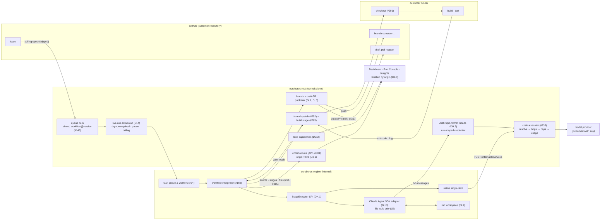
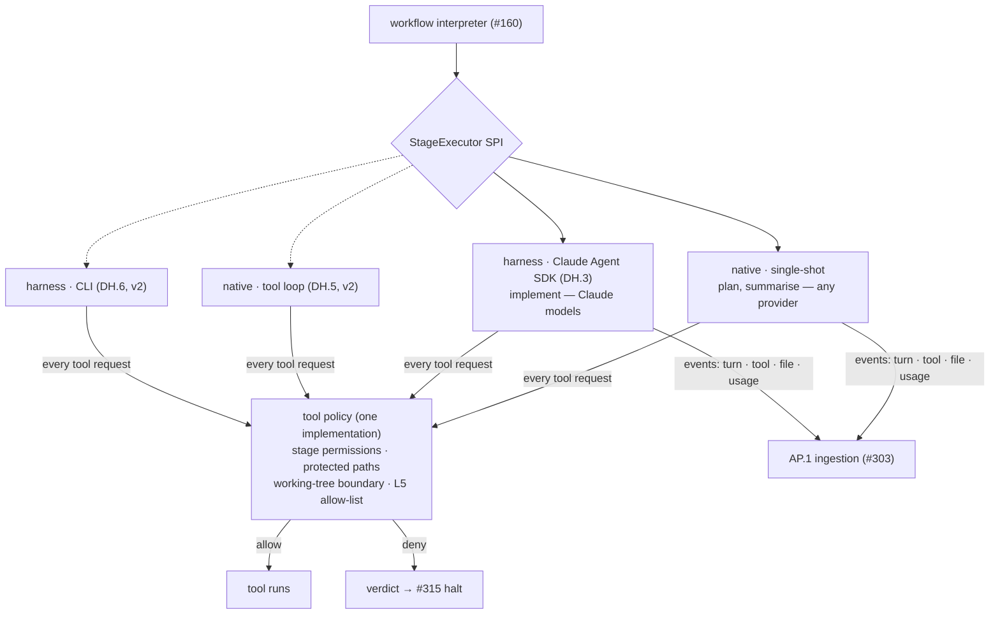
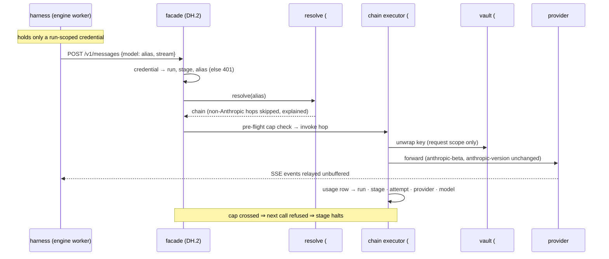
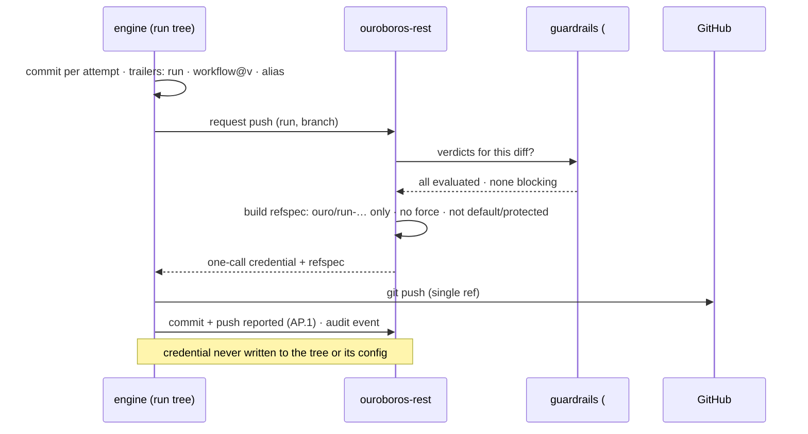
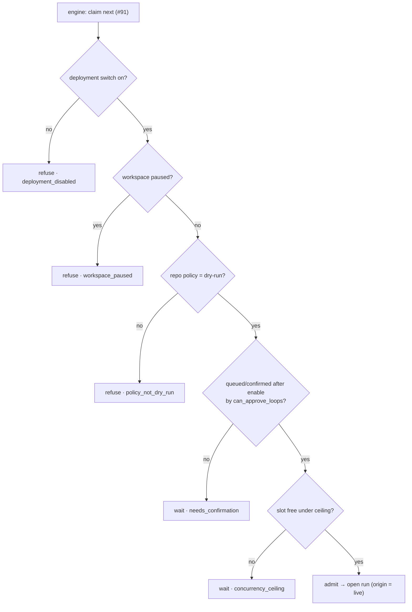
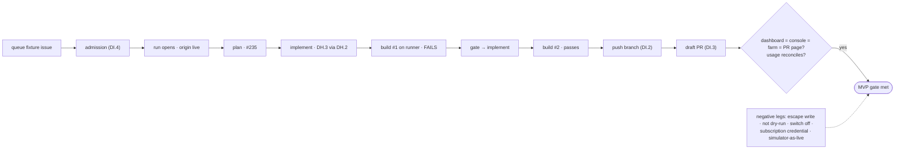
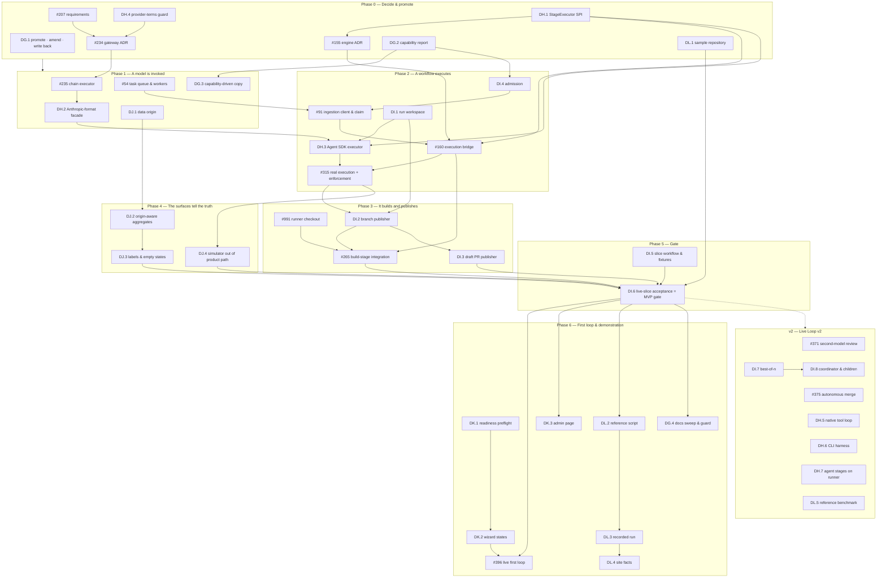

# Roadmap — Order of Execution (Live Loop)

## Description

> Live Loop: make the first real issue-to-merge run happen. Ouroboros has shipped a control plane proven by simulated runs, but no autonomous run has ever executed: workflow execution, live model invocation, guardrail enforcement and loop-created pull requests are open v2 issues. Promote and order that execution chain, decide the engine (with an option to execute stages through an agent harness), and deliver a thin vertical slice from one GitHub issue to one draft pull request, with real-run ingestion replacing the simulated driver.

This document succeeds [`ROADMAP_OOE_MVP.md`](ROADMAP_OOE_MVP.md). That plan
ordered the control plane and ended with an open decision it could not settle:
promote the chain executor (`AF.2`, #235) and the task skeleton (`6.5`, #54)
into the MVP, or defer everything that needs a model. This roadmap takes that
decision, and it is mostly a **sequencing document**: the execution chain is
already specified in filed `v2` issues, and those issues stay the authority on
*what* they contain. This document is the authority on *when* they are built,
on the amendments they need, and on the thirty-one new issues that cover what
nothing filed covers.

**Status vocabulary, used strictly throughout.** *Shipped* — the issues are
closed on GitHub. *Planned MVP* — filed with `mvp`, open. *Planned v2* — filed
with `v2`, open. *Not filed* — proposed here, no GitHub issue exists. Nothing
in this document describes planned work as existing; where a sentence describes
behaviour in the present tense, the issue that delivered it is closed.

## Context & Existing Work (duplicate-avoidance survey)

Surveyed 2026-10-10 against `NobuData/ouroboros` (`gh issue view`,
`gh issue list --search … --state all`, read-only) and the checkout at `main`.

**Source of the scope.** The competitor gap analysis of 2026-10-10
(`ouroboros-studio/reports/Ouroboros competitor gap analysis.md`, section
*P0-1 · Live Loop: the first real issue-to-merge run*) and its own-product
inventory note. Its headline finding is the reason this roadmap exists: every
executor Ouroboros is compared with ships issue-to-pull-request execution, and
Ouroboros's is four open `v2` issues. Twenty of twenty-three screens have every
MVP issue closed; none of them has ever shown a run that a model, a repository
and a runner actually performed.

**What is shipped that this roadmap stands on** (all closed):

- **The run ingestion contract** — `POST/PATCH /internal/runs` with events,
  stage transitions, files, commits and resources (AP.1, #303), console reads
  (#304), guardrail *evaluation* (AP.3, #305), the control queue for
  pause/abort/steer (AP.4, #306). A run's `simulated` watermark follows the
  principal that opened it: the simulated-run driver presents
  `OURO_RUN_SIMULATOR_SECRET`, a real executor presents
  `OURO_ENGINE_SHARED_SECRET` (`.env.example`). No real executor exists to
  present it.
- **The simulated-run driver** (AP.5, #307) — `ouroboros_simulator` with nine
  scenarios (`happy_path`, `first_loop`, `correction_round`, `failing_hil`,
  `gate_return`, `guardrail_violation`, …). It is development-only: the
  production engine image does not carry it, and a deployment with
  `OURO_RUN_SIMULATOR_SECRET` unset runs no simulator.
- **Routing resolution** (Z.1, #194) — `resolve()` returns the ordered concrete
  chain, the floor and the cost cap. Nothing executes it.
- **The provider adapter SPI** (AC.1, #216) with five adapters; `invoke?()` and
  the `invocation` capability are *reserved* in
  `ouroboros-rest/src/modules/providers/provider.adapter.ts`, and the worker
  credential-delivery contract (AD.3, #224) defines `POST /internal/llm/invoke`.
  The route answers `501 invocation_not_implemented`, always
  (`ouroboros-rest/src/modules/internal/llm.controller.ts`).
- **The engine's control-plane client and gateway transport**
  (`ouroboros_engine/control_plane/`, `ouroboros_engine/copilot/gateway.py`)
  — a complete, streaming NDJSON client for the invoke route.
- **The deep dry-run harness** (CD.2, #560) — walks a workflow draft, runs model
  stages through the gateway, and applies tool calls to a `VirtualWorkspace`
  behind a guarded tool boundary. Nothing is flushed to a repository.
- **The engine clone cache** (CL.4, #617) — bare mirrors under
  `OURO_ENGINE_CLONE_DIR`, fetched with a credential handed over for one call
  and never written down; read-only by construction (`ReadOnlyRepo`).
- **The farm** — runner agent, enrolment, mTLS, dispatch (AH.4, #252), log
  ingest, and `build_jobs.run_id` nullable since AH.1 (#249) for exactly the
  linkage #265 fills.
- **The PR plane** — SPI PR capability with `createPR` (AX.1, #357), gate
  engine (#358), criteria and evidence (#359), merge executor with its
  transactional re-check (#360), `pull_requests.run_id` nullable for #375.
- **The dry-run policy plane** (BA.3, #382) and the first-run launcher (BB.5,
  #388), whose completion state already has a slot for a live run reference.

**One question the inventory left open, resolved by reading the code.** The
inventory could not establish how the closed Research engine epic (CM) and
Copilot services (CD.1–CD.3) obtain model output while invocation answers
`501`. They do not. Both send through the same `Gateway`; a `501
invocation_not_implemented` becomes the named state `gateway_unavailable`,
which the conversation and the investigation surface as an honest refusal
(`copilot/gateway.py`, `investigation/model.py`, read 2026-10-10 — module
docstrings and call sites, not a running stack). Those epics closed with the
gateway absent and are unlit until #235 lands. **#235 is therefore the first
user-visible change in this roadmap**, before any loop runs.

### Existing issues promoted by this roadmap

This roadmap re-specifies none of these. *Order* is the position in the Work
Order below. *Amendment* is posted as a comment at filing time (DG.1) and does
not rewrite the issue body.

| # | Ref | Title | Current label · milestone | Proposed label · milestone | Order | Amendment |
|---|-----|-------|---------------------------|----------------------------|:-----:|-----------|
| #207 | AB.1 | Invocation-gateway requirements handoff | `v2` · Model Routing v2 | **`mvp`** · Live Loop MVP | 1 | Promoted because #234 names it as a written input and it is still open. Add one requirement: the executor must be reachable in **Anthropic Messages format** by a stage harness (DH.2), with per-call usage capture — and say whether vote execution may be deferred past the slice (this roadmap proposes yes). |
| #234 | AF.1 | Invocation gateway ADR | `v2` · Providers & Keys v2 | **`mvp`** · Live Loop MVP | 2 | Evaluate both candidates against a **fourth consumer**: an agent harness that makes its own model calls (decision L3). LiteLLM already exposes an Anthropic-format endpoint; the custom executor would need DH.2. Record which adapters may serve invocation under their providers' terms (DH.4). |
| #155 | T.1 | Execution engine ADR (custom vs Temporal vs Hatchet) | `v2` · Workflow Studio v2 | **`mvp`** · Live Loop MVP | 2 | The ADR gains a **second axis** (decision L2): *orchestration* (custom / Temporal / Hatchet — unchanged) and *stage execution* (native model call / agent harness — DH.1). The restart-resume prototype must include a stage that is a harness session, because a harness has its own session state to resume. |
| #54 | 6.5 | Task execution skeleton (queue & worker model) | `v2` · — | **`mvp`** · Live Loop MVP | 2 | None to scope. Note: `POST /v0/tasks/echo` exists as the contract exemplar; the registry, queue and workers do not. The OOE plan recommended this promotion; it was never applied. |
| #235 | AF.2 | Chain executor implementation | `v2` · Providers & Keys v2 | **`mvp`** · Live Loop MVP | 3 | **Vote execution may be deferred** to #371 (the slice has no vote rule). `invoke()` is required for the adapters DH.4 clears; an adapter that is not cleared ships `invocation: false` with a stated reason and its conformance suite records that, instead of "all five implement `invoke()`". Lights up Research (CM) and Copilot (CD) as a side effect — say so in the release note. |
| #991 | AG.7 | Source checkout — run a submitted build on a real runner | `mvp` · Build Farm MVP | unchanged | 3 | Already MVP; ordered here because the slice's build stage cannot run without it. The credential decision it defers must be **taken**, not deferred: the slice's branch lives in the customer's repository, which is usually private (decision L9). |
| #91 | J.3 | Engine→read-model ingestion bridge | `v2` · — | **`mvp`** · Live Loop MVP | 4 | Run Console decision R2 moved the ingestion contract to AP.1 (#303, closed) and left this issue's disposition open ("close as superseded, or retain"). **Retain, narrowed** to what is unbuilt: the engine-side client with retry and idempotency keys, queue-consumption semantics (claim the `queue_items` head, open a run, remove the item), `token_usage` attribution to run and stage, and the dashboard-side verification. Its first acceptance criterion (a *simulated* engine run) is replaced by DI.6's live leg. |
| #160 | T.6 | Workflow execution bridge | `v2` · Workflow Studio v2 | **`mvp`** · Live Loop MVP | 5 | Stage dispatch goes through the **`StageExecutor` SPI** (DH.1) rather than a hard-wired model call. "Permission enforcement at the tool boundary" is implemented once, in the SPI's tool policy, so native and harness executors cannot diverge. The terminal `PR auto-merged` in its diagram is out of the slice — the slice ends at a draft pull request (DI.3). |
| #315 | AR.1 | Real-execution integration & guardrail enforcement | `v2` · Run Console v2 | **`mvp`** · Live Loop MVP | 6 | "Pause between tool calls" is defined per executor kind in DH.1: a harness executor pauses at its `PreToolUse` boundary. Add one criterion: enforcement is proven **against the harness executor**, not only a native one, because a harness that ignored a deny would be an enforcement-shaped UI that enforces nothing. |
| #265 | AJ.3 | Workflow build-stage integration | `v2` · Build Farm v2 | **`mvp`** · Live Loop MVP | 7 | The gap analysis lists this as *later*; this roadmap promotes it (decision L8, **validation point**) because the slice's definition includes one build on a real runner and nothing else links a run to a farm job. No scope change. If the promotion is rejected, the slice runs a workflow with no build stage and says so. |
| #396 | BD.1 | Live first-loop experience | `v2` · Onboarding v2 | **`mvp`** · Live Loop MVP | 10 | Depends additionally on DK.1 (readiness preflight): the wizard must not start a live loop it can already see will fail. "MVP behaviour unchanged in deployments without execution" becomes "…in deployments where DG.2 reports execution unavailable". |
| #375 | AZ.5 | Loop-created PRs end-to-end | `v2` · PR Verification v2 | **stays `v2`** | after gate | **Split.** Its first half — push the branch, `createPR`, link `run_id` — is delivered in the MVP by DI.2 and DI.3 as a *draft* under dry-run policy. #375 keeps what makes it v2: policy auto-arm, the autonomous merge with its TOCTOU test, revision mapping from correction rounds, and `merged` outcome finalisation. |
| #371 | AZ.1 | Second-model review gate | `v2` · PR Verification v2 | **stays `v2`** | first after gate | Not in the slice — the slice ends with a human reading a draft. Recorded here because #235 unblocks it and the gap analysis names it as the next gate to close; it is the recommended first promotion once DI.6 is green, and it brings vote execution with it. |

**Ten issues are relabelled `v2` → `mvp`**, one is already `mvp` and is
ordered, and two stay `v2` with an amendment. The parent epics (#63, #131,
#215, #242, #297, #351, #379) keep their `v2` label — they still hold v2
children — and the promoted issues stay their sub-issues; the six epics below
parent only the new issues.

**Referenced and deliberately left alone:**

| Existing work | Disposition under this roadmap |
|---|---|
| #237 AF.4 cap enforcement & spend alerts (`v2`) | **Not promoted.** Owned by the spend-governance roadmap (gap analysis P1-4; an untracked `ROADMAP_SPEND_GOVERNANCE.md` draft appeared in `docs/` while this document was being written and was not read). The slice relies on what #235 itself enforces: the per-run and per-route cost cap, pre-flight and while running. |
| #208 AB.2 traffic-derived health (`v2`) | **Not promoted.** #235 emits its telemetry; nothing in the slice reads it. |
| #89 J.1 SSE live channel (`v2`) | **Not promoted.** Polling at fifteen seconds is slow, not false. First candidate after the gate. |
| #92 J.4 priced token accounting (`v2`) | **Not promoted; needs a disposition check.** Its price table and "unpriced, never `$0`" rule look delivered by the model-registry pricing catalogue (CH.3, #586, closed). Whether #92 is fully superseded was **not verified** here — DG.1 carries the check. |
| #122 O.1 GitHub App & webhooks, #374 AZ.4 App merge identity (`v2`) | **Not promoted.** The slice pushes and opens its pull request with the existing workspace credential (K.3, #101) and is started by a person. Webhook intake and an App identity belong to the proposed protocols roadmap (P2-9). |
| #319 AR.5 verified secrets scanning, #316 AR.2 IDE take-over (`v2`) | **Not promoted.** Both sit behind #315. |
| #123 O.2 LLM estimator, #289 AN.1 LLM planner, #343 AV.1 LLM triage (`v2`) | **Unblocked, not promoted.** Each needs only #235. Out of scope for a first run. |
| Copilot CD.4–CD.6 (#562–#564), CE.1–CE.5 (#565–#569); Research CN.3/5/7/8 | **Unblocked.** Open `mvp` issues whose stated prerequisite is #235. |
| The proposed `ROADMAP_AGENT_RUNTIME_SECURITY.md` (gap analysis P0-2; no file in `docs/` on 2026-10-10) | **Boundary stated, not duplicated.** This roadmap ships the slice with a deliberately small attack surface (decision L5) and leaves trigger trust, constrained outputs, credential-isolating proxies, egress policy, signed commits and the threat model to that roadmap. The slice must not be offered beyond the conditions in L5 until it exists. |
| The proposed `ROADMAP_TRUST_CENTRE.md` (P0-3; an untracked draft appeared in `docs/` while this document was being written and was not read) | **Boundary stated.** It owns removing or relabelling false site claims *now*. DL.4 owns replacing the hero statistics with measured facts *once they exist*. |

### Survey record

Thirty-seven search terms were run with
`gh issue list -R NobuData/ouroboros --search "<term>" --state all`. Results
that bear on scope:

| Terms | Result | Disposition |
|---|---|---|
| `harness`, `agent sdk`, `Claude Agent SDK`, `tool loop` | `harness` matches the Copilot deep dry-run harness (#560, closed) and test harnesses only; `Claude Agent SDK` returns nothing | No issue covers executing a stage through an agent harness → **DH.1–DH.3, DH.6 new**. #560's tool boundary is reused, not rebuilt (DH.5). |
| `vertical slice`, `first real`, `live loop` | #396, #315, #160, #375, epics #63 / #297 / #379 | The chain itself is filed → promoted. No issue integrates or accepts the chain end to end → **DI.6 new**. |
| `simulated driver`, `simulated` | #307 (closed), #315, #91, #160, #371 | #315 keeps the driver for tests and drops the watermark for real runs. No issue removes the driver from the product path or labels what remains → **DJ.4 new**. |
| `seeded data`, `demo data`, `acme-robotics`, `run provenance` | Seed issues (#23, #68, #709, …) and docs pages; nothing on labelling seeded rows in the product | **DJ.1–DJ.3 new**. |
| `worktree`, `workspace checkout`, `private repository credential`, `installation token` | #991 (runner-side checkout), #101 (closed), #122, #374 | The runner's checkout is filed; the *engine's* writable working tree is not → **DI.1 new**. |
| `openPr`, `branch push`, `draft pull request`, `draft PR` | #375, #357 (closed), #396 | Push + create is the first half of #375 → **split** (DI.2, DI.3). |
| `provider terms`, `subscription` | Policy and digest issues only | **DH.4 new**. |
| `reference demonstration`, `sample repository`, `sandbox repository`, `hero statistics` | Sandbox repositories appear as test fixtures in #160, #315, #382; nothing public, nothing about the site's numbers | **DL.1–DL.5 new**. |
| `execution mode`, `kill switch`, `concurrency limit` | #489 workspace pause (closed), #126 write-back kill switch (`v2`), #397 | Workspace pause exists; nothing makes an executor honour it or bounds live concurrency → **DI.4 new**, reusing #489. |
| `restart resume`, `tool boundary`, `coding stage`, `implement stage` | #155, #160, #315, #265 | Covered by the promoted issues. Nothing new. |
| `best-of-n`, `coordinator`, `MCP` | Nothing | Best-of-n and coordinator runs are recorded as v2 (**DI.7, DI.8**). MCP belongs to P2-9 and is not touched here. |

Epic letters continue the repository's sequence (…DE, DF): this roadmap uses
**DG, DH, DI, DJ, DK, DL**.

## Infrastructure Options (researched — pick before filing)

External facts below were read on 2026-10-10. Each is marked **[verified]**
(the vendor's own page was read first-hand), **[search-level]** (a search
summary of the vendor's page; the page itself was not opened) or
**[unverified]**.

### 1. Stage execution — who runs the agent loop inside a stage

#155 decides how a *workflow* is orchestrated. It does not decide what happens
inside a stage that must read code, edit files and iterate. That is a separate
choice and the cheapest one still open.

| Option | What it is | Fit | Trade-offs |
|---|---|---|---|
| **A — `StageExecutor` SPI; native single-shot calls plus a Claude Agent SDK harness adapter for tool-using stages** ⭐ recommended for the slice | One interface in `ouroboros-engine`. Stages that need one answer (plan, summarise) call #235 directly. The `implement` stage runs a harness session through the [Claude Agent SDK](https://code.claude.com/docs/en/agent-sdk/overview), "a library that runs the Claude Code binary, with Claude Code's capabilities, such as built-in tools, permissions, sessions, and hooks" **[verified]**; Python package `claude-agent-sdk` **[verified]** | The quickest route to a competent editing agent: Linear, Warp Oz, Tembo and GitHub's agent hub all reach execution by running a vendor harness instead of building one (gap analysis, P0-1). The Studio already standardises on it (Studio decision P5). `PreToolUse` hooks return `allow`/`deny`, and a hook that times out means the tool call is **not** run **[verified]** — a fail-closed seat for #315's enforcement | The harness serves **Claude models only**: "Anthropic … doesn't support routing Claude Code to non-Claude models through any gateway" **[verified]**. Per-stage routing across providers is therefore real for single-shot stages and Claude-only for tool-using stages until option B exists. A second runtime inside the engine image (whether the Python wheel bundles the CLI, and its minimum Python, are **[unverified]**) |
| B — Native tool loop over #235 only | Promote #560's tool boundary from a `VirtualWorkspace` to a real working tree; the engine owns the loop, any provider serves it | Provider-neutral for every stage — the differentiator in full; no second runtime; reuses shipped code | Ouroboros owns agent quality (context management, edit reliability, recovery) that vendors spend whole teams on. #560 carries tool calls as fenced blocks in reply text, not native tool use. Recorded as **v2 (DH.5)** and as the swap-in if option A is rejected |
| C — CLI harness adapters (`codex exec`, `cursor-agent -p`, `claude -p`) | A generic subprocess adapter with a JSON event stream | Reaches several vendors' agents with one adapter kind. Codex documents `codex exec` with `CODEX_API_KEY` for automation **[search-level]**; Cursor's SDK is in public beta on token-based pricing with `CURSOR_API_KEY` **[search-level]** | Each CLI has its own permission model, event schema and terms; no common deny hook. **v2 (DH.6)** |
| D — OpenHands Software Agent SDK | An MIT-licensed Python agent SDK with its own agent server **[search-level]** | Open source, self-hostable, the nearest neighbour to Ouroboros's own stance | A second agent framework with its own model layer — whether the SDK's model layer accepts an arbitrary upstream is **[unverified]** — duplicating routing. Not pursued; noted for the ADR |
| E — Decide nothing; hard-wire a model call into #160 | What #160 implies today | No new interface | The decision gets made by accident and is expensive to reverse — **rejected** |

### 2. How a harness reaches a model without holding the customer's key

`SECURITY_MODEL.md` § 4 promises that a worker never holds a cloud provider
credential. A harness makes its own HTTP calls, so that promise needs a
mechanism, not a sentence.

| Option | What it is | Fit | Trade-offs |
|---|---|---|---|
| **A — Anthropic Messages-format facade over the chain executor, with a run-scoped credential** ⭐ recommended | `ouroboros-rest` exposes `/v1/messages` on the internal network. The harness is started with `ANTHROPIC_BASE_URL` pointing at it and a short-lived credential scoped to one run and stage. The facade resolves the alias, unwraps the real key for the duration of the call, forwards, and writes usage | Documented and supported: "Any gateway that exposes a supported API format works"; the Anthropic Messages format needs `/v1/messages` (token counting is optional) and must forward `anthropic-beta` and `anthropic-version` unchanged **[verified]**. With a gateway credential active, traffic "is billed per token to whoever owns the credential the gateway forwards" **[verified]** — the customer's own key. Keys stay in the control plane; every call is metered where the cap is enforced | The gateway "becomes infrastructure your organization operates" and must be re-tested against harness releases; a gateway that buffers a stream stalls the client, and error bodies must be forwarded unmodified **[verified]**. Fallback is restricted to Anthropic-format hops (first-party API, or a Bedrock / Agent Platform / Foundry hop the gateway bridges) |
| B — Hand the engine the provider key for the session | Set `ANTHROPIC_API_KEY` in the harness environment | No facade to build | Breaks § 4 outright; usage is whatever the harness reports afterwards; the SDK's `max_budget_usd` is a client-side estimate that "can overshoot" **[verified]** — **rejected** |
| C — Self-hosted LiteLLM as the facade | If #234 chooses LiteLLM, it already speaks this format | No facade to write | Only if #234 goes that way; otherwise a second service for one endpoint. The decision is #234's — DH.2 is written so either outcome satisfies it |

### 3. Provider terms — which credentials may serve invocation

| Fact | Status | Consequence |
|---|---|---|
| "Unless previously approved, Anthropic does not allow third party developers to offer claude.ai login or rate limits for their products, including agents built on the Claude Agent SDK." ([Agent SDK overview](https://code.claude.com/docs/en/agent-sdk/overview)) | **[verified]** | The harness runs on API-key or cloud-provider credentials only. A subscription OAuth token must be refused at connection time, not discovered at run time (DH.4) |
| Developers "should use API key authentication through Claude Console or a supported cloud provider … developers may not collect, store, or intermediate Claude.ai credentials or session tokens" ([Legal and compliance](https://code.claude.com/docs/en/legal-and-compliance)) | **[verified]** | Same. The vault must never store a claude.ai session credential |
| The same page: this "does not restrict how customers provision and manage their own API keys … provided the resulting usage is billed to the key owner … and is not resold or intermediated" | **[verified]** | The self-hosted, customer-key model is the permitted shape |
| The same page, on products that preinstall or run Claude Code: "Customers may not pay for, resell, or intermediate Claude usage on their end users' behalf", and the binary must run unmodified with no built-in authentication method "removed, disabled or restricted" | **[verified]** as text; **its application is [unverified]** | Two open questions for the owner, neither answerable from documentation: whether pinning the harness to gateway-credential authentication counts as *restricting* a method (the SDK overview itself directs builders to API keys), and whether a future hosted tier with pooled keys (#397) is compatible at all. A written answer from Anthropic is a **validation point** (decision L4) before DH.3 ships to anyone but the owner |
| Agent SDK use "is governed by Anthropic's Commercial Terms of Service"; "Claude Code" may not be used as a product or feature name | **[verified]** | UI copy says "Claude Agent" or names the model; never "Claude Code" (DH.3) |
| Kiro: "Use through third-party automation harnesses (such as OpenClaw) that route requests outside of Kiro's native interfaces is not permitted." ([Kiro pricing FAQ](https://kiro.dev/pricing/)) | **[verified]** | No Kiro adapter for invocation. None is planned; recorded so one is not added by analogy |
| The February 2026 press coverage of Anthropic's restriction ([WinBuzzer](https://winbuzzer.com/2026/02/19/anthropic-bans-claude-subscription-oauth-in-third-party-apps-xcxwbn/)) | Secondary; superseded by the two first-hand quotations above | Cited by the gap analysis; not relied on here |
| Whether a GitHub Copilot subscription credential may serve programmatic model invocation from a third-party orchestrator | **[unverified]** — no primary terms text was found; a third-party guide says no standalone inference API exists | The shipped Copilot adapter keeps `invocation: false` until DH.4 records a primary source |
| Whether a Cursor API key may serve invocation from a third-party orchestrator | **[unverified]** — a Cursor forum reply calls backend use of the Cursor SDK "supported and intended"; the terms of use were not read | Same treatment as Copilot |

### 4. Orchestration and the invocation gateway — already filed

Both are options tables inside existing issues and are not repeated here:
custom asyncio interpreter over #54 versus Temporal versus Hatchet-class
platforms (#155, which recommends the custom interpreter with measured
graduation triggers), and a custom executor over the adapter SPI versus
self-hosted LiteLLM, with hosted gateways excluded (#234). This roadmap adds
one input to each (see the promotion table) and no option.

### 5. Where a tool-using stage runs

| Option | What it is | Fit | Trade-offs |
|---|---|---|---|
| **A — In an engine worker, file tools only; all code execution on runners** ⭐ recommended for the slice | The `implement` stage may read, search, edit and write inside one per-run working tree. It has no shell, no network tool and no MCP server. Building and testing happen in the workflow's build stage on a customer runner (#991, #265) | Removes the incident class the gap analysis documents (an agent running an attacker's binary; exfiltration over a permitted command) by construction rather than by policy. The correction loop still works: a failed build returns to `implement` with the log. Needs nothing from the unwritten runtime-security roadmap | The agent cannot run a test while it writes. Slower convergence on anything that is not small. A repository whose `.claude/` settings define hooks must not have them loaded — `setting_sources=[]` is mandatory **[verified that the option exists]** |
| B — As a farm job on a customer runner, shell enabled | The runner checks out the repository and runs a stage-executor image | The right long-term home: the customer's machine, the customer's sandbox | Needs job-to-control-plane networking for the facade, a sandbox and egress policy, and credential isolation — the scope of P0-2. **v2 (DH.7)** |
| C — In the engine with a shell | Simplest to build | — | Arbitrary code execution inside the control plane, beside the shared secret — **rejected** |

### 6. Proving the slice without spending on every CI run

| Option | What it is | Fit | Trade-offs |
|---|---|---|---|
| **A — Recorded provider fixture at the HTTP boundary for CI, plus a documented manual run against a real provider** ⭐ recommended | The e2e stack runs a fixture server that replays a recorded Anthropic-format exchange. Everything above the provider's socket is real: executor, facade, harness, working tree, runner, push, pull request. A real-provider run is a scripted acceptance step with a human-supplied key (DI.6, DL.2) | Deterministic, free, and honest about what it is — the fixture is at the same boundary #371 and CN.8 already use | A fixture cannot catch a provider-side change; the manual run and the reference demonstration exist for that |
| B — Real provider in nightly CI | A funded key in a CI secret | Catches drift | Cost, flakiness, and a key in CI. Reconsider after the reference benchmark (DL.5) |

## Decisions proposed by this roadmap (validate before issue creation)

| # | Decision | Rationale |
|---|----------|-----------|
| L1 | **Promote the execution chain to `mvp`**: #207, #234, #155, #54, #235, #160, #315, #91, #265, #396. New label **`live-loop`** on every promoted and new issue; milestones **`Live Loop MVP`** / **`Live Loop v2`** | `ROADMAP_OOE_MVP.md` recommended promoting #235 and #54 and left it undecided. Every differentiator in the gap analysis's matrix is hypothetical until one run executes. **Validation point: this reverses the "MVP is proven by simulated runs" position in four roadmaps.** |
| L2 | **The engine decision has two axes, decided separately**: orchestration in #155 (unchanged options) and stage execution through a `StageExecutor` SPI (DH.1) | #155 as filed cannot express "run the stage through a harness". Without the second axis the choice is made implicitly inside #160. |
| L3 | **The slice executes its tool-using stage through the Claude Agent SDK; single-shot stages call #235 directly; the native tool loop is v2 (DH.5)** | The cheapest path to a competent editing agent, and the Studio's existing standard. **Validation point: this makes the MVP's `implement` stage Claude-only**, which is narrower than the product's "any provider per stage" claim. The fallback is recorded: swap DH.5 into the MVP and DH.2/DH.3 out. |
| L4 | **Harness execution runs on API-key or cloud-provider credentials only; subscription credentials are refused at connection time; Copilot and Cursor adapters do not serve invocation until a primary-source terms record exists** (DH.4) | Infrastructure option 3. **Validation point: obtain Anthropic's written reading of the two open questions before DH.3 is offered beyond the owner's own deployment.** |
| L5 | **In the slice, the agent has file tools only, confined to one working tree; no shell, no network tool, no MCP, no repository-supplied settings or hooks. Code runs only on runners. A live run is started only by a signed-in person with the approval capability.** | Lets the first run ship before the runtime-security roadmap exists without pretending that roadmap is unnecessary. Issue text is still untrusted input; under L5 the worst a poisoned issue can do is produce a bad diff in a draft pull request a person reads. |
| L6 | **The harness reaches models only through an Anthropic Messages-format facade over the chain executor, with a run-scoped credential** (DH.2). The provider key never enters the engine | Keeps `SECURITY_MODEL.md` § 4 true and puts metering and the cost cap on the path of every call. |
| L7 | **The slice ends at a draft pull request. Dry-run policy is required, not merely defaulted: live execution refuses to start for a repository whose policy is not dry-run.** Auto-arm and autonomous merge stay in #375 (`v2`) | The description's own boundary, and the gap analysis's MVP line: "draft pull requests only, human merge". GitHub's draft state is itself a stop: "Draft pull requests cannot be merged" **[verified]**. |
| L8 | **Promote #265** so the slice's build runs on a real runner, linked to the run | The slice's definition names a real build. **Validation point** — the gap analysis placed #265 in *later*. Fallback: a slice workflow with no build stage, stated as such in the MVP definition. |
| L9 | **#991's credential decision is taken in the slice: the runner receives a short-lived, repository-scoped credential for one checkout, by the same one-call hand-over the engine clone cache uses.** Anonymous-only is not sufficient | The run's branch lives in the customer's repository. A slice that works only on public repositories is a demonstration, not a product. |
| L10 | **Live execution is off by default per deployment (`OURO_LIVE_EXECUTION_ENABLED`) and capability-reported per workspace** (DG.2). One live run at a time per workspace until raised | A deployment that upgrades must not start executing because a label changed. Capability reporting is what lets UI and docs retire "simulated" one stage at a time. |
| L11 | **Every run and every aggregate carries a data origin — `live`, `simulated` or `seeded` — and non-live data is labelled wherever it is shown or counted** (DJ.1–DJ.3). Aggregates default to live-only | "Real-run ingestion replacing the simulated driver" is only checkable if the product can say which rows are which. The inventory could not establish what a fresh production deployment shows; DJ.3 makes that a tested property. |
| L12 | **The simulated driver stays as a test and development tool and leaves the product path** (DJ.4). It is not deleted | #315 already keeps it for tests. Nine scenarios exercise interleaving and control acknowledgement that a single live run never will. |
| L13 | **The reference demonstration publishes what one run measured — duration, cost, the pull request — and no rate or percentage until a sample supports one** (DL.3–DL.5) | The site's `92% autonomous merge rate` comes from a fictional tenant. Replacing it with a percentage drawn from one run would be the same error in a new place. |
| L14 | **`ROADMAP_OOE_MVP.md` is not edited by this roadmap's phases; it gains a pointer and its open-decision table is closed out** (DG.1) | That document sequences the control plane and is nearly complete. Mixing a second critical path into it would hide both. |

## Architecture Overview



Three properties of this picture are the design, not incidental to it. The
provider key appears in exactly one box. Code executes in exactly one box, and
it is the customer's. And nothing between the queue and the draft pull request
is a new surface: the console, the farm page and the PR page already render
every event this path produces.

## MVP Definition

The MVP is **one real run, from one GitHub issue to one draft pull request,
that a second person can reproduce**. It is done when, on a self-hosted
deployment with `OURO_LIVE_EXECUTION_ENABLED=true`, one enrolled runner and one
provider connection holding the customer's own API key:

1. **The engine decision is written down.** #155 and #234 are merged ADRs with
   measured prototypes; the `StageExecutor` SPI (DH.1) is specified with the
   harness option evaluated against the native one; DH.4 records which
   adapters may serve invocation and why.
2. **A model is actually invoked through the registry.** `POST
   /internal/llm/invoke` (#235) walks a resolved chain, fails over exactly as
   the routing explanation predicted, enforces the per-run cost cap before and
   during the call, and writes a usage row per hop. The route no longer
   answers `501`. Research and Copilot stop reporting `gateway_unavailable`.
3. **A published workflow version executes.** A person with the approval
   capability queues one issue; the engine claims it (#54, #91), interprets the
   pinned version (#160), and stage transitions appear in the run console as
   they happen, with no `simulated` watermark and `origin = live` (#315, DJ.1).
4. **The implement stage edits a real working tree** (DI.1) through the harness
   adapter (DH.3), reaching the model only through the facade (DH.2). A planted
   attempt to write outside the tree, to a protected path, or to use a tool the
   stage does not declare is **refused before it happens** and recorded as a
   guardrail verdict that halts the stage (#315).
5. **The build runs on a real runner** (#991, #265): the pinned commit of the
   run's branch is checked out with a short-lived credential, the job is linked
   to the run, its log is reachable from the console, and its exit code decides
   the gate. A failing build returns to `implement` once, bounded by the
   workflow's retry limit.
6. **A draft pull request opens** (DI.2, DI.3) on a single branch named for the
   run, with the run summary and the imported acceptance criteria in its body
   and `pull_requests.run_id` set. Nothing merges; live execution refuses to
   start where dry-run policy is off (L7).
7. **The surfaces tell the truth about their data** (DJ.1–DJ.4): the run
   appears on Dashboard, Run Console and Insights as live data; any seeded or
   simulated row is labelled wherever it is shown or counted; a fresh
   production deployment shows empty states, not a demonstration tenant; the
   simulated driver is unreachable from the product path.
8. **The wizard ends on that pull request** (#396, DK.1, DK.2): a readiness
   preflight names anything missing before a loop starts, the timeline binds to
   real transitions, and a failed first loop says why.
9. **"Simulated" wording is retired where it stopped being true** (DG.2–DG.4),
   stage by stage, driven by the capability report rather than by a release
   date.
10. **The run is reproducible and published** (DL.1–DL.4): a public sample
    repository, a script that performs the run from a clean checkout, a
    recording and evidence bundle, and a marketing page whose numbers are that
    run's numbers.
11. **The gate is automated** (DI.5, DI.6): the e2e suite runs the whole path
    from cold compose against a recorded provider fixture, with every component
    above the provider's socket real; a documented real-provider run is part of
    acceptance.

**Explicitly v2 (milestone `Live Loop v2`):** autonomous merge of loop pull
requests (#375), the second-model review gate (#371), a provider-neutral native
tool loop (DH.5), CLI harness adapters for other vendors (DH.6), shell-enabled
agent stages on runners (DH.7, behind the runtime-security roadmap),
best-of-n attempts (DI.7), coordinator and child runs (DI.8), and a reference
benchmark large enough to state a rate (DL.5).

**Explicitly not in this roadmap at all:** webhook or event-triggered intake,
any tracker other than GitHub, any second code host, spend budgets beyond the
per-run cap #235 already enforces, the threat model and runtime controls of
P0-2, and hosted or managed-key execution.

## Epics, Labels & Milestones

Each epic is a parent tracking issue on GitHub; every new issue below is filed
as one of its sub-issues (GitHub Relationships). Promoted issues keep their
existing parents.

| Epic | GitHub | Status | Name | Goal | Modules | Milestone |
|------|:------:|:------:|------|------|---------|-----------|
| DG | — | 📝 Not filed | Promotion & Sequencing | Relabel and order the chain; report which loop stages are live; retire "simulated" wording as each one is | ouroboros (repo), ouroboros-rest, ouroboros-ui, ouroboros-docs | Live Loop MVP |
| DH | — | 📝 Not filed | Engine Decision & Harness Adapter | The stage-executor SPI, the harness adapter and its gateway facade, the provider-terms guard | ouroboros-engine, ouroboros-rest, ouroboros-runner | Live Loop MVP / v2 |
| DI | — | 📝 Not filed | Thin Vertical Slice | Working tree, branch and draft-PR publishing, admission, fixtures, the acceptance gate | ouroboros-engine, ouroboros-rest, ouroboros-db, tests/e2e | Live Loop MVP / v2 |
| DJ | — | 📝 Not filed | Real-Run Ingestion | Data origin on runs and aggregates, labelled surfaces, the simulated driver out of the product path | ouroboros-db, ouroboros-rest, ouroboros-ui, ouroboros-engine | Live Loop MVP |
| DK | — | 📝 Not filed | Live First Loop | Readiness preflight, wizard states, the operator's page for switching execution on | ouroboros-rest, ouroboros-ui, ouroboros-docs | Live Loop MVP |
| DL | — | 📝 Not filed | Reference Demonstration | A public sample repository, a reproducible run, published evidence, truthful site numbers | ouroboros (repo), ouroboros-web, ouroboros-docs | Live Loop MVP / v2 |

Issue naming: `<project>: [<epic>.<issue>] <title>`; repository-level work uses
`ouroboros:` (the precedent is `ouroboros: [7.2]` and `ouroboros: [DE.1]`).
Labels: the existing set (`mvp`, `v2`, `ui`, `rest`, `db`, `engine`, `infra`,
`ci`, `design`, `documentation`, `docs-site`, `workflow`, `routing`,
`providers`, `build-farm`, `runs`, `pr`, `onboarding`, `dashboard`,
`insights`) **plus new `live-loop`** (decision L1), added to
`.github/labels.yml` at filing. `ouroboros-web` has no module label and none is
proposed. Milestones **`Live Loop MVP`** / **`Live Loop v2`** are created at
filing; promoted issues move to `Live Loop MVP` from their `… v2` milestones.
Complexity chips: **XS · S · M · L**.

---

## Epic DG — Promotion & Sequencing

| Ref | GitHub | Status | Title | Summary | Labels | Parallel | MVP | Complexity | Affected Modules |
|-----|:------:|:------:|-------|---------|--------|:--------:|:---:|:----------:|------------------|
| DG.1 | — | 📝 Not filed | ouroboros: [DG.1] Promote the execution chain — labels, milestones, amendments & roadmap write-back | Relabel ten issues, post thirteen amendments, close out the OOE open decisions, write status back into seven roadmaps | mvp, live-loop, documentation | Y | Y | S | .github, docs |
| DG.2 | — | 📝 Not filed | ouroboros-rest: [DG.2] Loop capability report | One endpoint that says which loop stages are live in this deployment and workspace, and why not | mvp, live-loop, rest, runs | Y | Y | S | ouroboros-rest, ouroboros-docs |
| DG.3 | — | 📝 Not filed | ouroboros-ui: [DG.3] Capability-driven loop copy — retire "simulated" in the product | Banners, chips, tooltips and empty states read the capability report instead of asserting simulation | mvp, live-loop, ui, runs, design | N (after DG.2) | Y | M | ouroboros-ui, ouroboros-docs |
| DG.4 | — | 📝 Not filed | ouroboros-docs: [DG.4] Retire "simulated" in the documentation — sweep & wording guard | Every page and repository document that says the loop is simulated, corrected as its stage goes live; a check that keeps it so | mvp, live-loop, documentation, docs-site, ci | N (after DI.6) | Y | M | ouroboros-docs, docs, README.md, HOSTING.md |

### Issue DG.1 — ouroboros: [DG.1] Promote the execution chain — labels, milestones, amendments & roadmap write-back

> **GitHub issue:** — · **Status:** 📝 Not filed · **Parent epic:** DG

- **Problem Statement:** The execution chain is filed and labelled `v2` across
  seven roadmaps and seven parent epics. `ROADMAP_OOE_MVP.md` § *Open decisions*
  recommended promoting #235 and #54 and nobody applied it, so six `mvp` issues
  have depended on `v2` work since they were filed. A relabel without the
  amendments would promote the issues *as written*, including scope this
  roadmap changes (vote execution, the auto-merge terminal, "all five adapters
  implement `invoke()`").
- **Solution/Scope:** The filing pass for the existing issues, done once and
  reviewably:
  - Add `live-loop` to `.github/labels.yml` and run `scripts/sync-labels.sh`;
    create milestones `Live Loop MVP` / `Live Loop v2`.
  - Relabel `v2` → `mvp` and move milestone for #207, #234, #155, #54, #235,
    #160, #315, #91, #265, #396; add `live-loop` to those and to #991, #375,
    #371.
  - Post the thirteen amendment comments from this document's promotion table,
    each linking this roadmap. Bodies are not rewritten.
  - **Roadmap write-back**: flip the `MVP` column and label cells for the
    promoted rows in `ROADMAP_OUROBOROS_APPLICATION_SCAFFOLDING.md` (6.5),
    `ROADMAP_MOCKUP_02_DASHBOARD.md` (J.3), `_04_WORKFLOW_BUILDER.md` (T.1,
    T.6), `_06_MODEL_ROUTING.md` (AB.1), `_07_PROVIDERS_KEYS.md` (AF.1, AF.2),
    `_08_BUILD_FARM.md` (AJ.3), `_10_RUN_CONSOLE.md` (AR.1; and settle the open
    #91 disposition line as *retained, narrowed*), `_12_PR_VERIFICATION.md`
    (AZ.5 split note), `_13_ONBOARDING.md` (BD.1). Each roadmap's "explicitly
    v2" paragraph gains one sentence pointing here.
  - `ROADMAP_OOE_MVP.md`: mark the #235 and #54 rows of *Open decisions*
    resolved with the date, and add a pointer to this document under *Scope*
    (decision L14). No phase table is edited.
  - **Disposition check for #92**: read it against the shipped pricing
    catalogue (CH.3, #586) and either close it as superseded with a comment or
    comment what remains. This roadmap could not verify which.
  - Sources: this document's promotion table; `docs/CONVENTIONS.md` § 7
    (labels are code; roadmap status markers).
- **Acceptance Criteria:**
  - `scripts/sync-labels.sh --dry-run` reports no drift after the change.
  - `gh issue list --label mvp --label live-loop` returns the ten promoted
    issues plus #991; none of the ten still carries `v2`.
  - Every one of the thirteen issues has exactly one amendment comment linking
    this roadmap.
  - No roadmap file states `MVP = N` for an issue GitHub labels `mvp`.
  - #92 carries a comment stating its disposition.
- **Parallelism/Dependencies:** None — first item in the work order. Blocks
  nothing technically; everything else is easier to review after it.
- **Technical Stack:** `gh`, `.github/labels.yml`, Markdown.
- **Documentation:** none — internal-only change (labels, milestones and
  roadmap files; no product surface).
- **Epic:** DG

```
            before                              after
  #54  #235  #160  #315  …  [v2]      #54  #235  #160  #315  …  [mvp · live-loop]
  OOE § Open decisions: "Promote      OOE § Open decisions: "Resolved 2026-…
   AF.2 / 6.5" (unapplied)             → ROADMAP_OOE_LIVE_LOOP.md"
  7 roadmaps: MVP = N                 7 roadmaps: MVP = Y, pointer to this file
```

### Issue DG.2 — ouroboros-rest: [DG.2] Loop capability report

> **GitHub issue:** — · **Status:** 📝 Not filed · **Parent epic:** DG

- **Problem Statement:** "Is the loop real here?" has no single answer the
  product can read. The UI asserts simulation in fixed copy; the docs assert it
  in prose; the wizard decides for itself. As the chain lands stage by stage
  over several releases, each of those would have to be edited by hand at the
  right moment, and a deployment that has not enabled execution would be told
  the opposite of the truth by an upgrade.
- **Solution/Scope:**
  - `GET /api/v1/loop/capabilities` (workspace-scoped, any member) returning,
    per stage, `{available: boolean, reason: code | null, since_version}` for
    `invocation`, `execution`, `guardrail_enforcement`, `build_integration`,
    `pr_publishing`, plus the deployment switch and the stage-executor kinds
    registered (DH.1).
  - Availability is **computed, not configured**: `invocation` is true when the
    invoke route is implemented *and* the workspace has at least one connection
    whose adapter is cleared for invocation (DH.4); `execution` when
    `OURO_LIVE_EXECUTION_ENABLED` is on and the engine reports the task queue
    (#54) and an executor; `build_integration` when a runner with the `git`
    capability (#991) is online; and so on. Each `false` carries a stable
    reason code (`deployment_disabled`, `no_invocable_connection`,
    `engine_unavailable`, `no_runner`, `policy_not_dry_run`, …).
  - New variable `OURO_LIVE_EXECUTION_ENABLED` (default `false`) in the env
    registry, the module `.env.example` **and the top-level `.env.example`**
    (`AGENTS.md`), with `yarn gen:config-reference`.
  - OpenAPI addition — a minor (`0.0.x`) increment under the semver rule in
    `AGENTS.md`.
  - Sources: decision L10; the honest-states rule in `ROADMAP_OOE_MVP.md`
    § *Standing rules*.
- **Acceptance Criteria:**
  - On today's `main` the endpoint reports every stage unavailable with the
    correct reason — verified before any other issue in this roadmap lands.
  - Each capability flips when, and only when, its condition is met; a test per
    reason code.
  - With the deployment switch off, `execution` is `false` whatever else is
    true, and no live run can be admitted (asserted again in DI.4).
  - Organisation isolation: a workspace never sees another's connection or
    runner state through a reason.
- **Parallelism/Dependencies:** None to start. Consumes DH.4's eligibility and
  #54's engine status as they land. Blocks DG.3, DK.1.
- **Technical Stack:** NestJS, Kysely, the engine status client (#35).
- **Documentation:** Administration —
  `ouroboros-docs/docs/administration/configuration/` (the new variable, via
  `yarn gen:config-reference`) and
  `ouroboros-docs/docs/administration/deploy/containers.mdx` § *Optional*.
  Screenshots: none.
- **Epic:** DG

```
GET /api/v1/loop/capabilities
{ deployment_enabled: false,
  stages: {
    invocation:            {available: false, reason: "not_implemented"},
    execution:             {available: false, reason: "deployment_disabled"},
    guardrail_enforcement: {available: false, reason: "execution_unavailable"},
    build_integration:     {available: false, reason: "no_runner"},
    pr_publishing:         {available: false, reason: "execution_unavailable"} },
  executors: [] }
```

### Issue DG.3 — ouroboros-ui: [DG.3] Capability-driven loop copy — retire "simulated" in the product

> **GitHub issue:** — · **Status:** 📝 Not filed · **Parent epic:** DG

- **Problem Statement:** The product says "simulated" in places that are
  about to become wrong at different times: the run console's banner, the
  dashboard's run rows, the routing page's "Simulate" framing, the providers
  page's *"warning only — enforcement arrives with invocation"* tooltip, the
  wizard's `projected` chips, the PR page's `unavailable` review gate. Each
  existing issue retires its own piece (#315 the watermark, #396 the chips,
  #371 the gate). Nothing owns the copy that is *about the product as a whole*,
  or the state in between — execution enabled, no runner yet.
- **Solution/Scope:**
  - A `useLoopCapabilities()` hook over DG.2, cached with the shell's existing
    polling.
  - An inventory, committed with the issue, of every UI string that asserts
    simulation or unavailability of the loop, each mapped to the capability
    that makes it false and to the issue that already owns it, if one does.
  - For strings no issue owns: replace the fixed assertion with a
    capability-conditional one. Where a stage is unavailable, the copy names
    the reason from DG.2 and links the place to fix it (Providers, Build Farm,
    Policies) — the unavailable state is designed, not a missing banner.
  - A per-run banner stays **per run** (it follows the run's origin, DJ.1); a
    live deployment viewing an old simulated run still sees the banner.
  - Both themes; rem-based type; passes at 150% font scale.
  - Sources: the mockups' own honest-state conventions; `DESIGN_SYSTEM_APP_SHELL.md`.
- **Acceptance Criteria:**
  - No user-visible string asserts that runs are simulated when DG.2 reports
    `execution.available`; verified by a test that renders each inventoried
    surface under both capability states.
  - With execution unavailable, each surface names the reason and links the
    fix; no surface shows a spinner or a blank in place of the reason.
  - A simulated run viewed in a live deployment keeps its banner.
  - The inventory file lists every string with its owner; none is unowned.
- **Parallelism/Dependencies:** Needs DG.2. Coordinates with #315, #396, #371,
  #237 (each retires its own string). Parallel with the engine work.
- **Technical Stack:** Next.js, the generated API client, design tokens (#16).
- **Documentation:** User Guide —
  `ouroboros-docs/docs/user-guide/concepts.mdx` § *Dry-run and live* (what the
  product shows when a stage is unavailable). Screenshots: recapture
  `user-guide.concepts.loop-in-app`; add `user-guide.concepts.loop-unavailable`.
- **Epic:** DG

```
 capability state                what the run console head says
 ───────────────────────────────────────────────────────────────────────────
 execution unavailable      │ "Live execution is off for this deployment —
  (deployment_disabled)     │  ask an administrator"            [how to enable]
 execution available,       │ "No runner is online — builds will wait"
  build_integration false   │                                   [Build Farm →]
 all available, live run    │ (no banner)
 any state, simulated run   │ "Simulated run — no executor, repository or
                            │  model did the work shown"        (per run, DJ.1)
```

### Issue DG.4 — ouroboros-docs: [DG.4] Retire "simulated" in the documentation — sweep & wording guard

> **GitHub issue:** — · **Status:** 📝 Not filed · **Parent epic:** DG

- **Problem Statement:** The documentation site documents only what ships on
  `main` (docs roadmap decision D12), and what shipped was a simulation, so the
  site says so — correctly, today. On 2026-10-10 the word appears in
  `user-guide/glossary.mdx`, `concepts.mdx`, `pull-requests.mdx`,
  `runs/console.mdx`, `runs/tests.mdx`, the generated configuration reference
  and `administration/deploy/containers.mdx`, and in `README.md`, `HOSTING.md`
  and `docs/ARCHITECTURE.md`. #160, #315, #375 and #396 each name the pages
  *they* change. Nobody owns the pages none of them names, the repository
  documents, or the guarantee that the word does not creep back.
- **Solution/Scope:**
  - A checklist issue: one row per page and section, the stage that makes it
    false, and the issue whose pull request updates it. Rows owned by an
    existing issue are ticked by that issue's pull request; the remainder
    (glossary, `runs/tests.mdx`, `deploy/containers.mdx`, `README.md` § *A
    build machine* and the loop description, `HOSTING.md`, `ARCHITECTURE.md`
    § 2.3 / § 7.3) are edited here.
  - Rewrite the glossary's *simulated run* entry as a description of a test and
    development tool (DJ.4), and add *live run*, *data origin* and *draft-only
    loop*.
  - **Wording guard**: a `yarn check:loop-wording` step in `ci/docs` that fails
    when "simulated" appears in a page outside an allow-list (the glossary
    entry, the developer page on the driver). The allow-list is a file, so an
    exception is a reviewed diff.
  - Historical roadmap files under `docs/` are **not** rewritten — they record
    what was decided when; only their status markers move (DG.1).
  - Sources: `docs/CONVENTIONS.md` § 11; docs roadmap D12.
- **Acceptance Criteria:**
  - Every checklist row is ticked or carries a reason it still holds.
  - `yarn check:loop-wording` is red on a planted occurrence and green on
    `main` after the sweep; it runs in `ci/docs`.
  - No page describes a live capability that DG.2 would report unavailable on a
    default deployment without saying it must be enabled.
  - `ouroboros-docs` version moves (patch for edits, minor if a page is added).
- **Parallelism/Dependencies:** Final sweep after DI.6 (the gate); individual
  rows land with #160, #315, #396, DJ.4. Needs the docs site (shipped).
- **Technical Stack:** Docusaurus 3, the site's `check:*` scripts.
- **Documentation:** User Guide — `user-guide/glossary.mdx`,
  `user-guide/runs/tests.mdx`; Administration —
  `administration/deploy/containers.mdx`; repository documents `README.md`,
  `HOSTING.md`, `docs/ARCHITECTURE.md`. Screenshots: none beyond those the
  owning issues recapture.
- **Epic:** DG

```
 page / document                      stage that makes it false    updated by
 ────────────────────────────────────────────────────────────────────────────
 user-guide/concepts.mdx              execution                    #160, #315
 user-guide/runs/console.mdx          execution, enforcement       #315, #265
 user-guide/pull-requests.mdx         pr_publishing                DI.3
 user-guide/getting-started/*.mdx     execution                    #396, DK.2
 user-guide/glossary.mdx              —                            DG.4
 user-guide/runs/tests.mdx            build_integration            DG.4
 administration/deploy/containers.mdx execution                    DG.4, DK.3
 README.md · HOSTING.md · ARCHITECTURE.md   execution              DG.4
                                 └── ci/docs: check:loop-wording (allow-list)
```

---

## Epic DH — Engine Decision & Harness Adapter

| Ref | GitHub | Status | Title | Summary | Labels | Parallel | MVP | Complexity | Affected Modules |
|-----|:------:|:------:|-------|---------|--------|:--------:|:---:|:----------:|------------------|
| DH.1 | — | 📝 Not filed | ouroboros-engine: [DH.1] `StageExecutor` SPI & the harness option for the execution ADR | The second axis of #155: an interface for running a stage, a tool policy, and a measured native-versus-harness evaluation | mvp, live-loop, engine, workflow, documentation | Y | Y | M | ouroboros-engine, docs |
| DH.2 | — | 📝 Not filed | ouroboros-rest: [DH.2] Anthropic Messages-format facade over the chain executor | `/v1/messages` on the internal network with a run-scoped credential, per-call usage and the cost cap | mvp, live-loop, rest, providers, routing | N (after #235) | Y | L | ouroboros-rest |
| DH.3 | — | 📝 Not filed | ouroboros-engine: [DH.3] Claude Agent SDK stage executor | The harness adapter: file tools only, deny-by-hook, events into the run transcript | mvp, live-loop, engine, workflow, runs | N (after DH.1, DH.2, DI.1) | Y | L | ouroboros-engine, ouroboros-docs |
| DH.4 | — | 📝 Not filed | ouroboros-rest: [DH.4] Provider-terms guard — invocation eligibility per adapter & credential kind | Which connections may serve invocation, recorded with sources; subscription credentials refused | mvp, live-loop, rest, providers, documentation | Y | Y | S | ouroboros-rest, ouroboros-ui, ouroboros-docs, docs |
| DH.5 | — | 📝 Not filed | ouroboros-engine: [DH.5] Native tool-loop stage executor (provider-neutral) | #560's tool boundary on a real working tree, any provider, native tool use | v2, live-loop, engine, workflow, routing | Y | N | L | ouroboros-engine, ouroboros-rest |
| DH.6 | — | 📝 Not filed | ouroboros-engine: [DH.6] CLI harness adapter kind | A subprocess adapter for vendor command-line agents, each behind its own terms record | v2, live-loop, engine, providers | Y | N | M | ouroboros-engine, ouroboros-rest, ouroboros-docs |
| DH.7 | — | 📝 Not filed | ouroboros-runner: [DH.7] Agent stages on the runner | A shell-enabled stage as a farm job on the customer's machine | v2, live-loop, build-farm, engine, infra | N (after P0-2) | N | L | ouroboros-runner, ouroboros-rest, ouroboros-engine, ouroboros-docs |

### Issue DH.1 — ouroboros-engine: [DH.1] `StageExecutor` SPI & the harness option for the execution ADR

> **GitHub issue:** — · **Status:** 📝 Not filed · **Parent epic:** DH

- **Problem Statement:** #155 chooses between a custom interpreter, Temporal
  and Hatchet-class platforms. All three answer "how does a workflow survive a
  restart"; none answers "what runs inside the `implement` stage". #160 as
  filed implies a direct model call, which would make that choice by default.
  The alternative — running the stage through an agent harness, as Linear, Warp
  Oz and Tembo do — is the cheapest path still open, and it closes the day
  #160 is implemented without an interface.
- **Solution/Scope:**
  - **`docs/STAGE_EXECUTORS.md`**, the SPI specification, fourth application of
    the repository's adapter pattern (ticket sources, model providers, research
    tools): `kind`, `capabilities()` (`tools`, `resume`, `steer`,
    `provider_neutral`), `run(stage_ctx) → events`, `pause()`, `abort()`,
    `resume(checkpoint)`.
  - **One event vocabulary**, mapped onto AP.1 (#303): model turn, tool
    request, tool result, file change, usage. An executor that cannot emit a
    real event emits nothing — no synthesised reasoning (#315's provenance
    rule).
  - **One tool policy**, evaluated *before* a tool runs and identical for every
    executor: the stage's declared permissions (P9 — `push_fixup`, `touch_ci`),
    the workspace's protected paths, the working-tree boundary, and the L5 tool
    allow-list. This is where #160's "enforcement at the tool boundary" and
    #315's "halt on fail" are implemented once.
  - **Safe boundaries per kind**: where pause and abort take effect (native:
    between tool calls; harness: at its pre-tool hook).
  - **The evaluation**, appended to #155's ADR as its second axis: native
    single-shot, native tool loop, Agent SDK harness, CLI harness — against
    provider neutrality, key custody, enforcement seat, resume, operational
    footprint and terms.
  - **A prototype**: one `implement` stage on a sandbox repository run through
    the Agent SDK behind a stub facade, recording wall-clock, turns, tokens,
    and whether a denied write was in fact prevented. What did not work is
    recorded.
  - A conformance kit and a fake executor; core engine code imports the
    interface only (lint-guarded), as in CL.1.
  - Sources: #155, #160, #315; [Agent SDK overview](https://code.claude.com/docs/en/agent-sdk/overview),
    [hooks](https://code.claude.com/docs/en/agent-sdk/hooks); the SPI precedents
    `docs/TICKET_SOURCES.md`, `docs/MODEL_PROVIDERS.md`, `docs/RESEARCH_TOOLS.md`.
- **Acceptance Criteria:**
  - `docs/STAGE_EXECUTORS.md` merged; #155's ADR references it and records a
    decision on the stage-execution axis.
  - The prototype's measured results are in the ADR, including failures.
  - The tool policy has one implementation and a test proving two executor
    kinds receive the same verdict for the same request.
  - The fake executor passes the conformance kit; an executor that emits an
    event outside the vocabulary fails it.
  - #160 is scoped against the SPI before it starts.
- **Parallelism/Dependencies:** Parallel with #234, #54. Informs #155 (lands in
  the same ADR). Blocks #160, DH.3, DH.5, DH.6.
- **Technical Stack:** Python 3 protocols, pydantic contracts, Markdown ADR.
- **Documentation:** none — internal-only change (an SPI specification and an
  ADR section under `docs/`; no product surface until DH.3).
- **Epic:** DH



### Issue DH.2 — ouroboros-rest: [DH.2] Anthropic Messages-format facade over the chain executor

> **GitHub issue:** — · **Status:** 📝 Not filed · **Parent epic:** DH

- **Problem Statement:** A harness makes its own model calls. If it is given
  the customer's key, `SECURITY_MODEL.md` § 4 ("a worker never holds a cloud
  provider credential") becomes false, usage is whatever the harness reports
  afterwards, and the cost cap is an estimate the vendor's own documentation
  says "can overshoot". #235's `POST /internal/llm/invoke` is the right choke
  point and speaks a contract no harness speaks.
- **Solution/Scope:** Per #234's decision — implemented in `ouroboros-rest`
  for a custom executor, or satisfied by configuration if LiteLLM is chosen:
  - `POST /internal/harness/anthropic/v1/messages` (and the optional
    `count_tokens`), internal network only, streaming server-sent events
    relayed **unbuffered**, including upstream `ping` events.
  - **Run-scoped credential**: minted per run and stage by the control plane
    under AD.3's scoped-lease specification (#224), short-lived, bound to one
    routing alias, revoked when the stage ends. It is the only secret the
    engine holds; it is useless outside the internal network.
  - **Resolution, not pass-through**: the requested model is a routing alias;
    the facade resolves it through #194 and hands the chain to #235. Hops that
    are not Anthropic-format are **skipped with an explanation** in the
    resolution, never silently — the harness serves Claude models only.
  - Forward `anthropic-version` and `anthropic-beta` unchanged, treat request
    fields as an open list, and return upstream error bodies unmodified, as the
    vendor's gateway guide requires.
  - **Usage per call**, attributed to run, stage, attempt, provider and model,
    written through #235's usage path; the per-run cap is checked before each
    call and a breach returns a designed error the adapter (DH.3) turns into a
    halt.
  - A compatibility test pinned to the harness version DH.3 ships, re-run when
    that version moves.
  - Sources: [gateway compatibility guide](https://code.claude.com/docs/en/llm-gateway-protocol),
    [LLM gateways](https://code.claude.com/docs/en/llm-gateway); #224, #235;
    `docs/SECURITY_MODEL.md` § 4.
- **Acceptance Criteria:**
  - A harness session completes a multi-turn, tool-using exchange through the
    facade against a recorded fixture and against a real provider.
  - The provider key is never present in the engine's environment, process
    arguments, logs or working tree — asserted by a test that searches for a
    canary key.
  - A request with an expired, revoked or wrong-run credential is refused; a
    credential minted for one alias cannot invoke another.
  - Usage rows reconcile with the provider-reported counts on the fixture, per
    call, and with the harness's own per-model totals at session end; a
    difference is surfaced, not averaged away.
  - A cap crossed mid-session stops the next call and the stage halts with the
    cap named.
  - A chain whose only hops are non-Anthropic fails with a reason that says so.
  - Streaming is relayed event by event (no buffering), verified by timing on a
    slow fixture.
- **Parallelism/Dependencies:** Needs #234 (decision), #235 (executor), #224
  (lease specification), #194. Blocks DH.3.
- **Technical Stack:** NestJS streaming, the adapter SPI's `invoke()`, Kysely.
- **Documentation:** none — internal-only change (an engine-facing route under
  `/internal/*`, never published; `docs/SECURITY_MODEL.md` § 4 gains the
  facade and the run-scoped credential).
- **Epic:** DH



### Issue DH.3 — ouroboros-engine: [DH.3] Claude Agent SDK stage executor

> **GitHub issue:** — · **Status:** 📝 Not filed · **Parent epic:** DH

- **Problem Statement:** The slice needs one stage that reads a repository,
  edits files and iterates. Nothing in the engine does that against a real
  tree, and building an agent loop of competitive quality is not a thin slice.
- **Solution/Scope:** A `StageExecutor` of kind `harness.claude_agent`
  (decision L3), under the restrictions of L5:
  - **Session configuration**: `cwd` = the run's working tree (DI.1);
    `ANTHROPIC_BASE_URL` = the facade and the run-scoped credential (DH.2);
    `setting_sources=[]` so nothing in the repository's `.claude/` — settings,
    hooks, skills — is loaded; no MCP servers; `max_turns` from the stage
    configuration.
  - **Tools**: read, search, edit and write only. Shell, web and subagent
    tools are removed from the model's context by name, not merely unapproved.
  - **Enforcement**: one `PreToolUse` hook for every tool, calling DH.1's tool
    policy. A deny returns the reason to the model and reports a verdict to
    #315; a hook that fails or times out leaves the tool unrun.
  - **Prompt assembly**: the issue's title and body and the imported
    acceptance criteria (#359) are passed as *data*, delimited and labelled as
    untrusted; instructions come only from the workflow's stage prompt and the
    Knowledge context manifest. This limits, and does not eliminate, prompt
    injection — which is why L5 removes everything a successful injection
    could use.
  - **Event mapping** to AP.1 through DH.1's vocabulary, as the session
    streams; model reasoning is recorded as received.
  - **Controls**: pause and abort at the pre-tool boundary; steer delivered as
    the next user turn of the session; the session id checkpointed so #155's
    resume mechanism can continue a stage after an engine restart.
  - **Packaging**: the harness runtime added to the engine image, version
    pinned; the image fails its health check if the runtime is absent, and
    DG.2 reports the executor only when it is present. Whether the Python
    package bundles the runtime is **unverified** and is settled here.
  - **Naming**: user-visible copy says "Claude Agent" or the model alias, never
    "Claude Code" (vendor branding rule).
  - Sources: [Agent SDK overview](https://code.claude.com/docs/en/agent-sdk/overview),
    [Python reference](https://code.claude.com/docs/en/agent-sdk/python),
    [hooks](https://code.claude.com/docs/en/agent-sdk/hooks),
    [legal and compliance](https://code.claude.com/docs/en/legal-and-compliance).
- **Acceptance Criteria:**
  - On a sandbox repository the executor produces a diff that satisfies a
    seeded ticket, with every turn and tool call in the transcript.
  - Planted violations are each **prevented**, not merely reported: a write
    outside the tree, a write to a protected path, a CI-configuration change
    without `touch_ci`, a request for a shell tool.
  - A repository containing a `.claude/settings.json` with a command hook does
    not have that hook executed — verified with a canary.
  - The executor passes DH.1's conformance kit.
  - A hook timeout leaves the tool unrun and the stage halted.
  - Kill the engine mid-stage: the stage resumes or fails cleanly per #155;
    no half-written file is committed.
  - No subscription credential path exists: the adapter starts only with a
    facade credential.
- **Parallelism/Dependencies:** Needs DH.1, DH.2, DI.1; #54 for the worker it
  runs in. Consumed by #160. Proven by #315's amended criterion and DI.6.
- **Technical Stack:** `claude-agent-sdk` (Python), asyncio, the engine's
  control-plane client.
- **Documentation:** Administration —
  `ouroboros-docs/docs/administration/live-execution.mdx` § *Stage executors*
  (page created by DK.3): what the harness is, that it runs on the workspace's
  own API key through the control plane, and what it cannot do. Screenshots:
  none.
- **Epic:** DH

```
 stage ctx ──▶ harness.claude_agent
               ├─ cwd            = /runs/<run>/tree            (DI.1)
               ├─ base URL       = facade + run-scoped cred    (DH.2)
               ├─ setting_sources= []      ← repo .claude/ never loaded
               ├─ tools          = Read · Glob · Grep · Edit · Write
               │                   (Bash, WebFetch, Agent, MCP: removed)
               └─ PreToolUse ──▶ tool policy (DH.1) ──▶ allow │ deny+verdict
                                  timeout / error  ──▶ tool NOT run
 events ──▶ AP.1: turn · tool_request · tool_result · file_change · usage
```

### Issue DH.4 — ouroboros-rest: [DH.4] Provider-terms guard — invocation eligibility per adapter & credential kind

> **GitHub issue:** — · **Status:** 📝 Not filed · **Parent epic:** DH

- **Problem Statement:** Five adapters ship for validation and discovery;
  #235 as filed asks all five to implement `invoke()`. Two of them (GitHub
  Copilot, Cursor) authenticate with credentials that belong to a seat-based
  product, and whether those may serve programmatic invocation from a
  third-party orchestrator is **unverified**. Anthropic's position on
  subscription credentials is verified and is a prohibition. An orchestrator
  that routes a customer's loop through a credential its provider forbids
  exposes the customer, not Ouroboros, to having the account restricted.
- **Solution/Scope:**
  - **A terms record per adapter** in `docs/MODEL_PROVIDERS.md`: credential
    kinds accepted, whether each may serve invocation, the primary source, the
    date read, and `unverified` where no primary source was found. A record
    without a primary source means `invocation: false`.
  - **Eligibility in code**: `capabilities().invocation` is true only for
    adapter-and-credential-kind pairs the record clears. On filing day that is
    expected to be Anthropic (API key; Bedrock / Agent Platform / Foundry when
    #236 lands), OpenAI-compatible endpoints and Ollama; Copilot and Cursor
    stay `false` with a stated reason until someone records a source.
  - **Refusal at connection time**: a credential recognisable as a claude.ai
    subscription or session token is rejected when the connection is saved,
    with a message that names API keys as the alternative. It is never stored.
  - The Providers page shows, per connection, whether it can serve invocation
    and why not; DG.2 reads the same field.
  - #235's "all five adapters implement `invoke()`" criterion is restated by
    amendment as "every cleared adapter".
  - Sources: Infrastructure option 3 (verified quotations and the two
    unverified rows); the gap analysis's caution for the ADR.
- **Acceptance Criteria:**
  - `docs/MODEL_PROVIDERS.md` carries the table with a source and date per row;
    no row claims clearance without a primary source.
  - A subscription-shaped credential is refused on save and absent from the
    vault and the logs.
  - A route whose chain contains an ineligible connection resolves with that
    hop excluded **and explained**, the same mechanism #237 will use for caps.
  - The conformance kit asserts `invoke()` exists exactly where the record says
    it may.
  - The Providers page states eligibility per connection in both themes.
- **Parallelism/Dependencies:** Parallel with #234; its record is an input to
  that ADR. Needs #216 (SPI, closed). Feeds #235, DG.2. **Carries validation
  point L4.**
- **Technical Stack:** NestJS, the adapter SPI, Markdown.
- **Documentation:** Administration —
  `ouroboros-docs/docs/administration/providers.mdx` § *Which connections can
  run a loop* (new section: eligibility, why subscription credentials are
  refused, where the terms record lives). Screenshots: recapture
  `administration.providers` if the card gains the eligibility line.
- **Epic:** DH

```
 adapter            credential kind          invocation   source · read
 ─────────────────────────────────────────────────────────────────────────────
 anthropic          API key (Console)        ✓            vendor legal page · 2026-10-10
 anthropic          claude.ai subscription   ✗ refused    vendor legal page · 2026-10-10
 openai-compatible  endpoint key / none      ✓            customer-operated endpoint
 ollama             none (base URL)          ✓            local
 copilot            seat entitlement         ✗ unverified no primary source found
 cursor             API key                  ✗ unverified forum reply only
```

### Issue DH.5 — ouroboros-engine: [DH.5] Native tool-loop stage executor (provider-neutral)

> **GitHub issue:** — · **Status:** 📝 Not filed · **Parent epic:** DH

- **Problem Statement:** With DH.3 alone, a tool-using stage runs on Claude
  models only. Per-stage routing across customer-chosen providers is the
  product's stated differentiator and the gap analysis's second "advantage
  worth strengthening"; for the stages that matter most it would be a claim the
  product does not keep. A customer whose policy is a local model has no
  `implement` stage at all.
- **Solution/Scope:** A `StageExecutor` of kind `native.tool_loop`:
  - Promote the deep dry-run harness's tool boundary (#560 — `dryrun/tools.py`,
    `guard.py`) from `VirtualWorkspace` to the real working tree (DI.1) behind
    the same interface, so dry run and live run share one tool implementation.
  - Model calls through `POST /internal/llm/invoke` (#235), any cleared
    adapter. Replace the fenced-block tool convention with the adapters'
    native tool-use where the SPI can express it; keep the fenced form as the
    fallback for providers without it.
  - Context management: turn budget, history compaction, file-read limits —
    stated as limits, tested as limits.
  - The same tool policy (DH.1), the same event vocabulary, the same
    conformance kit as DH.3.
  - A side-by-side run of DH.3 and DH.5 on the reference sample issues (DL.1),
    results recorded — the first honest input to routing suggestions.
- **Acceptance Criteria:**
  - Passes DH.1's conformance kit and #315's enforcement criteria.
  - The slice's gate (DI.6) passes with this executor selected and a
    non-Anthropic fixture provider.
  - A dry run and a live run of the same stage call the same tool code.
  - The comparison against DH.3 is recorded with its failures.
- **Parallelism/Dependencies:** Needs DH.1, DI.1, #235. Independent of DH.2 and
  DH.3. **Swaps into the MVP if decision L3 is rejected.**
- **Technical Stack:** Python, the #560 tool boundary, the adapter SPI.
- **Documentation:** Administration —
  `ouroboros-docs/docs/administration/live-execution.mdx` § *Stage executors*
  (the second kind and how a workflow stage selects it). Screenshots: none.
- **Epic:** DH

```
              dry run (shipped, #560)            live run (DH.5)
 tools.py ──▶ VirtualWorkspace (overlay)   ──▶  RunWorkspace (real tree, DI.1)
              nothing flushed                    committed by DI.2
 model    ──▶ gateway (#235) — any cleared adapter, native tool use where offered
 policy   ──▶ guard.py  ════ same tool policy as DH.3 (DH.1) ════
```

### Issue DH.6 — ouroboros-engine: [DH.6] CLI harness adapter kind

> **GitHub issue:** — · **Status:** 📝 Not filed · **Parent epic:** DH

- **Problem Statement:** Other vendors' agents are reachable only as
  command-line tools. Warp Oz and Tembo let a customer choose the agent per
  run; Ouroboros's routing is by model, and a customer who has standardised on
  another vendor's agent cannot use it as a stage.
- **Solution/Scope:** A `StageExecutor` kind `harness.cli`: a declared
  command, an environment contract, a JSON event-stream parser per CLI, and a
  mapping onto DH.1's vocabulary. First candidates are those documenting a
  non-interactive mode with API-key authentication (Codex `codex exec`;
  Cursor's agent CLI — both search-level facts, to be read first-hand here).
  Each CLI is admitted only with a DH.4 terms record. Because a CLI offers no
  common pre-tool hook, the kind declares `enforcement: post_hoc` unless the
  CLI provides one, and **a post-hoc executor may run only where DH.7's
  sandbox exists** — it is never offered in the engine.
- **Acceptance Criteria:**
  - One CLI passes the conformance kit with its enforcement mode declared and
    its terms record merged.
  - A post-hoc executor cannot be selected for an in-engine stage; the
    workflow validator refuses it with a reason.
  - Usage is captured per call, or the stage is marked "usage reported by
    vendor" and excluded from cost-cap guarantees — stated in the UI.
- **Parallelism/Dependencies:** Needs DH.1, DH.4; DH.7 for any CLI without a
  deny hook.
- **Technical Stack:** Python subprocess management, JSON-lines parsing.
- **Documentation:** Administration — `administration/live-execution.mdx`
  § *Stage executors* (the CLI kind, per-vendor requirements).
  Screenshots: none.
- **Epic:** DH

```
 harness.cli ──▶ spawn "<vendor cli> --json …" ──▶ parse event stream ──▶ DH.1 events
   enforcement: pre_tool (if the CLI has a hook)  → may run in the engine
                post_hoc (otherwise)              → runner sandbox only (DH.7)
```

### Issue DH.7 — ouroboros-runner: [DH.7] Agent stages on the runner

> **GitHub issue:** — · **Status:** 📝 Not filed · **Parent epic:** DH

- **Problem Statement:** Decision L5 keeps the slice safe by denying the agent
  a shell. An agent that cannot run a test while it writes converges slowly on
  anything but small changes, and every competitor's agent can. The place to
  run code is the customer's machine, which the farm already reaches — but a
  shell-enabled agent there needs controls that do not exist yet.
- **Solution/Scope:** A farm job kind `agent_stage`: the runner checks out the
  run's branch (#991), starts a stage-executor image, and relays its events.
  Requires, from the proposed runtime-security roadmap (P0-2): a hardened
  runner configuration with default-deny egress and a per-workflow allow-list,
  credentials held outside the sandbox, pushes limited to the run's branch,
  and a network path from the job to the facade (DH.2) that does not widen the
  farm gateway. This issue is the consumer of those controls, not their
  author. `docs/RUNNER_PROTOCOL.md` gains the job kind (a minor `v1` change).
- **Acceptance Criteria:**
  - A stage runs tests inside the sandbox and iterates on their output.
  - A planted egress attempt, an attempt to read the runner's enrolment
    material, and a push to another branch are each prevented, by tests the
    runtime-security roadmap defines.
  - The run console is unchanged; the stage's events arrive through AP.1.
- **Parallelism/Dependencies:** Needs #265, #991, DH.1, DH.2 and the P0-2
  roadmap's sandbox and credential issues (not yet written). **Must not start
  before they exist.**
- **Technical Stack:** Go (runner), the container executor (AG.4), NestJS
  dispatch.
- **Documentation:** CLI — `ouroboros-docs/docs/cli/runner/run.mdx` (the job
  kind); Administration — `administration/build-farm.mdx` (requirements for
  agent stages) and `administration/live-execution.mdx`. Screenshots: none.
- **Epic:** DH

```
 slice (L5)                                 v2 (DH.7, after P0-2)
 engine worker: file tools only             runner sandbox: shell + tests
 runner: build/test as a separate stage     runner: agent iterates on test output
 ─ no code runs in the control plane ─      ─ default-deny egress · creds outside ─
```

---

## Epic DI — Thin Vertical Slice

The slice is mostly the promoted chain (#54 → #91 → #160 → #315, #991 → #265).
The issues here are what the chain assumes and nothing filed provides.

| Ref | GitHub | Status | Title | Summary | Labels | Parallel | MVP | Complexity | Affected Modules |
|-----|:------:|:------:|-------|---------|--------|:--------:|:---:|:----------:|------------------|
| DI.1 | — | 📝 Not filed | ouroboros-engine: [DI.1] Run workspace — a writable working tree per run | A confined tree from the clone cache on a branch named for the run; created, checkpointed, removed | mvp, live-loop, engine, workflow | Y | Y | M | ouroboros-engine, ouroboros-docs |
| DI.2 | — | 📝 Not filed | ouroboros-engine: [DI.2] Branch publisher — attributed commits & single-branch push | Commit the tree's changes with honest authorship; push one branch with a one-call credential | mvp, live-loop, engine, rest, pr | N (after DI.1) | Y | M | ouroboros-engine, ouroboros-rest, ouroboros-docs |
| DI.3 | — | 📝 Not filed | ouroboros-rest: [DI.3] Draft pull-request publisher under dry-run policy | `createPR` as a draft with the run summary and criteria; `run_id` linked; idempotent | mvp, live-loop, rest, pr, runs | N (after DI.2) | Y | M | ouroboros-rest, ouroboros-docs |
| DI.4 | — | 📝 Not filed | ouroboros-rest: [DI.4] Live-run admission — dry-run required, pause honoured, concurrency ceiling | The one gate a queue item passes before the engine may claim it | mvp, live-loop, rest, runs, workflow | Y | Y | M | ouroboros-rest, ouroboros-ui, ouroboros-docs |
| DI.5 | — | 📝 Not filed | ouroboros-db: [DI.5] Slice workflow, seeds & the e2e sandbox fixture | A published `live-slice` workflow, a fixture repository that accepts a push and a pull request, a recorded provider exchange | mvp, live-loop, db, ci, workflow | Y | Y | M | ouroboros-db, tests/e2e, docker-compose.e2e.yml |
| DI.6 | — | 📝 Not filed | ouroboros: [DI.6] Live-slice acceptance — e2e leg & real-provider run | The MVP gate: issue to draft pull request from cold compose, plus a scripted run against a real provider | mvp, live-loop, ci, runs, pr | N (after all MVP) | Y | L | tests/e2e, .github, docs |
| DI.7 | — | 📝 Not filed | ouroboros-engine: [DI.7] Best-of-n attempts | Several attempts at one stage in separate trees; the gate chooses | v2, live-loop, engine, workflow, routing | Y | N | L | ouroboros-engine, ouroboros-rest, ouroboros-ui, ouroboros-docs |
| DI.8 | — | 📝 Not filed | ouroboros-engine: [DI.8] Coordinator & child runs | One run that plans and delegates to child runs with their own branches | v2, live-loop, engine, workflow, runs | N (after DI.7) | N | L | ouroboros-engine, ouroboros-rest, ouroboros-db, ouroboros-ui, ouroboros-docs |

### Issue DI.1 — ouroboros-engine: [DI.1] Run workspace — a writable working tree per run

> **GitHub issue:** — · **Status:** 📝 Not filed · **Parent epic:** DI

- **Problem Statement:** The engine can read a repository and cannot change
  one. Its clone cache (#617) holds bare mirrors and hands out a `ReadOnlyRepo`
  — "lookups, never writes" — and the deep dry run edits an in-memory overlay
  that is never flushed. #160 and #315 both assume a place where a stage's
  edits land; #991 provides one on the *runner*, for a build. Nothing provides
  one for the stage that writes the code.
- **Solution/Scope:**
  - `RunWorkspace`: a working tree added from the workspace's mirror in the
    clone cache, at the base commit recorded on the run, on a new branch
    `ouro/run-<run id>-<issue number>`; one tree per run under
    `OURO_ENGINE_RUN_DIR`, never shared.
  - **Confinement**: every path a tool is given is resolved and must stay
    inside the tree — symlinks that leave it, `..` segments and absolute paths
    are refused. This is the mechanism DH.1's policy calls, not a second check.
  - No credential is written into the tree or its git configuration; the remote
    is set only at push time (DI.2).
  - **Lifecycle**: create on stage start, keep across stages and correction
    rounds of the run, checkpoint (a commit on the run branch, local only) at
    each stage boundary so a resumed stage starts from a known state, remove on
    terminal state after DI.2 has pushed or the run is abandoned. A sweeper
    removes trees whose run is terminal; a disk-pressure limit refuses new runs
    with a stated reason instead of filling the volume.
  - File-change reports to AP.1 are derived from the tree's own diff at tool
    boundaries, so the console's *Changes* card shows what is on disk.
  - New variables (`OURO_ENGINE_RUN_DIR`, a per-run size limit) in both
    `.env.example` files.
  - Sources: `ouroboros_engine/code/clones.py`, `repo.py`; #160; #315.
- **Acceptance Criteria:**
  - Two concurrent runs on one repository never see each other's files.
  - Path-escape attempts (symlink, `..`, absolute path, a path through `.git/`)
    are each refused, with a test per form.
  - The tree and `.git/config` contain no credential at any point — asserted
    with a canary token.
  - Kill the engine mid-stage: on restart the tree is at the last checkpoint
    and the stage resumes or fails per #155.
  - A terminal run's tree is removed; an orphaned tree is swept; the limit
    refuses rather than fills.
  - The reported file changes equal `git diff` of the tree.
- **Parallelism/Dependencies:** Needs #617's clone cache (closed). Parallel
  with #54. Blocks DH.3, DH.5, DI.2.
- **Technical Stack:** Python, git worktrees, the engine's settings module.
- **Documentation:** Administration —
  `ouroboros-docs/docs/administration/configuration/` (the new variables via
  `yarn gen:config-reference`) and `administration/live-execution.mdx`
  § *Disk and cleanup*. Screenshots: none.
- **Epic:** DI

```
 OURO_ENGINE_CLONE_DIR/<ws>/<repo>.git   (bare mirror, #617 — read-only users)
            │  worktree add  @ base commit
            ▼
 OURO_ENGINE_RUN_DIR/<run>/tree/          branch ouro/run-<run>-<issue>
   ├─ tools resolve every path ──▶ inside tree?  yes → proceed │ no → refuse
   ├─ stage boundary ──▶ local checkpoint commit
   └─ terminal ──▶ (DI.2 pushed?) ──▶ remove          sweeper · size limit
```

### Issue DI.2 — ouroboros-engine: [DI.2] Branch publisher — attributed commits & single-branch push

> **GitHub issue:** — · **Status:** 📝 Not filed · **Parent epic:** DI

- **Problem Statement:** A changed working tree is not a pull request. #375
  folds "push the branch" into one line of an issue whose subject is autonomous
  merge; under this roadmap #375 stays `v2`, so the push needs an owner in the
  MVP — and it is the first moment Ouroboros writes code into a customer's
  repository, which is worth an issue of its own.
- **Solution/Scope:**
  - **Commit**: squash the run's checkpoints into commits per stage attempt,
    with a message naming the issue and the run, and trailers carrying the run
    id, the workflow version and the model alias. The author is a configured
    Ouroboros identity; the person who started the run is a co-author. The
    message states the change was generated by an automated loop.
  - **Push**: the engine asks `ouroboros-rest` for a push; REST hands the
    workspace's GitHub credential over for that one call (the mechanism #617
    uses for fetches) and the engine pushes **exactly one ref**, the run's
    branch, without force. The refspec is built by the control plane, not by
    the stage.
  - **Refusals**: a push to any ref outside `ouro/run-*`, a push to the
    default or a protected branch, a force push, and a push whose diff the
    guardrail service (#305) has not evaluated — each refused before the
    network call.
  - Commit and push reported to AP.1 (the console's commits list); the push is
    an audit event.
  - **Recorded honestly**: signed commits and an App identity are *not* in this
    issue (#374, and the runtime-security roadmap's provenance epic). The
    commit says who and what produced it; it does not carry a signature.
  - Sources: #375 § Solution (first bullet); #617; #305; #101.
- **Acceptance Criteria:**
  - A run's changes arrive on GitHub as one branch with the stated authorship
    and trailers; the default branch is untouched.
  - Each refusal above is exercised by a test that asserts no network call was
    made.
  - The credential is absent from the tree, the git configuration, the process
    list and the logs after the push — canary-verified.
  - A second attempt after a correction round adds a commit to the same branch
    without force.
  - A push failure (permission, protected ref, network) ends the stage with the
    host's reason and leaves the tree for retry.
  - The push writes an audit row naming the run and the actor who started it.
- **Parallelism/Dependencies:** Needs DI.1, #305 (closed), #101 (closed), #315
  for verdict gating. Blocks DI.3, #265's checkout of the run branch.
- **Technical Stack:** git, the engine's control-plane client, NestJS, the
  audit module.
- **Documentation:** User Guide —
  `ouroboros-docs/docs/user-guide/pull-requests.mdx` § *Finding a pull request*
  (the branch a loop pushes, its naming and authorship). Administration —
  `administration/live-execution.mdx` § *What Ouroboros writes to your
  repository*. Screenshots: none.
- **Epic:** DI



### Issue DI.3 — ouroboros-rest: [DI.3] Draft pull-request publisher under dry-run policy

> **GitHub issue:** — · **Status:** 📝 Not filed · **Parent epic:** DI

- **Problem Statement:** The PR plane verifies pull requests that a person or a
  fixture opened. The slice's outcome is a draft pull request the *loop*
  opened; that is the second half of #375's first bullet, and with #375
  staying `v2` it has no MVP owner. The product's safety promise for a first
  run — "PRs open as drafts and nothing merges" — is currently a statement in
  the user guide about behaviour nothing performs.
- **Solution/Scope:**
  - The workflow's terminal `openPr` stage calls the SPI's `createPR` (#357)
    with `draft: true` (the capability gains the flag if it lacks one),
    base = the run's base branch, head = the run branch.
  - **Body** composed, not generated: the run summary, the imported acceptance
    criteria with their evidence state (#359), the build result with a link to
    the run console, the model alias and cost, and a line saying the pull
    request was opened by an automated loop under dry-run policy. The issue is
    referenced without a closing keyword, so a later human merge decides
    whether it closes.
  - `pull_requests.run_id` filled (#352 reserved it); the pull request appears
    in the PR plane through the existing sync and its gates evaluate through
    the **unchanged** providers.
  - **Draft is enforced, not requested**: live execution cannot start where
    dry-run policy is off (DI.4), and this publisher refuses to open a
    non-draft pull request for a loop run. If the host rejects draft creation
    for the repository, the run ends with that reason; it does not fall back to
    a ready pull request.
  - **Idempotent**: keyed on the run; a retry finds the existing pull request.
  - A correction round's later push appears as a new revision through the
    existing revision sync. Automatic *narration* of revisions stays with #375.
  - Sources: #375; #357, #359, #352, #382; GitHub's statement that "Draft pull
    requests cannot be merged, and code owners are not automatically requested
    to review them" (read 2026-10-10). Which GitHub plans allow draft pull
    requests in private repositories was **not verified**.
- **Acceptance Criteria:**
  - A live run ends with a draft pull request whose body carries the summary,
    criteria, build link, alias and cost, and whose `run_id` is set.
  - The run console, the farm job and the PR page show the same run, commit and
    build.
  - No path produces a non-draft pull request from a loop run; attempted with
    policy toggled mid-run and asserted.
  - A host that refuses drafts yields a designed failure naming the cause.
  - Re-running the stage creates no second pull request.
  - No gate provider has a loop-specific branch.
- **Parallelism/Dependencies:** Needs DI.2, #357, #359, #382 (all closed but
  DI.2), #160 for the terminal stage. Completes the MVP half of #375.
- **Technical Stack:** NestJS, the ticket-source SPI's PR capability, Kysely.
- **Documentation:** User Guide —
  `ouroboros-docs/docs/user-guide/pull-requests.mdx` § *Finding a pull request*
  (a loop opens its own draft; what its body contains) and
  `user-guide/concepts.mdx` § *Dry-run and live* (the draft is enforced).
  Screenshots: add `user-guide.pr.loop-draft`.
- **Epic:** DI

```
 ┌─ Draft ─ #NNN  <issue title>                    ouro/run-41-482 → main ─┐
 │ Opened by an Ouroboros loop under dry-run policy. Nothing merges on its  │
 │ own. Run: /runs/41 · workflow live-slice@v3 · alias: implement-default   │
 │                                                                          │
 │ Acceptance criteria                         evidence                     │
 │  ☑ rollback on failed checksum              test: ota_rollback … passed  │
 │  ☐ documented in CHANGELOG                  none found                   │
 │ Build: farm job #512 · pool-a · exit 0 · log →                           │
 │ Cost: $0.41 · 3 model calls · 1 correction round                         │
 │ Refs #482                                                                │
 └──────────────────────────────────────────────────────────────────────────┘
```

### Issue DI.4 — ouroboros-rest: [DI.4] Live-run admission — dry-run required, pause honoured, concurrency ceiling

> **GitHub issue:** — · **Status:** 📝 Not filed · **Parent epic:** DI

- **Problem Statement:** Today a queue item is a row nothing consumes. The day
  #91 gives the engine a claim operation, every queued item in every workspace
  becomes work a model will be paid to do — including items queued months ago
  to exercise the simulator. Workspace pause exists (#489) and no executor
  reads it. Nothing bounds how many runs execute at once, and nothing stops a
  run that has stopped making progress.
- **Solution/Scope:** One admission decision, evaluated when the engine asks to
  claim and nowhere else:
  - Deployment switch on (DG.2), workspace not paused (#489), repository
    enabled, **repository policy is dry-run** (L7), the queue item's pinned
    workflow version is published and uses only registered executors, the
    route resolves to at least one cleared connection (DH.4), and the item was
    queued **after** live execution was enabled for the workspace or has been
    explicitly re-confirmed.
  - **Who may start**: the queue action that makes an item claimable requires
    the `can_approve_loops` capability and is audited. There is no automatic
    pickup in the slice (L5).
  - **Ceiling**: one live run per workspace by default, configurable per
    workspace up to a deployment maximum; further items wait with a visible
    reason.
  - **Limits per run**: a wall-clock limit and a no-progress limit (no event
    for *n* minutes) after which the run is aborted through the control queue
    (#306) with cleanup; the cost cap is #235's.
  - **Pause** takes effect on new claims immediately and on running runs at the
    next safe boundary (#315).
  - Every refusal is a reason code the backlog and dashboard render; nothing
    waits silently.
  - Sources: decisions L5, L7, L10; #489, #382, #306, #143.
- **Acceptance Criteria:**
  - With the deployment switch off, no claim succeeds, whatever the queue
    holds.
  - A pre-existing queue item is not claimed until re-confirmed.
  - A repository whose policy is not dry-run cannot start a live run; flipping
    the policy mid-run does not turn a draft into a merge.
  - A member without `can_approve_loops` cannot make an item claimable.
  - The ceiling holds under concurrent claims (two engine workers, one slot).
  - A stalled run is aborted at the no-progress limit, its branch preserved.
  - Pausing a workspace stops new claims at once and running runs at the next
    boundary.
  - Each refusal reason is rendered in the queue; a test per code.
- **Parallelism/Dependencies:** Needs DG.2; coordinates with #91 (the claim
  operation calls this). Parallel with the engine work.
- **Technical Stack:** NestJS, Kysely (row-level claim with `skip locked`), the
  policy module.
- **Documentation:** User Guide —
  `ouroboros-docs/docs/user-guide/issues.mdx` (why a queued item is waiting)
  and `user-guide/concepts.mdx` § *Dry-run and live*. Administration —
  `administration/policies.mdx` § *Dry-run* (live execution requires it) and
  `administration/live-execution.mdx` § *Limits*. Screenshots: add
  `user-guide.issues.waiting-reason`.
- **Epic:** DI



### Issue DI.5 — ouroboros-db: [DI.5] Slice workflow, seeds & the e2e sandbox fixture

> **GitHub issue:** — · **Status:** 📝 Not filed · **Parent epic:** DI

- **Problem Statement:** #160's and #315's criteria run "the seeded
  `docs-loop`" against "a sandbox repository" that each issue assumes someone
  else supplies. The e2e stack has a git fixture only once #991 adds it, and
  that fixture is read by a runner; nothing in the stack accepts a push or the
  creation of a pull request, and nothing stands in for a provider at the HTTP
  boundary of an Anthropic-format call.
- **Solution/Scope:**
  - **A published workflow** `live-slice` in the development seed and offered
    by the wizard's templates: `plan` (single-shot) → `implement` (harness,
    file tools) → `build` (farm) → `gate` (on exit code, `onFail: implement`,
    one retry) → `openPr` (draft). Its stages declare exactly the permissions
    L5 allows. `docs-loop` stays as it is.
  - **Routing seeds** for the task kinds the workflow uses, resolving to an
    alias on the fixture provider.
  - **e2e sandbox repository**: #991's git fixture extended to accept a push to
    `ouro/run-*`, and a GitHub API fixture that records branch and
    pull-request creation and answers reads, so DI.2 and DI.3 run unmodified.
  - **Recorded provider fixture**: an Anthropic Messages-format server
    replaying a recorded multi-turn, tool-using exchange for the fixture
    issue, including one deliberate failure-then-correction, registered as a
    provider connection in the e2e seed. The recording's source, date and
    harness version are stored beside it.
  - All seed rows carry `origin = seeded` (DJ.1) and sit behind the existing
    seed guard — a production migration inserts nothing.
  - Sources: #160, #315, #991, #382; Infrastructure option 6.
- **Acceptance Criteria:**
  - `live-slice` validates, publishes and round-trips through the code DSL.
  - The fixture repository accepts a push to a run branch and refuses one to
    the default branch.
  - The provider fixture drives a harness session to completion
    deterministically; a recording made with a different harness version is
    reported as such rather than failing obscurely.
  - A production Flyway run inserts none of this (the seed guard's own test).
  - `tests/verify-*` probes register the new seeds.
- **Parallelism/Dependencies:** Needs #991's fixture, DJ.1's column. Parallel
  with the engine work. Blocks DI.6.
- **Technical Stack:** PostgreSQL 17, Flyway repeatable migrations,
  `docker-compose.e2e.yml`, a small fixture server.
- **Documentation:** none — internal-only change (seeds and test fixtures; the
  `live-slice` template is documented where the wizard offers it, in #396's
  pages).
- **Epic:** DI

```
 live-slice@v1
   plan ──▶ implement ──▶ build ──▶ gate ──────────▶ openPr (draft)
   native    harness      farm      exit 0 ✓
   1 call    file tools   pool-a    exit≠0 ─┐
                 ▲                           │ onFail: implement (max 1)
                 └───────────────────────────┘
 e2e stack:  git fixture (push ouro/run-* ✓) · GitHub API fixture (PR create ✓)
             provider fixture (/v1/messages, recorded exchange)
```

### Issue DI.6 — ouroboros: [DI.6] Live-slice acceptance — e2e leg & real-provider run

> **GitHub issue:** — · **Status:** 📝 Not filed · **Parent epic:** DI

- **Problem Statement:** Each promoted issue proves its own segment against a
  sandbox. No issue proves the segments compose, and the history of this
  product is exactly that: every screen was built and verified from the
  outside while the thing in the middle did not exist. Without one test that
  goes from an issue to a draft pull request, "the loop runs" stays a property
  of a document.
- **Solution/Scope:** **The MVP gate.**
  - **e2e leg** (`tests/e2e/specs/live-loop.spec.ts`, from cold compose, real
    enrolled runner, DI.5's fixtures): sign in → enable live execution → queue
    the fixture issue → admission → run opens with `origin = live` and no
    simulated banner → `plan` invokes through #235 → `implement` edits the tree
    through the harness and facade → build on the runner **fails once by
    design** → gate returns to `implement` → second build passes → branch
    pushed → draft pull request with `run_id` → dashboard, run console, farm
    and PR pages agree → usage rows reconcile and a cost is shown.
  - **Negative legs**, each red-when-removed: a planted write outside the tree
    is prevented and halts the stage; a repository not under dry-run policy is
    refused; the deployment switch off admits nothing; a subscription-shaped
    credential cannot be saved; the simulator secret cannot open a run that
    renders as live.
  - **Failure-mode pairs** in `verify-failure-modes.sh` for the executor, the
    facade, the publisher and the ingestion client, so each leg is known to
    fail when its component is broken.
  - **Real-provider acceptance** — `scripts/live-slice-acceptance.sh`, run by a
    person with their own API key against the sample repository (DL.1): the
    same path with a real model, recording duration, turns, tokens, cost and
    the pull-request URL into a dated report. Not in CI.
  - Budget: the e2e leg in under six minutes.
  - Sources: the MVP definition above; #56's conventions; #262's parked-pair
    mechanism.
- **Acceptance Criteria:**
  - The leg is green from cold compose in CI and red when any one of the
    executor, facade, workspace, publisher, admission or ingestion client is
    stubbed out.
  - Every negative leg is green and is red when its guard is removed.
  - Nothing above the provider socket is faked — asserted by the leg checking
    the runner's real job log and the fixture repository's real ref.
  - One real-provider report is committed under `docs/` with its date, model
    alias and cost.
  - `ROADMAP_OOE_LIVE_LOOP.md` marks the MVP gate met in the same pull request.
- **Parallelism/Dependencies:** Needs every MVP issue in DG–DJ and the promoted
  chain; DL.1 for the real-provider run. Amends #56. Blocks #396's sign-off,
  DG.4's final sweep, DL.2.
- **Technical Stack:** Playwright, `docker-compose.e2e.yml`, shell.
- **Documentation:** none — internal-only change (a test leg and an acceptance
  script; the report it produces is evidence for DL.3).
- **Epic:** DI



### Issue DI.7 — ouroboros-engine: [DI.7] Best-of-n attempts

> **GitHub issue:** — · **Status:** 📝 Not filed · **Parent epic:** DI

- **Problem Statement:** One attempt per stage means a weak first attempt
  costs a correction round. Competing executors run several attempts in
  parallel and keep the best; Ouroboros's own August 2026 analysis lists
  best-of-n as "deliberately not mocked", and its routing model — an ordered
  chain per task kind — has no way to express it.
- **Solution/Scope:** A stage option `attempts: n` (bounded): *n* working trees
  from the same base, the same or different aliases per attempt, each built on
  the farm; the gate's evidence selects the winner by a stated rule (all gates
  green, then fewest changed lines, then lowest cost) and the others are
  discarded with their transcripts kept. Cost cap applies to the sum. The run
  console shows attempts side by side. Outcomes feed the model scoreboard.
- **Acceptance Criteria:**
  - *n* attempts never share a tree or a branch; exactly one is published.
  - The selection rule is deterministic and shown with its inputs.
  - The summed cost respects the per-run cap; an attempt is cancelled rather
    than the cap exceeded.
  - Losing attempts are inspectable and labelled as not published.
- **Parallelism/Dependencies:** Needs the MVP gate (DI.6), a raised
  concurrency ceiling (DI.4), DH.5 for cross-provider attempts.
- **Technical Stack:** Python asyncio, the farm dispatch surface.
- **Documentation:** User Guide — `user-guide/workflows/studio.mdx` (the stage
  option) and `user-guide/runs/console.mdx` (attempts view). Screenshots: add
  `user-guide.run.attempts`.
- **Epic:** DI

```
 implement (attempts: 3)
   ├─ tree A · alias x ─▶ build ✓ · 41 lines · $0.38  ◀── published
   ├─ tree B · alias y ─▶ build ✓ · 97 lines · $0.52
   └─ tree C · alias x ─▶ build ✗                      (kept, not published)
   rule: gates green → fewest changed lines → lowest cost      cap: Σ ≤ run cap
```

### Issue DI.8 — ouroboros-engine: [DI.8] Coordinator & child runs

> **GitHub issue:** — · **Status:** 📝 Not filed · **Parent epic:** DI

- **Problem Statement:** One issue, one run, one branch does not fit work that
  spans several changes. Devin's coordinator sessions and Cursor's "Projects"
  beta spawn child runs; Ouroboros's run model has no parent.
- **Solution/Scope:** A run may plan a set of child runs, each a normal run
  with its own queue item, branch and draft pull request, linked by a parent
  reference; the coordinator waits on their outcomes and reports. Children
  pass the same admission (DI.4) and count against the same ceiling and a
  parent-level cost cap. No child may be created outside the repositories the
  parent's issue is bound to. Schema: `runs.parent_run_id`; the dashboard and
  console show the tree.
- **Acceptance Criteria:**
  - Children are ordinary runs: every existing surface renders them unchanged.
  - A parent's cost cap bounds the sum of its children.
  - A child cannot escape the parent's repository scope or admission rules.
  - Aborting the parent aborts its children at safe boundaries.
- **Parallelism/Dependencies:** After DI.7 (shares multi-tree and ceiling
  work). Needs the MVP gate.
- **Technical Stack:** Python, Flyway, NestJS.
- **Documentation:** User Guide — `user-guide/runs/console.mdx` (parent and
  child runs) and `user-guide/dashboard.mdx`. Screenshots: add
  `user-guide.run.children`.
- **Epic:** DI

```
 run 60 (coordinator) ── plan ──┬─▶ run 61 · branch ouro/run-61-… · draft PR
                                ├─▶ run 62 · branch ouro/run-62-… · draft PR
                                └─▶ run 63 · …
        waits · reports ◀───────┘   each child: admission · ceiling · Σ cost ≤ parent cap
```

---

## Epic DJ — Real-Run Ingestion

#91 (promoted, narrowed) supplies the engine's write path. The issues here make
the product able to say which of its data a real run produced.

| Ref | GitHub | Status | Title | Summary | Labels | Parallel | MVP | Complexity | Affected Modules |
|-----|:------:|:------:|-------|---------|--------|:--------:|:---:|:----------:|------------------|
| DJ.1 | — | 📝 Not filed | ouroboros-db: [DJ.1] Data origin on runs and what derives from them | `live` / `simulated` / `seeded`, set once by the path that created the row and inherited downstream | mvp, live-loop, db, rest, runs | Y | Y | M | ouroboros-db, ouroboros-rest |
| DJ.2 | — | 📝 Not filed | ouroboros-rest: [DJ.2] Origin-aware aggregates — dashboard, Insights, analyzer | Rollups carry origin; live-only by default; mixed results say so | mvp, live-loop, rest, insights, dashboard | N (after DJ.1) | Y | M | ouroboros-rest, ouroboros-db |
| DJ.3 | — | 📝 Not filed | ouroboros-ui: [DJ.3] Data-origin labelling & honest empty states | A label wherever non-live data is shown or counted; a fresh deployment shows nothing invented | mvp, live-loop, ui, design, dashboard, insights, runs | N (after DJ.2) | Y | M | ouroboros-ui, ouroboros-docs |
| DJ.4 | — | 📝 Not filed | ouroboros-engine: [DJ.4] Simulated driver out of the product path | The driver becomes a named test and development tool; nothing a user reaches starts it | mvp, live-loop, engine, runs, onboarding, ci | N (after #315) | Y | S | ouroboros-engine, ouroboros-rest, ouroboros-ui, tests/e2e, ouroboros-docs |

### Issue DJ.1 — ouroboros-db: [DJ.1] Data origin on runs and what derives from them

> **GitHub issue:** — · **Status:** 📝 Not filed · **Parent epic:** DJ

- **Problem Statement:** A run today is either opened by the simulator's
  principal (watermarked `simulated`, decision R4) or inserted by a seed file.
  There is no third value because there has been no third source. Once a real
  executor exists the product holds three kinds of rows in the same tables, and
  the ones that matter commercially — merge rate, cost per merged pull request
  — are computed over all of them. The inventory could not say what a fresh
  production deployment displays; nothing in the schema would let the product
  itself say.
- **Solution/Scope:**
  - Migration: `origin` (`live | simulated | seeded`, not null) on `runs`, and
    on the tables whose rows are *about* a run or stand without one —
    `token_usage`, `build_jobs`, `pull_requests`, test results and the Insights
    rollups — either as a column or as a constraint-enforced inheritance from
    the run.
  - **Set once, by the path, never by the caller**: AP.1 sets `live` or
    `simulated` from the principal that authenticated (the existing R4 rule,
    extended); seed migrations set `seeded`; no API accepts `origin` as input.
    The column is immutable after insert.
  - Back-fill: existing rows opened by the simulator → `simulated`; rows from
    seed files → `seeded`, identified by the seed's own id convention. Rows
    that cannot be classified fail the migration with a count instead of being
    guessed.
  - Human-opened pull requests and manually submitted builds are `live` — a
    person did them.
  - Read APIs expose `origin` on runs, pull requests and builds (an OpenAPI
    addition, a minor increment).
  - Sources: Run Console decision R4; `OURO_RUN_SIMULATOR_SECRET` in
    `.env.example`; decision L11.
- **Acceptance Criteria:**
  - No write path accepts an origin; a test attempts it on every ingestion
    route.
  - A run opened with the simulator secret can never be `live`, and one opened
    with the engine secret can never be `simulated`.
  - A derived row's origin cannot differ from its run's (constraint test).
  - The back-fill classifies every row on the development seed and fails
    loudly on a planted unclassifiable row.
  - `origin` cannot be updated.
- **Parallelism/Dependencies:** Needs #303, #64, #66 (closed). Parallel with
  the engine work. Blocks DJ.2, DJ.3, DI.5.
- **Technical Stack:** PostgreSQL 17, Flyway, Kysely.
- **Documentation:** none — internal-only change at this step (schema and read
  fields; the labels a person meets are DJ.3's).
- **Epic:** DJ

```
 who wrote the row                       origin      can it be changed?
 ──────────────────────────────────────────────────────────────────────
 engine, OURO_ENGINE_SHARED_SECRET       live        no
 simulator, OURO_RUN_SIMULATOR_SECRET    simulated   no
 seed migration (dev / e2e only)         seeded      no
 a person (PR opened, build submitted)   live        no
 runs.origin ──inherited by──▶ token_usage · build_jobs · pull_requests
                               test results · insight rollups
```

### Issue DJ.2 — ouroboros-rest: [DJ.2] Origin-aware aggregates — dashboard, Insights, analyzer

> **GitHub issue:** — · **Status:** 📝 Not filed · **Parent epic:** DJ

- **Problem Statement:** Insights is "shipped over seeded and simulated data"
  (gap analysis, capability matrix). Its headline numbers are sums over rows
  DJ.1 can now tell apart. A deployment with three real runs and forty
  simulated ones would report a merge rate that describes the simulator.
- **Solution/Scope:**
  - Every rollup and windowed metric (BI.1/BI.2, the dashboard stat cards, the
    model scoreboard, DORA strip, estimator calibration, the Build Analyzer's
    corpus) is computed **per origin**; read APIs take an origin filter whose
    default is `live`.
  - Responses carry `origins_present` and the count behind each number, so a
    client can tell "no live data" from "zero".
  - A window with no live rows returns **no data**, never zero and never a
    silent fall-back to simulated rows.
  - The weekly digest (BJ.4) sends only live figures and says when there are
    none.
  - The analyzer never mixes origins in one finding.
  - Rollups are rebuilt once on migration.
- **Acceptance Criteria:**
  - On a deployment holding only seeded data, every default aggregate answers
    no-data with `origins_present: ["seeded"]`.
  - Adding one live run changes the default aggregates to describe that run
    alone.
  - No endpoint returns a number that sums across origins unless asked for
    `origin=all`, and that response is marked mixed.
  - The digest for a workspace with no live runs says so and contains no
    figure.
  - Metric definitions in the methodology registry record the origin rule.
- **Parallelism/Dependencies:** Needs DJ.1; BI.1/BI.2/BJ.1–BJ.4 and the
  dashboard read APIs (closed). Blocks DJ.3.
- **Technical Stack:** NestJS, Kysely, the metrics rollup jobs.
- **Documentation:** User Guide — `ouroboros-docs/docs/user-guide/insights.mdx`
  § *Where the numbers come from* (live-only by default; what "no data" means).
  Screenshots: none at this step.
- **Epic:** DJ

```
 GET /api/v1/insights/summary                 (default origin=live)
 { merge_rate: null, cost_per_merged_pr: null,
   n: {runs: 0, merged: 0},
   origins_present: ["seeded", "simulated"] }      ← "no live data", not 0%
 GET …?origin=all  →  { …, mixed: true }           ← only when asked, and marked
```

### Issue DJ.3 — ouroboros-ui: [DJ.3] Data-origin labelling & honest empty states

> **GitHub issue:** — · **Status:** 📝 Not filed · **Parent epic:** DJ

- **Problem Statement:** A person looking at the dashboard cannot tell whether
  the active loops in front of them are real. In development they are the demo
  tenant; in an evaluation they may be simulator runs someone started; after
  this roadmap they may be both, beside one real run. The run console
  watermarks a simulated run; no other surface says anything, and no surface
  distinguishes seeded rows at all. What a fresh production deployment shows
  was never verified.
- **Solution/Scope:**
  - A single `OriginBadge` (`Demo data` for seeded, `Simulated` for the
    driver; nothing for live) used on every row, card and chart that shows or
    counts non-live data: dashboard stat cards, active loops, recently closed,
    the run list and console head, Insights cards and scoreboard, build farm
    jobs, the PR list.
  - A page-level strip when a page's content is entirely non-live — "This page
    is showing demo data. No real loop has run in this workspace yet." — with a
    link to the readiness preflight (DK.1).
  - An origin filter on Insights and the run list, defaulting to live.
  - **Empty states** for a workspace with no live data, per surface, each
    saying what would populate it. Verified on a production-configured stack
    with no seed.
  - Both themes; rem-based type; 150% font scale; the badge has a text label,
    not colour alone.
- **Acceptance Criteria:**
  - On the seeded development stack every surface listed carries the badge or
    the strip; a test enumerates them.
  - **On a stack migrated without the seed configuration, every surface shows
    its empty state and no name, number or run from the demo tenant** — the
    question the inventory left open, now a test.
  - A live run beside seeded rows is visibly distinct in lists and excluded
    from seeded aggregates.
  - The filter's default is live and survives navigation.
  - No surface relies on colour to convey origin.
- **Parallelism/Dependencies:** Needs DJ.1, DJ.2. Coordinates with DG.3 (which
  owns copy about capability; this owns copy about data).
- **Technical Stack:** Next.js, the design system's badge and empty-state
  primitives.
- **Documentation:** User Guide — `ouroboros-docs/docs/user-guide/concepts.mdx`
  § *Where the data comes from* (new: live, simulated, demo), and a sentence on
  `dashboard.mdx`, `insights.mdx` and `runs/console.mdx`. Screenshots:
  recapture `user-guide.dashboard`, `user-guide.dashboard.empty` (from an unseeded stack), `user-guide.insights`; add
  `user-guide.concepts.origin-badges`.
- **Epic:** DJ

```
 ┌ Mission control ─────────────────────────────────────────────────────────┐
 │ ⓘ This page is showing demo data. No real loop has run in this workspace │
 │   yet.                                              [Check readiness →]  │
 ├──────────────────────────────────────────────────────────────────────────┤
 │ Active loops                                                             │
 │  #482 Add OTA rollback on failed checksum     building   [Demo data]     │
 │  #488 Fix typo in README                      coding                     │  ← live
 │ Merge rate (live)   —  no live data yet                                  │
 └──────────────────────────────────────────────────────────────────────────┘
```

### Issue DJ.4 — ouroboros-engine: [DJ.4] Simulated driver out of the product path

> **GitHub issue:** — · **Status:** 📝 Not filed · **Parent epic:** DJ

- **Problem Statement:** The simulated-run driver is what makes the product
  look alive: the wizard's first loop is walked by its `first_loop` scenario in
  development and e2e, and several e2e legs depend on it. #315 keeps it "for
  tests" and drops the watermark for real runs; it does not say what happens to
  the places in the *product* that still reach for the driver, or how an
  operator knows it is absent. "Real-run ingestion replacing the simulated
  driver" needs someone to do the replacing.
- **Solution/Scope:**
  - **Inventory** every caller of the driver: the wizard launcher path, the
    engine's `/dev` routes, e2e specs, demonstration scripts
    (`DEMONSTRATION_P*.md`), the docs screenshot harness.
  - **Product paths** stop calling it: the launcher (#388) starts a live run
    when DG.2 says it can and otherwise shows the preflight (DK.1, DK.2). There
    is no simulated fall-back outside development.
  - **Guard**: `ouroboros-rest` refuses to boot in production mode with
    `OURO_RUN_SIMULATOR_SECRET` set unless an explicit, logged
    development-mode flag accompanies it; the production engine image is
    asserted, in CI, not to contain `ouroboros_simulator`.
  - **Tests** keep it: the nine scenarios stay as contract tests for AP.1 and
    for surfaces a single live run cannot reach (HIL failure, guardrail
    violation, protected-path allow-once). e2e legs that only needed "a run"
    move to the live fixture path (DI.5); those that need a scripted scenario
    keep the driver and say why.
  - **Screenshots**: the docs harness captures live-origin runs where the page
    describes live behaviour; scenario captures carry their badge.
  - Rename in prose from "simulated-run driver" as a product feature to "run
    simulator (test tool)"; the developer page documents it.
  - Sources: #307, #315 § Retention, #395, `.env.example`.
- **Acceptance Criteria:**
  - No route a signed-in user can reach starts the simulator in a
    production-mode stack — asserted by an e2e leg that tries each.
  - A production-mode boot with the simulator secret set fails with a sentence
    saying why.
  - CI asserts the production engine image has no simulator module.
  - Each remaining e2e use of the driver has a one-line justification in the
    spec.
  - The inventory is committed and empty of unowned callers.
- **Parallelism/Dependencies:** Needs #315 (real execution reporting), DI.5
  (live fixtures), DJ.1. Coordinates with #396, DK.2.
- **Technical Stack:** Python, NestJS boot validation, Playwright, the docs
  screenshot harness.
- **Documentation:** User Guide — `user-guide/glossary.mdx` (with DG.4) and
  `user-guide/getting-started/first-loop.mdx` (no simulated walk).
  Administration — `administration/deploy/containers.mdx` (the simulator secret
  is a development setting; production refuses it). Screenshots: recapture
  `user-guide.run.live` from a live-origin fixture run.
- **Epic:** DJ

```
            before                                   after
 wizard ──▶ simulator first_loop (dev/e2e)    wizard ──▶ preflight ──▶ live run
 e2e    ──▶ simulator for every run leg       e2e    ──▶ live fixture path (DI.5)
                                                         simulator: scenario legs only
 prod   ──▶ (driver absent by image)          prod   ──▶ absent by image, asserted in CI
                                                         boot refuses simulator secret
```

---

## Epic DK — Live First Loop

#396 (promoted) turns the wizard's projections into measurements. The issues
here are what has to be true before the wizard may start a real loop, and what
an operator has to do first.

| Ref | GitHub | Status | Title | Summary | Labels | Parallel | MVP | Complexity | Affected Modules |
|-----|:------:|:------:|-------|---------|--------|:--------:|:---:|:----------:|------------------|
| DK.1 | — | 📝 Not filed | ouroboros-rest: [DK.1] Live-loop readiness preflight | A per-repository check of everything a first loop needs, with a reason and a fix for each gap | mvp, live-loop, rest, onboarding, runs | N (after DG.2, DI.4) | Y | M | ouroboros-rest, ouroboros-docs |
| DK.2 | — | 📝 Not filed | ouroboros-ui: [DK.2] Wizard readiness states — no simulated first loop | The wizard's last step shows the preflight and starts a real loop or says exactly why it cannot | mvp, live-loop, ui, design, onboarding | N (after DK.1) | Y | M | ouroboros-ui, ouroboros-docs |
| DK.3 | — | 📝 Not filed | ouroboros-docs: [DK.3] Administration — enabling live execution | The operator's page: prerequisites, the switch, what the loop can and cannot do, how to stop it | mvp, live-loop, documentation, docs-site | N (after DI.6) | Y | S | ouroboros-docs, HOSTING.md |

### Issue DK.1 — ouroboros-rest: [DK.1] Live-loop readiness preflight

> **GitHub issue:** — · **Status:** 📝 Not filed · **Parent epic:** DK

- **Problem Statement:** A first loop has more prerequisites than any screen
  shows in one place: the deployment switch, a provider connection that may
  serve invocation, a route that resolves for each task kind the workflow uses,
  a runner that is online and can check out the repository, a GitHub credential
  that can push a branch and open a pull request, dry-run policy on, a
  published workflow, a safe first issue. #396 handles a first loop that fails
  *after* it starts. A first-time user who presses Run and watches a loop fail
  on a missing runner has learned that the product does not work.
- **Solution/Scope:**
  - `GET /api/v1/loop/readiness?repository=…&workflow=…` returning an ordered
    list of checks, each `{id, state: pass | fail | unknown, reason, fix:
    {label, href}}`, and an overall `ready`.
  - Checks: deployment switch (DG.2); at least one invocation-eligible
    connection (DH.4) that passes its existing health test; every task kind in
    the workflow resolves (#194) with a priced alias; a stage executor is
    registered for every stage kind; a runner in the build stage's pool is
    online with the `git` capability (#991); the workspace credential can read
    the repository, push a ref and create a pull request (probed without
    writing, by permission lookup; `unknown` where the host cannot say);
    repository policy is dry-run (#382); the workflow version is published;
    the concurrency ceiling has a free slot (DI.4).
  - **An estimate, labelled as one**: the per-run cost cap from the route and
    the heuristic estimator's size for the chosen issue. No time or cost
    promise is computed from data the deployment does not have.
  - Checks are read-only and safe to poll; none invokes a model or starts a
    job.
  - Sources: DG.2, DH.4, DI.4; #388's smart defaults; #396 § Problem.
- **Acceptance Criteria:**
  - Each check has a passing and a failing fixture, and each failure carries a
    fix link that goes to the right place.
  - `ready` is true only when every check passes; `unknown` blocks with its
    reason.
  - A deployment that reports ready then completes DI.6's path on the same
    fixtures; one that reports not ready cannot start a loop through the
    launcher.
  - The endpoint makes no model call and dispatches no job (asserted on the
    fixture provider and the farm).
  - Organisation isolation holds.
- **Parallelism/Dependencies:** Needs DG.2, DH.4, DI.4, #991. Blocks DK.2;
  #396 depends on it by amendment.
- **Technical Stack:** NestJS, the provider-health, farm and policy modules.
- **Documentation:** User Guide —
  `ouroboros-docs/docs/user-guide/getting-started/first-loop.mdx` § *Before you
  start* (new: the readiness list and what each item means). Screenshots: none
  at this step (DK.2 captures the card).
- **Epic:** DK

```
 GET /api/v1/loop/readiness?repository=acme/helios&workflow=live-slice
 ready: false
  ✓ live execution enabled for this deployment
  ✓ provider connection can run a loop          anthropic · API key
  ✓ routes resolve                              plan, implement
  ✗ no runner online in pool-a                  → Build Farm · enrol a runner
  ? push permission could not be confirmed      → Sources · check the token
  ✓ dry-run policy is on                        nothing will merge
  ✓ workflow live-slice@v1 is published
  est. cap $2.00 per run · issue sized S (heuristic)
```

### Issue DK.2 — ouroboros-ui: [DK.2] Wizard readiness states — no simulated first loop

> **GitHub issue:** — · **Status:** 📝 Not filed · **Parent epic:** DK

- **Problem Statement:** The wizard ends on a timeline of projections; in
  development and e2e the simulator walks it. #396 binds the timeline to a real
  run when one exists. Between "nothing can run" and "a run is running" there
  is a state the wizard has no design for: execution is possible in principle
  and something specific is missing. Without it the choice is a button that
  fails or a simulation that pretends.
- **Solution/Scope:**
  - The wizard's final step renders DK.1's readiness list as a card: passing
    items collapsed, failing items expanded with their fix link, `unknown`
    items explained. The primary action is disabled until `ready`, with the
    first failing reason as its caption.
  - Returning from a fix re-checks without restarting the wizard.
  - When ready: the action starts the loop through the launcher (#388) and
    hands over to #396's live timeline.
  - When the deployment has execution disabled: the step says the wizard's
    configuration is saved, that live execution is an administrator's switch,
    and links DK.3's page. **No simulated walk is offered** outside
    development (DJ.4).
  - The `projected` chips and the *"your first loop in about 4 minutes"* claim
    are shown only as a labelled expectation, and only until DL.3 supplies a
    measured figure to cite.
  - Both themes; 150% font scale; keyboard reachable.
- **Acceptance Criteria:**
  - Each readiness state renders its designed card; no state shows an enabled
    action that will fail.
  - Fixing a failing item and returning updates the card without losing wizard
    state.
  - In a production-mode stack no control starts a simulated run.
  - With execution disabled the step names the switch and links the
    administration page.
  - The wizard e2e leg (#395) is re-pointed: live path on DI.5's fixtures,
    disabled path asserted.
- **Parallelism/Dependencies:** Needs DK.1; lands with or just before #396.
  Coordinates with DJ.4, DG.3.
- **Technical Stack:** Next.js, the wizard's existing step framework.
- **Documentation:** User Guide —
  `ouroboros-docs/docs/user-guide/getting-started/wizard.mdx` § *4. Run your
  first loop* and `first-loop.mdx` § *Before you start*. Screenshots: add
  `user-guide.wizard.readiness` and `user-guide.wizard.readiness-blocked`;
  recapture `user-guide.wizard.dry-run`.
- **Epic:** DK

```
 ┌ 4 · Run your first loop ────────────────────────────────────────────────┐
 │ Ready to run on  acme/helios  ·  #488 Fix typo in README  ·  size S     │
 │  ✓ 5 checks passed                                             [show]   │
 │  ✗ No runner is online in pool-a                                        │
 │     The loop builds on your own machine. Enrol one to continue.         │
 │                                                    [Open Build Farm →]  │
 │  Dry-run is on: the loop opens a draft pull request and merges nothing. │
 │                                                                         │
 │  [ Start the loop ]  (disabled — enrol a runner first)                  │
 └─────────────────────────────────────────────────────────────────────────┘
```

### Issue DK.3 — ouroboros-docs: [DK.3] Administration — enabling live execution

> **GitHub issue:** — · **Status:** 📝 Not filed · **Parent epic:** DK

- **Problem Statement:** Turning the loop on is an operator's decision with
  consequences no page explains: a model will be called on the workspace's key
  and cost money, code will be written into a customer repository, a harness
  runtime runs inside the engine container. The documentation has no page for
  it because there has been nothing to enable. `HOSTING.md` describes five
  containers and says deployment is derived from the code, not from a
  production run.
- **Solution/Scope:** A new page
  `ouroboros-docs/docs/administration/live-execution.mdx`, written from the
  running build after DI.6:
  - **Prerequisites**, matching DK.1's checks one for one.
  - **The switch** — `OURO_LIVE_EXECUTION_ENABLED`, the engine's run directory
    and its disk needs, the harness runtime in the engine image.
  - **What the loop can do, exactly** — the L5 boundary in plain language: it
    edits files in one working tree, pushes one branch, opens one draft pull
    request; it has no shell, no network access of its own, and loads nothing
    from the repository's agent settings.
  - **What it cannot protect against** — issue text is untrusted input; a
    draft pull request must be read like any other contribution; the
    protections that do not exist yet, named, with a link to the
    runtime-security roadmap when it is filed.
  - **Which credentials are used and where** — the provider key stays in the
    control plane (DH.2); the GitHub credential is handed over per call; why a
    subscription credential is refused (DH.4).
  - **Stage executors** (sections DH.3 and later DH.5, DH.6 fill in).
  - **Limits and stopping** — the concurrency ceiling, per-run limits,
    workspace pause, aborting a run (DI.4).
  - **Disk and cleanup** (DI.1). **What Ouroboros writes to your repository**
    (DI.2).
  - `HOSTING.md` gains the engine's new volume and the pointer; the deployment
    checklist page gains a "live execution" row.
- **Acceptance Criteria:**
  - Every statement on the page is true of the build DI.6 passed on — reviewed
    against the running stack, not this roadmap.
  - The page's prerequisite list and DK.1's check list are generated from, or
    tested against, the same source.
  - `yarn check:config-reference`, `check:coverage` and `check:loop-wording`
    pass; `ouroboros-docs` takes a minor version (new page).
  - The page states what is not protected in the same prominence as what is.
- **Parallelism/Dependencies:** After DI.6. Sections land with DH.3, DI.1,
  DI.2, DI.4. Linked from DG.3's unavailable states and DK.2.
- **Technical Stack:** Docusaurus 3, MDX.
- **Documentation:** Administration —
  `ouroboros-docs/docs/administration/live-execution.mdx` (new),
  `administration/deploy/checklist.mdx`, `administration/deploy/containers.mdx`;
  `HOSTING.md`. Screenshots: none required; reuse `user-guide.wizard.readiness`.
- **Epic:** DK

```
 administration/live-execution.mdx
  1 Prerequisites                 ⇄ DK.1 checks (same source)
  2 Turning it on                 OURO_LIVE_EXECUTION_ENABLED · run dir · image
  3 What the loop can do          one tree · one branch · one draft PR
  4 What it cannot protect you from    untrusted issue text · read the draft
  5 Credentials                   provider key stays in control plane · per-call GitHub
  6 Stage executors               DH.3 (· DH.5 · DH.6 later)
  7 Limits and stopping           ceiling · timeouts · pause · abort
  8 Disk and cleanup  ·  9 What is written to your repository
```

---

## Epic DL — Reference Demonstration

| Ref | GitHub | Status | Title | Summary | Labels | Parallel | MVP | Complexity | Affected Modules |
|-----|:------:|:------:|-------|---------|--------|:--------:|:---:|:----------:|------------------|
| DL.1 | — | 📝 Not filed | ouroboros: [DL.1] Public sample repository & issue set | A small real project with a build, tests and ten well-formed issues, owned and licensed for demonstration | mvp, live-loop, infra, documentation | Y | Y | M | new repository, docs |
| DL.2 | — | 📝 Not filed | ouroboros: [DL.2] Reproducible reference run — script & demonstration document | One command from a clean checkout to a draft pull request on the sample repository, with pinned versions | mvp, live-loop, infra, documentation | N (after DI.6, DL.1) | Y | M | scripts, docs |
| DL.3 | — | 📝 Not filed | ouroboros: [DL.3] Recorded reference run & evidence bundle | A recording, the exported transcript, the pull request and the cost — published with what they do not show | mvp, live-loop, documentation | N (after DL.2) | Y | S | docs, ouroboros-docs |
| DL.4 | — | 📝 Not filed | ouroboros-web: [DL.4] Replace the fictional hero statistics with the reference run's facts | The marketing page states what one run measured, linked to its evidence, and no rate | mvp, live-loop, design | N (after DL.3) | Y | S | ouroboros-web |
| DL.5 | — | 📝 Not filed | ouroboros: [DL.5] Reference benchmark — enough runs to state a rate | Thirty or more runs across the sample issues, with a published method, before any percentage is claimed | v2, live-loop, infra, insights, documentation | N (after DL.3) | N | M | scripts, docs, ouroboros-web |

### Issue DL.1 — ouroboros: [DL.1] Public sample repository & issue set

> **GitHub issue:** — · **Status:** 📝 Not filed · **Parent epic:** DL

- **Problem Statement:** Every "sandbox repository" in the filed issues is a
  private test fixture. The demonstration data on the site and in the seeds is
  a fictional firmware company. There is no repository a stranger can look at
  and say "that is the issue, that is the pull request the loop opened". A
  reference run on a private or invented repository is a claim; on a public
  one it is evidence.
- **Solution/Scope:**
  - A public repository under the organisation (working name
    `NobuData/ouroboros-sample`): a small, real, dependency-light project with
    a build and a test suite that a runner completes in under two minutes, a
    licence, and a README that says what the repository is for.
  - **Ten issues** written to the standard the estimator and the criteria
    importer expect — a problem statement and checkable acceptance criteria —
    sized XS to M, at least two that require a correction round to get right
    and one that should be *declined* as under-specified.
  - Repository settings documented so the run is reproducible by someone else:
    default branch, a protected-path example, a `live-slice` workflow export
    committed under `.ouroboros/`.
  - A reset procedure: how to close demonstration pull requests and delete run
    branches so the run can be repeated.
  - The repository contains **no** agent settings that would change the run
    (nothing under `.claude/`), so the result reflects the product.
  - Sources: the gap analysis's "recorded, reproducible run on a public sample
    repository"; DI.6's real-provider acceptance.
- **Acceptance Criteria:**
  - The repository is public, licensed, builds and tests green on a freshly
    enrolled runner.
  - Each issue imports with non-empty acceptance criteria and a heuristic
    size.
  - A second person follows the README and reaches a state from which DL.2's
    script runs.
  - The reset procedure returns the repository to its starting state.
- **Parallelism/Dependencies:** None to start — can be built while the chain
  is. Needed by DI.6's real-provider run, DL.2, DH.5's comparison.
- **Technical Stack:** A small project in a mainstream language with a
  standard test runner (the choice is recorded; a stack the engine's
  dependency-graph tool supports is preferred).
- **Documentation:** none — internal-only change at this step (a separate
  repository; it is linked from `first-loop.mdx` by DL.3).
- **Epic:** DL

```
 NobuData/ouroboros-sample (public · licensed)
  ├─ src/ · tests/            build + tests < 2 min on a runner
  ├─ .ouroboros/live-slice    workflow export
  ├─ README                   what this is · how to reproduce · how to reset
  └─ issues #1–#10            XS…M · criteria checkable
        2 need a correction round · 1 should be declined
```

### Issue DL.2 — ouroboros: [DL.2] Reproducible reference run — script & demonstration document

> **GitHub issue:** — · **Status:** 📝 Not filed · **Parent epic:** DL

- **Problem Statement:** The repository has seven demonstration documents
  (`DEMONSTRATION_P0`–`P6`) that walk the control plane phase by phase; the
  inventory found the latest of them stale. None demonstrates a loop, because
  none could. A reference run that only its author can perform is an anecdote.
- **Solution/Scope:**
  - `scripts/reference-run.sh`: from a clean checkout at a tagged commit —
    bring up the production-configured compose stack (no seed), create a
    workspace, connect the sample repository, add a provider connection from an
    API key in the environment, enrol a local runner, publish `live-slice`,
    enable live execution, queue a named sample issue, wait for the terminal
    state, and export: the run's JSONL transcript, the usage and cost rows, the
    farm job log, the pull-request URL, and a manifest of every component
    version and the model alias's concrete model.
  - `docs/DEMONSTRATION_LIVE_LOOP.md`, in the existing demonstration format:
    what the reader will see, each step with the screen it appears on, and the
    expected result — written from an actual execution of the script.
  - The script refuses to run against a repository it was not pointed at
    explicitly, and prints what it will spend (the route's cap) before
    starting.
  - Sources: the existing `DEMONSTRATION_P*.md` convention; DI.6's
    acceptance script (shared helpers, one implementation).
- **Acceptance Criteria:**
  - On a machine that has never run the stack, the script reaches a draft pull
    request on the sample repository using only an API key and Docker.
  - The export manifest pins every version; re-running at the same tag yields
    the same path (the model's output will differ; the manifest says so).
  - A person other than the author completes the document's walkthrough and
    files what was unclear.
  - The script is exercised in CI against DI.5's recorded fixture so it cannot
    rot between real runs.
- **Parallelism/Dependencies:** Needs DI.6 (gate) and DL.1. Blocks DL.3, DL.5.
- **Technical Stack:** POSIX shell, `docker compose`, the REST API with a
  service-account token.
- **Documentation:** none — internal-only change (a repository script and a
  `docs/` demonstration document; the public pointer is DL.3's).
- **Epic:** DL

```
 scripts/reference-run.sh --repo NobuData/ouroboros-sample --issue 3
   clean checkout @ tag ─▶ compose up (no seed) ─▶ workspace · source · key
   ─▶ enrol runner ─▶ publish live-slice ─▶ enable ─▶ "cap: $2.00 — continue? [y/N]"
   ─▶ queue #3 ─▶ wait ─▶ export/
        run.jsonl · usage.csv · farm-job.log · pr-url.txt · manifest.json
```

### Issue DL.3 — ouroboros: [DL.3] Recorded reference run & evidence bundle

> **GitHub issue:** — · **Status:** 📝 Not filed · **Parent epic:** DL

- **Problem Statement:** Competitors attach recordings to pull requests as a
  matter of course (gap analysis, capability matrix: "recorded evidence on the
  pull request"). Ouroboros's only numbers are a fictional tenant's. The first
  real run will happen once; unless it is captured with its evidence, the claim
  that it happened rests on someone's word.
- **Solution/Scope:**
  - Perform DL.2's run for real and publish, under `docs/reference-run/<date>/`:
    a screen recording from queue to draft pull request, **unedited except for
    marked cuts of waiting time**; DL.2's export; the pull-request link; and a
    one-page statement of what was measured — wall-clock, model calls, tokens,
    cost on the customer-key price list, correction rounds, build duration.
  - **A "what this does not show" section** of equal weight: one run, one
    repository, one model, an issue chosen by the authors; no merge; the L5
    restrictions in force; any manual step taken.
  - If the first attempts fail, the failures are recorded in the bundle, not
    discarded — which attempt is published, and how many preceded it.
  - A pointer from `first-loop.mdx` to the recording as an example of what a
    first loop looks like.
  - AI-disclosure: the recording and the pull request state that the change
    was generated by an automated loop (the EU AI Act Article 50 point in the
    gap analysis is owned by the trust-centre roadmap; this issue only avoids
    creating an undisclosed artefact).
- **Acceptance Criteria:**
  - The bundle is committed with a manifest; every figure on the summary page
    traces to a file in the bundle.
  - The recording shows the whole path with cuts marked; nothing is
    re-enacted.
  - The "does not show" section is present and reviewed by someone who did not
    perform the run.
  - The number of attempts before the published one is stated.
- **Parallelism/Dependencies:** Needs DL.2. Blocks DL.4, DL.5.
- **Technical Stack:** Screen capture, Markdown; large media stored outside
  git with a checksum in the manifest.
- **Documentation:** User Guide —
  `ouroboros-docs/docs/user-guide/getting-started/first-loop.mdx` § *What a
  first loop looks like* (new section linking the reference run). Screenshots:
  none.
- **Epic:** DL

```
 docs/reference-run/2026-…/
   SUMMARY.md      measured: 6m12s · 4 model calls · $0.41 · 1 correction round
                   does NOT show: n = 1 · no merge · authors chose the issue · L5 in force
                   attempts before this one: 2 (logs included)
   recording.mp4   (checksum; cuts marked)       run.jsonl · usage.csv
   farm-job.log    pr-url.txt                    manifest.json
                                    (figures above are placeholders for format only)
```

### Issue DL.4 — ouroboros-web: [DL.4] Replace the fictional hero statistics with the reference run's facts

> **GitHub issue:** — · **Status:** 📝 Not filed · **Parent epic:** DL

- **Problem Statement:** `ouroboros-web/app/page.tsx` leads with "92%
  autonomous merge rate · ~4 min to your first PR · $1.87 per merged PR · 31%
  tokens served locally", captioned "measured on the acme-robotics demo fleet ·
  90 days · 1,284 builds". `acme-robotics` is the fictional demonstration
  tenant; nothing was measured. The trust-centre roadmap (P0-3, proposed) owns
  removing or relabelling that today. Once a real run exists there is something
  true to put there, and the temptation will be to turn one run into a rate.
- **Solution/Scope:**
  - Replace the statistics block with facts from DL.3's bundle: what the run
    did, how long it took, what it cost, and a link to the pull request and the
    recording. Each figure links its evidence.
  - **No percentage and no "per merged PR" figure** — the run did not merge,
    and one run has no rate (decision L13). The block's caption states the
    sample: one run, the date, the repository, the model.
  - The figures are read from a small data file generated from the bundle's
    manifest, so the page cannot drift from the evidence; a build check fails
    if the file's source bundle is missing.
  - If P0-3 has already removed the block, this issue restores it in the
    truthful form; if it has not, this issue removes the fictional numbers as
    part of the same change. Either order leaves no fictional figure.
  - Loop-stage copy ("PULL → … → MERGE") gains the honest qualifier that the
    reference run ends at a draft pull request.
- **Acceptance Criteria:**
  - No number on the marketing page comes from the demonstration tenant.
  - Every number links to a file in the reference bundle and matches it
    (build-time check).
  - The page states the sample size beside the figures.
  - No rate, percentage or per-merge cost appears until DL.5 supplies one.
- **Parallelism/Dependencies:** Needs DL.3. Coordinates with the proposed
  trust-centre roadmap (boundary stated in *Context*).
- **Technical Stack:** Next.js (`ouroboros-web`, its own lockfile and
  pipeline).
- **Documentation:** none — `ouroboros-web` is the marketing site, outside the
  documentation site's scope; no `ouroboros-docs` page changes.
- **Epic:** DL

```
 before                                        after (format; figures from the bundle)
 92% autonomous merge rate                     One real run, recorded <date>
 ~4 min to your first PR                        issue → draft pull request in <m:ss>
 $1.87 per merged PR                            <n> model calls · $<cost> on our own key
 31% tokens served locally                      1 correction round · built on our runner
 "measured on the acme-robotics demo fleet"    "n = 1 · sample repo · <model> · evidence →"
```

### Issue DL.5 — ouroboros: [DL.5] Reference benchmark — enough runs to state a rate

> **GitHub issue:** — · **Status:** 📝 Not filed · **Parent epic:** DL

- **Problem Statement:** Buyers compare on merge rate and cost per merged pull
  request; the gap analysis reports that public benchmarks have lost
  credibility and that enterprises evaluate on their own delivery data. One
  reference run supports neither a rate nor a cost distribution, and the site
  needs one eventually.
- **Solution/Scope:** Run every sample issue (DL.1) at least three times with
  DL.2's script — thirty runs or more — and publish, with the method: how many
  reached a draft pull request, how many passed the build first time, how many
  a human reviewer judged mergeable (a named reviewer, criteria stated before
  the runs), cost and duration distributions, and the declined-issue outcome.
  Failures are published. The site may then state a rate with its *n* and its
  date. The proposed proof-of-value roadmap (P2-10) owns customer baselines;
  this is the vendor's own reference set only.
- **Acceptance Criteria:**
  - The method and the reviewer's criteria are committed before the first run.
  - Every run's export is in the bundle; none is excluded without a stated
    reason.
  - Any rate published on the site carries its *n*, date, repository and
    model.
  - The set can be re-run at a later tag for comparison.
- **Parallelism/Dependencies:** Needs DL.3, a raised concurrency ceiling
  (DI.4). Feeds DH.5's executor comparison and routing suggestions.
- **Technical Stack:** DL.2's script in a batch wrapper; Markdown and CSV.
- **Documentation:** none — internal-only change (a published evidence set
  under `docs/` and a site figure via DL.4's data file).
- **Epic:** DL

```
 10 issues × 3 runs = 30+
   reached draft PR ─▶ build green first time ─▶ reviewer: mergeable?
        n/30                 n/30                     n/30   (criteria fixed beforehand)
   cost: median · p90     duration: median · p90     declined issue: declined?
   ─▶ site: "<x>% of <n> reference runs judged mergeable · <date> · <model>"
```

---

## Work Order (dependency-ordered execution plan)



Ordered checklist (⊕ = parallelisable within its phase; issues without a
number are not filed):

1. **Phase 0 — Decide & promote:** **DG.1** first. Then { **#207** → **#234**
   (with DH.4's terms record as input) ⊕ **DH.1** → **#155** ⊕ **DH.4** ⊕
   **DG.2** ⊕ **DL.1** }. **#54** may start here — it depends only on #52
   (closed) — and #155's restart-resume prototype runs on it.
   *Exit: two merged ADRs, the SPI specification, the terms record, and a
   capability endpoint reporting everything unavailable.*
2. **Phase 1 — A model is invoked:** **#235** → **DH.2**; ⊕ **#54** (finish) ⊕
   **DJ.1** ⊕ **DG.3**.
   *Exit: `POST /internal/llm/invoke` no longer answers `501`; Research and
   Copilot stop reporting `gateway_unavailable`; a harness session completes
   through the facade against a fixture.*
3. **Phase 2 — A workflow executes:** { **DI.4** ⊕ **DI.1** } → **#91** →
   **#160** ⊕ **DH.3** → **#315**.
   *Exit: a queued issue becomes a live run whose `implement` stage edits a
   working tree, with a planted violation prevented.*
4. **Phase 3 — It builds and publishes:** **#991** → **DI.2** → { **#265** ⊕
   **DI.3** }.
   *Exit: the run's branch is built on a real runner and a draft pull request
   exists.*
5. **Phase 4 — The surfaces tell the truth:** **DJ.2** → **DJ.3** ⊕ **DJ.4**.
   Runs in parallel with Phases 2–3 once DJ.1 and #315 allow.
6. **Phase 5 — Gate:** **DI.5** (may be built during Phase 3) → **DI.6**
   *(MVP gate, amending #56)*.
7. **Phase 6 — First loop & demonstration:** **DK.1** → **DK.2** → **#396**;
   ⊕ **DK.3**; ⊕ **DL.2** → **DL.3** → **DL.4**; ⊕ **DG.4** (final sweep).
8. **v2:** **#371** first (needs only #235; brings vote execution) → **#375**;
   ⊕ **DH.5**; **DL.5** after DL.3; **DI.7** → **DI.8**; **DH.6** after DH.4's
   records; **DH.7** only after the runtime-security roadmap's sandbox and
   credential issues exist. Outside this roadmap but next in line: #89, #237,
   #208.

**Critical path to the gate:** DG.1 → #207 → #234 → #235 → DH.2 → DH.3 → #315
→ DI.2 → DI.3 → DI.6, with #54 → #91 → #160 joining at #315 and #991 → #265
joining at DI.6. All but DG.1, #991 and DI.6 are engine and REST work; the UI
work (DG.3, DJ.3, DK.2) is off the critical path and can be staffed
separately.

## Risks

| # | Risk | Why it is real | Mitigation in this plan |
|---|------|----------------|-------------------------|
| R1 | **The first run ships ahead of its security roadmap.** | The gap analysis ranks agent runtime security P0 and says it should land *with* the Live Loop; that roadmap is not written. | Decision L5 removes the capabilities the documented incidents used (shell, network, repository-supplied hooks) instead of policing them; DK.3 states what is unprotected; DH.7 is blocked on that roadmap. **Do not relax L5 to make a demonstration more impressive.** |
| R2 | **Harness terms.** Two readings of Anthropic's published terms are unverified (Infrastructure option 3). | The harness is the recommended executor; an adverse reading would affect how it may be configured and whether a hosted tier can use it. | L4 makes a written answer a validation point before DH.3 leaves the owner's deployment; DH.5 is specified as the swap-in. |
| R3 | **The MVP's tool-using stage is Claude-only.** | The product's headline claim is per-stage routing across the customer's providers. | Stated in L3 and in DK.3 rather than discovered by a customer; single-shot stages are provider-neutral from Phase 1; DH.5 restores neutrality. |
| R4 | **The facade must track harness releases.** | The vendor's own guide says a gateway "needs to be kept updated" and that stripping a header pair produces hard `400`s. | DH.2 forwards headers and fields as open lists; the harness version is pinned; a compatibility test gates version bumps. |
| R5 | **AP.1's shapes were proven only by a simulator.** | #315 says so itself: "If AP.1's shapes were right, this is instrumentation. If they were not, this is where it shows." A harness emits events in its own grain. | DH.1 fixes one event vocabulary before either executor is written; DI.6 asserts console, farm and PR pages agree. Budget for contract changes in #315. |
| R6 | **Prompt injection through issue text.** | Issue bodies and comments reach a model; the 2025–2026 incidents began exactly there. | Under L5 the reachable harm is a bad diff in a draft pull request; DH.3 passes issue text as delimited data; a live run needs a person with the approval capability to start it. Not solved — bounded. |
| R7 | **Private-repository checkout on the runner.** | #991 lets its MVP ship anonymous-only; the slice needs the run branch of a private repository on a customer machine. | L9 takes the decision; #991's amendment requires the short-lived credential and its canary test. |
| R8 | **Draft pull requests may be unavailable for some repositories.** | Plan availability for private repositories was not verified. | DI.3 fails with a designed reason and never falls back to a ready pull request. |
| R9 | **Promotion widens an MVP that was nearly finished.** | Ten issues, six of them complexity L, plus twenty-five new MVP issues. | The slice is deliberately thin: one tracker, one host, one executor, one runner, one run at a time, no merge. ChatOps and Marketplace remain cuttable in the OOE plan; this roadmap should be staffed ahead of both. |
| R10 | **A resumed harness session after an engine restart.** | #155's riskiest assumption, now with a third-party session inside the stage. | #155's prototype is amended to include it; DI.1 checkpoints the tree at stage boundaries so the fallback — restart the stage from a clean checkpoint — is always available. |
| R11 | **The reference demonstration tempts overclaiming.** | The existing hero block shows how. | L13, and DL.4's build-time check that every number traces to the bundle and that no rate appears before DL.5. |
| R12 | **Usage accounting disagrees between the facade and the harness.** | Cost per run is the cost-predictability advantage the gap analysis asks to strengthen. | DH.2 reconciles per-call rows against the harness's per-model totals and surfaces any difference. |

## Totals

New issues proposed by this roadmap:

| | Epic | Issues | MVP | v2 |
|---|:---:|:---:|:---:|:---:|
| Epic DG — Promotion & Sequencing | — | 4 | 4 | 0 |
| Epic DH — Engine Decision & Harness Adapter | — | 7 | 4 | 3 |
| Epic DI — Thin Vertical Slice | — | 8 | 6 | 2 |
| Epic DJ — Real-Run Ingestion | — | 4 | 4 | 0 |
| Epic DK — Live First Loop | — | 3 | 3 | 0 |
| Epic DL — Reference Demonstration | — | 5 | 4 | 1 |
| **Total new** | **6 epics** | **31** | **25** | **6** |

Existing issues consumed, not re-specified:

| Disposition | Count | Issues |
|---|:---:|---|
| Relabelled `v2` → `mvp` | 10 | #207, #234, #155, #54, #235, #160, #315, #91, #265, #396 |
| Already `mvp`, ordered and amended | 1 | #991 |
| Stay `v2`, amended and ordered | 2 | #375 (split), #371 |
| **Total existing** | **13** | |

**The Live Loop MVP is therefore 36 issues** (25 new + 11 existing) and the v2
tail is 8 (6 new + 2 existing). None is filed or relabelled by this document.

Amendments to post at filing (DG.1), beyond the thirteen in the promotion
table:

| Amended | Comment |
|---|---|
| #56 | Gains the live-loop e2e leg (DI.6) — the MVP gate, budgeted at under six minutes — and its failure-mode pairs |
| #388 | The launcher starts a live run when the capability report allows and never falls back to the simulator outside development (DJ.4, DK.2) |
| #395 | The wizard e2e leg is re-pointed at the live fixture path; the disabled path is asserted (DK.2) |
| #307 | The driver is retained as a test and development tool and leaves the product path (DJ.4); no scenario is deleted |
| #357 | `createPR` gains a `draft` flag if it lacks one (DI.3) |
| #489 | Workspace pause is now honoured by execution: no new claims at once, running runs at the next safe boundary (DI.4) |
| #92 | Disposition check against the shipped pricing catalogue (DG.1) — not verified by this roadmap |
| #397 | The managed-keys tier has an unverified terms question for harness execution (L4); noted, nothing required now |
| #562–#564, #565–#569 | Copilot's stated prerequisite (#235) is now `mvp` and ordered in Phase 1 |
| #629, #631, #633, #634 | Research's gateway-absent state ends when #235 lands; CN.8's e2e leg can use a configured gateway |

## References

- **Scope source:** the competitor gap analysis of 2026-10-10
  (`ouroboros-studio/reports/Ouroboros competitor gap analysis.md`, § *P0-1*,
  the main-application capability matrix, § *Six advantages worth
  strengthening*) and its notes (`own_feature_inventory.md`,
  `autonomous_coding_agents.md`, `orchestration_review_ops_tools.md`). The
  report records that its competitor "not found" statements mean "not found in
  the pages read"; none of them is load-bearing here.
- **Predecessor:** [`ROADMAP_OOE_MVP.md`](ROADMAP_OOE_MVP.md) § *Open decisions
  required before P13 and P16*, § *Standing rules*.
- **Roadmaps whose issues are promoted:**
  [`ROADMAP_OUROBOROS_APPLICATION_SCAFFOLDING.md`](ROADMAP_OUROBOROS_APPLICATION_SCAFFOLDING.md) (6.5),
  [`ROADMAP_MOCKUP_02_DASHBOARD.md`](ROADMAP_MOCKUP_02_DASHBOARD.md) (J.3),
  [`_04_WORKFLOW_BUILDER.md`](ROADMAP_MOCKUP_04_WORKFLOW_BUILDER.md) (T.1, T.6),
  [`_06_MODEL_ROUTING.md`](ROADMAP_MOCKUP_06_MODEL_ROUTING.md) (AB.1),
  [`_07_PROVIDERS_KEYS.md`](ROADMAP_MOCKUP_07_PROVIDERS_KEYS.md) (AF.1, AF.2),
  [`_08_BUILD_FARM.md`](ROADMAP_MOCKUP_08_BUILD_FARM.md) (AG.7, AJ.3),
  [`_10_RUN_CONSOLE.md`](ROADMAP_MOCKUP_10_RUN_CONSOLE.md) (AR.1; decisions R2, R4),
  [`_12_PR_VERIFICATION.md`](ROADMAP_MOCKUP_12_PR_VERIFICATION.md) (AZ.1, AZ.5),
  [`_13_ONBOARDING.md`](ROADMAP_MOCKUP_13_ONBOARDING.md) (BD.1; decision O7).
- **Contracts and conventions:** [`SECURITY_MODEL.md`](SECURITY_MODEL.md) § 4,
  [`MODEL_PROVIDERS.md`](MODEL_PROVIDERS.md),
  [`RUNNER_PROTOCOL.md`](RUNNER_PROTOCOL.md),
  [`TICKET_SOURCES.md`](TICKET_SOURCES.md),
  [`WORKFLOW_DSL.md`](WORKFLOW_DSL.md),
  [`CONVENTIONS.md`](CONVENTIONS.md) § 7, § 10, § 11; `AGENTS.md`.
- **Code read for the "shipped" statements (2026-10-10):**
  `ouroboros-rest/src/modules/internal/llm.controller.ts`,
  `internal/invoke.contract.ts`, `providers/provider.adapter.ts`;
  `ouroboros-engine/src/ouroboros_engine/copilot/gateway.py`,
  `investigation/model.py`, `dryrun/harness.py`, `code/__init__.py`,
  `api/tasks.py`; `ouroboros-engine/src/ouroboros_simulator/`; `.env.example`;
  `ouroboros-web/app/page.tsx`.
- **Agent harness research (read first-hand 2026-10-10):**
  [Agent SDK overview](https://code.claude.com/docs/en/agent-sdk/overview) ·
  [Agent SDK Python reference](https://code.claude.com/docs/en/agent-sdk/python) (first 100,000 characters) ·
  [Agent SDK hooks](https://code.claude.com/docs/en/agent-sdk/hooks) ·
  [LLM gateways](https://code.claude.com/docs/en/llm-gateway) ·
  [gateway compatibility guide](https://code.claude.com/docs/en/llm-gateway-protocol) ·
  [legal and compliance](https://code.claude.com/docs/en/legal-and-compliance) ·
  [Kiro pricing FAQ](https://kiro.dev/pricing/) ·
  [GitHub: about pull requests](https://docs.github.com/en/pull-requests/collaborating-with-pull-requests/proposing-changes-to-your-work-with-pull-requests/about-pull-requests)
- **Search-level only (the vendor page was not opened):**
  [Codex non-interactive mode](https://developers.openai.com/codex/noninteractive) ·
  [Codex authentication](https://developers.openai.com/codex/auth) ·
  [Cursor SDK release](https://cursor.com/changelog/sdk-release) ·
  [OpenHands Software Agent SDK](https://github.com/OpenHands/software-agent-sdk) ·
  [OpenHands SDK docs](https://docs.openhands.dev/sdk)
- **Secondary, not relied on:**
  [WinBuzzer on the subscription-OAuth restriction](https://winbuzzer.com/2026/02/19/anthropic-bans-claude-subscription-oauth-in-third-party-apps-xcxwbn/) ·
  [Cursor forum reply on backend use](https://forum.cursor.com/t/inquiry-regarding-official-api-or-commercial-license-for-using-cursors-engine-as-a-backend-component/165063/5)
- **Not verified by this roadmap, stated where used:** whether pinning the
  harness to gateway-credential authentication is a "restriction" under
  Anthropic's product terms, and whether a pooled-key hosted tier is
  compatible; GitHub Copilot's and Cursor's terms for third-party invocation;
  whether the Python Agent SDK wheel bundles its runtime and its minimum
  Python; the OpenHands SDK's model layer; draft-pull-request availability by
  GitHub plan; whether #92 is superseded by the pricing catalogue; whether
  `createPR` (#357) already accepts a draft flag; and — because no stack was
  run — every statement here about *behaviour* of shipped code rests on issue
  state, roadmap text and module docstrings.

## UI/UX Shell Compliance

The application shell in
[`DESIGN_SYSTEM_APP_SHELL.md`](DESIGN_SYSTEM_APP_SHELL.md) applies to every UI
issue in this roadmap. None adds a route or a sidebar entry.

| Issue | Amendment |
|---|---|
| DG.3, DJ.3 | Banners and page-level strips mount at the top of the content pane and stick within its scroll, never in the header; rem-based type against the #16 tokens; both themes; origin and capability are never conveyed by colour alone |
| DK.2 | Renders inside the existing wizard route group; passes at 150% font scale; the disabled primary action carries its reason as text |
| DI.4 (queue reasons), DH.4 (eligibility line) | Additions to existing cards; no new chrome |

## Next Step

**Nothing in this document is filed, relabelled or commented on GitHub.** It
is a plan for validation. Once validated, `create-issues` files the six epics
and thirty-one issues, and DG.1 performs the promotion pass on the existing
thirteen.

**Four decisions need the owner before filing**, because each changes scope
rather than detail:

1. **L1 — promote the chain.** This ends "the MVP is proven by simulated
   runs". If it is rejected, this roadmap is a v2 plan and nothing else in it
   changes.
2. **L3 — harness first.** The MVP's `implement` stage runs through the Claude
   Agent SDK and is Claude-only; the provider-neutral loop (DH.5) follows. The
   alternative is DH.5 in the MVP and DH.2/DH.3 out — slower to a competent
   agent, truer to the routing claim.
3. **L4 — the terms questions.** Ask Anthropic, in writing, whether
   gateway-credential-only configuration of the harness and a future
   pooled-key tier are permitted; and find primary sources for Copilot and
   Cursor or leave those adapters non-invoking.
4. **L8 — promote #265.** One real build in the slice, against the gap
   analysis's placement of it in *later*.

L5 (file tools only, no shell, a person starts every run) is not offered as a
choice: it is the condition under which a first run can ship before the
runtime-security roadmap exists. That roadmap
(`ROADMAP_AGENT_RUNTIME_SECURITY.md`, gap analysis P0-2) should be written
next, in parallel with Phase 0, so that DH.7 and any relaxation of L5 have
something to stand on.

Execution starts at **DG.1**, then the two ADRs and the terms record in
parallel. The first observable change is in Phase 1: the invoke route stops
answering `501`, and two features that have been honestly dark since they
shipped — Research synthesis and the Workflow Copilot — light up before any
loop runs. The deepest risk is **#315 with DH.3**: the moment a third-party
agent's events meet an ingestion contract that only a simulator has ever
exercised, and the moment guardrails must stop something instead of marking
it. If a denied tool call can still happen, or the console needs changing to
show a real run, the plan's central bet — that a finished control plane only
needed an executor plugged into it — was wrong, and it is better to learn that
at one stage on one sandbox repository than at the gate.
