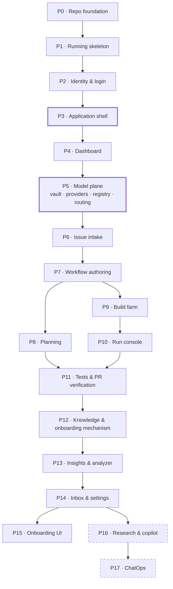

# Roadmap — Order of Execution (MVP)

## Description

> Walk the roadmap documents, and come up with an order of execution for the
> Ouroboros application build. This should be a "ROADMAP_OOE_MVP.md" document
> that covers the MVP items that should be created, but in the order in which
> they should be implemented so that the application is complete and designed
> properly.

This document does not introduce new scope. It is a **sequencing plan** over the
MVP work already specified across the twenty-four roadmaps in `docs/`: which
issue to build, in what order, and why that position and not another. Each
roadmap remains the authority on *what* its issues contain; this document is the
authority on *when* they are built.

## Scope of the plan

| | |
|---|---|
| Roadmaps walked | **24** (`ROADMAP_*.md` in `docs/`) |
| Issues specified in total | **581** |
| Flagged MVP | **458** |
| Superseded by a later roadmap (dropped — see the ledger) | **4** |
| **Ordered in this plan** | **454** |
| Deferred to v2 (out of scope here) | **123** |
| Total complexity | **1,404 points** (XS=1 · S=2 · M=3 · L=5) |
| Phases | **18** (P0–P17) |
| Longest dependency chain | **21 issues** |
| Modules touched | `ouroboros-ui` (172) · `ouroboros-rest` (171) · `ouroboros-db` (97) · `.github` (50) · `ouroboros-engine` (24) · `ouroboros-runner` (7) |

## Progress

**92 of 454 ordered issues are closed** — P0, P1, P2 and P4 are complete; P3, P5 and P6
are in flight. Every issue number in this document links to its GitHub issue, and a **✅**
in front of one means that issue is **closed**. Rows that have left a phase table
entirely (their order numbers are the gaps the phase headers call out) shipped earlier
and are accounted for in the counts below, not in the tables.

| Status | Phases | Issues |
|--------|--------|-------:|
| ✅ **Complete** | P0, P1, P2, P4 | **84** |
| 🟡 **In progress** | P3 (5/8), P5 (2/50), P6 (1/23) | **8** of 81 |
| — **Not started** | P7–P17 | 0 of 289 |

> The checkmarks are derived from GitHub issue state, not from this document. Re-derive
> them with `gh issue list --state closed --limit 1000 --json number` whenever the plan
> is revisited; a ✅ here that GitHub disagrees with is stale, and GitHub wins.

## How the order was derived

1. **Extraction.** Every issue table across the 24 roadmaps was parsed —
   `Ref`, GitHub number, title, labels, `Parallel`, `MVP`, `Complexity`,
   `Affected Modules`. Epic ref namespaces are globally unique (`1`–`7`, then
   `A`…`CR`), so refs identify issues unambiguously across documents.
2. **Graph construction.** The `Parallel` column carries the real dependency
   data (`N (after CP.1)`, `N (needs 2.1, 5.1)`, `N (after #27, #28)`,
   `N (after WF-P.2)`). All three reference forms — local ref, GitHub number,
   and the `WF-` cross-roadmap prefix — were resolved to refs. **Every one of
   the 1,021 dependency references resolved to a real issue; none dangled.**
3. **Validation.** The resulting graph is a **DAG** — no cycles at the issue
   level, which means a valid total order exists. (Cycles *do* appear at the
   epic level — `A`↔`B`, `AC`↔`AD`, `AG`↔`AH`, `CP`↔`CQ` — which is why phases
   below interleave epics rather than sequencing them whole.)
4. **Layering.** Longest-path depth was computed for every MVP issue, giving 21
   dependency waves. The critical path runs:

   ```
   1.1 → 4.1 → 4.2 → A.1 → B.1 → B.2 → B.3 → F.1 → F.3 → BI.1 → BI.2
       → BJ.1 → BJ.4 → BN.3 → BR.4 → BY.1 → BY.3 → BZ.1 → CA.1 → CA.2 → CA.5
   ```

   Monorepo → NestJS → BetterAuth → auth schema → tenancy reconciliation →
   dashboard read-model → metrics rollups → analytics → inbox → admin services →
   Slack. Twenty-one issues that cannot be parallelised with each other; no
   amount of staffing shortens this chain.
5. **Phase assignment.** Issues were grouped into 18 phases chosen for *product
   coherence* — each phase ends at a demonstrable state — then a fixpoint pass
   pushed any issue forward until every dependency sat in the same phase or an
   earlier one. The result was re-validated: **zero forward references.** If you
   execute the tables top to bottom, no issue is ever started before its
   dependencies are finished.

Within a phase, items are listed in dependency-wave order. Items in the same
wave are genuinely independent and can be built in parallel.

## Sequencing principles applied

These are the judgment calls the graph alone does not make. Where a phase's
position is not forced by dependencies, one of these decided it.

| # | Principle | Where it bites |
|---|-----------|----------------|
| **1** | **Contracts before consumers.** A schema, SPI or contract that N issues read is built before any of them. | Workflow DSL (P7) before execution; run ingestion contract (P10) before every plane that reads runs; provider SPI (P5) before every model call. |
| **2** | **Write the identity layer once.** Where a later roadmap supersedes an earlier one, build only the surviving version. | Eight scaffolding issues dropped or deferred from P1 into P2 — see the [supersession ledger](#supersession--amendment-ledger). |
| **3** | **Chrome before pages.** The shell is built before the screens that mount in it. | P3 precedes all twenty product screens. Reversed, this is a twenty-page re-hosting exercise plus a rem conversion across 172 UI issues. |
| **4** | **Earliest complete vertical slice first.** The first product phase is the one that can go schema → service → screen with no stubs. | Dashboard (P4) — its only dependencies are scaffolding and auth. |
| **5** | **Emitters before integrators.** Surfaces that aggregate other planes come after the planes they aggregate. | Insights (P13), inbox and Settings (P14), onboarding UI (P15), ChatOps (P17). |
| **6** | **Irreversible-by-default work early.** Anything expensive to retrofit goes as early as its dependencies allow. | Secrets vault (`AD.1`, P5) before the first credential is stored; tenancy (P2) before 99 org-scoped tables. |
| **7** | **Cuttable work last.** Phases with no dependents sit at the end, so a shortened MVP truncates rather than reshuffles. | P16 (research, copilot) and P17 (ChatOps) — 57 issues, 197 points, zero dependents. |

## The order at a glance

| Phase | Delivers | Done | Issues | Pts | Source roadmaps |
|:-----:|----------|:----:|-------:|----:|-----------------|
| **P0** | Repository foundation | ✅ **5/5** | 5 | 10 | Scaffolding |
| **P1** | Running skeleton (`compose up`, pre-auth) | ✅ **25/25** | 25 | 57 | Scaffolding |
| **P2** | Identity, tenancy & login page | ✅ **29/29** | 29 | 86 | Login/BetterAuth |
| **P3** | Application shell & font scale | 🟡 5/8 | 8 | 28 | UI/UX App Shell |
| **P4** | Dashboard — first real screen | ✅ **25/25** | 25 | 60 | Mockup 02 |
| **P5** | Model plane — vault, providers, registry, routing | 🟡 2/50 | 50 | 153 | Mockups 06, 07, 21 |
| **P6** | Issue intake & estimation | — 0/23 | 23 | 68 | Mockup 03 |
| **P7** | Workflow authoring (visual + code) | — 0/43 | 43 | 137 | Mockups 04, 05 |
| **P8** | Planning & batch work creation | — 0/17 | 17 | 52 | Mockup 09 |
| **P9** | Build farm & runner agent | — 0/20 | 20 | 70 | Mockup 08 |
| **P10** | Run console & ingestion contract | — 0/17 | 17 | 55 | Mockup 10 |
| **P11** | Evidence — tests & PR verification | — 0/38 | 38 | 119 | Mockups 11, 12 |
| **P12** | Knowledge & onboarding mechanism | — 0/28 | 28 | 83 | Mockups 14, 13 |
| **P13** | Analytics — insights & build analyzer | — 0/32 | 32 | 109 | Mockups 15, 18 |
| **P14** | Decisions & governance — inbox, settings | — 0/31 | 31 | 102 | Mockups 16, 17 |
| **P15** | Onboarding experience | — 0/6 | 6 | 18 | Mockup 13 |
| **P16** | Intelligence — research & copilot | — 0/42 | 42 | 147 | Mockups 22, 20 |
| **P17** | ChatOps — Slack integration | — 0/15 | 15 | 50 | Mockup 19 |
| | **Total** | **91/454** | **454** | **1,404** | |



*Bold-edged phases are the highest-leverage positions (reversing them is
expensive). Dashed phases have no dependents and are the safe truncation point.*

## Supersession & amendment ledger

The BetterAuth roadmap and the App Shell roadmap were written **after** the
scaffolding roadmap and replace parts of it. Executing the scaffolding roadmap
verbatim would build the identity layer twice. This plan resolves that at the
issue level.

**Dropped — do not implement** (removed from the 458, giving the 454 ordered here):

| Ref | Issue | Replaced by | Phase that delivers it |
|-----|:-----:|-------------|:----------------------:|
| `4.7` | ✅ [`#33`](https://github.com/NobuData/ouroboros/issues/33) GitHub OAuth sign-in & sessions | `A.1`–`A.4` (BetterAuth GitHub provider + DB sessions) | P2 |
| `5.6` | ✅ [`#44`](https://github.com/NobuData/ouroboros/issues/44) Login & tenancy screen | `D.2`–`D.5` (mockup-01 fidelity, four issues) | P2 |

> **`3.3` · [`#21`](https://github.com/NobuData/ouroboros/issues/21) Users, identities & tenant membership was listed here and is not
> dropped — it shipped in P1, as specified, in `V002__users_membership.sql`.**
>
> The supersession assumed no scaffolding work had begun, which was true when this was
> written and is no longer: `3.2` ([#20](https://github.com/NobuData/ouroboros/issues/20)) and `3.4` ([#22](https://github.com/NobuData/ouroboros/issues/22)) both landed in their original
> shape, so `V001`'s `tenants` is a real table with real foreign keys pointing at it.
> Building `V002` in BetterAuth shape would have left the schema half-migrated to a
> decision nothing else in the repository has taken. Adopting BetterAuth is now a
> fix-forward migration from the shipped schema rather than a choice `V002` makes on its
> own — which is what `B.1`–`B.3` become if that decision is confirmed.

> **`3.5` · [`#23`](https://github.com/NobuData/ouroboros/issues/23) Dev seed data was listed here and is not dropped — it shipped in P1,
> as specified, in `R__dev_seed.sql`.**
>
> For the same reason: the tables it seeds are the ones `3.2`–`3.4` actually built, and
> a seed written in BetterAuth shape would describe a schema nothing in the repository
> has. It seeds the mockups' demo tenant `acme-robotics` behind a placeholder guard that
> is `false` in every configuration but the development stack's, so a production run
> applies the migration and inserts nothing. `B.4` is a rewrite of that one file if
> BetterAuth is confirmed — the guard, the `5eed…` id convention and both test files
> carry over unchanged.

> **`4.7` · [`#33`](https://github.com/NobuData/ouroboros/issues/33) GitHub OAuth sign-in & sessions and `5.6` · [`#44`](https://github.com/NobuData/ouroboros/issues/44) Login & tenancy
> screen were listed here and are not dropped — both shipped in P1, as specified.**
>
> For the third time and the same reason: the supersession assumed no scaffolding work
> had begun, and by the time P1 reached them the identity schema ([`#21`](https://github.com/NobuData/ouroboros/issues/21)), the tenancy API
> ([`#31`](https://github.com/NobuData/ouroboros/issues/31)), the tenant middleware ([`#32`](https://github.com/NobuData/ouroboros/issues/32)) and the typed client ([`#43`](https://github.com/NobuData/ouroboros/issues/43)) had all landed in
> their original shape. A login screen built against BetterAuth would have had no service
> to call.
>
> [`#44`](https://github.com/NobuData/ouroboros/issues/44) is `ouroboros-ui/app/(auth)/login` plus `app/login/`, against `/api/v1/auth/me`
> and the [`#31`](https://github.com/NobuData/ouroboros/issues/31) enablement endpoints. What `D.2`–`D.5` become if BetterAuth is confirmed
> is smaller than they were written to be: `D.2` (the split layout and brand panel) and
> `D.4` (the org rows and switches) are **built** and unaffected — neither touches the
> auth provider; `D.3` reduces to re-pointing "Continue with GitHub" at the BetterAuth
> handler and filling in the SSO half that ships inert today; and `D.5`'s guards exist as
> `app/api/access.ts`, whose one BetterAuth-shaped change would be reading the active
> workspace from the session's `activeOrganizationId` rather than from the `ouro_tenant`
> cookie — the same amendment `C.3` already records for [`#32`](https://github.com/NobuData/ouroboros/issues/32).

> **`5.7` · [`#45`](https://github.com/NobuData/ouroboros/issues/45) Dashboard placeholder shipped, and row `57` has left the P2 table
> above** — which is why its order numbers step from `56` to `58`.
>
> Same reason as [`#33`](https://github.com/NobuData/ouroboros/issues/33) and [`#44`](https://github.com/NobuData/ouroboros/issues/44) before it, one step further along: it was re-pointed to
> land behind `D.5`'s guards, and by the time P1 reached it those guards existed as
> `ouroboros-ui/app/api/access.ts` in their original `ouro_tenant` shape. The screen is
> built against them, so if BetterAuth is confirmed the change is `D.5`'s one-line
> amendment — the active workspace read from the session's `activeOrganizationId` rather
> than from the cookie — and nothing on the dashboard itself moves: it takes the workspace
> from the gate and never resolves one.
>
> [`#45`](https://github.com/NobuData/ouroboros/issues/45) is `ouroboros-ui/app/(app)/dashboard` over `app/dashboard/`, against
> `/api/v1/tenants/{tenantId}/members`, the [`#31`](https://github.com/NobuData/ouroboros/issues/31) enablement endpoints, `/health/ready`
> and `/api/v1/engine/status`. It also moved the dashboard off `/`, which now redirects.

**Deferred out of P1 into P2 — implement once, in BetterAuth shape:**

| Ref | Issue | Amendment |
|-----|:-----:|-----------|
| `4.5` | ✅ [`#31`](https://github.com/NobuData/ouroboros/issues/31) Tenancy module & API | Reduced — members and invitations are served by the org plugin; this keeps domains + org/repo enablement (`C.4`) |
| `4.6` | ✅ [`#32`](https://github.com/NobuData/ouroboros/issues/32) Tenant-context middleware | Resolves from the session's `activeOrganizationId`; `X-Ouro-Tenant` demoted to an override (`C.3`) |
| `4.11` | ✅ [`#37`](https://github.com/NobuData/ouroboros/issues/37) Integration test harness | Extended so `C.5`'s auth-flow suites build on it |
| `4.8` · `5.5` | ✅ [`#34`](https://github.com/NobuData/ouroboros/issues/34) · [`#43`](https://github.com/NobuData/ouroboros/issues/43) OpenAPI export & typed client | Auth routes use the BetterAuth client; the generated client covers everything else (`D.1`). **Both shipped in P1** — the generated client is `ouroboros-ui/app/api/`, and `D.1` reduces to pointing the auth calls at BetterAuth when `A.2` lands |
| `5.7` | ✅ [`#45`](https://github.com/NobuData/ouroboros/issues/45) Dashboard placeholder | Re-pointed to land behind `D.5`'s guards |
| `7.2` | ✅ [`#56`](https://github.com/NobuData/ouroboros/issues/56) End-to-end smoke test | Must sign in through the real BetterAuth flow, not a bypass. **Shipped ahead of `D.5`**, and its signed-in legs are now **parked**: [#703](https://github.com/NobuData/ouroboros/issues/703) replaced the stateless cookie those legs minted with a database-backed session row, which cannot be produced from outside the stack. [`#709`](https://github.com/NobuData/ouroboros/issues/709) (the seed writes BetterAuth's `"user"` rows) and [`#705`](https://github.com/NobuData/ouroboros/issues/705) (a sign-in a script can perform) are what restore them; every leg needing no session still runs |

**Amended in place** (build as written, with the noted change):

| Ref | Issue | Amendment | Phase |
|-----|:-----:|-----------|:-----:|
| `3.2` | ✅ [`#20`](https://github.com/NobuData/ouroboros/issues/20) Baseline tenancy schema | `tenants` becomes the org plugin's `organization`; `tenant_domains` survives re-pointed (`B.3`) | P1 |
| `3.4` | ✅ [`#22`](https://github.com/NobuData/ouroboros/issues/22) GitHub org & repo enablement | Same shape, FK re-pointed to `organization.id` (`B.3`) | P1 |
| `4.4` | ✅ [`#30`](https://github.com/NobuData/ouroboros/issues/30) Database access layer | Blocker re-pointed from `3.3` to `3.2`; the Kysely pool is reused by BetterAuth's adapter | P1 |
| `5.3` | ✅ [`#41`](https://github.com/NobuData/ouroboros/issues/41) App shell — top bar, navigation, footer | Re-scoped by `CP.1`/`CP.2` — build the frame minimally in P1; nav links move to the sidebar in P3 | P1 → P3 |
| `5.4` | ✅ [`#42`](https://github.com/NobuData/ouroboros/issues/42) Theme toggle control | **Not deferred** — shipped in P1 as the top-bar control the issue specifies and `5.3` reserved a slot for. *(Corrected by CP.3/[#645](https://github.com/NobuData/ouroboros/issues/645) as shipped: the menu's radio group turned out to be the control's successor, not a second copy beside it — § 1.1's upper-right enumeration draws the theme control inside the profile menu and no slot beside it, and two controls are a state that can be read twice differently. What survives of this note is the half that mattered: the `useTheme()` engine was reused, never reimplemented.)* | P1 |
| `4.12` | [`#38`](https://github.com/NobuData/ouroboros/issues/38) Security baseline hardening | Reduced by `E.4` — DB-backed sessions make the revocation work item obsolete | v2 |

**Action at filing time:** post each amendment as a comment on the named GitHub
issue, and close [`#21`](https://github.com/NobuData/ouroboros/issues/21), [`#23`](https://github.com/NobuData/ouroboros/issues/23), [`#33`](https://github.com/NobuData/ouroboros/issues/33), [`#44`](https://github.com/NobuData/ouroboros/issues/44) with a pointer to their replacements
once the corresponding P2 issues are filed.

## Open decisions required before P13 and P16

Six MVP issues depend on work their own roadmaps flagged **v2**. Each needs an
explicit call — promote the dependency into MVP, or defer the dependent issue.
None of them blocks P0–P12, so the decision can be made during P11.

| Blocked MVP issue | Phase | Requires | Flagged | Suggested resolution |
|-------------------|:-----:|----------|:-------:|----------------------|
| `BV.1` [`#510`](https://github.com/NobuData/ouroboros/issues/510) Analyzer corpus | P13 | `AJ.4` [`#266`](https://github.com/NobuData/ouroboros/issues/266) Health history & analyzer telemetry | v2 | **Promote `AJ.4`** — a corpus with no farm telemetry is a hollow analyzer |
| `BJ.4` [`#440`](https://github.com/NobuData/ouroboros/issues/440) Analytics services | P13 | `E.3` Invitation flow with email delivery | v2 | **Narrow `BJ.4`** — drop the invitation-derived metric rather than pull email delivery into MVP |
| `CD.1` [`#559`](https://github.com/NobuData/ouroboros/issues/559) · `CD.2` [`#560`](https://github.com/NobuData/ouroboros/issues/560) Copilot dry-run | P16 | `AF.2` [`#235`](https://github.com/NobuData/ouroboros/issues/235) Chain executor implementation | v2 | **Promote `AF.2`** — it is the single prerequisite for all live model invocation |
| `CM.1` [`#620`](https://github.com/NobuData/ouroboros/issues/620) Investigation engine | P16 | `AF.2` [`#235`](https://github.com/NobuData/ouroboros/issues/235) Chain executor implementation | v2 | as above |
| `CL.4` [`#617`](https://github.com/NobuData/ouroboros/issues/617) Research tool execution | P16 | `6.5` [`#54`](https://github.com/NobuData/ouroboros/issues/54) Task execution skeleton | v2 | **Promote `6.5`** — the engine needs a queue/worker before any long-running research |

Promoting `AF.2` and `6.5` adds roughly 8–10 complexity points to P5 and P1
respectively and unblocks four of the six. Deferring P16 entirely resolves five
of the six at the cost of the research and copilot surfaces.

## Other risks this walk surfaced

1. ~~**The BetterAuth roadmap's 26 issues are not filed on GitHub.**~~ **Resolved.**
   Epics A–E were filed as
   [`#695`](https://github.com/NobuData/ouroboros/issues/695)–[`#725`](https://github.com/NobuData/ouroboros/issues/725)
   in [`ROADMAP_MOCKUP_01_BETTERAUTH.md`](ROADMAP_MOCKUP_01_BETTERAUTH.md), the
   supersession amendments were posted, and every MVP issue among them has closed —
   P2 shipped. Epic E ([`#722`](https://github.com/NobuData/ouroboros/issues/722)–[`#725`](https://github.com/NobuData/ouroboros/issues/725))
   remains open and is v2, outside this plan.
2. **`ouroboros-runner` is a fifth module absent from the scaffolding
   conventions.** Seven issues in P9 target it. Add its directory layout,
   toolchain and CI lane to `1.1`/`1.4` in P0, or accept a retrofit at P9.
3. **Two issues the App Shell MVP definition depends on are flagged v2.**
   `5.11` [`#49`](https://github.com/NobuData/ouroboros/issues/49) (placeholder routes) and `5.10` [`#48`](https://github.com/NobuData/ouroboros/issues/48) (component workshop) are
   named in P3's MVP definition but carry `MVP = N`. Either promote them or
   amend the App Shell MVP definition to stop referencing them.
4. **P5 is the plan's largest and riskiest phase** (50 issues, 153 points,
   12 waves). It is also the most parallelisable — three near-independent tracks.
   If staffing is thin, run its tracks sequentially rather than splitting the
   phase, so the `/models` subnav lands complete.
5. **UI and REST are near-equally loaded** (173 vs 172 issues). A team with a
   backend/frontend split will find them balanced; a full-stack team should
   staff by phase, not by layer.

## Standing rules for every issue in this plan

Inherited from the roadmaps, restated here because they apply to all 454 items:

- **Both themes.** Every UI issue is done only when it renders correctly in
  light and dark.
- **Shell compliance** (from P3 onward). Mount in the content pane, register the
  sidebar entry, pass at 150% font scale.
- **Honest states.** No fabricated numbers. Empty, loading, error and
  not-yet-available states are part of the issue, not a follow-up.
- **Flyway owns DDL.** No migration authority other than Flyway, including for
  vendor-generated schema.
- **Contract-first.** OpenAPI is generated from NestJS; the UI client is
  generated from it. No hand-maintained types across the boundary.

---

# The order

Each phase below lists its issues in dependency-wave order. The `#` column is
the global execution position (1–454); `Blocked by` lists prerequisites, all of
which appear earlier in this document.

## P0 — Repository Foundation ✅

> **5 issues** · 10 complexity points · order **#1–#5** · 1 dependency wave
> **Source roadmaps:** `ROADMAP_OUROBOROS_APPLICATION_SCAFFOLDING.md` (Epic 1)
> **Status:** ✅ **Complete** — all 5 issues closed

**Goal.** Create the monorepo skeleton, the label/template vocabulary every later issue depends on, the one-command local database, path-filtered CI, and the architecture document that fixes ports, env-var conventions and module contracts.

**Why here.** Nothing else can be merged into a repository that has no module directories, no CI and no agreed contracts. `1.1` is the only genuine root of the entire 454-issue graph — every other item traces back to it.

**Done when.** A no-op PR runs green through path-filtered CI; `docker compose up` in the repo root brings PostgreSQL up with Flyway applied; `docs/ARCHITECTURE.md` names the four modules, their ports and their contracts.

**Parallel:** `1.2`–`1.5` are all unblocked once `1.1` lands — four people can work at once. This is the only phase with a single dependency wave.

| # | Ref | Issue | Work item | Module | Cx | Blocked by |
|--:|-----|:-----:|-----------|--------|:--:|------------|
| 1 | **1.1** | ✅ [#8](https://github.com/NobuData/ouroboros/issues/8) | Monorepo layout & module scaffolding conventions | repo root | S | — |
| 2 | **1.2** | ✅ [#9](https://github.com/NobuData/ouroboros/issues/9) | GitHub labels & issue/PR templates | .github | XS | — |
| 3 | **1.3** | ✅ [#10](https://github.com/NobuData/ouroboros/issues/10) | Local dev environment (docker-compose: PostgreSQL + Flyway) | repo root, ouroboros-db | S | — |
| 4 | **1.4** | ✅ [#11](https://github.com/NobuData/ouroboros/issues/11) | CI pipelines per module (path-filtered) | .github | M | — |
| 5 | **1.5** | ✅ [#12](https://github.com/NobuData/ouroboros/issues/12) | Architecture documentation | docs | S | — |

## P1 — Running Skeleton (pre-auth) ✅

> **25 issues** · 57 complexity points · order **#6–#30** · 6 dependency waves
> **Source roadmaps:** `ROADMAP_OUROBOROS_APPLICATION_SCAFFOLDING.md` (Epics 2–7)
> **Status:** ✅ **Complete** — all 25 issues closed

**Goal.** Stand up all four services so `docker compose up` yields a healthy stack: Flyway-migrated PostgreSQL, NestJS with typed config and health checks, FastAPI reachable only through the REST gateway, and a themed Next.js app with the brand asset set, design tokens and light/dark switching.

**Why here.** Every later phase writes into these four modules; the tokens (`2.3`) and primitives (`5.8`) in particular are consumed by all 172 UI issues downstream. Doing the theme engine here rather than later is what keeps 'both themes' cheap for twenty subsequent screens.

**Done when.** `docker compose up` → all four containers healthy; `/health` verifies DB and engine connectivity; the UI serves a themed shell with a working light/dark toggle; the Flyway migration CI check gates PRs.

**This phase deliberately stops short of auth.** Eight scaffolding issues that assume hand-rolled OAuth and a bespoke `tenants`/`users` schema are dropped or deferred here and executed once, in BetterAuth shape, in P2 — see [Supersession ledger](#supersession--amendment-ledger). Building them as originally written would mean writing the identity layer twice.

**Parallel:** after `3.1`/`4.1`/`5.1`/`6.1` land (all unblocked by `1.1`), four module tracks run concurrently — db, rest, engine, ui — converging only at `7.1` (full-stack compose).

| # | Ref | Issue | Work item | Module | Cx | Blocked by |
|--:|-----|:-----:|-----------|--------|:--:|------------|
| 6 | **2.1** | ✅ [#14](https://github.com/NobuData/ouroboros/issues/14) | Split brand sheet into logo asset set | docs/brand, assets | M | — |
| 7 | **2.3** | ✅ [#16](https://github.com/NobuData/ouroboros/issues/16) | Design tokens — light & dark palettes as CSS custom properties | docs/mockups/assets → shared tokens | M | 2.1 |
| 8 | **3.1** | ✅ [#19](https://github.com/NobuData/ouroboros/issues/19) | Flyway project scaffold & migration conventions | ouroboros-db | S | 1.1 |
| 9 | **4.1** | ✅ [#27](https://github.com/NobuData/ouroboros/issues/27) | NestJS service scaffold | ouroboros-rest | S | 1.1 |
| 10 | **5.1** | ✅ [#39](https://github.com/NobuData/ouroboros/issues/39) | Next.js application scaffold | ouroboros-ui | S | 1.1 |
| 11 | **6.1** | ✅ [#50](https://github.com/NobuData/ouroboros/issues/50) | FastAPI service scaffold | ouroboros-engine | S | 1.1 |
| 12 | **2.2** | ✅ [#15](https://github.com/NobuData/ouroboros/issues/15) | Favicon & web-app manifest set | ouroboros-ui | XS | 2.1, 5.1 |
| 13 | **2.4** | ✅ [#17](https://github.com/NobuData/ouroboros/issues/17) | Runtime theme engine (on-the-fly light/dark) | ouroboros-ui | S | 2.3, 5.1 |
| 14 | **3.2** | ✅ [#20](https://github.com/NobuData/ouroboros/issues/20) | Baseline tenancy schema — tenants & domains | ouroboros-db | M | 3.1 |
| 15 | **3.6** | ✅ [#24](https://github.com/NobuData/ouroboros/issues/24) | Migration CI check | ouroboros-db, .github | S | 1.4, 3.1 |
| 16 | **4.2** | ✅ [#28](https://github.com/NobuData/ouroboros/issues/28) | Typed configuration & env validation | ouroboros-rest | S | 4.1 |
| 17 | **5.2** | ✅ [#40](https://github.com/NobuData/ouroboros/issues/40) | Global styles — tokens & typography | ouroboros-ui | S | 2.3, 5.1 |
| 18 | **5.9** | ✅ [#47](https://github.com/NobuData/ouroboros/issues/47) | Dockerfile & standalone build | ouroboros-ui | S | 5.1 |
| 19 | **6.2** | ✅ [#51](https://github.com/NobuData/ouroboros/issues/51) | Health, version & internal auth | ouroboros-engine | S | 6.1 |
| 20 | **3.4** | ✅ [#22](https://github.com/NobuData/ouroboros/issues/22) | GitHub org & repo enablement | ouroboros-db | S | 3.2 |
| 21 | **4.3** | ✅ [#29](https://github.com/NobuData/ouroboros/issues/29) | Health & readiness endpoints | ouroboros-rest | S | 4.2 |
| 22 | **4.4** | ✅ [#30](https://github.com/NobuData/ouroboros/issues/30) | Database access layer (Kysely) | ouroboros-rest | M | 3.2, 4.2 |
| 23 | **5.3** | ✅ [#41](https://github.com/NobuData/ouroboros/issues/41) | App shell — top bar, navigation, footer | ouroboros-ui | M | 5.2 |
| 24 | **5.8** | ✅ [#46](https://github.com/NobuData/ouroboros/issues/46) | UI component primitives | ouroboros-ui | M | 5.2 |
| 25 | **6.3** | ✅ [#52](https://github.com/NobuData/ouroboros/issues/52) | Internal API contract v0 | ouroboros-engine, ouroboros-rest | M | 6.2 |
| 26 | **6.4** | ✅ [#53](https://github.com/NobuData/ouroboros/issues/53) | Dockerfile & container build | ouroboros-engine | S | 6.2 |
| 27 | **4.9** | ✅ [#35](https://github.com/NobuData/ouroboros/issues/35) | Engine gateway module | ouroboros-rest | M | 4.2, 6.3 |
| 28 | **4.10** | ✅ [#36](https://github.com/NobuData/ouroboros/issues/36) | Dockerfile & container build | ouroboros-rest | S | 4.3 |
| 29 | **5.4** | ✅ [#42](https://github.com/NobuData/ouroboros/issues/42) | Theme toggle control | ouroboros-ui | XS | 2.4, 5.3 |
| 30 | **7.1** | ✅ [#55](https://github.com/NobuData/ouroboros/issues/55) | Full-stack docker-compose | repo root | M | 1.3, 4.10, 5.9, 6.4 |

## P2 — Identity, Tenancy & the Login Page ✅

> **26 issues** · 77 complexity points · order **#32–#59**, less `57` and `58` · 8 dependency waves
> **Source roadmaps:** `ROADMAP_LOGIN_PAGE_BETTERAUTH.md` (Epics A–D) + the deferred scaffolding tail
> **Status:** ✅ **Complete** — all 29 issues closed

**Goal.** Install BetterAuth inside `ouroboros-rest`, land the auth and organization schema through Flyway, reconcile the tenancy extension tables onto `organization.id`, and build mockup 01 as a working login page — GitHub OAuth, domain discovery, org/repo enablement, active-organization sessions.

**Why here.** Identity is the second root of the graph: 99 database issues and 172 REST issues are org-scoped, and every UI route past this point is guarded. It must precede the shell (which renders the profile menu and tenant chip) and every product screen (which reads `activeOrganizationId`). Deferring it produces a system with no tenancy boundary to retrofit one into.

**Done when.** Mockup 01 renders pixel-faithfully in both themes; **Continue with GitHub** completes a real OAuth flow creating a DB-backed session; Step 2 lists the user's organizations and toggles repo enablement; **Enter mission control →** lands on the dashboard placeholder; REST resolves tenant context from the session; the e2e smoke test signs in for real.

✅ **This phase is complete.** The BetterAuth issues were filed as
[`#695`](https://github.com/NobuData/ouroboros/issues/695)–[`#725`](https://github.com/NobuData/ouroboros/issues/725)
— see [`ROADMAP_MOCKUP_01_BETTERAUTH.md`](ROADMAP_MOCKUP_01_BETTERAUTH.md), which carries the
numbers — and every one of them in this phase's table has since closed. The table below
carried *new* where it was written before filing and now carries the real numbers; the
supersession amendments to [`#20`](https://github.com/NobuData/ouroboros/issues/20)–[`#23`](https://github.com/NobuData/ouroboros/issues/23), [`#31`](https://github.com/NobuData/ouroboros/issues/31)–[`#33`](https://github.com/NobuData/ouroboros/issues/33), [`#37`](https://github.com/NobuData/ouroboros/issues/37), [`#43`](https://github.com/NobuData/ouroboros/issues/43), [`#44`](https://github.com/NobuData/ouroboros/issues/44) are recorded in
that roadmap's "Existing issues affected" section.

**Parallel:** the `A`/`B` chain is serial by nature (library → schema → provider → sessions → org plugin); `D.2` (brand panel) and the deferred `4.8`/`5.5` OpenAPI-client work run alongside it from the start.

> **`A.1` · [`#700`](https://github.com/NobuData/ouroboros/issues/700) BetterAuth installation & configuration shipped, and row `31` has left
> the table below** — which is why its order numbers now open at `32`.
>
> `better-auth` is installed in `ouroboros-rest`; [`src/auth/`](../ouroboros-rest/src/auth)
> holds the options, the factory and the CLI-loadable config;`BETTER_AUTH_SECRET` and
> `BETTER_AUTH_URL` are in the [`#28`](https://github.com/NobuData/ouroboros/issues/28) zod schema, both `.env.example` files, the compose
> stack and `turbo.json`'s `globalEnv`, and the secret is redacted from the boot log. The
> adapter is handed `DatabaseService`'s own `pg` pool, so the service still opens exactly
> one.
>
> Nothing is mounted — `/api/auth/*` arrives with `A.2` ([`#701`](https://github.com/NobuData/ouroboros/issues/701)). What it unblocks
> immediately is `B.1` ([`#706`](https://github.com/NobuData/ouroboros/issues/706)): `npx @better-auth/cli generate --config
> src/auth/auth.config.ts` now emits the four core tables for `V004`, with no Nest process
> involved.

> **`7.2` · [`#56`](https://github.com/NobuData/ouroboros/issues/56) End-to-end smoke test shipped, and row `58` has left the table below** —
> which is why its order numbers step from `56` to `59`.
>
> It was built ahead of its blocker. `D.5` is unfiled, as all 22 BetterAuth issues in this
> phase still are, and the four legs that do not need a session — the UI's title, favicon
> and theme toggle; the tenant CRUD roundtrip; the engine through the REST gateway; the two
> health probes — were already gated by work that had landed (`7.1` [`#55`](https://github.com/NobuData/ouroboros/issues/55), `5.7` [`#45`](https://github.com/NobuData/ouroboros/issues/45),
> `4.9` [`#35`](https://github.com/NobuData/ouroboros/issues/35), `3.5` [`#23`](https://github.com/NobuData/ouroboros/issues/23)). Waiting would have left the MVP with no exit gate at all
> through the whole of P2.
>
> The suite is [`tests/e2e/`](../tests/e2e), a Playwright project that is deliberately
> **not** a workspace — see [`CONVENTIONS.md` § 1](CONVENTIONS.md#1-repository-shape),
> limit 2. It runs nightly and on `workflow_dispatch`, never on a pull request, and
> enforces its own ten-minute budget. `tests/e2e/scripts/verify-failure-modes.sh` is the
> issue's second acceptance criterion as a script: it stops each service in turn and
> requires the matching leg to go red with a message that names the layer.
>
> **Two deviations, both recorded on the issue.** The dashboard leg used to sign in by
> minting a session with `ouroboros-rest`'s own `issueSession`, because the amendment below
> — *the real BetterAuth flow, not a bypass* — had no flow to use yet, and the compose
> stack's production image strips the dev-user bypass the issue body assumed.
> **That is now parked rather than deviating**:
> [#703](https://github.com/NobuData/ouroboros/issues/703) made a session a database row,
> so there is nothing left for a suite outside the stack to mint. The legs that need one
> carry `test.fixme` naming [`#709`](https://github.com/NobuData/ouroboros/issues/709) and [`#705`](https://github.com/NobuData/ouroboros/issues/705); the legs that assert a *stranger* is refused
> — the ones that kept the minted credential honest — still run, and now include a browser
> still holding [#33](https://github.com/NobuData/ouroboros/issues/33)'s cookie being refused cleanly and told to drop it.
> And the chain leg asserts through `GET /api/v1/engine/status` rather than an echo route,
> because `ouroboros-rest` publishes no echo pass-through and adding public API surface to
> satisfy a test's wording would be the test deciding the contract.

| # | Ref | Issue | Work item | Module | Cx | Blocked by |
|--:|-----|:-----:|-----------|--------|:--:|------------|
| 32 | **D.2** | ✅ [#717](https://github.com/NobuData/ouroboros/issues/717) | Login route & split-layout brand panel | ouroboros-ui | M | 2.1, 5.2 |
| 33 | **4.5** | ✅ [#31](https://github.com/NobuData/ouroboros/issues/31) | Tenancy module & API | ouroboros-rest | L | 4.4 |
| 34 | **A.2** | ✅ [#701](https://github.com/NobuData/ouroboros/issues/701) | Mount BetterAuth handler in NestJS | ouroboros-rest | S | A.1 |
| 35 | **B.1** | ✅ [#706](https://github.com/NobuData/ouroboros/issues/706) | BetterAuth core schema (Flyway V004) | ouroboros-db | M | 3.1, A.1 |
| 36 | **4.6** | ✅ [#32](https://github.com/NobuData/ouroboros/issues/32) | Tenant-context resolution middleware | ouroboros-rest | M | 4.5 |
| 37 | **4.8** | ✅ [#34](https://github.com/NobuData/ouroboros/issues/34) | OpenAPI documentation & spec export | ouroboros-rest | S | 4.5 |
| 38 | **4.11** | ✅ [#37](https://github.com/NobuData/ouroboros/issues/37) | Integration test harness | ouroboros-rest | M | 4.5 |
| 39 | **A.3** | ✅ [#702](https://github.com/NobuData/ouroboros/issues/702) | GitHub social provider | ouroboros-rest | M | A.2, B.1 |
| 40 | **A.4** | ✅ [#703](https://github.com/NobuData/ouroboros/issues/703) | Session strategy & global auth guard | ouroboros-rest | M | A.2, B.1 |
| 41 | **B.2** | ✅ [#707](https://github.com/NobuData/ouroboros/issues/707) | Organization plugin schema (Flyway V005) | ouroboros-db | M | B.1 |
| 42 | **5.5** | ✅ [#43](https://github.com/NobuData/ouroboros/issues/43) | Typed API client from OpenAPI | ouroboros-ui | M | 4.8 |
| 43 | **A.5** | ✅ [#704](https://github.com/NobuData/ouroboros/issues/704) | Organization plugin adoption (tenancy backbone) | ouroboros-rest | L | A.4, B.2 |
| 44 | **A.6** | ✅ [#705](https://github.com/NobuData/ouroboros/issues/705) | Dev email/password sign-in (non-production) | ouroboros-rest | S | A.4 |
| 45 | **B.3** | ✅ [#708](https://github.com/NobuData/ouroboros/issues/708) | Tenancy reconciliation — extension tables re-pointed | ouroboros-db | L | B.2 |
| 46 | **B.4** | ✅ [#709](https://github.com/NobuData/ouroboros/issues/709) | Auth-aware dev seed data | ouroboros-db | S | B.3 |
| 47 | **B.5** | ✅ [#710](https://github.com/NobuData/ouroboros/issues/710) | Auth constraint & drift tests in ci/db | ouroboros-db, .github | S | 3.6, B.3 |
| 48 | **C.1** | ✅ [#711](https://github.com/NobuData/ouroboros/issues/711) | Auth route surface & OpenAPI exposure | ouroboros-rest | S | A.5 |
| 49 | **C.2** | ✅ [#712](https://github.com/NobuData/ouroboros/issues/712) | Domain discovery endpoint (`/auth/discover`) | ouroboros-rest | M | B.3 |
| 50 | **C.3** | ✅ [#713](https://github.com/NobuData/ouroboros/issues/713) | Tenant context from session active organization | ouroboros-rest | M | A.5 |
| 51 | **C.4** | ✅ [#714](https://github.com/NobuData/ouroboros/issues/714) | Org & repo enablement API on org-plugin roles | ouroboros-rest | M | B.3, C.3 |
| 52 | **D.1** | ✅ [#716](https://github.com/NobuData/ouroboros/issues/716) | BetterAuth client & session store | ouroboros-ui | S | C.1 |
| 53 | **C.5** | ✅ [#715](https://github.com/NobuData/ouroboros/issues/715) | Auth integration test suite | ouroboros-rest | M | A.6, C.4 |
| 54 | **D.3** | ✅ [#718](https://github.com/NobuData/ouroboros/issues/718) | Step 1 card — GitHub sign-in & SSO domain form | ouroboros-ui | M | C.2, D.1, D.2 |
| 55 | **D.5** | ✅ [#720](https://github.com/NobuData/ouroboros/issues/720) | Auth route guards & session-aware redirects | ouroboros-ui | S | D.1 |
| 56 | **D.6** | ✅ [#721](https://github.com/NobuData/ouroboros/issues/721) | Signed-in session UI in the app shell | ouroboros-ui | S | 5.3, D.1 |
| 59 | **D.4** | ✅ [#719](https://github.com/NobuData/ouroboros/issues/719) | Step 2 card — tenancy & org enablement | ouroboros-ui | L | C.4, D.3 |

## P3 — The Application Shell 🟡

> **8 issues** · 28 complexity points · order **#60–#67** · 4 dependency waves
> **Source roadmaps:** `ROADMAP_UIUX_APP_SHELL.md` (Epics CP, CQ) + `DESIGN_SYSTEM_APP_SHELL.md`
> **Status:** 🟡 **In progress** — 5 of 8 issues closed

**Goal.** Replace the placeholder chrome with the spec'd frame: fixed header (brand, tenant, search, pills, profile menu — no nav links), registry-driven sidebar with icon+name entries and badge slots, the content pane as the sole scroll container, plus rem-based type and the five-step font scale persisted server-side with a no-flash boot.

**Why here.** **This is the single highest-leverage ordering decision in the plan.** Every one of the twenty screens that follows mounts in the content pane and registers a sidebar entry. Built now, each screen costs one registry entry. Built after the screens, it is a twenty-page re-hosting exercise plus a rem conversion across 172 UI issues. It follows P2 because the profile menu needs a real session, and precedes P4 because the dashboard is the first page to mount in the pane.

**Done when.** Header and sidebar are provably fixed under scroll; the sidebar registry drives nav with active states and the Needs You badge slot; the profile menu carries identity, font-size control, theme toggle and sign out; font scaling works end to end with the lint rule green and 150% passing the clipping QA bar; the shell e2e leg runs in CI.

**Standing rule from here on:** a screen is not done until it mounts in the content pane, registers its sidebar entry, and passes at 150% font scale. Every subsequent phase's UI epic inherits this.

| # | Ref | Issue | Work item | Module | Cx | Blocked by |
|--:|-----|:-----:|-----------|--------|:--:|------------|
| 60 | **CP.1** | ✅ [#643](https://github.com/NobuData/ouroboros/issues/643) | Shell layout — header, grid & scroll containment | ouroboros-ui | L | 2.3, 5.1, 5.2 |
| 61 | **CQ.1** | ✅ [#648](https://github.com/NobuData/ouroboros/issues/648) | rem-based token scale & px lint | ouroboros-ui, docs | M | 2.3, 5.2 |
| 62 | **CP.2** | ✅ [#644](https://github.com/NobuData/ouroboros/issues/644) | Sidebar navigation & module registry | ouroboros-ui | L | CP.1 |
| 63 | **CP.4** | ✅ [#646](https://github.com/NobuData/ouroboros/issues/646) | In-pane chrome standards & primitives | ouroboros-ui | M | CP.1 |
| 64 | **CP.5** | ✅ [#647](https://github.com/NobuData/ouroboros/issues/647) | Route migration & shell e2e leg | ouroboros-ui, .github | M | CP.2, CP.4 |
| 65 | **CQ.2** | ✅ [#649](https://github.com/NobuData/ouroboros/issues/649) | Font-size preference & no-flash boot | ouroboros-rest, ouroboros-ui | M | 4.5, CQ.1 |
| 66 | **CP.3** | ✅ [#645](https://github.com/NobuData/ouroboros/issues/645) | Profile & session menu | ouroboros-ui | M | A.4, CP.1, CQ.2 |
| 67 | **CQ.3** | ✅ [#650](https://github.com/NobuData/ouroboros/issues/650) | Readability QA & visual-regression matrix | ouroboros-ui, .github | M | CP.5, CQ.2 |

## P4 — Dashboard — the First Real Screen ✅

> **18 issues** · 44 complexity points · order **#68–#92**, less `69`–`73`, `77` and `78` · 7 dependency waves
> **Source roadmaps:** `ROADMAP_MOCKUP_02_DASHBOARD.md` (Epics F–I)
> **Status:** ✅ **Complete** — all 25 issues closed

**Goal.** Build the dashboard read-model, its org-scoped REST endpoints with ETag polling, the mission-control topbar chrome (tenant switcher, live and needs-you pills, ⌘K palette), and mockup 02 as the real landing page.

**Why here.** The dashboard depends only on scaffolding and auth — nothing else. That makes it the earliest possible *complete vertical slice* (schema → service → screen) and the phase that proves the whole stack works end to end before the platform planes are built. It also establishes the read-model, polling and empty-state patterns that every later screen copies, and it retires the P2 placeholder.

**Done when.** `/dashboard` reproduces mockup 02 pixel-faithfully in both themes over seeded data; a fresh workspace shows truthful zero states with no fabricated numbers; all numbers come from org-scoped endpoints; the ETag polling loop keeps page and topbar pills fresh without reload.

**Parallel:** the `F` (read-model) and `H` (topbar chrome) tracks are independent for their first three issues; `G` (services) and `I` (page UI) then pipeline behind them.

> **`F.1` · [`#64`](https://github.com/NobuData/ouroboros/issues/64), `F.2` · [`#65`](https://github.com/NobuData/ouroboros/issues/65), `F.3` · [`#66`](https://github.com/NobuData/ouroboros/issues/66), `F.4` · [`#67`](https://github.com/NobuData/ouroboros/issues/67) and `F.5` · [`#68`](https://github.com/NobuData/ouroboros/issues/68) have
> shipped, and rows `69`–`73` have left the table below** — which is why its order numbers
> step from `68` straight to `74`.
>
> [`#64`](https://github.com/NobuData/ouroboros/issues/64)'s blockers were both already met, and one of them under another roadmap's name: `3.1`
> is the Flyway scaffold ([`#19`](https://github.com/NobuData/ouroboros/issues/19)), and `B.3` — the organization and repo tables — is
> `organization` (`V005`, [`#707`](https://github.com/NobuData/ouroboros/issues/707)) plus `github_repos`, which has been there since `V003`
> ([`#22`](https://github.com/NobuData/ouroboros/issues/22)) and was re-parented by `V006` ([`#708`](https://github.com/NobuData/ouroboros/issues/708)). So [`#64`](https://github.com/NobuData/ouroboros/issues/64) did not have to wait on the
> unfiled BetterAuth tail the rest of this phase's `G` track still does.
>
> [`V008__dashboard_runs.sql`](../ouroboros-db/migrations/V008__dashboard_runs.sql) is one
> `runs` table covering both dashboard surfaces (decision `F2` — non-terminal rows are the
> active list, terminal rows the completions list), with the statuses, the stage meter, the
> opaque model identifier and the terminal-requires-`finished_at` rule as named CHECK
> constraints, and a trigger holding the run's repository to the run's organization —
> the composite foreign key `github_repos` cannot offer, because `V003` reaches the
> workspace through `github_orgs` rather than storing it twice. Its assertions are a
> section in [`tests/constraints.sql`](../ouroboros-db/tests/constraints.sql), so `ci/db`
> runs them against a database migrated from empty on every pull request.
>
> [`V009__dashboard_queue.sql`](../ouroboros-db/migrations/V009__dashboard_queue.sql) is
> `F.2`'s `queue_items` on top of it: the ordered per-organization queue behind *Up next
> in queue* and the *Queued issues* estimate, with the mockup's five effort chips as a
> CHECK, `(organization_id, issue_number)` unique so an issue queues once, and a position
> key that is unique per workspace *and deferred* — which is what lets a reorder swap two
> positions inside a transaction, the form every immediate unique constraint refuses. It
> also generalised [`#64`](https://github.com/NobuData/ouroboros/issues/64)'s repo-in-organization trigger into one function both tables
> share rather than copying it. Same assertion story: a section in `tests/constraints.sql`,
> run by `ci/db` against a database migrated from empty.
>
> [`V010__dashboard_usage.sql`](../ouroboros-db/migrations/V010__dashboard_usage.sql) is
> `F.3`'s pair — `token_usage`, the append-only ledger behind *Token spend · today*, and
> `token_usage_daily`, the per-organization/UTC-day/provider rollup the card is rendered
> from and this schema's first view. Spend is stored as the events that caused it rather
> than as a total something increments: a total drifts the moment anything is corrected,
> and it has no `run_id`, so it cannot answer the per-run cost attribution mockup 15 is
> made of. `cost_cents` is nullable and null means *unpriced* — never 0, which would claim
> the call was free — and the view propagates that null instead of coalescing it, which is
> what the mockup's own `≈` is already saying while `J.4` ([`#92`](https://github.com/NobuData/ouroboros/issues/92)) is still to land. The
> BRIN index on `occurred_at` is the criterion's and the ledger's; the b-tree on
> `(organization_id, occurred_at desc)` is the card's. Same assertion story again: a
> section in `tests/constraints.sql`, run by `ci/db` against a database migrated from
> empty.
>
> [`V011__workspace_settings.sql`](../ouroboros-db/migrations/V011__workspace_settings.sql)
> is `F.4` and the last table of the read-model — `workspace_settings`, the org-scoped home
> of the *Auto-merge when checks pass* switch, which is the dashboard's only *write*. Typed
> columns rather than key/value, so a setting stays a `boolean` the compiler and a CHECK
> can both see and a new one is an ordinary additive migration. Row creation is **lazy**:
> there is no creation trigger, a workspace with no row is at every default, and
> `workspace_settings_effective` — `organization LEFT JOIN workspace_settings` with the
> defaults coalesced — is what makes absence and an explicit default read alike, so a newly
> created workspace reads `auto_merge_on_checks = false` from the database rather than from
> an application's memory of the default. `updated_by` references the BetterAuth `user`
> table and **sets null** rather than cascading: deleting the person who flipped the switch
> must not delete the row and silently turn the switch back off. Same assertion story once
> more: a section in `tests/constraints.sql`, run by `ci/db` against a database migrated
> from empty.
>
> [`R__dev_seed_dashboard.sql`](../ouroboros-db/migrations/R__dev_seed_dashboard.sql) is
> `F.5`, and it fills all four of those tables: **mockup 02 as rows** — 53 `runs`, 12
> `queue_items`, 12 `token_usage` events and the one `workspace_settings` row, in
> `acme-robotics`, behind the same `${ouro_dev_seed}` guard the workspace seed carries, with
> every window relative to `now()` so the "today" and "seven day" arithmetic keeps holding.
> The visible seven rows are the mockup's number for number; the other forty-six exist
> because the stat row's numbers are *counts* and this roadmap's honesty rule is that no
> number exists outside the seeds. A **second** seed file rather than an extension of the
> first, and its name is load-bearing: Flyway orders repeatable migrations by description,
> so `dev_seed_dashboard` sorts after `dev_seed` and finds the workspaces its rows hang off
> — `dashboard_dev_seed` would sort before it and seed nothing, silently. `kensuenobu` gets
> no rows at all, which is the empty-state fixture `I.7` renders against. Assertions are a
> new section in [`tests/seed.sql`](../ouroboros-db/tests/seed.sql), which `ci/db` already
> runs against a *twice*-migrated seeded database, so the idempotency criterion is checked
> by the same pass that checks the content.
>
> One thing [`#68`](https://github.com/NobuData/ouroboros/issues/68) found and `G.1` inherits: **the mockup's `27 merged / 7d`, its `2
> interventions` and its `92%` merge rate cannot all be true of one seven-day window** —
> 92% needs a denominator of 29.35. The seed makes 92% exact over the fourteen days it
> spans (46 merged of 50 closed) and documents both that and the trailing week's 93.1%, so
> the choice of window is one [`#70`](https://github.com/NobuData/ouroboros/issues/70) makes against a fixture rather than discovers against
> one that will not add up.
>
> **`G.1` ([`#70`](https://github.com/NobuData/ouroboros/issues/70)) shipped the same day, and row `78` has left the table with it.**
> `GET /api/v1/dashboard` is one org-scoped payload for all six card surfaces (decision
> `F5`) with a strong `ETag` over a cheap version source — four aggregate subqueries and the
> calendar day — so a poll that changes nothing is a `304` and a header exchange. The window
> question above is answered in favour of the *rate*: the merge rate is measured over
> **fourteen** days, where `92%` is exact, and the other two meters keep the seven the card's
> chip names. Every definition is published in the OpenAPI description of the field that
> carries it, so `I.4` ([`#83`](https://github.com/NobuData/ouroboros/issues/83)) labels each meter for the window it is actually measured over.
>
> **What that unblocks:** `I.1` ([`#80`](https://github.com/NobuData/ouroboros/issues/80)) has a payload to render, `H.2` ([`#78`](https://github.com/NobuData/ouroboros/issues/78)) has its
> counts, and `G.6` ([`#75`](https://github.com/NobuData/ouroboros/issues/75)) has a tag to formalise a polling contract around. `G.2`, `G.3`,
> `G.4` and `G.5` remain their own rows — [`#70`](https://github.com/NobuData/ouroboros/issues/70) reads the auto-merge switch and writes
> nothing — and `G.3`'s metrics are computed inside the aggregate's single pass over `runs`,
> which is the shape that issue asked for.

| # | Ref | Issue | Work item | Module | Cx | Blocked by |
|--:|-----|:-----:|-----------|--------|:--:|------------|
| 68 | **H.3** | ✅ [#79](https://github.com/NobuData/ouroboros/issues/79) | Search pill & ⌘K navigation palette | ouroboros-ui | M | 5.3 |
| 74 | **G.2** | ✅ [#71](https://github.com/NobuData/ouroboros/issues/71) | Runs endpoints (active & recent) | ouroboros-rest | S | C.3, F.1 |
| 75 | **G.3** | ✅ [#72](https://github.com/NobuData/ouroboros/issues/72) | Pulse metrics computation | ouroboros-rest | M | F.1 |
| 76 | **G.5** | ✅ [#74](https://github.com/NobuData/ouroboros/issues/74) | Auto-merge setting endpoint | ouroboros-rest | S | C.3, F.4 |
| 79 | **G.4** | ✅ [#73](https://github.com/NobuData/ouroboros/issues/73) | Queue endpoint | ouroboros-rest | S | C.3, F.2 |
| 80 | **H.1** | ✅ [#77](https://github.com/NobuData/ouroboros/issues/77) | Tenant chip — org/repo context switcher | ouroboros-ui | M | 5.3, C.4, D.1 |
| 81 | **G.6** | ✅ [#75](https://github.com/NobuData/ouroboros/issues/75) | Polling contract & cache headers | ouroboros-rest | S | G.1 |
| 82 | **H.2** | ✅ [#78](https://github.com/NobuData/ouroboros/issues/78) | Live & needs-you pills with real counts | ouroboros-ui | S | 5.3, G.1 |
| 83 | **I.1** | ✅ [#80](https://github.com/NobuData/ouroboros/issues/80) | Dashboard route, grid & page head | ouroboros-ui | M | 5.3, D.5, G.1 |
| 84 | **G.7** | ✅ [#76](https://github.com/NobuData/ouroboros/issues/76) | Dashboard integration tests | ouroboros-rest | M | G.1, G.6 |
| 85 | **I.2** | ✅ [#81](https://github.com/NobuData/ouroboros/issues/81) | Stat row — four metric cards | ouroboros-ui | S | I.1 |
| 86 | **I.3** | ✅ [#82](https://github.com/NobuData/ouroboros/issues/82) | Active loops card | ouroboros-ui | M | I.1 |
| 87 | **I.4** | ✅ [#83](https://github.com/NobuData/ouroboros/issues/83) | Loop pulse card | ouroboros-ui | M | G.5, I.1 |
| 88 | **I.5** | ✅ [#84](https://github.com/NobuData/ouroboros/issues/84) | Recently-closed card | ouroboros-ui | S | I.1 |
| 89 | **I.6** | ✅ [#85](https://github.com/NobuData/ouroboros/issues/85) | Up-next queue card | ouroboros-ui | S | I.1 |
| 90 | **I.8** | ✅ [#87](https://github.com/NobuData/ouroboros/issues/87) | Polling hook & freshness wiring | ouroboros-ui | S | G.6 |
| 91 | **I.7** | ✅ [#86](https://github.com/NobuData/ouroboros/issues/86) | Empty, loading & error states | ouroboros-ui | M | I.2, I.6 |
| 92 | **I.9** | ✅ [#88](https://github.com/NobuData/ouroboros/issues/88) | Dashboard e2e leg | ouroboros-ui, .github | S | I.1, I.8 |

## P5 — The Model Plane — Credentials, Providers, Registry & Routing 🟡

> **50 issues** · 153 complexity points · order **#93–#142** · 12 dependency waves
> **Source roadmaps:** `ROADMAP_MOCKUP_07_PROVIDERS_KEYS.md`, `ROADMAP_MOCKUP_21_MODEL_REGISTRY.md`, `ROADMAP_MOCKUP_06_MODEL_ROUTING.md`
> **Status:** 🟡 **In progress** — 2 of 50 issues closed

**Goal.** Deliver the envelope-encryption secrets vault and audit plane (`AD`), the provider adapter SPI with five conforming adapters and a conformance kit (`AC`), the priced and governed model-alias registry (`CG`/`CH`), route resolution as a tested pure function (`Y`/`Z`), and the three screens over them.

**Why here.** This is the product's vocabulary. Workflows pin aliases, the estimator routes through them, runs report token cost against their prices, insights score them, and the copilot proposes them. Building any of those first means hard-coding model identity and unpicking it later. The vault in particular (`AD.1`) must exist before the first credential is stored anywhere — retrofitting encryption over live secrets is a migration nobody wants. This is the largest phase in the plan (50 issues, 153 points) and the deepest platform investment.

**Done when.** Credential lifecycle works end to end — add with live validation, masked display, Reveal behind re-auth with audit, verify-then-retire rotation, delete blocked while aliases depend on it; five adapters pass the conformance kit; aliases are creatable, priced, rebindable and role-gated; routes are editable with reorderable fallback chains and resolution is unit-proven; mockups 06, 07 and 21 are live.

**Parallel:** three near-independent tracks — vault+adapters (`AD`/`AC`), registry (`CG`/`CH`/`CI`), routing (`Y`/`Z`/`AA`) — meeting at the shared `/models` subnav. Five registry issues (`CH.6`, `CH.7`, `CI.5`–`CI.7`) are held back to P7 because the resolution-snapshot contract needs the workflow DSL schema.

| # | Ref | Issue | Work item | Module | Cx | Blocked by |
|--:|-----|:-----:|-----------|--------|:--:|------------|
| 93 | **CG.2** | ✅ [#580](https://github.com/NobuData/ouroboros/issues/580) | Model pricing catalog — schema & bundled snapshot | ouroboros-db | M | 3.1 |
| 94 | **AD.1** | ✅ [#222](https://github.com/NobuData/ouroboros/issues/222) | Envelope-encryption service (tenant DEKs + KeyWrapper) | ouroboros-rest, ouroboros-db | L | 4.2 |
| 95 | **CH.3** | ✅ [#586](https://github.com/NobuData/ouroboros/issues/586) | Pricing service | ouroboros-rest | M | CG.2 |
| 96 | **AD.3** | ✅ [#224](https://github.com/NobuData/ouroboros/issues/224) | Worker credential delivery (proxied + scoped lease spec) | ouroboros-rest, ouroboros-engine | M | AD.1 |
| 97 | **AD.5** | ✅ [#226](https://github.com/NobuData/ouroboros/issues/226) | Security model documentation | docs | S | AD.1, AD.3 |
| 98 | **Y.1** | ✅ [#189](https://github.com/NobuData/ouroboros/issues/189) | Provider connections & model alias foundations | ouroboros-db | M | 3.1, B.3 |
| 99 | **Y.2** | ✅ [#190](https://github.com/NobuData/ouroboros/issues/190) | Task kinds, routes & fallback chains | ouroboros-db | M | Y.1 |
| 100 | **Z.3** | ✅ [#196](https://github.com/NobuData/ouroboros/issues/196) | Provider health service (passive-first) | ouroboros-rest | M | Y.1 |
| 101 | **AC.1** | ✅ [#216](https://github.com/NobuData/ouroboros/issues/216) | ModelProviderAdapter SPI & registry | ouroboros-rest | L | Y.1 |
| 102 | **AC.6** | ✅ [#221](https://github.com/NobuData/ouroboros/issues/221) | Schema extensions, discovered-models catalog & seeds | ouroboros-db, .github | M | Y.1 |
| 103 | **Y.3** | ✅ [#191](https://github.com/NobuData/ouroboros/issues/191) | Escalation rules schema | ouroboros-db | S | Y.2 |
| 104 | **AC.2** | ✅ [#217](https://github.com/NobuData/ouroboros/issues/217) | Anthropic adapter | ouroboros-rest | S | AC.1, AD.1 |
| 105 | **AC.3** | ✅ [#218](https://github.com/NobuData/ouroboros/issues/218) | OpenAI-compatible adapter (vLLM et al.) | ouroboros-rest | S | AC.1, AD.1 |
| 106 | **AC.4** | ✅ [#219](https://github.com/NobuData/ouroboros/issues/219) | Ollama adapter with model pulls | ouroboros-rest | M | AC.1 |
| 107 | **AC.5** | ✅ [#220](https://github.com/NobuData/ouroboros/issues/220) | Copilot & Cursor adapters | ouroboros-rest | M | AC.1, AD.1 |
| 108 | **AD.2** | ✅ [#223](https://github.com/NobuData/ouroboros/issues/223) | Credential lifecycle API | ouroboros-rest | M | AC.1, AD.1 |
| 109 | **CG.1** | [#579](https://github.com/NobuData/ouroboros/issues/579) | Alias lifecycle, binding & params extensions | ouroboros-db | M | Y.1, AC.6 |
| 110 | **CH.2** | [#585](https://github.com/NobuData/ouroboros/issues/585) | Param & capability service | ouroboros-rest | M | AC.1, AC.6 |
| 111 | **Y.4** | [#192](https://github.com/NobuData/ouroboros/issues/192) | Routing dev seeds — mockup-06 parity | ouroboros-db | M | Y.3 |
| 112 | **Z.1** | [#194](https://github.com/NobuData/ouroboros/issues/194) | Resolution engine (`resolve` + explanations) | ouroboros-rest | L | Y.3, Z.3 |
| 113 | **Z.2** | [#195](https://github.com/NobuData/ouroboros/issues/195) | Routing management API | ouroboros-rest | M | C.3, Y.3 |
| 114 | **AA.1** | [#200](https://github.com/NobuData/ouroboros/issues/200) | Models route, subnav & provider health strip | ouroboros-ui | M | 5.3, D.5, Z.3 |
| 115 | **AD.4** | [#225](https://github.com/NobuData/ouroboros/issues/225) | Credential audit trail & Audit log surface | ouroboros-rest, ouroboros-ui | M | AD.2 |
| 116 | **CG.3** | [#581](https://github.com/NobuData/ouroboros/issues/581) | Alias reference index | ouroboros-db | M | Y.2, Y.3 |
| 117 | **Y.5** | [#193](https://github.com/NobuData/ouroboros/issues/193) | Routing constraints in ci/db | ouroboros-db, .github | XS | 3.6, Y.4 |
| 118 | **Z.4** | [#197](https://github.com/NobuData/ouroboros/issues/197) | Simulate endpoint & consumer contract | ouroboros-rest, ouroboros-engine | M | Z.1 |
| 119 | **Z.5** | [#198](https://github.com/NobuData/ouroboros/issues/198) | Route stats & spend aggregation | ouroboros-rest | M | F.3, Y.4 |
| 120 | **AE.1** | [#227](https://github.com/NobuData/ouroboros/issues/227) | Providers route, subnav & page frame | ouroboros-ui | S | D.5, AA.1, AD.4 |
| 121 | **CG.4** | [#582](https://github.com/NobuData/ouroboros/issues/582) | Registry dev seeds — mockup-21 parity | ouroboros-db | M | Y.4, CG.1, CG.3 |
| 122 | **CH.1** | [#584](https://github.com/NobuData/ouroboros/issues/584) | Alias lifecycle API | ouroboros-rest | L | C.3, CG.1, CG.3 |
| 123 | **CI.1** | [#591](https://github.com/NobuData/ouroboros/issues/591) | Registry route, subnav & page frame | ouroboros-ui | S | 5.3, D.5, AA.1 |
| 124 | **Z.6** | [#199](https://github.com/NobuData/ouroboros/issues/199) | Routing integration tests | ouroboros-rest | M | Z.1, Z.5 |
| 125 | **AA.2** | [#201](https://github.com/NobuData/ouroboros/issues/201) | Routing matrix table | ouroboros-ui | L | Z.2, Z.5, AA.1 |
| 126 | **AA.5** | [#204](https://github.com/NobuData/ouroboros/issues/204) | Escalation rules & spend cards | ouroboros-ui | M | Z.2, Z.5, AA.1 |
| 127 | **AE.2** | [#228](https://github.com/NobuData/ouroboros/issues/228) | Provider cards | ouroboros-ui | L | AC.6, AE.1 |
| 128 | **AE.5** | [#231](https://github.com/NobuData/ouroboros/issues/231) | Add-provider flow & catalog | ouroboros-ui | M | AC.1, AD.2, AE.1 |
| 129 | **CG.5** | [#583](https://github.com/NobuData/ouroboros/issues/583) | Registry constraints in ci/db | ouroboros-db, .github | XS | 3.6, CG.4 |
| 130 | **CH.4** | [#587](https://github.com/NobuData/ouroboros/issues/587) | Import from provider | ouroboros-rest | M | AC.6, CH.1 |
| 131 | **CH.5** | [#588](https://github.com/NobuData/ouroboros/issues/588) | Registry read model & alias health | ouroboros-rest | M | Z.3, CH.1, CH.3 |
| 132 | **AA.3** | [#202](https://github.com/NobuData/ouroboros/issues/202) | Chain editing & drag-reorder | ouroboros-ui | M | AA.2 |
| 133 | **AA.4** | [#203](https://github.com/NobuData/ouroboros/issues/203) | Route inspector & simulate panel | ouroboros-ui | M | Z.4, AA.2 |
| 134 | **AA.6** | [#205](https://github.com/NobuData/ouroboros/issues/205) | Routing states & guards | ouroboros-ui | S | AA.2, AA.5 |
| 135 | **AE.3** | [#229](https://github.com/NobuData/ouroboros/issues/229) | Key management flows | ouroboros-ui | M | AD.2, AE.2 |
| 136 | **AE.4** | [#230](https://github.com/NobuData/ouroboros/issues/230) | Test, discovery & Ollama pulls UX | ouroboros-ui | M | AC.4, AE.2 |
| 137 | **AE.6** | [#232](https://github.com/NobuData/ouroboros/issues/232) | Caps, security strip & states | ouroboros-ui | M | AD.5, AE.2, AE.5 |
| 138 | **CI.2** | [#592](https://github.com/NobuData/ouroboros/issues/592) | Allowed-models table | ouroboros-ui | L | CH.5, CI.1 |
| 139 | **CI.4** | [#594](https://github.com/NobuData/ouroboros/issues/594) | New-alias & import flows | ouroboros-ui | M | CH.1, CH.4, CI.1 |
| 140 | **AA.7** | [#206](https://github.com/NobuData/ouroboros/issues/206) | Routing e2e leg | ouroboros-ui, .github | S | AA.1, AA.6 |
| 141 | **AE.7** | [#233](https://github.com/NobuData/ouroboros/issues/233) | Providers e2e leg | ouroboros-ui, .github | S | AE.1, AE.6 |
| 142 | **CI.3** | [#593](https://github.com/NobuData/ouroboros/issues/593) | Alias inspector | ouroboros-ui | L | CH.1, CH.2, CI.2 |

## P6 — Issue Intake — Work Enters the System

> **22 issues** · 65 complexity points · order **#143–#165**, less `145` · 12 dependency waves
> **Source roadmaps:** `ROADMAP_MOCKUP_03_ISSUE_INTAKE.md` (Epics K–N)
> **Status:** 🟡 **In progress** — 1 of 23 issues closed

**Goal.** Sync enabled repos' open issues from GitHub (initial import plus incremental polling), run every issue through the engine's labelled heuristic-v0 estimation pipeline via the real REST↔engine contract, and build mockup 03 as the backlog screen with filters, selection, effort/confidence and the detail panel.

**Why here.** Ouroboros is a loop that consumes tickets; until tickets exist as first-class rows there is nothing for workflows, planning, runs or PRs to act on. Intake precedes workflow authoring because the estimator's outputs (effort, confidence, suggested workflow, model pill) are what the builder's routing inspector binds against, and it follows P5 because estimation resolves a model alias.

**Done when.** Synced issues show truthful freshness with a manual re-sync; every issue reaches `sized` or `needs human` through the real pipeline; `/issues` reproduces mockup 03 in both themes with URL-reflected filters and all four status states; the detail panel shows honest `heuristic-v0` provenance.

> **`K.1` · [`#99`](https://github.com/NobuData/ouroboros/issues/99) has shipped, and row
> `145` has left the table below** — which is why its order numbers step from `144`
> straight to `146`.
>
> [`#99`](https://github.com/NobuData/ouroboros/issues/99)'s blockers were both already met, and one of them under another roadmap's name:
> `3.1` is the Flyway scaffold ([`#19`](https://github.com/NobuData/ouroboros/issues/19)), and `B.3` — the organization and repo tables — is
> `organization` (`V005`, [`#707`](https://github.com/NobuData/ouroboros/issues/707)) plus `github_repos`, which has been there since `V003`
> ([`#22`](https://github.com/NobuData/ouroboros/issues/22)) and was re-parented by `V006` ([`#708`](https://github.com/NobuData/ouroboros/issues/708)). The same finding `F.1` made in P4.
>
> [`V014__github_issue_cache.sql`](../ouroboros-db/migrations/V014__github_issue_cache.sql)
> is `github_issues`, the backlog as rows — number, title, body, state, GitHub's labels,
> author and dates, the `https`-checked issue URL, and `sizing_status`, the one column this
> product owns (decision `K4`) — plus `issues_synced_at` and `issues_sync_cursor` on
> `github_repos`, which is where the `since` watermark lives (decision `K2`). Decision `K3`
> is written above the DDL rather than beside a column: this is a **cache**, GitHub is the
> source of truth, and nothing here ever edits issue content. It is also the schema's first
> extension — `pg_trgm`, so the backlog's search box is an index scan rather than a scan of
> every title; `pg_trgm` is *trusted* on PostgreSQL 13+, which is why `V001`'s
> no-extensions posture does not reach it. Same assertion story as the read-model tables: a
> section in `tests/constraints.sql`, run by `ci/db` against a database migrated from
> empty.
>
> **`K.2` (`#100`) is the next row of this phase that can move** — it needs only `K.1` —
> and `K.3` (`#101`) is unblocked independently, which is the pair Phase 1 of the intake
> roadmap starts from.

| # | Ref | Issue | Work item | Module | Cx | Blocked by |
|--:|-----|:-----:|-----------|--------|:--:|------------|
| 143 | **L.1** | [#105](https://github.com/NobuData/ouroboros/issues/105) | Estimation contract (`/v0/estimate`) | ouroboros-engine, ouroboros-rest | M | 6.3 |
| 144 | **L.2** | [#106](https://github.com/NobuData/ouroboros/issues/106) | Heuristic estimator v0 | ouroboros-engine | M | L.1 |
| 146 | **K.2** | [#100](https://github.com/NobuData/ouroboros/issues/100) | Issue estimates schema | ouroboros-db | M | K.1 |
| 147 | **K.3** | [#101](https://github.com/NobuData/ouroboros/issues/101) | GitHub credentials & API client | ouroboros-rest | M | 4.2, C.3 |
| 148 | **K.4** | [#102](https://github.com/NobuData/ouroboros/issues/102) | Backlog sync service | ouroboros-rest | L | K.1, K.3 |
| 149 | **K.5** | [#103](https://github.com/NobuData/ouroboros/issues/103) | Intake dev seeds — mockup-03 parity | ouroboros-db | S | K.2 |
| 150 | **K.6** | [#104](https://github.com/NobuData/ouroboros/issues/104) | Intake constraints in ci/db | ouroboros-db, .github | XS | 3.6, K.5 |
| 151 | **L.3** | [#107](https://github.com/NobuData/ouroboros/issues/107) | Estimation orchestration & persistence | ouroboros-rest | L | K.2, K.4, L.1 |
| 152 | **M.4** | [#113](https://github.com/NobuData/ouroboros/issues/113) | Sync status & manual re-sync | ouroboros-rest | S | K.4 |
| 153 | **L.4** | [#108](https://github.com/NobuData/ouroboros/issues/108) | Re-estimation endpoints (single & all) | ouroboros-rest | S | L.3 |
| 154 | **M.1** | [#110](https://github.com/NobuData/ouroboros/issues/110) | Backlog list endpoint with filters | ouroboros-rest | M | K.4, L.3 |
| 155 | **M.2** | [#111](https://github.com/NobuData/ouroboros/issues/111) | Issue detail endpoint | ouroboros-rest | S | L.3 |
| 156 | **M.3** | [#112](https://github.com/NobuData/ouroboros/issues/112) | Bulk queue action | ouroboros-rest | M | F.2, L.3 |
| 157 | **L.5** | [#109](https://github.com/NobuData/ouroboros/issues/109) | Pipeline integration tests | ouroboros-rest | M | L.4 |
| 158 | **M.5** | [#114](https://github.com/NobuData/ouroboros/issues/114) | Backlog API integration tests | ouroboros-rest | M | M.1, M.4 |
| 159 | **N.1** | [#115](https://github.com/NobuData/ouroboros/issues/115) | Issues route, page head & counts | ouroboros-ui | S | 5.3, D.5, M.1 |
| 160 | **N.2** | [#116](https://github.com/NobuData/ouroboros/issues/116) | Filter bar (URL-reflected) | ouroboros-ui | M | N.1 |
| 161 | **N.3** | [#117](https://github.com/NobuData/ouroboros/issues/117) | Backlog table with selection model | ouroboros-ui | L | N.1 |
| 162 | **N.4** | [#118](https://github.com/NobuData/ouroboros/issues/118) | Selection action bar | ouroboros-ui | S | M.3, N.3 |
| 163 | **N.5** | [#119](https://github.com/NobuData/ouroboros/issues/119) | Issue detail side panel | ouroboros-ui | L | L.4, M.2, N.3 |
| 164 | **N.6** | [#120](https://github.com/NobuData/ouroboros/issues/120) | Intake empty, loading & guidance states | ouroboros-ui | M | N.2, N.5 |
| 165 | **N.7** | [#121](https://github.com/NobuData/ouroboros/issues/121) | Issues e2e leg | ouroboros-ui, .github | S | N.1, N.6 |

## P7 — Workflow Authoring — Visual & Code

> **43 issues** · 137 complexity points · order **#166–#208** · 11 dependency waves
> **Source roadmaps:** `ROADMAP_MOCKUP_04_WORKFLOW_BUILDER.md`, `ROADMAP_MOCKUP_05_WORKFLOW_CODE.md`, + the held-back registry tail
> **Status:** ⬜ **Not started** — 0 of 43 issues closed

**Goal.** Define the workflow domain and its immutable versioning, the DSL JSON Schema shared by REST and engine, the pluggable `TicketSourceProvider` SPI, validation/triggers/dry-run, the authoring studio (mockup 04), and the code projection with proven round-trip (mockup 05).

**Why here.** The workflow definition is the contract everything downstream executes against: runs pin a workflow version, guardrails evaluate its allowed paths and permissions, the farm builds what its stages declare, the copilot edits its draft, and the registry's resolution snapshot references its stages. It must be settled before anything executes — changing the DSL after runs exist means migrating run history. The ticket-source SPI lands here too, re-founding P6's GitHub-specific intake on a pluggable base while there is only one implementation to migrate.

**Done when.** Publish creates an immutable version after server *and* engine validation; invalid graphs are rejected with node-anchored errors; the studio edits nodes through the inspector and auto-layouts a graph; the seeded `standard-fix` draft renders as the exact DSL and `parse ∘ print = id` is property-tested; visual↔code round-trip is proven both directions.

**Parallel:** `P`/`Q`/`R` (domain, sources, validation) precede both editors; `S` (studio UI) and `U`/`V`/`W` (code editor) then run as two independent UI tracks over the same drafts.

| # | Ref | Issue | Work item | Module | Cx | Blocked by |
|--:|-----|:-----:|-----------|--------|:--:|------------|
| 166 | **P.1** | [#132](https://github.com/NobuData/ouroboros/issues/132) | Workflow & version schema | ouroboros-db | M | 3.1, B.3 |
| 167 | **Q.1** | [#138](https://github.com/NobuData/ouroboros/issues/138) | Canonical ticket model | ouroboros-db | M | 3.1, B.3 |
| 168 | **P.2** | [#133](https://github.com/NobuData/ouroboros/issues/133) | Workflow DSL JSON Schema & shared validation | ouroboros-rest, ouroboros-engine | L | P.1 |
| 169 | **P.4** | [#135](https://github.com/NobuData/ouroboros/issues/135) | Workflow usage & rail stats | ouroboros-rest | S | F.1, P.1 |
| 170 | **Q.2** | [#139](https://github.com/NobuData/ouroboros/issues/139) | TicketSourceProvider SPI & registry | ouroboros-rest | L | Q.1 |
| 171 | **P.3** | [#134](https://github.com/NobuData/ouroboros/issues/134) | Workflow CRUD, draft & publish API | ouroboros-rest | L | P.2 |
| 172 | **P.5** | [#136](https://github.com/NobuData/ouroboros/issues/136) | Studio dev seeds — mockup-04 parity | ouroboros-db | M | P.2 |
| 173 | **Q.3** | [#140](https://github.com/NobuData/ouroboros/issues/140) | GitHub provider (first conforming plugin) | ouroboros-rest | M | Q.2 |
| 174 | **Q.4** | [#141](https://github.com/NobuData/ouroboros/issues/141) | Source management API & settings UI | ouroboros-rest, ouroboros-ui | M | C.3, Q.2 |
| 175 | **R.2** | [#144](https://github.com/NobuData/ouroboros/issues/144) | Definition validation & dry-run simulator | ouroboros-engine | L | 6.3, P.2 |
| 176 | **R.3** | [#145](https://github.com/NobuData/ouroboros/issues/145) | Stage catalog endpoint | ouroboros-rest | S | P.2 |
| 177 | **U.1** | [#165](https://github.com/NobuData/ouroboros/issues/165) | TS-DSL grammar spec & deterministic printer | ouroboros-rest, docs | L | P.2 |
| 178 | **P.6** | [#137](https://github.com/NobuData/ouroboros/issues/137) | Workflow constraints in ci/db | ouroboros-db, .github | XS | 3.6, P.5 |
| 179 | **Q.5** | [#142](https://github.com/NobuData/ouroboros/issues/142) | Provider conformance kit | ouroboros-rest | M | Q.3 |
| 180 | **R.1** | [#143](https://github.com/NobuData/ouroboros/issues/143) | Trigger evaluation service | ouroboros-rest | M | P.3, Q.1 |
| 181 | **S.1** | [#147](https://github.com/NobuData/ouroboros/issues/147) | Studio route, page head & workflow rail | ouroboros-ui | M | 5.3, D.5, P.3 |
| 182 | **U.2** | [#166](https://github.com/NobuData/ouroboros/issues/166) | TS-DSL parser (closed grammar) | ouroboros-rest | L | U.1 |
| 183 | **W.1** | [#177](https://github.com/NobuData/ouroboros/issues/177) | Schema-driven completions & hover docs | ouroboros-ui, ouroboros-rest | M | R.3, U.1 |
| 184 | **R.4** | [#146](https://github.com/NobuData/ouroboros/issues/146) | Studio integration tests | ouroboros-rest | M | R.1, R.3 |
| 185 | **S.2** | [#148](https://github.com/NobuData/ouroboros/issues/148) | Canvas foundation on React Flow | ouroboros-ui | L | P.2, S.1 |
| 186 | **U.3** | [#167](https://github.com/NobuData/ouroboros/issues/167) | Code view & save endpoints | ouroboros-rest | M | P.3, U.2 |
| 187 | **W.2** | [#178](https://github.com/NobuData/ouroboros/issues/178) | Diagnostics & Loop Checks payload | ouroboros-rest | M | R.2, U.2 |
| 188 | **CH.6** | [#589](https://github.com/NobuData/ouroboros/issues/589) | Governance & resolution-snapshot contract | ouroboros-rest, ouroboros-engine | M | P.2, Z.1 |
| 189 | **S.3** | [#149](https://github.com/NobuData/ouroboros/issues/149) | Node & edge components | ouroboros-ui | L | S.2 |
| 190 | **U.4** | [#168](https://github.com/NobuData/ouroboros/issues/168) | Round-trip property & parity tests | ouroboros-rest | M | U.3 |
| 191 | **V.1** | [#169](https://github.com/NobuData/ouroboros/issues/169) | Code route, head & mode switching | ouroboros-ui | M | S.1, U.3 |
| 192 | **W.3** | [#179](https://github.com/NobuData/ouroboros/issues/179) | Intelligence integration tests | ouroboros-rest | S | W.1, W.2 |
| 193 | **CH.7** | [#590](https://github.com/NobuData/ouroboros/issues/590) | Registry integration tests | ouroboros-rest | M | CH.1, CH.6 |
| 194 | **CI.5** | [#595](https://github.com/NobuData/ouroboros/issues/595) | Why-aliases & resolution-chain cards | ouroboros-ui | M | CH.6, CI.1 |
| 195 | **S.4** | [#150](https://github.com/NobuData/ouroboros/issues/150) | Inspector panel | ouroboros-ui | L | R.3, S.3 |
| 196 | **S.5** | [#151](https://github.com/NobuData/ouroboros/issues/151) | Canvas editing operations | ouroboros-ui | M | R.3, S.3 |
| 197 | **V.2** | [#170](https://github.com/NobuData/ouroboros/issues/170) | CodeMirror foundation & DSL highlighting | ouroboros-ui | L | V.1 |
| 198 | **V.3** | [#171](https://github.com/NobuData/ouroboros/issues/171) | File tree & tab strip | ouroboros-ui | M | U.3, V.1 |
| 199 | **S.6** | [#152](https://github.com/NobuData/ouroboros/issues/152) | Draft, publish & dry-run flows | ouroboros-ui | M | R.2, S.4, S.5 |
| 200 | **V.4** | [#172](https://github.com/NobuData/ouroboros/issues/172) | Edit, autosave & parse-error surfaces | ouroboros-ui | M | U.3, V.2 |
| 201 | **V.5** | [#173](https://github.com/NobuData/ouroboros/issues/173) | Right panel — checks, types, outline | ouroboros-ui | M | V.2, W.1, W.2 |
| 202 | **CI.6** | [#596](https://github.com/NobuData/ouroboros/issues/596) | Registry states & guards | ouroboros-ui | S | CI.2, CI.5 |
| 203 | **S.7** | [#153](https://github.com/NobuData/ouroboros/issues/153) | Studio states & guards | ouroboros-ui | S | S.1, S.6 |
| 204 | **V.6** | [#174](https://github.com/NobuData/ouroboros/issues/174) | Status bar & validate/publish flows | ouroboros-ui | S | S.6, V.4 |
| 205 | **CI.7** | [#597](https://github.com/NobuData/ouroboros/issues/597) | Registry e2e leg | ouroboros-ui, .github | S | CI.1, CI.6 |
| 206 | **S.8** | [#154](https://github.com/NobuData/ouroboros/issues/154) | Studio e2e leg | ouroboros-ui, .github | S | S.1, S.7 |
| 207 | **V.7** | [#175](https://github.com/NobuData/ouroboros/issues/175) | Code-view states & guards | ouroboros-ui | S | V.1, V.6 |
| 208 | **V.8** | [#176](https://github.com/NobuData/ouroboros/issues/176) | Code-view e2e leg | ouroboros-ui, .github | S | V.1, V.7 |

## P8 — Planning — Batch Work Creation

> **17 issues** · 52 complexity points · order **#209–#225** · 7 dependency waves
> **Source roadmaps:** `ROADMAP_MOCKUP_09_PLANNING.md` (Epics AK–AM)
> **Status:** ⬜ **Not started** — 0 of 17 issues closed

**Goal.** Make drafts real entities, generate batches with the planner v0 (ids, titles, `blocks` dependencies, workflow-tag suggestions), size them through the P6 estimator, push them to GitHub with real dependencies and epics, and render the gantt roadmap.

**Why here.** Planning composes the two previous phases — it needs the estimator (`L.3`) and the canonical ticket model plus source SPI (`Q.1`/`Q.2`) — and it produces the dependency edges that PR verification (`AX.1`) later reads. Placing it before the execution phases means the backlog those phases run against can be generated rather than hand-seeded.

**Done when.** An outline-bearing description yields a sized draft batch with truthful `✓ all sized` and a real estimator tag; narrative-only input degrades honestly; push to GitHub creates issues with dependencies and milestones; the gantt renders with the TODAY marker; mockup 09 is pixel-faithful in both themes.


| # | Ref | Issue | Work item | Module | Cx | Blocked by |
|--:|-----|:-----:|-----------|--------|:--:|------------|
| 209 | **AL.1** | [#277](https://github.com/NobuData/ouroboros/issues/277) | Plan contract & outline parser v0 | ouroboros-engine | M | 6.3 |
| 210 | **AK.1** | [#272](https://github.com/NobuData/ouroboros/issues/272) | Draft batches & ticket drafts schema | ouroboros-db | M | Q.1 |
| 211 | **AK.2** | [#273](https://github.com/NobuData/ouroboros/issues/273) | Ticket dependencies schema | ouroboros-db | S | AK.1 |
| 212 | **AK.3** | [#274](https://github.com/NobuData/ouroboros/issues/274) | Planning epics & tracker mirrors | ouroboros-db | M | AK.1 |
| 213 | **AL.2** | [#278](https://github.com/NobuData/ouroboros/issues/278) | Write-capability SPI extension | ouroboros-rest | M | Q.2 |
| 214 | **AL.4** | [#280](https://github.com/NobuData/ouroboros/issues/280) | Planning API — batches, drafts, epics | ouroboros-rest | L | AK.1, AL.1 |
| 215 | **AK.4** | [#275](https://github.com/NobuData/ouroboros/issues/275) | Planning dev seeds — mockup-09 parity | ouroboros-db | S | AK.2, AK.3 |
| 216 | **AL.3** | [#279](https://github.com/NobuData/ouroboros/issues/279) | GitHub push service (batch, idempotent) | ouroboros-rest | L | AK.2, AK.3, AL.2 |
| 217 | **AM.1** | [#283](https://github.com/NobuData/ouroboros/issues/283) | Planning route, head & page frame | ouroboros-ui | S | 5.3, D.5, AL.4 |
| 218 | **AK.5** | [#276](https://github.com/NobuData/ouroboros/issues/276) | Planning constraints in ci/db | ouroboros-db, .github | XS | 3.6, AK.4 |
| 219 | **AL.5** | [#281](https://github.com/NobuData/ouroboros/issues/281) | Backlog health & nightly re-estimation | ouroboros-rest | S | L.3, AK.2 |
| 220 | **AM.2** | [#284](https://github.com/NobuData/ouroboros/issues/284) | Generator card & draft flow | ouroboros-ui | L | AL.3, AL.4, AM.1 |
| 221 | **AM.4** | [#286](https://github.com/NobuData/ouroboros/issues/286) | Roadmap gantt component | ouroboros-ui | L | AL.4, AM.1 |
| 222 | **AL.6** | [#282](https://github.com/NobuData/ouroboros/issues/282) | Planning integration tests | ouroboros-rest | M | AL.3, AL.5 |
| 223 | **AM.3** | [#285](https://github.com/NobuData/ouroboros/issues/285) | Tracker-sync & backlog-health cards | ouroboros-ui | M | AL.5, AM.1 |
| 224 | **AM.5** | [#287](https://github.com/NobuData/ouroboros/issues/287) | Planning states & guards | ouroboros-ui | S | AM.2, AM.4 |
| 225 | **AM.6** | [#288](https://github.com/NobuData/ouroboros/issues/288) | Planning e2e leg | ouroboros-ui, .github | M | AM.1, AM.5 |

## P9 — Build Farm — Execution Capacity

> **20 issues** · 70 complexity points · order **#226–#245** · 9 dependency waves
> **Source roadmaps:** `ROADMAP_MOCKUP_08_BUILD_FARM.md` (Epics AG–AI)
> **Status:** ⬜ **Not started** — 0 of 20 issues closed

**Goal.** Ship the `ouroboros-runner` agent (static Go binary, three platforms), token-scoped enrollment with mTLS identity and outbound-only connections, live heartbeat telemetry, dispatchable builds, pools, and streaming logs.

**Why here.** This introduces a fifth module and the first infrastructure the product does not host itself. It precedes the run console because runs reserve farm capacity, and precedes test results because test artifacts are uploaded through job-scoped paths from farm jobs. Loop integration is explicitly deferred to v2 — this phase delivers capacity, not orchestration.

**Done when.** The one-line install script enrolls a real runner on linux/arm64, linux/x86_64 and darwin/arm64; it survives restarts and reconnects with backoff; heartbeats drive status pills, CPU/RAM meters and queue depth truthfully (killing a runner flips it); builds dispatch and logs stream; mockup 08 is pixel-faithful in both themes.

⚠️ **New module.** `ouroboros-runner` is not in the P0 scaffolding conventions — add its directory, toolchain and CI lane when `1.1`'s conventions are written, or accept a small retrofit here.

| # | Ref | Issue | Work item | Module | Cx | Blocked by |
|--:|-----|:-----:|-----------|--------|:--:|------------|
| 226 | **AG.1** | [#243](https://github.com/NobuData/ouroboros/issues/243) | Module scaffold & agent protocol spec | ouroboros-runner, .github, docs | M | 1.1 |
| 227 | **AH.1** | [#249](https://github.com/NobuData/ouroboros/issues/249) | Farm schema — runners, pools, jobs, tokens, logs | ouroboros-db, .github | L | 3.1, B.3 |
| 228 | **AH.2** | [#250](https://github.com/NobuData/ouroboros/issues/250) | Enrollment API & runner CA | ouroboros-rest | L | AD.1, AH.1 |
| 229 | **AG.2** | [#244](https://github.com/NobuData/ouroboros/issues/244) | Enrollment, identity & connection loop | ouroboros-runner | L | AG.1, AH.2 |
| 230 | **AH.3** | [#251](https://github.com/NobuData/ouroboros/issues/251) | Agent WebSocket gateway | ouroboros-rest | L | AG.1, AH.2 |
| 231 | **AG.3** | [#245](https://github.com/NobuData/ouroboros/issues/245) | Telemetry & presence reporting | ouroboros-runner | S | AG.2 |
| 232 | **AG.4** | [#246](https://github.com/NobuData/ouroboros/issues/246) | Job executors (container & shell) | ouroboros-runner | L | AG.2 |
| 233 | **AG.6** | [#248](https://github.com/NobuData/ouroboros/issues/248) | Packaging, install script & daemonization | ouroboros-runner, .github | M | AG.2 |
| 234 | **AH.4** | [#252](https://github.com/NobuData/ouroboros/issues/252) | Build job dispatch & queueing | ouroboros-rest | M | AH.3 |
| 235 | **AH.5** | [#253](https://github.com/NobuData/ouroboros/issues/253) | Log ingest & retrieval | ouroboros-rest | M | AH.3 |
| 236 | **AG.5** | [#247](https://github.com/NobuData/ouroboros/issues/247) | Log shipping & ccache stats | ouroboros-runner | M | AG.4 |
| 237 | **AH.6** | [#254](https://github.com/NobuData/ouroboros/issues/254) | Farm read APIs & stats | ouroboros-rest | M | AH.4 |
| 238 | **AH.7** | [#255](https://github.com/NobuData/ouroboros/issues/255) | Farm integration tests (fake agent) | ouroboros-rest | M | AH.4, AH.6 |
| 239 | **AI.1** | [#256](https://github.com/NobuData/ouroboros/issues/256) | Build Farm route, head & stat row | ouroboros-ui | S | 5.3, D.5, AH.6 |
| 240 | **AI.2** | [#257](https://github.com/NobuData/ouroboros/issues/257) | Runners table (live) | ouroboros-ui | L | AI.1 |
| 241 | **AI.3** | [#258](https://github.com/NobuData/ouroboros/issues/258) | Enroll-runner card & token flow | ouroboros-ui | M | AH.2, AI.1 |
| 242 | **AI.4** | [#259](https://github.com/NobuData/ouroboros/issues/259) | Pools card & configuration | ouroboros-ui | M | AH.6, AI.1 |
| 243 | **AI.6** | [#261](https://github.com/NobuData/ouroboros/issues/261) | Live log card | ouroboros-ui | M | AH.5, AI.1 |
| 244 | **AI.5** | [#260](https://github.com/NobuData/ouroboros/issues/260) | Runner actions & job submission | ouroboros-ui | M | AH.4, AI.2 |
| 245 | **AI.7** | [#262](https://github.com/NobuData/ouroboros/issues/262) | Farm states & e2e leg | ouroboros-ui, .github | M | AI.1, AI.6 |

## P10 — Run Console — Observability Over the Loop

> **17 issues** · 55 complexity points · order **#246–#262** · 7 dependency waves
> **Source roadmaps:** `ROADMAP_MOCKUP_10_RUN_CONSOLE.md` (Epics AO–AQ)
> **Status:** ⬜ **Not started** — 0 of 17 issues closed

**Goal.** Define the run ingestion contract (stage transitions, attempts, transcript events, file/commit reports, token accounting, farm reservations), evaluate guardrails against the pinned workflow, and build mockup 10 with the stage stepper, transcript and steering input — driven by a scripted simulated-run driver.

**Why here.** The ingestion contract is the seam between the engine and everything that observes it. Nine later issues across the inbox, insights, tests and PR planes read run records, so the contract must be fixed before they are written. Using a simulated driver rather than live execution keeps this phase honest and unblocked — real execution is v2 in every roadmap that touches it.

**Done when.** The simulated driver walks a run through the full lifecycle via the same internal API real execution will use, and the console reflects each step at poll cadence; guardrails genuinely evaluate reported diffs against allowed paths, permissions and CI-config detection; mockup 10 is pixel-faithful in both themes.


| # | Ref | Issue | Work item | Module | Cx | Blocked by |
|--:|-----|:-----:|-----------|--------|:--:|------------|
| 246 | **AO.1** | [#298](https://github.com/NobuData/ouroboros/issues/298) | Stage history & attempts schema | ouroboros-db | M | F.1 |
| 247 | **AO.2** | [#299](https://github.com/NobuData/ouroboros/issues/299) | Run event store | ouroboros-db | M | AO.1 |
| 248 | **AO.3** | [#300](https://github.com/NobuData/ouroboros/issues/300) | Changes, resources & farm-link schema | ouroboros-db | S | AO.1 |
| 249 | **AO.4** | [#301](https://github.com/NobuData/ouroboros/issues/301) | Guardrail evaluations & control queue schema | ouroboros-db | M | AO.1 |
| 250 | **AO.5** | [#302](https://github.com/NobuData/ouroboros/issues/302) | Console dev seeds — mockup-10 parity + ci probes | ouroboros-db, .github | M | 3.6, AO.2, AO.4 |
| 251 | **AP.1** | [#303](https://github.com/NobuData/ouroboros/issues/303) | Run ingestion contract & API | ouroboros-rest | L | 6.2, AO.2 |
| 252 | **AP.3** | [#305](https://github.com/NobuData/ouroboros/issues/305) | Guardrail evaluation service | ouroboros-rest | L | P.2, AO.4 |
| 253 | **AP.4** | [#306](https://github.com/NobuData/ouroboros/issues/306) | Control queue & delivery | ouroboros-rest, ouroboros-engine | M | 6.2, AO.4 |
| 254 | **AP.2** | [#304](https://github.com/NobuData/ouroboros/issues/304) | Console read APIs & JSONL export | ouroboros-rest | M | AP.1 |
| 255 | **AP.5** | [#307](https://github.com/NobuData/ouroboros/issues/307) | Simulated-run driver | ouroboros-engine | M | AP.1, AP.4 |
| 256 | **AP.6** | [#308](https://github.com/NobuData/ouroboros/issues/308) | Console integration tests | ouroboros-rest | M | AP.2, AP.5 |
| 257 | **AQ.1** | [#309](https://github.com/NobuData/ouroboros/issues/309) | Run route, head & meta row | ouroboros-ui | S | 5.3, D.5, AP.2 |
| 258 | **AQ.2** | [#310](https://github.com/NobuData/ouroboros/issues/310) | Run controls (pause · abort · take-over) | ouroboros-ui | M | AP.4, AQ.1 |
| 259 | **AQ.3** | [#311](https://github.com/NobuData/ouroboros/issues/311) | Stage timeline stepper | ouroboros-ui | M | AQ.1 |
| 260 | **AQ.4** | [#312](https://github.com/NobuData/ouroboros/issues/312) | Agent transcript & steering | ouroboros-ui | L | AP.4, AQ.1 |
| 261 | **AQ.5** | [#313](https://github.com/NobuData/ouroboros/issues/313) | Changes, resources & guardrails cards | ouroboros-ui | M | AQ.1 |
| 262 | **AQ.6** | [#314](https://github.com/NobuData/ouroboros/issues/314) | Console states & e2e leg | ouroboros-ui, .github | M | AQ.2, AQ.5 |

## P11 — Evidence — Test Results & PR Verification

> **38 issues** · 119 complexity points · order **#263–#300** · 8 dependency waves
> **Source roadmaps:** `ROADMAP_MOCKUP_11_TEST_RESULTS.md`, `ROADMAP_MOCKUP_12_PR_VERIFICATION.md`
> **Status:** ⬜ **Not started** — 0 of 38 issues closed

**Goal.** Parse test truth from farm jobs (JUnit, HIL measurements, coverage, artifacts), derive flake state from sanctioned retries, sync PR records from GitHub with per-push revisions, and compute merge gates from the real evidence systems — build, tests, HIL, diff-vs-plan, secrets and license.

**Why here.** Both planes consume everything built so far — farm jobs (P9), run records and guardrail verdicts (P10), plan file-lists (P8), workflow permissions (P7) — and both produce the decisions the inbox surfaces next. They belong in one phase because the PR gates card reads test totals directly; splitting them would mean stubbing the gate twice.

**Done when.** A farm job's artifacts populate suites, cases, retries and measurements, with every stat on the page derived from parsed rows; retry passes mark occurrences flaky and feed per-case history; a PR opened on the sandbox repo appears with revisions tracked; gates compute from real evidence with honest pending/absent slots; mockups 11 and 12 are pixel-faithful in both themes.

**Parallel:** the two roadmaps are independent for their domain and service epics (`AS`/`AT` and `AW`/`AX`) and meet only where the gates card reads test totals.

| # | Ref | Issue | Work item | Module | Cx | Blocked by |
|--:|-----|:-----:|-----------|--------|:--:|------------|
| 263 | **AS.1** | [#324](https://github.com/NobuData/ouroboros/issues/324) | Test runs, suites & cases schema | ouroboros-db | M | AH.1, AO.1 |
| 264 | **AW.1** | [#352](https://github.com/NobuData/ouroboros/issues/352) | Pull requests & revisions schema | ouroboros-db | M | Q.1, AO.1 |
| 265 | **AS.2** | [#325](https://github.com/NobuData/ouroboros/issues/325) | HIL measurements schema | ouroboros-db | S | AS.1 |
| 266 | **AS.3** | [#326](https://github.com/NobuData/ouroboros/issues/326) | Case history, flake scores & quarantine | ouroboros-db | M | AS.1 |
| 267 | **AS.4** | [#327](https://github.com/NobuData/ouroboros/issues/327) | Classifications, PR intents & artifacts meta | ouroboros-db | M | AS.1 |
| 268 | **AW.2** | [#353](https://github.com/NobuData/ouroboros/issues/353) | Gate definitions & revision snapshots | ouroboros-db | M | AW.1 |
| 269 | **AW.3** | [#354](https://github.com/NobuData/ouroboros/issues/354) | Criteria, evidence links & review thread | ouroboros-db | M | AW.1 |
| 270 | **AW.4** | [#355](https://github.com/NobuData/ouroboros/issues/355) | Merge plans & auto-merge intents | ouroboros-db | S | AW.1 |
| 271 | **AX.1** | [#357](https://github.com/NobuData/ouroboros/issues/357) | SPI PR capability & GitHub implementation | ouroboros-rest | L | Q.3, AL.2 |
| 272 | **AS.5** | [#328](https://github.com/NobuData/ouroboros/issues/328) | Test-results seeds — mockup-11 parity + probes | ouroboros-db, .github | M | 3.6, AS.2, AS.4 |
| 273 | **AT.1** | [#329](https://github.com/NobuData/ouroboros/issues/329) | Result parser SPI (JUnit · HIL · coverage) | ouroboros-rest | L | AS.2 |
| 274 | **AT.2** | [#330](https://github.com/NobuData/ouroboros/issues/330) | Job artifact & result upload | ouroboros-runner, ouroboros-rest | M | AG.4, AH.2 |
| 275 | **AT.4** | [#332](https://github.com/NobuData/ouroboros/issues/332) | Classification & routing service | ouroboros-rest | L | AH.4, AP.4, AS.4 |
| 276 | **AW.5** | [#356](https://github.com/NobuData/ouroboros/issues/356) | PR seeds — mockup-12 parity + probes | ouroboros-db, .github | M | 3.6, AW.2, AW.4 |
| 277 | **AX.2** | [#358](https://github.com/NobuData/ouroboros/issues/358) | Gate engine & providers | ouroboros-rest | L | AW.2, AX.1 |
| 278 | **AX.3** | [#359](https://github.com/NobuData/ouroboros/issues/359) | Criteria & evidence service | ouroboros-rest | M | AW.3, AX.1 |
| 279 | **AT.3** | [#331](https://github.com/NobuData/ouroboros/issues/331) | Flake scorer & quarantine service | ouroboros-rest | M | AS.3, AT.1 |
| 280 | **AT.5** | [#333](https://github.com/NobuData/ouroboros/issues/333) | Test-results read APIs & artifact serving | ouroboros-rest | M | AS.4, AT.1 |
| 281 | **AX.4** | [#360](https://github.com/NobuData/ouroboros/issues/360) | Merge executor & host publishing | ouroboros-rest | L | AW.4, AX.2 |
| 282 | **AX.5** | [#361](https://github.com/NobuData/ouroboros/issues/361) | PR read APIs & head actions | ouroboros-rest | M | AP.4, AX.2 |
| 283 | **AT.6** | [#334](https://github.com/NobuData/ouroboros/issues/334) | Test-plane integration tests & driver scenarios | ouroboros-rest, ouroboros-engine | M | AP.5, AT.2, AT.5 |
| 284 | **AU.1** | [#335](https://github.com/NobuData/ouroboros/issues/335) | Test-results route, head & summary strip | ouroboros-ui | M | 5.3, D.5, AT.5 |
| 285 | **AX.6** | [#362](https://github.com/NobuData/ouroboros/issues/362) | PR-plane integration tests | ouroboros-rest | M | AX.3, AX.5 |
| 286 | **AY.1** | [#363](https://github.com/NobuData/ouroboros/issues/363) | PR route, head & actions | ouroboros-ui | M | 5.3, D.5, AX.5 |
| 287 | **AU.2** | [#336](https://github.com/NobuData/ouroboros/issues/336) | Build attempts timeline | ouroboros-ui | S | AU.1 |
| 288 | **AU.3** | [#337](https://github.com/NobuData/ouroboros/issues/337) | Suites card | ouroboros-ui | M | AU.1 |
| 289 | **AU.4** | [#338](https://github.com/NobuData/ouroboros/issues/338) | Physical tests card | ouroboros-ui | M | AU.1 |
| 290 | **AU.7** | [#341](https://github.com/NobuData/ouroboros/issues/341) | Artifacts card & downloads | ouroboros-ui | S | AT.5, AU.1 |
| 291 | **AY.2** | [#364](https://github.com/NobuData/ouroboros/issues/364) | Revision cycle strip | ouroboros-ui | S | AY.1 |
| 292 | **AY.3** | [#365](https://github.com/NobuData/ouroboros/issues/365) | Verification gates card | ouroboros-ui | M | AY.1 |
| 293 | **AY.4** | [#366](https://github.com/NobuData/ouroboros/issues/366) | Acceptance criteria matrix | ouroboros-ui | M | AX.3, AY.1 |
| 294 | **AY.5** | [#367](https://github.com/NobuData/ouroboros/issues/367) | Changed files & diff excerpt | ouroboros-ui | S | AY.1 |
| 295 | **AY.6** | [#368](https://github.com/NobuData/ouroboros/issues/368) | Review thread card | ouroboros-ui | S | AY.1 |
| 296 | **AU.5** | [#339](https://github.com/NobuData/ouroboros/issues/339) | Failure detail card | ouroboros-ui | M | AU.3, AU.4 |
| 297 | **AU.8** | [#342](https://github.com/NobuData/ouroboros/issues/342) | Test-results states & e2e leg | ouroboros-ui, .github | M | AU.2, AU.7 |
| 298 | **AY.7** | [#369](https://github.com/NobuData/ouroboros/issues/369) | Merge plan & spend cards | ouroboros-ui | M | AX.4, AY.3 |
| 299 | **AU.6** | [#340](https://github.com/NobuData/ouroboros/issues/340) | Mark & Route card | ouroboros-ui | L | AT.4, AU.5 |
| 300 | **AY.8** | [#370](https://github.com/NobuData/ouroboros/issues/370) | PR states & e2e leg | ouroboros-ui, .github | M | AY.2, AY.7 |

## P12 — Knowledge & Onboarding Mechanism

> **28 issues** · 83 complexity points · order **#301–#328** · 8 dependency waves
> **Source roadmaps:** `ROADMAP_MOCKUP_14_KNOWLEDGE.md`, `ROADMAP_MOCKUP_13_ONBOARDING.md` (Epics BA, BB)
> **Status:** ⬜ **Not started** — 0 of 28 issues closed

**Goal.** Deliver the knowledge layer — authored and generated skills with versioning and scope, the fact store with its confirm/reject/re-learn lifecycle, playbooks that launch real queued runs, and the context-assembly contract the loop's consumers use — alongside onboarding's detection engine, template set and dry-run policy machinery.

**Why here.** Knowledge is what the loop reads at run time, so it follows the execution planes that define what 'context' means. Onboarding's *mechanism* (`BA`/`BB`) ships here rather than with its UI because the knowledge layer depends on it — repo detection feeds the repo profile (`BE.4` needs `BA.1`, `BF.4` needs `BB.1`) — and because the dry-run-for-new-repos policy it defines is generalised by Settings in P14.

**Done when.** Skills are creatable, validated, versioned on publish and scoped per the ladder, with `required` locked and `draft` never injected; facts live their full lifecycle from proposer-fed candidates; playbooks launch real queued runs; detection yields the six rule-pack rows with honest `detected` labels; mockup 14 is pixel-faithful in both themes.

**Onboarding's UI is held to P15** — the wizard renders subsystem truth from Settings and the inbox, so it must come after those exist.

| # | Ref | Issue | Work item | Module | Cx | Blocked by |
|--:|-----|:-----:|-----------|--------|:--:|------------|
| 301 | **BA.1** | [#380](https://github.com/NobuData/ouroboros/issues/380) | Wizard state & detection storage | ouroboros-db | M | Q.1 |
| 302 | **BA.2** | [#381](https://github.com/NobuData/ouroboros/issues/381) | Workflow template registry schema | ouroboros-db | S | P.1 |
| 303 | **BE.1** | [#405](https://github.com/NobuData/ouroboros/issues/405) | Skills & versions schema | ouroboros-db | M | B.3, P.1 |
| 304 | **BB.2** | [#385](https://github.com/NobuData/ouroboros/issues/385) | Wizard orchestration API | ouroboros-rest | M | BA.1 |
| 305 | **BE.2** | [#406](https://github.com/NobuData/ouroboros/issues/406) | Facts, anchors & injection records | ouroboros-db | M | BE.1 |
| 306 | **BE.3** | [#407](https://github.com/NobuData/ouroboros/issues/407) | Playbooks schema | ouroboros-db | S | P.1, BE.1 |
| 307 | **BE.4** | [#408](https://github.com/NobuData/ouroboros/issues/408) | Environment recipes | ouroboros-db | S | BA.1 |
| 308 | **BB.1** | [#384](https://github.com/NobuData/ouroboros/issues/384) | Repo detection service (rule packs) | ouroboros-rest | L | Q.3, BA.1 |
| 309 | **BB.3** | [#386](https://github.com/NobuData/ouroboros/issues/386) | Template instantiation service | ouroboros-rest | M | P.3, BA.2 |
| 310 | **BE.5** | [#409](https://github.com/NobuData/ouroboros/issues/409) | Knowledge seeds — mockup-14 parity + probes | ouroboros-db, .github | M | 3.6, BE.2, BE.4 |
| 311 | **BF.1** | [#410](https://github.com/NobuData/ouroboros/issues/410) | Skills service & registry integration | ouroboros-rest | M | R.3, BE.1 |
| 312 | **BF.2** | [#411](https://github.com/NobuData/ouroboros/issues/411) | Fact lifecycle & staleness sweep | ouroboros-rest | M | BE.2 |
| 313 | **BB.4** | [#387](https://github.com/NobuData/ouroboros/issues/387) | Safe-first-issue picker | ouroboros-rest | M | L.3 |
| 314 | **BF.4** | [#413](https://github.com/NobuData/ouroboros/issues/413) | Rule-file import service | ouroboros-rest | M | BB.1, BF.1 |
| 315 | **BF.5** | [#414](https://github.com/NobuData/ouroboros/issues/414) | Context assembly & manifests | ouroboros-rest | L | BF.1, BF.2 |
| 316 | **BF.3** | [#412](https://github.com/NobuData/ouroboros/issues/412) | Deterministic fact proposers | ouroboros-rest | M | AT.4, BF.2 |
| 317 | **BF.6** | [#415](https://github.com/NobuData/ouroboros/issues/415) | Playbooks & repo-map generator | ouroboros-rest | M | BE.3, BF.5 |
| 318 | **BG.1** | [#417](https://github.com/NobuData/ouroboros/issues/417) | Knowledge route, head & import flow | ouroboros-ui | M | 5.3, D.5, BF.4 |
| 319 | **BA.3** | [#382](https://github.com/NobuData/ouroboros/issues/382) | Dry-run policy plane | ouroboros-rest, ouroboros-db | M | AW.4, AX.4 |
| 320 | **BF.7** | [#416](https://github.com/NobuData/ouroboros/issues/416) | Knowledge integration tests | ouroboros-rest | M | BF.1, BF.6 |
| 321 | **BG.2** | [#418](https://github.com/NobuData/ouroboros/issues/418) | Skills table | ouroboros-ui | M | BF.1, BG.1 |
| 322 | **BG.3** | [#419](https://github.com/NobuData/ouroboros/issues/419) | Learned-facts card | ouroboros-ui | M | BF.2, BF.3, BG.1 |
| 323 | **BG.4** | [#420](https://github.com/NobuData/ouroboros/issues/420) | Playbooks & repo-profile cards | ouroboros-ui | M | BE.4, BF.6, BG.1 |
| 324 | **BG.5** | [#421](https://github.com/NobuData/ouroboros/issues/421) | Scope ladder & manifest preview | ouroboros-ui | S | BF.5, BG.1 |
| 325 | **BA.4** | [#383](https://github.com/NobuData/ouroboros/issues/383) | Onboarding seeds — mockup-13 parity + probes | ouroboros-db, .github | S | 3.6, BA.1, BA.3 |
| 326 | **BB.5** | [#388](https://github.com/NobuData/ouroboros/issues/388) | First-run launcher & smart defaults | ouroboros-rest | M | BA.3, BB.2, BB.4 |
| 327 | **BG.6** | [#422](https://github.com/NobuData/ouroboros/issues/422) | Knowledge states & e2e leg | ouroboros-ui, .github | M | BG.2, BG.5 |
| 328 | **BB.6** | [#389](https://github.com/NobuData/ouroboros/issues/389) | Onboarding integration tests | ouroboros-rest | M | BB.1, BB.5 |

## P13 — Analytics — Insights & Build Analyzer

> **32 issues** · 109 complexity points · order **#329–#360** · 11 dependency waves
> **Source roadmaps:** `ROADMAP_MOCKUP_15_INSIGHTS.md`, `ROADMAP_MOCKUP_18_BUILD_ANALYZER.md`
> **Status:** ⬜ **Not started** — 0 of 32 issues closed

**Goal.** Build the metrics service as the single computational truth over every plane — rollups plus live tail, a metric registry carrying formula, sources and caveats — and the deterministic analysis engine that snapshots a corpus, detects change points with ranked attribution, and drafts auditable suggestions.

**Why here.** Analytics can only measure planes that exist; every one of its inputs — runs, tests, PRs, farm jobs, spend — lands in P9–P11. It precedes the inbox and Settings because both read it: the inbox's stat card and `BN.3` consume `BJ.4`, and Settings' admin services read the same rollups. The dashboard's pulse card is retro-fitted onto this service here, replacing its P4 computation.

**Done when.** Every number on `/insights` is computed from rollups plus live tail with correct range deltas, and rollup outputs equal the on-the-fly oracle on fixtures; each metric's popover is driven by its registry entry; identical corpora produce identical analyzer findings (reproducibility test); mockups 15 and 18 are pixel-faithful in both themes.

⚠️ `BV.1` depends on `AJ.4` (*Health history & analyzer telemetry*), which is flagged **v2** in the build-farm roadmap — see [Open decisions](#open-decisions-required-before-p13-and-p16).

| # | Ref | Issue | Work item | Module | Cx | Blocked by |
|--:|-----|:-----:|-----------|--------|:--:|------------|
| 329 | **BK.1** | [#442](https://github.com/NobuData/ouroboros/issues/442) | Chart primitives (SVG) | ouroboros-ui | L | 2.3, 5.8 |
| 330 | **BI.1** | [#432](https://github.com/NobuData/ouroboros/issues/432) | Metric rollup schema & methodology registry | ouroboros-db | M | F.1, F.3 |
| 331 | **BI.4** | [#435](https://github.com/NobuData/ouroboros/issues/435) | Estimator calibration records | ouroboros-rest, ouroboros-db | S | K.2, AO.1 |
| 332 | **BI.2** | [#433](https://github.com/NobuData/ouroboros/issues/433) | Rollup jobs & source-plane extractors | ouroboros-rest | L | BI.1 |
| 333 | **BI.5** | [#436](https://github.com/NobuData/ouroboros/issues/436) | Insights seeds — mockup-15 parity + probes | ouroboros-db, .github | M | 3.6, BI.1, BI.4 |
| 334 | **BU.1** | [#506](https://github.com/NobuData/ouroboros/issues/506) | Analysis runs & corpus snapshots | ouroboros-db | M | AH.1, AO.1, AS.1, BI.1 |
| 335 | **BJ.1** | [#437](https://github.com/NobuData/ouroboros/issues/437) | Windowed metrics service | ouroboros-rest | L | BI.2 |
| 336 | **BU.2** | [#507](https://github.com/NobuData/ouroboros/issues/507) | Findings & suggestions schema | ouroboros-db | M | BU.1 |
| 337 | **BV.1** | [#510](https://github.com/NobuData/ouroboros/issues/510) | Corpus assembly & run orchestration | ouroboros-rest | L | BU.1 |
| 338 | **BI.3** | [#434](https://github.com/NobuData/ouroboros/issues/434) | Intervention-cause taxonomy | ouroboros-db, ouroboros-rest | M | AO.4, AT.4 |
| 339 | **BJ.3** | [#439](https://github.com/NobuData/ouroboros/issues/439) | Model scoreboard aggregation | ouroboros-rest | M | BJ.1 |
| 340 | **BJ.4** | [#440](https://github.com/NobuData/ouroboros/issues/440) | Email digest generation | ouroboros-rest | M | BJ.1 |
| 341 | **BU.3** | [#508](https://github.com/NobuData/ouroboros/issues/508) | Application measurements & calibration | ouroboros-db | S | BU.2 |
| 342 | **BV.2** | [#511](https://github.com/NobuData/ouroboros/issues/511) | Analyzer SPI & statistical core | ouroboros-engine | L | 6.3, BU.2 |
| 343 | **BW.1** | [#516](https://github.com/NobuData/ouroboros/issues/516) | Analyzer route, head, schedule & meta strip | ouroboros-ui | M | 5.3, D.5, BV.1 |
| 344 | **BJ.2** | [#438](https://github.com/NobuData/ouroboros/issues/438) | Insights read APIs | ouroboros-rest | M | BI.3, BJ.1 |
| 345 | **BK.4** | [#445](https://github.com/NobuData/ouroboros/issues/445) | Scoreboard & intervention/stage cards | ouroboros-ui | M | BJ.3, BK.1 |
| 346 | **BU.4** | [#509](https://github.com/NobuData/ouroboros/issues/509) | Analyzer seeds — mockup-18 parity + probes | ouroboros-db, .github | M | 3.6, BU.3 |
| 347 | **BV.3** | [#512](https://github.com/NobuData/ouroboros/issues/512) | Pattern analyzers | ouroboros-engine | L | BV.2 |
| 348 | **BW.2** | [#517](https://github.com/NobuData/ouroboros/issues/517) | Annotated duration chart | ouroboros-ui | M | BK.1, BW.1 |
| 349 | **BJ.5** | [#441](https://github.com/NobuData/ouroboros/issues/441) | Insights integration tests | ouroboros-rest | M | BJ.2, BJ.4 |
| 350 | **BK.2** | [#443](https://github.com/NobuData/ouroboros/issues/443) | Insights route, head, range & KPI row | ouroboros-ui | M | 5.3, D.5, BJ.2 |
| 351 | **BV.4** | [#513](https://github.com/NobuData/ouroboros/issues/513) | Suggestion composer | ouroboros-rest | M | BV.2, BV.3 |
| 352 | **BK.3** | [#444](https://github.com/NobuData/ouroboros/issues/444) | Time-series cards (throughput & cost) | ouroboros-ui | M | BK.1, BK.2 |
| 353 | **BK.5** | [#446](https://github.com/NobuData/ouroboros/issues/446) | Performance strip, secondary charts & flaky card | ouroboros-ui | M | BK.1, BK.2 |
| 354 | **BV.5** | [#514](https://github.com/NobuData/ouroboros/issues/514) | Actions — apply, dismiss, draft & push | ouroboros-rest | L | P.3, BV.4 |
| 355 | **BK.6** | [#447](https://github.com/NobuData/ouroboros/issues/447) | DORA strip, digest controls, states & e2e | ouroboros-ui, .github | M | BJ.4, BK.3, BK.5 |
| 356 | **BV.6** | [#515](https://github.com/NobuData/ouroboros/issues/515) | Measurement job & calibration | ouroboros-rest | M | BI.2, BU.3, BV.5 |
| 357 | **BW.3** | [#518](https://github.com/NobuData/ouroboros/issues/518) | Suggestion cards & apply flows | ouroboros-ui | L | BV.5, BW.1 |
| 358 | **BW.4** | [#519](https://github.com/NobuData/ouroboros/issues/519) | Drafted-tickets card | ouroboros-ui | M | BV.5, BW.1 |
| 359 | **BW.5** | [#520](https://github.com/NobuData/ouroboros/issues/520) | Predicted-vs-measured & how-it-works cards | ouroboros-ui | S | BV.6, BW.1 |
| 360 | **BW.6** | [#521](https://github.com/NobuData/ouroboros/issues/521) | Analyzer states & e2e leg | ouroboros-ui, .github | M | BW.2, BW.5 |

## P14 — Decisions & Governance — Inbox & Settings

> **31 issues** · 102 complexity points · order **#361–#391** · 10 dependency waves
> **Source roadmaps:** `ROADMAP_MOCKUP_16_NEEDS_YOU_INBOX.md`, `ROADMAP_MOCKUP_17_SETTINGS.md`
> **Status:** ⬜ **Not started** — 0 of 31 issues closed

**Goal.** Deliver the typed decision-kind registry with items emitted by every live plane and actions that resume loops through the real machinery, and the one versioned policy document that drives every enforcement point — auto-merge conditions, review-required, protected paths, spend guard, dry-run-for-new-repos — plus members, audit and lifecycle.

**Why here.** Both are integrators: the inbox can only surface decisions from planes that emit them, and the policy document can only govern enforcement points that exist. Every emitter and every enforcement point is built by P13. Placing governance last among the platform phases means the policy schema is written against real call sites rather than anticipated ones — and the sidebar's Needs You badge slot, reserved back in P3, finally gets its live count.

**Done when.** All MVP decision kinds emit real items and render from their kind declarations, with a fixture kind rendering with zero inbox-core changes; Approve & merge, Allow-once, Deny and Return-with-note all resume loops verifiably; toggling a policy produces `policy vN+1` with an audit entry, and each rule's enforcement is verified end to end at its call site; mockups 16 and 17 are pixel-faithful in both themes.


| # | Ref | Issue | Work item | Module | Cx | Blocked by |
|--:|-----|:-----:|-----------|--------|:--:|------------|
| 361 | **BR.5** | [#489](https://github.com/NobuData/ouroboros/issues/489) | Workspace lifecycle — pause, disconnect, delete | ouroboros-rest | L | AD.1 |
| 362 | **BQ.4** | [#483](https://github.com/NobuData/ouroboros/issues/483) | Workspace config & deployment truth | ouroboros-rest | S | B.3, AD.5 |
| 363 | **BR.1** | [#485](https://github.com/NobuData/ouroboros/issues/485) | Members, capabilities & service accounts | ouroboros-rest, ouroboros-db | L | A.5, AD.1 |
| 364 | **BQ.1** | [#480](https://github.com/NobuData/ouroboros/issues/480) | Versioned org-policy document schema | ouroboros-db | M | B.3, P.2 |
| 365 | **BM.1** | [#457](https://github.com/NobuData/ouroboros/issues/457) | Decision items & kind registry schema | ouroboros-db | M | AO.1, AW.1, BE.2 |
| 366 | **BQ.5** | [#484](https://github.com/NobuData/ouroboros/issues/484) | Settings seeds — mockup-17 parity + probes | ouroboros-db, .github | S | 3.6, BQ.1, BQ.4 |
| 367 | **BS.1** | [#491](https://github.com/NobuData/ouroboros/issues/491) | Settings frame, section nav & save model | ouroboros-ui | M | 5.3, D.5 |
| 368 | **BM.2** | [#458](https://github.com/NobuData/ouroboros/issues/458) | Resolutions, snooze & metrics spans | ouroboros-db | S | BM.1 |
| 369 | **BM.3** | [#459](https://github.com/NobuData/ouroboros/issues/459) | Guardrail exceptions & action tokens | ouroboros-db | M | AO.4, BM.1 |
| 370 | **BN.1** | [#461](https://github.com/NobuData/ouroboros/issues/461) | DecisionKind SPI & emitter wiring | ouroboros-rest | L | BM.1 |
| 371 | **BR.3** | [#487](https://github.com/NobuData/ouroboros/issues/487) | Outbound webhooks & SIEM streaming | ouroboros-rest, ouroboros-db | L | AD.1, AD.4 |
| 372 | **BS.3** | [#493](https://github.com/NobuData/ouroboros/issues/493) | Members & roles card | ouroboros-ui | M | BR.1, BS.1 |
| 373 | **BM.4** | [#460](https://github.com/NobuData/ouroboros/issues/460) | Inbox seeds — mockup-16 parity + probes | ouroboros-db, .github | S | 3.6, BM.2, BM.3 |
| 374 | **BN.2** | [#462](https://github.com/NobuData/ouroboros/issues/462) | Action executor & allow-once exceptions | ouroboros-rest | L | BM.3, BN.1 |
| 375 | **BN.4** | [#464](https://github.com/NobuData/ouroboros/issues/464) | Inbox APIs, snooze & policy read-view | ouroboros-rest | M | BM.2, BN.1 |
| 376 | **BN.3** | [#463](https://github.com/NobuData/ouroboros/issues/463) | Channels — GitHub mirror & email tokens | ouroboros-rest | M | BJ.4, BM.3, BN.1 |
| 377 | **BN.5** | [#465](https://github.com/NobuData/ouroboros/issues/465) | Inbox integration tests | ouroboros-rest | M | BN.2, BN.4 |
| 378 | **BO.1** | [#466](https://github.com/NobuData/ouroboros/issues/466) | Inbox route, head & pill wiring | ouroboros-ui | S | 5.3, D.5, BN.4 |
| 379 | **BQ.3** | [#482](https://github.com/NobuData/ouroboros/issues/482) | Retention policy service | ouroboros-rest, ouroboros-db | M | AH.5, AO.2, AT.5 |
| 380 | **BO.2** | [#467](https://github.com/NobuData/ouroboros/issues/467) | Decision cards | ouroboros-ui | L | BN.2, BO.1 |
| 381 | **BO.3** | [#468](https://github.com/NobuData/ouroboros/issues/468) | Resolved list & empty state | ouroboros-ui | S | BO.1 |
| 382 | **BO.4** | [#469](https://github.com/NobuData/ouroboros/issues/469) | Channels & policy cards | ouroboros-ui | M | BN.3, BN.4, BO.1 |
| 383 | **BQ.2** | [#481](https://github.com/NobuData/ouroboros/issues/481) | Policy resolution & enforcement wiring | ouroboros-rest | L | AP.3, AX.2, BA.3, BQ.1 |
| 384 | **BR.2** | [#486](https://github.com/NobuData/ouroboros/issues/486) | Audit plane — viewer, export & retention | ouroboros-rest | M | AD.4, BQ.3 |
| 385 | **BR.4** | [#488](https://github.com/NobuData/ouroboros/issues/488) | Integrations status hub & org notification routes | ouroboros-rest | M | BJ.4, BN.3 |
| 386 | **BS.2** | [#492](https://github.com/NobuData/ouroboros/issues/492) | Workspace card | ouroboros-ui | S | BQ.3, BQ.4, BS.1 |
| 387 | **BO.5** | [#470](https://github.com/NobuData/ouroboros/issues/470) | Stat card, states & e2e leg | ouroboros-ui, .github | M | BO.2, BO.4 |
| 388 | **BR.6** | [#490](https://github.com/NobuData/ouroboros/issues/490) | Settings integration tests | ouroboros-rest | M | BQ.2, BR.1, BR.5 |
| 389 | **BS.4** | [#494](https://github.com/NobuData/ouroboros/issues/494) | Autonomy policies card | ouroboros-ui | L | BQ.2, BS.1 |
| 390 | **BS.5** | [#495](https://github.com/NobuData/ouroboros/issues/495) | Audit, integrations & notifications cards | ouroboros-ui | M | BR.2, BR.4, BS.1 |
| 391 | **BS.6** | [#496](https://github.com/NobuData/ouroboros/issues/496) | Danger zone, states & e2e leg | ouroboros-ui, .github | M | BR.5, BS.2, BS.5 |

## P15 — Onboarding Experience

> **6 issues** · 18 complexity points · order **#392–#397** · 5 dependency waves
> **Source roadmaps:** `ROADMAP_MOCKUP_13_ONBOARDING.md` (Epic BC)
> **Status:** ⬜ **Not started** — 0 of 6 issues closed

**Goal.** Build `/get-started` — step rail with states derived from subsystem truth, detection card, template tiles, first-issue card with safety rows, deployment-aware smart defaults, the projection-labelled timeline and the glow action bar.

**Why here.** The wizard is a *facade over everything else*: its checkmarks derive from real source connections, repo enablement, detection results and policy state, and they must regress honestly when reality changes. It is deliberately the last product surface built on the platform, because a facade written before its subsystems is a mock that has to be rewritten. Six issues, one week — a small, high-value capstone.

**Done when.** The rail's states derive from subsystem truth and regress correctly; connecting a source and enabling a repo through the wizard completes the real flows; resume works across devices; mockup 13 is pixel-faithful in both themes with the locked tier rendered honestly.


| # | Ref | Issue | Work item | Module | Cx | Blocked by |
|--:|-----|:-----:|-----------|--------|:--:|------------|
| 392 | **BC.1** | [#390](https://github.com/NobuData/ouroboros/issues/390) | Wizard route, step rail & action bar | ouroboros-ui | M | 5.3, D.5, BB.2 |
| 393 | **BC.2** | [#391](https://github.com/NobuData/ouroboros/issues/391) | Detection card | ouroboros-ui | M | BB.1, BC.1 |
| 394 | **BC.3** | [#392](https://github.com/NobuData/ouroboros/issues/392) | Template tiles | ouroboros-ui | M | BB.3, BC.1 |
| 395 | **BC.4** | [#393](https://github.com/NobuData/ouroboros/issues/393) | First-issue & safety card | ouroboros-ui | M | BA.3, BB.4, BC.1 |
| 396 | **BC.5** | [#394](https://github.com/NobuData/ouroboros/issues/394) | Defaults, timeline & reassure cards | ouroboros-ui | M | BB.5, BC.1 |
| 397 | **BC.6** | [#395](https://github.com/NobuData/ouroboros/issues/395) | Wizard states & e2e leg | ouroboros-ui, .github | M | BC.2, BC.5 |

## P16 — Intelligence — Research & Workflow Copilot

> **42 issues** · 147 complexity points · order **#398–#439** · 10 dependency waves
> **Source roadmaps:** `ROADMAP_MOCKUP_22_RESEARCH.md`, `ROADMAP_MOCKUP_20_WORKFLOW_COPILOT.md`
> **Status:** ⬜ **Not started** — 0 of 42 issues closed

**Goal.** Deliver the investigation loop — composer, tool SPI with five connected tools, engine pipeline with archived source records, LLM synthesis through the routed `research` alias, briefs with claim→citation links, and proposed tickets — plus conversational workflow authoring over the shared draft with a guard-railed deep dry run and the promote gate.

**Why here.** These are the only two MVP surfaces that require live model invocation rather than routing metadata, and both name the provider chain executor as a prerequisite. They are also the most valuable candidates for deferral if the MVP needs to ship sooner: nothing else in the plan depends on them. Both sit here because they compose the model plane (P5), workflow authoring (P7) and knowledge (P12).

**Done when.** An investigation runs end to end from composer to `brief_ready`, checkpointed, cancellable and depth-bounded, with live source-count progress and every tool operation logged as an archived source record; the copilot's brief produces a multi-stage draft via typed ops visible immediately in both the canvas and code views; mockups 20 and 22 are pixel-faithful in both themes.

⚠️ **Blocked on a v2 issue.** `CD.1`, `CD.2` and `CM.1` require `AF.2` (*Chain executor implementation*, [`#235`](https://github.com/NobuData/ouroboros/issues/235)), and `CL.4` requires `6.5` (*Task execution skeleton*, [`#54`](https://github.com/NobuData/ouroboros/issues/54)) — both flagged **v2**. Neither is optional for this phase; see [Open decisions](#open-decisions-required-before-p13-and-p16).

| # | Ref | Issue | Work item | Module | Cx | Blocked by |
|--:|-----|:-----:|-----------|--------|:--:|------------|
| 398 | **CK.1** | [#608](https://github.com/NobuData/ouroboros/issues/608) | Investigations & kind registry schema | ouroboros-db | M | 3.1, B.3 |
| 399 | **CC.1** | [#555](https://github.com/NobuData/ouroboros/issues/555) | Copilot sessions & messages | ouroboros-db | M | P.1 |
| 400 | **CK.2** | [#609](https://github.com/NobuData/ouroboros/issues/609) | Citation ledger — source records & claims | ouroboros-db | M | CK.1 |
| 401 | **CM.3** | [#622](https://github.com/NobuData/ouroboros/issues/622) | Scope & cost estimation + research routing | ouroboros-rest | M | CH.3, CK.1 |
| 402 | **CC.2** | [#556](https://github.com/NobuData/ouroboros/issues/556) | Draft-operation provenance | ouroboros-db | S | P.1, CC.1 |
| 403 | **CC.3** | [#557](https://github.com/NobuData/ouroboros/issues/557) | Dry-run records | ouroboros-db | M | CC.1 |
| 404 | **CK.3** | [#610](https://github.com/NobuData/ouroboros/issues/610) | Capability matrices & competitor watch schema | ouroboros-db | M | CK.2 |
| 405 | **CK.5** | [#612](https://github.com/NobuData/ouroboros/issues/612) | Roadmap docs & suggested changes | ouroboros-db | M | AK.1, CK.1 |
| 406 | **CL.1** | [#614](https://github.com/NobuData/ouroboros/issues/614) | ResearchToolAdapter SPI & conformance kit | ouroboros-rest | L | CK.2 |
| 407 | **CC.4** | [#558](https://github.com/NobuData/ouroboros/issues/558) | Suggestions & seeds — mockup-20 parity | ouroboros-db, .github | M | 3.6, CC.2, CC.3 |
| 408 | **CD.1** | [#559](https://github.com/NobuData/ouroboros/issues/559) | Copilot conversation service | ouroboros-engine, ouroboros-rest | L | P.2, CC.2 |
| 409 | **CK.4** | [#611](https://github.com/NobuData/ouroboros/issues/611) | Regression baselines & watch items | ouroboros-db | M | AS.1, CK.1 |
| 410 | **CK.6** | [#613](https://github.com/NobuData/ouroboros/issues/613) | Research dev seeds — mockup-22 parity + probes | ouroboros-db, .github | M | 3.6, CK.2, CK.5 |
| 411 | **CL.2** | [#615](https://github.com/NobuData/ouroboros/issues/615) | Web search & page reader tool | ouroboros-rest | L | CL.1 |
| 412 | **CL.3** | [#616](https://github.com/NobuData/ouroboros/issues/616) | Competitor tracker tool | ouroboros-rest | M | CK.3, CL.1 |
| 413 | **CL.4** | [#617](https://github.com/NobuData/ouroboros/issues/617) | Codebase & git mining tool | ouroboros-engine, ouroboros-rest | M | CL.1 |
| 414 | **CL.5** | [#618](https://github.com/NobuData/ouroboros/issues/618) | Issue & PR history index tool | ouroboros-rest | M | CL.1 |
| 415 | **CM.1** | [#620](https://github.com/NobuData/ouroboros/issues/620) | Investigation loop & `/v0/investigate` contract | ouroboros-engine, ouroboros-rest | L | CK.2, CL.1 |
| 416 | **CN.1** | [#627](https://github.com/NobuData/ouroboros/issues/627) | Research route, head & page frame | ouroboros-ui | S | 5.3, D.5 |
| 417 | **CD.3** | [#561](https://github.com/NobuData/ouroboros/issues/561) | Infra replay estimators | ouroboros-rest | M | AH.1, BI.2 |
| 418 | **CL.6** | [#619](https://github.com/NobuData/ouroboros/issues/619) | Build & test telemetry tool | ouroboros-rest | M | BI.2, CL.1 |
| 419 | **CM.2** | [#621](https://github.com/NobuData/ouroboros/issues/621) | Brief composition, matrices & export | ouroboros-rest | M | CK.3, CM.1 |
| 420 | **CM.6** | [#625](https://github.com/NobuData/ouroboros/issues/625) | Investigation lifecycle API | ouroboros-rest | M | CM.1, CM.3 |
| 421 | **CD.2** | [#560](https://github.com/NobuData/ouroboros/issues/560) | Deep dry-run harness | ouroboros-engine | L | BF.5, CC.3 |
| 422 | **CM.4** | [#623](https://github.com/NobuData/ouroboros/issues/623) | Regression watch service & bisect orchestration | ouroboros-rest, ouroboros-engine | L | CK.4, CL.4, CL.6 |
| 423 | **CM.5** | [#624](https://github.com/NobuData/ouroboros/issues/624) | Gaps→Planning handoff & roadmap-doc pipeline | ouroboros-rest, ouroboros-engine | L | AL.4, BE.1, CK.5, CM.2 |
| 424 | **CM.7** | [#626](https://github.com/NobuData/ouroboros/issues/626) | Research integration tests | ouroboros-rest, ouroboros-engine | M | CM.1, CM.6 |
| 425 | **CN.2** | [#628](https://github.com/NobuData/ouroboros/issues/628) | Investigation composer | ouroboros-ui | L | CM.3, CM.6, CN.1 |
| 426 | **CN.4** | [#630](https://github.com/NobuData/ouroboros/issues/630) | Investigation brief view | ouroboros-ui | L | CM.2, CN.1 |
| 427 | **CN.6** | [#632](https://github.com/NobuData/ouroboros/issues/632) | Investigations list, history & library | ouroboros-ui | M | CM.6, CN.1 |
| 428 | **CD.4** | [#562](https://github.com/NobuData/ouroboros/issues/562) | Dry-run orchestration & guards | ouroboros-rest | M | R.2, CD.2, CD.3 |
| 429 | **CN.3** | [#629](https://github.com/NobuData/ouroboros/issues/629) | Research tools & regression watch cards | ouroboros-ui | M | CL.1, CM.4, CN.1 |
| 430 | **CN.5** | [#631](https://github.com/NobuData/ouroboros/issues/631) | Roadmap pipeline card | ouroboros-ui | L | CM.5, CN.1 |
| 431 | **CN.7** | [#633](https://github.com/NobuData/ouroboros/issues/633) | Research states & guards | ouroboros-ui | S | CN.2, CN.6 |
| 432 | **CD.5** | [#563](https://github.com/NobuData/ouroboros/issues/563) | Suggestion rules & apply flow | ouroboros-rest | M | CC.4, CD.4 |
| 433 | **CE.1** | [#565](https://github.com/NobuData/ouroboros/issues/565) | Copilot route, head & promote/discard | ouroboros-ui | M | D.5, S.1, CD.4 |
| 434 | **CN.8** | [#634](https://github.com/NobuData/ouroboros/issues/634) | Research e2e leg | ouroboros-ui, .github | M | CN.1, CN.7 |
| 435 | **CD.6** | [#564](https://github.com/NobuData/ouroboros/issues/564) | Copilot integration tests | ouroboros-rest | M | CD.1, CD.5 |
| 436 | **CE.2** | [#566](https://github.com/NobuData/ouroboros/issues/566) | Conversation card | ouroboros-ui | L | CD.1, CE.1 |
| 437 | **CE.3** | [#567](https://github.com/NobuData/ouroboros/issues/567) | Draft stage list | ouroboros-ui | M | CC.2, CE.1 |
| 438 | **CE.4** | [#568](https://github.com/NobuData/ouroboros/issues/568) | Dry-run card | ouroboros-ui | L | CD.4, CD.5, CE.1 |
| 439 | **CE.5** | [#569](https://github.com/NobuData/ouroboros/issues/569) | Safety strip, states & e2e leg | ouroboros-ui, .github | M | CE.2, CE.4 |

## P17 — ChatOps — Slack Integration

> **15 issues** · 50 complexity points · order **#440–#454** · 6 dependency waves
> **Source roadmaps:** `ROADMAP_MOCKUP_19_CHATOPS.md` (Epics BY–CA)
> **Status:** ⬜ **Not started** — 0 of 15 issues closed

**Goal.** Build the per-org Slack OAuth install, the event-card publisher with outbox retries and dedupe, interactive question cards that answer through the inbox's decision path, the command registry, channel routing and escalation timers.

**Why here.** ChatOps is the deepest node in the graph — it republishes the decision inbox (P14), the metrics service (P13), run and build events (P9–P11) and the policy document into a second channel. Every one of its inputs must be settled and truthful before it is mirrored outward, and an integration that reaches an external workspace is the wrong place to discover an unstable internal contract. It is also the cleanest thing to cut if the MVP must ship: fifteen issues, zero dependents.

**Done when.** The Slack app installs per organization with a verified setup guide; event cards post to bound channels and edit on resolution via `chat.update`, with outbox retries and dedupe proven; a linked, capable user's button answers a decision through the real inbox path; mockup 19's channel card renders real records; the AI-presence card ships as its honest preview.

Requires a test Slack workspace — provision it during P14 so this phase is not gated on procurement.

| # | Ref | Issue | Work item | Module | Cx | Blocked by |
|--:|-----|:-----:|-----------|--------|:--:|------------|
| 440 | **BY.1** | [#531](https://github.com/NobuData/ouroboros/issues/531) | Chat connections & channel bindings | ouroboros-db | M | AD.1, BR.4 |
| 441 | **BY.2** | [#532](https://github.com/NobuData/ouroboros/issues/532) | Message & command records | ouroboros-db | M | BM.1, BY.1 |
| 442 | **BY.3** | [#533](https://github.com/NobuData/ouroboros/issues/533) | Identity links & on-call | ouroboros-db | S | BR.1, BY.1 |
| 443 | **BY.4** | [#534](https://github.com/NobuData/ouroboros/issues/534) | Chat seeds — mockup-19 parity + probes | ouroboros-db, .github | S | 3.6, BY.2, BY.3 |
| 444 | **BZ.1** | [#535](https://github.com/NobuData/ouroboros/issues/535) | Slack app — install, endpoints & identity | ouroboros-rest | L | BY.1, BY.3 |
| 445 | **BZ.2** | [#536](https://github.com/NobuData/ouroboros/issues/536) | Card renderer & event publisher | ouroboros-rest | L | BN.1, BR.3, BY.2 |
| 446 | **BZ.3** | [#537](https://github.com/NobuData/ouroboros/issues/537) | `/ouro` grammar & dispatcher | ouroboros-rest | L | BZ.1 |
| 447 | **BZ.4** | [#538](https://github.com/NobuData/ouroboros/issues/538) | Interactive answers & escalation | ouroboros-rest | M | BN.2, BZ.2 |
| 448 | **CA.1** | [#541](https://github.com/NobuData/ouroboros/issues/541) | ChatOps route, head & connection flow | ouroboros-ui | M | 5.3, D.5, BZ.1 |
| 449 | **BZ.5** | [#539](https://github.com/NobuData/ouroboros/issues/539) | In-app command console | ouroboros-ui | M | H.3, BZ.3 |
| 450 | **CA.2** | [#542](https://github.com/NobuData/ouroboros/issues/542) | Channel mirror card | ouroboros-ui | L | BZ.2, CA.1 |
| 451 | **CA.3** | [#543](https://github.com/NobuData/ouroboros/issues/543) | Commands & routing cards | ouroboros-ui | M | BR.4, BZ.3, CA.1 |
| 452 | **CA.4** | [#544](https://github.com/NobuData/ouroboros/issues/544) | AI-presence card & honest preview | ouroboros-ui | S | CA.1 |
| 453 | **BZ.6** | [#540](https://github.com/NobuData/ouroboros/issues/540) | ChatOps integration tests | ouroboros-rest | M | BZ.1, BZ.5 |
| 454 | **CA.5** | [#545](https://github.com/NobuData/ouroboros/issues/545) | ChatOps states & e2e leg | ouroboros-ui, .github | M | CA.2, CA.4 |
