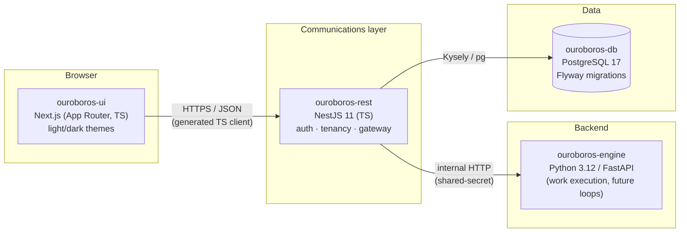
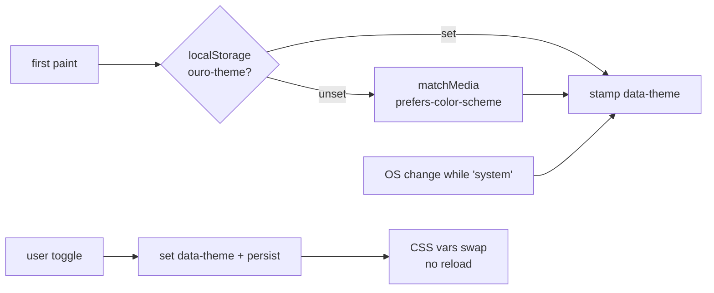
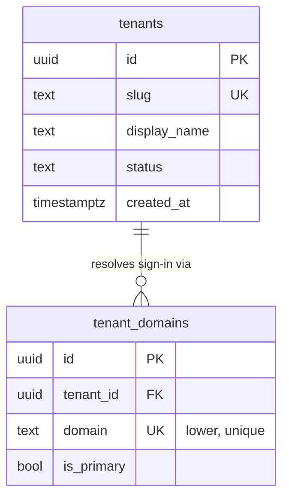
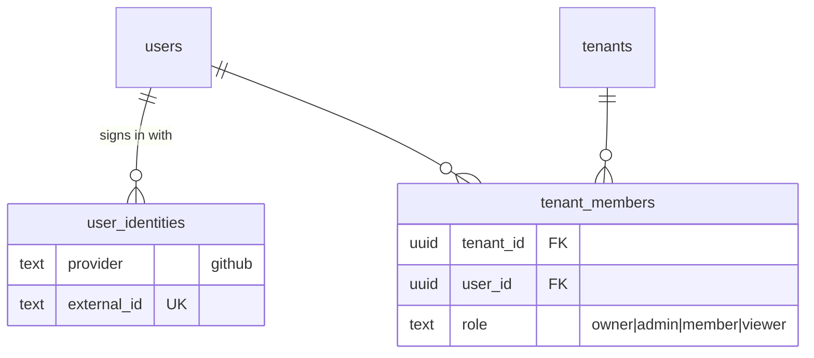
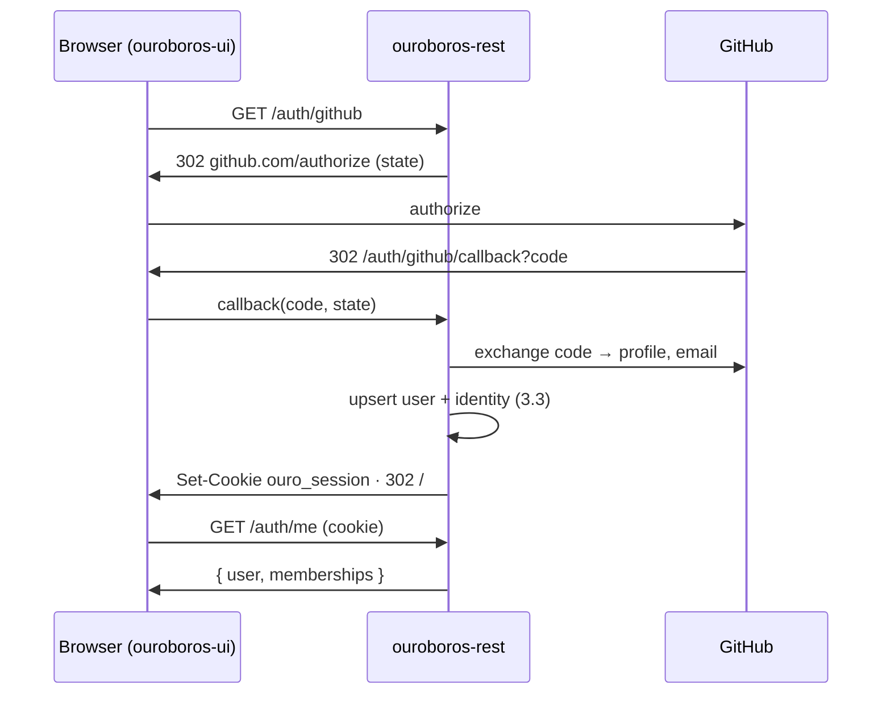
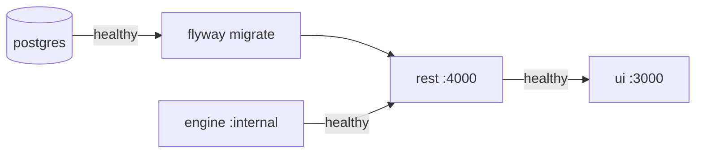
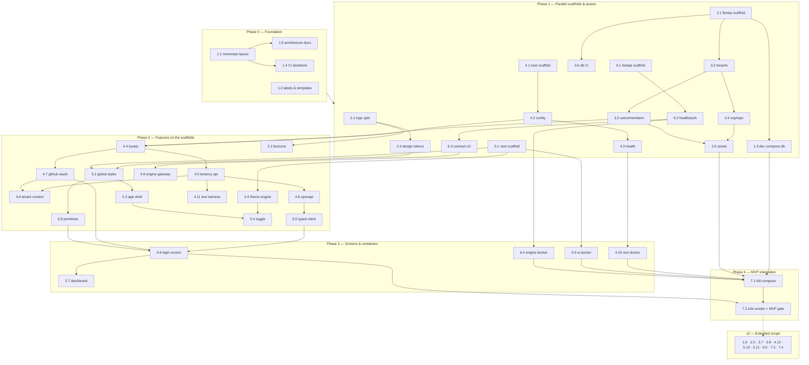

# Roadmap — Ouroboros Application Scaffolding

## Description

> Create a roadmap to build the Ouroboros application and set up its scaffolding. Its
> design is outlined in `docs/mockups`, and this is the foundation for the application.
> There will be a database that stores tenancy information in a project called
> "ouroboros-db", which will be a PostgreSQL database, using Flyway to build the database
> scripts. The scaffolding should be built using NextJS with NestJS as the communications
> layer with a Python server backend. Create issues in GitHub for this project, and
> assign labels to the issues as appropriate. This will serve as the foundation of the
> application. Keep it simple, lightweight, modular, and well designed. Split the
> Ouroboros logo into separate pieces for the web icon, the main glyph on the server, and
> the logo with the tagline. It should allow for light/dark mode switching on the fly.
> The application should live in "ouroboros-ui" and the NestJS service should live in
> "ouroboros-rest". Be thorough, well thought-out, and precise in the design of the
> roadmap. Label items that are good for the first release as "mvp" in the labels, and
> anything outside of the extended scope should be labeled as "v2".

## Context & Existing Work (duplicate-avoidance survey)

Surveyed 2026-08-08:

- **GitHub issues:** none existed at survey time; **all 58 issues (7 epic parents +
  51 work issues) were filed from this roadmap on 2026-08-08** — see the `GitHub`
  column in every table below. No duplication risk.
- **GitHub labels:** at survey time only the nine GitHub defaults (`bug`, `enhancement`,
  `documentation`, …). The roadmap set — `mvp`, `v2`, `ui`, `rest`, `db`, `engine`,
  `infra`, `design`, `ci`, `epic` — has since been created and applied, and issue 1.2
  (#9) has committed the whole set to `.github/labels.yml` alongside the issue and pull
  request templates.
- **`ouroboros-web/`** — the *marketing* site (Next.js, deployed at ouroboros.build).
  Out of scope for this roadmap; nothing here modifies it. Its existing
  `docker-publish.yml` workflow is the pattern issue 7.3 extends.
- **`docs/mockups/`** — 21 static HTML screens plus `assets/ouroboros.css` (the design
  system) and `MARKET-ANALYSIS.md`. These are the design source of truth for this
  roadmap. The mockups commit to a dark theme for v0.1 and list the light theme as "not
  yet mocked" — the light/dark requirement in this roadmap therefore includes *deriving*
  a light palette from the brand sheet, not merely wiring a toggle.
- **`logo-unsplit.png`** (repo root, 1376×768) — the brand sheet containing light and
  dark halves. `docs/mockups/assets/logo-mark.png` and `logo-lockup.png` were already
  cropped from the dark half; the systematic split (icon / glyph / tagline lockup, in
  both light and dark variants) is issue 2.1.

### Decisions proposed by this roadmap (validate before issue creation)

| # | Decision | Rationale |
|---|----------|-----------|
| D1 | Python backend lives in **`ouroboros-engine/`** | The user named `ouroboros-db`, `ouroboros-ui`, `ouroboros-rest` but not the Python module. "Engine" matches its role (executes the work the REST layer brokers). |
| D2 | Python stack: **FastAPI + uv + ruff + pytest** | Lightweight, typed, auto-OpenAPI — mirrors the NestJS layer's contract-first style. |
| D3 | NestJS data access: **Kysely over node-postgres** (no ORM) | Flyway owns the schema; an ORM that wants to own migrations (TypeORM/Prisma) fights that. Kysely is a thin, fully-typed query builder — simple and lightweight per the brief. |
| D4 | UI ↔ REST contract: **OpenAPI generated by NestJS, TS client generated for the UI** | One source of truth; no hand-maintained types. |
| D5 | Theme mechanism: **CSS custom properties + `data-theme` on `<html>`**, system-preference default, persisted choice, no-flash inline script | The standard on-the-fly approach; zero runtime CSS-in-JS weight. |
| D6 | Monorepo of independent modules (no workspace tool yet) | Each module (`ouroboros-ui`, `ouroboros-rest`, `ouroboros-db`, `ouroboros-engine`) is self-contained with its own toolchain, like `ouroboros-web` today. Turborepo/Nx deferred to v2 — simple and modular first. |

## Architecture Overview



Port map (development defaults): UI `3000` · REST `4000` · Engine `8000` · PostgreSQL `5432`.

Only `ouroboros-rest` talks to the database and to the engine. The UI never reaches
either directly — the NestJS layer is the single communications boundary, which keeps
tenancy enforcement in one place.

## MVP Definition

The MVP is the **running, integrated skeleton** of Ouroboros — not product features. It
is done when a developer can run `docker compose up` at the repo root and get:

1. **PostgreSQL** with the tenancy schema applied by **Flyway** (tenants, domains,
   users, memberships, org/repo enablement) and dev seed data.
2. **ouroboros-rest** (NestJS) healthy: config validation, `/health` verifying DB and
   engine connectivity, tenancy CRUD API, tenant-context resolution, GitHub OAuth
   sign-in with sessions, branded OpenAPI docs at `/api/docs`.
3. **ouroboros-engine** (FastAPI) healthy: versioned internal API stub reachable only
   through the REST gateway.
4. **ouroboros-ui** (Next.js) serving the app shell in the mockup design system with
   **on-the-fly light/dark switching**, the split brand assets (favicon set, glyph,
   tagline lockup), the login/tenancy screen wired to real auth, and a dashboard
   placeholder.
5. **CI** that lints, tests, and builds each module on PRs touching it, and validates
   Flyway migrations against a throwaway PostgreSQL.
6. An **end-to-end smoke test** proving the full chain: UI loads → sign-in → REST →
   DB and REST → Engine round trips.

**Explicitly out of MVP (labeled `v2`):** the 19 remaining product screens, image
publishing to GHCR for the new modules, row-level-security hardening, audit logging,
Storybook, rate limiting, engine job queue, workspace tooling, deployment runbook.

## Epics

Each epic is a parent tracking issue on GitHub; every roadmap issue below is filed as
one of its sub-issues (GitHub Relationships).

| Epic | GitHub | Status | Name | Goal | Modules |
|------|:------:|:------:|------|------|---------|
| 1 | #1 | 🟡 Open | Foundation & Repo Infrastructure | Monorepo layout, labels, dev environment, CI, architecture docs | repo root |
| 2 | #2 | 🟡 Open | Brand Assets & Theming | Logo split (icon / glyph / tagline lockup), design tokens, light+dark palettes | assets, ouroboros-ui |
| 3 | #3 | 🟡 Open | Tenancy Database (`ouroboros-db`) | Flyway project + PostgreSQL tenancy schema | ouroboros-db |
| 4 | #4 | 🟡 Open | Communications Layer (`ouroboros-rest`) | NestJS service: config, health, data access, tenancy API, auth, engine gateway | ouroboros-rest |
| 5 | #5 | 🟡 Open | Application UI (`ouroboros-ui`) | Next.js app shell, theme switching, login/tenancy, dashboard placeholder | ouroboros-ui |
| 6 | #6 | 🟡 Open | Python Backend (`ouroboros-engine`) | FastAPI scaffold with internal contract | ouroboros-engine |
| 7 | #7 | 🟡 Open | Integration & Delivery | Full-stack compose, e2e smoke, publishing, runbook | all |

Issue naming convention: `<project>: [<epic>.<issue>] <title>`, e.g.
`ouroboros-db: [3.2] Baseline tenancy schema — tenants & domains`.

Label set (issue 1.2 / #9 — **created in the repo and committed to
[`.github/labels.yml`](../.github/labels.yml)**): `mvp`, `v2`, `ui`, `rest`, `db`,
`engine`, `infra`, `design`, `ci`, plus `epic` for the parent issues and GitHub's
existing `documentation` where apt.

Issue types: **Feature** for capability-delivering work and every epic parent, **Task**
for scaffolding, infrastructure, CI and documentation work.

Complexity scale matches the product's own effort chips: **XS · S · M · L**.

---

## Epic 1 — Foundation & Repo Infrastructure

| Ref | GitHub | Status | Title | Summary | Labels | Parallel | MVP | Complexity | Affected Modules |
|-------|:------:|:------:|-------|---------|--------|:--------:|:---:|:----------:|------------------|
| 1.1 | #8 | 🟢 Done | ouroboros: [1.1] Monorepo layout & module scaffolding conventions | Create the four module directories with READMEs and shared conventions | mvp, infra | N (first) | Y | S | repo root |
| 1.2 | #9 | 🟢 Done | ouroboros: [1.2] GitHub labels & issue/PR templates | Create `mvp`, `v2`, and module labels; add issue/PR templates | mvp, infra | Y | Y | XS | .github |
| 1.3 | #10 | 🟢 Done | ouroboros: [1.3] Local dev environment (docker-compose: PostgreSQL + Flyway) | One-command local database with migrations applied | mvp, infra, db | Y | Y | S | repo root, ouroboros-db |
| 1.4 | #11 | 🟢 Done | ouroboros: [1.4] CI pipelines per module (path-filtered) | Lint/test/build workflows that run only for touched modules | mvp, ci | Y | Y | M | .github |
| 1.5 | #12 | 🟢 Done | ouroboros: [1.5] Architecture documentation | `docs/ARCHITECTURE.md`: diagram, port map, env-var conventions, module contracts | mvp, documentation | Y | Y | S | docs |
| 1.6 | #13 | 🟡 Open | ouroboros: [1.6] Workspace tooling evaluation (Turborepo/Nx) | Evaluate/adopt a workspace runner once module count justifies it | v2, infra | Y | N | M | repo root |

### Issue 1.1 — ouroboros: [1.1] Monorepo layout & module scaffolding conventions

> **GitHub issue:** #8 · **Status:** 🟢 Done · **Parent epic:** #1
>
> Delivered: the four module directories with contract READMEs, root `README.md`
> (module map + architecture sketch), root `.editorconfig` and `.gitignore`, the shared
> conventions doc [`CONVENTIONS.md`](CONVENTIONS.md), and `scripts/verify-layout.sh`
> which asserts the layout in CI. `ouroboros-web` untouched.

- **Problem Statement:** The repo holds only mockups and the marketing site. The four
  application modules need homes with consistent conventions before any scaffolding
  work can start, or each module will invent its own.
- **Solution/Scope:** Create `ouroboros-ui/`, `ouroboros-rest/`, `ouroboros-db/`,
  `ouroboros-engine/` each with a README stating purpose, stack, and dev commands.
  Add root `.editorconfig`, extend root `.gitignore`, and update the root README with
  the module map and architecture sketch. Conventions doc: yarn for TS modules
  (matching `ouroboros-web`), uv for Python, `PORT`/`OURO_*` env-var prefix, per-module
  Dockerfiles. Source: existing `ouroboros-web` conventions (`.yarnrc.yml`, Dockerfile).
- **Acceptance Criteria:**
  - All four directories exist with READMEs (purpose, stack, run instructions).
  - Root README shows the module map and links to `docs/ARCHITECTURE.md` (1.5).
  - `.editorconfig` covers TS, Python, SQL, Markdown, YAML.
  - `ouroboros-web` untouched.
- **Parallelism/Dependencies:** First issue; everything else depends on it. 1.2 may run
  concurrently.
- **Technical Stack:** git, Markdown, EditorConfig.
- **Epic:** 1

```
ouroboros/
├── docs/            # mockups, ARCHITECTURE.md, BRAND.md, this roadmap
├── ouroboros-web/   # marketing site (existing — untouched)
├── ouroboros-ui/    # Next.js product UI          (Epic 5)
├── ouroboros-rest/  # NestJS communications layer (Epic 4)
├── ouroboros-engine/# Python/FastAPI backend      (Epic 6)
└── ouroboros-db/    # Flyway migrations           (Epic 3)
```

### Issue 1.2 — ouroboros: [1.2] GitHub labels & issue/PR templates

> **GitHub issue:** #9 · **Status:** 🟢 Done · **Parent epic:** #1
>
> Delivered: [`.github/labels.yml`](../.github/labels.yml) committing all 35 labels this
> repository defines, the `feature`/`bug` YAML issue forms with their `config.yml`, and
> [`.github/pull_request_template.md`](../.github/pull_request_template.md). Applying the
> file is `scripts/sync-labels.sh` (idempotent, never deletes); the `.github` contract is
> asserted by `scripts/verify-github-config.sh` and the tooling is covered by
> `scripts/run-tests.sh`.

- **Problem Statement:** Only GitHub's default labels exist; the roadmap's `mvp`/`v2`
  scoping and module routing have no labels to attach to.
- **Solution/Scope:** Create labels: `mvp` (release scoping), `v2` (extended scope),
  `ui`, `rest`, `db`, `engine`, `infra`, `design`, `ci` — with colors and descriptions
  (accent cyan `#3dd6f5` for `mvp` as a nod to the brand). Add
  `.github/ISSUE_TEMPLATE/` (feature, bug) and a PR template referencing the
  `<project>: [<e.i>]` naming convention.
- **Acceptance Criteria:**
  - `gh label list` shows all nine new labels with descriptions.
  - New-issue UI offers the templates; PR template auto-populates.
- **Parallelism/Dependencies:** None — fully parallel; required before roadmap issues
  are filed.
- **Technical Stack:** GitHub CLI, YAML issue forms.
- **Epic:** 1

```
labels:  [mvp] [v2]   [ui] [rest] [db] [engine]   [infra] [design] [ci]
          scope        module routing               cross-cutting
```

### Issue 1.3 — ouroboros: [1.3] Local dev environment (docker-compose: PostgreSQL + Flyway)

> **GitHub issue:** #10 · **Status:** 🟢 Done · **Parent epic:** #1
>
> Delivered: repo-root `docker-compose.yml` (PostgreSQL 17 on a healthcheck and a named
> volume, plus a Flyway 11 pass gated on `service_healthy`), `.env.example` covering
> every `OURO_*` variable with development defaults, `ouroboros-db/migrations/` with
> `V000__bootstrap.sql` so the first `up` leaves a readable history, and
> `scripts/verify-dev-env.sh` with its tests. Measured on a clean volume: `up` →
> migrated in 7s, `down -v` → `up` reapplies from scratch. Issue 3.1 (#19) still owns
> `flyway.toml` and the migration wrapper scripts; the tenancy tables keep V001+.
- **Solution/Scope:** Root `docker-compose.yml` (dev profile): `postgres:17-alpine`
  with healthcheck + named volume, and a `flyway` service that runs
  `ouroboros-db/migrations` against it on `up`. `.env.example` with all `OURO_*`
  variables. Document `docker compose up db` / `down -v` reset flow. Full-stack
  compose (all services) is issue 7.1 — this issue delivers the data tier only.
- **Acceptance Criteria:**
  - `docker compose up` from a clean checkout yields a migrated database in <60s.
  - `psql` connect with documented dev credentials succeeds; Flyway history table shows
    applied versions.
  - Reset flow documented and verified.
- **Parallelism/Dependencies:** Needs 1.1 (directories) and 3.1 (Flyway layout);
  parallel with everything else.
- **Technical Stack:** Docker Compose, postgres:17-alpine, flyway (containerized).
- **Epic:** 1

```
docker compose up
   └─▶ [postgres:17] ──healthy──▶ [flyway migrate] ──▶ schema ready :5432
```

### Issue 1.4 — ouroboros: [1.4] CI pipelines per module (path-filtered)

> **GitHub issue:** #11 · **Status:** 🟢 Done · **Parent epic:** #1
>
> Delivered: `.github/workflows/{ui,rest,engine,db}.yml`, each filtered to its own
> module and reporting as `ci/ui` / `ci/rest` / `ci/engine` / `ci/db`;
> `.github/actions/node-module` holding the TypeScript pipeline both TS modules run and
> the single Node 24 pin; `.github/actions/scaffold-gate`, which turns a module's checks
> on by itself when its manifest lands, so the three unscaffolded modules skip with a
> notice instead of failing; and `scripts/verify-ci.sh` with its tests, which proves the
> routing table from the checkout — 106 checks, including that a change under
> `ouroboros-ui/` queues `ci/ui` and nothing else. `ci/db` runs the data-tier contract
> that needs no database; issue 3.6 (#24) adds the live `migrate` → `validate` →
> `constraints.sql` pass to that same job.

- **Problem Statement:** Four modules with three toolchains in one repo; unfiltered CI
  would run everything on every PR — slow and noisy.
- **Solution/Scope:** GitHub Actions workflows per module using `paths:` filters:
  `ui.yml` / `rest.yml` (yarn install → lint → typecheck → test → build),
  `engine.yml` (uv sync → ruff → pytest), `db.yml` (delegates to 3.6's migration
  check). Shared Node/Python version pins. Source pattern: existing
  `docker-publish.yml`.
- **Acceptance Criteria:**
  - A PR touching only `ouroboros-ui/` triggers only the UI workflow.
  - Each workflow fails on an introduced lint/test error (verified once per module as
    its scaffold lands).
  - Status checks named consistently (`ci/ui`, `ci/rest`, `ci/engine`, `ci/db`).
- **Parallelism/Dependencies:** Skeletons after 1.1; each module's job activates with
  its scaffold (4.1, 5.1, 6.1, 3.6). Parallel with all module work.
- **Technical Stack:** GitHub Actions, actions/setup-node, astral-sh/setup-uv.
- **Epic:** 1

```
PR paths ──┬─ ouroboros-ui/**     ─▶ ci/ui     (lint·type·test·build)
           ├─ ouroboros-rest/**   ─▶ ci/rest   (lint·type·test·build)
           ├─ ouroboros-engine/** ─▶ ci/engine (ruff·pytest)
           └─ ouroboros-db/**     ─▶ ci/db     (flyway migrate+validate)
```

### Issue 1.5 — ouroboros: [1.5] Architecture documentation

> **GitHub issue:** #12 · **Status:** 🟢 Done · **Parent epic:** #1
>
> Delivered: [`ARCHITECTURE.md`](ARCHITECTURE.md) — the system diagram, the module
> contracts (each marked *running* or *specified* so the document matches the checkout
> rather than the plan), the request paths, the auth/session/tenant-context flow, both
> API contracts including the OpenAPI generation chain (D4) and the engine's `/v0`
> contract, the port map, the full `OURO_*` registry, the environments, the four
> invariants with what breaking each looks like, and the trust boundaries. Kept true by
> `scripts/verify-architecture.sh` with its tests: sections, mermaid fences, port map,
> invariants, every relative link and in-document anchor, and — the acceptance criterion
> — that the registry and `.env.example` declare exactly the same variables, checked in
> both directions.

- **Problem Statement:** The architecture (who talks to whom, ports, env conventions,
  tenancy boundary) lives only in this roadmap; it needs a durable home that outlives
  the roadmap document.
- **Solution/Scope:** `docs/ARCHITECTURE.md`: the system diagram (Mermaid), module
  responsibilities, port map, env-var registry, the "UI never touches DB/engine
  directly" invariant, auth/session flow, and the OpenAPI-contract flow (D4). Link from
  root README. Sources: this roadmap, `docs/mockups/README.md`.
- **Acceptance Criteria:**
  - Document exists, renders on GitHub with diagrams, and matches the implemented
    scaffolds (updated as 4.x/5.x/6.x land).
  - Every `OURO_*` variable in `.env.example` is documented.
- **Parallelism/Dependencies:** After 1.1; parallel with everything.
- **Technical Stack:** Markdown, Mermaid.
- **Epic:** 1

### Issue 1.6 — ouroboros: [1.6] Workspace tooling evaluation (Turborepo/Nx)

> **GitHub issue:** #13 · **Status:** 🟡 Open · **Parent epic:** #1

- **Problem Statement:** Independent modules mean duplicated scripts and no task-graph
  caching; at some scale a workspace runner pays for itself — adopting one now would
  contradict "simple and lightweight."
- **Solution/Scope:** Post-MVP spike: evaluate Turborepo vs. Nx vs. status quo for
  shared TS config, task caching, and the generated-client handoff (4.8 → 5.5). Adopt
  only if it removes real friction; write up the decision either way.
- **Acceptance Criteria:** Decision doc in `docs/`; if adopted, all module CI still
  path-filters correctly.
- **Parallelism/Dependencies:** After MVP integration (7.2). Parallel with other v2 work.
- **Technical Stack:** Turborepo or Nx (evaluation).
- **Epic:** 1

```
now:  4 modules · 3 toolchains · plain scripts     (simple, some duplication)
v2?:  workspace runner · task graph · shared cache (faster, one more tool)
```

---

## Epic 2 — Brand Assets & Theming

| Ref | GitHub | Status | Title | Summary | Labels | Parallel | MVP | Complexity | Affected Modules |
|-------|:------:|:------:|-------|---------|--------|:--------:|:---:|:----------:|------------------|
| 2.1 | #14 | 🟢 Done | ouroboros: [2.1] Split brand sheet into logo asset set | Web icon, standalone glyph, tagline lockup — light + dark variants | mvp, design | Y | Y | M | docs/brand, assets |
| 2.2 | #15 | 🟡 Open | ouroboros-ui: [2.2] Favicon & web-app manifest set | Full favicon/PWA icon set generated from the web-icon asset | mvp, design, ui | N (needs 2.1, 5.1) | Y | XS | ouroboros-ui |
| 2.3 | #16 | 🟢 Done | ouroboros: [2.3] Design tokens — light & dark palettes as CSS custom properties | Port `ouroboros.css` to a token sheet; derive the light palette | mvp, design, ui | N (needs 2.1) | Y | M | docs/mockups/assets → shared tokens |
| 2.4 | #17 | 🟡 Open | ouroboros-ui: [2.4] Runtime theme engine (on-the-fly light/dark) | `data-theme` switching: system default, persisted, no flash | mvp, ui | N (needs 2.3, 5.1) | Y | S | ouroboros-ui |
| 2.5 | #18 | 🟡 Open | ouroboros: [2.5] Server-side brand surfaces | Glyph on REST OpenAPI page + engine/REST startup banners | v2, design, rest, engine | N (needs 2.1, 4.8, 6.2) | N | XS | ouroboros-rest, ouroboros-engine |

### Issue 2.1 — ouroboros: [2.1] Split brand sheet into logo asset set

> **GitHub issue:** #14 · **Status:** 🟢 Done · **Parent epic:** #2
>
> Delivered: [`docs/brand/`](brand) — `icon-{light,dark}.png` (512×512),
> `glyph-{light,dark}.png` (512×296) and `lockup-tagline-{light,dark}.png` (640×471), all
> six straight-alpha RGBA with the ground solved for and removed rather than blended away.
> [`BRAND.md`](BRAND.md) documents each one's surface, working size, minimum size and
> clear space, plus the colours sampled from both halves for 2.3.
> [`split-brand-sheet.py`](../scripts/split-brand-sheet.py) regenerates every asset from
> the sheet — nothing here is a hand crop — and refuses to write one whose ground survived
> or whose measured crop does not close on transparency;
> [`verify-brand.sh`](../scripts/verify-brand.sh) with its tests holds the committed files
> and the document to each other.

- **Problem Statement:** The brand exists only as `logo-unsplit.png` (1376×768 sheet
  with light and dark halves) plus two ad-hoc crops used by the mockups. The
  application needs purpose-built pieces: a web icon, the standalone glyph, and the
  logo-with-tagline lockup — each usable on light *and* dark surfaces.
- **Solution/Scope:** From `logo-unsplit.png`, produce in `docs/brand/` (canonical) —
  transparent-background PNGs at 2× working sizes, from **both** halves of the sheet:
  - `icon-{light,dark}.png` — snake head/mark reduced for tiny sizes (favicon source).
  - `glyph-{light,dark}.png` — the full circuit-snake mark alone (server & UI surfaces).
  - `lockup-tagline-{light,dark}.png` — mark + wordmark + tagline *"Infinity in
    Autonomy"* (login screen, marketing, docs headers).
  Document sizes, clear-space, and usage rules in `docs/BRAND.md`. Note: existing
  mockup crops rely on `mix-blend-mode: screen` and only work on dark — these replace
  that trick with true transparency. Source: `logo-unsplit.png`,
  `docs/mockups/README.md` design-system section.
- **Acceptance Criteria:**
  - Six assets exist, transparent, cleanly cropped (no halo artifacts at 100%).
  - Each renders correctly on `#12181d` (dark ground) and `#f5f8fa`-class light ground.
  - `docs/BRAND.md` documents each asset's intended surface and minimum size.
- **Parallelism/Dependencies:** Only needs 1.1. Blocks 2.2, 2.3 (palette sampling),
  2.5, 5.6.
- **Technical Stack:** ImageMagick/image editing; PNG (SVG retrace noted as v2 if the
  source rasters don't scale cleanly).
- **Epic:** 2

```
logo-unsplit.png (1376×768: light half ┃ dark half)
        │ crop + clean + transparent bg (×2 themes each)
        ├─▶ icon-*.png            → favicons, browser tab      (2.2)
        ├─▶ glyph-*.png           → app shell, server surfaces (2.5, 5.3)
        └─▶ lockup-tagline-*.png  → login, docs, marketing     (5.6)
```

### Issue 2.2 — ouroboros-ui: [2.2] Favicon & web-app manifest set

> **GitHub issue:** #15 · **Status:** 🟡 Open · **Parent epic:** #2
>
> Partly delivered — the files exist, the wiring waits on 5.1. In
> [`../ouroboros-ui/public/`](../ouroboros-ui/public): `favicon.ico` (16/32/48),
> `favicon-32-{light,dark}.png`, `apple-touch-icon.png` (180), `icon-192.png`,
> `icon-512.png` and `manifest.webmanifest`, all scaled from `icon-{light,dark}.png` by
> [`build-favicons.py`](../scripts/build-favicons.py). The tab pair keeps its alpha for
> the `prefers-color-scheme` swap; everything a launcher draws is flattened onto
> `#12181d` and written with no alpha channel at all, so
> [`verify-favicons.sh`](../scripts/verify-favicons.sh) can assert opacity from the PNG
> colour type. `favicon.ico` and `apple-touch-icon.png` already resolve by convention
> once anything serves `public/`.
>
> **Still open:** the `<link>` tags for the theme-aware pair and the manifest, and the
> per-scheme `themeColor` pair — all of which are Metadata API exports in
> `app/layout.tsx`, which 5.1 (#39) creates. The exact block to paste is in
> [`../ouroboros-ui/README.md`](../ouroboros-ui/README.md); both acceptance criteria are
> checkable only once that layout renders.

- **Problem Statement:** The UI needs correct browser-tab and home-screen icons across
  platforms, in both themes.
- **Solution/Scope:** From `icon-*.png` (2.1) generate: `favicon.ico` (16/32/48),
  `icon.svg` or theme-aware PNG pair via
  `<link rel="icon" media="(prefers-color-scheme: …)">`, `apple-touch-icon.png`
  (180), `icon-192.png`/`icon-512.png` + `manifest.webmanifest` (name, theme colors
  for both schemes). Wire through Next.js Metadata API in `app/`.
- **Acceptance Criteria:**
  - Tab icon renders crisply in light and dark browser chrome.
  - Lighthouse reports a valid manifest; `apple-touch-icon` resolves.
- **Parallelism/Dependencies:** Needs 2.1 and 5.1.
- **Technical Stack:** Next.js Metadata API / app-router file conventions.
- **Epic:** 2

```
icon-dark.png ─┐                       ┌─ favicon.ico (16/32/48)
               ├─ generate + wire ────▶├─ apple-touch-icon (180)
icon-light.png ┘   (Next metadata)     └─ icon-192/512 + manifest
```

### Issue 2.3 — ouroboros: [2.3] Design tokens — light & dark palettes as CSS custom properties

> **GitHub issue:** #16 · **Status:** 🟢 Done · **Parent epic:** #2
>
> Delivered: [`design/tokens.css`](design/tokens.css) — 37 colour tokens in a light and a
> dark palette, plus theme-independent type, spacing and shape scales, arranged as `:root`
> (light base), `:root[data-theme="dark"]` and a `prefers-color-scheme` block for the unset
> case. The dark palette is the mockups' committed identity extracted literal for literal;
> the light palette is derived from the brand sheet's light half against the contrast
> tables, which is what deepens the accent to `#07708e` — `#3dd6f5` measures 1.73:1 on
> white. [`DESIGN_TOKENS.md`](DESIGN_TOKENS.md) documents every token and publishes 53
> measured contrast pairs; all 30 text pairs clear AA 4.5:1 and all 11 non-text pairs 3:1 in
> **both** palettes. Three departures from the mockup sheet are named there, each forced by
> a ratio: `--ink-faint` lightened (the mockups' `--faint` reaches 3.1:1 as text),
> `--line-control` added for the boundaries WCAG 1.4.11 covers, and the status tints
> unified at one alpha per palette.
>
> [`design/tokens-preview.html`](design/tokens-preview.html) renders the whole design system
> with **no colour literal in its stylesheet**, and
> [`preview-light.png`](design/preview-light.png) /
> [`preview-dark.png`](design/preview-dark.png) are its two palettes, rebuilt by
> [`render-token-preview.sh`](../scripts/render-token-preview.sh).
> [`verify-tokens.sh`](../scripts/verify-tokens.sh) holds all of it together: three palette
> blocks and nothing outside them, both dark blocks identical, every colour themed in both
> palettes, the carried-over literals still matching the mockups' sheet, and every published
> ratio recomputed from the sheet by [`contrast.awk`](../scripts/lib/contrast.awk) — so a
> palette edit that drops below AA fails the build rather than the audit.

- **Problem Statement:** `docs/mockups/assets/ouroboros.css` defines a dark-only
  palette as literal colors. On-the-fly theme switching requires every color to be a
  token, and the light palette doesn't exist yet (mockups explicitly defer it).
- **Solution/Scope:** Produce a token sheet (`tokens.css`, destined for
  `ouroboros-ui/app/` in 5.2): extract the dark palette from `ouroboros.css`
  (`--ground #12181d`, `--surface #171f26`, `--ink #e9f2f6`, accent `#3dd6f5`,
  semantic green/amber/red, violet model-chip hue) and **derive the light palette**
  from the brand sheet's light half — keeping the accent recognizably cyan while
  meeting WCAG AA contrast on light surfaces. Structure: base tokens on `:root`
  (light), overrides under `:root[data-theme="dark"]` and
  `@media (prefers-color-scheme: dark)` for the unset case. Include type-family and
  spacing tokens. Sources: `ouroboros.css`, `logo-unsplit.png` light half.
- **Acceptance Criteria:**
  - No literal color values outside the token blocks.
  - Both palettes pass WCAG AA for body text and UI chrome (documented contrast table).
  - A sample page rendered with each palette is attached to the PR for design review.
- **Parallelism/Dependencies:** Needs 2.1 (light-half color sampling). Blocks 2.4, 5.2.
- **Technical Stack:** CSS custom properties; no preprocessor.
- **Epic:** 2

```css
:root                    { --ground:#f5f8fa; --ink:#16232b; --accent:#0899c2; … }  /* light */
:root[data-theme="dark"] { --ground:#12181d; --ink:#e9f2f6; --accent:#3dd6f5; … }  /* dark  */
/* + prefers-color-scheme fallback when data-theme is unset */
```

### Issue 2.4 — ouroboros-ui: [2.4] Runtime theme engine (on-the-fly light/dark)

> **GitHub issue:** #17 · **Status:** 🟡 Open · **Parent epic:** #2

- **Problem Statement:** The brief requires switching themes on the fly — no reload, no
  flash of wrong theme on first paint, respecting the OS preference until the user
  chooses.
- **Solution/Scope:** In `ouroboros-ui`: a tiny inline `<head>` script that resolves
  `localStorage("ouro-theme") ?? system` and stamps `data-theme` before first paint; a
  `ThemeProvider`/`useTheme()` hook exposing `light | dark | system`; live reaction to
  `prefers-color-scheme` changes while in `system`; `color-scheme` CSS property set so
  native controls/scrollbars match. The visible toggle control is 5.4.
- **Acceptance Criteria:**
  - Toggling swaps the full palette with no reload and no unstyled flash (verified with
    CPU-throttled hard reloads in both themes).
  - Choice persists across sessions; "system" tracks OS changes live.
  - No hydration warnings.
- **Parallelism/Dependencies:** Needs 2.3 and 5.1. Blocks 5.4.
- **Technical Stack:** Next.js App Router, inline script via `next/script`
  (`beforeInteractive`), localStorage, `matchMedia`.
- **Epic:** 2



### Issue 2.5 — ouroboros: [2.5] Server-side brand surfaces

> **GitHub issue:** #18 · **Status:** 🟡 Open · **Parent epic:** #2

- **Problem Statement:** The glyph should also brand the server-facing surfaces —
  OpenAPI docs, service startup banners — so internal tooling is recognizably Ouroboros.
- **Solution/Scope:** Serve `glyph-dark.png` as the REST OpenAPI page logo/favicon
  (Swagger UI custom options, 4.8); ASCII-art glyph + version banner on REST and
  engine startup logs; engine `/` returns a minimal branded identity JSON.
- **Acceptance Criteria:** OpenAPI page shows the glyph; both services log the banner
  with the running version.
- **Parallelism/Dependencies:** Needs 2.1, 4.8, 6.2. Cosmetic — scheduled v2.
- **Technical Stack:** @nestjs/swagger customization, Python logging.
- **Epic:** 2

```
$ ouroboros-rest
   ___
  ( o )>  OUROBOROS REST v0.1.0 · :4000 · db ✓ · engine ✓
   `~'
```

---

## Epic 3 — Tenancy Database (`ouroboros-db`)

Schema scope comes from mockup 01 (sign-in & tenancy) and mockup 17 (workspace
settings): domain-isolated tenants, GitHub-identity users, role-based membership, and
per-tenant GitHub org/repo enablement.

| Ref | GitHub | Status | Title | Summary | Labels | Parallel | MVP | Complexity | Affected Modules |
|-------|:------:|:------:|-------|---------|--------|:--------:|:---:|:----------:|------------------|
| 3.1 | #19 | 🟡 Open | ouroboros-db: [3.1] Flyway project scaffold & migration conventions | Directory layout, config, naming rules, local runner scripts | mvp, db, infra | N (after 1.1) | Y | S | ouroboros-db |
| 3.2 | #20 | 🟡 Open | ouroboros-db: [3.2] Baseline tenancy schema — tenants & domains | `tenants`, `tenant_domains`, status lifecycle, uniqueness | mvp, db | N (after 3.1) | Y | M | ouroboros-db |
| 3.3 | #21 | 🟡 Open | ouroboros-db: [3.3] Users, identities & tenant membership | `users`, `user_identities` (GitHub), `tenant_members` + roles | mvp, db | N (after 3.2) | Y | M | ouroboros-db |
| 3.4 | #22 | 🟡 Open | ouroboros-db: [3.4] GitHub org & repo enablement | `github_orgs`, `github_repos` scoped per tenant | mvp, db | N (after 3.2) | Y | S | ouroboros-db |
| 3.5 | #23 | 🟡 Open | ouroboros-db: [3.5] Dev seed data (repeatable migration) | Deterministic demo tenant/users/orgs for local dev & e2e | mvp, db | N (after 3.3, 3.4) | Y | XS | ouroboros-db |
| 3.6 | #24 | 🟡 Open | ouroboros-db: [3.6] Migration CI check | PR job: flyway migrate + validate against throwaway PostgreSQL | mvp, db, ci | N (after 3.1, 1.4) | Y | S | ouroboros-db, .github |
| 3.7 | #25 | 🟡 Open | ouroboros-db: [3.7] Row-level security & least-privilege roles | RLS policies keyed on tenant; separate migration/app DB roles | v2, db | N (after 3.4) | N | L | ouroboros-db, ouroboros-rest |
| 3.8 | #26 | 🟡 Open | ouroboros-db: [3.8] Audit log table & write path | Append-only `audit_events` per tenant (settings mockup: audit log) | v2, db | N (after 3.3) | N | M | ouroboros-db |

### Issue 3.1 — ouroboros-db: [3.1] Flyway project scaffold & migration conventions

> **GitHub issue:** #19 · **Status:** 🟡 Open · **Parent epic:** #3
>
> Partly landed by 1.3 (#10), which needed something to migrate: `migrations/` exists
> and holds `V000__bootstrap.sql`, and the compose stack already passes the schema and
> `validateMigrationNaming` settings on the command line. What remains here is
> `flyway.toml` (so the settings live in the module rather than in compose), the
> `scripts/` wrappers, and `tests/`. The tenancy tables still start at V001.

- **Problem Statement:** Flyway needs a project home, configuration, and non-negotiable
  conventions (naming, immutability, review rules) before the first migration lands.
- **Solution/Scope:** `ouroboros-db/` containing `migrations/` (versioned `V###__*.sql`
  + repeatable `R__*.sql`), `flyway.toml` (locations, schema `ouroboros`,
  `validateMigrationNaming`), `scripts/` wrapping the Flyway container (`migrate`,
  `info`, `validate`, `clean` gated to dev), and a README stating the rules: plain SQL
  only, applied migrations are immutable, one concern per migration, repeatables for
  seeds/views only. Source: Flyway docs (naming/validation), user requirement
  (PostgreSQL + Flyway).
- **Acceptance Criteria:**
  - `scripts/migrate` against the 1.3 database applies zero-migration baseline cleanly;
    `flyway info` renders history.
  - Naming rules enforced by `validate` (bad name fails).
- **Parallelism/Dependencies:** Needs 1.1. Blocks 3.2, 3.6, 1.3.
- **Technical Stack:** Flyway 11 (containerized — no local Java), PostgreSQL 17, SQL.
- **Epic:** 3

```
ouroboros-db/
├── flyway.toml
├── migrations/
│   ├── V001__tenants.sql          (3.2)
│   ├── V002__users_membership.sql (3.3)
│   ├── V003__github_enablement.sql(3.4)
│   └── R__dev_seed.sql            (3.5, dev-only)
└── scripts/{migrate,info,validate,clean-dev}
```

### Issue 3.2 — ouroboros-db: [3.2] Baseline tenancy schema — tenants & domains

> **GitHub issue:** #20 · **Status:** 🟡 Open · **Parent epic:** #3

- **Problem Statement:** Everything in Ouroboros is tenant-scoped ("each domain is an
  isolated tenant" — mockup 01); the tenant table is the root every other table hangs
  off.
- **Solution/Scope:** `V001`: `tenants` (uuid pk, unique slug, display name, status
  `active|suspended|deleted`, timestamps + touch trigger) and `tenant_domains` (fk,
  unique lower-cased domain, `is_primary` with one-primary-per-tenant partial unique
  index). `citext` or functional index for case-insensitive domain lookup — the
  sign-in path resolves tenant by email domain. Source: mockup 01 step 1/2.
- **Acceptance Criteria:**
  - Migration applies and re-validates cleanly; duplicate domain across tenants is
    rejected by constraint (tested in 3.6 harness).
  - Lookup by domain uses an index (`EXPLAIN` shows index scan).
- **Parallelism/Dependencies:** Needs 3.1. Blocks 3.3, 3.4.
- **Technical Stack:** PostgreSQL 17 SQL, Flyway.
- **Epic:** 3



### Issue 3.3 — ouroboros-db: [3.3] Users, identities & tenant membership

> **GitHub issue:** #21 · **Status:** 🟡 Open · **Parent epic:** #3

- **Problem Statement:** Sign-in is GitHub OAuth (mockup 01) and workspace settings
  (mockup 17) show members with roles — the schema must separate the human, their
  external identity, and their per-tenant role.
- **Solution/Scope:** `V002`: `users` (uuid, email, display name, avatar url),
  `user_identities` (provider `github`, unique provider+external_id, tokens *not*
  stored here — session/key handling is REST's concern), `tenant_members` (tenant fk +
  user fk unique pair, role `owner|admin|member|viewer` as a CHECK-constrained text,
  invited/joined timestamps). Roles as text-with-CHECK, not enum, to keep migrations
  additive. Source: mockups 01, 17.
- **Acceptance Criteria:**
  - Same GitHub identity cannot attach to two users; same user cannot join a tenant
    twice (constraints tested).
  - A user may belong to multiple tenants with different roles.
- **Parallelism/Dependencies:** Needs 3.2. Blocks 3.5, 3.8, 4.7.
- **Technical Stack:** PostgreSQL SQL, Flyway.
- **Epic:** 3



### Issue 3.4 — ouroboros-db: [3.4] GitHub org & repo enablement

> **GitHub issue:** #22 · **Status:** 🟡 Open · **Parent epic:** #3

- **Problem Statement:** Mockup 01 step 2 enables specific GitHub orgs (and their
  repos) per tenant — the boundary of where Ouroboros may work.
- **Solution/Scope:** `V003`: `github_orgs` (tenant fk, org login unique per tenant,
  enabled flag, installed-at) and `github_repos` (org fk, repo name unique per org,
  enabled flag, default branch). Enablement is data-only at this stage — GitHub App
  installation flows are future product work, but the shape must hold them.
- **Acceptance Criteria:** Constraints verified (unique org per tenant, unique repo per
  org); cascading delete tenant → orgs → repos.
- **Parallelism/Dependencies:** Needs 3.2; parallel with 3.3. Blocks 3.5.
- **Technical Stack:** PostgreSQL SQL, Flyway.
- **Epic:** 3

```
tenants 1─* github_orgs 1─* github_repos
             (enabled?)      (enabled?, default_branch)
```

### Issue 3.5 — ouroboros-db: [3.5] Dev seed data (repeatable migration)

> **GitHub issue:** #23 · **Status:** 🟡 Open · **Parent epic:** #3

- **Problem Statement:** Local dev and e2e smoke tests need known data — the mockups'
  demo tenant makes screens and tests deterministic.
- **Solution/Scope:** `R__dev_seed.sql` (guarded so it never runs in production —
  placeholder-driven, enabled only by dev Flyway config): tenant `acme-robotics` with
  domain, three users across the four roles, org `acme-robotics` with repo
  `helios-firmware`. Idempotent (`on conflict do nothing`/deterministic uuids).
  Source: mockup demo content.
- **Acceptance Criteria:** `docker compose up` (1.3) yields seeded data; running
  migrate twice changes nothing; prod config provably skips the seed.
- **Parallelism/Dependencies:** Needs 3.3, 3.4. Feeds 7.2.
- **Technical Stack:** Flyway repeatable migrations, SQL.
- **Epic:** 3

```
R__dev_seed.sql ─▶ acme-robotics ─┬─ domains: acme-robotics.dev
                                  ├─ members: owner/admin/member
                                  └─ org acme-robotics / repo helios-firmware
```

### Issue 3.6 — ouroboros-db: [3.6] Migration CI check

> **GitHub issue:** #24 · **Status:** 🟡 Open · **Parent epic:** #3

- **Problem Statement:** A migration that fails or drifts must be caught on the PR, not
  on a developer's machine.
- **Solution/Scope:** `ci/db` job (slots into 1.4): service container
  `postgres:17-alpine` → `flyway migrate` from scratch → `flyway validate` → run
  `tests/constraints.sql` (assertion queries from 3.2–3.4 acceptance criteria, plain
  SQL raising on violation).
- **Acceptance Criteria:** Green on current migrations; demonstrably red on a
  deliberately broken migration (checked once, then reverted).
- **Parallelism/Dependencies:** Needs 3.1, 1.4.
- **Technical Stack:** GitHub Actions service containers, Flyway CLI image.
- **Epic:** 3

```
PR ─▶ [postgres up] ─▶ flyway migrate (clean db) ─▶ validate ─▶ constraints.sql ─▶ ✓/✗
```

### Issue 3.7 — ouroboros-db: [3.7] Row-level security & least-privilege roles

> **GitHub issue:** #25 · **Status:** 🟡 Open · **Parent epic:** #3

- **Problem Statement:** MVP enforces tenancy in the REST layer only; defense in depth
  wants the database itself refusing cross-tenant reads.
- **Solution/Scope:** RLS policies on all tenant-scoped tables keyed to
  `current_setting('ouro.tenant_id')`; split DB roles (`ouro_migrate` DDL-capable,
  `ouro_app` DML-only, RLS-subject); REST sets the tenant GUC per request/transaction
  (companion change in 4.6). Source: PostgreSQL RLS docs.
- **Acceptance Criteria:** With `ouro_app`, queries lacking the GUC return zero rows;
  cross-tenant access attempts return empty; migration role unaffected. REST test suite
  still green.
- **Parallelism/Dependencies:** Needs 3.4 and 4.6 in place. v2.
- **Technical Stack:** PostgreSQL RLS, Flyway, Kysely (GUC set).
- **Epic:** 3

```
request ─▶ REST resolves tenant ─▶ SET ouro.tenant_id = '…'
             └─▶ SELECT * FROM github_repos   ← RLS filters to that tenant only
```

### Issue 3.8 — ouroboros-db: [3.8] Audit log table & write path

> **GitHub issue:** #26 · **Status:** 🟡 Open · **Parent epic:** #3

- **Problem Statement:** Workspace settings (mockup 17) promise an audit log; the
  append-only store should exist before features start emitting events.
- **Solution/Scope:** `audit_events` (tenant fk, actor user fk nullable, action,
  subject type/id, jsonb detail, occurred_at; BRIN index on time), insert-only grant
  for `ouro_app`, plus a REST `AuditService` stub emitting `member.added` /
  `tenant.updated` as first events.
- **Acceptance Criteria:** Events written on tenancy mutations; UPDATE/DELETE denied to
  the app role; queryable per tenant ordered by time.
- **Parallelism/Dependencies:** Needs 3.3; REST hook after 4.5. v2.
- **Technical Stack:** PostgreSQL, Flyway, NestJS interceptor.
- **Epic:** 3

```
[4.5 tenancy mutation] ─▶ AuditService.emit() ─▶ INSERT audit_events (append-only)
```

---

## Epic 4 — Communications Layer (`ouroboros-rest`)

| Ref | GitHub | Status | Title | Summary | Labels | Parallel | MVP | Complexity | Affected Modules |
|-------|:------:|:------:|-------|---------|--------|:--------:|:---:|:----------:|------------------|
| 4.1 | #27 | 🟡 Open | ouroboros-rest: [4.1] NestJS service scaffold | Nest 11 app skeleton, strict TS, lint/test toolchain, module layout | mvp, rest | N (after 1.1) | Y | S | ouroboros-rest |
| 4.2 | #28 | 🟡 Open | ouroboros-rest: [4.2] Typed configuration & env validation | Fail-fast validated `OURO_*` config module | mvp, rest | N (after 4.1) | Y | S | ouroboros-rest |
| 4.3 | #29 | 🟡 Open | ouroboros-rest: [4.3] Health & readiness endpoints | `/health/live` + `/health/ready` incl. DB and engine probes | mvp, rest | N (after 4.2) | Y | S | ouroboros-rest |
| 4.4 | #30 | 🟡 Open | ouroboros-rest: [4.4] Database access layer (Kysely) | Typed query layer over pg pool, schema types mirroring Flyway | mvp, rest, db | N (after 4.2, 3.3) | Y | M | ouroboros-rest |
| 4.5 | #31 | 🟡 Open | ouroboros-rest: [4.5] Tenancy module & API | CRUD for tenants/domains/members/org-enablement | mvp, rest | N (after 4.4) | Y | L | ouroboros-rest |
| 4.6 | #32 | 🟡 Open | ouroboros-rest: [4.6] Tenant-context resolution middleware | Resolve tenant per request; scoped request context | mvp, rest | N (after 4.5) | Y | M | ouroboros-rest |
| 4.7 | #33 | 🟡 Open | ouroboros-rest: [4.7] GitHub OAuth sign-in & sessions | OAuth code flow, user/identity upsert, cookie sessions, guards | mvp, rest | N (after 4.4) | Y | L | ouroboros-rest |
| 4.8 | #34 | 🟡 Open | ouroboros-rest: [4.8] OpenAPI documentation & spec export | Branded Swagger at `/api/docs`; spec artifact for client gen | mvp, rest | N (after 4.5) | Y | S | ouroboros-rest |
| 4.9 | #35 | 🟡 Open | ouroboros-rest: [4.9] Engine gateway module | Typed internal client + proxy route to ouroboros-engine | mvp, rest, engine | N (after 4.2, 6.3) | Y | M | ouroboros-rest |
| 4.10 | #36 | 🟡 Open | ouroboros-rest: [4.10] Dockerfile & container build | Multi-stage production image | mvp, rest, infra | N (after 4.3) | Y | S | ouroboros-rest |
| 4.11 | #37 | 🟡 Open | ouroboros-rest: [4.11] Integration test harness | Supertest + Testcontainers-backed API tests | mvp, rest, ci | N (after 4.5) | Y | M | ouroboros-rest |
| 4.12 | #38 | 🟡 Open | ouroboros-rest: [4.12] Security baseline hardening | Helmet, CORS policy, rate limiting, cookie hardening review | v2, rest | N (after 4.7) | N | M | ouroboros-rest |

### Issue 4.1 — ouroboros-rest: [4.1] NestJS service scaffold

> **GitHub issue:** #27 · **Status:** 🟡 Open · **Parent epic:** #4

- **Problem Statement:** The communications layer needs its skeleton: a NestJS app with
  the project's toolchain conventions, ready for feature modules.
- **Solution/Scope:** NestJS 11 in `ouroboros-rest/` via yarn (matching
  `ouroboros-web`'s `.yarnrc.yml` approach): strict `tsconfig`, ESLint flat config +
  Prettier, Jest unit tests, `src/modules/` layout (`app`, later `config`, `health`,
  `db`, `tenancy`, `auth`, `engine`), global `/api/v1` prefix, versioning enabled,
  graceful shutdown hooks. Port 4000.
- **Acceptance Criteria:** `yarn dev` serves `GET /api/v1` heartbeat; `yarn lint`,
  `yarn test`, `yarn build` all pass; `ci/rest` (1.4) goes green.
- **Parallelism/Dependencies:** Needs 1.1. Parallel with Epics 3, 5, 6 scaffolds.
  Blocks all 4.x.
- **Technical Stack:** NestJS 11, TypeScript 5 strict, yarn, Jest.
- **Epic:** 4

```
src/
├── main.ts            (bootstrap, prefix /api/v1, shutdown hooks)
└── modules/
    ├── app/           (heartbeat)
    └── …              (config 4.2 · health 4.3 · db 4.4 · tenancy 4.5 · auth 4.7 · engine 4.9)
```

### Issue 4.2 — ouroboros-rest: [4.2] Typed configuration & env validation

> **GitHub issue:** #28 · **Status:** 🟡 Open · **Parent epic:** #4

- **Problem Statement:** Misconfigured services must fail at boot with a precise error,
  not at first request with a stack trace.
- **Solution/Scope:** `ConfigModule` with a zod schema validating all `OURO_*` env vars
  at bootstrap (`DATABASE_URL`, `ENGINE_URL`, `ENGINE_SHARED_SECRET`, `SESSION_SECRET`,
  `GITHUB_CLIENT_ID/SECRET`, `PORT`, `NODE_ENV`, cookie/CORS origins); typed accessor
  service; secrets redacted from any config logging. `.env.example` kept in lockstep
  (1.3).
- **Acceptance Criteria:** Boot with a missing/malformed var exits non-zero naming the
  exact variable; all consumers use the typed service (no raw `process.env` outside the
  module — lint-enforced).
- **Parallelism/Dependencies:** Needs 4.1. Blocks 4.3, 4.4, 4.9.
- **Technical Stack:** @nestjs/config, zod.
- **Epic:** 4

```
boot ─▶ load env ─▶ zod parse ──ok──▶ typed ConfigService ─▶ modules
                        └──fail──▶ exit(1): "OURO_DATABASE_URL: invalid url"
```

### Issue 4.3 — ouroboros-rest: [4.3] Health & readiness endpoints

> **GitHub issue:** #29 · **Status:** 🟡 Open · **Parent epic:** #4

- **Problem Statement:** Compose, CI, and (later) orchestrators need to distinguish
  "process up" from "dependencies reachable."
- **Solution/Scope:** Terminus-based `/health/live` (process only) and `/health/ready`
  (pg `SELECT 1` + engine `/healthz` probe with timeout; per-dependency status JSON).
  Ready degrades to 503 with the failing dependency named. Wired as the compose
  healthcheck in 7.1.
- **Acceptance Criteria:** Ready reports both dependencies; stopping postgres flips
  ready to 503 naming `database` while live stays 200.
- **Parallelism/Dependencies:** Needs 4.2; engine probe activates after 6.2 (stubbed
  until then). Blocks 4.10, 7.1.
- **Technical Stack:** @nestjs/terminus.
- **Epic:** 4

```
/health/live  ─▶ 200 {status: up}
/health/ready ─▶ { database: up|down, engine: up|down } ─▶ 200 | 503
```

### Issue 4.4 — ouroboros-rest: [4.4] Database access layer (Kysely)

> **GitHub issue:** #30 · **Status:** 🟡 Open · **Parent epic:** #4

- **Problem Statement:** REST needs typed, pooled access to the Flyway-owned schema
  without an ORM trying to own migrations (decision D3).
- **Solution/Scope:** `DbModule`: `pg` pool from config, Kysely instance with a
  hand-maintained (or kysely-codegen-generated from the dev DB) `Database` interface
  mirroring V001–V003, transaction helper, pool lifecycle on shutdown hooks,
  slow-query logging in dev. Convention: repositories live with their feature module;
  `DbModule` only provides the Kysely instance.
- **Acceptance Criteria:** Typecheck fails on a query against a nonexistent column;
  repository roundtrip against the 1.3 database works in an integration test; clean
  pool drain on SIGTERM.
- **Parallelism/Dependencies:** Needs 4.2 and schema 3.2–3.4. Blocks 4.5, 4.7.
- **Technical Stack:** Kysely, pg, kysely-codegen (dev-time).
- **Epic:** 4

```
Flyway (owns DDL) ─▶ PostgreSQL ◀─ pg pool ◀─ Kysely<Database> ◀─ feature repositories
                        ▲ types mirror migrations (codegen from dev db)
```

### Issue 4.5 — ouroboros-rest: [4.5] Tenancy module & API

> **GitHub issue:** #31 · **Status:** 🟡 Open · **Parent epic:** #4

- **Problem Statement:** Tenancy data (Epic 3) needs its service and HTTP surface — the
  first real API of the system and the backbone the UI's login/settings screens
  consume.
- **Solution/Scope:** `TenancyModule`: repositories + services + controllers for
  tenants (create/read/update/status), domains (add/remove/set-primary), members
  (list/invite-stub/change-role/remove with owner-protection rules), org & repo
  enablement (list/enable/disable). Class-validator DTOs, uniform error envelope
  (`{code, message, details}`), pagination convention on list endpoints. Role
  enforcement via guards (owner/admin for mutations) once 4.7 lands — controllers take
  the authenticated principal from request context. Source: mockups 01 (step 2), 17
  (members/roles).
- **Acceptance Criteria:**
  - Full CRUD verified in 4.11 harness including constraint-violation mapping
    (duplicate domain → 409 with `code:"domain_taken"`).
  - Last-owner demotion/removal rejected.
  - OpenAPI (4.8) fully describes every endpoint and DTO.
- **Parallelism/Dependencies:** Needs 4.4. Blocks 4.6, 4.8 (content), 5.5/5.6.
- **Technical Stack:** NestJS, class-validator, Kysely.
- **Epic:** 4

```
/api/v1/tenants                      GET POST
/api/v1/tenants/:id                  GET PATCH
/api/v1/tenants/:id/domains          GET POST DELETE   (+ set-primary)
/api/v1/tenants/:id/members          GET POST PATCH DELETE
/api/v1/tenants/:id/orgs             GET POST PATCH    (enable/disable)
/api/v1/tenants/:id/orgs/:org/repos  GET PATCH
```

### Issue 4.6 — ouroboros-rest: [4.6] Tenant-context resolution middleware

> **GitHub issue:** #32 · **Status:** 🟡 Open · **Parent epic:** #4

- **Problem Statement:** Every request past sign-in operates *as a member of one
  tenant*; resolution and authorization of that context must be centralized, not
  re-implemented per controller.
- **Solution/Scope:** Middleware + `TenantContext` (request-scoped via `AsyncLocalStorage`):
  resolve active tenant from an `X-Ouro-Tenant` header (slug/uuid), falling back to the
  session's user's sole membership when they belong to exactly one tenant; verify the
  authenticated user's membership + role; expose `@CurrentTenant()` / `@CurrentMember()`
  param decorators and a `RolesGuard`. 404-not-403 on tenants the user cannot see (no
  existence leaks). Hook point where 3.7's GUC set will attach later.
- **Acceptance Criteria:** Requests without membership get 404; role guard blocks
  member-level users from admin mutations; context available in services without
  passing parameters through.
- **Parallelism/Dependencies:** Needs 4.5, 4.7 (principal). Blocks 3.7 (v2).
- **Technical Stack:** NestJS middleware/guards, AsyncLocalStorage.
- **Epic:** 4

```
request ─▶ session → user ─▶ X-Ouro-Tenant → membership? ──yes─▶ TenantContext{tenant, role}
                                             └────────no──▶ 404
```

### Issue 4.7 — ouroboros-rest: [4.7] GitHub OAuth sign-in & sessions

> **GitHub issue:** #33 · **Status:** 🟡 Open · **Parent epic:** #4

- **Problem Statement:** The product signs in with GitHub (mockup 01); the scaffold
  needs the real OAuth code flow, identity persistence, and a session mechanism the UI
  can rely on.
- **Solution/Scope:** `AuthModule`: `GET /auth/github` (state + PKCE) →
  `GET /auth/github/callback` → exchange code → fetch GitHub profile + primary email →
  upsert `users`/`user_identities` (3.3) → issue **httpOnly signed session cookie**
  (`SameSite=Lax`, `Secure` outside dev); `GET /auth/me` (user + memberships);
  `POST /auth/logout`. Session store: stateless signed cookie for MVP (session payload
  = user id + issue time; revocation strategy documented as v2 alongside 4.12).
  Auth guard applied globally with `@Public()` opt-outs (health, docs, auth routes).
  Tenant *resolution* stays in 4.6; email-domain → tenant suggestion at first login
  recorded for 5.6 to render. Dev-mode bypass (`OURO_AUTH_DEV_USER`) for local work
  without GitHub credentials, hard-disabled when `NODE_ENV=production`.
- **Acceptance Criteria:**
  - Full browser flow against a real GitHub OAuth app lands a session; `/auth/me`
    returns the seeded-or-created user with memberships.
  - CSRF-safe (state verified), cookies httpOnly, dev bypass provably off in prod
    build.
  - Repeat login with the same GitHub identity reuses the same user row.
- **Parallelism/Dependencies:** Needs 4.4 (+3.3). Blocks 4.6, 5.6.
- **Technical Stack:** NestJS, GitHub OAuth (bare `fetch` — no passport dependency,
  keeping it lightweight), signed cookies (@fastify/cookie or cookie-signature).
- **Epic:** 4



### Issue 4.8 — ouroboros-rest: [4.8] OpenAPI documentation & spec export

> **GitHub issue:** #34 · **Status:** 🟡 Open · **Parent epic:** #4

- **Problem Statement:** The UI's typed client (D4) and human exploration both need an
  accurate, exported API contract.
- **Solution/Scope:** @nestjs/swagger with DTO decorators across 4.5/4.7/4.9; Swagger
  UI at `/api/docs` (non-prod by default); `yarn openapi:export` writes
  `ouroboros-rest/openapi.json` (committed, refreshed by CI check that fails on drift);
  tags per module; brand glyph hookup deferred to 2.5.
- **Acceptance Criteria:** Every route documented with request/response schemas; export
  is deterministic; CI fails when the committed spec drifts from code.
- **Parallelism/Dependencies:** Needs 4.5 (content grows with 4.7/4.9). Blocks 5.5.
- **Technical Stack:** @nestjs/swagger.
- **Epic:** 4

```
DTO decorators ─▶ swagger doc ─┬─▶ /api/docs (humans)
                               └─▶ openapi.json (committed) ─▶ 5.5 client codegen
```

### Issue 4.9 — ouroboros-rest: [4.9] Engine gateway module

> **GitHub issue:** #35 · **Status:** 🟡 Open · **Parent epic:** #4

- **Problem Statement:** The UI must never talk to the Python backend directly; REST
  needs a typed internal client and a controlled pass-through, establishing the
  boundary pattern all future engine features follow.
- **Solution/Scope:** `EngineModule`: internal HTTP client (base URL + shared-secret
  header from config, timeouts, single retry on connect errors, error mapping to the
  4.5 envelope); `GET /api/v1/engine/status` exposing engine health/version to
  authenticated users; typed methods mirroring 6.3's contract (`status()`,
  `echo(task)`). Circuit breaking noted as v2.
- **Acceptance Criteria:** Status roundtrip works in compose (7.1); engine-down maps to
  a clean 502 envelope with the engine unnamed-by-URL (no internal address leak);
  shared-secret mismatch logged and surfaced as 502, never 401 to the client.
- **Parallelism/Dependencies:** Needs 4.2, 6.3. Blocks 7.2 chain test.
- **Technical Stack:** NestJS, undici/fetch.
- **Epic:** 4

```
UI ─▶ /api/v1/engine/status ─▶ [auth guard] ─▶ EngineClient ──X-Ouro-Internal-Key──▶ engine /v0/status
                                                  └─ timeout/retry/error-map ─▶ 502 envelope
```

### Issue 4.10 — ouroboros-rest: [4.10] Dockerfile & container build

> **GitHub issue:** #36 · **Status:** 🟡 Open · **Parent epic:** #4

- **Problem Statement:** Compose integration (7.1) and future publishing need a small,
  reproducible production image.
- **Solution/Scope:** Multi-stage Dockerfile (deps → build → runtime on
  `node:22-alpine`): production-only node_modules, non-root user, `HEALTHCHECK`
  hitting `/health/live`, `.dockerignore`. Pattern source: `ouroboros-web/Dockerfile`.
- **Acceptance Criteria:** `docker build` succeeds; container boots against compose
  network and reports healthy; image < 300 MB.
- **Parallelism/Dependencies:** Needs 4.3. Blocks 7.1.
- **Technical Stack:** Docker multi-stage, node:22-alpine.
- **Epic:** 4

```
[deps] ─▶ [build: tsc] ─▶ [runtime: dist + prod deps, non-root, HEALTHCHECK]
```

### Issue 4.11 — ouroboros-rest: [4.11] Integration test harness

> **GitHub issue:** #37 · **Status:** 🟡 Open · **Parent epic:** #4

- **Problem Statement:** Tenancy rules and constraint mapping (4.5/4.6/4.7) are
  exactly the logic unit mocks can't validate — they need tests against real
  PostgreSQL with real migrations.
- **Solution/Scope:** Jest + Supertest harness using Testcontainers: start
  postgres:17-alpine, run Flyway (3.1 scripts) programmatically, boot the Nest app on
  a random port, per-suite truncation between tests, auth helper minting dev sessions.
  Cover: tenancy CRUD paths, constraint→HTTP mapping, tenant-context 404s, role guard
  matrix. Runs in `ci/rest`.
- **Acceptance Criteria:** Suite green locally and in CI without external setup;
  removing an RLS-relevant guard or constraint turns it red; total runtime < 3 min.
- **Parallelism/Dependencies:** Needs 4.5 (grows with 4.6/4.7).
- **Technical Stack:** Jest, Supertest, Testcontainers, Flyway container.
- **Epic:** 4

```
jest ─▶ [testcontainers: postgres] ─▶ [flyway migrate] ─▶ [nest app] ─▶ supertest suites
```

### Issue 4.12 — ouroboros-rest: [4.12] Security baseline hardening

> **GitHub issue:** #38 · **Status:** 🟡 Open · **Parent epic:** #4

- **Problem Statement:** MVP ships sane defaults; a dedicated pass should tighten the
  perimeter before external exposure.
- **Solution/Scope:** helmet-equivalent headers, strict CORS allow-list from config,
  @nestjs/throttler on auth + mutation routes, session revocation strategy (deny-list
  or short-TTL + refresh), dependency audit gate in CI, cookie prefix (`__Host-`)
  review.
- **Acceptance Criteria:** Security headers verified by test; throttle returns 429
  under scripted burst; documented threat notes in `docs/ARCHITECTURE.md`.
- **Parallelism/Dependencies:** Needs 4.7. v2.
- **Technical Stack:** @nestjs/throttler, helmet.
- **Epic:** 4

```
edge: [CORS allow-list] → [headers] → [throttle 429] → routes · sessions: revocable
```

---

## Epic 5 — Application UI (`ouroboros-ui`)

| Ref | GitHub | Status | Title | Summary | Labels | Parallel | MVP | Complexity | Affected Modules |
|-------|:------:|:------:|-------|---------|--------|:--------:|:---:|:----------:|------------------|
| 5.1 | #39 | 🟢 Done | ouroboros-ui: [5.1] Next.js application scaffold | App Router + TS + yarn skeleton with fonts and lint/test toolchain | mvp, ui | N (after 1.1) | Y | S | ouroboros-ui |
| 5.2 | #40 | 🟡 Open | ouroboros-ui: [5.2] Global styles — tokens & typography | Import 2.3 tokens; Chakra Petch / IBM Plex via next/font | mvp, ui, design | N (after 2.3, 5.1) | Y | S | ouroboros-ui |
| 5.3 | #41 | 🟡 Open | ouroboros-ui: [5.3] App shell — top bar, navigation, footer | The chrome every screen shares, per the mockups | mvp, ui, design | N (after 5.2) | Y | M | ouroboros-ui |
| 5.4 | #42 | 🟡 Open | ouroboros-ui: [5.4] Theme toggle control | Visible light/dark/system switcher in the top bar | mvp, ui | N (after 2.4, 5.3) | Y | XS | ouroboros-ui |
| 5.5 | #43 | 🟡 Open | ouroboros-ui: [5.5] Typed API client from OpenAPI | Generated client + fetch wrapper (auth, errors, tenant header) | mvp, ui, rest | N (after 4.8) | Y | M | ouroboros-ui |
| 5.6 | #44 | 🟡 Open | ouroboros-ui: [5.6] Login & tenancy screen | Mockup 01 as a working page: OAuth entry, org enablement | mvp, ui | N (after 5.5, 4.7) | Y | L | ouroboros-ui |
| 5.7 | #45 | 🟡 Open | ouroboros-ui: [5.7] Dashboard placeholder | Mockup 02 layout skeleton with live health/tenant data + empty states | mvp, ui | N (after 5.6) | Y | M | ouroboros-ui |
| 5.8 | #46 | 🟡 Open | ouroboros-ui: [5.8] UI component primitives | Buttons, chips, cards, tables, form fields from the design system | mvp, ui, design | N (after 5.2) | Y | M | ouroboros-ui |
| 5.9 | #47 | 🟡 Open | ouroboros-ui: [5.9] Dockerfile & standalone build | Production image via Next standalone output | mvp, ui, infra | N (after 5.1) | Y | S | ouroboros-ui |
| 5.10 | #48 | 🟡 Open | ouroboros-ui: [5.10] Component workshop (Storybook/Ladle) | Isolated component playground with theme switching | v2, ui | N (after 5.8) | N | M | ouroboros-ui |
| 5.11 | #49 | 🟡 Open | ouroboros-ui: [5.11] Placeholder routes for remaining mockup screens | Nav-complete stub pages for screens 03–21 | v2, ui | N (after 5.3) | N | S | ouroboros-ui |

### Issue 5.1 — ouroboros-ui: [5.1] Next.js application scaffold

> **GitHub issue:** #39 · **Status:** 🟢 Done · **Parent epic:** #5

- **Problem Statement:** The product UI needs its application skeleton, distinct from
  the marketing site, with the same toolchain discipline.
- **Solution/Scope:** Next.js (App Router, TypeScript strict, yarn per
  `ouroboros-web`) in `ouroboros-ui/`: ESLint flat config, Vitest + Testing Library,
  `next/font` self-hosting Chakra Petch / IBM Plex Sans / IBM Plex Mono, `src/`-less
  `app/` layout matching `ouroboros-web`, port 3000, `OURO_REST_URL` env plumbing,
  route-group structure `(auth)` / `(app)` prepared. Source: `ouroboros-web` config
  files, mockups README (type stack).
- **Acceptance Criteria:** `yarn dev` renders a placeholder page with correct fonts;
  lint/test/build pass; `ci/ui` green.
- **Parallelism/Dependencies:** Needs 1.1. Parallel with Epics 3/4/6. Blocks 2.2, 2.4,
  5.x.
- **Technical Stack:** Next.js 15+ App Router, TypeScript, yarn, Vitest.
- **Epic:** 5

```
app/
├── layout.tsx        (fonts, theme bootstrap slot)
├── (auth)/login/     (5.6)
└── (app)/            (shell 5.3 → dashboard 5.7, future screens)
```

### Issue 5.2 — ouroboros-ui: [5.2] Global styles — tokens & typography

> **GitHub issue:** #40 · **Status:** 🟡 Open · **Parent epic:** #5

- **Problem Statement:** The UI must render from the shared token sheet, not its own
  colors, or the theme engine has nothing to switch.
- **Solution/Scope:** Adopt 2.3's `tokens.css` into `app/globals.css`; map `next/font`
  variables onto the type tokens; base element styles (body ground/ink, selection,
  focus rings per design system); `color-scheme` wired to theme. Lint rule or
  review-convention: components consume `var(--…)` only.
- **Acceptance Criteria:** Placeholder pages render correctly in both palettes by
  flipping `data-theme` manually; no hex literals in component CSS.
- **Parallelism/Dependencies:** Needs 2.3, 5.1. Blocks 5.3, 5.8.
- **Technical Stack:** CSS custom properties, next/font.
- **Epic:** 5

```
tokens.css (2.3) ─▶ globals.css ─▶ components use var(--surface|--ink|--accent…) only
```

### Issue 5.3 — ouroboros-ui: [5.3] App shell — top bar, navigation, footer

> **GitHub issue:** #41 · **Status:** 🟡 Open · **Parent epic:** #5

- **Problem Statement:** All 21 mockup screens share one chrome (top bar with glyph +
  nav + status pills, footer with prev/next); the shell is the highest-leverage single
  component.
- **Solution/Scope:** `(app)` layout: top bar (glyph from 2.1, product name, primary
  nav — Dashboard active, remaining items rendered but marked "soon" until 5.11 —
  Needs-you pill placeholder, settings gear, theme toggle slot for 5.4, user/avatar
  menu with logout), responsive collapse, footer. Active-route styling with the
  accent-glow treatment reserved for live/active items per the design system. Source:
  mockups 02–21 shared chrome, `ouroboros.css`.
- **Acceptance Criteria:** Shell matches mockup chrome side-by-side in both themes;
  keyboard navigable; nav highlights current route.
- **Parallelism/Dependencies:** Needs 5.2 (+2.1 glyph). Blocks 5.4, 5.7, 5.11.
- **Technical Stack:** Next.js layouts, CSS (no component framework — lightweight).
- **Epic:** 5

```
┌────────────────────────────────────────────────────────────┐
│ 🐍 OUROBOROS  Dashboard Issues Workflows …   [Needs-you 3] │
│                                        ◐ theme  ⚙  (user)  │
├────────────────────────────────────────────────────────────┤
│                      {page content}                        │
├────────────────────────────────────────────────────────────┤
│ ◀ prev screen                                 next screen ▶│
└────────────────────────────────────────────────────────────┘
```

### Issue 5.4 — ouroboros-ui: [5.4] Theme toggle control

> **GitHub issue:** #42 · **Status:** 🟡 Open · **Parent epic:** #5

- **Problem Statement:** The theme engine (2.4) needs its visible, discoverable
  control.
- **Solution/Scope:** Top-bar control cycling light → dark → system (three-state, with
  icon + tooltip reflecting the *resolved* theme), driven by `useTheme()`;
  ARIA-labelled; keyboard operable.
- **Acceptance Criteria:** Toggling from any screen swaps themes instantly; state
  survives reload; screen-reader announces the change.
- **Parallelism/Dependencies:** Needs 2.4, 5.3.
- **Technical Stack:** React, useTheme (2.4).
- **Epic:** 5

```
[☀ light] ─click─▶ [☾ dark] ─click─▶ [◐ system] ─click─▶ (cycle)
```

### Issue 5.5 — ouroboros-ui: [5.5] Typed API client from OpenAPI

> **GitHub issue:** #43 · **Status:** 🟡 Open · **Parent epic:** #5

- **Problem Statement:** Hand-written fetch calls drift from the API; the committed
  spec (4.8) should generate the client (decision D4).
- **Solution/Scope:** `openapi-typescript` (types) + thin `openapi-fetch` wrapper:
  base URL from env, credentials included (session cookie), `X-Ouro-Tenant` header
  injection from the active-tenant store, uniform error-envelope parsing into a typed
  `ApiError`, `yarn api:sync` script pulling `../ouroboros-rest/openapi.json`; CI check
  fails on stale generated types.
- **Acceptance Criteria:** `tenants.list()`-style calls fully typed end to end;
  renaming a REST DTO field breaks UI typecheck after sync; 401 responses route to
  login.
- **Parallelism/Dependencies:** Needs 4.8. Blocks 5.6, 5.7.
- **Technical Stack:** openapi-typescript, openapi-fetch.
- **Epic:** 5

```
openapi.json (4.8) ─ yarn api:sync ─▶ generated types ─▶ client wrapper
                                        (cookie + X-Ouro-Tenant + ApiError)
```

### Issue 5.6 — ouroboros-ui: [5.6] Login & tenancy screen

> **GitHub issue:** #44 · **Status:** 🟡 Open · **Parent epic:** #5

- **Problem Statement:** Mockup 01 (sign-in, tenant-by-domain, org enablement) is the
  front door — the first real screen proving design system + auth + API together.
- **Solution/Scope:** `(auth)/login`: tagline lockup (2.1), "Continue with GitHub" →
  `/auth/github` (4.7), enterprise-domain explainer per mockup copy. Post-auth
  tenancy step: show memberships (`/auth/me`), select/confirm active tenant (persist
  choice for the 5.5 header), org/repo enablement list rendering + toggles via 4.5
  endpoints for admin+ roles. Unauthenticated `(app)` routes redirect here;
  authenticated users skip to dashboard. Source: mockup `01-login.html`.
- **Acceptance Criteria:** Full flow works against the compose stack with seeded data:
  login with GitHub (or dev bypass) → pick `acme-robotics` → toggle a repo → land on
  dashboard. Pixel-faithful to mockup in both themes.
- **Parallelism/Dependencies:** Needs 5.5, 4.7, 4.5, 2.1. Blocks 5.7, 7.2.
- **Technical Stack:** Next.js, generated API client.
- **Epic:** 5

```
[lockup + tagline]                    step 2 · tenancy
[ Continue with GitHub ]  ──auth──▶   ▸ acme-robotics (owner)   [select]
  "each domain is an                    orgs: ☑ acme-robotics
   isolated tenant…"                      repos: ☑ helios-firmware
```

### Issue 5.7 — ouroboros-ui: [5.7] Dashboard placeholder

> **GitHub issue:** #45 · **Status:** 🟡 Open · **Parent epic:** #5

- **Problem Statement:** Post-login needs a destination that proves the shell, data
  fetching, and empty-state design — without building product features.
- **Solution/Scope:** `(app)/dashboard` on mockup 02's grid: real cards for what
  exists (active tenant summary, member count, enabled orgs/repos from 4.5; system
  status from `/health/ready` + `/engine/status` via 4.9) and designed empty states
  ("No loops yet") for future panels. Server components where possible.
- **Acceptance Criteria:** Renders seeded-tenant data; engine/DB status pills reflect
  reality (stop engine → pill degrades); empty states match design language in both
  themes.
- **Parallelism/Dependencies:** Needs 5.6 (+5.5, 5.3). Feeds 7.2.
- **Technical Stack:** Next.js server components, generated client.
- **Epic:** 5

```
┌ tenant ───────┐ ┌ system ────────┐ ┌ members ┐
│ acme-robotics │ │ db ✓  engine ✓ │ │ 3       │
└───────────────┘ └────────────────┘ └─────────┘
┌ live loops ──────────── empty state ─────────┐
│        "No loops yet — coming soon"          │
└──────────────────────────────────────────────┘
```

### Issue 5.8 — ouroboros-ui: [5.8] UI component primitives

> **GitHub issue:** #46 · **Status:** 🟡 Open · **Parent epic:** #5

- **Problem Statement:** Mockup styling lives in per-page CSS; the app needs a small
  reusable primitive set before screens multiply, or drift sets in immediately.
- **Solution/Scope:** Extract from `ouroboros.css` into components: Button
  (primary/ghost/danger), Chip (status/effort/model variants), Card/Panel, Table,
  TextField/Select/Toggle, Pill/Badge, EmptyState — token-driven, both themes, focus
  states, minimal props. No external component framework (lightweight requirement).
- **Acceptance Criteria:** 5.6/5.7 built exclusively from these primitives; visual
  parity with mockups; each primitive has a render test in both themes.
- **Parallelism/Dependencies:** Needs 5.2; parallel with 5.3; consumed by 5.6/5.7.
- **Technical Stack:** React, CSS modules or vanilla-extract (decide in-issue; no
  runtime CSS-in-JS).
- **Epic:** 5

```
tokens ─▶ [Button] [Chip] [Card] [Table] [Field] [Pill] [EmptyState] ─▶ screens
```

### Issue 5.9 — ouroboros-ui: [5.9] Dockerfile & standalone build

> **GitHub issue:** #47 · **Status:** 🟡 Open · **Parent epic:** #5

- **Problem Statement:** Compose integration needs a production UI image.
- **Solution/Scope:** `output: "standalone"` in `next.config.ts`; multi-stage
  Dockerfile on node:22-alpine (pattern: `ouroboros-web/Dockerfile`), non-root,
  HEALTHCHECK on `/`, runtime env for REST base URL.
- **Acceptance Criteria:** Image builds and serves in compose; healthy; < 300 MB.
- **Parallelism/Dependencies:** Needs 5.1. Blocks 7.1.
- **Technical Stack:** Next standalone output, Docker.
- **Epic:** 5

```
[deps] ─▶ [next build (standalone)] ─▶ [runtime: server.js + static, non-root]
```

### Issue 5.10 — ouroboros-ui: [5.10] Component workshop (Storybook/Ladle)

> **GitHub issue:** #48 · **Status:** 🟡 Open · **Parent epic:** #5

- **Problem Statement:** As primitives (5.8) grow, developing them inside app pages
  slows iteration and hides theme regressions.
- **Solution/Scope:** Ladle (lighter) or Storybook with stories per primitive ×
  theme, a11y addon, CI build of the workshop.
- **Acceptance Criteria:** Every primitive has stories in both themes; workshop builds
  in CI.
- **Parallelism/Dependencies:** Needs 5.8. v2.
- **Technical Stack:** Ladle or Storybook 8.
- **Epic:** 5

### Issue 5.11 — ouroboros-ui: [5.11] Placeholder routes for remaining mockup screens

> **GitHub issue:** #49 · **Status:** 🟡 Open · **Parent epic:** #5

- **Problem Statement:** The nav promises 21 screens; dead links undermine the tour.
  Placeholders make the information architecture real without faking features.
- **Solution/Scope:** Routes for screens 03–21 (`/issues`, `/workflows`, `/routing`,
  `/providers`, `/build-farm`, `/planning`, `/runs`, `/tests`, `/verification`,
  `/knowledge`, `/insights`, `/inbox`, `/settings`, …) rendering a shared
  ComingSoon component (mockup thumbnail + one-line description from mockups README);
  nav "soon" markers removed as each activates.
- **Acceptance Criteria:** No dead nav links; every route renders shell + placeholder
  in both themes.
- **Parallelism/Dependencies:** Needs 5.3. v2 (nice-to-have polish).
- **Technical Stack:** Next.js routes.
- **Epic:** 5

```
nav item ─▶ /insights ─▶ [shell]│ComingSoon: thumbnail + "Merge rate, cost per PR…" │
```

---

## Epic 6 — Python Backend (`ouroboros-engine`)

| Ref | GitHub | Status | Title | Summary | Labels | Parallel | MVP | Complexity | Affected Modules |
|-------|:------:|:------:|-------|---------|--------|:--------:|:---:|:----------:|------------------|
| 6.1 | #50 | 🟡 Open | ouroboros-engine: [6.1] FastAPI service scaffold | Python 3.12 + uv + ruff + pytest skeleton | mvp, engine | N (after 1.1) | Y | S | ouroboros-engine |
| 6.2 | #51 | 🟡 Open | ouroboros-engine: [6.2] Health, version & internal auth | `/healthz`, `/v0/status`, shared-secret middleware | mvp, engine | N (after 6.1) | Y | S | ouroboros-engine |
| 6.3 | #52 | 🟡 Open | ouroboros-engine: [6.3] Internal API contract v0 | Versioned contract + task echo stub consumed by 4.9 | mvp, engine, rest | N (after 6.2) | Y | M | ouroboros-engine, ouroboros-rest |
| 6.4 | #53 | 🟡 Open | ouroboros-engine: [6.4] Dockerfile & container build | Slim production image | mvp, engine, infra | N (after 6.2) | Y | S | ouroboros-engine |
| 6.5 | #54 | 🟡 Open | ouroboros-engine: [6.5] Task execution skeleton (queue & worker model) | In-process task registry/queue shape for future loop work | v2, engine | N (after 6.3) | N | L | ouroboros-engine |

### Issue 6.1 — ouroboros-engine: [6.1] FastAPI service scaffold

> **GitHub issue:** #50 · **Status:** 🟡 Open · **Parent epic:** #6

- **Problem Statement:** The Python backend — where the actual work-execution engine
  will grow — needs its skeleton with the same rigor as the TS modules.
- **Solution/Scope:** `ouroboros-engine/` with uv-managed `pyproject.toml` (Python
  3.12): FastAPI + uvicorn, `src/ouroboros_engine/` package layout (`api/`, `core/`,
  `settings.py` via pydantic-settings validating `OURO_*` at import), ruff
  (lint+format), pytest + httpx test client, port 8000. Decision D2.
- **Acceptance Criteria:** `uv run dev` serves; `uv run ruff check`, `uv run pytest`
  pass; `ci/engine` green; settings fail fast on bad env.
- **Parallelism/Dependencies:** Needs 1.1. Parallel with Epics 3/4/5. Blocks 6.x.
- **Technical Stack:** Python 3.12, FastAPI, uv, ruff, pytest, pydantic-settings.
- **Epic:** 6

```
src/ouroboros_engine/
├── main.py        (app factory)
├── settings.py    (pydantic-settings, OURO_*)
├── api/           (routers: health 6.2, v0 6.3)
└── core/          (future engine logic)
```

### Issue 6.2 — ouroboros-engine: [6.2] Health, version & internal auth

> **GitHub issue:** #51 · **Status:** 🟡 Open · **Parent epic:** #6

- **Problem Statement:** The engine is internal-only; every route except liveness must
  require the shared secret so a misrouted engine port exposes nothing.
- **Solution/Scope:** `/healthz` (public, for compose healthcheck), `/v0/status`
  (version from package metadata, uptime) behind middleware requiring
  `X-Ouro-Internal-Key` (constant-time compare against `OURO_ENGINE_SHARED_SECRET`);
  401 without leaking whether the path exists; structured JSON logging.
- **Acceptance Criteria:** No-key and wrong-key requests to `/v0/*` get 401;
  `/healthz` open; REST's ready probe (4.3) integrates.
- **Parallelism/Dependencies:** Needs 6.1. Blocks 6.3, 6.4, 4.3 (full probe), 4.9.
- **Technical Stack:** FastAPI middleware, hmac.compare_digest.
- **Epic:** 6

```
/healthz            ─▶ 200 (open — compose/probes)
/v0/* ─▶ [key check] ─▶ 200 │ 401 (constant-time, no path leak)
```

### Issue 6.3 — ouroboros-engine: [6.3] Internal API contract v0

> **GitHub issue:** #52 · **Status:** 🟡 Open · **Parent epic:** #6

- **Problem Statement:** REST↔engine needs a versioned contract with one working
  round-trip, establishing the pattern (schemas, versioning, error shape) before real
  engine features exist.
- **Solution/Scope:** `/v0/` router: `POST /v0/tasks/echo` (pydantic request
  `{task_kind, payload}` → response `{accepted, echo, engine_version}`) as the
  contract exemplar; FastAPI's exported OpenAPI committed as
  `ouroboros-engine/openapi.json` (CI drift check like 4.8); error shape mirroring the
  REST envelope; contract documented in `docs/ARCHITECTURE.md`. 4.9's typed client
  mirrors this.
- **Acceptance Criteria:** Echo round-trip via REST gateway works in compose;
  validation errors return the documented shape; spec committed and drift-checked.
- **Parallelism/Dependencies:** Needs 6.2. Blocks 4.9, 7.2.
- **Technical Stack:** FastAPI, pydantic v2.
- **Epic:** 6

```
REST 4.9 ──POST /v0/tasks/echo {task_kind, payload}──▶ engine
     ◀──── {accepted: true, echo: …, engine_version} ──
```

### Issue 6.4 — ouroboros-engine: [6.4] Dockerfile & container build

> **GitHub issue:** #53 · **Status:** 🟡 Open · **Parent epic:** #6

- **Problem Statement:** Compose (7.1) needs the engine as a container.
- **Solution/Scope:** Multi-stage uv-based Dockerfile (`python:3.12-slim`): locked
  dependency install, non-root, `HEALTHCHECK` on `/healthz`, uvicorn entrypoint.
- **Acceptance Criteria:** Builds; healthy in compose; image < 250 MB.
- **Parallelism/Dependencies:** Needs 6.2. Blocks 7.1.
- **Technical Stack:** Docker, uv, python:3.12-slim.
- **Epic:** 6

```
[uv export/lock] ─▶ [install deps] ─▶ [runtime: slim + src, non-root, uvicorn :8000]
```

### Issue 6.5 — ouroboros-engine: [6.5] Task execution skeleton (queue & worker model)

> **GitHub issue:** #54 · **Status:** 🟡 Open · **Parent epic:** #6

- **Problem Statement:** The product vision (workflow loops picking up issues) implies
  long-running tasks; the engine will need an execution model beyond request/response —
  but choosing one now is premature for scaffolding.
- **Solution/Scope:** v2 spike + skeleton: task registry, in-process asyncio queue
  with worker pool, task status endpoints (`POST /v0/tasks`, `GET /v0/tasks/{id}`),
  cancellation, and a written evaluation of when to graduate to an external queue.
- **Acceptance Criteria:** Submit → poll → complete lifecycle works for a sleep task;
  restart behavior documented; decision doc for external-queue threshold.
- **Parallelism/Dependencies:** Needs 6.3. v2.
- **Technical Stack:** asyncio, FastAPI background lifecycles.
- **Epic:** 6

```
POST /v0/tasks ─▶ [registry] ─▶ [asyncio queue] ─▶ worker ─▶ GET /v0/tasks/{id}: queued|running|done
```

---

## Epic 7 — Integration & Delivery

| Ref | GitHub | Status | Title | Summary | Labels | Parallel | MVP | Complexity | Affected Modules |
|-------|:------:|:------:|-------|---------|--------|:--------:|:---:|:----------:|------------------|
| 7.1 | #55 | 🟡 Open | ouroboros: [7.1] Full-stack docker-compose | db + flyway + engine + rest + ui, one command | mvp, infra | N (after 4.10, 5.9, 6.4, 1.3) | Y | M | repo root |
| 7.2 | #56 | 🟡 Open | ouroboros: [7.2] End-to-end smoke test | Scripted proof of the full chain against compose | mvp, ci | N (after 7.1, 5.6) | Y | M | repo root, .github |
| 7.3 | #57 | 🟡 Open | ouroboros: [7.3] Image publishing to GHCR | Extend docker-publish to the three new services | v2, infra, ci | N (after 7.1) | N | S | .github |
| 7.4 | #58 | 🟡 Open | ouroboros: [7.4] Deployment runbook | How to run the stack outside dev (single host) | v2, documentation | N (after 7.3) | N | S | docs |

### Issue 7.1 — ouroboros: [7.1] Full-stack docker-compose

> **GitHub issue:** #55 · **Status:** 🟡 Open · **Parent epic:** #7

- **Problem Statement:** The MVP's definition of done is the whole stack from one
  command; the data-tier compose (1.3) must grow to all five services with correct
  startup ordering.
- **Solution/Scope:** Extend root compose: `db` → `flyway` (run-to-completion) →
  `engine` → `rest` (depends_on healthy db + engine) → `ui`; internal network with
  only `ui:3000` and `rest:4000` published; env wiring from `.env`; profiles: `db`
  (1.3 subset) and `full`. Document cold-start and rebuild flows.
- **Acceptance Criteria:** `docker compose --profile full up` from clean checkout →
  all healthchecks green; UI at `localhost:3000` completes the 5.6 flow; engine port
  unreachable from host (internal-only) — deliberate boundary check.
- **Parallelism/Dependencies:** Needs 1.3, 4.10, 5.9, 6.4. Blocks 7.2.
- **Technical Stack:** Docker Compose profiles, healthcheck-gated depends_on.
- **Epic:** 7



### Issue 7.2 — ouroboros: [7.2] End-to-end smoke test

> **GitHub issue:** #56 · **Status:** 🟡 Open · **Parent epic:** #7

- **Problem Statement:** "Everything is green" needs an executable definition — the
  MVP's exit test.
- **Solution/Scope:** Playwright (or scripted curl for API legs) suite against the 7.1
  stack: (a) UI loads, correct title/favicon, theme toggle flips palettes; (b) dev-auth
  login → tenant select → dashboard shows seeded tenant; (c) API leg: tenant CRUD
  roundtrip; (d) chain leg: engine echo via REST gateway; (e) health endpoints all
  ready. Nightly + on-demand CI workflow (compose-in-Actions).
- **Acceptance Criteria:** Suite green in CI from cold compose; each leg fails
  meaningfully when its service is stopped (spot-verified); < 10 min wall clock.
- **Parallelism/Dependencies:** Needs 7.1, 5.6, 5.7, 3.5. Final MVP gate.
- **Technical Stack:** Playwright, GitHub Actions.
- **Epic:** 7

```
compose up ─▶ [ui loads] ─▶ [login+tenant] ─▶ [dashboard data]
           └▶ [tenant CRUD] ─▶ [engine echo via rest] ─▶ [health ✓✓✓] ─▶ MVP ✓
```

### Issue 7.3 — ouroboros: [7.3] Image publishing to GHCR

> **GitHub issue:** #57 · **Status:** 🟡 Open · **Parent epic:** #7

- **Problem Statement:** Only `ouroboros-web` publishes an image today; deploying the
  stack anywhere needs published images for ui/rest/engine.
- **Solution/Scope:** Extend/parallel the existing `docker-publish.yml` pattern:
  path-filtered build+push to GHCR on main, tags `latest` + short SHA, build cache.
- **Acceptance Criteria:** Merge to main touching a module publishes only that module's
  image; images pullable and runnable via compose override.
- **Parallelism/Dependencies:** Needs 7.1. v2.
- **Technical Stack:** GitHub Actions, GHCR, docker/build-push-action.
- **Epic:** 7

```
main merge (rest/**) ─▶ build ─▶ ghcr.io/…/ouroboros-rest:{latest, sha}
```

### Issue 7.4 — ouroboros: [7.4] Deployment runbook

> **GitHub issue:** #58 · **Status:** 🟡 Open · **Parent epic:** #7

- **Problem Statement:** Running the stack beyond a dev laptop (single host, real
  domain, TLS, real GitHub OAuth app, backups) is undocumented.
- **Solution/Scope:** `docs/DEPLOYMENT.md`: compose-on-a-host recipe with published
  images (7.3), reverse-proxy/TLS notes, production env checklist (secrets, OAuth
  callback URLs, disabled dev bypass), Postgres backup/restore, upgrade/migration
  procedure.
- **Acceptance Criteria:** A clean VM following the doc reaches a working login.
- **Parallelism/Dependencies:** Needs 7.3. v2.
- **Technical Stack:** Markdown; compose production override.
- **Epic:** 7

```
VM ─▶ compose (published images) ─▶ proxy/TLS ─▶ ouroboros.example.com ─▶ login ✓
```

---

## Work Order (dependency-ordered execution plan)

Four parallel tracks open after the foundation lands; integration closes the MVP.



Ordered checklist (⊕ = parallelizable within its phase):

1. **Phase 0 — Foundation:** 1.1 → { 1.2 ⊕ 1.4 ⊕ 1.5 }
2. **Phase 1 — Scaffolds & assets (four tracks in parallel):**
   - *Assets:* 2.1 → 2.3
   - *DB:* 3.1 → { 1.3 ⊕ 3.6 ⊕ (3.2 → { 3.3 ⊕ 3.4 } → 3.5) }
   - *REST:* 4.1 → 4.2 → 4.3
   - *UI:* 5.1 ⊕ *Engine:* 6.1 → 6.2 → 6.3
3. **Phase 2 — Features:**
   - *REST:* 4.4 → 4.5 → { 4.7 → 4.6 ⊕ 4.8 ⊕ 4.11 }; 4.9 (after 6.3)
   - *UI:* 5.2 → { 5.3 ⊕ 5.8 }; 2.4 → 5.4; 2.2; 5.5 (after 4.8)
4. **Phase 3 — Screens & containers:** 5.6 → 5.7; { 4.10 ⊕ 5.9 ⊕ 6.4 }
5. **Phase 4 — MVP gate:** 7.1 → 7.2 ✅ *(MVP complete when 7.2 is green)*
6. **v2 (any order post-MVP, dependencies permitting):** 1.6, 2.5, 3.7, 3.8, 4.12,
   5.10, 5.11, 6.5, 7.3 → 7.4

## Totals

| | Issues | MVP | v2 |
|---|:---:|:---:|:---:|
| Epic 1 — Foundation | 6 | 5 | 1 |
| Epic 2 — Brand & Theming | 5 | 4 | 1 |
| Epic 3 — ouroboros-db | 8 | 6 | 2 |
| Epic 4 — ouroboros-rest | 12 | 11 | 1 |
| Epic 5 — ouroboros-ui | 11 | 9 | 2 |
| Epic 6 — ouroboros-engine | 5 | 4 | 1 |
| Epic 7 — Integration | 4 | 2 | 2 |
| **Total** | **51** | **41** | **10** |

## Issue Index

All issues live in [NobuData/ouroboros](https://github.com/NobuData/ouroboros/issues).

| Epic parent | Sub-issues | MVP | v2 |
|---|---|:---:|:---:|
| #1 Foundation & Repo Infrastructure | #8 – #13 | 5 | 1 |
| #2 Brand Assets & Theming | #14 – #18 | 4 | 1 |
| #3 Tenancy Database (`ouroboros-db`) | #19 – #26 | 6 | 2 |
| #4 Communications Layer (`ouroboros-rest`) | #27 – #38 | 11 | 1 |
| #5 Application UI (`ouroboros-ui`) | #39 – #49 | 9 | 2 |
| #6 Python Backend (`ouroboros-engine`) | #50 – #54 | 4 | 1 |
| #7 Integration & Delivery | #55 – #58 | 2 | 2 |
| **Total** | **51 work issues + 7 epics** | **41** | **10** |

Ref → issue mapping (roadmap numbering to GitHub numbering):

| 1.1–1.6 | 2.1–2.5 | 3.1–3.8 | 4.1–4.12 | 5.1–5.11 | 6.1–6.5 | 7.1–7.4 |
|---|---|---|---|---|---|---|
| #8–#13 | #14–#18 | #19–#26 | #27–#38 | #39–#49 | #50–#54 | #55–#58 |

## UI/UX Shell Compliance (addendum 2026-08-09)

The application shell defined in
[`docs/DESIGN_SYSTEM_APP_SHELL.md`](DESIGN_SYSTEM_APP_SHELL.md) (implementing
roadmap: [`ROADMAP_UIUX_APP_SHELL.md`](ROADMAP_UIUX_APP_SHELL.md)) supersedes
the top-bar-navigation shell this roadmap originally scoped. The rules, for
every UI issue here and in the mockup roadmaps:

1. **Header** — application name/brand upper-left (with the tenant chip),
   profile & session controls upper-right; **no navigation links** in the
   header.
2. **Sidebar navigation** — a fixed left rail of **icon + name** entries
   (registry-driven, one per application module), collapsible to an icon
   rail; page-level tab sets remain at the top of the content pane.
3. **Content-only scrolling** — the content pane right of the sidebar is the
   **sole scroll container**; header and sidebar never scroll; sticky
   in-page chrome sticks within the pane.
4. **Type scale** — all type/spacing rem-based against the #16 tokens so the
   five-step font-size preference (CQ.2 — for high-resolution monitors)
   scales every surface; px font sizes lint-banned.
5. **Mockup interpretation** — mockups remain the source of truth for page
   content and card anatomy; their `.topbar`/`.nav` chrome is superseded.

Since this roadmap's issues are **already filed**, these are amendment
comments to post (executed by the App Shell roadmap's filing pass):

| Filed issue | Amendment |
|---|---|
| #41 (5.3 App shell) | **Re-scoped**: top bar keeps brand/tenant/profile-menu only; primary nav moves to the CP.2 sidebar (icon + name per module); the mock-note footer is dropped from the app shell; scroll containment per CP.1. The ASCII sketch in 5.3 is superseded by the spec §1 diagram. |
| #16 (2.3 design tokens) / #40 (5.2 global styles) | Type + key spacing tokens converted to rem (CQ.1); px font sizes banned by lint. |
| #17 (2.4 theme engine) | Boot pattern shared with the font-scale no-flash application (CQ.2). |
| #46 (5.8 primitives) / #48 (5.10 workshop) | Gain ShellHeader, SidebarNav, ContentPane, StickyBar/PageSubnav primitives + workshop stories (CP.1/CP.2/CP.4). |
| #45 (5.7 dashboard placeholder) / #49 (5.11 placeholder routes) | Placeholders mount inside the shell content pane; nav entries come from the module registry, not per-page links. |
| #33 (4.7 sessions) / #31 (4.5 tenancy API) | Profile menu (CP.3) and the `font_scale` user preference (CQ.2) build on these surfaces. |
| #56 (7.2 e2e smoke) | Gains the shell leg (fixed chrome under scroll, nav active states, rail/drawer) and the font-scale smoke (CP.5/CQ.3). |

## Next Step

Issues are filed, labeled, typed, and linked to their epic parents. **#8** (monorepo
layout), **#9** (labels & templates), **#10** (local dev environment), **#11** (CI
pipelines) and **#12** (architecture documentation) are **done**, which closes Phase 0
for the MVP — only #13, the post-MVP workspace-tooling spike, remains in Epic 1. **#14**
(the brand asset set) is **done** as well, which unblocked the theming track: **#15**
(favicons) has landed its files in `ouroboros-ui/public/` and now waits only on #39 for
the Metadata API wiring, and **#16** (design tokens) is **done** — both palettes exist as
[`design/tokens.css`](design/tokens.css) with their contrast measured and enforced, which
releases **#17** (the runtime theme engine, which only has to stamp `data-theme`), **#40**
(global styles, which adopts the sheet) and the shell work built on those.

**#39** (the `ouroboros-ui` scaffold) is **done**: Next.js 16 App Router on TypeScript
`strict` and Yarn 4, the `(app)`/`(auth)` route groups, the three faces self-hosted by
`next/font`, `OURO_REST_URL` read and validated, and Vitest + Testing Library — which
turned `ci/ui` on by itself, exactly as the scaffold gate was built to do. That releases
the rest of Epic 5 and the two theming issues that were waiting on a `layout.tsx` to
edit: **#15**'s Metadata API wiring and **#17**'s theme bootstrap.

The remaining module scaffolds (#19, #27, #50) are unblocked and the Phase 1 tracks can
run concurrently; each scaffold turns its own CI check on as it lands, and updates its
section of [`ARCHITECTURE.md`](ARCHITECTURE.md) from *specified* to *running* in the same
pull request. The MVP is complete when **#56** (end-to-end smoke test) is green.

Status markers in this document (🟡 Open / 🟢 Done) are updated as issues close.
