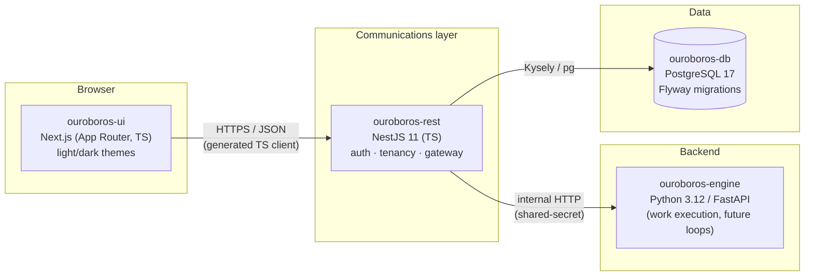
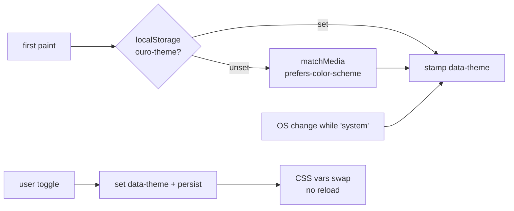
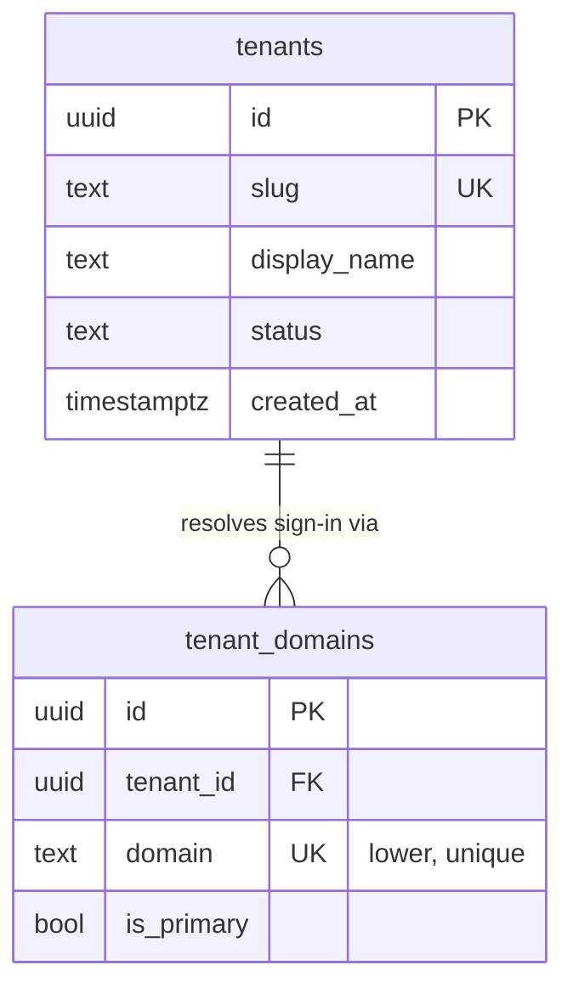
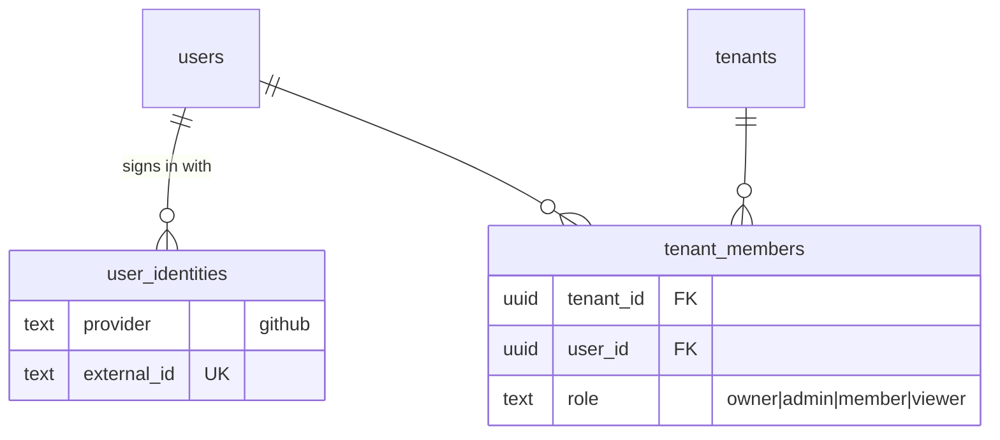
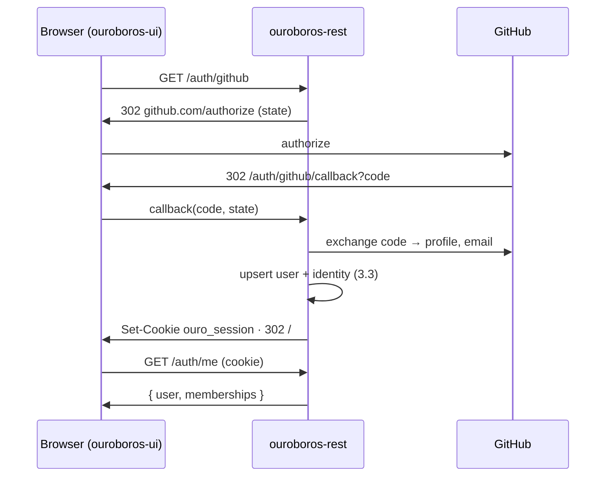
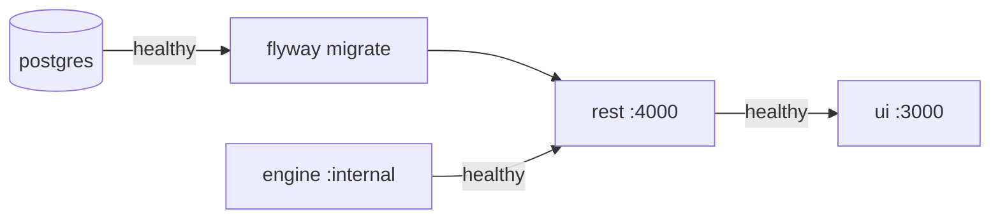
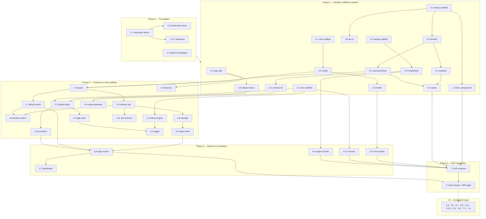

# Roadmap — Ouroboros Application Scaffolding

## Description

> Create a roadmap to build the Ouroboros application and set up its scaffolding. Its
> design is outlined in `docs/mockups`, and this is the foundation for the application.
> There will be a database that stores tenancy information in a project called
> "ouroboros-db", which will be a PostgreSQL database, using Flyway to build the database
> scripts. The scaffolding should be built using NextJS with NestJS as the communications
> layer with a Python server backend. Create issues in GitHub for this project, and
> assign labels to the issues as appropriate. This will serve as the foundation of the
> application. Keep it simple, lightweight, modular, and well designed. Split the
> Ouroboros logo into separate pieces for the web icon, the main glyph on the server, and
> the logo with the tagline. It should allow for light/dark mode switching on the fly.
> The application should live in "ouroboros-ui" and the NestJS service should live in
> "ouroboros-rest". Be thorough, well thought-out, and precise in the design of the
> roadmap. Label items that are good for the first release as "mvp" in the labels, and
> anything outside of the extended scope should be labeled as "v2".

## Context & Existing Work (duplicate-avoidance survey)

Surveyed 2026-08-08:

- **GitHub issues:** none existed at survey time; **all 58 issues (7 epic parents +
  51 work issues) were filed from this roadmap on 2026-08-08** — see the `GitHub`
  column in every table below. No duplication risk.
- **GitHub labels:** at survey time only the nine GitHub defaults (`bug`, `enhancement`,
  `documentation`, …). The roadmap set — `mvp`, `v2`, `ui`, `rest`, `db`, `engine`,
  `infra`, `design`, `ci`, `epic` — has since been created and applied, and issue 1.2
  (#9) has committed the whole set to `.github/labels.yml` alongside the issue and pull
  request templates.
- **`ouroboros-web/`** — the *marketing* site (Next.js, deployed at ouroboros.build).
  Out of scope for this roadmap; nothing here modifies it. Its existing
  `docker-publish.yml` workflow is the pattern issue 7.3 extends.
- **`docs/mockups/`** — 21 static HTML screens plus `assets/ouroboros.css` (the design
  system) and `MARKET-ANALYSIS.md`. These are the design source of truth for this
  roadmap. The mockups commit to a dark theme for v0.1 and list the light theme as "not
  yet mocked" — the light/dark requirement in this roadmap therefore includes *deriving*
  a light palette from the brand sheet, not merely wiring a toggle.
- **`logo-unsplit.png`** (repo root, 1376×768) — the brand sheet containing light and
  dark halves. `docs/mockups/assets/logo-mark.png` and `logo-lockup.png` were already
  cropped from the dark half; the systematic split (icon / glyph / tagline lockup, in
  both light and dark variants) is issue 2.1.

### Decisions proposed by this roadmap (validate before issue creation)

| # | Decision | Rationale |
|---|----------|-----------|
| D1 | Python backend lives in **`ouroboros-engine/`** | The user named `ouroboros-db`, `ouroboros-ui`, `ouroboros-rest` but not the Python module. "Engine" matches its role (executes the work the REST layer brokers). |
| D2 | Python stack: **FastAPI + uv + ruff + pytest** | Lightweight, typed, auto-OpenAPI — mirrors the NestJS layer's contract-first style. |
| D3 | NestJS data access: **Kysely over node-postgres** (no ORM) | Flyway owns the schema; an ORM that wants to own migrations (TypeORM/Prisma) fights that. Kysely is a thin, fully-typed query builder — simple and lightweight per the brief. |
| D4 | UI ↔ REST contract: **one committed OpenAPI document, TS client generated for the UI** | One source of truth; no hand-maintained types. *Amended at 4.8:* the document is written first and served verbatim rather than generated from decorators — a contract two sides agree on, not a report about whichever side was edited last. Generation stays at the consuming end. |
| D5 | Theme mechanism: **CSS custom properties + `data-theme` on `<html>`**, system-preference default, persisted choice, no-flash inline script | The standard on-the-fly approach; zero runtime CSS-in-JS weight. |
| D6 | Monorepo of independent modules (no workspace tool yet) | Each module (`ouroboros-ui`, `ouroboros-rest`, `ouroboros-db`, `ouroboros-engine`) is self-contained with its own toolchain, like `ouroboros-web` today. Turborepo/Nx deferred to v2 — simple and modular first. |

## Architecture Overview



Port map (development defaults): UI `3000` · REST `4000` · Engine `8000` · PostgreSQL `5432`.

Only `ouroboros-rest` talks to the database and to the engine. The UI never reaches
either directly — the NestJS layer is the single communications boundary, which keeps
tenancy enforcement in one place.

## MVP Definition

The MVP is the **running, integrated skeleton** of Ouroboros — not product features. It
is done when a developer can run `docker compose up` at the repo root and get:

1. **PostgreSQL** with the tenancy schema applied by **Flyway** (tenants, domains,
   users, memberships, org/repo enablement) and dev seed data.
2. **ouroboros-rest** (NestJS) healthy: config validation, `/health` verifying DB and
   engine connectivity, tenancy CRUD API, tenant-context resolution, GitHub OAuth
   sign-in with sessions, branded OpenAPI docs at `/api/docs`.
3. **ouroboros-engine** (FastAPI) healthy: versioned internal API stub reachable only
   through the REST gateway.
4. **ouroboros-ui** (Next.js) serving the app shell in the mockup design system with
   **on-the-fly light/dark switching**, the split brand assets (favicon set, glyph,
   tagline lockup), the login/tenancy screen wired to real auth, and a dashboard
   placeholder.
5. **CI** that lints, tests, and builds each module on PRs touching it, and validates
   Flyway migrations against a throwaway PostgreSQL.
6. An **end-to-end smoke test** proving the full chain: UI loads → sign-in → REST →
   DB and REST → Engine round trips.

**Explicitly out of MVP (labeled `v2`):** the 19 remaining product screens, image
publishing to GHCR for the new modules, row-level-security hardening, audit logging,
Storybook, rate limiting, engine job queue, workspace tooling, deployment runbook.

## Epics

Each epic is a parent tracking issue on GitHub; every roadmap issue below is filed as
one of its sub-issues (GitHub Relationships).

| Epic | GitHub | Status | Name | Goal | Modules |
|------|:------:|:------:|------|------|---------|
| 1 | #1 | 🟡 Open | Foundation & Repo Infrastructure | Monorepo layout, labels, dev environment, CI, architecture docs | repo root |
| 2 | #2 | 🟡 Open | Brand Assets & Theming | Logo split (icon / glyph / tagline lockup), design tokens, light+dark palettes | assets, ouroboros-ui |
| 3 | #3 | 🟡 Open | Tenancy Database (`ouroboros-db`) | Flyway project + PostgreSQL tenancy schema | ouroboros-db |
| 4 | #4 | 🟡 Open | Communications Layer (`ouroboros-rest`) | NestJS service: config, health, data access, tenancy API, auth, engine gateway | ouroboros-rest |
| 5 | #5 | 🟡 Open | Application UI (`ouroboros-ui`) | Next.js app shell, theme switching, login/tenancy, dashboard placeholder | ouroboros-ui |
| 6 | #6 | 🟡 Open | Python Backend (`ouroboros-engine`) | FastAPI scaffold with internal contract | ouroboros-engine |
| 7 | #7 | 🟡 Open | Integration & Delivery | Full-stack compose, e2e smoke, publishing, runbook | all |

Issue naming convention: `<project>: [<epic>.<issue>] <title>`, e.g.
`ouroboros-db: [3.2] Baseline tenancy schema — tenants & domains`.

Label set (issue 1.2 / #9 — **created in the repo and committed to
[`.github/labels.yml`](../.github/labels.yml)**): `mvp`, `v2`, `ui`, `rest`, `db`,
`engine`, `infra`, `design`, `ci`, plus `epic` for the parent issues and GitHub's
existing `documentation` where apt.

Issue types: **Feature** for capability-delivering work and every epic parent, **Task**
for scaffolding, infrastructure, CI and documentation work.

Complexity scale matches the product's own effort chips: **XS · S · M · L**.

---

## Epic 1 — Foundation & Repo Infrastructure

| Ref | GitHub | Status | Title | Summary | Labels | Parallel | MVP | Complexity | Affected Modules |
|-------|:------:|:------:|-------|---------|--------|:--------:|:---:|:----------:|------------------|
| 1.1 | #8 | 🟢 Done | ouroboros: [1.1] Monorepo layout & module scaffolding conventions | Create the four module directories with READMEs and shared conventions | mvp, infra | N (first) | Y | S | repo root |
| 1.2 | #9 | 🟢 Done | ouroboros: [1.2] GitHub labels & issue/PR templates | Create `mvp`, `v2`, and module labels; add issue/PR templates | mvp, infra | Y | Y | XS | .github |
| 1.3 | #10 | 🟢 Done | ouroboros: [1.3] Local dev environment (docker-compose: PostgreSQL + Flyway) | One-command local database with migrations applied | mvp, infra, db | Y | Y | S | repo root, ouroboros-db |
| 1.4 | #11 | 🟢 Done | ouroboros: [1.4] CI pipelines per module (path-filtered) | Lint/test/build workflows that run only for touched modules | mvp, ci | Y | Y | M | .github |
| 1.5 | #12 | 🟢 Done | ouroboros: [1.5] Architecture documentation | `docs/ARCHITECTURE.md`: diagram, port map, env-var conventions, module contracts | mvp, documentation | Y | Y | S | docs |
| 1.6 | #13 | 🟢 Done | ouroboros: [1.6] Workspace tooling evaluation (Turborepo/Nx) | Evaluate/adopt a workspace runner once module count justifies it | v2, infra | Y | N | M | repo root |

### Issue 1.1 — ouroboros: [1.1] Monorepo layout & module scaffolding conventions

> **GitHub issue:** #8 · **Status:** 🟢 Done · **Parent epic:** #1
>
> Delivered: the four module directories with contract READMEs, root `README.md`
> (module map + architecture sketch), root `.editorconfig` and `.gitignore`, the shared
> conventions doc [`CONVENTIONS.md`](CONVENTIONS.md), and `scripts/verify-layout.sh`
> which asserts the layout in CI. `ouroboros-web` untouched.

- **Problem Statement:** The repo holds only mockups and the marketing site. The four
  application modules need homes with consistent conventions before any scaffolding
  work can start, or each module will invent its own.
- **Solution/Scope:** Create `ouroboros-ui/`, `ouroboros-rest/`, `ouroboros-db/`,
  `ouroboros-engine/` each with a README stating purpose, stack, and dev commands.
  Add root `.editorconfig`, extend root `.gitignore`, and update the root README with
  the module map and architecture sketch. Conventions doc: yarn for TS modules
  (matching `ouroboros-web`), uv for Python, `PORT`/`OURO_*` env-var prefix, per-module
  Dockerfiles. Source: existing `ouroboros-web` conventions (`.yarnrc.yml`, Dockerfile).
- **Acceptance Criteria:**
  - All four directories exist with READMEs (purpose, stack, run instructions).
  - Root README shows the module map and links to `docs/ARCHITECTURE.md` (1.5).
  - `.editorconfig` covers TS, Python, SQL, Markdown, YAML.
  - `ouroboros-web` untouched.
- **Parallelism/Dependencies:** First issue; everything else depends on it. 1.2 may run
  concurrently.
- **Technical Stack:** git, Markdown, EditorConfig.
- **Epic:** 1

```
ouroboros/
├── docs/            # mockups, ARCHITECTURE.md, BRAND.md, this roadmap
├── ouroboros-web/   # marketing site (existing — untouched)
├── ouroboros-ui/    # Next.js product UI          (Epic 5)
├── ouroboros-rest/  # NestJS communications layer (Epic 4)
├── ouroboros-engine/# Python/FastAPI backend      (Epic 6)
└── ouroboros-db/    # Flyway migrations           (Epic 3)
```

### Issue 1.2 — ouroboros: [1.2] GitHub labels & issue/PR templates

> **GitHub issue:** #9 · **Status:** 🟢 Done · **Parent epic:** #1
>
> Delivered: [`.github/labels.yml`](../.github/labels.yml) committing all 35 labels this
> repository defines, the `feature`/`bug` YAML issue forms with their `config.yml`, and
> [`.github/pull_request_template.md`](../.github/pull_request_template.md). Applying the
> file is `scripts/sync-labels.sh` (idempotent, never deletes); the `.github` contract is
> asserted by `scripts/verify-github-config.sh` and the tooling is covered by
> `scripts/run-tests.sh`.

- **Problem Statement:** Only GitHub's default labels exist; the roadmap's `mvp`/`v2`
  scoping and module routing have no labels to attach to.
- **Solution/Scope:** Create labels: `mvp` (release scoping), `v2` (extended scope),
  `ui`, `rest`, `db`, `engine`, `infra`, `design`, `ci` — with colors and descriptions
  (accent cyan `#3dd6f5` for `mvp` as a nod to the brand). Add
  `.github/ISSUE_TEMPLATE/` (feature, bug) and a PR template referencing the
  `<project>: [<e.i>]` naming convention.
- **Acceptance Criteria:**
  - `gh label list` shows all nine new labels with descriptions.
  - New-issue UI offers the templates; PR template auto-populates.
- **Parallelism/Dependencies:** None — fully parallel; required before roadmap issues
  are filed.
- **Technical Stack:** GitHub CLI, YAML issue forms.
- **Epic:** 1

```
labels:  [mvp] [v2]   [ui] [rest] [db] [engine]   [infra] [design] [ci]
          scope        module routing               cross-cutting
```

### Issue 1.3 — ouroboros: [1.3] Local dev environment (docker-compose: PostgreSQL + Flyway)

> **GitHub issue:** #10 · **Status:** 🟢 Done · **Parent epic:** #1
>
> Delivered: repo-root `docker-compose.yml` (PostgreSQL 17 on a healthcheck and a named
> volume, plus a Flyway 11 pass gated on `service_healthy`), `.env.example` covering
> every `OURO_*` variable with development defaults, `ouroboros-db/migrations/` with
> `V000__bootstrap.sql` so the first `up` leaves a readable history, and
> `scripts/verify-dev-env.sh` with its tests. Measured on a clean volume: `up` →
> migrated in 7s, `down -v` → `up` reapplies from scratch. Issue 3.1 (#19) still owns
> `flyway.toml` and the migration wrapper scripts; the tenancy tables keep V001+.
- **Solution/Scope:** Root `docker-compose.yml` (dev profile): `postgres:17-alpine`
  with healthcheck + named volume, and a `flyway` service that runs
  `ouroboros-db/migrations` against it on `up`. `.env.example` with all `OURO_*`
  variables. Document `docker compose up db` / `down -v` reset flow. Full-stack
  compose (all services) is issue 7.1 — this issue delivers the data tier only.
- **Acceptance Criteria:**
  - `docker compose up` from a clean checkout yields a migrated database in <60s.
  - `psql` connect with documented dev credentials succeeds; Flyway history table shows
    applied versions.
  - Reset flow documented and verified.
- **Parallelism/Dependencies:** Needs 1.1 (directories) and 3.1 (Flyway layout);
  parallel with everything else.
- **Technical Stack:** Docker Compose, postgres:17-alpine, flyway (containerized).
- **Epic:** 1

```
docker compose up
   └─▶ [postgres:17] ──healthy──▶ [flyway migrate] ──▶ schema ready :5432
```

### Issue 1.4 — ouroboros: [1.4] CI pipelines per module (path-filtered)

> **GitHub issue:** #11 · **Status:** 🟢 Done · **Parent epic:** #1
>
> Delivered: `.github/workflows/{ui,rest,engine,db}.yml`, each filtered to its own
> module and reporting as `ci/ui` / `ci/rest` / `ci/engine` / `ci/db`;
> `.github/actions/node-module` holding the TypeScript pipeline both TS modules run and
> the single Node 24 pin; `.github/actions/scaffold-gate`, which turns a module's checks
> on by itself when its manifest lands, so the three unscaffolded modules skip with a
> notice instead of failing; and `scripts/verify-ci.sh` with its tests, which proves the
> routing table from the checkout — 106 checks, including that a change under
> `ouroboros-ui/` queues `ci/ui` and nothing else. `ci/db` runs the data-tier contract
> that needs no database; issue 3.6 (#24) has since added the live `migrate` →
> `validate` → `constraints.sql` pass to that same job, and its assertions to this
> script — 137 checks now.

- **Problem Statement:** Four modules with three toolchains in one repo; unfiltered CI
  would run everything on every PR — slow and noisy.
- **Solution/Scope:** GitHub Actions workflows per module using `paths:` filters:
  `ui.yml` / `rest.yml` (yarn install → lint → typecheck → test → build),
  `engine.yml` (uv sync → ruff → pytest), `db.yml` (delegates to 3.6's migration
  check). Shared Node/Python version pins. Source pattern: existing
  `docker-publish.yml`.
- **Acceptance Criteria:**
  - A PR touching only `ouroboros-ui/` triggers only the UI workflow.
  - Each workflow fails on an introduced lint/test error (verified once per module as
    its scaffold lands).
  - Status checks named consistently (`ci/ui`, `ci/rest`, `ci/engine`, `ci/db`).
- **Parallelism/Dependencies:** Skeletons after 1.1; each module's job activates with
  its scaffold (4.1, 5.1, 6.1, 3.6). Parallel with all module work.
- **Technical Stack:** GitHub Actions, actions/setup-node, astral-sh/setup-uv.
- **Epic:** 1

```
PR paths ──┬─ ouroboros-ui/**     ─▶ ci/ui     (lint·type·test·build)
           ├─ ouroboros-rest/**   ─▶ ci/rest   (lint·type·test·build)
           ├─ ouroboros-engine/** ─▶ ci/engine (ruff·pytest)
           └─ ouroboros-db/**     ─▶ ci/db     (flyway migrate+validate)
```

### Issue 1.5 — ouroboros: [1.5] Architecture documentation

> **GitHub issue:** #12 · **Status:** 🟢 Done · **Parent epic:** #1
>
> Delivered: [`ARCHITECTURE.md`](ARCHITECTURE.md) — the system diagram, the module
> contracts (each marked *running* or *specified* so the document matches the checkout
> rather than the plan), the request paths, the auth/session/tenant-context flow, both
> API contracts including the OpenAPI chain (D4) and the engine's `/v0`
> contract, the port map, the full `OURO_*` registry, the environments, the four
> invariants with what breaking each looks like, and the trust boundaries. Kept true by
> `scripts/verify-architecture.sh` with its tests: sections, mermaid fences, port map,
> invariants, every relative link and in-document anchor, and — the acceptance criterion
> — that the registry and `.env.example` declare exactly the same variables, checked in
> both directions.

- **Problem Statement:** The architecture (who talks to whom, ports, env conventions,
  tenancy boundary) lives only in this roadmap; it needs a durable home that outlives
  the roadmap document.
- **Solution/Scope:** `docs/ARCHITECTURE.md`: the system diagram (Mermaid), module
  responsibilities, port map, env-var registry, the "UI never touches DB/engine
  directly" invariant, auth/session flow, and the OpenAPI-contract flow (D4). Link from
  root README. Sources: this roadmap, `docs/mockups/README.md`.
- **Acceptance Criteria:**
  - Document exists, renders on GitHub with diagrams, and matches the implemented
    scaffolds (updated as 4.x/5.x/6.x land).
  - Every `OURO_*` variable in `.env.example` is documented.
- **Parallelism/Dependencies:** After 1.1; parallel with everything.
- **Technical Stack:** Markdown, Mermaid.
- **Epic:** 1

### Issue 1.6 — ouroboros: [1.6] Workspace tooling evaluation (Turborepo/Nx)

> **GitHub issue:** #13 · **Status:** 🟢 Done · **Parent epic:** #1
>
> Delivered: [`DECISION_WORKSPACE_TOOLING.md`](DECISION_WORKSPACE_TOOLING.md) — **Turborepo
> 2.10.9 over Yarn 4 workspaces**, with the measurements it was decided on, the case
> against Nx on a repository with two JavaScript packages, and the five conditions that
> would reopen it. The two criteria the issue named turn out not to be a runner's job and
> are recorded as such: a shared `tsconfig` is bought by workspaces rather than by either
> tool, and the 4.8 → 5.5 handoff needs no graph edge because the spec is a committed
> artefact rather than a build output.
>
> The evaluation found one real defect in the adopted configuration and fixed it:
> `ouroboros-db#test` runs the repo-root `scripts/run-tests.sh`, which a task hash does
> not cover, so the runner and the assertion harness could both change under a replayed
> pass — verified by probe, fixed with a `$TURBO_ROOT$` input, re-verified.
> [`verify-workspace.sh`](../scripts/verify-workspace.sh) (75 checks) now holds the whole
> decision to the checkout, including that rule generally: a script that reads above its
> own package declares it, or is not cached. `verify-ci.sh` already asserted the other
> acceptance criterion — that the four workspace-root files route to `ci/ui` and `ci/rest`
> and that a change confined to one module still runs only its own workflow.

- **Problem Statement:** Independent modules mean duplicated scripts and no task-graph
  caching; at some scale a workspace runner pays for itself — adopting one now would
  contradict "simple and lightweight."
- **Solution/Scope:** Post-MVP spike: evaluate Turborepo vs. Nx vs. status quo for
  shared TS config, task caching, and the generated-client handoff (4.8 → 5.5). Adopt
  only if it removes real friction; write up the decision either way.
- **Acceptance Criteria:** Decision doc in `docs/`; if adopted, all module CI still
  path-filters correctly.
- **Parallelism/Dependencies:** After MVP integration (7.2). Parallel with other v2 work.
- **Technical Stack:** Turborepo or Nx (evaluation).
- **Epic:** 1

```
now:  4 modules · 3 toolchains · plain scripts     (simple, some duplication)
v2?:  workspace runner · task graph · shared cache (faster, one more tool)
```

---

## Epic 2 — Brand Assets & Theming

| Ref | GitHub | Status | Title | Summary | Labels | Parallel | MVP | Complexity | Affected Modules |
|-------|:------:|:------:|-------|---------|--------|:--------:|:---:|:----------:|------------------|
| 2.1 | #14 | 🟢 Done | ouroboros: [2.1] Split brand sheet into logo asset set | Web icon, standalone glyph, tagline lockup — light + dark variants | mvp, design | Y | Y | M | docs/brand, assets |
| 2.2 | #15 | 🟡 Open | ouroboros-ui: [2.2] Favicon & web-app manifest set | Full favicon/PWA icon set generated from the web-icon asset | mvp, design, ui | N (needs 2.1, 5.1) | Y | XS | ouroboros-ui |
| 2.3 | #16 | 🟢 Done | ouroboros: [2.3] Design tokens — light & dark palettes as CSS custom properties | Port `ouroboros.css` to a token sheet; derive the light palette | mvp, design, ui | N (needs 2.1) | Y | M | docs/mockups/assets → shared tokens |
| 2.4 | #17 | 🟢 Done | ouroboros-ui: [2.4] Runtime theme engine (on-the-fly light/dark) | `data-theme` switching: system default, persisted, no flash | mvp, ui | N (needs 2.3, 5.1) | Y | S | ouroboros-ui |
| 2.5 | #18 | 🟡 Open | ouroboros: [2.5] Server-side brand surfaces | Glyph on REST OpenAPI page + engine/REST startup banners | v2, design, rest, engine | N (needs 2.1, 4.8, 6.2) | N | XS | ouroboros-rest, ouroboros-engine |

### Issue 2.1 — ouroboros: [2.1] Split brand sheet into logo asset set

> **GitHub issue:** #14 · **Status:** 🟢 Done · **Parent epic:** #2
>
> Delivered: [`docs/brand/`](brand) — `icon-{light,dark}.png` (512×512),
> `glyph-{light,dark}.png` (512×296) and `lockup-tagline-{light,dark}.png` (640×471), all
> six straight-alpha RGBA with the ground solved for and removed rather than blended away.
> [`BRAND.md`](BRAND.md) documents each one's surface, working size, minimum size and
> clear space, plus the colours sampled from both halves for 2.3.
> [`split-brand-sheet.py`](../scripts/split-brand-sheet.py) regenerates every asset from
> the sheet — nothing here is a hand crop — and refuses to write one whose ground survived
> or whose measured crop does not close on transparency;
> [`verify-brand.sh`](../scripts/verify-brand.sh) with its tests holds the committed files
> and the document to each other.

- **Problem Statement:** The brand exists only as `logo-unsplit.png` (1376×768 sheet
  with light and dark halves) plus two ad-hoc crops used by the mockups. The
  application needs purpose-built pieces: a web icon, the standalone glyph, and the
  logo-with-tagline lockup — each usable on light *and* dark surfaces.
- **Solution/Scope:** From `logo-unsplit.png`, produce in `docs/brand/` (canonical) —
  transparent-background PNGs at 2× working sizes, from **both** halves of the sheet:
  - `icon-{light,dark}.png` — snake head/mark reduced for tiny sizes (favicon source).
  - `glyph-{light,dark}.png` — the full circuit-snake mark alone (server & UI surfaces).
  - `lockup-tagline-{light,dark}.png` — mark + wordmark + tagline *"Infinity in
    Autonomy"* (login screen, marketing, docs headers).
  Document sizes, clear-space, and usage rules in `docs/BRAND.md`. Note: existing
  mockup crops rely on `mix-blend-mode: screen` and only work on dark — these replace
  that trick with true transparency. Source: `logo-unsplit.png`,
  `docs/mockups/README.md` design-system section.
- **Acceptance Criteria:**
  - Six assets exist, transparent, cleanly cropped (no halo artifacts at 100%).
  - Each renders correctly on `#12181d` (dark ground) and `#f5f8fa`-class light ground.
  - `docs/BRAND.md` documents each asset's intended surface and minimum size.
- **Parallelism/Dependencies:** Only needs 1.1. Blocks 2.2, 2.3 (palette sampling),
  2.5, 5.6.
- **Technical Stack:** ImageMagick/image editing; PNG (SVG retrace noted as v2 if the
  source rasters don't scale cleanly).
- **Epic:** 2

```
logo-unsplit.png (1376×768: light half ┃ dark half)
        │ crop + clean + transparent bg (×2 themes each)
        ├─▶ icon-*.png            → favicons, browser tab      (2.2)
        ├─▶ glyph-*.png           → app shell, server surfaces (2.5, 5.3)
        └─▶ lockup-tagline-*.png  → login, docs, marketing     (5.6)
```

### Issue 2.2 — ouroboros-ui: [2.2] Favicon & web-app manifest set

> **GitHub issue:** #15 · **Status:** 🟡 Open · **Parent epic:** #2
>
> Partly delivered — the files exist, the wiring waits on 5.1. In
> [`../ouroboros-ui/public/`](../ouroboros-ui/public): `favicon.ico` (16/32/48),
> `favicon-32-{light,dark}.png`, `apple-touch-icon.png` (180), `icon-192.png`,
> `icon-512.png` and `manifest.webmanifest`, all scaled from `icon-{light,dark}.png` by
> [`build-favicons.py`](../scripts/build-favicons.py). The tab pair keeps its alpha for
> the `prefers-color-scheme` swap; everything a launcher draws is flattened onto
> `#12181d` and written with no alpha channel at all, so
> [`verify-favicons.sh`](../scripts/verify-favicons.sh) can assert opacity from the PNG
> colour type. `favicon.ico` and `apple-touch-icon.png` already resolve by convention
> once anything serves `public/`.
>
> **Still open:** the `<link>` tags for the theme-aware pair and the manifest, and the
> per-scheme `themeColor` pair — all of which are Metadata API exports in
> `app/layout.tsx`, which 5.1 (#39) creates. The exact block to paste is in
> [`../ouroboros-ui/README.md`](../ouroboros-ui/README.md); both acceptance criteria are
> checkable only once that layout renders.

- **Problem Statement:** The UI needs correct browser-tab and home-screen icons across
  platforms, in both themes.
- **Solution/Scope:** From `icon-*.png` (2.1) generate: `favicon.ico` (16/32/48),
  `icon.svg` or theme-aware PNG pair via
  `<link rel="icon" media="(prefers-color-scheme: …)">`, `apple-touch-icon.png`
  (180), `icon-192.png`/`icon-512.png` + `manifest.webmanifest` (name, theme colors
  for both schemes). Wire through Next.js Metadata API in `app/`.
- **Acceptance Criteria:**
  - Tab icon renders crisply in light and dark browser chrome.
  - Lighthouse reports a valid manifest; `apple-touch-icon` resolves.
- **Parallelism/Dependencies:** Needs 2.1 and 5.1.
- **Technical Stack:** Next.js Metadata API / app-router file conventions.
- **Epic:** 2

```
icon-dark.png ─┐                       ┌─ favicon.ico (16/32/48)
               ├─ generate + wire ────▶├─ apple-touch-icon (180)
icon-light.png ┘   (Next metadata)     └─ icon-192/512 + manifest
```

### Issue 2.3 — ouroboros: [2.3] Design tokens — light & dark palettes as CSS custom properties

> **GitHub issue:** #16 · **Status:** 🟢 Done · **Parent epic:** #2
>
> Delivered: [`design/tokens.css`](design/tokens.css) — 37 colour tokens in a light and a
> dark palette, plus theme-independent type, spacing and shape scales, arranged as `:root`
> (light base), `:root[data-theme="dark"]` and a `prefers-color-scheme` block for the unset
> case. The dark palette is the mockups' committed identity extracted literal for literal;
> the light palette is derived from the brand sheet's light half against the contrast
> tables, which is what deepens the accent to `#07708e` — `#3dd6f5` measures 1.73:1 on
> white. [`DESIGN_TOKENS.md`](DESIGN_TOKENS.md) documents every token and publishes 53
> measured contrast pairs; all 30 text pairs clear AA 4.5:1 and all 11 non-text pairs 3:1 in
> **both** palettes. Three departures from the mockup sheet are named there, each forced by
> a ratio: `--ink-faint` lightened (the mockups' `--faint` reaches 3.1:1 as text),
> `--line-control` added for the boundaries WCAG 1.4.11 covers, and the status tints
> unified at one alpha per palette.
>
> [`design/tokens-preview.html`](design/tokens-preview.html) renders the whole design system
> with **no colour literal in its stylesheet**, and
> [`preview-light.png`](design/preview-light.png) /
> [`preview-dark.png`](design/preview-dark.png) are its two palettes, rebuilt by
> [`render-token-preview.sh`](../scripts/render-token-preview.sh).
> [`verify-tokens.sh`](../scripts/verify-tokens.sh) holds all of it together: three palette
> blocks and nothing outside them, both dark blocks identical, every colour themed in both
> palettes, the carried-over literals still matching the mockups' sheet, and every published
> ratio recomputed from the sheet by [`contrast.awk`](../scripts/lib/contrast.awk) — so a
> palette edit that drops below AA fails the build rather than the audit.

- **Problem Statement:** `docs/mockups/assets/ouroboros.css` defines a dark-only
  palette as literal colors. On-the-fly theme switching requires every color to be a
  token, and the light palette doesn't exist yet (mockups explicitly defer it).
- **Solution/Scope:** Produce a token sheet (`tokens.css`, destined for
  `ouroboros-ui/app/` in 5.2): extract the dark palette from `ouroboros.css`
  (`--ground #12181d`, `--surface #171f26`, `--ink #e9f2f6`, accent `#3dd6f5`,
  semantic green/amber/red, violet model-chip hue) and **derive the light palette**
  from the brand sheet's light half — keeping the accent recognizably cyan while
  meeting WCAG AA contrast on light surfaces. Structure: base tokens on `:root`
  (light), overrides under `:root[data-theme="dark"]` and
  `@media (prefers-color-scheme: dark)` for the unset case. Include type-family and
  spacing tokens. Sources: `ouroboros.css`, `logo-unsplit.png` light half.
- **Acceptance Criteria:**
  - No literal color values outside the token blocks.
  - Both palettes pass WCAG AA for body text and UI chrome (documented contrast table).
  - A sample page rendered with each palette is attached to the PR for design review.
- **Parallelism/Dependencies:** Needs 2.1 (light-half color sampling). Blocks 2.4, 5.2.
- **Technical Stack:** CSS custom properties; no preprocessor.
- **Epic:** 2

```css
:root                    { --ground:#f5f8fa; --ink:#16232b; --accent:#0899c2; … }  /* light */
:root[data-theme="dark"] { --ground:#12181d; --ink:#e9f2f6; --accent:#3dd6f5; … }  /* dark  */
/* + prefers-color-scheme fallback when data-theme is unset */
```

### Issue 2.4 — ouroboros-ui: [2.4] Runtime theme engine (on-the-fly light/dark)

> **GitHub issue:** #17 · **Status:** 🟢 Done · **Parent epic:** #2

- **Problem Statement:** The brief requires switching themes on the fly — no reload, no
  flash of wrong theme on first paint, respecting the OS preference until the user
  chooses.
- **Solution/Scope:** In `ouroboros-ui`: a tiny inline `<head>` script that resolves
  `localStorage("ouro-theme") ?? system` and stamps `data-theme` before first paint; a
  `ThemeProvider`/`useTheme()` hook exposing `light | dark | system`; live reaction to
  `prefers-color-scheme` changes while in `system`; `color-scheme` CSS property set so
  native controls/scrollbars match. The visible toggle control is 5.4.
- **Acceptance Criteria:**
  - Toggling swaps the full palette with no reload and no unstyled flash (verified with
    CPU-throttled hard reloads in both themes).
  - Choice persists across sessions; "system" tracks OS changes live.
  - No hydration warnings.
- **Parallelism/Dependencies:** Needs 2.3 and 5.1. Blocks 5.4.
- **Technical Stack:** Next.js App Router, inline script via `next/script`
  (`beforeInteractive`), localStorage, `matchMedia`.
- **Epic:** 2



### Issue 2.5 — ouroboros: [2.5] Server-side brand surfaces

> **GitHub issue:** #18 · **Status:** 🟡 Open · **Parent epic:** #2

- **Problem Statement:** The glyph should also brand the server-facing surfaces —
  OpenAPI docs, service startup banners — so internal tooling is recognizably Ouroboros.
- **Solution/Scope:** Serve `glyph-dark.png` as the REST OpenAPI page logo/favicon
  (Swagger UI custom options, 4.8); ASCII-art glyph + version banner on REST and
  engine startup logs; engine `/` returns a minimal branded identity JSON.
- **Acceptance Criteria:** OpenAPI page shows the glyph; both services log the banner
  with the running version.
- **Parallelism/Dependencies:** Needs 2.1, 4.8, 6.2. Cosmetic — scheduled v2.
- **Technical Stack:** @nestjs/swagger customization, Python logging.
- **Epic:** 2

```
$ ouroboros-rest
   ___
  ( o )>  OUROBOROS REST v0.1.0 · :4000 · db ✓ · engine ✓
   `~'
```

---

## Epic 3 — Tenancy Database (`ouroboros-db`)

Schema scope comes from mockup 01 (sign-in & tenancy) and mockup 17 (workspace
settings): domain-isolated tenants, GitHub-identity users, role-based membership, and
per-tenant GitHub org/repo enablement.

| Ref | GitHub | Status | Title | Summary | Labels | Parallel | MVP | Complexity | Affected Modules |
|-------|:------:|:------:|-------|---------|--------|:--------:|:---:|:----------:|------------------|
| 3.1 | #19 | 🟢 Done | ouroboros-db: [3.1] Flyway project scaffold & migration conventions | Directory layout, config, naming rules, local runner scripts | mvp, db, infra | N (after 1.1) | Y | S | ouroboros-db |
| 3.2 | #20 | 🟢 Done | ouroboros-db: [3.2] Baseline tenancy schema — tenants & domains | `tenants`, `tenant_domains`, status lifecycle, uniqueness | mvp, db | N (after 3.1) | Y | M | ouroboros-db |
| 3.3 | #21 | 🟢 Done | ouroboros-db: [3.3] Users, identities & tenant membership | `users`, `user_identities` (GitHub), `tenant_members` + roles | mvp, db | N (after 3.2) | Y | M | ouroboros-db |
| 3.4 | #22 | 🟢 Done | ouroboros-db: [3.4] GitHub org & repo enablement | `github_orgs`, `github_repos` scoped per tenant | mvp, db | N (after 3.2) | Y | S | ouroboros-db |
| 3.5 | #23 | 🟢 Done | ouroboros-db: [3.5] Dev seed data (repeatable migration) | Deterministic demo tenant/users/orgs for local dev & e2e | mvp, db | N (after 3.3, 3.4) | Y | XS | ouroboros-db |
| 3.6 | #24 | 🟢 Done | ouroboros-db: [3.6] Migration CI check | PR job: flyway migrate + validate against throwaway PostgreSQL | mvp, db, ci | N (after 3.1, 1.4) | Y | S | ouroboros-db, .github |
| 3.7 | #25 | 🟡 Open | ouroboros-db: [3.7] Row-level security & least-privilege roles | RLS policies keyed on tenant; separate migration/app DB roles | v2, db | N (after 3.4) | N | L | ouroboros-db, ouroboros-rest |
| 3.8 | #26 | 🟡 Open | ouroboros-db: [3.8] Audit log table & write path | Append-only `audit_events` per tenant (settings mockup: audit log) | v2, db | N (after 3.3) | N | M | ouroboros-db |

### Issue 3.1 — ouroboros-db: [3.1] Flyway project scaffold & migration conventions

> **GitHub issue:** #19 · **Status:** 🟢 Done · **Parent epic:** #3
>
> Begun by 1.3 (#10), which needed something to migrate: `migrations/` and
> `V000__bootstrap.sql` landed there, with the settings spelled out on the compose
> stack's command line.
>
> Delivered here: [`ouroboros-db/flyway.toml`](../ouroboros-db/flyway.toml) — locations,
> schema, `createSchemas`, `validateMigrationNaming` and `cleanDisabled` in one file,
> with no url, user or password in it, because those describe a machine rather than a
> project. Both paths now read it: the compose stack and `run.sh` mount the module at
> `/flyway/project` and pass `-workingDirectory`, so `docker compose up` and a hand-run
> migration cannot apply the same checkout under different rules. Only what differs per
> machine still travels on the command line.
>
> `scripts/{migrate,info,validate,clean-dev}` are one-line names over `run.sh`, which
> keeps the runner selection, `.env` resolution and password redaction it already had
> and gains `--config` (layer one more file) and `--print-target` (resolve the database
> without touching it). **`clean` is gated three times over**: `flyway.toml` disables it,
> [`flyway.dev.toml`](../ouroboros-db/flyway.dev.toml) is the only file that re-enables
> it and `clean-dev` the only thing that loads that file, and `clean-dev` itself refuses
> any host that is not this machine and asks for the database name back first. There is
> no `scripts/clean`.
>
> `ouroboros-db/tests/` is the module's own suite — 177 assertions across the runner and
> the four commands, run against a synthetic module with both Flyway runners stubbed, so
> it needs neither a database nor Docker. `scripts/run-tests.sh` now runs every module's
> suite as well as its own, and `ci/db` runs this one after the data-tier contract.
>
> Verified against a live PostgreSQL 17: `docker compose up` migrates the baseline
> clean, `scripts/info` renders the history, a misnamed file fails `validate` (and
> `migrate`), `run.sh clean` is refused by `cleanDisabled`, and `clean-dev` drops the
> schema only once its own gates are satisfied. The tenancy tables still start at V001.

- **Problem Statement:** Flyway needs a project home, configuration, and non-negotiable
  conventions (naming, immutability, review rules) before the first migration lands.
- **Solution/Scope:** `ouroboros-db/` containing `migrations/` (versioned `V###__*.sql`
  + repeatable `R__*.sql`), `flyway.toml` (locations, schema `ouroboros`,
  `validateMigrationNaming`), `scripts/` wrapping the Flyway container (`migrate`,
  `info`, `validate`, `clean` gated to dev), and a README stating the rules: plain SQL
  only, applied migrations are immutable, one concern per migration, repeatables for
  seeds/views only. Source: Flyway docs (naming/validation), user requirement
  (PostgreSQL + Flyway).
- **Acceptance Criteria:**
  - `scripts/migrate` against the 1.3 database applies zero-migration baseline cleanly;
    `flyway info` renders history.
  - Naming rules enforced by `validate` (bad name fails).
- **Parallelism/Dependencies:** Needs 1.1. Blocks 3.2, 3.6, 1.3.
- **Technical Stack:** Flyway 11 (containerized — no local Java), PostgreSQL 17, SQL.
- **Epic:** 3

```
ouroboros-db/
├── flyway.toml
├── migrations/
│   ├── V001__tenants.sql          (3.2)
│   ├── V002__users_membership.sql (3.3)
│   ├── V003__github_enablement.sql(3.4)
│   └── R__dev_seed.sql            (3.5, dev-only)
└── scripts/{migrate,info,validate,clean-dev}
```

### Issue 3.2 — ouroboros-db: [3.2] Baseline tenancy schema — tenants & domains

> **GitHub issue:** #20 · **Status:** 🟢 Done · **Parent epic:** #3
>
> Landed with 3.4 (#22), which could not be written without it: `V003`'s foreign key
> needs `tenants` to exist, so the two migrations went in together rather than leaving a
> chain on `main` that could not be applied.
>
> Delivered: [`V001__tenants.sql`](../ouroboros-db/migrations/V001__tenants.sql) —
> `tenants` (uuid pk, DNS-shaped unique slug, `status` held to
> `active|suspended|deleted` by a check constraint rather than an enum, so a later value
> is one ordinary migration) and `tenant_domains` (cascading fk, globally unique domain,
> `is_primary` limited to one per tenant by a partial unique index that still permits
> zero, so a tenant mid-setup is representable).
>
> **Case-insensitive domain lookup is bought by storing the domain folded**, not by
> `citext` and not by a functional index: `create extension` needs rights a managed
> PostgreSQL does not always grant the migration role, and a functional index leaves the
> stored value un-normalised so two rows can disagree about the case of the same domain.
> A check constraint makes the folding a guarantee, which lets the plain unique btree be
> both the uniqueness rule and the lookup index.
>
> `ouroboros.touch_updated_at()` is defined here and reused by 3.4 — one function, so
> the semantics cannot drift between tables. It stamps from the server clock and
> overwrites whatever the statement supplied.
>
> Verified against a live PostgreSQL 17, from an empty volume: `migrate` applies clean,
> `validate` passes, a second `migrate` is a no-op, and
> [`tests/constraints.sql`](../ouroboros-db/tests/constraints.sql) asserts every rule
> above — including `explain` showing `Index Scan using tenant_domains_domain_key` for
> `where domain = lower($1)`.

- **Problem Statement:** Everything in Ouroboros is tenant-scoped ("each domain is an
  isolated tenant" — mockup 01); the tenant table is the root every other table hangs
  off.
- **Solution/Scope:** `V001`: `tenants` (uuid pk, unique slug, display name, status
  `active|suspended|deleted`, timestamps + touch trigger) and `tenant_domains` (fk,
  unique lower-cased domain, `is_primary` with one-primary-per-tenant partial unique
  index). `citext` or functional index for case-insensitive domain lookup — the
  sign-in path resolves tenant by email domain. Source: mockup 01 step 1/2.
- **Acceptance Criteria:**
  - Migration applies and re-validates cleanly; duplicate domain across tenants is
    rejected by constraint (tested in 3.6 harness).
  - Lookup by domain uses an index (`EXPLAIN` shows index scan).
- **Parallelism/Dependencies:** Needs 3.1. Blocks 3.3, 3.4.
- **Technical Stack:** PostgreSQL 17 SQL, Flyway.
- **Epic:** 3



### Issue 3.3 — ouroboros-db: [3.3] Users, identities & tenant membership

> **GitHub issue:** #21 · **Status:** 🟢 Done · **Parent epic:** #3
>
> Delivered:
> [`V002__users_membership.sql`](../ouroboros-db/migrations/V002__users_membership.sql)
> — `users` (global rather than tenant-scoped, unique folded email, `avatar_url`
> restricted to `http(s)`), `user_identities` (cascading user fk, `provider` as
> CHECK-constrained text, unique on `(provider, external_id)`) and `tenant_members`
> (cascading fks to both sides, `role` as CHECK-constrained text, `invited_at` /
> `joined_at`). It fills the version number V003 left reserved.
>
> **The three tables exist because sign-in involves three separable things.** `users` is
> the human, and is global so that "the same person in two tenants" is a fact the schema
> states rather than one two rows imply. `user_identities` is how that human proves who
> they are, as a row rather than columns on `users`, so a second provider is a row and
> not a migration — and so a person who links two GitHub accounts stays one person.
> `tenant_members` is what they may do in one tenant, which is a property of the pairing
> and belongs on neither of the other two.
>
> **No token, secret or credential is stored, and the absence is asserted rather than
> trusted:** `tests/constraints.sql` reads `information_schema` and fails if a column
> whose name looks like a credential ever appears on any of the three tables, which a
> fixed list of expected columns would not catch. Live session handling stays
> ouroboros-rest's concern (#33).
>
> `tenant_members` is keyed on the `(tenant_id, user_id)` pair rather than on a surrogate
> uuid — the one table here that is. The pair *is* the row's identity, a surrogate would
> need the same unique constraint beside it anyway, and making the pair the key is what
> makes "a user cannot join a tenant twice" true by construction. It has no `created_at`
> either: `invited_at` already records when the row came into being, and V003's lesson
> about a second copy of one fact applies to timestamps too. `role` deliberately has
> **no default** — V003's fail-closed default does not transfer, because a role has no
> safe off position (the off position for membership is the absence of the row), so an
> omitted role is an error rather than a quiet grant.
>
> Verified against a live PostgreSQL 17 from an empty volume: `migrate` applies
> V000 → V003 in order, `validate` passes, a second `migrate` is a no-op, and
> [`tests/constraints.sql`](../ouroboros-db/tests/constraints.sql) — 40 new assertions,
> 81 in total — covers all three acceptance criteria. The harness was mutation-tested:
> fourteen
> deliberate breakages (each unique key and check dropped in turn, both cascades
> re-created without `on delete cascade`, both new indexes dropped, the touch trigger
> removed, a `github_access_token` column added, and a default given to `role`) each
> made it exit non-zero naming the broken rule, and it returned green once restored.
>
> One rule is deliberately not enforced in SQL: that a tenant always retains at least one
> `owner`. It spans rows and must survive both a role change and a delete, so it is a
> trigger or an application invariant, and it belongs with the tenancy API (#31).
>
> **Note on the supersession ledgers.** `docs/ROADMAP_OOE_MVP.md` and
> `docs/ROADMAP_LOGIN_PAGE_BETTERAUTH.md` list this issue as dropped in favour of
> BetterAuth's `user`/`account`/`member` tables. It was built as specified instead,
> consistent with 3.2 (#20) and 3.4 (#22), which those same ledgers amended and which
> also landed in their original shape — `V001`'s `tenants` is a real table, so a `V002`
> in BetterAuth shape would have left the schema half-migrated to a decision nothing else
> has taken. If BetterAuth is adopted, it is a fix-forward migration from here.

- **Problem Statement:** Sign-in is GitHub OAuth (mockup 01) and workspace settings
  (mockup 17) show members with roles — the schema must separate the human, their
  external identity, and their per-tenant role.
- **Solution/Scope:** `V002`: `users` (uuid, email, display name, avatar url),
  `user_identities` (provider `github`, unique provider+external_id, tokens *not*
  stored here — session/key handling is REST's concern), `tenant_members` (tenant fk +
  user fk unique pair, role `owner|admin|member|viewer` as a CHECK-constrained text,
  invited/joined timestamps). Roles as text-with-CHECK, not enum, to keep migrations
  additive. Source: mockups 01, 17.
- **Acceptance Criteria:**
  - Same GitHub identity cannot attach to two users; same user cannot join a tenant
    twice (constraints tested).
  - A user may belong to multiple tenants with different roles.
- **Parallelism/Dependencies:** Needs 3.2. Blocks 3.5, 3.8, 4.7.
- **Technical Stack:** PostgreSQL SQL, Flyway.
- **Epic:** 3



### Issue 3.4 — ouroboros-db: [3.4] GitHub org & repo enablement

> **GitHub issue:** #22 · **Status:** 🟢 Done · **Parent epic:** #3
>
> Delivered:
> [`V003__github_enablement.sql`](../ouroboros-db/migrations/V003__github_enablement.sql)
> — `github_orgs` (cascading tenant fk, login unique *per tenant* so two tenants may each
> enable an org they both belong to, `enabled`, nullable `installed_at`) and
> `github_repos` (cascading org fk, name unique per org, `enabled`, nullable
> `default_branch`). Logins and names are stored folded, as V001's domains are, because
> GitHub treats both case-insensitively and two rows for one org would be two answers to
> a permission question. V002 (3.3) is untouched and its version number stays reserved.
>
> **Both `enabled` flags default to false.** A row's existence records that Ouroboros
> knows about the org or repo; `enabled` records that someone turned it on. Anything
> arriving by a path nobody has designed yet — an installation callback, a sync, a
> restore — therefore arrives switched off. For the table that bounds what an autonomous
> agent may touch, failing closed is the only safe default. The two flags are kept
> independent so suspending an org preserves the per-repo choices underneath; scope is
> their intersection.
>
> `github_repos` hangs off the org rather than carrying its own `tenant_id`: a second
> copy of that fact could disagree with the org's and place a repo in a tenant its own
> org does not belong to. The tenant is one join away, and the cascade reaches it.
>
> Verified against a live PostgreSQL 17: both acceptance criteria are assertions in
> [`tests/constraints.sql`](../ouroboros-db/tests/constraints.sql) — unique org per
> tenant, unique repo per org, and `delete from tenants` removing orgs and repos while
> leaving another tenant's rows alone. The harness was checked to go red by dropping
> `github_repos_org_name_key` and by re-creating the tenant fk without `on delete
> cascade`; both runs exited non-zero naming the broken rule.

- **Problem Statement:** Mockup 01 step 2 enables specific GitHub orgs (and their
  repos) per tenant — the boundary of where Ouroboros may work.
- **Solution/Scope:** `V003`: `github_orgs` (tenant fk, org login unique per tenant,
  enabled flag, installed-at) and `github_repos` (org fk, repo name unique per org,
  enabled flag, default branch). Enablement is data-only at this stage — GitHub App
  installation flows are future product work, but the shape must hold them.
- **Acceptance Criteria:** Constraints verified (unique org per tenant, unique repo per
  org); cascading delete tenant → orgs → repos.
- **Parallelism/Dependencies:** Needs 3.2; parallel with 3.3. Blocks 3.5.
- **Technical Stack:** PostgreSQL SQL, Flyway.
- **Epic:** 3

```
tenants 1─* github_orgs 1─* github_repos
             (enabled?)      (enabled?, default_branch)
```

### Issue 3.5 — ouroboros-db: [3.5] Dev seed data (repeatable migration)

> **GitHub issue:** #23 · **Status:** 🟢 Done · **Parent epic:** #3
>
> Delivered:
> [`R__dev_seed.sql`](../ouroboros-db/migrations/R__dev_seed.sql) — tenant
> `acme-robotics` with the primary domain `acme-robotics.dev`, three people
> (`ken@` owner, `maya@` admin, `jorge@` member) each with the GitHub identity they sign
> in with, and the org `acme-robotics` holding the enabled repo `helios-firmware`. Ten
> rows, ten literal `5eed…` uuids, so demo data is recognisable on sight in a log or a
> URL and a test can name a row without looking it up.
>
> **The production guard is a placeholder, and the safe value is the default.** Every
> statement ends `and ${ouro_dev_seed}`, which
> [`flyway.toml`](../ouroboros-db/flyway.toml) resolves to `false` — the configuration
> `scripts/migrate`, CI and every hand-run migration read, where the migration applies
> and inserts nothing. [`flyway.seed.toml`](../ouroboros-db/flyway.seed.toml) is the one
> file that sets it `true`; the compose stack loads it because a stack that publishes a
> well-known password on loopback is a laptop by definition, and
> `scripts/migrate --config flyway.seed.toml` is the deliberate way in for a database
> the stack does not own. Deleting the placeholder from `flyway.toml` does not silently
> enable the seed — Flyway refuses a migration whose placeholder has no value.
>
> **It is a second overlay rather than a line added to `flyway.dev.toml`.** That file
> re-enables `clean`, which drops every object in the schema, and `scripts/clean-dev` is
> the only thing allowed to load it; folding the seed in would have handed the compose
> stack a `clean` it has no use for, and both `verify-dev-env.sh` and
> `tests/scripts.test.sh` assert it does not have one.
>
> Idempotent by construction: literal ids and `on conflict do nothing` on every
> statement. Child rows find their parent by slug or email rather than by naming an id
> twice, so a database somebody has edited by hand gets a seed that re-creates what it
> can instead of failing every subsequent `docker compose up`.
>
> Verified against a live PostgreSQL 17 from an empty volume: `docker compose up` seeds
> all ten rows; a second `migrate` reports "no migration necessary" and a byte-for-byte
> comparison of every seeded row, timestamps included, shows no change; re-applying the
> seed body itself inserts 0 rows from all seven statements; and a separate database
> migrated with `flyway.toml` alone records the migration and holds zero rows in all
> seven tables.
>
> Tested by [`tests/seed.test.sh`](../ouroboros-db/tests/seed.test.sh) — 43 assertions,
> no database needed, counting the guards and the `on conflict` clauses rather than
> spot-checking them so that a statement added later without one fails — and by
> [`tests/seed.sql`](../ouroboros-db/tests/seed.sql), which asserts the seeded content
> against a live database. Every assertion in it says *exactly one*, so running it after
> two `migrate` passes is the idempotency criterion. Six new mutation cases in
> `scripts/tests/verify-dev-env.test.sh` each break the guard a different way and each
> turn the verifier red.
>
> [`tests/constraints.sql`](../ouroboros-db/tests/constraints.sql) now clears the two
> root tables at the start of its transaction and rolls back as before: it is drawn from
> the same mockups, so its fixtures collided with the seed's slug, domain and addresses,
> and its absolute counts would otherwise have been measuring both. Its assertion
> helpers moved to `tests/lib/assert.sql`, which `seed.sql` shares.
>
> **Note on the supersession ledger.** `docs/ROADMAP_OOE_MVP.md` listed this issue as
> superseded by `B.4` (auth-aware seed data). It shipped as specified instead,
> consistent with 3.2 (#20), 3.3 (#21) and 3.4 (#22): the tables it seeds are real, and
> a seed in BetterAuth shape would have described a schema nothing in the repository
> has. `B.4` is a rewrite of this file if BetterAuth is confirmed, and the guard,
> the id convention and both test files carry over unchanged.

- **Problem Statement:** Local dev and e2e smoke tests need known data — the mockups'
  demo tenant makes screens and tests deterministic.
- **Solution/Scope:** `R__dev_seed.sql` (guarded so it never runs in production —
  placeholder-driven, enabled only by dev Flyway config): tenant `acme-robotics` with
  domain, three users across the four roles, org `acme-robotics` with repo
  `helios-firmware`. Idempotent (`on conflict do nothing`/deterministic uuids).
  Source: mockup demo content.
- **Acceptance Criteria:** `docker compose up` (1.3) yields seeded data; running
  migrate twice changes nothing; prod config provably skips the seed.
- **Parallelism/Dependencies:** Needs 3.3, 3.4. Feeds 7.2.
- **Technical Stack:** Flyway repeatable migrations, SQL.
- **Epic:** 3

```
R__dev_seed.sql ─▶ acme-robotics ─┬─ domains: acme-robotics.dev
                                  ├─ members: owner/admin/member
                                  └─ org acme-robotics / repo helios-firmware
```

### Issue 3.6 — ouroboros-db: [3.6] Migration CI check

> **GitHub issue:** #24 · **Status:** 🟢 Done · **Parent epic:** #3
>
> Delivered: the live pass in [`.github/workflows/db.yml`](../.github/workflows/db.yml),
> added to the `ci/db` job 1.4 (#11) created for it. A `postgres:17-alpine` service
> container is started empty for every run, `ouroboros-db/scripts/migrate` applies `V000`
> through `R__dev_seed.sql` to it from scratch, `scripts/validate` reads the history back
> for checksums and the naming rule, and
> [`tests/constraints.sql`](../ouroboros-db/tests/constraints.sql) then asks the schema
> to refuse the things it claims to refuse. A second database is migrated twice with
> `flyway.seed.toml` and asserted by
> [`tests/seed.sql`](../ouroboros-db/tests/seed.sql) — the first database has to go on
> proving what a *production* migration does, which is apply the seed and insert nothing.
>
> **It runs the module's own commands, not a `flyway` invocation written into the
> workflow.** CI reads `ouroboros-db/flyway.toml` through `-workingDirectory` exactly as
> `docker compose up` and a hand-run `scripts/migrate` do, so there is no configuration
> that only CI applies and none it can miss. The `.sql` suites are run by a `psql` from
> the same pinned image, so the client tracks the server's major version rather than
> whatever a runner image happens to ship.
>
> The image is pinned in three places — the service container, the `POSTGRES_IMAGE` the
> assertion steps use (the `env` context is not available to a service definition, so the
> string cannot simply be shared), and `docker-compose.yml`. `scripts/verify-ci.sh` fails
> if any of the three drifts, because CI proving a PostgreSQL nobody develops against is
> worth less than the minute it costs.
>
> **The connection parameters are set by a step, not by a job-level `env:` block**, and
> the first run of this workflow is why. `OURO_DB_*` present in the environment is the
> last word in `run.sh`'s precedence — it beats `ouroboros-db/.env` — and the tooling
> suite the same job runs two steps earlier is the suite that *tests* that precedence, by
> writing `.env` files and asserting what Flyway would have been given. Declared job-wide
> they pointed it at this workflow instead and it failed outright, on eight assertions.
> Written into `$GITHUB_ENV` by a step they exist for the live pass and for nothing before
> it, and `verify-ci.sh` now fails on an `OURO_*` key in job scope so the same mistake
> cannot come back quietly.
>
> Eleven new mutation cases in `scripts/tests/verify-ci.test.sh` each break one part of
> the pass — the service container, the healthcheck's `-U`/`-d`, `migrate`, `validate`,
> `constraints.sql`, the seed overlay, `seed.sql`, each of the three pins, and the job
> scope above — and each turns the verifier red. A live pass that quietly stops running is
> the failure mode worth testing for: the job still reports green, about the half a file
> read already covered.
>
> **Demonstrably red, checked once and reverted**, against a throwaway PostgreSQL 17 —
> all four ways a migration can be wrong: a migration whose SQL fails (`migrate` exits 1,
> changes rolled back); an applied migration edited afterwards (`validate` exits 1,
> "Migrations have failed validation"); a misnamed file (`validate` exits 1, "Invalid
> versioned migration name format"); and a `V004` that drops
> `tenant_members_role_valid`, which applies and validates cleanly and is caught only by
> `constraints.sql` (exit 3, "FAILED: tenant_members.role rejects a value outside
> owner|admin|member|viewer"). That last one is the case the whole behavioural half
> exists for.
>
> The path filter 1.4 established already answers the third criterion: `ci/db` runs on
> `ouroboros-db/**` plus the two files the data tier's contract spans
> (`docker-compose.yml`, `.env.example`) and its own definition, and `verify-ci.sh`
> proves the routing from the checkout.

- **Problem Statement:** A migration that fails or drifts must be caught on the PR, not
  on a developer's machine.
- **Solution/Scope:** `ci/db` job (slots into 1.4): service container
  `postgres:17-alpine` → `flyway migrate` from scratch → `flyway validate` → run
  `tests/constraints.sql` (assertion queries from 3.2–3.4 acceptance criteria, plain
  SQL raising on violation).
- **Acceptance Criteria:** Green on current migrations; demonstrably red on a
  deliberately broken migration (checked once, then reverted).
- **Parallelism/Dependencies:** Needs 3.1, 1.4.
- **Technical Stack:** GitHub Actions service containers, Flyway CLI image.
- **Epic:** 3

```
PR ─▶ [postgres up] ─▶ flyway migrate (clean db) ─▶ validate ─▶ constraints.sql ─▶ ✓/✗
```

### Issue 3.7 — ouroboros-db: [3.7] Row-level security & least-privilege roles

> **GitHub issue:** #25 · **Status:** 🟡 Open · **Parent epic:** #3

- **Problem Statement:** MVP enforces tenancy in the REST layer only; defense in depth
  wants the database itself refusing cross-tenant reads.
- **Solution/Scope:** RLS policies on all tenant-scoped tables keyed to
  `current_setting('ouro.tenant_id')`; split DB roles (`ouro_migrate` DDL-capable,
  `ouro_app` DML-only, RLS-subject); REST sets the tenant GUC per request/transaction
  (companion change in 4.6). Source: PostgreSQL RLS docs.
- **Acceptance Criteria:** With `ouro_app`, queries lacking the GUC return zero rows;
  cross-tenant access attempts return empty; migration role unaffected. REST test suite
  still green.
- **Parallelism/Dependencies:** Needs 3.4 and 4.6 in place. v2.
- **Technical Stack:** PostgreSQL RLS, Flyway, Kysely (GUC set).
- **Epic:** 3

```
request ─▶ REST resolves tenant ─▶ SET ouro.tenant_id = '…'
             └─▶ SELECT * FROM github_repos   ← RLS filters to that tenant only
```

### Issue 3.8 — ouroboros-db: [3.8] Audit log table & write path

> **GitHub issue:** #26 · **Status:** 🟡 Open · **Parent epic:** #3

- **Problem Statement:** Workspace settings (mockup 17) promise an audit log; the
  append-only store should exist before features start emitting events.
- **Solution/Scope:** `audit_events` (tenant fk, actor user fk nullable, action,
  subject type/id, jsonb detail, occurred_at; BRIN index on time), insert-only grant
  for `ouro_app`, plus a REST `AuditService` stub emitting `member.added` /
  `tenant.updated` as first events.
- **Acceptance Criteria:** Events written on tenancy mutations; UPDATE/DELETE denied to
  the app role; queryable per tenant ordered by time.
- **Parallelism/Dependencies:** Needs 3.3; REST hook after 4.5. v2.
- **Technical Stack:** PostgreSQL, Flyway, NestJS interceptor.
- **Epic:** 3

```
[4.5 tenancy mutation] ─▶ AuditService.emit() ─▶ INSERT audit_events (append-only)
```

---

## Epic 4 — Communications Layer (`ouroboros-rest`)

| Ref | GitHub | Status | Title | Summary | Labels | Parallel | MVP | Complexity | Affected Modules |
|-------|:------:|:------:|-------|---------|--------|:--------:|:---:|:----------:|------------------|
| 4.1 | #27 | 🟢 Done | ouroboros-rest: [4.1] NestJS service scaffold | Nest 11 app skeleton, strict TS, lint/test toolchain, module layout | mvp, rest | N (after 1.1) | Y | S | ouroboros-rest |
| 4.2 | #28 | 🟢 Done | ouroboros-rest: [4.2] Typed configuration & env validation | Fail-fast validated `OURO_*` config module | mvp, rest | N (after 4.1) | Y | S | ouroboros-rest |
| 4.3 | #29 | 🟢 Done | ouroboros-rest: [4.3] Health & readiness endpoints | `/health/live` + `/health/ready` incl. DB and engine probes | mvp, rest | N (after 4.2) | Y | S | ouroboros-rest |
| 4.4 | #30 | 🟢 Done | ouroboros-rest: [4.4] Database access layer (Kysely) | Typed query layer over pg pool, schema types mirroring Flyway | mvp, rest, db | N (after 4.2, 3.3) | Y | M | ouroboros-rest |
| 4.5 | #31 | 🟢 Done | ouroboros-rest: [4.5] Tenancy module & API | CRUD for tenants/domains/members/org-enablement | mvp, rest | N (after 4.4) | Y | L | ouroboros-rest |
| 4.6 | #32 | 🟢 Done | ouroboros-rest: [4.6] Tenant-context resolution middleware | Resolve tenant per request; scoped request context | mvp, rest | N (after 4.5) | Y | M | ouroboros-rest |
| 4.7 | #33 | 🟢 Done | ouroboros-rest: [4.7] GitHub OAuth sign-in & sessions | OAuth code flow, user/identity upsert, cookie sessions, guards | mvp, rest | N (after 4.4) | Y | L | ouroboros-rest |
| 4.8 | #34 | 🟢 Done | ouroboros-rest: [4.8] OpenAPI documentation & spec export | Authoritative `openapi.yaml` served verbatim; Swagger at `/api/docs`; spec artifact for client gen | mvp, rest | N (after 4.5) | Y | S | ouroboros-rest |
| 4.9 | #35 | 🟢 Done | ouroboros-rest: [4.9] Engine gateway module | Typed internal client + proxy route to ouroboros-engine | mvp, rest, engine | N (after 4.2, 6.3) | Y | M | ouroboros-rest |
| 4.10 | #36 | 🟢 Done | ouroboros-rest: [4.10] Dockerfile & container build | Multi-stage production image | mvp, rest, infra | N (after 4.3) | Y | S | ouroboros-rest |
| 4.11 | #37 | 🟢 Done | ouroboros-rest: [4.11] Integration test harness | Supertest + Testcontainers-backed API tests | mvp, rest, ci | N (after 4.5) | Y | M | ouroboros-rest |
| 4.12 | #38 | 🟡 Open | ouroboros-rest: [4.12] Security baseline hardening | Helmet, CORS policy, rate limiting, cookie hardening review | v2, rest | N (after 4.7) | N | M | ouroboros-rest |

### Issue 4.1 — ouroboros-rest: [4.1] NestJS service scaffold

> **GitHub issue:** #27 · **Status:** 🟢 Done · **Parent epic:** #4

- **Problem Statement:** The communications layer needs its skeleton: a NestJS app with
  the project's toolchain conventions, ready for feature modules.
- **Solution/Scope:** NestJS 11 in `ouroboros-rest/` via yarn (matching
  `ouroboros-web`'s `.yarnrc.yml` approach): strict `tsconfig`, ESLint flat config +
  Prettier, Jest unit tests, `src/modules/` layout (`app`, later `config`, `health`,
  `db`, `tenancy`, `auth`, `engine`), global `/api/v1` prefix, versioning enabled,
  graceful shutdown hooks. Port 4000.
- **Acceptance Criteria:** `yarn dev` serves `GET /api/v1` heartbeat; `yarn lint`,
  `yarn test`, `yarn build` all pass; `ci/rest` (1.4) goes green.
- **Parallelism/Dependencies:** Needs 1.1. Parallel with Epics 3, 5, 6 scaffolds.
  Blocks all 4.x.
- **Technical Stack:** NestJS 11, TypeScript 5 strict, yarn, Jest.
- **Epic:** 4

```
src/
├── main.ts            (bootstrap, prefix /api/v1, shutdown hooks)
└── modules/
    ├── app/           (heartbeat)
    └── …              (config 4.2 · health 4.3 · db 4.4 · tenancy 4.5 · auth 4.7 · engine 4.9)
```

### Issue 4.2 — ouroboros-rest: [4.2] Typed configuration & env validation

> **GitHub issue:** #28 · **Status:** 🟢 Done · **Parent epic:** #4

- **Problem Statement:** Misconfigured services must fail at boot with a precise error,
  not at first request with a stack trace.
- **Solution/Scope:** `ConfigModule` with a zod schema validating all `OURO_*` env vars
  at bootstrap (`DATABASE_URL`, `ENGINE_URL`, `ENGINE_SHARED_SECRET`, `SESSION_SECRET`,
  `GITHUB_CLIENT_ID/SECRET`, `PORT`, `NODE_ENV`, cookie/CORS origins); typed accessor
  service; secrets redacted from any config logging. `.env.example` kept in lockstep
  (1.3).
- **Acceptance Criteria:** Boot with a missing/malformed var exits non-zero naming the
  exact variable; all consumers use the typed service (no raw `process.env` outside the
  module — lint-enforced).
- **Parallelism/Dependencies:** Needs 4.1. Blocks 4.3, 4.4, 4.9.
- **Technical Stack:** @nestjs/config, zod.
- **Epic:** 4
- **As built:** "cookie/CORS origins" became one variable, `OURO_CORS_ORIGINS` — a
  comma-separated list of browser origins, which is both the CORS allow-list and the set
  of origins the session cookie may travel to. The session cookie is host-only (§ 4.1 of
  `ARCHITECTURE.md` gives it no `Domain`), so there was no second value to name. The
  schema is keyed by variable name rather than by field name so the failure line names
  what an operator has to fix, and validation happens in `main.ts` before
  `NestFactory.create` — a schema evaluated while Nest is building its tree fails inside
  the framework's error handling, which prints the stack trace this issue exists to
  prevent. Exit code `2`, matching `ouroboros-engine`.

```
boot ─▶ load env ─▶ zod parse ──ok──▶ typed ConfigService ─▶ modules
                        └──fail──▶ exit(2): "OURO_DATABASE_URL: expected a PostgreSQL …"
```

### Issue 4.3 — ouroboros-rest: [4.3] Health & readiness endpoints

> **GitHub issue:** #29 · **Status:** 🟢 Done · **Parent epic:** #4

- **Problem Statement:** Compose, CI, and (later) orchestrators need to distinguish
  "process up" from "dependencies reachable."
- **Solution/Scope:** Terminus-based `/health/live` (process only) and `/health/ready`
  (pg `SELECT 1` + engine `/healthz` probe with timeout; per-dependency status JSON).
  Ready degrades to 503 with the failing dependency named. Wired as the compose
  healthcheck in 7.1.
- **Acceptance Criteria:** Ready reports both dependencies; stopping postgres flips
  ready to 503 naming `database` while live stays 200.
- **Parallelism/Dependencies:** Needs 4.2; engine probe activates after 6.2 (stubbed
  until then). Blocks 4.10, 7.1.
- **Technical Stack:** @nestjs/terminus.
- **Epic:** 4
- **As built:** 6.2 had already landed, so **nothing is stubbed** — the engine probe asks
  the real `GET /healthz`, which is the one route the engine serves without
  `X-Ouro-Internal-Key`, so the probe carries no secret. Both probes answer at the **origin
  root**, outside `/api/v1` and outside `/api`: a probe is read by infrastructure that is
  configured once and has no notion of an API version, so `/api/v1/health/live` would tie a
  container's own liveness to the lifetime of `v1`. They are still described in
  `openapi.yaml` — the drift check allows exactly the two paths `health.paths.ts` enumerates
  outside the versioned surface, and requires them to stay described. The body is Terminus's
  own `{status, info, error, details}` rather than the sketch's `{status: up}`, so both
  probes answer in one shape and per-dependency `up`/`down` lives under `details`. A `down`
  message names what was attempted and classifies why — `SELECT 1 failed (ECONNREFUSED)`,
  `GET /healthz responded 503` — and never carries the driver's own text, because this route
  answers without authentication and a driver names the host, the port and the role; the
  real diagnosis goes to the service log. Deadlines are belt and braces: the pool bounds
  connecting, reading and the server's statement, the engine request is *aborted* by
  `AbortSignal.timeout()`, and the probe races its own two-second deadline over both. The
  probe's `pg` pool holds one connection and is bound through a token, so 4.4 adopts the
  service pool by rebinding one provider.

```
/health/live  ─▶ 200 {status: ok, info: {}, error: {}, details: {}}
/health/ready ─▶ SELECT 1 ∥ GET /healthz ─▶ 200 {info: {database, engine}}
                                         └▶ 503 {error: {database: "SELECT 1 failed (…)"}}
```

### Issue 4.4 — ouroboros-rest: [4.4] Database access layer (Kysely)

> **GitHub issue:** #30 · **Status:** 🟢 Done · **Parent epic:** #4

- **Problem Statement:** REST needs typed, pooled access to the Flyway-owned schema
  without an ORM trying to own migrations (decision D3).
- **Solution/Scope:** `DbModule`: `pg` pool from config, Kysely instance with a
  hand-maintained (or kysely-codegen-generated from the dev DB) `Database` interface
  mirroring V001–V003, transaction helper, pool lifecycle on shutdown hooks,
  slow-query logging in dev. Convention: repositories live with their feature module;
  `DbModule` only provides the Kysely instance.
- **Acceptance Criteria:** Typecheck fails on a query against a nonexistent column;
  repository roundtrip against the 1.3 database works in an integration test; clean
  pool drain on SIGTERM.
- **Parallelism/Dependencies:** Needs 4.2 and schema 3.2–3.4. Blocks 4.5, 4.7.
- **Technical Stack:** Kysely, pg, kysely-codegen (dev-time).
- **Epic:** 4
- **As built:** The `Database` interface is **hand-maintained**, which the ticket permits as
  the alternative to `kysely-codegen` — a generator cannot carry the union types the
  `CHECK (x in (…))` constraints deserve, nor the trigger-owned `updated_at` that is
  readable and un-writeable, and it is only as good as the last time somebody remembered to
  run it. What replaces it is a **drift check in two halves**: `schema.ts` restates its
  column names as values, `schema.spec.ts` fails to *compile* if that list and the
  interfaces disagree, and the integration suite fails if that list and a **migrated
  database** disagree — so a migration that adds a column is caught by CI rather than by a
  reviewer. No `kysely-codegen` dependency is installed. Beyond the ticket's scope in two
  places, both cheap: every generated statement is schema-qualified by `WithSchemaPlugin`
  (and the connection carries a matching `search_path`, for raw `sql`), so the service does
  not depend on a search path it did not set; and the query log **never carries a
  parameter** — Kysely parameterises everything, and the parameter list is the part holding
  an email address or a tenant's identifiers. `DbModule` is deliberately *not* global where
  configuration is: only some modules touch the database, so an `imports` list is the answer
  to "who can reach the tenancy schema". The readiness probe (4.3) keeps its own
  one-connection pool rather than adopting this one — sharing would make the probe the first
  thing to fail when the request pool was merely *busy*, reporting a load problem as a
  dependency outage. `ci/rest` gained a live pass: a throwaway PostgreSQL, migrated with
  `ouroboros-db/scripts/migrate`, that `yarn test:integration` runs against.

```
Flyway (owns DDL) ─▶ PostgreSQL ◀─ pg pool ◀─ Kysely<Database> ◀─ feature repositories
                        ▲ types mirror migrations, and two checks say they still do
```

### Issue 4.5 — ouroboros-rest: [4.5] Tenancy module & API

> **GitHub issue:** #31 · **Status:** 🟢 Done · **Parent epic:** #4

- **Problem Statement:** Tenancy data (Epic 3) needs its service and HTTP surface — the
  first real API of the system and the backbone the UI's login/settings screens
  consume.
- **Solution/Scope:** `TenancyModule`: repositories + services + controllers for
  tenants (create/read/update/status), domains (add/remove/set-primary), members
  (list/invite-stub/change-role/remove with owner-protection rules), org & repo
  enablement (list/enable/disable). Class-validator DTOs, uniform error envelope
  (`{code, message, details}`), pagination convention on list endpoints. Role
  enforcement via guards (owner/admin for mutations) once 4.7 lands — controllers take
  the authenticated principal from request context. Source: mockups 01 (step 2), 17
  (members/roles).
- **Acceptance Criteria:**
  - Full CRUD verified in 4.11 harness including constraint-violation mapping
    (duplicate domain → 409 with `code:"domain_taken"`).
  - Last-owner demotion/removal rejected.
  - OpenAPI (4.8) fully describes every endpoint and DTO.
- **Parallelism/Dependencies:** Needs 4.4. Blocks 4.6, 4.8 (content), 5.5/5.6.
- **Technical Stack:** NestJS, class-validator, Kysely.
- **Epic:** 4
- **As built:** seventeen operations across five controllers, each nested resource
  addressed by what identifies it — a domain and a member by id, an organisation by its
  GitHub login, a repository by its name within one. Three layers with one job each
  (controller · service · repository), and the repositories' specs assert *SQL*, compiled
  without a server, because a repository's only possible mistake is the query and a missing
  `where tenant_id = $1` is what tenancy isolation rests on. Beyond the ticket in three
  places, all three cheap: the **error envelope is global**, so Nest's own 404 for an
  unclaimed path carries a `code` too — the probes are the one enumerated exemption, since
  their reader is a container platform and their body is what `openapi.yaml` describes;
  **validation answers 422 with one `details` entry per field** and refuses a property no
  DTO declares, which closes mass assignment for every route at once; and the
  constraint-violation table is applied by an **interceptor**, so a constraint a future
  migration adds answers with a code and a status the day it lands rather than a 500 until
  somebody notices. The last-owner rule is enforced with `select … for update` over the
  owner rows rather than with a count — two requests demoting two different owners of a
  two-owner tenant both pass a count, and the tenant ends up with none. The repository
  `PATCH` is an upsert, deliberately: there is no discovery flow yet to have created the
  row. No `DELETE` for a tenant, and none for an organisation: `status: "deleted"` is the
  soft delete V001 describes, and disabling an organisation preserves the per-repository
  choices that removing it would discard. 405 unit tests over the two new modules plus 43
  integration tests against a migrated PostgreSQL, which is where both acceptance criteria
  are actually checked.

```
/api/v1/tenants                                     GET POST
/api/v1/tenants/{tenantId}                          GET PATCH
/api/v1/tenants/{tenantId}/domains                  GET POST
/api/v1/tenants/{tenantId}/domains/{domainId}       PATCH DELETE   (set-primary · remove)
/api/v1/tenants/{tenantId}/members                  GET POST
/api/v1/tenants/{tenantId}/members/{userId}         PATCH DELETE
/api/v1/tenants/{tenantId}/orgs                     GET POST
/api/v1/tenants/{tenantId}/orgs/{login}             PATCH          (enable/disable)
/api/v1/tenants/{tenantId}/orgs/{login}/repos       GET
/api/v1/tenants/{tenantId}/orgs/{login}/repos/{name} PATCH         (enable/disable · upsert)
```

```
{code, message, details} ◀── filter ◀── domain errors · constraint table · validation pipe
                                                ▲
                                    ouroboros-db's own rules, mapped by name
```

### Issue 4.6 — ouroboros-rest: [4.6] Tenant-context resolution middleware

> **GitHub issue:** #32 · **Status:** 🟢 Done · **Parent epic:** #4

- **Problem Statement:** Every request past sign-in operates *as a member of one
  tenant*; resolution and authorization of that context must be centralized, not
  re-implemented per controller.
- **Solution/Scope:** A `TenantContext` over `AsyncLocalStorage`, opened by middleware and
  filled in by a guard — and the split is forced rather than chosen: `run()` takes a
  callback, so only middleware can wrap the rest of a request, and middleware runs *before*
  guards, so only a guard can see 4.7's principal. The active tenant is resolved from three
  sources, most specific first: the `{tenantId}` in the path, the `X-Ouro-Tenant` header
  (slug or uuid), then a sole membership. The path source is what actually closes the leak —
  without it a signed-in person could still read any workspace by id and the 404 rule would
  apply to nothing — and a path and header naming *different* workspaces are refused
  (`422 tenant_mismatch`) rather than resolved by precedence, so a stale header cannot
  quietly act on another workspace. A workspace that does not exist and one the caller is
  not a member of are the **same** 404: same code, same message, same details, asserted as
  one equality. The only 403 is a member whose role is too low, and it is safe there because
  by then the caller has proved the workspace is no secret from them. `@Roles(…)` on all ten
  mutations, nothing on the reads (a `viewer` exists to be able to look), and both guards are
  global — so the polarity matches 4.7's: a route is scoped unless it says `@TenantOptional()`.
  Three routes do: listing your workspaces, creating one, and `/auth/me`, all three questions
  about the *person* rather than a workspace. Two consequences of the 404 rule had to be
  handled or the API would be incoherent: `GET /api/v1/tenants` is now scoped to the caller
  (an unscoped listing is a larger leak than the 403 this replaced), and **creating a tenant
  makes the creator its owner in the same transaction**, since a workspace with no members is
  one nobody — its creator included — could ever reach again. `TenantsService.list` is the one
  service that reads the context ambiently, which is the acceptance criterion demonstrated;
  everything else still takes parameters. This is the hook point where 3.7's
  `set_config('ouroboros.tenant_id', …)` will attach, and it is `AsyncLocalStorage` rather
  than a property on the request for exactly that reason: a GUC has to be set on a connection
  nothing in the call chain is holding. 106 new unit tests and 10 new integration tests.
- **Acceptance Criteria:** Requests without membership get 404; role guard blocks
  member-level users from admin mutations; context available in services without
  passing parameters through.
- **Parallelism/Dependencies:** Needs 4.5, 4.7 (principal). Blocks 3.7 (v2).
- **Technical Stack:** NestJS middleware/guards, AsyncLocalStorage.
- **Epic:** 4

```
request ─▶ middleware ─▶ SessionGuard ─▶ TenantContextGuard ─▶ RolesGuard ─▶ handler
           opens the     who is          {tenantId} · header    may they
           context       asking (4.7)    · sole membership      do this
                                              │
                                    member? ──┴── no ─▶ 404 (never 403)
```

### Issue 4.7 — ouroboros-rest: [4.7] GitHub OAuth sign-in & sessions

> **GitHub issue:** #33 · **Status:** 🟢 Done · **Parent epic:** #4

- **Problem Statement:** The product signs in with GitHub (mockup 01); the scaffold
  needs the real OAuth code flow, identity persistence, and a session mechanism the UI
  can rely on.
- **Solution/Scope:** `AuthModule` on `/api/v1/auth`: `github` redirects to GitHub with
  an opaque `state` and a PKCE `S256` challenge, both kept in a signed `HttpOnly`
  ten-minute `ouro_oauth` cookie scoped to the auth routes; `github/callback` compares the
  returned `state` against that cookie *before* spending anything on GitHub, exchanges the
  code, reads the profile and the **verified** primary address, resolves the person, and
  lands `ouro_session` (`HttpOnly`, `SameSite=Lax`, `Path=/`, seven days, `Secure` outside
  development) while clearing the spent handshake; `me` answers the user, their
  memberships and — only when they have none — the tenant their email domain resolves to,
  which is 5.6's first-run screen; `logout` answers `204` and removes the cookie, and is
  public so an *expired* session can still be cleared. The session is a stateless signed
  cookie carrying a user id and an issue time, and the `users` row is read on every
  request, so a renamed person is renamed at once and a deleted one loses access at once;
  revocation before expiry is recorded with 4.12. Resolving a GitHub account has three
  outcomes in one transaction — a known identity reuses its row, an unknown identity whose
  verified address already exists **attaches to that row**, which is how somebody invited
  before their first sign-in arrives already holding the membership, and otherwise a
  person is created. `user_identities` holds no token: the access token is used for the
  two profile reads and dropped. The guard is registered globally as an `APP_GUARD`, so
  **every route is authenticated unless it carries `@Public()`** — the heartbeat, the two
  probes and the three sign-in routes are the whole of the exception list, and 4.5's
  routes are protected without `TenancyModule` knowing this module exists. Tenant
  *resolution* stays in 4.6. Credentialed CORS for `OURO_CORS_ORIGINS` is enabled here
  because the session cannot otherwise be used by the client it exists for; helmet, rate
  limiting and the hardening review remain 4.12. The dev-mode bypass
  (since removed outright by #705, along with the variable that named it) was off in
  production twice over — the variable was dropped before validation when
  `NODE_ENV=production`, and the accessor the guard read refused one anyway — and it loses to a real session, so the OAuth flow stays exercisable with it
  set. 249 unit tests over the new module plus 19 integration tests that walk the whole
  browser flow against a migrated PostgreSQL with only github.com replaced.
- **Acceptance Criteria:**
  - Full browser flow against a real GitHub OAuth app lands a session; `/auth/me`
    returns the seeded-or-created user with memberships.
  - CSRF-safe (state verified), cookies httpOnly, dev bypass provably off in prod
    build.
  - Repeat login with the same GitHub identity reuses the same user row.
- **Parallelism/Dependencies:** Needs 4.4 (+3.3). Blocks 4.6, 5.6.
- **Technical Stack:** NestJS, GitHub OAuth (bare `fetch` — no passport dependency,
  keeping it lightweight), signed cookies (@fastify/cookie or cookie-signature).
- **Epic:** 4



### Issue 4.8 — ouroboros-rest: [4.8] OpenAPI documentation & spec export

> **GitHub issue:** #34 · **Status:** 🟢 Done · **Parent epic:** #4

> Delivered: `ouroboros-rest` is **spec-first**, matching `ouroboros-engine`.
> [`openapi.yaml`](../ouroboros-rest/openapi.yaml) is the contract and is hand-written;
> `yarn openapi` renders [`openapi.json`](../ouroboros-rest/openapi.json) beside it; the
> application loads the committed document and serves it verbatim — Swagger UI at
> `/api/docs`, the JSON at `/api/openapi.json`, and the authored YAML itself, comments
> and all, at `/api/openapi.yaml`. `@nestjs/swagger` renders and never generates. The
> drift check is the module's own Jest suite, which `ci/rest` already runs.

- **Problem Statement:** The UI's typed client (D4) and human exploration both need an
  accurate, exported API contract.
- **Solution/Scope:** Hand-written `openapi.yaml` (authoritative) → `yarn openapi`
  renders the committed `openapi.json`, which the service loads at boot and publishes
  unchanged; Swagger UI at `/api/docs`, served in every environment because a
  production surface that differs from development is the drift being spec-first
  prevents; tags per module; brand glyph hookup deferred to 2.5.
- **Acceptance Criteria:** ✅ Every route documented with request/response schemas
  (`additionalProperties: false`, so an undocumented field fails); ✅ the render is
  deterministic and `yarn openapi --check` reports drift; ✅ CI fails when the committed
  spec and the code disagree — in **both** directions, plus on version, base path,
  published origin, response bodies, examples, and OpenAPI 3.1 validity.
- **Parallelism/Dependencies:** Landed ahead of 4.5; content grows with 4.7/4.9.
  Unblocks 5.5.
- **Technical Stack:** `@nestjs/swagger` (render only), `yaml`, `ajv`,
  `@readme/openapi-parser`.
- **Epic:** 4

```
openapi.yaml ─ yarn openapi ─▶ openapi.json ─┬─▶ /api/docs · /api/openapi.json (served verbatim)
   (authored)                   (committed)  └─▶ 5.5 client codegen
                                     ▲
  NestJS controllers ── yarn test asserts they agree ──┘
```

### Issue 4.9 — ouroboros-rest: [4.9] Engine gateway module

> **GitHub issue:** #35 · **Status:** 🟢 Done · **Parent epic:** #4

- **Problem Statement:** The UI must never talk to the Python backend directly; REST
  needs a typed internal client and a controlled pass-through, establishing the
  boundary pattern all future engine features follow.
- **Solution/Scope:** `EngineModule` — a typed client over bare `fetch` and one route.
  `engine.contract.ts` mirrors 6.3's `/v0` in one readable file: routes, the header, and
  schemas that **parse** rather than assert, so an engine answering outside its contract is a
  502 at the boundary instead of an `undefined` in a handler — and a field the engine *added*
  is ignored, because the compatibility rule allows one. The client adds the shared secret, a
  five-second deadline (aborted, not raced) and **one retry taken only for a failure that
  proves nothing was delivered** — `ECONNREFUSED`, `ENOTFOUND`, `EAI_AGAIN`; deliberately not
  `ECONNRESET`, because that connection may have delivered the request and a task the engine
  already holds must not be sent twice. `GET /api/v1/engine/status` is authenticated and
  `@TenantOptional()` — there is one engine behind every workspace — and it is a *named
  operation*, not a proxy: a route forwarding a path, a method and a body to an internal
  service would be the "engine is internal" invariant written as a hole. Error introspection
  that the readiness probe had grown for itself moved to `errors/failure.ts` and is now shared
  by both, along with the URL resolution, so probe and client cannot disagree about which
  address they are talking to. Circuit breaking stays v2: with one retry and a bounded
  deadline a caller waits at most one timeout, and a breaker's value is shedding load across
  many concurrent callers.
- **Acceptance Criteria:** Status roundtrip works in compose (7.1); engine-down maps to
  a clean 502 envelope with the engine unnamed-by-URL (no internal address leak);
  shared-secret mismatch logged and surfaced as 502, never 401 to the client. All three are
  asserted: every failure mode is checked to answer `502 engine_unavailable`, the address,
  hostname, port and secret are each checked to be absent from the envelope, and the
  mismatch is checked to be logged by variable name — while the secret is checked never to
  reach the log at all.
- **Parallelism/Dependencies:** Needs 4.2, 6.3. Blocks 7.2 chain test.
- **Technical Stack:** NestJS, undici/fetch.
- **Epic:** 4

```
UI ─▶ /api/v1/engine/status ─▶ [auth guard] ─▶ EngineClient ──X-Ouro-Internal-Key──▶ engine /v0/status
                                                  └─ timeout/retry/error-map ─▶ 502 envelope
```

### Issue 4.10 — ouroboros-rest: [4.10] Dockerfile & container build

> **GitHub issue:** #36 · **Status:** 🟢 Done · **Parent epic:** #4
>
> Delivered: [`ouroboros-rest/Dockerfile`](../ouroboros-rest/Dockerfile) — `deps` →
> `build` → a runtime carrying no toolchain, on `node:24-alpine`, running as a created
> `nestjs` user, with a `HEALTHCHECK` on `/health/live` through the BusyBox `wget` the
> base image already has. The image is **64 MB to pull and 226 MB of layers unpacked**
> against the 300 MB budgeted — 291 MB of disk usage on the containerd snapshotter, the
> largest of the three measures and still inside it. Built and run against the compose
> network it boots in under a second, answers `/health/live` with a 200, reports Docker
> `healthy`, and degrades `/health/ready` to a 503 naming `engine` while reporting
> `database` up — which is #29's contract seen from inside a container.
>
> **Two dependency trees out of one lockfile** is the decision this image adds to the
> pattern #47 established, and the one a module with no bundler inherits. There is no
> standalone output here: `nest build` emits JavaScript, so the runtime needs a real
> `node_modules`, and it must not be the tree the build compiled against. The `deps`
> stage runs `yarn workspaces focus --production ouroboros-rest` first, copies the result
> aside, and only then installs the full tree — same lockfile, same cache, nothing
> resolved twice, and neither tree a subset produced by deleting directories out of the
> other. `--immutable` on the second install is what fails the build if the focused one
> had rewritten `yarn.lock`. Deleting `*.d.ts` and `*.map` from the production copy alone
> is worth 34 MB; the build stage type-checks against the full tree, where a missing
> declaration is a failed compile rather than a smaller image. Written down in
> [`CONVENTIONS.md § 5`](CONVENTIONS.md#5-containers).
>
> The build context is the repository root and the ignore file is
> [`Dockerfile.dockerignore`](../ouroboros-rest/Dockerfile.dockerignore), both inherited
> from #47. Four files land in one directory because the service resolves them from
> `__dirname`: `dist/`, `package.json` (version.ts reads `../package.json`),
> `openapi.json` and `openapi.yaml` (specification.ts reads `../../`). `NODE_ENV=production`
> is set in the image and is load-bearing twice — it binds every interface, and it strips
> the dev-user bypass variable before the schema sees it (#705 has since deleted that
> variable; the same flag now gates the development password routes instead). No `OURO_*` variable is baked into any
> layer: a missing one is named at boot and exits 2, verified.
>
> The roadmap text below says `node:22-alpine`; it predates #13, which moved the
> workspace to Node 24, and installing under 22 would contradict `engines.node`.
>
> **40 tests** ([`src/container.spec.ts`](../ouroboros-rest/src/container.spec.ts)) assert
> every property of the image decided in the repository, because `ci/rest` cannot run a
> `docker build`; 19 deliberate breakages were each shown to turn them red. The probe path
> comes from `health.paths.ts` and the port from `configuration.ts` rather than being
> restated, so a probe that moves fails there; and one test fails when a new workspace
> gains a `package.json` and the `deps` stage has not been taught to copy it — the way
> this image would otherwise be broken by another module's pull request.

- **Problem Statement:** Compose integration (7.1) and future publishing need a small,
  reproducible production image.
- **Solution/Scope:** Multi-stage Dockerfile (deps → build → runtime on
  `node:22-alpine`): production-only node_modules, non-root user, `HEALTHCHECK`
  hitting `/health/live`, `.dockerignore`. Pattern source: `ouroboros-web/Dockerfile`.
- **Acceptance Criteria:** `docker build` succeeds; container boots against compose
  network and reports healthy; image < 300 MB.
- **Parallelism/Dependencies:** Needs 4.3. Blocks 7.1.
- **Technical Stack:** Docker multi-stage, node:22-alpine.
- **Epic:** 4

```
[deps] ─▶ [build: tsc] ─▶ [runtime: dist + prod deps, non-root, HEALTHCHECK]
```

### Issue 4.11 — ouroboros-rest: [4.11] Integration test harness

> **GitHub issue:** #37 · **Status:** 🟢 Done · **Parent epic:** #4
>
> **Done.** `yarn test:integration` starts `postgres:17-alpine` through Testcontainers,
> applies `ouroboros-db`'s Flyway project to it with the pinned `flyway/flyway:11-alpine`,
> boots the application on a random port and throws the container away when the run ends.
> **198 tests across five suites in under 20 seconds**, against the three minutes budgeted.
> `ci/rest` runs the identical command: the service container and the `migrate` step are
> gone, so what a pull request proves is what a developer runs.
>
> Migrations are applied *by Flyway*, over a private network, rather than by executing the
> SQL files in order — a harness that read them would be a second implementation of the one
> thing `ouroboros-db` owns, and would leave no `flyway_schema_history` behind. The project
> is **copied** into the container rather than bind-mounted, which is the single departure
> from `run.sh`: a bind mount is a path on the daemon's machine and silently mounts nothing
> when `DOCKER_HOST` points elsewhere. `flyway.seed.toml` is deliberately not layered on — a
> suite that began with rows it did not create is a suite whose counts mean nothing.
>
> Six fixtures under
> [`src/testing/`](../ouroboros-rest/src/testing): the container, the two Jest global hooks
> and the value they share, `ApiHarness` (the listening application, `signIn`, `join`,
> `workspace`, `truncate`) and the small pieces the older suites now share instead of
> triplicating. `migration.fixture.spec.ts` compares the harness's image pins and Flyway
> arguments against `docker-compose.yml` and `run.sh` in the **unit** suite, so the
> restatement cannot drift unnoticed; `rest.yml` gained the data-tier paths to match, and
> `scripts/verify-ci.sh` records that widening as the third deliberate cross-module
> exception.
>
> **`roles.integration-spec.ts` is the second acceptance criterion**: fifteen routes × six
> callers — the four roles, a stranger, and a browser with no session — through the real
> guards, with the expectations derived from `ADMINISTRATORS` and the row count checked
> against the `@Roles()` sites the controllers actually declare. Both breakages were
> demonstrated: deleting one `@Roles(...ADMINISTRATORS)` turns three tests red, and dropping
> `tenant_domains_domain_key` from V001 turns the `domain_taken` mapping red.
>
> One safeguard the issue did not ask for and the change needed. Truncation empties `users`
> and `tenants` wholesale, and the documented way to run these suites used to point at the
> development stack — so `OURO_DATABASE_URL` alone no longer permits it. A container the run
> started is disposable by definition; anything else needs
> `OURO_TEST_DATABASE_DISPOSABLE=true`, and the refusal names the fix.

- **Problem Statement:** Tenancy rules and constraint mapping (4.5/4.6/4.7) are
  exactly the logic unit mocks can't validate — they need tests against real
  PostgreSQL with real migrations.
- **Solution/Scope:** Jest + Supertest harness using Testcontainers: start
  postgres:17-alpine, run Flyway (3.1 scripts) programmatically, boot the Nest app on
  a random port, per-suite truncation between tests, auth helper minting dev sessions.
  Cover: tenancy CRUD paths, constraint→HTTP mapping, tenant-context 404s, role guard
  matrix. Runs in `ci/rest`.
- **Acceptance Criteria:** Suite green locally and in CI without external setup;
  removing an RLS-relevant guard or constraint turns it red; total runtime < 3 min.
- **Parallelism/Dependencies:** Needs 4.5 (grows with 4.6/4.7).
- **Technical Stack:** Jest, Supertest, Testcontainers, Flyway container.
- **Epic:** 4

```
jest ─▶ [testcontainers: postgres] ─▶ [flyway migrate] ─▶ [nest app] ─▶ supertest suites
```

### Issue 4.12 — ouroboros-rest: [4.12] Security baseline hardening

> **GitHub issue:** #38 · **Status:** 🟡 Open · **Parent epic:** #4

- **Problem Statement:** MVP ships sane defaults; a dedicated pass should tighten the
  perimeter before external exposure.
- **Solution/Scope:** helmet-equivalent headers, strict CORS allow-list from config,
  @nestjs/throttler on auth + mutation routes, session revocation strategy (deny-list
  or short-TTL + refresh), dependency audit gate in CI, cookie prefix (`__Host-`)
  review.
- **Acceptance Criteria:** Security headers verified by test; throttle returns 429
  under scripted burst; documented threat notes in `docs/ARCHITECTURE.md`.
- **Parallelism/Dependencies:** Needs 4.7. v2.
- **Technical Stack:** @nestjs/throttler, helmet.
- **Epic:** 4

```
edge: [CORS allow-list] → [headers] → [throttle 429] → routes · sessions: revocable
```

---

## Epic 5 — Application UI (`ouroboros-ui`)

| Ref | GitHub | Status | Title | Summary | Labels | Parallel | MVP | Complexity | Affected Modules |
|-------|:------:|:------:|-------|---------|--------|:--------:|:---:|:----------:|------------------|
| 5.1 | #39 | 🟢 Done | ouroboros-ui: [5.1] Next.js application scaffold | App Router + TS + yarn skeleton with fonts and lint/test toolchain | mvp, ui | N (after 1.1) | Y | S | ouroboros-ui |
| 5.2 | #40 | 🟢 Done | ouroboros-ui: [5.2] Global styles — tokens & typography | Import 2.3 tokens; Chakra Petch / IBM Plex via next/font | mvp, ui, design | N (after 2.3, 5.1) | Y | S | ouroboros-ui |
| 5.3 | #41 | 🟢 Done | ouroboros-ui: [5.3] App shell — header, sidebar navigation, content pane | The chrome every screen shares, per the shell specification | mvp, ui, design | N (after 5.2) | Y | M | ouroboros-ui |
| 5.4 | #42 | 🟢 Done | ouroboros-ui: [5.4] Theme toggle control | Visible light/dark/system switcher in the top bar | mvp, ui | N (after 2.4, 5.3) | Y | XS | ouroboros-ui |
| 5.5 | #43 | 🟢 Done | ouroboros-ui: [5.5] Typed API client from OpenAPI | Generated client + fetch wrapper (auth, errors, tenant header) | mvp, ui, rest | N (after 4.8) | Y | M | ouroboros-ui |
| 5.6 | #44 | 🟢 Done | ouroboros-ui: [5.6] Login & tenancy screen | Mockup 01 as a working page: OAuth entry, org enablement | mvp, ui | N (after 5.5, 4.7) | Y | L | ouroboros-ui |
| 5.7 | #45 | 🟢 Done | ouroboros-ui: [5.7] Dashboard placeholder | Mockup 02 layout skeleton with live health/tenant data + empty states | mvp, ui | N (after 5.6) | Y | M | ouroboros-ui |
| 5.8 | #46 | 🟢 Done | ouroboros-ui: [5.8] UI component primitives | Buttons, chips, cards, tables, form fields from the design system | mvp, ui, design | N (after 5.2) | Y | M | ouroboros-ui |
| 5.9 | #47 | 🟢 Done | ouroboros-ui: [5.9] Dockerfile & standalone build | Production image via Next standalone output | mvp, ui, infra | N (after 5.1) | Y | S | ouroboros-ui |
| 5.10 | #48 | 🟡 Open | ouroboros-ui: [5.10] Component workshop (Storybook/Ladle) | Isolated component playground with theme switching | v2, ui | N (after 5.8) | N | M | ouroboros-ui |
| 5.11 | #49 | 🟡 Open | ouroboros-ui: [5.11] Placeholder routes for remaining mockup screens | Nav-complete stub pages for screens 03–21 | v2, ui | N (after 5.3) | N | S | ouroboros-ui |

### Issue 5.1 — ouroboros-ui: [5.1] Next.js application scaffold

> **GitHub issue:** #39 · **Status:** 🟢 Done · **Parent epic:** #5

- **Problem Statement:** The product UI needs its application skeleton, distinct from
  the marketing site, with the same toolchain discipline.
- **Solution/Scope:** Next.js (App Router, TypeScript strict, yarn per
  `ouroboros-web`) in `ouroboros-ui/`: ESLint flat config, Vitest + Testing Library,
  `next/font` self-hosting Chakra Petch / IBM Plex Sans / IBM Plex Mono, `src/`-less
  `app/` layout matching `ouroboros-web`, port 3000, `OURO_REST_URL` env plumbing,
  route-group structure `(auth)` / `(app)` prepared. Source: `ouroboros-web` config
  files, mockups README (type stack).
- **Acceptance Criteria:** `yarn dev` renders a placeholder page with correct fonts;
  lint/test/build pass; `ci/ui` green.
- **Parallelism/Dependencies:** Needs 1.1. Parallel with Epics 3/4/6. Blocks 2.2, 2.4,
  5.x.
- **Technical Stack:** Next.js 15+ App Router, TypeScript, yarn, Vitest.
- **Epic:** 5

```
app/
├── layout.tsx        (fonts, theme bootstrap slot)
├── (auth)/login/     (5.6)
└── (app)/            (shell 5.3 → dashboard 5.7, future screens)
```

### Issue 5.2 — ouroboros-ui: [5.2] Global styles — tokens & typography

> **GitHub issue:** #40 · **Status:** 🟢 Done · **Parent epic:** #5

- **Problem Statement:** The UI must render from the shared token sheet, not its own
  colors, or the theme engine has nothing to switch.
- **Solution/Scope:** Adopt 2.3's `tokens.css` into `app/globals.css`; map `next/font`
  variables onto the type tokens; base element styles (body ground/ink, selection,
  focus rings per design system); `color-scheme` wired to theme. Lint rule or
  review-convention: components consume `var(--…)` only.
- **Acceptance Criteria:** Placeholder pages render correctly in both palettes by
  flipping `data-theme` manually; no hex literals in component CSS.
- **Parallelism/Dependencies:** Needs 2.3, 5.1. Blocks 5.3, 5.8.
- **Technical Stack:** CSS custom properties, next/font.
- **Epic:** 5

```
tokens.css (2.3) ─▶ globals.css ─▶ components use var(--surface|--ink|--accent…) only
```

### Issue 5.3 — ouroboros-ui: [5.3] App shell — top bar, navigation, footer

> **GitHub issue:** #41 · **Status:** 🟢 Done · **Parent epic:** #5

> **Delivered against the re-scope**, not against the paragraph and sketch below: the
> [UI/UX Shell Compliance](#uiux-shell-compliance-addendum-2026-08-09) addendum replaced
> the top-bar navigation with the three-region frame of
> [`DESIGN_SYSTEM_APP_SHELL.md`](DESIGN_SYSTEM_APP_SHELL.md) § 1. What shipped is a
> header carrying the brand and the session controls and **no navigation links**, a left
> sidebar of eleven icon-and-name entries that collapses to an icon rail below 1024px,
> and a content pane that is the only scrolling element in the product. The mock-note
> footer is dropped, as that addendum directs. Every destination except the dashboard is
> a screen nobody has built yet, so those entries render labelled *soon* rather than as
> links to a 404 — #49 and each screen's own roadmap issue turn them into links. The
> slots left for other issues are the theme toggle (5.4), the tenant chip (#77), the
> search pill (#79), the real needs-you count (#78), and the profile menu's contents
> (CP.3, #645); the registry behind the sidebar, its persisted collapse control and the
> overlay drawer below 768px are CP.2 (#644).
>
> **CP.1 (#643) has since completed the re-scope.** The slots this issue left empty are all
> in the bar — the tenant chip naming the workspace the session is acting in, the search
> pill with ⌘K wired to it, the live-loops pill and the notifications affordance — and each
> still points at the issue that fills it with counts, results or a switcher. What that
> issue added beyond the row is the part #41 had no occasion to build: the sidebar's width
> as a slot CP.2 drives, and the overlay layer that lets a dialog render outside the
> content pane and hold its scroll while it is open.

- **Problem Statement:** All 21 mockup screens share one chrome (top bar with glyph +
  nav + status pills, footer with prev/next); the shell is the highest-leverage single
  component.
- **Solution/Scope:** `(app)` layout: top bar (glyph from 2.1, product name, primary
  nav — Dashboard active, remaining items rendered but marked "soon" until 5.11 —
  Needs-you pill placeholder, settings gear, theme toggle slot for 5.4, user/avatar
  menu with logout), responsive collapse, footer. Active-route styling with the
  accent-glow treatment reserved for live/active items per the design system. Source:
  mockups 02–21 shared chrome, `ouroboros.css`.
- **Acceptance Criteria:** Shell matches mockup chrome side-by-side in both themes;
  keyboard navigable; nav highlights current route.
- **Parallelism/Dependencies:** Needs 5.2 (+2.1 glyph). Blocks 5.4, 5.7, 5.11.
- **Technical Stack:** Next.js layouts, CSS (no component framework — lightweight).
- **Epic:** 5

```
┌────────────────────────────────────────────────────────────┐
│ 🐍 OUROBOROS  Dashboard Issues Workflows …   [Needs-you 3] │
│                                        ◐ theme  ⚙  (user)  │
├────────────────────────────────────────────────────────────┤
│                      {page content}                        │
├────────────────────────────────────────────────────────────┤
│ ◀ prev screen                                 next screen ▶│
└────────────────────────────────────────────────────────────┘
```

### Issue 5.4 — ouroboros-ui: [5.4] Theme toggle control

> **GitHub issue:** #42 · **Status:** 🟢 Done · **Parent epic:** #5

> **Shipped as written**, in the header slot 5.3 left for it:
> [`app/shell/theme-toggle.tsx`](../ouroboros-ui/app/shell/theme-toggle.tsx), between the
> needs-you pill and the settings gear. The icon is the *resolved* palette — a sun or a
> moon — with an accent dot while the choice is *system*, because otherwise *light* and
> *system resolving to light* would draw the same thing; the accessible name and tooltip
> say it in words and name the next press. A screen reader is told through a visually
> hidden `role="status"` region whose text is written by the click handler, so a page
> load never announces the provider settling its own state.
>
> This does **not** discharge the profile-menu theme control that
> [`DESIGN_SYSTEM_APP_SHELL.md`](DESIGN_SYSTEM_APP_SHELL.md) § 1.1 also names, and which
> the [MVP roadmap](ROADMAP_OOE_MVP.md) folds into `CP.3` (#645). That is a second
> surface over the same `useTheme()`, not a replacement — the issue as filed asks for the
> top-bar control, 5.3 reserved the slot for it, and the engine (2.4) was written against
> a control that draws a sun or a moon.

- **Problem Statement:** The theme engine (2.4) needs its visible, discoverable
  control.
- **Solution/Scope:** Top-bar control cycling light → dark → system (three-state, with
  icon + tooltip reflecting the *resolved* theme), driven by `useTheme()`;
  ARIA-labelled; keyboard operable.
- **Acceptance Criteria:** Toggling from any screen swaps themes instantly; state
  survives reload; screen-reader announces the change.
- **Parallelism/Dependencies:** Needs 2.4, 5.3.
- **Technical Stack:** React, useTheme (2.4).
- **Epic:** 5

```
[☀ light] ─click─▶ [☾ dark] ─click─▶ [◐ system] ─click─▶ (cycle)
```

### Issue 5.5 — ouroboros-ui: [5.5] Typed API client from OpenAPI

> **GitHub issue:** #43 · **Status:** 🟢 Done · **Parent epic:** #5

> **Shipped as written.** `openapi-typescript` generates
> [`app/api/schema.d.ts`](../ouroboros-ui/app/api/schema.d.ts) from
> [`ouroboros-rest/openapi.json`](../ouroboros-rest/openapi.json) — `yarn api:sync`, with
> the output committed — and a thin `openapi-fetch` wrapper
> ([`app/api/client.ts`](../ouroboros-ui/app/api/client.ts)) adds the four things every
> call needs: the base URL from `OURO_REST_URL`, the `ouro_session` cookie, the
> `X-Ouro-Tenant` header from the active-workspace store, and the error envelope parsed
> into a typed `ApiError`. A `401` runs `redirect("/login")` before it throws.
>
> Two decisions are worth knowing. **The client is server-side**
> ([`app/api/server.ts`](../ouroboros-ui/app/api/server.ts)): `OURO_REST_URL` carries no
> `NEXT_PUBLIC_` prefix and the session cookie is `HttpOnly`, so the browser could
> neither address the service nor authenticate to it — screens fetch in Server
> Components and Client Components go through Server Actions. **The active workspace is a
> cookie**, `ouro_tenant`, because the header is composed while a Server Component
> renders and nothing there can read `localStorage`; 5.6 writes it with
> `setActiveTenant()`.
>
> Staleness is what CI checks: `yarn api:check` is run by the suite, and
> [`ui.yml`](../.github/workflows/ui.yml) now also watches `ouroboros-rest/openapi.json`,
> so a pull request that renames a field there and nowhere else fails `ci/ui`.

- **Problem Statement:** Hand-written fetch calls drift from the API; the committed
  spec (4.8) should generate the client (decision D4).
- **Solution/Scope:** `openapi-typescript` (types) + thin `openapi-fetch` wrapper:
  base URL from env, credentials included (session cookie), `X-Ouro-Tenant` header
  injection from the active-tenant store, uniform error-envelope parsing into a typed
  `ApiError`, `yarn api:sync` script pulling `../ouroboros-rest/openapi.json`; CI check
  fails on stale generated types.
- **Acceptance Criteria:** `tenants.list()`-style calls fully typed end to end;
  renaming a REST DTO field breaks UI typecheck after sync; 401 responses route to
  login.
- **Parallelism/Dependencies:** Needs 4.8. Blocks 5.6, 5.7.
- **Technical Stack:** openapi-typescript, openapi-fetch.
- **Epic:** 5

```
openapi.json (4.8) ─ yarn api:sync ─▶ generated types ─▶ client wrapper
                                        (cookie + X-Ouro-Tenant + ApiError)
```

### Issue 5.6 — ouroboros-ui: [5.6] Login & tenancy screen

> **GitHub issue:** #44 · **Status:** 🟢 Done · **Parent epic:** #5
>
> Delivered: [`ouroboros-ui/app/(auth)/login`](../ouroboros-ui/app/(auth)/login/page.tsx)
> over [`app/login/`](../ouroboros-ui/app/login), rendering mockup 01 outside the app
> shell in both palettes. The route is thin — it reads the request, hands three values to
> a pure decision ([`app/login/view.ts`](../ouroboros-ui/app/login/view.ts)) and renders a
> component — so each of the screen's five outcomes is a unit test rather than a route to
> drive.
>
> Three decisions are worth carrying forward. **The gate is a data-access layer, not a
> layout**: [`app/api/access.ts`](../ouroboros-ui/app/api/access.ts) is what every screen
> in `(app)` calls to obtain its workspace, so the page that skipped the check is the page
> with nothing to render — a check in `app/(app)/layout.tsx` would not re-run on a
> client-side navigation and would not stop the segment beneath it rendering anyway.
> **A session alone is not access**: every operation in the contract is workspace-scoped,
> so `(app)` needs a chosen workspace as well, and the `ouro_tenant` cookie is matched
> against the memberships `/auth/me` reports rather than believed. **The writes re-derive
> their own authority**: a Server Action is a POST endpoint like any other, so each of the
> three takes only the reference to what was pressed and reads who, which workspace and
> which role from the session.
>
> What the mockup asks for and the contract cannot yet supply is present and inert rather
> than absent: enterprise SSO has no endpoint to call, so the field and its button render
> marked unavailable and say why, and the mockup's three example organisations are not
> invented for a visitor who has not signed in. Repository switches are an addition to the
> mockup, because "toggle a repo" is an acceptance criterion and the mockup draws only a
> count. `member` and `viewer` see every switch in its real state, marked read-only.

- **Problem Statement:** Mockup 01 (sign-in, tenant-by-domain, org enablement) is the
  front door — the first real screen proving design system + auth + API together.
- **Solution/Scope:** `(auth)/login`: tagline lockup (2.1), "Continue with GitHub" →
  `/auth/github` (4.7), enterprise-domain explainer per mockup copy. Post-auth
  tenancy step: show memberships (`/auth/me`), select/confirm active tenant (persist
  choice for the 5.5 header), org/repo enablement list rendering + toggles via 4.5
  endpoints for admin+ roles. Unauthenticated `(app)` routes redirect here;
  authenticated users skip to dashboard. Source: mockup `01-login.html`.
- **Acceptance Criteria:** Full flow works against the compose stack with seeded data:
  login with GitHub (or dev bypass) → pick `acme-robotics` → toggle a repo → land on
  dashboard. Pixel-faithful to mockup in both themes.
- **Parallelism/Dependencies:** Needs 5.5, 4.7, 4.5, 2.1. Blocks 5.7, 7.2.
- **Technical Stack:** Next.js, generated API client.
- **Epic:** 5

```
[lockup + tagline]                    step 2 · tenancy
[ Continue with GitHub ]  ──auth──▶   ▸ acme-robotics (owner)   [select]
  "each domain is an                    orgs: ☑ acme-robotics
   isolated tenant…"                      repos: ☑ helios-firmware
```

### Issue 5.7 — ouroboros-ui: [5.7] Dashboard placeholder

> **GitHub issue:** #45 · **Status:** 🟢 Done · **Parent epic:** #5
>
> Delivered: [`ouroboros-ui/app/(app)/dashboard`](../ouroboros-ui/app/(app)/dashboard/page.tsx)
> over [`app/dashboard/`](../ouroboros-ui/app/dashboard), rendering mockup 02's page head
> and twelve-column grid inside the app shell in both palettes. The route is three lines —
> the gate returns the workspace, a reader turns it into everything the screen draws, a
> component draws it — so each of the screen's decisions is a unit test on a function
> rather than a route to drive.
>
> **The dashboard also moved off `/`.** It has a segment of its own now, because the
> sidebar highlights the entry whose route the URL is under and a module whose route is
> `/` matches nothing or everything. `/` redirects, `app/paths.ts` holds the target, and
> the scaffold's placeholder page and its stylesheet are gone.
>
> Three decisions are worth carrying forward. **One failed read is one degraded card**:
> the four reads go out together and each is wrapped independently, so a members listing
> that fails leaves the enablement counts and the status pills intact — and the wrapper
> catches an `ApiError` and *nothing else*, so a `401`'s redirect signal still reaches the
> login screen instead of being drawn as a caption. **The readiness probe does not go
> through the typed client**, alone among the reads: its `503` carries the same body as its
> `200` and is the response that names which dependency is down, which the client's
> middleware would convert into a rejection carrying none of it. **The probe decides every
> state and `/engine/status` supplies the build** — the two are separate round trips and a
> service can stop between them, so their precedence is one-directional rather than a
> second opinion.
>
> What the mockup asks for and the contract cannot supply is present and labelled rather
> than invented. Nothing produces a loop yet, so the three loop panels are designed empty
> states naming what will fill them, the loop count is an em dash rather than a zero, and
> both page-head actions render inert with a tooltip saying why — `aria-disabled` rather
> than `disabled`, so the explanation keeps its place in the tab order. Copying the
> mockup's fifteen plausible rows would have made this a picture of a product rather than
> a view of one.
>
> Superseded in scope by **#80** (Epic I), which replaces this page's frame card by card.
> The route, the readers and the status logic are what it builds on.

- **Problem Statement:** Post-login needs a destination that proves the shell, data
  fetching, and empty-state design — without building product features.
- **Solution/Scope:** `(app)/dashboard` on mockup 02's grid: real cards for what
  exists (active tenant summary, member count, enabled orgs/repos from 4.5; system
  status from `/health/ready` + `/engine/status` via 4.9) and designed empty states
  ("No loops yet") for future panels. Server components where possible.
- **Acceptance Criteria:** Renders seeded-tenant data; engine/DB status pills reflect
  reality (stop engine → pill degrades); empty states match design language in both
  themes.
- **Parallelism/Dependencies:** Needs 5.6 (+5.5, 5.3). Feeds 7.2.
- **Technical Stack:** Next.js server components, generated client.
- **Epic:** 5

```
┌ tenant ───────┐ ┌ system ────────┐ ┌ members ┐
│ acme-robotics │ │ db ✓  engine ✓ │ │ 3       │
└───────────────┘ └────────────────┘ └─────────┘
┌ live loops ──────────── empty state ─────────┐
│        "No loops yet — coming soon"          │
└──────────────────────────────────────────────┘
```

### Issue 5.8 — ouroboros-ui: [5.8] UI component primitives

> **GitHub issue:** #46 · **Status:** 🟢 Done · **Parent epic:** #5
>
> Delivered: [`ouroboros-ui/app/ui/`](../ouroboros-ui/app/ui) — eight primitives over one
> token-driven sheet ([`ui.css`](../ouroboros-ui/app/ui/ui.css)), and both existing screens
> rebuilt on them. Button, Card (+ its head), Chip (+ the effort chip), Tag & Badge, Table,
> TextField / SelectField / Toggle, EmptyState and Eyebrow: `docs/mockups/assets/ouroboros.css`
> expressed in the #16 tokens, so the design system is one definition rather than one per
> screen.
>
> **The decision the issue left open is plain CSS**, not CSS Modules and not
> vanilla-extract. The module already had three token-driven global sheets, one naming
> convention inside them and one test walking every `.css` file for a colour literal; a
> fourth sheet in that shape keeps all of it true, while hashed class names would make the
> design system unreadable in devtools and unassertable from the sheet tests this module
> relies on. Every class is prefixed `ou-`, and a page places a primitive by passing its own
> class rather than by restyling the primitive's.
>
> Two shapes joined the issue's list. **Eyebrow**, because both screens already had the
> same seven declarations for the caption above a title — the duplication this issue exists
> to stop. And **Table carries its own horizontal scroll container**, because the content
> pane is the only scroll container in the product and one table without that wrapper is
> enough to start the whole pane scrolling sideways; making it part of the primitive turns a
> rule somebody has to remember into one nobody can forget.
>
> Three decisions are worth carrying forward. **A control that cannot act takes a
> `reason`, not a boolean** — there is no way to switch a button off without saying what is
> missing, and the primitive sets `aria-disabled` (not `disabled`, which would drop the
> explanation out of the tab order) and suppresses the handler. **A badge never renders a
> zero**, because a count of nothing is a claim that something is waiting. **An empty state
> recedes by surface, never by opacity**, since every contrast pair the token sheet
> publishes is measured against a surface.
>
> The tests are per primitive and in both palettes. What that can prove is stated in
> [`__tests__/helpers/palettes.tsx`](../ouroboros-ui/__tests__/helpers/palettes.tsx): jsdom
> applies no stylesheet, so a test cannot read a computed colour — what it *can* prove, and
> does, is that a primitive expresses the theme entirely in CSS, rendering byte-identical
> markup under both. Whether the dark palette is correct is
> [`verify-tokens.sh`](../scripts/verify-tokens.sh)'s question, answered where the values
> are.
>
> The shell's own primitives (ShellHeader, SidebarNav, ContentPane, StickyBar, PageSubnav)
> join this set with CP.1/CP.2/CP.4 (#646); the isolated playground for all of them is
> **#48**.

- **Problem Statement:** Mockup styling lives in per-page CSS; the app needs a small
  reusable primitive set before screens multiply, or drift sets in immediately.
- **Solution/Scope:** Extract from `ouroboros.css` into components: Button
  (primary/ghost/danger), Chip (status/effort/model variants), Card/Panel, Table,
  TextField/Select/Toggle, Pill/Badge, EmptyState — token-driven, both themes, focus
  states, minimal props. No external component framework (lightweight requirement).
- **Acceptance Criteria:** 5.6/5.7 built exclusively from these primitives; visual
  parity with mockups; each primitive has a render test in both themes.
- **Parallelism/Dependencies:** Needs 5.2; parallel with 5.3; consumed by 5.6/5.7.
- **Technical Stack:** React, CSS modules or vanilla-extract (decide in-issue; no
  runtime CSS-in-JS).
- **Epic:** 5

```
tokens ─▶ [Button] [Chip] [Card] [Table] [Field] [Pill] [EmptyState] ─▶ screens
```

### Issue 5.9 — ouroboros-ui: [5.9] Dockerfile & standalone build

> **GitHub issue:** #47 · **Status:** 🟢 Done · **Parent epic:** #5
>
> Delivered: [`ouroboros-ui/Dockerfile`](../ouroboros-ui/Dockerfile) — `deps` → `build` →
> a runtime carrying no toolchain, on `node:24-alpine`, running as a created `nextjs`
> user, with a `HEALTHCHECK` on `/` through the BusyBox `wget` the base image already
> has. The image is **71 MB to pull and 217 MB of layers unpacked** against the 300 MB
> budgeted — 288 MB of disk usage on the containerd snapshotter, which is the largest of
> the three measures and still inside it. Brought up under compose it serves `/` with a
> 200 and reports healthy within a second of boot.
>
> Two decisions the rest of Epic 5 and the compose work (#55) inherit. **The context is
> the repository root**: this module installs from the lockfile at the root, so a context
> of `ouroboros-ui/` could not run `yarn install --immutable` at all — the build is
> `docker build -f ouroboros-ui/Dockerfile .` from the root, and the ignore file is
> therefore named
> [`Dockerfile.dockerignore`](../ouroboros-ui/Dockerfile.dockerignore), which BuildKit
> reads in preference to `<context>/.dockerignore`. It is an allow-list, because with the
> whole repository as the context a deny-list grows a hole every time a directory is
> added at the root. **The trace is rooted there too**: `nodeLinker: node-modules` hoists
> this module's dependencies one level above the default tracing root, so
> `outputFileTracingRoot` is set to the repository root — left at the default, the trace
> copies no dependency at all and the image builds cleanly and then dies on a missing
> module. The standalone tree consequently unpacks as `./node_modules` and
> `./ouroboros-ui/server.js`.
>
> `OURO_REST_URL` is deliberately absent from every layer: the standalone server reads it
> at request time, so the environment supplies it, and a default here would turn a
> missing value into a silent call to the wrong host rather than the error `app/env.ts`
> raises by name.
>
> The roadmap text below says `node:22-alpine`; it predates #13, which moved the
> workspace to Node 24, and installing under 22 would contradict `engines.node`.
>
> **32 tests** ([`__tests__/container.test.ts`](../ouroboros-ui/__tests__/container.test.ts))
> assert every property of the image decided in the repository, because `ci/ui` cannot
> run a `docker build`. One of them fails when a new workspace gains a `package.json` and
> the `deps` stage has not been taught to copy it — the way this image would otherwise be
> broken by another module's pull request.

- **Problem Statement:** Compose integration needs a production UI image.
- **Solution/Scope:** `output: "standalone"` in `next.config.ts`; multi-stage
  Dockerfile on node:22-alpine (pattern: `ouroboros-web/Dockerfile`), non-root,
  HEALTHCHECK on `/`, runtime env for REST base URL.
- **Acceptance Criteria:** Image builds and serves in compose; healthy; < 300 MB.
- **Parallelism/Dependencies:** Needs 5.1. Blocks 7.1.
- **Technical Stack:** Next standalone output, Docker.
- **Epic:** 5

```
[deps] ─▶ [next build (standalone)] ─▶ [runtime: server.js + static, non-root]
```

### Issue 5.10 — ouroboros-ui: [5.10] Component workshop (Storybook/Ladle)

> **GitHub issue:** #48 · **Status:** 🟡 Open · **Parent epic:** #5

- **Problem Statement:** As primitives (5.8) grow, developing them inside app pages
  slows iteration and hides theme regressions.
- **Solution/Scope:** Ladle (lighter) or Storybook with stories per primitive ×
  theme, a11y addon, CI build of the workshop.
- **Acceptance Criteria:** Every primitive has stories in both themes; workshop builds
  in CI.
- **Parallelism/Dependencies:** Needs 5.8. v2.
- **Technical Stack:** Ladle or Storybook 8.
- **Epic:** 5

### Issue 5.11 — ouroboros-ui: [5.11] Placeholder routes for remaining mockup screens

> **GitHub issue:** #49 · **Status:** 🟡 Open · **Parent epic:** #5

- **Problem Statement:** The nav promises 21 screens; dead links undermine the tour.
  Placeholders make the information architecture real without faking features.
- **Solution/Scope:** Routes for screens 03–21 (`/issues`, `/workflows`, `/routing`,
  `/providers`, `/build-farm`, `/planning`, `/runs`, `/tests`, `/verification`,
  `/knowledge`, `/insights`, `/inbox`, `/settings`, …) rendering a shared
  ComingSoon component (mockup thumbnail + one-line description from mockups README);
  nav "soon" markers removed as each activates.
- **Acceptance Criteria:** No dead nav links; every route renders shell + placeholder
  in both themes.
- **Parallelism/Dependencies:** Needs 5.3. v2 (nice-to-have polish).
- **Technical Stack:** Next.js routes.
- **Epic:** 5

```
nav item ─▶ /insights ─▶ [shell]│ComingSoon: thumbnail + "Merge rate, cost per PR…" │
```

---

## Epic 6 — Python Backend (`ouroboros-engine`)

| Ref | GitHub | Status | Title | Summary | Labels | Parallel | MVP | Complexity | Affected Modules |
|-------|:------:|:------:|-------|---------|--------|:--------:|:---:|:----------:|------------------|
| 6.1 | #50 | 🟢 Done | ouroboros-engine: [6.1] FastAPI service scaffold | Python 3.12 + uv + ruff + pytest skeleton | mvp, engine | N (after 1.1) | Y | S | ouroboros-engine |
| 6.2 | #51 | 🟢 Done | ouroboros-engine: [6.2] Health, version & internal auth | `/healthz`, `/v0/status`, shared-secret middleware | mvp, engine | N (after 6.1) | Y | S | ouroboros-engine |
| 6.3 | #52 | 🟢 Done | ouroboros-engine: [6.3] Internal API contract v0 | Versioned contract + task echo stub consumed by 4.9 | mvp, engine, rest | N (after 6.2) | Y | M | ouroboros-engine, ouroboros-rest |
| 6.4 | #53 | 🟢 Done | ouroboros-engine: [6.4] Dockerfile & container build | Slim production image | mvp, engine, infra | N (after 6.2) | Y | S | ouroboros-engine |
| 6.5 | #54 | 🟡 Open | ouroboros-engine: [6.5] Task execution skeleton (queue & worker model) | In-process task registry/queue shape for future loop work | v2, engine | N (after 6.3) | N | L | ouroboros-engine |

### Issue 6.1 — ouroboros-engine: [6.1] FastAPI service scaffold

> **GitHub issue:** #50 · **Status:** 🟢 Done · **Parent epic:** #6
>
> Delivered: [`ouroboros-engine/`](../ouroboros-engine) is a uv project on Python 3.12 —
> `pyproject.toml` holds the dependencies, the task names and the configuration for both
> tools, and `uv.lock` is committed, so `uv sync --locked` is what CI installs with.
>
> `src/ouroboros_engine/` is the layout the rest of Epic 6 grows into.
> [`settings.py`](../ouroboros-engine/src/ouroboros_engine/settings.py) declares the
> environment variable each field reads as an explicit alias, which is what lets a bad
> value be reported as `OURO_LOG_LEVEL: Input should be 'debug', 'info', 'warning' or
> 'error'` and an exit code of 2 rather than as a traceback — values are never echoed
> back, because one of these variables is a secret.
> [`main.py`](../ouroboros-engine/src/ouroboros_engine/main.py) builds the application
> from settings handed to it or from the environment, and builds `app` at module scope,
> so **the environment is validated at import** and a misconfigured process stops before
> it binds a port. `api/` holds one module per router — `root.py`, which names the
> service and its version, is the whole HTTP surface until 6.2 — and `core/` holds what
> is not a route, logging today.
>
> `uv run dev` serves on 8000, reloading on a change under `src/` and binding loopback
> only, because the engine is internal by design. **59 tests** cover the settings
> (defaults, every accepted log level, each rejection path, that a secret is never
> echoed, that all problems are reported at once), the factory, the route and its
> generated OpenAPI, the logging configuration, the dev entry point with uvicorn
> replaced by a recorder, and that the manifest and the installed package agree on the
> version. Warnings are failures, so a deprecation in a dependency fails the suite
> before an upgrade does.
>
> `ci/engine` turned itself on with this pull request: the scaffold gate looks for
> `ouroboros-engine/pyproject.toml`, and no workflow was edited.

- **Problem Statement:** The Python backend — where the actual work-execution engine
  will grow — needs its skeleton with the same rigor as the TS modules.
- **Solution/Scope:** `ouroboros-engine/` with uv-managed `pyproject.toml` (Python
  3.12): FastAPI + uvicorn, `src/ouroboros_engine/` package layout (`api/`, `core/`,
  `settings.py` via pydantic-settings validating `OURO_*` at import), ruff
  (lint+format), pytest + httpx test client, port 8000. Decision D2.
- **Acceptance Criteria:** `uv run dev` serves; `uv run ruff check`, `uv run pytest`
  pass; `ci/engine` green; settings fail fast on bad env.
- **Parallelism/Dependencies:** Needs 1.1. Parallel with Epics 3/4/5. Blocks 6.x.
- **Technical Stack:** Python 3.12, FastAPI, uv, ruff, pytest, pydantic-settings.
- **Epic:** 6

```
src/ouroboros_engine/
├── main.py        (app factory)
├── settings.py    (pydantic-settings, OURO_*)
├── api/           (routers: health 6.2, v0 6.3)
└── core/          (future engine logic)
```

### Issue 6.2 — ouroboros-engine: [6.2] Health, version & internal auth

> **GitHub issue:** #51 · **Status:** 🟢 Done · **Parent epic:** #6
>
> Delivered: `GET /healthz` answers `{"status":"ok"}` to anyone, and **everything else
> requires the shared secret** — `/v0/status`, `GET /`, the generated OpenAPI document,
> and a path that does not exist. The scope is wider than "`/v0/*`" on purpose: the
> problem this issue names is a misrouted engine port, and a port that hands out
> `/openapi.json` has handed out a map of the internal surface.
>
> [`core/security.py`](../ouroboros-engine/src/ouroboros_engine/core/security.py) is
> ASGI middleware, so it runs **before routing**: an unauthenticated caller gets the
> same bare `401 {"detail":"Unauthorized"}` whether the path exists or not, and cannot
> map the surface by reading status codes. The comparison is `hmac.compare_digest`, and
> a *missing* header is compared like a wrong one rather than short-circuiting, so
> neither the presence of the header nor the length of the prefix that matched is
> readable from how long the answer took. The path and method of a rejection are
> logged; the key that was offered is not, right or wrong — it may be another
> environment's.
>
> `/v0/status` reports the version from package metadata and uptime from a monotonic
> stopwatch started when the application was built, which is what tells "the engine is
> up" from "the engine keeps coming back up". `OURO_ENGINE_SHARED_SECRET` became
> **mandatory**, as [`ARCHITECTURE.md`](ARCHITECTURE.md) § 2.3 said this issue would
> make it: an engine without one could serve nothing but liveness, so it names the
> variable and exits 2 rather than starting. Logging is now one JSON object per line
> with `extra` fields promoted to top-level keys, and uvicorn's own records are routed
> through the same formatter so a served process emits one format rather than two.
>
> **139 tests**, up from 59: every guarded path and method, near-miss keys (a prefix of
> the real one, differing case, a trailing space, non-ASCII), that liveness needs no key
> and is the only path that does not, that the rejection body and headers echo nothing,
> that `hmac.compare_digest` is what decides and is not reached at all for a public
> path, the status shape and its rounding, and the formatter down to a base field a
> call site cannot overwrite. `/healthz` is asserted to keep working with the settings
> deleted out from under it, because a liveness probe that fails for a reason a restart
> cannot fix is worse than none.

- **Problem Statement:** The engine is internal-only; every route except liveness must
  require the shared secret so a misrouted engine port exposes nothing.
- **Solution/Scope:** `/healthz` (public, for compose healthcheck), `/v0/status`
  (version from package metadata, uptime) behind middleware requiring
  `X-Ouro-Internal-Key` (constant-time compare against `OURO_ENGINE_SHARED_SECRET`);
  401 without leaking whether the path exists; structured JSON logging.
- **Acceptance Criteria:** No-key and wrong-key requests to `/v0/*` get 401;
  `/healthz` open; REST's ready probe (4.3) integrates.
- **Parallelism/Dependencies:** Needs 6.1. Blocks 6.3, 6.4, 4.3 (full probe), 4.9.
- **Technical Stack:** FastAPI middleware, hmac.compare_digest.
- **Epic:** 6

```
/healthz            ─▶ 200 (open — compose/probes)
/v0/* ─▶ [key check] ─▶ 200 │ 401 (constant-time, no path leak)
```

### Issue 6.3 — ouroboros-engine: [6.3] Internal API contract v0

> **GitHub issue:** #52 · **Status:** 🟢 Done · **Parent epic:** #6

- **Problem Statement:** REST↔engine needs a versioned contract with one working
  round-trip, establishing the pattern (schemas, versioning, error shape) before real
  engine features exist.
- **Solution/Scope:** `POST /v0/tasks/echo` — pydantic request `{task_kind, payload}` →
  `{accepted, echo, engine_version}` — as the contract exemplar, plus the two things it
  exists to settle. The **request body is closed** (`extra="forbid"`, mirroring REST's
  whitelist), so a misspelled field is refused rather than dropped and read as honoured;
  and **every failure answers in the REST envelope** — `{code, message, details}`, with
  `details` keyed by the field the caller wrote, the same codes for the same statuses, and
  a `5xx` message that is a constant. Three handlers make that true of the answers no route
  produced, because FastAPI's `{"detail": …}`, a validation error's `{"detail": [ … ]}` and
  Starlette's plain-text 500 are otherwise three shapes behind one gateway; the `401` the
  guard already sent was reshaped to match. A refusal never echoes the input FastAPI's own
  422 carries back, because a task payload is whatever the caller put in it. The
  versioning rule moved out of `status.py` into `api/v0.py` — added fields and added routes
  inside `/v0`, a `/v1` for anything that disappears or changes meaning — and the spec was
  already committed and drift-checked (6.2), so this extends it: the suite now also fails on
  a documented body with no example, and sends each documented request example as a real
  request. Contract documented in `docs/ARCHITECTURE.md` §§ 5.2–5.3. 4.9's typed client
  mirrors this.
- **Acceptance Criteria:** Echo round-trip via REST gateway works in compose;
  validation errors return the documented shape; spec committed and drift-checked.
- **Parallelism/Dependencies:** Needs 6.2. Blocks 4.9, 7.2.
- **Technical Stack:** FastAPI, pydantic v2.
- **Epic:** 6

```
REST 4.9 ──POST /v0/tasks/echo {task_kind, payload}──▶ engine
     ◀──── {accepted: true, echo: …, engine_version} ──
```

### Issue 6.4 — ouroboros-engine: [6.4] Dockerfile & container build

> **GitHub issue:** #53 · **Status:** 🟢 Done · **Parent epic:** #6

- **Problem Statement:** Compose (7.1) needs the engine as a container.
- **Solution/Scope:** Multi-stage uv-based Dockerfile (`python:3.12-slim`): locked
  dependency install, non-root, `HEALTHCHECK` on `/healthz`, uvicorn entrypoint. What
  moves between the stages is one directory — `/app/.venv` — built by `uv sync --locked
  --no-dev`, first without the project so the dependency layer is keyed on the lockfile
  alone, then with `--no-editable` so the project is *installed* rather than copied. That
  last flag is what makes three documented behaviours true in the image: `__version__`
  reads real distribution metadata, `openapi.json` is force-included beside the package
  and served from there, and `settings._ENV_FILES` is empty — a container is configured
  by its environment by construction, not merely because the ignore file kept `.env` out.
  The runtime carries no package manager, owns its site-packages as root while running as
  `engine`, and probes liveness with the interpreter it already has (`python:3.12-slim`
  ships neither `curl` nor `wget`). The context is this module's own directory, per
  § 5 — the first image in the repo for which that is true of a *service* rather than a
  task. `tests/test_container.py` asserts every property decided in the repository,
  reading the probe path, the port and the packaged files out of the code and the
  manifest rather than restating them, because `ci/engine` cannot run a `docker build`.
- **Acceptance Criteria:** Builds; healthy in compose; image < 250 MB. **Met:** built
  and run — healthy, non-root (uid 999), `/healthz` open and `/v0/status` 401 without the
  key — at 55 MB to pull and 233 MB unpacked. The compose leg is 7.1's to re-verify.
- **Parallelism/Dependencies:** Needs 6.2. Blocks 7.1.
- **Technical Stack:** Docker, uv, python:3.12-slim.
- **Epic:** 6

```
[uv export/lock] ─▶ [install deps] ─▶ [runtime: slim + src, non-root, uvicorn :8000]
```

### Issue 6.5 — ouroboros-engine: [6.5] Task execution skeleton (queue & worker model)

> **GitHub issue:** #54 · **Status:** 🟡 Open · **Parent epic:** #6

- **Problem Statement:** The product vision (workflow loops picking up issues) implies
  long-running tasks; the engine will need an execution model beyond request/response —
  but choosing one now is premature for scaffolding.
- **Solution/Scope:** v2 spike + skeleton: task registry, in-process asyncio queue
  with worker pool, task status endpoints (`POST /v0/tasks`, `GET /v0/tasks/{id}`),
  cancellation, and a written evaluation of when to graduate to an external queue.
- **Acceptance Criteria:** Submit → poll → complete lifecycle works for a sleep task;
  restart behavior documented; decision doc for external-queue threshold.
- **Parallelism/Dependencies:** Needs 6.3. v2.
- **Technical Stack:** asyncio, FastAPI background lifecycles.
- **Epic:** 6

```
POST /v0/tasks ─▶ [registry] ─▶ [asyncio queue] ─▶ worker ─▶ GET /v0/tasks/{id}: queued|running|done
```

---

## Epic 7 — Integration & Delivery

| Ref | GitHub | Status | Title | Summary | Labels | Parallel | MVP | Complexity | Affected Modules |
|-------|:------:|:------:|-------|---------|--------|:--------:|:---:|:----------:|------------------|
| 7.1 | #55 | 🟢 Done | ouroboros: [7.1] Full-stack docker-compose | db + flyway + engine + rest + ui, one command | mvp, infra | N (after 4.10, 5.9, 6.4, 1.3) | Y | M | repo root |
| 7.2 | #56 | 🟡 Open | ouroboros: [7.2] End-to-end smoke test | Scripted proof of the full chain against compose | mvp, ci | N (after 7.1, 5.6) | Y | M | repo root, .github |
| 7.3 | #57 | 🟡 Open | ouroboros: [7.3] Image publishing to GHCR | Extend docker-publish to the three new services | v2, infra, ci | N (after 7.1) | N | S | .github |
| 7.4 | #58 | 🟡 Open | ouroboros: [7.4] Deployment runbook | How to run the stack outside dev (single host) | v2, documentation | N (after 7.3) | N | S | docs |

### Issue 7.1 — ouroboros: [7.1] Full-stack docker-compose

> **GitHub issue:** #55 · **Status:** 🟢 Done · **Parent epic:** #7

- **Problem Statement:** The MVP's definition of done is the whole stack from one
  command; the data-tier compose (1.3) must grow to all five services with correct
  startup ordering.
- **Solution/Scope:** Extend root compose: `db` → `flyway` (run-to-completion) →
  `engine` → `rest` (depends_on healthy db + engine) → `ui`; internal network with
  only `ui:3000` and `rest:4000` published; env wiring from `.env`; profiles: `db`
  (1.3 subset) and `full`. Document cold-start and rebuild flows. The data tier carries
  **no** profile rather than a `db` one, which is what keeps a bare `docker compose up`
  meaning what three documents already say it means and still puts a migrated database
  under `--profile full`; `--profile db` names that subset for anyone who prefers to.
  Three decisions the file makes beyond the brief: **the probe stays in the image** and
  the stack contributes only `start_interval`, the cold-start rate, so a chain four deep
  comes up in ten seconds rather than in 30-second image intervals; **addresses are
  literals while credentials are interpolated**, because `OURO_DATABASE_URL` and
  `OURO_ENGINE_URL` as `.env.example` documents them point at `localhost` and are the two
  values that cannot work inside the network; and **`ui` shares `rest`'s network
  namespace**, which is what makes one `OURO_REST_URL` — the address the UI fetches
  through *and* the address it renders into "Continue with GitHub" — correct on both
  sides of the browser boundary without inventing a second variable in the UI. The
  checks moved with it: `scripts/lib/compose-service.awk` narrows an assertion to one
  service's block, because a grep for `ports:` over a file with five services in it can
  no longer say which of them publishes one.
- **Acceptance Criteria:** `docker compose --profile full up` from clean checkout →
  all healthchecks green; UI at `localhost:3000` completes the 5.6 flow; engine port
  unreachable from host (internal-only) — deliberate boundary check. **Met:** all five
  containers healthy in 19s cold (10s warm), `/health/ready` reporting database and
  engine up, the seeded `acme-robotics` workspace in place, `/login` served at
  `localhost:3000` with its sign-in link pointing at `http://localhost:4000`, and
  `curl localhost:8000` refused while `exec rest wget http://engine:8000/healthz`
  answers. One thing a reader should know rather than discover: these are production
  images, so `ouroboros-rest` strips the dev-user bypass and sign-in here is
  the real GitHub handshake — the README says what to register. (#705 has since replaced
  that bypass with development password routes, gated off in production images for the
  same reason, so this stack is still GitHub-only.)
- **Parallelism/Dependencies:** Needs 1.3, 4.10, 5.9, 6.4. Blocks 7.2.
- **Technical Stack:** Docker Compose profiles, healthcheck-gated depends_on.
- **Epic:** 7



### Issue 7.2 — ouroboros: [7.2] End-to-end smoke test

> **GitHub issue:** #56 · **Status:** 🟡 Open · **Parent epic:** #7

- **Problem Statement:** "Everything is green" needs an executable definition — the
  MVP's exit test.
- **Solution/Scope:** Playwright (or scripted curl for API legs) suite against the 7.1
  stack: (a) UI loads, correct title/favicon, theme toggle flips palettes; (b) dev-auth
  login → tenant select → dashboard shows seeded tenant; (c) API leg: tenant CRUD
  roundtrip; (d) chain leg: engine echo via REST gateway; (e) health endpoints all
  ready. Nightly + on-demand CI workflow (compose-in-Actions).
- **Acceptance Criteria:** Suite green in CI from cold compose; each leg fails
  meaningfully when its service is stopped (spot-verified); < 10 min wall clock.
- **Parallelism/Dependencies:** Needs 7.1, 5.6, 5.7, 3.5. Final MVP gate.
- **Technical Stack:** Playwright, GitHub Actions.
- **Epic:** 7

```
compose up ─▶ [ui loads] ─▶ [login+tenant] ─▶ [dashboard data]
           └▶ [tenant CRUD] ─▶ [engine echo via rest] ─▶ [health ✓✓✓] ─▶ MVP ✓
```

### Issue 7.3 — ouroboros: [7.3] Image publishing to GHCR

> **GitHub issue:** #57 · **Status:** 🟡 Open · **Parent epic:** #7

- **Problem Statement:** Only `ouroboros-web` publishes an image today; deploying the
  stack anywhere needs published images for ui/rest/engine.
- **Solution/Scope:** Extend/parallel the existing `docker-publish.yml` pattern:
  path-filtered build+push to GHCR on main, tags `latest` + short SHA, build cache.
- **Acceptance Criteria:** Merge to main touching a module publishes only that module's
  image; images pullable and runnable via compose override.
- **Parallelism/Dependencies:** Needs 7.1. v2.
- **Technical Stack:** GitHub Actions, GHCR, docker/build-push-action.
- **Epic:** 7

```
main merge (rest/**) ─▶ build ─▶ ghcr.io/…/ouroboros-rest:{latest, sha}
```

### Issue 7.4 — ouroboros: [7.4] Deployment runbook

> **GitHub issue:** #58 · **Status:** 🟡 Open · **Parent epic:** #7

- **Problem Statement:** Running the stack beyond a dev laptop (single host, real
  domain, TLS, real GitHub OAuth app, backups) is undocumented.
- **Solution/Scope:** `docs/DEPLOYMENT.md`: compose-on-a-host recipe with published
  images (7.3), reverse-proxy/TLS notes, production env checklist (secrets, OAuth
  callback URLs, disabled dev bypass), Postgres backup/restore, upgrade/migration
  procedure.
- **Acceptance Criteria:** A clean VM following the doc reaches a working login.
- **Parallelism/Dependencies:** Needs 7.3. v2.
- **Technical Stack:** Markdown; compose production override.
- **Epic:** 7

```
VM ─▶ compose (published images) ─▶ proxy/TLS ─▶ ouroboros.example.com ─▶ login ✓
```

---

## Work Order (dependency-ordered execution plan)

Four parallel tracks open after the foundation lands; integration closes the MVP.



Ordered checklist (⊕ = parallelizable within its phase):

1. **Phase 0 — Foundation:** 1.1 → { 1.2 ⊕ 1.4 ⊕ 1.5 }
2. **Phase 1 — Scaffolds & assets (four tracks in parallel):**
   - *Assets:* 2.1 → 2.3
   - *DB:* 3.1 → { 1.3 ⊕ 3.6 ⊕ (3.2 → { 3.3 ⊕ 3.4 } → 3.5) }
   - *REST:* 4.1 → 4.2 → 4.3
   - *UI:* 5.1 ⊕ *Engine:* 6.1 → 6.2 → 6.3
3. **Phase 2 — Features:**
   - *REST:* 4.4 → 4.5 → { 4.7 → 4.6 ⊕ 4.8 ⊕ 4.11 }; 4.9 (after 6.3)
   - *UI:* 5.2 → { 5.3 ⊕ 5.8 }; 2.4 → 5.4; 2.2; 5.5 (after 4.8)
4. **Phase 3 — Screens & containers:** 5.6 → 5.7; { 4.10 ⊕ 5.9 ⊕ 6.4 }
5. **Phase 4 — MVP gate:** 7.1 → 7.2 ✅ *(MVP complete when 7.2 is green)*
6. **v2 (any order post-MVP, dependencies permitting):** 1.6, 2.5, 3.7, 3.8, 4.12,
   5.10, 5.11, 6.5, 7.3 → 7.4

## Totals

| | Issues | MVP | v2 |
|---|:---:|:---:|:---:|
| Epic 1 — Foundation | 6 | 5 | 1 |
| Epic 2 — Brand & Theming | 5 | 4 | 1 |
| Epic 3 — ouroboros-db | 8 | 6 | 2 |
| Epic 4 — ouroboros-rest | 12 | 11 | 1 |
| Epic 5 — ouroboros-ui | 11 | 9 | 2 |
| Epic 6 — ouroboros-engine | 5 | 4 | 1 |
| Epic 7 — Integration | 4 | 2 | 2 |
| **Total** | **51** | **41** | **10** |

## Issue Index

All issues live in [NobuData/ouroboros](https://github.com/NobuData/ouroboros/issues).

| Epic parent | Sub-issues | MVP | v2 |
|---|---|:---:|:---:|
| #1 Foundation & Repo Infrastructure | #8 – #13 | 5 | 1 |
| #2 Brand Assets & Theming | #14 – #18 | 4 | 1 |
| #3 Tenancy Database (`ouroboros-db`) | #19 – #26 | 6 | 2 |
| #4 Communications Layer (`ouroboros-rest`) | #27 – #38 | 11 | 1 |
| #5 Application UI (`ouroboros-ui`) | #39 – #49 | 9 | 2 |
| #6 Python Backend (`ouroboros-engine`) | #50 – #54 | 4 | 1 |
| #7 Integration & Delivery | #55 – #58 | 2 | 2 |
| **Total** | **51 work issues + 7 epics** | **41** | **10** |

Ref → issue mapping (roadmap numbering to GitHub numbering):

| 1.1–1.6 | 2.1–2.5 | 3.1–3.8 | 4.1–4.12 | 5.1–5.11 | 6.1–6.5 | 7.1–7.4 |
|---|---|---|---|---|---|---|
| #8–#13 | #14–#18 | #19–#26 | #27–#38 | #39–#49 | #50–#54 | #55–#58 |

## UI/UX Shell Compliance (addendum 2026-08-09)

The application shell defined in
[`docs/DESIGN_SYSTEM_APP_SHELL.md`](DESIGN_SYSTEM_APP_SHELL.md) (implementing
roadmap: [`ROADMAP_UIUX_APP_SHELL.md`](ROADMAP_UIUX_APP_SHELL.md)) supersedes
the top-bar-navigation shell this roadmap originally scoped. The rules, for
every UI issue here and in the mockup roadmaps:

1. **Header** — application name/brand upper-left (with the tenant chip),
   profile & session controls upper-right; **no navigation links** in the
   header.
2. **Sidebar navigation** — a fixed left rail of **icon + name** entries
   (registry-driven, one per application module), collapsible to an icon
   rail; page-level tab sets remain at the top of the content pane.
3. **Content-only scrolling** — the content pane right of the sidebar is the
   **sole scroll container**; header and sidebar never scroll; sticky
   in-page chrome sticks within the pane.
4. **Type scale** — all type/spacing rem-based against the #16 tokens so the
   five-step font-size preference (CQ.2 — for high-resolution monitors)
   scales every surface; px font sizes lint-banned.
5. **Mockup interpretation** — mockups remain the source of truth for page
   content and card anatomy; their `.topbar`/`.nav` chrome is superseded.

Since this roadmap's issues are **already filed**, these are amendment
comments to post (executed by the App Shell roadmap's filing pass):

| Filed issue | Amendment |
|---|---|
| #41 (5.3 App shell) | **Re-scoped**: top bar keeps brand/tenant/profile-menu only; primary nav moves to the CP.2 sidebar (icon + name per module); the mock-note footer is dropped from the app shell; scroll containment per CP.1. The ASCII sketch in 5.3 is superseded by the spec §1 diagram. |
| #16 (2.3 design tokens) / #40 (5.2 global styles) | Type + key spacing tokens converted to rem (CQ.1); px font sizes banned by lint. |
| #17 (2.4 theme engine) | Boot pattern shared with the font-scale no-flash application (CQ.2). |
| #46 (5.8 primitives) / #48 (5.10 workshop) | Gain ShellHeader, SidebarNav, ContentPane, StickyBar/PageSubnav primitives + workshop stories (CP.1/CP.2/CP.4). |
| #45 (5.7 dashboard placeholder) / #49 (5.11 placeholder routes) | Placeholders mount inside the shell content pane; nav entries come from the module registry, not per-page links. |
| #33 (4.7 sessions) / #31 (4.5 tenancy API) | Profile menu (CP.3) and the `font_scale` user preference (CQ.2) build on these surfaces. |
| #56 (7.2 e2e smoke) | Gains the shell leg (fixed chrome under scroll, nav active states, rail/drawer) and the font-scale smoke (CP.5/CQ.3). |

## Next Step

Issues are filed, labeled, typed, and linked to their epic parents. **#8** (monorepo
layout), **#9** (labels & templates), **#10** (local dev environment), **#11** (CI
pipelines) and **#12** (architecture documentation) are **done**, which closes Phase 0
for the MVP. **#13**, the post-MVP workspace-tooling spike, is **done** too — taken early
because the runner had already been wired in and an adopted tool with no written decision
behind it is the thing the issue existed to prevent —
so **Epic 1 is complete**: the answer is Turborepo, the reasoning and the conditions that
would reopen it are in [`DECISION_WORKSPACE_TOOLING.md`](DECISION_WORKSPACE_TOOLING.md),
and `verify-workspace.sh` fails the build when the repository stops matching it. **#14**
(the brand asset set) is **done** as well, which unblocked the theming track: **#15**
(favicons) has landed its files in `ouroboros-ui/public/` and now waits only on #39 for
the Metadata API wiring, and **#16** (design tokens) is **done** — both palettes exist as
[`design/tokens.css`](design/tokens.css) with their contrast measured and enforced, which
releases **#17** (the runtime theme engine, which only has to stamp `data-theme`), **#40**
(global styles, which adopts the sheet) and the shell work built on those.

**#39** (the `ouroboros-ui` scaffold) is **done**: Next.js 16 App Router on TypeScript
`strict` and Yarn 4, the `(app)`/`(auth)` route groups, the three faces self-hosted by
`next/font`, `OURO_REST_URL` read and validated, and Vitest + Testing Library — which
turned `ci/ui` on by itself, exactly as the scaffold gate was built to do. That releases
the rest of Epic 5 and the two theming issues that were waiting on a `layout.tsx` to
edit: **#15**'s Metadata API wiring and **#17**'s theme bootstrap.

**#40** (global styles) is **done** on top of it: the sheet is copied to
`ouroboros-ui/app/tokens.css` and held byte-identical to its source, the three faces are
mapped onto the family tokens, and the base element styles — ground, ink, selection, one
focus ring — read nothing but tokens.

**#17** (the runtime theme engine) is **done** on top of that: an inline `<head>` script
stamps the stored choice while the browser parses the HTML, a `ThemeProvider`/`useTheme()`
pair owns it afterwards, and *system* is expressed as the absence of the attribute — so
the OS is tracked by CSS with no JavaScript running at all. Measured on 6×-CPU-throttled
hard loads: `data-theme` and the palette are already correct at the first animation frame
in both themes, an explicit choice beats a contrary OS, and every case produces an empty
console. The visible switcher, **#42**, is now unblocked, and Epic 2's MVP work is
complete bar #15's Metadata API wiring.

**#41** (the app shell) is **done** on top of those three, and is the first issue in this
roadmap delivered against its re-scope rather than its original text: header, left
sidebar, content pane, no footer. The property worth recording is the one the
specification cares most about and the one easiest to lose later — `html` and `body` are
locked in `globals.css`, the shell is a grid of exactly the viewport, and the pane is the
only element that scrolls. Measured against 5,000px of content in both palettes: the
document does not scroll, the pane does, and the header and sidebar do not move a pixel
while it does. Ten of the eleven navigation entries are labelled *soon* because ten of
the eleven screens do not exist; each names the issue that will build it. That releases
**#42** (which mounts its switcher in the header), **#45** and **#49**, and it is the
frame CP.1–CP.5 deepen rather than replace.

**#42** (the theme toggle) is **done**, which closes the loop #16, #17 and #41 opened:
the palettes exist, the engine applies them, the shell holds a place for the control, and
there is now a control. It is one button cycling light → dark → system, and it owns no
theme state — the engine still does all of it, which is why the whole of this issue is a
component, a class and a slot filled. Verified in a real browser rather than only in
jsdom: a press swaps the palette with the attribute alone and never a reload, the choice
is still in force after a hard reload, an explicit light beats a dark OS, *system* follows
the OS live while resolving to the right icon, and Enter activates it — the three
acceptance criteria, plus the keyboard the issue asks for. The one judgement recorded
against the spec is the accent dot that separates *system* from the palette it resolves
to, since the specified resolved-theme icon cannot distinguish them on its own. The
profile menu's own theme control (CP.3, #645) is still to come and is a second surface
over the same hook.

**#19** (the Flyway project), **#50** (the FastAPI service) and **#27** (the NestJS
service) have since landed the same way, each turning its own CI check on and moving its
section of [`ARCHITECTURE.md`](ARCHITECTURE.md) from *specified* to *running* in the same
pull request. **All four module scaffolds are now in**, so no epic is waiting on a
directory to exist any more. #27 puts the communications layer on `/api/v1` — global
prefix, URI versioning defaulting to v1, shutdown hooks, and `PORT`/`NODE_ENV` validated
before a socket is bound — which releases the whole of Epic 4, starting with **#28**
(the typed `OURO_*` configuration every other 4.x issue reads through). Epic 6 has since
continued into **#51**, which closed the engine's boundary — liveness open, everything
else behind the shared secret — and so unblocks #52, #53 and the engine leg of #29; the
Phase 1 tracks still run concurrently. The MVP is complete when **#56** (end-to-end
smoke test) is green.

**#47** (the UI image) is **done** and is the first module to ship as a container: a
multi-stage build on the Next.js standalone output, non-root, healthy on `/`, 71 MB to
pull against a 300 MB budget. It settles two things every workspace image after it inherits —
a build context at the **repository root**, because that is where the lockfile an
immutable install needs lives, and an allow-list ignore file named for the Dockerfile,
because that is the only name BuildKit reads when the context is not the module. Both are
written down in [`CONVENTIONS.md § 5`](CONVENTIONS.md#5-containers), and **#36** — the
other workspace image — has since followed both: it is **done**, non-root, healthy on
`/health/live`, 226 MB unpacked. It adds one rule of its own for every module with no
bundler behind it, the production-only dependency tree built beside the full one out of
the same lockfile, recorded in the same section. **#53** is **done** and is the third
image: a `uv` project, so it builds from its own directory rather than from the root,
non-root, healthy on `/healthz`, 233 MB unpacked against a 250 MB budget. It adds the
rule every Python module after it inherits — the project is *installed* into the venv the
stages hand along, never copied in as a source tree, because that is what makes an
installed engine's metadata, its packaged specification and its refusal to read an `.env`
true in the image rather than only in a checkout. **#55** is **done** and is what runs all
three: one compose file, the data tier in no profile and the services behind `full`, every
edge a healthcheck or an exit status, and only the two ports a browser has to reach
published — the engine's boundary is the topology rather than a rule. It adds no image of
its own and one rule for the ones it starts: a service's probe belongs to its image, and
what a stack may say about it is how fast to ask while it is still coming up.

Status markers in this document (🟡 Open / 🟢 Done) are updated as issues close.
