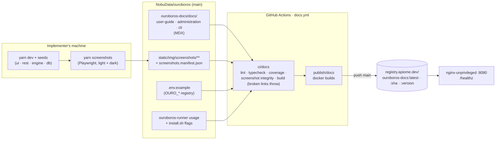
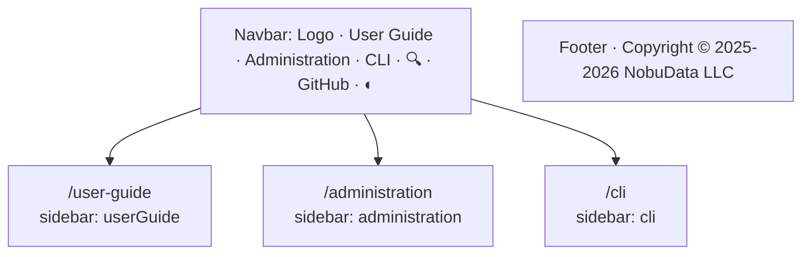
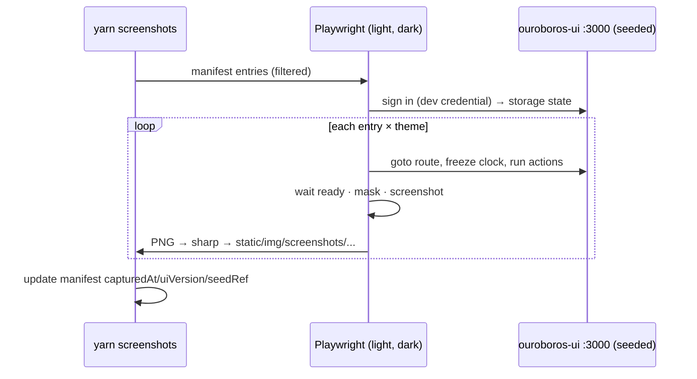
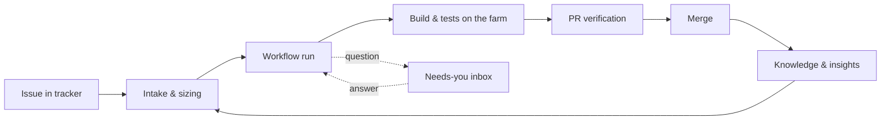
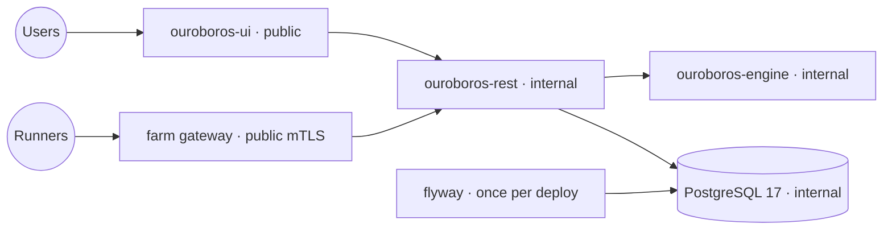
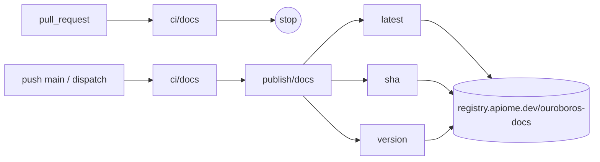
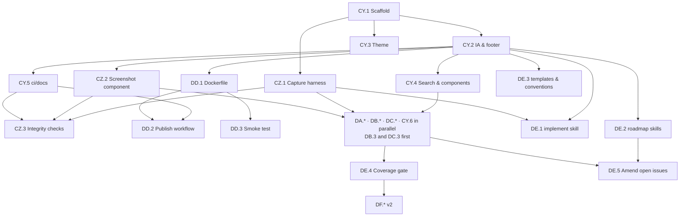

# Roadmap — Ouroboros Documentation Site (`ouroboros-docs`)

## Description

> Create a roadmap for an Ouroboros documentation site that uses Docusaurus to handle the
> documentation site. The application should include ouroboros-docs as the documentation
> site, and should include guides to use Ouroboros in its current form. Any additional
> tickets created using the implement command should include documentation updates and
> documentation creation to support the changes and new features that are implemented.
> Additionally, the Docusaurus website should include sections for User Guide,
> Administration, and CLI as separate sections, in order to keep the layout of the site
> consistent and user-friendly. The site should use screenshots of the application. The
> copyright should be Copyright 2025-2026 NobuData LLC. Create roadmap items for each of
> the sections, and include a Dockerfile for the building of the site along with a
> workflow that publishes the documentation site to registry.apiome.dev, under the tag
> name "ouroboros-docs".

## Context & Existing Work (duplicate-avoidance survey)

Surveyed 2026-10-07 against `main` at `058774b2`.

**No documentation site exists today.** User-facing knowledge lives in engineering
documents — module READMEs, [`HOSTING.md`](../HOSTING.md),
[`ARCHITECTURE.md`](ARCHITECTURE.md), [`SECURITY_MODEL.md`](SECURITY_MODEL.md),
[`TICKET_SOURCES.md`](TICKET_SOURCES.md), [`WEBHOOKS.md`](WEBHOOKS.md),
[`RUNNER_PROTOCOL.md`](RUNNER_PROTOCOL.md), [`MODEL_PROVIDERS.md`](MODEL_PROVIDERS.md),
the root `.env.example` (97 `OURO_*` variables) — written for contributors, not for the
people who use or operate Ouroboros. Nothing in GitHub covers a docs site: a search of
every issue title for *docs / documentation / docusaurus / screenshot / help link*
returns only the items below, none of which overlap.

| Existing work | Disposition under this roadmap |
|---|---|
| #12 Architecture documentation (closed), #226 Security model documentation (closed) | **Source material** — DB.2/DB.11 adapt them for operators; the engineering docs stay in `docs/` and are linked, not moved. |
| #34 OpenAPI documentation & spec export (closed; REST `openapi.json` at 0.40.6) | **Consumed** — DC.5 links the spec; DF.2 (v2) renders it as a reference. |
| #635 CO.1 Docs, standards & papers tool (Research, open) | **Unrelated** — an engine tool for reading external docs during research runs. Not touched. |
| #177 Schema-driven completions & hover docs (closed) | **Unrelated** — in-editor DSL hover text. DA.6 screenshots it. |
| `ouroboros-web` (marketing site, `docker-publish.yml`) | **Pattern reused, not shared** — the docs module copies its *not-a-workspace* stance and its publish-job shape; the two sites stay separate deployables. |
| `tests/e2e` (Playwright 1.62, seeded compose stack, cookie-jar sign-in) | **Pattern reused** — the screenshot harness (CZ.1) drives the same seeded stack the same way, in its own project, so the MVP exit gate is not slowed or coupled to docs. |
| `/implement`, `/create-roadmap`, `/update-roadmap` skills, PR template, `CONVENTIONS.md` | **Amended** (Epic DE) — documentation becomes part of the definition of done for every ticket implemented after this roadmap's MVP. |
| Open roadmaps whose surfaces are not delivered yet (Chat Ops 18 MVP open / 0 closed, Marketplace 42/0, Research 25/6, Copilot 14/4) | **Not documented now** — "Ouroboros in its current form" means what ships on `main`. DE.5 amends their open issues so each brings its own pages when it lands. |

**What "its current form" covers** (MVP-labelled issues closed per area, 2026-10-07):
Dashboard 33/33, Intake 34/39, Workflow Studio 45/65, Sources 15/19, Workflow Code 17/20,
Routing 26/29, Providers 25/29, Build Farm 29/35, Planning 24/29, Run Console 23/28,
Test Results 21/26, PR Verification 22/25, Onboarding 16/19, Knowledge 18/22,
Insights 16/19, Inbox 14/19, Settings 17/23, Analyzer 16/19, Registry 19/22,
App Shell 8/10, Auth 35/36. UI routes on `main`: `/login`, `/workspace-recovery`,
`/get-started`, `/dashboard`, `/issues`, `/planning`, `/workflows`, `/workflows/[slug]`,
`/workflows/[slug]/code`, `/models` (routing), `/models/providers`, `/models/registry`,
`/build-farm`, `/runs/[id]`, `/runs/[id]/tests`, `/prs/[id]`,
`/prs/[id]/evidence/[evidenceId]`, `/inbox`, `/insights`, `/analyzer`, `/knowledge`,
`/settings` (+ `/farm-tokens`, `/policies`, `/sources`). The `/workshop/*` routes are
internal design harnesses and are **not** documented.

**CLIs that exist today:** `ouroboros-runner` (`enroll`, `run`, `version`, `hello`,
`heartbeat`, `help`, seven `OURO_RUNNER_*` variables), the runner `install.sh` (eleven
flags incl. `--uninstall`/`--purge`), the stack verbs (`yarn setup` →
`scripts/setup.sh --dry-run/--force/--db-port/--root`, `yarn dev`, `dev:stop`,
`dev:reset`, `verify`), and the REST API over HTTP with member API tokens (#485). The
`/ouro` chat grammar (Chat Ops BZ) is **not** delivered and is v2 here (DF.5).

## Research Notes (sources)

- **Docusaurus 3.10.x** is the current line (3.10.1 on the official changelog, April 2026;
  npm activity on `@docusaurus/*` through July 2026) —
  [docusaurus.io/changelog](https://docusaurus.io/changelog). Pin the exact patch at CY.1.
- **Docs multi-instance** gives each instance its own route base and versioning; the
  Docusaurus docs say it is mainly useful for *independently versioned* sets —
  [Docs Multi-instance](https://docusaurus.io/docs/docs-multi-instance). Cross-instance
  Markdown links do not resolve as file links, which matters for three heavily
  cross-linked sections (see decision D2).
- **Search** — Docusaurus ships none. `@easyops-cn/docusaurus-search-local` builds the
  index at build time and ships it with the static site (no external service) —
  [docusaurus-search-local](https://openapps.pro/packages/docusaurus-search-local);
  `@cmfcmf/docusaurus-search-local` is the older alternative —
  [npm listing](https://classic.yarnpkg.com/en/package/@cmfcmf/docusaurus-search-local).
- Diagrams: `@docusaurus/theme-mermaid` (first-party, v3). Images: `@docusaurus/plugin-ideal-image`
  is available but optional (D6).

## Infrastructure Options (researched — pick before filing)

### 1. Site generator & module placement

| Option | What it is | Fit | Trade-offs |
|---|---|---|---|
| **A — Docusaurus 3.10 in `ouroboros-docs/`, not a Yarn workspace** (recommended) | Own `package.json`, `yarn.lock`, `.yarnrc.yml`, like `ouroboros-web` | Required by the description; a static site has no place in `yarn dev`'s task graph | One more lockfile; Dependabot/Renovate must list it |
| B — Docusaurus as a workspace | In the root roster | One lockfile | Puts React 18/19 + Docusaurus resolution into the product's lockfile; `yarn build` at root grows by a minute; rejected |
| C — Another generator (Nextra, Starlight) | — | — | Description names Docusaurus; rejected |

### 2. Three sections

| Option | What it is | Fit | Trade-offs |
|---|---|---|---|
| **A — One docs instance, three sidebars** (recommended) | `docs/user-guide/`, `docs/administration/`, `docs/cli/` under `routeBasePath: '/'`; `sidebars.ts` exports `userGuide`, `administration`, `cli`; navbar items `type: 'docSidebar'` | Identical layout everywhere; relative `.md` links work across sections; one search index; `onBrokenLinks: 'throw'` covers everything | The three sections version together (fine — they describe one product) |
| B — Three docs plugin instances | `@docusaurus/plugin-content-docs` ×3 with ids | Independent versioning | Cross-section links must be URL paths (unchecked as files); search plugin config per instance; rejected for MVP |

### 3. Screenshots

| Option | What it is | Fit | Trade-offs |
|---|---|---|---|
| **A — Playwright capture against the seeded local stack, committed PNGs + manifest** (recommended) | `ouroboros-docs/screenshots/` Playwright project; `yarn screenshots` signs in with the dev credential, visits manifest entries, captures light + dark | Real application, real seed data (mockup-parity seeds already exist per area); deterministic | Images go stale when UI changes → DE.1 makes the implementer recapture; CZ.3 checks integrity; DF.3 automates refresh |
| B — Capture during the Docker image build | — | Always fresh | The image build would need PostgreSQL + REST + engine + UI running; rejected |
| C — Hand-taken screenshots | — | Fast first time | Inconsistent size/theme/data; unrepeatable; rejected |

### 4. Serving & publishing

| Option | What it is | Fit | Trade-offs |
|---|---|---|---|
| **A — Multi-stage Dockerfile: `node:24-alpine` build → `nginxinc/nginx-unprivileged:alpine` serving `build/` on 8080** (recommended) | Static files, non-root, `/healthz` | Smallest attack surface; matches the static output | nginx config is ours to own (D8) |
| B — `docusaurus serve` in Node | — | Zero config | Node runtime for static files; rejected |

## Decisions proposed by this roadmap (validate before issue creation)

| # | Decision | Rationale |
|---|---|---|
| D1 | **`ouroboros-docs/` is a module but not a workspace** (option 1-A): Docusaurus 3.10.x pinned exactly, TypeScript config, own lockfile, dev port **3100** (3000 is taken by UI and web), root verb `yarn dev:docs`. `CONVENTIONS.md` § 1 gains a sixth "deliberate limit"; `verify-workspace.sh`/`verify-layout.sh` learn it. | Same reasoning as `ouroboros-web`: own pipeline, no place in the product's graph. |
| D2 | **One docs instance, three sidebars** (option 2-A) at `/user-guide`, `/administration`, `/cli`; a landing page at `/`; every page belongs to exactly one sidebar; the navbar shows the three sections in that order, plus search and the theme toggle. | The description's "consistent and user-friendly layout"; cross-links checked at build. |
| D3 | **Footer copyright string is exactly `Copyright © 2025-2026 NobuData LLC`** (with the U+00A9 copyright sign — confirmed 2026-10-07), set in `themeConfig.footer.copyright` and asserted by a test (CY.5). | Stated requirement; a test stops a year bump or a lost glyph from drifting it. |
| D4 | **Screenshots per option 3-A**, captured at 1440×900, DPR 2 downscaled to 1440 wide, both themes, clock frozen (`page.clock`), animations off, volatile regions (relative times, sparklines with live data) masked; files `static/img/screenshots/<section>/<id>.<light|dark>.png`; a `screenshots.manifest.json` names each id's route, workspace, wait condition, masks and captions; the `<Screenshot id>` component swaps by theme. | Real app, repeatable, theme-correct. |
| D5 | **Local search** via `@easyops-cn/docusaurus-search-local` (index built into the image); **Mermaid** via `@docusaurus/theme-mermaid`. | Self-hosted image, no third-party service; diagrams match the repo's Mermaid habit. |
| D6 | **Images are optimised at capture time** (sharp, PNG palette/quality), per-image budget 350 KB, total screenshot budget 40 MB, enforced by CZ.3. `plugin-ideal-image` not used in MVP. | Keeps the image and repo small without a runtime image pipeline. |
| D7 | **Brand from `docs/design/tokens.css` and `docs/brand/`**, mapped onto Infima variables; light/dark follow `prefers-color-scheme` with a toggle; no hard-coded colours in custom CSS. | One brand across product, marketing and docs; matches the repo's "CSS classes, no hard-coded values" rule. |
| D8 | **Image = `nginx-unprivileged` on 8080**, `try_files $uri $uri/ $uri.html =404`, Docusaurus `404.html`, immutable caching for `/assets/*`, `no-cache` for HTML, gzip, security headers (CSP without inline-script exceptions beyond Docusaurus' theme script hash), `GET /healthz` → 200. | Static-site serving done properly. |
| D9 | **Publish workflow `.github/workflows/docs.yml`** (`ci/docs` + `publish/docs` in one file, the `ui.yml` pattern): PRs build/lint/check only; pushes to `main` and `workflow_dispatch` push **`registry.apiome.dev/ouroboros-docs`** tagged `latest`, `<git sha>` and `<package.json version>`. The registry host is a workflow `env` literal (`REGISTRY: registry.apiome.dev`) per the description; credentials come from the repository build secrets **`DOCKER_USERNAME`** and **`DOCKER_PASSWORD`**, under exactly those names (confirmed 2026-10-07). | Requirement; a red check publishes nothing (same rule as `publish/ui`). |
| D10 | **Site URL is `https://docs.ouroboros.build`** (confirmed 2026-10-07) — the default of the build arg/env `DOCS_SITE_URL`, which exists only for local/preview builds; `baseUrl` `/`. | Docusaurus needs `url` at build time for canonical links, sitemap and search. |
| D11 | **Documentation is part of done** (Epic DE): `/implement` gains a documentation step and audit item; roadmap skills give every issue a *Documentation* section; the PR template gains a checkbox; a coverage check fails CI when a new UI route, runner flag or `OURO_*` variable has no docs entry. | The description's "any additional tickets created using the implement command should include documentation updates and documentation creation". |
| D12 | **Document only what ships on `main`.** Honest-absent surfaces in the UI (e.g. "arrives with Chat Ops") are described as such in one line, never as working features. | "Ouroboros in its current form"; docs must not over-promise. |
| D13 | **Labels:** new area label `docs-site` (added to `.github/labels.yml`, synced) plus existing `documentation`, `mvp`/`v2`, `ci`, `infra`, `design`. **Milestones:** `Docs Site MVP`, `Docs Site v2`. **Project prefix in titles:** `ouroboros-docs:` (or `ouroboros:` for repo-wide process issues). Complexity XS–L. | Matches the repo's per-roadmap label/milestone convention. |
| D14 | **Epic letters CY–DF** continue the sequence after Marketplace's CX. | No collisions with existing refs. |

## Architecture Overview



Site map (D2):

```
/                         Landing — what Ouroboros is, three section cards, quick links
├── /user-guide           Overview & concepts → Getting started → Dashboard → Issues →
│                         Planning → Workflows (Studio, Code) → Models → Runs & tests →
│                         Pull requests → Inbox → Insights → Analyzer → Knowledge → Glossary
├── /administration       Overview & roles → Deploying → Configuration reference →
│                         Sign-in & workspace → Members & tokens → Sources & repos →
│                         Providers & models → Build farm → Policies → Notifications &
│                         webhooks → Retention, audit & lifecycle → Operations
└── /cli                  Overview → install.sh → ouroboros-runner → Stack verbs →
                          REST API from the shell
Footer: section links · GitHub · ouroboros.build · "Copyright © 2025-2026 NobuData LLC"
```

## MVP Definition

The MVP is done when **all** of the following hold on `main`:

1. `ouroboros-docs/` exists as a Docusaurus 3.10 module (D1) with the landing page and the
   **three separate sections — User Guide, Administration, CLI** — each with its own sidebar
   and identical page chrome (D2), brand theme in light and dark (D7), local search and
   Mermaid (D5), and the footer **`Copyright © 2025-2026 NobuData LLC`** (D3).
2. Every delivered product surface listed in the survey has a User Guide page; every
   operator task in `HOSTING.md`, Settings, Build Farm and `.env.example` has an
   Administration page; every existing CLI (`ouroboros-runner`, `install.sh`, stack verbs,
   REST via shell) has a CLI page.
3. Pages use **real screenshots of the application** captured by `yarn screenshots` from
   the seeded stack, in both themes, with alt text; the manifest and image files agree.
4. `ouroboros-docs/Dockerfile` builds a non-root static image serving the site on 8080
   with `/healthz`; `.github/workflows/docs.yml` checks every PR and, on `main`, publishes
   **`registry.apiome.dev/ouroboros-docs`** (`latest`, sha, version).
5. `/implement`, the roadmap skills, the PR template and `CONVENTIONS.md` require
   documentation for user-visible changes, and the coverage check fails CI when a new UI
   route, runner flag or `OURO_*` variable is undocumented.

**v2** (milestone `Docs Site v2`): versioned docs per release, rendered REST API
reference from `openapi.json`, nightly screenshot refresh with diff PRs, PR preview
builds, `/ouro` chat command reference (after Chat Ops), in-app contextual help links.

## Epics, Labels & Milestones

| Epic | GitHub | Status | Name | Goal | Modules | Milestone |
|---|---|---|---|---|---|---|
| CY | #1156 | 🟡 Open | Docs Site Foundation | Module, IA (three sections), theme, search, components, CI checks, landing | ouroboros-docs, scripts, docs, .github | Docs Site MVP |
| CZ | #1157 | 🟡 Open | Screenshot Pipeline | Capture harness, manifest, component, integrity checks | ouroboros-docs | Docs Site MVP |
| DA | #1158 | 🟡 Open | User Guide | Task-oriented guides for every delivered product surface | ouroboros-docs | Docs Site MVP |
| DB | #1159 | 🟡 Open | Administration | Deploy, configure, secure and operate a workspace and stack | ouroboros-docs | Docs Site MVP |
| DC | #1160 | 🟡 Open | CLI | Reference + how-tos for every command-line surface | ouroboros-docs | Docs Site MVP |
| DD | #1161 | 🟡 Open | Container & Publishing | Dockerfile, nginx, smoke test, publish to registry.apiome.dev | ouroboros-docs, .github | Docs Site MVP |
| DE | #1162 | 🟡 Open | Documentation as Definition of Done | Skills, templates, conventions, coverage gate, amendments | .claude, .github, docs, scripts | Docs Site MVP |
| DF | #1163 | 🟡 Open | Docs Site v2 | Versioning, API reference, auto-refresh, previews, chat reference, in-app help | ouroboros-docs, ouroboros-ui, .github | Docs Site v2 |

Every content issue (DA/DB/DC) carries this **standard acceptance block** in addition to
its own criteria, referred to below as **[STD]**:

- Page(s) in the named sidebar with front matter `title`, `description`, `sidebar_position`.
- Written for the reader's task (what / when / how / what can go wrong), present tense,
  second person; no internal ticket refs (`[BM.3]`) or migration numbers in prose.
- Every screenshot listed in the issue exists in the manifest, in both themes, with alt
  text and a caption; captured from the seeded stack via `yarn screenshots`.
- Every UI label, button, route, flag and variable named matches `main` exactly (verified
  by the implementer against the running stack, not the mockup).
- Honest-absent features described per D12.
- `yarn build` passes with broken links/anchors throwing; `docs-coverage` entries added.
- Labels `documentation`, `docs-site`, `mvp`; milestone `Docs Site MVP`.

---

## Epic CY (#1156) — Docs Site Foundation

| Ref | GitHub | Status | Title | Summary | Labels | Parallel | MVP | Complexity | Affected Modules |
|---|---|---|---|---|---|---|---|---|---|
| CY.1 | #1164 ✅ | 🟢 Done | ouroboros-docs: [CY.1] Scaffold the ouroboros-docs module | Docusaurus 3.10 TS module, not a workspace, README, repo verbs and verify scripts | mvp, docs-site, documentation, infra | N (first) | Y | M | ouroboros-docs, package.json, scripts, docs, README.md |
| CY.2 | #1165 ✅ | 🟢 Done | ouroboros-docs: [CY.2] Information architecture — three sections, navbar & footer | User Guide / Administration / CLI sidebars, landing, footer copyright, page template | mvp, docs-site, documentation | N (after CY.1) | Y | M | ouroboros-docs |
| CY.3 | #1166 ✅ | 🟢 Done | ouroboros-docs: [CY.3] Brand theme, light/dark & logos | tokens.css → Infima, brand assets, favicons, no hard-coded colours | mvp, docs-site, design | Y (after CY.1, ∥ CY.2) | Y | S | ouroboros-docs |
| CY.4 | #1167 ✅ | 🟢 Done | ouroboros-docs: [CY.4] Search, Mermaid & shared MDX components | Local search, Mermaid, `<EnvVar>`, `<UiPath>`, `<Since>`, admonition conventions | mvp, docs-site, documentation | Y (after CY.2) | Y | M | ouroboros-docs |
| CY.5 | #1168 ✅ | 🟢 Done | ouroboros-docs: [CY.5] ci/docs — lint, typecheck, tests & strict build | docs.yml check job, strict links, copyright test, verify-ci routing | mvp, docs-site, ci | N (after CY.2) | Y | M | ouroboros-docs, .github, scripts |
| CY.6 | #1169 ✅ | 🟢 Done | ouroboros-docs: [CY.6] Landing page & "What is Ouroboros" | Home with three section cards, product overview, quick links | mvp, docs-site, documentation | Y (after CY.2, CZ.2) | Y | S | ouroboros-docs |

### Issue CY.1 (#1164) — ouroboros-docs: [CY.1] Scaffold the ouroboros-docs module

> **GitHub issue:** #1164 ✅ · **Status:** 🟢 Done · **Parent epic:** #1156
>
> **Delivered (#1164):** `ouroboros-docs/` on **Docusaurus 3.10.2** (every `@docusaurus/*` pinned to it) with **React 19** (3.10's peer range is `^18 || ^19`); not a workspace — own `package.json` 0.1.0, `yarn.lock`, `.yarnrc.yml`. The scaffold's blog is switched off (`blog: false`, so no `/blog` route) and its tutorial docs, components and sample images are gone; Docusaurus refuses a docs instance with no docs, so `docs/index.md` (`slug: /`) is the placeholder home and CY.2 replaces it. `url` reads `DOCS_SITE_URL` (default `https://docs.ouroboros.build`, D10) and the footer already carries D3's copyright line, both from `site.constants.ts` (Docusaurus rejects extra exports of its config). `yarn screenshots` exits 1 naming CZ.1 rather than succeeding silently. `format:check` covers code and config, not Markdown content. Repo wiring: root `dev:docs`; `CONVENTIONS.md` limit 6, lockfile row, toolchain row and the port map (it lives in § 4, not § 3); `README.md` and `ARCHITECTURE.md` (§ 1 port map, new § 2.7); `verify-layout.sh` holds the module to all six README sections plus `.gitignore`/`.dockerignore`, and `verify-workspace.sh` (with test cases) to staying outside the roster, owning its lockfile and Yarn config, and having `dev:docs`.

**Problem Statement.** There is no home for user documentation. The description requires a
Docusaurus site named `ouroboros-docs`, and the repo's conventions (§ 1–2, 8, 9) require
every module to have a README, `.gitignore`, `.dockerignore`, lockfile policy and version,
with verify scripts that know the module exists.

**Solution / Scope.**
- Create `ouroboros-docs/` with `create-docusaurus` (classic, TypeScript), then pin
  `@docusaurus/*` to one exact 3.10.x patch ([changelog](https://docusaurus.io/changelog)),
  React 19 if Docusaurus 3.10 supports it, else 18 (state the choice in the README).
- Not a workspace (D1): own `package.json` (`"name": "ouroboros-docs"`, `"version": "0.1.0"`,
  `"license": "Apache-2.0"`, `packageManager: yarn@4.18.0`, `engines.node >=24`), own
  `yarn.lock`, own `.yarnrc.yml` (`nodeLinker: node-modules`).
- Scripts: `dev` (`docusaurus start --port 3100`), `build`, `serve`, `clear`, `lint`,
  `typecheck`, `test`, `format:check`, `screenshots` (placeholder until CZ.1).
- Root `package.json`: `"dev:docs": "cd ouroboros-docs && yarn install --immutable && yarn dev"`.
- README with Purpose → Stack → Run → Configuration → Layout → Related issues (§ 2).
- `.gitignore` (`build/`, `.docusaurus/`, `node_modules/`, `screenshots/test-results/`).
- Remove the scaffold's blog, tutorial docs and sample images.
- Repo wiring: `CONVENTIONS.md` § 1 tree + new limit 6 ("`ouroboros-docs` is not a
  workspace"), § 2 lockfile row, § 3 port map (3100); `README.md` module map + layout tree;
  `ARCHITECTURE.md` § 1 port map + § 2.7 short module entry; `scripts/verify-layout.sh`
  (README sections), `scripts/verify-workspace.sh` (stays outside the roster, owns its
  lockfile, has `dev:docs`).

**Acceptance Criteria.**
- `yarn dev:docs` from the root serves the empty site on `http://localhost:3100`.
- `cd ouroboros-docs && yarn build` succeeds; no blog route exists.
- `scripts/verify-layout.sh` and `scripts/verify-workspace.sh` pass and fail when the
  README section / lockfile / verb is removed (mutation-checked once).
- No change to the root `yarn.lock`.

**Parallelism / Dependencies.** First issue of the roadmap; blocks everything else.

**Technical Stack.** Docusaurus 3.10, TypeScript 5, Yarn 4, Node 24.

**Documentation.** The module README is the contributor documentation; `CONVENTIONS.md`,
`README.md`, `ARCHITECTURE.md` updated as above.

```
ouroboros-docs/
├── docs/{user-guide,administration,cli}/   (CY.2)
├── src/{components,css,pages,theme}/
├── static/img/{brand,screenshots}/
├── screenshots/                            (CZ.1 Playwright project)
├── docusaurus.config.ts · sidebars.ts
├── Dockerfile · nginx.conf · .dockerignore (DD.1)
└── package.json · yarn.lock · .yarnrc.yml · README.md
```

### Issue CY.2 (#1165) — ouroboros-docs: [CY.2] Information architecture — three sections, navbar & footer

> **GitHub issue:** #1165 ✅ · **Status:** 🟢 Done · **Parent epic:** #1156
>
> **Delivered (#1165):** `docs/{user-guide,administration,cli}/` with 49 stub pages — every page DA/DB/DC name (title, one-line purpose, an `info` "Being written" admonition linking its issue) — and six `_category_.json` groups (`getting-started`, `workflows`, `runs`, `deploy`, `configuration`, `runner`); the three generated-index groups carry a section-relative `slug`, since Docusaurus otherwise serves them at `/category/…`. `sidebars.ts` exports exactly `userGuide`, `administration`, `cli`, each `autogenerated` from its folder, so content issues add pages without touching it; the section list lives in `site.constants.ts` and drives the sidebars, navbar and tests. Navbar: the three `docSidebar` items in order, GitHub on the right, theme toggle kept (search arrives with CY.4). Footer: a column per section plus "More" (GitHub, ouroboros.build) and D3's copyright. `editUrl`, `trailingSlash: false` and every broken-link setting `throw` — verified once by a broken Markdown link and a broken anchor each failing `yarn build`. `docs/index.md` stays the home page (CY.6 replaces it) and now links the three sections. Tests: `config.test.ts` (settings, navbar, footer), `sidebars.test.ts`, `pages.test.ts` (the planned-page list, front matter, stub links its issue, one section per page, categories). README gains the Authoring guide (placement table, naming, front matter, template, link style); `ARCHITECTURE.md` § 2.7 names the sections. Module 0.1.1.

**Problem Statement.** The description requires User Guide, Administration and CLI as
separate sections with a consistent, user-friendly layout, and a fixed copyright.

**Solution / Scope.**
- One docs instance (D2), `routeBasePath: '/'`; folders `docs/user-guide/`,
  `docs/administration/`, `docs/cli/`, each with an `index.mdx` section overview and
  `_category_.json` files for groups.
- `sidebars.ts` exports exactly `userGuide`, `administration`, `cli`; navbar items
  `{type:'docSidebar', sidebarId, label}` in the order User Guide, Administration, CLI;
  right side: search (CY.4), GitHub link, colour-mode toggle.
- Footer: three link columns (one per section's top pages) + "More" (GitHub, ouroboros.build);
  `copyright: 'Copyright © 2025-2026 NobuData LLC'` exactly (D3).
- `editUrl` → `https://github.com/NobuData/ouroboros/edit/main/ouroboros-docs/`.
- Settings: `onBrokenLinks: 'throw'`, `markdown.hooks.onBrokenMarkdownLinks: 'throw'`,
  `onBrokenAnchors: 'throw'`, `onDuplicateRoutes: 'throw'`, `trailingSlash: false`;
  `url` from `DOCS_SITE_URL` (default per D10).
- Stub pages for every page named in DA/DB/DC (title + one-line purpose + "being written"
  admonition) so sidebars are final from day one and content issues fill them in parallel.
- Authoring guide in the README: front matter fields, where a page goes (decision table:
  *does the reader use the product UI → User Guide; operate/configure the deployment or
  workspace → Administration; type a command → CLI*), naming, link style.

**Acceptance Criteria.**
- The three sections render with separate sidebars at `/user-guide`, `/administration`,
  `/cli`; the active navbar item follows the section.
- Footer text is exactly `Copyright © 2025-2026 NobuData LLC`.
- Every stub page listed in the DA/DB/DC tables exists and builds; a broken link fails `yarn build`.

**Parallelism / Dependencies.** After CY.1. Blocks CY.4–CY.6 and all content.

**Technical Stack.** Docusaurus classic preset, `sidebars.ts`.



### Issue CY.3 (#1166) — ouroboros-docs: [CY.3] Brand theme, light/dark & logos

> **GitHub issue:** #1166 ✅ · **Status:** 🟢 Done · **Parent epic:** #1156
>
> **Delivered (#1166):** `scripts/sync-brand.mjs` keeps 13 byte-identical copies — `docs/design/tokens.css` → `src/css/tokens.css`, the six `docs/brand/` PNGs and the two `docs/mockups/assets/logo-*.png` → `static/img/brand/`, and ouroboros-ui's `favicon.ico`, light/dark 32 px tab icons and `apple-touch-icon.png` → `static/img/brand/favicon/` (reused rather than generated twice). Yarn 4 runs no `pre*` scripts, so `dev` and `build` call the sync first; `yarn check:brand` (also asserted by `yarn test`) fails on drift, and outside the repository a plain sync keeps the committed copies. `src/css/custom.css` maps the tokens onto Infima with `:root, html[data-theme=…]` selectors (Infima's dark block is `html[data-theme='dark']`, so plain `[data-theme]` would lose); the tokens switch on the same attribute the toggle stamps, so one mapping serves both themes. Stylelint 17 (`yarn lint`) refuses hex, named and functional colours everywhere but the token copy. Navbar logo is the **icon** pair (`src`/`srcDark`), not the glyph — the navbar draws 32 px and `BRAND.md` puts the glyph's minimum at 96 px. `docs/BRAND.md` has no typography section, so type follows the tokens' three families, self-hosted via pinned `@fontsource/*` at ouroboros-ui's weights. Footer switched to `style: "light"` so the brand mapping colours it in both themes. Also fixed CY.2's stub admonitions: `future.v4` drops MDX 1 compatibility, so `:::info Being written` rendered as text — now `:::info[Being written]`, with a test refusing the old form. `DESIGN_TOKENS.md` and `BRAND.md` name the docs copies. Module 0.1.2.

**Problem Statement.** The docs must look like Ouroboros, in both themes, without
duplicating colour values that already live in `docs/design/tokens.css`.

**Solution / Scope.**
- Copy (via a `prebuild`/`predev` sync script, not by hand) `docs/design/tokens.css` and the
  brand PNGs (`docs/brand/*`, `docs/mockups/assets/logo-*.png`) into `src/css/` and
  `static/img/brand/`; a check fails when the copies drift.
- `src/css/custom.css` maps tokens to Infima (`--ifm-color-primary*`, background, surface,
  font families, code font, radius) for `[data-theme='light']` and `[data-theme='dark']`;
  no literal colours in custom CSS (stylelint rule `color-no-hex` outside the token file).
- `colorMode.respectPrefersColorScheme: true`; navbar logo light/dark variants; favicon set.
- Typography per `docs/BRAND.md`.

**Acceptance Criteria.** Both themes render with brand colours/logos; toggling switches
logos; stylelint fails on a hex colour in `custom.css`; drift check fails after editing a
copied token.

**Parallelism / Dependencies.** After CY.1; parallel to CY.2.

**Technical Stack.** Infima CSS variables, stylelint.

### Issue CY.4 (#1167) — ouroboros-docs: [CY.4] Search, Mermaid & shared MDX components

> **GitHub issue:** #1167 ✅ · **Status:** 🟢 Done · **Parent epic:** #1156
>
> **Delivered (#1167):** `@easyops-cn/docusaurus-search-local` **0.55.3** (peer range covers React 19 and Docusaurus 3) with `indexDocs`, `indexBlog: false`, `docsRouteBasePath: '/'`, `hashed: true`; the one docs instance is one index across all three sidebars (verified: "enroll" returns `CLI › ouroboros-runner` and `Administration › Build farm administration` hits). The section name comes from `explicitSearchResultPath: true` — each hit's path starts with the active navbar item, which is its section; `searchContextByPaths` was rejected because it splits the index per section. Navbar search sits right, before GitHub. `@docusaurus/theme-mermaid` 3.10.2 (`markdown.mermaid: true`, `base` theme both modes): Docusaurus allows one Mermaid options set for both modes and Mermaid needs literal colours, so `src/theme/Mermaid/` (swizzled) reads the tokens off the page with `getComputedStyle` whenever `<html data-theme>` changes and passes them as `themeVariables` — no colour duplicated, verified rendering in both themes. Components in `src/components/` with CSS modules on tokens, registered globally via `src/theme/MDXComponents.tsx`, each throwing on bad input: `<UiPath path="Settings > Members">`, `<EnvVar name>` (→ `/administration/configuration#<lower-case name>`; the anchor is build-checked, so it is unusable until DB.3 lists variables — noted in the README), `<Since version module?>`, `<SectionCards cards?>` (defaults to the three sections; `SECTIONS` gained descriptions). Vitest gained jsdom + Testing Library (`tests/components/`, `tests/theme/`), with stand-ins for `@docusaurus/Link` and `@theme-original/MDXComponents`. Also declared `@docusaurus/theme-common` and `plugin-content-docs`, which the config already imported types from. README: admonition conventions (note / tip / caution / `info[Not available yet]`, danger only for the irreversible), components, diagrams, search. Module 0.1.3.

**Problem Statement.** Readers need search across all three sections; authors need a few
consistent components so pages read the same.

**Solution / Scope.**
- `@easyops-cn/docusaurus-search-local` (D5): `indexDocs: true`, `indexBlog: false`,
  `docsRouteBasePath: '/'`, `hashed: true`, search-result context shows the section name.
  Verify against the installed version that one-instance indexing covers all three sidebars.
- `@docusaurus/theme-mermaid` with brand-token theme variables in both modes.
- Components in `src/components/` (each with a vitest + Testing Library test):
  `<UiPath>` (renders `Settings › Members` breadcrumb style), `<EnvVar name>` (mono name,
  links to its row in DB.3's reference), `<Since version module>` (small badge),
  `<SectionCards>` (landing/overview cards). `<Screenshot>` landed in CZ.2 (#1171 ✅).
- Admonition conventions in the README: `note` (context), `tip`, `caution` (data loss /
  security), `info` "Not available yet" (D12).

**Acceptance Criteria.** Searching "enroll" returns CLI and Administration hits; a Mermaid
block renders in both themes; component tests pass.

**Parallelism / Dependencies.** After CY.2; parallel to CY.5, CZ.1.

**Technical Stack.** easyops search-local, theme-mermaid, vitest.

### Issue CY.5 (#1168) — ouroboros-docs: [CY.5] ci/docs — lint, typecheck, tests & strict build

> **GitHub issue:** #1168 ✅ · **Status:** 🟢 Done · **Parent epic:** #1156
>
> **Delivered (#1168):** `.github/workflows/docs.yml`, job **`ci/docs`**, runs the shared `./.github/actions/node-module` pipeline over `ouroboros-docs` (corepack → `yarn install --immutable` → `lint` → `typecheck` → `test` → `build`), so Node stays pinned in one place (§ 9 rule 2) — which makes the two shared actions inputs too. `yarn lint` is now ESLint + Stylelint + **markdownlint-cli2** over `docs/**/*.{md,mdx}` (defaults less MD013 line length and MD033 inline HTML; it caught `docs/index.md`'s duplicate H1, now removed). Path filter (both events): the issue's list, plus the other brand-copy sources CY.3 added after this issue was written — the two mockup logos and ouroboros-ui's four tab/home-screen icons, **named file by file**, so a change to the rest of `ouroboros-ui/` still never queues it (asserted with `public/manifest.webmanifest → ui.yml`). Not a workspace, so no root workspace files. Config tests: the copyright and navbar order already existed; added that the navbar's `docSidebar` ids equal `sidebars.ts`'s exports. `verify-ci.sh` (344 checks): `docs` joins `MODULES` (status name, permissions, concurrency, filters, self-watch, CONVENTIONS mention), the shared-pipeline and Node-pin loops, new routes (`ouroboros-docs/**`, tokens, brand, mockup logo, favicon, `.env.example`, `main.go`, `install.sh`, shared actions), `docker-publish.yml` not watching the docs, the docs lint covering pages, and no workspace files in `docs.yml`; `verify-ci.test.sh` gains the docs fixture and ten mutation cases. `CONVENTIONS.md` § 9 diagram gains `ci/docs` / `publish/docs` and the input lines; root README's CI table gains both rows. Module 0.1.4.

**Problem Statement.** Docs rot silently unless every PR builds them strictly.

**Solution / Scope.**
- `.github/workflows/docs.yml` job **`ci/docs`**, path-filtered on `ouroboros-docs/**`,
  `docs/design/tokens.css`, `docs/brand/**`, `.env.example`,
  `ouroboros-runner/cmd/ouroboros-runner/main.go`, `ouroboros-runner/install.sh`, and the
  workflow itself (the last four feed DB.3/DC.3/DE.4 checks).
  Steps: corepack, `yarn install --immutable`, `lint` (eslint + stylelint +
  markdownlint-cli2 on `docs/**`), `typecheck`, `test` (vitest), `build`.
- Config test: footer copyright equals `Copyright © 2025-2026 NobuData LLC`; the navbar's
  three items are the three sidebars in order.
- `scripts/verify-ci.sh` learns the route (`ouroboros-docs/** → docs.yml`) and that
  `docker-publish.yml` does not watch the docs.
- `CONVENTIONS.md` § 9 diagram gains the `ci/docs` / `publish/docs` lines.

**Acceptance Criteria.** A PR introducing a broken link, a lint error or a changed copyright
fails `ci/docs`; a PR touching only `ouroboros-ui/` does not queue it; `verify-ci.sh` passes.

**Parallelism / Dependencies.** After CY.2; DD.2 adds the publish job to the same file.

**Technical Stack.** GitHub Actions, markdownlint-cli2, vitest.

### Issue CY.6 (#1169) — ouroboros-docs: [CY.6] Landing page & "What is Ouroboros"

> **GitHub issue:** #1169 ✅ · **Status:** 🟢 Done · **Parent epic:** #1156
>
> **Delivered (#1169):** `src/pages/index.tsx` replaces `docs/index.md` at `/` (both would claim the route, and duplicate routes throw): hero with the `lockup-tagline` pair through `ThemedImage` at its 320 px working size, an `<h1>`, the tagline *Infinity in Autonomy* and one paragraph on the loop adapted from `README.md`; "Find your way" — the default `<SectionCards>`, whose `SECTIONS` descriptions now open *Use the app* / *Run and configure it* / *Command-line tools*; quick links Get started (`/user-guide/getting-started`), Deploy (`/administration/deploy/overview`), Enrol a runner (`/cli/runner/enroll`), all build-checked `Link`s. CSS module on tokens only. Verified: both themes, no horizontal scroll at 375 px, Lighthouse accessibility **100** light and dark. **Deferred by decision (2026-10-08):** the `home.dashboard` screenshot needs CZ.1 (#1170) and CZ.2 (#1171), both open — the slot is marked in the page and fills with `<Screenshot id="home.dashboard" />` when they land. The [STD] items for doc pages (sidebar front matter, docs-coverage entries) do not apply to a React page. Module 0.1.5.

**Problem Statement.** Visitors need to know what Ouroboros is and which section to open.

**Solution / Scope.** `src/pages/index.tsx`: hero (lockup, tagline *Infinity in Autonomy*,
one-paragraph explanation of the loop: issues in, verified pull requests out), three
`<SectionCards>` (User Guide — *use the app*, Administration — *run and configure it*,
CLI — *command-line tools*), quick links (Get started, Deploy, Enrol a runner), a dashboard
screenshot (`home.dashboard`). Copy adapted from `README.md`, not from marketing claims of
`ouroboros-web`.

**Acceptance Criteria.** [STD]; landing renders in both themes and at 375 px width without
horizontal scroll; Lighthouse accessibility ≥ 95 locally.

**Parallelism / Dependencies.** After CY.2, CZ.2.

---

## Epic CZ (#1157) — Screenshot Pipeline

| Ref | GitHub | Status | Title | Summary | Labels | Parallel | MVP | Complexity | Affected Modules |
|---|---|---|---|---|---|---|---|---|---|
| CZ.1 | #1170 ✅ | 🟢 Done | ouroboros-docs: [CZ.1] Screenshot capture harness | Playwright project capturing manifest entries from the seeded stack, both themes | mvp, docs-site, documentation | Y (after CY.1) | Y | L | ouroboros-docs |
| CZ.2 | #1171 ✅ | 🟢 Done | ouroboros-docs: [CZ.2] `<Screenshot>` component | Theme-aware image with required alt, caption, zoom | mvp, docs-site | Y (after CY.2) | Y | S | ouroboros-docs |
| CZ.3 | #1172 ✅ | 🟢 Done | ouroboros-docs: [CZ.3] Screenshot integrity & budget checks | Manifest ↔ files ↔ MDX usage, size budgets, staleness report | mvp, docs-site, ci | N (after CZ.1, CZ.2, CY.5) | Y | S | ouroboros-docs |

### Issue CZ.1 (#1170) — ouroboros-docs: [CZ.1] Screenshot capture harness

> **GitHub issue:** #1170 ✅ · **Status:** 🟢 Done · **Parent epic:** #1157
>
> **Delivered (#1170):** `ouroboros-docs/screenshots/` — `@playwright/test` ^1.62 (resolves 1.63; e2e's major), `playwright.config.ts` with `light`/`dark` Chromium projects (1440×900, DSF 2, `en-US`/UTC, one worker: captures share one session and switch its active workspace per entry, so parallel workers would race). `global-setup.ts` signs in once through the **UI's** `/api/auth/sign-in/email` (its `proxy.ts` forwards `/api/auth/*`) as the seeded owner and saves storage state to gitignored `.auth/`; each entry calls `/api/auth/organization/set-active`. `screenshots.manifest.json` + draft-2020-12 schema (ajv + ajv-formats; duplicate ids refused in code) with the issue's fields, a top-level `clock`, and the stamps. Determinism: `page.clock.setFixedTime`, freeze CSS + `animations: "disabled"` / `caret: "hide"`, fonts awaited, **lazy images forced eager and awaited** (found live: the dashboard's lazy glyph was blank in one theme), masks painted in the app's own `--raised` token. **No seed reference instant exists** — the seed writes `now() - interval` — so the clock is the manifest's `clock` or the start of the current hour, and server-rendered relative times must be masked (the dashboard's elapsed cells, floored by the server's reading). sharp downscales to 1440 wide as a palette PNG (D6). `yarn screenshots [--only <id|glob>] [--theme light|dark]` is `node screenshots/run.ts` (Node's type stripping; `screenshots/package.json` marks ESM, tsconfig gains `allowImportingTsExtensions`), validates before a browser starts (exit 2), stamps `capturedAt`/`uiVersion`/`seedRef` for entries captured in every requested theme, and exits with Playwright's status. First entry `home.dashboard` (for CY.6). Verified on the composed e2e stack, freshly seeded: both theme files written; three runs byte-identical; a broken `ready` fails that entry naming route and selector while the rest are captured, exit 1. `OURO_DOCS_CAPTURE_BASE_URL` joins the root `.env.example` and the `ARCHITECTURE.md` registry (a module README naming an `OURO_*` variable requires both). README § *Recapturing screenshots*. Module 0.1.6.

**Problem Statement.** The site must use screenshots of the application. Hand-taken
screenshots drift in size, theme and data and cannot be retaken when the UI changes.

**Solution / Scope.**
- `ouroboros-docs/screenshots/` Playwright project (`@playwright/test` matching
  `tests/e2e`'s major), `playwright.config.ts` with one Chromium project per theme
  (`colorScheme: 'light'|'dark'`), viewport 1440×900, `deviceScaleFactor: 2`.
- `screenshots.manifest.json` (JSON Schema in the same folder): per entry `id`
  (`<section>.<slug>`), `route`, `workspace` (seeded slug), `ready` (selector/text to wait
  for), `clip` (`page` | `fullPage` | selector), `masks` (selectors), `actions` (small
  declarative steps: click, hover, fill, press — for dialogs and menus), `caption`, `alt`.
- Sign-in via the dev email/password credential (BetterAuth, non-production) against
  `OURO_DOCS_CAPTURE_BASE_URL` (default `http://localhost:3000`); session reused via
  storage state.
- Determinism: `page.clock.setFixedTime` to the seed's reference instant; CSS injected to
  disable animations/caret; fonts awaited; volatile regions masked.
- Output `static/img/screenshots/<section>/<slug>.<theme>.png`, downscaled to 1440 wide and
  optimised with sharp (D6); manifest records `capturedAt`, `uiVersion` (from
  `ouroboros-ui/package.json`), `seedRef` (git sha).
- `yarn screenshots [--only <id|glob>] [--theme light|dark]`; a README section "Recapturing
  screenshots" (start stack, seed, run, review diff).
- Not run in CI (D4 / option 3-B rejected); v2 automation is DF.3.

**Acceptance Criteria.**
- With `yarn dev` up on a freshly seeded database, `yarn screenshots --only home.*` writes
  both theme files; running it twice yields byte-identical PNGs (determinism check).
- A missing `ready` selector fails that entry with the route and selector in the message,
  and the run continues with the rest, exiting non-zero.

**Parallelism / Dependencies.** After CY.1; parallel to CY.2–CY.4. Content issues add
their own manifest entries.

**Technical Stack.** Playwright, sharp, ajv (manifest schema).



### Issue CZ.2 (#1171) — ouroboros-docs: [CZ.2] `<Screenshot>` component

> **GitHub issue:** #1171 ✅ · **Status:** 🟢 Done · **Parent epic:** #1157
>
> **Delivered (#1171):** `src/components/Screenshot` — `<Screenshot id alt? caption?>` in a `<figure>`: a `ThemedImage` pair (`loading="lazy"`, `decoding="async"`, intrinsic `width`/`height`, `height: auto`) inside a token-bordered button that opens a native modal `<dialog>` at full size (a click inside, *Close* or Esc closes it) — no `medium-zoom` dependency. "Reads the manifest at build time" is a local plugin, `plugins/screenshots.ts`: `loadContent` validates the manifest with CZ.1's `loadManifest` (ajv), reads each theme's PNG IHDR for its size (no sharp at build), and refuses a missing/non-PNG file or light/dark size mismatch; `setGlobalData` hands the index to the component via `usePluginData`. Unknown id or blank alt (manifest or override) throws during SSG → `yarn build` fails (verified). `caption=""` drops the caption. `publicPath` joins CZ.1's manifest lib; `SCREENSHOTS_PLUGIN` lives in `site.constants.ts` so the client never imports the Node plugin. Carried from CY.6: `src/pages/index.tsx` shows `<Screenshot id="home.dashboard" />` below the quick links. Tests: component (theme swap, alt required, unknown id, overrides, no layout shift, zoom), plugin (PNG header, index, failures, watch paths), Home. README § *Recapturing screenshots → Showing a screenshot*, components table. Module 0.1.7.

> **Carried from CY.6 (#1169):** when this lands, fill the marked slot in `src/pages/index.tsx` with `<Screenshot id="home.dashboard" />` (and its manifest entry, via CZ.1). Done in #1171.

**Problem Statement.** Pages need one way to show a screenshot that matches the reader's theme.

**Solution / Scope.** `<Screenshot id="user-guide.dashboard" />` reads the manifest at build
time, renders the light or dark file via `ThemedImage`, uses the manifest `alt` and
`caption` (overridable by props), `loading="lazy"`, intrinsic width/height to avoid layout
shift, click-to-zoom (`medium-zoom` or a small dialog), bordered frame using tokens.
Unknown id → build error.

**Acceptance Criteria.** Component tests: theme swap, alt required, unknown id throws;
renders without layout shift.

**Parallelism / Dependencies.** After CY.2; parallel to CZ.1.

### Issue CZ.3 (#1172) — ouroboros-docs: [CZ.3] Screenshot integrity & budget checks

> **GitHub issue:** #1172 ✅ · **Status:** 🟢 Done · **Parent epic:** #1157
>
> **Delivered (#1172):** `yarn check:screenshots` is `node screenshots/check.ts` over the pure rules in `screenshots/lib/integrity.ts`, run as a `Screenshot integrity` step of `ci/docs` after the shared pipeline (`scripts/verify-ci.sh` holds it). Named errors, every one reported, exit 1: `invalid-manifest`, `missing-image`, `unknown-screenshot-id` (file:line; usages read from `docs/**/*.{md,mdx}` and `src/pages/**/*.{md,mdx,tsx}`, Markdown code samples skipped), `orphan-image` (any file under `static/img/screenshots/`), `image-over-budget` (> 350 KiB), `total-over-budget` (> 40 MiB). Staleness: entries whose `uiVersion` major/minor is behind `ouroboros-ui/package.json` (patches ignored) or unstamped, printed as an aligned `id / uiVersion / capturedAt` table, exit 0; skipped when the UI is not beside the module. README § *Recapturing screenshots → Checking screenshots*. Module 0.1.8.

**Problem Statement.** Screenshots referenced but never captured, or captured and never
used, or too heavy, must be caught in CI — CI cannot capture, but it can check.

**Solution / Scope.** `yarn check:screenshots` (run in `ci/docs`): every manifest id has both
theme files; every `<Screenshot id>` used in MDX exists in the manifest; every file under
`static/img/screenshots/` belongs to a manifest id; per-image ≤ 350 KB, total ≤ 40 MB (D6);
report (warning, not failure) of entries whose `uiVersion` minor is behind the current
`ouroboros-ui` version.

**Acceptance Criteria.** Each failure mode produces a named error and non-zero exit;
staleness prints a table and exits 0.

**Parallelism / Dependencies.** After CZ.1, CZ.2, CY.5.

---

## Epic DA (#1158) — User Guide

Every DA issue is **[STD]** plus the listed screenshots. All are parallel to each other
once CY.2, CY.4 and CZ.1/CZ.2 are done. Area seeds referenced are the existing mockup-parity
dev seeds (e.g. acme-robotics; `acme-onboarding` for the wizard).

| Ref | GitHub | Status | Title | Summary | Labels | Parallel | MVP | Complexity | Affected Modules |
|---|---|---|---|---|---|---|---|---|---|
| DA.1 | #1173 ✅ | 🟢 Done | ouroboros-docs: [DA.1] User Guide overview, concepts & glossary | The loop, workspaces, issues→runs→PRs, decisions; glossary | mvp, docs-site, documentation | Y | Y | M | ouroboros-docs |
| DA.2 | #1174 ✅ | 🟢 Done | ouroboros-docs: [DA.2] Getting started — sign in, workspace & the Get Started wizard | Login, recovery, wizard cards, dry-run first loop | mvp, docs-site, documentation, onboarding | Y | Y | M | ouroboros-docs |
| DA.3 | #1175 ✅ | 🟢 Done | ouroboros-docs: [DA.3] Finding your way — app shell, navigation & command palette | Sidebar, header, ⌘K, themes, keyboard | mvp, docs-site, documentation, shell | Y | Y | S | ouroboros-docs |
| DA.4 | #1176 | 🟡 Open | ouroboros-docs: [DA.4] Mission Control dashboard | Reading the dashboard and acting from it | mvp, docs-site, documentation, dashboard | Y | Y | S | ouroboros-docs |
| DA.5 | #1177 ✅ | 🟢 Done | ouroboros-docs: [DA.5] Issues — intake, sizing & queuing | Backlog sync view, estimates, queue a loop | mvp, docs-site, documentation, intake | Y | Y | M | ouroboros-docs |
| DA.6 | #1178 ✅ | 🟢 Done | ouroboros-docs: [DA.6] Planning — roadmaps, generated tickets & timeline | Plans, ticket generation, gantt, tracker write-back | mvp, docs-site, documentation, planning | Y | Y | M | ouroboros-docs |
| DA.7 | #1179 ✅ | 🟢 Done | ouroboros-docs: [DA.7] Workflows — Studio canvas | Build/edit/publish workflows visually | mvp, docs-site, documentation, workflow | Y | Y | M | ouroboros-docs |
| DA.8 | #1180 ✅ | 🟢 Done | ouroboros-docs: [DA.8] Workflows as code | TS-DSL editor, completions, round-trip with the canvas | mvp, docs-site, documentation, code-view | Y | Y | M | ouroboros-docs |
| DA.9 | #1181 | 🟡 Open | ouroboros-docs: [DA.9] Models — routing & the model registry | Routes, aliases, escalation; browsing models | mvp, docs-site, documentation, routing, registry | Y | Y | M | ouroboros-docs |
| DA.10 | #1182 ✅ | 🟢 Done | ouroboros-docs: [DA.10] Runs — the run console | Transcript, stages, guardrails, pause/abort/steer | mvp, docs-site, documentation, runs | Y | Y | M | ouroboros-docs |
| DA.11 | #1183 ✅ | 🟢 Done | ouroboros-docs: [DA.11] Test results | Results, flakes, triage, classification | mvp, docs-site, documentation, tests | Y | Y | S | ouroboros-docs |
| DA.12 | #1184 ✅ | 🟢 Done | ouroboros-docs: [DA.12] Pull requests — verification, evidence & merge | Gates, criteria matrix, evidence, merge | mvp, docs-site, documentation, pr | Y | Y | M | ouroboros-docs |
| DA.13 | #1185 ✅ | 🟢 Done | ouroboros-docs: [DA.13] Needs-you inbox | Decision cards, allow once/deny, snooze, resolved list, channel prefs | mvp, docs-site, documentation, inbox | Y | Y | M | ouroboros-docs |
| DA.14 | #1186 ✅ | 🟢 Done | ouroboros-docs: [DA.14] Insights | Ranges, cards, trends, email digest | mvp, docs-site, documentation, insights | Y | Y | S | ouroboros-docs |
| DA.15 | #1187 | 🟡 Open | ouroboros-docs: [DA.15] Build Analyzer | Duration chart, suggestions, predicted vs measured, drafted tickets | mvp, docs-site, documentation, analyzer | Y | Y | M | ouroboros-docs |
| DA.16 | #1188 | 🟡 Open | ouroboros-docs: [DA.16] Knowledge | Skills, learned facts, playbooks, repo profile | mvp, docs-site, documentation, knowledge | Y | Y | S | ouroboros-docs |

### Issue DA.1 (#1173) — ouroboros-docs: [DA.1] User Guide overview, concepts & glossary

> **GitHub issue:** #1173 ✅ · **Status:** 🟢 Done · **Parent epic:** #1158
>
> **Delivered (#1173):** `user-guide/index.mdx` (audience, what Ouroboros does, the reading path through every User Guide page, D12 note), `user-guide/concepts.mdx` (workspace; the loop as a Mermaid flowchart plus seven steps; where you decide — Needs You decision cards, PR verification, run-console controls, Autonomy policies; dry-run policy vs a Studio workflow dry run vs a simulated run; what can go wrong) and `user-guide/glossary.mdx` (40 alphabetical terms, each linking to an existing page; `tests/glossary.test.ts` holds order, the issue's seven core words and every link). Labels checked against `main`'s UI source and the running seeded stack. **Screenshot deviation:** no completed seeded run has stages, transcript or guardrails (only the live #482/#479/#476 do), so `user-guide.concepts.loop-in-app` captures live loop #482 "Fix flaky CAN-bus telemetry test" (Loop #1847) — agreed with the maintainer; it carries the "Simulated run" banner, which the page explains. Masks: `.run-head__elapsed` and only the last five transcript entries' `.run-entry__time` — the shell scrolls inside `main`, so Playwright paints masks of entries clipped by the transcript's scroll box over the page above it. Recapture byte-identical. No `docs-coverage.json` entries: DE.4 (#1212) has not created the file, and these three pages map to no UI route. Module 0.1.9.

**Problem Statement.** New users meet a vocabulary (loop, run, workflow, gate, decision,
pool, workspace) before they meet a screen.

**Solution / Scope.** `user-guide/index.mdx` (who this section is for, the path through it),
`user-guide/concepts.mdx` (the loop from issue to merged PR with a Mermaid diagram; where a
human decides; dry-run vs live), `user-guide/glossary.mdx` (alphabetical, each term linking
to its page). Source: `README.md`, `ARCHITECTURE.md` § 1, mockup index — rewritten for users.

**Acceptance Criteria.** [STD]; every glossary term links to a page that exists.
Screenshots: `user-guide.concepts.loop-in-app` (run console of a completed seeded loop).



### Issue DA.2 (#1174) — ouroboros-docs: [DA.2] Getting started — sign in, workspace & the Get Started wizard

> **GitHub issue:** #1174 ✅ · **Status:** 🟢 Done · **Parent epic:** #1158
>
> **Delivered (#1174):** `getting-started/sign-in.mdx` (GitHub and SSO, the development email/password form and why production refuses it, step 2 "Choose where the loop runs" and **Enter mission control →**, the `/workspace-recovery` pending-deletion screen, errors), `getting-started/wizard.mdx` (the dashboard offer banner, `?repo=` and the default repository, the four rail steps, detection and **Save protected paths**, template tiles and the switch dialog, the first-issue card with **↻ another** / **or pick your own ▾** and "est. N min", the safety list and what dry-run blocks, **Run my first loop →** and the receipt, the Smart defaults / What happens next / Why this is safe to try column, errors) and `getting-started/first-loop.mdx` (queue → Active loops → run console → draft PR → recently closed; no tour exists). **Harness:** manifest entries gain `signedOut: true` (schema `if/then/else`: such an entry names no `workspace`, every other entry still must; the spec clears the test context's cookies instead of switching workspace; `signInRedirectError` holds the `/login` guard) for `user-guide.sign-in`. **Screenshots** (seed state, deviations agreed with the maintainer): the wizard shots use `acme-onboarding` at `?repo=acme-robotics/helios-firmware` (opens on step 3; element clips, no clicks — every wizard control writes); `wizard.defaults` clips the Smart defaults card (the whole column overlaps the sticky rail and action bar) with the estimator's relative affix masked; `user-guide.dashboard-banner` uses `kensuenobu`, the only seeded workspace with no runs — `acme-onboarding` has three, so it never shows the offer; **`user-guide.workspace-recovery` is not captured** — no seed has a pending-deletion workspace (the screen redirects to `/dashboard` otherwise), so the page documents it from its copy and a follow-up should seed one. The production UI build hides the development sign-in form, so the sign-in shot does not show it. No `docs-coverage.json` entries: DE.4 (#1212) has not created the file. Module 0.1.10.

**Problem Statement.** The first session decides whether a user stays: signing in, choosing
a workspace, and getting a first loop through the `/get-started` wizard.

**Solution / Scope.** Pages: `getting-started/sign-in.mdx` (GitHub sign-in; what
email/password means outside production; `/workspace-recovery`), `getting-started/wizard.mdx`
(repository picker `?repo=`, detection card and protected-path save, template tiles and
reselect, first-issue card with alternatives and "est. N min", defaults/timeline/reassure
column, dry-run policy and what it blocks, the dashboard banner), `getting-started/first-loop.mdx`
(watching the first run, where it appears). Admin-only steps (OAuth app registration,
sources) link to DB.4/DB.6.

**Acceptance Criteria.** [STD]. Screenshots: `user-guide.sign-in`, `user-guide.workspace-recovery`,
`user-guide.wizard.detection`, `.templates`, `.first-issue`, `.defaults`, `.dry-run`,
`user-guide.dashboard-banner` (seed `acme-onboarding`).

### Issue DA.3 (#1175) — ouroboros-docs: [DA.3] Finding your way — app shell, navigation & command palette

> **GitHub issue:** #1175 ✅ · **Status:** 🟢 Done · **Parent epic:** #1158
>
> **Delivered (#1175):** `user-guide/finding-your-way.mdx` — the sidebar (every entry and what lives there, Research as **soon**, the Needs You count, origin-lit entries for runs/PRs/tests, collapse to a rail remembered per browser, the narrow-screen drawer), the header left to right (workspace chip with **Switch workspace** / **Focus repository** / **Workspace settings**, Search, the live-loop and Needs-you pills, the bell as not yet available, the account menu), the command palette (Ctrl/⌘+K or Search; Navigation and Actions groups; issues/runs search described as not yet available), appearance (Theme Light/Dark/System saved per browser; Font size saved to the account; the Settings **Appearance** card's percentages; reduced motion follows the OS) and the keyboard shortcuts table copied from the shell's shortcuts sheet — the only registry: there is no `?` shortcut, the sheet opens from the account menu. Screenshots `user-guide.shell` (dashboard, elapsed cells masked), `user-guide.command-palette` (click `.shell-search`, clip the dialog) and `user-guide.appearance` (click `.shell-avatar`, clip the account menu); no clicked control writes, recaptures byte-identical. No `docs-coverage.json` entries: DE.4 (#1212) has not created the file. Module 0.1.11.

**Solution / Scope.** Sidebar groups and what lives where, header (workspace switcher, inbox
badge, user menu), the ⌘K palette and its actions, light/dark/system appearance, keyboard
shortcuts table (verified from the shell's action registry).
**Acceptance Criteria.** [STD]. Screenshots: `user-guide.shell`, `user-guide.command-palette`,
`user-guide.appearance`.
**Problem Statement.** Users need a map of the app before task guides make sense.

### Issue DA.4 (#1176) — ouroboros-docs: [DA.4] Mission Control dashboard

**Problem Statement.** The dashboard is the daily landing screen; each card needs a "what it
means / what to do" explanation.
**Solution / Scope.** One page walking every card (live loops, queue, farm, spend, needs-you,
recent merges, banner), each card's link target, empty/loading/error states.
**Acceptance Criteria.** [STD]. Screenshots: `user-guide.dashboard` (full), one crop per card
group, `user-guide.dashboard.empty` (fresh workspace).

### Issue DA.5 (#1177) — ouroboros-docs: [DA.5] Issues — intake, sizing & queuing

> **GitHub issue:** #1177 ✅ · **Status:** 🟢 Done · **Parent epic:** #1158
>
> **Delivered (#1177):** `user-guide/issues.mdx` — where the backlog comes from (GitHub sync of enabled repositories, the freshness tag as a sync-now control, the six **Sync paused —** banners with what to do; tickets are stored tracker-neutral but GitHub is the only connectable tracker, Jira/Linear/GitLab coming soon per D12, link to DB.6's sources page), filtering (repository ↔ header focus repository, ANDed label chips, state, the four sorts, search, **Clear all**, filters in the address, 25 a page, 15 s refresh), reading a size (effort XS–XL + confidence, suggested workflow, routed model, the five status pills), the **Issue detail** panel (AI Work Breakdown, estimation trace and versions), where confidence comes from and the `OURO_ESTIMATION_CONFIDENCE_FLOOR` floor (default 70) behind **needs human**, **Re-estimate** vs owner/admin **Re-estimate all**, queueing one issue (**Queue for loop**) or a selection (selection bar, **Assign workflow ▾** / **Use suggested**, **Queue → …**, toast), the all-or-nothing **Nothing was queued** refusal with all seven reasons, and what can go wrong. `tests/issues.test.ts` holds the page to `table.ts`'s status labels, `filter.ts`'s state/sort options, `states.ts`'s sync-paused headlines and `bar.ts`'s refusal lines. **Screenshots** from `acme-robotics`: `user-guide.issues` (the seeded screen, which carries the "no GitHub token" sync banner), `user-guide.issues.estimate` (the detail panel for #484, opened by a row click; the meta line and trace provenance masked as relative times) and `user-guide.issues.queue-dialog` — **the screen has no queue dialog** (the only dialog is the refusal), so this is the selection bar with three sized issues ticked (#484, #489, #487) and scrolled into view; the **Assign workflow** menu opens downward past the viewport, so it is described rather than shown. No `docs-coverage.json` entries: DE.4 (#1212) has not created the file. Module 0.1.12.

**Problem Statement.** Users must understand how tracker issues become loop candidates and
how sizes/estimates are produced.
**Solution / Scope.** `/issues`: synced backlog and filters, size/estimate meaning and
confidence, queueing an issue with a workflow, why an issue is ineligible, tracker-agnostic
behaviour (canonical tickets — connecting a tracker is DB.6).
**Acceptance Criteria.** [STD]. Screenshots: `user-guide.issues`, `.issues.estimate`,
`.issues.queue-dialog`.

### Issue DA.6 (#1178) — ouroboros-docs: [DA.6] Planning — roadmaps, generated tickets & timeline

> **GitHub issue:** #1178 ✅ · **Status:** 🟢 Done · **Parent epic:** #1158
>
> **Delivered (#1178):** `user-guide/planning.mdx`, written to what `main` ships rather than the issue's plan/list wording. A workspace has **one roadmap** (no plan list or plan route), generated tickets are **drafts** in a **batch** (`/planning?batch=…`), and write-back is the **push**. The page covers:
> - Drafting from the description + structured outline. `outline-v0` drafts from the outline; a description alone becomes one draft, so drafting from the description is described as not available yet (D12).
> - The tracker choice and milestone.
> - **Auto-size with estimator** and **Queue XS/S tickets immediately**.
> - Reviewing: ticking is the accept/reject, plus **Edit**, est. total, and **Regenerate** (re-plans from the stored description and outline, replaces unpushed drafts, keeps ticks; inert for analyzer batches).
> - Dependencies, authored only in the outline (`blocks:`, `after:`, numbered sequence), not editable afterwards, and cycles block the push.
> - The push, with a `caution` admonition: no confirmation; Ouroboros never deletes or closes.
>   - What is written: one issue per ticked draft, blockers first, in the source's first enabled repository, with the Filed by Ouroboros footer and a hidden push-key marker, the milestone (created if missing), no labels, native blocked-by links or a body marker, and an epic parent issue with sub-issues.
>   - Idempotency: pushed drafts are never re-pushed or overwritten; **Resume push** retries only the failed ones; an existing issue is found by its marker; rate limiting is handled.
>   - Undoing by hand in GitHub.
> - The roadmap: bars are epics × months with linked-ticket chips, unscoped dashed bars, **TODAY**, nothing scheduled, **New roadmap**, drag/stepper/keyboard edits and the epic sheet, all owner/admin; Share and Import from Jira are **soon**.
> - What can go wrong.
>
> `tests/planning.test.ts` checks the page against `generator.ts` / `view.ts` / `create.ts` / `gantt.ts` label constants and `epic-draft.ts`'s status options, and requires the caution admonition.
>
> **Screenshots** (`acme-robotics`; nothing pushed, since a push would create GitHub issues the product cannot undo):
> - `user-guide.planning` — the screen.
> - `user-guide.planning.tickets` — the seeded OTA batch's draft list at `?batch=5eed0021-…-000000000001`; the whole generator card is taller than the viewport, so it is clipped to the list.
> - `user-guide.planning.timeline` — the Roadmap card.
> - `user-guide.planning.write-back` — the batch footer with **Push 6 tickets to GitHub →**; the push has no dialog to show.
>
> The milestone select's hint is **masked**: the dev seed's GitHub credential deliberately opens nothing, so on the seeded stack the milestone list answers *"The service failed to handle this request."*
>
> No `docs-coverage.json` entries: DE.4 (#1212) has not created the file. Module 0.1.13.

**Problem Statement.** Planning turns goals into tickets and a timeline; its write-back to
trackers has consequences users must understand.
**Solution / Scope.** `/planning`: creating/opening a plan, ticket generation and review,
dependencies, gantt/timeline reading, writing tickets back to the tracker (what is written,
idempotency, how to undo in the tracker).
**Acceptance Criteria.** [STD] with a `caution` admonition on write-back. Screenshots:
`user-guide.planning`, `.planning.tickets`, `.planning.timeline`, `.planning.write-back`.

### Issue DA.7 (#1179) — ouroboros-docs: [DA.7] Workflows — Studio canvas

> **GitHub issue:** #1179 ✅ · **Status:** 🟢 Done · **Parent epic:** #1158
>
> **Delivered (#1179):** `user-guide/workflows/studio.mdx` — written to what `main` ships:
> - **The Studio:** `/workflows` is the Studio opened on the rail's first workflow, not a separate list page, and the rail is the list. It covers rail captions, the page-head line, the Visual/Code tabs (Copilot **soon**, Browse templates not available yet), the owner/admin vs read-only view, and **+ New workflow**.
> - **The canvas:** the five stage kinds, default, branch and loop edges, editing, and that **autosave** saves edits to the draft, not to what runs.
> - **The inspector:** the model-stage fields, with permissions declared but not enforced yet, plus the other kinds and edges; **Apply** is local until pressed.
> - **Validation at three moments:**
>   - field errors;
>   - edit-time refusals;
>   - publish and dry-run findings, with DSL/Registry/Engine sources and a table of the engine's structural rules. There is no live structural-findings display.
> - **Dry run:** open to every role; walks the stored draft for a sized issue; nothing is called or recorded.
> - **Publishing:** the **Publish vN** dialog and the **Change note**.
> - **Which version runs:** the pin is taken at queue time, shown on the run console as `standard-fix v14`. There is no version history or roll-back UI.
> - **What can go wrong.**
>
> `tests/workflow-studio.test.ts` checks the page's labels against the Studio's constants, and every bold validation message against `canvas/view.ts`, `inspector/inspector.ts` and the engine's `structure.py`.
>
> **Screenshots** (`acme-robotics`, `standard-fix`). Nothing was written; after capture the DB still showed v14 and the seed's draft stamp.
> - `user-guide.workflows` is the Studio, with the head line masked because it carries a relative "Last edited".
> - `user-guide.workflow.canvas` is the canvas region after two **Zoom out** clicks, which change only the viewport, so the whole graph shows.
> - `user-guide.workflow.inspector` is a page view with `implement` selected. The inspector is taller than the viewport.
> - `user-guide.workflow.validation-error` is the **Prompt template** field emptied locally, showing **Write the stage prompt.** It is local until Apply, so it never autosaves. Structural findings need an invalid stored draft, which no seed has.
> - `user-guide.workflow.publish` is the **Publish v15** dialog, opened but not submitted.
>
> No `docs-coverage.json` entries: DE.4 (#1212) has not created the file. The **"…autosave arrives with #152"** notes the inspector still prints are stale UI copy, not documented. Module 0.1.14.

**Problem Statement.** Workflows define what a loop does; the canvas is the main authoring tool.
**Solution / Scope.** `/workflows` list and versions; `/workflows/[slug]` canvas: nodes, edges,
stage kinds, inspector, validation messages (structural rules), dry-run, publishing a version,
which version runs. Not-yet-delivered Studio items described per D12.
**Acceptance Criteria.** [STD]. Screenshots: `user-guide.workflows`, `.workflow.canvas`
(standard-fix seed), `.workflow.inspector`, `.workflow.validation-error`, `.workflow.publish`.

### Issue DA.8 (#1180) — ouroboros-docs: [DA.8] Workflows as code

> **GitHub issue:** #1180 ✅ · **Status:** 🟢 Done · **Parent epic:** #1158
>
> **Delivered (#1180):** `user-guide/workflows/code.mdx` — the code view at `/workflows/<slug>/code`:
> - **The page:** Explorer (with read-only `ouroboros.config.ts`), the editor with its source/save line, Loop Checks / Types / Outline, the status-bar sync words, and who can type.
> - **A short DSL primer:** the DSL's own `minimal.loop.ts` fixture verbatim; stage calls, edges (`next`/`branches`/`onFail`), `route.task`/`route.alias`, conditions and the layout block. It links to `schemas/workflow-dsl/v1.json` **on GitHub**, because the schema is not published anywhere else: its `$id` URL does not resolve, and neither ouroboros-web nor the docs site serves it.
> - **Help while you type:** the **Types** card follows the caret. **Completions and hover pop-ups are not available yet:** `dslIntelligence` is built but not mounted in the editor, so the page says so (D12).
> - **Saving and the round trip:** one shared draft, autosave about a second after typing or ⌘S, a file that does not parse is never saved (squiggle, gutter marker, error strip), the switch-to-Visual guard, what does not round-trip (comments, formatting, out-of-grammar code, layout lines), and "Not readable as code yet".
> - **Validate and Publish:** no Dry run button in the code view.
> - **What can go wrong.**
>
> `tests/workflow-code.test.ts` checks:
> - quoted copy against the code view's constants;
> - the stage-call list against REST `STAGE_CALLEES`;
> - the primer example against the fixture;
> - that the schema link names a file that exists.
>
> **Screenshots** (`acme-robotics`, `standard-fix`):
> - `user-guide.workflow.code` is the page.
> - `user-guide.workflow.code.completion` is **the Types card for `route.alias`**, under the issue's id, since there is no completion popup. The maintainer chose this.
> - `user-guide.workflow.code.diagnostic` is the workbench after typing one character into `llm` → `lxlm`. The save is refused (422) and the draft hash was unchanged before and after.
>   - It shows the squiggle and the "1 error" strip, but no hover tooltip. CodeMirror's hover delay is measured with `Date.now()`, which the harness's `page.clock.setFixedTime` freezes, so a lint tooltip never opens in a capture.
>   - **Validate** on security-patch was tried first: it needs the engine, and it came back green, because reference warnings are not findings.
>
> No `docs-coverage.json` entries: DE.4 (#1212) has not created the file. Module 0.1.15.

**Problem Statement.** Some users prefer editing the workflow DSL as TypeScript.
**Solution / Scope.** `/workflows/[slug]/code`: editor, completions and hover docs, diagnostics,
round-trip with the canvas and what does not round-trip, saving; a short DSL primer linking to
the published schema (not copying `WORKFLOW_CODE_DSL.md` wholesale).
**Acceptance Criteria.** [STD]. Screenshots: `user-guide.workflow.code`, `.code.completion`,
`.code.diagnostic`.

### Issue DA.9 (#1181) — ouroboros-docs: [DA.9] Models — routing & the model registry

**Problem Statement.** Which model does which stage, and why, is a frequent question.
**Solution / Scope.** `/models` routing (routes per stage/task kind, aliases, escalation,
resolution preview), `/models/registry` (browsing, capabilities, prices as shown). Adding
providers/keys is admin (DB.7) — linked.
**Acceptance Criteria.** [STD]. Screenshots: `user-guide.models.routing`, `.routing.escalation`,
`.models.registry`, `.registry.detail`.

### Issue DA.10 (#1182) — ouroboros-docs: [DA.10] Runs — the run console

> **GitHub issue:** #1182 ✅ · **Status:** 🟢 Done · **Parent epic:** #1158
>
> **Delivered (#1182):** `user-guide/runs/console.mdx` — written to what `main` ships:
> - **The page:**
>   - header: status words, the workflow pin, model, elapsed, branch, PR verification and the merged PR link, and the Simulated-run note;
>   - stage timeline: five marks, `attempt 2/3` with the gate note, the stage filter, and **Test results ↗**;
>   - transcript: the actor kinds, streaming and **Jump to latest ↓**, **Raw JSONL ↗** and the entry cap;
>   - Changes / Resources (tokens vs budget, cost vs cap, `—` when unpriced);
>   - Guardrails: the three checks as a table plus the review-policy row, summary tags, evidence on a fail, the secrets ⓘ limitation, and no override on the console (allowances live in Needs You).
> - **Controls actually delivered**, owner/admin on live runs only:
>   - **Pause loop** / **Resume**, which appears after the acknowledgement, with delivery tags;
>   - **Take over in IDE**, which pauses and hands you the branch; nothing opens an editor (D12);
>   - **Abort run**, confirmed by typing the loop number.
> - **Steering**: owner, admin or member; up to 4,096 characters.
> - **Questions to the inbox:** the console shows only **needs human** and does not link the question, so the page says so.
> - Finished runs, and what can go wrong.
>
> `tests/run-console.test.ts` checks labels against the console's constants and the guardrail rows against `cards.ts`.
>
> **Screenshots** (`acme-robotics`):
> - `user-guide.run.live` — #482 / Loop #1847. Masked: elapsed, the last five transcript times, and the ingest-lag headline.
> - `user-guide.run.completed` — merged #474 / Loop #1839. **No finished seeded run has stages or transcript** (only live #482/#479/#476 do), so its timeline and transcript are empty; the page says older runs may hold less.
> - `user-guide.run.guardrail` — #479's Guardrails card, with the `allowed_paths` fail and its evidence.
> - `user-guide.run.controls` — #482's header with the three controls, elapsed masked. Nothing clicked: Pause and Take over write on click. After capture, `run_controls` = 0 and #482 still has its 9 events.
>
> No `docs-coverage.json` entries: DE.4 (#1212) has not created the file. Module 0.1.16.

**Problem Statement.** When a loop is running or failed, users live in the run console.
**Solution / Scope.** `/runs/[id]`: header and stage timeline, transcript, guardrail events,
spend, controls (pause/resume/abort/steer — only those delivered), questions raised to the
inbox, links to tests and PR.
**Acceptance Criteria.** [STD]. Screenshots: `user-guide.run.live`, `.run.completed`,
`.run.guardrail`, `.run.controls`.

### Issue DA.11 (#1183) — ouroboros-docs: [DA.11] Test results

> **GitHub issue:** #1183 ✅ · **Status:** 🟢 Done · **Parent epic:** #1158
>
> **Delivered (#1183):** `user-guide/runs/tests.mdx` — written to what `main` ships:
> - builds and the five-figure summary (`partial` while running), suites, physical tests, artifacts;
> - failure detail with the three heuristic triage rules stated; no confidence, AI triage slot only;
> - flake truth: only a **sanctioned** retry is flaky, and the farm upload passes no flake policy
>   (`NO_RETRIES`), so uploads today never mark a case flaky — said in a note; `watching` is a
>   score state, nothing quarantines;
> - Mark & Route: four classes with their buttons and routes, correction note, receipt,
>   Re-classify, the two toggles (auto re-run is stored only), owner/admin waiver not posted to the PR;
> - re-run failed / full / send back, and the gate's reasons; what can go wrong.
>
> `tests/test-results.test.ts` checks labels, classes, buttons, triage rules and figures against the UI source.
>
> **Screenshots** (`acme-robotics`, run #482 `?attempt=3` — the latest seeded build, Build 4, is all green):
> - `user-guide.tests` — page; attempt times and the loop's start masked.
> - `user-guide.tests.failure` — `&case=overshoot_under_load`, the failure card (no rule fires for it).
> - `user-guide.tests.flaky` — the Mark & Route card on the flaky telemetry case, `heuristic` pick.
>
> No `docs-coverage.json` entries: DE.4 (#1212) has not created the file. Module 0.1.17.

**Solution / Scope.** `/runs/[id]/tests`: summary, failures, flake truth, triage and
classification/routing, how results feed retries.
**Acceptance Criteria.** [STD]. Screenshots: `user-guide.tests`, `.tests.failure`, `.tests.flaky`.
**Problem Statement.** Users must tell a real failure from a flake and know what Ouroboros does next.

### Issue DA.12 (#1184) — ouroboros-docs: [DA.12] Pull requests — verification, evidence & merge

> **GitHub issue:** #1184 ✅ · **Status:** 🟢 Done · **Parent epic:** #1158
>
> **Delivered (#1184):** `user-guide/pull-requests.mdx` — written to what `main` ships:
> - finding a PR: no sidebar entry; reached from the run console, test results and the dashboard, looked up by run (no link when the PR is not mirrored);
> - header states and actions by role; revision cycle and `?rev=` scoping;
> - the seven gates (service titles), verdict marks, `unavailable` second-model review, not-required/waived as policy, human approval answered by owner/admin;
> - criteria matrix: claims, Import from plan (only with plan context), Attach evidence (test / measurement / hunk) and where evidence links lead — `/prs/[id]/evidence/[evidenceId]` redirects to the test-results row; claim waivers and their three pills;
> - changed files, review thread, spend; return to loop; merge plan, arm vs merge now, re-check refusals; merges as the configured token (no bot identity).
>
> `tests/pull-requests.test.ts` checks labels against the UI constants, gate titles against `gate.definitions.ts`, refusal headlines against `merge-terms.ts`.
>
> **Screenshots** (`acme-robotics`, PR #514): `user-guide.pr` (page, with the never-synced banner the seed shows), `.pr.criteria` (matrix card), `.pr.evidence` (Attach evidence dialog on the first claim), `.pr.merge-confirm` (merge-plan arm confirmation). Only dialogs are opened; nothing is submitted.
>
> No `docs-coverage.json` entries: DE.4 (#1212) has not created the file. Module 0.1.18.

**Problem Statement.** Merge is the riskiest step; users need to know what the gates prove.
**Solution / Scope.** `/prs/[id]`: gates, criteria matrix, evidence pages
(`/prs/[id]/evidence/[evidenceId]`), waivers, merge and its confirmation, revisions. Note on
looking a PR up from its run.
**Acceptance Criteria.** [STD]. Screenshots: `user-guide.pr`, `.pr.criteria`, `.pr.evidence`,
`.pr.merge-confirm`.

### Issue DA.13 (#1185) — ouroboros-docs: [DA.13] Needs-you inbox

> **GitHub issue:** #1185 ✅ · **Status:** 🟢 Done · **Parent epic:** #1158
>
> **Delivered (#1185):** `user-guide/inbox.mdx` — written to what `main` ships:
> - the headline and its estimate, the queue, snoozed section and side column; the page polls, no reload;
> - the card's parts (severity, ticking age, linked refs and their destinations, the why), answering — at once, note-taking actions' inline panel (no shipped kind is `danger`, so no confirm dialog is described), links; the receipt, race and refusal endings; who may press what (`approver` = approve-loops capability);
> - the eight filing kinds with their declared answers and links; `spend_approval` is dormant and left out; the unbound answers (**Sign off**, **Discard**, **Accept new size**, **Keep the old size**) said to be refused; policy auto-accept for re-sizes only;
> - snooze (per card 1 h / 4 h / 1 day, **Snooze all 1h** with its confirmation, workspace-wide, age keeps counting, **Wake now**, viewers cannot); the resolved list (policy note, channel tags, *settled elsewhere*, fold, pager, UTC days);
> - **Answer from anywhere** (Slack/push "not yet" per D12, email needs `OURO_SMTP_URL`, GitHub mirror), **What needs a human**, **This week**; the preferences sheet; answering by email (confirm page, merge-class sign-in, the six link problem pages);
> - time limits: escalation windows are declared but nothing escalates yet (escalation arrives with Chat Ops); allow-once is single-use and lapses within a day; mail links expire after 48 h by default.
>
> `tests/inbox.test.ts` holds labels to the UI constants, the kinds table to the V093/V097 action rows, channel labels to `channels.truth.ts`, link problems to `answer.pages.ts` and refusals to `inbox-actions.errors.ts`.
>
> **Screenshots** (`acme-robotics`, `/inbox`): `user-guide.inbox` (page), `.inbox.card` (the protected-path card), `.inbox.snooze` (its **Snooze for** choices), `.inbox.resolved` (Resolved today), `.inbox.preferences` (the sheet). Only menus and the sheet are opened; nothing is answered or saved. **Seed note:** once REST runs, the seeded claim-waiver card is settled at its source (its claim is already waived on PR #514), so the queue shows 2 decisions and the resolved list a *closed — settled elsewhere* row. Card ages are masked. Captured from a freshly built REST `dist` — an older one lacked the channel/notification routes.
>
> No `docs-coverage.json` entries: DE.4 (#1212) has not created the file. Module 0.1.19.

**Problem Statement.** Blocked loops wait for humans; the inbox is how they answer.
**Solution / Scope.** `/inbox`: queue and head card, decision kinds, actions (allow once, deny,
approve…), confirmations, snooze, resolved list and receipts, escalation/TTL meaning, side
column (channels and policy cards), notification preferences sheet, email channel.
**Acceptance Criteria.** [STD]. Screenshots: `user-guide.inbox`, `.inbox.card`,
`.inbox.snooze`, `.inbox.resolved`, `.inbox.preferences`.

### Issue DA.14 (#1186) — ouroboros-docs: [DA.14] Insights

> **GitHub issue:** #1186 ✅ · **Status:** 🟢 Done · **Parent epic:** #1158
>
> **Delivered (#1186):** `user-guide/insights.mdx` — written to what `main` ships:
> - the headline (always the last seven days) and its three actions (**Send to Slack** is honest-soon per D12); the range control (7d/30d/90d, `custom` inert), `?range=` with bare `/insights` = 30d, the prior-window comparison;
> - the five headline cards with their formulas and caveats in plain words (from the service's metric registry), the method popover, **Tokens per merged PR** when unpriced, interventions as a weekly rate; trend colour = good/bad, not direction;
> - interventions by cause, the computed "fix the top row" line, and re-categorizing (owner/admin/member, reason required);
> - the remaining cards in one list (merges per day, stages, model scoreboard, flaky tests, build & test performance, builds per day, ranked bars, daily cost, DORA-ish with **proxy**);
> - the weekly digest sheet (switch, schedule line, preview, unsubscribe, no-mail-server refusal), per workspace, and how it differs from the inbox's daily decision digest. The issue says "subscribing is in prefs"; on `main` it is this sheet, so the page documents the sheet.
>
> `tests/insights.test.ts` holds labels to the UI constants, card captions to `KPI_LABEL`, causes to `CAUSE_NAMES`, performance and DORA figures to their label records, and ranges to `RANGES`.
>
> **Screenshots** (`acme-robotics`): `user-guide.insights` (`/insights`, 30d) and `user-guide.insights.range` (`/insights?range=90d` — every card says "No prior 90d to compare." because the seed holds no earlier window; the headline stays on this week). Nothing is clicked.
>
> No `docs-coverage.json` entries: DE.4 (#1212) has not created the file. Module 0.1.20.

**Solution / Scope.** `/insights`: range selector, stat cards and their formulas in plain
words, trend colouring, interventions, the weekly email digest (subscribing is in prefs).
**Acceptance Criteria.** [STD]. Screenshots: `user-guide.insights`, `.insights.range`.
**Problem Statement.** Users need to interpret the numbers correctly.

### Issue DA.15 (#1187) — ouroboros-docs: [DA.15] Build Analyzer

**Problem Statement.** The analyzer suggests build improvements with predicted impact;
users must judge and act on them.
**Solution / Scope.** `/analyzer`: repo scope chips, duration chart, suggestion cards and
confidence, applying a suggestion, predicted vs measured, drafted tickets and pushing them,
"how it works", gated/empty states (≥10 days of builds).
**Acceptance Criteria.** [STD]. Screenshots: `user-guide.analyzer`, `.analyzer.duration`,
`.analyzer.suggestion`, `.analyzer.predicted-vs-measured`, `.analyzer.tickets`, `.analyzer.gated`.

### Issue DA.16 (#1188) — ouroboros-docs: [DA.16] Knowledge

**Solution / Scope.** `/knowledge`: skills, learned facts and their provenance, playbooks,
repository profile/environment (`#repo-profile`), editing and retiring entries.
**Acceptance Criteria.** [STD]. Screenshots: `user-guide.knowledge`, `.knowledge.fact`,
`.knowledge.repo-profile`.
**Problem Statement.** Users need to see and correct what Ouroboros has learned.

---

## Epic DB (#1159) — Administration

All DB issues are **[STD]**; parallel once CY.2/CY.4/CZ.2 are done (DB.3 first among them,
since other pages link variables to it).

| Ref | GitHub | Status | Title | Summary | Labels | Parallel | MVP | Complexity | Affected Modules |
|---|---|---|---|---|---|---|---|---|---|
| DB.1 | #1189 | 🟡 Open | ouroboros-docs: [DB.1] Administration overview, roles & capabilities | Who administers what; Owner/Maintainer/Viewer matrix | mvp, docs-site, documentation, settings | Y | Y | S | ouroboros-docs |
| DB.2 | #1190 | 🟡 Open | ouroboros-docs: [DB.2] Deploying Ouroboros (self-hosting) | Services, public/internal, compose, migrations, gateway, go-live checklist | mvp, docs-site, documentation, infra | Y | Y | L | ouroboros-docs |
| DB.3 | #1191 | 🟡 Open | ouroboros-docs: [DB.3] Configuration reference — generated from .env.example | Every OURO_* variable, per service, generated + drift-checked | mvp, docs-site, documentation, ci | Y (first in DB) | Y | M | ouroboros-docs |
| DB.4 | #1192 | 🟡 Open | ouroboros-docs: [DB.4] Sign-in & workspace settings | GitHub OAuth app, BetterAuth, domain, region, recovery | mvp, docs-site, documentation, auth, settings | Y | Y | M | ouroboros-docs |
| DB.5 | #1193 | 🟡 Open | ouroboros-docs: [DB.5] Members, invites, roles & API tokens | Inviting, roles, capabilities, API tokens and scopes | mvp, docs-site, documentation, settings | Y | Y | M | ouroboros-docs |
| DB.6 | #1194 | 🟡 Open | ouroboros-docs: [DB.6] Ticket sources & repositories | Connecting trackers/repos, sync, write-back, troubleshooting | mvp, docs-site, documentation, sources | Y | Y | M | ouroboros-docs |
| DB.7 | #1195 | 🟡 Open | ouroboros-docs: [DB.7] Model providers & keys | Adding providers, sealed keys, discovery, local Ollama, managed pool | mvp, docs-site, documentation, providers | Y | Y | M | ouroboros-docs |
| DB.8 | #1196 | 🟡 Open | ouroboros-docs: [DB.8] Build farm administration | Pools, farm tokens, enrolling runners, gateway, health | mvp, docs-site, documentation, build-farm | Y | Y | M | ouroboros-docs |
| DB.9 | #1197 | 🟡 Open | ouroboros-docs: [DB.9] Policies & guardrails | Org policy, protected paths, spend guard, dry-run, decision TTLs, exceptions | mvp, docs-site, documentation, settings | Y | Y | M | ouroboros-docs |
| DB.10 | #1198 | 🟡 Open | ouroboros-docs: [DB.10] Notifications, email & webhooks | SMTP, digests, channels, webhook endpoints, signing, retries | mvp, docs-site, documentation, settings | Y | Y | M | ouroboros-docs |
| DB.11 | #1199 | 🟡 Open | ouroboros-docs: [DB.11] Data retention, audit & workspace lifecycle | Retention, audit trail, disconnect, purge, security model summary | mvp, docs-site, documentation, settings | Y | Y | M | ouroboros-docs |
| DB.12 | #1200 | 🟡 Open | ouroboros-docs: [DB.12] Operations — upgrades, backups, health & troubleshooting | Migrations on upgrade, PG backups, health endpoints, common failures | mvp, docs-site, documentation, infra | Y | Y | M | ouroboros-docs |

### Issue DB.1 (#1189) — ouroboros-docs: [DB.1] Administration overview, roles & capabilities

**Problem Statement.** Admins need a map of their responsibilities and of who may do what.
**Solution / Scope.** `administration/index.mdx` (deployment admin vs workspace admin),
`administration/roles.mdx` (Owner/Maintainer/Viewer, capabilities like `can_approve_loops`,
what each `/settings` section requires — verified against REST capability decorators).
**Acceptance Criteria.** [STD]; role matrix matches the REST capability map at time of writing.
Screenshots: `administration.settings` (frame overview).

### Issue DB.2 (#1190) — ouroboros-docs: [DB.2] Deploying Ouroboros (self-hosting)

**Problem Statement.** `HOSTING.md` is accurate but engineer-shaped; operators need a guided
deployment.
**Solution / Scope.** Pages `deploy/overview` (services, which are public/internal, ports,
diagram), `deploy/containers` (each image: db, flyway, engine, rest, ui, optional ollama —
images on `registry.apiome.dev`, required variables via `<EnvVar>`), `deploy/compose`
(adapted compose sketch), `deploy/farm-gateway`, `deploy/app-host`, `deploy/checklist`
(go-live checklist). `HOSTING.md` gains a pointer to the site and stays the engineering
source; facts are not contradicted.
**Acceptance Criteria.** [STD]; following the compose page on a clean host brings up a
signed-in UI (verified once by the implementer with the published images).



### Issue DB.3 (#1191) — ouroboros-docs: [DB.3] Configuration reference — generated from .env.example

**Problem Statement.** 97 `OURO_*` variables across modules; a hand-written table would drift
from `.env.example` the first week (AGENTS.md already requires module examples to be mirrored
at the root).
**Solution / Scope.** `scripts/gen-config-reference.ts` in the docs module parses the root
`.env.example` (comment blocks → description, value → default, `…-change-me` → *secret,
generated by `yarn setup`*, section headers → service) into
`docs/administration/configuration/_generated.mdx`; the page wraps it with prose (rules from
`ARCHITECTURE.md` § 6.1). `<EnvVar>` anchors resolve here. `yarn check:config-reference` in
`ci/docs` fails when the generated file is stale.
**Acceptance Criteria.** [STD]; adding a variable to `.env.example` without regenerating fails
CI; every variable has an anchor.

### Issue DB.4 (#1192) — ouroboros-docs: [DB.4] Sign-in & workspace settings

**Solution / Scope.** Registering the GitHub OAuth app (callback URLs per environment),
BetterAuth secrets, email/password outside production only, SSO status per D12, workspace
config card (domain = primary, region from `OURO_DATA_REGION`), workspace recovery flow.
**Acceptance Criteria.** [STD]. Screenshots: `administration.workspace`, `.workspace.domain`.
**Problem Statement.** Nobody can use a deployment until sign-in is configured correctly.

### Issue DB.5 (#1193) — ouroboros-docs: [DB.5] Members, invites, roles & API tokens

**Solution / Scope.** Members card: inviting, accepting, changing roles (Owner/Maintainer/Viewer),
removing; seats; API tokens: creating, scope semantics (`api.read` = GETs, write scopes
opt-in), token shown once, revoking. Links to DC.5 for using a token.
**Acceptance Criteria.** [STD] with `caution` on token handling. Screenshots:
`administration.members`, `.members.invite`, `.api-tokens.create`.
**Problem Statement.** Access control is the admin's most frequent task.

### Issue DB.6 (#1194) — ouroboros-docs: [DB.6] Ticket sources & repositories

**Solution / Scope.** `/settings/sources`: connecting each tracker adapter that exists on
`main` (verify in `ouroboros-rest`; GitHub App vs token source differences), sync cadence,
webhooks, write-back permissions, pausing a source, troubleshooting sync errors. Link
`TICKET_SOURCES.md` for adapter authors.
**Acceptance Criteria.** [STD]; only adapters registered on `main` are documented. Screenshots:
`administration.sources`, `.sources.connect`, `.sources.error`.
**Problem Statement.** Without a source there is nothing to loop on.

### Issue DB.7 (#1195) — ouroboros-docs: [DB.7] Model providers & keys

**Solution / Scope.** `/models/providers`: adding a provider, entering keys (sealed in the
vault, never shown again), discovery, health/audit, local models via Ollama, the managed key
pool and trial cents (`OURO_MANAGED_KEY_POOL`, `OURO_MANAGED_KEY_TRIAL_CENTS`); spend caps.
Source: `MODEL_PROVIDERS.md`.
**Acceptance Criteria.** [STD]. Screenshots: `administration.providers`, `.providers.add-key`,
`.providers.discovery`.
**Problem Statement.** Loops cannot run without a working model provider.

### Issue DB.8 (#1196) — ouroboros-docs: [DB.8] Build farm administration

**Solution / Scope.** `/build-farm` from the admin side: pools, hosted pool
(`OURO_HOSTED_RUNNER_POOL`), `/settings/farm-tokens` (minting enrollment tokens, expiry,
revoking), the install one-liner the UI shows, runner health/heartbeat fields, draining and
removing a runner, gateway/mTLS and `--bearer-fallback` trade-off. Commands themselves → DC.2/DC.3.
**Acceptance Criteria.** [STD]. Screenshots: `administration.build-farm`, `.farm-tokens`,
`.farm-tokens.mint`, `.build-farm.runner-detail`.
**Problem Statement.** Builds run on the customer's own machines; admins must enrol and keep them healthy.

### Issue DB.9 (#1197) — ouroboros-docs: [DB.9] Policies & guardrails

**Solution / Scope.** `/settings/policies` (`/settings#policies`): org policy and versions,
publishing, protected paths (union semantics), spend guard via the cap, loops-per-period,
dry-run mode and how to leave it, decision TTLs/escalation windows, exceptions & allow-once
grants, how policy shows up in the inbox.
**Acceptance Criteria.** [STD]. Screenshots: `administration.policies`, `.policies.protected-paths`,
`.policies.publish`, `.policies.dry-run`.
**Problem Statement.** Policies are what make autonomy safe; misconfiguration is costly.

### Issue DB.10 (#1198) — ouroboros-docs: [DB.10] Notifications, email & webhooks

**Solution / Scope.** SMTP setup (`OURO_SMTP_URL`, `OURO_MAIL_FROM`), digests, channel
connections as delivered, notification routes; webhooks: creating an endpoint, the four event
families, payload envelope, signature verification (with a short verify snippet in Node and
Python), retries/DLQ, secret shown once and rotation. Source: `WEBHOOKS.md`.
**Acceptance Criteria.** [STD]; the signature snippet verifies a sample payload from the
fixtures. Screenshots: `administration.webhooks`, `.webhooks.create`, `.notifications`.
**Problem Statement.** Admins integrate Ouroboros with their own systems and mail.

### Issue DB.11 (#1199) — ouroboros-docs: [DB.11] Data retention, audit & workspace lifecycle

**Solution / Scope.** Retention settings and ceilings (365/3650), transcript sweep, audit
events and where to read them, disconnect (pause + clear token + pause sources) vs purge
(irreversible order), a security model summary for operators (adapted from
`SECURITY_MODEL.md`: tenancy, vault, secrets, runner isolation).
**Acceptance Criteria.** [STD] with `danger` admonition on purge. Screenshots:
`administration.retention`, `.lifecycle.disconnect`, `.lifecycle.purge-confirm`.
**Problem Statement.** Compliance and offboarding questions need precise answers.

### Issue DB.12 (#1200) — ouroboros-docs: [DB.12] Operations — upgrades, backups, health & troubleshooting

**Solution / Scope.** Upgrading (pull images, run flyway first, then REST/engine/UI; reading
image tags), PostgreSQL backup/restore guidance, health endpoints per service, logs, common
failures (migration checksum, engine shared-secret mismatch, runner cannot reach gateway,
OAuth callback mismatch) with symptoms → cause → fix tables.
**Acceptance Criteria.** [STD]; every health endpoint named is verified against the services.
**Problem Statement.** Day-2 operation is undocumented.

---

## Epic DC (#1160) — CLI

All DC issues are **[STD]**; screenshots here are terminal captures only where they help
(rendered as code blocks by default).

| Ref | GitHub | Status | Title | Summary | Labels | Parallel | MVP | Complexity | Affected Modules |
|---|---|---|---|---|---|---|---|---|---|
| DC.1 | #1201 | 🟡 Open | ouroboros-docs: [DC.1] CLI overview & conventions | Which tools exist, where they run, exit codes, env-var fallbacks | mvp, docs-site, documentation | Y | Y | S | ouroboros-docs |
| DC.2 | #1202 | 🟡 Open | ouroboros-docs: [DC.2] Runner installer (install.sh) reference | Flags, service install, verification, uninstall/purge | mvp, docs-site, documentation, build-farm | Y | Y | S | ouroboros-docs |
| DC.3 | #1203 | 🟡 Open | ouroboros-docs: [DC.3] ouroboros-runner command reference | enroll/run/version/hello/heartbeat/help, env, state dir, drift check | mvp, docs-site, documentation, build-farm, ci | Y | Y | M | ouroboros-docs |
| DC.4 | #1204 | 🟡 Open | ouroboros-docs: [DC.4] Stack & operator commands | yarn setup/dev/dev:stop/dev:reset/verify, setup.sh flags | mvp, docs-site, documentation | Y | Y | S | ouroboros-docs |
| DC.5 | #1205 | 🟡 Open | ouroboros-docs: [DC.5] Using the REST API from the shell | API tokens, curl recipes, error envelope, polling, OpenAPI | mvp, docs-site, documentation, rest | Y | Y | M | ouroboros-docs |

### Issue DC.1 (#1201) — ouroboros-docs: [DC.1] CLI overview & conventions

**Problem Statement.** Readers need to know which command-line tools exist and for whom.
**Solution / Scope.** `cli/index.mdx`: table of tools (runner agent — build machines;
installer — build machines; stack verbs — self-hosters/contributors; REST via shell —
integrators), conventions (flags vs `OURO_*` fallbacks, exit codes, where state lives),
and a note that `/ouro` chat commands arrive with Chat Ops (D12, DF.5).
**Acceptance Criteria.** [STD].

### Issue DC.2 (#1202) — ouroboros-docs: [DC.2] Runner installer (install.sh) reference

**Problem Statement.** The one-liner from the farm-tokens page runs `install.sh`; operators
need every flag and what it changes on the machine.
**Solution / Scope.** Synopsis, all flags (`--server`, `--version`, `--download-url`,
`--tenant`, `--pool`, `--token`/`OURO_RUNNER_TOKEN`, `--name`, `--server-ca`,
`--bearer-fallback`, `--no-shell`, `--user`, `--state-dir`, `--uninstall`, `--purge`),
`SHA256SUMS` verification, service units created (systemd/launchd), upgrade and uninstall
recipes.
**Acceptance Criteria.** [STD]; flag list checked by DC.3's drift check.

### Issue DC.3 (#1203) — ouroboros-docs: [DC.3] ouroboros-runner command reference

**Problem Statement.** The agent's `usage` text is the truth; the docs must expand it without
drifting from it.
**Solution / Scope.** One page per command (`enroll`, `run`, `version`, `hello`, `heartbeat`,
`help`) with synopsis, flags, env fallbacks (`OURO_RUNNER_SERVER`, `_TOKEN`, `_STATE_DIR`,
`_SERVER_CA`, `_NO_SHELL`, `_KEEP_WORKSPACE_ON_FAILURE`, `_LOG_CAP_BYTES`), output examples,
exit codes (usage error vs runtime), the state directory layout, inspecting a machine
(adapted from `ouroboros-runner/README.md`). `yarn check:cli-flags` (in `ci/docs`) extracts
flags from the `usage` const in `cmd/ouroboros-runner/main.go` and from `install.sh`'s usage,
and fails when a flag is missing from the docs pages' front matter `flags:` lists.
**Acceptance Criteria.** [STD]; adding a flag to `main.go` without documenting it fails `ci/docs`.

### Issue DC.4 (#1204) — ouroboros-docs: [DC.4] Stack & operator commands

**Solution / Scope.** `yarn install`, `yarn setup` (`scripts/setup.sh` `--dry-run`, `--force`,
`--db-port`, `--root`, exit codes), `yarn dev`, `dev:stop`, `dev:reset` (`caution`: deletes
volumes), `dev:web`, `dev:docs`, `yarn verify`, `yarn e2e` — audience: self-hosters evaluating
locally and contributors. Not documented: root `yarn test` (contributor-only; see module READMEs).
**Acceptance Criteria.** [STD]; every verb matches root `package.json`.
**Problem Statement.** Evaluators start with these commands and need them in one place.

### Issue DC.5 (#1205) — ouroboros-docs: [DC.5] Using the REST API from the shell

**Problem Statement.** Integrators script against REST with API tokens and need working recipes.
**Solution / Scope.** Authenticating with a member API token (header form as implemented),
base URL, tenant/workspace selection, five curl recipes (list runs, read a run, list inbox
items, queue an issue — if a write scope exists, read insights), the error envelope
(`ARCHITECTURE.md` § 5.3), the polling contract (§ 5.4), where to fetch `openapi.json`
(version shown as `<Since>`), `jq` tips.
**Acceptance Criteria.** [STD]; each recipe run once against the seeded stack and its output
trimmed into the page.

---

## Epic DD (#1161) — Container & Publishing

| Ref | GitHub | Status | Title | Summary | Labels | Parallel | MVP | Complexity | Affected Modules |
|---|---|---|---|---|---|---|---|---|---|
| DD.1 | #1206 | 🟡 Open | ouroboros-docs: [DD.1] Dockerfile & nginx runtime | Multi-stage build → nginx-unprivileged :8080, headers, caching, /healthz | mvp, docs-site, infra | Y (after CY.2) | Y | M | ouroboros-docs |
| DD.2 | #1207 | 🟡 Open | ouroboros-docs: [DD.2] Publish workflow to registry.apiome.dev/ouroboros-docs | publish/docs job: latest, sha, version tags from main | mvp, docs-site, ci, infra | N (after DD.1, CY.5) | Y | M | .github, scripts, docs |
| DD.3 | #1208 | 🟡 Open | ouroboros-docs: [DD.3] Image smoke test & deployment notes | Run the built image in CI and probe routes; HOSTING/README run docs | mvp, docs-site, ci | N (after DD.1) | Y | S | ouroboros-docs, .github, HOSTING.md |

### Issue DD.1 (#1206) — ouroboros-docs: [DD.1] Dockerfile & nginx runtime

**Problem Statement.** The description requires a Dockerfile that builds the site; § 2 of the
conventions requires every module to ship a container with a `.dockerignore`.

**Solution / Scope.**
- `ouroboros-docs/Dockerfile`:
  - `deps`: `node:24-alpine`, `corepack enable`, copy `package.json yarn.lock .yarnrc.yml`,
    `yarn install --immutable`.
  - `build`: copy sources (screenshots are committed, so no app stack needed), `ARG
    DOCS_SITE_URL`, `yarn build`.
  - `runtime`: `nginxinc/nginx-unprivileged:<pinned>-alpine`, copy `build/` to
    `/usr/share/nginx/html`, copy `nginx.conf`, `EXPOSE 8080`, runs as the image's
    non-root user, `HEALTHCHECK` on `/healthz`; OCI labels
    (`org.opencontainers.image.title=ouroboros-docs`, `.vendor=NobuData LLC`,
    `.licenses=Apache-2.0`, `.source`, `.version`, `.revision` via build args).
- The build must not depend on `../docs/` at image-build time: CY.3's sync output is
  committed (or the build context is the repo root with a narrowed `.dockerignore` — pick the
  former to keep `context: ouroboros-docs`).
- `ouroboros-docs/nginx.conf` per D8.
- `.dockerignore`: `node_modules`, `build`, `.docusaurus`, `screenshots/test-results`, `.env*`.

**Acceptance Criteria.** `docker build ouroboros-docs` succeeds from a clean checkout; the
container serves `/`, `/user-guide`, `/administration`, `/cli` (200), an unknown path (404
page, status 404), `/healthz` (200); hashed assets carry `Cache-Control: immutable`; process
runs as non-root; image < 120 MB.

**Technical Stack.** Docker, nginx-unprivileged, Node 24.

```
┌ deps (node:24-alpine) ┐   ┌ build ───────────────┐   ┌ runtime (nginx-unprivileged) ┐
│ yarn install          │──▶│ yarn build           │──▶│ /usr/share/nginx/html        │
│ --immutable           │   │ DOCS_SITE_URL arg    │   │ :8080 · /healthz · non-root  │
└───────────────────────┘   └──────────────────────┘   └──────────────────────────────┘
```

### Issue DD.2 (#1207) — ouroboros-docs: [DD.2] Publish workflow to registry.apiome.dev/ouroboros-docs

**Problem Statement.** The site must be published as an image to `registry.apiome.dev` under
the name `ouroboros-docs`.

**Solution / Scope.**
- In `.github/workflows/docs.yml`, job **`publish/docs`** `needs: ci/docs`, `if:
  github.event_name != 'pull_request'` (push to `main`, `workflow_dispatch`), with
  `env: REGISTRY: registry.apiome.dev, IMAGE: ouroboros-docs` (D9).
- Steps: checkout, read version from `ouroboros-docs/package.json`, `docker/setup-buildx-action@v3`,
  `docker/login-action@v3` (`registry: ${{ env.REGISTRY }}`, `DOCKER_USERNAME`/`DOCKER_PASSWORD`
  secrets), `docker/build-push-action@v6` with `context: ouroboros-docs`, tags
  `registry.apiome.dev/ouroboros-docs:latest`, `:${{ github.sha }}`, `:<version>`, build args
  (`DOCS_SITE_URL` from a repo variable if set, revision, version), `cache-from/to: type=gha`.
- `permissions: contents: read`; `concurrency` per ref; a fork PR never reaches login.
- `scripts/verify-ci.sh` asserts the job, its `needs`, the PR guard and the image name;
  `CONVENTIONS.md` § 9 and `README.md` updated.

**Acceptance Criteria.** On merge to `main`, the three tags appear on
`registry.apiome.dev/ouroboros-docs`; a PR runs `ci/docs` only; a red `ci/docs` publishes
nothing; `verify-ci.sh` passes and fails when the PR guard is removed.

**Parallelism / Dependencies.** After DD.1 and CY.5. Credentials are the build secrets
`DOCKER_USERNAME` and `DOCKER_PASSWORD` (exact names, already set); the registry host is the
literal `registry.apiome.dev`.



### Issue DD.3 (#1208) — ouroboros-docs: [DD.3] Image smoke test & deployment notes

**Problem Statement.** A green build can still produce an image that serves nothing.
**Solution / Scope.** In `docs.yml`, after the image builds (load locally with `load: true` on
PRs, no push), run it and probe `/healthz`, the three section roots, a deep page, a 404, and the
copyright string in the HTML. Document running the image (`docker run -p 8080:8080
registry.apiome.dev/ouroboros-docs:latest`), compose snippet, reverse-proxy notes in the module
README and a short `HOSTING.md` § "The documentation site".
**Acceptance Criteria.** The smoke step fails on a broken nginx config (mutation-checked once);
docs added.

---

## Epic DE (#1162) — Documentation as Definition of Done

| Ref | GitHub | Status | Title | Summary | Labels | Parallel | MVP | Complexity | Affected Modules |
|---|---|---|---|---|---|---|---|---|---|
| DE.1 | #1209 | 🟡 Open | ouroboros: [DE.1] /implement requires documentation updates | New documentation step, audit item, docs build, version bump, PR section | mvp, docs-site, documentation | Y (after CY.2, CZ.1) | Y | S | .claude/skills/implement, AGENTS.md |
| DE.2 | #1210 | 🟡 Open | ouroboros: [DE.2] Roadmap skills add a Documentation section to every issue | create-roadmap / update-roadmap / create-issues | mvp, docs-site, documentation | Y | Y | S | .claude/skills |
| DE.3 | #1211 | 🟡 Open | ouroboros: [DE.3] PR template, issue form & CONVENTIONS documentation rule | Checkbox, "Documentation impact" field, § Documentation | mvp, docs-site, documentation | Y | Y | XS | .github, docs |
| DE.4 | #1212 | 🟡 Open | ouroboros-docs: [DE.4] Docs coverage gate | UI routes / runner flags / OURO_* vars must map to pages | mvp, docs-site, ci | N (after CY.5, DB.3, DC.3) | Y | M | ouroboros-docs, .github, scripts |
| DE.5 | #1213 | 🟡 Open | ouroboros: [DE.5] Amend open roadmap issues with documentation scope | Add a Documentation section to every open issue in every roadmap (all areas) | mvp, docs-site, documentation | N (after DE.2, content epics) | Y | L | docs (roadmaps), GitHub issues |

### Issue DE.1 (#1209) — ouroboros: [DE.1] /implement requires documentation updates

**Problem Statement.** The description requires that any ticket implemented via `/implement`
include documentation updates and creation for its changes. Today the skill only says
"Documentation must be complete and simple" about code docs.

**Solution / Scope.** Edit `.claude/skills/implement/SKILL.md`:
- **Phase 3** new bullet group *Documentation*: for every user-visible change (UI route,
  label, flow, setting, CLI flag, `OURO_*` variable, API behaviour) create or update the page
  in `ouroboros-docs` in the correct section (User Guide / Administration / CLI per the CY.2
  decision table); add/refresh manifest entries and recapture affected screenshots with
  `yarn screenshots --only …` (stack is already run for UI checks); update `docs-coverage`
  entries; no docs for internal-only changes, and say so in the PR.
- **Phase 4** audit item: docs match the implemented behaviour, screenshots current.
- **Phase 5**: when `ouroboros-docs/**` changed, run its `lint`, `typecheck`, `test`,
  `check:*` and `build`.
- **Phase 6**: bump `ouroboros-docs` version (patch for edits, minor for new pages).
- **Phase 7** PR body: a "Documentation" section listing pages and screenshots changed.
- `AGENTS.md`: add "User-visible changes must update `ouroboros-docs` (see CONVENTIONS § Documentation)".

**Acceptance Criteria.** Skill text contains the above; a dry read-through of a sample UI
ticket shows the documentation step produces concrete page paths.

### Issue DE.2 (#1210) — ouroboros: [DE.2] Roadmap skills add a Documentation section to every issue

**Problem Statement.** Tickets are written by the roadmap skills; if issues do not name their
docs work, implementers will skip it.
**Solution / Scope.** `create-roadmap`, `update-roadmap`, `create-issues` skills: every issue
description includes **Documentation** (pages to create/update by section, screenshots to
capture), and *Affected Modules* lists `ouroboros-docs` when user-visible; issue bodies
created by `create-issues` carry the section.
**Acceptance Criteria.** Skill texts updated; this roadmap's own issues already follow the shape.

### Issue DE.3 (#1211) — ouroboros: [DE.3] PR template, issue form & CONVENTIONS documentation rule

**Solution / Scope.** `.github/pull_request_template.md` checkbox "User documentation in
`ouroboros-docs` updated (or not user-visible)"; `.github/ISSUE_TEMPLATE/feature.yml` field
"Documentation impact"; `CONVENTIONS.md` new § "Documentation" (where pages go, screenshots,
coverage gate, versioning); `scripts/verify-github-config.sh` learns the new checkbox/field;
`.github/labels.yml` gains `docs-site` and `scripts/sync-labels.sh` is run.
**Acceptance Criteria.** `verify-github-config.sh` passes and fails if the checkbox is removed.
**Problem Statement.** Human contributors need the same rule as the skills.

### Issue DE.4 (#1212) — ouroboros-docs: [DE.4] Docs coverage gate

**Problem Statement.** A rule nobody checks erodes. New routes, flags and variables must not
ship undocumented.
**Solution / Scope.** `ouroboros-docs/docs-coverage.json` maps every `ouroboros-ui` `(app)`,
`(auth)`, `(wizard)` `page.tsx` route → doc page id (or `{"undocumented": "reason"}`, required
for `/workshop/*`); `yarn check:coverage` enumerates routes from the filesystem, reuses DB.3
(variables) and DC.3 (flags), and fails on any unmapped item or any mapping to a missing page.
`ci/docs` path filter includes `ouroboros-ui/app/**/page.tsx`.
**Acceptance Criteria.** Adding a new `page.tsx` without a mapping fails `ci/docs`; the
current tree passes after DA/DB are done.

### Issue DE.5 (#1213) — ouroboros: [DE.5] Amend open roadmap issues with documentation scope

**Problem Statement.** Documentation must be complete. Open issues in **every** existing
roadmap — all 23 mockup roadmaps, the app-shell, scaffolding and OOE roadmaps, including the
undelivered areas (Chat Ops, Marketplace, Research, Copilot, Studio) and the remaining items
of delivered ones — were written before this rule.
**Solution / Scope.** Using `/update-roadmap`, add a Documentation section to **every open
issue in every area** (GitHub body + roadmap file): the section(s) and page(s) to create or
update (existing pages by path; new pages for areas with none yet, e.g. a Chat Ops User Guide
page, Slack setup in Administration, `/ouro` in CLI), screenshots to capture or recapture,
and `docs-coverage.json` entries. Issues with no user-visible effect (pure internals) state
"Documentation: none — not user-visible" with the reason, so the omission is a decision, not
a gap. Chat Ops BZ/CA issues additionally name DF.5; areas without pages get their stub pages
listed so their implementers create them.
**Acceptance Criteria.** Every open issue across all roadmaps (enumerated with
`gh issue list --state open`, excluding epics) has a Documentation section; the list of
amended issues per roadmap is recorded in this roadmap; a spot-check of ten issues from ten
different areas names concrete page paths.

---

## Epic DF (#1163) — Docs Site v2

| Ref | GitHub | Status | Title | Summary | Labels | Parallel | MVP | Complexity | Affected Modules |
|---|---|---|---|---|---|---|---|---|---|
| DF.1 | #1214 | 🟡 Open | ouroboros-docs: [DF.1] Versioned documentation per release | Docusaurus versions cut at product releases | v2, docs-site, documentation | Y | N | M | ouroboros-docs |
| DF.2 | #1215 | 🟡 Open | ouroboros-docs: [DF.2] REST API reference from openapi.json | Rendered endpoint reference under CLI › REST API | v2, docs-site, documentation, rest | Y | N | M | ouroboros-docs |
| DF.3 | #1216 | 🟡 Open | ouroboros-docs: [DF.3] Nightly screenshot refresh with diff PRs | Compose stack in CI, recapture, pixel diff, open PR | v2, docs-site, ci | Y | N | L | ouroboros-docs, .github |
| DF.4 | #1217 | 🟡 Open | ouroboros-docs: [DF.4] Pull request preview builds | Build artifact / preview URL per docs PR | v2, docs-site, ci | Y | N | S | .github |
| DF.5 | #1218 | 🟡 Open | ouroboros-docs: [DF.5] `/ouro` chat command reference | CLI section page for the Chat Ops grammar, generated from its registry | v2, docs-site, documentation, chatops | N (after Chat Ops BZ) | N | S | ouroboros-docs |
| DF.6 | #1219 | 🟡 Open | ouroboros-ui: [DF.6] In-app contextual help links | "?" links from each page to its docs page via `OURO_DOCS_URL` | v2, docs-site, ui | N (after DE.4) | N | M | ouroboros-ui, ouroboros-docs |

### Issue DF.1 (#1214) — ouroboros-docs: [DF.1] Versioned documentation per release
**Problem Statement.** Self-hosters on older images read docs for the newest one.
**Solution / Scope.** `docusaurus docs:version` at product releases (release definition to be
agreed — today modules version independently), version dropdown, `latest` = `main`.
**Acceptance Criteria.** Two versions build and are searchable separately. **Dependencies.** A product release scheme.

### Issue DF.2 (#1215) — ouroboros-docs: [DF.2] REST API reference from openapi.json
**Problem Statement.** DC.5 links the spec; integrators want a browsable reference.
**Solution / Scope.** `docusaurus-plugin-openapi-docs` + theme, generated from
`ouroboros-rest/openapi.json` into `cli/rest-api/reference/`, regenerated on spec change with a
drift check; placed in the CLI section to keep the three-section layout.
**Acceptance Criteria.** Every operation renders; spec bump without regeneration fails `ci/docs`.

### Issue DF.3 (#1216) — ouroboros-docs: [DF.3] Nightly screenshot refresh with diff PRs
**Problem Statement.** Implementers recapture what they touch; shared chrome changes stale everything.
**Solution / Scope.** Nightly workflow reusing the e2e compose stack, runs `yarn screenshots`,
compares with pixelmatch (threshold), opens/updates a PR `docs: refresh screenshots` with
changed images and a diff summary.
**Acceptance Criteria.** A UI colour change produces a PR with the changed images only.

### Issue DF.4 (#1217) — ouroboros-docs: [DF.4] Pull request preview builds
**Solution / Scope.** Upload `build/` as an artifact on PRs and (if a preview host is chosen)
deploy to a per-PR URL commented on the PR.
**Acceptance Criteria.** A docs PR shows a preview link or artifact.
**Problem Statement.** Reviewers read Markdown diffs, not rendered pages.

### Issue DF.5 (#1218) — ouroboros-docs: [DF.5] `/ouro` chat command reference
**Problem Statement.** Chat Ops' `/ouro` grammar is a CLI-shaped surface.
**Solution / Scope.** CLI page generated from the versioned command registry (Chat Ops C3)
with args, permissions, examples; Slack setup lives in Administration.
**Acceptance Criteria.** Every registry command is documented; drift check. **Dependencies.** Chat Ops BZ.

### Issue DF.6 (#1219) — ouroboros-ui: [DF.6] In-app contextual help links
**Problem Statement.** Users should reach the right page from the screen they are on.
**Solution / Scope.** `OURO_DOCS_URL` (UI env, added to module and root `.env.example`), a help
affordance in the page head that resolves the route through `docs-coverage.json` (published as
`/docs-coverage.json` by the docs site), honest-absent when unset.
**Acceptance Criteria.** Each documented route links to its page; UI tests cover the mapping.

---

## Work Order (dependency-respecting)



| Step | Issues | Notes |
|---|---|---|
| 1 | CY.1 | Everything waits on the module. |
| 2 | CY.2 ∥ CY.3 ∥ CZ.1 | IA + stub pages; theme; capture harness. |
| 3 | CY.4 ∥ CY.5 ∥ CZ.2 ∥ DD.1 ∥ DE.2 ∥ DE.3 | Components, CI, screenshot component, image, process docs. |
| 4 | CZ.3 ∥ DD.2 ∥ DD.3 ∥ DE.1 | Integrity checks; **publishing live** to `registry.apiome.dev/ouroboros-docs` (stub site); `/implement` rule active from here so new tickets bring docs. |
| 5 | DB.3 ∥ DC.3 | Generated config reference and flag drift check (others link into them). |
| 6 | DA.1–DA.16 ∥ DB.1–DB.2, DB.4–DB.12 ∥ DC.1, DC.2, DC.4, DC.5 ∥ CY.6 | Content, fully parallel; each brings its screenshots. |
| 7 | DE.4 | Coverage gate once content maps every route. |
| 8 | DE.5 | Amend every open issue in every roadmap (all areas). **MVP exit.** |
| 9 | DF.1–DF.6 | v2, in any order (DF.5 after Chat Ops BZ; DF.6 after DE.4). |

## Issues Filed (2026-10-07)

All 64 issues were filed on 2026-10-07: epics #1156–#1163 and issues #1164–#1219, with label `docs-site`, milestones `Docs Site MVP` / `Docs Site v2`, Priority/Effort fields, sub-issue links to their epics and blocked-by links per the dependencies above.

## Resolved Questions (2026-10-07)

| # | Question | Answer | Applied in |
|---|---|---|---|
| 1 | Docs hostname | `docs.ouroboros.build` | D10, CY.2 |
| 2 | Registry credentials | Build secrets `DOCKER_USERNAME` / `DOCKER_PASSWORD`, exactly those names; host `registry.apiome.dev` | D9, DD.2 |
| 3 | Copyright glyph | Include the © sign: `Copyright © 2025-2026 NobuData LLC` | D3, CY.2, CY.5, DD.3 |
| 4 | Models placement | Routing & registry in User Guide (DA.9); providers & keys in Administration (DB.7) | DA.9, DB.7 |
| 5 | DE.5 scope | All areas — documentation must be complete | DE.5 |
