# Roadmap — Proof of Value (pilot kit and outcome baselines)

## Description

> Proof of value: pilot kit and outcome baselines. Enterprises evaluate coding-agent platforms through pilots on their own delivery data, and Ouroboros has the metrics (merge rate, cost per merged pull request, cycle time by stage) but no baseline, no export and no pilot structure. Add a baseline import that computes pre-adoption time to merge, review iterations and revert rate from a repository's GitHub history; a pilot object with duration, repository scope, named success metrics and a red-line risk metric; a dated, exportable before-and-after report in which every number is traceable to runs; rework and survival tracking of merged loop pull requests; and policy checks that keep analytics at team and repository level unless an administrator opts in to per-person views.

## Context & Existing Work (duplicate-avoidance survey)

Surveyed 2026-10-10.

**Nothing in this roadmap exists today.** There is no baseline, no pilot object, no
before-and-after report, no rework or survival record and no analytics-granularity policy in
the repository. Every table, endpoint, route and page named below is planned work. Where a
sentence describes something that already ships, it names the issue or file that shipped it.

**The dependency that decides when this roadmap is worth anything.** A before-and-after
comparison needs an "after". Today the "after" side is seeded: Insights (mockup 15) ships as
an aggregation layer over runs walked by the simulated driver, `pull_requests.run_id` stays
null until loop-created pull requests arrive (AZ.5,
[#375](https://github.com/NobuData/ouroboros/issues/375)), and the engine→read-model
ingestion bridge ([#91](https://github.com/NobuData/ouroboros/issues/91)) is open. The
**Live Loop roadmap** ([`ROADMAP_OOE_LIVE_LOOP.md`](ROADMAP_OOE_LIVE_LOOP.md), epics
**DG–DL**, written in parallel with this one and also not filed) is what produces real runs.
Its issue DJ.1 plans a data origin on every run — `live`, `simulated` or `seeded` — which is
the discriminator this roadmap's provenance mark reads (PV3). Until it lands:

- **Can be built and is meaningful now:** the whole of Epic EZ (baseline import reads only
  GitHub history, so it is true on the day it runs), the pilot object (Epic FA) and the
  policy work (Epic FD).
- **Can be built now but proves nothing until Live Loop lands:** the comparison engine and
  report (Epic FB) and loop-side rework tracking (Epic FC). They can be developed against
  seeds, and decision PV3 makes a report over seeded or simulated runs say so on every page
  and refuse the unmarked export.
- **Must not be claimed before Live Loop lands:** any before-and-after number shown to a
  customer or a design partner.

**No mockup exists for these screens.** Unlike the numbered mockup roadmaps, there is no
design source under `docs/mockups/`. Each UI issue (EZ.5, FA.4, FB.5, FD.3) therefore starts
by committing a static mockup page to `docs/mockups/` (next free number after
`23-marketplace.html`) in the existing `assets/ouroboros.css` vocabulary, and builds from it.

**What already ships that this roadmap builds on** (verified in the working tree):

- **Methodology registry and daily rollups** — `metric_definitions` (versioned formulas,
  `proxy` flag, caveats) and `metric_daily`
  (`ouroboros-db/migrations/V076__metric_rollups.sql`, BI.1
  [#432](https://github.com/NobuData/ouroboros/issues/432)); extractors with an on-the-fly
  SQL oracle (BI.2 [#433](https://github.com/NobuData/ouroboros/issues/433)).
- **Windowed metrics service** with prior-period deltas over 7d/30d/90d (BJ.1
  [#437](https://github.com/NobuData/ouroboros/issues/437)); custom ranges are not shipped
  (BL.3 [#450](https://github.com/NobuData/ouroboros/issues/450), open, v2).
- **Revert detection** by first line of a merged pull request title or loop commit —
  `Revert "<title>"` and `revert: <title>` —
  in `ouroboros-rest/src/modules/insights/rollup/revert.detection.ts`. Its own header states
  the limit: "a failure fixed forward rather than reverted is not seen".
- **Pull request mirror** — `pull_requests` and `pr_revisions`
  (`V052__pull_requests.sql`, AW.1), written by the source SPI's pull request capability
  (AX.1 [#357](https://github.com/NobuData/ouroboros/issues/357)). The mirror holds
  `merged_at`, `merged_by` (a host login), size counts, `run_id` and `ticket_id`. It holds
  **no author, no host-side opened-at time and no review records**, so it cannot serve as a
  baseline as it stands.
- **Estimator calibration** (BI.4 [#435](https://github.com/NobuData/ouroboros/issues/435))
  and the **DORA strip** with methodology popovers (BK.6
  [#447](https://github.com/NobuData/ouroboros/issues/447)).
- **Versioned organisation policy document** — one JSON document per published version, five
  core rules, rule ids enforced by a database check (`V092__org_policy_versions.sql`, BQ.1
  [#480](https://github.com/NobuData/ouroboros/issues/480)); grammar in
  `schemas/org-policy/v1.json`.
- **Audit plane with streamed CSV export** (BR.2
  [#486](https://github.com/NobuData/ouroboros/issues/486),
  `ouroboros-rest/src/modules/audit-plane/audit-plane.csv.ts`).
- **Roles** — Owner, Maintainer, Viewer, per workspace
  (`ouroboros-docs/docs/administration/roles.mdx`). **There is no team entity**: a workspace
  (organisation) and a repository are the only groupings. Throughout this roadmap "team
  level" means workspace level, and "repository level" means one repository within it.
- **Needs-You inbox decision items** (`decision_kinds`, `decision_items`; BN.4
  [#464](https://github.com/NobuData/ouroboros/issues/464)).

**GitHub issue survey.** Searched `NobuData/ouroboros`, all states, for: insights, DORA,
baseline, export, CSV, report, analytics, calibration, revert, pilot, ROI, saved view,
survival, rework, per-person, backfill. "pilot" and "survival" return nothing relevant;
"baseline" returns only the research regression baselines (CK.4
[#611](https://github.com/NobuData/ouroboros/issues/611)), which share a word and nothing
else. No issue files a delivery baseline, a pilot, a comparison report or an analytics
privacy rule.

**Overlapping work and dispositions:**

| Existing work | Disposition under this roadmap |
|---|---|
| Insights MVP — BI.1 [#432](https://github.com/NobuData/ouroboros/issues/432), BI.2 [#433](https://github.com/NobuData/ouroboros/issues/433), BJ.1 [#437](https://github.com/NobuData/ouroboros/issues/437), BJ.2 [#438](https://github.com/NobuData/ouroboros/issues/438) (closed) | **Consumed.** New metric ids register in the same `metric_definitions` registry (EZ.3); loop-only figures (cost per merged pull request, interventions, cycle by stage) are read from the windowed metrics service and never recomputed here. |
| BL.3 [#450](https://github.com/NobuData/ouroboros/issues/450) — custom ranges, saved views & export (open, v2) | **Consumed, with a sequencing request.** A pilot window is a custom range. FB.2 needs the custom-range half of BL.3 for loop-only figures. Proposed amendment at filing (not made by this document): split BL.3 so the range parameter can land first, or accept FB.2 depending on all of BL.3. Per-card CSV on the Insights page stays BL.3's; FB.4 exports the report only and shares one CSV writer. Saved views are not touched. |
| BL.4 [#451](https://github.com/NobuData/ouroboros/issues/451) — scale-up & organisation-level analytics (open, v2) | **Consumed later.** Multi-repository roll-up of pilots (FB.8) waits for BL.4's cross-repository rollups and adds only the pilot dimension. |
| BL.5 [#452](https://github.com/NobuData/ouroboros/issues/452) — insight narratives & anomaly notes (open, v2) | **Consumed later.** The narrative summary of a report (FB.7) reuses BL.5's composer, citation rule and `AI note` label; it does not add a second narrative path. |
| BI.2's revert detector and the `change_failure_rate` proxy | **Reused, then linked.** FC.2 uses the same detector on both sides of the comparison and adds what it lacks: which pull request was reverted, and when. The DORA strip's formula is unchanged. |
| BI.4 [#435](https://github.com/NobuData/ouroboros/issues/435) — estimator calibration (closed) | **Displayed, not recomputed.** A report may show the calibration line as context. Plan accuracy is not a pilot success metric here (see the Studio boundary below). |
| [#91](https://github.com/NobuData/ouroboros/issues/91) — engine→read-model ingestion bridge (open, v2) | **Prerequisite for real data, not for building.** Nothing here writes runs. FB.2 reads the run's data origin (Live Loop DJ.1, planned) to decide the report's provenance mark (PV3). |
| AZ.5 [#375](https://github.com/NobuData/ouroboros/issues/375) — loop-created pull requests (open, v2) | **Prerequisite.** `pull_requests.run_id` is the only loop/non-loop discriminator this roadmap uses. |
| AX.1 [#357](https://github.com/NobuData/ouroboros/issues/357) — source SPI pull request capability (closed) | **Extended, not forked.** EZ.2 adds a history-read capability beside it; hosts other than GitHub are EZ.7. |
| CL.5 [#618](https://github.com/NobuData/ouroboros/issues/618) — issue & pull request history index (closed) | **Adjacent.** It makes mirrored pull requests searchable for research; it does not import history. No shared tables. |
| AB.4 [#210](https://github.com/NobuData/ouroboros/issues/210) — full spend report (open, v2) | **Adjacent.** AB.4 is the financial drill-down by provider and route. The pilot report quotes cost per merged pull request and links to AB.4 when it exists. |
| BD.5 [#400](https://github.com/NobuData/ouroboros/issues/400) — opt-in aggregate telemetry (open, v2) | **Boundary.** Cross-customer benchmarks ("how do we compare with others") are out of scope here and would need BD.5. Every number in this roadmap stays inside the deployment. |
| BT.4 [#500](https://github.com/NobuData/ouroboros/issues/500) — SaaS governance tier, compliance packs (open, v2) | **Adjacent.** The FB.4 evidence bundle is a pilot artefact, not a compliance pack; BT.4 may include it later. |
| BT.2 [#498](https://github.com/NobuData/ouroboros/issues/498) — policy as code (open, v2) | **Coordination.** The new `analytics_granularity` rule (FD.1) must be expressible in whatever BT.2 adopts. |
| BT.1 [#497](https://github.com/NobuData/ouroboros/issues/497) — SCIM & IdP group sync (open, v2) | **Future input.** If groups become a team entity, FD.2's granularity levels gain a `team` level between repository and person. Not assumed here. |
| BR.2 [#486](https://github.com/NobuData/ouroboros/issues/486) — audit plane (closed) | **Reused.** Opt-in, export and report generation write audit events; the streamed CSV writer pattern is reused in FB.4. |
| Scaffolding [#49](https://github.com/NobuData/ouroboros/issues/49) placeholder routes, [#56](https://github.com/NobuData/ouroboros/issues/56) e2e | **Extended.** New routes mount under `/insights`; #56 gains a proof-of-value leg (FB.6). |
| Studio T5 Forecast and T8 Outcome Retro (`ouroboros-studio/docs/research/COMPETITIVE_ANALYSIS.md`, proposed, not built) | **Boundary — must not be duplicated.** T5 owns dates, confidence ranges and agent-cost estimates; T8 owns "was it resolved" and "how accurate was the plan" at design level. This roadmap measures the delivery outcome of pull requests and nothing about plans. The read APIs in FB.3 and FC.2 are the surface a Retro could later read. |

Epic letters continue the sequence (…CY–DF filed; DG–DL reserved by the Live Loop roadmap;
the intervening letters are taken by roadmaps written alongside this one): this roadmap uses
**EZ, FA, FB, FC, FD**.

## Research Notes (how AI impact is measured credibly in 2026)

Checked on the web on 2026-10-10. Each line says how far it was verified. Vendor reports are
marked as such; none of the vendor datasets has an independent audit that was found.

| Source | What it says | Verification | What it means for this design |
|---|---|---|---|
| OpenAI, ["Why we no longer evaluate SWE-bench Verified"](https://openai.com/index/why-we-no-longer-evaluate-swe-bench-verified/), 23 Feb 2026 | OpenAI stopped reporting the score; an audit of a subset of often-failed problems found at least 59.4% had flawed test cases, and models could reproduce problem statements and fixes; recommends SWE-bench Pro. | Search result of the primary page; figures match the gap-analysis note. A May 2026 claim that SWE-bench Pro graders mis-grade about a third of trials is **single-source secondary and unverified**. | A public benchmark score is a property of a model, not of a customer's delivery. The product should carry no benchmark claim; proof comes from the customer's own repositories. |
| METR, ["uplift update"](https://metr.org/blog/2026-02-24-uplift-update/), 24 Feb 2026 | The 2025 trial (16 developers, 246 tasks) found tasks took 19% longer with AI. The late-2025 follow-up (57 developers, 800+ tasks) estimated −18% (CI −38% to +9%) for returning developers and −4% (CI −15% to +9%) for new ones, and METR calls the result "likely a bad proxy" because developers declined to work without AI, 30–50% withheld tasks they wanted AI for, and time tracking broke down with concurrent agents. | Primary page fetched 2026-10-10. | The most careful public study could not get an unbiased estimate once people chose which tasks to submit. A pilot is observational and has the same problem in a stronger form, because the loop takes selected issues. The report must show the selection, not hide it (PV4, PV5). |
| DORA, [AI Capabilities Model](https://cloud.google.com/blog/products/ai-machine-learning/introducing-doras-inaugural-ai-capabilities-model), 23 Sep 2025 | Seven capabilities (clear AI stance, healthy data ecosystems, AI-accessible internal data, strong version control, small batches, user-centric focus, quality internal platforms), from 78 interviews and a survey of almost 5,000; AI amplifies existing strengths and weaknesses. | Blog post fetched 2026-10-10. It gives **no measurement method**. | The model explains why two pilots differ; it is context for the report's limitations text, not a formula. |
| DORA, [ROI of AI-assisted Software Development](https://dora.dev/ai/roi/report), page updated 22 Apr 2026 | A report and calculator exist. | Landing page fetched; **report contents not read**, so its guidance is unverified here. | The report links to it for buyers who want a currency figure; this product does not compute one (PV8). |
| DORA metric set (throughput and instability, including a rework rate) | The current DORA set is commonly described as five metrics, with rework rate added to change failure rate under instability. | **From memory; not re-verified this session.** | If confirmed, FC's rework rate should use DORA's vocabulary and say where its definition differs. Confirm before filing. |
| DX, [AI Measurement Framework](https://getdx.com/research/measuring-ai-code-assistants-and-agents/) (undated, © 2026) | Three dimensions: utilisation, impact, cost. Treat agents as extensions of the team that directs them; count agent pull requests in that team's throughput. Warns against individual performance use, against volume metrics that invite gaming, and against speed bought with maintainability. | Page fetched 2026-10-10; the metric table is an image and was **not read**. Vendor framework. | Team-level by default (Epic FD). No lines-of-code or volume metric in the success-metric catalogue (PV9). Maintainability is why Epic FC exists. |
| LinearB, [2026 benchmarks](https://linearb.io/library/ai-in-software-development) (8.1M pull requests, about 4,800 teams) | Pull requests merged within 30 days: 32.7% for AI, 84.4% for unassisted. Pickup time at the 75th percentile: 17.6h agentic against 3.4h unassisted. "Every relationship on this page is correlational." | Page fetched 2026-10-10. Vendor report; the page does not say how a pull request is labelled as AI, gives no per-category sample sizes and no intervals. | Merged-within-30-days is a useful named metric because it counts the unmerged (PV5). The headline gap is not a baseline for anyone's repository. |
| Faros, ["The Acceleration Whiplash"](https://faros.ai/research/ai-acceleration-whiplash), Q2 2026 (about 22,000 developers, 4,000 teams) | Associated with high AI adoption: review time 5x, bugs per pull request +28%, incidents per pull request 3x, pull request size +51%. | Page fetched 2026-10-10. Vendor report: "Detailed limitations not publicly documented". Secondary write-ups quote different numbers for the same report. | Review load and defects are where the cost of generated code shows up, so review iterations and rework are first-class pilot metrics, and one of them should be the red line. |
| Jellyfish, AI Engineering Trends (March 2026) and [June 2025 analysis](https://jellyfish.co/blog/ai-impact-data-june-2025/) | Cycle time measured first commit to merge on pull requests with two or more commits; AI-assisted pull requests about 1.2x faster in Q2 2025. | **Search summaries only.** The 2026 dataset size is quoted inconsistently (700+ or 1,000+ companies; 20M or 37M pull requests). Vendor report. | Every vendor defines cycle time differently. The report prints its own definition beside each number and never compares with an outside benchmark. |
| Pilot structure | One practitioner checklist suggests a two-week measurement of the current workflow and a 30-day pilot with go/no-go criteria fixed in advance. The gap-analysis note cites a recommendation of a pre-rollout baseline, ticket-start-to-merge time, review iteration count, defect escape rate and "one red-line risk metric". | **Weak.** Vendor and consultancy blogs; the page behind the red-line recommendation ([Lumenalta](https://lumenalta.com/insights/how-to-evaluate-ai-coding-tools-for-enterprise-teams)) returned no body when fetched on 2026-10-10. **No authoritative data on typical pilot length, cohort design or conversion was found.** | Defaults (30 days, 180-day baseline) are proposals, not findings (PV2). Fixing metrics and targets before the pilot starts is the one point every source agrees on (PV6). |
| Privacy precedent: Microsoft Productivity Score, December 2020 | After criticism that it showed per-person data by default, Microsoft removed user names and aggregated at organisation level. | Search summaries of contemporary press (GeekWire, PCWorld, ITPro). | Per-person analytics on by default is a known way to lose a customer's trust. Default to aggregate. |
| Employment and data-protection rules | In Germany, works councils have a co-determination right over technical systems suited to monitoring employee conduct or performance (section 87(1) no. 6 of the Works Constitution Act), and law-firm commentary says the courts read "suited" broadly. Data-protection guidance commonly expects a stated purpose, minimisation and an impact assessment for employee analytics. | Law-firm summaries via search ([Luther](https://www.luther-lawfirm.com/en/newsroom/blog/detail/dauerbrenner-software-vs-mitbestimmung-87-abs-1-nr-6-betrvg), [GÖRG](https://www.goerg.de/en/news/legal_updates/customer_feedback_app_control_of_performance_subject_to_consultation_of_works_counsil.46836.html)); the statute text was **not read**. | **This document is not legal advice.** The design keeps person identifiers out of analytics by default and makes the opt-in an audited Owner action. Whether that is enough in a given jurisdiction is a question for the customer's counsel and, before Ouroboros is sold, for NobuData's (PV11, Risk 6). |

### Methodology risks and how the report design guards against each

A pilot report is an observational before-and-after study on a small sample. It cannot show
that Ouroboros caused a change. The design aim is narrower: every number is true, comparable
with the number beside it, and printed with what it does not show.

| Risk | How it distorts a pilot | Guard in this design |
|---|---|---|
| **Selection bias** — the loop takes issues that were chosen (scored safe, small, well specified) | Loop pull requests look faster and cleaner than the baseline because they are easier work, not because they were done better. | Three cohorts, never two: baseline (before), concurrent non-loop pull requests (during), loop pull requests (during) — FB.2. Figures are also given **within size bands** so like is compared with like. The report prints the mix: what share of the repository's merged pull requests the loop produced, and the size distribution of each cohort. |
| **Survivorship** — only merged pull requests are measured | Failed and abandoned loop attempts vanish, flattering merge time and cost. | Denominators are attempts. The report leads with *issues taken → pull requests opened → merged → merged untouched → still standing after N days*. Cost per merged pull request includes the cost of runs that produced nothing (the shipped definition already divides window cost by merged count). Unmerged rate is printed beside every time-to-merge figure. |
| **Right-censoring** — a pull request merged yesterday has had no time to be reverted | Revert and rework rates read too low at the end of a short pilot. | Each outcome has an observation window. Only pull requests whose window has closed count ("matured"); the report prints matured *n* and the date on which the figure becomes final, and FB.3 can issue a dated follow-up report then. |
| **Small samples** — a 30-day pilot on one repository may produce a few dozen pull requests | A difference of a few pull requests reads as a trend. | Every figure carries *n*. Below a minimum sample (PV7) the report shows counts and the words "not enough data to compare" in place of a delta. Rates carry a Wilson interval; median differences carry a bootstrap interval. No significance stars, no "statistically proven". |
| **Attribution and confounding** — the team, the CI system, the review rules or the season changed during the pilot | The change is credited to (or blamed on) the loop. | The concurrent non-loop cohort moves with those changes and is shown beside the loop cohort. A dated pilot event log (FA.1) records known changes and is printed in the report. The report's fixed wording is "during the pilot" and "compared with", never "because of". |
| **Definition drift** — baseline and pilot numbers computed by different code | The comparison measures the difference between two formulas. | One extractor reads GitHub for both windows (EZ.2, PV1); loop membership is a label on the same facts. Formula versions are frozen into the baseline and into each report, and a report refuses to compare across versions. |
| **Moving the goalposts** — metrics or targets chosen after seeing results | The report shows whatever turned out well. | Success metrics, targets and the red line are frozen when the pilot starts. Later edits are allowed, logged and printed on the report as amendments with dates (PV6). |
| **Gaming and proxy metrics** — volume counted as value | More and larger pull requests look like progress. | No lines-of-code, commit-count or pull-request-count success metric is offered (PV9). Size appears only as a distribution used for banding. |
| **Proxy definitions** — revert detection sees only reverts titled as reverts | Failures fixed forward are missed on both sides. | The limit applies equally to all cohorts, the metric is labelled `proxy` in the registry and in the report, and FC.3 (v2) adds a follow-up-fix signal that is also labelled a proxy. |
| **Simulated data** — reports generated before real runs exist | A seeded number is quoted as a result. | Provenance mark on every report page and in every export when any run in scope is seeded or simulated; the unmarked export is refused (PV3). |

## Infrastructure Options (researched — pick before filing)

### 1. Reading GitHub history

| Option | What it is | Fit | Trade-offs |
|---|---|---|---|
| **A — GraphQL bulk read through the existing GitHub client, REST fallback** ⭐ recommended | One paginated query returns pull requests with their reviews, review requests, timeline items and commit timestamps; `ouroboros-rest/src/modules/github` gains a GraphQL call beside its Octokit REST paging and reuses its rate-limit handling | A few thousand pull requests cost on the order of tens of calls rather than several calls per pull request; resumable by cursor | A second query surface to maintain in the GitHub client; nested page limits need follow-up queries for very long pull requests. GitHub's published limits (5,000 REST requests or 5,000 GraphQL points per hour for a token) were **not re-fetched this session** — confirm in EZ.2 |
| B — REST only | `GET /pulls?state=closed` then reviews, commits and timeline per pull request | No new client surface | About three to four calls per pull request; a 5,000-pull-request repository takes hours and competes with the live sync for the same budget |
| C — Clone and read git | Merge commits and reverts from the repository itself | No API budget; exact revert commits | Git has no reviews and no pull request open times; needs a runner or a checkout in `ouroboros-rest`; kept for FC.4 (line survival) only |
| D — Customer uploads an export | A CSV from another analytics tool | Works without a token | Unverifiable numbers under someone else's definitions — against the traceability requirement; rejected |

### 2. Where baseline facts live

| Option | What it is | Fit | Trade-offs |
|---|---|---|---|
| **A — Separate `baseline_prs` fact table, no person identifiers** ⭐ recommended | One row per historical pull request with timestamps, size, review-round count, revert link and an author *kind* (human or bot); the same table receives pilot-window pull requests so one extractor serves all cohorts (PV1) | Keeps the verified pull request mirror (`pull_requests`) for pull requests Ouroboros acts on; keeps host logins out of analytics by construction | A second table that describes pull requests; the join to the mirror is by source and number |
| B — Backfill history into `pull_requests` | Import thousands of historical rows into the mirror | One table | The mirror's state machine, gates and criteria were designed for live pull requests; a backfill would need exemptions throughout, and `merged_by` would import host logins in bulk |
| C — Only aggregates, no facts | Store the three baseline numbers | Smallest | Nothing is traceable and nothing can be re-banded or recomputed under a new formula version; fails the description |

### 3. Report export format

| Option | What it is | Fit | Trade-offs |
|---|---|---|---|
| **A — Self-contained HTML with print styles, plus CSV and a JSON evidence bundle** ⭐ recommended | One HTML file with inline styles and inline SVG charts that prints to PDF from any browser; a CSV of every figure; a JSON bundle listing the rows behind each figure, with a content hash | No new runtime dependency in `ouroboros-rest`; the SVG chart primitives (BK.1) already render without a library; the bundle is what makes "traceable" checkable outside the product | The PDF is produced by the reader's browser, so pagination varies slightly |
| B — Server-side PDF through headless Chromium | Render the same HTML in a browser inside the service | Identical PDFs | A browser binary in the REST image against the lightweight rule; revisit if a buyer requires a server-produced file |
| C — PDF library | Draw the report programmatically | No browser | A second implementation of every chart and table |

### 4. Comparison statistics

| Option | What it is | Fit | Trade-offs |
|---|---|---|---|
| **A — Descriptive figures with intervals and a minimum sample** ⭐ recommended | Medians and rates per cohort and per size band; Wilson interval for rates; bootstrap percentile interval for a difference of medians; a fixed minimum *n* below which no delta is shown | Honest at pilot sample sizes; easy to explain; the Marketplace roadmap already uses a Wilson bound for the same reason | Does not claim significance, which some buyers will ask for |
| B — Hypothesis tests and p-values | Mann–Whitney, two-proportion tests | Familiar to analysts | Invites "statistically proven" on an observational, selected sample; rejected for the MVP |
| C — Matched or regression-adjusted comparison | Match loop pull requests to similar baseline ones | A better answer to selection | Needs far more data and far more explanation than a first pilot has; documented as a later option in FB.2 |

### 5. Per-person data handling

| Option | What it is | Fit | Trade-offs |
|---|---|---|---|
| **A — No person identifier in analytics tables; a keyed hash only where a distinct-contributor count is needed; one guard at the API boundary; Owner opt-in for anything per-person** ⭐ recommended | Baseline facts store author kind and a per-workspace keyed hash used only to count contributors; every insights, pilot, report and export response passes one granularity guard | The default cannot leak a name because the name is not stored; the opt-in is one audited switch | A keyed hash is still likely to count as personal data in some jurisdictions (legal review, PV11); per-person questions cannot be answered at all until opt-in **and** FD.6 |
| B — Store logins, filter on read | Simpler facts | Fewer tables | One missed filter is a disclosure; exports and backups carry the logins |
| C — Never offer per-person views | Remove the opt-in | Safest | The description asks for the opt-in; some customers have a lawful, agreed use |

## Decisions proposed by this roadmap (validate before issue creation)

| # | Decision | Rationale |
|---|----------|-----------|
| PV1 | **One extractor, two windows, three cohorts.** The GitHub history reader (EZ.2) fills `baseline_prs` for the baseline window *and* for the pilot window. Loop membership is a label derived from `pull_requests.run_id`. Time to merge, review iterations and revert rate are computed by one formula over all cohorts. | Removes definition drift, the commonest way a before-and-after report is wrong. |
| PV2 | **Defaults: 180-day baseline window ending the day before the pilot starts (minimum 90), 30-day pilot (14 to 180), 30-day outcome observation window.** All three are stored on the pilot and printed on the report. | No authoritative source for pilot length was found; these are proposals the owner should set. |
| PV3 | **Provenance is printed.** A report whose scope includes any seeded or simulated run carries a "simulated data" mark on every page and in every export, and the unmarked export is refused. The discriminator is the run data origin planned as Live Loop DJ.1; if that issue changes shape, FB.2 adds an equivalent and says so. | The product must not be able to emit a result it did not earn. |
| PV4 | **The concurrent non-loop cohort is always shown.** A report never shows "before" and "loop" alone. | It is the only cheap control for changes that happened to the whole team during the pilot. |
| PV5 | **Attempts are the denominator.** The report's first figure is the funnel from issues taken to pull requests still standing; unmerged rates sit beside every merge-time figure. | Survivorship is the second commonest way such a report is wrong. |
| PV6 | **Pre-registration.** Scope, success metrics, targets and the red line freeze when the pilot starts. Amendments are permitted, audited and printed. | A report with goalposts chosen afterwards is not evidence. |
| PV7 | **Minimum sample of 20 pull requests per cohort for a delta; 10 per size band.** Below it the report prints counts and "not enough data to compare". | A proposal; the owner may prefer a different floor. The point is that a floor exists and is printed. |
| PV8 | **No currency ROI, no "hours saved".** The report gives measured delivery figures and model and compute cost. It does not price developer time. | Hours saved would be an estimate dressed as a measurement; the METR results show how wrong self-estimates are. Buyers can apply their own rates; DORA publishes a calculator. |
| PV9 | **A fixed catalogue of named success metrics, with no volume metric.** Time to merge, review iterations, revert rate, merged within 30 days, autonomous merge rate, merged without human edits, cost per merged pull request, human interventions per merged pull request. Each is a registry entry with a version. | Named and versioned metrics are what make two pilots comparable; volume metrics invite gaming. |
| PV10 | **Exactly one red-line metric per pilot, and a breach notifies; it does not pause.** A breach raises a Needs-You decision item and marks the pilot. Pausing intake stays a human action in the MVP. | One red line keeps the stop condition unambiguous. Automatic pausing changes what the loop does and belongs with policy work, not analytics. |
| PV11 | **Analytics default to workspace and repository level. Per-person views need an Owner opt-in, with an acknowledgement that legal review is the customer's responsibility, and the opt-in is audited and visible to every member.** A new policy rule, `analytics_granularity`, lives in the versioned policy document. | Matches the description; follows the DX guidance and the Productivity Score precedent. Owner rather than Maintainer because the consequence is organisational, not operational. |
| PV12 | **Small cohorts are labelled, not suppressed.** When a repository-level human cohort has fewer than five distinct contributors, figures still compute, the report states the contributor count, and creating the pilot asks the Owner to acknowledge that the figure describes few people. | Design partners will be small teams; suppression would leave them with no baseline. This is the decision most in need of legal review. |
| PV13 | **Revert linkage (FC.1, FC.2) is in the MVP; follow-up fixes, line survival and the Insights card are v2.** | The baseline's revert rate and a revert-rate red line need the same linked definition on both sides. This widens the MVP beyond the gap analysis's "baseline import, pilot object, report" by two issues. |
| PV14 | **Reports are immutable, numbered and hashed.** Generating again makes a new report; the old one stays. | "Dated" has to mean the number someone quoted last month can still be produced. |
| PV15 | **Export = option 3-A**; **statistics = option 4-A**; **history read = option 1-A**; **facts = option 2-A**; **person data = option 5-A.** | As argued in the option tables. |
| PV16 | **Labels and milestones:** new label `proof-of-value`; milestones `Proof of Value MVP` and `Proof of Value v2`, created at filing; complexity chips XS–L. | Follows the convention of every prior roadmap. |

## Architecture Overview

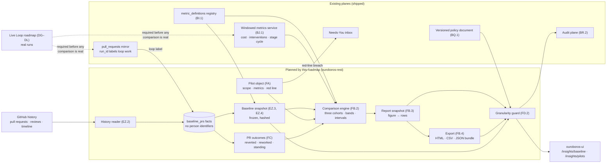

## MVP Definition

The MVP is **a pilot a design partner could run and take away as a file**: a frozen baseline
from their own GitHub history, a pilot with fixed terms, and a dated report in which every
number opens onto the rows behind it. It is done when, against the compose stack and a
fixture repository:

1. **A baseline imports** (EZ): an Owner or Maintainer picks a repository and a window; the
   reader walks the history resumably within the rate limit; the baseline shows median time
   to merge, median review iterations and 30-day revert rate with *n*, exclusions and formula
   versions; it freezes into a hashed snapshot.
2. **A pilot can be defined and run** (FA): duration, repository scope, two or more named
   success metrics with targets, exactly one red-line metric with a threshold; terms freeze
   at start; amendments are logged; a red-line breach raises a decision item.
3. **A report generates** (FB): three cohorts, size bands, intervals, minimum-sample rule,
   funnel first, limitations text, event log, provenance mark; every figure lists its rows
   and recomputes from them in a test.
4. **The report exports** (FB.4) as one HTML file that prints cleanly, a CSV and a JSON
   evidence bundle with a content hash; a report generated twice from the same snapshot has
   the same figures.
5. **Reverts are linked on both sides** (FC.1, FC.2), with matured counts and the date the
   figure becomes final.
6. **Analytics stay at workspace and repository level** (FD): no response from the insights,
   baseline, pilot, report or export endpoints carries a person identifier with the policy at
   its default; a schema lint and a runtime guard both prove it; the Owner opt-in exists, is
   audited and is shown to members; `docs/ANALYTICS_PRIVACY.md` and the documentation pages
   say that legal review is the customer's responsibility.
7. **Tests** cover reader resumption and rate-limit back-off, baseline-versus-oracle equality,
   formula-version refusal, cohort assignment, censoring, interval arithmetic, figure-to-row
   equality, export determinism, the granularity guard and tenant isolation; the e2e leg walks
   baseline → pilot → report → export on seeds and asserts the "simulated data" mark.

**What the MVP does not prove.** Items 1, 2 and 6 are true on real data the day they ship.
Items 3 to 5 are exercised on seeds until the Live Loop roadmap (DG–DL) delivers real runs;
the first real report is a Live Loop milestone as much as one of this roadmap's.

**Explicitly v2 (milestone `Proof of Value v2`):** baselines from hosts other than GitHub and
ticket-start lead time (EZ.7), integrator-facing pilot templates (FA.6), narrative summaries
(FB.7, with BL.5), organisation-level analytics across repositories and pilots (FB.8, with
BL.4), follow-up-fix detection, line survival and the Insights rework card (FC.3–FC.5), and
per-person views behind the opt-in (FD.6).

## Epics, Labels & Milestones

Each epic becomes a parent tracking issue on GitHub; every roadmap issue below is filed as
one of its sub-issues (GitHub Relationships). **Nothing is filed yet.**

| Epic | GitHub | Status | Name | Goal | Modules | Milestone |
|------|:------:|:------:|------|------|---------|-----------|
| EZ | — | ⚪ Not filed | Baseline Import | Read GitHub history; compute and freeze pre-adoption time to merge, review iterations and revert rate | ouroboros-db, ouroboros-rest, ouroboros-ui, ouroboros-docs | Proof of Value MVP |
| FA | — | ⚪ Not filed | Pilot Definition | A pilot object with duration, repository scope, named success metrics and one red-line metric | ouroboros-db, ouroboros-rest, ouroboros-ui, ouroboros-docs | Proof of Value MVP |
| FB | — | ⚪ Not filed | Before-and-After Report | A dated, immutable, exportable comparison in which every figure lists its rows | ouroboros-db, ouroboros-rest, ouroboros-ui, ouroboros-engine, ouroboros-docs | Proof of Value MVP |
| FC | — | ⚪ Not filed | Rework & Survival | Whether merged loop pull requests were reverted, fixed afterwards or still stand | ouroboros-db, ouroboros-rest, ouroboros-ui, ouroboros-docs | Proof of Value MVP (FC.1–FC.2) / v2 |
| FD | — | ⚪ Not filed | Policy Fit | Analytics at workspace and repository level unless an Owner opts in to per-person views | ouroboros-db, ouroboros-rest, ouroboros-ui, ouroboros-docs, docs | Proof of Value MVP |

Issue naming: `<project>: [<epic>.<issue>] <title>`. Labels: existing set (`mvp`, `v2`,
`rest`, `db`, `ui`, `engine`, `ci`, `design`, `documentation`, `insights`, `settings`,
`sources`, `pr`, `inbox`) **plus new `proof-of-value`** (decision PV16). Milestones
**`Proof of Value MVP`** / **`Proof of Value v2`** created at filing; every issue assigned.
Complexity chips: **XS · S · M · L**.

OpenAPI changes in this roadmap are additions and follow the repository rule (0.0.x
increments); any `.env.example` addition in a module is mirrored in the top-level
`.env.example` (`AGENTS.md`).

---

## Epic EZ — Baseline Import (`ouroboros-db` + `ouroboros-rest` + `ouroboros-ui`)

Independent of real runs: this whole epic can be built, shipped and used before the Live
Loop roadmap lands.

| Ref | GitHub | Status | Title | Summary | Labels | Parallel | MVP | Complexity | Affected Modules |
|-----|:------:|:------:|-------|---------|--------|:--------:|:---:|:----------:|------------------|
| EZ.1 | — | ⚪ Not filed | ouroboros-db: [EZ.1] Baseline facts & snapshot schema | `baseline_imports`, `baseline_prs` (no person identifiers), `baseline_snapshots` | mvp, proof-of-value, insights, db | N (first) | Y | M | ouroboros-db |
| EZ.2 | — | ⚪ Not filed | ouroboros-rest: [EZ.2] GitHub history reader | Resumable, rate-limit-aware read of pull requests, reviews and timeline | mvp, proof-of-value, rest, sources | N (after EZ.1) | Y | L | ouroboros-rest |
| EZ.3 | — | ⚪ Not filed | ouroboros-rest: [EZ.3] Baseline metric definitions & computation | Time to merge, review iterations, revert rate as versioned registry formulas with exclusions | mvp, proof-of-value, insights, rest, db | Y (after EZ.1, beside EZ.2) | Y | L | ouroboros-rest, ouroboros-db |
| EZ.4 | — | ⚪ Not filed | ouroboros-rest: [EZ.4] Baseline import API & job lifecycle | Start, progress, cancel, resume, freeze; hashed snapshot | mvp, proof-of-value, rest | N (after EZ.2, EZ.3) | Y | M | ouroboros-rest, ouroboros-docs |
| EZ.5 | — | ⚪ Not filed | ouroboros-ui: [EZ.5] Baseline import flow & baseline page | Mockup, repository and window picker, progress, baseline figures with exclusions | mvp, proof-of-value, insights, ui, design | N (after EZ.4, FD.2) | Y | M | ouroboros-ui, ouroboros-docs, docs |
| EZ.6 | — | ⚪ Not filed | ouroboros-rest: [EZ.6] Baseline fixtures, oracle & integration tests | Recorded GitHub fixtures, hand-computed oracle, resumption and isolation tests, seeds | mvp, proof-of-value, rest, db, ci | N (after EZ.4) | Y | M | ouroboros-rest, ouroboros-db |
| EZ.7 | — | ⚪ Not filed | ouroboros-rest: [EZ.7] Baselines beyond GitHub & ticket-start lead time | History capability on the source SPI for other hosts; lead time from canonical tickets | v2, proof-of-value, rest, sources | Y (after EZ.4) | N | L | ouroboros-rest, ouroboros-db, ouroboros-docs |

### Issue EZ.1 — ouroboros-db: [EZ.1] Baseline facts & snapshot schema

> **GitHub issue:** — · **Status:** ⚪ Not filed · **Parent epic:** EZ

- **Problem Statement:** A baseline must be recomputable, traceable to individual pull
  requests and free of names. The pull request mirror (`V052__pull_requests.sql`) holds
  neither an author, nor a host-side opened-at time, nor reviews, and was built for live pull
  requests with a verification state machine (option 2-B rejected). Storing only the three
  aggregate numbers would make them unverifiable (option 2-C rejected).
- **Solution/Scope:** One migration, three tables, all with an organisation foreign key and
  the tenant isolation rules every table follows:
  - `baseline_imports` — `source_id` (the git-host connection), `repo_ref`, `window_start`,
    `window_end`, `purpose` CHECK `baseline|pilot_window` (PV1: the same reader fills both),
    `state` CHECK `queued|reading|computing|ready|failed|cancelled`, `cursor` (opaque resume
    position), `counts` jsonb (read, kept, excluded by reason), `started_by`, timestamps,
    `error`.
  - `baseline_prs` — one row per pull request read: `import_id`, `external_number`,
    `external_url`, `opened_at`, `ready_at` (first ready-for-review; equals `opened_at` when
    never a draft), `first_review_at`, `merged_at`, `closed_at`, `state`
    CHECK `merged|closed_unmerged|open`, `additions`, `deletions`, `changed_files`,
    `size_band` CHECK `xs|s|m|l|xl` (generated from changed lines; thresholds in EZ.3's
    registry entry), `review_rounds` int, `review_count` int, `commit_count` int,
    `merge_commit_sha`, `reverts_commit_sha` null (from a `This reverts commit <sha>` line;
    FC.2), `author_kind` CHECK `human|bot|ouroboros`, `author_key` bytea (a per-workspace keyed hash
    of the host login — used only to count distinct contributors; never returned by any API),
    `is_revert` bool, `reverts_external_number` int null, `reverted_by_external_number` int
    null, `reverted_at` null, `exclusion_reason` null
    CHECK `bot|draft_never_ready|outside_window|base_not_default|ouroboros_pre_pilot`,
    `mirror_pr_id` null (join to `pull_requests` when the same pull request is mirrored;
    carries the loop label). Unique on (`import_id`, `external_number`).
  - `baseline_snapshots` — the frozen result: `import_id`, `figures` jsonb (per metric:
    value, numerator, denominator, *n*, interval, per-band values, formula id and version),
    `exclusions` jsonb, `contributor_count` int, `content_hash` (sha256 over the canonical
    figures and the ordered fact keys), `frozen_at`, `frozen_by`. A trigger refuses updates
    to a frozen snapshot and deletes of facts a frozen snapshot depends on.
  - **No login, name, email or avatar column anywhere.** A comment on each table states the
    rule; `tests/constraints.sql` asserts the column list.
  - Retention: a `baseline` data class row in `retention_policies` (V094) so facts follow
    the workspace's retention settings; crypto-shredding of the workspace removes the hash
    key and with it any way to relate `author_key` to a login.
- **Acceptance Criteria:**
  - A frozen snapshot cannot be updated; its facts cannot be deleted while it exists.
  - `author_key` differs for the same login in two workspaces.
  - The schema test fails if a person-identifier column is added to these tables.
  - An interrupted import resumes from `cursor` without duplicate facts (unique key holds).
  - Deleting a workspace cascades all three tables.
- **Parallelism/Dependencies:** First. Needs the existing `ticket_sources`, `pull_requests`
  and `retention_policies` tables. Blocks EZ.2–EZ.6, FA.1, FB.1, FC.1.
- **Technical Stack:** PostgreSQL 17, Flyway, `pgcrypto` HMAC if already enabled (confirm;
  otherwise the hash is computed in `ouroboros-rest`).
- **Documentation:** None — not user-visible: fact and snapshot tables; the baseline a person
  sees is documented with EZ.5.
- **Epic:** EZ

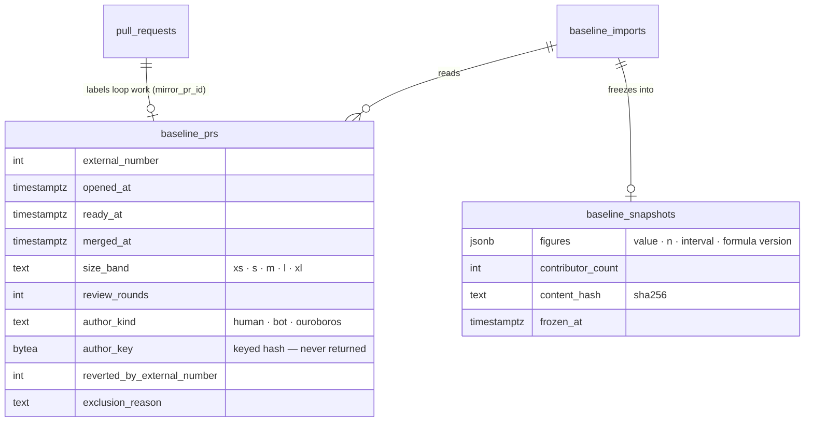

### Issue EZ.2 — ouroboros-rest: [EZ.2] GitHub history reader

> **GitHub issue:** — · **Status:** ⚪ Not filed · **Parent epic:** EZ

- **Problem Statement:** Computing a baseline means reading every pull request closed in a
  window, with its reviews and the events that mark it ready and merged. The live pull request
  sync (AX.1, #357) reads pull requests Ouroboros acts on; nothing reads history, and a naive
  per-pull-request REST walk would take hours and starve the live sync of rate limit
  (option 1-B).
- **Solution/Scope:** A history-read capability in `ouroboros-rest/src/modules/github`,
  exposed through the source SPI as an optional capability so other hosts can implement it
  later (EZ.7):
  - GraphQL bulk query (option 1-A) over the existing Octokit instance and credentials:
    pull requests ordered by `UPDATED_AT`, filtered to the window, each with `createdAt`,
    `mergedAt`, `closedAt`, `isDraft`, base branch, size counts, author `__typename` and
    login, reviews (state and `submittedAt` only), `ReadyForReviewEvent` and
    `HeadRefForcePushedEvent`/commit push timestamps, title. Follow-up pages for pull requests
    whose nested lists exceed one page. REST fallback for GitHub Enterprise Server versions
    that lack a field (documented matrix).
  - **Minimisation at the boundary:** the reader maps author to `author_kind` and
    `author_key` and discards the login before anything is persisted or logged; reviewer
    identities are reduced to counts and timestamps in memory. A unit test asserts no login
    reaches the repository layer or a log line.
  - Bot detection: GraphQL `Bot` type, a `[bot]` suffix, and a workspace-editable list
    (default: dependabot, renovate, github-actions). Ouroboros's own pull requests are
    labelled `ouroboros` from the mirror, not from the author.
  - Review rounds: the number of review-then-push cycles — a round is counted each time a
    push to the head follows a submitted review of state `CHANGES_REQUESTED` or `COMMENTED`
    with at least one comment. Zero for a pull request merged as first submitted. The exact
    rule lives in EZ.3's registry entry; the reader stores the raw event timestamps needed
    to recompute it under a later version (`events` jsonb on the fact row, timestamps and
    types only).
  - Rate limit: reads the remaining budget from each response, keeps a configurable reserve
    for the live sync (`OURO_BASELINE_RATE_RESERVE_PCT`, default 50), sleeps to the reset
    when below it, and honours secondary-limit `Retry-After`. Reuses
    `github.rate-limit.ts`. GitHub's published limits to be confirmed against current
    documentation in this issue.
  - Resumable by cursor, one page per transaction, idempotent by (`import_id`,
    `external_number`); cancellation checked between pages.
  - Revert pre-pass: marks `is_revert` with the shipped detector
    (`insights/rollup/revert.detection.ts`); linking is FC.2.
- **Acceptance Criteria:**
  - Against recorded fixtures, a 1,000-pull-request history is read in a bounded number of
    calls (target: under 40) and produces the expected fact rows.
  - Killing the process mid-import and restarting completes with no duplicates and no gaps.
  - With the reserve set to 50% the reader stops at half the budget and resumes after reset.
  - No test log or persisted row contains a host login.
  - A token lacking pull request read permission fails with the existing GitHub error
    vocabulary, not a generic 500.
- **Parallelism/Dependencies:** Needs EZ.1. Parallel with EZ.3 once the fact shape is agreed.
  Blocks EZ.4, FC.2.
- **Technical Stack:** NestJS, Octokit (`graphql` and `paginate`), existing GitHub credential
  and rate-limit services.
- **Documentation:** Administration `sources.mdx` § GitHub (history-read permission, rate
  reserve); `administration/configuration` regenerated for `OURO_BASELINE_RATE_RESERVE_PCT`
  (`.env.example` in the module and at the top level). No screenshot.
- **Epic:** EZ

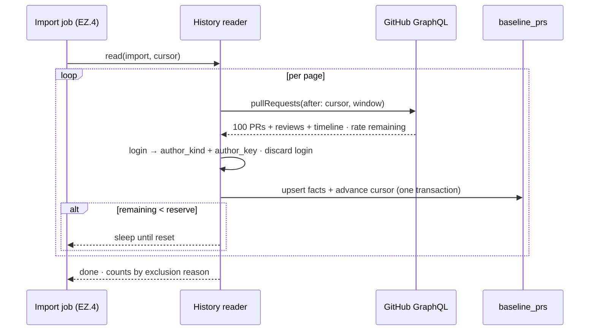

### Issue EZ.3 — ouroboros-rest: [EZ.3] Baseline metric definitions & computation

> **GitHub issue:** — · **Status:** ⚪ Not filed · **Parent epic:** EZ

- **Problem Statement:** "Time to merge", "review iterations" and "revert rate" each have
  several defensible definitions, and vendor reports disagree on them (Research Notes:
  Jellyfish measures first commit to merge; LinearB measures merged within 30 days). A
  comparison is only as good as the sameness of its two formulas (PV1), and the product
  already has a registry that versions formulas (BI.1).
- **Solution/Scope:** New `metric_definitions` rows (migration in `ouroboros-db`) and their
  computation over `baseline_prs` in a new `ouroboros-rest/src/modules/proof-of-value`
  module:
  - `pr_time_to_merge` — median of `merged_at − ready_at` over merged, non-excluded pull
    requests whose `ready_at` falls in the window. Unit `duration_ms`, aggregation `median`.
    Caveat text: excludes time before the pull request was opened; draft time excluded.
  - `pr_review_iterations` — median `review_rounds` over the same set; also the share with
    zero rounds.
  - `pr_revert_rate` — merged pull requests reverted within the observation window (default
    30 days, PV2) ÷ merged pull requests whose window has closed. `proxy = true`; caveat
    copied from the detector's own limit. Reverts are themselves excluded from the
    denominator.
  - `pr_merged_within_30d` — pull requests merged within 30 days of `ready_at` ÷ pull
    requests ready at least 30 days before the window end (counts the unmerged, PV5).
  - `pr_size_band` — the banding rule (changed lines thresholds) as a registry entry so a
    change of thresholds is a version bump.
  - Exclusions applied by rule and counted by reason: bots, pull requests never marked
    ready, pull requests not targeting the default branch (configurable), Ouroboros's own
    pull requests when computing a *baseline*.
  - Intervals: Wilson for rates; bootstrap percentile (fixed seed stored with the snapshot,
    2,000 resamples) for medians. Minimum-sample rule (PV7) returns `insufficient` with the
    counts.
  - Per-band and whole-cohort figures; `contributor_count` from distinct `author_key`.
  - An on-the-fly SQL oracle for every figure, following BI.2's pattern.
- **Acceptance Criteria:**
  - Each figure equals its oracle on the fixture history.
  - A hand-computed fixture of 30 pull requests yields the documented values exactly.
  - Changing the observation window or band thresholds without a version bump is refused by
    the registry trigger that already guards `metric_definitions`.
  - A cohort of 12 returns `insufficient` for deltas and still returns counts.
  - The same facts and seed produce byte-identical figures.
- **Parallelism/Dependencies:** Needs EZ.1. Parallel with EZ.2. Blocks EZ.4, FA.3, FB.2.
- **Technical Stack:** NestJS, PostgreSQL (percentile functions), Flyway.
- **Documentation:** None in this issue — the definitions are user-visible only through the
  methodology popovers and pages delivered with EZ.5 and FB.5, which quote the registry text.
- **Epic:** EZ

```text
 pull request life (host timestamps)

 opened_at      ready_at        first_review_at     push    push      merged_at
    |--- draft ----|------ wait ------|---- round 1 ---|- round 2 -|-------|
                   |<-------------- pr_time_to_merge ----------------------->|
                                      review_rounds = 2

 revert rate (proxy)
    merged_at ............ +30 days
        |-- observation ---|   matured: counts in the denominator
        |-- 12 days so far      not matured: shown as "pending", excluded
```

### Issue EZ.4 — ouroboros-rest: [EZ.4] Baseline import API & job lifecycle

> **GitHub issue:** — · **Status:** ⚪ Not filed · **Parent epic:** EZ

- **Problem Statement:** An import runs for minutes to hours, can hit rate limits, and ends
  in a result that must not change afterwards. It needs a job with visible progress and a
  deliberate freeze step.
- **Solution/Scope:** Endpoints under `/api/v1/proof-of-value/baselines` (OpenAPI addition):
  - `POST` — start an import (repository, window; validates the window against PV2's
    minimum and against repository age); Owner or Maintainer.
  - `GET /:id` — state, progress (pages read, pull requests kept and excluded by reason,
    estimated time from the rate budget), and, when `ready`, the computed figures.
  - `POST /:id/cancel`, `POST /:id/resume`, `POST /:id/freeze` (creates the
    `baseline_snapshots` row with its hash), `DELETE /:id` (refused when a pilot references
    the snapshot).
  - `GET /:id/facts` — paged fact rows (number, URL, timestamps, size band, rounds, revert
    link, exclusion reason) for traceability; passes the FD.2 guard and never includes
    `author_key`.
  - A scheduled worker following the existing rollup job pattern: advisory lock per import,
    one import per repository at a time, restart-safe.
  - Audit events: `baseline.started`, `.frozen`, `.deleted`.
  - Staleness: a snapshot records `window_end`; a pilot that starts more than 14 days after
    it warns and offers a re-import.
- **Acceptance Criteria:**
  - Start → progress → ready → freeze round-trips against fixtures; the frozen figures equal
    the pre-freeze figures and the hash verifies.
  - A second import for the same repository while one runs returns a conflict naming it.
  - Viewer can read a baseline and cannot start, freeze or delete one.
  - `GET /:id/facts` response schema contains no person-identifier field (FD.4's lint).
  - A snapshot referenced by a pilot cannot be deleted.
- **Parallelism/Dependencies:** Needs EZ.2, EZ.3; guard from FD.2 (a stub guard is acceptable
  until FD.2 lands, replaced before the MVP gate). Blocks EZ.5, EZ.6, FA.2.
- **Technical Stack:** NestJS, OpenAPI, existing scheduling and audit modules.
- **Documentation:** CLI `rest-api.mdx` (baseline endpoints, when the REST reference lists
  them); the user-facing flow is documented with EZ.5.
- **Epic:** EZ

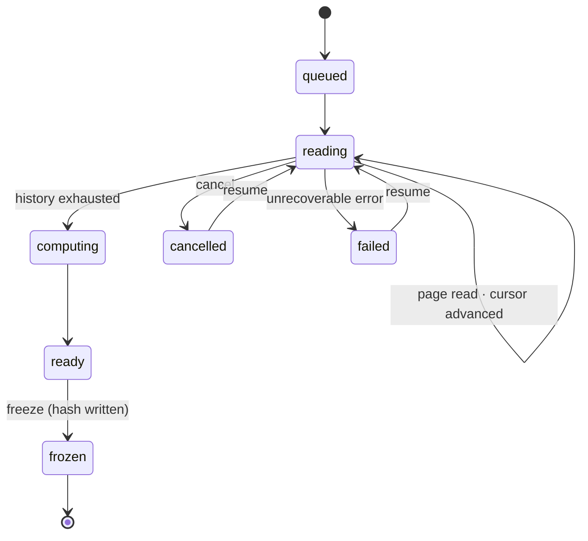

### Issue EZ.5 — ouroboros-ui: [EZ.5] Baseline import flow & baseline page

> **GitHub issue:** — · **Status:** ⚪ Not filed · **Parent epic:** EZ

- **Problem Statement:** A baseline has to be something a person can start, watch and read,
  and the page has to say what was left out as plainly as what was counted. There is no
  mockup for it.
- **Solution/Scope:**
  - **Mockup first:** `docs/mockups/<next>-proof-of-value.html` covering the baseline page,
    the pilot pages (FA.4) and the report (FB.5) in the existing stylesheet, both themes;
    reviewed before the React work starts. Shared across EZ.5, FA.4 and FB.5 — whichever
    starts first commits it.
  - Route `/insights/baseline` in the shell content pane, reached from an Insights sub-nav
    (PageSubnav primitive): *Overview* (the shipped page), *Baseline*, *Pilots*.
  - Empty state: what a baseline is, what it reads from GitHub, what it does not store
    (names), and a *Import baseline* action (Owner/Maintainer; honest read-only for Viewer).
  - Import dialog: repository, window (default per PV2, with the count of pull requests the
    window is expected to contain), bot list, default-branch-only toggle.
  - Progress: pages read, kept and excluded counts, rate-limit waits shown as waits, cancel
    and resume.
  - Baseline view: three figure cards (time to merge, review iterations, revert rate) each
    with *n*, interval, methodology popover from the registry, and a size-band breakdown
    using the shipped HBars primitive; an exclusions table by reason; contributor count with
    the small-cohort notice (PV12); *Freeze* with a confirmation that explains immutability;
    frozen badge with date and short hash; a link to the fact list (number, link to GitHub,
    figures) — no author column.
  - States: loading, failed with the GitHub error, stale snapshot warning.
- **Acceptance Criteria:**
  - Matches the mockup in both themes at 100% and 125% font scale; header and sidebar stay
    fixed while the page scrolls.
  - Every figure's popover shows the registry formula text and version.
  - A cohort under the minimum sample shows counts and "not enough data to compare", not a
    number with a delta.
  - No name, login or avatar appears anywhere on the page or in the fact list.
  - Keyboard-operable throughout; charts carry `role="img"` and a text alternative.
- **Parallelism/Dependencies:** Needs EZ.4, FD.2. Parallel with FA.4 after the mockup.
- **Technical Stack:** Next.js, React, the #16 design tokens, BK.1 chart primitives.
- **Documentation:** User Guide new `pilots.mdx` § Importing a baseline (what is read, what is
  excluded, freezing), `insights.mdx` (sub-nav); `docs-coverage.json` entry for
  `/insights/baseline`; screenshots `user-guide.pilots.baseline-empty`,
  `user-guide.pilots.baseline-import`, `user-guide.pilots.baseline`.
- **Epic:** EZ

```text
+--------------------------------------------------------------------------------+
| Insights   [ Overview | Baseline | Pilots ]                                     |
+--------------------------------------------------------------------------------+
| Baseline · helios-firmware · 2026-04-01 → 2026-09-27        [frozen · a41c…]   |
| 1,284 pull requests read · 1,031 counted · 253 excluded · 14 contributors      |
+--------------------------+--------------------------+--------------------------+
| Time to merge (median)   | Review iterations        | Revert rate (30d) proxy  |
|   21h 40m    (i)         |   1 round    (i)         |   2.9%     (i)           |
|   n=1,031  CI 19h–24h    |   38% merged with none   |   n=987 matured  CI 2–4% |
+--------------------------+--------------------------+--------------------------+
| By size band      xs ▇▇ 3h   s ▇▇▇▇ 11h   m ▇▇▇▇▇▇▇ 26h   l ▇▇▇▇▇▇▇▇▇▇ 52h     |
+--------------------------------------------------------------------------------+
| Excluded: bots 171 · never ready 44 · not default branch 38                    |
| [ View pull requests ]                                    [ Re-import ]        |
+--------------------------------------------------------------------------------+
  (figures above are layout placeholders, not data)
```

### Issue EZ.6 — ouroboros-rest: [EZ.6] Baseline fixtures, oracle & integration tests

> **GitHub issue:** — · **Status:** ⚪ Not filed · **Parent epic:** EZ

- **Problem Statement:** The baseline is the number a buyer will check against their own
  tools. It needs a fixture history with known answers, and seeds so the UI and the later
  report have something to render.
- **Solution/Scope:**
  - Recorded GraphQL fixtures for a synthetic repository history (about 300 pull requests)
    built to contain every case: drafts, never-ready, bots, force-pushes, zero-round and
    multi-round reviews, quoted and conventional reverts, a revert of a revert, pull requests
    straddling the window, non-default base branches.
  - A hand-computed answer sheet committed beside the fixture; the integration spec compares
    reader output, computed figures and oracle to it.
  - Tests: resumption at every page boundary; rate-limit back-off with a fake clock;
    cancellation; freeze immutability; tenant isolation (workspace A cannot read B's
    baseline); role checks; the no-login assertion.
  - Seeds: a frozen baseline for the seeded workspace consistent with the mockup-15 seed
    history, behind the dev/e2e seed profile only, marked as seeded.
  - `ci/rest` and `ci/db` pick the specs up through the existing path filters.
- **Acceptance Criteria:** All of the above run in CI; a deliberately wrong formula (a
  mutation in the round-counting rule) fails at least one test; the seeded baseline renders
  in EZ.5.
- **Parallelism/Dependencies:** Needs EZ.4. Blocks FB.6.
- **Technical Stack:** Vitest integration specs, recorded fixtures, Flyway repeatable seed.
- **Documentation:** None — internal-only change.
- **Epic:** EZ

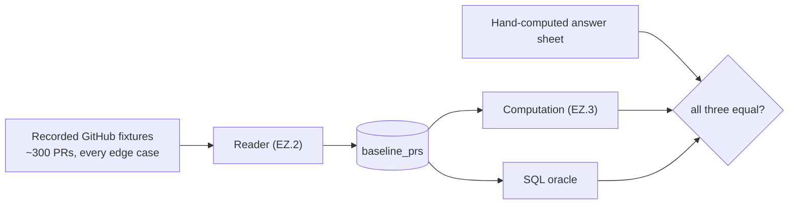

### Issue EZ.7 — ouroboros-rest: [EZ.7] Baselines beyond GitHub & ticket-start lead time

> **GitHub issue:** — · **Status:** ⚪ Not filed · **Parent epic:** EZ

- **Problem Statement:** The description names GitHub history, and the product's source SPI
  is pluggable. Buyers on GitLab or another host need the same baseline, and the pilot
  metric most often recommended — time from ticket start to merge — needs ticket data the
  pull request history does not carry.
- **Solution/Scope:** Promote the history-read capability to a documented, optional SPI
  capability with a conformance fixture (following
  `ticket-sources/conformance.pr.fixture.ts`); implement it for the next git host the SPI
  supports; add `ticket_lead_time` (ticket moved to in-progress → linked pull request
  merged) computed over canonical tickets (`tickets`, V030) where a tracker supplies status
  history, with an explicit "not available for this tracker" result otherwise.
- **Acceptance Criteria:** A second host passes the conformance fixture and produces a
  baseline equal to its oracle; lead time computes on a tracker with status history and
  reports absence honestly on one without.
- **Parallelism/Dependencies:** Needs EZ.4 and the relevant source provider. Independent of
  the other v2 issues.
- **Technical Stack:** NestJS, source SPI.
- **Documentation:** Administration `sources.mdx` (history capability per host); User Guide
  `pilots.mdx` § Importing a baseline (hosts, lead time); recapture
  `user-guide.pilots.baseline-import`.
- **Epic:** EZ

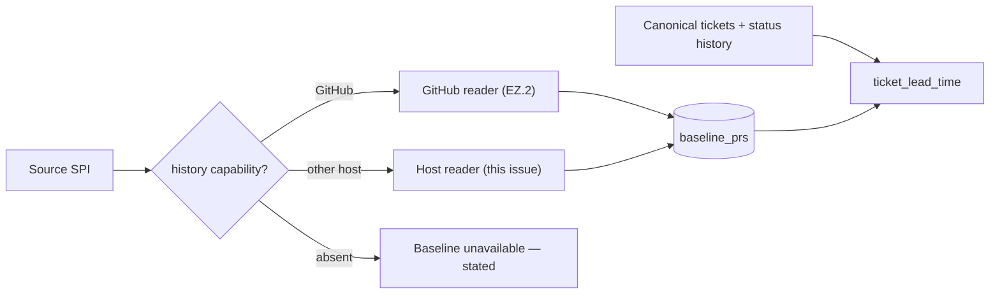

---

## Epic FA — Pilot Definition (`ouroboros-db` + `ouroboros-rest` + `ouroboros-ui`)

Can be built before the Live Loop roadmap lands; a pilot started before then runs over
seeded or simulated work and is marked as such (PV3).

| Ref | GitHub | Status | Title | Summary | Labels | Parallel | MVP | Complexity | Affected Modules |
|-----|:------:|:------:|-------|---------|--------|:--------:|:---:|:----------:|------------------|
| FA.1 | — | ⚪ Not filed | ouroboros-db: [FA.1] Pilot schema & state machine | `pilots`, scope, metrics (one red line), amendments, event log | mvp, proof-of-value, db | Y (after EZ.1) | Y | M | ouroboros-db |
| FA.2 | — | ⚪ Not filed | ouroboros-rest: [FA.2] Pilot service & API | Create, start (freeze terms), amend, close; pilot-window import scheduling | mvp, proof-of-value, rest | N (after FA.1, EZ.4) | Y | L | ouroboros-rest, ouroboros-docs |
| FA.3 | — | ⚪ Not filed | ouroboros-rest: [FA.3] Success-metric catalogue & red-line evaluator | Named metrics, targets, running status, breach → decision item | mvp, proof-of-value, rest, inbox | N (after FA.2, EZ.3) | Y | M | ouroboros-rest, ouroboros-db, ouroboros-docs |
| FA.4 | — | ⚪ Not filed | ouroboros-ui: [FA.4] Pilot setup & pilot overview | Create form, terms summary, running status, amendments, event log | mvp, proof-of-value, insights, ui, design | N (after FA.2, FA.3, FD.2) | Y | L | ouroboros-ui, ouroboros-docs |
| FA.5 | — | ⚪ Not filed | ouroboros-rest: [FA.5] Pilot integration tests & seeds | Lifecycle, freeze, amendment, red-line and isolation tests; seeded pilot | mvp, proof-of-value, rest, db, ci | N (after FA.3) | Y | M | ouroboros-rest, ouroboros-db |
| FA.6 | — | ⚪ Not filed | ouroboros-rest: [FA.6] Integrator pilot templates | Portable pilot definitions: export, import, a starter set | v2, proof-of-value, rest, ui | Y (after FA.2) | N | M | ouroboros-rest, ouroboros-ui, ouroboros-docs |

### Issue FA.1 — ouroboros-db: [FA.1] Pilot schema & state machine

> **GitHub issue:** — · **Status:** ⚪ Not filed · **Parent epic:** FA

- **Problem Statement:** The description asks for "a pilot object with duration, repository
  scope, named success metrics and a red-line risk metric". Without stored, frozen terms a
  report has nothing to be measured against, and nothing stops the terms being chosen after
  the results (PV6).
- **Solution/Scope:** Migration:
  - `pilots` — organisation FK, `name`, `hypothesis` (free text, printed on the report),
    `starts_on`, `ends_on` (CHECK 14–180 days, PV2), `observation_days` (default 30),
    `state` CHECK `draft|ready|running|ended|closed|cancelled`, `terms_frozen_at`,
    `terms_hash`, `red_line_state` CHECK `clear|breached|acknowledged`, `created_by`,
    timestamps. Transition trigger: `draft → ready → running → ended → closed`; `cancelled`
    from any state before `closed`; no transition out of `closed`.
  - `pilot_repos` — pilot FK, `repo_ref`, `baseline_snapshot_id` FK (required before
    `ready`), `pilot_window_import_id` FK (the PV1 import for the pilot window).
  - `pilot_metrics` — pilot FK, `metric_id` FK → `metric_definitions`, `formula_version`
    (frozen at start), `role` CHECK `success|red_line|context`, `direction`
    CHECK `lower_is_better|higher_is_better`, `comparator`
    CHECK `vs_baseline_pct|vs_concurrent_pct|absolute`, `target` numeric, `threshold` numeric
    (red line only). A partial unique index allows exactly one `red_line` row per pilot; a
    deferred constraint refuses `ready` without one and without at least two `success` rows.
  - `pilot_amendments` — pilot FK, `amended_at`, `amended_by`, `field`, `before` jsonb,
    `after` jsonb, `reason` (required). Rows are append-only. After `terms_frozen_at`, a
    trigger refuses any change to scope, dates or metrics that is not accompanied by an
    amendment row in the same transaction.
  - `pilot_events` — the dated log of known changes during the pilot (attribution guard):
    `occurred_on`, `kind` CHECK `team_change|ci_change|policy_change|workflow_change|
    model_change|incident|other`, `note`, `recorded_by`. System-written rows for policy
    publishes and workflow or routing changes in scope.
- **Acceptance Criteria:**
  - A pilot cannot reach `ready` without a frozen baseline per repository, two success
    metrics and exactly one red line.
  - After start, changing a target without an amendment row fails; with one it succeeds and
    the amendment is retained.
  - A second red-line row is refused.
  - Two running pilots may not share a repository over overlapping dates (exclusion
    constraint).
  - `closed` is terminal.
- **Parallelism/Dependencies:** Needs EZ.1 and `metric_definitions`. Parallel with EZ.2/EZ.3.
  Blocks FA.2, FB.1.
- **Technical Stack:** PostgreSQL 17 (`btree_gist` for the exclusion constraint — confirm it
  is enabled or add it), Flyway.
- **Documentation:** None — not user-visible: pilot tables; the pilot a person defines is
  documented with FA.4.
- **Epic:** FA

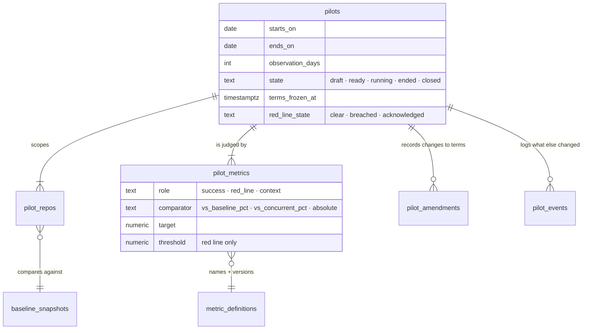

### Issue FA.2 — ouroboros-rest: [FA.2] Pilot service & API

> **GitHub issue:** — · **Status:** ⚪ Not filed · **Parent epic:** FA

- **Problem Statement:** The pilot's lifecycle has consequences at each step: starting
  freezes terms and formula versions, running needs the pilot window read from GitHub by the
  same extractor as the baseline (PV1), and ending opens the observation window.
- **Solution/Scope:** Endpoints under `/api/v1/proof-of-value/pilots`:
  - `POST`, `PATCH /:id` (draft only), `GET`, `GET /:id` (terms, state, running status from
    FA.3, amendments, events, reports).
  - `POST /:id/ready` — validates baselines, metrics, small-cohort acknowledgement (PV12)
    and overlap.
  - `POST /:id/start` — freezes terms: copies each metric's current formula version, writes
    `terms_hash`, sets `terms_frozen_at`; refuses if a baseline snapshot is stale beyond the
    limit without an explicit override recorded as an amendment.
  - `POST /:id/amendments` — a change to scope, dates or metrics after start, with a reason.
  - `POST /:id/events` — add an entry to the event log; system entries written by listeners
    on policy publish, workflow publish and routing changes for repositories in scope.
  - `POST /:id/end` (early) and automatic end at `ends_on`; `POST /:id/close` after the
    observation window; `POST /:id/cancel`.
  - A scheduled job that, for each running pilot, runs the EZ.2 reader over the pilot window
    as a `pilot_window` import daily (incremental from the last cursor) and joins facts to
    the mirror for the loop label.
  - Roles: Owner and Maintainer manage; Viewer reads. Audit events for every transition and
    amendment.
- **Acceptance Criteria:**
  - Start writes frozen versions; a later registry version bump does not alter a running
    pilot's formulas.
  - An amendment after start appears in `GET /:id` with before, after, reason, who and when.
  - A policy publish during a running pilot produces a system event row.
  - The daily pilot-window import is incremental and idempotent.
  - Overlapping pilots on one repository are refused with a message naming the other pilot.
- **Parallelism/Dependencies:** Needs FA.1, EZ.4. Blocks FA.3, FA.4, FB.2.
- **Technical Stack:** NestJS, OpenAPI, scheduling module, audit module.
- **Documentation:** CLI `rest-api.mdx` (pilot endpoints, when the reference lists them);
  the flow a person meets is documented with FA.4.
- **Epic:** FA

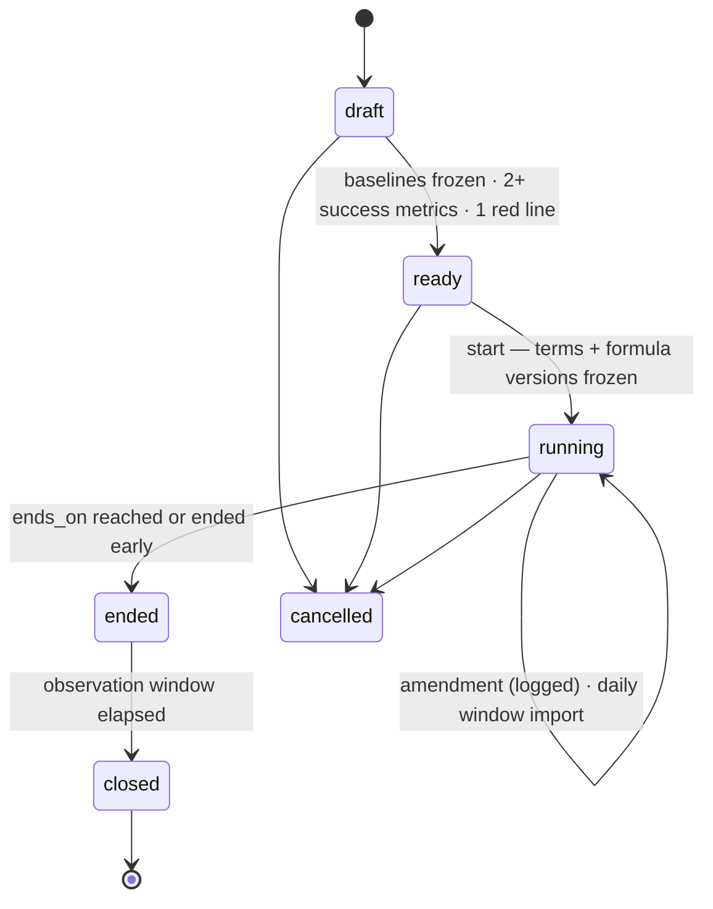

### Issue FA.3 — ouroboros-rest: [FA.3] Success-metric catalogue & red-line evaluator

> **GitHub issue:** — · **Status:** ⚪ Not filed · **Parent epic:** FA

- **Problem Statement:** "Named success metrics" must be names with one meaning, and "a
  red-line risk metric" must be watched while the pilot runs, not discovered in the final
  report. Volume metrics must not be on offer (PV9).
- **Solution/Scope:**
  - A catalogue endpoint listing the metrics a pilot may use, each a registry entry with
    title, formula text, version, unit, default direction, whether a baseline exists for it,
    and whether it is a proxy:

    | Metric | Baseline exists | Source |
    |---|:---:|---|
    | Time to merge | yes | `baseline_prs` (EZ.3) |
    | Review iterations | yes | `baseline_prs` (EZ.3) |
    | Revert rate (30 days, proxy) | yes | `baseline_prs` + FC.2 |
    | Merged within 30 days | yes | `baseline_prs` (EZ.3) |
    | Autonomous merge rate | no — loop only | windowed metrics (shipped) |
    | Merged without human edits | no — loop only | windowed metrics (shipped) |
    | Cost per merged pull request | no — loop only | windowed metrics (shipped) |
    | Human interventions per merged pull request | no — loop only | windowed metrics (shipped) |

    Loop-only metrics can be success metrics only with an `absolute` target; the catalogue
    says so, and the report shows them without a "before" column instead of inventing one.
  - Red-line candidates: any catalogue metric with an absolute threshold, plus two risk
    counts read from shipped planes — protected-path guardrail failures on merged loop pull
    requests, and secrets-ruleset findings on loop pull requests. A new risk metric is a
    registry entry, not code in this evaluator.
  - Evaluator: hourly per running pilot; computes each success metric's running value and
    the red line; a red line is evaluated on matured outcomes where the metric has an
    observation window and says so; a minimum count (default 5 events for rate-type red
    lines) prevents one early revert from breaching a percentage threshold, while
    count-type red lines (for example, any secrets finding) breach at once.
  - Breach: sets `red_line_state = breached`, writes an audit event and raises a Needs-You
    decision item of a new kind `pilot_red_line` (migration adding the kind) with the figure
    and its rows. Acknowledgement records who and when. **No automatic pause** (PV10).
  - Running status endpoint consumed by FA.4: per metric, current value, target, *n*,
    whether the sample is sufficient.
- **Acceptance Criteria:**
  - The catalogue offers no line-count, commit-count or pull-request-count metric.
  - A seeded breach raises exactly one decision item and does not raise another until
    acknowledged and breached again.
  - A rate-type red line with two events of which one is a revert does not breach; the
    status says "below minimum count".
  - Loop-only metrics refuse a `vs_baseline_pct` comparator.
  - Evaluation of pilot A never reads rows from another workspace.
- **Parallelism/Dependencies:** Needs FA.2, EZ.3; revert-rate red lines need FC.2; loop-only
  metrics over a pilot window need the custom-range half of BL.3 (#450) — until then they
  are offered as `context` only.
- **Technical Stack:** NestJS, windowed metrics service, decisions module, Flyway (decision
  kind).
- **Documentation:** User Guide `pilots.mdx` § Success metrics and the red line (catalogue
  table, what a breach does and does not do); `inbox.mdx` (the new decision kind);
  screenshot `user-guide.inbox.pilot-red-line`.
- **Epic:** FA

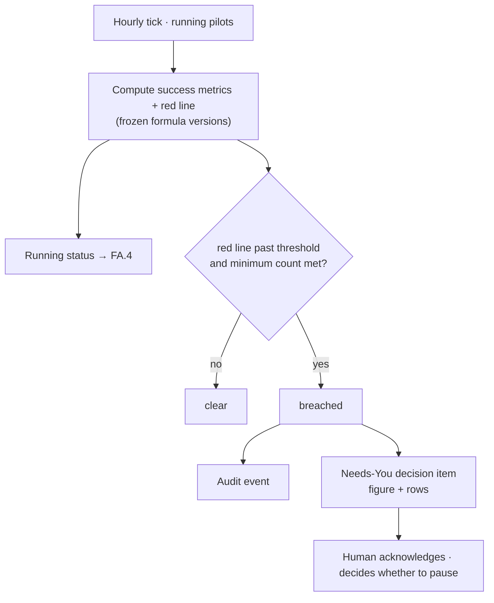

### Issue FA.4 — ouroboros-ui: [FA.4] Pilot setup & pilot overview

> **GitHub issue:** — · **Status:** ⚪ Not filed · **Parent epic:** FA

- **Problem Statement:** Defining a pilot is where its honesty is decided. The form must
  make the terms explicit, explain that they freeze, and keep showing the running position
  without implying a result before the samples are large enough.
- **Solution/Scope:** (from the shared mockup committed under EZ.5)
  - Routes `/insights/pilots` (list: name, repositories, dates, state, red-line state) and
    `/insights/pilots/[id]`.
  - Create flow in four steps: name and hypothesis; repositories, each with its frozen
    baseline (or a link to import one); dates and observation window; success metrics with
    targets and the single red line, picked from the catalogue with the formula text shown.
  - A terms summary before *Start*, with a confirmation: terms freeze, later changes are
    recorded as amendments and printed on the report.
  - Small-cohort acknowledgement (PV12) when a repository has under five contributors in
    the baseline.
  - Overview while running: days elapsed, the funnel so far, each metric's running value
    against its target with *n* and an "insufficient sample" state, red-line indicator,
    amendments list, event log with *Add event*, reports list (FB.5).
  - Provenance banner when the scope includes seeded or simulated runs (PV3).
  - Viewer sees everything read-only; management actions honest-absent.
- **Acceptance Criteria:**
  - Matches the mockup in both themes and at 125% font scale.
  - Start is impossible from the UI without two success metrics, one red line and frozen
    baselines; the reasons are stated, not just a disabled button.
  - Editing a target after start opens an amendment form requiring a reason.
  - A metric with an insufficient sample shows counts and no green or red judgement.
  - The breach state links to the decision item.
  - No per-person information appears with the policy at its default.
- **Parallelism/Dependencies:** Needs FA.2, FA.3, FD.2; the shared mockup. Parallel with
  EZ.5.
- **Technical Stack:** Next.js, React, design tokens, BK.1 primitives.
- **Documentation:** User Guide `pilots.mdx` § Defining a pilot, § While a pilot runs,
  § Amendments and the event log; `docs-coverage.json` entries for both routes; screenshots
  `user-guide.pilots.list`, `user-guide.pilots.create-metrics`, `user-guide.pilots.terms`,
  `user-guide.pilots.overview`.
- **Epic:** FA

```text
+--------------------------------------------------------------------------------+
| Pilot · "Firmware loop, autumn"        running · day 12 of 30    red line: clear |
| Hypothesis: small firmware fixes merge faster through the loop with no more     |
| reverts than before.                                   terms frozen 2026-11-02  |
+--------------------------------------------------------------------------------+
| Funnel so far   issues taken 41 → PRs opened 37 → merged 29 → untouched 22      |
+--------------------------------------+-----------------------------------------+
| SUCCESS  Time to merge               | SUCCESS  Review iterations              |
|  target: 25% below baseline          |  target: no higher than baseline        |
|  loop 6h · baseline 21h · n=29       |  loop 1 · baseline 1 · n=29             |
+--------------------------------------+-----------------------------------------+
| RED LINE  Revert rate (30d, proxy)   threshold 5% · matured n=3 · below min.    |
+--------------------------------------------------------------------------------+
| Amendments (1)  2026-11-09 end date +7d — "holiday week"                        |
| Events (2)      2026-11-05 CI runner pool doubled · 2026-11-08 policy v8        |
+--------------------------------------------------------------------------------+
  (figures above are layout placeholders, not data)
```

### Issue FA.5 — ouroboros-rest: [FA.5] Pilot integration tests & seeds

> **GitHub issue:** — · **Status:** ⚪ Not filed · **Parent epic:** FA

- **Problem Statement:** The pilot's guarantees — frozen terms, logged amendments, one red
  line, no overlap — are database and service rules that need proving, and the UI and report
  need a seeded pilot.
- **Solution/Scope:** Integration specs for every transition and every refusal in FA.1 and
  FA.2; freeze-then-registry-bump; amendment trail; system event rows on policy publish;
  red-line breach, acknowledgement and re-breach; minimum-count rule; overlap refusal; role
  matrix; tenant isolation; the daily window import with a fake clock. Seeds: one running
  and one closed pilot in the dev/e2e profile, marked seeded, consistent with EZ.6's
  baseline.
- **Acceptance Criteria:** All specs in CI; `tests/constraints.sql` covers the one-red-line
  index, the ready constraint and the exclusion constraint; the seeded pilots render in FA.4.
- **Parallelism/Dependencies:** Needs FA.3. Blocks FB.6.
- **Technical Stack:** Vitest integration specs, Flyway repeatable seeds.
- **Documentation:** None — internal-only change.
- **Epic:** FA

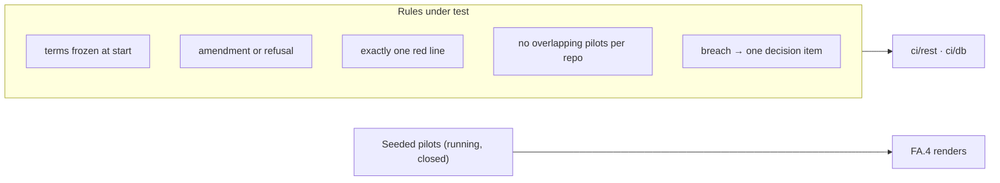

### Issue FA.6 — ouroboros-rest: [FA.6] Integrator pilot templates

> **GitHub issue:** — · **Status:** ⚪ Not filed · **Parent epic:** FA

- **Problem Statement:** The gap analysis notes that sales-led vendors embed engineers for
  project selection and "ROI measurement" through systems integrators. An integrator running
  several pilots needs to bring a pilot definition with them and leave with a comparable
  report, without Ouroboros staff.
- **Solution/Scope:** A portable pilot definition (JSON with a schema under `schemas/`):
  duration, observation window, metric roles, comparators, targets and red line by registry
  id and minimum formula version — no repository names and no data. Export from a pilot;
  import to create a draft; a small starter set shipped with the product (for example
  "review-load neutral", "small-fix throughput"); a report cover field for the integrator's
  name. Whether templates are distributed through the Marketplace is left to that roadmap.
- **Acceptance Criteria:** Export then import in another workspace yields an equivalent
  draft; a template naming a formula version the deployment lacks is refused with the
  reason; the starter set validates against the schema in CI.
- **Parallelism/Dependencies:** Needs FA.2. Independent of other v2 issues.
- **Technical Stack:** NestJS, JSON Schema, React.
- **Documentation:** User Guide `pilots.mdx` new § Pilot templates; Administration
  `operations.mdx` if templates are operator-installed; screenshot
  `user-guide.pilots.template-import`.
- **Epic:** FA

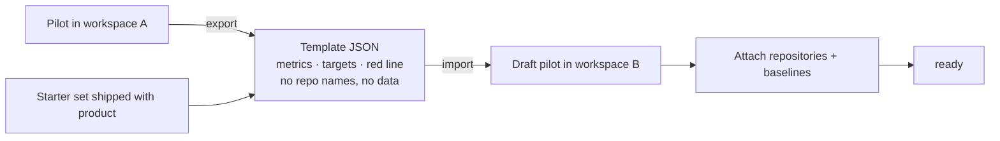

---

## Epic FB — Before-and-After Report (`ouroboros-db` + `ouroboros-rest` + `ouroboros-ui`)

Buildable now against seeds; **meaningful only after the Live Loop roadmap (DG–DL) delivers
real runs.** Until then every report this epic produces carries the "simulated data" mark
(PV3).

| Ref | GitHub | Status | Title | Summary | Labels | Parallel | MVP | Complexity | Affected Modules |
|-----|:------:|:------:|-------|---------|--------|:--------:|:---:|:----------:|------------------|
| FB.1 | — | ⚪ Not filed | ouroboros-db: [FB.1] Report snapshot & figure-row schema | Immutable numbered reports; every figure stored with the rows behind it | mvp, proof-of-value, db | Y (after FA.1) | Y | M | ouroboros-db |
| FB.2 | — | ⚪ Not filed | ouroboros-rest: [FB.2] Comparison engine | Three cohorts, size bands, intervals, minimum sample, censoring, provenance | mvp, proof-of-value, insights, rest | N (after EZ.3, FA.2, FC.2) | Y | L | ouroboros-rest |
| FB.3 | — | ⚪ Not filed | ouroboros-rest: [FB.3] Report generation & traceability API | Generate, list, read; figure → rows → run or pull request | mvp, proof-of-value, rest | N (after FB.1, FB.2) | Y | M | ouroboros-rest, ouroboros-docs |
| FB.4 | — | ⚪ Not filed | ouroboros-rest: [FB.4] Report export — HTML, CSV & evidence bundle | Self-contained printable HTML, figure CSV, hashed JSON bundle | mvp, proof-of-value, rest | N (after FB.3, FD.2) | Y | M | ouroboros-rest, ouroboros-docs |
| FB.5 | — | ⚪ Not filed | ouroboros-ui: [FB.5] Report page, drill-down & export controls | Funnel, cohort tables, bands, limitations, events, row drill-down | mvp, proof-of-value, insights, ui, design | N (after FB.3, FB.4) | Y | L | ouroboros-ui, ouroboros-docs |
| FB.6 | — | ⚪ Not filed | ouroboros-rest: [FB.6] Report tests, seeded pilot report & e2e leg | Figure-equals-rows, determinism, provenance, export and e2e walk | mvp, proof-of-value, rest, ui, ci | N (after FB.5, EZ.6, FA.5) | Y | M | ouroboros-rest, ouroboros-ui, tests, .github |
| FB.7 | — | ⚪ Not filed | ouroboros-engine: [FB.7] Narrative report summary | A cited, labelled summary composed over the report's figures | v2, proof-of-value, insights, engine | Y (after FB.3, BL.5) | N | M | ouroboros-engine, ouroboros-rest, ouroboros-ui, ouroboros-docs |
| FB.8 | — | ⚪ Not filed | ouroboros-rest: [FB.8] Organisation-level pilot analytics | Roll-up across repositories and pilots over BL.4's organisation rollups | v2, proof-of-value, insights, rest, ui | Y (after FB.3, BL.4) | N | L | ouroboros-rest, ouroboros-db, ouroboros-ui, ouroboros-docs |

### Issue FB.1 — ouroboros-db: [FB.1] Report snapshot & figure-row schema

> **GitHub issue:** — · **Status:** ⚪ Not filed · **Parent epic:** FB

- **Problem Statement:** The description requires a report that is "dated" and in which
  "every number is traceable to runs". A report recomputed on every view is neither: the
  number quoted last month may no longer be reproducible, and there is nothing to trace
  (PV14).
- **Solution/Scope:** Migration:
  - `pilot_reports` — pilot FK, `report_no` (per-pilot sequence), `kind`
    CHECK `interim|final|follow_up`, `as_of` (the instant the data was read),
    `generated_at`, `generated_by`, `terms_hash` (the pilot terms at generation),
    `methodology` jsonb (every metric id and formula version used, minimum-sample values,
    band thresholds, bootstrap seed), `provenance` CHECK `live|simulated|mixed`,
    `limitations` jsonb (the structured limitations the engine detected), `content_hash`,
    `granularity` (the policy level in force, FD.2). Update and delete refused by trigger;
    a workspace deletion cascades.
  - `pilot_report_figures` — report FK, `figure_id` (stable key such as
    `time_to_merge.loop.band_s`), `metric_id`, `cohort`
    CHECK `baseline|concurrent|loop`, `band` null, `value`, `numerator`, `denominator`, `n`,
    `ci_low`, `ci_high`, `status` CHECK `ok|insufficient|pending|not_applicable`, `delta`
    jsonb (against which cohort, value, interval).
  - `pilot_report_figure_rows` — figure FK, `row_kind` CHECK `baseline_pr|run|pull_request`,
    `row_id`, `contribution` (the value this row contributed), `included` bool with
    `exclusion_reason`. Runs and mirrored pull requests are referenced by id without a
    cascading foreign key so a later retention sweep does not break a report; the row keeps
    the external URL and the value it contributed.
- **Acceptance Criteria:**
  - A stored report cannot be changed; generating again creates `report_no + 1`.
  - For every figure with status `ok`, recomputing from its rows by the registry
    aggregation reproduces `value` (a SQL check function used by tests).
  - Deleting a run after a report was generated leaves the report readable, with the row
    marked as no longer available.
- **Parallelism/Dependencies:** Needs FA.1, EZ.1. Blocks FB.3.
- **Technical Stack:** PostgreSQL 17, Flyway.
- **Documentation:** None — not user-visible: report storage; the report a person reads is
  documented with FB.5.
- **Epic:** FB

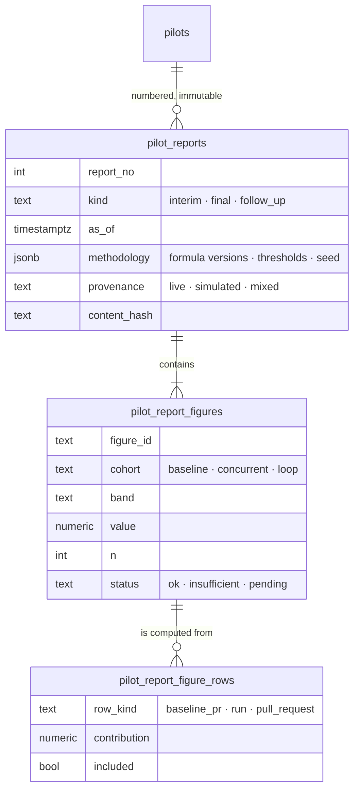

### Issue FB.2 — ouroboros-rest: [FB.2] Comparison engine

> **GitHub issue:** — · **Status:** ⚪ Not filed · **Parent epic:** FB

- **Problem Statement:** This is where the methodology risks are either handled or hidden.
  A two-column before/after on a selected, small, partly matured sample misleads in every
  way listed under "Methodology risks" above.
- **Solution/Scope:** A pure, deterministic engine in the `proof-of-value` module that takes
  a pilot and an `as_of` instant and returns figures with their rows:
  - **Cohorts (PV4):** `baseline` from the frozen snapshot's facts; `concurrent` — pilot
    window facts with `author_kind = human` and no loop label; `loop` — pilot-window facts
    whose mirrored pull request has a `run_id`. A pull request the loop opened and a person
    then rewrote is still `loop`; the "merged without human edits" figure reports how many.
  - **Funnel (PV5):** issues taken by the loop in scope → runs that opened a pull request →
    merged → merged without human edits → standing after the observation window (FC.2),
    with matured counts.
  - **Per metric:** whole-cohort figure, per-size-band figure, interval, status
    (`insufficient` under PV7, `pending` where outcomes have not matured), delta of loop
    against baseline and against concurrent with an interval on the delta.
  - **Mix statement:** loop share of merged pull requests in the window; size-band
    distribution of each cohort; a computed sentence when the loop cohort's distribution
    differs materially from the baseline's (for example, "86% of loop pull requests are in
    the two smallest bands, against 41% of baseline pull requests").
  - **Loop-only figures** (cost per merged pull request, interventions, cycle by stage,
    autonomous merge rate) read from the windowed metrics service over the pilot window
    with no baseline column; cost includes runs that merged nothing.
  - **Target evaluation:** met, not met or not yet determinable for each success metric,
    using the frozen comparator; "not yet determinable" whenever status is not `ok`.
  - **Provenance (PV3):** `live` only if every run in scope has data origin `live`. The
    origin (`live`, `simulated`, `seeded`) is planned by Live Loop DJ.1 and does not exist
    today; a report with any `simulated` or `seeded` run in scope is `simulated` (none
    live) or `mixed`. If DJ.1 has not landed when this issue starts, the issue treats every
    run as not live — the safe default — and does not invent a second origin column.
  - **Limitations list:** structured entries generated from what the engine saw — small
    cohort, immature outcomes, material mix difference, amendments made, events logged,
    proxy metrics used, formula versions, simulated data — rendered by FB.4 and FB.5 in
    fixed wording.
  - **Refusals:** comparing figures computed under different formula versions; a baseline
    snapshot whose hash does not verify; a pilot not yet started.
  - A documented note on option 4-C (matched or regression-adjusted comparison) as a later
    extension, with the data volume it would need.
- **Acceptance Criteria:**
  - Same pilot, same `as_of`, same seed → identical output.
  - Every `ok` figure equals the registry aggregation over its returned rows.
  - A fixture built so that the loop took only small pull requests shows a large
    whole-cohort delta and a small within-band delta, and emits the mix limitation.
  - A fixture with a team-wide speed-up during the pilot shows it in the concurrent cohort.
  - Failed runs' cost appears in cost per merged pull request.
  - With one seeded run in scope, provenance is `simulated` or `mixed`, never `live`.
  - A formula-version mismatch is refused with both versions named.
- **Parallelism/Dependencies:** Needs EZ.3, FA.2, FC.2; the custom-range half of BL.3
  (#450) for loop-only figures (without it those figures return `not_applicable` with the
  reason); Live Loop DJ.1 (run data origin) for a `live` provenance. Blocks FB.3.
- **Technical Stack:** NestJS, TypeScript pure functions, PostgreSQL.
- **Documentation:** None in this issue — the method is documented with FB.5 (User Guide
  `pilots.mdx` § Reading the report) from the engine's fixed wording.
- **Epic:** FB

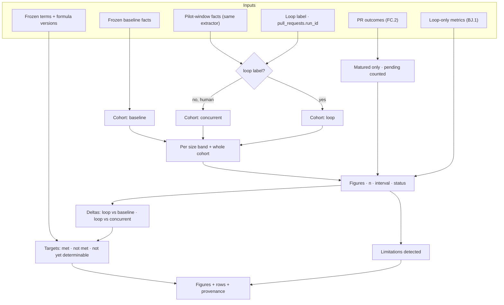

### Issue FB.3 — ouroboros-rest: [FB.3] Report generation & traceability API

> **GitHub issue:** — · **Status:** ⚪ Not filed · **Parent epic:** FB

- **Problem Statement:** The engine's output has to become a stored, numbered, dated report
  and an API from which any figure can be opened onto the pull requests and runs behind it.
- **Solution/Scope:** Endpoints under `/api/v1/proof-of-value/pilots/:id/reports`:
  - `POST` — generate (`kind` inferred: `interim` while running, `final` at or after end,
    `follow_up` after the observation window); persists the FB.1 rows and the content hash
    in one transaction; audit event `pilot_report.generated`.
  - `GET` (list), `GET /:no` (figures, terms, amendments, events, limitations, methodology,
    provenance), `GET /:no/figures/:figureId/rows` (paged: for each row its kind, link —
    run console URL, pull request URL or GitHub URL — contribution, included or excluded and
    why).
  - `GET /:no/verify` — recomputes each figure from its stored rows and checks the content
    hash; returns per-figure pass or fail.
  - A scheduled follow-up: when a pilot's observation window closes, a `follow_up` report
    is generated automatically and an inbox notice is raised.
  - All responses pass the FD.2 guard; row lists carry no person fields at the default
    level.
  - Read APIs are the surface a later Studio Retro (T8) could read; nothing here computes
    plan accuracy.
- **Acceptance Criteria:**
  - Generating twice yields two reports with consecutive numbers; the first is unchanged.
  - Every figure in a seeded report returns rows, and `verify` passes.
  - A row whose run was removed by retention is returned as unavailable, with its stored
    contribution.
  - Viewer can read and verify; only Owner and Maintainer generate.
  - The follow-up report appears on the day the observation window closes (fake clock).
- **Parallelism/Dependencies:** Needs FB.1, FB.2. Blocks FB.4, FB.5, FB.7, FB.8.
- **Technical Stack:** NestJS, OpenAPI, scheduling, audit.
- **Documentation:** CLI `rest-api.mdx` (report and verify endpoints, when the reference
  lists them); the report is documented with FB.5.
- **Epic:** FB

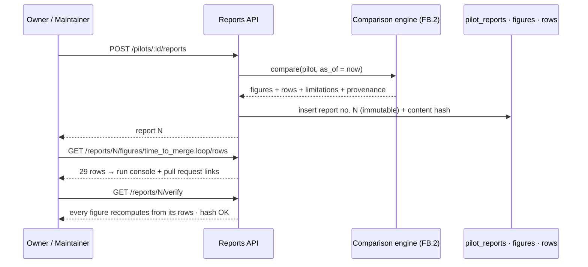

### Issue FB.4 — ouroboros-rest: [FB.4] Report export — HTML, CSV & evidence bundle

> **GitHub issue:** — · **Status:** ⚪ Not filed · **Parent epic:** FB

- **Problem Statement:** "Exportable" means a file a buyer can forward to a steering
  committee and an auditor can check without access to the product. Insights has no export
  today; its per-card CSV is BL.3 (#450), open.
- **Solution/Scope:** (option 3-A) `GET /reports/:no/export?format=html|csv|json`:
  - **HTML** — one self-contained file: inline styles from the design tokens (light theme,
    print styles, page breaks), inline SVG charts rendered server-side from the same series
    shapes the BK.1 primitives draw, no scripts, no external requests. Sections in fixed
    order: cover (pilot name, dates, report number, kind, `as_of`, content hash, provenance
    mark); terms as frozen and amendments; funnel; cohort table per success metric with
    bands, *n*, intervals, deltas and target verdicts; red line; loop-only figures; mix
    statement; event log; limitations in fixed wording; methodology appendix (every formula
    text and version); a closing statement that the report is observational and does not
    establish cause.
  - **CSV** — one row per figure with cohort, band, value, numerator, denominator, *n*,
    interval, status, metric id and formula version. One CSV writer shared with BL.3 when
    that lands (extracted from the audit plane's streamed writer pattern, so there is one
    way to escape a cell).
  - **JSON evidence bundle** — the report, its figures and the row list per figure (ids,
    URLs, contributions), plus the baseline snapshot hash and the report content hash, so
    `verify` can be repeated offline with a documented procedure.
  - Provenance: when not `live`, the mark is on the cover, in a running header on every
    printed page, in a CSV column and in the bundle; a request for an unmarked export is
    refused (PV3).
  - Exports pass the FD.2 guard; an export is an audit event naming format and requester.
  - No server-side PDF in the MVP; the HTML is tested to print to A4 and Letter. Option 3-B
    is recorded as the fallback if a buyer needs a server-produced PDF.
- **Acceptance Criteria:**
  - The HTML opens offline, makes no network request and prints without clipped tables at
    A4 and Letter (checked in the e2e leg with the browser's print-to-PDF).
  - CSV figures equal the on-screen and stored figures; each row carries its formula
    version.
  - Two exports of the same report are byte-identical per format.
  - The bundle's offline verification procedure reproduces every figure.
  - With the granularity policy at its default, no export contains a person identifier
    (FD.4's scan runs over real export output).
  - A seeded report cannot be exported without the mark.
- **Parallelism/Dependencies:** Needs FB.3, FD.2. Coordinates with BL.3 on the CSV writer.
  Blocks FB.5.
- **Technical Stack:** NestJS, server-side SVG string rendering, streamed responses.
- **Documentation:** User Guide `pilots.mdx` § Exporting a report (three formats, printing
  to PDF, verifying a bundle offline); screenshot `user-guide.pilots.export`.
- **Epic:** FB

```text
 export of report no. 3
 ┌──────────────────────────────┐   ┌───────────────────┐   ┌──────────────────────────┐
 │ report-3.html                │   │ report-3.csv      │   │ report-3.bundle.json     │
 │  cover · hash · provenance   │   │ figure_id,cohort, │   │ report + figures         │
 │  frozen terms · amendments   │   │ band,value,n,     │   │ rows per figure          │
 │  funnel                      │   │ ci_low,ci_high,   │   │  (ids · URLs · values)   │
 │  cohort tables + bands       │   │ status,metric_id, │   │ baseline snapshot hash   │
 │  red line · loop-only        │   │ formula_version,  │   │ report content hash      │
 │  mix · events · limitations  │   │ provenance        │   │ verification procedure   │
 │  methodology appendix        │   │                   │   │                          │
 └──────────────────────────────┘   └───────────────────┘   └──────────────────────────┘
        prints to PDF                  opens in a sheet         re-verifies offline
```

### Issue FB.5 — ouroboros-ui: [FB.5] Report page, drill-down & export controls

> **GitHub issue:** — · **Status:** ⚪ Not filed · **Parent epic:** FB

- **Problem Statement:** The report is the artefact a design partner judges the product by.
  It has to lead with what happened to all the work the loop took, show the comparison with
  its qualifications attached, and let a sceptical reader click any number.
- **Solution/Scope:** (from the shared mockup) route
  `/insights/pilots/[id]/reports/[no]`:
  - Header: pilot, report number and kind, `as_of`, short hash, provenance banner when not
    `live`, *Verify* (runs FB.3's check and shows per-figure results), *Export* menu.
  - Funnel strip first.
  - One card per success metric: three cohort columns (baseline, concurrent, loop), value,
    *n*, interval, delta and target verdict; a band toggle that switches to the
    within-band table; "not enough data to compare" and "pending until <date>" states in
    place of numbers where the engine says so; methodology popover from the registry.
  - Red-line card; loop-only figures card with the explicit note that no baseline exists
    for them; mix statement; event log; amendments; limitations panel always expanded on
    first view.
  - Drill-down drawer on any figure: its rows with links to the run console, the mirrored
    pull request or GitHub, the contribution of each, and excluded rows with reasons.
  - Report list on the pilot page with kind, date and hash; a compare-two-reports view is
    not in scope.
  - Fixed vocabulary in copy: "during the pilot", "compared with"; no "because", "saved",
    "ROI" or "proven" (a copy lint over the page's message catalogue).
- **Acceptance Criteria:**
  - Matches the mockup in both themes and at 125% font scale; shell rules hold.
  - Every numeric figure opens a drawer listing its rows; the count in the drawer equals
    *n*.
  - A figure with status `insufficient` shows counts only.
  - The limitations panel cannot be removed from the page or the export.
  - The copy lint passes; adding a banned word to the catalogue fails it.
  - Export downloads match FB.4's output; the provenance banner is present on seeded data.
- **Parallelism/Dependencies:** Needs FB.3, FB.4, the shared mockup. Blocks FB.6.
- **Technical Stack:** Next.js, React, BK.1 chart primitives, design tokens.
- **Documentation:** User Guide `pilots.mdx` § Reading the report (cohorts, bands,
  intervals, pending figures, what the report cannot show), § Tracing a number;
  `docs-coverage.json` entry; screenshots `user-guide.pilots.report`,
  `user-guide.pilots.report-bands`, `user-guide.pilots.report-rows`,
  `user-guide.pilots.report-limitations`.
- **Epic:** FB

```text
+--------------------------------------------------------------------------------+
| Report no. 3 · final · as of 2026-12-02 09:00 UTC · hash 7be2…  [Verify][Export]|
| ▲ SIMULATED DATA — this report includes runs that were not real executions      |
+--------------------------------------------------------------------------------+
| issues taken 96 → PRs opened 88 → merged 71 → untouched 55 → standing 30d: 41/43|
|                                                    (28 merged PRs still pending)|
+--------------------------------------------------------------------------------+
| Time to merge (median)            target: 25% below baseline        [by band ▾] |
|              baseline        concurrent        loop                             |
|  value       21h 40m         19h 10m           6h 05m                           |
|  n           1,031           212               71                               |
|  interval    19h–24h         16h–23h           4h–9h                            |
|  vs baseline                 −12%              −72% (−80 to −58)   target met   |
|  17 loop PRs opened were not merged (19%)                                       |
+--------------------------------------------------------------------------------+
| Mix: 86% of loop PRs are in bands xs–s, against 41% of baseline PRs.            |
|      Within band s: baseline 11h · loop 6h (n=38)                               |
+--------------------------------------------------------------------------------+
| Limitations  · observational, not causal · loop work was selected · revert      |
|   figures pending for 28 PRs until 2027-01-01 · 1 amendment · 2 events logged   |
+--------------------------------------------------------------------------------+
  (figures above are layout placeholders, not data)
```

### Issue FB.6 — ouroboros-rest: [FB.6] Report tests, seeded pilot report & e2e leg

> **GitHub issue:** — · **Status:** ⚪ Not filed · **Parent epic:** FB

- **Problem Statement:** The MVP gate is a walk from baseline to exported file with the
  guarantees checked by machine: figures equal their rows, exports are deterministic, the
  simulated mark cannot be removed, and no person identifier escapes.
- **Solution/Scope:**
  - Integration specs: engine fixtures for each methodology risk (selection, survivorship,
    censoring, small sample, concurrent shift, formula mismatch); figure-equals-rows over
    every seeded figure; report immutability; follow-up scheduling; export determinism;
    provenance refusal; bundle offline verification; tenant isolation; role matrix.
  - Seeds: one `final` report for the seeded closed pilot.
  - e2e leg (amending #56): import baseline from the fixture host → freeze → create pilot →
    start → generate report → open a figure's rows → verify → export all three formats →
    print-to-PDF check → assert the provenance mark → assert no person identifier in any
    response captured during the walk.
  - A release-checklist line in `docs/` stating that no report may be shown to a customer
    until provenance is `live`.
- **Acceptance Criteria:** All specs and the e2e leg pass in CI; the leg fails if the
  provenance banner is removed, if a figure's drawer count differs from *n*, or if a login
  appears in any captured response.
- **Parallelism/Dependencies:** Needs FB.5, EZ.6, FA.5, FD.4. MVP gate for the roadmap.
- **Technical Stack:** Vitest, Playwright (`docker-compose.e2e.yml`), CI workflows.
- **Documentation:** None — internal-only change (the pages it exercises are documented with
  EZ.5, FA.4, FB.4 and FB.5).
- **Epic:** FB

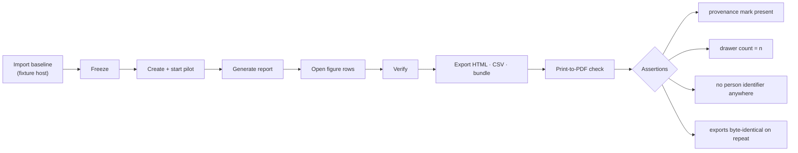

### Issue FB.7 — ouroboros-engine: [FB.7] Narrative report summary

> **GitHub issue:** — · **Status:** ⚪ Not filed · **Parent epic:** FB

- **Problem Statement:** A steering committee reads a paragraph before a table. A generated
  paragraph is also the easiest place for a causal claim or an unsupported number to enter
  the report.
- **Solution/Scope:** After BL.5 (#452) exists: a summary composed by BL.5's composer over
  the stored figures of one report only; every sentence cites figure ids; the limitations
  are mandatory input and at least the observational and selection limitations must appear
  in the output; banned-vocabulary check (the FB.5 copy lint) applied to the output; any
  number in the text must equal a stored figure or the summary is discarded; labelled
  `AI note`, stored with the report as a separate, clearly marked section, excluded from the
  content hash of the figures, optional in exports. No second narrative path beside BL.5.
- **Acceptance Criteria:** A seeded report yields a summary whose every number matches a
  figure and whose every sentence cites one; a composer output containing "because of" or an
  unmatched number is rejected; the report without the summary is unchanged.
- **Parallelism/Dependencies:** Needs FB.3 and BL.5 (#452), which needs AF.2 (#235) and so
  the invocation gateway.
- **Technical Stack:** FastAPI, structured output, BL.5's composer.
- **Documentation:** User Guide `pilots.mdx` new § The AI summary (label, citations, what it
  may not say); `insights.mdx` cross-link to *AI notes*; screenshot
  `user-guide.pilots.report-summary`.
- **Epic:** FB

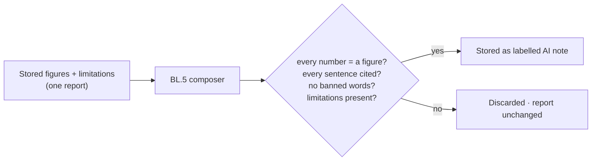

### Issue FB.8 — ouroboros-rest: [FB.8] Organisation-level pilot analytics

> **GitHub issue:** — · **Status:** ⚪ Not filed · **Parent epic:** FB

- **Problem Statement:** An enterprise pilot usually spans several repositories and is
  followed by a second pilot. The MVP reports one pilot, with per-repository baselines, and
  has no view across pilots or across the organisation.
- **Solution/Scope:** After BL.4 (#451) supplies organisation-level rollups: a roll-up
  section in a multi-repository pilot's report (pooled figures computed from pooled rows,
  never averaged medians, following BI.2's rule), a per-repository comparison table with
  the same minimum-sample rule per repository, a pilots-over-time view (same named metric
  across successive pilots, only where formula versions match), and an organisation
  baseline assembled from repository snapshots. Adds the pilot dimension only; cross-repo
  rollups remain BL.4's.
- **Acceptance Criteria:** Pooled figures equal the aggregation over pooled rows; a
  repository under the minimum sample shows counts only; pilots with different formula
  versions are not placed on one axis.
- **Parallelism/Dependencies:** Needs FB.3 and BL.4 (#451).
- **Technical Stack:** NestJS, PostgreSQL, React.
- **Documentation:** User Guide `pilots.mdx` new § Pilots across repositories; `insights.mdx`
  (all-repositories scope cross-link); screenshot `user-guide.pilots.organisation`.
- **Epic:** FB

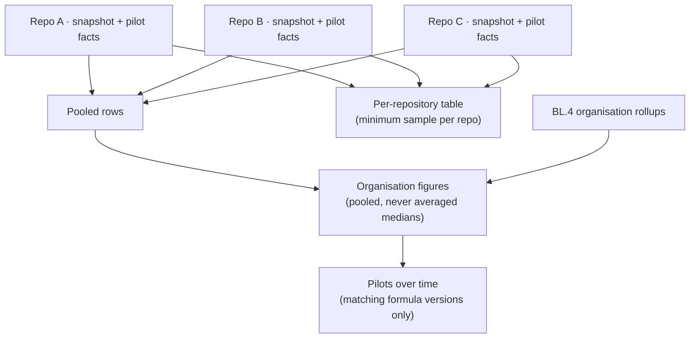

---

## Epic FC — Rework & Survival (`ouroboros-db` + `ouroboros-rest` + `ouroboros-ui`)

FC.1 and FC.2 are in the MVP because the baseline's revert rate and a revert-rate red line
need the same linked definition on both sides (PV13). The baseline side works on GitHub
history alone; the loop side has nothing real to track until the Live Loop roadmap lands.

| Ref | GitHub | Status | Title | Summary | Labels | Parallel | MVP | Complexity | Affected Modules |
|-----|:------:|:------:|-------|---------|--------|:--------:|:---:|:----------:|------------------|
| FC.1 | — | ⚪ Not filed | ouroboros-db: [FC.1] Pull request outcome schema | One outcome row per merged pull request: reverted, reworked, standing, observation state | mvp, proof-of-value, pr, db | Y (after EZ.1) | Y | S | ouroboros-db |
| FC.2 | — | ⚪ Not filed | ouroboros-rest: [FC.2] Revert linkage & observation windows | Link each revert to what it reverted, on every cohort; matured and pending counts | mvp, proof-of-value, pr, insights, rest | N (after FC.1, EZ.2) | Y | M | ouroboros-rest |
| FC.3 | — | ⚪ Not filed | ouroboros-rest: [FC.3] Follow-up fix detection | Fixes that touch a merged pull request's files soon after, as a labelled proxy | v2, proof-of-value, pr, rest | Y (after FC.2) | N | L | ouroboros-rest, ouroboros-db |
| FC.4 | — | ⚪ Not filed | ouroboros-rest: [FC.4] Line survival sampling | Share of a merged pull request's added lines still present at 30 and 90 days | v2, proof-of-value, pr, rest, build-farm | Y (after FC.2) | N | L | ouroboros-rest, ouroboros-runner, ouroboros-db, docs |
| FC.5 | — | ⚪ Not filed | ouroboros-ui: [FC.5] Rework & survival on Insights and in the report | An Insights card and a report section for outcomes of merged loop work | v2, proof-of-value, insights, ui, design | N (after FC.3 or FC.4) | N | M | ouroboros-ui, ouroboros-rest, ouroboros-docs |

### Issue FC.1 — ouroboros-db: [FC.1] Pull request outcome schema

> **GitHub issue:** — · **Status:** ⚪ Not filed · **Parent epic:** FC

- **Problem Statement:** The product records that a loop pull request merged and nothing
  about what happened to it next. The DORA strip's change failure rate counts reverts in a
  window but does not record *which* pull request was reverted, so no figure can be traced
  to a row and no pull request can be said to be still standing.
- **Solution/Scope:** Migration: `pr_outcomes` — organisation FK, `fact_id` FK →
  `baseline_prs` (every cohort is in that table, PV1), `mirror_pr_id` null,
  `observation_days`, `observation_ends_at`, `matured` (generated: now past the end),
  `reverted_at` null, `reverted_by_external_number` null, `revert_kind` null
  CHECK `quoted_title|conventional|sha_reference`, `followup_fix_count` int default 0 and
  `first_followup_at` null (filled by FC.3), `survival_30d` and `survival_90d` numeric null
  (filled by FC.4), `detector_version`, `updated_at`. Unique on `fact_id`. View
  `pr_outcome_status` deriving `standing|reverted|reworked|pending` per row.
- **Acceptance Criteria:** One outcome row per merged fact; `pending` until the observation
  window closes unless already reverted; a reverted row is `reverted` regardless of
  maturity; constraint tests cover the vocabulary.
- **Parallelism/Dependencies:** Needs EZ.1. Parallel with FA.1. Blocks FC.2.
- **Technical Stack:** PostgreSQL 17, Flyway.
- **Documentation:** None — not user-visible: outcome rows; what a person sees is documented
  with FB.5 (MVP) and FC.5 (v2).
- **Epic:** FC

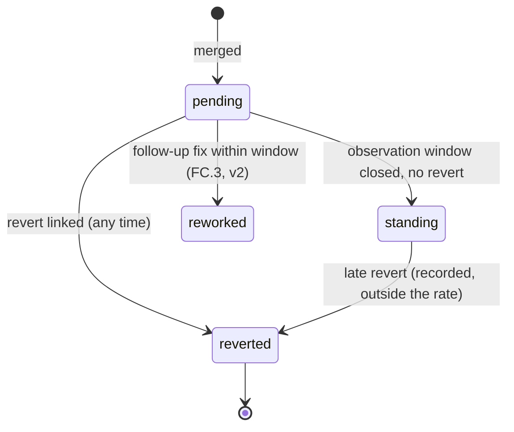

### Issue FC.2 — ouroboros-rest: [FC.2] Revert linkage & observation windows

> **GitHub issue:** — · **Status:** ⚪ Not filed · **Parent epic:** FC

- **Problem Statement:** The shipped detector recognises that a title is a revert. A
  revert *rate* per cohort needs to know which pull request each revert undid, when, and
  whether enough time has passed to say a pull request was not reverted (right-censoring).
- **Solution/Scope:**
  - Reuse `revert.detection.ts` unchanged for recognition (one definition for the DORA
    strip and for this roadmap).
  - Linking, in order: (1) the quoted title matched to a merged fact in the same repository
    merged earlier, taking the most recent on a tie and recording the ambiguity; (2) a
    `This reverts commit <sha>` reference in the revert's body or commit message matched to
    the reverted pull request's merge commit, which requires the history reader to keep the
    merge commit sha and the first lines of the body containing that phrase only (no other
    body text is stored); (3) unlinked reverts counted and reported as unlinked, never
    silently dropped.
  - A revert of a revert restores nothing in the rate: the original stays `reverted` and
    the re-land is a new pull request.
  - Observation: sets `observation_ends_at = merged_at + observation_days`; the rate's
    denominator is matured merged pull requests, the numerator those reverted within the
    window; pending counts and the date the last pending row matures are returned with
    every rate.
  - Runs after each import page and daily for running and ended pilots; idempotent.
  - Read endpoint `GET /api/v1/proof-of-value/outcomes` (by repository, window, cohort)
    returning counts and rows, behind the FD.2 guard.
  - The `pr_revert_rate` registry entry (EZ.3) names this procedure and its limits.
- **Acceptance Criteria:**
  - On the EZ.6 fixture every quoted and conventional revert links to the expected pull
    request; the revert-of-a-revert case behaves as specified; unlinked reverts are counted.
  - A pull request merged 10 days ago with a 30-day window is `pending` and outside the
    denominator; the response states how many are pending and until when.
  - The same procedure yields baseline, concurrent and loop rates from one code path.
  - The DORA strip's figures are unchanged by this issue (regression test).
- **Parallelism/Dependencies:** Needs FC.1, EZ.2. Blocks FB.2 and revert-rate red lines in
  FA.3.
- **Technical Stack:** NestJS, PostgreSQL.
- **Documentation:** User Guide `pilots.mdx` § Reading the report (reverts, pending
  figures) — written with FB.5; `insights.mdx` § DORA methodology gains a cross-reference
  only. No new screenshot.
- **Epic:** FC

```text
 linking a revert

   PR #812  "Fix CAN-bus flake"            merged 03 Nov   ← loop (run_id set)
   PR #840  Revert "Fix CAN-bus flake"     merged 11 Nov
              │  1. quoted title  → #812        (match)
              │  2. "This reverts commit 9f2c…" → merge sha of #812 (confirms)
              ▼
   pr_outcomes(#812): reverted_at = 11 Nov · by #840 · kind = quoted_title

 the rate for a cohort, as of 02 Dec, 30-day window

   merged PRs      ████████████████████████████████████████  71
   matured         ██████████████████████████                43   ← denominator
   reverted ≤30d   █                                           2   ← numerator
   pending         ██████████████                             28   final on 01 Jan
```

### Issue FC.3 — ouroboros-rest: [FC.3] Follow-up fix detection

> **GitHub issue:** — · **Status:** ⚪ Not filed · **Parent epic:** FC

- **Problem Statement:** Most failures are fixed forward, not reverted — the shipped
  detector's own header says a fix-forward "is not seen". A revert-only rate therefore
  understates rework on every cohort, and vendor reports locate much of the cost of
  generated code in rework (Research Notes: Faros).
- **Solution/Scope:** A second, separately labelled proxy: a merged pull request is
  `reworked` when, within the observation window, a later merged pull request in the same
  repository (a) is classified a fix — conventional `fix:` type, a linked ticket of a bug
  type from the canonical ticket store, or a loop run whose failure classification marks a
  regression — **and** (b) changes at least one file the earlier pull request changed.
  Requires the reader to store changed file paths per fact (paths only). Registry entry
  `pr_rework_rate`, `proxy = true`, with caveats stated: file overlap is not causation; busy
  files produce false positives. A precision check against a hand-labelled sample is part
  of the issue, and its result is written into the caveat text. If DORA's rework-rate
  definition is confirmed (Research Notes — unverified), the entry says how this proxy
  differs from it.
- **Acceptance Criteria:** Fixture cases produce the expected links; a busy-file false
  positive is demonstrated and documented; the measured precision on the labelled sample is
  recorded in the registry caveat; rates use the same matured and pending rule as FC.2.
- **Parallelism/Dependencies:** Needs FC.2; canonical tickets for the bug-type signal.
- **Technical Stack:** NestJS, PostgreSQL.
- **Documentation:** User Guide `pilots.mdx` § Reading the report (rework proxy and its
  limits); `insights.mdx` if FC.5 has landed. No screenshot in this issue.
- **Epic:** FC

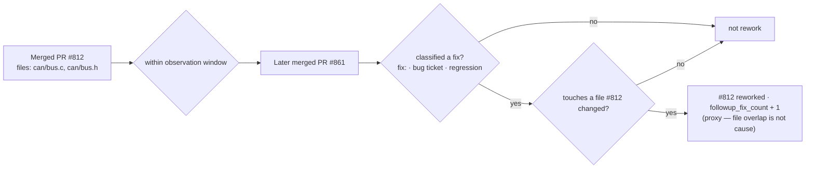

### Issue FC.4 — ouroboros-rest: [FC.4] Line survival sampling

> **GitHub issue:** — · **Status:** ⚪ Not filed · **Parent epic:** FC

- **Problem Statement:** "Survival" in the description means more than not being reverted:
  whether the code the loop wrote is still in the codebase. DX warns that generated code may
  be harder to maintain, and one vendor reports a large rise in code churn with AI adoption
  (Research Notes: DX, Faros — vendor figures).
- **Solution/Scope:** An ADR first (`docs/`), because this needs repository contents:
  options are a blame job on a build-farm runner against a fresh checkout (recommended —
  the farm already checks repositories out; nothing new in `ouroboros-rest`), or GitHub's
  blame API (rate-limited, GraphQL only). Then: at 30 and 90 days after merge, for a sample
  of merged pull requests per cohort (all loop pull requests; a random sample of the
  others, size fixed in the registry), compute the share of added lines still attributed to
  the merge commit on the default branch. Stores the share only — no line contents and no
  blame authors. Registry entry `pr_line_survival`, with caveats: reformatting and moves
  reduce survival without rework; survival is not quality.
- **Acceptance Criteria:** ADR merged with the chosen option; on a fixture repository with
  known edits the computed share equals the hand-computed value; a whole-file reformat is
  shown to reduce the figure and is named in the caveat; no blame author reaches
  `ouroboros-rest`.
- **Parallelism/Dependencies:** Needs FC.2, the build farm job plane and real checkouts —
  so in practice the Live Loop roadmap. Independent of FC.3.
- **Technical Stack:** ADR; `ouroboros-runner` job (git blame), NestJS ingest.
- **Documentation:** User Guide `pilots.mdx` § Reading the report (line survival and its
  limits); Administration `build-farm.mdx` (the survival job and its schedule). No
  screenshot in this issue.
- **Epic:** FC

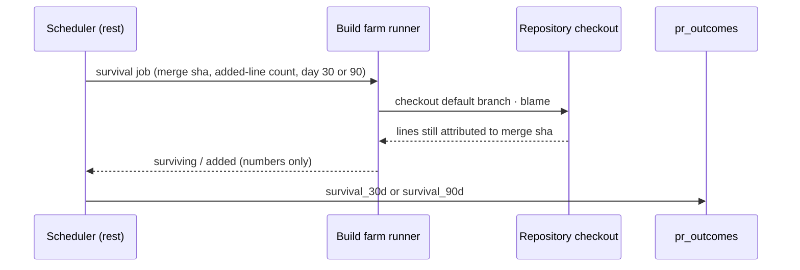

### Issue FC.5 — ouroboros-ui: [FC.5] Rework & survival on Insights and in the report

> **GitHub issue:** — · **Status:** ⚪ Not filed · **Parent epic:** FC

- **Problem Statement:** Outcomes of merged loop work have no surface outside a pilot
  report, and after a pilot ends the question "is what the loop merged still standing" keeps
  mattering.
- **Solution/Scope:** A *Merged work, later* card on the Insights overview (mockup addition
  reviewed first): standing, reverted, reworked and pending counts for loop pull requests in
  the selected range, with the concurrent non-loop rate beside it, methodology popovers and
  proxy labels; a list of reverted and reworked loop pull requests linking to the run
  console; a matching section in the report page and exports when FC.3 or FC.4 data
  exists; honest absence when it does not. A read endpoint addition in `ouroboros-rest`.
- **Acceptance Criteria:** The card matches its mockup in both themes; counts equal FC.2's
  endpoint; proxy metrics are labelled; pending counts are shown as pending, not as
  standing; nothing per-person at the default policy level.
- **Parallelism/Dependencies:** Needs FC.2 and at least one of FC.3, FC.4.
- **Technical Stack:** Next.js, React, BK.1 primitives.
- **Documentation:** User Guide `insights.mdx` new § Merged work, later; `pilots.mdx`
  § Reading the report; screenshots `user-guide.insights.outcomes`,
  `user-guide.pilots.report-outcomes`.
- **Epic:** FC

```text
+---------------------------------------------------------------+
| Merged work, later · loop pull requests · 90d                 |
|                                                               |
|  standing   ▇▇▇▇▇▇▇▇▇▇▇▇▇▇▇▇▇▇▇▇▇▇▇▇▇▇▇▇  141                |
|  reworked   ▇▇                      9   proxy (i)             |
|  reverted   ▇                       4   proxy (i)             |
|  pending    ▇▇▇▇▇▇                 31   final by 2027-01-01   |
|                                                               |
|  Revert rate: loop 2.6% · other merged work 2.9% (matured)    |
|  [ Reverted and reworked loop pull requests → ]               |
+---------------------------------------------------------------+
  (figures above are layout placeholders, not data)
```

---

## Epic FD — Policy Fit (`ouroboros-db` + `ouroboros-rest` + `ouroboros-ui` + `docs`)

Independent of real runs. **Nothing in this epic is legal advice**; it gives a customer's
counsel a default, a switch, a record and a description to review.

| Ref | GitHub | Status | Title | Summary | Labels | Parallel | MVP | Complexity | Affected Modules |
|-----|:------:|:------:|-------|---------|--------|:--------:|:---:|:----------:|------------------|
| FD.1 | — | ⚪ Not filed | ouroboros-db: [FD.1] `analytics_granularity` policy rule & person-data inventory | A sixth rule in the versioned policy document; a catalogue of person-bearing columns | mvp, proof-of-value, settings, db | Y (first) | Y | M | ouroboros-db, schemas |
| FD.2 | — | ⚪ Not filed | ouroboros-rest: [FD.2] Analytics granularity guard | One enforcement point on every analytics response and export; audit | mvp, proof-of-value, settings, insights, rest | N (after FD.1) | Y | M | ouroboros-rest |
| FD.3 | — | ⚪ Not filed | ouroboros-ui: [FD.3] Analytics privacy card & Owner opt-in | Settings card, acknowledgement, member-visible notice | mvp, proof-of-value, settings, ui, design | N (after FD.2) | Y | M | ouroboros-ui, ouroboros-docs |
| FD.4 | — | ⚪ Not filed | ouroboros-rest: [FD.4] Policy-fit checks — schema lint & response scan | CI checks that no analytics schema or response carries a person field by default | mvp, proof-of-value, rest, ci | Y (after FD.1) | Y | M | ouroboros-rest, scripts, .github |
| FD.5 | — | ⚪ Not filed | ouroboros: [FD.5] Analytics privacy statement & legal-review checklist | `docs/ANALYTICS_PRIVACY.md` and the Administration page; not legal advice | mvp, proof-of-value, documentation, settings | Y | Y | S | docs, ouroboros-docs |
| FD.6 | — | ⚪ Not filed | ouroboros-ui: [FD.6] Per-person views behind the opt-in | Reviewer-load and intervention views by person, only when opted in | v2, proof-of-value, insights, ui, rest | N (after FD.3) | N | L | ouroboros-ui, ouroboros-rest, ouroboros-db, ouroboros-docs |

### Issue FD.1 — ouroboros-db: [FD.1] `analytics_granularity` policy rule & person-data inventory

> **GitHub issue:** — · **Status:** ⚪ Not filed · **Parent epic:** FD

- **Problem Statement:** The description requires "policy checks that keep analytics at
  team and repository level unless an administrator opts in to per-person views". The
  policy document has five core rules and none about analytics; and nobody can check a
  boundary without a list of where person data sits. Person-bearing columns exist today —
  for example `pull_requests.merged_by` (a host login), `intervention_overrides` and
  `pr_approvals` (who acted), audit events.
- **Solution/Scope:**
  - Add rule id `analytics_granularity` to the policy document grammar
    (`schemas/org-policy/v1.json`, as an addition) and to the database rule-id validator
    and core-rule check (V092's functions), with `conditions`:
    `{ level: "workspace_repository" | "person", acknowledged_by, acknowledged_at,
    acknowledgement_version }`. Backfill migration publishes a new policy version for every
    workspace with `level = workspace_repository`. `level = person` is refused by a check
    unless the acknowledgement fields are present.
  - A `person_data_catalog` table (or a checked-in manifest validated against the live
    schema in `tests/` — decide in the issue; the manifest is lighter): every column that
    can identify a person, its table, its kind (`host_login|user_id|email|name|keyed_hash`)
    and whether analytics may read it at each level. `baseline_prs.author_key` is listed as
    `keyed_hash`, readable for counting only.
  - A database test that fails when a new column whose name or foreign key matches the
    person patterns (`*_by`, `user_id`, `login`, `email`, FK to `"user"`) appears without a
    catalogue entry.
  - Since there is no team entity, the levels are `workspace_repository` and `person`; the
    grammar leaves room for a `team` level if BT.1's group sync later introduces one.
- **Acceptance Criteria:**
  - Every existing workspace has the rule at its default after migration; the policy
    history shows the system-published version.
  - Publishing `level = person` without an acknowledgement fails at the database.
  - Adding an uncatalogued `reviewed_by` column to any table fails the test.
  - The rule round-trips through the existing policy read and publish endpoints without
    special-casing.
- **Parallelism/Dependencies:** First in the epic; independent of EZ and FA. Coordinates
  with BT.2 (#498, policy as code). Blocks FD.2, FD.4.
- **Technical Stack:** PostgreSQL 17, Flyway, JSON Schema.
- **Documentation:** Administration `policies.mdx` (the new rule, its default, who can
  change it) — written with FD.3, which ships the control. None in this issue alone.
- **Epic:** FD

```mermaid
erDiagram
    org_policy_versions ||--|| analytics_granularity_rule : "contains (rule 6)"
    person_data_catalog }o--|| analytics_granularity_rule : "readable at level"
    analytics_granularity_rule {
        bool enabled
        text level "workspace_repository (default) · person"
        text acknowledged_by "required for person"
        timestamptz acknowledged_at
        int acknowledgement_version
    }
    person_data_catalog {
        text table_name
        text column_name
        text kind "host_login · user_id · email · name · keyed_hash"
        bool analytics_default "false unless counting only"
    }
```

### Issue FD.2 — ouroboros-rest: [FD.2] Analytics granularity guard

> **GitHub issue:** — · **Status:** ⚪ Not filed · **Parent epic:** FD

- **Problem Statement:** A rule in a document changes nothing until one piece of code
  enforces it everywhere analytics leave the service. Filtering in each controller is how a
  field is missed (option 5-B).
- **Solution/Scope:**
  - A NestJS interceptor plus a serialisation rule applied to every controller in the
    `insights` and `proof-of-value` modules and to exports: response DTO fields are
    annotated `@PersonField(kind)`; at level `workspace_repository` the guard removes them
    and refuses any query parameter that groups or filters by person (`groupBy=author`,
    `reviewer=`) with a 403 naming the policy rule. At level `person` they pass and the
    request is audit-logged with the requester.
  - The level is read from the published policy document through the existing policy
    resolution service; no local cache longer than the policy's own.
  - Small-cohort labelling (PV12): any human-cohort figure carries `contributor_count`;
    below five the response carries a `small_cohort` flag that the UI and exports must
    render.
  - Audit events: `analytics.person_view` (who looked at per-person data, which endpoint),
    `analytics.granularity_changed`.
  - Applies retroactively to the shipped Insights endpoints: an inventory pass over BJ.2's
    responses is part of this issue; any person field found is annotated (none is expected
    in the page payloads, but the audit decides, not the expectation).
  - Digest e-mails and outbound webhooks carrying analytics pass through the same
    serialisation rule.
- **Acceptance Criteria:**
  - With the default level, no response from any guarded endpoint contains a field
    annotated as a person field (property-based test over all guarded routes).
  - A person-grouping query returns 403 with the rule id at the default level.
  - Switching the level takes effect on the next request and is audited.
  - A figure over three contributors carries the small-cohort flag.
  - A new controller in the two modules without the guard fails a module-boundary test.
- **Parallelism/Dependencies:** Needs FD.1. Blocks EZ.5, FA.4, FB.4, FD.3.
- **Technical Stack:** NestJS interceptor and decorators, existing policy resolution and
  audit modules.
- **Documentation:** None in this issue — the behaviour a person meets is documented with
  FD.3 and FD.5.
- **Epic:** FD

```mermaid
flowchart LR
    REQ["Analytics request<br/>insights · baseline · pilot · report · export"] --> G{"Granularity guard"}
    POL["Published policy<br/>analytics_granularity.level"] --> G
    G -->|"workspace_repository + person query"| R403["403 · names the rule"]
    G -->|"workspace_repository"| STRIP["Person fields removed<br/>small-cohort flag added"]
    G -->|"person (opted in)"| PASS["Fields pass"] --> AUD["Audit: who viewed per-person data"]
    STRIP --> RESP["Response"]
    PASS --> RESP
```

### Issue FD.3 — ouroboros-ui: [FD.3] Analytics privacy card & Owner opt-in

> **GitHub issue:** — · **Status:** ⚪ Not filed · **Parent epic:** FD

- **Problem Statement:** The opt-in has to be a deliberate act by someone accountable, and
  the people it affects have to be able to see that it was made. A silent switch is the
  failure the Productivity Score episode illustrates (Research Notes).
- **Solution/Scope:** (mockup addition to the Settings governance page first)
  - A *Analytics privacy* card in Settings → Governance: current level in plain words
    ("Analytics are shown for the workspace and for each repository. No per-person figures
    are available."), what is and is not stored (from FD.5's statement), and, for Owners
    only, *Allow per-person views*.
  - Opt-in dialog: what becomes visible and to which roles; a statement that employment,
    co-determination and data-protection rules may apply and that the customer is
    responsible for legal review; a required typed confirmation; publishes a new policy
    version with the acknowledgement fields. Opt-out is one click, also a policy publish.
  - Maintainers and Viewers see the card read-only, with who opted in and when if so.
  - While the level is `person`, a persistent, non-dismissible notice appears on Insights
    and pilot pages for every member: "Per-person analytics are enabled in this workspace
    (since <date>, by <Owner>)".
  - In the MVP, opting in unlocks no screen — FD.6 is v2 — and the dialog says so. What it
    changes in the MVP: person fields may appear in report row drawers and exports (who
    merged), and are audit-logged when viewed.
- **Acceptance Criteria:**
  - Only an Owner can opt in; a Maintainer's attempt is refused by the API and the control
    is honest-absent in the UI.
  - Opt-in creates a policy version visible in policy history with the acknowledgement.
  - The member-visible notice appears for a Viewer immediately after opt-in and disappears
    after opt-out.
  - Matches the mockup in both themes and at 125% font scale.
- **Parallelism/Dependencies:** Needs FD.2 and the shipped Settings governance page.
- **Technical Stack:** Next.js, React, the policy publish flow.
- **Documentation:** Administration `policies.mdx` § Analytics privacy (the rule, default,
  opt-in, what members see), `roles.mdx` (Owner-only action), new
  `analytics-privacy.mdx` (with FD.5); User Guide `insights.mdx` (the notice); screenshots
  `administration.policies.analytics-privacy`, `administration.policies.analytics-opt-in`,
  `user-guide.insights.person-notice`.
- **Epic:** FD

```text
+--------------------------------------------------------------------------------+
| Settings › Governance                                                          |
+--------------------------------------------------------------------------------+
| Analytics privacy                                             policy v9         |
|                                                                                |
|  Level: Workspace and repository                                               |
|  Figures are shown for the workspace and for each repository.                  |
|  No per-person figures are available to anyone.                                |
|  Stored for analytics: timestamps, sizes, counts. Not stored: names, logins.   |
|  [ What is stored → ]                                                          |
|                                                                                |
|  Owner only:  [ Allow per-person views… ]                                      |
|   ┌ Allow per-person views ────────────────────────────────────────────────┐   |
|   │ Per-person data may then appear in report details and exports.         │   |
|   │ Employment, co-determination and data-protection rules may apply.      │   |
|   │ Your organisation is responsible for legal review before enabling.     │   |
|   │ Every member will see that this is enabled, by whom and since when.    │   |
|   │ Type the workspace name to confirm: [____________]   [Cancel] [Enable] │   |
|   └────────────────────────────────────────────────────────────────────────┘   |
+--------------------------------------------------------------------------------+
```

### Issue FD.4 — ouroboros-rest: [FD.4] Policy-fit checks — schema lint & response scan

> **GitHub issue:** — · **Status:** ⚪ Not filed · **Parent epic:** FD

- **Problem Statement:** The guard protects annotated fields. The failure that matters is
  the field nobody annotated — a `mergedBy` added to a DTO next year. "Policy checks" in the
  description has to include a check that runs without anyone remembering it.
- **Solution/Scope:**
  - **Schema lint** (`scripts/`, run in `ci/rest`): walks the generated OpenAPI document;
    for every response schema under the analytics path prefixes, fails on a property whose
    name matches the person patterns (`*By`, `author*`, `reviewer*`, `login`, `email`,
    `userId`, `user`, `name` in person-shaped objects) unless the schema marks it with an
    `x-person-field` extension, which the `@PersonField` decorator emits. An allowlist file
    with a reason per entry handles false positives.
  - **Response scan** (integration and e2e): with the default level, every response
    captured from guarded routes and every export file is scanned for the seeded users'
    names, e-mails, ids and host logins; any hit fails.
  - **Log scan:** the baseline reader's and guard's test logs are scanned for the same
    values.
  - **Runtime self-check:** `GET /api/v1/proof-of-value/policy-fit` returns the current
    level, the list of guarded routes, the count of annotated person fields and the date
    of the last opt-in change — the page FD.3 and FD.5 link to as evidence.
- **Acceptance Criteria:**
  - Adding an unannotated `mergedBy` to a pilot DTO fails the lint with the path.
  - Removing the guard from one controller fails the response scan.
  - The allowlist is empty or every entry carries a reason; an unused entry fails the lint.
  - The self-check lists every route in the two modules (compared against the router in a
    test).
- **Parallelism/Dependencies:** Needs FD.1; meaningful once FD.2 exists. Feeds FB.6.
- **Technical Stack:** Node script over `openapi.json`, Vitest, Playwright capture.
- **Documentation:** None — internal-only change (the self-check endpoint is described in
  FD.5's page).
- **Epic:** FD

```mermaid
flowchart TB
    subgraph CI["Runs on every pull request"]
        L["Schema lint over openapi.json<br/>person-shaped property without x-person-field → fail"]
        S["Response + export scan<br/>seeded names, e-mails, logins → fail"]
        G["Log scan"]
        B["Module boundary test<br/>controller without guard → fail"]
    end
    RT["Runtime self-check endpoint<br/>level · guarded routes · last change"]
    L & S & G & B --> GATE["ci/rest"]
    RT --> DOC["Linked from Settings card and privacy page"]
```

### Issue FD.5 — ouroboros: [FD.5] Analytics privacy statement & legal-review checklist

> **GitHub issue:** — · **Status:** ⚪ Not filed · **Parent epic:** FD

- **Problem Statement:** A buyer's works council, data-protection officer or counsel will
  ask what the analytics collect about people. Today there is nothing to hand them, and the
  product team has no list of the questions a lawyer must answer before Ouroboros is sold
  into a regulated workplace.
- **Solution/Scope:**
  - `docs/ANALYTICS_PRIVACY.md` (repository) and Administration `analytics-privacy.mdx`
    (site), written from the shipped build, not from this roadmap: what is read from the
    git host; what is stored (timestamps, sizes, counts, a keyed hash for counting) and
    what is discarded at the boundary (logins, reviewer identities); where person data does
    exist in the product outside analytics (from FD.1's catalogue); the default level; the
    opt-in, who can make it and what it changes; retention and deletion; the self-check
    endpoint; how to export the audit trail of per-person views.
  - A **legal-review checklist** in the repository document, framed as questions for
    counsel, not answers: whether a keyed hash of a login is personal data in the
    customer's jurisdiction; whether analytics of this kind trigger works-council
    co-determination or consultation; whether an impact assessment is required; what
    notice employees are owed; whether repository-level figures over very small teams
    amount to individual monitoring (PV12); cross-border transfer when the deployment and
    the git host are in different regions.
  - A prominent statement in both documents: **this is a description of the software, not
    legal advice; NobuData has not obtained a legal opinion on it as of this roadmap; a
    review by qualified counsel is required before the feature is marketed and by each
    customer before per-person views are enabled.**
  - An owner action recorded in the issue: commission that review. Its outcome may change
    PV11 and PV12.
- **Acceptance Criteria:** Both documents exist and match the build (each claim cites the
  migration or module that makes it true); the not-legal-advice statement is present; the
  checklist is reviewed by the owner; the site page is linked from the Settings card.
- **Parallelism/Dependencies:** Draft in parallel with everything; final text needs FD.1–
  FD.3 and EZ.2 merged so it describes what shipped.
- **Technical Stack:** Markdown, Docusaurus MDX.
- **Documentation:** Administration new `analytics-privacy.mdx`; `retention-audit-
  lifecycle.mdx` (baseline data class, per-person view audit events); `policies.mdx`
  cross-link. No screenshot beyond FD.3's.
- **Epic:** FD

```mermaid
flowchart LR
    BUILD["Shipped build<br/>migrations · reader · guard"] --> STMT["ANALYTICS_PRIVACY.md<br/>+ analytics-privacy.mdx"]
    CAT["Person-data catalogue (FD.1)"] --> STMT
    STMT --> CHK["Legal-review checklist<br/>(questions for counsel)"]
    CHK --> OWN["Owner commissions review<br/>before marketing"]
    CHK --> CUST["Customer's counsel reviews<br/>before opting in"]
    OWN -.->|"may revise"| PV["PV11 · PV12"]
```

### Issue FD.6 — ouroboros-ui: [FD.6] Per-person views behind the opt-in

> **GitHub issue:** — · **Status:** ⚪ Not filed · **Parent epic:** FD

- **Problem Statement:** The description allows per-person views after an administrator
  opts in. Some customers have an agreed, lawful use — most plausibly balancing review load,
  since vendor data puts the cost of agent work on reviewers (Research Notes: LinearB pickup
  time, Faros review time). No such view exists, and none should be built before the legal
  review in FD.5 reports.
- **Solution/Scope:** Only after FD.5's review and only at level `person`: a *Review load*
  view (reviews of loop pull requests per reviewer, wait time, share of total) and
  interventions by person, framed as load, not performance; requires linking host logins to
  workspace members (a mapping the product does not have today — a schema addition with
  its own catalogue entries); every view audit-logged; excluded from digests and from
  report exports unless separately selected; explicitly no ranking, no scoring and no
  per-author quality metric. The scope is to be re-confirmed against the review's outcome
  before filing.
- **Acceptance Criteria:** The views do not exist in navigation or API at the default
  level; at level `person` each view writes an audit event; no ranking or score is present;
  opting out removes access at once.
- **Parallelism/Dependencies:** Needs FD.3, FD.5's legal review, and real review activity
  (Live Loop roadmap).
- **Technical Stack:** Next.js, React, NestJS, PostgreSQL.
- **Documentation:** User Guide `insights.mdx` new § Review load (opt-in only);
  Administration `analytics-privacy.mdx` (what the views show, audit); screenshots
  `user-guide.insights.review-load`.
- **Epic:** FD

```mermaid
flowchart TB
    L{"analytics_granularity.level"}
    L -->|"workspace_repository"| NONE["Views absent from navigation and API"]
    L -->|"person"| V["Review load · interventions by person"]
    V --> A["Every view audit-logged"]
    V --> N["Member-visible notice (FD.3)"]
    V -.->|"never"| X["ranking · scoring · per-author quality"]
```

---

## Work Order (dependency-ordered execution plan)

```mermaid
flowchart TB
    subgraph PRE["Prerequisites (shipped)"]
        P0["metric registry BI.1 · windowed metrics BJ.1 · PR mirror AW.1/AX.1<br/>policy document BQ.1 · audit BR.2 · inbox · chart primitives BK.1"]
    end
    subgraph A["Phase 1 — Independent of real runs (start now)"]
        EZ1["EZ.1 facts schema"] --> EZ2["EZ.2 history reader"] & EZ3["EZ.3 definitions"]
        EZ2 & EZ3 --> EZ4["EZ.4 import API"]
        FD1["FD.1 policy rule + catalogue"] --> FD2["FD.2 guard"] & FD4["FD.4 checks"]
        FD5["FD.5 privacy statement<br/>+ legal review"]
        EZ1 --> FC1["FC.1 outcome schema"]
        EZ2 & FC1 --> FC2["FC.2 revert linkage"]
        EZ4 & FD2 --> EZ5["EZ.5 baseline UI (+ shared mockup)"]
        EZ4 --> EZ6["EZ.6 fixtures + tests"]
        FD2 --> FD3["FD.3 opt-in card"]
    end
    subgraph B["Phase 2 — Pilot object (buildable now)"]
        EZ1 --> FA1["FA.1 pilot schema"]
        FA1 & EZ4 --> FA2["FA.2 pilot API"]
        FA2 & EZ3 --> FA3["FA.3 catalogue + red line"]
        FA3 & FD2 --> FA4["FA.4 pilot UI"]
        FA3 --> FA5["FA.5 tests + seeds"]
    end
    subgraph C["Phase 3 — Report (buildable on seeds; real only after Live Loop)"]
        FA1 --> FB1["FB.1 report schema"]
        EZ3 & FA2 & FC2 --> FB2["FB.2 comparison engine"]
        FB1 & FB2 --> FB3["FB.3 generation + traceability"]
        FB3 & FD2 --> FB4["FB.4 export"]
        FB4 --> FB5["FB.5 report UI"]
        FB5 & EZ6 & FA5 & FD4 --> FB6["FB.6 tests + e2e = MVP gate"]
    end
    subgraph LIVE["Live Loop roadmap (DG–DL) — external"]
        LL["real runs · #91 bridge · #375 loop PRs · DJ.1 data origin"]
    end
    subgraph V2["v2 — Proof of Value v2"]
        EZ7["EZ.7 other hosts + lead time"]
        FA6["FA.6 integrator templates"]
        FB7["FB.7 narrative"] -.-> BL5["BL.5 #452"]
        FB8["FB.8 organisation analytics"] -.-> BL4["BL.4 #451"]
        FC3["FC.3 follow-up fixes"]
        FC4["FC.4 line survival"]
        FC5["FC.5 Insights card"]
        FD6["FD.6 per-person views"] -.-> FD5
    end
    PRE --> A
    FB2 -.->|"custom range"| BL3["BL.3 #450"]
    LL -.->|"first real report"| FB6
    FB6 -.-> V2
```

Ordered checklist (⊕ = parallelizable within its phase):

1. **Prerequisites (all shipped):** BI.1 (#432), BJ.1 (#437), AX.1 (#357), BQ.1 (#480),
   BR.2 (#486), BK.1 (#442), the inbox decision plane.
2. **Phase 1 — independent of real runs; start immediately.**
   EZ.1 ⊕ FD.1 ⊕ FD.5 (draft) → { EZ.2 ⊕ EZ.3 ⊕ FC.1 ⊕ FD.2 ⊕ FD.4 } → { EZ.4 ⊕ FC.2 } →
   { EZ.5 ⊕ EZ.6 ⊕ FD.3 }. **At the end of this phase a customer can import and freeze a
   real baseline of their own repository** — the first thing in this roadmap that is true
   without Live Loop, and a useful artefact for a design-partner conversation by itself.
3. **Phase 2 — pilot object.** FA.1 (can start beside EZ.2) → FA.2 → FA.3 →
   { FA.4 ⊕ FA.5 }.
4. **Phase 3 — report.** FB.1 ⊕ FB.2 → FB.3 → FB.4 → FB.5 → **FB.6 (MVP gate, amending
   #56)**. Requires the custom-range half of BL.3 (#450) for loop-only figures, or accepts
   them as `not_applicable` until it lands.
5. **External gate — Live Loop (DG–DL).** The first report with provenance `live`. Until
   then FB's output is marked simulated and is not shown to a customer. FD.5's legal review
   should report before this point.
6. **v2:** EZ.7, FA.6 and FC.3 at any time after their dependencies; FC.4 after real
   checkouts exist; FC.5 after FC.3 or FC.4; FB.7 with BL.5 (#452); FB.8 with BL.4 (#451);
   FD.6 only after the legal review.

## Risks

1. **The roadmap proves nothing until real runs exist.** Phases 1 and 2 are sound without
   them; Phase 3 can be finished, tested and demonstrated on seeds and still have no
   customer value. Mitigation: PV3's provenance mark, and sequencing Phase 3 behind the
   Live Loop thin slice if capacity is short. Phase 1 is the part to do first regardless.
2. **A report that flatters is worse than no report.** If a design partner's own analyst
   finds that the loop took the easy issues and the report did not say so, the evidence
   pitch — the advantage the gap analysis says to strengthen — is spent. Mitigation: the
   three-cohort rule, bands, funnel-first layout and mandatory limitations are acceptance
   criteria, not presentation choices; they should not be relaxed for a nicer first page.
3. **A report that is honest may be unimpressive.** With a 30-day pilot on one repository
   most deltas may read "not enough data to compare". That is the correct output. The owner
   should decide in advance whether the default pilot should be longer (PV2) rather than the
   minimum sample smaller (PV7).
4. **Baseline definitions will be disputed.** A buyer's existing tool (LinearB, Jellyfish,
   Faros, DX) will show a different cycle time for the same repository because each defines
   it differently. Mitigation: the definition is printed beside every number; the report
   never compares with an outside benchmark; EZ.6's answer sheet makes the arithmetic
   checkable.
5. **GitHub rate limits and large histories.** A monorepo with tens of thousands of pull
   requests may take hours even with GraphQL and will share a token with the live sync.
   Mitigation: reserve, resumption, and a window that defaults to 180 days. The limits
   themselves were not re-verified this session.
6. **Legal exposure on analytics about people — unresolved.** Repository-level figures over
   a three-person team describe three people; a keyed hash may still be personal data;
   some jurisdictions give employee representatives rights over tools that can monitor
   performance whether or not that is the intent. This roadmap sets a conservative default
   and a recorded opt-in; it does not establish that either is sufficient anywhere. **A
   review by qualified counsel is needed before the feature is marketed (FD.5), and nothing
   in this document is legal advice.**
7. **The provenance mark depends on a roadmap written in parallel.** PV3 reads the run data
   origin planned as Live Loop DJ.1. Neither roadmap is filed; if DJ.1 changes or slips,
   FB.2 treats every run as not live, so the failure mode is a report that is over-marked,
   never one that is under-marked.
8. **BL.3 sequencing.** FB.2's loop-only figures need a custom range that is filed as v2
   inside a larger issue. If BL.3 is not split or promoted, the MVP report shows cost per
   merged pull request and interventions as unavailable.
9. **Revert detection is a title heuristic.** Squash-merge habits, renamed pull requests
   and fix-forward cultures all lower the detected rate, equally on both sides but not
   necessarily equally across teams. Mitigation: the `proxy` label, unlinked counts, FC.3
   later; and choosing review iterations rather than revert rate as the default suggested
   red line may be wiser — an owner decision.
10. **Scope overlap with the Studio.** T5 and T8 will want delivery outcomes. The boundary
    is that this roadmap publishes outcome facts through read APIs and computes nothing
    about plans; it should be restated when the Studio's Forecast and Retro roadmaps are
    written.
11. **No mockup.** Three UI issues depend on a mockup that does not exist. If design
    review is slow, Phase 1's REST work is unaffected, but EZ.5 is what makes the baseline
    usable.
12. **Research gaps carried into the design.** Pilot-length norms, DORA's ROI guidance and
    DORA's rework-rate definition were not verified (see Research Notes). None changes the
    architecture; each could change a default or a label.

## Totals

| | Epic | Issues | MVP | v2 |
|---|:---:|:---:|:---:|:---:|
| Epic EZ — Baseline Import | — | 7 | 6 | 1 |
| Epic FA — Pilot Definition | — | 6 | 5 | 1 |
| Epic FB — Before-and-After Report | — | 8 | 6 | 2 |
| Epic FC — Rework & Survival | — | 5 | 2 | 3 |
| Epic FD — Policy Fit | — | 6 | 5 | 1 |
| **Total** | **5 epics** | **32** | **24** | **8** |

By what can be true without the Live Loop roadmap: **17 MVP issues** (all of EZ.1–EZ.6,
FA.1–FA.5, FD.1–FD.5, and FC.1) are fully meaningful on GitHub history and configuration
alone; **7 MVP issues** (FC.2's loop side, FB.1–FB.6) are buildable now and become real when
runs do.

Amendments to propose at filing (none has been posted; this document changes no issue):

| To amend | Proposed comment |
|---|---|
| BL.3 (#450) | The pilot window is a custom range; request that the range parameter be split out or promoted so FB.2 can read loop-only figures; the CSV writer is shared with FB.4 |
| BL.4 (#451) | FB.8 adds a pilot dimension on top of the organisation rollups; no second cross-repository rollup |
| BL.5 (#452) | FB.7 reuses the composer for report summaries with the stricter number-matching rule |
| BI.2 (#433) | The revert detector gains a second consumer (FC.2); recognition stays single-sourced |
| Live Loop DJ.1 (not filed) | FB.2 and FB.4 read the run data origin for the report's provenance mark; `seeded` and `simulated` both count as not live |
| BT.2 (#498) | A sixth rule, `analytics_granularity`, must be expressible in policy as code |
| #56 | A proof-of-value e2e leg (FB.6) |
| #49 | `/insights/baseline` and `/insights/pilots` are new routes, not placeholders |

## References

- Gap analysis: `ouroboros-studio/reports/Ouroboros competitor gap analysis.md` § "P2-10 ·
  Proof of value: pilot kit and outcome baselines" and § "Six advantages worth
  strengthening" (evidence and gates, not throughput)
- Research notes: `ouroboros-studio/research_notes/Ouroboros competitor gap analysis/` —
  `commercial_readiness_benchmarks.md` § 5, `orchestration_review_ops_tools.md` § 1f,
  `own_feature_inventory.md` (Insights row)
- Studio boundary: `ouroboros-studio/docs/research/COMPETITIVE_ANALYSIS.md` (T5 Forecast,
  T8 Outcome Retro)
- Builds on: [`ROADMAP_MOCKUP_15_INSIGHTS.md`](ROADMAP_MOCKUP_15_INSIGHTS.md),
  [`ROADMAP_MOCKUP_12_PR_VERIFICATION.md`](ROADMAP_MOCKUP_12_PR_VERIFICATION.md),
  [`ROADMAP_MOCKUP_17_SETTINGS.md`](ROADMAP_MOCKUP_17_SETTINGS.md),
  [`ROADMAP_OOE_MVP.md`](ROADMAP_OOE_MVP.md); depends on
  [`ROADMAP_OOE_LIVE_LOOP.md`](ROADMAP_OOE_LIVE_LOOP.md) (epics DG–DL, not filed)
- Benchmarks as a buying signal:
  [OpenAI — Why we no longer evaluate SWE-bench Verified](https://openai.com/index/why-we-no-longer-evaluate-swe-bench-verified/) (23 Feb 2026)
- Controlled studies:
  [METR — uplift update](https://metr.org/blog/2026-02-24-uplift-update/) (24 Feb 2026; fetched 2026-10-10)
- Frameworks:
  [DORA AI Capabilities Model](https://cloud.google.com/blog/products/ai-machine-learning/introducing-doras-inaugural-ai-capabilities-model) (23 Sep 2025; fetched) ·
  [DORA ROI of AI-assisted Software Development](https://dora.dev/ai/roi/report) (page updated 22 Apr 2026; report not read) ·
  [DX — Measuring AI code assistants and agents](https://getdx.com/research/measuring-ai-code-assistants-and-agents/) (undated, © 2026; fetched, metric table not read)
- Vendor benchmarks (correlational, self-published, unaudited):
  [LinearB — AI in software development: what the 2026 data shows](https://linearb.io/library/ai-in-software-development) (fetched) ·
  [Faros — The Acceleration Whiplash](https://faros.ai/research/ai-acceleration-whiplash) (Q2 2026; fetched) ·
  [Jellyfish — AI impact data, June 2025](https://jellyfish.co/blog/ai-impact-data-june-2025/) (search summary only)
- Pilot structure (weak sources):
  [Lumenalta — How to evaluate AI coding tools for enterprise teams](https://lumenalta.com/insights/how-to-evaluate-ai-coding-tools-for-enterprise-teams) (cited by the research note; body not retrievable on 2026-10-10)
- Privacy context (not legal authority):
  [Luther — software and co-determination under section 87(1) no. 6 BetrVG](https://www.luther-lawfirm.com/en/newsroom/blog/detail/dauerbrenner-software-vs-mitbestimmung-87-abs-1-nr-6-betrvg) ·
  [GÖRG — customer feedback app and works council consultation](https://www.goerg.de/en/news/legal_updates/customer_feedback_app_control_of_performance_subject_to_consultation_of_works_counsil.46836.html) ·
  [PCWorld — Microsoft removes employee names from Productivity Score](https://www.pcworld.com/article/393770/microsoft-tweaks-its-productivity-score-removing-employee-names-to-preserve-privacy.html) (Dec 2020) —
  all via search summaries

## UI/UX Shell Compliance

Every UI issue in this roadmap (EZ.5, FA.4, FB.5, FC.5, FD.3, FD.6) follows
[`docs/DESIGN_SYSTEM_APP_SHELL.md`](DESIGN_SYSTEM_APP_SHELL.md): pages mount in the shell
content pane and are reached through the sidebar **Insights** entry (or **Settings** for
FD.3) and an in-page PageSubnav, never a top-bar link; the content pane is the only scroll
container; type and spacing are rem-based against the design tokens; each e2e leg asserts a
fixed header and sidebar, the correct active sidebar entry and a 125% font-scale render. The
exported HTML report (FB.4) is a document, not an application page, and carries no shell.

## Next Step

**Not filed.** This document is Phase 1 of `/create-roadmap`: validate it, then run
`/create-issues ROADMAP_PROOF_OF_VALUE` to create the `proof-of-value` label, the
`Proof of Value MVP` / `Proof of Value v2` milestones, the five epics and the thirty-two
issues, writing their numbers back into the tables above and posting the proposed
amendments. No issue, label, milestone or comment has been created or changed.

**Validate these decisions before filing**, because each changes the shape of the work:

1. **PV13 — MVP scope.** The gap analysis puts baseline import, pilot object and report in
   the MVP. This roadmap adds revert linkage (FC.1, FC.2) and the policy epic (FD.1–FD.5)
   to it, on the grounds that a revert rate cannot be compared without the first and a
   report should not ship without the second. If the MVP must be narrower, FC.2 can shrink
   to the baseline side only.
2. **PV2 and PV7 — defaults.** 180-day baseline, 30-day pilot, 30-day observation window,
   minimum sample of 20. No authoritative source supports any of them. A 30-day pilot with
   a 30-day revert window cannot report a final revert rate until a month after it ends.
3. **PV8 — no ROI figure.** The report gives measured delivery numbers and model cost and
   declines to price developer time. A buyer will ask for the number; the decision is
   whether to keep refusing.
4. **PV10 — the red line notifies and does not pause.** Automatic pausing is the stronger
   promise and a riskier behaviour.
5. **PV11 and PV12 — analytics about people.** Owner-only opt-in; small cohorts labelled
   and acknowledged, not suppressed. **Commission a legal review before these are fixed
   (FD.5).** This roadmap takes no legal position.
6. **PV3 — reports on simulated data.** Marked and exportable only with the mark. The
   stricter alternative is to refuse report generation entirely until provenance is `live`.
7. **The BL.3 split** and **Live Loop DJ.1 (run data origin)** — two items outside this
   roadmap that Phase 3 depends on.

**Sequencing against the Live Loop roadmap.** Phase 1 (baseline import and policy) and
Phase 2 (pilot object) can start now and are real when they ship. Phase 3 (the report) can
be built now and means nothing until DG–DL deliver real runs. If only one phase is funded
before Live Loop lands, it should be Phase 1.
