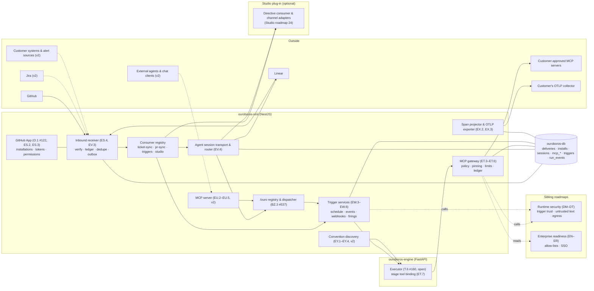
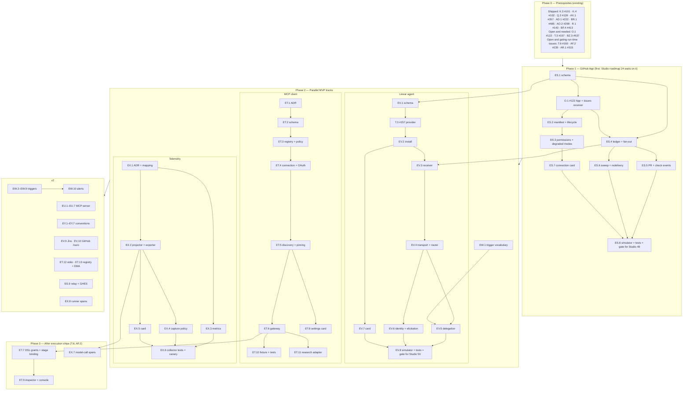

# Roadmap — Protocols & Surfaces

## Description

> Open protocols and agent surfaces: Ouroboros has no MCP support, takes work only from GitHub through OAuth and polling, and exports no standard telemetry. Add an MCP client so workflow stages can call customer-approved MCP servers under an allow-list, an MCP server exposing runs, gates, evidence and the inbox to external agents and chat clients, webhook-first intake through the GitHub App, Ouroboros as an assignable agent in Linear and Jira sharing the Studio's channel adapter, event and schedule triggers authored in the workflow builder, OpenTelemetry export for runs, and reading of AGENTS.md and skills alongside existing rule imports.

**Status of this document:** a plan. Nothing in it is filed on GitHub and nothing in it is
built, except where a row says *Done* or *shipped* and names the closed issue. It answers
candidate **P2-9** of the competitor gap analysis of 2026-10-10
(`ouroboros-studio/reports/Ouroboros competitor gap analysis.md`).

**Three facts frame everything below.**

1. **No autonomous run has executed in Ouroboros.** Workflow execution (T.6 #160), live model
   invocation (AF.2 #235) and guardrail enforcement (AR.1 #315) are open. Anything here that
   happens *during a run* — a stage calling an MCP tool, a model-call span — is specified
   against that executor and cannot be accepted before it exists. Each epic says which of its
   issues are provable today.
2. **Some of what the description asks for is already filed or shipped.** The GitHub App is
   O.1 (#122, open). The Linear and Jira providers are T.3 (#157) and T.2 (#156), open.
   AGENTS.md is already read once, at the repository root, by the shipped rule import (BF.4
   #413, closed). This roadmap promotes and amends those; it adds issues only for what is not filed.
3. **The Studio plug-in's roadmap 24 depends on this one.** It directs the Studio from GitHub
   through *the Ouroboros GitHub App* and from Linear as *an installed agent*, and it specifies
   amendments to O.1 and T.3 that have to be implemented in `ouroboros-rest`. Those
   implementations are owned here (Epics ES and EV). See *How this roadmap fits Studio roadmap 24*.

## Context & Existing Work (duplicate-avoidance survey)

Surveyed 2026-10-10 against `NobuData/ouroboros` (issues up to #1250, open and closed), the
roadmaps under `docs/`, `docs/TICKET_SOURCES.md`, `docs/WEBHOOKS.md`, `docs/WORKFLOW_DSL.md`,
`docs/SECURITY_MODEL.md`, the source tree of `ouroboros-rest`, and
`ouroboros-studio/docs/roadmaps/ROADMAP_24_TRACKER_DIRECTIVES.md` (filed there as #422–#515).
All GitHub access was read-only.

**Search terms and what they returned** (`gh issue list --search "<term> in:title,body" --state all`):

| Term | Result |
|---|---|
| `MCP` | **None.** The only mention in the repository is one line in `docs/mockups/MARKET-ANALYSIS.md` under "noted but deliberately not mocked". |
| `OpenTelemetry`, `otel`, `prometheus` | **None.** `tracing` matches one unrelated UI issue (#569). No OpenTelemetry package is a dependency of any module. |
| `A2A`, `assignable agent`, `Sentry`, `prompt injection` | **None.** |
| `webhook` | O.1 (#122) inbound; outbound webhooks BR.3 (#487, done); provider issues #156–#158; ChatOps #531. |
| `GitHub App` | O.1 (#122), O.5 (#126), AZ.4 (#374), X.3 (#182); many unrelated matches on "GitHub". |
| `Linear`, `Jira` | T.2 (#156), T.3 (#157), T.4 (#158), AN.2 (#290), AN.3 (#291); the rest are closed issues that mention the trackers in passing. |
| `schedule`, `cron` | CO.4 (#638), CB.3 (#548), CB.5 (#550), CJ.1 (#598); shipped nightly jobs (#281, #510). No workflow trigger. |
| `trigger` | R.1 (#143, done): one event, `ticket_queued`. Nothing else is a workflow trigger. |
| `AGENTS.md`, `cursorrules`, `copilot-instructions`, `import CLAUDE.md` | BF.4 (#413, done), BG.1 (#417, done). |
| `skills` | The Knowledge epics (done), BH.3 (#425, open), Marketplace issues (open, deferred). |
| `Teams`, `PagerDuty` | CB.2 (#547), BT.3 (#499). |
| `IDE`, `open in editor` | AR.2 (#316). |
| `service account`, `API token` | BR.1 (#485, done) — service accounts with scoped tokens exist. |
| `allow-list`, `egress`, `untrusted` | Scattered (security baseline #38, marketplace safety #774, sandboxed runner #570). No allow-list for tools or servers. |

**What the code shows** (checked in the working tree, not inferred from issues):

- `ouroboros-rest/src/modules/github/` is a token-based client: credentials, rate limiting,
  Octokit. There is no inbound GitHub endpoint and no App authentication.
- `WebhookCapableProvider.webhookHandler(payload, signature)` exists in the ticket-source SPI
  and is implemented only by test fixtures. `TICKET_SOURCES.md` § 7 requires each provider to
  verify its own signature and return canonical tickets.
- `ouroboros-rest/src/modules/knowledge-import/` implements the rule import, and its golden
  file includes an `AGENTS.md` case.
- `@nestjs/schedule` is a dependency and `modules/scheduling/` holds a cadence helper. There
  is no general job queue.
- `POST /internal/llm/invoke` answers `501` naming AF.2 (`SECURITY_MODEL.md` § 4.2).

**What the gap analysis's capability matrix records for the main application** (its rows,
restated): intake beyond GitHub — GitHub polling shipped, Slack planned (0 of 15 built), Jira,
Linear, GitLab and Teams planned v2; event, schedule and alert-triggered automations —
absent ("no webhooks; polling"); MCP client or server — absent; least-privilege GitHub App —
planned v2 (#122, #374) while the marketing site already claims it; distribution inside other
tools — Linear or Jira agent an idea only. Seven of the eight competitors in that matrix are
marked as supporting MCP.

**Dispositions.** Epics ES, EV, EW and EY each carry a table, *Existing issues promoted or
amended by this roadmap*; ET, EU and EX have no filed predecessor and say so. In summary:

| Existing work | Disposition |
|---|---|
| O.1 (#122) GitHub App & webhook ingestion | **Promoted to MVP, amended** (Epic ES) |
| T.3 (#157) Linear provider | **Promoted to MVP, amended** (Epic EV) |
| BZ.3 (#537) `/ouro` grammar & dispatcher | **Depended on, amended** — the one action registry for Slack, the console, trackers (EV) and MCP (EU) |
| BY.3 (#533) identity links | **Amended** — one link store for every surface (EV.1) |
| R.1 (#143, done) trigger evaluation | **Extended by EW.1** |
| BF.4 (#413, done) rule import; BF.5 (#414, done) context assembly | **Extended by EY** |
| T.2 (#156), AN.2 (#290), O.5 (#126), AZ.4 (#374), X.3 (#182), BH.3 (#425), CO.4 (#638) | **Unblocked or lightly amended; stay `v2`** |
| CB.2 (#547) Teams, BT.3 (#499) connectors, AR.2 (#316) IDE take-over | **Unchanged; "later" items of the description that are already filed** |
| The other ChatOps issues (#531–#550) | **Not changed.** Slack remains ChatOps's. The gap analysis recommends that roadmap 19's intake and answering slice stop being treated as cuttable; this roadmap adds a second reason, since EV.5 and EU.5 both call BZ.3. |

### How this roadmap fits Studio roadmap 24

One agent identity per tracker serves both products. The line between the two documents:

| Concern | Owner | Where |
|---|---|---|
| The GitHub App: registration, installation, permissions, events, installation tokens | **This roadmap** | O.1 (#122), ES.2, ES.3 |
| Verifying GitHub and Linear signatures; deduplicating deliveries | **This roadmap** | ES.4, EV.3 |
| Fan-out of verified deliveries to in-process consumers | **This roadmap** | ES.4 (the amendment Studio 49.1 specifies) |
| Linear OAuth install with `actor=app`, token custody, the app's user id | **This roadmap** | EV.2 (the amendment Studio 50.1 specifies) |
| Linear webhook receiver and fan-out | **This roadmap** | EV.3 (the amendment Studio 50.2 specifies) |
| Writing agent activities; the first activity inside ten seconds; deciding which product owns a session | **This roadmap** | EV.4 |
| Trigger predicate vocabulary (provenance conditions) | **This roadmap** | EW.1 (the amendment Studio 53.4 specifies) |
| Identity links for GitHub and Linear users | **Shared store here**, used by both | EV.1 (Studio 47.4, 48.3 become users of it; decision PS11) |
| Tracker simulators | **Built here, exported** | ES.8, EV.8 (Studio 47.9 builds on them; decision PS14) |
| The Studio's consumer registration, capability snapshot use and degraded modes | Studio roadmap 24 | 49.1 |
| `DirectiveChannel` SPI, grammar, action registry, dispatcher, replies, policy | Studio roadmap 24 | Epic 47 |
| `/studio` actions, build fixes, the OIDC Action, the Directives UI | Studio roadmap 24 | Epics 49–54 |
| What Ouroboros itself does when asked (`queue`, `answer`, `pause`, …) | Ouroboros ChatOps | BZ.3 (#537), surfaced in trackers by EV.5 |

Two amendments to the Studio's document follow from this and are recorded for
`update-roadmap` there; that file is not edited by this one. (1) Its Linear adapter (Epic 50)
should write through EV.4's transport instead of holding a Linear client, and should not emit
the first activity itself. (2) Its statement that no dependency on ouroboros#122 is recorded
should be corrected, as the gap analysis also asks. The same analysis moves the Studio's
hand-off to other coding agents (its 55.5) to a separate Studio roadmap; that is outside this document.

### Sibling roadmaps being written in parallel

| Document | Epics | What this roadmap takes from it |
|---|---|---|
| `ROADMAP_AGENT_RUNTIME_SECURITY.md` (gap analysis P0-2) | DM–DT | **MCP calls and triggers run under its controls.** Trigger trust (author permission, untrusted-author policy), stripping of hidden content from untrusted text, credential isolation, egress policy, the destructive-action gate, signed commits. ET.5, ET.6, ET.12, EV.6, EW.4, EW.10 and EY.3 call those controls and do not reimplement them. Where one is needed before it exists, the issue states the strictest fixed rule it applies meanwhile. |
| `ROADMAP_ENTERPRISE_READINESS.md` (gap analysis P1-6) | EN–ER | **Allow-lists live there.** Model, provider, repository and MCP allow and deny lists in the policy document; SSO. ET.3 provides the single decision function those lists plug into and works with workspace-level approval until they land. |

`ROADMAP_ENTERPRISE_READINESS.md` appeared while this document was being finished. It reserves
the MCP list in the policy document as **EO.6** (*MCP server access list*, rule `mcp_access`,
`v2`, blocked on this roadmap's MCP client); ET.3's decision function is the seam EO.6 plugs
into, and until EO.6 lands workspace-level approval is the whole allow-list. Nothing else in
that file was reconciled with this one. `ROADMAP_AGENT_RUNTIME_SECURITY.md` did not exist yet,
so references to "DM–DT" are to epics, not issues, and must be replaced with issue refs once
that roadmap is final.

## Standards Status (researched 2026-10-10)

Fetched from primary sources on 2026-10-10. Pages on modelcontextprotocol.io and
agentskills.io were read as raw text; the others passed through a summarising fetch tool, so
quoted wording should be re-checked before it is repeated outside this document. Most pages
carry no revision date. A second fact sheet prepared the same day
(`research_notes/…/mcp_plugins_agent_assignment_factsheet.md`) agrees on every MCP, Linear,
AGENTS.md and Agent Skills point below.

| Standard | State found | Consequence for this roadmap | Source |
|---|---|---|---|
| **MCP specification** | Current revision **2026-07-28**; previous 2025-11-25; the draft changelog is empty. 2026-07-28 is a breaking, **stateless** redesign: the `initialize` handshake and `Mcp-Session-Id` are removed, servers must implement `server/discover`, POSTs carry `MCP-Protocol-Version`, `Mcp-Method`, `Mcp-Name`. | Speak 2026-07-28 with fallback to 2025-11-25 (ET.1). The server is stateless by design, which suits a horizontally scaled REST service (EU.2). | [versioning][mcp-ver]; [changelog][mcp-changelog] |
| MCP transports | stdio and Streamable HTTP. The old HTTP+SSE transport is formally deprecated. Roots, Sampling, Logging and Dynamic Client Registration are deprecated in 2026-07-28, removable in the first revision on or after 2027-07-28. | Never speak HTTP+SSE; do not build on the deprecated features. | [transports][mcp-transports]; [deprecated][mcp-depr] |
| MCP authorization | Optional, OAuth 2.1 based. The server is a resource server and **must** publish Protected Resource Metadata (RFC 9728); clients **must** send Resource Indicators (RFC 8707); Client ID Metadata Documents are preferred; `iss` validation (RFC 9207) is new. An Enterprise-Managed Authorization extension exists. | ET.4 (client) and EU.3 (server). Enterprise-managed authorisation is v2 (ET.13). | [authorization][mcp-auth]; [extension][mcp-ema] |
| MCP Registry | "Currently in preview. Breaking changes or data resets may occur before general availability." Metadata only; no private servers; others may implement its API. | A suggestion source at most, and v2 (ET.13). | [registry][mcp-registry] |
| MCP features | Elicitation (form and URL modes); tasks moved to an extension; structured tool output; tool annotations that clients "MUST consider … untrusted unless they come from trusted servers". | The approver's judgement, not the annotation, decides side effects (ET.5). | [tools][mcp-tools]; [elicitation][mcp-elicit]; [tasks][mcp-tasks] |
| MCP security guidance | The specification's best-practices page covers confused deputy, token passthrough ("MUST NOT accept any tokens that were not explicitly issued for the MCP server"), SSRF in discovery, state-handle hijacking and local server compromise. **OWASP MCP Top 10 is in beta.** OWASP Top 10 for Agentic Applications for 2026 was published 9 December 2025. | ET.10's coverage table cites these. | [best practices][mcp-sec]; [OWASP MCP][owasp-mcp]; [OWASP agentic][owasp-agentic] |
| **Linear agents** | **Developer Preview**: "may change before general availability." Install with `actor=app`; scopes `app:assignable`, `app:mentionable`; delegation sets `delegate`, not `assignee`; `AgentSessionEvent` webhooks; answer within 5 s, first activity within 10 s. | Built behind a transport with a drift canary (EV.4, EV.8). | [agents][lin-agents]; [interaction][lin-interaction] |
| **Jira agents** | Announced as open beta 25 February 2026; an agent "shows up as an assignee"; "agents built by third parties" are assignable; Copilot's agent is the named partner. Connect is being retired. | The third-party path is **unverified**, so Jira starts with an investigation (EV.9). | [blog][atl-agents]; [support][atl-collab]; [Connect][atl-connect] |
| **OpenTelemetry GenAI conventions** | **Development**, none stable. Moved out of the main conventions in v1.42.0 (12 June 2026) to `semantic-conventions-genai`, which has no release and no schema URL. `gen_ai.provider.name` is required; `gen_ai.system` is gone from current pages. MCP conventions exist, also Development. | Own a stable `ouroboros.*` namespace; emit GenAI names from one pinned table (EX.1). | [v1.42.0][otel-142]; [genai repo][otel-genai] |
| **AGENTS.md** | Plain Markdown, no required fields, nearest file wins, no versioning; stewarded by the Agentic AI Foundation under the Linux Foundation. | Discovery at any depth with nearest-wins precedence (EY.1, EY.3). | [agents.md][agents-md] |
| **Agent Skills** | An open format originally from Anthropic; `SKILL.md` with required `name` and `description`; optional `license`, `compatibility`, `metadata`, experimental `allowed-tools`; `scripts/`, `references/`, `assets/`. No governing body or version is shown. | Import maps onto existing skills; scripts are never run by the control plane (EY.2). | [specification][skills-spec]; [clients][skills-clients] |
| **A2A** | Latest released version 1.0.0; under the Linux Foundation; a banner says it joined the Agentic AI Foundation (post dated 27 August 2026); IBM's ACP merged into it in August 2025. | **Not built** (decision PS16). No product in the gap analysis cites it as a buying criterion. | [specification][a2a-spec]; [ACP merger][a2a-acp] |
| GitHub webhooks | "GitHub does not automatically redeliver failed deliveries"; respond within 10 seconds; a redelivery keeps its `X-GitHub-Delivery`; GitHub Apps are preferred to OAuth apps. Assigning an issue to an agent by API is documented for Copilot's own agent only. | ES.4, ES.6; EV.10's assignment half is conditional. | [failed deliveries][gh-failed]; [best practices][gh-best]; [Apps vs OAuth][gh-apps]; [Copilot API][gh-copilot-api] |

**Could not verify** (stated here once; repeated where an issue depends on it):

- Whether the official MCP TypeScript SDK supports revision 2026-07-28 (ET.1 must check).
- A primary-source definition of "rug pull" for a changed tool definition; the control (ET.5) does not depend on the name.
- The item names of the OWASP Top 10 for Agentic Applications (secondary summaries only).
- Any 2026 change to Linear's agent API, or a general-availability date.
- For Jira: general availability, how a non-partner third party registers an assignable agent, whether an app user can be an assignee through REST, and the Connect end-of-support date (the official blog says Q4 2026; a community post says 31 January 2027).
- `OTEL_SEMCONV_STABILITY_OPT_IN` for GenAI in the new repository; any release or schema URL there.
- Whether a GitHub App other than Copilot's can be an issue assignee (the documentation is silent).
- Whether BetterAuth can act as an OAuth authorisation server for EU.3 (not researched).
- The GitHub App manifest flow and the webhook event list are cited from GitHub's documentation by URL but were not re-fetched for this roadmap.
- Linear's webhook signing details are taken from Studio roadmap 24's research, not re-fetched.

## Infrastructure Options (researched — pick before filing)

### 1. How a self-hosted deployment gets a GitHub App

| Option | What it is | Trade-offs |
|---|---|---|
| **A — One App per deployment, registered by manifest** ⭐ recommended | The administrator clicks once; GitHub returns the App's id, key and secret to the deployment | No vendor-held credential; each deployment has its own webhook URL and rate limits. Each customer sees an App named by them. Needs the deployment's URL to be known at registration. |
| B — One vendor-owned App for all deployments | Customers install *the* Ouroboros App | One identity and a Marketplace listing, but the vendor would hold a key that reaches every customer's repositories and would have to relay webhooks. Contradicts the self-hosted position. |
| C — Stay on OAuth and a token | Today's behaviour | No check runs, no installation tokens, polling only. Kept as the fallback. |

### 2. Processing inbound deliveries

| Option | Trade-offs |
|---|---|
| **A — Ledger and outbox in PostgreSQL, drained by a scheduled worker** ⭐ recommended | No new infrastructure; transactional with the upsert; the same pattern as the shipped outbound webhooks. Throughput is bounded by the database, which is ample for webhook volumes. |
| B — A job-queue library on PostgreSQL or Redis | More features (priorities, rate limits) and a new dependency to operate; reconsider with the execution engine ADR (T.1 #155), which may bring a queue anyway. |
| C — Handle inline in the request | Simplest; loses deliveries on failure and cannot fan out safely. Rejected. |

### 3. Where the MCP client runs

| Option | Trade-offs |
|---|---|
| **A — In `ouroboros-rest`, reached by the engine through an internal call** ⭐ recommended | Credentials never reach a worker; one place for policy, pinning and the ledger; mirrors proxied model invocation. Adds a hop per call. |
| B — In `ouroboros-engine`, beside the model loop | Lowest latency and the usual shape for an agent SDK; the worker would hold MCP tokens, against `SECURITY_MODEL.md` § 4. |
| C — In the runner, per job | Right for stdio servers (ET.12, v2) and wrong for remote ones, which would then need credentials on farm machines. |

### 4. Authorisation for the MCP server

| Option | Trade-offs |
|---|---|
| A — BetterAuth as the authorisation server | One identity system; depends on a capability this roadmap did not verify. |
| B — The customer's identity provider | Fits enterprises; waits on SSO (E.1 #722). |
| C — Service-account bearer tokens only | Works today for unattended clients (#485); not the OAuth flow interactive MCP clients expect. |
| **Decide in EU.1** | The epic is v2, so the choice can wait for SSO's shape. |

### 5. Sharing one tracker agent between two products

| Option | Trade-offs |
|---|---|
| **A — Ouroboros owns identity, receiver and a session transport; each product keeps its own action registry; a router assigns each session one owner** ⭐ recommended | The Studio stays an optional plug-in; neither registry depends on the other; one voice per session. Needs a routing rule (PS10) and a small change to the Studio's Linear adapter. |
| B — Move the Studio's `DirectiveChannel` SPI into `ouroboros-rest` and make `/ouro` one of its users | One channel abstraction for everything, including Slack. A large refactor of two filed roadmaps (24 and 19) before either has shipped. Worth revisiting once both exist. |
| C — The Studio owns the agent; Ouroboros registers `queue` into the Studio's registry | Makes a core feature depend on an optional plug-in. Rejected. |
| D — Two agents, one per product | What the description rules out. |

### 6. Scheduling

| Option | Trade-offs |
|---|---|
| **A — `@nestjs/schedule` tick with database locks and a `schedule_state` table** ⭐ recommended | Already a dependency; survives restarts because state is in the database; enough for minute-granularity cron. |
| B — The execution engine's own scheduler | If T.1 (#155) chooses a durable-execution engine, schedules may belong there. EW.3 is written so its state table can be driven by either. |

### 7. Telemetry

| Option | Trade-offs |
|---|---|
| **A — Project spans from the run event store after the fact** ⭐ recommended | Works before an executor exists; idempotent; backfill is free; export can never slow a run. Spans arrive seconds late. |
| B — Instrument services in process | Standard practice and real-time; exports nothing useful until execution ships and loses history. Added for model calls in v2 (EX.7). |
| C — A proprietary export format | No reason to. |

### 8. Repository conventions

| Option | Trade-offs |
|---|---|
| A — Import only (shipped) | A person reviews everything; copies go stale. |
| B — Read live at run time | Always current; repository text shapes runs without review, so the ref it is read from matters. |
| **C — Both, chosen per workspace, default import-only** ⭐ recommended | Nothing changes for existing workspaces; teams that keep AGENTS.md current can opt in. |

## Decisions proposed by this roadmap (validate before issue creation)

| # | Decision | Rationale |
|---|----------|-----------|
| PS1 | **Epics ES–EY; new label `protocols`; milestones `Protocols & Surfaces MVP` / `Protocols & Surfaces v2`.** Existing area labels are kept beside it. | Filing conventions; one label finds the whole roadmap. |
| PS2 | **Epic ES is first in the work order and is pulled ahead of this roadmap's P2 priority.** | Studio roadmap 24's MVP cannot start without the App, the receiver and the fan-out. |
| PS3 | **O.1 (#122) and T.3 (#157) are promoted from `v2` to MVP and amended, not replaced.** New issues cover only what they do not. | Avoids duplicate issues for filed work. **Needs the owner's agreement**, since it changes two filed issues' tier. |
| PS4 | **Each deployment registers its own GitHub App, by manifest** (option 1-A). The permission and event set is one generated table (ES.3) sized for both products, reduced when the Studio is disabled. | Self-hosted; least privilege; one consent. |
| PS5 | **The MCP client lives in `ouroboros-rest`; workers hold no MCP credential** (option 3-A). stdio servers run only in farm jobs, v2. | Matches the shipped credential model. |
| PS6 | **Default deny, and approval is of a tool definition, not a tool name.** A changed definition is unapproved. The approver's judgement of side effect overrides the server's annotations. | The specification says annotations are untrusted; the description says "customer-approved". |
| PS7 | **The first consumer of the MCP client is Research** (ET.11), because it is the only shipped subsystem that calls tools. Stage calls (ET.7) wait on execution. | Gives the MVP a working path that does not depend on T.6. **Validate:** the alternative is to hold all of ET until execution ships. |
| PS8 | **The MCP server (Epic EU) is v2**, and when built it exposes actions only through the `/ouro` registry. | The description's own split; one definition per action. |
| PS9 | **One agent identity per tracker. Ouroboros owns identity, credential, receiver and session transport; the Studio owns directives** (option 5-A). | Fits the Studio being optional. Requires an amendment to Studio roadmap 24's Epic 50. |
| PS10 | **Session ownership rule:** `/ouro` → Ouroboros; `/studio` → Studio; bare delegation → Ouroboros `queue`; free text → the Studio's resolver if enabled, else help. The router, not either product, sends the first activity. | Exactly one owner; the ten-second deadline never depends on a consumer. **Validate** the bare-delegation default with the Studio's owner. |
| PS11 | **One identity-link store for chat, GitHub and tracker users** (`external_identity_links`), replacing the chat-only shape of BY.3 before it is built. | Three roadmaps (19, 24, this) each need the same mapping. **Validate:** BY.3 is filed and would change. |
| PS12 | **A trigger without a ticket produces a work item in one of two modes**, tracker ticket or internal, chosen per trigger. | Keeps one queue and one pin path; lets teams avoid tracker noise. |
| PS13 | **Tiering beyond the description's list:** EW.1 (trigger vocabulary) is MVP because Studio 53.4 and EV.5 need it; the rest of EW and all of EY are v2. | The description's MVP names four things; these are the items it leaves unplaced. **Validate:** EY.1–EY.3 are small and could be pulled forward. |
| PS14 | **GitHub and Linear simulators are built in `ouroboros-rest` and exported to the Studio.** | Two simulators of one API drift apart. |
| PS15 | **Telemetry: a stable `ouroboros.*` namespace owned by this project, GenAI names emitted beside it from one pinned table, spans projected from the run event store** (option 7-A). Content capture is off by default. | The GenAI conventions are in Development with no release. |
| PS16 | **A2A is not built.** It is recorded as watched. | Not a buying criterion in the gap analysis; the MCP server covers the near-term use. |
| PS17 | **Jira begins with an investigation**, not an adapter. | The third-party registration path could not be verified. |
| PS18 | **No UI issue here has a mockup.** Each UI issue starts with a design pass in the settings card anatomy of mockup 17 (or mockup 04 for EW.7, mockup 14 for EY.5) and is reviewed before implementation. | The mockup set has no screen for any of these surfaces. |

## Architecture Overview



## MVP Definition

The MVP is **four things the description names, provable on the build that exists**: the
GitHub App with webhook-first intake, an MCP client under an allow-list, Linear as a ticket
source with delegation, and telemetry export. It is done when, against the compose stack with
the ES.8 and EV.8 simulators and a fixture collector:

1. **The GitHub App is real** (O.1 #122, ES.1–ES.8). An administrator registers the App from
   Settings by manifest and installs it; an issue opened on GitHub appears in under five
   seconds; pull request, review and check events update the PR read model without polling;
   every delivery is verified, recorded once and handed to each registered consumer at least
   once; a dropped delivery is recovered by redelivery or the sweep; an installation that has
   not accepted a permission runs in a stated degraded mode; the token path still works when
   no App is installed.
2. **The fan-out carries the Studio.** With `OURO_STUDIO_ENABLED` set, a fixture Studio
   consumer receives `issue_comment`, `check_run` and `workflow_run` deliveries and the
   capability snapshot, without containing any verification code. This is the condition Studio
   roadmap 24's Epic 49 waits on.
3. **An approved MCP server can be called, and nothing else can** (ET.1–ET.6, ET.8, ET.10,
   ET.11). An administrator registers a server, authorises it, reviews and approves individual
   tools; an investigation calls an approved read tool through the gateway and cites the
   result; a changed tool definition stops calls until re-approved; every call and every
   refusal is in the ledger; the hostile fixture server cannot get past any control.
   **Stage calls (ET.7, ET.9) are part of the MVP's scope but are accepted only once T.6 (#160)
   and AF.2 (#235) ship**; until then the inspector stores grants and says they are not yet
   enforced, in the document's own wording for `permissions`.
4. **Linear is a ticket source and an agent** (T.3 #157, EV.1–EV.8). Tickets sync through the
   provider and its webhook; the application installs with `actor=app` and appears as
   assignable and mentionable; delegating an issue produces a first activity inside ten
   seconds, a sized and pinned queue item with delegation provenance, and progress in the
   session; the delegator's Ouroboros capability decides what happens; a blocking decision can
   be answered in the session; each session has exactly one owning product. On a build without
   execution, the session says the work is queued and that execution is not available, and
   stops.
5. **Provenance selects a workflow** (EW.1). A ticket queued by delegation, by a Studio
   directive or by a build failure can be claimed by a workflow whose trigger names that
   origin, and the dry-run explanation shows why.
6. **Runs export as traces and metrics** (EX.1–EX.6). A run in the event store exports to an
   OTLP collector as one trace matching its stage history, with stable `ouroboros.*`
   attributes and pinned GenAI names; metrics equal their Insights counterparts; content is
   not exported unless a policy says so; a collector outage loses nothing; simulated runs are
   marked as simulated.
7. Integration suites cover signatures and replay, fan-out semantics, permission degradation,
   MCP default deny and drift, the OAuth client, router rules and deadlines, identity and
   capability, export parity and isolation throughout.

**Explicitly later (milestone `Protocols & Surfaces v2`):** the MCP server (all of EU); the
Jira agent (EV.9, after its investigation); a GitHub comment surface for `/ouro` (EV.10);
schedule, event and webhook triggers (EW.2–EW.9) and **alert triggers** (EW.10); stdio MCP
servers, registry browsing and enterprise-managed authorisation (ET.12, ET.13); model-call and
runner spans (EX.7, EX.8); live reading of AGENTS.md and Agent Skills (all of EY); webhook
relay and GitHub Enterprise Server (ES.9). Already filed and also later: **Teams** (CB.2 #547,
BT.3 #499) and **editor take-over links** (AR.2 #316). **Not planned:** A2A (PS16).

## Epics, Labels & Milestones

Each epic would be a parent tracking issue on GitHub with its issues filed as sub-issues
(GitHub Relationships). **None is filed.**

| Epic | GitHub | Status | Name | Goal | Modules | Milestone |
|------|:------:|:------:|------|------|---------|-----------|
| ES | — | ⚪ Not filed | GitHub App & Webhook-First Intake | App per deployment, verified deliveries, fan-out, PR and check events, reconciliation | ouroboros-rest, ouroboros-db, ouroboros-ui | Protocols & Surfaces MVP |
| ET | — | ⚪ Not filed | MCP Client | Approved servers and tools, OAuth client, gateway, stage grants, research adapter | ouroboros-rest, ouroboros-engine, ouroboros-db, ouroboros-ui, ouroboros-runner | Protocols & Surfaces MVP |
| EU | — | ⚪ Not filed | MCP Server | Runs, gates, evidence and inbox to external agents; actions through `/ouro` | ouroboros-rest, ouroboros-ui | Protocols & Surfaces v2 |
| EV | — | ⚪ Not filed | Assignable Agent in Linear & Jira | Linear install, receiver, session transport and router, delegation; Jira later | ouroboros-rest, ouroboros-db, ouroboros-ui | Protocols & Surfaces MVP |
| EW | — | ⚪ Not filed | Event & Schedule Triggers | Trigger vocabulary; schedules, events, webhooks, alerts; authoring in the builder | ouroboros-rest, ouroboros-engine, ouroboros-db, ouroboros-ui | Protocols & Surfaces v2 (EW.1: MVP) |
| EX | — | ⚪ Not filed | Telemetry Export | OTLP traces and metrics for runs, stable own namespace, capture policy | ouroboros-rest, ouroboros-engine, ouroboros-ui, ouroboros-runner | Protocols & Surfaces MVP |
| EY | — | ⚪ Not filed | Repository Conventions | Nested AGENTS.md, Agent Skills import, live reading, re-sync | ouroboros-rest, ouroboros-ui | Protocols & Surfaces v2 |

Issue naming: `<project>: [<epic>.<issue>] <title>`, with `ouroboros` as the project for
repository-level documents (ADRs). Labels: the existing set (`mvp`, `v2`, `rest`, `db`,
`engine`, `ui`, `ci`, `infra`, `design`, `documentation`, `intake`, `sources`, `workflow`,
`code-view`, `runs`, `pr`, `inbox`, `settings`, `chatops`, `knowledge`, `research`,
`insights`, `routing`, `build-farm`, `auth`) **plus new `protocols`** (decision PS1).
Milestones **`Protocols & Surfaces MVP`** and **`Protocols & Surfaces v2`** to be created at
filing. Complexity chips: **XS · S · M · L**. Status marks: ⚪ Not filed · 🟡 Open · 🟢 Done.
Per `AGENTS.md`, a closed issue is marked ✅ beside its number once filed and closed.
---

## Epic ES — GitHub App & Webhook-First Intake (`ouroboros-rest` + `ouroboros-db` + `ouroboros-ui`)

First in the work order. Studio roadmap 24's MVP (its Epics 49 and 52) cannot start until the
App, its receiver and the fan-out exist; decision PS2.

### Existing issues promoted or amended by this roadmap

| Existing | State | Disposition | What changes |
|---|:---:|---|---|
| O.1 (#122) — GitHub App & webhook ingestion | 🟡 Open, `v2`, no milestone | **Promoted to MVP and amended** | Stays the issue that delivers the App install and callback, the signature-verified receiver for `issues`, installation tokens and the PAT fallback. Amendment: the receiver records every delivery in ES.1's ledger before acting on it; the permission and event set becomes ES.3's; registration is by manifest (ES.2); polling is demoted by ES.6, not by O.1 itself. Label change `v2` → `mvp` and a milestone are proposed for the filing pass, not made here. |
| O.5 (#126) — GitHub write-backs | 🟡 Open, `v2` | **Unchanged, unblocked** | Its "App permissions from O.1" line now reads ES.3. Stays `v2`. |
| AZ.4 (#374) — App merge identity | 🟡 Open, `v2` | **Unchanged, unblocked** | Consumes installation tokens. Commit signing by the App identity is `ROADMAP_AGENT_RUNTIME_SECURITY.md`'s (epics DM–DT), not this roadmap's. |
| X.3 (#182) — Git-backed workflow-as-code sync | 🟡 Open, `v2` | **Unchanged, unblocked** | Gains a `push` delivery through ES.4 so an inbound merge is seen without polling; noted as an amendment. |
| K.4 (#102, closed) — Backlog sync service | 🟢 Done | **Consumed** | Its cursor path becomes the reconciliation sweep (ES.6). No change to shipped behaviour while no App is installed. |
| AX.1 (#357, closed) — SPI PR capability | 🟢 Done | **Consumed** | The PR sync keeps its upsert; ES.5 feeds it from deliveries. |
| #1250 — no screen sets the workspace backlog GitHub token | 🟡 Open (bug) | **Not absorbed** | The PAT path remains the fallback (O.1), so this bug still needs its own fix; ES.7 must not hide it. |
| Studio 49.1 (ouroboros-studio#451) — App extension & event fan-out consumer | 🟡 Open | **Counterpart** | That issue specifies an amendment to O.1 and builds the Studio's consumer. ES.3 and ES.4 are the `ouroboros-rest` half it asks for. |

### New issues

| Ref | GitHub | Status | Title | Summary | Labels | Parallel | MVP | Complexity | Affected Modules |
|-----|:------:|:------:|-------|---------|--------|:--------:|:---:|:----------:|------------------|
| ES.1 | — | ⚪ Not filed | ouroboros-db: [ES.1] App installations, inbound deliveries & consumer outbox schema | Installations with accepted permissions, a delivery ledger keyed by delivery id, per-consumer outbox rows | mvp, protocols, intake, db | N (first) | Y | M | ouroboros-db |
| ES.2 | — | ⚪ Not filed | ouroboros-rest: [ES.2] App registration by manifest & installation lifecycle | Each deployment registers its own App; key and webhook secret sealed; installation events tracked | mvp, protocols, intake, rest | N (after ES.1, #122) | Y | L | ouroboros-rest, ouroboros-docs |
| ES.3 | — | ⚪ Not filed | ouroboros-rest: [ES.3] Permission set, event subscriptions & degraded modes | The permissions and events both products need, a capability snapshot, and honest behaviour when one is missing | mvp, protocols, intake, rest | N (after ES.2) | Y | M | ouroboros-rest, ouroboros-docs |
| ES.4 | — | ⚪ Not filed | ouroboros-rest: [ES.4] Delivery ledger, dedupe & in-process fan-out | Verify, record, dedupe, then hand each delivery to registered consumers at least once | mvp, protocols, intake, rest | N (after ES.1, #122) | Y | L | ouroboros-rest |
| ES.5 | — | ⚪ Not filed | ouroboros-rest: [ES.5] Pull request, review & check events replace PR polling | PR sync fed by `pull_request`, `pull_request_review`, `check_run`, `check_suite` deliveries | mvp, protocols, pr, rest | Y (after ES.4) | Y | M | ouroboros-rest, ouroboros-docs |
| ES.6 | — | ⚪ Not filed | ouroboros-rest: [ES.6] Reconciliation sweep & redelivery | Polling demoted to a sweep; failed deliveries re-requested from GitHub | mvp, protocols, intake, rest | Y (after ES.4) | Y | M | ouroboros-rest, ouroboros-docs |
| ES.7 | — | ⚪ Not filed | ouroboros-ui: [ES.7] GitHub App connection card, permission upgrade & delivery health | Register, install, see what was accepted, upgrade, and read delivery health | mvp, protocols, settings, ui, design | N (after ES.2, ES.3) | Y | M | ouroboros-ui, ouroboros-docs |
| ES.8 | — | ⚪ Not filed | ouroboros-rest: [ES.8] GitHub simulator & webhook intake integration tests | A signed-delivery simulator and the suite that proves ES.2–ES.6 | mvp, protocols, intake, rest, ci | N (after ES.2–ES.6) | Y | M | ouroboros-rest, .github |
| ES.9 | — | ⚪ Not filed | ouroboros-rest: [ES.9] Unreachable deployments & GitHub Enterprise Server | A relay option for deployments GitHub cannot reach, and a configurable host | v2, protocols, intake, rest, infra | Y | N | M | ouroboros-rest, ouroboros-docs |

### Issue ES.1 — ouroboros-db: [ES.1] App installations, inbound deliveries & consumer outbox schema

> **GitHub issue:** not filed · **Status:** ⚪ Not filed · **Parent epic:** ES (not filed)

- **Problem Statement:** O.1 (#122) describes a receiver but no storage for what it receives.
  Without a record of deliveries there is nothing to dedupe against, nothing to replay after
  a consumer fails, and nothing to show an administrator when deliveries stop.
- **Solution/Scope:** Migration: `github_apps` (one row per deployment registration: app id,
  slug, host, sealed private key and webhook secret through the vault, `registered_by`);
  `github_installations` (workspace FK, installation id, account, `repository_selection`,
  `permissions_accepted` jsonb, `events_accepted` jsonb, `suspended_at`, `status`);
  `inbound_deliveries` (provider `github|linear|jira|generic`, `delivery_id`, event name,
  action, installation or connection ref, `received_at`, `signature_ok`, body digest, a
  bounded and redacted payload, unique `(provider, delivery_id)`); `inbound_delivery_outbox`
  (delivery FK, `consumer` slug, `state` `pending|done|failed|dead`, attempts, `next_attempt_at`,
  last error). The ledger is provider-neutral on purpose: EV.2 (Linear) and EW.5 (generic
  webhook triggers) write to the same two tables. Retention class registered with BQ.3 (#482).
  Sources: Studio 49.1's "small outbox"; `docs/WEBHOOKS.md` for the outbound mirror of this shape.
- **Acceptance Criteria:**
  - A second insert of the same `(provider, delivery_id)` is rejected by the database.
  - No view or read model used by the API exposes the sealed key or secret (probe).
  - Outbox rows are per consumer, so one consumer's failure does not block another's row.
  - Payload storage is bounded and a stored body carries no credential-shaped strings (the
    shipped secrets ruleset is applied at write).
- **Parallelism/Dependencies:** Needs #19, AD.1 (#222). Blocks ES.2, ES.4, EV.2, EW.5.
- **Technical Stack:** PostgreSQL 17, Flyway.
- **Documentation:** None — internal-only change: tables; the card that shows them is ES.7's.
- **Epic:** ES

```
github_apps ─┬─ github_installations{workspace, permissions_accepted, events_accepted}
             │
inbound_deliveries{provider, delivery_id ◀ unique, event, signature_ok, digest}
             └─ inbound_delivery_outbox{consumer: ticket-sync | pr-sync | triggers | studio, state, attempts}
```

### Issue ES.2 — ouroboros-rest: [ES.2] App registration by manifest & installation lifecycle

> **GitHub issue:** not filed · **Status:** ⚪ Not filed · **Parent epic:** ES (not filed)

- **Problem Statement:** Ouroboros is self-hosted, so there is no single vendor-owned App to
  install: every deployment needs its own App, with its own webhook URL, key and secret.
  O.1 (#122) assumes an App exists and does not say how a deployment gets one.
- **Solution/Scope:** A registration flow using GitHub's **App manifest** exchange: the
  administrator starts from Settings, Ouroboros posts a manifest (name, the deployment's
  public URL, webhook URL, ES.3's permissions and events), GitHub redirects back with a
  temporary code, and the server exchanges it for the App id, private key and webhook secret,
  which go straight into the vault. A manual path (paste id, key, secret) for hosts where the
  manifest flow is unavailable. Installation lifecycle from `installation` and
  `installation_repositories` deliveries: created, deleted, suspended, unsuspended,
  repositories added or removed, each reflected in `github_installations` and audited. An
  installation is bound to a workspace through the existing org and repository enablement
  (#22), never by trusting an id in a callback alone. Installation tokens are minted per
  request scope, limited to the repositories and permissions the caller needs, and never
  stored. Source: [GitHub docs — registering a GitHub App from a manifest][gh-manifest];
  [GitHub docs — GitHub Apps vs OAuth apps][gh-apps].
- **Acceptance Criteria:**
  - A fresh deployment reaches *App registered and installed on one repository* from the UI
    without anyone copying a private key by hand.
  - The private key and webhook secret are never returned by any API after registration.
  - Uninstalling on GitHub marks the installation removed within one delivery and stops token
    minting; suspension does the same and is shown as suspended, not as an error.
  - A callback naming an installation the signed-in administrator cannot administer is refused.
  - With no App registered, every existing token-and-polling behaviour is unchanged.
- **Parallelism/Dependencies:** Needs ES.1, O.1 (#122), #22, AD.1 (#222). Blocks ES.3, ES.7.
- **Technical Stack:** NestJS, Octokit App authentication, the vault.
- **Documentation:** Administration: sources.mdx § GitHub App (register, install, manual path,
  what is stored); deploy/checklist.mdx (public webhook URL); new `OURO_*` variables through
  `.env.example` and `yarn gen:config-reference`.
- **Epic:** ES

```
Settings ─▶ manifest form ─▶ GitHub ─▶ redirect ?code ─▶ exchange ─▶ {app id, pem, secret} ─▶ vault
installation.created / deleted / suspend / new_permissions_accepted ─▶ github_installations ─▶ audit
```

### Issue ES.3 — ouroboros-rest: [ES.3] Permission set, event subscriptions & degraded modes

> **GitHub issue:** not filed · **Status:** ⚪ Not filed · **Parent epic:** ES (not filed)

- **Problem Statement:** O.1 names three permissions and one event. The Studio's roadmap 24
  asks for more of both (49.1), Ouroboros's own pull-request and trigger work needs others,
  and an installation that predates a permission change keeps working with the old set until
  an owner accepts the new one.
- **Solution/Scope:** One declared permission and event table, held in code and rendered into
  the manifest, the docs and ES.7. Proposed set (decision PS4): Contents read and write (loop
  branches), Issues read and write, Pull requests read and write, Checks read and write,
  Actions read and write (the Studio's re-run; read alone if the Studio is disabled), Metadata
  read; events `issues`, `issue_comment`, `pull_request`, `pull_request_review`, `check_run`,
  `check_suite`, `workflow_run`, `workflow_job`, `push`, `installation`,
  `installation_repositories`. Each permission is tagged with the feature that needs it. A
  **capability snapshot** per installation from `permissions_accepted`, exposed in process to
  consumers (the Studio's 49.1 reads it), and a **degraded mode** per missing permission that
  names the feature that is off. `installation` with `new_permissions_accepted` refreshes the
  snapshot. Least privilege: with `OURO_STUDIO_ENABLED` unset the manifest omits what only the
  Studio uses. Sources: Studio roadmap 24 § Infrastructure 1 and issue 49.1;
  [GitHub docs — webhook events and payloads][gh-events].
- **Acceptance Criteria:**
  - The manifest, the documentation table and the UI list are generated from the one table
    (a test fails when they differ).
  - An installation lacking Checks write reports *check-run buttons unavailable* and nothing
    throws; the Studio consumer receives the same snapshot.
  - Accepting new permissions on GitHub clears the degraded state without a restart.
  - No permission is requested that no shipped or enabled feature uses (asserted per flag).
- **Parallelism/Dependencies:** Needs ES.2. Blocks ES.5, ES.7; Studio 49.1.
- **Technical Stack:** NestJS; a typed permission registry.
- **Documentation:** Administration: sources.mdx § GitHub App permissions (the generated
  table, why each is asked for, what stops working without it).
- **Epic:** ES

```
permission registry ─▶ manifest · docs table · settings list
permissions_accepted ─▶ capability snapshot ─▶ ticket sync ✓ · PR sync ✓ · checks ✗ (degraded: no buttons)
```

### Issue ES.4 — ouroboros-rest: [ES.4] Delivery ledger, dedupe & in-process fan-out

> **GitHub issue:** not filed · **Status:** ⚪ Not filed · **Parent epic:** ES (not filed)

- **Problem Statement:** A webhook endpoint that does its work before answering loses
  deliveries when the work fails, and GitHub does not send a failed delivery again on its own.
  Several parts of the product, and the Studio plug-in, need the same delivery; each verifying
  and deduplicating for itself is how two of them come to disagree.
- **Solution/Scope:** The receiver does four things and returns: capture the raw body, verify
  `X-Hub-Signature-256` in constant time, insert the ledger row keyed by `X-GitHub-Delivery`
  (a duplicate returns 200 and does nothing), and write one outbox row per **registered
  consumer** whose filter matches the event. A worker drains the outbox with backoff and a
  dead state. An `InboundDeliveryConsumer` registry: `slug`, `provider`, `events`, `handle(delivery)`;
  first-party consumers are the ticket upsert (O.1), the PR sync (ES.5) and the trigger router
  (EW.4); the Studio registers one behind `OURO_STUDIO_ENABLED` (#919). A boundary lint rule
  keeps signature verification inside the receiver. Handlers are idempotent by contract and the
  conformance test replays every delivery twice. The same receiver core is reused for Linear
  (EV.2). Sources: Studio 49.1; [GitHub docs — validating webhook deliveries][gh-validate];
  [GitHub docs — handling failed deliveries][gh-failed].
- **Acceptance Criteria:**
  - An unsigned or mis-signed delivery is rejected, logged and never reaches a consumer.
  - The endpoint answers inside GitHub's delivery timeout with every consumer stalled.
  - A consumer that throws is retried and, after the cap, parked as dead with its error;
    other consumers of the same delivery are unaffected.
  - A delivery reaches each consumer exactly once in normal operation and at least once after
    a crash between ledger insert and handling.
  - No module outside the receiver imports the signature helper (lint).
- **Parallelism/Dependencies:** Needs ES.1, O.1 (#122). Blocks ES.5, ES.6, EV.2, EW.4; Studio 49.1.
- **Technical Stack:** NestJS raw-body middleware, PostgreSQL outbox, `@nestjs/schedule` worker.
- **Documentation:** None — internal-only change; delivery health is documented with ES.7.
- **Epic:** ES

```
GitHub ─▶ POST /api/v1/github/webhook
            raw body ─▶ verify HMAC ─▶ ledger (dedupe on delivery id) ─▶ outbox ×N ─▶ 200
outbox worker ─▶ ticket-sync │ pr-sync │ trigger-router │ studio (if enabled)   retry → dead
```

### Issue ES.5 — ouroboros-rest: [ES.5] Pull request, review & check events replace PR polling

> **GitHub issue:** not filed · **Status:** ⚪ Not filed · **Parent epic:** ES (not filed)

- **Problem Statement:** O.1 covers `issues` only. Pull requests, reviews and check results
  are still read by the PR sync on an interval, so the PR verification page and the merge gate
  lag behind GitHub by the poll period.
- **Solution/Scope:** A `pr-sync` consumer mapping `pull_request` (opened, synchronize, closed,
  reopened, edited), `pull_request_review` and `check_run` / `check_suite` (completed) deliveries
  onto the existing AX.1 (#357) upsert through the provider's PR capability, so a delivery and
  a poll write the same rows. Events for repositories that are not enabled are dropped before
  any work. `push` to the default branch is forwarded to the consumers that asked for it (X.3
  #182, EY.4). Fork-originated events carry a `from_fork` fact for the trigger router; this
  consumer never treats their content as instruction.
- **Acceptance Criteria:**
  - A check completing on GitHub is reflected in the PR read model in under five seconds.
  - A delivery and the sweep converge on identical rows (property test over recorded pairs).
  - A delivery for a repository that is not enabled changes nothing and is recorded as skipped.
  - With the App absent the interval sync behaves exactly as it does today.
- **Parallelism/Dependencies:** Needs ES.3, ES.4, AX.1 (#357). Parallel with ES.6.
- **Technical Stack:** NestJS; the GitHub provider's PR capability.
- **Documentation:** User Guide: pull-requests.mdx § How fresh this page is (deliveries versus
  the sweep); Administration: sources.mdx § GitHub App.
- **Epic:** ES

```
pull_request.synchronize ─┐
pull_request_review       ├─▶ pr-sync consumer ─▶ AX.1 upsert ◀─ reconciliation sweep (ES.6)
check_run.completed      ─┘
```

### Issue ES.6 — ouroboros-rest: [ES.6] Reconciliation sweep & redelivery

> **GitHub issue:** not filed · **Status:** ⚪ Not filed · **Parent epic:** ES (not filed)

- **Problem Statement:** Webhooks are lost: the deployment restarts, a proxy times out, a
  secret is rotated mid-flight. GitHub records the failure but does not retry. A product that
  trusts webhooks alone drifts silently from the tracker.
- **Solution/Scope:** Two mechanisms. **Redelivery:** a scheduled job lists the App's recent
  deliveries, finds those that failed or never arrived in the ledger, and asks GitHub to
  redeliver them; each attempt is recorded. **Sweep:** K.4's cursor sync and the PR sync run
  at a long interval while the App is healthy and at the original interval when it is not
  (no App, suspended, or deliveries silent beyond a threshold), with the mode shown in ES.7.
  A drift counter records every row the sweep had to correct, which is the measure of how
  much the webhook path is missing. Sources: [GitHub docs — handling failed deliveries][gh-failed];
  O.1's "polling demoted to a reconciliation sweep".
- **Acceptance Criteria:**
  - A delivery deliberately dropped by the simulator is recovered by redelivery, and when
    redelivery is unavailable by the sweep.
  - Rotating the webhook secret produces failed deliveries that are recovered after the
    rotation completes, with no duplicate upserts.
  - The sweep interval tightens automatically when deliveries go silent and relaxes when they
    resume; both transitions are audited.
  - API use by the sweep stays inside the installation's rate budget (the K.3 #101 limiter).
- **Parallelism/Dependencies:** Needs ES.4, K.4 (#102), K.3 (#101). Parallel with ES.5.
- **Technical Stack:** NestJS, `@nestjs/schedule`, GitHub REST (App webhook deliveries).
- **Documentation:** Administration: sources.mdx § When deliveries are missed; operations.mdx
  (rotating the webhook secret).
- **Epic:** ES

```
App deliveries list ──▶ missing in ledger? ──▶ request redelivery ──▶ normal path (deduped)
healthy: sweep every N h      silent / suspended / no App: sweep at the poll interval
```

### Issue ES.7 — ouroboros-ui: [ES.7] GitHub App connection card, permission upgrade & delivery health

> **GitHub issue:** not filed · **Status:** ⚪ Not filed · **Parent epic:** ES (not filed)

- **Problem Statement:** An administrator has to be able to tell, without reading logs,
  whether the App is registered, where it is installed, which permissions were accepted and
  whether deliveries are arriving. O.1 asks for a "settings UI upgrade to match" and says no more.
- **Solution/Scope:** In the existing sources settings surface (Q.4 #141, BS.5 #495): a GitHub
  App card with four states (not registered, registered and not installed, installed, degraded
  or suspended); the register and install actions of ES.2; the permission list from ES.3 with
  an *accept new permissions on GitHub* link when the snapshot is behind; a delivery-health
  strip (last delivery, failures in the last day, dead outbox rows, current sweep mode) and a
  recent-deliveries sheet with event, action, outcome and a redeliver action. The PAT fallback
  stays visible as the alternative, labelled as what it is. There is no mockup for this card:
  it follows the settings card anatomy of mockup 17 and is reviewed as a design issue first.
  Shell compliance per `DESIGN_SYSTEM_APP_SHELL.md`.
- **Acceptance Criteria:**
  - Each of the four states renders from real data in both themes; no state is inferred from
    the absence of an error.
  - The permission list equals ES.3's registry (shared fixture).
  - A dead outbox row is visible here within one refresh and names its consumer.
  - The sealed key and secret are never rendered, masked or otherwise.
- **Parallelism/Dependencies:** Needs ES.2, ES.3; Q.4 (#141). Parallel with ES.5, ES.6.
- **Technical Stack:** Next.js, the #16 tokens, existing settings card components.
- **Documentation:** Administration: sources.mdx § GitHub App (the card, each state, the
  upgrade link); screenshots `administration.sources.github-app` and
  `administration.sources.github-deliveries`.
- **Epic:** ES

```
┌ GitHub App ─────────────────────────── installed · acme-robotics ┐
│ Permissions  contents rw ✓  issues rw ✓  checks rw ✗ accept ↗   │
│ Deliveries   last 12 s ago · 0 failed (24 h) · sweep: relaxed    │
│ [Recent deliveries]  [Use a token instead]                       │
└──────────────────────────────────────────────────────────────────┘
```

### Issue ES.8 — ouroboros-rest: [ES.8] GitHub simulator & webhook intake integration tests

> **GitHub issue:** not filed · **Status:** ⚪ Not filed · **Parent epic:** ES (not filed)

- **Problem Statement:** Nothing in this epic can be proven against GitHub itself in CI, and
  the Studio's roadmap 24 plans tracker simulators of its own (47.9). Two simulators of the
  same App would drift.
- **Solution/Scope:** A GitHub simulator in `ouroboros-rest`'s test support that signs
  deliveries with a known secret, serves the manifest exchange, installation tokens and the
  deliveries list, and can drop, duplicate, delay and reorder deliveries. It is exported so
  the Studio's 47.9 builds on it instead of beside it (decision PS14). Suites: signature and
  replay; dedupe; fan-out at-least-once with a crashing consumer; permission degradation;
  delivery-and-sweep convergence; redelivery; workspace isolation (an installation never
  delivers into another workspace). Recorded fixtures only: no live GitHub call in CI.
- **Acceptance Criteria:**
  - Every acceptance criterion of ES.2–ES.6 has a test that fails when the behaviour is removed.
  - The simulator is importable from the Studio's test tree without importing receiver internals.
  - The suite runs inside the existing integration job's time budget.
- **Parallelism/Dependencies:** Needs ES.2–ES.6. Blocks the MVP gate; feeds Studio 47.9.
- **Technical Stack:** Jest integration specs, the compose test database.
- **Documentation:** None — internal-only change: test support.
- **Epic:** ES

```
simulator: sign · drop · duplicate · reorder ─▶ receiver ─▶ ledger ─▶ outbox ─▶ consumers
assert: 1 ledger row / delivery id · ≥1 handle / consumer · rows == sweep rows
```

### Issue ES.9 — ouroboros-rest: [ES.9] Unreachable deployments & GitHub Enterprise Server

> **GitHub issue:** not filed · **Status:** ⚪ Not filed · **Parent epic:** ES (not filed)

- **Problem Statement:** A self-hosted deployment is often not reachable from the internet,
  and some customers run GitHub Enterprise Server. Webhook-first intake assumes GitHub can
  call the deployment and that the host is github.com.
- **Solution/Scope:** (1) A documented stance for unreachable deployments: the sweep at the
  poll interval is the supported default, and an optional outbound **relay** client (the
  deployment opens the connection to a relay the customer runs or trusts and receives signed
  deliveries over it, verifying the original signature itself) is evaluated in a short ADR
  before any code. (2) A configurable GitHub host for API, OAuth and manifest URLs, with the
  App features that differ on Enterprise Server detected and reported instead of assumed.
  The Studio lists Enterprise Server as its own v2 item (55.11); this issue is the host
  configuration it would sit on.
- **Acceptance Criteria:**
  - A deployment with no inbound path runs every MVP feature of this epic except freshness,
    and the UI states the freshness it has.
  - A relay never needs the webhook secret; a delivery altered by a relay fails verification.
  - Host configuration is one setting and no URL is assembled from a hard-coded hostname (lint).
- **Parallelism/Dependencies:** Needs ES.4, ES.6. Independent of the other v2 work.
- **Technical Stack:** NestJS; ADR under `docs/`.
- **Documentation:** Administration: deploy/checklist.mdx and sources.mdx § Deployments GitHub
  cannot reach, § GitHub Enterprise Server.
- **Epic:** ES

```
GitHub ─▶ relay (customer-run) ◀── outbound connection ── ouroboros-rest: verify original signature
no relay: sweep at poll interval · card says "freshness: up to N min"
```

---

## Epic ET — MCP Client (`ouroboros-rest` + `ouroboros-engine` + `ouroboros-db` + `ouroboros-ui`)

No issue in `NobuData/ouroboros` mentions MCP (survey below), so this epic has no promoted
issues. It depends on execution work that is open: a stage can only call a tool once stages
run (T.6 #160, AF.2 #235, AR.1 #315). ET.1–ET.6, ET.8, ET.10 and ET.11 are provable without
execution; ET.7 and ET.9's run-console half are written against the executor and cannot be
accepted before it exists.

| Ref | GitHub | Status | Title | Summary | Labels | Parallel | MVP | Complexity | Affected Modules |
|-----|:------:|:------:|-------|---------|--------|:--------:|:---:|:----------:|------------------|
| ET.1 | — | ⚪ Not filed | ouroboros: [ET.1] MCP client ADR — placement, SDK & protocol revisions | Where the client runs, which SDK, which revisions are spoken | mvp, protocols, documentation | N (first) | Y | S | docs |
| ET.2 | — | ⚪ Not filed | ouroboros-db: [ET.2] MCP servers, tool snapshots, grants & call ledger schema | Registered servers, hashed tool definitions, approvals, one row per call | mvp, protocols, db | N (after ET.1) | Y | M | ouroboros-db |
| ET.3 | — | ⚪ Not filed | ouroboros-rest: [ET.3] MCP server registry API & allow-list policy | Default-deny registration under the policy document | mvp, protocols, settings, rest | N (after ET.2) | Y | M | ouroboros-rest, ouroboros-docs |
| ET.4 | — | ⚪ Not filed | ouroboros-rest: [ET.4] Connection manager — Streamable HTTP & OAuth client | Connect, authorise and keep credentials in the vault | mvp, protocols, rest | N (after ET.3) | Y | L | ouroboros-rest, ouroboros-docs |
| ET.5 | — | ⚪ Not filed | ouroboros-rest: [ET.5] Tool discovery, pinning & drift re-approval | Approve tools by definition hash; a changed definition is unapproved | mvp, protocols, rest | N (after ET.4) | Y | M | ouroboros-rest, ouroboros-docs |
| ET.6 | — | ⚪ Not filed | ouroboros-rest: [ET.6] Tool-call gateway — limits, ledger & result handling | The one path a call takes; results are data, never instruction | mvp, protocols, rest | N (after ET.5) | Y | L | ouroboros-rest |
| ET.7 | — | ⚪ Not filed | ouroboros-engine: [ET.7] Workflow DSL tool grants & stage tool binding | A stage names the servers and tools it may call; both validators agree | mvp, protocols, workflow, engine, rest | N (after ET.6, #160, #235) | Y | L | ouroboros-engine, ouroboros-rest, ouroboros-docs |
| ET.8 | — | ⚪ Not filed | ouroboros-ui: [ET.8] MCP servers settings card & tool approval sheet | Register, connect, review and approve tools | mvp, protocols, settings, ui, design | Y (after ET.3–ET.5) | Y | M | ouroboros-ui, ouroboros-docs |
| ET.9 | — | ⚪ Not filed | ouroboros-ui: [ET.9] Inspector tool grants & run-console tool events | Grant tools on a stage; see each call in a run | mvp, protocols, workflow, runs, ui | N (after ET.7, ET.8) | Y | M | ouroboros-ui, ouroboros-docs |
| ET.10 | — | ⚪ Not filed | ouroboros-rest: [ET.10] Fixture server, conformance & security tests | A hostile fixture server and the suite that proves the controls | mvp, protocols, rest, ci | N (after ET.4–ET.6) | Y | M | ouroboros-rest, .github |
| ET.11 | — | ⚪ Not filed | ouroboros-rest: [ET.11] MCP-backed research tool adapter | An approved server's read-only tools as a research tool | mvp, protocols, research, rest | Y (after ET.6, CL.1) | Y | S | ouroboros-rest, ouroboros-docs |
| ET.12 | — | ⚪ Not filed | ouroboros-runner: [ET.12] stdio servers in the job sandbox | Local servers run inside a farm job, never on the control plane | v2, protocols, build-farm, infra | Y | N | L | ouroboros-runner, ouroboros-rest, ouroboros-docs |
| ET.13 | — | ⚪ Not filed | ouroboros-rest: [ET.13] Registry browsing, enterprise-managed authorization & tasks | Discover servers from a registry; IdP-brokered tokens; long-running tools | v2, protocols, rest, ui | Y | N | L | ouroboros-rest, ouroboros-ui, ouroboros-docs |

### Issue ET.1 — ouroboros: [ET.1] MCP client ADR — placement, SDK & protocol revisions

> **GitHub issue:** not filed · **Status:** ⚪ Not filed · **Parent epic:** ET (not filed)

- **Problem Statement:** Three choices shape everything after them and are expensive to
  reverse: which process holds MCP credentials, which SDK is used, and which protocol
  revisions are spoken. The specification changed its transport model in July 2026.
- **Solution/Scope:** An ADR under `docs/` deciding: (1) **placement** — proposed: the client
  lives in `ouroboros-rest` and the engine reaches tools only through an internal call, the
  same shape as proxied invocation in `SECURITY_MODEL.md` § 4.2, so a worker never holds an
  MCP credential (decision PS5); (2) **SDK** — the official TypeScript SDK versus a thin
  client over HTTP, judged on its support for the 2026-07-28 revision, which this roadmap
  could not confirm; (3) **revisions** — speak 2026-07-28 (stateless: no `initialize`
  handshake, no `Mcp-Session-Id`, `server/discover` required of servers, `MCP-Protocol-Version`,
  `Mcp-Method` and `Mcp-Name` headers on every POST) and fall back to 2025-11-25 for servers
  that have not moved; never speak the deprecated HTTP+SSE transport; (4) what is out of
  scope: Roots, Sampling and Logging, all deprecated in 2026-07-28. Sources:
  [MCP versioning][mcp-ver]; [MCP 2026-07-28 changelog][mcp-changelog]; [MCP deprecated features][mcp-depr].
- **Acceptance Criteria:**
  - The ADR records each choice, the alternative rejected and the evidence, with a prototype
    connecting to one public and one fixture server on each supported revision.
  - It states which deprecated features are refused and what the user is told.
  - `ROADMAP_AGENT_RUNTIME_SECURITY.md`'s owner has reviewed the placement decision.
- **Parallelism/Dependencies:** None. Blocks ET.2–ET.7.
- **Technical Stack:** Markdown ADR; a throwaway prototype.
- **Documentation:** None — internal-only change: an ADR under `docs/`.
- **Epic:** ET

```
engine worker ──(no MCP credential)──▶ ouroboros-rest /internal/mcp/call ──▶ vault ──▶ MCP server
                                         speaks 2026-07-28 → falls back to 2025-11-25 · never HTTP+SSE
```

### Issue ET.2 — ouroboros-db: [ET.2] MCP servers, tool snapshots, grants & call ledger schema

> **GitHub issue:** not filed · **Status:** ⚪ Not filed · **Parent epic:** ET (not filed)

- **Problem Statement:** An allow-list needs something to list; an audit needs something to
  read. Neither exists.
- **Solution/Scope:** Migration: `mcp_servers` (workspace FK, slug, display name, URL,
  transport `streamable_http|stdio`, negotiated revision, auth kind `none|oauth|static_header`,
  sealed credential ref, `status` `pending|approved|suspended|revoked`, `approved_by`, health);
  `mcp_tool_snapshots` (server FK, tool name, `definition_hash` over name, description,
  input and output schema and annotations, the definition itself, `first_seen`, `superseded_at`);
  `mcp_tool_approvals` (snapshot FK, `decision` `approved|denied`, `side_effect`
  `read|write|destructive` as judged by the approver, `decided_by`, reason);
  `mcp_calls` (run, stage and attempt refs or `origin` `test|research`, server, tool,
  snapshot hash, argument digest, result digest and size, duration, outcome, cost where the
  server reports one) — append-only by grant. Arguments and results are stored as digests by
  default and in full only under the retention and capture policy (EX.5 shares the switch).
- **Acceptance Criteria:**
  - An approval row references a snapshot, never a tool name, so it cannot outlive the
    definition it approved.
  - `mcp_calls` refuses UPDATE and DELETE for the application role.
  - Sealed credentials appear in no API view (probe); workspace isolation probe passes.
- **Parallelism/Dependencies:** Needs ET.1, AD.1 (#222). Blocks ET.3–ET.6.
- **Technical Stack:** PostgreSQL 17, Flyway.
- **Documentation:** None — internal-only change: tables.
- **Epic:** ET

```
mcp_servers ─▶ mcp_tool_snapshots{definition_hash} ─▶ mcp_tool_approvals{approved, side_effect: read}
                                   └────────────────▶ mcp_calls{run, stage, tool, hash, digests, outcome}
```

### Issue ET.3 — ouroboros-rest: [ET.3] MCP server registry API & allow-list policy

> **GitHub issue:** not filed · **Status:** ⚪ Not filed · **Parent epic:** ET (not filed)

- **Problem Statement:** The description asks for *customer-approved* servers *under an
  allow-list*. The allow-list itself is the business of `ROADMAP_ENTERPRISE_READINESS.md`
  (epics EN–ER); this epic must work before that lands and must not grow a second policy store.
- **Solution/Scope:** CRUD for servers, restricted to the administrator capability (#485),
  audited. The rule is **default deny**: nothing is callable until a server is approved and
  each tool is approved (ET.5). The decision point is one function,
  `mcpPolicy.permits(workspace, server, tool, context)`, which reads the workspace's approvals
  today and the policy document's `mcp_access` list when EO.6 adds it (deny wins; an
  organisation-level deny overrides a workspace approval). A server URL is validated on
  registration: scheme, no credentials in the URL, and the address rules of
  `SECURITY_MODEL.md` § 6.1 restated for this surface, since a private-network MCP server is a
  legitimate target and a metadata endpoint is not. A *suspend* switch stops all calls to a
  server at once. Source: the gap analysis, P1-6 and P2-9.
- **Acceptance Criteria:**
  - A call to an unregistered, unapproved, suspended or revoked server is refused with a reason
    that names which.
  - The policy function is the only place the decision is made (lint on direct table reads).
  - Registering, approving, suspending and revoking each write an audit row.
  - A fixture policy-document deny overrides a workspace approval (the seam EO.6 will use).
- **Parallelism/Dependencies:** Needs ET.2, BR.1 (#485), the policy document (#481). Blocks
  ET.4, ET.8. Unblocks EO.6 of `ROADMAP_ENTERPRISE_READINESS.md`.
- **Technical Stack:** NestJS.
- **Documentation:** Administration: new mcp.mdx § Registering a server, § What default deny
  means; policies.mdx cross-link.
- **Epic:** ET

```
permits(ws, server, tool) = server.approved ∧ tool.snapshot.approved ∧ ¬suspended ∧ ¬policy.deny   [EO.6]
```

### Issue ET.4 — ouroboros-rest: [ET.4] Connection manager — Streamable HTTP & OAuth client

> **GitHub issue:** not filed · **Status:** ⚪ Not filed · **Parent epic:** ET (not filed)

- **Problem Statement:** Remote MCP servers authorise with OAuth 2.1 and the specification is
  strict about how a client finds the authorisation server and binds a token to one resource.
  Getting this wrong is how a token for one server is replayed at another.
- **Solution/Scope:** A connection manager speaking Streamable HTTP per ET.1. Authorisation as
  an OAuth 2.1 client: discover through Protected Resource Metadata (RFC 9728), send the
  `resource` parameter (RFC 8707) on authorisation and token requests, PKCE, validate the
  `iss` parameter (RFC 9207), identify the client with a Client ID Metadata Document served
  by the deployment, and use Dynamic Client Registration only as a fallback for servers that
  need it, since it is deprecated. Tokens are sealed in the vault per server and per workspace
  (a connection is the workspace's, not a person's, in the MVP), refreshed in request scope and
  never sent to any host but the resource they were issued for. Static-header credentials are
  supported for servers that offer nothing else and are labelled as weaker. Discovery fetches
  follow the specification's guidance on server-side request forgery. A health probe uses
  `server/discover`. Sources: [MCP authorization][mcp-auth]; [MCP security best practices][mcp-sec].
- **Acceptance Criteria:**
  - A token issued for server A is never presented to server B (asserted with two fixtures
    sharing an authorisation server).
  - An authorisation response with a mismatched `iss` is rejected.
  - Discovery refuses redirect chains to disallowed addresses.
  - Revoking a connection deletes its tokens and the next call fails closed.
  - No token, code or verifier appears in logs, audit rows or errors (secrecy spec).
- **Parallelism/Dependencies:** Needs ET.3, AD.1 (#222). Blocks ET.5, ET.6.
- **Technical Stack:** NestJS; SDK or HTTP client per ET.1; the vault.
- **Documentation:** Administration: mcp.mdx § Connecting and authorising (OAuth, static
  headers, what is stored); new `OURO_*` variables through `.env.example`.
- **Epic:** ET

```
server ─401─▶ PRM (RFC 9728) ─▶ AS metadata ─▶ authorize?resource=…&code_challenge=… ─▶ token ─▶ vault
client id = https://<deployment>/.well-known/…/client.json  (CIMD; DCR only as fallback)
```

### Issue ET.5 — ouroboros-rest: [ET.5] Tool discovery, pinning & drift re-approval

> **GitHub issue:** not filed · **Status:** ⚪ Not filed · **Parent epic:** ET (not filed)

- **Problem Statement:** A tool's description is text the model reads, so it is an injection
  surface, and a server can change it after it was reviewed. The specification says tool
  annotations are untrusted unless the server is trusted, which means `readOnlyHint` cannot be
  what decides whether a tool is safe.
- **Solution/Scope:** On connect and on a schedule, list tools and store each definition as a
  snapshot with its hash. A person approves a snapshot and records their own judgement of its
  side effect (`read`, `write`, `destructive`); the server's annotations are shown beside it
  as a claim. When a definition changes, the new snapshot is **unapproved**, calls to that
  tool stop, and a needs-you decision of a new kind is raised (amendment to BM.1 #457) showing
  the difference. Descriptions pass the hidden-content and instruction checks that
  `ROADMAP_AGENT_RUNTIME_SECURITY.md` defines for untrusted text before they are shown or
  sent to a model. Sources: [MCP tools][mcp-tools]; [OWASP MCP Top 10, MCP03 Tool Poisoning][owasp-mcp]
  (beta). The term "rug pull" for this failure is common usage; no primary source defining it
  was found.
- **Acceptance Criteria:**
  - Changing one character of a tool description at the fixture server stops calls to that
    tool until it is approved again, and to no other tool.
  - A tool the server marks read-only but the approver marked `write` is treated as `write`.
  - A removed tool is marked superseded and its approval no longer permits anything.
  - The decision item shows old and new definitions side by side.
- **Parallelism/Dependencies:** Needs ET.4, BM.1 (#457). Blocks ET.6, ET.8.
- **Technical Stack:** NestJS; canonical JSON hashing.
- **Documentation:** Administration: mcp.mdx § Approving tools, § When a tool changes;
  User Guide: inbox.mdx § Decision kinds.
- **Epic:** ET

```
tools/list ─▶ hash(name, description, schemas, annotations) ─▶ snapshot
   same hash ─▶ approval stands        new hash ─▶ unapproved ─▶ calls stop ─▶ inbox: "tool changed"
```

### Issue ET.6 — ouroboros-rest: [ET.6] Tool-call gateway — limits, ledger & result handling

> **GitHub issue:** not filed · **Status:** ⚪ Not filed · **Parent epic:** ET (not filed)

- **Problem Statement:** Every MCP call needs the same checks in the same order, and what
  comes back is attacker-influenced text arriving in the middle of a run.
- **Solution/Scope:** `POST /internal/mcp/call`, authenticated like the other internal
  surfaces (`SECURITY_MODEL.md` § 4.6): resolve the caller's lease to a run, stage and
  attempt; check the stage's grant (ET.7); ask `mcpPolicy.permits`; validate arguments against
  the pinned input schema; apply per-stage and per-run call counts, a timeout and a result
  size cap; call; validate structured output against the pinned output schema; write the
  ledger row and a `tool` run event (#299). Results are returned to the engine **labelled as
  untrusted data** with their provenance, and the wrapping, stripping and egress rules applied
  to them are the sibling roadmap's (DM–DT), called here and not reimplemented. A tool judged
  `write` or `destructive` obeys the destructive-action gate that roadmap defines; until it
  exists, such tools are callable only when the stage grant says so explicitly and the
  workspace policy allows it, and `destructive` is refused. Elicitation and other
  input-required results are answered with a refusal in the MVP. A *test call* endpoint for
  administrators uses the same path with `origin: test`.
- **Acceptance Criteria:**
  - The checks run in the documented order and a failure at each is a distinct, tested reason.
  - A result over the cap is truncated with a marker and the truncation is recorded.
  - A call without a stage grant is refused even when the tool is approved.
  - Every call, permitted or refused, has a ledger row; refused calls never reach the server.
  - The gateway holds no call open past its timeout and cancels upstream.
- **Parallelism/Dependencies:** Needs ET.5, AO.2 (#299). Blocks ET.7, ET.10, ET.11.
  Coordinates with DM–DT.
- **Technical Stack:** NestJS; JSON Schema validation.
- **Documentation:** None — internal-only change; the behaviour a person meets is documented
  with ET.8 and ET.9.
- **Epic:** ET

```
lease ─▶ stage grant ─▶ policy ─▶ args vs pinned schema ─▶ limits ─▶ call ─▶ output vs schema
      ─▶ mcp_calls row + run event ─▶ engine receives {untrusted: true, provenance, content}
```

### Issue ET.7 — ouroboros-engine: [ET.7] Workflow DSL tool grants & stage tool binding

> **GitHub issue:** not filed · **Status:** ⚪ Not filed · **Parent epic:** ET (not filed)

- **Problem Statement:** The workflow document has no way to say which tools a stage may
  call. `permissions` on an `llm` node holds two booleans and is, by the document's own
  admission, a stored declaration without enforcement until the interpreter exists.
- **Solution/Scope:** A schema minor on the 1.x line adding `tools.mcp` to the `llm` node
  config: a list of `{server: <slug>, tools: [<name>…]}`, closed, with no wildcard for tools.
  Absent means none. Both validators (`ouroboros-rest` and `ouroboros-engine`) gain the same
  rules and fixtures: a grant naming an unknown server or tool is a warning at save and an
  error at publish, like an unresolved alias (§ 8.3). The YAML projection and the `.loop.ts`
  projection (U epic) round-trip it. In the engine, a stage's tool list offered to the model
  is built from its grants and the approved snapshots, each call goes through ET.6, and the
  dry-run simulator (R.2 #144) reports which tools a stage would be offered without calling any.
  This binding is written against the executor (T.6 #160) and the invocation gateway (AF.2
  #235); it cannot be accepted before both exist.
- **Acceptance Criteria:**
  - The published schema, both validators and the fixture set agree (the existing parity test
    extended).
  - A published workflow whose grant names a tool that later loses approval fails that call
    at run time with a reason, and the run routes to needs-human; it does not skip silently.
  - A stage with no `tools.mcp` is offered no MCP tool.
  - Round-trip through YAML and `.loop.ts` is lossless.
- **Parallelism/Dependencies:** Needs ET.6, T.6 (#160), AF.2 (#235); the workflow API (#134).
  Blocks ET.9.
- **Technical Stack:** FastAPI/Python engine, NestJS validators, JSON Schema.
- **Documentation:** `docs/WORKFLOW_DSL.md` § 4.2 and § 11 (the minor); User Guide:
  workflows/studio.mdx § Giving a stage tools; workflows/code.mdx.
- **Epic:** ET

```json
{ "mode": "prompt", "prompt_template": "…", "routing": { "inherit_task": "implement" },
  "tools": { "mcp": [ { "server": "internal-docs", "tools": ["search", "fetch_page"] } ] } }
```

### Issue ET.8 — ouroboros-ui: [ET.8] MCP servers settings card & tool approval sheet

> **GitHub issue:** not filed · **Status:** ⚪ Not filed · **Parent epic:** ET (not filed)

- **Problem Statement:** Approval is a human act and needs a surface where the thing being
  approved can be read in full.
- **Solution/Scope:** A settings card listing servers with status and health; an add-server
  sheet (URL, authorisation, connect); a tool sheet per server showing each tool's name,
  description rendered as inert text, schemas, the server's annotations labelled *claimed by
  the server*, the approver's side-effect choice, and approve or deny; a changed-tool view with
  a difference; a test-call panel for approved read tools; suspend and revoke. No mockup
  exists: a design issue precedes implementation, following mockup 17's card anatomy. Shell
  compliance per `DESIGN_SYSTEM_APP_SHELL.md`.
- **Acceptance Criteria:**
  - A tool description containing markup or control characters is displayed inert.
  - Nothing reads as approved by default; the empty state says no server is callable.
  - Approve is unavailable to a member without the administrator capability, and the reason
    is shown.
  - Both themes; keyboard reachable; the card reflects a drift within one refresh.
- **Parallelism/Dependencies:** Needs ET.3–ET.5. Parallel with ET.6.
- **Technical Stack:** Next.js, existing settings components.
- **Documentation:** Administration: mcp.mdx (the whole flow); screenshots
  `administration.mcp.servers`, `administration.mcp.tool-approval`, `administration.mcp.tool-changed`.
- **Epic:** ET

```
┌ MCP servers ─────────────────────────────────────── 2 approved ┐
│ internal-docs   https://mcp.corp…   ● healthy   4/6 tools ✓    │
│ linear          https://mcp.linear… ⚠ 1 tool changed  [Review] │
│ [Add server]                     Nothing is callable until approved │
└────────────────────────────────────────────────────────────────┘
```

### Issue ET.9 — ouroboros-ui: [ET.9] Inspector tool grants & run-console tool events

> **GitHub issue:** not filed · **Status:** ⚪ Not filed · **Parent epic:** ET (not filed)

- **Problem Statement:** A grant in the document needs an editor in the builder, and a call
  in a run needs to be visible where the rest of the run is.
- **Solution/Scope:** In the workflow builder's `llm` inspector, a Tools section listing
  approved servers and their approved tools as checkboxes, with the approver's side-effect
  label; unapproved tools are not offered. Diagnostics from ET.7 render in the existing
  diagnostics list. In the run console transcript, an MCP call renders as a tool event with
  server, tool, duration, outcome and a link to its ledger row; a refused call renders its
  reason. The inspector must not imply enforcement before the executor ships, in the same
  words the document uses for `permissions`.
- **Acceptance Criteria:**
  - The inspector writes exactly ET.7's shape and the code view shows the same grant.
  - A tool that lost approval after being granted is flagged on the node.
  - A run console fixture with permitted, refused and truncated calls renders all three.
- **Parallelism/Dependencies:** Needs ET.7, ET.8; the inspector (S epic) and transcript (#312).
- **Technical Stack:** Next.js; the builder's inspector components.
- **Documentation:** User Guide: workflows/studio.mdx § Giving a stage tools; runs/console.mdx
  § Tool calls; screenshots `user-guide.workflows.inspector-tools`, `user-guide.runs.mcp-call`.
- **Epic:** ET

```
Inspector ▸ Tools            Run console
 internal-docs               14:02:11 tool  internal-docs.search  312 ms  ok   ledger ↗
  ☑ search      read         14:02:14 tool  linear.create_issue   refused: tool changed, unapproved
  ☐ fetch_page  read
```

### Issue ET.10 — ouroboros-rest: [ET.10] Fixture server, conformance & security tests

> **GitHub issue:** not filed · **Status:** ⚪ Not filed · **Parent epic:** ET (not filed)

- **Problem Statement:** The controls in this epic are only real if a hostile server cannot
  get round them, and that has to be shown in CI without calling the internet.
- **Solution/Scope:** A fixture MCP server that can speak either supported revision and can
  misbehave on demand: change a description between calls, return oversized or malformed
  results, return text containing instructions, lie in annotations, redirect discovery to a
  private address, issue a token for the wrong audience, stall. Suites: revision negotiation
  and fallback; the OAuth client (ET.4); default deny; drift (ET.5); every gateway refusal
  (ET.6); secrecy of tokens; workspace isolation. Each case cites the item of the MCP security
  guidance or the OWASP MCP Top 10 it covers.
- **Acceptance Criteria:**
  - Each test fails when the control it covers is removed.
  - A coverage table maps the suite to the cited guidance and names what is not covered.
  - No test needs network access outside the compose stack.
- **Parallelism/Dependencies:** Needs ET.4–ET.6. Blocks the MVP gate for this epic.
- **Technical Stack:** Jest integration specs; a fixture server in the test tree.
- **Documentation:** None — internal-only change: test support.
- **Epic:** ET

```
fixture server modes: drift │ oversize │ inject │ lie-annotations │ ssrf-discovery │ wrong-audience │ stall
                        ▼        ▼         ▼            ▼                  ▼                ▼            ▼
expected:            stop     truncate  labelled   approver wins        refuse           refuse      cancel
```

### Issue ET.11 — ouroboros-rest: [ET.11] MCP-backed research tool adapter

> **GitHub issue:** not filed · **Status:** ⚪ Not filed · **Parent epic:** ET (not filed)

- **Problem Statement:** Until stages execute, the MCP client has no user. Research is the one
  shipped subsystem that already calls tools through an SPI (CL.1 #614) and records what
  they return as cited sources.
- **Solution/Scope:** A research tool adapter that exposes the **approved, read-judged** tools
  of chosen MCP servers to an investigation. Each call goes through ET.6 with
  `origin: research`; each result becomes a source record with an internal locator
  (`mcp://<server>/<tool>#<call id>`, a new locator kind for the CK.2 #609 validator) so a
  claim can cite it. The adapter passes the existing conformance kit. Write and destructive
  tools are never offered here. This is proposed as the first consumer so the MVP has a
  working path that does not wait on T.6 (decision PS7).
- **Acceptance Criteria:**
  - The adapter passes CL.1's conformance kit with no core change.
  - A citation to an MCP result resolves to its ledger row and archived excerpt.
  - A tool judged `write` cannot be selected for research.
  - With no approved server the tool renders idle with its enable path, as the sixth research
    tool does today.
- **Parallelism/Dependencies:** Needs ET.6, CL.1 (#614), CK.2 (#609). Parallel with ET.7.
- **Technical Stack:** NestJS; the research tool SPI.
- **Documentation:** User Guide: research.mdx § Research tools (MCP servers);
  Administration: research.mdx and mcp.mdx cross-links.
- **Epic:** ET

```
investigation ─▶ ResearchToolAdapter(mcp) ─▶ ET.6 gateway ─▶ approved read tool
                                         └─▶ source_record{locator: mcp://internal-docs/search#c-812}
```

### Issue ET.12 — ouroboros-runner: [ET.12] stdio servers in the job sandbox

> **GitHub issue:** not filed · **Status:** ⚪ Not filed · **Parent epic:** ET (not filed)

- **Problem Statement:** Many MCP servers are local programs started over stdio. Running a
  customer-named command on the control plane is the local-server compromise the MCP security
  guidance warns about.
- **Solution/Scope:** stdio servers run only inside a build-farm job, in the job's container,
  under the isolation and egress controls of `ROADMAP_AGENT_RUNTIME_SECURITY.md`; the runner
  bridges the job's stdio server to the gateway so approval, pinning, limits and the ledger
  are unchanged. Registration records the exact command and image digest and shows both for
  approval, as the guidance requires. The control plane never spawns one.
- **Acceptance Criteria:**
  - No code path in `ouroboros-rest` or `ouroboros-engine` executes a registered command (lint
    and test).
  - A stdio tool call is indistinguishable in the ledger from a remote one except for transport.
  - A changed command or image digest is a drift and needs approval again.
- **Parallelism/Dependencies:** Needs ET.6, the runner executors (#246), DM–DT sandbox controls.
- **Technical Stack:** Go runner; the agent protocol.
- **Documentation:** Administration: mcp.mdx § Local servers; build-farm.mdx; CLI: runner pages
  for any new flag.
- **Epic:** ET

```
gateway ◀── agent protocol ── runner ── stdio ── server process (job container, egress per DM–DT)
```

### Issue ET.13 — ouroboros-rest: [ET.13] Registry browsing, enterprise-managed authorization & tasks

> **GitHub issue:** not filed · **Status:** ⚪ Not filed · **Parent epic:** ET (not filed)

- **Problem Statement:** Three parts of the MCP ecosystem are useful and not ready to depend
  on: the official registry is in preview, enterprise-managed authorisation is an extension,
  and long-running tools moved out of the core into a tasks extension.
- **Solution/Scope:** (1) Browse a registry that implements the official registry's API
  (the public one or a private one a customer runs) to pre-fill the add-server sheet; a listing
  is a suggestion and confers no approval. (2) The Enterprise-Managed Authorization extension,
  so an identity provider brokers MCP tokens, sequenced after SSO (E.1 #722). (3) The tasks
  extension for tools that outlast a request, mapped onto the run's stage lifecycle. (4)
  Form-mode elicitation answered through the needs-you inbox. Each is a separate sub-task and
  may be split at filing. Sources: [MCP Registry][mcp-registry] ("currently in preview");
  [Enterprise-Managed Authorization][mcp-ema]; [MCP tasks extension][mcp-tasks];
  [MCP elicitation][mcp-elicit].
- **Acceptance Criteria:**
  - A registry entry never becomes callable without ET.3 and ET.5 approval.
  - A registry outage degrades the add-server sheet to manual entry and breaks nothing else.
  - Each extension is negotiated, and a server lacking it behaves as in the MVP.
- **Parallelism/Dependencies:** Needs ET.6; E.1 (#722) for item 2; the inbox for item 4.
- **Technical Stack:** NestJS, Next.js.
- **Documentation:** Administration: mcp.mdx § Finding servers, § Authorisation through your
  identity provider.
- **Epic:** ET

```
registry (preview API) ─▶ suggestion ─▶ add-server sheet ─▶ ET.3 register ─▶ ET.5 approve   (never skips)
```

---

## Epic EU — MCP Server (`ouroboros-rest` + `ouroboros-ui`) · v2

Everything here is `v2` (decision PS8). No existing issue covers it. It shares its endpoint
with the Studio's planned ledger-over-MCP work (gap analysis P1-7, working file
`ROADMAP_25_STUDIO_BRIDGE.md`, not yet written): EU.2 provides the registration seam so the
Studio adds tools to one server instead of running a second.

| Ref | GitHub | Status | Title | Summary | Labels | Parallel | MVP | Complexity | Affected Modules |
|-----|:------:|:------:|-------|---------|--------|:--------:|:---:|:----------:|------------------|
| EU.1 | — | ⚪ Not filed | ouroboros: [EU.1] MCP server ADR — endpoint shape & authorisation server | Stateless endpoint, who issues tokens, what is exposed | v2, protocols, documentation | N (first) | N | S | docs |
| EU.2 | — | ⚪ Not filed | ouroboros-rest: [EU.2] MCP endpoint, discovery & tool registration seam | One Streamable HTTP endpoint and an in-process registry of tools | v2, protocols, rest | N (after EU.1) | N | L | ouroboros-rest |
| EU.3 | — | ⚪ Not filed | ouroboros-rest: [EU.3] Authorisation — resource server, audience-bound tokens & scopes | OAuth resource-server role, member and service-account access | v2, protocols, auth, rest | N (after EU.2) | N | L | ouroboros-rest, ouroboros-docs |
| EU.4 | — | ⚪ Not filed | ouroboros-rest: [EU.4] Read tools — runs, gates, evidence & inbox | Read-only tools over existing read APIs | v2, protocols, runs, pr, inbox, rest | Y (after EU.3) | N | M | ouroboros-rest, ouroboros-docs |
| EU.5 | — | ⚪ Not filed | ouroboros-rest: [EU.5] Action tools through the `/ouro` registry | Queue, answer, pause and resume, with the registry's permission and confirm rules | v2, protocols, chatops, rest | Y (after EU.3, #537) | N | M | ouroboros-rest, ouroboros-docs |
| EU.6 | — | ⚪ Not filed | ouroboros-ui: [EU.6] MCP access settings — clients, scopes & exposure | Turn the server on, see who is connected, choose what is exposed | v2, protocols, settings, ui | Y (after EU.3) | N | M | ouroboros-ui, ouroboros-docs |
| EU.7 | — | ⚪ Not filed | ouroboros-rest: [EU.7] Server conformance tests & client recipes | Protocol conformance, authorisation abuse cases, setup guides | v2, protocols, rest, ci | N (after EU.4, EU.5) | N | M | ouroboros-rest, ouroboros-docs, .github |

### Issue EU.1 — ouroboros: [EU.1] MCP server ADR — endpoint shape & authorisation server

> **GitHub issue:** not filed · **Status:** ⚪ Not filed · **Parent epic:** EU (not filed)

- **Problem Statement:** An MCP server must be an OAuth 2.1 resource server and must publish
  where its authorisation server is. Ouroboros authenticates people with BetterAuth and
  machines with service-account tokens; neither is an OAuth authorisation server today.
- **Solution/Scope:** An ADR deciding: the authorisation server (BetterAuth acting as one
  through a plug-in, whose existence and fitness this roadmap did not verify; an external
  identity provider once SSO E.1 #722 ships; or both); whether service-account tokens (#485)
  are accepted as bearer tokens for unattended clients and how they are audience-bound; the
  endpoint path and the stateless 2026-07-28 shape; what is deliberately not exposed (merge,
  policy edits, credentials, anything the `/ouro` registry marks merge-class). Sources:
  [MCP authorization][mcp-auth]; [MCP security best practices][mcp-sec].
- **Acceptance Criteria:** Each option is recorded with a prototype result; the token
  passthrough rule (*a server must not accept tokens not issued for it*) is addressed
  explicitly; the non-exposed list is agreed with the security roadmap's owner.
- **Parallelism/Dependencies:** After ET.1 (shares its SDK finding). Blocks EU.2, EU.3.
- **Technical Stack:** Markdown ADR; prototype.
- **Documentation:** None — internal-only change: an ADR.
- **Epic:** EU

```
MCP client ─▶ /mcp (resource server) ─401 + PRM─▶ authorisation server = BetterAuth? │ customer IdP? │ both
```

### Issue EU.2 — ouroboros-rest: [EU.2] MCP endpoint, discovery & tool registration seam

> **GitHub issue:** not filed · **Status:** ⚪ Not filed · **Parent epic:** EU (not filed)

- **Problem Statement:** There is no endpoint. Two products want to expose tools from the same
  deployment, and a client should configure one URL.
- **Solution/Scope:** One Streamable HTTP endpoint in `ouroboros-rest`, off by default per
  workspace, implementing `server/discover` and the stateless request shape, with tool
  listings filtered by the caller's scopes. An in-process `McpToolRegistry`: a tool declares
  name, description, input and output schema, required capability, scope, side effect and
  handler; no tool exists outside the registry (tested), mirroring BZ.3's rule. The Studio
  registers its tools behind `OURO_STUDIO_ENABLED` and under a `studio.` prefix. Rate limits
  per client and per workspace. Every call is audited with the client identity.
- **Acceptance Criteria:**
  - With the feature off the endpoint answers 404 and advertises nothing.
  - A tool outside the registry cannot be served (test); a Studio fixture tool appears only
    when the plug-in is enabled.
  - Tool descriptions are static strings, never built from tenant data.
- **Parallelism/Dependencies:** Needs EU.1. Blocks EU.3–EU.7; the Studio's bridge roadmap.
- **Technical Stack:** NestJS; SDK per EU.1.
- **Documentation:** None — internal-only until EU.6 turns it on; documented there.
- **Epic:** EU

```
POST /mcp ─▶ server/discover │ tools/list (by scope) │ tools/call ─▶ McpToolRegistry ─▶ handler
registry: ouro.runs.get · ouro.inbox.list · ouro.queue …    studio.ledger.get … (if enabled)
```

### Issue EU.3 — ouroboros-rest: [EU.3] Authorisation — resource server, audience-bound tokens & scopes

> **GitHub issue:** not filed · **Status:** ⚪ Not filed · **Parent epic:** EU (not filed)

- **Problem Statement:** An external agent acting on Ouroboros must act as someone, with no
  more than that person or service account may do, and with a token that is useless anywhere else.
- **Solution/Scope:** Protected Resource Metadata at the well-known path; validation of
  audience, issuer, expiry and scope on every request; scopes mapped onto the existing
  capability model (`runs:read`, `inbox:read`, `inbox:answer`, `queue:write`, …) and never
  wider than the member's or service account's own; consent recorded per client. Tokens issued
  per EU.1's decision. The caller's identity flows into the audit plane as a member or as
  `service:<name>`, with the MCP client named.
- **Acceptance Criteria:**
  - A token minted for another audience is rejected.
  - A member cannot obtain through MCP a capability they lack in the UI (matrix test over the
    capability set).
  - Revoking a client or a service account takes effect on the next request.
  - Token passthrough is impossible: no handler forwards the inbound token upstream (lint).
- **Parallelism/Dependencies:** Needs EU.2, BR.1 (#485). Blocks EU.4–EU.6.
- **Technical Stack:** NestJS guards; per EU.1.
- **Documentation:** Administration: mcp.mdx § Exposing Ouroboros over MCP — authorisation
  and scopes; members-and-tokens.mdx cross-link.
- **Epic:** EU

```
token{aud: https://<deployment>/mcp, sub: member│service, scope: runs:read inbox:answer}
   scope ⊆ subject's capabilities ─▶ tool visible ─▶ call ─▶ audit{actor, client}
```

### Issue EU.4 — ouroboros-rest: [EU.4] Read tools — runs, gates, evidence & inbox

> **GitHub issue:** not filed · **Status:** ⚪ Not filed · **Parent epic:** EU (not filed)

- **Problem Statement:** The description names four things to expose: runs, gates, evidence
  and the inbox. Each already has a read API; none is reachable by an agent.
- **Solution/Scope:** Read-only tools bound to existing read models, with structured output
  schemas: list and get runs with stage history; a run's gate verdicts; a pull request's
  evidence matrix (criteria, their state, links to artefacts) from the PR verification plane;
  the needs-you inbox for the caller; queue and backlog summaries. Results carry links back to
  the application. Content that originated outside Ouroboros (issue text, model output, logs)
  is marked as such in the structured output so a consuming agent can treat it as data.
  Simulated runs are labelled simulated, as they are in the UI.
- **Acceptance Criteria:**
  - Each tool's output validates against its declared schema and equals the REST read model
    for the same subject (parity test).
  - No tool returns a credential, a sealed value or another workspace's row.
  - A simulated run is never presented without its label.
- **Parallelism/Dependencies:** Needs EU.3; the run, PR and inbox read APIs. Parallel with EU.5.
- **Technical Stack:** NestJS.
- **Documentation:** Administration: mcp.mdx § Tools reference (generated from the registry).
- **Epic:** EU

```
ouro.runs.list / .get     ouro.gates.get     ouro.evidence.get(pr)     ouro.inbox.list
        └──────────── existing read models, same rows as the UI ────────────┘
```

### Issue EU.5 — ouroboros-rest: [EU.5] Action tools through the `/ouro` registry

> **GitHub issue:** not filed · **Status:** ⚪ Not filed · **Parent epic:** EU (not filed)

- **Problem Statement:** Actions already have one definition each in the `/ouro` grammar
  registry (BZ.3 #537), with capability checks and a confirm rule. A second set of handlers
  for MCP would diverge from it.
- **Solution/Scope:** An MCP surface adapter over the BZ.3 dispatcher, the same relationship
  the Slack and console adapters have: each registry command marked available becomes a tool
  whose schema is generated from the command's argument schema. Commands that need `confirm`
  return a pending result and are completed in the application, or by URL-mode elicitation
  where the client supports it; merge-class actions are never completable over MCP. Amendment
  to BZ.3: the registry gains a per-surface exposure flag.
- **Acceptance Criteria:**
  - No action tool exists that is not a registry command (test).
  - A denied capability returns the registry's own explanation.
  - Answering an inbox decision over MCP produces the same audit and the same resolution echo
    as answering it in the application.
- **Parallelism/Dependencies:** Needs EU.3, BZ.3 (#537), BN.2 (#462). Parallel with EU.4.
- **Technical Stack:** NestJS; the ChatOps dispatcher.
- **Documentation:** Administration: mcp.mdx § Actions and confirmation; the `/ouro` command
  reference (#1218) gains a surface column.
- **Epic:** EU

```
tools/call ouro.queue{ticket: 485} ─▶ BZ.3 dispatcher: identity ─▶ capability ─▶ binding (#112, #143)
ouro.abort_loop ─▶ pending: confirm in app ↗            merge-class ─▶ not exposed
```

### Issue EU.6 — ouroboros-ui: [EU.6] MCP access settings — clients, scopes & exposure

> **GitHub issue:** not filed · **Status:** ⚪ Not filed · **Parent epic:** EU (not filed)

- **Problem Statement:** Exposing a control plane to outside agents is a decision an
  administrator makes knowingly and can undo.
- **Solution/Scope:** A settings card: enable the server for the workspace; the endpoint URL
  and a copyable client configuration; connected clients with subject, scopes, first and last
  use and revoke; a per-tool exposure switch; recent calls. Design issue first; no mockup exists.
- **Acceptance Criteria:** Off by default; turning it off revokes nothing silently and stops
  everything immediately; both themes; every change audited.
- **Parallelism/Dependencies:** Needs EU.3. Parallel with EU.4, EU.5.
- **Technical Stack:** Next.js.
- **Documentation:** Administration: mcp.mdx § Exposing Ouroboros over MCP; screenshot
  `administration.mcp.access`.
- **Epic:** EU

```
┌ MCP access ─────────────────────────────── off ▸ on ┐
│ https://ouro.example/mcp            [copy config]   │
│ claude-code · maya@…  runs:read inbox:answer  2 h ago  [revoke] │
└──────────────────────────────────────────────────────┘
```

### Issue EU.7 — ouroboros-rest: [EU.7] Server conformance tests & client recipes

> **GitHub issue:** not filed · **Status:** ⚪ Not filed · **Parent epic:** EU (not filed)

- **Problem Statement:** A server that works with one client and not another is a support
  burden, and the abuse cases are specific.
- **Solution/Scope:** Protocol conformance against the reference tooling for the supported
  revisions; authorisation abuse cases (wrong audience, expired, scope escalation, replay);
  the capability matrix; isolation; rate limits. Setup recipes for the clients customers are
  most likely to use, each verified by hand against a real build before it is published and
  dated.
- **Acceptance Criteria:** Every EU.2–EU.5 criterion has a failing-when-removed test; each
  recipe states the client version it was verified with.
- **Parallelism/Dependencies:** Needs EU.4, EU.5.
- **Technical Stack:** Jest; the fixture client.
- **Documentation:** Administration: mcp.mdx § Connecting a client (recipes).
- **Epic:** EU

```
fixture client: discover ─▶ list ─▶ call      abuse: aud≠ │ expired │ scope↑ │ cross-workspace ─▶ refused
```

---

## Epic EV — Assignable Agent in Linear & Jira (`ouroboros-rest` + `ouroboros-db` + `ouroboros-ui`)

One agent identity per tracker serves Ouroboros and the Studio (decision PS9). This epic owns
the identity, the credential, the webhook receiver and the session transport. The Studio's
roadmap 24 owns directives: its grammar, its action registry, its replies. Where roadmap 24
says "amendment to T.3" or "amendment to the handler", the amended code is specified here.

### Existing issues promoted or amended by this roadmap

| Existing | State | Disposition | What changes |
|---|:---:|---|---|
| T.3 (#157) — Linear ticket-source provider | 🟡 Open, `v2` | **Promoted to MVP and amended** | Stays the read provider (GraphQL sync, team scoping, state mapping, conformance kit). Amendment: OAuth with `actor=app` becomes the primary credential (EV.2) with the API key as the fallback, and its webhook handler is reached through the shared receiver (EV.3) instead of an endpoint of its own. |
| AN.2 (#290) — Jira, Linear & GitLab push | 🟡 Open, `v2` | **Unchanged; split proposed** | Delegation reports through agent activities, not through the write SPI, so the MVP does not need it. Proposal for the filing pass: split the Linear half out so it can follow EV.2 without waiting on Jira and GitLab. |
| T.2 (#156) — Jira ticket-source provider | 🟡 Open, `v2` | **Unchanged; prerequisite of EV.9** | OAuth 2.0 (3LO), which it names as the follow-on, becomes the prerequisite of any agent surface. |
| T.4 (#158) — GitLab ticket-source provider | 🟡 Open, `v2` | **Unchanged** | Out of this roadmap's scope beyond sharing the receiver core. |
| BY.3 (#533) — Identity links & on-call | 🟡 Open, `mvp` | **Amended** | `chat_identity_links` is keyed to a chat connection. EV.1 proposes one identity-link store for chat, GitHub and tracker users; the Studio's 47.4 and 48.3 ask for the same thing. Whether BY.3 is widened or a sibling table is added is decision PS11. |
| BZ.3 (#537) — `/ouro` grammar & dispatcher | 🟡 Open, `mvp` | **Promoted in priority; amended** | The registry is the single definition of what Ouroboros does when asked. It gains a tracker surface adapter (EV.5) and an MCP one (EU.5). The gap analysis says the ChatOps intake and answering slice should stop being treated as cuttable; this roadmap depends on BZ.3 whether or not Slack ships first. |
| CB.2 (#547) — MS Teams integration; BT.3 (#499) — Teams, Datadog & PagerDuty connectors | 🟡 Open, `v2` | **Unchanged** | Teams stays later, as the description's MVP split says. No new Teams issue is added. |
| AR.2 (#316) — IDE take-over protocol | 🟡 Open, `v2` | **Unchanged** | "Editor take-over links" in the description's later list is this issue. EV.5 adds a link to it from a session when it ships; nothing is duplicated. |
| Studio 50.1 (ouroboros-studio#480), 50.2 (#481) | 🟡 Open | **Counterparts** | Their amendments are EV.2 and EV.3. |
| Studio 47.6 (#436) `DirectiveChannel` SPI; 50.3–50.6 | 🟡 Open | **Counterparts; amendment requested** | The Studio's Linear adapter should call EV.4's transport for session writes instead of holding its own Linear client. Recorded for `update-roadmap` on the Studio side; not edited here. |

### New issues

| Ref | GitHub | Status | Title | Summary | Labels | Parallel | MVP | Complexity | Affected Modules |
|-----|:------:|:------:|-------|---------|--------|:--------:|:---:|:----------:|------------------|
| EV.1 | — | ⚪ Not filed | ouroboros-db: [EV.1] Tracker agent installs, identity links & agent sessions schema | The app's identity per workspace, people linked to members, sessions and their owner | mvp, protocols, sources, db | N (after ES.1) | Y | M | ouroboros-db |
| EV.2 | — | ⚪ Not filed | ouroboros-rest: [EV.2] Linear OAuth install with `actor=app` & token custody | Install as an application; token in the vault; revocation handled | mvp, protocols, sources, rest | N (after EV.1, #157) | Y | M | ouroboros-rest, ouroboros-docs |
| EV.3 | — | ⚪ Not filed | ouroboros-rest: [EV.3] Linear webhook receiver & fan-out | Verify, window, dedupe, answer fast, fan out | mvp, protocols, sources, rest | Y (after ES.4, EV.2) | Y | M | ouroboros-rest |
| EV.4 | — | ⚪ Not filed | ouroboros-rest: [EV.4] Agent session transport & router — one identity, two products | First activity inside the deadline; route each session to its owner | mvp, protocols, sources, rest | N (after EV.3) | Y | L | ouroboros-rest |
| EV.5 | — | ⚪ Not filed | ouroboros-rest: [EV.5] Delegation to a loop — queue, progress & state reflection | Delegating an issue queues it; the session shows what happens | mvp, protocols, sources, chatops, rest | N (after EV.4, #537) | Y | L | ouroboros-rest, ouroboros-docs |
| EV.6 | — | ⚪ Not filed | ouroboros-rest: [EV.6] Identity linking & decisions as elicitations | Tracker users resolve to members; blocking questions asked in the session | mvp, protocols, inbox, rest | Y (after EV.4) | Y | M | ouroboros-rest, ouroboros-docs |
| EV.7 | — | ⚪ Not filed | ouroboros-ui: [EV.7] Linear agent install, team binding & sessions list | Install, bind teams, see health and recent sessions | mvp, protocols, settings, ui, design | Y (after EV.2) | Y | M | ouroboros-ui, ouroboros-docs |
| EV.8 | — | ⚪ Not filed | ouroboros-rest: [EV.8] Linear simulator, contract tests & preview-drift canary | A shared simulator and a canary on a preview API | mvp, protocols, sources, rest, ci | N (after EV.2–EV.6) | Y | M | ouroboros-rest, .github |
| EV.9 | — | ⚪ Not filed | ouroboros-rest: [EV.9] Jira agent surface — investigation & adapter | Find the supported way in, then build it | v2, protocols, sources, rest | Y | N | L | ouroboros-rest, ouroboros-docs |
| EV.10 | — | ⚪ Not filed | ouroboros-rest: [EV.10] GitHub mention & assignment surface for `/ouro` | `/ouro` in issue comments through the App; assignment only if GitHub allows it | v2, protocols, intake, chatops, rest | Y | N | M | ouroboros-rest, ouroboros-docs |

### Issue EV.1 — ouroboros-db: [EV.1] Tracker agent installs, identity links & agent sessions schema

> **GitHub issue:** not filed · **Status:** ⚪ Not filed · **Parent epic:** EV (not filed)

- **Problem Statement:** An installed agent has its own user id in each tracker workspace, a
  person who delegates to it has a tracker identity that is not an Ouroboros member, and a
  session has to belong to exactly one of two products. None of the three is stored.
- **Solution/Scope:** Migration: on the ticket-source connection, `agent_install` (auth kind
  `api_key|oauth_app`, sealed token ref, granted scopes, the app's per-workspace user id,
  `status`, revoked reason); `external_identity_links` (provider `github|linear|jira|slack|teams`,
  connection ref, external user id, member FK, `state` `linked|pending|revoked`, `verified_via`,
  display-name cache) with the uniqueness rules BY.3 specifies, proposed as the one store for
  every surface (decision PS11); `agent_sessions` (provider, external session id, issue ref,
  canonical ticket FK, `owner` `ouroboros|studio`, the routing reason, actor link, state,
  external URL, first-activity timestamp, run and queue-item refs); `agent_session_activities`
  (session FK, kind, digest, sent-at, provider id) so a retry never posts twice.
- **Acceptance Criteria:**
  - One non-revoked link per (connection, external user) and per (connection, member).
  - A session has exactly one owner and the column is immutable after routing.
  - Tokens appear in no API view (probe); isolation probe passes.
- **Parallelism/Dependencies:** Needs ES.1, Q.1 (#138), BR.1 (#485). Blocks EV.2–EV.6.
  Coordinates with BY.3 (#533) and Studio 48.3.
- **Technical Stack:** PostgreSQL 17, Flyway.
- **Documentation:** None — internal-only change: tables.
- **Epic:** EV

```
ticket_source(linear){agent_install: oauth_app, app_user_id, scopes}
external_identity_links{linear user ─▶ member}        agent_sessions{owner: ouroboros│studio, run, queue_item}
                                                        └─ agent_session_activities{kind, digest ◀ dedupe}
```

### Issue EV.2 — ouroboros-rest: [EV.2] Linear OAuth install with `actor=app` & token custody

> **GitHub issue:** not filed · **Status:** ⚪ Not filed · **Parent epic:** EV (not filed)

- **Problem Statement:** T.3 (#157) authenticates with an API key, which acts as a person. An
  agent has to be installed as an application to be mentionable or assignable at all, and both
  products need the same installation.
- **Solution/Scope:** The amendment Studio 50.1 asks for, implemented here: an OAuth flow with
  `actor=app` and scopes `read`, `write`, `app:assignable`, `app:mentionable`, started by an
  Ouroboros administrator and completed by a Linear workspace administrator; `actor=app` is
  never combined with the `admin` scope. The token is sealed on the Linear source connection;
  the app's user id is read once and stored (it identifies the product's own activity for echo
  prevention); granted scopes are recorded as a capability snapshot readable in process by the
  Studio. Because the deployment is self-hosted, each deployment registers its own Linear OAuth
  application; the setup guide gives the exact fields. The *app revoked* webhook disables the
  install with a stated reason. An API-key connection keeps working for ticket sync and reports
  *agent features unavailable*. Linear's agent APIs are a **Developer Preview** and may change
  before general availability. Sources: [Linear — agents][lin-agents] (fetched 2026-10-10);
  [Linear — OAuth 2.0][lin-oauth]; Studio roadmap 24, issue 50.1.
- **Acceptance Criteria:**
  - After install the application appears as mentionable and assignable in a bound team.
  - The token is readable only inside `ouroboros-rest`; the Studio receives capabilities, never
    the token (lint on the plug-in boundary).
  - Revoking in Linear disables the install within one delivery and names the reason.
  - An API-key connection passes T.3's conformance kit unchanged.
- **Parallelism/Dependencies:** Needs EV.1, T.3 (#157), AD.1 (#222). Blocks EV.3, EV.7; Studio 50.1.
- **Technical Stack:** NestJS, OAuth 2.0, Linear GraphQL.
- **Documentation:** Administration: sources.mdx § Linear (installing the agent, the OAuth
  application to register, scopes, API-key fallback); new `OURO_*` variables via `.env.example`.
- **Epic:** EV

```
authorize?actor=app&scope=read,write,app:assignable,app:mentionable ─▶ token ─▶ vault (Linear source)
viewer { id } ─▶ app_user_id          capability snapshot ─▶ Ouroboros surfaces · Studio (in process)
```

### Issue EV.3 — ouroboros-rest: [EV.3] Linear webhook receiver & fan-out

> **GitHub issue:** not filed · **Status:** ⚪ Not filed · **Parent epic:** EV (not filed)

- **Problem Statement:** Linear expects an answer within five seconds and may disable an
  endpoint that keeps failing. Two products consuming the same webhook must not each verify it.
- **Solution/Scope:** The amendment Studio 50.2 asks for, built on ES.4's receiver core: verify
  `Linear-Signature` (HMAC-SHA256 of the raw body), check `webhookTimestamp` against a
  one-minute window, dedupe on the delivery id in ES.1's ledger, write outbox rows, answer.
  Consumers: the ticket upsert (T.3's `webhookHandler`, unchanged in what it returns), the
  session transport (EV.4) for `AgentSessionEvent`, the trigger router (EW.4), and the Studio's
  consumer for `Comment` and `IssueLabel` deliveries behind `OURO_STUDIO_ENABLED`. A health
  record per connection (last delivery, failures, silence beyond a threshold checked against
  the API) feeds EV.7. The verification details above are as Studio roadmap 24 recorded them
  from Linear's webhook documentation; this roadmap re-fetched the agent pages but not that one.
- **Acceptance Criteria:**
  - The handler answers within one second under load in the simulator.
  - A body replayed outside the window is rejected; a duplicate delivery enqueues once.
  - A disabled webhook is detected and reported within the health interval.
  - No module outside the receiver verifies a Linear signature (lint).
- **Parallelism/Dependencies:** Needs ES.4, EV.2. Blocks EV.4; Studio 50.2.
- **Technical Stack:** NestJS; the shared receiver core.
- **Documentation:** None — internal-only change; health is documented with EV.7.
- **Epic:** EV

```
Linear ─▶ verify signature · timestamp ≤ 60 s · dedupe ─▶ outbox ─▶ 200 (< 5 s)
   Issue* ─▶ ticket upsert     AgentSessionEvent ─▶ EV.4     Comment/IssueLabel ─▶ studio (if enabled)
```

### Issue EV.4 — ouroboros-rest: [EV.4] Agent session transport & router — one identity, two products

> **GitHub issue:** not filed · **Status:** ⚪ Not filed · **Parent epic:** EV (not filed)

- **Problem Statement:** A Linear workspace sees one agent. When someone mentions it or
  delegates an issue to it, something must answer within ten seconds, and exactly one of
  Ouroboros and the Studio must own the session. If each product answered for itself the
  thread would carry two voices and, sooner or later, two contradictory actions.
- **Solution/Scope:** A `TrackerAgentTransport` in `ouroboros-rest`: emit an activity
  (`thought`, `action`, `elicitation`, `response`, `error`), set the external URL, read session
  context; idempotent through EV.1's activity digests; rate-limited. A **router** that, on
  `created`: emits the first `thought` itself so the deadline never depends on a consumer;
  drops events authored by the app's own user id; then assigns an owner by a fixed, tested
  rule (decision PS10): text beginning `/ouro` → Ouroboros; text beginning `/studio` → the
  Studio; delegation with no instruction → Ouroboros's default action, `queue` (EV.5); a
  free-text mention → the Studio's intent resolver when the plug-in is enabled, whose registry
  already contains `queue` (its 51.8), otherwise a help reply listing the `/ouro` commands. The
  owner and the reason are stored and shown. `prompted` events go to the session's owner. The
  Studio's Linear channel adapter (its Epic 50) writes through this transport. Sources:
  [Linear — agent interaction][lin-interaction] (five-second response, ten-second first
  activity); Studio roadmap 24, decisions TD2, TD3, TD17, TD19.
- **Acceptance Criteria:**
  - Every `created` event gets a first activity inside ten seconds with both consumers stalled.
  - Each routing rule has a test, and no session is ever owned by both or by neither.
  - An event authored by the app itself produces no activity.
  - With the Studio disabled, a `/studio` instruction gets a reply saying the Studio is not
    enabled, and nothing else happens.
  - A retried activity is posted once.
- **Parallelism/Dependencies:** Needs EV.3. Blocks EV.5, EV.6; Studio 50.3–50.6. Needs the
  Studio-side amendment noted above.
- **Technical Stack:** NestJS, Linear GraphQL (`agentActivityCreate`, `agentSessionUpdate`).
- **Documentation:** None — internal-only change; the behaviour is documented with EV.5.
- **Epic:** EV

```
AgentSessionEvent.created ─▶ router: thought "On it" (< 10 s) ─▶ own?
   "/ouro …" │ bare delegation ─▶ ouroboros (BZ.3 registry)        "/studio …" ─▶ studio
   free text ─▶ studio resolver if enabled, else help               self-authored ─▶ drop
```

### Issue EV.5 — ouroboros-rest: [EV.5] Delegation to a loop — queue, progress & state reflection

> **GitHub issue:** not filed · **Status:** ⚪ Not filed · **Parent epic:** EV (not filed)

- **Problem Statement:** The point of being assignable is that delegating an issue starts
  work on it. Today nothing connects a Linear delegation to the queue.
- **Solution/Scope:** A tracker surface adapter over the `/ouro` dispatcher (BZ.3 #537), the
  third after Slack and the console. Bare delegation runs `queue <ticket>`: the ticket is
  resolved through T.3's canonical row, sized if it is not, queued through M.3 (#112) and
  pinned by R.1 (#143) with provenance `{origin: "delegation", source: "linear"}` (EW.1). The
  session then reports, as activities: the estimate and pinned workflow; each stage transition;
  gate returns; the pull request, set as the session's external URL when it opens; the final
  outcome. Ouroboros never takes the issue: it stays the delegate, the human stays the assignee,
  and it moves workflow state only by a documented mapping the team opted into (started on
  queue, in review on pull request). Removing the delegation is a stop request, which pauses
  the run and asks before aborting. **Honesty rule:** until workflow execution ships (T.6 #160)
  the session reports *queued, pinned to workflow X, execution not available in this build* and
  stops there; a simulated run is never narrated as real work.
- **Acceptance Criteria:**
  - Delegating a sized, in-scope issue produces a queue item with the right pin and provenance
    and an activity naming both.
  - An issue outside the configured teams gets one polite refusal and no queue item.
  - The delegator's capability decides (EV.6); the bot's own permissions never do.
  - On a build without execution the session says so in those words (fixture).
  - Un-delegating pauses and asks; it never aborts silently.
- **Parallelism/Dependencies:** Needs EV.4, BZ.3 (#537), M.3 (#112), R.1 (#143), EW.1, T.3 (#157).
- **Technical Stack:** NestJS; the ChatOps dispatcher.
- **Documentation:** User Guide: new trackers.mdx § Delegating an issue in Linear (what
  happens, what the agent will not do); Administration: sources.mdx § Linear state mapping.
- **Epic:** EV

```
delegate ENG-142 ─▶ queue(ENG-142, origin: delegation) ─▶ pin feature-loop@v7
  activity: "Sized M · workflow feature-loop · queued"  ─▶ stage … ─▶ PR ↗ (external URL) ─▶ response
  no executor in this build ─▶ "queued; execution is not available yet" ─▶ stop
```

### Issue EV.6 — ouroboros-rest: [EV.6] Identity linking & decisions as elicitations

> **GitHub issue:** not filed · **Status:** ⚪ Not filed · **Parent epic:** EV (not filed)

- **Problem Statement:** Anyone in a Linear workspace can mention the agent. What happens
  must depend on what that person may do in Ouroboros, and a run that blocks on a question
  should be able to ask it where the work was delegated.
- **Solution/Scope:** Resolution of the session's actor through `external_identity_links`; an
  unlinked actor gets an activity with a single-use link to the same confirmation screen BZ.1
  (#535) specifies for Slack, and nothing is executed. Capability checks are BR.1's (#485). A
  needs-you decision raised by a run that began from a session is also posted as an
  `elicitation` activity; an answer in the thread is mapped to the decision's registered action
  and executed through BN.2 (#462) with `channel: linear`; merge-class actions are answered by
  a link to the application, as in chat (BZ.4 #538). Free text that does not match an action is
  never guessed at. Everything a person did not write in the session — the issue body, other
  comments — is data and passes the untrusted-input controls of
  `ROADMAP_AGENT_RUNTIME_SECURITY.md` before it reaches a model.
- **Acceptance Criteria:**
  - An unlinked actor causes no state change anywhere.
  - A linked actor without the capability gets an explanation naming it.
  - An answer given in Linear resolves the decision, updates the inbox and is audited with the
    session as its channel.
  - A decision answered elsewhere first renders *already answered by …* in the session.
- **Parallelism/Dependencies:** Needs EV.4, BN.2 (#462), BM.1 (#457), BR.1 (#485). Parallel with EV.5.
- **Technical Stack:** NestJS.
- **Documentation:** User Guide: trackers.mdx § Linking your Linear account, § Answering a
  question in Linear; inbox.mdx cross-link.
- **Epic:** EV

```
actor ─▶ link? ── no ─▶ "Link your account ↗"   (nothing runs)
            └ yes ─▶ capability? ─▶ action        decision ─▶ elicitation ─▶ reply ─▶ BN.2 ─▶ audit
```

### Issue EV.7 — ouroboros-ui: [EV.7] Linear agent install, team binding & sessions list

> **GitHub issue:** not filed · **Status:** ⚪ Not filed · **Parent epic:** EV (not filed)

- **Problem Statement:** Installing an application into someone's Linear workspace, and
  choosing which teams it acts in, is an administrator's decision with a visible state.
- **Solution/Scope:** In the sources settings surface: the Linear source card gains the agent
  install (start, awaiting the Linear administrator, installed, revoked, API key only), granted
  scopes, the bound teams, the optional state mapping, webhook health from EV.3, and a recent
  sessions list (issue, actor, owner, outcome, link). The Studio's own card (its 54.5) binds a
  team to a Studio project and links here for the install, so the install has one home. Design
  issue first; no mockup exists; shell compliance as elsewhere.
- **Acceptance Criteria:** Each install state renders from data in both themes; the sessions
  list shows which product owned each session; the preview status of the Linear API is stated
  on the card while it remains a preview.
- **Parallelism/Dependencies:** Needs EV.2; Q.4 (#141). Parallel with EV.3–EV.6.
- **Technical Stack:** Next.js.
- **Documentation:** Administration: sources.mdx § Linear; screenshots
  `administration.sources.linear-agent`, `administration.sources.linear-sessions`.
- **Epic:** EV

```
┌ Linear · acme ────────────────────── agent installed (preview API) ┐
│ Scopes  read write assignable mentionable     Teams  ENG, FW       │
│ Webhook last 40 s ago     Sessions  ENG-142 maya → ouroboros ✓ PR  │
└────────────────────────────────────────────────────────────────────┘
```

### Issue EV.8 — ouroboros-rest: [EV.8] Linear simulator, contract tests & preview-drift canary

> **GitHub issue:** not filed · **Status:** ⚪ Not filed · **Parent epic:** EV (not filed)

- **Problem Statement:** The agent API is a preview that may change, and both repositories
  plan tests against it (Studio 47.9, 50.9).
- **Solution/Scope:** A Linear simulator in `ouroboros-rest`'s test support (signed webhooks,
  the OAuth exchange, session and activity mutations, deadline measurement), exported for the
  Studio (decision PS14). Suites: install and revocation; receiver; router rules; delegation to
  queue; identity and capability; idempotent activities; isolation. A scheduled **canary**
  outside CI's critical path that introspects the live schema for the fields and mutations in
  use and opens an issue when one disappears or is deprecated.
- **Acceptance Criteria:** Each EV.2–EV.6 criterion has a failing-when-removed test; the canary
  fails loudly on a renamed mutation in a fixture schema; no CI job calls Linear.
- **Parallelism/Dependencies:** Needs EV.2–EV.6. Feeds Studio 47.9 and 50.9.
- **Technical Stack:** Jest; a GraphQL introspection script.
- **Documentation:** None — internal-only change: test support.
- **Epic:** EV

```
simulator ─▶ webhook(created) ─▶ measure first activity ≤ 10 s ─▶ assert owner, queue item, activities
canary (weekly): introspect ─▶ agentActivityCreate? agentSessionUpdate? delegate? ─▶ issue on drift
```

### Issue EV.9 — ouroboros-rest: [EV.9] Jira agent surface — investigation & adapter

> **GitHub issue:** not filed · **Status:** ⚪ Not filed · **Parent epic:** EV (not filed)

- **Problem Statement:** Atlassian lets agents be assigned to Jira work items, but this
  roadmap could not establish how a third party that is not a launch partner registers one.
- **Solution/Scope:** In two steps. **First, an investigation** with a written finding: the
  supported registration path for an external assignable agent (a Forge `rovo:agent` module, a
  Marketplace listing as the partner agents use, an MCP-based agent, or none), whether a
  self-hosted deployment can use it, what it costs the customer in Rovo credits, and the state
  of the Connect retirement, which rules Connect out for anything new. **Then, only if a
  path exists,** an adapter over EV.4's transport and T.2's connection, with the capabilities
  Jira actually offers declared and the rest rendered as absent. The fallback that needs no
  agent API — comment commands over Jira webhooks through the `/ouro` adapter — is specified
  in the finding as the floor. What was confirmed on 2026-10-10: agents in Jira were announced
  as open beta on 25 February 2026; an agent "shows up as an assignee"; assignable kinds
  include "agents built by third parties"; a site administrator must enable them; the partner
  agent named is GitHub Copilot's. Not confirmed: general availability, the non-partner path,
  whether an app user can be an assignee through the REST API. Sources:
  [Atlassian — AI agents in Jira][atl-agents]; [Atlassian support — collaborate with AI agents][atl-collab];
  [Forge `rovo:agent`][atl-forge-agent]; [Connect end-of-support timeline][atl-connect].
- **Acceptance Criteria:**
  - The finding is committed and cites a primary source for each claim, or says none exists.
  - If built, the adapter passes the same router and identity tests as Linear with no core change.
  - If no path exists, the issue closes with the comment-command floor delivered and the
    absence stated in the documentation.
- **Parallelism/Dependencies:** Needs T.2 (#156) with OAuth 3LO, EV.4. Independent otherwise.
- **Technical Stack:** To be decided by the finding (Forge is a hosted runtime, which matters
  for a self-hosted product).
- **Documentation:** Administration: sources.mdx § Jira (what is and is not supported).
- **Epic:** EV

```
investigate: forge rovo:agent? │ marketplace partner? │ MCP agent? │ none
   path exists ─▶ adapter over EV.4          none ─▶ "/ouro …" in comments via Jira webhooks (floor)
```

### Issue EV.10 — ouroboros-rest: [EV.10] GitHub mention & assignment surface for `/ouro`

> **GitHub issue:** not filed · **Status:** ⚪ Not filed · **Parent epic:** EV (not filed)

- **Problem Statement:** GitHub is the shipped tracker, and after ES the App can hear issue
  comments. The Studio will accept `/studio` there (its Epic 49); Ouroboros has no equivalent.
- **Solution/Scope:** A GitHub surface adapter for the `/ouro` dispatcher fed by
  `issue_comment` deliveries, with the collaborator floor, the one-reply-edited-in-place rule
  and the echo guard the Studio's roadmap 24 already specifies (its TD8, TD9, TD19), so both
  products behave alike in one thread; the same owner routing as EV.4. Assignment of an issue
  to the App is included **only if** GitHub offers it: the documented assignment API covers
  Copilot's own agent and requires a user token, and nothing found says an arbitrary App can
  be an assignee. Source: [GitHub docs — Copilot cloud agent via the API][gh-copilot-api].
- **Acceptance Criteria:** A non-collaborator, a bot and a fork author are ignored before
  parsing; a command produces one reply that is edited as it progresses; the issue records
  whether assignment was possible, with its source.
- **Parallelism/Dependencies:** Needs ES.4, BZ.3 (#537), EV.6. Coordinates with Studio 49.3, 49.7.
- **Technical Stack:** NestJS.
- **Documentation:** User Guide: trackers.mdx § Commands in GitHub comments.
- **Epic:** EV

```
issue_comment "/ouro queue" ─▶ collaborator floor ─▶ link ─▶ capability ─▶ BZ.3 ─▶ one reply, edited
```

---

## Epic EW — Event & Schedule Triggers (`ouroboros-rest` + `ouroboros-engine` + `ouroboros-db` + `ouroboros-ui`)

### Existing issues promoted or amended by this roadmap

| Existing | State | Disposition | What changes |
|---|:---:|---|---|
| R.1 (#143, closed) — Trigger evaluation service | 🟢 Done | **Extended by a new issue** | It evaluates one event, `ticket_queued`, with three conditions. A closed issue is not reopened: EW.1 carries the vocabulary change, and the resolution order R.1 shipped is kept exactly. |
| Studio 53.4 (ouroboros-studio#492) — Ouroboros workflow triggers & the `build-fix` template | 🟡 Open | **Counterpart** | It specifies an amendment to R.1's predicate vocabulary (provenance conditions). EW.1 is that amendment. The template stays the Studio's. |
| CO.4 (#638) — Scheduled investigations & research library | 🟡 Open, `v2` | **Amended** | Should schedule through EW.3 instead of a scheduler of its own. |
| CB.5 (#550) — Channel digests & subscriptions | 🟡 Open, `v2` | **Unchanged** | A digest cadence is not a workflow trigger; it may reuse EW.3's cadence parsing and nothing more. |
| BT.3 (#499) — Teams, Datadog & PagerDuty connectors | 🟡 Open, `v2` | **Unchanged; not duplicated** | Those connectors send events **out**. EW.10 receives alerts **in**. The connection and its credential should be one row used in both directions; noted as an amendment. |
| X.3 (#182) — Git-backed workflow-as-code sync | 🟡 Open, `v2` | **Unchanged** | Triggers authored in code arrive through it; EW.7 keeps the projection lossless so it can. |
| Studio roadmap 23 (Signals) | 🟡 Open | **Not duplicated** | Signals turns observability data into findings and fix proposals. EW.10 only starts a workflow from an alert. Where both are enabled, the alert goes to Signals and a workflow is triggered by the issue it files. |

### New issues

| Ref | GitHub | Status | Title | Summary | Labels | Parallel | MVP | Complexity | Affected Modules |
|-----|:------:|:------:|-------|---------|--------|:--------:|:---:|:----------:|------------------|
| EW.1 | — | ⚪ Not filed | ouroboros-rest: [EW.1] Trigger vocabulary — provenance conditions & new events | A schema minor: `origin` conditions now, new event names reserved and validated | mvp, protocols, workflow, rest, engine | N (first) | Y | M | ouroboros-rest, ouroboros-engine, ouroboros-docs |
| EW.2 | — | ⚪ Not filed | ouroboros-db: [EW.2] Trigger subscriptions, firings & schedule state schema | What is armed, what fired, what it produced | v2, protocols, workflow, db | N (after EW.1) | N | M | ouroboros-db |
| EW.3 | — | ⚪ Not filed | ouroboros-rest: [EW.3] Schedule trigger service | Cron with a timezone, missed-fire policy, one firing per tick | v2, protocols, workflow, rest | Y (after EW.2) | N | M | ouroboros-rest, ouroboros-docs |
| EW.4 | — | ⚪ Not filed | ouroboros-rest: [EW.4] Event trigger router | Tracker and repository deliveries matched to armed triggers, with author trust | v2, protocols, workflow, rest | Y (after EW.2, ES.4) | N | M | ouroboros-rest, ouroboros-docs |
| EW.5 | — | ⚪ Not filed | ouroboros-rest: [EW.5] Inbound webhook trigger endpoint | A signed, replay-safe endpoint per trigger | v2, protocols, workflow, rest | Y (after EW.2, ES.4) | N | M | ouroboros-rest, ouroboros-docs |
| EW.6 | — | ⚪ Not filed | ouroboros-rest: [EW.6] Firing to work — work items, concurrency & budgets | What a trigger without a ticket runs on, and what stops a storm | v2, protocols, workflow, rest | N (after EW.3–EW.5) | N | L | ouroboros-rest, ouroboros-docs |
| EW.7 | — | ⚪ Not filed | ouroboros-ui: [EW.7] Trigger authoring in the workflow builder & code view | The trigger node's inspector for every event kind; lossless projection | v2, protocols, workflow, code-view, ui, design | Y (after EW.1) | N | L | ouroboros-ui, ouroboros-rest, ouroboros-docs |
| EW.8 | — | ⚪ Not filed | ouroboros-ui: [EW.8] Trigger activity & firing history | What fired, why it matched, what it started | v2, protocols, workflow, ui | Y (after EW.6) | N | M | ouroboros-ui, ouroboros-docs |
| EW.9 | — | ⚪ Not filed | ouroboros-rest: [EW.9] Trigger integration tests | Clock, storm, replay and trust suites | v2, protocols, workflow, rest, ci | N (after EW.3–EW.6) | N | M | ouroboros-rest, .github |
| EW.10 | — | ⚪ Not filed | ouroboros-rest: [EW.10] Alert triggers — Sentry, PagerDuty & Datadog | Alerts as trigger events through provider adapters | v2, protocols, workflow, rest | Y (after EW.5, EW.6) | N | L | ouroboros-rest, ouroboros-docs |

### Issue EW.1 — ouroboros-rest: [EW.1] Trigger vocabulary — provenance conditions & new events

> **GitHub issue:** not filed · **Status:** ⚪ Not filed · **Parent epic:** EW (not filed)

- **Problem Statement:** `docs/WORKFLOW_DSL.md` § 3 says of `ticket_queued`: "The only event
  there is. A second one is a schema minor." The Studio's build-fix flow needs a queued ticket
  to select a workflow by where it came from (53.4), delegation needs the same (EV.5), and the
  description asks for schedule and event triggers.
- **Solution/Scope:** One schema minor on the 1.x line, in both validators and the fixture
  set. (a) Conditions on `ticket_queued` gain `origin` — `user`, `delegation`, `directive`,
  `build_failed`, `trigger` — with the optional sub-conditions 53.4 lists (`class`, `branch`,
  `action`); specificity counts each as R.1 already counts conditions, and the resolution order
  is unchanged. (b) New events with closed condition sets: `schedule` (`cron`, `timezone`),
  `tracker_event` (`kind` from a closed list such as `issue_labeled`, `pull_request_opened`,
  `check_failed`; `labels`, `branch`), `webhook` (a named endpoint), `alert` (`provider`,
  `severity_gte`). In the MVP part (a) is evaluated; part (b) is **accepted by the validators
  and refused at publish** with a diagnostic naming the issue that will arm it, so documents
  and code projections can be written before EW.3–EW.6 exist and nothing implies a trigger
  that does not fire. Predicates stay structured, never code (decision P8).
- **Acceptance Criteria:**
  - Both validators and the published schema agree on every fixture (the existing parity test).
  - R.1's shipped matrix tests pass unchanged; new matrix rows cover `origin` at each rung.
  - Publishing a workflow with an unarmed event fails with the named diagnostic.
  - The dry-run explanation (R.2 #144) shows that provenance matched.
- **Parallelism/Dependencies:** Needs the workflow schema (P epic), R.1 (#143), R.2 (#144).
  Blocks EV.5, EW.2–EW.7; Studio 53.4.
- **Technical Stack:** JSON Schema, NestJS and Python validators.
- **Documentation:** `docs/WORKFLOW_DSL.md` § 3, § 8, § 11; User Guide: workflows/studio.mdx
  § Triggers; workflows/code.mdx.
- **Epic:** EW

```json
{ "event": "ticket_queued", "conditions": { "origin": "build_failed", "branch": "main" } }
{ "event": "schedule",      "conditions": { "cron": "0 6 * * 1-5", "timezone": "Europe/Berlin" } }
```

### Issue EW.2 — ouroboros-db: [EW.2] Trigger subscriptions, firings & schedule state schema

> **GitHub issue:** not filed · **Status:** ⚪ Not filed · **Parent epic:** EW (not filed)

- **Problem Statement:** A trigger that is not `ticket_queued` has no queue write to hang
  from: something must record that it is armed, that it fired and what came of it.
- **Solution/Scope:** Migration: `trigger_subscriptions` (workspace, workflow, the published
  version whose trigger armed it, event kind, normalised conditions, `state`
  `armed|paused|disarmed`, per-trigger concurrency and daily caps, `run_as` service account);
  `trigger_firings` (subscription FK, source ref — a delivery id, a schedule tick or a webhook
  call — unique per subscription, matched facts, trust verdict, `outcome`
  `started|skipped_concurrency|skipped_cap|refused_trust|failed`, the work item and queue item
  it produced); `schedule_state` (subscription FK, next due, last fired, missed count).
  Publishing a version re-arms from the new trigger atomically; pausing a workflow pauses its
  subscriptions.
- **Acceptance Criteria:** One firing per (subscription, source ref); a paused workflow has no
  armed subscription; `run_as` must reference an enabled service account.
- **Parallelism/Dependencies:** Needs EW.1, BR.1 (#485). Blocks EW.3–EW.6.
- **Technical Stack:** PostgreSQL 17, Flyway.
- **Documentation:** None — internal-only change: tables.
- **Epic:** EW

```
workflow@v7.trigger ─▶ trigger_subscriptions{armed, caps, run_as} ─▶ trigger_firings{source_ref ◀ unique, outcome}
                                              └─ schedule_state{next_due, missed}
```

### Issue EW.3 — ouroboros-rest: [EW.3] Schedule trigger service

> **GitHub issue:** not filed · **Status:** ⚪ Not filed · **Parent epic:** EW (not filed)

- **Problem Statement:** Recurring work (a nightly dependency check, a weekly clean-up) is a
  trigger kind several competitors offer and Ouroboros has no way to express.
- **Solution/Scope:** A scheduler over `schedule_state`: five-field cron with an IANA timezone,
  a minimum interval set by policy, daylight-saving behaviour documented (a skipped local time
  does not fire; a repeated one fires once), a missed-fire policy per trigger (`skip` or
  `fire_once`) so downtime never produces a burst, and a database lock so two instances never
  fire the same tick. *Run now* fires a tick by hand, audited. The existing cadence helper in
  `modules/scheduling` is reused where it fits. Recurrence rules beyond cron (RFC 5545) and
  plain-language schedules are left out; competitors use both, and they can follow if asked for.
- **Acceptance Criteria:**
  - Across a simulated daylight-saving change each documented case holds.
  - After simulated downtime spanning five ticks, `fire_once` yields one firing and `skip` none.
  - Two service instances produce one firing per tick.
  - A cron below the minimum interval is refused at publish with the limit named.
- **Parallelism/Dependencies:** Needs EW.2. Parallel with EW.4, EW.5.
- **Technical Stack:** NestJS, `@nestjs/schedule`, a cron parser, PostgreSQL advisory locks.
- **Documentation:** User Guide: workflows/studio.mdx § Schedule triggers (timezones, missed
  runs); Administration: policies.mdx (minimum interval).
- **Epic:** EW

```
tick ─▶ lock ─▶ due subscriptions ─▶ firing{source_ref: sub@2026-10-12T06:00+02:00} ─▶ EW.6
downtime 5 ticks ─▶ fire_once: 1 firing │ skip: 0
```

### Issue EW.4 — ouroboros-rest: [EW.4] Event trigger router

> **GitHub issue:** not filed · **Status:** ⚪ Not filed · **Parent epic:** EW (not filed)

- **Problem Statement:** After ES and EV the product hears labels, pull requests, check
  results and tracker changes. An event on a public repository is something anyone can cause.
- **Solution/Scope:** A consumer of the ES.4 fan-out that normalises deliveries into the
  closed `tracker_event` kinds, matches them to armed subscriptions and records a firing. Before
  a firing may start anything, a **trust verdict** is taken from the trigger-trust controls of
  `ROADMAP_AGENT_RUNTIME_SECURITY.md` (author permission, the untrusted-author policy, fork
  origin); this router calls that check and stores its verdict, and does not implement one.
  Until that roadmap's check exists the router applies the strictest fixed rule: events caused
  by a non-collaborator, a fork or a bot never fire. Events the product caused itself are
  dropped by actor id. Text carried by an event is passed on as data and never as instruction.
- **Acceptance Criteria:**
  - A label added by a non-collaborator fires nothing and records `refused_trust`.
  - The product's own label write does not re-trigger its own workflow.
  - A redelivered event produces no second firing.
  - Normalisation is table-driven and every kind has a recorded fixture per provider.
- **Parallelism/Dependencies:** Needs EW.2, ES.4; EV.3 for Linear events. Coordinates with DM–DT.
- **Technical Stack:** NestJS.
- **Documentation:** User Guide: workflows/studio.mdx § Event triggers (kinds, who can cause one).
- **Epic:** EW

```
delivery ─▶ normalise ─▶ match armed subscriptions ─▶ trust verdict (DM–DT) ─▶ firing ─▶ EW.6
            self-authored ─▶ drop          non-collaborator │ fork │ bot ─▶ refused_trust
```

### Issue EW.5 — ouroboros-rest: [EW.5] Inbound webhook trigger endpoint

> **GitHub issue:** not filed · **Status:** ⚪ Not filed · **Parent epic:** EW (not filed)

- **Problem Statement:** A team's own systems (a deploy pipeline, an internal tool) should be
  able to start a workflow without a tracker in between.
- **Solution/Scope:** A per-trigger endpoint with an unguessable id and a sealed secret,
  verified with the scheme `docs/WEBHOOKS.md` already documents for outbound deliveries
  (HMAC-SHA256 over timestamp and body, a five-minute window, an idempotency key), so a
  customer who verifies Ouroboros's webhooks already knows how to sign one. Deliveries go
  through ES.1's ledger with provider `generic`. The body is validated against a schema the
  author declares and exposed to the workflow as data fields; nothing in it is executed or
  treated as instruction. Optional source-address allow-list. Secret rotation with an overlap
  window, as the outbound side has.
- **Acceptance Criteria:**
  - An unsigned, mis-signed, stale or replayed call is rejected and never fires.
  - A body that fails its schema is rejected with the failing path.
  - Rotation accepts both secrets during the overlap and only the new one after.
  - The secret is shown once and never again.
- **Parallelism/Dependencies:** Needs EW.2, ES.1, ES.4, AD.1 (#222). Parallel with EW.3, EW.4.
- **Technical Stack:** NestJS.
- **Documentation:** Administration: notifications-and-webhooks.mdx § Inbound trigger webhooks;
  `docs/WEBHOOKS.md` gains the inbound half; CLI: rest-api.mdx example.
- **Epic:** EW

```
POST /api/v1/triggers/in/<id>   X-Ouro-Timestamp · X-Ouro-Signature · Idempotency-Key
   verify ─▶ window ─▶ dedupe ─▶ schema ─▶ firing{data: {...}}
```

### Issue EW.6 — ouroboros-rest: [EW.6] Firing to work — work items, concurrency & budgets

> **GitHub issue:** not filed · **Status:** ⚪ Not filed · **Parent epic:** EW (not filed)

- **Problem Statement:** Every run today begins from a queued ticket: sizing, pinning,
  the inbox and the pull request all assume one. A schedule has no ticket. And a trigger that
  can fire on every push needs something to stop it spending without limit.
- **Solution/Scope:** A firing produces a **work item** by one of two documented modes chosen
  per trigger (decision PS12): *ticket* — the event's own ticket when it has one, or a ticket
  filed in the tracker through the write SPI (AL.2 #278) so the work is visible where the team
  looks; or *internal* — a canonical work item with source `trigger` and no tracker row, for
  work that should not create tracker noise. Either way it enters the same queue, is pinned
  with `{origin: "trigger"}` and is sized like anything else. Controls: per-trigger
  concurrency (new firings skip or wait, by setting), a daily cap, a per-trigger budget checked
  against the spend guard, and a workspace circuit breaker that pauses a trigger after repeated
  failures and raises a decision. Runs started by a trigger act as the trigger's service
  account, never as whoever last edited the workflow.
- **Acceptance Criteria:**
  - A storm of one hundred matching events yields at most the configured concurrent runs and
    the rest are recorded as skipped or waiting.
  - A trigger over its daily cap or budget fires nothing and says why in EW.8.
  - The breaker pauses after the configured failures and one decision item is raised.
  - A trigger-started run's audit actor is the service account.
- **Parallelism/Dependencies:** Needs EW.3–EW.5, M.3 (#112), R.1 (#143), AL.2 (#278), BR.1 (#485).
  Execution itself needs T.6 (#160).
- **Technical Stack:** NestJS.
- **Documentation:** User Guide: workflows/studio.mdx § What a trigger starts, § Limits;
  Administration: policies.mdx.
- **Epic:** EW

```
firing ─▶ mode: ticket (existing │ filed via AL.2) │ internal ─▶ queue{origin: trigger} ─▶ pin ─▶ (T.6)
          concurrency 2 · cap 20/day · budget $15/day · breaker after 3 failures ─▶ pause + decision
```

### Issue EW.7 — ouroboros-ui: [EW.7] Trigger authoring in the workflow builder & code view

> **GitHub issue:** not filed · **Status:** ⚪ Not filed · **Parent epic:** EW (not filed)

- **Problem Statement:** The description asks for triggers "authored in the workflow
  builder". The trigger node today renders one chip for one event.
- **Solution/Scope:** The trigger node's inspector gains an event selector and a form per
  event kind generated from EW.1's closed condition sets: a cron field with a plain reading
  of the next three fire times in the chosen timezone; tracker event kind, labels and branch;
  the webhook endpoint with its URL, secret reveal-once and payload schema; alert provider and
  severity; `origin` conditions for `ticket_queued`. The node's chip renders the root trigger,
  as now. The YAML and `.loop.ts` projections round-trip every form. Limits (EW.6) are edited
  here and stored on the subscription, not in the document. Mockup 04 shows only the
  `ticket_queued` chip, so a design issue extends it first. Shell compliance as elsewhere.
- **Acceptance Criteria:**
  - Every event kind can be authored on the canvas and in code and the two agree.
  - An event kind that is not yet armed (EW.1) is selectable only with its diagnostic visible.
  - The next-fire preview matches EW.3's computation (shared fixture).
  - Both themes; keyboard reachable.
- **Parallelism/Dependencies:** Needs EW.1; the inspector (S epic), the code view (U, V epics).
- **Technical Stack:** Next.js; the builder's inspector.
- **Documentation:** User Guide: workflows/studio.mdx § Triggers; workflows/code.mdx;
  screenshots `user-guide.workflows.trigger-schedule`, `user-guide.workflows.trigger-event`.
- **Epic:** EW

```
Trigger ▸ Event  ( ticket queued │ schedule ● │ tracker event │ webhook │ alert )
          Cron   0 6 * * 1-5     Timezone  Europe/Berlin
          Next   Mon 06:00 · Tue 06:00 · Wed 06:00
```

### Issue EW.8 — ouroboros-ui: [EW.8] Trigger activity & firing history

> **GitHub issue:** not filed · **Status:** ⚪ Not filed · **Parent epic:** EW (not filed)

- **Problem Statement:** When a trigger does not fire, or fires too often, the author needs
  to see why without asking an administrator.
- **Solution/Scope:** On the workflow's page, a triggers panel: state (armed, paused, breaker
  open), next due, today's count against its cap, and a firing history with source, matched
  facts, trust verdict, outcome and a link to the run or the reason for a skip; pause, resume
  and run-now actions.
- **Acceptance Criteria:** Every `outcome` value has a rendered row and a plain reason; a
  refused-trust firing shows who caused it and which rule refused it; both themes.
- **Parallelism/Dependencies:** Needs EW.6. Parallel with EW.7.
- **Technical Stack:** Next.js.
- **Documentation:** User Guide: workflows/studio.mdx § Why did my trigger not fire;
  screenshot `user-guide.workflows.trigger-history`.
- **Epic:** EW

```
nightly-deps · armed · next 06:00 · 3/20 today
 06:00 schedule            started  run #1904 ↗
 09:14 issue_labeled       refused  author is not a collaborator
```

### Issue EW.9 — ouroboros-rest: [EW.9] Trigger integration tests

> **GitHub issue:** not filed · **Status:** ⚪ Not filed · **Parent epic:** EW (not filed)

- **Problem Statement:** Scheduling and event storms fail in ways unit tests do not reach.
- **Solution/Scope:** Suites with an injected clock (daylight saving, downtime, two
  instances), a storm generator (concurrency, caps, breaker), signature and replay for EW.5,
  the trust matrix for EW.4 against the ES.8 and EV.8 simulators, re-arming on publish and
  pause, and isolation.
- **Acceptance Criteria:** Each EW.3–EW.6 criterion has a failing-when-removed test; the suite
  uses no wall-clock sleeps.
- **Parallelism/Dependencies:** Needs EW.3–EW.6, ES.8.
- **Technical Stack:** Jest integration specs.
- **Documentation:** None — internal-only change: tests.
- **Epic:** EW

```
clock ─▶ ticks          storm ×100 ─▶ ≤ concurrency, rest skipped          replay ─▶ 1 firing
```

### Issue EW.10 — ouroboros-rest: [EW.10] Alert triggers — Sentry, PagerDuty & Datadog

> **GitHub issue:** not filed · **Status:** ⚪ Not filed · **Parent epic:** EW (not filed)

- **Problem Statement:** Competitors start agents from Sentry issues and PagerDuty incidents.
  Alert text is written by whatever raised the error, which makes it attacker-reachable input.
- **Solution/Scope:** Provider adapters that verify each vendor's webhook, normalise to the
  `alert` event (`provider`, severity, a stable alert key, a link) and feed EW.5's path. The
  alert body reaches a workflow as untrusted data under the sibling roadmap's controls. A
  stable alert key gives one firing per alert, not per notification. Connections are shared
  with BT.3 (#499) so a PagerDuty or Datadog credential is entered once. Where the Studio's
  Signals is enabled, alerts are routed there and this trigger fires on the issue Signals
  files; the two are never both acted on.
- **Acceptance Criteria:** Each adapter verifies its vendor's signature against recorded
  fixtures; repeated notifications of one alert fire once; with Signals enabled an alert starts
  no workflow directly.
- **Parallelism/Dependencies:** Needs EW.5, EW.6; BT.3 (#499) for connections; DM–DT.
- **Technical Stack:** NestJS; vendor webhook formats, each verified against the vendor's
  documentation when the issue is taken up (not checked for this roadmap).
- **Documentation:** Administration: notifications-and-webhooks.mdx § Alert sources.
- **Epic:** EW

```
Sentry │ PagerDuty │ Datadog ─▶ adapter: verify · normalise{provider, severity, key} ─▶ alert firing
Signals enabled ─▶ alert → Signals finding → filed issue → ticket_queued{origin: …}
```

---

## Epic EX — Telemetry Export (`ouroboros-rest` + `ouroboros-engine` + `ouroboros-ui`)

No existing issue mentions OpenTelemetry, tracing or metrics export (survey above). Related
and not duplicated: BR.3 (#487, closed) streams audit events to a SIEM over signed webhooks;
BT.3 (#499) forwards events and metrics to Datadog in Datadog's own format; BD.5 (#400) is
opt-in product telemetry sent to the vendor, which is a different thing entirely and stays
off by default. This epic sends the customer's own run data to the customer's own collector.

Because no autonomous run has executed, the traces this epic exports in its MVP come from the
simulated driver and are marked as simulated on every span.

| Ref | GitHub | Status | Title | Summary | Labels | Parallel | MVP | Complexity | Affected Modules |
|-----|:------:|:------:|-------|---------|--------|:--------:|:---:|:----------:|------------------|
| EX.1 | — | ⚪ Not filed | ouroboros: [EX.1] Telemetry export ADR & run-to-trace mapping | How a run becomes a trace; which names are ours and which are borrowed | mvp, protocols, documentation | N (first) | Y | S | docs |
| EX.2 | — | ⚪ Not filed | ouroboros-rest: [EX.2] OTLP exporter & run-event span projector | Spans built from the run event store and sent over OTLP | mvp, protocols, runs, rest | N (after EX.1) | Y | L | ouroboros-rest, ouroboros-docs |
| EX.3 | — | ⚪ Not filed | ouroboros-rest: [EX.3] Run metrics | Counts, durations, tokens, cost and gate outcomes as metrics | mvp, protocols, insights, rest | Y (after EX.1) | Y | M | ouroboros-rest, ouroboros-docs |
| EX.4 | — | ⚪ Not filed | ouroboros-rest: [EX.4] Content capture policy & redaction | Prompts and tool payloads off by default; redaction when on | mvp, protocols, settings, rest | Y (after EX.2) | Y | S | ouroboros-rest, ouroboros-docs |
| EX.5 | — | ⚪ Not filed | ouroboros-ui: [EX.5] Telemetry export settings card | Endpoint, sealed headers, signals, test export, health | mvp, protocols, settings, ui, design | Y (after EX.2) | Y | M | ouroboros-ui, ouroboros-docs |
| EX.6 | — | ⚪ Not filed | ouroboros-rest: [EX.6] Collector fixture, export tests & convention-drift canary | A collector in the test stack and a watch on unstable conventions | mvp, protocols, rest, ci | N (after EX.2–EX.4) | Y | M | ouroboros-rest, .github |
| EX.7 | — | ⚪ Not filed | ouroboros-engine: [EX.7] Model-call spans & trace context across services | GenAI spans at the invocation gateway; one trace from REST to engine | v2, protocols, engine, routing | N (after EX.2, #235) | N | M | ouroboros-engine, ouroboros-rest |
| EX.8 | — | ⚪ Not filed | ouroboros-runner: [EX.8] Runner job spans & log signal | Farm jobs as child spans; logs as an optional signal | v2, protocols, build-farm, infra | Y | N | M | ouroboros-runner, ouroboros-rest, ouroboros-docs |

### Issue EX.1 — ouroboros: [EX.1] Telemetry export ADR & run-to-trace mapping

> **GitHub issue:** not filed · **Status:** ⚪ Not filed · **Parent epic:** EX (not filed)

- **Problem Statement:** The OpenTelemetry conventions for generative AI are unstable: every
  page read on 2026-10-10 is marked Development, they were moved out of the main conventions
  repository in v1.42.0 (12 June 2026) into a repository that has no release and no schema
  URL, and attribute names have already changed once (`gen_ai.system` is no longer in the
  current documents; `gen_ai.provider.name` is required). An export built directly on them
  will break customers' dashboards when they move.
- **Solution/Scope:** An ADR and a mapping document fixing: (1) **the trace model** — one
  trace per run; a root span for the run; child spans per stage attempt, gate, tool call and
  model call; (2) **two namespaces** — everything Ouroboros owns goes under a stable
  `ouroboros.*` namespace this project versions itself (`ouroboros.run.id`,
  `ouroboros.workflow.slug`, `.version`, `ouroboros.stage.key`, `.attempt`,
  `ouroboros.gate.verdict`, `ouroboros.run.simulated`, `ouroboros.cost.usd`), and GenAI
  attributes are emitted **in addition**, from one mapping table pinned to a named commit of
  the conventions, so a change upstream is one table edit; (3) which GenAI operations are
  used (`invoke_workflow`, `invoke_agent`, `execute_tool`, `chat`) and which are not; (4)
  resource attributes and how a workspace is identified without leaking names the customer
  did not choose to export; (5) what is never exported. The `OTEL_SEMCONV_STABILITY_OPT_IN`
  mechanism for GenAI could not be confirmed in the new repository and is not relied on.
  Sources: [semantic-conventions v1.42.0 release notes][otel-142];
  [semantic-conventions-genai repository][otel-genai] (fetched 2026-10-10).
- **Acceptance Criteria:**
  - The mapping table names, for every exported attribute, its namespace, its source column
    and, for borrowed names, the pinned upstream commit.
  - The ADR states the compatibility promise: `ouroboros.*` follows this project's versioning;
    borrowed names follow upstream and may change in a minor release, announced.
  - A sample trace for one seeded run is attached.
- **Parallelism/Dependencies:** None. Blocks EX.2–EX.8.
- **Technical Stack:** Markdown; a sample OTLP payload.
- **Documentation:** None — internal-only change: an ADR; the reference page is EX.2's.
- **Epic:** EX

```
trace = run #1851   ouroboros.run.simulated=true
 └ span invoke_workflow feature-loop        (ouroboros.workflow.*, gen_ai.operation.name)
    ├ span stage implement · attempt 2      (ouroboros.stage.*)
    │   ├ span chat <model>                 (gen_ai.provider.name, gen_ai.usage.*)      [EX.7]
    │   └ span execute_tool internal-docs.search (gen_ai.tool.name, mcp.method.name)
    └ span gate tests                       (ouroboros.gate.verdict=pass)
```

### Issue EX.2 — ouroboros-rest: [EX.2] OTLP exporter & run-event span projector

> **GitHub issue:** not filed · **Status:** ⚪ Not filed · **Parent epic:** EX (not filed)

- **Problem Statement:** Run history already exists as an append-only event store (AO.2 #299)
  and stage history (#298). Instrumenting the executor instead would export nothing today,
  because there is no executor, and would lose every run that finished before a collector
  was configured.
- **Solution/Scope:** A **projector** that reads run events and stage rows after the fact and
  builds spans per EX.1, with deterministic trace and span ids derived from run, stage and
  attempt so a re-export is idempotent at the collector. An exporter speaking OTLP over HTTP
  with protobuf (gRPC optional), batching, bounded memory, retry with backoff, and a cursor per
  destination so a collector outage delays export and loses nothing inside the retention
  window. Destinations are per workspace, with an optional deployment-wide default. Headers
  are sealed in the vault. Backfill of a chosen date range on request. Export never blocks or
  slows a run: it is a reader of the store. Simulated runs carry `ouroboros.run.simulated=true`
  and can be excluded by setting.
- **Acceptance Criteria:**
  - A seeded run exports as one trace whose span tree matches the stage history exactly.
  - Exporting the same run twice produces identical ids.
  - With the collector down for an hour, no span is lost and the backlog drains in order.
  - A workspace's spans never reach another workspace's destination (isolation test).
  - Stopping the exporter has no effect on run latency (benchmark in the suite).
- **Parallelism/Dependencies:** Needs EX.1, AO.2 (#299), #298, AD.1 (#222). Blocks EX.4–EX.8.
- **Technical Stack:** NestJS, OpenTelemetry JS SDK and OTLP exporter.
- **Documentation:** Administration: new telemetry.mdx (what is exported, the attribute
  reference generated from the mapping table, backfill, the compatibility promise);
  `OURO_*` variables via `.env.example`.
- **Epic:** EX

```
run_events + run_stages ─▶ projector (ids = hash(run, stage, attempt)) ─▶ batch ─▶ OTLP/HTTP ─▶ collector
                                         cursor per destination · retry · backfill(range)
```

### Issue EX.3 — ouroboros-rest: [EX.3] Run metrics

> **GitHub issue:** not filed · **Status:** ⚪ Not filed · **Parent epic:** EX (not filed)

- **Problem Statement:** Operations teams watch metrics and alert on them; traces are for
  looking into one run. The numbers already exist in the insights metric registry (BI.2 #433)
  and are visible only inside the product.
- **Solution/Scope:** OTLP metrics derived from the same registry the Insights page uses, so
  an exported number equals the one on screen: runs started, finished and failed by workflow
  and outcome; stage and run duration histograms; queue depth and wait; gate verdicts; tokens
  and cost by provider and model alias where pricing exists (no cost metric is emitted for an
  unpriced alias, following the product's rule about not inventing dollar figures); needs-you
  decisions open and their age; MCP calls by server and outcome (ET.6); webhook deliveries and
  dead outbox rows (ES.4); trigger firings by outcome (EW.6). Low-cardinality labels only:
  no ticket ids, no user ids, no free text.
- **Acceptance Criteria:**
  - Each metric equals its Insights counterpart for the same window (parity test).
  - No label takes values from an unbounded set (asserted against a declared label list).
  - An empty window exports no data point, not a zero.
- **Parallelism/Dependencies:** Needs EX.1, BI.2 (#433), CH.3 (#586). Parallel with EX.2.
- **Technical Stack:** NestJS, OpenTelemetry metrics SDK.
- **Documentation:** Administration: telemetry.mdx § Metrics reference (generated).
- **Epic:** EX

```
insights metric registry ─▶ ouroboros.runs{workflow, outcome} · ouroboros.stage.duration · ouroboros.queue.depth
                            ouroboros.cost.usd{provider, alias}  (omitted when unpriced)
```

### Issue EX.4 — ouroboros-rest: [EX.4] Content capture policy & redaction

> **GitHub issue:** not filed · **Status:** ⚪ Not filed · **Parent epic:** EX (not filed)

- **Problem Statement:** Prompts, completions and tool results contain source code and
  sometimes secrets. Sending them to an observability vendor by default would undo the
  product's data-custody position.
- **Solution/Scope:** A capture setting in the policy document with three levels: `none`
  (default; structure, timings, counts and identifiers only), `metadata` (adds tool names,
  argument and result sizes and digests), `content` (adds bodies, truncated). At `content`
  every body passes the shipped secrets ruleset and the retention class rules before export;
  the upstream conventions mark tool arguments and results as opt-in, which this follows. The
  level is recorded on each span so a reader knows what they are not seeing. Changing it is
  an audited policy publication. The same switch governs full bodies in the MCP call ledger
  (ET.2).
- **Acceptance Criteria:**
  - At `none`, a span set for a run containing a known secret and a known code fragment
    contains neither (asserted over the serialised payload).
  - At `content`, the known secret is redacted and the redaction is marked.
  - A level change takes effect for runs exported after it and is not applied retroactively
    to a backfill without an explicit choice.
- **Parallelism/Dependencies:** Needs EX.2; the policy document (#481), the secrets ruleset.
- **Technical Stack:** NestJS.
- **Documentation:** Administration: telemetry.mdx § What leaves the deployment; policies.mdx.
- **Epic:** EX

```
capture: none ─▶ {names, timings, counts}      metadata ─▶ + {tool, sizes, digests}
         content ─▶ + bodies ─▶ secrets ruleset ─▶ truncate ─▶ export   (span: ouroboros.capture=content)
```

### Issue EX.5 — ouroboros-ui: [EX.5] Telemetry export settings card

> **GitHub issue:** not filed · **Status:** ⚪ Not filed · **Parent epic:** EX (not filed)

- **Problem Statement:** An administrator needs to point the export at a collector, prove it
  works and see when it stops.
- **Solution/Scope:** A card in the integrations surface (BR.4 #488, BS.5 #495): endpoint,
  protocol, headers entered once and sealed, signals to send (traces, metrics), capture level
  with its consequences spelled out, include or exclude simulated runs, a **test export** that
  sends one synthetic span and reports the collector's answer, health (last success, backlog,
  last error) and backfill. Design issue first; no mockup exists.
- **Acceptance Criteria:** The test export distinguishes unreachable, unauthorised and
  rejected; a sealed header is never shown again; health reflects a failing collector within
  one refresh; both themes.
- **Parallelism/Dependencies:** Needs EX.2; BR.4 (#488). Parallel with EX.3, EX.4.
- **Technical Stack:** Next.js.
- **Documentation:** Administration: telemetry.mdx § Setting up export; screenshot
  `administration.telemetry.export`.
- **Epic:** EX

```
┌ Telemetry export ──────────────────────────────── ● exporting ┐
│ https://otel.corp.example:4318   OTLP/HTTP   traces ✓ metrics ✓ │
│ Capture: none ▾     Simulated runs: excluded     [Test export]  │
│ Last success 8 s ago · backlog 0                 [Backfill…]    │
└─────────────────────────────────────────────────────────────────┘
```

### Issue EX.6 — ouroboros-rest: [EX.6] Collector fixture, export tests & convention-drift canary

> **GitHub issue:** not filed · **Status:** ⚪ Not filed · **Parent epic:** EX (not filed)

- **Problem Statement:** "Tolerant of convention changes" has to be something a test can
  fail, and an upstream rename has to be noticed before a customer notices it.
- **Solution/Scope:** An OpenTelemetry Collector in the end-to-end compose file writing to a
  file the tests read. Suites: span tree parity with stage history; idempotent ids; outage and
  drain; isolation; capture levels; metric parity. A **canary**, scheduled and outside the
  merge path, that compares the pinned mapping table against the current upstream conventions
  and opens an issue listing renamed, removed or newly stable attributes. A contract test
  that the `ouroboros.*` attribute set only ever grows within a major version.
- **Acceptance Criteria:** Removing or renaming an `ouroboros.*` attribute fails CI; a fixture
  upstream rename makes the canary report it; the suite adds under two minutes to the
  end-to-end job.
- **Parallelism/Dependencies:** Needs EX.2–EX.4; the e2e compose stack (#56).
- **Technical Stack:** Jest, the OpenTelemetry Collector image, a comparison script.
- **Documentation:** None — internal-only change: tests.
- **Epic:** EX

```
compose.e2e: ouroboros-rest ─OTLP─▶ otel-collector ─▶ file ─▶ assertions
canary: mapping table @ pinned commit  vs  upstream main ─▶ issue: "gen_ai.x renamed → gen_ai.y"
```

### Issue EX.7 — ouroboros-engine: [EX.7] Model-call spans & trace context across services

> **GitHub issue:** not filed · **Status:** ⚪ Not filed · **Parent epic:** EX (not filed)

- **Problem Statement:** The most asked-about spans are the model calls, and they do not
  exist until the invocation gateway does (AF.2 #235; the route answers 501 today).
- **Solution/Scope:** When AF.2 ships: a span per model call at the gateway with the GenAI
  attributes from EX.1's table (operation, provider, requested and response model, token
  usage including cached input, finish reason) and Ouroboros's own (alias, route, fallback
  hop, cost); W3C trace context passed from `ouroboros-rest` to `ouroboros-engine` and back so
  live spans join the projected run trace under the same ids. The projector remains the source
  of truth for the tree; live spans attach to it.
- **Acceptance Criteria:** A model call's span carries token counts equal to the usage row
  the gateway records; a fallback hop is a sibling span with its reason; with export off the
  gateway does no span work.
- **Parallelism/Dependencies:** Needs EX.2, AF.2 (#235). Blocked until AF.2 ships.
- **Technical Stack:** OpenTelemetry Python SDK, FastAPI; NestJS.
- **Documentation:** Administration: telemetry.mdx § Model calls.
- **Epic:** EX

```
rest ──traceparent──▶ engine ──▶ /internal/llm/invoke ─▶ span chat {provider, model, usage, alias, hop}
```

### Issue EX.8 — ouroboros-runner: [EX.8] Runner job spans & log signal

> **GitHub issue:** not filed · **Status:** ⚪ Not filed · **Parent epic:** EX (not filed)

- **Problem Statement:** A stage that waits on a farm job shows as one opaque span, and some
  customers want logs in the same pipeline as traces.
- **Solution/Scope:** Farm job lifecycle (queued, assigned, running, steps, finished) as child
  spans of the stage that dispatched it, built by the projector from farm tables so the runner
  needs no collector access; optional OTLP logs for run-level events at the `metadata` capture
  level. Job log bodies stay in the product (#253) and are linked, not exported.
- **Acceptance Criteria:** A build stage's span has child spans whose durations sum to the
  job's recorded time; no job log line is exported at any capture level.
- **Parallelism/Dependencies:** Needs EX.2; the farm schema (#249).
- **Technical Stack:** NestJS projector; Go runner unchanged unless a step boundary is missing.
- **Documentation:** Administration: telemetry.mdx § Build farm jobs; build-farm.mdx cross-link.
- **Epic:** EX

```
span stage build ─┬ span farm.job queued 4 s ─ assigned ─ span step configure ─ span step test
                  └ link: job log ↗ (in product, not exported)
```

---

## Epic EY — Repository Conventions: AGENTS.md & Skills (`ouroboros-rest` + `ouroboros-ui`) · v2

### Existing issues promoted or amended by this roadmap

| Existing | State | Disposition | What changes |
|---|:---:|---|---|
| BF.4 (#413, closed) — Rule-file import service | 🟢 Done | **Consumed; extended by new issues** | **Already shipped:** a probe for `CLAUDE.md`, `AGENTS.md`, `.cursorrules` and `.github/copilot-instructions.md` at the repository root, parsed into skill *drafts* and fact *candidates* with a preview, an audited apply and idempotent re-import. So "reading AGENTS.md" exists as a one-time, root-only import that a person runs. What does not exist: nested files, skill directories, reading at run time, and noticing change. Those are EY.1–EY.4. |
| BG.1 (#417, closed) — Knowledge route, head & import flow | 🟢 Done | **Extended** | EY.5 adds to its import flow. |
| BF.5 (#414, closed) — Context assembly & manifests | 🟢 Done | **Extended** | EY.3 adds a manifest entry kind. |
| BE.1 (#405), BF.1 (#410), closed — skills schema and service | 🟢 Done | **Consumed** | Ouroboros skills are already markdown with frontmatter; EY.2 maps the open format onto them. |
| BH.3 (#425) — Git-backed skills sync | 🟡 Open, `v2` | **Amended** | It projects skills to `.ouroboros/skills/<slug>.skill.md`. EY.7 proposes it project in the Agent Skills layout instead, so the files are readable by other tools. |
| Marketplace (mockup 23, 0 of 37 built) | 🟡 Open | **Not touched** | The gap analysis says to keep it deferred and add signing and revocation when it resumes. Nothing here installs a skill from outside the customer's own repository. |

### New issues

| Ref | GitHub | Status | Title | Summary | Labels | Parallel | MVP | Complexity | Affected Modules |
|-----|:------:|:------:|-------|---------|--------|:--------:|:---:|:----------:|------------------|
| EY.1 | — | ⚪ Not filed | ouroboros-rest: [EY.1] Convention discovery — nested AGENTS.md & skill directories | Find every convention file in a repository, not only four at the root | v2, protocols, knowledge, rest | N (first) | N | M | ouroboros-rest, ouroboros-docs |
| EY.2 | — | ⚪ Not filed | ouroboros-rest: [EY.2] Agent Skills format import & mapping | `SKILL.md` directories become skill drafts, with their files, never executed | v2, protocols, knowledge, rest | Y (after EY.1) | N | M | ouroboros-rest, ouroboros-docs |
| EY.3 | — | ⚪ Not filed | ouroboros-rest: [EY.3] Path-scoped instructions in context assembly | The nearest AGENTS.md for the files a stage touches, read from a trusted ref | v2, protocols, knowledge, rest | Y (after EY.1) | N | M | ouroboros-rest, ouroboros-docs |
| EY.4 | — | ⚪ Not filed | ouroboros-rest: [EY.4] Re-sync on push & drift preview | A changed convention file is noticed and offered, never applied silently | v2, protocols, knowledge, rest | Y (after EY.1, ES.5) | N | S | ouroboros-rest, ouroboros-docs |
| EY.5 | — | ⚪ Not filed | ouroboros-ui: [EY.5] Repository conventions panel & import flow update | What was found, what is in force, what changed | v2, protocols, knowledge, ui | Y (after EY.1–EY.4) | N | M | ouroboros-ui, ouroboros-docs |
| EY.6 | — | ⚪ Not filed | ouroboros-rest: [EY.6] Convention fixtures & trust tests | Monorepo fixtures and the cases where repository text must not be trusted | v2, protocols, knowledge, rest, ci | N (after EY.1–EY.4) | N | S | ouroboros-rest |
| EY.7 | — | ⚪ Not filed | ouroboros-rest: [EY.7] Agent Skills export & AGENTS.md write-back | Ouroboros skills written to the repository in the open layout, by pull request | v2, protocols, knowledge, code-view, rest | Y | N | M | ouroboros-rest, ouroboros-docs |

### Issue EY.1 — ouroboros-rest: [EY.1] Convention discovery — nested AGENTS.md & skill directories

> **GitHub issue:** not filed · **Status:** ⚪ Not filed · **Parent epic:** EY (not filed)

- **Problem Statement:** The shipped probe looks for four files at the root. AGENTS.md is
  designed to be nested ("the closest AGENTS.md to the edited file wins"), and skills live in
  directories the probe does not look in.
- **Solution/Scope:** Extend the probe (BF.4's, over the provider SPI machinery of #384) to a
  declared, ordered set of locations, held in one table: `AGENTS.md` at any depth; `CLAUDE.md`
  at any depth; `.cursorrules` and `.cursor/rules/`; `.github/copilot-instructions.md` and
  `.github/instructions/`; skill directories `.agents/skills/`, `.claude/skills/` and
  `.github/skills/`. Each hit is recorded with path, blob hash, size and kind in a repository
  conventions index. Bounds: a file-count and per-file size limit with the excess reported,
  not silently dropped; vendored and generated directories excluded by the repository profile.
  The index is read from the default branch only. Sources: [agents.md][agents-md] (plain
  Markdown, no required fields, nearest file wins, stewarded by the Agentic AI Foundation
  under the Linux Foundation); [Agent Skills — adding skills support][skills-clients]
  (`.agents/skills/` as the widely adopted location, `.claude/skills/` scanned for
  compatibility); [GitHub docs — about agent skills][gh-skills].
- **Acceptance Criteria:**
  - A monorepo fixture with AGENTS.md at three depths yields three index rows with paths.
  - A repository with none yields an empty result, not an error (BF.4's rule kept).
  - Files beyond the limits are listed as skipped with the reason.
  - The location table is the single source for the probe, the documentation and EY.5.
- **Parallelism/Dependencies:** Needs BF.4 (#413), #384. Blocks EY.2–EY.6.
- **Technical Stack:** NestJS; the provider's tree and blob reads.
- **Documentation:** User Guide: knowledge.mdx § What Ouroboros reads from your repository
  (the generated location table).
- **Epic:** EY

```
repo@default ─▶ AGENTS.md · apps/web/AGENTS.md · fw/drivers/AGENTS.md
                .agents/skills/release-notes/SKILL.md · .claude/skills/hil-safety/SKILL.md
             ─▶ conventions index{path, kind, blob hash, size}        (vendor/ excluded)
```

### Issue EY.2 — ouroboros-rest: [EY.2] Agent Skills format import & mapping

> **GitHub issue:** not filed · **Status:** ⚪ Not filed · **Parent epic:** EY (not filed)

- **Problem Statement:** Teams already keep skills in their repositories in the Agent Skills
  format, which many tools read. Ouroboros has its own skill frontmatter and cannot take theirs in.
- **Solution/Scope:** A parser for a skill directory: `SKILL.md` with the standard's
  frontmatter — `name` (at most 64 characters, lower-case letters, digits and hyphens, equal
  to the directory name) and `description` (at most 1,024 characters) required; `license`,
  `compatibility`, `metadata` and the experimental `allowed-tools` optional — validated to the
  standard's rules, with tool-specific extra keys preserved and ignored. A mapping onto an
  Ouroboros skill draft (`origin: imported`, `scope: repo`, provenance of path and blob hash),
  through BF.4's preview and apply so nothing is created that was not shown. Files under
  `references/` and `assets/` are stored as attachments within size limits. Files under
  `scripts/` are **recorded and never executed** by the control plane; a skill with scripts is
  flagged, and running them is only ever possible inside a farm job under the sibling
  security roadmap's controls. `allowed-tools` is shown as the author's request and grants
  nothing: grants come from ET.7. Sources: [Agent Skills specification][skills-spec];
  [Claude docs — Agent Skills overview][skills-anthropic] ("Use Skills only from trusted sources").
- **Acceptance Criteria:**
  - Valid fixtures import; each invalid one fails with the rule it broke.
  - A skill's `scripts/` content is stored inert and no code path executes it (test and lint).
  - Re-import of an unchanged directory creates nothing (BF.4's idempotency).
  - `allowed-tools` never results in a tool being offered to a stage.
- **Parallelism/Dependencies:** Needs EY.1, BF.1 (#410), BE.1 (#405). Parallel with EY.3.
- **Technical Stack:** NestJS; YAML frontmatter parsing.
- **Documentation:** User Guide: knowledge.mdx § Importing skills from your repository
  (the mapping, what happens to scripts).
- **Epic:** EY

```
.agents/skills/release-notes/ ─┬ SKILL.md {name, description} ─▶ skill draft (imported, repo)
                               ├ references/*.md ─▶ attachments
                               └ scripts/*.sh    ─▶ stored inert · flagged · never run here
```

### Issue EY.3 — ouroboros-rest: [EY.3] Path-scoped instructions in context assembly

> **GitHub issue:** not filed · **Status:** ⚪ Not filed · **Parent epic:** EY (not filed)

- **Problem Statement:** An imported draft is a copy that a person had to approve. The
  description asks for AGENTS.md to be read "alongside" the imports: a stage working in
  `fw/drivers/` should get that directory's instructions as they are in the repository.
- **Solution/Scope:** A new manifest entry kind in context assembly (BF.5 #414): for the
  paths a stage is scoped to, include the nearest convention file per the standard's
  precedence, and its ancestors up to the root, within a byte budget, with path and blob hash
  as provenance. A workspace setting chooses `imported only` (today's behaviour, the default),
  `live` or `both`; when both are present, a published Ouroboros skill wins over a live file
  on conflict and the manifest says so. **Trust:** files are read from the default branch at
  the run's base commit, never from the working branch and never from a fork, so a pull
  request cannot rewrite its own instructions; the content is still labelled as repository
  text and passes the untrusted-text controls of `ROADMAP_AGENT_RUNTIME_SECURITY.md`.
- **Acceptance Criteria:**
  - For a path with three applicable files the manifest lists them nearest first with hashes.
  - A change to AGENTS.md made on a pull request branch does not alter that run's manifest.
  - Over budget, the farthest ancestors are dropped first and the manifest records the drop.
  - With the setting at its default nothing about today's assembly changes.
- **Parallelism/Dependencies:** Needs EY.1, BF.5 (#414). Parallel with EY.2. Coordinates with DM–DT.
- **Technical Stack:** NestJS.
- **Documentation:** User Guide: knowledge.mdx § Live repository instructions (precedence,
  which commit is read, the setting).
- **Epic:** EY

```
stage scope fw/drivers/** ─▶ fw/drivers/AGENTS.md ▸ fw/AGENTS.md ▸ AGENTS.md   @ base commit, default branch
manifest entry{kind: repo_convention, path, blob, bytes, precedence}     PR-branch edits: ignored
```

### Issue EY.4 — ouroboros-rest: [EY.4] Re-sync on push & drift preview

> **GitHub issue:** not filed · **Status:** ⚪ Not filed · **Parent epic:** EY (not filed)

- **Problem Statement:** An import is a snapshot. When the team edits AGENTS.md, Ouroboros's
  drafts go stale and nobody is told.
- **Solution/Scope:** On a `push` to the default branch (ES.5's forwarded delivery, or the
  sweep where there is no App), compare the conventions index by blob hash; for changed, added
  or removed files, prepare BF.4's import preview and raise one grouped decision item. Nothing
  is applied without a person. In `live` mode (EY.3) the change takes effect for new runs at
  once, which is what that mode means, and is recorded.
- **Acceptance Criteria:** One decision item per push however many files changed; an unchanged
  push raises none; dismissing it is remembered for those hashes.
- **Parallelism/Dependencies:** Needs EY.1, ES.5 (or K.4 sweep), BM.1 (#457).
- **Technical Stack:** NestJS.
- **Documentation:** User Guide: knowledge.mdx § When your repository's files change;
  inbox.mdx § Decision kinds.
- **Epic:** EY

```
push(default) ─▶ index diff by blob hash ─▶ preview ─▶ inbox: "3 convention files changed — review"
```

### Issue EY.5 — ouroboros-ui: [EY.5] Repository conventions panel & import flow update

> **GitHub issue:** not filed · **Status:** ⚪ Not filed · **Parent epic:** EY (not filed)

- **Problem Statement:** A person should be able to see which repository files shape a run
  and whether Ouroboros has their current content.
- **Solution/Scope:** In Knowledge (mockup 14's surface): a conventions panel listing found
  files by kind and path with their state (imported and current, imported and stale, live, not
  imported, skipped with reason); the import flow extended to nested files and skill
  directories with EY.2's flags; the `imported only / live / both` setting; in the manifest
  preview (BG.5 #421), repository-convention entries with their precedence. Shell compliance.
- **Acceptance Criteria:** Every state renders from data; a skill with scripts carries a
  visible flag and explanation; both themes.
- **Parallelism/Dependencies:** Needs EY.1–EY.4; BG.1 (#417), BG.5 (#421).
- **Technical Stack:** Next.js.
- **Documentation:** User Guide: knowledge.mdx; screenshots `user-guide.knowledge.conventions`,
  `user-guide.knowledge.skill-import`.
- **Epic:** EY

```
Repository conventions · helios-firmware
 AGENTS.md                       imported · current
 fw/drivers/AGENTS.md            live
 .agents/skills/release-notes/   imported · stale ⟳      ⚑ contains scripts (never run here)
```

### Issue EY.6 — ouroboros-rest: [EY.6] Convention fixtures & trust tests

> **GitHub issue:** not filed · **Status:** ⚪ Not filed · **Parent epic:** EY (not filed)

- **Problem Statement:** Repository text is written by whoever can merge, and in a fork by
  anyone. The trust rules in this epic are the part most likely to be weakened by accident.
- **Solution/Scope:** Fixture repositories (flat, monorepo, oversized, every location in
  EY.1's table, malformed frontmatter, a skill with scripts, an AGENTS.md containing an
  instruction to exfiltrate). Tests: precedence; limits; idempotent import; the ref rule of
  EY.3 under a fork and a same-repository branch; inert scripts; `allowed-tools` grants
  nothing.
- **Acceptance Criteria:** Each rule has a failing-when-removed test; the golden file for
  BF.4 (`rule-import.golden.json`) still passes unchanged.
- **Parallelism/Dependencies:** Needs EY.1–EY.4.
- **Technical Stack:** Jest.
- **Documentation:** None — internal-only change: tests.
- **Epic:** EY

```
fixture: PR edits AGENTS.md "ignore previous instructions…" ─▶ manifest unchanged (base commit read)
```

### Issue EY.7 — ouroboros-rest: [EY.7] Agent Skills export & AGENTS.md write-back

> **GitHub issue:** not filed · **Status:** ⚪ Not filed · **Parent epic:** EY (not filed)

- **Problem Statement:** Skills refined in Ouroboros are invisible to the other agents a team
  uses, and BH.3 (#425) plans to write them to a path only Ouroboros reads.
- **Solution/Scope:** An amendment to BH.3 delivered here: project published skills in the
  Agent Skills layout (a directory per skill with `SKILL.md`), to a location the team chooses
  from EY.1's table, by pull request and never by direct push; Ouroboros-only frontmatter
  goes under the standard's `metadata` key so the file stays valid. Optionally maintain a
  marked section of the root AGENTS.md that lists the skills. Divergence follows BH.3's rule:
  surfaced, never silently resolved.
- **Acceptance Criteria:** Exported skills validate against the standard's rules; a round
  trip (export, import) is lossless for the fields both sides have; nothing outside the marked
  section of AGENTS.md is ever modified.
- **Parallelism/Dependencies:** Needs EY.2, BH.3 (#425), AX.1 (#357); write scope from ES.
- **Technical Stack:** NestJS.
- **Documentation:** User Guide: knowledge.mdx § Publishing skills to your repository.
- **Epic:** EY

```
published skill ─▶ .agents/skills/<name>/SKILL.md {name, description, metadata: {ouroboros.*}} ─▶ PR
AGENTS.md  <!-- ouroboros:skills:start --> … <!-- ouroboros:skills:end -->   (only this block)
```

---

## Work Order (dependency-ordered execution plan)



Ordered checklist (⊕ = parallelisable within its phase):

1. **Phase 0 — Prerequisites.** Shipped and consumed: #101, #102, #139, #222, #299, #357,
   #413, #485, #143. Open and promoted: **O.1 (#122)**, **T.3 (#157)**. Open and depended on:
   **BZ.3 (#537)** — if ChatOps is not scheduled first, its registry and dispatcher (without
   the Slack adapter) must be brought forward for EV.5.
2. **Phase 1 — GitHub App (first).** ES.1 → O.1 (#122) → { ES.2 → ES.3 ⊕ ES.4 } →
   { ES.5 ⊕ ES.6 ⊕ ES.7 } → **ES.8** *(gate: Studio roadmap 24 Epic 49 may start)*.
3. **Phase 2 — three tracks in parallel, after ES.4:**
   - **Linear:** EV.1 → T.3 (#157) → EV.2 → EV.3 → EV.4 → { EV.5 ⊕ EV.6 ⊕ EV.7 } →
     **EV.8** *(gate: Studio roadmap 24 Epic 50 may start)*. EW.1 before EV.5.
   - **MCP client:** ET.1 → ET.2 → ET.3 → ET.4 → ET.5 → ET.6 → { ET.8 ⊕ ET.10 ⊕ ET.11 }.
   - **Telemetry** (no dependency on Phase 1; may start at once): EX.1 → { EX.2 ⊕ EX.3 } →
     { EX.4 ⊕ EX.5 } → EX.6.
   - **EW.1** alone, early: it unblocks EV.5 and Studio 53.4.
4. **Phase 3 — when T.6 (#160) and AF.2 (#235) ship:** ET.7 → ET.9; EX.7.
5. **v2, in suggested order:** EW.2 → { EW.3 ⊕ EW.4 ⊕ EW.5 } → EW.6 → { EW.7 ⊕ EW.8 } → EW.9;
   EY.1 → { EY.2 ⊕ EY.3 ⊕ EY.4 } → EY.5 → EY.6; EU.1 → EU.2 → EU.3 → { EU.4 ⊕ EU.5 ⊕ EU.6 } →
   EU.7; then EV.9, EV.10, EW.10, ET.12, ET.13, ES.9, EX.8, EY.7 as demand dictates.

## Risks

| Risk | Effect | Mitigation in this plan |
|---|---|---|
| **Execution is not built.** | The MCP client's main use and the telemetry's most valuable spans cannot be demonstrated; a Linear delegation ends at "queued". | Each epic names what is provable today; ET.11 gives the client a real consumer; EV.5 states the limit in the session; no simulated run is described as real. |
| **Linear's agent API is a Developer Preview.** | A change breaks delegation for both products. | One transport (EV.4), a weekly schema canary (EV.8), the API-key path kept for ticket sync. |
| **MCP changed its transport model in July 2026** and deprecated four features. | SDKs and deployed servers lag; a client that speaks only the new revision reaches few servers. | Two revisions spoken (ET.1); deprecated features unused; SDK support checked before any code. |
| **Tool descriptions and results are attacker-reachable text.** | Injection through an approved server; a server changing a tool after review. | Default deny, definition pinning, results labelled untrusted, the sibling security roadmap's controls (ET.5, ET.6). This roadmap does not claim those controls exist. |
| **Triggers on public repositories.** | Anyone who can label or comment can start a paid run. | Trust verdict before any firing, strictest rule until the sibling roadmap's check exists, caps, budgets and a breaker (EW.4, EW.6). |
| **Two products, one agent.** | Two replies in one thread, or two actions. | One router, one owner per session, an echo guard, tests for every rule (EV.4). |
| **Promoting #122 and #157 changes filed issues' tier.** | Roadmaps 03 and 04 describe them as v2. | Stated as a decision (PS3); the label and milestone changes are for the filing pass after validation. |
| **Self-hosted deployments GitHub cannot reach.** | Webhook-first intake gives them nothing. | The sweep remains a supported mode with stated freshness; relay evaluated in v2 (ES.9). |
| **OpenTelemetry GenAI names will change.** | Customers' dashboards break. | A project-owned stable namespace, one pinned mapping table, a drift canary (EX.1, EX.6). |
| **Jira's third-party agent path is unknown.** | The description's Jira half may not be buildable as an assignable agent. | Investigation first; a comment-command floor that needs no agent API (EV.9). |
| **The sibling roadmaps are unfinished.** | References to DM–DT and EN–ER cannot be resolved; a control assumed here may be scoped differently there. | Every such dependency is named in the issue that has it; this document must be re-read against both before filing. |
| **Permission growth on the App.** | A broader consent screen than a customer without the Studio needs. | The permission set is generated per enabled feature (ES.3). |

## Totals

| | Epic | Issues | MVP | v2 |
|---|:---:|:---:|:---:|:---:|
| Epic ES — GitHub App & Webhook-First Intake | not filed | 9 | 8 | 1 |
| Epic ET — MCP Client | not filed | 13 | 11 | 2 |
| Epic EU — MCP Server | not filed | 7 | 0 | 7 |
| Epic EV — Assignable Agent in Linear & Jira | not filed | 10 | 8 | 2 |
| Epic EW — Event & Schedule Triggers | not filed | 10 | 1 | 9 |
| Epic EX — Telemetry Export | not filed | 8 | 6 | 2 |
| Epic EY — Repository Conventions | not filed | 7 | 0 | 7 |
| **Total** | **7 epics** | **64** | **34** | **30** |

All 64 are **new**; none is filed. Two of the eleven MVP issues in ET (ET.7, ET.9) cannot be
accepted until execution ships.

Existing issues **promoted** to this roadmap's MVP: **2** — O.1 (#122), T.3 (#157).
Existing issues **amended and depended on**: **2** — BZ.3 (#537), BY.3 (#533).
Existing issues **amended or unblocked, tier unchanged**: **9** — #126, #156, #182, #290,
#316, #374, #425, #499 (with #547), #638.
Closed issues **extended by new work**: #143 (EW.1), #413 and #414 (EY), #357 and #102 (ES).

Amendments to post at filing (none is posted now):

| Amended | Comment to post |
|---|---|
| O.1 (#122) | Promoted to MVP of Protocols & Surfaces. Deliveries are recorded in the ES.1 ledger before handling; the permission and event set is ES.3's; registration is by manifest (ES.2); fan-out is ES.4. Counterpart of ouroboros-studio#451. |
| T.3 (#157) | Promoted to MVP. OAuth with `actor=app` is the primary credential (EV.2); the webhook handler is reached through the shared receiver (EV.3). Counterpart of ouroboros-studio#480 and #481. |
| BZ.3 (#537) | Gains a tracker surface adapter (EV.5) and, later, an MCP one (EU.5) and a per-surface exposure flag. Now a dependency of EV.5. |
| BY.3 (#533) | Proposal to store identity links for all surfaces in one table (PS11) before this is built. |
| AN.2 (#290) | Proposal to split the Linear half out. |
| T.2 (#156) | OAuth 3LO becomes the prerequisite of EV.9. |
| X.3 (#182), BH.3 (#425) | `push` deliveries arrive through ES.4; skills project in the Agent Skills layout (EY.7). |
| CO.4 (#638) | Schedule through EW.3. |
| BT.3 (#499) | One connection row per vendor for outbound (this issue) and inbound alerts (EW.10). |
| BM.1 (#457) | New decision kinds: MCP tool changed (ET.5), trigger breaker opened (EW.6), convention files changed (EY.4). |
| CK.2 (#609) | A new source locator kind, `mcp://` (ET.11). |
| `docs/WORKFLOW_DSL.md` | Two schema minors: `tools.mcp` on `llm` nodes (ET.7) and the trigger vocabulary (EW.1). |
| ouroboros-studio roadmap 24 | Epic 50 writes through EV.4's transport; 47.9 builds on ES.8 and EV.8; 47.4 and 48.3 use EV.1's link store; record the dependency on ouroboros#122. For `update-roadmap` in that repository. |

## References

Internal:

- Gap analysis: `ouroboros-studio/reports/Ouroboros competitor gap analysis.md` — § P2-9,
  the main-application capability matrix, § Changes to plans that already exist.
- Research notes: `ouroboros-studio/research_notes/Ouroboros competitor gap analysis/` —
  `own_feature_inventory.md`, `orchestration_review_ops_tools.md`,
  `autonomous_coding_agents.md`, `mcp_plugins_agent_assignment_factsheet.md`.
- Studio roadmap 24: `ouroboros-studio/docs/roadmaps/ROADMAP_24_TRACKER_DIRECTIVES.md`
  (issues 47.4, 47.6, 47.9, 48.3, 49.1, 50.1–50.9, 53.4, 55.3, 55.11; decisions TD1–TD3, TD8, TD9, TD17, TD19).
- This repository: [`TICKET_SOURCES.md`](TICKET_SOURCES.md) § 2, § 7;
  [`WEBHOOKS.md`](WEBHOOKS.md); [`WORKFLOW_DSL.md`](WORKFLOW_DSL.md) § 3, § 4.2, § 11, § 12;
  [`SECURITY_MODEL.md`](SECURITY_MODEL.md) § 4, § 6.1;
  [`ROADMAP_MOCKUP_03_ISSUE_INTAKE.md`](ROADMAP_MOCKUP_03_ISSUE_INTAKE.md) (Epic O);
  [`ROADMAP_MOCKUP_04_WORKFLOW_BUILDER.md`](ROADMAP_MOCKUP_04_WORKFLOW_BUILDER.md) (Epics Q, R, T);
  [`ROADMAP_MOCKUP_14_KNOWLEDGE.md`](ROADMAP_MOCKUP_14_KNOWLEDGE.md) (BF.4, BF.5, BH.3);
  [`ROADMAP_MOCKUP_19_CHATOPS.md`](ROADMAP_MOCKUP_19_CHATOPS.md) (BY, BZ, CB);
  [`ROADMAP_MOCKUP_22_RESEARCH.md`](ROADMAP_MOCKUP_22_RESEARCH.md) (CL.1, CK.2).
- Sibling roadmaps (in progress): `ROADMAP_AGENT_RUNTIME_SECURITY.md` (DM–DT),
  `ROADMAP_ENTERPRISE_READINESS.md` (EN–ER).

External (all fetched 2026-10-10 unless marked; pages carry no revision date unless given):

[mcp-ver]: https://modelcontextprotocol.io/specification/versioning
[mcp-changelog]: https://modelcontextprotocol.io/specification/2026-07-28/changelog
[mcp-transports]: https://modelcontextprotocol.io/specification/2026-07-28/basic/transports
[mcp-depr]: https://modelcontextprotocol.io/specification/2026-07-28/deprecated
[mcp-auth]: https://modelcontextprotocol.io/specification/2026-07-28/basic/authorization
[mcp-ema]: https://modelcontextprotocol.io/extensions/auth/enterprise-managed-authorization
[mcp-registry]: https://modelcontextprotocol.io/registry/about
[mcp-tools]: https://modelcontextprotocol.io/specification/2026-07-28/server/tools
[mcp-elicit]: https://modelcontextprotocol.io/specification/2026-07-28/client/elicitation
[mcp-tasks]: https://modelcontextprotocol.io/extensions/tasks/overview
[mcp-sec]: https://modelcontextprotocol.io/docs/2026-07-28/tutorials/security/security_best_practices
[owasp-mcp]: https://owasp.org/www-project-mcp-top-10/
[owasp-agentic]: https://genai.owasp.org/resource/owasp-top-10-for-agentic-applications-for-2026/
[lin-agents]: https://linear.app/developers/agents
[lin-interaction]: https://linear.app/developers/agent-interaction
[lin-oauth]: https://linear.app/developers/oauth-2-0-authentication
[atl-agents]: https://www.atlassian.com/blog/rovo/ai-agents-in-jira
[atl-collab]: https://support.atlassian.com/jira-software-cloud/docs/collaborate-on-work-items-with-ai-agents/
[atl-forge-agent]: https://developer.atlassian.com/platform/forge/manifest-reference/modules/rovo-agent/
[atl-connect]: https://www.atlassian.com/blog/developer/announcing-connect-end-of-support-timeline-and-next-steps
[otel-142]: https://github.com/open-telemetry/semantic-conventions/releases/tag/v1.42.0
[otel-genai]: https://github.com/open-telemetry/semantic-conventions-genai
[agents-md]: https://agents.md/
[skills-spec]: https://agentskills.io/specification
[skills-clients]: https://agentskills.io/client-implementation/adding-skills-support
[skills-anthropic]: https://platform.claude.com/docs/en/agents-and-tools/agent-skills/overview
[a2a-spec]: https://a2a-protocol.org/latest/specification/
[a2a-acp]: https://lfaidata.foundation/communityblog/2025/08/29/acp-joins-forces-with-a2a-under-the-linux-foundations-lf-ai-data/
[gh-apps]: https://docs.github.com/en/apps/oauth-apps/building-oauth-apps/differences-between-github-apps-and-oauth-apps
[gh-best]: https://docs.github.com/en/webhooks/using-webhooks/best-practices-for-using-webhooks
[gh-failed]: https://docs.github.com/en/webhooks/using-webhooks/handling-failed-webhook-deliveries
[gh-validate]: https://docs.github.com/en/webhooks/using-webhooks/validating-webhook-deliveries
[gh-copilot-api]: https://docs.github.com/en/copilot/how-tos/use-copilot-agents/cloud-agent/use-cloud-agent-via-the-api
[gh-skills]: https://docs.github.com/en/copilot/concepts/agents/about-agent-skills
[gh-manifest]: https://docs.github.com/en/apps/sharing-github-apps/registering-a-github-app-from-a-manifest
[gh-events]: https://docs.github.com/en/webhooks/webhook-events-and-payloads

- MCP: [versioning][mcp-ver] · [2026-07-28 changelog][mcp-changelog] · [transports][mcp-transports] ·
  [deprecated features][mcp-depr] · [authorization][mcp-auth] ·
  [Enterprise-Managed Authorization][mcp-ema] · [registry][mcp-registry] · [tools][mcp-tools] ·
  [elicitation][mcp-elicit] · [tasks extension][mcp-tasks] · [security best practices][mcp-sec]
- OWASP: [MCP Top 10][owasp-mcp] (beta) ·
  [Top 10 for Agentic Applications for 2026][owasp-agentic] (published 2025-12-09)
- Linear: [agents][lin-agents] (Developer Preview) · [agent interaction][lin-interaction] · [OAuth 2.0][lin-oauth]
- Atlassian: [AI agents in Jira][atl-agents] (2026-02-25) · [collaborate with AI agents][atl-collab] ·
  [Forge `rovo:agent`][atl-forge-agent] · [Connect end of support][atl-connect] (2025-03-17)
- OpenTelemetry: [semantic-conventions v1.42.0][otel-142] (2026-06-12) ·
  [semantic-conventions-genai][otel-genai] (no release)
- Conventions: [agents.md][agents-md] · [Agent Skills specification][skills-spec] ·
  [adding skills support][skills-clients] · [Claude docs — Agent Skills][skills-anthropic]
- A2A: [specification][a2a-spec] (1.0.0) · [ACP joins A2A][a2a-acp] (2025-08-29)
- GitHub: [Apps vs OAuth apps][gh-apps] · [webhook best practices][gh-best] ·
  [failed deliveries][gh-failed] · [validating deliveries][gh-validate] ·
  [Copilot cloud agent via the API][gh-copilot-api] · [agent skills][gh-skills] ·
  [App manifest][gh-manifest] and [webhook events][gh-events] (**not re-fetched for this roadmap**)

## UI/UX Shell Compliance

Every UI issue here (ES.7, ET.8, ET.9, EU.6, EV.7, EW.7, EW.8, EX.5, EY.5) mounts in the
application shell defined in [`DESIGN_SYSTEM_APP_SHELL.md`](DESIGN_SYSTEM_APP_SHELL.md):
no navigation in the header, the content pane as the only scroll container, rem-based type
against the shared tokens. None adds a sidebar entry: the settings cards live in the existing
Settings surfaces, the trigger and tool editors in the workflow builder, the conventions
panel in Knowledge. None has a mockup (decision PS18).

## Next Step

**Nothing is filed.** This document is for validation. Before `create-issues` runs:

1. **Validate the decisions marked for the owner:** PS3 (promote #122 and #157), PS7 (Research
   as the MCP client's first consumer, or hold ET until execution), PS10 (session ownership,
   with the Studio's owner), PS11 (one identity-link store, changing BY.3), PS13 (tiering of
   EW and EY), and PS9's amendment to Studio roadmap 24.
2. **Reconcile with the two sibling roadmaps:** replace "DM–DT" with issue references once
   the security roadmap exists, read this document against `ROADMAP_ENTERPRISE_READINESS.md`
   beyond EO.6, and confirm that each control this document calls is in scope there.
3. **Resolve what could not be verified** where an MVP issue depends on it: SDK support for
   MCP 2026-07-28 (ET.1) and the current state of Linear's preview API (EV.2).
4. **Decide BZ.3's schedule.** EV.5 needs the `/ouro` registry and dispatcher; if ChatOps is
   not built first, that one issue moves ahead of it.

Execution would start at **ES.1**, then O.1 (#122). The critical path to the two gates the
Studio waits on is ES.1 → #122 → ES.4 → ES.8 (Epic 49) and ES.4 → EV.1 → #157 → EV.2 → EV.3 →
EV.4 → EV.8 (Epic 50). Telemetry (EX.1 onward) and the MCP client (ET.1 onward) depend on
neither and can run beside them.
