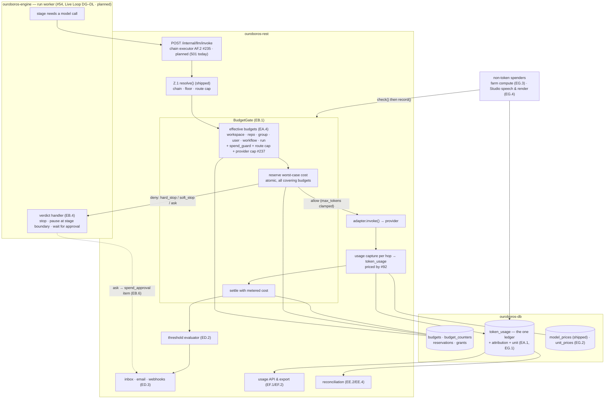
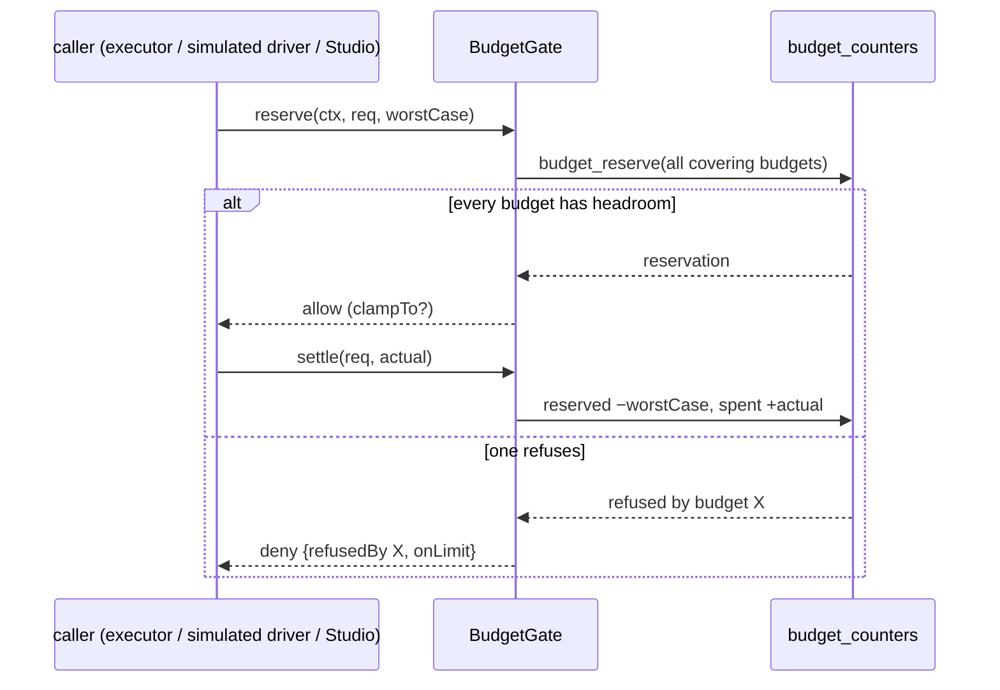
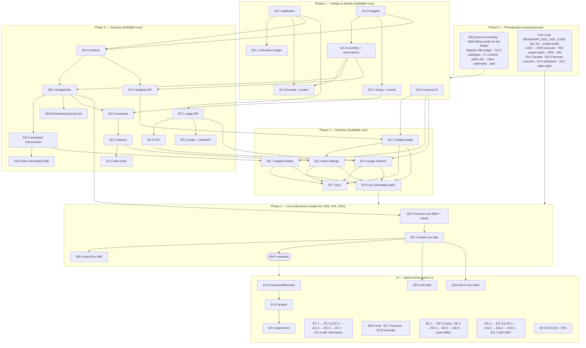

# Roadmap — Spend Governance

## Description

> Spend governance: turn Ouroboros's per-run spend metering from a warning into a control. Add a budget hierarchy (workspace, repository or team, user, workflow, run), enforcement before the model call with hard-stop, soft-stop and ask-in-the-inbox outcomes, a pre-run cost estimate per issue compared with actuals, threshold alerts, reconciliation of metered tokens against provider list prices for customer keys, a usage API and export for chargeback, and non-token units (farm compute minutes, the Studio's speech and render units) in the same ledger.

## Context & Existing Work (duplicate-avoidance survey)

Surveyed 2026-10-10. **Nothing in this document is filed.** Every `EA`–`EG`
reference below is a proposal; every `#number` is an issue that already
exists in `NobuData/ouroboros` and was read (read-only) on the survey date.

**Where this roadmap comes from.** The October 2026 competitor gap analysis
(`ouroboros-studio/reports/Ouroboros competitor gap analysis.md`, section
*P1-4 · Spend governance*) lists seven candidate epics and a priority:
**P1, immediately after the loop is live**. Its argument is short. The
commercial-readiness checklist scores Ouroboros's budgets as *"per-route max
cost and per-connection monthly caps shipped as warnings only"*, hard stops
and threshold alerts as *planned v2 (#237)*, a pre-run quote as absent, and
usage export as audit CSV only. Its advantages section says predictable cost
on the customer's own hardware and keys is a real advantage *"provided the
caps are enforced"*, and that *"no markup"* alone will not carry the claim
because Linear already advertises list-rate usage. The research note behind
it (`commercial_readiness_benchmarks.md` § 2) adds the buyer's view: with
customer keys the vendor never sees the invoice, so buyers expect the
orchestrator to reconcile tokens to provider list prices and to enforce caps
before calls are made.

**There is no mockup for this surface.** `docs/mockups/README.md` lists
"spend analytics detail" as not yet mocked. The pieces that exist are spread
over five pages: the dashboard's *Token spend · today* tile (02), the routing
page's *Max cost per run* field and *Spend by provider · 30d* card (06), the
providers page's *Monthly cap* fields and meters (07), the run console's
*Resources* card (10), and the settings page's *Spend guard* policy row
(17). Issue EA.6 proposes the missing design source (`24-spend.html`) and
every UI issue here waits on it.

**What is shipped today (verified in the repository):**

| Piece | Where | State |
|---|---|---|
| Usage ledger `ouroboros.token_usage` — append-only, per workspace, optional `run_id`, opaque `provider`/`model`, `tokens_in`/`tokens_out`, nullable `cost_cents numeric(14,4)`, plus `task_kind` and `latency_ms` | `V010__dashboard_usage.sql`, `V020__routing_usage_attribution.sql` (F.3 #66, closed) | **Shipped.** Rows are written by the `ingest` module (`ingest.repository.ts`) and by seeds. No repository, workflow, user, pull-request or unit column. |
| Pricing catalogue `ouroboros.model_prices` with `billing_mode` `token\|seat\|usage\|free`, workspace overrides, effective dating, and the lookup `ouroboros.model_price()`; REST `pricing` module | `V012__model_prices.sql`, `R__model_price_catalog.sql` (CG.2 #580, closed) | **Shipped.** Prices models only; no price for any non-token unit. |
| Per-route cap `routes.max_cost_cents_per_run` | `V016` (routing M4) | **Shipped as a stored value.** Returned by resolution; nothing enforces it because nothing is invoked. |
| Per-connection cap `provider_connections.monthly_cap_cents`, meters and warn state | `V017`, AE.6 #232 (closed) | **Shipped as a warning**, labelled "warning only" (decision P7). |
| Policy document rule `spend_guard` `{per_run_cap_cents, monthly_cap_cents}` with the precedence *stricter cap wins* | `V092__org_policy_versions.sql`, BQ.2 #481 | **Shipped as stored policy.** `monthly_cap_cents` is per provider, not a workspace total. |
| Inbox decision kind `spend_approval` | `V093`/`V097`, inbox X1 | **Registered and dormant** (`dormant: true`); the policy card draws no spend row. |
| Run console *Resources* card: tokens against the stage's DSL `token_budget`, cost against the route cap | AO/AP (mockup 10, R8) | **Shipped as a computed display** over seeded and simulated runs. |
| Estimates `issue_estimates` (effort, confidence, suggested workflow, routed model) and `estimate_outcomes` (predicted cycle band against actual duration) | `V026`, `V077` | **Shipped.** No cost prediction anywhere in either table. |
| Insights *cost per merged PR* and estimator calibration | mockup 15 (BI–BK) | **Shipped** over seeded or simulated data. |
| Audit CSV export, outbound webhooks (HMAC-SHA256, dead-letter queue), notification routes, SMTP mail | mockups 16/17 (`audit-plane`, `webhooks`, `notification-routes`, `mail` modules) | **Shipped.** No spend event type exists. |
| Model invocation | `POST /internal/llm/invoke` | **Not implemented.** Answers `501 invocation_not_implemented`; lands with AF.2 (#235). |

**Overlapping work and dispositions:**

| Existing work | State | Disposition under this roadmap |
|---|---|---|
| F.3 **#66** token usage events table | Closed | **Extended, not replaced.** EA.1 adds attribution columns and EG.1 adds a unit; the table stays the one ledger (decision V1). |
| J.4 **#92** priced token accounting (price at ingestion, repricing backfill, "cost unavailable" never `$0`) | Open, `v2`, no milestone | **Hard prerequisite, consumed.** A budget in money cannot count a row with no cost. EA.1 stores which price row priced each event; nothing here re-implements pricing. Proposed for promotion with this roadmap. |
| J.6 **#826** metered versus unmetered spend (`billing_mode` denormalised onto the ledger) | Open, `v2` | **Consumed.** EB.8's rule for free, seat-billed and unpriced usage reads that column; EA.1 does not add a second classification. |
| AF.2 **#235** chain executor (*"Cost caps — checked pre-flight and while running, per run and per provider"*) | Open, `v2`, Providers & Keys v2 | **The enforcement site.** EB.3 is the hook inside its pre-flight; this roadmap does not build an executor. See *Dependency on the Live Loop roadmap* below. |
| AF.4 **#237** cap enforcement and spend alerts (provider at its monthly cap is excluded from chains with an explanation; alerts at 80/95/100% once per calendar month; blocked meter state; warning-only tooltip removed) | Open, `v2`, Providers & Keys v2 | **Kept and narrowed, not duplicated.** #237 stays the owner of the *provider* cap and its exclusion semantics. Proposed amendment: its cap check becomes one evaluator inside EB.1's gate, and its three alerts are raised through ED.2 instead of a second alert path. |
| AF.1 **#234** invocation gateway ADR | Open, `v2` | **Input.** If the ADR picks LiteLLM as executor, infrastructure option 2 changes (LiteLLM has its own budget tables); EB.3 is written against the contract, not the implementation. |
| AB.4 **#210** full spend report surface (*"breakdowns by provider / model / task kind / repo … export (CSV), budget-line affordances"*) | Open, `v2`, Model Routing v2 | **Consumed with a proposed amendment.** EF.1/EF.2 are the API and export it needs; EF.4 proposes that the Spend tab be built once, there, over EF's API. If the owner prefers, EF.4 absorbs #210. |
| BL.3 **#450** Insights custom ranges, saved views and export | Open, `v2` | **Adjacent.** It exports metric series; EF exports ledger rows. Shared CSV conventions only. |
| BL.5 **#452** insight narratives and anomaly notes | Open, `v2` | **Adjacent.** ED.8's spend anomaly detector is deterministic and feeds alerts; narrative stays in #452. |
| CJ.1 **#598** pricing catalogue refresh and drift alerts | Open, `v2` | **Consumed.** EE.2 reconciles against the catalogue; keeping the catalogue current is #598's job. |
| BP.5 **#475** SLA alerts and escalation chains | Open, `v2` | **Consumed later.** A `spend_approval` item that waits too long escalates through #475; not rebuilt in EB.6. |
| BT.3 **#499** Teams, Datadog and PagerDuty connectors | Open, `v2` | **Consumed.** ED.6 binds spend alerts to those connectors when they exist. |
| BD.2 **#397** managed keys and hosted runner tier (per-tenant trial budgets, enforced at invocation; *"billing hooks out of scope"*) | Open, `v2` | **Consumer.** A trial budget is a workspace budget with a hard stop (EA.2 + EB.1). EG.7's rate cards are what a hosted tier would bill from. |
| BT.4 **#500** SaaS governance tier | Open, `v2` | **Out of scope**; plan and entitlement gating stays there. |
| O.2 **#123** LLM-backed estimator | Open, `v2` | **Coordinated.** EC.3 extends the `/v0/estimate` contract; the estimator that fills it may be the heuristic or #123. |
| AJ.1 **#263** cloud auto-scale runners (*"cost visibility hooks"*), AJ.3 **#265** workflow build-stage integration | Open, `v2` | **Consumed.** EG.3 meters farm compute from `build_jobs`; attribution to a run needs #265's `run_id` link. |
| J.3 **#91** engine→read-model ingestion bridge; 6.5 **#54** task execution skeleton; AR.1 **#315** guardrail enforcement | Open, `v2` | **Prerequisites of the live half** (EB.3, EB.4). Owned by the Live Loop roadmap. |
| Studio roadmap 11, issue 35.5 (`NobuData/ouroboros-studio` **#298**, open) — speech credentials and spend metering | Open | **Its Ouroboros amendment is this roadmap's EG.** The Studio asks for *"a non-token usage unit (`tts_characters`, `render_seconds`) priced by catalog"* — *"one new usage unit, not a second ledger"*. No such amendment issue exists in `NobuData/ouroboros` on the survey date (the `studio` label holds only #918–#922). EG.1, EG.2 and EG.4 are that amendment. |
| Studio 35.7 (studio #300) quotas, concurrency, monthly render minutes | Open | **Left with the Studio.** EG.5 offers the gate as an API so 35.7 can call it instead of keeping a second counter; the choice is the Studio's. |

**Issue survey (title search, all states, 2026-10-10).** `budget` → #1172
(screenshot budget checks; unrelated). `cap` → #237, #232. `spend` → #237,
#210, #826, #369 (closed, PR spend card), #204 (closed), #198 (closed, route
stats). `cost` → #622 (closed, research cost estimate), #444 (closed).
`usage` → #135 (closed, workflow usage stats), #66. `pricing catalog` →
#598, #580. `alert` → #475, #237, #598. `estimate` → #100, #105 (both
closed). `export` → #398, #450, #621, #486, #304, #34. `chargeback`,
`reconcil`, `compute minutes`, `rate card`, `forecast` → **no results**.
`anomaly` → #452. Conclusion: budgets as objects, reservation-based
enforcement, a cost estimate per issue, reconciliation, a usage API and
non-token units have no filed issue.

**Scope boundaries.** This roadmap does not build the executor (#235), the
engine's task model (#54), pricing at ingestion (#92), billing, invoices,
seats or licence entitlements (the gap analysis's *P1-5 · Editions, pricing
and billing*), or the Studio's own quotas. It builds budgets, the gate that
the executor calls, the estimate, alerts, reconciliation, the usage API and
the unit-aware ledger.

**Dependency on the Live Loop roadmap.** `docs/ROADMAP_OOE_LIVE_LOOP.md`
(epics **DG–DL**) was written in parallel. It appeared in `docs/` as an
unfiled draft while this document was being finished; its epic and issue
tables and its decisions L1–L14 were read once, its issue bodies were not,
and it may still change. Its `DG`–`DL` refs below are therefore proposals
too. The seam, as that draft states it:

| Live Loop item (draft) | What it means here |
|---|---|
| L1 promotes #207, #234, #155, #54, **#235**, #160, #315, #91, #265 and #396 to `mvp` | The executor and engine this roadmap's live half waits for become MVP work there. #237 is explicitly **not promoted** and is left to this roadmap. |
| Its scope line: *"spend budgets beyond the per-run cap #235 already enforces"* are not in that roadmap | No overlap. The slice relies on #235's own per-run and per-route cap; EB.3 is what replaces that check with the budget gate. |
| DH.2 — an Anthropic Messages-format facade over the chain executor, *"per-call usage and the cost cap"*; DH.3 — the Claude Agent SDK stage executor | The harness's model calls reach providers only through the facade, so the gate in #235's pre-flight (EB.3) covers them. A refusal must reach the harness as an error it does not retry (EB.4). |
| DI.4 — live-run admission (dry-run required, pause honoured, concurrency ceiling) | The place a budget refuses to *start* a run: EB.2's queue-time refusal and EC.4's precheck join that admission gate rather than adding a second one. |
| DJ.1–DJ.3 — a data origin `live` / `simulated` / `seeded` on runs and everything derived, aggregates live-only by default | This roadmap's `simulated` flags on verdicts, usage rows and exports **use DJ.1's origin once it exists**, in place of `runs.simulated`; EF.1 follows DJ.2's live-only default. |
| DJ.4 — the simulated driver leaves the product path and stays a test and development tool | After DJ.4, EB.2's enforcement against the simulated driver is a test and development harness, not a product behaviour. |
| DG.2 — a loop capability report per deployment and workspace | *What is enforced today* (EB.2, EB.7, EF.7) reads that report instead of asserting it. |
| Its note on #92: the price table and "unpriced, never `$0`" rule *"look delivered"* by CH.3 (#586), not verified; DG.1 carries the check | Decision V20's promotion of #92 depends on that check. What this roadmap needs from #92 is narrow: a cost on each ledger row at ingestion, and the repricing backfill. |

**Enforcement happens in the executor (#235)**, and a run can only be
stopped by the engine that runs it (#54, #315, DH.3). Issues are therefore
split into three groups, repeated in the Work Order:

- **Buildable now, against seeded and simulated runs** (`runs.simulated`,
  the simulated driver posting through `ingest`): all of EA; EB.1, EB.2,
  EB.7, EB.8; EC.1–EC.5, EC.7; ED.1–ED.5, ED.7, ED.8; EE.1, EE.2; all of EF
  (the e2e leg EF.8 with a simulated driver); EG.1, EG.2, EG.4–EG.8.
- **Wait for the executor (#235) and the engine run model (#54, #315 —
  Live Loop DG–DL):** EB.3, EB.4, EB.5, EB.6's resume path, the live half
  of EB.9, EE.3 and EE.4 (they need real provider traffic to reconcile).
- **Wait for real history, not for code:** EC.6 (cost calibration is only
  honest once runs are real) and EG.3's per-run attribution (needs #265).

Until the second group lands, the product must say so. EB.2 enforces
budgets against simulated spend and labels every verdict `simulated`; no
surface may claim a live call was stopped.

Epic letters: this roadmap uses **EA, EB, EC, ED, EE, EF, EG** (seven
epics). DG–DL belong to the Live Loop roadmap. Five other untracked
roadmap drafts appeared in `docs/` while this one was written
(`ROADMAP_EDITIONS_AND_BILLING.md`, `ROADMAP_ENTERPRISE_READINESS.md`,
`ROADMAP_PROOF_OF_VALUE.md`, `ROADMAP_PROTOCOLS_AND_SURFACES.md`,
`ROADMAP_TRUST_CENTRE.md`); **none was read**,
so their epic letters and any overlap with EG.7 (rate cards) or EE.3
(credential custody) are unchecked.

## Infrastructure Options (researched — pick before filing)

### 1. Where budgets live

| Option | What it is | Fit | Trade-offs |
|---|---|---|---|
| **A — First-class `budgets` rows, with the policy document's `spend_guard` kept as the workspace default** ⭐ recommended | A `budgets` table: one row per scope (`workspace`, `repository`, `group`, `user`, `workflow`, `run_default`), a period, an amount in integer cents (or a unit quantity), an outcome at the limit, thresholds. `spend_guard.per_run_cap_cents` stays the authoring place for the default run cap, and the resolver (EA.4) reads all sources and applies *stricter wins* — the rule `V092` already states. | Budgets are many rows with owners and histories; the policy document is one versioned JSON object with five rules. Copilot, Cursor, Claude and Devin all model limits as per-scope settings, not as one document. | Two authoring places for the run cap until the policy page links to the budgets page; the resolver must name which limit fired. |
| B — Everything inside the versioned policy document | Budgets become a sixth policy rule, an array of scoped limits | One audit trail and one publish action | A budget edit publishes a new policy version; per-repository and per-user rows bloat the document; counters cannot live in a versioned document anyway |
| C — Keep only the three existing caps and enforce them | Route cap, provider cap, `spend_guard` | No new schema | No workspace total, no repository, user or workflow scope; fails the description — **rejected** |

### 2. How a limit is enforced before the call

| Option | What it is | Fit | Trade-offs |
|---|---|---|---|
| **A — Reserve, call, settle, in PostgreSQL** ⭐ recommended | Before each call the gate computes the worst-case cost (input tokens at the input price plus `max_tokens` at the output price), atomically adds it to a `reserved_cents` counter on every budget that covers the call, and refuses if any would exceed its limit. After the call it replaces the reservation with the metered cost. Expired reservations are swept. | Concurrent runs cannot jointly overshoot. Cursor documents that *"enforcement is not instant, so usage can briefly exceed your spend limit"* and Claude that a request *"can slightly exceed a limit"* because the check precedes the request and the count follows it; a reservation is stricter than both. | One short transaction per call on the hot path; worst-case reservations can refuse a call that would have fitted (mitigated by clamping `max_tokens` to the remaining headroom — EB.3). |
| B — Check, then call (no reservation) | Read spend-so-far, compare, call | Simplest; what #235's text describes | N concurrent calls each see headroom; overshoot is bounded only by concurrency × call size |
| C — A counter store outside PostgreSQL (Redis/Valkey) | Atomic increments in memory | Lowest latency | A second stateful service in a product whose compose stack has none; counters and ledger can disagree after a crash |
| D — Delegate to LiteLLM's budgets | LiteLLM tracks `max_budget` with `budget_duration` per proxy, team, team member, user and key, and fails requests with `ExceededBudget` ([LiteLLM budgets](https://docs.litellm.ai/docs/proxy/users)) | Free if AF.1 (#234) picks LiteLLM as the executor | Its scopes are keys and teams, not runs, repositories or workflows; its reset job runs every ten minutes by default; no "ask" outcome; a second source of truth beside `token_usage` — usable as a backstop, not as the model |

### 3. The ledger for non-token units

| Option | What it is | Fit | Trade-offs |
|---|---|---|---|
| **A — Keep `token_usage`, add `unit` and `quantity`, and a `usage_units` registry** ⭐ recommended | Token rows keep `tokens_in`/`tokens_out` and gain `unit = 'tokens'`; other rows carry `unit` (`compute_seconds`, `tts_characters`, `render_seconds`) and one `quantity`. One `cost_cents` column for all. | Matches the Studio's stated need (*"one new usage unit, not a second ledger"*); every existing reader keeps working because token columns are untouched. | The table's name becomes a misnomer; a rename to `usage_events` with a compatibility view is offered as a later, mechanical migration (decision V1). |
| B — New `usage_events` table, `token_usage` becomes a view | Clean name and shape from day one | Tidier | Rewrites every reader and every seed at once, for a rename |
| C — One table per unit | `compute_usage`, `speech_usage`, … | Each simple | Budgets, alerts and exports must union N tables; exactly the second ledger the Studio asked not to have — **rejected** |

### 4. Metering and billing engines

| Option | What it is | Fit | Trade-offs |
|---|---|---|---|
| **A — Build in the existing stack (PostgreSQL + NestJS)** ⭐ recommended | The ledger, prices and counters are already in PostgreSQL; add tables and services | No new service; self-hosted promise intact | We own aggregation performance (EF.1 uses rollups past a row threshold) |
| B — Embed a metering service ([OpenMeter](https://openmeter.io), [Lago](https://www.getlago.com)) | Event ingestion, aggregation, entitlements, invoicing | Useful if a hosted tier needs invoices | Kafka/ClickHouse-class dependencies for a ledger that fits in one table today; revisit under *P1-5 · Editions, pricing and billing*. **Neither product's current feature set was re-read for this roadmap.** |
| C — Export only, govern elsewhere | Emit usage to the customer's FinOps tool | Cheap | No enforcement; "showback only", the report's own criticism |

### 5. Export format for chargeback

| Option | What it is | Fit | Trade-offs |
|---|---|---|---|
| **A — Native CSV and JSON now; a FOCUS-aligned export as v2** ⭐ recommended | MVP columns are the ledger's own (EF.2). EF.6 adds a mapping to [FOCUS](https://focus.finops.org/), *"an open specification that normalizes billing datasets across AI, cloud, SaaS, data center, and other technology vendors"* (version 1.4 on the survey date). | Finance teams get a file on day one; FinOps tools get a standard later | Whether FOCUS 1.4's columns express token usage cleanly was **not confirmed** — the mapping is an ADR inside EF.6 |
| B — FOCUS only | One format | Standard | Blocks the MVP on a mapping nobody has validated |

### 6. Where provider truth comes from (reconciliation)

| Option | What it is | Fit | Trade-offs |
|---|---|---|---|
| **A — Two layers: catalogue reconciliation always, provider usage reports where the customer supplies an admin key** ⭐ recommended | Layer 1 recomputes every row's cost at the catalogue's list price and compares it with what was recorded. Layer 2 pulls the provider's own usage report through an optional adapter method and compares tokens per day and model. Anthropic documents `/v1/organizations/usage_report/messages` with buckets of `1m`, `1h` or `1d` and grouping by model, workspace and API key ([Anthropic usage and cost API](https://platform.claude.com/docs/en/build-with-claude/usage-cost-api)); OpenAI's cookbook covers a completions usage API and a costs API ([OpenAI cookbook](https://cookbook.openai.com/examples/completions_usage_api)). | Layer 1 needs nothing from the customer; layer 2 is the reconciliation a buyer means | Both provider APIs need an **admin** key, a stronger credential than the inference key the vault holds today; exact endpoint paths for costs were **not confirmed first-hand** |
| B — Catalogue only | Layer 1 alone | No new credential | Cannot detect usage the ledger never saw |
| C — Invoice upload | Customer uploads the provider's invoice CSV | No admin key | Monthly, manual, format per provider — offered as a fallback inside EE.3 |

## Research Notes — budget and cap mechanics at competitors (read 2026-10-10)

Each page was read through a fetch tool that summarises; quotations are as
returned. "Not confirmed" means the pages read did not say.

| Vendor | Scopes | At the limit | Overage default | Alerts | Usage export or API | Source and confidence |
|---|---|---|---|---|---|---|
| **GitHub Copilot** (usage-based billing) | User, cost centre, organisation, enterprise | *"that user's access to Copilot is halted"*; *"A $0 USD user-level budget blocks the user immediately"*; *"There is no automatic fallback to lower-cost models when a budget is exhausted"* | *"Additional usage is enabled by default for organizations and enterprises"* | 75%, 90% and 100% of a budget, to owners and billing managers by default (general budgets page) | `ai_credits_used` per user reported in the Copilot usage metrics API (secondary coverage of a June 2026 changelog entry) | [Usage-based billing](https://docs.github.com/en/copilot/concepts/billing/usage-based-billing-for-organizations-and-enterprises), [Budgets and alerts](https://docs.github.com/en/billing/concepts/budgets-and-alerts) — primary. **Not confirmed:** whether the 75/90/100 alerts apply to AI-credit budgets specifically; the general page also says that for licence-based products a budget *"does not prevent usage"*, which reads against the Copilot page's hard stop; no usage-report endpoint was on either page. |
| **Linear** | Workspace, user, loop | Not stated in the entries read | Not stated | Not stated | *"AI credit usage explorer"*: compare spend by team, feature, user or loop | [Linear changelog](https://linear.app/changelog), entries of 8 October 2026 (*"set spend limits at the workspace, user, or loop level"*) and 20 August 2026 (*"workspace-wide and per-user spend limits that reset daily, weekly, or monthly"*; *"Tokens are charged at the provider's published rates, with no markup"*; sandbox runtime *"$0.25 per 20-minute block"*) — primary. **Not confirmed:** what happens to a running loop at its limit. |
| **Cursor** | Team; member and group on Enterprise | *"AI features stop working for that specific user"*; resumes at the next billing cycle; *"Enforcement is not instant, so usage can briefly exceed your spend limit"* | Not stated on the page | A separate spend-alerts article exists (not read) | Admin API; `POST /teams/filtered-usage-events` | [Cursor spend limits](https://cursor.com/docs/account/billing/spend-limits) — primary; [Admin API](https://docs.cursor.com/account/teams/admin-api). **Not confirmed:** the spend and daily-usage endpoints (third-party references only); a December 2025 forum post said per-user limits would be replaced by alerts, which conflicts with the current docs page. |
| **Claude** (Team and seat-based Enterprise) | Organisation, seat tier, individual member | Members *"won't be able to use Claude, Cowork, or Claude Code again"* until the next period or an adjustment; a request can slightly exceed a limit because the check runs before the request | Off until an Owner enables usage credits | Daily email to admins listing members' requests for more usage | Spend report per user and per model with CSV export (Claude Code costs page, via search summary) | [Claude help centre](https://support.claude.com/en/articles/12005970-extra-usage-for-team-and-seat-based-enterprise-plans) — primary. **Not confirmed:** percentage thresholds. Usage-based Enterprise plans are covered by a different article, not read. |
| **Devin** (ACUs) | Organisation; per user (beta, enabled by the account team) | New work *"blocked on all surfaces once the limit is reached"*; a session is blocked if either limit is reached | Not stated | Members notified at about two-thirds of the limit; admins get an in-app nudge and email | A limits API; usage on analytics pages | [Devin usage policies](https://docs.devin.ai/enterprise/features/usage-policies) — primary. **Not confirmed:** a per-session ACU cap (a knowledge-base article describes a session limit as a pause threshold, not opened); the current per-ACU price (Cognition's pricing page returned 404 to the earlier researchers). |
| **Kiro** | Plan credits per user | Not stated | *"Overages are disabled by default and must be enabled in the Kiro console settings"* | Not stated | Not stated | [Kiro pricing](https://kiro.dev/pricing/) — primary. **Not confirmed:** any cap on overage once enabled; the page is inconsistent about which tiers can enable it. |

What the table supports:

1. **Limits at two or three scopes with a hard stop are standard.** Every
   vendor read has them. Ouroboros has none that binds.
2. **No vendor read documents a reservation.** Two say outright that usage
   can pass the limit. A gate that reserves before the call (option 2-A) is
   stricter than what was found. This is an absence in the pages read, not a
   proof that nobody does it.
3. **Nobody read attributes a limit to a run or an issue**, except Linear's
   loop-level limit. A run budget with a pre-run estimate (EC) remains ahead
   of what was found; Linear is the one to watch.
4. **"Ask" is partly present**: Claude and Devin let a blocked member
   request more and notify an admin. Neither pauses a job and resumes it on
   approval. EB.6 does.
5. **Alert thresholds are thinly documented.** GitHub's 75/90/100 is the
   only published set found. Ours stay configurable with 80/95/100 as the
   default, matching #237.

## Decisions proposed by this roadmap (validate before issue creation)

| # | Decision | Rationale |
|---|----------|-----------|
| V1 | **One ledger.** `token_usage` stays the table; it gains attribution columns (EA.1) and `unit` + `quantity` (EG.1). A rename to `usage_events` is deferred and optional. | The Studio's amendment asks for one ledger; a rename now would touch every reader for no behaviour. **Owner to confirm the rename is not wanted first.** |
| V2 | **Budgets are rows, not policy text** (option 1-A). `spend_guard` keeps the default per-run cap; the budgets table holds everything scoped. | Many rows, owners and counters do not fit a versioned JSON document. |
| V3 | **Scopes: `workspace`, `repository`, `group`, `user`, `workflow`, `run_default`**, plus an optional per-run override on the run itself. **MVP enforces `workspace` and run only**; the schema carries the rest so no migration is needed later. | The report's MVP line; cheap schema, expensive enforcement. |
| V4 | **Inheritance rule: every applicable budget must have headroom; the strictest decides, and the verdict names it.** A child can never loosen a parent. This extends `V092`'s *stricter wins* to all scopes. Cursor does the opposite (*"applies the highest applicable limit"*); we do not follow it. | A workspace hard stop that a repository budget could raise is not a stop. |
| V5 | **"Team" means a budget group**: a named set of repositories and members (EA.9, v2). There is no team entity in the schema today, and identity-provider groups arrive with SCIM (#497). | Avoids inventing a team model inside a spend roadmap. **Owner to confirm** groups rather than waiting for #497. |
| V6 | **User attribution is the person whose action started the spend**: who queued the issue, who approved the loop, who started the investigation or the render. Scheduled and policy-started work is attributed to the workspace, shown as `automation`. | Runs carry no initiator today. Per-user budgets that cover only human-started work are honest; pretending a cron job is a person is not. |
| V7 | **Enforcement is reserve → call → settle** (option 2-A), in PostgreSQL, called from the executor's pre-flight (#235). The gate **fails closed**: if it cannot answer, a call covered by a hard-stop budget does not go out. | A control that fails open is a warning. **Owner to confirm fail-closed**, since it makes the database part of the invocation path's availability. |
| V8 | **Three outcomes at a limit**: `hard_stop` (the call is refused; the run stops with reason `budget_exhausted`, resumable after the budget changes or the period turns), `soft_stop` (calls already reserved finish, the current stage completes, the run pauses at the stage boundary, no new run starts), `ask` (the run pauses and a `spend_approval` item goes to the inbox; approving grants a bounded, single-use top-up). **MVP ships `hard_stop` only.** | The description's three outcomes; the report's MVP line. |
| V9 | **Overage is off by default.** No budget is ever exceeded without a recorded grant (EB.6). There is no "allow and bill later" switch in the self-hosted product. | Kiro's default; Copilot's opposite default drew the complaints the research notes record. |
| V10 | **Free, seat-billed and unpriced usage.** `free` rows cost zero and never count against a money budget. `seat` rows are not per-call money and do not count (flagged in the export). **Unpriced rows are refused when a hard-stop money budget covers the call**, with a designed error naming the missing price; a workspace may switch this to *allow and flag*. | A hard stop that an unpriced model walks through is a hole. **Owner to confirm the default**, since it can block a newly released model until a price row exists. |
| V11 | **#237 is kept and narrowed.** It remains the provider-cap issue (exclusion from chains, blocked meter, tooltip removal). Its cap check runs inside EB.1's gate and its alerts go through ED.2. Proposed as an amendment at filing. | One gate and one alert path instead of two. |
| V12 | **The pre-run estimate is a range with a stated method**, never a point: percentiles of metered cost for the same workflow and effort class, priced at today's route prices; a cold-start heuristic from the workflow's stage `token_budget`s when history is thin. A basis made of simulated runs is labelled `simulated` and is never called calibrated. No dollar figure where any hop is unpriced. | The Studio's rules R5 and R6 and research decision V5 (*computed, never invented*). |
| V13 | **Alert thresholds default to 80, 95 and 100%, fire once per budget period**, and are configurable per budget. Channels in MVP: inbox, email, outbound webhook. | Matches #237; GitHub's 75/90/100 is the only other published set found. |
| V14 | **Reconciliation never rewrites the ledger.** It writes findings; a correction is a repricing backfill (#92) that a person starts. | The ledger is append-only by design (F.3). |
| V15 | **Provider usage reports need a separate, optional admin credential** per connection, stored in the vault with its own purpose label and never used for inference. | A stronger key than the product holds today; opt-in only. |
| V16 | **Non-token prices live in a new `unit_prices` catalogue**, not in `model_prices`. Farm compute on owned hardware has **no price until the customer sets an internal rate**; without one the ledger records quantity and the surfaces say *no rate set*, never `$0`. | `model_prices` is keyed by provider kind and model; a runner pool or a voice is neither. Owned hardware is not free, it is unpriced by choice. |
| V17 | **EG.1 is in the MVP although non-token units are "later"**: it is the column change that prevents a second ledger. EG.2 and EG.4 are v2 here but are **pull-forward candidates the moment Studio 35.5 is scheduled**. | **Owner to decide** the timing against the Studio's plan. |
| V18 | **Surfaces**: budgets and alerts at `/settings/spend`; the usage explorer and export on the Models subnav's Spend tab (`/models/spend`, #210's surface). No page is built before mockup `24-spend.html` (EA.6) is accepted. | No design source exists; two homes follow the product's split between governance (settings) and the model plane. |
| V19 | **Labels**: existing set plus new **`spend`**. **Milestones**: `Spend Governance MVP` / `Spend Governance v2`, created at filing. | Filing metadata. |
| V20 | **Promote #92 and #826 to prerequisites of this MVP, and treat #235 as the gate for the live half.** | Budgets in money need priced rows; enforcement needs an executor. |

## Architecture Overview

Where enforcement sits relative to the invocation path. Solid boxes marked
*(shipped)* exist; everything else is planned, and `POST
/internal/llm/invoke` answers `501` today.



The gate sits **after resolution and before the adapter**: resolution says
which model would be called and at what price, so the reservation can be
priced; nothing has been sent, so a refusal costs nothing. Settlement
follows usage capture on every hop, including failed ones, so a fallback
hop's cost lands on the same budgets.

## MVP Definition

The MVP is **a budget that stops spend, tells you before it does, and a file
finance can read**. It follows the report's line: *workspace and run
budgets, hard stop, alerts, usage export*. It is done when:

1. **Budgets exist as objects.** A workspace owner can set a monthly
   workspace budget and a default per-run budget at `/settings/spend`, see
   spend, reservations and headroom, and every change is audited. The
   resolver returns, for any call, the budgets that cover it and the
   strictest one, combining them with `spend_guard`, the route cap and the
   provider cap.
2. **The ledger can answer "who and what".** Every usage row carries its
   repository, workflow, run, pull request and initiating user where known,
   and the price row that priced it (EA.1), on top of #92's pricing and
   #826's billing mode.
3. **The gate works and is proven under concurrency** (EB.1): reserve,
   settle, expire; fifty concurrent calls against a budget with room for ten
   admit ten.
4. **Hard stop is real wherever spend is real.** Against simulated runs
   today (EB.2), the gate refuses, the run shows *stopped: budget
   exhausted*, and the verdict is labelled `simulated`. **Once #235 is
   live**, the same gate is called from the executor's pre-flight (EB.3) and
   the engine stops the run (EB.4). The MVP is not declared complete on the
   simulated half alone.
5. **Free, seat-billed and unpriced usage follow one written rule** (EB.8),
   and the "warning only" label disappears from every cap the gate now
   binds.
6. **Alerts arrive before the ceiling**: 80, 95 and 100% of a budget, once
   per period, in the inbox, by email and as signed webhook events (ED.1–
   ED.3), configurable per budget (ED.4).
7. **Usage can be read and exported**: `GET /api/v1/usage` grouped by run,
   pull request, repository, user, model, workflow, provider and day; a CSV
   export of the same; a `usage:read` scope for service tokens; a usage
   explorer in the UI (EF.1–EF.4).
8. **The ledger is unit-aware** (EG.1), so the Studio's units and farm
   compute can be added without a second ledger.
9. **Tests and documentation**: integration suites for the gate, the
   resolver, alerts and the usage API; an e2e leg (EF.8); an Administration
   page *Spend governance* and User Guide sections (EF.7).

**Explicitly v2 (milestone `Spend Governance v2`):** repository, workflow
and user budgets (EA.8); budget groups, the cost-centre object (EA.9);
`soft_stop` (EB.5) and ask-in-the-inbox (EB.6); the whole pre-run estimate
epic (EC); chat and pager delivery (ED.6), **forecasts** (ED.7) and
**anomaly detection** (ED.8); the whole reconciliation epic (EE); chargeback
reports and scheduled exports (EF.5), FOCUS and OpenTelemetry (EF.6); unit
prices, farm compute, the Studio's units, budgets over units (EG.2–EG.6,
EG.8) and **per-customer rate cards for a hosted tier** (EG.7).

## Epics, Labels & Milestones

Each epic would be a parent tracking issue on GitHub; every roadmap issue
below would be filed as one of its sub-issues (GitHub Relationships).
**None is filed.**

| Epic | GitHub | Status | Name | Goal | Modules | Milestone |
|------|:------:|:------:|------|------|---------|-----------|
| EA | — | ⚪ Not filed | Budget Hierarchy | Ledger attribution, budgets, counters, resolver, API, design source, settings surface, seeds | ouroboros-db, ouroboros-rest, ouroboros-ui | Spend Governance MVP |
| EB | — | ⚪ Not filed | Enforcement Before the Call | The gate, simulated enforcement, executor hook, run stop, soft stop, ask, states, tests | ouroboros-rest, ouroboros-engine, ouroboros-ui | Spend Governance MVP |
| EC | — | ⚪ Not filed | Pre-Run Cost Estimate | Cost range per issue, queue-time check, estimate against actuals, calibration | ouroboros-db, ouroboros-rest, ouroboros-engine, ouroboros-ui | Spend Governance v2 |
| ED | — | ⚪ Not filed | Spend Alerts | Thresholds, evaluator, inbox/email/webhook delivery, configuration, forecasts, anomalies | ouroboros-db, ouroboros-rest, ouroboros-ui | Spend Governance MVP |
| EE | — | ⚪ Not filed | Reconciliation | Catalogue reconciliation, provider usage reports, drift findings, surface | ouroboros-db, ouroboros-rest, ouroboros-ui | Spend Governance v2 |
| EF | — | ⚪ Not filed | Usage API & Export | Read API, CSV, token scope, explorer, chargeback, FOCUS, docs, e2e | ouroboros-rest, ouroboros-ui, ouroboros-docs, tests/e2e | Spend Governance MVP |
| EG | — | ⚪ Not filed | Non-Token Units | Unit-aware ledger, unit prices, farm compute, Studio units, budgets over units, rate cards | ouroboros-db, ouroboros-rest, ouroboros-ui | Spend Governance v2 (EG.1 in MVP) |

Issue naming: `<project>: [<epic>.<issue>] <title>`. Labels: existing set
(`mvp`, `v2`, `rest`, `db`, `engine`, `ui`, `ci`, `design`,
`documentation`, `providers`, `routing`, `registry`, `runs`, `inbox`,
`settings`, `insights`, `intake`, `build-farm`, `studio`, `docs-site`)
**plus new `spend`** (decision V19). Milestones **`Spend Governance MVP`**
/ **`Spend Governance v2`** would be created at filing. Complexity chips:
**XS · S · M · L**.

Standing rules for every issue (from `AGENTS.md` and
`docs/CONVENTIONS.md`): money is integer cents at every boundary; a change
to any module's `.env.example` is repeated in the top-level `.env.example`;
OpenAPI additions are `0.0.x` increments and breaking changes `0.x.0`;
user-visible changes update `ouroboros-docs`; closed issues get a ✅ here.

---

## Epic EA — Budget Hierarchy (`ouroboros-db` + `ouroboros-rest` + `ouroboros-ui`)

| Ref | GitHub | Status | Title | Summary | Labels | Parallel | MVP | Complexity | Affected Modules |
|-----|:------:|:------:|-------|---------|--------|:--------:|:---:|:----------:|------------------|
| EA.1 | — | ⚪ Planned | ouroboros-db: [EA.1] Usage ledger attribution columns | Repository, workflow, PR, initiating user, stage and price provenance on every ledger row | mvp, spend, db | N (after #92, #826) | Y | M | ouroboros-db |
| EA.2 | — | ⚪ Planned | ouroboros-db: [EA.2] Budgets schema — scopes, periods & limit outcomes | `budgets` rows per scope with period, amount, outcome and thresholds | mvp, spend, db | Y (∥ EA.1) | Y | M | ouroboros-db |
| EA.3 | — | ⚪ Planned | ouroboros-db: [EA.3] Budget counters, reservations & grants | Per-period counters, expiring reservations, single-use grants, atomic functions | mvp, spend, db | N (after EA.2) | Y | L | ouroboros-db |
| EA.4 | — | ⚪ Planned | ouroboros-rest: [EA.4] Effective-budget resolver | Which budgets cover a call, strictest wins, folded with spend guard, route and provider caps | mvp, spend, rest, settings | N (after EA.1, EA.2) | Y | M | ouroboros-rest |
| EA.5 | — | ⚪ Planned | ouroboros-rest: [EA.5] Budgets API, roles & audit | CRUD, status with headroom, role checks, audit events | mvp, spend, rest, settings | N (after EA.3, EA.4) | Y | M | ouroboros-rest, ouroboros-docs |
| EA.6 | — | ⚪ Planned | ouroboros-ui: [EA.6] Spend governance mockup (24) & design spec | The missing design source for budgets, alerts, usage and stopped states | mvp, spend, ui, design | Y (first) | Y | M | docs/mockups, ouroboros-ui |
| EA.7 | — | ⚪ Planned | ouroboros-ui: [EA.7] Budgets settings surface — workspace & run | `/settings/spend`: budget cards, meters, edit sheets, honest states | mvp, spend, ui, settings | N (after EA.5, EA.6) | Y | M | ouroboros-ui, ouroboros-docs |
| EA.8 | — | ⚪ Planned | ouroboros-rest: [EA.8] Repository, workflow & user budgets | Activates the three remaining scopes end to end | v2, spend, rest, ui | N (after EA.5, EB.1) | N | M | ouroboros-rest, ouroboros-ui, ouroboros-docs |
| EA.9 | — | ⚪ Planned | ouroboros-rest: [EA.9] Budget groups — teams & cost centres | Named groups of repositories and members with their own budget and code | v2, spend, rest, db, ui | N (after EA.8) | N | L | ouroboros-db, ouroboros-rest, ouroboros-ui, ouroboros-docs |
| EA.10 | — | ⚪ Planned | ouroboros-db: [EA.10] Spend governance dev seeds & CI probes | Seeded budgets at each threshold, attributed usage, probes | mvp, spend, db, ci | N (after EA.1–EA.3) | Y | S | ouroboros-db, .github |

### Issue EA.1 — ouroboros-db: [EA.1] Usage ledger attribution columns

> **GitHub issue:** not filed · **Status:** ⚪ Planned · **Parent epic:** EA

- **Problem Statement:** `token_usage` knows the workspace, optionally the
  run, the provider, the model and (since V020) the task kind. It cannot say
  which repository, workflow, pull request or person a cent belongs to
  without a join through `runs` — and a deleted run sets `run_id` to null,
  after which the attribution is gone. Budgets per repository, user or
  workflow (V3) and a chargeback export (EF) both need the answer on the
  row.
- **Solution/Scope:** One Flyway migration adding nullable, as-of columns to
  `ouroboros.token_usage`: `github_repo_id`, `workflow_id` and
  `workflow_tag` (stored, as `runs.issue_title` is, so a rename does not
  rewrite history), `pr_number`, `issue_number`, `stage_key`,
  `initiated_by` (user id; null = `automation`, decision V6),
  `origin` CHECK `run|planning|research|copilot|chatops|studio|farm|other`,
  `price_row_id` and `price_source` CHECK `bundled|override|none` (which
  `model_prices` row priced the event — consumed by #92's pricing pass), and
  `list_cost_cents numeric(14,4)` (cost at the bundled list price when an
  override priced the row; EE.2 reads it). Foreign keys are `on delete set
  null`, the ledger's existing rule: deleting a repository does not un-spend
  money. Indexes on (organization, occurred_at, github_repo_id) and
  (organization, occurred_at, initiated_by). A back-fill fills repository,
  workflow tag and issue number from `runs` for rows whose run still
  exists; everything else stays null and is reported as *unattributed*,
  never guessed. Does **not** add `billing_mode` (that is #826) or `unit`
  (EG.1). Sources: `V010__dashboard_usage.sql`, `V020`, #66, #92, #826.
- **Acceptance Criteria:**
  - Existing readers (`token_usage_daily`, route stats, dashboard) return
    identical results before and after the migration on the seed set.
  - Deleting a run or a repository leaves the row and its cost; only the
    foreign key becomes null, and the stored `workflow_tag` survives.
  - The back-fill is idempotent and never overwrites a non-null value.
  - A row with no price has `price_source = 'none'` and `cost_cents` null —
    never zero.
  - Insert of seed volume stays under the F.3 budget (1 s).
- **Parallelism/Dependencies:** Needs #66 (shipped); coordinated with #92
  and #826, which write the price and the billing mode. Parallel with EA.2.
  Blocks EA.4, EA.8, EF.1, EE.2.
- **Technical Stack:** PostgreSQL 17, Flyway.
- **Documentation:** None — not user-visible: database columns; the
  surfaces they feed are EF.4's and EA.7's to document.
- **Epic:** EA

```
token_usage (one row per hop)
  org · run_id? · provider · model · tokens_in/out · cost_cents? · task_kind      ← shipped
+ github_repo_id? · workflow_id? · workflow_tag · pr_number? · issue_number?      ← EA.1
+ stage_key? · initiated_by? (null = automation) · origin
+ price_row_id? · price_source(bundled|override|none) · list_cost_cents?
```

### Issue EA.2 — ouroboros-db: [EA.2] Budgets schema — scopes, periods & limit outcomes

> **GitHub issue:** not filed · **Status:** ⚪ Planned · **Parent epic:** EA

- **Problem Statement:** The product has three caps in three places (route,
  provider connection, policy document) and no object that says "this
  workspace may spend $2,000 this month". There is nowhere to put a budget
  for a repository, a person or a workflow at all (decisions V2, V3).
- **Solution/Scope:** Migration creating `ouroboros.budgets`: `id`,
  `organization_id` (cascade), `scope_kind` CHECK
  `workspace|repository|group|user|workflow|run_default`, `scope_ref`
  (null for `workspace` and `run_default`; otherwise the repository, group,
  user or workflow id, with a partial unique index per scope so one scope
  has at most one active budget per unit and period), `unit` (default
  `usd_cents`; a unit slug once EG.1 lands), `amount` (positive integer —
  cents or unit quantity), `period` CHECK `day|week|month|run` (`run` only
  for `run_default`; calendar boundaries in UTC, matching P7's
  calendar-month rule), `on_limit` CHECK `hard_stop|soft_stop|ask` (V8),
  `unpriced_policy` CHECK `block|allow_and_flag` (V10; default `block` when
  `on_limit = 'hard_stop'`), `thresholds` (integer array, default
  `{80,95,100}`, each 1–100, strictly rising — V13), `enabled`, `name`,
  `note`, `created_by`, `updated_by`, timestamps. A per-run override column
  `runs.budget_cents` (nullable) for a run that needs its own ceiling. A
  CHECK that `soft_stop` and `ask` cannot be stored while their issues
  (EB.5, EB.6) are unbuilt is **not** used — the API refuses them instead
  (EA.5), so the schema does not need a migration when they arrive.
- **Acceptance Criteria:**
  - One enabled budget per (scope, unit, period); a second insert fails
    with a named constraint.
  - `period = 'run'` is accepted only for `run_default`; `scope_ref` is
    required exactly when the scope kind needs one, and must belong to the
    same workspace (composite foreign keys).
  - Amounts are positive integers; a fractional or zero amount is refused
    (a zero budget is expressed by disabling the scope's access, not by
    `0` — recorded as a design note against Copilot's `$0` idiom).
  - Deleting a workspace removes its budgets; deleting a repository removes
    that repository's budget rows.
- **Parallelism/Dependencies:** Needs scaffolding tenancy tables (shipped).
  Parallel with EA.1. Blocks EA.3, EA.4, ED.1.
- **Technical Stack:** PostgreSQL 17, Flyway.
- **Documentation:** None — not user-visible: database tables; EA.7 and
  EF.7 document budgets.
- **Epic:** EA

```
budgets
  workspace      · month · 200000¢ · hard_stop · {80,95,100}
  run_default    · run   ·    250¢ · hard_stop            (default; spend_guard may be stricter)
  repository:R   · month ·  60000¢ · soft_stop            (v2 — EA.8)
  user:U         · week  ·  10000¢ · ask                  (v2 — EA.8)
  workflow:W     · month ·  40000¢ · hard_stop            (v2 — EA.8)
  group:G        · month · 120000¢ · hard_stop            (v2 — EA.9)
```

### Issue EA.3 — ouroboros-db: [EA.3] Budget counters, reservations & grants

> **GitHub issue:** not filed · **Status:** ⚪ Planned · **Parent epic:** EA

- **Problem Statement:** Summing the ledger on every model call is too slow
  and is not atomic: two calls can both see the same headroom. The gate
  (EB.1) needs counters it can change in one statement, reservations that
  expire if a call never settles, and a record of every approved exception
  (decisions V7, V9).
- **Solution/Scope:** Migration creating: `budget_counters` — `budget_id`,
  `period_start`, `spent` (numeric, settled), `reserved` (numeric, open
  reservations), `granted` (numeric, extra headroom from grants),
  `updated_at`; primary key (budget, period_start); for `run_default` and
  per-run overrides the key is (budget, run). `budget_reservations` — `id`,
  `organization_id`, `request_ref` (the invocation id; unique, so a retry
  cannot reserve twice), `run_id`, `amount`, `budget_ids` (the counters it
  touched), `status` CHECK `open|settled|released|expired`, `expires_at`,
  `settled_amount`, timestamps. `budget_grants` — `id`, `budget_id`,
  `period_start` or `run_id`, `amount`, `granted_by`, `decision_item_id`
  (the inbox item, EB.6), `reason`, `consumed_at`; append-only.
  Security-definer functions, the house idiom for invariants:
  `budget_reserve(org, request_ref, budget_ids[], amount, ttl)` — locks the
  counter rows in id order, refuses if `spent + reserved + amount > amount
  limit + granted` on **any** of them, otherwise increments all and returns
  the reservation; returns the id of the budget that refused;
  `budget_settle(request_ref, actual)` — moves `reserved` to `spent` with
  the actual figure; `budget_release(request_ref)`; `budget_sweep()` —
  expires reservations past `expires_at`. A reconciling view
  `budget_counter_drift` compares `spent` with the ledger sum for the same
  scope and period.
- **Acceptance Criteria:**
  - A concurrency test (pgTAP or the module's integration harness): 50
    concurrent `budget_reserve` calls of 10¢ against 100¢ of headroom admit
    exactly 10; no deadlock (lock order asserted).
  - A repeated `request_ref` returns the first reservation and does not
    increment again.
  - `budget_settle` with an actual above the reservation records the true
    figure (the counter may then exceed the limit by that one call's
    overshoot, and the row is flagged `overshoot`) — the ledger is the
    truth, the counter follows it.
  - `budget_sweep` releases expired reservations exactly once.
  - `budget_counter_drift` is empty on the seed set after a full replay.
  - Counters cannot be updated outside the functions (grants revoked from
    the application role; probe in CI).
- **Parallelism/Dependencies:** Needs EA.2. Blocks EB.1, EA.5, EA.10.
- **Technical Stack:** PostgreSQL 17 (row locks, security-definer
  functions), Flyway.
- **Documentation:** None — not user-visible: database tables and
  functions; `operations.mdx` gains the sweep job under EB.1.
- **Epic:** EA

```
budget_counters(workspace · 2026-10)   limit 200000 | spent 151200 | reserved 1840 | granted 0
                                                     └────────── headroom = 46960 ──────────┘
reserve(req-9f2, [workspace, run], 310)  ─▶ ok → reserved +310 on both
settle (req-9f2, 184)                    ─▶ reserved −310, spent +184
reserve(req-a01, …, 50000)               ─▶ refused by: workspace (headroom 46960)
```

### Issue EA.4 — ouroboros-rest: [EA.4] Effective-budget resolver

> **GitHub issue:** not filed · **Status:** ⚪ Planned · **Parent epic:** EA

- **Problem Statement:** A call is covered by several limits at once: the
  workspace budget, the run budget, `spend_guard`'s per-run cap, the
  route's `max_cost_cents_per_run`, the provider's monthly cap, and (v2) a
  repository, user, workflow or group budget. Something must say which
  apply, which is strictest, and name it (decision V4). `V092` already
  states *stricter wins* for three of them; nothing implements it for a
  call.
- **Solution/Scope:** A `budgets` REST module with a pure
  `resolveEffectiveBudgets(context)` where `context` is `{organizationId,
  runId?, repoId?, workflowId?, initiatedBy?, taskKind, providerConnectionId,
  unit}`. It returns an ordered list of `{source, id, scope, period,
  limit, onLimit, unpricedPolicy}` where `source` is `budget`,
  `policy.spend_guard`, `route.max_cost` or `provider.monthly_cap`. Rules:
  every enabled budget whose scope matches the context applies; the
  effective per-run limit is the least of the run override, the
  `run_default` budget, `spend_guard.per_run_cap_cents` and the route cap;
  the provider cap is reported separately because its outcome is #237's
  (exclusion from the chain, not a stop); a disabled `spend_guard`
  contributes nothing; a child can never raise a parent. The result is
  cached per request, never across requests for counters. A read endpoint
  `GET /api/v1/budgets/effective?run=…` exposes the same answer for the
  run console and for debugging. Scopes that are not yet enforceable (v2)
  are resolved but marked `enforced: false` until EA.8/EA.9 flip them.
  Sources: `V092__org_policy_versions.sql` § absorption mapping 4;
  `PolicyResolutionService` (BQ.2 #481); Z.1 (#194).
- **Acceptance Criteria:**
  - A table-driven unit suite covers every combination of present and
    absent sources; the strictest is chosen and named in each.
  - A repository budget larger than the workspace budget never increases
    headroom.
  - The resolver's per-run answer equals what the run console's Resources
    card computes today for the same run (one rule, two readers).
  - No database write and no counter read in the pure function (grep-
    asserted, like the gate engine's rule).
- **Parallelism/Dependencies:** Needs EA.1 (attribution to match scopes),
  EA.2. Blocks EB.1, EA.5, EC.4.
- **Technical Stack:** NestJS, Kysely, the existing policy resolution
  service.
- **Documentation:** None — internal service; EF.7's *How limits combine*
  section is written from this issue's rule table.
- **Epic:** EA

```
call(run 418 · repo helios-firmware · workflow bugfix · route "implement" · conn anthropic)
  ├─ budget workspace/month        200000¢  hard_stop
  ├─ budget run_default            250¢  ┐
  ├─ policy spend_guard.per_run    250¢  ├─ per-run = least(...) = 200¢  ← "route cap" named
  ├─ route.max_cost_per_run        200¢  ┘
  └─ provider.monthly_cap        60000¢  (→ #237: exclude from chain, not a stop)
```

### Issue EA.5 — ouroboros-rest: [EA.5] Budgets API, roles & audit

> **GitHub issue:** not filed · **Status:** ⚪ Planned · **Parent epic:** EA

- **Problem Statement:** Budgets need to be created, changed and read by
  people and by service accounts, with the same role and audit discipline
  as every other governance setting.
- **Solution/Scope:** `GET/POST /api/v1/budgets`, `GET/PATCH/DELETE
  /api/v1/budgets/{id}`, `GET /api/v1/budgets/{id}/status` (limit, spent,
  reserved, granted, headroom, period bounds, next reset, thresholds
  crossed, last verdict), `GET /api/v1/budgets/summary` (the page's cards
  in one payload). Owner and Admin write; members read their workspace's
  and their own. `soft_stop` and `ask` are refused with a designed
  `outcome_not_available` error naming EB.5/EB.6 until those ship; scopes
  other than `workspace` and `run_default` are refused the same way until
  EA.8/EA.9. Lowering a budget below what is already spent is allowed and
  takes effect at once (the next call is refused) — the response says so.
  Audit events `budget.created|updated|deleted|enabled|disabled` with
  before and after values through the existing audit plane; the events
  also flow to the SIEM webhook stream. OpenAPI addition (`0.0.x`).
- **Acceptance Criteria:**
  - Role matrix verified: member cannot write; service token needs a
    `budgets:write` scope; cross-workspace ids return 404.
  - Every write produces exactly one audit event with a diff.
  - `status` equals the counters and agrees with the ledger sum on the seed
    set.
  - Unavailable outcomes and scopes return the designed error, not a 500.
  - OpenAPI spec updated and the contract test passes.
- **Parallelism/Dependencies:** Needs EA.3, EA.4. Blocks EA.7, ED.4.
- **Technical Stack:** NestJS, Kysely, class-validator DTOs, the audit
  plane.
- **Documentation:** Administration `policies.mdx` § Spend guard (link to
  budgets and how the two combine); the API reference picks up the new
  routes from the OpenAPI export; no screenshot.
- **Epic:** EA

```
PATCH /api/v1/budgets/b-17 {amount: 150000}
  → 200 {limit:150000, spent:151200, headroom:0, note:"already exceeded — next call is refused"}
  → audit budget.updated {amount: 200000 → 150000, by: ks}
```

### Issue EA.6 — ouroboros-ui: [EA.6] Spend governance mockup (24) & design spec

> **GitHub issue:** not filed · **Status:** ⚪ Planned · **Parent epic:** EA

- **Problem Statement:** Every other roadmap in this repository starts from
  a mockup. This one has none: `docs/mockups/README.md` lists spend
  analytics as not yet mocked. Without a design source the UI issues would
  invent their own anatomy.
- **Solution/Scope:** `docs/mockups/24-spend.html` in the existing mockup
  system (`assets/ouroboros.css`, both themes), covering: the budgets page
  (`/settings/spend`: workspace budget card with a meter showing spent,
  reserved and threshold ticks; default run budget; a *How limits combine*
  panel naming spend guard, route and provider caps; rows for the v2 scopes
  drawn in their honest not-yet state); the edit sheet (amount, period,
  outcome, thresholds, unpriced rule); the alert settings block; the usage
  explorer (`/models/spend`: group-by control, range, table, export
  button, unattributed and unpriced rows kept apart); the stopped-run
  states (run console banner, dashboard and queue chips, the inbox
  `spend_approval` card); the simulated label; empty and error states. A
  short design spec section in `docs/DESIGN_SYSTEM_APP_SHELL.md`'s idiom:
  where the entries sit in the shell (Settings subnav *Spend*; Models
  subnav *Spend*), copy rules (never `$0` for unpriced; "no rate set" for
  unpriced compute), meter semantics. Entry added to
  `docs/mockups/index.html` and `README.md`.
- **Acceptance Criteria:**
  - The mockup renders in both themes with the shared stylesheet and no new
    tokens.
  - Every state named above is present, including the three v2 states
    drawn as unavailable.
  - Reviewed and accepted by the owner before EA.7, EB.7, ED.4 or EF.4
    start (the validation gate for all UI work here).
- **Parallelism/Dependencies:** Independent; can start first. Blocks EA.7,
  EB.7, ED.4, EF.4, EC.5, EE.5, EG.6.
- **Technical Stack:** Static HTML/CSS in the mockup system.
- **Documentation:** None — a design source, not a product surface.
- **Epic:** EA

```
/settings/spend
┌ Workspace budget · October ───────────────────────────┐ ┌ How limits combine ─────┐
│ $1,512 spent  ▓▓▓▓▓▓▓▓▓▓▓▓▓▓▓░░░░ │80 │95 │100  $2,000 │ │ workspace  $2,000/mo    │
│ $18.40 reserved · resets Nov 1 · hard stop      [Edit] │ │ per run    $2.00 (route)│
└────────────────────────────────────────────────────────┘ │ provider   $600 (#237)  │
┌ Default run budget ─ $2.50 · hard stop ────────[Edit]──┐ └─────────────────────────┘
└ Repository · Workflow · Person · Group — arrives later ┘
```

### Issue EA.7 — ouroboros-ui: [EA.7] Budgets settings surface — workspace & run

> **GitHub issue:** not filed · **Status:** ⚪ Planned · **Parent epic:** EA

- **Problem Statement:** A budget nobody can see or set in the product is a
  database row. The settings page's *Spend guard* row is today the only
  authoring surface for any spend limit.
- **Solution/Scope:** Route `/settings/spend` under the Settings subnav
  (shell CP.4 PageSubnav), built to mockup 24 (EA.6): workspace budget card
  and default run budget card over `GET /api/v1/budgets/summary`; meter
  with spent, reserved, granted and threshold ticks; edit sheet (amount in
  dollars with integer-cent conversion at the edge, period, outcome with
  `soft stop` and `ask` shown disabled and labelled until EB.5/EB.6,
  thresholds, unpriced rule); the *How limits combine* panel from
  `GET /api/v1/budgets/effective`; link from the policy page's *Spend
  guard* row and from the providers page's cap field; role-aware (members
  read-only). States: no budget set (a designed empty card that says spend
  is unlimited, plainly), exceeded, disabled, loading, error. The
  "warning only" wording is **not** removed here — that happens when the
  gate binds (EB.2/EB.3).
- **Acceptance Criteria:**
  - Create, edit, disable and delete round-trip; optimistic update rolls
    back on a refused write.
  - Meter figures equal `status` to the cent; reserved is drawn apart from
    spent.
  - Both themes; keyboard reachable; font-scale check at 125%.
  - A member sees the page read-only with no dead controls.
  - Unlimited is never drawn as a full or empty meter.
- **Parallelism/Dependencies:** Needs EA.5, EA.6. Parallel with ED.4, EF.4.
- **Technical Stack:** Next.js, React, the design-system meter and sheet
  components.
- **Documentation:** Administration: new `spend-governance.mdx` § Budgets
  (created by EF.7; this issue supplies the section and screenshots
  `administration.spend.budgets`, `administration.spend.budget-edit`);
  `policies.mdx` § Spend guard cross-link; coverage entry `/settings/spend`
  → `administration/spend-governance`.
- **Epic:** EA

```
[Edit workspace budget]
 Amount  [$ 2,000.00]   Period (month ▾)   At the limit (● hard stop  ○ soft stop — later  ○ ask — later)
 Alert at [80] [95] [100] %     Unpriced models (● refuse  ○ allow and flag)
                                                        [Cancel] [Save — audited]
```

### Issue EA.8 — ouroboros-rest: [EA.8] Repository, workflow & user budgets

> **GitHub issue:** not filed · **Status:** ⚪ Planned · **Parent epic:** EA

- **Problem Statement:** The MVP governs the workspace and the run. The
  description's hierarchy also names the repository, the user and the
  workflow, which is where Copilot (user), Cursor (member), Claude
  (individual) and Linear (user, loop) already are.
- **Solution/Scope:** Flip `enforced` for `repository`, `workflow` and
  `user` scopes in the resolver (EA.4) and the API (EA.5). Attribution
  rules made binding: a call with no repository (planning, research) is
  not covered by any repository budget; a call with `initiated_by` null is
  covered by no user budget and is reported as `automation` (V6); the
  initiator of a run is set once, at queue time, from who queued or
  approved it, and is immutable. UI: three collapsible sections on
  `/settings/spend` listing rows with meters, an *Add budget* picker for
  each scope, and a per-person view on the member's own profile ("your
  budget this week"). The run console's Resources card names every budget
  covering the run. Depends on the gate (EB.1) already reserving against
  every covering budget — no gate change.
- **Acceptance Criteria:**
  - A repository at its budget stops only that repository's runs; other
    repositories continue (integration test with two repositories).
  - A user budget covers only work that user started; a scheduled run of
    the same repository is unaffected and labelled `automation`.
  - A workflow budget covers every run of that workflow across
    repositories.
  - The strictest of four covering budgets is named in the verdict.
- **Parallelism/Dependencies:** Needs EA.5, EB.1, EA.7. Blocks EA.9.
- **Technical Stack:** NestJS, React.
- **Documentation:** Administration `spend-governance.mdx` § Budgets
  (scopes, who is "the user", automation); User Guide
  `finding-your-way.mdx` (your own budget); recapture
  `administration.spend.budgets`.
- **Epic:** EA

```
workspace $2,000 ─┬─ repository helios-firmware $600 ─┬─ run $2.00
                  │                                   └─ user ks $100/wk (only runs ks started)
                  └─ workflow "refactor" $400 (all repositories)
verdict: refused by user:ks (weekly) — headroom $0.42 < reserve $1.10
```

### Issue EA.9 — ouroboros-rest: [EA.9] Budget groups — teams & cost centres

> **GitHub issue:** not filed · **Status:** ⚪ Planned · **Parent epic:** EA

- **Problem Statement:** Finance charges back to cost centres, not to
  repositories. GitHub's cost centre is the primitive enterprises already
  know. Ouroboros has no team entity (decision V5).
- **Solution/Scope:** Tables `budget_groups` (workspace, `name`, `code` —
  the cost-centre code that appears in exports, `description`) and
  `budget_group_members` (group, `member_kind` `repository|user`, ref;
  a repository belongs to at most one group, a user to at most one — the
  rule that keeps a cent from being charged twice). `group` scope
  activated in the resolver and API. Attribution: a ledger row's group is
  resolved at write time (repository's group first, else the initiator's)
  and stored as `budget_group_id` on the row, as-of. API
  `/api/v1/budget-groups` CRUD with audit. UI: a Groups section on
  `/settings/spend`. A later mapping from identity-provider groups (#497)
  is noted, not built.
- **Acceptance Criteria:**
  - A repository cannot be placed in two groups; moving it changes only
    future rows.
  - Group spend equals the sum of its rows; the export (EF.5) carries
    `code`.
  - A group budget stops its repositories' runs and nobody else's.
- **Parallelism/Dependencies:** Needs EA.8. Blocks EF.5.
- **Technical Stack:** PostgreSQL 17, Flyway, NestJS, React.
- **Documentation:** Administration `spend-governance.mdx` new § Groups and
  cost centres; add `administration.spend.groups`.
- **Epic:** EA

```
budget_groups: "Flight software" (code CC-4410)  ← repos: helios-firmware, helios-sim · users: —
               "Platform"        (code CC-4420)  ← repos: ci-images · users: mk
token_usage.budget_group_id stamped at write → chargeback by CC code (EF.5)
```

### Issue EA.10 — ouroboros-db: [EA.10] Spend governance dev seeds & CI probes

> **GitHub issue:** not filed · **Status:** ⚪ Planned · **Parent epic:** EA

- **Problem Statement:** Every surface here must be reviewable from
  `yarn dev` and every invariant must have a probe, as in each earlier
  domain.
- **Solution/Scope:** A repeatable seed `R__dev_seed_spend.sql` in the
  shared `acme-robotics` universe: a workspace budget at 76% with one open
  reservation; a default run budget; one run seeded as stopped by its run
  budget (`simulated`), one just under; attribution filled on the existing
  seeded ledger rows (repository, workflow tag, initiator, with a
  deliberate share left unattributed and one unpriced model); alert
  firings at 80% (ED.1). CI probes in `tests/`: counter-versus-ledger drift
  is empty; no counter writable outside the functions; no budget row with
  an invalid scope/period pair; every seeded stopped run has a verdict row.
  All seeded figures are marked as seed data in the same way the dashboard
  seeds are.
- **Acceptance Criteria:** Seeds apply cleanly and repeatably; probes fail
  when the invariant is broken (each shown red once, then fixed); seed
  totals agree with the dashboard and routing seeds over a shared window.
- **Parallelism/Dependencies:** Needs EA.1–EA.3; extended by ED.1 and EG.1.
- **Technical Stack:** PostgreSQL 17, Flyway repeatable migrations, the
  module's SQL test harness.
- **Documentation:** None — not user-visible: development seed data.
- **Epic:** EA

```
seed: workspace budget $2,000 · spent $1,512 (76%) · reserved $18.40 · alert 80% not yet fired
      run #418 stopped (run budget $2.00, simulated) · run #419 at $1.91
probe: Σ token_usage.cost_cents (Oct, priced, metered) == budget_counters.spent   ✔
```

---

## Epic EB — Enforcement Before the Call (`ouroboros-rest` + `ouroboros-engine` + `ouroboros-ui`)

| Ref | GitHub | Status | Title | Summary | Labels | Parallel | MVP | Complexity | Affected Modules |
|-----|:------:|:------:|-------|---------|--------|:--------:|:---:|:----------:|------------------|
| EB.1 | — | ⚪ Planned | ouroboros-rest: [EB.1] BudgetGate — reserve, settle & verdicts | The gate service every spender calls; verdict records; sweep job | mvp, spend, rest | N (after EA.3, EA.4) | Y | L | ouroboros-rest, ouroboros-db, ouroboros-docs |
| EB.2 | — | ⚪ Planned | ouroboros-rest: [EB.2] Enforcement against simulated & ingested runs | Gate wired to the simulated driver and ingest path; verdicts labelled simulated | mvp, spend, rest, runs | N (after EB.1) | Y | M | ouroboros-rest |
| EB.3 | — | ⚪ Planned | ouroboros-rest: [EB.3] Executor pre-flight hook & output clamp | Gate called inside AF.2's pre-flight; `max_tokens` clamped to headroom; settle per hop | mvp, spend, rest, providers, routing | N (after EB.1, #235) | Y | M | ouroboros-rest |
| EB.4 | — | ⚪ Planned | ouroboros-engine: [EB.4] Run stop on a budget verdict | Engine turns a refusal into a designed stopped state and a clean resume | mvp, spend, engine, rest, runs | N (after EB.3, #54) | Y | M | ouroboros-engine, ouroboros-rest |
| EB.5 | — | ⚪ Planned | ouroboros-rest: [EB.5] Soft stop — finish the stage, start nothing new | Stage-boundary pause and queue hold when a soft budget is reached | v2, spend, rest, engine, runs | N (after EB.4) | N | M | ouroboros-rest, ouroboros-engine, ouroboros-ui, ouroboros-docs |
| EB.6 | — | ⚪ Planned | ouroboros-rest: [EB.6] Ask in the inbox — spend approvals & grants | Activates `spend_approval`; approve grants a bounded top-up and resumes | v2, spend, rest, inbox, engine | N (after EB.4) | N | L | ouroboros-rest, ouroboros-engine, ouroboros-ui, ouroboros-docs |
| EB.7 | — | ⚪ Planned | ouroboros-ui: [EB.7] Budget-stopped states across run, queue & dashboard | Banner, chips, Resources card, and removal of "warning only" where bound | mvp, spend, ui, runs | N (after EB.2, EA.6) | Y | M | ouroboros-ui, ouroboros-docs |
| EB.8 | — | ⚪ Planned | ouroboros-rest: [EB.8] Free, seat-billed & unpriced usage rule | One rule for what counts against a money budget and what is refused | mvp, spend, rest, registry | Y (after EB.1) | Y | S | ouroboros-rest, ouroboros-docs |
| EB.9 | — | ⚪ Planned | ouroboros-rest: [EB.9] Enforcement integration tests & failure modes | Concurrency, fail-closed, fallback hops, period turnover, sweep | mvp, spend, rest, ci | N (after EB.2; live half after EB.4) | Y | M | ouroboros-rest, ouroboros-engine |

### Issue EB.1 — ouroboros-rest: [EB.1] BudgetGate — reserve, settle & verdicts

> **GitHub issue:** not filed · **Status:** ⚪ Planned · **Parent epic:** EB

- **Problem Statement:** Caps today are stored numbers. #235 says cost caps
  are *"checked pre-flight and while running"* but does not define the
  check, and #237 defines it only for one provider's monthly cap. There is
  no single component that decides whether a unit of spend may happen
  (decision V7).
- **Solution/Scope:** `BudgetGateService` in the `budgets` module with
  three operations and no knowledge of who calls it:
  `reserve({context, requestRef, worstCase, unit})` → resolves effective
  budgets (EA.4), applies EB.8's rule, calls `budget_reserve` (EA.3) and
  returns `{verdict: allow|deny, reservationId?, headroom, clampTo?,
  refusedBy?: {source, id, scope}, onLimit, reason}`;
  `settle({requestRef, actual})`; `release({requestRef})`. Every deny and
  every allow that crossed a threshold writes a `budget_verdicts` row
  (workspace, run, request, verdict, refusing budget, on-limit outcome,
  figures, `simulated` flag, timestamp) — the audit of the control. A
  scheduled `budget_sweep` job releases expired reservations (TTL from
  `OURO_BUDGET_RESERVATION_TTL_SECONDS`, default 900). **Fail closed**: an
  exception or timeout inside `reserve` returns `deny` with reason
  `gate_unavailable` for calls covered by a `hard_stop` budget, and
  `allow` with a flagged verdict otherwise; the timeout is
  `OURO_BUDGET_GATE_TIMEOUT_MS`. The provider cap from #237 is evaluated
  here as a distinct result (`excludeProvider`), so the executor can drop
  that hop and continue the chain — #237's own semantics. Metrics: reserve
  latency histogram and deny counter.
- **Acceptance Criteria:**
  - `reserve` adds under 5 ms p95 to a call on the compose stack (measured
    and recorded in the issue, not asserted from memory).
  - Fifty concurrent reserves against headroom for ten admit ten (through
    the service, not only the SQL function).
  - A deny names the refusing limit, its scope and its outcome.
  - With the database made unreachable in a test, a hard-stop-covered
    reserve denies with `gate_unavailable`; an uncovered one allows and
    flags.
  - `settle` is idempotent per `requestRef`; `release` after `settle` is a
    no-op.
  - New variables appear in the module's and the top-level `.env.example`.
- **Parallelism/Dependencies:** Needs EA.3, EA.4. Blocks EB.2, EB.3, EB.8,
  ED.2, EG.5. Coordinates with #237 (its check moves here — V11).
- **Technical Stack:** NestJS, Kysely, PostgreSQL functions, the existing
  scheduler.
- **Documentation:** Administration `operations.mdx` § Scheduled jobs (the
  reservation sweep); `configuration` reference regenerated for the two
  variables; `spend-governance.mdx` § How enforcement works.
- **Epic:** EB



### Issue EB.2 — ouroboros-rest: [EB.2] Enforcement against simulated & ingested runs

> **GitHub issue:** not filed · **Status:** ⚪ Planned · **Parent epic:** EB

- **Problem Statement:** The executor does not exist yet. Waiting for it
  would leave the gate untested against anything resembling a run, and
  would leave budgets as decoration until the Live Loop lands. But a
  simulated stop must never be presented as a real one.
- **Solution/Scope:** Wire the gate at the two places usage enters today:
  (1) the simulated driver — before each simulated stage's usage is
  posted, it calls `reserve` with the stage's planned cost and `settle`
  with the posted figure; a deny moves the simulated run to
  `stopped · budget exhausted` through the same run-control path the
  console's pause uses; (2) the `ingest` path — usage arriving from an
  external reporter is **already spent**, so it cannot be refused; it is
  settled directly (`settleDirect`), counters and thresholds update, and
  if a budget is now exceeded the next start of a run in that scope is
  refused at queue time. Every verdict written here carries
  `simulated: true` for simulated runs. The existing "warning only"
  constant (`CAP_WARNING_ONLY`, P7) is left in place for provider caps —
  #237 deletes it — but the run budget and workspace budget are reported
  as *enforced (simulated runs)* in `GET /api/v1/budgets/summary`.
- **Acceptance Criteria:**
  - A simulated run whose planned stages exceed its run budget stops at
    the stage that would cross it, with a verdict naming the run budget.
  - A workspace at its monthly budget refuses to start a new simulated
    run; the queue shows why.
  - Ingested usage updates counters within the same transaction as the
    ledger write; the drift view stays empty.
  - No verdict for a simulated run lacks the `simulated` flag (CI probe).
  - Raising the budget lets the stopped run be resumed from the console.
- **Parallelism/Dependencies:** Needs EB.1. **Buildable now** — no
  dependency on #235. Blocks EB.7, ED.2, EF.8. Live Loop coordination:
  the refusal to start a run joins DI.4's admission gate when that exists;
  the `simulated` flag becomes DJ.1's data origin; after DJ.4 the
  simulated driver is a test and development tool, so this wiring remains
  as the harness EB.9 and EF.8 run on, not as a product path.
- **Technical Stack:** NestJS, the `runs`/`controls`/`ingest` modules.
- **Documentation:** Administration `spend-governance.mdx` § What is
  enforced today (simulated runs versus live calls — stated plainly); User
  Guide `runs` § Why a run stopped.
- **Epic:** EB

```
simulated driver ─ stage "implement" planned 1.40$ ─▶ gate.reserve ─ allow ─▶ post usage ─▶ settle
                 ─ stage "correct"   planned 0.90$ ─▶ gate.reserve ─ DENY (run budget, headroom 0.60$)
                                                     └▶ run 418: stopped · budget exhausted · simulated
ingest (already spent) ─▶ settleDirect ─▶ counters ─▶ next queue attempt refused if exceeded
```

### Issue EB.3 — ouroboros-rest: [EB.3] Executor pre-flight hook & output clamp

> **GitHub issue:** not filed · **Status:** ⚪ Planned · **Parent epic:** EB

- **Problem Statement:** This is the issue that turns the warning into a
  control for real spend. The gate must be called inside the chain
  executor, after resolution and before the adapter, on every hop — and a
  single long completion must not be able to run through the remaining
  budget.
- **Solution/Scope:** Inside AF.2's (#235) `POST /internal/llm/invoke`: for
  each hop about to be attempted, compute the worst case from the hop's
  price row (input tokens counted or estimated, plus `max_tokens` at the
  output price; cache-write pricing where the row has it), call
  `gate.reserve` with the run's context, and act on the result:
  `allow` → invoke with `max_tokens` lowered to `clampTo` when the
  remaining headroom is smaller than the request's ceiling (the response
  carries `budget_clamped: true` so the engine can tell truncation from
  completion); `excludeProvider` (provider cap, #237) → skip the hop with
  the resolution explanation and continue down the chain, failing with the
  floor reason if the floor is crossed (Z.1 semantics, unchanged);
  `deny` → return a designed `402`-class internal error
  `budget_exhausted` with the refusing limit, never a 500. After each hop,
  including failed and partial ones, `settle` with the captured usage
  (#235's per-hop rows). A streaming call that reaches its clamp ends with
  a stop reason the engine recognises. Calls with no `max_tokens` get one
  derived from headroom. This issue **does not** implement the executor;
  it is the hook and its contract, filed against #235's interface.
- **Acceptance Criteria:**
  - With fixtures for a provider, a run at its budget gets
    `budget_exhausted` before any request leaves the process (asserted on
    the recorded outbound calls).
  - A call whose worst case exceeds headroom but whose clamped size fits is
    sent with the lower `max_tokens` and flagged.
  - A fallback hop's cost is settled against the same budgets as the
    primary; a failed hop's partial usage is settled.
  - A capped-out provider is skipped with #237's explanation; the run does
    not stop unless the floor is crossed.
  - Measured added latency recorded beside #235's streaming figures.
- **Parallelism/Dependencies:** Needs EB.1 and **AF.2 (#235)** — **waits
  for the Live Loop roadmap**, which promotes #235 to `mvp` (its decision
  L1). Must also hold on the path of Live Loop DH.2 (the Messages-format
  facade the harness calls): because the facade sits over the chain
  executor, one hook covers both, and the acceptance test for "no outbound
  call" is repeated through the facade. Coordinates with #237. Blocks
  EB.4, EB.5, EB.6.
- **Technical Stack:** NestJS streaming path per the AF.1 ADR (#234), the
  adapter SPI's `invoke()`.
- **Documentation:** Administration `spend-governance.mdx` § How
  enforcement works (live calls); `providers.mdx` § Spend and the monthly
  cap (how the provider cap and budgets combine); remove the simulated-only
  caveat written by EB.2.
- **Epic:** EB

```
invoke(run 418, route implement)
 resolve → hop1 anthropic/opus  → gate.reserve(worst 3.10$) → deny? clamp? allow?
            ├ allow            → adapter.invoke → usage → gate.settle(1.84$)
            ├ allow, clamp 900 → adapter.invoke(max_tokens=900) → budget_clamped
            ├ excludeProvider  → skip hop (cap reached, #237) → hop2 …
            └ deny             → budget_exhausted {refusedBy: workspace/month}   (no outbound call)
```

### Issue EB.4 — ouroboros-engine: [EB.4] Run stop on a budget verdict

> **GitHub issue:** not filed · **Status:** ⚪ Planned · **Parent epic:** EB

- **Problem Statement:** A refused call is not a failed run. If the engine
  treats `budget_exhausted` as an error it will retry, escalate to a more
  expensive model, or mark the run failed and lose its work. The run must
  stop in a state a person can understand and resume.
- **Solution/Scope:** In the engine's run worker (#54's task model, the
  Live Loop's executor loop): `budget_exhausted` is a terminal-for-now
  condition — no retry, no escalation rule fires on it (routing's
  escalation rules must not read it as a quality failure), the working
  tree and transcript are checkpointed, and the run moves to
  `stopped` with `stop_reason = 'budget_exhausted'`, `stop_detail` naming
  the limit. A `budget_clamped` response is treated as a truncated
  completion: the stage may continue only if the gate allows another call.
  Resume: when the budget is raised, the period turns, or a grant arrives
  (EB.6), the run is resumable from the console and from the API and
  restarts at the stage it stopped in, without re-spending completed
  stages. REST side: run-state transition, a `run.stopped` event with the
  reason, the read-model fields the console and dashboard draw. The
  simulated driver's stop (EB.2) and this one share the same state and
  wording.
- **Acceptance Criteria:**
  - A live run refused mid-stage stops without a retry and without an
    escalation hop (asserted on the invocation log).
  - Nothing is lost: resuming after a budget raise continues from the
    stopped stage and the total spend is not double-counted.
  - `stop_reason` and the refusing limit reach the run console, the
    dashboard and the `run.stopped` webhook.
  - A stopped run holds no reservation (released on stop).
- **Parallelism/Dependencies:** Needs EB.3, **#54 and #315** — **waits for
  the Live Loop roadmap**. Where the stage runs through Live Loop DH.3
  (the Claude Agent SDK executor), the refusal arrives as an error from
  DH.2's facade inside the harness's own loop; the executor must surface
  it as `budget_exhausted` and end the session rather than let the harness
  retry — an acceptance case to add once DH.3's interface is fixed.
  Blocks EB.5, EB.6.
- **Technical Stack:** Python/FastAPI engine worker, NestJS run controls.
- **Documentation:** User Guide `runs` § Why a run stopped and § Resuming
  (budget exhausted; what resume does and does not re-spend); `WEBHOOKS.md`
  event catalogue (`run.stopped` reason).
- **Epic:** EB

```
running ──(budget_exhausted)──▶ stopped{reason: budget_exhausted, by: workspace/month}
   ▲                                   │  no retry · no escalation · checkpoint kept · reservation released
   └──── resume (budget raised │ period turned │ grant) ────┘
```

### Issue EB.5 — ouroboros-rest: [EB.5] Soft stop — finish the stage, start nothing new

> **GitHub issue:** not filed · **Status:** ⚪ Planned · **Parent epic:** EB

- **Problem Statement:** A hard stop mid-stage can waste the tokens already
  spent on that stage. For some budgets the right behaviour is to let work
  in flight reach a clean boundary and then hold.
- **Solution/Scope:** `on_limit = 'soft_stop'` becomes available. When a
  soft budget is reached: the gate keeps allowing calls for runs already
  inside a stage, up to a bounded **grace** (a percentage of the budget,
  default 5%, or an absolute figure, stored on the budget) — beyond the
  grace it is a hard stop; each such run pauses at its next stage boundary
  with `stop_reason = 'budget_soft_stop'`; the queue holds — no new run
  starts in that scope and the queue row says why. Verdicts record
  `soft_allow` with the grace consumed. The grace is the only overage in
  the product and it is bounded and visible (V9).
- **Acceptance Criteria:**
  - A run mid-stage at the limit completes that stage and pauses before
    the next.
  - Grace is never exceeded: at grace the behaviour is identical to hard
    stop.
  - No new run starts in the scope while it is held; other scopes are
    unaffected.
  - The budget's status shows limit, spent and grace used separately.
- **Parallelism/Dependencies:** Needs EB.4. Parallel with EB.6.
- **Technical Stack:** NestJS, engine stage-boundary hook.
- **Documentation:** Administration `spend-governance.mdx` § At the limit
  (soft stop, grace); User Guide `runs` § Why a run paused; recapture
  `administration.spend.budget-edit`.
- **Epic:** EB

```
limit $600 ───────────────┐  grace 5% ($30) ─┐
 spent ▓▓▓▓▓▓▓▓▓▓▓▓▓▓▓▓▓▓▓│▒▒▒               │← beyond grace: hard stop
 run A (mid-stage)  → finishes stage → paused at boundary (budget_soft_stop)
 run B (queued)     → held: "repository budget reached — resets Nov 1"
```

### Issue EB.6 — ouroboros-rest: [EB.6] Ask in the inbox — spend approvals & grants

> **GitHub issue:** not filed · **Status:** ⚪ Planned · **Parent epic:** EB

- **Problem Statement:** The inbox has had a `spend_approval` decision kind
  since its MVP, registered and dormant, and the policy card's *"spend >
  $2.50/run → approval"* row is absent because nothing can raise it. The
  description's third outcome is the one no vendor read offers in full:
  pause the job, ask a person, resume on yes.
- **Solution/Scope:** `on_limit = 'ask'` becomes available and the kind is
  un-dormanted. On a deny with outcome `ask`: the run pauses
  (`stop_reason = 'awaiting_spend_approval'`), and one decision item is
  opened per (run, budget) with the facts a person needs — what stopped,
  which limit, spent so far, the estimate to finish where EC has one, the
  actions. Actions: **Approve $X more** (choices derived from the estimate
  or fixed steps; writes a `budget_grants` row scoped to that run or to
  the period, bounded by a per-budget `max_grant` and by the parent
  budgets, which a grant can never pierce — V4), **Raise the budget**
  (Owner/Admin; deep link to the edit sheet), **Stop the run**. Approval
  resumes the run through EB.4's path. Who may approve: members with
  `can_approve_loops`, restricted to Owner/Admin above a configurable
  amount. The item closes itself if the budget is raised or the period
  turns (`source_resolved`). Email and signed action tokens work as for
  every other kind; GitHub comment mirroring states the amount. The inbox
  policy card gains its spend row from live config. Unanswered items
  escalate through #475 when that exists.
- **Acceptance Criteria:**
  - A run at an `ask` budget produces exactly one open item; repeated
    denies do not duplicate it.
  - Approving $X resumes the run and the gate allows exactly $X more for
    that run; the grant is consumed and audited with the approver.
  - A grant cannot exceed `max_grant` or lift spend past a parent
    hard-stop budget (the action is refused with the parent named).
  - Declining stops the run with the reason recorded.
  - The policy card shows the spend row only when an `ask` budget exists.
- **Parallelism/Dependencies:** Needs EB.4, the inbox planes (BM/BN,
  shipped). The decision item, grant and policy row can be built and
  tested on simulated runs; **the live resume waits for the Live Loop**.
  Benefits from EC.2 (estimate to finish).
- **Technical Stack:** NestJS decisions/inbox-actions modules, engine
  resume.
- **Documentation:** User Guide `inbox.mdx` § Kinds of decision (spend
  approval: what you are approving, what a grant is); Administration
  `spend-governance.mdx` § At the limit (ask, who may approve, maximum
  grant); add `user-guide.inbox.spend-approval`.
- **Epic:** EB

```
┌ Spend approval · run #418 helios-firmware ───────────────────────────┐
│ Stopped by: run budget $2.00 · spent $1.96 · est. to finish $0.60–1.10│
│ [Approve $1.00 more] [Approve $2.00 more] [Raise budget…] [Stop run] │
└───────────────────────────────────────────────────────────────────────┘
approve → budget_grants{run 418, +100¢, by ks} → resume → gate allows 100¢ → consumed
```

### Issue EB.7 — ouroboros-ui: [EB.7] Budget-stopped states across run, queue & dashboard

> **GitHub issue:** not filed · **Status:** ⚪ Planned · **Parent epic:** EB

- **Problem Statement:** A run that stopped for money must look different
  from one that failed, and the reason must be one click from the fix.
  Today the Resources card shows cost against the route cap as a meter
  with no consequence.
- **Solution/Scope:** To mockup 24: run console banner (*Stopped: budget
  exhausted — workspace budget for October*, with **Open budget** and,
  when permitted, **Resume**); the Resources card lists every covering
  limit from `GET /api/v1/budgets/effective`, with the strictest marked
  and a reserved segment; dashboard active-loops and queue chips
  (`budget`), with the up-next queue explaining a held start; the
  `simulated` tag on any verdict from a simulated run; the providers
  page's "warning only" tooltip replaced by *enforced for simulated runs*
  until EB.3, then removed for budgets the gate binds (the provider cap's
  own tooltip stays #237's to remove). Soft-stop and awaiting-approval
  variants are designed here and switched on by EB.5/EB.6.
- **Acceptance Criteria:**
  - Stopped-for-budget is visually distinct from failed and from paused by
    a person, in both themes.
  - The banner names the same limit the verdict names.
  - Resume appears only when the gate would now allow a call.
  - No surface says a live call was stopped while only EB.2 exists.
- **Parallelism/Dependencies:** Needs EB.2, EA.6. Updated by EB.3–EB.6.
- **Technical Stack:** Next.js, React.
- **Documentation:** User Guide `runs` § Why a run stopped (screenshots
  `user-guide.runs.budget-stopped`); `dashboard.mdx` § Active loops (the
  budget chip); recapture `administration.providers` when the tooltip
  changes.
- **Epic:** EB

```
┌ ■ Stopped: budget exhausted (simulated) ─ workspace budget · October $2,000 ─ [Open budget] [Resume] ┐
└───────────────────────────────────────────────────────────────────────────────────────────────────────┘
Resources   cost $1.96 ▓▓▓▓▓▓▓▓▓▓▓▓▓▓▓▓▓▓▒ $2.00 run (route cap) ★ strictest
            workspace $1,999.40 / $2,000 · provider $412 / $600
```

### Issue EB.8 — ouroboros-rest: [EB.8] Free, seat-billed & unpriced usage rule

> **GitHub issue:** not filed · **Status:** ⚪ Planned · **Parent epic:** EB

- **Problem Statement:** A money budget has to decide what to do with usage
  that has no per-call price. #826 separates three states the product must
  never blend: metered, known-free, and unpriced. A gate that treats
  unpriced as zero is bypassed by any model without a price row (decision
  V10).
- **Solution/Scope:** One function, used by the gate and by the status and
  export readers: given a hop's `model_prices` resolution — `token` and
  `usage` modes are priced and counted; `free` is counted as zero cost and
  **always allowed** by money budgets (its tokens still appear in usage);
  `seat` is not counted against money budgets and is marked
  `seat_billed` in verdicts and exports, with the seat fee left to the
  provider card; **no price row** → under a covering budget whose
  `unpriced_policy` is `block`, the call is refused with
  `unpriced_model_blocked` naming the provider kind and model and linking
  to the registry's pricing override; under `allow_and_flag` it is allowed,
  recorded with null cost, and counted in a separate `unpriced_calls`
  figure on the budget status. The registry's publish check gains a
  warning when an alias used by a route has no price and a blocking budget
  exists.
- **Acceptance Criteria:**
  - A local model is never refused by a money budget, at any spend level.
  - An unpriced model is refused under `block` with the designed error,
    and allowed and counted apart under `allow_and_flag`.
  - Seat-billed usage never changes a money counter.
  - The three states never render alike in budget status (API contract
    test).
- **Parallelism/Dependencies:** Needs EB.1, #826 (the `billing_mode` on
  the ledger), CG.2 (shipped). Parallel with EB.2.
- **Technical Stack:** NestJS, the `pricing` module.
- **Documentation:** Administration `spend-governance.mdx` § What counts
  against a budget (free, seat-billed, unpriced); `providers.mdx` § Pricing
  catalogue cross-link.
- **Epic:** EB

```
price resolution      money budget                 ledger / export
 token|usage  ───▶ counted, may be refused        cost_cents
 free         ───▶ counted as 0, always allowed   cost 0 (a fact)
 seat         ───▶ not counted                    seat_billed
 (no row)     ───▶ block → refused │ allow → flagged   cost null ("cost unavailable")
```

### Issue EB.9 — ouroboros-rest: [EB.9] Enforcement integration tests & failure modes

> **GitHub issue:** not filed · **Status:** ⚪ Planned · **Parent epic:** EB

- **Problem Statement:** A spend control is only as good as its behaviour
  when things go wrong: races, crashes between reserve and settle, a
  period turning mid-run, a fallback hop, a database that stops answering.
- **Solution/Scope:** An integration suite in `ouroboros-rest`
  (`budgets/*.integration-spec.ts`) and, for the live half, in the engine:
  concurrency (many runs, one budget); crash between reserve and settle
  (reservation expires, counter returns to truth); settle after expiry
  (accepted, flagged); month boundary during a run (new period's counter
  is used for the next call; the run budget does not reset); budget
  lowered below spend mid-run; budget deleted mid-run; fallback hop
  settlement; provider cap exclusion beside a workspace budget (which
  fires first, and that the explanation is right); gate timeout
  fail-closed and its uncovered fail-open; counter drift injected and
  detected; workspace isolation (one workspace's budget never sees
  another's spend). Each assertion is shown red once with the guarded
  code removed. Suite runtime budgeted and recorded, as in earlier
  roadmaps.
- **Acceptance Criteria:** All cases green in CI; every case demonstrably
  red-when-removed; the simulated half runs without #235; the live half is
  marked pending with a reason until EB.3/EB.4 exist, not skipped
  silently.
- **Parallelism/Dependencies:** Simulated half needs EB.2 (buildable now);
  live half needs EB.3, EB.4.
- **Technical Stack:** Jest integration harness with PostgreSQL, pytest in
  the engine.
- **Documentation:** None — internal-only change.
- **Epic:** EB

```
t0 reserve(310) ─ crash ─────────────── t0+TTL sweep → released, counter true again
Oct 31 23:59 call → Oct counter · Nov 01 00:00 call → Nov counter · run budget unchanged
gate timeout: covered by hard_stop → deny(gate_unavailable) · uncovered → allow(flagged)
```

---

## Epic EC — Pre-Run Cost Estimate (`ouroboros-db` + `ouroboros-rest` + `ouroboros-engine` + `ouroboros-ui` · milestone `Spend Governance v2`)

The report calls a pre-run estimate *"ahead of the field"*: incumbents
attribute cost to users and cost centres, and the main complaint recorded
about app builders is not knowing the cost before running. Nothing here is
in the MVP, by the report's own line; EC.1–EC.5 are the first v2 work and
are buildable now. The estimate is only as good as its history, and today
that history is seeded and simulated — decision V12 governs every figure.

| Ref | GitHub | Status | Title | Summary | Labels | Parallel | MVP | Complexity | Affected Modules |
|-----|:------:|:------:|-------|---------|--------|:--------:|:---:|:----------:|------------------|
| EC.1 | — | ⚪ Planned | ouroboros-db: [EC.1] Cost estimate & outcome schema | Cost range, method and basis on estimates; predicted versus actual cost on outcomes | v2, spend, db, intake | Y | N | S | ouroboros-db |
| EC.2 | — | ⚪ Planned | ouroboros-rest: [EC.2] Cost range service — history percentiles × route prices | Computes a priced range per issue with method, basis and sample size | v2, spend, rest, intake, routing | N (after EC.1, EA.1) | N | L | ouroboros-rest |
| EC.3 | — | ⚪ Planned | ouroboros-engine: [EC.3] Token forecast in the `/v0/estimate` contract | Estimator returns tokens by stage; REST prices them | v2, spend, engine, intake | Y (∥ EC.2) | N | M | ouroboros-engine, ouroboros-rest, schemas |
| EC.4 | — | ⚪ Planned | ouroboros-rest: [EC.4] Queue-time budget check | Estimate compared with remaining budgets before a run is queued | v2, spend, rest, intake | N (after EC.2, EA.4) | N | M | ouroboros-rest |
| EC.5 | — | ⚪ Planned | ouroboros-ui: [EC.5] Estimate ranges on intake, queue & run console | Range chip with method, queue warning, estimate-against-actual on the run | v2, spend, ui, intake, runs | N (after EC.2, EC.4, EA.6) | N | M | ouroboros-ui, ouroboros-docs |
| EC.6 | — | ⚪ Planned | ouroboros-rest: [EC.6] Cost calibration metric & Insights card | Share of runs inside their predicted band; bias; by workflow and effort | v2, spend, rest, ui, insights | N (after EC.1; real history) | N | M | ouroboros-rest, ouroboros-ui, ouroboros-docs |
| EC.7 | — | ⚪ Planned | ouroboros-rest: [EC.7] Estimate integration tests & honesty probes | No dollar figure without prices; simulated basis always labelled | v2, spend, rest, ci | N (after EC.2–EC.5) | N | S | ouroboros-rest, ouroboros-ui |

### Issue EC.1 — ouroboros-db: [EC.1] Cost estimate & outcome schema

> **GitHub issue:** not filed · **Status:** ⚪ Planned · **Parent epic:** EC

- **Problem Statement:** `issue_estimates` records effort, confidence, the
  suggested workflow and the routed model. `estimate_outcomes` grades a
  predicted cycle-time band against the actual duration. Neither holds a
  predicted cost, so there is nothing to show before a run and nothing to
  compare with afterwards.
- **Solution/Scope:** Migration: on `issue_estimates` add `cost_estimate`
  jsonb, validated by a CHECK function to exactly `{low_cents, high_cents,
  p50_cents, method, basis, sample_size, priced, tokens: {low, high},
  computed_at, price_snapshot_ref}` where `method` is
  `history_percentile|stage_budget_heuristic|engine_forecast`, `basis` is
  `real|simulated|mixed|none`, `priced` is false when any hop on the route
  has no price (then the three cents fields are null and only tokens are
  present). Nullable as a whole: an estimate made before this migration
  has none. On `estimate_outcomes` add `predicted_cost_low_cents`,
  `predicted_cost_high_cents`, `actual_cost_cents`, `cost_within_band`,
  `cost_deviation_cents`, and `cost_basis`. Follows the table's existing
  versioning: a re-estimate is a new version, never an update.
- **Acceptance Criteria:**
  - A `cost_estimate` with `priced = false` and a cents value is refused.
  - `low ≤ p50 ≤ high` enforced; `sample_size ≥ 0`; `basis = 'none'`
    requires `method = 'stage_budget_heuristic'`.
  - Existing estimates and outcomes are untouched and still valid.
- **Parallelism/Dependencies:** Needs K.2 (#100, shipped) and V077
  (shipped). Blocks EC.2, EC.6.
- **Technical Stack:** PostgreSQL 17, Flyway.
- **Documentation:** None — not user-visible: database columns.
- **Epic:** EC

```
issue_estimates.cost_estimate = {low: 140, p50: 210, high: 390, method: history_percentile,
   basis: simulated, sample_size: 37, priced: true, tokens: {low: 180k, high: 520k}}
estimate_outcomes: predicted 140–390¢ · actual 262¢ · within_band ✔ · deviation +52¢ vs p50
```

### Issue EC.2 — ouroboros-rest: [EC.2] Cost range service — history percentiles × route prices

> **GitHub issue:** not filed · **Status:** ⚪ Planned · **Parent epic:** EC

- **Problem Statement:** The run console shows cost against a cap after the
  fact. Before a run, a person sees an effort chip and nothing about money.
  The estimate must be computed from what the product knows, state its
  method, and decline to produce a dollar figure it cannot support
  (decision V12).
- **Solution/Scope:** `CostEstimateService` in the `estimation` module.
  **Method 1 — `history_percentile`:** from the ledger (EA.1), take
  completed runs with the same workflow and effort class (falling back to
  workflow only, then effort only, each fallback recorded), sum tokens per
  run **by task kind**, take the 20th, 50th and 80th percentiles, and
  price them at the **current** resolution for each task kind's route
  (Z.1 chain's primary hop; a second figure includes the expected fallback
  share from route stats). Pricing tokens at today's prices rather than
  reading historical cost means a route change is reflected immediately.
  **Method 2 — `stage_budget_heuristic`:** when fewer than a configurable
  minimum of runs exist (default 10), use each model stage's DSL
  `token_budget` (WF-P.2) with documented low/high utilisation fractions.
  **Method 3 — `engine_forecast`** when EC.3 supplies tokens. `basis` is
  computed from `runs.simulated` over the sample. Output stored by EC.1;
  recomputed when the issue is re-estimated, the workflow changes, the
  route changes or a price changes (event-driven invalidation, plus a
  nightly sweep). Research's CM.3 (#622, shipped) is the precedent and its
  pricing helper is reused.
- **Acceptance Criteria:**
  - A fixture history produces the exact percentiles and cents under the
    documented rounding rule.
  - Changing a route's primary alias changes the estimate without new
    history.
  - A route with an unpriced hop yields `priced: false`, tokens only.
  - A sample made only of simulated runs yields `basis: simulated`; the
    service never returns `real` unless every sampled run is real.
  - Each fallback (workflow-only, effort-only, heuristic) is recorded in
    the method detail.
- **Parallelism/Dependencies:** Needs EC.1, EA.1, Z.1 (#194, shipped), CH.3
  pricing (shipped). Parallel with EC.3. Blocks EC.4, EC.5, EB.6's
  estimate-to-finish.
- **Technical Stack:** NestJS, Kysely percentile aggregates
  (`percentile_cont`), the `pricing` and `routing` modules.
- **Documentation:** User Guide `issues.mdx` § Reading an estimate (the
  cost range, its method, what "simulated basis" means); Administration
  `spend-governance.mdx` § Estimates.
- **Epic:** EC

```
history(workflow=bugfix, effort=M, n=37) → tokens by task kind → p20 / p50 / p80
     × current route prices (implement: opus $… · review: sonnet $… · plan: local $0)
     = $1.40 – $3.90 (p50 $2.10) · method history_percentile · basis simulated · n=37
n < 10 → stage token_budget × {0.35, 0.85} → stage_budget_heuristic · basis none
```

### Issue EC.3 — ouroboros-engine: [EC.3] Token forecast in the `/v0/estimate` contract

> **GitHub issue:** not filed · **Status:** ⚪ Planned · **Parent epic:** EC

- **Problem Statement:** History answers "what did issues like this cost".
  The estimator, which reads the issue itself, can answer "what will this
  one need": how many files, how large a context, how many correction
  rounds. The versioned `/v0/estimate` contract returns no token forecast.
- **Solution/Scope:** A minor, additive version of the estimation contract
  (L.1 #105): the response gains optional `token_forecast` —
  `{stages: [{stage_key, task_kind, tokens_in: {low, high}, tokens_out:
  {low, high}}], rounds_expected: {low, high}, signals: [...]}` — with the
  estimator's provenance. The heuristic estimator fills it from the same
  signals it already uses for effort (issue size, repository map, touched
  paths); the LLM-backed estimator (#123) can replace the body without a
  contract change. **The engine never prices** — it has no catalogue and
  must not acquire one; REST's EC.2 prices the forecast. JSON schema under
  `schemas/` updated; REST's estimation orchestrator stores the forecast in
  the estimate's trace.
- **Acceptance Criteria:**
  - Old clients ignoring the new field keep working; contract tests cover
    both versions.
  - The forecast is absent, not zero, when the estimator cannot produce
    one.
  - No price, currency or model price table appears in the engine (grep
    probe).
  - With the forecast present, EC.2 selects `engine_forecast` and records
    the estimator's version.
- **Parallelism/Dependencies:** Needs L.1 (#105, shipped). Parallel with
  EC.2. Compatible with #123.
- **Technical Stack:** Python, FastAPI, Pydantic, JSON Schema.
- **Documentation:** None — internal contract; `issues.mdx` § Reading an
  estimate names the method when EC.5 ships.
- **Epic:** EC

```
POST /v0/estimate → {effort: M, confidence: 71, …,
  token_forecast: {stages: [{implement, in 90k–210k, out 18k–46k}, {review, in 40k–80k, out 4k–9k}],
                   rounds_expected: {1, 2}}}          ← tokens only; REST prices
```

### Issue EC.4 — ouroboros-rest: [EC.4] Queue-time budget check

> **GitHub issue:** not filed · **Status:** ⚪ Planned · **Parent epic:** EC

- **Problem Statement:** The gate refuses at the call. That is correct and
  late: a run whose estimate already exceeds its run budget, or the
  workspace's remaining month, will start, spend, and stop. The Studio's
  rule R6 says metered work is shown before it runs.
- **Solution/Scope:** When an issue is queued (manually, by policy, from
  Planning, from ChatOps), compare its cost estimate with the effective
  budgets (EA.4) and their headroom, and return a `spend_precheck`:
  `fits` (high end fits everywhere), `tight` (p50 fits, high end does
  not), `exceeds` (p50 does not fit — names the limit), or `unknown`
  (no priced estimate). Behaviour is a workspace setting per outcome:
  `exceeds` defaults to **refuse to queue** under a hard-stop budget with
  a designed error, and to opening a `spend_approval` item under an `ask`
  budget (EB.6); `tight` warns and proceeds. No reservation is made at
  queue time (a queued run may wait for hours); the check is advisory to
  the gate, never a substitute for it. Batch queueing (Planning) returns a
  per-issue result and a total against headroom.
- **Acceptance Criteria:**
  - An issue whose p50 exceeds the run budget is refused at queue with the
    limit named; nothing is spent.
  - A batch whose total high end exceeds the workspace's headroom is
    flagged with the figure, per issue and in total.
  - `unknown` never blocks.
  - The precheck result is stored on the queue row and shown unchanged by
    every surface.
- **Parallelism/Dependencies:** Needs EC.2, EA.4, EB.1 (headroom). For
  live runs the result is one input to Live Loop DI.4's admission gate,
  not a second gate.
- **Technical Stack:** NestJS `queue`, `estimation`, `budgets` modules.
- **Documentation:** User Guide `issues.mdx` § Queueing (why an issue was
  not queued; tight versus exceeds); `planning.mdx` § Pushing a batch.
- **Epic:** EC

```
queue(#512)  est $1.40–3.90 (p50 2.10) vs run budget $2.00
  → tight: p50 fits, high end does not → queued with a warning
queue(#513)  est $4.20–9.00 (p50 6.10) → exceeds run budget → refused │ ask → inbox item
```

### Issue EC.5 — ouroboros-ui: [EC.5] Estimate ranges on intake, queue & run console

> **GitHub issue:** not filed · **Status:** ⚪ Planned · **Parent epic:** EC

- **Problem Statement:** The estimate and the precheck need a place a
  person looks before clicking *Queue*, and the comparison with actuals
  needs a place a person looks afterwards.
- **Solution/Scope:** To mockup 24: a cost-range chip beside the effort
  chip on the intake table and the issue detail (`$1.40–3.90`), with a
  popover stating the method, sample size, basis and the prices used —
  and `tokens only` when unpriced, `simulated basis` when it is; the queue
  action shows the precheck (fits, tight, exceeds) before confirming;
  Planning's batch push shows the total against headroom; the run console
  Resources card gains *estimate $1.40–3.90 · actual $2.62* with an
  in-band marker while running and at the end; the pull-request spend card
  (AY.7) shows the same comparison for the run behind it.
- **Acceptance Criteria:**
  - No dollar figure renders for an unpriced route; the token range does.
  - `simulated basis` is visible wherever a range from simulated history
    appears, without opening the popover.
  - The range, the precheck and the run's comparison show the same numbers
    the API returns, to the cent.
  - Both themes; popover reachable by keyboard.
- **Parallelism/Dependencies:** Needs EC.2, EC.4, EA.6.
- **Technical Stack:** Next.js, React.
- **Documentation:** User Guide `issues.mdx` § Reading an estimate and
  § Queueing; `runs` § Resources; add `user-guide.issues.cost-estimate`,
  recapture `user-guide.runs.resources`.
- **Epic:** EC

```
#512  Fix altimeter spikes   [M] [$1.40–3.90 ⓘ simulated basis]   [Queue]
        ⓘ p20–p80 of 37 "bugfix · M" runs, priced at today's routes · 37 simulated, 0 real
Run 418 · Resources: estimate $1.40–3.90 · actual $2.62 ✔ in band
```

### Issue EC.6 — ouroboros-rest: [EC.6] Cost calibration metric & Insights card

> **GitHub issue:** not filed · **Status:** ⚪ Planned · **Parent epic:** EC

- **Problem Statement:** An estimate that is never graded drifts. Insights
  already grades the estimator's cycle-time bands; cost has no equivalent,
  and "compared with actuals" is in the description.
- **Solution/Scope:** At run completion (merged, abandoned or stopped) the
  outcome writer fills EC.1's cost columns from the ledger. A metric in
  the BI methodology registry, `estimate_cost_calibration`: share of
  completed runs whose actual fell inside the predicted band, median
  signed deviation (bias), split by workflow, effort and method; computed
  **over real runs only** — simulated runs are excluded from the headline
  and shown apart. An Insights card beside estimator calibration. The
  percentile band in EC.2 widens automatically when calibration falls
  below a stated floor (a documented rule, not a learned model).
- **Acceptance Criteria:**
  - Fixture outcomes produce the documented figures; the methodology entry
    carries a version.
  - With no real runs the card says so and draws no percentage.
  - Stopped-for-budget runs are counted and labelled, not dropped.
- **Parallelism/Dependencies:** Needs EC.1, BI.1/BJ.1 (shipped). **Honest
  only with real history — waits for the Live Loop's runs**; the code is
  buildable now.
- **Technical Stack:** NestJS insights module, React chart card.
- **Documentation:** User Guide `insights.mdx` § Estimator calibration
  (cost band, real versus simulated); add
  `user-guide.insights.cost-calibration`.
- **Epic:** EC

```
Cost calibration · 30d · real runs only
 in band 71% ▓▓▓▓▓▓▓▓▓▓▓▓▓▓░░░░░░  bias +8% (estimates run low)   n = 42
 by workflow: bugfix 78% · feature 61% · refactor 55%      simulated runs: 37 (not counted)
```

### Issue EC.7 — ouroboros-rest: [EC.7] Estimate integration tests & honesty probes

> **GitHub issue:** not filed · **Status:** ⚪ Planned · **Parent epic:** EC

- **Problem Statement:** The failure mode of an estimate feature is a
  confident number with nothing behind it.
- **Solution/Scope:** Integration tests for EC.2 (percentiles, fallbacks,
  invalidation on route and price change), EC.3 (contract versions), EC.4
  (precheck outcomes, batch totals) and UI tests for EC.5. Probes: no API
  response contains a cents value with `priced: false`; no estimate with a
  simulated sample reports `basis: real`; no surface renders a range
  without its method reachable; a price change invalidates within the
  stated interval.
- **Acceptance Criteria:** All green in CI; each probe shown red once.
- **Parallelism/Dependencies:** Needs EC.2–EC.5.
- **Technical Stack:** Jest integration harness, pytest, Playwright
  component tests.
- **Documentation:** None — internal-only change.
- **Epic:** EC

```
probe: ∀ estimate: priced=false ⇒ low/high/p50 cents are null
probe: ∀ estimate: ∃ simulated run in sample ⇒ basis ∈ {simulated, mixed}
```

---

## Epic ED — Spend Alerts (`ouroboros-db` + `ouroboros-rest` + `ouroboros-ui`)

#237 already asks for alerts at 80, 95 and 100% of a **provider's** cap,
once per calendar month, into the inbox and the audit log. This epic is the
one alert path for every budget, and #237's three alerts become rules in it
(decision V11).

| Ref | GitHub | Status | Title | Summary | Labels | Parallel | MVP | Complexity | Affected Modules |
|-----|:------:|:------:|-------|---------|--------|:--------:|:---:|:----------:|------------------|
| ED.1 | — | ⚪ Planned | ouroboros-db: [ED.1] Alert firings & spend event types | Once-per-period firing ledger; webhook and notification event registrations | mvp, spend, db | N (after EA.2) | Y | S | ouroboros-db |
| ED.2 | — | ⚪ Planned | ouroboros-rest: [ED.2] Threshold evaluator & alert events | Evaluates thresholds on every settle; emits each event once | mvp, spend, rest | N (after ED.1, EB.1) | Y | M | ouroboros-rest |
| ED.3 | — | ⚪ Planned | ouroboros-rest: [ED.3] Alert delivery — inbox, email & webhooks | Notice cards, mail templates, signed webhook events, notification routes | mvp, spend, rest, inbox, settings | N (after ED.2) | Y | M | ouroboros-rest, ouroboros-docs, docs |
| ED.4 | — | ⚪ Planned | ouroboros-ui: [ED.4] Alert settings & threshold markers | Per-budget thresholds, recipients, channel routes; alert history | mvp, spend, ui, settings | N (after ED.3, EA.6, EA.7) | Y | S | ouroboros-ui, ouroboros-docs |
| ED.5 | — | ⚪ Planned | ouroboros-rest: [ED.5] Alert integration tests | Once-per-period, period turnover, delivery failure, storm control | mvp, spend, rest, ci | N (after ED.3) | Y | S | ouroboros-rest |
| ED.6 | — | ⚪ Planned | ouroboros-rest: [ED.6] Slack, Teams & PagerDuty delivery | Spend alerts through ChatOps and the v2 connectors | v2, spend, rest, chatops, settings | N (after ED.3, BY–CB, #499) | N | S | ouroboros-rest, ouroboros-docs |
| ED.7 | — | ⚪ Planned | ouroboros-rest: [ED.7] Burn-rate forecast & projected-exhaustion alerts | Projects period-end spend; alerts when exhaustion is projected early | v2, spend, rest, ui | N (after ED.2) | N | M | ouroboros-rest, ouroboros-ui, ouroboros-docs |
| ED.8 | — | ⚪ Planned | ouroboros-rest: [ED.8] Spend anomaly detection | Deterministic outlier detection per run, repository and model | v2, spend, rest, insights | N (after ED.2, EA.1) | N | M | ouroboros-rest, ouroboros-ui, ouroboros-docs |

### Issue ED.1 — ouroboros-db: [ED.1] Alert firings & spend event types

> **GitHub issue:** not filed · **Status:** ⚪ Planned · **Parent epic:** ED

- **Problem Statement:** "Once per period" needs a record of what has
  fired. The webhook and notification-route registries have no spend
  event.
- **Solution/Scope:** Migration: `budget_alert_firings` — `budget_id` (or
  `provider_connection_id` for #237's cap rules; exactly one set),
  `period_start` (or `run_id`), `threshold` (integer percent, or the
  symbolic kinds `exhausted`, `forecast`, `anomaly`), `fired_at`,
  `spent_at_fire`, `limit_at_fire`; unique on (subject, period,
  threshold) — the constraint *is* the once-only rule. Register event
  types in the outbound-webhook catalogue and the notification-route
  kinds: `budget.threshold_reached`, `budget.exhausted`,
  `budget.reset`, `spend.approval_requested` (EB.6),
  `spend.reconciliation_drift` (EE.4), `spend.forecast_exhaustion` (ED.7),
  `spend.anomaly` (ED.8) — the last four registered as reserved so the
  catalogue does not change shape later. Per-budget recipient overrides:
  `budget_alert_recipients` (budget, user or email, channel).
- **Acceptance Criteria:** A second insert for the same subject, period and
  threshold fails on the unique key; reserved event types cannot be
  subscribed to until their issues ship (designed error); seeds (EA.10)
  include one firing.
- **Parallelism/Dependencies:** Needs EA.2. Blocks ED.2, ED.3.
- **Technical Stack:** PostgreSQL 17, Flyway.
- **Documentation:** None — not user-visible: database tables; `WEBHOOKS.md`
  is updated by ED.3.
- **Epic:** ED

```
budget_alert_firings  (workspace/month, 2026-10, 80)  fired 10-19 · $1,600.12 of $2,000   ← unique
                      (workspace/month, 2026-10, 95)  —
                      (conn copilot,    2026-10, 80)  fired 10-22                         ← #237's rule
```

### Issue ED.2 — ouroboros-rest: [ED.2] Threshold evaluator & alert events

> **GitHub issue:** not filed · **Status:** ⚪ Planned · **Parent epic:** ED

- **Problem Statement:** Discovering a budget at 100% is discovering it too
  late (#237's own words). Thresholds must be evaluated as spend lands,
  not on a nightly job, and must not fire per call once passed.
- **Solution/Scope:** A `spend-alerts` module. After every `settle` and
  `settleDirect` (EB.1, EB.2), for each budget touched, compute
  `(spent + reserved?)/limit` — **settled spend only** for thresholds
  (reservations are not money spent; decision recorded) — and for each
  configured threshold now crossed, insert the firing (ED.1); the insert
  winning is the trigger for an in-process domain event carrying budget,
  scope, period, threshold, spent, limit, headroom, the top contributors
  (three runs and three models from the ledger) and a link. Crossing two
  thresholds in one settle emits both, ordered. `budget.exhausted` is
  emitted on the first deny by a budget in a period. `budget.reset` on the
  first activity of a new period after a period that fired anything.
  Provider caps (#237) are evaluated by the same function over
  `provider_connections.monthly_cap_cents`. Runs outside a transaction
  that could roll back the ledger write (outbox pattern on the existing
  webhook delivery pipeline) so an alert is never sent for spend that did
  not commit. Lowering a budget so that a threshold is already passed
  fires it immediately; raising a budget does not un-fire.
- **Acceptance Criteria:**
  - A thousand settles past 80% produce one 80% event.
  - A single settle from 70% to 97% produces the 80% and 95% events, in
    order.
  - A rolled-back ledger write produces no event.
  - #237's fixture (a provider at 80/95/100% of its cap) produces its
    three events through this path.
  - Thresholds changed mid-period apply from then on; already-fired ones
    stay fired.
- **Parallelism/Dependencies:** Needs ED.1, EB.1. Blocks ED.3, ED.7, ED.8.
  Proposed amendment to #237 (alerts delivered here).
- **Technical Stack:** NestJS events, the transactional outbox from the
  webhook pipeline (V098).
- **Documentation:** None — internal service; ED.3 documents what people
  receive.
- **Epic:** ED

```
settle(+184¢) → workspace/month 79.6% → 80.5%
   └ insert firing(…,80) wins → event budget.threshold_reached{80, $1,610/$2,000,
                                 top runs: #418 $2.62, #402 $2.40 … top models: opus 71%}
settle(+…)    → 80.6% → insert conflicts → nothing
```

### Issue ED.3 — ouroboros-rest: [ED.3] Alert delivery — inbox, email & webhooks

> **GitHub issue:** not filed · **Status:** ⚪ Planned · **Parent epic:** ED

- **Problem Statement:** An event nobody receives is a log line. The
  product already has an inbox, SMTP mail, notification routes and signed
  outbound webhooks; spend has no presence in any of them.
- **Solution/Scope:** Three deliveries driven by ED.2's events. **Inbox:** a
  notice-class item (no decision required) for 80% and 95%; at 100% or
  `budget.exhausted` under a hard stop, an item with the actions **Raise
  budget** and **View stopped runs** — using the existing kinds registry,
  with a new kind `spend_alert` (distinct from `spend_approval`, which is
  a decision). **Email:** templates in the `mail` module (plain and HTML,
  both themes' tokens) to workspace Owners and Admins by default plus
  per-budget recipients (ED.1); one email per event, with the top
  contributors and a link; respects each person's notification
  preferences. **Webhooks:** the registered event types delivered through
  the existing pipeline (HMAC-SHA256 signature, retries, dead-letter
  queue), payload schema versioned and documented in `docs/WEBHOOKS.md`.
  Notification routes (`notification-routes` module) gain the spend kinds
  so a workspace can route them per channel. Every delivery is audited
  (`spend.alert_sent`).
- **Acceptance Criteria:**
  - Each event reaches the inbox, the configured recipients' mail and
    every subscribed webhook exactly once (idempotency key = firing id).
  - A failing webhook endpoint retries and dead-letters without blocking
    the other channels.
  - With SMTP unconfigured the email channel renders *unavailable* in
    settings and nothing is silently dropped.
  - Payloads validate against the published schema.
  - A member who is not a recipient receives nothing.
- **Parallelism/Dependencies:** Needs ED.2; inbox BM/BN, mail, webhooks
  BR.3/BR.4 (all shipped). Blocks ED.4, ED.6.
- **Technical Stack:** NestJS `decisions`, `mail`, `webhooks`,
  `notification-routes` modules.
- **Documentation:** Administration `notifications-and-webhooks.mdx` § Spend
  alerts (channels, recipients, event names, payload); `docs/WEBHOOKS.md`
  event catalogue; User Guide `inbox.mdx` § Notices; add
  `administration.spend.alert-email`.
- **Epic:** ED

```
budget.threshold_reached ─┬─▶ inbox notice "Workspace budget at 80% — $1,610 of $2,000"
                          ├─▶ email → owners, admins, + finance@acme (per-budget recipient)
                          └─▶ POST https://hooks.example/ouro  X-Ouro-Signature: sha256=…
                               {type, budget:{scope,period,limit}, threshold:80, spent, top:[…]}
```

### Issue ED.4 — ouroboros-ui: [ED.4] Alert settings & threshold markers

> **GitHub issue:** not filed · **Status:** ⚪ Planned · **Parent epic:** ED

- **Problem Statement:** Thresholds, recipients and channels need to be
  set by a person, and the history of what fired needs to be visible
  where the budget is.
- **Solution/Scope:** On `/settings/spend` (mockup 24): threshold chips in
  the budget edit sheet (add, remove, validation: rising, 1–100); a
  recipients list per budget (members and external addresses); a link to
  notification routes for channel choice with the unavailable channels
  drawn honestly; ticks on every meter at each threshold, filled when
  fired; an *Alerts* list per budget (threshold, when, spent at the time,
  delivered to). The provider cards' meters (07) gain the same ticks from
  the same data once #237 lands.
- **Acceptance Criteria:** Threshold edits round-trip and are audited; a
  fired threshold shows its time; invalid sets are refused in the sheet
  with the reason; both themes; no channel is offered that the deployment
  cannot deliver.
- **Parallelism/Dependencies:** Needs ED.3, EA.6, EA.7.
- **Technical Stack:** Next.js, React.
- **Documentation:** Administration `spend-governance.mdx` § Alerts
  (thresholds, recipients, once per period); recapture
  `administration.spend.budgets`; add `administration.spend.alerts`.
- **Epic:** ED

```
Workspace budget   ▓▓▓▓▓▓▓▓▓▓▓▓▓▓▓▓░░░░   $1,610 / $2,000
                                  ▲80 ✔   ▲95     ▲100
Alerts this period:  80% · Oct 19 14:02 · $1,600.12 · inbox, 3 emails, 1 webhook
```

### Issue ED.5 — ouroboros-rest: [ED.5] Alert integration tests

> **GitHub issue:** not filed · **Status:** ⚪ Planned · **Parent epic:** ED

- **Problem Statement:** Alert systems fail in two directions: silence and
  storms. Both need tests.
- **Solution/Scope:** Integration suite: once-per-period across repeated
  settles and across process restarts; two thresholds in one settle;
  period turnover (fires again in the new period, `budget.reset` once);
  budget lowered past a threshold; budget deleted with firings; outbox
  behaviour on rollback; delivery failure isolation between channels;
  recipient and role scoping; workspace isolation; a storm case (one
  hundred budgets crossing in one minute produce one hundred events and
  bounded mail, with a digest fallback above a configured rate). Each
  guard shown red once.
- **Acceptance Criteria:** Green in CI; red-when-removed demonstrated;
  suite runtime recorded.
- **Parallelism/Dependencies:** Needs ED.3.
- **Technical Stack:** Jest integration harness, a recording SMTP and
  webhook sink.
- **Documentation:** None — internal-only change.
- **Epic:** ED

```
restart between settles → still one 80% event (unique key, not memory)
Oct→Nov → firing(…, 2026-11, 80) allowed again · budget.reset once
```

### Issue ED.6 — ouroboros-rest: [ED.6] Slack, Teams & PagerDuty delivery

> **GitHub issue:** not filed · **Status:** ⚪ Planned · **Parent epic:** ED

- **Problem Statement:** Teams that live in chat will not see an inbox
  notice; an exhausted workspace budget on a release day is a page.
- **Solution/Scope:** Spend alert cards for the ChatOps card renderer
  (BY–CB) with **Raise budget** as a deep link, never as an in-chat
  action that changes money without the product's confirmation; bindings
  to the Teams and PagerDuty connectors when #499 exists (PagerDuty only
  for `budget.exhausted`, by default); a `/ouro budget` read-only command
  noted for the grammar. No new delivery machinery — routes and
  connectors only.
- **Acceptance Criteria:** Each connector delivers the fixture event;
  channels absent from the deployment are not offered; an in-chat click
  cannot raise a budget without landing on the confirmation page.
- **Parallelism/Dependencies:** Needs ED.3, ChatOps MVP (BY–CB, open),
  #499.
- **Technical Stack:** The ChatOps and connector substrates.
- **Documentation:** Administration `notifications-and-webhooks.mdx`
  § Connectors (spend alerts).
- **Epic:** ED

```
#eng-ops  ▍Ouroboros · Workspace budget at 95% — $1,902 of $2,000 · resets Nov 1
          ▍top: run #418 $2.62 · opus 71%            [Open budget ↗]
```

### Issue ED.7 — ouroboros-rest: [ED.7] Burn-rate forecast & projected-exhaustion alerts

> **GitHub issue:** not filed · **Status:** ⚪ Planned · **Parent epic:** ED

- **Problem Statement:** A threshold says where spend is. A forecast says
  when the budget runs out, which is the question an owner asks on the
  tenth of the month. The report lists forecasts as later work.
- **Solution/Scope:** For each periodic budget, a deterministic projection
  of period-end spend from the period's daily settled spend: a trailing
  seven-day mean and a linear fit, reported as a range with the method
  named, weekday-aware when at least four weeks of history exist. Shown
  on the budget card (*projected $2,640 by Oct 31 — over by $640; at this
  rate the budget is reached on Oct 24*). A `spend.forecast_exhaustion`
  event fires once per period when the projected exhaustion date falls
  before the period end by more than a configurable margin. Projections
  over simulated spend are labelled as such. No machine-learned model.
- **Acceptance Criteria:** Fixture series produce the documented
  projection; fewer than three days of data yields no forecast and says
  so; the event fires once; the card states method and range.
- **Parallelism/Dependencies:** Needs ED.2. Parallel with ED.8.
- **Technical Stack:** NestJS, SQL window functions.
- **Documentation:** Administration `spend-governance.mdx` § Forecasts
  (method, limits); add `administration.spend.forecast`.
- **Epic:** ED

```
$2,000 ┤                              ╱· · projected $2,400–2,640
       ┤                    ▁▂▃▅▆▇█╱
       ┤          ▁▂▃▄▅▆▇██           reached ≈ Oct 24 → spend.forecast_exhaustion (once)
       └──────────────────────────────── Oct 1 … 19 … 31
```

### Issue ED.8 — ouroboros-rest: [ED.8] Spend anomaly detection

> **GitHub issue:** not filed · **Status:** ⚪ Planned · **Parent epic:** ED

- **Problem Statement:** A run that costs ten times its peers, or a
  repository whose daily spend triples, should be noticed before a
  threshold is. The report lists anomaly detection as later work; #452
  plans narrative anomaly notes for Insights and is not a detector for
  alerts.
- **Solution/Scope:** Deterministic detectors over the ledger, each with a
  stated rule and a minimum sample: per-run cost against the robust
  spread (median and MAD) of its workflow-and-effort class; per-repository
  and per-model daily spend against a trailing baseline; a correction-loop
  detector (a run whose round count and spend both exceed their class's
  high percentile — the "paying for the tool's own rework" case). A
  finding emits `spend.anomaly` with the evidence rows, at most once per
  subject per day, and can optionally pause the run when a workspace
  enables it (off by default). Findings are stored and are dismissible;
  #452 may cite them.
- **Acceptance Criteria:** Seeded outliers are found and normal variation
  is not (false-positive rate measured on the seed history and recorded);
  below the minimum sample no finding is produced; each finding lists the
  rows it used; pause-on-anomaly is off unless enabled.
- **Parallelism/Dependencies:** Needs ED.2, EA.1; BI rollups (shipped).
  Meaningful thresholds need real history.
- **Technical Stack:** NestJS, SQL aggregates.
- **Documentation:** Administration `spend-governance.mdx` § Anomalies;
  User Guide `insights.mdx` cross-link.
- **Epic:** ED

```
run #431 · bugfix/M · $19.40    class median $2.10 · MAD $0.60 → 28.8 MADs → spend.anomaly
evidence: 6 correction rounds (class p90 = 2) · opus fallback on every hop
```

---

## Epic EE — Reconciliation (`ouroboros-db` + `ouroboros-rest` + `ouroboros-ui` · milestone `Spend Governance v2`)

With customer keys the provider's invoice never passes through Ouroboros.
The buyer's question is whether the ledger agrees with it. Layer 1 (EE.2)
needs nothing from the customer; layer 2 (EE.3, EE.4) needs an admin
credential and real provider traffic, so it waits for the Live Loop.

| Ref | GitHub | Status | Title | Summary | Labels | Parallel | MVP | Complexity | Affected Modules |
|-----|:------:|:------:|-------|---------|--------|:--------:|:---:|:----------:|------------------|
| EE.1 | — | ⚪ Planned | ouroboros-db: [EE.1] Reconciliation runs, findings & provider usage snapshots | Tables for runs, per-bucket comparisons, drift findings | v2, spend, db | Y | N | M | ouroboros-db |
| EE.2 | — | ⚪ Planned | ouroboros-rest: [EE.2] Catalogue reconciliation — metered cost against list price | Recomputes every row at list price; reports override delta and repricing drift | v2, spend, rest, registry | N (after EE.1, EA.1, #92) | N | M | ouroboros-rest |
| EE.3 | — | ⚪ Planned | ouroboros-rest: [EE.3] Provider usage-report adapters | Optional `usageReport()` on the adapter SPI; Anthropic and OpenAI; admin credential | v2, spend, rest, providers | N (after EE.1; #235 for real data) | N | L | ouroboros-rest, ouroboros-ui, ouroboros-docs |
| EE.4 | — | ⚪ Planned | ouroboros-rest: [EE.4] Ledger-versus-provider reconciliation & drift alerts | Scheduled comparison per day and model; tolerance; findings and alerts | v2, spend, rest | N (after EE.2, EE.3, ED.2) | N | M | ouroboros-rest |
| EE.5 | — | ⚪ Planned | ouroboros-ui: [EE.5] Reconciliation surface | Status per provider, findings list, evidence, export | v2, spend, ui | N (after EE.4, EA.6) | N | M | ouroboros-ui, ouroboros-docs |
| EE.6 | — | ⚪ Planned | ouroboros-rest: [EE.6] Reconciliation fixtures & tests | Recorded provider reports, drift cases, append-only guarantees | v2, spend, rest, ci | N (after EE.4) | N | S | ouroboros-rest |

### Issue EE.1 — ouroboros-db: [EE.1] Reconciliation runs, findings & provider usage snapshots

> **GitHub issue:** not filed · **Status:** ⚪ Planned · **Parent epic:** EE

- **Problem Statement:** A reconciliation that leaves no record cannot be
  shown to an auditor, and one that edits the ledger destroys the thing it
  checks (decision V14).
- **Solution/Scope:** Migration: `reconciliation_runs` — workspace, `kind`
  `catalogue|provider`, provider connection (for `provider`), window,
  status, tolerance used, totals, started and finished, triggered by.
  `provider_usage_snapshots` — the provider's own numbers as fetched:
  connection, bucket start and width, model as the provider names it,
  tokens in, out, cache read and write, provider-reported cost where
  given, `raw` jsonb (bounded), `fetched_at`, content hash; append-only.
  `reconciliation_findings` — run, `kind`
  `token_mismatch|cost_mismatch|missing_in_ledger|missing_at_provider|
  override_delta|price_changed|unpriced`, bucket, model, ledger figure,
  reference figure, absolute and relative difference, `status`
  `open|acknowledged|resolved`, note, resolver. A model-name mapping table
  (`provider_model_aliases`) because providers report dated model ids the
  ledger may store differently.
- **Acceptance Criteria:** Snapshots and findings are insert-only
  (acknowledgement is a status column on findings only); no foreign key
  from findings permits changing `token_usage`; a re-run over the same
  window creates a new run and never mutates an old one.
- **Parallelism/Dependencies:** Independent of EA beyond the ledger itself.
  Blocks EE.2–EE.4.
- **Technical Stack:** PostgreSQL 17, Flyway.
- **Documentation:** None — not user-visible: database tables.
- **Epic:** EE

```
reconciliation_runs(provider · anthropic · 2026-10-01..07 · tolerance 1%)
 └ findings: token_mismatch  10-04 · claude-opus · ledger 41.20M · provider 41.92M · −1.7%  open
             missing_in_ledger 10-05 · claude-haiku · provider 0.31M                         open
```

### Issue EE.2 — ouroboros-rest: [EE.2] Catalogue reconciliation — metered cost against list price

> **GitHub issue:** not filed · **Status:** ⚪ Planned · **Parent epic:** EE

- **Problem Statement:** The ledger stores a cost computed at write time
  from whichever price row applied — bundled or a workspace override. A
  buyer wants to know what the same usage costs at the provider's
  published list price, how much of the difference is their negotiated
  rate, and whether any row was priced with a figure that has since been
  corrected.
- **Solution/Scope:** A `reconciliation` module. For a window: recompute
  each priced row at (a) the bundled list price in force when it occurred
  and (b) the price row recorded on it (EA.1's `price_row_id`); compare
  with the stored `cost_cents`. Findings: `override_delta` (stored cost
  differs from list because an override applied — reported as a total,
  not as an error), `price_changed` (the bundled row effective at that
  time has since been corrected: the stored cost no longer matches a
  recomputation — the case #92's repricing backfill fixes), `unpriced`
  (rows with no price, with their token volume). Output: a summary
  (`metered at recorded prices $X · at list $Y · difference $Z`) and
  per-model rows. **Never rewrites cost**; it links to #92's backfill
  command. Runs on demand and nightly. States plainly, on every result,
  which catalogue version it compared against and that list prices come
  from the bundled snapshot, which #598 keeps current.
- **Acceptance Criteria:**
  - A fixture with one override and one corrected price yields exactly
    those two findings with the right cents.
  - Free and seat-billed rows are excluded from money totals and counted
    apart.
  - Running it twice changes nothing in `token_usage` (checksum before and
    after).
  - The summary's totals equal EF.1's for the same window.
- **Parallelism/Dependencies:** Needs EE.1, EA.1, #92 (pricing at
  ingestion and effective dating), CG.2 (shipped). **Buildable now** on
  seeded and simulated rows. Coordinates with #598.
- **Technical Stack:** NestJS, Kysely, `ouroboros.model_price()`.
- **Documentation:** Administration `spend-governance.mdx` § Reconciliation
  (what "list price" means here, catalogue version, what a finding is and
  is not); `providers.mdx` § Pricing catalogue cross-link.
- **Epic:** EE

```
window Oct 1–7 · catalogue 2026-09-28
 at recorded prices  $412.80      at list  $431.10      difference −$18.30
   override_delta   opus (workspace override −4%)        −$17.20
   price_changed    haiku rows before 10-03 (bundled row corrected)  −$1.10 → run #92 backfill
   unpriced         2 models · 1.9M tokens · cost unavailable
```

### Issue EE.3 — ouroboros-rest: [EE.3] Provider usage-report adapters

> **GitHub issue:** not filed · **Status:** ⚪ Planned · **Parent epic:** EE

- **Problem Statement:** The only independent witness to spend on a
  customer's key is the provider. Reading its usage report needs an
  organisation-level credential the product does not hold today, and each
  provider has its own report.
- **Solution/Scope:** The `ModelProviderAdapter` SPI gains an optional
  capability `usage_report` with `usageReport({from, to, bucket})` →
  normalised buckets (bucket start, width, provider model id, tokens in,
  out, cache read, cache write, cost when the provider gives one, key or
  workspace identifier when available). First adapters: **Anthropic**
  (`/v1/organizations/usage_report/messages`, buckets `1m|1h|1d`, grouped
  by model and API key) and **OpenAI-compatible where the endpoint is
  OpenAI itself** (completions usage and costs endpoints). Others declare
  the capability absent: Ollama and vLLM are local; Copilot and Cursor are
  seat-billed with their own reports and are out of scope until their
  APIs are confirmed. **Credential:** a separate vault entry per
  connection with purpose `usage_report` (decision V15) — add, test,
  rotate and delete on the provider card, audited, never returned to a
  worker and never used by `invoke()`. **Fallback:** an invoice or
  usage-CSV upload parsed into the same snapshot shape, for providers with
  no API or customers who will not issue an admin key. Rate limits and
  pagination handled per provider; results stored in
  `provider_usage_snapshots` (EE.1). **Endpoint paths and response fields
  must be re-verified against the providers' current documentation when
  this issue is picked up; the cost endpoints were not read first-hand
  for this roadmap.**
- **Acceptance Criteria:**
  - Conformance-kit suite for `usage_report` passes for both adapters
    against recorded fixtures.
  - The admin credential is stored under its own purpose and cannot be
    selected by the invocation path (test asserts the vault refuses).
  - Without the credential the connection shows *provider reconciliation
    not configured*, and nothing is fetched.
  - A CSV upload produces identical snapshots to the API for the same
    data.
- **Parallelism/Dependencies:** Needs EE.1, the adapter SPI (AC.1 #216)
  and vault (AD.1–AD.3, shipped). Useful data needs **real calls through
  #235 — waits for the Live Loop**; the adapters and credential flow are
  buildable now against fixtures.
- **Technical Stack:** NestJS, the adapter SPI and conformance kit,
  undici, the vault.
- **Documentation:** Administration `providers.mdx` new § Usage-report
  credential (what it is, why it is separate, how to scope it at the
  provider); `spend-governance.mdx` § Reconciliation; add
  `administration.providers.usage-report-key`.
- **Epic:** EE

```
provider card (Anthropic)            vault
 inference key  ●●●● sk-ant-…        purpose: invoke        → executor only
 usage-report key  [Add] [Test]      purpose: usage_report  → reconciliation only (never a worker)
usageReport(Oct 1–7, 1d) → [{10-04, claude-opus-…, in 33.1M, out 8.8M, cache_r 4.0M, …}, …]
```

### Issue EE.4 — ouroboros-rest: [EE.4] Ledger-versus-provider reconciliation & drift alerts

> **GitHub issue:** not filed · **Status:** ⚪ Planned · **Parent epic:** EE

- **Problem Statement:** Usage the ledger never saw — a failed capture, a
  key used outside Ouroboros, a miscounted cache read — is invisible to
  every other control in this roadmap.
- **Solution/Scope:** A scheduled job (daily by default, after the
  provider's reporting lag) per connection with a usage-report
  credential: fetch snapshots, aggregate the ledger to the same buckets
  and model mapping, compare tokens (and cost where the provider reports
  one) and write findings beyond tolerance (`OURO_RECONCILE_TOLERANCE_PCT`,
  default 1%, with an absolute floor so tiny buckets do not alarm).
  `missing_in_ledger` has two readings the surface must present without
  guessing: capture loss inside Ouroboros, or **the key being used
  elsewhere** — the finding names the provider's API-key or workspace
  identifier when the report has one. Emits `spend.reconciliation_drift`
  through ED.2 once per finding. Persistent drift on a connection marks
  its budget figures *unreconciled* in status and exports.
- **Acceptance Criteria:**
  - Fixture snapshots with a 2% token gap produce one finding and one
    alert; a 0.5% gap produces none.
  - A key used outside the product yields `missing_in_ledger` with the
    key identifier, not a cost mismatch.
  - Provider lag is respected: yesterday is not flagged before the
    provider can have reported it.
  - The job is idempotent per window and connection.
- **Parallelism/Dependencies:** Needs EE.2, EE.3, ED.2. **Waits for real
  provider traffic (Live Loop).**
- **Technical Stack:** NestJS scheduler, Kysely.
- **Documentation:** Administration `spend-governance.mdx` § Reconciliation
  (tolerance, lag, what each finding means, what to do);
  `notifications-and-webhooks.mdx` (the drift event); configuration
  reference regenerated.
- **Epic:** EE

```
10-04 · claude-opus   ledger 41.20M tok   provider 41.92M tok   −1.7%  > 1% → finding + alert
10-05 · claude-haiku  ledger 0            provider 0.31M (key …a91f)   → missing_in_ledger:
                                                     "capture loss, or this key is used elsewhere"
```

### Issue EE.5 — ouroboros-ui: [EE.5] Reconciliation surface

> **GitHub issue:** not filed · **Status:** ⚪ Planned · **Parent epic:** EE

- **Problem Statement:** Findings need a place where an owner can see
  whether the ledger is trusted, per provider, and act on what is not.
- **Solution/Scope:** A *Reconciliation* tab beside the usage explorer (to
  mockup 24): one row per provider connection with its state
  (*reconciled through Oct 7*, *3 open findings*, *not configured*,
  *not available for this provider*); the catalogue summary (recorded
  against list); a findings list with filters, evidence (the buckets
  compared), acknowledge and resolve with a note, and a link to the
  repricing backfill instructions; export of findings as CSV. An
  *unreconciled* marker on budget cards and in the usage explorer when a
  connection has persistent drift.
- **Acceptance Criteria:** States are distinct and none implies
  reconciliation where no credential exists; acknowledging is audited;
  figures match the API; both themes.
- **Parallelism/Dependencies:** Needs EE.4, EA.6, EF.4.
- **Technical Stack:** Next.js, React.
- **Documentation:** Administration `spend-governance.mdx` § Reconciliation
  (reading the tab); add `administration.spend.reconciliation`; coverage
  entry `/models/spend/reconciliation`.
- **Epic:** EE

```
Reconciliation
 Anthropic   reconciled through Oct 7 · 1 open finding           [View]
 OpenAI      not configured — add a usage-report key             [Set up]
 Ollama      not available (local, no provider report)
 Catalogue   recorded $412.80 · list $431.10 · −$18.30 (override)
```

### Issue EE.6 — ouroboros-rest: [EE.6] Reconciliation fixtures & tests

> **GitHub issue:** not filed · **Status:** ⚪ Planned · **Parent epic:** EE

- **Problem Statement:** Reconciliation logic is arithmetic over two
  sources that disagree in small ways (bucket edges, model ids, cache
  token categories). Without recorded fixtures it will be wrong quietly.
- **Solution/Scope:** Recorded, scrubbed provider usage reports as
  fixtures (bucket boundaries in UTC, dated model ids, cache read and
  write categories); cases for every finding kind; time-zone and
  bucket-edge cases; model-alias mapping; tolerance floors; the
  append-only guarantees (ledger checksum unchanged by any reconciliation
  code path); credential separation. Each guard shown red once.
- **Acceptance Criteria:** Green in CI; fixtures contain no real key or
  organisation id (scrub probe); red-when-removed demonstrated.
- **Parallelism/Dependencies:** Needs EE.4.
- **Technical Stack:** Jest integration harness.
- **Documentation:** None — internal-only change.
- **Epic:** EE

```
fixture anthropic_usage_2026-10-01_1d.json (scrubbed) ─▶ snapshots ─▶ compare ─▶ expected findings
checksum(token_usage) before == after  ✔
```

---

## Epic EF — Usage API & Export (`ouroboros-rest` + `ouroboros-ui` + `ouroboros-docs` + `tests/e2e`)

| Ref | GitHub | Status | Title | Summary | Labels | Parallel | MVP | Complexity | Affected Modules |
|-----|:------:|:------:|-------|---------|--------|:--------:|:---:|:----------:|------------------|
| EF.1 | — | ⚪ Planned | ouroboros-rest: [EF.1] Usage query API — events & grouped summaries | `GET /api/v1/usage` with group-by, filters, windows; three cost states kept apart | mvp, spend, rest | N (after EA.1) | Y | M | ouroboros-rest, ouroboros-docs |
| EF.2 | — | ⚪ Planned | ouroboros-rest: [EF.2] Usage CSV export | Streamed CSV of events and summaries; documented columns; audited | mvp, spend, rest | N (after EF.1) | Y | S | ouroboros-rest, ouroboros-docs |
| EF.3 | — | ⚪ Planned | ouroboros-rest: [EF.3] `usage:read` scope, limits & OpenAPI | Service-token scope, pagination and rate limits, published contract | mvp, spend, rest, settings | Y (∥ EF.2) | Y | S | ouroboros-rest, ouroboros-docs |
| EF.4 | — | ⚪ Planned | ouroboros-ui: [EF.4] Usage explorer & export surface | `/models/spend`: group, filter, range, table, export — over EF.1 (#210's surface) | mvp, spend, ui, routing | N (after EF.1, EF.2, EA.6) | Y | M | ouroboros-ui, ouroboros-docs |
| EF.5 | — | ⚪ Planned | ouroboros-rest: [EF.5] Chargeback reports & scheduled exports | Per-group statements with cost-centre codes; monthly delivery | v2, spend, rest, ui | N (after EA.9, EF.2) | N | M | ouroboros-rest, ouroboros-ui, ouroboros-docs |
| EF.6 | — | ⚪ Planned | ouroboros-rest: [EF.6] FOCUS-aligned export & OpenTelemetry metrics | Mapping ADR, FOCUS CSV, spend metrics for the customer's observability stack | v2, spend, rest, documentation | N (after EF.2, EG.1) | N | M | ouroboros-rest, ouroboros-docs, docs |
| EF.7 | — | ⚪ Planned | ouroboros-docs: [EF.7] Spend governance documentation | Administration page, User Guide sections, API guide, screenshots | mvp, spend, docs-site, documentation | N (after EA.7, EB.7, ED.4, EF.4) | Y | M | ouroboros-docs |
| EF.8 | — | ⚪ Planned | tests/e2e: [EF.8] Spend governance e2e leg | Budget → simulated run stopped → alert → export, in the nightly suite | mvp, spend, ci | N (after EA.7, EB.7, ED.4, EF.4) | Y | M | tests/e2e, .github |

### Issue EF.1 — ouroboros-rest: [EF.1] Usage query API — events & grouped summaries

> **GitHub issue:** not filed · **Status:** ⚪ Planned · **Parent epic:** EF

- **Problem Statement:** Spend can be read today only through
  purpose-built aggregates: the dashboard tile, route stats, the
  providers' meters. There is no general way to ask "what did this
  repository, person, pull request or model cost between two dates", which
  is what chargeback is.
- **Solution/Scope:** A `usage` REST module. `GET /api/v1/usage/summary`
  with `from`, `to` (bounded by retention), `group_by` (one or two of
  `run|pr|repository|user|model|provider|workflow|task_kind|origin|unit|
  day|week|month`, and `group` once EA.9 exists), filters on the same
  dimensions, `tz` for day boundaries (default UTC, stated in the
  response). Each bucket returns three quantities kept apart, the rule
  #826 and AB.4 already commit to: **metered** (tokens, `cost_cents`),
  **unmetered** (tokens, cost known to be zero), **unpriced** (tokens,
  cost unknown), plus `seat_billed` tokens, `list_cost_cents` where
  available, call count, and an `unattributed` bucket for rows whose
  dimension is null. Never a single blended total. `GET
  /api/v1/usage/events` returns ledger rows, cursor-paginated, with every
  attribution and price-provenance column. `GET /api/v1/usage/runs/{id}`
  returns one run's breakdown by stage, model and hop. Read performance:
  direct aggregation up to a row threshold, daily rollups (a materialised
  view refreshed by the scheduler, or the BI rollup tables where they
  already hold the grain) beyond it; the response says which. Workspace
  scoping in one place, as everywhere. Members see workspace totals and
  their own rows; Owner, Admin and `usage:read` tokens (EF.3) see all.
- **Acceptance Criteria:**
  - For any window and grouping, the sum of buckets equals the ledger
    total for that window (property test over the seed set).
  - Metered, unmetered, unpriced and seat-billed are never added together
    in any field.
  - The same window agrees with the dashboard tile, the routing spend
    card and budget status.
  - Null dimensions appear as `unattributed`, not dropped.
  - A 90-day, two-dimension query over seed volume ×100 returns within
    the documented bound (measured and recorded).
- **Parallelism/Dependencies:** Needs EA.1; consumes #92, #826. Blocks
  EF.2, EF.4, EE.2's totals check.
- **Technical Stack:** NestJS, Kysely aggregates, PostgreSQL materialised
  views.
- **Documentation:** Administration `spend-governance.mdx` § Usage API
  (dimensions, the three cost states, time zones, retention); the API
  reference from the OpenAPI export.
- **Epic:** EF

```
GET /api/v1/usage/summary?from=2026-10-01&to=2026-10-31&group_by=repository,model
→ [{repository: helios-firmware, model: claude-opus-…,
    metered:{tokens: 31.2M, cost_cents: 28410}, unmetered:{tokens: 0},
    unpriced:{tokens: 0}, seat_billed:{tokens: 0}, list_cost_cents: 29590, calls: 1204},
   {repository: null → "unattributed", …}]
```

### Issue EF.2 — ouroboros-rest: [EF.2] Usage CSV export

> **GitHub issue:** not filed · **Status:** ⚪ Planned · **Parent epic:** EF

- **Problem Statement:** Finance wants a file. The only CSV the product
  produces today is the audit log's.
- **Solution/Scope:** `GET /api/v1/usage/export` with the same parameters
  as EF.1 and `shape=events|summary`, streamed as `text/csv` (no
  whole-result buffering), with a header row whose columns are documented
  and stable: period bounds, workspace, repository, pull request, issue,
  run id, workflow, stage, task kind, initiating user (or `automation`),
  origin, provider, model, unit, quantity, tokens in and out, billing
  state (`metered|unmetered|unpriced|seat_billed`), cost in cents and in
  decimal currency, list cost, price source, simulated flag, occurred at
  (ISO-8601 UTC). A trailing metadata comment block is **not** used
  (it breaks spreadsheet imports); instead a sibling `GET
  /api/v1/usage/export/manifest` returns the query, row count, totals per
  billing state and a SHA-256 of the file for the same parameters. Rows
  from simulated runs are included and flagged, with a parameter to
  exclude them; a workspace with only simulated history gets a file that
  says so in every row. Formula-injection guard on text cells, as the
  audit export does. Each export is audited (who, window, row count).
- **Acceptance Criteria:**
  - CSV totals equal EF.1's summary for the same parameters and the
    manifest's totals.
  - A million-row export streams with flat memory (measured).
  - Cells beginning with `=`, `+`, `-` or `@` are neutralised.
  - Unpriced cost cells are empty, never `0`.
  - The export appears in the audit log.
- **Parallelism/Dependencies:** Needs EF.1. Blocks EF.4, EF.5, EF.6.
- **Technical Stack:** NestJS streaming response, the audit plane's CSV
  writer.
- **Documentation:** Administration `spend-governance.mdx` § Exporting
  usage (columns table, billing states, simulated rows, the manifest).
- **Epic:** EF

```
period_start,period_end,repository,pr,run_id,workflow,user,provider,model,unit,quantity,
tokens_in,tokens_out,billing_state,cost_cents,cost,list_cost_cents,price_source,simulated,occurred_at
2026-10-01,2026-10-31,helios-firmware,641,9c1…,bugfix,ks,anthropic,claude-opus-…,tokens,,
90211,18402,metered,184.2000,1.84,191.9000,override,false,2026-10-19T14:02:11Z
```

### Issue EF.3 — ouroboros-rest: [EF.3] `usage:read` scope, limits & OpenAPI

> **GitHub issue:** not filed · **Status:** ⚪ Planned · **Parent epic:** EF

- **Problem Statement:** A chargeback pipeline is a machine. It needs a
  credential that can read usage and nothing else, a contract it can
  generate a client from, and limits that stop it from scanning the
  ledger every minute.
- **Solution/Scope:** New service-account scopes `usage:read` and
  `budgets:read` (and `budgets:write`, used by EA.5) in the scoped-token
  registry; the usage and budget routes accept session or token auth with
  those scopes. Cursor pagination with a stable order; a maximum window
  per request with a designed error pointing at the export; per-token
  rate limits with `Retry-After`. OpenAPI specification updated
  (additions: `0.0.x`), schemas for every response including the three
  cost states, examples, and the export's column list as a schema. A
  short stability statement: the usage API is `v1`, columns are additive
  only.
- **Acceptance Criteria:** A token with only `usage:read` can read usage
  and export and is refused everywhere else; an unscoped token is refused
  with the missing scope named; the spec validates and the contract tests
  pass; rate limit responses carry `Retry-After`.
- **Parallelism/Dependencies:** Needs EF.1; service accounts (shipped).
  Parallel with EF.2.
- **Technical Stack:** NestJS guards, the service-accounts module, OpenAPI.
- **Documentation:** Administration `members-and-tokens.mdx` § Scopes
  (`usage:read`, `budgets:read`, `budgets:write`); `spend-governance.mdx`
  § Usage API (authentication, limits).
- **Epic:** EF

```
service account "finance-etl"  scopes: [usage:read]
 GET /api/v1/usage/export …      → 200
 GET /api/v1/budgets             → 403 {missing_scope: "budgets:read"}
 121st request in a minute       → 429 Retry-After: 17
```

### Issue EF.4 — ouroboros-ui: [EF.4] Usage explorer & export surface

> **GitHub issue:** not filed · **Status:** ⚪ Planned · **Parent epic:** EF

- **Problem Statement:** The Models subnav's Spend tab and the spend
  card's *Full report →* have promised a drill-down since the routing
  MVP; #210 holds that promise as an open v2 issue. Linear shipped a
  usage explorer by team, feature, user and loop on 8 October 2026.
- **Solution/Scope:** `/models/spend` to mockup 24, **built once**: this
  issue proposes to implement #210's surface over EF.1 rather than open a
  second page (the owner decides whether #210 is closed into this issue
  or this issue is folded into #210 — decision V18). Range control
  (presets and custom, bounded by retention); a group-by control (one or
  two dimensions); filters; a table with metered cost, unmetered tokens
  and unpriced tokens in separate columns, an `unattributed` row, and
  list cost where it differs; a stacked time series per the design
  system's chart rules; budget lines drawn on the series where a budget
  covers the selection (#210's *budget-line affordances*); click-through
  from a row to the run, pull request or repository; **Export CSV**
  calling EF.2 with the current query and showing the manifest's totals;
  a *simulated* marker and a toggle to exclude simulated runs. Empty,
  loading and error states; members see their own rows and workspace
  totals.
- **Acceptance Criteria:**
  - Table totals equal the routing spend card and the dashboard tile over
    a shared window.
  - Unpriced never renders as `$0`; unattributed is visible and counted.
  - The exported file's totals equal the table's.
  - Both themes; wide tables scroll inside their own wrapper; font-scale
    check at 125%.
  - With only simulated history the page says so at the top.
- **Parallelism/Dependencies:** Needs EF.1, EF.2, EA.6. Coordinates with
  #210 (proposed amendment). Parallel with EA.7.
- **Technical Stack:** Next.js, React, the design system's charts.
- **Documentation:** User Guide `models.mdx` new § Spend (ranges, grouping,
  the three cost states, budget lines, export); add
  `user-guide.models.spend`; coverage entry `/models/spend` →
  `user-guide/models`.
- **Epic:** EF

```
Spend · Oct 1–31 · group by [repository ▾] then [model ▾]      [exclude simulated ☐]  [Export CSV]
 repository        model          metered     unmetered tok   unpriced tok   list
 helios-firmware   claude-opus    $284.10     —               —              $295.90
 helios-firmware   local/qwen     $0.00       12.4M           —              —
 (unattributed)    —              $6.20       —               1.9M           —
```

### Issue EF.5 — ouroboros-rest: [EF.5] Chargeback reports & scheduled exports

> **GitHub issue:** not filed · **Status:** ⚪ Planned · **Parent epic:** EF

- **Problem Statement:** A monthly chargeback is a statement per cost
  centre, delivered on a schedule, that adds up to the whole. A raw
  export leaves that work to the customer.
- **Solution/Scope:** Over budget groups (EA.9): a statement per group and
  period — the group's code, metered cost, unmetered and unpriced volume,
  breakdown by repository, user and model, the budget and its use, and a
  reconciliation status when EE exists; an *unallocated* statement for
  rows in no group so the statements sum to the workspace total.
  Schedules: monthly (and weekly) generation after the period closes,
  delivered by email to named recipients and to a webhook, stored as
  artefacts with a retention setting; a closed period's statement is
  immutable, and a later repricing produces an adjustment statement
  rather than changing the original. API `GET
  /api/v1/usage/statements`. UI: a Statements list under `/models/spend`.
- **Acceptance Criteria:** Statements for all groups plus *unallocated*
  sum to the workspace total to the cent; a statement for a closed period
  does not change after a repricing (an adjustment appears); scheduled
  delivery fires once per period; codes match EA.9.
- **Parallelism/Dependencies:** Needs EA.9, EF.2.
- **Technical Stack:** NestJS scheduler, mail, artefact storage.
- **Documentation:** Administration `spend-governance.mdx` new
  § Chargeback statements; add `administration.spend.statements`.
- **Epic:** EF

```
October 2026 statements
 CC-4410 Flight software   $1,204.60   budget $1,200 (100.4%)   3 repos · 5 people
 CC-4420 Platform            $262.10   budget   $400 (65.5%)
 (unallocated)                $45.30
 ─────────────────────────────────────  = workspace $1,512.00 ✔
```

### Issue EF.6 — ouroboros-rest: [EF.6] FOCUS-aligned export & OpenTelemetry metrics

> **GitHub issue:** not filed · **Status:** ⚪ Planned · **Parent epic:** EF

- **Problem Statement:** Enterprises already run FinOps and observability
  tools. A native CSV is readable by people; a standard format and a
  metrics stream are readable by those tools.
- **Solution/Scope:** **An ADR first**: map the ledger to
  [FOCUS](https://focus.finops.org/) columns (billed and effective cost,
  list cost, charge period, service, SKU, resource, usage quantity and
  unit, tags for repository, run, pull request and user), stating which
  version is targeted and where the mapping is lossy; whether the
  specification expresses token usage cleanly was not confirmed and is
  the ADR's first question. Then `GET /api/v1/usage/export?format=focus`.
  Separately, OpenTelemetry metrics from REST (off by default,
  `OURO_OTEL_METRICS_ENABLED`): spend counters by workspace, repository,
  model and unit; budget use gauges; gate denies — bounded cardinality
  (no run or user labels). Datadog metric forwarding stays #499's.
- **Acceptance Criteria:** ADR merged with the mapping table and its
  lossy cells named; the FOCUS file validates against the targeted
  version's requirements as far as a validator exists (stated if none was
  found); OTel metrics appear in a collector in the e2e stack; label
  cardinality bounded by test.
- **Parallelism/Dependencies:** Needs EF.2, EG.1.
- **Technical Stack:** NestJS, OpenTelemetry SDK, an ADR under `docs/`.
- **Documentation:** Administration `spend-governance.mdx` § Exporting
  usage (FOCUS), `operations.mdx` § Metrics; configuration reference
  regenerated; variables in both `.env.example` files.
- **Epic:** EF

```
ledger row ─▶ FOCUS: ChargePeriodStart/End · ServiceName=provider · SkuId=model ·
              ConsumedQuantity · ConsumedUnit=tokens|seconds|characters · ListCost · BilledCost ·
              Tags{repository, run, pr, user, workflow}        (lossy cells listed in the ADR)
```

### Issue EF.7 — ouroboros-docs: [EF.7] Spend governance documentation

> **GitHub issue:** not filed · **Status:** ⚪ Planned · **Parent epic:** EF

- **Problem Statement:** Each issue here documents its own slice. Without
  an owner for the whole, the result is seven fragments and no page that
  explains how a budget, a stop, an alert and an export fit together —
  or what is and is not enforced yet.
- **Solution/Scope:** New Administration page
  `ouroboros-docs/docs/administration/spend-governance.mdx` with the
  sections the other issues fill: Budgets; How limits combine; How
  enforcement works; **What is enforced today** (a dated, plain statement
  of simulated versus live enforcement, updated by EB.3); What counts
  against a budget; At the limit; Alerts; Usage API; Exporting usage;
  and, as v2 lands, Estimates, Reconciliation, Groups, Statements,
  Non-token units. User Guide: `models.mdx` § Spend, `runs` § Why a run
  stopped, `inbox.mdx` § Notices, `issues.mdx` (v2). Cross-links from
  `policies.mdx` § Spend guard and `providers.mdx` § Spend and the
  monthly cap, each stating which limit is which. Sidebar and coverage
  entries for `/settings/spend` and `/models/spend`. Screenshots captured
  through the manifest pipeline from the EA.10 seeds. Glossary entries:
  budget, reservation, headroom, grant, metered, unmetered, unpriced.
- **Acceptance Criteria:** The page builds, passes the docs CI checks
  (links, coverage, screenshot integrity); no sentence claims live
  enforcement before EB.3 is closed; every screenshot id named in this
  roadmap's MVP issues exists in the manifest.
- **Parallelism/Dependencies:** Needs EA.7, EB.7, ED.4, EF.4 for
  screenshots; the text can start with EA.4.
- **Technical Stack:** Docusaurus, MDX, the screenshot manifest.
- **Documentation:** This issue is the documentation: Administration
  `spend-governance.mdx` (new), User Guide `models.mdx`, `runs`,
  `inbox.mdx`, `glossary.mdx`; screenshots `administration.spend.*`,
  `user-guide.models.spend`, `user-guide.runs.budget-stopped`.
- **Epic:** EF

```
Administration ▸ Spend governance
  Budgets · How limits combine · How enforcement works · What is enforced today ·
  What counts · At the limit · Alerts · Usage API · Exporting usage · (v2: Estimates · Reconciliation · …)
```

### Issue EF.8 — tests/e2e: [EF.8] Spend governance e2e leg

> **GitHub issue:** not filed · **Status:** ⚪ Planned · **Parent epic:** EF

- **Problem Statement:** The MVP's claim is a chain: set a budget, spend
  reaches it, the run stops, an alert arrives, the export shows it. Only
  an end-to-end test proves the chain.
- **Solution/Scope:** A leg in the nightly suite (#56): sign in as an
  owner; set a workspace budget just above current seeded spend and a
  run budget; start a simulated run; assert the 80% alert in the inbox
  and in the recording webhook sink; assert the run stops with the
  budget banner and the `simulated` label; raise the budget and resume;
  open `/models/spend`, group by repository, export, and compare the
  file's totals with the page and with `GET /api/v1/usage/summary`;
  check a member's read-only view. A second, **pending** scenario for a
  live call through a provider fixture is written and marked pending
  with a reference to EB.3 until the executor exists. Runtime budgeted
  (target ≤ 3 minutes) and recorded.
- **Acceptance Criteria:** The leg is green on the compose e2e stack;
  flake-free over twenty consecutive runs before it gates; the pending
  live scenario is reported as pending, not passed.
- **Parallelism/Dependencies:** Needs EA.7, EB.7, ED.4, EF.4. The MVP
  gate for the simulated half; the live half follows EB.3/EB.4.
- **Technical Stack:** Playwright, `docker-compose.e2e.yml`.
- **Documentation:** None — internal-only change.
- **Epic:** EF

```
set budget → simulated run → 80% alert (inbox + webhook) → stopped: budget exhausted (simulated)
          → raise + resume → /models/spend → export.csv totals == page == API   ✔
[pending] live call through provider fixture is refused before it is sent — needs EB.3 (#235)
```

---

## Epic EG — Non-Token Units (`ouroboros-db` + `ouroboros-rest` + `ouroboros-ui` · milestone `Spend Governance v2`, EG.1 in MVP)

The Studio's demo-film roadmap (roadmap 11, issue 35.5, studio #298, open)
asks Ouroboros for *"a non-token usage unit (`tts_characters`,
`render_seconds`) priced by catalog"*. Linear bills sandbox runtime in
20-minute blocks and Tembo per vCPU-hour, so compute is already a metered
unit elsewhere. Only EG.1 is in the MVP (decision V17).

| Ref | GitHub | Status | Title | Summary | Labels | Parallel | MVP | Complexity | Affected Modules |
|-----|:------:|:------:|-------|---------|--------|:--------:|:---:|:----------:|------------------|
| EG.1 | — | ⚪ Planned | ouroboros-db: [EG.1] Usage unit registry & unit-aware ledger | `usage_units`; `unit` and `quantity` on the ledger; token rows unchanged | mvp, spend, db, studio | N (after EA.1) | Y | M | ouroboros-db |
| EG.2 | — | ⚪ Planned | ouroboros-db: [EG.2] Unit price catalogue | `unit_prices` with bundled rows, overrides, effective dating and a lookup | v2, spend, db, rest, registry, studio | N (after EG.1) | N | M | ouroboros-db, ouroboros-rest, ouroboros-docs |
| EG.3 | — | ⚪ Planned | ouroboros-rest: [EG.3] Farm compute metering | Compute seconds per build job and pool; optional internal rates; cloud runner cost | v2, spend, rest, build-farm | N (after EG.1, EG.2) | N | M | ouroboros-rest, ouroboros-runner, ouroboros-docs |
| EG.4 | — | ⚪ Planned | ouroboros-rest: [EG.4] Usage recording contract for plug-ins — Studio speech & render units | The Studio's amendment: a writer contract and the two units | v2, spend, rest, studio | N (after EG.1, EG.2) | N | M | ouroboros-rest, ouroboros-docs |
| EG.5 | — | ⚪ Planned | ouroboros-rest: [EG.5] Budgets & gate over non-token units | Money budgets count priced units; quantity budgets; a pre-spend check API | v2, spend, rest, studio | N (after EG.2, EB.1) | N | M | ouroboros-rest, ouroboros-docs |
| EG.6 | — | ⚪ Planned | ouroboros-ui: [EG.6] Non-token units across spend surfaces | Units in the explorer, budgets, run Resources and the dashboard tile | v2, spend, ui | N (after EG.3–EG.5, EA.6) | N | M | ouroboros-ui, ouroboros-docs |
| EG.7 | — | ⚪ Planned | ouroboros-rest: [EG.7] Rate cards for a hosted tier | Per-customer price lists applied over the ledger for operator billing | v2, spend, rest, db | N (after EG.2, #397) | N | L | ouroboros-db, ouroboros-rest, ouroboros-docs |
| EG.8 | — | ⚪ Planned | ouroboros-rest: [EG.8] Non-token unit tests & seeds | Unit conformance, mixed-unit totals, seeds for compute, speech and render | v2, spend, rest, db, ci | N (after EG.3–EG.5) | N | S | ouroboros-rest, ouroboros-db |

### Issue EG.1 — ouroboros-db: [EG.1] Usage unit registry & unit-aware ledger

> **GitHub issue:** not filed · **Status:** ⚪ Planned · **Parent epic:** EG

- **Problem Statement:** The ledger's shape is `tokens_in`, `tokens_out`.
  A build minute, a narrated character and a rendered second have no
  place in it, so each would grow its own table — the second ledger the
  Studio's roadmap explicitly asks not to have. Deciding this after EA
  and EF ship would mean migrating every reader twice (decisions V1,
  V17).
- **Solution/Scope:** Migration: `ouroboros.usage_units` — `slug`
  (`tokens`, `compute_seconds`, `tts_characters`, `render_seconds`),
  `display_name`, `display_unit` and `display_divisor` (compute is
  recorded in seconds and shown in minutes), `kind`
  `model|compute|media`, `owner` (`core` or a plug-in id); installation-
  wide, like `research_tools`, so an unknown slug is refused at write and
  a slug in use cannot be deleted. On `token_usage`: `unit text not null
  default 'tokens'` (foreign key to the registry) and `quantity
  numeric(20,4)` nullable, with a CHECK: `unit = 'tokens'` ⇒ `quantity`
  is null and the token columns carry the row (existing rows satisfy this
  untouched); otherwise `quantity` is required and positive and both
  token columns are zero. `provider` and `model` stay opaque strings and
  carry the resource for non-token rows (for example `farm` /
  `pool:linux-arm64`, `elevenlabs` / `eleven_multilingual_v2`) — decision
  F8 unchanged. `token_usage_daily` and every existing view add `where
  unit = 'tokens'` so their meaning does not shift. The table is **not**
  renamed; a later mechanical rename to `usage_events` with a
  compatibility view is recorded as an option, not scheduled. Budget
  `unit` (EA.2) gains its foreign key to the registry plus the reserved
  slug `usd_cents`.
- **Acceptance Criteria:**
  - Every existing row is valid after the migration with no rewrite of
    token columns; every existing reader returns identical figures.
  - A non-token row with token counts, or a token row with a quantity, is
    refused by a named constraint.
  - An unknown unit slug is refused; a unit in use cannot be deleted.
  - Token-only views exclude other units (asserted with a mixed fixture).
- **Parallelism/Dependencies:** Needs EA.1 (same table; sequence the two
  migrations). Blocks EG.2–EG.6, EF.6. **This is the Ouroboros half of
  the Studio's "non-token usage unit" amendment** (roadmap 11, 35.5).
- **Technical Stack:** PostgreSQL 17, Flyway.
- **Documentation:** None — not user-visible: database columns; EG.6 and
  EF.7 document units when they reach a surface.
- **Epic:** EG

```
usage_units: tokens(model) · compute_seconds(compute → shown as minutes) ·
             tts_characters(media) · render_seconds(media)
token_usage: unit=tokens          tokens_in 90211 · tokens_out 18402 · quantity NULL
             unit=compute_seconds provider farm · model pool:linux-arm64 · quantity 412
             unit=tts_characters  provider elevenlabs · model eleven_multilingual_v2 · quantity 2712
```

### Issue EG.2 — ouroboros-db: [EG.2] Unit price catalogue

> **GitHub issue:** not filed · **Status:** ⚪ Planned · **Parent epic:** EG

- **Problem Statement:** `model_prices` prices a (provider kind, model)
  pair per token. A runner pool or a voice is priced per second or per
  character, and for owned hardware there may be no price at all. Putting
  those rows in `model_prices` would overload a table whose lookup and
  read paths assume tokens (decision V16).
- **Solution/Scope:** Migration: `ouroboros.unit_prices` — `organization_id`
  (null = bundled, set = workspace override, the `model_prices` rule),
  `unit` (registry FK), `match_provider`, `match_resource` (with the same
  single `'*'` wildcard), `price_per_unit` as a decimal in cents with
  enough scale for a per-character price, `per_quantity` (for example per
  1,000 characters), `billing_mode` `usage|free|internal_rate`, `source`,
  `catalog_version`, `effective_at`. Lookup function
  `ouroboros.unit_price(org, unit, provider, resource, at)` with the
  catalogue's precedence (override beats bundled, specific beats
  wildcard, effective dating). Bundled rows only where a public list
  price exists and has been checked at implementation time (speech
  providers); **no bundled row for farm compute on owned hardware** — a
  workspace sets an `internal_rate` override per pool if it wants
  showback, and without one the cost is null. REST: read and override
  endpoints in the `pricing` module beside the model catalogue's, with
  audit. #598's refresh may later propose unit-price updates.
- **Acceptance Criteria:** Precedence and effective dating verified by a
  table-driven suite mirroring `model_price()`'s; a pool with no rate
  prices to null, never zero; an `internal_rate` is labelled as such
  wherever it is read; overrides are audited; bundled speech prices carry
  a source URL and date in `meta`.
- **Parallelism/Dependencies:** Needs EG.1. Blocks EG.3–EG.5, EG.7.
  Second half of the Studio's amendment ("priced by catalog").
- **Technical Stack:** PostgreSQL 17, Flyway, NestJS `pricing` module.
- **Documentation:** Administration `providers.mdx` § Pricing catalogue
  (unit prices, internal rates, why owned hardware has no default price).
- **Epic:** EG

```
unit_prices
 bundled   tts_characters · elevenlabs · *                 · … ¢ per 1,000 · usage   (source + date)
 override  compute_seconds · farm · pool:linux-arm64       · 0.05 ¢/s      · internal_rate
 (none)    compute_seconds · farm · pool:mac-mini-lab      → cost NULL — "no rate set"
```

### Issue EG.3 — ouroboros-rest: [EG.3] Farm compute metering

> **GitHub issue:** not filed · **Status:** ⚪ Planned · **Parent epic:** EG

- **Problem Statement:** Builds and tests on the farm consume the
  customer's hardware, and cloud burst runners (#263) will consume the
  customer's money. Neither appears in any spend figure. The gap
  analysis's cost-predictability advantage names *"a build farm on owned
  machines"* — an advantage nobody can see without a meter.
- **Solution/Scope:** When a `build_jobs` row reaches a terminal state,
  write one ledger row: `unit = compute_seconds`, `quantity` = wall-clock
  seconds between dispatch start and finish as the control plane recorded
  them, `provider = farm`, `model = pool:<slug>`, attribution from the
  job (repository, and the run once #265 fills `build_jobs.run_id`;
  until then the row is repository-attributed and run-unattributed, and
  says so), priced through EG.2. Retried jobs write one row per attempt.
  If the control plane's timestamps prove insufficient (queue wait mixed
  into run time), the runner's job-completion frame gains an explicit
  `compute_ms` — a small `ouroboros-runner` protocol addition, decided at
  implementation and recorded in `docs/RUNNER_PROTOCOL.md`. Cloud
  auto-scale runners (#263) report their instance class so a real price
  row can apply. A back-fill command meters historical jobs. Idempotent
  per (job, attempt).
- **Acceptance Criteria:**
  - A finished job produces exactly one row per attempt with the right
    seconds (compared against the job's own timestamps).
  - Re-processing a job does not double-count.
  - A pool with an internal rate yields a cost labelled `internal_rate`;
    one without yields null cost and a quantity.
  - Farm rows never appear in token totals.
  - Jobs without a run link are reported as run-unattributed, not
    dropped.
- **Parallelism/Dependencies:** Needs EG.1, EG.2; `build_jobs` (shipped).
  Per-run attribution needs AJ.3 (#265); cloud cost needs AJ.1 (#263).
- **Technical Stack:** NestJS `farm` module; Go runner only if the
  protocol addition is needed.
- **Documentation:** Administration `build-farm.mdx` new § Compute
  metering (what is measured, internal rates, cloud runners);
  `RUNNER_PROTOCOL.md` if the frame changes.
- **Epic:** EG

```
build_jobs #479 (pool linux-arm64, attempt 1)  started 14:02:11 → finished 14:09:03
   → token_usage{unit: compute_seconds, quantity: 412, provider: farm, model: pool:linux-arm64,
                 repo: helios-firmware, run: NULL (until #265), cost: 20.6¢ internal_rate}
```

### Issue EG.4 — ouroboros-rest: [EG.4] Usage recording contract for plug-ins — Studio speech & render units

> **GitHub issue:** not filed · **Status:** ⚪ Planned · **Parent epic:** EG

- **Problem Statement:** The Studio runs inside `ouroboros-rest` as a
  module and must not write Ouroboros tables directly. Its issue 35.5
  needs to record `tts_characters` and `render_seconds` so that *"usage
  events appear on the Ouroboros spend surfaces with the right unit"*,
  and no interface exists for it to call. The amendment issue it expects
  in this repository has not been filed.
- **Solution/Scope:** An exported `UsageLedgerService` (the `usage`
  module's public surface) with `record({organizationId, unit, quantity,
  provider, resource, occurredAt, attribution: {repoId?, runId?,
  initiatedBy?, origin, externalRef}, idempotencyKey})`: validates the
  unit against the registry, prices through EG.2 (or `model_price()` for
  tokens), writes the row, settles budgets (EB.1) and triggers alerts
  (ED.2) in the same transaction pattern as the token path. `origin =
  'studio'` and an `external_ref` (the Studio's render id) so a row can
  be traced back without Ouroboros knowing the Studio's schema. The two
  units are registered with `owner = studio` by a migration that runs
  only when the Studio's Flyway location is enabled (#921), so a
  deployment without the Studio has no dangling units. A lint boundary:
  plug-in modules may import the service's interface and nothing else
  from `usage`. Token usage from the Studio's agent runs keeps flowing
  through the invocation path, unchanged. This issue is to be
  cross-referenced from studio #298 at filing.
- **Acceptance Criteria:**
  - A fixture plug-in records both units; the rows appear in EF.1 with
    the right unit, price and origin.
  - A repeated `idempotencyKey` writes once.
  - An unregistered unit is refused with a designed error.
  - With the Studio disabled, neither unit exists and nothing references
    them.
  - The lint rule fails a plug-in that imports the repository directly.
- **Parallelism/Dependencies:** Needs EG.1, EG.2; Studio mount points
  #919 and #921 for the real consumer (a fixture plug-in suffices for
  this issue). Unblocks studio 35.5 (#298).
- **Technical Stack:** NestJS module exports, ESLint boundary rule.
- **Documentation:** Administration `spend-governance.mdx` § Non-token
  units (what the Studio records); a developer note in `docs/` on the
  recording contract.
- **Epic:** EG

```
StudioModule ─▶ UsageLedgerService.record({unit: tts_characters, quantity: 2712,
                   provider: elevenlabs, resource: eleven_multilingual_v2,
                   attribution: {origin: studio, externalRef: render-17, initiatedBy: ks},
                   idempotencyKey: render-17/narrate})
              ─▶ unit_price → cost → token_usage row → budget settle → alert check
```

### Issue EG.5 — ouroboros-rest: [EG.5] Budgets & gate over non-token units

> **GitHub issue:** not filed · **Status:** ⚪ Planned · **Parent epic:** EG

- **Problem Statement:** Once non-token spend is in the ledger, a
  workspace budget that ignores it is wrong by exactly the amount it
  ignores. And a spender that is not a model call — a render, a build —
  has no pre-flight to stand in.
- **Solution/Scope:** **Money budgets** count every priced row regardless
  of unit; rows with no price (compute with no rate) are not counted and
  are shown as *not in budget*. **Quantity budgets**: a budget whose
  `unit` is a registry slug (for example 3,000 `compute_seconds` per run,
  or 200,000 `tts_characters` per month) with the same outcomes and
  alerts. **A pre-spend check for non-LLM spenders**: `BudgetGate.check
  ({context, unit, quantity})` and the reserve/settle pair exposed on the
  exported service, so a render can reserve its estimated characters
  before starting and settle after — the Studio's rule R6, and the hook
  its quota issue 35.7 may adopt instead of a private counter. Farm jobs
  reserve at dispatch using the job's timeout as the worst case and
  settle on completion; a refusal holds the job in the queue with the
  reason, it does not kill a running build.
- **Acceptance Criteria:** A workspace money budget reflects speech and
  priced compute to the cent; a quantity budget stops a spender at its
  quantity; `check` makes no reservation; a running build is never
  killed by a budget, only the next dispatch is held; unpriced compute
  never moves a money counter.
- **Parallelism/Dependencies:** Needs EG.2, EB.1; EG.3 and EG.4 as
  spenders.
- **Technical Stack:** NestJS `budgets` and `farm` modules.
- **Documentation:** Administration `spend-governance.mdx` § Non-token
  units (what counts, quantity budgets); `build-farm.mdx` § Compute
  metering (held dispatch).
- **Epic:** EG

```
workspace/month $2,000 ← tokens $1,512.00 + speech $3.10 + compute (rated pools) $41.20
                         compute (unrated pools) 18,400 s — not in budget
render 18: gate.check(tts_characters, 2,700) → fits → reserve → narrate → settle(2,712)
dispatch job #481: reserve(timeout 1,800 s) → refused by run quantity budget → held in queue
```

### Issue EG.6 — ouroboros-ui: [EG.6] Non-token units across spend surfaces

> **GitHub issue:** not filed · **Status:** ⚪ Planned · **Parent epic:** EG

- **Problem Statement:** Every spend surface speaks in tokens and dollars.
  Minutes, characters and seconds need to appear without turning each
  table into a mixed-unit sum that means nothing.
- **Solution/Scope:** To mockup 24: the usage explorer gains a unit
  filter and a `unit` grouping; quantities are shown in the unit's
  display form (compute in minutes) and **never summed across units** —
  only cost is summed; *no rate set* for unpriced compute and *internal
  rate* tags where one applies; budget cards show quantity budgets with
  their unit; the run console's Resources card gains farm minutes for
  the run (when #265 links them) and the dashboard's spend tile keeps its
  token figure and adds non-token cost to the dollar line with a
  breakdown on hover. Studio-origin rows are labelled with their origin
  and link out through the external reference when the Studio is
  mounted.
- **Acceptance Criteria:** No surface adds seconds to tokens; unpriced
  compute never renders as `$0`; the dashboard tile's token figure is
  unchanged by non-token rows; both themes.
- **Parallelism/Dependencies:** Needs EG.3–EG.5, EA.6, EF.4.
- **Technical Stack:** Next.js, React.
- **Documentation:** User Guide `models.mdx` § Spend (units),
  `dashboard.mdx` § The four figures (what the dollar line includes),
  `runs` § Resources; recapture `user-guide.models.spend`,
  `user-guide.dashboard`.
- **Epic:** EG

```
Spend · group by [unit ▾]
 tokens            31.2M in · 6.9M out      $1,512.00
 compute           1,204 min (rated)        $41.20 internal rate
 compute           307 min (no rate set)    —
 speech            2,712 characters         $0.27
 render            412 s                    —
                                   total cost $1,553.47   (quantities are not summed)
```

### Issue EG.7 — ouroboros-rest: [EG.7] Rate cards for a hosted tier

> **GitHub issue:** not filed · **Status:** ⚪ Planned · **Parent epic:** EG

- **Problem Statement:** A self-hosted customer pays providers directly
  and needs cost. A hosted operator (#397's managed keys, #500's
  governance tier) needs **price**: what a tenant is charged for a
  token, a compute minute or a render second, which may differ per
  customer. The report lists per-customer rate cards as later work, and
  the gap analysis's billing roadmap (P1-5) will need something to bill
  from.
- **Solution/Scope:** Operator-level (deployment-scoped, not workspace-
  scoped) `rate_cards` and `rate_card_lines` (unit, match, price,
  included allowance, effective dating), assignment of a card to a
  workspace, and a rating pass that computes `charge_cents` for each
  ledger row into a **separate** `usage_charges` table — the ledger's
  `cost_cents` stays the provider-cost truth. Budgets on a hosted
  deployment may be denominated in charge instead of cost (a setting per
  deployment). Only available when the deployment declares the hosted
  capability (#388/#397's capability declaration); a self-hosted install
  never sees it. No invoicing, payment or tax — those belong to P1-5.
- **Acceptance Criteria:** A fixture card rates a fixture month to exact
  cents with allowances applied; reassigning a card affects only later
  periods; self-hosted deployments have no rate-card routes or tables in
  use; cost and charge are never shown as the same figure.
- **Parallelism/Dependencies:** Needs EG.2, #397's deployment tier.
  Feeds the *Editions, pricing and billing* roadmap, which is not
  written.
- **Technical Stack:** PostgreSQL 17, Flyway, NestJS.
- **Documentation:** Administration: new *Deployment tier* § Rate cards
  (with #500's page) — hosted deployments only.
- **Epic:** EG

```
ledger row: cost_cents 184.20 (provider truth)
rate card "team-2026" → tokens at list +0% · compute 0.9¢/min · 5,000 compute min included
usage_charges: charge_cents 184.20 (tokens) · 0.00 (compute, within allowance)
```

### Issue EG.8 — ouroboros-rest: [EG.8] Non-token unit tests & seeds

> **GitHub issue:** not filed · **Status:** ⚪ Planned · **Parent epic:** EG

- **Problem Statement:** Mixed units are where totals go wrong: a sum
  that silently includes seconds, a budget that double-counts a retried
  job, a view that changed meaning.
- **Solution/Scope:** A unit conformance suite (every registered unit:
  record, price, budget, alert, export round-trip); mixed-unit property
  tests (cost sums equal the per-unit sums; no quantity is ever summed
  across units; token-only views unchanged by non-token rows); farm
  idempotency and retry cases; the plug-in boundary; seeds extending
  EA.10 with rated and unrated pools, one render's speech and render
  rows, so EG.6's surfaces are reviewable from `yarn dev`.
- **Acceptance Criteria:** Green in CI; red-when-removed demonstrated;
  seeds repeatable and consistent with the farm seeds' job history.
- **Parallelism/Dependencies:** Needs EG.3–EG.5.
- **Technical Stack:** Jest integration harness, Flyway repeatable seeds.
- **Documentation:** None — internal-only change.
- **Epic:** EG

```
∀ window: Σ cost(all units) == Σ_unit Σ cost(unit)      ·      never Σ quantity across units
token_usage_daily(before) == token_usage_daily(after adding non-token rows)   ✔
```

---

## Work Order (dependency-ordered execution plan)



Ordered checklist (⊕ = parallelizable within its phase):

1. **Phase 0 — Prerequisites.** Promote and land **#92** (pricing at
   ingestion) and **#826** (billing mode on the ledger). In parallel and
   owned elsewhere: the Live Loop roadmap's **#234 → #235**, **#54**,
   **#315**, **#91**, and its new DH.2, DH.3, DI.4 and DJ.1.
2. **Phase 1 — Design & domain (now):** EA.6 ⊕ { EA.1 → EG.1 } ⊕
   { EA.2 → EA.3 ⊕ ED.1 } → EA.10.
3. **Phase 2 — Services (now):** EA.4 → EB.1 → { EB.2 ⊕ EB.8 } ;
   EA.5 ; { ED.2 → ED.3 → ED.5 } ; { EF.1 → EF.2 ⊕ EF.3 } ;
   EB.9 (simulated half).
4. **Phase 3 — Surfaces (now, after EA.6 is accepted):** { EA.7 ⊕ EB.7 ⊕
   EF.4 } → ED.4 → EF.7 ⊕ **EF.8** *(gate for the simulated half)*.
5. **Phase 4 — Live enforcement (after #235, #54, #315):** EB.3 → EB.4 →
   EB.9 (live half); EF.8's pending live scenario turns on; EF.7's *What
   is enforced today* is rewritten. **The MVP is complete here, not at
   phase 3.**
6. **v2, buildable before phase 4:** EC.1 → { EC.2 ⊕ EC.3 } → EC.4 →
   EC.5 → EC.7; EE.1 → EE.2; EG.2 → { EG.3 ⊕ EG.4 } → EG.5 → EG.6 →
   EG.8 (EG.2 and EG.4 first if Studio 35.5 is scheduled); ED.7 ⊕ ED.8;
   EA.8 → EA.9 → EF.5; EF.6.
7. **v2, after phase 4:** EB.5 ⊕ EB.6; EE.3 → EE.4 → EE.5 → EE.6; EC.6
   once real runs exist; ED.6 after ChatOps and #499; EG.7 with #397.

**What can be built against simulated runs now, and what waits** (the
same split as in *Context*, by issue):

| Group | Issues |
|---|---|
| Buildable now (no executor needed) | EA.1–EA.10 · EB.1, EB.2, EB.7, EB.8, EB.9 (simulated half) · EC.1–EC.5, EC.7 · ED.1–ED.5, ED.7, ED.8 · EE.1, EE.2 · EF.1–EF.8 (simulated leg) · EG.1, EG.2, EG.4–EG.8 |
| Waits for the executor and engine (#235, #54, #315, DH.2, DH.3 — Live Loop) | EB.3, EB.4, EB.5, EB.6 (resume path), EB.9 (live half), EF.8 (live scenario) |
| Waits for real traffic or real history | EE.3 (useful data), EE.4, EE.5, EE.6 · EC.6 · EG.3's per-run attribution (#265) |
| Waits for other open work | ED.6 (ChatOps BY–CB, #499) · EG.7 (#397) · EG.4's real consumer (#919, #921) |

## Risks

| Risk | Why it matters | Mitigation |
|---|---|---|
| **The live half slips with the Live Loop.** | Until EB.3 and EB.4 land, every stop is a simulated stop. Shipping phases 1–3 and calling it enforcement would repeat the marketing-versus-product problem the gap analysis flags. | The MVP is defined as complete only after phase 4; EB.2, EB.7, EF.7 and EF.8 each carry an explicit simulated label and a pending live scenario; no surface or document may claim a live call was stopped. |
| **The gate is on the hot path and fails closed.** | A slow or unavailable database would stop model calls for workspaces with a hard-stop budget (decision V7). | A measured latency bound in EB.1; a short timeout; one transaction with ordered row locks; fail-open for calls no hard-stop budget covers; the owner validates fail-closed explicitly. |
| **Worst-case reservations refuse calls that would have fitted.** | Reserving `max_tokens` at the output price is pessimistic; near a limit, runs stop earlier than the money strictly requires. | The output clamp (EB.3) sends a smaller call instead of refusing; reservations settle to actuals immediately; the headroom shown to people distinguishes spent from reserved. |
| **Unpriced models are blocked by default.** | A newly released model with no catalogue row is refused under a hard-stop budget (V10). | A designed error pointing at the override; a publish-time warning in the registry (EB.8); #598 keeps the catalogue current; the workspace can choose *allow and flag*. |
| **Seat-billed providers are outside money budgets.** | Copilot and Cursor connections are billed per seat; a budget cannot bound them and may look as if it does. | They are excluded and labelled `seat_billed` everywhere (EB.8, EF.2); the documentation says so; seat allocations are not attempted here. |
| **Three places define a per-run cap.** | `spend_guard`, the route cap and the run budget could confuse authors. | One resolver, *stricter wins*, and the verdict always names the source (EA.4); the budgets page shows *How limits combine*; cross-links from the policy and routing pages. |
| **Attribution is incomplete for old and non-run usage.** | Rows written before EA.1, and usage outside runs, have no repository or user; a chargeback that hides them does not add up. | Never guessed: an explicit `unattributed` bucket in every summary and export; statements include an *unallocated* line so totals reconcile (EF.5). |
| **"User" budgets are easy to misread.** | Per-person spend views can become developer ranking, which the gap analysis warns could pull the product towards the EU AI Act's employment category. | User budgets are limits, not leaderboards: no ranking view is built; a member sees their own figure; the per-user grouping in the explorer is restricted to Owner and Admin. **A legal read is recommended before EA.8 ships** (the report's own advice for any per-person view). |
| **Estimates from simulated history look authoritative.** | A dollar range computed from seeded runs is not a prediction of real cost. | `basis` is mandatory and visible without a click (EC.2, EC.5); calibration counts real runs only (EC.6); probes in EC.7. |
| **Provider usage reports need an admin key.** | A stronger credential than the product holds today widens the blast radius of a vault compromise. | Opt-in per connection, separate vault purpose, never reachable by the invocation path (EE.3); CSV upload as the no-key fallback; KMS-backed custody is the *Enterprise readiness* roadmap's work (#236). |
| **Provider report shapes and endpoints change.** | The Anthropic cost endpoint path and the OpenAI endpoints were confirmed only through documentation summaries and a cookbook. | EE.3 requires re-verification at pick-up; fixtures are recorded reports; the adapter capability is optional per provider. |
| **AF.1 (#234) may choose LiteLLM as the executor.** | LiteLLM has its own budget tables and reset job; two budget systems would disagree. | EB.3 is written against the invocation contract; option 2-D keeps LiteLLM budgets as a backstop only; revisit EB.3's shape when the ADR lands. |
| **One table for all units.** | A careless reader could sum seconds with tokens. | The CHECK in EG.1, token-only views filtered by unit, property tests in EG.8, and the UI rule that quantities are never summed across units. |
| **No mockup exists.** | Four MVP UI issues depend on a design that is not drawn. | EA.6 is first in the order and is an explicit acceptance gate. |
| **Scope overlap with #237 and #210.** | Filing this roadmap without amending them would create two alert paths and two spend pages. | Proposed amendments are listed below and must be posted with the filing. |
| **Period boundaries and time zones.** | Budgets reset in UTC (P7's rule); a customer in another zone sees a reset mid-afternoon. | Stated on every budget (*resets Nov 1 00:00 UTC*); a workspace time-zone setting for periods is a recorded option, not built. |

## Totals

| | Epic | Issues | MVP | v2 |
|---|:---:|:---:|:---:|:---:|
| Epic EA — Budget Hierarchy | not filed | 10 | 8 | 2 |
| Epic EB — Enforcement Before the Call | not filed | 9 | 7 | 2 |
| Epic EC — Pre-Run Cost Estimate | not filed | 7 | 0 | 7 |
| Epic ED — Spend Alerts | not filed | 8 | 5 | 3 |
| Epic EE — Reconciliation | not filed | 6 | 0 | 6 |
| Epic EF — Usage API & Export | not filed | 8 | 6 | 2 |
| Epic EG — Non-Token Units | not filed | 8 | 1 | 7 |
| **Total** | **7 epics** | **56** | **27** | **29** |

Of the 27 MVP issues, 25 are buildable now against seeded and simulated
runs; **EB.3 and EB.4 wait for the executor**, and EB.9 and EF.8 each have
a live half that waits with them.

**Amendments proposed for existing issues (to post at filing — none has
been posted):**

| Amend | Proposed comment |
|---|---|
| AF.4 (#237) | Narrow to the provider cap: exclusion from chains, blocked meter state, tooltip removal. Its cap check runs inside the budget gate (EB.1) and its 80/95/100% alerts are raised through ED.2; precedence against budgets is EA.4's *stricter wins*. |
| AF.2 (#235) | *"Cost caps — checked pre-flight and while running"* is implemented by calling the budget gate (EB.3): reserve before each hop, settle after, clamp `max_tokens` to headroom, designed `budget_exhausted` error. |
| AF.1 (#234) | The ADR should evaluate each candidate against the reserve/settle contract and state what happens to LiteLLM's own budgets if it is chosen. |
| J.4 (#92), J.6 (#826) | Declared prerequisites of Spend Governance MVP; #92's pricing pass also stamps `price_row_id`, `price_source` and `list_cost_cents` (EA.1). |
| AB.4 (#210) | Build the Spend tab once, over EF.1/EF.2 (EF.4); decide whether #210 is closed into EF.4 or absorbs it. |
| F.3 (#66) | Record that the ledger gains attribution columns (EA.1) and a unit (EG.1); it remains the one ledger. |
| BM.1 (#457) / inbox kinds | `spend_approval` is activated by EB.6 (not by AF.4 as first planned); a new notice kind `spend_alert` is added by ED.3. |
| BQ.2 (#481) / policy document | `spend_guard` keeps the default per-run cap; the budgets table holds scoped limits; the policy page links to `/settings/spend`. |
| CJ.1 (#598) | Catalogue reconciliation (EE.2) depends on the catalogue being current; unit prices (EG.2) may join the refresh later. |
| O.2 (#123) | The estimator may fill `token_forecast` (EC.3); it never prices. |
| AJ.3 (#265), AJ.1 (#263) | Farm compute rows gain run attribution when `build_jobs.run_id` is filled; cloud runners report an instance class for pricing (EG.3). |
| BD.2 (#397) | A trial budget is a workspace budget with a hard stop (EA.2, EB.1); hosted charging uses EG.7's rate cards. |
| #56 | Gains the spend governance e2e leg (EF.8). |
| `NobuData/ouroboros-studio` #298 (35.5), #300 (35.7) | The non-token usage unit amendment is EG.1 + EG.2 + EG.4 here; 35.7 may call `BudgetGate.check` (EG.5) instead of a private counter. |

## References

- **Source report and notes** (in `NobuData/ouroboros-studio`):
  `reports/Ouroboros competitor gap analysis.md` — § *P1-4 · Spend
  governance*, the commercial-readiness checklist (*Billing and spend
  governance* rows), *Six advantages worth strengthening* (predictable
  cost); `research_notes/Ouroboros competitor gap analysis/
  own_feature_inventory.md` (what is shipped) and
  `commercial_readiness_benchmarks.md` § 2 (what buyers expect);
  `docs/roadmaps/ROADMAP_11_EPIC_DEMO_VIDEO.md` (issue 35.5 and the
  amendments table).
- **Upstream roadmaps in this repository:** dashboard 02 (F.3, J.3, J.4,
  J.6), routing 06 (M4 route cap, Z.1, Z.5, AB.4), providers 07 (P7,
  AE.6, AF.1, AF.2, AF.4), build farm 08 (`build_jobs`, AJ.1, AJ.3), run
  console 10 (R8 Resources), intake 03 (K.2, L.1, O.2), insights 15
  (BI/BJ, BL.3, BL.5), inbox 16 (X1 `spend_approval`, BP.5), settings 17
  (policy document, `spend_guard`, webhooks, BT.3, BT.4), registry 21
  (CG.2, CH.3, CJ.1), research 22 (CM.3 cost estimate precedent),
  onboarding 13 (BD.2); `ROADMAP_OOE_LIVE_LOOP.md` (DG–DL, unfiled
  draft); `docs/WEBHOOKS.md`, `docs/RUNNER_PROTOCOL.md`,
  `docs/MODEL_PROVIDERS.md`, `docs/CONVENTIONS.md` § 11.
- **Schema read for the survey:** `V010__dashboard_usage.sql`,
  `V012__model_prices.sql`, `V016`, `V017`, `V020`, `V026`, `V077`,
  `V092__org_policy_versions.sql`, `V093`/`V097` (decision kinds).
- **Competitor mechanics (read 2026-10-10):**
  [GitHub — usage-based billing for organizations and enterprises](https://docs.github.com/en/copilot/concepts/billing/usage-based-billing-for-organizations-and-enterprises) ·
  [GitHub — budgets and alerts](https://docs.github.com/en/billing/concepts/budgets-and-alerts) ·
  [Linear changelog](https://linear.app/changelog) ·
  [Cursor — spend limits](https://cursor.com/docs/account/billing/spend-limits) ·
  [Cursor — Admin API](https://docs.cursor.com/account/teams/admin-api) ·
  [Claude help centre — extra usage for Team and seat-based Enterprise plans](https://support.claude.com/en/articles/12005970-extra-usage-for-team-and-seat-based-enterprise-plans) ·
  [Devin — usage policies](https://docs.devin.ai/enterprise/features/usage-policies) ·
  [Kiro pricing](https://kiro.dev/pricing/)
- **Carried from the research notes, not re-read:**
  [Tembo pricing](https://www.tembo.io/pricing) ·
  [VentureBeat survey](https://venturebeat.com/resources/agentic-orchestration-model-makers-are-selling-their-own-ai-agent-platforms-but-only-2-of-enterprises-say-the-model-was-the-main-reason-they-chose-one) ·
  [The Register on Replit pricing](https://www.theregister.com/2025/09/18/replit_agent3_pricing/) ·
  [Unblocked — cost per merged PR](https://getunblocked.com/blog/cost-per-merged-pr)
- **Infrastructure:**
  [LiteLLM — budgets](https://docs.litellm.ai/docs/proxy/users) ·
  [Anthropic — usage and cost API](https://platform.claude.com/docs/en/build-with-claude/usage-cost-api) ·
  [OpenAI cookbook — usage and costs API](https://cookbook.openai.com/examples/completions_usage_api) ·
  [FOCUS specification](https://focus.finops.org/) ·
  [OpenMeter](https://openmeter.io) · [Lago](https://www.getlago.com)
  (the last two named as options, not re-read)

**What could not be confirmed** (also marked inline): whether GitHub's
75/90/100% alerts apply to Copilot AI-credit budgets, and how the general
budgets page's statement that budgets do not block licence-based products
squares with the Copilot page's hard stop; any Copilot usage-report or
export endpoint beyond secondary coverage of `ai_credits_used`; what Linear
does to a loop that reaches its limit; Cursor's spend and daily-usage API
endpoints, and whether its per-user limits were replaced by alerts as a
2025 forum post said; a per-session ACU cap and the current ACU price at
Devin; any cap on Kiro overage once enabled; alert thresholds at Linear,
Cursor, Claude and Kiro; the Anthropic cost endpoint's path and the OpenAI
endpoints first-hand; whether FOCUS 1.4 expresses token usage; the current
features of OpenMeter and Lago. All pages were read through a summarising
fetch tool, so quotations should be checked before they are repeated
outside this document. The Live Loop roadmap was read only as a late,
unfiled draft (tables and decisions, not issue bodies); the five other
roadmap drafts in `docs/` were not read; whether #92 is already delivered
by CH.3 (#586) was not verified.

## UI/UX Shell Compliance

Every UI issue here (EA.7, EB.7, EC.5, ED.4, EE.5, EF.4, EG.6) follows
[`docs/DESIGN_SYSTEM_APP_SHELL.md`](DESIGN_SYSTEM_APP_SHELL.md): no
navigation in the header; entries reached from the sidebar's **Settings**
and **Models** modules with page-level tabs in the content pane's
PageSubnav (`Spend` under each); the content pane is the only scroll
container and wide tables scroll in their own wrappers; rem-based type
against the design tokens so the font-size preference scales the surface.
Mockup 24 (EA.6) is the design source for content and card anatomy; its
chrome defers to the shell.

## Next Step

**Nothing is filed.** This document is for validation. Before running
`create-issues`:

1. **Validate the decisions marked for the owner**: V1 (one ledger, no
   rename), V5 (groups instead of waiting for identity-provider teams),
   V7 (fail closed), V8 and the MVP line (hard stop only; soft stop and
   ask in v2), V10 (unpriced models refused by default), V17 (EG.1 in the
   MVP; when to pull EG.2 and EG.4 forward for the Studio), V18 (two
   surfaces; #210 merged with EF.4 or not), V20 (promote #92 and #826).
2. **Agree the seam with the Live Loop roadmap**
   (`ROADMAP_OOE_LIVE_LOOP.md`, an unfiled draft): EB.3 should be named
   there as a consumer of #235 and of DH.2's facade, EB.4 of DH.3 and
   #315, EB.2 and EC.4 of DI.4's admission gate, and every `simulated`
   flag here re-based on DJ.1's data origin. Re-read that document when it
   is final; this one saw only its tables and decisions. Check the five
   other roadmap drafts in `docs/` for overlap and epic letters.
3. **Accept mockup 24** (EA.6) — it can be drawn before anything is
   filed.

At filing: create the `spend` label and the `Spend Governance MVP` /
`Spend Governance v2` milestones; file the seven epics and fifty-six
issues with parent relationships; post the amendment comments listed under
*Totals*; write the issue numbers back here.

Execution would start with **EA.6** (the design gate) in parallel with
**EA.1** and **EA.2** (the domain), behind the two prerequisites #92 and
#826. The critical path to the simulated gate is EA.2 → EA.3 → EA.4 →
EB.1 → EB.2 → EB.7 → **EF.8**, with alerts (ED.1 → ED.2 → ED.3 → ED.4)
and the usage API (EA.1 → EF.1 → EF.2 → EF.4) alongside. The critical path
to a control over real spend is longer and is not this roadmap's to
shorten: **#234 → #235 → EB.3 → EB.4**.
