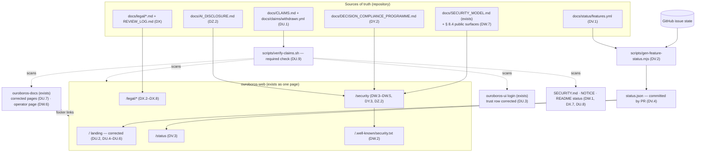
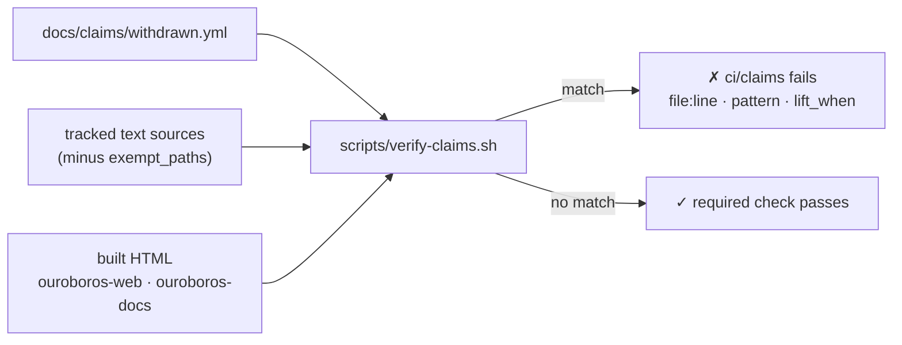
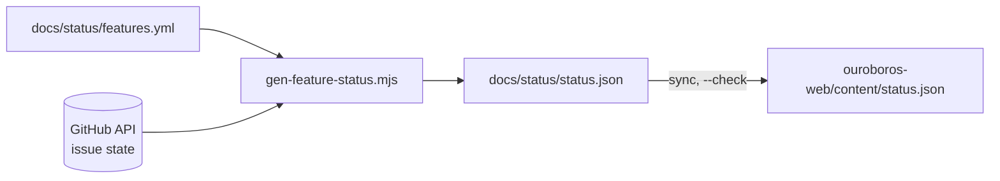
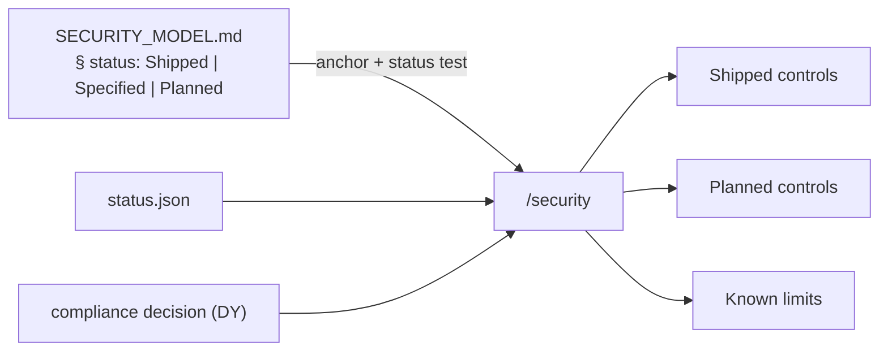
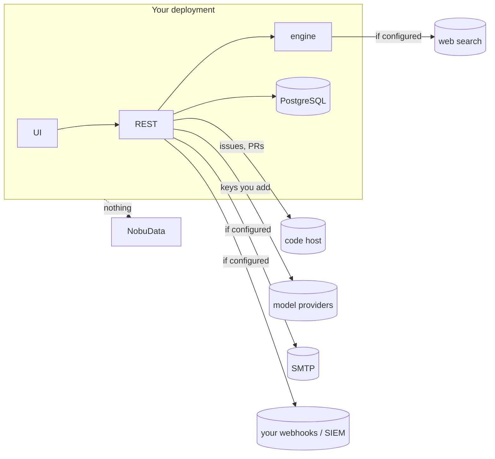
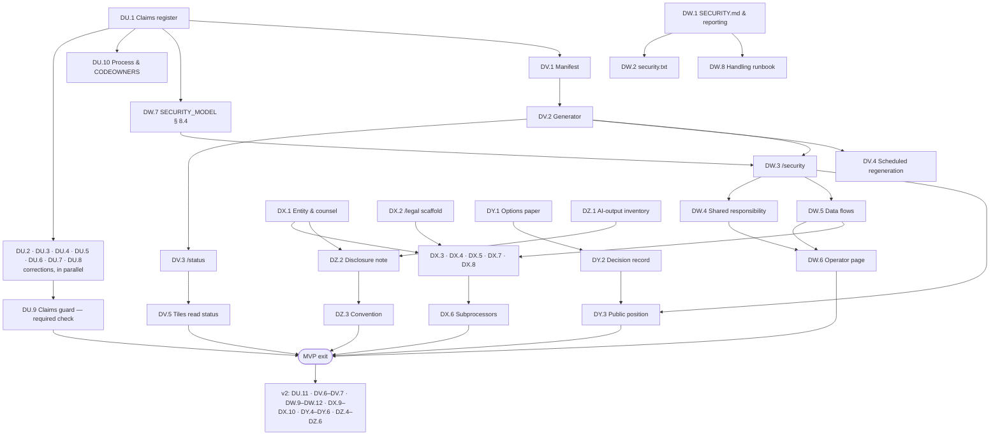

# Roadmap — Honest Claims and Trust Centre (`ouroboros-web`, `ouroboros-docs`, `ouroboros-ui`)

## Description

> Honest claims and trust centre: the marketing site advertises certifications and features (SOC 2 Type II, ISO 27001, SSO/SAML/SCIM, EU data residency, "start free") that the product's own security document withdraws, its hero statistics come from a fictional demo tenant, and there are no legal terms. Audit and correct every public claim, publish a feature-status page generated from issue state, a security and trust page with the shipped controls and a shared-responsibility model for self-hosting, a legal baseline (terms, privacy, DPA template, subprocessors, licence and trademark notes), a dated decision on a compliance programme, and a note on AI-output disclosure.

**Status of this document:** planning only, written 2026-10-10. **Nothing in it is filed, built
or published.** Every page, file, check and policy named below is *proposed* unless a section
says "exists today" and names the file. This roadmap plans the production and review of legal
documents; it contains no legal advice, and every legal text it names must be drafted or
reviewed by counsel before publication (decision T9).

## Context & Existing Work (duplicate-avoidance survey)

Surveyed 2026-10-10 against `main` at `1c54e329`. Origin: gap-analysis item **P0-3** in
`ouroboros-studio/reports/Ouroboros competitor gap analysis.md` ("the cheapest item on the
list and the only one that removes an existing liability").

### What exists today

| Thing | State | Where |
|---|---|---|
| Badge policy: a certification badge renders only when the certification exists, dated, never from a flag, and "until then the slot renders nothing" | **Exists** as a rule for product security surfaces | [`SECURITY_MODEL.md` § 8.3](SECURITY_MODEL.md#83-the-badge-policy) |
| Rule "a security claim ships only after it appears here" | **Exists**, scoped to that document's surfaces | [`SECURITY_MODEL.md` § 10](SECURITY_MODEL.md#10-changing-this-document) |
| An absence assertion for the two withdrawn badges on the Providers page | **Exists** (`WITHDRAWN_BADGES`, e2e) | `tests/e2e/support/providers.ts:286` |
| Documentation site, live | **Exists**; `https://docs.ouroboros.build` answered `200` on 2026-10-10 | `ouroboros-docs/`, [`ROADMAP_OUROBOROS_DOCUMENTATION_SITE.md`](ROADMAP_OUROBOROS_DOCUMENTATION_SITE.md) |
| Marketing site source: one page, no tests, lint + build only in CI | **Exists** | `ouroboros-web/app/page.tsx` (574 lines), `.github/workflows/docker-publish.yml` |
| Licence | Apache-2.0 text, no copyright line, no `NOTICE` | [`LICENSE`](../LICENSE) |
| `SECURITY.md`, `security.txt`, private vulnerability reporting, `CODEOWNERS`, `CONTRIBUTING.md`, `CHANGELOG.md`, terms, privacy policy, DPA, subprocessors list, trademark notes, status page, trust page | **Absent** — none found in the repository; GitHub reports `isSecurityPolicyEnabled: false` and private vulnerability reporting `enabled: false` (read 2026-10-10) | `ls`, `gh repo view`, `gh api …/private-vulnerability-reporting` |
| Product telemetry | None sent; opt-in telemetry is #400 (v2, open) | [`ROADMAP_MOCKUP_13_ONBOARDING.md`](ROADMAP_MOCKUP_13_ONBOARDING.md) |

### Issue survey

Searched `gh issue list -R NobuData/ouroboros --search "<term> in:title" --state all` for:
*compliance, SOC 2, trust, privacy, terms, DPA, status page, security page, marketing, landing,
changelog, disclosure, ouroboros-web, trademark, license, telemetry, SECURITY.md,
subprocessor, AI Act, pricing, residency.* Twelve terms returned nothing at all. **No issue
covers the marketing site's claims, a trust centre, legal terms, a status page, a disclosure
policy or AI-output disclosure.**

| Existing work | Disposition under this roadmap |
|---|---|
| #226 AD.5 Security model documentation (closed), #232 AE.6 security strip (closed) | **Source of truth, extended** — DW.7 adds a section that brings the marketing site, the docs site and the login page under § 8.3 and § 10. The document's existing sections are not rewritten. |
| #500 BT.4 SaaS governance tier (open, v2): region selection with migration, training-data controls, entitlements, "compliance packs (SOC2-style evidence exports)" | **Not duplicated.** Compliance evidence exports stay there. DY decides *whether and when the vendor is audited*; #500 builds *what a hosted tier exports*. DY.5 names #500 as the place evidence tooling lands. Amendment proposed (see Totals). |
| #397 BD.2 Managed keys & hosted runner tier (open, v2) | **Blocks** DV.7 (hosted status page) and DX.10 (hosted-tier terms). Not touched. |
| #722 / #723 Enterprise SSO (open, v2), #497 SCIM & group sync (open, v2), #122 GitHub App (open, v2), #236 KMS/Vault wrappers (open, v2), #237 cap enforcement (open, v2), #25 row-level security (open, v2), #38 security baseline hardening (open, v2), #58 deployment runbook (open, v2) | **Read, never claimed.** These are the issues the false claims point at. DV's status page reports each as *Planned* from its GitHub state; the DU.9 guard keeps the claim off public surfaces until the issue closes **and** the register row is changed. |
| #160, #235, #315, #375, #265, #396, #991 (execution bridge, chain executor, real execution, loop-created PRs, build-stage integration, live first loop, source checkout) | **Read.** They decide what the loop copy may say (DU.5). Owned by gap-analysis item P0-1 (Live Loop), not here. |
| #400 BD.5 Opt-in aggregate telemetry (open, v2) | **Constrains** DX.4 and DW.5: the privacy policy and the data-flow statement say "none sent" today and must be amended in the same pull request that ships #400. Amendment proposed. |
| #1169 CY.6 docs landing (closed), #1190 DB.2 deploying (closed), #1199 DB.11 retention, audit & lifecycle (closed) | **Linked and corrected.** DW.6 adds an operator page beside them; DU.7 corrects two statements in pages they delivered. |
| #1212 DE.4 docs coverage gate (closed) | **Pattern reused** — DU.9's guard is a sibling check, wired the same way. |
| #769 CS.5 Marketplace policy & trust store (open) | **Unrelated** — "trust" there means snippet signing. |
| #374 AZ.4 App merge identity & deep licence scanning (open, v2) | **Unrelated to DX.7** (it scans customer diffs), **related to DZ.4** (the identity loop commits are attributed to). Amendment proposed. |
| Gap-analysis item P0-2 (agent runtime security and untrusted input) | **Not yet a roadmap file.** DW.9 (control mapping) and the disclosure runbook's severity model depend on it and are held until it exists. |

### What the survey could not establish

- **What `https://ouroboros.build` serves today.** From the survey machine the host presented a
  TLS certificate whose subject does not match `ouroboros.build` (and the same for
  `app.ouroboros.build`), so the deployed page was not read. `docs/CONVENTIONS.md:19` and
  `ouroboros-web/README.md:5` both say it is deployed. Every row below describes the
  **source on `main`**; DU.6 includes a post-deploy read and DU.11 a recurring one.
- **Whether a fresh production deployment shows only seeded data** on Dashboard and Insights
  (the gap analysis lists this as unverified; no stack was run for this roadmap).
- **The YouTube channel** linked from the call to action (`@OuroborosBuild`) was not opened.
- **Hosting-layer logging** for the two public sites (what the host or CDN records about
  visitors) is not described anywhere in the repository; DX.4 audits it.

## Claims inventory (the core of Epic DU)

Method: every user-visible string in `ouroboros-web/app/*.tsx` was read in full with line
numbers; `README.md`, `HOSTING.md`, `LICENSE`, `docs/SECURITY_MODEL.md`, `ouroboros-docs/docs/**`
and `ouroboros-ui/app/login` were searched for the same claim families. Verdicts:
**False** (contradicted by a named source), **Partly** (one clause true, one not),
**Qualified** (true only with a condition the copy omits), **Unverifiable** (no evidence
either way), **Puffery** (not a factual claim, but it leans on one), **True**.
"SM" is `docs/SECURITY_MODEL.md`; "INV" is the gap analysis's own-feature inventory
(`ouroboros-studio/research_notes/…/own_feature_inventory.md`), used where it cites issue
state; issue states were re-read from GitHub on 2026-10-10.

### A. Certifications, identity and data location

| # | Claim (verbatim) | Where | Verdict | Evidence | Proposed disposition |
|---|---|---|---|---|---|
| C01 | "SOC 2 Type II" (chip) | `ouroboros-web/app/page.tsx:496` | **False** | SM § 1: "Withdrawn. No audit has been performed."; SM § 8.3 calls a pre-audit badge "a false compliance claim" | Remove (DU.2). Add to the withdrawn list (DU.1) and guard (DU.9). The slot renders nothing (§ 8.3 rule 5). |
| C02 | "ISO 27001" (chip) | `page.tsx:497` | **False** | SM § 1: "Withdrawn. No certification exists." | Remove (DU.2); withdrawn list; guard. |
| C03 | "SOC 2 Type II", "SSO / SAML" (login trust row, rendered by **every deployment**) | `ouroboros-ui/app/login/brand-panel.tsx:35` (rendered at `:74`); shown in the published docs screenshot `user-guide.sign-in` | **False** | Same as C01; SSO is #722/#723, open, v2. The file's own comment says the row is the mockup's "verbatim" | Remove both; keep "Self-hostable" (DU.3). Recapture the docs screenshot. **This is the product, not the marketing site — the widest exposure of any row here.** |
| C04 | "SSO / SAML / SCIM" (chip) | `page.tsx:498` | **False** | #722, #723 (SSO) and #497 (SCIM) are open, `v2`; `administration/sign-in-and-workspace.mdx:117` says "Enterprise SSO is not available yet" | Remove (DU.2). Status page lists all three as Planned (DV). |
| C05 | "EU data residency" (chip) | `page.tsx:499` | **False** as a product capability | SM § 6.7: region "is a label, read-only … setting it moves no data"; region choice is #500, open, v2 | Replace with the earned statement: "Self-hosted — your data stays where you deploy it" (DU.2). |
| C06 | "Zero data retention option" (chip) | `page.tsx:501` | **Unverifiable / misleading** | No Ouroboros-operated service exists to retain anything; SM § 6.7: model providers "do receive the prompts and code context … their retention and training terms are the provider's" | Remove. The data-flow statement (DW.5) says what is true instead. |
| C07 | "Self-hostable runners" (chip) | `page.tsx:500` | **True**, with a limit | Build farm agent shipped (INV row 08); a build submitted to a real runner waits until #991 (open, `mvp`) | Keep; the status page carries the #991 limit. |
| C08 | "Isolated tenants per domain, SSO-enforced, least-privilege GitHub App scopes — and a paper trail for every decision a machine ever made." | `page.tsx:477-478` | **Partly** | Tenant isolation and audit are shipped (SM § 2.3, § 5); row-level security is #25, open, v2. "SSO-enforced": false (#722). "GitHub App": false — sign-in and repository access use an OAuth app and a workspace token; the App is #122, open, v2 (`HOSTING.md:173`) | Rewrite to: per-workspace isolation, per-workspace encryption key, append-only audit log (DU.2). |
| C09 | "SAML/OIDC through your IdP, roles synced from your groups, keys sealed in a per-tenant vault." | `page.tsx:484` | **Partly** | First two false (#722, #497). Third true (SM § 2) | Rewrite; keep the vault clause using SM § 8.1's approved wording (DU.2). |
| C10 | "Every merge, key rotation, waiver, and chat command in one log — streamed to your SIEM, retained on your terms, in your region." | `page.tsx:492` | **Partly** | Audit log, signed webhook stream, retention tiers: shipped (INV, Settings epics closed). "chat command": false — Chat Ops has 0 of 15 MVP issues closed. "in your region": true only because the operator chose where to deploy | Remove "chat command"; replace "in your region" with "in your own deployment" (DU.2). |
| C11 | "Autonomy your security team can sign off on." | `page.tsx:475` | **Puffery** resting on C01–C10 | — | Reword after C01–C10 are corrected; link to the security page (DW.3). |

### B. Statistics, screenshots and demo data

| # | Claim | Where | Verdict | Evidence | Proposed disposition |
|---|---|---|---|---|---|
| C12 | "92% autonomous merge rate", "~4 min to your first PR", "$1.87 per merged PR", "31% tokens served locally, free" | `page.tsx:266-269` | **False** as results | `docs/mockups/README.md:72`: "All product data on the screens is fictional demo content (tenant `acme-robotics` …)"; no loop has run (C16) | Remove from the hero. If kept anywhere, label "Illustrative figures from fictional demo data — not measured results" adjacent to the numbers (DU.4). |
| C13 | "measured on the acme-robotics demo fleet · 90 days · 1,284 builds" | `page.tsx:271` | **False** — nothing was measured | Same | Remove "measured"; see C12. |
| C14 | "Your last 1,284 builds have opinions." / "You were never going to read 1,284 build logs. It already has." | `page.tsx:159-160` | **Puffery** on a fictional number | Same | Reword without the number (DU.4). |
| C15 | Browser-chrome captions "app.ouroboros.build — mission control" / "app.ouroboros.build" over product images | `page.tsx:390`, `:439` | **Misleading** | Images are from the mockup set (`ouroboros-web/README.md:29-30`), with fictional data; no hosted application exists (INV § 4: "No hosted/SaaS offering and no sign-up flow") | Replace with real screenshots from the docs pipeline or caption each "Design mockup — demo data"; drop the hosted URL (DU.4). |
| C16 | Chat Ops screenshot `/shots/19-chatops.png` and Workflow Copilot screenshot `/shots/20-workflow-copilot.png` shown as product | `page.tsx:181`, `:458` | **False** / **Partly** | Chat Ops: nothing built. Copilot: 7 of 15 MVP issues closed (INV row 20) | Remove the Chat Ops image; mark Copilot "in progress" (DU.4, DU.5). |

### C. What the loop does

| # | Claim | Where | Verdict | Evidence | Proposed disposition |
|---|---|---|---|---|---|
| C17 | "Sizes the work, writes the code, builds on your hardware, proves the work and merges it." Also the page metadata: "writes the fix, builds on your own hardware, proves the PR does what the ticket says — and merges it." | `page.tsx:256-259`; `ouroboros-web/app/layout.tsx:30`, `:34` | **False** today | Workflow execution #160, chain executor #235 (the invoke route answers `501`), real execution #315, loop-created PRs #375, build-stage integration #265: all open, `v2`. The user guide says a simulated run is "not … a real loop: no executor, repository or model did the work it shows" (`user-guide/concepts.mdx`) | Rewrite the lede and metadata to the shipped control plane, with one sentence on what is not built and a link to the status page (DU.5). |
| C18 | "Issue in. Verified pull request out. Forever." … "Nobody re-runs anything … You find out when it merges, not when it breaks." | `page.tsx:322-327`; footer blurb `:531-532`; `README.md:3-4` | **False** today (describes the design) | Same as C17 | Present as the design, in the future tense or with a "Planned" mark; README gains a status paragraph (DU.5, DU.8). |
| C19 | "The right model for each stage writes the change; your own build farm compiles it and runs the suite — including physical hardware-in-the-loop benches." | `page.tsx:373` | **False** today | #235 (no invocation), #265 (no build-stage integration), #991 (builds wait) | Rewrite (DU.5). |
| C20 | "Gates green, policy satisfied — the loop merges, closes the issue, and pulls the next one." | `page.tsx:378` | **False** today | The merge executor is shipped for pull requests opened by people or fixtures (INV row 12); loop-created PRs are #375 | Rewrite to what the gate and merge executor do today (DU.5). |
| C21 | "Run your first loop" (button), "First loop in about four minutes — draft PRs only, until you say otherwise." | `page.tsx:262`, `:511-512` | **False** | The wizard's first loop is walked by the simulated driver; live first loop is #396, open, v2. No timing was measured | Replace with "Self-host it" → docs deploy guide; drop the timing (DU.5, DU.6). |
| C22 | "Start free" / "Start free — no card" | `page.tsx:235`, `:515` (the second links to `#top`) | **Misleading** | No sign-up, plan, price or hosted service exists. What is true: Apache-2.0 source, self-hosted | Replace with "Free and open source (Apache-2.0) — self-host" linking to the deploy guide and the repository (DU.6). |
| C23 | "designed for the future, available now." | `page.tsx:509` | **Partly** | The control plane is available as source; the loop is not | Reword (DU.5). |
| C24 | "All out of the box, zero configuration." · "you configure: nothing" · "you install: one CLI tool" · "The only thing you add to your SDLC is one CLI tool. That's all." | `page.tsx:294`, `:188-189`, `:301-302` | **False** | `HOSTING.md` § 1–3: five containers, a GitHub OAuth app, a vault master key, and a TLS gateway if the farm is used | Remove (DU.5). |
| C25 | "No guess work: what's written will be done." · "you get: what's written, done" | `page.tsx:293`, `:191` | **Unverifiable** outcome guarantee | No executor; no evidence | Remove (DU.5). |
| C26 | "Every open issue is continuously estimated — effort, risk, files touched, cost" | `page.tsx:368` | **Qualified** | Shipped with the `heuristic-v0` estimator and nightly re-estimation; the model-backed estimator is #123, open, v2 | Keep with "heuristic today" (DU.5). |
| C27 | "Create bug fixes, fix regressions, create product roadmaps and improvements, perform project and competitive gap analysis with full research tools" | `page.tsx:330-332` | **Partly** | Research: 23 of 27 MVP issues closed, UI 4 of 8 (INV row 22). "Create bug fixes": no executor | Keep research and planning as "in progress"; remove fix creation (DU.5). |

### D. Feature tiles and deep dives

| # | Claim | Where | Verdict | Evidence | Proposed disposition |
|---|---|---|---|---|---|
| C28 | Workflow Studio: "node canvas, typed DSL, or a plain sentence. All three edit the same graph, losslessly." | `page.tsx:25` | **Partly** | Canvas and code view shipped with a lossless round trip (INV rows 04, 05). "A plain sentence" is Workflow Copilot, in progress | Two editors shipped; Copilot marked in progress (DU.5). |
| C29 | "Dry runs — rehearse any workflow on a real issue with zero side effects, and let the AI suggest improvements from what it saw." | `page.tsx:107`; caption `:458` | **Partly** | The canvas dry run is shipped and calls no model (`concepts.mdx`); the deep dry run with suggestions is Copilot, in progress | Split the sentence (DU.5). |
| C30 | Model registry: "Bring your own keys for Anthropic, GitHub Copilot, Cursor — or none at all, with local models over Ollama and vLLM serving tokens at zero cost." Tags `anthropic copilot cursor ollama vllm` | `page.tsx:33-34`, `:116` | **Qualified** | Five adapters shipped for validate, discover, test and pull — "**not** for invocation" (INV § 5). Nothing is served through Ouroboros until #235 | Keep the key-management claim; drop "serving tokens" until #235 (DU.5). |
| C31 | "Per-task routing", "Escalation rules" | `page.tsx:119-120` | **Qualified** | Shipped as resolution: "resolution is a function; nothing is invoked" (INV row 06) | Keep with the qualifier (DU.5). |
| C32 | "Spend guards — per-run and per-provider caps that pause the loop before it gets expensive." and "Loops pause at $2.50." | `page.tsx:121`, `:488` | **False** as enforcement | Decision P7 in `ROADMAP_MOCKUP_07_PROVIDERS_KEYS.md:126`: caps are "warning-first … labeled 'warning only'" until AF.4 (#237, open, v2) | "Spend meters and warnings; enforcement planned" (DU.5). |
| C33 | "Versioned, auditable, editable as code." (policies) | `page.tsx:488` | **Partly** | One versioned, audited policy document: shipped. "Edit as code" is BT.2, v2 (`ROADMAP_MOCKUP_17_SETTINGS.md:102`) | Drop "editable as code" (DU.2). |
| C34 | PR Verification: tags "7 gates"; "Seven gates stand between generated code and your main branch"; "Second-model review — an independent model votes on the diff; disagreements block." | `page.tsx:42`, `:145`, `:148` | **Partly** | Gates shipped: build, test suite, HIL, diff-vs-plan, secrets + licence, human approval; the second-model gate "renders pending/absent" and is #371, open, v2 (INV row 12) | State six gates and name the seventh as planned, or drop the count (DU.5). |
| C35 | "Honest waivers", "Policy-gated auto-merge … Dry-run drafts until you flip the switch." | `page.tsx:149-150` | **True** for pull requests opened by people | INV row 12; `concepts.mdx` | Keep. |
| C36 | Build farm: "Your machines, enrolled with one outbound-only command." "Outbound-only runners — pools for firmware, macOS, GPU, and HIL jobs" | `page.tsx:49`, `:131-133` | **True** for enrolment; **Qualified** for running builds | Agent, enrolment, mTLS, pools shipped; #991 open | Keep with the #991 limit (DU.5). |
| C37 | "Warm caches — ccache, env snapshots, and history-replayed estimates keep cycles in minutes." | `page.tsx:136` | **Unverifiable** — likely not shipped | Remote shared cache and warm-snapshot activation are listed as v2 (INV rows 08, 14); no shipped evidence found | Remove until evidence is attached to the register (DU.5). |
| C38 | Build Analyzer: "An AI reads every build you've ever run … and drafts the fix — with evidence." … "the analyzer retrains on its own misses." | `page.tsx:57`, `:165` | **False** ("an AI"); **Unverifiable** ("retrains") | MVP analyzers are deterministic, "no model provider" (SM § 6.6); the model pass is #522, open, v2. Change points, suggestions, drafted tickets and the 14-day measurement are shipped | "Deterministic analysis" for the shipped parts; remove "an AI" and "retrains" (DU.5). |
| C39 | Chat Ops tile and deep dive: "Loops report to Slack or Teams; blocked builds ask their question in-channel …", "/ouro command set", "An AI presence — 'why did #479 take 38 minutes?' gets an answer" | `page.tsx:63-66`, `:171-183` | **False** | Chat Ops MVP 0 of 15 closed; Teams is #547, v2; AI presence is v2 | Remove the section or render it as "Planned" with no screenshot; "Nine systems" (`:402`) becomes eight (DU.5). |
| C40 | Insights: "computed from events, not self-reported. Numbers you can quote in the standup" | `page.tsx:73` | **Qualified** | Shipped, over seeded or simulated data until loops run (INV row 15) | Keep the first clause; drop "numbers you can quote" until P0-1 (DU.5). |
| C41 | Planning: "drafts them sized and dependency-wired for GitHub, Jira, or Linear" | `page.tsx:81` | **Partly** | GitHub push shipped; Jira and Linear are #290, #156, #157, open, v2 (the docs say so: `user-guide/issues.mdx:24`) | "for GitHub; Jira and Linear planned" (DU.5). |
| C42 | Knowledge tile | `page.tsx:90` | **True** | INV row 14 | Keep. |

### E. Links, legal identity and other surfaces

| # | Claim or defect | Where | Verdict | Evidence | Proposed disposition |
|---|---|---|---|---|---|
| C43 | Footer "Pricing" → `#cta`; "Docs" → `#top`; "Security" → `#top` | `page.tsx:559-561` | **Dead links**; "Pricing" implies a price | No pricing exists; the docs site is live at `docs.ouroboros.build`; no security page exists | Docs → the docs site; Security → the security page (DW.3); remove "Pricing" until gap-analysis item P1-5 decides one (DU.6). |
| C44 | "© 2026 Ouroboros · ouroboros.build" | `page.tsx:567` | **Inconsistent** | The docs site footer is "Copyright © 2025-2026 NobuData LLC" (`ouroboros-docs/site.constants.ts`) | One legal entity everywhere, confirmed by the owner (DX.1, DX.7). |
| C45 | "Explore our YouTube" → `youtube.com/@OuroborosBuild` | `page.tsx:517` | **Unverifiable** (not opened) | — | Verify the channel exists and what it shows; apply DZ's disclosure rule to any synthetic narration (DU.6, DZ.3). |
| C46 | "Continue with SSO — if your company signs in through its own identity provider (SAML 2.0 or OIDC — Okta, Entra ID, Google Workspace)" and "on your team's deployment you sign in with GitHub or SSO" | `ouroboros-docs/docs/user-guide/getting-started/sign-in.mdx:5`, `:19-21`, `:30` | **False**, and contradicted inside the same site | `administration/sign-in-and-workspace.mdx:117-119`: "Enterprise SSO is not available yet … for every domain the answer is *Enterprise SSO is not configured yet*" | Rewrite the user-guide page to match the administration page (DU.7). |
| C47 | "Ouroboros works through a GitHub App with least-privilege scopes — contents, issues and pull requests on the repositories you enable, nothing else." and "a separate GitHub App that each workspace installs" | `sign-in.mdx:44-46`; `administration/sign-in-and-workspace.mdx:83-84` | **False** | #122 open, v2; `administration/retention-audit-lifecycle.mdx:124` says there is no "GitHub App installation to remove" | Rewrite to the OAuth app and workspace token, and state the scopes actually requested — **not verified by this survey** (DU.7). |
| C48 | "an autonomous software delivery loop: issues in, verified pull requests out, continuously." | `README.md:3-4`; GitHub repository description "Ouroboros: Infinity in Autonomy" | **Partly** (design statement, no status) | C17 | Add a "What works today" paragraph linking the status page (DU.8). |
| C49 | "ouroboros.build (already live)"; "Deployed at https://ouroboros.build" | `docs/CONVENTIONS.md:19`; `ouroboros-web/README.md:5` | **Unverifiable** on 2026-10-10 | TLS certificate name mismatch from the survey machine | Owner confirms; DU.11 monitors (DU.6). |
| C50 | Mockups still draw "SOC 2 Type II", "ISO 27001", "SSO/SAML" | `docs/mockups/01-login.html:143`, `docs/mockups/07-providers.html:369-370`; ASCII art at `ouroboros-ui/README.md:930` | **Historical design artefacts**, public on GitHub | SM § 1 already records them as withdrawn | Leave the artwork; add a one-line banner to each mockup and list the paths as guard exemptions with a reason (DU.8, DU.9). |
| C51 | "The single-host production runbook … is not written yet … not from a deployment that has been run in production." | `HOSTING.md:10-13` | **True** (an honest limit) | — | Keep, and repeat on the security page's shared-responsibility section (DW.4). |
| C52 | Licence: "Apache License 2.0" | `README.md:475-477`; `LICENSE` | **True**; incomplete | No copyright notice, no `NOTICE`, no third-party inventory, no trademark statement | DX.7, DX.8. |

**Count: 52 rows — 21 false or misleading, 11 partly true, 5 qualified, 7 unverifiable or
puffery, 3 defects of link, identity or artwork, 5 true.** The three most serious are C03 (the product's
own login page asserts SOC 2 Type II to every person who opens a deployment), C01–C02 (the
marketing chips) and C17 (the lede and page metadata describe an executor that is not built).

## Research Notes (sources)

Estimates below are planning ranges from vendor and consultancy blogs unless marked
otherwise; **none is a quote**, and every figure must be replaced by real quotes in DY.1.

**What a credible trust centre contains.**
- GitLab's trust centre publishes SOC 2 reports and an ISO 27001/27017/27018 certificate
  **for GitLab.com and GitLab Dedicated**, a penetration-test executive summary, a CAIQ and
  SIG self-assessment, subprocessors, a DPA, status monitoring and a HackerOne reporting
  link, with public and private document tiers. **Self-managed GitLab is not named in the
  scope statements on that page** — [trust.gitlab.com](https://trust.gitlab.com/) (fetched
  2026-10-10 through a summarising reader).
- PostHog states SOC 2 Type 2 with a yearly reporting period, an annual penetration test,
  a DPA for cloud customers and a subprocessor list; for self-hosting: "We do not have
  access to any of their user data, so we do not have specific GDPR obligations to the
  customer's end users here" —
  [PostHog handbook: security](https://posthog.com/handbook/company/security).
- Grafana Labs publishes ISO 27001 and SOC 2 Type 2 (auditor named), a trust portal, a DPA
  and a cloud status page; the page does not state product scope for its self-managed
  editions — [Grafana security & compliance](https://grafana.com/legal/security-compliance/).
- The gap analysis's own baseline: "public docs, security page mapped to controls, trust
  portal with downloadable reports under NDA, status page, changelog, disclosure policy,
  DPA and subprocessors list" (commercial-readiness notes § 6), from
  [Cursor enterprise](https://cursor.com/enterprise) and
  [Claude Code security](https://code.claude.com/docs/en/security) — not re-opened here.
- `security.txt` is defined by [RFC 9116](https://www.rfc-editor.org/rfc/rfc9116): `Contact`
  and `Expires` are required, everything else optional (`Policy`, `Encryption`,
  `Preferred-Languages`, `Canonical`, …), served at `/.well-known/security.txt` —
  [IANA security.txt fields](https://www.iana.org/assignments/security-txt-fields/security-txt-fields.xhtml);
  [JPCERT on RFC 9116](https://blogs.jpcert.or.jp/en/2022/08/rfc9116-introduction.html).
- GitHub private vulnerability reporting is enabled per public repository by an owner or
  admin, is independent of whether `SECURITY.md` exists, and feeds draft security
  advisories —
  [GitHub Docs: privately reporting a security vulnerability](https://docs.github.com/en/code-security/how-tos/report-and-fix-vulnerabilities/privately-reporting-a-security-vulnerability);
  [GitHub blog: a maintainer's guide](https://github.blog/security/vulnerability-research/a-maintainers-guide-to-vulnerability-disclosure-github-tools-to-make-it-simple/).
  **Not verified:** GitHub's exact CVE-request procedure.

**SOC 2 and ISO 27001 for the vendor of a self-hosted product.**
- Vendors that publish a position say the same thing: a SOC 2 report covers systems the
  vendor operates, so a self-hosted deployment is outside it — e.g. "acts as a software
  vendor, not a service organization for self-hosted deployments"
  ([pwpush self-hosted SOC 2 position](https://us.pwpush.com/self_hosted_soc2_position));
  a secondary blog makes the same point about n8n
  ([tray.ai](https://tray.ai/blog/n8n-soc-2-compliance-self-hosted/)). These are vendor
  positions, not an AICPA rule. **Inference:** the scopes open to Ouroboros are (a) the
  vendor's build and release process, (b) a future hosted tier, (c) both, (d) none.
- SOC 2 cost (estimates): first-year totals from about **$25,000–$40,000** on a lean,
  automation-heavy Type II path to **$45,000–$80,000** for Type I then Type II with a
  mid-tier firm; one guide gives **$30,000–$110,000** including platform, auditor, labour,
  remediation and a penetration test. Audit fees alone are quoted anywhere from
  $7,000–$15,000 to $25,000–$75,000 for Type II. Ongoing: $15,000–$75,000 a year —
  [Petronella](https://petronellatech.com/blog/soc-2-compliance-cost-in-2026-what-startups-actually-pay);
  [Agency](https://blog.getagency.com/articles/how-much-does-soc-2-compliance-cost-2026);
  [Klaay](https://www.klaay.com/blog/soc-2-compliance-cost-2026).
- SOC 2 timeline (estimates): Type II needs an observation window, minimum about three
  months, with six commonly expected by enterprise buyers; a common path is Type I around
  month 4 and Type II around months 10–11 —
  [beancount.io guide](https://beancount.io/blog/2026/05/11/soc-2-type-ii-saas-startups-trust-services-criteria-audit-cost-six-month-observation-window-first-examination-guide).
- Compliance platforms do not publish prices; third-party estimates put entry contracts
  near $7,500–$12,000 a year and a hosted trust-centre add-on near $6,000 a year
  (**unverified**, reseller and competitor blogs) —
  [Wolfia on Vanta](https://connect.wolfia.com/blog/vanta-reviews-pricing-alternatives).
- ISO 27001 (estimates): **$15,000–$50,000** in year one for a small organisation;
  certification-body Stage 1 + Stage 2 audit $6,000–$30,000; 6–12 months to first
  certificate; a three-year cycle with surveillance audits in years one and two
  ($4,000–$12,000 each) and recertification in year three —
  [Consilien](https://consilien.com/news/iso-27001-certification-cost-timeline);
  [Elevate](https://elevateconsult.com/insights/iso-27001-certification-cost/);
  [BD Emerson](https://www.bdemerson.com/article/iso-27001-certification-cost).
- Penetration test (estimates): **$5,000–$30,000** for a web application; a planning figure
  of roughly $10,000–$25,000 for one scoped test with a retest; quotes near $2,000 are
  usually scans —
  [Blaze](https://www.blazeinfosec.com/post/how-much-does-penetration-testing-cost/);
  [Redfox](https://www.redfoxsec.com/blog/how-much-does-web-application-penetration-testing-cost-2026-pricing-guide).
- False certification claims: the US FTC has treated a false or lapsed claim of
  participation in a voluntary certification programme as deception under Section 5 of the
  FTC Act (the Safe Harbor and Privacy Shield cases) —
  [WilmerHale](https://wilmerhale.com/en/insights/blogs/wilmerhale-privacy-and-cybersecurity-law/ftc-settles-deception-charges-relating-to-privacy-program-claims);
  [Inside Privacy](https://www.insideprivacy.com/united-states/federal-trade-commission/ftc-settles-enforcement-actions-relating-to-privacy-shield-certifications/).
  **No SOC 2-specific enforcement case was found**; this is an analogy for counsel to
  assess, not a finding.

**Legal baseline for self-hosted open source.**
- Small open-source vendors publish a "no processing" position for self-hosted use: the
  customer is sole controller, the vendor is not a processor, and the DPA applies to the
  hosted service only ([Stalwart DPA](https://stalw.art/legal/dpa.pdf);
  [Betterlytics DPA](https://betterlytics.io/dpa)); one publishes a dedicated
  "no processing, self-hosted" DPA template
  ([Altcha](https://next.altcha.org/legal/DPA_No_Processing_Self_Hosted.docx.pdf)).
  Small-vendor examples only; **counsel decides the position for NobuData**.
- Apache-2.0 § 6: "This License does not grant permission to use the trade names,
  trademarks, service marks, or product names of the Licensor, except as required for
  reasonable and customary use in describing the origin of the Work" — [`LICENSE`](../LICENSE).
  Projects add a separate trademark policy, often derived from the Model Trademark
  Guidelines — [NumFOCUS trademark guidelines](https://numfocus.org/trademark-guidelines);
  [LWN: trademarks for open collaboration](https://lwn.net/Articles/592966).

**EU AI Act Article 50.**
- Text (Regulation (EU) 2024/1689): 50(1) providers ensure people "are informed that they
  are interacting with an AI system"; 50(2) providers of systems "generating synthetic
  audio, image, video or text content" ensure outputs "are marked in a machine-readable
  format and detectable as artificially generated or manipulated"; 50(4) deployers disclose
  deep fakes, and AI-generated text "published with the purpose of informing the public on
  matters of public interest"; 50(5) the information is given "at the latest at the time of
  the first interaction or exposure". Applies from **2 August 2026** —
  [artificialintelligenceact.eu, Article 50](https://artificialintelligenceact.eu/article/50/).
- The Digital Omnibus kept that date and gave generative systems already on the market
  before 2 August 2026 until **2 December 2026** for the 50(2) marking duty; 50(1), 50(3)
  and 50(4) were not delayed —
  [Orrick](https://www.orrick.com/en/Insights/2026/07/EU-AI-Act-Update-Digital-Omnibus-Finalizes-8-Compliance-Changes);
  [Jones Walker](https://www.joneswalker.com/en/insights/blogs/ai-law-blog/yes-august-2-still-matters-the-eu-approved-a-high-risk-ai-delay-but-most-trans.html?id=102nbon);
  [Baker Botts](https://www.bakerbotts.com/thought-leadership/publications/2026/september/eu-ai-act-article-50-transparency-obligations-go-live);
  [Ropes & Gray](https://www.ropesgray.com/en/insights/viewpoints/102nfqm/you-talkin-to-me-operationalising-the-eu-ai-acts-transparency-obligations).
- **Unverified / conflicting:** that the Omnibus entered into force on 27 July 2026 as
  Regulation (EU) 2026/1744 (one secondary source; the Official Journal was not read); the
  date of the voluntary Code of Practice on marking and labelling (10 June 2026 in one
  source, 31 July 2026 in another); Commission guidelines dated 20 July 2026 (single
  source) — [Clifford Chance](https://www.cliffordchance.com/hubs/tech-group-hub/tech-group/tech-group-policy-unit/making-ai-transparency-work-article-50-code-of-practice.html).
  Penalty ceiling reported as €15m or 3% of worldwide turnover (secondary).
- **Not established by any source read:** whether a self-hosted orchestrator that calls
  third-party models with the customer's keys is a "provider" of a generative system under
  50(2), a "deployer", or neither; and whether a pull-request description or commit message
  is in scope at all. No vendor's published position on disclosure in pull requests or
  commits was found (commercial-readiness notes § 3, Gaps). **This is the question DZ.2 puts
  to counsel.**

## Infrastructure Options (researched — pick before filing)

### 1. Where the trust pages live

| Option | What it is | Fit | Trade-offs |
|---|---|---|---|
| **A — Routes on `ouroboros-web`: `/security`, `/status`, `/legal/*`, `/changelog`, `/.well-known/security.txt`** (recommended) | Statically generated pages on the apex domain, content authored as Markdown under `ouroboros-web/content/` | Where buyers, `security.txt` (RFC 9116) and legal links are expected to be; fixes the dead footer links in place | The site is one page with no content pipeline or tests today; its `AGENTS.md` warns the installed Next.js differs from common knowledge, so each issue reads `node_modules/next/dist/docs/` first |
| B — A fourth section in `ouroboros-docs` | "Trust" sidebar in Docusaurus | Search, strict links and the coverage gate already exist | The docs site is for users and operators (its D12); legal terms and a vendor compliance statement are not product documentation; `security.txt` must still sit on the apex domain |
| C — A separate `trust.ouroboros.build` on a vendor portal | Hosted trust-centre product | NDA-gated documents, questionnaires | Recurring cost (estimate, unverified: about $6,000 a year); nothing to gate yet. Kept as DW.11 (v2) |

### 2. How the feature-status page is generated

| Option | What it is | Fit | Trade-offs |
|---|---|---|---|
| **A — A committed manifest mapping features to issue numbers, resolved against GitHub by a script into a committed `status.json`** (recommended) | `docs/status/features.yml` (hand-reviewed) + `scripts/gen-feature-status.mjs` (`gh api`) + a scheduled workflow that opens a pull request when the JSON changes | Status is derived from issue state, as the description requires; the diff is reviewable; the site build needs no token | A feature's *mapping* is still a human judgement; the generator can only be as right as the manifest |
| B — Query GitHub at site build time | No committed JSON | Always fresh | A red GitHub API fails the site build; the image build would need a token; no review of what changed |
| C — Derive from labels alone (`mvp`, `v2`, area labels) | No manifest | Zero upkeep | Area labels do not map to buyer-visible features; an "area 100% closed" can still lack the executor (the Routing area is closed and invokes nothing) |

### 3. How a withdrawn claim is kept out

| Option | What it is | Fit | Trade-offs |
|---|---|---|---|
| **A — A register plus a source-and-output scan in CI** (recommended) | `docs/claims/withdrawn.yml` (pattern, reason, lifting condition, exempt paths) + `scripts/verify-claims.sh` scanning tracked text files and the built HTML of both sites; a required check | Catches a paste-back from the artwork in any module; lifting a claim is a reviewed diff to the register | Pattern lists invite evasion by rewording; mitigated by scanning families (regex) and by DU.10's review rule |
| B — Per-surface end-to-end assertions only (the `WITHDRAWN_BADGES` pattern) | One test per page | Precise | Covers only pages someone remembered; the login page was missed for exactly this reason |
| C — Review discipline alone | PR template checkbox | Free | It is what failed |

### 4. Uptime status page (v2 only)

| Option | What it is | Fit | Trade-offs |
|---|---|---|---|
| A — Open-source, repository-driven status page | Probes from scheduled workflows, static page | No vendor; matches self-hosting ethos | Probe frequency limited by the scheduler |
| B — Hosted status product | Subscriptions, incident workflow | Standard for a paid tier | Recurring cost; another subprocessor to list (DX.6) |
| **Deferred** | No hosted service exists to report on | — | Decide in DV.7 when #397/#500 are scheduled. Prices and product choices **not researched**. |

## Decisions proposed by this roadmap (validate before issue creation)

| # | Decision | Rationale |
|---|---|---|
| T1 | **Trust pages live on `ouroboros-web`** (option 1-A): `/security`, `/status`, `/legal/terms`, `/legal/privacy`, `/legal/dpa`, `/legal/subprocessors`, `/legal/licence`, `/legal/trademarks`, `/.well-known/security.txt`; `/changelog` in v2. The docs site links to them from its footer. | Apex-domain convention; replaces the three dead footer links. |
| T2 | **`SECURITY_MODEL.md` stays the single source for security wording.** A new § 8.4 extends § 8.3 and § 10 to the marketing site, the docs site and the login page; the security page renders sections of that document's approved copy rather than new prose. | The mechanism already exists and already says the right thing; it was never applied to these surfaces. |
| T3 | **A claims register** — `docs/CLAIMS.md` (the inventory above, maintained) and `docs/claims/withdrawn.yml` (machine-readable). A public factual claim about security, compliance, identity, data location, price, performance or a named integration ships only with a register row naming its evidence. | Makes "true" a reviewable artefact. |
| T4 | **The guard is a required CI check** (option 3-A) over tracked sources *and* the built HTML of `ouroboros-web` and `ouroboros-docs`. Exemptions are per path, each with a written reason (this roadmap, `SECURITY_MODEL.md`, the mockups, the register itself). | Withdrawn claims reappear from artwork; the login row proves it. |
| T5 | **Status vocabulary is the security document's, plus two**: *Shipped*, *In progress*, *Planned*, *Not planned*. A feature is *Shipped* only when every issue the manifest lists under `requires` is closed; *In progress* when some are; *Planned* when none are; a `limits` list (open issues that narrow a shipped feature, such as #991) is always shown. | Reuses the marks readers already meet; "the executor is not built" cannot hide behind a closed area. |
| T6 | **Feature status is generated** (option 2-A), regenerated daily and on demand, committed through a pull request, and stamped "Generated from GitHub issue state on <date>". The landing page's feature tiles read the same JSON, so a tile cannot say more than the status page does. | The description's "generated from issue state"; one source for both pages. |
| T7 | **No statistics on public pages unless measured on a real deployment, with the method linked.** Until gap-analysis item P0-1 produces a real loop, the hero carries no numbers. Demo data is labelled as demo data next to the figure or image, not in a footnote. | C12–C15. |
| T8 | **A negative compliance statement, not a hedge.** The security page says, dated: "Ouroboros holds no SOC 2 report and no ISO 27001 certificate." It does not say "in progress", "SOC 2-ready" or "compliant", whatever DY decides. | § 8.3 rule 5: a placeholder "is a compliance claim wearing a hedge". |
| T9 | **Counsel drafts or reviews every legal text**; nothing under `/legal` is published without a recorded review (reviewer, date, version) in `docs/legal/REVIEW_LOG.md`. Engineering issues build the pages and prepare factual inputs only. | The roadmap plans legal work; it is not legal advice. |
| T10 | **The contracting and copyright entity is NobuData LLC** — to be confirmed by the owner — and appears identically on the marketing site, the docs site, `LICENSE`/`NOTICE` and every legal page. | C44. |
| T11 | **Self-hosted position, subject to counsel:** for self-hosted use NobuData operates no service and receives no customer data; the DPA template and the subprocessor list cover only what NobuData itself operates (the two public sites today; a hosted tier later). | Matches the product (SM § 6.7) and the pattern at comparable vendors. |
| T12 | **Vulnerability reports go through GitHub private vulnerability reporting**, with a monitored mailbox as fallback; the address is the owner's to choose (proposed: `security@ouroboros.build`). No bounty in MVP. | No channel exists; GitHub's costs nothing. |
| T13 | **The compliance decision is a dated record with a review date**, `docs/DECISION_COMPLIANCE_PROGRAMME.md`, following the repository's `DECISION_*.md` pattern. This roadmap recommends an option (DY.1) but does not make the decision. | The description asks for a dated decision, not an audit. |
| T14 | **MVP includes the paper deliverables of DY and DZ** (options paper, decision record, public statement; disclosure inventory, note, convention). Audit engagement, penetration test, trust portal, hosted status page and the code that writes disclosure markers are v2. | The gap analysis's MVP list is claims audit, status page, security page and legal baseline; the decision and the note are documents the description requires and cost days. |
| T15 | **The AI-disclosure convention is specified now and implemented with the loop.** No loop-authored pull request exists today (#375), so DZ.3 is a specification delivered as amendments to the issues that will write them. | Avoids building disclosure for an executor that does not exist. |
| T16 | **Labels:** new `trust` ("Honest claims & trust centre — claims register, status, security, legal, compliance, disclosure") and new `web` ("ouroboros-web (marketing site)"), added to `.github/labels.yml`; existing `documentation`, `docs-site`, `ci`, `ui`, `design`, `infra`, `mvp`/`v2`. **Milestones:** `Trust Centre MVP`, `Trust Centre v2`. **Title prefixes:** `ouroboros-web:`, `ouroboros-docs:`, `ouroboros-ui:`, `ouroboros-rest:`, `ouroboros-engine:`, or `ouroboros:` for repository-wide work. Complexity XS–L. | The repository's per-roadmap label and milestone convention; no `web` label exists today. |
| T17 | **Epic letters DU–DZ**, as assigned. | — |

## Architecture Overview

Everything in this diagram is **proposed**. Solid boxes marked *(exists)* are on `main` today.



## MVP Definition

The MVP is done when **all** of the following hold on `main` and on the deployed sites:

1. **Claims audit.** Every row of the inventory above has its disposition applied or an
   explicit, recorded exception: no certification, SSO, SCIM, GitHub App, residency or
   retention claim appears on the marketing site, the docs site or the login page; no
   statistic or screenshot is presented without a demo-data label; the loop is described as
   the control plane that ships plus what is planned; the footer links resolve; the claims
   register exists; and the **withdrawn-claims guard is a required check** that fails when
   any withdrawn pattern returns (epic DU, issues DU.1–DU.10).
2. **Feature-status page.** `/status` lists every buyer-visible feature as Shipped, In
   progress, Planned or Not planned, generated from GitHub issue state through the manifest,
   dated, and the landing tiles read the same data (DV.1–DV.5).
3. **Security and trust page.** `SECURITY.md`, private vulnerability reporting and
   `security.txt` exist; `/security` lists the shipped controls, each traced to a section of
   `SECURITY_MODEL.md`, the shared-responsibility model for self-hosting, and what leaves a
   deployment; operators have a matching page in the docs site (DW.1–DW.8).
4. **Legal baseline.** Website terms, privacy policy, DPA template with the self-hosted
   position, subprocessors, licence notes and trademark notes are published under `/legal`,
   each with a recorded counsel review, an effective date and a version (DX.1–DX.8).
5. **Compliance decision.** A dated decision record exists with scope, timing, budget range
   and a review date, and `/security` states the present position as a fact (DY.1–DY.3).
6. **AI-output disclosure note.** The inventory of AI-generated outputs, the reviewed note
   and the disclosure convention exist, and the convention is posted as amendments on the
   issues that will produce loop-authored output (DZ.1–DZ.3).

**v2** (milestone `Trust Centre v2`): deployed-site claims monitor (DU.11); public changelog
(DV.6); uptime status page for a hosted tier (DV.7); control mapping from gap-analysis item
P0-2 (DW.9); penetration test and published summary (DW.10); trust portal with documents
under NDA (DW.11); self-assessment questionnaire (DW.12); contributor terms (DX.9);
hosted-tier terms pack (DX.10); readiness gap assessment, **audit engagement** and the dated
badge mechanism (DY.4–DY.6); disclosure markers in loop-authored pull requests and commits,
in-app labels and operator guidance (DZ.4–DZ.6).

## Epics, Labels & Milestones

| Epic | GitHub | Status | Name | Goal | Modules | Milestone |
|---|---|---|---|---|---|---|
| DU | — | ⚪ Not filed | Claims Audit & Guard | Correct every public claim; keep withdrawn claims out by a required check | ouroboros-web, ouroboros-ui, ouroboros-docs, docs, scripts, .github | Trust Centre MVP |
| DV | — | ⚪ Not filed | Feature-Status Page | A public shipped / planned / absent page generated from issue state | docs, scripts, ouroboros-web, .github | Trust Centre MVP |
| DW | — | ⚪ Not filed | Security & Trust Page | Disclosure channel, shipped controls, shared responsibility, data flows | ouroboros-web, ouroboros-docs, docs, .github | Trust Centre MVP |
| DX | — | ⚪ Not filed | Legal Baseline | Terms, privacy, DPA template, subprocessors, licence and trademark notes, counsel-reviewed | ouroboros-web, docs, repository root | Trust Centre MVP |
| DY | — | ⚪ Not filed | Compliance Programme Decision | A dated decision on SOC 2 / ISO 27001 scope and timing; engagement later | docs, ouroboros-web | Trust Centre MVP |
| DZ | — | ⚪ Not filed | AI-Output Disclosure | How AI-generated output is disclosed in pull requests, commits and narration | docs, ouroboros-web, ouroboros-rest, ouroboros-engine, ouroboros-ui | Trust Centre MVP |

Every issue below carries this **standard acceptance block**, referred to as **[STD]**:

- No public string is added or changed without a row in `docs/CLAIMS.md` naming its evidence
  (from DU.1 onward); `scripts/verify-claims.sh` passes (from DU.9 onward).
- Nothing planned is written in the present tense; a planned item is marked *Planned* and
  names its issue.
- For `ouroboros-web` changes: the implementer reads the relevant guide in
  `ouroboros-web/node_modules/next/dist/docs/` first (`ouroboros-web/AGENTS.md`); `yarn lint`
  and `yarn build` pass; both themes checked.
- For legal text: a `docs/legal/REVIEW_LOG.md` entry exists before publication (T9).
- Labels `trust` plus the module label; milestone per the MVP column.

---

## Epic DU — Claims Audit & Guard

| Ref | GitHub | Status | Title | Summary | Labels | Parallel | MVP | Complexity | Affected Modules |
|---|---|---|---|---|---|---|---|---|---|
| DU.1 | — | ⚪ Not filed | ouroboros: [DU.1] Claims register & withdrawn-claims list | `docs/CLAIMS.md` from the inventory; `docs/claims/withdrawn.yml` with patterns, reasons, lifting conditions | mvp, trust, documentation | N (first) | Y | S | docs |
| DU.2 | — | ⚪ Not filed | ouroboros-web: [DU.2] Remove withdrawn certification, identity & residency claims | Enterprise section and badge row rewritten to what ships (C01–C02, C04–C11, C33) | mvp, trust, web | Y (after DU.1) | Y | S | ouroboros-web |
| DU.3 | — | ⚪ Not filed | ouroboros-ui: [DU.3] Remove withdrawn claims from the login trust row | "SOC 2 Type II" and "SSO / SAML" leave the sign-in page; absence test; screenshot recaptured (C03) | mvp, trust, ui, auth | Y (after DU.1) | Y | S | ouroboros-ui, tests, ouroboros-docs |
| DU.4 | — | ⚪ Not filed | ouroboros-web: [DU.4] Remove or label demo statistics & mockup imagery | Hero numbers out; demo-data labels beside every figure and image (C12–C16) | mvp, trust, web, design | Y (after DU.1) | Y | S | ouroboros-web |
| DU.5 | — | ⚪ Not filed | ouroboros-web: [DU.5] Correct capability copy to shipped state | Lede, loop, tiles, deep dives and metadata say what ships and mark the rest Planned (C17–C42) | mvp, trust, web | N (after DU.1; ∥ DU.2, DU.4 by section) | Y | M | ouroboros-web |
| DU.6 | — | ⚪ Not filed | ouroboros-web: [DU.6] Fix dead links, calls to action & footer | Docs, Security, Pricing, "Start free", YouTube, deployed-site read (C21–C22, C43, C45, C49) | mvp, trust, web | Y (after DU.1) | Y | XS | ouroboros-web |
| DU.7 | — | ⚪ Not filed | ouroboros-docs: [DU.7] Correct SSO & GitHub App statements | User-guide sign-in page agrees with the administration page and with `main` (C46–C47) | mvp, trust, docs-site, documentation | Y (after DU.1) | Y | S | ouroboros-docs |
| DU.8 | — | ⚪ Not filed | ouroboros: [DU.8] README status paragraph, repository metadata & mockup banners | "What works today" in README; banners on historical mockups; repo homepage set (C48, C50) | mvp, trust, documentation | Y (after DU.1) | Y | XS | README.md, docs/mockups, ouroboros-ui |
| DU.9 | — | ⚪ Not filed | ouroboros: [DU.9] Withdrawn-claims CI guard | Required check scanning sources and built HTML for withdrawn patterns | mvp, trust, ci | N (after DU.2–DU.8) | Y | M | scripts, .github, ouroboros-web, ouroboros-docs |
| DU.10 | — | ⚪ Not filed | ouroboros: [DU.10] Claims-change process — conventions, PR template, CODEOWNERS | A claim is a reviewed change: CONVENTIONS section, checkbox, owners for claims files | mvp, trust, documentation | Y (after DU.1) | Y | XS | docs, .github |
| DU.11 | — | ⚪ Not filed | ouroboros-web: [DU.11] Deployed-site claims monitor | Scheduled read of the live sites against the withdrawn list and the TLS certificate | v2, trust, ci, web | Y | N | S | .github, scripts |

### Issue DU.1 — ouroboros: [DU.1] Claims register & withdrawn-claims list

**Problem Statement.** `SECURITY_MODEL.md` § 10 says a security claim ships only after it
appears in that document, but the rule covers only that document's surfaces. No file lists
what the public surfaces claim, what evidence each rests on, or which claims were withdrawn
and under what condition they may return. The inventory in this roadmap is a snapshot and
will rot.

**Solution / Scope.**
- `docs/CLAIMS.md`: the inventory tables above, moved and maintained — columns *id, claim,
  surface (file), verdict, evidence, disposition, status (open / corrected in #PR)*. One row
  per public factual claim about security, compliance, identity, data location, price,
  performance or a named integration.
- `docs/claims/withdrawn.yml`: one entry per withdrawn claim family — `id`, `patterns`
  (case-insensitive regular expressions, e.g. `SOC\s*2`, `ISO\s*27001`, `\bSCIM\b`,
  `SAML`, `data residency`, `zero data retention`, `GitHub App`, `no card`,
  `zero configuration`), `reason`, `source` (the `SECURITY_MODEL.md` section or issue),
  `lift_when` (e.g. "#722 and #723 closed **and** this entry removed by a reviewed PR";
  for certifications: "§ 8.3 rules 1–4 satisfied"), and `exempt_paths` with a reason each.
- A short "how to add a claim" section: evidence first, register row second, copy third
  (the § 10 order).
- Sources: `SECURITY_MODEL.md` § 8.3, § 10; this roadmap's inventory.

**Acceptance Criteria.**
- Every C-row of this roadmap is in `docs/CLAIMS.md` with status *open*.
- `withdrawn.yml` validates against a small JSON Schema committed beside it; each entry has
  a `lift_when`.
- Certification entries cite § 8.3 and cannot be lifted by closing an issue alone.
- [STD].

**Parallelism / Dependencies.** First issue of the roadmap; blocks DU.2–DU.10.

**Technical Stack.** Markdown, YAML, JSON Schema.

**Documentation.** None — internal-only change (contributor documents under `docs/`).

**Epic.** DU — Claims Audit & Guard.

```
docs/CLAIMS.md ──────────────┐  (humans: what we claim, and why it is true)
docs/claims/withdrawn.yml ───┼──▶ DU.9 guard
docs/claims/withdrawn.schema.json
   entry: { id, patterns[], reason, source, lift_when, exempt_paths[{path, why}] }
```

### Issue DU.2 — ouroboros-web: [DU.2] Remove withdrawn certification, identity & residency claims

**Problem Statement.** The Enterprise section of the marketing page (`page.tsx:471-504`)
shows "SOC 2 Type II" and "ISO 27001" chips that `SECURITY_MODEL.md` § 8.3 calls "a false
compliance claim", and asserts SSO, SCIM, group-synced roles, a GitHub App, EU data
residency and a zero-retention option, none of which is shipped (C01–C02, C04–C11, C33).

**Solution / Scope.**
- Delete the two certification chips; the slot renders nothing (§ 8.3 rule 5).
- Delete "SSO / SAML / SCIM", "EU data residency", "Zero data retention option".
- Replace the badge row with earned statements only: `self-hosted`, `Apache-2.0`,
  `Self-hostable runners`, `Per-workspace encryption keys`, `Append-only audit log`.
- Rewrite the section lede and the three cards from shipped controls, using
  `SECURITY_MODEL.md` § 8.1 wording for the vault clause verbatim; remove "chat command",
  "in your region", "editable as code" and "Loops pause at $2.50".
- Link "Read the security model" to `/security` once DW.3 lands (until then, to the
  document on GitHub, as § 8.1 specifies).
- Update `docs/CLAIMS.md` statuses.

**Acceptance Criteria.**
- None of the `withdrawn.yml` patterns matches `ouroboros-web/app/**` or the built HTML.
- Every remaining sentence in the section has a register row citing a *Shipped* section of
  `SECURITY_MODEL.md` or a closed issue.
- The section renders in both themes with no empty badge row.
- [STD].

**Parallelism / Dependencies.** After DU.1. Parallel with DU.3, DU.4, DU.6–DU.8; touches the
same file as DU.5 in a different section — land one after the other.

**Technical Stack.** Next.js (the installed version — read its bundled docs), TypeScript, CSS.

**Documentation.** None in `ouroboros-docs` — the marketing site is not product
documentation. `ouroboros-web/README.md` § Structure updated.

**Epic.** DU — Claims Audit & Guard.

```
BEFORE  [SOC 2 Type II][ISO 27001][SSO / SAML / SCIM][EU data residency]
        [Self-hostable runners][Zero data retention option]
AFTER   [self-hosted][Apache-2.0][Self-hostable runners]
        [Per-workspace encryption keys][Append-only audit log]
        Read the security model ↗
```

### Issue DU.3 — ouroboros-ui: [DU.3] Remove withdrawn claims from the login trust row

**Problem Statement.** `ouroboros-ui/app/login/brand-panel.tsx:35` renders
`["SOC 2 Type II", "SSO / SAML", "Self-hostable"]` on the sign-in page of **every
deployment**, copied "verbatim" from mockup 01. The Providers page had the same badges
removed under § 8.3 (#232) and guarded by `WITHDRAWN_BADGES`; the login page was missed.
The published docs screenshot `user-guide.sign-in` shows the row (C03).

**Solution / Scope.**
- Reduce the row to statements true of every installation: `Self-hostable`, plus at most
  the § 8.3 replacement framing ("self-hosted — your keys never leave your deployment").
- Update the file comment (it currently cites the mockup as authority) to cite § 8.3.
- Move `WITHDRAWN_BADGES` from `tests/e2e/support/providers.ts` to a shared support module
  and assert absence on `/login` as well; add a unit test beside the component.
- Recapture the docs screenshot (`yarn screenshots --only user-guide.sign-in`), both themes.
- Correct the ASCII art in `ouroboros-ui/README.md:930`.
- Sources: `SECURITY_MODEL.md` § 8.3; `ROADMAP_MOCKUP_01_BETTERAUTH.md:1660` (the criterion
  that asked for the row) is amended by a note, not rewritten.

**Acceptance Criteria.**
- `/login` contains neither "SOC 2" nor "SSO" in the brand panel, in both themes.
- The e2e absence assertion fails when either string is restored (mutation-checked once).
- The recaptured screenshot is committed and `check:screenshots` passes.
- [STD].

**Parallelism / Dependencies.** After DU.1. Parallel with all other DU issues. The
"Continue with SSO" control itself is out of scope — it is #722/#723's surface and already
answers honestly; DU.7 covers how the docs describe it.

**Technical Stack.** Next.js, TypeScript, Playwright, Vitest.

**Documentation.** User Guide — `ouroboros-docs/docs/user-guide/getting-started/sign-in.mdx`
(caption only; text is DU.7); screenshot id `user-guide.sign-in`.

**Epic.** DU — Claims Audit & Guard.

```
/login brand panel
  BEFORE   SOC 2 Type II · SSO / SAML · Self-hostable
  AFTER    Self-hostable · your keys never leave your deployment
tests/e2e ── expect(page).not.toContainText(WITHDRAWN_BADGES)  on /login and /models/providers
```

### Issue DU.4 — ouroboros-web: [DU.4] Remove or label demo statistics & mockup imagery

**Problem Statement.** The hero presents "92% autonomous merge rate", "~4 min to your first
PR", "$1.87 per merged PR" and "31% tokens served locally" as "measured on the acme-robotics
demo fleet" (`page.tsx:266-271`). `acme-robotics` is fictional (`docs/mockups/README.md:72`)
and no loop has run. Product images are mockups framed in a browser chrome reading
`app.ouroboros.build`, a hosted application that does not exist (C12–C16).

**Solution / Scope.**
- Remove the four hero statistics and their caption (decision T7).
- Remove "1,284" from the Build Analyzer headline and copy.
- For every image: either replace it with a real screenshot from the docs pipeline
  (`ouroboros-docs/static/img/screenshots/**`, captured from the seeded stack) captioned
  "Screenshot of Ouroboros running with sample data", or keep the mockup captioned
  "Design mockup — sample data". Replace the chrome URL with `your-deployment.example`.
- Remove `/shots/19-chatops.png`; mark the Copilot image "In progress".
- A reusable `<DemoLabel>` element so the label sits adjacent to the figure, not in a footer.

**Acceptance Criteria.**
- No numeral presented as a result appears on the page without a linked method (none in MVP).
- Every `<Image>` under `/shots/` has a visible caption containing "sample data" or "mockup".
- The string `app.ouroboros.build` does not appear in the built HTML.
- [STD].

**Parallelism / Dependencies.** After DU.1; parallel with DU.2, DU.6. Real screenshots need
nothing new — the docs pipeline exists.

**Technical Stack.** Next.js, TypeScript, CSS.

**Documentation.** None in `ouroboros-docs`; `ouroboros-web/README.md` § Design (the
"real product screenshots from the mockup set" sentence) corrected.

**Epic.** DU — Claims Audit & Guard.

```
HERO  before:  92% · ~4 min · $1.87 · 31%   "measured on the acme-robotics demo fleet"
      after:   (no statistics)  →  "See what ships today" → /status

┌ your-deployment.example ───────────────┐
│  [ screenshot ]                        │
└────────────────────────────────────────┘
  Screenshot of Ouroboros running with sample data
```

### Issue DU.5 — ouroboros-web: [DU.5] Correct capability copy to shipped state

**Problem Statement.** The lede, the loop section, nine feature tiles, six deep dives and
the page metadata describe an executor that writes code, runs builds and merges, plus Chat
Ops, Jira and Linear, a second-model gate, enforced spend caps and "zero configuration" —
none shipped (C17–C42). The gap analysis: "Everything the marketing page leads with … sits
behind four open v2 issues: #54, #160, #235, #315".

**Solution / Scope.** Rewrite copy row by row per the inventory dispositions:
- Lede and `layout.tsx` `description` / Open Graph text: what ships (workflow authoring,
  model registry and routing, credential vault, build farm agent, PR verification and
  merge gates, governance and audit) and one sentence that autonomous execution is planned.
- Loop section: keep the ring as the design, headed as the design; each stage carries a
  status mark fed by DV's data when it lands (static marks until then).
- Tiles and deep dives: apply C26–C42 (heuristic estimator; adapters for key management,
  not invocation; six gates and one planned; spend meters and warnings; deterministic
  analyzer; GitHub only; Copilot and Research in progress).
- Remove the Chat Ops tile and deep dive, or render one "Planned" card without a
  screenshot; adjust "Nine systems".
- Remove C24 ("zero configuration", "one CLI tool") and C25 ("what's written will be done").
- No new claim is introduced; any new sentence gets a register row.

**Acceptance Criteria.**
- Each of C17–C42 is marked *corrected* in `docs/CLAIMS.md` with the PR number, or carries
  a recorded exception approved by the owner.
- A reader of the page can tell, without leaving it, that loop execution is not shipped.
- Page metadata (title, description, Open Graph) contains no unshipped capability.
- [STD].

**Parallelism / Dependencies.** After DU.1. Same file as DU.2 and DU.4 (different
sections). DV.5 later replaces the static marks with generated ones. Coordinates with
gap-analysis item P0-1: when a real loop lands, copy returns through the register, not by
revert.

**Technical Stack.** Next.js, TypeScript.

**Documentation.** None in `ouroboros-docs`.

**Epic.** DU — Claims Audit & Guard.

```
PULL ─ SIZE ─ PLAN ─ CODE ─ BUILD ─ TEST ─ VERIFY ─ MERGE          (the design)
 ●      ◐      ◐      ○       ◐       ●       ●        ◐
 ● shipped   ◐ shipped in part (see /status)   ○ planned
 e.g. CODE ○ "planned — #160, #235, #315"   MERGE ◐ "merges PRs people open; loop PRs planned — #375"
```

### Issue DU.6 — ouroboros-web: [DU.6] Fix dead links, calls to action & footer

**Problem Statement.** "Pricing" links to the call-to-action anchor, "Docs" and "Security"
to the page top, "Start free — no card" to the page top; "Run your first loop" promises a
loop that cannot run. The docs site is live and unlinked. Whether the deployed site matches
`main` could not be read (C21–C22, C43, C45, C49).

**Solution / Scope.**
- "Docs" → `https://docs.ouroboros.build`; "Security" → `/security` (GitHub
  `SECURITY_MODEL.md` until DW.3); remove "Pricing" (no price exists; gap-analysis item
  P1-5 owns that decision); add "Status" → `/status` and "Legal" → `/legal` as those land.
- Primary call to action: "Self-host Ouroboros" → the docs deploy guide; secondary: the
  repository. Remove "Start free — no card" and "Run your first loop".
- Verify the YouTube channel exists and what it shows; keep, relabel or remove.
- After deploy: read the live page over a valid TLS connection and record the result in
  the PR (today the certificate does not match the host name from the survey machine —
  owner to confirm).
- A link test in the site's build job: every internal anchor resolves; every external link
  in an allow-list answers.

**Acceptance Criteria.**
- No `href="#top"` or `href="#cta"` remains behind a label that names a destination.
- The link test runs in `docker-publish.yml`'s build job and fails on a dead anchor.
- The PR records the deployed-page read (status, certificate subject, date).
- [STD].

**Parallelism / Dependencies.** After DU.1; parallel with everything. Final link targets
depend on DV.3, DW.3, DX.2 (interim targets stated above).

**Technical Stack.** Next.js, TypeScript; a Node link checker in the build job.

**Documentation.** None in `ouroboros-docs`.

**Epic.** DU — Claims Audit & Guard.

```
Company           before            after
  Enterprise      #enterprise       #enterprise
  Pricing         #cta              (removed)
  Docs            #top              https://docs.ouroboros.build
  Security        #top              /security
  —               —                 /status · /legal
CTA  "Start free — no card" → #top      ⇒   "Self-host Ouroboros" → docs deploy guide
```

### Issue DU.7 — ouroboros-docs: [DU.7] Correct SSO & GitHub App statements

**Problem Statement.** The user guide tells a reader to "Continue with SSO … (SAML 2.0 or
OIDC — Okta, Entra ID, Google Workspace)" and that "Ouroboros works through a GitHub App
with least-privilege scopes" (`sign-in.mdx:5`, `:19-21`, `:30`, `:44-46`;
`administration/sign-in-and-workspace.mdx:83-84`). The administration guide says "Enterprise
SSO is not available yet" (`:117`) and that there is no GitHub App installation
(`retention-audit-lifecycle.mdx:124`). The site contradicts itself and `main` (C46–C47).

**Solution / Scope.**
- `sign-in.mdx`: describe the **Continue with SSO** control as present and not yet usable,
  in one line, per the docs site's own rule D12; remove the provider list; fix the page
  description and the "GitHub or SSO" sentence.
- Replace both GitHub App statements with what `main` does (OAuth app for sign-in, a
  workspace token for repository access). **Read the code for the scopes actually
  requested and state them exactly** — this survey did not verify them.
- `deploy/checklist.mdx:42`: "(and SSO, if configured)" → matches the administration page.
- Search the whole site for the withdrawn patterns and fix any further hit.

**Acceptance Criteria.**
- No page describes SSO, SCIM or a GitHub App as usable.
- The scopes named match the OAuth request in `ouroboros-rest` (file and line cited in the PR).
- `yarn build` passes with broken links throwing; `check:coverage` passes.
- [STD].

**Parallelism / Dependencies.** After DU.1; parallel with all. When #722/#723 or #122
close, their own issues restore the text (DE.5's rule) and lift the register entry.

**Technical Stack.** Docusaurus 3.10, MDX.

**Documentation.** User Guide — `docs/user-guide/getting-started/sign-in.mdx`;
Administration — `docs/administration/sign-in-and-workspace.mdx`,
`docs/administration/deploy/checklist.mdx`. No new screenshot ids (DU.3 recaptures
`user-guide.sign-in`).

**Epic.** DU — Claims Audit & Guard.

```
user-guide/getting-started/sign-in.mdx   "sign in with GitHub or SSO"      ✗
administration/sign-in-and-workspace.mdx "Enterprise SSO is not available"  ✓  ← the truth
                         └── DU.7 makes the first agree with the second
```

### Issue DU.8 — ouroboros: [DU.8] README status paragraph, repository metadata & mockup banners

**Problem Statement.** `README.md:3-4` describes "an autonomous software delivery loop …
continuously" with no statement of what works. The repository has no homepage URL set. The
mockups under `docs/mockups/` are public on GitHub and still draw the withdrawn badges
(`01-login.html:143`, `07-providers.html:369-370`), with nothing on the page saying so
(C48, C50).

**Solution / Scope.**
- README: a "What works today" paragraph directly under the tagline — the shipped control
  plane, the statement that autonomous execution is planned, and a link to `/status`.
- Repository settings (owner action, recorded in the PR): homepage → the marketing site
  once its certificate is confirmed; topics; description unchanged.
- Each mockup HTML that contains a withdrawn pattern gains a fixed banner: "Design mockup,
  kept for history. Claims shown here were withdrawn — see SECURITY_MODEL.md § 8.3."
  `docs/mockups/README.md` gains the same sentence.
- Record these paths as `exempt_paths` in `withdrawn.yml`, each with the reason "historical
  artwork, bannered".

**Acceptance Criteria.**
- README states, above the fold, that loop execution is not yet shipped.
- Every mockup file matching a withdrawn pattern shows the banner.
- [STD].

**Parallelism / Dependencies.** After DU.1; parallel with all.

**Technical Stack.** Markdown, static HTML/CSS.

**Documentation.** None — internal-only change (repository README and design artefacts).

**Epic.** DU — Claims Audit & Guard.

```
README.md
  # Ouroboros
  Infinity in Autonomy — an autonomous software delivery loop …      (the design)
  > What works today: <shipped control plane>. Autonomous execution is planned;
  > see the feature-status page.                                     (new)
```

### Issue DU.9 — ouroboros: [DU.9] Withdrawn-claims CI guard

**Problem Statement.** Withdrawn claims come back. The badges were removed from the
Providers page in August and guarded there by one end-to-end assertion; they remained on the
login page and the marketing site because nothing scanned for them. Review alone is what
failed (Infrastructure option 3).

**Solution / Scope.**
- `scripts/verify-claims.sh` (the repository's `verify-*.sh` pattern; a Node helper under
  `scripts/lib/` if YAML parsing needs it): reads `docs/claims/withdrawn.yml`, scans every
  tracked text file outside `exempt_paths`, and reports file, line, matched pattern, the
  entry's reason and its `lift_when`.
- Second pass over built output: `ouroboros-web/.next` static HTML (or its export) and
  `ouroboros-docs/build/**/*.html`, so a claim assembled at render time or baked into a
  page description is caught. Screenshot images are out of reach of a text scan; DU.3's
  recapture and the e2e assertion cover those.
- Wiring: a `ci/claims` job that runs on every pull request (path filter: all text
  sources), added to `scripts/verify-ci.sh`'s expectations; the built-output pass runs in
  `docker-publish.yml` and `docs.yml` after their build steps. Owner marks `ci/claims`
  **required** in branch protection.
- `scripts/tests/` cases: a planted "SOC 2 Type II" in a scratch file fails; the same in an
  exempt path passes; an exemption without a reason fails; an unknown key in the YAML fails.
- Sources: the `WITHDRAWN_BADGES` precedent (`tests/e2e/support/providers.ts:280-286`);
  the docs coverage gate #1212 for wiring.

**Acceptance Criteria.**
- On `main` after DU.2–DU.8 the guard passes with zero findings.
- Re-adding any C01–C06 string to `ouroboros-web`, `ouroboros-ui` or `ouroboros-docs` fails
  the pull request, naming the file, line and lifting condition (mutation-checked once per
  module).
- Lifting a claim requires a diff to `withdrawn.yml`, which DU.10 routes to owners.
- Runs in under 30 seconds on sources.
- [STD].

**Parallelism / Dependencies.** After DU.2–DU.8 (it must start green) and DU.1. Blocks the
MVP exit of this epic.

**Technical Stack.** Bash, ripgrep or Node, GitHub Actions.

**Documentation.** None — internal-only change; `docs/CONVENTIONS.md` § CI gains the check
(with DU.10).

**Epic.** DU — Claims Audit & Guard.



### Issue DU.10 — ouroboros: [DU.10] Claims-change process — conventions, PR template, CODEOWNERS

**Problem Statement.** Nothing tells a contributor that a public claim is a reviewed change.
There is no `CODEOWNERS`, and the pull-request template has no claims line.

**Solution / Scope.**
- `docs/CONVENTIONS.md`: a new section "Public claims" — the T3 rule, the register, the
  guard, the status vocabulary (T5), the statistics rule (T7), and the order
  evidence → register → copy.
- `.github/pull_request_template.md`: a checkbox "Adds or changes a public claim →
  `docs/CLAIMS.md` updated; no withdrawn claim lifted without its condition".
- `.github/CODEOWNERS` (new): the owner for `docs/claims/**`, `docs/CLAIMS.md`,
  `docs/SECURITY_MODEL.md`, `docs/legal/**`, `ouroboros-web/content/legal/**`, `LICENSE`,
  `NOTICE`, `SECURITY.md`.
- `ouroboros-web/AGENTS.md` and root `AGENTS.md`: one line — "Public claims follow
  CONVENTIONS § Public claims".
- `scripts/verify-github-config.sh` learns the new file.

**Acceptance Criteria.**
- A pull request touching `withdrawn.yml` requests review from the code owner.
- The conventions section exists and is linked from `SECURITY_MODEL.md` § 8.4 (DW.7).
- [STD].

**Parallelism / Dependencies.** After DU.1; parallel with all. Branch-protection changes are
an owner action.

**Technical Stack.** Markdown, GitHub configuration.

**Documentation.** None — internal-only change.

**Epic.** DU — Claims Audit & Guard.

```
evidence (closed issue / Shipped § in SECURITY_MODEL.md)
   └▶ row in docs/CLAIMS.md
        └▶ copy on a public surface
             └▶ PR: template checkbox · CODEOWNERS review · ci/claims
```

### Issue DU.11 — ouroboros-web: [DU.11] Deployed-site claims monitor

**Problem Statement.** The guard checks the repository; it cannot see a stale deployment, a
manual hot-fix or a certificate fault. On 2026-10-10 the survey could not read the live
marketing site at all because its TLS certificate did not match the host name.

**Solution / Scope.** A scheduled workflow (daily) that fetches the live marketing and docs
pages over verified TLS, runs the withdrawn patterns over the returned HTML, checks
`/.well-known/security.txt` has not expired (after DW.2), and opens or updates one issue on
failure. No third-party monitoring service.

**Acceptance Criteria.** A planted withdrawn string on a preview deployment opens the
issue; a certificate mismatch is reported as such, not as "no findings"; the workflow has
no write permission beyond issues.

**Parallelism / Dependencies.** After DU.9 and DW.2. v2.

**Technical Stack.** GitHub Actions (schedule), curl, the DU.9 script.

**Documentation.** None — internal-only change.

**Epic.** DU — Claims Audit & Guard.

```
cron ─▶ curl --fail https://ouroboros.build  ─▶ verify-claims.sh --html
     ─▶ curl --fail https://docs.ouroboros.build ─▶        〃
     ─▶ security.txt Expires > now + 30d ?
            └─ any failure ─▶ one tracking issue (label: trust)
```

---

## Epic DV — Feature-Status Page

| Ref | GitHub | Status | Title | Summary | Labels | Parallel | MVP | Complexity | Affected Modules |
|---|---|---|---|---|---|---|---|---|---|
| DV.1 | — | ⚪ Not filed | ouroboros: [DV.1] Feature-status manifest | `docs/status/features.yml`: buyer-visible features mapped to the issues that make them true | mvp, trust, documentation | Y (after DU.1) | Y | M | docs |
| DV.2 | — | ⚪ Not filed | ouroboros: [DV.2] Feature-status generator | Script resolving the manifest against GitHub issue state into `status.json` | mvp, trust, infra | N (after DV.1) | Y | M | scripts |
| DV.3 | — | ⚪ Not filed | ouroboros-web: [DV.3] `/status` page | Public page of Shipped / In progress / Planned / Not planned, dated, with limits | mvp, trust, web, design | N (after DV.2) | Y | M | ouroboros-web |
| DV.4 | — | ⚪ Not filed | ouroboros: [DV.4] Scheduled regeneration & staleness check | Daily workflow opens a PR when status changes; build fails on stale data | mvp, trust, ci | Y (after DV.2) | Y | S | .github, scripts |
| DV.5 | — | ⚪ Not filed | ouroboros-web: [DV.5] Landing feature tiles read the status data | A tile cannot say more than `/status` does | mvp, trust, web | N (after DV.3, DU.5) | Y | S | ouroboros-web |
| DV.6 | — | ⚪ Not filed | ouroboros-web: [DV.6] Public changelog | `/changelog` generated from merged, user-visible pull requests | v2, trust, web, ci | Y | N | M | ouroboros-web, scripts, .github |
| DV.7 | — | ⚪ Not filed | ouroboros: [DV.7] Uptime status page for a hosted tier | Service-availability page; held until a hosted service exists | v2, trust, infra | N (after #397 / #500) | N | M | infra |

### Issue DV.1 — ouroboros: [DV.1] Feature-status manifest

**Problem Statement.** GitHub holds the truth about what is built, but in engineering
units: 581 specified issues across 24 roadmaps (the gap analysis's count), grouped by area labels. An area can be
entirely closed while the capability a buyer means is not there — Routing is closed and
"nothing is invoked". No file says which issues make a buyer-visible statement true.

**Solution / Scope.**
- `docs/status/features.yml`, one entry per buyer-visible feature: `id`, `name`, `group`
  (Loop, Authoring, Models, Build farm, Verification, Governance, Identity, Integrations,
  Compliance, Deployment), `summary` (one sentence, present tense only if shipped),
  `requires` (issue numbers that must all be closed for *Shipped*), `limits` (open issues
  that narrow it, with a phrase each), `not_planned: true` where true (with a reason), and
  `evidence` (docs page or `SECURITY_MODEL.md` section).
- Seed entries from this roadmap's inventory and the gap analysis's capability table —
  at minimum: autonomous execution (#160, #235, #315, #375, #265), live first loop (#396),
  running a build on a real runner (#991), enterprise SSO (#722, #723), SCIM (#497),
  GitHub App (#122), KMS/Vault custody (#236), enforced spend caps (#237), second-model
  review (#371), Jira/Linear/GitLab (#156–#158, #290), Chat Ops (its 15 MVP issues), Teams
  (#547), region choice (#500), row-level security (#25), production runbook (#58), image
  publishing (#57), telemetry (#400), and the certifications (`not_planned` until DY.2
  says otherwise — never "in progress").
- A JSON Schema; a rule that `summary` contains no withdrawn pattern.

**Acceptance Criteria.**
- Every feature named on the corrected landing page (DU.5) has a manifest entry.
- Every issue number in the manifest exists (checked by DV.2).
- The manifest is reviewed by the owner — the mapping is a judgement, and it is the
  judgement the page publishes.
- [STD].

**Parallelism / Dependencies.** After DU.1; parallel with DU.2–DU.8. Blocks DV.2.

**Technical Stack.** YAML, JSON Schema.

**Documentation.** None — internal-only change.

**Epic.** DV — Feature-Status Page.

```yaml
- id: enterprise-sso
  name: Enterprise single sign-on (SAML / OIDC)
  group: Identity
  summary: Sign-in through a company identity provider.
  requires: [722, 723]
  limits: []
- id: build-farm-runner
  name: Self-hosted build runners
  group: Build farm
  requires: [ ...closed AG/AH issues... ]
  limits: [{ issue: 991, note: "a submitted build waits until source checkout lands" }]
```

### Issue DV.2 — ouroboros: [DV.2] Feature-status generator

**Problem Statement.** The description asks for a status page "generated from issue state".
Hand-edited status drifts in the same way the marketing page did.

**Solution / Scope.**
- `scripts/gen-feature-status.mjs` (Node 24, no dependencies beyond a YAML parser; `gh api`
  or `fetch` with `GITHUB_TOKEN`): load the manifest, fetch each referenced issue's
  `state`, `state_reason`, `closed_at`, `title`, `labels`, apply T5's rules, and write
  `docs/status/status.json` — per feature: `status`, `requires` with states, `limits`,
  `closed/total`, and a top-level `generated_at` and `commit`.
- Rules: all `requires` closed as completed → *Shipped*; some → *In progress*; none →
  *Planned*; `not_planned` → *Not planned*; an issue closed as "not planned" makes the
  feature *Not planned* and fails the run until the manifest is edited (a human decides).
- `--check` mode: regenerate in memory and exit non-zero if it differs from the committed
  file (ignoring `generated_at`).
- A sync step copies `status.json` into `ouroboros-web/content/status.json`, because the
  site builds from its own directory as Docker context (`CONVENTIONS.md` § 5); a
  `--check` mode detects a stale copy (the `sync-brand.mjs` pattern in `ouroboros-docs`).
- Unit tests with recorded API fixtures: every rule, a missing issue, a transferred issue,
  rate-limit handling.

**Acceptance Criteria.**
- Running the script twice with no GitHub change produces an identical file apart from
  the timestamp.
- A manifest entry referencing a non-existent issue fails with the entry id.
- The output contains no free text other than manifest fields and issue titles.
- [STD].

**Parallelism / Dependencies.** After DV.1. Blocks DV.3, DV.4.

**Technical Stack.** Node 24, GitHub REST or GraphQL API, YAML, Vitest or `node:test`.

**Documentation.** None — internal-only change.

**Epic.** DV — Feature-Status Page.



### Issue DV.3 — ouroboros-web: [DV.3] `/status` page

**Problem Statement.** A buyer cannot tell what Ouroboros does today from any public page.
Competitors answer with a product; an honest self-hosted project answers with a dated list.

**Solution / Scope.**
- A statically generated route `/status` reading `content/status.json`: features grouped,
  each with its status mark, one-sentence summary, limits, and links to the GitHub issues
  it depends on and to its docs page when shipped.
- Header: "Generated from GitHub issue state on <date> at commit <sha>" and a one-paragraph
  explanation of the four marks (T5), in the words of `SECURITY_MODEL.md`'s status table.
- A plain summary first: what the shipped control plane does; that autonomous execution is
  planned; that there are no certifications (linking `/security`).
- Filters by group and by status; no client-side fetch; works without JavaScript.
- Accessible marks (text plus shape, not colour alone); both themes.
- A first content pipeline for the site (`content/` directory, a typed loader), reused by
  DW and DX. Read the installed Next.js docs before choosing the rendering mode.

**Acceptance Criteria.**
- The page lists every manifest feature with the status the generator computed; a
  snapshot test fails if the page renders a status not in the JSON.
- Loop execution shows *Planned* with #160, #235, #315, #375 linked.
- No certification row reads anything other than *Not planned* (or what DY.2 records).
- Lighthouse accessibility ≥ 95; page renders with scripts disabled.
- [STD].

**Parallelism / Dependencies.** After DV.2. Establishes the content loader DW.3 and DX.2
reuse (whichever lands first builds it).

**Technical Stack.** Next.js (installed version), TypeScript, CSS; first tests in
`ouroboros-web` (Vitest).

**Documentation.** None in `ouroboros-docs`; the docs site's footer gains a "Feature
status" link (`ouroboros-docs/docusaurus.config.ts`).

**Epic.** DV — Feature-Status Page.

```
/status      Generated from GitHub issue state on 2026-MM-DD · commit abc1234
─────────────────────────────────────────────────────────────────────────────
Loop
  ○ Planned      Autonomous execution (write code, open a PR)   #160 #235 #315 #375
  ● Shipped      Merge gates and merge-when-green               docs ↗
Identity
  ● Shipped      Sign in with GitHub
  ○ Planned      Enterprise SSO (SAML / OIDC)                   #722 #723
Build farm
  ● Shipped      Self-hosted runners — limit: builds wait (#991)
Compliance
  — Not planned  SOC 2 report · ISO 27001 certificate           see /security
```

### Issue DV.4 — ouroboros: [DV.4] Scheduled regeneration & staleness check

**Problem Statement.** Issue state changes many times a day; a committed JSON goes stale
unless something regenerates it, and a stale status page is a new false claim.

**Solution / Scope.**
- `.github/workflows/status.yml`: daily schedule and `workflow_dispatch`; runs DV.2; if the
  JSON changed, opens or updates one pull request ("chore(status): regenerate feature
  status") with a human-readable diff in the body (feature, old → new status).
- The marketing site's build job runs `gen-feature-status --check` against the committed
  copy and fails when `generated_at` is older than 14 days.
- A status change **to** *Shipped* for any feature whose id appears in `withdrawn.yml`'s
  `lift_when` is called out in the PR body: "claim X may now be lifted — requires a register
  change", so the two files move together and never automatically.
- Minimal permissions (`contents: write`, `pull-requests: write` on that workflow only).

**Acceptance Criteria.**
- Closing a test issue in a fork changes the next run's PR as expected.
- No status change reaches the site without a merged pull request.
- A 15-day-old JSON fails the site build with a message naming the workflow to run.
- [STD].

**Parallelism / Dependencies.** After DV.2; parallel with DV.3.

**Technical Stack.** GitHub Actions, Node 24.

**Documentation.** None — internal-only change; `README.md` § CI table gains the workflow.

**Epic.** DV — Feature-Status Page.

```
daily ─▶ gen-feature-status ─▶ diff? ─ no ─▶ done
                                  └ yes ─▶ PR "regenerate feature status"
                                             body: enterprise-sso  Planned → In progress
                                             note: withdrawn claim 'sso' still NOT lifted
```

### Issue DV.5 — ouroboros-web: [DV.5] Landing feature tiles read the status data

**Problem Statement.** After DU.5 the landing copy is correct on the day it merges. It
will drift again the first time an issue closes or slips, unless the tiles and the status
page share one source.

**Solution / Scope.**
- Each landing tile and loop stage declares the manifest feature ids it depicts; its status
  mark and "Planned — #n" line render from `content/status.json`.
- A build-time assertion: a tile whose features are not all *Shipped* must render a mark,
  and its copy file is flagged for the present-tense lint (a short word list —
  "writes", "merges", "streams", "syncs" — checked only on non-shipped tiles).
- Replace DU.5's static marks.

**Acceptance Criteria.**
- Changing a feature's status in a fixture JSON changes the tile's mark with no copy edit.
- The build fails when a tile references an unknown feature id.
- [STD].

**Parallelism / Dependencies.** After DV.3 and DU.5.

**Technical Stack.** Next.js, TypeScript.

**Documentation.** None in `ouroboros-docs`.

**Epic.** DV — Feature-Status Page.

```
FEATURES[i] = { title, copy, features: ["chatops-slack"] }
                                   │
content/status.json ───────────────┘──▶  tile mark:  ○ Planned — #n
```

### Issue DV.6 — ouroboros-web: [DV.6] Public changelog

**Problem Statement.** A changelog is part of the baseline collateral competitors publish;
the repository has none, and silent fixes are a documented criticism in this market
(commercial-readiness notes § 4).

**Solution / Scope.** Generate `/changelog` from merged pull requests labelled as
user-visible (reusing the PR template's Documentation section, #1211), grouped by week or
by release once versions are tagged; security fixes link their advisory (DW.8). A
`CHANGELOG.md` at the root is the same content. Decide the release cadence with #57 (image
publishing).

**Acceptance Criteria.** Every merged user-visible PR in the period appears once; a
security advisory published under DW.8 appears with its identifier; the page is generated,
not hand-written.

**Parallelism / Dependencies.** v2. Better after #57 and tagged releases; depends on DW.8
for advisory links.

**Technical Stack.** Node, GitHub API, Next.js.

**Documentation.** None in `ouroboros-docs` (a footer link only).

**Epic.** DV — Feature-Status Page.

```
merged PRs (label: user-visible) ─▶ gen-changelog ─▶ CHANGELOG.md ─▶ /changelog
                       advisories (DW.8) ─────────────────┘
```

### Issue DV.7 — ouroboros: [DV.7] Uptime status page for a hosted tier

**Problem Statement.** A status page reports the availability of a service the vendor
operates. Ouroboros operates none today, so an uptime page now would itself be a
misleading surface.

**Solution / Scope.** When #397 or #500 is scheduled: choose between a repository-driven
open-source status page and a hosted product (Infrastructure option 4 — **not researched
here**), define the components reported, the incident process and where it is hosted; add
the provider to the subprocessor list (DX.6) if hosted. Until then `/status` (feature
status) carries one line: "Ouroboros is self-hosted; there is no vendor-operated service
whose uptime could be reported."

**Acceptance Criteria.** Not started before a hosted service exists; the options record is
written before a tool is chosen.

**Parallelism / Dependencies.** v2. Blocked by #397 / #500.

**Technical Stack.** Undecided.

**Documentation.** None until built.

**Epic.** DV — Feature-Status Page.

```
today:   /status = feature status only      (no service ⇒ no uptime)
later:   hosted tier ─▶ probes ─▶ status.<domain> ─▶ incidents · history · subscribe
```

---

## Epic DW — Security & Trust Page

| Ref | GitHub | Status | Title | Summary | Labels | Parallel | MVP | Complexity | Affected Modules |
|---|---|---|---|---|---|---|---|---|---|
| DW.1 | — | ⚪ Not filed | ouroboros: [DW.1] SECURITY.md, disclosure policy & private reporting | A reporting channel, scope, what to expect; GitHub private reporting switched on | mvp, trust, documentation | Y | Y | S | repository root, .github |
| DW.2 | — | ⚪ Not filed | ouroboros-web: [DW.2] `security.txt` (RFC 9116) | `/.well-known/security.txt` with Contact, Expires, Policy; expiry check | mvp, trust, web, ci | Y (after DW.1) | Y | XS | ouroboros-web, scripts |
| DW.3 | — | ⚪ Not filed | ouroboros-web: [DW.3] `/security` page — shipped controls | Each control traced to a Shipped section of `SECURITY_MODEL.md`; planned controls marked | mvp, trust, web | N (after DW.7) | Y | M | ouroboros-web |
| DW.4 | — | ⚪ Not filed | ouroboros-web: [DW.4] Shared-responsibility model for self-hosting | Who is responsible for what: NobuData, the operator, the model provider | mvp, trust, web, documentation | Y (after DW.3 scaffold) | Y | M | ouroboros-web, docs |
| DW.5 | — | ⚪ Not filed | ouroboros-web: [DW.5] "What leaves your deployment" data-flow statement | Every outbound flow, verified against code; "none" where none | mvp, trust, web | Y | Y | M | ouroboros-web, docs |
| DW.6 | — | ⚪ Not filed | ouroboros-docs: [DW.6] Operator security responsibilities page | Administration page turning the model into an operator checklist | mvp, trust, docs-site, documentation | Y (after DW.4) | Y | S | ouroboros-docs |
| DW.7 | — | ⚪ Not filed | ouroboros: [DW.7] SECURITY_MODEL.md § 8.4 — public surfaces under the badge policy | Extends § 8.3 and § 10 to the marketing site, docs site and login page | mvp, trust, documentation | Y (after DU.1) | Y | S | docs |
| DW.8 | — | ⚪ Not filed | ouroboros: [DW.8] Vulnerability handling runbook & advisories | Triage, fix, advisory, credit; supported versions; no silent fixes | mvp, trust, documentation | Y (after DW.1) | Y | S | docs |
| DW.9 | — | ⚪ Not filed | ouroboros-web: [DW.9] Control mapping to agent-security frameworks | Map shipped controls to the P0-2 control set and a public framework | v2, trust, web | N (after P0-2 roadmap) | N | M | ouroboros-web, docs |
| DW.10 | — | ⚪ Not filed | ouroboros: [DW.10] Penetration test & published summary | Scope, vendor, test, remediation, a dated summary | v2, trust | N (after DY.2) | N | L | docs, ouroboros-web |
| DW.11 | — | ⚪ Not filed | ouroboros-web: [DW.11] Trust portal with documents under NDA | Gated access to reports once reports exist | v2, trust, web | N (after DW.10 or DY.5) | N | M | ouroboros-web |
| DW.12 | — | ⚪ Not filed | ouroboros: [DW.12] Security self-assessment questionnaire | Pre-answered buyer questionnaire, each answer cited | v2, trust, documentation | Y (after DW.3–DW.5) | N | M | docs, ouroboros-web |

### Issue DW.1 — ouroboros: [DW.1] SECURITY.md, disclosure policy & private reporting

**Problem Statement.** There is no way to report a vulnerability. No `SECURITY.md`; GitHub
reports the security policy as not enabled and private vulnerability reporting as off
(read 2026-10-10); the site's "Security" link goes to the page top. A researcher's only
option today is a public issue.

**Solution / Scope.**
- `SECURITY.md` at the root: how to report (GitHub private vulnerability reporting first;
  a monitored mailbox as fallback — T12, address chosen by the owner), what to include,
  what is in scope (the modules in this repository, the two public sites) and out of scope
  (a customer's own deployment, social engineering, denial of service), the response
  targets the owner is willing to commit to (proposed: acknowledge within 3 business days,
  status update within 10 — **owner to confirm; do not publish a target nobody staffs**),
  coordinated-disclosure expectations, and credit.
- A good-faith research statement. **Counsel reviews this paragraph** (T9) — safe-harbour
  wording has legal effect.
- No bounty; say so.
- Owner actions, recorded in the PR: enable private vulnerability reporting on
  NobuData/ouroboros (and on NobuData/ouroboros-studio); create and monitor the mailbox.
- Sources: [GitHub Docs](https://docs.github.com/en/code-security/how-tos/report-and-fix-vulnerabilities/privately-reporting-a-security-vulnerability);
  [RFC 9116](https://www.rfc-editor.org/rfc/rfc9116) (`Policy` field points here).

**Acceptance Criteria.**
- `gh repo view --json isSecurityPolicyEnabled` returns `true`; the
  private-vulnerability-reporting endpoint returns `enabled: true`.
- A test report through the private channel reaches the owner.
- The mailbox answers a test message.
- [STD].

**Parallelism / Dependencies.** Parallel with all of DU. Blocks DW.2, DW.8. The severity
model is provisional until gap-analysis item P0-2's roadmap exists.

**Technical Stack.** Markdown, GitHub repository settings.

**Documentation.** Administration — a "Reporting a security issue" line in
`ouroboros-docs/docs/administration/index.mdx` linking `SECURITY.md`; no screenshots.

**Epic.** DW — Security & Trust Page.

```
reporter ─▶ GitHub "Report a vulnerability" (private) ──┐
        └▶ security@<domain> (fallback)  ───────────────┼─▶ triage (DW.8)
                                                        └─▶ draft advisory ─▶ fix ─▶ publish
```

### Issue DW.2 — ouroboros-web: [DW.2] `security.txt` (RFC 9116)

**Problem Statement.** Scanners and researchers look for `/.well-known/security.txt`; the
marketing site has none.

**Solution / Scope.**
- Serve `/.well-known/security.txt` from `ouroboros-web` with `Contact` (the private
  reporting URL and the mailbox), `Expires` (less than one year ahead), `Policy` (the
  `SECURITY.md` URL), `Preferred-Languages`, `Canonical`. The same file on the docs site.
- A build check that fails when `Expires` is less than 30 days away, so the file cannot
  silently lapse (the § 8.3 "comes down when it lapses" idea applied to a date).
- Source: [RFC 9116](https://www.rfc-editor.org/rfc/rfc9116);
  [IANA field registry](https://www.iana.org/assignments/security-txt-fields/security-txt-fields.xhtml).

**Acceptance Criteria.**
- `curl https://ouroboros.build/.well-known/security.txt` returns `text/plain` with the two
  required fields (verified after deploy).
- The build fails with a fixture whose `Expires` is 29 days ahead.
- [STD].

**Parallelism / Dependencies.** After DW.1 (it needs the contact and the policy URL).

**Technical Stack.** Static file or route in Next.js; nginx location in `ouroboros-docs`.

**Documentation.** None — internal-only change.

**Epic.** DW — Security & Trust Page.

```
Contact: https://github.com/NobuData/ouroboros/security/advisories/new
Contact: mailto:security@<domain>
Expires: <ISO 8601, < 1 year>
Policy: https://github.com/NobuData/ouroboros/blob/main/SECURITY.md
Preferred-Languages: en
Canonical: https://ouroboros.build/.well-known/security.txt
```

### Issue DW.3 — ouroboros-web: [DW.3] `/security` page — shipped controls

**Problem Statement.** Ouroboros has real, shipped security controls and no public page
that states them. The only detailed account is an 80 KB engineering document on GitHub;
the marketing page states false ones instead.

**Solution / Scope.**
- `/security`, authored as Markdown in `ouroboros-web/content/security.md`, sections:
  1. **Position** — self-hosted; NobuData operates no service that holds customer data;
     the present compliance position (DY.3's block).
  2. **Shipped controls**, each one sentence plus a link to the `SECURITY_MODEL.md` section
     marked *Shipped*: per-workspace envelope encryption (§ 2); crypto-shredding on
     workspace deletion (§ 2.6); key custody mode A and what it costs (§ 3.2); workers
     never hold provider keys (§ 4, stating that the invocation proxy itself is specified,
     not built); privileged, audited, rate-limited key reveal (§ 6.2); append-only audit
     log with signed webhook streaming (§ 5); service accounts and the approval capability
     (§ 6.8); build-farm mutual TLS and per-workspace certificate authority (§ 7);
     outbound-only runners; signed outbound webhooks.
  3. **Planned controls**, marked *Planned* with issue numbers: KMS/Vault custody (#236),
     enterprise SSO (#722), SCIM (#497), row-level security (#25), baseline hardening
     (#38), enforced spend caps (#237), GitHub App (#122). Read from `status.json`.
  4. **Known limits**, in the document's own words: the master key is an environment
     variable; no production runbook (#58); `HOSTING.md` was not derived from a deployment
     run in production.
  5. Shared responsibility (DW.4), data flows (DW.5), reporting a vulnerability (DW.1),
     AI-output disclosure (DZ.2), legal (DX).
- Wording rule: security sentences are taken from `SECURITY_MODEL.md` § 8 approved copy or
  added to it first (T2). The page renders no badge.
- A test that every `SECURITY_MODEL.md#anchor` link resolves to a heading that exists and
  whose status line contains "Shipped" when the page lists it under shipped controls.

**Acceptance Criteria.**
- Every shipped-control sentence links to a section whose status line reads *Shipped*; the
  test fails when a section's status is changed to *Specified*.
- Planned controls render from `status.json`, not from hand-written text.
- The page contains the T8 negative statement, dated.
- [STD].

**Parallelism / Dependencies.** After DW.7 (the rule) and, for section 3, DV.2. DW.4 and
DW.5 fill their sections in parallel once the page scaffold exists.

**Technical Stack.** Next.js content route, Markdown, a Node test.

**Documentation.** None in `ouroboros-docs` beyond a footer link; DW.6 is the operator
page.

**Epic.** DW — Security & Trust Page.



### Issue DW.4 — ouroboros-web: [DW.4] Shared-responsibility model for self-hosting

**Problem Statement.** Self-hosting moves residency, retention, key custody, patching and
network exposure to the customer. That is a selling point only if it is written down;
unwritten, a buyer assumes the vendor covers it — or that nobody does.

**Solution / Scope.**
- A responsibility matrix on `/security` and in `docs/SHARED_RESPONSIBILITY.md` (the
  source): rows by area, columns **NobuData (the software's vendor)**, **You (the
  operator)**, **Your model provider**, **Your code host**.
- Rows, each with a link to where the operator does it: source code and release integrity;
  vulnerability handling in the software; infrastructure, operating system and container
  patching; network exposure and TLS (`HOSTING.md` § 4, § 7.6 of the security model);
  the vault master key — generation, storage, backup, rotation; database backups and
  restore; identity and access (who is an Owner; no SSO today); audit-log retention and
  export; data location (wherever you deploy); what is sent to a model provider and that
  provider's retention and training terms (SM § 6.7); runner machines and what a build
  can reach; upgrades; incident response in your deployment.
- State plainly what NobuData does **not** do: no access to deployments, no telemetry
  (until #400, opt-in), no support commitment or service level (none exists).
- Sources: `SECURITY_MODEL.md` § 3, § 6.7, § 7; `HOSTING.md`; the docs site's deploy and
  operations pages (#1190, #1200).

**Acceptance Criteria.**
- Every row names exactly one accountable party and links to a document that exists.
- No cell promises a NobuData service that does not exist.
- The matrix on the site is generated from the Markdown source (one copy).
- [STD].

**Parallelism / Dependencies.** After the DW.3 page scaffold; parallel with DW.5. Counsel
reads the "what NobuData does not do" paragraph alongside DX.3.

**Technical Stack.** Markdown, Next.js content route.

**Documentation.** Administration — consumed by DW.6.

**Epic.** DW — Security & Trust Page.

```
Area                        NobuData      You (operator)   Model provider   Code host
Source & release integrity     ●
Fixing software flaws          ●
Hosts, OS, containers, TLS                     ●
Vault master key                               ●
Backups & restore                              ●
Who can sign in / roles                        ●                               ◐
Where data is stored                           ●
Prompts & code sent to models                  ● (choice)        ● (retention)
Runner machines                                ●
```

### Issue DW.5 — ouroboros-web: [DW.5] "What leaves your deployment" data-flow statement

**Problem Statement.** The marketing page offered "EU data residency" and a "zero data
retention option". The true and stronger statement — nothing leaves a deployment except
the calls the operator configures — is nowhere public, and has not been verified against
the code as a whole.

**Solution / Scope.**
- Enumerate every outbound network call each module can make, from the code: the code
  host API; model providers (when invocation ships — today validate, discover, test,
  pull); configured web-search providers for Research (SearXNG bundled, Brave, Tavily,
  Firecrawl); SMTP; outbound and audit webhooks; the pricing catalogue (bundled snapshot —
  confirm there is no refresh call before #598); runner binary and install script
  downloads; container image pulls; anything the UI loads from a third party in the
  browser (fonts, scripts).
- For each: what data is in the call, who configures it, how to turn it off.
- A statement of what is **not** sent: no telemetry, no licence check, no update ping —
  each confirmed by a code search recorded in the PR, not asserted.
- Publish as a section of `/security` and as `docs/DATA_FLOWS.md`; add an architecture
  test or script that fails when a new outbound host literal appears outside an allow-list
  (the `verify-architecture.sh` pattern), so the statement cannot go stale silently.
- #400 (opt-in telemetry) and #598 (catalogue refresh) are amended: each must update this
  statement and the privacy policy in the same PR.

**Acceptance Criteria.**
- Every outbound flow in the list cites the module and file that makes the call.
- The "not sent" list is backed by a recorded search; the allow-list check fails on a
  planted new host.
- The words "data residency" and "zero data retention" do not appear; the statement says
  what happens instead.
- [STD].

**Parallelism / Dependencies.** Parallel with DW.4; feeds DX.4 and DX.6.

**Technical Stack.** Code search across TypeScript, Python and Go; Bash check; Markdown.

**Documentation.** Administration — `ouroboros-docs/docs/administration/operations.mdx`
gains a "Network egress" section listing the same flows for firewall rules; no screenshots.

**Epic.** DW — Security & Trust Page.



### Issue DW.6 — ouroboros-docs: [DW.6] Operator security responsibilities page

**Problem Statement.** The shared-responsibility model is a buyer document; an operator
needs the same content as tasks. The docs site has a short "security model, in brief"
section and no checklist of what the operator must do.

**Solution / Scope.**
- New page `docs/administration/security-responsibilities.mdx` in the Administration
  sidebar: the matrix's "You" column as a checklist with links into existing pages
  (deploy, configuration reference, providers, build farm, retention and audit,
  operations), the network-egress list from DW.5, how to report a vulnerability, and how
  to read the feature-status page.
- The site footer gains "Security", "Feature status" and "Legal" links to the marketing
  site routes.
- `docs-coverage.json` entry; no screenshots required.

**Acceptance Criteria.**
- Every checklist item links to a page that exists; `yarn build` passes strict links.
- The page states no control as shipped that `SECURITY_MODEL.md` marks otherwise.
- [STD] and the docs site's own standard block.

**Parallelism / Dependencies.** After DW.4 and DW.5.

**Technical Stack.** Docusaurus 3.10, MDX.

**Documentation.** Administration —
`ouroboros-docs/docs/administration/security-responsibilities.mdx` (new);
`docs/administration/index.mdx` (link); screenshot ids: none.

**Epic.** DW — Security & Trust Page.

```
Administration
 ├─ Deploying
 ├─ Configuration reference
 ├─ Security responsibilities   ← new
 │    ☐ Protect OURO_VAULT_MASTER_KEY and back it up separately
 │    ☐ Terminate TLS and forward the client certificate (farm)
 │    ☐ Choose model providers whose retention terms you accept
 │    ☐ Restrict egress to the listed hosts
 └─ Operations
```

### Issue DW.7 — ouroboros: [DW.7] SECURITY_MODEL.md § 8.4 — public surfaces under the badge policy

**Problem Statement.** § 8.3 and § 10 are written for the Providers page's strip and
subline. The marketing site, the docs site and the login page were outside their stated
reach, which is how all three kept claims the document withdraws.

**Solution / Scope.**
- Add **§ 8.4 Public surfaces**: the badge policy and the "appears here first" rule apply
  to every surface a person outside the deployment can read — `ouroboros-web`,
  `ouroboros-docs`, the sign-in page, `README.md`, the repository description. Names the
  claims register, the guard and the status page as the mechanisms.
- Extend § 8.3 with a sixth rule: **a hedge is a claim** — "SOC 2-ready", "compliant",
  "in progress", "enterprise-grade security" used as a certification stand-in are treated
  as the badge they imitate.
- § 1 gains a short table recording this roadmap's C01–C06 as withdrawn from the
  marketing site and login page, with the date.
- § 9 ("Not covered yet") lists DW.9, DW.10 and DY.5 as additions that are not yet true.
- Per § 10, this change is reviewed as a change to the product's claims.

**Acceptance Criteria.**
- § 8.4 exists and is linked from `docs/CONVENTIONS.md` § Public claims and `docs/CLAIMS.md`.
- The Related list links this roadmap.
- [STD].

**Parallelism / Dependencies.** After DU.1; parallel with DU.2–DU.8. Blocks DW.3.

**Technical Stack.** Markdown.

**Documentation.** None — internal-only change (engineering document);
`ouroboros-docs/docs/administration/retention-audit-lifecycle.mdx` § "The security model,
in brief" gains one sentence on public claims.

**Epic.** DW — Security & Trust Page.

```
§ 8.3 badge policy ──┐
§ 10 claims rule ────┼─ scope today:  Providers strip + subline
                     └─ § 8.4 adds:   marketing site · docs site · login page · README
```

### Issue DW.8 — ouroboros: [DW.8] Vulnerability handling runbook & advisories

**Problem Statement.** A reporting channel without a handling process produces unanswered
reports. The market's criticism is specific: silent security fixes
(commercial-readiness notes § 4).

**Solution / Scope.**
- `docs/SECURITY_RESPONSE.md`: intake, acknowledgement, triage and severity (CVSS as the
  starting scale; revisit when the P0-2 roadmap defines agent-specific classes),
  reproduction, fix on a private fork through a draft advisory, release, published GitHub
  security advisory, CVE request where warranted (**procedure to be confirmed against
  GitHub's documentation — not verified here**), reporter credit, post-incident note.
- **Supported versions**: with no tagged releases and `latest`/sha images today, state
  honestly that fixes land on `main`; revisit with #57.
- Rule: no security fix ships without an advisory once it is released.
- A private issue template or checklist for the handler.

**Acceptance Criteria.**
- A dry run on an invented low-severity finding walks every step and produces a draft
  advisory (then discarded).
- `SECURITY.md` links the runbook; the supported-versions statement matches how images
  are published.
- [STD].

**Parallelism / Dependencies.** After DW.1. Informs DV.6.

**Technical Stack.** Markdown, GitHub security advisories.

**Documentation.** None — internal-only change.

**Epic.** DW — Security & Trust Page.

```
report ─▶ ack ─▶ triage/severity ─▶ draft advisory (private fork) ─▶ fix + tests
      ─▶ release ─▶ publish advisory (+ CVE if warranted) ─▶ credit ─▶ changelog entry
```

### Issue DW.9 — ouroboros-web: [DW.9] Control mapping to agent-security frameworks

**Problem Statement.** Buyers compare agent products control by control (sandbox, egress,
credential isolation, untrusted input). The gap analysis recommends mapping shipped
controls to a public framework as "a low-cost credibility item", and assigns the control
set itself to item P0-2, whose roadmap does not exist yet.

**Solution / Scope.** When the P0-2 roadmap is written: a table on `/security` mapping each
control in that set to *Shipped / Planned / Not planned* (from `status.json`) and to the
chosen public framework's identifiers. No mapping row is written for a control that is
not built.

**Acceptance Criteria.** Every row links a manifest feature; no row is hand-marked shipped.

**Parallelism / Dependencies.** v2. Blocked by the P0-2 roadmap.

**Technical Stack.** Markdown, `status.json`.

**Documentation.** Administration — link from the DW.6 page.

**Epic.** DW — Security & Trust Page.

```
Framework item     Ouroboros control                 Status      Evidence
<id>               Workers never hold provider keys  Shipped     SM § 4
<id>               Default-deny egress for loops     Planned     P0-2 issue
```

### Issue DW.10 — ouroboros: [DW.10] Penetration test & published summary

**Problem Statement.** A penetration-test summary is standard collateral; none exists, and
commissioning one before the executor is built would test a product that is about to
change shape.

**Solution / Scope.** After DY.2 and once a live loop exists (item P0-1): define scope
(control plane, farm gateway, runner enrolment, tenant isolation), obtain quotes
(estimate, unverified: $10,000–$25,000 for one scoped test with a retest), run it against
a reference deployment, remediate, and publish a dated summary — tester named, scope,
method, counts by severity, remediation state. Published under § 8.3's rules: dated, and
taken down when stale.

**Acceptance Criteria.** A summary is published only for a test that happened; it carries
its date and scope; findings are tracked as advisories or issues.

**Parallelism / Dependencies.** v2. After DY.2; sensibly after P0-1 and P0-2.

**Technical Stack.** External engagement; Markdown summary.

**Documentation.** None.

**Epic.** DW — Security & Trust Page.

```
scope ─▶ quotes ─▶ test ─▶ findings ─▶ remediate ─▶ retest ─▶ dated summary on /security
```

### Issue DW.11 — ouroboros-web: [DW.11] Trust portal with documents under NDA

**Problem Statement.** Comparable vendors gate their audit reports and test summaries
behind a request or an NDA. Ouroboros has no document to gate.

**Solution / Scope.** Once DW.10 or DY.5 produces a document: decide between a request
form handled by hand and a hosted portal (estimate, unverified: about $6,000 a year as a
platform add-on), define who may receive what, and list any portal vendor as a
subprocessor (DX.6).

**Acceptance Criteria.** Not started while there is nothing to gate; the portal lists only
documents that exist, each dated.

**Parallelism / Dependencies.** v2. After DW.10 or DY.5.

**Technical Stack.** Undecided.

**Documentation.** None.

**Epic.** DW — Security & Trust Page.

```
/security ─▶ "Request documents" ─▶ NDA ─▶ { pen-test summary, audit report }   (when they exist)
```

### Issue DW.12 — ouroboros: [DW.12] Security self-assessment questionnaire

**Problem Statement.** Procurement sends questionnaires. Answering each by hand invites
the optimistic answers this roadmap exists to remove.

**Solution / Scope.** A pre-answered questionnaire in a widely used public format (choice
recorded in the issue), answered for the self-hosted model: each answer is "Yes — cite",
"No", "Not applicable — self-hosted, operator's responsibility" or "Planned — issue",
generated where possible from `status.json` and the shared-responsibility source.
Published as a download on `/security`.

**Acceptance Criteria.** No "Yes" without a citation to a Shipped section or closed issue;
the guard scans it.

**Parallelism / Dependencies.** v2. After DW.3–DW.5.

**Technical Stack.** Markdown or spreadsheet source, generated export.

**Documentation.** None.

**Epic.** DW — Security & Trust Page.

```
question ─▶ { Yes+cite | No | N/A (operator) | Planned #n }  ◀─ status.json + SHARED_RESPONSIBILITY.md
```

---

## Epic DX — Legal Baseline

**Every issue in this epic prepares inputs and builds pages. The legal text is drafted or
reviewed by counsel (T9). Nothing below is legal advice, and the positions described are
proposals for counsel to confirm, change or reject.**

| Ref | GitHub | Status | Title | Summary | Labels | Parallel | MVP | Complexity | Affected Modules |
|---|---|---|---|---|---|---|---|---|---|
| DX.1 | — | ⚪ Not filed | ouroboros: [DX.1] Legal entity, counsel engagement & document inventory | Confirm the entity, engage counsel, list the documents, open the review log | mvp, trust, documentation | N (first in DX) | Y | S | docs |
| DX.2 | — | ⚪ Not filed | ouroboros-web: [DX.2] `/legal` pages scaffold — versions, dates, history | Index and document template with version, effective date and change history | mvp, trust, web | Y (∥ DX.1) | Y | S | ouroboros-web |
| DX.3 | — | ⚪ Not filed | ouroboros-web: [DX.3] Website terms of use | Terms for the public sites; states that the software is licensed separately | mvp, trust, web | Y (after DX.1, DX.2) | Y | S | ouroboros-web, docs |
| DX.4 | — | ⚪ Not filed | ouroboros-web: [DX.4] Privacy policy & site data audit | What the two public sites collect, verified; the self-hosted product's position | mvp, trust, web | Y (after DX.1, DX.2) | Y | M | ouroboros-web, ouroboros-docs, docs |
| DX.5 | — | ⚪ Not filed | ouroboros-web: [DX.5] DPA template & self-hosted processing position | A statement that self-hosted use involves no processing by NobuData, and a template for when it does | mvp, trust, web | Y (after DX.1, DX.2, DW.5) | Y | M | ouroboros-web, docs |
| DX.6 | — | ⚪ Not filed | ouroboros-web: [DX.6] Subprocessors page | None for self-hosted use; the vendors behind the public sites; change notice | mvp, trust, web | Y (after DX.4) | Y | XS | ouroboros-web, docs |
| DX.7 | — | ⚪ Not filed | ouroboros: [DX.7] Licence notes — copyright, NOTICE & third-party inventory | Copyright holder, `NOTICE`, per-module licence fields, dependency licence report | mvp, trust, documentation, ci | Y (after DX.1) | Y | M | repository root, all modules, scripts |
| DX.8 | — | ⚪ Not filed | ouroboros-web: [DX.8] Trademark notes & brand-use guidelines | What the licence does not grant; how the name and logo may be used | mvp, trust, web, design | Y (after DX.1, DX.2) | Y | S | ouroboros-web, docs |
| DX.9 | — | ⚪ Not filed | ouroboros: [DX.9] Contributor terms — DCO or CLA decision | How inbound contributions are licensed; CONTRIBUTING and conduct documents | v2, trust, documentation | Y | N | S | repository root, .github |
| DX.10 | — | ⚪ Not filed | ouroboros-web: [DX.10] Hosted-tier terms pack | Service terms, acceptable use, service levels, support — when a hosted tier exists | v2, trust, web | N (after #397 / #500, P1-5) | N | L | ouroboros-web, docs |

### Issue DX.1 — ouroboros: [DX.1] Legal entity, counsel engagement & document inventory

**Problem Statement.** There are no legal terms of any kind, and the public surfaces name
two different owners: "© 2026 Ouroboros" on the marketing site and "Copyright © 2025-2026
NobuData LLC" on the docs site. Nobody has been engaged to write or review legal text.

**Solution / Scope.**
- The owner confirms: the legal entity (T10), its registered address and contact for
  legal notices, governing law and venue preferences to give counsel, and whether any
  person in the EU or UK is targeted by the sites (drives what counsel must cover).
- Engage counsel; record who and the scope of the engagement in `docs/legal/README.md`
  (no fee information in the repository).
- `docs/legal/README.md`: the document inventory — terms of use, privacy policy, DPA
  template, subprocessors, licence notes, trademark notes, the disclosure paragraph in
  `SECURITY.md`, the AI-disclosure note (DZ.2) — each with owner, drafter, reviewer, status.
- `docs/legal/REVIEW_LOG.md`: one row per published version — document, version, reviewer,
  date, what changed.
- A factual brief for counsel assembled from this roadmap: what the product does and does
  not do today, the data-flow statement (DW.5), the self-hosted model, the absence of a
  hosted service, payments, accounts or telemetry.

**Acceptance Criteria.**
- The entity name is recorded once and DX.7 can apply it everywhere.
- Counsel is engaged and the inventory lists a reviewer for every document.
- No legal text is published by this issue.
- [STD].

**Parallelism / Dependencies.** First in DX; parallel with DU and DW. Blocks DX.3–DX.8.

**Technical Stack.** Markdown; an external engagement.

**Documentation.** None — internal-only change.

**Epic.** DX — Legal Baseline.

```
owner ─▶ entity + notices address ─┐
counsel engaged ───────────────────┼─▶ docs/legal/README.md   (inventory, who reviews what)
factual brief (this roadmap) ──────┘   docs/legal/REVIEW_LOG.md (version · reviewer · date)
```

### Issue DX.2 — ouroboros-web: [DX.2] `/legal` pages scaffold — versions, dates, history

**Problem Statement.** The marketing site is a single page with no route for a legal
document, and a legal page without a version and an effective date cannot be relied on.

**Solution / Scope.**
- Routes `/legal` (index) and `/legal/<slug>`, rendering Markdown from
  `ouroboros-web/content/legal/<slug>.md` with required front matter: `title`, `version`,
  `effective`, `reviewed_by`, `reviewed_on`, `supersedes`.
- A build check: every legal document has all front-matter fields and a matching row in
  `docs/legal/REVIEW_LOG.md`; a document without a recorded review **fails the build**,
  so a draft cannot be published by accident.
- A "Previous versions" list per document, served from git history or kept files.
- Footer "Legal" links on the marketing and docs sites.
- Printable, no JavaScript required.

**Acceptance Criteria.**
- A fixture document with no `reviewed_on` fails the build.
- The index lists only documents that exist.
- [STD].

**Parallelism / Dependencies.** Parallel with DX.1; shares the content loader with DV.3
and DW.3. Blocks DX.3–DX.6, DX.8.

**Technical Stack.** Next.js content route, Markdown, front-matter validation.

**Documentation.** None in `ouroboros-docs` (footer link only).

**Epic.** DX — Legal Baseline.

```
content/legal/terms.md
---
title: Website terms of use
version: 1.0
effective: 2026-MM-DD
reviewed_by: <counsel>      ◀── required; build fails without it
reviewed_on: 2026-MM-DD
---
```

### Issue DX.3 — ouroboros-web: [DX.3] Website terms of use

**Problem Statement.** The public sites have no terms. A visitor cannot tell what governs
their use of the site, or that the software itself is governed by the Apache-2.0 licence
and not by any service agreement.

**Solution / Scope.**
- Counsel drafts or reviews terms for `ouroboros.build` and `docs.ouroboros.build`.
- Factual inputs the engineering side supplies: there are no accounts, payments or hosted
  service; the software is distributed under Apache-2.0 with that licence's own warranty
  disclaimer and limitation of liability (§ 7, § 8 of the licence text); documentation
  licence (to be decided — the repository's licence or a documentation licence); links to
  third-party sites.
- A plain-language summary box above the terms, also reviewed.
- The page must not describe a service that does not exist; hosted-service terms are DX.10.

**Acceptance Criteria.**
- Published at `/legal/terms` with a review-log row.
- The text names the entity confirmed in DX.1 and contains no reference to plans, fees or
  a hosted application.
- [STD].

**Parallelism / Dependencies.** After DX.1 and DX.2; parallel with DX.4–DX.8.

**Technical Stack.** Markdown; counsel.

**Documentation.** None in `ouroboros-docs`.

**Epic.** DX — Legal Baseline.

```
What governs what
  the websites ............ /legal/terms          (this issue)
  the software ............ LICENSE (Apache-2.0)  (DX.7)
  the name and logo ....... /legal/trademarks     (DX.8)
  a hosted service ........ none exists           (DX.10, later)
```

### Issue DX.4 — ouroboros-web: [DX.4] Privacy policy & site data audit

**Problem Statement.** There is no privacy policy, and nobody has written down what the
two public sites collect. A policy drafted without that audit would be another unverified
claim.

**Solution / Scope.**
- **Audit first**, recorded in `docs/legal/SITE_DATA_AUDIT.md`: for each site — third-party
  requests made by the browser (the marketing site loads fonts through `next/font`, which
  its README says are self-hosted at build time: confirm in the built output), cookies and
  local storage (the theme preference is stored locally), analytics (none found in source
  on 2026-10-10: confirm), embedded media, outbound links (YouTube), the docs site's local
  search (index shipped with the site, no external service), and **what the host and any
  CDN log** (unknown — ask whoever operates the hosting).
- Counsel drafts or reviews a policy that matches the audit, covering the sites, the
  security mailbox (DW.1) and any support contact; and a clearly separate section on the
  **self-hosted product**: NobuData receives no data from deployments (cite DW.5), and the
  operator is responsible for their own users' privacy notices.
- A check in the site build that fails when a new third-party origin appears in the built
  HTML without an entry in the audit file.
- #400 (opt-in telemetry) is amended: shipping it requires a policy revision first.

**Acceptance Criteria.**
- The audit lists every third-party origin found in the built output of both sites, and
  the hosting-layer logging answer from the operator.
- Published at `/legal/privacy` with a review-log row; statements about collection match
  the audit line for line.
- The third-party-origin check fails on a planted external script.
- [STD].

**Parallelism / Dependencies.** After DX.1, DX.2; uses DW.5. Blocks DX.6.

**Technical Stack.** Built-HTML inspection (Node), Markdown; counsel.

**Documentation.** None in `ouroboros-docs`.

**Epic.** DX — Legal Baseline.

```
built HTML (web, docs) ─▶ list third-party origins ─▶ SITE_DATA_AUDIT.md ─▶ privacy policy
host / CDN operator ────▶ what is logged, how long ──┘            ▲
                                       new origin without audit entry ⇒ build fails
```

### Issue DX.5 — ouroboros-web: [DX.5] DPA template & self-hosted processing position

**Problem Statement.** Buyers ask for a data processing agreement by reflex. For a
self-hosted product the honest first answer may be that the vendor processes nothing — but
that answer has to be written, reviewed and published, and a template has to exist for the
cases where NobuData does process personal data on a customer's behalf.

**Solution / Scope.**
- Counsel decides the position (T11 is the proposal): for self-hosted use the customer is
  the sole controller and NobuData is not a processor; a short published statement says
  so, cites the data-flow statement (DW.5), and lists the conditions under which it stops
  being true (a support engagement with access to a deployment; opt-in telemetry, #400; a
  hosted tier, #397 / #500).
- A DPA **template** for those conditions, kept as a reviewed document and offered on
  request, not presented as covering a service that does not exist.
- Comparable published positions for counsel's reference:
  [Stalwart](https://stalw.art/legal/dpa.pdf),
  [Betterlytics](https://betterlytics.io/dpa),
  [Altcha "no processing, self-hosted" template](https://next.altcha.org/legal/DPA_No_Processing_Self_Hosted.docx.pdf).
- The page states what the operator still needs with **their** providers (model
  providers, code host): their own agreements, not NobuData's.

**Acceptance Criteria.**
- Published at `/legal/dpa` with a review-log row.
- The position statement names its conditions and links DW.5.
- The page does not say "GDPR compliant" or equivalent (added to `withdrawn.yml` as a
  hedge pattern).
- [STD].

**Parallelism / Dependencies.** After DX.1, DX.2 and DW.5.

**Technical Stack.** Markdown; counsel.

**Documentation.** None in `ouroboros-docs`.

**Epic.** DX — Legal Baseline.

```
Self-hosted deployment                      NobuData
  customer = controller                       receives no personal data   (DW.5)
  customer ⇄ model provider / code host       not a processor              (counsel to confirm)
                                              DPA template applies only if:
                                                support access · telemetry (#400) · hosted tier
```

### Issue DX.6 — ouroboros-web: [DX.6] Subprocessors page

**Problem Statement.** A subprocessor list is baseline collateral. For self-hosted use the
list is empty, which is worth saying; for the public sites it is not empty, and nobody has
written it down.

**Solution / Scope.**
- `/legal/subprocessors`, two parts: **Self-hosted Ouroboros — none** (NobuData engages no
  third party to process customer data, because it processes none); **NobuData's own
  operations** — the vendors behind the public sites and the security mailbox (hosting,
  DNS/CDN, email), taken from DX.4's audit, each with purpose and location.
- A change-notice mechanism appropriate to having no customers under contract yet: the
  page's version history, and a note that a hosted tier will add notification terms
  (DX.10).
- Model providers are **not** NobuData's subprocessors — the operator contracts with them
  directly; say so.

**Acceptance Criteria.**
- Every vendor in DX.4's audit that handles personal data appears; none is invented.
- Published with a review-log row.
- [STD].

**Parallelism / Dependencies.** After DX.4.

**Technical Stack.** Markdown.

**Documentation.** None in `ouroboros-docs`.

**Epic.** DX — Legal Baseline.

```
Subprocessors
  For self-hosted Ouroboros ............ none
  For ouroboros.build / docs / email ... <host>, <DNS/CDN>, <mail>   (from the audit)
  Model providers ...................... not ours — you contract with them directly
```

### Issue DX.7 — ouroboros: [DX.7] Licence notes — copyright, NOTICE & third-party inventory

**Problem Statement.** `LICENSE` is the bare Apache-2.0 text with no copyright line; there
is no `NOTICE`; the marketing site's footer names "Ouroboros" as owner while the docs site
names NobuData LLC; only the root `package.json` was confirmed to carry a licence field;
and the images and runner binaries NobuData distributes bundle third-party code whose
licence obligations have not been inventoried. (The sibling Studio repository has no
licence file at all — recorded here, owned by gap-analysis item P1-8.)

**Solution / Scope.**
- `NOTICE` at the root with the copyright line for the entity confirmed in DX.1; the
  Apache-2.0 appendix's notice applied as counsel advises.
- One footer string on both sites and in the application (the docs site already asserts
  its string in a test — reuse the constant).
- `license` fields in every module manifest (`package.json`, `pyproject.toml`, Go module
  metadata).
- A third-party licence report per module (the toolchain's own reporters), committed or
  built in CI, and a policy list of licences that need review before a dependency is
  added; shipped inside each image as required by the licences found.
- `/legal/licence`: a plain page — the software is Apache-2.0, what that permits in one
  paragraph (reviewed), where the third-party notices are, and that the name and logo are
  covered separately (DX.8).
- Fonts, icons and brand assets: record each one's licence.

**Acceptance Criteria.**
- One copyright holder string across `NOTICE`, the two sites and the application footer,
  asserted by a test.
- Every module manifest declares its licence; a CI job fails on a dependency whose licence
  is not on the allowed list.
- Images contain their third-party notices.
- [STD].

**Parallelism / Dependencies.** After DX.1. Parallel with DX.3–DX.6. Distinct from #374
(which scans customers' diffs).

**Technical Stack.** Licence reporters for Node, Python and Go; GitHub Actions; Markdown.

**Documentation.** None — internal-only change, apart from the `/legal/licence` page.

**Epic.** DX — Legal Baseline.

```
LICENSE (Apache-2.0)  +  NOTICE (© <entity>)
modules: package.json / pyproject.toml / go.mod ── license field
deps ──▶ licence report ──▶ allowed list? ── no ──▶ ✗ CI
                                   └ yes ─▶ THIRD_PARTY_NOTICES in each image
```

### Issue DX.8 — ouroboros-web: [DX.8] Trademark notes & brand-use guidelines

**Problem Statement.** Apache-2.0 § 6 grants no trademark rights, and nothing tells a
contributor, a redistributor or a company running a fork how the name "Ouroboros" and the
snake mark may be used. The name is also a common word used by many projects; whether
NobuData can protect it has not been examined.

**Solution / Scope.**
- Counsel: a clearance view on the name and mark, and whether to file — **a decision for
  the owner; this roadmap takes no view on registrability**.
- `/legal/trademarks`: what the licence does not grant; permitted uses (truthful reference,
  unmodified redistribution, "compatible with"); uses needing permission (naming a fork or
  a hosted service after it, modified logos, merchandise); how to ask. A common starting
  point is the Model Trademark Guidelines
  ([NumFOCUS's adaptation](https://numfocus.org/trademark-guidelines)).
- Trademark notices for third-party names used on the sites (GitHub, Anthropic, Slack and
  others), and a rule in `docs/BRAND.md` that a third-party name or logo appears only for
  a shipped integration (ties to the claims register).

**Acceptance Criteria.**
- Published with a review-log row; `docs/BRAND.md` links it.
- No third-party logo appears on the marketing site for an integration the status page
  marks other than *Shipped*.
- [STD].

**Parallelism / Dependencies.** After DX.1, DX.2.

**Technical Stack.** Markdown; counsel.

**Documentation.** None in `ouroboros-docs`.

**Epic.** DX — Legal Baseline.

```
Code ........ Apache-2.0: use, modify, redistribute
Name & logo . NOT granted by the licence (§ 6)
                ✓ "works with Ouroboros", unmodified redistribution
                ✗ naming your fork or hosted service "Ouroboros" without permission
```

### Issue DX.9 — ouroboros: [DX.9] Contributor terms — DCO or CLA decision

**Problem Statement.** The repository is public and has no `CONTRIBUTING.md`. Apache-2.0
§ 5 covers inbound contributions by default, but an open-core or dual-licensing decision
(gap-analysis item P1-5) may need more than that, and the choice is hard to reverse once
outside contributions exist.

**Solution / Scope.** A short options record (default § 5 inbound=outbound; a Developer
Certificate of Origin sign-off; a contributor licence agreement), counsel's view, the
owner's decision; then `CONTRIBUTING.md`, a code of conduct, and the enforcement the
choice needs (a sign-off check, or a CLA bot).

**Acceptance Criteria.** The decision is recorded and dated before the first outside
contribution is merged; the chosen mechanism is enforced in CI.

**Parallelism / Dependencies.** v2; depends on gap-analysis item P1-5's packaging decision.

**Technical Stack.** Markdown, GitHub Actions.

**Documentation.** None — internal-only change.

**Epic.** DX — Legal Baseline.

```
contribution ─▶ { § 5 default | DCO sign-off | CLA } ─▶ merged under Apache-2.0
                        ▲ decided once, with counsel, before outside PRs
```

### Issue DX.10 — ouroboros-web: [DX.10] Hosted-tier terms pack

**Problem Statement.** A hosted tier (#397, #500) would turn NobuData into a service
provider and a processor. None of the MVP documents covers that, by design.

**Solution / Scope.** When a hosted tier is scheduled: service terms, acceptable-use
policy, service levels and support terms, a DPA that applies by default, subprocessor
notification, data-residency and deletion commitments matching what #500 builds, and
pricing terms from gap-analysis item P1-5. All by counsel.

**Acceptance Criteria.** Not started before a hosted tier is scheduled; no document in the
pack is published before the capability it promises is shipped (status page as the gate).

**Parallelism / Dependencies.** v2. Blocked by #397 / #500 and P1-5.

**Technical Stack.** Markdown; counsel.

**Documentation.** None until built.

**Epic.** DX — Legal Baseline.

```
self-hosted (today)          hosted tier (later)
  terms of use                 + service terms · AUP · SLA · support
  no-processing position       + DPA by default · subprocessor notice
```

---

## Epic DY — Compliance Programme Decision

| Ref | GitHub | Status | Title | Summary | Labels | Parallel | MVP | Complexity | Affected Modules |
|---|---|---|---|---|---|---|---|---|---|
| DY.1 | — | ⚪ Not filed | ouroboros: [DY.1] Compliance scope options paper | Scope options for a self-hosted vendor, with quoted cost and timeline | mvp, trust, documentation | Y | Y | M | docs |
| DY.2 | — | ⚪ Not filed | ouroboros: [DY.2] Dated compliance programme decision record | The owner's decision: scope, timing, budget, review date | mvp, trust, documentation | N (after DY.1) | Y | S | docs |
| DY.3 | — | ⚪ Not filed | ouroboros-web: [DY.3] Public compliance position on `/security` | A dated statement of fact; no hedge, no badge | mvp, trust, web | N (after DY.2, DW.3) | Y | XS | ouroboros-web |
| DY.4 | — | ⚪ Not filed | ouroboros: [DY.4] Build & release controls gap assessment | What a build-and-release audit would examine, against what exists | v2, trust, ci, infra | Y (after DY.2) | N | M | docs, .github |
| DY.5 | — | ⚪ Not filed | ouroboros: [DY.5] Audit engagement | Auditor, readiness, observation window, report — if DY.2 says go | v2, trust | N (after DY.2, DY.4) | N | L | docs |
| DY.6 | — | ⚪ Not filed | ouroboros-web: [DY.6] Dated certification badge mechanism | § 8.3's four rules as code: record-backed, dated, expiring, no flag | v2, trust, web, ui, ci | N (after DY.5) | N | M | ouroboros-web, ouroboros-ui, docs, scripts |

### Issue DY.1 — ouroboros: [DY.1] Compliance scope options paper

**Problem Statement.** The marketing site claimed two certifications that do not exist.
Removing the claim leaves the real question unanswered: should NobuData pursue an audit,
of what, and when? For a self-hosted product the usual answer ("audit the service") has
no object — there is no service.

**Solution / Scope.** `docs/research/COMPLIANCE_OPTIONS.md` comparing, with **real quotes
replacing this roadmap's estimates**:

| Option | Scope | What a buyer gets | Estimate in this roadmap (unverified) |
|---|---|---|---|
| A | None for now; publish the security page, shared-responsibility model and a questionnaire | Honest collateral | Engineering time only |
| B | SOC 2 over NobuData's **build and release process** (source control, review, CI, signing, publishing, access) | A report on how the software is produced; says nothing about the customer's deployment | First year roughly $25,000–$80,000 all-in; Type II about 10–11 months from start |
| C | SOC 2 over a **hosted tier** | The report enterprise buyers usually mean | Same order of cost; cannot start before the tier exists (#397, #500) |
| D | ISO 27001 for the organisation | A certificate recognised outside the US | Roughly $15,000–$50,000 in year one; 6–12 months; a three-year cycle |
| E | B now, C when the tier exists | Both | Sum, with shared controls |

- For each: prerequisites that do not exist yet (tagged releases and published images —
  #57; signed artefacts; branch protection and required reviews; access reviews;
  a written incident process — DW.8), staffing (who is the control owner in a very small
  team), whether a Type I first is worth its cost, and what happens to the report's value
  if the executor ships mid-window.
- Ask two or three audit firms and one certification body the scope question directly:
  will they issue a SOC 2 for a build-and-release system description, and how do they
  describe it?
- Emerging asks recorded, not costed: ISO 42001 and AIUC-1 (seen at two competitors per
  the commercial-readiness notes; AIUC-1 details are single-source).
- A recommendation. This roadmap's provisional view, for the paper to confirm or
  overturn: **A now, B decided against a named trigger (first enterprise pilot or the
  first real loop), C with the hosted tier** — on the reasoning that an observation
  window opened before the executor exists would attest to a system that is about to
  change.
- Sources: Research Notes above.

**Acceptance Criteria.**
- At least two written quotes or scoping replies are attached or summarised; every
  remaining estimate is labelled as one.
- The paper states what each option would and would not let the marketing site say under
  § 8.3.
- [STD].

**Parallelism / Dependencies.** Parallel with all MVP work. Blocks DY.2.

**Technical Stack.** Markdown; vendor enquiries.

**Documentation.** None — internal-only change.

**Epic.** DY — Compliance Programme Decision.

```
                     what is audited?
        ┌──────────────────┼───────────────────┐
   nothing (A)     build & release (B)     hosted tier (C)        ISO 27001 org (D)
   collateral      exists today            does not exist yet     either time
        └── trigger: first pilot / first real loop ──▶ revisit (DY.2 review date)
```

### Issue DY.2 — ouroboros: [DY.2] Dated compliance programme decision record

**Problem Statement.** The description requires "a dated decision on a compliance
programme". Without one, the question is re-argued in every sales conversation and the
temptation to hedge on the website returns.

**Solution / Scope.**
- `docs/DECISION_COMPLIANCE_PROGRAMME.md`, in the form of `DECISION_WORKSPACE_TOOLING.md`:
  context, options (from DY.1), **the decision**, scope, earliest start, budget ceiling,
  the trigger that reopens it, a **review date**, who decided, and the date.
- What it changes: the manifest's certification entries (DV.1) and the public statement
  (DY.3) are edited in the same pull request.
- Whatever the decision, the record states that no badge or "in progress" wording appears
  before § 8.3 rules 1–4 are met.

**Acceptance Criteria.**
- The record carries a decision, a date, a decider and a review date.
- A calendar reminder or scheduled issue exists for the review date.
- [STD].

**Parallelism / Dependencies.** After DY.1. **Owner decision** — this issue cannot be
closed by an implementer alone. Blocks DY.3 and all DY v2 work.

**Technical Stack.** Markdown.

**Documentation.** None — internal-only change.

**Epic.** DY — Compliance Programme Decision.

```
docs/DECISION_COMPLIANCE_PROGRAMME.md
  Decided: 2026-MM-DD by <owner>      Review by: 2027-MM-DD or on <trigger>
  Decision: <A | B | C | D | E>       Scope: <…>     Budget ceiling: <…>
  Public wording until met: "holds no SOC 2 report and no ISO 27001 certificate"
```

### Issue DY.3 — ouroboros-web: [DY.3] Public compliance position on `/security`

**Problem Statement.** After the badges go, silence about certifications invites the
question. A hedge ("working towards SOC 2") is what § 8.3 rule 5 forbids. A dated fact is
neither.

**Solution / Scope.**
- A block on `/security`, generated from the decision record's front matter:
  "As of <date>: Ouroboros holds no SOC 2 report and no ISO 27001 certificate. It is
  self-hosted software; NobuData operates no service that holds your data. See the
  shared-responsibility model." If and only if DY.2 decides to proceed, one further
  factual sentence may state the decision and its date — reviewed against § 8.3 before
  publication, and **not** phrased as progress towards a certificate.
- The guard's withdrawn patterns exempt this block by path and exact wording only.

**Acceptance Criteria.**
- The block's date equals the decision record's.
- The words "in progress", "ready", "compliant", "certified" do not appear in it.
- [STD].

**Parallelism / Dependencies.** After DY.2 and DW.3.

**Technical Stack.** Next.js content route.

**Documentation.** Administration — the DW.6 page links the block.

**Epic.** DY — Compliance Programme Decision.

```
┌ Compliance ───────────────────────────────────────────────┐
│ As of 2026-MM-DD: no SOC 2 report, no ISO 27001 certificate│
│ Self-hosted — NobuData operates no service holding your data│
│ → Shared-responsibility model   → Decision record          │
└───────────────────────────────────────────────────────────┘
```

### Issue DY.4 — ouroboros: [DY.4] Build & release controls gap assessment

**Problem Statement.** If the decision is to audit the build and release process, nobody
knows how far the repository is from being auditable.

**Solution / Scope.** An assessment against the control areas an auditor would examine for
that scope — change management (branch protection, required reviews, `CODEOWNERS` from
DU.10), CI integrity (pinned actions, least-privilege tokens), artefact integrity
(tagged releases, signed images and binaries, provenance — with #57), secrets and access
(who can publish, registry credentials, access reviews), vulnerability management
(dependency scanning, DW.8), incident response, onboarding and offboarding. Each gap
becomes a filed issue. Several of these are worth doing whatever DY.2 decides; say which.

**Acceptance Criteria.** A gap list with an owner and an issue per gap; no gap closed by
assertion.

**Parallelism / Dependencies.** v2. After DY.2.

**Technical Stack.** GitHub settings review, Markdown.

**Documentation.** None — internal-only change.

**Epic.** DY — Compliance Programme Decision.

```
control area          today                        gap → issue
change management     PR review? protection?       …
artefact integrity    :latest / sha images (#57)   tagged, signed releases
access                registry secrets in Actions  access review cadence
```

### Issue DY.5 — ouroboros: [DY.5] Audit engagement

**Problem Statement.** The audit itself — if decided — is a months-long engagement with an
external firm, not a ticket; it needs a plan and an owner.

**Solution / Scope.** Auditor selection, optional compliance platform, readiness, an
observation window (three to six months or more for Type II, per the estimates above),
fieldwork, report; in parallel, #500's compliance-pack tooling is where exported evidence
for a hosted tier lands. The report, when it exists, is offered under NDA (DW.11) and only
then does DY.6 render anything.

**Acceptance Criteria.** Conditional on DY.2. A report exists before any public surface
says so.

**Parallelism / Dependencies.** v2. After DY.2 and DY.4. Relates to #500.

**Technical Stack.** External engagement.

**Documentation.** None.

**Epic.** DY — Compliance Programme Decision.

```
select auditor ─▶ readiness ─▶ [ observation window: months ] ─▶ fieldwork ─▶ report
                                                                      └▶ only now: DY.6 badge
```

### Issue DY.6 — ouroboros-web: [DY.6] Dated certification badge mechanism

**Problem Statement.** § 8.3 states four rules for a badge added later. They are prose
today; the next badge will be pasted in by hand unless the rules are executable.

**Solution / Scope.** A committed attestation record (`docs/claims/attestations.yml`:
certification, auditor, report period, issued, expires, where the report can be
requested) is the **only** input a badge component accepts, on the marketing site and in
the application. The component renders the name with its date, renders nothing after
`expires`, and takes no configuration flag or environment variable. The guard lifts the
matching withdrawn pattern only for output produced by that component, and a scheduled
check opens an issue 60 days before expiry.

**Acceptance Criteria.** With an empty record, no badge renders anywhere and the guard
still blocks the strings; with an expired record, the same; no code path renders a badge
from configuration.

**Parallelism / Dependencies.** v2. After DY.5 produces a report.

**Technical Stack.** YAML, a shared component, the DU.9 script.

**Documentation.** Administration — one line on the DW.6 page when a badge first renders.

**Epic.** DY — Compliance Programme Decision.

```
attestations.yml { name, auditor, issued, expires } ─▶ <Badge/> ─▶ "SOC 2 Type II · 2027-03"
        (empty or expired)                           ─▶ renders nothing
        config flag / env var                        ─▶ no such input exists
```

---

## Epic DZ — AI-Output Disclosure

**This epic produces an inventory, a reviewed note and a convention. It does not determine
what the law requires of NobuData or of an operator; that is the question DZ.2 puts to
counsel.**

| Ref | GitHub | Status | Title | Summary | Labels | Parallel | MVP | Complexity | Affected Modules |
|---|---|---|---|---|---|---|---|---|---|
| DZ.1 | — | ⚪ Not filed | ouroboros: [DZ.1] Inventory of AI-generated outputs | Every place model output leaves the product or is shown to a person, with its state today | mvp, trust, documentation | Y | Y | S | docs |
| DZ.2 | — | ⚪ Not filed | ouroboros: [DZ.2] AI-output disclosure note | Position on disclosure in pull requests, commits and narration; counsel-reviewed; dated | mvp, trust, documentation | N (after DZ.1) | Y | M | docs, ouroboros-web |
| DZ.3 | — | ⚪ Not filed | ouroboros: [DZ.3] Disclosure convention specification | Human-readable and machine-readable markers; posted as amendments | mvp, trust, documentation | N (after DZ.2) | Y | S | docs |
| DZ.4 | — | ⚪ Not filed | ouroboros-rest: [DZ.4] Disclosure markers in loop-authored pull requests & commits | Implement the convention where the loop writes to the code host | v2, trust, rest, engine, pr | N (after #375) | N | M | ouroboros-rest, ouroboros-engine, ouroboros-docs |
| DZ.5 | — | ⚪ Not filed | ouroboros-ui: [DZ.5] In-application AI labels | Consistent "AI-generated" marking on model-written content in the UI | v2, trust, ui, design | Y (after DZ.3) | N | M | ouroboros-ui, ouroboros-docs |
| DZ.6 | — | ⚪ Not filed | ouroboros-docs: [DZ.6] Operator guidance on AI-output disclosure | What the product marks, what the operator decides | v2, trust, docs-site, documentation | N (after DZ.4) | N | S | ouroboros-docs |

### Issue DZ.1 — ouroboros: [DZ.1] Inventory of AI-generated outputs

**Problem Statement.** Article 50 of the EU AI Act has applied since 2 August 2026, with
the machine-readable marking duty for systems already on the market reported as deferred
to 2 December 2026 (Research Notes; dates from secondary sources). Nobody has listed where
Ouroboros shows or emits model-generated content, so nobody can say what a disclosure
rule would apply to.

**Solution / Scope.** `docs/AI_OUTPUTS.md`, one row per output: surface, what is generated,
by which component, who sees it (a workspace member; a third party such as a repository's
other contributors; the public), where it is written (inside the deployment; to the code
host; to email; to chat), **whether it exists today**, and the issue that will create it.
Expected rows, to be verified against code and issue state:
- Pull-request titles, bodies and review comments written by a loop — **not built** (#375).
- Commits authored by a loop, and their identity — **not built** (#375, #374).
- Issue and pull-request comments mirrored from decisions, waivers and evidence — shipped
  for decision mirroring; establish whether any text is model-written today.
- Drafted tickets pushed to the tracker by Planning — shipped with a non-model planner
  ("planner v0"); the model planner is #289.
- Research briefs and capability matrices — in progress; how they obtain model output
  while invocation returns `501` is **unverified** (the gap analysis flags it).
- Workflow Copilot conversation and suggestions — in progress.
- Build Analyzer suggestions — deterministic today; model pass #522.
- Insights digest email — establish whether any narrative is model-written (planned as v2).
- Chat messages — **not built** (Chat Ops).
- Marketing and demo-film narration, including synthetic speech — owned by the Studio
  repository (its roadmap 11); listed here as a cross-repository row.

**Acceptance Criteria.**
- Every row is marked exists / in progress / planned from code or issue state, with the
  file or issue cited; nothing is assumed.
- The two "establish whether" rows are resolved.
- [STD].

**Parallelism / Dependencies.** Parallel with all MVP work. Blocks DZ.2.

**Technical Stack.** Code reading across REST and engine; Markdown.

**Documentation.** None — internal-only change.

**Epic.** DZ — AI-Output Disclosure.

```
output                    audience             leaves deployment?   exists today?
loop PR body / commits    repo contributors    yes → code host      no  (#375)
drafted tickets           tracker users        yes → code host      yes (non-model planner)
research brief            workspace members    no                   in progress
copilot suggestions       workspace members    no                   in progress
demo-film narration       the public           yes                  Studio, planned
```

### Issue DZ.2 — ouroboros: [DZ.2] AI-output disclosure note

**Problem Statement.** The description asks for "a note on AI-output disclosure". The
gap analysis records the EU AI Act as "not addressed", and found no competitor's published
position on disclosure in pull requests or commits to copy. Whether Article 50 reaches a
self-hosted orchestrator at all is an open legal question this roadmap cannot answer.

**Solution / Scope.**
- `docs/AI_DISCLOSURE.md`, counsel-reviewed, dated, with a review date tied to the
  2 December 2026 marking date and to the publication of final Commission guidance:
  1. **Questions put to counsel** — is NobuData a "provider" of a system generating
     synthetic text under 50(2) when the model is a third party's, called with the
     customer's key, from the customer's deployment? Is the operator a "deployer"? Are
     pull-request descriptions, commit messages and code "content" in scope? What does
     "machine-readable" marking mean for text in a code host? Does 50(1) apply to the
     Copilot and chat surfaces? What applies outside the EU? Does any planned per-person
     analytics view risk the employment category the gap analysis warns about?
  2. **The product's position, whatever the legal minimum**: output written by a model is
     attributed as such where a person who did not ask for it will read it. This is a
     product commitment, stated as one, not a statement of legal compliance.
  3. **What the product does today** (from DZ.1): largely nothing to mark, because the
     loop does not yet write to the code host.
  4. **A recorded design constraint**: Insights ranks models, not people; any per-person
     view gets a legal read before it is specified.
- A short public summary on `/security` ("How Ouroboros discloses AI-generated output"),
  which must not say "EU AI Act compliant" (added to `withdrawn.yml` as a hedge pattern).
- Sources: Research Notes (Article 50 text and dates; the unverified items listed there).

**Acceptance Criteria.**
- The note records counsel's answers, or that an answer is pending, per question, with
  dates; the review log has a row.
- Dates quoted are checked against the Official Journal or the Commission's site, not
  only the secondary sources this roadmap used.
- The public summary makes no compliance claim.
- [STD].

**Parallelism / Dependencies.** After DZ.1 and DX.1 (counsel). Blocks DZ.3.

**Technical Stack.** Markdown; counsel.

**Documentation.** None in `ouroboros-docs` until DZ.6.

**Epic.** DZ — AI-Output Disclosure.

```
EU AI Act Art. 50 timeline (secondary sources — verify)
 2 Aug 2026 ────────────────── 2 Dec 2026 ─────────────▶
 50(1),(3),(4) apply           50(2) marking for systems
 50(2) for new systems         already on the market
        ▲ today 2026-10-10         ▲ review date for this note
```

### Issue DZ.3 — ouroboros: [DZ.3] Disclosure convention specification

**Problem Statement.** When the loop starts opening pull requests (#375), each
implementer will otherwise invent a marker — a footer here, a label there — and the result
will be neither consistent nor machine-readable.

**Solution / Scope.** `docs/AI_DISCLOSURE_CONVENTION.md` — a specification, no code:
- **Commits**: a trailer naming the tool and the model alias, alongside whatever identity
  #374 decides; whether a human co-author trailer is added when a person steered the run.
- **Pull requests**: a fixed, visible first-line notice in the body; a label; a
  machine-readable block (an HTML comment or a check-run output) carrying run id, workflow
  version, model aliases per stage and the human approvals recorded.
- **Comments and drafted tickets**: a one-line visible marker and the same block.
- **In-application content**: a single "AI-generated" badge component and where it is
  required (for DZ.5).
- **Narration and video** (Studio): a visible and audible disclosure at first exposure and
  metadata in the file — proposed as an amendment to the Studio's roadmap 11.
- What an operator may turn off, if anything — default on; a policy-document field rather
  than an environment variable, so the choice is audited.
- Posted as **amendment comments** (at filing, not before) on #375, #374, #289, #522 and
  the Chat Ops card renderer issue, and proposed to NobuData/ouroboros-studio.

**Acceptance Criteria.**
- One example of each marker, rendered, is in the document.
- Each amendment target is listed with the exact text to post.
- The convention is consistent with counsel's answers in DZ.2, or says where it goes
  beyond them.
- [STD].

**Parallelism / Dependencies.** After DZ.2. Implemented by DZ.4–DZ.6.

**Technical Stack.** Markdown (specification).

**Documentation.** None — internal-only change until DZ.4 ships a behaviour.

**Epic.** DZ — AI-Output Disclosure.

```
fix(telemetry): drop stale frames                      ← commit subject
…
Generated-by: Ouroboros (workflow bugfix v7; model alias coder-max)   ← trailer (proposed)

PR body, line 1:  "This pull request was written by an automated Ouroboros loop."
PR label:         ai-generated
<!-- ouroboros: {"run":"…","workflow":"bugfix@7","models":{"code":"coder-max"},"approvals":[…]} -->
```

### Issue DZ.4 — ouroboros-rest: [DZ.4] Disclosure markers in loop-authored pull requests & commits

**Problem Statement.** The convention has no effect until the code that writes to the code
host applies it — and that code does not exist yet.

**Solution / Scope.** Implement DZ.3 inside the work that delivers #375 (loop-created pull
requests) and #374 (merge identity): the trailer, the body notice, the label, the
machine-readable block, and the policy field; an evidence-matrix row or gate that fails a
loop pull request missing its markers; audit events for any operator change to the policy.

**Acceptance Criteria.** A loop-authored pull request in the e2e stack carries every
marker; removing the notice fails the gate; a person-authored pull request is unaffected.

**Parallelism / Dependencies.** v2. Blocked by #375; coordinates with #374 and
gap-analysis item P0-1.

**Technical Stack.** NestJS, the engine, the code-host adapter.

**Documentation.** User Guide — `ouroboros-docs/docs/user-guide/pull-requests.mdx`;
Administration — `docs/administration/policies.mdx`; screenshot ids: a loop-authored pull
request view (new id at implementation).

**Epic.** DZ — AI-Output Disclosure.

```
loop ─▶ commit(+trailer) ─▶ push ─▶ createPR(body notice, label, block) ─▶ gate: markers present?
                                                                              └ no ─▶ ✗ blocks merge
```

### Issue DZ.5 — ouroboros-ui: [DZ.5] In-application AI labels

**Problem Statement.** Model-written content appears, or will appear, in several screens
(Copilot, Research briefs, planner drafts, analyzer suggestions, triage) with no shared
way of saying so.

**Solution / Scope.** One badge component and placement rules from DZ.3; an audit of every
surface in DZ.1's inventory; deterministic output is **not** labelled as AI (the Build
Analyzer today), which matters as much as labelling what is.

**Acceptance Criteria.** Every "exists" row in DZ.1 that is model-written shows the badge;
no deterministic surface does; covered by component tests.

**Parallelism / Dependencies.** v2. After DZ.3; per surface as each ships.

**Technical Stack.** Next.js, the design system.

**Documentation.** User Guide — `docs/user-guide/concepts.mdx` (a short "AI-generated
content" entry) and the glossary; screenshot ids to be named at implementation.

**Epic.** DZ — AI-Output Disclosure.

```
[ ✦ AI-generated ]  Research brief · Copilot suggestion · drafted ticket (model planner)
[   (no badge)   ]  Build Analyzer change-points (deterministic) · heuristic estimate
```

### Issue DZ.6 — ouroboros-docs: [DZ.6] Operator guidance on AI-output disclosure

**Problem Statement.** An operator running Ouroboros against repositories that other
people read decides how its output is presented to them, and needs to know what the
product marks by default.

**Solution / Scope.** An Administration page: what is marked and how, the policy field,
what the operator remains responsible for under their own obligations (pointing to the
reviewed note, not restating law), and how to verify markers on a pull request.

**Acceptance Criteria.** Matches shipped behaviour exactly; makes no statement of legal
compliance; strict-link build passes.

**Parallelism / Dependencies.** v2. After DZ.4.

**Technical Stack.** Docusaurus 3.10, MDX.

**Documentation.** Administration — `ouroboros-docs/docs/administration/ai-disclosure.mdx`
(new).

**Epic.** DZ — AI-Output Disclosure.

```
Administration ▸ AI-output disclosure
  What Ouroboros marks by default ……… PRs, commits, comments (DZ.4)
  The policy field ………………………………… who may change it; audited
  Your part ………………………………………………… your own notices to your contributors
```

---

## Work Order (dependency-respecting)



| Step | Issues | Notes |
|---|---|---|
| 0 | **Before any issue is filed** — owner removes or approves removal of the C01–C03 strings | The gap analysis calls this "a liability today" that "costs a day to fix". A two-line pull request against `page.tsx:496-499` and `brand-panel.tsx:35` need not wait for the register; DU.2 and DU.3 then complete the work. This roadmap does not make that change. |
| 1 | DU.1 ∥ DW.1 ∥ DX.1 ∥ DX.2 ∥ DY.1 ∥ DZ.1 | Register; reporting channel; entity and counsel; legal scaffold; options paper; AI-output inventory. Counsel's lead time is the long pole — start DX.1 first. |
| 2 | DU.2 ∥ DU.3 ∥ DU.4 ∥ DU.6 ∥ DU.7 ∥ DU.8 ∥ DU.10 ∥ DW.7 ∥ DW.2 ∥ DW.8 ∥ DV.1 | Corrections across three modules; DU.2/DU.4/DU.5 touch one file — land in sequence. |
| 3 | DU.5 ∥ DV.2 | The largest copy change; the generator. |
| 4 | DU.9 ∥ DV.3 ∥ DV.4 ∥ DW.3 | Guard goes in green and becomes required; status and security pages. |
| 5 | DV.5 ∥ DW.4 ∥ DW.5 ∥ DY.2 ∥ DZ.2 | Tiles bound to status; responsibility and data-flow content; the owner's decision; the reviewed note. |
| 6 | DW.6 ∥ DX.3 ∥ DX.4 ∥ DX.5 ∥ DX.7 ∥ DX.8 ∥ DY.3 ∥ DZ.3 | Operator page; legal texts as counsel returns them; public position; convention. |
| 7 | DX.6 | Needs the site data audit. **MVP exit** — then the deployed sites are read against the register once, by hand. |
| 8 | DU.11, DV.6, DW.12, DX.9, DY.4, DZ.5 | v2 with no external blocker. |
| 9 | DW.9 (after the P0-2 roadmap) · DZ.4, DZ.6 (after #375) · DW.10, DY.5 (after DY.2 and a real loop) · DW.11, DY.6 (after a report exists) · DV.7, DX.10 (after #397 / #500) | v2, each behind the dependency named. |

## Risks

| # | Risk | Likelihood | Effect | Mitigation |
|---|---|---|---|---|
| R1 | The deployed marketing site differs from `main` (not readable on 2026-10-10: certificate mismatch) | Unknown | The audit corrects source that is not what the public sees, or misses claims that are | DU.6 reads the live page after deploy; DU.11 repeats it daily; owner confirms hosting state first |
| R2 | Withdrawn claims return reworded ("enterprise-grade", "SOC 2-ready", "compliant") | High | The guard passes; the liability returns | Family patterns and hedge patterns in `withdrawn.yml`; § 8.3 rule 6 (DW.7); CODEOWNERS on public copy (DU.10) |
| R3 | The corrected page reads as a product with no executor, and the owner prefers the old copy | Medium | Corrections stall or are reverted | The status page gives planned work a place to be shown honestly; copy returns through the register when P0-1 lands; step 0 separates the certification strings, which are not a positioning choice |
| R4 | Counsel is slow or expensive; legal pages block the MVP | Medium | MVP exit slips on DX | Start DX.1 first; the scaffold refuses unreviewed text (DX.2) so engineering never publishes a draft; DU, DV and DW do not depend on DX |
| R5 | Engineers write legal text to unblock themselves | Medium | Unreviewed legal statements go public | Build fails without a review-log row (DX.2); T9 |
| R6 | The status manifest's mapping is wrong (a feature marked Shipped because its listed issues are closed, while a missing issue was never filed) | Medium | A generated page that is confidently wrong | Owner review of the manifest (DV.1); `limits`; the generator cannot invent a status; a "report an inaccuracy" link on `/status` |
| R7 | The guard produces false positives (legitimate mentions in roadmaps, security model, tests) | High at first | Contributors add broad exemptions | Exemptions per path with a required reason, reviewed by the code owner; the guard prints the lifting condition, not just a failure |
| R8 | A reporting channel is published and not staffed | Medium | Unanswered reports are worse than no channel | Targets set by the owner, not by this roadmap (DW.1); dry run in DW.8 |
| R9 | A "what leaves your deployment" statement is published and is wrong | Low–medium | A false data-flow claim replaces a false residency claim | Every flow cites code; the egress allow-list check (DW.5); #400 and #598 amended to update it |
| R10 | The compliance decision is "go" before the executor exists | Low | An observation window attests to a system about to change | DY.1's recommendation names a trigger; the decision is the owner's with the reasoning in front of them |
| R11 | Article 50 dates or scope in this roadmap are wrong (secondary sources; Omnibus status and guidance dates conflict) | Medium | Work is sequenced against the wrong deadline | DZ.2 requires checking the Official Journal; counsel answers the scope questions; nothing in MVP depends on the date |
| R12 | The "no processing" position does not hold (support access, telemetry, a hosted tier) | Medium over time | DPA and subprocessor pages become false | DX.5 lists the conditions; #400, #397, #500 amended to reopen them |
| R13 | Screenshots keep showing withdrawn text that a text scan cannot see | Medium | The docs site shows "SOC 2 Type II" in an image | DU.3 recaptures; the e2e absence assertion covers the rendered page the screenshot is taken from |
| R14 | `ouroboros-web` gains routes, content and tests for the first time, on a Next.js version its own notes say differs from common knowledge | Medium | Slow first issue; rework | The first content issue (DV.3, DW.3 or DX.2) builds the loader once; each issue reads the bundled docs first |
| R15 | The name "Ouroboros" cannot be protected or conflicts with an existing mark | Unknown | Trademark notes promise control the owner does not have | DX.8 asks counsel before publishing guidelines; this roadmap takes no view |
| R16 | This roadmap's own estimates are quoted as facts | Medium | A cost figure from a vendor blog ends up in a plan | Every figure is labelled; DY.1 replaces them with quotes |

## Totals

| | Epic | Issues | MVP | v2 |
|---|:---:|:---:|:---:|:---:|
| Epic DU — Claims Audit & Guard | — | 11 | 10 | 1 |
| Epic DV — Feature-Status Page | — | 7 | 5 | 2 |
| Epic DW — Security & Trust Page | — | 12 | 8 | 4 |
| Epic DX — Legal Baseline | — | 10 | 8 | 2 |
| Epic DY — Compliance Programme Decision | — | 6 | 3 | 3 |
| Epic DZ — AI-Output Disclosure | — | 6 | 3 | 3 |
| **Total** | **6 epics** | **52** | **37** | **15** |

**Not filed.** No epic or issue exists on GitHub; no label or milestone has been created;
no amendment comment has been posted.

Amendments to post **at filing** (proposed text lives in the issue named):

| To amend | Comment | From |
|---|---|---|
| #500 BT.4 SaaS governance tier | Compliance evidence exports stay here; whether and when the vendor is audited is decided in `DECISION_COMPLIANCE_PROGRAMME.md`; region choice lifts the "data residency" withdrawn entry only with a register change | DY.2, DU.1 |
| #722, #723, #497, #122, #236, #237 | Closing this issue does not restore the public claim; lifting it is a reviewed change to `docs/claims/withdrawn.yml` and the manifest | DU.1, DV.1 |
| #400 BD.5 Opt-in telemetry | Must update the data-flow statement, the privacy policy and the processing position in the same pull request | DW.5, DX.4, DX.5 |
| #598 CJ.1 Pricing catalogue refresh | Adds an outbound call: update the data-flow statement and the egress allow-list | DW.5 |
| #375 AZ.5, #374 AZ.4, #289 AN.1, #522 BX.1, Chat Ops card renderer | Apply the disclosure convention | DZ.3 |
| #396 BD.1, #375 AZ.5 (and the P0-1 roadmap) | When a real loop lands, statistics and loop copy return through the claims register with a linked method | DU.4, DU.5 |
| #57 7.3 Image publishing | Tagged, signed releases are a prerequisite for supported versions, the changelog and a build-and-release audit | DW.8, DV.6, DY.4 |
| NobuData/ouroboros-studio roadmap 11 (demo films) | Narration and synthetic-speech disclosure per the convention; licence file absent (owned by P1-8) | DZ.3, DX.7 |
| `ROADMAP_MOCKUP_01_BETTERAUTH.md` (criterion at line 1660) | The trust row's certification and SSO claims are withdrawn | DU.3 |

## References

- Origin: `ouroboros-studio/reports/Ouroboros competitor gap analysis.md` — § "P0-3 · Honest
  claims and trust centre", the commercial-readiness checklist, § "Where the notes conflict
  or rest on weak sources"; research notes `own_feature_inventory.md` (§ 1, § 3, § 4, § 6)
  and `commercial_readiness_benchmarks.md` (§ 3, § 4, § 6).
- Repository evidence: [`ouroboros-web/app/page.tsx`](../ouroboros-web/app/page.tsx),
  [`ouroboros-web/app/layout.tsx`](../ouroboros-web/app/layout.tsx),
  [`ouroboros-ui/app/login/brand-panel.tsx`](../ouroboros-ui/app/login/brand-panel.tsx),
  [`SECURITY_MODEL.md`](SECURITY_MODEL.md) (§ 1, § 6.7, § 8, § 10),
  [`HOSTING.md`](../HOSTING.md), [`README.md`](../README.md), [`LICENSE`](../LICENSE),
  [`docs/mockups/README.md`](mockups/README.md), `ouroboros-docs/docs/**`,
  `tests/e2e/support/providers.ts`.
- Format exemplars: [`ROADMAP_OUROBOROS_DOCUMENTATION_SITE.md`](ROADMAP_OUROBOROS_DOCUMENTATION_SITE.md),
  [`ROADMAP_MOCKUP_22_RESEARCH.md`](ROADMAP_MOCKUP_22_RESEARCH.md).
- Trust-centre contents at comparable vendors:
  [GitLab trust centre](https://trust.gitlab.com/) ·
  [PostHog handbook: security](https://posthog.com/handbook/company/security) ·
  [Grafana Labs security & compliance](https://grafana.com/legal/security-compliance/) ·
  [Cursor enterprise](https://cursor.com/enterprise) and
  [Claude Code security](https://code.claude.com/docs/en/security) (via the gap analysis; not re-opened).
- Disclosure: [RFC 9116](https://www.rfc-editor.org/rfc/rfc9116) ·
  [IANA security.txt fields](https://www.iana.org/assignments/security-txt-fields/security-txt-fields.xhtml) ·
  [JPCERT on RFC 9116](https://blogs.jpcert.or.jp/en/2022/08/rfc9116-introduction.html) ·
  [GitHub Docs: privately reporting a vulnerability](https://docs.github.com/en/code-security/how-tos/report-and-fix-vulnerabilities/privately-reporting-a-security-vulnerability) ·
  [GitHub blog: maintainer's guide to disclosure](https://github.blog/security/vulnerability-research/a-maintainers-guide-to-vulnerability-disclosure-github-tools-to-make-it-simple/).
- SOC 2, ISO 27001, penetration testing (estimates from vendor and consultancy sources):
  [pwpush self-hosted SOC 2 position](https://us.pwpush.com/self_hosted_soc2_position) ·
  [tray.ai on n8n self-hosting](https://tray.ai/blog/n8n-soc-2-compliance-self-hosted/) ·
  [Petronella](https://petronellatech.com/blog/soc-2-compliance-cost-in-2026-what-startups-actually-pay) ·
  [Agency](https://blog.getagency.com/articles/how-much-does-soc-2-compliance-cost-2026) ·
  [Klaay](https://www.klaay.com/blog/soc-2-compliance-cost-2026) ·
  [beancount.io](https://beancount.io/blog/2026/05/11/soc-2-type-ii-saas-startups-trust-services-criteria-audit-cost-six-month-observation-window-first-examination-guide) ·
  [Wolfia on Vanta pricing](https://connect.wolfia.com/blog/vanta-reviews-pricing-alternatives) ·
  [Consilien](https://consilien.com/news/iso-27001-certification-cost-timeline) ·
  [Elevate](https://elevateconsult.com/insights/iso-27001-certification-cost/) ·
  [BD Emerson](https://www.bdemerson.com/article/iso-27001-certification-cost) ·
  [Blaze](https://www.blazeinfosec.com/post/how-much-does-penetration-testing-cost/) ·
  [Redfox](https://www.redfoxsec.com/blog/how-much-does-web-application-penetration-testing-cost-2026-pricing-guide).
- False certification claims (analogy only):
  [WilmerHale](https://wilmerhale.com/en/insights/blogs/wilmerhale-privacy-and-cybersecurity-law/ftc-settles-deception-charges-relating-to-privacy-program-claims) ·
  [Inside Privacy](https://www.insideprivacy.com/united-states/federal-trade-commission/ftc-settles-enforcement-actions-relating-to-privacy-shield-certifications/).
- Legal baseline for self-hosted software:
  [Stalwart DPA](https://stalw.art/legal/dpa.pdf) ·
  [Betterlytics DPA](https://betterlytics.io/dpa) ·
  [Altcha no-processing template](https://next.altcha.org/legal/DPA_No_Processing_Self_Hosted.docx.pdf) ·
  [NumFOCUS trademark guidelines](https://numfocus.org/trademark-guidelines) ·
  [LWN: trademarks for open collaboration](https://lwn.net/Articles/592966).
- EU AI Act Article 50:
  [artificialintelligenceact.eu — Article 50](https://artificialintelligenceact.eu/article/50/) ·
  [Orrick](https://www.orrick.com/en/Insights/2026/07/EU-AI-Act-Update-Digital-Omnibus-Finalizes-8-Compliance-Changes) ·
  [Jones Walker](https://www.joneswalker.com/en/insights/blogs/ai-law-blog/yes-august-2-still-matters-the-eu-approved-a-high-risk-ai-delay-but-most-trans.html?id=102nbon) ·
  [Baker Botts](https://www.bakerbotts.com/thought-leadership/publications/2026/september/eu-ai-act-article-50-transparency-obligations-go-live) ·
  [Ropes & Gray](https://www.ropesgray.com/en/insights/viewpoints/102nfqm/you-talkin-to-me-operationalising-the-eu-ai-acts-transparency-obligations) ·
  [Clifford Chance](https://www.cliffordchance.com/hubs/tech-group-hub/tech-group/tech-group-policy-unit/making-ai-transparency-work-article-50-code-of-practice.html).

**Not verified by this roadmap** (collected): what `ouroboros.build` serves; the YouTube
channel; hosting-layer logging on the public sites; the OAuth scopes actually requested;
whether any shipped surface emits model-written text today; how Research and Copilot
obtain model output while invocation returns `501`; whether a fresh production deployment
shows only seeded data; GitHub's CVE-request procedure; the Omnibus's Official Journal
status and the Article 50 guidance and code-of-practice dates; whether Article 50 reaches
this product at all; every cost and timeline figure; vendor prices for compliance
platforms, trust portals and status pages; the product scope of Grafana's and GitLab's
reports with respect to self-managed editions; registrability of the name.

## Next Step

**Validate, then file.** Nothing in this document has been created on GitHub. Before
`/create-issues` runs, the owner is asked to:

1. **Decide step 0** — remove the C01–C03 strings now, ahead of the roadmap.
2. **Validate decisions T1–T17**, in particular: T1 (trust pages on the marketing site
   rather than the docs site), T7 (no statistics until a real loop is measured), T8 (a
   negative compliance statement), T10 (the legal entity), T12 (the reporting channel and
   mailbox), T14 (the decision record and the disclosure note in MVP) and T16 (the `trust`
   and `web` labels and the two milestones).
3. **Confirm the state of `ouroboros.build`** and its TLS certificate.
4. **Name counsel**, since DX and DZ.2 cannot finish without one.
5. **Review the claims inventory** for any disposition they reject; a rejected disposition
   becomes a recorded exception in `docs/CLAIMS.md`, not a silent omission.

After validation: create the `trust` and `web` labels and the `Trust Centre MVP` /
`Trust Centre v2` milestones, file epics DU–DZ and their 52 issues, post the amendments
listed under Totals, and write the issue numbers back into this file.
