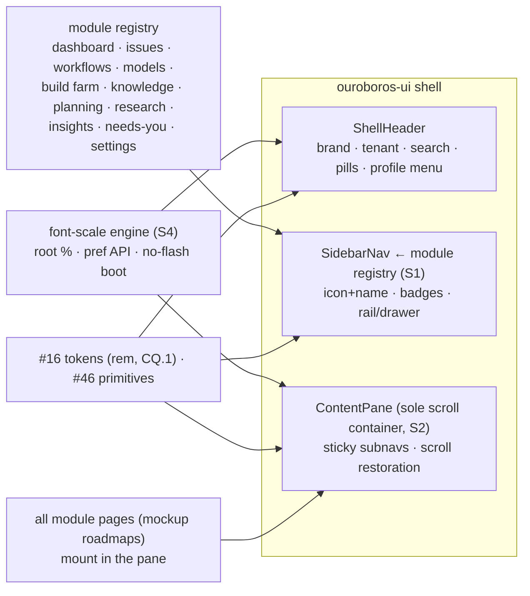
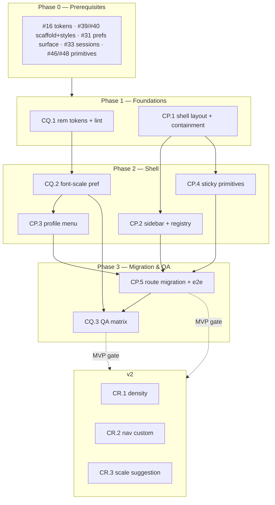

# Roadmap — Application Shell & UI/UX Standards

## Description

> Modify the roadmaps in the docs directory to make sure that UI/UX components
> are well designed and covered. Also, the layout of the application should be
> the following: top header with the name of the application in the upper
> left-hand corner, profile information in the upper right-hand (as with
> standard SaaS applications). The navigation portion of the application should
> be a sidebar on the left-hand side of the screen, and all of the content
> displayed for the roadmaps appears on the right side. Left-side navigation
> menu items should correspond to the roadmap application, along with an icon
> and name. The screen on the right, only the content is scrollable, not the
> entire screen. Make sure to follow this design with all roadmaps. Once this
> design feature is covered, we can start on creating issues, but not until all
> of the items have been covered. Make sure the UI/UX components are well
> thought out and designed. Having a setting to allow for the font size to be
> adjusted would also be ideal, as some monitors are very high resolution, and
> the text can be hard to read.

## Context & Existing Work (duplicate-avoidance survey)

Surveyed 2026-08-09.

**Design source of truth:**
[`docs/DESIGN_SYSTEM_APP_SHELL.md`](DESIGN_SYSTEM_APP_SHELL.md) — the shell
specification this roadmap implements (header anatomy, sidebar registry,
content-only scrolling, component standards, font-size preference). The
mockups (`docs/mockups/*.html`) remain authoritative for **page content**;
their topbar chrome is superseded by the spec.

**Overlapping work and dispositions:**

| Existing work | Disposition under this roadmap |
|---|---|
| Scaffolding #41 (`App shell — top bar, navigation, footer`, filed) | **Re-scoped by CP.1/CP.2** — header keeps brand/tenant/profile; nav links move to the sidebar; scroll containment added. Amendment comment posted at filing. |
| Scaffolding #16 design tokens, #40 global styles, #46 primitives, #48 workshop | **Amended/extended** — CQ.1 converts the type scale to rem and adds the lint rule; shell primitives (ShellHeader, SidebarNav, ContentPane, StickyBar) join the #46 set with #48 workshop stories. |
| Scaffolding #17 runtime theme engine (`data-theme`, persisted, no flash) | **Pattern reused** — CQ.2 applies font scale at boot the same way (server pref + localStorage mirror, no flash). |
| Mockup 17 (Settings) roadmap BQ–BT | **Amended** — Settings → Appearance gains the font-size control (CQ.2); noted in that roadmap's compliance section. |
| Mockup 16 (Needs You) roadmap BM–BP | **Consumed** — the sidebar's Needs You badge renders its live count via the CP.2 badge slot. |
| Every mockup roadmap's route/frame + e2e issues (AA.1, AE.1, CI.1, CN.1, AM.1, …) | **Amended in place** — each roadmap now carries a **UI/UX Shell Compliance** section listing its affected issues; those issues mount in the content pane and register sidebar entries instead of topbar links. |
| Login/BetterAuth roadmap, Onboarding (13) | **Outside the shell** — standalone screens; §3 standards + font scaling still apply (their compliance sections say so). |
| #56 e2e smoke | **Extended** — CP.5 adds the shell leg (fixed chrome under scroll, nav states); CQ.3 adds the font-scale screenshot matrix. |
| Pluggable ticket sources requirement (description boilerplate) | **Already satisfied** by WF Epic Q; nothing source-related in shell work. |

Epic letters continue the sequence (…CK–CO): this roadmap uses
**CP, CQ, CR**.

## Decisions proposed by this roadmap (validate before issue creation)

| # | Decision | Rationale |
|---|----------|-----------|
| S1 | **The shell is a registry-driven composition**: modules register sidebar entries (icon, label, route, sort, badge slot, capability); the sidebar renders the registry — adding a module never edits shell code | Twelve modules and counting; hand-maintained nav is a merge-conflict machine. |
| S2 | **One scroll container**: `html/body` locked; the content pane owns vertical scroll; sticky page chrome sticks within it; wide content scrolls in its own wrappers | The description's core requirement, made structural instead of per-page discipline. |
| S3 | **Sidebar states**: 240px expanded ⇄ 64px icon rail (persisted per user), rail default < 1024px, overlay drawer < 768px; names become tooltips in rail mode | Icon+name at desktop, graceful degradation below, no dead nav on mobile. |
| S4 | **Font scale = five root-percentage steps (87.5–150%), rem-everything enforced by lint**, server-persisted per user with a localStorage no-flash mirror (the #17 pattern), controls in the profile menu and Settings → Appearance | Scales every surface with one mechanism; respects browser zoom; the description's high-DPI readability ask. |
| S5 | **Subnavs stay in the content pane** — the sidebar is one level deep; Models/Workflows tab sets keep their in-page tabs (sticky in-scroll) | Matches the mockups' page anatomy; a nested sidebar tree would fork every existing subnav design. |
| S6 | **Compliance is documented per roadmap**: every roadmap in `docs/` carries a UI/UX Shell Compliance section naming its amended issues — filing reads those sections and posts the amendments | "Make sure to follow this design with all roadmaps," auditable at a glance. |
| S7 | **Labels**: new `shell`; **Milestones**: `App Shell MVP` / `App Shell v2` created at filing | House rule for the filing pass. |

## Architecture Overview



## MVP Definition

The MVP is **the spec'd shell live under every existing page**. It is done
when, against the compose stack:

1. The shell renders per
   [`DESIGN_SYSTEM_APP_SHELL.md`](DESIGN_SYSTEM_APP_SHELL.md) §1 in both
   themes: fixed header (brand + tenant left; search, pills, profile menu
   right; **no nav links**), fixed sidebar (registry-driven icon+name
   entries, active states, Needs You badge, collapse rail, drawer mode),
   and the content pane as the **only** scroll container (header/sidebar
   provably fixed under scroll; sticky subnavs stick in-pane).
2. Every existing route mounts in the pane with its mockup content anatomy
   intact; #49 placeholder pages included; login/onboarding render
   standalone as spec'd.
3. The profile menu works: account identity, font-size quick control, theme
   toggle, settings link, sign out.
4. **Font scaling works end to end**: five steps, rem-based type everywhere
   (lint green), server-persisted + no-flash boot, controls in profile menu
   and Settings → Appearance; 150% passes the clipping/overflow QA bar.
5. Keyboard/a11y: sidebar arrow navigation, `aria-current`, focus rings,
   AA contrast at every scale in both themes.
6. #56 gains the shell leg; the font-scale screenshot matrix runs in CI.

**Explicitly v2 (milestone `App Shell v2`):** density modes (CR.1), nav
customization (CR.2), display-aware scale suggestion (CR.3).

## Epics, Labels & Milestones

Each epic is a parent tracking issue on GitHub; every roadmap issue below is filed as
one of its sub-issues (GitHub Relationships).

| Epic | GitHub | Status | Name | Goal | Modules | Milestone |
|------|:------:|:------:|------|------|---------|-----------|
| CP | #640 | 🟡 Open | Application Shell & Navigation | Header, sidebar registry, scroll containment, migration, e2e | ouroboros-ui | App Shell MVP |
| CQ | #641 | 🟡 Open | Readability & Type Scale | rem tokens + lint, font-size preference, QA matrix | ouroboros-ui, ouroboros-rest | App Shell MVP |
| CR | #642 | 🟡 Open | Shell Enhancements (v2) | Density modes, nav customization, display-aware scaling | ouroboros-ui | App Shell v2 |

Issue naming: `<project>: [<epic>.<issue>] <title>`. Labels: existing set
(`mvp`, `v2`, `ui`, `design`, `rest`, `ci`) **plus new `shell`** (decision
S7). Milestones **`App Shell MVP`** / **`App Shell v2`** created at filing.
Complexity chips: **XS · S · M · L**.

---

## Epic CP (#640) — Application Shell & Navigation (`ouroboros-ui`)

| Ref | GitHub | Status | Title | Summary | Labels | Parallel | MVP | Complexity | Affected Modules |
|-----|:------:|:------:|-------|---------|--------|:--------:|:---:|:----------:|------------------|
| CP.1 | #643 | 🟢 Done | ouroboros-ui: [CP.1] Shell layout — header, grid & scroll containment | Fixed header + shell grid; content pane as sole scroll container | mvp, shell, ui, design | N (after #39, #40, #16) | Y | L | ouroboros-ui |
| CP.2 | #644 | 🟢 Done | ouroboros-ui: [CP.2] Sidebar navigation & module registry | Registry-driven icon+name nav, active states, badges, rail/drawer | mvp, shell, ui, design | N (after CP.1) | Y | L | ouroboros-ui |
| CP.3 | #645 | 🟢 Done | ouroboros-ui: [CP.3] Profile & session menu | Avatar menu: identity, font-size control, theme, settings, sign out | mvp, shell, ui | N (after CP.1, #33, CQ.2) | Y | M | ouroboros-ui |
| CP.4 | #646 | 🟢 Done | ouroboros-ui: [CP.4] In-pane chrome standards & primitives | StickyBar/subnav primitives, scroll restoration, anchor behavior | mvp, shell, ui, design | N (after CP.1) | Y | M | ouroboros-ui |
| CP.5 | #647 | 🟡 Open | ouroboros-ui: [CP.5] Route migration & shell e2e leg | All routes mounted in the pane; #41/#49 amendments; #56 shell leg | mvp, shell, ui, ci | N (after CP.2–CP.4) | Y | M | ouroboros-ui, .github |

### Issue CP.1 — ouroboros-ui: [CP.1] Shell layout — header, grid & scroll containment

> **GitHub issue:** #643 · **Status:** 🟢 Done · **Parent epic:** #640

> **Shipped.** The frame is
> [`app/shell/app-shell.tsx`](../ouroboros-ui/app/shell/app-shell.tsx) over
> [`app/shell/shell.css`](../ouroboros-ui/app/shell/shell.css), and the re-scope #41 began
> is finished: header, sidebar slot, content pane, and — new with this issue — an overlay
> layer beside the pane rather than inside it.
>
> **The grid was already the specification's**, so the work here was the three things it
> was still missing. First, the sidebar's width became **one custom property**:
> `--shell-sidebar`, declared on the shell with all three of § 1.2's widths beside it
> (`15rem` expanded, `4rem` rail, `0` drawer, because a drawer is out of flow and the
> column it left has no width). The grid's first column stays `auto`, so CP.2 moves the
> sidebar between them by redefining one value and touching no layout. The rail is
> selected by the existing 1024px query; the **drawer is declared and not selected**,
> deliberately — CP.2 brings the hamburger that opens it, and a sidebar with no way to
> open it is navigation nobody can reach.
>
> Second, the header became **every slot § 1.1 names, in its order**: the brand (now
> linking to `/dashboard` rather than `/`, which since #45 only redirects there), the
> tenant chip, then search · live-loops · needs-you · notifications · profile menu. The
> chip and the pills draw what is true and no more — the chip names the workspace the
> session is acting in and an em dash when nothing is known, the counts stay em dashes
> for #78 — and switching from the chip is still #77, so it is drawn as a statement with
> a tooltip pointing at the account menu, which does switch today. The theme toggle and
> the settings gear stay in the row until CP.3 folds them into the profile menu.
>
> > **Amended 2026-08-14 by [#77](https://github.com/NobuData/ouroboros/issues/77) (H.1).**
> > The chip is a control now: `acme-robotics / helios-firmware ▾` over a menu that switches
> > workspace and picks a focus repository, so the caret this issue refused to draw is
> > earned and the tooltip pointing at the account menu is gone. The em dash stays for the
> > one state it is still the right answer to — a session that names no workspace, where
> > every branch of that menu would be about nowhere. #77 also lifted this shell's menu
> > keyboard into `app/shell/menu.ts` and its workspace write into
> > `app/shell/switch-workspace.ts`, both now shared with CP.3's account menu.
>
> > **Amended 2026-08-14 by [#78](https://github.com/NobuData/ouroboros/issues/78) (H.2).**
> > The two em dashes are counts, from the shared poll
> > ([#87](https://github.com/NobuData/ouroboros/issues/87)) rather than from a request of
> > their own: `3 loops live` and `Needs you · 2` in the seeded workspace. The honesty rule
> > this issue kept by drawing a dash is kept the other way round now — a pill with nothing
> > to report is **not drawn at all**, so an empty workspace gets a header with an empty slot
> > rather than a pair of noughts. `app/shell/loop-pills.tsx`, and the em dash survives
> > nowhere in this row except the chip's one state.
>
> Third, and the part with no precedent in the module: **the overlay layer**. § 1.3's last
> clause asks that dialogs, sheets and the palette render outside the pane and lock its
> scroll, and the subtlety is the lock.
> [`app/shell/pane-scroll.ts`](../ouroboros-ui/app/shell/pane-scroll.ts) explains it at
> length — `scrollbar-gutter: stable` reserves the scrollbar's width only for an `overflow`
> of `scroll` or `auto`, so locking with `hidden` un-reserves it and every line in the pane
> reflows *under the dialog just opened over it*. The gutter is measured before the class
> lands and handed back as padding, the depth is counted per element so two overlays cannot
> unlock each other, and the scroll position is restored last, after the overflow rule that
> would refuse it. [`overlay.tsx`](../ouroboros-ui/app/shell/overlay.tsx) is the React half:
> portal, Escape, backdrop, focus in and focus back out, Tab cycling inside the panel.
>
> The one control that opens one is the **search pill**, which is the honest way to have
> built the layer rather than a fixture — ⌘K (and Ctrl+K, since not every keyboard has the
> other) opens a panel that says the palette arrives with #79 instead of miming results.
> So the mechanism is exercised by the product and cannot rot before #79 replaces what is
> inside the frame.
>
> > **Amended 2026-08-14 by [#79](https://github.com/NobuData/ouroboros/issues/79) (H.3).**
> > It has. The panel is now
> > [`app/shell/command-palette.tsx`](../ouroboros-ui/app/shell/command-palette.tsx) — a
> > combobox over an extensible action registry, navigation-scoped by that issue's own
> > decision — and the pill keeps only the opening. `ShellOverlay` gained one prop for it,
> > `initialFocus`: a palette opens to be typed into, and the box cannot take focus for
> > itself because React runs a child's effects before its parent's, which would record the
> > box rather than the pill as the element Escape has to give focus back to.
>
> **What is left to CP.5 (#647), by this roadmap's own split:** the two acceptance criteria
> that need a browser to be true — 5,000px of fixture content moving only the pane, and no
> pane-level horizontal scrollbar from 1280px to 3840px. Both are CSS here and asserted as
> CSS (`__tests__/shell/shell-styles.test.ts` reads the rules; jsdom computes no layout), and
> the pane carries `data-shell-pane` so that leg has one selector that means *the scroll
> container* — `regions.ts` says why an attribute rather than the id. Everything assertable
> without layout is: the layer is a sibling of the pane, the overlay portals into it, the
> lock takes and returns the gutter, and the position comes back.

- **Problem Statement:** The current #41 shell is a top bar with nav links
  and a page that scrolls whole. The spec demands the standard SaaS frame:
  fixed header (brand upper-left, profile upper-right), fixed sidebar slot,
  and a content pane that is the only thing that scrolls (spec §1.1, §1.3;
  decision S2).
- **Solution/Scope:** Rebuild the shell layout: CSS grid (`auto 1fr` rows ×
  `auto 1fr` cols), `html/body` locked; **ShellHeader** — brand mark +
  wordmark (→ Dashboard), tenant chip, right cluster (search pill wired to
  ⌘K, live-loops pill, notifications slot, profile-menu slot for CP.3);
  **ContentPane** — `overflow-y:auto`, `scrollbar-gutter:stable`, max
  content width 1440px centered, horizontal scroll forbidden at pane level
  (wide content uses per-widget wrappers — audit hook for CP.5); overlay/
  portal layer that locks pane scroll; both themes from #16 tokens; rem
  sizing throughout (CQ.1 coordination).
- **Acceptance Criteria:**
  - With 5,000px of fixture content, only the pane scrolls — header pixel-
    fixed (e2e-assertable via bounding boxes).
  - No horizontal scrollbar on the pane at 1280–3840px widths with seeded
    pages; overlays lock pane scroll and restore it.
  - Both themes; grid holds at all breakpoints (sidebar slot width
    variable per CP.2).
- **Parallelism/Dependencies:** Needs #39, #40, #16. Blocks CP.2–CP.5.
  Amends #41 (comment at filing).
- **Technical Stack:** Next.js app shell, CSS grid, #16 tokens.
- **Epic:** CP

```
html/body: overflow hidden ─▶ grid [header / sidebar | pane]
pane: overflow-y auto · gutter stable · max 1440px  ─▶ the ONLY scrollbar
```

### Issue CP.2 — ouroboros-ui: [CP.2] Sidebar navigation & module registry

> **GitHub issue:** #644 · **Status:** 🟢 Done · **Parent epic:** #640

> **Shipped.** The navigation is a **registry** — modules register entries and
> [`app/shell/sidebar-nav.tsx`](../ouroboros-ui/app/shell/sidebar-nav.tsx) renders whatever
> is registered. It names no module, and it did not change to gain one: the criterion
> *"adding a fixture registry entry renders a working nav item with zero shell edits"* is
> asserted in `__tests__/shell/sidebar-nav.test.tsx` against the real registry, seeded as
> production seeds it.
>
> Four files hold the model, and the split is deliberate.
> [`nav.ts`](../ouroboros-ui/app/shell/nav.ts) is pure — the entry type, the ordering rule,
> the capability filter, and the exact-plus-section route match — so every rule can be tested
> without a registry or a DOM. [`nav-registry.ts`](../ouroboros-ui/app/shell/nav-registry.ts)
> is the singleton, framework-free, with `registerNavEntry` handing back the way to remove an
> entry again (which is also why there is no reset hook production never calls).
> [`nav-modules.ts`](../ouroboros-ui/app/shell/nav-modules.ts) is the seed: the eleven § 1.2
> names, with **lucide** icons — the icon-set decision this issue was to record — registering
> themselves at import. [`use-shell-nav.ts`](../ouroboros-ui/app/shell/use-shell-nav.ts) is
> the one place either store meets React, as `useSyncExternalStore`.
>
> **Ordering is `sort` then id, never registration order**, which is import order and
> therefore a bundler's business: a sidebar that reordered itself between builds is one
> nobody could learn. The registry refuses an entry it cannot draw honestly — an off-origin
> route, a route another entry has claimed, a `soon` row that does not say what it waits for
> — because a registration that silently did nothing would be a module missing from the
> navigation with nothing anywhere saying why.
>
> **The badge is a name, not a number.** An entry declares the *source* it reads
> (`needs-you` declares `inbox`); whoever can compute a count publishes it with
> `setNavBadge`. Nothing does yet — that is BN.4 (#464) — so the badge is **absent**, and
> absent draws nothing. The #46 `Badge` primitive already refuses `0` for the same reason,
> so the rule is enforced once rather than restated here. Both publishers refuse to run
> outside the browser: a module singleton on the server is shared by every request the
> process handles, and a count or a capability set is an answer about one reader.
>
> **Three widths, one custom property, and the rail is a container query.** § 1.2's rail is
> reached two ways — the 1024px default and the reader's own chevron — and never by the
> drawer, which is 240px wide at every viewport. Rather than write the same declarations per
> trigger, `shell.css` makes the sidebar a container and asks the one question that matters:
> *is there room for the word?* The reader's choice is stamped on `<html>` and applied by a
> boot script before first paint, the #17 pattern exactly, so a sidebar collapsed last week
> is not collapsed again in front of them. `--shell-sidebar-choice` and `--shell-sidebar`
> are two properties on purpose: written as one, a stamped choice (a selector) would outrank
> the drawer breakpoint (a media query), and an expanded sidebar would still sit in the grid
> on a phone.
>
> **The drawer** is the sidebar out of flow below 768px, opened from a hamburger the header
> draws only at that width. It is focus-trapped, closes on Escape, on the ground behind it,
> on a link followed out of it, and on the window growing past the breakpoint — that last one
> is not cosmetic, because the trap reads the same flag. Closed, it is `visibility: hidden`
> rather than merely translated away: an off-screen sidebar that is still visible is one the
> keyboard tabs into. The trap itself moved to
> [`focus-trap.ts`](../ouroboros-ui/app/shell/focus-trap.ts), shared with CP.1's overlay —
> two surfaces that cover the page, one cycle between them.
>
> **The keyboard** is a roving tab stop: one entry in the tab order, arrows and Home/End
> between them, wrapping at both ends, and Enter needing no handler because every reachable
> entry is a real `<a href>`. Rows that lead nowhere stay `<span>`s and stay out of both the
> tab order and the ring. In rail mode the label is hidden **visually** and left in the
> accessibility tree — `display: none` would take it out and leave a column of unnamed icons
> for exactly the readers who cannot see icons — so a row is announced identically at both
> widths, count and all.
>
> **Capability gating hides, and hides by default**: an entry naming a capability nobody has
> published is not drawn, and a group with nothing left in it is not drawn either, hairline
> and all. Nothing seeded declares one, so the gate is inert until a module opts in; the
> direction it errs in is a missing entry rather than a visible link into a screen the
> service will refuse.
>
> **On the tooltip contrast criterion:** the rail's tooltip is the platform's own `title`,
> which no stylesheet can reach — its contrast is the operating system's, and the active and
> inactive treatments are CP.1's measured pair, unchanged. The remaining browser-only checks
> (both themes rendered, the drawer at a real 767px) belong to CP.5's e2e leg by this
> roadmap's own split, as CP.1's did.

- **Problem Statement:** Navigation moves from topbar links to a left
  sidebar of icon+name entries — driven by a registry so twelve modules
  (and future ones) register instead of editing shell code (spec §1.2;
  decisions S1, S3).
- **Solution/Scope:** **Module registry**: typed entries {id, icon, label,
  route, sort, group `primary|secondary`, badgeSource?, capability?};
  seeded with the eleven spec entries (Dashboard, Issues, Workflows,
  Models, Build Farm, Knowledge, Planning, Research, Insights ·
  Needs You, Settings) using lucide icons per the spec mapping (icon-set
  choice recorded in-issue). **SidebarNav**: renders groups; active state
  (accent inset + tint, section matching `/models/*`); badge slot (Needs
  You count via the mockup-16 counts endpoint when present, hidden
  otherwise — honesty); collapse control → 64px icon rail (labels →
  tooltips; state persisted per user), rail default < 1024px, overlay
  drawer < 768px (hamburger in header, focus-trapped, ESC closes);
  keyboard: arrow/Home/End roving focus, Enter activates,
  `aria-current="page"`; capability-gated entries hidden with no gap.
- **Acceptance Criteria:**
  - All eleven entries render with icons/names; active states correct
    across every seeded route including sub-routes; adding a fixture
    registry entry renders a working nav item with zero shell edits.
  - Rail + drawer modes verified with keyboard and screen-reader labels;
    collapse state survives reload; badge shows the seeded count and
    hides when the source is absent.
  - Both themes; AA contrast for active/inactive/tooltip states.
- **Parallelism/Dependencies:** Needs CP.1. Blocks CP.5. Feeds every
  roadmap's compliance amendment.
- **Technical Stack:** React, lucide-react, #46 primitives.
- **Epic:** CP

```
registry.register({id:'research', icon:telescope, label:'Research', route:'/research', sort:80})
sidebar: ▦ Dashboard ◉ Issues ⑂ Workflows ⬡ Models ⛭ Build Farm ▤ Knowledge
         ▦ Planning ◎ Research ∿ Insights ── ▣ Needs You ③ ⚙ Settings   [«]
```

### Issue CP.3 — ouroboros-ui: [CP.3] Profile & session menu

> **GitHub issue:** #645 · **Status:** 🟢 Done · **Parent epic:** #640

> **Shipped.** The § 1.1 menu, complete:
> [`app/shell/user-menu.tsx`](../ouroboros-ui/app/shell/user-menu.tsx) now carries the
> font-size stepper (live over #649's store, persisted through its Server Action), the
> theme control as three `menuitemradio`s over the #17 engine, the person's role beside
> their address, the keyboard-shortcuts sheet
> ([`app/shell/shortcuts-sheet.tsx`](../ouroboros-ui/app/shell/shortcuts-sheet.tsx), on
> the CP.1 overlay), and the sign-out and workspace switcher #721 had already built. Most
> of this ticket's surface predated it — the interaction shell, ESC, the roving ring,
> focus return, session truth — which is why building the menu before it had contents was
> worth it; what CP.3 added is everything between the identity block and the switcher.
>
> **The header gave up two controls, and the correction is recorded where they were
> promised a future.** § 1.1's upper-right enumeration draws the theme control *inside*
> the profile menu — no slot beside it — so the #42 cycling button left the row when the
> menu's radios learned its job (three visible states where the cycle folded them into
> one icon, `aria-checked` where it needed a marker dot). The engine was reused untouched,
> which is the half of ROADMAP_OOE_MVP's "second surface, not a replacement" note that
> survives; both passages that predicted the button would stay are amended in their own
> files. The disabled settings gear was absorbed by the menu's *Workspace settings* item —
> still honestly `aria-disabled` naming #491, because the issue's "links → `/settings`"
> clause has no route to point at until that ticket builds one. A link to a 404 is worse
> than a marked wait.
>
> **The stepper's press is the preview.** `setFontScale` stamps `<html>` before the
> Server Action is even called, so "live preview as you step" is the ordering of two
> statements rather than a feature; the quiet-failure posture for the durable half is
> #649's, restated at the call site. The two step buttons are ordinary `menuitem`s in the
> ring — `aria-disabled` at the ends, never `disabled`, so the arrow walk never breaks —
> and the announcement rides the menu's existing `role="status"` region.
>
> **The role is fetched apart from the session, and remembered with its workspace.** The
> plugin's `organization.list` discards roles in its adapter, so the identity block asks
> `getActiveMemberRole` (one word for one workspace — `GET /api/v1/orgs` is for screens
> that need roles per row), collapses multi-role text with `primaryRole()`, and stores
> the answer *paired with the workspace it was asked for* — a stale answer voids itself
> by derivation the moment the session moves, with no reset to forget. Until an answer
> arrives the address stands alone: no guessed word, per § 3.5.
>
> **"Portals over the pane" is satisfied by construction, not by a portal.** The panel is
> an absolutely positioned child of the header — a sibling of the pane, which therefore
> cannot clip it — and `__tests__/shell/shell-styles.test.ts` pins the position and
> z-index facts. An actual portal through the overlay layer would buy nothing and cost
> the pane a scroll lock a menu must not take. The shortcuts sheet, which *is* a dialog,
> does ride the overlay layer, and lists only bindings that exist — ⌘K in the platform's
> own spelling through the search pill's exported `shortcutHint()`, the two roving rings,
> the dismissals — because documentation is held to the same honesty rule as controls.
>
> Proved in `__tests__/shell/user-menu.test.tsx` (stepper, radios, role, sheet, and the
> full keyboard path around them), `__tests__/shell/account.test.ts` (the role's five
> decisions), `__tests__/theme.test.ts` (`describeTheme`, moved with its function), and
> `__tests__/shell/shell-header.test.tsx`, which now asserts the two controls stay *out*
> of the row. **Left to CP.5 (#647) and CQ.3 (#650), by this roadmap's own split:** the
> browser-observed legs — AA contrast at every scale × theme, and the cross-device
> persistence walk a jsdom suite can only stub.
  with standard SaaS applications)" — the avatar must open a real account
  menu, and it is the spec'd home of the font-size quick control (spec
  §1.1, §4).
- **Solution/Scope:** Avatar button (initials/photo from the session) →
  menu: identity block (name, email, org role), **Font size** stepper
  (five steps, live preview as you step, persists via CQ.2's API),
  **Theme** toggle (reusing #17), links (Workspace settings → `/settings`,
  keyboard shortcuts sheet), **Sign out** (BA session end). Menu is
  keyboard-complete, closes on ESC/outside, portals over the pane.
- **Acceptance Criteria:** Menu renders session truth; font-size steps
  apply instantly and persist across reload/sign-in; theme toggle works
  from the menu; sign-out lands on login; full keyboard path; both
  themes.
- **Parallelism/Dependencies:** Needs CP.1, #33 (sessions), CQ.2 (pref
  API). 
- **Technical Stack:** React, #46 menu primitives, BA session client.
- **Epic:** CP

```
[KS ▾] ─▶ Ken Suenobu · ken@… · owner
        Font size  [A- ▪▪▪▫▫ A+]   Theme [◐]
        Workspace settings · Shortcuts · Sign out
```

### Issue CP.4 — ouroboros-ui: [CP.4] In-pane chrome standards & primitives

> **GitHub issue:** #646 · **Status:** 🟢 Done · **Parent epic:** #640

> **Shipped.** `StickyBar` and `PageSubnav` joined the #46 set
> ([`app/ui/sticky-bar.tsx`](../ouroboros-ui/app/ui/sticky-bar.tsx),
> [`app/ui/page-subnav.tsx`](../ouroboros-ui/app/ui/page-subnav.tsx)) over one stacking
> contract, [`app/ui/chrome.ts`](../ouroboros-ui/app/ui/chrome.ts): subnav above
> dirty-state bar above table header, each layer publishing its measured height as a
> custom property on the scroll container and the next offsetting by it, so the order
> holds at every font scale. The #46 Table grew the sticky-header recipe as a prop
> (`stickyHeader` — the wrapper opens up because sticky pins to the nearest scrollport,
> and the trade is documented once in `table.tsx`). The subnav preserves the mockups'
> underline gesture with the hue as a tone — 06's model purple included. **Scroll
> restoration** is the shell's ([`app/shell/pane-restoration.tsx`](../ouroboros-ui/app/shell/pane-restoration.tsx)):
> back/forward restores the pane per `pathname?search`, a push starts at the top, and a
> fragment push is left to the router — whose `scrollIntoView` the pane's
> `scroll-padding-top` offsets by the same published heights, which is the whole of the
> **anchor behaviour**. The demonstration is the workshop's first page,
> [`/workshop/chrome`](../ouroboros-ui/app/workshop/chrome-story.tsx) (seeding #48, whose
> tooling is v2): subnav + dirty bar + sticky table header over 48 rows, both themes, and
> — as the product's second in-shell route — the fixture the new pane-memory e2e group in
> `tests/e2e/specs/shell.spec.ts` drives, parked with every session-gated leg until
> sign-in is unparked.

- **Problem Statement:** With one scroll container, every sticky behavior
  the mockup roadmaps assume (subnav tabs, dirty-state bars, table
  headers) must stick against the pane — a shared primitive, not
  twenty-two hand-rolled `position:sticky` fixes (spec §1.3; decision S5).
- **Solution/Scope:** #46 additions: **StickyBar** (sticks under the pane
  top; stacking contract when multiple stick — subnav above dirty-bar),
  **PageSubnav** (the Models/Workflows tab pattern as a pane-top sticky,
  preserving each mockup's active treatment), sticky table-header recipe
  for #46 Table; **scroll restoration** per route (back/forward restores
  pane position; push resets to top), anchor links scroll the pane with
  header offset; documentation page in the #48 workshop demonstrating
  all of it over a long fixture.
- **Acceptance Criteria:** Subnav + dirty-bar stack correctly while
  scrolling a long fixture; table headers stick in-pane; back/forward
  restores position (e2e); workshop story covers the contracts; both
  themes.
- **Parallelism/Dependencies:** Needs CP.1. Feeds every subnav-owning
  roadmap (06/07/21 Models tabs, 04/05/20 Workflows tabs, …).
- **Technical Stack:** React, #46, #48 workshop.
- **Epic:** CP

### Issue CP.5 — ouroboros-ui: [CP.5] Route migration & shell e2e leg

> **GitHub issue:** #647 · **Status:** 🟡 Open · **Parent epic:** #640

- **Problem Statement:** Every existing route (#49 placeholders and the
  built pages) must mount inside the pane, the old topbar retired, and
  the shell's promises certified in e2e (decision S6's audit trail).
- **Solution/Scope:** Migrate all routes into the shell layout (topbar nav
  removed; login/onboarding excluded per spec §5); per-route audit
  against the compliance sections (sidebar entry present, subnav
  converted to PageSubnav, no viewport-sticky offenders, no pane-level
  horizontal scroll); amendments posted: #41 (re-scope), #49 (mount
  point), each mockup roadmap's frame issue (their compliance tables);
  **#56 shell leg**: header/sidebar fixed under deep scroll on three
  seeded pages, nav active states across a click-through of all eleven
  entries, rail + drawer modes, scroll restoration, both themes.
- **Acceptance Criteria:** Every seeded route renders in-shell with zero
  topbar remnants (grep + visual); e2e leg green from cold compose and
  fails when containment breaks (spot-verified); amendment comments
  drafted for filing.
- **Parallelism/Dependencies:** Needs CP.2–CP.4. MVP gate with CQ.3.
- **Technical Stack:** Next.js, Playwright.
- **Epic:** CP

```
e2e: fixed chrome ✓ · nav states ×11 ✓ · rail/drawer ✓ · restoration ✓ · themes ✓
```

---

## Epic CQ (#641) — Readability & Type Scale (`ouroboros-ui` + `ouroboros-rest`)

| Ref | GitHub | Status | Title | Summary | Labels | Parallel | MVP | Complexity | Affected Modules |
|-----|:------:|:------:|-------|---------|--------|:--------:|:---:|:----------:|------------------|
| CQ.1 | #648 | 🟢 Done | ouroboros-ui: [CQ.1] rem-based token scale & px lint | #16/#40 type+spacing to rem; stylelint rule bans px text | mvp, shell, ui, design | N (after #16, #40) | Y | M | ouroboros-ui, docs |
| CQ.2 | #649 | 🟢 Done | ouroboros-rest: [CQ.2] Font-size preference & no-flash boot | Pref API (5 steps), root application, localStorage mirror, controls | mvp, shell, ui, rest | N (after CQ.1, #31) | Y | M | ouroboros-rest, ouroboros-ui |
| CQ.3 | #650 | 🟡 Open | ouroboros-ui: [CQ.3] Readability QA & visual-regression matrix | Scale×theme×page screenshots in CI; 150% overflow audit | mvp, shell, ui, ci | N (after CQ.2, CP.5) | Y | M | ouroboros-ui, .github |

### Issue CQ.1 — ouroboros-ui: [CQ.1] rem-based token scale & px lint

> **GitHub issue:** #648 · **Status:** 🟢 Done · **Parent epic:** #641

> **Shipped.** The enforcement half of this ticket:
> [`ouroboros-ui/stylelint.config.mjs`](../ouroboros-ui/stylelint.config.mjs), run by
> `yarn lint` on every pull request, red on any absolute unit in `font-size`,
> `line-height` or the `font` shorthand.
>
> **The conversion this issue was written to do had already happened.** The issue body was
> drafted against a px-based token sheet (`--fs-13: 13px`), but the sheet that actually
> shipped with #16's adoption and #643's shell was rem from the start: every `--t-*` size,
> every `--lh-*` line height and the whole `--sp-*` scale in
> [`app/tokens.css`](../ouroboros-ui/app/tokens.css) — held byte-identical to
> `docs/design/tokens.css` by `scripts/verify-tokens.sh` — with zero px type sizes anywhere
> under `app/`. The audit that established this is recorded by the lint pass itself being
> green on the first run. Two acceptance criteria therefore land vacuously: at 100% the UI
> is pixel-identical because not one byte of CSS changed, and both themes are unaffected
> for the same reason — no screenshot diff was taken because there was nothing to compare,
> and the screenshot *infrastructure* remains CQ.3's (#650), where the scale × theme matrix
> actually needs it.
>
> **What was genuinely missing was the "keeps it that way" half.** `__tests__/styles.test.ts`
> already failed absolute `font`/`font-size` in shipped sheets, but it never covered
> `line-height`, and a vitest rule answers at test time, not at the moment the offending
> line is written. The stylelint rule closes both gaps and the two guards are held to the
> same vocabulary — the same seven absolute units, asserted against each other in
> [`__tests__/stylelint.test.ts`](../ouroboros-ui/__tests__/stylelint.test.ts), which also
> carries the acceptance criterion verbatim: red on a `font-size: 12px` fixture, green
> across every shipped sheet, under the *shipped* configuration rather than a copy.
>
> **The allowlist is the rule's scope, not a list.** Only the two type properties (and the
> shorthand that can smuggle them) are banned, so everything px is correct for — hairline
> borders, shadow offsets, `.sr-only`'s deliberately unscalable 1px boxes — never trips it.
> That is the shortest allowlist that can exist: empty, with the rationale in the config's
> own header and in `docs/DESIGN_TOKENS.md`, which already carried the rem scale table and
> now names the enforcement.
  px; the #16 token sheet and existing components carry px type sizes from
  the mockup CSS (spec §3.2, §4).
- **Solution/Scope:** Token sweep: type sizes, line heights, and key
  spacing in #16/#40 converted to rem (mockup px values ÷ 16 — visual
  parity at 100% verified by screenshot diff); component audit across #46
  and shipped pages; **stylelint rule** banning `px` in font-size/
  line-height (allowlist for hairline borders/shadows documented);
  token-sheet docs updated with the scale table.
- **Acceptance Criteria:** 100% scale is pixel-identical (diff within
  anti-aliasing tolerance); lint red on a px font-size fixture, green on
  the codebase; both themes unaffected.
- **Parallelism/Dependencies:** Needs #16, #40. Blocks CQ.2. Coordinates
  with #46/#48.
- **Technical Stack:** CSS custom properties, stylelint, screenshot diff.
- **Epic:** CQ

```
--fs-13: 13px  ─▶  --fs-13: 0.8125rem     html @100% ⇒ identical render
stylelint: "font-size: 12px" ─▶ ✗ error (use rem token)
```

### Issue CQ.2 — ouroboros-rest: [CQ.2] Font-size preference & no-flash boot

> **GitHub issue:** #649 · **Status:** 🟢 Done · **Parent epic:** #641

> **Shipped.** The engine end to end: a `user_preferences` table (V007), `GET`/`PATCH
> /api/v1/me/preferences` in a new
> [`preferences module`](../ouroboros-rest/src/modules/preferences/preferences.module.ts),
> and the browser half in [`app/font-scale.ts`](../ouroboros-ui/app/font-scale.ts) — the
> boot script in the root layout, the five `:root[data-font-scale]` rules in
> `globals.css`, the localStorage mirror, and the session-load reconciliation
> (`app/shell/font-scale-sync.tsx`, server wins). `preferences.integration-spec.ts` proves
> the criteria a mock cannot: the two-users-two-scales isolation, the 401, the 422 with
> the field named, and the upsert staying one row.
>
> **"BA user prefs" became a Flyway table, deliberately.** The issue sketched the
> preference on the account surface — BetterAuth `additionalFields` — and that is the one
> place it must not live: `betterauth-schema.sql` is a rendered snapshot of the library's
> expected DDL, held by ci/db, so a product column there is either snapshot drift or
> application-owned DDL, and D3 says Flyway owns every table. `ouroboros.user_preferences`
> references `"user"` and cascades with it; #31 turns out to have been the *pattern* (a
> session-authed, person-scoped surface), not a home — nothing called an
> account-preferences surface existed to build on.
>
> **The value is a label, not a number.** `font_scale` is text under a named CHECK, the
> house idiom, mirrored as a TS union and as the contract's string enum: `'100.0'` must
> not equal `'100'`, nothing does arithmetic with the step, and JSON would make a numeric
> 87.5 a float. The same five words appear in exactly four authorities — the CHECK, the
> schema union, the contract enum, the UI vocabulary — each held to the next by a test.
>
> **The controls are deliberately absent.** The stepper is CP.3's (#645, next in this
> stack); the Settings → Appearance row is #492's, whose issues-table row in the mockup-17
> roadmap already carries the amendment. What this ticket ships is the store both controls
> will subscribe to (`useFontScale()`), which is also how the "two controls stay in sync"
> criterion is met: there is one value for them to disagree about, and no code by which
> they could.
>
> **Reconciliation is one direction.** On session load the shell reads the account's scale
> and corrects the paint (a shared browser, a change made on another machine); it never
> PATCHes the value back, because a write that echoes a read is at best a no-op and at
> worst a race against a choice being made on another device. A control's press is the
> only writer: apply locally (the live preview), then `saveFontScale`, whose failure is
> quiet — the reader is already reading at the size they chose.
>
> **What is left to CP.5 (#647) and CQ.3 (#650), by this roadmap's own split:** the
> throttled-reload no-flash proof and the reflow-artifact criterion are browser
> observations — jsdom computes no layout and the e2e leg deliberately does not run on
> pull requests — and the scale × theme × page screenshot matrix is CQ.3's entire remit.
  high-resolution monitors — per user, instant, persistent, and applied
  without a flash of wrong-size text (spec §4; decision S4).
- **Solution/Scope:** **Pref API**: user preference `font_scale` CHECK
  `87.5|100|112.5|125|150` on the account-preferences surface (BA user
  prefs; GET/PATCH under session auth); **application**: root
  `font-size: <scale>%` set via a boot inline script reading the
  localStorage mirror (the #17 no-flash pattern), reconciled with the
  server pref on session load; **controls**: profile-menu stepper (CP.3)
  and **Settings → Appearance** section (mockup-17 roadmap amendment —
  renders beside the theme control, with a live preview paragraph);
  anonymous screens (login) honor the local mirror; browser zoom
  untouched (percentages compose with it).
- **Acceptance Criteria:** Step change re-renders instantly with no
  reflow artifacts beyond size; reload at 150% shows no flash (throttled
  e2e); pref round-trips per user (two users, two scales, one browser
  verified); Settings control and menu stepper stay in sync; login page
  respects the mirror.
- **Parallelism/Dependencies:** Needs CQ.1, #31 (user prefs surface).
  Feeds CP.3; amends mockup-17 roadmap (BQ-epic Appearance region).
- **Technical Stack:** NestJS (prefs), boot script, React controls.
- **Epic:** CQ

```
PATCH /me/preferences {font_scale: 125} ─▶ html{font-size:125%} · localStorage mirror
boot: inline script reads mirror ─▶ no flash ─▶ session reconciles
```

### Issue CQ.3 — ouroboros-ui: [CQ.3] Readability QA & visual-regression matrix

> **GitHub issue:** #650 · **Status:** 🟡 Open · **Parent epic:** #641

- **Problem Statement:** Five scales × two themes × dense pages is a
  combinatorial surface where clipping and overflow hide; the QA bar must
  be automated (spec §4 QA).
- **Solution/Scope:** CI screenshot matrix: {100%, 125%, 150%} × {light,
  dark} × five representative seeded pages (densest: routing matrix,
  registry table, research brief, dashboard, settings) with diff
  baselines; **150% audit**: automated overflow detection (horizontal
  scroll at pane level, clipped text via scroll/client size probes) +
  documented manual pass fixing offenders (wrappers, truncation with
  tooltips); a11y contrast spot-checks at 150%; #56 gains the
  scale-switch smoke.
- **Acceptance Criteria:** Matrix runs in CI within budget (≤ 3 min);
  planted overflow fixture fails the audit; all five pages clean at
  150% in both themes; baselines documented for refresh.
- **Parallelism/Dependencies:** Needs CQ.2, CP.5. MVP gate with CP.5.
- **Technical Stack:** Playwright screenshots, CI.
- **Epic:** CQ

```
matrix: 3 scales × 2 themes × 5 pages ─▶ diffs ✓ · overflow probe ✓ · ≤3min
```

---

## Epic CR (#642) — Shell Enhancements (v2 · milestone `App Shell v2`)

| Ref | GitHub | Status | Title | Summary | Labels | Parallel | MVP | Complexity | Affected Modules |
|-----|:------:|:------:|-------|---------|--------|:--------:|:---:|:----------:|------------------|
| CR.1 | #651 | 🟡 Open | ouroboros-ui: [CR.1] Density modes | Comfortable/compact spacing presets composing with font scale | v2, shell, ui, design | Y | N | M | ouroboros-ui |
| CR.2 | #652 | 🟡 Open | ouroboros-ui: [CR.2] Navigation customization | Pin/reorder/hide sidebar entries per user; reset to default | v2, shell, ui | N (after CP.2) | N | S | ouroboros-ui |
| CR.3 | #653 | 🟡 Open | ouroboros-ui: [CR.3] Display-aware scale suggestion | First-run DPI/resolution heuristic suggests (never forces) a scale | v2, shell, ui | N (after CQ.2) | N | S | ouroboros-ui |

### Issue CR.1 — ouroboros-ui: [CR.1] Density modes

> **GitHub issue:** #651 · **Status:** 🟡 Open · **Parent epic:** #642

- **Problem Statement:** Font scale changes size, not breathing room;
  large-scale users on small screens (and dense-data users on large ones)
  want spacing presets.
- **Solution/Scope:** `comfortable` (default, current rhythm) and
  `compact` spacing token sets composing orthogonally with font scale;
  preference alongside `font_scale`; table/card paddings and row heights
  tokenized (extends CQ.1's sweep); QA matrix extended.
- **Acceptance Criteria:** Both modes at all scales pass the overflow
  audit; preference persists; no per-page overrides needed (token proof).
- **Parallelism/Dependencies:** After CQ.1/CQ.3.
- **Technical Stack:** CSS tokens, prefs API.
- **Epic:** CR

### Issue CR.2 — ouroboros-ui: [CR.2] Navigation customization

> **GitHub issue:** #652 · **Status:** 🟡 Open · **Parent epic:** #642

- **Problem Statement:** Different roles live in different modules; a
  build-farm operator wants Build Farm on top.
- **Solution/Scope:** Per-user sidebar order + hide (capability-gated
  entries excluded from hiding where required), drag-reorder in an edit
  mode, reset-to-default; registry order becomes the default layer.
- **Acceptance Criteria:** Reorder persists; hidden entries reachable via
  search/⌘K; reset restores registry order.
- **Parallelism/Dependencies:** Needs CP.2.
- **Technical Stack:** React dnd, prefs API.
- **Epic:** CR

### Issue CR.3 — ouroboros-ui: [CR.3] Display-aware scale suggestion

> **GitHub issue:** #653 · **Status:** 🟡 Open · **Parent epic:** #642

- **Problem Statement:** The user who needs 125% most is the one squinting
  at a 4K laptop panel who never opens Settings.
- **Solution/Scope:** First-run heuristic (devicePixelRatio + viewport)
  → one-time dismissible suggestion toast ("Text looks small on this
  display — try 125%?" with apply/preview); never auto-applies; per-device
  dismissal memory.
- **Acceptance Criteria:** Fires once per device profile; apply routes
  through CQ.2; dismissal sticks.
- **Parallelism/Dependencies:** Needs CQ.2.
- **Technical Stack:** React, heuristics.
- **Epic:** CR

---

## Work Order (dependency-ordered execution plan)



Ordered checklist (⊕ = parallelizable within its phase):

1. **Phase 0:** #16, #39/#40, #31, #33, #46/#48.
2. **Phase 1:** { CP.1 (#643) ⊕ CQ.1 (#648) }
3. **Phase 2:** { CP.2 (#644) ⊕ CP.4 (#646) ⊕ CQ.2 (#649) } → CP.3 (#645)
4. **Phase 3:** CP.5 (#647) → **CQ.3 (#650) ✅** *(MVP gate with CP.5;
   amends #41, #49, #56, the mockup-17 Settings surface, and every roadmap's
   compliance table)*
5. **v2:** CR.1 (#651) ⊕ CR.2 (#652) ⊕ CR.3 (#653).

## Totals

| | Epic | Issues | MVP | v2 |
|---|:---:|:---:|:---:|:---:|
| Epic CP — Application Shell & Navigation | #640 | 5 | 5 | 0 |
| Epic CQ — Readability & Type Scale | #641 | 3 | 3 | 0 |
| Epic CR — Shell Enhancements | #642 | 3 | 0 | 3 |
| **Total** | **3 epics** | **11** | **8** | **3** |

Issues **#643–#653**, filed 2026-08-09 as sub-issues of their epics
(#640–#642), with the new `shell` label and the `App Shell MVP` /
`App Shell v2` milestones.

Amendments posted at filing:

| Amended | Comment |
|---|---|
| #41 | **Re-scoped**: header keeps brand/tenant/profile and carries **no nav links**; navigation moves to the registry-driven sidebar (CP.2, #644); scroll containment added (CP.1, #643); the old topbar retires during migration (CP.5, #647) |
| #49 | Placeholder routes now **mount in the content pane** and register sidebar entries; individual placeholders continue to be retired by their own roadmaps' frame issues |
| #56 | Gains the **shell leg** (CP.5, #647 — fixed chrome under deep scroll, eleven nav states, rail/drawer, scroll restoration, both themes) and the **scale-switch smoke** (CQ.3, #650) |
| #16 | Token sheet goes **rem-based** (CQ.1, #648) with a stylelint ban on `px` font sizes; proven a no-op at 100% by screenshot diff |
| #40 | Global styles: rem type scale, the `html`/`body` scroll lock, and the lint rule with its documented allowlist |
| #46 | **ShellHeader, ContentPane, SidebarNav, StickyBar, PageSubnav** join the primitive set, plus the sticky table-header recipe; existing primitives swept for `px` type |
| #48 | Gains a **shell chrome story** — subnav + dirty bar + sticky table header over a long fixture, both themes, multiple scales |
| BS.1 (#491) | Settings gains an **Appearance** section with the full font-size control beside the theme choice (CQ.2, #649); density and nav-reset controls join it in v2 |
| BN.4 (#464) | Wires the sidebar's **Needs You badge**; when the count source is absent the badge is **hidden**, never `0` |
| #31 | The preferences surface gains **`font_scale`** (five CHECK-constrained steps, default 100), with density and sidebar preferences alongside it in v2 |
| #17 | The **no-flash boot pattern is reused, not re-implemented**, for font scale; the theme toggle itself is reused by the profile menu |

Per-route amendments on each mockup roadmap's frame issue are **posted during
migration** (CP.5's scope), against that roadmap's UI/UX Shell Compliance
section — the sections themselves are already present in every roadmap under
`docs/`.

## References

- Spec: [`docs/DESIGN_SYSTEM_APP_SHELL.md`](DESIGN_SYSTEM_APP_SHELL.md)
  (authoritative shell & UX standards)
- Mockups: `docs/mockups/*.html` (page-content truth; topbar chrome
  superseded)
- Scaffolding roadmap issues #16/#17/#31/#33/#39–#41/#46/#48/#49/#56
- Icon set: lucide (ISC) — recorded in CP.2, and seeded there
  ([`app/shell/nav-modules.ts`](../ouroboros-ui/app/shell/nav-modules.ts))

## Next Step

**Filed 2026-08-09.** The `shell` label and the `App Shell MVP` /
`App Shell v2` milestones were created; the three epics (#640–#642) and
eleven issues (#643–#653) are on GitHub with parent relationships,
milestones, labels and types set, and the eleven amendment comments above are
posted.

**This roadmap gates the UI half of every other one.** Each mockup roadmap's
frame issue now assumes the shell exists — pages mount in the content pane,
register a sidebar entry, and put their tab sets in a PageSubnav. The
practical consequence: CP.1 (#643) and CP.2 (#644) are worth landing before
much more page work, or each new surface pays the migration cost twice.

Execution starts with **CP.1 (#643) ⊕ CQ.1 (#648)** — they are independent
and both block everything after them. The critical path to the MVP gate is
#643 → #644 → #647 → **#650**, with the type-scale leg (#648 → #649 → #645)
joining at the profile menu and the sticky primitives (#646) landing beside
the sidebar.

Two risks worth naming. **Scroll containment regresses silently** — one
`position: fixed` bar or one table without its `overflow-x` wrapper, and the
pane starts scrolling sideways on a single page, invisible in review; #647's
rule that a planted offender must turn the e2e leg red is what keeps that
honest. And **the font scale is only as complete as the rem sweep** — a
single `px` font size becomes the one thing still unreadable at 150%, which
is why #648 ships a lint rule rather than just a conversion.
