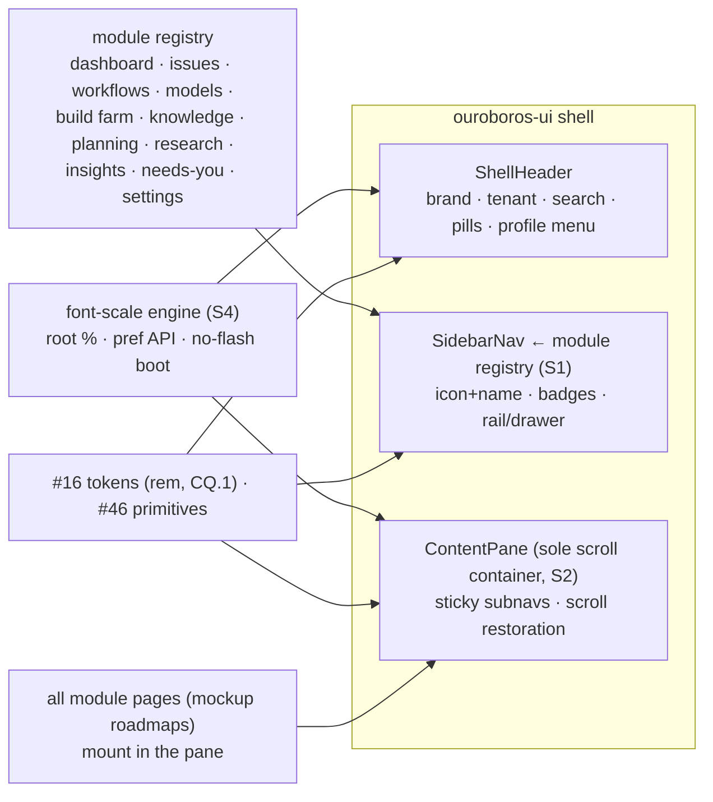
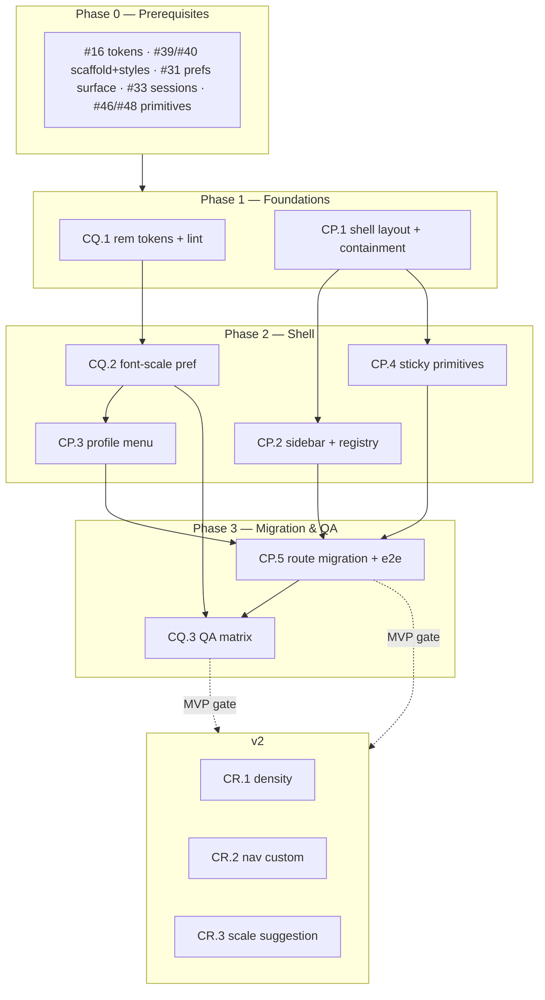

# Roadmap — Application Shell & UI/UX Standards

## Description

> Modify the roadmaps in the docs directory to make sure that UI/UX components
> are well designed and covered. Also, the layout of the application should be
> the following: top header with the name of the application in the upper
> left-hand corner, profile information in the upper right-hand (as with
> standard SaaS applications). The navigation portion of the application should
> be a sidebar on the left-hand side of the screen, and all of the content
> displayed for the roadmaps appears on the right side. Left-side navigation
> menu items should correspond to the roadmap application, along with an icon
> and name. The screen on the right, only the content is scrollable, not the
> entire screen. Make sure to follow this design with all roadmaps. Once this
> design feature is covered, we can start on creating issues, but not until all
> of the items have been covered. Make sure the UI/UX components are well
> thought out and designed. Having a setting to allow for the font size to be
> adjusted would also be ideal, as some monitors are very high resolution, and
> the text can be hard to read.

## Context & Existing Work (duplicate-avoidance survey)

Surveyed 2026-08-09.

**Design source of truth:**
[`docs/DESIGN_SYSTEM_APP_SHELL.md`](DESIGN_SYSTEM_APP_SHELL.md) — the shell
specification this roadmap implements (header anatomy, sidebar registry,
content-only scrolling, component standards, font-size preference). The
mockups (`docs/mockups/*.html`) remain authoritative for **page content**;
their topbar chrome is superseded by the spec.

**Overlapping work and dispositions:**

| Existing work | Disposition under this roadmap |
|---|---|
| Scaffolding #41 (`App shell — top bar, navigation, footer`, filed) | **Re-scoped by CP.1/CP.2** — header keeps brand/tenant/profile; nav links move to the sidebar; scroll containment added. Amendment comment posted at filing. |
| Scaffolding #16 design tokens, #40 global styles, #46 primitives, #48 workshop | **Amended/extended** — CQ.1 converts the type scale to rem and adds the lint rule; shell primitives (ShellHeader, SidebarNav, ContentPane, StickyBar) join the #46 set with #48 workshop stories. |
| Scaffolding #17 runtime theme engine (`data-theme`, persisted, no flash) | **Pattern reused** — CQ.2 applies font scale at boot the same way (server pref + localStorage mirror, no flash). |
| Mockup 17 (Settings) roadmap BQ–BT | **Amended** — Settings → Appearance gains the font-size control (CQ.2); noted in that roadmap's compliance section. |
| Mockup 16 (Needs You) roadmap BM–BP | **Consumed** — the sidebar's Needs You badge renders its live count via the CP.2 badge slot. |
| Every mockup roadmap's route/frame + e2e issues (AA.1, AE.1, CI.1, CN.1, AM.1, …) | **Amended in place** — each roadmap now carries a **UI/UX Shell Compliance** section listing its affected issues; those issues mount in the content pane and register sidebar entries instead of topbar links. |
| Login/BetterAuth roadmap, Onboarding (13) | **Outside the shell** — standalone screens; §3 standards + font scaling still apply (their compliance sections say so). |
| #56 e2e smoke | **Extended** — CP.5 adds the shell leg (fixed chrome under scroll, nav states); CQ.3 adds the font-scale screenshot matrix. |
| Pluggable ticket sources requirement (description boilerplate) | **Already satisfied** by WF Epic Q; nothing source-related in shell work. |

Epic letters continue the sequence (…CK–CO): this roadmap uses
**CP, CQ, CR**.

## Decisions proposed by this roadmap (validate before issue creation)

| # | Decision | Rationale |
|---|----------|-----------|
| S1 | **The shell is a registry-driven composition**: modules register sidebar entries (icon, label, route, sort, badge slot, capability); the sidebar renders the registry — adding a module never edits shell code | Twelve modules and counting; hand-maintained nav is a merge-conflict machine. |
| S2 | **One scroll container**: `html/body` locked; the content pane owns vertical scroll; sticky page chrome sticks within it; wide content scrolls in its own wrappers | The description's core requirement, made structural instead of per-page discipline. |
| S3 | **Sidebar states**: 240px expanded ⇄ 64px icon rail (persisted per user), rail default < 1024px, overlay drawer < 768px; names become tooltips in rail mode | Icon+name at desktop, graceful degradation below, no dead nav on mobile. |
| S4 | **Font scale = five root-percentage steps (87.5–150%), rem-everything enforced by lint**, server-persisted per user with a localStorage no-flash mirror (the #17 pattern), controls in the profile menu and Settings → Appearance | Scales every surface with one mechanism; respects browser zoom; the description's high-DPI readability ask. |
| S5 | **Subnavs stay in the content pane** — the sidebar is one level deep; Models/Workflows tab sets keep their in-page tabs (sticky in-scroll) | Matches the mockups' page anatomy; a nested sidebar tree would fork every existing subnav design. |
| S6 | **Compliance is documented per roadmap**: every roadmap in `docs/` carries a UI/UX Shell Compliance section naming its amended issues — filing reads those sections and posts the amendments | "Make sure to follow this design with all roadmaps," auditable at a glance. |
| S7 | **Labels**: new `shell`; **Milestones**: `App Shell MVP` / `App Shell v2` created at filing | House rule for the filing pass. |

## Architecture Overview



## MVP Definition

The MVP is **the spec'd shell live under every existing page**. It is done
when, against the compose stack:

1. The shell renders per
   [`DESIGN_SYSTEM_APP_SHELL.md`](DESIGN_SYSTEM_APP_SHELL.md) §1 in both
   themes: fixed header (brand + tenant left; search, pills, profile menu
   right; **no nav links**), fixed sidebar (registry-driven icon+name
   entries, active states, Needs You badge, collapse rail, drawer mode),
   and the content pane as the **only** scroll container (header/sidebar
   provably fixed under scroll; sticky subnavs stick in-pane).
2. Every existing route mounts in the pane with its mockup content anatomy
   intact; #49 placeholder pages included; login/onboarding render
   standalone as spec'd.
3. The profile menu works: account identity, font-size quick control, theme
   toggle, settings link, sign out.
4. **Font scaling works end to end**: five steps, rem-based type everywhere
   (lint green), server-persisted + no-flash boot, controls in profile menu
   and Settings → Appearance; 150% passes the clipping/overflow QA bar.
5. Keyboard/a11y: sidebar arrow navigation, `aria-current`, focus rings,
   AA contrast at every scale in both themes.
6. #56 gains the shell leg; the font-scale screenshot matrix runs in CI.

**Explicitly v2 (milestone `App Shell v2`):** density modes (CR.1), nav
customization (CR.2), display-aware scale suggestion (CR.3).

## Epics, Labels & Milestones

| Epic | Name | Goal | Modules | Milestone |
|------|------|------|---------|-----------|
| CP | Application Shell & Navigation | Header, sidebar registry, scroll containment, migration, e2e | ouroboros-ui | App Shell MVP |
| CQ | Readability & Type Scale | rem tokens + lint, font-size preference, QA matrix | ouroboros-ui, ouroboros-rest | App Shell MVP |
| CR | Shell Enhancements (v2) | Density modes, nav customization, display-aware scaling | ouroboros-ui | App Shell v2 |

Issue naming: `<project>: [<epic>.<issue>] <title>`. Labels: existing set
(`mvp`, `v2`, `ui`, `design`, `rest`, `ci`) **plus new `shell`** (decision
S7). Milestones **`App Shell MVP`** / **`App Shell v2`** created at filing.
Complexity chips: **XS · S · M · L**.

---

## Epic CP — Application Shell & Navigation (`ouroboros-ui`)

| Issue | Title | Summary | Labels | Parallel | MVP | Complexity | Affected Modules |
|-------|-------|---------|--------|:--------:|:---:|:----------:|------------------|
| CP.1 | ouroboros-ui: [CP.1] Shell layout — header, grid & scroll containment | Fixed header + shell grid; content pane as sole scroll container | mvp, shell, ui, design | N (after #39, #40, #16) | Y | L | ouroboros-ui |
| CP.2 | ouroboros-ui: [CP.2] Sidebar navigation & module registry | Registry-driven icon+name nav, active states, badges, rail/drawer | mvp, shell, ui, design | N (after CP.1) | Y | L | ouroboros-ui |
| CP.3 | ouroboros-ui: [CP.3] Profile & session menu | Avatar menu: identity, font-size control, theme, settings, sign out | mvp, shell, ui | N (after CP.1, #33, CQ.2) | Y | M | ouroboros-ui |
| CP.4 | ouroboros-ui: [CP.4] In-pane chrome standards & primitives | StickyBar/subnav primitives, scroll restoration, anchor behavior | mvp, shell, ui, design | N (after CP.1) | Y | M | ouroboros-ui |
| CP.5 | ouroboros-ui: [CP.5] Route migration & shell e2e leg | All routes mounted in the pane; #41/#49 amendments; #56 shell leg | mvp, shell, ui, ci | N (after CP.2–CP.4) | Y | M | ouroboros-ui, .github |

### Issue CP.1 — ouroboros-ui: [CP.1] Shell layout — header, grid & scroll containment

- **Problem Statement:** The current #41 shell is a top bar with nav links
  and a page that scrolls whole. The spec demands the standard SaaS frame:
  fixed header (brand upper-left, profile upper-right), fixed sidebar slot,
  and a content pane that is the only thing that scrolls (spec §1.1, §1.3;
  decision S2).
- **Solution/Scope:** Rebuild the shell layout: CSS grid (`auto 1fr` rows ×
  `auto 1fr` cols), `html/body` locked; **ShellHeader** — brand mark +
  wordmark (→ Dashboard), tenant chip, right cluster (search pill wired to
  ⌘K, live-loops pill, notifications slot, profile-menu slot for CP.3);
  **ContentPane** — `overflow-y:auto`, `scrollbar-gutter:stable`, max
  content width 1440px centered, horizontal scroll forbidden at pane level
  (wide content uses per-widget wrappers — audit hook for CP.5); overlay/
  portal layer that locks pane scroll; both themes from #16 tokens; rem
  sizing throughout (CQ.1 coordination).
- **Acceptance Criteria:**
  - With 5,000px of fixture content, only the pane scrolls — header pixel-
    fixed (e2e-assertable via bounding boxes).
  - No horizontal scrollbar on the pane at 1280–3840px widths with seeded
    pages; overlays lock pane scroll and restore it.
  - Both themes; grid holds at all breakpoints (sidebar slot width
    variable per CP.2).
- **Parallelism/Dependencies:** Needs #39, #40, #16. Blocks CP.2–CP.5.
  Amends #41 (comment at filing).
- **Technical Stack:** Next.js app shell, CSS grid, #16 tokens.
- **Epic:** CP

```
html/body: overflow hidden ─▶ grid [header / sidebar | pane]
pane: overflow-y auto · gutter stable · max 1440px  ─▶ the ONLY scrollbar
```

### Issue CP.2 — ouroboros-ui: [CP.2] Sidebar navigation & module registry

- **Problem Statement:** Navigation moves from topbar links to a left
  sidebar of icon+name entries — driven by a registry so twelve modules
  (and future ones) register instead of editing shell code (spec §1.2;
  decisions S1, S3).
- **Solution/Scope:** **Module registry**: typed entries {id, icon, label,
  route, sort, group `primary|secondary`, badgeSource?, capability?};
  seeded with the eleven spec entries (Dashboard, Issues, Workflows,
  Models, Build Farm, Knowledge, Planning, Research, Insights ·
  Needs You, Settings) using lucide icons per the spec mapping (icon-set
  choice recorded in-issue). **SidebarNav**: renders groups; active state
  (accent inset + tint, section matching `/models/*`); badge slot (Needs
  You count via the mockup-16 counts endpoint when present, hidden
  otherwise — honesty); collapse control → 64px icon rail (labels →
  tooltips; state persisted per user), rail default < 1024px, overlay
  drawer < 768px (hamburger in header, focus-trapped, ESC closes);
  keyboard: arrow/Home/End roving focus, Enter activates,
  `aria-current="page"`; capability-gated entries hidden with no gap.
- **Acceptance Criteria:**
  - All eleven entries render with icons/names; active states correct
    across every seeded route including sub-routes; adding a fixture
    registry entry renders a working nav item with zero shell edits.
  - Rail + drawer modes verified with keyboard and screen-reader labels;
    collapse state survives reload; badge shows the seeded count and
    hides when the source is absent.
  - Both themes; AA contrast for active/inactive/tooltip states.
- **Parallelism/Dependencies:** Needs CP.1. Blocks CP.5. Feeds every
  roadmap's compliance amendment.
- **Technical Stack:** React, lucide-react, #46 primitives.
- **Epic:** CP

```
registry.register({id:'research', icon:telescope, label:'Research', route:'/research', sort:80})
sidebar: ▦ Dashboard ◉ Issues ⑂ Workflows ⬡ Models ⛭ Build Farm ▤ Knowledge
         ▦ Planning ◎ Research ∿ Insights ── ▣ Needs You ③ ⚙ Settings   [«]
```

### Issue CP.3 — ouroboros-ui: [CP.3] Profile & session menu

- **Problem Statement:** "Profile information in the upper right-hand (as
  with standard SaaS applications)" — the avatar must open a real account
  menu, and it is the spec'd home of the font-size quick control (spec
  §1.1, §4).
- **Solution/Scope:** Avatar button (initials/photo from the session) →
  menu: identity block (name, email, org role), **Font size** stepper
  (five steps, live preview as you step, persists via CQ.2's API),
  **Theme** toggle (reusing #17), links (Workspace settings → `/settings`,
  keyboard shortcuts sheet), **Sign out** (BA session end). Menu is
  keyboard-complete, closes on ESC/outside, portals over the pane.
- **Acceptance Criteria:** Menu renders session truth; font-size steps
  apply instantly and persist across reload/sign-in; theme toggle works
  from the menu; sign-out lands on login; full keyboard path; both
  themes.
- **Parallelism/Dependencies:** Needs CP.1, #33 (sessions), CQ.2 (pref
  API). 
- **Technical Stack:** React, #46 menu primitives, BA session client.
- **Epic:** CP

```
[KS ▾] ─▶ Ken Suenobu · ken@… · owner
        Font size  [A- ▪▪▪▫▫ A+]   Theme [◐]
        Workspace settings · Shortcuts · Sign out
```

### Issue CP.4 — ouroboros-ui: [CP.4] In-pane chrome standards & primitives

- **Problem Statement:** With one scroll container, every sticky behavior
  the mockup roadmaps assume (subnav tabs, dirty-state bars, table
  headers) must stick against the pane — a shared primitive, not
  twenty-two hand-rolled `position:sticky` fixes (spec §1.3; decision S5).
- **Solution/Scope:** #46 additions: **StickyBar** (sticks under the pane
  top; stacking contract when multiple stick — subnav above dirty-bar),
  **PageSubnav** (the Models/Workflows tab pattern as a pane-top sticky,
  preserving each mockup's active treatment), sticky table-header recipe
  for #46 Table; **scroll restoration** per route (back/forward restores
  pane position; push resets to top), anchor links scroll the pane with
  header offset; documentation page in the #48 workshop demonstrating
  all of it over a long fixture.
- **Acceptance Criteria:** Subnav + dirty-bar stack correctly while
  scrolling a long fixture; table headers stick in-pane; back/forward
  restores position (e2e); workshop story covers the contracts; both
  themes.
- **Parallelism/Dependencies:** Needs CP.1. Feeds every subnav-owning
  roadmap (06/07/21 Models tabs, 04/05/20 Workflows tabs, …).
- **Technical Stack:** React, #46, #48 workshop.
- **Epic:** CP

### Issue CP.5 — ouroboros-ui: [CP.5] Route migration & shell e2e leg

- **Problem Statement:** Every existing route (#49 placeholders and the
  built pages) must mount inside the pane, the old topbar retired, and
  the shell's promises certified in e2e (decision S6's audit trail).
- **Solution/Scope:** Migrate all routes into the shell layout (topbar nav
  removed; login/onboarding excluded per spec §5); per-route audit
  against the compliance sections (sidebar entry present, subnav
  converted to PageSubnav, no viewport-sticky offenders, no pane-level
  horizontal scroll); amendments posted: #41 (re-scope), #49 (mount
  point), each mockup roadmap's frame issue (their compliance tables);
  **#56 shell leg**: header/sidebar fixed under deep scroll on three
  seeded pages, nav active states across a click-through of all eleven
  entries, rail + drawer modes, scroll restoration, both themes.
- **Acceptance Criteria:** Every seeded route renders in-shell with zero
  topbar remnants (grep + visual); e2e leg green from cold compose and
  fails when containment breaks (spot-verified); amendment comments
  drafted for filing.
- **Parallelism/Dependencies:** Needs CP.2–CP.4. MVP gate with CQ.3.
- **Technical Stack:** Next.js, Playwright.
- **Epic:** CP

```
e2e: fixed chrome ✓ · nav states ×11 ✓ · rail/drawer ✓ · restoration ✓ · themes ✓
```

---

## Epic CQ — Readability & Type Scale (`ouroboros-ui` + `ouroboros-rest`)

| Issue | Title | Summary | Labels | Parallel | MVP | Complexity | Affected Modules |
|-------|-------|---------|--------|:--------:|:---:|:----------:|------------------|
| CQ.1 | ouroboros-ui: [CQ.1] rem-based token scale & px lint | #16/#40 type+spacing to rem; stylelint rule bans px text | mvp, shell, ui, design | N (after #16, #40) | Y | M | ouroboros-ui, docs |
| CQ.2 | ouroboros-rest: [CQ.2] Font-size preference & no-flash boot | Pref API (5 steps), root application, localStorage mirror, controls | mvp, shell, ui, rest | N (after CQ.1, #31) | Y | M | ouroboros-rest, ouroboros-ui |
| CQ.3 | ouroboros-ui: [CQ.3] Readability QA & visual-regression matrix | Scale×theme×page screenshots in CI; 150% overflow audit | mvp, shell, ui, ci | N (after CQ.2, CP.5) | Y | M | ouroboros-ui, .github |

### Issue CQ.1 — ouroboros-ui: [CQ.1] rem-based token scale & px lint

- **Problem Statement:** Font scaling only works if nothing is pinned in
  px; the #16 token sheet and existing components carry px type sizes from
  the mockup CSS (spec §3.2, §4).
- **Solution/Scope:** Token sweep: type sizes, line heights, and key
  spacing in #16/#40 converted to rem (mockup px values ÷ 16 — visual
  parity at 100% verified by screenshot diff); component audit across #46
  and shipped pages; **stylelint rule** banning `px` in font-size/
  line-height (allowlist for hairline borders/shadows documented);
  token-sheet docs updated with the scale table.
- **Acceptance Criteria:** 100% scale is pixel-identical (diff within
  anti-aliasing tolerance); lint red on a px font-size fixture, green on
  the codebase; both themes unaffected.
- **Parallelism/Dependencies:** Needs #16, #40. Blocks CQ.2. Coordinates
  with #46/#48.
- **Technical Stack:** CSS custom properties, stylelint, screenshot diff.
- **Epic:** CQ

```
--fs-13: 13px  ─▶  --fs-13: 0.8125rem     html @100% ⇒ identical render
stylelint: "font-size: 12px" ─▶ ✗ error (use rem token)
```

### Issue CQ.2 — ouroboros-rest: [CQ.2] Font-size preference & no-flash boot

- **Problem Statement:** The description's ask: adjustable font size for
  high-resolution monitors — per user, instant, persistent, and applied
  without a flash of wrong-size text (spec §4; decision S4).
- **Solution/Scope:** **Pref API**: user preference `font_scale` CHECK
  `87.5|100|112.5|125|150` on the account-preferences surface (BA user
  prefs; GET/PATCH under session auth); **application**: root
  `font-size: <scale>%` set via a boot inline script reading the
  localStorage mirror (the #17 no-flash pattern), reconciled with the
  server pref on session load; **controls**: profile-menu stepper (CP.3)
  and **Settings → Appearance** section (mockup-17 roadmap amendment —
  renders beside the theme control, with a live preview paragraph);
  anonymous screens (login) honor the local mirror; browser zoom
  untouched (percentages compose with it).
- **Acceptance Criteria:** Step change re-renders instantly with no
  reflow artifacts beyond size; reload at 150% shows no flash (throttled
  e2e); pref round-trips per user (two users, two scales, one browser
  verified); Settings control and menu stepper stay in sync; login page
  respects the mirror.
- **Parallelism/Dependencies:** Needs CQ.1, #31 (user prefs surface).
  Feeds CP.3; amends mockup-17 roadmap (BQ-epic Appearance region).
- **Technical Stack:** NestJS (prefs), boot script, React controls.
- **Epic:** CQ

```
PATCH /me/preferences {font_scale: 125} ─▶ html{font-size:125%} · localStorage mirror
boot: inline script reads mirror ─▶ no flash ─▶ session reconciles
```

### Issue CQ.3 — ouroboros-ui: [CQ.3] Readability QA & visual-regression matrix

- **Problem Statement:** Five scales × two themes × dense pages is a
  combinatorial surface where clipping and overflow hide; the QA bar must
  be automated (spec §4 QA).
- **Solution/Scope:** CI screenshot matrix: {100%, 125%, 150%} × {light,
  dark} × five representative seeded pages (densest: routing matrix,
  registry table, research brief, dashboard, settings) with diff
  baselines; **150% audit**: automated overflow detection (horizontal
  scroll at pane level, clipped text via scroll/client size probes) +
  documented manual pass fixing offenders (wrappers, truncation with
  tooltips); a11y contrast spot-checks at 150%; #56 gains the
  scale-switch smoke.
- **Acceptance Criteria:** Matrix runs in CI within budget (≤ 3 min);
  planted overflow fixture fails the audit; all five pages clean at
  150% in both themes; baselines documented for refresh.
- **Parallelism/Dependencies:** Needs CQ.2, CP.5. MVP gate with CP.5.
- **Technical Stack:** Playwright screenshots, CI.
- **Epic:** CQ

```
matrix: 3 scales × 2 themes × 5 pages ─▶ diffs ✓ · overflow probe ✓ · ≤3min
```

---

## Epic CR — Shell Enhancements (v2 · milestone `App Shell v2`)

| Issue | Title | Summary | Labels | Parallel | MVP | Complexity | Affected Modules |
|-------|-------|---------|--------|:--------:|:---:|:----------:|------------------|
| CR.1 | ouroboros-ui: [CR.1] Density modes | Comfortable/compact spacing presets composing with font scale | v2, shell, ui, design | Y | N | M | ouroboros-ui |
| CR.2 | ouroboros-ui: [CR.2] Navigation customization | Pin/reorder/hide sidebar entries per user; reset to default | v2, shell, ui | N (after CP.2) | N | S | ouroboros-ui |
| CR.3 | ouroboros-ui: [CR.3] Display-aware scale suggestion | First-run DPI/resolution heuristic suggests (never forces) a scale | v2, shell, ui | N (after CQ.2) | N | S | ouroboros-ui |

### Issue CR.1 — ouroboros-ui: [CR.1] Density modes

- **Problem Statement:** Font scale changes size, not breathing room;
  large-scale users on small screens (and dense-data users on large ones)
  want spacing presets.
- **Solution/Scope:** `comfortable` (default, current rhythm) and
  `compact` spacing token sets composing orthogonally with font scale;
  preference alongside `font_scale`; table/card paddings and row heights
  tokenized (extends CQ.1's sweep); QA matrix extended.
- **Acceptance Criteria:** Both modes at all scales pass the overflow
  audit; preference persists; no per-page overrides needed (token proof).
- **Parallelism/Dependencies:** After CQ.1/CQ.3.
- **Technical Stack:** CSS tokens, prefs API.
- **Epic:** CR

### Issue CR.2 — ouroboros-ui: [CR.2] Navigation customization

- **Problem Statement:** Different roles live in different modules; a
  build-farm operator wants Build Farm on top.
- **Solution/Scope:** Per-user sidebar order + hide (capability-gated
  entries excluded from hiding where required), drag-reorder in an edit
  mode, reset-to-default; registry order becomes the default layer.
- **Acceptance Criteria:** Reorder persists; hidden entries reachable via
  search/⌘K; reset restores registry order.
- **Parallelism/Dependencies:** Needs CP.2.
- **Technical Stack:** React dnd, prefs API.
- **Epic:** CR

### Issue CR.3 — ouroboros-ui: [CR.3] Display-aware scale suggestion

- **Problem Statement:** The user who needs 125% most is the one squinting
  at a 4K laptop panel who never opens Settings.
- **Solution/Scope:** First-run heuristic (devicePixelRatio + viewport)
  → one-time dismissible suggestion toast ("Text looks small on this
  display — try 125%?" with apply/preview); never auto-applies; per-device
  dismissal memory.
- **Acceptance Criteria:** Fires once per device profile; apply routes
  through CQ.2; dismissal sticks.
- **Parallelism/Dependencies:** Needs CQ.2.
- **Technical Stack:** React, heuristics.
- **Epic:** CR

---

## Work Order (dependency-ordered execution plan)



Ordered checklist (⊕ = parallelizable within its phase):

1. **Phase 0:** #16, #39/#40, #31, #33, #46/#48.
2. **Phase 1:** { CP.1 ⊕ CQ.1 }
3. **Phase 2:** { CP.2 ⊕ CP.4 ⊕ CQ.2 } → CP.3
4. **Phase 3:** CP.5 → **CQ.3 ✅** *(MVP gate with CP.5; amends #41, #49,
   #56, mockup-17 roadmap, and every roadmap's compliance table)*
5. **v2:** CR.1 ⊕ CR.2 ⊕ CR.3.

## Totals

| | Issues | MVP | v2 |
|---|:---:|:---:|:---:|
| Epic CP — Application Shell & Navigation | 5 | 5 | 0 |
| Epic CQ — Readability & Type Scale | 3 | 3 | 0 |
| Epic CR — Shell Enhancements | 3 | 0 | 3 |
| **Total** | **11** | **8** | **3** |

Plus amendments executed at filing: #41 (shell re-scope: sidebar +
containment), #49 (placeholders mount in the pane), #56 (shell e2e leg +
scale smoke), #16/#40/#46/#48 (rem tokens, shell primitives, workshop
stories), mockup-17 roadmap (Settings → Appearance font-size control),
mockup-16 roadmap (sidebar badge source), and the **UI/UX Shell Compliance**
tables now present in every roadmap under `docs/`.

## References

- Spec: [`docs/DESIGN_SYSTEM_APP_SHELL.md`](DESIGN_SYSTEM_APP_SHELL.md)
  (authoritative shell & UX standards)
- Mockups: `docs/mockups/*.html` (page-content truth; topbar chrome
  superseded)
- Scaffolding roadmap issues #16/#17/#31/#33/#39–#41/#46/#48/#49/#56
- Icon set: lucide (ISC) — recorded in CP.2

## Next Step

Per the roadmap process, **no GitHub issues have been created yet** — this
document is the validation gate, together with the compliance sections now
embedded in every other roadmap. Review in particular: the sidebar registry
model (S1), the one-scroll-container rule (S2) and its sticky-chrome
consequences (S5), the five-step rem-based font scale (S4), and the
disposition table (what #41 becomes). Once validated — and per the
description, **only after every roadmap's compliance coverage is confirmed**
— the follow-up pass (`/create-issues ROADMAP_UIUX_APP_SHELL.md`) creates
the `shell` label and the `App Shell MVP` / `App Shell v2` milestones, files
the 11 issues, and posts the amendment comments listed above.
