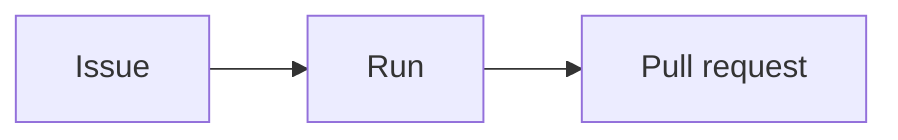

# ouroboros-docs

## Purpose

The Ouroboros documentation site: guides for the people who **use**, **administer** and
**script** Ouroboros, published at [docs.ouroboros.build](https://docs.ouroboros.build).
It is written for users and operators; the engineering documents in [`../docs`](../docs)
stay where they are and are linked, not moved.

The site has three sections — **User Guide** (`/user-guide`), **Administration**
(`/administration`) and **CLI** (`/cli`) — each with its own sidebar and navbar item
([#1165](https://github.com/NobuData/ouroboros/issues/1165)). Every planned page exists,
most as a stub that its content issue fills in. The plan for everything else — brand,
search, screenshots, the container image and its publish workflow — is
[`ROADMAP_OUROBOROS_DOCUMENTATION_SITE.md`](../docs/ROADMAP_OUROBOROS_DOCUMENTATION_SITE.md).

**It is a module but not a workspace** ([`CONVENTIONS.md`](../docs/CONVENTIONS.md) § 1,
limit 6). Like `ouroboros-web` it keeps its own `package.json`, `yarn.lock` and
`.yarnrc.yml`, so the root `yarn install`, `yarn dev` and `yarn test` never touch it and
its React and Docusaurus resolution never enters the product's lockfile.

## Stack

| | |
|---|---|
| Site generator | [Docusaurus](https://docusaurus.io) **3.10.2**, classic preset, TypeScript config — every `@docusaurus/*` package pinned to that one patch |
| UI runtime | **React 19** — Docusaurus 3.10 supports React 18 and 19 (`^18 \|\| ^19` peer range), and 19 is what `ouroboros-ui` and `ouroboros-web` run |
| Language | TypeScript 5 |
| Package manager | Yarn 4.18.0 via corepack, `nodeLinker: node-modules`, own lockfile |
| Runtime | Node 24 |
| Fonts | Chakra Petch, IBM Plex Sans, IBM Plex Mono — self-hosted from `@fontsource/*` (pinned), the weights `ouroboros-ui` ships |
| Search | [`@easyops-cn/docusaurus-search-local`](https://github.com/easyops-cn/docusaurus-search-local) 0.55 — the index is built into the site, no external service |
| Diagrams | `@docusaurus/theme-mermaid` 3.10.2, coloured from the brand tokens |
| Checks | ESLint 9 + typescript-eslint, Stylelint 17 (no colour literals), Prettier, Vitest + Testing Library (jsdom) for components |

## Run

```bash
# From the repository root — installs this module's own lockfile and starts the dev server:
yarn dev:docs                 # http://localhost:3100

# Or from this directory:
yarn install --immutable
yarn dev                      # sync the brand, then docusaurus start --port 3100, live reload
yarn build                    # sync the brand, then the static site into build/;
                              # a broken link or anchor fails the build
yarn serve                    # serve build/ on http://localhost:3100
yarn clear                    # drop the .docusaurus/ cache and build/
yarn lint                     # ESLint, Stylelint over src/**/*.css, markdownlint over docs/**
yarn sync:brand               # copy the tokens, logos and favicons in from the repo
yarn check:brand              # fail if a copy differs from its source (yarn test runs it too)
yarn typecheck                # tsc
yarn test                     # Vitest — config, pages, brand, components, module contract
yarn format:check             # Prettier over the code and config (yarn format fixes);
                              # Markdown is content and keeps the repo's compact tables
yarn screenshots              # placeholder: fails until the capture harness lands (CZ.1)
```

**CI.** [`ci/docs`](../.github/workflows/docs.yml) runs `yarn install --immutable`, `lint`,
`typecheck`, `test` and `build` — exactly the commands above — on every pull request that
touches this module or one of its inputs: the brand sources it copies, `.env.example`, and the
runner's `main.go` and `install.sh` ([#1168](https://github.com/NobuData/ouroboros/issues/1168)).
A broken link, a lint error or a changed copyright line fails it. markdownlint reads
[`.markdownlint-cli2.jsonc`](.markdownlint-cli2.jsonc): the default rules, less line length
and inline HTML (MDX pages use components); a page's front matter `title` is its H1, so a
page carries no `#` heading of its own.

Port **3100** is the docs site's alone: `ouroboros-ui` and `ouroboros-web` both use 3000
([`CONVENTIONS.md`](../docs/CONVENTIONS.md) § 4 port map), so the docs can run beside the
product stack.

## Configuration

| Variable | Default | Read by | Purpose |
|---|---|---|---|
| `DOCS_SITE_URL` | `https://docs.ouroboros.build` | `docusaurus.config.ts`, at build time | The site's public URL, for canonical links and the sitemap. Set it only for a local or preview build served somewhere else. |

`DOCS_SITE_URL` is not an `OURO_*` variable on purpose: nothing in the application reads
it, and it never reaches a running service — it is a build input of a static site.

## Layout

```
ouroboros-docs/
├── docs/
│   ├── user-guide/         # User Guide      → /user-guide      (sidebar userGuide)
│   ├── administration/     # Administration  → /administration  (sidebar administration)
│   └── cli/                # CLI             → /cli             (sidebar cli)
├── src/
│   ├── pages/index.tsx     # the home page, served at /: hero, section cards, quick links
│   ├── components/         # UiPath, EnvVar, Since, SectionCards — usable in any page
│   ├── theme/              # MDXComponents (registers them), Mermaid (brand colours)
│   └── css/
│       ├── tokens.css      # synced copy of docs/design/tokens.css — never edit it here
│       └── custom.css      # the tokens mapped onto Infima, fonts, chrome tweaks
├── static/                 # files copied verbatim into the build
│   └── img/brand/          # synced copies: brand PNGs, mockup logos, favicon/
├── scripts/                # sync-brand.mjs, the screenshots placeholder
├── tests/                  # Vitest — config, sidebars, pages, brand, components, theme, module
│   └── support/            # stand-ins for Docusaurus client modules, the jsdom setup
├── docusaurus.config.ts    # the site config: one docs instance at /, navbar, footer, strict links
├── site.constants.ts       # site URL default, copyright line, repo/edit URLs, the three sections
├── sidebars.ts             # one sidebar per section, generated from its folder
├── eslint.config.mjs · stylelint.config.mjs · .markdownlint-cli2.jsonc · .prettierrc.json
├── vitest.config.mts · tsconfig.json
└── package.json · yarn.lock · .yarnrc.yml · .gitignore · .dockerignore
```

Every page in `docs/` belongs to exactly one section. The home page is not a doc: it is
the React page `src/pages/index.tsx` ([#1169](https://github.com/NobuData/ouroboros/issues/1169))
— the brand lockup and tagline, one paragraph on what Ouroboros does, the three sections as
`<SectionCards>`, and quick links to getting started, deploying and enrolling a runner. Its
copy follows the root `README.md`, not the marketing site. A dashboard screenshot
(`home.dashboard`) joins it once the capture harness
([#1170](https://github.com/NobuData/ouroboros/issues/1170)) and `<Screenshot>`
([#1171](https://github.com/NobuData/ouroboros/issues/1171)) land; the slot is marked in the
page. The
navbar lists the sections in the order User Guide, Administration, CLI, with a GitHub link
and the colour-mode toggle on the right, after the search box. The footer has a link
column per section, a "More" column (GitHub, ouroboros.build) and the copyright line
`Copyright © 2025-2026 NobuData LLC`, which a test holds exactly.

## Brand and theme

The site wears the product's brand ([#1166](https://github.com/NobuData/ouroboros/issues/1166))
without owning any of it. Every brand file has one home elsewhere in the repository, and
the site keeps byte-identical copies so it builds from its own directory:

| Copy | Source | Used for |
|---|---|---|
| `src/css/tokens.css` | [`docs/design/tokens.css`](../docs/design/tokens.css) | Every colour, the three type families, radii and line heights |
| `static/img/brand/{icon,glyph,lockup-tagline}-{light,dark}.png` | [`docs/brand/`](../docs/brand) | The navbar logo (the icon pair) and later pages |
| `static/img/brand/logo-{lockup,mark}.png` | [`docs/mockups/assets/`](../docs/mockups/assets) | The mockups' older crops, for pages that show them |
| `static/img/brand/favicon/*` | [`ouroboros-ui/public/`](../ouroboros-ui/public) | `favicon.ico`, the light/dark 32 px tab icons, the home-screen icon |

**Never edit a copy.** Change the source and run `yarn sync:brand`; `yarn dev` and
`yarn build` sync first anyway. `yarn check:brand` — run by `yarn test` as well — fails
when a copy differs from its source, so a hand edit or a forgotten sync cannot merge.
Outside the repository (the module copied on its own, as an image build does) a plain
sync keeps the committed copies; `--check` refuses, since it has nothing to compare with.

`src/css/custom.css` maps the tokens onto Infima — accent stops, status hues, surfaces,
ink, lines, navigation, type and radii. The tokens switch palettes on `<html data-theme>`,
the attribute the colour-mode toggle stamps, so one mapping serves both themes; the site
follows the OS scheme until the reader picks one. **It holds no colours**: Stylelint
refuses hex, named and functional colours (`rgb()`, `hsl()`, …) in every sheet except the
token copy. Need a colour? Use a token — `var(--accent)`, `var(--ink-dim)`, `var(--line)`.

The navbar logo is the icon pair, not the glyph: the navbar draws it at 32 px and
[`docs/BRAND.md`](../docs/BRAND.md) puts the glyph's minimum at 96 px. The light treatment
shows in the light theme and the dark in the dark, because the variant follows the surface.
Headings use the display face (Chakra Petch), prose the UI face (IBM Plex Sans) and code
the mono face (IBM Plex Mono), all served from the site itself.

The finished shape — `docs/{user-guide,administration,cli}/`, `src/{components,pages,theme}/`,
`static/img/{brand,screenshots}/`, the `screenshots/` Playwright project and the
`Dockerfile` — is drawn in the roadmap's CY.1 entry; each piece arrives with its issue.

## Authoring

### Where a page goes

Ask what the reader is doing when they need the page:

| The reader… | Section | Folder |
|---|---|---|
| uses the product UI | User Guide | `docs/user-guide/` |
| operates or configures the deployment or a workspace | Administration | `docs/administration/` |
| types a command | CLI | `docs/cli/` |

A topic with more than one side gets a page in each, linking each other — for example,
minting a runner enrollment token is Administration (build farm); the `install.sh` it
feeds is CLI.

### Files and naming

- Pages are `.mdx` files named in lower-case kebab-case after their subject
  (`pull-requests.mdx`, `install-sh.mdx`). The file path is the URL:
  `docs/cli/runner/enroll.mdx` is served at `/cli/runner/enroll`.
- A group of pages is a folder with a `_category_.json` giving its sidebar `label` and
  `position`. Its landing page is either an `index.mdx` in the folder, a doc named by
  `"link": {"type": "doc", "id": "…"}`, or a generated list of the group's pages —
  `"link": {"type": "generated-index", "slug": "/<section>/<folder>"}`. Always give a
  generated index that slug; without it Docusaurus serves it at `/category/…`.
- A section's own overview is its `index.mdx`, served at the section's root.
- Sidebars are generated from the folders, so adding a page needs no edit to
  `sidebars.ts`.

### Front matter

| Field | Required | Purpose |
|---|---|---|
| `title` | yes | The page heading and browser title — the full name (`Members, invites, roles & API tokens`) |
| `sidebar_label` | yes | The short name in the sidebar (`Members & tokens`) |
| `sidebar_position` | yes | The page's place among its siblings, from 1 |
| `description` | yes | One sentence on what the page is for; used for search results and link previews |

### Page template

A new page starts as a stub — its title, one sentence on its purpose, and a "being
written" note naming the issue that writes it — and the content issue replaces the note:

```mdx
---
title: "Needs-you inbox"
sidebar_label: "Inbox"
sidebar_position: 12
description: "Answering the decisions blocked loops wait on."
---

Answering the decisions blocked loops wait on.

:::info[Being written]

This page is being written in
[#1185](https://github.com/NobuData/ouroboros/issues/1185).

:::
```

Admonitions take their title in brackets — `:::info[Being written]`, `:::caution[Write-back]`.
The site runs with Docusaurus' v4 flags, which drop MDX 1 compatibility, so the older
`:::info Being written` form renders as plain text; a test refuses it.

`tests/pages.test.ts` lists every planned page with its issue and checks it exists, has
all four front matter fields, and — while it is still a stub — links that issue.

### Admonitions

Four kinds, each for one job, so a reader learns what a box means at a glance:

| Kind | For | Example |
|---|---|---|
| `:::note` | Context — background that helps but can be skipped | Why sources sync on a cadence rather than live |
| `:::tip` | A faster or better way to do what the page describes | The ⌘K action that skips three clicks |
| `:::caution` | **Data loss or security** — read before acting | Write-back edits the tracker; an API token is shown once |
| `:::info[Not available yet]` | A surface the UI shows but that is not delivered (roadmap decision D12) — one line, never described as working | "Slack and Teams channels arrive with Chat Ops." |

`:::danger` is kept for the irreversible — purging a workspace — and nothing else.
`:::info[Being written]` marks a stub (above) and is removed when the page is written.

### Components

Four components are available in every page without an import (registered in
`src/theme/MDXComponents.tsx`). Each refuses bad input by throwing, so a mistake fails
`yarn build` instead of rendering something wrong:

| Component | Renders | Example |
|---|---|---|
| `<UiPath path="…" />` | A place in the app, the way its navigation reads | `<UiPath path="Settings > Members" />` → **Settings › Members** |
| `<EnvVar name="…" />` | A variable in the code face, linked to its entry in the [configuration reference](docs/administration/configuration/index.mdx) | `<EnvVar name="OURO_SMTP_URL" />` |
| `<Since version="…" module="…" />` | A small badge: the release a feature arrived in (`module` optional) | `<Since version="0.7.16" module="ouroboros-rest" />` |
| `<SectionCards />` | A grid of linked cards — the three sections by default, or your own `cards={[{ title, description, to }]}` | `<SectionCards />` on an overview page |

`<EnvVar>` links to `/administration/configuration#<name in lower case>` — the heading the
reference gives each variable. That anchor is checked at build time, so a variable the
reference does not list fails the build. Until the generated reference lands
([#1191](https://github.com/NobuData/ouroboros/issues/1191)) no variable is listed, so
`<EnvVar>` cannot be used yet; write the name in backticks meanwhile. Screenshots get their
component with [#1171](https://github.com/NobuData/ouroboros/issues/1171).

Component styles are CSS modules beside each component and, like the rest of the site's
CSS, use tokens only. Each component has a Vitest + Testing Library test in
`tests/components/`.

### Diagrams

Fence a diagram as `mermaid` and it renders as SVG:

````md

````

Diagrams take their colours from the brand tokens in both themes:
`src/theme/Mermaid/` wraps the theme's renderer, reads the tokens off the page whenever the
theme changes, and hands them to Mermaid's `base` theme. Do not set colours in a diagram
(`style`, `classDef … fill:`) — they would not follow the theme.

### Search

The search box indexes every page in all three sections; each result shows its section,
group and page (`CLI › ouroboros-runner`). There is nothing to configure per page — a
page's title, headings, description and text are indexed. Build the site
(`yarn build && yarn serve`) to try it: the dev server has no index.

### Links

- Link another page by its **relative file path**, with the extension:
  `[Policies](../administration/policies.mdx)`. Docusaurus resolves it at build time and the
  build fails if the file does not exist.
- Link a heading with the file path plus the anchor: `[tokens](./members-and-tokens.mdx#api-tokens)`;
  a missing anchor fails the build too.
- Link the product's own source or engineering docs with a full GitHub URL
  (`https://github.com/NobuData/ouroboros/blob/main/…`) — they are not part of the site.
- Every page's "Edit this page" link opens the file on GitHub's editor for `main`.

## Related issues

- [#1164](https://github.com/NobuData/ouroboros/issues/1164) — CY.1 scaffold (this module)
- [#1165](https://github.com/NobuData/ouroboros/issues/1165) — CY.2 three sections, navbar, footer & stub pages
- [#1166](https://github.com/NobuData/ouroboros/issues/1166) — CY.3 brand theme, light/dark & logos (this module's theme)
- [#1169](https://github.com/NobuData/ouroboros/issues/1169) — CY.6 landing page
- [#1170](https://github.com/NobuData/ouroboros/issues/1170) — CZ.1 screenshot capture harness
- [#1156](https://github.com/NobuData/ouroboros/issues/1156) — Epic CY · Docs Site Foundation
