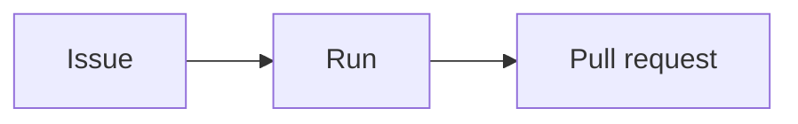

# ouroboros-docs

## Purpose

The Ouroboros documentation site: guides for the people who **use**, **administer** and
**script** Ouroboros, published at [docs.ouroboros.build](https://docs.ouroboros.build).
It is written for users and operators; the engineering documents in [`../docs`](../docs)
stay where they are and are linked, not moved.

The site has three sections — **User Guide** (`/user-guide`), **Administration**
(`/administration`) and **CLI** (`/cli`) — each with its own sidebar and navbar item
([#1165](https://github.com/NobuData/ouroboros/issues/1165)). Every planned page exists,
most as a stub that its content issue fills in. The plan for everything else — brand,
search, screenshots, the container image and its publish workflow — is
[`ROADMAP_OUROBOROS_DOCUMENTATION_SITE.md`](../docs/ROADMAP_OUROBOROS_DOCUMENTATION_SITE.md).

**It is a module but not a workspace** ([`CONVENTIONS.md`](../docs/CONVENTIONS.md) § 1,
limit 6). Like `ouroboros-web` it keeps its own `package.json`, `yarn.lock` and
`.yarnrc.yml`, so the root `yarn install`, `yarn dev` and `yarn test` never touch it and
its React and Docusaurus resolution never enters the product's lockfile.

## Stack

| | |
|---|---|
| Site generator | [Docusaurus](https://docusaurus.io) **3.10.2**, classic preset, TypeScript config — every `@docusaurus/*` package pinned to that one patch |
| UI runtime | **React 19** — Docusaurus 3.10 supports React 18 and 19 (`^18 \|\| ^19` peer range), and 19 is what `ouroboros-ui` and `ouroboros-web` run |
| Language | TypeScript 5 |
| Package manager | Yarn 4.18.0 via corepack, `nodeLinker: node-modules`, own lockfile |
| Runtime | Node 24 |
| Fonts | Chakra Petch, IBM Plex Sans, IBM Plex Mono — self-hosted from `@fontsource/*` (pinned), the weights `ouroboros-ui` ships |
| Search | [`@easyops-cn/docusaurus-search-local`](https://github.com/easyops-cn/docusaurus-search-local) 0.55 — the index is built into the site, no external service |
| Diagrams | `@docusaurus/theme-mermaid` 3.10.2, coloured from the brand tokens |
| Checks | ESLint 9 + typescript-eslint, Stylelint 17 (no colour literals), Prettier, Vitest + Testing Library (jsdom) for components |

## Run

```bash
# From the repository root — installs this module's own lockfile and starts the dev server:
yarn dev:docs                 # http://localhost:3100

# Or from this directory:
yarn install --immutable
yarn dev                      # sync the brand, then docusaurus start --port 3100, live reload
yarn build                    # sync the brand, then the static site into build/;
                              # a broken link or anchor fails the build
yarn serve                    # serve build/ on http://localhost:3100
yarn clear                    # drop the .docusaurus/ cache and build/
yarn lint                     # ESLint, Stylelint over src/**/*.css, markdownlint over docs/**
yarn sync:brand               # copy the tokens, logos and favicons in from the repo
yarn check:brand              # fail if a copy differs from its source (yarn test runs it too)
yarn typecheck                # tsc
yarn test                     # Vitest — config, pages, brand, components, module contract
yarn format:check             # Prettier over the code and config (yarn format fixes);
                              # Markdown is content and keeps the repo's compact tables
yarn screenshots              # recapture the manifest's screenshots from a seeded stack —
                              # see "Recapturing screenshots" below
yarn check:screenshots        # manifest ↔ files ↔ pages, size budgets, staleness report —
                              # see "Checking screenshots" below
yarn gen:config-reference     # regenerate the configuration reference from .env.example
yarn check:config-reference   # fail if that reference is stale (yarn test checks it too) —
                              # see "The configuration reference" below
```

**CI.** [`ci/docs`](../.github/workflows/docs.yml) runs `yarn install --immutable`, `lint`,
`typecheck`, `test` and `build` — exactly the commands above — then `yarn check:screenshots`
(see "Checking screenshots"), `yarn check:config-reference` and `yarn check:cli-flags`, on every pull request that
touches this module or one of its inputs: the brand sources it copies, `.env.example`, and the
runner's `main.go` and `install.sh` ([#1168](https://github.com/NobuData/ouroboros/issues/1168)).
A broken link, a lint error or a changed copyright line fails it. markdownlint reads
[`.markdownlint-cli2.jsonc`](.markdownlint-cli2.jsonc): the default rules, less line length
and inline HTML (MDX pages use components); a page's front matter `title` is its H1, so a
page carries no `#` heading of its own.

**Publishing.** On a push to `main` or a manual run, and only once `ci/docs` has passed,
`publish/docs` builds [the image](#the-image) and pushes it to
**`registry.apiome.dev/ouroboros-docs`** with three tags: `latest`, the commit sha, and this
`package.json`'s version ([#1207](https://github.com/NobuData/ouroboros/issues/1207)). A pull
request never publishes, and builds no image. Bump the version with a change you want released
under a new tag — the version tag of an unchanged version is moved by every push. The site URL
baked into the build is the repository variable `DOCS_SITE_URL` when set, the config's default
otherwise.

Port **3100** is the docs site's alone: `ouroboros-ui` and `ouroboros-web` both use 3000
([`CONVENTIONS.md`](../docs/CONVENTIONS.md) § 4 port map), so the docs can run beside the
product stack.

### The image

The site ships as a static image ([#1206](https://github.com/NobuData/ouroboros/issues/1206),
roadmap decision D8): `node:24-alpine` installs and builds it, and
`nginxinc/nginx-unprivileged` serves `build/` as uid 101 on **8080**. Nothing outside this
directory is read — the brand copies, the configuration reference and the screenshots are
committed, so the build context is the module alone:

```bash
docker build -t ouroboros-docs ouroboros-docs                    # from the repository root
docker run --rm -p 8080:8080 ouroboros-docs                      # http://localhost:8080
```

| Build argument | Default | What it sets |
|---|---|---|
| `DOCS_SITE_URL` | `https://docs.ouroboros.build` | The site's public URL, for canonical links and the sitemap (see Configuration) |
| `VERSION` | `0.0.0` | `org.opencontainers.image.version` — pass this `package.json`'s version |
| `REVISION` | `unknown` | `org.opencontainers.image.revision` — pass the git commit |
| `SOURCE` | `https://github.com/NobuData/ouroboros` | `org.opencontainers.image.source` and `.url` |
| `CREATED` | empty | `org.opencontainers.image.created` — an RFC 3339 time |

What the server does is [`nginx.conf`](nginx.conf):

| Request | Answer |
|---|---|
| `/`, `/cli`, `/user-guide/concepts` | The page — `cli.html` is tried before the directory `cli/`, which has no `index.html` |
| `/cli/` | `301` to `/cli`, relative, so it is right behind any proxy |
| An unknown path | Docusaurus' `404.html`, with status **404** |
| `/assets/*` | `Cache-Control: public, max-age=31536000, immutable` — every file there is content-hashed |
| Any page | `Cache-Control: no-cache`, so a new deployment is seen at once |
| `GET /healthz` | `200 ok`, from nginx without reading the disk — the image's `HEALTHCHECK` |

**Running the published image.** Every push to `main` publishes it (see *Publishing* above):

```bash
docker login registry.apiome.dev
docker run -p 8080:8080 registry.apiome.dev/ouroboros-docs:latest     # http://localhost:8080
```

Or as a compose service beside anything else you run — it needs no volume, secret or other
service, and its own `HEALTHCHECK` is what `docker compose ps` reports:

```yaml
services:
  docs:
    image: registry.apiome.dev/ouroboros-docs:latest   # or pin :<version> / :<sha>
    ports: ["127.0.0.1:8080:8080"]                    # only the reverse proxy reaches it
    read_only: true
    tmpfs: [/tmp]                                       # nginx's pid and temp files
    restart: unless-stopped
```

**Behind a reverse proxy.** Terminate TLS at the proxy and forward everything to port 8080:

- **Serve it at the root of its own host** (`docs.example.com`), not under a path such as
  `example.com/docs/` — the site is built with `baseUrl: "/"`, so every asset and link is
  absolute from the root.
- **Pass its headers through.** The Content-Security-Policy, `X-Frame-Options` and the
  `Cache-Control` values are the image's own; a proxy that adds a second CSP narrows both, and
  one that rewrites `Cache-Control` loses the immutable assets or serves stale pages.
- **Redirects are relative** (`absolute_redirect off`), so `/cli/` → `/cli` stays on the
  proxy's host and scheme without any `X-Forwarded-*` handling.
- **Build with your own address** — `--build-arg DOCS_SITE_URL=https://docs.example.com` — if
  canonical links and the sitemap should name it; the published image names the default.
- `/healthz` is there for the proxy's or orchestrator's liveness probe.

**Smoke test.** `ci/docs` builds the image on every run — loaded into the runner, never pushed —
and [`scripts/smoke-image.sh`](scripts/smoke-image.sh) runs it and probes `/healthz`, the three
section roots, `/cli/runner/enroll`, an unknown path (404 and the not-found page), the footer's
copyright line and the main script's `immutable` caching
([#1208](https://github.com/NobuData/ouroboros/issues/1208)). A failure fails `ci/docs`, so
`publish/docs` never publishes an image that serves nothing. Run it yourself:

```bash
docker build -t ouroboros-docs:smoke . && scripts/smoke-image.sh ouroboros-docs:smoke   # from here
```

Text is gzipped, and every answer carries
[`nginx-headers.conf`](nginx-headers.conf)'s security headers. The Content-Security-Policy admits
scripts from the site and, inline, **only the theme script** — the lines that set the colour
mode before the first paint. Its SHA-256 is read from the built pages by
[`scripts/gen-csp.ts`](scripts/gen-csp.ts) in the `build` stage and written into
`/etc/nginx/ouroboros/csp.conf`, because Docusaurus owns that script's text. The image build
fails if a page carries any other inline script; `baseUrlIssueBanner: false` in the config is
what removes the one Docusaurus would otherwise add to the home page.

## Configuration

| Variable | Default | Read by | Purpose |
|---|---|---|---|
| `DOCS_SITE_URL` | `https://docs.ouroboros.build` | `docusaurus.config.ts`, at build time | The site's public URL, for canonical links and the sitemap. Set it only for a local or preview build served somewhere else. |
| `OURO_DOCS_CAPTURE_BASE_URL` | `http://localhost:3000` | `yarn screenshots` | The seeded `ouroboros-ui` screenshots are captured from. Declared in the root [`.env.example`](../.env.example) with the other `OURO_*` variables, because it names a running product service. |

`DOCS_SITE_URL` is not an `OURO_*` variable on purpose: nothing in the application reads
it, and it never reaches a running service — it is a build input of a static site.

## Layout

```
ouroboros-docs/
├── docs/
│   ├── user-guide/         # User Guide      → /user-guide      (sidebar userGuide)
│   ├── administration/     # Administration  → /administration  (sidebar administration)
│   └── cli/                # CLI             → /cli             (sidebar cli)
├── src/
│   ├── pages/index.tsx     # the home page, served at /: hero, section cards, quick links
│   ├── components/         # UiPath, EnvVar, Since, SectionCards, Screenshot — usable in any page
│   ├── theme/              # MDXComponents (registers them), Mermaid (brand colours)
│   └── css/
│       ├── tokens.css      # synced copy of docs/design/tokens.css — never edit it here
│       └── custom.css      # the tokens mapped onto Infima, fonts, chrome tweaks
├── static/                 # files copied verbatim into the build
│   └── img/
│       ├── brand/          # synced copies: brand PNGs, mockup logos, favicon/
│       └── screenshots/    # captured by yarn screenshots: <section>/<slug>.<theme>.png
├── screenshots/            # the capture harness (Playwright) — see "Recapturing screenshots"
├── plugins/screenshots.ts  # reads the manifest and image sizes at build time for <Screenshot>
├── scripts/                # sync-brand.mjs; gen-config-reference.ts + config-reference.ts;
│                           # check-cli-flags.ts + cli-flags.ts; gen-csp.ts + csp.ts (the image's CSP)
├── tests/                  # Vitest — config, sidebars, pages, brand, components, theme, module
│   └── support/            # stand-ins for Docusaurus client modules, the jsdom setup
├── docusaurus.config.ts    # the site config: one docs instance at /, navbar, footer, strict links
├── site.constants.ts       # site URL default, copyright line, repo/edit URLs, the three sections
├── sidebars.ts             # one sidebar per section, generated from its folder
├── eslint.config.mjs · stylelint.config.mjs · .markdownlint-cli2.jsonc · .prettierrc.json
├── vitest.config.mts · tsconfig.json
├── Dockerfile · .dockerignore   # the image — see "The image"
├── nginx.conf · nginx-headers.conf   # its server and security headers
└── package.json · yarn.lock · .yarnrc.yml · .gitignore
```

Every page in `docs/` belongs to exactly one section. The home page is not a doc: it is
the React page `src/pages/index.tsx` ([#1169](https://github.com/NobuData/ouroboros/issues/1169))
— the brand lockup and tagline, one paragraph on what Ouroboros does, the three sections as
`<SectionCards>`, quick links to getting started, deploying and enrolling a runner, and the
dashboard as `<Screenshot id="home.dashboard" />`. Its copy follows the root `README.md`,
not the marketing site. The navbar lists the sections in the order User Guide, Administration, CLI, with a GitHub link
and the colour-mode toggle on the right, after the search box. The footer has a link
column per section, a "More" column (GitHub, ouroboros.build) and the copyright line
`Copyright © 2025-2026 NobuData LLC`, which a test holds exactly.

## Brand and theme

The site wears the product's brand ([#1166](https://github.com/NobuData/ouroboros/issues/1166))
without owning any of it. Every brand file has one home elsewhere in the repository, and
the site keeps byte-identical copies so it builds from its own directory:

| Copy | Source | Used for |
|---|---|---|
| `src/css/tokens.css` | [`docs/design/tokens.css`](../docs/design/tokens.css) | Every colour, the three type families, radii and line heights |
| `static/img/brand/{icon,glyph,lockup-tagline}-{light,dark}.png` | [`docs/brand/`](../docs/brand) | The navbar logo (the icon pair) and later pages |
| `static/img/brand/logo-{lockup,mark}.png` | [`docs/mockups/assets/`](../docs/mockups/assets) | The mockups' older crops, for pages that show them |
| `static/img/brand/favicon/*` | [`ouroboros-ui/public/`](../ouroboros-ui/public) | `favicon.ico`, the light/dark 32 px tab icons, the home-screen icon |

**Never edit a copy.** Change the source and run `yarn sync:brand`; `yarn dev` and
`yarn build` sync first anyway. `yarn check:brand` — run by `yarn test` as well — fails
when a copy differs from its source, so a hand edit or a forgotten sync cannot merge.
Outside the repository (the module copied on its own, as an image build does) a plain
sync keeps the committed copies; `--check` refuses, since it has nothing to compare with.

`src/css/custom.css` maps the tokens onto Infima — accent stops, status hues, surfaces,
ink, lines, navigation, type and radii. The tokens switch palettes on `<html data-theme>`,
the attribute the colour-mode toggle stamps, so one mapping serves both themes; the site
follows the OS scheme until the reader picks one. **It holds no colours**: Stylelint
refuses hex, named and functional colours (`rgb()`, `hsl()`, …) in every sheet except the
token copy. Need a colour? Use a token — `var(--accent)`, `var(--ink-dim)`, `var(--line)`.

The navbar logo is the icon pair, not the glyph: the navbar draws it at 32 px and
[`docs/BRAND.md`](../docs/BRAND.md) puts the glyph's minimum at 96 px. The light treatment
shows in the light theme and the dark in the dark, because the variant follows the surface.
Headings use the display face (Chakra Petch), prose the UI face (IBM Plex Sans) and code
the mono face (IBM Plex Mono), all served from the site itself.

The finished shape — `docs/{user-guide,administration,cli}/`, `src/{components,pages,theme}/`,
`static/img/{brand,screenshots}/`, the `screenshots/` Playwright project and the
`Dockerfile` — is drawn in the roadmap's CY.1 entry; each piece arrives with its issue.

## Recapturing screenshots

Every screenshot on the site is captured from the real app, seeded with the development
data, in both themes ([#1170](https://github.com/NobuData/ouroboros/issues/1170)). Nobody
takes one by hand: a hand-taken image drifts in size, theme and data, and cannot be retaken
when the UI changes. Captures run on your machine, never in CI.

### What is where

```
screenshots/
├── screenshots.manifest.json         # every screenshot: route, workspace, what to wait for …
├── screenshots.manifest.schema.json  # … checked against this (ajv) before anything runs
├── playwright.config.ts              # one Chromium project per theme, 1440×900 at 2×
├── global-setup.ts                   # signs in once; the session is reused (.auth/, gitignored)
├── capture.spec.ts                   # one test per entry, per theme
├── run.ts                            # yarn screenshots
├── check.ts                          # yarn check:screenshots (see "Checking screenshots")
├── settings.ts                       # base URL, the seeded user, timeouts
└── lib/                              # manifest rules, actions, the image step, stamping, integrity
```

### Run it

1. **Start the seeded stack.** `yarn dev` from the repository root, on a freshly seeded
   database (`yarn dev:reset` first if yours has drifted), or the composed e2e stack
   (`tests/e2e/scripts/run.sh --keep`). The harness signs in with the seed's email/password
   credential, which `ouroboros-rest` accepts only outside production.
2. **Capture.** From this directory:

   ```bash
   yarn screenshots                          # every entry, both themes
   yarn screenshots --only home.dashboard    # one entry
   yarn screenshots --only 'user-guide.*'    # a glob — * matches across dots
   yarn screenshots --theme dark             # one theme
   OURO_DOCS_CAPTURE_BASE_URL=http://localhost:3001 yarn screenshots   # another stack
   ```

   The first run may need the browser: `npx playwright install chromium`.
3. **Review the diff.** Each image lands at `static/img/screenshots/<section>/<slug>.<theme>.png`,
   and the manifest entry is stamped with `capturedAt`, `uiVersion` (from
   `ouroboros-ui/package.json`) and `seedRef` (the commit). Look at every changed image
   before committing — a changed screenshot is a changed page.

The command checks the manifest and your `--only` before a browser starts, so a typo fails
at once (exit 2). An entry that fails — its `ready` selector never appears, its route
answers an error, the session is refused — fails alone, with the entry, theme, route and
selector in the message; the rest are still captured, and the run exits non-zero.

### Adding an entry

```json
{
  "id": "user-guide.inbox",
  "route": "/inbox",
  "workspace": "acme-robotics",
  "ready": "role=heading[name='Needs you']",
  "clip": "page",
  "masks": ["time"],
  "actions": [{ "click": "role=button[name='Snooze']" }],
  "caption": "The needs-you inbox, with the head card open.",
  "alt": "The needs-you inbox listing three decisions, the first expanded."
}
```

| Field | Meaning |
|---|---|
| `id` | `<section>.<slug>` — `home`, `user-guide`, `administration` or `cli`, then a kebab-case slug (dots allowed). The section is the image's folder |
| `route` | The app route, from the UI's root |
| `workspace` | The seeded workspace's slug the page is shown in (`acme-robotics`, `kensuenobu`, …). Required, except on a `signedOut` entry |
| `signedOut` | `true` to capture the page signed out — the capture's cookies are cleared first — for the sign-in page. Such an entry names no `workspace` |
| `ready` | A Playwright selector that must be visible before the capture — CSS, `text=…`, `role=…`. Pick something only the *loaded* page has: seeded data, not a heading the skeleton already draws |
| `clip` | `page` (the 1440×900 viewport), `fullPage`, or a selector whose element is captured alone |
| `masks` | Selectors painted over in the app's own raised-surface colour — anything that changes between runs: relative times rendered on the server, live sparklines, generated ids |
| `actions` | Steps before the capture, in order: `{"click": sel}`, `{"hover": sel}`, `{"fill": sel, "value": "…"}`, `{"press": "Escape"}` or `{"press": "Enter", "on": sel}` |
| `caption`, `alt` | The caption under the image and its alternative text; both required |

### Showing a screenshot

Put a captured entry on a page with its id ([#1171](https://github.com/NobuData/ouroboros/issues/1171)):

```mdx
<Screenshot id="user-guide.inbox" />
<Screenshot id="user-guide.inbox" caption="The inbox after a snooze." />
<Screenshot id="user-guide.inbox" alt="The inbox, empty." caption="" />
```

- **Text.** The alt text and caption are the manifest entry's; `alt` and `caption` replace
  them on one page. `caption=""` leaves the caption out; alt text can never be blank.
- **Theme.** Both captures are on the page and `ThemedImage` shows the one for the reader's
  theme, switching with the colour-mode toggle.
- **Size.** `plugins/screenshots.ts` reads the manifest (checking it against the schema) and
  each PNG's header at build time, so the image carries its intrinsic `width`/`height` and the
  page does not shift when it loads. It loads lazily and scales down to the column.
- **Zoom.** Clicking the image opens it at full size in a dialog; a click, *Close* or
  <kbd>Esc</kbd> closes it.

These fail `yarn build` (and `yarn dev` shows the error): an id the manifest does not list,
blank alt text, a manifest that fails its schema, an entry missing either theme's file, or
light and dark files of different sizes. `yarn dev` rebuilds when the manifest or an image
changes.

### Checking screenshots

CI cannot capture, but it can check ([#1172](https://github.com/NobuData/ouroboros/issues/1172)).
`yarn check:screenshots` — a step of `ci/docs` after the build — reads the manifest, every
file under `static/img/screenshots/` and every `<Screenshot id>` in `docs/**/*.{md,mdx}` and
`src/pages/**/*.{md,mdx,tsx}`, and fails (exit 1) with one line per problem, each named:

| Error | Means | Fix |
|---|---|---|
| `invalid-manifest` | The manifest is not JSON, fails its schema, or repeats an id | Fix the entry the message points at |
| `missing-image` | An entry lacks its `light` or `dark` file | `yarn screenshots --only <id>` |
| `unknown-screenshot-id` | A page uses an id the manifest does not list (file and line given) | Add the entry, or correct the id |
| `orphan-image` | A file under `static/img/screenshots/` belongs to no entry — any file, not only PNGs | Delete it, or add its entry |
| `image-over-budget` | One file is over 350 KiB (D6) | Clip tighter (`clip` a selector) or simplify the page |
| `total-over-budget` | Everything under `static/img/screenshots/` is over 40 MiB (D6) | Retire unused entries; clip tighter |

Every problem is reported, not just the first. Code samples in Markdown (fenced blocks and
inline code) are skipped, so a page can *show* `<Screenshot id="…">` without using it; write
ids there as plain strings, since a template-literal id (`` id={`…`} ``) is skipped too.

It then prints a **staleness report** — never a failure, exit 0 — of entries whose
`uiVersion` is a minor (or major) behind `ouroboros-ui/package.json`'s, or that were never
stamped, with each entry's `uiVersion` and `capturedAt`. Patch releases do not count. Recapture
those when convenient. Outside the repository, where there is no `ouroboros-ui` beside the
module, the report is skipped.

### What keeps captures identical

Run twice against the same seeded stack, the harness writes byte-identical files:

- **The clock.** The browser's clock is frozen — to the manifest's top-level `clock`
  (ISO 8601) when set, otherwise to the start of the current hour. The seed has no fixed
  instant of its own (it writes times relative to when it was applied), and the server's
  clock is not frozen, so **server-rendered relative times must be masked**.
- **Motion.** Animations, transitions, smooth scrolling and the caret are switched off.
- **Fonts.** Each capture waits for the page's web fonts.
- **The image step.** Captures are taken at device scale 2, downscaled to 1440 px wide and
  written as palette PNGs with sharp ([D6](../docs/ROADMAP_OUROBOROS_DOCUMENTATION_SITE.md)),
  which writes no timestamps — the same capture always becomes the same bytes.

- **Images.** Lazy images are switched to eager and every image must finish loading.

The seed's data still ages in real time — a decision's time-to-live runs out, a badge count
drops — so two runs minutes apart agree, but a stack seeded last week does not match one
seeded today. Capture from a **freshly seeded** database, as step 1 says.

Captures share one session and switch its active workspace per entry, so they run one at a
time. The manifest is written by the command (it stamps every captured entry), so Prettier
leaves it alone.

## Authoring

Every user-visible change to the product updates this site in the same pull request —
[`docs/CONVENTIONS.md`](../docs/CONVENTIONS.md) § 11 is the rule, and the `/implement` skill
([`.claude/skills/implement/SKILL.md`](../.claude/skills/implement/SKILL.md)) carries it step by
step: name the page paths, write or update the pages, recapture only the affected screenshots,
run this module's checks, bump its version, and list what changed under **Documentation** in
the pull request. What follows is how a page is written.

### Where a page goes

Ask what the reader is doing when they need the page:

| The reader… | Section | Folder |
|---|---|---|
| uses the product UI | User Guide | `docs/user-guide/` |
| operates or configures the deployment or a workspace | Administration | `docs/administration/` |
| types a command | CLI | `docs/cli/` |

A topic with more than one side gets a page in each, linking each other — for example,
minting a runner enrollment token is Administration (build farm); the `install.sh` it
feeds is CLI.

### Files and naming

- Pages are `.mdx` files named in lower-case kebab-case after their subject
  (`pull-requests.mdx`, `install-sh.mdx`). The file path is the URL:
  `docs/cli/runner/enroll.mdx` is served at `/cli/runner/enroll`.
- A group of pages is a folder with a `_category_.json` giving its sidebar `label` and
  `position`. Its landing page is either an `index.mdx` in the folder, a doc named by
  `"link": {"type": "doc", "id": "…"}`, or a generated list of the group's pages —
  `"link": {"type": "generated-index", "slug": "/<section>/<folder>"}`. Always give a
  generated index that slug; without it Docusaurus serves it at `/category/…`.
- A section's own overview is its `index.mdx`, served at the section's root.
- Sidebars are generated from the folders, so adding a page needs no edit to
  `sidebars.ts`.

### Front matter

| Field | Required | Purpose |
|---|---|---|
| `title` | yes | The page heading and browser title — the full name (`Members, invites, roles & API tokens`) |
| `sidebar_label` | yes | The short name in the sidebar (`Members & tokens`) |
| `sidebar_position` | yes | The page's place among its siblings, from 1 |
| `description` | yes | One sentence on what the page is for; used for search results and link previews |

### Page template

A new page starts as a stub — its title, one sentence on its purpose, and a "being
written" note naming the issue that writes it — and the content issue replaces the note:

```mdx
---
title: "Needs-you inbox"
sidebar_label: "Inbox"
sidebar_position: 12
description: "Answering the decisions blocked loops wait on."
---

Answering the decisions blocked loops wait on.

:::info[Being written]

This page is being written in
[#1185](https://github.com/NobuData/ouroboros/issues/1185).

:::
```

Admonitions take their title in brackets — `:::info[Being written]`, `:::caution[Write-back]`.
The site runs with Docusaurus' v4 flags, which drop MDX 1 compatibility, so the older
`:::info Being written` form renders as plain text; a test refuses it.

`tests/pages.test.ts` lists every planned page with its issue and checks it exists, has
all four front matter fields, and — while it is still a stub — links that issue.

### Admonitions

Four kinds, each for one job, so a reader learns what a box means at a glance:

| Kind | For | Example |
|---|---|---|
| `:::note` | Context — background that helps but can be skipped | Why sources sync on a cadence rather than live |
| `:::tip` | A faster or better way to do what the page describes | The ⌘K action that skips three clicks |
| `:::caution` | **Data loss or security** — read before acting | Write-back edits the tracker; an API token is shown once |
| `:::info[Not available yet]` | A surface the UI shows but that is not delivered (roadmap decision D12) — one line, never described as working | "Slack and Teams channels arrive with Chat Ops." |

`:::danger` is kept for the irreversible — purging a workspace — and nothing else.
`:::info[Being written]` marks a stub (above) and is removed when the page is written.

### Components

Five components are available in every page without an import (registered in
`src/theme/MDXComponents.tsx`). Each refuses bad input by throwing, so a mistake fails
`yarn build` instead of rendering something wrong:

| Component | Renders | Example |
|---|---|---|
| `<UiPath path="…" />` | A place in the app, the way its navigation reads | `<UiPath path="Settings > Members" />` → **Settings › Members** |
| `<EnvVar name="…" />` | A variable in the code face, linked to its entry in the [configuration reference](docs/administration/configuration/index.mdx) | `<EnvVar name="OURO_SMTP_URL" />` |
| `<Since version="…" module="…" />` | A small badge: the release a feature arrived in (`module` optional) | `<Since version="0.7.16" module="ouroboros-rest" />` |
| `<SectionCards />` | A grid of linked cards — the three sections by default, or your own `cards={[{ title, description, to }]}` | `<SectionCards />` on an overview page |
| `<Screenshot id="…" />` | A captured screen in the reader's theme, framed and captioned, click to enlarge (`alt`, `caption` optional overrides) — see [Showing a screenshot](#showing-a-screenshot) | `<Screenshot id="home.dashboard" />` |

`<EnvVar>` links to `/administration/configuration#<name in lower case>` — the heading the
reference gives each variable. That anchor is checked at build time, so a variable the
reference does not list fails the build. The reference lists every variable in the root
`.env.example` (see "The configuration reference"), so a variable it lacks is one the code
does not read either.

Component styles are CSS modules beside each component and, like the rest of the site's
CSS, use tokens only. Each component has a Vitest + Testing Library test in
`tests/components/`.

### The configuration reference

[`docs/administration/configuration/`](docs/administration/configuration/index.mdx) is a
hand-written page wrapped around `_generated.mdx`, which
[`scripts/gen-config-reference.ts`](scripts/gen-config-reference.ts) writes from the root
`.env.example` ([#1191](https://github.com/NobuData/ouroboros/issues/1191)). **Never edit
`_generated.mdx`**: change the comment or the variable in `.env.example` and run
`yarn gen:config-reference`. `yarn check:config-reference` — a step of `ci/docs`, and a test in
`tests/config-reference.test.ts` — fails when the file is stale.

How the template is read (`scripts/config-reference.ts`):

| In `.env.example` | In the reference |
|---|---|
| `# ---` / `# Title` / `# ---` | A `##` section, titled by the header |
| The `#` block directly above a variable | Its description; `#` alone breaks paragraphs, a line indented three or more spaces is code |
| `NAME=value` | A `###` entry, **Development default:** `value` |
| `NAME=…-change-me` | **Development default:** a secret, generated by `yarn setup` |
| `# NAME=value` or `#   NAME=value` ending a block | **Development default:** unset, with the value as an example |
| A variable straight after another, with no block | An entry that points at the one above |
| A block followed by no variable | Nothing — it describes the file |

The site cites no issues: parentheticals that do — `(issue #330)`, `(BR.5, #489)`,
`(decision B3)` — are dropped, and the generator refuses (exit 2, naming the variable) a
comment that still cites one outside parentheses. The heading id is the name in lower case,
which is what `<EnvVar>` links to.

### The CLI flag check

Each CLI reference page lists the flags it documents in a `flags:` front matter list — a block
list of quoted flags, or `flags: []` for a command that takes none:

```yaml
flags:
  - "--state-dir"
  - "--no-shell"
```

`yarn check:cli-flags` ([`scripts/check-cli-flags.ts`](scripts/check-cli-flags.ts), a step of
`ci/docs`, [#1203](https://github.com/NobuData/ouroboros/issues/1203)) reads the tools' own usage
texts — the `usage` constant in `ouroboros-runner/cmd/ouroboros-runner/main.go`, whose synopsis
lines give each command's flags, and `install.sh`'s `usage` heredoc — and fails when a flag is
missing from its page's list (`cli/runner/<command>.mdx`, or `cli/install-sh.mdx`), when a
listed flag is accepted nowhere, or when a page has no list. A runner page may list a flag its
command takes but its synopsis omits, such as `hello`'s `--state-dir`. Adding a flag to either
usage text therefore means adding it to the page — its front matter and its body.

### Diagrams

Fence a diagram as `mermaid` and it renders as SVG:

````md

````

Diagrams take their colours from the brand tokens in both themes:
`src/theme/Mermaid/` wraps the theme's renderer, reads the tokens off the page whenever the
theme changes, and hands them to Mermaid's `base` theme. Do not set colours in a diagram
(`style`, `classDef … fill:`) — they would not follow the theme.

### Search

The search box indexes every page in all three sections; each result shows its section,
group and page (`CLI › ouroboros-runner`). There is nothing to configure per page — a
page's title, headings, description and text are indexed. Build the site
(`yarn build && yarn serve`) to try it: the dev server has no index.

### Links

- Link another page by its **relative file path**, with the extension:
  `[Policies](../administration/policies.mdx)`. Docusaurus resolves it at build time and the
  build fails if the file does not exist.
- Link a heading with the file path plus the anchor: `[tokens](./members-and-tokens.mdx#api-tokens)`;
  a missing anchor fails the build too.
- Link the product's own source or engineering docs with a full GitHub URL
  (`https://github.com/NobuData/ouroboros/blob/main/…`) — they are not part of the site.
- Every page's "Edit this page" link opens the file on GitHub's editor for `main`.

## Related issues

- [#1164](https://github.com/NobuData/ouroboros/issues/1164) — CY.1 scaffold (this module)
- [#1165](https://github.com/NobuData/ouroboros/issues/1165) — CY.2 three sections, navbar, footer & stub pages
- [#1166](https://github.com/NobuData/ouroboros/issues/1166) — CY.3 brand theme, light/dark & logos (this module's theme)
- [#1169](https://github.com/NobuData/ouroboros/issues/1169) — CY.6 landing page
- [#1170](https://github.com/NobuData/ouroboros/issues/1170) — CZ.1 screenshot capture harness
- [#1206](https://github.com/NobuData/ouroboros/issues/1206) — DD.1 Dockerfile & nginx runtime (the image)
- [#1207](https://github.com/NobuData/ouroboros/issues/1207) — DD.2 publish workflow to registry.apiome.dev
- [#1208](https://github.com/NobuData/ouroboros/issues/1208) — DD.3 image smoke test & deployment notes
- [#1156](https://github.com/NobuData/ouroboros/issues/1156) — Epic CY · Docs Site Foundation
