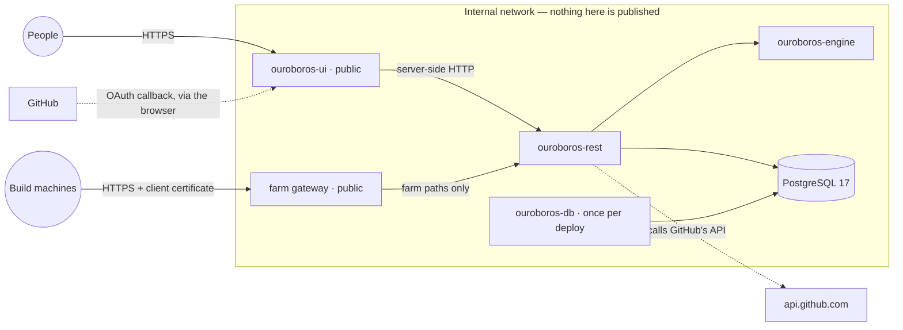

This section takes you from the published images to a running Ouroboros that your team can
sign in to. It is written for whoever runs the deployment. Read this page first: it says what
you are deploying, and which parts of it the outside world may reach.

The pages that follow are, in order:

1. [Container images](./containers.mdx) — each image, and the variables it needs.
2. [Deploying with Docker Compose](./compose.mdx) — a compose file for one host, and how to
   bring it up.
3. [The farm gateway](./farm-gateway.mdx) — only if you run build machines.
4. [The application host](./app-host.mdx) — the HTTPS proxy in front of the app.
5. [Go-live checklist](./checklist.mdx) — what to verify before people sign in.

Once it runs, [Operations](../operations.mdx) covers upgrades, backups, health and logs.

## The services

Ouroboros is five containers and a database. Only one of them is for people's browsers; one
more is for your build machines, if you have any. Everything else stays on the internal
network.

| Service | Image | Listens on | Reachable from | Needed |
| --- | --- | --- | --- | --- |
| The web app | `ouroboros-ui` | `3000` | **Public**, behind your HTTPS proxy | Always |
| The REST service | `ouroboros-rest` | `4000` | **Internal**. Build machines reach a few of its paths through the farm gateway | Always |
| The engine | `ouroboros-engine` | `8000` | **Internal** — only the REST service calls it | Always |
| The migrations | `ouroboros-db` | nothing | — runs once per deploy and exits | Always |
| PostgreSQL 17 | `postgres:17-alpine`, or your own server | `5432` | **Internal** — only the REST service and the migrations connect | Always |
| A local model host | `ollama/ollama` | `11434` | **Internal** — the engine's workers call it | Only to run a local model |

Two things run **outside** the stack:

- **Your HTTPS proxy** — the only thing that publishes a port. It terminates TLS for the app,
  and for the farm gateway if you have one. [The application host](./app-host.mdx) and
  [The farm gateway](./farm-gateway.mdx) each give an nginx configuration.
- **`ouroboros-runner`**, on your build machines. It listens on nothing: it connects out to
  the farm gateway, and nothing ever connects to it. See
  [Build farm administration](../build-farm.mdx).

## Why each service is where it is

**The web app is the only public service.** A person's browser talks to `ouroboros-ui` and
to nothing else. Every call to the API is made by the app's own server, on the internal
network. The one thing the browser does itself is sign in: the app forwards `/api/auth/*` to
the REST service, so the browser still only ever sees the app's address. Two things follow:

- the session cookie belongs to the app's address;
- the GitHub OAuth callback is on the app's address, `https://app.example.com/api/auth/callback/github`.

**The REST service is internal.** The browser never calls it directly, and GitHub never calls
it either — there are no webhooks. It serves the engine-facing surface, `/internal/*`, on the
same port as everything else, protected by a shared secret. That surface must never be
reachable from outside, so the REST service gets no public address, and a proxy in front of it
must never forward `/internal/`.

The one outside caller it has is the build farm. Runner machines need a small, fixed set of its
paths over HTTPS with client certificates. They get a hostname of their own, the farm gateway,
that forwards only those paths.

**The engine is internal.** Only the REST service calls it, every path but its health check
needs the shared secret, and its port is never published.

**PostgreSQL is internal.** Only the REST service and the migrations connect to it.

**A local model host is internal.** The engine's workers reach it at an address the REST
service hands out — see [Providers](../providers.mdx). Nothing outside needs it.

## Hostnames and addresses

A deployment needs one public hostname, or two with a build farm. The pages that follow use
`example.com` throughout; replace it with yours.

| Hostname | Points at | Who uses it |
| --- | --- | --- |
| `app.example.com` | Your proxy → `ouroboros-ui:3000` | People's browsers, and GitHub's sign-in redirect |
| `farm.example.com` | Your proxy → `ouroboros-rest:4000`, farm paths only | `ouroboros-runner` on your build machines |

Inside the stack the services find each other by name: `rest:4000`, `engine:8000`, `db:5432`.
Those names appear in the variables you set, and they never leave the network.

The app's public address is written into the REST service's configuration in four places —
<EnvVar name="OURO_UI_URL" />, <EnvVar name="BETTER_AUTH_URL" />,
<EnvVar name="OURO_CORS_ORIGINS" /> and the OAuth app's callback — and the farm's into
<EnvVar name="OURO_FARM_PUBLIC_URL" />. [Container images](./containers.mdx) lists them all.

## What you need before you start

- **A host with Docker**, or a container platform. The compose page assumes one host.
- **PostgreSQL 17**: the compose file runs one, or point the stack at a server you already run.
- **One or two hostnames** with TLS certificates, and a reverse proxy to terminate them.
- **A GitHub OAuth app** registered for the app's address. Production sign-in is GitHub only —
  see [Sign-in and workspace](../sign-in-and-workspace.mdx#register-the-github-oauth-app).
- **Access to the image registry.** The images are published to `registry.apiome.dev`, which
  asks for a `docker login`; the credentials come from whoever provides your Ouroboros images.

## What can go wrong

- **People can sign in, but the app says the API is unreachable** — the app's server cannot
  resolve the REST service's internal address. Check <EnvVar name="OURO_REST_URL" /> on
  `ouroboros-ui` names the service as the network knows it, `http://rest:4000` in the compose
  file.
- **Sign-in sends people to the wrong address** — <EnvVar name="BETTER_AUTH_URL" /> or
  <EnvVar name="OURO_UI_URL" /> still names the development address. Both must be the app's
  public `https://` address. [The application host](./app-host.mdx) explains why.
- **Runners never show online** — the farm gateway is not passing the client certificate
  through. See [The farm gateway](./farm-gateway.mdx).
- **The REST service is reachable from the internet** — that is a proxy forwarding more than
  it should. The app's proxy forwards to `ouroboros-ui` only, and the farm gateway forwards
  only the paths it lists. Check with the [Go-live checklist](./checklist.mdx).
